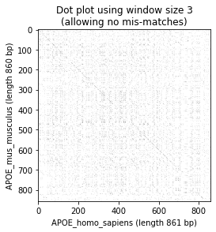
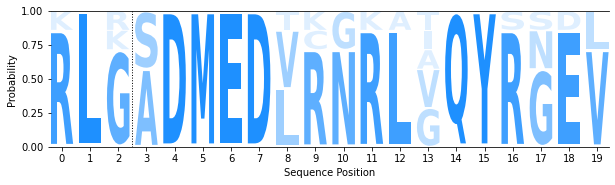

## Project 2 D
#### Madison Baxter Python Group 8

#### First import all packages needed


```python
import numpy as np
import pandas as pd
import Bio
from Bio import SeqIO
from Bio.Seq import Seq
from Bio.pairwise2 import format_alignment
from Bio import pairwise2
from Bio.SeqRecord import SeqRecord
from Bio.Align import MultipleSeqAlignment
import pylab
import logomaker
```

    Matplotlib is building the font cache; this may take a moment.


### 1. Pairwise Sequence Alignment Between APOE Gene (Exon 4) in Humans vs Mice
#### Here is a pairwise sequence alignment between Exon 4 of the APOE Gene in humans and Exon 4 of the APOE Gene in mice. The sequences are downloaded from NCBI into files APOE_homo_sapiens (human) and APOE_mus_musculus (mouse). The purpose of this alignment is to show that the sequence of APOE is similar in both species in the region where the SNP in humans occurs that causes Alzheimer's in humans.


```python
APOE_homo_sapiens = SeqIO.read("APOE_homo_sapiens_exon4.txt", "fasta")
print(APOE_homo_sapiens)
APOE_homo_sapiens_seq = APOE_homo_sapiens.seq
print(APOE_homo_sapiens_seq)

APOE_mus_musculus = SeqIO.read("APOE_mus_musculus_exon4.txt", "fasta")
print(APOE_mus_musculus)
APOE_mus_musculus_seq = APOE_mus_musculus.seq
print(APOE_mus_musculus_seq)

alignments = pairwise2.align.globalxx(APOE_homo_sapiens_seq, APOE_mus_musculus_seq)

for alignment in alignments:
    print(format_alignment(*alignment))
```

    ID: ref|NM_000041.4|:306-1166
    Name: ref|NM_000041.4|:306-1166
    Description: ref|NM_000041.4|:306-1166 Homo sapiens apolipoprotein E (APOE), transcript variant 2, mRNA
    Number of features: 0
    Seq('GGCGCTGATGGACGAGACCATGAAGGAGTTGAAGGCCTACAAATCGGAACTGGA...GCA')
    GGCGCTGATGGACGAGACCATGAAGGAGTTGAAGGCCTACAAATCGGAACTGGAGGAACAACTGACCCCGGTGGCGGAGGAGACGCGGGCACGGCTGTCCAAGGAGCTGCAGGCGGCGCAGGCCCGGCTGGGCGCGGACATGGAGGACGTGTGCGGCCGCCTGGTGCAGTACCGCGGCGAGGTGCAGGCCATGCTCGGCCAGAGCACCGAGGAGCTGCGGGTGCGCCTCGCCTCCCACCTGCGCAAGCTGCGTAAGCGGCTCCTCCGCGATGCCGATGACCTGCAGAAGCGCCTGGCAGTGTACCAGGCCGGGGCCCGCGAGGGCGCCGAGCGCGGCCTCAGCGCCATCCGCGAGCGCCTGGGGCCCCTGGTGGAACAGGGCCGCGTGCGGGCCGCCACTGTGGGCTCCCTGGCCGGCCAGCCGCTACAGGAGCGGGCCCAGGCCTGGGGCGAGCGGCTGCGCGCGCGGATGGAGGAGATGGGCAGCCGGACCCGCGACCGCCTGGACGAGGTGAAGGAGCAGGTGGCGGAGGTGCGCGCCAAGCTGGAGGAGCAGGCCCAGCAGATACGCCTGCAGGCCGAGGCCTTCCAGGCCCGCCTCAAGAGCTGGTTCGAGCCCCTGGTGGAAGACATGCAGCGCCAGTGGGCCGGGCTGGTGGAGAAGGTGCAGGCTGCCGTGGGCACCAGCGCCGCCCCTGTGCCCAGCGACAATCACTGAACGCCGAAGCCTGCAGCCATGCGACCCCACGCCACCCCGTGCCTCCTGCCTCCGCGCAGCCTGCAGCGGGAGACCCTGTCCCCGCCCCAGCCGTCCTCCTGGGGTGGACCCTAGTTTAATAAAGATTCACCAAGTTTCACGCA
    ID: ref|NM_009696.4|:414-1273
    Name: ref|NM_009696.4|:414-1273
    Description: ref|NM_009696.4|:414-1273 Mus musculus apolipoprotein E (Apoe), transcript variant 1, mRNA
    Number of features: 0
    Seq('GGCACTGATGGAGGACACTATGACGGAAGTAAAGGCTTACAAAAAGGAGCTGGA...CAA')
    GGCACTGATGGAGGACACTATGACGGAAGTAAAGGCTTACAAAAAGGAGCTGGAGGAACAGCTGGGTCCAGTGGCGGAGGAGACACGGGCCAGGCTGGGCAAAGAGGTGCAGGCGGCACAGGCCCGACTCGGAGCCGACATGGAGGATCTACGCAACCGACTCGGGCAGTACCGCAACGAGGTGCACACCATGCTGGGCCAGAGCACAGAGGAGATACGGGCGCGGCTCTCCACACACCTGCGCAAGATGCGCAAGCGCTTGATGCGGGATGCCGAGGATCTGCAGAAGCGCCTAGCTGTGTACAAGGCAGGGGCACGCGAGGGCGCCGAGCGCGGTGTGAGTGCCATCCGTGAGCGCCTGGGGCCTCTGGTGGAGCAAGGTCGCCAGCGCACTGCCAACCTAGGCGCTGGGGCCGCCCAGCCTCTGCGCGATCGCGCCCAGGCTTTTGGTGACCGCATCCGAGGGCGGCTGGAGGAAGTGGGCAACCAGGCCCGTGACCGCCTAGAGGAGGTGCGTGAGCACATGGAGGAGGTGCGCTCCAAGATGGAGGAACAGACCCAGCAAATACGCCTGCAGGCGGAGATCTTCCAGGCCCGCCTCAAGGGCTGGTTCGAGCCAATAGTGGAAGACATGCATCGCCAGTGGGCAAACCTGATGGAGAAGATACAGGCCTCTGTGGCTACCAACCCCATCATCACCCCAGTGGCCCAGGAGAATCAATGAGTATCCTTCTCCTGTCCTGCAACAACATCCATATCCAGCCAGGTGGCCCTGTCTCAAGCACCTCTCTGGCCCTCTGGTGGCCCTTGCTTAATAAAGATTCTCCGAGCACATTCTGAGTCTCTGTGAGTGATTCCAA
    GGCG-CTGATGGACGAGAC-C-ATGAA-GGA-GTTGAA-GGCCT-ACAAATC--GGAA-CTGGAGGAACAA-CTGACC---CCG-GTGGCGGAGGAGACG-CGGGCAC-GGCTGTC--CAAG-GAGC-TGCAGGCGGCG-CAGGCCCGG-CT-GG-GCGCGGACATGGAGGACGTG-TG-CGGC--CGC--CT-GGTGCAGTACCGCGG--CGAGGTGCAGGC-C-ATGCTCGG-CCAGAGCACC-GAGGAGC-TG-CGGGTGCGCCTCG-C-CTCC-CAC-C-TGCGCAAGC-TGCGT-AAGCGGCTCCTCCG---CG--ATGCCGATG-AC-CTGCAGAAGCGCCTG-GCA-GTGTACCA-GGCC-GGGGCC-CGCGAGGGCGCCGAGCGCGGCCTC---AGC-GCCATCCGC-GAGCGCCTGGGGCCC-CTGGTGGAA-CAG-GGC-CGCGTGCG-G-GC-C-GCCA-CTG-TG-GGCTCC-CTGG--CCGGCC-AGCCG-CTA-CAG-GAG-CGG-GCCCAGGCCTGG---GGC-GAGCG-GC-TGCGCGC-G--CGGA-TGGAGGAGA-TGGGCAG-CC-GGACCCGC-GACCGCCTG-GACG-AGGTGAA-G-GAGCAGG--TGGC-GGAGGTGCGCG-CCAAGC-TGGAGGAG-CAGG-CCCAGCAGA-TACGCCTGCAGGCCGAG-GC--CTTCCAGGCCCGCCTCAAGAG-CTGGTTCGAGCCCC--TG-GTGGAAGACATGCAG-CGCCAGTGGGC---CGGGCTGG-TGGAGAAGG-TG-CAGGCTGC-CGTG-GGC-ACCAG-CGCCGC--C--C-CT----GTG-CCCAGCGAC-AATCAC-TGA--A-CGC--CGAAG-CCTGCAG-CCATGCGACCCCACGCCACCCCGTGC-C-TCC-TGCC-TCCGCGCAGCCTGCAGCGG-GAGACCCTGTCCC-C--GCCCCAGCCGTCCTCCTGG------GGTGGACCCTAGT--TTAATAAAGATTC----A-C-CA-----AGTT-TC----ACG-----C-A-
    |||  |||||||| | ||| | ||| | ||| | | || || || |||||    || | |||||||||| | |||      ||  ||||||||||||||  ||||| | |||||    |||  |||  ||||||||||  ||||||| | || || || | |||||||||||  |  |  | ||  | |  || || ||||||||||    |||||||||  | | ||||| || |||||||| | ||||||  |  | || |||   || | |||| ||| | ||||||||  ||||  |||| |||  |  |   ||  ||||||| | |  ||||||||||||||  ||  ||||| || || | |||| | ||||||||||||||||||||  |    ||  ||||||||  |||||||||||| || ||||||| | ||  ||  |||   |  | || | |||| |   |  ||   | ||||  || ||| ||||  ||  | | ||  | | ||||||| ||     ||  || |  || | | ||  |  |||  ||||||| | ||||||  || || ||||  ||||||||  || | |||||   | |||||    |||  ||||||||||  |||||  |||||||  || | ||||||| | |||||||||||| || | |   ||||||||||||||||||| | ||||||||||  ||  |  ||||||||||||||  |||||||||||   |   || | ||||||| | |  |||||  | | || ||| ||||  | || |  |  | |     ||| ||||| ||  |||||  |||  | | |  |     |||   | || ||| |    |   ||         | ||| |    |   | ||| |  ||  || | | ||||||  | |  |   || || | || ||||      ||||| ||||  |  |||||||||||||    | | ||     || | ||    | |     | | 
    GGC-ACTGATGGA-G-GACACTATG-ACGGAAG-T-AAAGG-CTTACAAA--AAGG-AGCTGGAGGAAC-AGCTG---GGTCC-AGTGGCGGAGGAGAC-ACGGGC-CAGGCTG--GGCAA-AGAG-GTGCAGGCGGC-ACAGGCCC-GACTCGGAGC-C-GACATGGAGGA--T-CT-AC-GCAAC-CGACTCGG-GCAGTACCGC--AACGAGGTGCA--CACCATGCT-GGGCCAGAGCA-CAGAGGAG-AT-AC-GG-GCG---CGGCTCTCCACACACCTGCGCAAG-ATGCG-CAAGC-GCT--T--GATGCGGGATGCCGA-GGA-TCTGCAGAAGCGCCT-AGC-TGTGTA-CAAGG-CAGGGG-CACGCGAGGGCGCCGAGCGCGG--T-GTGAG-TGCCATCCG-TGAGCGCCTGGGG-CCTCTGGTGG-AGCA-AGG-TCGC---C-AGCGCACTGCCAAC--CT-AGG---CGCTGGGGCC-GCCCAGCC-TCT-GC-GCGA-TC-GCGCCCAGG-CT--TTTGG-TGA-C-CGCAT-C-CG-AGGGCGG-CTGGAGGA-AGTGGGCA-ACCAGG-CCCG-TGACCGCCT-AGA-GGAGGTG--CGTGAGCA--CATGG-AGGAGGTGCGC-TCCAAG-ATGGAGGA-ACA-GACCCAGCA-AATACGCCTGCAGG-CG-GAG-ATCTTCCAGGCCCGCCTCAAG-GGCTGGTTCGAG--CCAAT-AGTGGAAGACATGCA-TCGCCAGTGGGCAAAC---CT-GATGGAGAA-GAT-ACAGGC--CTC-TGTGGCTACCA-AC-CC-CATCATCAC-CCCAGTGGCCCAG-GA-GAATCA-ATGAGTATC-CTTC----TCCT---GTCC-TGC-A----A---CA--------ACATCCAT---AT---C-CAG-C--CA--GGTG-G-CCCTGT--CTCAAG---CA-CC-T-CT-CTGGCCCTCTGGTGG-CCCT--TGCTTAATAAAGATTCTCCGAGCACATTCTGAG-TCTCTGTGA-GTGATTCCAA
      Score=674
    
    GGCGCTGATGGACGAGAC-C-ATGAA-GGA-GTTGAA-GGCCT-ACAAATC--GGAA-CTGGAGGAACAA-CTGACC---CCG-GTGGCGGAGGAGACG-CGGGCAC-GGCTGTC--CAAG-GAGC-TGCAGGCGGCG-CAGGCCCGG-CT-GG-GCGCGGACATGGAGGACGTG-TG-CGGC--CGC--CT-GGTGCAGTACCGCGG--CGAGGTGCAGGC-C-ATGCTCGG-CCAGAGCACC-GAGGAGC-TG-CGGGTGCGCCTCG-C-CTCC-CAC-C-TGCGCAAGC-TGCGT-AAGCGGCTCCTCCG---CG--ATGCCGATG-AC-CTGCAGAAGCGCCTG-GCA-GTGTACCA-GGCC-GGGGCC-CGCGAGGGCGCCGAGCGCGGCCTC---AGC-GCCATCCGC-GAGCGCCTGGGGCCC-CTGGTGGAA-CAG-GGC-CGCGTGCG-G-GC-C-GCCA-CTG-TG-GGCTCC-CTGG--CCGGCC-AGCCG-CTA-CAG-GAG-CGG-GCCCAGGCCTGG---GGC-GAGCG-GC-TGCGCGC-G--CGGA-TGGAGGAGA-TGGGCAG-CC-GGACCCGC-GACCGCCTG-GACG-AGGTGAA-G-GAGCAGG--TGGC-GGAGGTGCGCG-CCAAGC-TGGAGGAG-CAGG-CCCAGCAGA-TACGCCTGCAGGCCGAG-GC--CTTCCAGGCCCGCCTCAAGAG-CTGGTTCGAGCCCC--TG-GTGGAAGACATGCAG-CGCCAGTGGGC---CGGGCTGG-TGGAGAAGG-TG-CAGGCTGC-CGTG-GGC-ACCAG-CGCCGC--C--C-CT----GTG-CCCAGCGAC-AATCAC-TGA--A-CGC--CGAAG-CCTGCAG-CCATGCGACCCCACGCCACCCCGTGC-C-TCC-TGCC-TCCGCGCAGCCTGCAGCGG-GAGACCCTGTCCC-C--GCCCCAGCCGTCCTCCTGG------GGTGGACCCTAGT--TTAATAAAGATTC----A-C-CA-----AGTT-TC----ACG-----C-A-
    |||.|||||||| | ||| | ||| | ||| | | || || || |||||    || | |||||||||| | |||      ||  ||||||||||||||  ||||| | |||||    |||  |||  ||||||||||  ||||||| | || || || | |||||||||||  |  |  | ||  | |  || || ||||||||||    |||||||||  | | ||||| || |||||||| | ||||||  |  | || |||   || | |||| ||| | ||||||||  ||||  |||| |||  |  |   ||  ||||||| | |  ||||||||||||||  ||  ||||| || || | |||| | ||||||||||||||||||||  |    ||  ||||||||  |||||||||||| || ||||||| | ||  ||  |||   |  | || | |||| |   |  ||   | ||||  || ||| ||||  ||  | | ||  | | ||||||| ||     ||  || |  || | | ||  |  |||  ||||||| | ||||||  || || ||||  ||||||||  || | |||||   | |||||    |||  ||||||||||  |||||  |||||||  || | ||||||| | |||||||||||| || | |   ||||||||||||||||||| | ||||||||||  ||  |  ||||||||||||||  |||||||||||   |   || | ||||||| | |  |||||  | | || ||| ||||  | || |  |  | |     ||| ||||| ||  |||||  |||  | | |  |     |||   | || ||| |    |   ||         | ||| |    |   | ||| |  ||  || | | ||||||  | |  |   || || | || ||||      ||||| ||||  |  |||||||||||||    | | ||     || | ||    | |     | | 
    GGCACTGATGGA-G-GACACTATG-ACGGAAG-T-AAAGG-CTTACAAA--AAGG-AGCTGGAGGAAC-AGCTG---GGTCC-AGTGGCGGAGGAGAC-ACGGGC-CAGGCTG--GGCAA-AGAG-GTGCAGGCGGC-ACAGGCCC-GACTCGGAGC-C-GACATGGAGGA--T-CT-AC-GCAAC-CGACTCGG-GCAGTACCGC--AACGAGGTGCA--CACCATGCT-GGGCCAGAGCA-CAGAGGAG-AT-AC-GG-GCG---CGGCTCTCCACACACCTGCGCAAG-ATGCG-CAAGC-GCT--T--GATGCGGGATGCCGA-GGA-TCTGCAGAAGCGCCT-AGC-TGTGTA-CAAGG-CAGGGG-CACGCGAGGGCGCCGAGCGCGG--T-GTGAG-TGCCATCCG-TGAGCGCCTGGGG-CCTCTGGTGG-AGCA-AGG-TCGC---C-AGCGCACTGCCAAC--CT-AGG---CGCTGGGGCC-GCCCAGCC-TCT-GC-GCGA-TC-GCGCCCAGG-CT--TTTGG-TGA-C-CGCAT-C-CG-AGGGCGG-CTGGAGGA-AGTGGGCA-ACCAGG-CCCG-TGACCGCCT-AGA-GGAGGTG--CGTGAGCA--CATGG-AGGAGGTGCGC-TCCAAG-ATGGAGGA-ACA-GACCCAGCA-AATACGCCTGCAGG-CG-GAG-ATCTTCCAGGCCCGCCTCAAG-GGCTGGTTCGAG--CCAAT-AGTGGAAGACATGCA-TCGCCAGTGGGCAAAC---CT-GATGGAGAA-GAT-ACAGGC--CTC-TGTGGCTACCA-AC-CC-CATCATCAC-CCCAGTGGCCCAG-GA-GAATCA-ATGAGTATC-CTTC----TCCT---GTCC-TGC-A----A---CA--------ACATCCAT---AT---C-CAG-C--CA--GGTG-G-CCCTGT--CTCAAG---CA-CC-T-CT-CTGGCCCTCTGGTGG-CCCT--TGCTTAATAAAGATTCTCCGAGCACATTCTGAG-TCTCTGTGA-GTGATTCCAA
      Score=674
    
    GGCG-CTGATGGACGAGAC-C-ATGAA-GGA-GTTGAA-GGCCT-ACAAATC--GGAA-CTGGAGGAACAA-CTGACC---CCG-GTGGCGGAGGAGACG-CGGGCAC-GGCTGTC--CAAG-GAGC-TGCAGGCGGCG-CAGGCCCGG-CT-GG-GCGCGGACATGGAGGACGTG-TG-CGGC--CGC--CT-GGTGCAGTACCGCGG--CGAGGTGCAGGC-C-ATGCTCGG-CCAGAGCACC-GAGGAGC-TG-CGGGTGCGCCTCG-C-CTCC-CAC-C-TGCGCAAGC-TGCGT-AAGCGGCTCCTCCG---CG--ATGCCGATG-AC-CTGCAGAAGCGCCTG-GCA-GTGTACCA-GGCC-GGGGCC-CGCGAGGGCGCCGAGCGCGGCCTC---AGC-GCCATCCGC-GAGCGCCTGGGGCCC-CTGGTGGAA-CAG-GGC-CGCGTGCG-G-GC-C-GCCA-CTG-TG-GGCTCC-CTGG--CCGGCC-AGCCG-CTA-CAG-GAG-CGG-GCCCAGGCCTGG---GGC-GAGCG-GC-TGCGCGC-G--CGGA-TGGAGGAGA-TGGGCAG-CC-GGACCCGC-GACCGCCTG-GACG-AGGTGAA-G-GAGCAGG--TGGC-GGAGGTGCGCG-CCAAGC-TGGAGGAG-CAGG-CCCAGCAGA-TACGCCTGCAGGCCGAG-GC--CTTCCAGGCCCGCCTCAAGAG-CTGGTTCGAGCCCC--TG-GTGGAAGACATGCAG-CGCCAGTGGGC---CGGGCTGG-TGGAGAAGG-TG-CAGGCTGC-CGTG-GGC-ACCAG-CGCCGC--C--C-CT----GTG-CCCAGCGAC-AATCAC-TGA--A-CGC--CGAAG-CCTGCAG-CCATGCGACCCCACGCCACCCCGTGC-C-TCC-TGCC-TCCGCGCAGCCTGCAGCGG-GAGACCCTGTCCC-C--GCCCCAGCCGTCCTCCTGG------GGTGGACCCTAGT--TTAATAAAGATTC----A-C-CA-----AGTT-TC----ACG-----C-A-
    |||  |||||||| | ||| | ||||  ||| | | || || || |||||    || | |||||||||| | |||      ||  ||||||||||||||  ||||| | |||||    |||  |||  ||||||||||  ||||||| | || || || | |||||||||||  |  |  | ||  | |  || || ||||||||||    |||||||||  | | ||||| || |||||||| | ||||||  |  | || |||   || | |||| ||| | ||||||||  ||||  |||| |||  |  |   ||  ||||||| | |  ||||||||||||||  ||  ||||| || || | |||| | ||||||||||||||||||||  |    ||  ||||||||  |||||||||||| || ||||||| | ||  ||  |||   |  | || | |||| |   |  ||   | ||||  || ||| ||||  ||  | | ||  | | ||||||| ||     ||  || |  || | | ||  |  |||  ||||||| | ||||||  || || ||||  ||||||||  || | |||||   | |||||    |||  ||||||||||  |||||  |||||||  || | ||||||| | |||||||||||| || | |   ||||||||||||||||||| | ||||||||||  ||  |  ||||||||||||||  |||||||||||   |   || | ||||||| | |  |||||  | | || ||| ||||  | || |  |  | |     ||| ||||| ||  |||||  |||  | | |  |     |||   | || ||| |    |   ||         | ||| |    |   | ||| |  ||  || | | ||||||  | |  |   || || | || ||||      ||||| ||||  |  |||||||||||||    | | ||     || | ||    | |     | | 
    GGC-ACTGATGGA-G-GACACTATGA-CGGAAG-T-AAAGG-CTTACAAA--AAGG-AGCTGGAGGAAC-AGCTG---GGTCC-AGTGGCGGAGGAGAC-ACGGGC-CAGGCTG--GGCAA-AGAG-GTGCAGGCGGC-ACAGGCCC-GACTCGGAGC-C-GACATGGAGGA--T-CT-AC-GCAAC-CGACTCGG-GCAGTACCGC--AACGAGGTGCA--CACCATGCT-GGGCCAGAGCA-CAGAGGAG-AT-AC-GG-GCG---CGGCTCTCCACACACCTGCGCAAG-ATGCG-CAAGC-GCT--T--GATGCGGGATGCCGA-GGA-TCTGCAGAAGCGCCT-AGC-TGTGTA-CAAGG-CAGGGG-CACGCGAGGGCGCCGAGCGCGG--T-GTGAG-TGCCATCCG-TGAGCGCCTGGGG-CCTCTGGTGG-AGCA-AGG-TCGC---C-AGCGCACTGCCAAC--CT-AGG---CGCTGGGGCC-GCCCAGCC-TCT-GC-GCGA-TC-GCGCCCAGG-CT--TTTGG-TGA-C-CGCAT-C-CG-AGGGCGG-CTGGAGGA-AGTGGGCA-ACCAGG-CCCG-TGACCGCCT-AGA-GGAGGTG--CGTGAGCA--CATGG-AGGAGGTGCGC-TCCAAG-ATGGAGGA-ACA-GACCCAGCA-AATACGCCTGCAGG-CG-GAG-ATCTTCCAGGCCCGCCTCAAG-GGCTGGTTCGAG--CCAAT-AGTGGAAGACATGCA-TCGCCAGTGGGCAAAC---CT-GATGGAGAA-GAT-ACAGGC--CTC-TGTGGCTACCA-AC-CC-CATCATCAC-CCCAGTGGCCCAG-GA-GAATCA-ATGAGTATC-CTTC----TCCT---GTCC-TGC-A----A---CA--------ACATCCAT---AT---C-CAG-C--CA--GGTG-G-CCCTGT--CTCAAG---CA-CC-T-CT-CTGGCCCTCTGGTGG-CCCT--TGCTTAATAAAGATTCTCCGAGCACATTCTGAG-TCTCTGTGA-GTGATTCCAA
      Score=674
    
    GGCGCTGATGGACGAGAC-C-ATGAA-GGA-GTTGAA-GGCCT-ACAAATC--GGAA-CTGGAGGAACAA-CTGACC---CCG-GTGGCGGAGGAGACG-CGGGCAC-GGCTGTC--CAAG-GAGC-TGCAGGCGGCG-CAGGCCCGG-CT-GG-GCGCGGACATGGAGGACGTG-TG-CGGC--CGC--CT-GGTGCAGTACCGCGG--CGAGGTGCAGGC-C-ATGCTCGG-CCAGAGCACC-GAGGAGC-TG-CGGGTGCGCCTCG-C-CTCC-CAC-C-TGCGCAAGC-TGCGT-AAGCGGCTCCTCCG---CG--ATGCCGATG-AC-CTGCAGAAGCGCCTG-GCA-GTGTACCA-GGCC-GGGGCC-CGCGAGGGCGCCGAGCGCGGCCTC---AGC-GCCATCCGC-GAGCGCCTGGGGCCC-CTGGTGGAA-CAG-GGC-CGCGTGCG-G-GC-C-GCCA-CTG-TG-GGCTCC-CTGG--CCGGCC-AGCCG-CTA-CAG-GAG-CGG-GCCCAGGCCTGG---GGC-GAGCG-GC-TGCGCGC-G--CGGA-TGGAGGAGA-TGGGCAG-CC-GGACCCGC-GACCGCCTG-GACG-AGGTGAA-G-GAGCAGG--TGGC-GGAGGTGCGCG-CCAAGC-TGGAGGAG-CAGG-CCCAGCAGA-TACGCCTGCAGGCCGAG-GC--CTTCCAGGCCCGCCTCAAGAG-CTGGTTCGAGCCCC--TG-GTGGAAGACATGCAG-CGCCAGTGGGC---CGGGCTGG-TGGAGAAGG-TG-CAGGCTGC-CGTG-GGC-ACCAG-CGCCGC--C--C-CT----GTG-CCCAGCGAC-AATCAC-TGA--A-CGC--CGAAG-CCTGCAG-CCATGCGACCCCACGCCACCCCGTGC-C-TCC-TGCC-TCCGCGCAGCCTGCAGCGG-GAGACCCTGTCCC-C--GCCCCAGCCGTCCTCCTGG------GGTGGACCCTAGT--TTAATAAAGATTC----A-C-CA-----AGTT-TC----ACG-----C-A-
    |||.|||||||| | ||| | ||||  ||| | | || || || |||||    || | |||||||||| | |||      ||  ||||||||||||||  ||||| | |||||    |||  |||  ||||||||||  ||||||| | || || || | |||||||||||  |  |  | ||  | |  || || ||||||||||    |||||||||  | | ||||| || |||||||| | ||||||  |  | || |||   || | |||| ||| | ||||||||  ||||  |||| |||  |  |   ||  ||||||| | |  ||||||||||||||  ||  ||||| || || | |||| | ||||||||||||||||||||  |    ||  ||||||||  |||||||||||| || ||||||| | ||  ||  |||   |  | || | |||| |   |  ||   | ||||  || ||| ||||  ||  | | ||  | | ||||||| ||     ||  || |  || | | ||  |  |||  ||||||| | ||||||  || || ||||  ||||||||  || | |||||   | |||||    |||  ||||||||||  |||||  |||||||  || | ||||||| | |||||||||||| || | |   ||||||||||||||||||| | ||||||||||  ||  |  ||||||||||||||  |||||||||||   |   || | ||||||| | |  |||||  | | || ||| ||||  | || |  |  | |     ||| ||||| ||  |||||  |||  | | |  |     |||   | || ||| |    |   ||         | ||| |    |   | ||| |  ||  || | | ||||||  | |  |   || || | || ||||      ||||| ||||  |  |||||||||||||    | | ||     || | ||    | |     | | 
    GGCACTGATGGA-G-GACACTATGA-CGGAAG-T-AAAGG-CTTACAAA--AAGG-AGCTGGAGGAAC-AGCTG---GGTCC-AGTGGCGGAGGAGAC-ACGGGC-CAGGCTG--GGCAA-AGAG-GTGCAGGCGGC-ACAGGCCC-GACTCGGAGC-C-GACATGGAGGA--T-CT-AC-GCAAC-CGACTCGG-GCAGTACCGC--AACGAGGTGCA--CACCATGCT-GGGCCAGAGCA-CAGAGGAG-AT-AC-GG-GCG---CGGCTCTCCACACACCTGCGCAAG-ATGCG-CAAGC-GCT--T--GATGCGGGATGCCGA-GGA-TCTGCAGAAGCGCCT-AGC-TGTGTA-CAAGG-CAGGGG-CACGCGAGGGCGCCGAGCGCGG--T-GTGAG-TGCCATCCG-TGAGCGCCTGGGG-CCTCTGGTGG-AGCA-AGG-TCGC---C-AGCGCACTGCCAAC--CT-AGG---CGCTGGGGCC-GCCCAGCC-TCT-GC-GCGA-TC-GCGCCCAGG-CT--TTTGG-TGA-C-CGCAT-C-CG-AGGGCGG-CTGGAGGA-AGTGGGCA-ACCAGG-CCCG-TGACCGCCT-AGA-GGAGGTG--CGTGAGCA--CATGG-AGGAGGTGCGC-TCCAAG-ATGGAGGA-ACA-GACCCAGCA-AATACGCCTGCAGG-CG-GAG-ATCTTCCAGGCCCGCCTCAAG-GGCTGGTTCGAG--CCAAT-AGTGGAAGACATGCA-TCGCCAGTGGGCAAAC---CT-GATGGAGAA-GAT-ACAGGC--CTC-TGTGGCTACCA-AC-CC-CATCATCAC-CCCAGTGGCCCAG-GA-GAATCA-ATGAGTATC-CTTC----TCCT---GTCC-TGC-A----A---CA--------ACATCCAT---AT---C-CAG-C--CA--GGTG-G-CCCTGT--CTCAAG---CA-CC-T-CT-CTGGCCCTCTGGTGG-CCCT--TGCTTAATAAAGATTCTCCGAGCACATTCTGAG-TCTCTGTGA-GTGATTCCAA
      Score=674
    
    GGCG-CTGATGGACGAGAC-C-ATGAAGGA-GTTGAA-GGCCT-ACAAATC--GGAA-CTGGAGGAACAA-CTGACC---CCG-GTGGCGGAGGAGACG-CGGGCAC-GGCTGTC--CAAG-GAGC-TGCAGGCGGCG-CAGGCCCGG-CT-GG-GCGCGGACATGGAGGACGTG-TG-CGGC--CGC--CT-GGTGCAGTACCGCGG--CGAGGTGCAGGC-C-ATGCTCGG-CCAGAGCACC-GAGGAGC-TG-CGGGTGCGCCTCG-C-CTCC-CAC-C-TGCGCAAGC-TGCGT-AAGCGGCTCCTCCG---CG--ATGCCGATG-AC-CTGCAGAAGCGCCTG-GCA-GTGTACCA-GGCC-GGGGCC-CGCGAGGGCGCCGAGCGCGGCCTC---AGC-GCCATCCGC-GAGCGCCTGGGGCCC-CTGGTGGAA-CAG-GGC-CGCGTGCG-G-GC-C-GCCA-CTG-TG-GGCTCC-CTGG--CCGGCC-AGCCG-CTA-CAG-GAG-CGG-GCCCAGGCCTGG---GGC-GAGCG-GC-TGCGCGC-G--CGGA-TGGAGGAGA-TGGGCAG-CC-GGACCCGC-GACCGCCTG-GACG-AGGTGAA-G-GAGCAGG--TGGC-GGAGGTGCGCG-CCAAGC-TGGAGGAG-CAGG-CCCAGCAGA-TACGCCTGCAGGCCGAG-GC--CTTCCAGGCCCGCCTCAAGAG-CTGGTTCGAGCCCC--TG-GTGGAAGACATGCAG-CGCCAGTGGGC---CGGGCTGG-TGGAGAAGG-TG-CAGGCTGC-CGTG-GGC-ACCAG-CGCCGC--C--C-CT----GTG-CCCAGCGAC-AATCAC-TGA--A-CGC--CGAAG-CCTGCAG-CCATGCGACCCCACGCCACCCCGTGC-C-TCC-TGCC-TCCGCGCAGCCTGCAGCGG-GAGACCCTGTCCC-C--GCCCCAGCCGTCCTCCTGG------GGTGGACCCTAGT--TTAATAAAGATTC----A-C-CA-----AGTT-TC----ACG-----C-A-
    |||  |||||||| | ||| | ||||.||| | | || || || |||||    || | |||||||||| | |||      ||  ||||||||||||||  ||||| | |||||    |||  |||  ||||||||||  ||||||| | || || || | |||||||||||  |  |  | ||  | |  || || ||||||||||    |||||||||  | | ||||| || |||||||| | ||||||  |  | || |||   || | |||| ||| | ||||||||  ||||  |||| |||  |  |   ||  ||||||| | |  ||||||||||||||  ||  ||||| || || | |||| | ||||||||||||||||||||  |    ||  ||||||||  |||||||||||| || ||||||| | ||  ||  |||   |  | || | |||| |   |  ||   | ||||  || ||| ||||  ||  | | ||  | | ||||||| ||     ||  || |  || | | ||  |  |||  ||||||| | ||||||  || || ||||  ||||||||  || | |||||   | |||||    |||  ||||||||||  |||||  |||||||  || | ||||||| | |||||||||||| || | |   ||||||||||||||||||| | ||||||||||  ||  |  ||||||||||||||  |||||||||||   |   || | ||||||| | |  |||||  | | || ||| ||||  | || |  |  | |     ||| ||||| ||  |||||  |||  | | |  |     |||   | || ||| |    |   ||         | ||| |    |   | ||| |  ||  || | | ||||||  | |  |   || || | || ||||      ||||| ||||  |  |||||||||||||    | | ||     || | ||    | |     | | 
    GGC-ACTGATGGA-G-GACACTATGACGGAAG-T-AAAGG-CTTACAAA--AAGG-AGCTGGAGGAAC-AGCTG---GGTCC-AGTGGCGGAGGAGAC-ACGGGC-CAGGCTG--GGCAA-AGAG-GTGCAGGCGGC-ACAGGCCC-GACTCGGAGC-C-GACATGGAGGA--T-CT-AC-GCAAC-CGACTCGG-GCAGTACCGC--AACGAGGTGCA--CACCATGCT-GGGCCAGAGCA-CAGAGGAG-AT-AC-GG-GCG---CGGCTCTCCACACACCTGCGCAAG-ATGCG-CAAGC-GCT--T--GATGCGGGATGCCGA-GGA-TCTGCAGAAGCGCCT-AGC-TGTGTA-CAAGG-CAGGGG-CACGCGAGGGCGCCGAGCGCGG--T-GTGAG-TGCCATCCG-TGAGCGCCTGGGG-CCTCTGGTGG-AGCA-AGG-TCGC---C-AGCGCACTGCCAAC--CT-AGG---CGCTGGGGCC-GCCCAGCC-TCT-GC-GCGA-TC-GCGCCCAGG-CT--TTTGG-TGA-C-CGCAT-C-CG-AGGGCGG-CTGGAGGA-AGTGGGCA-ACCAGG-CCCG-TGACCGCCT-AGA-GGAGGTG--CGTGAGCA--CATGG-AGGAGGTGCGC-TCCAAG-ATGGAGGA-ACA-GACCCAGCA-AATACGCCTGCAGG-CG-GAG-ATCTTCCAGGCCCGCCTCAAG-GGCTGGTTCGAG--CCAAT-AGTGGAAGACATGCA-TCGCCAGTGGGCAAAC---CT-GATGGAGAA-GAT-ACAGGC--CTC-TGTGGCTACCA-AC-CC-CATCATCAC-CCCAGTGGCCCAG-GA-GAATCA-ATGAGTATC-CTTC----TCCT---GTCC-TGC-A----A---CA--------ACATCCAT---AT---C-CAG-C--CA--GGTG-G-CCCTGT--CTCAAG---CA-CC-T-CT-CTGGCCCTCTGGTGG-CCCT--TGCTTAATAAAGATTCTCCGAGCACATTCTGAG-TCTCTGTGA-GTGATTCCAA
      Score=674
    
    GGCGCTGATGGACGAGAC-C-ATGAAGGA-GTTGAA-GGCCT-ACAAATC--GGAA-CTGGAGGAACAA-CTGACC---CCG-GTGGCGGAGGAGACG-CGGGCAC-GGCTGTC--CAAG-GAGC-TGCAGGCGGCG-CAGGCCCGG-CT-GG-GCGCGGACATGGAGGACGTG-TG-CGGC--CGC--CT-GGTGCAGTACCGCGG--CGAGGTGCAGGC-C-ATGCTCGG-CCAGAGCACC-GAGGAGC-TG-CGGGTGCGCCTCG-C-CTCC-CAC-C-TGCGCAAGC-TGCGT-AAGCGGCTCCTCCG---CG--ATGCCGATG-AC-CTGCAGAAGCGCCTG-GCA-GTGTACCA-GGCC-GGGGCC-CGCGAGGGCGCCGAGCGCGGCCTC---AGC-GCCATCCGC-GAGCGCCTGGGGCCC-CTGGTGGAA-CAG-GGC-CGCGTGCG-G-GC-C-GCCA-CTG-TG-GGCTCC-CTGG--CCGGCC-AGCCG-CTA-CAG-GAG-CGG-GCCCAGGCCTGG---GGC-GAGCG-GC-TGCGCGC-G--CGGA-TGGAGGAGA-TGGGCAG-CC-GGACCCGC-GACCGCCTG-GACG-AGGTGAA-G-GAGCAGG--TGGC-GGAGGTGCGCG-CCAAGC-TGGAGGAG-CAGG-CCCAGCAGA-TACGCCTGCAGGCCGAG-GC--CTTCCAGGCCCGCCTCAAGAG-CTGGTTCGAGCCCC--TG-GTGGAAGACATGCAG-CGCCAGTGGGC---CGGGCTGG-TGGAGAAGG-TG-CAGGCTGC-CGTG-GGC-ACCAG-CGCCGC--C--C-CT----GTG-CCCAGCGAC-AATCAC-TGA--A-CGC--CGAAG-CCTGCAG-CCATGCGACCCCACGCCACCCCGTGC-C-TCC-TGCC-TCCGCGCAGCCTGCAGCGG-GAGACCCTGTCCC-C--GCCCCAGCCGTCCTCCTGG------GGTGGACCCTAGT--TTAATAAAGATTC----A-C-CA-----AGTT-TC----ACG-----C-A-
    |||.|||||||| | ||| | ||||.||| | | || || || |||||    || | |||||||||| | |||      ||  ||||||||||||||  ||||| | |||||    |||  |||  ||||||||||  ||||||| | || || || | |||||||||||  |  |  | ||  | |  || || ||||||||||    |||||||||  | | ||||| || |||||||| | ||||||  |  | || |||   || | |||| ||| | ||||||||  ||||  |||| |||  |  |   ||  ||||||| | |  ||||||||||||||  ||  ||||| || || | |||| | ||||||||||||||||||||  |    ||  ||||||||  |||||||||||| || ||||||| | ||  ||  |||   |  | || | |||| |   |  ||   | ||||  || ||| ||||  ||  | | ||  | | ||||||| ||     ||  || |  || | | ||  |  |||  ||||||| | ||||||  || || ||||  ||||||||  || | |||||   | |||||    |||  ||||||||||  |||||  |||||||  || | ||||||| | |||||||||||| || | |   ||||||||||||||||||| | ||||||||||  ||  |  ||||||||||||||  |||||||||||   |   || | ||||||| | |  |||||  | | || ||| ||||  | || |  |  | |     ||| ||||| ||  |||||  |||  | | |  |     |||   | || ||| |    |   ||         | ||| |    |   | ||| |  ||  || | | ||||||  | |  |   || || | || ||||      ||||| ||||  |  |||||||||||||    | | ||     || | ||    | |     | | 
    GGCACTGATGGA-G-GACACTATGACGGAAG-T-AAAGG-CTTACAAA--AAGG-AGCTGGAGGAAC-AGCTG---GGTCC-AGTGGCGGAGGAGAC-ACGGGC-CAGGCTG--GGCAA-AGAG-GTGCAGGCGGC-ACAGGCCC-GACTCGGAGC-C-GACATGGAGGA--T-CT-AC-GCAAC-CGACTCGG-GCAGTACCGC--AACGAGGTGCA--CACCATGCT-GGGCCAGAGCA-CAGAGGAG-AT-AC-GG-GCG---CGGCTCTCCACACACCTGCGCAAG-ATGCG-CAAGC-GCT--T--GATGCGGGATGCCGA-GGA-TCTGCAGAAGCGCCT-AGC-TGTGTA-CAAGG-CAGGGG-CACGCGAGGGCGCCGAGCGCGG--T-GTGAG-TGCCATCCG-TGAGCGCCTGGGG-CCTCTGGTGG-AGCA-AGG-TCGC---C-AGCGCACTGCCAAC--CT-AGG---CGCTGGGGCC-GCCCAGCC-TCT-GC-GCGA-TC-GCGCCCAGG-CT--TTTGG-TGA-C-CGCAT-C-CG-AGGGCGG-CTGGAGGA-AGTGGGCA-ACCAGG-CCCG-TGACCGCCT-AGA-GGAGGTG--CGTGAGCA--CATGG-AGGAGGTGCGC-TCCAAG-ATGGAGGA-ACA-GACCCAGCA-AATACGCCTGCAGG-CG-GAG-ATCTTCCAGGCCCGCCTCAAG-GGCTGGTTCGAG--CCAAT-AGTGGAAGACATGCA-TCGCCAGTGGGCAAAC---CT-GATGGAGAA-GAT-ACAGGC--CTC-TGTGGCTACCA-AC-CC-CATCATCAC-CCCAGTGGCCCAG-GA-GAATCA-ATGAGTATC-CTTC----TCCT---GTCC-TGC-A----A---CA--------ACATCCAT---AT---C-CAG-C--CA--GGTG-G-CCCTGT--CTCAAG---CA-CC-T-CT-CTGGCCCTCTGGTGG-CCCT--TGCTTAATAAAGATTCTCCGAGCACATTCTGAG-TCTCTGTGA-GTGATTCCAA
      Score=674
    
    GGCG-CTGATGGACGAGAC-C-ATGAA-GG-AGTTGAA-GGCCT-ACAAATC--GGAA-CTGGAGGAACAA-CTGACC---CCG-GTGGCGGAGGAGACG-CGGGCAC-GGCTGTC--CAAG-GAGC-TGCAGGCGGCG-CAGGCCCGG-CT-GG-GCGCGGACATGGAGGACGTG-TG-CGGC--CGC--CT-GGTGCAGTACCGCGG--CGAGGTGCAGGC-C-ATGCTCGG-CCAGAGCACC-GAGGAGC-TG-CGGGTGCGCCTCG-C-CTCC-CAC-C-TGCGCAAGC-TGCGT-AAGCGGCTCCTCCG---CG--ATGCCGATG-AC-CTGCAGAAGCGCCTG-GCA-GTGTACCA-GGCC-GGGGCC-CGCGAGGGCGCCGAGCGCGGCCTC---AGC-GCCATCCGC-GAGCGCCTGGGGCCC-CTGGTGGAA-CAG-GGC-CGCGTGCG-G-GC-C-GCCA-CTG-TG-GGCTCC-CTGG--CCGGCC-AGCCG-CTA-CAG-GAG-CGG-GCCCAGGCCTGG---GGC-GAGCG-GC-TGCGCGC-G--CGGA-TGGAGGAGA-TGGGCAG-CC-GGACCCGC-GACCGCCTG-GACG-AGGTGAA-G-GAGCAGG--TGGC-GGAGGTGCGCG-CCAAGC-TGGAGGAG-CAGG-CCCAGCAGA-TACGCCTGCAGGCCGAG-GC--CTTCCAGGCCCGCCTCAAGAG-CTGGTTCGAGCCCC--TG-GTGGAAGACATGCAG-CGCCAGTGGGC---CGGGCTGG-TGGAGAAGG-TG-CAGGCTGC-CGTG-GGC-ACCAG-CGCCGC--C--C-CT----GTG-CCCAGCGAC-AATCAC-TGA--A-CGC--CGAAG-CCTGCAG-CCATGCGACCCCACGCCACCCCGTGC-C-TCC-TGCC-TCCGCGCAGCCTGCAGCGG-GAGACCCTGTCCC-C--GCCCCAGCCGTCCTCCTGG------GGTGGACCCTAGT--TTAATAAAGATTC----A-C-CA-----AGTT-TC----ACG-----C-A-
    |||  |||||||| | ||| | ||| | || || | || || || |||||    || | |||||||||| | |||      ||  ||||||||||||||  ||||| | |||||    |||  |||  ||||||||||  ||||||| | || || || | |||||||||||  |  |  | ||  | |  || || ||||||||||    |||||||||  | | ||||| || |||||||| | ||||||  |  | || |||   || | |||| ||| | ||||||||  ||||  |||| |||  |  |   ||  ||||||| | |  ||||||||||||||  ||  ||||| || || | |||| | ||||||||||||||||||||  |    ||  ||||||||  |||||||||||| || ||||||| | ||  ||  |||   |  | || | |||| |   |  ||   | ||||  || ||| ||||  ||  | | ||  | | ||||||| ||     ||  || |  || | | ||  |  |||  ||||||| | ||||||  || || ||||  ||||||||  || | |||||   | |||||    |||  ||||||||||  |||||  |||||||  || | ||||||| | |||||||||||| || | |   ||||||||||||||||||| | ||||||||||  ||  |  ||||||||||||||  |||||||||||   |   || | ||||||| | |  |||||  | | || ||| ||||  | || |  |  | |     ||| ||||| ||  |||||  |||  | | |  |     |||   | || ||| |    |   ||         | ||| |    |   | ||| |  ||  || | | ||||||  | |  |   || || | || ||||      ||||| ||||  |  |||||||||||||    | | ||     || | ||    | |     | | 
    GGC-ACTGATGGA-G-GACACTATG-ACGGAAG-T-AAAGG-CTTACAAA--AAGG-AGCTGGAGGAAC-AGCTG---GGTCC-AGTGGCGGAGGAGAC-ACGGGC-CAGGCTG--GGCAA-AGAG-GTGCAGGCGGC-ACAGGCCC-GACTCGGAGC-C-GACATGGAGGA--T-CT-AC-GCAAC-CGACTCGG-GCAGTACCGC--AACGAGGTGCA--CACCATGCT-GGGCCAGAGCA-CAGAGGAG-AT-AC-GG-GCG---CGGCTCTCCACACACCTGCGCAAG-ATGCG-CAAGC-GCT--T--GATGCGGGATGCCGA-GGA-TCTGCAGAAGCGCCT-AGC-TGTGTA-CAAGG-CAGGGG-CACGCGAGGGCGCCGAGCGCGG--T-GTGAG-TGCCATCCG-TGAGCGCCTGGGG-CCTCTGGTGG-AGCA-AGG-TCGC---C-AGCGCACTGCCAAC--CT-AGG---CGCTGGGGCC-GCCCAGCC-TCT-GC-GCGA-TC-GCGCCCAGG-CT--TTTGG-TGA-C-CGCAT-C-CG-AGGGCGG-CTGGAGGA-AGTGGGCA-ACCAGG-CCCG-TGACCGCCT-AGA-GGAGGTG--CGTGAGCA--CATGG-AGGAGGTGCGC-TCCAAG-ATGGAGGA-ACA-GACCCAGCA-AATACGCCTGCAGG-CG-GAG-ATCTTCCAGGCCCGCCTCAAG-GGCTGGTTCGAG--CCAAT-AGTGGAAGACATGCA-TCGCCAGTGGGCAAAC---CT-GATGGAGAA-GAT-ACAGGC--CTC-TGTGGCTACCA-AC-CC-CATCATCAC-CCCAGTGGCCCAG-GA-GAATCA-ATGAGTATC-CTTC----TCCT---GTCC-TGC-A----A---CA--------ACATCCAT---AT---C-CAG-C--CA--GGTG-G-CCCTGT--CTCAAG---CA-CC-T-CT-CTGGCCCTCTGGTGG-CCCT--TGCTTAATAAAGATTCTCCGAGCACATTCTGAG-TCTCTGTGA-GTGATTCCAA
      Score=674
    
    GGCGCTGATGGACGAGAC-C-ATGAA-GG-AGTTGAA-GGCCT-ACAAATC--GGAA-CTGGAGGAACAA-CTGACC---CCG-GTGGCGGAGGAGACG-CGGGCAC-GGCTGTC--CAAG-GAGC-TGCAGGCGGCG-CAGGCCCGG-CT-GG-GCGCGGACATGGAGGACGTG-TG-CGGC--CGC--CT-GGTGCAGTACCGCGG--CGAGGTGCAGGC-C-ATGCTCGG-CCAGAGCACC-GAGGAGC-TG-CGGGTGCGCCTCG-C-CTCC-CAC-C-TGCGCAAGC-TGCGT-AAGCGGCTCCTCCG---CG--ATGCCGATG-AC-CTGCAGAAGCGCCTG-GCA-GTGTACCA-GGCC-GGGGCC-CGCGAGGGCGCCGAGCGCGGCCTC---AGC-GCCATCCGC-GAGCGCCTGGGGCCC-CTGGTGGAA-CAG-GGC-CGCGTGCG-G-GC-C-GCCA-CTG-TG-GGCTCC-CTGG--CCGGCC-AGCCG-CTA-CAG-GAG-CGG-GCCCAGGCCTGG---GGC-GAGCG-GC-TGCGCGC-G--CGGA-TGGAGGAGA-TGGGCAG-CC-GGACCCGC-GACCGCCTG-GACG-AGGTGAA-G-GAGCAGG--TGGC-GGAGGTGCGCG-CCAAGC-TGGAGGAG-CAGG-CCCAGCAGA-TACGCCTGCAGGCCGAG-GC--CTTCCAGGCCCGCCTCAAGAG-CTGGTTCGAGCCCC--TG-GTGGAAGACATGCAG-CGCCAGTGGGC---CGGGCTGG-TGGAGAAGG-TG-CAGGCTGC-CGTG-GGC-ACCAG-CGCCGC--C--C-CT----GTG-CCCAGCGAC-AATCAC-TGA--A-CGC--CGAAG-CCTGCAG-CCATGCGACCCCACGCCACCCCGTGC-C-TCC-TGCC-TCCGCGCAGCCTGCAGCGG-GAGACCCTGTCCC-C--GCCCCAGCCGTCCTCCTGG------GGTGGACCCTAGT--TTAATAAAGATTC----A-C-CA-----AGTT-TC----ACG-----C-A-
    |||.|||||||| | ||| | ||| | || || | || || || |||||    || | |||||||||| | |||      ||  ||||||||||||||  ||||| | |||||    |||  |||  ||||||||||  ||||||| | || || || | |||||||||||  |  |  | ||  | |  || || ||||||||||    |||||||||  | | ||||| || |||||||| | ||||||  |  | || |||   || | |||| ||| | ||||||||  ||||  |||| |||  |  |   ||  ||||||| | |  ||||||||||||||  ||  ||||| || || | |||| | ||||||||||||||||||||  |    ||  ||||||||  |||||||||||| || ||||||| | ||  ||  |||   |  | || | |||| |   |  ||   | ||||  || ||| ||||  ||  | | ||  | | ||||||| ||     ||  || |  || | | ||  |  |||  ||||||| | ||||||  || || ||||  ||||||||  || | |||||   | |||||    |||  ||||||||||  |||||  |||||||  || | ||||||| | |||||||||||| || | |   ||||||||||||||||||| | ||||||||||  ||  |  ||||||||||||||  |||||||||||   |   || | ||||||| | |  |||||  | | || ||| ||||  | || |  |  | |     ||| ||||| ||  |||||  |||  | | |  |     |||   | || ||| |    |   ||         | ||| |    |   | ||| |  ||  || | | ||||||  | |  |   || || | || ||||      ||||| ||||  |  |||||||||||||    | | ||     || | ||    | |     | | 
    GGCACTGATGGA-G-GACACTATG-ACGGAAG-T-AAAGG-CTTACAAA--AAGG-AGCTGGAGGAAC-AGCTG---GGTCC-AGTGGCGGAGGAGAC-ACGGGC-CAGGCTG--GGCAA-AGAG-GTGCAGGCGGC-ACAGGCCC-GACTCGGAGC-C-GACATGGAGGA--T-CT-AC-GCAAC-CGACTCGG-GCAGTACCGC--AACGAGGTGCA--CACCATGCT-GGGCCAGAGCA-CAGAGGAG-AT-AC-GG-GCG---CGGCTCTCCACACACCTGCGCAAG-ATGCG-CAAGC-GCT--T--GATGCGGGATGCCGA-GGA-TCTGCAGAAGCGCCT-AGC-TGTGTA-CAAGG-CAGGGG-CACGCGAGGGCGCCGAGCGCGG--T-GTGAG-TGCCATCCG-TGAGCGCCTGGGG-CCTCTGGTGG-AGCA-AGG-TCGC---C-AGCGCACTGCCAAC--CT-AGG---CGCTGGGGCC-GCCCAGCC-TCT-GC-GCGA-TC-GCGCCCAGG-CT--TTTGG-TGA-C-CGCAT-C-CG-AGGGCGG-CTGGAGGA-AGTGGGCA-ACCAGG-CCCG-TGACCGCCT-AGA-GGAGGTG--CGTGAGCA--CATGG-AGGAGGTGCGC-TCCAAG-ATGGAGGA-ACA-GACCCAGCA-AATACGCCTGCAGG-CG-GAG-ATCTTCCAGGCCCGCCTCAAG-GGCTGGTTCGAG--CCAAT-AGTGGAAGACATGCA-TCGCCAGTGGGCAAAC---CT-GATGGAGAA-GAT-ACAGGC--CTC-TGTGGCTACCA-AC-CC-CATCATCAC-CCCAGTGGCCCAG-GA-GAATCA-ATGAGTATC-CTTC----TCCT---GTCC-TGC-A----A---CA--------ACATCCAT---AT---C-CAG-C--CA--GGTG-G-CCCTGT--CTCAAG---CA-CC-T-CT-CTGGCCCTCTGGTGG-CCCT--TGCTTAATAAAGATTCTCCGAGCACATTCTGAG-TCTCTGTGA-GTGATTCCAA
      Score=674
    
    GGCG-CTGATGGACGAGAC-C-ATGAA-GG-AGTTGAA-GGCCT-ACAAATC--GGAA-CTGGAGGAACAA-CTGACC---CCG-GTGGCGGAGGAGACG-CGGGCAC-GGCTGTC--CAAG-GAGC-TGCAGGCGGCG-CAGGCCCGG-CT-GG-GCGCGGACATGGAGGACGTG-TG-CGGC--CGC--CT-GGTGCAGTACCGCGG--CGAGGTGCAGGC-C-ATGCTCGG-CCAGAGCACC-GAGGAGC-TG-CGGGTGCGCCTCG-C-CTCC-CAC-C-TGCGCAAGC-TGCGT-AAGCGGCTCCTCCG---CG--ATGCCGATG-AC-CTGCAGAAGCGCCTG-GCA-GTGTACCA-GGCC-GGGGCC-CGCGAGGGCGCCGAGCGCGGCCTC---AGC-GCCATCCGC-GAGCGCCTGGGGCCC-CTGGTGGAA-CAG-GGC-CGCGTGCG-G-GC-C-GCCA-CTG-TG-GGCTCC-CTGG--CCGGCC-AGCCG-CTA-CAG-GAG-CGG-GCCCAGGCCTGG---GGC-GAGCG-GC-TGCGCGC-G--CGGA-TGGAGGAGA-TGGGCAG-CC-GGACCCGC-GACCGCCTG-GACG-AGGTGAA-G-GAGCAGG--TGGC-GGAGGTGCGCG-CCAAGC-TGGAGGAG-CAGG-CCCAGCAGA-TACGCCTGCAGGCCGAG-GC--CTTCCAGGCCCGCCTCAAGAG-CTGGTTCGAGCCCC--TG-GTGGAAGACATGCAG-CGCCAGTGGGC---CGGGCTGG-TGGAGAAGG-TG-CAGGCTGC-CGTG-GGC-ACCAG-CGCCGC--C--C-CT----GTG-CCCAGCGAC-AATCAC-TGA--A-CGC--CGAAG-CCTGCAG-CCATGCGACCCCACGCCACCCCGTGC-C-TCC-TGCC-TCCGCGCAGCCTGCAGCGG-GAGACCCTGTCCC-C--GCCCCAGCCGTCCTCCTGG------GGTGGACCCTAGT--TTAATAAAGATTC----A-C-CA-----AGTT-TC----ACG-----C-A-
    |||  |||||||| | ||| | ||||  || || | || || || |||||    || | |||||||||| | |||      ||  ||||||||||||||  ||||| | |||||    |||  |||  ||||||||||  ||||||| | || || || | |||||||||||  |  |  | ||  | |  || || ||||||||||    |||||||||  | | ||||| || |||||||| | ||||||  |  | || |||   || | |||| ||| | ||||||||  ||||  |||| |||  |  |   ||  ||||||| | |  ||||||||||||||  ||  ||||| || || | |||| | ||||||||||||||||||||  |    ||  ||||||||  |||||||||||| || ||||||| | ||  ||  |||   |  | || | |||| |   |  ||   | ||||  || ||| ||||  ||  | | ||  | | ||||||| ||     ||  || |  || | | ||  |  |||  ||||||| | ||||||  || || ||||  ||||||||  || | |||||   | |||||    |||  ||||||||||  |||||  |||||||  || | ||||||| | |||||||||||| || | |   ||||||||||||||||||| | ||||||||||  ||  |  ||||||||||||||  |||||||||||   |   || | ||||||| | |  |||||  | | || ||| ||||  | || |  |  | |     ||| ||||| ||  |||||  |||  | | |  |     |||   | || ||| |    |   ||         | ||| |    |   | ||| |  ||  || | | ||||||  | |  |   || || | || ||||      ||||| ||||  |  |||||||||||||    | | ||     || | ||    | |     | | 
    GGC-ACTGATGGA-G-GACACTATGA-CGGAAG-T-AAAGG-CTTACAAA--AAGG-AGCTGGAGGAAC-AGCTG---GGTCC-AGTGGCGGAGGAGAC-ACGGGC-CAGGCTG--GGCAA-AGAG-GTGCAGGCGGC-ACAGGCCC-GACTCGGAGC-C-GACATGGAGGA--T-CT-AC-GCAAC-CGACTCGG-GCAGTACCGC--AACGAGGTGCA--CACCATGCT-GGGCCAGAGCA-CAGAGGAG-AT-AC-GG-GCG---CGGCTCTCCACACACCTGCGCAAG-ATGCG-CAAGC-GCT--T--GATGCGGGATGCCGA-GGA-TCTGCAGAAGCGCCT-AGC-TGTGTA-CAAGG-CAGGGG-CACGCGAGGGCGCCGAGCGCGG--T-GTGAG-TGCCATCCG-TGAGCGCCTGGGG-CCTCTGGTGG-AGCA-AGG-TCGC---C-AGCGCACTGCCAAC--CT-AGG---CGCTGGGGCC-GCCCAGCC-TCT-GC-GCGA-TC-GCGCCCAGG-CT--TTTGG-TGA-C-CGCAT-C-CG-AGGGCGG-CTGGAGGA-AGTGGGCA-ACCAGG-CCCG-TGACCGCCT-AGA-GGAGGTG--CGTGAGCA--CATGG-AGGAGGTGCGC-TCCAAG-ATGGAGGA-ACA-GACCCAGCA-AATACGCCTGCAGG-CG-GAG-ATCTTCCAGGCCCGCCTCAAG-GGCTGGTTCGAG--CCAAT-AGTGGAAGACATGCA-TCGCCAGTGGGCAAAC---CT-GATGGAGAA-GAT-ACAGGC--CTC-TGTGGCTACCA-AC-CC-CATCATCAC-CCCAGTGGCCCAG-GA-GAATCA-ATGAGTATC-CTTC----TCCT---GTCC-TGC-A----A---CA--------ACATCCAT---AT---C-CAG-C--CA--GGTG-G-CCCTGT--CTCAAG---CA-CC-T-CT-CTGGCCCTCTGGTGG-CCCT--TGCTTAATAAAGATTCTCCGAGCACATTCTGAG-TCTCTGTGA-GTGATTCCAA
      Score=674
    
    GGCGCTGATGGACGAGAC-C-ATGAA-GG-AGTTGAA-GGCCT-ACAAATC--GGAA-CTGGAGGAACAA-CTGACC---CCG-GTGGCGGAGGAGACG-CGGGCAC-GGCTGTC--CAAG-GAGC-TGCAGGCGGCG-CAGGCCCGG-CT-GG-GCGCGGACATGGAGGACGTG-TG-CGGC--CGC--CT-GGTGCAGTACCGCGG--CGAGGTGCAGGC-C-ATGCTCGG-CCAGAGCACC-GAGGAGC-TG-CGGGTGCGCCTCG-C-CTCC-CAC-C-TGCGCAAGC-TGCGT-AAGCGGCTCCTCCG---CG--ATGCCGATG-AC-CTGCAGAAGCGCCTG-GCA-GTGTACCA-GGCC-GGGGCC-CGCGAGGGCGCCGAGCGCGGCCTC---AGC-GCCATCCGC-GAGCGCCTGGGGCCC-CTGGTGGAA-CAG-GGC-CGCGTGCG-G-GC-C-GCCA-CTG-TG-GGCTCC-CTGG--CCGGCC-AGCCG-CTA-CAG-GAG-CGG-GCCCAGGCCTGG---GGC-GAGCG-GC-TGCGCGC-G--CGGA-TGGAGGAGA-TGGGCAG-CC-GGACCCGC-GACCGCCTG-GACG-AGGTGAA-G-GAGCAGG--TGGC-GGAGGTGCGCG-CCAAGC-TGGAGGAG-CAGG-CCCAGCAGA-TACGCCTGCAGGCCGAG-GC--CTTCCAGGCCCGCCTCAAGAG-CTGGTTCGAGCCCC--TG-GTGGAAGACATGCAG-CGCCAGTGGGC---CGGGCTGG-TGGAGAAGG-TG-CAGGCTGC-CGTG-GGC-ACCAG-CGCCGC--C--C-CT----GTG-CCCAGCGAC-AATCAC-TGA--A-CGC--CGAAG-CCTGCAG-CCATGCGACCCCACGCCACCCCGTGC-C-TCC-TGCC-TCCGCGCAGCCTGCAGCGG-GAGACCCTGTCCC-C--GCCCCAGCCGTCCTCCTGG------GGTGGACCCTAGT--TTAATAAAGATTC----A-C-CA-----AGTT-TC----ACG-----C-A-
    |||.|||||||| | ||| | ||||  || || | || || || |||||    || | |||||||||| | |||      ||  ||||||||||||||  ||||| | |||||    |||  |||  ||||||||||  ||||||| | || || || | |||||||||||  |  |  | ||  | |  || || ||||||||||    |||||||||  | | ||||| || |||||||| | ||||||  |  | || |||   || | |||| ||| | ||||||||  ||||  |||| |||  |  |   ||  ||||||| | |  ||||||||||||||  ||  ||||| || || | |||| | ||||||||||||||||||||  |    ||  ||||||||  |||||||||||| || ||||||| | ||  ||  |||   |  | || | |||| |   |  ||   | ||||  || ||| ||||  ||  | | ||  | | ||||||| ||     ||  || |  || | | ||  |  |||  ||||||| | ||||||  || || ||||  ||||||||  || | |||||   | |||||    |||  ||||||||||  |||||  |||||||  || | ||||||| | |||||||||||| || | |   ||||||||||||||||||| | ||||||||||  ||  |  ||||||||||||||  |||||||||||   |   || | ||||||| | |  |||||  | | || ||| ||||  | || |  |  | |     ||| ||||| ||  |||||  |||  | | |  |     |||   | || ||| |    |   ||         | ||| |    |   | ||| |  ||  || | | ||||||  | |  |   || || | || ||||      ||||| ||||  |  |||||||||||||    | | ||     || | ||    | |     | | 
    GGCACTGATGGA-G-GACACTATGA-CGGAAG-T-AAAGG-CTTACAAA--AAGG-AGCTGGAGGAAC-AGCTG---GGTCC-AGTGGCGGAGGAGAC-ACGGGC-CAGGCTG--GGCAA-AGAG-GTGCAGGCGGC-ACAGGCCC-GACTCGGAGC-C-GACATGGAGGA--T-CT-AC-GCAAC-CGACTCGG-GCAGTACCGC--AACGAGGTGCA--CACCATGCT-GGGCCAGAGCA-CAGAGGAG-AT-AC-GG-GCG---CGGCTCTCCACACACCTGCGCAAG-ATGCG-CAAGC-GCT--T--GATGCGGGATGCCGA-GGA-TCTGCAGAAGCGCCT-AGC-TGTGTA-CAAGG-CAGGGG-CACGCGAGGGCGCCGAGCGCGG--T-GTGAG-TGCCATCCG-TGAGCGCCTGGGG-CCTCTGGTGG-AGCA-AGG-TCGC---C-AGCGCACTGCCAAC--CT-AGG---CGCTGGGGCC-GCCCAGCC-TCT-GC-GCGA-TC-GCGCCCAGG-CT--TTTGG-TGA-C-CGCAT-C-CG-AGGGCGG-CTGGAGGA-AGTGGGCA-ACCAGG-CCCG-TGACCGCCT-AGA-GGAGGTG--CGTGAGCA--CATGG-AGGAGGTGCGC-TCCAAG-ATGGAGGA-ACA-GACCCAGCA-AATACGCCTGCAGG-CG-GAG-ATCTTCCAGGCCCGCCTCAAG-GGCTGGTTCGAG--CCAAT-AGTGGAAGACATGCA-TCGCCAGTGGGCAAAC---CT-GATGGAGAA-GAT-ACAGGC--CTC-TGTGGCTACCA-AC-CC-CATCATCAC-CCCAGTGGCCCAG-GA-GAATCA-ATGAGTATC-CTTC----TCCT---GTCC-TGC-A----A---CA--------ACATCCAT---AT---C-CAG-C--CA--GGTG-G-CCCTGT--CTCAAG---CA-CC-T-CT-CTGGCCCTCTGGTGG-CCCT--TGCTTAATAAAGATTCTCCGAGCACATTCTGAG-TCTCTGTGA-GTGATTCCAA
      Score=674
    
    GGCG-CTGATGGACGAGAC-C-ATGAAGG-AGTTGAA-GGCCT-ACAAATC--GGAA-CTGGAGGAACAA-CTGACC---CCG-GTGGCGGAGGAGACG-CGGGCAC-GGCTGTC--CAAG-GAGC-TGCAGGCGGCG-CAGGCCCGG-CT-GG-GCGCGGACATGGAGGACGTG-TG-CGGC--CGC--CT-GGTGCAGTACCGCGG--CGAGGTGCAGGC-C-ATGCTCGG-CCAGAGCACC-GAGGAGC-TG-CGGGTGCGCCTCG-C-CTCC-CAC-C-TGCGCAAGC-TGCGT-AAGCGGCTCCTCCG---CG--ATGCCGATG-AC-CTGCAGAAGCGCCTG-GCA-GTGTACCA-GGCC-GGGGCC-CGCGAGGGCGCCGAGCGCGGCCTC---AGC-GCCATCCGC-GAGCGCCTGGGGCCC-CTGGTGGAA-CAG-GGC-CGCGTGCG-G-GC-C-GCCA-CTG-TG-GGCTCC-CTGG--CCGGCC-AGCCG-CTA-CAG-GAG-CGG-GCCCAGGCCTGG---GGC-GAGCG-GC-TGCGCGC-G--CGGA-TGGAGGAGA-TGGGCAG-CC-GGACCCGC-GACCGCCTG-GACG-AGGTGAA-G-GAGCAGG--TGGC-GGAGGTGCGCG-CCAAGC-TGGAGGAG-CAGG-CCCAGCAGA-TACGCCTGCAGGCCGAG-GC--CTTCCAGGCCCGCCTCAAGAG-CTGGTTCGAGCCCC--TG-GTGGAAGACATGCAG-CGCCAGTGGGC---CGGGCTGG-TGGAGAAGG-TG-CAGGCTGC-CGTG-GGC-ACCAG-CGCCGC--C--C-CT----GTG-CCCAGCGAC-AATCAC-TGA--A-CGC--CGAAG-CCTGCAG-CCATGCGACCCCACGCCACCCCGTGC-C-TCC-TGCC-TCCGCGCAGCCTGCAGCGG-GAGACCCTGTCCC-C--GCCCCAGCCGTCCTCCTGG------GGTGGACCCTAGT--TTAATAAAGATTC----A-C-CA-----AGTT-TC----ACG-----C-A-
    |||  |||||||| | ||| | ||||.|| || | || || || |||||    || | |||||||||| | |||      ||  ||||||||||||||  ||||| | |||||    |||  |||  ||||||||||  ||||||| | || || || | |||||||||||  |  |  | ||  | |  || || ||||||||||    |||||||||  | | ||||| || |||||||| | ||||||  |  | || |||   || | |||| ||| | ||||||||  ||||  |||| |||  |  |   ||  ||||||| | |  ||||||||||||||  ||  ||||| || || | |||| | ||||||||||||||||||||  |    ||  ||||||||  |||||||||||| || ||||||| | ||  ||  |||   |  | || | |||| |   |  ||   | ||||  || ||| ||||  ||  | | ||  | | ||||||| ||     ||  || |  || | | ||  |  |||  ||||||| | ||||||  || || ||||  ||||||||  || | |||||   | |||||    |||  ||||||||||  |||||  |||||||  || | ||||||| | |||||||||||| || | |   ||||||||||||||||||| | ||||||||||  ||  |  ||||||||||||||  |||||||||||   |   || | ||||||| | |  |||||  | | || ||| ||||  | || |  |  | |     ||| ||||| ||  |||||  |||  | | |  |     |||   | || ||| |    |   ||         | ||| |    |   | ||| |  ||  || | | ||||||  | |  |   || || | || ||||      ||||| ||||  |  |||||||||||||    | | ||     || | ||    | |     | | 
    GGC-ACTGATGGA-G-GACACTATGACGGAAG-T-AAAGG-CTTACAAA--AAGG-AGCTGGAGGAAC-AGCTG---GGTCC-AGTGGCGGAGGAGAC-ACGGGC-CAGGCTG--GGCAA-AGAG-GTGCAGGCGGC-ACAGGCCC-GACTCGGAGC-C-GACATGGAGGA--T-CT-AC-GCAAC-CGACTCGG-GCAGTACCGC--AACGAGGTGCA--CACCATGCT-GGGCCAGAGCA-CAGAGGAG-AT-AC-GG-GCG---CGGCTCTCCACACACCTGCGCAAG-ATGCG-CAAGC-GCT--T--GATGCGGGATGCCGA-GGA-TCTGCAGAAGCGCCT-AGC-TGTGTA-CAAGG-CAGGGG-CACGCGAGGGCGCCGAGCGCGG--T-GTGAG-TGCCATCCG-TGAGCGCCTGGGG-CCTCTGGTGG-AGCA-AGG-TCGC---C-AGCGCACTGCCAAC--CT-AGG---CGCTGGGGCC-GCCCAGCC-TCT-GC-GCGA-TC-GCGCCCAGG-CT--TTTGG-TGA-C-CGCAT-C-CG-AGGGCGG-CTGGAGGA-AGTGGGCA-ACCAGG-CCCG-TGACCGCCT-AGA-GGAGGTG--CGTGAGCA--CATGG-AGGAGGTGCGC-TCCAAG-ATGGAGGA-ACA-GACCCAGCA-AATACGCCTGCAGG-CG-GAG-ATCTTCCAGGCCCGCCTCAAG-GGCTGGTTCGAG--CCAAT-AGTGGAAGACATGCA-TCGCCAGTGGGCAAAC---CT-GATGGAGAA-GAT-ACAGGC--CTC-TGTGGCTACCA-AC-CC-CATCATCAC-CCCAGTGGCCCAG-GA-GAATCA-ATGAGTATC-CTTC----TCCT---GTCC-TGC-A----A---CA--------ACATCCAT---AT---C-CAG-C--CA--GGTG-G-CCCTGT--CTCAAG---CA-CC-T-CT-CTGGCCCTCTGGTGG-CCCT--TGCTTAATAAAGATTCTCCGAGCACATTCTGAG-TCTCTGTGA-GTGATTCCAA
      Score=674
    
    GGCGCTGATGGACGAGAC-C-ATGAAGG-AGTTGAA-GGCCT-ACAAATC--GGAA-CTGGAGGAACAA-CTGACC---CCG-GTGGCGGAGGAGACG-CGGGCAC-GGCTGTC--CAAG-GAGC-TGCAGGCGGCG-CAGGCCCGG-CT-GG-GCGCGGACATGGAGGACGTG-TG-CGGC--CGC--CT-GGTGCAGTACCGCGG--CGAGGTGCAGGC-C-ATGCTCGG-CCAGAGCACC-GAGGAGC-TG-CGGGTGCGCCTCG-C-CTCC-CAC-C-TGCGCAAGC-TGCGT-AAGCGGCTCCTCCG---CG--ATGCCGATG-AC-CTGCAGAAGCGCCTG-GCA-GTGTACCA-GGCC-GGGGCC-CGCGAGGGCGCCGAGCGCGGCCTC---AGC-GCCATCCGC-GAGCGCCTGGGGCCC-CTGGTGGAA-CAG-GGC-CGCGTGCG-G-GC-C-GCCA-CTG-TG-GGCTCC-CTGG--CCGGCC-AGCCG-CTA-CAG-GAG-CGG-GCCCAGGCCTGG---GGC-GAGCG-GC-TGCGCGC-G--CGGA-TGGAGGAGA-TGGGCAG-CC-GGACCCGC-GACCGCCTG-GACG-AGGTGAA-G-GAGCAGG--TGGC-GGAGGTGCGCG-CCAAGC-TGGAGGAG-CAGG-CCCAGCAGA-TACGCCTGCAGGCCGAG-GC--CTTCCAGGCCCGCCTCAAGAG-CTGGTTCGAGCCCC--TG-GTGGAAGACATGCAG-CGCCAGTGGGC---CGGGCTGG-TGGAGAAGG-TG-CAGGCTGC-CGTG-GGC-ACCAG-CGCCGC--C--C-CT----GTG-CCCAGCGAC-AATCAC-TGA--A-CGC--CGAAG-CCTGCAG-CCATGCGACCCCACGCCACCCCGTGC-C-TCC-TGCC-TCCGCGCAGCCTGCAGCGG-GAGACCCTGTCCC-C--GCCCCAGCCGTCCTCCTGG------GGTGGACCCTAGT--TTAATAAAGATTC----A-C-CA-----AGTT-TC----ACG-----C-A-
    |||.|||||||| | ||| | ||||.|| || | || || || |||||    || | |||||||||| | |||      ||  ||||||||||||||  ||||| | |||||    |||  |||  ||||||||||  ||||||| | || || || | |||||||||||  |  |  | ||  | |  || || ||||||||||    |||||||||  | | ||||| || |||||||| | ||||||  |  | || |||   || | |||| ||| | ||||||||  ||||  |||| |||  |  |   ||  ||||||| | |  ||||||||||||||  ||  ||||| || || | |||| | ||||||||||||||||||||  |    ||  ||||||||  |||||||||||| || ||||||| | ||  ||  |||   |  | || | |||| |   |  ||   | ||||  || ||| ||||  ||  | | ||  | | ||||||| ||     ||  || |  || | | ||  |  |||  ||||||| | ||||||  || || ||||  ||||||||  || | |||||   | |||||    |||  ||||||||||  |||||  |||||||  || | ||||||| | |||||||||||| || | |   ||||||||||||||||||| | ||||||||||  ||  |  ||||||||||||||  |||||||||||   |   || | ||||||| | |  |||||  | | || ||| ||||  | || |  |  | |     ||| ||||| ||  |||||  |||  | | |  |     |||   | || ||| |    |   ||         | ||| |    |   | ||| |  ||  || | | ||||||  | |  |   || || | || ||||      ||||| ||||  |  |||||||||||||    | | ||     || | ||    | |     | | 
    GGCACTGATGGA-G-GACACTATGACGGAAG-T-AAAGG-CTTACAAA--AAGG-AGCTGGAGGAAC-AGCTG---GGTCC-AGTGGCGGAGGAGAC-ACGGGC-CAGGCTG--GGCAA-AGAG-GTGCAGGCGGC-ACAGGCCC-GACTCGGAGC-C-GACATGGAGGA--T-CT-AC-GCAAC-CGACTCGG-GCAGTACCGC--AACGAGGTGCA--CACCATGCT-GGGCCAGAGCA-CAGAGGAG-AT-AC-GG-GCG---CGGCTCTCCACACACCTGCGCAAG-ATGCG-CAAGC-GCT--T--GATGCGGGATGCCGA-GGA-TCTGCAGAAGCGCCT-AGC-TGTGTA-CAAGG-CAGGGG-CACGCGAGGGCGCCGAGCGCGG--T-GTGAG-TGCCATCCG-TGAGCGCCTGGGG-CCTCTGGTGG-AGCA-AGG-TCGC---C-AGCGCACTGCCAAC--CT-AGG---CGCTGGGGCC-GCCCAGCC-TCT-GC-GCGA-TC-GCGCCCAGG-CT--TTTGG-TGA-C-CGCAT-C-CG-AGGGCGG-CTGGAGGA-AGTGGGCA-ACCAGG-CCCG-TGACCGCCT-AGA-GGAGGTG--CGTGAGCA--CATGG-AGGAGGTGCGC-TCCAAG-ATGGAGGA-ACA-GACCCAGCA-AATACGCCTGCAGG-CG-GAG-ATCTTCCAGGCCCGCCTCAAG-GGCTGGTTCGAG--CCAAT-AGTGGAAGACATGCA-TCGCCAGTGGGCAAAC---CT-GATGGAGAA-GAT-ACAGGC--CTC-TGTGGCTACCA-AC-CC-CATCATCAC-CCCAGTGGCCCAG-GA-GAATCA-ATGAGTATC-CTTC----TCCT---GTCC-TGC-A----A---CA--------ACATCCAT---AT---C-CAG-C--CA--GGTG-G-CCCTGT--CTCAAG---CA-CC-T-CT-CTGGCCCTCTGGTGG-CCCT--TGCTTAATAAAGATTCTCCGAGCACATTCTGAG-TCTCTGTGA-GTGATTCCAA
      Score=674
    
    GGCG-CTGATGGACGAGAC-C-ATGAA-GGA-GTTGAA-GGCCT-ACAAATC--GGAA-CTGGAGGAACAA-CTGACC---CCG-GTGGCGGAGGAGACG-CGGGCAC-GGCTGTC--CAAG-GAGC-TGCAGGCGGCG-CAGGCCCGG-CT-GG-GCGCGGACATGGAGGACGTG-TG-CGGC--CGC--CT-GGTGCAGTACCGCGG--CGAGGTGCAGGC-C-ATGCTCGG-CCAGAGCACC-GAGGAGC-TG-CGGGTGCGCCTCG-C-CTCC-CAC-C-TGCGCAAGC-TGCGT-AAGCGGCTCCTCCG---CG--ATGCCGATG-AC-CTGCAGAAGCGCCTG-GCA-GTGTACCA-GGCC-GGGGCC-CGCGAGGGCGCCGAGCGCGGCCTC---AGC-GCCATCCGC-GAGCGCCTGGGGCCC-CTGGTGGAA-CAG-GGC-CGCGTGCG-G-GC-C-GCCA-CTG-TG-GGCTCC-CTGG--CCGGCC-AGCCG-CTA-CAG-GAG-CGG-GCCCAGGCCTGG---GGC-GAGCG-GC-TGCGCGC-G--CGGA-TGGAGGAGA-TGGGCAG-CC-GGACCCGC-GACCGCCTG-GACG-AGGTGAA-G-GAGCAGG--TGGC-GGAGGTGCGCG-CCAAGC-TGGAGGAG-CAGG-CCCAGCAGA-TACGCCTGCAGGCCGAG-GC--CTTCCAGGCCCGCCTCAAGAG-CTGGTTCGAGCCCC--TG-GTGGAAGACATGCAG-CGCCAGTGGGC---CGGGCTGG-TGGAGAAGG-TG-CAGGCTGC-CGTG-GGC-ACCAG-CGCCGC--C--C-CT----GTG-CCCAGCGAC-AATCAC-TGA--A-CGC--CGAAG-CCTGCAG-CCATGCGACCCCACGCCACCCCGTGC-C-TCC-TGCC-TCCGCGCAGCCTGCAGCGG-GAGACCCTGTCCC-C--GCCCCAGCCGTCCTCCTGG------GGTGGACCCTAGT--TTAATAAAGATTC----A-C-CA-----AGTT-TC----ACG-----C-A-
    |||  |||||||| | ||| | ||| | ||| ||  || || || |||||    || | |||||||||| | |||      ||  ||||||||||||||  ||||| | |||||    |||  |||  ||||||||||  ||||||| | || || || | |||||||||||  |  |  | ||  | |  || || ||||||||||    |||||||||  | | ||||| || |||||||| | ||||||  |  | || |||   || | |||| ||| | ||||||||  ||||  |||| |||  |  |   ||  ||||||| | |  ||||||||||||||  ||  ||||| || || | |||| | ||||||||||||||||||||  |    ||  ||||||||  |||||||||||| || ||||||| | ||  ||  |||   |  | || | |||| |   |  ||   | ||||  || ||| ||||  ||  | | ||  | | ||||||| ||     ||  || |  || | | ||  |  |||  ||||||| | ||||||  || || ||||  ||||||||  || | |||||   | |||||    |||  ||||||||||  |||||  |||||||  || | ||||||| | |||||||||||| || | |   ||||||||||||||||||| | ||||||||||  ||  |  ||||||||||||||  |||||||||||   |   || | ||||||| | |  |||||  | | || ||| ||||  | || |  |  | |     ||| ||||| ||  |||||  |||  | | |  |     |||   | || ||| |    |   ||         | ||| |    |   | ||| |  ||  || | | ||||||  | |  |   || || | || ||||      ||||| ||||  |  |||||||||||||    | | ||     || | ||    | |     | | 
    GGC-ACTGATGGA-G-GACACTATG-ACGGAAGT--AAAGG-CTTACAAA--AAGG-AGCTGGAGGAAC-AGCTG---GGTCC-AGTGGCGGAGGAGAC-ACGGGC-CAGGCTG--GGCAA-AGAG-GTGCAGGCGGC-ACAGGCCC-GACTCGGAGC-C-GACATGGAGGA--T-CT-AC-GCAAC-CGACTCGG-GCAGTACCGC--AACGAGGTGCA--CACCATGCT-GGGCCAGAGCA-CAGAGGAG-AT-AC-GG-GCG---CGGCTCTCCACACACCTGCGCAAG-ATGCG-CAAGC-GCT--T--GATGCGGGATGCCGA-GGA-TCTGCAGAAGCGCCT-AGC-TGTGTA-CAAGG-CAGGGG-CACGCGAGGGCGCCGAGCGCGG--T-GTGAG-TGCCATCCG-TGAGCGCCTGGGG-CCTCTGGTGG-AGCA-AGG-TCGC---C-AGCGCACTGCCAAC--CT-AGG---CGCTGGGGCC-GCCCAGCC-TCT-GC-GCGA-TC-GCGCCCAGG-CT--TTTGG-TGA-C-CGCAT-C-CG-AGGGCGG-CTGGAGGA-AGTGGGCA-ACCAGG-CCCG-TGACCGCCT-AGA-GGAGGTG--CGTGAGCA--CATGG-AGGAGGTGCGC-TCCAAG-ATGGAGGA-ACA-GACCCAGCA-AATACGCCTGCAGG-CG-GAG-ATCTTCCAGGCCCGCCTCAAG-GGCTGGTTCGAG--CCAAT-AGTGGAAGACATGCA-TCGCCAGTGGGCAAAC---CT-GATGGAGAA-GAT-ACAGGC--CTC-TGTGGCTACCA-AC-CC-CATCATCAC-CCCAGTGGCCCAG-GA-GAATCA-ATGAGTATC-CTTC----TCCT---GTCC-TGC-A----A---CA--------ACATCCAT---AT---C-CAG-C--CA--GGTG-G-CCCTGT--CTCAAG---CA-CC-T-CT-CTGGCCCTCTGGTGG-CCCT--TGCTTAATAAAGATTCTCCGAGCACATTCTGAG-TCTCTGTGA-GTGATTCCAA
      Score=674
    
    GGCGCTGATGGACGAGAC-C-ATGAA-GGA-GTTGAA-GGCCT-ACAAATC--GGAA-CTGGAGGAACAA-CTGACC---CCG-GTGGCGGAGGAGACG-CGGGCAC-GGCTGTC--CAAG-GAGC-TGCAGGCGGCG-CAGGCCCGG-CT-GG-GCGCGGACATGGAGGACGTG-TG-CGGC--CGC--CT-GGTGCAGTACCGCGG--CGAGGTGCAGGC-C-ATGCTCGG-CCAGAGCACC-GAGGAGC-TG-CGGGTGCGCCTCG-C-CTCC-CAC-C-TGCGCAAGC-TGCGT-AAGCGGCTCCTCCG---CG--ATGCCGATG-AC-CTGCAGAAGCGCCTG-GCA-GTGTACCA-GGCC-GGGGCC-CGCGAGGGCGCCGAGCGCGGCCTC---AGC-GCCATCCGC-GAGCGCCTGGGGCCC-CTGGTGGAA-CAG-GGC-CGCGTGCG-G-GC-C-GCCA-CTG-TG-GGCTCC-CTGG--CCGGCC-AGCCG-CTA-CAG-GAG-CGG-GCCCAGGCCTGG---GGC-GAGCG-GC-TGCGCGC-G--CGGA-TGGAGGAGA-TGGGCAG-CC-GGACCCGC-GACCGCCTG-GACG-AGGTGAA-G-GAGCAGG--TGGC-GGAGGTGCGCG-CCAAGC-TGGAGGAG-CAGG-CCCAGCAGA-TACGCCTGCAGGCCGAG-GC--CTTCCAGGCCCGCCTCAAGAG-CTGGTTCGAGCCCC--TG-GTGGAAGACATGCAG-CGCCAGTGGGC---CGGGCTGG-TGGAGAAGG-TG-CAGGCTGC-CGTG-GGC-ACCAG-CGCCGC--C--C-CT----GTG-CCCAGCGAC-AATCAC-TGA--A-CGC--CGAAG-CCTGCAG-CCATGCGACCCCACGCCACCCCGTGC-C-TCC-TGCC-TCCGCGCAGCCTGCAGCGG-GAGACCCTGTCCC-C--GCCCCAGCCGTCCTCCTGG------GGTGGACCCTAGT--TTAATAAAGATTC----A-C-CA-----AGTT-TC----ACG-----C-A-
    |||.|||||||| | ||| | ||| | ||| ||  || || || |||||    || | |||||||||| | |||      ||  ||||||||||||||  ||||| | |||||    |||  |||  ||||||||||  ||||||| | || || || | |||||||||||  |  |  | ||  | |  || || ||||||||||    |||||||||  | | ||||| || |||||||| | ||||||  |  | || |||   || | |||| ||| | ||||||||  ||||  |||| |||  |  |   ||  ||||||| | |  ||||||||||||||  ||  ||||| || || | |||| | ||||||||||||||||||||  |    ||  ||||||||  |||||||||||| || ||||||| | ||  ||  |||   |  | || | |||| |   |  ||   | ||||  || ||| ||||  ||  | | ||  | | ||||||| ||     ||  || |  || | | ||  |  |||  ||||||| | ||||||  || || ||||  ||||||||  || | |||||   | |||||    |||  ||||||||||  |||||  |||||||  || | ||||||| | |||||||||||| || | |   ||||||||||||||||||| | ||||||||||  ||  |  ||||||||||||||  |||||||||||   |   || | ||||||| | |  |||||  | | || ||| ||||  | || |  |  | |     ||| ||||| ||  |||||  |||  | | |  |     |||   | || ||| |    |   ||         | ||| |    |   | ||| |  ||  || | | ||||||  | |  |   || || | || ||||      ||||| ||||  |  |||||||||||||    | | ||     || | ||    | |     | | 
    GGCACTGATGGA-G-GACACTATG-ACGGAAGT--AAAGG-CTTACAAA--AAGG-AGCTGGAGGAAC-AGCTG---GGTCC-AGTGGCGGAGGAGAC-ACGGGC-CAGGCTG--GGCAA-AGAG-GTGCAGGCGGC-ACAGGCCC-GACTCGGAGC-C-GACATGGAGGA--T-CT-AC-GCAAC-CGACTCGG-GCAGTACCGC--AACGAGGTGCA--CACCATGCT-GGGCCAGAGCA-CAGAGGAG-AT-AC-GG-GCG---CGGCTCTCCACACACCTGCGCAAG-ATGCG-CAAGC-GCT--T--GATGCGGGATGCCGA-GGA-TCTGCAGAAGCGCCT-AGC-TGTGTA-CAAGG-CAGGGG-CACGCGAGGGCGCCGAGCGCGG--T-GTGAG-TGCCATCCG-TGAGCGCCTGGGG-CCTCTGGTGG-AGCA-AGG-TCGC---C-AGCGCACTGCCAAC--CT-AGG---CGCTGGGGCC-GCCCAGCC-TCT-GC-GCGA-TC-GCGCCCAGG-CT--TTTGG-TGA-C-CGCAT-C-CG-AGGGCGG-CTGGAGGA-AGTGGGCA-ACCAGG-CCCG-TGACCGCCT-AGA-GGAGGTG--CGTGAGCA--CATGG-AGGAGGTGCGC-TCCAAG-ATGGAGGA-ACA-GACCCAGCA-AATACGCCTGCAGG-CG-GAG-ATCTTCCAGGCCCGCCTCAAG-GGCTGGTTCGAG--CCAAT-AGTGGAAGACATGCA-TCGCCAGTGGGCAAAC---CT-GATGGAGAA-GAT-ACAGGC--CTC-TGTGGCTACCA-AC-CC-CATCATCAC-CCCAGTGGCCCAG-GA-GAATCA-ATGAGTATC-CTTC----TCCT---GTCC-TGC-A----A---CA--------ACATCCAT---AT---C-CAG-C--CA--GGTG-G-CCCTGT--CTCAAG---CA-CC-T-CT-CTGGCCCTCTGGTGG-CCCT--TGCTTAATAAAGATTCTCCGAGCACATTCTGAG-TCTCTGTGA-GTGATTCCAA
      Score=674
    
    GGCG-CTGATGGACGAGAC-C-ATGAA-GGA-GTTGAA-GGCCT-ACAAATC--GGAA-CTGGAGGAACAA-CTGACC---CCG-GTGGCGGAGGAGACG-CGGGCAC-GGCTGTC--CAAG-GAGC-TGCAGGCGGCG-CAGGCCCGG-CT-GG-GCGCGGACATGGAGGACGTG-TG-CGGC--CGC--CT-GGTGCAGTACCGCGG--CGAGGTGCAGGC-C-ATGCTCGG-CCAGAGCACC-GAGGAGC-TG-CGGGTGCGCCTCG-C-CTCC-CAC-C-TGCGCAAGC-TGCGT-AAGCGGCTCCTCCG---CG--ATGCCGATG-AC-CTGCAGAAGCGCCTG-GCA-GTGTACCA-GGCC-GGGGCC-CGCGAGGGCGCCGAGCGCGGCCTC---AGC-GCCATCCGC-GAGCGCCTGGGGCCC-CTGGTGGAA-CAG-GGC-CGCGTGCG-G-GC-C-GCCA-CTG-TG-GGCTCC-CTGG--CCGGCC-AGCCG-CTA-CAG-GAG-CGG-GCCCAGGCCTGG---GGC-GAGCG-GC-TGCGCGC-G--CGGA-TGGAGGAGA-TGGGCAG-CC-GGACCCGC-GACCGCCTG-GACG-AGGTGAA-G-GAGCAGG--TGGC-GGAGGTGCGCG-CCAAGC-TGGAGGAG-CAGG-CCCAGCAGA-TACGCCTGCAGGCCGAG-GC--CTTCCAGGCCCGCCTCAAGAG-CTGGTTCGAGCCCC--TG-GTGGAAGACATGCAG-CGCCAGTGGGC---CGGGCTGG-TGGAGAAGG-TG-CAGGCTGC-CGTG-GGC-ACCAG-CGCCGC--C--C-CT----GTG-CCCAGCGAC-AATCAC-TGA--A-CGC--CGAAG-CCTGCAG-CCATGCGACCCCACGCCACCCCGTGC-C-TCC-TGCC-TCCGCGCAGCCTGCAGCGG-GAGACCCTGTCCC-C--GCCCCAGCCGTCCTCCTGG------GGTGGACCCTAGT--TTAATAAAGATTC----A-C-CA-----AGTT-TC----ACG-----C-A-
    |||  |||||||| | ||| | ||||  ||| ||  || || || |||||    || | |||||||||| | |||      ||  ||||||||||||||  ||||| | |||||    |||  |||  ||||||||||  ||||||| | || || || | |||||||||||  |  |  | ||  | |  || || ||||||||||    |||||||||  | | ||||| || |||||||| | ||||||  |  | || |||   || | |||| ||| | ||||||||  ||||  |||| |||  |  |   ||  ||||||| | |  ||||||||||||||  ||  ||||| || || | |||| | ||||||||||||||||||||  |    ||  ||||||||  |||||||||||| || ||||||| | ||  ||  |||   |  | || | |||| |   |  ||   | ||||  || ||| ||||  ||  | | ||  | | ||||||| ||     ||  || |  || | | ||  |  |||  ||||||| | ||||||  || || ||||  ||||||||  || | |||||   | |||||    |||  ||||||||||  |||||  |||||||  || | ||||||| | |||||||||||| || | |   ||||||||||||||||||| | ||||||||||  ||  |  ||||||||||||||  |||||||||||   |   || | ||||||| | |  |||||  | | || ||| ||||  | || |  |  | |     ||| ||||| ||  |||||  |||  | | |  |     |||   | || ||| |    |   ||         | ||| |    |   | ||| |  ||  || | | ||||||  | |  |   || || | || ||||      ||||| ||||  |  |||||||||||||    | | ||     || | ||    | |     | | 
    GGC-ACTGATGGA-G-GACACTATGA-CGGAAGT--AAAGG-CTTACAAA--AAGG-AGCTGGAGGAAC-AGCTG---GGTCC-AGTGGCGGAGGAGAC-ACGGGC-CAGGCTG--GGCAA-AGAG-GTGCAGGCGGC-ACAGGCCC-GACTCGGAGC-C-GACATGGAGGA--T-CT-AC-GCAAC-CGACTCGG-GCAGTACCGC--AACGAGGTGCA--CACCATGCT-GGGCCAGAGCA-CAGAGGAG-AT-AC-GG-GCG---CGGCTCTCCACACACCTGCGCAAG-ATGCG-CAAGC-GCT--T--GATGCGGGATGCCGA-GGA-TCTGCAGAAGCGCCT-AGC-TGTGTA-CAAGG-CAGGGG-CACGCGAGGGCGCCGAGCGCGG--T-GTGAG-TGCCATCCG-TGAGCGCCTGGGG-CCTCTGGTGG-AGCA-AGG-TCGC---C-AGCGCACTGCCAAC--CT-AGG---CGCTGGGGCC-GCCCAGCC-TCT-GC-GCGA-TC-GCGCCCAGG-CT--TTTGG-TGA-C-CGCAT-C-CG-AGGGCGG-CTGGAGGA-AGTGGGCA-ACCAGG-CCCG-TGACCGCCT-AGA-GGAGGTG--CGTGAGCA--CATGG-AGGAGGTGCGC-TCCAAG-ATGGAGGA-ACA-GACCCAGCA-AATACGCCTGCAGG-CG-GAG-ATCTTCCAGGCCCGCCTCAAG-GGCTGGTTCGAG--CCAAT-AGTGGAAGACATGCA-TCGCCAGTGGGCAAAC---CT-GATGGAGAA-GAT-ACAGGC--CTC-TGTGGCTACCA-AC-CC-CATCATCAC-CCCAGTGGCCCAG-GA-GAATCA-ATGAGTATC-CTTC----TCCT---GTCC-TGC-A----A---CA--------ACATCCAT---AT---C-CAG-C--CA--GGTG-G-CCCTGT--CTCAAG---CA-CC-T-CT-CTGGCCCTCTGGTGG-CCCT--TGCTTAATAAAGATTCTCCGAGCACATTCTGAG-TCTCTGTGA-GTGATTCCAA
      Score=674
    
    GGCGCTGATGGACGAGAC-C-ATGAA-GGA-GTTGAA-GGCCT-ACAAATC--GGAA-CTGGAGGAACAA-CTGACC---CCG-GTGGCGGAGGAGACG-CGGGCAC-GGCTGTC--CAAG-GAGC-TGCAGGCGGCG-CAGGCCCGG-CT-GG-GCGCGGACATGGAGGACGTG-TG-CGGC--CGC--CT-GGTGCAGTACCGCGG--CGAGGTGCAGGC-C-ATGCTCGG-CCAGAGCACC-GAGGAGC-TG-CGGGTGCGCCTCG-C-CTCC-CAC-C-TGCGCAAGC-TGCGT-AAGCGGCTCCTCCG---CG--ATGCCGATG-AC-CTGCAGAAGCGCCTG-GCA-GTGTACCA-GGCC-GGGGCC-CGCGAGGGCGCCGAGCGCGGCCTC---AGC-GCCATCCGC-GAGCGCCTGGGGCCC-CTGGTGGAA-CAG-GGC-CGCGTGCG-G-GC-C-GCCA-CTG-TG-GGCTCC-CTGG--CCGGCC-AGCCG-CTA-CAG-GAG-CGG-GCCCAGGCCTGG---GGC-GAGCG-GC-TGCGCGC-G--CGGA-TGGAGGAGA-TGGGCAG-CC-GGACCCGC-GACCGCCTG-GACG-AGGTGAA-G-GAGCAGG--TGGC-GGAGGTGCGCG-CCAAGC-TGGAGGAG-CAGG-CCCAGCAGA-TACGCCTGCAGGCCGAG-GC--CTTCCAGGCCCGCCTCAAGAG-CTGGTTCGAGCCCC--TG-GTGGAAGACATGCAG-CGCCAGTGGGC---CGGGCTGG-TGGAGAAGG-TG-CAGGCTGC-CGTG-GGC-ACCAG-CGCCGC--C--C-CT----GTG-CCCAGCGAC-AATCAC-TGA--A-CGC--CGAAG-CCTGCAG-CCATGCGACCCCACGCCACCCCGTGC-C-TCC-TGCC-TCCGCGCAGCCTGCAGCGG-GAGACCCTGTCCC-C--GCCCCAGCCGTCCTCCTGG------GGTGGACCCTAGT--TTAATAAAGATTC----A-C-CA-----AGTT-TC----ACG-----C-A-
    |||.|||||||| | ||| | ||||  ||| ||  || || || |||||    || | |||||||||| | |||      ||  ||||||||||||||  ||||| | |||||    |||  |||  ||||||||||  ||||||| | || || || | |||||||||||  |  |  | ||  | |  || || ||||||||||    |||||||||  | | ||||| || |||||||| | ||||||  |  | || |||   || | |||| ||| | ||||||||  ||||  |||| |||  |  |   ||  ||||||| | |  ||||||||||||||  ||  ||||| || || | |||| | ||||||||||||||||||||  |    ||  ||||||||  |||||||||||| || ||||||| | ||  ||  |||   |  | || | |||| |   |  ||   | ||||  || ||| ||||  ||  | | ||  | | ||||||| ||     ||  || |  || | | ||  |  |||  ||||||| | ||||||  || || ||||  ||||||||  || | |||||   | |||||    |||  ||||||||||  |||||  |||||||  || | ||||||| | |||||||||||| || | |   ||||||||||||||||||| | ||||||||||  ||  |  ||||||||||||||  |||||||||||   |   || | ||||||| | |  |||||  | | || ||| ||||  | || |  |  | |     ||| ||||| ||  |||||  |||  | | |  |     |||   | || ||| |    |   ||         | ||| |    |   | ||| |  ||  || | | ||||||  | |  |   || || | || ||||      ||||| ||||  |  |||||||||||||    | | ||     || | ||    | |     | | 
    GGCACTGATGGA-G-GACACTATGA-CGGAAGT--AAAGG-CTTACAAA--AAGG-AGCTGGAGGAAC-AGCTG---GGTCC-AGTGGCGGAGGAGAC-ACGGGC-CAGGCTG--GGCAA-AGAG-GTGCAGGCGGC-ACAGGCCC-GACTCGGAGC-C-GACATGGAGGA--T-CT-AC-GCAAC-CGACTCGG-GCAGTACCGC--AACGAGGTGCA--CACCATGCT-GGGCCAGAGCA-CAGAGGAG-AT-AC-GG-GCG---CGGCTCTCCACACACCTGCGCAAG-ATGCG-CAAGC-GCT--T--GATGCGGGATGCCGA-GGA-TCTGCAGAAGCGCCT-AGC-TGTGTA-CAAGG-CAGGGG-CACGCGAGGGCGCCGAGCGCGG--T-GTGAG-TGCCATCCG-TGAGCGCCTGGGG-CCTCTGGTGG-AGCA-AGG-TCGC---C-AGCGCACTGCCAAC--CT-AGG---CGCTGGGGCC-GCCCAGCC-TCT-GC-GCGA-TC-GCGCCCAGG-CT--TTTGG-TGA-C-CGCAT-C-CG-AGGGCGG-CTGGAGGA-AGTGGGCA-ACCAGG-CCCG-TGACCGCCT-AGA-GGAGGTG--CGTGAGCA--CATGG-AGGAGGTGCGC-TCCAAG-ATGGAGGA-ACA-GACCCAGCA-AATACGCCTGCAGG-CG-GAG-ATCTTCCAGGCCCGCCTCAAG-GGCTGGTTCGAG--CCAAT-AGTGGAAGACATGCA-TCGCCAGTGGGCAAAC---CT-GATGGAGAA-GAT-ACAGGC--CTC-TGTGGCTACCA-AC-CC-CATCATCAC-CCCAGTGGCCCAG-GA-GAATCA-ATGAGTATC-CTTC----TCCT---GTCC-TGC-A----A---CA--------ACATCCAT---AT---C-CAG-C--CA--GGTG-G-CCCTGT--CTCAAG---CA-CC-T-CT-CTGGCCCTCTGGTGG-CCCT--TGCTTAATAAAGATTCTCCGAGCACATTCTGAG-TCTCTGTGA-GTGATTCCAA
      Score=674
    
    GGCG-CTGATGGACGAGAC-C-ATGAAGGA-GTTGAA-GGCCT-ACAAATC--GGAA-CTGGAGGAACAA-CTGACC---CCG-GTGGCGGAGGAGACG-CGGGCAC-GGCTGTC--CAAG-GAGC-TGCAGGCGGCG-CAGGCCCGG-CT-GG-GCGCGGACATGGAGGACGTG-TG-CGGC--CGC--CT-GGTGCAGTACCGCGG--CGAGGTGCAGGC-C-ATGCTCGG-CCAGAGCACC-GAGGAGC-TG-CGGGTGCGCCTCG-C-CTCC-CAC-C-TGCGCAAGC-TGCGT-AAGCGGCTCCTCCG---CG--ATGCCGATG-AC-CTGCAGAAGCGCCTG-GCA-GTGTACCA-GGCC-GGGGCC-CGCGAGGGCGCCGAGCGCGGCCTC---AGC-GCCATCCGC-GAGCGCCTGGGGCCC-CTGGTGGAA-CAG-GGC-CGCGTGCG-G-GC-C-GCCA-CTG-TG-GGCTCC-CTGG--CCGGCC-AGCCG-CTA-CAG-GAG-CGG-GCCCAGGCCTGG---GGC-GAGCG-GC-TGCGCGC-G--CGGA-TGGAGGAGA-TGGGCAG-CC-GGACCCGC-GACCGCCTG-GACG-AGGTGAA-G-GAGCAGG--TGGC-GGAGGTGCGCG-CCAAGC-TGGAGGAG-CAGG-CCCAGCAGA-TACGCCTGCAGGCCGAG-GC--CTTCCAGGCCCGCCTCAAGAG-CTGGTTCGAGCCCC--TG-GTGGAAGACATGCAG-CGCCAGTGGGC---CGGGCTGG-TGGAGAAGG-TG-CAGGCTGC-CGTG-GGC-ACCAG-CGCCGC--C--C-CT----GTG-CCCAGCGAC-AATCAC-TGA--A-CGC--CGAAG-CCTGCAG-CCATGCGACCCCACGCCACCCCGTGC-C-TCC-TGCC-TCCGCGCAGCCTGCAGCGG-GAGACCCTGTCCC-C--GCCCCAGCCGTCCTCCTGG------GGTGGACCCTAGT--TTAATAAAGATTC----A-C-CA-----AGTT-TC----ACG-----C-A-
    |||  |||||||| | ||| | ||||.||| ||  || || || |||||    || | |||||||||| | |||      ||  ||||||||||||||  ||||| | |||||    |||  |||  ||||||||||  ||||||| | || || || | |||||||||||  |  |  | ||  | |  || || ||||||||||    |||||||||  | | ||||| || |||||||| | ||||||  |  | || |||   || | |||| ||| | ||||||||  ||||  |||| |||  |  |   ||  ||||||| | |  ||||||||||||||  ||  ||||| || || | |||| | ||||||||||||||||||||  |    ||  ||||||||  |||||||||||| || ||||||| | ||  ||  |||   |  | || | |||| |   |  ||   | ||||  || ||| ||||  ||  | | ||  | | ||||||| ||     ||  || |  || | | ||  |  |||  ||||||| | ||||||  || || ||||  ||||||||  || | |||||   | |||||    |||  ||||||||||  |||||  |||||||  || | ||||||| | |||||||||||| || | |   ||||||||||||||||||| | ||||||||||  ||  |  ||||||||||||||  |||||||||||   |   || | ||||||| | |  |||||  | | || ||| ||||  | || |  |  | |     ||| ||||| ||  |||||  |||  | | |  |     |||   | || ||| |    |   ||         | ||| |    |   | ||| |  ||  || | | ||||||  | |  |   || || | || ||||      ||||| ||||  |  |||||||||||||    | | ||     || | ||    | |     | | 
    GGC-ACTGATGGA-G-GACACTATGACGGAAGT--AAAGG-CTTACAAA--AAGG-AGCTGGAGGAAC-AGCTG---GGTCC-AGTGGCGGAGGAGAC-ACGGGC-CAGGCTG--GGCAA-AGAG-GTGCAGGCGGC-ACAGGCCC-GACTCGGAGC-C-GACATGGAGGA--T-CT-AC-GCAAC-CGACTCGG-GCAGTACCGC--AACGAGGTGCA--CACCATGCT-GGGCCAGAGCA-CAGAGGAG-AT-AC-GG-GCG---CGGCTCTCCACACACCTGCGCAAG-ATGCG-CAAGC-GCT--T--GATGCGGGATGCCGA-GGA-TCTGCAGAAGCGCCT-AGC-TGTGTA-CAAGG-CAGGGG-CACGCGAGGGCGCCGAGCGCGG--T-GTGAG-TGCCATCCG-TGAGCGCCTGGGG-CCTCTGGTGG-AGCA-AGG-TCGC---C-AGCGCACTGCCAAC--CT-AGG---CGCTGGGGCC-GCCCAGCC-TCT-GC-GCGA-TC-GCGCCCAGG-CT--TTTGG-TGA-C-CGCAT-C-CG-AGGGCGG-CTGGAGGA-AGTGGGCA-ACCAGG-CCCG-TGACCGCCT-AGA-GGAGGTG--CGTGAGCA--CATGG-AGGAGGTGCGC-TCCAAG-ATGGAGGA-ACA-GACCCAGCA-AATACGCCTGCAGG-CG-GAG-ATCTTCCAGGCCCGCCTCAAG-GGCTGGTTCGAG--CCAAT-AGTGGAAGACATGCA-TCGCCAGTGGGCAAAC---CT-GATGGAGAA-GAT-ACAGGC--CTC-TGTGGCTACCA-AC-CC-CATCATCAC-CCCAGTGGCCCAG-GA-GAATCA-ATGAGTATC-CTTC----TCCT---GTCC-TGC-A----A---CA--------ACATCCAT---AT---C-CAG-C--CA--GGTG-G-CCCTGT--CTCAAG---CA-CC-T-CT-CTGGCCCTCTGGTGG-CCCT--TGCTTAATAAAGATTCTCCGAGCACATTCTGAG-TCTCTGTGA-GTGATTCCAA
      Score=674
    
    GGCGCTGATGGACGAGAC-C-ATGAAGGA-GTTGAA-GGCCT-ACAAATC--GGAA-CTGGAGGAACAA-CTGACC---CCG-GTGGCGGAGGAGACG-CGGGCAC-GGCTGTC--CAAG-GAGC-TGCAGGCGGCG-CAGGCCCGG-CT-GG-GCGCGGACATGGAGGACGTG-TG-CGGC--CGC--CT-GGTGCAGTACCGCGG--CGAGGTGCAGGC-C-ATGCTCGG-CCAGAGCACC-GAGGAGC-TG-CGGGTGCGCCTCG-C-CTCC-CAC-C-TGCGCAAGC-TGCGT-AAGCGGCTCCTCCG---CG--ATGCCGATG-AC-CTGCAGAAGCGCCTG-GCA-GTGTACCA-GGCC-GGGGCC-CGCGAGGGCGCCGAGCGCGGCCTC---AGC-GCCATCCGC-GAGCGCCTGGGGCCC-CTGGTGGAA-CAG-GGC-CGCGTGCG-G-GC-C-GCCA-CTG-TG-GGCTCC-CTGG--CCGGCC-AGCCG-CTA-CAG-GAG-CGG-GCCCAGGCCTGG---GGC-GAGCG-GC-TGCGCGC-G--CGGA-TGGAGGAGA-TGGGCAG-CC-GGACCCGC-GACCGCCTG-GACG-AGGTGAA-G-GAGCAGG--TGGC-GGAGGTGCGCG-CCAAGC-TGGAGGAG-CAGG-CCCAGCAGA-TACGCCTGCAGGCCGAG-GC--CTTCCAGGCCCGCCTCAAGAG-CTGGTTCGAGCCCC--TG-GTGGAAGACATGCAG-CGCCAGTGGGC---CGGGCTGG-TGGAGAAGG-TG-CAGGCTGC-CGTG-GGC-ACCAG-CGCCGC--C--C-CT----GTG-CCCAGCGAC-AATCAC-TGA--A-CGC--CGAAG-CCTGCAG-CCATGCGACCCCACGCCACCCCGTGC-C-TCC-TGCC-TCCGCGCAGCCTGCAGCGG-GAGACCCTGTCCC-C--GCCCCAGCCGTCCTCCTGG------GGTGGACCCTAGT--TTAATAAAGATTC----A-C-CA-----AGTT-TC----ACG-----C-A-
    |||.|||||||| | ||| | ||||.||| ||  || || || |||||    || | |||||||||| | |||      ||  ||||||||||||||  ||||| | |||||    |||  |||  ||||||||||  ||||||| | || || || | |||||||||||  |  |  | ||  | |  || || ||||||||||    |||||||||  | | ||||| || |||||||| | ||||||  |  | || |||   || | |||| ||| | ||||||||  ||||  |||| |||  |  |   ||  ||||||| | |  ||||||||||||||  ||  ||||| || || | |||| | ||||||||||||||||||||  |    ||  ||||||||  |||||||||||| || ||||||| | ||  ||  |||   |  | || | |||| |   |  ||   | ||||  || ||| ||||  ||  | | ||  | | ||||||| ||     ||  || |  || | | ||  |  |||  ||||||| | ||||||  || || ||||  ||||||||  || | |||||   | |||||    |||  ||||||||||  |||||  |||||||  || | ||||||| | |||||||||||| || | |   ||||||||||||||||||| | ||||||||||  ||  |  ||||||||||||||  |||||||||||   |   || | ||||||| | |  |||||  | | || ||| ||||  | || |  |  | |     ||| ||||| ||  |||||  |||  | | |  |     |||   | || ||| |    |   ||         | ||| |    |   | ||| |  ||  || | | ||||||  | |  |   || || | || ||||      ||||| ||||  |  |||||||||||||    | | ||     || | ||    | |     | | 
    GGCACTGATGGA-G-GACACTATGACGGAAGT--AAAGG-CTTACAAA--AAGG-AGCTGGAGGAAC-AGCTG---GGTCC-AGTGGCGGAGGAGAC-ACGGGC-CAGGCTG--GGCAA-AGAG-GTGCAGGCGGC-ACAGGCCC-GACTCGGAGC-C-GACATGGAGGA--T-CT-AC-GCAAC-CGACTCGG-GCAGTACCGC--AACGAGGTGCA--CACCATGCT-GGGCCAGAGCA-CAGAGGAG-AT-AC-GG-GCG---CGGCTCTCCACACACCTGCGCAAG-ATGCG-CAAGC-GCT--T--GATGCGGGATGCCGA-GGA-TCTGCAGAAGCGCCT-AGC-TGTGTA-CAAGG-CAGGGG-CACGCGAGGGCGCCGAGCGCGG--T-GTGAG-TGCCATCCG-TGAGCGCCTGGGG-CCTCTGGTGG-AGCA-AGG-TCGC---C-AGCGCACTGCCAAC--CT-AGG---CGCTGGGGCC-GCCCAGCC-TCT-GC-GCGA-TC-GCGCCCAGG-CT--TTTGG-TGA-C-CGCAT-C-CG-AGGGCGG-CTGGAGGA-AGTGGGCA-ACCAGG-CCCG-TGACCGCCT-AGA-GGAGGTG--CGTGAGCA--CATGG-AGGAGGTGCGC-TCCAAG-ATGGAGGA-ACA-GACCCAGCA-AATACGCCTGCAGG-CG-GAG-ATCTTCCAGGCCCGCCTCAAG-GGCTGGTTCGAG--CCAAT-AGTGGAAGACATGCA-TCGCCAGTGGGCAAAC---CT-GATGGAGAA-GAT-ACAGGC--CTC-TGTGGCTACCA-AC-CC-CATCATCAC-CCCAGTGGCCCAG-GA-GAATCA-ATGAGTATC-CTTC----TCCT---GTCC-TGC-A----A---CA--------ACATCCAT---AT---C-CAG-C--CA--GGTG-G-CCCTGT--CTCAAG---CA-CC-T-CT-CTGGCCCTCTGGTGG-CCCT--TGCTTAATAAAGATTCTCCGAGCACATTCTGAG-TCTCTGTGA-GTGATTCCAA
      Score=674
    
    GGCG-CTGATGGACGAGAC-C-ATGAA-GG-AGTTGAA-GGCCT-ACAAATC--GGAA-CTGGAGGAACAA-CTGACC---CCG-GTGGCGGAGGAGACG-CGGGCAC-GGCTGTC--CAAG-GAGC-TGCAGGCGGCG-CAGGCCCGG-CT-GG-GCGCGGACATGGAGGACGTG-TG-CGGC--CGC--CT-GGTGCAGTACCGCGG--CGAGGTGCAGGC-C-ATGCTCGG-CCAGAGCACC-GAGGAGC-TG-CGGGTGCGCCTCG-C-CTCC-CAC-C-TGCGCAAGC-TGCGT-AAGCGGCTCCTCCG---CG--ATGCCGATG-AC-CTGCAGAAGCGCCTG-GCA-GTGTACCA-GGCC-GGGGCC-CGCGAGGGCGCCGAGCGCGGCCTC---AGC-GCCATCCGC-GAGCGCCTGGGGCCC-CTGGTGGAA-CAG-GGC-CGCGTGCG-G-GC-C-GCCA-CTG-TG-GGCTCC-CTGG--CCGGCC-AGCCG-CTA-CAG-GAG-CGG-GCCCAGGCCTGG---GGC-GAGCG-GC-TGCGCGC-G--CGGA-TGGAGGAGA-TGGGCAG-CC-GGACCCGC-GACCGCCTG-GACG-AGGTGAA-G-GAGCAGG--TGGC-GGAGGTGCGCG-CCAAGC-TGGAGGAG-CAGG-CCCAGCAGA-TACGCCTGCAGGCCGAG-GC--CTTCCAGGCCCGCCTCAAGAG-CTGGTTCGAGCCCC--TG-GTGGAAGACATGCAG-CGCCAGTGGGC---CGGGCTGG-TGGAGAAGG-TG-CAGGCTGC-CGTG-GGC-ACCAG-CGCCGC--C--C-CT----GTG-CCCAGCGAC-AATCAC-TGA--A-CGC--CGAAG-CCTGCAG-CCATGCGACCCCACGCCACCCCGTGC-C-TCC-TGCC-TCCGCGCAGCCTGCAGCGG-GAGACCCTGTCCC-C--GCCCCAGCCGTCCTCCTGG------GGTGGACCCTAGT--TTAATAAAGATTC----A-C-CA-----AGTT-TC----ACG-----C-A-
    |||  |||||||| | ||| | ||| | || |||  || || || |||||    || | |||||||||| | |||      ||  ||||||||||||||  ||||| | |||||    |||  |||  ||||||||||  ||||||| | || || || | |||||||||||  |  |  | ||  | |  || || ||||||||||    |||||||||  | | ||||| || |||||||| | ||||||  |  | || |||   || | |||| ||| | ||||||||  ||||  |||| |||  |  |   ||  ||||||| | |  ||||||||||||||  ||  ||||| || || | |||| | ||||||||||||||||||||  |    ||  ||||||||  |||||||||||| || ||||||| | ||  ||  |||   |  | || | |||| |   |  ||   | ||||  || ||| ||||  ||  | | ||  | | ||||||| ||     ||  || |  || | | ||  |  |||  ||||||| | ||||||  || || ||||  ||||||||  || | |||||   | |||||    |||  ||||||||||  |||||  |||||||  || | ||||||| | |||||||||||| || | |   ||||||||||||||||||| | ||||||||||  ||  |  ||||||||||||||  |||||||||||   |   || | ||||||| | |  |||||  | | || ||| ||||  | || |  |  | |     ||| ||||| ||  |||||  |||  | | |  |     |||   | || ||| |    |   ||         | ||| |    |   | ||| |  ||  || | | ||||||  | |  |   || || | || ||||      ||||| ||||  |  |||||||||||||    | | ||     || | ||    | |     | | 
    GGC-ACTGATGGA-G-GACACTATG-ACGGAAGT--AAAGG-CTTACAAA--AAGG-AGCTGGAGGAAC-AGCTG---GGTCC-AGTGGCGGAGGAGAC-ACGGGC-CAGGCTG--GGCAA-AGAG-GTGCAGGCGGC-ACAGGCCC-GACTCGGAGC-C-GACATGGAGGA--T-CT-AC-GCAAC-CGACTCGG-GCAGTACCGC--AACGAGGTGCA--CACCATGCT-GGGCCAGAGCA-CAGAGGAG-AT-AC-GG-GCG---CGGCTCTCCACACACCTGCGCAAG-ATGCG-CAAGC-GCT--T--GATGCGGGATGCCGA-GGA-TCTGCAGAAGCGCCT-AGC-TGTGTA-CAAGG-CAGGGG-CACGCGAGGGCGCCGAGCGCGG--T-GTGAG-TGCCATCCG-TGAGCGCCTGGGG-CCTCTGGTGG-AGCA-AGG-TCGC---C-AGCGCACTGCCAAC--CT-AGG---CGCTGGGGCC-GCCCAGCC-TCT-GC-GCGA-TC-GCGCCCAGG-CT--TTTGG-TGA-C-CGCAT-C-CG-AGGGCGG-CTGGAGGA-AGTGGGCA-ACCAGG-CCCG-TGACCGCCT-AGA-GGAGGTG--CGTGAGCA--CATGG-AGGAGGTGCGC-TCCAAG-ATGGAGGA-ACA-GACCCAGCA-AATACGCCTGCAGG-CG-GAG-ATCTTCCAGGCCCGCCTCAAG-GGCTGGTTCGAG--CCAAT-AGTGGAAGACATGCA-TCGCCAGTGGGCAAAC---CT-GATGGAGAA-GAT-ACAGGC--CTC-TGTGGCTACCA-AC-CC-CATCATCAC-CCCAGTGGCCCAG-GA-GAATCA-ATGAGTATC-CTTC----TCCT---GTCC-TGC-A----A---CA--------ACATCCAT---AT---C-CAG-C--CA--GGTG-G-CCCTGT--CTCAAG---CA-CC-T-CT-CTGGCCCTCTGGTGG-CCCT--TGCTTAATAAAGATTCTCCGAGCACATTCTGAG-TCTCTGTGA-GTGATTCCAA
      Score=674
    
    GGCGCTGATGGACGAGAC-C-ATGAA-GG-AGTTGAA-GGCCT-ACAAATC--GGAA-CTGGAGGAACAA-CTGACC---CCG-GTGGCGGAGGAGACG-CGGGCAC-GGCTGTC--CAAG-GAGC-TGCAGGCGGCG-CAGGCCCGG-CT-GG-GCGCGGACATGGAGGACGTG-TG-CGGC--CGC--CT-GGTGCAGTACCGCGG--CGAGGTGCAGGC-C-ATGCTCGG-CCAGAGCACC-GAGGAGC-TG-CGGGTGCGCCTCG-C-CTCC-CAC-C-TGCGCAAGC-TGCGT-AAGCGGCTCCTCCG---CG--ATGCCGATG-AC-CTGCAGAAGCGCCTG-GCA-GTGTACCA-GGCC-GGGGCC-CGCGAGGGCGCCGAGCGCGGCCTC---AGC-GCCATCCGC-GAGCGCCTGGGGCCC-CTGGTGGAA-CAG-GGC-CGCGTGCG-G-GC-C-GCCA-CTG-TG-GGCTCC-CTGG--CCGGCC-AGCCG-CTA-CAG-GAG-CGG-GCCCAGGCCTGG---GGC-GAGCG-GC-TGCGCGC-G--CGGA-TGGAGGAGA-TGGGCAG-CC-GGACCCGC-GACCGCCTG-GACG-AGGTGAA-G-GAGCAGG--TGGC-GGAGGTGCGCG-CCAAGC-TGGAGGAG-CAGG-CCCAGCAGA-TACGCCTGCAGGCCGAG-GC--CTTCCAGGCCCGCCTCAAGAG-CTGGTTCGAGCCCC--TG-GTGGAAGACATGCAG-CGCCAGTGGGC---CGGGCTGG-TGGAGAAGG-TG-CAGGCTGC-CGTG-GGC-ACCAG-CGCCGC--C--C-CT----GTG-CCCAGCGAC-AATCAC-TGA--A-CGC--CGAAG-CCTGCAG-CCATGCGACCCCACGCCACCCCGTGC-C-TCC-TGCC-TCCGCGCAGCCTGCAGCGG-GAGACCCTGTCCC-C--GCCCCAGCCGTCCTCCTGG------GGTGGACCCTAGT--TTAATAAAGATTC----A-C-CA-----AGTT-TC----ACG-----C-A-
    |||.|||||||| | ||| | ||| | || |||  || || || |||||    || | |||||||||| | |||      ||  ||||||||||||||  ||||| | |||||    |||  |||  ||||||||||  ||||||| | || || || | |||||||||||  |  |  | ||  | |  || || ||||||||||    |||||||||  | | ||||| || |||||||| | ||||||  |  | || |||   || | |||| ||| | ||||||||  ||||  |||| |||  |  |   ||  ||||||| | |  ||||||||||||||  ||  ||||| || || | |||| | ||||||||||||||||||||  |    ||  ||||||||  |||||||||||| || ||||||| | ||  ||  |||   |  | || | |||| |   |  ||   | ||||  || ||| ||||  ||  | | ||  | | ||||||| ||     ||  || |  || | | ||  |  |||  ||||||| | ||||||  || || ||||  ||||||||  || | |||||   | |||||    |||  ||||||||||  |||||  |||||||  || | ||||||| | |||||||||||| || | |   ||||||||||||||||||| | ||||||||||  ||  |  ||||||||||||||  |||||||||||   |   || | ||||||| | |  |||||  | | || ||| ||||  | || |  |  | |     ||| ||||| ||  |||||  |||  | | |  |     |||   | || ||| |    |   ||         | ||| |    |   | ||| |  ||  || | | ||||||  | |  |   || || | || ||||      ||||| ||||  |  |||||||||||||    | | ||     || | ||    | |     | | 
    GGCACTGATGGA-G-GACACTATG-ACGGAAGT--AAAGG-CTTACAAA--AAGG-AGCTGGAGGAAC-AGCTG---GGTCC-AGTGGCGGAGGAGAC-ACGGGC-CAGGCTG--GGCAA-AGAG-GTGCAGGCGGC-ACAGGCCC-GACTCGGAGC-C-GACATGGAGGA--T-CT-AC-GCAAC-CGACTCGG-GCAGTACCGC--AACGAGGTGCA--CACCATGCT-GGGCCAGAGCA-CAGAGGAG-AT-AC-GG-GCG---CGGCTCTCCACACACCTGCGCAAG-ATGCG-CAAGC-GCT--T--GATGCGGGATGCCGA-GGA-TCTGCAGAAGCGCCT-AGC-TGTGTA-CAAGG-CAGGGG-CACGCGAGGGCGCCGAGCGCGG--T-GTGAG-TGCCATCCG-TGAGCGCCTGGGG-CCTCTGGTGG-AGCA-AGG-TCGC---C-AGCGCACTGCCAAC--CT-AGG---CGCTGGGGCC-GCCCAGCC-TCT-GC-GCGA-TC-GCGCCCAGG-CT--TTTGG-TGA-C-CGCAT-C-CG-AGGGCGG-CTGGAGGA-AGTGGGCA-ACCAGG-CCCG-TGACCGCCT-AGA-GGAGGTG--CGTGAGCA--CATGG-AGGAGGTGCGC-TCCAAG-ATGGAGGA-ACA-GACCCAGCA-AATACGCCTGCAGG-CG-GAG-ATCTTCCAGGCCCGCCTCAAG-GGCTGGTTCGAG--CCAAT-AGTGGAAGACATGCA-TCGCCAGTGGGCAAAC---CT-GATGGAGAA-GAT-ACAGGC--CTC-TGTGGCTACCA-AC-CC-CATCATCAC-CCCAGTGGCCCAG-GA-GAATCA-ATGAGTATC-CTTC----TCCT---GTCC-TGC-A----A---CA--------ACATCCAT---AT---C-CAG-C--CA--GGTG-G-CCCTGT--CTCAAG---CA-CC-T-CT-CTGGCCCTCTGGTGG-CCCT--TGCTTAATAAAGATTCTCCGAGCACATTCTGAG-TCTCTGTGA-GTGATTCCAA
      Score=674
    
    GGCG-CTGATGGACGAGAC-C-ATGAA-GG-AGTTGAA-GGCCT-ACAAATC--GGAA-CTGGAGGAACAA-CTGACC---CCG-GTGGCGGAGGAGACG-CGGGCAC-GGCTGTC--CAAG-GAGC-TGCAGGCGGCG-CAGGCCCGG-CT-GG-GCGCGGACATGGAGGACGTG-TG-CGGC--CGC--CT-GGTGCAGTACCGCGG--CGAGGTGCAGGC-C-ATGCTCGG-CCAGAGCACC-GAGGAGC-TG-CGGGTGCGCCTCG-C-CTCC-CAC-C-TGCGCAAGC-TGCGT-AAGCGGCTCCTCCG---CG--ATGCCGATG-AC-CTGCAGAAGCGCCTG-GCA-GTGTACCA-GGCC-GGGGCC-CGCGAGGGCGCCGAGCGCGGCCTC---AGC-GCCATCCGC-GAGCGCCTGGGGCCC-CTGGTGGAA-CAG-GGC-CGCGTGCG-G-GC-C-GCCA-CTG-TG-GGCTCC-CTGG--CCGGCC-AGCCG-CTA-CAG-GAG-CGG-GCCCAGGCCTGG---GGC-GAGCG-GC-TGCGCGC-G--CGGA-TGGAGGAGA-TGGGCAG-CC-GGACCCGC-GACCGCCTG-GACG-AGGTGAA-G-GAGCAGG--TGGC-GGAGGTGCGCG-CCAAGC-TGGAGGAG-CAGG-CCCAGCAGA-TACGCCTGCAGGCCGAG-GC--CTTCCAGGCCCGCCTCAAGAG-CTGGTTCGAGCCCC--TG-GTGGAAGACATGCAG-CGCCAGTGGGC---CGGGCTGG-TGGAGAAGG-TG-CAGGCTGC-CGTG-GGC-ACCAG-CGCCGC--C--C-CT----GTG-CCCAGCGAC-AATCAC-TGA--A-CGC--CGAAG-CCTGCAG-CCATGCGACCCCACGCCACCCCGTGC-C-TCC-TGCC-TCCGCGCAGCCTGCAGCGG-GAGACCCTGTCCC-C--GCCCCAGCCGTCCTCCTGG------GGTGGACCCTAGT--TTAATAAAGATTC----A-C-CA-----AGTT-TC----ACG-----C-A-
    |||  |||||||| | ||| | ||||  || |||  || || || |||||    || | |||||||||| | |||      ||  ||||||||||||||  ||||| | |||||    |||  |||  ||||||||||  ||||||| | || || || | |||||||||||  |  |  | ||  | |  || || ||||||||||    |||||||||  | | ||||| || |||||||| | ||||||  |  | || |||   || | |||| ||| | ||||||||  ||||  |||| |||  |  |   ||  ||||||| | |  ||||||||||||||  ||  ||||| || || | |||| | ||||||||||||||||||||  |    ||  ||||||||  |||||||||||| || ||||||| | ||  ||  |||   |  | || | |||| |   |  ||   | ||||  || ||| ||||  ||  | | ||  | | ||||||| ||     ||  || |  || | | ||  |  |||  ||||||| | ||||||  || || ||||  ||||||||  || | |||||   | |||||    |||  ||||||||||  |||||  |||||||  || | ||||||| | |||||||||||| || | |   ||||||||||||||||||| | ||||||||||  ||  |  ||||||||||||||  |||||||||||   |   || | ||||||| | |  |||||  | | || ||| ||||  | || |  |  | |     ||| ||||| ||  |||||  |||  | | |  |     |||   | || ||| |    |   ||         | ||| |    |   | ||| |  ||  || | | ||||||  | |  |   || || | || ||||      ||||| ||||  |  |||||||||||||    | | ||     || | ||    | |     | | 
    GGC-ACTGATGGA-G-GACACTATGA-CGGAAGT--AAAGG-CTTACAAA--AAGG-AGCTGGAGGAAC-AGCTG---GGTCC-AGTGGCGGAGGAGAC-ACGGGC-CAGGCTG--GGCAA-AGAG-GTGCAGGCGGC-ACAGGCCC-GACTCGGAGC-C-GACATGGAGGA--T-CT-AC-GCAAC-CGACTCGG-GCAGTACCGC--AACGAGGTGCA--CACCATGCT-GGGCCAGAGCA-CAGAGGAG-AT-AC-GG-GCG---CGGCTCTCCACACACCTGCGCAAG-ATGCG-CAAGC-GCT--T--GATGCGGGATGCCGA-GGA-TCTGCAGAAGCGCCT-AGC-TGTGTA-CAAGG-CAGGGG-CACGCGAGGGCGCCGAGCGCGG--T-GTGAG-TGCCATCCG-TGAGCGCCTGGGG-CCTCTGGTGG-AGCA-AGG-TCGC---C-AGCGCACTGCCAAC--CT-AGG---CGCTGGGGCC-GCCCAGCC-TCT-GC-GCGA-TC-GCGCCCAGG-CT--TTTGG-TGA-C-CGCAT-C-CG-AGGGCGG-CTGGAGGA-AGTGGGCA-ACCAGG-CCCG-TGACCGCCT-AGA-GGAGGTG--CGTGAGCA--CATGG-AGGAGGTGCGC-TCCAAG-ATGGAGGA-ACA-GACCCAGCA-AATACGCCTGCAGG-CG-GAG-ATCTTCCAGGCCCGCCTCAAG-GGCTGGTTCGAG--CCAAT-AGTGGAAGACATGCA-TCGCCAGTGGGCAAAC---CT-GATGGAGAA-GAT-ACAGGC--CTC-TGTGGCTACCA-AC-CC-CATCATCAC-CCCAGTGGCCCAG-GA-GAATCA-ATGAGTATC-CTTC----TCCT---GTCC-TGC-A----A---CA--------ACATCCAT---AT---C-CAG-C--CA--GGTG-G-CCCTGT--CTCAAG---CA-CC-T-CT-CTGGCCCTCTGGTGG-CCCT--TGCTTAATAAAGATTCTCCGAGCACATTCTGAG-TCTCTGTGA-GTGATTCCAA
      Score=674
    
    GGCGCTGATGGACGAGAC-C-ATGAA-GG-AGTTGAA-GGCCT-ACAAATC--GGAA-CTGGAGGAACAA-CTGACC---CCG-GTGGCGGAGGAGACG-CGGGCAC-GGCTGTC--CAAG-GAGC-TGCAGGCGGCG-CAGGCCCGG-CT-GG-GCGCGGACATGGAGGACGTG-TG-CGGC--CGC--CT-GGTGCAGTACCGCGG--CGAGGTGCAGGC-C-ATGCTCGG-CCAGAGCACC-GAGGAGC-TG-CGGGTGCGCCTCG-C-CTCC-CAC-C-TGCGCAAGC-TGCGT-AAGCGGCTCCTCCG---CG--ATGCCGATG-AC-CTGCAGAAGCGCCTG-GCA-GTGTACCA-GGCC-GGGGCC-CGCGAGGGCGCCGAGCGCGGCCTC---AGC-GCCATCCGC-GAGCGCCTGGGGCCC-CTGGTGGAA-CAG-GGC-CGCGTGCG-G-GC-C-GCCA-CTG-TG-GGCTCC-CTGG--CCGGCC-AGCCG-CTA-CAG-GAG-CGG-GCCCAGGCCTGG---GGC-GAGCG-GC-TGCGCGC-G--CGGA-TGGAGGAGA-TGGGCAG-CC-GGACCCGC-GACCGCCTG-GACG-AGGTGAA-G-GAGCAGG--TGGC-GGAGGTGCGCG-CCAAGC-TGGAGGAG-CAGG-CCCAGCAGA-TACGCCTGCAGGCCGAG-GC--CTTCCAGGCCCGCCTCAAGAG-CTGGTTCGAGCCCC--TG-GTGGAAGACATGCAG-CGCCAGTGGGC---CGGGCTGG-TGGAGAAGG-TG-CAGGCTGC-CGTG-GGC-ACCAG-CGCCGC--C--C-CT----GTG-CCCAGCGAC-AATCAC-TGA--A-CGC--CGAAG-CCTGCAG-CCATGCGACCCCACGCCACCCCGTGC-C-TCC-TGCC-TCCGCGCAGCCTGCAGCGG-GAGACCCTGTCCC-C--GCCCCAGCCGTCCTCCTGG------GGTGGACCCTAGT--TTAATAAAGATTC----A-C-CA-----AGTT-TC----ACG-----C-A-
    |||.|||||||| | ||| | ||||  || |||  || || || |||||    || | |||||||||| | |||      ||  ||||||||||||||  ||||| | |||||    |||  |||  ||||||||||  ||||||| | || || || | |||||||||||  |  |  | ||  | |  || || ||||||||||    |||||||||  | | ||||| || |||||||| | ||||||  |  | || |||   || | |||| ||| | ||||||||  ||||  |||| |||  |  |   ||  ||||||| | |  ||||||||||||||  ||  ||||| || || | |||| | ||||||||||||||||||||  |    ||  ||||||||  |||||||||||| || ||||||| | ||  ||  |||   |  | || | |||| |   |  ||   | ||||  || ||| ||||  ||  | | ||  | | ||||||| ||     ||  || |  || | | ||  |  |||  ||||||| | ||||||  || || ||||  ||||||||  || | |||||   | |||||    |||  ||||||||||  |||||  |||||||  || | ||||||| | |||||||||||| || | |   ||||||||||||||||||| | ||||||||||  ||  |  ||||||||||||||  |||||||||||   |   || | ||||||| | |  |||||  | | || ||| ||||  | || |  |  | |     ||| ||||| ||  |||||  |||  | | |  |     |||   | || ||| |    |   ||         | ||| |    |   | ||| |  ||  || | | ||||||  | |  |   || || | || ||||      ||||| ||||  |  |||||||||||||    | | ||     || | ||    | |     | | 
    GGCACTGATGGA-G-GACACTATGA-CGGAAGT--AAAGG-CTTACAAA--AAGG-AGCTGGAGGAAC-AGCTG---GGTCC-AGTGGCGGAGGAGAC-ACGGGC-CAGGCTG--GGCAA-AGAG-GTGCAGGCGGC-ACAGGCCC-GACTCGGAGC-C-GACATGGAGGA--T-CT-AC-GCAAC-CGACTCGG-GCAGTACCGC--AACGAGGTGCA--CACCATGCT-GGGCCAGAGCA-CAGAGGAG-AT-AC-GG-GCG---CGGCTCTCCACACACCTGCGCAAG-ATGCG-CAAGC-GCT--T--GATGCGGGATGCCGA-GGA-TCTGCAGAAGCGCCT-AGC-TGTGTA-CAAGG-CAGGGG-CACGCGAGGGCGCCGAGCGCGG--T-GTGAG-TGCCATCCG-TGAGCGCCTGGGG-CCTCTGGTGG-AGCA-AGG-TCGC---C-AGCGCACTGCCAAC--CT-AGG---CGCTGGGGCC-GCCCAGCC-TCT-GC-GCGA-TC-GCGCCCAGG-CT--TTTGG-TGA-C-CGCAT-C-CG-AGGGCGG-CTGGAGGA-AGTGGGCA-ACCAGG-CCCG-TGACCGCCT-AGA-GGAGGTG--CGTGAGCA--CATGG-AGGAGGTGCGC-TCCAAG-ATGGAGGA-ACA-GACCCAGCA-AATACGCCTGCAGG-CG-GAG-ATCTTCCAGGCCCGCCTCAAG-GGCTGGTTCGAG--CCAAT-AGTGGAAGACATGCA-TCGCCAGTGGGCAAAC---CT-GATGGAGAA-GAT-ACAGGC--CTC-TGTGGCTACCA-AC-CC-CATCATCAC-CCCAGTGGCCCAG-GA-GAATCA-ATGAGTATC-CTTC----TCCT---GTCC-TGC-A----A---CA--------ACATCCAT---AT---C-CAG-C--CA--GGTG-G-CCCTGT--CTCAAG---CA-CC-T-CT-CTGGCCCTCTGGTGG-CCCT--TGCTTAATAAAGATTCTCCGAGCACATTCTGAG-TCTCTGTGA-GTGATTCCAA
      Score=674
    
    GGCG-CTGATGGACGAGAC-C-ATGAAGG-AGTTGAA-GGCCT-ACAAATC--GGAA-CTGGAGGAACAA-CTGACC---CCG-GTGGCGGAGGAGACG-CGGGCAC-GGCTGTC--CAAG-GAGC-TGCAGGCGGCG-CAGGCCCGG-CT-GG-GCGCGGACATGGAGGACGTG-TG-CGGC--CGC--CT-GGTGCAGTACCGCGG--CGAGGTGCAGGC-C-ATGCTCGG-CCAGAGCACC-GAGGAGC-TG-CGGGTGCGCCTCG-C-CTCC-CAC-C-TGCGCAAGC-TGCGT-AAGCGGCTCCTCCG---CG--ATGCCGATG-AC-CTGCAGAAGCGCCTG-GCA-GTGTACCA-GGCC-GGGGCC-CGCGAGGGCGCCGAGCGCGGCCTC---AGC-GCCATCCGC-GAGCGCCTGGGGCCC-CTGGTGGAA-CAG-GGC-CGCGTGCG-G-GC-C-GCCA-CTG-TG-GGCTCC-CTGG--CCGGCC-AGCCG-CTA-CAG-GAG-CGG-GCCCAGGCCTGG---GGC-GAGCG-GC-TGCGCGC-G--CGGA-TGGAGGAGA-TGGGCAG-CC-GGACCCGC-GACCGCCTG-GACG-AGGTGAA-G-GAGCAGG--TGGC-GGAGGTGCGCG-CCAAGC-TGGAGGAG-CAGG-CCCAGCAGA-TACGCCTGCAGGCCGAG-GC--CTTCCAGGCCCGCCTCAAGAG-CTGGTTCGAGCCCC--TG-GTGGAAGACATGCAG-CGCCAGTGGGC---CGGGCTGG-TGGAGAAGG-TG-CAGGCTGC-CGTG-GGC-ACCAG-CGCCGC--C--C-CT----GTG-CCCAGCGAC-AATCAC-TGA--A-CGC--CGAAG-CCTGCAG-CCATGCGACCCCACGCCACCCCGTGC-C-TCC-TGCC-TCCGCGCAGCCTGCAGCGG-GAGACCCTGTCCC-C--GCCCCAGCCGTCCTCCTGG------GGTGGACCCTAGT--TTAATAAAGATTC----A-C-CA-----AGTT-TC----ACG-----C-A-
    |||  |||||||| | ||| | ||||.|| |||  || || || |||||    || | |||||||||| | |||      ||  ||||||||||||||  ||||| | |||||    |||  |||  ||||||||||  ||||||| | || || || | |||||||||||  |  |  | ||  | |  || || ||||||||||    |||||||||  | | ||||| || |||||||| | ||||||  |  | || |||   || | |||| ||| | ||||||||  ||||  |||| |||  |  |   ||  ||||||| | |  ||||||||||||||  ||  ||||| || || | |||| | ||||||||||||||||||||  |    ||  ||||||||  |||||||||||| || ||||||| | ||  ||  |||   |  | || | |||| |   |  ||   | ||||  || ||| ||||  ||  | | ||  | | ||||||| ||     ||  || |  || | | ||  |  |||  ||||||| | ||||||  || || ||||  ||||||||  || | |||||   | |||||    |||  ||||||||||  |||||  |||||||  || | ||||||| | |||||||||||| || | |   ||||||||||||||||||| | ||||||||||  ||  |  ||||||||||||||  |||||||||||   |   || | ||||||| | |  |||||  | | || ||| ||||  | || |  |  | |     ||| ||||| ||  |||||  |||  | | |  |     |||   | || ||| |    |   ||         | ||| |    |   | ||| |  ||  || | | ||||||  | |  |   || || | || ||||      ||||| ||||  |  |||||||||||||    | | ||     || | ||    | |     | | 
    GGC-ACTGATGGA-G-GACACTATGACGGAAGT--AAAGG-CTTACAAA--AAGG-AGCTGGAGGAAC-AGCTG---GGTCC-AGTGGCGGAGGAGAC-ACGGGC-CAGGCTG--GGCAA-AGAG-GTGCAGGCGGC-ACAGGCCC-GACTCGGAGC-C-GACATGGAGGA--T-CT-AC-GCAAC-CGACTCGG-GCAGTACCGC--AACGAGGTGCA--CACCATGCT-GGGCCAGAGCA-CAGAGGAG-AT-AC-GG-GCG---CGGCTCTCCACACACCTGCGCAAG-ATGCG-CAAGC-GCT--T--GATGCGGGATGCCGA-GGA-TCTGCAGAAGCGCCT-AGC-TGTGTA-CAAGG-CAGGGG-CACGCGAGGGCGCCGAGCGCGG--T-GTGAG-TGCCATCCG-TGAGCGCCTGGGG-CCTCTGGTGG-AGCA-AGG-TCGC---C-AGCGCACTGCCAAC--CT-AGG---CGCTGGGGCC-GCCCAGCC-TCT-GC-GCGA-TC-GCGCCCAGG-CT--TTTGG-TGA-C-CGCAT-C-CG-AGGGCGG-CTGGAGGA-AGTGGGCA-ACCAGG-CCCG-TGACCGCCT-AGA-GGAGGTG--CGTGAGCA--CATGG-AGGAGGTGCGC-TCCAAG-ATGGAGGA-ACA-GACCCAGCA-AATACGCCTGCAGG-CG-GAG-ATCTTCCAGGCCCGCCTCAAG-GGCTGGTTCGAG--CCAAT-AGTGGAAGACATGCA-TCGCCAGTGGGCAAAC---CT-GATGGAGAA-GAT-ACAGGC--CTC-TGTGGCTACCA-AC-CC-CATCATCAC-CCCAGTGGCCCAG-GA-GAATCA-ATGAGTATC-CTTC----TCCT---GTCC-TGC-A----A---CA--------ACATCCAT---AT---C-CAG-C--CA--GGTG-G-CCCTGT--CTCAAG---CA-CC-T-CT-CTGGCCCTCTGGTGG-CCCT--TGCTTAATAAAGATTCTCCGAGCACATTCTGAG-TCTCTGTGA-GTGATTCCAA
      Score=674
    
    GGCGCTGATGGACGAGAC-C-ATGAAGG-AGTTGAA-GGCCT-ACAAATC--GGAA-CTGGAGGAACAA-CTGACC---CCG-GTGGCGGAGGAGACG-CGGGCAC-GGCTGTC--CAAG-GAGC-TGCAGGCGGCG-CAGGCCCGG-CT-GG-GCGCGGACATGGAGGACGTG-TG-CGGC--CGC--CT-GGTGCAGTACCGCGG--CGAGGTGCAGGC-C-ATGCTCGG-CCAGAGCACC-GAGGAGC-TG-CGGGTGCGCCTCG-C-CTCC-CAC-C-TGCGCAAGC-TGCGT-AAGCGGCTCCTCCG---CG--ATGCCGATG-AC-CTGCAGAAGCGCCTG-GCA-GTGTACCA-GGCC-GGGGCC-CGCGAGGGCGCCGAGCGCGGCCTC---AGC-GCCATCCGC-GAGCGCCTGGGGCCC-CTGGTGGAA-CAG-GGC-CGCGTGCG-G-GC-C-GCCA-CTG-TG-GGCTCC-CTGG--CCGGCC-AGCCG-CTA-CAG-GAG-CGG-GCCCAGGCCTGG---GGC-GAGCG-GC-TGCGCGC-G--CGGA-TGGAGGAGA-TGGGCAG-CC-GGACCCGC-GACCGCCTG-GACG-AGGTGAA-G-GAGCAGG--TGGC-GGAGGTGCGCG-CCAAGC-TGGAGGAG-CAGG-CCCAGCAGA-TACGCCTGCAGGCCGAG-GC--CTTCCAGGCCCGCCTCAAGAG-CTGGTTCGAGCCCC--TG-GTGGAAGACATGCAG-CGCCAGTGGGC---CGGGCTGG-TGGAGAAGG-TG-CAGGCTGC-CGTG-GGC-ACCAG-CGCCGC--C--C-CT----GTG-CCCAGCGAC-AATCAC-TGA--A-CGC--CGAAG-CCTGCAG-CCATGCGACCCCACGCCACCCCGTGC-C-TCC-TGCC-TCCGCGCAGCCTGCAGCGG-GAGACCCTGTCCC-C--GCCCCAGCCGTCCTCCTGG------GGTGGACCCTAGT--TTAATAAAGATTC----A-C-CA-----AGTT-TC----ACG-----C-A-
    |||.|||||||| | ||| | ||||.|| |||  || || || |||||    || | |||||||||| | |||      ||  ||||||||||||||  ||||| | |||||    |||  |||  ||||||||||  ||||||| | || || || | |||||||||||  |  |  | ||  | |  || || ||||||||||    |||||||||  | | ||||| || |||||||| | ||||||  |  | || |||   || | |||| ||| | ||||||||  ||||  |||| |||  |  |   ||  ||||||| | |  ||||||||||||||  ||  ||||| || || | |||| | ||||||||||||||||||||  |    ||  ||||||||  |||||||||||| || ||||||| | ||  ||  |||   |  | || | |||| |   |  ||   | ||||  || ||| ||||  ||  | | ||  | | ||||||| ||     ||  || |  || | | ||  |  |||  ||||||| | ||||||  || || ||||  ||||||||  || | |||||   | |||||    |||  ||||||||||  |||||  |||||||  || | ||||||| | |||||||||||| || | |   ||||||||||||||||||| | ||||||||||  ||  |  ||||||||||||||  |||||||||||   |   || | ||||||| | |  |||||  | | || ||| ||||  | || |  |  | |     ||| ||||| ||  |||||  |||  | | |  |     |||   | || ||| |    |   ||         | ||| |    |   | ||| |  ||  || | | ||||||  | |  |   || || | || ||||      ||||| ||||  |  |||||||||||||    | | ||     || | ||    | |     | | 
    GGCACTGATGGA-G-GACACTATGACGGAAGT--AAAGG-CTTACAAA--AAGG-AGCTGGAGGAAC-AGCTG---GGTCC-AGTGGCGGAGGAGAC-ACGGGC-CAGGCTG--GGCAA-AGAG-GTGCAGGCGGC-ACAGGCCC-GACTCGGAGC-C-GACATGGAGGA--T-CT-AC-GCAAC-CGACTCGG-GCAGTACCGC--AACGAGGTGCA--CACCATGCT-GGGCCAGAGCA-CAGAGGAG-AT-AC-GG-GCG---CGGCTCTCCACACACCTGCGCAAG-ATGCG-CAAGC-GCT--T--GATGCGGGATGCCGA-GGA-TCTGCAGAAGCGCCT-AGC-TGTGTA-CAAGG-CAGGGG-CACGCGAGGGCGCCGAGCGCGG--T-GTGAG-TGCCATCCG-TGAGCGCCTGGGG-CCTCTGGTGG-AGCA-AGG-TCGC---C-AGCGCACTGCCAAC--CT-AGG---CGCTGGGGCC-GCCCAGCC-TCT-GC-GCGA-TC-GCGCCCAGG-CT--TTTGG-TGA-C-CGCAT-C-CG-AGGGCGG-CTGGAGGA-AGTGGGCA-ACCAGG-CCCG-TGACCGCCT-AGA-GGAGGTG--CGTGAGCA--CATGG-AGGAGGTGCGC-TCCAAG-ATGGAGGA-ACA-GACCCAGCA-AATACGCCTGCAGG-CG-GAG-ATCTTCCAGGCCCGCCTCAAG-GGCTGGTTCGAG--CCAAT-AGTGGAAGACATGCA-TCGCCAGTGGGCAAAC---CT-GATGGAGAA-GAT-ACAGGC--CTC-TGTGGCTACCA-AC-CC-CATCATCAC-CCCAGTGGCCCAG-GA-GAATCA-ATGAGTATC-CTTC----TCCT---GTCC-TGC-A----A---CA--------ACATCCAT---AT---C-CAG-C--CA--GGTG-G-CCCTGT--CTCAAG---CA-CC-T-CT-CTGGCCCTCTGGTGG-CCCT--TGCTTAATAAAGATTCTCCGAGCACATTCTGAG-TCTCTGTGA-GTGATTCCAA
      Score=674
    
    GGCG-CTGATGGACGAGAC-C-ATGAA-GGA-GTTGA-AGGCCT-ACAAATC--GGAA-CTGGAGGAACAA-CTGACC---CCG-GTGGCGGAGGAGACG-CGGGCAC-GGCTGTC--CAAG-GAGC-TGCAGGCGGCG-CAGGCCCGG-CT-GG-GCGCGGACATGGAGGACGTG-TG-CGGC--CGC--CT-GGTGCAGTACCGCGG--CGAGGTGCAGGC-C-ATGCTCGG-CCAGAGCACC-GAGGAGC-TG-CGGGTGCGCCTCG-C-CTCC-CAC-C-TGCGCAAGC-TGCGT-AAGCGGCTCCTCCG---CG--ATGCCGATG-AC-CTGCAGAAGCGCCTG-GCA-GTGTACCA-GGCC-GGGGCC-CGCGAGGGCGCCGAGCGCGGCCTC---AGC-GCCATCCGC-GAGCGCCTGGGGCCC-CTGGTGGAA-CAG-GGC-CGCGTGCG-G-GC-C-GCCA-CTG-TG-GGCTCC-CTGG--CCGGCC-AGCCG-CTA-CAG-GAG-CGG-GCCCAGGCCTGG---GGC-GAGCG-GC-TGCGCGC-G--CGGA-TGGAGGAGA-TGGGCAG-CC-GGACCCGC-GACCGCCTG-GACG-AGGTGAA-G-GAGCAGG--TGGC-GGAGGTGCGCG-CCAAGC-TGGAGGAG-CAGG-CCCAGCAGA-TACGCCTGCAGGCCGAG-GC--CTTCCAGGCCCGCCTCAAGAG-CTGGTTCGAGCCCC--TG-GTGGAAGACATGCAG-CGCCAGTGGGC---CGGGCTGG-TGGAGAAGG-TG-CAGGCTGC-CGTG-GGC-ACCAG-CGCCGC--C--C-CT----GTG-CCCAGCGAC-AATCAC-TGA--A-CGC--CGAAG-CCTGCAG-CCATGCGACCCCACGCCACCCCGTGC-C-TCC-TGCC-TCCGCGCAGCCTGCAGCGG-GAGACCCTGTCCC-C--GCCCCAGCCGTCCTCCTGG------GGTGGACCCTAGT--TTAATAAAGATTC----A-C-CA-----AGTT-TC----ACG-----C-A-
    |||  |||||||| | ||| | ||| | ||| | | | ||| || |||||    || | |||||||||| | |||      ||  ||||||||||||||  ||||| | |||||    |||  |||  ||||||||||  ||||||| | || || || | |||||||||||  |  |  | ||  | |  || || ||||||||||    |||||||||  | | ||||| || |||||||| | ||||||  |  | || |||   || | |||| ||| | ||||||||  ||||  |||| |||  |  |   ||  ||||||| | |  ||||||||||||||  ||  ||||| || || | |||| | ||||||||||||||||||||  |    ||  ||||||||  |||||||||||| || ||||||| | ||  ||  |||   |  | || | |||| |   |  ||   | ||||  || ||| ||||  ||  | | ||  | | ||||||| ||     ||  || |  || | | ||  |  |||  ||||||| | ||||||  || || ||||  ||||||||  || | |||||   | |||||    |||  ||||||||||  |||||  |||||||  || | ||||||| | |||||||||||| || | |   ||||||||||||||||||| | ||||||||||  ||  |  ||||||||||||||  |||||||||||   |   || | ||||||| | |  |||||  | | || ||| ||||  | || |  |  | |     ||| ||||| ||  |||||  |||  | | |  |     |||   | || ||| |    |   ||         | ||| |    |   | ||| |  ||  || | | ||||||  | |  |   || || | || ||||      ||||| ||||  |  |||||||||||||    | | ||     || | ||    | |     | | 
    GGC-ACTGATGGA-G-GACACTATG-ACGGAAG-T-AAAGG-CTTACAAA--AAGG-AGCTGGAGGAAC-AGCTG---GGTCC-AGTGGCGGAGGAGAC-ACGGGC-CAGGCTG--GGCAA-AGAG-GTGCAGGCGGC-ACAGGCCC-GACTCGGAGC-C-GACATGGAGGA--T-CT-AC-GCAAC-CGACTCGG-GCAGTACCGC--AACGAGGTGCA--CACCATGCT-GGGCCAGAGCA-CAGAGGAG-AT-AC-GG-GCG---CGGCTCTCCACACACCTGCGCAAG-ATGCG-CAAGC-GCT--T--GATGCGGGATGCCGA-GGA-TCTGCAGAAGCGCCT-AGC-TGTGTA-CAAGG-CAGGGG-CACGCGAGGGCGCCGAGCGCGG--T-GTGAG-TGCCATCCG-TGAGCGCCTGGGG-CCTCTGGTGG-AGCA-AGG-TCGC---C-AGCGCACTGCCAAC--CT-AGG---CGCTGGGGCC-GCCCAGCC-TCT-GC-GCGA-TC-GCGCCCAGG-CT--TTTGG-TGA-C-CGCAT-C-CG-AGGGCGG-CTGGAGGA-AGTGGGCA-ACCAGG-CCCG-TGACCGCCT-AGA-GGAGGTG--CGTGAGCA--CATGG-AGGAGGTGCGC-TCCAAG-ATGGAGGA-ACA-GACCCAGCA-AATACGCCTGCAGG-CG-GAG-ATCTTCCAGGCCCGCCTCAAG-GGCTGGTTCGAG--CCAAT-AGTGGAAGACATGCA-TCGCCAGTGGGCAAAC---CT-GATGGAGAA-GAT-ACAGGC--CTC-TGTGGCTACCA-AC-CC-CATCATCAC-CCCAGTGGCCCAG-GA-GAATCA-ATGAGTATC-CTTC----TCCT---GTCC-TGC-A----A---CA--------ACATCCAT---AT---C-CAG-C--CA--GGTG-G-CCCTGT--CTCAAG---CA-CC-T-CT-CTGGCCCTCTGGTGG-CCCT--TGCTTAATAAAGATTCTCCGAGCACATTCTGAG-TCTCTGTGA-GTGATTCCAA
      Score=674
    
    GGCGCTGATGGACGAGAC-C-ATGAA-GGA-GTTGA-AGGCCT-ACAAATC--GGAA-CTGGAGGAACAA-CTGACC---CCG-GTGGCGGAGGAGACG-CGGGCAC-GGCTGTC--CAAG-GAGC-TGCAGGCGGCG-CAGGCCCGG-CT-GG-GCGCGGACATGGAGGACGTG-TG-CGGC--CGC--CT-GGTGCAGTACCGCGG--CGAGGTGCAGGC-C-ATGCTCGG-CCAGAGCACC-GAGGAGC-TG-CGGGTGCGCCTCG-C-CTCC-CAC-C-TGCGCAAGC-TGCGT-AAGCGGCTCCTCCG---CG--ATGCCGATG-AC-CTGCAGAAGCGCCTG-GCA-GTGTACCA-GGCC-GGGGCC-CGCGAGGGCGCCGAGCGCGGCCTC---AGC-GCCATCCGC-GAGCGCCTGGGGCCC-CTGGTGGAA-CAG-GGC-CGCGTGCG-G-GC-C-GCCA-CTG-TG-GGCTCC-CTGG--CCGGCC-AGCCG-CTA-CAG-GAG-CGG-GCCCAGGCCTGG---GGC-GAGCG-GC-TGCGCGC-G--CGGA-TGGAGGAGA-TGGGCAG-CC-GGACCCGC-GACCGCCTG-GACG-AGGTGAA-G-GAGCAGG--TGGC-GGAGGTGCGCG-CCAAGC-TGGAGGAG-CAGG-CCCAGCAGA-TACGCCTGCAGGCCGAG-GC--CTTCCAGGCCCGCCTCAAGAG-CTGGTTCGAGCCCC--TG-GTGGAAGACATGCAG-CGCCAGTGGGC---CGGGCTGG-TGGAGAAGG-TG-CAGGCTGC-CGTG-GGC-ACCAG-CGCCGC--C--C-CT----GTG-CCCAGCGAC-AATCAC-TGA--A-CGC--CGAAG-CCTGCAG-CCATGCGACCCCACGCCACCCCGTGC-C-TCC-TGCC-TCCGCGCAGCCTGCAGCGG-GAGACCCTGTCCC-C--GCCCCAGCCGTCCTCCTGG------GGTGGACCCTAGT--TTAATAAAGATTC----A-C-CA-----AGTT-TC----ACG-----C-A-
    |||.|||||||| | ||| | ||| | ||| | | | ||| || |||||    || | |||||||||| | |||      ||  ||||||||||||||  ||||| | |||||    |||  |||  ||||||||||  ||||||| | || || || | |||||||||||  |  |  | ||  | |  || || ||||||||||    |||||||||  | | ||||| || |||||||| | ||||||  |  | || |||   || | |||| ||| | ||||||||  ||||  |||| |||  |  |   ||  ||||||| | |  ||||||||||||||  ||  ||||| || || | |||| | ||||||||||||||||||||  |    ||  ||||||||  |||||||||||| || ||||||| | ||  ||  |||   |  | || | |||| |   |  ||   | ||||  || ||| ||||  ||  | | ||  | | ||||||| ||     ||  || |  || | | ||  |  |||  ||||||| | ||||||  || || ||||  ||||||||  || | |||||   | |||||    |||  ||||||||||  |||||  |||||||  || | ||||||| | |||||||||||| || | |   ||||||||||||||||||| | ||||||||||  ||  |  ||||||||||||||  |||||||||||   |   || | ||||||| | |  |||||  | | || ||| ||||  | || |  |  | |     ||| ||||| ||  |||||  |||  | | |  |     |||   | || ||| |    |   ||         | ||| |    |   | ||| |  ||  || | | ||||||  | |  |   || || | || ||||      ||||| ||||  |  |||||||||||||    | | ||     || | ||    | |     | | 
    GGCACTGATGGA-G-GACACTATG-ACGGAAG-T-AAAGG-CTTACAAA--AAGG-AGCTGGAGGAAC-AGCTG---GGTCC-AGTGGCGGAGGAGAC-ACGGGC-CAGGCTG--GGCAA-AGAG-GTGCAGGCGGC-ACAGGCCC-GACTCGGAGC-C-GACATGGAGGA--T-CT-AC-GCAAC-CGACTCGG-GCAGTACCGC--AACGAGGTGCA--CACCATGCT-GGGCCAGAGCA-CAGAGGAG-AT-AC-GG-GCG---CGGCTCTCCACACACCTGCGCAAG-ATGCG-CAAGC-GCT--T--GATGCGGGATGCCGA-GGA-TCTGCAGAAGCGCCT-AGC-TGTGTA-CAAGG-CAGGGG-CACGCGAGGGCGCCGAGCGCGG--T-GTGAG-TGCCATCCG-TGAGCGCCTGGGG-CCTCTGGTGG-AGCA-AGG-TCGC---C-AGCGCACTGCCAAC--CT-AGG---CGCTGGGGCC-GCCCAGCC-TCT-GC-GCGA-TC-GCGCCCAGG-CT--TTTGG-TGA-C-CGCAT-C-CG-AGGGCGG-CTGGAGGA-AGTGGGCA-ACCAGG-CCCG-TGACCGCCT-AGA-GGAGGTG--CGTGAGCA--CATGG-AGGAGGTGCGC-TCCAAG-ATGGAGGA-ACA-GACCCAGCA-AATACGCCTGCAGG-CG-GAG-ATCTTCCAGGCCCGCCTCAAG-GGCTGGTTCGAG--CCAAT-AGTGGAAGACATGCA-TCGCCAGTGGGCAAAC---CT-GATGGAGAA-GAT-ACAGGC--CTC-TGTGGCTACCA-AC-CC-CATCATCAC-CCCAGTGGCCCAG-GA-GAATCA-ATGAGTATC-CTTC----TCCT---GTCC-TGC-A----A---CA--------ACATCCAT---AT---C-CAG-C--CA--GGTG-G-CCCTGT--CTCAAG---CA-CC-T-CT-CTGGCCCTCTGGTGG-CCCT--TGCTTAATAAAGATTCTCCGAGCACATTCTGAG-TCTCTGTGA-GTGATTCCAA
      Score=674
    
    GGCG-CTGATGGACGAGAC-C-ATGAA-GGA-GTTGA-AGGCCT-ACAAATC--GGAA-CTGGAGGAACAA-CTGACC---CCG-GTGGCGGAGGAGACG-CGGGCAC-GGCTGTC--CAAG-GAGC-TGCAGGCGGCG-CAGGCCCGG-CT-GG-GCGCGGACATGGAGGACGTG-TG-CGGC--CGC--CT-GGTGCAGTACCGCGG--CGAGGTGCAGGC-C-ATGCTCGG-CCAGAGCACC-GAGGAGC-TG-CGGGTGCGCCTCG-C-CTCC-CAC-C-TGCGCAAGC-TGCGT-AAGCGGCTCCTCCG---CG--ATGCCGATG-AC-CTGCAGAAGCGCCTG-GCA-GTGTACCA-GGCC-GGGGCC-CGCGAGGGCGCCGAGCGCGGCCTC---AGC-GCCATCCGC-GAGCGCCTGGGGCCC-CTGGTGGAA-CAG-GGC-CGCGTGCG-G-GC-C-GCCA-CTG-TG-GGCTCC-CTGG--CCGGCC-AGCCG-CTA-CAG-GAG-CGG-GCCCAGGCCTGG---GGC-GAGCG-GC-TGCGCGC-G--CGGA-TGGAGGAGA-TGGGCAG-CC-GGACCCGC-GACCGCCTG-GACG-AGGTGAA-G-GAGCAGG--TGGC-GGAGGTGCGCG-CCAAGC-TGGAGGAG-CAGG-CCCAGCAGA-TACGCCTGCAGGCCGAG-GC--CTTCCAGGCCCGCCTCAAGAG-CTGGTTCGAGCCCC--TG-GTGGAAGACATGCAG-CGCCAGTGGGC---CGGGCTGG-TGGAGAAGG-TG-CAGGCTGC-CGTG-GGC-ACCAG-CGCCGC--C--C-CT----GTG-CCCAGCGAC-AATCAC-TGA--A-CGC--CGAAG-CCTGCAG-CCATGCGACCCCACGCCACCCCGTGC-C-TCC-TGCC-TCCGCGCAGCCTGCAGCGG-GAGACCCTGTCCC-C--GCCCCAGCCGTCCTCCTGG------GGTGGACCCTAGT--TTAATAAAGATTC----A-C-CA-----AGTT-TC----ACG-----C-A-
    |||  |||||||| | ||| | ||||  ||| | | | ||| || |||||    || | |||||||||| | |||      ||  ||||||||||||||  ||||| | |||||    |||  |||  ||||||||||  ||||||| | || || || | |||||||||||  |  |  | ||  | |  || || ||||||||||    |||||||||  | | ||||| || |||||||| | ||||||  |  | || |||   || | |||| ||| | ||||||||  ||||  |||| |||  |  |   ||  ||||||| | |  ||||||||||||||  ||  ||||| || || | |||| | ||||||||||||||||||||  |    ||  ||||||||  |||||||||||| || ||||||| | ||  ||  |||   |  | || | |||| |   |  ||   | ||||  || ||| ||||  ||  | | ||  | | ||||||| ||     ||  || |  || | | ||  |  |||  ||||||| | ||||||  || || ||||  ||||||||  || | |||||   | |||||    |||  ||||||||||  |||||  |||||||  || | ||||||| | |||||||||||| || | |   ||||||||||||||||||| | ||||||||||  ||  |  ||||||||||||||  |||||||||||   |   || | ||||||| | |  |||||  | | || ||| ||||  | || |  |  | |     ||| ||||| ||  |||||  |||  | | |  |     |||   | || ||| |    |   ||         | ||| |    |   | ||| |  ||  || | | ||||||  | |  |   || || | || ||||      ||||| ||||  |  |||||||||||||    | | ||     || | ||    | |     | | 
    GGC-ACTGATGGA-G-GACACTATGA-CGGAAG-T-AAAGG-CTTACAAA--AAGG-AGCTGGAGGAAC-AGCTG---GGTCC-AGTGGCGGAGGAGAC-ACGGGC-CAGGCTG--GGCAA-AGAG-GTGCAGGCGGC-ACAGGCCC-GACTCGGAGC-C-GACATGGAGGA--T-CT-AC-GCAAC-CGACTCGG-GCAGTACCGC--AACGAGGTGCA--CACCATGCT-GGGCCAGAGCA-CAGAGGAG-AT-AC-GG-GCG---CGGCTCTCCACACACCTGCGCAAG-ATGCG-CAAGC-GCT--T--GATGCGGGATGCCGA-GGA-TCTGCAGAAGCGCCT-AGC-TGTGTA-CAAGG-CAGGGG-CACGCGAGGGCGCCGAGCGCGG--T-GTGAG-TGCCATCCG-TGAGCGCCTGGGG-CCTCTGGTGG-AGCA-AGG-TCGC---C-AGCGCACTGCCAAC--CT-AGG---CGCTGGGGCC-GCCCAGCC-TCT-GC-GCGA-TC-GCGCCCAGG-CT--TTTGG-TGA-C-CGCAT-C-CG-AGGGCGG-CTGGAGGA-AGTGGGCA-ACCAGG-CCCG-TGACCGCCT-AGA-GGAGGTG--CGTGAGCA--CATGG-AGGAGGTGCGC-TCCAAG-ATGGAGGA-ACA-GACCCAGCA-AATACGCCTGCAGG-CG-GAG-ATCTTCCAGGCCCGCCTCAAG-GGCTGGTTCGAG--CCAAT-AGTGGAAGACATGCA-TCGCCAGTGGGCAAAC---CT-GATGGAGAA-GAT-ACAGGC--CTC-TGTGGCTACCA-AC-CC-CATCATCAC-CCCAGTGGCCCAG-GA-GAATCA-ATGAGTATC-CTTC----TCCT---GTCC-TGC-A----A---CA--------ACATCCAT---AT---C-CAG-C--CA--GGTG-G-CCCTGT--CTCAAG---CA-CC-T-CT-CTGGCCCTCTGGTGG-CCCT--TGCTTAATAAAGATTCTCCGAGCACATTCTGAG-TCTCTGTGA-GTGATTCCAA
      Score=674
    
    GGCGCTGATGGACGAGAC-C-ATGAA-GGA-GTTGA-AGGCCT-ACAAATC--GGAA-CTGGAGGAACAA-CTGACC---CCG-GTGGCGGAGGAGACG-CGGGCAC-GGCTGTC--CAAG-GAGC-TGCAGGCGGCG-CAGGCCCGG-CT-GG-GCGCGGACATGGAGGACGTG-TG-CGGC--CGC--CT-GGTGCAGTACCGCGG--CGAGGTGCAGGC-C-ATGCTCGG-CCAGAGCACC-GAGGAGC-TG-CGGGTGCGCCTCG-C-CTCC-CAC-C-TGCGCAAGC-TGCGT-AAGCGGCTCCTCCG---CG--ATGCCGATG-AC-CTGCAGAAGCGCCTG-GCA-GTGTACCA-GGCC-GGGGCC-CGCGAGGGCGCCGAGCGCGGCCTC---AGC-GCCATCCGC-GAGCGCCTGGGGCCC-CTGGTGGAA-CAG-GGC-CGCGTGCG-G-GC-C-GCCA-CTG-TG-GGCTCC-CTGG--CCGGCC-AGCCG-CTA-CAG-GAG-CGG-GCCCAGGCCTGG---GGC-GAGCG-GC-TGCGCGC-G--CGGA-TGGAGGAGA-TGGGCAG-CC-GGACCCGC-GACCGCCTG-GACG-AGGTGAA-G-GAGCAGG--TGGC-GGAGGTGCGCG-CCAAGC-TGGAGGAG-CAGG-CCCAGCAGA-TACGCCTGCAGGCCGAG-GC--CTTCCAGGCCCGCCTCAAGAG-CTGGTTCGAGCCCC--TG-GTGGAAGACATGCAG-CGCCAGTGGGC---CGGGCTGG-TGGAGAAGG-TG-CAGGCTGC-CGTG-GGC-ACCAG-CGCCGC--C--C-CT----GTG-CCCAGCGAC-AATCAC-TGA--A-CGC--CGAAG-CCTGCAG-CCATGCGACCCCACGCCACCCCGTGC-C-TCC-TGCC-TCCGCGCAGCCTGCAGCGG-GAGACCCTGTCCC-C--GCCCCAGCCGTCCTCCTGG------GGTGGACCCTAGT--TTAATAAAGATTC----A-C-CA-----AGTT-TC----ACG-----C-A-
    |||.|||||||| | ||| | ||||  ||| | | | ||| || |||||    || | |||||||||| | |||      ||  ||||||||||||||  ||||| | |||||    |||  |||  ||||||||||  ||||||| | || || || | |||||||||||  |  |  | ||  | |  || || ||||||||||    |||||||||  | | ||||| || |||||||| | ||||||  |  | || |||   || | |||| ||| | ||||||||  ||||  |||| |||  |  |   ||  ||||||| | |  ||||||||||||||  ||  ||||| || || | |||| | ||||||||||||||||||||  |    ||  ||||||||  |||||||||||| || ||||||| | ||  ||  |||   |  | || | |||| |   |  ||   | ||||  || ||| ||||  ||  | | ||  | | ||||||| ||     ||  || |  || | | ||  |  |||  ||||||| | ||||||  || || ||||  ||||||||  || | |||||   | |||||    |||  ||||||||||  |||||  |||||||  || | ||||||| | |||||||||||| || | |   ||||||||||||||||||| | ||||||||||  ||  |  ||||||||||||||  |||||||||||   |   || | ||||||| | |  |||||  | | || ||| ||||  | || |  |  | |     ||| ||||| ||  |||||  |||  | | |  |     |||   | || ||| |    |   ||         | ||| |    |   | ||| |  ||  || | | ||||||  | |  |   || || | || ||||      ||||| ||||  |  |||||||||||||    | | ||     || | ||    | |     | | 
    GGCACTGATGGA-G-GACACTATGA-CGGAAG-T-AAAGG-CTTACAAA--AAGG-AGCTGGAGGAAC-AGCTG---GGTCC-AGTGGCGGAGGAGAC-ACGGGC-CAGGCTG--GGCAA-AGAG-GTGCAGGCGGC-ACAGGCCC-GACTCGGAGC-C-GACATGGAGGA--T-CT-AC-GCAAC-CGACTCGG-GCAGTACCGC--AACGAGGTGCA--CACCATGCT-GGGCCAGAGCA-CAGAGGAG-AT-AC-GG-GCG---CGGCTCTCCACACACCTGCGCAAG-ATGCG-CAAGC-GCT--T--GATGCGGGATGCCGA-GGA-TCTGCAGAAGCGCCT-AGC-TGTGTA-CAAGG-CAGGGG-CACGCGAGGGCGCCGAGCGCGG--T-GTGAG-TGCCATCCG-TGAGCGCCTGGGG-CCTCTGGTGG-AGCA-AGG-TCGC---C-AGCGCACTGCCAAC--CT-AGG---CGCTGGGGCC-GCCCAGCC-TCT-GC-GCGA-TC-GCGCCCAGG-CT--TTTGG-TGA-C-CGCAT-C-CG-AGGGCGG-CTGGAGGA-AGTGGGCA-ACCAGG-CCCG-TGACCGCCT-AGA-GGAGGTG--CGTGAGCA--CATGG-AGGAGGTGCGC-TCCAAG-ATGGAGGA-ACA-GACCCAGCA-AATACGCCTGCAGG-CG-GAG-ATCTTCCAGGCCCGCCTCAAG-GGCTGGTTCGAG--CCAAT-AGTGGAAGACATGCA-TCGCCAGTGGGCAAAC---CT-GATGGAGAA-GAT-ACAGGC--CTC-TGTGGCTACCA-AC-CC-CATCATCAC-CCCAGTGGCCCAG-GA-GAATCA-ATGAGTATC-CTTC----TCCT---GTCC-TGC-A----A---CA--------ACATCCAT---AT---C-CAG-C--CA--GGTG-G-CCCTGT--CTCAAG---CA-CC-T-CT-CTGGCCCTCTGGTGG-CCCT--TGCTTAATAAAGATTCTCCGAGCACATTCTGAG-TCTCTGTGA-GTGATTCCAA
      Score=674
    
    GGCG-CTGATGGACGAGAC-C-ATGAAGGA-GTTGA-AGGCCT-ACAAATC--GGAA-CTGGAGGAACAA-CTGACC---CCG-GTGGCGGAGGAGACG-CGGGCAC-GGCTGTC--CAAG-GAGC-TGCAGGCGGCG-CAGGCCCGG-CT-GG-GCGCGGACATGGAGGACGTG-TG-CGGC--CGC--CT-GGTGCAGTACCGCGG--CGAGGTGCAGGC-C-ATGCTCGG-CCAGAGCACC-GAGGAGC-TG-CGGGTGCGCCTCG-C-CTCC-CAC-C-TGCGCAAGC-TGCGT-AAGCGGCTCCTCCG---CG--ATGCCGATG-AC-CTGCAGAAGCGCCTG-GCA-GTGTACCA-GGCC-GGGGCC-CGCGAGGGCGCCGAGCGCGGCCTC---AGC-GCCATCCGC-GAGCGCCTGGGGCCC-CTGGTGGAA-CAG-GGC-CGCGTGCG-G-GC-C-GCCA-CTG-TG-GGCTCC-CTGG--CCGGCC-AGCCG-CTA-CAG-GAG-CGG-GCCCAGGCCTGG---GGC-GAGCG-GC-TGCGCGC-G--CGGA-TGGAGGAGA-TGGGCAG-CC-GGACCCGC-GACCGCCTG-GACG-AGGTGAA-G-GAGCAGG--TGGC-GGAGGTGCGCG-CCAAGC-TGGAGGAG-CAGG-CCCAGCAGA-TACGCCTGCAGGCCGAG-GC--CTTCCAGGCCCGCCTCAAGAG-CTGGTTCGAGCCCC--TG-GTGGAAGACATGCAG-CGCCAGTGGGC---CGGGCTGG-TGGAGAAGG-TG-CAGGCTGC-CGTG-GGC-ACCAG-CGCCGC--C--C-CT----GTG-CCCAGCGAC-AATCAC-TGA--A-CGC--CGAAG-CCTGCAG-CCATGCGACCCCACGCCACCCCGTGC-C-TCC-TGCC-TCCGCGCAGCCTGCAGCGG-GAGACCCTGTCCC-C--GCCCCAGCCGTCCTCCTGG------GGTGGACCCTAGT--TTAATAAAGATTC----A-C-CA-----AGTT-TC----ACG-----C-A-
    |||  |||||||| | ||| | ||||.||| | | | ||| || |||||    || | |||||||||| | |||      ||  ||||||||||||||  ||||| | |||||    |||  |||  ||||||||||  ||||||| | || || || | |||||||||||  |  |  | ||  | |  || || ||||||||||    |||||||||  | | ||||| || |||||||| | ||||||  |  | || |||   || | |||| ||| | ||||||||  ||||  |||| |||  |  |   ||  ||||||| | |  ||||||||||||||  ||  ||||| || || | |||| | ||||||||||||||||||||  |    ||  ||||||||  |||||||||||| || ||||||| | ||  ||  |||   |  | || | |||| |   |  ||   | ||||  || ||| ||||  ||  | | ||  | | ||||||| ||     ||  || |  || | | ||  |  |||  ||||||| | ||||||  || || ||||  ||||||||  || | |||||   | |||||    |||  ||||||||||  |||||  |||||||  || | ||||||| | |||||||||||| || | |   ||||||||||||||||||| | ||||||||||  ||  |  ||||||||||||||  |||||||||||   |   || | ||||||| | |  |||||  | | || ||| ||||  | || |  |  | |     ||| ||||| ||  |||||  |||  | | |  |     |||   | || ||| |    |   ||         | ||| |    |   | ||| |  ||  || | | ||||||  | |  |   || || | || ||||      ||||| ||||  |  |||||||||||||    | | ||     || | ||    | |     | | 
    GGC-ACTGATGGA-G-GACACTATGACGGAAG-T-AAAGG-CTTACAAA--AAGG-AGCTGGAGGAAC-AGCTG---GGTCC-AGTGGCGGAGGAGAC-ACGGGC-CAGGCTG--GGCAA-AGAG-GTGCAGGCGGC-ACAGGCCC-GACTCGGAGC-C-GACATGGAGGA--T-CT-AC-GCAAC-CGACTCGG-GCAGTACCGC--AACGAGGTGCA--CACCATGCT-GGGCCAGAGCA-CAGAGGAG-AT-AC-GG-GCG---CGGCTCTCCACACACCTGCGCAAG-ATGCG-CAAGC-GCT--T--GATGCGGGATGCCGA-GGA-TCTGCAGAAGCGCCT-AGC-TGTGTA-CAAGG-CAGGGG-CACGCGAGGGCGCCGAGCGCGG--T-GTGAG-TGCCATCCG-TGAGCGCCTGGGG-CCTCTGGTGG-AGCA-AGG-TCGC---C-AGCGCACTGCCAAC--CT-AGG---CGCTGGGGCC-GCCCAGCC-TCT-GC-GCGA-TC-GCGCCCAGG-CT--TTTGG-TGA-C-CGCAT-C-CG-AGGGCGG-CTGGAGGA-AGTGGGCA-ACCAGG-CCCG-TGACCGCCT-AGA-GGAGGTG--CGTGAGCA--CATGG-AGGAGGTGCGC-TCCAAG-ATGGAGGA-ACA-GACCCAGCA-AATACGCCTGCAGG-CG-GAG-ATCTTCCAGGCCCGCCTCAAG-GGCTGGTTCGAG--CCAAT-AGTGGAAGACATGCA-TCGCCAGTGGGCAAAC---CT-GATGGAGAA-GAT-ACAGGC--CTC-TGTGGCTACCA-AC-CC-CATCATCAC-CCCAGTGGCCCAG-GA-GAATCA-ATGAGTATC-CTTC----TCCT---GTCC-TGC-A----A---CA--------ACATCCAT---AT---C-CAG-C--CA--GGTG-G-CCCTGT--CTCAAG---CA-CC-T-CT-CTGGCCCTCTGGTGG-CCCT--TGCTTAATAAAGATTCTCCGAGCACATTCTGAG-TCTCTGTGA-GTGATTCCAA
      Score=674
    
    GGCGCTGATGGACGAGAC-C-ATGAAGGA-GTTGA-AGGCCT-ACAAATC--GGAA-CTGGAGGAACAA-CTGACC---CCG-GTGGCGGAGGAGACG-CGGGCAC-GGCTGTC--CAAG-GAGC-TGCAGGCGGCG-CAGGCCCGG-CT-GG-GCGCGGACATGGAGGACGTG-TG-CGGC--CGC--CT-GGTGCAGTACCGCGG--CGAGGTGCAGGC-C-ATGCTCGG-CCAGAGCACC-GAGGAGC-TG-CGGGTGCGCCTCG-C-CTCC-CAC-C-TGCGCAAGC-TGCGT-AAGCGGCTCCTCCG---CG--ATGCCGATG-AC-CTGCAGAAGCGCCTG-GCA-GTGTACCA-GGCC-GGGGCC-CGCGAGGGCGCCGAGCGCGGCCTC---AGC-GCCATCCGC-GAGCGCCTGGGGCCC-CTGGTGGAA-CAG-GGC-CGCGTGCG-G-GC-C-GCCA-CTG-TG-GGCTCC-CTGG--CCGGCC-AGCCG-CTA-CAG-GAG-CGG-GCCCAGGCCTGG---GGC-GAGCG-GC-TGCGCGC-G--CGGA-TGGAGGAGA-TGGGCAG-CC-GGACCCGC-GACCGCCTG-GACG-AGGTGAA-G-GAGCAGG--TGGC-GGAGGTGCGCG-CCAAGC-TGGAGGAG-CAGG-CCCAGCAGA-TACGCCTGCAGGCCGAG-GC--CTTCCAGGCCCGCCTCAAGAG-CTGGTTCGAGCCCC--TG-GTGGAAGACATGCAG-CGCCAGTGGGC---CGGGCTGG-TGGAGAAGG-TG-CAGGCTGC-CGTG-GGC-ACCAG-CGCCGC--C--C-CT----GTG-CCCAGCGAC-AATCAC-TGA--A-CGC--CGAAG-CCTGCAG-CCATGCGACCCCACGCCACCCCGTGC-C-TCC-TGCC-TCCGCGCAGCCTGCAGCGG-GAGACCCTGTCCC-C--GCCCCAGCCGTCCTCCTGG------GGTGGACCCTAGT--TTAATAAAGATTC----A-C-CA-----AGTT-TC----ACG-----C-A-
    |||.|||||||| | ||| | ||||.||| | | | ||| || |||||    || | |||||||||| | |||      ||  ||||||||||||||  ||||| | |||||    |||  |||  ||||||||||  ||||||| | || || || | |||||||||||  |  |  | ||  | |  || || ||||||||||    |||||||||  | | ||||| || |||||||| | ||||||  |  | || |||   || | |||| ||| | ||||||||  ||||  |||| |||  |  |   ||  ||||||| | |  ||||||||||||||  ||  ||||| || || | |||| | ||||||||||||||||||||  |    ||  ||||||||  |||||||||||| || ||||||| | ||  ||  |||   |  | || | |||| |   |  ||   | ||||  || ||| ||||  ||  | | ||  | | ||||||| ||     ||  || |  || | | ||  |  |||  ||||||| | ||||||  || || ||||  ||||||||  || | |||||   | |||||    |||  ||||||||||  |||||  |||||||  || | ||||||| | |||||||||||| || | |   ||||||||||||||||||| | ||||||||||  ||  |  ||||||||||||||  |||||||||||   |   || | ||||||| | |  |||||  | | || ||| ||||  | || |  |  | |     ||| ||||| ||  |||||  |||  | | |  |     |||   | || ||| |    |   ||         | ||| |    |   | ||| |  ||  || | | ||||||  | |  |   || || | || ||||      ||||| ||||  |  |||||||||||||    | | ||     || | ||    | |     | | 
    GGCACTGATGGA-G-GACACTATGACGGAAG-T-AAAGG-CTTACAAA--AAGG-AGCTGGAGGAAC-AGCTG---GGTCC-AGTGGCGGAGGAGAC-ACGGGC-CAGGCTG--GGCAA-AGAG-GTGCAGGCGGC-ACAGGCCC-GACTCGGAGC-C-GACATGGAGGA--T-CT-AC-GCAAC-CGACTCGG-GCAGTACCGC--AACGAGGTGCA--CACCATGCT-GGGCCAGAGCA-CAGAGGAG-AT-AC-GG-GCG---CGGCTCTCCACACACCTGCGCAAG-ATGCG-CAAGC-GCT--T--GATGCGGGATGCCGA-GGA-TCTGCAGAAGCGCCT-AGC-TGTGTA-CAAGG-CAGGGG-CACGCGAGGGCGCCGAGCGCGG--T-GTGAG-TGCCATCCG-TGAGCGCCTGGGG-CCTCTGGTGG-AGCA-AGG-TCGC---C-AGCGCACTGCCAAC--CT-AGG---CGCTGGGGCC-GCCCAGCC-TCT-GC-GCGA-TC-GCGCCCAGG-CT--TTTGG-TGA-C-CGCAT-C-CG-AGGGCGG-CTGGAGGA-AGTGGGCA-ACCAGG-CCCG-TGACCGCCT-AGA-GGAGGTG--CGTGAGCA--CATGG-AGGAGGTGCGC-TCCAAG-ATGGAGGA-ACA-GACCCAGCA-AATACGCCTGCAGG-CG-GAG-ATCTTCCAGGCCCGCCTCAAG-GGCTGGTTCGAG--CCAAT-AGTGGAAGACATGCA-TCGCCAGTGGGCAAAC---CT-GATGGAGAA-GAT-ACAGGC--CTC-TGTGGCTACCA-AC-CC-CATCATCAC-CCCAGTGGCCCAG-GA-GAATCA-ATGAGTATC-CTTC----TCCT---GTCC-TGC-A----A---CA--------ACATCCAT---AT---C-CAG-C--CA--GGTG-G-CCCTGT--CTCAAG---CA-CC-T-CT-CTGGCCCTCTGGTGG-CCCT--TGCTTAATAAAGATTCTCCGAGCACATTCTGAG-TCTCTGTGA-GTGATTCCAA
      Score=674
    
    GGCG-CTGATGGACGAGAC-C-ATGAA-GG-AGTTGA-AGGCCT-ACAAATC--GGAA-CTGGAGGAACAA-CTGACC---CCG-GTGGCGGAGGAGACG-CGGGCAC-GGCTGTC--CAAG-GAGC-TGCAGGCGGCG-CAGGCCCGG-CT-GG-GCGCGGACATGGAGGACGTG-TG-CGGC--CGC--CT-GGTGCAGTACCGCGG--CGAGGTGCAGGC-C-ATGCTCGG-CCAGAGCACC-GAGGAGC-TG-CGGGTGCGCCTCG-C-CTCC-CAC-C-TGCGCAAGC-TGCGT-AAGCGGCTCCTCCG---CG--ATGCCGATG-AC-CTGCAGAAGCGCCTG-GCA-GTGTACCA-GGCC-GGGGCC-CGCGAGGGCGCCGAGCGCGGCCTC---AGC-GCCATCCGC-GAGCGCCTGGGGCCC-CTGGTGGAA-CAG-GGC-CGCGTGCG-G-GC-C-GCCA-CTG-TG-GGCTCC-CTGG--CCGGCC-AGCCG-CTA-CAG-GAG-CGG-GCCCAGGCCTGG---GGC-GAGCG-GC-TGCGCGC-G--CGGA-TGGAGGAGA-TGGGCAG-CC-GGACCCGC-GACCGCCTG-GACG-AGGTGAA-G-GAGCAGG--TGGC-GGAGGTGCGCG-CCAAGC-TGGAGGAG-CAGG-CCCAGCAGA-TACGCCTGCAGGCCGAG-GC--CTTCCAGGCCCGCCTCAAGAG-CTGGTTCGAGCCCC--TG-GTGGAAGACATGCAG-CGCCAGTGGGC---CGGGCTGG-TGGAGAAGG-TG-CAGGCTGC-CGTG-GGC-ACCAG-CGCCGC--C--C-CT----GTG-CCCAGCGAC-AATCAC-TGA--A-CGC--CGAAG-CCTGCAG-CCATGCGACCCCACGCCACCCCGTGC-C-TCC-TGCC-TCCGCGCAGCCTGCAGCGG-GAGACCCTGTCCC-C--GCCCCAGCCGTCCTCCTGG------GGTGGACCCTAGT--TTAATAAAGATTC----A-C-CA-----AGTT-TC----ACG-----C-A-
    |||  |||||||| | ||| | ||| | || || | | ||| || |||||    || | |||||||||| | |||      ||  ||||||||||||||  ||||| | |||||    |||  |||  ||||||||||  ||||||| | || || || | |||||||||||  |  |  | ||  | |  || || ||||||||||    |||||||||  | | ||||| || |||||||| | ||||||  |  | || |||   || | |||| ||| | ||||||||  ||||  |||| |||  |  |   ||  ||||||| | |  ||||||||||||||  ||  ||||| || || | |||| | ||||||||||||||||||||  |    ||  ||||||||  |||||||||||| || ||||||| | ||  ||  |||   |  | || | |||| |   |  ||   | ||||  || ||| ||||  ||  | | ||  | | ||||||| ||     ||  || |  || | | ||  |  |||  ||||||| | ||||||  || || ||||  ||||||||  || | |||||   | |||||    |||  ||||||||||  |||||  |||||||  || | ||||||| | |||||||||||| || | |   ||||||||||||||||||| | ||||||||||  ||  |  ||||||||||||||  |||||||||||   |   || | ||||||| | |  |||||  | | || ||| ||||  | || |  |  | |     ||| ||||| ||  |||||  |||  | | |  |     |||   | || ||| |    |   ||         | ||| |    |   | ||| |  ||  || | | ||||||  | |  |   || || | || ||||      ||||| ||||  |  |||||||||||||    | | ||     || | ||    | |     | | 
    GGC-ACTGATGGA-G-GACACTATG-ACGGAAG-T-AAAGG-CTTACAAA--AAGG-AGCTGGAGGAAC-AGCTG---GGTCC-AGTGGCGGAGGAGAC-ACGGGC-CAGGCTG--GGCAA-AGAG-GTGCAGGCGGC-ACAGGCCC-GACTCGGAGC-C-GACATGGAGGA--T-CT-AC-GCAAC-CGACTCGG-GCAGTACCGC--AACGAGGTGCA--CACCATGCT-GGGCCAGAGCA-CAGAGGAG-AT-AC-GG-GCG---CGGCTCTCCACACACCTGCGCAAG-ATGCG-CAAGC-GCT--T--GATGCGGGATGCCGA-GGA-TCTGCAGAAGCGCCT-AGC-TGTGTA-CAAGG-CAGGGG-CACGCGAGGGCGCCGAGCGCGG--T-GTGAG-TGCCATCCG-TGAGCGCCTGGGG-CCTCTGGTGG-AGCA-AGG-TCGC---C-AGCGCACTGCCAAC--CT-AGG---CGCTGGGGCC-GCCCAGCC-TCT-GC-GCGA-TC-GCGCCCAGG-CT--TTTGG-TGA-C-CGCAT-C-CG-AGGGCGG-CTGGAGGA-AGTGGGCA-ACCAGG-CCCG-TGACCGCCT-AGA-GGAGGTG--CGTGAGCA--CATGG-AGGAGGTGCGC-TCCAAG-ATGGAGGA-ACA-GACCCAGCA-AATACGCCTGCAGG-CG-GAG-ATCTTCCAGGCCCGCCTCAAG-GGCTGGTTCGAG--CCAAT-AGTGGAAGACATGCA-TCGCCAGTGGGCAAAC---CT-GATGGAGAA-GAT-ACAGGC--CTC-TGTGGCTACCA-AC-CC-CATCATCAC-CCCAGTGGCCCAG-GA-GAATCA-ATGAGTATC-CTTC----TCCT---GTCC-TGC-A----A---CA--------ACATCCAT---AT---C-CAG-C--CA--GGTG-G-CCCTGT--CTCAAG---CA-CC-T-CT-CTGGCCCTCTGGTGG-CCCT--TGCTTAATAAAGATTCTCCGAGCACATTCTGAG-TCTCTGTGA-GTGATTCCAA
      Score=674
    
    GGCGCTGATGGACGAGAC-C-ATGAA-GG-AGTTGA-AGGCCT-ACAAATC--GGAA-CTGGAGGAACAA-CTGACC---CCG-GTGGCGGAGGAGACG-CGGGCAC-GGCTGTC--CAAG-GAGC-TGCAGGCGGCG-CAGGCCCGG-CT-GG-GCGCGGACATGGAGGACGTG-TG-CGGC--CGC--CT-GGTGCAGTACCGCGG--CGAGGTGCAGGC-C-ATGCTCGG-CCAGAGCACC-GAGGAGC-TG-CGGGTGCGCCTCG-C-CTCC-CAC-C-TGCGCAAGC-TGCGT-AAGCGGCTCCTCCG---CG--ATGCCGATG-AC-CTGCAGAAGCGCCTG-GCA-GTGTACCA-GGCC-GGGGCC-CGCGAGGGCGCCGAGCGCGGCCTC---AGC-GCCATCCGC-GAGCGCCTGGGGCCC-CTGGTGGAA-CAG-GGC-CGCGTGCG-G-GC-C-GCCA-CTG-TG-GGCTCC-CTGG--CCGGCC-AGCCG-CTA-CAG-GAG-CGG-GCCCAGGCCTGG---GGC-GAGCG-GC-TGCGCGC-G--CGGA-TGGAGGAGA-TGGGCAG-CC-GGACCCGC-GACCGCCTG-GACG-AGGTGAA-G-GAGCAGG--TGGC-GGAGGTGCGCG-CCAAGC-TGGAGGAG-CAGG-CCCAGCAGA-TACGCCTGCAGGCCGAG-GC--CTTCCAGGCCCGCCTCAAGAG-CTGGTTCGAGCCCC--TG-GTGGAAGACATGCAG-CGCCAGTGGGC---CGGGCTGG-TGGAGAAGG-TG-CAGGCTGC-CGTG-GGC-ACCAG-CGCCGC--C--C-CT----GTG-CCCAGCGAC-AATCAC-TGA--A-CGC--CGAAG-CCTGCAG-CCATGCGACCCCACGCCACCCCGTGC-C-TCC-TGCC-TCCGCGCAGCCTGCAGCGG-GAGACCCTGTCCC-C--GCCCCAGCCGTCCTCCTGG------GGTGGACCCTAGT--TTAATAAAGATTC----A-C-CA-----AGTT-TC----ACG-----C-A-
    |||.|||||||| | ||| | ||| | || || | | ||| || |||||    || | |||||||||| | |||      ||  ||||||||||||||  ||||| | |||||    |||  |||  ||||||||||  ||||||| | || || || | |||||||||||  |  |  | ||  | |  || || ||||||||||    |||||||||  | | ||||| || |||||||| | ||||||  |  | || |||   || | |||| ||| | ||||||||  ||||  |||| |||  |  |   ||  ||||||| | |  ||||||||||||||  ||  ||||| || || | |||| | ||||||||||||||||||||  |    ||  ||||||||  |||||||||||| || ||||||| | ||  ||  |||   |  | || | |||| |   |  ||   | ||||  || ||| ||||  ||  | | ||  | | ||||||| ||     ||  || |  || | | ||  |  |||  ||||||| | ||||||  || || ||||  ||||||||  || | |||||   | |||||    |||  ||||||||||  |||||  |||||||  || | ||||||| | |||||||||||| || | |   ||||||||||||||||||| | ||||||||||  ||  |  ||||||||||||||  |||||||||||   |   || | ||||||| | |  |||||  | | || ||| ||||  | || |  |  | |     ||| ||||| ||  |||||  |||  | | |  |     |||   | || ||| |    |   ||         | ||| |    |   | ||| |  ||  || | | ||||||  | |  |   || || | || ||||      ||||| ||||  |  |||||||||||||    | | ||     || | ||    | |     | | 
    GGCACTGATGGA-G-GACACTATG-ACGGAAG-T-AAAGG-CTTACAAA--AAGG-AGCTGGAGGAAC-AGCTG---GGTCC-AGTGGCGGAGGAGAC-ACGGGC-CAGGCTG--GGCAA-AGAG-GTGCAGGCGGC-ACAGGCCC-GACTCGGAGC-C-GACATGGAGGA--T-CT-AC-GCAAC-CGACTCGG-GCAGTACCGC--AACGAGGTGCA--CACCATGCT-GGGCCAGAGCA-CAGAGGAG-AT-AC-GG-GCG---CGGCTCTCCACACACCTGCGCAAG-ATGCG-CAAGC-GCT--T--GATGCGGGATGCCGA-GGA-TCTGCAGAAGCGCCT-AGC-TGTGTA-CAAGG-CAGGGG-CACGCGAGGGCGCCGAGCGCGG--T-GTGAG-TGCCATCCG-TGAGCGCCTGGGG-CCTCTGGTGG-AGCA-AGG-TCGC---C-AGCGCACTGCCAAC--CT-AGG---CGCTGGGGCC-GCCCAGCC-TCT-GC-GCGA-TC-GCGCCCAGG-CT--TTTGG-TGA-C-CGCAT-C-CG-AGGGCGG-CTGGAGGA-AGTGGGCA-ACCAGG-CCCG-TGACCGCCT-AGA-GGAGGTG--CGTGAGCA--CATGG-AGGAGGTGCGC-TCCAAG-ATGGAGGA-ACA-GACCCAGCA-AATACGCCTGCAGG-CG-GAG-ATCTTCCAGGCCCGCCTCAAG-GGCTGGTTCGAG--CCAAT-AGTGGAAGACATGCA-TCGCCAGTGGGCAAAC---CT-GATGGAGAA-GAT-ACAGGC--CTC-TGTGGCTACCA-AC-CC-CATCATCAC-CCCAGTGGCCCAG-GA-GAATCA-ATGAGTATC-CTTC----TCCT---GTCC-TGC-A----A---CA--------ACATCCAT---AT---C-CAG-C--CA--GGTG-G-CCCTGT--CTCAAG---CA-CC-T-CT-CTGGCCCTCTGGTGG-CCCT--TGCTTAATAAAGATTCTCCGAGCACATTCTGAG-TCTCTGTGA-GTGATTCCAA
      Score=674
    
    GGCG-CTGATGGACGAGAC-C-ATGAA-GG-AGTTGA-AGGCCT-ACAAATC--GGAA-CTGGAGGAACAA-CTGACC---CCG-GTGGCGGAGGAGACG-CGGGCAC-GGCTGTC--CAAG-GAGC-TGCAGGCGGCG-CAGGCCCGG-CT-GG-GCGCGGACATGGAGGACGTG-TG-CGGC--CGC--CT-GGTGCAGTACCGCGG--CGAGGTGCAGGC-C-ATGCTCGG-CCAGAGCACC-GAGGAGC-TG-CGGGTGCGCCTCG-C-CTCC-CAC-C-TGCGCAAGC-TGCGT-AAGCGGCTCCTCCG---CG--ATGCCGATG-AC-CTGCAGAAGCGCCTG-GCA-GTGTACCA-GGCC-GGGGCC-CGCGAGGGCGCCGAGCGCGGCCTC---AGC-GCCATCCGC-GAGCGCCTGGGGCCC-CTGGTGGAA-CAG-GGC-CGCGTGCG-G-GC-C-GCCA-CTG-TG-GGCTCC-CTGG--CCGGCC-AGCCG-CTA-CAG-GAG-CGG-GCCCAGGCCTGG---GGC-GAGCG-GC-TGCGCGC-G--CGGA-TGGAGGAGA-TGGGCAG-CC-GGACCCGC-GACCGCCTG-GACG-AGGTGAA-G-GAGCAGG--TGGC-GGAGGTGCGCG-CCAAGC-TGGAGGAG-CAGG-CCCAGCAGA-TACGCCTGCAGGCCGAG-GC--CTTCCAGGCCCGCCTCAAGAG-CTGGTTCGAGCCCC--TG-GTGGAAGACATGCAG-CGCCAGTGGGC---CGGGCTGG-TGGAGAAGG-TG-CAGGCTGC-CGTG-GGC-ACCAG-CGCCGC--C--C-CT----GTG-CCCAGCGAC-AATCAC-TGA--A-CGC--CGAAG-CCTGCAG-CCATGCGACCCCACGCCACCCCGTGC-C-TCC-TGCC-TCCGCGCAGCCTGCAGCGG-GAGACCCTGTCCC-C--GCCCCAGCCGTCCTCCTGG------GGTGGACCCTAGT--TTAATAAAGATTC----A-C-CA-----AGTT-TC----ACG-----C-A-
    |||  |||||||| | ||| | ||||  || || | | ||| || |||||    || | |||||||||| | |||      ||  ||||||||||||||  ||||| | |||||    |||  |||  ||||||||||  ||||||| | || || || | |||||||||||  |  |  | ||  | |  || || ||||||||||    |||||||||  | | ||||| || |||||||| | ||||||  |  | || |||   || | |||| ||| | ||||||||  ||||  |||| |||  |  |   ||  ||||||| | |  ||||||||||||||  ||  ||||| || || | |||| | ||||||||||||||||||||  |    ||  ||||||||  |||||||||||| || ||||||| | ||  ||  |||   |  | || | |||| |   |  ||   | ||||  || ||| ||||  ||  | | ||  | | ||||||| ||     ||  || |  || | | ||  |  |||  ||||||| | ||||||  || || ||||  ||||||||  || | |||||   | |||||    |||  ||||||||||  |||||  |||||||  || | ||||||| | |||||||||||| || | |   ||||||||||||||||||| | ||||||||||  ||  |  ||||||||||||||  |||||||||||   |   || | ||||||| | |  |||||  | | || ||| ||||  | || |  |  | |     ||| ||||| ||  |||||  |||  | | |  |     |||   | || ||| |    |   ||         | ||| |    |   | ||| |  ||  || | | ||||||  | |  |   || || | || ||||      ||||| ||||  |  |||||||||||||    | | ||     || | ||    | |     | | 
    GGC-ACTGATGGA-G-GACACTATGA-CGGAAG-T-AAAGG-CTTACAAA--AAGG-AGCTGGAGGAAC-AGCTG---GGTCC-AGTGGCGGAGGAGAC-ACGGGC-CAGGCTG--GGCAA-AGAG-GTGCAGGCGGC-ACAGGCCC-GACTCGGAGC-C-GACATGGAGGA--T-CT-AC-GCAAC-CGACTCGG-GCAGTACCGC--AACGAGGTGCA--CACCATGCT-GGGCCAGAGCA-CAGAGGAG-AT-AC-GG-GCG---CGGCTCTCCACACACCTGCGCAAG-ATGCG-CAAGC-GCT--T--GATGCGGGATGCCGA-GGA-TCTGCAGAAGCGCCT-AGC-TGTGTA-CAAGG-CAGGGG-CACGCGAGGGCGCCGAGCGCGG--T-GTGAG-TGCCATCCG-TGAGCGCCTGGGG-CCTCTGGTGG-AGCA-AGG-TCGC---C-AGCGCACTGCCAAC--CT-AGG---CGCTGGGGCC-GCCCAGCC-TCT-GC-GCGA-TC-GCGCCCAGG-CT--TTTGG-TGA-C-CGCAT-C-CG-AGGGCGG-CTGGAGGA-AGTGGGCA-ACCAGG-CCCG-TGACCGCCT-AGA-GGAGGTG--CGTGAGCA--CATGG-AGGAGGTGCGC-TCCAAG-ATGGAGGA-ACA-GACCCAGCA-AATACGCCTGCAGG-CG-GAG-ATCTTCCAGGCCCGCCTCAAG-GGCTGGTTCGAG--CCAAT-AGTGGAAGACATGCA-TCGCCAGTGGGCAAAC---CT-GATGGAGAA-GAT-ACAGGC--CTC-TGTGGCTACCA-AC-CC-CATCATCAC-CCCAGTGGCCCAG-GA-GAATCA-ATGAGTATC-CTTC----TCCT---GTCC-TGC-A----A---CA--------ACATCCAT---AT---C-CAG-C--CA--GGTG-G-CCCTGT--CTCAAG---CA-CC-T-CT-CTGGCCCTCTGGTGG-CCCT--TGCTTAATAAAGATTCTCCGAGCACATTCTGAG-TCTCTGTGA-GTGATTCCAA
      Score=674
    
    GGCGCTGATGGACGAGAC-C-ATGAA-GG-AGTTGA-AGGCCT-ACAAATC--GGAA-CTGGAGGAACAA-CTGACC---CCG-GTGGCGGAGGAGACG-CGGGCAC-GGCTGTC--CAAG-GAGC-TGCAGGCGGCG-CAGGCCCGG-CT-GG-GCGCGGACATGGAGGACGTG-TG-CGGC--CGC--CT-GGTGCAGTACCGCGG--CGAGGTGCAGGC-C-ATGCTCGG-CCAGAGCACC-GAGGAGC-TG-CGGGTGCGCCTCG-C-CTCC-CAC-C-TGCGCAAGC-TGCGT-AAGCGGCTCCTCCG---CG--ATGCCGATG-AC-CTGCAGAAGCGCCTG-GCA-GTGTACCA-GGCC-GGGGCC-CGCGAGGGCGCCGAGCGCGGCCTC---AGC-GCCATCCGC-GAGCGCCTGGGGCCC-CTGGTGGAA-CAG-GGC-CGCGTGCG-G-GC-C-GCCA-CTG-TG-GGCTCC-CTGG--CCGGCC-AGCCG-CTA-CAG-GAG-CGG-GCCCAGGCCTGG---GGC-GAGCG-GC-TGCGCGC-G--CGGA-TGGAGGAGA-TGGGCAG-CC-GGACCCGC-GACCGCCTG-GACG-AGGTGAA-G-GAGCAGG--TGGC-GGAGGTGCGCG-CCAAGC-TGGAGGAG-CAGG-CCCAGCAGA-TACGCCTGCAGGCCGAG-GC--CTTCCAGGCCCGCCTCAAGAG-CTGGTTCGAGCCCC--TG-GTGGAAGACATGCAG-CGCCAGTGGGC---CGGGCTGG-TGGAGAAGG-TG-CAGGCTGC-CGTG-GGC-ACCAG-CGCCGC--C--C-CT----GTG-CCCAGCGAC-AATCAC-TGA--A-CGC--CGAAG-CCTGCAG-CCATGCGACCCCACGCCACCCCGTGC-C-TCC-TGCC-TCCGCGCAGCCTGCAGCGG-GAGACCCTGTCCC-C--GCCCCAGCCGTCCTCCTGG------GGTGGACCCTAGT--TTAATAAAGATTC----A-C-CA-----AGTT-TC----ACG-----C-A-
    |||.|||||||| | ||| | ||||  || || | | ||| || |||||    || | |||||||||| | |||      ||  ||||||||||||||  ||||| | |||||    |||  |||  ||||||||||  ||||||| | || || || | |||||||||||  |  |  | ||  | |  || || ||||||||||    |||||||||  | | ||||| || |||||||| | ||||||  |  | || |||   || | |||| ||| | ||||||||  ||||  |||| |||  |  |   ||  ||||||| | |  ||||||||||||||  ||  ||||| || || | |||| | ||||||||||||||||||||  |    ||  ||||||||  |||||||||||| || ||||||| | ||  ||  |||   |  | || | |||| |   |  ||   | ||||  || ||| ||||  ||  | | ||  | | ||||||| ||     ||  || |  || | | ||  |  |||  ||||||| | ||||||  || || ||||  ||||||||  || | |||||   | |||||    |||  ||||||||||  |||||  |||||||  || | ||||||| | |||||||||||| || | |   ||||||||||||||||||| | ||||||||||  ||  |  ||||||||||||||  |||||||||||   |   || | ||||||| | |  |||||  | | || ||| ||||  | || |  |  | |     ||| ||||| ||  |||||  |||  | | |  |     |||   | || ||| |    |   ||         | ||| |    |   | ||| |  ||  || | | ||||||  | |  |   || || | || ||||      ||||| ||||  |  |||||||||||||    | | ||     || | ||    | |     | | 
    GGCACTGATGGA-G-GACACTATGA-CGGAAG-T-AAAGG-CTTACAAA--AAGG-AGCTGGAGGAAC-AGCTG---GGTCC-AGTGGCGGAGGAGAC-ACGGGC-CAGGCTG--GGCAA-AGAG-GTGCAGGCGGC-ACAGGCCC-GACTCGGAGC-C-GACATGGAGGA--T-CT-AC-GCAAC-CGACTCGG-GCAGTACCGC--AACGAGGTGCA--CACCATGCT-GGGCCAGAGCA-CAGAGGAG-AT-AC-GG-GCG---CGGCTCTCCACACACCTGCGCAAG-ATGCG-CAAGC-GCT--T--GATGCGGGATGCCGA-GGA-TCTGCAGAAGCGCCT-AGC-TGTGTA-CAAGG-CAGGGG-CACGCGAGGGCGCCGAGCGCGG--T-GTGAG-TGCCATCCG-TGAGCGCCTGGGG-CCTCTGGTGG-AGCA-AGG-TCGC---C-AGCGCACTGCCAAC--CT-AGG---CGCTGGGGCC-GCCCAGCC-TCT-GC-GCGA-TC-GCGCCCAGG-CT--TTTGG-TGA-C-CGCAT-C-CG-AGGGCGG-CTGGAGGA-AGTGGGCA-ACCAGG-CCCG-TGACCGCCT-AGA-GGAGGTG--CGTGAGCA--CATGG-AGGAGGTGCGC-TCCAAG-ATGGAGGA-ACA-GACCCAGCA-AATACGCCTGCAGG-CG-GAG-ATCTTCCAGGCCCGCCTCAAG-GGCTGGTTCGAG--CCAAT-AGTGGAAGACATGCA-TCGCCAGTGGGCAAAC---CT-GATGGAGAA-GAT-ACAGGC--CTC-TGTGGCTACCA-AC-CC-CATCATCAC-CCCAGTGGCCCAG-GA-GAATCA-ATGAGTATC-CTTC----TCCT---GTCC-TGC-A----A---CA--------ACATCCAT---AT---C-CAG-C--CA--GGTG-G-CCCTGT--CTCAAG---CA-CC-T-CT-CTGGCCCTCTGGTGG-CCCT--TGCTTAATAAAGATTCTCCGAGCACATTCTGAG-TCTCTGTGA-GTGATTCCAA
      Score=674
    
    GGCG-CTGATGGACGAGAC-C-ATGAAGG-AGTTGA-AGGCCT-ACAAATC--GGAA-CTGGAGGAACAA-CTGACC---CCG-GTGGCGGAGGAGACG-CGGGCAC-GGCTGTC--CAAG-GAGC-TGCAGGCGGCG-CAGGCCCGG-CT-GG-GCGCGGACATGGAGGACGTG-TG-CGGC--CGC--CT-GGTGCAGTACCGCGG--CGAGGTGCAGGC-C-ATGCTCGG-CCAGAGCACC-GAGGAGC-TG-CGGGTGCGCCTCG-C-CTCC-CAC-C-TGCGCAAGC-TGCGT-AAGCGGCTCCTCCG---CG--ATGCCGATG-AC-CTGCAGAAGCGCCTG-GCA-GTGTACCA-GGCC-GGGGCC-CGCGAGGGCGCCGAGCGCGGCCTC---AGC-GCCATCCGC-GAGCGCCTGGGGCCC-CTGGTGGAA-CAG-GGC-CGCGTGCG-G-GC-C-GCCA-CTG-TG-GGCTCC-CTGG--CCGGCC-AGCCG-CTA-CAG-GAG-CGG-GCCCAGGCCTGG---GGC-GAGCG-GC-TGCGCGC-G--CGGA-TGGAGGAGA-TGGGCAG-CC-GGACCCGC-GACCGCCTG-GACG-AGGTGAA-G-GAGCAGG--TGGC-GGAGGTGCGCG-CCAAGC-TGGAGGAG-CAGG-CCCAGCAGA-TACGCCTGCAGGCCGAG-GC--CTTCCAGGCCCGCCTCAAGAG-CTGGTTCGAGCCCC--TG-GTGGAAGACATGCAG-CGCCAGTGGGC---CGGGCTGG-TGGAGAAGG-TG-CAGGCTGC-CGTG-GGC-ACCAG-CGCCGC--C--C-CT----GTG-CCCAGCGAC-AATCAC-TGA--A-CGC--CGAAG-CCTGCAG-CCATGCGACCCCACGCCACCCCGTGC-C-TCC-TGCC-TCCGCGCAGCCTGCAGCGG-GAGACCCTGTCCC-C--GCCCCAGCCGTCCTCCTGG------GGTGGACCCTAGT--TTAATAAAGATTC----A-C-CA-----AGTT-TC----ACG-----C-A-
    |||  |||||||| | ||| | ||||.|| || | | ||| || |||||    || | |||||||||| | |||      ||  ||||||||||||||  ||||| | |||||    |||  |||  ||||||||||  ||||||| | || || || | |||||||||||  |  |  | ||  | |  || || ||||||||||    |||||||||  | | ||||| || |||||||| | ||||||  |  | || |||   || | |||| ||| | ||||||||  ||||  |||| |||  |  |   ||  ||||||| | |  ||||||||||||||  ||  ||||| || || | |||| | ||||||||||||||||||||  |    ||  ||||||||  |||||||||||| || ||||||| | ||  ||  |||   |  | || | |||| |   |  ||   | ||||  || ||| ||||  ||  | | ||  | | ||||||| ||     ||  || |  || | | ||  |  |||  ||||||| | ||||||  || || ||||  ||||||||  || | |||||   | |||||    |||  ||||||||||  |||||  |||||||  || | ||||||| | |||||||||||| || | |   ||||||||||||||||||| | ||||||||||  ||  |  ||||||||||||||  |||||||||||   |   || | ||||||| | |  |||||  | | || ||| ||||  | || |  |  | |     ||| ||||| ||  |||||  |||  | | |  |     |||   | || ||| |    |   ||         | ||| |    |   | ||| |  ||  || | | ||||||  | |  |   || || | || ||||      ||||| ||||  |  |||||||||||||    | | ||     || | ||    | |     | | 
    GGC-ACTGATGGA-G-GACACTATGACGGAAG-T-AAAGG-CTTACAAA--AAGG-AGCTGGAGGAAC-AGCTG---GGTCC-AGTGGCGGAGGAGAC-ACGGGC-CAGGCTG--GGCAA-AGAG-GTGCAGGCGGC-ACAGGCCC-GACTCGGAGC-C-GACATGGAGGA--T-CT-AC-GCAAC-CGACTCGG-GCAGTACCGC--AACGAGGTGCA--CACCATGCT-GGGCCAGAGCA-CAGAGGAG-AT-AC-GG-GCG---CGGCTCTCCACACACCTGCGCAAG-ATGCG-CAAGC-GCT--T--GATGCGGGATGCCGA-GGA-TCTGCAGAAGCGCCT-AGC-TGTGTA-CAAGG-CAGGGG-CACGCGAGGGCGCCGAGCGCGG--T-GTGAG-TGCCATCCG-TGAGCGCCTGGGG-CCTCTGGTGG-AGCA-AGG-TCGC---C-AGCGCACTGCCAAC--CT-AGG---CGCTGGGGCC-GCCCAGCC-TCT-GC-GCGA-TC-GCGCCCAGG-CT--TTTGG-TGA-C-CGCAT-C-CG-AGGGCGG-CTGGAGGA-AGTGGGCA-ACCAGG-CCCG-TGACCGCCT-AGA-GGAGGTG--CGTGAGCA--CATGG-AGGAGGTGCGC-TCCAAG-ATGGAGGA-ACA-GACCCAGCA-AATACGCCTGCAGG-CG-GAG-ATCTTCCAGGCCCGCCTCAAG-GGCTGGTTCGAG--CCAAT-AGTGGAAGACATGCA-TCGCCAGTGGGCAAAC---CT-GATGGAGAA-GAT-ACAGGC--CTC-TGTGGCTACCA-AC-CC-CATCATCAC-CCCAGTGGCCCAG-GA-GAATCA-ATGAGTATC-CTTC----TCCT---GTCC-TGC-A----A---CA--------ACATCCAT---AT---C-CAG-C--CA--GGTG-G-CCCTGT--CTCAAG---CA-CC-T-CT-CTGGCCCTCTGGTGG-CCCT--TGCTTAATAAAGATTCTCCGAGCACATTCTGAG-TCTCTGTGA-GTGATTCCAA
      Score=674
    
    GGCGCTGATGGACGAGAC-C-ATGAAGG-AGTTGA-AGGCCT-ACAAATC--GGAA-CTGGAGGAACAA-CTGACC---CCG-GTGGCGGAGGAGACG-CGGGCAC-GGCTGTC--CAAG-GAGC-TGCAGGCGGCG-CAGGCCCGG-CT-GG-GCGCGGACATGGAGGACGTG-TG-CGGC--CGC--CT-GGTGCAGTACCGCGG--CGAGGTGCAGGC-C-ATGCTCGG-CCAGAGCACC-GAGGAGC-TG-CGGGTGCGCCTCG-C-CTCC-CAC-C-TGCGCAAGC-TGCGT-AAGCGGCTCCTCCG---CG--ATGCCGATG-AC-CTGCAGAAGCGCCTG-GCA-GTGTACCA-GGCC-GGGGCC-CGCGAGGGCGCCGAGCGCGGCCTC---AGC-GCCATCCGC-GAGCGCCTGGGGCCC-CTGGTGGAA-CAG-GGC-CGCGTGCG-G-GC-C-GCCA-CTG-TG-GGCTCC-CTGG--CCGGCC-AGCCG-CTA-CAG-GAG-CGG-GCCCAGGCCTGG---GGC-GAGCG-GC-TGCGCGC-G--CGGA-TGGAGGAGA-TGGGCAG-CC-GGACCCGC-GACCGCCTG-GACG-AGGTGAA-G-GAGCAGG--TGGC-GGAGGTGCGCG-CCAAGC-TGGAGGAG-CAGG-CCCAGCAGA-TACGCCTGCAGGCCGAG-GC--CTTCCAGGCCCGCCTCAAGAG-CTGGTTCGAGCCCC--TG-GTGGAAGACATGCAG-CGCCAGTGGGC---CGGGCTGG-TGGAGAAGG-TG-CAGGCTGC-CGTG-GGC-ACCAG-CGCCGC--C--C-CT----GTG-CCCAGCGAC-AATCAC-TGA--A-CGC--CGAAG-CCTGCAG-CCATGCGACCCCACGCCACCCCGTGC-C-TCC-TGCC-TCCGCGCAGCCTGCAGCGG-GAGACCCTGTCCC-C--GCCCCAGCCGTCCTCCTGG------GGTGGACCCTAGT--TTAATAAAGATTC----A-C-CA-----AGTT-TC----ACG-----C-A-
    |||.|||||||| | ||| | ||||.|| || | | ||| || |||||    || | |||||||||| | |||      ||  ||||||||||||||  ||||| | |||||    |||  |||  ||||||||||  ||||||| | || || || | |||||||||||  |  |  | ||  | |  || || ||||||||||    |||||||||  | | ||||| || |||||||| | ||||||  |  | || |||   || | |||| ||| | ||||||||  ||||  |||| |||  |  |   ||  ||||||| | |  ||||||||||||||  ||  ||||| || || | |||| | ||||||||||||||||||||  |    ||  ||||||||  |||||||||||| || ||||||| | ||  ||  |||   |  | || | |||| |   |  ||   | ||||  || ||| ||||  ||  | | ||  | | ||||||| ||     ||  || |  || | | ||  |  |||  ||||||| | ||||||  || || ||||  ||||||||  || | |||||   | |||||    |||  ||||||||||  |||||  |||||||  || | ||||||| | |||||||||||| || | |   ||||||||||||||||||| | ||||||||||  ||  |  ||||||||||||||  |||||||||||   |   || | ||||||| | |  |||||  | | || ||| ||||  | || |  |  | |     ||| ||||| ||  |||||  |||  | | |  |     |||   | || ||| |    |   ||         | ||| |    |   | ||| |  ||  || | | ||||||  | |  |   || || | || ||||      ||||| ||||  |  |||||||||||||    | | ||     || | ||    | |     | | 
    GGCACTGATGGA-G-GACACTATGACGGAAG-T-AAAGG-CTTACAAA--AAGG-AGCTGGAGGAAC-AGCTG---GGTCC-AGTGGCGGAGGAGAC-ACGGGC-CAGGCTG--GGCAA-AGAG-GTGCAGGCGGC-ACAGGCCC-GACTCGGAGC-C-GACATGGAGGA--T-CT-AC-GCAAC-CGACTCGG-GCAGTACCGC--AACGAGGTGCA--CACCATGCT-GGGCCAGAGCA-CAGAGGAG-AT-AC-GG-GCG---CGGCTCTCCACACACCTGCGCAAG-ATGCG-CAAGC-GCT--T--GATGCGGGATGCCGA-GGA-TCTGCAGAAGCGCCT-AGC-TGTGTA-CAAGG-CAGGGG-CACGCGAGGGCGCCGAGCGCGG--T-GTGAG-TGCCATCCG-TGAGCGCCTGGGG-CCTCTGGTGG-AGCA-AGG-TCGC---C-AGCGCACTGCCAAC--CT-AGG---CGCTGGGGCC-GCCCAGCC-TCT-GC-GCGA-TC-GCGCCCAGG-CT--TTTGG-TGA-C-CGCAT-C-CG-AGGGCGG-CTGGAGGA-AGTGGGCA-ACCAGG-CCCG-TGACCGCCT-AGA-GGAGGTG--CGTGAGCA--CATGG-AGGAGGTGCGC-TCCAAG-ATGGAGGA-ACA-GACCCAGCA-AATACGCCTGCAGG-CG-GAG-ATCTTCCAGGCCCGCCTCAAG-GGCTGGTTCGAG--CCAAT-AGTGGAAGACATGCA-TCGCCAGTGGGCAAAC---CT-GATGGAGAA-GAT-ACAGGC--CTC-TGTGGCTACCA-AC-CC-CATCATCAC-CCCAGTGGCCCAG-GA-GAATCA-ATGAGTATC-CTTC----TCCT---GTCC-TGC-A----A---CA--------ACATCCAT---AT---C-CAG-C--CA--GGTG-G-CCCTGT--CTCAAG---CA-CC-T-CT-CTGGCCCTCTGGTGG-CCCT--TGCTTAATAAAGATTCTCCGAGCACATTCTGAG-TCTCTGTGA-GTGATTCCAA
      Score=674
    
    GGCG-CTGATGGACGAGAC-C-ATGAA-GGA-GTTGA-AGGCCT-ACAAATC--GGAA-CTGGAGGAACAA-CTGACC---CCG-GTGGCGGAGGAGACG-CGGGCAC-GGCTGTC--CAAG-GAGC-TGCAGGCGGCG-CAGGCCCGG-CT-GG-GCGCGGACATGGAGGACGTG-TG-CGGC--CGC--CT-GGTGCAGTACCGCGG--CGAGGTGCAGGC-C-ATGCTCGG-CCAGAGCACC-GAGGAGC-TG-CGGGTGCGCCTCG-C-CTCC-CAC-C-TGCGCAAGC-TGCGT-AAGCGGCTCCTCCG---CG--ATGCCGATG-AC-CTGCAGAAGCGCCTG-GCA-GTGTACCA-GGCC-GGGGCC-CGCGAGGGCGCCGAGCGCGGCCTC---AGC-GCCATCCGC-GAGCGCCTGGGGCCC-CTGGTGGAA-CAG-GGC-CGCGTGCG-G-GC-C-GCCA-CTG-TG-GGCTCC-CTGG--CCGGCC-AGCCG-CTA-CAG-GAG-CGG-GCCCAGGCCTGG---GGC-GAGCG-GC-TGCGCGC-G--CGGA-TGGAGGAGA-TGGGCAG-CC-GGACCCGC-GACCGCCTG-GACG-AGGTGAA-G-GAGCAGG--TGGC-GGAGGTGCGCG-CCAAGC-TGGAGGAG-CAGG-CCCAGCAGA-TACGCCTGCAGGCCGAG-GC--CTTCCAGGCCCGCCTCAAGAG-CTGGTTCGAGCCCC--TG-GTGGAAGACATGCAG-CGCCAGTGGGC---CGGGCTGG-TGGAGAAGG-TG-CAGGCTGC-CGTG-GGC-ACCAG-CGCCGC--C--C-CT----GTG-CCCAGCGAC-AATCAC-TGA--A-CGC--CGAAG-CCTGCAG-CCATGCGACCCCACGCCACCCCGTGC-C-TCC-TGCC-TCCGCGCAGCCTGCAGCGG-GAGACCCTGTCCC-C--GCCCCAGCCGTCCTCCTGG------GGTGGACCCTAGT--TTAATAAAGATTC----A-C-CA-----AGTT-TC----ACG-----C-A-
    |||  |||||||| | ||| | ||| | ||| ||  | ||| || |||||    || | |||||||||| | |||      ||  ||||||||||||||  ||||| | |||||    |||  |||  ||||||||||  ||||||| | || || || | |||||||||||  |  |  | ||  | |  || || ||||||||||    |||||||||  | | ||||| || |||||||| | ||||||  |  | || |||   || | |||| ||| | ||||||||  ||||  |||| |||  |  |   ||  ||||||| | |  ||||||||||||||  ||  ||||| || || | |||| | ||||||||||||||||||||  |    ||  ||||||||  |||||||||||| || ||||||| | ||  ||  |||   |  | || | |||| |   |  ||   | ||||  || ||| ||||  ||  | | ||  | | ||||||| ||     ||  || |  || | | ||  |  |||  ||||||| | ||||||  || || ||||  ||||||||  || | |||||   | |||||    |||  ||||||||||  |||||  |||||||  || | ||||||| | |||||||||||| || | |   ||||||||||||||||||| | ||||||||||  ||  |  ||||||||||||||  |||||||||||   |   || | ||||||| | |  |||||  | | || ||| ||||  | || |  |  | |     ||| ||||| ||  |||||  |||  | | |  |     |||   | || ||| |    |   ||         | ||| |    |   | ||| |  ||  || | | ||||||  | |  |   || || | || ||||      ||||| ||||  |  |||||||||||||    | | ||     || | ||    | |     | | 
    GGC-ACTGATGGA-G-GACACTATG-ACGGAAGT--AAAGG-CTTACAAA--AAGG-AGCTGGAGGAAC-AGCTG---GGTCC-AGTGGCGGAGGAGAC-ACGGGC-CAGGCTG--GGCAA-AGAG-GTGCAGGCGGC-ACAGGCCC-GACTCGGAGC-C-GACATGGAGGA--T-CT-AC-GCAAC-CGACTCGG-GCAGTACCGC--AACGAGGTGCA--CACCATGCT-GGGCCAGAGCA-CAGAGGAG-AT-AC-GG-GCG---CGGCTCTCCACACACCTGCGCAAG-ATGCG-CAAGC-GCT--T--GATGCGGGATGCCGA-GGA-TCTGCAGAAGCGCCT-AGC-TGTGTA-CAAGG-CAGGGG-CACGCGAGGGCGCCGAGCGCGG--T-GTGAG-TGCCATCCG-TGAGCGCCTGGGG-CCTCTGGTGG-AGCA-AGG-TCGC---C-AGCGCACTGCCAAC--CT-AGG---CGCTGGGGCC-GCCCAGCC-TCT-GC-GCGA-TC-GCGCCCAGG-CT--TTTGG-TGA-C-CGCAT-C-CG-AGGGCGG-CTGGAGGA-AGTGGGCA-ACCAGG-CCCG-TGACCGCCT-AGA-GGAGGTG--CGTGAGCA--CATGG-AGGAGGTGCGC-TCCAAG-ATGGAGGA-ACA-GACCCAGCA-AATACGCCTGCAGG-CG-GAG-ATCTTCCAGGCCCGCCTCAAG-GGCTGGTTCGAG--CCAAT-AGTGGAAGACATGCA-TCGCCAGTGGGCAAAC---CT-GATGGAGAA-GAT-ACAGGC--CTC-TGTGGCTACCA-AC-CC-CATCATCAC-CCCAGTGGCCCAG-GA-GAATCA-ATGAGTATC-CTTC----TCCT---GTCC-TGC-A----A---CA--------ACATCCAT---AT---C-CAG-C--CA--GGTG-G-CCCTGT--CTCAAG---CA-CC-T-CT-CTGGCCCTCTGGTGG-CCCT--TGCTTAATAAAGATTCTCCGAGCACATTCTGAG-TCTCTGTGA-GTGATTCCAA
      Score=674
    
    GGCGCTGATGGACGAGAC-C-ATGAA-GGA-GTTGA-AGGCCT-ACAAATC--GGAA-CTGGAGGAACAA-CTGACC---CCG-GTGGCGGAGGAGACG-CGGGCAC-GGCTGTC--CAAG-GAGC-TGCAGGCGGCG-CAGGCCCGG-CT-GG-GCGCGGACATGGAGGACGTG-TG-CGGC--CGC--CT-GGTGCAGTACCGCGG--CGAGGTGCAGGC-C-ATGCTCGG-CCAGAGCACC-GAGGAGC-TG-CGGGTGCGCCTCG-C-CTCC-CAC-C-TGCGCAAGC-TGCGT-AAGCGGCTCCTCCG---CG--ATGCCGATG-AC-CTGCAGAAGCGCCTG-GCA-GTGTACCA-GGCC-GGGGCC-CGCGAGGGCGCCGAGCGCGGCCTC---AGC-GCCATCCGC-GAGCGCCTGGGGCCC-CTGGTGGAA-CAG-GGC-CGCGTGCG-G-GC-C-GCCA-CTG-TG-GGCTCC-CTGG--CCGGCC-AGCCG-CTA-CAG-GAG-CGG-GCCCAGGCCTGG---GGC-GAGCG-GC-TGCGCGC-G--CGGA-TGGAGGAGA-TGGGCAG-CC-GGACCCGC-GACCGCCTG-GACG-AGGTGAA-G-GAGCAGG--TGGC-GGAGGTGCGCG-CCAAGC-TGGAGGAG-CAGG-CCCAGCAGA-TACGCCTGCAGGCCGAG-GC--CTTCCAGGCCCGCCTCAAGAG-CTGGTTCGAGCCCC--TG-GTGGAAGACATGCAG-CGCCAGTGGGC---CGGGCTGG-TGGAGAAGG-TG-CAGGCTGC-CGTG-GGC-ACCAG-CGCCGC--C--C-CT----GTG-CCCAGCGAC-AATCAC-TGA--A-CGC--CGAAG-CCTGCAG-CCATGCGACCCCACGCCACCCCGTGC-C-TCC-TGCC-TCCGCGCAGCCTGCAGCGG-GAGACCCTGTCCC-C--GCCCCAGCCGTCCTCCTGG------GGTGGACCCTAGT--TTAATAAAGATTC----A-C-CA-----AGTT-TC----ACG-----C-A-
    |||.|||||||| | ||| | ||| | ||| ||  | ||| || |||||    || | |||||||||| | |||      ||  ||||||||||||||  ||||| | |||||    |||  |||  ||||||||||  ||||||| | || || || | |||||||||||  |  |  | ||  | |  || || ||||||||||    |||||||||  | | ||||| || |||||||| | ||||||  |  | || |||   || | |||| ||| | ||||||||  ||||  |||| |||  |  |   ||  ||||||| | |  ||||||||||||||  ||  ||||| || || | |||| | ||||||||||||||||||||  |    ||  ||||||||  |||||||||||| || ||||||| | ||  ||  |||   |  | || | |||| |   |  ||   | ||||  || ||| ||||  ||  | | ||  | | ||||||| ||     ||  || |  || | | ||  |  |||  ||||||| | ||||||  || || ||||  ||||||||  || | |||||   | |||||    |||  ||||||||||  |||||  |||||||  || | ||||||| | |||||||||||| || | |   ||||||||||||||||||| | ||||||||||  ||  |  ||||||||||||||  |||||||||||   |   || | ||||||| | |  |||||  | | || ||| ||||  | || |  |  | |     ||| ||||| ||  |||||  |||  | | |  |     |||   | || ||| |    |   ||         | ||| |    |   | ||| |  ||  || | | ||||||  | |  |   || || | || ||||      ||||| ||||  |  |||||||||||||    | | ||     || | ||    | |     | | 
    GGCACTGATGGA-G-GACACTATG-ACGGAAGT--AAAGG-CTTACAAA--AAGG-AGCTGGAGGAAC-AGCTG---GGTCC-AGTGGCGGAGGAGAC-ACGGGC-CAGGCTG--GGCAA-AGAG-GTGCAGGCGGC-ACAGGCCC-GACTCGGAGC-C-GACATGGAGGA--T-CT-AC-GCAAC-CGACTCGG-GCAGTACCGC--AACGAGGTGCA--CACCATGCT-GGGCCAGAGCA-CAGAGGAG-AT-AC-GG-GCG---CGGCTCTCCACACACCTGCGCAAG-ATGCG-CAAGC-GCT--T--GATGCGGGATGCCGA-GGA-TCTGCAGAAGCGCCT-AGC-TGTGTA-CAAGG-CAGGGG-CACGCGAGGGCGCCGAGCGCGG--T-GTGAG-TGCCATCCG-TGAGCGCCTGGGG-CCTCTGGTGG-AGCA-AGG-TCGC---C-AGCGCACTGCCAAC--CT-AGG---CGCTGGGGCC-GCCCAGCC-TCT-GC-GCGA-TC-GCGCCCAGG-CT--TTTGG-TGA-C-CGCAT-C-CG-AGGGCGG-CTGGAGGA-AGTGGGCA-ACCAGG-CCCG-TGACCGCCT-AGA-GGAGGTG--CGTGAGCA--CATGG-AGGAGGTGCGC-TCCAAG-ATGGAGGA-ACA-GACCCAGCA-AATACGCCTGCAGG-CG-GAG-ATCTTCCAGGCCCGCCTCAAG-GGCTGGTTCGAG--CCAAT-AGTGGAAGACATGCA-TCGCCAGTGGGCAAAC---CT-GATGGAGAA-GAT-ACAGGC--CTC-TGTGGCTACCA-AC-CC-CATCATCAC-CCCAGTGGCCCAG-GA-GAATCA-ATGAGTATC-CTTC----TCCT---GTCC-TGC-A----A---CA--------ACATCCAT---AT---C-CAG-C--CA--GGTG-G-CCCTGT--CTCAAG---CA-CC-T-CT-CTGGCCCTCTGGTGG-CCCT--TGCTTAATAAAGATTCTCCGAGCACATTCTGAG-TCTCTGTGA-GTGATTCCAA
      Score=674
    
    GGCG-CTGATGGACGAGAC-C-ATGAA-GGA-GTTGA-AGGCCT-ACAAATC--GGAA-CTGGAGGAACAA-CTGACC---CCG-GTGGCGGAGGAGACG-CGGGCAC-GGCTGTC--CAAG-GAGC-TGCAGGCGGCG-CAGGCCCGG-CT-GG-GCGCGGACATGGAGGACGTG-TG-CGGC--CGC--CT-GGTGCAGTACCGCGG--CGAGGTGCAGGC-C-ATGCTCGG-CCAGAGCACC-GAGGAGC-TG-CGGGTGCGCCTCG-C-CTCC-CAC-C-TGCGCAAGC-TGCGT-AAGCGGCTCCTCCG---CG--ATGCCGATG-AC-CTGCAGAAGCGCCTG-GCA-GTGTACCA-GGCC-GGGGCC-CGCGAGGGCGCCGAGCGCGGCCTC---AGC-GCCATCCGC-GAGCGCCTGGGGCCC-CTGGTGGAA-CAG-GGC-CGCGTGCG-G-GC-C-GCCA-CTG-TG-GGCTCC-CTGG--CCGGCC-AGCCG-CTA-CAG-GAG-CGG-GCCCAGGCCTGG---GGC-GAGCG-GC-TGCGCGC-G--CGGA-TGGAGGAGA-TGGGCAG-CC-GGACCCGC-GACCGCCTG-GACG-AGGTGAA-G-GAGCAGG--TGGC-GGAGGTGCGCG-CCAAGC-TGGAGGAG-CAGG-CCCAGCAGA-TACGCCTGCAGGCCGAG-GC--CTTCCAGGCCCGCCTCAAGAG-CTGGTTCGAGCCCC--TG-GTGGAAGACATGCAG-CGCCAGTGGGC---CGGGCTGG-TGGAGAAGG-TG-CAGGCTGC-CGTG-GGC-ACCAG-CGCCGC--C--C-CT----GTG-CCCAGCGAC-AATCAC-TGA--A-CGC--CGAAG-CCTGCAG-CCATGCGACCCCACGCCACCCCGTGC-C-TCC-TGCC-TCCGCGCAGCCTGCAGCGG-GAGACCCTGTCCC-C--GCCCCAGCCGTCCTCCTGG------GGTGGACCCTAGT--TTAATAAAGATTC----A-C-CA-----AGTT-TC----ACG-----C-A-
    |||  |||||||| | ||| | ||||  ||| ||  | ||| || |||||    || | |||||||||| | |||      ||  ||||||||||||||  ||||| | |||||    |||  |||  ||||||||||  ||||||| | || || || | |||||||||||  |  |  | ||  | |  || || ||||||||||    |||||||||  | | ||||| || |||||||| | ||||||  |  | || |||   || | |||| ||| | ||||||||  ||||  |||| |||  |  |   ||  ||||||| | |  ||||||||||||||  ||  ||||| || || | |||| | ||||||||||||||||||||  |    ||  ||||||||  |||||||||||| || ||||||| | ||  ||  |||   |  | || | |||| |   |  ||   | ||||  || ||| ||||  ||  | | ||  | | ||||||| ||     ||  || |  || | | ||  |  |||  ||||||| | ||||||  || || ||||  ||||||||  || | |||||   | |||||    |||  ||||||||||  |||||  |||||||  || | ||||||| | |||||||||||| || | |   ||||||||||||||||||| | ||||||||||  ||  |  ||||||||||||||  |||||||||||   |   || | ||||||| | |  |||||  | | || ||| ||||  | || |  |  | |     ||| ||||| ||  |||||  |||  | | |  |     |||   | || ||| |    |   ||         | ||| |    |   | ||| |  ||  || | | ||||||  | |  |   || || | || ||||      ||||| ||||  |  |||||||||||||    | | ||     || | ||    | |     | | 
    GGC-ACTGATGGA-G-GACACTATGA-CGGAAGT--AAAGG-CTTACAAA--AAGG-AGCTGGAGGAAC-AGCTG---GGTCC-AGTGGCGGAGGAGAC-ACGGGC-CAGGCTG--GGCAA-AGAG-GTGCAGGCGGC-ACAGGCCC-GACTCGGAGC-C-GACATGGAGGA--T-CT-AC-GCAAC-CGACTCGG-GCAGTACCGC--AACGAGGTGCA--CACCATGCT-GGGCCAGAGCA-CAGAGGAG-AT-AC-GG-GCG---CGGCTCTCCACACACCTGCGCAAG-ATGCG-CAAGC-GCT--T--GATGCGGGATGCCGA-GGA-TCTGCAGAAGCGCCT-AGC-TGTGTA-CAAGG-CAGGGG-CACGCGAGGGCGCCGAGCGCGG--T-GTGAG-TGCCATCCG-TGAGCGCCTGGGG-CCTCTGGTGG-AGCA-AGG-TCGC---C-AGCGCACTGCCAAC--CT-AGG---CGCTGGGGCC-GCCCAGCC-TCT-GC-GCGA-TC-GCGCCCAGG-CT--TTTGG-TGA-C-CGCAT-C-CG-AGGGCGG-CTGGAGGA-AGTGGGCA-ACCAGG-CCCG-TGACCGCCT-AGA-GGAGGTG--CGTGAGCA--CATGG-AGGAGGTGCGC-TCCAAG-ATGGAGGA-ACA-GACCCAGCA-AATACGCCTGCAGG-CG-GAG-ATCTTCCAGGCCCGCCTCAAG-GGCTGGTTCGAG--CCAAT-AGTGGAAGACATGCA-TCGCCAGTGGGCAAAC---CT-GATGGAGAA-GAT-ACAGGC--CTC-TGTGGCTACCA-AC-CC-CATCATCAC-CCCAGTGGCCCAG-GA-GAATCA-ATGAGTATC-CTTC----TCCT---GTCC-TGC-A----A---CA--------ACATCCAT---AT---C-CAG-C--CA--GGTG-G-CCCTGT--CTCAAG---CA-CC-T-CT-CTGGCCCTCTGGTGG-CCCT--TGCTTAATAAAGATTCTCCGAGCACATTCTGAG-TCTCTGTGA-GTGATTCCAA
      Score=674
    
    GGCGCTGATGGACGAGAC-C-ATGAA-GGA-GTTGA-AGGCCT-ACAAATC--GGAA-CTGGAGGAACAA-CTGACC---CCG-GTGGCGGAGGAGACG-CGGGCAC-GGCTGTC--CAAG-GAGC-TGCAGGCGGCG-CAGGCCCGG-CT-GG-GCGCGGACATGGAGGACGTG-TG-CGGC--CGC--CT-GGTGCAGTACCGCGG--CGAGGTGCAGGC-C-ATGCTCGG-CCAGAGCACC-GAGGAGC-TG-CGGGTGCGCCTCG-C-CTCC-CAC-C-TGCGCAAGC-TGCGT-AAGCGGCTCCTCCG---CG--ATGCCGATG-AC-CTGCAGAAGCGCCTG-GCA-GTGTACCA-GGCC-GGGGCC-CGCGAGGGCGCCGAGCGCGGCCTC---AGC-GCCATCCGC-GAGCGCCTGGGGCCC-CTGGTGGAA-CAG-GGC-CGCGTGCG-G-GC-C-GCCA-CTG-TG-GGCTCC-CTGG--CCGGCC-AGCCG-CTA-CAG-GAG-CGG-GCCCAGGCCTGG---GGC-GAGCG-GC-TGCGCGC-G--CGGA-TGGAGGAGA-TGGGCAG-CC-GGACCCGC-GACCGCCTG-GACG-AGGTGAA-G-GAGCAGG--TGGC-GGAGGTGCGCG-CCAAGC-TGGAGGAG-CAGG-CCCAGCAGA-TACGCCTGCAGGCCGAG-GC--CTTCCAGGCCCGCCTCAAGAG-CTGGTTCGAGCCCC--TG-GTGGAAGACATGCAG-CGCCAGTGGGC---CGGGCTGG-TGGAGAAGG-TG-CAGGCTGC-CGTG-GGC-ACCAG-CGCCGC--C--C-CT----GTG-CCCAGCGAC-AATCAC-TGA--A-CGC--CGAAG-CCTGCAG-CCATGCGACCCCACGCCACCCCGTGC-C-TCC-TGCC-TCCGCGCAGCCTGCAGCGG-GAGACCCTGTCCC-C--GCCCCAGCCGTCCTCCTGG------GGTGGACCCTAGT--TTAATAAAGATTC----A-C-CA-----AGTT-TC----ACG-----C-A-
    |||.|||||||| | ||| | ||||  ||| ||  | ||| || |||||    || | |||||||||| | |||      ||  ||||||||||||||  ||||| | |||||    |||  |||  ||||||||||  ||||||| | || || || | |||||||||||  |  |  | ||  | |  || || ||||||||||    |||||||||  | | ||||| || |||||||| | ||||||  |  | || |||   || | |||| ||| | ||||||||  ||||  |||| |||  |  |   ||  ||||||| | |  ||||||||||||||  ||  ||||| || || | |||| | ||||||||||||||||||||  |    ||  ||||||||  |||||||||||| || ||||||| | ||  ||  |||   |  | || | |||| |   |  ||   | ||||  || ||| ||||  ||  | | ||  | | ||||||| ||     ||  || |  || | | ||  |  |||  ||||||| | ||||||  || || ||||  ||||||||  || | |||||   | |||||    |||  ||||||||||  |||||  |||||||  || | ||||||| | |||||||||||| || | |   ||||||||||||||||||| | ||||||||||  ||  |  ||||||||||||||  |||||||||||   |   || | ||||||| | |  |||||  | | || ||| ||||  | || |  |  | |     ||| ||||| ||  |||||  |||  | | |  |     |||   | || ||| |    |   ||         | ||| |    |   | ||| |  ||  || | | ||||||  | |  |   || || | || ||||      ||||| ||||  |  |||||||||||||    | | ||     || | ||    | |     | | 
    GGCACTGATGGA-G-GACACTATGA-CGGAAGT--AAAGG-CTTACAAA--AAGG-AGCTGGAGGAAC-AGCTG---GGTCC-AGTGGCGGAGGAGAC-ACGGGC-CAGGCTG--GGCAA-AGAG-GTGCAGGCGGC-ACAGGCCC-GACTCGGAGC-C-GACATGGAGGA--T-CT-AC-GCAAC-CGACTCGG-GCAGTACCGC--AACGAGGTGCA--CACCATGCT-GGGCCAGAGCA-CAGAGGAG-AT-AC-GG-GCG---CGGCTCTCCACACACCTGCGCAAG-ATGCG-CAAGC-GCT--T--GATGCGGGATGCCGA-GGA-TCTGCAGAAGCGCCT-AGC-TGTGTA-CAAGG-CAGGGG-CACGCGAGGGCGCCGAGCGCGG--T-GTGAG-TGCCATCCG-TGAGCGCCTGGGG-CCTCTGGTGG-AGCA-AGG-TCGC---C-AGCGCACTGCCAAC--CT-AGG---CGCTGGGGCC-GCCCAGCC-TCT-GC-GCGA-TC-GCGCCCAGG-CT--TTTGG-TGA-C-CGCAT-C-CG-AGGGCGG-CTGGAGGA-AGTGGGCA-ACCAGG-CCCG-TGACCGCCT-AGA-GGAGGTG--CGTGAGCA--CATGG-AGGAGGTGCGC-TCCAAG-ATGGAGGA-ACA-GACCCAGCA-AATACGCCTGCAGG-CG-GAG-ATCTTCCAGGCCCGCCTCAAG-GGCTGGTTCGAG--CCAAT-AGTGGAAGACATGCA-TCGCCAGTGGGCAAAC---CT-GATGGAGAA-GAT-ACAGGC--CTC-TGTGGCTACCA-AC-CC-CATCATCAC-CCCAGTGGCCCAG-GA-GAATCA-ATGAGTATC-CTTC----TCCT---GTCC-TGC-A----A---CA--------ACATCCAT---AT---C-CAG-C--CA--GGTG-G-CCCTGT--CTCAAG---CA-CC-T-CT-CTGGCCCTCTGGTGG-CCCT--TGCTTAATAAAGATTCTCCGAGCACATTCTGAG-TCTCTGTGA-GTGATTCCAA
      Score=674
    
    GGCG-CTGATGGACGAGAC-C-ATGAAGGA-GTTGA-AGGCCT-ACAAATC--GGAA-CTGGAGGAACAA-CTGACC---CCG-GTGGCGGAGGAGACG-CGGGCAC-GGCTGTC--CAAG-GAGC-TGCAGGCGGCG-CAGGCCCGG-CT-GG-GCGCGGACATGGAGGACGTG-TG-CGGC--CGC--CT-GGTGCAGTACCGCGG--CGAGGTGCAGGC-C-ATGCTCGG-CCAGAGCACC-GAGGAGC-TG-CGGGTGCGCCTCG-C-CTCC-CAC-C-TGCGCAAGC-TGCGT-AAGCGGCTCCTCCG---CG--ATGCCGATG-AC-CTGCAGAAGCGCCTG-GCA-GTGTACCA-GGCC-GGGGCC-CGCGAGGGCGCCGAGCGCGGCCTC---AGC-GCCATCCGC-GAGCGCCTGGGGCCC-CTGGTGGAA-CAG-GGC-CGCGTGCG-G-GC-C-GCCA-CTG-TG-GGCTCC-CTGG--CCGGCC-AGCCG-CTA-CAG-GAG-CGG-GCCCAGGCCTGG---GGC-GAGCG-GC-TGCGCGC-G--CGGA-TGGAGGAGA-TGGGCAG-CC-GGACCCGC-GACCGCCTG-GACG-AGGTGAA-G-GAGCAGG--TGGC-GGAGGTGCGCG-CCAAGC-TGGAGGAG-CAGG-CCCAGCAGA-TACGCCTGCAGGCCGAG-GC--CTTCCAGGCCCGCCTCAAGAG-CTGGTTCGAGCCCC--TG-GTGGAAGACATGCAG-CGCCAGTGGGC---CGGGCTGG-TGGAGAAGG-TG-CAGGCTGC-CGTG-GGC-ACCAG-CGCCGC--C--C-CT----GTG-CCCAGCGAC-AATCAC-TGA--A-CGC--CGAAG-CCTGCAG-CCATGCGACCCCACGCCACCCCGTGC-C-TCC-TGCC-TCCGCGCAGCCTGCAGCGG-GAGACCCTGTCCC-C--GCCCCAGCCGTCCTCCTGG------GGTGGACCCTAGT--TTAATAAAGATTC----A-C-CA-----AGTT-TC----ACG-----C-A-
    |||  |||||||| | ||| | ||||.||| ||  | ||| || |||||    || | |||||||||| | |||      ||  ||||||||||||||  ||||| | |||||    |||  |||  ||||||||||  ||||||| | || || || | |||||||||||  |  |  | ||  | |  || || ||||||||||    |||||||||  | | ||||| || |||||||| | ||||||  |  | || |||   || | |||| ||| | ||||||||  ||||  |||| |||  |  |   ||  ||||||| | |  ||||||||||||||  ||  ||||| || || | |||| | ||||||||||||||||||||  |    ||  ||||||||  |||||||||||| || ||||||| | ||  ||  |||   |  | || | |||| |   |  ||   | ||||  || ||| ||||  ||  | | ||  | | ||||||| ||     ||  || |  || | | ||  |  |||  ||||||| | ||||||  || || ||||  ||||||||  || | |||||   | |||||    |||  ||||||||||  |||||  |||||||  || | ||||||| | |||||||||||| || | |   ||||||||||||||||||| | ||||||||||  ||  |  ||||||||||||||  |||||||||||   |   || | ||||||| | |  |||||  | | || ||| ||||  | || |  |  | |     ||| ||||| ||  |||||  |||  | | |  |     |||   | || ||| |    |   ||         | ||| |    |   | ||| |  ||  || | | ||||||  | |  |   || || | || ||||      ||||| ||||  |  |||||||||||||    | | ||     || | ||    | |     | | 
    GGC-ACTGATGGA-G-GACACTATGACGGAAGT--AAAGG-CTTACAAA--AAGG-AGCTGGAGGAAC-AGCTG---GGTCC-AGTGGCGGAGGAGAC-ACGGGC-CAGGCTG--GGCAA-AGAG-GTGCAGGCGGC-ACAGGCCC-GACTCGGAGC-C-GACATGGAGGA--T-CT-AC-GCAAC-CGACTCGG-GCAGTACCGC--AACGAGGTGCA--CACCATGCT-GGGCCAGAGCA-CAGAGGAG-AT-AC-GG-GCG---CGGCTCTCCACACACCTGCGCAAG-ATGCG-CAAGC-GCT--T--GATGCGGGATGCCGA-GGA-TCTGCAGAAGCGCCT-AGC-TGTGTA-CAAGG-CAGGGG-CACGCGAGGGCGCCGAGCGCGG--T-GTGAG-TGCCATCCG-TGAGCGCCTGGGG-CCTCTGGTGG-AGCA-AGG-TCGC---C-AGCGCACTGCCAAC--CT-AGG---CGCTGGGGCC-GCCCAGCC-TCT-GC-GCGA-TC-GCGCCCAGG-CT--TTTGG-TGA-C-CGCAT-C-CG-AGGGCGG-CTGGAGGA-AGTGGGCA-ACCAGG-CCCG-TGACCGCCT-AGA-GGAGGTG--CGTGAGCA--CATGG-AGGAGGTGCGC-TCCAAG-ATGGAGGA-ACA-GACCCAGCA-AATACGCCTGCAGG-CG-GAG-ATCTTCCAGGCCCGCCTCAAG-GGCTGGTTCGAG--CCAAT-AGTGGAAGACATGCA-TCGCCAGTGGGCAAAC---CT-GATGGAGAA-GAT-ACAGGC--CTC-TGTGGCTACCA-AC-CC-CATCATCAC-CCCAGTGGCCCAG-GA-GAATCA-ATGAGTATC-CTTC----TCCT---GTCC-TGC-A----A---CA--------ACATCCAT---AT---C-CAG-C--CA--GGTG-G-CCCTGT--CTCAAG---CA-CC-T-CT-CTGGCCCTCTGGTGG-CCCT--TGCTTAATAAAGATTCTCCGAGCACATTCTGAG-TCTCTGTGA-GTGATTCCAA
      Score=674
    
    GGCGCTGATGGACGAGAC-C-ATGAAGGA-GTTGA-AGGCCT-ACAAATC--GGAA-CTGGAGGAACAA-CTGACC---CCG-GTGGCGGAGGAGACG-CGGGCAC-GGCTGTC--CAAG-GAGC-TGCAGGCGGCG-CAGGCCCGG-CT-GG-GCGCGGACATGGAGGACGTG-TG-CGGC--CGC--CT-GGTGCAGTACCGCGG--CGAGGTGCAGGC-C-ATGCTCGG-CCAGAGCACC-GAGGAGC-TG-CGGGTGCGCCTCG-C-CTCC-CAC-C-TGCGCAAGC-TGCGT-AAGCGGCTCCTCCG---CG--ATGCCGATG-AC-CTGCAGAAGCGCCTG-GCA-GTGTACCA-GGCC-GGGGCC-CGCGAGGGCGCCGAGCGCGGCCTC---AGC-GCCATCCGC-GAGCGCCTGGGGCCC-CTGGTGGAA-CAG-GGC-CGCGTGCG-G-GC-C-GCCA-CTG-TG-GGCTCC-CTGG--CCGGCC-AGCCG-CTA-CAG-GAG-CGG-GCCCAGGCCTGG---GGC-GAGCG-GC-TGCGCGC-G--CGGA-TGGAGGAGA-TGGGCAG-CC-GGACCCGC-GACCGCCTG-GACG-AGGTGAA-G-GAGCAGG--TGGC-GGAGGTGCGCG-CCAAGC-TGGAGGAG-CAGG-CCCAGCAGA-TACGCCTGCAGGCCGAG-GC--CTTCCAGGCCCGCCTCAAGAG-CTGGTTCGAGCCCC--TG-GTGGAAGACATGCAG-CGCCAGTGGGC---CGGGCTGG-TGGAGAAGG-TG-CAGGCTGC-CGTG-GGC-ACCAG-CGCCGC--C--C-CT----GTG-CCCAGCGAC-AATCAC-TGA--A-CGC--CGAAG-CCTGCAG-CCATGCGACCCCACGCCACCCCGTGC-C-TCC-TGCC-TCCGCGCAGCCTGCAGCGG-GAGACCCTGTCCC-C--GCCCCAGCCGTCCTCCTGG------GGTGGACCCTAGT--TTAATAAAGATTC----A-C-CA-----AGTT-TC----ACG-----C-A-
    |||.|||||||| | ||| | ||||.||| ||  | ||| || |||||    || | |||||||||| | |||      ||  ||||||||||||||  ||||| | |||||    |||  |||  ||||||||||  ||||||| | || || || | |||||||||||  |  |  | ||  | |  || || ||||||||||    |||||||||  | | ||||| || |||||||| | ||||||  |  | || |||   || | |||| ||| | ||||||||  ||||  |||| |||  |  |   ||  ||||||| | |  ||||||||||||||  ||  ||||| || || | |||| | ||||||||||||||||||||  |    ||  ||||||||  |||||||||||| || ||||||| | ||  ||  |||   |  | || | |||| |   |  ||   | ||||  || ||| ||||  ||  | | ||  | | ||||||| ||     ||  || |  || | | ||  |  |||  ||||||| | ||||||  || || ||||  ||||||||  || | |||||   | |||||    |||  ||||||||||  |||||  |||||||  || | ||||||| | |||||||||||| || | |   ||||||||||||||||||| | ||||||||||  ||  |  ||||||||||||||  |||||||||||   |   || | ||||||| | |  |||||  | | || ||| ||||  | || |  |  | |     ||| ||||| ||  |||||  |||  | | |  |     |||   | || ||| |    |   ||         | ||| |    |   | ||| |  ||  || | | ||||||  | |  |   || || | || ||||      ||||| ||||  |  |||||||||||||    | | ||     || | ||    | |     | | 
    GGCACTGATGGA-G-GACACTATGACGGAAGT--AAAGG-CTTACAAA--AAGG-AGCTGGAGGAAC-AGCTG---GGTCC-AGTGGCGGAGGAGAC-ACGGGC-CAGGCTG--GGCAA-AGAG-GTGCAGGCGGC-ACAGGCCC-GACTCGGAGC-C-GACATGGAGGA--T-CT-AC-GCAAC-CGACTCGG-GCAGTACCGC--AACGAGGTGCA--CACCATGCT-GGGCCAGAGCA-CAGAGGAG-AT-AC-GG-GCG---CGGCTCTCCACACACCTGCGCAAG-ATGCG-CAAGC-GCT--T--GATGCGGGATGCCGA-GGA-TCTGCAGAAGCGCCT-AGC-TGTGTA-CAAGG-CAGGGG-CACGCGAGGGCGCCGAGCGCGG--T-GTGAG-TGCCATCCG-TGAGCGCCTGGGG-CCTCTGGTGG-AGCA-AGG-TCGC---C-AGCGCACTGCCAAC--CT-AGG---CGCTGGGGCC-GCCCAGCC-TCT-GC-GCGA-TC-GCGCCCAGG-CT--TTTGG-TGA-C-CGCAT-C-CG-AGGGCGG-CTGGAGGA-AGTGGGCA-ACCAGG-CCCG-TGACCGCCT-AGA-GGAGGTG--CGTGAGCA--CATGG-AGGAGGTGCGC-TCCAAG-ATGGAGGA-ACA-GACCCAGCA-AATACGCCTGCAGG-CG-GAG-ATCTTCCAGGCCCGCCTCAAG-GGCTGGTTCGAG--CCAAT-AGTGGAAGACATGCA-TCGCCAGTGGGCAAAC---CT-GATGGAGAA-GAT-ACAGGC--CTC-TGTGGCTACCA-AC-CC-CATCATCAC-CCCAGTGGCCCAG-GA-GAATCA-ATGAGTATC-CTTC----TCCT---GTCC-TGC-A----A---CA--------ACATCCAT---AT---C-CAG-C--CA--GGTG-G-CCCTGT--CTCAAG---CA-CC-T-CT-CTGGCCCTCTGGTGG-CCCT--TGCTTAATAAAGATTCTCCGAGCACATTCTGAG-TCTCTGTGA-GTGATTCCAA
      Score=674
    
    GGCG-CTGATGGACGAGAC-C-ATGAA-GG-AGTTGA-AGGCCT-ACAAATC--GGAA-CTGGAGGAACAA-CTGACC---CCG-GTGGCGGAGGAGACG-CGGGCAC-GGCTGTC--CAAG-GAGC-TGCAGGCGGCG-CAGGCCCGG-CT-GG-GCGCGGACATGGAGGACGTG-TG-CGGC--CGC--CT-GGTGCAGTACCGCGG--CGAGGTGCAGGC-C-ATGCTCGG-CCAGAGCACC-GAGGAGC-TG-CGGGTGCGCCTCG-C-CTCC-CAC-C-TGCGCAAGC-TGCGT-AAGCGGCTCCTCCG---CG--ATGCCGATG-AC-CTGCAGAAGCGCCTG-GCA-GTGTACCA-GGCC-GGGGCC-CGCGAGGGCGCCGAGCGCGGCCTC---AGC-GCCATCCGC-GAGCGCCTGGGGCCC-CTGGTGGAA-CAG-GGC-CGCGTGCG-G-GC-C-GCCA-CTG-TG-GGCTCC-CTGG--CCGGCC-AGCCG-CTA-CAG-GAG-CGG-GCCCAGGCCTGG---GGC-GAGCG-GC-TGCGCGC-G--CGGA-TGGAGGAGA-TGGGCAG-CC-GGACCCGC-GACCGCCTG-GACG-AGGTGAA-G-GAGCAGG--TGGC-GGAGGTGCGCG-CCAAGC-TGGAGGAG-CAGG-CCCAGCAGA-TACGCCTGCAGGCCGAG-GC--CTTCCAGGCCCGCCTCAAGAG-CTGGTTCGAGCCCC--TG-GTGGAAGACATGCAG-CGCCAGTGGGC---CGGGCTGG-TGGAGAAGG-TG-CAGGCTGC-CGTG-GGC-ACCAG-CGCCGC--C--C-CT----GTG-CCCAGCGAC-AATCAC-TGA--A-CGC--CGAAG-CCTGCAG-CCATGCGACCCCACGCCACCCCGTGC-C-TCC-TGCC-TCCGCGCAGCCTGCAGCGG-GAGACCCTGTCCC-C--GCCCCAGCCGTCCTCCTGG------GGTGGACCCTAGT--TTAATAAAGATTC----A-C-CA-----AGTT-TC----ACG-----C-A-
    |||  |||||||| | ||| | ||| | || |||  | ||| || |||||    || | |||||||||| | |||      ||  ||||||||||||||  ||||| | |||||    |||  |||  ||||||||||  ||||||| | || || || | |||||||||||  |  |  | ||  | |  || || ||||||||||    |||||||||  | | ||||| || |||||||| | ||||||  |  | || |||   || | |||| ||| | ||||||||  ||||  |||| |||  |  |   ||  ||||||| | |  ||||||||||||||  ||  ||||| || || | |||| | ||||||||||||||||||||  |    ||  ||||||||  |||||||||||| || ||||||| | ||  ||  |||   |  | || | |||| |   |  ||   | ||||  || ||| ||||  ||  | | ||  | | ||||||| ||     ||  || |  || | | ||  |  |||  ||||||| | ||||||  || || ||||  ||||||||  || | |||||   | |||||    |||  ||||||||||  |||||  |||||||  || | ||||||| | |||||||||||| || | |   ||||||||||||||||||| | ||||||||||  ||  |  ||||||||||||||  |||||||||||   |   || | ||||||| | |  |||||  | | || ||| ||||  | || |  |  | |     ||| ||||| ||  |||||  |||  | | |  |     |||   | || ||| |    |   ||         | ||| |    |   | ||| |  ||  || | | ||||||  | |  |   || || | || ||||      ||||| ||||  |  |||||||||||||    | | ||     || | ||    | |     | | 
    GGC-ACTGATGGA-G-GACACTATG-ACGGAAGT--AAAGG-CTTACAAA--AAGG-AGCTGGAGGAAC-AGCTG---GGTCC-AGTGGCGGAGGAGAC-ACGGGC-CAGGCTG--GGCAA-AGAG-GTGCAGGCGGC-ACAGGCCC-GACTCGGAGC-C-GACATGGAGGA--T-CT-AC-GCAAC-CGACTCGG-GCAGTACCGC--AACGAGGTGCA--CACCATGCT-GGGCCAGAGCA-CAGAGGAG-AT-AC-GG-GCG---CGGCTCTCCACACACCTGCGCAAG-ATGCG-CAAGC-GCT--T--GATGCGGGATGCCGA-GGA-TCTGCAGAAGCGCCT-AGC-TGTGTA-CAAGG-CAGGGG-CACGCGAGGGCGCCGAGCGCGG--T-GTGAG-TGCCATCCG-TGAGCGCCTGGGG-CCTCTGGTGG-AGCA-AGG-TCGC---C-AGCGCACTGCCAAC--CT-AGG---CGCTGGGGCC-GCCCAGCC-TCT-GC-GCGA-TC-GCGCCCAGG-CT--TTTGG-TGA-C-CGCAT-C-CG-AGGGCGG-CTGGAGGA-AGTGGGCA-ACCAGG-CCCG-TGACCGCCT-AGA-GGAGGTG--CGTGAGCA--CATGG-AGGAGGTGCGC-TCCAAG-ATGGAGGA-ACA-GACCCAGCA-AATACGCCTGCAGG-CG-GAG-ATCTTCCAGGCCCGCCTCAAG-GGCTGGTTCGAG--CCAAT-AGTGGAAGACATGCA-TCGCCAGTGGGCAAAC---CT-GATGGAGAA-GAT-ACAGGC--CTC-TGTGGCTACCA-AC-CC-CATCATCAC-CCCAGTGGCCCAG-GA-GAATCA-ATGAGTATC-CTTC----TCCT---GTCC-TGC-A----A---CA--------ACATCCAT---AT---C-CAG-C--CA--GGTG-G-CCCTGT--CTCAAG---CA-CC-T-CT-CTGGCCCTCTGGTGG-CCCT--TGCTTAATAAAGATTCTCCGAGCACATTCTGAG-TCTCTGTGA-GTGATTCCAA
      Score=674
    
    GGCGCTGATGGACGAGAC-C-ATGAA-GG-AGTTGA-AGGCCT-ACAAATC--GGAA-CTGGAGGAACAA-CTGACC---CCG-GTGGCGGAGGAGACG-CGGGCAC-GGCTGTC--CAAG-GAGC-TGCAGGCGGCG-CAGGCCCGG-CT-GG-GCGCGGACATGGAGGACGTG-TG-CGGC--CGC--CT-GGTGCAGTACCGCGG--CGAGGTGCAGGC-C-ATGCTCGG-CCAGAGCACC-GAGGAGC-TG-CGGGTGCGCCTCG-C-CTCC-CAC-C-TGCGCAAGC-TGCGT-AAGCGGCTCCTCCG---CG--ATGCCGATG-AC-CTGCAGAAGCGCCTG-GCA-GTGTACCA-GGCC-GGGGCC-CGCGAGGGCGCCGAGCGCGGCCTC---AGC-GCCATCCGC-GAGCGCCTGGGGCCC-CTGGTGGAA-CAG-GGC-CGCGTGCG-G-GC-C-GCCA-CTG-TG-GGCTCC-CTGG--CCGGCC-AGCCG-CTA-CAG-GAG-CGG-GCCCAGGCCTGG---GGC-GAGCG-GC-TGCGCGC-G--CGGA-TGGAGGAGA-TGGGCAG-CC-GGACCCGC-GACCGCCTG-GACG-AGGTGAA-G-GAGCAGG--TGGC-GGAGGTGCGCG-CCAAGC-TGGAGGAG-CAGG-CCCAGCAGA-TACGCCTGCAGGCCGAG-GC--CTTCCAGGCCCGCCTCAAGAG-CTGGTTCGAGCCCC--TG-GTGGAAGACATGCAG-CGCCAGTGGGC---CGGGCTGG-TGGAGAAGG-TG-CAGGCTGC-CGTG-GGC-ACCAG-CGCCGC--C--C-CT----GTG-CCCAGCGAC-AATCAC-TGA--A-CGC--CGAAG-CCTGCAG-CCATGCGACCCCACGCCACCCCGTGC-C-TCC-TGCC-TCCGCGCAGCCTGCAGCGG-GAGACCCTGTCCC-C--GCCCCAGCCGTCCTCCTGG------GGTGGACCCTAGT--TTAATAAAGATTC----A-C-CA-----AGTT-TC----ACG-----C-A-
    |||.|||||||| | ||| | ||| | || |||  | ||| || |||||    || | |||||||||| | |||      ||  ||||||||||||||  ||||| | |||||    |||  |||  ||||||||||  ||||||| | || || || | |||||||||||  |  |  | ||  | |  || || ||||||||||    |||||||||  | | ||||| || |||||||| | ||||||  |  | || |||   || | |||| ||| | ||||||||  ||||  |||| |||  |  |   ||  ||||||| | |  ||||||||||||||  ||  ||||| || || | |||| | ||||||||||||||||||||  |    ||  ||||||||  |||||||||||| || ||||||| | ||  ||  |||   |  | || | |||| |   |  ||   | ||||  || ||| ||||  ||  | | ||  | | ||||||| ||     ||  || |  || | | ||  |  |||  ||||||| | ||||||  || || ||||  ||||||||  || | |||||   | |||||    |||  ||||||||||  |||||  |||||||  || | ||||||| | |||||||||||| || | |   ||||||||||||||||||| | ||||||||||  ||  |  ||||||||||||||  |||||||||||   |   || | ||||||| | |  |||||  | | || ||| ||||  | || |  |  | |     ||| ||||| ||  |||||  |||  | | |  |     |||   | || ||| |    |   ||         | ||| |    |   | ||| |  ||  || | | ||||||  | |  |   || || | || ||||      ||||| ||||  |  |||||||||||||    | | ||     || | ||    | |     | | 
    GGCACTGATGGA-G-GACACTATG-ACGGAAGT--AAAGG-CTTACAAA--AAGG-AGCTGGAGGAAC-AGCTG---GGTCC-AGTGGCGGAGGAGAC-ACGGGC-CAGGCTG--GGCAA-AGAG-GTGCAGGCGGC-ACAGGCCC-GACTCGGAGC-C-GACATGGAGGA--T-CT-AC-GCAAC-CGACTCGG-GCAGTACCGC--AACGAGGTGCA--CACCATGCT-GGGCCAGAGCA-CAGAGGAG-AT-AC-GG-GCG---CGGCTCTCCACACACCTGCGCAAG-ATGCG-CAAGC-GCT--T--GATGCGGGATGCCGA-GGA-TCTGCAGAAGCGCCT-AGC-TGTGTA-CAAGG-CAGGGG-CACGCGAGGGCGCCGAGCGCGG--T-GTGAG-TGCCATCCG-TGAGCGCCTGGGG-CCTCTGGTGG-AGCA-AGG-TCGC---C-AGCGCACTGCCAAC--CT-AGG---CGCTGGGGCC-GCCCAGCC-TCT-GC-GCGA-TC-GCGCCCAGG-CT--TTTGG-TGA-C-CGCAT-C-CG-AGGGCGG-CTGGAGGA-AGTGGGCA-ACCAGG-CCCG-TGACCGCCT-AGA-GGAGGTG--CGTGAGCA--CATGG-AGGAGGTGCGC-TCCAAG-ATGGAGGA-ACA-GACCCAGCA-AATACGCCTGCAGG-CG-GAG-ATCTTCCAGGCCCGCCTCAAG-GGCTGGTTCGAG--CCAAT-AGTGGAAGACATGCA-TCGCCAGTGGGCAAAC---CT-GATGGAGAA-GAT-ACAGGC--CTC-TGTGGCTACCA-AC-CC-CATCATCAC-CCCAGTGGCCCAG-GA-GAATCA-ATGAGTATC-CTTC----TCCT---GTCC-TGC-A----A---CA--------ACATCCAT---AT---C-CAG-C--CA--GGTG-G-CCCTGT--CTCAAG---CA-CC-T-CT-CTGGCCCTCTGGTGG-CCCT--TGCTTAATAAAGATTCTCCGAGCACATTCTGAG-TCTCTGTGA-GTGATTCCAA
      Score=674
    
    GGCG-CTGATGGACGAGAC-C-ATGAA-GG-AGTTGA-AGGCCT-ACAAATC--GGAA-CTGGAGGAACAA-CTGACC---CCG-GTGGCGGAGGAGACG-CGGGCAC-GGCTGTC--CAAG-GAGC-TGCAGGCGGCG-CAGGCCCGG-CT-GG-GCGCGGACATGGAGGACGTG-TG-CGGC--CGC--CT-GGTGCAGTACCGCGG--CGAGGTGCAGGC-C-ATGCTCGG-CCAGAGCACC-GAGGAGC-TG-CGGGTGCGCCTCG-C-CTCC-CAC-C-TGCGCAAGC-TGCGT-AAGCGGCTCCTCCG---CG--ATGCCGATG-AC-CTGCAGAAGCGCCTG-GCA-GTGTACCA-GGCC-GGGGCC-CGCGAGGGCGCCGAGCGCGGCCTC---AGC-GCCATCCGC-GAGCGCCTGGGGCCC-CTGGTGGAA-CAG-GGC-CGCGTGCG-G-GC-C-GCCA-CTG-TG-GGCTCC-CTGG--CCGGCC-AGCCG-CTA-CAG-GAG-CGG-GCCCAGGCCTGG---GGC-GAGCG-GC-TGCGCGC-G--CGGA-TGGAGGAGA-TGGGCAG-CC-GGACCCGC-GACCGCCTG-GACG-AGGTGAA-G-GAGCAGG--TGGC-GGAGGTGCGCG-CCAAGC-TGGAGGAG-CAGG-CCCAGCAGA-TACGCCTGCAGGCCGAG-GC--CTTCCAGGCCCGCCTCAAGAG-CTGGTTCGAGCCCC--TG-GTGGAAGACATGCAG-CGCCAGTGGGC---CGGGCTGG-TGGAGAAGG-TG-CAGGCTGC-CGTG-GGC-ACCAG-CGCCGC--C--C-CT----GTG-CCCAGCGAC-AATCAC-TGA--A-CGC--CGAAG-CCTGCAG-CCATGCGACCCCACGCCACCCCGTGC-C-TCC-TGCC-TCCGCGCAGCCTGCAGCGG-GAGACCCTGTCCC-C--GCCCCAGCCGTCCTCCTGG------GGTGGACCCTAGT--TTAATAAAGATTC----A-C-CA-----AGTT-TC----ACG-----C-A-
    |||  |||||||| | ||| | ||||  || |||  | ||| || |||||    || | |||||||||| | |||      ||  ||||||||||||||  ||||| | |||||    |||  |||  ||||||||||  ||||||| | || || || | |||||||||||  |  |  | ||  | |  || || ||||||||||    |||||||||  | | ||||| || |||||||| | ||||||  |  | || |||   || | |||| ||| | ||||||||  ||||  |||| |||  |  |   ||  ||||||| | |  ||||||||||||||  ||  ||||| || || | |||| | ||||||||||||||||||||  |    ||  ||||||||  |||||||||||| || ||||||| | ||  ||  |||   |  | || | |||| |   |  ||   | ||||  || ||| ||||  ||  | | ||  | | ||||||| ||     ||  || |  || | | ||  |  |||  ||||||| | ||||||  || || ||||  ||||||||  || | |||||   | |||||    |||  ||||||||||  |||||  |||||||  || | ||||||| | |||||||||||| || | |   ||||||||||||||||||| | ||||||||||  ||  |  ||||||||||||||  |||||||||||   |   || | ||||||| | |  |||||  | | || ||| ||||  | || |  |  | |     ||| ||||| ||  |||||  |||  | | |  |     |||   | || ||| |    |   ||         | ||| |    |   | ||| |  ||  || | | ||||||  | |  |   || || | || ||||      ||||| ||||  |  |||||||||||||    | | ||     || | ||    | |     | | 
    GGC-ACTGATGGA-G-GACACTATGA-CGGAAGT--AAAGG-CTTACAAA--AAGG-AGCTGGAGGAAC-AGCTG---GGTCC-AGTGGCGGAGGAGAC-ACGGGC-CAGGCTG--GGCAA-AGAG-GTGCAGGCGGC-ACAGGCCC-GACTCGGAGC-C-GACATGGAGGA--T-CT-AC-GCAAC-CGACTCGG-GCAGTACCGC--AACGAGGTGCA--CACCATGCT-GGGCCAGAGCA-CAGAGGAG-AT-AC-GG-GCG---CGGCTCTCCACACACCTGCGCAAG-ATGCG-CAAGC-GCT--T--GATGCGGGATGCCGA-GGA-TCTGCAGAAGCGCCT-AGC-TGTGTA-CAAGG-CAGGGG-CACGCGAGGGCGCCGAGCGCGG--T-GTGAG-TGCCATCCG-TGAGCGCCTGGGG-CCTCTGGTGG-AGCA-AGG-TCGC---C-AGCGCACTGCCAAC--CT-AGG---CGCTGGGGCC-GCCCAGCC-TCT-GC-GCGA-TC-GCGCCCAGG-CT--TTTGG-TGA-C-CGCAT-C-CG-AGGGCGG-CTGGAGGA-AGTGGGCA-ACCAGG-CCCG-TGACCGCCT-AGA-GGAGGTG--CGTGAGCA--CATGG-AGGAGGTGCGC-TCCAAG-ATGGAGGA-ACA-GACCCAGCA-AATACGCCTGCAGG-CG-GAG-ATCTTCCAGGCCCGCCTCAAG-GGCTGGTTCGAG--CCAAT-AGTGGAAGACATGCA-TCGCCAGTGGGCAAAC---CT-GATGGAGAA-GAT-ACAGGC--CTC-TGTGGCTACCA-AC-CC-CATCATCAC-CCCAGTGGCCCAG-GA-GAATCA-ATGAGTATC-CTTC----TCCT---GTCC-TGC-A----A---CA--------ACATCCAT---AT---C-CAG-C--CA--GGTG-G-CCCTGT--CTCAAG---CA-CC-T-CT-CTGGCCCTCTGGTGG-CCCT--TGCTTAATAAAGATTCTCCGAGCACATTCTGAG-TCTCTGTGA-GTGATTCCAA
      Score=674
    
    GGCGCTGATGGACGAGAC-C-ATGAA-GG-AGTTGA-AGGCCT-ACAAATC--GGAA-CTGGAGGAACAA-CTGACC---CCG-GTGGCGGAGGAGACG-CGGGCAC-GGCTGTC--CAAG-GAGC-TGCAGGCGGCG-CAGGCCCGG-CT-GG-GCGCGGACATGGAGGACGTG-TG-CGGC--CGC--CT-GGTGCAGTACCGCGG--CGAGGTGCAGGC-C-ATGCTCGG-CCAGAGCACC-GAGGAGC-TG-CGGGTGCGCCTCG-C-CTCC-CAC-C-TGCGCAAGC-TGCGT-AAGCGGCTCCTCCG---CG--ATGCCGATG-AC-CTGCAGAAGCGCCTG-GCA-GTGTACCA-GGCC-GGGGCC-CGCGAGGGCGCCGAGCGCGGCCTC---AGC-GCCATCCGC-GAGCGCCTGGGGCCC-CTGGTGGAA-CAG-GGC-CGCGTGCG-G-GC-C-GCCA-CTG-TG-GGCTCC-CTGG--CCGGCC-AGCCG-CTA-CAG-GAG-CGG-GCCCAGGCCTGG---GGC-GAGCG-GC-TGCGCGC-G--CGGA-TGGAGGAGA-TGGGCAG-CC-GGACCCGC-GACCGCCTG-GACG-AGGTGAA-G-GAGCAGG--TGGC-GGAGGTGCGCG-CCAAGC-TGGAGGAG-CAGG-CCCAGCAGA-TACGCCTGCAGGCCGAG-GC--CTTCCAGGCCCGCCTCAAGAG-CTGGTTCGAGCCCC--TG-GTGGAAGACATGCAG-CGCCAGTGGGC---CGGGCTGG-TGGAGAAGG-TG-CAGGCTGC-CGTG-GGC-ACCAG-CGCCGC--C--C-CT----GTG-CCCAGCGAC-AATCAC-TGA--A-CGC--CGAAG-CCTGCAG-CCATGCGACCCCACGCCACCCCGTGC-C-TCC-TGCC-TCCGCGCAGCCTGCAGCGG-GAGACCCTGTCCC-C--GCCCCAGCCGTCCTCCTGG------GGTGGACCCTAGT--TTAATAAAGATTC----A-C-CA-----AGTT-TC----ACG-----C-A-
    |||.|||||||| | ||| | ||||  || |||  | ||| || |||||    || | |||||||||| | |||      ||  ||||||||||||||  ||||| | |||||    |||  |||  ||||||||||  ||||||| | || || || | |||||||||||  |  |  | ||  | |  || || ||||||||||    |||||||||  | | ||||| || |||||||| | ||||||  |  | || |||   || | |||| ||| | ||||||||  ||||  |||| |||  |  |   ||  ||||||| | |  ||||||||||||||  ||  ||||| || || | |||| | ||||||||||||||||||||  |    ||  ||||||||  |||||||||||| || ||||||| | ||  ||  |||   |  | || | |||| |   |  ||   | ||||  || ||| ||||  ||  | | ||  | | ||||||| ||     ||  || |  || | | ||  |  |||  ||||||| | ||||||  || || ||||  ||||||||  || | |||||   | |||||    |||  ||||||||||  |||||  |||||||  || | ||||||| | |||||||||||| || | |   ||||||||||||||||||| | ||||||||||  ||  |  ||||||||||||||  |||||||||||   |   || | ||||||| | |  |||||  | | || ||| ||||  | || |  |  | |     ||| ||||| ||  |||||  |||  | | |  |     |||   | || ||| |    |   ||         | ||| |    |   | ||| |  ||  || | | ||||||  | |  |   || || | || ||||      ||||| ||||  |  |||||||||||||    | | ||     || | ||    | |     | | 
    GGCACTGATGGA-G-GACACTATGA-CGGAAGT--AAAGG-CTTACAAA--AAGG-AGCTGGAGGAAC-AGCTG---GGTCC-AGTGGCGGAGGAGAC-ACGGGC-CAGGCTG--GGCAA-AGAG-GTGCAGGCGGC-ACAGGCCC-GACTCGGAGC-C-GACATGGAGGA--T-CT-AC-GCAAC-CGACTCGG-GCAGTACCGC--AACGAGGTGCA--CACCATGCT-GGGCCAGAGCA-CAGAGGAG-AT-AC-GG-GCG---CGGCTCTCCACACACCTGCGCAAG-ATGCG-CAAGC-GCT--T--GATGCGGGATGCCGA-GGA-TCTGCAGAAGCGCCT-AGC-TGTGTA-CAAGG-CAGGGG-CACGCGAGGGCGCCGAGCGCGG--T-GTGAG-TGCCATCCG-TGAGCGCCTGGGG-CCTCTGGTGG-AGCA-AGG-TCGC---C-AGCGCACTGCCAAC--CT-AGG---CGCTGGGGCC-GCCCAGCC-TCT-GC-GCGA-TC-GCGCCCAGG-CT--TTTGG-TGA-C-CGCAT-C-CG-AGGGCGG-CTGGAGGA-AGTGGGCA-ACCAGG-CCCG-TGACCGCCT-AGA-GGAGGTG--CGTGAGCA--CATGG-AGGAGGTGCGC-TCCAAG-ATGGAGGA-ACA-GACCCAGCA-AATACGCCTGCAGG-CG-GAG-ATCTTCCAGGCCCGCCTCAAG-GGCTGGTTCGAG--CCAAT-AGTGGAAGACATGCA-TCGCCAGTGGGCAAAC---CT-GATGGAGAA-GAT-ACAGGC--CTC-TGTGGCTACCA-AC-CC-CATCATCAC-CCCAGTGGCCCAG-GA-GAATCA-ATGAGTATC-CTTC----TCCT---GTCC-TGC-A----A---CA--------ACATCCAT---AT---C-CAG-C--CA--GGTG-G-CCCTGT--CTCAAG---CA-CC-T-CT-CTGGCCCTCTGGTGG-CCCT--TGCTTAATAAAGATTCTCCGAGCACATTCTGAG-TCTCTGTGA-GTGATTCCAA
      Score=674
    
    GGCG-CTGATGGACGAGAC-C-ATGAAGG-AGTTGA-AGGCCT-ACAAATC--GGAA-CTGGAGGAACAA-CTGACC---CCG-GTGGCGGAGGAGACG-CGGGCAC-GGCTGTC--CAAG-GAGC-TGCAGGCGGCG-CAGGCCCGG-CT-GG-GCGCGGACATGGAGGACGTG-TG-CGGC--CGC--CT-GGTGCAGTACCGCGG--CGAGGTGCAGGC-C-ATGCTCGG-CCAGAGCACC-GAGGAGC-TG-CGGGTGCGCCTCG-C-CTCC-CAC-C-TGCGCAAGC-TGCGT-AAGCGGCTCCTCCG---CG--ATGCCGATG-AC-CTGCAGAAGCGCCTG-GCA-GTGTACCA-GGCC-GGGGCC-CGCGAGGGCGCCGAGCGCGGCCTC---AGC-GCCATCCGC-GAGCGCCTGGGGCCC-CTGGTGGAA-CAG-GGC-CGCGTGCG-G-GC-C-GCCA-CTG-TG-GGCTCC-CTGG--CCGGCC-AGCCG-CTA-CAG-GAG-CGG-GCCCAGGCCTGG---GGC-GAGCG-GC-TGCGCGC-G--CGGA-TGGAGGAGA-TGGGCAG-CC-GGACCCGC-GACCGCCTG-GACG-AGGTGAA-G-GAGCAGG--TGGC-GGAGGTGCGCG-CCAAGC-TGGAGGAG-CAGG-CCCAGCAGA-TACGCCTGCAGGCCGAG-GC--CTTCCAGGCCCGCCTCAAGAG-CTGGTTCGAGCCCC--TG-GTGGAAGACATGCAG-CGCCAGTGGGC---CGGGCTGG-TGGAGAAGG-TG-CAGGCTGC-CGTG-GGC-ACCAG-CGCCGC--C--C-CT----GTG-CCCAGCGAC-AATCAC-TGA--A-CGC--CGAAG-CCTGCAG-CCATGCGACCCCACGCCACCCCGTGC-C-TCC-TGCC-TCCGCGCAGCCTGCAGCGG-GAGACCCTGTCCC-C--GCCCCAGCCGTCCTCCTGG------GGTGGACCCTAGT--TTAATAAAGATTC----A-C-CA-----AGTT-TC----ACG-----C-A-
    |||  |||||||| | ||| | ||||.|| |||  | ||| || |||||    || | |||||||||| | |||      ||  ||||||||||||||  ||||| | |||||    |||  |||  ||||||||||  ||||||| | || || || | |||||||||||  |  |  | ||  | |  || || ||||||||||    |||||||||  | | ||||| || |||||||| | ||||||  |  | || |||   || | |||| ||| | ||||||||  ||||  |||| |||  |  |   ||  ||||||| | |  ||||||||||||||  ||  ||||| || || | |||| | ||||||||||||||||||||  |    ||  ||||||||  |||||||||||| || ||||||| | ||  ||  |||   |  | || | |||| |   |  ||   | ||||  || ||| ||||  ||  | | ||  | | ||||||| ||     ||  || |  || | | ||  |  |||  ||||||| | ||||||  || || ||||  ||||||||  || | |||||   | |||||    |||  ||||||||||  |||||  |||||||  || | ||||||| | |||||||||||| || | |   ||||||||||||||||||| | ||||||||||  ||  |  ||||||||||||||  |||||||||||   |   || | ||||||| | |  |||||  | | || ||| ||||  | || |  |  | |     ||| ||||| ||  |||||  |||  | | |  |     |||   | || ||| |    |   ||         | ||| |    |   | ||| |  ||  || | | ||||||  | |  |   || || | || ||||      ||||| ||||  |  |||||||||||||    | | ||     || | ||    | |     | | 
    GGC-ACTGATGGA-G-GACACTATGACGGAAGT--AAAGG-CTTACAAA--AAGG-AGCTGGAGGAAC-AGCTG---GGTCC-AGTGGCGGAGGAGAC-ACGGGC-CAGGCTG--GGCAA-AGAG-GTGCAGGCGGC-ACAGGCCC-GACTCGGAGC-C-GACATGGAGGA--T-CT-AC-GCAAC-CGACTCGG-GCAGTACCGC--AACGAGGTGCA--CACCATGCT-GGGCCAGAGCA-CAGAGGAG-AT-AC-GG-GCG---CGGCTCTCCACACACCTGCGCAAG-ATGCG-CAAGC-GCT--T--GATGCGGGATGCCGA-GGA-TCTGCAGAAGCGCCT-AGC-TGTGTA-CAAGG-CAGGGG-CACGCGAGGGCGCCGAGCGCGG--T-GTGAG-TGCCATCCG-TGAGCGCCTGGGG-CCTCTGGTGG-AGCA-AGG-TCGC---C-AGCGCACTGCCAAC--CT-AGG---CGCTGGGGCC-GCCCAGCC-TCT-GC-GCGA-TC-GCGCCCAGG-CT--TTTGG-TGA-C-CGCAT-C-CG-AGGGCGG-CTGGAGGA-AGTGGGCA-ACCAGG-CCCG-TGACCGCCT-AGA-GGAGGTG--CGTGAGCA--CATGG-AGGAGGTGCGC-TCCAAG-ATGGAGGA-ACA-GACCCAGCA-AATACGCCTGCAGG-CG-GAG-ATCTTCCAGGCCCGCCTCAAG-GGCTGGTTCGAG--CCAAT-AGTGGAAGACATGCA-TCGCCAGTGGGCAAAC---CT-GATGGAGAA-GAT-ACAGGC--CTC-TGTGGCTACCA-AC-CC-CATCATCAC-CCCAGTGGCCCAG-GA-GAATCA-ATGAGTATC-CTTC----TCCT---GTCC-TGC-A----A---CA--------ACATCCAT---AT---C-CAG-C--CA--GGTG-G-CCCTGT--CTCAAG---CA-CC-T-CT-CTGGCCCTCTGGTGG-CCCT--TGCTTAATAAAGATTCTCCGAGCACATTCTGAG-TCTCTGTGA-GTGATTCCAA
      Score=674
    
    GGCGCTGATGGACGAGAC-C-ATGAAGG-AGTTGA-AGGCCT-ACAAATC--GGAA-CTGGAGGAACAA-CTGACC---CCG-GTGGCGGAGGAGACG-CGGGCAC-GGCTGTC--CAAG-GAGC-TGCAGGCGGCG-CAGGCCCGG-CT-GG-GCGCGGACATGGAGGACGTG-TG-CGGC--CGC--CT-GGTGCAGTACCGCGG--CGAGGTGCAGGC-C-ATGCTCGG-CCAGAGCACC-GAGGAGC-TG-CGGGTGCGCCTCG-C-CTCC-CAC-C-TGCGCAAGC-TGCGT-AAGCGGCTCCTCCG---CG--ATGCCGATG-AC-CTGCAGAAGCGCCTG-GCA-GTGTACCA-GGCC-GGGGCC-CGCGAGGGCGCCGAGCGCGGCCTC---AGC-GCCATCCGC-GAGCGCCTGGGGCCC-CTGGTGGAA-CAG-GGC-CGCGTGCG-G-GC-C-GCCA-CTG-TG-GGCTCC-CTGG--CCGGCC-AGCCG-CTA-CAG-GAG-CGG-GCCCAGGCCTGG---GGC-GAGCG-GC-TGCGCGC-G--CGGA-TGGAGGAGA-TGGGCAG-CC-GGACCCGC-GACCGCCTG-GACG-AGGTGAA-G-GAGCAGG--TGGC-GGAGGTGCGCG-CCAAGC-TGGAGGAG-CAGG-CCCAGCAGA-TACGCCTGCAGGCCGAG-GC--CTTCCAGGCCCGCCTCAAGAG-CTGGTTCGAGCCCC--TG-GTGGAAGACATGCAG-CGCCAGTGGGC---CGGGCTGG-TGGAGAAGG-TG-CAGGCTGC-CGTG-GGC-ACCAG-CGCCGC--C--C-CT----GTG-CCCAGCGAC-AATCAC-TGA--A-CGC--CGAAG-CCTGCAG-CCATGCGACCCCACGCCACCCCGTGC-C-TCC-TGCC-TCCGCGCAGCCTGCAGCGG-GAGACCCTGTCCC-C--GCCCCAGCCGTCCTCCTGG------GGTGGACCCTAGT--TTAATAAAGATTC----A-C-CA-----AGTT-TC----ACG-----C-A-
    |||.|||||||| | ||| | ||||.|| |||  | ||| || |||||    || | |||||||||| | |||      ||  ||||||||||||||  ||||| | |||||    |||  |||  ||||||||||  ||||||| | || || || | |||||||||||  |  |  | ||  | |  || || ||||||||||    |||||||||  | | ||||| || |||||||| | ||||||  |  | || |||   || | |||| ||| | ||||||||  ||||  |||| |||  |  |   ||  ||||||| | |  ||||||||||||||  ||  ||||| || || | |||| | ||||||||||||||||||||  |    ||  ||||||||  |||||||||||| || ||||||| | ||  ||  |||   |  | || | |||| |   |  ||   | ||||  || ||| ||||  ||  | | ||  | | ||||||| ||     ||  || |  || | | ||  |  |||  ||||||| | ||||||  || || ||||  ||||||||  || | |||||   | |||||    |||  ||||||||||  |||||  |||||||  || | ||||||| | |||||||||||| || | |   ||||||||||||||||||| | ||||||||||  ||  |  ||||||||||||||  |||||||||||   |   || | ||||||| | |  |||||  | | || ||| ||||  | || |  |  | |     ||| ||||| ||  |||||  |||  | | |  |     |||   | || ||| |    |   ||         | ||| |    |   | ||| |  ||  || | | ||||||  | |  |   || || | || ||||      ||||| ||||  |  |||||||||||||    | | ||     || | ||    | |     | | 
    GGCACTGATGGA-G-GACACTATGACGGAAGT--AAAGG-CTTACAAA--AAGG-AGCTGGAGGAAC-AGCTG---GGTCC-AGTGGCGGAGGAGAC-ACGGGC-CAGGCTG--GGCAA-AGAG-GTGCAGGCGGC-ACAGGCCC-GACTCGGAGC-C-GACATGGAGGA--T-CT-AC-GCAAC-CGACTCGG-GCAGTACCGC--AACGAGGTGCA--CACCATGCT-GGGCCAGAGCA-CAGAGGAG-AT-AC-GG-GCG---CGGCTCTCCACACACCTGCGCAAG-ATGCG-CAAGC-GCT--T--GATGCGGGATGCCGA-GGA-TCTGCAGAAGCGCCT-AGC-TGTGTA-CAAGG-CAGGGG-CACGCGAGGGCGCCGAGCGCGG--T-GTGAG-TGCCATCCG-TGAGCGCCTGGGG-CCTCTGGTGG-AGCA-AGG-TCGC---C-AGCGCACTGCCAAC--CT-AGG---CGCTGGGGCC-GCCCAGCC-TCT-GC-GCGA-TC-GCGCCCAGG-CT--TTTGG-TGA-C-CGCAT-C-CG-AGGGCGG-CTGGAGGA-AGTGGGCA-ACCAGG-CCCG-TGACCGCCT-AGA-GGAGGTG--CGTGAGCA--CATGG-AGGAGGTGCGC-TCCAAG-ATGGAGGA-ACA-GACCCAGCA-AATACGCCTGCAGG-CG-GAG-ATCTTCCAGGCCCGCCTCAAG-GGCTGGTTCGAG--CCAAT-AGTGGAAGACATGCA-TCGCCAGTGGGCAAAC---CT-GATGGAGAA-GAT-ACAGGC--CTC-TGTGGCTACCA-AC-CC-CATCATCAC-CCCAGTGGCCCAG-GA-GAATCA-ATGAGTATC-CTTC----TCCT---GTCC-TGC-A----A---CA--------ACATCCAT---AT---C-CAG-C--CA--GGTG-G-CCCTGT--CTCAAG---CA-CC-T-CT-CTGGCCCTCTGGTGG-CCCT--TGCTTAATAAAGATTCTCCGAGCACATTCTGAG-TCTCTGTGA-GTGATTCCAA
      Score=674
    
    GGCG-CTGATGGACGAGAC-C-ATGAA-GGA-GTTG-AAGGCCT-ACAAATC--GGAA-CTGGAGGAACAA-CTGACC---CCG-GTGGCGGAGGAGACG-CGGGCAC-GGCTGTC--CAAG-GAGC-TGCAGGCGGCG-CAGGCCCGG-CT-GG-GCGCGGACATGGAGGACGTG-TG-CGGC--CGC--CT-GGTGCAGTACCGCGG--CGAGGTGCAGGC-C-ATGCTCGG-CCAGAGCACC-GAGGAGC-TG-CGGGTGCGCCTCG-C-CTCC-CAC-C-TGCGCAAGC-TGCGT-AAGCGGCTCCTCCG---CG--ATGCCGATG-AC-CTGCAGAAGCGCCTG-GCA-GTGTACCA-GGCC-GGGGCC-CGCGAGGGCGCCGAGCGCGGCCTC---AGC-GCCATCCGC-GAGCGCCTGGGGCCC-CTGGTGGAA-CAG-GGC-CGCGTGCG-G-GC-C-GCCA-CTG-TG-GGCTCC-CTGG--CCGGCC-AGCCG-CTA-CAG-GAG-CGG-GCCCAGGCCTGG---GGC-GAGCG-GC-TGCGCGC-G--CGGA-TGGAGGAGA-TGGGCAG-CC-GGACCCGC-GACCGCCTG-GACG-AGGTGAA-G-GAGCAGG--TGGC-GGAGGTGCGCG-CCAAGC-TGGAGGAG-CAGG-CCCAGCAGA-TACGCCTGCAGGCCGAG-GC--CTTCCAGGCCCGCCTCAAGAG-CTGGTTCGAGCCCC--TG-GTGGAAGACATGCAG-CGCCAGTGGGC---CGGGCTGG-TGGAGAAGG-TG-CAGGCTGC-CGTG-GGC-ACCAG-CGCCGC--C--C-CT----GTG-CCCAGCGAC-AATCAC-TGA--A-CGC--CGAAG-CCTGCAG-CCATGCGACCCCACGCCACCCCGTGC-C-TCC-TGCC-TCCGCGCAGCCTGCAGCGG-GAGACCCTGTCCC-C--GCCCCAGCCGTCCTCCTGG------GGTGGACCCTAGT--TTAATAAAGATTC----A-C-CA-----AGTT-TC----ACG-----C-A-
    |||  |||||||| | ||| | ||| | ||| | |  |||| || |||||    || | |||||||||| | |||      ||  ||||||||||||||  ||||| | |||||    |||  |||  ||||||||||  ||||||| | || || || | |||||||||||  |  |  | ||  | |  || || ||||||||||    |||||||||  | | ||||| || |||||||| | ||||||  |  | || |||   || | |||| ||| | ||||||||  ||||  |||| |||  |  |   ||  ||||||| | |  ||||||||||||||  ||  ||||| || || | |||| | ||||||||||||||||||||  |    ||  ||||||||  |||||||||||| || ||||||| | ||  ||  |||   |  | || | |||| |   |  ||   | ||||  || ||| ||||  ||  | | ||  | | ||||||| ||     ||  || |  || | | ||  |  |||  ||||||| | ||||||  || || ||||  ||||||||  || | |||||   | |||||    |||  ||||||||||  |||||  |||||||  || | ||||||| | |||||||||||| || | |   ||||||||||||||||||| | ||||||||||  ||  |  ||||||||||||||  |||||||||||   |   || | ||||||| | |  |||||  | | || ||| ||||  | || |  |  | |     ||| ||||| ||  |||||  |||  | | |  |     |||   | || ||| |    |   ||         | ||| |    |   | ||| |  ||  || | | ||||||  | |  |   || || | || ||||      ||||| ||||  |  |||||||||||||    | | ||     || | ||    | |     | | 
    GGC-ACTGATGGA-G-GACACTATG-ACGGAAG-T-AAAGG-CTTACAAA--AAGG-AGCTGGAGGAAC-AGCTG---GGTCC-AGTGGCGGAGGAGAC-ACGGGC-CAGGCTG--GGCAA-AGAG-GTGCAGGCGGC-ACAGGCCC-GACTCGGAGC-C-GACATGGAGGA--T-CT-AC-GCAAC-CGACTCGG-GCAGTACCGC--AACGAGGTGCA--CACCATGCT-GGGCCAGAGCA-CAGAGGAG-AT-AC-GG-GCG---CGGCTCTCCACACACCTGCGCAAG-ATGCG-CAAGC-GCT--T--GATGCGGGATGCCGA-GGA-TCTGCAGAAGCGCCT-AGC-TGTGTA-CAAGG-CAGGGG-CACGCGAGGGCGCCGAGCGCGG--T-GTGAG-TGCCATCCG-TGAGCGCCTGGGG-CCTCTGGTGG-AGCA-AGG-TCGC---C-AGCGCACTGCCAAC--CT-AGG---CGCTGGGGCC-GCCCAGCC-TCT-GC-GCGA-TC-GCGCCCAGG-CT--TTTGG-TGA-C-CGCAT-C-CG-AGGGCGG-CTGGAGGA-AGTGGGCA-ACCAGG-CCCG-TGACCGCCT-AGA-GGAGGTG--CGTGAGCA--CATGG-AGGAGGTGCGC-TCCAAG-ATGGAGGA-ACA-GACCCAGCA-AATACGCCTGCAGG-CG-GAG-ATCTTCCAGGCCCGCCTCAAG-GGCTGGTTCGAG--CCAAT-AGTGGAAGACATGCA-TCGCCAGTGGGCAAAC---CT-GATGGAGAA-GAT-ACAGGC--CTC-TGTGGCTACCA-AC-CC-CATCATCAC-CCCAGTGGCCCAG-GA-GAATCA-ATGAGTATC-CTTC----TCCT---GTCC-TGC-A----A---CA--------ACATCCAT---AT---C-CAG-C--CA--GGTG-G-CCCTGT--CTCAAG---CA-CC-T-CT-CTGGCCCTCTGGTGG-CCCT--TGCTTAATAAAGATTCTCCGAGCACATTCTGAG-TCTCTGTGA-GTGATTCCAA
      Score=674
    
    GGCGCTGATGGACGAGAC-C-ATGAA-GGA-GTTG-AAGGCCT-ACAAATC--GGAA-CTGGAGGAACAA-CTGACC---CCG-GTGGCGGAGGAGACG-CGGGCAC-GGCTGTC--CAAG-GAGC-TGCAGGCGGCG-CAGGCCCGG-CT-GG-GCGCGGACATGGAGGACGTG-TG-CGGC--CGC--CT-GGTGCAGTACCGCGG--CGAGGTGCAGGC-C-ATGCTCGG-CCAGAGCACC-GAGGAGC-TG-CGGGTGCGCCTCG-C-CTCC-CAC-C-TGCGCAAGC-TGCGT-AAGCGGCTCCTCCG---CG--ATGCCGATG-AC-CTGCAGAAGCGCCTG-GCA-GTGTACCA-GGCC-GGGGCC-CGCGAGGGCGCCGAGCGCGGCCTC---AGC-GCCATCCGC-GAGCGCCTGGGGCCC-CTGGTGGAA-CAG-GGC-CGCGTGCG-G-GC-C-GCCA-CTG-TG-GGCTCC-CTGG--CCGGCC-AGCCG-CTA-CAG-GAG-CGG-GCCCAGGCCTGG---GGC-GAGCG-GC-TGCGCGC-G--CGGA-TGGAGGAGA-TGGGCAG-CC-GGACCCGC-GACCGCCTG-GACG-AGGTGAA-G-GAGCAGG--TGGC-GGAGGTGCGCG-CCAAGC-TGGAGGAG-CAGG-CCCAGCAGA-TACGCCTGCAGGCCGAG-GC--CTTCCAGGCCCGCCTCAAGAG-CTGGTTCGAGCCCC--TG-GTGGAAGACATGCAG-CGCCAGTGGGC---CGGGCTGG-TGGAGAAGG-TG-CAGGCTGC-CGTG-GGC-ACCAG-CGCCGC--C--C-CT----GTG-CCCAGCGAC-AATCAC-TGA--A-CGC--CGAAG-CCTGCAG-CCATGCGACCCCACGCCACCCCGTGC-C-TCC-TGCC-TCCGCGCAGCCTGCAGCGG-GAGACCCTGTCCC-C--GCCCCAGCCGTCCTCCTGG------GGTGGACCCTAGT--TTAATAAAGATTC----A-C-CA-----AGTT-TC----ACG-----C-A-
    |||.|||||||| | ||| | ||| | ||| | |  |||| || |||||    || | |||||||||| | |||      ||  ||||||||||||||  ||||| | |||||    |||  |||  ||||||||||  ||||||| | || || || | |||||||||||  |  |  | ||  | |  || || ||||||||||    |||||||||  | | ||||| || |||||||| | ||||||  |  | || |||   || | |||| ||| | ||||||||  ||||  |||| |||  |  |   ||  ||||||| | |  ||||||||||||||  ||  ||||| || || | |||| | ||||||||||||||||||||  |    ||  ||||||||  |||||||||||| || ||||||| | ||  ||  |||   |  | || | |||| |   |  ||   | ||||  || ||| ||||  ||  | | ||  | | ||||||| ||     ||  || |  || | | ||  |  |||  ||||||| | ||||||  || || ||||  ||||||||  || | |||||   | |||||    |||  ||||||||||  |||||  |||||||  || | ||||||| | |||||||||||| || | |   ||||||||||||||||||| | ||||||||||  ||  |  ||||||||||||||  |||||||||||   |   || | ||||||| | |  |||||  | | || ||| ||||  | || |  |  | |     ||| ||||| ||  |||||  |||  | | |  |     |||   | || ||| |    |   ||         | ||| |    |   | ||| |  ||  || | | ||||||  | |  |   || || | || ||||      ||||| ||||  |  |||||||||||||    | | ||     || | ||    | |     | | 
    GGCACTGATGGA-G-GACACTATG-ACGGAAG-T-AAAGG-CTTACAAA--AAGG-AGCTGGAGGAAC-AGCTG---GGTCC-AGTGGCGGAGGAGAC-ACGGGC-CAGGCTG--GGCAA-AGAG-GTGCAGGCGGC-ACAGGCCC-GACTCGGAGC-C-GACATGGAGGA--T-CT-AC-GCAAC-CGACTCGG-GCAGTACCGC--AACGAGGTGCA--CACCATGCT-GGGCCAGAGCA-CAGAGGAG-AT-AC-GG-GCG---CGGCTCTCCACACACCTGCGCAAG-ATGCG-CAAGC-GCT--T--GATGCGGGATGCCGA-GGA-TCTGCAGAAGCGCCT-AGC-TGTGTA-CAAGG-CAGGGG-CACGCGAGGGCGCCGAGCGCGG--T-GTGAG-TGCCATCCG-TGAGCGCCTGGGG-CCTCTGGTGG-AGCA-AGG-TCGC---C-AGCGCACTGCCAAC--CT-AGG---CGCTGGGGCC-GCCCAGCC-TCT-GC-GCGA-TC-GCGCCCAGG-CT--TTTGG-TGA-C-CGCAT-C-CG-AGGGCGG-CTGGAGGA-AGTGGGCA-ACCAGG-CCCG-TGACCGCCT-AGA-GGAGGTG--CGTGAGCA--CATGG-AGGAGGTGCGC-TCCAAG-ATGGAGGA-ACA-GACCCAGCA-AATACGCCTGCAGG-CG-GAG-ATCTTCCAGGCCCGCCTCAAG-GGCTGGTTCGAG--CCAAT-AGTGGAAGACATGCA-TCGCCAGTGGGCAAAC---CT-GATGGAGAA-GAT-ACAGGC--CTC-TGTGGCTACCA-AC-CC-CATCATCAC-CCCAGTGGCCCAG-GA-GAATCA-ATGAGTATC-CTTC----TCCT---GTCC-TGC-A----A---CA--------ACATCCAT---AT---C-CAG-C--CA--GGTG-G-CCCTGT--CTCAAG---CA-CC-T-CT-CTGGCCCTCTGGTGG-CCCT--TGCTTAATAAAGATTCTCCGAGCACATTCTGAG-TCTCTGTGA-GTGATTCCAA
      Score=674
    
    GGCG-CTGATGGACGAGAC-C-ATGAA-GGA-GTTG-AAGGCCT-ACAAATC--GGAA-CTGGAGGAACAA-CTGACC---CCG-GTGGCGGAGGAGACG-CGGGCAC-GGCTGTC--CAAG-GAGC-TGCAGGCGGCG-CAGGCCCGG-CT-GG-GCGCGGACATGGAGGACGTG-TG-CGGC--CGC--CT-GGTGCAGTACCGCGG--CGAGGTGCAGGC-C-ATGCTCGG-CCAGAGCACC-GAGGAGC-TG-CGGGTGCGCCTCG-C-CTCC-CAC-C-TGCGCAAGC-TGCGT-AAGCGGCTCCTCCG---CG--ATGCCGATG-AC-CTGCAGAAGCGCCTG-GCA-GTGTACCA-GGCC-GGGGCC-CGCGAGGGCGCCGAGCGCGGCCTC---AGC-GCCATCCGC-GAGCGCCTGGGGCCC-CTGGTGGAA-CAG-GGC-CGCGTGCG-G-GC-C-GCCA-CTG-TG-GGCTCC-CTGG--CCGGCC-AGCCG-CTA-CAG-GAG-CGG-GCCCAGGCCTGG---GGC-GAGCG-GC-TGCGCGC-G--CGGA-TGGAGGAGA-TGGGCAG-CC-GGACCCGC-GACCGCCTG-GACG-AGGTGAA-G-GAGCAGG--TGGC-GGAGGTGCGCG-CCAAGC-TGGAGGAG-CAGG-CCCAGCAGA-TACGCCTGCAGGCCGAG-GC--CTTCCAGGCCCGCCTCAAGAG-CTGGTTCGAGCCCC--TG-GTGGAAGACATGCAG-CGCCAGTGGGC---CGGGCTGG-TGGAGAAGG-TG-CAGGCTGC-CGTG-GGC-ACCAG-CGCCGC--C--C-CT----GTG-CCCAGCGAC-AATCAC-TGA--A-CGC--CGAAG-CCTGCAG-CCATGCGACCCCACGCCACCCCGTGC-C-TCC-TGCC-TCCGCGCAGCCTGCAGCGG-GAGACCCTGTCCC-C--GCCCCAGCCGTCCTCCTGG------GGTGGACCCTAGT--TTAATAAAGATTC----A-C-CA-----AGTT-TC----ACG-----C-A-
    |||  |||||||| | ||| | ||||  ||| | |  |||| || |||||    || | |||||||||| | |||      ||  ||||||||||||||  ||||| | |||||    |||  |||  ||||||||||  ||||||| | || || || | |||||||||||  |  |  | ||  | |  || || ||||||||||    |||||||||  | | ||||| || |||||||| | ||||||  |  | || |||   || | |||| ||| | ||||||||  ||||  |||| |||  |  |   ||  ||||||| | |  ||||||||||||||  ||  ||||| || || | |||| | ||||||||||||||||||||  |    ||  ||||||||  |||||||||||| || ||||||| | ||  ||  |||   |  | || | |||| |   |  ||   | ||||  || ||| ||||  ||  | | ||  | | ||||||| ||     ||  || |  || | | ||  |  |||  ||||||| | ||||||  || || ||||  ||||||||  || | |||||   | |||||    |||  ||||||||||  |||||  |||||||  || | ||||||| | |||||||||||| || | |   ||||||||||||||||||| | ||||||||||  ||  |  ||||||||||||||  |||||||||||   |   || | ||||||| | |  |||||  | | || ||| ||||  | || |  |  | |     ||| ||||| ||  |||||  |||  | | |  |     |||   | || ||| |    |   ||         | ||| |    |   | ||| |  ||  || | | ||||||  | |  |   || || | || ||||      ||||| ||||  |  |||||||||||||    | | ||     || | ||    | |     | | 
    GGC-ACTGATGGA-G-GACACTATGA-CGGAAG-T-AAAGG-CTTACAAA--AAGG-AGCTGGAGGAAC-AGCTG---GGTCC-AGTGGCGGAGGAGAC-ACGGGC-CAGGCTG--GGCAA-AGAG-GTGCAGGCGGC-ACAGGCCC-GACTCGGAGC-C-GACATGGAGGA--T-CT-AC-GCAAC-CGACTCGG-GCAGTACCGC--AACGAGGTGCA--CACCATGCT-GGGCCAGAGCA-CAGAGGAG-AT-AC-GG-GCG---CGGCTCTCCACACACCTGCGCAAG-ATGCG-CAAGC-GCT--T--GATGCGGGATGCCGA-GGA-TCTGCAGAAGCGCCT-AGC-TGTGTA-CAAGG-CAGGGG-CACGCGAGGGCGCCGAGCGCGG--T-GTGAG-TGCCATCCG-TGAGCGCCTGGGG-CCTCTGGTGG-AGCA-AGG-TCGC---C-AGCGCACTGCCAAC--CT-AGG---CGCTGGGGCC-GCCCAGCC-TCT-GC-GCGA-TC-GCGCCCAGG-CT--TTTGG-TGA-C-CGCAT-C-CG-AGGGCGG-CTGGAGGA-AGTGGGCA-ACCAGG-CCCG-TGACCGCCT-AGA-GGAGGTG--CGTGAGCA--CATGG-AGGAGGTGCGC-TCCAAG-ATGGAGGA-ACA-GACCCAGCA-AATACGCCTGCAGG-CG-GAG-ATCTTCCAGGCCCGCCTCAAG-GGCTGGTTCGAG--CCAAT-AGTGGAAGACATGCA-TCGCCAGTGGGCAAAC---CT-GATGGAGAA-GAT-ACAGGC--CTC-TGTGGCTACCA-AC-CC-CATCATCAC-CCCAGTGGCCCAG-GA-GAATCA-ATGAGTATC-CTTC----TCCT---GTCC-TGC-A----A---CA--------ACATCCAT---AT---C-CAG-C--CA--GGTG-G-CCCTGT--CTCAAG---CA-CC-T-CT-CTGGCCCTCTGGTGG-CCCT--TGCTTAATAAAGATTCTCCGAGCACATTCTGAG-TCTCTGTGA-GTGATTCCAA
      Score=674
    
    GGCGCTGATGGACGAGAC-C-ATGAA-GGA-GTTG-AAGGCCT-ACAAATC--GGAA-CTGGAGGAACAA-CTGACC---CCG-GTGGCGGAGGAGACG-CGGGCAC-GGCTGTC--CAAG-GAGC-TGCAGGCGGCG-CAGGCCCGG-CT-GG-GCGCGGACATGGAGGACGTG-TG-CGGC--CGC--CT-GGTGCAGTACCGCGG--CGAGGTGCAGGC-C-ATGCTCGG-CCAGAGCACC-GAGGAGC-TG-CGGGTGCGCCTCG-C-CTCC-CAC-C-TGCGCAAGC-TGCGT-AAGCGGCTCCTCCG---CG--ATGCCGATG-AC-CTGCAGAAGCGCCTG-GCA-GTGTACCA-GGCC-GGGGCC-CGCGAGGGCGCCGAGCGCGGCCTC---AGC-GCCATCCGC-GAGCGCCTGGGGCCC-CTGGTGGAA-CAG-GGC-CGCGTGCG-G-GC-C-GCCA-CTG-TG-GGCTCC-CTGG--CCGGCC-AGCCG-CTA-CAG-GAG-CGG-GCCCAGGCCTGG---GGC-GAGCG-GC-TGCGCGC-G--CGGA-TGGAGGAGA-TGGGCAG-CC-GGACCCGC-GACCGCCTG-GACG-AGGTGAA-G-GAGCAGG--TGGC-GGAGGTGCGCG-CCAAGC-TGGAGGAG-CAGG-CCCAGCAGA-TACGCCTGCAGGCCGAG-GC--CTTCCAGGCCCGCCTCAAGAG-CTGGTTCGAGCCCC--TG-GTGGAAGACATGCAG-CGCCAGTGGGC---CGGGCTGG-TGGAGAAGG-TG-CAGGCTGC-CGTG-GGC-ACCAG-CGCCGC--C--C-CT----GTG-CCCAGCGAC-AATCAC-TGA--A-CGC--CGAAG-CCTGCAG-CCATGCGACCCCACGCCACCCCGTGC-C-TCC-TGCC-TCCGCGCAGCCTGCAGCGG-GAGACCCTGTCCC-C--GCCCCAGCCGTCCTCCTGG------GGTGGACCCTAGT--TTAATAAAGATTC----A-C-CA-----AGTT-TC----ACG-----C-A-
    |||.|||||||| | ||| | ||||  ||| | |  |||| || |||||    || | |||||||||| | |||      ||  ||||||||||||||  ||||| | |||||    |||  |||  ||||||||||  ||||||| | || || || | |||||||||||  |  |  | ||  | |  || || ||||||||||    |||||||||  | | ||||| || |||||||| | ||||||  |  | || |||   || | |||| ||| | ||||||||  ||||  |||| |||  |  |   ||  ||||||| | |  ||||||||||||||  ||  ||||| || || | |||| | ||||||||||||||||||||  |    ||  ||||||||  |||||||||||| || ||||||| | ||  ||  |||   |  | || | |||| |   |  ||   | ||||  || ||| ||||  ||  | | ||  | | ||||||| ||     ||  || |  || | | ||  |  |||  ||||||| | ||||||  || || ||||  ||||||||  || | |||||   | |||||    |||  ||||||||||  |||||  |||||||  || | ||||||| | |||||||||||| || | |   ||||||||||||||||||| | ||||||||||  ||  |  ||||||||||||||  |||||||||||   |   || | ||||||| | |  |||||  | | || ||| ||||  | || |  |  | |     ||| ||||| ||  |||||  |||  | | |  |     |||   | || ||| |    |   ||         | ||| |    |   | ||| |  ||  || | | ||||||  | |  |   || || | || ||||      ||||| ||||  |  |||||||||||||    | | ||     || | ||    | |     | | 
    GGCACTGATGGA-G-GACACTATGA-CGGAAG-T-AAAGG-CTTACAAA--AAGG-AGCTGGAGGAAC-AGCTG---GGTCC-AGTGGCGGAGGAGAC-ACGGGC-CAGGCTG--GGCAA-AGAG-GTGCAGGCGGC-ACAGGCCC-GACTCGGAGC-C-GACATGGAGGA--T-CT-AC-GCAAC-CGACTCGG-GCAGTACCGC--AACGAGGTGCA--CACCATGCT-GGGCCAGAGCA-CAGAGGAG-AT-AC-GG-GCG---CGGCTCTCCACACACCTGCGCAAG-ATGCG-CAAGC-GCT--T--GATGCGGGATGCCGA-GGA-TCTGCAGAAGCGCCT-AGC-TGTGTA-CAAGG-CAGGGG-CACGCGAGGGCGCCGAGCGCGG--T-GTGAG-TGCCATCCG-TGAGCGCCTGGGG-CCTCTGGTGG-AGCA-AGG-TCGC---C-AGCGCACTGCCAAC--CT-AGG---CGCTGGGGCC-GCCCAGCC-TCT-GC-GCGA-TC-GCGCCCAGG-CT--TTTGG-TGA-C-CGCAT-C-CG-AGGGCGG-CTGGAGGA-AGTGGGCA-ACCAGG-CCCG-TGACCGCCT-AGA-GGAGGTG--CGTGAGCA--CATGG-AGGAGGTGCGC-TCCAAG-ATGGAGGA-ACA-GACCCAGCA-AATACGCCTGCAGG-CG-GAG-ATCTTCCAGGCCCGCCTCAAG-GGCTGGTTCGAG--CCAAT-AGTGGAAGACATGCA-TCGCCAGTGGGCAAAC---CT-GATGGAGAA-GAT-ACAGGC--CTC-TGTGGCTACCA-AC-CC-CATCATCAC-CCCAGTGGCCCAG-GA-GAATCA-ATGAGTATC-CTTC----TCCT---GTCC-TGC-A----A---CA--------ACATCCAT---AT---C-CAG-C--CA--GGTG-G-CCCTGT--CTCAAG---CA-CC-T-CT-CTGGCCCTCTGGTGG-CCCT--TGCTTAATAAAGATTCTCCGAGCACATTCTGAG-TCTCTGTGA-GTGATTCCAA
      Score=674
    
    GGCG-CTGATGGACGAGAC-C-ATGAAGGA-GTTG-AAGGCCT-ACAAATC--GGAA-CTGGAGGAACAA-CTGACC---CCG-GTGGCGGAGGAGACG-CGGGCAC-GGCTGTC--CAAG-GAGC-TGCAGGCGGCG-CAGGCCCGG-CT-GG-GCGCGGACATGGAGGACGTG-TG-CGGC--CGC--CT-GGTGCAGTACCGCGG--CGAGGTGCAGGC-C-ATGCTCGG-CCAGAGCACC-GAGGAGC-TG-CGGGTGCGCCTCG-C-CTCC-CAC-C-TGCGCAAGC-TGCGT-AAGCGGCTCCTCCG---CG--ATGCCGATG-AC-CTGCAGAAGCGCCTG-GCA-GTGTACCA-GGCC-GGGGCC-CGCGAGGGCGCCGAGCGCGGCCTC---AGC-GCCATCCGC-GAGCGCCTGGGGCCC-CTGGTGGAA-CAG-GGC-CGCGTGCG-G-GC-C-GCCA-CTG-TG-GGCTCC-CTGG--CCGGCC-AGCCG-CTA-CAG-GAG-CGG-GCCCAGGCCTGG---GGC-GAGCG-GC-TGCGCGC-G--CGGA-TGGAGGAGA-TGGGCAG-CC-GGACCCGC-GACCGCCTG-GACG-AGGTGAA-G-GAGCAGG--TGGC-GGAGGTGCGCG-CCAAGC-TGGAGGAG-CAGG-CCCAGCAGA-TACGCCTGCAGGCCGAG-GC--CTTCCAGGCCCGCCTCAAGAG-CTGGTTCGAGCCCC--TG-GTGGAAGACATGCAG-CGCCAGTGGGC---CGGGCTGG-TGGAGAAGG-TG-CAGGCTGC-CGTG-GGC-ACCAG-CGCCGC--C--C-CT----GTG-CCCAGCGAC-AATCAC-TGA--A-CGC--CGAAG-CCTGCAG-CCATGCGACCCCACGCCACCCCGTGC-C-TCC-TGCC-TCCGCGCAGCCTGCAGCGG-GAGACCCTGTCCC-C--GCCCCAGCCGTCCTCCTGG------GGTGGACCCTAGT--TTAATAAAGATTC----A-C-CA-----AGTT-TC----ACG-----C-A-
    |||  |||||||| | ||| | ||||.||| | |  |||| || |||||    || | |||||||||| | |||      ||  ||||||||||||||  ||||| | |||||    |||  |||  ||||||||||  ||||||| | || || || | |||||||||||  |  |  | ||  | |  || || ||||||||||    |||||||||  | | ||||| || |||||||| | ||||||  |  | || |||   || | |||| ||| | ||||||||  ||||  |||| |||  |  |   ||  ||||||| | |  ||||||||||||||  ||  ||||| || || | |||| | ||||||||||||||||||||  |    ||  ||||||||  |||||||||||| || ||||||| | ||  ||  |||   |  | || | |||| |   |  ||   | ||||  || ||| ||||  ||  | | ||  | | ||||||| ||     ||  || |  || | | ||  |  |||  ||||||| | ||||||  || || ||||  ||||||||  || | |||||   | |||||    |||  ||||||||||  |||||  |||||||  || | ||||||| | |||||||||||| || | |   ||||||||||||||||||| | ||||||||||  ||  |  ||||||||||||||  |||||||||||   |   || | ||||||| | |  |||||  | | || ||| ||||  | || |  |  | |     ||| ||||| ||  |||||  |||  | | |  |     |||   | || ||| |    |   ||         | ||| |    |   | ||| |  ||  || | | ||||||  | |  |   || || | || ||||      ||||| ||||  |  |||||||||||||    | | ||     || | ||    | |     | | 
    GGC-ACTGATGGA-G-GACACTATGACGGAAG-T-AAAGG-CTTACAAA--AAGG-AGCTGGAGGAAC-AGCTG---GGTCC-AGTGGCGGAGGAGAC-ACGGGC-CAGGCTG--GGCAA-AGAG-GTGCAGGCGGC-ACAGGCCC-GACTCGGAGC-C-GACATGGAGGA--T-CT-AC-GCAAC-CGACTCGG-GCAGTACCGC--AACGAGGTGCA--CACCATGCT-GGGCCAGAGCA-CAGAGGAG-AT-AC-GG-GCG---CGGCTCTCCACACACCTGCGCAAG-ATGCG-CAAGC-GCT--T--GATGCGGGATGCCGA-GGA-TCTGCAGAAGCGCCT-AGC-TGTGTA-CAAGG-CAGGGG-CACGCGAGGGCGCCGAGCGCGG--T-GTGAG-TGCCATCCG-TGAGCGCCTGGGG-CCTCTGGTGG-AGCA-AGG-TCGC---C-AGCGCACTGCCAAC--CT-AGG---CGCTGGGGCC-GCCCAGCC-TCT-GC-GCGA-TC-GCGCCCAGG-CT--TTTGG-TGA-C-CGCAT-C-CG-AGGGCGG-CTGGAGGA-AGTGGGCA-ACCAGG-CCCG-TGACCGCCT-AGA-GGAGGTG--CGTGAGCA--CATGG-AGGAGGTGCGC-TCCAAG-ATGGAGGA-ACA-GACCCAGCA-AATACGCCTGCAGG-CG-GAG-ATCTTCCAGGCCCGCCTCAAG-GGCTGGTTCGAG--CCAAT-AGTGGAAGACATGCA-TCGCCAGTGGGCAAAC---CT-GATGGAGAA-GAT-ACAGGC--CTC-TGTGGCTACCA-AC-CC-CATCATCAC-CCCAGTGGCCCAG-GA-GAATCA-ATGAGTATC-CTTC----TCCT---GTCC-TGC-A----A---CA--------ACATCCAT---AT---C-CAG-C--CA--GGTG-G-CCCTGT--CTCAAG---CA-CC-T-CT-CTGGCCCTCTGGTGG-CCCT--TGCTTAATAAAGATTCTCCGAGCACATTCTGAG-TCTCTGTGA-GTGATTCCAA
      Score=674
    
    GGCGCTGATGGACGAGAC-C-ATGAAGGA-GTTG-AAGGCCT-ACAAATC--GGAA-CTGGAGGAACAA-CTGACC---CCG-GTGGCGGAGGAGACG-CGGGCAC-GGCTGTC--CAAG-GAGC-TGCAGGCGGCG-CAGGCCCGG-CT-GG-GCGCGGACATGGAGGACGTG-TG-CGGC--CGC--CT-GGTGCAGTACCGCGG--CGAGGTGCAGGC-C-ATGCTCGG-CCAGAGCACC-GAGGAGC-TG-CGGGTGCGCCTCG-C-CTCC-CAC-C-TGCGCAAGC-TGCGT-AAGCGGCTCCTCCG---CG--ATGCCGATG-AC-CTGCAGAAGCGCCTG-GCA-GTGTACCA-GGCC-GGGGCC-CGCGAGGGCGCCGAGCGCGGCCTC---AGC-GCCATCCGC-GAGCGCCTGGGGCCC-CTGGTGGAA-CAG-GGC-CGCGTGCG-G-GC-C-GCCA-CTG-TG-GGCTCC-CTGG--CCGGCC-AGCCG-CTA-CAG-GAG-CGG-GCCCAGGCCTGG---GGC-GAGCG-GC-TGCGCGC-G--CGGA-TGGAGGAGA-TGGGCAG-CC-GGACCCGC-GACCGCCTG-GACG-AGGTGAA-G-GAGCAGG--TGGC-GGAGGTGCGCG-CCAAGC-TGGAGGAG-CAGG-CCCAGCAGA-TACGCCTGCAGGCCGAG-GC--CTTCCAGGCCCGCCTCAAGAG-CTGGTTCGAGCCCC--TG-GTGGAAGACATGCAG-CGCCAGTGGGC---CGGGCTGG-TGGAGAAGG-TG-CAGGCTGC-CGTG-GGC-ACCAG-CGCCGC--C--C-CT----GTG-CCCAGCGAC-AATCAC-TGA--A-CGC--CGAAG-CCTGCAG-CCATGCGACCCCACGCCACCCCGTGC-C-TCC-TGCC-TCCGCGCAGCCTGCAGCGG-GAGACCCTGTCCC-C--GCCCCAGCCGTCCTCCTGG------GGTGGACCCTAGT--TTAATAAAGATTC----A-C-CA-----AGTT-TC----ACG-----C-A-
    |||.|||||||| | ||| | ||||.||| | |  |||| || |||||    || | |||||||||| | |||      ||  ||||||||||||||  ||||| | |||||    |||  |||  ||||||||||  ||||||| | || || || | |||||||||||  |  |  | ||  | |  || || ||||||||||    |||||||||  | | ||||| || |||||||| | ||||||  |  | || |||   || | |||| ||| | ||||||||  ||||  |||| |||  |  |   ||  ||||||| | |  ||||||||||||||  ||  ||||| || || | |||| | ||||||||||||||||||||  |    ||  ||||||||  |||||||||||| || ||||||| | ||  ||  |||   |  | || | |||| |   |  ||   | ||||  || ||| ||||  ||  | | ||  | | ||||||| ||     ||  || |  || | | ||  |  |||  ||||||| | ||||||  || || ||||  ||||||||  || | |||||   | |||||    |||  ||||||||||  |||||  |||||||  || | ||||||| | |||||||||||| || | |   ||||||||||||||||||| | ||||||||||  ||  |  ||||||||||||||  |||||||||||   |   || | ||||||| | |  |||||  | | || ||| ||||  | || |  |  | |     ||| ||||| ||  |||||  |||  | | |  |     |||   | || ||| |    |   ||         | ||| |    |   | ||| |  ||  || | | ||||||  | |  |   || || | || ||||      ||||| ||||  |  |||||||||||||    | | ||     || | ||    | |     | | 
    GGCACTGATGGA-G-GACACTATGACGGAAG-T-AAAGG-CTTACAAA--AAGG-AGCTGGAGGAAC-AGCTG---GGTCC-AGTGGCGGAGGAGAC-ACGGGC-CAGGCTG--GGCAA-AGAG-GTGCAGGCGGC-ACAGGCCC-GACTCGGAGC-C-GACATGGAGGA--T-CT-AC-GCAAC-CGACTCGG-GCAGTACCGC--AACGAGGTGCA--CACCATGCT-GGGCCAGAGCA-CAGAGGAG-AT-AC-GG-GCG---CGGCTCTCCACACACCTGCGCAAG-ATGCG-CAAGC-GCT--T--GATGCGGGATGCCGA-GGA-TCTGCAGAAGCGCCT-AGC-TGTGTA-CAAGG-CAGGGG-CACGCGAGGGCGCCGAGCGCGG--T-GTGAG-TGCCATCCG-TGAGCGCCTGGGG-CCTCTGGTGG-AGCA-AGG-TCGC---C-AGCGCACTGCCAAC--CT-AGG---CGCTGGGGCC-GCCCAGCC-TCT-GC-GCGA-TC-GCGCCCAGG-CT--TTTGG-TGA-C-CGCAT-C-CG-AGGGCGG-CTGGAGGA-AGTGGGCA-ACCAGG-CCCG-TGACCGCCT-AGA-GGAGGTG--CGTGAGCA--CATGG-AGGAGGTGCGC-TCCAAG-ATGGAGGA-ACA-GACCCAGCA-AATACGCCTGCAGG-CG-GAG-ATCTTCCAGGCCCGCCTCAAG-GGCTGGTTCGAG--CCAAT-AGTGGAAGACATGCA-TCGCCAGTGGGCAAAC---CT-GATGGAGAA-GAT-ACAGGC--CTC-TGTGGCTACCA-AC-CC-CATCATCAC-CCCAGTGGCCCAG-GA-GAATCA-ATGAGTATC-CTTC----TCCT---GTCC-TGC-A----A---CA--------ACATCCAT---AT---C-CAG-C--CA--GGTG-G-CCCTGT--CTCAAG---CA-CC-T-CT-CTGGCCCTCTGGTGG-CCCT--TGCTTAATAAAGATTCTCCGAGCACATTCTGAG-TCTCTGTGA-GTGATTCCAA
      Score=674
    
    GGCG-CTGATGGACGAGAC-C-ATGAA-GG-AGTTG-AAGGCCT-ACAAATC--GGAA-CTGGAGGAACAA-CTGACC---CCG-GTGGCGGAGGAGACG-CGGGCAC-GGCTGTC--CAAG-GAGC-TGCAGGCGGCG-CAGGCCCGG-CT-GG-GCGCGGACATGGAGGACGTG-TG-CGGC--CGC--CT-GGTGCAGTACCGCGG--CGAGGTGCAGGC-C-ATGCTCGG-CCAGAGCACC-GAGGAGC-TG-CGGGTGCGCCTCG-C-CTCC-CAC-C-TGCGCAAGC-TGCGT-AAGCGGCTCCTCCG---CG--ATGCCGATG-AC-CTGCAGAAGCGCCTG-GCA-GTGTACCA-GGCC-GGGGCC-CGCGAGGGCGCCGAGCGCGGCCTC---AGC-GCCATCCGC-GAGCGCCTGGGGCCC-CTGGTGGAA-CAG-GGC-CGCGTGCG-G-GC-C-GCCA-CTG-TG-GGCTCC-CTGG--CCGGCC-AGCCG-CTA-CAG-GAG-CGG-GCCCAGGCCTGG---GGC-GAGCG-GC-TGCGCGC-G--CGGA-TGGAGGAGA-TGGGCAG-CC-GGACCCGC-GACCGCCTG-GACG-AGGTGAA-G-GAGCAGG--TGGC-GGAGGTGCGCG-CCAAGC-TGGAGGAG-CAGG-CCCAGCAGA-TACGCCTGCAGGCCGAG-GC--CTTCCAGGCCCGCCTCAAGAG-CTGGTTCGAGCCCC--TG-GTGGAAGACATGCAG-CGCCAGTGGGC---CGGGCTGG-TGGAGAAGG-TG-CAGGCTGC-CGTG-GGC-ACCAG-CGCCGC--C--C-CT----GTG-CCCAGCGAC-AATCAC-TGA--A-CGC--CGAAG-CCTGCAG-CCATGCGACCCCACGCCACCCCGTGC-C-TCC-TGCC-TCCGCGCAGCCTGCAGCGG-GAGACCCTGTCCC-C--GCCCCAGCCGTCCTCCTGG------GGTGGACCCTAGT--TTAATAAAGATTC----A-C-CA-----AGTT-TC----ACG-----C-A-
    |||  |||||||| | ||| | ||| | || || |  |||| || |||||    || | |||||||||| | |||      ||  ||||||||||||||  ||||| | |||||    |||  |||  ||||||||||  ||||||| | || || || | |||||||||||  |  |  | ||  | |  || || ||||||||||    |||||||||  | | ||||| || |||||||| | ||||||  |  | || |||   || | |||| ||| | ||||||||  ||||  |||| |||  |  |   ||  ||||||| | |  ||||||||||||||  ||  ||||| || || | |||| | ||||||||||||||||||||  |    ||  ||||||||  |||||||||||| || ||||||| | ||  ||  |||   |  | || | |||| |   |  ||   | ||||  || ||| ||||  ||  | | ||  | | ||||||| ||     ||  || |  || | | ||  |  |||  ||||||| | ||||||  || || ||||  ||||||||  || | |||||   | |||||    |||  ||||||||||  |||||  |||||||  || | ||||||| | |||||||||||| || | |   ||||||||||||||||||| | ||||||||||  ||  |  ||||||||||||||  |||||||||||   |   || | ||||||| | |  |||||  | | || ||| ||||  | || |  |  | |     ||| ||||| ||  |||||  |||  | | |  |     |||   | || ||| |    |   ||         | ||| |    |   | ||| |  ||  || | | ||||||  | |  |   || || | || ||||      ||||| ||||  |  |||||||||||||    | | ||     || | ||    | |     | | 
    GGC-ACTGATGGA-G-GACACTATG-ACGGAAG-T-AAAGG-CTTACAAA--AAGG-AGCTGGAGGAAC-AGCTG---GGTCC-AGTGGCGGAGGAGAC-ACGGGC-CAGGCTG--GGCAA-AGAG-GTGCAGGCGGC-ACAGGCCC-GACTCGGAGC-C-GACATGGAGGA--T-CT-AC-GCAAC-CGACTCGG-GCAGTACCGC--AACGAGGTGCA--CACCATGCT-GGGCCAGAGCA-CAGAGGAG-AT-AC-GG-GCG---CGGCTCTCCACACACCTGCGCAAG-ATGCG-CAAGC-GCT--T--GATGCGGGATGCCGA-GGA-TCTGCAGAAGCGCCT-AGC-TGTGTA-CAAGG-CAGGGG-CACGCGAGGGCGCCGAGCGCGG--T-GTGAG-TGCCATCCG-TGAGCGCCTGGGG-CCTCTGGTGG-AGCA-AGG-TCGC---C-AGCGCACTGCCAAC--CT-AGG---CGCTGGGGCC-GCCCAGCC-TCT-GC-GCGA-TC-GCGCCCAGG-CT--TTTGG-TGA-C-CGCAT-C-CG-AGGGCGG-CTGGAGGA-AGTGGGCA-ACCAGG-CCCG-TGACCGCCT-AGA-GGAGGTG--CGTGAGCA--CATGG-AGGAGGTGCGC-TCCAAG-ATGGAGGA-ACA-GACCCAGCA-AATACGCCTGCAGG-CG-GAG-ATCTTCCAGGCCCGCCTCAAG-GGCTGGTTCGAG--CCAAT-AGTGGAAGACATGCA-TCGCCAGTGGGCAAAC---CT-GATGGAGAA-GAT-ACAGGC--CTC-TGTGGCTACCA-AC-CC-CATCATCAC-CCCAGTGGCCCAG-GA-GAATCA-ATGAGTATC-CTTC----TCCT---GTCC-TGC-A----A---CA--------ACATCCAT---AT---C-CAG-C--CA--GGTG-G-CCCTGT--CTCAAG---CA-CC-T-CT-CTGGCCCTCTGGTGG-CCCT--TGCTTAATAAAGATTCTCCGAGCACATTCTGAG-TCTCTGTGA-GTGATTCCAA
      Score=674
    
    GGCGCTGATGGACGAGAC-C-ATGAA-GG-AGTTG-AAGGCCT-ACAAATC--GGAA-CTGGAGGAACAA-CTGACC---CCG-GTGGCGGAGGAGACG-CGGGCAC-GGCTGTC--CAAG-GAGC-TGCAGGCGGCG-CAGGCCCGG-CT-GG-GCGCGGACATGGAGGACGTG-TG-CGGC--CGC--CT-GGTGCAGTACCGCGG--CGAGGTGCAGGC-C-ATGCTCGG-CCAGAGCACC-GAGGAGC-TG-CGGGTGCGCCTCG-C-CTCC-CAC-C-TGCGCAAGC-TGCGT-AAGCGGCTCCTCCG---CG--ATGCCGATG-AC-CTGCAGAAGCGCCTG-GCA-GTGTACCA-GGCC-GGGGCC-CGCGAGGGCGCCGAGCGCGGCCTC---AGC-GCCATCCGC-GAGCGCCTGGGGCCC-CTGGTGGAA-CAG-GGC-CGCGTGCG-G-GC-C-GCCA-CTG-TG-GGCTCC-CTGG--CCGGCC-AGCCG-CTA-CAG-GAG-CGG-GCCCAGGCCTGG---GGC-GAGCG-GC-TGCGCGC-G--CGGA-TGGAGGAGA-TGGGCAG-CC-GGACCCGC-GACCGCCTG-GACG-AGGTGAA-G-GAGCAGG--TGGC-GGAGGTGCGCG-CCAAGC-TGGAGGAG-CAGG-CCCAGCAGA-TACGCCTGCAGGCCGAG-GC--CTTCCAGGCCCGCCTCAAGAG-CTGGTTCGAGCCCC--TG-GTGGAAGACATGCAG-CGCCAGTGGGC---CGGGCTGG-TGGAGAAGG-TG-CAGGCTGC-CGTG-GGC-ACCAG-CGCCGC--C--C-CT----GTG-CCCAGCGAC-AATCAC-TGA--A-CGC--CGAAG-CCTGCAG-CCATGCGACCCCACGCCACCCCGTGC-C-TCC-TGCC-TCCGCGCAGCCTGCAGCGG-GAGACCCTGTCCC-C--GCCCCAGCCGTCCTCCTGG------GGTGGACCCTAGT--TTAATAAAGATTC----A-C-CA-----AGTT-TC----ACG-----C-A-
    |||.|||||||| | ||| | ||| | || || |  |||| || |||||    || | |||||||||| | |||      ||  ||||||||||||||  ||||| | |||||    |||  |||  ||||||||||  ||||||| | || || || | |||||||||||  |  |  | ||  | |  || || ||||||||||    |||||||||  | | ||||| || |||||||| | ||||||  |  | || |||   || | |||| ||| | ||||||||  ||||  |||| |||  |  |   ||  ||||||| | |  ||||||||||||||  ||  ||||| || || | |||| | ||||||||||||||||||||  |    ||  ||||||||  |||||||||||| || ||||||| | ||  ||  |||   |  | || | |||| |   |  ||   | ||||  || ||| ||||  ||  | | ||  | | ||||||| ||     ||  || |  || | | ||  |  |||  ||||||| | ||||||  || || ||||  ||||||||  || | |||||   | |||||    |||  ||||||||||  |||||  |||||||  || | ||||||| | |||||||||||| || | |   ||||||||||||||||||| | ||||||||||  ||  |  ||||||||||||||  |||||||||||   |   || | ||||||| | |  |||||  | | || ||| ||||  | || |  |  | |     ||| ||||| ||  |||||  |||  | | |  |     |||   | || ||| |    |   ||         | ||| |    |   | ||| |  ||  || | | ||||||  | |  |   || || | || ||||      ||||| ||||  |  |||||||||||||    | | ||     || | ||    | |     | | 
    GGCACTGATGGA-G-GACACTATG-ACGGAAG-T-AAAGG-CTTACAAA--AAGG-AGCTGGAGGAAC-AGCTG---GGTCC-AGTGGCGGAGGAGAC-ACGGGC-CAGGCTG--GGCAA-AGAG-GTGCAGGCGGC-ACAGGCCC-GACTCGGAGC-C-GACATGGAGGA--T-CT-AC-GCAAC-CGACTCGG-GCAGTACCGC--AACGAGGTGCA--CACCATGCT-GGGCCAGAGCA-CAGAGGAG-AT-AC-GG-GCG---CGGCTCTCCACACACCTGCGCAAG-ATGCG-CAAGC-GCT--T--GATGCGGGATGCCGA-GGA-TCTGCAGAAGCGCCT-AGC-TGTGTA-CAAGG-CAGGGG-CACGCGAGGGCGCCGAGCGCGG--T-GTGAG-TGCCATCCG-TGAGCGCCTGGGG-CCTCTGGTGG-AGCA-AGG-TCGC---C-AGCGCACTGCCAAC--CT-AGG---CGCTGGGGCC-GCCCAGCC-TCT-GC-GCGA-TC-GCGCCCAGG-CT--TTTGG-TGA-C-CGCAT-C-CG-AGGGCGG-CTGGAGGA-AGTGGGCA-ACCAGG-CCCG-TGACCGCCT-AGA-GGAGGTG--CGTGAGCA--CATGG-AGGAGGTGCGC-TCCAAG-ATGGAGGA-ACA-GACCCAGCA-AATACGCCTGCAGG-CG-GAG-ATCTTCCAGGCCCGCCTCAAG-GGCTGGTTCGAG--CCAAT-AGTGGAAGACATGCA-TCGCCAGTGGGCAAAC---CT-GATGGAGAA-GAT-ACAGGC--CTC-TGTGGCTACCA-AC-CC-CATCATCAC-CCCAGTGGCCCAG-GA-GAATCA-ATGAGTATC-CTTC----TCCT---GTCC-TGC-A----A---CA--------ACATCCAT---AT---C-CAG-C--CA--GGTG-G-CCCTGT--CTCAAG---CA-CC-T-CT-CTGGCCCTCTGGTGG-CCCT--TGCTTAATAAAGATTCTCCGAGCACATTCTGAG-TCTCTGTGA-GTGATTCCAA
      Score=674
    
    GGCG-CTGATGGACGAGAC-C-ATGAA-GG-AGTTG-AAGGCCT-ACAAATC--GGAA-CTGGAGGAACAA-CTGACC---CCG-GTGGCGGAGGAGACG-CGGGCAC-GGCTGTC--CAAG-GAGC-TGCAGGCGGCG-CAGGCCCGG-CT-GG-GCGCGGACATGGAGGACGTG-TG-CGGC--CGC--CT-GGTGCAGTACCGCGG--CGAGGTGCAGGC-C-ATGCTCGG-CCAGAGCACC-GAGGAGC-TG-CGGGTGCGCCTCG-C-CTCC-CAC-C-TGCGCAAGC-TGCGT-AAGCGGCTCCTCCG---CG--ATGCCGATG-AC-CTGCAGAAGCGCCTG-GCA-GTGTACCA-GGCC-GGGGCC-CGCGAGGGCGCCGAGCGCGGCCTC---AGC-GCCATCCGC-GAGCGCCTGGGGCCC-CTGGTGGAA-CAG-GGC-CGCGTGCG-G-GC-C-GCCA-CTG-TG-GGCTCC-CTGG--CCGGCC-AGCCG-CTA-CAG-GAG-CGG-GCCCAGGCCTGG---GGC-GAGCG-GC-TGCGCGC-G--CGGA-TGGAGGAGA-TGGGCAG-CC-GGACCCGC-GACCGCCTG-GACG-AGGTGAA-G-GAGCAGG--TGGC-GGAGGTGCGCG-CCAAGC-TGGAGGAG-CAGG-CCCAGCAGA-TACGCCTGCAGGCCGAG-GC--CTTCCAGGCCCGCCTCAAGAG-CTGGTTCGAGCCCC--TG-GTGGAAGACATGCAG-CGCCAGTGGGC---CGGGCTGG-TGGAGAAGG-TG-CAGGCTGC-CGTG-GGC-ACCAG-CGCCGC--C--C-CT----GTG-CCCAGCGAC-AATCAC-TGA--A-CGC--CGAAG-CCTGCAG-CCATGCGACCCCACGCCACCCCGTGC-C-TCC-TGCC-TCCGCGCAGCCTGCAGCGG-GAGACCCTGTCCC-C--GCCCCAGCCGTCCTCCTGG------GGTGGACCCTAGT--TTAATAAAGATTC----A-C-CA-----AGTT-TC----ACG-----C-A-
    |||  |||||||| | ||| | ||||  || || |  |||| || |||||    || | |||||||||| | |||      ||  ||||||||||||||  ||||| | |||||    |||  |||  ||||||||||  ||||||| | || || || | |||||||||||  |  |  | ||  | |  || || ||||||||||    |||||||||  | | ||||| || |||||||| | ||||||  |  | || |||   || | |||| ||| | ||||||||  ||||  |||| |||  |  |   ||  ||||||| | |  ||||||||||||||  ||  ||||| || || | |||| | ||||||||||||||||||||  |    ||  ||||||||  |||||||||||| || ||||||| | ||  ||  |||   |  | || | |||| |   |  ||   | ||||  || ||| ||||  ||  | | ||  | | ||||||| ||     ||  || |  || | | ||  |  |||  ||||||| | ||||||  || || ||||  ||||||||  || | |||||   | |||||    |||  ||||||||||  |||||  |||||||  || | ||||||| | |||||||||||| || | |   ||||||||||||||||||| | ||||||||||  ||  |  ||||||||||||||  |||||||||||   |   || | ||||||| | |  |||||  | | || ||| ||||  | || |  |  | |     ||| ||||| ||  |||||  |||  | | |  |     |||   | || ||| |    |   ||         | ||| |    |   | ||| |  ||  || | | ||||||  | |  |   || || | || ||||      ||||| ||||  |  |||||||||||||    | | ||     || | ||    | |     | | 
    GGC-ACTGATGGA-G-GACACTATGA-CGGAAG-T-AAAGG-CTTACAAA--AAGG-AGCTGGAGGAAC-AGCTG---GGTCC-AGTGGCGGAGGAGAC-ACGGGC-CAGGCTG--GGCAA-AGAG-GTGCAGGCGGC-ACAGGCCC-GACTCGGAGC-C-GACATGGAGGA--T-CT-AC-GCAAC-CGACTCGG-GCAGTACCGC--AACGAGGTGCA--CACCATGCT-GGGCCAGAGCA-CAGAGGAG-AT-AC-GG-GCG---CGGCTCTCCACACACCTGCGCAAG-ATGCG-CAAGC-GCT--T--GATGCGGGATGCCGA-GGA-TCTGCAGAAGCGCCT-AGC-TGTGTA-CAAGG-CAGGGG-CACGCGAGGGCGCCGAGCGCGG--T-GTGAG-TGCCATCCG-TGAGCGCCTGGGG-CCTCTGGTGG-AGCA-AGG-TCGC---C-AGCGCACTGCCAAC--CT-AGG---CGCTGGGGCC-GCCCAGCC-TCT-GC-GCGA-TC-GCGCCCAGG-CT--TTTGG-TGA-C-CGCAT-C-CG-AGGGCGG-CTGGAGGA-AGTGGGCA-ACCAGG-CCCG-TGACCGCCT-AGA-GGAGGTG--CGTGAGCA--CATGG-AGGAGGTGCGC-TCCAAG-ATGGAGGA-ACA-GACCCAGCA-AATACGCCTGCAGG-CG-GAG-ATCTTCCAGGCCCGCCTCAAG-GGCTGGTTCGAG--CCAAT-AGTGGAAGACATGCA-TCGCCAGTGGGCAAAC---CT-GATGGAGAA-GAT-ACAGGC--CTC-TGTGGCTACCA-AC-CC-CATCATCAC-CCCAGTGGCCCAG-GA-GAATCA-ATGAGTATC-CTTC----TCCT---GTCC-TGC-A----A---CA--------ACATCCAT---AT---C-CAG-C--CA--GGTG-G-CCCTGT--CTCAAG---CA-CC-T-CT-CTGGCCCTCTGGTGG-CCCT--TGCTTAATAAAGATTCTCCGAGCACATTCTGAG-TCTCTGTGA-GTGATTCCAA
      Score=674
    
    GGCGCTGATGGACGAGAC-C-ATGAA-GG-AGTTG-AAGGCCT-ACAAATC--GGAA-CTGGAGGAACAA-CTGACC---CCG-GTGGCGGAGGAGACG-CGGGCAC-GGCTGTC--CAAG-GAGC-TGCAGGCGGCG-CAGGCCCGG-CT-GG-GCGCGGACATGGAGGACGTG-TG-CGGC--CGC--CT-GGTGCAGTACCGCGG--CGAGGTGCAGGC-C-ATGCTCGG-CCAGAGCACC-GAGGAGC-TG-CGGGTGCGCCTCG-C-CTCC-CAC-C-TGCGCAAGC-TGCGT-AAGCGGCTCCTCCG---CG--ATGCCGATG-AC-CTGCAGAAGCGCCTG-GCA-GTGTACCA-GGCC-GGGGCC-CGCGAGGGCGCCGAGCGCGGCCTC---AGC-GCCATCCGC-GAGCGCCTGGGGCCC-CTGGTGGAA-CAG-GGC-CGCGTGCG-G-GC-C-GCCA-CTG-TG-GGCTCC-CTGG--CCGGCC-AGCCG-CTA-CAG-GAG-CGG-GCCCAGGCCTGG---GGC-GAGCG-GC-TGCGCGC-G--CGGA-TGGAGGAGA-TGGGCAG-CC-GGACCCGC-GACCGCCTG-GACG-AGGTGAA-G-GAGCAGG--TGGC-GGAGGTGCGCG-CCAAGC-TGGAGGAG-CAGG-CCCAGCAGA-TACGCCTGCAGGCCGAG-GC--CTTCCAGGCCCGCCTCAAGAG-CTGGTTCGAGCCCC--TG-GTGGAAGACATGCAG-CGCCAGTGGGC---CGGGCTGG-TGGAGAAGG-TG-CAGGCTGC-CGTG-GGC-ACCAG-CGCCGC--C--C-CT----GTG-CCCAGCGAC-AATCAC-TGA--A-CGC--CGAAG-CCTGCAG-CCATGCGACCCCACGCCACCCCGTGC-C-TCC-TGCC-TCCGCGCAGCCTGCAGCGG-GAGACCCTGTCCC-C--GCCCCAGCCGTCCTCCTGG------GGTGGACCCTAGT--TTAATAAAGATTC----A-C-CA-----AGTT-TC----ACG-----C-A-
    |||.|||||||| | ||| | ||||  || || |  |||| || |||||    || | |||||||||| | |||      ||  ||||||||||||||  ||||| | |||||    |||  |||  ||||||||||  ||||||| | || || || | |||||||||||  |  |  | ||  | |  || || ||||||||||    |||||||||  | | ||||| || |||||||| | ||||||  |  | || |||   || | |||| ||| | ||||||||  ||||  |||| |||  |  |   ||  ||||||| | |  ||||||||||||||  ||  ||||| || || | |||| | ||||||||||||||||||||  |    ||  ||||||||  |||||||||||| || ||||||| | ||  ||  |||   |  | || | |||| |   |  ||   | ||||  || ||| ||||  ||  | | ||  | | ||||||| ||     ||  || |  || | | ||  |  |||  ||||||| | ||||||  || || ||||  ||||||||  || | |||||   | |||||    |||  ||||||||||  |||||  |||||||  || | ||||||| | |||||||||||| || | |   ||||||||||||||||||| | ||||||||||  ||  |  ||||||||||||||  |||||||||||   |   || | ||||||| | |  |||||  | | || ||| ||||  | || |  |  | |     ||| ||||| ||  |||||  |||  | | |  |     |||   | || ||| |    |   ||         | ||| |    |   | ||| |  ||  || | | ||||||  | |  |   || || | || ||||      ||||| ||||  |  |||||||||||||    | | ||     || | ||    | |     | | 
    GGCACTGATGGA-G-GACACTATGA-CGGAAG-T-AAAGG-CTTACAAA--AAGG-AGCTGGAGGAAC-AGCTG---GGTCC-AGTGGCGGAGGAGAC-ACGGGC-CAGGCTG--GGCAA-AGAG-GTGCAGGCGGC-ACAGGCCC-GACTCGGAGC-C-GACATGGAGGA--T-CT-AC-GCAAC-CGACTCGG-GCAGTACCGC--AACGAGGTGCA--CACCATGCT-GGGCCAGAGCA-CAGAGGAG-AT-AC-GG-GCG---CGGCTCTCCACACACCTGCGCAAG-ATGCG-CAAGC-GCT--T--GATGCGGGATGCCGA-GGA-TCTGCAGAAGCGCCT-AGC-TGTGTA-CAAGG-CAGGGG-CACGCGAGGGCGCCGAGCGCGG--T-GTGAG-TGCCATCCG-TGAGCGCCTGGGG-CCTCTGGTGG-AGCA-AGG-TCGC---C-AGCGCACTGCCAAC--CT-AGG---CGCTGGGGCC-GCCCAGCC-TCT-GC-GCGA-TC-GCGCCCAGG-CT--TTTGG-TGA-C-CGCAT-C-CG-AGGGCGG-CTGGAGGA-AGTGGGCA-ACCAGG-CCCG-TGACCGCCT-AGA-GGAGGTG--CGTGAGCA--CATGG-AGGAGGTGCGC-TCCAAG-ATGGAGGA-ACA-GACCCAGCA-AATACGCCTGCAGG-CG-GAG-ATCTTCCAGGCCCGCCTCAAG-GGCTGGTTCGAG--CCAAT-AGTGGAAGACATGCA-TCGCCAGTGGGCAAAC---CT-GATGGAGAA-GAT-ACAGGC--CTC-TGTGGCTACCA-AC-CC-CATCATCAC-CCCAGTGGCCCAG-GA-GAATCA-ATGAGTATC-CTTC----TCCT---GTCC-TGC-A----A---CA--------ACATCCAT---AT---C-CAG-C--CA--GGTG-G-CCCTGT--CTCAAG---CA-CC-T-CT-CTGGCCCTCTGGTGG-CCCT--TGCTTAATAAAGATTCTCCGAGCACATTCTGAG-TCTCTGTGA-GTGATTCCAA
      Score=674
    
    GGCG-CTGATGGACGAGAC-C-ATGAAGG-AGTTG-AAGGCCT-ACAAATC--GGAA-CTGGAGGAACAA-CTGACC---CCG-GTGGCGGAGGAGACG-CGGGCAC-GGCTGTC--CAAG-GAGC-TGCAGGCGGCG-CAGGCCCGG-CT-GG-GCGCGGACATGGAGGACGTG-TG-CGGC--CGC--CT-GGTGCAGTACCGCGG--CGAGGTGCAGGC-C-ATGCTCGG-CCAGAGCACC-GAGGAGC-TG-CGGGTGCGCCTCG-C-CTCC-CAC-C-TGCGCAAGC-TGCGT-AAGCGGCTCCTCCG---CG--ATGCCGATG-AC-CTGCAGAAGCGCCTG-GCA-GTGTACCA-GGCC-GGGGCC-CGCGAGGGCGCCGAGCGCGGCCTC---AGC-GCCATCCGC-GAGCGCCTGGGGCCC-CTGGTGGAA-CAG-GGC-CGCGTGCG-G-GC-C-GCCA-CTG-TG-GGCTCC-CTGG--CCGGCC-AGCCG-CTA-CAG-GAG-CGG-GCCCAGGCCTGG---GGC-GAGCG-GC-TGCGCGC-G--CGGA-TGGAGGAGA-TGGGCAG-CC-GGACCCGC-GACCGCCTG-GACG-AGGTGAA-G-GAGCAGG--TGGC-GGAGGTGCGCG-CCAAGC-TGGAGGAG-CAGG-CCCAGCAGA-TACGCCTGCAGGCCGAG-GC--CTTCCAGGCCCGCCTCAAGAG-CTGGTTCGAGCCCC--TG-GTGGAAGACATGCAG-CGCCAGTGGGC---CGGGCTGG-TGGAGAAGG-TG-CAGGCTGC-CGTG-GGC-ACCAG-CGCCGC--C--C-CT----GTG-CCCAGCGAC-AATCAC-TGA--A-CGC--CGAAG-CCTGCAG-CCATGCGACCCCACGCCACCCCGTGC-C-TCC-TGCC-TCCGCGCAGCCTGCAGCGG-GAGACCCTGTCCC-C--GCCCCAGCCGTCCTCCTGG------GGTGGACCCTAGT--TTAATAAAGATTC----A-C-CA-----AGTT-TC----ACG-----C-A-
    |||  |||||||| | ||| | ||||.|| || |  |||| || |||||    || | |||||||||| | |||      ||  ||||||||||||||  ||||| | |||||    |||  |||  ||||||||||  ||||||| | || || || | |||||||||||  |  |  | ||  | |  || || ||||||||||    |||||||||  | | ||||| || |||||||| | ||||||  |  | || |||   || | |||| ||| | ||||||||  ||||  |||| |||  |  |   ||  ||||||| | |  ||||||||||||||  ||  ||||| || || | |||| | ||||||||||||||||||||  |    ||  ||||||||  |||||||||||| || ||||||| | ||  ||  |||   |  | || | |||| |   |  ||   | ||||  || ||| ||||  ||  | | ||  | | ||||||| ||     ||  || |  || | | ||  |  |||  ||||||| | ||||||  || || ||||  ||||||||  || | |||||   | |||||    |||  ||||||||||  |||||  |||||||  || | ||||||| | |||||||||||| || | |   ||||||||||||||||||| | ||||||||||  ||  |  ||||||||||||||  |||||||||||   |   || | ||||||| | |  |||||  | | || ||| ||||  | || |  |  | |     ||| ||||| ||  |||||  |||  | | |  |     |||   | || ||| |    |   ||         | ||| |    |   | ||| |  ||  || | | ||||||  | |  |   || || | || ||||      ||||| ||||  |  |||||||||||||    | | ||     || | ||    | |     | | 
    GGC-ACTGATGGA-G-GACACTATGACGGAAG-T-AAAGG-CTTACAAA--AAGG-AGCTGGAGGAAC-AGCTG---GGTCC-AGTGGCGGAGGAGAC-ACGGGC-CAGGCTG--GGCAA-AGAG-GTGCAGGCGGC-ACAGGCCC-GACTCGGAGC-C-GACATGGAGGA--T-CT-AC-GCAAC-CGACTCGG-GCAGTACCGC--AACGAGGTGCA--CACCATGCT-GGGCCAGAGCA-CAGAGGAG-AT-AC-GG-GCG---CGGCTCTCCACACACCTGCGCAAG-ATGCG-CAAGC-GCT--T--GATGCGGGATGCCGA-GGA-TCTGCAGAAGCGCCT-AGC-TGTGTA-CAAGG-CAGGGG-CACGCGAGGGCGCCGAGCGCGG--T-GTGAG-TGCCATCCG-TGAGCGCCTGGGG-CCTCTGGTGG-AGCA-AGG-TCGC---C-AGCGCACTGCCAAC--CT-AGG---CGCTGGGGCC-GCCCAGCC-TCT-GC-GCGA-TC-GCGCCCAGG-CT--TTTGG-TGA-C-CGCAT-C-CG-AGGGCGG-CTGGAGGA-AGTGGGCA-ACCAGG-CCCG-TGACCGCCT-AGA-GGAGGTG--CGTGAGCA--CATGG-AGGAGGTGCGC-TCCAAG-ATGGAGGA-ACA-GACCCAGCA-AATACGCCTGCAGG-CG-GAG-ATCTTCCAGGCCCGCCTCAAG-GGCTGGTTCGAG--CCAAT-AGTGGAAGACATGCA-TCGCCAGTGGGCAAAC---CT-GATGGAGAA-GAT-ACAGGC--CTC-TGTGGCTACCA-AC-CC-CATCATCAC-CCCAGTGGCCCAG-GA-GAATCA-ATGAGTATC-CTTC----TCCT---GTCC-TGC-A----A---CA--------ACATCCAT---AT---C-CAG-C--CA--GGTG-G-CCCTGT--CTCAAG---CA-CC-T-CT-CTGGCCCTCTGGTGG-CCCT--TGCTTAATAAAGATTCTCCGAGCACATTCTGAG-TCTCTGTGA-GTGATTCCAA
      Score=674
    
    GGCGCTGATGGACGAGAC-C-ATGAAGG-AGTTG-AAGGCCT-ACAAATC--GGAA-CTGGAGGAACAA-CTGACC---CCG-GTGGCGGAGGAGACG-CGGGCAC-GGCTGTC--CAAG-GAGC-TGCAGGCGGCG-CAGGCCCGG-CT-GG-GCGCGGACATGGAGGACGTG-TG-CGGC--CGC--CT-GGTGCAGTACCGCGG--CGAGGTGCAGGC-C-ATGCTCGG-CCAGAGCACC-GAGGAGC-TG-CGGGTGCGCCTCG-C-CTCC-CAC-C-TGCGCAAGC-TGCGT-AAGCGGCTCCTCCG---CG--ATGCCGATG-AC-CTGCAGAAGCGCCTG-GCA-GTGTACCA-GGCC-GGGGCC-CGCGAGGGCGCCGAGCGCGGCCTC---AGC-GCCATCCGC-GAGCGCCTGGGGCCC-CTGGTGGAA-CAG-GGC-CGCGTGCG-G-GC-C-GCCA-CTG-TG-GGCTCC-CTGG--CCGGCC-AGCCG-CTA-CAG-GAG-CGG-GCCCAGGCCTGG---GGC-GAGCG-GC-TGCGCGC-G--CGGA-TGGAGGAGA-TGGGCAG-CC-GGACCCGC-GACCGCCTG-GACG-AGGTGAA-G-GAGCAGG--TGGC-GGAGGTGCGCG-CCAAGC-TGGAGGAG-CAGG-CCCAGCAGA-TACGCCTGCAGGCCGAG-GC--CTTCCAGGCCCGCCTCAAGAG-CTGGTTCGAGCCCC--TG-GTGGAAGACATGCAG-CGCCAGTGGGC---CGGGCTGG-TGGAGAAGG-TG-CAGGCTGC-CGTG-GGC-ACCAG-CGCCGC--C--C-CT----GTG-CCCAGCGAC-AATCAC-TGA--A-CGC--CGAAG-CCTGCAG-CCATGCGACCCCACGCCACCCCGTGC-C-TCC-TGCC-TCCGCGCAGCCTGCAGCGG-GAGACCCTGTCCC-C--GCCCCAGCCGTCCTCCTGG------GGTGGACCCTAGT--TTAATAAAGATTC----A-C-CA-----AGTT-TC----ACG-----C-A-
    |||.|||||||| | ||| | ||||.|| || |  |||| || |||||    || | |||||||||| | |||      ||  ||||||||||||||  ||||| | |||||    |||  |||  ||||||||||  ||||||| | || || || | |||||||||||  |  |  | ||  | |  || || ||||||||||    |||||||||  | | ||||| || |||||||| | ||||||  |  | || |||   || | |||| ||| | ||||||||  ||||  |||| |||  |  |   ||  ||||||| | |  ||||||||||||||  ||  ||||| || || | |||| | ||||||||||||||||||||  |    ||  ||||||||  |||||||||||| || ||||||| | ||  ||  |||   |  | || | |||| |   |  ||   | ||||  || ||| ||||  ||  | | ||  | | ||||||| ||     ||  || |  || | | ||  |  |||  ||||||| | ||||||  || || ||||  ||||||||  || | |||||   | |||||    |||  ||||||||||  |||||  |||||||  || | ||||||| | |||||||||||| || | |   ||||||||||||||||||| | ||||||||||  ||  |  ||||||||||||||  |||||||||||   |   || | ||||||| | |  |||||  | | || ||| ||||  | || |  |  | |     ||| ||||| ||  |||||  |||  | | |  |     |||   | || ||| |    |   ||         | ||| |    |   | ||| |  ||  || | | ||||||  | |  |   || || | || ||||      ||||| ||||  |  |||||||||||||    | | ||     || | ||    | |     | | 
    GGCACTGATGGA-G-GACACTATGACGGAAG-T-AAAGG-CTTACAAA--AAGG-AGCTGGAGGAAC-AGCTG---GGTCC-AGTGGCGGAGGAGAC-ACGGGC-CAGGCTG--GGCAA-AGAG-GTGCAGGCGGC-ACAGGCCC-GACTCGGAGC-C-GACATGGAGGA--T-CT-AC-GCAAC-CGACTCGG-GCAGTACCGC--AACGAGGTGCA--CACCATGCT-GGGCCAGAGCA-CAGAGGAG-AT-AC-GG-GCG---CGGCTCTCCACACACCTGCGCAAG-ATGCG-CAAGC-GCT--T--GATGCGGGATGCCGA-GGA-TCTGCAGAAGCGCCT-AGC-TGTGTA-CAAGG-CAGGGG-CACGCGAGGGCGCCGAGCGCGG--T-GTGAG-TGCCATCCG-TGAGCGCCTGGGG-CCTCTGGTGG-AGCA-AGG-TCGC---C-AGCGCACTGCCAAC--CT-AGG---CGCTGGGGCC-GCCCAGCC-TCT-GC-GCGA-TC-GCGCCCAGG-CT--TTTGG-TGA-C-CGCAT-C-CG-AGGGCGG-CTGGAGGA-AGTGGGCA-ACCAGG-CCCG-TGACCGCCT-AGA-GGAGGTG--CGTGAGCA--CATGG-AGGAGGTGCGC-TCCAAG-ATGGAGGA-ACA-GACCCAGCA-AATACGCCTGCAGG-CG-GAG-ATCTTCCAGGCCCGCCTCAAG-GGCTGGTTCGAG--CCAAT-AGTGGAAGACATGCA-TCGCCAGTGGGCAAAC---CT-GATGGAGAA-GAT-ACAGGC--CTC-TGTGGCTACCA-AC-CC-CATCATCAC-CCCAGTGGCCCAG-GA-GAATCA-ATGAGTATC-CTTC----TCCT---GTCC-TGC-A----A---CA--------ACATCCAT---AT---C-CAG-C--CA--GGTG-G-CCCTGT--CTCAAG---CA-CC-T-CT-CTGGCCCTCTGGTGG-CCCT--TGCTTAATAAAGATTCTCCGAGCACATTCTGAG-TCTCTGTGA-GTGATTCCAA
      Score=674
    
    GGCG-CTGATGGACGAGAC-C-ATGAA-GGA-GTTG-AAGGCCT-ACAAATC--GGAA-CTGGAGGAACAA-CTGACC---CCG-GTGGCGGAGGAGACG-CGGGCAC-GGCTGTC--CAAG-GAGC-TGCAGGCGGCG-CAGGCCCGG-CT-GG-GCGCGGACATGGAGGACGTG-TG-CGGC--CGC--CT-GGTGCAGTACCGCGG--CGAGGTGCAGGC-C-ATGCTCGG-CCAGAGCACC-GAGGAGC-TG-CGGGTGCGCCTCG-C-CTCC-CAC-C-TGCGCAAGC-TGCGT-AAGCGGCTCCTCCG---CG--ATGCCGATG-AC-CTGCAGAAGCGCCTG-GCA-GTGTACCA-GGCC-GGGGCC-CGCGAGGGCGCCGAGCGCGGCCTC---AGC-GCCATCCGC-GAGCGCCTGGGGCCC-CTGGTGGAA-CAG-GGC-CGCGTGCG-G-GC-C-GCCA-CTG-TG-GGCTCC-CTGG--CCGGCC-AGCCG-CTA-CAG-GAG-CGG-GCCCAGGCCTGG---GGC-GAGCG-GC-TGCGCGC-G--CGGA-TGGAGGAGA-TGGGCAG-CC-GGACCCGC-GACCGCCTG-GACG-AGGTGAA-G-GAGCAGG--TGGC-GGAGGTGCGCG-CCAAGC-TGGAGGAG-CAGG-CCCAGCAGA-TACGCCTGCAGGCCGAG-GC--CTTCCAGGCCCGCCTCAAGAG-CTGGTTCGAGCCCC--TG-GTGGAAGACATGCAG-CGCCAGTGGGC---CGGGCTGG-TGGAGAAGG-TG-CAGGCTGC-CGTG-GGC-ACCAG-CGCCGC--C--C-CT----GTG-CCCAGCGAC-AATCAC-TGA--A-CGC--CGAAG-CCTGCAG-CCATGCGACCCCACGCCACCCCGTGC-C-TCC-TGCC-TCCGCGCAGCCTGCAGCGG-GAGACCCTGTCCC-C--GCCCCAGCCGTCCTCCTGG------GGTGGACCCTAGT--TTAATAAAGATTC----A-C-CA-----AGTT-TC----ACG-----C-A-
    |||  |||||||| | ||| | ||| | ||| ||   |||| || |||||    || | |||||||||| | |||      ||  ||||||||||||||  ||||| | |||||    |||  |||  ||||||||||  ||||||| | || || || | |||||||||||  |  |  | ||  | |  || || ||||||||||    |||||||||  | | ||||| || |||||||| | ||||||  |  | || |||   || | |||| ||| | ||||||||  ||||  |||| |||  |  |   ||  ||||||| | |  ||||||||||||||  ||  ||||| || || | |||| | ||||||||||||||||||||  |    ||  ||||||||  |||||||||||| || ||||||| | ||  ||  |||   |  | || | |||| |   |  ||   | ||||  || ||| ||||  ||  | | ||  | | ||||||| ||     ||  || |  || | | ||  |  |||  ||||||| | ||||||  || || ||||  ||||||||  || | |||||   | |||||    |||  ||||||||||  |||||  |||||||  || | ||||||| | |||||||||||| || | |   ||||||||||||||||||| | ||||||||||  ||  |  ||||||||||||||  |||||||||||   |   || | ||||||| | |  |||||  | | || ||| ||||  | || |  |  | |     ||| ||||| ||  |||||  |||  | | |  |     |||   | || ||| |    |   ||         | ||| |    |   | ||| |  ||  || | | ||||||  | |  |   || || | || ||||      ||||| ||||  |  |||||||||||||    | | ||     || | ||    | |     | | 
    GGC-ACTGATGGA-G-GACACTATG-ACGGAAGT--AAAGG-CTTACAAA--AAGG-AGCTGGAGGAAC-AGCTG---GGTCC-AGTGGCGGAGGAGAC-ACGGGC-CAGGCTG--GGCAA-AGAG-GTGCAGGCGGC-ACAGGCCC-GACTCGGAGC-C-GACATGGAGGA--T-CT-AC-GCAAC-CGACTCGG-GCAGTACCGC--AACGAGGTGCA--CACCATGCT-GGGCCAGAGCA-CAGAGGAG-AT-AC-GG-GCG---CGGCTCTCCACACACCTGCGCAAG-ATGCG-CAAGC-GCT--T--GATGCGGGATGCCGA-GGA-TCTGCAGAAGCGCCT-AGC-TGTGTA-CAAGG-CAGGGG-CACGCGAGGGCGCCGAGCGCGG--T-GTGAG-TGCCATCCG-TGAGCGCCTGGGG-CCTCTGGTGG-AGCA-AGG-TCGC---C-AGCGCACTGCCAAC--CT-AGG---CGCTGGGGCC-GCCCAGCC-TCT-GC-GCGA-TC-GCGCCCAGG-CT--TTTGG-TGA-C-CGCAT-C-CG-AGGGCGG-CTGGAGGA-AGTGGGCA-ACCAGG-CCCG-TGACCGCCT-AGA-GGAGGTG--CGTGAGCA--CATGG-AGGAGGTGCGC-TCCAAG-ATGGAGGA-ACA-GACCCAGCA-AATACGCCTGCAGG-CG-GAG-ATCTTCCAGGCCCGCCTCAAG-GGCTGGTTCGAG--CCAAT-AGTGGAAGACATGCA-TCGCCAGTGGGCAAAC---CT-GATGGAGAA-GAT-ACAGGC--CTC-TGTGGCTACCA-AC-CC-CATCATCAC-CCCAGTGGCCCAG-GA-GAATCA-ATGAGTATC-CTTC----TCCT---GTCC-TGC-A----A---CA--------ACATCCAT---AT---C-CAG-C--CA--GGTG-G-CCCTGT--CTCAAG---CA-CC-T-CT-CTGGCCCTCTGGTGG-CCCT--TGCTTAATAAAGATTCTCCGAGCACATTCTGAG-TCTCTGTGA-GTGATTCCAA
      Score=674
    
    GGCGCTGATGGACGAGAC-C-ATGAA-GGA-GTTG-AAGGCCT-ACAAATC--GGAA-CTGGAGGAACAA-CTGACC---CCG-GTGGCGGAGGAGACG-CGGGCAC-GGCTGTC--CAAG-GAGC-TGCAGGCGGCG-CAGGCCCGG-CT-GG-GCGCGGACATGGAGGACGTG-TG-CGGC--CGC--CT-GGTGCAGTACCGCGG--CGAGGTGCAGGC-C-ATGCTCGG-CCAGAGCACC-GAGGAGC-TG-CGGGTGCGCCTCG-C-CTCC-CAC-C-TGCGCAAGC-TGCGT-AAGCGGCTCCTCCG---CG--ATGCCGATG-AC-CTGCAGAAGCGCCTG-GCA-GTGTACCA-GGCC-GGGGCC-CGCGAGGGCGCCGAGCGCGGCCTC---AGC-GCCATCCGC-GAGCGCCTGGGGCCC-CTGGTGGAA-CAG-GGC-CGCGTGCG-G-GC-C-GCCA-CTG-TG-GGCTCC-CTGG--CCGGCC-AGCCG-CTA-CAG-GAG-CGG-GCCCAGGCCTGG---GGC-GAGCG-GC-TGCGCGC-G--CGGA-TGGAGGAGA-TGGGCAG-CC-GGACCCGC-GACCGCCTG-GACG-AGGTGAA-G-GAGCAGG--TGGC-GGAGGTGCGCG-CCAAGC-TGGAGGAG-CAGG-CCCAGCAGA-TACGCCTGCAGGCCGAG-GC--CTTCCAGGCCCGCCTCAAGAG-CTGGTTCGAGCCCC--TG-GTGGAAGACATGCAG-CGCCAGTGGGC---CGGGCTGG-TGGAGAAGG-TG-CAGGCTGC-CGTG-GGC-ACCAG-CGCCGC--C--C-CT----GTG-CCCAGCGAC-AATCAC-TGA--A-CGC--CGAAG-CCTGCAG-CCATGCGACCCCACGCCACCCCGTGC-C-TCC-TGCC-TCCGCGCAGCCTGCAGCGG-GAGACCCTGTCCC-C--GCCCCAGCCGTCCTCCTGG------GGTGGACCCTAGT--TTAATAAAGATTC----A-C-CA-----AGTT-TC----ACG-----C-A-
    |||.|||||||| | ||| | ||| | ||| ||   |||| || |||||    || | |||||||||| | |||      ||  ||||||||||||||  ||||| | |||||    |||  |||  ||||||||||  ||||||| | || || || | |||||||||||  |  |  | ||  | |  || || ||||||||||    |||||||||  | | ||||| || |||||||| | ||||||  |  | || |||   || | |||| ||| | ||||||||  ||||  |||| |||  |  |   ||  ||||||| | |  ||||||||||||||  ||  ||||| || || | |||| | ||||||||||||||||||||  |    ||  ||||||||  |||||||||||| || ||||||| | ||  ||  |||   |  | || | |||| |   |  ||   | ||||  || ||| ||||  ||  | | ||  | | ||||||| ||     ||  || |  || | | ||  |  |||  ||||||| | ||||||  || || ||||  ||||||||  || | |||||   | |||||    |||  ||||||||||  |||||  |||||||  || | ||||||| | |||||||||||| || | |   ||||||||||||||||||| | ||||||||||  ||  |  ||||||||||||||  |||||||||||   |   || | ||||||| | |  |||||  | | || ||| ||||  | || |  |  | |     ||| ||||| ||  |||||  |||  | | |  |     |||   | || ||| |    |   ||         | ||| |    |   | ||| |  ||  || | | ||||||  | |  |   || || | || ||||      ||||| ||||  |  |||||||||||||    | | ||     || | ||    | |     | | 
    GGCACTGATGGA-G-GACACTATG-ACGGAAGT--AAAGG-CTTACAAA--AAGG-AGCTGGAGGAAC-AGCTG---GGTCC-AGTGGCGGAGGAGAC-ACGGGC-CAGGCTG--GGCAA-AGAG-GTGCAGGCGGC-ACAGGCCC-GACTCGGAGC-C-GACATGGAGGA--T-CT-AC-GCAAC-CGACTCGG-GCAGTACCGC--AACGAGGTGCA--CACCATGCT-GGGCCAGAGCA-CAGAGGAG-AT-AC-GG-GCG---CGGCTCTCCACACACCTGCGCAAG-ATGCG-CAAGC-GCT--T--GATGCGGGATGCCGA-GGA-TCTGCAGAAGCGCCT-AGC-TGTGTA-CAAGG-CAGGGG-CACGCGAGGGCGCCGAGCGCGG--T-GTGAG-TGCCATCCG-TGAGCGCCTGGGG-CCTCTGGTGG-AGCA-AGG-TCGC---C-AGCGCACTGCCAAC--CT-AGG---CGCTGGGGCC-GCCCAGCC-TCT-GC-GCGA-TC-GCGCCCAGG-CT--TTTGG-TGA-C-CGCAT-C-CG-AGGGCGG-CTGGAGGA-AGTGGGCA-ACCAGG-CCCG-TGACCGCCT-AGA-GGAGGTG--CGTGAGCA--CATGG-AGGAGGTGCGC-TCCAAG-ATGGAGGA-ACA-GACCCAGCA-AATACGCCTGCAGG-CG-GAG-ATCTTCCAGGCCCGCCTCAAG-GGCTGGTTCGAG--CCAAT-AGTGGAAGACATGCA-TCGCCAGTGGGCAAAC---CT-GATGGAGAA-GAT-ACAGGC--CTC-TGTGGCTACCA-AC-CC-CATCATCAC-CCCAGTGGCCCAG-GA-GAATCA-ATGAGTATC-CTTC----TCCT---GTCC-TGC-A----A---CA--------ACATCCAT---AT---C-CAG-C--CA--GGTG-G-CCCTGT--CTCAAG---CA-CC-T-CT-CTGGCCCTCTGGTGG-CCCT--TGCTTAATAAAGATTCTCCGAGCACATTCTGAG-TCTCTGTGA-GTGATTCCAA
      Score=674
    
    GGCG-CTGATGGACGAGAC-C-ATGAA-GGA-GTTG-AAGGCCT-ACAAATC--GGAA-CTGGAGGAACAA-CTGACC---CCG-GTGGCGGAGGAGACG-CGGGCAC-GGCTGTC--CAAG-GAGC-TGCAGGCGGCG-CAGGCCCGG-CT-GG-GCGCGGACATGGAGGACGTG-TG-CGGC--CGC--CT-GGTGCAGTACCGCGG--CGAGGTGCAGGC-C-ATGCTCGG-CCAGAGCACC-GAGGAGC-TG-CGGGTGCGCCTCG-C-CTCC-CAC-C-TGCGCAAGC-TGCGT-AAGCGGCTCCTCCG---CG--ATGCCGATG-AC-CTGCAGAAGCGCCTG-GCA-GTGTACCA-GGCC-GGGGCC-CGCGAGGGCGCCGAGCGCGGCCTC---AGC-GCCATCCGC-GAGCGCCTGGGGCCC-CTGGTGGAA-CAG-GGC-CGCGTGCG-G-GC-C-GCCA-CTG-TG-GGCTCC-CTGG--CCGGCC-AGCCG-CTA-CAG-GAG-CGG-GCCCAGGCCTGG---GGC-GAGCG-GC-TGCGCGC-G--CGGA-TGGAGGAGA-TGGGCAG-CC-GGACCCGC-GACCGCCTG-GACG-AGGTGAA-G-GAGCAGG--TGGC-GGAGGTGCGCG-CCAAGC-TGGAGGAG-CAGG-CCCAGCAGA-TACGCCTGCAGGCCGAG-GC--CTTCCAGGCCCGCCTCAAGAG-CTGGTTCGAGCCCC--TG-GTGGAAGACATGCAG-CGCCAGTGGGC---CGGGCTGG-TGGAGAAGG-TG-CAGGCTGC-CGTG-GGC-ACCAG-CGCCGC--C--C-CT----GTG-CCCAGCGAC-AATCAC-TGA--A-CGC--CGAAG-CCTGCAG-CCATGCGACCCCACGCCACCCCGTGC-C-TCC-TGCC-TCCGCGCAGCCTGCAGCGG-GAGACCCTGTCCC-C--GCCCCAGCCGTCCTCCTGG------GGTGGACCCTAGT--TTAATAAAGATTC----A-C-CA-----AGTT-TC----ACG-----C-A-
    |||  |||||||| | ||| | ||||  ||| ||   |||| || |||||    || | |||||||||| | |||      ||  ||||||||||||||  ||||| | |||||    |||  |||  ||||||||||  ||||||| | || || || | |||||||||||  |  |  | ||  | |  || || ||||||||||    |||||||||  | | ||||| || |||||||| | ||||||  |  | || |||   || | |||| ||| | ||||||||  ||||  |||| |||  |  |   ||  ||||||| | |  ||||||||||||||  ||  ||||| || || | |||| | ||||||||||||||||||||  |    ||  ||||||||  |||||||||||| || ||||||| | ||  ||  |||   |  | || | |||| |   |  ||   | ||||  || ||| ||||  ||  | | ||  | | ||||||| ||     ||  || |  || | | ||  |  |||  ||||||| | ||||||  || || ||||  ||||||||  || | |||||   | |||||    |||  ||||||||||  |||||  |||||||  || | ||||||| | |||||||||||| || | |   ||||||||||||||||||| | ||||||||||  ||  |  ||||||||||||||  |||||||||||   |   || | ||||||| | |  |||||  | | || ||| ||||  | || |  |  | |     ||| ||||| ||  |||||  |||  | | |  |     |||   | || ||| |    |   ||         | ||| |    |   | ||| |  ||  || | | ||||||  | |  |   || || | || ||||      ||||| ||||  |  |||||||||||||    | | ||     || | ||    | |     | | 
    GGC-ACTGATGGA-G-GACACTATGA-CGGAAGT--AAAGG-CTTACAAA--AAGG-AGCTGGAGGAAC-AGCTG---GGTCC-AGTGGCGGAGGAGAC-ACGGGC-CAGGCTG--GGCAA-AGAG-GTGCAGGCGGC-ACAGGCCC-GACTCGGAGC-C-GACATGGAGGA--T-CT-AC-GCAAC-CGACTCGG-GCAGTACCGC--AACGAGGTGCA--CACCATGCT-GGGCCAGAGCA-CAGAGGAG-AT-AC-GG-GCG---CGGCTCTCCACACACCTGCGCAAG-ATGCG-CAAGC-GCT--T--GATGCGGGATGCCGA-GGA-TCTGCAGAAGCGCCT-AGC-TGTGTA-CAAGG-CAGGGG-CACGCGAGGGCGCCGAGCGCGG--T-GTGAG-TGCCATCCG-TGAGCGCCTGGGG-CCTCTGGTGG-AGCA-AGG-TCGC---C-AGCGCACTGCCAAC--CT-AGG---CGCTGGGGCC-GCCCAGCC-TCT-GC-GCGA-TC-GCGCCCAGG-CT--TTTGG-TGA-C-CGCAT-C-CG-AGGGCGG-CTGGAGGA-AGTGGGCA-ACCAGG-CCCG-TGACCGCCT-AGA-GGAGGTG--CGTGAGCA--CATGG-AGGAGGTGCGC-TCCAAG-ATGGAGGA-ACA-GACCCAGCA-AATACGCCTGCAGG-CG-GAG-ATCTTCCAGGCCCGCCTCAAG-GGCTGGTTCGAG--CCAAT-AGTGGAAGACATGCA-TCGCCAGTGGGCAAAC---CT-GATGGAGAA-GAT-ACAGGC--CTC-TGTGGCTACCA-AC-CC-CATCATCAC-CCCAGTGGCCCAG-GA-GAATCA-ATGAGTATC-CTTC----TCCT---GTCC-TGC-A----A---CA--------ACATCCAT---AT---C-CAG-C--CA--GGTG-G-CCCTGT--CTCAAG---CA-CC-T-CT-CTGGCCCTCTGGTGG-CCCT--TGCTTAATAAAGATTCTCCGAGCACATTCTGAG-TCTCTGTGA-GTGATTCCAA
      Score=674
    
    GGCGCTGATGGACGAGAC-C-ATGAA-GGA-GTTG-AAGGCCT-ACAAATC--GGAA-CTGGAGGAACAA-CTGACC---CCG-GTGGCGGAGGAGACG-CGGGCAC-GGCTGTC--CAAG-GAGC-TGCAGGCGGCG-CAGGCCCGG-CT-GG-GCGCGGACATGGAGGACGTG-TG-CGGC--CGC--CT-GGTGCAGTACCGCGG--CGAGGTGCAGGC-C-ATGCTCGG-CCAGAGCACC-GAGGAGC-TG-CGGGTGCGCCTCG-C-CTCC-CAC-C-TGCGCAAGC-TGCGT-AAGCGGCTCCTCCG---CG--ATGCCGATG-AC-CTGCAGAAGCGCCTG-GCA-GTGTACCA-GGCC-GGGGCC-CGCGAGGGCGCCGAGCGCGGCCTC---AGC-GCCATCCGC-GAGCGCCTGGGGCCC-CTGGTGGAA-CAG-GGC-CGCGTGCG-G-GC-C-GCCA-CTG-TG-GGCTCC-CTGG--CCGGCC-AGCCG-CTA-CAG-GAG-CGG-GCCCAGGCCTGG---GGC-GAGCG-GC-TGCGCGC-G--CGGA-TGGAGGAGA-TGGGCAG-CC-GGACCCGC-GACCGCCTG-GACG-AGGTGAA-G-GAGCAGG--TGGC-GGAGGTGCGCG-CCAAGC-TGGAGGAG-CAGG-CCCAGCAGA-TACGCCTGCAGGCCGAG-GC--CTTCCAGGCCCGCCTCAAGAG-CTGGTTCGAGCCCC--TG-GTGGAAGACATGCAG-CGCCAGTGGGC---CGGGCTGG-TGGAGAAGG-TG-CAGGCTGC-CGTG-GGC-ACCAG-CGCCGC--C--C-CT----GTG-CCCAGCGAC-AATCAC-TGA--A-CGC--CGAAG-CCTGCAG-CCATGCGACCCCACGCCACCCCGTGC-C-TCC-TGCC-TCCGCGCAGCCTGCAGCGG-GAGACCCTGTCCC-C--GCCCCAGCCGTCCTCCTGG------GGTGGACCCTAGT--TTAATAAAGATTC----A-C-CA-----AGTT-TC----ACG-----C-A-
    |||.|||||||| | ||| | ||||  ||| ||   |||| || |||||    || | |||||||||| | |||      ||  ||||||||||||||  ||||| | |||||    |||  |||  ||||||||||  ||||||| | || || || | |||||||||||  |  |  | ||  | |  || || ||||||||||    |||||||||  | | ||||| || |||||||| | ||||||  |  | || |||   || | |||| ||| | ||||||||  ||||  |||| |||  |  |   ||  ||||||| | |  ||||||||||||||  ||  ||||| || || | |||| | ||||||||||||||||||||  |    ||  ||||||||  |||||||||||| || ||||||| | ||  ||  |||   |  | || | |||| |   |  ||   | ||||  || ||| ||||  ||  | | ||  | | ||||||| ||     ||  || |  || | | ||  |  |||  ||||||| | ||||||  || || ||||  ||||||||  || | |||||   | |||||    |||  ||||||||||  |||||  |||||||  || | ||||||| | |||||||||||| || | |   ||||||||||||||||||| | ||||||||||  ||  |  ||||||||||||||  |||||||||||   |   || | ||||||| | |  |||||  | | || ||| ||||  | || |  |  | |     ||| ||||| ||  |||||  |||  | | |  |     |||   | || ||| |    |   ||         | ||| |    |   | ||| |  ||  || | | ||||||  | |  |   || || | || ||||      ||||| ||||  |  |||||||||||||    | | ||     || | ||    | |     | | 
    GGCACTGATGGA-G-GACACTATGA-CGGAAGT--AAAGG-CTTACAAA--AAGG-AGCTGGAGGAAC-AGCTG---GGTCC-AGTGGCGGAGGAGAC-ACGGGC-CAGGCTG--GGCAA-AGAG-GTGCAGGCGGC-ACAGGCCC-GACTCGGAGC-C-GACATGGAGGA--T-CT-AC-GCAAC-CGACTCGG-GCAGTACCGC--AACGAGGTGCA--CACCATGCT-GGGCCAGAGCA-CAGAGGAG-AT-AC-GG-GCG---CGGCTCTCCACACACCTGCGCAAG-ATGCG-CAAGC-GCT--T--GATGCGGGATGCCGA-GGA-TCTGCAGAAGCGCCT-AGC-TGTGTA-CAAGG-CAGGGG-CACGCGAGGGCGCCGAGCGCGG--T-GTGAG-TGCCATCCG-TGAGCGCCTGGGG-CCTCTGGTGG-AGCA-AGG-TCGC---C-AGCGCACTGCCAAC--CT-AGG---CGCTGGGGCC-GCCCAGCC-TCT-GC-GCGA-TC-GCGCCCAGG-CT--TTTGG-TGA-C-CGCAT-C-CG-AGGGCGG-CTGGAGGA-AGTGGGCA-ACCAGG-CCCG-TGACCGCCT-AGA-GGAGGTG--CGTGAGCA--CATGG-AGGAGGTGCGC-TCCAAG-ATGGAGGA-ACA-GACCCAGCA-AATACGCCTGCAGG-CG-GAG-ATCTTCCAGGCCCGCCTCAAG-GGCTGGTTCGAG--CCAAT-AGTGGAAGACATGCA-TCGCCAGTGGGCAAAC---CT-GATGGAGAA-GAT-ACAGGC--CTC-TGTGGCTACCA-AC-CC-CATCATCAC-CCCAGTGGCCCAG-GA-GAATCA-ATGAGTATC-CTTC----TCCT---GTCC-TGC-A----A---CA--------ACATCCAT---AT---C-CAG-C--CA--GGTG-G-CCCTGT--CTCAAG---CA-CC-T-CT-CTGGCCCTCTGGTGG-CCCT--TGCTTAATAAAGATTCTCCGAGCACATTCTGAG-TCTCTGTGA-GTGATTCCAA
      Score=674
    
    GGCG-CTGATGGACGAGAC-C-ATGAAGGA-GTTG-AAGGCCT-ACAAATC--GGAA-CTGGAGGAACAA-CTGACC---CCG-GTGGCGGAGGAGACG-CGGGCAC-GGCTGTC--CAAG-GAGC-TGCAGGCGGCG-CAGGCCCGG-CT-GG-GCGCGGACATGGAGGACGTG-TG-CGGC--CGC--CT-GGTGCAGTACCGCGG--CGAGGTGCAGGC-C-ATGCTCGG-CCAGAGCACC-GAGGAGC-TG-CGGGTGCGCCTCG-C-CTCC-CAC-C-TGCGCAAGC-TGCGT-AAGCGGCTCCTCCG---CG--ATGCCGATG-AC-CTGCAGAAGCGCCTG-GCA-GTGTACCA-GGCC-GGGGCC-CGCGAGGGCGCCGAGCGCGGCCTC---AGC-GCCATCCGC-GAGCGCCTGGGGCCC-CTGGTGGAA-CAG-GGC-CGCGTGCG-G-GC-C-GCCA-CTG-TG-GGCTCC-CTGG--CCGGCC-AGCCG-CTA-CAG-GAG-CGG-GCCCAGGCCTGG---GGC-GAGCG-GC-TGCGCGC-G--CGGA-TGGAGGAGA-TGGGCAG-CC-GGACCCGC-GACCGCCTG-GACG-AGGTGAA-G-GAGCAGG--TGGC-GGAGGTGCGCG-CCAAGC-TGGAGGAG-CAGG-CCCAGCAGA-TACGCCTGCAGGCCGAG-GC--CTTCCAGGCCCGCCTCAAGAG-CTGGTTCGAGCCCC--TG-GTGGAAGACATGCAG-CGCCAGTGGGC---CGGGCTGG-TGGAGAAGG-TG-CAGGCTGC-CGTG-GGC-ACCAG-CGCCGC--C--C-CT----GTG-CCCAGCGAC-AATCAC-TGA--A-CGC--CGAAG-CCTGCAG-CCATGCGACCCCACGCCACCCCGTGC-C-TCC-TGCC-TCCGCGCAGCCTGCAGCGG-GAGACCCTGTCCC-C--GCCCCAGCCGTCCTCCTGG------GGTGGACCCTAGT--TTAATAAAGATTC----A-C-CA-----AGTT-TC----ACG-----C-A-
    |||  |||||||| | ||| | ||||.||| ||   |||| || |||||    || | |||||||||| | |||      ||  ||||||||||||||  ||||| | |||||    |||  |||  ||||||||||  ||||||| | || || || | |||||||||||  |  |  | ||  | |  || || ||||||||||    |||||||||  | | ||||| || |||||||| | ||||||  |  | || |||   || | |||| ||| | ||||||||  ||||  |||| |||  |  |   ||  ||||||| | |  ||||||||||||||  ||  ||||| || || | |||| | ||||||||||||||||||||  |    ||  ||||||||  |||||||||||| || ||||||| | ||  ||  |||   |  | || | |||| |   |  ||   | ||||  || ||| ||||  ||  | | ||  | | ||||||| ||     ||  || |  || | | ||  |  |||  ||||||| | ||||||  || || ||||  ||||||||  || | |||||   | |||||    |||  ||||||||||  |||||  |||||||  || | ||||||| | |||||||||||| || | |   ||||||||||||||||||| | ||||||||||  ||  |  ||||||||||||||  |||||||||||   |   || | ||||||| | |  |||||  | | || ||| ||||  | || |  |  | |     ||| ||||| ||  |||||  |||  | | |  |     |||   | || ||| |    |   ||         | ||| |    |   | ||| |  ||  || | | ||||||  | |  |   || || | || ||||      ||||| ||||  |  |||||||||||||    | | ||     || | ||    | |     | | 
    GGC-ACTGATGGA-G-GACACTATGACGGAAGT--AAAGG-CTTACAAA--AAGG-AGCTGGAGGAAC-AGCTG---GGTCC-AGTGGCGGAGGAGAC-ACGGGC-CAGGCTG--GGCAA-AGAG-GTGCAGGCGGC-ACAGGCCC-GACTCGGAGC-C-GACATGGAGGA--T-CT-AC-GCAAC-CGACTCGG-GCAGTACCGC--AACGAGGTGCA--CACCATGCT-GGGCCAGAGCA-CAGAGGAG-AT-AC-GG-GCG---CGGCTCTCCACACACCTGCGCAAG-ATGCG-CAAGC-GCT--T--GATGCGGGATGCCGA-GGA-TCTGCAGAAGCGCCT-AGC-TGTGTA-CAAGG-CAGGGG-CACGCGAGGGCGCCGAGCGCGG--T-GTGAG-TGCCATCCG-TGAGCGCCTGGGG-CCTCTGGTGG-AGCA-AGG-TCGC---C-AGCGCACTGCCAAC--CT-AGG---CGCTGGGGCC-GCCCAGCC-TCT-GC-GCGA-TC-GCGCCCAGG-CT--TTTGG-TGA-C-CGCAT-C-CG-AGGGCGG-CTGGAGGA-AGTGGGCA-ACCAGG-CCCG-TGACCGCCT-AGA-GGAGGTG--CGTGAGCA--CATGG-AGGAGGTGCGC-TCCAAG-ATGGAGGA-ACA-GACCCAGCA-AATACGCCTGCAGG-CG-GAG-ATCTTCCAGGCCCGCCTCAAG-GGCTGGTTCGAG--CCAAT-AGTGGAAGACATGCA-TCGCCAGTGGGCAAAC---CT-GATGGAGAA-GAT-ACAGGC--CTC-TGTGGCTACCA-AC-CC-CATCATCAC-CCCAGTGGCCCAG-GA-GAATCA-ATGAGTATC-CTTC----TCCT---GTCC-TGC-A----A---CA--------ACATCCAT---AT---C-CAG-C--CA--GGTG-G-CCCTGT--CTCAAG---CA-CC-T-CT-CTGGCCCTCTGGTGG-CCCT--TGCTTAATAAAGATTCTCCGAGCACATTCTGAG-TCTCTGTGA-GTGATTCCAA
      Score=674
    
    GGCGCTGATGGACGAGAC-C-ATGAAGGA-GTTG-AAGGCCT-ACAAATC--GGAA-CTGGAGGAACAA-CTGACC---CCG-GTGGCGGAGGAGACG-CGGGCAC-GGCTGTC--CAAG-GAGC-TGCAGGCGGCG-CAGGCCCGG-CT-GG-GCGCGGACATGGAGGACGTG-TG-CGGC--CGC--CT-GGTGCAGTACCGCGG--CGAGGTGCAGGC-C-ATGCTCGG-CCAGAGCACC-GAGGAGC-TG-CGGGTGCGCCTCG-C-CTCC-CAC-C-TGCGCAAGC-TGCGT-AAGCGGCTCCTCCG---CG--ATGCCGATG-AC-CTGCAGAAGCGCCTG-GCA-GTGTACCA-GGCC-GGGGCC-CGCGAGGGCGCCGAGCGCGGCCTC---AGC-GCCATCCGC-GAGCGCCTGGGGCCC-CTGGTGGAA-CAG-GGC-CGCGTGCG-G-GC-C-GCCA-CTG-TG-GGCTCC-CTGG--CCGGCC-AGCCG-CTA-CAG-GAG-CGG-GCCCAGGCCTGG---GGC-GAGCG-GC-TGCGCGC-G--CGGA-TGGAGGAGA-TGGGCAG-CC-GGACCCGC-GACCGCCTG-GACG-AGGTGAA-G-GAGCAGG--TGGC-GGAGGTGCGCG-CCAAGC-TGGAGGAG-CAGG-CCCAGCAGA-TACGCCTGCAGGCCGAG-GC--CTTCCAGGCCCGCCTCAAGAG-CTGGTTCGAGCCCC--TG-GTGGAAGACATGCAG-CGCCAGTGGGC---CGGGCTGG-TGGAGAAGG-TG-CAGGCTGC-CGTG-GGC-ACCAG-CGCCGC--C--C-CT----GTG-CCCAGCGAC-AATCAC-TGA--A-CGC--CGAAG-CCTGCAG-CCATGCGACCCCACGCCACCCCGTGC-C-TCC-TGCC-TCCGCGCAGCCTGCAGCGG-GAGACCCTGTCCC-C--GCCCCAGCCGTCCTCCTGG------GGTGGACCCTAGT--TTAATAAAGATTC----A-C-CA-----AGTT-TC----ACG-----C-A-
    |||.|||||||| | ||| | ||||.||| ||   |||| || |||||    || | |||||||||| | |||      ||  ||||||||||||||  ||||| | |||||    |||  |||  ||||||||||  ||||||| | || || || | |||||||||||  |  |  | ||  | |  || || ||||||||||    |||||||||  | | ||||| || |||||||| | ||||||  |  | || |||   || | |||| ||| | ||||||||  ||||  |||| |||  |  |   ||  ||||||| | |  ||||||||||||||  ||  ||||| || || | |||| | ||||||||||||||||||||  |    ||  ||||||||  |||||||||||| || ||||||| | ||  ||  |||   |  | || | |||| |   |  ||   | ||||  || ||| ||||  ||  | | ||  | | ||||||| ||     ||  || |  || | | ||  |  |||  ||||||| | ||||||  || || ||||  ||||||||  || | |||||   | |||||    |||  ||||||||||  |||||  |||||||  || | ||||||| | |||||||||||| || | |   ||||||||||||||||||| | ||||||||||  ||  |  ||||||||||||||  |||||||||||   |   || | ||||||| | |  |||||  | | || ||| ||||  | || |  |  | |     ||| ||||| ||  |||||  |||  | | |  |     |||   | || ||| |    |   ||         | ||| |    |   | ||| |  ||  || | | ||||||  | |  |   || || | || ||||      ||||| ||||  |  |||||||||||||    | | ||     || | ||    | |     | | 
    GGCACTGATGGA-G-GACACTATGACGGAAGT--AAAGG-CTTACAAA--AAGG-AGCTGGAGGAAC-AGCTG---GGTCC-AGTGGCGGAGGAGAC-ACGGGC-CAGGCTG--GGCAA-AGAG-GTGCAGGCGGC-ACAGGCCC-GACTCGGAGC-C-GACATGGAGGA--T-CT-AC-GCAAC-CGACTCGG-GCAGTACCGC--AACGAGGTGCA--CACCATGCT-GGGCCAGAGCA-CAGAGGAG-AT-AC-GG-GCG---CGGCTCTCCACACACCTGCGCAAG-ATGCG-CAAGC-GCT--T--GATGCGGGATGCCGA-GGA-TCTGCAGAAGCGCCT-AGC-TGTGTA-CAAGG-CAGGGG-CACGCGAGGGCGCCGAGCGCGG--T-GTGAG-TGCCATCCG-TGAGCGCCTGGGG-CCTCTGGTGG-AGCA-AGG-TCGC---C-AGCGCACTGCCAAC--CT-AGG---CGCTGGGGCC-GCCCAGCC-TCT-GC-GCGA-TC-GCGCCCAGG-CT--TTTGG-TGA-C-CGCAT-C-CG-AGGGCGG-CTGGAGGA-AGTGGGCA-ACCAGG-CCCG-TGACCGCCT-AGA-GGAGGTG--CGTGAGCA--CATGG-AGGAGGTGCGC-TCCAAG-ATGGAGGA-ACA-GACCCAGCA-AATACGCCTGCAGG-CG-GAG-ATCTTCCAGGCCCGCCTCAAG-GGCTGGTTCGAG--CCAAT-AGTGGAAGACATGCA-TCGCCAGTGGGCAAAC---CT-GATGGAGAA-GAT-ACAGGC--CTC-TGTGGCTACCA-AC-CC-CATCATCAC-CCCAGTGGCCCAG-GA-GAATCA-ATGAGTATC-CTTC----TCCT---GTCC-TGC-A----A---CA--------ACATCCAT---AT---C-CAG-C--CA--GGTG-G-CCCTGT--CTCAAG---CA-CC-T-CT-CTGGCCCTCTGGTGG-CCCT--TGCTTAATAAAGATTCTCCGAGCACATTCTGAG-TCTCTGTGA-GTGATTCCAA
      Score=674
    
    GGCG-CTGATGGACGAGAC-C-ATGAA-GG-AGTTG-AAGGCCT-ACAAATC--GGAA-CTGGAGGAACAA-CTGACC---CCG-GTGGCGGAGGAGACG-CGGGCAC-GGCTGTC--CAAG-GAGC-TGCAGGCGGCG-CAGGCCCGG-CT-GG-GCGCGGACATGGAGGACGTG-TG-CGGC--CGC--CT-GGTGCAGTACCGCGG--CGAGGTGCAGGC-C-ATGCTCGG-CCAGAGCACC-GAGGAGC-TG-CGGGTGCGCCTCG-C-CTCC-CAC-C-TGCGCAAGC-TGCGT-AAGCGGCTCCTCCG---CG--ATGCCGATG-AC-CTGCAGAAGCGCCTG-GCA-GTGTACCA-GGCC-GGGGCC-CGCGAGGGCGCCGAGCGCGGCCTC---AGC-GCCATCCGC-GAGCGCCTGGGGCCC-CTGGTGGAA-CAG-GGC-CGCGTGCG-G-GC-C-GCCA-CTG-TG-GGCTCC-CTGG--CCGGCC-AGCCG-CTA-CAG-GAG-CGG-GCCCAGGCCTGG---GGC-GAGCG-GC-TGCGCGC-G--CGGA-TGGAGGAGA-TGGGCAG-CC-GGACCCGC-GACCGCCTG-GACG-AGGTGAA-G-GAGCAGG--TGGC-GGAGGTGCGCG-CCAAGC-TGGAGGAG-CAGG-CCCAGCAGA-TACGCCTGCAGGCCGAG-GC--CTTCCAGGCCCGCCTCAAGAG-CTGGTTCGAGCCCC--TG-GTGGAAGACATGCAG-CGCCAGTGGGC---CGGGCTGG-TGGAGAAGG-TG-CAGGCTGC-CGTG-GGC-ACCAG-CGCCGC--C--C-CT----GTG-CCCAGCGAC-AATCAC-TGA--A-CGC--CGAAG-CCTGCAG-CCATGCGACCCCACGCCACCCCGTGC-C-TCC-TGCC-TCCGCGCAGCCTGCAGCGG-GAGACCCTGTCCC-C--GCCCCAGCCGTCCTCCTGG------GGTGGACCCTAGT--TTAATAAAGATTC----A-C-CA-----AGTT-TC----ACG-----C-A-
    |||  |||||||| | ||| | ||| | || |||   |||| || |||||    || | |||||||||| | |||      ||  ||||||||||||||  ||||| | |||||    |||  |||  ||||||||||  ||||||| | || || || | |||||||||||  |  |  | ||  | |  || || ||||||||||    |||||||||  | | ||||| || |||||||| | ||||||  |  | || |||   || | |||| ||| | ||||||||  ||||  |||| |||  |  |   ||  ||||||| | |  ||||||||||||||  ||  ||||| || || | |||| | ||||||||||||||||||||  |    ||  ||||||||  |||||||||||| || ||||||| | ||  ||  |||   |  | || | |||| |   |  ||   | ||||  || ||| ||||  ||  | | ||  | | ||||||| ||     ||  || |  || | | ||  |  |||  ||||||| | ||||||  || || ||||  ||||||||  || | |||||   | |||||    |||  ||||||||||  |||||  |||||||  || | ||||||| | |||||||||||| || | |   ||||||||||||||||||| | ||||||||||  ||  |  ||||||||||||||  |||||||||||   |   || | ||||||| | |  |||||  | | || ||| ||||  | || |  |  | |     ||| ||||| ||  |||||  |||  | | |  |     |||   | || ||| |    |   ||         | ||| |    |   | ||| |  ||  || | | ||||||  | |  |   || || | || ||||      ||||| ||||  |  |||||||||||||    | | ||     || | ||    | |     | | 
    GGC-ACTGATGGA-G-GACACTATG-ACGGAAGT--AAAGG-CTTACAAA--AAGG-AGCTGGAGGAAC-AGCTG---GGTCC-AGTGGCGGAGGAGAC-ACGGGC-CAGGCTG--GGCAA-AGAG-GTGCAGGCGGC-ACAGGCCC-GACTCGGAGC-C-GACATGGAGGA--T-CT-AC-GCAAC-CGACTCGG-GCAGTACCGC--AACGAGGTGCA--CACCATGCT-GGGCCAGAGCA-CAGAGGAG-AT-AC-GG-GCG---CGGCTCTCCACACACCTGCGCAAG-ATGCG-CAAGC-GCT--T--GATGCGGGATGCCGA-GGA-TCTGCAGAAGCGCCT-AGC-TGTGTA-CAAGG-CAGGGG-CACGCGAGGGCGCCGAGCGCGG--T-GTGAG-TGCCATCCG-TGAGCGCCTGGGG-CCTCTGGTGG-AGCA-AGG-TCGC---C-AGCGCACTGCCAAC--CT-AGG---CGCTGGGGCC-GCCCAGCC-TCT-GC-GCGA-TC-GCGCCCAGG-CT--TTTGG-TGA-C-CGCAT-C-CG-AGGGCGG-CTGGAGGA-AGTGGGCA-ACCAGG-CCCG-TGACCGCCT-AGA-GGAGGTG--CGTGAGCA--CATGG-AGGAGGTGCGC-TCCAAG-ATGGAGGA-ACA-GACCCAGCA-AATACGCCTGCAGG-CG-GAG-ATCTTCCAGGCCCGCCTCAAG-GGCTGGTTCGAG--CCAAT-AGTGGAAGACATGCA-TCGCCAGTGGGCAAAC---CT-GATGGAGAA-GAT-ACAGGC--CTC-TGTGGCTACCA-AC-CC-CATCATCAC-CCCAGTGGCCCAG-GA-GAATCA-ATGAGTATC-CTTC----TCCT---GTCC-TGC-A----A---CA--------ACATCCAT---AT---C-CAG-C--CA--GGTG-G-CCCTGT--CTCAAG---CA-CC-T-CT-CTGGCCCTCTGGTGG-CCCT--TGCTTAATAAAGATTCTCCGAGCACATTCTGAG-TCTCTGTGA-GTGATTCCAA
      Score=674
    
    GGCGCTGATGGACGAGAC-C-ATGAA-GG-AGTTG-AAGGCCT-ACAAATC--GGAA-CTGGAGGAACAA-CTGACC---CCG-GTGGCGGAGGAGACG-CGGGCAC-GGCTGTC--CAAG-GAGC-TGCAGGCGGCG-CAGGCCCGG-CT-GG-GCGCGGACATGGAGGACGTG-TG-CGGC--CGC--CT-GGTGCAGTACCGCGG--CGAGGTGCAGGC-C-ATGCTCGG-CCAGAGCACC-GAGGAGC-TG-CGGGTGCGCCTCG-C-CTCC-CAC-C-TGCGCAAGC-TGCGT-AAGCGGCTCCTCCG---CG--ATGCCGATG-AC-CTGCAGAAGCGCCTG-GCA-GTGTACCA-GGCC-GGGGCC-CGCGAGGGCGCCGAGCGCGGCCTC---AGC-GCCATCCGC-GAGCGCCTGGGGCCC-CTGGTGGAA-CAG-GGC-CGCGTGCG-G-GC-C-GCCA-CTG-TG-GGCTCC-CTGG--CCGGCC-AGCCG-CTA-CAG-GAG-CGG-GCCCAGGCCTGG---GGC-GAGCG-GC-TGCGCGC-G--CGGA-TGGAGGAGA-TGGGCAG-CC-GGACCCGC-GACCGCCTG-GACG-AGGTGAA-G-GAGCAGG--TGGC-GGAGGTGCGCG-CCAAGC-TGGAGGAG-CAGG-CCCAGCAGA-TACGCCTGCAGGCCGAG-GC--CTTCCAGGCCCGCCTCAAGAG-CTGGTTCGAGCCCC--TG-GTGGAAGACATGCAG-CGCCAGTGGGC---CGGGCTGG-TGGAGAAGG-TG-CAGGCTGC-CGTG-GGC-ACCAG-CGCCGC--C--C-CT----GTG-CCCAGCGAC-AATCAC-TGA--A-CGC--CGAAG-CCTGCAG-CCATGCGACCCCACGCCACCCCGTGC-C-TCC-TGCC-TCCGCGCAGCCTGCAGCGG-GAGACCCTGTCCC-C--GCCCCAGCCGTCCTCCTGG------GGTGGACCCTAGT--TTAATAAAGATTC----A-C-CA-----AGTT-TC----ACG-----C-A-
    |||.|||||||| | ||| | ||| | || |||   |||| || |||||    || | |||||||||| | |||      ||  ||||||||||||||  ||||| | |||||    |||  |||  ||||||||||  ||||||| | || || || | |||||||||||  |  |  | ||  | |  || || ||||||||||    |||||||||  | | ||||| || |||||||| | ||||||  |  | || |||   || | |||| ||| | ||||||||  ||||  |||| |||  |  |   ||  ||||||| | |  ||||||||||||||  ||  ||||| || || | |||| | ||||||||||||||||||||  |    ||  ||||||||  |||||||||||| || ||||||| | ||  ||  |||   |  | || | |||| |   |  ||   | ||||  || ||| ||||  ||  | | ||  | | ||||||| ||     ||  || |  || | | ||  |  |||  ||||||| | ||||||  || || ||||  ||||||||  || | |||||   | |||||    |||  ||||||||||  |||||  |||||||  || | ||||||| | |||||||||||| || | |   ||||||||||||||||||| | ||||||||||  ||  |  ||||||||||||||  |||||||||||   |   || | ||||||| | |  |||||  | | || ||| ||||  | || |  |  | |     ||| ||||| ||  |||||  |||  | | |  |     |||   | || ||| |    |   ||         | ||| |    |   | ||| |  ||  || | | ||||||  | |  |   || || | || ||||      ||||| ||||  |  |||||||||||||    | | ||     || | ||    | |     | | 
    GGCACTGATGGA-G-GACACTATG-ACGGAAGT--AAAGG-CTTACAAA--AAGG-AGCTGGAGGAAC-AGCTG---GGTCC-AGTGGCGGAGGAGAC-ACGGGC-CAGGCTG--GGCAA-AGAG-GTGCAGGCGGC-ACAGGCCC-GACTCGGAGC-C-GACATGGAGGA--T-CT-AC-GCAAC-CGACTCGG-GCAGTACCGC--AACGAGGTGCA--CACCATGCT-GGGCCAGAGCA-CAGAGGAG-AT-AC-GG-GCG---CGGCTCTCCACACACCTGCGCAAG-ATGCG-CAAGC-GCT--T--GATGCGGGATGCCGA-GGA-TCTGCAGAAGCGCCT-AGC-TGTGTA-CAAGG-CAGGGG-CACGCGAGGGCGCCGAGCGCGG--T-GTGAG-TGCCATCCG-TGAGCGCCTGGGG-CCTCTGGTGG-AGCA-AGG-TCGC---C-AGCGCACTGCCAAC--CT-AGG---CGCTGGGGCC-GCCCAGCC-TCT-GC-GCGA-TC-GCGCCCAGG-CT--TTTGG-TGA-C-CGCAT-C-CG-AGGGCGG-CTGGAGGA-AGTGGGCA-ACCAGG-CCCG-TGACCGCCT-AGA-GGAGGTG--CGTGAGCA--CATGG-AGGAGGTGCGC-TCCAAG-ATGGAGGA-ACA-GACCCAGCA-AATACGCCTGCAGG-CG-GAG-ATCTTCCAGGCCCGCCTCAAG-GGCTGGTTCGAG--CCAAT-AGTGGAAGACATGCA-TCGCCAGTGGGCAAAC---CT-GATGGAGAA-GAT-ACAGGC--CTC-TGTGGCTACCA-AC-CC-CATCATCAC-CCCAGTGGCCCAG-GA-GAATCA-ATGAGTATC-CTTC----TCCT---GTCC-TGC-A----A---CA--------ACATCCAT---AT---C-CAG-C--CA--GGTG-G-CCCTGT--CTCAAG---CA-CC-T-CT-CTGGCCCTCTGGTGG-CCCT--TGCTTAATAAAGATTCTCCGAGCACATTCTGAG-TCTCTGTGA-GTGATTCCAA
      Score=674
    
    GGCG-CTGATGGACGAGAC-C-ATGAA-GG-AGTTG-AAGGCCT-ACAAATC--GGAA-CTGGAGGAACAA-CTGACC---CCG-GTGGCGGAGGAGACG-CGGGCAC-GGCTGTC--CAAG-GAGC-TGCAGGCGGCG-CAGGCCCGG-CT-GG-GCGCGGACATGGAGGACGTG-TG-CGGC--CGC--CT-GGTGCAGTACCGCGG--CGAGGTGCAGGC-C-ATGCTCGG-CCAGAGCACC-GAGGAGC-TG-CGGGTGCGCCTCG-C-CTCC-CAC-C-TGCGCAAGC-TGCGT-AAGCGGCTCCTCCG---CG--ATGCCGATG-AC-CTGCAGAAGCGCCTG-GCA-GTGTACCA-GGCC-GGGGCC-CGCGAGGGCGCCGAGCGCGGCCTC---AGC-GCCATCCGC-GAGCGCCTGGGGCCC-CTGGTGGAA-CAG-GGC-CGCGTGCG-G-GC-C-GCCA-CTG-TG-GGCTCC-CTGG--CCGGCC-AGCCG-CTA-CAG-GAG-CGG-GCCCAGGCCTGG---GGC-GAGCG-GC-TGCGCGC-G--CGGA-TGGAGGAGA-TGGGCAG-CC-GGACCCGC-GACCGCCTG-GACG-AGGTGAA-G-GAGCAGG--TGGC-GGAGGTGCGCG-CCAAGC-TGGAGGAG-CAGG-CCCAGCAGA-TACGCCTGCAGGCCGAG-GC--CTTCCAGGCCCGCCTCAAGAG-CTGGTTCGAGCCCC--TG-GTGGAAGACATGCAG-CGCCAGTGGGC---CGGGCTGG-TGGAGAAGG-TG-CAGGCTGC-CGTG-GGC-ACCAG-CGCCGC--C--C-CT----GTG-CCCAGCGAC-AATCAC-TGA--A-CGC--CGAAG-CCTGCAG-CCATGCGACCCCACGCCACCCCGTGC-C-TCC-TGCC-TCCGCGCAGCCTGCAGCGG-GAGACCCTGTCCC-C--GCCCCAGCCGTCCTCCTGG------GGTGGACCCTAGT--TTAATAAAGATTC----A-C-CA-----AGTT-TC----ACG-----C-A-
    |||  |||||||| | ||| | ||||  || |||   |||| || |||||    || | |||||||||| | |||      ||  ||||||||||||||  ||||| | |||||    |||  |||  ||||||||||  ||||||| | || || || | |||||||||||  |  |  | ||  | |  || || ||||||||||    |||||||||  | | ||||| || |||||||| | ||||||  |  | || |||   || | |||| ||| | ||||||||  ||||  |||| |||  |  |   ||  ||||||| | |  ||||||||||||||  ||  ||||| || || | |||| | ||||||||||||||||||||  |    ||  ||||||||  |||||||||||| || ||||||| | ||  ||  |||   |  | || | |||| |   |  ||   | ||||  || ||| ||||  ||  | | ||  | | ||||||| ||     ||  || |  || | | ||  |  |||  ||||||| | ||||||  || || ||||  ||||||||  || | |||||   | |||||    |||  ||||||||||  |||||  |||||||  || | ||||||| | |||||||||||| || | |   ||||||||||||||||||| | ||||||||||  ||  |  ||||||||||||||  |||||||||||   |   || | ||||||| | |  |||||  | | || ||| ||||  | || |  |  | |     ||| ||||| ||  |||||  |||  | | |  |     |||   | || ||| |    |   ||         | ||| |    |   | ||| |  ||  || | | ||||||  | |  |   || || | || ||||      ||||| ||||  |  |||||||||||||    | | ||     || | ||    | |     | | 
    GGC-ACTGATGGA-G-GACACTATGA-CGGAAGT--AAAGG-CTTACAAA--AAGG-AGCTGGAGGAAC-AGCTG---GGTCC-AGTGGCGGAGGAGAC-ACGGGC-CAGGCTG--GGCAA-AGAG-GTGCAGGCGGC-ACAGGCCC-GACTCGGAGC-C-GACATGGAGGA--T-CT-AC-GCAAC-CGACTCGG-GCAGTACCGC--AACGAGGTGCA--CACCATGCT-GGGCCAGAGCA-CAGAGGAG-AT-AC-GG-GCG---CGGCTCTCCACACACCTGCGCAAG-ATGCG-CAAGC-GCT--T--GATGCGGGATGCCGA-GGA-TCTGCAGAAGCGCCT-AGC-TGTGTA-CAAGG-CAGGGG-CACGCGAGGGCGCCGAGCGCGG--T-GTGAG-TGCCATCCG-TGAGCGCCTGGGG-CCTCTGGTGG-AGCA-AGG-TCGC---C-AGCGCACTGCCAAC--CT-AGG---CGCTGGGGCC-GCCCAGCC-TCT-GC-GCGA-TC-GCGCCCAGG-CT--TTTGG-TGA-C-CGCAT-C-CG-AGGGCGG-CTGGAGGA-AGTGGGCA-ACCAGG-CCCG-TGACCGCCT-AGA-GGAGGTG--CGTGAGCA--CATGG-AGGAGGTGCGC-TCCAAG-ATGGAGGA-ACA-GACCCAGCA-AATACGCCTGCAGG-CG-GAG-ATCTTCCAGGCCCGCCTCAAG-GGCTGGTTCGAG--CCAAT-AGTGGAAGACATGCA-TCGCCAGTGGGCAAAC---CT-GATGGAGAA-GAT-ACAGGC--CTC-TGTGGCTACCA-AC-CC-CATCATCAC-CCCAGTGGCCCAG-GA-GAATCA-ATGAGTATC-CTTC----TCCT---GTCC-TGC-A----A---CA--------ACATCCAT---AT---C-CAG-C--CA--GGTG-G-CCCTGT--CTCAAG---CA-CC-T-CT-CTGGCCCTCTGGTGG-CCCT--TGCTTAATAAAGATTCTCCGAGCACATTCTGAG-TCTCTGTGA-GTGATTCCAA
      Score=674
    
    GGCGCTGATGGACGAGAC-C-ATGAA-GG-AGTTG-AAGGCCT-ACAAATC--GGAA-CTGGAGGAACAA-CTGACC---CCG-GTGGCGGAGGAGACG-CGGGCAC-GGCTGTC--CAAG-GAGC-TGCAGGCGGCG-CAGGCCCGG-CT-GG-GCGCGGACATGGAGGACGTG-TG-CGGC--CGC--CT-GGTGCAGTACCGCGG--CGAGGTGCAGGC-C-ATGCTCGG-CCAGAGCACC-GAGGAGC-TG-CGGGTGCGCCTCG-C-CTCC-CAC-C-TGCGCAAGC-TGCGT-AAGCGGCTCCTCCG---CG--ATGCCGATG-AC-CTGCAGAAGCGCCTG-GCA-GTGTACCA-GGCC-GGGGCC-CGCGAGGGCGCCGAGCGCGGCCTC---AGC-GCCATCCGC-GAGCGCCTGGGGCCC-CTGGTGGAA-CAG-GGC-CGCGTGCG-G-GC-C-GCCA-CTG-TG-GGCTCC-CTGG--CCGGCC-AGCCG-CTA-CAG-GAG-CGG-GCCCAGGCCTGG---GGC-GAGCG-GC-TGCGCGC-G--CGGA-TGGAGGAGA-TGGGCAG-CC-GGACCCGC-GACCGCCTG-GACG-AGGTGAA-G-GAGCAGG--TGGC-GGAGGTGCGCG-CCAAGC-TGGAGGAG-CAGG-CCCAGCAGA-TACGCCTGCAGGCCGAG-GC--CTTCCAGGCCCGCCTCAAGAG-CTGGTTCGAGCCCC--TG-GTGGAAGACATGCAG-CGCCAGTGGGC---CGGGCTGG-TGGAGAAGG-TG-CAGGCTGC-CGTG-GGC-ACCAG-CGCCGC--C--C-CT----GTG-CCCAGCGAC-AATCAC-TGA--A-CGC--CGAAG-CCTGCAG-CCATGCGACCCCACGCCACCCCGTGC-C-TCC-TGCC-TCCGCGCAGCCTGCAGCGG-GAGACCCTGTCCC-C--GCCCCAGCCGTCCTCCTGG------GGTGGACCCTAGT--TTAATAAAGATTC----A-C-CA-----AGTT-TC----ACG-----C-A-
    |||.|||||||| | ||| | ||||  || |||   |||| || |||||    || | |||||||||| | |||      ||  ||||||||||||||  ||||| | |||||    |||  |||  ||||||||||  ||||||| | || || || | |||||||||||  |  |  | ||  | |  || || ||||||||||    |||||||||  | | ||||| || |||||||| | ||||||  |  | || |||   || | |||| ||| | ||||||||  ||||  |||| |||  |  |   ||  ||||||| | |  ||||||||||||||  ||  ||||| || || | |||| | ||||||||||||||||||||  |    ||  ||||||||  |||||||||||| || ||||||| | ||  ||  |||   |  | || | |||| |   |  ||   | ||||  || ||| ||||  ||  | | ||  | | ||||||| ||     ||  || |  || | | ||  |  |||  ||||||| | ||||||  || || ||||  ||||||||  || | |||||   | |||||    |||  ||||||||||  |||||  |||||||  || | ||||||| | |||||||||||| || | |   ||||||||||||||||||| | ||||||||||  ||  |  ||||||||||||||  |||||||||||   |   || | ||||||| | |  |||||  | | || ||| ||||  | || |  |  | |     ||| ||||| ||  |||||  |||  | | |  |     |||   | || ||| |    |   ||         | ||| |    |   | ||| |  ||  || | | ||||||  | |  |   || || | || ||||      ||||| ||||  |  |||||||||||||    | | ||     || | ||    | |     | | 
    GGCACTGATGGA-G-GACACTATGA-CGGAAGT--AAAGG-CTTACAAA--AAGG-AGCTGGAGGAAC-AGCTG---GGTCC-AGTGGCGGAGGAGAC-ACGGGC-CAGGCTG--GGCAA-AGAG-GTGCAGGCGGC-ACAGGCCC-GACTCGGAGC-C-GACATGGAGGA--T-CT-AC-GCAAC-CGACTCGG-GCAGTACCGC--AACGAGGTGCA--CACCATGCT-GGGCCAGAGCA-CAGAGGAG-AT-AC-GG-GCG---CGGCTCTCCACACACCTGCGCAAG-ATGCG-CAAGC-GCT--T--GATGCGGGATGCCGA-GGA-TCTGCAGAAGCGCCT-AGC-TGTGTA-CAAGG-CAGGGG-CACGCGAGGGCGCCGAGCGCGG--T-GTGAG-TGCCATCCG-TGAGCGCCTGGGG-CCTCTGGTGG-AGCA-AGG-TCGC---C-AGCGCACTGCCAAC--CT-AGG---CGCTGGGGCC-GCCCAGCC-TCT-GC-GCGA-TC-GCGCCCAGG-CT--TTTGG-TGA-C-CGCAT-C-CG-AGGGCGG-CTGGAGGA-AGTGGGCA-ACCAGG-CCCG-TGACCGCCT-AGA-GGAGGTG--CGTGAGCA--CATGG-AGGAGGTGCGC-TCCAAG-ATGGAGGA-ACA-GACCCAGCA-AATACGCCTGCAGG-CG-GAG-ATCTTCCAGGCCCGCCTCAAG-GGCTGGTTCGAG--CCAAT-AGTGGAAGACATGCA-TCGCCAGTGGGCAAAC---CT-GATGGAGAA-GAT-ACAGGC--CTC-TGTGGCTACCA-AC-CC-CATCATCAC-CCCAGTGGCCCAG-GA-GAATCA-ATGAGTATC-CTTC----TCCT---GTCC-TGC-A----A---CA--------ACATCCAT---AT---C-CAG-C--CA--GGTG-G-CCCTGT--CTCAAG---CA-CC-T-CT-CTGGCCCTCTGGTGG-CCCT--TGCTTAATAAAGATTCTCCGAGCACATTCTGAG-TCTCTGTGA-GTGATTCCAA
      Score=674
    
    GGCG-CTGATGGACGAGAC-C-ATGAAGG-AGTTG-AAGGCCT-ACAAATC--GGAA-CTGGAGGAACAA-CTGACC---CCG-GTGGCGGAGGAGACG-CGGGCAC-GGCTGTC--CAAG-GAGC-TGCAGGCGGCG-CAGGCCCGG-CT-GG-GCGCGGACATGGAGGACGTG-TG-CGGC--CGC--CT-GGTGCAGTACCGCGG--CGAGGTGCAGGC-C-ATGCTCGG-CCAGAGCACC-GAGGAGC-TG-CGGGTGCGCCTCG-C-CTCC-CAC-C-TGCGCAAGC-TGCGT-AAGCGGCTCCTCCG---CG--ATGCCGATG-AC-CTGCAGAAGCGCCTG-GCA-GTGTACCA-GGCC-GGGGCC-CGCGAGGGCGCCGAGCGCGGCCTC---AGC-GCCATCCGC-GAGCGCCTGGGGCCC-CTGGTGGAA-CAG-GGC-CGCGTGCG-G-GC-C-GCCA-CTG-TG-GGCTCC-CTGG--CCGGCC-AGCCG-CTA-CAG-GAG-CGG-GCCCAGGCCTGG---GGC-GAGCG-GC-TGCGCGC-G--CGGA-TGGAGGAGA-TGGGCAG-CC-GGACCCGC-GACCGCCTG-GACG-AGGTGAA-G-GAGCAGG--TGGC-GGAGGTGCGCG-CCAAGC-TGGAGGAG-CAGG-CCCAGCAGA-TACGCCTGCAGGCCGAG-GC--CTTCCAGGCCCGCCTCAAGAG-CTGGTTCGAGCCCC--TG-GTGGAAGACATGCAG-CGCCAGTGGGC---CGGGCTGG-TGGAGAAGG-TG-CAGGCTGC-CGTG-GGC-ACCAG-CGCCGC--C--C-CT----GTG-CCCAGCGAC-AATCAC-TGA--A-CGC--CGAAG-CCTGCAG-CCATGCGACCCCACGCCACCCCGTGC-C-TCC-TGCC-TCCGCGCAGCCTGCAGCGG-GAGACCCTGTCCC-C--GCCCCAGCCGTCCTCCTGG------GGTGGACCCTAGT--TTAATAAAGATTC----A-C-CA-----AGTT-TC----ACG-----C-A-
    |||  |||||||| | ||| | ||||.|| |||   |||| || |||||    || | |||||||||| | |||      ||  ||||||||||||||  ||||| | |||||    |||  |||  ||||||||||  ||||||| | || || || | |||||||||||  |  |  | ||  | |  || || ||||||||||    |||||||||  | | ||||| || |||||||| | ||||||  |  | || |||   || | |||| ||| | ||||||||  ||||  |||| |||  |  |   ||  ||||||| | |  ||||||||||||||  ||  ||||| || || | |||| | ||||||||||||||||||||  |    ||  ||||||||  |||||||||||| || ||||||| | ||  ||  |||   |  | || | |||| |   |  ||   | ||||  || ||| ||||  ||  | | ||  | | ||||||| ||     ||  || |  || | | ||  |  |||  ||||||| | ||||||  || || ||||  ||||||||  || | |||||   | |||||    |||  ||||||||||  |||||  |||||||  || | ||||||| | |||||||||||| || | |   ||||||||||||||||||| | ||||||||||  ||  |  ||||||||||||||  |||||||||||   |   || | ||||||| | |  |||||  | | || ||| ||||  | || |  |  | |     ||| ||||| ||  |||||  |||  | | |  |     |||   | || ||| |    |   ||         | ||| |    |   | ||| |  ||  || | | ||||||  | |  |   || || | || ||||      ||||| ||||  |  |||||||||||||    | | ||     || | ||    | |     | | 
    GGC-ACTGATGGA-G-GACACTATGACGGAAGT--AAAGG-CTTACAAA--AAGG-AGCTGGAGGAAC-AGCTG---GGTCC-AGTGGCGGAGGAGAC-ACGGGC-CAGGCTG--GGCAA-AGAG-GTGCAGGCGGC-ACAGGCCC-GACTCGGAGC-C-GACATGGAGGA--T-CT-AC-GCAAC-CGACTCGG-GCAGTACCGC--AACGAGGTGCA--CACCATGCT-GGGCCAGAGCA-CAGAGGAG-AT-AC-GG-GCG---CGGCTCTCCACACACCTGCGCAAG-ATGCG-CAAGC-GCT--T--GATGCGGGATGCCGA-GGA-TCTGCAGAAGCGCCT-AGC-TGTGTA-CAAGG-CAGGGG-CACGCGAGGGCGCCGAGCGCGG--T-GTGAG-TGCCATCCG-TGAGCGCCTGGGG-CCTCTGGTGG-AGCA-AGG-TCGC---C-AGCGCACTGCCAAC--CT-AGG---CGCTGGGGCC-GCCCAGCC-TCT-GC-GCGA-TC-GCGCCCAGG-CT--TTTGG-TGA-C-CGCAT-C-CG-AGGGCGG-CTGGAGGA-AGTGGGCA-ACCAGG-CCCG-TGACCGCCT-AGA-GGAGGTG--CGTGAGCA--CATGG-AGGAGGTGCGC-TCCAAG-ATGGAGGA-ACA-GACCCAGCA-AATACGCCTGCAGG-CG-GAG-ATCTTCCAGGCCCGCCTCAAG-GGCTGGTTCGAG--CCAAT-AGTGGAAGACATGCA-TCGCCAGTGGGCAAAC---CT-GATGGAGAA-GAT-ACAGGC--CTC-TGTGGCTACCA-AC-CC-CATCATCAC-CCCAGTGGCCCAG-GA-GAATCA-ATGAGTATC-CTTC----TCCT---GTCC-TGC-A----A---CA--------ACATCCAT---AT---C-CAG-C--CA--GGTG-G-CCCTGT--CTCAAG---CA-CC-T-CT-CTGGCCCTCTGGTGG-CCCT--TGCTTAATAAAGATTCTCCGAGCACATTCTGAG-TCTCTGTGA-GTGATTCCAA
      Score=674
    
    GGCGCTGATGGACGAGAC-C-ATGAAGG-AGTTG-AAGGCCT-ACAAATC--GGAA-CTGGAGGAACAA-CTGACC---CCG-GTGGCGGAGGAGACG-CGGGCAC-GGCTGTC--CAAG-GAGC-TGCAGGCGGCG-CAGGCCCGG-CT-GG-GCGCGGACATGGAGGACGTG-TG-CGGC--CGC--CT-GGTGCAGTACCGCGG--CGAGGTGCAGGC-C-ATGCTCGG-CCAGAGCACC-GAGGAGC-TG-CGGGTGCGCCTCG-C-CTCC-CAC-C-TGCGCAAGC-TGCGT-AAGCGGCTCCTCCG---CG--ATGCCGATG-AC-CTGCAGAAGCGCCTG-GCA-GTGTACCA-GGCC-GGGGCC-CGCGAGGGCGCCGAGCGCGGCCTC---AGC-GCCATCCGC-GAGCGCCTGGGGCCC-CTGGTGGAA-CAG-GGC-CGCGTGCG-G-GC-C-GCCA-CTG-TG-GGCTCC-CTGG--CCGGCC-AGCCG-CTA-CAG-GAG-CGG-GCCCAGGCCTGG---GGC-GAGCG-GC-TGCGCGC-G--CGGA-TGGAGGAGA-TGGGCAG-CC-GGACCCGC-GACCGCCTG-GACG-AGGTGAA-G-GAGCAGG--TGGC-GGAGGTGCGCG-CCAAGC-TGGAGGAG-CAGG-CCCAGCAGA-TACGCCTGCAGGCCGAG-GC--CTTCCAGGCCCGCCTCAAGAG-CTGGTTCGAGCCCC--TG-GTGGAAGACATGCAG-CGCCAGTGGGC---CGGGCTGG-TGGAGAAGG-TG-CAGGCTGC-CGTG-GGC-ACCAG-CGCCGC--C--C-CT----GTG-CCCAGCGAC-AATCAC-TGA--A-CGC--CGAAG-CCTGCAG-CCATGCGACCCCACGCCACCCCGTGC-C-TCC-TGCC-TCCGCGCAGCCTGCAGCGG-GAGACCCTGTCCC-C--GCCCCAGCCGTCCTCCTGG------GGTGGACCCTAGT--TTAATAAAGATTC----A-C-CA-----AGTT-TC----ACG-----C-A-
    |||.|||||||| | ||| | ||||.|| |||   |||| || |||||    || | |||||||||| | |||      ||  ||||||||||||||  ||||| | |||||    |||  |||  ||||||||||  ||||||| | || || || | |||||||||||  |  |  | ||  | |  || || ||||||||||    |||||||||  | | ||||| || |||||||| | ||||||  |  | || |||   || | |||| ||| | ||||||||  ||||  |||| |||  |  |   ||  ||||||| | |  ||||||||||||||  ||  ||||| || || | |||| | ||||||||||||||||||||  |    ||  ||||||||  |||||||||||| || ||||||| | ||  ||  |||   |  | || | |||| |   |  ||   | ||||  || ||| ||||  ||  | | ||  | | ||||||| ||     ||  || |  || | | ||  |  |||  ||||||| | ||||||  || || ||||  ||||||||  || | |||||   | |||||    |||  ||||||||||  |||||  |||||||  || | ||||||| | |||||||||||| || | |   ||||||||||||||||||| | ||||||||||  ||  |  ||||||||||||||  |||||||||||   |   || | ||||||| | |  |||||  | | || ||| ||||  | || |  |  | |     ||| ||||| ||  |||||  |||  | | |  |     |||   | || ||| |    |   ||         | ||| |    |   | ||| |  ||  || | | ||||||  | |  |   || || | || ||||      ||||| ||||  |  |||||||||||||    | | ||     || | ||    | |     | | 
    GGCACTGATGGA-G-GACACTATGACGGAAGT--AAAGG-CTTACAAA--AAGG-AGCTGGAGGAAC-AGCTG---GGTCC-AGTGGCGGAGGAGAC-ACGGGC-CAGGCTG--GGCAA-AGAG-GTGCAGGCGGC-ACAGGCCC-GACTCGGAGC-C-GACATGGAGGA--T-CT-AC-GCAAC-CGACTCGG-GCAGTACCGC--AACGAGGTGCA--CACCATGCT-GGGCCAGAGCA-CAGAGGAG-AT-AC-GG-GCG---CGGCTCTCCACACACCTGCGCAAG-ATGCG-CAAGC-GCT--T--GATGCGGGATGCCGA-GGA-TCTGCAGAAGCGCCT-AGC-TGTGTA-CAAGG-CAGGGG-CACGCGAGGGCGCCGAGCGCGG--T-GTGAG-TGCCATCCG-TGAGCGCCTGGGG-CCTCTGGTGG-AGCA-AGG-TCGC---C-AGCGCACTGCCAAC--CT-AGG---CGCTGGGGCC-GCCCAGCC-TCT-GC-GCGA-TC-GCGCCCAGG-CT--TTTGG-TGA-C-CGCAT-C-CG-AGGGCGG-CTGGAGGA-AGTGGGCA-ACCAGG-CCCG-TGACCGCCT-AGA-GGAGGTG--CGTGAGCA--CATGG-AGGAGGTGCGC-TCCAAG-ATGGAGGA-ACA-GACCCAGCA-AATACGCCTGCAGG-CG-GAG-ATCTTCCAGGCCCGCCTCAAG-GGCTGGTTCGAG--CCAAT-AGTGGAAGACATGCA-TCGCCAGTGGGCAAAC---CT-GATGGAGAA-GAT-ACAGGC--CTC-TGTGGCTACCA-AC-CC-CATCATCAC-CCCAGTGGCCCAG-GA-GAATCA-ATGAGTATC-CTTC----TCCT---GTCC-TGC-A----A---CA--------ACATCCAT---AT---C-CAG-C--CA--GGTG-G-CCCTGT--CTCAAG---CA-CC-T-CT-CTGGCCCTCTGGTGG-CCCT--TGCTTAATAAAGATTCTCCGAGCACATTCTGAG-TCTCTGTGA-GTGATTCCAA
      Score=674
    
    GGCG-CTGATGGACGAGAC-C-ATGAA-GGA-GTTGAAGGCCT-ACAAATC--GGAA-CTGGAGGAACAA-CTGACC---CCG-GTGGCGGAGGAGACG-CGGGCAC-GGCTGTC--CAAG-GAGC-TGCAGGCGGCG-CAGGCCCGG-CT-GG-GCGCGGACATGGAGGACGTG-TG-CGGC--CGC--CT-GGTGCAGTACCGCGG--CGAGGTGCAGGC-C-ATGCTCGG-CCAGAGCACC-GAGGAGC-TG-CGGGTGCGCCTCG-C-CTCC-CAC-C-TGCGCAAGC-TGCGT-AAGCGGCTCCTCCG---CG--ATGCCGATG-AC-CTGCAGAAGCGCCTG-GCA-GTGTACCA-GGCC-GGGGCC-CGCGAGGGCGCCGAGCGCGGCCTC---AGC-GCCATCCGC-GAGCGCCTGGGGCCC-CTGGTGGAA-CAG-GGC-CGCGTGCG-G-GC-C-GCCA-CTG-TG-GGCTCC-CTGG--CCGGCC-AGCCG-CTA-CAG-GAG-CGG-GCCCAGGCCTGG---GGC-GAGCG-GC-TGCGCGC-G--CGGA-TGGAGGAGA-TGGGCAG-CC-GGACCCGC-GACCGCCTG-GACG-AGGTGAA-G-GAGCAGG--TGGC-GGAGGTGCGCG-CCAAGC-TGGAGGAG-CAGG-CCCAGCAGA-TACGCCTGCAGGCCGAG-GC--CTTCCAGGCCCGCCTCAAGAG-CTGGTTCGAGCCCC--TG-GTGGAAGACATGCAG-CGCCAGTGGGC---CGGGCTGG-TGGAGAAGG-TG-CAGGCTGC-CGTG-GGC-ACCAG-CGCCGC--C--C-CT----GTG-CCCAGCGAC-AATCAC-TGA--A-CGC--CGAAG-CCTGCAG-CCATGCGACCCCACGCCACCCCGTGC-C-TCC-TGCC-TCCGCGCAGCCTGCAGCGG-GAGACCCTGTCCC-C--GCCCCAGCCGTCCTCCTGG------GGTGGACCCTAGT--TTAATAAAGATTC----A-C-CA-----AGTT-TC----ACG-----C-A-
    |||  |||||||| | ||| | ||| | ||| | |.|||| || |||||    || | |||||||||| | |||      ||  ||||||||||||||  ||||| | |||||    |||  |||  ||||||||||  ||||||| | || || || | |||||||||||  |  |  | ||  | |  || || ||||||||||    |||||||||  | | ||||| || |||||||| | ||||||  |  | || |||   || | |||| ||| | ||||||||  ||||  |||| |||  |  |   ||  ||||||| | |  ||||||||||||||  ||  ||||| || || | |||| | ||||||||||||||||||||  |    ||  ||||||||  |||||||||||| || ||||||| | ||  ||  |||   |  | || | |||| |   |  ||   | ||||  || ||| ||||  ||  | | ||  | | ||||||| ||     ||  || |  || | | ||  |  |||  ||||||| | ||||||  || || ||||  ||||||||  || | |||||   | |||||    |||  ||||||||||  |||||  |||||||  || | ||||||| | |||||||||||| || | |   ||||||||||||||||||| | ||||||||||  ||  |  ||||||||||||||  |||||||||||   |   || | ||||||| | |  |||||  | | || ||| ||||  | || |  |  | |     ||| ||||| ||  |||||  |||  | | |  |     |||   | || ||| |    |   ||         | ||| |    |   | ||| |  ||  || | | ||||||  | |  |   || || | || ||||      ||||| ||||  |  |||||||||||||    | | ||     || | ||    | |     | | 
    GGC-ACTGATGGA-G-GACACTATG-ACGGAAG-TAAAGG-CTTACAAA--AAGG-AGCTGGAGGAAC-AGCTG---GGTCC-AGTGGCGGAGGAGAC-ACGGGC-CAGGCTG--GGCAA-AGAG-GTGCAGGCGGC-ACAGGCCC-GACTCGGAGC-C-GACATGGAGGA--T-CT-AC-GCAAC-CGACTCGG-GCAGTACCGC--AACGAGGTGCA--CACCATGCT-GGGCCAGAGCA-CAGAGGAG-AT-AC-GG-GCG---CGGCTCTCCACACACCTGCGCAAG-ATGCG-CAAGC-GCT--T--GATGCGGGATGCCGA-GGA-TCTGCAGAAGCGCCT-AGC-TGTGTA-CAAGG-CAGGGG-CACGCGAGGGCGCCGAGCGCGG--T-GTGAG-TGCCATCCG-TGAGCGCCTGGGG-CCTCTGGTGG-AGCA-AGG-TCGC---C-AGCGCACTGCCAAC--CT-AGG---CGCTGGGGCC-GCCCAGCC-TCT-GC-GCGA-TC-GCGCCCAGG-CT--TTTGG-TGA-C-CGCAT-C-CG-AGGGCGG-CTGGAGGA-AGTGGGCA-ACCAGG-CCCG-TGACCGCCT-AGA-GGAGGTG--CGTGAGCA--CATGG-AGGAGGTGCGC-TCCAAG-ATGGAGGA-ACA-GACCCAGCA-AATACGCCTGCAGG-CG-GAG-ATCTTCCAGGCCCGCCTCAAG-GGCTGGTTCGAG--CCAAT-AGTGGAAGACATGCA-TCGCCAGTGGGCAAAC---CT-GATGGAGAA-GAT-ACAGGC--CTC-TGTGGCTACCA-AC-CC-CATCATCAC-CCCAGTGGCCCAG-GA-GAATCA-ATGAGTATC-CTTC----TCCT---GTCC-TGC-A----A---CA--------ACATCCAT---AT---C-CAG-C--CA--GGTG-G-CCCTGT--CTCAAG---CA-CC-T-CT-CTGGCCCTCTGGTGG-CCCT--TGCTTAATAAAGATTCTCCGAGCACATTCTGAG-TCTCTGTGA-GTGATTCCAA
      Score=674
    
    GGCGCTGATGGACGAGAC-C-ATGAA-GGA-GTTGAAGGCCT-ACAAATC--GGAA-CTGGAGGAACAA-CTGACC---CCG-GTGGCGGAGGAGACG-CGGGCAC-GGCTGTC--CAAG-GAGC-TGCAGGCGGCG-CAGGCCCGG-CT-GG-GCGCGGACATGGAGGACGTG-TG-CGGC--CGC--CT-GGTGCAGTACCGCGG--CGAGGTGCAGGC-C-ATGCTCGG-CCAGAGCACC-GAGGAGC-TG-CGGGTGCGCCTCG-C-CTCC-CAC-C-TGCGCAAGC-TGCGT-AAGCGGCTCCTCCG---CG--ATGCCGATG-AC-CTGCAGAAGCGCCTG-GCA-GTGTACCA-GGCC-GGGGCC-CGCGAGGGCGCCGAGCGCGGCCTC---AGC-GCCATCCGC-GAGCGCCTGGGGCCC-CTGGTGGAA-CAG-GGC-CGCGTGCG-G-GC-C-GCCA-CTG-TG-GGCTCC-CTGG--CCGGCC-AGCCG-CTA-CAG-GAG-CGG-GCCCAGGCCTGG---GGC-GAGCG-GC-TGCGCGC-G--CGGA-TGGAGGAGA-TGGGCAG-CC-GGACCCGC-GACCGCCTG-GACG-AGGTGAA-G-GAGCAGG--TGGC-GGAGGTGCGCG-CCAAGC-TGGAGGAG-CAGG-CCCAGCAGA-TACGCCTGCAGGCCGAG-GC--CTTCCAGGCCCGCCTCAAGAG-CTGGTTCGAGCCCC--TG-GTGGAAGACATGCAG-CGCCAGTGGGC---CGGGCTGG-TGGAGAAGG-TG-CAGGCTGC-CGTG-GGC-ACCAG-CGCCGC--C--C-CT----GTG-CCCAGCGAC-AATCAC-TGA--A-CGC--CGAAG-CCTGCAG-CCATGCGACCCCACGCCACCCCGTGC-C-TCC-TGCC-TCCGCGCAGCCTGCAGCGG-GAGACCCTGTCCC-C--GCCCCAGCCGTCCTCCTGG------GGTGGACCCTAGT--TTAATAAAGATTC----A-C-CA-----AGTT-TC----ACG-----C-A-
    |||.|||||||| | ||| | ||| | ||| | |.|||| || |||||    || | |||||||||| | |||      ||  ||||||||||||||  ||||| | |||||    |||  |||  ||||||||||  ||||||| | || || || | |||||||||||  |  |  | ||  | |  || || ||||||||||    |||||||||  | | ||||| || |||||||| | ||||||  |  | || |||   || | |||| ||| | ||||||||  ||||  |||| |||  |  |   ||  ||||||| | |  ||||||||||||||  ||  ||||| || || | |||| | ||||||||||||||||||||  |    ||  ||||||||  |||||||||||| || ||||||| | ||  ||  |||   |  | || | |||| |   |  ||   | ||||  || ||| ||||  ||  | | ||  | | ||||||| ||     ||  || |  || | | ||  |  |||  ||||||| | ||||||  || || ||||  ||||||||  || | |||||   | |||||    |||  ||||||||||  |||||  |||||||  || | ||||||| | |||||||||||| || | |   ||||||||||||||||||| | ||||||||||  ||  |  ||||||||||||||  |||||||||||   |   || | ||||||| | |  |||||  | | || ||| ||||  | || |  |  | |     ||| ||||| ||  |||||  |||  | | |  |     |||   | || ||| |    |   ||         | ||| |    |   | ||| |  ||  || | | ||||||  | |  |   || || | || ||||      ||||| ||||  |  |||||||||||||    | | ||     || | ||    | |     | | 
    GGCACTGATGGA-G-GACACTATG-ACGGAAG-TAAAGG-CTTACAAA--AAGG-AGCTGGAGGAAC-AGCTG---GGTCC-AGTGGCGGAGGAGAC-ACGGGC-CAGGCTG--GGCAA-AGAG-GTGCAGGCGGC-ACAGGCCC-GACTCGGAGC-C-GACATGGAGGA--T-CT-AC-GCAAC-CGACTCGG-GCAGTACCGC--AACGAGGTGCA--CACCATGCT-GGGCCAGAGCA-CAGAGGAG-AT-AC-GG-GCG---CGGCTCTCCACACACCTGCGCAAG-ATGCG-CAAGC-GCT--T--GATGCGGGATGCCGA-GGA-TCTGCAGAAGCGCCT-AGC-TGTGTA-CAAGG-CAGGGG-CACGCGAGGGCGCCGAGCGCGG--T-GTGAG-TGCCATCCG-TGAGCGCCTGGGG-CCTCTGGTGG-AGCA-AGG-TCGC---C-AGCGCACTGCCAAC--CT-AGG---CGCTGGGGCC-GCCCAGCC-TCT-GC-GCGA-TC-GCGCCCAGG-CT--TTTGG-TGA-C-CGCAT-C-CG-AGGGCGG-CTGGAGGA-AGTGGGCA-ACCAGG-CCCG-TGACCGCCT-AGA-GGAGGTG--CGTGAGCA--CATGG-AGGAGGTGCGC-TCCAAG-ATGGAGGA-ACA-GACCCAGCA-AATACGCCTGCAGG-CG-GAG-ATCTTCCAGGCCCGCCTCAAG-GGCTGGTTCGAG--CCAAT-AGTGGAAGACATGCA-TCGCCAGTGGGCAAAC---CT-GATGGAGAA-GAT-ACAGGC--CTC-TGTGGCTACCA-AC-CC-CATCATCAC-CCCAGTGGCCCAG-GA-GAATCA-ATGAGTATC-CTTC----TCCT---GTCC-TGC-A----A---CA--------ACATCCAT---AT---C-CAG-C--CA--GGTG-G-CCCTGT--CTCAAG---CA-CC-T-CT-CTGGCCCTCTGGTGG-CCCT--TGCTTAATAAAGATTCTCCGAGCACATTCTGAG-TCTCTGTGA-GTGATTCCAA
      Score=674
    
    GGCG-CTGATGGACGAGAC-C-ATGAA-GGA-GTTGAAGGCCT-ACAAATC--GGAA-CTGGAGGAACAA-CTGACC---CCG-GTGGCGGAGGAGACG-CGGGCAC-GGCTGTC--CAAG-GAGC-TGCAGGCGGCG-CAGGCCCGG-CT-GG-GCGCGGACATGGAGGACGTG-TG-CGGC--CGC--CT-GGTGCAGTACCGCGG--CGAGGTGCAGGC-C-ATGCTCGG-CCAGAGCACC-GAGGAGC-TG-CGGGTGCGCCTCG-C-CTCC-CAC-C-TGCGCAAGC-TGCGT-AAGCGGCTCCTCCG---CG--ATGCCGATG-AC-CTGCAGAAGCGCCTG-GCA-GTGTACCA-GGCC-GGGGCC-CGCGAGGGCGCCGAGCGCGGCCTC---AGC-GCCATCCGC-GAGCGCCTGGGGCCC-CTGGTGGAA-CAG-GGC-CGCGTGCG-G-GC-C-GCCA-CTG-TG-GGCTCC-CTGG--CCGGCC-AGCCG-CTA-CAG-GAG-CGG-GCCCAGGCCTGG---GGC-GAGCG-GC-TGCGCGC-G--CGGA-TGGAGGAGA-TGGGCAG-CC-GGACCCGC-GACCGCCTG-GACG-AGGTGAA-G-GAGCAGG--TGGC-GGAGGTGCGCG-CCAAGC-TGGAGGAG-CAGG-CCCAGCAGA-TACGCCTGCAGGCCGAG-GC--CTTCCAGGCCCGCCTCAAGAG-CTGGTTCGAGCCCC--TG-GTGGAAGACATGCAG-CGCCAGTGGGC---CGGGCTGG-TGGAGAAGG-TG-CAGGCTGC-CGTG-GGC-ACCAG-CGCCGC--C--C-CT----GTG-CCCAGCGAC-AATCAC-TGA--A-CGC--CGAAG-CCTGCAG-CCATGCGACCCCACGCCACCCCGTGC-C-TCC-TGCC-TCCGCGCAGCCTGCAGCGG-GAGACCCTGTCCC-C--GCCCCAGCCGTCCTCCTGG------GGTGGACCCTAGT--TTAATAAAGATTC----A-C-CA-----AGTT-TC----ACG-----C-A-
    |||  |||||||| | ||| | ||||  ||| | |.|||| || |||||    || | |||||||||| | |||      ||  ||||||||||||||  ||||| | |||||    |||  |||  ||||||||||  ||||||| | || || || | |||||||||||  |  |  | ||  | |  || || ||||||||||    |||||||||  | | ||||| || |||||||| | ||||||  |  | || |||   || | |||| ||| | ||||||||  ||||  |||| |||  |  |   ||  ||||||| | |  ||||||||||||||  ||  ||||| || || | |||| | ||||||||||||||||||||  |    ||  ||||||||  |||||||||||| || ||||||| | ||  ||  |||   |  | || | |||| |   |  ||   | ||||  || ||| ||||  ||  | | ||  | | ||||||| ||     ||  || |  || | | ||  |  |||  ||||||| | ||||||  || || ||||  ||||||||  || | |||||   | |||||    |||  ||||||||||  |||||  |||||||  || | ||||||| | |||||||||||| || | |   ||||||||||||||||||| | ||||||||||  ||  |  ||||||||||||||  |||||||||||   |   || | ||||||| | |  |||||  | | || ||| ||||  | || |  |  | |     ||| ||||| ||  |||||  |||  | | |  |     |||   | || ||| |    |   ||         | ||| |    |   | ||| |  ||  || | | ||||||  | |  |   || || | || ||||      ||||| ||||  |  |||||||||||||    | | ||     || | ||    | |     | | 
    GGC-ACTGATGGA-G-GACACTATGA-CGGAAG-TAAAGG-CTTACAAA--AAGG-AGCTGGAGGAAC-AGCTG---GGTCC-AGTGGCGGAGGAGAC-ACGGGC-CAGGCTG--GGCAA-AGAG-GTGCAGGCGGC-ACAGGCCC-GACTCGGAGC-C-GACATGGAGGA--T-CT-AC-GCAAC-CGACTCGG-GCAGTACCGC--AACGAGGTGCA--CACCATGCT-GGGCCAGAGCA-CAGAGGAG-AT-AC-GG-GCG---CGGCTCTCCACACACCTGCGCAAG-ATGCG-CAAGC-GCT--T--GATGCGGGATGCCGA-GGA-TCTGCAGAAGCGCCT-AGC-TGTGTA-CAAGG-CAGGGG-CACGCGAGGGCGCCGAGCGCGG--T-GTGAG-TGCCATCCG-TGAGCGCCTGGGG-CCTCTGGTGG-AGCA-AGG-TCGC---C-AGCGCACTGCCAAC--CT-AGG---CGCTGGGGCC-GCCCAGCC-TCT-GC-GCGA-TC-GCGCCCAGG-CT--TTTGG-TGA-C-CGCAT-C-CG-AGGGCGG-CTGGAGGA-AGTGGGCA-ACCAGG-CCCG-TGACCGCCT-AGA-GGAGGTG--CGTGAGCA--CATGG-AGGAGGTGCGC-TCCAAG-ATGGAGGA-ACA-GACCCAGCA-AATACGCCTGCAGG-CG-GAG-ATCTTCCAGGCCCGCCTCAAG-GGCTGGTTCGAG--CCAAT-AGTGGAAGACATGCA-TCGCCAGTGGGCAAAC---CT-GATGGAGAA-GAT-ACAGGC--CTC-TGTGGCTACCA-AC-CC-CATCATCAC-CCCAGTGGCCCAG-GA-GAATCA-ATGAGTATC-CTTC----TCCT---GTCC-TGC-A----A---CA--------ACATCCAT---AT---C-CAG-C--CA--GGTG-G-CCCTGT--CTCAAG---CA-CC-T-CT-CTGGCCCTCTGGTGG-CCCT--TGCTTAATAAAGATTCTCCGAGCACATTCTGAG-TCTCTGTGA-GTGATTCCAA
      Score=674
    
    GGCGCTGATGGACGAGAC-C-ATGAA-GGA-GTTGAAGGCCT-ACAAATC--GGAA-CTGGAGGAACAA-CTGACC---CCG-GTGGCGGAGGAGACG-CGGGCAC-GGCTGTC--CAAG-GAGC-TGCAGGCGGCG-CAGGCCCGG-CT-GG-GCGCGGACATGGAGGACGTG-TG-CGGC--CGC--CT-GGTGCAGTACCGCGG--CGAGGTGCAGGC-C-ATGCTCGG-CCAGAGCACC-GAGGAGC-TG-CGGGTGCGCCTCG-C-CTCC-CAC-C-TGCGCAAGC-TGCGT-AAGCGGCTCCTCCG---CG--ATGCCGATG-AC-CTGCAGAAGCGCCTG-GCA-GTGTACCA-GGCC-GGGGCC-CGCGAGGGCGCCGAGCGCGGCCTC---AGC-GCCATCCGC-GAGCGCCTGGGGCCC-CTGGTGGAA-CAG-GGC-CGCGTGCG-G-GC-C-GCCA-CTG-TG-GGCTCC-CTGG--CCGGCC-AGCCG-CTA-CAG-GAG-CGG-GCCCAGGCCTGG---GGC-GAGCG-GC-TGCGCGC-G--CGGA-TGGAGGAGA-TGGGCAG-CC-GGACCCGC-GACCGCCTG-GACG-AGGTGAA-G-GAGCAGG--TGGC-GGAGGTGCGCG-CCAAGC-TGGAGGAG-CAGG-CCCAGCAGA-TACGCCTGCAGGCCGAG-GC--CTTCCAGGCCCGCCTCAAGAG-CTGGTTCGAGCCCC--TG-GTGGAAGACATGCAG-CGCCAGTGGGC---CGGGCTGG-TGGAGAAGG-TG-CAGGCTGC-CGTG-GGC-ACCAG-CGCCGC--C--C-CT----GTG-CCCAGCGAC-AATCAC-TGA--A-CGC--CGAAG-CCTGCAG-CCATGCGACCCCACGCCACCCCGTGC-C-TCC-TGCC-TCCGCGCAGCCTGCAGCGG-GAGACCCTGTCCC-C--GCCCCAGCCGTCCTCCTGG------GGTGGACCCTAGT--TTAATAAAGATTC----A-C-CA-----AGTT-TC----ACG-----C-A-
    |||.|||||||| | ||| | ||||  ||| | |.|||| || |||||    || | |||||||||| | |||      ||  ||||||||||||||  ||||| | |||||    |||  |||  ||||||||||  ||||||| | || || || | |||||||||||  |  |  | ||  | |  || || ||||||||||    |||||||||  | | ||||| || |||||||| | ||||||  |  | || |||   || | |||| ||| | ||||||||  ||||  |||| |||  |  |   ||  ||||||| | |  ||||||||||||||  ||  ||||| || || | |||| | ||||||||||||||||||||  |    ||  ||||||||  |||||||||||| || ||||||| | ||  ||  |||   |  | || | |||| |   |  ||   | ||||  || ||| ||||  ||  | | ||  | | ||||||| ||     ||  || |  || | | ||  |  |||  ||||||| | ||||||  || || ||||  ||||||||  || | |||||   | |||||    |||  ||||||||||  |||||  |||||||  || | ||||||| | |||||||||||| || | |   ||||||||||||||||||| | ||||||||||  ||  |  ||||||||||||||  |||||||||||   |   || | ||||||| | |  |||||  | | || ||| ||||  | || |  |  | |     ||| ||||| ||  |||||  |||  | | |  |     |||   | || ||| |    |   ||         | ||| |    |   | ||| |  ||  || | | ||||||  | |  |   || || | || ||||      ||||| ||||  |  |||||||||||||    | | ||     || | ||    | |     | | 
    GGCACTGATGGA-G-GACACTATGA-CGGAAG-TAAAGG-CTTACAAA--AAGG-AGCTGGAGGAAC-AGCTG---GGTCC-AGTGGCGGAGGAGAC-ACGGGC-CAGGCTG--GGCAA-AGAG-GTGCAGGCGGC-ACAGGCCC-GACTCGGAGC-C-GACATGGAGGA--T-CT-AC-GCAAC-CGACTCGG-GCAGTACCGC--AACGAGGTGCA--CACCATGCT-GGGCCAGAGCA-CAGAGGAG-AT-AC-GG-GCG---CGGCTCTCCACACACCTGCGCAAG-ATGCG-CAAGC-GCT--T--GATGCGGGATGCCGA-GGA-TCTGCAGAAGCGCCT-AGC-TGTGTA-CAAGG-CAGGGG-CACGCGAGGGCGCCGAGCGCGG--T-GTGAG-TGCCATCCG-TGAGCGCCTGGGG-CCTCTGGTGG-AGCA-AGG-TCGC---C-AGCGCACTGCCAAC--CT-AGG---CGCTGGGGCC-GCCCAGCC-TCT-GC-GCGA-TC-GCGCCCAGG-CT--TTTGG-TGA-C-CGCAT-C-CG-AGGGCGG-CTGGAGGA-AGTGGGCA-ACCAGG-CCCG-TGACCGCCT-AGA-GGAGGTG--CGTGAGCA--CATGG-AGGAGGTGCGC-TCCAAG-ATGGAGGA-ACA-GACCCAGCA-AATACGCCTGCAGG-CG-GAG-ATCTTCCAGGCCCGCCTCAAG-GGCTGGTTCGAG--CCAAT-AGTGGAAGACATGCA-TCGCCAGTGGGCAAAC---CT-GATGGAGAA-GAT-ACAGGC--CTC-TGTGGCTACCA-AC-CC-CATCATCAC-CCCAGTGGCCCAG-GA-GAATCA-ATGAGTATC-CTTC----TCCT---GTCC-TGC-A----A---CA--------ACATCCAT---AT---C-CAG-C--CA--GGTG-G-CCCTGT--CTCAAG---CA-CC-T-CT-CTGGCCCTCTGGTGG-CCCT--TGCTTAATAAAGATTCTCCGAGCACATTCTGAG-TCTCTGTGA-GTGATTCCAA
      Score=674
    
    GGCG-CTGATGGACGAGAC-C-ATGAAGGA-GTTGAAGGCCT-ACAAATC--GGAA-CTGGAGGAACAA-CTGACC---CCG-GTGGCGGAGGAGACG-CGGGCAC-GGCTGTC--CAAG-GAGC-TGCAGGCGGCG-CAGGCCCGG-CT-GG-GCGCGGACATGGAGGACGTG-TG-CGGC--CGC--CT-GGTGCAGTACCGCGG--CGAGGTGCAGGC-C-ATGCTCGG-CCAGAGCACC-GAGGAGC-TG-CGGGTGCGCCTCG-C-CTCC-CAC-C-TGCGCAAGC-TGCGT-AAGCGGCTCCTCCG---CG--ATGCCGATG-AC-CTGCAGAAGCGCCTG-GCA-GTGTACCA-GGCC-GGGGCC-CGCGAGGGCGCCGAGCGCGGCCTC---AGC-GCCATCCGC-GAGCGCCTGGGGCCC-CTGGTGGAA-CAG-GGC-CGCGTGCG-G-GC-C-GCCA-CTG-TG-GGCTCC-CTGG--CCGGCC-AGCCG-CTA-CAG-GAG-CGG-GCCCAGGCCTGG---GGC-GAGCG-GC-TGCGCGC-G--CGGA-TGGAGGAGA-TGGGCAG-CC-GGACCCGC-GACCGCCTG-GACG-AGGTGAA-G-GAGCAGG--TGGC-GGAGGTGCGCG-CCAAGC-TGGAGGAG-CAGG-CCCAGCAGA-TACGCCTGCAGGCCGAG-GC--CTTCCAGGCCCGCCTCAAGAG-CTGGTTCGAGCCCC--TG-GTGGAAGACATGCAG-CGCCAGTGGGC---CGGGCTGG-TGGAGAAGG-TG-CAGGCTGC-CGTG-GGC-ACCAG-CGCCGC--C--C-CT----GTG-CCCAGCGAC-AATCAC-TGA--A-CGC--CGAAG-CCTGCAG-CCATGCGACCCCACGCCACCCCGTGC-C-TCC-TGCC-TCCGCGCAGCCTGCAGCGG-GAGACCCTGTCCC-C--GCCCCAGCCGTCCTCCTGG------GGTGGACCCTAGT--TTAATAAAGATTC----A-C-CA-----AGTT-TC----ACG-----C-A-
    |||  |||||||| | ||| | ||||.||| | |.|||| || |||||    || | |||||||||| | |||      ||  ||||||||||||||  ||||| | |||||    |||  |||  ||||||||||  ||||||| | || || || | |||||||||||  |  |  | ||  | |  || || ||||||||||    |||||||||  | | ||||| || |||||||| | ||||||  |  | || |||   || | |||| ||| | ||||||||  ||||  |||| |||  |  |   ||  ||||||| | |  ||||||||||||||  ||  ||||| || || | |||| | ||||||||||||||||||||  |    ||  ||||||||  |||||||||||| || ||||||| | ||  ||  |||   |  | || | |||| |   |  ||   | ||||  || ||| ||||  ||  | | ||  | | ||||||| ||     ||  || |  || | | ||  |  |||  ||||||| | ||||||  || || ||||  ||||||||  || | |||||   | |||||    |||  ||||||||||  |||||  |||||||  || | ||||||| | |||||||||||| || | |   ||||||||||||||||||| | ||||||||||  ||  |  ||||||||||||||  |||||||||||   |   || | ||||||| | |  |||||  | | || ||| ||||  | || |  |  | |     ||| ||||| ||  |||||  |||  | | |  |     |||   | || ||| |    |   ||         | ||| |    |   | ||| |  ||  || | | ||||||  | |  |   || || | || ||||      ||||| ||||  |  |||||||||||||    | | ||     || | ||    | |     | | 
    GGC-ACTGATGGA-G-GACACTATGACGGAAG-TAAAGG-CTTACAAA--AAGG-AGCTGGAGGAAC-AGCTG---GGTCC-AGTGGCGGAGGAGAC-ACGGGC-CAGGCTG--GGCAA-AGAG-GTGCAGGCGGC-ACAGGCCC-GACTCGGAGC-C-GACATGGAGGA--T-CT-AC-GCAAC-CGACTCGG-GCAGTACCGC--AACGAGGTGCA--CACCATGCT-GGGCCAGAGCA-CAGAGGAG-AT-AC-GG-GCG---CGGCTCTCCACACACCTGCGCAAG-ATGCG-CAAGC-GCT--T--GATGCGGGATGCCGA-GGA-TCTGCAGAAGCGCCT-AGC-TGTGTA-CAAGG-CAGGGG-CACGCGAGGGCGCCGAGCGCGG--T-GTGAG-TGCCATCCG-TGAGCGCCTGGGG-CCTCTGGTGG-AGCA-AGG-TCGC---C-AGCGCACTGCCAAC--CT-AGG---CGCTGGGGCC-GCCCAGCC-TCT-GC-GCGA-TC-GCGCCCAGG-CT--TTTGG-TGA-C-CGCAT-C-CG-AGGGCGG-CTGGAGGA-AGTGGGCA-ACCAGG-CCCG-TGACCGCCT-AGA-GGAGGTG--CGTGAGCA--CATGG-AGGAGGTGCGC-TCCAAG-ATGGAGGA-ACA-GACCCAGCA-AATACGCCTGCAGG-CG-GAG-ATCTTCCAGGCCCGCCTCAAG-GGCTGGTTCGAG--CCAAT-AGTGGAAGACATGCA-TCGCCAGTGGGCAAAC---CT-GATGGAGAA-GAT-ACAGGC--CTC-TGTGGCTACCA-AC-CC-CATCATCAC-CCCAGTGGCCCAG-GA-GAATCA-ATGAGTATC-CTTC----TCCT---GTCC-TGC-A----A---CA--------ACATCCAT---AT---C-CAG-C--CA--GGTG-G-CCCTGT--CTCAAG---CA-CC-T-CT-CTGGCCCTCTGGTGG-CCCT--TGCTTAATAAAGATTCTCCGAGCACATTCTGAG-TCTCTGTGA-GTGATTCCAA
      Score=674
    
    GGCGCTGATGGACGAGAC-C-ATGAAGGA-GTTGAAGGCCT-ACAAATC--GGAA-CTGGAGGAACAA-CTGACC---CCG-GTGGCGGAGGAGACG-CGGGCAC-GGCTGTC--CAAG-GAGC-TGCAGGCGGCG-CAGGCCCGG-CT-GG-GCGCGGACATGGAGGACGTG-TG-CGGC--CGC--CT-GGTGCAGTACCGCGG--CGAGGTGCAGGC-C-ATGCTCGG-CCAGAGCACC-GAGGAGC-TG-CGGGTGCGCCTCG-C-CTCC-CAC-C-TGCGCAAGC-TGCGT-AAGCGGCTCCTCCG---CG--ATGCCGATG-AC-CTGCAGAAGCGCCTG-GCA-GTGTACCA-GGCC-GGGGCC-CGCGAGGGCGCCGAGCGCGGCCTC---AGC-GCCATCCGC-GAGCGCCTGGGGCCC-CTGGTGGAA-CAG-GGC-CGCGTGCG-G-GC-C-GCCA-CTG-TG-GGCTCC-CTGG--CCGGCC-AGCCG-CTA-CAG-GAG-CGG-GCCCAGGCCTGG---GGC-GAGCG-GC-TGCGCGC-G--CGGA-TGGAGGAGA-TGGGCAG-CC-GGACCCGC-GACCGCCTG-GACG-AGGTGAA-G-GAGCAGG--TGGC-GGAGGTGCGCG-CCAAGC-TGGAGGAG-CAGG-CCCAGCAGA-TACGCCTGCAGGCCGAG-GC--CTTCCAGGCCCGCCTCAAGAG-CTGGTTCGAGCCCC--TG-GTGGAAGACATGCAG-CGCCAGTGGGC---CGGGCTGG-TGGAGAAGG-TG-CAGGCTGC-CGTG-GGC-ACCAG-CGCCGC--C--C-CT----GTG-CCCAGCGAC-AATCAC-TGA--A-CGC--CGAAG-CCTGCAG-CCATGCGACCCCACGCCACCCCGTGC-C-TCC-TGCC-TCCGCGCAGCCTGCAGCGG-GAGACCCTGTCCC-C--GCCCCAGCCGTCCTCCTGG------GGTGGACCCTAGT--TTAATAAAGATTC----A-C-CA-----AGTT-TC----ACG-----C-A-
    |||.|||||||| | ||| | ||||.||| | |.|||| || |||||    || | |||||||||| | |||      ||  ||||||||||||||  ||||| | |||||    |||  |||  ||||||||||  ||||||| | || || || | |||||||||||  |  |  | ||  | |  || || ||||||||||    |||||||||  | | ||||| || |||||||| | ||||||  |  | || |||   || | |||| ||| | ||||||||  ||||  |||| |||  |  |   ||  ||||||| | |  ||||||||||||||  ||  ||||| || || | |||| | ||||||||||||||||||||  |    ||  ||||||||  |||||||||||| || ||||||| | ||  ||  |||   |  | || | |||| |   |  ||   | ||||  || ||| ||||  ||  | | ||  | | ||||||| ||     ||  || |  || | | ||  |  |||  ||||||| | ||||||  || || ||||  ||||||||  || | |||||   | |||||    |||  ||||||||||  |||||  |||||||  || | ||||||| | |||||||||||| || | |   ||||||||||||||||||| | ||||||||||  ||  |  ||||||||||||||  |||||||||||   |   || | ||||||| | |  |||||  | | || ||| ||||  | || |  |  | |     ||| ||||| ||  |||||  |||  | | |  |     |||   | || ||| |    |   ||         | ||| |    |   | ||| |  ||  || | | ||||||  | |  |   || || | || ||||      ||||| ||||  |  |||||||||||||    | | ||     || | ||    | |     | | 
    GGCACTGATGGA-G-GACACTATGACGGAAG-TAAAGG-CTTACAAA--AAGG-AGCTGGAGGAAC-AGCTG---GGTCC-AGTGGCGGAGGAGAC-ACGGGC-CAGGCTG--GGCAA-AGAG-GTGCAGGCGGC-ACAGGCCC-GACTCGGAGC-C-GACATGGAGGA--T-CT-AC-GCAAC-CGACTCGG-GCAGTACCGC--AACGAGGTGCA--CACCATGCT-GGGCCAGAGCA-CAGAGGAG-AT-AC-GG-GCG---CGGCTCTCCACACACCTGCGCAAG-ATGCG-CAAGC-GCT--T--GATGCGGGATGCCGA-GGA-TCTGCAGAAGCGCCT-AGC-TGTGTA-CAAGG-CAGGGG-CACGCGAGGGCGCCGAGCGCGG--T-GTGAG-TGCCATCCG-TGAGCGCCTGGGG-CCTCTGGTGG-AGCA-AGG-TCGC---C-AGCGCACTGCCAAC--CT-AGG---CGCTGGGGCC-GCCCAGCC-TCT-GC-GCGA-TC-GCGCCCAGG-CT--TTTGG-TGA-C-CGCAT-C-CG-AGGGCGG-CTGGAGGA-AGTGGGCA-ACCAGG-CCCG-TGACCGCCT-AGA-GGAGGTG--CGTGAGCA--CATGG-AGGAGGTGCGC-TCCAAG-ATGGAGGA-ACA-GACCCAGCA-AATACGCCTGCAGG-CG-GAG-ATCTTCCAGGCCCGCCTCAAG-GGCTGGTTCGAG--CCAAT-AGTGGAAGACATGCA-TCGCCAGTGGGCAAAC---CT-GATGGAGAA-GAT-ACAGGC--CTC-TGTGGCTACCA-AC-CC-CATCATCAC-CCCAGTGGCCCAG-GA-GAATCA-ATGAGTATC-CTTC----TCCT---GTCC-TGC-A----A---CA--------ACATCCAT---AT---C-CAG-C--CA--GGTG-G-CCCTGT--CTCAAG---CA-CC-T-CT-CTGGCCCTCTGGTGG-CCCT--TGCTTAATAAAGATTCTCCGAGCACATTCTGAG-TCTCTGTGA-GTGATTCCAA
      Score=674
    
    GGCG-CTGATGGACGAGAC-C-ATGAA-GG-AGTTGAAGGCCT-ACAAATC--GGAA-CTGGAGGAACAA-CTGACC---CCG-GTGGCGGAGGAGACG-CGGGCAC-GGCTGTC--CAAG-GAGC-TGCAGGCGGCG-CAGGCCCGG-CT-GG-GCGCGGACATGGAGGACGTG-TG-CGGC--CGC--CT-GGTGCAGTACCGCGG--CGAGGTGCAGGC-C-ATGCTCGG-CCAGAGCACC-GAGGAGC-TG-CGGGTGCGCCTCG-C-CTCC-CAC-C-TGCGCAAGC-TGCGT-AAGCGGCTCCTCCG---CG--ATGCCGATG-AC-CTGCAGAAGCGCCTG-GCA-GTGTACCA-GGCC-GGGGCC-CGCGAGGGCGCCGAGCGCGGCCTC---AGC-GCCATCCGC-GAGCGCCTGGGGCCC-CTGGTGGAA-CAG-GGC-CGCGTGCG-G-GC-C-GCCA-CTG-TG-GGCTCC-CTGG--CCGGCC-AGCCG-CTA-CAG-GAG-CGG-GCCCAGGCCTGG---GGC-GAGCG-GC-TGCGCGC-G--CGGA-TGGAGGAGA-TGGGCAG-CC-GGACCCGC-GACCGCCTG-GACG-AGGTGAA-G-GAGCAGG--TGGC-GGAGGTGCGCG-CCAAGC-TGGAGGAG-CAGG-CCCAGCAGA-TACGCCTGCAGGCCGAG-GC--CTTCCAGGCCCGCCTCAAGAG-CTGGTTCGAGCCCC--TG-GTGGAAGACATGCAG-CGCCAGTGGGC---CGGGCTGG-TGGAGAAGG-TG-CAGGCTGC-CGTG-GGC-ACCAG-CGCCGC--C--C-CT----GTG-CCCAGCGAC-AATCAC-TGA--A-CGC--CGAAG-CCTGCAG-CCATGCGACCCCACGCCACCCCGTGC-C-TCC-TGCC-TCCGCGCAGCCTGCAGCGG-GAGACCCTGTCCC-C--GCCCCAGCCGTCCTCCTGG------GGTGGACCCTAGT--TTAATAAAGATTC----A-C-CA-----AGTT-TC----ACG-----C-A-
    |||  |||||||| | ||| | ||| | || || |.|||| || |||||    || | |||||||||| | |||      ||  ||||||||||||||  ||||| | |||||    |||  |||  ||||||||||  ||||||| | || || || | |||||||||||  |  |  | ||  | |  || || ||||||||||    |||||||||  | | ||||| || |||||||| | ||||||  |  | || |||   || | |||| ||| | ||||||||  ||||  |||| |||  |  |   ||  ||||||| | |  ||||||||||||||  ||  ||||| || || | |||| | ||||||||||||||||||||  |    ||  ||||||||  |||||||||||| || ||||||| | ||  ||  |||   |  | || | |||| |   |  ||   | ||||  || ||| ||||  ||  | | ||  | | ||||||| ||     ||  || |  || | | ||  |  |||  ||||||| | ||||||  || || ||||  ||||||||  || | |||||   | |||||    |||  ||||||||||  |||||  |||||||  || | ||||||| | |||||||||||| || | |   ||||||||||||||||||| | ||||||||||  ||  |  ||||||||||||||  |||||||||||   |   || | ||||||| | |  |||||  | | || ||| ||||  | || |  |  | |     ||| ||||| ||  |||||  |||  | | |  |     |||   | || ||| |    |   ||         | ||| |    |   | ||| |  ||  || | | ||||||  | |  |   || || | || ||||      ||||| ||||  |  |||||||||||||    | | ||     || | ||    | |     | | 
    GGC-ACTGATGGA-G-GACACTATG-ACGGAAG-TAAAGG-CTTACAAA--AAGG-AGCTGGAGGAAC-AGCTG---GGTCC-AGTGGCGGAGGAGAC-ACGGGC-CAGGCTG--GGCAA-AGAG-GTGCAGGCGGC-ACAGGCCC-GACTCGGAGC-C-GACATGGAGGA--T-CT-AC-GCAAC-CGACTCGG-GCAGTACCGC--AACGAGGTGCA--CACCATGCT-GGGCCAGAGCA-CAGAGGAG-AT-AC-GG-GCG---CGGCTCTCCACACACCTGCGCAAG-ATGCG-CAAGC-GCT--T--GATGCGGGATGCCGA-GGA-TCTGCAGAAGCGCCT-AGC-TGTGTA-CAAGG-CAGGGG-CACGCGAGGGCGCCGAGCGCGG--T-GTGAG-TGCCATCCG-TGAGCGCCTGGGG-CCTCTGGTGG-AGCA-AGG-TCGC---C-AGCGCACTGCCAAC--CT-AGG---CGCTGGGGCC-GCCCAGCC-TCT-GC-GCGA-TC-GCGCCCAGG-CT--TTTGG-TGA-C-CGCAT-C-CG-AGGGCGG-CTGGAGGA-AGTGGGCA-ACCAGG-CCCG-TGACCGCCT-AGA-GGAGGTG--CGTGAGCA--CATGG-AGGAGGTGCGC-TCCAAG-ATGGAGGA-ACA-GACCCAGCA-AATACGCCTGCAGG-CG-GAG-ATCTTCCAGGCCCGCCTCAAG-GGCTGGTTCGAG--CCAAT-AGTGGAAGACATGCA-TCGCCAGTGGGCAAAC---CT-GATGGAGAA-GAT-ACAGGC--CTC-TGTGGCTACCA-AC-CC-CATCATCAC-CCCAGTGGCCCAG-GA-GAATCA-ATGAGTATC-CTTC----TCCT---GTCC-TGC-A----A---CA--------ACATCCAT---AT---C-CAG-C--CA--GGTG-G-CCCTGT--CTCAAG---CA-CC-T-CT-CTGGCCCTCTGGTGG-CCCT--TGCTTAATAAAGATTCTCCGAGCACATTCTGAG-TCTCTGTGA-GTGATTCCAA
      Score=674
    
    GGCGCTGATGGACGAGAC-C-ATGAA-GG-AGTTGAAGGCCT-ACAAATC--GGAA-CTGGAGGAACAA-CTGACC---CCG-GTGGCGGAGGAGACG-CGGGCAC-GGCTGTC--CAAG-GAGC-TGCAGGCGGCG-CAGGCCCGG-CT-GG-GCGCGGACATGGAGGACGTG-TG-CGGC--CGC--CT-GGTGCAGTACCGCGG--CGAGGTGCAGGC-C-ATGCTCGG-CCAGAGCACC-GAGGAGC-TG-CGGGTGCGCCTCG-C-CTCC-CAC-C-TGCGCAAGC-TGCGT-AAGCGGCTCCTCCG---CG--ATGCCGATG-AC-CTGCAGAAGCGCCTG-GCA-GTGTACCA-GGCC-GGGGCC-CGCGAGGGCGCCGAGCGCGGCCTC---AGC-GCCATCCGC-GAGCGCCTGGGGCCC-CTGGTGGAA-CAG-GGC-CGCGTGCG-G-GC-C-GCCA-CTG-TG-GGCTCC-CTGG--CCGGCC-AGCCG-CTA-CAG-GAG-CGG-GCCCAGGCCTGG---GGC-GAGCG-GC-TGCGCGC-G--CGGA-TGGAGGAGA-TGGGCAG-CC-GGACCCGC-GACCGCCTG-GACG-AGGTGAA-G-GAGCAGG--TGGC-GGAGGTGCGCG-CCAAGC-TGGAGGAG-CAGG-CCCAGCAGA-TACGCCTGCAGGCCGAG-GC--CTTCCAGGCCCGCCTCAAGAG-CTGGTTCGAGCCCC--TG-GTGGAAGACATGCAG-CGCCAGTGGGC---CGGGCTGG-TGGAGAAGG-TG-CAGGCTGC-CGTG-GGC-ACCAG-CGCCGC--C--C-CT----GTG-CCCAGCGAC-AATCAC-TGA--A-CGC--CGAAG-CCTGCAG-CCATGCGACCCCACGCCACCCCGTGC-C-TCC-TGCC-TCCGCGCAGCCTGCAGCGG-GAGACCCTGTCCC-C--GCCCCAGCCGTCCTCCTGG------GGTGGACCCTAGT--TTAATAAAGATTC----A-C-CA-----AGTT-TC----ACG-----C-A-
    |||.|||||||| | ||| | ||| | || || |.|||| || |||||    || | |||||||||| | |||      ||  ||||||||||||||  ||||| | |||||    |||  |||  ||||||||||  ||||||| | || || || | |||||||||||  |  |  | ||  | |  || || ||||||||||    |||||||||  | | ||||| || |||||||| | ||||||  |  | || |||   || | |||| ||| | ||||||||  ||||  |||| |||  |  |   ||  ||||||| | |  ||||||||||||||  ||  ||||| || || | |||| | ||||||||||||||||||||  |    ||  ||||||||  |||||||||||| || ||||||| | ||  ||  |||   |  | || | |||| |   |  ||   | ||||  || ||| ||||  ||  | | ||  | | ||||||| ||     ||  || |  || | | ||  |  |||  ||||||| | ||||||  || || ||||  ||||||||  || | |||||   | |||||    |||  ||||||||||  |||||  |||||||  || | ||||||| | |||||||||||| || | |   ||||||||||||||||||| | ||||||||||  ||  |  ||||||||||||||  |||||||||||   |   || | ||||||| | |  |||||  | | || ||| ||||  | || |  |  | |     ||| ||||| ||  |||||  |||  | | |  |     |||   | || ||| |    |   ||         | ||| |    |   | ||| |  ||  || | | ||||||  | |  |   || || | || ||||      ||||| ||||  |  |||||||||||||    | | ||     || | ||    | |     | | 
    GGCACTGATGGA-G-GACACTATG-ACGGAAG-TAAAGG-CTTACAAA--AAGG-AGCTGGAGGAAC-AGCTG---GGTCC-AGTGGCGGAGGAGAC-ACGGGC-CAGGCTG--GGCAA-AGAG-GTGCAGGCGGC-ACAGGCCC-GACTCGGAGC-C-GACATGGAGGA--T-CT-AC-GCAAC-CGACTCGG-GCAGTACCGC--AACGAGGTGCA--CACCATGCT-GGGCCAGAGCA-CAGAGGAG-AT-AC-GG-GCG---CGGCTCTCCACACACCTGCGCAAG-ATGCG-CAAGC-GCT--T--GATGCGGGATGCCGA-GGA-TCTGCAGAAGCGCCT-AGC-TGTGTA-CAAGG-CAGGGG-CACGCGAGGGCGCCGAGCGCGG--T-GTGAG-TGCCATCCG-TGAGCGCCTGGGG-CCTCTGGTGG-AGCA-AGG-TCGC---C-AGCGCACTGCCAAC--CT-AGG---CGCTGGGGCC-GCCCAGCC-TCT-GC-GCGA-TC-GCGCCCAGG-CT--TTTGG-TGA-C-CGCAT-C-CG-AGGGCGG-CTGGAGGA-AGTGGGCA-ACCAGG-CCCG-TGACCGCCT-AGA-GGAGGTG--CGTGAGCA--CATGG-AGGAGGTGCGC-TCCAAG-ATGGAGGA-ACA-GACCCAGCA-AATACGCCTGCAGG-CG-GAG-ATCTTCCAGGCCCGCCTCAAG-GGCTGGTTCGAG--CCAAT-AGTGGAAGACATGCA-TCGCCAGTGGGCAAAC---CT-GATGGAGAA-GAT-ACAGGC--CTC-TGTGGCTACCA-AC-CC-CATCATCAC-CCCAGTGGCCCAG-GA-GAATCA-ATGAGTATC-CTTC----TCCT---GTCC-TGC-A----A---CA--------ACATCCAT---AT---C-CAG-C--CA--GGTG-G-CCCTGT--CTCAAG---CA-CC-T-CT-CTGGCCCTCTGGTGG-CCCT--TGCTTAATAAAGATTCTCCGAGCACATTCTGAG-TCTCTGTGA-GTGATTCCAA
      Score=674
    
    GGCG-CTGATGGACGAGAC-C-ATGAA-GG-AGTTGAAGGCCT-ACAAATC--GGAA-CTGGAGGAACAA-CTGACC---CCG-GTGGCGGAGGAGACG-CGGGCAC-GGCTGTC--CAAG-GAGC-TGCAGGCGGCG-CAGGCCCGG-CT-GG-GCGCGGACATGGAGGACGTG-TG-CGGC--CGC--CT-GGTGCAGTACCGCGG--CGAGGTGCAGGC-C-ATGCTCGG-CCAGAGCACC-GAGGAGC-TG-CGGGTGCGCCTCG-C-CTCC-CAC-C-TGCGCAAGC-TGCGT-AAGCGGCTCCTCCG---CG--ATGCCGATG-AC-CTGCAGAAGCGCCTG-GCA-GTGTACCA-GGCC-GGGGCC-CGCGAGGGCGCCGAGCGCGGCCTC---AGC-GCCATCCGC-GAGCGCCTGGGGCCC-CTGGTGGAA-CAG-GGC-CGCGTGCG-G-GC-C-GCCA-CTG-TG-GGCTCC-CTGG--CCGGCC-AGCCG-CTA-CAG-GAG-CGG-GCCCAGGCCTGG---GGC-GAGCG-GC-TGCGCGC-G--CGGA-TGGAGGAGA-TGGGCAG-CC-GGACCCGC-GACCGCCTG-GACG-AGGTGAA-G-GAGCAGG--TGGC-GGAGGTGCGCG-CCAAGC-TGGAGGAG-CAGG-CCCAGCAGA-TACGCCTGCAGGCCGAG-GC--CTTCCAGGCCCGCCTCAAGAG-CTGGTTCGAGCCCC--TG-GTGGAAGACATGCAG-CGCCAGTGGGC---CGGGCTGG-TGGAGAAGG-TG-CAGGCTGC-CGTG-GGC-ACCAG-CGCCGC--C--C-CT----GTG-CCCAGCGAC-AATCAC-TGA--A-CGC--CGAAG-CCTGCAG-CCATGCGACCCCACGCCACCCCGTGC-C-TCC-TGCC-TCCGCGCAGCCTGCAGCGG-GAGACCCTGTCCC-C--GCCCCAGCCGTCCTCCTGG------GGTGGACCCTAGT--TTAATAAAGATTC----A-C-CA-----AGTT-TC----ACG-----C-A-
    |||  |||||||| | ||| | ||||  || || |.|||| || |||||    || | |||||||||| | |||      ||  ||||||||||||||  ||||| | |||||    |||  |||  ||||||||||  ||||||| | || || || | |||||||||||  |  |  | ||  | |  || || ||||||||||    |||||||||  | | ||||| || |||||||| | ||||||  |  | || |||   || | |||| ||| | ||||||||  ||||  |||| |||  |  |   ||  ||||||| | |  ||||||||||||||  ||  ||||| || || | |||| | ||||||||||||||||||||  |    ||  ||||||||  |||||||||||| || ||||||| | ||  ||  |||   |  | || | |||| |   |  ||   | ||||  || ||| ||||  ||  | | ||  | | ||||||| ||     ||  || |  || | | ||  |  |||  ||||||| | ||||||  || || ||||  ||||||||  || | |||||   | |||||    |||  ||||||||||  |||||  |||||||  || | ||||||| | |||||||||||| || | |   ||||||||||||||||||| | ||||||||||  ||  |  ||||||||||||||  |||||||||||   |   || | ||||||| | |  |||||  | | || ||| ||||  | || |  |  | |     ||| ||||| ||  |||||  |||  | | |  |     |||   | || ||| |    |   ||         | ||| |    |   | ||| |  ||  || | | ||||||  | |  |   || || | || ||||      ||||| ||||  |  |||||||||||||    | | ||     || | ||    | |     | | 
    GGC-ACTGATGGA-G-GACACTATGA-CGGAAG-TAAAGG-CTTACAAA--AAGG-AGCTGGAGGAAC-AGCTG---GGTCC-AGTGGCGGAGGAGAC-ACGGGC-CAGGCTG--GGCAA-AGAG-GTGCAGGCGGC-ACAGGCCC-GACTCGGAGC-C-GACATGGAGGA--T-CT-AC-GCAAC-CGACTCGG-GCAGTACCGC--AACGAGGTGCA--CACCATGCT-GGGCCAGAGCA-CAGAGGAG-AT-AC-GG-GCG---CGGCTCTCCACACACCTGCGCAAG-ATGCG-CAAGC-GCT--T--GATGCGGGATGCCGA-GGA-TCTGCAGAAGCGCCT-AGC-TGTGTA-CAAGG-CAGGGG-CACGCGAGGGCGCCGAGCGCGG--T-GTGAG-TGCCATCCG-TGAGCGCCTGGGG-CCTCTGGTGG-AGCA-AGG-TCGC---C-AGCGCACTGCCAAC--CT-AGG---CGCTGGGGCC-GCCCAGCC-TCT-GC-GCGA-TC-GCGCCCAGG-CT--TTTGG-TGA-C-CGCAT-C-CG-AGGGCGG-CTGGAGGA-AGTGGGCA-ACCAGG-CCCG-TGACCGCCT-AGA-GGAGGTG--CGTGAGCA--CATGG-AGGAGGTGCGC-TCCAAG-ATGGAGGA-ACA-GACCCAGCA-AATACGCCTGCAGG-CG-GAG-ATCTTCCAGGCCCGCCTCAAG-GGCTGGTTCGAG--CCAAT-AGTGGAAGACATGCA-TCGCCAGTGGGCAAAC---CT-GATGGAGAA-GAT-ACAGGC--CTC-TGTGGCTACCA-AC-CC-CATCATCAC-CCCAGTGGCCCAG-GA-GAATCA-ATGAGTATC-CTTC----TCCT---GTCC-TGC-A----A---CA--------ACATCCAT---AT---C-CAG-C--CA--GGTG-G-CCCTGT--CTCAAG---CA-CC-T-CT-CTGGCCCTCTGGTGG-CCCT--TGCTTAATAAAGATTCTCCGAGCACATTCTGAG-TCTCTGTGA-GTGATTCCAA
      Score=674
    
    GGCGCTGATGGACGAGAC-C-ATGAA-GG-AGTTGAAGGCCT-ACAAATC--GGAA-CTGGAGGAACAA-CTGACC---CCG-GTGGCGGAGGAGACG-CGGGCAC-GGCTGTC--CAAG-GAGC-TGCAGGCGGCG-CAGGCCCGG-CT-GG-GCGCGGACATGGAGGACGTG-TG-CGGC--CGC--CT-GGTGCAGTACCGCGG--CGAGGTGCAGGC-C-ATGCTCGG-CCAGAGCACC-GAGGAGC-TG-CGGGTGCGCCTCG-C-CTCC-CAC-C-TGCGCAAGC-TGCGT-AAGCGGCTCCTCCG---CG--ATGCCGATG-AC-CTGCAGAAGCGCCTG-GCA-GTGTACCA-GGCC-GGGGCC-CGCGAGGGCGCCGAGCGCGGCCTC---AGC-GCCATCCGC-GAGCGCCTGGGGCCC-CTGGTGGAA-CAG-GGC-CGCGTGCG-G-GC-C-GCCA-CTG-TG-GGCTCC-CTGG--CCGGCC-AGCCG-CTA-CAG-GAG-CGG-GCCCAGGCCTGG---GGC-GAGCG-GC-TGCGCGC-G--CGGA-TGGAGGAGA-TGGGCAG-CC-GGACCCGC-GACCGCCTG-GACG-AGGTGAA-G-GAGCAGG--TGGC-GGAGGTGCGCG-CCAAGC-TGGAGGAG-CAGG-CCCAGCAGA-TACGCCTGCAGGCCGAG-GC--CTTCCAGGCCCGCCTCAAGAG-CTGGTTCGAGCCCC--TG-GTGGAAGACATGCAG-CGCCAGTGGGC---CGGGCTGG-TGGAGAAGG-TG-CAGGCTGC-CGTG-GGC-ACCAG-CGCCGC--C--C-CT----GTG-CCCAGCGAC-AATCAC-TGA--A-CGC--CGAAG-CCTGCAG-CCATGCGACCCCACGCCACCCCGTGC-C-TCC-TGCC-TCCGCGCAGCCTGCAGCGG-GAGACCCTGTCCC-C--GCCCCAGCCGTCCTCCTGG------GGTGGACCCTAGT--TTAATAAAGATTC----A-C-CA-----AGTT-TC----ACG-----C-A-
    |||.|||||||| | ||| | ||||  || || |.|||| || |||||    || | |||||||||| | |||      ||  ||||||||||||||  ||||| | |||||    |||  |||  ||||||||||  ||||||| | || || || | |||||||||||  |  |  | ||  | |  || || ||||||||||    |||||||||  | | ||||| || |||||||| | ||||||  |  | || |||   || | |||| ||| | ||||||||  ||||  |||| |||  |  |   ||  ||||||| | |  ||||||||||||||  ||  ||||| || || | |||| | ||||||||||||||||||||  |    ||  ||||||||  |||||||||||| || ||||||| | ||  ||  |||   |  | || | |||| |   |  ||   | ||||  || ||| ||||  ||  | | ||  | | ||||||| ||     ||  || |  || | | ||  |  |||  ||||||| | ||||||  || || ||||  ||||||||  || | |||||   | |||||    |||  ||||||||||  |||||  |||||||  || | ||||||| | |||||||||||| || | |   ||||||||||||||||||| | ||||||||||  ||  |  ||||||||||||||  |||||||||||   |   || | ||||||| | |  |||||  | | || ||| ||||  | || |  |  | |     ||| ||||| ||  |||||  |||  | | |  |     |||   | || ||| |    |   ||         | ||| |    |   | ||| |  ||  || | | ||||||  | |  |   || || | || ||||      ||||| ||||  |  |||||||||||||    | | ||     || | ||    | |     | | 
    GGCACTGATGGA-G-GACACTATGA-CGGAAG-TAAAGG-CTTACAAA--AAGG-AGCTGGAGGAAC-AGCTG---GGTCC-AGTGGCGGAGGAGAC-ACGGGC-CAGGCTG--GGCAA-AGAG-GTGCAGGCGGC-ACAGGCCC-GACTCGGAGC-C-GACATGGAGGA--T-CT-AC-GCAAC-CGACTCGG-GCAGTACCGC--AACGAGGTGCA--CACCATGCT-GGGCCAGAGCA-CAGAGGAG-AT-AC-GG-GCG---CGGCTCTCCACACACCTGCGCAAG-ATGCG-CAAGC-GCT--T--GATGCGGGATGCCGA-GGA-TCTGCAGAAGCGCCT-AGC-TGTGTA-CAAGG-CAGGGG-CACGCGAGGGCGCCGAGCGCGG--T-GTGAG-TGCCATCCG-TGAGCGCCTGGGG-CCTCTGGTGG-AGCA-AGG-TCGC---C-AGCGCACTGCCAAC--CT-AGG---CGCTGGGGCC-GCCCAGCC-TCT-GC-GCGA-TC-GCGCCCAGG-CT--TTTGG-TGA-C-CGCAT-C-CG-AGGGCGG-CTGGAGGA-AGTGGGCA-ACCAGG-CCCG-TGACCGCCT-AGA-GGAGGTG--CGTGAGCA--CATGG-AGGAGGTGCGC-TCCAAG-ATGGAGGA-ACA-GACCCAGCA-AATACGCCTGCAGG-CG-GAG-ATCTTCCAGGCCCGCCTCAAG-GGCTGGTTCGAG--CCAAT-AGTGGAAGACATGCA-TCGCCAGTGGGCAAAC---CT-GATGGAGAA-GAT-ACAGGC--CTC-TGTGGCTACCA-AC-CC-CATCATCAC-CCCAGTGGCCCAG-GA-GAATCA-ATGAGTATC-CTTC----TCCT---GTCC-TGC-A----A---CA--------ACATCCAT---AT---C-CAG-C--CA--GGTG-G-CCCTGT--CTCAAG---CA-CC-T-CT-CTGGCCCTCTGGTGG-CCCT--TGCTTAATAAAGATTCTCCGAGCACATTCTGAG-TCTCTGTGA-GTGATTCCAA
      Score=674
    
    GGCG-CTGATGGACGAGAC-C-ATGAAGG-AGTTGAAGGCCT-ACAAATC--GGAA-CTGGAGGAACAA-CTGACC---CCG-GTGGCGGAGGAGACG-CGGGCAC-GGCTGTC--CAAG-GAGC-TGCAGGCGGCG-CAGGCCCGG-CT-GG-GCGCGGACATGGAGGACGTG-TG-CGGC--CGC--CT-GGTGCAGTACCGCGG--CGAGGTGCAGGC-C-ATGCTCGG-CCAGAGCACC-GAGGAGC-TG-CGGGTGCGCCTCG-C-CTCC-CAC-C-TGCGCAAGC-TGCGT-AAGCGGCTCCTCCG---CG--ATGCCGATG-AC-CTGCAGAAGCGCCTG-GCA-GTGTACCA-GGCC-GGGGCC-CGCGAGGGCGCCGAGCGCGGCCTC---AGC-GCCATCCGC-GAGCGCCTGGGGCCC-CTGGTGGAA-CAG-GGC-CGCGTGCG-G-GC-C-GCCA-CTG-TG-GGCTCC-CTGG--CCGGCC-AGCCG-CTA-CAG-GAG-CGG-GCCCAGGCCTGG---GGC-GAGCG-GC-TGCGCGC-G--CGGA-TGGAGGAGA-TGGGCAG-CC-GGACCCGC-GACCGCCTG-GACG-AGGTGAA-G-GAGCAGG--TGGC-GGAGGTGCGCG-CCAAGC-TGGAGGAG-CAGG-CCCAGCAGA-TACGCCTGCAGGCCGAG-GC--CTTCCAGGCCCGCCTCAAGAG-CTGGTTCGAGCCCC--TG-GTGGAAGACATGCAG-CGCCAGTGGGC---CGGGCTGG-TGGAGAAGG-TG-CAGGCTGC-CGTG-GGC-ACCAG-CGCCGC--C--C-CT----GTG-CCCAGCGAC-AATCAC-TGA--A-CGC--CGAAG-CCTGCAG-CCATGCGACCCCACGCCACCCCGTGC-C-TCC-TGCC-TCCGCGCAGCCTGCAGCGG-GAGACCCTGTCCC-C--GCCCCAGCCGTCCTCCTGG------GGTGGACCCTAGT--TTAATAAAGATTC----A-C-CA-----AGTT-TC----ACG-----C-A-
    |||  |||||||| | ||| | ||||.|| || |.|||| || |||||    || | |||||||||| | |||      ||  ||||||||||||||  ||||| | |||||    |||  |||  ||||||||||  ||||||| | || || || | |||||||||||  |  |  | ||  | |  || || ||||||||||    |||||||||  | | ||||| || |||||||| | ||||||  |  | || |||   || | |||| ||| | ||||||||  ||||  |||| |||  |  |   ||  ||||||| | |  ||||||||||||||  ||  ||||| || || | |||| | ||||||||||||||||||||  |    ||  ||||||||  |||||||||||| || ||||||| | ||  ||  |||   |  | || | |||| |   |  ||   | ||||  || ||| ||||  ||  | | ||  | | ||||||| ||     ||  || |  || | | ||  |  |||  ||||||| | ||||||  || || ||||  ||||||||  || | |||||   | |||||    |||  ||||||||||  |||||  |||||||  || | ||||||| | |||||||||||| || | |   ||||||||||||||||||| | ||||||||||  ||  |  ||||||||||||||  |||||||||||   |   || | ||||||| | |  |||||  | | || ||| ||||  | || |  |  | |     ||| ||||| ||  |||||  |||  | | |  |     |||   | || ||| |    |   ||         | ||| |    |   | ||| |  ||  || | | ||||||  | |  |   || || | || ||||      ||||| ||||  |  |||||||||||||    | | ||     || | ||    | |     | | 
    GGC-ACTGATGGA-G-GACACTATGACGGAAG-TAAAGG-CTTACAAA--AAGG-AGCTGGAGGAAC-AGCTG---GGTCC-AGTGGCGGAGGAGAC-ACGGGC-CAGGCTG--GGCAA-AGAG-GTGCAGGCGGC-ACAGGCCC-GACTCGGAGC-C-GACATGGAGGA--T-CT-AC-GCAAC-CGACTCGG-GCAGTACCGC--AACGAGGTGCA--CACCATGCT-GGGCCAGAGCA-CAGAGGAG-AT-AC-GG-GCG---CGGCTCTCCACACACCTGCGCAAG-ATGCG-CAAGC-GCT--T--GATGCGGGATGCCGA-GGA-TCTGCAGAAGCGCCT-AGC-TGTGTA-CAAGG-CAGGGG-CACGCGAGGGCGCCGAGCGCGG--T-GTGAG-TGCCATCCG-TGAGCGCCTGGGG-CCTCTGGTGG-AGCA-AGG-TCGC---C-AGCGCACTGCCAAC--CT-AGG---CGCTGGGGCC-GCCCAGCC-TCT-GC-GCGA-TC-GCGCCCAGG-CT--TTTGG-TGA-C-CGCAT-C-CG-AGGGCGG-CTGGAGGA-AGTGGGCA-ACCAGG-CCCG-TGACCGCCT-AGA-GGAGGTG--CGTGAGCA--CATGG-AGGAGGTGCGC-TCCAAG-ATGGAGGA-ACA-GACCCAGCA-AATACGCCTGCAGG-CG-GAG-ATCTTCCAGGCCCGCCTCAAG-GGCTGGTTCGAG--CCAAT-AGTGGAAGACATGCA-TCGCCAGTGGGCAAAC---CT-GATGGAGAA-GAT-ACAGGC--CTC-TGTGGCTACCA-AC-CC-CATCATCAC-CCCAGTGGCCCAG-GA-GAATCA-ATGAGTATC-CTTC----TCCT---GTCC-TGC-A----A---CA--------ACATCCAT---AT---C-CAG-C--CA--GGTG-G-CCCTGT--CTCAAG---CA-CC-T-CT-CTGGCCCTCTGGTGG-CCCT--TGCTTAATAAAGATTCTCCGAGCACATTCTGAG-TCTCTGTGA-GTGATTCCAA
      Score=674
    
    GGCGCTGATGGACGAGAC-C-ATGAAGG-AGTTGAAGGCCT-ACAAATC--GGAA-CTGGAGGAACAA-CTGACC---CCG-GTGGCGGAGGAGACG-CGGGCAC-GGCTGTC--CAAG-GAGC-TGCAGGCGGCG-CAGGCCCGG-CT-GG-GCGCGGACATGGAGGACGTG-TG-CGGC--CGC--CT-GGTGCAGTACCGCGG--CGAGGTGCAGGC-C-ATGCTCGG-CCAGAGCACC-GAGGAGC-TG-CGGGTGCGCCTCG-C-CTCC-CAC-C-TGCGCAAGC-TGCGT-AAGCGGCTCCTCCG---CG--ATGCCGATG-AC-CTGCAGAAGCGCCTG-GCA-GTGTACCA-GGCC-GGGGCC-CGCGAGGGCGCCGAGCGCGGCCTC---AGC-GCCATCCGC-GAGCGCCTGGGGCCC-CTGGTGGAA-CAG-GGC-CGCGTGCG-G-GC-C-GCCA-CTG-TG-GGCTCC-CTGG--CCGGCC-AGCCG-CTA-CAG-GAG-CGG-GCCCAGGCCTGG---GGC-GAGCG-GC-TGCGCGC-G--CGGA-TGGAGGAGA-TGGGCAG-CC-GGACCCGC-GACCGCCTG-GACG-AGGTGAA-G-GAGCAGG--TGGC-GGAGGTGCGCG-CCAAGC-TGGAGGAG-CAGG-CCCAGCAGA-TACGCCTGCAGGCCGAG-GC--CTTCCAGGCCCGCCTCAAGAG-CTGGTTCGAGCCCC--TG-GTGGAAGACATGCAG-CGCCAGTGGGC---CGGGCTGG-TGGAGAAGG-TG-CAGGCTGC-CGTG-GGC-ACCAG-CGCCGC--C--C-CT----GTG-CCCAGCGAC-AATCAC-TGA--A-CGC--CGAAG-CCTGCAG-CCATGCGACCCCACGCCACCCCGTGC-C-TCC-TGCC-TCCGCGCAGCCTGCAGCGG-GAGACCCTGTCCC-C--GCCCCAGCCGTCCTCCTGG------GGTGGACCCTAGT--TTAATAAAGATTC----A-C-CA-----AGTT-TC----ACG-----C-A-
    |||.|||||||| | ||| | ||||.|| || |.|||| || |||||    || | |||||||||| | |||      ||  ||||||||||||||  ||||| | |||||    |||  |||  ||||||||||  ||||||| | || || || | |||||||||||  |  |  | ||  | |  || || ||||||||||    |||||||||  | | ||||| || |||||||| | ||||||  |  | || |||   || | |||| ||| | ||||||||  ||||  |||| |||  |  |   ||  ||||||| | |  ||||||||||||||  ||  ||||| || || | |||| | ||||||||||||||||||||  |    ||  ||||||||  |||||||||||| || ||||||| | ||  ||  |||   |  | || | |||| |   |  ||   | ||||  || ||| ||||  ||  | | ||  | | ||||||| ||     ||  || |  || | | ||  |  |||  ||||||| | ||||||  || || ||||  ||||||||  || | |||||   | |||||    |||  ||||||||||  |||||  |||||||  || | ||||||| | |||||||||||| || | |   ||||||||||||||||||| | ||||||||||  ||  |  ||||||||||||||  |||||||||||   |   || | ||||||| | |  |||||  | | || ||| ||||  | || |  |  | |     ||| ||||| ||  |||||  |||  | | |  |     |||   | || ||| |    |   ||         | ||| |    |   | ||| |  ||  || | | ||||||  | |  |   || || | || ||||      ||||| ||||  |  |||||||||||||    | | ||     || | ||    | |     | | 
    GGCACTGATGGA-G-GACACTATGACGGAAG-TAAAGG-CTTACAAA--AAGG-AGCTGGAGGAAC-AGCTG---GGTCC-AGTGGCGGAGGAGAC-ACGGGC-CAGGCTG--GGCAA-AGAG-GTGCAGGCGGC-ACAGGCCC-GACTCGGAGC-C-GACATGGAGGA--T-CT-AC-GCAAC-CGACTCGG-GCAGTACCGC--AACGAGGTGCA--CACCATGCT-GGGCCAGAGCA-CAGAGGAG-AT-AC-GG-GCG---CGGCTCTCCACACACCTGCGCAAG-ATGCG-CAAGC-GCT--T--GATGCGGGATGCCGA-GGA-TCTGCAGAAGCGCCT-AGC-TGTGTA-CAAGG-CAGGGG-CACGCGAGGGCGCCGAGCGCGG--T-GTGAG-TGCCATCCG-TGAGCGCCTGGGG-CCTCTGGTGG-AGCA-AGG-TCGC---C-AGCGCACTGCCAAC--CT-AGG---CGCTGGGGCC-GCCCAGCC-TCT-GC-GCGA-TC-GCGCCCAGG-CT--TTTGG-TGA-C-CGCAT-C-CG-AGGGCGG-CTGGAGGA-AGTGGGCA-ACCAGG-CCCG-TGACCGCCT-AGA-GGAGGTG--CGTGAGCA--CATGG-AGGAGGTGCGC-TCCAAG-ATGGAGGA-ACA-GACCCAGCA-AATACGCCTGCAGG-CG-GAG-ATCTTCCAGGCCCGCCTCAAG-GGCTGGTTCGAG--CCAAT-AGTGGAAGACATGCA-TCGCCAGTGGGCAAAC---CT-GATGGAGAA-GAT-ACAGGC--CTC-TGTGGCTACCA-AC-CC-CATCATCAC-CCCAGTGGCCCAG-GA-GAATCA-ATGAGTATC-CTTC----TCCT---GTCC-TGC-A----A---CA--------ACATCCAT---AT---C-CAG-C--CA--GGTG-G-CCCTGT--CTCAAG---CA-CC-T-CT-CTGGCCCTCTGGTGG-CCCT--TGCTTAATAAAGATTCTCCGAGCACATTCTGAG-TCTCTGTGA-GTGATTCCAA
      Score=674
    
    GGCG-CTGATGGACGAGAC-C-ATGAA-GGA-GTTGAAGGCCT-ACAAATC--GGAA-CTGGAGGAACAA-CTGACC---CCG-GTGGCGGAGGAGACG-CGGGCAC-GGCTGTC--CAAG-GAGC-TGCAGGCGGCG-CAGGCCCGG-CT-GG-GCGCGGACATGGAGGACGTG-TG-CGGC--CGC--CT-GGTGCAGTACCGCGG--CGAGGTGCAGGC-C-ATGCTCGG-CCAGAGCACC-GAGGAGC-TG-CGGGTGCGCCTCG-C-CTCC-CAC-C-TGCGCAAGC-TGCGT-AAGCGGCTCCTCCG---CG--ATGCCGATG-AC-CTGCAGAAGCGCCTG-GCA-GTGTACCA-GGCC-GGGGCC-CGCGAGGGCGCCGAGCGCGGCCTC---AGC-GCCATCCGC-GAGCGCCTGGGGCCC-CTGGTGGAA-CAG-GGC-CGCGTGCG-G-GC-C-GCCA-CTG-TG-GGCTCC-CTGG--CCGGCC-AGCCG-CTA-CAG-GAG-CGG-GCCCAGGCCTGG---GGC-GAGCG-GC-TGCGCGC-G--CGGA-TGGAGGAGA-TGGGCAG-CC-GGACCCGC-GACCGCCTG-GACG-AGGTGAA-G-GAGCAGG--TGGC-GGAGGTGCGCG-CCAAGC-TGGAGGAG-CAGG-CCCAGCAGA-TACGCCTGCAGGCCGAG-GC--CTTCCAGGCCCGCCTCAAGAG-CTGGTTCGAGCCCC--TG-GTGGAAGACATGCAG-CGCCAGTGGGC---CGGGCTGG-TGGAGAAGG-TG-CAGGCTGC-CGTG-GGC-ACCAG-CGCCGC--C--C-CT----GTG-CCCAGCGAC-AATCAC-TGA--A-CGC--CGAAG-CCTGCAG-CCATGCGACCCCACGCCACCCCGTGC-C-TCC-TGCC-TCCGCGCAGCCTGCAGCGG-GAGACCCTGTCCC-C--GCCCCAGCCGTCCTCCTGG------GGTGGACCCTAGT--TTAATAAAGATTC----A-C-CA-----AGTT-TC----ACG-----C-A-
    |||  |||||||| | ||| | ||| | ||| || .|||| || |||||    || | |||||||||| | |||      ||  ||||||||||||||  ||||| | |||||    |||  |||  ||||||||||  ||||||| | || || || | |||||||||||  |  |  | ||  | |  || || ||||||||||    |||||||||  | | ||||| || |||||||| | ||||||  |  | || |||   || | |||| ||| | ||||||||  ||||  |||| |||  |  |   ||  ||||||| | |  ||||||||||||||  ||  ||||| || || | |||| | ||||||||||||||||||||  |    ||  ||||||||  |||||||||||| || ||||||| | ||  ||  |||   |  | || | |||| |   |  ||   | ||||  || ||| ||||  ||  | | ||  | | ||||||| ||     ||  || |  || | | ||  |  |||  ||||||| | ||||||  || || ||||  ||||||||  || | |||||   | |||||    |||  ||||||||||  |||||  |||||||  || | ||||||| | |||||||||||| || | |   ||||||||||||||||||| | ||||||||||  ||  |  ||||||||||||||  |||||||||||   |   || | ||||||| | |  |||||  | | || ||| ||||  | || |  |  | |     ||| ||||| ||  |||||  |||  | | |  |     |||   | || ||| |    |   ||         | ||| |    |   | ||| |  ||  || | | ||||||  | |  |   || || | || ||||      ||||| ||||  |  |||||||||||||    | | ||     || | ||    | |     | | 
    GGC-ACTGATGGA-G-GACACTATG-ACGGAAGT-AAAGG-CTTACAAA--AAGG-AGCTGGAGGAAC-AGCTG---GGTCC-AGTGGCGGAGGAGAC-ACGGGC-CAGGCTG--GGCAA-AGAG-GTGCAGGCGGC-ACAGGCCC-GACTCGGAGC-C-GACATGGAGGA--T-CT-AC-GCAAC-CGACTCGG-GCAGTACCGC--AACGAGGTGCA--CACCATGCT-GGGCCAGAGCA-CAGAGGAG-AT-AC-GG-GCG---CGGCTCTCCACACACCTGCGCAAG-ATGCG-CAAGC-GCT--T--GATGCGGGATGCCGA-GGA-TCTGCAGAAGCGCCT-AGC-TGTGTA-CAAGG-CAGGGG-CACGCGAGGGCGCCGAGCGCGG--T-GTGAG-TGCCATCCG-TGAGCGCCTGGGG-CCTCTGGTGG-AGCA-AGG-TCGC---C-AGCGCACTGCCAAC--CT-AGG---CGCTGGGGCC-GCCCAGCC-TCT-GC-GCGA-TC-GCGCCCAGG-CT--TTTGG-TGA-C-CGCAT-C-CG-AGGGCGG-CTGGAGGA-AGTGGGCA-ACCAGG-CCCG-TGACCGCCT-AGA-GGAGGTG--CGTGAGCA--CATGG-AGGAGGTGCGC-TCCAAG-ATGGAGGA-ACA-GACCCAGCA-AATACGCCTGCAGG-CG-GAG-ATCTTCCAGGCCCGCCTCAAG-GGCTGGTTCGAG--CCAAT-AGTGGAAGACATGCA-TCGCCAGTGGGCAAAC---CT-GATGGAGAA-GAT-ACAGGC--CTC-TGTGGCTACCA-AC-CC-CATCATCAC-CCCAGTGGCCCAG-GA-GAATCA-ATGAGTATC-CTTC----TCCT---GTCC-TGC-A----A---CA--------ACATCCAT---AT---C-CAG-C--CA--GGTG-G-CCCTGT--CTCAAG---CA-CC-T-CT-CTGGCCCTCTGGTGG-CCCT--TGCTTAATAAAGATTCTCCGAGCACATTCTGAG-TCTCTGTGA-GTGATTCCAA
      Score=674
    
    GGCGCTGATGGACGAGAC-C-ATGAA-GGA-GTTGAAGGCCT-ACAAATC--GGAA-CTGGAGGAACAA-CTGACC---CCG-GTGGCGGAGGAGACG-CGGGCAC-GGCTGTC--CAAG-GAGC-TGCAGGCGGCG-CAGGCCCGG-CT-GG-GCGCGGACATGGAGGACGTG-TG-CGGC--CGC--CT-GGTGCAGTACCGCGG--CGAGGTGCAGGC-C-ATGCTCGG-CCAGAGCACC-GAGGAGC-TG-CGGGTGCGCCTCG-C-CTCC-CAC-C-TGCGCAAGC-TGCGT-AAGCGGCTCCTCCG---CG--ATGCCGATG-AC-CTGCAGAAGCGCCTG-GCA-GTGTACCA-GGCC-GGGGCC-CGCGAGGGCGCCGAGCGCGGCCTC---AGC-GCCATCCGC-GAGCGCCTGGGGCCC-CTGGTGGAA-CAG-GGC-CGCGTGCG-G-GC-C-GCCA-CTG-TG-GGCTCC-CTGG--CCGGCC-AGCCG-CTA-CAG-GAG-CGG-GCCCAGGCCTGG---GGC-GAGCG-GC-TGCGCGC-G--CGGA-TGGAGGAGA-TGGGCAG-CC-GGACCCGC-GACCGCCTG-GACG-AGGTGAA-G-GAGCAGG--TGGC-GGAGGTGCGCG-CCAAGC-TGGAGGAG-CAGG-CCCAGCAGA-TACGCCTGCAGGCCGAG-GC--CTTCCAGGCCCGCCTCAAGAG-CTGGTTCGAGCCCC--TG-GTGGAAGACATGCAG-CGCCAGTGGGC---CGGGCTGG-TGGAGAAGG-TG-CAGGCTGC-CGTG-GGC-ACCAG-CGCCGC--C--C-CT----GTG-CCCAGCGAC-AATCAC-TGA--A-CGC--CGAAG-CCTGCAG-CCATGCGACCCCACGCCACCCCGTGC-C-TCC-TGCC-TCCGCGCAGCCTGCAGCGG-GAGACCCTGTCCC-C--GCCCCAGCCGTCCTCCTGG------GGTGGACCCTAGT--TTAATAAAGATTC----A-C-CA-----AGTT-TC----ACG-----C-A-
    |||.|||||||| | ||| | ||| | ||| || .|||| || |||||    || | |||||||||| | |||      ||  ||||||||||||||  ||||| | |||||    |||  |||  ||||||||||  ||||||| | || || || | |||||||||||  |  |  | ||  | |  || || ||||||||||    |||||||||  | | ||||| || |||||||| | ||||||  |  | || |||   || | |||| ||| | ||||||||  ||||  |||| |||  |  |   ||  ||||||| | |  ||||||||||||||  ||  ||||| || || | |||| | ||||||||||||||||||||  |    ||  ||||||||  |||||||||||| || ||||||| | ||  ||  |||   |  | || | |||| |   |  ||   | ||||  || ||| ||||  ||  | | ||  | | ||||||| ||     ||  || |  || | | ||  |  |||  ||||||| | ||||||  || || ||||  ||||||||  || | |||||   | |||||    |||  ||||||||||  |||||  |||||||  || | ||||||| | |||||||||||| || | |   ||||||||||||||||||| | ||||||||||  ||  |  ||||||||||||||  |||||||||||   |   || | ||||||| | |  |||||  | | || ||| ||||  | || |  |  | |     ||| ||||| ||  |||||  |||  | | |  |     |||   | || ||| |    |   ||         | ||| |    |   | ||| |  ||  || | | ||||||  | |  |   || || | || ||||      ||||| ||||  |  |||||||||||||    | | ||     || | ||    | |     | | 
    GGCACTGATGGA-G-GACACTATG-ACGGAAGT-AAAGG-CTTACAAA--AAGG-AGCTGGAGGAAC-AGCTG---GGTCC-AGTGGCGGAGGAGAC-ACGGGC-CAGGCTG--GGCAA-AGAG-GTGCAGGCGGC-ACAGGCCC-GACTCGGAGC-C-GACATGGAGGA--T-CT-AC-GCAAC-CGACTCGG-GCAGTACCGC--AACGAGGTGCA--CACCATGCT-GGGCCAGAGCA-CAGAGGAG-AT-AC-GG-GCG---CGGCTCTCCACACACCTGCGCAAG-ATGCG-CAAGC-GCT--T--GATGCGGGATGCCGA-GGA-TCTGCAGAAGCGCCT-AGC-TGTGTA-CAAGG-CAGGGG-CACGCGAGGGCGCCGAGCGCGG--T-GTGAG-TGCCATCCG-TGAGCGCCTGGGG-CCTCTGGTGG-AGCA-AGG-TCGC---C-AGCGCACTGCCAAC--CT-AGG---CGCTGGGGCC-GCCCAGCC-TCT-GC-GCGA-TC-GCGCCCAGG-CT--TTTGG-TGA-C-CGCAT-C-CG-AGGGCGG-CTGGAGGA-AGTGGGCA-ACCAGG-CCCG-TGACCGCCT-AGA-GGAGGTG--CGTGAGCA--CATGG-AGGAGGTGCGC-TCCAAG-ATGGAGGA-ACA-GACCCAGCA-AATACGCCTGCAGG-CG-GAG-ATCTTCCAGGCCCGCCTCAAG-GGCTGGTTCGAG--CCAAT-AGTGGAAGACATGCA-TCGCCAGTGGGCAAAC---CT-GATGGAGAA-GAT-ACAGGC--CTC-TGTGGCTACCA-AC-CC-CATCATCAC-CCCAGTGGCCCAG-GA-GAATCA-ATGAGTATC-CTTC----TCCT---GTCC-TGC-A----A---CA--------ACATCCAT---AT---C-CAG-C--CA--GGTG-G-CCCTGT--CTCAAG---CA-CC-T-CT-CTGGCCCTCTGGTGG-CCCT--TGCTTAATAAAGATTCTCCGAGCACATTCTGAG-TCTCTGTGA-GTGATTCCAA
      Score=674
    
    GGCG-CTGATGGACGAGAC-C-ATGAA-GGA-GTTGAAGGCCT-ACAAATC--GGAA-CTGGAGGAACAA-CTGACC---CCG-GTGGCGGAGGAGACG-CGGGCAC-GGCTGTC--CAAG-GAGC-TGCAGGCGGCG-CAGGCCCGG-CT-GG-GCGCGGACATGGAGGACGTG-TG-CGGC--CGC--CT-GGTGCAGTACCGCGG--CGAGGTGCAGGC-C-ATGCTCGG-CCAGAGCACC-GAGGAGC-TG-CGGGTGCGCCTCG-C-CTCC-CAC-C-TGCGCAAGC-TGCGT-AAGCGGCTCCTCCG---CG--ATGCCGATG-AC-CTGCAGAAGCGCCTG-GCA-GTGTACCA-GGCC-GGGGCC-CGCGAGGGCGCCGAGCGCGGCCTC---AGC-GCCATCCGC-GAGCGCCTGGGGCCC-CTGGTGGAA-CAG-GGC-CGCGTGCG-G-GC-C-GCCA-CTG-TG-GGCTCC-CTGG--CCGGCC-AGCCG-CTA-CAG-GAG-CGG-GCCCAGGCCTGG---GGC-GAGCG-GC-TGCGCGC-G--CGGA-TGGAGGAGA-TGGGCAG-CC-GGACCCGC-GACCGCCTG-GACG-AGGTGAA-G-GAGCAGG--TGGC-GGAGGTGCGCG-CCAAGC-TGGAGGAG-CAGG-CCCAGCAGA-TACGCCTGCAGGCCGAG-GC--CTTCCAGGCCCGCCTCAAGAG-CTGGTTCGAGCCCC--TG-GTGGAAGACATGCAG-CGCCAGTGGGC---CGGGCTGG-TGGAGAAGG-TG-CAGGCTGC-CGTG-GGC-ACCAG-CGCCGC--C--C-CT----GTG-CCCAGCGAC-AATCAC-TGA--A-CGC--CGAAG-CCTGCAG-CCATGCGACCCCACGCCACCCCGTGC-C-TCC-TGCC-TCCGCGCAGCCTGCAGCGG-GAGACCCTGTCCC-C--GCCCCAGCCGTCCTCCTGG------GGTGGACCCTAGT--TTAATAAAGATTC----A-C-CA-----AGTT-TC----ACG-----C-A-
    |||  |||||||| | ||| | ||||  ||| || .|||| || |||||    || | |||||||||| | |||      ||  ||||||||||||||  ||||| | |||||    |||  |||  ||||||||||  ||||||| | || || || | |||||||||||  |  |  | ||  | |  || || ||||||||||    |||||||||  | | ||||| || |||||||| | ||||||  |  | || |||   || | |||| ||| | ||||||||  ||||  |||| |||  |  |   ||  ||||||| | |  ||||||||||||||  ||  ||||| || || | |||| | ||||||||||||||||||||  |    ||  ||||||||  |||||||||||| || ||||||| | ||  ||  |||   |  | || | |||| |   |  ||   | ||||  || ||| ||||  ||  | | ||  | | ||||||| ||     ||  || |  || | | ||  |  |||  ||||||| | ||||||  || || ||||  ||||||||  || | |||||   | |||||    |||  ||||||||||  |||||  |||||||  || | ||||||| | |||||||||||| || | |   ||||||||||||||||||| | ||||||||||  ||  |  ||||||||||||||  |||||||||||   |   || | ||||||| | |  |||||  | | || ||| ||||  | || |  |  | |     ||| ||||| ||  |||||  |||  | | |  |     |||   | || ||| |    |   ||         | ||| |    |   | ||| |  ||  || | | ||||||  | |  |   || || | || ||||      ||||| ||||  |  |||||||||||||    | | ||     || | ||    | |     | | 
    GGC-ACTGATGGA-G-GACACTATGA-CGGAAGT-AAAGG-CTTACAAA--AAGG-AGCTGGAGGAAC-AGCTG---GGTCC-AGTGGCGGAGGAGAC-ACGGGC-CAGGCTG--GGCAA-AGAG-GTGCAGGCGGC-ACAGGCCC-GACTCGGAGC-C-GACATGGAGGA--T-CT-AC-GCAAC-CGACTCGG-GCAGTACCGC--AACGAGGTGCA--CACCATGCT-GGGCCAGAGCA-CAGAGGAG-AT-AC-GG-GCG---CGGCTCTCCACACACCTGCGCAAG-ATGCG-CAAGC-GCT--T--GATGCGGGATGCCGA-GGA-TCTGCAGAAGCGCCT-AGC-TGTGTA-CAAGG-CAGGGG-CACGCGAGGGCGCCGAGCGCGG--T-GTGAG-TGCCATCCG-TGAGCGCCTGGGG-CCTCTGGTGG-AGCA-AGG-TCGC---C-AGCGCACTGCCAAC--CT-AGG---CGCTGGGGCC-GCCCAGCC-TCT-GC-GCGA-TC-GCGCCCAGG-CT--TTTGG-TGA-C-CGCAT-C-CG-AGGGCGG-CTGGAGGA-AGTGGGCA-ACCAGG-CCCG-TGACCGCCT-AGA-GGAGGTG--CGTGAGCA--CATGG-AGGAGGTGCGC-TCCAAG-ATGGAGGA-ACA-GACCCAGCA-AATACGCCTGCAGG-CG-GAG-ATCTTCCAGGCCCGCCTCAAG-GGCTGGTTCGAG--CCAAT-AGTGGAAGACATGCA-TCGCCAGTGGGCAAAC---CT-GATGGAGAA-GAT-ACAGGC--CTC-TGTGGCTACCA-AC-CC-CATCATCAC-CCCAGTGGCCCAG-GA-GAATCA-ATGAGTATC-CTTC----TCCT---GTCC-TGC-A----A---CA--------ACATCCAT---AT---C-CAG-C--CA--GGTG-G-CCCTGT--CTCAAG---CA-CC-T-CT-CTGGCCCTCTGGTGG-CCCT--TGCTTAATAAAGATTCTCCGAGCACATTCTGAG-TCTCTGTGA-GTGATTCCAA
      Score=674
    
    GGCGCTGATGGACGAGAC-C-ATGAA-GGA-GTTGAAGGCCT-ACAAATC--GGAA-CTGGAGGAACAA-CTGACC---CCG-GTGGCGGAGGAGACG-CGGGCAC-GGCTGTC--CAAG-GAGC-TGCAGGCGGCG-CAGGCCCGG-CT-GG-GCGCGGACATGGAGGACGTG-TG-CGGC--CGC--CT-GGTGCAGTACCGCGG--CGAGGTGCAGGC-C-ATGCTCGG-CCAGAGCACC-GAGGAGC-TG-CGGGTGCGCCTCG-C-CTCC-CAC-C-TGCGCAAGC-TGCGT-AAGCGGCTCCTCCG---CG--ATGCCGATG-AC-CTGCAGAAGCGCCTG-GCA-GTGTACCA-GGCC-GGGGCC-CGCGAGGGCGCCGAGCGCGGCCTC---AGC-GCCATCCGC-GAGCGCCTGGGGCCC-CTGGTGGAA-CAG-GGC-CGCGTGCG-G-GC-C-GCCA-CTG-TG-GGCTCC-CTGG--CCGGCC-AGCCG-CTA-CAG-GAG-CGG-GCCCAGGCCTGG---GGC-GAGCG-GC-TGCGCGC-G--CGGA-TGGAGGAGA-TGGGCAG-CC-GGACCCGC-GACCGCCTG-GACG-AGGTGAA-G-GAGCAGG--TGGC-GGAGGTGCGCG-CCAAGC-TGGAGGAG-CAGG-CCCAGCAGA-TACGCCTGCAGGCCGAG-GC--CTTCCAGGCCCGCCTCAAGAG-CTGGTTCGAGCCCC--TG-GTGGAAGACATGCAG-CGCCAGTGGGC---CGGGCTGG-TGGAGAAGG-TG-CAGGCTGC-CGTG-GGC-ACCAG-CGCCGC--C--C-CT----GTG-CCCAGCGAC-AATCAC-TGA--A-CGC--CGAAG-CCTGCAG-CCATGCGACCCCACGCCACCCCGTGC-C-TCC-TGCC-TCCGCGCAGCCTGCAGCGG-GAGACCCTGTCCC-C--GCCCCAGCCGTCCTCCTGG------GGTGGACCCTAGT--TTAATAAAGATTC----A-C-CA-----AGTT-TC----ACG-----C-A-
    |||.|||||||| | ||| | ||||  ||| || .|||| || |||||    || | |||||||||| | |||      ||  ||||||||||||||  ||||| | |||||    |||  |||  ||||||||||  ||||||| | || || || | |||||||||||  |  |  | ||  | |  || || ||||||||||    |||||||||  | | ||||| || |||||||| | ||||||  |  | || |||   || | |||| ||| | ||||||||  ||||  |||| |||  |  |   ||  ||||||| | |  ||||||||||||||  ||  ||||| || || | |||| | ||||||||||||||||||||  |    ||  ||||||||  |||||||||||| || ||||||| | ||  ||  |||   |  | || | |||| |   |  ||   | ||||  || ||| ||||  ||  | | ||  | | ||||||| ||     ||  || |  || | | ||  |  |||  ||||||| | ||||||  || || ||||  ||||||||  || | |||||   | |||||    |||  ||||||||||  |||||  |||||||  || | ||||||| | |||||||||||| || | |   ||||||||||||||||||| | ||||||||||  ||  |  ||||||||||||||  |||||||||||   |   || | ||||||| | |  |||||  | | || ||| ||||  | || |  |  | |     ||| ||||| ||  |||||  |||  | | |  |     |||   | || ||| |    |   ||         | ||| |    |   | ||| |  ||  || | | ||||||  | |  |   || || | || ||||      ||||| ||||  |  |||||||||||||    | | ||     || | ||    | |     | | 
    GGCACTGATGGA-G-GACACTATGA-CGGAAGT-AAAGG-CTTACAAA--AAGG-AGCTGGAGGAAC-AGCTG---GGTCC-AGTGGCGGAGGAGAC-ACGGGC-CAGGCTG--GGCAA-AGAG-GTGCAGGCGGC-ACAGGCCC-GACTCGGAGC-C-GACATGGAGGA--T-CT-AC-GCAAC-CGACTCGG-GCAGTACCGC--AACGAGGTGCA--CACCATGCT-GGGCCAGAGCA-CAGAGGAG-AT-AC-GG-GCG---CGGCTCTCCACACACCTGCGCAAG-ATGCG-CAAGC-GCT--T--GATGCGGGATGCCGA-GGA-TCTGCAGAAGCGCCT-AGC-TGTGTA-CAAGG-CAGGGG-CACGCGAGGGCGCCGAGCGCGG--T-GTGAG-TGCCATCCG-TGAGCGCCTGGGG-CCTCTGGTGG-AGCA-AGG-TCGC---C-AGCGCACTGCCAAC--CT-AGG---CGCTGGGGCC-GCCCAGCC-TCT-GC-GCGA-TC-GCGCCCAGG-CT--TTTGG-TGA-C-CGCAT-C-CG-AGGGCGG-CTGGAGGA-AGTGGGCA-ACCAGG-CCCG-TGACCGCCT-AGA-GGAGGTG--CGTGAGCA--CATGG-AGGAGGTGCGC-TCCAAG-ATGGAGGA-ACA-GACCCAGCA-AATACGCCTGCAGG-CG-GAG-ATCTTCCAGGCCCGCCTCAAG-GGCTGGTTCGAG--CCAAT-AGTGGAAGACATGCA-TCGCCAGTGGGCAAAC---CT-GATGGAGAA-GAT-ACAGGC--CTC-TGTGGCTACCA-AC-CC-CATCATCAC-CCCAGTGGCCCAG-GA-GAATCA-ATGAGTATC-CTTC----TCCT---GTCC-TGC-A----A---CA--------ACATCCAT---AT---C-CAG-C--CA--GGTG-G-CCCTGT--CTCAAG---CA-CC-T-CT-CTGGCCCTCTGGTGG-CCCT--TGCTTAATAAAGATTCTCCGAGCACATTCTGAG-TCTCTGTGA-GTGATTCCAA
      Score=674
    
    GGCG-CTGATGGACGAGAC-C-ATGAAGGA-GTTGAAGGCCT-ACAAATC--GGAA-CTGGAGGAACAA-CTGACC---CCG-GTGGCGGAGGAGACG-CGGGCAC-GGCTGTC--CAAG-GAGC-TGCAGGCGGCG-CAGGCCCGG-CT-GG-GCGCGGACATGGAGGACGTG-TG-CGGC--CGC--CT-GGTGCAGTACCGCGG--CGAGGTGCAGGC-C-ATGCTCGG-CCAGAGCACC-GAGGAGC-TG-CGGGTGCGCCTCG-C-CTCC-CAC-C-TGCGCAAGC-TGCGT-AAGCGGCTCCTCCG---CG--ATGCCGATG-AC-CTGCAGAAGCGCCTG-GCA-GTGTACCA-GGCC-GGGGCC-CGCGAGGGCGCCGAGCGCGGCCTC---AGC-GCCATCCGC-GAGCGCCTGGGGCCC-CTGGTGGAA-CAG-GGC-CGCGTGCG-G-GC-C-GCCA-CTG-TG-GGCTCC-CTGG--CCGGCC-AGCCG-CTA-CAG-GAG-CGG-GCCCAGGCCTGG---GGC-GAGCG-GC-TGCGCGC-G--CGGA-TGGAGGAGA-TGGGCAG-CC-GGACCCGC-GACCGCCTG-GACG-AGGTGAA-G-GAGCAGG--TGGC-GGAGGTGCGCG-CCAAGC-TGGAGGAG-CAGG-CCCAGCAGA-TACGCCTGCAGGCCGAG-GC--CTTCCAGGCCCGCCTCAAGAG-CTGGTTCGAGCCCC--TG-GTGGAAGACATGCAG-CGCCAGTGGGC---CGGGCTGG-TGGAGAAGG-TG-CAGGCTGC-CGTG-GGC-ACCAG-CGCCGC--C--C-CT----GTG-CCCAGCGAC-AATCAC-TGA--A-CGC--CGAAG-CCTGCAG-CCATGCGACCCCACGCCACCCCGTGC-C-TCC-TGCC-TCCGCGCAGCCTGCAGCGG-GAGACCCTGTCCC-C--GCCCCAGCCGTCCTCCTGG------GGTGGACCCTAGT--TTAATAAAGATTC----A-C-CA-----AGTT-TC----ACG-----C-A-
    |||  |||||||| | ||| | ||||.||| || .|||| || |||||    || | |||||||||| | |||      ||  ||||||||||||||  ||||| | |||||    |||  |||  ||||||||||  ||||||| | || || || | |||||||||||  |  |  | ||  | |  || || ||||||||||    |||||||||  | | ||||| || |||||||| | ||||||  |  | || |||   || | |||| ||| | ||||||||  ||||  |||| |||  |  |   ||  ||||||| | |  ||||||||||||||  ||  ||||| || || | |||| | ||||||||||||||||||||  |    ||  ||||||||  |||||||||||| || ||||||| | ||  ||  |||   |  | || | |||| |   |  ||   | ||||  || ||| ||||  ||  | | ||  | | ||||||| ||     ||  || |  || | | ||  |  |||  ||||||| | ||||||  || || ||||  ||||||||  || | |||||   | |||||    |||  ||||||||||  |||||  |||||||  || | ||||||| | |||||||||||| || | |   ||||||||||||||||||| | ||||||||||  ||  |  ||||||||||||||  |||||||||||   |   || | ||||||| | |  |||||  | | || ||| ||||  | || |  |  | |     ||| ||||| ||  |||||  |||  | | |  |     |||   | || ||| |    |   ||         | ||| |    |   | ||| |  ||  || | | ||||||  | |  |   || || | || ||||      ||||| ||||  |  |||||||||||||    | | ||     || | ||    | |     | | 
    GGC-ACTGATGGA-G-GACACTATGACGGAAGT-AAAGG-CTTACAAA--AAGG-AGCTGGAGGAAC-AGCTG---GGTCC-AGTGGCGGAGGAGAC-ACGGGC-CAGGCTG--GGCAA-AGAG-GTGCAGGCGGC-ACAGGCCC-GACTCGGAGC-C-GACATGGAGGA--T-CT-AC-GCAAC-CGACTCGG-GCAGTACCGC--AACGAGGTGCA--CACCATGCT-GGGCCAGAGCA-CAGAGGAG-AT-AC-GG-GCG---CGGCTCTCCACACACCTGCGCAAG-ATGCG-CAAGC-GCT--T--GATGCGGGATGCCGA-GGA-TCTGCAGAAGCGCCT-AGC-TGTGTA-CAAGG-CAGGGG-CACGCGAGGGCGCCGAGCGCGG--T-GTGAG-TGCCATCCG-TGAGCGCCTGGGG-CCTCTGGTGG-AGCA-AGG-TCGC---C-AGCGCACTGCCAAC--CT-AGG---CGCTGGGGCC-GCCCAGCC-TCT-GC-GCGA-TC-GCGCCCAGG-CT--TTTGG-TGA-C-CGCAT-C-CG-AGGGCGG-CTGGAGGA-AGTGGGCA-ACCAGG-CCCG-TGACCGCCT-AGA-GGAGGTG--CGTGAGCA--CATGG-AGGAGGTGCGC-TCCAAG-ATGGAGGA-ACA-GACCCAGCA-AATACGCCTGCAGG-CG-GAG-ATCTTCCAGGCCCGCCTCAAG-GGCTGGTTCGAG--CCAAT-AGTGGAAGACATGCA-TCGCCAGTGGGCAAAC---CT-GATGGAGAA-GAT-ACAGGC--CTC-TGTGGCTACCA-AC-CC-CATCATCAC-CCCAGTGGCCCAG-GA-GAATCA-ATGAGTATC-CTTC----TCCT---GTCC-TGC-A----A---CA--------ACATCCAT---AT---C-CAG-C--CA--GGTG-G-CCCTGT--CTCAAG---CA-CC-T-CT-CTGGCCCTCTGGTGG-CCCT--TGCTTAATAAAGATTCTCCGAGCACATTCTGAG-TCTCTGTGA-GTGATTCCAA
      Score=674
    
    GGCGCTGATGGACGAGAC-C-ATGAAGGA-GTTGAAGGCCT-ACAAATC--GGAA-CTGGAGGAACAA-CTGACC---CCG-GTGGCGGAGGAGACG-CGGGCAC-GGCTGTC--CAAG-GAGC-TGCAGGCGGCG-CAGGCCCGG-CT-GG-GCGCGGACATGGAGGACGTG-TG-CGGC--CGC--CT-GGTGCAGTACCGCGG--CGAGGTGCAGGC-C-ATGCTCGG-CCAGAGCACC-GAGGAGC-TG-CGGGTGCGCCTCG-C-CTCC-CAC-C-TGCGCAAGC-TGCGT-AAGCGGCTCCTCCG---CG--ATGCCGATG-AC-CTGCAGAAGCGCCTG-GCA-GTGTACCA-GGCC-GGGGCC-CGCGAGGGCGCCGAGCGCGGCCTC---AGC-GCCATCCGC-GAGCGCCTGGGGCCC-CTGGTGGAA-CAG-GGC-CGCGTGCG-G-GC-C-GCCA-CTG-TG-GGCTCC-CTGG--CCGGCC-AGCCG-CTA-CAG-GAG-CGG-GCCCAGGCCTGG---GGC-GAGCG-GC-TGCGCGC-G--CGGA-TGGAGGAGA-TGGGCAG-CC-GGACCCGC-GACCGCCTG-GACG-AGGTGAA-G-GAGCAGG--TGGC-GGAGGTGCGCG-CCAAGC-TGGAGGAG-CAGG-CCCAGCAGA-TACGCCTGCAGGCCGAG-GC--CTTCCAGGCCCGCCTCAAGAG-CTGGTTCGAGCCCC--TG-GTGGAAGACATGCAG-CGCCAGTGGGC---CGGGCTGG-TGGAGAAGG-TG-CAGGCTGC-CGTG-GGC-ACCAG-CGCCGC--C--C-CT----GTG-CCCAGCGAC-AATCAC-TGA--A-CGC--CGAAG-CCTGCAG-CCATGCGACCCCACGCCACCCCGTGC-C-TCC-TGCC-TCCGCGCAGCCTGCAGCGG-GAGACCCTGTCCC-C--GCCCCAGCCGTCCTCCTGG------GGTGGACCCTAGT--TTAATAAAGATTC----A-C-CA-----AGTT-TC----ACG-----C-A-
    |||.|||||||| | ||| | ||||.||| || .|||| || |||||    || | |||||||||| | |||      ||  ||||||||||||||  ||||| | |||||    |||  |||  ||||||||||  ||||||| | || || || | |||||||||||  |  |  | ||  | |  || || ||||||||||    |||||||||  | | ||||| || |||||||| | ||||||  |  | || |||   || | |||| ||| | ||||||||  ||||  |||| |||  |  |   ||  ||||||| | |  ||||||||||||||  ||  ||||| || || | |||| | ||||||||||||||||||||  |    ||  ||||||||  |||||||||||| || ||||||| | ||  ||  |||   |  | || | |||| |   |  ||   | ||||  || ||| ||||  ||  | | ||  | | ||||||| ||     ||  || |  || | | ||  |  |||  ||||||| | ||||||  || || ||||  ||||||||  || | |||||   | |||||    |||  ||||||||||  |||||  |||||||  || | ||||||| | |||||||||||| || | |   ||||||||||||||||||| | ||||||||||  ||  |  ||||||||||||||  |||||||||||   |   || | ||||||| | |  |||||  | | || ||| ||||  | || |  |  | |     ||| ||||| ||  |||||  |||  | | |  |     |||   | || ||| |    |   ||         | ||| |    |   | ||| |  ||  || | | ||||||  | |  |   || || | || ||||      ||||| ||||  |  |||||||||||||    | | ||     || | ||    | |     | | 
    GGCACTGATGGA-G-GACACTATGACGGAAGT-AAAGG-CTTACAAA--AAGG-AGCTGGAGGAAC-AGCTG---GGTCC-AGTGGCGGAGGAGAC-ACGGGC-CAGGCTG--GGCAA-AGAG-GTGCAGGCGGC-ACAGGCCC-GACTCGGAGC-C-GACATGGAGGA--T-CT-AC-GCAAC-CGACTCGG-GCAGTACCGC--AACGAGGTGCA--CACCATGCT-GGGCCAGAGCA-CAGAGGAG-AT-AC-GG-GCG---CGGCTCTCCACACACCTGCGCAAG-ATGCG-CAAGC-GCT--T--GATGCGGGATGCCGA-GGA-TCTGCAGAAGCGCCT-AGC-TGTGTA-CAAGG-CAGGGG-CACGCGAGGGCGCCGAGCGCGG--T-GTGAG-TGCCATCCG-TGAGCGCCTGGGG-CCTCTGGTGG-AGCA-AGG-TCGC---C-AGCGCACTGCCAAC--CT-AGG---CGCTGGGGCC-GCCCAGCC-TCT-GC-GCGA-TC-GCGCCCAGG-CT--TTTGG-TGA-C-CGCAT-C-CG-AGGGCGG-CTGGAGGA-AGTGGGCA-ACCAGG-CCCG-TGACCGCCT-AGA-GGAGGTG--CGTGAGCA--CATGG-AGGAGGTGCGC-TCCAAG-ATGGAGGA-ACA-GACCCAGCA-AATACGCCTGCAGG-CG-GAG-ATCTTCCAGGCCCGCCTCAAG-GGCTGGTTCGAG--CCAAT-AGTGGAAGACATGCA-TCGCCAGTGGGCAAAC---CT-GATGGAGAA-GAT-ACAGGC--CTC-TGTGGCTACCA-AC-CC-CATCATCAC-CCCAGTGGCCCAG-GA-GAATCA-ATGAGTATC-CTTC----TCCT---GTCC-TGC-A----A---CA--------ACATCCAT---AT---C-CAG-C--CA--GGTG-G-CCCTGT--CTCAAG---CA-CC-T-CT-CTGGCCCTCTGGTGG-CCCT--TGCTTAATAAAGATTCTCCGAGCACATTCTGAG-TCTCTGTGA-GTGATTCCAA
      Score=674
    
    GGCG-CTGATGGACGAGAC-C-ATGAA-GG-AGTTGAAGGCCT-ACAAATC--GGAA-CTGGAGGAACAA-CTGACC---CCG-GTGGCGGAGGAGACG-CGGGCAC-GGCTGTC--CAAG-GAGC-TGCAGGCGGCG-CAGGCCCGG-CT-GG-GCGCGGACATGGAGGACGTG-TG-CGGC--CGC--CT-GGTGCAGTACCGCGG--CGAGGTGCAGGC-C-ATGCTCGG-CCAGAGCACC-GAGGAGC-TG-CGGGTGCGCCTCG-C-CTCC-CAC-C-TGCGCAAGC-TGCGT-AAGCGGCTCCTCCG---CG--ATGCCGATG-AC-CTGCAGAAGCGCCTG-GCA-GTGTACCA-GGCC-GGGGCC-CGCGAGGGCGCCGAGCGCGGCCTC---AGC-GCCATCCGC-GAGCGCCTGGGGCCC-CTGGTGGAA-CAG-GGC-CGCGTGCG-G-GC-C-GCCA-CTG-TG-GGCTCC-CTGG--CCGGCC-AGCCG-CTA-CAG-GAG-CGG-GCCCAGGCCTGG---GGC-GAGCG-GC-TGCGCGC-G--CGGA-TGGAGGAGA-TGGGCAG-CC-GGACCCGC-GACCGCCTG-GACG-AGGTGAA-G-GAGCAGG--TGGC-GGAGGTGCGCG-CCAAGC-TGGAGGAG-CAGG-CCCAGCAGA-TACGCCTGCAGGCCGAG-GC--CTTCCAGGCCCGCCTCAAGAG-CTGGTTCGAGCCCC--TG-GTGGAAGACATGCAG-CGCCAGTGGGC---CGGGCTGG-TGGAGAAGG-TG-CAGGCTGC-CGTG-GGC-ACCAG-CGCCGC--C--C-CT----GTG-CCCAGCGAC-AATCAC-TGA--A-CGC--CGAAG-CCTGCAG-CCATGCGACCCCACGCCACCCCGTGC-C-TCC-TGCC-TCCGCGCAGCCTGCAGCGG-GAGACCCTGTCCC-C--GCCCCAGCCGTCCTCCTGG------GGTGGACCCTAGT--TTAATAAAGATTC----A-C-CA-----AGTT-TC----ACG-----C-A-
    |||  |||||||| | ||| | ||| | || ||| .|||| || |||||    || | |||||||||| | |||      ||  ||||||||||||||  ||||| | |||||    |||  |||  ||||||||||  ||||||| | || || || | |||||||||||  |  |  | ||  | |  || || ||||||||||    |||||||||  | | ||||| || |||||||| | ||||||  |  | || |||   || | |||| ||| | ||||||||  ||||  |||| |||  |  |   ||  ||||||| | |  ||||||||||||||  ||  ||||| || || | |||| | ||||||||||||||||||||  |    ||  ||||||||  |||||||||||| || ||||||| | ||  ||  |||   |  | || | |||| |   |  ||   | ||||  || ||| ||||  ||  | | ||  | | ||||||| ||     ||  || |  || | | ||  |  |||  ||||||| | ||||||  || || ||||  ||||||||  || | |||||   | |||||    |||  ||||||||||  |||||  |||||||  || | ||||||| | |||||||||||| || | |   ||||||||||||||||||| | ||||||||||  ||  |  ||||||||||||||  |||||||||||   |   || | ||||||| | |  |||||  | | || ||| ||||  | || |  |  | |     ||| ||||| ||  |||||  |||  | | |  |     |||   | || ||| |    |   ||         | ||| |    |   | ||| |  ||  || | | ||||||  | |  |   || || | || ||||      ||||| ||||  |  |||||||||||||    | | ||     || | ||    | |     | | 
    GGC-ACTGATGGA-G-GACACTATG-ACGGAAGT-AAAGG-CTTACAAA--AAGG-AGCTGGAGGAAC-AGCTG---GGTCC-AGTGGCGGAGGAGAC-ACGGGC-CAGGCTG--GGCAA-AGAG-GTGCAGGCGGC-ACAGGCCC-GACTCGGAGC-C-GACATGGAGGA--T-CT-AC-GCAAC-CGACTCGG-GCAGTACCGC--AACGAGGTGCA--CACCATGCT-GGGCCAGAGCA-CAGAGGAG-AT-AC-GG-GCG---CGGCTCTCCACACACCTGCGCAAG-ATGCG-CAAGC-GCT--T--GATGCGGGATGCCGA-GGA-TCTGCAGAAGCGCCT-AGC-TGTGTA-CAAGG-CAGGGG-CACGCGAGGGCGCCGAGCGCGG--T-GTGAG-TGCCATCCG-TGAGCGCCTGGGG-CCTCTGGTGG-AGCA-AGG-TCGC---C-AGCGCACTGCCAAC--CT-AGG---CGCTGGGGCC-GCCCAGCC-TCT-GC-GCGA-TC-GCGCCCAGG-CT--TTTGG-TGA-C-CGCAT-C-CG-AGGGCGG-CTGGAGGA-AGTGGGCA-ACCAGG-CCCG-TGACCGCCT-AGA-GGAGGTG--CGTGAGCA--CATGG-AGGAGGTGCGC-TCCAAG-ATGGAGGA-ACA-GACCCAGCA-AATACGCCTGCAGG-CG-GAG-ATCTTCCAGGCCCGCCTCAAG-GGCTGGTTCGAG--CCAAT-AGTGGAAGACATGCA-TCGCCAGTGGGCAAAC---CT-GATGGAGAA-GAT-ACAGGC--CTC-TGTGGCTACCA-AC-CC-CATCATCAC-CCCAGTGGCCCAG-GA-GAATCA-ATGAGTATC-CTTC----TCCT---GTCC-TGC-A----A---CA--------ACATCCAT---AT---C-CAG-C--CA--GGTG-G-CCCTGT--CTCAAG---CA-CC-T-CT-CTGGCCCTCTGGTGG-CCCT--TGCTTAATAAAGATTCTCCGAGCACATTCTGAG-TCTCTGTGA-GTGATTCCAA
      Score=674
    
    GGCGCTGATGGACGAGAC-C-ATGAA-GG-AGTTGAAGGCCT-ACAAATC--GGAA-CTGGAGGAACAA-CTGACC---CCG-GTGGCGGAGGAGACG-CGGGCAC-GGCTGTC--CAAG-GAGC-TGCAGGCGGCG-CAGGCCCGG-CT-GG-GCGCGGACATGGAGGACGTG-TG-CGGC--CGC--CT-GGTGCAGTACCGCGG--CGAGGTGCAGGC-C-ATGCTCGG-CCAGAGCACC-GAGGAGC-TG-CGGGTGCGCCTCG-C-CTCC-CAC-C-TGCGCAAGC-TGCGT-AAGCGGCTCCTCCG---CG--ATGCCGATG-AC-CTGCAGAAGCGCCTG-GCA-GTGTACCA-GGCC-GGGGCC-CGCGAGGGCGCCGAGCGCGGCCTC---AGC-GCCATCCGC-GAGCGCCTGGGGCCC-CTGGTGGAA-CAG-GGC-CGCGTGCG-G-GC-C-GCCA-CTG-TG-GGCTCC-CTGG--CCGGCC-AGCCG-CTA-CAG-GAG-CGG-GCCCAGGCCTGG---GGC-GAGCG-GC-TGCGCGC-G--CGGA-TGGAGGAGA-TGGGCAG-CC-GGACCCGC-GACCGCCTG-GACG-AGGTGAA-G-GAGCAGG--TGGC-GGAGGTGCGCG-CCAAGC-TGGAGGAG-CAGG-CCCAGCAGA-TACGCCTGCAGGCCGAG-GC--CTTCCAGGCCCGCCTCAAGAG-CTGGTTCGAGCCCC--TG-GTGGAAGACATGCAG-CGCCAGTGGGC---CGGGCTGG-TGGAGAAGG-TG-CAGGCTGC-CGTG-GGC-ACCAG-CGCCGC--C--C-CT----GTG-CCCAGCGAC-AATCAC-TGA--A-CGC--CGAAG-CCTGCAG-CCATGCGACCCCACGCCACCCCGTGC-C-TCC-TGCC-TCCGCGCAGCCTGCAGCGG-GAGACCCTGTCCC-C--GCCCCAGCCGTCCTCCTGG------GGTGGACCCTAGT--TTAATAAAGATTC----A-C-CA-----AGTT-TC----ACG-----C-A-
    |||.|||||||| | ||| | ||| | || ||| .|||| || |||||    || | |||||||||| | |||      ||  ||||||||||||||  ||||| | |||||    |||  |||  ||||||||||  ||||||| | || || || | |||||||||||  |  |  | ||  | |  || || ||||||||||    |||||||||  | | ||||| || |||||||| | ||||||  |  | || |||   || | |||| ||| | ||||||||  ||||  |||| |||  |  |   ||  ||||||| | |  ||||||||||||||  ||  ||||| || || | |||| | ||||||||||||||||||||  |    ||  ||||||||  |||||||||||| || ||||||| | ||  ||  |||   |  | || | |||| |   |  ||   | ||||  || ||| ||||  ||  | | ||  | | ||||||| ||     ||  || |  || | | ||  |  |||  ||||||| | ||||||  || || ||||  ||||||||  || | |||||   | |||||    |||  ||||||||||  |||||  |||||||  || | ||||||| | |||||||||||| || | |   ||||||||||||||||||| | ||||||||||  ||  |  ||||||||||||||  |||||||||||   |   || | ||||||| | |  |||||  | | || ||| ||||  | || |  |  | |     ||| ||||| ||  |||||  |||  | | |  |     |||   | || ||| |    |   ||         | ||| |    |   | ||| |  ||  || | | ||||||  | |  |   || || | || ||||      ||||| ||||  |  |||||||||||||    | | ||     || | ||    | |     | | 
    GGCACTGATGGA-G-GACACTATG-ACGGAAGT-AAAGG-CTTACAAA--AAGG-AGCTGGAGGAAC-AGCTG---GGTCC-AGTGGCGGAGGAGAC-ACGGGC-CAGGCTG--GGCAA-AGAG-GTGCAGGCGGC-ACAGGCCC-GACTCGGAGC-C-GACATGGAGGA--T-CT-AC-GCAAC-CGACTCGG-GCAGTACCGC--AACGAGGTGCA--CACCATGCT-GGGCCAGAGCA-CAGAGGAG-AT-AC-GG-GCG---CGGCTCTCCACACACCTGCGCAAG-ATGCG-CAAGC-GCT--T--GATGCGGGATGCCGA-GGA-TCTGCAGAAGCGCCT-AGC-TGTGTA-CAAGG-CAGGGG-CACGCGAGGGCGCCGAGCGCGG--T-GTGAG-TGCCATCCG-TGAGCGCCTGGGG-CCTCTGGTGG-AGCA-AGG-TCGC---C-AGCGCACTGCCAAC--CT-AGG---CGCTGGGGCC-GCCCAGCC-TCT-GC-GCGA-TC-GCGCCCAGG-CT--TTTGG-TGA-C-CGCAT-C-CG-AGGGCGG-CTGGAGGA-AGTGGGCA-ACCAGG-CCCG-TGACCGCCT-AGA-GGAGGTG--CGTGAGCA--CATGG-AGGAGGTGCGC-TCCAAG-ATGGAGGA-ACA-GACCCAGCA-AATACGCCTGCAGG-CG-GAG-ATCTTCCAGGCCCGCCTCAAG-GGCTGGTTCGAG--CCAAT-AGTGGAAGACATGCA-TCGCCAGTGGGCAAAC---CT-GATGGAGAA-GAT-ACAGGC--CTC-TGTGGCTACCA-AC-CC-CATCATCAC-CCCAGTGGCCCAG-GA-GAATCA-ATGAGTATC-CTTC----TCCT---GTCC-TGC-A----A---CA--------ACATCCAT---AT---C-CAG-C--CA--GGTG-G-CCCTGT--CTCAAG---CA-CC-T-CT-CTGGCCCTCTGGTGG-CCCT--TGCTTAATAAAGATTCTCCGAGCACATTCTGAG-TCTCTGTGA-GTGATTCCAA
      Score=674
    
    GGCG-CTGATGGACGAGAC-C-ATGAA-GG-AGTTGAAGGCCT-ACAAATC--GGAA-CTGGAGGAACAA-CTGACC---CCG-GTGGCGGAGGAGACG-CGGGCAC-GGCTGTC--CAAG-GAGC-TGCAGGCGGCG-CAGGCCCGG-CT-GG-GCGCGGACATGGAGGACGTG-TG-CGGC--CGC--CT-GGTGCAGTACCGCGG--CGAGGTGCAGGC-C-ATGCTCGG-CCAGAGCACC-GAGGAGC-TG-CGGGTGCGCCTCG-C-CTCC-CAC-C-TGCGCAAGC-TGCGT-AAGCGGCTCCTCCG---CG--ATGCCGATG-AC-CTGCAGAAGCGCCTG-GCA-GTGTACCA-GGCC-GGGGCC-CGCGAGGGCGCCGAGCGCGGCCTC---AGC-GCCATCCGC-GAGCGCCTGGGGCCC-CTGGTGGAA-CAG-GGC-CGCGTGCG-G-GC-C-GCCA-CTG-TG-GGCTCC-CTGG--CCGGCC-AGCCG-CTA-CAG-GAG-CGG-GCCCAGGCCTGG---GGC-GAGCG-GC-TGCGCGC-G--CGGA-TGGAGGAGA-TGGGCAG-CC-GGACCCGC-GACCGCCTG-GACG-AGGTGAA-G-GAGCAGG--TGGC-GGAGGTGCGCG-CCAAGC-TGGAGGAG-CAGG-CCCAGCAGA-TACGCCTGCAGGCCGAG-GC--CTTCCAGGCCCGCCTCAAGAG-CTGGTTCGAGCCCC--TG-GTGGAAGACATGCAG-CGCCAGTGGGC---CGGGCTGG-TGGAGAAGG-TG-CAGGCTGC-CGTG-GGC-ACCAG-CGCCGC--C--C-CT----GTG-CCCAGCGAC-AATCAC-TGA--A-CGC--CGAAG-CCTGCAG-CCATGCGACCCCACGCCACCCCGTGC-C-TCC-TGCC-TCCGCGCAGCCTGCAGCGG-GAGACCCTGTCCC-C--GCCCCAGCCGTCCTCCTGG------GGTGGACCCTAGT--TTAATAAAGATTC----A-C-CA-----AGTT-TC----ACG-----C-A-
    |||  |||||||| | ||| | ||||  || ||| .|||| || |||||    || | |||||||||| | |||      ||  ||||||||||||||  ||||| | |||||    |||  |||  ||||||||||  ||||||| | || || || | |||||||||||  |  |  | ||  | |  || || ||||||||||    |||||||||  | | ||||| || |||||||| | ||||||  |  | || |||   || | |||| ||| | ||||||||  ||||  |||| |||  |  |   ||  ||||||| | |  ||||||||||||||  ||  ||||| || || | |||| | ||||||||||||||||||||  |    ||  ||||||||  |||||||||||| || ||||||| | ||  ||  |||   |  | || | |||| |   |  ||   | ||||  || ||| ||||  ||  | | ||  | | ||||||| ||     ||  || |  || | | ||  |  |||  ||||||| | ||||||  || || ||||  ||||||||  || | |||||   | |||||    |||  ||||||||||  |||||  |||||||  || | ||||||| | |||||||||||| || | |   ||||||||||||||||||| | ||||||||||  ||  |  ||||||||||||||  |||||||||||   |   || | ||||||| | |  |||||  | | || ||| ||||  | || |  |  | |     ||| ||||| ||  |||||  |||  | | |  |     |||   | || ||| |    |   ||         | ||| |    |   | ||| |  ||  || | | ||||||  | |  |   || || | || ||||      ||||| ||||  |  |||||||||||||    | | ||     || | ||    | |     | | 
    GGC-ACTGATGGA-G-GACACTATGA-CGGAAGT-AAAGG-CTTACAAA--AAGG-AGCTGGAGGAAC-AGCTG---GGTCC-AGTGGCGGAGGAGAC-ACGGGC-CAGGCTG--GGCAA-AGAG-GTGCAGGCGGC-ACAGGCCC-GACTCGGAGC-C-GACATGGAGGA--T-CT-AC-GCAAC-CGACTCGG-GCAGTACCGC--AACGAGGTGCA--CACCATGCT-GGGCCAGAGCA-CAGAGGAG-AT-AC-GG-GCG---CGGCTCTCCACACACCTGCGCAAG-ATGCG-CAAGC-GCT--T--GATGCGGGATGCCGA-GGA-TCTGCAGAAGCGCCT-AGC-TGTGTA-CAAGG-CAGGGG-CACGCGAGGGCGCCGAGCGCGG--T-GTGAG-TGCCATCCG-TGAGCGCCTGGGG-CCTCTGGTGG-AGCA-AGG-TCGC---C-AGCGCACTGCCAAC--CT-AGG---CGCTGGGGCC-GCCCAGCC-TCT-GC-GCGA-TC-GCGCCCAGG-CT--TTTGG-TGA-C-CGCAT-C-CG-AGGGCGG-CTGGAGGA-AGTGGGCA-ACCAGG-CCCG-TGACCGCCT-AGA-GGAGGTG--CGTGAGCA--CATGG-AGGAGGTGCGC-TCCAAG-ATGGAGGA-ACA-GACCCAGCA-AATACGCCTGCAGG-CG-GAG-ATCTTCCAGGCCCGCCTCAAG-GGCTGGTTCGAG--CCAAT-AGTGGAAGACATGCA-TCGCCAGTGGGCAAAC---CT-GATGGAGAA-GAT-ACAGGC--CTC-TGTGGCTACCA-AC-CC-CATCATCAC-CCCAGTGGCCCAG-GA-GAATCA-ATGAGTATC-CTTC----TCCT---GTCC-TGC-A----A---CA--------ACATCCAT---AT---C-CAG-C--CA--GGTG-G-CCCTGT--CTCAAG---CA-CC-T-CT-CTGGCCCTCTGGTGG-CCCT--TGCTTAATAAAGATTCTCCGAGCACATTCTGAG-TCTCTGTGA-GTGATTCCAA
      Score=674
    
    GGCGCTGATGGACGAGAC-C-ATGAA-GG-AGTTGAAGGCCT-ACAAATC--GGAA-CTGGAGGAACAA-CTGACC---CCG-GTGGCGGAGGAGACG-CGGGCAC-GGCTGTC--CAAG-GAGC-TGCAGGCGGCG-CAGGCCCGG-CT-GG-GCGCGGACATGGAGGACGTG-TG-CGGC--CGC--CT-GGTGCAGTACCGCGG--CGAGGTGCAGGC-C-ATGCTCGG-CCAGAGCACC-GAGGAGC-TG-CGGGTGCGCCTCG-C-CTCC-CAC-C-TGCGCAAGC-TGCGT-AAGCGGCTCCTCCG---CG--ATGCCGATG-AC-CTGCAGAAGCGCCTG-GCA-GTGTACCA-GGCC-GGGGCC-CGCGAGGGCGCCGAGCGCGGCCTC---AGC-GCCATCCGC-GAGCGCCTGGGGCCC-CTGGTGGAA-CAG-GGC-CGCGTGCG-G-GC-C-GCCA-CTG-TG-GGCTCC-CTGG--CCGGCC-AGCCG-CTA-CAG-GAG-CGG-GCCCAGGCCTGG---GGC-GAGCG-GC-TGCGCGC-G--CGGA-TGGAGGAGA-TGGGCAG-CC-GGACCCGC-GACCGCCTG-GACG-AGGTGAA-G-GAGCAGG--TGGC-GGAGGTGCGCG-CCAAGC-TGGAGGAG-CAGG-CCCAGCAGA-TACGCCTGCAGGCCGAG-GC--CTTCCAGGCCCGCCTCAAGAG-CTGGTTCGAGCCCC--TG-GTGGAAGACATGCAG-CGCCAGTGGGC---CGGGCTGG-TGGAGAAGG-TG-CAGGCTGC-CGTG-GGC-ACCAG-CGCCGC--C--C-CT----GTG-CCCAGCGAC-AATCAC-TGA--A-CGC--CGAAG-CCTGCAG-CCATGCGACCCCACGCCACCCCGTGC-C-TCC-TGCC-TCCGCGCAGCCTGCAGCGG-GAGACCCTGTCCC-C--GCCCCAGCCGTCCTCCTGG------GGTGGACCCTAGT--TTAATAAAGATTC----A-C-CA-----AGTT-TC----ACG-----C-A-
    |||.|||||||| | ||| | ||||  || ||| .|||| || |||||    || | |||||||||| | |||      ||  ||||||||||||||  ||||| | |||||    |||  |||  ||||||||||  ||||||| | || || || | |||||||||||  |  |  | ||  | |  || || ||||||||||    |||||||||  | | ||||| || |||||||| | ||||||  |  | || |||   || | |||| ||| | ||||||||  ||||  |||| |||  |  |   ||  ||||||| | |  ||||||||||||||  ||  ||||| || || | |||| | ||||||||||||||||||||  |    ||  ||||||||  |||||||||||| || ||||||| | ||  ||  |||   |  | || | |||| |   |  ||   | ||||  || ||| ||||  ||  | | ||  | | ||||||| ||     ||  || |  || | | ||  |  |||  ||||||| | ||||||  || || ||||  ||||||||  || | |||||   | |||||    |||  ||||||||||  |||||  |||||||  || | ||||||| | |||||||||||| || | |   ||||||||||||||||||| | ||||||||||  ||  |  ||||||||||||||  |||||||||||   |   || | ||||||| | |  |||||  | | || ||| ||||  | || |  |  | |     ||| ||||| ||  |||||  |||  | | |  |     |||   | || ||| |    |   ||         | ||| |    |   | ||| |  ||  || | | ||||||  | |  |   || || | || ||||      ||||| ||||  |  |||||||||||||    | | ||     || | ||    | |     | | 
    GGCACTGATGGA-G-GACACTATGA-CGGAAGT-AAAGG-CTTACAAA--AAGG-AGCTGGAGGAAC-AGCTG---GGTCC-AGTGGCGGAGGAGAC-ACGGGC-CAGGCTG--GGCAA-AGAG-GTGCAGGCGGC-ACAGGCCC-GACTCGGAGC-C-GACATGGAGGA--T-CT-AC-GCAAC-CGACTCGG-GCAGTACCGC--AACGAGGTGCA--CACCATGCT-GGGCCAGAGCA-CAGAGGAG-AT-AC-GG-GCG---CGGCTCTCCACACACCTGCGCAAG-ATGCG-CAAGC-GCT--T--GATGCGGGATGCCGA-GGA-TCTGCAGAAGCGCCT-AGC-TGTGTA-CAAGG-CAGGGG-CACGCGAGGGCGCCGAGCGCGG--T-GTGAG-TGCCATCCG-TGAGCGCCTGGGG-CCTCTGGTGG-AGCA-AGG-TCGC---C-AGCGCACTGCCAAC--CT-AGG---CGCTGGGGCC-GCCCAGCC-TCT-GC-GCGA-TC-GCGCCCAGG-CT--TTTGG-TGA-C-CGCAT-C-CG-AGGGCGG-CTGGAGGA-AGTGGGCA-ACCAGG-CCCG-TGACCGCCT-AGA-GGAGGTG--CGTGAGCA--CATGG-AGGAGGTGCGC-TCCAAG-ATGGAGGA-ACA-GACCCAGCA-AATACGCCTGCAGG-CG-GAG-ATCTTCCAGGCCCGCCTCAAG-GGCTGGTTCGAG--CCAAT-AGTGGAAGACATGCA-TCGCCAGTGGGCAAAC---CT-GATGGAGAA-GAT-ACAGGC--CTC-TGTGGCTACCA-AC-CC-CATCATCAC-CCCAGTGGCCCAG-GA-GAATCA-ATGAGTATC-CTTC----TCCT---GTCC-TGC-A----A---CA--------ACATCCAT---AT---C-CAG-C--CA--GGTG-G-CCCTGT--CTCAAG---CA-CC-T-CT-CTGGCCCTCTGGTGG-CCCT--TGCTTAATAAAGATTCTCCGAGCACATTCTGAG-TCTCTGTGA-GTGATTCCAA
      Score=674
    
    GGCG-CTGATGGACGAGAC-C-ATGAAGG-AGTTGAAGGCCT-ACAAATC--GGAA-CTGGAGGAACAA-CTGACC---CCG-GTGGCGGAGGAGACG-CGGGCAC-GGCTGTC--CAAG-GAGC-TGCAGGCGGCG-CAGGCCCGG-CT-GG-GCGCGGACATGGAGGACGTG-TG-CGGC--CGC--CT-GGTGCAGTACCGCGG--CGAGGTGCAGGC-C-ATGCTCGG-CCAGAGCACC-GAGGAGC-TG-CGGGTGCGCCTCG-C-CTCC-CAC-C-TGCGCAAGC-TGCGT-AAGCGGCTCCTCCG---CG--ATGCCGATG-AC-CTGCAGAAGCGCCTG-GCA-GTGTACCA-GGCC-GGGGCC-CGCGAGGGCGCCGAGCGCGGCCTC---AGC-GCCATCCGC-GAGCGCCTGGGGCCC-CTGGTGGAA-CAG-GGC-CGCGTGCG-G-GC-C-GCCA-CTG-TG-GGCTCC-CTGG--CCGGCC-AGCCG-CTA-CAG-GAG-CGG-GCCCAGGCCTGG---GGC-GAGCG-GC-TGCGCGC-G--CGGA-TGGAGGAGA-TGGGCAG-CC-GGACCCGC-GACCGCCTG-GACG-AGGTGAA-G-GAGCAGG--TGGC-GGAGGTGCGCG-CCAAGC-TGGAGGAG-CAGG-CCCAGCAGA-TACGCCTGCAGGCCGAG-GC--CTTCCAGGCCCGCCTCAAGAG-CTGGTTCGAGCCCC--TG-GTGGAAGACATGCAG-CGCCAGTGGGC---CGGGCTGG-TGGAGAAGG-TG-CAGGCTGC-CGTG-GGC-ACCAG-CGCCGC--C--C-CT----GTG-CCCAGCGAC-AATCAC-TGA--A-CGC--CGAAG-CCTGCAG-CCATGCGACCCCACGCCACCCCGTGC-C-TCC-TGCC-TCCGCGCAGCCTGCAGCGG-GAGACCCTGTCCC-C--GCCCCAGCCGTCCTCCTGG------GGTGGACCCTAGT--TTAATAAAGATTC----A-C-CA-----AGTT-TC----ACG-----C-A-
    |||  |||||||| | ||| | ||||.|| ||| .|||| || |||||    || | |||||||||| | |||      ||  ||||||||||||||  ||||| | |||||    |||  |||  ||||||||||  ||||||| | || || || | |||||||||||  |  |  | ||  | |  || || ||||||||||    |||||||||  | | ||||| || |||||||| | ||||||  |  | || |||   || | |||| ||| | ||||||||  ||||  |||| |||  |  |   ||  ||||||| | |  ||||||||||||||  ||  ||||| || || | |||| | ||||||||||||||||||||  |    ||  ||||||||  |||||||||||| || ||||||| | ||  ||  |||   |  | || | |||| |   |  ||   | ||||  || ||| ||||  ||  | | ||  | | ||||||| ||     ||  || |  || | | ||  |  |||  ||||||| | ||||||  || || ||||  ||||||||  || | |||||   | |||||    |||  ||||||||||  |||||  |||||||  || | ||||||| | |||||||||||| || | |   ||||||||||||||||||| | ||||||||||  ||  |  ||||||||||||||  |||||||||||   |   || | ||||||| | |  |||||  | | || ||| ||||  | || |  |  | |     ||| ||||| ||  |||||  |||  | | |  |     |||   | || ||| |    |   ||         | ||| |    |   | ||| |  ||  || | | ||||||  | |  |   || || | || ||||      ||||| ||||  |  |||||||||||||    | | ||     || | ||    | |     | | 
    GGC-ACTGATGGA-G-GACACTATGACGGAAGT-AAAGG-CTTACAAA--AAGG-AGCTGGAGGAAC-AGCTG---GGTCC-AGTGGCGGAGGAGAC-ACGGGC-CAGGCTG--GGCAA-AGAG-GTGCAGGCGGC-ACAGGCCC-GACTCGGAGC-C-GACATGGAGGA--T-CT-AC-GCAAC-CGACTCGG-GCAGTACCGC--AACGAGGTGCA--CACCATGCT-GGGCCAGAGCA-CAGAGGAG-AT-AC-GG-GCG---CGGCTCTCCACACACCTGCGCAAG-ATGCG-CAAGC-GCT--T--GATGCGGGATGCCGA-GGA-TCTGCAGAAGCGCCT-AGC-TGTGTA-CAAGG-CAGGGG-CACGCGAGGGCGCCGAGCGCGG--T-GTGAG-TGCCATCCG-TGAGCGCCTGGGG-CCTCTGGTGG-AGCA-AGG-TCGC---C-AGCGCACTGCCAAC--CT-AGG---CGCTGGGGCC-GCCCAGCC-TCT-GC-GCGA-TC-GCGCCCAGG-CT--TTTGG-TGA-C-CGCAT-C-CG-AGGGCGG-CTGGAGGA-AGTGGGCA-ACCAGG-CCCG-TGACCGCCT-AGA-GGAGGTG--CGTGAGCA--CATGG-AGGAGGTGCGC-TCCAAG-ATGGAGGA-ACA-GACCCAGCA-AATACGCCTGCAGG-CG-GAG-ATCTTCCAGGCCCGCCTCAAG-GGCTGGTTCGAG--CCAAT-AGTGGAAGACATGCA-TCGCCAGTGGGCAAAC---CT-GATGGAGAA-GAT-ACAGGC--CTC-TGTGGCTACCA-AC-CC-CATCATCAC-CCCAGTGGCCCAG-GA-GAATCA-ATGAGTATC-CTTC----TCCT---GTCC-TGC-A----A---CA--------ACATCCAT---AT---C-CAG-C--CA--GGTG-G-CCCTGT--CTCAAG---CA-CC-T-CT-CTGGCCCTCTGGTGG-CCCT--TGCTTAATAAAGATTCTCCGAGCACATTCTGAG-TCTCTGTGA-GTGATTCCAA
      Score=674
    
    GGCGCTGATGGACGAGAC-C-ATGAAGG-AGTTGAAGGCCT-ACAAATC--GGAA-CTGGAGGAACAA-CTGACC---CCG-GTGGCGGAGGAGACG-CGGGCAC-GGCTGTC--CAAG-GAGC-TGCAGGCGGCG-CAGGCCCGG-CT-GG-GCGCGGACATGGAGGACGTG-TG-CGGC--CGC--CT-GGTGCAGTACCGCGG--CGAGGTGCAGGC-C-ATGCTCGG-CCAGAGCACC-GAGGAGC-TG-CGGGTGCGCCTCG-C-CTCC-CAC-C-TGCGCAAGC-TGCGT-AAGCGGCTCCTCCG---CG--ATGCCGATG-AC-CTGCAGAAGCGCCTG-GCA-GTGTACCA-GGCC-GGGGCC-CGCGAGGGCGCCGAGCGCGGCCTC---AGC-GCCATCCGC-GAGCGCCTGGGGCCC-CTGGTGGAA-CAG-GGC-CGCGTGCG-G-GC-C-GCCA-CTG-TG-GGCTCC-CTGG--CCGGCC-AGCCG-CTA-CAG-GAG-CGG-GCCCAGGCCTGG---GGC-GAGCG-GC-TGCGCGC-G--CGGA-TGGAGGAGA-TGGGCAG-CC-GGACCCGC-GACCGCCTG-GACG-AGGTGAA-G-GAGCAGG--TGGC-GGAGGTGCGCG-CCAAGC-TGGAGGAG-CAGG-CCCAGCAGA-TACGCCTGCAGGCCGAG-GC--CTTCCAGGCCCGCCTCAAGAG-CTGGTTCGAGCCCC--TG-GTGGAAGACATGCAG-CGCCAGTGGGC---CGGGCTGG-TGGAGAAGG-TG-CAGGCTGC-CGTG-GGC-ACCAG-CGCCGC--C--C-CT----GTG-CCCAGCGAC-AATCAC-TGA--A-CGC--CGAAG-CCTGCAG-CCATGCGACCCCACGCCACCCCGTGC-C-TCC-TGCC-TCCGCGCAGCCTGCAGCGG-GAGACCCTGTCCC-C--GCCCCAGCCGTCCTCCTGG------GGTGGACCCTAGT--TTAATAAAGATTC----A-C-CA-----AGTT-TC----ACG-----C-A-
    |||.|||||||| | ||| | ||||.|| ||| .|||| || |||||    || | |||||||||| | |||      ||  ||||||||||||||  ||||| | |||||    |||  |||  ||||||||||  ||||||| | || || || | |||||||||||  |  |  | ||  | |  || || ||||||||||    |||||||||  | | ||||| || |||||||| | ||||||  |  | || |||   || | |||| ||| | ||||||||  ||||  |||| |||  |  |   ||  ||||||| | |  ||||||||||||||  ||  ||||| || || | |||| | ||||||||||||||||||||  |    ||  ||||||||  |||||||||||| || ||||||| | ||  ||  |||   |  | || | |||| |   |  ||   | ||||  || ||| ||||  ||  | | ||  | | ||||||| ||     ||  || |  || | | ||  |  |||  ||||||| | ||||||  || || ||||  ||||||||  || | |||||   | |||||    |||  ||||||||||  |||||  |||||||  || | ||||||| | |||||||||||| || | |   ||||||||||||||||||| | ||||||||||  ||  |  ||||||||||||||  |||||||||||   |   || | ||||||| | |  |||||  | | || ||| ||||  | || |  |  | |     ||| ||||| ||  |||||  |||  | | |  |     |||   | || ||| |    |   ||         | ||| |    |   | ||| |  ||  || | | ||||||  | |  |   || || | || ||||      ||||| ||||  |  |||||||||||||    | | ||     || | ||    | |     | | 
    GGCACTGATGGA-G-GACACTATGACGGAAGT-AAAGG-CTTACAAA--AAGG-AGCTGGAGGAAC-AGCTG---GGTCC-AGTGGCGGAGGAGAC-ACGGGC-CAGGCTG--GGCAA-AGAG-GTGCAGGCGGC-ACAGGCCC-GACTCGGAGC-C-GACATGGAGGA--T-CT-AC-GCAAC-CGACTCGG-GCAGTACCGC--AACGAGGTGCA--CACCATGCT-GGGCCAGAGCA-CAGAGGAG-AT-AC-GG-GCG---CGGCTCTCCACACACCTGCGCAAG-ATGCG-CAAGC-GCT--T--GATGCGGGATGCCGA-GGA-TCTGCAGAAGCGCCT-AGC-TGTGTA-CAAGG-CAGGGG-CACGCGAGGGCGCCGAGCGCGG--T-GTGAG-TGCCATCCG-TGAGCGCCTGGGG-CCTCTGGTGG-AGCA-AGG-TCGC---C-AGCGCACTGCCAAC--CT-AGG---CGCTGGGGCC-GCCCAGCC-TCT-GC-GCGA-TC-GCGCCCAGG-CT--TTTGG-TGA-C-CGCAT-C-CG-AGGGCGG-CTGGAGGA-AGTGGGCA-ACCAGG-CCCG-TGACCGCCT-AGA-GGAGGTG--CGTGAGCA--CATGG-AGGAGGTGCGC-TCCAAG-ATGGAGGA-ACA-GACCCAGCA-AATACGCCTGCAGG-CG-GAG-ATCTTCCAGGCCCGCCTCAAG-GGCTGGTTCGAG--CCAAT-AGTGGAAGACATGCA-TCGCCAGTGGGCAAAC---CT-GATGGAGAA-GAT-ACAGGC--CTC-TGTGGCTACCA-AC-CC-CATCATCAC-CCCAGTGGCCCAG-GA-GAATCA-ATGAGTATC-CTTC----TCCT---GTCC-TGC-A----A---CA--------ACATCCAT---AT---C-CAG-C--CA--GGTG-G-CCCTGT--CTCAAG---CA-CC-T-CT-CTGGCCCTCTGGTGG-CCCT--TGCTTAATAAAGATTCTCCGAGCACATTCTGAG-TCTCTGTGA-GTGATTCCAA
      Score=674
    
    GGCG-CTGATGGACGAGAC-C-ATGAA-GGA-GTTGAAGGCCT-ACAAATC--GGAA-CTGGAGGAACAA-CTGACC---CCG-GTGGCGGAGGAGACG-CGGGCAC-GGCTGTC--CAAG-GAGC-TGCAGGCGGCG-CAGGCCCGG-CT-GG-GCGCGGACATGGAGGACGTG-TG-CGGC--CGC--CT-GGTGCAGTACCGCGG--CGAGGTGCAGGC-C-ATGCTCGG-CCAGAGCACC-GAGGAGC-TG-CGGGTGCGCCTCG-C-CTCC-CAC-C-TGCGCAAGC-TGCGT-AAGCGGCTCCTCCG---CG--ATGCCGATG-AC-CTGCAGAAGCGCCTG-GCA-GTGTACCA-GGCC-GGGGCC-CGCGAGGGCGCCGAGCGCGGCCTC---AGC-GCCATCCGC-GAGCGCCTGGGGCCC-CTGGTGGAA-CAG-GGC-CGCGTGCG-G-GC-C-GCCA-CTG-TG-GGCTCC-CTGG--CCGGCC-AGCCG-CTA-CAG-GAG-CGG-GCCCAGGCCTGG---GGC-GAGCG-GC-TGCGCGC-G--CGGA-TGGAGGAGA-TGGGCAG-CC-GGACCCGC-GACCGCCTG-GACG-AGGTGAA-G-GAGCAGG--TGGC-GGAGGTGCGCG-CCAAGC-TGGAGGAG-CAGG-CCCAGCAGA-TACGCCTGCAGGCCGAG-GC--CTTCCAGGCCCGCCTCAAGAG-CTGGTTCGAGCCCC--TG-GTGGAAGACATGCAG-CGCCAGTGGGC---CGGGCTGG-TGGAGAAGG-TG-CAGGCTGC-CGTG-GGC-ACCAG-CGCCGC--C--C-CT----GTG-CCCAGCGAC-AATCAC-TGA--A-CGC--CGAAG-CCTGCAG-CCATGCGACCCCACGCCACCCCGTGC-C-TCC-TGCC-TCCGCGCAGCCTGCAGCGG-GAGACCCTGTCCC-C--GCCCCAGCCGTCCTCCTGG------GGTGGACCCTAGT--TTAATAAAGATTC----A-C-CA-----AGTT-TC----ACG-----C-A-
    |||  |||||||| | ||| | ||| | ||| ||. |||| || |||||    || | |||||||||| | |||      ||  ||||||||||||||  ||||| | |||||    |||  |||  ||||||||||  ||||||| | || || || | |||||||||||  |  |  | ||  | |  || || ||||||||||    |||||||||  | | ||||| || |||||||| | ||||||  |  | || |||   || | |||| ||| | ||||||||  ||||  |||| |||  |  |   ||  ||||||| | |  ||||||||||||||  ||  ||||| || || | |||| | ||||||||||||||||||||  |    ||  ||||||||  |||||||||||| || ||||||| | ||  ||  |||   |  | || | |||| |   |  ||   | ||||  || ||| ||||  ||  | | ||  | | ||||||| ||     ||  || |  || | | ||  |  |||  ||||||| | ||||||  || || ||||  ||||||||  || | |||||   | |||||    |||  ||||||||||  |||||  |||||||  || | ||||||| | |||||||||||| || | |   ||||||||||||||||||| | ||||||||||  ||  |  ||||||||||||||  |||||||||||   |   || | ||||||| | |  |||||  | | || ||| ||||  | || |  |  | |     ||| ||||| ||  |||||  |||  | | |  |     |||   | || ||| |    |   ||         | ||| |    |   | ||| |  ||  || | | ||||||  | |  |   || || | || ||||      ||||| ||||  |  |||||||||||||    | | ||     || | ||    | |     | | 
    GGC-ACTGATGGA-G-GACACTATG-ACGGAAGTA-AAGG-CTTACAAA--AAGG-AGCTGGAGGAAC-AGCTG---GGTCC-AGTGGCGGAGGAGAC-ACGGGC-CAGGCTG--GGCAA-AGAG-GTGCAGGCGGC-ACAGGCCC-GACTCGGAGC-C-GACATGGAGGA--T-CT-AC-GCAAC-CGACTCGG-GCAGTACCGC--AACGAGGTGCA--CACCATGCT-GGGCCAGAGCA-CAGAGGAG-AT-AC-GG-GCG---CGGCTCTCCACACACCTGCGCAAG-ATGCG-CAAGC-GCT--T--GATGCGGGATGCCGA-GGA-TCTGCAGAAGCGCCT-AGC-TGTGTA-CAAGG-CAGGGG-CACGCGAGGGCGCCGAGCGCGG--T-GTGAG-TGCCATCCG-TGAGCGCCTGGGG-CCTCTGGTGG-AGCA-AGG-TCGC---C-AGCGCACTGCCAAC--CT-AGG---CGCTGGGGCC-GCCCAGCC-TCT-GC-GCGA-TC-GCGCCCAGG-CT--TTTGG-TGA-C-CGCAT-C-CG-AGGGCGG-CTGGAGGA-AGTGGGCA-ACCAGG-CCCG-TGACCGCCT-AGA-GGAGGTG--CGTGAGCA--CATGG-AGGAGGTGCGC-TCCAAG-ATGGAGGA-ACA-GACCCAGCA-AATACGCCTGCAGG-CG-GAG-ATCTTCCAGGCCCGCCTCAAG-GGCTGGTTCGAG--CCAAT-AGTGGAAGACATGCA-TCGCCAGTGGGCAAAC---CT-GATGGAGAA-GAT-ACAGGC--CTC-TGTGGCTACCA-AC-CC-CATCATCAC-CCCAGTGGCCCAG-GA-GAATCA-ATGAGTATC-CTTC----TCCT---GTCC-TGC-A----A---CA--------ACATCCAT---AT---C-CAG-C--CA--GGTG-G-CCCTGT--CTCAAG---CA-CC-T-CT-CTGGCCCTCTGGTGG-CCCT--TGCTTAATAAAGATTCTCCGAGCACATTCTGAG-TCTCTGTGA-GTGATTCCAA
      Score=674
    
    GGCGCTGATGGACGAGAC-C-ATGAA-GGA-GTTGAAGGCCT-ACAAATC--GGAA-CTGGAGGAACAA-CTGACC---CCG-GTGGCGGAGGAGACG-CGGGCAC-GGCTGTC--CAAG-GAGC-TGCAGGCGGCG-CAGGCCCGG-CT-GG-GCGCGGACATGGAGGACGTG-TG-CGGC--CGC--CT-GGTGCAGTACCGCGG--CGAGGTGCAGGC-C-ATGCTCGG-CCAGAGCACC-GAGGAGC-TG-CGGGTGCGCCTCG-C-CTCC-CAC-C-TGCGCAAGC-TGCGT-AAGCGGCTCCTCCG---CG--ATGCCGATG-AC-CTGCAGAAGCGCCTG-GCA-GTGTACCA-GGCC-GGGGCC-CGCGAGGGCGCCGAGCGCGGCCTC---AGC-GCCATCCGC-GAGCGCCTGGGGCCC-CTGGTGGAA-CAG-GGC-CGCGTGCG-G-GC-C-GCCA-CTG-TG-GGCTCC-CTGG--CCGGCC-AGCCG-CTA-CAG-GAG-CGG-GCCCAGGCCTGG---GGC-GAGCG-GC-TGCGCGC-G--CGGA-TGGAGGAGA-TGGGCAG-CC-GGACCCGC-GACCGCCTG-GACG-AGGTGAA-G-GAGCAGG--TGGC-GGAGGTGCGCG-CCAAGC-TGGAGGAG-CAGG-CCCAGCAGA-TACGCCTGCAGGCCGAG-GC--CTTCCAGGCCCGCCTCAAGAG-CTGGTTCGAGCCCC--TG-GTGGAAGACATGCAG-CGCCAGTGGGC---CGGGCTGG-TGGAGAAGG-TG-CAGGCTGC-CGTG-GGC-ACCAG-CGCCGC--C--C-CT----GTG-CCCAGCGAC-AATCAC-TGA--A-CGC--CGAAG-CCTGCAG-CCATGCGACCCCACGCCACCCCGTGC-C-TCC-TGCC-TCCGCGCAGCCTGCAGCGG-GAGACCCTGTCCC-C--GCCCCAGCCGTCCTCCTGG------GGTGGACCCTAGT--TTAATAAAGATTC----A-C-CA-----AGTT-TC----ACG-----C-A-
    |||.|||||||| | ||| | ||| | ||| ||. |||| || |||||    || | |||||||||| | |||      ||  ||||||||||||||  ||||| | |||||    |||  |||  ||||||||||  ||||||| | || || || | |||||||||||  |  |  | ||  | |  || || ||||||||||    |||||||||  | | ||||| || |||||||| | ||||||  |  | || |||   || | |||| ||| | ||||||||  ||||  |||| |||  |  |   ||  ||||||| | |  ||||||||||||||  ||  ||||| || || | |||| | ||||||||||||||||||||  |    ||  ||||||||  |||||||||||| || ||||||| | ||  ||  |||   |  | || | |||| |   |  ||   | ||||  || ||| ||||  ||  | | ||  | | ||||||| ||     ||  || |  || | | ||  |  |||  ||||||| | ||||||  || || ||||  ||||||||  || | |||||   | |||||    |||  ||||||||||  |||||  |||||||  || | ||||||| | |||||||||||| || | |   ||||||||||||||||||| | ||||||||||  ||  |  ||||||||||||||  |||||||||||   |   || | ||||||| | |  |||||  | | || ||| ||||  | || |  |  | |     ||| ||||| ||  |||||  |||  | | |  |     |||   | || ||| |    |   ||         | ||| |    |   | ||| |  ||  || | | ||||||  | |  |   || || | || ||||      ||||| ||||  |  |||||||||||||    | | ||     || | ||    | |     | | 
    GGCACTGATGGA-G-GACACTATG-ACGGAAGTA-AAGG-CTTACAAA--AAGG-AGCTGGAGGAAC-AGCTG---GGTCC-AGTGGCGGAGGAGAC-ACGGGC-CAGGCTG--GGCAA-AGAG-GTGCAGGCGGC-ACAGGCCC-GACTCGGAGC-C-GACATGGAGGA--T-CT-AC-GCAAC-CGACTCGG-GCAGTACCGC--AACGAGGTGCA--CACCATGCT-GGGCCAGAGCA-CAGAGGAG-AT-AC-GG-GCG---CGGCTCTCCACACACCTGCGCAAG-ATGCG-CAAGC-GCT--T--GATGCGGGATGCCGA-GGA-TCTGCAGAAGCGCCT-AGC-TGTGTA-CAAGG-CAGGGG-CACGCGAGGGCGCCGAGCGCGG--T-GTGAG-TGCCATCCG-TGAGCGCCTGGGG-CCTCTGGTGG-AGCA-AGG-TCGC---C-AGCGCACTGCCAAC--CT-AGG---CGCTGGGGCC-GCCCAGCC-TCT-GC-GCGA-TC-GCGCCCAGG-CT--TTTGG-TGA-C-CGCAT-C-CG-AGGGCGG-CTGGAGGA-AGTGGGCA-ACCAGG-CCCG-TGACCGCCT-AGA-GGAGGTG--CGTGAGCA--CATGG-AGGAGGTGCGC-TCCAAG-ATGGAGGA-ACA-GACCCAGCA-AATACGCCTGCAGG-CG-GAG-ATCTTCCAGGCCCGCCTCAAG-GGCTGGTTCGAG--CCAAT-AGTGGAAGACATGCA-TCGCCAGTGGGCAAAC---CT-GATGGAGAA-GAT-ACAGGC--CTC-TGTGGCTACCA-AC-CC-CATCATCAC-CCCAGTGGCCCAG-GA-GAATCA-ATGAGTATC-CTTC----TCCT---GTCC-TGC-A----A---CA--------ACATCCAT---AT---C-CAG-C--CA--GGTG-G-CCCTGT--CTCAAG---CA-CC-T-CT-CTGGCCCTCTGGTGG-CCCT--TGCTTAATAAAGATTCTCCGAGCACATTCTGAG-TCTCTGTGA-GTGATTCCAA
      Score=674
    
    GGCG-CTGATGGACGAGAC-C-ATGAA-GGA-GTTGAAGGCCT-ACAAATC--GGAA-CTGGAGGAACAA-CTGACC---CCG-GTGGCGGAGGAGACG-CGGGCAC-GGCTGTC--CAAG-GAGC-TGCAGGCGGCG-CAGGCCCGG-CT-GG-GCGCGGACATGGAGGACGTG-TG-CGGC--CGC--CT-GGTGCAGTACCGCGG--CGAGGTGCAGGC-C-ATGCTCGG-CCAGAGCACC-GAGGAGC-TG-CGGGTGCGCCTCG-C-CTCC-CAC-C-TGCGCAAGC-TGCGT-AAGCGGCTCCTCCG---CG--ATGCCGATG-AC-CTGCAGAAGCGCCTG-GCA-GTGTACCA-GGCC-GGGGCC-CGCGAGGGCGCCGAGCGCGGCCTC---AGC-GCCATCCGC-GAGCGCCTGGGGCCC-CTGGTGGAA-CAG-GGC-CGCGTGCG-G-GC-C-GCCA-CTG-TG-GGCTCC-CTGG--CCGGCC-AGCCG-CTA-CAG-GAG-CGG-GCCCAGGCCTGG---GGC-GAGCG-GC-TGCGCGC-G--CGGA-TGGAGGAGA-TGGGCAG-CC-GGACCCGC-GACCGCCTG-GACG-AGGTGAA-G-GAGCAGG--TGGC-GGAGGTGCGCG-CCAAGC-TGGAGGAG-CAGG-CCCAGCAGA-TACGCCTGCAGGCCGAG-GC--CTTCCAGGCCCGCCTCAAGAG-CTGGTTCGAGCCCC--TG-GTGGAAGACATGCAG-CGCCAGTGGGC---CGGGCTGG-TGGAGAAGG-TG-CAGGCTGC-CGTG-GGC-ACCAG-CGCCGC--C--C-CT----GTG-CCCAGCGAC-AATCAC-TGA--A-CGC--CGAAG-CCTGCAG-CCATGCGACCCCACGCCACCCCGTGC-C-TCC-TGCC-TCCGCGCAGCCTGCAGCGG-GAGACCCTGTCCC-C--GCCCCAGCCGTCCTCCTGG------GGTGGACCCTAGT--TTAATAAAGATTC----A-C-CA-----AGTT-TC----ACG-----C-A-
    |||  |||||||| | ||| | ||||  ||| ||. |||| || |||||    || | |||||||||| | |||      ||  ||||||||||||||  ||||| | |||||    |||  |||  ||||||||||  ||||||| | || || || | |||||||||||  |  |  | ||  | |  || || ||||||||||    |||||||||  | | ||||| || |||||||| | ||||||  |  | || |||   || | |||| ||| | ||||||||  ||||  |||| |||  |  |   ||  ||||||| | |  ||||||||||||||  ||  ||||| || || | |||| | ||||||||||||||||||||  |    ||  ||||||||  |||||||||||| || ||||||| | ||  ||  |||   |  | || | |||| |   |  ||   | ||||  || ||| ||||  ||  | | ||  | | ||||||| ||     ||  || |  || | | ||  |  |||  ||||||| | ||||||  || || ||||  ||||||||  || | |||||   | |||||    |||  ||||||||||  |||||  |||||||  || | ||||||| | |||||||||||| || | |   ||||||||||||||||||| | ||||||||||  ||  |  ||||||||||||||  |||||||||||   |   || | ||||||| | |  |||||  | | || ||| ||||  | || |  |  | |     ||| ||||| ||  |||||  |||  | | |  |     |||   | || ||| |    |   ||         | ||| |    |   | ||| |  ||  || | | ||||||  | |  |   || || | || ||||      ||||| ||||  |  |||||||||||||    | | ||     || | ||    | |     | | 
    GGC-ACTGATGGA-G-GACACTATGA-CGGAAGTA-AAGG-CTTACAAA--AAGG-AGCTGGAGGAAC-AGCTG---GGTCC-AGTGGCGGAGGAGAC-ACGGGC-CAGGCTG--GGCAA-AGAG-GTGCAGGCGGC-ACAGGCCC-GACTCGGAGC-C-GACATGGAGGA--T-CT-AC-GCAAC-CGACTCGG-GCAGTACCGC--AACGAGGTGCA--CACCATGCT-GGGCCAGAGCA-CAGAGGAG-AT-AC-GG-GCG---CGGCTCTCCACACACCTGCGCAAG-ATGCG-CAAGC-GCT--T--GATGCGGGATGCCGA-GGA-TCTGCAGAAGCGCCT-AGC-TGTGTA-CAAGG-CAGGGG-CACGCGAGGGCGCCGAGCGCGG--T-GTGAG-TGCCATCCG-TGAGCGCCTGGGG-CCTCTGGTGG-AGCA-AGG-TCGC---C-AGCGCACTGCCAAC--CT-AGG---CGCTGGGGCC-GCCCAGCC-TCT-GC-GCGA-TC-GCGCCCAGG-CT--TTTGG-TGA-C-CGCAT-C-CG-AGGGCGG-CTGGAGGA-AGTGGGCA-ACCAGG-CCCG-TGACCGCCT-AGA-GGAGGTG--CGTGAGCA--CATGG-AGGAGGTGCGC-TCCAAG-ATGGAGGA-ACA-GACCCAGCA-AATACGCCTGCAGG-CG-GAG-ATCTTCCAGGCCCGCCTCAAG-GGCTGGTTCGAG--CCAAT-AGTGGAAGACATGCA-TCGCCAGTGGGCAAAC---CT-GATGGAGAA-GAT-ACAGGC--CTC-TGTGGCTACCA-AC-CC-CATCATCAC-CCCAGTGGCCCAG-GA-GAATCA-ATGAGTATC-CTTC----TCCT---GTCC-TGC-A----A---CA--------ACATCCAT---AT---C-CAG-C--CA--GGTG-G-CCCTGT--CTCAAG---CA-CC-T-CT-CTGGCCCTCTGGTGG-CCCT--TGCTTAATAAAGATTCTCCGAGCACATTCTGAG-TCTCTGTGA-GTGATTCCAA
      Score=674
    
    GGCGCTGATGGACGAGAC-C-ATGAA-GGA-GTTGAAGGCCT-ACAAATC--GGAA-CTGGAGGAACAA-CTGACC---CCG-GTGGCGGAGGAGACG-CGGGCAC-GGCTGTC--CAAG-GAGC-TGCAGGCGGCG-CAGGCCCGG-CT-GG-GCGCGGACATGGAGGACGTG-TG-CGGC--CGC--CT-GGTGCAGTACCGCGG--CGAGGTGCAGGC-C-ATGCTCGG-CCAGAGCACC-GAGGAGC-TG-CGGGTGCGCCTCG-C-CTCC-CAC-C-TGCGCAAGC-TGCGT-AAGCGGCTCCTCCG---CG--ATGCCGATG-AC-CTGCAGAAGCGCCTG-GCA-GTGTACCA-GGCC-GGGGCC-CGCGAGGGCGCCGAGCGCGGCCTC---AGC-GCCATCCGC-GAGCGCCTGGGGCCC-CTGGTGGAA-CAG-GGC-CGCGTGCG-G-GC-C-GCCA-CTG-TG-GGCTCC-CTGG--CCGGCC-AGCCG-CTA-CAG-GAG-CGG-GCCCAGGCCTGG---GGC-GAGCG-GC-TGCGCGC-G--CGGA-TGGAGGAGA-TGGGCAG-CC-GGACCCGC-GACCGCCTG-GACG-AGGTGAA-G-GAGCAGG--TGGC-GGAGGTGCGCG-CCAAGC-TGGAGGAG-CAGG-CCCAGCAGA-TACGCCTGCAGGCCGAG-GC--CTTCCAGGCCCGCCTCAAGAG-CTGGTTCGAGCCCC--TG-GTGGAAGACATGCAG-CGCCAGTGGGC---CGGGCTGG-TGGAGAAGG-TG-CAGGCTGC-CGTG-GGC-ACCAG-CGCCGC--C--C-CT----GTG-CCCAGCGAC-AATCAC-TGA--A-CGC--CGAAG-CCTGCAG-CCATGCGACCCCACGCCACCCCGTGC-C-TCC-TGCC-TCCGCGCAGCCTGCAGCGG-GAGACCCTGTCCC-C--GCCCCAGCCGTCCTCCTGG------GGTGGACCCTAGT--TTAATAAAGATTC----A-C-CA-----AGTT-TC----ACG-----C-A-
    |||.|||||||| | ||| | ||||  ||| ||. |||| || |||||    || | |||||||||| | |||      ||  ||||||||||||||  ||||| | |||||    |||  |||  ||||||||||  ||||||| | || || || | |||||||||||  |  |  | ||  | |  || || ||||||||||    |||||||||  | | ||||| || |||||||| | ||||||  |  | || |||   || | |||| ||| | ||||||||  ||||  |||| |||  |  |   ||  ||||||| | |  ||||||||||||||  ||  ||||| || || | |||| | ||||||||||||||||||||  |    ||  ||||||||  |||||||||||| || ||||||| | ||  ||  |||   |  | || | |||| |   |  ||   | ||||  || ||| ||||  ||  | | ||  | | ||||||| ||     ||  || |  || | | ||  |  |||  ||||||| | ||||||  || || ||||  ||||||||  || | |||||   | |||||    |||  ||||||||||  |||||  |||||||  || | ||||||| | |||||||||||| || | |   ||||||||||||||||||| | ||||||||||  ||  |  ||||||||||||||  |||||||||||   |   || | ||||||| | |  |||||  | | || ||| ||||  | || |  |  | |     ||| ||||| ||  |||||  |||  | | |  |     |||   | || ||| |    |   ||         | ||| |    |   | ||| |  ||  || | | ||||||  | |  |   || || | || ||||      ||||| ||||  |  |||||||||||||    | | ||     || | ||    | |     | | 
    GGCACTGATGGA-G-GACACTATGA-CGGAAGTA-AAGG-CTTACAAA--AAGG-AGCTGGAGGAAC-AGCTG---GGTCC-AGTGGCGGAGGAGAC-ACGGGC-CAGGCTG--GGCAA-AGAG-GTGCAGGCGGC-ACAGGCCC-GACTCGGAGC-C-GACATGGAGGA--T-CT-AC-GCAAC-CGACTCGG-GCAGTACCGC--AACGAGGTGCA--CACCATGCT-GGGCCAGAGCA-CAGAGGAG-AT-AC-GG-GCG---CGGCTCTCCACACACCTGCGCAAG-ATGCG-CAAGC-GCT--T--GATGCGGGATGCCGA-GGA-TCTGCAGAAGCGCCT-AGC-TGTGTA-CAAGG-CAGGGG-CACGCGAGGGCGCCGAGCGCGG--T-GTGAG-TGCCATCCG-TGAGCGCCTGGGG-CCTCTGGTGG-AGCA-AGG-TCGC---C-AGCGCACTGCCAAC--CT-AGG---CGCTGGGGCC-GCCCAGCC-TCT-GC-GCGA-TC-GCGCCCAGG-CT--TTTGG-TGA-C-CGCAT-C-CG-AGGGCGG-CTGGAGGA-AGTGGGCA-ACCAGG-CCCG-TGACCGCCT-AGA-GGAGGTG--CGTGAGCA--CATGG-AGGAGGTGCGC-TCCAAG-ATGGAGGA-ACA-GACCCAGCA-AATACGCCTGCAGG-CG-GAG-ATCTTCCAGGCCCGCCTCAAG-GGCTGGTTCGAG--CCAAT-AGTGGAAGACATGCA-TCGCCAGTGGGCAAAC---CT-GATGGAGAA-GAT-ACAGGC--CTC-TGTGGCTACCA-AC-CC-CATCATCAC-CCCAGTGGCCCAG-GA-GAATCA-ATGAGTATC-CTTC----TCCT---GTCC-TGC-A----A---CA--------ACATCCAT---AT---C-CAG-C--CA--GGTG-G-CCCTGT--CTCAAG---CA-CC-T-CT-CTGGCCCTCTGGTGG-CCCT--TGCTTAATAAAGATTCTCCGAGCACATTCTGAG-TCTCTGTGA-GTGATTCCAA
      Score=674
    
    GGCG-CTGATGGACGAGAC-C-ATGAAGGA-GTTGAAGGCCT-ACAAATC--GGAA-CTGGAGGAACAA-CTGACC---CCG-GTGGCGGAGGAGACG-CGGGCAC-GGCTGTC--CAAG-GAGC-TGCAGGCGGCG-CAGGCCCGG-CT-GG-GCGCGGACATGGAGGACGTG-TG-CGGC--CGC--CT-GGTGCAGTACCGCGG--CGAGGTGCAGGC-C-ATGCTCGG-CCAGAGCACC-GAGGAGC-TG-CGGGTGCGCCTCG-C-CTCC-CAC-C-TGCGCAAGC-TGCGT-AAGCGGCTCCTCCG---CG--ATGCCGATG-AC-CTGCAGAAGCGCCTG-GCA-GTGTACCA-GGCC-GGGGCC-CGCGAGGGCGCCGAGCGCGGCCTC---AGC-GCCATCCGC-GAGCGCCTGGGGCCC-CTGGTGGAA-CAG-GGC-CGCGTGCG-G-GC-C-GCCA-CTG-TG-GGCTCC-CTGG--CCGGCC-AGCCG-CTA-CAG-GAG-CGG-GCCCAGGCCTGG---GGC-GAGCG-GC-TGCGCGC-G--CGGA-TGGAGGAGA-TGGGCAG-CC-GGACCCGC-GACCGCCTG-GACG-AGGTGAA-G-GAGCAGG--TGGC-GGAGGTGCGCG-CCAAGC-TGGAGGAG-CAGG-CCCAGCAGA-TACGCCTGCAGGCCGAG-GC--CTTCCAGGCCCGCCTCAAGAG-CTGGTTCGAGCCCC--TG-GTGGAAGACATGCAG-CGCCAGTGGGC---CGGGCTGG-TGGAGAAGG-TG-CAGGCTGC-CGTG-GGC-ACCAG-CGCCGC--C--C-CT----GTG-CCCAGCGAC-AATCAC-TGA--A-CGC--CGAAG-CCTGCAG-CCATGCGACCCCACGCCACCCCGTGC-C-TCC-TGCC-TCCGCGCAGCCTGCAGCGG-GAGACCCTGTCCC-C--GCCCCAGCCGTCCTCCTGG------GGTGGACCCTAGT--TTAATAAAGATTC----A-C-CA-----AGTT-TC----ACG-----C-A-
    |||  |||||||| | ||| | ||||.||| ||. |||| || |||||    || | |||||||||| | |||      ||  ||||||||||||||  ||||| | |||||    |||  |||  ||||||||||  ||||||| | || || || | |||||||||||  |  |  | ||  | |  || || ||||||||||    |||||||||  | | ||||| || |||||||| | ||||||  |  | || |||   || | |||| ||| | ||||||||  ||||  |||| |||  |  |   ||  ||||||| | |  ||||||||||||||  ||  ||||| || || | |||| | ||||||||||||||||||||  |    ||  ||||||||  |||||||||||| || ||||||| | ||  ||  |||   |  | || | |||| |   |  ||   | ||||  || ||| ||||  ||  | | ||  | | ||||||| ||     ||  || |  || | | ||  |  |||  ||||||| | ||||||  || || ||||  ||||||||  || | |||||   | |||||    |||  ||||||||||  |||||  |||||||  || | ||||||| | |||||||||||| || | |   ||||||||||||||||||| | ||||||||||  ||  |  ||||||||||||||  |||||||||||   |   || | ||||||| | |  |||||  | | || ||| ||||  | || |  |  | |     ||| ||||| ||  |||||  |||  | | |  |     |||   | || ||| |    |   ||         | ||| |    |   | ||| |  ||  || | | ||||||  | |  |   || || | || ||||      ||||| ||||  |  |||||||||||||    | | ||     || | ||    | |     | | 
    GGC-ACTGATGGA-G-GACACTATGACGGAAGTA-AAGG-CTTACAAA--AAGG-AGCTGGAGGAAC-AGCTG---GGTCC-AGTGGCGGAGGAGAC-ACGGGC-CAGGCTG--GGCAA-AGAG-GTGCAGGCGGC-ACAGGCCC-GACTCGGAGC-C-GACATGGAGGA--T-CT-AC-GCAAC-CGACTCGG-GCAGTACCGC--AACGAGGTGCA--CACCATGCT-GGGCCAGAGCA-CAGAGGAG-AT-AC-GG-GCG---CGGCTCTCCACACACCTGCGCAAG-ATGCG-CAAGC-GCT--T--GATGCGGGATGCCGA-GGA-TCTGCAGAAGCGCCT-AGC-TGTGTA-CAAGG-CAGGGG-CACGCGAGGGCGCCGAGCGCGG--T-GTGAG-TGCCATCCG-TGAGCGCCTGGGG-CCTCTGGTGG-AGCA-AGG-TCGC---C-AGCGCACTGCCAAC--CT-AGG---CGCTGGGGCC-GCCCAGCC-TCT-GC-GCGA-TC-GCGCCCAGG-CT--TTTGG-TGA-C-CGCAT-C-CG-AGGGCGG-CTGGAGGA-AGTGGGCA-ACCAGG-CCCG-TGACCGCCT-AGA-GGAGGTG--CGTGAGCA--CATGG-AGGAGGTGCGC-TCCAAG-ATGGAGGA-ACA-GACCCAGCA-AATACGCCTGCAGG-CG-GAG-ATCTTCCAGGCCCGCCTCAAG-GGCTGGTTCGAG--CCAAT-AGTGGAAGACATGCA-TCGCCAGTGGGCAAAC---CT-GATGGAGAA-GAT-ACAGGC--CTC-TGTGGCTACCA-AC-CC-CATCATCAC-CCCAGTGGCCCAG-GA-GAATCA-ATGAGTATC-CTTC----TCCT---GTCC-TGC-A----A---CA--------ACATCCAT---AT---C-CAG-C--CA--GGTG-G-CCCTGT--CTCAAG---CA-CC-T-CT-CTGGCCCTCTGGTGG-CCCT--TGCTTAATAAAGATTCTCCGAGCACATTCTGAG-TCTCTGTGA-GTGATTCCAA
      Score=674
    
    GGCGCTGATGGACGAGAC-C-ATGAAGGA-GTTGAAGGCCT-ACAAATC--GGAA-CTGGAGGAACAA-CTGACC---CCG-GTGGCGGAGGAGACG-CGGGCAC-GGCTGTC--CAAG-GAGC-TGCAGGCGGCG-CAGGCCCGG-CT-GG-GCGCGGACATGGAGGACGTG-TG-CGGC--CGC--CT-GGTGCAGTACCGCGG--CGAGGTGCAGGC-C-ATGCTCGG-CCAGAGCACC-GAGGAGC-TG-CGGGTGCGCCTCG-C-CTCC-CAC-C-TGCGCAAGC-TGCGT-AAGCGGCTCCTCCG---CG--ATGCCGATG-AC-CTGCAGAAGCGCCTG-GCA-GTGTACCA-GGCC-GGGGCC-CGCGAGGGCGCCGAGCGCGGCCTC---AGC-GCCATCCGC-GAGCGCCTGGGGCCC-CTGGTGGAA-CAG-GGC-CGCGTGCG-G-GC-C-GCCA-CTG-TG-GGCTCC-CTGG--CCGGCC-AGCCG-CTA-CAG-GAG-CGG-GCCCAGGCCTGG---GGC-GAGCG-GC-TGCGCGC-G--CGGA-TGGAGGAGA-TGGGCAG-CC-GGACCCGC-GACCGCCTG-GACG-AGGTGAA-G-GAGCAGG--TGGC-GGAGGTGCGCG-CCAAGC-TGGAGGAG-CAGG-CCCAGCAGA-TACGCCTGCAGGCCGAG-GC--CTTCCAGGCCCGCCTCAAGAG-CTGGTTCGAGCCCC--TG-GTGGAAGACATGCAG-CGCCAGTGGGC---CGGGCTGG-TGGAGAAGG-TG-CAGGCTGC-CGTG-GGC-ACCAG-CGCCGC--C--C-CT----GTG-CCCAGCGAC-AATCAC-TGA--A-CGC--CGAAG-CCTGCAG-CCATGCGACCCCACGCCACCCCGTGC-C-TCC-TGCC-TCCGCGCAGCCTGCAGCGG-GAGACCCTGTCCC-C--GCCCCAGCCGTCCTCCTGG------GGTGGACCCTAGT--TTAATAAAGATTC----A-C-CA-----AGTT-TC----ACG-----C-A-
    |||.|||||||| | ||| | ||||.||| ||. |||| || |||||    || | |||||||||| | |||      ||  ||||||||||||||  ||||| | |||||    |||  |||  ||||||||||  ||||||| | || || || | |||||||||||  |  |  | ||  | |  || || ||||||||||    |||||||||  | | ||||| || |||||||| | ||||||  |  | || |||   || | |||| ||| | ||||||||  ||||  |||| |||  |  |   ||  ||||||| | |  ||||||||||||||  ||  ||||| || || | |||| | ||||||||||||||||||||  |    ||  ||||||||  |||||||||||| || ||||||| | ||  ||  |||   |  | || | |||| |   |  ||   | ||||  || ||| ||||  ||  | | ||  | | ||||||| ||     ||  || |  || | | ||  |  |||  ||||||| | ||||||  || || ||||  ||||||||  || | |||||   | |||||    |||  ||||||||||  |||||  |||||||  || | ||||||| | |||||||||||| || | |   ||||||||||||||||||| | ||||||||||  ||  |  ||||||||||||||  |||||||||||   |   || | ||||||| | |  |||||  | | || ||| ||||  | || |  |  | |     ||| ||||| ||  |||||  |||  | | |  |     |||   | || ||| |    |   ||         | ||| |    |   | ||| |  ||  || | | ||||||  | |  |   || || | || ||||      ||||| ||||  |  |||||||||||||    | | ||     || | ||    | |     | | 
    GGCACTGATGGA-G-GACACTATGACGGAAGTA-AAGG-CTTACAAA--AAGG-AGCTGGAGGAAC-AGCTG---GGTCC-AGTGGCGGAGGAGAC-ACGGGC-CAGGCTG--GGCAA-AGAG-GTGCAGGCGGC-ACAGGCCC-GACTCGGAGC-C-GACATGGAGGA--T-CT-AC-GCAAC-CGACTCGG-GCAGTACCGC--AACGAGGTGCA--CACCATGCT-GGGCCAGAGCA-CAGAGGAG-AT-AC-GG-GCG---CGGCTCTCCACACACCTGCGCAAG-ATGCG-CAAGC-GCT--T--GATGCGGGATGCCGA-GGA-TCTGCAGAAGCGCCT-AGC-TGTGTA-CAAGG-CAGGGG-CACGCGAGGGCGCCGAGCGCGG--T-GTGAG-TGCCATCCG-TGAGCGCCTGGGG-CCTCTGGTGG-AGCA-AGG-TCGC---C-AGCGCACTGCCAAC--CT-AGG---CGCTGGGGCC-GCCCAGCC-TCT-GC-GCGA-TC-GCGCCCAGG-CT--TTTGG-TGA-C-CGCAT-C-CG-AGGGCGG-CTGGAGGA-AGTGGGCA-ACCAGG-CCCG-TGACCGCCT-AGA-GGAGGTG--CGTGAGCA--CATGG-AGGAGGTGCGC-TCCAAG-ATGGAGGA-ACA-GACCCAGCA-AATACGCCTGCAGG-CG-GAG-ATCTTCCAGGCCCGCCTCAAG-GGCTGGTTCGAG--CCAAT-AGTGGAAGACATGCA-TCGCCAGTGGGCAAAC---CT-GATGGAGAA-GAT-ACAGGC--CTC-TGTGGCTACCA-AC-CC-CATCATCAC-CCCAGTGGCCCAG-GA-GAATCA-ATGAGTATC-CTTC----TCCT---GTCC-TGC-A----A---CA--------ACATCCAT---AT---C-CAG-C--CA--GGTG-G-CCCTGT--CTCAAG---CA-CC-T-CT-CTGGCCCTCTGGTGG-CCCT--TGCTTAATAAAGATTCTCCGAGCACATTCTGAG-TCTCTGTGA-GTGATTCCAA
      Score=674
    
    GGCG-CTGATGGACGAGAC-C-ATGAA-GG-AGTTGAAGGCCT-ACAAATC--GGAA-CTGGAGGAACAA-CTGACC---CCG-GTGGCGGAGGAGACG-CGGGCAC-GGCTGTC--CAAG-GAGC-TGCAGGCGGCG-CAGGCCCGG-CT-GG-GCGCGGACATGGAGGACGTG-TG-CGGC--CGC--CT-GGTGCAGTACCGCGG--CGAGGTGCAGGC-C-ATGCTCGG-CCAGAGCACC-GAGGAGC-TG-CGGGTGCGCCTCG-C-CTCC-CAC-C-TGCGCAAGC-TGCGT-AAGCGGCTCCTCCG---CG--ATGCCGATG-AC-CTGCAGAAGCGCCTG-GCA-GTGTACCA-GGCC-GGGGCC-CGCGAGGGCGCCGAGCGCGGCCTC---AGC-GCCATCCGC-GAGCGCCTGGGGCCC-CTGGTGGAA-CAG-GGC-CGCGTGCG-G-GC-C-GCCA-CTG-TG-GGCTCC-CTGG--CCGGCC-AGCCG-CTA-CAG-GAG-CGG-GCCCAGGCCTGG---GGC-GAGCG-GC-TGCGCGC-G--CGGA-TGGAGGAGA-TGGGCAG-CC-GGACCCGC-GACCGCCTG-GACG-AGGTGAA-G-GAGCAGG--TGGC-GGAGGTGCGCG-CCAAGC-TGGAGGAG-CAGG-CCCAGCAGA-TACGCCTGCAGGCCGAG-GC--CTTCCAGGCCCGCCTCAAGAG-CTGGTTCGAGCCCC--TG-GTGGAAGACATGCAG-CGCCAGTGGGC---CGGGCTGG-TGGAGAAGG-TG-CAGGCTGC-CGTG-GGC-ACCAG-CGCCGC--C--C-CT----GTG-CCCAGCGAC-AATCAC-TGA--A-CGC--CGAAG-CCTGCAG-CCATGCGACCCCACGCCACCCCGTGC-C-TCC-TGCC-TCCGCGCAGCCTGCAGCGG-GAGACCCTGTCCC-C--GCCCCAGCCGTCCTCCTGG------GGTGGACCCTAGT--TTAATAAAGATTC----A-C-CA-----AGTT-TC----ACG-----C-A-
    |||  |||||||| | ||| | ||| | || |||. |||| || |||||    || | |||||||||| | |||      ||  ||||||||||||||  ||||| | |||||    |||  |||  ||||||||||  ||||||| | || || || | |||||||||||  |  |  | ||  | |  || || ||||||||||    |||||||||  | | ||||| || |||||||| | ||||||  |  | || |||   || | |||| ||| | ||||||||  ||||  |||| |||  |  |   ||  ||||||| | |  ||||||||||||||  ||  ||||| || || | |||| | ||||||||||||||||||||  |    ||  ||||||||  |||||||||||| || ||||||| | ||  ||  |||   |  | || | |||| |   |  ||   | ||||  || ||| ||||  ||  | | ||  | | ||||||| ||     ||  || |  || | | ||  |  |||  ||||||| | ||||||  || || ||||  ||||||||  || | |||||   | |||||    |||  ||||||||||  |||||  |||||||  || | ||||||| | |||||||||||| || | |   ||||||||||||||||||| | ||||||||||  ||  |  ||||||||||||||  |||||||||||   |   || | ||||||| | |  |||||  | | || ||| ||||  | || |  |  | |     ||| ||||| ||  |||||  |||  | | |  |     |||   | || ||| |    |   ||         | ||| |    |   | ||| |  ||  || | | ||||||  | |  |   || || | || ||||      ||||| ||||  |  |||||||||||||    | | ||     || | ||    | |     | | 
    GGC-ACTGATGGA-G-GACACTATG-ACGGAAGTA-AAGG-CTTACAAA--AAGG-AGCTGGAGGAAC-AGCTG---GGTCC-AGTGGCGGAGGAGAC-ACGGGC-CAGGCTG--GGCAA-AGAG-GTGCAGGCGGC-ACAGGCCC-GACTCGGAGC-C-GACATGGAGGA--T-CT-AC-GCAAC-CGACTCGG-GCAGTACCGC--AACGAGGTGCA--CACCATGCT-GGGCCAGAGCA-CAGAGGAG-AT-AC-GG-GCG---CGGCTCTCCACACACCTGCGCAAG-ATGCG-CAAGC-GCT--T--GATGCGGGATGCCGA-GGA-TCTGCAGAAGCGCCT-AGC-TGTGTA-CAAGG-CAGGGG-CACGCGAGGGCGCCGAGCGCGG--T-GTGAG-TGCCATCCG-TGAGCGCCTGGGG-CCTCTGGTGG-AGCA-AGG-TCGC---C-AGCGCACTGCCAAC--CT-AGG---CGCTGGGGCC-GCCCAGCC-TCT-GC-GCGA-TC-GCGCCCAGG-CT--TTTGG-TGA-C-CGCAT-C-CG-AGGGCGG-CTGGAGGA-AGTGGGCA-ACCAGG-CCCG-TGACCGCCT-AGA-GGAGGTG--CGTGAGCA--CATGG-AGGAGGTGCGC-TCCAAG-ATGGAGGA-ACA-GACCCAGCA-AATACGCCTGCAGG-CG-GAG-ATCTTCCAGGCCCGCCTCAAG-GGCTGGTTCGAG--CCAAT-AGTGGAAGACATGCA-TCGCCAGTGGGCAAAC---CT-GATGGAGAA-GAT-ACAGGC--CTC-TGTGGCTACCA-AC-CC-CATCATCAC-CCCAGTGGCCCAG-GA-GAATCA-ATGAGTATC-CTTC----TCCT---GTCC-TGC-A----A---CA--------ACATCCAT---AT---C-CAG-C--CA--GGTG-G-CCCTGT--CTCAAG---CA-CC-T-CT-CTGGCCCTCTGGTGG-CCCT--TGCTTAATAAAGATTCTCCGAGCACATTCTGAG-TCTCTGTGA-GTGATTCCAA
      Score=674
    
    GGCGCTGATGGACGAGAC-C-ATGAA-GG-AGTTGAAGGCCT-ACAAATC--GGAA-CTGGAGGAACAA-CTGACC---CCG-GTGGCGGAGGAGACG-CGGGCAC-GGCTGTC--CAAG-GAGC-TGCAGGCGGCG-CAGGCCCGG-CT-GG-GCGCGGACATGGAGGACGTG-TG-CGGC--CGC--CT-GGTGCAGTACCGCGG--CGAGGTGCAGGC-C-ATGCTCGG-CCAGAGCACC-GAGGAGC-TG-CGGGTGCGCCTCG-C-CTCC-CAC-C-TGCGCAAGC-TGCGT-AAGCGGCTCCTCCG---CG--ATGCCGATG-AC-CTGCAGAAGCGCCTG-GCA-GTGTACCA-GGCC-GGGGCC-CGCGAGGGCGCCGAGCGCGGCCTC---AGC-GCCATCCGC-GAGCGCCTGGGGCCC-CTGGTGGAA-CAG-GGC-CGCGTGCG-G-GC-C-GCCA-CTG-TG-GGCTCC-CTGG--CCGGCC-AGCCG-CTA-CAG-GAG-CGG-GCCCAGGCCTGG---GGC-GAGCG-GC-TGCGCGC-G--CGGA-TGGAGGAGA-TGGGCAG-CC-GGACCCGC-GACCGCCTG-GACG-AGGTGAA-G-GAGCAGG--TGGC-GGAGGTGCGCG-CCAAGC-TGGAGGAG-CAGG-CCCAGCAGA-TACGCCTGCAGGCCGAG-GC--CTTCCAGGCCCGCCTCAAGAG-CTGGTTCGAGCCCC--TG-GTGGAAGACATGCAG-CGCCAGTGGGC---CGGGCTGG-TGGAGAAGG-TG-CAGGCTGC-CGTG-GGC-ACCAG-CGCCGC--C--C-CT----GTG-CCCAGCGAC-AATCAC-TGA--A-CGC--CGAAG-CCTGCAG-CCATGCGACCCCACGCCACCCCGTGC-C-TCC-TGCC-TCCGCGCAGCCTGCAGCGG-GAGACCCTGTCCC-C--GCCCCAGCCGTCCTCCTGG------GGTGGACCCTAGT--TTAATAAAGATTC----A-C-CA-----AGTT-TC----ACG-----C-A-
    |||.|||||||| | ||| | ||| | || |||. |||| || |||||    || | |||||||||| | |||      ||  ||||||||||||||  ||||| | |||||    |||  |||  ||||||||||  ||||||| | || || || | |||||||||||  |  |  | ||  | |  || || ||||||||||    |||||||||  | | ||||| || |||||||| | ||||||  |  | || |||   || | |||| ||| | ||||||||  ||||  |||| |||  |  |   ||  ||||||| | |  ||||||||||||||  ||  ||||| || || | |||| | ||||||||||||||||||||  |    ||  ||||||||  |||||||||||| || ||||||| | ||  ||  |||   |  | || | |||| |   |  ||   | ||||  || ||| ||||  ||  | | ||  | | ||||||| ||     ||  || |  || | | ||  |  |||  ||||||| | ||||||  || || ||||  ||||||||  || | |||||   | |||||    |||  ||||||||||  |||||  |||||||  || | ||||||| | |||||||||||| || | |   ||||||||||||||||||| | ||||||||||  ||  |  ||||||||||||||  |||||||||||   |   || | ||||||| | |  |||||  | | || ||| ||||  | || |  |  | |     ||| ||||| ||  |||||  |||  | | |  |     |||   | || ||| |    |   ||         | ||| |    |   | ||| |  ||  || | | ||||||  | |  |   || || | || ||||      ||||| ||||  |  |||||||||||||    | | ||     || | ||    | |     | | 
    GGCACTGATGGA-G-GACACTATG-ACGGAAGTA-AAGG-CTTACAAA--AAGG-AGCTGGAGGAAC-AGCTG---GGTCC-AGTGGCGGAGGAGAC-ACGGGC-CAGGCTG--GGCAA-AGAG-GTGCAGGCGGC-ACAGGCCC-GACTCGGAGC-C-GACATGGAGGA--T-CT-AC-GCAAC-CGACTCGG-GCAGTACCGC--AACGAGGTGCA--CACCATGCT-GGGCCAGAGCA-CAGAGGAG-AT-AC-GG-GCG---CGGCTCTCCACACACCTGCGCAAG-ATGCG-CAAGC-GCT--T--GATGCGGGATGCCGA-GGA-TCTGCAGAAGCGCCT-AGC-TGTGTA-CAAGG-CAGGGG-CACGCGAGGGCGCCGAGCGCGG--T-GTGAG-TGCCATCCG-TGAGCGCCTGGGG-CCTCTGGTGG-AGCA-AGG-TCGC---C-AGCGCACTGCCAAC--CT-AGG---CGCTGGGGCC-GCCCAGCC-TCT-GC-GCGA-TC-GCGCCCAGG-CT--TTTGG-TGA-C-CGCAT-C-CG-AGGGCGG-CTGGAGGA-AGTGGGCA-ACCAGG-CCCG-TGACCGCCT-AGA-GGAGGTG--CGTGAGCA--CATGG-AGGAGGTGCGC-TCCAAG-ATGGAGGA-ACA-GACCCAGCA-AATACGCCTGCAGG-CG-GAG-ATCTTCCAGGCCCGCCTCAAG-GGCTGGTTCGAG--CCAAT-AGTGGAAGACATGCA-TCGCCAGTGGGCAAAC---CT-GATGGAGAA-GAT-ACAGGC--CTC-TGTGGCTACCA-AC-CC-CATCATCAC-CCCAGTGGCCCAG-GA-GAATCA-ATGAGTATC-CTTC----TCCT---GTCC-TGC-A----A---CA--------ACATCCAT---AT---C-CAG-C--CA--GGTG-G-CCCTGT--CTCAAG---CA-CC-T-CT-CTGGCCCTCTGGTGG-CCCT--TGCTTAATAAAGATTCTCCGAGCACATTCTGAG-TCTCTGTGA-GTGATTCCAA
      Score=674
    
    GGCG-CTGATGGACGAGAC-C-ATGAA-GG-AGTTGAAGGCCT-ACAAATC--GGAA-CTGGAGGAACAA-CTGACC---CCG-GTGGCGGAGGAGACG-CGGGCAC-GGCTGTC--CAAG-GAGC-TGCAGGCGGCG-CAGGCCCGG-CT-GG-GCGCGGACATGGAGGACGTG-TG-CGGC--CGC--CT-GGTGCAGTACCGCGG--CGAGGTGCAGGC-C-ATGCTCGG-CCAGAGCACC-GAGGAGC-TG-CGGGTGCGCCTCG-C-CTCC-CAC-C-TGCGCAAGC-TGCGT-AAGCGGCTCCTCCG---CG--ATGCCGATG-AC-CTGCAGAAGCGCCTG-GCA-GTGTACCA-GGCC-GGGGCC-CGCGAGGGCGCCGAGCGCGGCCTC---AGC-GCCATCCGC-GAGCGCCTGGGGCCC-CTGGTGGAA-CAG-GGC-CGCGTGCG-G-GC-C-GCCA-CTG-TG-GGCTCC-CTGG--CCGGCC-AGCCG-CTA-CAG-GAG-CGG-GCCCAGGCCTGG---GGC-GAGCG-GC-TGCGCGC-G--CGGA-TGGAGGAGA-TGGGCAG-CC-GGACCCGC-GACCGCCTG-GACG-AGGTGAA-G-GAGCAGG--TGGC-GGAGGTGCGCG-CCAAGC-TGGAGGAG-CAGG-CCCAGCAGA-TACGCCTGCAGGCCGAG-GC--CTTCCAGGCCCGCCTCAAGAG-CTGGTTCGAGCCCC--TG-GTGGAAGACATGCAG-CGCCAGTGGGC---CGGGCTGG-TGGAGAAGG-TG-CAGGCTGC-CGTG-GGC-ACCAG-CGCCGC--C--C-CT----GTG-CCCAGCGAC-AATCAC-TGA--A-CGC--CGAAG-CCTGCAG-CCATGCGACCCCACGCCACCCCGTGC-C-TCC-TGCC-TCCGCGCAGCCTGCAGCGG-GAGACCCTGTCCC-C--GCCCCAGCCGTCCTCCTGG------GGTGGACCCTAGT--TTAATAAAGATTC----A-C-CA-----AGTT-TC----ACG-----C-A-
    |||  |||||||| | ||| | ||||  || |||. |||| || |||||    || | |||||||||| | |||      ||  ||||||||||||||  ||||| | |||||    |||  |||  ||||||||||  ||||||| | || || || | |||||||||||  |  |  | ||  | |  || || ||||||||||    |||||||||  | | ||||| || |||||||| | ||||||  |  | || |||   || | |||| ||| | ||||||||  ||||  |||| |||  |  |   ||  ||||||| | |  ||||||||||||||  ||  ||||| || || | |||| | ||||||||||||||||||||  |    ||  ||||||||  |||||||||||| || ||||||| | ||  ||  |||   |  | || | |||| |   |  ||   | ||||  || ||| ||||  ||  | | ||  | | ||||||| ||     ||  || |  || | | ||  |  |||  ||||||| | ||||||  || || ||||  ||||||||  || | |||||   | |||||    |||  ||||||||||  |||||  |||||||  || | ||||||| | |||||||||||| || | |   ||||||||||||||||||| | ||||||||||  ||  |  ||||||||||||||  |||||||||||   |   || | ||||||| | |  |||||  | | || ||| ||||  | || |  |  | |     ||| ||||| ||  |||||  |||  | | |  |     |||   | || ||| |    |   ||         | ||| |    |   | ||| |  ||  || | | ||||||  | |  |   || || | || ||||      ||||| ||||  |  |||||||||||||    | | ||     || | ||    | |     | | 
    GGC-ACTGATGGA-G-GACACTATGA-CGGAAGTA-AAGG-CTTACAAA--AAGG-AGCTGGAGGAAC-AGCTG---GGTCC-AGTGGCGGAGGAGAC-ACGGGC-CAGGCTG--GGCAA-AGAG-GTGCAGGCGGC-ACAGGCCC-GACTCGGAGC-C-GACATGGAGGA--T-CT-AC-GCAAC-CGACTCGG-GCAGTACCGC--AACGAGGTGCA--CACCATGCT-GGGCCAGAGCA-CAGAGGAG-AT-AC-GG-GCG---CGGCTCTCCACACACCTGCGCAAG-ATGCG-CAAGC-GCT--T--GATGCGGGATGCCGA-GGA-TCTGCAGAAGCGCCT-AGC-TGTGTA-CAAGG-CAGGGG-CACGCGAGGGCGCCGAGCGCGG--T-GTGAG-TGCCATCCG-TGAGCGCCTGGGG-CCTCTGGTGG-AGCA-AGG-TCGC---C-AGCGCACTGCCAAC--CT-AGG---CGCTGGGGCC-GCCCAGCC-TCT-GC-GCGA-TC-GCGCCCAGG-CT--TTTGG-TGA-C-CGCAT-C-CG-AGGGCGG-CTGGAGGA-AGTGGGCA-ACCAGG-CCCG-TGACCGCCT-AGA-GGAGGTG--CGTGAGCA--CATGG-AGGAGGTGCGC-TCCAAG-ATGGAGGA-ACA-GACCCAGCA-AATACGCCTGCAGG-CG-GAG-ATCTTCCAGGCCCGCCTCAAG-GGCTGGTTCGAG--CCAAT-AGTGGAAGACATGCA-TCGCCAGTGGGCAAAC---CT-GATGGAGAA-GAT-ACAGGC--CTC-TGTGGCTACCA-AC-CC-CATCATCAC-CCCAGTGGCCCAG-GA-GAATCA-ATGAGTATC-CTTC----TCCT---GTCC-TGC-A----A---CA--------ACATCCAT---AT---C-CAG-C--CA--GGTG-G-CCCTGT--CTCAAG---CA-CC-T-CT-CTGGCCCTCTGGTGG-CCCT--TGCTTAATAAAGATTCTCCGAGCACATTCTGAG-TCTCTGTGA-GTGATTCCAA
      Score=674
    
    GGCGCTGATGGACGAGAC-C-ATGAA-GG-AGTTGAAGGCCT-ACAAATC--GGAA-CTGGAGGAACAA-CTGACC---CCG-GTGGCGGAGGAGACG-CGGGCAC-GGCTGTC--CAAG-GAGC-TGCAGGCGGCG-CAGGCCCGG-CT-GG-GCGCGGACATGGAGGACGTG-TG-CGGC--CGC--CT-GGTGCAGTACCGCGG--CGAGGTGCAGGC-C-ATGCTCGG-CCAGAGCACC-GAGGAGC-TG-CGGGTGCGCCTCG-C-CTCC-CAC-C-TGCGCAAGC-TGCGT-AAGCGGCTCCTCCG---CG--ATGCCGATG-AC-CTGCAGAAGCGCCTG-GCA-GTGTACCA-GGCC-GGGGCC-CGCGAGGGCGCCGAGCGCGGCCTC---AGC-GCCATCCGC-GAGCGCCTGGGGCCC-CTGGTGGAA-CAG-GGC-CGCGTGCG-G-GC-C-GCCA-CTG-TG-GGCTCC-CTGG--CCGGCC-AGCCG-CTA-CAG-GAG-CGG-GCCCAGGCCTGG---GGC-GAGCG-GC-TGCGCGC-G--CGGA-TGGAGGAGA-TGGGCAG-CC-GGACCCGC-GACCGCCTG-GACG-AGGTGAA-G-GAGCAGG--TGGC-GGAGGTGCGCG-CCAAGC-TGGAGGAG-CAGG-CCCAGCAGA-TACGCCTGCAGGCCGAG-GC--CTTCCAGGCCCGCCTCAAGAG-CTGGTTCGAGCCCC--TG-GTGGAAGACATGCAG-CGCCAGTGGGC---CGGGCTGG-TGGAGAAGG-TG-CAGGCTGC-CGTG-GGC-ACCAG-CGCCGC--C--C-CT----GTG-CCCAGCGAC-AATCAC-TGA--A-CGC--CGAAG-CCTGCAG-CCATGCGACCCCACGCCACCCCGTGC-C-TCC-TGCC-TCCGCGCAGCCTGCAGCGG-GAGACCCTGTCCC-C--GCCCCAGCCGTCCTCCTGG------GGTGGACCCTAGT--TTAATAAAGATTC----A-C-CA-----AGTT-TC----ACG-----C-A-
    |||.|||||||| | ||| | ||||  || |||. |||| || |||||    || | |||||||||| | |||      ||  ||||||||||||||  ||||| | |||||    |||  |||  ||||||||||  ||||||| | || || || | |||||||||||  |  |  | ||  | |  || || ||||||||||    |||||||||  | | ||||| || |||||||| | ||||||  |  | || |||   || | |||| ||| | ||||||||  ||||  |||| |||  |  |   ||  ||||||| | |  ||||||||||||||  ||  ||||| || || | |||| | ||||||||||||||||||||  |    ||  ||||||||  |||||||||||| || ||||||| | ||  ||  |||   |  | || | |||| |   |  ||   | ||||  || ||| ||||  ||  | | ||  | | ||||||| ||     ||  || |  || | | ||  |  |||  ||||||| | ||||||  || || ||||  ||||||||  || | |||||   | |||||    |||  ||||||||||  |||||  |||||||  || | ||||||| | |||||||||||| || | |   ||||||||||||||||||| | ||||||||||  ||  |  ||||||||||||||  |||||||||||   |   || | ||||||| | |  |||||  | | || ||| ||||  | || |  |  | |     ||| ||||| ||  |||||  |||  | | |  |     |||   | || ||| |    |   ||         | ||| |    |   | ||| |  ||  || | | ||||||  | |  |   || || | || ||||      ||||| ||||  |  |||||||||||||    | | ||     || | ||    | |     | | 
    GGCACTGATGGA-G-GACACTATGA-CGGAAGTA-AAGG-CTTACAAA--AAGG-AGCTGGAGGAAC-AGCTG---GGTCC-AGTGGCGGAGGAGAC-ACGGGC-CAGGCTG--GGCAA-AGAG-GTGCAGGCGGC-ACAGGCCC-GACTCGGAGC-C-GACATGGAGGA--T-CT-AC-GCAAC-CGACTCGG-GCAGTACCGC--AACGAGGTGCA--CACCATGCT-GGGCCAGAGCA-CAGAGGAG-AT-AC-GG-GCG---CGGCTCTCCACACACCTGCGCAAG-ATGCG-CAAGC-GCT--T--GATGCGGGATGCCGA-GGA-TCTGCAGAAGCGCCT-AGC-TGTGTA-CAAGG-CAGGGG-CACGCGAGGGCGCCGAGCGCGG--T-GTGAG-TGCCATCCG-TGAGCGCCTGGGG-CCTCTGGTGG-AGCA-AGG-TCGC---C-AGCGCACTGCCAAC--CT-AGG---CGCTGGGGCC-GCCCAGCC-TCT-GC-GCGA-TC-GCGCCCAGG-CT--TTTGG-TGA-C-CGCAT-C-CG-AGGGCGG-CTGGAGGA-AGTGGGCA-ACCAGG-CCCG-TGACCGCCT-AGA-GGAGGTG--CGTGAGCA--CATGG-AGGAGGTGCGC-TCCAAG-ATGGAGGA-ACA-GACCCAGCA-AATACGCCTGCAGG-CG-GAG-ATCTTCCAGGCCCGCCTCAAG-GGCTGGTTCGAG--CCAAT-AGTGGAAGACATGCA-TCGCCAGTGGGCAAAC---CT-GATGGAGAA-GAT-ACAGGC--CTC-TGTGGCTACCA-AC-CC-CATCATCAC-CCCAGTGGCCCAG-GA-GAATCA-ATGAGTATC-CTTC----TCCT---GTCC-TGC-A----A---CA--------ACATCCAT---AT---C-CAG-C--CA--GGTG-G-CCCTGT--CTCAAG---CA-CC-T-CT-CTGGCCCTCTGGTGG-CCCT--TGCTTAATAAAGATTCTCCGAGCACATTCTGAG-TCTCTGTGA-GTGATTCCAA
      Score=674
    
    GGCG-CTGATGGACGAGAC-C-ATGAAGG-AGTTGAAGGCCT-ACAAATC--GGAA-CTGGAGGAACAA-CTGACC---CCG-GTGGCGGAGGAGACG-CGGGCAC-GGCTGTC--CAAG-GAGC-TGCAGGCGGCG-CAGGCCCGG-CT-GG-GCGCGGACATGGAGGACGTG-TG-CGGC--CGC--CT-GGTGCAGTACCGCGG--CGAGGTGCAGGC-C-ATGCTCGG-CCAGAGCACC-GAGGAGC-TG-CGGGTGCGCCTCG-C-CTCC-CAC-C-TGCGCAAGC-TGCGT-AAGCGGCTCCTCCG---CG--ATGCCGATG-AC-CTGCAGAAGCGCCTG-GCA-GTGTACCA-GGCC-GGGGCC-CGCGAGGGCGCCGAGCGCGGCCTC---AGC-GCCATCCGC-GAGCGCCTGGGGCCC-CTGGTGGAA-CAG-GGC-CGCGTGCG-G-GC-C-GCCA-CTG-TG-GGCTCC-CTGG--CCGGCC-AGCCG-CTA-CAG-GAG-CGG-GCCCAGGCCTGG---GGC-GAGCG-GC-TGCGCGC-G--CGGA-TGGAGGAGA-TGGGCAG-CC-GGACCCGC-GACCGCCTG-GACG-AGGTGAA-G-GAGCAGG--TGGC-GGAGGTGCGCG-CCAAGC-TGGAGGAG-CAGG-CCCAGCAGA-TACGCCTGCAGGCCGAG-GC--CTTCCAGGCCCGCCTCAAGAG-CTGGTTCGAGCCCC--TG-GTGGAAGACATGCAG-CGCCAGTGGGC---CGGGCTGG-TGGAGAAGG-TG-CAGGCTGC-CGTG-GGC-ACCAG-CGCCGC--C--C-CT----GTG-CCCAGCGAC-AATCAC-TGA--A-CGC--CGAAG-CCTGCAG-CCATGCGACCCCACGCCACCCCGTGC-C-TCC-TGCC-TCCGCGCAGCCTGCAGCGG-GAGACCCTGTCCC-C--GCCCCAGCCGTCCTCCTGG------GGTGGACCCTAGT--TTAATAAAGATTC----A-C-CA-----AGTT-TC----ACG-----C-A-
    |||  |||||||| | ||| | ||||.|| |||. |||| || |||||    || | |||||||||| | |||      ||  ||||||||||||||  ||||| | |||||    |||  |||  ||||||||||  ||||||| | || || || | |||||||||||  |  |  | ||  | |  || || ||||||||||    |||||||||  | | ||||| || |||||||| | ||||||  |  | || |||   || | |||| ||| | ||||||||  ||||  |||| |||  |  |   ||  ||||||| | |  ||||||||||||||  ||  ||||| || || | |||| | ||||||||||||||||||||  |    ||  ||||||||  |||||||||||| || ||||||| | ||  ||  |||   |  | || | |||| |   |  ||   | ||||  || ||| ||||  ||  | | ||  | | ||||||| ||     ||  || |  || | | ||  |  |||  ||||||| | ||||||  || || ||||  ||||||||  || | |||||   | |||||    |||  ||||||||||  |||||  |||||||  || | ||||||| | |||||||||||| || | |   ||||||||||||||||||| | ||||||||||  ||  |  ||||||||||||||  |||||||||||   |   || | ||||||| | |  |||||  | | || ||| ||||  | || |  |  | |     ||| ||||| ||  |||||  |||  | | |  |     |||   | || ||| |    |   ||         | ||| |    |   | ||| |  ||  || | | ||||||  | |  |   || || | || ||||      ||||| ||||  |  |||||||||||||    | | ||     || | ||    | |     | | 
    GGC-ACTGATGGA-G-GACACTATGACGGAAGTA-AAGG-CTTACAAA--AAGG-AGCTGGAGGAAC-AGCTG---GGTCC-AGTGGCGGAGGAGAC-ACGGGC-CAGGCTG--GGCAA-AGAG-GTGCAGGCGGC-ACAGGCCC-GACTCGGAGC-C-GACATGGAGGA--T-CT-AC-GCAAC-CGACTCGG-GCAGTACCGC--AACGAGGTGCA--CACCATGCT-GGGCCAGAGCA-CAGAGGAG-AT-AC-GG-GCG---CGGCTCTCCACACACCTGCGCAAG-ATGCG-CAAGC-GCT--T--GATGCGGGATGCCGA-GGA-TCTGCAGAAGCGCCT-AGC-TGTGTA-CAAGG-CAGGGG-CACGCGAGGGCGCCGAGCGCGG--T-GTGAG-TGCCATCCG-TGAGCGCCTGGGG-CCTCTGGTGG-AGCA-AGG-TCGC---C-AGCGCACTGCCAAC--CT-AGG---CGCTGGGGCC-GCCCAGCC-TCT-GC-GCGA-TC-GCGCCCAGG-CT--TTTGG-TGA-C-CGCAT-C-CG-AGGGCGG-CTGGAGGA-AGTGGGCA-ACCAGG-CCCG-TGACCGCCT-AGA-GGAGGTG--CGTGAGCA--CATGG-AGGAGGTGCGC-TCCAAG-ATGGAGGA-ACA-GACCCAGCA-AATACGCCTGCAGG-CG-GAG-ATCTTCCAGGCCCGCCTCAAG-GGCTGGTTCGAG--CCAAT-AGTGGAAGACATGCA-TCGCCAGTGGGCAAAC---CT-GATGGAGAA-GAT-ACAGGC--CTC-TGTGGCTACCA-AC-CC-CATCATCAC-CCCAGTGGCCCAG-GA-GAATCA-ATGAGTATC-CTTC----TCCT---GTCC-TGC-A----A---CA--------ACATCCAT---AT---C-CAG-C--CA--GGTG-G-CCCTGT--CTCAAG---CA-CC-T-CT-CTGGCCCTCTGGTGG-CCCT--TGCTTAATAAAGATTCTCCGAGCACATTCTGAG-TCTCTGTGA-GTGATTCCAA
      Score=674
    
    GGCGCTGATGGACGAGAC-C-ATGAAGG-AGTTGAAGGCCT-ACAAATC--GGAA-CTGGAGGAACAA-CTGACC---CCG-GTGGCGGAGGAGACG-CGGGCAC-GGCTGTC--CAAG-GAGC-TGCAGGCGGCG-CAGGCCCGG-CT-GG-GCGCGGACATGGAGGACGTG-TG-CGGC--CGC--CT-GGTGCAGTACCGCGG--CGAGGTGCAGGC-C-ATGCTCGG-CCAGAGCACC-GAGGAGC-TG-CGGGTGCGCCTCG-C-CTCC-CAC-C-TGCGCAAGC-TGCGT-AAGCGGCTCCTCCG---CG--ATGCCGATG-AC-CTGCAGAAGCGCCTG-GCA-GTGTACCA-GGCC-GGGGCC-CGCGAGGGCGCCGAGCGCGGCCTC---AGC-GCCATCCGC-GAGCGCCTGGGGCCC-CTGGTGGAA-CAG-GGC-CGCGTGCG-G-GC-C-GCCA-CTG-TG-GGCTCC-CTGG--CCGGCC-AGCCG-CTA-CAG-GAG-CGG-GCCCAGGCCTGG---GGC-GAGCG-GC-TGCGCGC-G--CGGA-TGGAGGAGA-TGGGCAG-CC-GGACCCGC-GACCGCCTG-GACG-AGGTGAA-G-GAGCAGG--TGGC-GGAGGTGCGCG-CCAAGC-TGGAGGAG-CAGG-CCCAGCAGA-TACGCCTGCAGGCCGAG-GC--CTTCCAGGCCCGCCTCAAGAG-CTGGTTCGAGCCCC--TG-GTGGAAGACATGCAG-CGCCAGTGGGC---CGGGCTGG-TGGAGAAGG-TG-CAGGCTGC-CGTG-GGC-ACCAG-CGCCGC--C--C-CT----GTG-CCCAGCGAC-AATCAC-TGA--A-CGC--CGAAG-CCTGCAG-CCATGCGACCCCACGCCACCCCGTGC-C-TCC-TGCC-TCCGCGCAGCCTGCAGCGG-GAGACCCTGTCCC-C--GCCCCAGCCGTCCTCCTGG------GGTGGACCCTAGT--TTAATAAAGATTC----A-C-CA-----AGTT-TC----ACG-----C-A-
    |||.|||||||| | ||| | ||||.|| |||. |||| || |||||    || | |||||||||| | |||      ||  ||||||||||||||  ||||| | |||||    |||  |||  ||||||||||  ||||||| | || || || | |||||||||||  |  |  | ||  | |  || || ||||||||||    |||||||||  | | ||||| || |||||||| | ||||||  |  | || |||   || | |||| ||| | ||||||||  ||||  |||| |||  |  |   ||  ||||||| | |  ||||||||||||||  ||  ||||| || || | |||| | ||||||||||||||||||||  |    ||  ||||||||  |||||||||||| || ||||||| | ||  ||  |||   |  | || | |||| |   |  ||   | ||||  || ||| ||||  ||  | | ||  | | ||||||| ||     ||  || |  || | | ||  |  |||  ||||||| | ||||||  || || ||||  ||||||||  || | |||||   | |||||    |||  ||||||||||  |||||  |||||||  || | ||||||| | |||||||||||| || | |   ||||||||||||||||||| | ||||||||||  ||  |  ||||||||||||||  |||||||||||   |   || | ||||||| | |  |||||  | | || ||| ||||  | || |  |  | |     ||| ||||| ||  |||||  |||  | | |  |     |||   | || ||| |    |   ||         | ||| |    |   | ||| |  ||  || | | ||||||  | |  |   || || | || ||||      ||||| ||||  |  |||||||||||||    | | ||     || | ||    | |     | | 
    GGCACTGATGGA-G-GACACTATGACGGAAGTA-AAGG-CTTACAAA--AAGG-AGCTGGAGGAAC-AGCTG---GGTCC-AGTGGCGGAGGAGAC-ACGGGC-CAGGCTG--GGCAA-AGAG-GTGCAGGCGGC-ACAGGCCC-GACTCGGAGC-C-GACATGGAGGA--T-CT-AC-GCAAC-CGACTCGG-GCAGTACCGC--AACGAGGTGCA--CACCATGCT-GGGCCAGAGCA-CAGAGGAG-AT-AC-GG-GCG---CGGCTCTCCACACACCTGCGCAAG-ATGCG-CAAGC-GCT--T--GATGCGGGATGCCGA-GGA-TCTGCAGAAGCGCCT-AGC-TGTGTA-CAAGG-CAGGGG-CACGCGAGGGCGCCGAGCGCGG--T-GTGAG-TGCCATCCG-TGAGCGCCTGGGG-CCTCTGGTGG-AGCA-AGG-TCGC---C-AGCGCACTGCCAAC--CT-AGG---CGCTGGGGCC-GCCCAGCC-TCT-GC-GCGA-TC-GCGCCCAGG-CT--TTTGG-TGA-C-CGCAT-C-CG-AGGGCGG-CTGGAGGA-AGTGGGCA-ACCAGG-CCCG-TGACCGCCT-AGA-GGAGGTG--CGTGAGCA--CATGG-AGGAGGTGCGC-TCCAAG-ATGGAGGA-ACA-GACCCAGCA-AATACGCCTGCAGG-CG-GAG-ATCTTCCAGGCCCGCCTCAAG-GGCTGGTTCGAG--CCAAT-AGTGGAAGACATGCA-TCGCCAGTGGGCAAAC---CT-GATGGAGAA-GAT-ACAGGC--CTC-TGTGGCTACCA-AC-CC-CATCATCAC-CCCAGTGGCCCAG-GA-GAATCA-ATGAGTATC-CTTC----TCCT---GTCC-TGC-A----A---CA--------ACATCCAT---AT---C-CAG-C--CA--GGTG-G-CCCTGT--CTCAAG---CA-CC-T-CT-CTGGCCCTCTGGTGG-CCCT--TGCTTAATAAAGATTCTCCGAGCACATTCTGAG-TCTCTGTGA-GTGATTCCAA
      Score=674
    
    GGCG-CTGATGGACGAGAC-C-ATGAA-GGA-GTTGAA-GGCCT-ACAAATC--GGAA-CTGGAGGAACAA-CTGACC---CCG-GTGGCGGAGGAGACG-CGGGCAC-GGCTGTC--CAAG-GAGC-TGCAGGCGGCG-CAGGCCCGG-CT-GG-GCGCGGACATGGAGGACGTG-TG-CGGC--CGC--CT-GGTGCAGTACCGCGG--CGAGGTGCAGGC-C-ATGCTCGG-CCAGAGCACC-GAGGAGC-TG-CGGGTGCGCCTCG-C-CTCC-CAC-C-TGCGCAAGC-TGCGT-AAGCGGCTCCTCCG---CG--ATGCCGATG-AC-CTGCAGAAGCGCCTG-GCA-GTGTACCA-GGCC-GGGGCC-CGCGAGGGCGCCGAGCGCGGCCTC---AGC-GCCATCCGC-GAGCGCCTGGGGCCC-CTGGTGGAA-CAG-GGC-CGCGTGCG-G-GC-C-GCCA-CTG-TG-GGCTCC-CTGG--CCGGCC-AGCCG-CTA-CAG-GAG-CGG-GCCCAGGCCTGG---GGC-GAGCG-GC-TGCGCGC-G--CGGA-TGGAGGAGA-TGGGCAG-CC-GGACCCGC-GACCGCCTG-GACG-AGGTGAA-G-GAGCAGG--TGGC-GGAGGTGCGCG-CCAAGC-TGGAGGAG-CAGG-CCCAGCAGA-TACGCCTGCAGGCCGAG-GC--CTTCCAGGCCCGCCTCAAGAG-CTGGTTCGAGCCCC--TG-GTGGAAGACATGCAG-CGCCAGTGGGC---CGGGCTGG-TGGAGAAGG-TG-CAGGCTGC-CGTG-GGC-ACCAG-CGCCGC--C--C-CT----GTG-CCCAGCGAC-AATCAC-TGA--A-CGC--CGAAG-CCTGCAG-CCATGCGACCCCACGCCACCCCGTGC-C-TCC-TGCC-TCCGCGCAGCCTGCAGCGG-GAGACCCTGTCCC-C--GCCCCAGCCGTCCTCCTGG------GGTGGACCCTAGT--TTAATAAAGATTC----A-C-CA-----AGTT-TC----ACG-----C-A-
    |||  |||||||| | ||| | ||| | ||| | | || ||| | |||||    || | |||||||||| | |||      ||  ||||||||||||||  ||||| | |||||    |||  |||  ||||||||||  ||||||| | || || || | |||||||||||  |  |  | ||  | |  || || ||||||||||    |||||||||  | | ||||| || |||||||| | ||||||  |  | || |||   || | |||| ||| | ||||||||  ||||  |||| |||  |  |   ||  ||||||| | |  ||||||||||||||  ||  ||||| || || | |||| | ||||||||||||||||||||  |    ||  ||||||||  |||||||||||| || ||||||| | ||  ||  |||   |  | || | |||| |   |  ||   | ||||  || ||| ||||  ||  | | ||  | | ||||||| ||     ||  || |  || | | ||  |  |||  ||||||| | ||||||  || || ||||  ||||||||  || | |||||   | |||||    |||  ||||||||||  |||||  |||||||  || | ||||||| | |||||||||||| || | |   ||||||||||||||||||| | ||||||||||  ||  |  ||||||||||||||  |||||||||||   |   || | ||||||| | |  |||||  | | || ||| ||||  | || |  |  | |     ||| ||||| ||  |||||  |||  | | |  |     |||   | || ||| |    |   ||         | ||| |    |   | ||| |  ||  || | | ||||||  | |  |   || || | || ||||      ||||| ||||  |  |||||||||||||    | | ||     || | ||    | |     | | 
    GGC-ACTGATGGA-G-GACACTATG-ACGGAAG-T-AAAGGC-TTACAAA--AAGG-AGCTGGAGGAAC-AGCTG---GGTCC-AGTGGCGGAGGAGAC-ACGGGC-CAGGCTG--GGCAA-AGAG-GTGCAGGCGGC-ACAGGCCC-GACTCGGAGC-C-GACATGGAGGA--T-CT-AC-GCAAC-CGACTCGG-GCAGTACCGC--AACGAGGTGCA--CACCATGCT-GGGCCAGAGCA-CAGAGGAG-AT-AC-GG-GCG---CGGCTCTCCACACACCTGCGCAAG-ATGCG-CAAGC-GCT--T--GATGCGGGATGCCGA-GGA-TCTGCAGAAGCGCCT-AGC-TGTGTA-CAAGG-CAGGGG-CACGCGAGGGCGCCGAGCGCGG--T-GTGAG-TGCCATCCG-TGAGCGCCTGGGG-CCTCTGGTGG-AGCA-AGG-TCGC---C-AGCGCACTGCCAAC--CT-AGG---CGCTGGGGCC-GCCCAGCC-TCT-GC-GCGA-TC-GCGCCCAGG-CT--TTTGG-TGA-C-CGCAT-C-CG-AGGGCGG-CTGGAGGA-AGTGGGCA-ACCAGG-CCCG-TGACCGCCT-AGA-GGAGGTG--CGTGAGCA--CATGG-AGGAGGTGCGC-TCCAAG-ATGGAGGA-ACA-GACCCAGCA-AATACGCCTGCAGG-CG-GAG-ATCTTCCAGGCCCGCCTCAAG-GGCTGGTTCGAG--CCAAT-AGTGGAAGACATGCA-TCGCCAGTGGGCAAAC---CT-GATGGAGAA-GAT-ACAGGC--CTC-TGTGGCTACCA-AC-CC-CATCATCAC-CCCAGTGGCCCAG-GA-GAATCA-ATGAGTATC-CTTC----TCCT---GTCC-TGC-A----A---CA--------ACATCCAT---AT---C-CAG-C--CA--GGTG-G-CCCTGT--CTCAAG---CA-CC-T-CT-CTGGCCCTCTGGTGG-CCCT--TGCTTAATAAAGATTCTCCGAGCACATTCTGAG-TCTCTGTGA-GTGATTCCAA
      Score=674
    
    GGCGCTGATGGACGAGAC-C-ATGAA-GGA-GTTGAA-GGCCT-ACAAATC--GGAA-CTGGAGGAACAA-CTGACC---CCG-GTGGCGGAGGAGACG-CGGGCAC-GGCTGTC--CAAG-GAGC-TGCAGGCGGCG-CAGGCCCGG-CT-GG-GCGCGGACATGGAGGACGTG-TG-CGGC--CGC--CT-GGTGCAGTACCGCGG--CGAGGTGCAGGC-C-ATGCTCGG-CCAGAGCACC-GAGGAGC-TG-CGGGTGCGCCTCG-C-CTCC-CAC-C-TGCGCAAGC-TGCGT-AAGCGGCTCCTCCG---CG--ATGCCGATG-AC-CTGCAGAAGCGCCTG-GCA-GTGTACCA-GGCC-GGGGCC-CGCGAGGGCGCCGAGCGCGGCCTC---AGC-GCCATCCGC-GAGCGCCTGGGGCCC-CTGGTGGAA-CAG-GGC-CGCGTGCG-G-GC-C-GCCA-CTG-TG-GGCTCC-CTGG--CCGGCC-AGCCG-CTA-CAG-GAG-CGG-GCCCAGGCCTGG---GGC-GAGCG-GC-TGCGCGC-G--CGGA-TGGAGGAGA-TGGGCAG-CC-GGACCCGC-GACCGCCTG-GACG-AGGTGAA-G-GAGCAGG--TGGC-GGAGGTGCGCG-CCAAGC-TGGAGGAG-CAGG-CCCAGCAGA-TACGCCTGCAGGCCGAG-GC--CTTCCAGGCCCGCCTCAAGAG-CTGGTTCGAGCCCC--TG-GTGGAAGACATGCAG-CGCCAGTGGGC---CGGGCTGG-TGGAGAAGG-TG-CAGGCTGC-CGTG-GGC-ACCAG-CGCCGC--C--C-CT----GTG-CCCAGCGAC-AATCAC-TGA--A-CGC--CGAAG-CCTGCAG-CCATGCGACCCCACGCCACCCCGTGC-C-TCC-TGCC-TCCGCGCAGCCTGCAGCGG-GAGACCCTGTCCC-C--GCCCCAGCCGTCCTCCTGG------GGTGGACCCTAGT--TTAATAAAGATTC----A-C-CA-----AGTT-TC----ACG-----C-A-
    |||.|||||||| | ||| | ||| | ||| | | || ||| | |||||    || | |||||||||| | |||      ||  ||||||||||||||  ||||| | |||||    |||  |||  ||||||||||  ||||||| | || || || | |||||||||||  |  |  | ||  | |  || || ||||||||||    |||||||||  | | ||||| || |||||||| | ||||||  |  | || |||   || | |||| ||| | ||||||||  ||||  |||| |||  |  |   ||  ||||||| | |  ||||||||||||||  ||  ||||| || || | |||| | ||||||||||||||||||||  |    ||  ||||||||  |||||||||||| || ||||||| | ||  ||  |||   |  | || | |||| |   |  ||   | ||||  || ||| ||||  ||  | | ||  | | ||||||| ||     ||  || |  || | | ||  |  |||  ||||||| | ||||||  || || ||||  ||||||||  || | |||||   | |||||    |||  ||||||||||  |||||  |||||||  || | ||||||| | |||||||||||| || | |   ||||||||||||||||||| | ||||||||||  ||  |  ||||||||||||||  |||||||||||   |   || | ||||||| | |  |||||  | | || ||| ||||  | || |  |  | |     ||| ||||| ||  |||||  |||  | | |  |     |||   | || ||| |    |   ||         | ||| |    |   | ||| |  ||  || | | ||||||  | |  |   || || | || ||||      ||||| ||||  |  |||||||||||||    | | ||     || | ||    | |     | | 
    GGCACTGATGGA-G-GACACTATG-ACGGAAG-T-AAAGGC-TTACAAA--AAGG-AGCTGGAGGAAC-AGCTG---GGTCC-AGTGGCGGAGGAGAC-ACGGGC-CAGGCTG--GGCAA-AGAG-GTGCAGGCGGC-ACAGGCCC-GACTCGGAGC-C-GACATGGAGGA--T-CT-AC-GCAAC-CGACTCGG-GCAGTACCGC--AACGAGGTGCA--CACCATGCT-GGGCCAGAGCA-CAGAGGAG-AT-AC-GG-GCG---CGGCTCTCCACACACCTGCGCAAG-ATGCG-CAAGC-GCT--T--GATGCGGGATGCCGA-GGA-TCTGCAGAAGCGCCT-AGC-TGTGTA-CAAGG-CAGGGG-CACGCGAGGGCGCCGAGCGCGG--T-GTGAG-TGCCATCCG-TGAGCGCCTGGGG-CCTCTGGTGG-AGCA-AGG-TCGC---C-AGCGCACTGCCAAC--CT-AGG---CGCTGGGGCC-GCCCAGCC-TCT-GC-GCGA-TC-GCGCCCAGG-CT--TTTGG-TGA-C-CGCAT-C-CG-AGGGCGG-CTGGAGGA-AGTGGGCA-ACCAGG-CCCG-TGACCGCCT-AGA-GGAGGTG--CGTGAGCA--CATGG-AGGAGGTGCGC-TCCAAG-ATGGAGGA-ACA-GACCCAGCA-AATACGCCTGCAGG-CG-GAG-ATCTTCCAGGCCCGCCTCAAG-GGCTGGTTCGAG--CCAAT-AGTGGAAGACATGCA-TCGCCAGTGGGCAAAC---CT-GATGGAGAA-GAT-ACAGGC--CTC-TGTGGCTACCA-AC-CC-CATCATCAC-CCCAGTGGCCCAG-GA-GAATCA-ATGAGTATC-CTTC----TCCT---GTCC-TGC-A----A---CA--------ACATCCAT---AT---C-CAG-C--CA--GGTG-G-CCCTGT--CTCAAG---CA-CC-T-CT-CTGGCCCTCTGGTGG-CCCT--TGCTTAATAAAGATTCTCCGAGCACATTCTGAG-TCTCTGTGA-GTGATTCCAA
      Score=674
    
    GGCG-CTGATGGACGAGAC-C-ATGAA-GGA-GTTGAA-GGCCT-ACAAATC--GGAA-CTGGAGGAACAA-CTGACC---CCG-GTGGCGGAGGAGACG-CGGGCAC-GGCTGTC--CAAG-GAGC-TGCAGGCGGCG-CAGGCCCGG-CT-GG-GCGCGGACATGGAGGACGTG-TG-CGGC--CGC--CT-GGTGCAGTACCGCGG--CGAGGTGCAGGC-C-ATGCTCGG-CCAGAGCACC-GAGGAGC-TG-CGGGTGCGCCTCG-C-CTCC-CAC-C-TGCGCAAGC-TGCGT-AAGCGGCTCCTCCG---CG--ATGCCGATG-AC-CTGCAGAAGCGCCTG-GCA-GTGTACCA-GGCC-GGGGCC-CGCGAGGGCGCCGAGCGCGGCCTC---AGC-GCCATCCGC-GAGCGCCTGGGGCCC-CTGGTGGAA-CAG-GGC-CGCGTGCG-G-GC-C-GCCA-CTG-TG-GGCTCC-CTGG--CCGGCC-AGCCG-CTA-CAG-GAG-CGG-GCCCAGGCCTGG---GGC-GAGCG-GC-TGCGCGC-G--CGGA-TGGAGGAGA-TGGGCAG-CC-GGACCCGC-GACCGCCTG-GACG-AGGTGAA-G-GAGCAGG--TGGC-GGAGGTGCGCG-CCAAGC-TGGAGGAG-CAGG-CCCAGCAGA-TACGCCTGCAGGCCGAG-GC--CTTCCAGGCCCGCCTCAAGAG-CTGGTTCGAGCCCC--TG-GTGGAAGACATGCAG-CGCCAGTGGGC---CGGGCTGG-TGGAGAAGG-TG-CAGGCTGC-CGTG-GGC-ACCAG-CGCCGC--C--C-CT----GTG-CCCAGCGAC-AATCAC-TGA--A-CGC--CGAAG-CCTGCAG-CCATGCGACCCCACGCCACCCCGTGC-C-TCC-TGCC-TCCGCGCAGCCTGCAGCGG-GAGACCCTGTCCC-C--GCCCCAGCCGTCCTCCTGG------GGTGGACCCTAGT--TTAATAAAGATTC----A-C-CA-----AGTT-TC----ACG-----C-A-
    |||  |||||||| | ||| | ||||  ||| | | || ||| | |||||    || | |||||||||| | |||      ||  ||||||||||||||  ||||| | |||||    |||  |||  ||||||||||  ||||||| | || || || | |||||||||||  |  |  | ||  | |  || || ||||||||||    |||||||||  | | ||||| || |||||||| | ||||||  |  | || |||   || | |||| ||| | ||||||||  ||||  |||| |||  |  |   ||  ||||||| | |  ||||||||||||||  ||  ||||| || || | |||| | ||||||||||||||||||||  |    ||  ||||||||  |||||||||||| || ||||||| | ||  ||  |||   |  | || | |||| |   |  ||   | ||||  || ||| ||||  ||  | | ||  | | ||||||| ||     ||  || |  || | | ||  |  |||  ||||||| | ||||||  || || ||||  ||||||||  || | |||||   | |||||    |||  ||||||||||  |||||  |||||||  || | ||||||| | |||||||||||| || | |   ||||||||||||||||||| | ||||||||||  ||  |  ||||||||||||||  |||||||||||   |   || | ||||||| | |  |||||  | | || ||| ||||  | || |  |  | |     ||| ||||| ||  |||||  |||  | | |  |     |||   | || ||| |    |   ||         | ||| |    |   | ||| |  ||  || | | ||||||  | |  |   || || | || ||||      ||||| ||||  |  |||||||||||||    | | ||     || | ||    | |     | | 
    GGC-ACTGATGGA-G-GACACTATGA-CGGAAG-T-AAAGGC-TTACAAA--AAGG-AGCTGGAGGAAC-AGCTG---GGTCC-AGTGGCGGAGGAGAC-ACGGGC-CAGGCTG--GGCAA-AGAG-GTGCAGGCGGC-ACAGGCCC-GACTCGGAGC-C-GACATGGAGGA--T-CT-AC-GCAAC-CGACTCGG-GCAGTACCGC--AACGAGGTGCA--CACCATGCT-GGGCCAGAGCA-CAGAGGAG-AT-AC-GG-GCG---CGGCTCTCCACACACCTGCGCAAG-ATGCG-CAAGC-GCT--T--GATGCGGGATGCCGA-GGA-TCTGCAGAAGCGCCT-AGC-TGTGTA-CAAGG-CAGGGG-CACGCGAGGGCGCCGAGCGCGG--T-GTGAG-TGCCATCCG-TGAGCGCCTGGGG-CCTCTGGTGG-AGCA-AGG-TCGC---C-AGCGCACTGCCAAC--CT-AGG---CGCTGGGGCC-GCCCAGCC-TCT-GC-GCGA-TC-GCGCCCAGG-CT--TTTGG-TGA-C-CGCAT-C-CG-AGGGCGG-CTGGAGGA-AGTGGGCA-ACCAGG-CCCG-TGACCGCCT-AGA-GGAGGTG--CGTGAGCA--CATGG-AGGAGGTGCGC-TCCAAG-ATGGAGGA-ACA-GACCCAGCA-AATACGCCTGCAGG-CG-GAG-ATCTTCCAGGCCCGCCTCAAG-GGCTGGTTCGAG--CCAAT-AGTGGAAGACATGCA-TCGCCAGTGGGCAAAC---CT-GATGGAGAA-GAT-ACAGGC--CTC-TGTGGCTACCA-AC-CC-CATCATCAC-CCCAGTGGCCCAG-GA-GAATCA-ATGAGTATC-CTTC----TCCT---GTCC-TGC-A----A---CA--------ACATCCAT---AT---C-CAG-C--CA--GGTG-G-CCCTGT--CTCAAG---CA-CC-T-CT-CTGGCCCTCTGGTGG-CCCT--TGCTTAATAAAGATTCTCCGAGCACATTCTGAG-TCTCTGTGA-GTGATTCCAA
      Score=674
    
    GGCGCTGATGGACGAGAC-C-ATGAA-GGA-GTTGAA-GGCCT-ACAAATC--GGAA-CTGGAGGAACAA-CTGACC---CCG-GTGGCGGAGGAGACG-CGGGCAC-GGCTGTC--CAAG-GAGC-TGCAGGCGGCG-CAGGCCCGG-CT-GG-GCGCGGACATGGAGGACGTG-TG-CGGC--CGC--CT-GGTGCAGTACCGCGG--CGAGGTGCAGGC-C-ATGCTCGG-CCAGAGCACC-GAGGAGC-TG-CGGGTGCGCCTCG-C-CTCC-CAC-C-TGCGCAAGC-TGCGT-AAGCGGCTCCTCCG---CG--ATGCCGATG-AC-CTGCAGAAGCGCCTG-GCA-GTGTACCA-GGCC-GGGGCC-CGCGAGGGCGCCGAGCGCGGCCTC---AGC-GCCATCCGC-GAGCGCCTGGGGCCC-CTGGTGGAA-CAG-GGC-CGCGTGCG-G-GC-C-GCCA-CTG-TG-GGCTCC-CTGG--CCGGCC-AGCCG-CTA-CAG-GAG-CGG-GCCCAGGCCTGG---GGC-GAGCG-GC-TGCGCGC-G--CGGA-TGGAGGAGA-TGGGCAG-CC-GGACCCGC-GACCGCCTG-GACG-AGGTGAA-G-GAGCAGG--TGGC-GGAGGTGCGCG-CCAAGC-TGGAGGAG-CAGG-CCCAGCAGA-TACGCCTGCAGGCCGAG-GC--CTTCCAGGCCCGCCTCAAGAG-CTGGTTCGAGCCCC--TG-GTGGAAGACATGCAG-CGCCAGTGGGC---CGGGCTGG-TGGAGAAGG-TG-CAGGCTGC-CGTG-GGC-ACCAG-CGCCGC--C--C-CT----GTG-CCCAGCGAC-AATCAC-TGA--A-CGC--CGAAG-CCTGCAG-CCATGCGACCCCACGCCACCCCGTGC-C-TCC-TGCC-TCCGCGCAGCCTGCAGCGG-GAGACCCTGTCCC-C--GCCCCAGCCGTCCTCCTGG------GGTGGACCCTAGT--TTAATAAAGATTC----A-C-CA-----AGTT-TC----ACG-----C-A-
    |||.|||||||| | ||| | ||||  ||| | | || ||| | |||||    || | |||||||||| | |||      ||  ||||||||||||||  ||||| | |||||    |||  |||  ||||||||||  ||||||| | || || || | |||||||||||  |  |  | ||  | |  || || ||||||||||    |||||||||  | | ||||| || |||||||| | ||||||  |  | || |||   || | |||| ||| | ||||||||  ||||  |||| |||  |  |   ||  ||||||| | |  ||||||||||||||  ||  ||||| || || | |||| | ||||||||||||||||||||  |    ||  ||||||||  |||||||||||| || ||||||| | ||  ||  |||   |  | || | |||| |   |  ||   | ||||  || ||| ||||  ||  | | ||  | | ||||||| ||     ||  || |  || | | ||  |  |||  ||||||| | ||||||  || || ||||  ||||||||  || | |||||   | |||||    |||  ||||||||||  |||||  |||||||  || | ||||||| | |||||||||||| || | |   ||||||||||||||||||| | ||||||||||  ||  |  ||||||||||||||  |||||||||||   |   || | ||||||| | |  |||||  | | || ||| ||||  | || |  |  | |     ||| ||||| ||  |||||  |||  | | |  |     |||   | || ||| |    |   ||         | ||| |    |   | ||| |  ||  || | | ||||||  | |  |   || || | || ||||      ||||| ||||  |  |||||||||||||    | | ||     || | ||    | |     | | 
    GGCACTGATGGA-G-GACACTATGA-CGGAAG-T-AAAGGC-TTACAAA--AAGG-AGCTGGAGGAAC-AGCTG---GGTCC-AGTGGCGGAGGAGAC-ACGGGC-CAGGCTG--GGCAA-AGAG-GTGCAGGCGGC-ACAGGCCC-GACTCGGAGC-C-GACATGGAGGA--T-CT-AC-GCAAC-CGACTCGG-GCAGTACCGC--AACGAGGTGCA--CACCATGCT-GGGCCAGAGCA-CAGAGGAG-AT-AC-GG-GCG---CGGCTCTCCACACACCTGCGCAAG-ATGCG-CAAGC-GCT--T--GATGCGGGATGCCGA-GGA-TCTGCAGAAGCGCCT-AGC-TGTGTA-CAAGG-CAGGGG-CACGCGAGGGCGCCGAGCGCGG--T-GTGAG-TGCCATCCG-TGAGCGCCTGGGG-CCTCTGGTGG-AGCA-AGG-TCGC---C-AGCGCACTGCCAAC--CT-AGG---CGCTGGGGCC-GCCCAGCC-TCT-GC-GCGA-TC-GCGCCCAGG-CT--TTTGG-TGA-C-CGCAT-C-CG-AGGGCGG-CTGGAGGA-AGTGGGCA-ACCAGG-CCCG-TGACCGCCT-AGA-GGAGGTG--CGTGAGCA--CATGG-AGGAGGTGCGC-TCCAAG-ATGGAGGA-ACA-GACCCAGCA-AATACGCCTGCAGG-CG-GAG-ATCTTCCAGGCCCGCCTCAAG-GGCTGGTTCGAG--CCAAT-AGTGGAAGACATGCA-TCGCCAGTGGGCAAAC---CT-GATGGAGAA-GAT-ACAGGC--CTC-TGTGGCTACCA-AC-CC-CATCATCAC-CCCAGTGGCCCAG-GA-GAATCA-ATGAGTATC-CTTC----TCCT---GTCC-TGC-A----A---CA--------ACATCCAT---AT---C-CAG-C--CA--GGTG-G-CCCTGT--CTCAAG---CA-CC-T-CT-CTGGCCCTCTGGTGG-CCCT--TGCTTAATAAAGATTCTCCGAGCACATTCTGAG-TCTCTGTGA-GTGATTCCAA
      Score=674
    
    GGCG-CTGATGGACGAGAC-C-ATGAAGGA-GTTGAA-GGCCT-ACAAATC--GGAA-CTGGAGGAACAA-CTGACC---CCG-GTGGCGGAGGAGACG-CGGGCAC-GGCTGTC--CAAG-GAGC-TGCAGGCGGCG-CAGGCCCGG-CT-GG-GCGCGGACATGGAGGACGTG-TG-CGGC--CGC--CT-GGTGCAGTACCGCGG--CGAGGTGCAGGC-C-ATGCTCGG-CCAGAGCACC-GAGGAGC-TG-CGGGTGCGCCTCG-C-CTCC-CAC-C-TGCGCAAGC-TGCGT-AAGCGGCTCCTCCG---CG--ATGCCGATG-AC-CTGCAGAAGCGCCTG-GCA-GTGTACCA-GGCC-GGGGCC-CGCGAGGGCGCCGAGCGCGGCCTC---AGC-GCCATCCGC-GAGCGCCTGGGGCCC-CTGGTGGAA-CAG-GGC-CGCGTGCG-G-GC-C-GCCA-CTG-TG-GGCTCC-CTGG--CCGGCC-AGCCG-CTA-CAG-GAG-CGG-GCCCAGGCCTGG---GGC-GAGCG-GC-TGCGCGC-G--CGGA-TGGAGGAGA-TGGGCAG-CC-GGACCCGC-GACCGCCTG-GACG-AGGTGAA-G-GAGCAGG--TGGC-GGAGGTGCGCG-CCAAGC-TGGAGGAG-CAGG-CCCAGCAGA-TACGCCTGCAGGCCGAG-GC--CTTCCAGGCCCGCCTCAAGAG-CTGGTTCGAGCCCC--TG-GTGGAAGACATGCAG-CGCCAGTGGGC---CGGGCTGG-TGGAGAAGG-TG-CAGGCTGC-CGTG-GGC-ACCAG-CGCCGC--C--C-CT----GTG-CCCAGCGAC-AATCAC-TGA--A-CGC--CGAAG-CCTGCAG-CCATGCGACCCCACGCCACCCCGTGC-C-TCC-TGCC-TCCGCGCAGCCTGCAGCGG-GAGACCCTGTCCC-C--GCCCCAGCCGTCCTCCTGG------GGTGGACCCTAGT--TTAATAAAGATTC----A-C-CA-----AGTT-TC----ACG-----C-A-
    |||  |||||||| | ||| | ||||.||| | | || ||| | |||||    || | |||||||||| | |||      ||  ||||||||||||||  ||||| | |||||    |||  |||  ||||||||||  ||||||| | || || || | |||||||||||  |  |  | ||  | |  || || ||||||||||    |||||||||  | | ||||| || |||||||| | ||||||  |  | || |||   || | |||| ||| | ||||||||  ||||  |||| |||  |  |   ||  ||||||| | |  ||||||||||||||  ||  ||||| || || | |||| | ||||||||||||||||||||  |    ||  ||||||||  |||||||||||| || ||||||| | ||  ||  |||   |  | || | |||| |   |  ||   | ||||  || ||| ||||  ||  | | ||  | | ||||||| ||     ||  || |  || | | ||  |  |||  ||||||| | ||||||  || || ||||  ||||||||  || | |||||   | |||||    |||  ||||||||||  |||||  |||||||  || | ||||||| | |||||||||||| || | |   ||||||||||||||||||| | ||||||||||  ||  |  ||||||||||||||  |||||||||||   |   || | ||||||| | |  |||||  | | || ||| ||||  | || |  |  | |     ||| ||||| ||  |||||  |||  | | |  |     |||   | || ||| |    |   ||         | ||| |    |   | ||| |  ||  || | | ||||||  | |  |   || || | || ||||      ||||| ||||  |  |||||||||||||    | | ||     || | ||    | |     | | 
    GGC-ACTGATGGA-G-GACACTATGACGGAAG-T-AAAGGC-TTACAAA--AAGG-AGCTGGAGGAAC-AGCTG---GGTCC-AGTGGCGGAGGAGAC-ACGGGC-CAGGCTG--GGCAA-AGAG-GTGCAGGCGGC-ACAGGCCC-GACTCGGAGC-C-GACATGGAGGA--T-CT-AC-GCAAC-CGACTCGG-GCAGTACCGC--AACGAGGTGCA--CACCATGCT-GGGCCAGAGCA-CAGAGGAG-AT-AC-GG-GCG---CGGCTCTCCACACACCTGCGCAAG-ATGCG-CAAGC-GCT--T--GATGCGGGATGCCGA-GGA-TCTGCAGAAGCGCCT-AGC-TGTGTA-CAAGG-CAGGGG-CACGCGAGGGCGCCGAGCGCGG--T-GTGAG-TGCCATCCG-TGAGCGCCTGGGG-CCTCTGGTGG-AGCA-AGG-TCGC---C-AGCGCACTGCCAAC--CT-AGG---CGCTGGGGCC-GCCCAGCC-TCT-GC-GCGA-TC-GCGCCCAGG-CT--TTTGG-TGA-C-CGCAT-C-CG-AGGGCGG-CTGGAGGA-AGTGGGCA-ACCAGG-CCCG-TGACCGCCT-AGA-GGAGGTG--CGTGAGCA--CATGG-AGGAGGTGCGC-TCCAAG-ATGGAGGA-ACA-GACCCAGCA-AATACGCCTGCAGG-CG-GAG-ATCTTCCAGGCCCGCCTCAAG-GGCTGGTTCGAG--CCAAT-AGTGGAAGACATGCA-TCGCCAGTGGGCAAAC---CT-GATGGAGAA-GAT-ACAGGC--CTC-TGTGGCTACCA-AC-CC-CATCATCAC-CCCAGTGGCCCAG-GA-GAATCA-ATGAGTATC-CTTC----TCCT---GTCC-TGC-A----A---CA--------ACATCCAT---AT---C-CAG-C--CA--GGTG-G-CCCTGT--CTCAAG---CA-CC-T-CT-CTGGCCCTCTGGTGG-CCCT--TGCTTAATAAAGATTCTCCGAGCACATTCTGAG-TCTCTGTGA-GTGATTCCAA
      Score=674
    
    GGCGCTGATGGACGAGAC-C-ATGAAGGA-GTTGAA-GGCCT-ACAAATC--GGAA-CTGGAGGAACAA-CTGACC---CCG-GTGGCGGAGGAGACG-CGGGCAC-GGCTGTC--CAAG-GAGC-TGCAGGCGGCG-CAGGCCCGG-CT-GG-GCGCGGACATGGAGGACGTG-TG-CGGC--CGC--CT-GGTGCAGTACCGCGG--CGAGGTGCAGGC-C-ATGCTCGG-CCAGAGCACC-GAGGAGC-TG-CGGGTGCGCCTCG-C-CTCC-CAC-C-TGCGCAAGC-TGCGT-AAGCGGCTCCTCCG---CG--ATGCCGATG-AC-CTGCAGAAGCGCCTG-GCA-GTGTACCA-GGCC-GGGGCC-CGCGAGGGCGCCGAGCGCGGCCTC---AGC-GCCATCCGC-GAGCGCCTGGGGCCC-CTGGTGGAA-CAG-GGC-CGCGTGCG-G-GC-C-GCCA-CTG-TG-GGCTCC-CTGG--CCGGCC-AGCCG-CTA-CAG-GAG-CGG-GCCCAGGCCTGG---GGC-GAGCG-GC-TGCGCGC-G--CGGA-TGGAGGAGA-TGGGCAG-CC-GGACCCGC-GACCGCCTG-GACG-AGGTGAA-G-GAGCAGG--TGGC-GGAGGTGCGCG-CCAAGC-TGGAGGAG-CAGG-CCCAGCAGA-TACGCCTGCAGGCCGAG-GC--CTTCCAGGCCCGCCTCAAGAG-CTGGTTCGAGCCCC--TG-GTGGAAGACATGCAG-CGCCAGTGGGC---CGGGCTGG-TGGAGAAGG-TG-CAGGCTGC-CGTG-GGC-ACCAG-CGCCGC--C--C-CT----GTG-CCCAGCGAC-AATCAC-TGA--A-CGC--CGAAG-CCTGCAG-CCATGCGACCCCACGCCACCCCGTGC-C-TCC-TGCC-TCCGCGCAGCCTGCAGCGG-GAGACCCTGTCCC-C--GCCCCAGCCGTCCTCCTGG------GGTGGACCCTAGT--TTAATAAAGATTC----A-C-CA-----AGTT-TC----ACG-----C-A-
    |||.|||||||| | ||| | ||||.||| | | || ||| | |||||    || | |||||||||| | |||      ||  ||||||||||||||  ||||| | |||||    |||  |||  ||||||||||  ||||||| | || || || | |||||||||||  |  |  | ||  | |  || || ||||||||||    |||||||||  | | ||||| || |||||||| | ||||||  |  | || |||   || | |||| ||| | ||||||||  ||||  |||| |||  |  |   ||  ||||||| | |  ||||||||||||||  ||  ||||| || || | |||| | ||||||||||||||||||||  |    ||  ||||||||  |||||||||||| || ||||||| | ||  ||  |||   |  | || | |||| |   |  ||   | ||||  || ||| ||||  ||  | | ||  | | ||||||| ||     ||  || |  || | | ||  |  |||  ||||||| | ||||||  || || ||||  ||||||||  || | |||||   | |||||    |||  ||||||||||  |||||  |||||||  || | ||||||| | |||||||||||| || | |   ||||||||||||||||||| | ||||||||||  ||  |  ||||||||||||||  |||||||||||   |   || | ||||||| | |  |||||  | | || ||| ||||  | || |  |  | |     ||| ||||| ||  |||||  |||  | | |  |     |||   | || ||| |    |   ||         | ||| |    |   | ||| |  ||  || | | ||||||  | |  |   || || | || ||||      ||||| ||||  |  |||||||||||||    | | ||     || | ||    | |     | | 
    GGCACTGATGGA-G-GACACTATGACGGAAG-T-AAAGGC-TTACAAA--AAGG-AGCTGGAGGAAC-AGCTG---GGTCC-AGTGGCGGAGGAGAC-ACGGGC-CAGGCTG--GGCAA-AGAG-GTGCAGGCGGC-ACAGGCCC-GACTCGGAGC-C-GACATGGAGGA--T-CT-AC-GCAAC-CGACTCGG-GCAGTACCGC--AACGAGGTGCA--CACCATGCT-GGGCCAGAGCA-CAGAGGAG-AT-AC-GG-GCG---CGGCTCTCCACACACCTGCGCAAG-ATGCG-CAAGC-GCT--T--GATGCGGGATGCCGA-GGA-TCTGCAGAAGCGCCT-AGC-TGTGTA-CAAGG-CAGGGG-CACGCGAGGGCGCCGAGCGCGG--T-GTGAG-TGCCATCCG-TGAGCGCCTGGGG-CCTCTGGTGG-AGCA-AGG-TCGC---C-AGCGCACTGCCAAC--CT-AGG---CGCTGGGGCC-GCCCAGCC-TCT-GC-GCGA-TC-GCGCCCAGG-CT--TTTGG-TGA-C-CGCAT-C-CG-AGGGCGG-CTGGAGGA-AGTGGGCA-ACCAGG-CCCG-TGACCGCCT-AGA-GGAGGTG--CGTGAGCA--CATGG-AGGAGGTGCGC-TCCAAG-ATGGAGGA-ACA-GACCCAGCA-AATACGCCTGCAGG-CG-GAG-ATCTTCCAGGCCCGCCTCAAG-GGCTGGTTCGAG--CCAAT-AGTGGAAGACATGCA-TCGCCAGTGGGCAAAC---CT-GATGGAGAA-GAT-ACAGGC--CTC-TGTGGCTACCA-AC-CC-CATCATCAC-CCCAGTGGCCCAG-GA-GAATCA-ATGAGTATC-CTTC----TCCT---GTCC-TGC-A----A---CA--------ACATCCAT---AT---C-CAG-C--CA--GGTG-G-CCCTGT--CTCAAG---CA-CC-T-CT-CTGGCCCTCTGGTGG-CCCT--TGCTTAATAAAGATTCTCCGAGCACATTCTGAG-TCTCTGTGA-GTGATTCCAA
      Score=674
    
    GGCG-CTGATGGACGAGAC-C-ATGAA-GG-AGTTGAA-GGCCT-ACAAATC--GGAA-CTGGAGGAACAA-CTGACC---CCG-GTGGCGGAGGAGACG-CGGGCAC-GGCTGTC--CAAG-GAGC-TGCAGGCGGCG-CAGGCCCGG-CT-GG-GCGCGGACATGGAGGACGTG-TG-CGGC--CGC--CT-GGTGCAGTACCGCGG--CGAGGTGCAGGC-C-ATGCTCGG-CCAGAGCACC-GAGGAGC-TG-CGGGTGCGCCTCG-C-CTCC-CAC-C-TGCGCAAGC-TGCGT-AAGCGGCTCCTCCG---CG--ATGCCGATG-AC-CTGCAGAAGCGCCTG-GCA-GTGTACCA-GGCC-GGGGCC-CGCGAGGGCGCCGAGCGCGGCCTC---AGC-GCCATCCGC-GAGCGCCTGGGGCCC-CTGGTGGAA-CAG-GGC-CGCGTGCG-G-GC-C-GCCA-CTG-TG-GGCTCC-CTGG--CCGGCC-AGCCG-CTA-CAG-GAG-CGG-GCCCAGGCCTGG---GGC-GAGCG-GC-TGCGCGC-G--CGGA-TGGAGGAGA-TGGGCAG-CC-GGACCCGC-GACCGCCTG-GACG-AGGTGAA-G-GAGCAGG--TGGC-GGAGGTGCGCG-CCAAGC-TGGAGGAG-CAGG-CCCAGCAGA-TACGCCTGCAGGCCGAG-GC--CTTCCAGGCCCGCCTCAAGAG-CTGGTTCGAGCCCC--TG-GTGGAAGACATGCAG-CGCCAGTGGGC---CGGGCTGG-TGGAGAAGG-TG-CAGGCTGC-CGTG-GGC-ACCAG-CGCCGC--C--C-CT----GTG-CCCAGCGAC-AATCAC-TGA--A-CGC--CGAAG-CCTGCAG-CCATGCGACCCCACGCCACCCCGTGC-C-TCC-TGCC-TCCGCGCAGCCTGCAGCGG-GAGACCCTGTCCC-C--GCCCCAGCCGTCCTCCTGG------GGTGGACCCTAGT--TTAATAAAGATTC----A-C-CA-----AGTT-TC----ACG-----C-A-
    |||  |||||||| | ||| | ||| | || || | || ||| | |||||    || | |||||||||| | |||      ||  ||||||||||||||  ||||| | |||||    |||  |||  ||||||||||  ||||||| | || || || | |||||||||||  |  |  | ||  | |  || || ||||||||||    |||||||||  | | ||||| || |||||||| | ||||||  |  | || |||   || | |||| ||| | ||||||||  ||||  |||| |||  |  |   ||  ||||||| | |  ||||||||||||||  ||  ||||| || || | |||| | ||||||||||||||||||||  |    ||  ||||||||  |||||||||||| || ||||||| | ||  ||  |||   |  | || | |||| |   |  ||   | ||||  || ||| ||||  ||  | | ||  | | ||||||| ||     ||  || |  || | | ||  |  |||  ||||||| | ||||||  || || ||||  ||||||||  || | |||||   | |||||    |||  ||||||||||  |||||  |||||||  || | ||||||| | |||||||||||| || | |   ||||||||||||||||||| | ||||||||||  ||  |  ||||||||||||||  |||||||||||   |   || | ||||||| | |  |||||  | | || ||| ||||  | || |  |  | |     ||| ||||| ||  |||||  |||  | | |  |     |||   | || ||| |    |   ||         | ||| |    |   | ||| |  ||  || | | ||||||  | |  |   || || | || ||||      ||||| ||||  |  |||||||||||||    | | ||     || | ||    | |     | | 
    GGC-ACTGATGGA-G-GACACTATG-ACGGAAG-T-AAAGGC-TTACAAA--AAGG-AGCTGGAGGAAC-AGCTG---GGTCC-AGTGGCGGAGGAGAC-ACGGGC-CAGGCTG--GGCAA-AGAG-GTGCAGGCGGC-ACAGGCCC-GACTCGGAGC-C-GACATGGAGGA--T-CT-AC-GCAAC-CGACTCGG-GCAGTACCGC--AACGAGGTGCA--CACCATGCT-GGGCCAGAGCA-CAGAGGAG-AT-AC-GG-GCG---CGGCTCTCCACACACCTGCGCAAG-ATGCG-CAAGC-GCT--T--GATGCGGGATGCCGA-GGA-TCTGCAGAAGCGCCT-AGC-TGTGTA-CAAGG-CAGGGG-CACGCGAGGGCGCCGAGCGCGG--T-GTGAG-TGCCATCCG-TGAGCGCCTGGGG-CCTCTGGTGG-AGCA-AGG-TCGC---C-AGCGCACTGCCAAC--CT-AGG---CGCTGGGGCC-GCCCAGCC-TCT-GC-GCGA-TC-GCGCCCAGG-CT--TTTGG-TGA-C-CGCAT-C-CG-AGGGCGG-CTGGAGGA-AGTGGGCA-ACCAGG-CCCG-TGACCGCCT-AGA-GGAGGTG--CGTGAGCA--CATGG-AGGAGGTGCGC-TCCAAG-ATGGAGGA-ACA-GACCCAGCA-AATACGCCTGCAGG-CG-GAG-ATCTTCCAGGCCCGCCTCAAG-GGCTGGTTCGAG--CCAAT-AGTGGAAGACATGCA-TCGCCAGTGGGCAAAC---CT-GATGGAGAA-GAT-ACAGGC--CTC-TGTGGCTACCA-AC-CC-CATCATCAC-CCCAGTGGCCCAG-GA-GAATCA-ATGAGTATC-CTTC----TCCT---GTCC-TGC-A----A---CA--------ACATCCAT---AT---C-CAG-C--CA--GGTG-G-CCCTGT--CTCAAG---CA-CC-T-CT-CTGGCCCTCTGGTGG-CCCT--TGCTTAATAAAGATTCTCCGAGCACATTCTGAG-TCTCTGTGA-GTGATTCCAA
      Score=674
    
    GGCGCTGATGGACGAGAC-C-ATGAA-GG-AGTTGAA-GGCCT-ACAAATC--GGAA-CTGGAGGAACAA-CTGACC---CCG-GTGGCGGAGGAGACG-CGGGCAC-GGCTGTC--CAAG-GAGC-TGCAGGCGGCG-CAGGCCCGG-CT-GG-GCGCGGACATGGAGGACGTG-TG-CGGC--CGC--CT-GGTGCAGTACCGCGG--CGAGGTGCAGGC-C-ATGCTCGG-CCAGAGCACC-GAGGAGC-TG-CGGGTGCGCCTCG-C-CTCC-CAC-C-TGCGCAAGC-TGCGT-AAGCGGCTCCTCCG---CG--ATGCCGATG-AC-CTGCAGAAGCGCCTG-GCA-GTGTACCA-GGCC-GGGGCC-CGCGAGGGCGCCGAGCGCGGCCTC---AGC-GCCATCCGC-GAGCGCCTGGGGCCC-CTGGTGGAA-CAG-GGC-CGCGTGCG-G-GC-C-GCCA-CTG-TG-GGCTCC-CTGG--CCGGCC-AGCCG-CTA-CAG-GAG-CGG-GCCCAGGCCTGG---GGC-GAGCG-GC-TGCGCGC-G--CGGA-TGGAGGAGA-TGGGCAG-CC-GGACCCGC-GACCGCCTG-GACG-AGGTGAA-G-GAGCAGG--TGGC-GGAGGTGCGCG-CCAAGC-TGGAGGAG-CAGG-CCCAGCAGA-TACGCCTGCAGGCCGAG-GC--CTTCCAGGCCCGCCTCAAGAG-CTGGTTCGAGCCCC--TG-GTGGAAGACATGCAG-CGCCAGTGGGC---CGGGCTGG-TGGAGAAGG-TG-CAGGCTGC-CGTG-GGC-ACCAG-CGCCGC--C--C-CT----GTG-CCCAGCGAC-AATCAC-TGA--A-CGC--CGAAG-CCTGCAG-CCATGCGACCCCACGCCACCCCGTGC-C-TCC-TGCC-TCCGCGCAGCCTGCAGCGG-GAGACCCTGTCCC-C--GCCCCAGCCGTCCTCCTGG------GGTGGACCCTAGT--TTAATAAAGATTC----A-C-CA-----AGTT-TC----ACG-----C-A-
    |||.|||||||| | ||| | ||| | || || | || ||| | |||||    || | |||||||||| | |||      ||  ||||||||||||||  ||||| | |||||    |||  |||  ||||||||||  ||||||| | || || || | |||||||||||  |  |  | ||  | |  || || ||||||||||    |||||||||  | | ||||| || |||||||| | ||||||  |  | || |||   || | |||| ||| | ||||||||  ||||  |||| |||  |  |   ||  ||||||| | |  ||||||||||||||  ||  ||||| || || | |||| | ||||||||||||||||||||  |    ||  ||||||||  |||||||||||| || ||||||| | ||  ||  |||   |  | || | |||| |   |  ||   | ||||  || ||| ||||  ||  | | ||  | | ||||||| ||     ||  || |  || | | ||  |  |||  ||||||| | ||||||  || || ||||  ||||||||  || | |||||   | |||||    |||  ||||||||||  |||||  |||||||  || | ||||||| | |||||||||||| || | |   ||||||||||||||||||| | ||||||||||  ||  |  ||||||||||||||  |||||||||||   |   || | ||||||| | |  |||||  | | || ||| ||||  | || |  |  | |     ||| ||||| ||  |||||  |||  | | |  |     |||   | || ||| |    |   ||         | ||| |    |   | ||| |  ||  || | | ||||||  | |  |   || || | || ||||      ||||| ||||  |  |||||||||||||    | | ||     || | ||    | |     | | 
    GGCACTGATGGA-G-GACACTATG-ACGGAAG-T-AAAGGC-TTACAAA--AAGG-AGCTGGAGGAAC-AGCTG---GGTCC-AGTGGCGGAGGAGAC-ACGGGC-CAGGCTG--GGCAA-AGAG-GTGCAGGCGGC-ACAGGCCC-GACTCGGAGC-C-GACATGGAGGA--T-CT-AC-GCAAC-CGACTCGG-GCAGTACCGC--AACGAGGTGCA--CACCATGCT-GGGCCAGAGCA-CAGAGGAG-AT-AC-GG-GCG---CGGCTCTCCACACACCTGCGCAAG-ATGCG-CAAGC-GCT--T--GATGCGGGATGCCGA-GGA-TCTGCAGAAGCGCCT-AGC-TGTGTA-CAAGG-CAGGGG-CACGCGAGGGCGCCGAGCGCGG--T-GTGAG-TGCCATCCG-TGAGCGCCTGGGG-CCTCTGGTGG-AGCA-AGG-TCGC---C-AGCGCACTGCCAAC--CT-AGG---CGCTGGGGCC-GCCCAGCC-TCT-GC-GCGA-TC-GCGCCCAGG-CT--TTTGG-TGA-C-CGCAT-C-CG-AGGGCGG-CTGGAGGA-AGTGGGCA-ACCAGG-CCCG-TGACCGCCT-AGA-GGAGGTG--CGTGAGCA--CATGG-AGGAGGTGCGC-TCCAAG-ATGGAGGA-ACA-GACCCAGCA-AATACGCCTGCAGG-CG-GAG-ATCTTCCAGGCCCGCCTCAAG-GGCTGGTTCGAG--CCAAT-AGTGGAAGACATGCA-TCGCCAGTGGGCAAAC---CT-GATGGAGAA-GAT-ACAGGC--CTC-TGTGGCTACCA-AC-CC-CATCATCAC-CCCAGTGGCCCAG-GA-GAATCA-ATGAGTATC-CTTC----TCCT---GTCC-TGC-A----A---CA--------ACATCCAT---AT---C-CAG-C--CA--GGTG-G-CCCTGT--CTCAAG---CA-CC-T-CT-CTGGCCCTCTGGTGG-CCCT--TGCTTAATAAAGATTCTCCGAGCACATTCTGAG-TCTCTGTGA-GTGATTCCAA
      Score=674
    
    GGCG-CTGATGGACGAGAC-C-ATGAA-GG-AGTTGAA-GGCCT-ACAAATC--GGAA-CTGGAGGAACAA-CTGACC---CCG-GTGGCGGAGGAGACG-CGGGCAC-GGCTGTC--CAAG-GAGC-TGCAGGCGGCG-CAGGCCCGG-CT-GG-GCGCGGACATGGAGGACGTG-TG-CGGC--CGC--CT-GGTGCAGTACCGCGG--CGAGGTGCAGGC-C-ATGCTCGG-CCAGAGCACC-GAGGAGC-TG-CGGGTGCGCCTCG-C-CTCC-CAC-C-TGCGCAAGC-TGCGT-AAGCGGCTCCTCCG---CG--ATGCCGATG-AC-CTGCAGAAGCGCCTG-GCA-GTGTACCA-GGCC-GGGGCC-CGCGAGGGCGCCGAGCGCGGCCTC---AGC-GCCATCCGC-GAGCGCCTGGGGCCC-CTGGTGGAA-CAG-GGC-CGCGTGCG-G-GC-C-GCCA-CTG-TG-GGCTCC-CTGG--CCGGCC-AGCCG-CTA-CAG-GAG-CGG-GCCCAGGCCTGG---GGC-GAGCG-GC-TGCGCGC-G--CGGA-TGGAGGAGA-TGGGCAG-CC-GGACCCGC-GACCGCCTG-GACG-AGGTGAA-G-GAGCAGG--TGGC-GGAGGTGCGCG-CCAAGC-TGGAGGAG-CAGG-CCCAGCAGA-TACGCCTGCAGGCCGAG-GC--CTTCCAGGCCCGCCTCAAGAG-CTGGTTCGAGCCCC--TG-GTGGAAGACATGCAG-CGCCAGTGGGC---CGGGCTGG-TGGAGAAGG-TG-CAGGCTGC-CGTG-GGC-ACCAG-CGCCGC--C--C-CT----GTG-CCCAGCGAC-AATCAC-TGA--A-CGC--CGAAG-CCTGCAG-CCATGCGACCCCACGCCACCCCGTGC-C-TCC-TGCC-TCCGCGCAGCCTGCAGCGG-GAGACCCTGTCCC-C--GCCCCAGCCGTCCTCCTGG------GGTGGACCCTAGT--TTAATAAAGATTC----A-C-CA-----AGTT-TC----ACG-----C-A-
    |||  |||||||| | ||| | ||||  || || | || ||| | |||||    || | |||||||||| | |||      ||  ||||||||||||||  ||||| | |||||    |||  |||  ||||||||||  ||||||| | || || || | |||||||||||  |  |  | ||  | |  || || ||||||||||    |||||||||  | | ||||| || |||||||| | ||||||  |  | || |||   || | |||| ||| | ||||||||  ||||  |||| |||  |  |   ||  ||||||| | |  ||||||||||||||  ||  ||||| || || | |||| | ||||||||||||||||||||  |    ||  ||||||||  |||||||||||| || ||||||| | ||  ||  |||   |  | || | |||| |   |  ||   | ||||  || ||| ||||  ||  | | ||  | | ||||||| ||     ||  || |  || | | ||  |  |||  ||||||| | ||||||  || || ||||  ||||||||  || | |||||   | |||||    |||  ||||||||||  |||||  |||||||  || | ||||||| | |||||||||||| || | |   ||||||||||||||||||| | ||||||||||  ||  |  ||||||||||||||  |||||||||||   |   || | ||||||| | |  |||||  | | || ||| ||||  | || |  |  | |     ||| ||||| ||  |||||  |||  | | |  |     |||   | || ||| |    |   ||         | ||| |    |   | ||| |  ||  || | | ||||||  | |  |   || || | || ||||      ||||| ||||  |  |||||||||||||    | | ||     || | ||    | |     | | 
    GGC-ACTGATGGA-G-GACACTATGA-CGGAAG-T-AAAGGC-TTACAAA--AAGG-AGCTGGAGGAAC-AGCTG---GGTCC-AGTGGCGGAGGAGAC-ACGGGC-CAGGCTG--GGCAA-AGAG-GTGCAGGCGGC-ACAGGCCC-GACTCGGAGC-C-GACATGGAGGA--T-CT-AC-GCAAC-CGACTCGG-GCAGTACCGC--AACGAGGTGCA--CACCATGCT-GGGCCAGAGCA-CAGAGGAG-AT-AC-GG-GCG---CGGCTCTCCACACACCTGCGCAAG-ATGCG-CAAGC-GCT--T--GATGCGGGATGCCGA-GGA-TCTGCAGAAGCGCCT-AGC-TGTGTA-CAAGG-CAGGGG-CACGCGAGGGCGCCGAGCGCGG--T-GTGAG-TGCCATCCG-TGAGCGCCTGGGG-CCTCTGGTGG-AGCA-AGG-TCGC---C-AGCGCACTGCCAAC--CT-AGG---CGCTGGGGCC-GCCCAGCC-TCT-GC-GCGA-TC-GCGCCCAGG-CT--TTTGG-TGA-C-CGCAT-C-CG-AGGGCGG-CTGGAGGA-AGTGGGCA-ACCAGG-CCCG-TGACCGCCT-AGA-GGAGGTG--CGTGAGCA--CATGG-AGGAGGTGCGC-TCCAAG-ATGGAGGA-ACA-GACCCAGCA-AATACGCCTGCAGG-CG-GAG-ATCTTCCAGGCCCGCCTCAAG-GGCTGGTTCGAG--CCAAT-AGTGGAAGACATGCA-TCGCCAGTGGGCAAAC---CT-GATGGAGAA-GAT-ACAGGC--CTC-TGTGGCTACCA-AC-CC-CATCATCAC-CCCAGTGGCCCAG-GA-GAATCA-ATGAGTATC-CTTC----TCCT---GTCC-TGC-A----A---CA--------ACATCCAT---AT---C-CAG-C--CA--GGTG-G-CCCTGT--CTCAAG---CA-CC-T-CT-CTGGCCCTCTGGTGG-CCCT--TGCTTAATAAAGATTCTCCGAGCACATTCTGAG-TCTCTGTGA-GTGATTCCAA
      Score=674
    
    GGCGCTGATGGACGAGAC-C-ATGAA-GG-AGTTGAA-GGCCT-ACAAATC--GGAA-CTGGAGGAACAA-CTGACC---CCG-GTGGCGGAGGAGACG-CGGGCAC-GGCTGTC--CAAG-GAGC-TGCAGGCGGCG-CAGGCCCGG-CT-GG-GCGCGGACATGGAGGACGTG-TG-CGGC--CGC--CT-GGTGCAGTACCGCGG--CGAGGTGCAGGC-C-ATGCTCGG-CCAGAGCACC-GAGGAGC-TG-CGGGTGCGCCTCG-C-CTCC-CAC-C-TGCGCAAGC-TGCGT-AAGCGGCTCCTCCG---CG--ATGCCGATG-AC-CTGCAGAAGCGCCTG-GCA-GTGTACCA-GGCC-GGGGCC-CGCGAGGGCGCCGAGCGCGGCCTC---AGC-GCCATCCGC-GAGCGCCTGGGGCCC-CTGGTGGAA-CAG-GGC-CGCGTGCG-G-GC-C-GCCA-CTG-TG-GGCTCC-CTGG--CCGGCC-AGCCG-CTA-CAG-GAG-CGG-GCCCAGGCCTGG---GGC-GAGCG-GC-TGCGCGC-G--CGGA-TGGAGGAGA-TGGGCAG-CC-GGACCCGC-GACCGCCTG-GACG-AGGTGAA-G-GAGCAGG--TGGC-GGAGGTGCGCG-CCAAGC-TGGAGGAG-CAGG-CCCAGCAGA-TACGCCTGCAGGCCGAG-GC--CTTCCAGGCCCGCCTCAAGAG-CTGGTTCGAGCCCC--TG-GTGGAAGACATGCAG-CGCCAGTGGGC---CGGGCTGG-TGGAGAAGG-TG-CAGGCTGC-CGTG-GGC-ACCAG-CGCCGC--C--C-CT----GTG-CCCAGCGAC-AATCAC-TGA--A-CGC--CGAAG-CCTGCAG-CCATGCGACCCCACGCCACCCCGTGC-C-TCC-TGCC-TCCGCGCAGCCTGCAGCGG-GAGACCCTGTCCC-C--GCCCCAGCCGTCCTCCTGG------GGTGGACCCTAGT--TTAATAAAGATTC----A-C-CA-----AGTT-TC----ACG-----C-A-
    |||.|||||||| | ||| | ||||  || || | || ||| | |||||    || | |||||||||| | |||      ||  ||||||||||||||  ||||| | |||||    |||  |||  ||||||||||  ||||||| | || || || | |||||||||||  |  |  | ||  | |  || || ||||||||||    |||||||||  | | ||||| || |||||||| | ||||||  |  | || |||   || | |||| ||| | ||||||||  ||||  |||| |||  |  |   ||  ||||||| | |  ||||||||||||||  ||  ||||| || || | |||| | ||||||||||||||||||||  |    ||  ||||||||  |||||||||||| || ||||||| | ||  ||  |||   |  | || | |||| |   |  ||   | ||||  || ||| ||||  ||  | | ||  | | ||||||| ||     ||  || |  || | | ||  |  |||  ||||||| | ||||||  || || ||||  ||||||||  || | |||||   | |||||    |||  ||||||||||  |||||  |||||||  || | ||||||| | |||||||||||| || | |   ||||||||||||||||||| | ||||||||||  ||  |  ||||||||||||||  |||||||||||   |   || | ||||||| | |  |||||  | | || ||| ||||  | || |  |  | |     ||| ||||| ||  |||||  |||  | | |  |     |||   | || ||| |    |   ||         | ||| |    |   | ||| |  ||  || | | ||||||  | |  |   || || | || ||||      ||||| ||||  |  |||||||||||||    | | ||     || | ||    | |     | | 
    GGCACTGATGGA-G-GACACTATGA-CGGAAG-T-AAAGGC-TTACAAA--AAGG-AGCTGGAGGAAC-AGCTG---GGTCC-AGTGGCGGAGGAGAC-ACGGGC-CAGGCTG--GGCAA-AGAG-GTGCAGGCGGC-ACAGGCCC-GACTCGGAGC-C-GACATGGAGGA--T-CT-AC-GCAAC-CGACTCGG-GCAGTACCGC--AACGAGGTGCA--CACCATGCT-GGGCCAGAGCA-CAGAGGAG-AT-AC-GG-GCG---CGGCTCTCCACACACCTGCGCAAG-ATGCG-CAAGC-GCT--T--GATGCGGGATGCCGA-GGA-TCTGCAGAAGCGCCT-AGC-TGTGTA-CAAGG-CAGGGG-CACGCGAGGGCGCCGAGCGCGG--T-GTGAG-TGCCATCCG-TGAGCGCCTGGGG-CCTCTGGTGG-AGCA-AGG-TCGC---C-AGCGCACTGCCAAC--CT-AGG---CGCTGGGGCC-GCCCAGCC-TCT-GC-GCGA-TC-GCGCCCAGG-CT--TTTGG-TGA-C-CGCAT-C-CG-AGGGCGG-CTGGAGGA-AGTGGGCA-ACCAGG-CCCG-TGACCGCCT-AGA-GGAGGTG--CGTGAGCA--CATGG-AGGAGGTGCGC-TCCAAG-ATGGAGGA-ACA-GACCCAGCA-AATACGCCTGCAGG-CG-GAG-ATCTTCCAGGCCCGCCTCAAG-GGCTGGTTCGAG--CCAAT-AGTGGAAGACATGCA-TCGCCAGTGGGCAAAC---CT-GATGGAGAA-GAT-ACAGGC--CTC-TGTGGCTACCA-AC-CC-CATCATCAC-CCCAGTGGCCCAG-GA-GAATCA-ATGAGTATC-CTTC----TCCT---GTCC-TGC-A----A---CA--------ACATCCAT---AT---C-CAG-C--CA--GGTG-G-CCCTGT--CTCAAG---CA-CC-T-CT-CTGGCCCTCTGGTGG-CCCT--TGCTTAATAAAGATTCTCCGAGCACATTCTGAG-TCTCTGTGA-GTGATTCCAA
      Score=674
    
    GGCG-CTGATGGACGAGAC-C-ATGAAGG-AGTTGAA-GGCCT-ACAAATC--GGAA-CTGGAGGAACAA-CTGACC---CCG-GTGGCGGAGGAGACG-CGGGCAC-GGCTGTC--CAAG-GAGC-TGCAGGCGGCG-CAGGCCCGG-CT-GG-GCGCGGACATGGAGGACGTG-TG-CGGC--CGC--CT-GGTGCAGTACCGCGG--CGAGGTGCAGGC-C-ATGCTCGG-CCAGAGCACC-GAGGAGC-TG-CGGGTGCGCCTCG-C-CTCC-CAC-C-TGCGCAAGC-TGCGT-AAGCGGCTCCTCCG---CG--ATGCCGATG-AC-CTGCAGAAGCGCCTG-GCA-GTGTACCA-GGCC-GGGGCC-CGCGAGGGCGCCGAGCGCGGCCTC---AGC-GCCATCCGC-GAGCGCCTGGGGCCC-CTGGTGGAA-CAG-GGC-CGCGTGCG-G-GC-C-GCCA-CTG-TG-GGCTCC-CTGG--CCGGCC-AGCCG-CTA-CAG-GAG-CGG-GCCCAGGCCTGG---GGC-GAGCG-GC-TGCGCGC-G--CGGA-TGGAGGAGA-TGGGCAG-CC-GGACCCGC-GACCGCCTG-GACG-AGGTGAA-G-GAGCAGG--TGGC-GGAGGTGCGCG-CCAAGC-TGGAGGAG-CAGG-CCCAGCAGA-TACGCCTGCAGGCCGAG-GC--CTTCCAGGCCCGCCTCAAGAG-CTGGTTCGAGCCCC--TG-GTGGAAGACATGCAG-CGCCAGTGGGC---CGGGCTGG-TGGAGAAGG-TG-CAGGCTGC-CGTG-GGC-ACCAG-CGCCGC--C--C-CT----GTG-CCCAGCGAC-AATCAC-TGA--A-CGC--CGAAG-CCTGCAG-CCATGCGACCCCACGCCACCCCGTGC-C-TCC-TGCC-TCCGCGCAGCCTGCAGCGG-GAGACCCTGTCCC-C--GCCCCAGCCGTCCTCCTGG------GGTGGACCCTAGT--TTAATAAAGATTC----A-C-CA-----AGTT-TC----ACG-----C-A-
    |||  |||||||| | ||| | ||||.|| || | || ||| | |||||    || | |||||||||| | |||      ||  ||||||||||||||  ||||| | |||||    |||  |||  ||||||||||  ||||||| | || || || | |||||||||||  |  |  | ||  | |  || || ||||||||||    |||||||||  | | ||||| || |||||||| | ||||||  |  | || |||   || | |||| ||| | ||||||||  ||||  |||| |||  |  |   ||  ||||||| | |  ||||||||||||||  ||  ||||| || || | |||| | ||||||||||||||||||||  |    ||  ||||||||  |||||||||||| || ||||||| | ||  ||  |||   |  | || | |||| |   |  ||   | ||||  || ||| ||||  ||  | | ||  | | ||||||| ||     ||  || |  || | | ||  |  |||  ||||||| | ||||||  || || ||||  ||||||||  || | |||||   | |||||    |||  ||||||||||  |||||  |||||||  || | ||||||| | |||||||||||| || | |   ||||||||||||||||||| | ||||||||||  ||  |  ||||||||||||||  |||||||||||   |   || | ||||||| | |  |||||  | | || ||| ||||  | || |  |  | |     ||| ||||| ||  |||||  |||  | | |  |     |||   | || ||| |    |   ||         | ||| |    |   | ||| |  ||  || | | ||||||  | |  |   || || | || ||||      ||||| ||||  |  |||||||||||||    | | ||     || | ||    | |     | | 
    GGC-ACTGATGGA-G-GACACTATGACGGAAG-T-AAAGGC-TTACAAA--AAGG-AGCTGGAGGAAC-AGCTG---GGTCC-AGTGGCGGAGGAGAC-ACGGGC-CAGGCTG--GGCAA-AGAG-GTGCAGGCGGC-ACAGGCCC-GACTCGGAGC-C-GACATGGAGGA--T-CT-AC-GCAAC-CGACTCGG-GCAGTACCGC--AACGAGGTGCA--CACCATGCT-GGGCCAGAGCA-CAGAGGAG-AT-AC-GG-GCG---CGGCTCTCCACACACCTGCGCAAG-ATGCG-CAAGC-GCT--T--GATGCGGGATGCCGA-GGA-TCTGCAGAAGCGCCT-AGC-TGTGTA-CAAGG-CAGGGG-CACGCGAGGGCGCCGAGCGCGG--T-GTGAG-TGCCATCCG-TGAGCGCCTGGGG-CCTCTGGTGG-AGCA-AGG-TCGC---C-AGCGCACTGCCAAC--CT-AGG---CGCTGGGGCC-GCCCAGCC-TCT-GC-GCGA-TC-GCGCCCAGG-CT--TTTGG-TGA-C-CGCAT-C-CG-AGGGCGG-CTGGAGGA-AGTGGGCA-ACCAGG-CCCG-TGACCGCCT-AGA-GGAGGTG--CGTGAGCA--CATGG-AGGAGGTGCGC-TCCAAG-ATGGAGGA-ACA-GACCCAGCA-AATACGCCTGCAGG-CG-GAG-ATCTTCCAGGCCCGCCTCAAG-GGCTGGTTCGAG--CCAAT-AGTGGAAGACATGCA-TCGCCAGTGGGCAAAC---CT-GATGGAGAA-GAT-ACAGGC--CTC-TGTGGCTACCA-AC-CC-CATCATCAC-CCCAGTGGCCCAG-GA-GAATCA-ATGAGTATC-CTTC----TCCT---GTCC-TGC-A----A---CA--------ACATCCAT---AT---C-CAG-C--CA--GGTG-G-CCCTGT--CTCAAG---CA-CC-T-CT-CTGGCCCTCTGGTGG-CCCT--TGCTTAATAAAGATTCTCCGAGCACATTCTGAG-TCTCTGTGA-GTGATTCCAA
      Score=674
    
    GGCGCTGATGGACGAGAC-C-ATGAAGG-AGTTGAA-GGCCT-ACAAATC--GGAA-CTGGAGGAACAA-CTGACC---CCG-GTGGCGGAGGAGACG-CGGGCAC-GGCTGTC--CAAG-GAGC-TGCAGGCGGCG-CAGGCCCGG-CT-GG-GCGCGGACATGGAGGACGTG-TG-CGGC--CGC--CT-GGTGCAGTACCGCGG--CGAGGTGCAGGC-C-ATGCTCGG-CCAGAGCACC-GAGGAGC-TG-CGGGTGCGCCTCG-C-CTCC-CAC-C-TGCGCAAGC-TGCGT-AAGCGGCTCCTCCG---CG--ATGCCGATG-AC-CTGCAGAAGCGCCTG-GCA-GTGTACCA-GGCC-GGGGCC-CGCGAGGGCGCCGAGCGCGGCCTC---AGC-GCCATCCGC-GAGCGCCTGGGGCCC-CTGGTGGAA-CAG-GGC-CGCGTGCG-G-GC-C-GCCA-CTG-TG-GGCTCC-CTGG--CCGGCC-AGCCG-CTA-CAG-GAG-CGG-GCCCAGGCCTGG---GGC-GAGCG-GC-TGCGCGC-G--CGGA-TGGAGGAGA-TGGGCAG-CC-GGACCCGC-GACCGCCTG-GACG-AGGTGAA-G-GAGCAGG--TGGC-GGAGGTGCGCG-CCAAGC-TGGAGGAG-CAGG-CCCAGCAGA-TACGCCTGCAGGCCGAG-GC--CTTCCAGGCCCGCCTCAAGAG-CTGGTTCGAGCCCC--TG-GTGGAAGACATGCAG-CGCCAGTGGGC---CGGGCTGG-TGGAGAAGG-TG-CAGGCTGC-CGTG-GGC-ACCAG-CGCCGC--C--C-CT----GTG-CCCAGCGAC-AATCAC-TGA--A-CGC--CGAAG-CCTGCAG-CCATGCGACCCCACGCCACCCCGTGC-C-TCC-TGCC-TCCGCGCAGCCTGCAGCGG-GAGACCCTGTCCC-C--GCCCCAGCCGTCCTCCTGG------GGTGGACCCTAGT--TTAATAAAGATTC----A-C-CA-----AGTT-TC----ACG-----C-A-
    |||.|||||||| | ||| | ||||.|| || | || ||| | |||||    || | |||||||||| | |||      ||  ||||||||||||||  ||||| | |||||    |||  |||  ||||||||||  ||||||| | || || || | |||||||||||  |  |  | ||  | |  || || ||||||||||    |||||||||  | | ||||| || |||||||| | ||||||  |  | || |||   || | |||| ||| | ||||||||  ||||  |||| |||  |  |   ||  ||||||| | |  ||||||||||||||  ||  ||||| || || | |||| | ||||||||||||||||||||  |    ||  ||||||||  |||||||||||| || ||||||| | ||  ||  |||   |  | || | |||| |   |  ||   | ||||  || ||| ||||  ||  | | ||  | | ||||||| ||     ||  || |  || | | ||  |  |||  ||||||| | ||||||  || || ||||  ||||||||  || | |||||   | |||||    |||  ||||||||||  |||||  |||||||  || | ||||||| | |||||||||||| || | |   ||||||||||||||||||| | ||||||||||  ||  |  ||||||||||||||  |||||||||||   |   || | ||||||| | |  |||||  | | || ||| ||||  | || |  |  | |     ||| ||||| ||  |||||  |||  | | |  |     |||   | || ||| |    |   ||         | ||| |    |   | ||| |  ||  || | | ||||||  | |  |   || || | || ||||      ||||| ||||  |  |||||||||||||    | | ||     || | ||    | |     | | 
    GGCACTGATGGA-G-GACACTATGACGGAAG-T-AAAGGC-TTACAAA--AAGG-AGCTGGAGGAAC-AGCTG---GGTCC-AGTGGCGGAGGAGAC-ACGGGC-CAGGCTG--GGCAA-AGAG-GTGCAGGCGGC-ACAGGCCC-GACTCGGAGC-C-GACATGGAGGA--T-CT-AC-GCAAC-CGACTCGG-GCAGTACCGC--AACGAGGTGCA--CACCATGCT-GGGCCAGAGCA-CAGAGGAG-AT-AC-GG-GCG---CGGCTCTCCACACACCTGCGCAAG-ATGCG-CAAGC-GCT--T--GATGCGGGATGCCGA-GGA-TCTGCAGAAGCGCCT-AGC-TGTGTA-CAAGG-CAGGGG-CACGCGAGGGCGCCGAGCGCGG--T-GTGAG-TGCCATCCG-TGAGCGCCTGGGG-CCTCTGGTGG-AGCA-AGG-TCGC---C-AGCGCACTGCCAAC--CT-AGG---CGCTGGGGCC-GCCCAGCC-TCT-GC-GCGA-TC-GCGCCCAGG-CT--TTTGG-TGA-C-CGCAT-C-CG-AGGGCGG-CTGGAGGA-AGTGGGCA-ACCAGG-CCCG-TGACCGCCT-AGA-GGAGGTG--CGTGAGCA--CATGG-AGGAGGTGCGC-TCCAAG-ATGGAGGA-ACA-GACCCAGCA-AATACGCCTGCAGG-CG-GAG-ATCTTCCAGGCCCGCCTCAAG-GGCTGGTTCGAG--CCAAT-AGTGGAAGACATGCA-TCGCCAGTGGGCAAAC---CT-GATGGAGAA-GAT-ACAGGC--CTC-TGTGGCTACCA-AC-CC-CATCATCAC-CCCAGTGGCCCAG-GA-GAATCA-ATGAGTATC-CTTC----TCCT---GTCC-TGC-A----A---CA--------ACATCCAT---AT---C-CAG-C--CA--GGTG-G-CCCTGT--CTCAAG---CA-CC-T-CT-CTGGCCCTCTGGTGG-CCCT--TGCTTAATAAAGATTCTCCGAGCACATTCTGAG-TCTCTGTGA-GTGATTCCAA
      Score=674
    
    GGCG-CTGATGGACGAGAC-C-ATGAA-GGA-GTTGAA-GGCCT-ACAAATC--GGAA-CTGGAGGAACAA-CTGACC---CCG-GTGGCGGAGGAGACG-CGGGCAC-GGCTGTC--CAAG-GAGC-TGCAGGCGGCG-CAGGCCCGG-CT-GG-GCGCGGACATGGAGGACGTG-TG-CGGC--CGC--CT-GGTGCAGTACCGCGG--CGAGGTGCAGGC-C-ATGCTCGG-CCAGAGCACC-GAGGAGC-TG-CGGGTGCGCCTCG-C-CTCC-CAC-C-TGCGCAAGC-TGCGT-AAGCGGCTCCTCCG---CG--ATGCCGATG-AC-CTGCAGAAGCGCCTG-GCA-GTGTACCA-GGCC-GGGGCC-CGCGAGGGCGCCGAGCGCGGCCTC---AGC-GCCATCCGC-GAGCGCCTGGGGCCC-CTGGTGGAA-CAG-GGC-CGCGTGCG-G-GC-C-GCCA-CTG-TG-GGCTCC-CTGG--CCGGCC-AGCCG-CTA-CAG-GAG-CGG-GCCCAGGCCTGG---GGC-GAGCG-GC-TGCGCGC-G--CGGA-TGGAGGAGA-TGGGCAG-CC-GGACCCGC-GACCGCCTG-GACG-AGGTGAA-G-GAGCAGG--TGGC-GGAGGTGCGCG-CCAAGC-TGGAGGAG-CAGG-CCCAGCAGA-TACGCCTGCAGGCCGAG-GC--CTTCCAGGCCCGCCTCAAGAG-CTGGTTCGAGCCCC--TG-GTGGAAGACATGCAG-CGCCAGTGGGC---CGGGCTGG-TGGAGAAGG-TG-CAGGCTGC-CGTG-GGC-ACCAG-CGCCGC--C--C-CT----GTG-CCCAGCGAC-AATCAC-TGA--A-CGC--CGAAG-CCTGCAG-CCATGCGACCCCACGCCACCCCGTGC-C-TCC-TGCC-TCCGCGCAGCCTGCAGCGG-GAGACCCTGTCCC-C--GCCCCAGCCGTCCTCCTGG------GGTGGACCCTAGT--TTAATAAAGATTC----A-C-CA-----AGTT-TC----ACG-----C-A-
    |||  |||||||| | ||| | ||| | ||| ||  || ||| | |||||    || | |||||||||| | |||      ||  ||||||||||||||  ||||| | |||||    |||  |||  ||||||||||  ||||||| | || || || | |||||||||||  |  |  | ||  | |  || || ||||||||||    |||||||||  | | ||||| || |||||||| | ||||||  |  | || |||   || | |||| ||| | ||||||||  ||||  |||| |||  |  |   ||  ||||||| | |  ||||||||||||||  ||  ||||| || || | |||| | ||||||||||||||||||||  |    ||  ||||||||  |||||||||||| || ||||||| | ||  ||  |||   |  | || | |||| |   |  ||   | ||||  || ||| ||||  ||  | | ||  | | ||||||| ||     ||  || |  || | | ||  |  |||  ||||||| | ||||||  || || ||||  ||||||||  || | |||||   | |||||    |||  ||||||||||  |||||  |||||||  || | ||||||| | |||||||||||| || | |   ||||||||||||||||||| | ||||||||||  ||  |  ||||||||||||||  |||||||||||   |   || | ||||||| | |  |||||  | | || ||| ||||  | || |  |  | |     ||| ||||| ||  |||||  |||  | | |  |     |||   | || ||| |    |   ||         | ||| |    |   | ||| |  ||  || | | ||||||  | |  |   || || | || ||||      ||||| ||||  |  |||||||||||||    | | ||     || | ||    | |     | | 
    GGC-ACTGATGGA-G-GACACTATG-ACGGAAGT--AAAGGC-TTACAAA--AAGG-AGCTGGAGGAAC-AGCTG---GGTCC-AGTGGCGGAGGAGAC-ACGGGC-CAGGCTG--GGCAA-AGAG-GTGCAGGCGGC-ACAGGCCC-GACTCGGAGC-C-GACATGGAGGA--T-CT-AC-GCAAC-CGACTCGG-GCAGTACCGC--AACGAGGTGCA--CACCATGCT-GGGCCAGAGCA-CAGAGGAG-AT-AC-GG-GCG---CGGCTCTCCACACACCTGCGCAAG-ATGCG-CAAGC-GCT--T--GATGCGGGATGCCGA-GGA-TCTGCAGAAGCGCCT-AGC-TGTGTA-CAAGG-CAGGGG-CACGCGAGGGCGCCGAGCGCGG--T-GTGAG-TGCCATCCG-TGAGCGCCTGGGG-CCTCTGGTGG-AGCA-AGG-TCGC---C-AGCGCACTGCCAAC--CT-AGG---CGCTGGGGCC-GCCCAGCC-TCT-GC-GCGA-TC-GCGCCCAGG-CT--TTTGG-TGA-C-CGCAT-C-CG-AGGGCGG-CTGGAGGA-AGTGGGCA-ACCAGG-CCCG-TGACCGCCT-AGA-GGAGGTG--CGTGAGCA--CATGG-AGGAGGTGCGC-TCCAAG-ATGGAGGA-ACA-GACCCAGCA-AATACGCCTGCAGG-CG-GAG-ATCTTCCAGGCCCGCCTCAAG-GGCTGGTTCGAG--CCAAT-AGTGGAAGACATGCA-TCGCCAGTGGGCAAAC---CT-GATGGAGAA-GAT-ACAGGC--CTC-TGTGGCTACCA-AC-CC-CATCATCAC-CCCAGTGGCCCAG-GA-GAATCA-ATGAGTATC-CTTC----TCCT---GTCC-TGC-A----A---CA--------ACATCCAT---AT---C-CAG-C--CA--GGTG-G-CCCTGT--CTCAAG---CA-CC-T-CT-CTGGCCCTCTGGTGG-CCCT--TGCTTAATAAAGATTCTCCGAGCACATTCTGAG-TCTCTGTGA-GTGATTCCAA
      Score=674
    
    GGCGCTGATGGACGAGAC-C-ATGAA-GGA-GTTGAA-GGCCT-ACAAATC--GGAA-CTGGAGGAACAA-CTGACC---CCG-GTGGCGGAGGAGACG-CGGGCAC-GGCTGTC--CAAG-GAGC-TGCAGGCGGCG-CAGGCCCGG-CT-GG-GCGCGGACATGGAGGACGTG-TG-CGGC--CGC--CT-GGTGCAGTACCGCGG--CGAGGTGCAGGC-C-ATGCTCGG-CCAGAGCACC-GAGGAGC-TG-CGGGTGCGCCTCG-C-CTCC-CAC-C-TGCGCAAGC-TGCGT-AAGCGGCTCCTCCG---CG--ATGCCGATG-AC-CTGCAGAAGCGCCTG-GCA-GTGTACCA-GGCC-GGGGCC-CGCGAGGGCGCCGAGCGCGGCCTC---AGC-GCCATCCGC-GAGCGCCTGGGGCCC-CTGGTGGAA-CAG-GGC-CGCGTGCG-G-GC-C-GCCA-CTG-TG-GGCTCC-CTGG--CCGGCC-AGCCG-CTA-CAG-GAG-CGG-GCCCAGGCCTGG---GGC-GAGCG-GC-TGCGCGC-G--CGGA-TGGAGGAGA-TGGGCAG-CC-GGACCCGC-GACCGCCTG-GACG-AGGTGAA-G-GAGCAGG--TGGC-GGAGGTGCGCG-CCAAGC-TGGAGGAG-CAGG-CCCAGCAGA-TACGCCTGCAGGCCGAG-GC--CTTCCAGGCCCGCCTCAAGAG-CTGGTTCGAGCCCC--TG-GTGGAAGACATGCAG-CGCCAGTGGGC---CGGGCTGG-TGGAGAAGG-TG-CAGGCTGC-CGTG-GGC-ACCAG-CGCCGC--C--C-CT----GTG-CCCAGCGAC-AATCAC-TGA--A-CGC--CGAAG-CCTGCAG-CCATGCGACCCCACGCCACCCCGTGC-C-TCC-TGCC-TCCGCGCAGCCTGCAGCGG-GAGACCCTGTCCC-C--GCCCCAGCCGTCCTCCTGG------GGTGGACCCTAGT--TTAATAAAGATTC----A-C-CA-----AGTT-TC----ACG-----C-A-
    |||.|||||||| | ||| | ||| | ||| ||  || ||| | |||||    || | |||||||||| | |||      ||  ||||||||||||||  ||||| | |||||    |||  |||  ||||||||||  ||||||| | || || || | |||||||||||  |  |  | ||  | |  || || ||||||||||    |||||||||  | | ||||| || |||||||| | ||||||  |  | || |||   || | |||| ||| | ||||||||  ||||  |||| |||  |  |   ||  ||||||| | |  ||||||||||||||  ||  ||||| || || | |||| | ||||||||||||||||||||  |    ||  ||||||||  |||||||||||| || ||||||| | ||  ||  |||   |  | || | |||| |   |  ||   | ||||  || ||| ||||  ||  | | ||  | | ||||||| ||     ||  || |  || | | ||  |  |||  ||||||| | ||||||  || || ||||  ||||||||  || | |||||   | |||||    |||  ||||||||||  |||||  |||||||  || | ||||||| | |||||||||||| || | |   ||||||||||||||||||| | ||||||||||  ||  |  ||||||||||||||  |||||||||||   |   || | ||||||| | |  |||||  | | || ||| ||||  | || |  |  | |     ||| ||||| ||  |||||  |||  | | |  |     |||   | || ||| |    |   ||         | ||| |    |   | ||| |  ||  || | | ||||||  | |  |   || || | || ||||      ||||| ||||  |  |||||||||||||    | | ||     || | ||    | |     | | 
    GGCACTGATGGA-G-GACACTATG-ACGGAAGT--AAAGGC-TTACAAA--AAGG-AGCTGGAGGAAC-AGCTG---GGTCC-AGTGGCGGAGGAGAC-ACGGGC-CAGGCTG--GGCAA-AGAG-GTGCAGGCGGC-ACAGGCCC-GACTCGGAGC-C-GACATGGAGGA--T-CT-AC-GCAAC-CGACTCGG-GCAGTACCGC--AACGAGGTGCA--CACCATGCT-GGGCCAGAGCA-CAGAGGAG-AT-AC-GG-GCG---CGGCTCTCCACACACCTGCGCAAG-ATGCG-CAAGC-GCT--T--GATGCGGGATGCCGA-GGA-TCTGCAGAAGCGCCT-AGC-TGTGTA-CAAGG-CAGGGG-CACGCGAGGGCGCCGAGCGCGG--T-GTGAG-TGCCATCCG-TGAGCGCCTGGGG-CCTCTGGTGG-AGCA-AGG-TCGC---C-AGCGCACTGCCAAC--CT-AGG---CGCTGGGGCC-GCCCAGCC-TCT-GC-GCGA-TC-GCGCCCAGG-CT--TTTGG-TGA-C-CGCAT-C-CG-AGGGCGG-CTGGAGGA-AGTGGGCA-ACCAGG-CCCG-TGACCGCCT-AGA-GGAGGTG--CGTGAGCA--CATGG-AGGAGGTGCGC-TCCAAG-ATGGAGGA-ACA-GACCCAGCA-AATACGCCTGCAGG-CG-GAG-ATCTTCCAGGCCCGCCTCAAG-GGCTGGTTCGAG--CCAAT-AGTGGAAGACATGCA-TCGCCAGTGGGCAAAC---CT-GATGGAGAA-GAT-ACAGGC--CTC-TGTGGCTACCA-AC-CC-CATCATCAC-CCCAGTGGCCCAG-GA-GAATCA-ATGAGTATC-CTTC----TCCT---GTCC-TGC-A----A---CA--------ACATCCAT---AT---C-CAG-C--CA--GGTG-G-CCCTGT--CTCAAG---CA-CC-T-CT-CTGGCCCTCTGGTGG-CCCT--TGCTTAATAAAGATTCTCCGAGCACATTCTGAG-TCTCTGTGA-GTGATTCCAA
      Score=674
    
    GGCG-CTGATGGACGAGAC-C-ATGAA-GGA-GTTGAA-GGCCT-ACAAATC--GGAA-CTGGAGGAACAA-CTGACC---CCG-GTGGCGGAGGAGACG-CGGGCAC-GGCTGTC--CAAG-GAGC-TGCAGGCGGCG-CAGGCCCGG-CT-GG-GCGCGGACATGGAGGACGTG-TG-CGGC--CGC--CT-GGTGCAGTACCGCGG--CGAGGTGCAGGC-C-ATGCTCGG-CCAGAGCACC-GAGGAGC-TG-CGGGTGCGCCTCG-C-CTCC-CAC-C-TGCGCAAGC-TGCGT-AAGCGGCTCCTCCG---CG--ATGCCGATG-AC-CTGCAGAAGCGCCTG-GCA-GTGTACCA-GGCC-GGGGCC-CGCGAGGGCGCCGAGCGCGGCCTC---AGC-GCCATCCGC-GAGCGCCTGGGGCCC-CTGGTGGAA-CAG-GGC-CGCGTGCG-G-GC-C-GCCA-CTG-TG-GGCTCC-CTGG--CCGGCC-AGCCG-CTA-CAG-GAG-CGG-GCCCAGGCCTGG---GGC-GAGCG-GC-TGCGCGC-G--CGGA-TGGAGGAGA-TGGGCAG-CC-GGACCCGC-GACCGCCTG-GACG-AGGTGAA-G-GAGCAGG--TGGC-GGAGGTGCGCG-CCAAGC-TGGAGGAG-CAGG-CCCAGCAGA-TACGCCTGCAGGCCGAG-GC--CTTCCAGGCCCGCCTCAAGAG-CTGGTTCGAGCCCC--TG-GTGGAAGACATGCAG-CGCCAGTGGGC---CGGGCTGG-TGGAGAAGG-TG-CAGGCTGC-CGTG-GGC-ACCAG-CGCCGC--C--C-CT----GTG-CCCAGCGAC-AATCAC-TGA--A-CGC--CGAAG-CCTGCAG-CCATGCGACCCCACGCCACCCCGTGC-C-TCC-TGCC-TCCGCGCAGCCTGCAGCGG-GAGACCCTGTCCC-C--GCCCCAGCCGTCCTCCTGG------GGTGGACCCTAGT--TTAATAAAGATTC----A-C-CA-----AGTT-TC----ACG-----C-A-
    |||  |||||||| | ||| | ||||  ||| ||  || ||| | |||||    || | |||||||||| | |||      ||  ||||||||||||||  ||||| | |||||    |||  |||  ||||||||||  ||||||| | || || || | |||||||||||  |  |  | ||  | |  || || ||||||||||    |||||||||  | | ||||| || |||||||| | ||||||  |  | || |||   || | |||| ||| | ||||||||  ||||  |||| |||  |  |   ||  ||||||| | |  ||||||||||||||  ||  ||||| || || | |||| | ||||||||||||||||||||  |    ||  ||||||||  |||||||||||| || ||||||| | ||  ||  |||   |  | || | |||| |   |  ||   | ||||  || ||| ||||  ||  | | ||  | | ||||||| ||     ||  || |  || | | ||  |  |||  ||||||| | ||||||  || || ||||  ||||||||  || | |||||   | |||||    |||  ||||||||||  |||||  |||||||  || | ||||||| | |||||||||||| || | |   ||||||||||||||||||| | ||||||||||  ||  |  ||||||||||||||  |||||||||||   |   || | ||||||| | |  |||||  | | || ||| ||||  | || |  |  | |     ||| ||||| ||  |||||  |||  | | |  |     |||   | || ||| |    |   ||         | ||| |    |   | ||| |  ||  || | | ||||||  | |  |   || || | || ||||      ||||| ||||  |  |||||||||||||    | | ||     || | ||    | |     | | 
    GGC-ACTGATGGA-G-GACACTATGA-CGGAAGT--AAAGGC-TTACAAA--AAGG-AGCTGGAGGAAC-AGCTG---GGTCC-AGTGGCGGAGGAGAC-ACGGGC-CAGGCTG--GGCAA-AGAG-GTGCAGGCGGC-ACAGGCCC-GACTCGGAGC-C-GACATGGAGGA--T-CT-AC-GCAAC-CGACTCGG-GCAGTACCGC--AACGAGGTGCA--CACCATGCT-GGGCCAGAGCA-CAGAGGAG-AT-AC-GG-GCG---CGGCTCTCCACACACCTGCGCAAG-ATGCG-CAAGC-GCT--T--GATGCGGGATGCCGA-GGA-TCTGCAGAAGCGCCT-AGC-TGTGTA-CAAGG-CAGGGG-CACGCGAGGGCGCCGAGCGCGG--T-GTGAG-TGCCATCCG-TGAGCGCCTGGGG-CCTCTGGTGG-AGCA-AGG-TCGC---C-AGCGCACTGCCAAC--CT-AGG---CGCTGGGGCC-GCCCAGCC-TCT-GC-GCGA-TC-GCGCCCAGG-CT--TTTGG-TGA-C-CGCAT-C-CG-AGGGCGG-CTGGAGGA-AGTGGGCA-ACCAGG-CCCG-TGACCGCCT-AGA-GGAGGTG--CGTGAGCA--CATGG-AGGAGGTGCGC-TCCAAG-ATGGAGGA-ACA-GACCCAGCA-AATACGCCTGCAGG-CG-GAG-ATCTTCCAGGCCCGCCTCAAG-GGCTGGTTCGAG--CCAAT-AGTGGAAGACATGCA-TCGCCAGTGGGCAAAC---CT-GATGGAGAA-GAT-ACAGGC--CTC-TGTGGCTACCA-AC-CC-CATCATCAC-CCCAGTGGCCCAG-GA-GAATCA-ATGAGTATC-CTTC----TCCT---GTCC-TGC-A----A---CA--------ACATCCAT---AT---C-CAG-C--CA--GGTG-G-CCCTGT--CTCAAG---CA-CC-T-CT-CTGGCCCTCTGGTGG-CCCT--TGCTTAATAAAGATTCTCCGAGCACATTCTGAG-TCTCTGTGA-GTGATTCCAA
      Score=674
    
    GGCGCTGATGGACGAGAC-C-ATGAA-GGA-GTTGAA-GGCCT-ACAAATC--GGAA-CTGGAGGAACAA-CTGACC---CCG-GTGGCGGAGGAGACG-CGGGCAC-GGCTGTC--CAAG-GAGC-TGCAGGCGGCG-CAGGCCCGG-CT-GG-GCGCGGACATGGAGGACGTG-TG-CGGC--CGC--CT-GGTGCAGTACCGCGG--CGAGGTGCAGGC-C-ATGCTCGG-CCAGAGCACC-GAGGAGC-TG-CGGGTGCGCCTCG-C-CTCC-CAC-C-TGCGCAAGC-TGCGT-AAGCGGCTCCTCCG---CG--ATGCCGATG-AC-CTGCAGAAGCGCCTG-GCA-GTGTACCA-GGCC-GGGGCC-CGCGAGGGCGCCGAGCGCGGCCTC---AGC-GCCATCCGC-GAGCGCCTGGGGCCC-CTGGTGGAA-CAG-GGC-CGCGTGCG-G-GC-C-GCCA-CTG-TG-GGCTCC-CTGG--CCGGCC-AGCCG-CTA-CAG-GAG-CGG-GCCCAGGCCTGG---GGC-GAGCG-GC-TGCGCGC-G--CGGA-TGGAGGAGA-TGGGCAG-CC-GGACCCGC-GACCGCCTG-GACG-AGGTGAA-G-GAGCAGG--TGGC-GGAGGTGCGCG-CCAAGC-TGGAGGAG-CAGG-CCCAGCAGA-TACGCCTGCAGGCCGAG-GC--CTTCCAGGCCCGCCTCAAGAG-CTGGTTCGAGCCCC--TG-GTGGAAGACATGCAG-CGCCAGTGGGC---CGGGCTGG-TGGAGAAGG-TG-CAGGCTGC-CGTG-GGC-ACCAG-CGCCGC--C--C-CT----GTG-CCCAGCGAC-AATCAC-TGA--A-CGC--CGAAG-CCTGCAG-CCATGCGACCCCACGCCACCCCGTGC-C-TCC-TGCC-TCCGCGCAGCCTGCAGCGG-GAGACCCTGTCCC-C--GCCCCAGCCGTCCTCCTGG------GGTGGACCCTAGT--TTAATAAAGATTC----A-C-CA-----AGTT-TC----ACG-----C-A-
    |||.|||||||| | ||| | ||||  ||| ||  || ||| | |||||    || | |||||||||| | |||      ||  ||||||||||||||  ||||| | |||||    |||  |||  ||||||||||  ||||||| | || || || | |||||||||||  |  |  | ||  | |  || || ||||||||||    |||||||||  | | ||||| || |||||||| | ||||||  |  | || |||   || | |||| ||| | ||||||||  ||||  |||| |||  |  |   ||  ||||||| | |  ||||||||||||||  ||  ||||| || || | |||| | ||||||||||||||||||||  |    ||  ||||||||  |||||||||||| || ||||||| | ||  ||  |||   |  | || | |||| |   |  ||   | ||||  || ||| ||||  ||  | | ||  | | ||||||| ||     ||  || |  || | | ||  |  |||  ||||||| | ||||||  || || ||||  ||||||||  || | |||||   | |||||    |||  ||||||||||  |||||  |||||||  || | ||||||| | |||||||||||| || | |   ||||||||||||||||||| | ||||||||||  ||  |  ||||||||||||||  |||||||||||   |   || | ||||||| | |  |||||  | | || ||| ||||  | || |  |  | |     ||| ||||| ||  |||||  |||  | | |  |     |||   | || ||| |    |   ||         | ||| |    |   | ||| |  ||  || | | ||||||  | |  |   || || | || ||||      ||||| ||||  |  |||||||||||||    | | ||     || | ||    | |     | | 
    GGCACTGATGGA-G-GACACTATGA-CGGAAGT--AAAGGC-TTACAAA--AAGG-AGCTGGAGGAAC-AGCTG---GGTCC-AGTGGCGGAGGAGAC-ACGGGC-CAGGCTG--GGCAA-AGAG-GTGCAGGCGGC-ACAGGCCC-GACTCGGAGC-C-GACATGGAGGA--T-CT-AC-GCAAC-CGACTCGG-GCAGTACCGC--AACGAGGTGCA--CACCATGCT-GGGCCAGAGCA-CAGAGGAG-AT-AC-GG-GCG---CGGCTCTCCACACACCTGCGCAAG-ATGCG-CAAGC-GCT--T--GATGCGGGATGCCGA-GGA-TCTGCAGAAGCGCCT-AGC-TGTGTA-CAAGG-CAGGGG-CACGCGAGGGCGCCGAGCGCGG--T-GTGAG-TGCCATCCG-TGAGCGCCTGGGG-CCTCTGGTGG-AGCA-AGG-TCGC---C-AGCGCACTGCCAAC--CT-AGG---CGCTGGGGCC-GCCCAGCC-TCT-GC-GCGA-TC-GCGCCCAGG-CT--TTTGG-TGA-C-CGCAT-C-CG-AGGGCGG-CTGGAGGA-AGTGGGCA-ACCAGG-CCCG-TGACCGCCT-AGA-GGAGGTG--CGTGAGCA--CATGG-AGGAGGTGCGC-TCCAAG-ATGGAGGA-ACA-GACCCAGCA-AATACGCCTGCAGG-CG-GAG-ATCTTCCAGGCCCGCCTCAAG-GGCTGGTTCGAG--CCAAT-AGTGGAAGACATGCA-TCGCCAGTGGGCAAAC---CT-GATGGAGAA-GAT-ACAGGC--CTC-TGTGGCTACCA-AC-CC-CATCATCAC-CCCAGTGGCCCAG-GA-GAATCA-ATGAGTATC-CTTC----TCCT---GTCC-TGC-A----A---CA--------ACATCCAT---AT---C-CAG-C--CA--GGTG-G-CCCTGT--CTCAAG---CA-CC-T-CT-CTGGCCCTCTGGTGG-CCCT--TGCTTAATAAAGATTCTCCGAGCACATTCTGAG-TCTCTGTGA-GTGATTCCAA
      Score=674
    
    GGCG-CTGATGGACGAGAC-C-ATGAAGGA-GTTGAA-GGCCT-ACAAATC--GGAA-CTGGAGGAACAA-CTGACC---CCG-GTGGCGGAGGAGACG-CGGGCAC-GGCTGTC--CAAG-GAGC-TGCAGGCGGCG-CAGGCCCGG-CT-GG-GCGCGGACATGGAGGACGTG-TG-CGGC--CGC--CT-GGTGCAGTACCGCGG--CGAGGTGCAGGC-C-ATGCTCGG-CCAGAGCACC-GAGGAGC-TG-CGGGTGCGCCTCG-C-CTCC-CAC-C-TGCGCAAGC-TGCGT-AAGCGGCTCCTCCG---CG--ATGCCGATG-AC-CTGCAGAAGCGCCTG-GCA-GTGTACCA-GGCC-GGGGCC-CGCGAGGGCGCCGAGCGCGGCCTC---AGC-GCCATCCGC-GAGCGCCTGGGGCCC-CTGGTGGAA-CAG-GGC-CGCGTGCG-G-GC-C-GCCA-CTG-TG-GGCTCC-CTGG--CCGGCC-AGCCG-CTA-CAG-GAG-CGG-GCCCAGGCCTGG---GGC-GAGCG-GC-TGCGCGC-G--CGGA-TGGAGGAGA-TGGGCAG-CC-GGACCCGC-GACCGCCTG-GACG-AGGTGAA-G-GAGCAGG--TGGC-GGAGGTGCGCG-CCAAGC-TGGAGGAG-CAGG-CCCAGCAGA-TACGCCTGCAGGCCGAG-GC--CTTCCAGGCCCGCCTCAAGAG-CTGGTTCGAGCCCC--TG-GTGGAAGACATGCAG-CGCCAGTGGGC---CGGGCTGG-TGGAGAAGG-TG-CAGGCTGC-CGTG-GGC-ACCAG-CGCCGC--C--C-CT----GTG-CCCAGCGAC-AATCAC-TGA--A-CGC--CGAAG-CCTGCAG-CCATGCGACCCCACGCCACCCCGTGC-C-TCC-TGCC-TCCGCGCAGCCTGCAGCGG-GAGACCCTGTCCC-C--GCCCCAGCCGTCCTCCTGG------GGTGGACCCTAGT--TTAATAAAGATTC----A-C-CA-----AGTT-TC----ACG-----C-A-
    |||  |||||||| | ||| | ||||.||| ||  || ||| | |||||    || | |||||||||| | |||      ||  ||||||||||||||  ||||| | |||||    |||  |||  ||||||||||  ||||||| | || || || | |||||||||||  |  |  | ||  | |  || || ||||||||||    |||||||||  | | ||||| || |||||||| | ||||||  |  | || |||   || | |||| ||| | ||||||||  ||||  |||| |||  |  |   ||  ||||||| | |  ||||||||||||||  ||  ||||| || || | |||| | ||||||||||||||||||||  |    ||  ||||||||  |||||||||||| || ||||||| | ||  ||  |||   |  | || | |||| |   |  ||   | ||||  || ||| ||||  ||  | | ||  | | ||||||| ||     ||  || |  || | | ||  |  |||  ||||||| | ||||||  || || ||||  ||||||||  || | |||||   | |||||    |||  ||||||||||  |||||  |||||||  || | ||||||| | |||||||||||| || | |   ||||||||||||||||||| | ||||||||||  ||  |  ||||||||||||||  |||||||||||   |   || | ||||||| | |  |||||  | | || ||| ||||  | || |  |  | |     ||| ||||| ||  |||||  |||  | | |  |     |||   | || ||| |    |   ||         | ||| |    |   | ||| |  ||  || | | ||||||  | |  |   || || | || ||||      ||||| ||||  |  |||||||||||||    | | ||     || | ||    | |     | | 
    GGC-ACTGATGGA-G-GACACTATGACGGAAGT--AAAGGC-TTACAAA--AAGG-AGCTGGAGGAAC-AGCTG---GGTCC-AGTGGCGGAGGAGAC-ACGGGC-CAGGCTG--GGCAA-AGAG-GTGCAGGCGGC-ACAGGCCC-GACTCGGAGC-C-GACATGGAGGA--T-CT-AC-GCAAC-CGACTCGG-GCAGTACCGC--AACGAGGTGCA--CACCATGCT-GGGCCAGAGCA-CAGAGGAG-AT-AC-GG-GCG---CGGCTCTCCACACACCTGCGCAAG-ATGCG-CAAGC-GCT--T--GATGCGGGATGCCGA-GGA-TCTGCAGAAGCGCCT-AGC-TGTGTA-CAAGG-CAGGGG-CACGCGAGGGCGCCGAGCGCGG--T-GTGAG-TGCCATCCG-TGAGCGCCTGGGG-CCTCTGGTGG-AGCA-AGG-TCGC---C-AGCGCACTGCCAAC--CT-AGG---CGCTGGGGCC-GCCCAGCC-TCT-GC-GCGA-TC-GCGCCCAGG-CT--TTTGG-TGA-C-CGCAT-C-CG-AGGGCGG-CTGGAGGA-AGTGGGCA-ACCAGG-CCCG-TGACCGCCT-AGA-GGAGGTG--CGTGAGCA--CATGG-AGGAGGTGCGC-TCCAAG-ATGGAGGA-ACA-GACCCAGCA-AATACGCCTGCAGG-CG-GAG-ATCTTCCAGGCCCGCCTCAAG-GGCTGGTTCGAG--CCAAT-AGTGGAAGACATGCA-TCGCCAGTGGGCAAAC---CT-GATGGAGAA-GAT-ACAGGC--CTC-TGTGGCTACCA-AC-CC-CATCATCAC-CCCAGTGGCCCAG-GA-GAATCA-ATGAGTATC-CTTC----TCCT---GTCC-TGC-A----A---CA--------ACATCCAT---AT---C-CAG-C--CA--GGTG-G-CCCTGT--CTCAAG---CA-CC-T-CT-CTGGCCCTCTGGTGG-CCCT--TGCTTAATAAAGATTCTCCGAGCACATTCTGAG-TCTCTGTGA-GTGATTCCAA
      Score=674
    
    GGCGCTGATGGACGAGAC-C-ATGAAGGA-GTTGAA-GGCCT-ACAAATC--GGAA-CTGGAGGAACAA-CTGACC---CCG-GTGGCGGAGGAGACG-CGGGCAC-GGCTGTC--CAAG-GAGC-TGCAGGCGGCG-CAGGCCCGG-CT-GG-GCGCGGACATGGAGGACGTG-TG-CGGC--CGC--CT-GGTGCAGTACCGCGG--CGAGGTGCAGGC-C-ATGCTCGG-CCAGAGCACC-GAGGAGC-TG-CGGGTGCGCCTCG-C-CTCC-CAC-C-TGCGCAAGC-TGCGT-AAGCGGCTCCTCCG---CG--ATGCCGATG-AC-CTGCAGAAGCGCCTG-GCA-GTGTACCA-GGCC-GGGGCC-CGCGAGGGCGCCGAGCGCGGCCTC---AGC-GCCATCCGC-GAGCGCCTGGGGCCC-CTGGTGGAA-CAG-GGC-CGCGTGCG-G-GC-C-GCCA-CTG-TG-GGCTCC-CTGG--CCGGCC-AGCCG-CTA-CAG-GAG-CGG-GCCCAGGCCTGG---GGC-GAGCG-GC-TGCGCGC-G--CGGA-TGGAGGAGA-TGGGCAG-CC-GGACCCGC-GACCGCCTG-GACG-AGGTGAA-G-GAGCAGG--TGGC-GGAGGTGCGCG-CCAAGC-TGGAGGAG-CAGG-CCCAGCAGA-TACGCCTGCAGGCCGAG-GC--CTTCCAGGCCCGCCTCAAGAG-CTGGTTCGAGCCCC--TG-GTGGAAGACATGCAG-CGCCAGTGGGC---CGGGCTGG-TGGAGAAGG-TG-CAGGCTGC-CGTG-GGC-ACCAG-CGCCGC--C--C-CT----GTG-CCCAGCGAC-AATCAC-TGA--A-CGC--CGAAG-CCTGCAG-CCATGCGACCCCACGCCACCCCGTGC-C-TCC-TGCC-TCCGCGCAGCCTGCAGCGG-GAGACCCTGTCCC-C--GCCCCAGCCGTCCTCCTGG------GGTGGACCCTAGT--TTAATAAAGATTC----A-C-CA-----AGTT-TC----ACG-----C-A-
    |||.|||||||| | ||| | ||||.||| ||  || ||| | |||||    || | |||||||||| | |||      ||  ||||||||||||||  ||||| | |||||    |||  |||  ||||||||||  ||||||| | || || || | |||||||||||  |  |  | ||  | |  || || ||||||||||    |||||||||  | | ||||| || |||||||| | ||||||  |  | || |||   || | |||| ||| | ||||||||  ||||  |||| |||  |  |   ||  ||||||| | |  ||||||||||||||  ||  ||||| || || | |||| | ||||||||||||||||||||  |    ||  ||||||||  |||||||||||| || ||||||| | ||  ||  |||   |  | || | |||| |   |  ||   | ||||  || ||| ||||  ||  | | ||  | | ||||||| ||     ||  || |  || | | ||  |  |||  ||||||| | ||||||  || || ||||  ||||||||  || | |||||   | |||||    |||  ||||||||||  |||||  |||||||  || | ||||||| | |||||||||||| || | |   ||||||||||||||||||| | ||||||||||  ||  |  ||||||||||||||  |||||||||||   |   || | ||||||| | |  |||||  | | || ||| ||||  | || |  |  | |     ||| ||||| ||  |||||  |||  | | |  |     |||   | || ||| |    |   ||         | ||| |    |   | ||| |  ||  || | | ||||||  | |  |   || || | || ||||      ||||| ||||  |  |||||||||||||    | | ||     || | ||    | |     | | 
    GGCACTGATGGA-G-GACACTATGACGGAAGT--AAAGGC-TTACAAA--AAGG-AGCTGGAGGAAC-AGCTG---GGTCC-AGTGGCGGAGGAGAC-ACGGGC-CAGGCTG--GGCAA-AGAG-GTGCAGGCGGC-ACAGGCCC-GACTCGGAGC-C-GACATGGAGGA--T-CT-AC-GCAAC-CGACTCGG-GCAGTACCGC--AACGAGGTGCA--CACCATGCT-GGGCCAGAGCA-CAGAGGAG-AT-AC-GG-GCG---CGGCTCTCCACACACCTGCGCAAG-ATGCG-CAAGC-GCT--T--GATGCGGGATGCCGA-GGA-TCTGCAGAAGCGCCT-AGC-TGTGTA-CAAGG-CAGGGG-CACGCGAGGGCGCCGAGCGCGG--T-GTGAG-TGCCATCCG-TGAGCGCCTGGGG-CCTCTGGTGG-AGCA-AGG-TCGC---C-AGCGCACTGCCAAC--CT-AGG---CGCTGGGGCC-GCCCAGCC-TCT-GC-GCGA-TC-GCGCCCAGG-CT--TTTGG-TGA-C-CGCAT-C-CG-AGGGCGG-CTGGAGGA-AGTGGGCA-ACCAGG-CCCG-TGACCGCCT-AGA-GGAGGTG--CGTGAGCA--CATGG-AGGAGGTGCGC-TCCAAG-ATGGAGGA-ACA-GACCCAGCA-AATACGCCTGCAGG-CG-GAG-ATCTTCCAGGCCCGCCTCAAG-GGCTGGTTCGAG--CCAAT-AGTGGAAGACATGCA-TCGCCAGTGGGCAAAC---CT-GATGGAGAA-GAT-ACAGGC--CTC-TGTGGCTACCA-AC-CC-CATCATCAC-CCCAGTGGCCCAG-GA-GAATCA-ATGAGTATC-CTTC----TCCT---GTCC-TGC-A----A---CA--------ACATCCAT---AT---C-CAG-C--CA--GGTG-G-CCCTGT--CTCAAG---CA-CC-T-CT-CTGGCCCTCTGGTGG-CCCT--TGCTTAATAAAGATTCTCCGAGCACATTCTGAG-TCTCTGTGA-GTGATTCCAA
      Score=674
    
    GGCG-CTGATGGACGAGAC-C-ATGAA-GG-AGTTGAA-GGCCT-ACAAATC--GGAA-CTGGAGGAACAA-CTGACC---CCG-GTGGCGGAGGAGACG-CGGGCAC-GGCTGTC--CAAG-GAGC-TGCAGGCGGCG-CAGGCCCGG-CT-GG-GCGCGGACATGGAGGACGTG-TG-CGGC--CGC--CT-GGTGCAGTACCGCGG--CGAGGTGCAGGC-C-ATGCTCGG-CCAGAGCACC-GAGGAGC-TG-CGGGTGCGCCTCG-C-CTCC-CAC-C-TGCGCAAGC-TGCGT-AAGCGGCTCCTCCG---CG--ATGCCGATG-AC-CTGCAGAAGCGCCTG-GCA-GTGTACCA-GGCC-GGGGCC-CGCGAGGGCGCCGAGCGCGGCCTC---AGC-GCCATCCGC-GAGCGCCTGGGGCCC-CTGGTGGAA-CAG-GGC-CGCGTGCG-G-GC-C-GCCA-CTG-TG-GGCTCC-CTGG--CCGGCC-AGCCG-CTA-CAG-GAG-CGG-GCCCAGGCCTGG---GGC-GAGCG-GC-TGCGCGC-G--CGGA-TGGAGGAGA-TGGGCAG-CC-GGACCCGC-GACCGCCTG-GACG-AGGTGAA-G-GAGCAGG--TGGC-GGAGGTGCGCG-CCAAGC-TGGAGGAG-CAGG-CCCAGCAGA-TACGCCTGCAGGCCGAG-GC--CTTCCAGGCCCGCCTCAAGAG-CTGGTTCGAGCCCC--TG-GTGGAAGACATGCAG-CGCCAGTGGGC---CGGGCTGG-TGGAGAAGG-TG-CAGGCTGC-CGTG-GGC-ACCAG-CGCCGC--C--C-CT----GTG-CCCAGCGAC-AATCAC-TGA--A-CGC--CGAAG-CCTGCAG-CCATGCGACCCCACGCCACCCCGTGC-C-TCC-TGCC-TCCGCGCAGCCTGCAGCGG-GAGACCCTGTCCC-C--GCCCCAGCCGTCCTCCTGG------GGTGGACCCTAGT--TTAATAAAGATTC----A-C-CA-----AGTT-TC----ACG-----C-A-
    |||  |||||||| | ||| | ||| | || |||  || ||| | |||||    || | |||||||||| | |||      ||  ||||||||||||||  ||||| | |||||    |||  |||  ||||||||||  ||||||| | || || || | |||||||||||  |  |  | ||  | |  || || ||||||||||    |||||||||  | | ||||| || |||||||| | ||||||  |  | || |||   || | |||| ||| | ||||||||  ||||  |||| |||  |  |   ||  ||||||| | |  ||||||||||||||  ||  ||||| || || | |||| | ||||||||||||||||||||  |    ||  ||||||||  |||||||||||| || ||||||| | ||  ||  |||   |  | || | |||| |   |  ||   | ||||  || ||| ||||  ||  | | ||  | | ||||||| ||     ||  || |  || | | ||  |  |||  ||||||| | ||||||  || || ||||  ||||||||  || | |||||   | |||||    |||  ||||||||||  |||||  |||||||  || | ||||||| | |||||||||||| || | |   ||||||||||||||||||| | ||||||||||  ||  |  ||||||||||||||  |||||||||||   |   || | ||||||| | |  |||||  | | || ||| ||||  | || |  |  | |     ||| ||||| ||  |||||  |||  | | |  |     |||   | || ||| |    |   ||         | ||| |    |   | ||| |  ||  || | | ||||||  | |  |   || || | || ||||      ||||| ||||  |  |||||||||||||    | | ||     || | ||    | |     | | 
    GGC-ACTGATGGA-G-GACACTATG-ACGGAAGT--AAAGGC-TTACAAA--AAGG-AGCTGGAGGAAC-AGCTG---GGTCC-AGTGGCGGAGGAGAC-ACGGGC-CAGGCTG--GGCAA-AGAG-GTGCAGGCGGC-ACAGGCCC-GACTCGGAGC-C-GACATGGAGGA--T-CT-AC-GCAAC-CGACTCGG-GCAGTACCGC--AACGAGGTGCA--CACCATGCT-GGGCCAGAGCA-CAGAGGAG-AT-AC-GG-GCG---CGGCTCTCCACACACCTGCGCAAG-ATGCG-CAAGC-GCT--T--GATGCGGGATGCCGA-GGA-TCTGCAGAAGCGCCT-AGC-TGTGTA-CAAGG-CAGGGG-CACGCGAGGGCGCCGAGCGCGG--T-GTGAG-TGCCATCCG-TGAGCGCCTGGGG-CCTCTGGTGG-AGCA-AGG-TCGC---C-AGCGCACTGCCAAC--CT-AGG---CGCTGGGGCC-GCCCAGCC-TCT-GC-GCGA-TC-GCGCCCAGG-CT--TTTGG-TGA-C-CGCAT-C-CG-AGGGCGG-CTGGAGGA-AGTGGGCA-ACCAGG-CCCG-TGACCGCCT-AGA-GGAGGTG--CGTGAGCA--CATGG-AGGAGGTGCGC-TCCAAG-ATGGAGGA-ACA-GACCCAGCA-AATACGCCTGCAGG-CG-GAG-ATCTTCCAGGCCCGCCTCAAG-GGCTGGTTCGAG--CCAAT-AGTGGAAGACATGCA-TCGCCAGTGGGCAAAC---CT-GATGGAGAA-GAT-ACAGGC--CTC-TGTGGCTACCA-AC-CC-CATCATCAC-CCCAGTGGCCCAG-GA-GAATCA-ATGAGTATC-CTTC----TCCT---GTCC-TGC-A----A---CA--------ACATCCAT---AT---C-CAG-C--CA--GGTG-G-CCCTGT--CTCAAG---CA-CC-T-CT-CTGGCCCTCTGGTGG-CCCT--TGCTTAATAAAGATTCTCCGAGCACATTCTGAG-TCTCTGTGA-GTGATTCCAA
      Score=674
    
    GGCGCTGATGGACGAGAC-C-ATGAA-GG-AGTTGAA-GGCCT-ACAAATC--GGAA-CTGGAGGAACAA-CTGACC---CCG-GTGGCGGAGGAGACG-CGGGCAC-GGCTGTC--CAAG-GAGC-TGCAGGCGGCG-CAGGCCCGG-CT-GG-GCGCGGACATGGAGGACGTG-TG-CGGC--CGC--CT-GGTGCAGTACCGCGG--CGAGGTGCAGGC-C-ATGCTCGG-CCAGAGCACC-GAGGAGC-TG-CGGGTGCGCCTCG-C-CTCC-CAC-C-TGCGCAAGC-TGCGT-AAGCGGCTCCTCCG---CG--ATGCCGATG-AC-CTGCAGAAGCGCCTG-GCA-GTGTACCA-GGCC-GGGGCC-CGCGAGGGCGCCGAGCGCGGCCTC---AGC-GCCATCCGC-GAGCGCCTGGGGCCC-CTGGTGGAA-CAG-GGC-CGCGTGCG-G-GC-C-GCCA-CTG-TG-GGCTCC-CTGG--CCGGCC-AGCCG-CTA-CAG-GAG-CGG-GCCCAGGCCTGG---GGC-GAGCG-GC-TGCGCGC-G--CGGA-TGGAGGAGA-TGGGCAG-CC-GGACCCGC-GACCGCCTG-GACG-AGGTGAA-G-GAGCAGG--TGGC-GGAGGTGCGCG-CCAAGC-TGGAGGAG-CAGG-CCCAGCAGA-TACGCCTGCAGGCCGAG-GC--CTTCCAGGCCCGCCTCAAGAG-CTGGTTCGAGCCCC--TG-GTGGAAGACATGCAG-CGCCAGTGGGC---CGGGCTGG-TGGAGAAGG-TG-CAGGCTGC-CGTG-GGC-ACCAG-CGCCGC--C--C-CT----GTG-CCCAGCGAC-AATCAC-TGA--A-CGC--CGAAG-CCTGCAG-CCATGCGACCCCACGCCACCCCGTGC-C-TCC-TGCC-TCCGCGCAGCCTGCAGCGG-GAGACCCTGTCCC-C--GCCCCAGCCGTCCTCCTGG------GGTGGACCCTAGT--TTAATAAAGATTC----A-C-CA-----AGTT-TC----ACG-----C-A-
    |||.|||||||| | ||| | ||| | || |||  || ||| | |||||    || | |||||||||| | |||      ||  ||||||||||||||  ||||| | |||||    |||  |||  ||||||||||  ||||||| | || || || | |||||||||||  |  |  | ||  | |  || || ||||||||||    |||||||||  | | ||||| || |||||||| | ||||||  |  | || |||   || | |||| ||| | ||||||||  ||||  |||| |||  |  |   ||  ||||||| | |  ||||||||||||||  ||  ||||| || || | |||| | ||||||||||||||||||||  |    ||  ||||||||  |||||||||||| || ||||||| | ||  ||  |||   |  | || | |||| |   |  ||   | ||||  || ||| ||||  ||  | | ||  | | ||||||| ||     ||  || |  || | | ||  |  |||  ||||||| | ||||||  || || ||||  ||||||||  || | |||||   | |||||    |||  ||||||||||  |||||  |||||||  || | ||||||| | |||||||||||| || | |   ||||||||||||||||||| | ||||||||||  ||  |  ||||||||||||||  |||||||||||   |   || | ||||||| | |  |||||  | | || ||| ||||  | || |  |  | |     ||| ||||| ||  |||||  |||  | | |  |     |||   | || ||| |    |   ||         | ||| |    |   | ||| |  ||  || | | ||||||  | |  |   || || | || ||||      ||||| ||||  |  |||||||||||||    | | ||     || | ||    | |     | | 
    GGCACTGATGGA-G-GACACTATG-ACGGAAGT--AAAGGC-TTACAAA--AAGG-AGCTGGAGGAAC-AGCTG---GGTCC-AGTGGCGGAGGAGAC-ACGGGC-CAGGCTG--GGCAA-AGAG-GTGCAGGCGGC-ACAGGCCC-GACTCGGAGC-C-GACATGGAGGA--T-CT-AC-GCAAC-CGACTCGG-GCAGTACCGC--AACGAGGTGCA--CACCATGCT-GGGCCAGAGCA-CAGAGGAG-AT-AC-GG-GCG---CGGCTCTCCACACACCTGCGCAAG-ATGCG-CAAGC-GCT--T--GATGCGGGATGCCGA-GGA-TCTGCAGAAGCGCCT-AGC-TGTGTA-CAAGG-CAGGGG-CACGCGAGGGCGCCGAGCGCGG--T-GTGAG-TGCCATCCG-TGAGCGCCTGGGG-CCTCTGGTGG-AGCA-AGG-TCGC---C-AGCGCACTGCCAAC--CT-AGG---CGCTGGGGCC-GCCCAGCC-TCT-GC-GCGA-TC-GCGCCCAGG-CT--TTTGG-TGA-C-CGCAT-C-CG-AGGGCGG-CTGGAGGA-AGTGGGCA-ACCAGG-CCCG-TGACCGCCT-AGA-GGAGGTG--CGTGAGCA--CATGG-AGGAGGTGCGC-TCCAAG-ATGGAGGA-ACA-GACCCAGCA-AATACGCCTGCAGG-CG-GAG-ATCTTCCAGGCCCGCCTCAAG-GGCTGGTTCGAG--CCAAT-AGTGGAAGACATGCA-TCGCCAGTGGGCAAAC---CT-GATGGAGAA-GAT-ACAGGC--CTC-TGTGGCTACCA-AC-CC-CATCATCAC-CCCAGTGGCCCAG-GA-GAATCA-ATGAGTATC-CTTC----TCCT---GTCC-TGC-A----A---CA--------ACATCCAT---AT---C-CAG-C--CA--GGTG-G-CCCTGT--CTCAAG---CA-CC-T-CT-CTGGCCCTCTGGTGG-CCCT--TGCTTAATAAAGATTCTCCGAGCACATTCTGAG-TCTCTGTGA-GTGATTCCAA
      Score=674
    
    GGCG-CTGATGGACGAGAC-C-ATGAA-GG-AGTTGAA-GGCCT-ACAAATC--GGAA-CTGGAGGAACAA-CTGACC---CCG-GTGGCGGAGGAGACG-CGGGCAC-GGCTGTC--CAAG-GAGC-TGCAGGCGGCG-CAGGCCCGG-CT-GG-GCGCGGACATGGAGGACGTG-TG-CGGC--CGC--CT-GGTGCAGTACCGCGG--CGAGGTGCAGGC-C-ATGCTCGG-CCAGAGCACC-GAGGAGC-TG-CGGGTGCGCCTCG-C-CTCC-CAC-C-TGCGCAAGC-TGCGT-AAGCGGCTCCTCCG---CG--ATGCCGATG-AC-CTGCAGAAGCGCCTG-GCA-GTGTACCA-GGCC-GGGGCC-CGCGAGGGCGCCGAGCGCGGCCTC---AGC-GCCATCCGC-GAGCGCCTGGGGCCC-CTGGTGGAA-CAG-GGC-CGCGTGCG-G-GC-C-GCCA-CTG-TG-GGCTCC-CTGG--CCGGCC-AGCCG-CTA-CAG-GAG-CGG-GCCCAGGCCTGG---GGC-GAGCG-GC-TGCGCGC-G--CGGA-TGGAGGAGA-TGGGCAG-CC-GGACCCGC-GACCGCCTG-GACG-AGGTGAA-G-GAGCAGG--TGGC-GGAGGTGCGCG-CCAAGC-TGGAGGAG-CAGG-CCCAGCAGA-TACGCCTGCAGGCCGAG-GC--CTTCCAGGCCCGCCTCAAGAG-CTGGTTCGAGCCCC--TG-GTGGAAGACATGCAG-CGCCAGTGGGC---CGGGCTGG-TGGAGAAGG-TG-CAGGCTGC-CGTG-GGC-ACCAG-CGCCGC--C--C-CT----GTG-CCCAGCGAC-AATCAC-TGA--A-CGC--CGAAG-CCTGCAG-CCATGCGACCCCACGCCACCCCGTGC-C-TCC-TGCC-TCCGCGCAGCCTGCAGCGG-GAGACCCTGTCCC-C--GCCCCAGCCGTCCTCCTGG------GGTGGACCCTAGT--TTAATAAAGATTC----A-C-CA-----AGTT-TC----ACG-----C-A-
    |||  |||||||| | ||| | ||||  || |||  || ||| | |||||    || | |||||||||| | |||      ||  ||||||||||||||  ||||| | |||||    |||  |||  ||||||||||  ||||||| | || || || | |||||||||||  |  |  | ||  | |  || || ||||||||||    |||||||||  | | ||||| || |||||||| | ||||||  |  | || |||   || | |||| ||| | ||||||||  ||||  |||| |||  |  |   ||  ||||||| | |  ||||||||||||||  ||  ||||| || || | |||| | ||||||||||||||||||||  |    ||  ||||||||  |||||||||||| || ||||||| | ||  ||  |||   |  | || | |||| |   |  ||   | ||||  || ||| ||||  ||  | | ||  | | ||||||| ||     ||  || |  || | | ||  |  |||  ||||||| | ||||||  || || ||||  ||||||||  || | |||||   | |||||    |||  ||||||||||  |||||  |||||||  || | ||||||| | |||||||||||| || | |   ||||||||||||||||||| | ||||||||||  ||  |  ||||||||||||||  |||||||||||   |   || | ||||||| | |  |||||  | | || ||| ||||  | || |  |  | |     ||| ||||| ||  |||||  |||  | | |  |     |||   | || ||| |    |   ||         | ||| |    |   | ||| |  ||  || | | ||||||  | |  |   || || | || ||||      ||||| ||||  |  |||||||||||||    | | ||     || | ||    | |     | | 
    GGC-ACTGATGGA-G-GACACTATGA-CGGAAGT--AAAGGC-TTACAAA--AAGG-AGCTGGAGGAAC-AGCTG---GGTCC-AGTGGCGGAGGAGAC-ACGGGC-CAGGCTG--GGCAA-AGAG-GTGCAGGCGGC-ACAGGCCC-GACTCGGAGC-C-GACATGGAGGA--T-CT-AC-GCAAC-CGACTCGG-GCAGTACCGC--AACGAGGTGCA--CACCATGCT-GGGCCAGAGCA-CAGAGGAG-AT-AC-GG-GCG---CGGCTCTCCACACACCTGCGCAAG-ATGCG-CAAGC-GCT--T--GATGCGGGATGCCGA-GGA-TCTGCAGAAGCGCCT-AGC-TGTGTA-CAAGG-CAGGGG-CACGCGAGGGCGCCGAGCGCGG--T-GTGAG-TGCCATCCG-TGAGCGCCTGGGG-CCTCTGGTGG-AGCA-AGG-TCGC---C-AGCGCACTGCCAAC--CT-AGG---CGCTGGGGCC-GCCCAGCC-TCT-GC-GCGA-TC-GCGCCCAGG-CT--TTTGG-TGA-C-CGCAT-C-CG-AGGGCGG-CTGGAGGA-AGTGGGCA-ACCAGG-CCCG-TGACCGCCT-AGA-GGAGGTG--CGTGAGCA--CATGG-AGGAGGTGCGC-TCCAAG-ATGGAGGA-ACA-GACCCAGCA-AATACGCCTGCAGG-CG-GAG-ATCTTCCAGGCCCGCCTCAAG-GGCTGGTTCGAG--CCAAT-AGTGGAAGACATGCA-TCGCCAGTGGGCAAAC---CT-GATGGAGAA-GAT-ACAGGC--CTC-TGTGGCTACCA-AC-CC-CATCATCAC-CCCAGTGGCCCAG-GA-GAATCA-ATGAGTATC-CTTC----TCCT---GTCC-TGC-A----A---CA--------ACATCCAT---AT---C-CAG-C--CA--GGTG-G-CCCTGT--CTCAAG---CA-CC-T-CT-CTGGCCCTCTGGTGG-CCCT--TGCTTAATAAAGATTCTCCGAGCACATTCTGAG-TCTCTGTGA-GTGATTCCAA
      Score=674
    
    GGCGCTGATGGACGAGAC-C-ATGAA-GG-AGTTGAA-GGCCT-ACAAATC--GGAA-CTGGAGGAACAA-CTGACC---CCG-GTGGCGGAGGAGACG-CGGGCAC-GGCTGTC--CAAG-GAGC-TGCAGGCGGCG-CAGGCCCGG-CT-GG-GCGCGGACATGGAGGACGTG-TG-CGGC--CGC--CT-GGTGCAGTACCGCGG--CGAGGTGCAGGC-C-ATGCTCGG-CCAGAGCACC-GAGGAGC-TG-CGGGTGCGCCTCG-C-CTCC-CAC-C-TGCGCAAGC-TGCGT-AAGCGGCTCCTCCG---CG--ATGCCGATG-AC-CTGCAGAAGCGCCTG-GCA-GTGTACCA-GGCC-GGGGCC-CGCGAGGGCGCCGAGCGCGGCCTC---AGC-GCCATCCGC-GAGCGCCTGGGGCCC-CTGGTGGAA-CAG-GGC-CGCGTGCG-G-GC-C-GCCA-CTG-TG-GGCTCC-CTGG--CCGGCC-AGCCG-CTA-CAG-GAG-CGG-GCCCAGGCCTGG---GGC-GAGCG-GC-TGCGCGC-G--CGGA-TGGAGGAGA-TGGGCAG-CC-GGACCCGC-GACCGCCTG-GACG-AGGTGAA-G-GAGCAGG--TGGC-GGAGGTGCGCG-CCAAGC-TGGAGGAG-CAGG-CCCAGCAGA-TACGCCTGCAGGCCGAG-GC--CTTCCAGGCCCGCCTCAAGAG-CTGGTTCGAGCCCC--TG-GTGGAAGACATGCAG-CGCCAGTGGGC---CGGGCTGG-TGGAGAAGG-TG-CAGGCTGC-CGTG-GGC-ACCAG-CGCCGC--C--C-CT----GTG-CCCAGCGAC-AATCAC-TGA--A-CGC--CGAAG-CCTGCAG-CCATGCGACCCCACGCCACCCCGTGC-C-TCC-TGCC-TCCGCGCAGCCTGCAGCGG-GAGACCCTGTCCC-C--GCCCCAGCCGTCCTCCTGG------GGTGGACCCTAGT--TTAATAAAGATTC----A-C-CA-----AGTT-TC----ACG-----C-A-
    |||.|||||||| | ||| | ||||  || |||  || ||| | |||||    || | |||||||||| | |||      ||  ||||||||||||||  ||||| | |||||    |||  |||  ||||||||||  ||||||| | || || || | |||||||||||  |  |  | ||  | |  || || ||||||||||    |||||||||  | | ||||| || |||||||| | ||||||  |  | || |||   || | |||| ||| | ||||||||  ||||  |||| |||  |  |   ||  ||||||| | |  ||||||||||||||  ||  ||||| || || | |||| | ||||||||||||||||||||  |    ||  ||||||||  |||||||||||| || ||||||| | ||  ||  |||   |  | || | |||| |   |  ||   | ||||  || ||| ||||  ||  | | ||  | | ||||||| ||     ||  || |  || | | ||  |  |||  ||||||| | ||||||  || || ||||  ||||||||  || | |||||   | |||||    |||  ||||||||||  |||||  |||||||  || | ||||||| | |||||||||||| || | |   ||||||||||||||||||| | ||||||||||  ||  |  ||||||||||||||  |||||||||||   |   || | ||||||| | |  |||||  | | || ||| ||||  | || |  |  | |     ||| ||||| ||  |||||  |||  | | |  |     |||   | || ||| |    |   ||         | ||| |    |   | ||| |  ||  || | | ||||||  | |  |   || || | || ||||      ||||| ||||  |  |||||||||||||    | | ||     || | ||    | |     | | 
    GGCACTGATGGA-G-GACACTATGA-CGGAAGT--AAAGGC-TTACAAA--AAGG-AGCTGGAGGAAC-AGCTG---GGTCC-AGTGGCGGAGGAGAC-ACGGGC-CAGGCTG--GGCAA-AGAG-GTGCAGGCGGC-ACAGGCCC-GACTCGGAGC-C-GACATGGAGGA--T-CT-AC-GCAAC-CGACTCGG-GCAGTACCGC--AACGAGGTGCA--CACCATGCT-GGGCCAGAGCA-CAGAGGAG-AT-AC-GG-GCG---CGGCTCTCCACACACCTGCGCAAG-ATGCG-CAAGC-GCT--T--GATGCGGGATGCCGA-GGA-TCTGCAGAAGCGCCT-AGC-TGTGTA-CAAGG-CAGGGG-CACGCGAGGGCGCCGAGCGCGG--T-GTGAG-TGCCATCCG-TGAGCGCCTGGGG-CCTCTGGTGG-AGCA-AGG-TCGC---C-AGCGCACTGCCAAC--CT-AGG---CGCTGGGGCC-GCCCAGCC-TCT-GC-GCGA-TC-GCGCCCAGG-CT--TTTGG-TGA-C-CGCAT-C-CG-AGGGCGG-CTGGAGGA-AGTGGGCA-ACCAGG-CCCG-TGACCGCCT-AGA-GGAGGTG--CGTGAGCA--CATGG-AGGAGGTGCGC-TCCAAG-ATGGAGGA-ACA-GACCCAGCA-AATACGCCTGCAGG-CG-GAG-ATCTTCCAGGCCCGCCTCAAG-GGCTGGTTCGAG--CCAAT-AGTGGAAGACATGCA-TCGCCAGTGGGCAAAC---CT-GATGGAGAA-GAT-ACAGGC--CTC-TGTGGCTACCA-AC-CC-CATCATCAC-CCCAGTGGCCCAG-GA-GAATCA-ATGAGTATC-CTTC----TCCT---GTCC-TGC-A----A---CA--------ACATCCAT---AT---C-CAG-C--CA--GGTG-G-CCCTGT--CTCAAG---CA-CC-T-CT-CTGGCCCTCTGGTGG-CCCT--TGCTTAATAAAGATTCTCCGAGCACATTCTGAG-TCTCTGTGA-GTGATTCCAA
      Score=674
    
    GGCG-CTGATGGACGAGAC-C-ATGAAGG-AGTTGAA-GGCCT-ACAAATC--GGAA-CTGGAGGAACAA-CTGACC---CCG-GTGGCGGAGGAGACG-CGGGCAC-GGCTGTC--CAAG-GAGC-TGCAGGCGGCG-CAGGCCCGG-CT-GG-GCGCGGACATGGAGGACGTG-TG-CGGC--CGC--CT-GGTGCAGTACCGCGG--CGAGGTGCAGGC-C-ATGCTCGG-CCAGAGCACC-GAGGAGC-TG-CGGGTGCGCCTCG-C-CTCC-CAC-C-TGCGCAAGC-TGCGT-AAGCGGCTCCTCCG---CG--ATGCCGATG-AC-CTGCAGAAGCGCCTG-GCA-GTGTACCA-GGCC-GGGGCC-CGCGAGGGCGCCGAGCGCGGCCTC---AGC-GCCATCCGC-GAGCGCCTGGGGCCC-CTGGTGGAA-CAG-GGC-CGCGTGCG-G-GC-C-GCCA-CTG-TG-GGCTCC-CTGG--CCGGCC-AGCCG-CTA-CAG-GAG-CGG-GCCCAGGCCTGG---GGC-GAGCG-GC-TGCGCGC-G--CGGA-TGGAGGAGA-TGGGCAG-CC-GGACCCGC-GACCGCCTG-GACG-AGGTGAA-G-GAGCAGG--TGGC-GGAGGTGCGCG-CCAAGC-TGGAGGAG-CAGG-CCCAGCAGA-TACGCCTGCAGGCCGAG-GC--CTTCCAGGCCCGCCTCAAGAG-CTGGTTCGAGCCCC--TG-GTGGAAGACATGCAG-CGCCAGTGGGC---CGGGCTGG-TGGAGAAGG-TG-CAGGCTGC-CGTG-GGC-ACCAG-CGCCGC--C--C-CT----GTG-CCCAGCGAC-AATCAC-TGA--A-CGC--CGAAG-CCTGCAG-CCATGCGACCCCACGCCACCCCGTGC-C-TCC-TGCC-TCCGCGCAGCCTGCAGCGG-GAGACCCTGTCCC-C--GCCCCAGCCGTCCTCCTGG------GGTGGACCCTAGT--TTAATAAAGATTC----A-C-CA-----AGTT-TC----ACG-----C-A-
    |||  |||||||| | ||| | ||||.|| |||  || ||| | |||||    || | |||||||||| | |||      ||  ||||||||||||||  ||||| | |||||    |||  |||  ||||||||||  ||||||| | || || || | |||||||||||  |  |  | ||  | |  || || ||||||||||    |||||||||  | | ||||| || |||||||| | ||||||  |  | || |||   || | |||| ||| | ||||||||  ||||  |||| |||  |  |   ||  ||||||| | |  ||||||||||||||  ||  ||||| || || | |||| | ||||||||||||||||||||  |    ||  ||||||||  |||||||||||| || ||||||| | ||  ||  |||   |  | || | |||| |   |  ||   | ||||  || ||| ||||  ||  | | ||  | | ||||||| ||     ||  || |  || | | ||  |  |||  ||||||| | ||||||  || || ||||  ||||||||  || | |||||   | |||||    |||  ||||||||||  |||||  |||||||  || | ||||||| | |||||||||||| || | |   ||||||||||||||||||| | ||||||||||  ||  |  ||||||||||||||  |||||||||||   |   || | ||||||| | |  |||||  | | || ||| ||||  | || |  |  | |     ||| ||||| ||  |||||  |||  | | |  |     |||   | || ||| |    |   ||         | ||| |    |   | ||| |  ||  || | | ||||||  | |  |   || || | || ||||      ||||| ||||  |  |||||||||||||    | | ||     || | ||    | |     | | 
    GGC-ACTGATGGA-G-GACACTATGACGGAAGT--AAAGGC-TTACAAA--AAGG-AGCTGGAGGAAC-AGCTG---GGTCC-AGTGGCGGAGGAGAC-ACGGGC-CAGGCTG--GGCAA-AGAG-GTGCAGGCGGC-ACAGGCCC-GACTCGGAGC-C-GACATGGAGGA--T-CT-AC-GCAAC-CGACTCGG-GCAGTACCGC--AACGAGGTGCA--CACCATGCT-GGGCCAGAGCA-CAGAGGAG-AT-AC-GG-GCG---CGGCTCTCCACACACCTGCGCAAG-ATGCG-CAAGC-GCT--T--GATGCGGGATGCCGA-GGA-TCTGCAGAAGCGCCT-AGC-TGTGTA-CAAGG-CAGGGG-CACGCGAGGGCGCCGAGCGCGG--T-GTGAG-TGCCATCCG-TGAGCGCCTGGGG-CCTCTGGTGG-AGCA-AGG-TCGC---C-AGCGCACTGCCAAC--CT-AGG---CGCTGGGGCC-GCCCAGCC-TCT-GC-GCGA-TC-GCGCCCAGG-CT--TTTGG-TGA-C-CGCAT-C-CG-AGGGCGG-CTGGAGGA-AGTGGGCA-ACCAGG-CCCG-TGACCGCCT-AGA-GGAGGTG--CGTGAGCA--CATGG-AGGAGGTGCGC-TCCAAG-ATGGAGGA-ACA-GACCCAGCA-AATACGCCTGCAGG-CG-GAG-ATCTTCCAGGCCCGCCTCAAG-GGCTGGTTCGAG--CCAAT-AGTGGAAGACATGCA-TCGCCAGTGGGCAAAC---CT-GATGGAGAA-GAT-ACAGGC--CTC-TGTGGCTACCA-AC-CC-CATCATCAC-CCCAGTGGCCCAG-GA-GAATCA-ATGAGTATC-CTTC----TCCT---GTCC-TGC-A----A---CA--------ACATCCAT---AT---C-CAG-C--CA--GGTG-G-CCCTGT--CTCAAG---CA-CC-T-CT-CTGGCCCTCTGGTGG-CCCT--TGCTTAATAAAGATTCTCCGAGCACATTCTGAG-TCTCTGTGA-GTGATTCCAA
      Score=674
    
    GGCGCTGATGGACGAGAC-C-ATGAAGG-AGTTGAA-GGCCT-ACAAATC--GGAA-CTGGAGGAACAA-CTGACC---CCG-GTGGCGGAGGAGACG-CGGGCAC-GGCTGTC--CAAG-GAGC-TGCAGGCGGCG-CAGGCCCGG-CT-GG-GCGCGGACATGGAGGACGTG-TG-CGGC--CGC--CT-GGTGCAGTACCGCGG--CGAGGTGCAGGC-C-ATGCTCGG-CCAGAGCACC-GAGGAGC-TG-CGGGTGCGCCTCG-C-CTCC-CAC-C-TGCGCAAGC-TGCGT-AAGCGGCTCCTCCG---CG--ATGCCGATG-AC-CTGCAGAAGCGCCTG-GCA-GTGTACCA-GGCC-GGGGCC-CGCGAGGGCGCCGAGCGCGGCCTC---AGC-GCCATCCGC-GAGCGCCTGGGGCCC-CTGGTGGAA-CAG-GGC-CGCGTGCG-G-GC-C-GCCA-CTG-TG-GGCTCC-CTGG--CCGGCC-AGCCG-CTA-CAG-GAG-CGG-GCCCAGGCCTGG---GGC-GAGCG-GC-TGCGCGC-G--CGGA-TGGAGGAGA-TGGGCAG-CC-GGACCCGC-GACCGCCTG-GACG-AGGTGAA-G-GAGCAGG--TGGC-GGAGGTGCGCG-CCAAGC-TGGAGGAG-CAGG-CCCAGCAGA-TACGCCTGCAGGCCGAG-GC--CTTCCAGGCCCGCCTCAAGAG-CTGGTTCGAGCCCC--TG-GTGGAAGACATGCAG-CGCCAGTGGGC---CGGGCTGG-TGGAGAAGG-TG-CAGGCTGC-CGTG-GGC-ACCAG-CGCCGC--C--C-CT----GTG-CCCAGCGAC-AATCAC-TGA--A-CGC--CGAAG-CCTGCAG-CCATGCGACCCCACGCCACCCCGTGC-C-TCC-TGCC-TCCGCGCAGCCTGCAGCGG-GAGACCCTGTCCC-C--GCCCCAGCCGTCCTCCTGG------GGTGGACCCTAGT--TTAATAAAGATTC----A-C-CA-----AGTT-TC----ACG-----C-A-
    |||.|||||||| | ||| | ||||.|| |||  || ||| | |||||    || | |||||||||| | |||      ||  ||||||||||||||  ||||| | |||||    |||  |||  ||||||||||  ||||||| | || || || | |||||||||||  |  |  | ||  | |  || || ||||||||||    |||||||||  | | ||||| || |||||||| | ||||||  |  | || |||   || | |||| ||| | ||||||||  ||||  |||| |||  |  |   ||  ||||||| | |  ||||||||||||||  ||  ||||| || || | |||| | ||||||||||||||||||||  |    ||  ||||||||  |||||||||||| || ||||||| | ||  ||  |||   |  | || | |||| |   |  ||   | ||||  || ||| ||||  ||  | | ||  | | ||||||| ||     ||  || |  || | | ||  |  |||  ||||||| | ||||||  || || ||||  ||||||||  || | |||||   | |||||    |||  ||||||||||  |||||  |||||||  || | ||||||| | |||||||||||| || | |   ||||||||||||||||||| | ||||||||||  ||  |  ||||||||||||||  |||||||||||   |   || | ||||||| | |  |||||  | | || ||| ||||  | || |  |  | |     ||| ||||| ||  |||||  |||  | | |  |     |||   | || ||| |    |   ||         | ||| |    |   | ||| |  ||  || | | ||||||  | |  |   || || | || ||||      ||||| ||||  |  |||||||||||||    | | ||     || | ||    | |     | | 
    GGCACTGATGGA-G-GACACTATGACGGAAGT--AAAGGC-TTACAAA--AAGG-AGCTGGAGGAAC-AGCTG---GGTCC-AGTGGCGGAGGAGAC-ACGGGC-CAGGCTG--GGCAA-AGAG-GTGCAGGCGGC-ACAGGCCC-GACTCGGAGC-C-GACATGGAGGA--T-CT-AC-GCAAC-CGACTCGG-GCAGTACCGC--AACGAGGTGCA--CACCATGCT-GGGCCAGAGCA-CAGAGGAG-AT-AC-GG-GCG---CGGCTCTCCACACACCTGCGCAAG-ATGCG-CAAGC-GCT--T--GATGCGGGATGCCGA-GGA-TCTGCAGAAGCGCCT-AGC-TGTGTA-CAAGG-CAGGGG-CACGCGAGGGCGCCGAGCGCGG--T-GTGAG-TGCCATCCG-TGAGCGCCTGGGG-CCTCTGGTGG-AGCA-AGG-TCGC---C-AGCGCACTGCCAAC--CT-AGG---CGCTGGGGCC-GCCCAGCC-TCT-GC-GCGA-TC-GCGCCCAGG-CT--TTTGG-TGA-C-CGCAT-C-CG-AGGGCGG-CTGGAGGA-AGTGGGCA-ACCAGG-CCCG-TGACCGCCT-AGA-GGAGGTG--CGTGAGCA--CATGG-AGGAGGTGCGC-TCCAAG-ATGGAGGA-ACA-GACCCAGCA-AATACGCCTGCAGG-CG-GAG-ATCTTCCAGGCCCGCCTCAAG-GGCTGGTTCGAG--CCAAT-AGTGGAAGACATGCA-TCGCCAGTGGGCAAAC---CT-GATGGAGAA-GAT-ACAGGC--CTC-TGTGGCTACCA-AC-CC-CATCATCAC-CCCAGTGGCCCAG-GA-GAATCA-ATGAGTATC-CTTC----TCCT---GTCC-TGC-A----A---CA--------ACATCCAT---AT---C-CAG-C--CA--GGTG-G-CCCTGT--CTCAAG---CA-CC-T-CT-CTGGCCCTCTGGTGG-CCCT--TGCTTAATAAAGATTCTCCGAGCACATTCTGAG-TCTCTGTGA-GTGATTCCAA
      Score=674
    
    GGCG-CTGATGGACGAGAC-C-ATGAA-GGA-GTTGA-AGGCCT-ACAAATC--GGAA-CTGGAGGAACAA-CTGACC---CCG-GTGGCGGAGGAGACG-CGGGCAC-GGCTGTC--CAAG-GAGC-TGCAGGCGGCG-CAGGCCCGG-CT-GG-GCGCGGACATGGAGGACGTG-TG-CGGC--CGC--CT-GGTGCAGTACCGCGG--CGAGGTGCAGGC-C-ATGCTCGG-CCAGAGCACC-GAGGAGC-TG-CGGGTGCGCCTCG-C-CTCC-CAC-C-TGCGCAAGC-TGCGT-AAGCGGCTCCTCCG---CG--ATGCCGATG-AC-CTGCAGAAGCGCCTG-GCA-GTGTACCA-GGCC-GGGGCC-CGCGAGGGCGCCGAGCGCGGCCTC---AGC-GCCATCCGC-GAGCGCCTGGGGCCC-CTGGTGGAA-CAG-GGC-CGCGTGCG-G-GC-C-GCCA-CTG-TG-GGCTCC-CTGG--CCGGCC-AGCCG-CTA-CAG-GAG-CGG-GCCCAGGCCTGG---GGC-GAGCG-GC-TGCGCGC-G--CGGA-TGGAGGAGA-TGGGCAG-CC-GGACCCGC-GACCGCCTG-GACG-AGGTGAA-G-GAGCAGG--TGGC-GGAGGTGCGCG-CCAAGC-TGGAGGAG-CAGG-CCCAGCAGA-TACGCCTGCAGGCCGAG-GC--CTTCCAGGCCCGCCTCAAGAG-CTGGTTCGAGCCCC--TG-GTGGAAGACATGCAG-CGCCAGTGGGC---CGGGCTGG-TGGAGAAGG-TG-CAGGCTGC-CGTG-GGC-ACCAG-CGCCGC--C--C-CT----GTG-CCCAGCGAC-AATCAC-TGA--A-CGC--CGAAG-CCTGCAG-CCATGCGACCCCACGCCACCCCGTGC-C-TCC-TGCC-TCCGCGCAGCCTGCAGCGG-GAGACCCTGTCCC-C--GCCCCAGCCGTCCTCCTGG------GGTGGACCCTAGT--TTAATAAAGATTC----A-C-CA-----AGTT-TC----ACG-----C-A-
    |||  |||||||| | ||| | ||| | ||| | | | |||| | |||||    || | |||||||||| | |||      ||  ||||||||||||||  ||||| | |||||    |||  |||  ||||||||||  ||||||| | || || || | |||||||||||  |  |  | ||  | |  || || ||||||||||    |||||||||  | | ||||| || |||||||| | ||||||  |  | || |||   || | |||| ||| | ||||||||  ||||  |||| |||  |  |   ||  ||||||| | |  ||||||||||||||  ||  ||||| || || | |||| | ||||||||||||||||||||  |    ||  ||||||||  |||||||||||| || ||||||| | ||  ||  |||   |  | || | |||| |   |  ||   | ||||  || ||| ||||  ||  | | ||  | | ||||||| ||     ||  || |  || | | ||  |  |||  ||||||| | ||||||  || || ||||  ||||||||  || | |||||   | |||||    |||  ||||||||||  |||||  |||||||  || | ||||||| | |||||||||||| || | |   ||||||||||||||||||| | ||||||||||  ||  |  ||||||||||||||  |||||||||||   |   || | ||||||| | |  |||||  | | || ||| ||||  | || |  |  | |     ||| ||||| ||  |||||  |||  | | |  |     |||   | || ||| |    |   ||         | ||| |    |   | ||| |  ||  || | | ||||||  | |  |   || || | || ||||      ||||| ||||  |  |||||||||||||    | | ||     || | ||    | |     | | 
    GGC-ACTGATGGA-G-GACACTATG-ACGGAAG-T-AAAGGC-TTACAAA--AAGG-AGCTGGAGGAAC-AGCTG---GGTCC-AGTGGCGGAGGAGAC-ACGGGC-CAGGCTG--GGCAA-AGAG-GTGCAGGCGGC-ACAGGCCC-GACTCGGAGC-C-GACATGGAGGA--T-CT-AC-GCAAC-CGACTCGG-GCAGTACCGC--AACGAGGTGCA--CACCATGCT-GGGCCAGAGCA-CAGAGGAG-AT-AC-GG-GCG---CGGCTCTCCACACACCTGCGCAAG-ATGCG-CAAGC-GCT--T--GATGCGGGATGCCGA-GGA-TCTGCAGAAGCGCCT-AGC-TGTGTA-CAAGG-CAGGGG-CACGCGAGGGCGCCGAGCGCGG--T-GTGAG-TGCCATCCG-TGAGCGCCTGGGG-CCTCTGGTGG-AGCA-AGG-TCGC---C-AGCGCACTGCCAAC--CT-AGG---CGCTGGGGCC-GCCCAGCC-TCT-GC-GCGA-TC-GCGCCCAGG-CT--TTTGG-TGA-C-CGCAT-C-CG-AGGGCGG-CTGGAGGA-AGTGGGCA-ACCAGG-CCCG-TGACCGCCT-AGA-GGAGGTG--CGTGAGCA--CATGG-AGGAGGTGCGC-TCCAAG-ATGGAGGA-ACA-GACCCAGCA-AATACGCCTGCAGG-CG-GAG-ATCTTCCAGGCCCGCCTCAAG-GGCTGGTTCGAG--CCAAT-AGTGGAAGACATGCA-TCGCCAGTGGGCAAAC---CT-GATGGAGAA-GAT-ACAGGC--CTC-TGTGGCTACCA-AC-CC-CATCATCAC-CCCAGTGGCCCAG-GA-GAATCA-ATGAGTATC-CTTC----TCCT---GTCC-TGC-A----A---CA--------ACATCCAT---AT---C-CAG-C--CA--GGTG-G-CCCTGT--CTCAAG---CA-CC-T-CT-CTGGCCCTCTGGTGG-CCCT--TGCTTAATAAAGATTCTCCGAGCACATTCTGAG-TCTCTGTGA-GTGATTCCAA
      Score=674
    
    GGCGCTGATGGACGAGAC-C-ATGAA-GGA-GTTGA-AGGCCT-ACAAATC--GGAA-CTGGAGGAACAA-CTGACC---CCG-GTGGCGGAGGAGACG-CGGGCAC-GGCTGTC--CAAG-GAGC-TGCAGGCGGCG-CAGGCCCGG-CT-GG-GCGCGGACATGGAGGACGTG-TG-CGGC--CGC--CT-GGTGCAGTACCGCGG--CGAGGTGCAGGC-C-ATGCTCGG-CCAGAGCACC-GAGGAGC-TG-CGGGTGCGCCTCG-C-CTCC-CAC-C-TGCGCAAGC-TGCGT-AAGCGGCTCCTCCG---CG--ATGCCGATG-AC-CTGCAGAAGCGCCTG-GCA-GTGTACCA-GGCC-GGGGCC-CGCGAGGGCGCCGAGCGCGGCCTC---AGC-GCCATCCGC-GAGCGCCTGGGGCCC-CTGGTGGAA-CAG-GGC-CGCGTGCG-G-GC-C-GCCA-CTG-TG-GGCTCC-CTGG--CCGGCC-AGCCG-CTA-CAG-GAG-CGG-GCCCAGGCCTGG---GGC-GAGCG-GC-TGCGCGC-G--CGGA-TGGAGGAGA-TGGGCAG-CC-GGACCCGC-GACCGCCTG-GACG-AGGTGAA-G-GAGCAGG--TGGC-GGAGGTGCGCG-CCAAGC-TGGAGGAG-CAGG-CCCAGCAGA-TACGCCTGCAGGCCGAG-GC--CTTCCAGGCCCGCCTCAAGAG-CTGGTTCGAGCCCC--TG-GTGGAAGACATGCAG-CGCCAGTGGGC---CGGGCTGG-TGGAGAAGG-TG-CAGGCTGC-CGTG-GGC-ACCAG-CGCCGC--C--C-CT----GTG-CCCAGCGAC-AATCAC-TGA--A-CGC--CGAAG-CCTGCAG-CCATGCGACCCCACGCCACCCCGTGC-C-TCC-TGCC-TCCGCGCAGCCTGCAGCGG-GAGACCCTGTCCC-C--GCCCCAGCCGTCCTCCTGG------GGTGGACCCTAGT--TTAATAAAGATTC----A-C-CA-----AGTT-TC----ACG-----C-A-
    |||.|||||||| | ||| | ||| | ||| | | | |||| | |||||    || | |||||||||| | |||      ||  ||||||||||||||  ||||| | |||||    |||  |||  ||||||||||  ||||||| | || || || | |||||||||||  |  |  | ||  | |  || || ||||||||||    |||||||||  | | ||||| || |||||||| | ||||||  |  | || |||   || | |||| ||| | ||||||||  ||||  |||| |||  |  |   ||  ||||||| | |  ||||||||||||||  ||  ||||| || || | |||| | ||||||||||||||||||||  |    ||  ||||||||  |||||||||||| || ||||||| | ||  ||  |||   |  | || | |||| |   |  ||   | ||||  || ||| ||||  ||  | | ||  | | ||||||| ||     ||  || |  || | | ||  |  |||  ||||||| | ||||||  || || ||||  ||||||||  || | |||||   | |||||    |||  ||||||||||  |||||  |||||||  || | ||||||| | |||||||||||| || | |   ||||||||||||||||||| | ||||||||||  ||  |  ||||||||||||||  |||||||||||   |   || | ||||||| | |  |||||  | | || ||| ||||  | || |  |  | |     ||| ||||| ||  |||||  |||  | | |  |     |||   | || ||| |    |   ||         | ||| |    |   | ||| |  ||  || | | ||||||  | |  |   || || | || ||||      ||||| ||||  |  |||||||||||||    | | ||     || | ||    | |     | | 
    GGCACTGATGGA-G-GACACTATG-ACGGAAG-T-AAAGGC-TTACAAA--AAGG-AGCTGGAGGAAC-AGCTG---GGTCC-AGTGGCGGAGGAGAC-ACGGGC-CAGGCTG--GGCAA-AGAG-GTGCAGGCGGC-ACAGGCCC-GACTCGGAGC-C-GACATGGAGGA--T-CT-AC-GCAAC-CGACTCGG-GCAGTACCGC--AACGAGGTGCA--CACCATGCT-GGGCCAGAGCA-CAGAGGAG-AT-AC-GG-GCG---CGGCTCTCCACACACCTGCGCAAG-ATGCG-CAAGC-GCT--T--GATGCGGGATGCCGA-GGA-TCTGCAGAAGCGCCT-AGC-TGTGTA-CAAGG-CAGGGG-CACGCGAGGGCGCCGAGCGCGG--T-GTGAG-TGCCATCCG-TGAGCGCCTGGGG-CCTCTGGTGG-AGCA-AGG-TCGC---C-AGCGCACTGCCAAC--CT-AGG---CGCTGGGGCC-GCCCAGCC-TCT-GC-GCGA-TC-GCGCCCAGG-CT--TTTGG-TGA-C-CGCAT-C-CG-AGGGCGG-CTGGAGGA-AGTGGGCA-ACCAGG-CCCG-TGACCGCCT-AGA-GGAGGTG--CGTGAGCA--CATGG-AGGAGGTGCGC-TCCAAG-ATGGAGGA-ACA-GACCCAGCA-AATACGCCTGCAGG-CG-GAG-ATCTTCCAGGCCCGCCTCAAG-GGCTGGTTCGAG--CCAAT-AGTGGAAGACATGCA-TCGCCAGTGGGCAAAC---CT-GATGGAGAA-GAT-ACAGGC--CTC-TGTGGCTACCA-AC-CC-CATCATCAC-CCCAGTGGCCCAG-GA-GAATCA-ATGAGTATC-CTTC----TCCT---GTCC-TGC-A----A---CA--------ACATCCAT---AT---C-CAG-C--CA--GGTG-G-CCCTGT--CTCAAG---CA-CC-T-CT-CTGGCCCTCTGGTGG-CCCT--TGCTTAATAAAGATTCTCCGAGCACATTCTGAG-TCTCTGTGA-GTGATTCCAA
      Score=674
    
    GGCG-CTGATGGACGAGAC-C-ATGAA-GGA-GTTGA-AGGCCT-ACAAATC--GGAA-CTGGAGGAACAA-CTGACC---CCG-GTGGCGGAGGAGACG-CGGGCAC-GGCTGTC--CAAG-GAGC-TGCAGGCGGCG-CAGGCCCGG-CT-GG-GCGCGGACATGGAGGACGTG-TG-CGGC--CGC--CT-GGTGCAGTACCGCGG--CGAGGTGCAGGC-C-ATGCTCGG-CCAGAGCACC-GAGGAGC-TG-CGGGTGCGCCTCG-C-CTCC-CAC-C-TGCGCAAGC-TGCGT-AAGCGGCTCCTCCG---CG--ATGCCGATG-AC-CTGCAGAAGCGCCTG-GCA-GTGTACCA-GGCC-GGGGCC-CGCGAGGGCGCCGAGCGCGGCCTC---AGC-GCCATCCGC-GAGCGCCTGGGGCCC-CTGGTGGAA-CAG-GGC-CGCGTGCG-G-GC-C-GCCA-CTG-TG-GGCTCC-CTGG--CCGGCC-AGCCG-CTA-CAG-GAG-CGG-GCCCAGGCCTGG---GGC-GAGCG-GC-TGCGCGC-G--CGGA-TGGAGGAGA-TGGGCAG-CC-GGACCCGC-GACCGCCTG-GACG-AGGTGAA-G-GAGCAGG--TGGC-GGAGGTGCGCG-CCAAGC-TGGAGGAG-CAGG-CCCAGCAGA-TACGCCTGCAGGCCGAG-GC--CTTCCAGGCCCGCCTCAAGAG-CTGGTTCGAGCCCC--TG-GTGGAAGACATGCAG-CGCCAGTGGGC---CGGGCTGG-TGGAGAAGG-TG-CAGGCTGC-CGTG-GGC-ACCAG-CGCCGC--C--C-CT----GTG-CCCAGCGAC-AATCAC-TGA--A-CGC--CGAAG-CCTGCAG-CCATGCGACCCCACGCCACCCCGTGC-C-TCC-TGCC-TCCGCGCAGCCTGCAGCGG-GAGACCCTGTCCC-C--GCCCCAGCCGTCCTCCTGG------GGTGGACCCTAGT--TTAATAAAGATTC----A-C-CA-----AGTT-TC----ACG-----C-A-
    |||  |||||||| | ||| | ||||  ||| | | | |||| | |||||    || | |||||||||| | |||      ||  ||||||||||||||  ||||| | |||||    |||  |||  ||||||||||  ||||||| | || || || | |||||||||||  |  |  | ||  | |  || || ||||||||||    |||||||||  | | ||||| || |||||||| | ||||||  |  | || |||   || | |||| ||| | ||||||||  ||||  |||| |||  |  |   ||  ||||||| | |  ||||||||||||||  ||  ||||| || || | |||| | ||||||||||||||||||||  |    ||  ||||||||  |||||||||||| || ||||||| | ||  ||  |||   |  | || | |||| |   |  ||   | ||||  || ||| ||||  ||  | | ||  | | ||||||| ||     ||  || |  || | | ||  |  |||  ||||||| | ||||||  || || ||||  ||||||||  || | |||||   | |||||    |||  ||||||||||  |||||  |||||||  || | ||||||| | |||||||||||| || | |   ||||||||||||||||||| | ||||||||||  ||  |  ||||||||||||||  |||||||||||   |   || | ||||||| | |  |||||  | | || ||| ||||  | || |  |  | |     ||| ||||| ||  |||||  |||  | | |  |     |||   | || ||| |    |   ||         | ||| |    |   | ||| |  ||  || | | ||||||  | |  |   || || | || ||||      ||||| ||||  |  |||||||||||||    | | ||     || | ||    | |     | | 
    GGC-ACTGATGGA-G-GACACTATGA-CGGAAG-T-AAAGGC-TTACAAA--AAGG-AGCTGGAGGAAC-AGCTG---GGTCC-AGTGGCGGAGGAGAC-ACGGGC-CAGGCTG--GGCAA-AGAG-GTGCAGGCGGC-ACAGGCCC-GACTCGGAGC-C-GACATGGAGGA--T-CT-AC-GCAAC-CGACTCGG-GCAGTACCGC--AACGAGGTGCA--CACCATGCT-GGGCCAGAGCA-CAGAGGAG-AT-AC-GG-GCG---CGGCTCTCCACACACCTGCGCAAG-ATGCG-CAAGC-GCT--T--GATGCGGGATGCCGA-GGA-TCTGCAGAAGCGCCT-AGC-TGTGTA-CAAGG-CAGGGG-CACGCGAGGGCGCCGAGCGCGG--T-GTGAG-TGCCATCCG-TGAGCGCCTGGGG-CCTCTGGTGG-AGCA-AGG-TCGC---C-AGCGCACTGCCAAC--CT-AGG---CGCTGGGGCC-GCCCAGCC-TCT-GC-GCGA-TC-GCGCCCAGG-CT--TTTGG-TGA-C-CGCAT-C-CG-AGGGCGG-CTGGAGGA-AGTGGGCA-ACCAGG-CCCG-TGACCGCCT-AGA-GGAGGTG--CGTGAGCA--CATGG-AGGAGGTGCGC-TCCAAG-ATGGAGGA-ACA-GACCCAGCA-AATACGCCTGCAGG-CG-GAG-ATCTTCCAGGCCCGCCTCAAG-GGCTGGTTCGAG--CCAAT-AGTGGAAGACATGCA-TCGCCAGTGGGCAAAC---CT-GATGGAGAA-GAT-ACAGGC--CTC-TGTGGCTACCA-AC-CC-CATCATCAC-CCCAGTGGCCCAG-GA-GAATCA-ATGAGTATC-CTTC----TCCT---GTCC-TGC-A----A---CA--------ACATCCAT---AT---C-CAG-C--CA--GGTG-G-CCCTGT--CTCAAG---CA-CC-T-CT-CTGGCCCTCTGGTGG-CCCT--TGCTTAATAAAGATTCTCCGAGCACATTCTGAG-TCTCTGTGA-GTGATTCCAA
      Score=674
    
    GGCGCTGATGGACGAGAC-C-ATGAA-GGA-GTTGA-AGGCCT-ACAAATC--GGAA-CTGGAGGAACAA-CTGACC---CCG-GTGGCGGAGGAGACG-CGGGCAC-GGCTGTC--CAAG-GAGC-TGCAGGCGGCG-CAGGCCCGG-CT-GG-GCGCGGACATGGAGGACGTG-TG-CGGC--CGC--CT-GGTGCAGTACCGCGG--CGAGGTGCAGGC-C-ATGCTCGG-CCAGAGCACC-GAGGAGC-TG-CGGGTGCGCCTCG-C-CTCC-CAC-C-TGCGCAAGC-TGCGT-AAGCGGCTCCTCCG---CG--ATGCCGATG-AC-CTGCAGAAGCGCCTG-GCA-GTGTACCA-GGCC-GGGGCC-CGCGAGGGCGCCGAGCGCGGCCTC---AGC-GCCATCCGC-GAGCGCCTGGGGCCC-CTGGTGGAA-CAG-GGC-CGCGTGCG-G-GC-C-GCCA-CTG-TG-GGCTCC-CTGG--CCGGCC-AGCCG-CTA-CAG-GAG-CGG-GCCCAGGCCTGG---GGC-GAGCG-GC-TGCGCGC-G--CGGA-TGGAGGAGA-TGGGCAG-CC-GGACCCGC-GACCGCCTG-GACG-AGGTGAA-G-GAGCAGG--TGGC-GGAGGTGCGCG-CCAAGC-TGGAGGAG-CAGG-CCCAGCAGA-TACGCCTGCAGGCCGAG-GC--CTTCCAGGCCCGCCTCAAGAG-CTGGTTCGAGCCCC--TG-GTGGAAGACATGCAG-CGCCAGTGGGC---CGGGCTGG-TGGAGAAGG-TG-CAGGCTGC-CGTG-GGC-ACCAG-CGCCGC--C--C-CT----GTG-CCCAGCGAC-AATCAC-TGA--A-CGC--CGAAG-CCTGCAG-CCATGCGACCCCACGCCACCCCGTGC-C-TCC-TGCC-TCCGCGCAGCCTGCAGCGG-GAGACCCTGTCCC-C--GCCCCAGCCGTCCTCCTGG------GGTGGACCCTAGT--TTAATAAAGATTC----A-C-CA-----AGTT-TC----ACG-----C-A-
    |||.|||||||| | ||| | ||||  ||| | | | |||| | |||||    || | |||||||||| | |||      ||  ||||||||||||||  ||||| | |||||    |||  |||  ||||||||||  ||||||| | || || || | |||||||||||  |  |  | ||  | |  || || ||||||||||    |||||||||  | | ||||| || |||||||| | ||||||  |  | || |||   || | |||| ||| | ||||||||  ||||  |||| |||  |  |   ||  ||||||| | |  ||||||||||||||  ||  ||||| || || | |||| | ||||||||||||||||||||  |    ||  ||||||||  |||||||||||| || ||||||| | ||  ||  |||   |  | || | |||| |   |  ||   | ||||  || ||| ||||  ||  | | ||  | | ||||||| ||     ||  || |  || | | ||  |  |||  ||||||| | ||||||  || || ||||  ||||||||  || | |||||   | |||||    |||  ||||||||||  |||||  |||||||  || | ||||||| | |||||||||||| || | |   ||||||||||||||||||| | ||||||||||  ||  |  ||||||||||||||  |||||||||||   |   || | ||||||| | |  |||||  | | || ||| ||||  | || |  |  | |     ||| ||||| ||  |||||  |||  | | |  |     |||   | || ||| |    |   ||         | ||| |    |   | ||| |  ||  || | | ||||||  | |  |   || || | || ||||      ||||| ||||  |  |||||||||||||    | | ||     || | ||    | |     | | 
    GGCACTGATGGA-G-GACACTATGA-CGGAAG-T-AAAGGC-TTACAAA--AAGG-AGCTGGAGGAAC-AGCTG---GGTCC-AGTGGCGGAGGAGAC-ACGGGC-CAGGCTG--GGCAA-AGAG-GTGCAGGCGGC-ACAGGCCC-GACTCGGAGC-C-GACATGGAGGA--T-CT-AC-GCAAC-CGACTCGG-GCAGTACCGC--AACGAGGTGCA--CACCATGCT-GGGCCAGAGCA-CAGAGGAG-AT-AC-GG-GCG---CGGCTCTCCACACACCTGCGCAAG-ATGCG-CAAGC-GCT--T--GATGCGGGATGCCGA-GGA-TCTGCAGAAGCGCCT-AGC-TGTGTA-CAAGG-CAGGGG-CACGCGAGGGCGCCGAGCGCGG--T-GTGAG-TGCCATCCG-TGAGCGCCTGGGG-CCTCTGGTGG-AGCA-AGG-TCGC---C-AGCGCACTGCCAAC--CT-AGG---CGCTGGGGCC-GCCCAGCC-TCT-GC-GCGA-TC-GCGCCCAGG-CT--TTTGG-TGA-C-CGCAT-C-CG-AGGGCGG-CTGGAGGA-AGTGGGCA-ACCAGG-CCCG-TGACCGCCT-AGA-GGAGGTG--CGTGAGCA--CATGG-AGGAGGTGCGC-TCCAAG-ATGGAGGA-ACA-GACCCAGCA-AATACGCCTGCAGG-CG-GAG-ATCTTCCAGGCCCGCCTCAAG-GGCTGGTTCGAG--CCAAT-AGTGGAAGACATGCA-TCGCCAGTGGGCAAAC---CT-GATGGAGAA-GAT-ACAGGC--CTC-TGTGGCTACCA-AC-CC-CATCATCAC-CCCAGTGGCCCAG-GA-GAATCA-ATGAGTATC-CTTC----TCCT---GTCC-TGC-A----A---CA--------ACATCCAT---AT---C-CAG-C--CA--GGTG-G-CCCTGT--CTCAAG---CA-CC-T-CT-CTGGCCCTCTGGTGG-CCCT--TGCTTAATAAAGATTCTCCGAGCACATTCTGAG-TCTCTGTGA-GTGATTCCAA
      Score=674
    
    GGCG-CTGATGGACGAGAC-C-ATGAAGGA-GTTGA-AGGCCT-ACAAATC--GGAA-CTGGAGGAACAA-CTGACC---CCG-GTGGCGGAGGAGACG-CGGGCAC-GGCTGTC--CAAG-GAGC-TGCAGGCGGCG-CAGGCCCGG-CT-GG-GCGCGGACATGGAGGACGTG-TG-CGGC--CGC--CT-GGTGCAGTACCGCGG--CGAGGTGCAGGC-C-ATGCTCGG-CCAGAGCACC-GAGGAGC-TG-CGGGTGCGCCTCG-C-CTCC-CAC-C-TGCGCAAGC-TGCGT-AAGCGGCTCCTCCG---CG--ATGCCGATG-AC-CTGCAGAAGCGCCTG-GCA-GTGTACCA-GGCC-GGGGCC-CGCGAGGGCGCCGAGCGCGGCCTC---AGC-GCCATCCGC-GAGCGCCTGGGGCCC-CTGGTGGAA-CAG-GGC-CGCGTGCG-G-GC-C-GCCA-CTG-TG-GGCTCC-CTGG--CCGGCC-AGCCG-CTA-CAG-GAG-CGG-GCCCAGGCCTGG---GGC-GAGCG-GC-TGCGCGC-G--CGGA-TGGAGGAGA-TGGGCAG-CC-GGACCCGC-GACCGCCTG-GACG-AGGTGAA-G-GAGCAGG--TGGC-GGAGGTGCGCG-CCAAGC-TGGAGGAG-CAGG-CCCAGCAGA-TACGCCTGCAGGCCGAG-GC--CTTCCAGGCCCGCCTCAAGAG-CTGGTTCGAGCCCC--TG-GTGGAAGACATGCAG-CGCCAGTGGGC---CGGGCTGG-TGGAGAAGG-TG-CAGGCTGC-CGTG-GGC-ACCAG-CGCCGC--C--C-CT----GTG-CCCAGCGAC-AATCAC-TGA--A-CGC--CGAAG-CCTGCAG-CCATGCGACCCCACGCCACCCCGTGC-C-TCC-TGCC-TCCGCGCAGCCTGCAGCGG-GAGACCCTGTCCC-C--GCCCCAGCCGTCCTCCTGG------GGTGGACCCTAGT--TTAATAAAGATTC----A-C-CA-----AGTT-TC----ACG-----C-A-
    |||  |||||||| | ||| | ||||.||| | | | |||| | |||||    || | |||||||||| | |||      ||  ||||||||||||||  ||||| | |||||    |||  |||  ||||||||||  ||||||| | || || || | |||||||||||  |  |  | ||  | |  || || ||||||||||    |||||||||  | | ||||| || |||||||| | ||||||  |  | || |||   || | |||| ||| | ||||||||  ||||  |||| |||  |  |   ||  ||||||| | |  ||||||||||||||  ||  ||||| || || | |||| | ||||||||||||||||||||  |    ||  ||||||||  |||||||||||| || ||||||| | ||  ||  |||   |  | || | |||| |   |  ||   | ||||  || ||| ||||  ||  | | ||  | | ||||||| ||     ||  || |  || | | ||  |  |||  ||||||| | ||||||  || || ||||  ||||||||  || | |||||   | |||||    |||  ||||||||||  |||||  |||||||  || | ||||||| | |||||||||||| || | |   ||||||||||||||||||| | ||||||||||  ||  |  ||||||||||||||  |||||||||||   |   || | ||||||| | |  |||||  | | || ||| ||||  | || |  |  | |     ||| ||||| ||  |||||  |||  | | |  |     |||   | || ||| |    |   ||         | ||| |    |   | ||| |  ||  || | | ||||||  | |  |   || || | || ||||      ||||| ||||  |  |||||||||||||    | | ||     || | ||    | |     | | 
    GGC-ACTGATGGA-G-GACACTATGACGGAAG-T-AAAGGC-TTACAAA--AAGG-AGCTGGAGGAAC-AGCTG---GGTCC-AGTGGCGGAGGAGAC-ACGGGC-CAGGCTG--GGCAA-AGAG-GTGCAGGCGGC-ACAGGCCC-GACTCGGAGC-C-GACATGGAGGA--T-CT-AC-GCAAC-CGACTCGG-GCAGTACCGC--AACGAGGTGCA--CACCATGCT-GGGCCAGAGCA-CAGAGGAG-AT-AC-GG-GCG---CGGCTCTCCACACACCTGCGCAAG-ATGCG-CAAGC-GCT--T--GATGCGGGATGCCGA-GGA-TCTGCAGAAGCGCCT-AGC-TGTGTA-CAAGG-CAGGGG-CACGCGAGGGCGCCGAGCGCGG--T-GTGAG-TGCCATCCG-TGAGCGCCTGGGG-CCTCTGGTGG-AGCA-AGG-TCGC---C-AGCGCACTGCCAAC--CT-AGG---CGCTGGGGCC-GCCCAGCC-TCT-GC-GCGA-TC-GCGCCCAGG-CT--TTTGG-TGA-C-CGCAT-C-CG-AGGGCGG-CTGGAGGA-AGTGGGCA-ACCAGG-CCCG-TGACCGCCT-AGA-GGAGGTG--CGTGAGCA--CATGG-AGGAGGTGCGC-TCCAAG-ATGGAGGA-ACA-GACCCAGCA-AATACGCCTGCAGG-CG-GAG-ATCTTCCAGGCCCGCCTCAAG-GGCTGGTTCGAG--CCAAT-AGTGGAAGACATGCA-TCGCCAGTGGGCAAAC---CT-GATGGAGAA-GAT-ACAGGC--CTC-TGTGGCTACCA-AC-CC-CATCATCAC-CCCAGTGGCCCAG-GA-GAATCA-ATGAGTATC-CTTC----TCCT---GTCC-TGC-A----A---CA--------ACATCCAT---AT---C-CAG-C--CA--GGTG-G-CCCTGT--CTCAAG---CA-CC-T-CT-CTGGCCCTCTGGTGG-CCCT--TGCTTAATAAAGATTCTCCGAGCACATTCTGAG-TCTCTGTGA-GTGATTCCAA
      Score=674
    
    GGCGCTGATGGACGAGAC-C-ATGAAGGA-GTTGA-AGGCCT-ACAAATC--GGAA-CTGGAGGAACAA-CTGACC---CCG-GTGGCGGAGGAGACG-CGGGCAC-GGCTGTC--CAAG-GAGC-TGCAGGCGGCG-CAGGCCCGG-CT-GG-GCGCGGACATGGAGGACGTG-TG-CGGC--CGC--CT-GGTGCAGTACCGCGG--CGAGGTGCAGGC-C-ATGCTCGG-CCAGAGCACC-GAGGAGC-TG-CGGGTGCGCCTCG-C-CTCC-CAC-C-TGCGCAAGC-TGCGT-AAGCGGCTCCTCCG---CG--ATGCCGATG-AC-CTGCAGAAGCGCCTG-GCA-GTGTACCA-GGCC-GGGGCC-CGCGAGGGCGCCGAGCGCGGCCTC---AGC-GCCATCCGC-GAGCGCCTGGGGCCC-CTGGTGGAA-CAG-GGC-CGCGTGCG-G-GC-C-GCCA-CTG-TG-GGCTCC-CTGG--CCGGCC-AGCCG-CTA-CAG-GAG-CGG-GCCCAGGCCTGG---GGC-GAGCG-GC-TGCGCGC-G--CGGA-TGGAGGAGA-TGGGCAG-CC-GGACCCGC-GACCGCCTG-GACG-AGGTGAA-G-GAGCAGG--TGGC-GGAGGTGCGCG-CCAAGC-TGGAGGAG-CAGG-CCCAGCAGA-TACGCCTGCAGGCCGAG-GC--CTTCCAGGCCCGCCTCAAGAG-CTGGTTCGAGCCCC--TG-GTGGAAGACATGCAG-CGCCAGTGGGC---CGGGCTGG-TGGAGAAGG-TG-CAGGCTGC-CGTG-GGC-ACCAG-CGCCGC--C--C-CT----GTG-CCCAGCGAC-AATCAC-TGA--A-CGC--CGAAG-CCTGCAG-CCATGCGACCCCACGCCACCCCGTGC-C-TCC-TGCC-TCCGCGCAGCCTGCAGCGG-GAGACCCTGTCCC-C--GCCCCAGCCGTCCTCCTGG------GGTGGACCCTAGT--TTAATAAAGATTC----A-C-CA-----AGTT-TC----ACG-----C-A-
    |||.|||||||| | ||| | ||||.||| | | | |||| | |||||    || | |||||||||| | |||      ||  ||||||||||||||  ||||| | |||||    |||  |||  ||||||||||  ||||||| | || || || | |||||||||||  |  |  | ||  | |  || || ||||||||||    |||||||||  | | ||||| || |||||||| | ||||||  |  | || |||   || | |||| ||| | ||||||||  ||||  |||| |||  |  |   ||  ||||||| | |  ||||||||||||||  ||  ||||| || || | |||| | ||||||||||||||||||||  |    ||  ||||||||  |||||||||||| || ||||||| | ||  ||  |||   |  | || | |||| |   |  ||   | ||||  || ||| ||||  ||  | | ||  | | ||||||| ||     ||  || |  || | | ||  |  |||  ||||||| | ||||||  || || ||||  ||||||||  || | |||||   | |||||    |||  ||||||||||  |||||  |||||||  || | ||||||| | |||||||||||| || | |   ||||||||||||||||||| | ||||||||||  ||  |  ||||||||||||||  |||||||||||   |   || | ||||||| | |  |||||  | | || ||| ||||  | || |  |  | |     ||| ||||| ||  |||||  |||  | | |  |     |||   | || ||| |    |   ||         | ||| |    |   | ||| |  ||  || | | ||||||  | |  |   || || | || ||||      ||||| ||||  |  |||||||||||||    | | ||     || | ||    | |     | | 
    GGCACTGATGGA-G-GACACTATGACGGAAG-T-AAAGGC-TTACAAA--AAGG-AGCTGGAGGAAC-AGCTG---GGTCC-AGTGGCGGAGGAGAC-ACGGGC-CAGGCTG--GGCAA-AGAG-GTGCAGGCGGC-ACAGGCCC-GACTCGGAGC-C-GACATGGAGGA--T-CT-AC-GCAAC-CGACTCGG-GCAGTACCGC--AACGAGGTGCA--CACCATGCT-GGGCCAGAGCA-CAGAGGAG-AT-AC-GG-GCG---CGGCTCTCCACACACCTGCGCAAG-ATGCG-CAAGC-GCT--T--GATGCGGGATGCCGA-GGA-TCTGCAGAAGCGCCT-AGC-TGTGTA-CAAGG-CAGGGG-CACGCGAGGGCGCCGAGCGCGG--T-GTGAG-TGCCATCCG-TGAGCGCCTGGGG-CCTCTGGTGG-AGCA-AGG-TCGC---C-AGCGCACTGCCAAC--CT-AGG---CGCTGGGGCC-GCCCAGCC-TCT-GC-GCGA-TC-GCGCCCAGG-CT--TTTGG-TGA-C-CGCAT-C-CG-AGGGCGG-CTGGAGGA-AGTGGGCA-ACCAGG-CCCG-TGACCGCCT-AGA-GGAGGTG--CGTGAGCA--CATGG-AGGAGGTGCGC-TCCAAG-ATGGAGGA-ACA-GACCCAGCA-AATACGCCTGCAGG-CG-GAG-ATCTTCCAGGCCCGCCTCAAG-GGCTGGTTCGAG--CCAAT-AGTGGAAGACATGCA-TCGCCAGTGGGCAAAC---CT-GATGGAGAA-GAT-ACAGGC--CTC-TGTGGCTACCA-AC-CC-CATCATCAC-CCCAGTGGCCCAG-GA-GAATCA-ATGAGTATC-CTTC----TCCT---GTCC-TGC-A----A---CA--------ACATCCAT---AT---C-CAG-C--CA--GGTG-G-CCCTGT--CTCAAG---CA-CC-T-CT-CTGGCCCTCTGGTGG-CCCT--TGCTTAATAAAGATTCTCCGAGCACATTCTGAG-TCTCTGTGA-GTGATTCCAA
      Score=674
    
    GGCG-CTGATGGACGAGAC-C-ATGAA-GG-AGTTGA-AGGCCT-ACAAATC--GGAA-CTGGAGGAACAA-CTGACC---CCG-GTGGCGGAGGAGACG-CGGGCAC-GGCTGTC--CAAG-GAGC-TGCAGGCGGCG-CAGGCCCGG-CT-GG-GCGCGGACATGGAGGACGTG-TG-CGGC--CGC--CT-GGTGCAGTACCGCGG--CGAGGTGCAGGC-C-ATGCTCGG-CCAGAGCACC-GAGGAGC-TG-CGGGTGCGCCTCG-C-CTCC-CAC-C-TGCGCAAGC-TGCGT-AAGCGGCTCCTCCG---CG--ATGCCGATG-AC-CTGCAGAAGCGCCTG-GCA-GTGTACCA-GGCC-GGGGCC-CGCGAGGGCGCCGAGCGCGGCCTC---AGC-GCCATCCGC-GAGCGCCTGGGGCCC-CTGGTGGAA-CAG-GGC-CGCGTGCG-G-GC-C-GCCA-CTG-TG-GGCTCC-CTGG--CCGGCC-AGCCG-CTA-CAG-GAG-CGG-GCCCAGGCCTGG---GGC-GAGCG-GC-TGCGCGC-G--CGGA-TGGAGGAGA-TGGGCAG-CC-GGACCCGC-GACCGCCTG-GACG-AGGTGAA-G-GAGCAGG--TGGC-GGAGGTGCGCG-CCAAGC-TGGAGGAG-CAGG-CCCAGCAGA-TACGCCTGCAGGCCGAG-GC--CTTCCAGGCCCGCCTCAAGAG-CTGGTTCGAGCCCC--TG-GTGGAAGACATGCAG-CGCCAGTGGGC---CGGGCTGG-TGGAGAAGG-TG-CAGGCTGC-CGTG-GGC-ACCAG-CGCCGC--C--C-CT----GTG-CCCAGCGAC-AATCAC-TGA--A-CGC--CGAAG-CCTGCAG-CCATGCGACCCCACGCCACCCCGTGC-C-TCC-TGCC-TCCGCGCAGCCTGCAGCGG-GAGACCCTGTCCC-C--GCCCCAGCCGTCCTCCTGG------GGTGGACCCTAGT--TTAATAAAGATTC----A-C-CA-----AGTT-TC----ACG-----C-A-
    |||  |||||||| | ||| | ||| | || || | | |||| | |||||    || | |||||||||| | |||      ||  ||||||||||||||  ||||| | |||||    |||  |||  ||||||||||  ||||||| | || || || | |||||||||||  |  |  | ||  | |  || || ||||||||||    |||||||||  | | ||||| || |||||||| | ||||||  |  | || |||   || | |||| ||| | ||||||||  ||||  |||| |||  |  |   ||  ||||||| | |  ||||||||||||||  ||  ||||| || || | |||| | ||||||||||||||||||||  |    ||  ||||||||  |||||||||||| || ||||||| | ||  ||  |||   |  | || | |||| |   |  ||   | ||||  || ||| ||||  ||  | | ||  | | ||||||| ||     ||  || |  || | | ||  |  |||  ||||||| | ||||||  || || ||||  ||||||||  || | |||||   | |||||    |||  ||||||||||  |||||  |||||||  || | ||||||| | |||||||||||| || | |   ||||||||||||||||||| | ||||||||||  ||  |  ||||||||||||||  |||||||||||   |   || | ||||||| | |  |||||  | | || ||| ||||  | || |  |  | |     ||| ||||| ||  |||||  |||  | | |  |     |||   | || ||| |    |   ||         | ||| |    |   | ||| |  ||  || | | ||||||  | |  |   || || | || ||||      ||||| ||||  |  |||||||||||||    | | ||     || | ||    | |     | | 
    GGC-ACTGATGGA-G-GACACTATG-ACGGAAG-T-AAAGGC-TTACAAA--AAGG-AGCTGGAGGAAC-AGCTG---GGTCC-AGTGGCGGAGGAGAC-ACGGGC-CAGGCTG--GGCAA-AGAG-GTGCAGGCGGC-ACAGGCCC-GACTCGGAGC-C-GACATGGAGGA--T-CT-AC-GCAAC-CGACTCGG-GCAGTACCGC--AACGAGGTGCA--CACCATGCT-GGGCCAGAGCA-CAGAGGAG-AT-AC-GG-GCG---CGGCTCTCCACACACCTGCGCAAG-ATGCG-CAAGC-GCT--T--GATGCGGGATGCCGA-GGA-TCTGCAGAAGCGCCT-AGC-TGTGTA-CAAGG-CAGGGG-CACGCGAGGGCGCCGAGCGCGG--T-GTGAG-TGCCATCCG-TGAGCGCCTGGGG-CCTCTGGTGG-AGCA-AGG-TCGC---C-AGCGCACTGCCAAC--CT-AGG---CGCTGGGGCC-GCCCAGCC-TCT-GC-GCGA-TC-GCGCCCAGG-CT--TTTGG-TGA-C-CGCAT-C-CG-AGGGCGG-CTGGAGGA-AGTGGGCA-ACCAGG-CCCG-TGACCGCCT-AGA-GGAGGTG--CGTGAGCA--CATGG-AGGAGGTGCGC-TCCAAG-ATGGAGGA-ACA-GACCCAGCA-AATACGCCTGCAGG-CG-GAG-ATCTTCCAGGCCCGCCTCAAG-GGCTGGTTCGAG--CCAAT-AGTGGAAGACATGCA-TCGCCAGTGGGCAAAC---CT-GATGGAGAA-GAT-ACAGGC--CTC-TGTGGCTACCA-AC-CC-CATCATCAC-CCCAGTGGCCCAG-GA-GAATCA-ATGAGTATC-CTTC----TCCT---GTCC-TGC-A----A---CA--------ACATCCAT---AT---C-CAG-C--CA--GGTG-G-CCCTGT--CTCAAG---CA-CC-T-CT-CTGGCCCTCTGGTGG-CCCT--TGCTTAATAAAGATTCTCCGAGCACATTCTGAG-TCTCTGTGA-GTGATTCCAA
      Score=674
    
    GGCGCTGATGGACGAGAC-C-ATGAA-GG-AGTTGA-AGGCCT-ACAAATC--GGAA-CTGGAGGAACAA-CTGACC---CCG-GTGGCGGAGGAGACG-CGGGCAC-GGCTGTC--CAAG-GAGC-TGCAGGCGGCG-CAGGCCCGG-CT-GG-GCGCGGACATGGAGGACGTG-TG-CGGC--CGC--CT-GGTGCAGTACCGCGG--CGAGGTGCAGGC-C-ATGCTCGG-CCAGAGCACC-GAGGAGC-TG-CGGGTGCGCCTCG-C-CTCC-CAC-C-TGCGCAAGC-TGCGT-AAGCGGCTCCTCCG---CG--ATGCCGATG-AC-CTGCAGAAGCGCCTG-GCA-GTGTACCA-GGCC-GGGGCC-CGCGAGGGCGCCGAGCGCGGCCTC---AGC-GCCATCCGC-GAGCGCCTGGGGCCC-CTGGTGGAA-CAG-GGC-CGCGTGCG-G-GC-C-GCCA-CTG-TG-GGCTCC-CTGG--CCGGCC-AGCCG-CTA-CAG-GAG-CGG-GCCCAGGCCTGG---GGC-GAGCG-GC-TGCGCGC-G--CGGA-TGGAGGAGA-TGGGCAG-CC-GGACCCGC-GACCGCCTG-GACG-AGGTGAA-G-GAGCAGG--TGGC-GGAGGTGCGCG-CCAAGC-TGGAGGAG-CAGG-CCCAGCAGA-TACGCCTGCAGGCCGAG-GC--CTTCCAGGCCCGCCTCAAGAG-CTGGTTCGAGCCCC--TG-GTGGAAGACATGCAG-CGCCAGTGGGC---CGGGCTGG-TGGAGAAGG-TG-CAGGCTGC-CGTG-GGC-ACCAG-CGCCGC--C--C-CT----GTG-CCCAGCGAC-AATCAC-TGA--A-CGC--CGAAG-CCTGCAG-CCATGCGACCCCACGCCACCCCGTGC-C-TCC-TGCC-TCCGCGCAGCCTGCAGCGG-GAGACCCTGTCCC-C--GCCCCAGCCGTCCTCCTGG------GGTGGACCCTAGT--TTAATAAAGATTC----A-C-CA-----AGTT-TC----ACG-----C-A-
    |||.|||||||| | ||| | ||| | || || | | |||| | |||||    || | |||||||||| | |||      ||  ||||||||||||||  ||||| | |||||    |||  |||  ||||||||||  ||||||| | || || || | |||||||||||  |  |  | ||  | |  || || ||||||||||    |||||||||  | | ||||| || |||||||| | ||||||  |  | || |||   || | |||| ||| | ||||||||  ||||  |||| |||  |  |   ||  ||||||| | |  ||||||||||||||  ||  ||||| || || | |||| | ||||||||||||||||||||  |    ||  ||||||||  |||||||||||| || ||||||| | ||  ||  |||   |  | || | |||| |   |  ||   | ||||  || ||| ||||  ||  | | ||  | | ||||||| ||     ||  || |  || | | ||  |  |||  ||||||| | ||||||  || || ||||  ||||||||  || | |||||   | |||||    |||  ||||||||||  |||||  |||||||  || | ||||||| | |||||||||||| || | |   ||||||||||||||||||| | ||||||||||  ||  |  ||||||||||||||  |||||||||||   |   || | ||||||| | |  |||||  | | || ||| ||||  | || |  |  | |     ||| ||||| ||  |||||  |||  | | |  |     |||   | || ||| |    |   ||         | ||| |    |   | ||| |  ||  || | | ||||||  | |  |   || || | || ||||      ||||| ||||  |  |||||||||||||    | | ||     || | ||    | |     | | 
    GGCACTGATGGA-G-GACACTATG-ACGGAAG-T-AAAGGC-TTACAAA--AAGG-AGCTGGAGGAAC-AGCTG---GGTCC-AGTGGCGGAGGAGAC-ACGGGC-CAGGCTG--GGCAA-AGAG-GTGCAGGCGGC-ACAGGCCC-GACTCGGAGC-C-GACATGGAGGA--T-CT-AC-GCAAC-CGACTCGG-GCAGTACCGC--AACGAGGTGCA--CACCATGCT-GGGCCAGAGCA-CAGAGGAG-AT-AC-GG-GCG---CGGCTCTCCACACACCTGCGCAAG-ATGCG-CAAGC-GCT--T--GATGCGGGATGCCGA-GGA-TCTGCAGAAGCGCCT-AGC-TGTGTA-CAAGG-CAGGGG-CACGCGAGGGCGCCGAGCGCGG--T-GTGAG-TGCCATCCG-TGAGCGCCTGGGG-CCTCTGGTGG-AGCA-AGG-TCGC---C-AGCGCACTGCCAAC--CT-AGG---CGCTGGGGCC-GCCCAGCC-TCT-GC-GCGA-TC-GCGCCCAGG-CT--TTTGG-TGA-C-CGCAT-C-CG-AGGGCGG-CTGGAGGA-AGTGGGCA-ACCAGG-CCCG-TGACCGCCT-AGA-GGAGGTG--CGTGAGCA--CATGG-AGGAGGTGCGC-TCCAAG-ATGGAGGA-ACA-GACCCAGCA-AATACGCCTGCAGG-CG-GAG-ATCTTCCAGGCCCGCCTCAAG-GGCTGGTTCGAG--CCAAT-AGTGGAAGACATGCA-TCGCCAGTGGGCAAAC---CT-GATGGAGAA-GAT-ACAGGC--CTC-TGTGGCTACCA-AC-CC-CATCATCAC-CCCAGTGGCCCAG-GA-GAATCA-ATGAGTATC-CTTC----TCCT---GTCC-TGC-A----A---CA--------ACATCCAT---AT---C-CAG-C--CA--GGTG-G-CCCTGT--CTCAAG---CA-CC-T-CT-CTGGCCCTCTGGTGG-CCCT--TGCTTAATAAAGATTCTCCGAGCACATTCTGAG-TCTCTGTGA-GTGATTCCAA
      Score=674
    
    GGCG-CTGATGGACGAGAC-C-ATGAA-GG-AGTTGA-AGGCCT-ACAAATC--GGAA-CTGGAGGAACAA-CTGACC---CCG-GTGGCGGAGGAGACG-CGGGCAC-GGCTGTC--CAAG-GAGC-TGCAGGCGGCG-CAGGCCCGG-CT-GG-GCGCGGACATGGAGGACGTG-TG-CGGC--CGC--CT-GGTGCAGTACCGCGG--CGAGGTGCAGGC-C-ATGCTCGG-CCAGAGCACC-GAGGAGC-TG-CGGGTGCGCCTCG-C-CTCC-CAC-C-TGCGCAAGC-TGCGT-AAGCGGCTCCTCCG---CG--ATGCCGATG-AC-CTGCAGAAGCGCCTG-GCA-GTGTACCA-GGCC-GGGGCC-CGCGAGGGCGCCGAGCGCGGCCTC---AGC-GCCATCCGC-GAGCGCCTGGGGCCC-CTGGTGGAA-CAG-GGC-CGCGTGCG-G-GC-C-GCCA-CTG-TG-GGCTCC-CTGG--CCGGCC-AGCCG-CTA-CAG-GAG-CGG-GCCCAGGCCTGG---GGC-GAGCG-GC-TGCGCGC-G--CGGA-TGGAGGAGA-TGGGCAG-CC-GGACCCGC-GACCGCCTG-GACG-AGGTGAA-G-GAGCAGG--TGGC-GGAGGTGCGCG-CCAAGC-TGGAGGAG-CAGG-CCCAGCAGA-TACGCCTGCAGGCCGAG-GC--CTTCCAGGCCCGCCTCAAGAG-CTGGTTCGAGCCCC--TG-GTGGAAGACATGCAG-CGCCAGTGGGC---CGGGCTGG-TGGAGAAGG-TG-CAGGCTGC-CGTG-GGC-ACCAG-CGCCGC--C--C-CT----GTG-CCCAGCGAC-AATCAC-TGA--A-CGC--CGAAG-CCTGCAG-CCATGCGACCCCACGCCACCCCGTGC-C-TCC-TGCC-TCCGCGCAGCCTGCAGCGG-GAGACCCTGTCCC-C--GCCCCAGCCGTCCTCCTGG------GGTGGACCCTAGT--TTAATAAAGATTC----A-C-CA-----AGTT-TC----ACG-----C-A-
    |||  |||||||| | ||| | ||||  || || | | |||| | |||||    || | |||||||||| | |||      ||  ||||||||||||||  ||||| | |||||    |||  |||  ||||||||||  ||||||| | || || || | |||||||||||  |  |  | ||  | |  || || ||||||||||    |||||||||  | | ||||| || |||||||| | ||||||  |  | || |||   || | |||| ||| | ||||||||  ||||  |||| |||  |  |   ||  ||||||| | |  ||||||||||||||  ||  ||||| || || | |||| | ||||||||||||||||||||  |    ||  ||||||||  |||||||||||| || ||||||| | ||  ||  |||   |  | || | |||| |   |  ||   | ||||  || ||| ||||  ||  | | ||  | | ||||||| ||     ||  || |  || | | ||  |  |||  ||||||| | ||||||  || || ||||  ||||||||  || | |||||   | |||||    |||  ||||||||||  |||||  |||||||  || | ||||||| | |||||||||||| || | |   ||||||||||||||||||| | ||||||||||  ||  |  ||||||||||||||  |||||||||||   |   || | ||||||| | |  |||||  | | || ||| ||||  | || |  |  | |     ||| ||||| ||  |||||  |||  | | |  |     |||   | || ||| |    |   ||         | ||| |    |   | ||| |  ||  || | | ||||||  | |  |   || || | || ||||      ||||| ||||  |  |||||||||||||    | | ||     || | ||    | |     | | 
    GGC-ACTGATGGA-G-GACACTATGA-CGGAAG-T-AAAGGC-TTACAAA--AAGG-AGCTGGAGGAAC-AGCTG---GGTCC-AGTGGCGGAGGAGAC-ACGGGC-CAGGCTG--GGCAA-AGAG-GTGCAGGCGGC-ACAGGCCC-GACTCGGAGC-C-GACATGGAGGA--T-CT-AC-GCAAC-CGACTCGG-GCAGTACCGC--AACGAGGTGCA--CACCATGCT-GGGCCAGAGCA-CAGAGGAG-AT-AC-GG-GCG---CGGCTCTCCACACACCTGCGCAAG-ATGCG-CAAGC-GCT--T--GATGCGGGATGCCGA-GGA-TCTGCAGAAGCGCCT-AGC-TGTGTA-CAAGG-CAGGGG-CACGCGAGGGCGCCGAGCGCGG--T-GTGAG-TGCCATCCG-TGAGCGCCTGGGG-CCTCTGGTGG-AGCA-AGG-TCGC---C-AGCGCACTGCCAAC--CT-AGG---CGCTGGGGCC-GCCCAGCC-TCT-GC-GCGA-TC-GCGCCCAGG-CT--TTTGG-TGA-C-CGCAT-C-CG-AGGGCGG-CTGGAGGA-AGTGGGCA-ACCAGG-CCCG-TGACCGCCT-AGA-GGAGGTG--CGTGAGCA--CATGG-AGGAGGTGCGC-TCCAAG-ATGGAGGA-ACA-GACCCAGCA-AATACGCCTGCAGG-CG-GAG-ATCTTCCAGGCCCGCCTCAAG-GGCTGGTTCGAG--CCAAT-AGTGGAAGACATGCA-TCGCCAGTGGGCAAAC---CT-GATGGAGAA-GAT-ACAGGC--CTC-TGTGGCTACCA-AC-CC-CATCATCAC-CCCAGTGGCCCAG-GA-GAATCA-ATGAGTATC-CTTC----TCCT---GTCC-TGC-A----A---CA--------ACATCCAT---AT---C-CAG-C--CA--GGTG-G-CCCTGT--CTCAAG---CA-CC-T-CT-CTGGCCCTCTGGTGG-CCCT--TGCTTAATAAAGATTCTCCGAGCACATTCTGAG-TCTCTGTGA-GTGATTCCAA
      Score=674
    
    GGCGCTGATGGACGAGAC-C-ATGAA-GG-AGTTGA-AGGCCT-ACAAATC--GGAA-CTGGAGGAACAA-CTGACC---CCG-GTGGCGGAGGAGACG-CGGGCAC-GGCTGTC--CAAG-GAGC-TGCAGGCGGCG-CAGGCCCGG-CT-GG-GCGCGGACATGGAGGACGTG-TG-CGGC--CGC--CT-GGTGCAGTACCGCGG--CGAGGTGCAGGC-C-ATGCTCGG-CCAGAGCACC-GAGGAGC-TG-CGGGTGCGCCTCG-C-CTCC-CAC-C-TGCGCAAGC-TGCGT-AAGCGGCTCCTCCG---CG--ATGCCGATG-AC-CTGCAGAAGCGCCTG-GCA-GTGTACCA-GGCC-GGGGCC-CGCGAGGGCGCCGAGCGCGGCCTC---AGC-GCCATCCGC-GAGCGCCTGGGGCCC-CTGGTGGAA-CAG-GGC-CGCGTGCG-G-GC-C-GCCA-CTG-TG-GGCTCC-CTGG--CCGGCC-AGCCG-CTA-CAG-GAG-CGG-GCCCAGGCCTGG---GGC-GAGCG-GC-TGCGCGC-G--CGGA-TGGAGGAGA-TGGGCAG-CC-GGACCCGC-GACCGCCTG-GACG-AGGTGAA-G-GAGCAGG--TGGC-GGAGGTGCGCG-CCAAGC-TGGAGGAG-CAGG-CCCAGCAGA-TACGCCTGCAGGCCGAG-GC--CTTCCAGGCCCGCCTCAAGAG-CTGGTTCGAGCCCC--TG-GTGGAAGACATGCAG-CGCCAGTGGGC---CGGGCTGG-TGGAGAAGG-TG-CAGGCTGC-CGTG-GGC-ACCAG-CGCCGC--C--C-CT----GTG-CCCAGCGAC-AATCAC-TGA--A-CGC--CGAAG-CCTGCAG-CCATGCGACCCCACGCCACCCCGTGC-C-TCC-TGCC-TCCGCGCAGCCTGCAGCGG-GAGACCCTGTCCC-C--GCCCCAGCCGTCCTCCTGG------GGTGGACCCTAGT--TTAATAAAGATTC----A-C-CA-----AGTT-TC----ACG-----C-A-
    |||.|||||||| | ||| | ||||  || || | | |||| | |||||    || | |||||||||| | |||      ||  ||||||||||||||  ||||| | |||||    |||  |||  ||||||||||  ||||||| | || || || | |||||||||||  |  |  | ||  | |  || || ||||||||||    |||||||||  | | ||||| || |||||||| | ||||||  |  | || |||   || | |||| ||| | ||||||||  ||||  |||| |||  |  |   ||  ||||||| | |  ||||||||||||||  ||  ||||| || || | |||| | ||||||||||||||||||||  |    ||  ||||||||  |||||||||||| || ||||||| | ||  ||  |||   |  | || | |||| |   |  ||   | ||||  || ||| ||||  ||  | | ||  | | ||||||| ||     ||  || |  || | | ||  |  |||  ||||||| | ||||||  || || ||||  ||||||||  || | |||||   | |||||    |||  ||||||||||  |||||  |||||||  || | ||||||| | |||||||||||| || | |   ||||||||||||||||||| | ||||||||||  ||  |  ||||||||||||||  |||||||||||   |   || | ||||||| | |  |||||  | | || ||| ||||  | || |  |  | |     ||| ||||| ||  |||||  |||  | | |  |     |||   | || ||| |    |   ||         | ||| |    |   | ||| |  ||  || | | ||||||  | |  |   || || | || ||||      ||||| ||||  |  |||||||||||||    | | ||     || | ||    | |     | | 
    GGCACTGATGGA-G-GACACTATGA-CGGAAG-T-AAAGGC-TTACAAA--AAGG-AGCTGGAGGAAC-AGCTG---GGTCC-AGTGGCGGAGGAGAC-ACGGGC-CAGGCTG--GGCAA-AGAG-GTGCAGGCGGC-ACAGGCCC-GACTCGGAGC-C-GACATGGAGGA--T-CT-AC-GCAAC-CGACTCGG-GCAGTACCGC--AACGAGGTGCA--CACCATGCT-GGGCCAGAGCA-CAGAGGAG-AT-AC-GG-GCG---CGGCTCTCCACACACCTGCGCAAG-ATGCG-CAAGC-GCT--T--GATGCGGGATGCCGA-GGA-TCTGCAGAAGCGCCT-AGC-TGTGTA-CAAGG-CAGGGG-CACGCGAGGGCGCCGAGCGCGG--T-GTGAG-TGCCATCCG-TGAGCGCCTGGGG-CCTCTGGTGG-AGCA-AGG-TCGC---C-AGCGCACTGCCAAC--CT-AGG---CGCTGGGGCC-GCCCAGCC-TCT-GC-GCGA-TC-GCGCCCAGG-CT--TTTGG-TGA-C-CGCAT-C-CG-AGGGCGG-CTGGAGGA-AGTGGGCA-ACCAGG-CCCG-TGACCGCCT-AGA-GGAGGTG--CGTGAGCA--CATGG-AGGAGGTGCGC-TCCAAG-ATGGAGGA-ACA-GACCCAGCA-AATACGCCTGCAGG-CG-GAG-ATCTTCCAGGCCCGCCTCAAG-GGCTGGTTCGAG--CCAAT-AGTGGAAGACATGCA-TCGCCAGTGGGCAAAC---CT-GATGGAGAA-GAT-ACAGGC--CTC-TGTGGCTACCA-AC-CC-CATCATCAC-CCCAGTGGCCCAG-GA-GAATCA-ATGAGTATC-CTTC----TCCT---GTCC-TGC-A----A---CA--------ACATCCAT---AT---C-CAG-C--CA--GGTG-G-CCCTGT--CTCAAG---CA-CC-T-CT-CTGGCCCTCTGGTGG-CCCT--TGCTTAATAAAGATTCTCCGAGCACATTCTGAG-TCTCTGTGA-GTGATTCCAA
      Score=674
    
    GGCG-CTGATGGACGAGAC-C-ATGAAGG-AGTTGA-AGGCCT-ACAAATC--GGAA-CTGGAGGAACAA-CTGACC---CCG-GTGGCGGAGGAGACG-CGGGCAC-GGCTGTC--CAAG-GAGC-TGCAGGCGGCG-CAGGCCCGG-CT-GG-GCGCGGACATGGAGGACGTG-TG-CGGC--CGC--CT-GGTGCAGTACCGCGG--CGAGGTGCAGGC-C-ATGCTCGG-CCAGAGCACC-GAGGAGC-TG-CGGGTGCGCCTCG-C-CTCC-CAC-C-TGCGCAAGC-TGCGT-AAGCGGCTCCTCCG---CG--ATGCCGATG-AC-CTGCAGAAGCGCCTG-GCA-GTGTACCA-GGCC-GGGGCC-CGCGAGGGCGCCGAGCGCGGCCTC---AGC-GCCATCCGC-GAGCGCCTGGGGCCC-CTGGTGGAA-CAG-GGC-CGCGTGCG-G-GC-C-GCCA-CTG-TG-GGCTCC-CTGG--CCGGCC-AGCCG-CTA-CAG-GAG-CGG-GCCCAGGCCTGG---GGC-GAGCG-GC-TGCGCGC-G--CGGA-TGGAGGAGA-TGGGCAG-CC-GGACCCGC-GACCGCCTG-GACG-AGGTGAA-G-GAGCAGG--TGGC-GGAGGTGCGCG-CCAAGC-TGGAGGAG-CAGG-CCCAGCAGA-TACGCCTGCAGGCCGAG-GC--CTTCCAGGCCCGCCTCAAGAG-CTGGTTCGAGCCCC--TG-GTGGAAGACATGCAG-CGCCAGTGGGC---CGGGCTGG-TGGAGAAGG-TG-CAGGCTGC-CGTG-GGC-ACCAG-CGCCGC--C--C-CT----GTG-CCCAGCGAC-AATCAC-TGA--A-CGC--CGAAG-CCTGCAG-CCATGCGACCCCACGCCACCCCGTGC-C-TCC-TGCC-TCCGCGCAGCCTGCAGCGG-GAGACCCTGTCCC-C--GCCCCAGCCGTCCTCCTGG------GGTGGACCCTAGT--TTAATAAAGATTC----A-C-CA-----AGTT-TC----ACG-----C-A-
    |||  |||||||| | ||| | ||||.|| || | | |||| | |||||    || | |||||||||| | |||      ||  ||||||||||||||  ||||| | |||||    |||  |||  ||||||||||  ||||||| | || || || | |||||||||||  |  |  | ||  | |  || || ||||||||||    |||||||||  | | ||||| || |||||||| | ||||||  |  | || |||   || | |||| ||| | ||||||||  ||||  |||| |||  |  |   ||  ||||||| | |  ||||||||||||||  ||  ||||| || || | |||| | ||||||||||||||||||||  |    ||  ||||||||  |||||||||||| || ||||||| | ||  ||  |||   |  | || | |||| |   |  ||   | ||||  || ||| ||||  ||  | | ||  | | ||||||| ||     ||  || |  || | | ||  |  |||  ||||||| | ||||||  || || ||||  ||||||||  || | |||||   | |||||    |||  ||||||||||  |||||  |||||||  || | ||||||| | |||||||||||| || | |   ||||||||||||||||||| | ||||||||||  ||  |  ||||||||||||||  |||||||||||   |   || | ||||||| | |  |||||  | | || ||| ||||  | || |  |  | |     ||| ||||| ||  |||||  |||  | | |  |     |||   | || ||| |    |   ||         | ||| |    |   | ||| |  ||  || | | ||||||  | |  |   || || | || ||||      ||||| ||||  |  |||||||||||||    | | ||     || | ||    | |     | | 
    GGC-ACTGATGGA-G-GACACTATGACGGAAG-T-AAAGGC-TTACAAA--AAGG-AGCTGGAGGAAC-AGCTG---GGTCC-AGTGGCGGAGGAGAC-ACGGGC-CAGGCTG--GGCAA-AGAG-GTGCAGGCGGC-ACAGGCCC-GACTCGGAGC-C-GACATGGAGGA--T-CT-AC-GCAAC-CGACTCGG-GCAGTACCGC--AACGAGGTGCA--CACCATGCT-GGGCCAGAGCA-CAGAGGAG-AT-AC-GG-GCG---CGGCTCTCCACACACCTGCGCAAG-ATGCG-CAAGC-GCT--T--GATGCGGGATGCCGA-GGA-TCTGCAGAAGCGCCT-AGC-TGTGTA-CAAGG-CAGGGG-CACGCGAGGGCGCCGAGCGCGG--T-GTGAG-TGCCATCCG-TGAGCGCCTGGGG-CCTCTGGTGG-AGCA-AGG-TCGC---C-AGCGCACTGCCAAC--CT-AGG---CGCTGGGGCC-GCCCAGCC-TCT-GC-GCGA-TC-GCGCCCAGG-CT--TTTGG-TGA-C-CGCAT-C-CG-AGGGCGG-CTGGAGGA-AGTGGGCA-ACCAGG-CCCG-TGACCGCCT-AGA-GGAGGTG--CGTGAGCA--CATGG-AGGAGGTGCGC-TCCAAG-ATGGAGGA-ACA-GACCCAGCA-AATACGCCTGCAGG-CG-GAG-ATCTTCCAGGCCCGCCTCAAG-GGCTGGTTCGAG--CCAAT-AGTGGAAGACATGCA-TCGCCAGTGGGCAAAC---CT-GATGGAGAA-GAT-ACAGGC--CTC-TGTGGCTACCA-AC-CC-CATCATCAC-CCCAGTGGCCCAG-GA-GAATCA-ATGAGTATC-CTTC----TCCT---GTCC-TGC-A----A---CA--------ACATCCAT---AT---C-CAG-C--CA--GGTG-G-CCCTGT--CTCAAG---CA-CC-T-CT-CTGGCCCTCTGGTGG-CCCT--TGCTTAATAAAGATTCTCCGAGCACATTCTGAG-TCTCTGTGA-GTGATTCCAA
      Score=674
    
    GGCGCTGATGGACGAGAC-C-ATGAAGG-AGTTGA-AGGCCT-ACAAATC--GGAA-CTGGAGGAACAA-CTGACC---CCG-GTGGCGGAGGAGACG-CGGGCAC-GGCTGTC--CAAG-GAGC-TGCAGGCGGCG-CAGGCCCGG-CT-GG-GCGCGGACATGGAGGACGTG-TG-CGGC--CGC--CT-GGTGCAGTACCGCGG--CGAGGTGCAGGC-C-ATGCTCGG-CCAGAGCACC-GAGGAGC-TG-CGGGTGCGCCTCG-C-CTCC-CAC-C-TGCGCAAGC-TGCGT-AAGCGGCTCCTCCG---CG--ATGCCGATG-AC-CTGCAGAAGCGCCTG-GCA-GTGTACCA-GGCC-GGGGCC-CGCGAGGGCGCCGAGCGCGGCCTC---AGC-GCCATCCGC-GAGCGCCTGGGGCCC-CTGGTGGAA-CAG-GGC-CGCGTGCG-G-GC-C-GCCA-CTG-TG-GGCTCC-CTGG--CCGGCC-AGCCG-CTA-CAG-GAG-CGG-GCCCAGGCCTGG---GGC-GAGCG-GC-TGCGCGC-G--CGGA-TGGAGGAGA-TGGGCAG-CC-GGACCCGC-GACCGCCTG-GACG-AGGTGAA-G-GAGCAGG--TGGC-GGAGGTGCGCG-CCAAGC-TGGAGGAG-CAGG-CCCAGCAGA-TACGCCTGCAGGCCGAG-GC--CTTCCAGGCCCGCCTCAAGAG-CTGGTTCGAGCCCC--TG-GTGGAAGACATGCAG-CGCCAGTGGGC---CGGGCTGG-TGGAGAAGG-TG-CAGGCTGC-CGTG-GGC-ACCAG-CGCCGC--C--C-CT----GTG-CCCAGCGAC-AATCAC-TGA--A-CGC--CGAAG-CCTGCAG-CCATGCGACCCCACGCCACCCCGTGC-C-TCC-TGCC-TCCGCGCAGCCTGCAGCGG-GAGACCCTGTCCC-C--GCCCCAGCCGTCCTCCTGG------GGTGGACCCTAGT--TTAATAAAGATTC----A-C-CA-----AGTT-TC----ACG-----C-A-
    |||.|||||||| | ||| | ||||.|| || | | |||| | |||||    || | |||||||||| | |||      ||  ||||||||||||||  ||||| | |||||    |||  |||  ||||||||||  ||||||| | || || || | |||||||||||  |  |  | ||  | |  || || ||||||||||    |||||||||  | | ||||| || |||||||| | ||||||  |  | || |||   || | |||| ||| | ||||||||  ||||  |||| |||  |  |   ||  ||||||| | |  ||||||||||||||  ||  ||||| || || | |||| | ||||||||||||||||||||  |    ||  ||||||||  |||||||||||| || ||||||| | ||  ||  |||   |  | || | |||| |   |  ||   | ||||  || ||| ||||  ||  | | ||  | | ||||||| ||     ||  || |  || | | ||  |  |||  ||||||| | ||||||  || || ||||  ||||||||  || | |||||   | |||||    |||  ||||||||||  |||||  |||||||  || | ||||||| | |||||||||||| || | |   ||||||||||||||||||| | ||||||||||  ||  |  ||||||||||||||  |||||||||||   |   || | ||||||| | |  |||||  | | || ||| ||||  | || |  |  | |     ||| ||||| ||  |||||  |||  | | |  |     |||   | || ||| |    |   ||         | ||| |    |   | ||| |  ||  || | | ||||||  | |  |   || || | || ||||      ||||| ||||  |  |||||||||||||    | | ||     || | ||    | |     | | 
    GGCACTGATGGA-G-GACACTATGACGGAAG-T-AAAGGC-TTACAAA--AAGG-AGCTGGAGGAAC-AGCTG---GGTCC-AGTGGCGGAGGAGAC-ACGGGC-CAGGCTG--GGCAA-AGAG-GTGCAGGCGGC-ACAGGCCC-GACTCGGAGC-C-GACATGGAGGA--T-CT-AC-GCAAC-CGACTCGG-GCAGTACCGC--AACGAGGTGCA--CACCATGCT-GGGCCAGAGCA-CAGAGGAG-AT-AC-GG-GCG---CGGCTCTCCACACACCTGCGCAAG-ATGCG-CAAGC-GCT--T--GATGCGGGATGCCGA-GGA-TCTGCAGAAGCGCCT-AGC-TGTGTA-CAAGG-CAGGGG-CACGCGAGGGCGCCGAGCGCGG--T-GTGAG-TGCCATCCG-TGAGCGCCTGGGG-CCTCTGGTGG-AGCA-AGG-TCGC---C-AGCGCACTGCCAAC--CT-AGG---CGCTGGGGCC-GCCCAGCC-TCT-GC-GCGA-TC-GCGCCCAGG-CT--TTTGG-TGA-C-CGCAT-C-CG-AGGGCGG-CTGGAGGA-AGTGGGCA-ACCAGG-CCCG-TGACCGCCT-AGA-GGAGGTG--CGTGAGCA--CATGG-AGGAGGTGCGC-TCCAAG-ATGGAGGA-ACA-GACCCAGCA-AATACGCCTGCAGG-CG-GAG-ATCTTCCAGGCCCGCCTCAAG-GGCTGGTTCGAG--CCAAT-AGTGGAAGACATGCA-TCGCCAGTGGGCAAAC---CT-GATGGAGAA-GAT-ACAGGC--CTC-TGTGGCTACCA-AC-CC-CATCATCAC-CCCAGTGGCCCAG-GA-GAATCA-ATGAGTATC-CTTC----TCCT---GTCC-TGC-A----A---CA--------ACATCCAT---AT---C-CAG-C--CA--GGTG-G-CCCTGT--CTCAAG---CA-CC-T-CT-CTGGCCCTCTGGTGG-CCCT--TGCTTAATAAAGATTCTCCGAGCACATTCTGAG-TCTCTGTGA-GTGATTCCAA
      Score=674
    
    GGCG-CTGATGGACGAGAC-C-ATGAA-GGA-GTTGA-AGGCCT-ACAAATC--GGAA-CTGGAGGAACAA-CTGACC---CCG-GTGGCGGAGGAGACG-CGGGCAC-GGCTGTC--CAAG-GAGC-TGCAGGCGGCG-CAGGCCCGG-CT-GG-GCGCGGACATGGAGGACGTG-TG-CGGC--CGC--CT-GGTGCAGTACCGCGG--CGAGGTGCAGGC-C-ATGCTCGG-CCAGAGCACC-GAGGAGC-TG-CGGGTGCGCCTCG-C-CTCC-CAC-C-TGCGCAAGC-TGCGT-AAGCGGCTCCTCCG---CG--ATGCCGATG-AC-CTGCAGAAGCGCCTG-GCA-GTGTACCA-GGCC-GGGGCC-CGCGAGGGCGCCGAGCGCGGCCTC---AGC-GCCATCCGC-GAGCGCCTGGGGCCC-CTGGTGGAA-CAG-GGC-CGCGTGCG-G-GC-C-GCCA-CTG-TG-GGCTCC-CTGG--CCGGCC-AGCCG-CTA-CAG-GAG-CGG-GCCCAGGCCTGG---GGC-GAGCG-GC-TGCGCGC-G--CGGA-TGGAGGAGA-TGGGCAG-CC-GGACCCGC-GACCGCCTG-GACG-AGGTGAA-G-GAGCAGG--TGGC-GGAGGTGCGCG-CCAAGC-TGGAGGAG-CAGG-CCCAGCAGA-TACGCCTGCAGGCCGAG-GC--CTTCCAGGCCCGCCTCAAGAG-CTGGTTCGAGCCCC--TG-GTGGAAGACATGCAG-CGCCAGTGGGC---CGGGCTGG-TGGAGAAGG-TG-CAGGCTGC-CGTG-GGC-ACCAG-CGCCGC--C--C-CT----GTG-CCCAGCGAC-AATCAC-TGA--A-CGC--CGAAG-CCTGCAG-CCATGCGACCCCACGCCACCCCGTGC-C-TCC-TGCC-TCCGCGCAGCCTGCAGCGG-GAGACCCTGTCCC-C--GCCCCAGCCGTCCTCCTGG------GGTGGACCCTAGT--TTAATAAAGATTC----A-C-CA-----AGTT-TC----ACG-----C-A-
    |||  |||||||| | ||| | ||| | ||| ||  | |||| | |||||    || | |||||||||| | |||      ||  ||||||||||||||  ||||| | |||||    |||  |||  ||||||||||  ||||||| | || || || | |||||||||||  |  |  | ||  | |  || || ||||||||||    |||||||||  | | ||||| || |||||||| | ||||||  |  | || |||   || | |||| ||| | ||||||||  ||||  |||| |||  |  |   ||  ||||||| | |  ||||||||||||||  ||  ||||| || || | |||| | ||||||||||||||||||||  |    ||  ||||||||  |||||||||||| || ||||||| | ||  ||  |||   |  | || | |||| |   |  ||   | ||||  || ||| ||||  ||  | | ||  | | ||||||| ||     ||  || |  || | | ||  |  |||  ||||||| | ||||||  || || ||||  ||||||||  || | |||||   | |||||    |||  ||||||||||  |||||  |||||||  || | ||||||| | |||||||||||| || | |   ||||||||||||||||||| | ||||||||||  ||  |  ||||||||||||||  |||||||||||   |   || | ||||||| | |  |||||  | | || ||| ||||  | || |  |  | |     ||| ||||| ||  |||||  |||  | | |  |     |||   | || ||| |    |   ||         | ||| |    |   | ||| |  ||  || | | ||||||  | |  |   || || | || ||||      ||||| ||||  |  |||||||||||||    | | ||     || | ||    | |     | | 
    GGC-ACTGATGGA-G-GACACTATG-ACGGAAGT--AAAGGC-TTACAAA--AAGG-AGCTGGAGGAAC-AGCTG---GGTCC-AGTGGCGGAGGAGAC-ACGGGC-CAGGCTG--GGCAA-AGAG-GTGCAGGCGGC-ACAGGCCC-GACTCGGAGC-C-GACATGGAGGA--T-CT-AC-GCAAC-CGACTCGG-GCAGTACCGC--AACGAGGTGCA--CACCATGCT-GGGCCAGAGCA-CAGAGGAG-AT-AC-GG-GCG---CGGCTCTCCACACACCTGCGCAAG-ATGCG-CAAGC-GCT--T--GATGCGGGATGCCGA-GGA-TCTGCAGAAGCGCCT-AGC-TGTGTA-CAAGG-CAGGGG-CACGCGAGGGCGCCGAGCGCGG--T-GTGAG-TGCCATCCG-TGAGCGCCTGGGG-CCTCTGGTGG-AGCA-AGG-TCGC---C-AGCGCACTGCCAAC--CT-AGG---CGCTGGGGCC-GCCCAGCC-TCT-GC-GCGA-TC-GCGCCCAGG-CT--TTTGG-TGA-C-CGCAT-C-CG-AGGGCGG-CTGGAGGA-AGTGGGCA-ACCAGG-CCCG-TGACCGCCT-AGA-GGAGGTG--CGTGAGCA--CATGG-AGGAGGTGCGC-TCCAAG-ATGGAGGA-ACA-GACCCAGCA-AATACGCCTGCAGG-CG-GAG-ATCTTCCAGGCCCGCCTCAAG-GGCTGGTTCGAG--CCAAT-AGTGGAAGACATGCA-TCGCCAGTGGGCAAAC---CT-GATGGAGAA-GAT-ACAGGC--CTC-TGTGGCTACCA-AC-CC-CATCATCAC-CCCAGTGGCCCAG-GA-GAATCA-ATGAGTATC-CTTC----TCCT---GTCC-TGC-A----A---CA--------ACATCCAT---AT---C-CAG-C--CA--GGTG-G-CCCTGT--CTCAAG---CA-CC-T-CT-CTGGCCCTCTGGTGG-CCCT--TGCTTAATAAAGATTCTCCGAGCACATTCTGAG-TCTCTGTGA-GTGATTCCAA
      Score=674
    
    GGCGCTGATGGACGAGAC-C-ATGAA-GGA-GTTGA-AGGCCT-ACAAATC--GGAA-CTGGAGGAACAA-CTGACC---CCG-GTGGCGGAGGAGACG-CGGGCAC-GGCTGTC--CAAG-GAGC-TGCAGGCGGCG-CAGGCCCGG-CT-GG-GCGCGGACATGGAGGACGTG-TG-CGGC--CGC--CT-GGTGCAGTACCGCGG--CGAGGTGCAGGC-C-ATGCTCGG-CCAGAGCACC-GAGGAGC-TG-CGGGTGCGCCTCG-C-CTCC-CAC-C-TGCGCAAGC-TGCGT-AAGCGGCTCCTCCG---CG--ATGCCGATG-AC-CTGCAGAAGCGCCTG-GCA-GTGTACCA-GGCC-GGGGCC-CGCGAGGGCGCCGAGCGCGGCCTC---AGC-GCCATCCGC-GAGCGCCTGGGGCCC-CTGGTGGAA-CAG-GGC-CGCGTGCG-G-GC-C-GCCA-CTG-TG-GGCTCC-CTGG--CCGGCC-AGCCG-CTA-CAG-GAG-CGG-GCCCAGGCCTGG---GGC-GAGCG-GC-TGCGCGC-G--CGGA-TGGAGGAGA-TGGGCAG-CC-GGACCCGC-GACCGCCTG-GACG-AGGTGAA-G-GAGCAGG--TGGC-GGAGGTGCGCG-CCAAGC-TGGAGGAG-CAGG-CCCAGCAGA-TACGCCTGCAGGCCGAG-GC--CTTCCAGGCCCGCCTCAAGAG-CTGGTTCGAGCCCC--TG-GTGGAAGACATGCAG-CGCCAGTGGGC---CGGGCTGG-TGGAGAAGG-TG-CAGGCTGC-CGTG-GGC-ACCAG-CGCCGC--C--C-CT----GTG-CCCAGCGAC-AATCAC-TGA--A-CGC--CGAAG-CCTGCAG-CCATGCGACCCCACGCCACCCCGTGC-C-TCC-TGCC-TCCGCGCAGCCTGCAGCGG-GAGACCCTGTCCC-C--GCCCCAGCCGTCCTCCTGG------GGTGGACCCTAGT--TTAATAAAGATTC----A-C-CA-----AGTT-TC----ACG-----C-A-
    |||.|||||||| | ||| | ||| | ||| ||  | |||| | |||||    || | |||||||||| | |||      ||  ||||||||||||||  ||||| | |||||    |||  |||  ||||||||||  ||||||| | || || || | |||||||||||  |  |  | ||  | |  || || ||||||||||    |||||||||  | | ||||| || |||||||| | ||||||  |  | || |||   || | |||| ||| | ||||||||  ||||  |||| |||  |  |   ||  ||||||| | |  ||||||||||||||  ||  ||||| || || | |||| | ||||||||||||||||||||  |    ||  ||||||||  |||||||||||| || ||||||| | ||  ||  |||   |  | || | |||| |   |  ||   | ||||  || ||| ||||  ||  | | ||  | | ||||||| ||     ||  || |  || | | ||  |  |||  ||||||| | ||||||  || || ||||  ||||||||  || | |||||   | |||||    |||  ||||||||||  |||||  |||||||  || | ||||||| | |||||||||||| || | |   ||||||||||||||||||| | ||||||||||  ||  |  ||||||||||||||  |||||||||||   |   || | ||||||| | |  |||||  | | || ||| ||||  | || |  |  | |     ||| ||||| ||  |||||  |||  | | |  |     |||   | || ||| |    |   ||         | ||| |    |   | ||| |  ||  || | | ||||||  | |  |   || || | || ||||      ||||| ||||  |  |||||||||||||    | | ||     || | ||    | |     | | 
    GGCACTGATGGA-G-GACACTATG-ACGGAAGT--AAAGGC-TTACAAA--AAGG-AGCTGGAGGAAC-AGCTG---GGTCC-AGTGGCGGAGGAGAC-ACGGGC-CAGGCTG--GGCAA-AGAG-GTGCAGGCGGC-ACAGGCCC-GACTCGGAGC-C-GACATGGAGGA--T-CT-AC-GCAAC-CGACTCGG-GCAGTACCGC--AACGAGGTGCA--CACCATGCT-GGGCCAGAGCA-CAGAGGAG-AT-AC-GG-GCG---CGGCTCTCCACACACCTGCGCAAG-ATGCG-CAAGC-GCT--T--GATGCGGGATGCCGA-GGA-TCTGCAGAAGCGCCT-AGC-TGTGTA-CAAGG-CAGGGG-CACGCGAGGGCGCCGAGCGCGG--T-GTGAG-TGCCATCCG-TGAGCGCCTGGGG-CCTCTGGTGG-AGCA-AGG-TCGC---C-AGCGCACTGCCAAC--CT-AGG---CGCTGGGGCC-GCCCAGCC-TCT-GC-GCGA-TC-GCGCCCAGG-CT--TTTGG-TGA-C-CGCAT-C-CG-AGGGCGG-CTGGAGGA-AGTGGGCA-ACCAGG-CCCG-TGACCGCCT-AGA-GGAGGTG--CGTGAGCA--CATGG-AGGAGGTGCGC-TCCAAG-ATGGAGGA-ACA-GACCCAGCA-AATACGCCTGCAGG-CG-GAG-ATCTTCCAGGCCCGCCTCAAG-GGCTGGTTCGAG--CCAAT-AGTGGAAGACATGCA-TCGCCAGTGGGCAAAC---CT-GATGGAGAA-GAT-ACAGGC--CTC-TGTGGCTACCA-AC-CC-CATCATCAC-CCCAGTGGCCCAG-GA-GAATCA-ATGAGTATC-CTTC----TCCT---GTCC-TGC-A----A---CA--------ACATCCAT---AT---C-CAG-C--CA--GGTG-G-CCCTGT--CTCAAG---CA-CC-T-CT-CTGGCCCTCTGGTGG-CCCT--TGCTTAATAAAGATTCTCCGAGCACATTCTGAG-TCTCTGTGA-GTGATTCCAA
      Score=674
    
    GGCG-CTGATGGACGAGAC-C-ATGAA-GGA-GTTGA-AGGCCT-ACAAATC--GGAA-CTGGAGGAACAA-CTGACC---CCG-GTGGCGGAGGAGACG-CGGGCAC-GGCTGTC--CAAG-GAGC-TGCAGGCGGCG-CAGGCCCGG-CT-GG-GCGCGGACATGGAGGACGTG-TG-CGGC--CGC--CT-GGTGCAGTACCGCGG--CGAGGTGCAGGC-C-ATGCTCGG-CCAGAGCACC-GAGGAGC-TG-CGGGTGCGCCTCG-C-CTCC-CAC-C-TGCGCAAGC-TGCGT-AAGCGGCTCCTCCG---CG--ATGCCGATG-AC-CTGCAGAAGCGCCTG-GCA-GTGTACCA-GGCC-GGGGCC-CGCGAGGGCGCCGAGCGCGGCCTC---AGC-GCCATCCGC-GAGCGCCTGGGGCCC-CTGGTGGAA-CAG-GGC-CGCGTGCG-G-GC-C-GCCA-CTG-TG-GGCTCC-CTGG--CCGGCC-AGCCG-CTA-CAG-GAG-CGG-GCCCAGGCCTGG---GGC-GAGCG-GC-TGCGCGC-G--CGGA-TGGAGGAGA-TGGGCAG-CC-GGACCCGC-GACCGCCTG-GACG-AGGTGAA-G-GAGCAGG--TGGC-GGAGGTGCGCG-CCAAGC-TGGAGGAG-CAGG-CCCAGCAGA-TACGCCTGCAGGCCGAG-GC--CTTCCAGGCCCGCCTCAAGAG-CTGGTTCGAGCCCC--TG-GTGGAAGACATGCAG-CGCCAGTGGGC---CGGGCTGG-TGGAGAAGG-TG-CAGGCTGC-CGTG-GGC-ACCAG-CGCCGC--C--C-CT----GTG-CCCAGCGAC-AATCAC-TGA--A-CGC--CGAAG-CCTGCAG-CCATGCGACCCCACGCCACCCCGTGC-C-TCC-TGCC-TCCGCGCAGCCTGCAGCGG-GAGACCCTGTCCC-C--GCCCCAGCCGTCCTCCTGG------GGTGGACCCTAGT--TTAATAAAGATTC----A-C-CA-----AGTT-TC----ACG-----C-A-
    |||  |||||||| | ||| | ||||  ||| ||  | |||| | |||||    || | |||||||||| | |||      ||  ||||||||||||||  ||||| | |||||    |||  |||  ||||||||||  ||||||| | || || || | |||||||||||  |  |  | ||  | |  || || ||||||||||    |||||||||  | | ||||| || |||||||| | ||||||  |  | || |||   || | |||| ||| | ||||||||  ||||  |||| |||  |  |   ||  ||||||| | |  ||||||||||||||  ||  ||||| || || | |||| | ||||||||||||||||||||  |    ||  ||||||||  |||||||||||| || ||||||| | ||  ||  |||   |  | || | |||| |   |  ||   | ||||  || ||| ||||  ||  | | ||  | | ||||||| ||     ||  || |  || | | ||  |  |||  ||||||| | ||||||  || || ||||  ||||||||  || | |||||   | |||||    |||  ||||||||||  |||||  |||||||  || | ||||||| | |||||||||||| || | |   ||||||||||||||||||| | ||||||||||  ||  |  ||||||||||||||  |||||||||||   |   || | ||||||| | |  |||||  | | || ||| ||||  | || |  |  | |     ||| ||||| ||  |||||  |||  | | |  |     |||   | || ||| |    |   ||         | ||| |    |   | ||| |  ||  || | | ||||||  | |  |   || || | || ||||      ||||| ||||  |  |||||||||||||    | | ||     || | ||    | |     | | 
    GGC-ACTGATGGA-G-GACACTATGA-CGGAAGT--AAAGGC-TTACAAA--AAGG-AGCTGGAGGAAC-AGCTG---GGTCC-AGTGGCGGAGGAGAC-ACGGGC-CAGGCTG--GGCAA-AGAG-GTGCAGGCGGC-ACAGGCCC-GACTCGGAGC-C-GACATGGAGGA--T-CT-AC-GCAAC-CGACTCGG-GCAGTACCGC--AACGAGGTGCA--CACCATGCT-GGGCCAGAGCA-CAGAGGAG-AT-AC-GG-GCG---CGGCTCTCCACACACCTGCGCAAG-ATGCG-CAAGC-GCT--T--GATGCGGGATGCCGA-GGA-TCTGCAGAAGCGCCT-AGC-TGTGTA-CAAGG-CAGGGG-CACGCGAGGGCGCCGAGCGCGG--T-GTGAG-TGCCATCCG-TGAGCGCCTGGGG-CCTCTGGTGG-AGCA-AGG-TCGC---C-AGCGCACTGCCAAC--CT-AGG---CGCTGGGGCC-GCCCAGCC-TCT-GC-GCGA-TC-GCGCCCAGG-CT--TTTGG-TGA-C-CGCAT-C-CG-AGGGCGG-CTGGAGGA-AGTGGGCA-ACCAGG-CCCG-TGACCGCCT-AGA-GGAGGTG--CGTGAGCA--CATGG-AGGAGGTGCGC-TCCAAG-ATGGAGGA-ACA-GACCCAGCA-AATACGCCTGCAGG-CG-GAG-ATCTTCCAGGCCCGCCTCAAG-GGCTGGTTCGAG--CCAAT-AGTGGAAGACATGCA-TCGCCAGTGGGCAAAC---CT-GATGGAGAA-GAT-ACAGGC--CTC-TGTGGCTACCA-AC-CC-CATCATCAC-CCCAGTGGCCCAG-GA-GAATCA-ATGAGTATC-CTTC----TCCT---GTCC-TGC-A----A---CA--------ACATCCAT---AT---C-CAG-C--CA--GGTG-G-CCCTGT--CTCAAG---CA-CC-T-CT-CTGGCCCTCTGGTGG-CCCT--TGCTTAATAAAGATTCTCCGAGCACATTCTGAG-TCTCTGTGA-GTGATTCCAA
      Score=674
    
    GGCGCTGATGGACGAGAC-C-ATGAA-GGA-GTTGA-AGGCCT-ACAAATC--GGAA-CTGGAGGAACAA-CTGACC---CCG-GTGGCGGAGGAGACG-CGGGCAC-GGCTGTC--CAAG-GAGC-TGCAGGCGGCG-CAGGCCCGG-CT-GG-GCGCGGACATGGAGGACGTG-TG-CGGC--CGC--CT-GGTGCAGTACCGCGG--CGAGGTGCAGGC-C-ATGCTCGG-CCAGAGCACC-GAGGAGC-TG-CGGGTGCGCCTCG-C-CTCC-CAC-C-TGCGCAAGC-TGCGT-AAGCGGCTCCTCCG---CG--ATGCCGATG-AC-CTGCAGAAGCGCCTG-GCA-GTGTACCA-GGCC-GGGGCC-CGCGAGGGCGCCGAGCGCGGCCTC---AGC-GCCATCCGC-GAGCGCCTGGGGCCC-CTGGTGGAA-CAG-GGC-CGCGTGCG-G-GC-C-GCCA-CTG-TG-GGCTCC-CTGG--CCGGCC-AGCCG-CTA-CAG-GAG-CGG-GCCCAGGCCTGG---GGC-GAGCG-GC-TGCGCGC-G--CGGA-TGGAGGAGA-TGGGCAG-CC-GGACCCGC-GACCGCCTG-GACG-AGGTGAA-G-GAGCAGG--TGGC-GGAGGTGCGCG-CCAAGC-TGGAGGAG-CAGG-CCCAGCAGA-TACGCCTGCAGGCCGAG-GC--CTTCCAGGCCCGCCTCAAGAG-CTGGTTCGAGCCCC--TG-GTGGAAGACATGCAG-CGCCAGTGGGC---CGGGCTGG-TGGAGAAGG-TG-CAGGCTGC-CGTG-GGC-ACCAG-CGCCGC--C--C-CT----GTG-CCCAGCGAC-AATCAC-TGA--A-CGC--CGAAG-CCTGCAG-CCATGCGACCCCACGCCACCCCGTGC-C-TCC-TGCC-TCCGCGCAGCCTGCAGCGG-GAGACCCTGTCCC-C--GCCCCAGCCGTCCTCCTGG------GGTGGACCCTAGT--TTAATAAAGATTC----A-C-CA-----AGTT-TC----ACG-----C-A-
    |||.|||||||| | ||| | ||||  ||| ||  | |||| | |||||    || | |||||||||| | |||      ||  ||||||||||||||  ||||| | |||||    |||  |||  ||||||||||  ||||||| | || || || | |||||||||||  |  |  | ||  | |  || || ||||||||||    |||||||||  | | ||||| || |||||||| | ||||||  |  | || |||   || | |||| ||| | ||||||||  ||||  |||| |||  |  |   ||  ||||||| | |  ||||||||||||||  ||  ||||| || || | |||| | ||||||||||||||||||||  |    ||  ||||||||  |||||||||||| || ||||||| | ||  ||  |||   |  | || | |||| |   |  ||   | ||||  || ||| ||||  ||  | | ||  | | ||||||| ||     ||  || |  || | | ||  |  |||  ||||||| | ||||||  || || ||||  ||||||||  || | |||||   | |||||    |||  ||||||||||  |||||  |||||||  || | ||||||| | |||||||||||| || | |   ||||||||||||||||||| | ||||||||||  ||  |  ||||||||||||||  |||||||||||   |   || | ||||||| | |  |||||  | | || ||| ||||  | || |  |  | |     ||| ||||| ||  |||||  |||  | | |  |     |||   | || ||| |    |   ||         | ||| |    |   | ||| |  ||  || | | ||||||  | |  |   || || | || ||||      ||||| ||||  |  |||||||||||||    | | ||     || | ||    | |     | | 
    GGCACTGATGGA-G-GACACTATGA-CGGAAGT--AAAGGC-TTACAAA--AAGG-AGCTGGAGGAAC-AGCTG---GGTCC-AGTGGCGGAGGAGAC-ACGGGC-CAGGCTG--GGCAA-AGAG-GTGCAGGCGGC-ACAGGCCC-GACTCGGAGC-C-GACATGGAGGA--T-CT-AC-GCAAC-CGACTCGG-GCAGTACCGC--AACGAGGTGCA--CACCATGCT-GGGCCAGAGCA-CAGAGGAG-AT-AC-GG-GCG---CGGCTCTCCACACACCTGCGCAAG-ATGCG-CAAGC-GCT--T--GATGCGGGATGCCGA-GGA-TCTGCAGAAGCGCCT-AGC-TGTGTA-CAAGG-CAGGGG-CACGCGAGGGCGCCGAGCGCGG--T-GTGAG-TGCCATCCG-TGAGCGCCTGGGG-CCTCTGGTGG-AGCA-AGG-TCGC---C-AGCGCACTGCCAAC--CT-AGG---CGCTGGGGCC-GCCCAGCC-TCT-GC-GCGA-TC-GCGCCCAGG-CT--TTTGG-TGA-C-CGCAT-C-CG-AGGGCGG-CTGGAGGA-AGTGGGCA-ACCAGG-CCCG-TGACCGCCT-AGA-GGAGGTG--CGTGAGCA--CATGG-AGGAGGTGCGC-TCCAAG-ATGGAGGA-ACA-GACCCAGCA-AATACGCCTGCAGG-CG-GAG-ATCTTCCAGGCCCGCCTCAAG-GGCTGGTTCGAG--CCAAT-AGTGGAAGACATGCA-TCGCCAGTGGGCAAAC---CT-GATGGAGAA-GAT-ACAGGC--CTC-TGTGGCTACCA-AC-CC-CATCATCAC-CCCAGTGGCCCAG-GA-GAATCA-ATGAGTATC-CTTC----TCCT---GTCC-TGC-A----A---CA--------ACATCCAT---AT---C-CAG-C--CA--GGTG-G-CCCTGT--CTCAAG---CA-CC-T-CT-CTGGCCCTCTGGTGG-CCCT--TGCTTAATAAAGATTCTCCGAGCACATTCTGAG-TCTCTGTGA-GTGATTCCAA
      Score=674
    
    GGCG-CTGATGGACGAGAC-C-ATGAAGGA-GTTGA-AGGCCT-ACAAATC--GGAA-CTGGAGGAACAA-CTGACC---CCG-GTGGCGGAGGAGACG-CGGGCAC-GGCTGTC--CAAG-GAGC-TGCAGGCGGCG-CAGGCCCGG-CT-GG-GCGCGGACATGGAGGACGTG-TG-CGGC--CGC--CT-GGTGCAGTACCGCGG--CGAGGTGCAGGC-C-ATGCTCGG-CCAGAGCACC-GAGGAGC-TG-CGGGTGCGCCTCG-C-CTCC-CAC-C-TGCGCAAGC-TGCGT-AAGCGGCTCCTCCG---CG--ATGCCGATG-AC-CTGCAGAAGCGCCTG-GCA-GTGTACCA-GGCC-GGGGCC-CGCGAGGGCGCCGAGCGCGGCCTC---AGC-GCCATCCGC-GAGCGCCTGGGGCCC-CTGGTGGAA-CAG-GGC-CGCGTGCG-G-GC-C-GCCA-CTG-TG-GGCTCC-CTGG--CCGGCC-AGCCG-CTA-CAG-GAG-CGG-GCCCAGGCCTGG---GGC-GAGCG-GC-TGCGCGC-G--CGGA-TGGAGGAGA-TGGGCAG-CC-GGACCCGC-GACCGCCTG-GACG-AGGTGAA-G-GAGCAGG--TGGC-GGAGGTGCGCG-CCAAGC-TGGAGGAG-CAGG-CCCAGCAGA-TACGCCTGCAGGCCGAG-GC--CTTCCAGGCCCGCCTCAAGAG-CTGGTTCGAGCCCC--TG-GTGGAAGACATGCAG-CGCCAGTGGGC---CGGGCTGG-TGGAGAAGG-TG-CAGGCTGC-CGTG-GGC-ACCAG-CGCCGC--C--C-CT----GTG-CCCAGCGAC-AATCAC-TGA--A-CGC--CGAAG-CCTGCAG-CCATGCGACCCCACGCCACCCCGTGC-C-TCC-TGCC-TCCGCGCAGCCTGCAGCGG-GAGACCCTGTCCC-C--GCCCCAGCCGTCCTCCTGG------GGTGGACCCTAGT--TTAATAAAGATTC----A-C-CA-----AGTT-TC----ACG-----C-A-
    |||  |||||||| | ||| | ||||.||| ||  | |||| | |||||    || | |||||||||| | |||      ||  ||||||||||||||  ||||| | |||||    |||  |||  ||||||||||  ||||||| | || || || | |||||||||||  |  |  | ||  | |  || || ||||||||||    |||||||||  | | ||||| || |||||||| | ||||||  |  | || |||   || | |||| ||| | ||||||||  ||||  |||| |||  |  |   ||  ||||||| | |  ||||||||||||||  ||  ||||| || || | |||| | ||||||||||||||||||||  |    ||  ||||||||  |||||||||||| || ||||||| | ||  ||  |||   |  | || | |||| |   |  ||   | ||||  || ||| ||||  ||  | | ||  | | ||||||| ||     ||  || |  || | | ||  |  |||  ||||||| | ||||||  || || ||||  ||||||||  || | |||||   | |||||    |||  ||||||||||  |||||  |||||||  || | ||||||| | |||||||||||| || | |   ||||||||||||||||||| | ||||||||||  ||  |  ||||||||||||||  |||||||||||   |   || | ||||||| | |  |||||  | | || ||| ||||  | || |  |  | |     ||| ||||| ||  |||||  |||  | | |  |     |||   | || ||| |    |   ||         | ||| |    |   | ||| |  ||  || | | ||||||  | |  |   || || | || ||||      ||||| ||||  |  |||||||||||||    | | ||     || | ||    | |     | | 
    GGC-ACTGATGGA-G-GACACTATGACGGAAGT--AAAGGC-TTACAAA--AAGG-AGCTGGAGGAAC-AGCTG---GGTCC-AGTGGCGGAGGAGAC-ACGGGC-CAGGCTG--GGCAA-AGAG-GTGCAGGCGGC-ACAGGCCC-GACTCGGAGC-C-GACATGGAGGA--T-CT-AC-GCAAC-CGACTCGG-GCAGTACCGC--AACGAGGTGCA--CACCATGCT-GGGCCAGAGCA-CAGAGGAG-AT-AC-GG-GCG---CGGCTCTCCACACACCTGCGCAAG-ATGCG-CAAGC-GCT--T--GATGCGGGATGCCGA-GGA-TCTGCAGAAGCGCCT-AGC-TGTGTA-CAAGG-CAGGGG-CACGCGAGGGCGCCGAGCGCGG--T-GTGAG-TGCCATCCG-TGAGCGCCTGGGG-CCTCTGGTGG-AGCA-AGG-TCGC---C-AGCGCACTGCCAAC--CT-AGG---CGCTGGGGCC-GCCCAGCC-TCT-GC-GCGA-TC-GCGCCCAGG-CT--TTTGG-TGA-C-CGCAT-C-CG-AGGGCGG-CTGGAGGA-AGTGGGCA-ACCAGG-CCCG-TGACCGCCT-AGA-GGAGGTG--CGTGAGCA--CATGG-AGGAGGTGCGC-TCCAAG-ATGGAGGA-ACA-GACCCAGCA-AATACGCCTGCAGG-CG-GAG-ATCTTCCAGGCCCGCCTCAAG-GGCTGGTTCGAG--CCAAT-AGTGGAAGACATGCA-TCGCCAGTGGGCAAAC---CT-GATGGAGAA-GAT-ACAGGC--CTC-TGTGGCTACCA-AC-CC-CATCATCAC-CCCAGTGGCCCAG-GA-GAATCA-ATGAGTATC-CTTC----TCCT---GTCC-TGC-A----A---CA--------ACATCCAT---AT---C-CAG-C--CA--GGTG-G-CCCTGT--CTCAAG---CA-CC-T-CT-CTGGCCCTCTGGTGG-CCCT--TGCTTAATAAAGATTCTCCGAGCACATTCTGAG-TCTCTGTGA-GTGATTCCAA
      Score=674
    
    GGCGCTGATGGACGAGAC-C-ATGAAGGA-GTTGA-AGGCCT-ACAAATC--GGAA-CTGGAGGAACAA-CTGACC---CCG-GTGGCGGAGGAGACG-CGGGCAC-GGCTGTC--CAAG-GAGC-TGCAGGCGGCG-CAGGCCCGG-CT-GG-GCGCGGACATGGAGGACGTG-TG-CGGC--CGC--CT-GGTGCAGTACCGCGG--CGAGGTGCAGGC-C-ATGCTCGG-CCAGAGCACC-GAGGAGC-TG-CGGGTGCGCCTCG-C-CTCC-CAC-C-TGCGCAAGC-TGCGT-AAGCGGCTCCTCCG---CG--ATGCCGATG-AC-CTGCAGAAGCGCCTG-GCA-GTGTACCA-GGCC-GGGGCC-CGCGAGGGCGCCGAGCGCGGCCTC---AGC-GCCATCCGC-GAGCGCCTGGGGCCC-CTGGTGGAA-CAG-GGC-CGCGTGCG-G-GC-C-GCCA-CTG-TG-GGCTCC-CTGG--CCGGCC-AGCCG-CTA-CAG-GAG-CGG-GCCCAGGCCTGG---GGC-GAGCG-GC-TGCGCGC-G--CGGA-TGGAGGAGA-TGGGCAG-CC-GGACCCGC-GACCGCCTG-GACG-AGGTGAA-G-GAGCAGG--TGGC-GGAGGTGCGCG-CCAAGC-TGGAGGAG-CAGG-CCCAGCAGA-TACGCCTGCAGGCCGAG-GC--CTTCCAGGCCCGCCTCAAGAG-CTGGTTCGAGCCCC--TG-GTGGAAGACATGCAG-CGCCAGTGGGC---CGGGCTGG-TGGAGAAGG-TG-CAGGCTGC-CGTG-GGC-ACCAG-CGCCGC--C--C-CT----GTG-CCCAGCGAC-AATCAC-TGA--A-CGC--CGAAG-CCTGCAG-CCATGCGACCCCACGCCACCCCGTGC-C-TCC-TGCC-TCCGCGCAGCCTGCAGCGG-GAGACCCTGTCCC-C--GCCCCAGCCGTCCTCCTGG------GGTGGACCCTAGT--TTAATAAAGATTC----A-C-CA-----AGTT-TC----ACG-----C-A-
    |||.|||||||| | ||| | ||||.||| ||  | |||| | |||||    || | |||||||||| | |||      ||  ||||||||||||||  ||||| | |||||    |||  |||  ||||||||||  ||||||| | || || || | |||||||||||  |  |  | ||  | |  || || ||||||||||    |||||||||  | | ||||| || |||||||| | ||||||  |  | || |||   || | |||| ||| | ||||||||  ||||  |||| |||  |  |   ||  ||||||| | |  ||||||||||||||  ||  ||||| || || | |||| | ||||||||||||||||||||  |    ||  ||||||||  |||||||||||| || ||||||| | ||  ||  |||   |  | || | |||| |   |  ||   | ||||  || ||| ||||  ||  | | ||  | | ||||||| ||     ||  || |  || | | ||  |  |||  ||||||| | ||||||  || || ||||  ||||||||  || | |||||   | |||||    |||  ||||||||||  |||||  |||||||  || | ||||||| | |||||||||||| || | |   ||||||||||||||||||| | ||||||||||  ||  |  ||||||||||||||  |||||||||||   |   || | ||||||| | |  |||||  | | || ||| ||||  | || |  |  | |     ||| ||||| ||  |||||  |||  | | |  |     |||   | || ||| |    |   ||         | ||| |    |   | ||| |  ||  || | | ||||||  | |  |   || || | || ||||      ||||| ||||  |  |||||||||||||    | | ||     || | ||    | |     | | 
    GGCACTGATGGA-G-GACACTATGACGGAAGT--AAAGGC-TTACAAA--AAGG-AGCTGGAGGAAC-AGCTG---GGTCC-AGTGGCGGAGGAGAC-ACGGGC-CAGGCTG--GGCAA-AGAG-GTGCAGGCGGC-ACAGGCCC-GACTCGGAGC-C-GACATGGAGGA--T-CT-AC-GCAAC-CGACTCGG-GCAGTACCGC--AACGAGGTGCA--CACCATGCT-GGGCCAGAGCA-CAGAGGAG-AT-AC-GG-GCG---CGGCTCTCCACACACCTGCGCAAG-ATGCG-CAAGC-GCT--T--GATGCGGGATGCCGA-GGA-TCTGCAGAAGCGCCT-AGC-TGTGTA-CAAGG-CAGGGG-CACGCGAGGGCGCCGAGCGCGG--T-GTGAG-TGCCATCCG-TGAGCGCCTGGGG-CCTCTGGTGG-AGCA-AGG-TCGC---C-AGCGCACTGCCAAC--CT-AGG---CGCTGGGGCC-GCCCAGCC-TCT-GC-GCGA-TC-GCGCCCAGG-CT--TTTGG-TGA-C-CGCAT-C-CG-AGGGCGG-CTGGAGGA-AGTGGGCA-ACCAGG-CCCG-TGACCGCCT-AGA-GGAGGTG--CGTGAGCA--CATGG-AGGAGGTGCGC-TCCAAG-ATGGAGGA-ACA-GACCCAGCA-AATACGCCTGCAGG-CG-GAG-ATCTTCCAGGCCCGCCTCAAG-GGCTGGTTCGAG--CCAAT-AGTGGAAGACATGCA-TCGCCAGTGGGCAAAC---CT-GATGGAGAA-GAT-ACAGGC--CTC-TGTGGCTACCA-AC-CC-CATCATCAC-CCCAGTGGCCCAG-GA-GAATCA-ATGAGTATC-CTTC----TCCT---GTCC-TGC-A----A---CA--------ACATCCAT---AT---C-CAG-C--CA--GGTG-G-CCCTGT--CTCAAG---CA-CC-T-CT-CTGGCCCTCTGGTGG-CCCT--TGCTTAATAAAGATTCTCCGAGCACATTCTGAG-TCTCTGTGA-GTGATTCCAA
      Score=674
    
    GGCG-CTGATGGACGAGAC-C-ATGAA-GG-AGTTGA-AGGCCT-ACAAATC--GGAA-CTGGAGGAACAA-CTGACC---CCG-GTGGCGGAGGAGACG-CGGGCAC-GGCTGTC--CAAG-GAGC-TGCAGGCGGCG-CAGGCCCGG-CT-GG-GCGCGGACATGGAGGACGTG-TG-CGGC--CGC--CT-GGTGCAGTACCGCGG--CGAGGTGCAGGC-C-ATGCTCGG-CCAGAGCACC-GAGGAGC-TG-CGGGTGCGCCTCG-C-CTCC-CAC-C-TGCGCAAGC-TGCGT-AAGCGGCTCCTCCG---CG--ATGCCGATG-AC-CTGCAGAAGCGCCTG-GCA-GTGTACCA-GGCC-GGGGCC-CGCGAGGGCGCCGAGCGCGGCCTC---AGC-GCCATCCGC-GAGCGCCTGGGGCCC-CTGGTGGAA-CAG-GGC-CGCGTGCG-G-GC-C-GCCA-CTG-TG-GGCTCC-CTGG--CCGGCC-AGCCG-CTA-CAG-GAG-CGG-GCCCAGGCCTGG---GGC-GAGCG-GC-TGCGCGC-G--CGGA-TGGAGGAGA-TGGGCAG-CC-GGACCCGC-GACCGCCTG-GACG-AGGTGAA-G-GAGCAGG--TGGC-GGAGGTGCGCG-CCAAGC-TGGAGGAG-CAGG-CCCAGCAGA-TACGCCTGCAGGCCGAG-GC--CTTCCAGGCCCGCCTCAAGAG-CTGGTTCGAGCCCC--TG-GTGGAAGACATGCAG-CGCCAGTGGGC---CGGGCTGG-TGGAGAAGG-TG-CAGGCTGC-CGTG-GGC-ACCAG-CGCCGC--C--C-CT----GTG-CCCAGCGAC-AATCAC-TGA--A-CGC--CGAAG-CCTGCAG-CCATGCGACCCCACGCCACCCCGTGC-C-TCC-TGCC-TCCGCGCAGCCTGCAGCGG-GAGACCCTGTCCC-C--GCCCCAGCCGTCCTCCTGG------GGTGGACCCTAGT--TTAATAAAGATTC----A-C-CA-----AGTT-TC----ACG-----C-A-
    |||  |||||||| | ||| | ||| | || |||  | |||| | |||||    || | |||||||||| | |||      ||  ||||||||||||||  ||||| | |||||    |||  |||  ||||||||||  ||||||| | || || || | |||||||||||  |  |  | ||  | |  || || ||||||||||    |||||||||  | | ||||| || |||||||| | ||||||  |  | || |||   || | |||| ||| | ||||||||  ||||  |||| |||  |  |   ||  ||||||| | |  ||||||||||||||  ||  ||||| || || | |||| | ||||||||||||||||||||  |    ||  ||||||||  |||||||||||| || ||||||| | ||  ||  |||   |  | || | |||| |   |  ||   | ||||  || ||| ||||  ||  | | ||  | | ||||||| ||     ||  || |  || | | ||  |  |||  ||||||| | ||||||  || || ||||  ||||||||  || | |||||   | |||||    |||  ||||||||||  |||||  |||||||  || | ||||||| | |||||||||||| || | |   ||||||||||||||||||| | ||||||||||  ||  |  ||||||||||||||  |||||||||||   |   || | ||||||| | |  |||||  | | || ||| ||||  | || |  |  | |     ||| ||||| ||  |||||  |||  | | |  |     |||   | || ||| |    |   ||         | ||| |    |   | ||| |  ||  || | | ||||||  | |  |   || || | || ||||      ||||| ||||  |  |||||||||||||    | | ||     || | ||    | |     | | 
    GGC-ACTGATGGA-G-GACACTATG-ACGGAAGT--AAAGGC-TTACAAA--AAGG-AGCTGGAGGAAC-AGCTG---GGTCC-AGTGGCGGAGGAGAC-ACGGGC-CAGGCTG--GGCAA-AGAG-GTGCAGGCGGC-ACAGGCCC-GACTCGGAGC-C-GACATGGAGGA--T-CT-AC-GCAAC-CGACTCGG-GCAGTACCGC--AACGAGGTGCA--CACCATGCT-GGGCCAGAGCA-CAGAGGAG-AT-AC-GG-GCG---CGGCTCTCCACACACCTGCGCAAG-ATGCG-CAAGC-GCT--T--GATGCGGGATGCCGA-GGA-TCTGCAGAAGCGCCT-AGC-TGTGTA-CAAGG-CAGGGG-CACGCGAGGGCGCCGAGCGCGG--T-GTGAG-TGCCATCCG-TGAGCGCCTGGGG-CCTCTGGTGG-AGCA-AGG-TCGC---C-AGCGCACTGCCAAC--CT-AGG---CGCTGGGGCC-GCCCAGCC-TCT-GC-GCGA-TC-GCGCCCAGG-CT--TTTGG-TGA-C-CGCAT-C-CG-AGGGCGG-CTGGAGGA-AGTGGGCA-ACCAGG-CCCG-TGACCGCCT-AGA-GGAGGTG--CGTGAGCA--CATGG-AGGAGGTGCGC-TCCAAG-ATGGAGGA-ACA-GACCCAGCA-AATACGCCTGCAGG-CG-GAG-ATCTTCCAGGCCCGCCTCAAG-GGCTGGTTCGAG--CCAAT-AGTGGAAGACATGCA-TCGCCAGTGGGCAAAC---CT-GATGGAGAA-GAT-ACAGGC--CTC-TGTGGCTACCA-AC-CC-CATCATCAC-CCCAGTGGCCCAG-GA-GAATCA-ATGAGTATC-CTTC----TCCT---GTCC-TGC-A----A---CA--------ACATCCAT---AT---C-CAG-C--CA--GGTG-G-CCCTGT--CTCAAG---CA-CC-T-CT-CTGGCCCTCTGGTGG-CCCT--TGCTTAATAAAGATTCTCCGAGCACATTCTGAG-TCTCTGTGA-GTGATTCCAA
      Score=674
    
    GGCGCTGATGGACGAGAC-C-ATGAA-GG-AGTTGA-AGGCCT-ACAAATC--GGAA-CTGGAGGAACAA-CTGACC---CCG-GTGGCGGAGGAGACG-CGGGCAC-GGCTGTC--CAAG-GAGC-TGCAGGCGGCG-CAGGCCCGG-CT-GG-GCGCGGACATGGAGGACGTG-TG-CGGC--CGC--CT-GGTGCAGTACCGCGG--CGAGGTGCAGGC-C-ATGCTCGG-CCAGAGCACC-GAGGAGC-TG-CGGGTGCGCCTCG-C-CTCC-CAC-C-TGCGCAAGC-TGCGT-AAGCGGCTCCTCCG---CG--ATGCCGATG-AC-CTGCAGAAGCGCCTG-GCA-GTGTACCA-GGCC-GGGGCC-CGCGAGGGCGCCGAGCGCGGCCTC---AGC-GCCATCCGC-GAGCGCCTGGGGCCC-CTGGTGGAA-CAG-GGC-CGCGTGCG-G-GC-C-GCCA-CTG-TG-GGCTCC-CTGG--CCGGCC-AGCCG-CTA-CAG-GAG-CGG-GCCCAGGCCTGG---GGC-GAGCG-GC-TGCGCGC-G--CGGA-TGGAGGAGA-TGGGCAG-CC-GGACCCGC-GACCGCCTG-GACG-AGGTGAA-G-GAGCAGG--TGGC-GGAGGTGCGCG-CCAAGC-TGGAGGAG-CAGG-CCCAGCAGA-TACGCCTGCAGGCCGAG-GC--CTTCCAGGCCCGCCTCAAGAG-CTGGTTCGAGCCCC--TG-GTGGAAGACATGCAG-CGCCAGTGGGC---CGGGCTGG-TGGAGAAGG-TG-CAGGCTGC-CGTG-GGC-ACCAG-CGCCGC--C--C-CT----GTG-CCCAGCGAC-AATCAC-TGA--A-CGC--CGAAG-CCTGCAG-CCATGCGACCCCACGCCACCCCGTGC-C-TCC-TGCC-TCCGCGCAGCCTGCAGCGG-GAGACCCTGTCCC-C--GCCCCAGCCGTCCTCCTGG------GGTGGACCCTAGT--TTAATAAAGATTC----A-C-CA-----AGTT-TC----ACG-----C-A-
    |||.|||||||| | ||| | ||| | || |||  | |||| | |||||    || | |||||||||| | |||      ||  ||||||||||||||  ||||| | |||||    |||  |||  ||||||||||  ||||||| | || || || | |||||||||||  |  |  | ||  | |  || || ||||||||||    |||||||||  | | ||||| || |||||||| | ||||||  |  | || |||   || | |||| ||| | ||||||||  ||||  |||| |||  |  |   ||  ||||||| | |  ||||||||||||||  ||  ||||| || || | |||| | ||||||||||||||||||||  |    ||  ||||||||  |||||||||||| || ||||||| | ||  ||  |||   |  | || | |||| |   |  ||   | ||||  || ||| ||||  ||  | | ||  | | ||||||| ||     ||  || |  || | | ||  |  |||  ||||||| | ||||||  || || ||||  ||||||||  || | |||||   | |||||    |||  ||||||||||  |||||  |||||||  || | ||||||| | |||||||||||| || | |   ||||||||||||||||||| | ||||||||||  ||  |  ||||||||||||||  |||||||||||   |   || | ||||||| | |  |||||  | | || ||| ||||  | || |  |  | |     ||| ||||| ||  |||||  |||  | | |  |     |||   | || ||| |    |   ||         | ||| |    |   | ||| |  ||  || | | ||||||  | |  |   || || | || ||||      ||||| ||||  |  |||||||||||||    | | ||     || | ||    | |     | | 
    GGCACTGATGGA-G-GACACTATG-ACGGAAGT--AAAGGC-TTACAAA--AAGG-AGCTGGAGGAAC-AGCTG---GGTCC-AGTGGCGGAGGAGAC-ACGGGC-CAGGCTG--GGCAA-AGAG-GTGCAGGCGGC-ACAGGCCC-GACTCGGAGC-C-GACATGGAGGA--T-CT-AC-GCAAC-CGACTCGG-GCAGTACCGC--AACGAGGTGCA--CACCATGCT-GGGCCAGAGCA-CAGAGGAG-AT-AC-GG-GCG---CGGCTCTCCACACACCTGCGCAAG-ATGCG-CAAGC-GCT--T--GATGCGGGATGCCGA-GGA-TCTGCAGAAGCGCCT-AGC-TGTGTA-CAAGG-CAGGGG-CACGCGAGGGCGCCGAGCGCGG--T-GTGAG-TGCCATCCG-TGAGCGCCTGGGG-CCTCTGGTGG-AGCA-AGG-TCGC---C-AGCGCACTGCCAAC--CT-AGG---CGCTGGGGCC-GCCCAGCC-TCT-GC-GCGA-TC-GCGCCCAGG-CT--TTTGG-TGA-C-CGCAT-C-CG-AGGGCGG-CTGGAGGA-AGTGGGCA-ACCAGG-CCCG-TGACCGCCT-AGA-GGAGGTG--CGTGAGCA--CATGG-AGGAGGTGCGC-TCCAAG-ATGGAGGA-ACA-GACCCAGCA-AATACGCCTGCAGG-CG-GAG-ATCTTCCAGGCCCGCCTCAAG-GGCTGGTTCGAG--CCAAT-AGTGGAAGACATGCA-TCGCCAGTGGGCAAAC---CT-GATGGAGAA-GAT-ACAGGC--CTC-TGTGGCTACCA-AC-CC-CATCATCAC-CCCAGTGGCCCAG-GA-GAATCA-ATGAGTATC-CTTC----TCCT---GTCC-TGC-A----A---CA--------ACATCCAT---AT---C-CAG-C--CA--GGTG-G-CCCTGT--CTCAAG---CA-CC-T-CT-CTGGCCCTCTGGTGG-CCCT--TGCTTAATAAAGATTCTCCGAGCACATTCTGAG-TCTCTGTGA-GTGATTCCAA
      Score=674
    
    GGCG-CTGATGGACGAGAC-C-ATGAA-GG-AGTTGA-AGGCCT-ACAAATC--GGAA-CTGGAGGAACAA-CTGACC---CCG-GTGGCGGAGGAGACG-CGGGCAC-GGCTGTC--CAAG-GAGC-TGCAGGCGGCG-CAGGCCCGG-CT-GG-GCGCGGACATGGAGGACGTG-TG-CGGC--CGC--CT-GGTGCAGTACCGCGG--CGAGGTGCAGGC-C-ATGCTCGG-CCAGAGCACC-GAGGAGC-TG-CGGGTGCGCCTCG-C-CTCC-CAC-C-TGCGCAAGC-TGCGT-AAGCGGCTCCTCCG---CG--ATGCCGATG-AC-CTGCAGAAGCGCCTG-GCA-GTGTACCA-GGCC-GGGGCC-CGCGAGGGCGCCGAGCGCGGCCTC---AGC-GCCATCCGC-GAGCGCCTGGGGCCC-CTGGTGGAA-CAG-GGC-CGCGTGCG-G-GC-C-GCCA-CTG-TG-GGCTCC-CTGG--CCGGCC-AGCCG-CTA-CAG-GAG-CGG-GCCCAGGCCTGG---GGC-GAGCG-GC-TGCGCGC-G--CGGA-TGGAGGAGA-TGGGCAG-CC-GGACCCGC-GACCGCCTG-GACG-AGGTGAA-G-GAGCAGG--TGGC-GGAGGTGCGCG-CCAAGC-TGGAGGAG-CAGG-CCCAGCAGA-TACGCCTGCAGGCCGAG-GC--CTTCCAGGCCCGCCTCAAGAG-CTGGTTCGAGCCCC--TG-GTGGAAGACATGCAG-CGCCAGTGGGC---CGGGCTGG-TGGAGAAGG-TG-CAGGCTGC-CGTG-GGC-ACCAG-CGCCGC--C--C-CT----GTG-CCCAGCGAC-AATCAC-TGA--A-CGC--CGAAG-CCTGCAG-CCATGCGACCCCACGCCACCCCGTGC-C-TCC-TGCC-TCCGCGCAGCCTGCAGCGG-GAGACCCTGTCCC-C--GCCCCAGCCGTCCTCCTGG------GGTGGACCCTAGT--TTAATAAAGATTC----A-C-CA-----AGTT-TC----ACG-----C-A-
    |||  |||||||| | ||| | ||||  || |||  | |||| | |||||    || | |||||||||| | |||      ||  ||||||||||||||  ||||| | |||||    |||  |||  ||||||||||  ||||||| | || || || | |||||||||||  |  |  | ||  | |  || || ||||||||||    |||||||||  | | ||||| || |||||||| | ||||||  |  | || |||   || | |||| ||| | ||||||||  ||||  |||| |||  |  |   ||  ||||||| | |  ||||||||||||||  ||  ||||| || || | |||| | ||||||||||||||||||||  |    ||  ||||||||  |||||||||||| || ||||||| | ||  ||  |||   |  | || | |||| |   |  ||   | ||||  || ||| ||||  ||  | | ||  | | ||||||| ||     ||  || |  || | | ||  |  |||  ||||||| | ||||||  || || ||||  ||||||||  || | |||||   | |||||    |||  ||||||||||  |||||  |||||||  || | ||||||| | |||||||||||| || | |   ||||||||||||||||||| | ||||||||||  ||  |  ||||||||||||||  |||||||||||   |   || | ||||||| | |  |||||  | | || ||| ||||  | || |  |  | |     ||| ||||| ||  |||||  |||  | | |  |     |||   | || ||| |    |   ||         | ||| |    |   | ||| |  ||  || | | ||||||  | |  |   || || | || ||||      ||||| ||||  |  |||||||||||||    | | ||     || | ||    | |     | | 
    GGC-ACTGATGGA-G-GACACTATGA-CGGAAGT--AAAGGC-TTACAAA--AAGG-AGCTGGAGGAAC-AGCTG---GGTCC-AGTGGCGGAGGAGAC-ACGGGC-CAGGCTG--GGCAA-AGAG-GTGCAGGCGGC-ACAGGCCC-GACTCGGAGC-C-GACATGGAGGA--T-CT-AC-GCAAC-CGACTCGG-GCAGTACCGC--AACGAGGTGCA--CACCATGCT-GGGCCAGAGCA-CAGAGGAG-AT-AC-GG-GCG---CGGCTCTCCACACACCTGCGCAAG-ATGCG-CAAGC-GCT--T--GATGCGGGATGCCGA-GGA-TCTGCAGAAGCGCCT-AGC-TGTGTA-CAAGG-CAGGGG-CACGCGAGGGCGCCGAGCGCGG--T-GTGAG-TGCCATCCG-TGAGCGCCTGGGG-CCTCTGGTGG-AGCA-AGG-TCGC---C-AGCGCACTGCCAAC--CT-AGG---CGCTGGGGCC-GCCCAGCC-TCT-GC-GCGA-TC-GCGCCCAGG-CT--TTTGG-TGA-C-CGCAT-C-CG-AGGGCGG-CTGGAGGA-AGTGGGCA-ACCAGG-CCCG-TGACCGCCT-AGA-GGAGGTG--CGTGAGCA--CATGG-AGGAGGTGCGC-TCCAAG-ATGGAGGA-ACA-GACCCAGCA-AATACGCCTGCAGG-CG-GAG-ATCTTCCAGGCCCGCCTCAAG-GGCTGGTTCGAG--CCAAT-AGTGGAAGACATGCA-TCGCCAGTGGGCAAAC---CT-GATGGAGAA-GAT-ACAGGC--CTC-TGTGGCTACCA-AC-CC-CATCATCAC-CCCAGTGGCCCAG-GA-GAATCA-ATGAGTATC-CTTC----TCCT---GTCC-TGC-A----A---CA--------ACATCCAT---AT---C-CAG-C--CA--GGTG-G-CCCTGT--CTCAAG---CA-CC-T-CT-CTGGCCCTCTGGTGG-CCCT--TGCTTAATAAAGATTCTCCGAGCACATTCTGAG-TCTCTGTGA-GTGATTCCAA
      Score=674
    
    GGCGCTGATGGACGAGAC-C-ATGAA-GG-AGTTGA-AGGCCT-ACAAATC--GGAA-CTGGAGGAACAA-CTGACC---CCG-GTGGCGGAGGAGACG-CGGGCAC-GGCTGTC--CAAG-GAGC-TGCAGGCGGCG-CAGGCCCGG-CT-GG-GCGCGGACATGGAGGACGTG-TG-CGGC--CGC--CT-GGTGCAGTACCGCGG--CGAGGTGCAGGC-C-ATGCTCGG-CCAGAGCACC-GAGGAGC-TG-CGGGTGCGCCTCG-C-CTCC-CAC-C-TGCGCAAGC-TGCGT-AAGCGGCTCCTCCG---CG--ATGCCGATG-AC-CTGCAGAAGCGCCTG-GCA-GTGTACCA-GGCC-GGGGCC-CGCGAGGGCGCCGAGCGCGGCCTC---AGC-GCCATCCGC-GAGCGCCTGGGGCCC-CTGGTGGAA-CAG-GGC-CGCGTGCG-G-GC-C-GCCA-CTG-TG-GGCTCC-CTGG--CCGGCC-AGCCG-CTA-CAG-GAG-CGG-GCCCAGGCCTGG---GGC-GAGCG-GC-TGCGCGC-G--CGGA-TGGAGGAGA-TGGGCAG-CC-GGACCCGC-GACCGCCTG-GACG-AGGTGAA-G-GAGCAGG--TGGC-GGAGGTGCGCG-CCAAGC-TGGAGGAG-CAGG-CCCAGCAGA-TACGCCTGCAGGCCGAG-GC--CTTCCAGGCCCGCCTCAAGAG-CTGGTTCGAGCCCC--TG-GTGGAAGACATGCAG-CGCCAGTGGGC---CGGGCTGG-TGGAGAAGG-TG-CAGGCTGC-CGTG-GGC-ACCAG-CGCCGC--C--C-CT----GTG-CCCAGCGAC-AATCAC-TGA--A-CGC--CGAAG-CCTGCAG-CCATGCGACCCCACGCCACCCCGTGC-C-TCC-TGCC-TCCGCGCAGCCTGCAGCGG-GAGACCCTGTCCC-C--GCCCCAGCCGTCCTCCTGG------GGTGGACCCTAGT--TTAATAAAGATTC----A-C-CA-----AGTT-TC----ACG-----C-A-
    |||.|||||||| | ||| | ||||  || |||  | |||| | |||||    || | |||||||||| | |||      ||  ||||||||||||||  ||||| | |||||    |||  |||  ||||||||||  ||||||| | || || || | |||||||||||  |  |  | ||  | |  || || ||||||||||    |||||||||  | | ||||| || |||||||| | ||||||  |  | || |||   || | |||| ||| | ||||||||  ||||  |||| |||  |  |   ||  ||||||| | |  ||||||||||||||  ||  ||||| || || | |||| | ||||||||||||||||||||  |    ||  ||||||||  |||||||||||| || ||||||| | ||  ||  |||   |  | || | |||| |   |  ||   | ||||  || ||| ||||  ||  | | ||  | | ||||||| ||     ||  || |  || | | ||  |  |||  ||||||| | ||||||  || || ||||  ||||||||  || | |||||   | |||||    |||  ||||||||||  |||||  |||||||  || | ||||||| | |||||||||||| || | |   ||||||||||||||||||| | ||||||||||  ||  |  ||||||||||||||  |||||||||||   |   || | ||||||| | |  |||||  | | || ||| ||||  | || |  |  | |     ||| ||||| ||  |||||  |||  | | |  |     |||   | || ||| |    |   ||         | ||| |    |   | ||| |  ||  || | | ||||||  | |  |   || || | || ||||      ||||| ||||  |  |||||||||||||    | | ||     || | ||    | |     | | 
    GGCACTGATGGA-G-GACACTATGA-CGGAAGT--AAAGGC-TTACAAA--AAGG-AGCTGGAGGAAC-AGCTG---GGTCC-AGTGGCGGAGGAGAC-ACGGGC-CAGGCTG--GGCAA-AGAG-GTGCAGGCGGC-ACAGGCCC-GACTCGGAGC-C-GACATGGAGGA--T-CT-AC-GCAAC-CGACTCGG-GCAGTACCGC--AACGAGGTGCA--CACCATGCT-GGGCCAGAGCA-CAGAGGAG-AT-AC-GG-GCG---CGGCTCTCCACACACCTGCGCAAG-ATGCG-CAAGC-GCT--T--GATGCGGGATGCCGA-GGA-TCTGCAGAAGCGCCT-AGC-TGTGTA-CAAGG-CAGGGG-CACGCGAGGGCGCCGAGCGCGG--T-GTGAG-TGCCATCCG-TGAGCGCCTGGGG-CCTCTGGTGG-AGCA-AGG-TCGC---C-AGCGCACTGCCAAC--CT-AGG---CGCTGGGGCC-GCCCAGCC-TCT-GC-GCGA-TC-GCGCCCAGG-CT--TTTGG-TGA-C-CGCAT-C-CG-AGGGCGG-CTGGAGGA-AGTGGGCA-ACCAGG-CCCG-TGACCGCCT-AGA-GGAGGTG--CGTGAGCA--CATGG-AGGAGGTGCGC-TCCAAG-ATGGAGGA-ACA-GACCCAGCA-AATACGCCTGCAGG-CG-GAG-ATCTTCCAGGCCCGCCTCAAG-GGCTGGTTCGAG--CCAAT-AGTGGAAGACATGCA-TCGCCAGTGGGCAAAC---CT-GATGGAGAA-GAT-ACAGGC--CTC-TGTGGCTACCA-AC-CC-CATCATCAC-CCCAGTGGCCCAG-GA-GAATCA-ATGAGTATC-CTTC----TCCT---GTCC-TGC-A----A---CA--------ACATCCAT---AT---C-CAG-C--CA--GGTG-G-CCCTGT--CTCAAG---CA-CC-T-CT-CTGGCCCTCTGGTGG-CCCT--TGCTTAATAAAGATTCTCCGAGCACATTCTGAG-TCTCTGTGA-GTGATTCCAA
      Score=674
    
    GGCG-CTGATGGACGAGAC-C-ATGAAGG-AGTTGA-AGGCCT-ACAAATC--GGAA-CTGGAGGAACAA-CTGACC---CCG-GTGGCGGAGGAGACG-CGGGCAC-GGCTGTC--CAAG-GAGC-TGCAGGCGGCG-CAGGCCCGG-CT-GG-GCGCGGACATGGAGGACGTG-TG-CGGC--CGC--CT-GGTGCAGTACCGCGG--CGAGGTGCAGGC-C-ATGCTCGG-CCAGAGCACC-GAGGAGC-TG-CGGGTGCGCCTCG-C-CTCC-CAC-C-TGCGCAAGC-TGCGT-AAGCGGCTCCTCCG---CG--ATGCCGATG-AC-CTGCAGAAGCGCCTG-GCA-GTGTACCA-GGCC-GGGGCC-CGCGAGGGCGCCGAGCGCGGCCTC---AGC-GCCATCCGC-GAGCGCCTGGGGCCC-CTGGTGGAA-CAG-GGC-CGCGTGCG-G-GC-C-GCCA-CTG-TG-GGCTCC-CTGG--CCGGCC-AGCCG-CTA-CAG-GAG-CGG-GCCCAGGCCTGG---GGC-GAGCG-GC-TGCGCGC-G--CGGA-TGGAGGAGA-TGGGCAG-CC-GGACCCGC-GACCGCCTG-GACG-AGGTGAA-G-GAGCAGG--TGGC-GGAGGTGCGCG-CCAAGC-TGGAGGAG-CAGG-CCCAGCAGA-TACGCCTGCAGGCCGAG-GC--CTTCCAGGCCCGCCTCAAGAG-CTGGTTCGAGCCCC--TG-GTGGAAGACATGCAG-CGCCAGTGGGC---CGGGCTGG-TGGAGAAGG-TG-CAGGCTGC-CGTG-GGC-ACCAG-CGCCGC--C--C-CT----GTG-CCCAGCGAC-AATCAC-TGA--A-CGC--CGAAG-CCTGCAG-CCATGCGACCCCACGCCACCCCGTGC-C-TCC-TGCC-TCCGCGCAGCCTGCAGCGG-GAGACCCTGTCCC-C--GCCCCAGCCGTCCTCCTGG------GGTGGACCCTAGT--TTAATAAAGATTC----A-C-CA-----AGTT-TC----ACG-----C-A-
    |||  |||||||| | ||| | ||||.|| |||  | |||| | |||||    || | |||||||||| | |||      ||  ||||||||||||||  ||||| | |||||    |||  |||  ||||||||||  ||||||| | || || || | |||||||||||  |  |  | ||  | |  || || ||||||||||    |||||||||  | | ||||| || |||||||| | ||||||  |  | || |||   || | |||| ||| | ||||||||  ||||  |||| |||  |  |   ||  ||||||| | |  ||||||||||||||  ||  ||||| || || | |||| | ||||||||||||||||||||  |    ||  ||||||||  |||||||||||| || ||||||| | ||  ||  |||   |  | || | |||| |   |  ||   | ||||  || ||| ||||  ||  | | ||  | | ||||||| ||     ||  || |  || | | ||  |  |||  ||||||| | ||||||  || || ||||  ||||||||  || | |||||   | |||||    |||  ||||||||||  |||||  |||||||  || | ||||||| | |||||||||||| || | |   ||||||||||||||||||| | ||||||||||  ||  |  ||||||||||||||  |||||||||||   |   || | ||||||| | |  |||||  | | || ||| ||||  | || |  |  | |     ||| ||||| ||  |||||  |||  | | |  |     |||   | || ||| |    |   ||         | ||| |    |   | ||| |  ||  || | | ||||||  | |  |   || || | || ||||      ||||| ||||  |  |||||||||||||    | | ||     || | ||    | |     | | 
    GGC-ACTGATGGA-G-GACACTATGACGGAAGT--AAAGGC-TTACAAA--AAGG-AGCTGGAGGAAC-AGCTG---GGTCC-AGTGGCGGAGGAGAC-ACGGGC-CAGGCTG--GGCAA-AGAG-GTGCAGGCGGC-ACAGGCCC-GACTCGGAGC-C-GACATGGAGGA--T-CT-AC-GCAAC-CGACTCGG-GCAGTACCGC--AACGAGGTGCA--CACCATGCT-GGGCCAGAGCA-CAGAGGAG-AT-AC-GG-GCG---CGGCTCTCCACACACCTGCGCAAG-ATGCG-CAAGC-GCT--T--GATGCGGGATGCCGA-GGA-TCTGCAGAAGCGCCT-AGC-TGTGTA-CAAGG-CAGGGG-CACGCGAGGGCGCCGAGCGCGG--T-GTGAG-TGCCATCCG-TGAGCGCCTGGGG-CCTCTGGTGG-AGCA-AGG-TCGC---C-AGCGCACTGCCAAC--CT-AGG---CGCTGGGGCC-GCCCAGCC-TCT-GC-GCGA-TC-GCGCCCAGG-CT--TTTGG-TGA-C-CGCAT-C-CG-AGGGCGG-CTGGAGGA-AGTGGGCA-ACCAGG-CCCG-TGACCGCCT-AGA-GGAGGTG--CGTGAGCA--CATGG-AGGAGGTGCGC-TCCAAG-ATGGAGGA-ACA-GACCCAGCA-AATACGCCTGCAGG-CG-GAG-ATCTTCCAGGCCCGCCTCAAG-GGCTGGTTCGAG--CCAAT-AGTGGAAGACATGCA-TCGCCAGTGGGCAAAC---CT-GATGGAGAA-GAT-ACAGGC--CTC-TGTGGCTACCA-AC-CC-CATCATCAC-CCCAGTGGCCCAG-GA-GAATCA-ATGAGTATC-CTTC----TCCT---GTCC-TGC-A----A---CA--------ACATCCAT---AT---C-CAG-C--CA--GGTG-G-CCCTGT--CTCAAG---CA-CC-T-CT-CTGGCCCTCTGGTGG-CCCT--TGCTTAATAAAGATTCTCCGAGCACATTCTGAG-TCTCTGTGA-GTGATTCCAA
      Score=674
    
    GGCGCTGATGGACGAGAC-C-ATGAAGG-AGTTGA-AGGCCT-ACAAATC--GGAA-CTGGAGGAACAA-CTGACC---CCG-GTGGCGGAGGAGACG-CGGGCAC-GGCTGTC--CAAG-GAGC-TGCAGGCGGCG-CAGGCCCGG-CT-GG-GCGCGGACATGGAGGACGTG-TG-CGGC--CGC--CT-GGTGCAGTACCGCGG--CGAGGTGCAGGC-C-ATGCTCGG-CCAGAGCACC-GAGGAGC-TG-CGGGTGCGCCTCG-C-CTCC-CAC-C-TGCGCAAGC-TGCGT-AAGCGGCTCCTCCG---CG--ATGCCGATG-AC-CTGCAGAAGCGCCTG-GCA-GTGTACCA-GGCC-GGGGCC-CGCGAGGGCGCCGAGCGCGGCCTC---AGC-GCCATCCGC-GAGCGCCTGGGGCCC-CTGGTGGAA-CAG-GGC-CGCGTGCG-G-GC-C-GCCA-CTG-TG-GGCTCC-CTGG--CCGGCC-AGCCG-CTA-CAG-GAG-CGG-GCCCAGGCCTGG---GGC-GAGCG-GC-TGCGCGC-G--CGGA-TGGAGGAGA-TGGGCAG-CC-GGACCCGC-GACCGCCTG-GACG-AGGTGAA-G-GAGCAGG--TGGC-GGAGGTGCGCG-CCAAGC-TGGAGGAG-CAGG-CCCAGCAGA-TACGCCTGCAGGCCGAG-GC--CTTCCAGGCCCGCCTCAAGAG-CTGGTTCGAGCCCC--TG-GTGGAAGACATGCAG-CGCCAGTGGGC---CGGGCTGG-TGGAGAAGG-TG-CAGGCTGC-CGTG-GGC-ACCAG-CGCCGC--C--C-CT----GTG-CCCAGCGAC-AATCAC-TGA--A-CGC--CGAAG-CCTGCAG-CCATGCGACCCCACGCCACCCCGTGC-C-TCC-TGCC-TCCGCGCAGCCTGCAGCGG-GAGACCCTGTCCC-C--GCCCCAGCCGTCCTCCTGG------GGTGGACCCTAGT--TTAATAAAGATTC----A-C-CA-----AGTT-TC----ACG-----C-A-
    |||.|||||||| | ||| | ||||.|| |||  | |||| | |||||    || | |||||||||| | |||      ||  ||||||||||||||  ||||| | |||||    |||  |||  ||||||||||  ||||||| | || || || | |||||||||||  |  |  | ||  | |  || || ||||||||||    |||||||||  | | ||||| || |||||||| | ||||||  |  | || |||   || | |||| ||| | ||||||||  ||||  |||| |||  |  |   ||  ||||||| | |  ||||||||||||||  ||  ||||| || || | |||| | ||||||||||||||||||||  |    ||  ||||||||  |||||||||||| || ||||||| | ||  ||  |||   |  | || | |||| |   |  ||   | ||||  || ||| ||||  ||  | | ||  | | ||||||| ||     ||  || |  || | | ||  |  |||  ||||||| | ||||||  || || ||||  ||||||||  || | |||||   | |||||    |||  ||||||||||  |||||  |||||||  || | ||||||| | |||||||||||| || | |   ||||||||||||||||||| | ||||||||||  ||  |  ||||||||||||||  |||||||||||   |   || | ||||||| | |  |||||  | | || ||| ||||  | || |  |  | |     ||| ||||| ||  |||||  |||  | | |  |     |||   | || ||| |    |   ||         | ||| |    |   | ||| |  ||  || | | ||||||  | |  |   || || | || ||||      ||||| ||||  |  |||||||||||||    | | ||     || | ||    | |     | | 
    GGCACTGATGGA-G-GACACTATGACGGAAGT--AAAGGC-TTACAAA--AAGG-AGCTGGAGGAAC-AGCTG---GGTCC-AGTGGCGGAGGAGAC-ACGGGC-CAGGCTG--GGCAA-AGAG-GTGCAGGCGGC-ACAGGCCC-GACTCGGAGC-C-GACATGGAGGA--T-CT-AC-GCAAC-CGACTCGG-GCAGTACCGC--AACGAGGTGCA--CACCATGCT-GGGCCAGAGCA-CAGAGGAG-AT-AC-GG-GCG---CGGCTCTCCACACACCTGCGCAAG-ATGCG-CAAGC-GCT--T--GATGCGGGATGCCGA-GGA-TCTGCAGAAGCGCCT-AGC-TGTGTA-CAAGG-CAGGGG-CACGCGAGGGCGCCGAGCGCGG--T-GTGAG-TGCCATCCG-TGAGCGCCTGGGG-CCTCTGGTGG-AGCA-AGG-TCGC---C-AGCGCACTGCCAAC--CT-AGG---CGCTGGGGCC-GCCCAGCC-TCT-GC-GCGA-TC-GCGCCCAGG-CT--TTTGG-TGA-C-CGCAT-C-CG-AGGGCGG-CTGGAGGA-AGTGGGCA-ACCAGG-CCCG-TGACCGCCT-AGA-GGAGGTG--CGTGAGCA--CATGG-AGGAGGTGCGC-TCCAAG-ATGGAGGA-ACA-GACCCAGCA-AATACGCCTGCAGG-CG-GAG-ATCTTCCAGGCCCGCCTCAAG-GGCTGGTTCGAG--CCAAT-AGTGGAAGACATGCA-TCGCCAGTGGGCAAAC---CT-GATGGAGAA-GAT-ACAGGC--CTC-TGTGGCTACCA-AC-CC-CATCATCAC-CCCAGTGGCCCAG-GA-GAATCA-ATGAGTATC-CTTC----TCCT---GTCC-TGC-A----A---CA--------ACATCCAT---AT---C-CAG-C--CA--GGTG-G-CCCTGT--CTCAAG---CA-CC-T-CT-CTGGCCCTCTGGTGG-CCCT--TGCTTAATAAAGATTCTCCGAGCACATTCTGAG-TCTCTGTGA-GTGATTCCAA
      Score=674
    
    GGCG-CTGATGGACGAGAC-C-ATGAA-GGA-GTTG-AAGGCCT-ACAAATC--GGAA-CTGGAGGAACAA-CTGACC---CCG-GTGGCGGAGGAGACG-CGGGCAC-GGCTGTC--CAAG-GAGC-TGCAGGCGGCG-CAGGCCCGG-CT-GG-GCGCGGACATGGAGGACGTG-TG-CGGC--CGC--CT-GGTGCAGTACCGCGG--CGAGGTGCAGGC-C-ATGCTCGG-CCAGAGCACC-GAGGAGC-TG-CGGGTGCGCCTCG-C-CTCC-CAC-C-TGCGCAAGC-TGCGT-AAGCGGCTCCTCCG---CG--ATGCCGATG-AC-CTGCAGAAGCGCCTG-GCA-GTGTACCA-GGCC-GGGGCC-CGCGAGGGCGCCGAGCGCGGCCTC---AGC-GCCATCCGC-GAGCGCCTGGGGCCC-CTGGTGGAA-CAG-GGC-CGCGTGCG-G-GC-C-GCCA-CTG-TG-GGCTCC-CTGG--CCGGCC-AGCCG-CTA-CAG-GAG-CGG-GCCCAGGCCTGG---GGC-GAGCG-GC-TGCGCGC-G--CGGA-TGGAGGAGA-TGGGCAG-CC-GGACCCGC-GACCGCCTG-GACG-AGGTGAA-G-GAGCAGG--TGGC-GGAGGTGCGCG-CCAAGC-TGGAGGAG-CAGG-CCCAGCAGA-TACGCCTGCAGGCCGAG-GC--CTTCCAGGCCCGCCTCAAGAG-CTGGTTCGAGCCCC--TG-GTGGAAGACATGCAG-CGCCAGTGGGC---CGGGCTGG-TGGAGAAGG-TG-CAGGCTGC-CGTG-GGC-ACCAG-CGCCGC--C--C-CT----GTG-CCCAGCGAC-AATCAC-TGA--A-CGC--CGAAG-CCTGCAG-CCATGCGACCCCACGCCACCCCGTGC-C-TCC-TGCC-TCCGCGCAGCCTGCAGCGG-GAGACCCTGTCCC-C--GCCCCAGCCGTCCTCCTGG------GGTGGACCCTAGT--TTAATAAAGATTC----A-C-CA-----AGTT-TC----ACG-----C-A-
    |||  |||||||| | ||| | ||| | ||| | |  ||||| | |||||    || | |||||||||| | |||      ||  ||||||||||||||  ||||| | |||||    |||  |||  ||||||||||  ||||||| | || || || | |||||||||||  |  |  | ||  | |  || || ||||||||||    |||||||||  | | ||||| || |||||||| | ||||||  |  | || |||   || | |||| ||| | ||||||||  ||||  |||| |||  |  |   ||  ||||||| | |  ||||||||||||||  ||  ||||| || || | |||| | ||||||||||||||||||||  |    ||  ||||||||  |||||||||||| || ||||||| | ||  ||  |||   |  | || | |||| |   |  ||   | ||||  || ||| ||||  ||  | | ||  | | ||||||| ||     ||  || |  || | | ||  |  |||  ||||||| | ||||||  || || ||||  ||||||||  || | |||||   | |||||    |||  ||||||||||  |||||  |||||||  || | ||||||| | |||||||||||| || | |   ||||||||||||||||||| | ||||||||||  ||  |  ||||||||||||||  |||||||||||   |   || | ||||||| | |  |||||  | | || ||| ||||  | || |  |  | |     ||| ||||| ||  |||||  |||  | | |  |     |||   | || ||| |    |   ||         | ||| |    |   | ||| |  ||  || | | ||||||  | |  |   || || | || ||||      ||||| ||||  |  |||||||||||||    | | ||     || | ||    | |     | | 
    GGC-ACTGATGGA-G-GACACTATG-ACGGAAG-T-AAAGGC-TTACAAA--AAGG-AGCTGGAGGAAC-AGCTG---GGTCC-AGTGGCGGAGGAGAC-ACGGGC-CAGGCTG--GGCAA-AGAG-GTGCAGGCGGC-ACAGGCCC-GACTCGGAGC-C-GACATGGAGGA--T-CT-AC-GCAAC-CGACTCGG-GCAGTACCGC--AACGAGGTGCA--CACCATGCT-GGGCCAGAGCA-CAGAGGAG-AT-AC-GG-GCG---CGGCTCTCCACACACCTGCGCAAG-ATGCG-CAAGC-GCT--T--GATGCGGGATGCCGA-GGA-TCTGCAGAAGCGCCT-AGC-TGTGTA-CAAGG-CAGGGG-CACGCGAGGGCGCCGAGCGCGG--T-GTGAG-TGCCATCCG-TGAGCGCCTGGGG-CCTCTGGTGG-AGCA-AGG-TCGC---C-AGCGCACTGCCAAC--CT-AGG---CGCTGGGGCC-GCCCAGCC-TCT-GC-GCGA-TC-GCGCCCAGG-CT--TTTGG-TGA-C-CGCAT-C-CG-AGGGCGG-CTGGAGGA-AGTGGGCA-ACCAGG-CCCG-TGACCGCCT-AGA-GGAGGTG--CGTGAGCA--CATGG-AGGAGGTGCGC-TCCAAG-ATGGAGGA-ACA-GACCCAGCA-AATACGCCTGCAGG-CG-GAG-ATCTTCCAGGCCCGCCTCAAG-GGCTGGTTCGAG--CCAAT-AGTGGAAGACATGCA-TCGCCAGTGGGCAAAC---CT-GATGGAGAA-GAT-ACAGGC--CTC-TGTGGCTACCA-AC-CC-CATCATCAC-CCCAGTGGCCCAG-GA-GAATCA-ATGAGTATC-CTTC----TCCT---GTCC-TGC-A----A---CA--------ACATCCAT---AT---C-CAG-C--CA--GGTG-G-CCCTGT--CTCAAG---CA-CC-T-CT-CTGGCCCTCTGGTGG-CCCT--TGCTTAATAAAGATTCTCCGAGCACATTCTGAG-TCTCTGTGA-GTGATTCCAA
      Score=674
    
    GGCGCTGATGGACGAGAC-C-ATGAA-GGA-GTTG-AAGGCCT-ACAAATC--GGAA-CTGGAGGAACAA-CTGACC---CCG-GTGGCGGAGGAGACG-CGGGCAC-GGCTGTC--CAAG-GAGC-TGCAGGCGGCG-CAGGCCCGG-CT-GG-GCGCGGACATGGAGGACGTG-TG-CGGC--CGC--CT-GGTGCAGTACCGCGG--CGAGGTGCAGGC-C-ATGCTCGG-CCAGAGCACC-GAGGAGC-TG-CGGGTGCGCCTCG-C-CTCC-CAC-C-TGCGCAAGC-TGCGT-AAGCGGCTCCTCCG---CG--ATGCCGATG-AC-CTGCAGAAGCGCCTG-GCA-GTGTACCA-GGCC-GGGGCC-CGCGAGGGCGCCGAGCGCGGCCTC---AGC-GCCATCCGC-GAGCGCCTGGGGCCC-CTGGTGGAA-CAG-GGC-CGCGTGCG-G-GC-C-GCCA-CTG-TG-GGCTCC-CTGG--CCGGCC-AGCCG-CTA-CAG-GAG-CGG-GCCCAGGCCTGG---GGC-GAGCG-GC-TGCGCGC-G--CGGA-TGGAGGAGA-TGGGCAG-CC-GGACCCGC-GACCGCCTG-GACG-AGGTGAA-G-GAGCAGG--TGGC-GGAGGTGCGCG-CCAAGC-TGGAGGAG-CAGG-CCCAGCAGA-TACGCCTGCAGGCCGAG-GC--CTTCCAGGCCCGCCTCAAGAG-CTGGTTCGAGCCCC--TG-GTGGAAGACATGCAG-CGCCAGTGGGC---CGGGCTGG-TGGAGAAGG-TG-CAGGCTGC-CGTG-GGC-ACCAG-CGCCGC--C--C-CT----GTG-CCCAGCGAC-AATCAC-TGA--A-CGC--CGAAG-CCTGCAG-CCATGCGACCCCACGCCACCCCGTGC-C-TCC-TGCC-TCCGCGCAGCCTGCAGCGG-GAGACCCTGTCCC-C--GCCCCAGCCGTCCTCCTGG------GGTGGACCCTAGT--TTAATAAAGATTC----A-C-CA-----AGTT-TC----ACG-----C-A-
    |||.|||||||| | ||| | ||| | ||| | |  ||||| | |||||    || | |||||||||| | |||      ||  ||||||||||||||  ||||| | |||||    |||  |||  ||||||||||  ||||||| | || || || | |||||||||||  |  |  | ||  | |  || || ||||||||||    |||||||||  | | ||||| || |||||||| | ||||||  |  | || |||   || | |||| ||| | ||||||||  ||||  |||| |||  |  |   ||  ||||||| | |  ||||||||||||||  ||  ||||| || || | |||| | ||||||||||||||||||||  |    ||  ||||||||  |||||||||||| || ||||||| | ||  ||  |||   |  | || | |||| |   |  ||   | ||||  || ||| ||||  ||  | | ||  | | ||||||| ||     ||  || |  || | | ||  |  |||  ||||||| | ||||||  || || ||||  ||||||||  || | |||||   | |||||    |||  ||||||||||  |||||  |||||||  || | ||||||| | |||||||||||| || | |   ||||||||||||||||||| | ||||||||||  ||  |  ||||||||||||||  |||||||||||   |   || | ||||||| | |  |||||  | | || ||| ||||  | || |  |  | |     ||| ||||| ||  |||||  |||  | | |  |     |||   | || ||| |    |   ||         | ||| |    |   | ||| |  ||  || | | ||||||  | |  |   || || | || ||||      ||||| ||||  |  |||||||||||||    | | ||     || | ||    | |     | | 
    GGCACTGATGGA-G-GACACTATG-ACGGAAG-T-AAAGGC-TTACAAA--AAGG-AGCTGGAGGAAC-AGCTG---GGTCC-AGTGGCGGAGGAGAC-ACGGGC-CAGGCTG--GGCAA-AGAG-GTGCAGGCGGC-ACAGGCCC-GACTCGGAGC-C-GACATGGAGGA--T-CT-AC-GCAAC-CGACTCGG-GCAGTACCGC--AACGAGGTGCA--CACCATGCT-GGGCCAGAGCA-CAGAGGAG-AT-AC-GG-GCG---CGGCTCTCCACACACCTGCGCAAG-ATGCG-CAAGC-GCT--T--GATGCGGGATGCCGA-GGA-TCTGCAGAAGCGCCT-AGC-TGTGTA-CAAGG-CAGGGG-CACGCGAGGGCGCCGAGCGCGG--T-GTGAG-TGCCATCCG-TGAGCGCCTGGGG-CCTCTGGTGG-AGCA-AGG-TCGC---C-AGCGCACTGCCAAC--CT-AGG---CGCTGGGGCC-GCCCAGCC-TCT-GC-GCGA-TC-GCGCCCAGG-CT--TTTGG-TGA-C-CGCAT-C-CG-AGGGCGG-CTGGAGGA-AGTGGGCA-ACCAGG-CCCG-TGACCGCCT-AGA-GGAGGTG--CGTGAGCA--CATGG-AGGAGGTGCGC-TCCAAG-ATGGAGGA-ACA-GACCCAGCA-AATACGCCTGCAGG-CG-GAG-ATCTTCCAGGCCCGCCTCAAG-GGCTGGTTCGAG--CCAAT-AGTGGAAGACATGCA-TCGCCAGTGGGCAAAC---CT-GATGGAGAA-GAT-ACAGGC--CTC-TGTGGCTACCA-AC-CC-CATCATCAC-CCCAGTGGCCCAG-GA-GAATCA-ATGAGTATC-CTTC----TCCT---GTCC-TGC-A----A---CA--------ACATCCAT---AT---C-CAG-C--CA--GGTG-G-CCCTGT--CTCAAG---CA-CC-T-CT-CTGGCCCTCTGGTGG-CCCT--TGCTTAATAAAGATTCTCCGAGCACATTCTGAG-TCTCTGTGA-GTGATTCCAA
      Score=674
    
    GGCG-CTGATGGACGAGAC-C-ATGAA-GGA-GTTG-AAGGCCT-ACAAATC--GGAA-CTGGAGGAACAA-CTGACC---CCG-GTGGCGGAGGAGACG-CGGGCAC-GGCTGTC--CAAG-GAGC-TGCAGGCGGCG-CAGGCCCGG-CT-GG-GCGCGGACATGGAGGACGTG-TG-CGGC--CGC--CT-GGTGCAGTACCGCGG--CGAGGTGCAGGC-C-ATGCTCGG-CCAGAGCACC-GAGGAGC-TG-CGGGTGCGCCTCG-C-CTCC-CAC-C-TGCGCAAGC-TGCGT-AAGCGGCTCCTCCG---CG--ATGCCGATG-AC-CTGCAGAAGCGCCTG-GCA-GTGTACCA-GGCC-GGGGCC-CGCGAGGGCGCCGAGCGCGGCCTC---AGC-GCCATCCGC-GAGCGCCTGGGGCCC-CTGGTGGAA-CAG-GGC-CGCGTGCG-G-GC-C-GCCA-CTG-TG-GGCTCC-CTGG--CCGGCC-AGCCG-CTA-CAG-GAG-CGG-GCCCAGGCCTGG---GGC-GAGCG-GC-TGCGCGC-G--CGGA-TGGAGGAGA-TGGGCAG-CC-GGACCCGC-GACCGCCTG-GACG-AGGTGAA-G-GAGCAGG--TGGC-GGAGGTGCGCG-CCAAGC-TGGAGGAG-CAGG-CCCAGCAGA-TACGCCTGCAGGCCGAG-GC--CTTCCAGGCCCGCCTCAAGAG-CTGGTTCGAGCCCC--TG-GTGGAAGACATGCAG-CGCCAGTGGGC---CGGGCTGG-TGGAGAAGG-TG-CAGGCTGC-CGTG-GGC-ACCAG-CGCCGC--C--C-CT----GTG-CCCAGCGAC-AATCAC-TGA--A-CGC--CGAAG-CCTGCAG-CCATGCGACCCCACGCCACCCCGTGC-C-TCC-TGCC-TCCGCGCAGCCTGCAGCGG-GAGACCCTGTCCC-C--GCCCCAGCCGTCCTCCTGG------GGTGGACCCTAGT--TTAATAAAGATTC----A-C-CA-----AGTT-TC----ACG-----C-A-
    |||  |||||||| | ||| | ||||  ||| | |  ||||| | |||||    || | |||||||||| | |||      ||  ||||||||||||||  ||||| | |||||    |||  |||  ||||||||||  ||||||| | || || || | |||||||||||  |  |  | ||  | |  || || ||||||||||    |||||||||  | | ||||| || |||||||| | ||||||  |  | || |||   || | |||| ||| | ||||||||  ||||  |||| |||  |  |   ||  ||||||| | |  ||||||||||||||  ||  ||||| || || | |||| | ||||||||||||||||||||  |    ||  ||||||||  |||||||||||| || ||||||| | ||  ||  |||   |  | || | |||| |   |  ||   | ||||  || ||| ||||  ||  | | ||  | | ||||||| ||     ||  || |  || | | ||  |  |||  ||||||| | ||||||  || || ||||  ||||||||  || | |||||   | |||||    |||  ||||||||||  |||||  |||||||  || | ||||||| | |||||||||||| || | |   ||||||||||||||||||| | ||||||||||  ||  |  ||||||||||||||  |||||||||||   |   || | ||||||| | |  |||||  | | || ||| ||||  | || |  |  | |     ||| ||||| ||  |||||  |||  | | |  |     |||   | || ||| |    |   ||         | ||| |    |   | ||| |  ||  || | | ||||||  | |  |   || || | || ||||      ||||| ||||  |  |||||||||||||    | | ||     || | ||    | |     | | 
    GGC-ACTGATGGA-G-GACACTATGA-CGGAAG-T-AAAGGC-TTACAAA--AAGG-AGCTGGAGGAAC-AGCTG---GGTCC-AGTGGCGGAGGAGAC-ACGGGC-CAGGCTG--GGCAA-AGAG-GTGCAGGCGGC-ACAGGCCC-GACTCGGAGC-C-GACATGGAGGA--T-CT-AC-GCAAC-CGACTCGG-GCAGTACCGC--AACGAGGTGCA--CACCATGCT-GGGCCAGAGCA-CAGAGGAG-AT-AC-GG-GCG---CGGCTCTCCACACACCTGCGCAAG-ATGCG-CAAGC-GCT--T--GATGCGGGATGCCGA-GGA-TCTGCAGAAGCGCCT-AGC-TGTGTA-CAAGG-CAGGGG-CACGCGAGGGCGCCGAGCGCGG--T-GTGAG-TGCCATCCG-TGAGCGCCTGGGG-CCTCTGGTGG-AGCA-AGG-TCGC---C-AGCGCACTGCCAAC--CT-AGG---CGCTGGGGCC-GCCCAGCC-TCT-GC-GCGA-TC-GCGCCCAGG-CT--TTTGG-TGA-C-CGCAT-C-CG-AGGGCGG-CTGGAGGA-AGTGGGCA-ACCAGG-CCCG-TGACCGCCT-AGA-GGAGGTG--CGTGAGCA--CATGG-AGGAGGTGCGC-TCCAAG-ATGGAGGA-ACA-GACCCAGCA-AATACGCCTGCAGG-CG-GAG-ATCTTCCAGGCCCGCCTCAAG-GGCTGGTTCGAG--CCAAT-AGTGGAAGACATGCA-TCGCCAGTGGGCAAAC---CT-GATGGAGAA-GAT-ACAGGC--CTC-TGTGGCTACCA-AC-CC-CATCATCAC-CCCAGTGGCCCAG-GA-GAATCA-ATGAGTATC-CTTC----TCCT---GTCC-TGC-A----A---CA--------ACATCCAT---AT---C-CAG-C--CA--GGTG-G-CCCTGT--CTCAAG---CA-CC-T-CT-CTGGCCCTCTGGTGG-CCCT--TGCTTAATAAAGATTCTCCGAGCACATTCTGAG-TCTCTGTGA-GTGATTCCAA
      Score=674
    
    GGCGCTGATGGACGAGAC-C-ATGAA-GGA-GTTG-AAGGCCT-ACAAATC--GGAA-CTGGAGGAACAA-CTGACC---CCG-GTGGCGGAGGAGACG-CGGGCAC-GGCTGTC--CAAG-GAGC-TGCAGGCGGCG-CAGGCCCGG-CT-GG-GCGCGGACATGGAGGACGTG-TG-CGGC--CGC--CT-GGTGCAGTACCGCGG--CGAGGTGCAGGC-C-ATGCTCGG-CCAGAGCACC-GAGGAGC-TG-CGGGTGCGCCTCG-C-CTCC-CAC-C-TGCGCAAGC-TGCGT-AAGCGGCTCCTCCG---CG--ATGCCGATG-AC-CTGCAGAAGCGCCTG-GCA-GTGTACCA-GGCC-GGGGCC-CGCGAGGGCGCCGAGCGCGGCCTC---AGC-GCCATCCGC-GAGCGCCTGGGGCCC-CTGGTGGAA-CAG-GGC-CGCGTGCG-G-GC-C-GCCA-CTG-TG-GGCTCC-CTGG--CCGGCC-AGCCG-CTA-CAG-GAG-CGG-GCCCAGGCCTGG---GGC-GAGCG-GC-TGCGCGC-G--CGGA-TGGAGGAGA-TGGGCAG-CC-GGACCCGC-GACCGCCTG-GACG-AGGTGAA-G-GAGCAGG--TGGC-GGAGGTGCGCG-CCAAGC-TGGAGGAG-CAGG-CCCAGCAGA-TACGCCTGCAGGCCGAG-GC--CTTCCAGGCCCGCCTCAAGAG-CTGGTTCGAGCCCC--TG-GTGGAAGACATGCAG-CGCCAGTGGGC---CGGGCTGG-TGGAGAAGG-TG-CAGGCTGC-CGTG-GGC-ACCAG-CGCCGC--C--C-CT----GTG-CCCAGCGAC-AATCAC-TGA--A-CGC--CGAAG-CCTGCAG-CCATGCGACCCCACGCCACCCCGTGC-C-TCC-TGCC-TCCGCGCAGCCTGCAGCGG-GAGACCCTGTCCC-C--GCCCCAGCCGTCCTCCTGG------GGTGGACCCTAGT--TTAATAAAGATTC----A-C-CA-----AGTT-TC----ACG-----C-A-
    |||.|||||||| | ||| | ||||  ||| | |  ||||| | |||||    || | |||||||||| | |||      ||  ||||||||||||||  ||||| | |||||    |||  |||  ||||||||||  ||||||| | || || || | |||||||||||  |  |  | ||  | |  || || ||||||||||    |||||||||  | | ||||| || |||||||| | ||||||  |  | || |||   || | |||| ||| | ||||||||  ||||  |||| |||  |  |   ||  ||||||| | |  ||||||||||||||  ||  ||||| || || | |||| | ||||||||||||||||||||  |    ||  ||||||||  |||||||||||| || ||||||| | ||  ||  |||   |  | || | |||| |   |  ||   | ||||  || ||| ||||  ||  | | ||  | | ||||||| ||     ||  || |  || | | ||  |  |||  ||||||| | ||||||  || || ||||  ||||||||  || | |||||   | |||||    |||  ||||||||||  |||||  |||||||  || | ||||||| | |||||||||||| || | |   ||||||||||||||||||| | ||||||||||  ||  |  ||||||||||||||  |||||||||||   |   || | ||||||| | |  |||||  | | || ||| ||||  | || |  |  | |     ||| ||||| ||  |||||  |||  | | |  |     |||   | || ||| |    |   ||         | ||| |    |   | ||| |  ||  || | | ||||||  | |  |   || || | || ||||      ||||| ||||  |  |||||||||||||    | | ||     || | ||    | |     | | 
    GGCACTGATGGA-G-GACACTATGA-CGGAAG-T-AAAGGC-TTACAAA--AAGG-AGCTGGAGGAAC-AGCTG---GGTCC-AGTGGCGGAGGAGAC-ACGGGC-CAGGCTG--GGCAA-AGAG-GTGCAGGCGGC-ACAGGCCC-GACTCGGAGC-C-GACATGGAGGA--T-CT-AC-GCAAC-CGACTCGG-GCAGTACCGC--AACGAGGTGCA--CACCATGCT-GGGCCAGAGCA-CAGAGGAG-AT-AC-GG-GCG---CGGCTCTCCACACACCTGCGCAAG-ATGCG-CAAGC-GCT--T--GATGCGGGATGCCGA-GGA-TCTGCAGAAGCGCCT-AGC-TGTGTA-CAAGG-CAGGGG-CACGCGAGGGCGCCGAGCGCGG--T-GTGAG-TGCCATCCG-TGAGCGCCTGGGG-CCTCTGGTGG-AGCA-AGG-TCGC---C-AGCGCACTGCCAAC--CT-AGG---CGCTGGGGCC-GCCCAGCC-TCT-GC-GCGA-TC-GCGCCCAGG-CT--TTTGG-TGA-C-CGCAT-C-CG-AGGGCGG-CTGGAGGA-AGTGGGCA-ACCAGG-CCCG-TGACCGCCT-AGA-GGAGGTG--CGTGAGCA--CATGG-AGGAGGTGCGC-TCCAAG-ATGGAGGA-ACA-GACCCAGCA-AATACGCCTGCAGG-CG-GAG-ATCTTCCAGGCCCGCCTCAAG-GGCTGGTTCGAG--CCAAT-AGTGGAAGACATGCA-TCGCCAGTGGGCAAAC---CT-GATGGAGAA-GAT-ACAGGC--CTC-TGTGGCTACCA-AC-CC-CATCATCAC-CCCAGTGGCCCAG-GA-GAATCA-ATGAGTATC-CTTC----TCCT---GTCC-TGC-A----A---CA--------ACATCCAT---AT---C-CAG-C--CA--GGTG-G-CCCTGT--CTCAAG---CA-CC-T-CT-CTGGCCCTCTGGTGG-CCCT--TGCTTAATAAAGATTCTCCGAGCACATTCTGAG-TCTCTGTGA-GTGATTCCAA
      Score=674
    
    GGCG-CTGATGGACGAGAC-C-ATGAAGGA-GTTG-AAGGCCT-ACAAATC--GGAA-CTGGAGGAACAA-CTGACC---CCG-GTGGCGGAGGAGACG-CGGGCAC-GGCTGTC--CAAG-GAGC-TGCAGGCGGCG-CAGGCCCGG-CT-GG-GCGCGGACATGGAGGACGTG-TG-CGGC--CGC--CT-GGTGCAGTACCGCGG--CGAGGTGCAGGC-C-ATGCTCGG-CCAGAGCACC-GAGGAGC-TG-CGGGTGCGCCTCG-C-CTCC-CAC-C-TGCGCAAGC-TGCGT-AAGCGGCTCCTCCG---CG--ATGCCGATG-AC-CTGCAGAAGCGCCTG-GCA-GTGTACCA-GGCC-GGGGCC-CGCGAGGGCGCCGAGCGCGGCCTC---AGC-GCCATCCGC-GAGCGCCTGGGGCCC-CTGGTGGAA-CAG-GGC-CGCGTGCG-G-GC-C-GCCA-CTG-TG-GGCTCC-CTGG--CCGGCC-AGCCG-CTA-CAG-GAG-CGG-GCCCAGGCCTGG---GGC-GAGCG-GC-TGCGCGC-G--CGGA-TGGAGGAGA-TGGGCAG-CC-GGACCCGC-GACCGCCTG-GACG-AGGTGAA-G-GAGCAGG--TGGC-GGAGGTGCGCG-CCAAGC-TGGAGGAG-CAGG-CCCAGCAGA-TACGCCTGCAGGCCGAG-GC--CTTCCAGGCCCGCCTCAAGAG-CTGGTTCGAGCCCC--TG-GTGGAAGACATGCAG-CGCCAGTGGGC---CGGGCTGG-TGGAGAAGG-TG-CAGGCTGC-CGTG-GGC-ACCAG-CGCCGC--C--C-CT----GTG-CCCAGCGAC-AATCAC-TGA--A-CGC--CGAAG-CCTGCAG-CCATGCGACCCCACGCCACCCCGTGC-C-TCC-TGCC-TCCGCGCAGCCTGCAGCGG-GAGACCCTGTCCC-C--GCCCCAGCCGTCCTCCTGG------GGTGGACCCTAGT--TTAATAAAGATTC----A-C-CA-----AGTT-TC----ACG-----C-A-
    |||  |||||||| | ||| | ||||.||| | |  ||||| | |||||    || | |||||||||| | |||      ||  ||||||||||||||  ||||| | |||||    |||  |||  ||||||||||  ||||||| | || || || | |||||||||||  |  |  | ||  | |  || || ||||||||||    |||||||||  | | ||||| || |||||||| | ||||||  |  | || |||   || | |||| ||| | ||||||||  ||||  |||| |||  |  |   ||  ||||||| | |  ||||||||||||||  ||  ||||| || || | |||| | ||||||||||||||||||||  |    ||  ||||||||  |||||||||||| || ||||||| | ||  ||  |||   |  | || | |||| |   |  ||   | ||||  || ||| ||||  ||  | | ||  | | ||||||| ||     ||  || |  || | | ||  |  |||  ||||||| | ||||||  || || ||||  ||||||||  || | |||||   | |||||    |||  ||||||||||  |||||  |||||||  || | ||||||| | |||||||||||| || | |   ||||||||||||||||||| | ||||||||||  ||  |  ||||||||||||||  |||||||||||   |   || | ||||||| | |  |||||  | | || ||| ||||  | || |  |  | |     ||| ||||| ||  |||||  |||  | | |  |     |||   | || ||| |    |   ||         | ||| |    |   | ||| |  ||  || | | ||||||  | |  |   || || | || ||||      ||||| ||||  |  |||||||||||||    | | ||     || | ||    | |     | | 
    GGC-ACTGATGGA-G-GACACTATGACGGAAG-T-AAAGGC-TTACAAA--AAGG-AGCTGGAGGAAC-AGCTG---GGTCC-AGTGGCGGAGGAGAC-ACGGGC-CAGGCTG--GGCAA-AGAG-GTGCAGGCGGC-ACAGGCCC-GACTCGGAGC-C-GACATGGAGGA--T-CT-AC-GCAAC-CGACTCGG-GCAGTACCGC--AACGAGGTGCA--CACCATGCT-GGGCCAGAGCA-CAGAGGAG-AT-AC-GG-GCG---CGGCTCTCCACACACCTGCGCAAG-ATGCG-CAAGC-GCT--T--GATGCGGGATGCCGA-GGA-TCTGCAGAAGCGCCT-AGC-TGTGTA-CAAGG-CAGGGG-CACGCGAGGGCGCCGAGCGCGG--T-GTGAG-TGCCATCCG-TGAGCGCCTGGGG-CCTCTGGTGG-AGCA-AGG-TCGC---C-AGCGCACTGCCAAC--CT-AGG---CGCTGGGGCC-GCCCAGCC-TCT-GC-GCGA-TC-GCGCCCAGG-CT--TTTGG-TGA-C-CGCAT-C-CG-AGGGCGG-CTGGAGGA-AGTGGGCA-ACCAGG-CCCG-TGACCGCCT-AGA-GGAGGTG--CGTGAGCA--CATGG-AGGAGGTGCGC-TCCAAG-ATGGAGGA-ACA-GACCCAGCA-AATACGCCTGCAGG-CG-GAG-ATCTTCCAGGCCCGCCTCAAG-GGCTGGTTCGAG--CCAAT-AGTGGAAGACATGCA-TCGCCAGTGGGCAAAC---CT-GATGGAGAA-GAT-ACAGGC--CTC-TGTGGCTACCA-AC-CC-CATCATCAC-CCCAGTGGCCCAG-GA-GAATCA-ATGAGTATC-CTTC----TCCT---GTCC-TGC-A----A---CA--------ACATCCAT---AT---C-CAG-C--CA--GGTG-G-CCCTGT--CTCAAG---CA-CC-T-CT-CTGGCCCTCTGGTGG-CCCT--TGCTTAATAAAGATTCTCCGAGCACATTCTGAG-TCTCTGTGA-GTGATTCCAA
      Score=674
    
    GGCGCTGATGGACGAGAC-C-ATGAAGGA-GTTG-AAGGCCT-ACAAATC--GGAA-CTGGAGGAACAA-CTGACC---CCG-GTGGCGGAGGAGACG-CGGGCAC-GGCTGTC--CAAG-GAGC-TGCAGGCGGCG-CAGGCCCGG-CT-GG-GCGCGGACATGGAGGACGTG-TG-CGGC--CGC--CT-GGTGCAGTACCGCGG--CGAGGTGCAGGC-C-ATGCTCGG-CCAGAGCACC-GAGGAGC-TG-CGGGTGCGCCTCG-C-CTCC-CAC-C-TGCGCAAGC-TGCGT-AAGCGGCTCCTCCG---CG--ATGCCGATG-AC-CTGCAGAAGCGCCTG-GCA-GTGTACCA-GGCC-GGGGCC-CGCGAGGGCGCCGAGCGCGGCCTC---AGC-GCCATCCGC-GAGCGCCTGGGGCCC-CTGGTGGAA-CAG-GGC-CGCGTGCG-G-GC-C-GCCA-CTG-TG-GGCTCC-CTGG--CCGGCC-AGCCG-CTA-CAG-GAG-CGG-GCCCAGGCCTGG---GGC-GAGCG-GC-TGCGCGC-G--CGGA-TGGAGGAGA-TGGGCAG-CC-GGACCCGC-GACCGCCTG-GACG-AGGTGAA-G-GAGCAGG--TGGC-GGAGGTGCGCG-CCAAGC-TGGAGGAG-CAGG-CCCAGCAGA-TACGCCTGCAGGCCGAG-GC--CTTCCAGGCCCGCCTCAAGAG-CTGGTTCGAGCCCC--TG-GTGGAAGACATGCAG-CGCCAGTGGGC---CGGGCTGG-TGGAGAAGG-TG-CAGGCTGC-CGTG-GGC-ACCAG-CGCCGC--C--C-CT----GTG-CCCAGCGAC-AATCAC-TGA--A-CGC--CGAAG-CCTGCAG-CCATGCGACCCCACGCCACCCCGTGC-C-TCC-TGCC-TCCGCGCAGCCTGCAGCGG-GAGACCCTGTCCC-C--GCCCCAGCCGTCCTCCTGG------GGTGGACCCTAGT--TTAATAAAGATTC----A-C-CA-----AGTT-TC----ACG-----C-A-
    |||.|||||||| | ||| | ||||.||| | |  ||||| | |||||    || | |||||||||| | |||      ||  ||||||||||||||  ||||| | |||||    |||  |||  ||||||||||  ||||||| | || || || | |||||||||||  |  |  | ||  | |  || || ||||||||||    |||||||||  | | ||||| || |||||||| | ||||||  |  | || |||   || | |||| ||| | ||||||||  ||||  |||| |||  |  |   ||  ||||||| | |  ||||||||||||||  ||  ||||| || || | |||| | ||||||||||||||||||||  |    ||  ||||||||  |||||||||||| || ||||||| | ||  ||  |||   |  | || | |||| |   |  ||   | ||||  || ||| ||||  ||  | | ||  | | ||||||| ||     ||  || |  || | | ||  |  |||  ||||||| | ||||||  || || ||||  ||||||||  || | |||||   | |||||    |||  ||||||||||  |||||  |||||||  || | ||||||| | |||||||||||| || | |   ||||||||||||||||||| | ||||||||||  ||  |  ||||||||||||||  |||||||||||   |   || | ||||||| | |  |||||  | | || ||| ||||  | || |  |  | |     ||| ||||| ||  |||||  |||  | | |  |     |||   | || ||| |    |   ||         | ||| |    |   | ||| |  ||  || | | ||||||  | |  |   || || | || ||||      ||||| ||||  |  |||||||||||||    | | ||     || | ||    | |     | | 
    GGCACTGATGGA-G-GACACTATGACGGAAG-T-AAAGGC-TTACAAA--AAGG-AGCTGGAGGAAC-AGCTG---GGTCC-AGTGGCGGAGGAGAC-ACGGGC-CAGGCTG--GGCAA-AGAG-GTGCAGGCGGC-ACAGGCCC-GACTCGGAGC-C-GACATGGAGGA--T-CT-AC-GCAAC-CGACTCGG-GCAGTACCGC--AACGAGGTGCA--CACCATGCT-GGGCCAGAGCA-CAGAGGAG-AT-AC-GG-GCG---CGGCTCTCCACACACCTGCGCAAG-ATGCG-CAAGC-GCT--T--GATGCGGGATGCCGA-GGA-TCTGCAGAAGCGCCT-AGC-TGTGTA-CAAGG-CAGGGG-CACGCGAGGGCGCCGAGCGCGG--T-GTGAG-TGCCATCCG-TGAGCGCCTGGGG-CCTCTGGTGG-AGCA-AGG-TCGC---C-AGCGCACTGCCAAC--CT-AGG---CGCTGGGGCC-GCCCAGCC-TCT-GC-GCGA-TC-GCGCCCAGG-CT--TTTGG-TGA-C-CGCAT-C-CG-AGGGCGG-CTGGAGGA-AGTGGGCA-ACCAGG-CCCG-TGACCGCCT-AGA-GGAGGTG--CGTGAGCA--CATGG-AGGAGGTGCGC-TCCAAG-ATGGAGGA-ACA-GACCCAGCA-AATACGCCTGCAGG-CG-GAG-ATCTTCCAGGCCCGCCTCAAG-GGCTGGTTCGAG--CCAAT-AGTGGAAGACATGCA-TCGCCAGTGGGCAAAC---CT-GATGGAGAA-GAT-ACAGGC--CTC-TGTGGCTACCA-AC-CC-CATCATCAC-CCCAGTGGCCCAG-GA-GAATCA-ATGAGTATC-CTTC----TCCT---GTCC-TGC-A----A---CA--------ACATCCAT---AT---C-CAG-C--CA--GGTG-G-CCCTGT--CTCAAG---CA-CC-T-CT-CTGGCCCTCTGGTGG-CCCT--TGCTTAATAAAGATTCTCCGAGCACATTCTGAG-TCTCTGTGA-GTGATTCCAA
      Score=674
    
    GGCG-CTGATGGACGAGAC-C-ATGAA-GG-AGTTG-AAGGCCT-ACAAATC--GGAA-CTGGAGGAACAA-CTGACC---CCG-GTGGCGGAGGAGACG-CGGGCAC-GGCTGTC--CAAG-GAGC-TGCAGGCGGCG-CAGGCCCGG-CT-GG-GCGCGGACATGGAGGACGTG-TG-CGGC--CGC--CT-GGTGCAGTACCGCGG--CGAGGTGCAGGC-C-ATGCTCGG-CCAGAGCACC-GAGGAGC-TG-CGGGTGCGCCTCG-C-CTCC-CAC-C-TGCGCAAGC-TGCGT-AAGCGGCTCCTCCG---CG--ATGCCGATG-AC-CTGCAGAAGCGCCTG-GCA-GTGTACCA-GGCC-GGGGCC-CGCGAGGGCGCCGAGCGCGGCCTC---AGC-GCCATCCGC-GAGCGCCTGGGGCCC-CTGGTGGAA-CAG-GGC-CGCGTGCG-G-GC-C-GCCA-CTG-TG-GGCTCC-CTGG--CCGGCC-AGCCG-CTA-CAG-GAG-CGG-GCCCAGGCCTGG---GGC-GAGCG-GC-TGCGCGC-G--CGGA-TGGAGGAGA-TGGGCAG-CC-GGACCCGC-GACCGCCTG-GACG-AGGTGAA-G-GAGCAGG--TGGC-GGAGGTGCGCG-CCAAGC-TGGAGGAG-CAGG-CCCAGCAGA-TACGCCTGCAGGCCGAG-GC--CTTCCAGGCCCGCCTCAAGAG-CTGGTTCGAGCCCC--TG-GTGGAAGACATGCAG-CGCCAGTGGGC---CGGGCTGG-TGGAGAAGG-TG-CAGGCTGC-CGTG-GGC-ACCAG-CGCCGC--C--C-CT----GTG-CCCAGCGAC-AATCAC-TGA--A-CGC--CGAAG-CCTGCAG-CCATGCGACCCCACGCCACCCCGTGC-C-TCC-TGCC-TCCGCGCAGCCTGCAGCGG-GAGACCCTGTCCC-C--GCCCCAGCCGTCCTCCTGG------GGTGGACCCTAGT--TTAATAAAGATTC----A-C-CA-----AGTT-TC----ACG-----C-A-
    |||  |||||||| | ||| | ||| | || || |  ||||| | |||||    || | |||||||||| | |||      ||  ||||||||||||||  ||||| | |||||    |||  |||  ||||||||||  ||||||| | || || || | |||||||||||  |  |  | ||  | |  || || ||||||||||    |||||||||  | | ||||| || |||||||| | ||||||  |  | || |||   || | |||| ||| | ||||||||  ||||  |||| |||  |  |   ||  ||||||| | |  ||||||||||||||  ||  ||||| || || | |||| | ||||||||||||||||||||  |    ||  ||||||||  |||||||||||| || ||||||| | ||  ||  |||   |  | || | |||| |   |  ||   | ||||  || ||| ||||  ||  | | ||  | | ||||||| ||     ||  || |  || | | ||  |  |||  ||||||| | ||||||  || || ||||  ||||||||  || | |||||   | |||||    |||  ||||||||||  |||||  |||||||  || | ||||||| | |||||||||||| || | |   ||||||||||||||||||| | ||||||||||  ||  |  ||||||||||||||  |||||||||||   |   || | ||||||| | |  |||||  | | || ||| ||||  | || |  |  | |     ||| ||||| ||  |||||  |||  | | |  |     |||   | || ||| |    |   ||         | ||| |    |   | ||| |  ||  || | | ||||||  | |  |   || || | || ||||      ||||| ||||  |  |||||||||||||    | | ||     || | ||    | |     | | 
    GGC-ACTGATGGA-G-GACACTATG-ACGGAAG-T-AAAGGC-TTACAAA--AAGG-AGCTGGAGGAAC-AGCTG---GGTCC-AGTGGCGGAGGAGAC-ACGGGC-CAGGCTG--GGCAA-AGAG-GTGCAGGCGGC-ACAGGCCC-GACTCGGAGC-C-GACATGGAGGA--T-CT-AC-GCAAC-CGACTCGG-GCAGTACCGC--AACGAGGTGCA--CACCATGCT-GGGCCAGAGCA-CAGAGGAG-AT-AC-GG-GCG---CGGCTCTCCACACACCTGCGCAAG-ATGCG-CAAGC-GCT--T--GATGCGGGATGCCGA-GGA-TCTGCAGAAGCGCCT-AGC-TGTGTA-CAAGG-CAGGGG-CACGCGAGGGCGCCGAGCGCGG--T-GTGAG-TGCCATCCG-TGAGCGCCTGGGG-CCTCTGGTGG-AGCA-AGG-TCGC---C-AGCGCACTGCCAAC--CT-AGG---CGCTGGGGCC-GCCCAGCC-TCT-GC-GCGA-TC-GCGCCCAGG-CT--TTTGG-TGA-C-CGCAT-C-CG-AGGGCGG-CTGGAGGA-AGTGGGCA-ACCAGG-CCCG-TGACCGCCT-AGA-GGAGGTG--CGTGAGCA--CATGG-AGGAGGTGCGC-TCCAAG-ATGGAGGA-ACA-GACCCAGCA-AATACGCCTGCAGG-CG-GAG-ATCTTCCAGGCCCGCCTCAAG-GGCTGGTTCGAG--CCAAT-AGTGGAAGACATGCA-TCGCCAGTGGGCAAAC---CT-GATGGAGAA-GAT-ACAGGC--CTC-TGTGGCTACCA-AC-CC-CATCATCAC-CCCAGTGGCCCAG-GA-GAATCA-ATGAGTATC-CTTC----TCCT---GTCC-TGC-A----A---CA--------ACATCCAT---AT---C-CAG-C--CA--GGTG-G-CCCTGT--CTCAAG---CA-CC-T-CT-CTGGCCCTCTGGTGG-CCCT--TGCTTAATAAAGATTCTCCGAGCACATTCTGAG-TCTCTGTGA-GTGATTCCAA
      Score=674
    
    GGCGCTGATGGACGAGAC-C-ATGAA-GG-AGTTG-AAGGCCT-ACAAATC--GGAA-CTGGAGGAACAA-CTGACC---CCG-GTGGCGGAGGAGACG-CGGGCAC-GGCTGTC--CAAG-GAGC-TGCAGGCGGCG-CAGGCCCGG-CT-GG-GCGCGGACATGGAGGACGTG-TG-CGGC--CGC--CT-GGTGCAGTACCGCGG--CGAGGTGCAGGC-C-ATGCTCGG-CCAGAGCACC-GAGGAGC-TG-CGGGTGCGCCTCG-C-CTCC-CAC-C-TGCGCAAGC-TGCGT-AAGCGGCTCCTCCG---CG--ATGCCGATG-AC-CTGCAGAAGCGCCTG-GCA-GTGTACCA-GGCC-GGGGCC-CGCGAGGGCGCCGAGCGCGGCCTC---AGC-GCCATCCGC-GAGCGCCTGGGGCCC-CTGGTGGAA-CAG-GGC-CGCGTGCG-G-GC-C-GCCA-CTG-TG-GGCTCC-CTGG--CCGGCC-AGCCG-CTA-CAG-GAG-CGG-GCCCAGGCCTGG---GGC-GAGCG-GC-TGCGCGC-G--CGGA-TGGAGGAGA-TGGGCAG-CC-GGACCCGC-GACCGCCTG-GACG-AGGTGAA-G-GAGCAGG--TGGC-GGAGGTGCGCG-CCAAGC-TGGAGGAG-CAGG-CCCAGCAGA-TACGCCTGCAGGCCGAG-GC--CTTCCAGGCCCGCCTCAAGAG-CTGGTTCGAGCCCC--TG-GTGGAAGACATGCAG-CGCCAGTGGGC---CGGGCTGG-TGGAGAAGG-TG-CAGGCTGC-CGTG-GGC-ACCAG-CGCCGC--C--C-CT----GTG-CCCAGCGAC-AATCAC-TGA--A-CGC--CGAAG-CCTGCAG-CCATGCGACCCCACGCCACCCCGTGC-C-TCC-TGCC-TCCGCGCAGCCTGCAGCGG-GAGACCCTGTCCC-C--GCCCCAGCCGTCCTCCTGG------GGTGGACCCTAGT--TTAATAAAGATTC----A-C-CA-----AGTT-TC----ACG-----C-A-
    |||.|||||||| | ||| | ||| | || || |  ||||| | |||||    || | |||||||||| | |||      ||  ||||||||||||||  ||||| | |||||    |||  |||  ||||||||||  ||||||| | || || || | |||||||||||  |  |  | ||  | |  || || ||||||||||    |||||||||  | | ||||| || |||||||| | ||||||  |  | || |||   || | |||| ||| | ||||||||  ||||  |||| |||  |  |   ||  ||||||| | |  ||||||||||||||  ||  ||||| || || | |||| | ||||||||||||||||||||  |    ||  ||||||||  |||||||||||| || ||||||| | ||  ||  |||   |  | || | |||| |   |  ||   | ||||  || ||| ||||  ||  | | ||  | | ||||||| ||     ||  || |  || | | ||  |  |||  ||||||| | ||||||  || || ||||  ||||||||  || | |||||   | |||||    |||  ||||||||||  |||||  |||||||  || | ||||||| | |||||||||||| || | |   ||||||||||||||||||| | ||||||||||  ||  |  ||||||||||||||  |||||||||||   |   || | ||||||| | |  |||||  | | || ||| ||||  | || |  |  | |     ||| ||||| ||  |||||  |||  | | |  |     |||   | || ||| |    |   ||         | ||| |    |   | ||| |  ||  || | | ||||||  | |  |   || || | || ||||      ||||| ||||  |  |||||||||||||    | | ||     || | ||    | |     | | 
    GGCACTGATGGA-G-GACACTATG-ACGGAAG-T-AAAGGC-TTACAAA--AAGG-AGCTGGAGGAAC-AGCTG---GGTCC-AGTGGCGGAGGAGAC-ACGGGC-CAGGCTG--GGCAA-AGAG-GTGCAGGCGGC-ACAGGCCC-GACTCGGAGC-C-GACATGGAGGA--T-CT-AC-GCAAC-CGACTCGG-GCAGTACCGC--AACGAGGTGCA--CACCATGCT-GGGCCAGAGCA-CAGAGGAG-AT-AC-GG-GCG---CGGCTCTCCACACACCTGCGCAAG-ATGCG-CAAGC-GCT--T--GATGCGGGATGCCGA-GGA-TCTGCAGAAGCGCCT-AGC-TGTGTA-CAAGG-CAGGGG-CACGCGAGGGCGCCGAGCGCGG--T-GTGAG-TGCCATCCG-TGAGCGCCTGGGG-CCTCTGGTGG-AGCA-AGG-TCGC---C-AGCGCACTGCCAAC--CT-AGG---CGCTGGGGCC-GCCCAGCC-TCT-GC-GCGA-TC-GCGCCCAGG-CT--TTTGG-TGA-C-CGCAT-C-CG-AGGGCGG-CTGGAGGA-AGTGGGCA-ACCAGG-CCCG-TGACCGCCT-AGA-GGAGGTG--CGTGAGCA--CATGG-AGGAGGTGCGC-TCCAAG-ATGGAGGA-ACA-GACCCAGCA-AATACGCCTGCAGG-CG-GAG-ATCTTCCAGGCCCGCCTCAAG-GGCTGGTTCGAG--CCAAT-AGTGGAAGACATGCA-TCGCCAGTGGGCAAAC---CT-GATGGAGAA-GAT-ACAGGC--CTC-TGTGGCTACCA-AC-CC-CATCATCAC-CCCAGTGGCCCAG-GA-GAATCA-ATGAGTATC-CTTC----TCCT---GTCC-TGC-A----A---CA--------ACATCCAT---AT---C-CAG-C--CA--GGTG-G-CCCTGT--CTCAAG---CA-CC-T-CT-CTGGCCCTCTGGTGG-CCCT--TGCTTAATAAAGATTCTCCGAGCACATTCTGAG-TCTCTGTGA-GTGATTCCAA
      Score=674
    
    GGCG-CTGATGGACGAGAC-C-ATGAA-GG-AGTTG-AAGGCCT-ACAAATC--GGAA-CTGGAGGAACAA-CTGACC---CCG-GTGGCGGAGGAGACG-CGGGCAC-GGCTGTC--CAAG-GAGC-TGCAGGCGGCG-CAGGCCCGG-CT-GG-GCGCGGACATGGAGGACGTG-TG-CGGC--CGC--CT-GGTGCAGTACCGCGG--CGAGGTGCAGGC-C-ATGCTCGG-CCAGAGCACC-GAGGAGC-TG-CGGGTGCGCCTCG-C-CTCC-CAC-C-TGCGCAAGC-TGCGT-AAGCGGCTCCTCCG---CG--ATGCCGATG-AC-CTGCAGAAGCGCCTG-GCA-GTGTACCA-GGCC-GGGGCC-CGCGAGGGCGCCGAGCGCGGCCTC---AGC-GCCATCCGC-GAGCGCCTGGGGCCC-CTGGTGGAA-CAG-GGC-CGCGTGCG-G-GC-C-GCCA-CTG-TG-GGCTCC-CTGG--CCGGCC-AGCCG-CTA-CAG-GAG-CGG-GCCCAGGCCTGG---GGC-GAGCG-GC-TGCGCGC-G--CGGA-TGGAGGAGA-TGGGCAG-CC-GGACCCGC-GACCGCCTG-GACG-AGGTGAA-G-GAGCAGG--TGGC-GGAGGTGCGCG-CCAAGC-TGGAGGAG-CAGG-CCCAGCAGA-TACGCCTGCAGGCCGAG-GC--CTTCCAGGCCCGCCTCAAGAG-CTGGTTCGAGCCCC--TG-GTGGAAGACATGCAG-CGCCAGTGGGC---CGGGCTGG-TGGAGAAGG-TG-CAGGCTGC-CGTG-GGC-ACCAG-CGCCGC--C--C-CT----GTG-CCCAGCGAC-AATCAC-TGA--A-CGC--CGAAG-CCTGCAG-CCATGCGACCCCACGCCACCCCGTGC-C-TCC-TGCC-TCCGCGCAGCCTGCAGCGG-GAGACCCTGTCCC-C--GCCCCAGCCGTCCTCCTGG------GGTGGACCCTAGT--TTAATAAAGATTC----A-C-CA-----AGTT-TC----ACG-----C-A-
    |||  |||||||| | ||| | ||||  || || |  ||||| | |||||    || | |||||||||| | |||      ||  ||||||||||||||  ||||| | |||||    |||  |||  ||||||||||  ||||||| | || || || | |||||||||||  |  |  | ||  | |  || || ||||||||||    |||||||||  | | ||||| || |||||||| | ||||||  |  | || |||   || | |||| ||| | ||||||||  ||||  |||| |||  |  |   ||  ||||||| | |  ||||||||||||||  ||  ||||| || || | |||| | ||||||||||||||||||||  |    ||  ||||||||  |||||||||||| || ||||||| | ||  ||  |||   |  | || | |||| |   |  ||   | ||||  || ||| ||||  ||  | | ||  | | ||||||| ||     ||  || |  || | | ||  |  |||  ||||||| | ||||||  || || ||||  ||||||||  || | |||||   | |||||    |||  ||||||||||  |||||  |||||||  || | ||||||| | |||||||||||| || | |   ||||||||||||||||||| | ||||||||||  ||  |  ||||||||||||||  |||||||||||   |   || | ||||||| | |  |||||  | | || ||| ||||  | || |  |  | |     ||| ||||| ||  |||||  |||  | | |  |     |||   | || ||| |    |   ||         | ||| |    |   | ||| |  ||  || | | ||||||  | |  |   || || | || ||||      ||||| ||||  |  |||||||||||||    | | ||     || | ||    | |     | | 
    GGC-ACTGATGGA-G-GACACTATGA-CGGAAG-T-AAAGGC-TTACAAA--AAGG-AGCTGGAGGAAC-AGCTG---GGTCC-AGTGGCGGAGGAGAC-ACGGGC-CAGGCTG--GGCAA-AGAG-GTGCAGGCGGC-ACAGGCCC-GACTCGGAGC-C-GACATGGAGGA--T-CT-AC-GCAAC-CGACTCGG-GCAGTACCGC--AACGAGGTGCA--CACCATGCT-GGGCCAGAGCA-CAGAGGAG-AT-AC-GG-GCG---CGGCTCTCCACACACCTGCGCAAG-ATGCG-CAAGC-GCT--T--GATGCGGGATGCCGA-GGA-TCTGCAGAAGCGCCT-AGC-TGTGTA-CAAGG-CAGGGG-CACGCGAGGGCGCCGAGCGCGG--T-GTGAG-TGCCATCCG-TGAGCGCCTGGGG-CCTCTGGTGG-AGCA-AGG-TCGC---C-AGCGCACTGCCAAC--CT-AGG---CGCTGGGGCC-GCCCAGCC-TCT-GC-GCGA-TC-GCGCCCAGG-CT--TTTGG-TGA-C-CGCAT-C-CG-AGGGCGG-CTGGAGGA-AGTGGGCA-ACCAGG-CCCG-TGACCGCCT-AGA-GGAGGTG--CGTGAGCA--CATGG-AGGAGGTGCGC-TCCAAG-ATGGAGGA-ACA-GACCCAGCA-AATACGCCTGCAGG-CG-GAG-ATCTTCCAGGCCCGCCTCAAG-GGCTGGTTCGAG--CCAAT-AGTGGAAGACATGCA-TCGCCAGTGGGCAAAC---CT-GATGGAGAA-GAT-ACAGGC--CTC-TGTGGCTACCA-AC-CC-CATCATCAC-CCCAGTGGCCCAG-GA-GAATCA-ATGAGTATC-CTTC----TCCT---GTCC-TGC-A----A---CA--------ACATCCAT---AT---C-CAG-C--CA--GGTG-G-CCCTGT--CTCAAG---CA-CC-T-CT-CTGGCCCTCTGGTGG-CCCT--TGCTTAATAAAGATTCTCCGAGCACATTCTGAG-TCTCTGTGA-GTGATTCCAA
      Score=674
    
    GGCGCTGATGGACGAGAC-C-ATGAA-GG-AGTTG-AAGGCCT-ACAAATC--GGAA-CTGGAGGAACAA-CTGACC---CCG-GTGGCGGAGGAGACG-CGGGCAC-GGCTGTC--CAAG-GAGC-TGCAGGCGGCG-CAGGCCCGG-CT-GG-GCGCGGACATGGAGGACGTG-TG-CGGC--CGC--CT-GGTGCAGTACCGCGG--CGAGGTGCAGGC-C-ATGCTCGG-CCAGAGCACC-GAGGAGC-TG-CGGGTGCGCCTCG-C-CTCC-CAC-C-TGCGCAAGC-TGCGT-AAGCGGCTCCTCCG---CG--ATGCCGATG-AC-CTGCAGAAGCGCCTG-GCA-GTGTACCA-GGCC-GGGGCC-CGCGAGGGCGCCGAGCGCGGCCTC---AGC-GCCATCCGC-GAGCGCCTGGGGCCC-CTGGTGGAA-CAG-GGC-CGCGTGCG-G-GC-C-GCCA-CTG-TG-GGCTCC-CTGG--CCGGCC-AGCCG-CTA-CAG-GAG-CGG-GCCCAGGCCTGG---GGC-GAGCG-GC-TGCGCGC-G--CGGA-TGGAGGAGA-TGGGCAG-CC-GGACCCGC-GACCGCCTG-GACG-AGGTGAA-G-GAGCAGG--TGGC-GGAGGTGCGCG-CCAAGC-TGGAGGAG-CAGG-CCCAGCAGA-TACGCCTGCAGGCCGAG-GC--CTTCCAGGCCCGCCTCAAGAG-CTGGTTCGAGCCCC--TG-GTGGAAGACATGCAG-CGCCAGTGGGC---CGGGCTGG-TGGAGAAGG-TG-CAGGCTGC-CGTG-GGC-ACCAG-CGCCGC--C--C-CT----GTG-CCCAGCGAC-AATCAC-TGA--A-CGC--CGAAG-CCTGCAG-CCATGCGACCCCACGCCACCCCGTGC-C-TCC-TGCC-TCCGCGCAGCCTGCAGCGG-GAGACCCTGTCCC-C--GCCCCAGCCGTCCTCCTGG------GGTGGACCCTAGT--TTAATAAAGATTC----A-C-CA-----AGTT-TC----ACG-----C-A-
    |||.|||||||| | ||| | ||||  || || |  ||||| | |||||    || | |||||||||| | |||      ||  ||||||||||||||  ||||| | |||||    |||  |||  ||||||||||  ||||||| | || || || | |||||||||||  |  |  | ||  | |  || || ||||||||||    |||||||||  | | ||||| || |||||||| | ||||||  |  | || |||   || | |||| ||| | ||||||||  ||||  |||| |||  |  |   ||  ||||||| | |  ||||||||||||||  ||  ||||| || || | |||| | ||||||||||||||||||||  |    ||  ||||||||  |||||||||||| || ||||||| | ||  ||  |||   |  | || | |||| |   |  ||   | ||||  || ||| ||||  ||  | | ||  | | ||||||| ||     ||  || |  || | | ||  |  |||  ||||||| | ||||||  || || ||||  ||||||||  || | |||||   | |||||    |||  ||||||||||  |||||  |||||||  || | ||||||| | |||||||||||| || | |   ||||||||||||||||||| | ||||||||||  ||  |  ||||||||||||||  |||||||||||   |   || | ||||||| | |  |||||  | | || ||| ||||  | || |  |  | |     ||| ||||| ||  |||||  |||  | | |  |     |||   | || ||| |    |   ||         | ||| |    |   | ||| |  ||  || | | ||||||  | |  |   || || | || ||||      ||||| ||||  |  |||||||||||||    | | ||     || | ||    | |     | | 
    GGCACTGATGGA-G-GACACTATGA-CGGAAG-T-AAAGGC-TTACAAA--AAGG-AGCTGGAGGAAC-AGCTG---GGTCC-AGTGGCGGAGGAGAC-ACGGGC-CAGGCTG--GGCAA-AGAG-GTGCAGGCGGC-ACAGGCCC-GACTCGGAGC-C-GACATGGAGGA--T-CT-AC-GCAAC-CGACTCGG-GCAGTACCGC--AACGAGGTGCA--CACCATGCT-GGGCCAGAGCA-CAGAGGAG-AT-AC-GG-GCG---CGGCTCTCCACACACCTGCGCAAG-ATGCG-CAAGC-GCT--T--GATGCGGGATGCCGA-GGA-TCTGCAGAAGCGCCT-AGC-TGTGTA-CAAGG-CAGGGG-CACGCGAGGGCGCCGAGCGCGG--T-GTGAG-TGCCATCCG-TGAGCGCCTGGGG-CCTCTGGTGG-AGCA-AGG-TCGC---C-AGCGCACTGCCAAC--CT-AGG---CGCTGGGGCC-GCCCAGCC-TCT-GC-GCGA-TC-GCGCCCAGG-CT--TTTGG-TGA-C-CGCAT-C-CG-AGGGCGG-CTGGAGGA-AGTGGGCA-ACCAGG-CCCG-TGACCGCCT-AGA-GGAGGTG--CGTGAGCA--CATGG-AGGAGGTGCGC-TCCAAG-ATGGAGGA-ACA-GACCCAGCA-AATACGCCTGCAGG-CG-GAG-ATCTTCCAGGCCCGCCTCAAG-GGCTGGTTCGAG--CCAAT-AGTGGAAGACATGCA-TCGCCAGTGGGCAAAC---CT-GATGGAGAA-GAT-ACAGGC--CTC-TGTGGCTACCA-AC-CC-CATCATCAC-CCCAGTGGCCCAG-GA-GAATCA-ATGAGTATC-CTTC----TCCT---GTCC-TGC-A----A---CA--------ACATCCAT---AT---C-CAG-C--CA--GGTG-G-CCCTGT--CTCAAG---CA-CC-T-CT-CTGGCCCTCTGGTGG-CCCT--TGCTTAATAAAGATTCTCCGAGCACATTCTGAG-TCTCTGTGA-GTGATTCCAA
      Score=674
    
    GGCG-CTGATGGACGAGAC-C-ATGAAGG-AGTTG-AAGGCCT-ACAAATC--GGAA-CTGGAGGAACAA-CTGACC---CCG-GTGGCGGAGGAGACG-CGGGCAC-GGCTGTC--CAAG-GAGC-TGCAGGCGGCG-CAGGCCCGG-CT-GG-GCGCGGACATGGAGGACGTG-TG-CGGC--CGC--CT-GGTGCAGTACCGCGG--CGAGGTGCAGGC-C-ATGCTCGG-CCAGAGCACC-GAGGAGC-TG-CGGGTGCGCCTCG-C-CTCC-CAC-C-TGCGCAAGC-TGCGT-AAGCGGCTCCTCCG---CG--ATGCCGATG-AC-CTGCAGAAGCGCCTG-GCA-GTGTACCA-GGCC-GGGGCC-CGCGAGGGCGCCGAGCGCGGCCTC---AGC-GCCATCCGC-GAGCGCCTGGGGCCC-CTGGTGGAA-CAG-GGC-CGCGTGCG-G-GC-C-GCCA-CTG-TG-GGCTCC-CTGG--CCGGCC-AGCCG-CTA-CAG-GAG-CGG-GCCCAGGCCTGG---GGC-GAGCG-GC-TGCGCGC-G--CGGA-TGGAGGAGA-TGGGCAG-CC-GGACCCGC-GACCGCCTG-GACG-AGGTGAA-G-GAGCAGG--TGGC-GGAGGTGCGCG-CCAAGC-TGGAGGAG-CAGG-CCCAGCAGA-TACGCCTGCAGGCCGAG-GC--CTTCCAGGCCCGCCTCAAGAG-CTGGTTCGAGCCCC--TG-GTGGAAGACATGCAG-CGCCAGTGGGC---CGGGCTGG-TGGAGAAGG-TG-CAGGCTGC-CGTG-GGC-ACCAG-CGCCGC--C--C-CT----GTG-CCCAGCGAC-AATCAC-TGA--A-CGC--CGAAG-CCTGCAG-CCATGCGACCCCACGCCACCCCGTGC-C-TCC-TGCC-TCCGCGCAGCCTGCAGCGG-GAGACCCTGTCCC-C--GCCCCAGCCGTCCTCCTGG------GGTGGACCCTAGT--TTAATAAAGATTC----A-C-CA-----AGTT-TC----ACG-----C-A-
    |||  |||||||| | ||| | ||||.|| || |  ||||| | |||||    || | |||||||||| | |||      ||  ||||||||||||||  ||||| | |||||    |||  |||  ||||||||||  ||||||| | || || || | |||||||||||  |  |  | ||  | |  || || ||||||||||    |||||||||  | | ||||| || |||||||| | ||||||  |  | || |||   || | |||| ||| | ||||||||  ||||  |||| |||  |  |   ||  ||||||| | |  ||||||||||||||  ||  ||||| || || | |||| | ||||||||||||||||||||  |    ||  ||||||||  |||||||||||| || ||||||| | ||  ||  |||   |  | || | |||| |   |  ||   | ||||  || ||| ||||  ||  | | ||  | | ||||||| ||     ||  || |  || | | ||  |  |||  ||||||| | ||||||  || || ||||  ||||||||  || | |||||   | |||||    |||  ||||||||||  |||||  |||||||  || | ||||||| | |||||||||||| || | |   ||||||||||||||||||| | ||||||||||  ||  |  ||||||||||||||  |||||||||||   |   || | ||||||| | |  |||||  | | || ||| ||||  | || |  |  | |     ||| ||||| ||  |||||  |||  | | |  |     |||   | || ||| |    |   ||         | ||| |    |   | ||| |  ||  || | | ||||||  | |  |   || || | || ||||      ||||| ||||  |  |||||||||||||    | | ||     || | ||    | |     | | 
    GGC-ACTGATGGA-G-GACACTATGACGGAAG-T-AAAGGC-TTACAAA--AAGG-AGCTGGAGGAAC-AGCTG---GGTCC-AGTGGCGGAGGAGAC-ACGGGC-CAGGCTG--GGCAA-AGAG-GTGCAGGCGGC-ACAGGCCC-GACTCGGAGC-C-GACATGGAGGA--T-CT-AC-GCAAC-CGACTCGG-GCAGTACCGC--AACGAGGTGCA--CACCATGCT-GGGCCAGAGCA-CAGAGGAG-AT-AC-GG-GCG---CGGCTCTCCACACACCTGCGCAAG-ATGCG-CAAGC-GCT--T--GATGCGGGATGCCGA-GGA-TCTGCAGAAGCGCCT-AGC-TGTGTA-CAAGG-CAGGGG-CACGCGAGGGCGCCGAGCGCGG--T-GTGAG-TGCCATCCG-TGAGCGCCTGGGG-CCTCTGGTGG-AGCA-AGG-TCGC---C-AGCGCACTGCCAAC--CT-AGG---CGCTGGGGCC-GCCCAGCC-TCT-GC-GCGA-TC-GCGCCCAGG-CT--TTTGG-TGA-C-CGCAT-C-CG-AGGGCGG-CTGGAGGA-AGTGGGCA-ACCAGG-CCCG-TGACCGCCT-AGA-GGAGGTG--CGTGAGCA--CATGG-AGGAGGTGCGC-TCCAAG-ATGGAGGA-ACA-GACCCAGCA-AATACGCCTGCAGG-CG-GAG-ATCTTCCAGGCCCGCCTCAAG-GGCTGGTTCGAG--CCAAT-AGTGGAAGACATGCA-TCGCCAGTGGGCAAAC---CT-GATGGAGAA-GAT-ACAGGC--CTC-TGTGGCTACCA-AC-CC-CATCATCAC-CCCAGTGGCCCAG-GA-GAATCA-ATGAGTATC-CTTC----TCCT---GTCC-TGC-A----A---CA--------ACATCCAT---AT---C-CAG-C--CA--GGTG-G-CCCTGT--CTCAAG---CA-CC-T-CT-CTGGCCCTCTGGTGG-CCCT--TGCTTAATAAAGATTCTCCGAGCACATTCTGAG-TCTCTGTGA-GTGATTCCAA
      Score=674
    
    GGCGCTGATGGACGAGAC-C-ATGAAGG-AGTTG-AAGGCCT-ACAAATC--GGAA-CTGGAGGAACAA-CTGACC---CCG-GTGGCGGAGGAGACG-CGGGCAC-GGCTGTC--CAAG-GAGC-TGCAGGCGGCG-CAGGCCCGG-CT-GG-GCGCGGACATGGAGGACGTG-TG-CGGC--CGC--CT-GGTGCAGTACCGCGG--CGAGGTGCAGGC-C-ATGCTCGG-CCAGAGCACC-GAGGAGC-TG-CGGGTGCGCCTCG-C-CTCC-CAC-C-TGCGCAAGC-TGCGT-AAGCGGCTCCTCCG---CG--ATGCCGATG-AC-CTGCAGAAGCGCCTG-GCA-GTGTACCA-GGCC-GGGGCC-CGCGAGGGCGCCGAGCGCGGCCTC---AGC-GCCATCCGC-GAGCGCCTGGGGCCC-CTGGTGGAA-CAG-GGC-CGCGTGCG-G-GC-C-GCCA-CTG-TG-GGCTCC-CTGG--CCGGCC-AGCCG-CTA-CAG-GAG-CGG-GCCCAGGCCTGG---GGC-GAGCG-GC-TGCGCGC-G--CGGA-TGGAGGAGA-TGGGCAG-CC-GGACCCGC-GACCGCCTG-GACG-AGGTGAA-G-GAGCAGG--TGGC-GGAGGTGCGCG-CCAAGC-TGGAGGAG-CAGG-CCCAGCAGA-TACGCCTGCAGGCCGAG-GC--CTTCCAGGCCCGCCTCAAGAG-CTGGTTCGAGCCCC--TG-GTGGAAGACATGCAG-CGCCAGTGGGC---CGGGCTGG-TGGAGAAGG-TG-CAGGCTGC-CGTG-GGC-ACCAG-CGCCGC--C--C-CT----GTG-CCCAGCGAC-AATCAC-TGA--A-CGC--CGAAG-CCTGCAG-CCATGCGACCCCACGCCACCCCGTGC-C-TCC-TGCC-TCCGCGCAGCCTGCAGCGG-GAGACCCTGTCCC-C--GCCCCAGCCGTCCTCCTGG------GGTGGACCCTAGT--TTAATAAAGATTC----A-C-CA-----AGTT-TC----ACG-----C-A-
    |||.|||||||| | ||| | ||||.|| || |  ||||| | |||||    || | |||||||||| | |||      ||  ||||||||||||||  ||||| | |||||    |||  |||  ||||||||||  ||||||| | || || || | |||||||||||  |  |  | ||  | |  || || ||||||||||    |||||||||  | | ||||| || |||||||| | ||||||  |  | || |||   || | |||| ||| | ||||||||  ||||  |||| |||  |  |   ||  ||||||| | |  ||||||||||||||  ||  ||||| || || | |||| | ||||||||||||||||||||  |    ||  ||||||||  |||||||||||| || ||||||| | ||  ||  |||   |  | || | |||| |   |  ||   | ||||  || ||| ||||  ||  | | ||  | | ||||||| ||     ||  || |  || | | ||  |  |||  ||||||| | ||||||  || || ||||  ||||||||  || | |||||   | |||||    |||  ||||||||||  |||||  |||||||  || | ||||||| | |||||||||||| || | |   ||||||||||||||||||| | ||||||||||  ||  |  ||||||||||||||  |||||||||||   |   || | ||||||| | |  |||||  | | || ||| ||||  | || |  |  | |     ||| ||||| ||  |||||  |||  | | |  |     |||   | || ||| |    |   ||         | ||| |    |   | ||| |  ||  || | | ||||||  | |  |   || || | || ||||      ||||| ||||  |  |||||||||||||    | | ||     || | ||    | |     | | 
    GGCACTGATGGA-G-GACACTATGACGGAAG-T-AAAGGC-TTACAAA--AAGG-AGCTGGAGGAAC-AGCTG---GGTCC-AGTGGCGGAGGAGAC-ACGGGC-CAGGCTG--GGCAA-AGAG-GTGCAGGCGGC-ACAGGCCC-GACTCGGAGC-C-GACATGGAGGA--T-CT-AC-GCAAC-CGACTCGG-GCAGTACCGC--AACGAGGTGCA--CACCATGCT-GGGCCAGAGCA-CAGAGGAG-AT-AC-GG-GCG---CGGCTCTCCACACACCTGCGCAAG-ATGCG-CAAGC-GCT--T--GATGCGGGATGCCGA-GGA-TCTGCAGAAGCGCCT-AGC-TGTGTA-CAAGG-CAGGGG-CACGCGAGGGCGCCGAGCGCGG--T-GTGAG-TGCCATCCG-TGAGCGCCTGGGG-CCTCTGGTGG-AGCA-AGG-TCGC---C-AGCGCACTGCCAAC--CT-AGG---CGCTGGGGCC-GCCCAGCC-TCT-GC-GCGA-TC-GCGCCCAGG-CT--TTTGG-TGA-C-CGCAT-C-CG-AGGGCGG-CTGGAGGA-AGTGGGCA-ACCAGG-CCCG-TGACCGCCT-AGA-GGAGGTG--CGTGAGCA--CATGG-AGGAGGTGCGC-TCCAAG-ATGGAGGA-ACA-GACCCAGCA-AATACGCCTGCAGG-CG-GAG-ATCTTCCAGGCCCGCCTCAAG-GGCTGGTTCGAG--CCAAT-AGTGGAAGACATGCA-TCGCCAGTGGGCAAAC---CT-GATGGAGAA-GAT-ACAGGC--CTC-TGTGGCTACCA-AC-CC-CATCATCAC-CCCAGTGGCCCAG-GA-GAATCA-ATGAGTATC-CTTC----TCCT---GTCC-TGC-A----A---CA--------ACATCCAT---AT---C-CAG-C--CA--GGTG-G-CCCTGT--CTCAAG---CA-CC-T-CT-CTGGCCCTCTGGTGG-CCCT--TGCTTAATAAAGATTCTCCGAGCACATTCTGAG-TCTCTGTGA-GTGATTCCAA
      Score=674
    
    GGCG-CTGATGGACGAGAC-C-ATGAA-GGA-GTTG-AAGGCCT-ACAAATC--GGAA-CTGGAGGAACAA-CTGACC---CCG-GTGGCGGAGGAGACG-CGGGCAC-GGCTGTC--CAAG-GAGC-TGCAGGCGGCG-CAGGCCCGG-CT-GG-GCGCGGACATGGAGGACGTG-TG-CGGC--CGC--CT-GGTGCAGTACCGCGG--CGAGGTGCAGGC-C-ATGCTCGG-CCAGAGCACC-GAGGAGC-TG-CGGGTGCGCCTCG-C-CTCC-CAC-C-TGCGCAAGC-TGCGT-AAGCGGCTCCTCCG---CG--ATGCCGATG-AC-CTGCAGAAGCGCCTG-GCA-GTGTACCA-GGCC-GGGGCC-CGCGAGGGCGCCGAGCGCGGCCTC---AGC-GCCATCCGC-GAGCGCCTGGGGCCC-CTGGTGGAA-CAG-GGC-CGCGTGCG-G-GC-C-GCCA-CTG-TG-GGCTCC-CTGG--CCGGCC-AGCCG-CTA-CAG-GAG-CGG-GCCCAGGCCTGG---GGC-GAGCG-GC-TGCGCGC-G--CGGA-TGGAGGAGA-TGGGCAG-CC-GGACCCGC-GACCGCCTG-GACG-AGGTGAA-G-GAGCAGG--TGGC-GGAGGTGCGCG-CCAAGC-TGGAGGAG-CAGG-CCCAGCAGA-TACGCCTGCAGGCCGAG-GC--CTTCCAGGCCCGCCTCAAGAG-CTGGTTCGAGCCCC--TG-GTGGAAGACATGCAG-CGCCAGTGGGC---CGGGCTGG-TGGAGAAGG-TG-CAGGCTGC-CGTG-GGC-ACCAG-CGCCGC--C--C-CT----GTG-CCCAGCGAC-AATCAC-TGA--A-CGC--CGAAG-CCTGCAG-CCATGCGACCCCACGCCACCCCGTGC-C-TCC-TGCC-TCCGCGCAGCCTGCAGCGG-GAGACCCTGTCCC-C--GCCCCAGCCGTCCTCCTGG------GGTGGACCCTAGT--TTAATAAAGATTC----A-C-CA-----AGTT-TC----ACG-----C-A-
    |||  |||||||| | ||| | ||| | ||| ||   ||||| | |||||    || | |||||||||| | |||      ||  ||||||||||||||  ||||| | |||||    |||  |||  ||||||||||  ||||||| | || || || | |||||||||||  |  |  | ||  | |  || || ||||||||||    |||||||||  | | ||||| || |||||||| | ||||||  |  | || |||   || | |||| ||| | ||||||||  ||||  |||| |||  |  |   ||  ||||||| | |  ||||||||||||||  ||  ||||| || || | |||| | ||||||||||||||||||||  |    ||  ||||||||  |||||||||||| || ||||||| | ||  ||  |||   |  | || | |||| |   |  ||   | ||||  || ||| ||||  ||  | | ||  | | ||||||| ||     ||  || |  || | | ||  |  |||  ||||||| | ||||||  || || ||||  ||||||||  || | |||||   | |||||    |||  ||||||||||  |||||  |||||||  || | ||||||| | |||||||||||| || | |   ||||||||||||||||||| | ||||||||||  ||  |  ||||||||||||||  |||||||||||   |   || | ||||||| | |  |||||  | | || ||| ||||  | || |  |  | |     ||| ||||| ||  |||||  |||  | | |  |     |||   | || ||| |    |   ||         | ||| |    |   | ||| |  ||  || | | ||||||  | |  |   || || | || ||||      ||||| ||||  |  |||||||||||||    | | ||     || | ||    | |     | | 
    GGC-ACTGATGGA-G-GACACTATG-ACGGAAGT--AAAGGC-TTACAAA--AAGG-AGCTGGAGGAAC-AGCTG---GGTCC-AGTGGCGGAGGAGAC-ACGGGC-CAGGCTG--GGCAA-AGAG-GTGCAGGCGGC-ACAGGCCC-GACTCGGAGC-C-GACATGGAGGA--T-CT-AC-GCAAC-CGACTCGG-GCAGTACCGC--AACGAGGTGCA--CACCATGCT-GGGCCAGAGCA-CAGAGGAG-AT-AC-GG-GCG---CGGCTCTCCACACACCTGCGCAAG-ATGCG-CAAGC-GCT--T--GATGCGGGATGCCGA-GGA-TCTGCAGAAGCGCCT-AGC-TGTGTA-CAAGG-CAGGGG-CACGCGAGGGCGCCGAGCGCGG--T-GTGAG-TGCCATCCG-TGAGCGCCTGGGG-CCTCTGGTGG-AGCA-AGG-TCGC---C-AGCGCACTGCCAAC--CT-AGG---CGCTGGGGCC-GCCCAGCC-TCT-GC-GCGA-TC-GCGCCCAGG-CT--TTTGG-TGA-C-CGCAT-C-CG-AGGGCGG-CTGGAGGA-AGTGGGCA-ACCAGG-CCCG-TGACCGCCT-AGA-GGAGGTG--CGTGAGCA--CATGG-AGGAGGTGCGC-TCCAAG-ATGGAGGA-ACA-GACCCAGCA-AATACGCCTGCAGG-CG-GAG-ATCTTCCAGGCCCGCCTCAAG-GGCTGGTTCGAG--CCAAT-AGTGGAAGACATGCA-TCGCCAGTGGGCAAAC---CT-GATGGAGAA-GAT-ACAGGC--CTC-TGTGGCTACCA-AC-CC-CATCATCAC-CCCAGTGGCCCAG-GA-GAATCA-ATGAGTATC-CTTC----TCCT---GTCC-TGC-A----A---CA--------ACATCCAT---AT---C-CAG-C--CA--GGTG-G-CCCTGT--CTCAAG---CA-CC-T-CT-CTGGCCCTCTGGTGG-CCCT--TGCTTAATAAAGATTCTCCGAGCACATTCTGAG-TCTCTGTGA-GTGATTCCAA
      Score=674
    
    GGCGCTGATGGACGAGAC-C-ATGAA-GGA-GTTG-AAGGCCT-ACAAATC--GGAA-CTGGAGGAACAA-CTGACC---CCG-GTGGCGGAGGAGACG-CGGGCAC-GGCTGTC--CAAG-GAGC-TGCAGGCGGCG-CAGGCCCGG-CT-GG-GCGCGGACATGGAGGACGTG-TG-CGGC--CGC--CT-GGTGCAGTACCGCGG--CGAGGTGCAGGC-C-ATGCTCGG-CCAGAGCACC-GAGGAGC-TG-CGGGTGCGCCTCG-C-CTCC-CAC-C-TGCGCAAGC-TGCGT-AAGCGGCTCCTCCG---CG--ATGCCGATG-AC-CTGCAGAAGCGCCTG-GCA-GTGTACCA-GGCC-GGGGCC-CGCGAGGGCGCCGAGCGCGGCCTC---AGC-GCCATCCGC-GAGCGCCTGGGGCCC-CTGGTGGAA-CAG-GGC-CGCGTGCG-G-GC-C-GCCA-CTG-TG-GGCTCC-CTGG--CCGGCC-AGCCG-CTA-CAG-GAG-CGG-GCCCAGGCCTGG---GGC-GAGCG-GC-TGCGCGC-G--CGGA-TGGAGGAGA-TGGGCAG-CC-GGACCCGC-GACCGCCTG-GACG-AGGTGAA-G-GAGCAGG--TGGC-GGAGGTGCGCG-CCAAGC-TGGAGGAG-CAGG-CCCAGCAGA-TACGCCTGCAGGCCGAG-GC--CTTCCAGGCCCGCCTCAAGAG-CTGGTTCGAGCCCC--TG-GTGGAAGACATGCAG-CGCCAGTGGGC---CGGGCTGG-TGGAGAAGG-TG-CAGGCTGC-CGTG-GGC-ACCAG-CGCCGC--C--C-CT----GTG-CCCAGCGAC-AATCAC-TGA--A-CGC--CGAAG-CCTGCAG-CCATGCGACCCCACGCCACCCCGTGC-C-TCC-TGCC-TCCGCGCAGCCTGCAGCGG-GAGACCCTGTCCC-C--GCCCCAGCCGTCCTCCTGG------GGTGGACCCTAGT--TTAATAAAGATTC----A-C-CA-----AGTT-TC----ACG-----C-A-
    |||.|||||||| | ||| | ||| | ||| ||   ||||| | |||||    || | |||||||||| | |||      ||  ||||||||||||||  ||||| | |||||    |||  |||  ||||||||||  ||||||| | || || || | |||||||||||  |  |  | ||  | |  || || ||||||||||    |||||||||  | | ||||| || |||||||| | ||||||  |  | || |||   || | |||| ||| | ||||||||  ||||  |||| |||  |  |   ||  ||||||| | |  ||||||||||||||  ||  ||||| || || | |||| | ||||||||||||||||||||  |    ||  ||||||||  |||||||||||| || ||||||| | ||  ||  |||   |  | || | |||| |   |  ||   | ||||  || ||| ||||  ||  | | ||  | | ||||||| ||     ||  || |  || | | ||  |  |||  ||||||| | ||||||  || || ||||  ||||||||  || | |||||   | |||||    |||  ||||||||||  |||||  |||||||  || | ||||||| | |||||||||||| || | |   ||||||||||||||||||| | ||||||||||  ||  |  ||||||||||||||  |||||||||||   |   || | ||||||| | |  |||||  | | || ||| ||||  | || |  |  | |     ||| ||||| ||  |||||  |||  | | |  |     |||   | || ||| |    |   ||         | ||| |    |   | ||| |  ||  || | | ||||||  | |  |   || || | || ||||      ||||| ||||  |  |||||||||||||    | | ||     || | ||    | |     | | 
    GGCACTGATGGA-G-GACACTATG-ACGGAAGT--AAAGGC-TTACAAA--AAGG-AGCTGGAGGAAC-AGCTG---GGTCC-AGTGGCGGAGGAGAC-ACGGGC-CAGGCTG--GGCAA-AGAG-GTGCAGGCGGC-ACAGGCCC-GACTCGGAGC-C-GACATGGAGGA--T-CT-AC-GCAAC-CGACTCGG-GCAGTACCGC--AACGAGGTGCA--CACCATGCT-GGGCCAGAGCA-CAGAGGAG-AT-AC-GG-GCG---CGGCTCTCCACACACCTGCGCAAG-ATGCG-CAAGC-GCT--T--GATGCGGGATGCCGA-GGA-TCTGCAGAAGCGCCT-AGC-TGTGTA-CAAGG-CAGGGG-CACGCGAGGGCGCCGAGCGCGG--T-GTGAG-TGCCATCCG-TGAGCGCCTGGGG-CCTCTGGTGG-AGCA-AGG-TCGC---C-AGCGCACTGCCAAC--CT-AGG---CGCTGGGGCC-GCCCAGCC-TCT-GC-GCGA-TC-GCGCCCAGG-CT--TTTGG-TGA-C-CGCAT-C-CG-AGGGCGG-CTGGAGGA-AGTGGGCA-ACCAGG-CCCG-TGACCGCCT-AGA-GGAGGTG--CGTGAGCA--CATGG-AGGAGGTGCGC-TCCAAG-ATGGAGGA-ACA-GACCCAGCA-AATACGCCTGCAGG-CG-GAG-ATCTTCCAGGCCCGCCTCAAG-GGCTGGTTCGAG--CCAAT-AGTGGAAGACATGCA-TCGCCAGTGGGCAAAC---CT-GATGGAGAA-GAT-ACAGGC--CTC-TGTGGCTACCA-AC-CC-CATCATCAC-CCCAGTGGCCCAG-GA-GAATCA-ATGAGTATC-CTTC----TCCT---GTCC-TGC-A----A---CA--------ACATCCAT---AT---C-CAG-C--CA--GGTG-G-CCCTGT--CTCAAG---CA-CC-T-CT-CTGGCCCTCTGGTGG-CCCT--TGCTTAATAAAGATTCTCCGAGCACATTCTGAG-TCTCTGTGA-GTGATTCCAA
      Score=674
    
    GGCG-CTGATGGACGAGAC-C-ATGAA-GGA-GTTG-AAGGCCT-ACAAATC--GGAA-CTGGAGGAACAA-CTGACC---CCG-GTGGCGGAGGAGACG-CGGGCAC-GGCTGTC--CAAG-GAGC-TGCAGGCGGCG-CAGGCCCGG-CT-GG-GCGCGGACATGGAGGACGTG-TG-CGGC--CGC--CT-GGTGCAGTACCGCGG--CGAGGTGCAGGC-C-ATGCTCGG-CCAGAGCACC-GAGGAGC-TG-CGGGTGCGCCTCG-C-CTCC-CAC-C-TGCGCAAGC-TGCGT-AAGCGGCTCCTCCG---CG--ATGCCGATG-AC-CTGCAGAAGCGCCTG-GCA-GTGTACCA-GGCC-GGGGCC-CGCGAGGGCGCCGAGCGCGGCCTC---AGC-GCCATCCGC-GAGCGCCTGGGGCCC-CTGGTGGAA-CAG-GGC-CGCGTGCG-G-GC-C-GCCA-CTG-TG-GGCTCC-CTGG--CCGGCC-AGCCG-CTA-CAG-GAG-CGG-GCCCAGGCCTGG---GGC-GAGCG-GC-TGCGCGC-G--CGGA-TGGAGGAGA-TGGGCAG-CC-GGACCCGC-GACCGCCTG-GACG-AGGTGAA-G-GAGCAGG--TGGC-GGAGGTGCGCG-CCAAGC-TGGAGGAG-CAGG-CCCAGCAGA-TACGCCTGCAGGCCGAG-GC--CTTCCAGGCCCGCCTCAAGAG-CTGGTTCGAGCCCC--TG-GTGGAAGACATGCAG-CGCCAGTGGGC---CGGGCTGG-TGGAGAAGG-TG-CAGGCTGC-CGTG-GGC-ACCAG-CGCCGC--C--C-CT----GTG-CCCAGCGAC-AATCAC-TGA--A-CGC--CGAAG-CCTGCAG-CCATGCGACCCCACGCCACCCCGTGC-C-TCC-TGCC-TCCGCGCAGCCTGCAGCGG-GAGACCCTGTCCC-C--GCCCCAGCCGTCCTCCTGG------GGTGGACCCTAGT--TTAATAAAGATTC----A-C-CA-----AGTT-TC----ACG-----C-A-
    |||  |||||||| | ||| | ||||  ||| ||   ||||| | |||||    || | |||||||||| | |||      ||  ||||||||||||||  ||||| | |||||    |||  |||  ||||||||||  ||||||| | || || || | |||||||||||  |  |  | ||  | |  || || ||||||||||    |||||||||  | | ||||| || |||||||| | ||||||  |  | || |||   || | |||| ||| | ||||||||  ||||  |||| |||  |  |   ||  ||||||| | |  ||||||||||||||  ||  ||||| || || | |||| | ||||||||||||||||||||  |    ||  ||||||||  |||||||||||| || ||||||| | ||  ||  |||   |  | || | |||| |   |  ||   | ||||  || ||| ||||  ||  | | ||  | | ||||||| ||     ||  || |  || | | ||  |  |||  ||||||| | ||||||  || || ||||  ||||||||  || | |||||   | |||||    |||  ||||||||||  |||||  |||||||  || | ||||||| | |||||||||||| || | |   ||||||||||||||||||| | ||||||||||  ||  |  ||||||||||||||  |||||||||||   |   || | ||||||| | |  |||||  | | || ||| ||||  | || |  |  | |     ||| ||||| ||  |||||  |||  | | |  |     |||   | || ||| |    |   ||         | ||| |    |   | ||| |  ||  || | | ||||||  | |  |   || || | || ||||      ||||| ||||  |  |||||||||||||    | | ||     || | ||    | |     | | 
    GGC-ACTGATGGA-G-GACACTATGA-CGGAAGT--AAAGGC-TTACAAA--AAGG-AGCTGGAGGAAC-AGCTG---GGTCC-AGTGGCGGAGGAGAC-ACGGGC-CAGGCTG--GGCAA-AGAG-GTGCAGGCGGC-ACAGGCCC-GACTCGGAGC-C-GACATGGAGGA--T-CT-AC-GCAAC-CGACTCGG-GCAGTACCGC--AACGAGGTGCA--CACCATGCT-GGGCCAGAGCA-CAGAGGAG-AT-AC-GG-GCG---CGGCTCTCCACACACCTGCGCAAG-ATGCG-CAAGC-GCT--T--GATGCGGGATGCCGA-GGA-TCTGCAGAAGCGCCT-AGC-TGTGTA-CAAGG-CAGGGG-CACGCGAGGGCGCCGAGCGCGG--T-GTGAG-TGCCATCCG-TGAGCGCCTGGGG-CCTCTGGTGG-AGCA-AGG-TCGC---C-AGCGCACTGCCAAC--CT-AGG---CGCTGGGGCC-GCCCAGCC-TCT-GC-GCGA-TC-GCGCCCAGG-CT--TTTGG-TGA-C-CGCAT-C-CG-AGGGCGG-CTGGAGGA-AGTGGGCA-ACCAGG-CCCG-TGACCGCCT-AGA-GGAGGTG--CGTGAGCA--CATGG-AGGAGGTGCGC-TCCAAG-ATGGAGGA-ACA-GACCCAGCA-AATACGCCTGCAGG-CG-GAG-ATCTTCCAGGCCCGCCTCAAG-GGCTGGTTCGAG--CCAAT-AGTGGAAGACATGCA-TCGCCAGTGGGCAAAC---CT-GATGGAGAA-GAT-ACAGGC--CTC-TGTGGCTACCA-AC-CC-CATCATCAC-CCCAGTGGCCCAG-GA-GAATCA-ATGAGTATC-CTTC----TCCT---GTCC-TGC-A----A---CA--------ACATCCAT---AT---C-CAG-C--CA--GGTG-G-CCCTGT--CTCAAG---CA-CC-T-CT-CTGGCCCTCTGGTGG-CCCT--TGCTTAATAAAGATTCTCCGAGCACATTCTGAG-TCTCTGTGA-GTGATTCCAA
      Score=674
    
    GGCGCTGATGGACGAGAC-C-ATGAA-GGA-GTTG-AAGGCCT-ACAAATC--GGAA-CTGGAGGAACAA-CTGACC---CCG-GTGGCGGAGGAGACG-CGGGCAC-GGCTGTC--CAAG-GAGC-TGCAGGCGGCG-CAGGCCCGG-CT-GG-GCGCGGACATGGAGGACGTG-TG-CGGC--CGC--CT-GGTGCAGTACCGCGG--CGAGGTGCAGGC-C-ATGCTCGG-CCAGAGCACC-GAGGAGC-TG-CGGGTGCGCCTCG-C-CTCC-CAC-C-TGCGCAAGC-TGCGT-AAGCGGCTCCTCCG---CG--ATGCCGATG-AC-CTGCAGAAGCGCCTG-GCA-GTGTACCA-GGCC-GGGGCC-CGCGAGGGCGCCGAGCGCGGCCTC---AGC-GCCATCCGC-GAGCGCCTGGGGCCC-CTGGTGGAA-CAG-GGC-CGCGTGCG-G-GC-C-GCCA-CTG-TG-GGCTCC-CTGG--CCGGCC-AGCCG-CTA-CAG-GAG-CGG-GCCCAGGCCTGG---GGC-GAGCG-GC-TGCGCGC-G--CGGA-TGGAGGAGA-TGGGCAG-CC-GGACCCGC-GACCGCCTG-GACG-AGGTGAA-G-GAGCAGG--TGGC-GGAGGTGCGCG-CCAAGC-TGGAGGAG-CAGG-CCCAGCAGA-TACGCCTGCAGGCCGAG-GC--CTTCCAGGCCCGCCTCAAGAG-CTGGTTCGAGCCCC--TG-GTGGAAGACATGCAG-CGCCAGTGGGC---CGGGCTGG-TGGAGAAGG-TG-CAGGCTGC-CGTG-GGC-ACCAG-CGCCGC--C--C-CT----GTG-CCCAGCGAC-AATCAC-TGA--A-CGC--CGAAG-CCTGCAG-CCATGCGACCCCACGCCACCCCGTGC-C-TCC-TGCC-TCCGCGCAGCCTGCAGCGG-GAGACCCTGTCCC-C--GCCCCAGCCGTCCTCCTGG------GGTGGACCCTAGT--TTAATAAAGATTC----A-C-CA-----AGTT-TC----ACG-----C-A-
    |||.|||||||| | ||| | ||||  ||| ||   ||||| | |||||    || | |||||||||| | |||      ||  ||||||||||||||  ||||| | |||||    |||  |||  ||||||||||  ||||||| | || || || | |||||||||||  |  |  | ||  | |  || || ||||||||||    |||||||||  | | ||||| || |||||||| | ||||||  |  | || |||   || | |||| ||| | ||||||||  ||||  |||| |||  |  |   ||  ||||||| | |  ||||||||||||||  ||  ||||| || || | |||| | ||||||||||||||||||||  |    ||  ||||||||  |||||||||||| || ||||||| | ||  ||  |||   |  | || | |||| |   |  ||   | ||||  || ||| ||||  ||  | | ||  | | ||||||| ||     ||  || |  || | | ||  |  |||  ||||||| | ||||||  || || ||||  ||||||||  || | |||||   | |||||    |||  ||||||||||  |||||  |||||||  || | ||||||| | |||||||||||| || | |   ||||||||||||||||||| | ||||||||||  ||  |  ||||||||||||||  |||||||||||   |   || | ||||||| | |  |||||  | | || ||| ||||  | || |  |  | |     ||| ||||| ||  |||||  |||  | | |  |     |||   | || ||| |    |   ||         | ||| |    |   | ||| |  ||  || | | ||||||  | |  |   || || | || ||||      ||||| ||||  |  |||||||||||||    | | ||     || | ||    | |     | | 
    GGCACTGATGGA-G-GACACTATGA-CGGAAGT--AAAGGC-TTACAAA--AAGG-AGCTGGAGGAAC-AGCTG---GGTCC-AGTGGCGGAGGAGAC-ACGGGC-CAGGCTG--GGCAA-AGAG-GTGCAGGCGGC-ACAGGCCC-GACTCGGAGC-C-GACATGGAGGA--T-CT-AC-GCAAC-CGACTCGG-GCAGTACCGC--AACGAGGTGCA--CACCATGCT-GGGCCAGAGCA-CAGAGGAG-AT-AC-GG-GCG---CGGCTCTCCACACACCTGCGCAAG-ATGCG-CAAGC-GCT--T--GATGCGGGATGCCGA-GGA-TCTGCAGAAGCGCCT-AGC-TGTGTA-CAAGG-CAGGGG-CACGCGAGGGCGCCGAGCGCGG--T-GTGAG-TGCCATCCG-TGAGCGCCTGGGG-CCTCTGGTGG-AGCA-AGG-TCGC---C-AGCGCACTGCCAAC--CT-AGG---CGCTGGGGCC-GCCCAGCC-TCT-GC-GCGA-TC-GCGCCCAGG-CT--TTTGG-TGA-C-CGCAT-C-CG-AGGGCGG-CTGGAGGA-AGTGGGCA-ACCAGG-CCCG-TGACCGCCT-AGA-GGAGGTG--CGTGAGCA--CATGG-AGGAGGTGCGC-TCCAAG-ATGGAGGA-ACA-GACCCAGCA-AATACGCCTGCAGG-CG-GAG-ATCTTCCAGGCCCGCCTCAAG-GGCTGGTTCGAG--CCAAT-AGTGGAAGACATGCA-TCGCCAGTGGGCAAAC---CT-GATGGAGAA-GAT-ACAGGC--CTC-TGTGGCTACCA-AC-CC-CATCATCAC-CCCAGTGGCCCAG-GA-GAATCA-ATGAGTATC-CTTC----TCCT---GTCC-TGC-A----A---CA--------ACATCCAT---AT---C-CAG-C--CA--GGTG-G-CCCTGT--CTCAAG---CA-CC-T-CT-CTGGCCCTCTGGTGG-CCCT--TGCTTAATAAAGATTCTCCGAGCACATTCTGAG-TCTCTGTGA-GTGATTCCAA
      Score=674
    
    GGCG-CTGATGGACGAGAC-C-ATGAAGGA-GTTG-AAGGCCT-ACAAATC--GGAA-CTGGAGGAACAA-CTGACC---CCG-GTGGCGGAGGAGACG-CGGGCAC-GGCTGTC--CAAG-GAGC-TGCAGGCGGCG-CAGGCCCGG-CT-GG-GCGCGGACATGGAGGACGTG-TG-CGGC--CGC--CT-GGTGCAGTACCGCGG--CGAGGTGCAGGC-C-ATGCTCGG-CCAGAGCACC-GAGGAGC-TG-CGGGTGCGCCTCG-C-CTCC-CAC-C-TGCGCAAGC-TGCGT-AAGCGGCTCCTCCG---CG--ATGCCGATG-AC-CTGCAGAAGCGCCTG-GCA-GTGTACCA-GGCC-GGGGCC-CGCGAGGGCGCCGAGCGCGGCCTC---AGC-GCCATCCGC-GAGCGCCTGGGGCCC-CTGGTGGAA-CAG-GGC-CGCGTGCG-G-GC-C-GCCA-CTG-TG-GGCTCC-CTGG--CCGGCC-AGCCG-CTA-CAG-GAG-CGG-GCCCAGGCCTGG---GGC-GAGCG-GC-TGCGCGC-G--CGGA-TGGAGGAGA-TGGGCAG-CC-GGACCCGC-GACCGCCTG-GACG-AGGTGAA-G-GAGCAGG--TGGC-GGAGGTGCGCG-CCAAGC-TGGAGGAG-CAGG-CCCAGCAGA-TACGCCTGCAGGCCGAG-GC--CTTCCAGGCCCGCCTCAAGAG-CTGGTTCGAGCCCC--TG-GTGGAAGACATGCAG-CGCCAGTGGGC---CGGGCTGG-TGGAGAAGG-TG-CAGGCTGC-CGTG-GGC-ACCAG-CGCCGC--C--C-CT----GTG-CCCAGCGAC-AATCAC-TGA--A-CGC--CGAAG-CCTGCAG-CCATGCGACCCCACGCCACCCCGTGC-C-TCC-TGCC-TCCGCGCAGCCTGCAGCGG-GAGACCCTGTCCC-C--GCCCCAGCCGTCCTCCTGG------GGTGGACCCTAGT--TTAATAAAGATTC----A-C-CA-----AGTT-TC----ACG-----C-A-
    |||  |||||||| | ||| | ||||.||| ||   ||||| | |||||    || | |||||||||| | |||      ||  ||||||||||||||  ||||| | |||||    |||  |||  ||||||||||  ||||||| | || || || | |||||||||||  |  |  | ||  | |  || || ||||||||||    |||||||||  | | ||||| || |||||||| | ||||||  |  | || |||   || | |||| ||| | ||||||||  ||||  |||| |||  |  |   ||  ||||||| | |  ||||||||||||||  ||  ||||| || || | |||| | ||||||||||||||||||||  |    ||  ||||||||  |||||||||||| || ||||||| | ||  ||  |||   |  | || | |||| |   |  ||   | ||||  || ||| ||||  ||  | | ||  | | ||||||| ||     ||  || |  || | | ||  |  |||  ||||||| | ||||||  || || ||||  ||||||||  || | |||||   | |||||    |||  ||||||||||  |||||  |||||||  || | ||||||| | |||||||||||| || | |   ||||||||||||||||||| | ||||||||||  ||  |  ||||||||||||||  |||||||||||   |   || | ||||||| | |  |||||  | | || ||| ||||  | || |  |  | |     ||| ||||| ||  |||||  |||  | | |  |     |||   | || ||| |    |   ||         | ||| |    |   | ||| |  ||  || | | ||||||  | |  |   || || | || ||||      ||||| ||||  |  |||||||||||||    | | ||     || | ||    | |     | | 
    GGC-ACTGATGGA-G-GACACTATGACGGAAGT--AAAGGC-TTACAAA--AAGG-AGCTGGAGGAAC-AGCTG---GGTCC-AGTGGCGGAGGAGAC-ACGGGC-CAGGCTG--GGCAA-AGAG-GTGCAGGCGGC-ACAGGCCC-GACTCGGAGC-C-GACATGGAGGA--T-CT-AC-GCAAC-CGACTCGG-GCAGTACCGC--AACGAGGTGCA--CACCATGCT-GGGCCAGAGCA-CAGAGGAG-AT-AC-GG-GCG---CGGCTCTCCACACACCTGCGCAAG-ATGCG-CAAGC-GCT--T--GATGCGGGATGCCGA-GGA-TCTGCAGAAGCGCCT-AGC-TGTGTA-CAAGG-CAGGGG-CACGCGAGGGCGCCGAGCGCGG--T-GTGAG-TGCCATCCG-TGAGCGCCTGGGG-CCTCTGGTGG-AGCA-AGG-TCGC---C-AGCGCACTGCCAAC--CT-AGG---CGCTGGGGCC-GCCCAGCC-TCT-GC-GCGA-TC-GCGCCCAGG-CT--TTTGG-TGA-C-CGCAT-C-CG-AGGGCGG-CTGGAGGA-AGTGGGCA-ACCAGG-CCCG-TGACCGCCT-AGA-GGAGGTG--CGTGAGCA--CATGG-AGGAGGTGCGC-TCCAAG-ATGGAGGA-ACA-GACCCAGCA-AATACGCCTGCAGG-CG-GAG-ATCTTCCAGGCCCGCCTCAAG-GGCTGGTTCGAG--CCAAT-AGTGGAAGACATGCA-TCGCCAGTGGGCAAAC---CT-GATGGAGAA-GAT-ACAGGC--CTC-TGTGGCTACCA-AC-CC-CATCATCAC-CCCAGTGGCCCAG-GA-GAATCA-ATGAGTATC-CTTC----TCCT---GTCC-TGC-A----A---CA--------ACATCCAT---AT---C-CAG-C--CA--GGTG-G-CCCTGT--CTCAAG---CA-CC-T-CT-CTGGCCCTCTGGTGG-CCCT--TGCTTAATAAAGATTCTCCGAGCACATTCTGAG-TCTCTGTGA-GTGATTCCAA
      Score=674
    
    GGCGCTGATGGACGAGAC-C-ATGAAGGA-GTTG-AAGGCCT-ACAAATC--GGAA-CTGGAGGAACAA-CTGACC---CCG-GTGGCGGAGGAGACG-CGGGCAC-GGCTGTC--CAAG-GAGC-TGCAGGCGGCG-CAGGCCCGG-CT-GG-GCGCGGACATGGAGGACGTG-TG-CGGC--CGC--CT-GGTGCAGTACCGCGG--CGAGGTGCAGGC-C-ATGCTCGG-CCAGAGCACC-GAGGAGC-TG-CGGGTGCGCCTCG-C-CTCC-CAC-C-TGCGCAAGC-TGCGT-AAGCGGCTCCTCCG---CG--ATGCCGATG-AC-CTGCAGAAGCGCCTG-GCA-GTGTACCA-GGCC-GGGGCC-CGCGAGGGCGCCGAGCGCGGCCTC---AGC-GCCATCCGC-GAGCGCCTGGGGCCC-CTGGTGGAA-CAG-GGC-CGCGTGCG-G-GC-C-GCCA-CTG-TG-GGCTCC-CTGG--CCGGCC-AGCCG-CTA-CAG-GAG-CGG-GCCCAGGCCTGG---GGC-GAGCG-GC-TGCGCGC-G--CGGA-TGGAGGAGA-TGGGCAG-CC-GGACCCGC-GACCGCCTG-GACG-AGGTGAA-G-GAGCAGG--TGGC-GGAGGTGCGCG-CCAAGC-TGGAGGAG-CAGG-CCCAGCAGA-TACGCCTGCAGGCCGAG-GC--CTTCCAGGCCCGCCTCAAGAG-CTGGTTCGAGCCCC--TG-GTGGAAGACATGCAG-CGCCAGTGGGC---CGGGCTGG-TGGAGAAGG-TG-CAGGCTGC-CGTG-GGC-ACCAG-CGCCGC--C--C-CT----GTG-CCCAGCGAC-AATCAC-TGA--A-CGC--CGAAG-CCTGCAG-CCATGCGACCCCACGCCACCCCGTGC-C-TCC-TGCC-TCCGCGCAGCCTGCAGCGG-GAGACCCTGTCCC-C--GCCCCAGCCGTCCTCCTGG------GGTGGACCCTAGT--TTAATAAAGATTC----A-C-CA-----AGTT-TC----ACG-----C-A-
    |||.|||||||| | ||| | ||||.||| ||   ||||| | |||||    || | |||||||||| | |||      ||  ||||||||||||||  ||||| | |||||    |||  |||  ||||||||||  ||||||| | || || || | |||||||||||  |  |  | ||  | |  || || ||||||||||    |||||||||  | | ||||| || |||||||| | ||||||  |  | || |||   || | |||| ||| | ||||||||  ||||  |||| |||  |  |   ||  ||||||| | |  ||||||||||||||  ||  ||||| || || | |||| | ||||||||||||||||||||  |    ||  ||||||||  |||||||||||| || ||||||| | ||  ||  |||   |  | || | |||| |   |  ||   | ||||  || ||| ||||  ||  | | ||  | | ||||||| ||     ||  || |  || | | ||  |  |||  ||||||| | ||||||  || || ||||  ||||||||  || | |||||   | |||||    |||  ||||||||||  |||||  |||||||  || | ||||||| | |||||||||||| || | |   ||||||||||||||||||| | ||||||||||  ||  |  ||||||||||||||  |||||||||||   |   || | ||||||| | |  |||||  | | || ||| ||||  | || |  |  | |     ||| ||||| ||  |||||  |||  | | |  |     |||   | || ||| |    |   ||         | ||| |    |   | ||| |  ||  || | | ||||||  | |  |   || || | || ||||      ||||| ||||  |  |||||||||||||    | | ||     || | ||    | |     | | 
    GGCACTGATGGA-G-GACACTATGACGGAAGT--AAAGGC-TTACAAA--AAGG-AGCTGGAGGAAC-AGCTG---GGTCC-AGTGGCGGAGGAGAC-ACGGGC-CAGGCTG--GGCAA-AGAG-GTGCAGGCGGC-ACAGGCCC-GACTCGGAGC-C-GACATGGAGGA--T-CT-AC-GCAAC-CGACTCGG-GCAGTACCGC--AACGAGGTGCA--CACCATGCT-GGGCCAGAGCA-CAGAGGAG-AT-AC-GG-GCG---CGGCTCTCCACACACCTGCGCAAG-ATGCG-CAAGC-GCT--T--GATGCGGGATGCCGA-GGA-TCTGCAGAAGCGCCT-AGC-TGTGTA-CAAGG-CAGGGG-CACGCGAGGGCGCCGAGCGCGG--T-GTGAG-TGCCATCCG-TGAGCGCCTGGGG-CCTCTGGTGG-AGCA-AGG-TCGC---C-AGCGCACTGCCAAC--CT-AGG---CGCTGGGGCC-GCCCAGCC-TCT-GC-GCGA-TC-GCGCCCAGG-CT--TTTGG-TGA-C-CGCAT-C-CG-AGGGCGG-CTGGAGGA-AGTGGGCA-ACCAGG-CCCG-TGACCGCCT-AGA-GGAGGTG--CGTGAGCA--CATGG-AGGAGGTGCGC-TCCAAG-ATGGAGGA-ACA-GACCCAGCA-AATACGCCTGCAGG-CG-GAG-ATCTTCCAGGCCCGCCTCAAG-GGCTGGTTCGAG--CCAAT-AGTGGAAGACATGCA-TCGCCAGTGGGCAAAC---CT-GATGGAGAA-GAT-ACAGGC--CTC-TGTGGCTACCA-AC-CC-CATCATCAC-CCCAGTGGCCCAG-GA-GAATCA-ATGAGTATC-CTTC----TCCT---GTCC-TGC-A----A---CA--------ACATCCAT---AT---C-CAG-C--CA--GGTG-G-CCCTGT--CTCAAG---CA-CC-T-CT-CTGGCCCTCTGGTGG-CCCT--TGCTTAATAAAGATTCTCCGAGCACATTCTGAG-TCTCTGTGA-GTGATTCCAA
      Score=674
    
    GGCG-CTGATGGACGAGAC-C-ATGAA-GG-AGTTG-AAGGCCT-ACAAATC--GGAA-CTGGAGGAACAA-CTGACC---CCG-GTGGCGGAGGAGACG-CGGGCAC-GGCTGTC--CAAG-GAGC-TGCAGGCGGCG-CAGGCCCGG-CT-GG-GCGCGGACATGGAGGACGTG-TG-CGGC--CGC--CT-GGTGCAGTACCGCGG--CGAGGTGCAGGC-C-ATGCTCGG-CCAGAGCACC-GAGGAGC-TG-CGGGTGCGCCTCG-C-CTCC-CAC-C-TGCGCAAGC-TGCGT-AAGCGGCTCCTCCG---CG--ATGCCGATG-AC-CTGCAGAAGCGCCTG-GCA-GTGTACCA-GGCC-GGGGCC-CGCGAGGGCGCCGAGCGCGGCCTC---AGC-GCCATCCGC-GAGCGCCTGGGGCCC-CTGGTGGAA-CAG-GGC-CGCGTGCG-G-GC-C-GCCA-CTG-TG-GGCTCC-CTGG--CCGGCC-AGCCG-CTA-CAG-GAG-CGG-GCCCAGGCCTGG---GGC-GAGCG-GC-TGCGCGC-G--CGGA-TGGAGGAGA-TGGGCAG-CC-GGACCCGC-GACCGCCTG-GACG-AGGTGAA-G-GAGCAGG--TGGC-GGAGGTGCGCG-CCAAGC-TGGAGGAG-CAGG-CCCAGCAGA-TACGCCTGCAGGCCGAG-GC--CTTCCAGGCCCGCCTCAAGAG-CTGGTTCGAGCCCC--TG-GTGGAAGACATGCAG-CGCCAGTGGGC---CGGGCTGG-TGGAGAAGG-TG-CAGGCTGC-CGTG-GGC-ACCAG-CGCCGC--C--C-CT----GTG-CCCAGCGAC-AATCAC-TGA--A-CGC--CGAAG-CCTGCAG-CCATGCGACCCCACGCCACCCCGTGC-C-TCC-TGCC-TCCGCGCAGCCTGCAGCGG-GAGACCCTGTCCC-C--GCCCCAGCCGTCCTCCTGG------GGTGGACCCTAGT--TTAATAAAGATTC----A-C-CA-----AGTT-TC----ACG-----C-A-
    |||  |||||||| | ||| | ||| | || |||   ||||| | |||||    || | |||||||||| | |||      ||  ||||||||||||||  ||||| | |||||    |||  |||  ||||||||||  ||||||| | || || || | |||||||||||  |  |  | ||  | |  || || ||||||||||    |||||||||  | | ||||| || |||||||| | ||||||  |  | || |||   || | |||| ||| | ||||||||  ||||  |||| |||  |  |   ||  ||||||| | |  ||||||||||||||  ||  ||||| || || | |||| | ||||||||||||||||||||  |    ||  ||||||||  |||||||||||| || ||||||| | ||  ||  |||   |  | || | |||| |   |  ||   | ||||  || ||| ||||  ||  | | ||  | | ||||||| ||     ||  || |  || | | ||  |  |||  ||||||| | ||||||  || || ||||  ||||||||  || | |||||   | |||||    |||  ||||||||||  |||||  |||||||  || | ||||||| | |||||||||||| || | |   ||||||||||||||||||| | ||||||||||  ||  |  ||||||||||||||  |||||||||||   |   || | ||||||| | |  |||||  | | || ||| ||||  | || |  |  | |     ||| ||||| ||  |||||  |||  | | |  |     |||   | || ||| |    |   ||         | ||| |    |   | ||| |  ||  || | | ||||||  | |  |   || || | || ||||      ||||| ||||  |  |||||||||||||    | | ||     || | ||    | |     | | 
    GGC-ACTGATGGA-G-GACACTATG-ACGGAAGT--AAAGGC-TTACAAA--AAGG-AGCTGGAGGAAC-AGCTG---GGTCC-AGTGGCGGAGGAGAC-ACGGGC-CAGGCTG--GGCAA-AGAG-GTGCAGGCGGC-ACAGGCCC-GACTCGGAGC-C-GACATGGAGGA--T-CT-AC-GCAAC-CGACTCGG-GCAGTACCGC--AACGAGGTGCA--CACCATGCT-GGGCCAGAGCA-CAGAGGAG-AT-AC-GG-GCG---CGGCTCTCCACACACCTGCGCAAG-ATGCG-CAAGC-GCT--T--GATGCGGGATGCCGA-GGA-TCTGCAGAAGCGCCT-AGC-TGTGTA-CAAGG-CAGGGG-CACGCGAGGGCGCCGAGCGCGG--T-GTGAG-TGCCATCCG-TGAGCGCCTGGGG-CCTCTGGTGG-AGCA-AGG-TCGC---C-AGCGCACTGCCAAC--CT-AGG---CGCTGGGGCC-GCCCAGCC-TCT-GC-GCGA-TC-GCGCCCAGG-CT--TTTGG-TGA-C-CGCAT-C-CG-AGGGCGG-CTGGAGGA-AGTGGGCA-ACCAGG-CCCG-TGACCGCCT-AGA-GGAGGTG--CGTGAGCA--CATGG-AGGAGGTGCGC-TCCAAG-ATGGAGGA-ACA-GACCCAGCA-AATACGCCTGCAGG-CG-GAG-ATCTTCCAGGCCCGCCTCAAG-GGCTGGTTCGAG--CCAAT-AGTGGAAGACATGCA-TCGCCAGTGGGCAAAC---CT-GATGGAGAA-GAT-ACAGGC--CTC-TGTGGCTACCA-AC-CC-CATCATCAC-CCCAGTGGCCCAG-GA-GAATCA-ATGAGTATC-CTTC----TCCT---GTCC-TGC-A----A---CA--------ACATCCAT---AT---C-CAG-C--CA--GGTG-G-CCCTGT--CTCAAG---CA-CC-T-CT-CTGGCCCTCTGGTGG-CCCT--TGCTTAATAAAGATTCTCCGAGCACATTCTGAG-TCTCTGTGA-GTGATTCCAA
      Score=674
    
    GGCGCTGATGGACGAGAC-C-ATGAA-GG-AGTTG-AAGGCCT-ACAAATC--GGAA-CTGGAGGAACAA-CTGACC---CCG-GTGGCGGAGGAGACG-CGGGCAC-GGCTGTC--CAAG-GAGC-TGCAGGCGGCG-CAGGCCCGG-CT-GG-GCGCGGACATGGAGGACGTG-TG-CGGC--CGC--CT-GGTGCAGTACCGCGG--CGAGGTGCAGGC-C-ATGCTCGG-CCAGAGCACC-GAGGAGC-TG-CGGGTGCGCCTCG-C-CTCC-CAC-C-TGCGCAAGC-TGCGT-AAGCGGCTCCTCCG---CG--ATGCCGATG-AC-CTGCAGAAGCGCCTG-GCA-GTGTACCA-GGCC-GGGGCC-CGCGAGGGCGCCGAGCGCGGCCTC---AGC-GCCATCCGC-GAGCGCCTGGGGCCC-CTGGTGGAA-CAG-GGC-CGCGTGCG-G-GC-C-GCCA-CTG-TG-GGCTCC-CTGG--CCGGCC-AGCCG-CTA-CAG-GAG-CGG-GCCCAGGCCTGG---GGC-GAGCG-GC-TGCGCGC-G--CGGA-TGGAGGAGA-TGGGCAG-CC-GGACCCGC-GACCGCCTG-GACG-AGGTGAA-G-GAGCAGG--TGGC-GGAGGTGCGCG-CCAAGC-TGGAGGAG-CAGG-CCCAGCAGA-TACGCCTGCAGGCCGAG-GC--CTTCCAGGCCCGCCTCAAGAG-CTGGTTCGAGCCCC--TG-GTGGAAGACATGCAG-CGCCAGTGGGC---CGGGCTGG-TGGAGAAGG-TG-CAGGCTGC-CGTG-GGC-ACCAG-CGCCGC--C--C-CT----GTG-CCCAGCGAC-AATCAC-TGA--A-CGC--CGAAG-CCTGCAG-CCATGCGACCCCACGCCACCCCGTGC-C-TCC-TGCC-TCCGCGCAGCCTGCAGCGG-GAGACCCTGTCCC-C--GCCCCAGCCGTCCTCCTGG------GGTGGACCCTAGT--TTAATAAAGATTC----A-C-CA-----AGTT-TC----ACG-----C-A-
    |||.|||||||| | ||| | ||| | || |||   ||||| | |||||    || | |||||||||| | |||      ||  ||||||||||||||  ||||| | |||||    |||  |||  ||||||||||  ||||||| | || || || | |||||||||||  |  |  | ||  | |  || || ||||||||||    |||||||||  | | ||||| || |||||||| | ||||||  |  | || |||   || | |||| ||| | ||||||||  ||||  |||| |||  |  |   ||  ||||||| | |  ||||||||||||||  ||  ||||| || || | |||| | ||||||||||||||||||||  |    ||  ||||||||  |||||||||||| || ||||||| | ||  ||  |||   |  | || | |||| |   |  ||   | ||||  || ||| ||||  ||  | | ||  | | ||||||| ||     ||  || |  || | | ||  |  |||  ||||||| | ||||||  || || ||||  ||||||||  || | |||||   | |||||    |||  ||||||||||  |||||  |||||||  || | ||||||| | |||||||||||| || | |   ||||||||||||||||||| | ||||||||||  ||  |  ||||||||||||||  |||||||||||   |   || | ||||||| | |  |||||  | | || ||| ||||  | || |  |  | |     ||| ||||| ||  |||||  |||  | | |  |     |||   | || ||| |    |   ||         | ||| |    |   | ||| |  ||  || | | ||||||  | |  |   || || | || ||||      ||||| ||||  |  |||||||||||||    | | ||     || | ||    | |     | | 
    GGCACTGATGGA-G-GACACTATG-ACGGAAGT--AAAGGC-TTACAAA--AAGG-AGCTGGAGGAAC-AGCTG---GGTCC-AGTGGCGGAGGAGAC-ACGGGC-CAGGCTG--GGCAA-AGAG-GTGCAGGCGGC-ACAGGCCC-GACTCGGAGC-C-GACATGGAGGA--T-CT-AC-GCAAC-CGACTCGG-GCAGTACCGC--AACGAGGTGCA--CACCATGCT-GGGCCAGAGCA-CAGAGGAG-AT-AC-GG-GCG---CGGCTCTCCACACACCTGCGCAAG-ATGCG-CAAGC-GCT--T--GATGCGGGATGCCGA-GGA-TCTGCAGAAGCGCCT-AGC-TGTGTA-CAAGG-CAGGGG-CACGCGAGGGCGCCGAGCGCGG--T-GTGAG-TGCCATCCG-TGAGCGCCTGGGG-CCTCTGGTGG-AGCA-AGG-TCGC---C-AGCGCACTGCCAAC--CT-AGG---CGCTGGGGCC-GCCCAGCC-TCT-GC-GCGA-TC-GCGCCCAGG-CT--TTTGG-TGA-C-CGCAT-C-CG-AGGGCGG-CTGGAGGA-AGTGGGCA-ACCAGG-CCCG-TGACCGCCT-AGA-GGAGGTG--CGTGAGCA--CATGG-AGGAGGTGCGC-TCCAAG-ATGGAGGA-ACA-GACCCAGCA-AATACGCCTGCAGG-CG-GAG-ATCTTCCAGGCCCGCCTCAAG-GGCTGGTTCGAG--CCAAT-AGTGGAAGACATGCA-TCGCCAGTGGGCAAAC---CT-GATGGAGAA-GAT-ACAGGC--CTC-TGTGGCTACCA-AC-CC-CATCATCAC-CCCAGTGGCCCAG-GA-GAATCA-ATGAGTATC-CTTC----TCCT---GTCC-TGC-A----A---CA--------ACATCCAT---AT---C-CAG-C--CA--GGTG-G-CCCTGT--CTCAAG---CA-CC-T-CT-CTGGCCCTCTGGTGG-CCCT--TGCTTAATAAAGATTCTCCGAGCACATTCTGAG-TCTCTGTGA-GTGATTCCAA
      Score=674
    
    GGCG-CTGATGGACGAGAC-C-ATGAA-GG-AGTTG-AAGGCCT-ACAAATC--GGAA-CTGGAGGAACAA-CTGACC---CCG-GTGGCGGAGGAGACG-CGGGCAC-GGCTGTC--CAAG-GAGC-TGCAGGCGGCG-CAGGCCCGG-CT-GG-GCGCGGACATGGAGGACGTG-TG-CGGC--CGC--CT-GGTGCAGTACCGCGG--CGAGGTGCAGGC-C-ATGCTCGG-CCAGAGCACC-GAGGAGC-TG-CGGGTGCGCCTCG-C-CTCC-CAC-C-TGCGCAAGC-TGCGT-AAGCGGCTCCTCCG---CG--ATGCCGATG-AC-CTGCAGAAGCGCCTG-GCA-GTGTACCA-GGCC-GGGGCC-CGCGAGGGCGCCGAGCGCGGCCTC---AGC-GCCATCCGC-GAGCGCCTGGGGCCC-CTGGTGGAA-CAG-GGC-CGCGTGCG-G-GC-C-GCCA-CTG-TG-GGCTCC-CTGG--CCGGCC-AGCCG-CTA-CAG-GAG-CGG-GCCCAGGCCTGG---GGC-GAGCG-GC-TGCGCGC-G--CGGA-TGGAGGAGA-TGGGCAG-CC-GGACCCGC-GACCGCCTG-GACG-AGGTGAA-G-GAGCAGG--TGGC-GGAGGTGCGCG-CCAAGC-TGGAGGAG-CAGG-CCCAGCAGA-TACGCCTGCAGGCCGAG-GC--CTTCCAGGCCCGCCTCAAGAG-CTGGTTCGAGCCCC--TG-GTGGAAGACATGCAG-CGCCAGTGGGC---CGGGCTGG-TGGAGAAGG-TG-CAGGCTGC-CGTG-GGC-ACCAG-CGCCGC--C--C-CT----GTG-CCCAGCGAC-AATCAC-TGA--A-CGC--CGAAG-CCTGCAG-CCATGCGACCCCACGCCACCCCGTGC-C-TCC-TGCC-TCCGCGCAGCCTGCAGCGG-GAGACCCTGTCCC-C--GCCCCAGCCGTCCTCCTGG------GGTGGACCCTAGT--TTAATAAAGATTC----A-C-CA-----AGTT-TC----ACG-----C-A-
    |||  |||||||| | ||| | ||||  || |||   ||||| | |||||    || | |||||||||| | |||      ||  ||||||||||||||  ||||| | |||||    |||  |||  ||||||||||  ||||||| | || || || | |||||||||||  |  |  | ||  | |  || || ||||||||||    |||||||||  | | ||||| || |||||||| | ||||||  |  | || |||   || | |||| ||| | ||||||||  ||||  |||| |||  |  |   ||  ||||||| | |  ||||||||||||||  ||  ||||| || || | |||| | ||||||||||||||||||||  |    ||  ||||||||  |||||||||||| || ||||||| | ||  ||  |||   |  | || | |||| |   |  ||   | ||||  || ||| ||||  ||  | | ||  | | ||||||| ||     ||  || |  || | | ||  |  |||  ||||||| | ||||||  || || ||||  ||||||||  || | |||||   | |||||    |||  ||||||||||  |||||  |||||||  || | ||||||| | |||||||||||| || | |   ||||||||||||||||||| | ||||||||||  ||  |  ||||||||||||||  |||||||||||   |   || | ||||||| | |  |||||  | | || ||| ||||  | || |  |  | |     ||| ||||| ||  |||||  |||  | | |  |     |||   | || ||| |    |   ||         | ||| |    |   | ||| |  ||  || | | ||||||  | |  |   || || | || ||||      ||||| ||||  |  |||||||||||||    | | ||     || | ||    | |     | | 
    GGC-ACTGATGGA-G-GACACTATGA-CGGAAGT--AAAGGC-TTACAAA--AAGG-AGCTGGAGGAAC-AGCTG---GGTCC-AGTGGCGGAGGAGAC-ACGGGC-CAGGCTG--GGCAA-AGAG-GTGCAGGCGGC-ACAGGCCC-GACTCGGAGC-C-GACATGGAGGA--T-CT-AC-GCAAC-CGACTCGG-GCAGTACCGC--AACGAGGTGCA--CACCATGCT-GGGCCAGAGCA-CAGAGGAG-AT-AC-GG-GCG---CGGCTCTCCACACACCTGCGCAAG-ATGCG-CAAGC-GCT--T--GATGCGGGATGCCGA-GGA-TCTGCAGAAGCGCCT-AGC-TGTGTA-CAAGG-CAGGGG-CACGCGAGGGCGCCGAGCGCGG--T-GTGAG-TGCCATCCG-TGAGCGCCTGGGG-CCTCTGGTGG-AGCA-AGG-TCGC---C-AGCGCACTGCCAAC--CT-AGG---CGCTGGGGCC-GCCCAGCC-TCT-GC-GCGA-TC-GCGCCCAGG-CT--TTTGG-TGA-C-CGCAT-C-CG-AGGGCGG-CTGGAGGA-AGTGGGCA-ACCAGG-CCCG-TGACCGCCT-AGA-GGAGGTG--CGTGAGCA--CATGG-AGGAGGTGCGC-TCCAAG-ATGGAGGA-ACA-GACCCAGCA-AATACGCCTGCAGG-CG-GAG-ATCTTCCAGGCCCGCCTCAAG-GGCTGGTTCGAG--CCAAT-AGTGGAAGACATGCA-TCGCCAGTGGGCAAAC---CT-GATGGAGAA-GAT-ACAGGC--CTC-TGTGGCTACCA-AC-CC-CATCATCAC-CCCAGTGGCCCAG-GA-GAATCA-ATGAGTATC-CTTC----TCCT---GTCC-TGC-A----A---CA--------ACATCCAT---AT---C-CAG-C--CA--GGTG-G-CCCTGT--CTCAAG---CA-CC-T-CT-CTGGCCCTCTGGTGG-CCCT--TGCTTAATAAAGATTCTCCGAGCACATTCTGAG-TCTCTGTGA-GTGATTCCAA
      Score=674
    
    GGCGCTGATGGACGAGAC-C-ATGAA-GG-AGTTG-AAGGCCT-ACAAATC--GGAA-CTGGAGGAACAA-CTGACC---CCG-GTGGCGGAGGAGACG-CGGGCAC-GGCTGTC--CAAG-GAGC-TGCAGGCGGCG-CAGGCCCGG-CT-GG-GCGCGGACATGGAGGACGTG-TG-CGGC--CGC--CT-GGTGCAGTACCGCGG--CGAGGTGCAGGC-C-ATGCTCGG-CCAGAGCACC-GAGGAGC-TG-CGGGTGCGCCTCG-C-CTCC-CAC-C-TGCGCAAGC-TGCGT-AAGCGGCTCCTCCG---CG--ATGCCGATG-AC-CTGCAGAAGCGCCTG-GCA-GTGTACCA-GGCC-GGGGCC-CGCGAGGGCGCCGAGCGCGGCCTC---AGC-GCCATCCGC-GAGCGCCTGGGGCCC-CTGGTGGAA-CAG-GGC-CGCGTGCG-G-GC-C-GCCA-CTG-TG-GGCTCC-CTGG--CCGGCC-AGCCG-CTA-CAG-GAG-CGG-GCCCAGGCCTGG---GGC-GAGCG-GC-TGCGCGC-G--CGGA-TGGAGGAGA-TGGGCAG-CC-GGACCCGC-GACCGCCTG-GACG-AGGTGAA-G-GAGCAGG--TGGC-GGAGGTGCGCG-CCAAGC-TGGAGGAG-CAGG-CCCAGCAGA-TACGCCTGCAGGCCGAG-GC--CTTCCAGGCCCGCCTCAAGAG-CTGGTTCGAGCCCC--TG-GTGGAAGACATGCAG-CGCCAGTGGGC---CGGGCTGG-TGGAGAAGG-TG-CAGGCTGC-CGTG-GGC-ACCAG-CGCCGC--C--C-CT----GTG-CCCAGCGAC-AATCAC-TGA--A-CGC--CGAAG-CCTGCAG-CCATGCGACCCCACGCCACCCCGTGC-C-TCC-TGCC-TCCGCGCAGCCTGCAGCGG-GAGACCCTGTCCC-C--GCCCCAGCCGTCCTCCTGG------GGTGGACCCTAGT--TTAATAAAGATTC----A-C-CA-----AGTT-TC----ACG-----C-A-
    |||.|||||||| | ||| | ||||  || |||   ||||| | |||||    || | |||||||||| | |||      ||  ||||||||||||||  ||||| | |||||    |||  |||  ||||||||||  ||||||| | || || || | |||||||||||  |  |  | ||  | |  || || ||||||||||    |||||||||  | | ||||| || |||||||| | ||||||  |  | || |||   || | |||| ||| | ||||||||  ||||  |||| |||  |  |   ||  ||||||| | |  ||||||||||||||  ||  ||||| || || | |||| | ||||||||||||||||||||  |    ||  ||||||||  |||||||||||| || ||||||| | ||  ||  |||   |  | || | |||| |   |  ||   | ||||  || ||| ||||  ||  | | ||  | | ||||||| ||     ||  || |  || | | ||  |  |||  ||||||| | ||||||  || || ||||  ||||||||  || | |||||   | |||||    |||  ||||||||||  |||||  |||||||  || | ||||||| | |||||||||||| || | |   ||||||||||||||||||| | ||||||||||  ||  |  ||||||||||||||  |||||||||||   |   || | ||||||| | |  |||||  | | || ||| ||||  | || |  |  | |     ||| ||||| ||  |||||  |||  | | |  |     |||   | || ||| |    |   ||         | ||| |    |   | ||| |  ||  || | | ||||||  | |  |   || || | || ||||      ||||| ||||  |  |||||||||||||    | | ||     || | ||    | |     | | 
    GGCACTGATGGA-G-GACACTATGA-CGGAAGT--AAAGGC-TTACAAA--AAGG-AGCTGGAGGAAC-AGCTG---GGTCC-AGTGGCGGAGGAGAC-ACGGGC-CAGGCTG--GGCAA-AGAG-GTGCAGGCGGC-ACAGGCCC-GACTCGGAGC-C-GACATGGAGGA--T-CT-AC-GCAAC-CGACTCGG-GCAGTACCGC--AACGAGGTGCA--CACCATGCT-GGGCCAGAGCA-CAGAGGAG-AT-AC-GG-GCG---CGGCTCTCCACACACCTGCGCAAG-ATGCG-CAAGC-GCT--T--GATGCGGGATGCCGA-GGA-TCTGCAGAAGCGCCT-AGC-TGTGTA-CAAGG-CAGGGG-CACGCGAGGGCGCCGAGCGCGG--T-GTGAG-TGCCATCCG-TGAGCGCCTGGGG-CCTCTGGTGG-AGCA-AGG-TCGC---C-AGCGCACTGCCAAC--CT-AGG---CGCTGGGGCC-GCCCAGCC-TCT-GC-GCGA-TC-GCGCCCAGG-CT--TTTGG-TGA-C-CGCAT-C-CG-AGGGCGG-CTGGAGGA-AGTGGGCA-ACCAGG-CCCG-TGACCGCCT-AGA-GGAGGTG--CGTGAGCA--CATGG-AGGAGGTGCGC-TCCAAG-ATGGAGGA-ACA-GACCCAGCA-AATACGCCTGCAGG-CG-GAG-ATCTTCCAGGCCCGCCTCAAG-GGCTGGTTCGAG--CCAAT-AGTGGAAGACATGCA-TCGCCAGTGGGCAAAC---CT-GATGGAGAA-GAT-ACAGGC--CTC-TGTGGCTACCA-AC-CC-CATCATCAC-CCCAGTGGCCCAG-GA-GAATCA-ATGAGTATC-CTTC----TCCT---GTCC-TGC-A----A---CA--------ACATCCAT---AT---C-CAG-C--CA--GGTG-G-CCCTGT--CTCAAG---CA-CC-T-CT-CTGGCCCTCTGGTGG-CCCT--TGCTTAATAAAGATTCTCCGAGCACATTCTGAG-TCTCTGTGA-GTGATTCCAA
      Score=674
    
    GGCG-CTGATGGACGAGAC-C-ATGAAGG-AGTTG-AAGGCCT-ACAAATC--GGAA-CTGGAGGAACAA-CTGACC---CCG-GTGGCGGAGGAGACG-CGGGCAC-GGCTGTC--CAAG-GAGC-TGCAGGCGGCG-CAGGCCCGG-CT-GG-GCGCGGACATGGAGGACGTG-TG-CGGC--CGC--CT-GGTGCAGTACCGCGG--CGAGGTGCAGGC-C-ATGCTCGG-CCAGAGCACC-GAGGAGC-TG-CGGGTGCGCCTCG-C-CTCC-CAC-C-TGCGCAAGC-TGCGT-AAGCGGCTCCTCCG---CG--ATGCCGATG-AC-CTGCAGAAGCGCCTG-GCA-GTGTACCA-GGCC-GGGGCC-CGCGAGGGCGCCGAGCGCGGCCTC---AGC-GCCATCCGC-GAGCGCCTGGGGCCC-CTGGTGGAA-CAG-GGC-CGCGTGCG-G-GC-C-GCCA-CTG-TG-GGCTCC-CTGG--CCGGCC-AGCCG-CTA-CAG-GAG-CGG-GCCCAGGCCTGG---GGC-GAGCG-GC-TGCGCGC-G--CGGA-TGGAGGAGA-TGGGCAG-CC-GGACCCGC-GACCGCCTG-GACG-AGGTGAA-G-GAGCAGG--TGGC-GGAGGTGCGCG-CCAAGC-TGGAGGAG-CAGG-CCCAGCAGA-TACGCCTGCAGGCCGAG-GC--CTTCCAGGCCCGCCTCAAGAG-CTGGTTCGAGCCCC--TG-GTGGAAGACATGCAG-CGCCAGTGGGC---CGGGCTGG-TGGAGAAGG-TG-CAGGCTGC-CGTG-GGC-ACCAG-CGCCGC--C--C-CT----GTG-CCCAGCGAC-AATCAC-TGA--A-CGC--CGAAG-CCTGCAG-CCATGCGACCCCACGCCACCCCGTGC-C-TCC-TGCC-TCCGCGCAGCCTGCAGCGG-GAGACCCTGTCCC-C--GCCCCAGCCGTCCTCCTGG------GGTGGACCCTAGT--TTAATAAAGATTC----A-C-CA-----AGTT-TC----ACG-----C-A-
    |||  |||||||| | ||| | ||||.|| |||   ||||| | |||||    || | |||||||||| | |||      ||  ||||||||||||||  ||||| | |||||    |||  |||  ||||||||||  ||||||| | || || || | |||||||||||  |  |  | ||  | |  || || ||||||||||    |||||||||  | | ||||| || |||||||| | ||||||  |  | || |||   || | |||| ||| | ||||||||  ||||  |||| |||  |  |   ||  ||||||| | |  ||||||||||||||  ||  ||||| || || | |||| | ||||||||||||||||||||  |    ||  ||||||||  |||||||||||| || ||||||| | ||  ||  |||   |  | || | |||| |   |  ||   | ||||  || ||| ||||  ||  | | ||  | | ||||||| ||     ||  || |  || | | ||  |  |||  ||||||| | ||||||  || || ||||  ||||||||  || | |||||   | |||||    |||  ||||||||||  |||||  |||||||  || | ||||||| | |||||||||||| || | |   ||||||||||||||||||| | ||||||||||  ||  |  ||||||||||||||  |||||||||||   |   || | ||||||| | |  |||||  | | || ||| ||||  | || |  |  | |     ||| ||||| ||  |||||  |||  | | |  |     |||   | || ||| |    |   ||         | ||| |    |   | ||| |  ||  || | | ||||||  | |  |   || || | || ||||      ||||| ||||  |  |||||||||||||    | | ||     || | ||    | |     | | 
    GGC-ACTGATGGA-G-GACACTATGACGGAAGT--AAAGGC-TTACAAA--AAGG-AGCTGGAGGAAC-AGCTG---GGTCC-AGTGGCGGAGGAGAC-ACGGGC-CAGGCTG--GGCAA-AGAG-GTGCAGGCGGC-ACAGGCCC-GACTCGGAGC-C-GACATGGAGGA--T-CT-AC-GCAAC-CGACTCGG-GCAGTACCGC--AACGAGGTGCA--CACCATGCT-GGGCCAGAGCA-CAGAGGAG-AT-AC-GG-GCG---CGGCTCTCCACACACCTGCGCAAG-ATGCG-CAAGC-GCT--T--GATGCGGGATGCCGA-GGA-TCTGCAGAAGCGCCT-AGC-TGTGTA-CAAGG-CAGGGG-CACGCGAGGGCGCCGAGCGCGG--T-GTGAG-TGCCATCCG-TGAGCGCCTGGGG-CCTCTGGTGG-AGCA-AGG-TCGC---C-AGCGCACTGCCAAC--CT-AGG---CGCTGGGGCC-GCCCAGCC-TCT-GC-GCGA-TC-GCGCCCAGG-CT--TTTGG-TGA-C-CGCAT-C-CG-AGGGCGG-CTGGAGGA-AGTGGGCA-ACCAGG-CCCG-TGACCGCCT-AGA-GGAGGTG--CGTGAGCA--CATGG-AGGAGGTGCGC-TCCAAG-ATGGAGGA-ACA-GACCCAGCA-AATACGCCTGCAGG-CG-GAG-ATCTTCCAGGCCCGCCTCAAG-GGCTGGTTCGAG--CCAAT-AGTGGAAGACATGCA-TCGCCAGTGGGCAAAC---CT-GATGGAGAA-GAT-ACAGGC--CTC-TGTGGCTACCA-AC-CC-CATCATCAC-CCCAGTGGCCCAG-GA-GAATCA-ATGAGTATC-CTTC----TCCT---GTCC-TGC-A----A---CA--------ACATCCAT---AT---C-CAG-C--CA--GGTG-G-CCCTGT--CTCAAG---CA-CC-T-CT-CTGGCCCTCTGGTGG-CCCT--TGCTTAATAAAGATTCTCCGAGCACATTCTGAG-TCTCTGTGA-GTGATTCCAA
      Score=674
    
    GGCGCTGATGGACGAGAC-C-ATGAAGG-AGTTG-AAGGCCT-ACAAATC--GGAA-CTGGAGGAACAA-CTGACC---CCG-GTGGCGGAGGAGACG-CGGGCAC-GGCTGTC--CAAG-GAGC-TGCAGGCGGCG-CAGGCCCGG-CT-GG-GCGCGGACATGGAGGACGTG-TG-CGGC--CGC--CT-GGTGCAGTACCGCGG--CGAGGTGCAGGC-C-ATGCTCGG-CCAGAGCACC-GAGGAGC-TG-CGGGTGCGCCTCG-C-CTCC-CAC-C-TGCGCAAGC-TGCGT-AAGCGGCTCCTCCG---CG--ATGCCGATG-AC-CTGCAGAAGCGCCTG-GCA-GTGTACCA-GGCC-GGGGCC-CGCGAGGGCGCCGAGCGCGGCCTC---AGC-GCCATCCGC-GAGCGCCTGGGGCCC-CTGGTGGAA-CAG-GGC-CGCGTGCG-G-GC-C-GCCA-CTG-TG-GGCTCC-CTGG--CCGGCC-AGCCG-CTA-CAG-GAG-CGG-GCCCAGGCCTGG---GGC-GAGCG-GC-TGCGCGC-G--CGGA-TGGAGGAGA-TGGGCAG-CC-GGACCCGC-GACCGCCTG-GACG-AGGTGAA-G-GAGCAGG--TGGC-GGAGGTGCGCG-CCAAGC-TGGAGGAG-CAGG-CCCAGCAGA-TACGCCTGCAGGCCGAG-GC--CTTCCAGGCCCGCCTCAAGAG-CTGGTTCGAGCCCC--TG-GTGGAAGACATGCAG-CGCCAGTGGGC---CGGGCTGG-TGGAGAAGG-TG-CAGGCTGC-CGTG-GGC-ACCAG-CGCCGC--C--C-CT----GTG-CCCAGCGAC-AATCAC-TGA--A-CGC--CGAAG-CCTGCAG-CCATGCGACCCCACGCCACCCCGTGC-C-TCC-TGCC-TCCGCGCAGCCTGCAGCGG-GAGACCCTGTCCC-C--GCCCCAGCCGTCCTCCTGG------GGTGGACCCTAGT--TTAATAAAGATTC----A-C-CA-----AGTT-TC----ACG-----C-A-
    |||.|||||||| | ||| | ||||.|| |||   ||||| | |||||    || | |||||||||| | |||      ||  ||||||||||||||  ||||| | |||||    |||  |||  ||||||||||  ||||||| | || || || | |||||||||||  |  |  | ||  | |  || || ||||||||||    |||||||||  | | ||||| || |||||||| | ||||||  |  | || |||   || | |||| ||| | ||||||||  ||||  |||| |||  |  |   ||  ||||||| | |  ||||||||||||||  ||  ||||| || || | |||| | ||||||||||||||||||||  |    ||  ||||||||  |||||||||||| || ||||||| | ||  ||  |||   |  | || | |||| |   |  ||   | ||||  || ||| ||||  ||  | | ||  | | ||||||| ||     ||  || |  || | | ||  |  |||  ||||||| | ||||||  || || ||||  ||||||||  || | |||||   | |||||    |||  ||||||||||  |||||  |||||||  || | ||||||| | |||||||||||| || | |   ||||||||||||||||||| | ||||||||||  ||  |  ||||||||||||||  |||||||||||   |   || | ||||||| | |  |||||  | | || ||| ||||  | || |  |  | |     ||| ||||| ||  |||||  |||  | | |  |     |||   | || ||| |    |   ||         | ||| |    |   | ||| |  ||  || | | ||||||  | |  |   || || | || ||||      ||||| ||||  |  |||||||||||||    | | ||     || | ||    | |     | | 
    GGCACTGATGGA-G-GACACTATGACGGAAGT--AAAGGC-TTACAAA--AAGG-AGCTGGAGGAAC-AGCTG---GGTCC-AGTGGCGGAGGAGAC-ACGGGC-CAGGCTG--GGCAA-AGAG-GTGCAGGCGGC-ACAGGCCC-GACTCGGAGC-C-GACATGGAGGA--T-CT-AC-GCAAC-CGACTCGG-GCAGTACCGC--AACGAGGTGCA--CACCATGCT-GGGCCAGAGCA-CAGAGGAG-AT-AC-GG-GCG---CGGCTCTCCACACACCTGCGCAAG-ATGCG-CAAGC-GCT--T--GATGCGGGATGCCGA-GGA-TCTGCAGAAGCGCCT-AGC-TGTGTA-CAAGG-CAGGGG-CACGCGAGGGCGCCGAGCGCGG--T-GTGAG-TGCCATCCG-TGAGCGCCTGGGG-CCTCTGGTGG-AGCA-AGG-TCGC---C-AGCGCACTGCCAAC--CT-AGG---CGCTGGGGCC-GCCCAGCC-TCT-GC-GCGA-TC-GCGCCCAGG-CT--TTTGG-TGA-C-CGCAT-C-CG-AGGGCGG-CTGGAGGA-AGTGGGCA-ACCAGG-CCCG-TGACCGCCT-AGA-GGAGGTG--CGTGAGCA--CATGG-AGGAGGTGCGC-TCCAAG-ATGGAGGA-ACA-GACCCAGCA-AATACGCCTGCAGG-CG-GAG-ATCTTCCAGGCCCGCCTCAAG-GGCTGGTTCGAG--CCAAT-AGTGGAAGACATGCA-TCGCCAGTGGGCAAAC---CT-GATGGAGAA-GAT-ACAGGC--CTC-TGTGGCTACCA-AC-CC-CATCATCAC-CCCAGTGGCCCAG-GA-GAATCA-ATGAGTATC-CTTC----TCCT---GTCC-TGC-A----A---CA--------ACATCCAT---AT---C-CAG-C--CA--GGTG-G-CCCTGT--CTCAAG---CA-CC-T-CT-CTGGCCCTCTGGTGG-CCCT--TGCTTAATAAAGATTCTCCGAGCACATTCTGAG-TCTCTGTGA-GTGATTCCAA
      Score=674
    
    GGCG-CTGATGGACGAGAC-C-ATGAA-GGA-GTTGAAGGCCT-ACAAATC--GGAA-CTGGAGGAACAA-CTGACC---CCG-GTGGCGGAGGAGACG-CGGGCAC-GGCTGTC--CAAG-GAGC-TGCAGGCGGCG-CAGGCCCGG-CT-GG-GCGCGGACATGGAGGACGTG-TG-CGGC--CGC--CT-GGTGCAGTACCGCGG--CGAGGTGCAGGC-C-ATGCTCGG-CCAGAGCACC-GAGGAGC-TG-CGGGTGCGCCTCG-C-CTCC-CAC-C-TGCGCAAGC-TGCGT-AAGCGGCTCCTCCG---CG--ATGCCGATG-AC-CTGCAGAAGCGCCTG-GCA-GTGTACCA-GGCC-GGGGCC-CGCGAGGGCGCCGAGCGCGGCCTC---AGC-GCCATCCGC-GAGCGCCTGGGGCCC-CTGGTGGAA-CAG-GGC-CGCGTGCG-G-GC-C-GCCA-CTG-TG-GGCTCC-CTGG--CCGGCC-AGCCG-CTA-CAG-GAG-CGG-GCCCAGGCCTGG---GGC-GAGCG-GC-TGCGCGC-G--CGGA-TGGAGGAGA-TGGGCAG-CC-GGACCCGC-GACCGCCTG-GACG-AGGTGAA-G-GAGCAGG--TGGC-GGAGGTGCGCG-CCAAGC-TGGAGGAG-CAGG-CCCAGCAGA-TACGCCTGCAGGCCGAG-GC--CTTCCAGGCCCGCCTCAAGAG-CTGGTTCGAGCCCC--TG-GTGGAAGACATGCAG-CGCCAGTGGGC---CGGGCTGG-TGGAGAAGG-TG-CAGGCTGC-CGTG-GGC-ACCAG-CGCCGC--C--C-CT----GTG-CCCAGCGAC-AATCAC-TGA--A-CGC--CGAAG-CCTGCAG-CCATGCGACCCCACGCCACCCCGTGC-C-TCC-TGCC-TCCGCGCAGCCTGCAGCGG-GAGACCCTGTCCC-C--GCCCCAGCCGTCCTCCTGG------GGTGGACCCTAGT--TTAATAAAGATTC----A-C-CA-----AGTT-TC----ACG-----C-A-
    |||  |||||||| | ||| | ||| | ||| | |.||||| | |||||    || | |||||||||| | |||      ||  ||||||||||||||  ||||| | |||||    |||  |||  ||||||||||  ||||||| | || || || | |||||||||||  |  |  | ||  | |  || || ||||||||||    |||||||||  | | ||||| || |||||||| | ||||||  |  | || |||   || | |||| ||| | ||||||||  ||||  |||| |||  |  |   ||  ||||||| | |  ||||||||||||||  ||  ||||| || || | |||| | ||||||||||||||||||||  |    ||  ||||||||  |||||||||||| || ||||||| | ||  ||  |||   |  | || | |||| |   |  ||   | ||||  || ||| ||||  ||  | | ||  | | ||||||| ||     ||  || |  || | | ||  |  |||  ||||||| | ||||||  || || ||||  ||||||||  || | |||||   | |||||    |||  ||||||||||  |||||  |||||||  || | ||||||| | |||||||||||| || | |   ||||||||||||||||||| | ||||||||||  ||  |  ||||||||||||||  |||||||||||   |   || | ||||||| | |  |||||  | | || ||| ||||  | || |  |  | |     ||| ||||| ||  |||||  |||  | | |  |     |||   | || ||| |    |   ||         | ||| |    |   | ||| |  ||  || | | ||||||  | |  |   || || | || ||||      ||||| ||||  |  |||||||||||||    | | ||     || | ||    | |     | | 
    GGC-ACTGATGGA-G-GACACTATG-ACGGAAG-TAAAGGC-TTACAAA--AAGG-AGCTGGAGGAAC-AGCTG---GGTCC-AGTGGCGGAGGAGAC-ACGGGC-CAGGCTG--GGCAA-AGAG-GTGCAGGCGGC-ACAGGCCC-GACTCGGAGC-C-GACATGGAGGA--T-CT-AC-GCAAC-CGACTCGG-GCAGTACCGC--AACGAGGTGCA--CACCATGCT-GGGCCAGAGCA-CAGAGGAG-AT-AC-GG-GCG---CGGCTCTCCACACACCTGCGCAAG-ATGCG-CAAGC-GCT--T--GATGCGGGATGCCGA-GGA-TCTGCAGAAGCGCCT-AGC-TGTGTA-CAAGG-CAGGGG-CACGCGAGGGCGCCGAGCGCGG--T-GTGAG-TGCCATCCG-TGAGCGCCTGGGG-CCTCTGGTGG-AGCA-AGG-TCGC---C-AGCGCACTGCCAAC--CT-AGG---CGCTGGGGCC-GCCCAGCC-TCT-GC-GCGA-TC-GCGCCCAGG-CT--TTTGG-TGA-C-CGCAT-C-CG-AGGGCGG-CTGGAGGA-AGTGGGCA-ACCAGG-CCCG-TGACCGCCT-AGA-GGAGGTG--CGTGAGCA--CATGG-AGGAGGTGCGC-TCCAAG-ATGGAGGA-ACA-GACCCAGCA-AATACGCCTGCAGG-CG-GAG-ATCTTCCAGGCCCGCCTCAAG-GGCTGGTTCGAG--CCAAT-AGTGGAAGACATGCA-TCGCCAGTGGGCAAAC---CT-GATGGAGAA-GAT-ACAGGC--CTC-TGTGGCTACCA-AC-CC-CATCATCAC-CCCAGTGGCCCAG-GA-GAATCA-ATGAGTATC-CTTC----TCCT---GTCC-TGC-A----A---CA--------ACATCCAT---AT---C-CAG-C--CA--GGTG-G-CCCTGT--CTCAAG---CA-CC-T-CT-CTGGCCCTCTGGTGG-CCCT--TGCTTAATAAAGATTCTCCGAGCACATTCTGAG-TCTCTGTGA-GTGATTCCAA
      Score=674
    
    GGCGCTGATGGACGAGAC-C-ATGAA-GGA-GTTGAAGGCCT-ACAAATC--GGAA-CTGGAGGAACAA-CTGACC---CCG-GTGGCGGAGGAGACG-CGGGCAC-GGCTGTC--CAAG-GAGC-TGCAGGCGGCG-CAGGCCCGG-CT-GG-GCGCGGACATGGAGGACGTG-TG-CGGC--CGC--CT-GGTGCAGTACCGCGG--CGAGGTGCAGGC-C-ATGCTCGG-CCAGAGCACC-GAGGAGC-TG-CGGGTGCGCCTCG-C-CTCC-CAC-C-TGCGCAAGC-TGCGT-AAGCGGCTCCTCCG---CG--ATGCCGATG-AC-CTGCAGAAGCGCCTG-GCA-GTGTACCA-GGCC-GGGGCC-CGCGAGGGCGCCGAGCGCGGCCTC---AGC-GCCATCCGC-GAGCGCCTGGGGCCC-CTGGTGGAA-CAG-GGC-CGCGTGCG-G-GC-C-GCCA-CTG-TG-GGCTCC-CTGG--CCGGCC-AGCCG-CTA-CAG-GAG-CGG-GCCCAGGCCTGG---GGC-GAGCG-GC-TGCGCGC-G--CGGA-TGGAGGAGA-TGGGCAG-CC-GGACCCGC-GACCGCCTG-GACG-AGGTGAA-G-GAGCAGG--TGGC-GGAGGTGCGCG-CCAAGC-TGGAGGAG-CAGG-CCCAGCAGA-TACGCCTGCAGGCCGAG-GC--CTTCCAGGCCCGCCTCAAGAG-CTGGTTCGAGCCCC--TG-GTGGAAGACATGCAG-CGCCAGTGGGC---CGGGCTGG-TGGAGAAGG-TG-CAGGCTGC-CGTG-GGC-ACCAG-CGCCGC--C--C-CT----GTG-CCCAGCGAC-AATCAC-TGA--A-CGC--CGAAG-CCTGCAG-CCATGCGACCCCACGCCACCCCGTGC-C-TCC-TGCC-TCCGCGCAGCCTGCAGCGG-GAGACCCTGTCCC-C--GCCCCAGCCGTCCTCCTGG------GGTGGACCCTAGT--TTAATAAAGATTC----A-C-CA-----AGTT-TC----ACG-----C-A-
    |||.|||||||| | ||| | ||| | ||| | |.||||| | |||||    || | |||||||||| | |||      ||  ||||||||||||||  ||||| | |||||    |||  |||  ||||||||||  ||||||| | || || || | |||||||||||  |  |  | ||  | |  || || ||||||||||    |||||||||  | | ||||| || |||||||| | ||||||  |  | || |||   || | |||| ||| | ||||||||  ||||  |||| |||  |  |   ||  ||||||| | |  ||||||||||||||  ||  ||||| || || | |||| | ||||||||||||||||||||  |    ||  ||||||||  |||||||||||| || ||||||| | ||  ||  |||   |  | || | |||| |   |  ||   | ||||  || ||| ||||  ||  | | ||  | | ||||||| ||     ||  || |  || | | ||  |  |||  ||||||| | ||||||  || || ||||  ||||||||  || | |||||   | |||||    |||  ||||||||||  |||||  |||||||  || | ||||||| | |||||||||||| || | |   ||||||||||||||||||| | ||||||||||  ||  |  ||||||||||||||  |||||||||||   |   || | ||||||| | |  |||||  | | || ||| ||||  | || |  |  | |     ||| ||||| ||  |||||  |||  | | |  |     |||   | || ||| |    |   ||         | ||| |    |   | ||| |  ||  || | | ||||||  | |  |   || || | || ||||      ||||| ||||  |  |||||||||||||    | | ||     || | ||    | |     | | 
    GGCACTGATGGA-G-GACACTATG-ACGGAAG-TAAAGGC-TTACAAA--AAGG-AGCTGGAGGAAC-AGCTG---GGTCC-AGTGGCGGAGGAGAC-ACGGGC-CAGGCTG--GGCAA-AGAG-GTGCAGGCGGC-ACAGGCCC-GACTCGGAGC-C-GACATGGAGGA--T-CT-AC-GCAAC-CGACTCGG-GCAGTACCGC--AACGAGGTGCA--CACCATGCT-GGGCCAGAGCA-CAGAGGAG-AT-AC-GG-GCG---CGGCTCTCCACACACCTGCGCAAG-ATGCG-CAAGC-GCT--T--GATGCGGGATGCCGA-GGA-TCTGCAGAAGCGCCT-AGC-TGTGTA-CAAGG-CAGGGG-CACGCGAGGGCGCCGAGCGCGG--T-GTGAG-TGCCATCCG-TGAGCGCCTGGGG-CCTCTGGTGG-AGCA-AGG-TCGC---C-AGCGCACTGCCAAC--CT-AGG---CGCTGGGGCC-GCCCAGCC-TCT-GC-GCGA-TC-GCGCCCAGG-CT--TTTGG-TGA-C-CGCAT-C-CG-AGGGCGG-CTGGAGGA-AGTGGGCA-ACCAGG-CCCG-TGACCGCCT-AGA-GGAGGTG--CGTGAGCA--CATGG-AGGAGGTGCGC-TCCAAG-ATGGAGGA-ACA-GACCCAGCA-AATACGCCTGCAGG-CG-GAG-ATCTTCCAGGCCCGCCTCAAG-GGCTGGTTCGAG--CCAAT-AGTGGAAGACATGCA-TCGCCAGTGGGCAAAC---CT-GATGGAGAA-GAT-ACAGGC--CTC-TGTGGCTACCA-AC-CC-CATCATCAC-CCCAGTGGCCCAG-GA-GAATCA-ATGAGTATC-CTTC----TCCT---GTCC-TGC-A----A---CA--------ACATCCAT---AT---C-CAG-C--CA--GGTG-G-CCCTGT--CTCAAG---CA-CC-T-CT-CTGGCCCTCTGGTGG-CCCT--TGCTTAATAAAGATTCTCCGAGCACATTCTGAG-TCTCTGTGA-GTGATTCCAA
      Score=674
    
    GGCG-CTGATGGACGAGAC-C-ATGAA-GGA-GTTGAAGGCCT-ACAAATC--GGAA-CTGGAGGAACAA-CTGACC---CCG-GTGGCGGAGGAGACG-CGGGCAC-GGCTGTC--CAAG-GAGC-TGCAGGCGGCG-CAGGCCCGG-CT-GG-GCGCGGACATGGAGGACGTG-TG-CGGC--CGC--CT-GGTGCAGTACCGCGG--CGAGGTGCAGGC-C-ATGCTCGG-CCAGAGCACC-GAGGAGC-TG-CGGGTGCGCCTCG-C-CTCC-CAC-C-TGCGCAAGC-TGCGT-AAGCGGCTCCTCCG---CG--ATGCCGATG-AC-CTGCAGAAGCGCCTG-GCA-GTGTACCA-GGCC-GGGGCC-CGCGAGGGCGCCGAGCGCGGCCTC---AGC-GCCATCCGC-GAGCGCCTGGGGCCC-CTGGTGGAA-CAG-GGC-CGCGTGCG-G-GC-C-GCCA-CTG-TG-GGCTCC-CTGG--CCGGCC-AGCCG-CTA-CAG-GAG-CGG-GCCCAGGCCTGG---GGC-GAGCG-GC-TGCGCGC-G--CGGA-TGGAGGAGA-TGGGCAG-CC-GGACCCGC-GACCGCCTG-GACG-AGGTGAA-G-GAGCAGG--TGGC-GGAGGTGCGCG-CCAAGC-TGGAGGAG-CAGG-CCCAGCAGA-TACGCCTGCAGGCCGAG-GC--CTTCCAGGCCCGCCTCAAGAG-CTGGTTCGAGCCCC--TG-GTGGAAGACATGCAG-CGCCAGTGGGC---CGGGCTGG-TGGAGAAGG-TG-CAGGCTGC-CGTG-GGC-ACCAG-CGCCGC--C--C-CT----GTG-CCCAGCGAC-AATCAC-TGA--A-CGC--CGAAG-CCTGCAG-CCATGCGACCCCACGCCACCCCGTGC-C-TCC-TGCC-TCCGCGCAGCCTGCAGCGG-GAGACCCTGTCCC-C--GCCCCAGCCGTCCTCCTGG------GGTGGACCCTAGT--TTAATAAAGATTC----A-C-CA-----AGTT-TC----ACG-----C-A-
    |||  |||||||| | ||| | ||||  ||| | |.||||| | |||||    || | |||||||||| | |||      ||  ||||||||||||||  ||||| | |||||    |||  |||  ||||||||||  ||||||| | || || || | |||||||||||  |  |  | ||  | |  || || ||||||||||    |||||||||  | | ||||| || |||||||| | ||||||  |  | || |||   || | |||| ||| | ||||||||  ||||  |||| |||  |  |   ||  ||||||| | |  ||||||||||||||  ||  ||||| || || | |||| | ||||||||||||||||||||  |    ||  ||||||||  |||||||||||| || ||||||| | ||  ||  |||   |  | || | |||| |   |  ||   | ||||  || ||| ||||  ||  | | ||  | | ||||||| ||     ||  || |  || | | ||  |  |||  ||||||| | ||||||  || || ||||  ||||||||  || | |||||   | |||||    |||  ||||||||||  |||||  |||||||  || | ||||||| | |||||||||||| || | |   ||||||||||||||||||| | ||||||||||  ||  |  ||||||||||||||  |||||||||||   |   || | ||||||| | |  |||||  | | || ||| ||||  | || |  |  | |     ||| ||||| ||  |||||  |||  | | |  |     |||   | || ||| |    |   ||         | ||| |    |   | ||| |  ||  || | | ||||||  | |  |   || || | || ||||      ||||| ||||  |  |||||||||||||    | | ||     || | ||    | |     | | 
    GGC-ACTGATGGA-G-GACACTATGA-CGGAAG-TAAAGGC-TTACAAA--AAGG-AGCTGGAGGAAC-AGCTG---GGTCC-AGTGGCGGAGGAGAC-ACGGGC-CAGGCTG--GGCAA-AGAG-GTGCAGGCGGC-ACAGGCCC-GACTCGGAGC-C-GACATGGAGGA--T-CT-AC-GCAAC-CGACTCGG-GCAGTACCGC--AACGAGGTGCA--CACCATGCT-GGGCCAGAGCA-CAGAGGAG-AT-AC-GG-GCG---CGGCTCTCCACACACCTGCGCAAG-ATGCG-CAAGC-GCT--T--GATGCGGGATGCCGA-GGA-TCTGCAGAAGCGCCT-AGC-TGTGTA-CAAGG-CAGGGG-CACGCGAGGGCGCCGAGCGCGG--T-GTGAG-TGCCATCCG-TGAGCGCCTGGGG-CCTCTGGTGG-AGCA-AGG-TCGC---C-AGCGCACTGCCAAC--CT-AGG---CGCTGGGGCC-GCCCAGCC-TCT-GC-GCGA-TC-GCGCCCAGG-CT--TTTGG-TGA-C-CGCAT-C-CG-AGGGCGG-CTGGAGGA-AGTGGGCA-ACCAGG-CCCG-TGACCGCCT-AGA-GGAGGTG--CGTGAGCA--CATGG-AGGAGGTGCGC-TCCAAG-ATGGAGGA-ACA-GACCCAGCA-AATACGCCTGCAGG-CG-GAG-ATCTTCCAGGCCCGCCTCAAG-GGCTGGTTCGAG--CCAAT-AGTGGAAGACATGCA-TCGCCAGTGGGCAAAC---CT-GATGGAGAA-GAT-ACAGGC--CTC-TGTGGCTACCA-AC-CC-CATCATCAC-CCCAGTGGCCCAG-GA-GAATCA-ATGAGTATC-CTTC----TCCT---GTCC-TGC-A----A---CA--------ACATCCAT---AT---C-CAG-C--CA--GGTG-G-CCCTGT--CTCAAG---CA-CC-T-CT-CTGGCCCTCTGGTGG-CCCT--TGCTTAATAAAGATTCTCCGAGCACATTCTGAG-TCTCTGTGA-GTGATTCCAA
      Score=674
    
    GGCGCTGATGGACGAGAC-C-ATGAA-GGA-GTTGAAGGCCT-ACAAATC--GGAA-CTGGAGGAACAA-CTGACC---CCG-GTGGCGGAGGAGACG-CGGGCAC-GGCTGTC--CAAG-GAGC-TGCAGGCGGCG-CAGGCCCGG-CT-GG-GCGCGGACATGGAGGACGTG-TG-CGGC--CGC--CT-GGTGCAGTACCGCGG--CGAGGTGCAGGC-C-ATGCTCGG-CCAGAGCACC-GAGGAGC-TG-CGGGTGCGCCTCG-C-CTCC-CAC-C-TGCGCAAGC-TGCGT-AAGCGGCTCCTCCG---CG--ATGCCGATG-AC-CTGCAGAAGCGCCTG-GCA-GTGTACCA-GGCC-GGGGCC-CGCGAGGGCGCCGAGCGCGGCCTC---AGC-GCCATCCGC-GAGCGCCTGGGGCCC-CTGGTGGAA-CAG-GGC-CGCGTGCG-G-GC-C-GCCA-CTG-TG-GGCTCC-CTGG--CCGGCC-AGCCG-CTA-CAG-GAG-CGG-GCCCAGGCCTGG---GGC-GAGCG-GC-TGCGCGC-G--CGGA-TGGAGGAGA-TGGGCAG-CC-GGACCCGC-GACCGCCTG-GACG-AGGTGAA-G-GAGCAGG--TGGC-GGAGGTGCGCG-CCAAGC-TGGAGGAG-CAGG-CCCAGCAGA-TACGCCTGCAGGCCGAG-GC--CTTCCAGGCCCGCCTCAAGAG-CTGGTTCGAGCCCC--TG-GTGGAAGACATGCAG-CGCCAGTGGGC---CGGGCTGG-TGGAGAAGG-TG-CAGGCTGC-CGTG-GGC-ACCAG-CGCCGC--C--C-CT----GTG-CCCAGCGAC-AATCAC-TGA--A-CGC--CGAAG-CCTGCAG-CCATGCGACCCCACGCCACCCCGTGC-C-TCC-TGCC-TCCGCGCAGCCTGCAGCGG-GAGACCCTGTCCC-C--GCCCCAGCCGTCCTCCTGG------GGTGGACCCTAGT--TTAATAAAGATTC----A-C-CA-----AGTT-TC----ACG-----C-A-
    |||.|||||||| | ||| | ||||  ||| | |.||||| | |||||    || | |||||||||| | |||      ||  ||||||||||||||  ||||| | |||||    |||  |||  ||||||||||  ||||||| | || || || | |||||||||||  |  |  | ||  | |  || || ||||||||||    |||||||||  | | ||||| || |||||||| | ||||||  |  | || |||   || | |||| ||| | ||||||||  ||||  |||| |||  |  |   ||  ||||||| | |  ||||||||||||||  ||  ||||| || || | |||| | ||||||||||||||||||||  |    ||  ||||||||  |||||||||||| || ||||||| | ||  ||  |||   |  | || | |||| |   |  ||   | ||||  || ||| ||||  ||  | | ||  | | ||||||| ||     ||  || |  || | | ||  |  |||  ||||||| | ||||||  || || ||||  ||||||||  || | |||||   | |||||    |||  ||||||||||  |||||  |||||||  || | ||||||| | |||||||||||| || | |   ||||||||||||||||||| | ||||||||||  ||  |  ||||||||||||||  |||||||||||   |   || | ||||||| | |  |||||  | | || ||| ||||  | || |  |  | |     ||| ||||| ||  |||||  |||  | | |  |     |||   | || ||| |    |   ||         | ||| |    |   | ||| |  ||  || | | ||||||  | |  |   || || | || ||||      ||||| ||||  |  |||||||||||||    | | ||     || | ||    | |     | | 
    GGCACTGATGGA-G-GACACTATGA-CGGAAG-TAAAGGC-TTACAAA--AAGG-AGCTGGAGGAAC-AGCTG---GGTCC-AGTGGCGGAGGAGAC-ACGGGC-CAGGCTG--GGCAA-AGAG-GTGCAGGCGGC-ACAGGCCC-GACTCGGAGC-C-GACATGGAGGA--T-CT-AC-GCAAC-CGACTCGG-GCAGTACCGC--AACGAGGTGCA--CACCATGCT-GGGCCAGAGCA-CAGAGGAG-AT-AC-GG-GCG---CGGCTCTCCACACACCTGCGCAAG-ATGCG-CAAGC-GCT--T--GATGCGGGATGCCGA-GGA-TCTGCAGAAGCGCCT-AGC-TGTGTA-CAAGG-CAGGGG-CACGCGAGGGCGCCGAGCGCGG--T-GTGAG-TGCCATCCG-TGAGCGCCTGGGG-CCTCTGGTGG-AGCA-AGG-TCGC---C-AGCGCACTGCCAAC--CT-AGG---CGCTGGGGCC-GCCCAGCC-TCT-GC-GCGA-TC-GCGCCCAGG-CT--TTTGG-TGA-C-CGCAT-C-CG-AGGGCGG-CTGGAGGA-AGTGGGCA-ACCAGG-CCCG-TGACCGCCT-AGA-GGAGGTG--CGTGAGCA--CATGG-AGGAGGTGCGC-TCCAAG-ATGGAGGA-ACA-GACCCAGCA-AATACGCCTGCAGG-CG-GAG-ATCTTCCAGGCCCGCCTCAAG-GGCTGGTTCGAG--CCAAT-AGTGGAAGACATGCA-TCGCCAGTGGGCAAAC---CT-GATGGAGAA-GAT-ACAGGC--CTC-TGTGGCTACCA-AC-CC-CATCATCAC-CCCAGTGGCCCAG-GA-GAATCA-ATGAGTATC-CTTC----TCCT---GTCC-TGC-A----A---CA--------ACATCCAT---AT---C-CAG-C--CA--GGTG-G-CCCTGT--CTCAAG---CA-CC-T-CT-CTGGCCCTCTGGTGG-CCCT--TGCTTAATAAAGATTCTCCGAGCACATTCTGAG-TCTCTGTGA-GTGATTCCAA
      Score=674
    
    GGCG-CTGATGGACGAGAC-C-ATGAAGGA-GTTGAAGGCCT-ACAAATC--GGAA-CTGGAGGAACAA-CTGACC---CCG-GTGGCGGAGGAGACG-CGGGCAC-GGCTGTC--CAAG-GAGC-TGCAGGCGGCG-CAGGCCCGG-CT-GG-GCGCGGACATGGAGGACGTG-TG-CGGC--CGC--CT-GGTGCAGTACCGCGG--CGAGGTGCAGGC-C-ATGCTCGG-CCAGAGCACC-GAGGAGC-TG-CGGGTGCGCCTCG-C-CTCC-CAC-C-TGCGCAAGC-TGCGT-AAGCGGCTCCTCCG---CG--ATGCCGATG-AC-CTGCAGAAGCGCCTG-GCA-GTGTACCA-GGCC-GGGGCC-CGCGAGGGCGCCGAGCGCGGCCTC---AGC-GCCATCCGC-GAGCGCCTGGGGCCC-CTGGTGGAA-CAG-GGC-CGCGTGCG-G-GC-C-GCCA-CTG-TG-GGCTCC-CTGG--CCGGCC-AGCCG-CTA-CAG-GAG-CGG-GCCCAGGCCTGG---GGC-GAGCG-GC-TGCGCGC-G--CGGA-TGGAGGAGA-TGGGCAG-CC-GGACCCGC-GACCGCCTG-GACG-AGGTGAA-G-GAGCAGG--TGGC-GGAGGTGCGCG-CCAAGC-TGGAGGAG-CAGG-CCCAGCAGA-TACGCCTGCAGGCCGAG-GC--CTTCCAGGCCCGCCTCAAGAG-CTGGTTCGAGCCCC--TG-GTGGAAGACATGCAG-CGCCAGTGGGC---CGGGCTGG-TGGAGAAGG-TG-CAGGCTGC-CGTG-GGC-ACCAG-CGCCGC--C--C-CT----GTG-CCCAGCGAC-AATCAC-TGA--A-CGC--CGAAG-CCTGCAG-CCATGCGACCCCACGCCACCCCGTGC-C-TCC-TGCC-TCCGCGCAGCCTGCAGCGG-GAGACCCTGTCCC-C--GCCCCAGCCGTCCTCCTGG------GGTGGACCCTAGT--TTAATAAAGATTC----A-C-CA-----AGTT-TC----ACG-----C-A-
    |||  |||||||| | ||| | ||||.||| | |.||||| | |||||    || | |||||||||| | |||      ||  ||||||||||||||  ||||| | |||||    |||  |||  ||||||||||  ||||||| | || || || | |||||||||||  |  |  | ||  | |  || || ||||||||||    |||||||||  | | ||||| || |||||||| | ||||||  |  | || |||   || | |||| ||| | ||||||||  ||||  |||| |||  |  |   ||  ||||||| | |  ||||||||||||||  ||  ||||| || || | |||| | ||||||||||||||||||||  |    ||  ||||||||  |||||||||||| || ||||||| | ||  ||  |||   |  | || | |||| |   |  ||   | ||||  || ||| ||||  ||  | | ||  | | ||||||| ||     ||  || |  || | | ||  |  |||  ||||||| | ||||||  || || ||||  ||||||||  || | |||||   | |||||    |||  ||||||||||  |||||  |||||||  || | ||||||| | |||||||||||| || | |   ||||||||||||||||||| | ||||||||||  ||  |  ||||||||||||||  |||||||||||   |   || | ||||||| | |  |||||  | | || ||| ||||  | || |  |  | |     ||| ||||| ||  |||||  |||  | | |  |     |||   | || ||| |    |   ||         | ||| |    |   | ||| |  ||  || | | ||||||  | |  |   || || | || ||||      ||||| ||||  |  |||||||||||||    | | ||     || | ||    | |     | | 
    GGC-ACTGATGGA-G-GACACTATGACGGAAG-TAAAGGC-TTACAAA--AAGG-AGCTGGAGGAAC-AGCTG---GGTCC-AGTGGCGGAGGAGAC-ACGGGC-CAGGCTG--GGCAA-AGAG-GTGCAGGCGGC-ACAGGCCC-GACTCGGAGC-C-GACATGGAGGA--T-CT-AC-GCAAC-CGACTCGG-GCAGTACCGC--AACGAGGTGCA--CACCATGCT-GGGCCAGAGCA-CAGAGGAG-AT-AC-GG-GCG---CGGCTCTCCACACACCTGCGCAAG-ATGCG-CAAGC-GCT--T--GATGCGGGATGCCGA-GGA-TCTGCAGAAGCGCCT-AGC-TGTGTA-CAAGG-CAGGGG-CACGCGAGGGCGCCGAGCGCGG--T-GTGAG-TGCCATCCG-TGAGCGCCTGGGG-CCTCTGGTGG-AGCA-AGG-TCGC---C-AGCGCACTGCCAAC--CT-AGG---CGCTGGGGCC-GCCCAGCC-TCT-GC-GCGA-TC-GCGCCCAGG-CT--TTTGG-TGA-C-CGCAT-C-CG-AGGGCGG-CTGGAGGA-AGTGGGCA-ACCAGG-CCCG-TGACCGCCT-AGA-GGAGGTG--CGTGAGCA--CATGG-AGGAGGTGCGC-TCCAAG-ATGGAGGA-ACA-GACCCAGCA-AATACGCCTGCAGG-CG-GAG-ATCTTCCAGGCCCGCCTCAAG-GGCTGGTTCGAG--CCAAT-AGTGGAAGACATGCA-TCGCCAGTGGGCAAAC---CT-GATGGAGAA-GAT-ACAGGC--CTC-TGTGGCTACCA-AC-CC-CATCATCAC-CCCAGTGGCCCAG-GA-GAATCA-ATGAGTATC-CTTC----TCCT---GTCC-TGC-A----A---CA--------ACATCCAT---AT---C-CAG-C--CA--GGTG-G-CCCTGT--CTCAAG---CA-CC-T-CT-CTGGCCCTCTGGTGG-CCCT--TGCTTAATAAAGATTCTCCGAGCACATTCTGAG-TCTCTGTGA-GTGATTCCAA
      Score=674
    
    GGCGCTGATGGACGAGAC-C-ATGAAGGA-GTTGAAGGCCT-ACAAATC--GGAA-CTGGAGGAACAA-CTGACC---CCG-GTGGCGGAGGAGACG-CGGGCAC-GGCTGTC--CAAG-GAGC-TGCAGGCGGCG-CAGGCCCGG-CT-GG-GCGCGGACATGGAGGACGTG-TG-CGGC--CGC--CT-GGTGCAGTACCGCGG--CGAGGTGCAGGC-C-ATGCTCGG-CCAGAGCACC-GAGGAGC-TG-CGGGTGCGCCTCG-C-CTCC-CAC-C-TGCGCAAGC-TGCGT-AAGCGGCTCCTCCG---CG--ATGCCGATG-AC-CTGCAGAAGCGCCTG-GCA-GTGTACCA-GGCC-GGGGCC-CGCGAGGGCGCCGAGCGCGGCCTC---AGC-GCCATCCGC-GAGCGCCTGGGGCCC-CTGGTGGAA-CAG-GGC-CGCGTGCG-G-GC-C-GCCA-CTG-TG-GGCTCC-CTGG--CCGGCC-AGCCG-CTA-CAG-GAG-CGG-GCCCAGGCCTGG---GGC-GAGCG-GC-TGCGCGC-G--CGGA-TGGAGGAGA-TGGGCAG-CC-GGACCCGC-GACCGCCTG-GACG-AGGTGAA-G-GAGCAGG--TGGC-GGAGGTGCGCG-CCAAGC-TGGAGGAG-CAGG-CCCAGCAGA-TACGCCTGCAGGCCGAG-GC--CTTCCAGGCCCGCCTCAAGAG-CTGGTTCGAGCCCC--TG-GTGGAAGACATGCAG-CGCCAGTGGGC---CGGGCTGG-TGGAGAAGG-TG-CAGGCTGC-CGTG-GGC-ACCAG-CGCCGC--C--C-CT----GTG-CCCAGCGAC-AATCAC-TGA--A-CGC--CGAAG-CCTGCAG-CCATGCGACCCCACGCCACCCCGTGC-C-TCC-TGCC-TCCGCGCAGCCTGCAGCGG-GAGACCCTGTCCC-C--GCCCCAGCCGTCCTCCTGG------GGTGGACCCTAGT--TTAATAAAGATTC----A-C-CA-----AGTT-TC----ACG-----C-A-
    |||.|||||||| | ||| | ||||.||| | |.||||| | |||||    || | |||||||||| | |||      ||  ||||||||||||||  ||||| | |||||    |||  |||  ||||||||||  ||||||| | || || || | |||||||||||  |  |  | ||  | |  || || ||||||||||    |||||||||  | | ||||| || |||||||| | ||||||  |  | || |||   || | |||| ||| | ||||||||  ||||  |||| |||  |  |   ||  ||||||| | |  ||||||||||||||  ||  ||||| || || | |||| | ||||||||||||||||||||  |    ||  ||||||||  |||||||||||| || ||||||| | ||  ||  |||   |  | || | |||| |   |  ||   | ||||  || ||| ||||  ||  | | ||  | | ||||||| ||     ||  || |  || | | ||  |  |||  ||||||| | ||||||  || || ||||  ||||||||  || | |||||   | |||||    |||  ||||||||||  |||||  |||||||  || | ||||||| | |||||||||||| || | |   ||||||||||||||||||| | ||||||||||  ||  |  ||||||||||||||  |||||||||||   |   || | ||||||| | |  |||||  | | || ||| ||||  | || |  |  | |     ||| ||||| ||  |||||  |||  | | |  |     |||   | || ||| |    |   ||         | ||| |    |   | ||| |  ||  || | | ||||||  | |  |   || || | || ||||      ||||| ||||  |  |||||||||||||    | | ||     || | ||    | |     | | 
    GGCACTGATGGA-G-GACACTATGACGGAAG-TAAAGGC-TTACAAA--AAGG-AGCTGGAGGAAC-AGCTG---GGTCC-AGTGGCGGAGGAGAC-ACGGGC-CAGGCTG--GGCAA-AGAG-GTGCAGGCGGC-ACAGGCCC-GACTCGGAGC-C-GACATGGAGGA--T-CT-AC-GCAAC-CGACTCGG-GCAGTACCGC--AACGAGGTGCA--CACCATGCT-GGGCCAGAGCA-CAGAGGAG-AT-AC-GG-GCG---CGGCTCTCCACACACCTGCGCAAG-ATGCG-CAAGC-GCT--T--GATGCGGGATGCCGA-GGA-TCTGCAGAAGCGCCT-AGC-TGTGTA-CAAGG-CAGGGG-CACGCGAGGGCGCCGAGCGCGG--T-GTGAG-TGCCATCCG-TGAGCGCCTGGGG-CCTCTGGTGG-AGCA-AGG-TCGC---C-AGCGCACTGCCAAC--CT-AGG---CGCTGGGGCC-GCCCAGCC-TCT-GC-GCGA-TC-GCGCCCAGG-CT--TTTGG-TGA-C-CGCAT-C-CG-AGGGCGG-CTGGAGGA-AGTGGGCA-ACCAGG-CCCG-TGACCGCCT-AGA-GGAGGTG--CGTGAGCA--CATGG-AGGAGGTGCGC-TCCAAG-ATGGAGGA-ACA-GACCCAGCA-AATACGCCTGCAGG-CG-GAG-ATCTTCCAGGCCCGCCTCAAG-GGCTGGTTCGAG--CCAAT-AGTGGAAGACATGCA-TCGCCAGTGGGCAAAC---CT-GATGGAGAA-GAT-ACAGGC--CTC-TGTGGCTACCA-AC-CC-CATCATCAC-CCCAGTGGCCCAG-GA-GAATCA-ATGAGTATC-CTTC----TCCT---GTCC-TGC-A----A---CA--------ACATCCAT---AT---C-CAG-C--CA--GGTG-G-CCCTGT--CTCAAG---CA-CC-T-CT-CTGGCCCTCTGGTGG-CCCT--TGCTTAATAAAGATTCTCCGAGCACATTCTGAG-TCTCTGTGA-GTGATTCCAA
      Score=674
    
    GGCG-CTGATGGACGAGAC-C-ATGAA-GG-AGTTGAAGGCCT-ACAAATC--GGAA-CTGGAGGAACAA-CTGACC---CCG-GTGGCGGAGGAGACG-CGGGCAC-GGCTGTC--CAAG-GAGC-TGCAGGCGGCG-CAGGCCCGG-CT-GG-GCGCGGACATGGAGGACGTG-TG-CGGC--CGC--CT-GGTGCAGTACCGCGG--CGAGGTGCAGGC-C-ATGCTCGG-CCAGAGCACC-GAGGAGC-TG-CGGGTGCGCCTCG-C-CTCC-CAC-C-TGCGCAAGC-TGCGT-AAGCGGCTCCTCCG---CG--ATGCCGATG-AC-CTGCAGAAGCGCCTG-GCA-GTGTACCA-GGCC-GGGGCC-CGCGAGGGCGCCGAGCGCGGCCTC---AGC-GCCATCCGC-GAGCGCCTGGGGCCC-CTGGTGGAA-CAG-GGC-CGCGTGCG-G-GC-C-GCCA-CTG-TG-GGCTCC-CTGG--CCGGCC-AGCCG-CTA-CAG-GAG-CGG-GCCCAGGCCTGG---GGC-GAGCG-GC-TGCGCGC-G--CGGA-TGGAGGAGA-TGGGCAG-CC-GGACCCGC-GACCGCCTG-GACG-AGGTGAA-G-GAGCAGG--TGGC-GGAGGTGCGCG-CCAAGC-TGGAGGAG-CAGG-CCCAGCAGA-TACGCCTGCAGGCCGAG-GC--CTTCCAGGCCCGCCTCAAGAG-CTGGTTCGAGCCCC--TG-GTGGAAGACATGCAG-CGCCAGTGGGC---CGGGCTGG-TGGAGAAGG-TG-CAGGCTGC-CGTG-GGC-ACCAG-CGCCGC--C--C-CT----GTG-CCCAGCGAC-AATCAC-TGA--A-CGC--CGAAG-CCTGCAG-CCATGCGACCCCACGCCACCCCGTGC-C-TCC-TGCC-TCCGCGCAGCCTGCAGCGG-GAGACCCTGTCCC-C--GCCCCAGCCGTCCTCCTGG------GGTGGACCCTAGT--TTAATAAAGATTC----A-C-CA-----AGTT-TC----ACG-----C-A-
    |||  |||||||| | ||| | ||| | || || |.||||| | |||||    || | |||||||||| | |||      ||  ||||||||||||||  ||||| | |||||    |||  |||  ||||||||||  ||||||| | || || || | |||||||||||  |  |  | ||  | |  || || ||||||||||    |||||||||  | | ||||| || |||||||| | ||||||  |  | || |||   || | |||| ||| | ||||||||  ||||  |||| |||  |  |   ||  ||||||| | |  ||||||||||||||  ||  ||||| || || | |||| | ||||||||||||||||||||  |    ||  ||||||||  |||||||||||| || ||||||| | ||  ||  |||   |  | || | |||| |   |  ||   | ||||  || ||| ||||  ||  | | ||  | | ||||||| ||     ||  || |  || | | ||  |  |||  ||||||| | ||||||  || || ||||  ||||||||  || | |||||   | |||||    |||  ||||||||||  |||||  |||||||  || | ||||||| | |||||||||||| || | |   ||||||||||||||||||| | ||||||||||  ||  |  ||||||||||||||  |||||||||||   |   || | ||||||| | |  |||||  | | || ||| ||||  | || |  |  | |     ||| ||||| ||  |||||  |||  | | |  |     |||   | || ||| |    |   ||         | ||| |    |   | ||| |  ||  || | | ||||||  | |  |   || || | || ||||      ||||| ||||  |  |||||||||||||    | | ||     || | ||    | |     | | 
    GGC-ACTGATGGA-G-GACACTATG-ACGGAAG-TAAAGGC-TTACAAA--AAGG-AGCTGGAGGAAC-AGCTG---GGTCC-AGTGGCGGAGGAGAC-ACGGGC-CAGGCTG--GGCAA-AGAG-GTGCAGGCGGC-ACAGGCCC-GACTCGGAGC-C-GACATGGAGGA--T-CT-AC-GCAAC-CGACTCGG-GCAGTACCGC--AACGAGGTGCA--CACCATGCT-GGGCCAGAGCA-CAGAGGAG-AT-AC-GG-GCG---CGGCTCTCCACACACCTGCGCAAG-ATGCG-CAAGC-GCT--T--GATGCGGGATGCCGA-GGA-TCTGCAGAAGCGCCT-AGC-TGTGTA-CAAGG-CAGGGG-CACGCGAGGGCGCCGAGCGCGG--T-GTGAG-TGCCATCCG-TGAGCGCCTGGGG-CCTCTGGTGG-AGCA-AGG-TCGC---C-AGCGCACTGCCAAC--CT-AGG---CGCTGGGGCC-GCCCAGCC-TCT-GC-GCGA-TC-GCGCCCAGG-CT--TTTGG-TGA-C-CGCAT-C-CG-AGGGCGG-CTGGAGGA-AGTGGGCA-ACCAGG-CCCG-TGACCGCCT-AGA-GGAGGTG--CGTGAGCA--CATGG-AGGAGGTGCGC-TCCAAG-ATGGAGGA-ACA-GACCCAGCA-AATACGCCTGCAGG-CG-GAG-ATCTTCCAGGCCCGCCTCAAG-GGCTGGTTCGAG--CCAAT-AGTGGAAGACATGCA-TCGCCAGTGGGCAAAC---CT-GATGGAGAA-GAT-ACAGGC--CTC-TGTGGCTACCA-AC-CC-CATCATCAC-CCCAGTGGCCCAG-GA-GAATCA-ATGAGTATC-CTTC----TCCT---GTCC-TGC-A----A---CA--------ACATCCAT---AT---C-CAG-C--CA--GGTG-G-CCCTGT--CTCAAG---CA-CC-T-CT-CTGGCCCTCTGGTGG-CCCT--TGCTTAATAAAGATTCTCCGAGCACATTCTGAG-TCTCTGTGA-GTGATTCCAA
      Score=674
    
    GGCGCTGATGGACGAGAC-C-ATGAA-GG-AGTTGAAGGCCT-ACAAATC--GGAA-CTGGAGGAACAA-CTGACC---CCG-GTGGCGGAGGAGACG-CGGGCAC-GGCTGTC--CAAG-GAGC-TGCAGGCGGCG-CAGGCCCGG-CT-GG-GCGCGGACATGGAGGACGTG-TG-CGGC--CGC--CT-GGTGCAGTACCGCGG--CGAGGTGCAGGC-C-ATGCTCGG-CCAGAGCACC-GAGGAGC-TG-CGGGTGCGCCTCG-C-CTCC-CAC-C-TGCGCAAGC-TGCGT-AAGCGGCTCCTCCG---CG--ATGCCGATG-AC-CTGCAGAAGCGCCTG-GCA-GTGTACCA-GGCC-GGGGCC-CGCGAGGGCGCCGAGCGCGGCCTC---AGC-GCCATCCGC-GAGCGCCTGGGGCCC-CTGGTGGAA-CAG-GGC-CGCGTGCG-G-GC-C-GCCA-CTG-TG-GGCTCC-CTGG--CCGGCC-AGCCG-CTA-CAG-GAG-CGG-GCCCAGGCCTGG---GGC-GAGCG-GC-TGCGCGC-G--CGGA-TGGAGGAGA-TGGGCAG-CC-GGACCCGC-GACCGCCTG-GACG-AGGTGAA-G-GAGCAGG--TGGC-GGAGGTGCGCG-CCAAGC-TGGAGGAG-CAGG-CCCAGCAGA-TACGCCTGCAGGCCGAG-GC--CTTCCAGGCCCGCCTCAAGAG-CTGGTTCGAGCCCC--TG-GTGGAAGACATGCAG-CGCCAGTGGGC---CGGGCTGG-TGGAGAAGG-TG-CAGGCTGC-CGTG-GGC-ACCAG-CGCCGC--C--C-CT----GTG-CCCAGCGAC-AATCAC-TGA--A-CGC--CGAAG-CCTGCAG-CCATGCGACCCCACGCCACCCCGTGC-C-TCC-TGCC-TCCGCGCAGCCTGCAGCGG-GAGACCCTGTCCC-C--GCCCCAGCCGTCCTCCTGG------GGTGGACCCTAGT--TTAATAAAGATTC----A-C-CA-----AGTT-TC----ACG-----C-A-
    |||.|||||||| | ||| | ||| | || || |.||||| | |||||    || | |||||||||| | |||      ||  ||||||||||||||  ||||| | |||||    |||  |||  ||||||||||  ||||||| | || || || | |||||||||||  |  |  | ||  | |  || || ||||||||||    |||||||||  | | ||||| || |||||||| | ||||||  |  | || |||   || | |||| ||| | ||||||||  ||||  |||| |||  |  |   ||  ||||||| | |  ||||||||||||||  ||  ||||| || || | |||| | ||||||||||||||||||||  |    ||  ||||||||  |||||||||||| || ||||||| | ||  ||  |||   |  | || | |||| |   |  ||   | ||||  || ||| ||||  ||  | | ||  | | ||||||| ||     ||  || |  || | | ||  |  |||  ||||||| | ||||||  || || ||||  ||||||||  || | |||||   | |||||    |||  ||||||||||  |||||  |||||||  || | ||||||| | |||||||||||| || | |   ||||||||||||||||||| | ||||||||||  ||  |  ||||||||||||||  |||||||||||   |   || | ||||||| | |  |||||  | | || ||| ||||  | || |  |  | |     ||| ||||| ||  |||||  |||  | | |  |     |||   | || ||| |    |   ||         | ||| |    |   | ||| |  ||  || | | ||||||  | |  |   || || | || ||||      ||||| ||||  |  |||||||||||||    | | ||     || | ||    | |     | | 
    GGCACTGATGGA-G-GACACTATG-ACGGAAG-TAAAGGC-TTACAAA--AAGG-AGCTGGAGGAAC-AGCTG---GGTCC-AGTGGCGGAGGAGAC-ACGGGC-CAGGCTG--GGCAA-AGAG-GTGCAGGCGGC-ACAGGCCC-GACTCGGAGC-C-GACATGGAGGA--T-CT-AC-GCAAC-CGACTCGG-GCAGTACCGC--AACGAGGTGCA--CACCATGCT-GGGCCAGAGCA-CAGAGGAG-AT-AC-GG-GCG---CGGCTCTCCACACACCTGCGCAAG-ATGCG-CAAGC-GCT--T--GATGCGGGATGCCGA-GGA-TCTGCAGAAGCGCCT-AGC-TGTGTA-CAAGG-CAGGGG-CACGCGAGGGCGCCGAGCGCGG--T-GTGAG-TGCCATCCG-TGAGCGCCTGGGG-CCTCTGGTGG-AGCA-AGG-TCGC---C-AGCGCACTGCCAAC--CT-AGG---CGCTGGGGCC-GCCCAGCC-TCT-GC-GCGA-TC-GCGCCCAGG-CT--TTTGG-TGA-C-CGCAT-C-CG-AGGGCGG-CTGGAGGA-AGTGGGCA-ACCAGG-CCCG-TGACCGCCT-AGA-GGAGGTG--CGTGAGCA--CATGG-AGGAGGTGCGC-TCCAAG-ATGGAGGA-ACA-GACCCAGCA-AATACGCCTGCAGG-CG-GAG-ATCTTCCAGGCCCGCCTCAAG-GGCTGGTTCGAG--CCAAT-AGTGGAAGACATGCA-TCGCCAGTGGGCAAAC---CT-GATGGAGAA-GAT-ACAGGC--CTC-TGTGGCTACCA-AC-CC-CATCATCAC-CCCAGTGGCCCAG-GA-GAATCA-ATGAGTATC-CTTC----TCCT---GTCC-TGC-A----A---CA--------ACATCCAT---AT---C-CAG-C--CA--GGTG-G-CCCTGT--CTCAAG---CA-CC-T-CT-CTGGCCCTCTGGTGG-CCCT--TGCTTAATAAAGATTCTCCGAGCACATTCTGAG-TCTCTGTGA-GTGATTCCAA
      Score=674
    
    GGCG-CTGATGGACGAGAC-C-ATGAA-GG-AGTTGAAGGCCT-ACAAATC--GGAA-CTGGAGGAACAA-CTGACC---CCG-GTGGCGGAGGAGACG-CGGGCAC-GGCTGTC--CAAG-GAGC-TGCAGGCGGCG-CAGGCCCGG-CT-GG-GCGCGGACATGGAGGACGTG-TG-CGGC--CGC--CT-GGTGCAGTACCGCGG--CGAGGTGCAGGC-C-ATGCTCGG-CCAGAGCACC-GAGGAGC-TG-CGGGTGCGCCTCG-C-CTCC-CAC-C-TGCGCAAGC-TGCGT-AAGCGGCTCCTCCG---CG--ATGCCGATG-AC-CTGCAGAAGCGCCTG-GCA-GTGTACCA-GGCC-GGGGCC-CGCGAGGGCGCCGAGCGCGGCCTC---AGC-GCCATCCGC-GAGCGCCTGGGGCCC-CTGGTGGAA-CAG-GGC-CGCGTGCG-G-GC-C-GCCA-CTG-TG-GGCTCC-CTGG--CCGGCC-AGCCG-CTA-CAG-GAG-CGG-GCCCAGGCCTGG---GGC-GAGCG-GC-TGCGCGC-G--CGGA-TGGAGGAGA-TGGGCAG-CC-GGACCCGC-GACCGCCTG-GACG-AGGTGAA-G-GAGCAGG--TGGC-GGAGGTGCGCG-CCAAGC-TGGAGGAG-CAGG-CCCAGCAGA-TACGCCTGCAGGCCGAG-GC--CTTCCAGGCCCGCCTCAAGAG-CTGGTTCGAGCCCC--TG-GTGGAAGACATGCAG-CGCCAGTGGGC---CGGGCTGG-TGGAGAAGG-TG-CAGGCTGC-CGTG-GGC-ACCAG-CGCCGC--C--C-CT----GTG-CCCAGCGAC-AATCAC-TGA--A-CGC--CGAAG-CCTGCAG-CCATGCGACCCCACGCCACCCCGTGC-C-TCC-TGCC-TCCGCGCAGCCTGCAGCGG-GAGACCCTGTCCC-C--GCCCCAGCCGTCCTCCTGG------GGTGGACCCTAGT--TTAATAAAGATTC----A-C-CA-----AGTT-TC----ACG-----C-A-
    |||  |||||||| | ||| | ||||  || || |.||||| | |||||    || | |||||||||| | |||      ||  ||||||||||||||  ||||| | |||||    |||  |||  ||||||||||  ||||||| | || || || | |||||||||||  |  |  | ||  | |  || || ||||||||||    |||||||||  | | ||||| || |||||||| | ||||||  |  | || |||   || | |||| ||| | ||||||||  ||||  |||| |||  |  |   ||  ||||||| | |  ||||||||||||||  ||  ||||| || || | |||| | ||||||||||||||||||||  |    ||  ||||||||  |||||||||||| || ||||||| | ||  ||  |||   |  | || | |||| |   |  ||   | ||||  || ||| ||||  ||  | | ||  | | ||||||| ||     ||  || |  || | | ||  |  |||  ||||||| | ||||||  || || ||||  ||||||||  || | |||||   | |||||    |||  ||||||||||  |||||  |||||||  || | ||||||| | |||||||||||| || | |   ||||||||||||||||||| | ||||||||||  ||  |  ||||||||||||||  |||||||||||   |   || | ||||||| | |  |||||  | | || ||| ||||  | || |  |  | |     ||| ||||| ||  |||||  |||  | | |  |     |||   | || ||| |    |   ||         | ||| |    |   | ||| |  ||  || | | ||||||  | |  |   || || | || ||||      ||||| ||||  |  |||||||||||||    | | ||     || | ||    | |     | | 
    GGC-ACTGATGGA-G-GACACTATGA-CGGAAG-TAAAGGC-TTACAAA--AAGG-AGCTGGAGGAAC-AGCTG---GGTCC-AGTGGCGGAGGAGAC-ACGGGC-CAGGCTG--GGCAA-AGAG-GTGCAGGCGGC-ACAGGCCC-GACTCGGAGC-C-GACATGGAGGA--T-CT-AC-GCAAC-CGACTCGG-GCAGTACCGC--AACGAGGTGCA--CACCATGCT-GGGCCAGAGCA-CAGAGGAG-AT-AC-GG-GCG---CGGCTCTCCACACACCTGCGCAAG-ATGCG-CAAGC-GCT--T--GATGCGGGATGCCGA-GGA-TCTGCAGAAGCGCCT-AGC-TGTGTA-CAAGG-CAGGGG-CACGCGAGGGCGCCGAGCGCGG--T-GTGAG-TGCCATCCG-TGAGCGCCTGGGG-CCTCTGGTGG-AGCA-AGG-TCGC---C-AGCGCACTGCCAAC--CT-AGG---CGCTGGGGCC-GCCCAGCC-TCT-GC-GCGA-TC-GCGCCCAGG-CT--TTTGG-TGA-C-CGCAT-C-CG-AGGGCGG-CTGGAGGA-AGTGGGCA-ACCAGG-CCCG-TGACCGCCT-AGA-GGAGGTG--CGTGAGCA--CATGG-AGGAGGTGCGC-TCCAAG-ATGGAGGA-ACA-GACCCAGCA-AATACGCCTGCAGG-CG-GAG-ATCTTCCAGGCCCGCCTCAAG-GGCTGGTTCGAG--CCAAT-AGTGGAAGACATGCA-TCGCCAGTGGGCAAAC---CT-GATGGAGAA-GAT-ACAGGC--CTC-TGTGGCTACCA-AC-CC-CATCATCAC-CCCAGTGGCCCAG-GA-GAATCA-ATGAGTATC-CTTC----TCCT---GTCC-TGC-A----A---CA--------ACATCCAT---AT---C-CAG-C--CA--GGTG-G-CCCTGT--CTCAAG---CA-CC-T-CT-CTGGCCCTCTGGTGG-CCCT--TGCTTAATAAAGATTCTCCGAGCACATTCTGAG-TCTCTGTGA-GTGATTCCAA
      Score=674
    
    GGCGCTGATGGACGAGAC-C-ATGAA-GG-AGTTGAAGGCCT-ACAAATC--GGAA-CTGGAGGAACAA-CTGACC---CCG-GTGGCGGAGGAGACG-CGGGCAC-GGCTGTC--CAAG-GAGC-TGCAGGCGGCG-CAGGCCCGG-CT-GG-GCGCGGACATGGAGGACGTG-TG-CGGC--CGC--CT-GGTGCAGTACCGCGG--CGAGGTGCAGGC-C-ATGCTCGG-CCAGAGCACC-GAGGAGC-TG-CGGGTGCGCCTCG-C-CTCC-CAC-C-TGCGCAAGC-TGCGT-AAGCGGCTCCTCCG---CG--ATGCCGATG-AC-CTGCAGAAGCGCCTG-GCA-GTGTACCA-GGCC-GGGGCC-CGCGAGGGCGCCGAGCGCGGCCTC---AGC-GCCATCCGC-GAGCGCCTGGGGCCC-CTGGTGGAA-CAG-GGC-CGCGTGCG-G-GC-C-GCCA-CTG-TG-GGCTCC-CTGG--CCGGCC-AGCCG-CTA-CAG-GAG-CGG-GCCCAGGCCTGG---GGC-GAGCG-GC-TGCGCGC-G--CGGA-TGGAGGAGA-TGGGCAG-CC-GGACCCGC-GACCGCCTG-GACG-AGGTGAA-G-GAGCAGG--TGGC-GGAGGTGCGCG-CCAAGC-TGGAGGAG-CAGG-CCCAGCAGA-TACGCCTGCAGGCCGAG-GC--CTTCCAGGCCCGCCTCAAGAG-CTGGTTCGAGCCCC--TG-GTGGAAGACATGCAG-CGCCAGTGGGC---CGGGCTGG-TGGAGAAGG-TG-CAGGCTGC-CGTG-GGC-ACCAG-CGCCGC--C--C-CT----GTG-CCCAGCGAC-AATCAC-TGA--A-CGC--CGAAG-CCTGCAG-CCATGCGACCCCACGCCACCCCGTGC-C-TCC-TGCC-TCCGCGCAGCCTGCAGCGG-GAGACCCTGTCCC-C--GCCCCAGCCGTCCTCCTGG------GGTGGACCCTAGT--TTAATAAAGATTC----A-C-CA-----AGTT-TC----ACG-----C-A-
    |||.|||||||| | ||| | ||||  || || |.||||| | |||||    || | |||||||||| | |||      ||  ||||||||||||||  ||||| | |||||    |||  |||  ||||||||||  ||||||| | || || || | |||||||||||  |  |  | ||  | |  || || ||||||||||    |||||||||  | | ||||| || |||||||| | ||||||  |  | || |||   || | |||| ||| | ||||||||  ||||  |||| |||  |  |   ||  ||||||| | |  ||||||||||||||  ||  ||||| || || | |||| | ||||||||||||||||||||  |    ||  ||||||||  |||||||||||| || ||||||| | ||  ||  |||   |  | || | |||| |   |  ||   | ||||  || ||| ||||  ||  | | ||  | | ||||||| ||     ||  || |  || | | ||  |  |||  ||||||| | ||||||  || || ||||  ||||||||  || | |||||   | |||||    |||  ||||||||||  |||||  |||||||  || | ||||||| | |||||||||||| || | |   ||||||||||||||||||| | ||||||||||  ||  |  ||||||||||||||  |||||||||||   |   || | ||||||| | |  |||||  | | || ||| ||||  | || |  |  | |     ||| ||||| ||  |||||  |||  | | |  |     |||   | || ||| |    |   ||         | ||| |    |   | ||| |  ||  || | | ||||||  | |  |   || || | || ||||      ||||| ||||  |  |||||||||||||    | | ||     || | ||    | |     | | 
    GGCACTGATGGA-G-GACACTATGA-CGGAAG-TAAAGGC-TTACAAA--AAGG-AGCTGGAGGAAC-AGCTG---GGTCC-AGTGGCGGAGGAGAC-ACGGGC-CAGGCTG--GGCAA-AGAG-GTGCAGGCGGC-ACAGGCCC-GACTCGGAGC-C-GACATGGAGGA--T-CT-AC-GCAAC-CGACTCGG-GCAGTACCGC--AACGAGGTGCA--CACCATGCT-GGGCCAGAGCA-CAGAGGAG-AT-AC-GG-GCG---CGGCTCTCCACACACCTGCGCAAG-ATGCG-CAAGC-GCT--T--GATGCGGGATGCCGA-GGA-TCTGCAGAAGCGCCT-AGC-TGTGTA-CAAGG-CAGGGG-CACGCGAGGGCGCCGAGCGCGG--T-GTGAG-TGCCATCCG-TGAGCGCCTGGGG-CCTCTGGTGG-AGCA-AGG-TCGC---C-AGCGCACTGCCAAC--CT-AGG---CGCTGGGGCC-GCCCAGCC-TCT-GC-GCGA-TC-GCGCCCAGG-CT--TTTGG-TGA-C-CGCAT-C-CG-AGGGCGG-CTGGAGGA-AGTGGGCA-ACCAGG-CCCG-TGACCGCCT-AGA-GGAGGTG--CGTGAGCA--CATGG-AGGAGGTGCGC-TCCAAG-ATGGAGGA-ACA-GACCCAGCA-AATACGCCTGCAGG-CG-GAG-ATCTTCCAGGCCCGCCTCAAG-GGCTGGTTCGAG--CCAAT-AGTGGAAGACATGCA-TCGCCAGTGGGCAAAC---CT-GATGGAGAA-GAT-ACAGGC--CTC-TGTGGCTACCA-AC-CC-CATCATCAC-CCCAGTGGCCCAG-GA-GAATCA-ATGAGTATC-CTTC----TCCT---GTCC-TGC-A----A---CA--------ACATCCAT---AT---C-CAG-C--CA--GGTG-G-CCCTGT--CTCAAG---CA-CC-T-CT-CTGGCCCTCTGGTGG-CCCT--TGCTTAATAAAGATTCTCCGAGCACATTCTGAG-TCTCTGTGA-GTGATTCCAA
      Score=674
    
    GGCG-CTGATGGACGAGAC-C-ATGAAGG-AGTTGAAGGCCT-ACAAATC--GGAA-CTGGAGGAACAA-CTGACC---CCG-GTGGCGGAGGAGACG-CGGGCAC-GGCTGTC--CAAG-GAGC-TGCAGGCGGCG-CAGGCCCGG-CT-GG-GCGCGGACATGGAGGACGTG-TG-CGGC--CGC--CT-GGTGCAGTACCGCGG--CGAGGTGCAGGC-C-ATGCTCGG-CCAGAGCACC-GAGGAGC-TG-CGGGTGCGCCTCG-C-CTCC-CAC-C-TGCGCAAGC-TGCGT-AAGCGGCTCCTCCG---CG--ATGCCGATG-AC-CTGCAGAAGCGCCTG-GCA-GTGTACCA-GGCC-GGGGCC-CGCGAGGGCGCCGAGCGCGGCCTC---AGC-GCCATCCGC-GAGCGCCTGGGGCCC-CTGGTGGAA-CAG-GGC-CGCGTGCG-G-GC-C-GCCA-CTG-TG-GGCTCC-CTGG--CCGGCC-AGCCG-CTA-CAG-GAG-CGG-GCCCAGGCCTGG---GGC-GAGCG-GC-TGCGCGC-G--CGGA-TGGAGGAGA-TGGGCAG-CC-GGACCCGC-GACCGCCTG-GACG-AGGTGAA-G-GAGCAGG--TGGC-GGAGGTGCGCG-CCAAGC-TGGAGGAG-CAGG-CCCAGCAGA-TACGCCTGCAGGCCGAG-GC--CTTCCAGGCCCGCCTCAAGAG-CTGGTTCGAGCCCC--TG-GTGGAAGACATGCAG-CGCCAGTGGGC---CGGGCTGG-TGGAGAAGG-TG-CAGGCTGC-CGTG-GGC-ACCAG-CGCCGC--C--C-CT----GTG-CCCAGCGAC-AATCAC-TGA--A-CGC--CGAAG-CCTGCAG-CCATGCGACCCCACGCCACCCCGTGC-C-TCC-TGCC-TCCGCGCAGCCTGCAGCGG-GAGACCCTGTCCC-C--GCCCCAGCCGTCCTCCTGG------GGTGGACCCTAGT--TTAATAAAGATTC----A-C-CA-----AGTT-TC----ACG-----C-A-
    |||  |||||||| | ||| | ||||.|| || |.||||| | |||||    || | |||||||||| | |||      ||  ||||||||||||||  ||||| | |||||    |||  |||  ||||||||||  ||||||| | || || || | |||||||||||  |  |  | ||  | |  || || ||||||||||    |||||||||  | | ||||| || |||||||| | ||||||  |  | || |||   || | |||| ||| | ||||||||  ||||  |||| |||  |  |   ||  ||||||| | |  ||||||||||||||  ||  ||||| || || | |||| | ||||||||||||||||||||  |    ||  ||||||||  |||||||||||| || ||||||| | ||  ||  |||   |  | || | |||| |   |  ||   | ||||  || ||| ||||  ||  | | ||  | | ||||||| ||     ||  || |  || | | ||  |  |||  ||||||| | ||||||  || || ||||  ||||||||  || | |||||   | |||||    |||  ||||||||||  |||||  |||||||  || | ||||||| | |||||||||||| || | |   ||||||||||||||||||| | ||||||||||  ||  |  ||||||||||||||  |||||||||||   |   || | ||||||| | |  |||||  | | || ||| ||||  | || |  |  | |     ||| ||||| ||  |||||  |||  | | |  |     |||   | || ||| |    |   ||         | ||| |    |   | ||| |  ||  || | | ||||||  | |  |   || || | || ||||      ||||| ||||  |  |||||||||||||    | | ||     || | ||    | |     | | 
    GGC-ACTGATGGA-G-GACACTATGACGGAAG-TAAAGGC-TTACAAA--AAGG-AGCTGGAGGAAC-AGCTG---GGTCC-AGTGGCGGAGGAGAC-ACGGGC-CAGGCTG--GGCAA-AGAG-GTGCAGGCGGC-ACAGGCCC-GACTCGGAGC-C-GACATGGAGGA--T-CT-AC-GCAAC-CGACTCGG-GCAGTACCGC--AACGAGGTGCA--CACCATGCT-GGGCCAGAGCA-CAGAGGAG-AT-AC-GG-GCG---CGGCTCTCCACACACCTGCGCAAG-ATGCG-CAAGC-GCT--T--GATGCGGGATGCCGA-GGA-TCTGCAGAAGCGCCT-AGC-TGTGTA-CAAGG-CAGGGG-CACGCGAGGGCGCCGAGCGCGG--T-GTGAG-TGCCATCCG-TGAGCGCCTGGGG-CCTCTGGTGG-AGCA-AGG-TCGC---C-AGCGCACTGCCAAC--CT-AGG---CGCTGGGGCC-GCCCAGCC-TCT-GC-GCGA-TC-GCGCCCAGG-CT--TTTGG-TGA-C-CGCAT-C-CG-AGGGCGG-CTGGAGGA-AGTGGGCA-ACCAGG-CCCG-TGACCGCCT-AGA-GGAGGTG--CGTGAGCA--CATGG-AGGAGGTGCGC-TCCAAG-ATGGAGGA-ACA-GACCCAGCA-AATACGCCTGCAGG-CG-GAG-ATCTTCCAGGCCCGCCTCAAG-GGCTGGTTCGAG--CCAAT-AGTGGAAGACATGCA-TCGCCAGTGGGCAAAC---CT-GATGGAGAA-GAT-ACAGGC--CTC-TGTGGCTACCA-AC-CC-CATCATCAC-CCCAGTGGCCCAG-GA-GAATCA-ATGAGTATC-CTTC----TCCT---GTCC-TGC-A----A---CA--------ACATCCAT---AT---C-CAG-C--CA--GGTG-G-CCCTGT--CTCAAG---CA-CC-T-CT-CTGGCCCTCTGGTGG-CCCT--TGCTTAATAAAGATTCTCCGAGCACATTCTGAG-TCTCTGTGA-GTGATTCCAA
      Score=674
    
    GGCGCTGATGGACGAGAC-C-ATGAAGG-AGTTGAAGGCCT-ACAAATC--GGAA-CTGGAGGAACAA-CTGACC---CCG-GTGGCGGAGGAGACG-CGGGCAC-GGCTGTC--CAAG-GAGC-TGCAGGCGGCG-CAGGCCCGG-CT-GG-GCGCGGACATGGAGGACGTG-TG-CGGC--CGC--CT-GGTGCAGTACCGCGG--CGAGGTGCAGGC-C-ATGCTCGG-CCAGAGCACC-GAGGAGC-TG-CGGGTGCGCCTCG-C-CTCC-CAC-C-TGCGCAAGC-TGCGT-AAGCGGCTCCTCCG---CG--ATGCCGATG-AC-CTGCAGAAGCGCCTG-GCA-GTGTACCA-GGCC-GGGGCC-CGCGAGGGCGCCGAGCGCGGCCTC---AGC-GCCATCCGC-GAGCGCCTGGGGCCC-CTGGTGGAA-CAG-GGC-CGCGTGCG-G-GC-C-GCCA-CTG-TG-GGCTCC-CTGG--CCGGCC-AGCCG-CTA-CAG-GAG-CGG-GCCCAGGCCTGG---GGC-GAGCG-GC-TGCGCGC-G--CGGA-TGGAGGAGA-TGGGCAG-CC-GGACCCGC-GACCGCCTG-GACG-AGGTGAA-G-GAGCAGG--TGGC-GGAGGTGCGCG-CCAAGC-TGGAGGAG-CAGG-CCCAGCAGA-TACGCCTGCAGGCCGAG-GC--CTTCCAGGCCCGCCTCAAGAG-CTGGTTCGAGCCCC--TG-GTGGAAGACATGCAG-CGCCAGTGGGC---CGGGCTGG-TGGAGAAGG-TG-CAGGCTGC-CGTG-GGC-ACCAG-CGCCGC--C--C-CT----GTG-CCCAGCGAC-AATCAC-TGA--A-CGC--CGAAG-CCTGCAG-CCATGCGACCCCACGCCACCCCGTGC-C-TCC-TGCC-TCCGCGCAGCCTGCAGCGG-GAGACCCTGTCCC-C--GCCCCAGCCGTCCTCCTGG------GGTGGACCCTAGT--TTAATAAAGATTC----A-C-CA-----AGTT-TC----ACG-----C-A-
    |||.|||||||| | ||| | ||||.|| || |.||||| | |||||    || | |||||||||| | |||      ||  ||||||||||||||  ||||| | |||||    |||  |||  ||||||||||  ||||||| | || || || | |||||||||||  |  |  | ||  | |  || || ||||||||||    |||||||||  | | ||||| || |||||||| | ||||||  |  | || |||   || | |||| ||| | ||||||||  ||||  |||| |||  |  |   ||  ||||||| | |  ||||||||||||||  ||  ||||| || || | |||| | ||||||||||||||||||||  |    ||  ||||||||  |||||||||||| || ||||||| | ||  ||  |||   |  | || | |||| |   |  ||   | ||||  || ||| ||||  ||  | | ||  | | ||||||| ||     ||  || |  || | | ||  |  |||  ||||||| | ||||||  || || ||||  ||||||||  || | |||||   | |||||    |||  ||||||||||  |||||  |||||||  || | ||||||| | |||||||||||| || | |   ||||||||||||||||||| | ||||||||||  ||  |  ||||||||||||||  |||||||||||   |   || | ||||||| | |  |||||  | | || ||| ||||  | || |  |  | |     ||| ||||| ||  |||||  |||  | | |  |     |||   | || ||| |    |   ||         | ||| |    |   | ||| |  ||  || | | ||||||  | |  |   || || | || ||||      ||||| ||||  |  |||||||||||||    | | ||     || | ||    | |     | | 
    GGCACTGATGGA-G-GACACTATGACGGAAG-TAAAGGC-TTACAAA--AAGG-AGCTGGAGGAAC-AGCTG---GGTCC-AGTGGCGGAGGAGAC-ACGGGC-CAGGCTG--GGCAA-AGAG-GTGCAGGCGGC-ACAGGCCC-GACTCGGAGC-C-GACATGGAGGA--T-CT-AC-GCAAC-CGACTCGG-GCAGTACCGC--AACGAGGTGCA--CACCATGCT-GGGCCAGAGCA-CAGAGGAG-AT-AC-GG-GCG---CGGCTCTCCACACACCTGCGCAAG-ATGCG-CAAGC-GCT--T--GATGCGGGATGCCGA-GGA-TCTGCAGAAGCGCCT-AGC-TGTGTA-CAAGG-CAGGGG-CACGCGAGGGCGCCGAGCGCGG--T-GTGAG-TGCCATCCG-TGAGCGCCTGGGG-CCTCTGGTGG-AGCA-AGG-TCGC---C-AGCGCACTGCCAAC--CT-AGG---CGCTGGGGCC-GCCCAGCC-TCT-GC-GCGA-TC-GCGCCCAGG-CT--TTTGG-TGA-C-CGCAT-C-CG-AGGGCGG-CTGGAGGA-AGTGGGCA-ACCAGG-CCCG-TGACCGCCT-AGA-GGAGGTG--CGTGAGCA--CATGG-AGGAGGTGCGC-TCCAAG-ATGGAGGA-ACA-GACCCAGCA-AATACGCCTGCAGG-CG-GAG-ATCTTCCAGGCCCGCCTCAAG-GGCTGGTTCGAG--CCAAT-AGTGGAAGACATGCA-TCGCCAGTGGGCAAAC---CT-GATGGAGAA-GAT-ACAGGC--CTC-TGTGGCTACCA-AC-CC-CATCATCAC-CCCAGTGGCCCAG-GA-GAATCA-ATGAGTATC-CTTC----TCCT---GTCC-TGC-A----A---CA--------ACATCCAT---AT---C-CAG-C--CA--GGTG-G-CCCTGT--CTCAAG---CA-CC-T-CT-CTGGCCCTCTGGTGG-CCCT--TGCTTAATAAAGATTCTCCGAGCACATTCTGAG-TCTCTGTGA-GTGATTCCAA
      Score=674
    
    GGCG-CTGATGGACGAGAC-C-ATGAA-GGA-GTTGAAGGCCT-ACAAATC--GGAA-CTGGAGGAACAA-CTGACC---CCG-GTGGCGGAGGAGACG-CGGGCAC-GGCTGTC--CAAG-GAGC-TGCAGGCGGCG-CAGGCCCGG-CT-GG-GCGCGGACATGGAGGACGTG-TG-CGGC--CGC--CT-GGTGCAGTACCGCGG--CGAGGTGCAGGC-C-ATGCTCGG-CCAGAGCACC-GAGGAGC-TG-CGGGTGCGCCTCG-C-CTCC-CAC-C-TGCGCAAGC-TGCGT-AAGCGGCTCCTCCG---CG--ATGCCGATG-AC-CTGCAGAAGCGCCTG-GCA-GTGTACCA-GGCC-GGGGCC-CGCGAGGGCGCCGAGCGCGGCCTC---AGC-GCCATCCGC-GAGCGCCTGGGGCCC-CTGGTGGAA-CAG-GGC-CGCGTGCG-G-GC-C-GCCA-CTG-TG-GGCTCC-CTGG--CCGGCC-AGCCG-CTA-CAG-GAG-CGG-GCCCAGGCCTGG---GGC-GAGCG-GC-TGCGCGC-G--CGGA-TGGAGGAGA-TGGGCAG-CC-GGACCCGC-GACCGCCTG-GACG-AGGTGAA-G-GAGCAGG--TGGC-GGAGGTGCGCG-CCAAGC-TGGAGGAG-CAGG-CCCAGCAGA-TACGCCTGCAGGCCGAG-GC--CTTCCAGGCCCGCCTCAAGAG-CTGGTTCGAGCCCC--TG-GTGGAAGACATGCAG-CGCCAGTGGGC---CGGGCTGG-TGGAGAAGG-TG-CAGGCTGC-CGTG-GGC-ACCAG-CGCCGC--C--C-CT----GTG-CCCAGCGAC-AATCAC-TGA--A-CGC--CGAAG-CCTGCAG-CCATGCGACCCCACGCCACCCCGTGC-C-TCC-TGCC-TCCGCGCAGCCTGCAGCGG-GAGACCCTGTCCC-C--GCCCCAGCCGTCCTCCTGG------GGTGGACCCTAGT--TTAATAAAGATTC----A-C-CA-----AGTT-TC----ACG-----C-A-
    |||  |||||||| | ||| | ||| | ||| || .||||| | |||||    || | |||||||||| | |||      ||  ||||||||||||||  ||||| | |||||    |||  |||  ||||||||||  ||||||| | || || || | |||||||||||  |  |  | ||  | |  || || ||||||||||    |||||||||  | | ||||| || |||||||| | ||||||  |  | || |||   || | |||| ||| | ||||||||  ||||  |||| |||  |  |   ||  ||||||| | |  ||||||||||||||  ||  ||||| || || | |||| | ||||||||||||||||||||  |    ||  ||||||||  |||||||||||| || ||||||| | ||  ||  |||   |  | || | |||| |   |  ||   | ||||  || ||| ||||  ||  | | ||  | | ||||||| ||     ||  || |  || | | ||  |  |||  ||||||| | ||||||  || || ||||  ||||||||  || | |||||   | |||||    |||  ||||||||||  |||||  |||||||  || | ||||||| | |||||||||||| || | |   ||||||||||||||||||| | ||||||||||  ||  |  ||||||||||||||  |||||||||||   |   || | ||||||| | |  |||||  | | || ||| ||||  | || |  |  | |     ||| ||||| ||  |||||  |||  | | |  |     |||   | || ||| |    |   ||         | ||| |    |   | ||| |  ||  || | | ||||||  | |  |   || || | || ||||      ||||| ||||  |  |||||||||||||    | | ||     || | ||    | |     | | 
    GGC-ACTGATGGA-G-GACACTATG-ACGGAAGT-AAAGGC-TTACAAA--AAGG-AGCTGGAGGAAC-AGCTG---GGTCC-AGTGGCGGAGGAGAC-ACGGGC-CAGGCTG--GGCAA-AGAG-GTGCAGGCGGC-ACAGGCCC-GACTCGGAGC-C-GACATGGAGGA--T-CT-AC-GCAAC-CGACTCGG-GCAGTACCGC--AACGAGGTGCA--CACCATGCT-GGGCCAGAGCA-CAGAGGAG-AT-AC-GG-GCG---CGGCTCTCCACACACCTGCGCAAG-ATGCG-CAAGC-GCT--T--GATGCGGGATGCCGA-GGA-TCTGCAGAAGCGCCT-AGC-TGTGTA-CAAGG-CAGGGG-CACGCGAGGGCGCCGAGCGCGG--T-GTGAG-TGCCATCCG-TGAGCGCCTGGGG-CCTCTGGTGG-AGCA-AGG-TCGC---C-AGCGCACTGCCAAC--CT-AGG---CGCTGGGGCC-GCCCAGCC-TCT-GC-GCGA-TC-GCGCCCAGG-CT--TTTGG-TGA-C-CGCAT-C-CG-AGGGCGG-CTGGAGGA-AGTGGGCA-ACCAGG-CCCG-TGACCGCCT-AGA-GGAGGTG--CGTGAGCA--CATGG-AGGAGGTGCGC-TCCAAG-ATGGAGGA-ACA-GACCCAGCA-AATACGCCTGCAGG-CG-GAG-ATCTTCCAGGCCCGCCTCAAG-GGCTGGTTCGAG--CCAAT-AGTGGAAGACATGCA-TCGCCAGTGGGCAAAC---CT-GATGGAGAA-GAT-ACAGGC--CTC-TGTGGCTACCA-AC-CC-CATCATCAC-CCCAGTGGCCCAG-GA-GAATCA-ATGAGTATC-CTTC----TCCT---GTCC-TGC-A----A---CA--------ACATCCAT---AT---C-CAG-C--CA--GGTG-G-CCCTGT--CTCAAG---CA-CC-T-CT-CTGGCCCTCTGGTGG-CCCT--TGCTTAATAAAGATTCTCCGAGCACATTCTGAG-TCTCTGTGA-GTGATTCCAA
      Score=674
    
    GGCGCTGATGGACGAGAC-C-ATGAA-GGA-GTTGAAGGCCT-ACAAATC--GGAA-CTGGAGGAACAA-CTGACC---CCG-GTGGCGGAGGAGACG-CGGGCAC-GGCTGTC--CAAG-GAGC-TGCAGGCGGCG-CAGGCCCGG-CT-GG-GCGCGGACATGGAGGACGTG-TG-CGGC--CGC--CT-GGTGCAGTACCGCGG--CGAGGTGCAGGC-C-ATGCTCGG-CCAGAGCACC-GAGGAGC-TG-CGGGTGCGCCTCG-C-CTCC-CAC-C-TGCGCAAGC-TGCGT-AAGCGGCTCCTCCG---CG--ATGCCGATG-AC-CTGCAGAAGCGCCTG-GCA-GTGTACCA-GGCC-GGGGCC-CGCGAGGGCGCCGAGCGCGGCCTC---AGC-GCCATCCGC-GAGCGCCTGGGGCCC-CTGGTGGAA-CAG-GGC-CGCGTGCG-G-GC-C-GCCA-CTG-TG-GGCTCC-CTGG--CCGGCC-AGCCG-CTA-CAG-GAG-CGG-GCCCAGGCCTGG---GGC-GAGCG-GC-TGCGCGC-G--CGGA-TGGAGGAGA-TGGGCAG-CC-GGACCCGC-GACCGCCTG-GACG-AGGTGAA-G-GAGCAGG--TGGC-GGAGGTGCGCG-CCAAGC-TGGAGGAG-CAGG-CCCAGCAGA-TACGCCTGCAGGCCGAG-GC--CTTCCAGGCCCGCCTCAAGAG-CTGGTTCGAGCCCC--TG-GTGGAAGACATGCAG-CGCCAGTGGGC---CGGGCTGG-TGGAGAAGG-TG-CAGGCTGC-CGTG-GGC-ACCAG-CGCCGC--C--C-CT----GTG-CCCAGCGAC-AATCAC-TGA--A-CGC--CGAAG-CCTGCAG-CCATGCGACCCCACGCCACCCCGTGC-C-TCC-TGCC-TCCGCGCAGCCTGCAGCGG-GAGACCCTGTCCC-C--GCCCCAGCCGTCCTCCTGG------GGTGGACCCTAGT--TTAATAAAGATTC----A-C-CA-----AGTT-TC----ACG-----C-A-
    |||.|||||||| | ||| | ||| | ||| || .||||| | |||||    || | |||||||||| | |||      ||  ||||||||||||||  ||||| | |||||    |||  |||  ||||||||||  ||||||| | || || || | |||||||||||  |  |  | ||  | |  || || ||||||||||    |||||||||  | | ||||| || |||||||| | ||||||  |  | || |||   || | |||| ||| | ||||||||  ||||  |||| |||  |  |   ||  ||||||| | |  ||||||||||||||  ||  ||||| || || | |||| | ||||||||||||||||||||  |    ||  ||||||||  |||||||||||| || ||||||| | ||  ||  |||   |  | || | |||| |   |  ||   | ||||  || ||| ||||  ||  | | ||  | | ||||||| ||     ||  || |  || | | ||  |  |||  ||||||| | ||||||  || || ||||  ||||||||  || | |||||   | |||||    |||  ||||||||||  |||||  |||||||  || | ||||||| | |||||||||||| || | |   ||||||||||||||||||| | ||||||||||  ||  |  ||||||||||||||  |||||||||||   |   || | ||||||| | |  |||||  | | || ||| ||||  | || |  |  | |     ||| ||||| ||  |||||  |||  | | |  |     |||   | || ||| |    |   ||         | ||| |    |   | ||| |  ||  || | | ||||||  | |  |   || || | || ||||      ||||| ||||  |  |||||||||||||    | | ||     || | ||    | |     | | 
    GGCACTGATGGA-G-GACACTATG-ACGGAAGT-AAAGGC-TTACAAA--AAGG-AGCTGGAGGAAC-AGCTG---GGTCC-AGTGGCGGAGGAGAC-ACGGGC-CAGGCTG--GGCAA-AGAG-GTGCAGGCGGC-ACAGGCCC-GACTCGGAGC-C-GACATGGAGGA--T-CT-AC-GCAAC-CGACTCGG-GCAGTACCGC--AACGAGGTGCA--CACCATGCT-GGGCCAGAGCA-CAGAGGAG-AT-AC-GG-GCG---CGGCTCTCCACACACCTGCGCAAG-ATGCG-CAAGC-GCT--T--GATGCGGGATGCCGA-GGA-TCTGCAGAAGCGCCT-AGC-TGTGTA-CAAGG-CAGGGG-CACGCGAGGGCGCCGAGCGCGG--T-GTGAG-TGCCATCCG-TGAGCGCCTGGGG-CCTCTGGTGG-AGCA-AGG-TCGC---C-AGCGCACTGCCAAC--CT-AGG---CGCTGGGGCC-GCCCAGCC-TCT-GC-GCGA-TC-GCGCCCAGG-CT--TTTGG-TGA-C-CGCAT-C-CG-AGGGCGG-CTGGAGGA-AGTGGGCA-ACCAGG-CCCG-TGACCGCCT-AGA-GGAGGTG--CGTGAGCA--CATGG-AGGAGGTGCGC-TCCAAG-ATGGAGGA-ACA-GACCCAGCA-AATACGCCTGCAGG-CG-GAG-ATCTTCCAGGCCCGCCTCAAG-GGCTGGTTCGAG--CCAAT-AGTGGAAGACATGCA-TCGCCAGTGGGCAAAC---CT-GATGGAGAA-GAT-ACAGGC--CTC-TGTGGCTACCA-AC-CC-CATCATCAC-CCCAGTGGCCCAG-GA-GAATCA-ATGAGTATC-CTTC----TCCT---GTCC-TGC-A----A---CA--------ACATCCAT---AT---C-CAG-C--CA--GGTG-G-CCCTGT--CTCAAG---CA-CC-T-CT-CTGGCCCTCTGGTGG-CCCT--TGCTTAATAAAGATTCTCCGAGCACATTCTGAG-TCTCTGTGA-GTGATTCCAA
      Score=674
    
    GGCG-CTGATGGACGAGAC-C-ATGAA-GGA-GTTGAAGGCCT-ACAAATC--GGAA-CTGGAGGAACAA-CTGACC---CCG-GTGGCGGAGGAGACG-CGGGCAC-GGCTGTC--CAAG-GAGC-TGCAGGCGGCG-CAGGCCCGG-CT-GG-GCGCGGACATGGAGGACGTG-TG-CGGC--CGC--CT-GGTGCAGTACCGCGG--CGAGGTGCAGGC-C-ATGCTCGG-CCAGAGCACC-GAGGAGC-TG-CGGGTGCGCCTCG-C-CTCC-CAC-C-TGCGCAAGC-TGCGT-AAGCGGCTCCTCCG---CG--ATGCCGATG-AC-CTGCAGAAGCGCCTG-GCA-GTGTACCA-GGCC-GGGGCC-CGCGAGGGCGCCGAGCGCGGCCTC---AGC-GCCATCCGC-GAGCGCCTGGGGCCC-CTGGTGGAA-CAG-GGC-CGCGTGCG-G-GC-C-GCCA-CTG-TG-GGCTCC-CTGG--CCGGCC-AGCCG-CTA-CAG-GAG-CGG-GCCCAGGCCTGG---GGC-GAGCG-GC-TGCGCGC-G--CGGA-TGGAGGAGA-TGGGCAG-CC-GGACCCGC-GACCGCCTG-GACG-AGGTGAA-G-GAGCAGG--TGGC-GGAGGTGCGCG-CCAAGC-TGGAGGAG-CAGG-CCCAGCAGA-TACGCCTGCAGGCCGAG-GC--CTTCCAGGCCCGCCTCAAGAG-CTGGTTCGAGCCCC--TG-GTGGAAGACATGCAG-CGCCAGTGGGC---CGGGCTGG-TGGAGAAGG-TG-CAGGCTGC-CGTG-GGC-ACCAG-CGCCGC--C--C-CT----GTG-CCCAGCGAC-AATCAC-TGA--A-CGC--CGAAG-CCTGCAG-CCATGCGACCCCACGCCACCCCGTGC-C-TCC-TGCC-TCCGCGCAGCCTGCAGCGG-GAGACCCTGTCCC-C--GCCCCAGCCGTCCTCCTGG------GGTGGACCCTAGT--TTAATAAAGATTC----A-C-CA-----AGTT-TC----ACG-----C-A-
    |||  |||||||| | ||| | ||||  ||| || .||||| | |||||    || | |||||||||| | |||      ||  ||||||||||||||  ||||| | |||||    |||  |||  ||||||||||  ||||||| | || || || | |||||||||||  |  |  | ||  | |  || || ||||||||||    |||||||||  | | ||||| || |||||||| | ||||||  |  | || |||   || | |||| ||| | ||||||||  ||||  |||| |||  |  |   ||  ||||||| | |  ||||||||||||||  ||  ||||| || || | |||| | ||||||||||||||||||||  |    ||  ||||||||  |||||||||||| || ||||||| | ||  ||  |||   |  | || | |||| |   |  ||   | ||||  || ||| ||||  ||  | | ||  | | ||||||| ||     ||  || |  || | | ||  |  |||  ||||||| | ||||||  || || ||||  ||||||||  || | |||||   | |||||    |||  ||||||||||  |||||  |||||||  || | ||||||| | |||||||||||| || | |   ||||||||||||||||||| | ||||||||||  ||  |  ||||||||||||||  |||||||||||   |   || | ||||||| | |  |||||  | | || ||| ||||  | || |  |  | |     ||| ||||| ||  |||||  |||  | | |  |     |||   | || ||| |    |   ||         | ||| |    |   | ||| |  ||  || | | ||||||  | |  |   || || | || ||||      ||||| ||||  |  |||||||||||||    | | ||     || | ||    | |     | | 
    GGC-ACTGATGGA-G-GACACTATGA-CGGAAGT-AAAGGC-TTACAAA--AAGG-AGCTGGAGGAAC-AGCTG---GGTCC-AGTGGCGGAGGAGAC-ACGGGC-CAGGCTG--GGCAA-AGAG-GTGCAGGCGGC-ACAGGCCC-GACTCGGAGC-C-GACATGGAGGA--T-CT-AC-GCAAC-CGACTCGG-GCAGTACCGC--AACGAGGTGCA--CACCATGCT-GGGCCAGAGCA-CAGAGGAG-AT-AC-GG-GCG---CGGCTCTCCACACACCTGCGCAAG-ATGCG-CAAGC-GCT--T--GATGCGGGATGCCGA-GGA-TCTGCAGAAGCGCCT-AGC-TGTGTA-CAAGG-CAGGGG-CACGCGAGGGCGCCGAGCGCGG--T-GTGAG-TGCCATCCG-TGAGCGCCTGGGG-CCTCTGGTGG-AGCA-AGG-TCGC---C-AGCGCACTGCCAAC--CT-AGG---CGCTGGGGCC-GCCCAGCC-TCT-GC-GCGA-TC-GCGCCCAGG-CT--TTTGG-TGA-C-CGCAT-C-CG-AGGGCGG-CTGGAGGA-AGTGGGCA-ACCAGG-CCCG-TGACCGCCT-AGA-GGAGGTG--CGTGAGCA--CATGG-AGGAGGTGCGC-TCCAAG-ATGGAGGA-ACA-GACCCAGCA-AATACGCCTGCAGG-CG-GAG-ATCTTCCAGGCCCGCCTCAAG-GGCTGGTTCGAG--CCAAT-AGTGGAAGACATGCA-TCGCCAGTGGGCAAAC---CT-GATGGAGAA-GAT-ACAGGC--CTC-TGTGGCTACCA-AC-CC-CATCATCAC-CCCAGTGGCCCAG-GA-GAATCA-ATGAGTATC-CTTC----TCCT---GTCC-TGC-A----A---CA--------ACATCCAT---AT---C-CAG-C--CA--GGTG-G-CCCTGT--CTCAAG---CA-CC-T-CT-CTGGCCCTCTGGTGG-CCCT--TGCTTAATAAAGATTCTCCGAGCACATTCTGAG-TCTCTGTGA-GTGATTCCAA
      Score=674
    
    GGCGCTGATGGACGAGAC-C-ATGAA-GGA-GTTGAAGGCCT-ACAAATC--GGAA-CTGGAGGAACAA-CTGACC---CCG-GTGGCGGAGGAGACG-CGGGCAC-GGCTGTC--CAAG-GAGC-TGCAGGCGGCG-CAGGCCCGG-CT-GG-GCGCGGACATGGAGGACGTG-TG-CGGC--CGC--CT-GGTGCAGTACCGCGG--CGAGGTGCAGGC-C-ATGCTCGG-CCAGAGCACC-GAGGAGC-TG-CGGGTGCGCCTCG-C-CTCC-CAC-C-TGCGCAAGC-TGCGT-AAGCGGCTCCTCCG---CG--ATGCCGATG-AC-CTGCAGAAGCGCCTG-GCA-GTGTACCA-GGCC-GGGGCC-CGCGAGGGCGCCGAGCGCGGCCTC---AGC-GCCATCCGC-GAGCGCCTGGGGCCC-CTGGTGGAA-CAG-GGC-CGCGTGCG-G-GC-C-GCCA-CTG-TG-GGCTCC-CTGG--CCGGCC-AGCCG-CTA-CAG-GAG-CGG-GCCCAGGCCTGG---GGC-GAGCG-GC-TGCGCGC-G--CGGA-TGGAGGAGA-TGGGCAG-CC-GGACCCGC-GACCGCCTG-GACG-AGGTGAA-G-GAGCAGG--TGGC-GGAGGTGCGCG-CCAAGC-TGGAGGAG-CAGG-CCCAGCAGA-TACGCCTGCAGGCCGAG-GC--CTTCCAGGCCCGCCTCAAGAG-CTGGTTCGAGCCCC--TG-GTGGAAGACATGCAG-CGCCAGTGGGC---CGGGCTGG-TGGAGAAGG-TG-CAGGCTGC-CGTG-GGC-ACCAG-CGCCGC--C--C-CT----GTG-CCCAGCGAC-AATCAC-TGA--A-CGC--CGAAG-CCTGCAG-CCATGCGACCCCACGCCACCCCGTGC-C-TCC-TGCC-TCCGCGCAGCCTGCAGCGG-GAGACCCTGTCCC-C--GCCCCAGCCGTCCTCCTGG------GGTGGACCCTAGT--TTAATAAAGATTC----A-C-CA-----AGTT-TC----ACG-----C-A-
    |||.|||||||| | ||| | ||||  ||| || .||||| | |||||    || | |||||||||| | |||      ||  ||||||||||||||  ||||| | |||||    |||  |||  ||||||||||  ||||||| | || || || | |||||||||||  |  |  | ||  | |  || || ||||||||||    |||||||||  | | ||||| || |||||||| | ||||||  |  | || |||   || | |||| ||| | ||||||||  ||||  |||| |||  |  |   ||  ||||||| | |  ||||||||||||||  ||  ||||| || || | |||| | ||||||||||||||||||||  |    ||  ||||||||  |||||||||||| || ||||||| | ||  ||  |||   |  | || | |||| |   |  ||   | ||||  || ||| ||||  ||  | | ||  | | ||||||| ||     ||  || |  || | | ||  |  |||  ||||||| | ||||||  || || ||||  ||||||||  || | |||||   | |||||    |||  ||||||||||  |||||  |||||||  || | ||||||| | |||||||||||| || | |   ||||||||||||||||||| | ||||||||||  ||  |  ||||||||||||||  |||||||||||   |   || | ||||||| | |  |||||  | | || ||| ||||  | || |  |  | |     ||| ||||| ||  |||||  |||  | | |  |     |||   | || ||| |    |   ||         | ||| |    |   | ||| |  ||  || | | ||||||  | |  |   || || | || ||||      ||||| ||||  |  |||||||||||||    | | ||     || | ||    | |     | | 
    GGCACTGATGGA-G-GACACTATGA-CGGAAGT-AAAGGC-TTACAAA--AAGG-AGCTGGAGGAAC-AGCTG---GGTCC-AGTGGCGGAGGAGAC-ACGGGC-CAGGCTG--GGCAA-AGAG-GTGCAGGCGGC-ACAGGCCC-GACTCGGAGC-C-GACATGGAGGA--T-CT-AC-GCAAC-CGACTCGG-GCAGTACCGC--AACGAGGTGCA--CACCATGCT-GGGCCAGAGCA-CAGAGGAG-AT-AC-GG-GCG---CGGCTCTCCACACACCTGCGCAAG-ATGCG-CAAGC-GCT--T--GATGCGGGATGCCGA-GGA-TCTGCAGAAGCGCCT-AGC-TGTGTA-CAAGG-CAGGGG-CACGCGAGGGCGCCGAGCGCGG--T-GTGAG-TGCCATCCG-TGAGCGCCTGGGG-CCTCTGGTGG-AGCA-AGG-TCGC---C-AGCGCACTGCCAAC--CT-AGG---CGCTGGGGCC-GCCCAGCC-TCT-GC-GCGA-TC-GCGCCCAGG-CT--TTTGG-TGA-C-CGCAT-C-CG-AGGGCGG-CTGGAGGA-AGTGGGCA-ACCAGG-CCCG-TGACCGCCT-AGA-GGAGGTG--CGTGAGCA--CATGG-AGGAGGTGCGC-TCCAAG-ATGGAGGA-ACA-GACCCAGCA-AATACGCCTGCAGG-CG-GAG-ATCTTCCAGGCCCGCCTCAAG-GGCTGGTTCGAG--CCAAT-AGTGGAAGACATGCA-TCGCCAGTGGGCAAAC---CT-GATGGAGAA-GAT-ACAGGC--CTC-TGTGGCTACCA-AC-CC-CATCATCAC-CCCAGTGGCCCAG-GA-GAATCA-ATGAGTATC-CTTC----TCCT---GTCC-TGC-A----A---CA--------ACATCCAT---AT---C-CAG-C--CA--GGTG-G-CCCTGT--CTCAAG---CA-CC-T-CT-CTGGCCCTCTGGTGG-CCCT--TGCTTAATAAAGATTCTCCGAGCACATTCTGAG-TCTCTGTGA-GTGATTCCAA
      Score=674
    
    GGCG-CTGATGGACGAGAC-C-ATGAAGGA-GTTGAAGGCCT-ACAAATC--GGAA-CTGGAGGAACAA-CTGACC---CCG-GTGGCGGAGGAGACG-CGGGCAC-GGCTGTC--CAAG-GAGC-TGCAGGCGGCG-CAGGCCCGG-CT-GG-GCGCGGACATGGAGGACGTG-TG-CGGC--CGC--CT-GGTGCAGTACCGCGG--CGAGGTGCAGGC-C-ATGCTCGG-CCAGAGCACC-GAGGAGC-TG-CGGGTGCGCCTCG-C-CTCC-CAC-C-TGCGCAAGC-TGCGT-AAGCGGCTCCTCCG---CG--ATGCCGATG-AC-CTGCAGAAGCGCCTG-GCA-GTGTACCA-GGCC-GGGGCC-CGCGAGGGCGCCGAGCGCGGCCTC---AGC-GCCATCCGC-GAGCGCCTGGGGCCC-CTGGTGGAA-CAG-GGC-CGCGTGCG-G-GC-C-GCCA-CTG-TG-GGCTCC-CTGG--CCGGCC-AGCCG-CTA-CAG-GAG-CGG-GCCCAGGCCTGG---GGC-GAGCG-GC-TGCGCGC-G--CGGA-TGGAGGAGA-TGGGCAG-CC-GGACCCGC-GACCGCCTG-GACG-AGGTGAA-G-GAGCAGG--TGGC-GGAGGTGCGCG-CCAAGC-TGGAGGAG-CAGG-CCCAGCAGA-TACGCCTGCAGGCCGAG-GC--CTTCCAGGCCCGCCTCAAGAG-CTGGTTCGAGCCCC--TG-GTGGAAGACATGCAG-CGCCAGTGGGC---CGGGCTGG-TGGAGAAGG-TG-CAGGCTGC-CGTG-GGC-ACCAG-CGCCGC--C--C-CT----GTG-CCCAGCGAC-AATCAC-TGA--A-CGC--CGAAG-CCTGCAG-CCATGCGACCCCACGCCACCCCGTGC-C-TCC-TGCC-TCCGCGCAGCCTGCAGCGG-GAGACCCTGTCCC-C--GCCCCAGCCGTCCTCCTGG------GGTGGACCCTAGT--TTAATAAAGATTC----A-C-CA-----AGTT-TC----ACG-----C-A-
    |||  |||||||| | ||| | ||||.||| || .||||| | |||||    || | |||||||||| | |||      ||  ||||||||||||||  ||||| | |||||    |||  |||  ||||||||||  ||||||| | || || || | |||||||||||  |  |  | ||  | |  || || ||||||||||    |||||||||  | | ||||| || |||||||| | ||||||  |  | || |||   || | |||| ||| | ||||||||  ||||  |||| |||  |  |   ||  ||||||| | |  ||||||||||||||  ||  ||||| || || | |||| | ||||||||||||||||||||  |    ||  ||||||||  |||||||||||| || ||||||| | ||  ||  |||   |  | || | |||| |   |  ||   | ||||  || ||| ||||  ||  | | ||  | | ||||||| ||     ||  || |  || | | ||  |  |||  ||||||| | ||||||  || || ||||  ||||||||  || | |||||   | |||||    |||  ||||||||||  |||||  |||||||  || | ||||||| | |||||||||||| || | |   ||||||||||||||||||| | ||||||||||  ||  |  ||||||||||||||  |||||||||||   |   || | ||||||| | |  |||||  | | || ||| ||||  | || |  |  | |     ||| ||||| ||  |||||  |||  | | |  |     |||   | || ||| |    |   ||         | ||| |    |   | ||| |  ||  || | | ||||||  | |  |   || || | || ||||      ||||| ||||  |  |||||||||||||    | | ||     || | ||    | |     | | 
    GGC-ACTGATGGA-G-GACACTATGACGGAAGT-AAAGGC-TTACAAA--AAGG-AGCTGGAGGAAC-AGCTG---GGTCC-AGTGGCGGAGGAGAC-ACGGGC-CAGGCTG--GGCAA-AGAG-GTGCAGGCGGC-ACAGGCCC-GACTCGGAGC-C-GACATGGAGGA--T-CT-AC-GCAAC-CGACTCGG-GCAGTACCGC--AACGAGGTGCA--CACCATGCT-GGGCCAGAGCA-CAGAGGAG-AT-AC-GG-GCG---CGGCTCTCCACACACCTGCGCAAG-ATGCG-CAAGC-GCT--T--GATGCGGGATGCCGA-GGA-TCTGCAGAAGCGCCT-AGC-TGTGTA-CAAGG-CAGGGG-CACGCGAGGGCGCCGAGCGCGG--T-GTGAG-TGCCATCCG-TGAGCGCCTGGGG-CCTCTGGTGG-AGCA-AGG-TCGC---C-AGCGCACTGCCAAC--CT-AGG---CGCTGGGGCC-GCCCAGCC-TCT-GC-GCGA-TC-GCGCCCAGG-CT--TTTGG-TGA-C-CGCAT-C-CG-AGGGCGG-CTGGAGGA-AGTGGGCA-ACCAGG-CCCG-TGACCGCCT-AGA-GGAGGTG--CGTGAGCA--CATGG-AGGAGGTGCGC-TCCAAG-ATGGAGGA-ACA-GACCCAGCA-AATACGCCTGCAGG-CG-GAG-ATCTTCCAGGCCCGCCTCAAG-GGCTGGTTCGAG--CCAAT-AGTGGAAGACATGCA-TCGCCAGTGGGCAAAC---CT-GATGGAGAA-GAT-ACAGGC--CTC-TGTGGCTACCA-AC-CC-CATCATCAC-CCCAGTGGCCCAG-GA-GAATCA-ATGAGTATC-CTTC----TCCT---GTCC-TGC-A----A---CA--------ACATCCAT---AT---C-CAG-C--CA--GGTG-G-CCCTGT--CTCAAG---CA-CC-T-CT-CTGGCCCTCTGGTGG-CCCT--TGCTTAATAAAGATTCTCCGAGCACATTCTGAG-TCTCTGTGA-GTGATTCCAA
      Score=674
    
    GGCGCTGATGGACGAGAC-C-ATGAAGGA-GTTGAAGGCCT-ACAAATC--GGAA-CTGGAGGAACAA-CTGACC---CCG-GTGGCGGAGGAGACG-CGGGCAC-GGCTGTC--CAAG-GAGC-TGCAGGCGGCG-CAGGCCCGG-CT-GG-GCGCGGACATGGAGGACGTG-TG-CGGC--CGC--CT-GGTGCAGTACCGCGG--CGAGGTGCAGGC-C-ATGCTCGG-CCAGAGCACC-GAGGAGC-TG-CGGGTGCGCCTCG-C-CTCC-CAC-C-TGCGCAAGC-TGCGT-AAGCGGCTCCTCCG---CG--ATGCCGATG-AC-CTGCAGAAGCGCCTG-GCA-GTGTACCA-GGCC-GGGGCC-CGCGAGGGCGCCGAGCGCGGCCTC---AGC-GCCATCCGC-GAGCGCCTGGGGCCC-CTGGTGGAA-CAG-GGC-CGCGTGCG-G-GC-C-GCCA-CTG-TG-GGCTCC-CTGG--CCGGCC-AGCCG-CTA-CAG-GAG-CGG-GCCCAGGCCTGG---GGC-GAGCG-GC-TGCGCGC-G--CGGA-TGGAGGAGA-TGGGCAG-CC-GGACCCGC-GACCGCCTG-GACG-AGGTGAA-G-GAGCAGG--TGGC-GGAGGTGCGCG-CCAAGC-TGGAGGAG-CAGG-CCCAGCAGA-TACGCCTGCAGGCCGAG-GC--CTTCCAGGCCCGCCTCAAGAG-CTGGTTCGAGCCCC--TG-GTGGAAGACATGCAG-CGCCAGTGGGC---CGGGCTGG-TGGAGAAGG-TG-CAGGCTGC-CGTG-GGC-ACCAG-CGCCGC--C--C-CT----GTG-CCCAGCGAC-AATCAC-TGA--A-CGC--CGAAG-CCTGCAG-CCATGCGACCCCACGCCACCCCGTGC-C-TCC-TGCC-TCCGCGCAGCCTGCAGCGG-GAGACCCTGTCCC-C--GCCCCAGCCGTCCTCCTGG------GGTGGACCCTAGT--TTAATAAAGATTC----A-C-CA-----AGTT-TC----ACG-----C-A-
    |||.|||||||| | ||| | ||||.||| || .||||| | |||||    || | |||||||||| | |||      ||  ||||||||||||||  ||||| | |||||    |||  |||  ||||||||||  ||||||| | || || || | |||||||||||  |  |  | ||  | |  || || ||||||||||    |||||||||  | | ||||| || |||||||| | ||||||  |  | || |||   || | |||| ||| | ||||||||  ||||  |||| |||  |  |   ||  ||||||| | |  ||||||||||||||  ||  ||||| || || | |||| | ||||||||||||||||||||  |    ||  ||||||||  |||||||||||| || ||||||| | ||  ||  |||   |  | || | |||| |   |  ||   | ||||  || ||| ||||  ||  | | ||  | | ||||||| ||     ||  || |  || | | ||  |  |||  ||||||| | ||||||  || || ||||  ||||||||  || | |||||   | |||||    |||  ||||||||||  |||||  |||||||  || | ||||||| | |||||||||||| || | |   ||||||||||||||||||| | ||||||||||  ||  |  ||||||||||||||  |||||||||||   |   || | ||||||| | |  |||||  | | || ||| ||||  | || |  |  | |     ||| ||||| ||  |||||  |||  | | |  |     |||   | || ||| |    |   ||         | ||| |    |   | ||| |  ||  || | | ||||||  | |  |   || || | || ||||      ||||| ||||  |  |||||||||||||    | | ||     || | ||    | |     | | 
    GGCACTGATGGA-G-GACACTATGACGGAAGT-AAAGGC-TTACAAA--AAGG-AGCTGGAGGAAC-AGCTG---GGTCC-AGTGGCGGAGGAGAC-ACGGGC-CAGGCTG--GGCAA-AGAG-GTGCAGGCGGC-ACAGGCCC-GACTCGGAGC-C-GACATGGAGGA--T-CT-AC-GCAAC-CGACTCGG-GCAGTACCGC--AACGAGGTGCA--CACCATGCT-GGGCCAGAGCA-CAGAGGAG-AT-AC-GG-GCG---CGGCTCTCCACACACCTGCGCAAG-ATGCG-CAAGC-GCT--T--GATGCGGGATGCCGA-GGA-TCTGCAGAAGCGCCT-AGC-TGTGTA-CAAGG-CAGGGG-CACGCGAGGGCGCCGAGCGCGG--T-GTGAG-TGCCATCCG-TGAGCGCCTGGGG-CCTCTGGTGG-AGCA-AGG-TCGC---C-AGCGCACTGCCAAC--CT-AGG---CGCTGGGGCC-GCCCAGCC-TCT-GC-GCGA-TC-GCGCCCAGG-CT--TTTGG-TGA-C-CGCAT-C-CG-AGGGCGG-CTGGAGGA-AGTGGGCA-ACCAGG-CCCG-TGACCGCCT-AGA-GGAGGTG--CGTGAGCA--CATGG-AGGAGGTGCGC-TCCAAG-ATGGAGGA-ACA-GACCCAGCA-AATACGCCTGCAGG-CG-GAG-ATCTTCCAGGCCCGCCTCAAG-GGCTGGTTCGAG--CCAAT-AGTGGAAGACATGCA-TCGCCAGTGGGCAAAC---CT-GATGGAGAA-GAT-ACAGGC--CTC-TGTGGCTACCA-AC-CC-CATCATCAC-CCCAGTGGCCCAG-GA-GAATCA-ATGAGTATC-CTTC----TCCT---GTCC-TGC-A----A---CA--------ACATCCAT---AT---C-CAG-C--CA--GGTG-G-CCCTGT--CTCAAG---CA-CC-T-CT-CTGGCCCTCTGGTGG-CCCT--TGCTTAATAAAGATTCTCCGAGCACATTCTGAG-TCTCTGTGA-GTGATTCCAA
      Score=674
    
    GGCG-CTGATGGACGAGAC-C-ATGAA-GG-AGTTGAAGGCCT-ACAAATC--GGAA-CTGGAGGAACAA-CTGACC---CCG-GTGGCGGAGGAGACG-CGGGCAC-GGCTGTC--CAAG-GAGC-TGCAGGCGGCG-CAGGCCCGG-CT-GG-GCGCGGACATGGAGGACGTG-TG-CGGC--CGC--CT-GGTGCAGTACCGCGG--CGAGGTGCAGGC-C-ATGCTCGG-CCAGAGCACC-GAGGAGC-TG-CGGGTGCGCCTCG-C-CTCC-CAC-C-TGCGCAAGC-TGCGT-AAGCGGCTCCTCCG---CG--ATGCCGATG-AC-CTGCAGAAGCGCCTG-GCA-GTGTACCA-GGCC-GGGGCC-CGCGAGGGCGCCGAGCGCGGCCTC---AGC-GCCATCCGC-GAGCGCCTGGGGCCC-CTGGTGGAA-CAG-GGC-CGCGTGCG-G-GC-C-GCCA-CTG-TG-GGCTCC-CTGG--CCGGCC-AGCCG-CTA-CAG-GAG-CGG-GCCCAGGCCTGG---GGC-GAGCG-GC-TGCGCGC-G--CGGA-TGGAGGAGA-TGGGCAG-CC-GGACCCGC-GACCGCCTG-GACG-AGGTGAA-G-GAGCAGG--TGGC-GGAGGTGCGCG-CCAAGC-TGGAGGAG-CAGG-CCCAGCAGA-TACGCCTGCAGGCCGAG-GC--CTTCCAGGCCCGCCTCAAGAG-CTGGTTCGAGCCCC--TG-GTGGAAGACATGCAG-CGCCAGTGGGC---CGGGCTGG-TGGAGAAGG-TG-CAGGCTGC-CGTG-GGC-ACCAG-CGCCGC--C--C-CT----GTG-CCCAGCGAC-AATCAC-TGA--A-CGC--CGAAG-CCTGCAG-CCATGCGACCCCACGCCACCCCGTGC-C-TCC-TGCC-TCCGCGCAGCCTGCAGCGG-GAGACCCTGTCCC-C--GCCCCAGCCGTCCTCCTGG------GGTGGACCCTAGT--TTAATAAAGATTC----A-C-CA-----AGTT-TC----ACG-----C-A-
    |||  |||||||| | ||| | ||| | || ||| .||||| | |||||    || | |||||||||| | |||      ||  ||||||||||||||  ||||| | |||||    |||  |||  ||||||||||  ||||||| | || || || | |||||||||||  |  |  | ||  | |  || || ||||||||||    |||||||||  | | ||||| || |||||||| | ||||||  |  | || |||   || | |||| ||| | ||||||||  ||||  |||| |||  |  |   ||  ||||||| | |  ||||||||||||||  ||  ||||| || || | |||| | ||||||||||||||||||||  |    ||  ||||||||  |||||||||||| || ||||||| | ||  ||  |||   |  | || | |||| |   |  ||   | ||||  || ||| ||||  ||  | | ||  | | ||||||| ||     ||  || |  || | | ||  |  |||  ||||||| | ||||||  || || ||||  ||||||||  || | |||||   | |||||    |||  ||||||||||  |||||  |||||||  || | ||||||| | |||||||||||| || | |   ||||||||||||||||||| | ||||||||||  ||  |  ||||||||||||||  |||||||||||   |   || | ||||||| | |  |||||  | | || ||| ||||  | || |  |  | |     ||| ||||| ||  |||||  |||  | | |  |     |||   | || ||| |    |   ||         | ||| |    |   | ||| |  ||  || | | ||||||  | |  |   || || | || ||||      ||||| ||||  |  |||||||||||||    | | ||     || | ||    | |     | | 
    GGC-ACTGATGGA-G-GACACTATG-ACGGAAGT-AAAGGC-TTACAAA--AAGG-AGCTGGAGGAAC-AGCTG---GGTCC-AGTGGCGGAGGAGAC-ACGGGC-CAGGCTG--GGCAA-AGAG-GTGCAGGCGGC-ACAGGCCC-GACTCGGAGC-C-GACATGGAGGA--T-CT-AC-GCAAC-CGACTCGG-GCAGTACCGC--AACGAGGTGCA--CACCATGCT-GGGCCAGAGCA-CAGAGGAG-AT-AC-GG-GCG---CGGCTCTCCACACACCTGCGCAAG-ATGCG-CAAGC-GCT--T--GATGCGGGATGCCGA-GGA-TCTGCAGAAGCGCCT-AGC-TGTGTA-CAAGG-CAGGGG-CACGCGAGGGCGCCGAGCGCGG--T-GTGAG-TGCCATCCG-TGAGCGCCTGGGG-CCTCTGGTGG-AGCA-AGG-TCGC---C-AGCGCACTGCCAAC--CT-AGG---CGCTGGGGCC-GCCCAGCC-TCT-GC-GCGA-TC-GCGCCCAGG-CT--TTTGG-TGA-C-CGCAT-C-CG-AGGGCGG-CTGGAGGA-AGTGGGCA-ACCAGG-CCCG-TGACCGCCT-AGA-GGAGGTG--CGTGAGCA--CATGG-AGGAGGTGCGC-TCCAAG-ATGGAGGA-ACA-GACCCAGCA-AATACGCCTGCAGG-CG-GAG-ATCTTCCAGGCCCGCCTCAAG-GGCTGGTTCGAG--CCAAT-AGTGGAAGACATGCA-TCGCCAGTGGGCAAAC---CT-GATGGAGAA-GAT-ACAGGC--CTC-TGTGGCTACCA-AC-CC-CATCATCAC-CCCAGTGGCCCAG-GA-GAATCA-ATGAGTATC-CTTC----TCCT---GTCC-TGC-A----A---CA--------ACATCCAT---AT---C-CAG-C--CA--GGTG-G-CCCTGT--CTCAAG---CA-CC-T-CT-CTGGCCCTCTGGTGG-CCCT--TGCTTAATAAAGATTCTCCGAGCACATTCTGAG-TCTCTGTGA-GTGATTCCAA
      Score=674
    
    GGCGCTGATGGACGAGAC-C-ATGAA-GG-AGTTGAAGGCCT-ACAAATC--GGAA-CTGGAGGAACAA-CTGACC---CCG-GTGGCGGAGGAGACG-CGGGCAC-GGCTGTC--CAAG-GAGC-TGCAGGCGGCG-CAGGCCCGG-CT-GG-GCGCGGACATGGAGGACGTG-TG-CGGC--CGC--CT-GGTGCAGTACCGCGG--CGAGGTGCAGGC-C-ATGCTCGG-CCAGAGCACC-GAGGAGC-TG-CGGGTGCGCCTCG-C-CTCC-CAC-C-TGCGCAAGC-TGCGT-AAGCGGCTCCTCCG---CG--ATGCCGATG-AC-CTGCAGAAGCGCCTG-GCA-GTGTACCA-GGCC-GGGGCC-CGCGAGGGCGCCGAGCGCGGCCTC---AGC-GCCATCCGC-GAGCGCCTGGGGCCC-CTGGTGGAA-CAG-GGC-CGCGTGCG-G-GC-C-GCCA-CTG-TG-GGCTCC-CTGG--CCGGCC-AGCCG-CTA-CAG-GAG-CGG-GCCCAGGCCTGG---GGC-GAGCG-GC-TGCGCGC-G--CGGA-TGGAGGAGA-TGGGCAG-CC-GGACCCGC-GACCGCCTG-GACG-AGGTGAA-G-GAGCAGG--TGGC-GGAGGTGCGCG-CCAAGC-TGGAGGAG-CAGG-CCCAGCAGA-TACGCCTGCAGGCCGAG-GC--CTTCCAGGCCCGCCTCAAGAG-CTGGTTCGAGCCCC--TG-GTGGAAGACATGCAG-CGCCAGTGGGC---CGGGCTGG-TGGAGAAGG-TG-CAGGCTGC-CGTG-GGC-ACCAG-CGCCGC--C--C-CT----GTG-CCCAGCGAC-AATCAC-TGA--A-CGC--CGAAG-CCTGCAG-CCATGCGACCCCACGCCACCCCGTGC-C-TCC-TGCC-TCCGCGCAGCCTGCAGCGG-GAGACCCTGTCCC-C--GCCCCAGCCGTCCTCCTGG------GGTGGACCCTAGT--TTAATAAAGATTC----A-C-CA-----AGTT-TC----ACG-----C-A-
    |||.|||||||| | ||| | ||| | || ||| .||||| | |||||    || | |||||||||| | |||      ||  ||||||||||||||  ||||| | |||||    |||  |||  ||||||||||  ||||||| | || || || | |||||||||||  |  |  | ||  | |  || || ||||||||||    |||||||||  | | ||||| || |||||||| | ||||||  |  | || |||   || | |||| ||| | ||||||||  ||||  |||| |||  |  |   ||  ||||||| | |  ||||||||||||||  ||  ||||| || || | |||| | ||||||||||||||||||||  |    ||  ||||||||  |||||||||||| || ||||||| | ||  ||  |||   |  | || | |||| |   |  ||   | ||||  || ||| ||||  ||  | | ||  | | ||||||| ||     ||  || |  || | | ||  |  |||  ||||||| | ||||||  || || ||||  ||||||||  || | |||||   | |||||    |||  ||||||||||  |||||  |||||||  || | ||||||| | |||||||||||| || | |   ||||||||||||||||||| | ||||||||||  ||  |  ||||||||||||||  |||||||||||   |   || | ||||||| | |  |||||  | | || ||| ||||  | || |  |  | |     ||| ||||| ||  |||||  |||  | | |  |     |||   | || ||| |    |   ||         | ||| |    |   | ||| |  ||  || | | ||||||  | |  |   || || | || ||||      ||||| ||||  |  |||||||||||||    | | ||     || | ||    | |     | | 
    GGCACTGATGGA-G-GACACTATG-ACGGAAGT-AAAGGC-TTACAAA--AAGG-AGCTGGAGGAAC-AGCTG---GGTCC-AGTGGCGGAGGAGAC-ACGGGC-CAGGCTG--GGCAA-AGAG-GTGCAGGCGGC-ACAGGCCC-GACTCGGAGC-C-GACATGGAGGA--T-CT-AC-GCAAC-CGACTCGG-GCAGTACCGC--AACGAGGTGCA--CACCATGCT-GGGCCAGAGCA-CAGAGGAG-AT-AC-GG-GCG---CGGCTCTCCACACACCTGCGCAAG-ATGCG-CAAGC-GCT--T--GATGCGGGATGCCGA-GGA-TCTGCAGAAGCGCCT-AGC-TGTGTA-CAAGG-CAGGGG-CACGCGAGGGCGCCGAGCGCGG--T-GTGAG-TGCCATCCG-TGAGCGCCTGGGG-CCTCTGGTGG-AGCA-AGG-TCGC---C-AGCGCACTGCCAAC--CT-AGG---CGCTGGGGCC-GCCCAGCC-TCT-GC-GCGA-TC-GCGCCCAGG-CT--TTTGG-TGA-C-CGCAT-C-CG-AGGGCGG-CTGGAGGA-AGTGGGCA-ACCAGG-CCCG-TGACCGCCT-AGA-GGAGGTG--CGTGAGCA--CATGG-AGGAGGTGCGC-TCCAAG-ATGGAGGA-ACA-GACCCAGCA-AATACGCCTGCAGG-CG-GAG-ATCTTCCAGGCCCGCCTCAAG-GGCTGGTTCGAG--CCAAT-AGTGGAAGACATGCA-TCGCCAGTGGGCAAAC---CT-GATGGAGAA-GAT-ACAGGC--CTC-TGTGGCTACCA-AC-CC-CATCATCAC-CCCAGTGGCCCAG-GA-GAATCA-ATGAGTATC-CTTC----TCCT---GTCC-TGC-A----A---CA--------ACATCCAT---AT---C-CAG-C--CA--GGTG-G-CCCTGT--CTCAAG---CA-CC-T-CT-CTGGCCCTCTGGTGG-CCCT--TGCTTAATAAAGATTCTCCGAGCACATTCTGAG-TCTCTGTGA-GTGATTCCAA
      Score=674
    
    GGCG-CTGATGGACGAGAC-C-ATGAA-GG-AGTTGAAGGCCT-ACAAATC--GGAA-CTGGAGGAACAA-CTGACC---CCG-GTGGCGGAGGAGACG-CGGGCAC-GGCTGTC--CAAG-GAGC-TGCAGGCGGCG-CAGGCCCGG-CT-GG-GCGCGGACATGGAGGACGTG-TG-CGGC--CGC--CT-GGTGCAGTACCGCGG--CGAGGTGCAGGC-C-ATGCTCGG-CCAGAGCACC-GAGGAGC-TG-CGGGTGCGCCTCG-C-CTCC-CAC-C-TGCGCAAGC-TGCGT-AAGCGGCTCCTCCG---CG--ATGCCGATG-AC-CTGCAGAAGCGCCTG-GCA-GTGTACCA-GGCC-GGGGCC-CGCGAGGGCGCCGAGCGCGGCCTC---AGC-GCCATCCGC-GAGCGCCTGGGGCCC-CTGGTGGAA-CAG-GGC-CGCGTGCG-G-GC-C-GCCA-CTG-TG-GGCTCC-CTGG--CCGGCC-AGCCG-CTA-CAG-GAG-CGG-GCCCAGGCCTGG---GGC-GAGCG-GC-TGCGCGC-G--CGGA-TGGAGGAGA-TGGGCAG-CC-GGACCCGC-GACCGCCTG-GACG-AGGTGAA-G-GAGCAGG--TGGC-GGAGGTGCGCG-CCAAGC-TGGAGGAG-CAGG-CCCAGCAGA-TACGCCTGCAGGCCGAG-GC--CTTCCAGGCCCGCCTCAAGAG-CTGGTTCGAGCCCC--TG-GTGGAAGACATGCAG-CGCCAGTGGGC---CGGGCTGG-TGGAGAAGG-TG-CAGGCTGC-CGTG-GGC-ACCAG-CGCCGC--C--C-CT----GTG-CCCAGCGAC-AATCAC-TGA--A-CGC--CGAAG-CCTGCAG-CCATGCGACCCCACGCCACCCCGTGC-C-TCC-TGCC-TCCGCGCAGCCTGCAGCGG-GAGACCCTGTCCC-C--GCCCCAGCCGTCCTCCTGG------GGTGGACCCTAGT--TTAATAAAGATTC----A-C-CA-----AGTT-TC----ACG-----C-A-
    |||  |||||||| | ||| | ||||  || ||| .||||| | |||||    || | |||||||||| | |||      ||  ||||||||||||||  ||||| | |||||    |||  |||  ||||||||||  ||||||| | || || || | |||||||||||  |  |  | ||  | |  || || ||||||||||    |||||||||  | | ||||| || |||||||| | ||||||  |  | || |||   || | |||| ||| | ||||||||  ||||  |||| |||  |  |   ||  ||||||| | |  ||||||||||||||  ||  ||||| || || | |||| | ||||||||||||||||||||  |    ||  ||||||||  |||||||||||| || ||||||| | ||  ||  |||   |  | || | |||| |   |  ||   | ||||  || ||| ||||  ||  | | ||  | | ||||||| ||     ||  || |  || | | ||  |  |||  ||||||| | ||||||  || || ||||  ||||||||  || | |||||   | |||||    |||  ||||||||||  |||||  |||||||  || | ||||||| | |||||||||||| || | |   ||||||||||||||||||| | ||||||||||  ||  |  ||||||||||||||  |||||||||||   |   || | ||||||| | |  |||||  | | || ||| ||||  | || |  |  | |     ||| ||||| ||  |||||  |||  | | |  |     |||   | || ||| |    |   ||         | ||| |    |   | ||| |  ||  || | | ||||||  | |  |   || || | || ||||      ||||| ||||  |  |||||||||||||    | | ||     || | ||    | |     | | 
    GGC-ACTGATGGA-G-GACACTATGA-CGGAAGT-AAAGGC-TTACAAA--AAGG-AGCTGGAGGAAC-AGCTG---GGTCC-AGTGGCGGAGGAGAC-ACGGGC-CAGGCTG--GGCAA-AGAG-GTGCAGGCGGC-ACAGGCCC-GACTCGGAGC-C-GACATGGAGGA--T-CT-AC-GCAAC-CGACTCGG-GCAGTACCGC--AACGAGGTGCA--CACCATGCT-GGGCCAGAGCA-CAGAGGAG-AT-AC-GG-GCG---CGGCTCTCCACACACCTGCGCAAG-ATGCG-CAAGC-GCT--T--GATGCGGGATGCCGA-GGA-TCTGCAGAAGCGCCT-AGC-TGTGTA-CAAGG-CAGGGG-CACGCGAGGGCGCCGAGCGCGG--T-GTGAG-TGCCATCCG-TGAGCGCCTGGGG-CCTCTGGTGG-AGCA-AGG-TCGC---C-AGCGCACTGCCAAC--CT-AGG---CGCTGGGGCC-GCCCAGCC-TCT-GC-GCGA-TC-GCGCCCAGG-CT--TTTGG-TGA-C-CGCAT-C-CG-AGGGCGG-CTGGAGGA-AGTGGGCA-ACCAGG-CCCG-TGACCGCCT-AGA-GGAGGTG--CGTGAGCA--CATGG-AGGAGGTGCGC-TCCAAG-ATGGAGGA-ACA-GACCCAGCA-AATACGCCTGCAGG-CG-GAG-ATCTTCCAGGCCCGCCTCAAG-GGCTGGTTCGAG--CCAAT-AGTGGAAGACATGCA-TCGCCAGTGGGCAAAC---CT-GATGGAGAA-GAT-ACAGGC--CTC-TGTGGCTACCA-AC-CC-CATCATCAC-CCCAGTGGCCCAG-GA-GAATCA-ATGAGTATC-CTTC----TCCT---GTCC-TGC-A----A---CA--------ACATCCAT---AT---C-CAG-C--CA--GGTG-G-CCCTGT--CTCAAG---CA-CC-T-CT-CTGGCCCTCTGGTGG-CCCT--TGCTTAATAAAGATTCTCCGAGCACATTCTGAG-TCTCTGTGA-GTGATTCCAA
      Score=674
    
    GGCGCTGATGGACGAGAC-C-ATGAA-GG-AGTTGAAGGCCT-ACAAATC--GGAA-CTGGAGGAACAA-CTGACC---CCG-GTGGCGGAGGAGACG-CGGGCAC-GGCTGTC--CAAG-GAGC-TGCAGGCGGCG-CAGGCCCGG-CT-GG-GCGCGGACATGGAGGACGTG-TG-CGGC--CGC--CT-GGTGCAGTACCGCGG--CGAGGTGCAGGC-C-ATGCTCGG-CCAGAGCACC-GAGGAGC-TG-CGGGTGCGCCTCG-C-CTCC-CAC-C-TGCGCAAGC-TGCGT-AAGCGGCTCCTCCG---CG--ATGCCGATG-AC-CTGCAGAAGCGCCTG-GCA-GTGTACCA-GGCC-GGGGCC-CGCGAGGGCGCCGAGCGCGGCCTC---AGC-GCCATCCGC-GAGCGCCTGGGGCCC-CTGGTGGAA-CAG-GGC-CGCGTGCG-G-GC-C-GCCA-CTG-TG-GGCTCC-CTGG--CCGGCC-AGCCG-CTA-CAG-GAG-CGG-GCCCAGGCCTGG---GGC-GAGCG-GC-TGCGCGC-G--CGGA-TGGAGGAGA-TGGGCAG-CC-GGACCCGC-GACCGCCTG-GACG-AGGTGAA-G-GAGCAGG--TGGC-GGAGGTGCGCG-CCAAGC-TGGAGGAG-CAGG-CCCAGCAGA-TACGCCTGCAGGCCGAG-GC--CTTCCAGGCCCGCCTCAAGAG-CTGGTTCGAGCCCC--TG-GTGGAAGACATGCAG-CGCCAGTGGGC---CGGGCTGG-TGGAGAAGG-TG-CAGGCTGC-CGTG-GGC-ACCAG-CGCCGC--C--C-CT----GTG-CCCAGCGAC-AATCAC-TGA--A-CGC--CGAAG-CCTGCAG-CCATGCGACCCCACGCCACCCCGTGC-C-TCC-TGCC-TCCGCGCAGCCTGCAGCGG-GAGACCCTGTCCC-C--GCCCCAGCCGTCCTCCTGG------GGTGGACCCTAGT--TTAATAAAGATTC----A-C-CA-----AGTT-TC----ACG-----C-A-
    |||.|||||||| | ||| | ||||  || ||| .||||| | |||||    || | |||||||||| | |||      ||  ||||||||||||||  ||||| | |||||    |||  |||  ||||||||||  ||||||| | || || || | |||||||||||  |  |  | ||  | |  || || ||||||||||    |||||||||  | | ||||| || |||||||| | ||||||  |  | || |||   || | |||| ||| | ||||||||  ||||  |||| |||  |  |   ||  ||||||| | |  ||||||||||||||  ||  ||||| || || | |||| | ||||||||||||||||||||  |    ||  ||||||||  |||||||||||| || ||||||| | ||  ||  |||   |  | || | |||| |   |  ||   | ||||  || ||| ||||  ||  | | ||  | | ||||||| ||     ||  || |  || | | ||  |  |||  ||||||| | ||||||  || || ||||  ||||||||  || | |||||   | |||||    |||  ||||||||||  |||||  |||||||  || | ||||||| | |||||||||||| || | |   ||||||||||||||||||| | ||||||||||  ||  |  ||||||||||||||  |||||||||||   |   || | ||||||| | |  |||||  | | || ||| ||||  | || |  |  | |     ||| ||||| ||  |||||  |||  | | |  |     |||   | || ||| |    |   ||         | ||| |    |   | ||| |  ||  || | | ||||||  | |  |   || || | || ||||      ||||| ||||  |  |||||||||||||    | | ||     || | ||    | |     | | 
    GGCACTGATGGA-G-GACACTATGA-CGGAAGT-AAAGGC-TTACAAA--AAGG-AGCTGGAGGAAC-AGCTG---GGTCC-AGTGGCGGAGGAGAC-ACGGGC-CAGGCTG--GGCAA-AGAG-GTGCAGGCGGC-ACAGGCCC-GACTCGGAGC-C-GACATGGAGGA--T-CT-AC-GCAAC-CGACTCGG-GCAGTACCGC--AACGAGGTGCA--CACCATGCT-GGGCCAGAGCA-CAGAGGAG-AT-AC-GG-GCG---CGGCTCTCCACACACCTGCGCAAG-ATGCG-CAAGC-GCT--T--GATGCGGGATGCCGA-GGA-TCTGCAGAAGCGCCT-AGC-TGTGTA-CAAGG-CAGGGG-CACGCGAGGGCGCCGAGCGCGG--T-GTGAG-TGCCATCCG-TGAGCGCCTGGGG-CCTCTGGTGG-AGCA-AGG-TCGC---C-AGCGCACTGCCAAC--CT-AGG---CGCTGGGGCC-GCCCAGCC-TCT-GC-GCGA-TC-GCGCCCAGG-CT--TTTGG-TGA-C-CGCAT-C-CG-AGGGCGG-CTGGAGGA-AGTGGGCA-ACCAGG-CCCG-TGACCGCCT-AGA-GGAGGTG--CGTGAGCA--CATGG-AGGAGGTGCGC-TCCAAG-ATGGAGGA-ACA-GACCCAGCA-AATACGCCTGCAGG-CG-GAG-ATCTTCCAGGCCCGCCTCAAG-GGCTGGTTCGAG--CCAAT-AGTGGAAGACATGCA-TCGCCAGTGGGCAAAC---CT-GATGGAGAA-GAT-ACAGGC--CTC-TGTGGCTACCA-AC-CC-CATCATCAC-CCCAGTGGCCCAG-GA-GAATCA-ATGAGTATC-CTTC----TCCT---GTCC-TGC-A----A---CA--------ACATCCAT---AT---C-CAG-C--CA--GGTG-G-CCCTGT--CTCAAG---CA-CC-T-CT-CTGGCCCTCTGGTGG-CCCT--TGCTTAATAAAGATTCTCCGAGCACATTCTGAG-TCTCTGTGA-GTGATTCCAA
      Score=674
    
    GGCG-CTGATGGACGAGAC-C-ATGAAGG-AGTTGAAGGCCT-ACAAATC--GGAA-CTGGAGGAACAA-CTGACC---CCG-GTGGCGGAGGAGACG-CGGGCAC-GGCTGTC--CAAG-GAGC-TGCAGGCGGCG-CAGGCCCGG-CT-GG-GCGCGGACATGGAGGACGTG-TG-CGGC--CGC--CT-GGTGCAGTACCGCGG--CGAGGTGCAGGC-C-ATGCTCGG-CCAGAGCACC-GAGGAGC-TG-CGGGTGCGCCTCG-C-CTCC-CAC-C-TGCGCAAGC-TGCGT-AAGCGGCTCCTCCG---CG--ATGCCGATG-AC-CTGCAGAAGCGCCTG-GCA-GTGTACCA-GGCC-GGGGCC-CGCGAGGGCGCCGAGCGCGGCCTC---AGC-GCCATCCGC-GAGCGCCTGGGGCCC-CTGGTGGAA-CAG-GGC-CGCGTGCG-G-GC-C-GCCA-CTG-TG-GGCTCC-CTGG--CCGGCC-AGCCG-CTA-CAG-GAG-CGG-GCCCAGGCCTGG---GGC-GAGCG-GC-TGCGCGC-G--CGGA-TGGAGGAGA-TGGGCAG-CC-GGACCCGC-GACCGCCTG-GACG-AGGTGAA-G-GAGCAGG--TGGC-GGAGGTGCGCG-CCAAGC-TGGAGGAG-CAGG-CCCAGCAGA-TACGCCTGCAGGCCGAG-GC--CTTCCAGGCCCGCCTCAAGAG-CTGGTTCGAGCCCC--TG-GTGGAAGACATGCAG-CGCCAGTGGGC---CGGGCTGG-TGGAGAAGG-TG-CAGGCTGC-CGTG-GGC-ACCAG-CGCCGC--C--C-CT----GTG-CCCAGCGAC-AATCAC-TGA--A-CGC--CGAAG-CCTGCAG-CCATGCGACCCCACGCCACCCCGTGC-C-TCC-TGCC-TCCGCGCAGCCTGCAGCGG-GAGACCCTGTCCC-C--GCCCCAGCCGTCCTCCTGG------GGTGGACCCTAGT--TTAATAAAGATTC----A-C-CA-----AGTT-TC----ACG-----C-A-
    |||  |||||||| | ||| | ||||.|| ||| .||||| | |||||    || | |||||||||| | |||      ||  ||||||||||||||  ||||| | |||||    |||  |||  ||||||||||  ||||||| | || || || | |||||||||||  |  |  | ||  | |  || || ||||||||||    |||||||||  | | ||||| || |||||||| | ||||||  |  | || |||   || | |||| ||| | ||||||||  ||||  |||| |||  |  |   ||  ||||||| | |  ||||||||||||||  ||  ||||| || || | |||| | ||||||||||||||||||||  |    ||  ||||||||  |||||||||||| || ||||||| | ||  ||  |||   |  | || | |||| |   |  ||   | ||||  || ||| ||||  ||  | | ||  | | ||||||| ||     ||  || |  || | | ||  |  |||  ||||||| | ||||||  || || ||||  ||||||||  || | |||||   | |||||    |||  ||||||||||  |||||  |||||||  || | ||||||| | |||||||||||| || | |   ||||||||||||||||||| | ||||||||||  ||  |  ||||||||||||||  |||||||||||   |   || | ||||||| | |  |||||  | | || ||| ||||  | || |  |  | |     ||| ||||| ||  |||||  |||  | | |  |     |||   | || ||| |    |   ||         | ||| |    |   | ||| |  ||  || | | ||||||  | |  |   || || | || ||||      ||||| ||||  |  |||||||||||||    | | ||     || | ||    | |     | | 
    GGC-ACTGATGGA-G-GACACTATGACGGAAGT-AAAGGC-TTACAAA--AAGG-AGCTGGAGGAAC-AGCTG---GGTCC-AGTGGCGGAGGAGAC-ACGGGC-CAGGCTG--GGCAA-AGAG-GTGCAGGCGGC-ACAGGCCC-GACTCGGAGC-C-GACATGGAGGA--T-CT-AC-GCAAC-CGACTCGG-GCAGTACCGC--AACGAGGTGCA--CACCATGCT-GGGCCAGAGCA-CAGAGGAG-AT-AC-GG-GCG---CGGCTCTCCACACACCTGCGCAAG-ATGCG-CAAGC-GCT--T--GATGCGGGATGCCGA-GGA-TCTGCAGAAGCGCCT-AGC-TGTGTA-CAAGG-CAGGGG-CACGCGAGGGCGCCGAGCGCGG--T-GTGAG-TGCCATCCG-TGAGCGCCTGGGG-CCTCTGGTGG-AGCA-AGG-TCGC---C-AGCGCACTGCCAAC--CT-AGG---CGCTGGGGCC-GCCCAGCC-TCT-GC-GCGA-TC-GCGCCCAGG-CT--TTTGG-TGA-C-CGCAT-C-CG-AGGGCGG-CTGGAGGA-AGTGGGCA-ACCAGG-CCCG-TGACCGCCT-AGA-GGAGGTG--CGTGAGCA--CATGG-AGGAGGTGCGC-TCCAAG-ATGGAGGA-ACA-GACCCAGCA-AATACGCCTGCAGG-CG-GAG-ATCTTCCAGGCCCGCCTCAAG-GGCTGGTTCGAG--CCAAT-AGTGGAAGACATGCA-TCGCCAGTGGGCAAAC---CT-GATGGAGAA-GAT-ACAGGC--CTC-TGTGGCTACCA-AC-CC-CATCATCAC-CCCAGTGGCCCAG-GA-GAATCA-ATGAGTATC-CTTC----TCCT---GTCC-TGC-A----A---CA--------ACATCCAT---AT---C-CAG-C--CA--GGTG-G-CCCTGT--CTCAAG---CA-CC-T-CT-CTGGCCCTCTGGTGG-CCCT--TGCTTAATAAAGATTCTCCGAGCACATTCTGAG-TCTCTGTGA-GTGATTCCAA
      Score=674
    
    GGCGCTGATGGACGAGAC-C-ATGAAGG-AGTTGAAGGCCT-ACAAATC--GGAA-CTGGAGGAACAA-CTGACC---CCG-GTGGCGGAGGAGACG-CGGGCAC-GGCTGTC--CAAG-GAGC-TGCAGGCGGCG-CAGGCCCGG-CT-GG-GCGCGGACATGGAGGACGTG-TG-CGGC--CGC--CT-GGTGCAGTACCGCGG--CGAGGTGCAGGC-C-ATGCTCGG-CCAGAGCACC-GAGGAGC-TG-CGGGTGCGCCTCG-C-CTCC-CAC-C-TGCGCAAGC-TGCGT-AAGCGGCTCCTCCG---CG--ATGCCGATG-AC-CTGCAGAAGCGCCTG-GCA-GTGTACCA-GGCC-GGGGCC-CGCGAGGGCGCCGAGCGCGGCCTC---AGC-GCCATCCGC-GAGCGCCTGGGGCCC-CTGGTGGAA-CAG-GGC-CGCGTGCG-G-GC-C-GCCA-CTG-TG-GGCTCC-CTGG--CCGGCC-AGCCG-CTA-CAG-GAG-CGG-GCCCAGGCCTGG---GGC-GAGCG-GC-TGCGCGC-G--CGGA-TGGAGGAGA-TGGGCAG-CC-GGACCCGC-GACCGCCTG-GACG-AGGTGAA-G-GAGCAGG--TGGC-GGAGGTGCGCG-CCAAGC-TGGAGGAG-CAGG-CCCAGCAGA-TACGCCTGCAGGCCGAG-GC--CTTCCAGGCCCGCCTCAAGAG-CTGGTTCGAGCCCC--TG-GTGGAAGACATGCAG-CGCCAGTGGGC---CGGGCTGG-TGGAGAAGG-TG-CAGGCTGC-CGTG-GGC-ACCAG-CGCCGC--C--C-CT----GTG-CCCAGCGAC-AATCAC-TGA--A-CGC--CGAAG-CCTGCAG-CCATGCGACCCCACGCCACCCCGTGC-C-TCC-TGCC-TCCGCGCAGCCTGCAGCGG-GAGACCCTGTCCC-C--GCCCCAGCCGTCCTCCTGG------GGTGGACCCTAGT--TTAATAAAGATTC----A-C-CA-----AGTT-TC----ACG-----C-A-
    |||.|||||||| | ||| | ||||.|| ||| .||||| | |||||    || | |||||||||| | |||      ||  ||||||||||||||  ||||| | |||||    |||  |||  ||||||||||  ||||||| | || || || | |||||||||||  |  |  | ||  | |  || || ||||||||||    |||||||||  | | ||||| || |||||||| | ||||||  |  | || |||   || | |||| ||| | ||||||||  ||||  |||| |||  |  |   ||  ||||||| | |  ||||||||||||||  ||  ||||| || || | |||| | ||||||||||||||||||||  |    ||  ||||||||  |||||||||||| || ||||||| | ||  ||  |||   |  | || | |||| |   |  ||   | ||||  || ||| ||||  ||  | | ||  | | ||||||| ||     ||  || |  || | | ||  |  |||  ||||||| | ||||||  || || ||||  ||||||||  || | |||||   | |||||    |||  ||||||||||  |||||  |||||||  || | ||||||| | |||||||||||| || | |   ||||||||||||||||||| | ||||||||||  ||  |  ||||||||||||||  |||||||||||   |   || | ||||||| | |  |||||  | | || ||| ||||  | || |  |  | |     ||| ||||| ||  |||||  |||  | | |  |     |||   | || ||| |    |   ||         | ||| |    |   | ||| |  ||  || | | ||||||  | |  |   || || | || ||||      ||||| ||||  |  |||||||||||||    | | ||     || | ||    | |     | | 
    GGCACTGATGGA-G-GACACTATGACGGAAGT-AAAGGC-TTACAAA--AAGG-AGCTGGAGGAAC-AGCTG---GGTCC-AGTGGCGGAGGAGAC-ACGGGC-CAGGCTG--GGCAA-AGAG-GTGCAGGCGGC-ACAGGCCC-GACTCGGAGC-C-GACATGGAGGA--T-CT-AC-GCAAC-CGACTCGG-GCAGTACCGC--AACGAGGTGCA--CACCATGCT-GGGCCAGAGCA-CAGAGGAG-AT-AC-GG-GCG---CGGCTCTCCACACACCTGCGCAAG-ATGCG-CAAGC-GCT--T--GATGCGGGATGCCGA-GGA-TCTGCAGAAGCGCCT-AGC-TGTGTA-CAAGG-CAGGGG-CACGCGAGGGCGCCGAGCGCGG--T-GTGAG-TGCCATCCG-TGAGCGCCTGGGG-CCTCTGGTGG-AGCA-AGG-TCGC---C-AGCGCACTGCCAAC--CT-AGG---CGCTGGGGCC-GCCCAGCC-TCT-GC-GCGA-TC-GCGCCCAGG-CT--TTTGG-TGA-C-CGCAT-C-CG-AGGGCGG-CTGGAGGA-AGTGGGCA-ACCAGG-CCCG-TGACCGCCT-AGA-GGAGGTG--CGTGAGCA--CATGG-AGGAGGTGCGC-TCCAAG-ATGGAGGA-ACA-GACCCAGCA-AATACGCCTGCAGG-CG-GAG-ATCTTCCAGGCCCGCCTCAAG-GGCTGGTTCGAG--CCAAT-AGTGGAAGACATGCA-TCGCCAGTGGGCAAAC---CT-GATGGAGAA-GAT-ACAGGC--CTC-TGTGGCTACCA-AC-CC-CATCATCAC-CCCAGTGGCCCAG-GA-GAATCA-ATGAGTATC-CTTC----TCCT---GTCC-TGC-A----A---CA--------ACATCCAT---AT---C-CAG-C--CA--GGTG-G-CCCTGT--CTCAAG---CA-CC-T-CT-CTGGCCCTCTGGTGG-CCCT--TGCTTAATAAAGATTCTCCGAGCACATTCTGAG-TCTCTGTGA-GTGATTCCAA
      Score=674
    
    GGCG-CTGATGGACGAGAC-C-ATGAA-GGA-GTTGAAGGCCT-ACAAATC--GGAA-CTGGAGGAACAA-CTGACC---CCG-GTGGCGGAGGAGACG-CGGGCAC-GGCTGTC--CAAG-GAGC-TGCAGGCGGCG-CAGGCCCGG-CT-GG-GCGCGGACATGGAGGACGTG-TG-CGGC--CGC--CT-GGTGCAGTACCGCGG--CGAGGTGCAGGC-C-ATGCTCGG-CCAGAGCACC-GAGGAGC-TG-CGGGTGCGCCTCG-C-CTCC-CAC-C-TGCGCAAGC-TGCGT-AAGCGGCTCCTCCG---CG--ATGCCGATG-AC-CTGCAGAAGCGCCTG-GCA-GTGTACCA-GGCC-GGGGCC-CGCGAGGGCGCCGAGCGCGGCCTC---AGC-GCCATCCGC-GAGCGCCTGGGGCCC-CTGGTGGAA-CAG-GGC-CGCGTGCG-G-GC-C-GCCA-CTG-TG-GGCTCC-CTGG--CCGGCC-AGCCG-CTA-CAG-GAG-CGG-GCCCAGGCCTGG---GGC-GAGCG-GC-TGCGCGC-G--CGGA-TGGAGGAGA-TGGGCAG-CC-GGACCCGC-GACCGCCTG-GACG-AGGTGAA-G-GAGCAGG--TGGC-GGAGGTGCGCG-CCAAGC-TGGAGGAG-CAGG-CCCAGCAGA-TACGCCTGCAGGCCGAG-GC--CTTCCAGGCCCGCCTCAAGAG-CTGGTTCGAGCCCC--TG-GTGGAAGACATGCAG-CGCCAGTGGGC---CGGGCTGG-TGGAGAAGG-TG-CAGGCTGC-CGTG-GGC-ACCAG-CGCCGC--C--C-CT----GTG-CCCAGCGAC-AATCAC-TGA--A-CGC--CGAAG-CCTGCAG-CCATGCGACCCCACGCCACCCCGTGC-C-TCC-TGCC-TCCGCGCAGCCTGCAGCGG-GAGACCCTGTCCC-C--GCCCCAGCCGTCCTCCTGG------GGTGGACCCTAGT--TTAATAAAGATTC----A-C-CA-----AGTT-TC----ACG-----C-A-
    |||  |||||||| | ||| | ||| | ||| ||. ||||| | |||||    || | |||||||||| | |||      ||  ||||||||||||||  ||||| | |||||    |||  |||  ||||||||||  ||||||| | || || || | |||||||||||  |  |  | ||  | |  || || ||||||||||    |||||||||  | | ||||| || |||||||| | ||||||  |  | || |||   || | |||| ||| | ||||||||  ||||  |||| |||  |  |   ||  ||||||| | |  ||||||||||||||  ||  ||||| || || | |||| | ||||||||||||||||||||  |    ||  ||||||||  |||||||||||| || ||||||| | ||  ||  |||   |  | || | |||| |   |  ||   | ||||  || ||| ||||  ||  | | ||  | | ||||||| ||     ||  || |  || | | ||  |  |||  ||||||| | ||||||  || || ||||  ||||||||  || | |||||   | |||||    |||  ||||||||||  |||||  |||||||  || | ||||||| | |||||||||||| || | |   ||||||||||||||||||| | ||||||||||  ||  |  ||||||||||||||  |||||||||||   |   || | ||||||| | |  |||||  | | || ||| ||||  | || |  |  | |     ||| ||||| ||  |||||  |||  | | |  |     |||   | || ||| |    |   ||         | ||| |    |   | ||| |  ||  || | | ||||||  | |  |   || || | || ||||      ||||| ||||  |  |||||||||||||    | | ||     || | ||    | |     | | 
    GGC-ACTGATGGA-G-GACACTATG-ACGGAAGTA-AAGGC-TTACAAA--AAGG-AGCTGGAGGAAC-AGCTG---GGTCC-AGTGGCGGAGGAGAC-ACGGGC-CAGGCTG--GGCAA-AGAG-GTGCAGGCGGC-ACAGGCCC-GACTCGGAGC-C-GACATGGAGGA--T-CT-AC-GCAAC-CGACTCGG-GCAGTACCGC--AACGAGGTGCA--CACCATGCT-GGGCCAGAGCA-CAGAGGAG-AT-AC-GG-GCG---CGGCTCTCCACACACCTGCGCAAG-ATGCG-CAAGC-GCT--T--GATGCGGGATGCCGA-GGA-TCTGCAGAAGCGCCT-AGC-TGTGTA-CAAGG-CAGGGG-CACGCGAGGGCGCCGAGCGCGG--T-GTGAG-TGCCATCCG-TGAGCGCCTGGGG-CCTCTGGTGG-AGCA-AGG-TCGC---C-AGCGCACTGCCAAC--CT-AGG---CGCTGGGGCC-GCCCAGCC-TCT-GC-GCGA-TC-GCGCCCAGG-CT--TTTGG-TGA-C-CGCAT-C-CG-AGGGCGG-CTGGAGGA-AGTGGGCA-ACCAGG-CCCG-TGACCGCCT-AGA-GGAGGTG--CGTGAGCA--CATGG-AGGAGGTGCGC-TCCAAG-ATGGAGGA-ACA-GACCCAGCA-AATACGCCTGCAGG-CG-GAG-ATCTTCCAGGCCCGCCTCAAG-GGCTGGTTCGAG--CCAAT-AGTGGAAGACATGCA-TCGCCAGTGGGCAAAC---CT-GATGGAGAA-GAT-ACAGGC--CTC-TGTGGCTACCA-AC-CC-CATCATCAC-CCCAGTGGCCCAG-GA-GAATCA-ATGAGTATC-CTTC----TCCT---GTCC-TGC-A----A---CA--------ACATCCAT---AT---C-CAG-C--CA--GGTG-G-CCCTGT--CTCAAG---CA-CC-T-CT-CTGGCCCTCTGGTGG-CCCT--TGCTTAATAAAGATTCTCCGAGCACATTCTGAG-TCTCTGTGA-GTGATTCCAA
      Score=674
    
    GGCGCTGATGGACGAGAC-C-ATGAA-GGA-GTTGAAGGCCT-ACAAATC--GGAA-CTGGAGGAACAA-CTGACC---CCG-GTGGCGGAGGAGACG-CGGGCAC-GGCTGTC--CAAG-GAGC-TGCAGGCGGCG-CAGGCCCGG-CT-GG-GCGCGGACATGGAGGACGTG-TG-CGGC--CGC--CT-GGTGCAGTACCGCGG--CGAGGTGCAGGC-C-ATGCTCGG-CCAGAGCACC-GAGGAGC-TG-CGGGTGCGCCTCG-C-CTCC-CAC-C-TGCGCAAGC-TGCGT-AAGCGGCTCCTCCG---CG--ATGCCGATG-AC-CTGCAGAAGCGCCTG-GCA-GTGTACCA-GGCC-GGGGCC-CGCGAGGGCGCCGAGCGCGGCCTC---AGC-GCCATCCGC-GAGCGCCTGGGGCCC-CTGGTGGAA-CAG-GGC-CGCGTGCG-G-GC-C-GCCA-CTG-TG-GGCTCC-CTGG--CCGGCC-AGCCG-CTA-CAG-GAG-CGG-GCCCAGGCCTGG---GGC-GAGCG-GC-TGCGCGC-G--CGGA-TGGAGGAGA-TGGGCAG-CC-GGACCCGC-GACCGCCTG-GACG-AGGTGAA-G-GAGCAGG--TGGC-GGAGGTGCGCG-CCAAGC-TGGAGGAG-CAGG-CCCAGCAGA-TACGCCTGCAGGCCGAG-GC--CTTCCAGGCCCGCCTCAAGAG-CTGGTTCGAGCCCC--TG-GTGGAAGACATGCAG-CGCCAGTGGGC---CGGGCTGG-TGGAGAAGG-TG-CAGGCTGC-CGTG-GGC-ACCAG-CGCCGC--C--C-CT----GTG-CCCAGCGAC-AATCAC-TGA--A-CGC--CGAAG-CCTGCAG-CCATGCGACCCCACGCCACCCCGTGC-C-TCC-TGCC-TCCGCGCAGCCTGCAGCGG-GAGACCCTGTCCC-C--GCCCCAGCCGTCCTCCTGG------GGTGGACCCTAGT--TTAATAAAGATTC----A-C-CA-----AGTT-TC----ACG-----C-A-
    |||.|||||||| | ||| | ||| | ||| ||. ||||| | |||||    || | |||||||||| | |||      ||  ||||||||||||||  ||||| | |||||    |||  |||  ||||||||||  ||||||| | || || || | |||||||||||  |  |  | ||  | |  || || ||||||||||    |||||||||  | | ||||| || |||||||| | ||||||  |  | || |||   || | |||| ||| | ||||||||  ||||  |||| |||  |  |   ||  ||||||| | |  ||||||||||||||  ||  ||||| || || | |||| | ||||||||||||||||||||  |    ||  ||||||||  |||||||||||| || ||||||| | ||  ||  |||   |  | || | |||| |   |  ||   | ||||  || ||| ||||  ||  | | ||  | | ||||||| ||     ||  || |  || | | ||  |  |||  ||||||| | ||||||  || || ||||  ||||||||  || | |||||   | |||||    |||  ||||||||||  |||||  |||||||  || | ||||||| | |||||||||||| || | |   ||||||||||||||||||| | ||||||||||  ||  |  ||||||||||||||  |||||||||||   |   || | ||||||| | |  |||||  | | || ||| ||||  | || |  |  | |     ||| ||||| ||  |||||  |||  | | |  |     |||   | || ||| |    |   ||         | ||| |    |   | ||| |  ||  || | | ||||||  | |  |   || || | || ||||      ||||| ||||  |  |||||||||||||    | | ||     || | ||    | |     | | 
    GGCACTGATGGA-G-GACACTATG-ACGGAAGTA-AAGGC-TTACAAA--AAGG-AGCTGGAGGAAC-AGCTG---GGTCC-AGTGGCGGAGGAGAC-ACGGGC-CAGGCTG--GGCAA-AGAG-GTGCAGGCGGC-ACAGGCCC-GACTCGGAGC-C-GACATGGAGGA--T-CT-AC-GCAAC-CGACTCGG-GCAGTACCGC--AACGAGGTGCA--CACCATGCT-GGGCCAGAGCA-CAGAGGAG-AT-AC-GG-GCG---CGGCTCTCCACACACCTGCGCAAG-ATGCG-CAAGC-GCT--T--GATGCGGGATGCCGA-GGA-TCTGCAGAAGCGCCT-AGC-TGTGTA-CAAGG-CAGGGG-CACGCGAGGGCGCCGAGCGCGG--T-GTGAG-TGCCATCCG-TGAGCGCCTGGGG-CCTCTGGTGG-AGCA-AGG-TCGC---C-AGCGCACTGCCAAC--CT-AGG---CGCTGGGGCC-GCCCAGCC-TCT-GC-GCGA-TC-GCGCCCAGG-CT--TTTGG-TGA-C-CGCAT-C-CG-AGGGCGG-CTGGAGGA-AGTGGGCA-ACCAGG-CCCG-TGACCGCCT-AGA-GGAGGTG--CGTGAGCA--CATGG-AGGAGGTGCGC-TCCAAG-ATGGAGGA-ACA-GACCCAGCA-AATACGCCTGCAGG-CG-GAG-ATCTTCCAGGCCCGCCTCAAG-GGCTGGTTCGAG--CCAAT-AGTGGAAGACATGCA-TCGCCAGTGGGCAAAC---CT-GATGGAGAA-GAT-ACAGGC--CTC-TGTGGCTACCA-AC-CC-CATCATCAC-CCCAGTGGCCCAG-GA-GAATCA-ATGAGTATC-CTTC----TCCT---GTCC-TGC-A----A---CA--------ACATCCAT---AT---C-CAG-C--CA--GGTG-G-CCCTGT--CTCAAG---CA-CC-T-CT-CTGGCCCTCTGGTGG-CCCT--TGCTTAATAAAGATTCTCCGAGCACATTCTGAG-TCTCTGTGA-GTGATTCCAA
      Score=674
    
    GGCG-CTGATGGACGAGAC-C-ATGAA-GGA-GTTGAAGGCCT-ACAAATC--GGAA-CTGGAGGAACAA-CTGACC---CCG-GTGGCGGAGGAGACG-CGGGCAC-GGCTGTC--CAAG-GAGC-TGCAGGCGGCG-CAGGCCCGG-CT-GG-GCGCGGACATGGAGGACGTG-TG-CGGC--CGC--CT-GGTGCAGTACCGCGG--CGAGGTGCAGGC-C-ATGCTCGG-CCAGAGCACC-GAGGAGC-TG-CGGGTGCGCCTCG-C-CTCC-CAC-C-TGCGCAAGC-TGCGT-AAGCGGCTCCTCCG---CG--ATGCCGATG-AC-CTGCAGAAGCGCCTG-GCA-GTGTACCA-GGCC-GGGGCC-CGCGAGGGCGCCGAGCGCGGCCTC---AGC-GCCATCCGC-GAGCGCCTGGGGCCC-CTGGTGGAA-CAG-GGC-CGCGTGCG-G-GC-C-GCCA-CTG-TG-GGCTCC-CTGG--CCGGCC-AGCCG-CTA-CAG-GAG-CGG-GCCCAGGCCTGG---GGC-GAGCG-GC-TGCGCGC-G--CGGA-TGGAGGAGA-TGGGCAG-CC-GGACCCGC-GACCGCCTG-GACG-AGGTGAA-G-GAGCAGG--TGGC-GGAGGTGCGCG-CCAAGC-TGGAGGAG-CAGG-CCCAGCAGA-TACGCCTGCAGGCCGAG-GC--CTTCCAGGCCCGCCTCAAGAG-CTGGTTCGAGCCCC--TG-GTGGAAGACATGCAG-CGCCAGTGGGC---CGGGCTGG-TGGAGAAGG-TG-CAGGCTGC-CGTG-GGC-ACCAG-CGCCGC--C--C-CT----GTG-CCCAGCGAC-AATCAC-TGA--A-CGC--CGAAG-CCTGCAG-CCATGCGACCCCACGCCACCCCGTGC-C-TCC-TGCC-TCCGCGCAGCCTGCAGCGG-GAGACCCTGTCCC-C--GCCCCAGCCGTCCTCCTGG------GGTGGACCCTAGT--TTAATAAAGATTC----A-C-CA-----AGTT-TC----ACG-----C-A-
    |||  |||||||| | ||| | ||||  ||| ||. ||||| | |||||    || | |||||||||| | |||      ||  ||||||||||||||  ||||| | |||||    |||  |||  ||||||||||  ||||||| | || || || | |||||||||||  |  |  | ||  | |  || || ||||||||||    |||||||||  | | ||||| || |||||||| | ||||||  |  | || |||   || | |||| ||| | ||||||||  ||||  |||| |||  |  |   ||  ||||||| | |  ||||||||||||||  ||  ||||| || || | |||| | ||||||||||||||||||||  |    ||  ||||||||  |||||||||||| || ||||||| | ||  ||  |||   |  | || | |||| |   |  ||   | ||||  || ||| ||||  ||  | | ||  | | ||||||| ||     ||  || |  || | | ||  |  |||  ||||||| | ||||||  || || ||||  ||||||||  || | |||||   | |||||    |||  ||||||||||  |||||  |||||||  || | ||||||| | |||||||||||| || | |   ||||||||||||||||||| | ||||||||||  ||  |  ||||||||||||||  |||||||||||   |   || | ||||||| | |  |||||  | | || ||| ||||  | || |  |  | |     ||| ||||| ||  |||||  |||  | | |  |     |||   | || ||| |    |   ||         | ||| |    |   | ||| |  ||  || | | ||||||  | |  |   || || | || ||||      ||||| ||||  |  |||||||||||||    | | ||     || | ||    | |     | | 
    GGC-ACTGATGGA-G-GACACTATGA-CGGAAGTA-AAGGC-TTACAAA--AAGG-AGCTGGAGGAAC-AGCTG---GGTCC-AGTGGCGGAGGAGAC-ACGGGC-CAGGCTG--GGCAA-AGAG-GTGCAGGCGGC-ACAGGCCC-GACTCGGAGC-C-GACATGGAGGA--T-CT-AC-GCAAC-CGACTCGG-GCAGTACCGC--AACGAGGTGCA--CACCATGCT-GGGCCAGAGCA-CAGAGGAG-AT-AC-GG-GCG---CGGCTCTCCACACACCTGCGCAAG-ATGCG-CAAGC-GCT--T--GATGCGGGATGCCGA-GGA-TCTGCAGAAGCGCCT-AGC-TGTGTA-CAAGG-CAGGGG-CACGCGAGGGCGCCGAGCGCGG--T-GTGAG-TGCCATCCG-TGAGCGCCTGGGG-CCTCTGGTGG-AGCA-AGG-TCGC---C-AGCGCACTGCCAAC--CT-AGG---CGCTGGGGCC-GCCCAGCC-TCT-GC-GCGA-TC-GCGCCCAGG-CT--TTTGG-TGA-C-CGCAT-C-CG-AGGGCGG-CTGGAGGA-AGTGGGCA-ACCAGG-CCCG-TGACCGCCT-AGA-GGAGGTG--CGTGAGCA--CATGG-AGGAGGTGCGC-TCCAAG-ATGGAGGA-ACA-GACCCAGCA-AATACGCCTGCAGG-CG-GAG-ATCTTCCAGGCCCGCCTCAAG-GGCTGGTTCGAG--CCAAT-AGTGGAAGACATGCA-TCGCCAGTGGGCAAAC---CT-GATGGAGAA-GAT-ACAGGC--CTC-TGTGGCTACCA-AC-CC-CATCATCAC-CCCAGTGGCCCAG-GA-GAATCA-ATGAGTATC-CTTC----TCCT---GTCC-TGC-A----A---CA--------ACATCCAT---AT---C-CAG-C--CA--GGTG-G-CCCTGT--CTCAAG---CA-CC-T-CT-CTGGCCCTCTGGTGG-CCCT--TGCTTAATAAAGATTCTCCGAGCACATTCTGAG-TCTCTGTGA-GTGATTCCAA
      Score=674
    
    GGCGCTGATGGACGAGAC-C-ATGAA-GGA-GTTGAAGGCCT-ACAAATC--GGAA-CTGGAGGAACAA-CTGACC---CCG-GTGGCGGAGGAGACG-CGGGCAC-GGCTGTC--CAAG-GAGC-TGCAGGCGGCG-CAGGCCCGG-CT-GG-GCGCGGACATGGAGGACGTG-TG-CGGC--CGC--CT-GGTGCAGTACCGCGG--CGAGGTGCAGGC-C-ATGCTCGG-CCAGAGCACC-GAGGAGC-TG-CGGGTGCGCCTCG-C-CTCC-CAC-C-TGCGCAAGC-TGCGT-AAGCGGCTCCTCCG---CG--ATGCCGATG-AC-CTGCAGAAGCGCCTG-GCA-GTGTACCA-GGCC-GGGGCC-CGCGAGGGCGCCGAGCGCGGCCTC---AGC-GCCATCCGC-GAGCGCCTGGGGCCC-CTGGTGGAA-CAG-GGC-CGCGTGCG-G-GC-C-GCCA-CTG-TG-GGCTCC-CTGG--CCGGCC-AGCCG-CTA-CAG-GAG-CGG-GCCCAGGCCTGG---GGC-GAGCG-GC-TGCGCGC-G--CGGA-TGGAGGAGA-TGGGCAG-CC-GGACCCGC-GACCGCCTG-GACG-AGGTGAA-G-GAGCAGG--TGGC-GGAGGTGCGCG-CCAAGC-TGGAGGAG-CAGG-CCCAGCAGA-TACGCCTGCAGGCCGAG-GC--CTTCCAGGCCCGCCTCAAGAG-CTGGTTCGAGCCCC--TG-GTGGAAGACATGCAG-CGCCAGTGGGC---CGGGCTGG-TGGAGAAGG-TG-CAGGCTGC-CGTG-GGC-ACCAG-CGCCGC--C--C-CT----GTG-CCCAGCGAC-AATCAC-TGA--A-CGC--CGAAG-CCTGCAG-CCATGCGACCCCACGCCACCCCGTGC-C-TCC-TGCC-TCCGCGCAGCCTGCAGCGG-GAGACCCTGTCCC-C--GCCCCAGCCGTCCTCCTGG------GGTGGACCCTAGT--TTAATAAAGATTC----A-C-CA-----AGTT-TC----ACG-----C-A-
    |||.|||||||| | ||| | ||||  ||| ||. ||||| | |||||    || | |||||||||| | |||      ||  ||||||||||||||  ||||| | |||||    |||  |||  ||||||||||  ||||||| | || || || | |||||||||||  |  |  | ||  | |  || || ||||||||||    |||||||||  | | ||||| || |||||||| | ||||||  |  | || |||   || | |||| ||| | ||||||||  ||||  |||| |||  |  |   ||  ||||||| | |  ||||||||||||||  ||  ||||| || || | |||| | ||||||||||||||||||||  |    ||  ||||||||  |||||||||||| || ||||||| | ||  ||  |||   |  | || | |||| |   |  ||   | ||||  || ||| ||||  ||  | | ||  | | ||||||| ||     ||  || |  || | | ||  |  |||  ||||||| | ||||||  || || ||||  ||||||||  || | |||||   | |||||    |||  ||||||||||  |||||  |||||||  || | ||||||| | |||||||||||| || | |   ||||||||||||||||||| | ||||||||||  ||  |  ||||||||||||||  |||||||||||   |   || | ||||||| | |  |||||  | | || ||| ||||  | || |  |  | |     ||| ||||| ||  |||||  |||  | | |  |     |||   | || ||| |    |   ||         | ||| |    |   | ||| |  ||  || | | ||||||  | |  |   || || | || ||||      ||||| ||||  |  |||||||||||||    | | ||     || | ||    | |     | | 
    GGCACTGATGGA-G-GACACTATGA-CGGAAGTA-AAGGC-TTACAAA--AAGG-AGCTGGAGGAAC-AGCTG---GGTCC-AGTGGCGGAGGAGAC-ACGGGC-CAGGCTG--GGCAA-AGAG-GTGCAGGCGGC-ACAGGCCC-GACTCGGAGC-C-GACATGGAGGA--T-CT-AC-GCAAC-CGACTCGG-GCAGTACCGC--AACGAGGTGCA--CACCATGCT-GGGCCAGAGCA-CAGAGGAG-AT-AC-GG-GCG---CGGCTCTCCACACACCTGCGCAAG-ATGCG-CAAGC-GCT--T--GATGCGGGATGCCGA-GGA-TCTGCAGAAGCGCCT-AGC-TGTGTA-CAAGG-CAGGGG-CACGCGAGGGCGCCGAGCGCGG--T-GTGAG-TGCCATCCG-TGAGCGCCTGGGG-CCTCTGGTGG-AGCA-AGG-TCGC---C-AGCGCACTGCCAAC--CT-AGG---CGCTGGGGCC-GCCCAGCC-TCT-GC-GCGA-TC-GCGCCCAGG-CT--TTTGG-TGA-C-CGCAT-C-CG-AGGGCGG-CTGGAGGA-AGTGGGCA-ACCAGG-CCCG-TGACCGCCT-AGA-GGAGGTG--CGTGAGCA--CATGG-AGGAGGTGCGC-TCCAAG-ATGGAGGA-ACA-GACCCAGCA-AATACGCCTGCAGG-CG-GAG-ATCTTCCAGGCCCGCCTCAAG-GGCTGGTTCGAG--CCAAT-AGTGGAAGACATGCA-TCGCCAGTGGGCAAAC---CT-GATGGAGAA-GAT-ACAGGC--CTC-TGTGGCTACCA-AC-CC-CATCATCAC-CCCAGTGGCCCAG-GA-GAATCA-ATGAGTATC-CTTC----TCCT---GTCC-TGC-A----A---CA--------ACATCCAT---AT---C-CAG-C--CA--GGTG-G-CCCTGT--CTCAAG---CA-CC-T-CT-CTGGCCCTCTGGTGG-CCCT--TGCTTAATAAAGATTCTCCGAGCACATTCTGAG-TCTCTGTGA-GTGATTCCAA
      Score=674
    
    GGCG-CTGATGGACGAGAC-C-ATGAAGGA-GTTGAAGGCCT-ACAAATC--GGAA-CTGGAGGAACAA-CTGACC---CCG-GTGGCGGAGGAGACG-CGGGCAC-GGCTGTC--CAAG-GAGC-TGCAGGCGGCG-CAGGCCCGG-CT-GG-GCGCGGACATGGAGGACGTG-TG-CGGC--CGC--CT-GGTGCAGTACCGCGG--CGAGGTGCAGGC-C-ATGCTCGG-CCAGAGCACC-GAGGAGC-TG-CGGGTGCGCCTCG-C-CTCC-CAC-C-TGCGCAAGC-TGCGT-AAGCGGCTCCTCCG---CG--ATGCCGATG-AC-CTGCAGAAGCGCCTG-GCA-GTGTACCA-GGCC-GGGGCC-CGCGAGGGCGCCGAGCGCGGCCTC---AGC-GCCATCCGC-GAGCGCCTGGGGCCC-CTGGTGGAA-CAG-GGC-CGCGTGCG-G-GC-C-GCCA-CTG-TG-GGCTCC-CTGG--CCGGCC-AGCCG-CTA-CAG-GAG-CGG-GCCCAGGCCTGG---GGC-GAGCG-GC-TGCGCGC-G--CGGA-TGGAGGAGA-TGGGCAG-CC-GGACCCGC-GACCGCCTG-GACG-AGGTGAA-G-GAGCAGG--TGGC-GGAGGTGCGCG-CCAAGC-TGGAGGAG-CAGG-CCCAGCAGA-TACGCCTGCAGGCCGAG-GC--CTTCCAGGCCCGCCTCAAGAG-CTGGTTCGAGCCCC--TG-GTGGAAGACATGCAG-CGCCAGTGGGC---CGGGCTGG-TGGAGAAGG-TG-CAGGCTGC-CGTG-GGC-ACCAG-CGCCGC--C--C-CT----GTG-CCCAGCGAC-AATCAC-TGA--A-CGC--CGAAG-CCTGCAG-CCATGCGACCCCACGCCACCCCGTGC-C-TCC-TGCC-TCCGCGCAGCCTGCAGCGG-GAGACCCTGTCCC-C--GCCCCAGCCGTCCTCCTGG------GGTGGACCCTAGT--TTAATAAAGATTC----A-C-CA-----AGTT-TC----ACG-----C-A-
    |||  |||||||| | ||| | ||||.||| ||. ||||| | |||||    || | |||||||||| | |||      ||  ||||||||||||||  ||||| | |||||    |||  |||  ||||||||||  ||||||| | || || || | |||||||||||  |  |  | ||  | |  || || ||||||||||    |||||||||  | | ||||| || |||||||| | ||||||  |  | || |||   || | |||| ||| | ||||||||  ||||  |||| |||  |  |   ||  ||||||| | |  ||||||||||||||  ||  ||||| || || | |||| | ||||||||||||||||||||  |    ||  ||||||||  |||||||||||| || ||||||| | ||  ||  |||   |  | || | |||| |   |  ||   | ||||  || ||| ||||  ||  | | ||  | | ||||||| ||     ||  || |  || | | ||  |  |||  ||||||| | ||||||  || || ||||  ||||||||  || | |||||   | |||||    |||  ||||||||||  |||||  |||||||  || | ||||||| | |||||||||||| || | |   ||||||||||||||||||| | ||||||||||  ||  |  ||||||||||||||  |||||||||||   |   || | ||||||| | |  |||||  | | || ||| ||||  | || |  |  | |     ||| ||||| ||  |||||  |||  | | |  |     |||   | || ||| |    |   ||         | ||| |    |   | ||| |  ||  || | | ||||||  | |  |   || || | || ||||      ||||| ||||  |  |||||||||||||    | | ||     || | ||    | |     | | 
    GGC-ACTGATGGA-G-GACACTATGACGGAAGTA-AAGGC-TTACAAA--AAGG-AGCTGGAGGAAC-AGCTG---GGTCC-AGTGGCGGAGGAGAC-ACGGGC-CAGGCTG--GGCAA-AGAG-GTGCAGGCGGC-ACAGGCCC-GACTCGGAGC-C-GACATGGAGGA--T-CT-AC-GCAAC-CGACTCGG-GCAGTACCGC--AACGAGGTGCA--CACCATGCT-GGGCCAGAGCA-CAGAGGAG-AT-AC-GG-GCG---CGGCTCTCCACACACCTGCGCAAG-ATGCG-CAAGC-GCT--T--GATGCGGGATGCCGA-GGA-TCTGCAGAAGCGCCT-AGC-TGTGTA-CAAGG-CAGGGG-CACGCGAGGGCGCCGAGCGCGG--T-GTGAG-TGCCATCCG-TGAGCGCCTGGGG-CCTCTGGTGG-AGCA-AGG-TCGC---C-AGCGCACTGCCAAC--CT-AGG---CGCTGGGGCC-GCCCAGCC-TCT-GC-GCGA-TC-GCGCCCAGG-CT--TTTGG-TGA-C-CGCAT-C-CG-AGGGCGG-CTGGAGGA-AGTGGGCA-ACCAGG-CCCG-TGACCGCCT-AGA-GGAGGTG--CGTGAGCA--CATGG-AGGAGGTGCGC-TCCAAG-ATGGAGGA-ACA-GACCCAGCA-AATACGCCTGCAGG-CG-GAG-ATCTTCCAGGCCCGCCTCAAG-GGCTGGTTCGAG--CCAAT-AGTGGAAGACATGCA-TCGCCAGTGGGCAAAC---CT-GATGGAGAA-GAT-ACAGGC--CTC-TGTGGCTACCA-AC-CC-CATCATCAC-CCCAGTGGCCCAG-GA-GAATCA-ATGAGTATC-CTTC----TCCT---GTCC-TGC-A----A---CA--------ACATCCAT---AT---C-CAG-C--CA--GGTG-G-CCCTGT--CTCAAG---CA-CC-T-CT-CTGGCCCTCTGGTGG-CCCT--TGCTTAATAAAGATTCTCCGAGCACATTCTGAG-TCTCTGTGA-GTGATTCCAA
      Score=674
    
    GGCGCTGATGGACGAGAC-C-ATGAAGGA-GTTGAAGGCCT-ACAAATC--GGAA-CTGGAGGAACAA-CTGACC---CCG-GTGGCGGAGGAGACG-CGGGCAC-GGCTGTC--CAAG-GAGC-TGCAGGCGGCG-CAGGCCCGG-CT-GG-GCGCGGACATGGAGGACGTG-TG-CGGC--CGC--CT-GGTGCAGTACCGCGG--CGAGGTGCAGGC-C-ATGCTCGG-CCAGAGCACC-GAGGAGC-TG-CGGGTGCGCCTCG-C-CTCC-CAC-C-TGCGCAAGC-TGCGT-AAGCGGCTCCTCCG---CG--ATGCCGATG-AC-CTGCAGAAGCGCCTG-GCA-GTGTACCA-GGCC-GGGGCC-CGCGAGGGCGCCGAGCGCGGCCTC---AGC-GCCATCCGC-GAGCGCCTGGGGCCC-CTGGTGGAA-CAG-GGC-CGCGTGCG-G-GC-C-GCCA-CTG-TG-GGCTCC-CTGG--CCGGCC-AGCCG-CTA-CAG-GAG-CGG-GCCCAGGCCTGG---GGC-GAGCG-GC-TGCGCGC-G--CGGA-TGGAGGAGA-TGGGCAG-CC-GGACCCGC-GACCGCCTG-GACG-AGGTGAA-G-GAGCAGG--TGGC-GGAGGTGCGCG-CCAAGC-TGGAGGAG-CAGG-CCCAGCAGA-TACGCCTGCAGGCCGAG-GC--CTTCCAGGCCCGCCTCAAGAG-CTGGTTCGAGCCCC--TG-GTGGAAGACATGCAG-CGCCAGTGGGC---CGGGCTGG-TGGAGAAGG-TG-CAGGCTGC-CGTG-GGC-ACCAG-CGCCGC--C--C-CT----GTG-CCCAGCGAC-AATCAC-TGA--A-CGC--CGAAG-CCTGCAG-CCATGCGACCCCACGCCACCCCGTGC-C-TCC-TGCC-TCCGCGCAGCCTGCAGCGG-GAGACCCTGTCCC-C--GCCCCAGCCGTCCTCCTGG------GGTGGACCCTAGT--TTAATAAAGATTC----A-C-CA-----AGTT-TC----ACG-----C-A-
    |||.|||||||| | ||| | ||||.||| ||. ||||| | |||||    || | |||||||||| | |||      ||  ||||||||||||||  ||||| | |||||    |||  |||  ||||||||||  ||||||| | || || || | |||||||||||  |  |  | ||  | |  || || ||||||||||    |||||||||  | | ||||| || |||||||| | ||||||  |  | || |||   || | |||| ||| | ||||||||  ||||  |||| |||  |  |   ||  ||||||| | |  ||||||||||||||  ||  ||||| || || | |||| | ||||||||||||||||||||  |    ||  ||||||||  |||||||||||| || ||||||| | ||  ||  |||   |  | || | |||| |   |  ||   | ||||  || ||| ||||  ||  | | ||  | | ||||||| ||     ||  || |  || | | ||  |  |||  ||||||| | ||||||  || || ||||  ||||||||  || | |||||   | |||||    |||  ||||||||||  |||||  |||||||  || | ||||||| | |||||||||||| || | |   ||||||||||||||||||| | ||||||||||  ||  |  ||||||||||||||  |||||||||||   |   || | ||||||| | |  |||||  | | || ||| ||||  | || |  |  | |     ||| ||||| ||  |||||  |||  | | |  |     |||   | || ||| |    |   ||         | ||| |    |   | ||| |  ||  || | | ||||||  | |  |   || || | || ||||      ||||| ||||  |  |||||||||||||    | | ||     || | ||    | |     | | 
    GGCACTGATGGA-G-GACACTATGACGGAAGTA-AAGGC-TTACAAA--AAGG-AGCTGGAGGAAC-AGCTG---GGTCC-AGTGGCGGAGGAGAC-ACGGGC-CAGGCTG--GGCAA-AGAG-GTGCAGGCGGC-ACAGGCCC-GACTCGGAGC-C-GACATGGAGGA--T-CT-AC-GCAAC-CGACTCGG-GCAGTACCGC--AACGAGGTGCA--CACCATGCT-GGGCCAGAGCA-CAGAGGAG-AT-AC-GG-GCG---CGGCTCTCCACACACCTGCGCAAG-ATGCG-CAAGC-GCT--T--GATGCGGGATGCCGA-GGA-TCTGCAGAAGCGCCT-AGC-TGTGTA-CAAGG-CAGGGG-CACGCGAGGGCGCCGAGCGCGG--T-GTGAG-TGCCATCCG-TGAGCGCCTGGGG-CCTCTGGTGG-AGCA-AGG-TCGC---C-AGCGCACTGCCAAC--CT-AGG---CGCTGGGGCC-GCCCAGCC-TCT-GC-GCGA-TC-GCGCCCAGG-CT--TTTGG-TGA-C-CGCAT-C-CG-AGGGCGG-CTGGAGGA-AGTGGGCA-ACCAGG-CCCG-TGACCGCCT-AGA-GGAGGTG--CGTGAGCA--CATGG-AGGAGGTGCGC-TCCAAG-ATGGAGGA-ACA-GACCCAGCA-AATACGCCTGCAGG-CG-GAG-ATCTTCCAGGCCCGCCTCAAG-GGCTGGTTCGAG--CCAAT-AGTGGAAGACATGCA-TCGCCAGTGGGCAAAC---CT-GATGGAGAA-GAT-ACAGGC--CTC-TGTGGCTACCA-AC-CC-CATCATCAC-CCCAGTGGCCCAG-GA-GAATCA-ATGAGTATC-CTTC----TCCT---GTCC-TGC-A----A---CA--------ACATCCAT---AT---C-CAG-C--CA--GGTG-G-CCCTGT--CTCAAG---CA-CC-T-CT-CTGGCCCTCTGGTGG-CCCT--TGCTTAATAAAGATTCTCCGAGCACATTCTGAG-TCTCTGTGA-GTGATTCCAA
      Score=674
    
    GGCG-CTGATGGACGAGAC-C-ATGAA-GG-AGTTGAAGGCCT-ACAAATC--GGAA-CTGGAGGAACAA-CTGACC---CCG-GTGGCGGAGGAGACG-CGGGCAC-GGCTGTC--CAAG-GAGC-TGCAGGCGGCG-CAGGCCCGG-CT-GG-GCGCGGACATGGAGGACGTG-TG-CGGC--CGC--CT-GGTGCAGTACCGCGG--CGAGGTGCAGGC-C-ATGCTCGG-CCAGAGCACC-GAGGAGC-TG-CGGGTGCGCCTCG-C-CTCC-CAC-C-TGCGCAAGC-TGCGT-AAGCGGCTCCTCCG---CG--ATGCCGATG-AC-CTGCAGAAGCGCCTG-GCA-GTGTACCA-GGCC-GGGGCC-CGCGAGGGCGCCGAGCGCGGCCTC---AGC-GCCATCCGC-GAGCGCCTGGGGCCC-CTGGTGGAA-CAG-GGC-CGCGTGCG-G-GC-C-GCCA-CTG-TG-GGCTCC-CTGG--CCGGCC-AGCCG-CTA-CAG-GAG-CGG-GCCCAGGCCTGG---GGC-GAGCG-GC-TGCGCGC-G--CGGA-TGGAGGAGA-TGGGCAG-CC-GGACCCGC-GACCGCCTG-GACG-AGGTGAA-G-GAGCAGG--TGGC-GGAGGTGCGCG-CCAAGC-TGGAGGAG-CAGG-CCCAGCAGA-TACGCCTGCAGGCCGAG-GC--CTTCCAGGCCCGCCTCAAGAG-CTGGTTCGAGCCCC--TG-GTGGAAGACATGCAG-CGCCAGTGGGC---CGGGCTGG-TGGAGAAGG-TG-CAGGCTGC-CGTG-GGC-ACCAG-CGCCGC--C--C-CT----GTG-CCCAGCGAC-AATCAC-TGA--A-CGC--CGAAG-CCTGCAG-CCATGCGACCCCACGCCACCCCGTGC-C-TCC-TGCC-TCCGCGCAGCCTGCAGCGG-GAGACCCTGTCCC-C--GCCCCAGCCGTCCTCCTGG------GGTGGACCCTAGT--TTAATAAAGATTC----A-C-CA-----AGTT-TC----ACG-----C-A-
    |||  |||||||| | ||| | ||| | || |||. ||||| | |||||    || | |||||||||| | |||      ||  ||||||||||||||  ||||| | |||||    |||  |||  ||||||||||  ||||||| | || || || | |||||||||||  |  |  | ||  | |  || || ||||||||||    |||||||||  | | ||||| || |||||||| | ||||||  |  | || |||   || | |||| ||| | ||||||||  ||||  |||| |||  |  |   ||  ||||||| | |  ||||||||||||||  ||  ||||| || || | |||| | ||||||||||||||||||||  |    ||  ||||||||  |||||||||||| || ||||||| | ||  ||  |||   |  | || | |||| |   |  ||   | ||||  || ||| ||||  ||  | | ||  | | ||||||| ||     ||  || |  || | | ||  |  |||  ||||||| | ||||||  || || ||||  ||||||||  || | |||||   | |||||    |||  ||||||||||  |||||  |||||||  || | ||||||| | |||||||||||| || | |   ||||||||||||||||||| | ||||||||||  ||  |  ||||||||||||||  |||||||||||   |   || | ||||||| | |  |||||  | | || ||| ||||  | || |  |  | |     ||| ||||| ||  |||||  |||  | | |  |     |||   | || ||| |    |   ||         | ||| |    |   | ||| |  ||  || | | ||||||  | |  |   || || | || ||||      ||||| ||||  |  |||||||||||||    | | ||     || | ||    | |     | | 
    GGC-ACTGATGGA-G-GACACTATG-ACGGAAGTA-AAGGC-TTACAAA--AAGG-AGCTGGAGGAAC-AGCTG---GGTCC-AGTGGCGGAGGAGAC-ACGGGC-CAGGCTG--GGCAA-AGAG-GTGCAGGCGGC-ACAGGCCC-GACTCGGAGC-C-GACATGGAGGA--T-CT-AC-GCAAC-CGACTCGG-GCAGTACCGC--AACGAGGTGCA--CACCATGCT-GGGCCAGAGCA-CAGAGGAG-AT-AC-GG-GCG---CGGCTCTCCACACACCTGCGCAAG-ATGCG-CAAGC-GCT--T--GATGCGGGATGCCGA-GGA-TCTGCAGAAGCGCCT-AGC-TGTGTA-CAAGG-CAGGGG-CACGCGAGGGCGCCGAGCGCGG--T-GTGAG-TGCCATCCG-TGAGCGCCTGGGG-CCTCTGGTGG-AGCA-AGG-TCGC---C-AGCGCACTGCCAAC--CT-AGG---CGCTGGGGCC-GCCCAGCC-TCT-GC-GCGA-TC-GCGCCCAGG-CT--TTTGG-TGA-C-CGCAT-C-CG-AGGGCGG-CTGGAGGA-AGTGGGCA-ACCAGG-CCCG-TGACCGCCT-AGA-GGAGGTG--CGTGAGCA--CATGG-AGGAGGTGCGC-TCCAAG-ATGGAGGA-ACA-GACCCAGCA-AATACGCCTGCAGG-CG-GAG-ATCTTCCAGGCCCGCCTCAAG-GGCTGGTTCGAG--CCAAT-AGTGGAAGACATGCA-TCGCCAGTGGGCAAAC---CT-GATGGAGAA-GAT-ACAGGC--CTC-TGTGGCTACCA-AC-CC-CATCATCAC-CCCAGTGGCCCAG-GA-GAATCA-ATGAGTATC-CTTC----TCCT---GTCC-TGC-A----A---CA--------ACATCCAT---AT---C-CAG-C--CA--GGTG-G-CCCTGT--CTCAAG---CA-CC-T-CT-CTGGCCCTCTGGTGG-CCCT--TGCTTAATAAAGATTCTCCGAGCACATTCTGAG-TCTCTGTGA-GTGATTCCAA
      Score=674
    
    GGCGCTGATGGACGAGAC-C-ATGAA-GG-AGTTGAAGGCCT-ACAAATC--GGAA-CTGGAGGAACAA-CTGACC---CCG-GTGGCGGAGGAGACG-CGGGCAC-GGCTGTC--CAAG-GAGC-TGCAGGCGGCG-CAGGCCCGG-CT-GG-GCGCGGACATGGAGGACGTG-TG-CGGC--CGC--CT-GGTGCAGTACCGCGG--CGAGGTGCAGGC-C-ATGCTCGG-CCAGAGCACC-GAGGAGC-TG-CGGGTGCGCCTCG-C-CTCC-CAC-C-TGCGCAAGC-TGCGT-AAGCGGCTCCTCCG---CG--ATGCCGATG-AC-CTGCAGAAGCGCCTG-GCA-GTGTACCA-GGCC-GGGGCC-CGCGAGGGCGCCGAGCGCGGCCTC---AGC-GCCATCCGC-GAGCGCCTGGGGCCC-CTGGTGGAA-CAG-GGC-CGCGTGCG-G-GC-C-GCCA-CTG-TG-GGCTCC-CTGG--CCGGCC-AGCCG-CTA-CAG-GAG-CGG-GCCCAGGCCTGG---GGC-GAGCG-GC-TGCGCGC-G--CGGA-TGGAGGAGA-TGGGCAG-CC-GGACCCGC-GACCGCCTG-GACG-AGGTGAA-G-GAGCAGG--TGGC-GGAGGTGCGCG-CCAAGC-TGGAGGAG-CAGG-CCCAGCAGA-TACGCCTGCAGGCCGAG-GC--CTTCCAGGCCCGCCTCAAGAG-CTGGTTCGAGCCCC--TG-GTGGAAGACATGCAG-CGCCAGTGGGC---CGGGCTGG-TGGAGAAGG-TG-CAGGCTGC-CGTG-GGC-ACCAG-CGCCGC--C--C-CT----GTG-CCCAGCGAC-AATCAC-TGA--A-CGC--CGAAG-CCTGCAG-CCATGCGACCCCACGCCACCCCGTGC-C-TCC-TGCC-TCCGCGCAGCCTGCAGCGG-GAGACCCTGTCCC-C--GCCCCAGCCGTCCTCCTGG------GGTGGACCCTAGT--TTAATAAAGATTC----A-C-CA-----AGTT-TC----ACG-----C-A-
    |||.|||||||| | ||| | ||| | || |||. ||||| | |||||    || | |||||||||| | |||      ||  ||||||||||||||  ||||| | |||||    |||  |||  ||||||||||  ||||||| | || || || | |||||||||||  |  |  | ||  | |  || || ||||||||||    |||||||||  | | ||||| || |||||||| | ||||||  |  | || |||   || | |||| ||| | ||||||||  ||||  |||| |||  |  |   ||  ||||||| | |  ||||||||||||||  ||  ||||| || || | |||| | ||||||||||||||||||||  |    ||  ||||||||  |||||||||||| || ||||||| | ||  ||  |||   |  | || | |||| |   |  ||   | ||||  || ||| ||||  ||  | | ||  | | ||||||| ||     ||  || |  || | | ||  |  |||  ||||||| | ||||||  || || ||||  ||||||||  || | |||||   | |||||    |||  ||||||||||  |||||  |||||||  || | ||||||| | |||||||||||| || | |   ||||||||||||||||||| | ||||||||||  ||  |  ||||||||||||||  |||||||||||   |   || | ||||||| | |  |||||  | | || ||| ||||  | || |  |  | |     ||| ||||| ||  |||||  |||  | | |  |     |||   | || ||| |    |   ||         | ||| |    |   | ||| |  ||  || | | ||||||  | |  |   || || | || ||||      ||||| ||||  |  |||||||||||||    | | ||     || | ||    | |     | | 
    GGCACTGATGGA-G-GACACTATG-ACGGAAGTA-AAGGC-TTACAAA--AAGG-AGCTGGAGGAAC-AGCTG---GGTCC-AGTGGCGGAGGAGAC-ACGGGC-CAGGCTG--GGCAA-AGAG-GTGCAGGCGGC-ACAGGCCC-GACTCGGAGC-C-GACATGGAGGA--T-CT-AC-GCAAC-CGACTCGG-GCAGTACCGC--AACGAGGTGCA--CACCATGCT-GGGCCAGAGCA-CAGAGGAG-AT-AC-GG-GCG---CGGCTCTCCACACACCTGCGCAAG-ATGCG-CAAGC-GCT--T--GATGCGGGATGCCGA-GGA-TCTGCAGAAGCGCCT-AGC-TGTGTA-CAAGG-CAGGGG-CACGCGAGGGCGCCGAGCGCGG--T-GTGAG-TGCCATCCG-TGAGCGCCTGGGG-CCTCTGGTGG-AGCA-AGG-TCGC---C-AGCGCACTGCCAAC--CT-AGG---CGCTGGGGCC-GCCCAGCC-TCT-GC-GCGA-TC-GCGCCCAGG-CT--TTTGG-TGA-C-CGCAT-C-CG-AGGGCGG-CTGGAGGA-AGTGGGCA-ACCAGG-CCCG-TGACCGCCT-AGA-GGAGGTG--CGTGAGCA--CATGG-AGGAGGTGCGC-TCCAAG-ATGGAGGA-ACA-GACCCAGCA-AATACGCCTGCAGG-CG-GAG-ATCTTCCAGGCCCGCCTCAAG-GGCTGGTTCGAG--CCAAT-AGTGGAAGACATGCA-TCGCCAGTGGGCAAAC---CT-GATGGAGAA-GAT-ACAGGC--CTC-TGTGGCTACCA-AC-CC-CATCATCAC-CCCAGTGGCCCAG-GA-GAATCA-ATGAGTATC-CTTC----TCCT---GTCC-TGC-A----A---CA--------ACATCCAT---AT---C-CAG-C--CA--GGTG-G-CCCTGT--CTCAAG---CA-CC-T-CT-CTGGCCCTCTGGTGG-CCCT--TGCTTAATAAAGATTCTCCGAGCACATTCTGAG-TCTCTGTGA-GTGATTCCAA
      Score=674
    
    GGCG-CTGATGGACGAGAC-C-ATGAA-GG-AGTTGAAGGCCT-ACAAATC--GGAA-CTGGAGGAACAA-CTGACC---CCG-GTGGCGGAGGAGACG-CGGGCAC-GGCTGTC--CAAG-GAGC-TGCAGGCGGCG-CAGGCCCGG-CT-GG-GCGCGGACATGGAGGACGTG-TG-CGGC--CGC--CT-GGTGCAGTACCGCGG--CGAGGTGCAGGC-C-ATGCTCGG-CCAGAGCACC-GAGGAGC-TG-CGGGTGCGCCTCG-C-CTCC-CAC-C-TGCGCAAGC-TGCGT-AAGCGGCTCCTCCG---CG--ATGCCGATG-AC-CTGCAGAAGCGCCTG-GCA-GTGTACCA-GGCC-GGGGCC-CGCGAGGGCGCCGAGCGCGGCCTC---AGC-GCCATCCGC-GAGCGCCTGGGGCCC-CTGGTGGAA-CAG-GGC-CGCGTGCG-G-GC-C-GCCA-CTG-TG-GGCTCC-CTGG--CCGGCC-AGCCG-CTA-CAG-GAG-CGG-GCCCAGGCCTGG---GGC-GAGCG-GC-TGCGCGC-G--CGGA-TGGAGGAGA-TGGGCAG-CC-GGACCCGC-GACCGCCTG-GACG-AGGTGAA-G-GAGCAGG--TGGC-GGAGGTGCGCG-CCAAGC-TGGAGGAG-CAGG-CCCAGCAGA-TACGCCTGCAGGCCGAG-GC--CTTCCAGGCCCGCCTCAAGAG-CTGGTTCGAGCCCC--TG-GTGGAAGACATGCAG-CGCCAGTGGGC---CGGGCTGG-TGGAGAAGG-TG-CAGGCTGC-CGTG-GGC-ACCAG-CGCCGC--C--C-CT----GTG-CCCAGCGAC-AATCAC-TGA--A-CGC--CGAAG-CCTGCAG-CCATGCGACCCCACGCCACCCCGTGC-C-TCC-TGCC-TCCGCGCAGCCTGCAGCGG-GAGACCCTGTCCC-C--GCCCCAGCCGTCCTCCTGG------GGTGGACCCTAGT--TTAATAAAGATTC----A-C-CA-----AGTT-TC----ACG-----C-A-
    |||  |||||||| | ||| | ||||  || |||. ||||| | |||||    || | |||||||||| | |||      ||  ||||||||||||||  ||||| | |||||    |||  |||  ||||||||||  ||||||| | || || || | |||||||||||  |  |  | ||  | |  || || ||||||||||    |||||||||  | | ||||| || |||||||| | ||||||  |  | || |||   || | |||| ||| | ||||||||  ||||  |||| |||  |  |   ||  ||||||| | |  ||||||||||||||  ||  ||||| || || | |||| | ||||||||||||||||||||  |    ||  ||||||||  |||||||||||| || ||||||| | ||  ||  |||   |  | || | |||| |   |  ||   | ||||  || ||| ||||  ||  | | ||  | | ||||||| ||     ||  || |  || | | ||  |  |||  ||||||| | ||||||  || || ||||  ||||||||  || | |||||   | |||||    |||  ||||||||||  |||||  |||||||  || | ||||||| | |||||||||||| || | |   ||||||||||||||||||| | ||||||||||  ||  |  ||||||||||||||  |||||||||||   |   || | ||||||| | |  |||||  | | || ||| ||||  | || |  |  | |     ||| ||||| ||  |||||  |||  | | |  |     |||   | || ||| |    |   ||         | ||| |    |   | ||| |  ||  || | | ||||||  | |  |   || || | || ||||      ||||| ||||  |  |||||||||||||    | | ||     || | ||    | |     | | 
    GGC-ACTGATGGA-G-GACACTATGA-CGGAAGTA-AAGGC-TTACAAA--AAGG-AGCTGGAGGAAC-AGCTG---GGTCC-AGTGGCGGAGGAGAC-ACGGGC-CAGGCTG--GGCAA-AGAG-GTGCAGGCGGC-ACAGGCCC-GACTCGGAGC-C-GACATGGAGGA--T-CT-AC-GCAAC-CGACTCGG-GCAGTACCGC--AACGAGGTGCA--CACCATGCT-GGGCCAGAGCA-CAGAGGAG-AT-AC-GG-GCG---CGGCTCTCCACACACCTGCGCAAG-ATGCG-CAAGC-GCT--T--GATGCGGGATGCCGA-GGA-TCTGCAGAAGCGCCT-AGC-TGTGTA-CAAGG-CAGGGG-CACGCGAGGGCGCCGAGCGCGG--T-GTGAG-TGCCATCCG-TGAGCGCCTGGGG-CCTCTGGTGG-AGCA-AGG-TCGC---C-AGCGCACTGCCAAC--CT-AGG---CGCTGGGGCC-GCCCAGCC-TCT-GC-GCGA-TC-GCGCCCAGG-CT--TTTGG-TGA-C-CGCAT-C-CG-AGGGCGG-CTGGAGGA-AGTGGGCA-ACCAGG-CCCG-TGACCGCCT-AGA-GGAGGTG--CGTGAGCA--CATGG-AGGAGGTGCGC-TCCAAG-ATGGAGGA-ACA-GACCCAGCA-AATACGCCTGCAGG-CG-GAG-ATCTTCCAGGCCCGCCTCAAG-GGCTGGTTCGAG--CCAAT-AGTGGAAGACATGCA-TCGCCAGTGGGCAAAC---CT-GATGGAGAA-GAT-ACAGGC--CTC-TGTGGCTACCA-AC-CC-CATCATCAC-CCCAGTGGCCCAG-GA-GAATCA-ATGAGTATC-CTTC----TCCT---GTCC-TGC-A----A---CA--------ACATCCAT---AT---C-CAG-C--CA--GGTG-G-CCCTGT--CTCAAG---CA-CC-T-CT-CTGGCCCTCTGGTGG-CCCT--TGCTTAATAAAGATTCTCCGAGCACATTCTGAG-TCTCTGTGA-GTGATTCCAA
      Score=674
    
    GGCGCTGATGGACGAGAC-C-ATGAA-GG-AGTTGAAGGCCT-ACAAATC--GGAA-CTGGAGGAACAA-CTGACC---CCG-GTGGCGGAGGAGACG-CGGGCAC-GGCTGTC--CAAG-GAGC-TGCAGGCGGCG-CAGGCCCGG-CT-GG-GCGCGGACATGGAGGACGTG-TG-CGGC--CGC--CT-GGTGCAGTACCGCGG--CGAGGTGCAGGC-C-ATGCTCGG-CCAGAGCACC-GAGGAGC-TG-CGGGTGCGCCTCG-C-CTCC-CAC-C-TGCGCAAGC-TGCGT-AAGCGGCTCCTCCG---CG--ATGCCGATG-AC-CTGCAGAAGCGCCTG-GCA-GTGTACCA-GGCC-GGGGCC-CGCGAGGGCGCCGAGCGCGGCCTC---AGC-GCCATCCGC-GAGCGCCTGGGGCCC-CTGGTGGAA-CAG-GGC-CGCGTGCG-G-GC-C-GCCA-CTG-TG-GGCTCC-CTGG--CCGGCC-AGCCG-CTA-CAG-GAG-CGG-GCCCAGGCCTGG---GGC-GAGCG-GC-TGCGCGC-G--CGGA-TGGAGGAGA-TGGGCAG-CC-GGACCCGC-GACCGCCTG-GACG-AGGTGAA-G-GAGCAGG--TGGC-GGAGGTGCGCG-CCAAGC-TGGAGGAG-CAGG-CCCAGCAGA-TACGCCTGCAGGCCGAG-GC--CTTCCAGGCCCGCCTCAAGAG-CTGGTTCGAGCCCC--TG-GTGGAAGACATGCAG-CGCCAGTGGGC---CGGGCTGG-TGGAGAAGG-TG-CAGGCTGC-CGTG-GGC-ACCAG-CGCCGC--C--C-CT----GTG-CCCAGCGAC-AATCAC-TGA--A-CGC--CGAAG-CCTGCAG-CCATGCGACCCCACGCCACCCCGTGC-C-TCC-TGCC-TCCGCGCAGCCTGCAGCGG-GAGACCCTGTCCC-C--GCCCCAGCCGTCCTCCTGG------GGTGGACCCTAGT--TTAATAAAGATTC----A-C-CA-----AGTT-TC----ACG-----C-A-
    |||.|||||||| | ||| | ||||  || |||. ||||| | |||||    || | |||||||||| | |||      ||  ||||||||||||||  ||||| | |||||    |||  |||  ||||||||||  ||||||| | || || || | |||||||||||  |  |  | ||  | |  || || ||||||||||    |||||||||  | | ||||| || |||||||| | ||||||  |  | || |||   || | |||| ||| | ||||||||  ||||  |||| |||  |  |   ||  ||||||| | |  ||||||||||||||  ||  ||||| || || | |||| | ||||||||||||||||||||  |    ||  ||||||||  |||||||||||| || ||||||| | ||  ||  |||   |  | || | |||| |   |  ||   | ||||  || ||| ||||  ||  | | ||  | | ||||||| ||     ||  || |  || | | ||  |  |||  ||||||| | ||||||  || || ||||  ||||||||  || | |||||   | |||||    |||  ||||||||||  |||||  |||||||  || | ||||||| | |||||||||||| || | |   ||||||||||||||||||| | ||||||||||  ||  |  ||||||||||||||  |||||||||||   |   || | ||||||| | |  |||||  | | || ||| ||||  | || |  |  | |     ||| ||||| ||  |||||  |||  | | |  |     |||   | || ||| |    |   ||         | ||| |    |   | ||| |  ||  || | | ||||||  | |  |   || || | || ||||      ||||| ||||  |  |||||||||||||    | | ||     || | ||    | |     | | 
    GGCACTGATGGA-G-GACACTATGA-CGGAAGTA-AAGGC-TTACAAA--AAGG-AGCTGGAGGAAC-AGCTG---GGTCC-AGTGGCGGAGGAGAC-ACGGGC-CAGGCTG--GGCAA-AGAG-GTGCAGGCGGC-ACAGGCCC-GACTCGGAGC-C-GACATGGAGGA--T-CT-AC-GCAAC-CGACTCGG-GCAGTACCGC--AACGAGGTGCA--CACCATGCT-GGGCCAGAGCA-CAGAGGAG-AT-AC-GG-GCG---CGGCTCTCCACACACCTGCGCAAG-ATGCG-CAAGC-GCT--T--GATGCGGGATGCCGA-GGA-TCTGCAGAAGCGCCT-AGC-TGTGTA-CAAGG-CAGGGG-CACGCGAGGGCGCCGAGCGCGG--T-GTGAG-TGCCATCCG-TGAGCGCCTGGGG-CCTCTGGTGG-AGCA-AGG-TCGC---C-AGCGCACTGCCAAC--CT-AGG---CGCTGGGGCC-GCCCAGCC-TCT-GC-GCGA-TC-GCGCCCAGG-CT--TTTGG-TGA-C-CGCAT-C-CG-AGGGCGG-CTGGAGGA-AGTGGGCA-ACCAGG-CCCG-TGACCGCCT-AGA-GGAGGTG--CGTGAGCA--CATGG-AGGAGGTGCGC-TCCAAG-ATGGAGGA-ACA-GACCCAGCA-AATACGCCTGCAGG-CG-GAG-ATCTTCCAGGCCCGCCTCAAG-GGCTGGTTCGAG--CCAAT-AGTGGAAGACATGCA-TCGCCAGTGGGCAAAC---CT-GATGGAGAA-GAT-ACAGGC--CTC-TGTGGCTACCA-AC-CC-CATCATCAC-CCCAGTGGCCCAG-GA-GAATCA-ATGAGTATC-CTTC----TCCT---GTCC-TGC-A----A---CA--------ACATCCAT---AT---C-CAG-C--CA--GGTG-G-CCCTGT--CTCAAG---CA-CC-T-CT-CTGGCCCTCTGGTGG-CCCT--TGCTTAATAAAGATTCTCCGAGCACATTCTGAG-TCTCTGTGA-GTGATTCCAA
      Score=674
    
    GGCG-CTGATGGACGAGAC-C-ATGAAGG-AGTTGAAGGCCT-ACAAATC--GGAA-CTGGAGGAACAA-CTGACC---CCG-GTGGCGGAGGAGACG-CGGGCAC-GGCTGTC--CAAG-GAGC-TGCAGGCGGCG-CAGGCCCGG-CT-GG-GCGCGGACATGGAGGACGTG-TG-CGGC--CGC--CT-GGTGCAGTACCGCGG--CGAGGTGCAGGC-C-ATGCTCGG-CCAGAGCACC-GAGGAGC-TG-CGGGTGCGCCTCG-C-CTCC-CAC-C-TGCGCAAGC-TGCGT-AAGCGGCTCCTCCG---CG--ATGCCGATG-AC-CTGCAGAAGCGCCTG-GCA-GTGTACCA-GGCC-GGGGCC-CGCGAGGGCGCCGAGCGCGGCCTC---AGC-GCCATCCGC-GAGCGCCTGGGGCCC-CTGGTGGAA-CAG-GGC-CGCGTGCG-G-GC-C-GCCA-CTG-TG-GGCTCC-CTGG--CCGGCC-AGCCG-CTA-CAG-GAG-CGG-GCCCAGGCCTGG---GGC-GAGCG-GC-TGCGCGC-G--CGGA-TGGAGGAGA-TGGGCAG-CC-GGACCCGC-GACCGCCTG-GACG-AGGTGAA-G-GAGCAGG--TGGC-GGAGGTGCGCG-CCAAGC-TGGAGGAG-CAGG-CCCAGCAGA-TACGCCTGCAGGCCGAG-GC--CTTCCAGGCCCGCCTCAAGAG-CTGGTTCGAGCCCC--TG-GTGGAAGACATGCAG-CGCCAGTGGGC---CGGGCTGG-TGGAGAAGG-TG-CAGGCTGC-CGTG-GGC-ACCAG-CGCCGC--C--C-CT----GTG-CCCAGCGAC-AATCAC-TGA--A-CGC--CGAAG-CCTGCAG-CCATGCGACCCCACGCCACCCCGTGC-C-TCC-TGCC-TCCGCGCAGCCTGCAGCGG-GAGACCCTGTCCC-C--GCCCCAGCCGTCCTCCTGG------GGTGGACCCTAGT--TTAATAAAGATTC----A-C-CA-----AGTT-TC----ACG-----C-A-
    |||  |||||||| | ||| | ||||.|| |||. ||||| | |||||    || | |||||||||| | |||      ||  ||||||||||||||  ||||| | |||||    |||  |||  ||||||||||  ||||||| | || || || | |||||||||||  |  |  | ||  | |  || || ||||||||||    |||||||||  | | ||||| || |||||||| | ||||||  |  | || |||   || | |||| ||| | ||||||||  ||||  |||| |||  |  |   ||  ||||||| | |  ||||||||||||||  ||  ||||| || || | |||| | ||||||||||||||||||||  |    ||  ||||||||  |||||||||||| || ||||||| | ||  ||  |||   |  | || | |||| |   |  ||   | ||||  || ||| ||||  ||  | | ||  | | ||||||| ||     ||  || |  || | | ||  |  |||  ||||||| | ||||||  || || ||||  ||||||||  || | |||||   | |||||    |||  ||||||||||  |||||  |||||||  || | ||||||| | |||||||||||| || | |   ||||||||||||||||||| | ||||||||||  ||  |  ||||||||||||||  |||||||||||   |   || | ||||||| | |  |||||  | | || ||| ||||  | || |  |  | |     ||| ||||| ||  |||||  |||  | | |  |     |||   | || ||| |    |   ||         | ||| |    |   | ||| |  ||  || | | ||||||  | |  |   || || | || ||||      ||||| ||||  |  |||||||||||||    | | ||     || | ||    | |     | | 
    GGC-ACTGATGGA-G-GACACTATGACGGAAGTA-AAGGC-TTACAAA--AAGG-AGCTGGAGGAAC-AGCTG---GGTCC-AGTGGCGGAGGAGAC-ACGGGC-CAGGCTG--GGCAA-AGAG-GTGCAGGCGGC-ACAGGCCC-GACTCGGAGC-C-GACATGGAGGA--T-CT-AC-GCAAC-CGACTCGG-GCAGTACCGC--AACGAGGTGCA--CACCATGCT-GGGCCAGAGCA-CAGAGGAG-AT-AC-GG-GCG---CGGCTCTCCACACACCTGCGCAAG-ATGCG-CAAGC-GCT--T--GATGCGGGATGCCGA-GGA-TCTGCAGAAGCGCCT-AGC-TGTGTA-CAAGG-CAGGGG-CACGCGAGGGCGCCGAGCGCGG--T-GTGAG-TGCCATCCG-TGAGCGCCTGGGG-CCTCTGGTGG-AGCA-AGG-TCGC---C-AGCGCACTGCCAAC--CT-AGG---CGCTGGGGCC-GCCCAGCC-TCT-GC-GCGA-TC-GCGCCCAGG-CT--TTTGG-TGA-C-CGCAT-C-CG-AGGGCGG-CTGGAGGA-AGTGGGCA-ACCAGG-CCCG-TGACCGCCT-AGA-GGAGGTG--CGTGAGCA--CATGG-AGGAGGTGCGC-TCCAAG-ATGGAGGA-ACA-GACCCAGCA-AATACGCCTGCAGG-CG-GAG-ATCTTCCAGGCCCGCCTCAAG-GGCTGGTTCGAG--CCAAT-AGTGGAAGACATGCA-TCGCCAGTGGGCAAAC---CT-GATGGAGAA-GAT-ACAGGC--CTC-TGTGGCTACCA-AC-CC-CATCATCAC-CCCAGTGGCCCAG-GA-GAATCA-ATGAGTATC-CTTC----TCCT---GTCC-TGC-A----A---CA--------ACATCCAT---AT---C-CAG-C--CA--GGTG-G-CCCTGT--CTCAAG---CA-CC-T-CT-CTGGCCCTCTGGTGG-CCCT--TGCTTAATAAAGATTCTCCGAGCACATTCTGAG-TCTCTGTGA-GTGATTCCAA
      Score=674
    
    GGCGCTGATGGACGAGAC-C-ATGAAGG-AGTTGAAGGCCT-ACAAATC--GGAA-CTGGAGGAACAA-CTGACC---CCG-GTGGCGGAGGAGACG-CGGGCAC-GGCTGTC--CAAG-GAGC-TGCAGGCGGCG-CAGGCCCGG-CT-GG-GCGCGGACATGGAGGACGTG-TG-CGGC--CGC--CT-GGTGCAGTACCGCGG--CGAGGTGCAGGC-C-ATGCTCGG-CCAGAGCACC-GAGGAGC-TG-CGGGTGCGCCTCG-C-CTCC-CAC-C-TGCGCAAGC-TGCGT-AAGCGGCTCCTCCG---CG--ATGCCGATG-AC-CTGCAGAAGCGCCTG-GCA-GTGTACCA-GGCC-GGGGCC-CGCGAGGGCGCCGAGCGCGGCCTC---AGC-GCCATCCGC-GAGCGCCTGGGGCCC-CTGGTGGAA-CAG-GGC-CGCGTGCG-G-GC-C-GCCA-CTG-TG-GGCTCC-CTGG--CCGGCC-AGCCG-CTA-CAG-GAG-CGG-GCCCAGGCCTGG---GGC-GAGCG-GC-TGCGCGC-G--CGGA-TGGAGGAGA-TGGGCAG-CC-GGACCCGC-GACCGCCTG-GACG-AGGTGAA-G-GAGCAGG--TGGC-GGAGGTGCGCG-CCAAGC-TGGAGGAG-CAGG-CCCAGCAGA-TACGCCTGCAGGCCGAG-GC--CTTCCAGGCCCGCCTCAAGAG-CTGGTTCGAGCCCC--TG-GTGGAAGACATGCAG-CGCCAGTGGGC---CGGGCTGG-TGGAGAAGG-TG-CAGGCTGC-CGTG-GGC-ACCAG-CGCCGC--C--C-CT----GTG-CCCAGCGAC-AATCAC-TGA--A-CGC--CGAAG-CCTGCAG-CCATGCGACCCCACGCCACCCCGTGC-C-TCC-TGCC-TCCGCGCAGCCTGCAGCGG-GAGACCCTGTCCC-C--GCCCCAGCCGTCCTCCTGG------GGTGGACCCTAGT--TTAATAAAGATTC----A-C-CA-----AGTT-TC----ACG-----C-A-
    |||.|||||||| | ||| | ||||.|| |||. ||||| | |||||    || | |||||||||| | |||      ||  ||||||||||||||  ||||| | |||||    |||  |||  ||||||||||  ||||||| | || || || | |||||||||||  |  |  | ||  | |  || || ||||||||||    |||||||||  | | ||||| || |||||||| | ||||||  |  | || |||   || | |||| ||| | ||||||||  ||||  |||| |||  |  |   ||  ||||||| | |  ||||||||||||||  ||  ||||| || || | |||| | ||||||||||||||||||||  |    ||  ||||||||  |||||||||||| || ||||||| | ||  ||  |||   |  | || | |||| |   |  ||   | ||||  || ||| ||||  ||  | | ||  | | ||||||| ||     ||  || |  || | | ||  |  |||  ||||||| | ||||||  || || ||||  ||||||||  || | |||||   | |||||    |||  ||||||||||  |||||  |||||||  || | ||||||| | |||||||||||| || | |   ||||||||||||||||||| | ||||||||||  ||  |  ||||||||||||||  |||||||||||   |   || | ||||||| | |  |||||  | | || ||| ||||  | || |  |  | |     ||| ||||| ||  |||||  |||  | | |  |     |||   | || ||| |    |   ||         | ||| |    |   | ||| |  ||  || | | ||||||  | |  |   || || | || ||||      ||||| ||||  |  |||||||||||||    | | ||     || | ||    | |     | | 
    GGCACTGATGGA-G-GACACTATGACGGAAGTA-AAGGC-TTACAAA--AAGG-AGCTGGAGGAAC-AGCTG---GGTCC-AGTGGCGGAGGAGAC-ACGGGC-CAGGCTG--GGCAA-AGAG-GTGCAGGCGGC-ACAGGCCC-GACTCGGAGC-C-GACATGGAGGA--T-CT-AC-GCAAC-CGACTCGG-GCAGTACCGC--AACGAGGTGCA--CACCATGCT-GGGCCAGAGCA-CAGAGGAG-AT-AC-GG-GCG---CGGCTCTCCACACACCTGCGCAAG-ATGCG-CAAGC-GCT--T--GATGCGGGATGCCGA-GGA-TCTGCAGAAGCGCCT-AGC-TGTGTA-CAAGG-CAGGGG-CACGCGAGGGCGCCGAGCGCGG--T-GTGAG-TGCCATCCG-TGAGCGCCTGGGG-CCTCTGGTGG-AGCA-AGG-TCGC---C-AGCGCACTGCCAAC--CT-AGG---CGCTGGGGCC-GCCCAGCC-TCT-GC-GCGA-TC-GCGCCCAGG-CT--TTTGG-TGA-C-CGCAT-C-CG-AGGGCGG-CTGGAGGA-AGTGGGCA-ACCAGG-CCCG-TGACCGCCT-AGA-GGAGGTG--CGTGAGCA--CATGG-AGGAGGTGCGC-TCCAAG-ATGGAGGA-ACA-GACCCAGCA-AATACGCCTGCAGG-CG-GAG-ATCTTCCAGGCCCGCCTCAAG-GGCTGGTTCGAG--CCAAT-AGTGGAAGACATGCA-TCGCCAGTGGGCAAAC---CT-GATGGAGAA-GAT-ACAGGC--CTC-TGTGGCTACCA-AC-CC-CATCATCAC-CCCAGTGGCCCAG-GA-GAATCA-ATGAGTATC-CTTC----TCCT---GTCC-TGC-A----A---CA--------ACATCCAT---AT---C-CAG-C--CA--GGTG-G-CCCTGT--CTCAAG---CA-CC-T-CT-CTGGCCCTCTGGTGG-CCCT--TGCTTAATAAAGATTCTCCGAGCACATTCTGAG-TCTCTGTGA-GTGATTCCAA
      Score=674
    
    GGCG-CTGATGGACGAGAC-C-ATGAA-GGA-GTTGAA-GGCC-TACAAATC--GGAA-CTGGAGGAACAA-CTGACC---CCG-GTGGCGGAGGAGACG-CGGGCAC-GGCTGTC--CAAG-GAGC-TGCAGGCGGCG-CAGGCCCGG-CT-GG-GCGCGGACATGGAGGACGTG-TG-CGGC--CGC--CT-GGTGCAGTACCGCGG--CGAGGTGCAGGC-C-ATGCTCGG-CCAGAGCACC-GAGGAGC-TG-CGGGTGCGCCTCG-C-CTCC-CAC-C-TGCGCAAGC-TGCGT-AAGCGGCTCCTCCG---CG--ATGCCGATG-AC-CTGCAGAAGCGCCTG-GCA-GTGTACCA-GGCC-GGGGCC-CGCGAGGGCGCCGAGCGCGGCCTC---AGC-GCCATCCGC-GAGCGCCTGGGGCCC-CTGGTGGAA-CAG-GGC-CGCGTGCG-G-GC-C-GCCA-CTG-TG-GGCTCC-CTGG--CCGGCC-AGCCG-CTA-CAG-GAG-CGG-GCCCAGGCCTGG---GGC-GAGCG-GC-TGCGCGC-G--CGGA-TGGAGGAGA-TGGGCAG-CC-GGACCCGC-GACCGCCTG-GACG-AGGTGAA-G-GAGCAGG--TGGC-GGAGGTGCGCG-CCAAGC-TGGAGGAG-CAGG-CCCAGCAGA-TACGCCTGCAGGCCGAG-GC--CTTCCAGGCCCGCCTCAAGAG-CTGGTTCGAGCCCC--TG-GTGGAAGACATGCAG-CGCCAGTGGGC---CGGGCTGG-TGGAGAAGG-TG-CAGGCTGC-CGTG-GGC-ACCAG-CGCCGC--C--C-CT----GTG-CCCAGCGAC-AATCAC-TGA--A-CGC--CGAAG-CCTGCAG-CCATGCGACCCCACGCCACCCCGTGC-C-TCC-TGCC-TCCGCGCAGCCTGCAGCGG-GAGACCCTGTCCC-C--GCCCCAGCCGTCCTCCTGG------GGTGGACCCTAGT--TTAATAAAGATTC----A-C-CA-----AGTT-TC----ACG-----C-A-
    |||  |||||||| | ||| | ||| | ||| | | || || | ||||||    || | |||||||||| | |||      ||  ||||||||||||||  ||||| | |||||    |||  |||  ||||||||||  ||||||| | || || || | |||||||||||  |  |  | ||  | |  || || ||||||||||    |||||||||  | | ||||| || |||||||| | ||||||  |  | || |||   || | |||| ||| | ||||||||  ||||  |||| |||  |  |   ||  ||||||| | |  ||||||||||||||  ||  ||||| || || | |||| | ||||||||||||||||||||  |    ||  ||||||||  |||||||||||| || ||||||| | ||  ||  |||   |  | || | |||| |   |  ||   | ||||  || ||| ||||  ||  | | ||  | | ||||||| ||     ||  || |  || | | ||  |  |||  ||||||| | ||||||  || || ||||  ||||||||  || | |||||   | |||||    |||  ||||||||||  |||||  |||||||  || | ||||||| | |||||||||||| || | |   ||||||||||||||||||| | ||||||||||  ||  |  ||||||||||||||  |||||||||||   |   || | ||||||| | |  |||||  | | || ||| ||||  | || |  |  | |     ||| ||||| ||  |||||  |||  | | |  |     |||   | || ||| |    |   ||         | ||| |    |   | ||| |  ||  || | | ||||||  | |  |   || || | || ||||      ||||| ||||  |  |||||||||||||    | | ||     || | ||    | |     | | 
    GGC-ACTGATGGA-G-GACACTATG-ACGGAAG-T-AAAGG-CTTACAAA--AAGG-AGCTGGAGGAAC-AGCTG---GGTCC-AGTGGCGGAGGAGAC-ACGGGC-CAGGCTG--GGCAA-AGAG-GTGCAGGCGGC-ACAGGCCC-GACTCGGAGC-C-GACATGGAGGA--T-CT-AC-GCAAC-CGACTCGG-GCAGTACCGC--AACGAGGTGCA--CACCATGCT-GGGCCAGAGCA-CAGAGGAG-AT-AC-GG-GCG---CGGCTCTCCACACACCTGCGCAAG-ATGCG-CAAGC-GCT--T--GATGCGGGATGCCGA-GGA-TCTGCAGAAGCGCCT-AGC-TGTGTA-CAAGG-CAGGGG-CACGCGAGGGCGCCGAGCGCGG--T-GTGAG-TGCCATCCG-TGAGCGCCTGGGG-CCTCTGGTGG-AGCA-AGG-TCGC---C-AGCGCACTGCCAAC--CT-AGG---CGCTGGGGCC-GCCCAGCC-TCT-GC-GCGA-TC-GCGCCCAGG-CT--TTTGG-TGA-C-CGCAT-C-CG-AGGGCGG-CTGGAGGA-AGTGGGCA-ACCAGG-CCCG-TGACCGCCT-AGA-GGAGGTG--CGTGAGCA--CATGG-AGGAGGTGCGC-TCCAAG-ATGGAGGA-ACA-GACCCAGCA-AATACGCCTGCAGG-CG-GAG-ATCTTCCAGGCCCGCCTCAAG-GGCTGGTTCGAG--CCAAT-AGTGGAAGACATGCA-TCGCCAGTGGGCAAAC---CT-GATGGAGAA-GAT-ACAGGC--CTC-TGTGGCTACCA-AC-CC-CATCATCAC-CCCAGTGGCCCAG-GA-GAATCA-ATGAGTATC-CTTC----TCCT---GTCC-TGC-A----A---CA--------ACATCCAT---AT---C-CAG-C--CA--GGTG-G-CCCTGT--CTCAAG---CA-CC-T-CT-CTGGCCCTCTGGTGG-CCCT--TGCTTAATAAAGATTCTCCGAGCACATTCTGAG-TCTCTGTGA-GTGATTCCAA
      Score=674
    
    GGCGCTGATGGACGAGAC-C-ATGAA-GGA-GTTGAA-GGCC-TACAAATC--GGAA-CTGGAGGAACAA-CTGACC---CCG-GTGGCGGAGGAGACG-CGGGCAC-GGCTGTC--CAAG-GAGC-TGCAGGCGGCG-CAGGCCCGG-CT-GG-GCGCGGACATGGAGGACGTG-TG-CGGC--CGC--CT-GGTGCAGTACCGCGG--CGAGGTGCAGGC-C-ATGCTCGG-CCAGAGCACC-GAGGAGC-TG-CGGGTGCGCCTCG-C-CTCC-CAC-C-TGCGCAAGC-TGCGT-AAGCGGCTCCTCCG---CG--ATGCCGATG-AC-CTGCAGAAGCGCCTG-GCA-GTGTACCA-GGCC-GGGGCC-CGCGAGGGCGCCGAGCGCGGCCTC---AGC-GCCATCCGC-GAGCGCCTGGGGCCC-CTGGTGGAA-CAG-GGC-CGCGTGCG-G-GC-C-GCCA-CTG-TG-GGCTCC-CTGG--CCGGCC-AGCCG-CTA-CAG-GAG-CGG-GCCCAGGCCTGG---GGC-GAGCG-GC-TGCGCGC-G--CGGA-TGGAGGAGA-TGGGCAG-CC-GGACCCGC-GACCGCCTG-GACG-AGGTGAA-G-GAGCAGG--TGGC-GGAGGTGCGCG-CCAAGC-TGGAGGAG-CAGG-CCCAGCAGA-TACGCCTGCAGGCCGAG-GC--CTTCCAGGCCCGCCTCAAGAG-CTGGTTCGAGCCCC--TG-GTGGAAGACATGCAG-CGCCAGTGGGC---CGGGCTGG-TGGAGAAGG-TG-CAGGCTGC-CGTG-GGC-ACCAG-CGCCGC--C--C-CT----GTG-CCCAGCGAC-AATCAC-TGA--A-CGC--CGAAG-CCTGCAG-CCATGCGACCCCACGCCACCCCGTGC-C-TCC-TGCC-TCCGCGCAGCCTGCAGCGG-GAGACCCTGTCCC-C--GCCCCAGCCGTCCTCCTGG------GGTGGACCCTAGT--TTAATAAAGATTC----A-C-CA-----AGTT-TC----ACG-----C-A-
    |||.|||||||| | ||| | ||| | ||| | | || || | ||||||    || | |||||||||| | |||      ||  ||||||||||||||  ||||| | |||||    |||  |||  ||||||||||  ||||||| | || || || | |||||||||||  |  |  | ||  | |  || || ||||||||||    |||||||||  | | ||||| || |||||||| | ||||||  |  | || |||   || | |||| ||| | ||||||||  ||||  |||| |||  |  |   ||  ||||||| | |  ||||||||||||||  ||  ||||| || || | |||| | ||||||||||||||||||||  |    ||  ||||||||  |||||||||||| || ||||||| | ||  ||  |||   |  | || | |||| |   |  ||   | ||||  || ||| ||||  ||  | | ||  | | ||||||| ||     ||  || |  || | | ||  |  |||  ||||||| | ||||||  || || ||||  ||||||||  || | |||||   | |||||    |||  ||||||||||  |||||  |||||||  || | ||||||| | |||||||||||| || | |   ||||||||||||||||||| | ||||||||||  ||  |  ||||||||||||||  |||||||||||   |   || | ||||||| | |  |||||  | | || ||| ||||  | || |  |  | |     ||| ||||| ||  |||||  |||  | | |  |     |||   | || ||| |    |   ||         | ||| |    |   | ||| |  ||  || | | ||||||  | |  |   || || | || ||||      ||||| ||||  |  |||||||||||||    | | ||     || | ||    | |     | | 
    GGCACTGATGGA-G-GACACTATG-ACGGAAG-T-AAAGG-CTTACAAA--AAGG-AGCTGGAGGAAC-AGCTG---GGTCC-AGTGGCGGAGGAGAC-ACGGGC-CAGGCTG--GGCAA-AGAG-GTGCAGGCGGC-ACAGGCCC-GACTCGGAGC-C-GACATGGAGGA--T-CT-AC-GCAAC-CGACTCGG-GCAGTACCGC--AACGAGGTGCA--CACCATGCT-GGGCCAGAGCA-CAGAGGAG-AT-AC-GG-GCG---CGGCTCTCCACACACCTGCGCAAG-ATGCG-CAAGC-GCT--T--GATGCGGGATGCCGA-GGA-TCTGCAGAAGCGCCT-AGC-TGTGTA-CAAGG-CAGGGG-CACGCGAGGGCGCCGAGCGCGG--T-GTGAG-TGCCATCCG-TGAGCGCCTGGGG-CCTCTGGTGG-AGCA-AGG-TCGC---C-AGCGCACTGCCAAC--CT-AGG---CGCTGGGGCC-GCCCAGCC-TCT-GC-GCGA-TC-GCGCCCAGG-CT--TTTGG-TGA-C-CGCAT-C-CG-AGGGCGG-CTGGAGGA-AGTGGGCA-ACCAGG-CCCG-TGACCGCCT-AGA-GGAGGTG--CGTGAGCA--CATGG-AGGAGGTGCGC-TCCAAG-ATGGAGGA-ACA-GACCCAGCA-AATACGCCTGCAGG-CG-GAG-ATCTTCCAGGCCCGCCTCAAG-GGCTGGTTCGAG--CCAAT-AGTGGAAGACATGCA-TCGCCAGTGGGCAAAC---CT-GATGGAGAA-GAT-ACAGGC--CTC-TGTGGCTACCA-AC-CC-CATCATCAC-CCCAGTGGCCCAG-GA-GAATCA-ATGAGTATC-CTTC----TCCT---GTCC-TGC-A----A---CA--------ACATCCAT---AT---C-CAG-C--CA--GGTG-G-CCCTGT--CTCAAG---CA-CC-T-CT-CTGGCCCTCTGGTGG-CCCT--TGCTTAATAAAGATTCTCCGAGCACATTCTGAG-TCTCTGTGA-GTGATTCCAA
      Score=674
    
    GGCG-CTGATGGACGAGAC-C-ATGAA-GGA-GTTGAA-GGCC-TACAAATC--GGAA-CTGGAGGAACAA-CTGACC---CCG-GTGGCGGAGGAGACG-CGGGCAC-GGCTGTC--CAAG-GAGC-TGCAGGCGGCG-CAGGCCCGG-CT-GG-GCGCGGACATGGAGGACGTG-TG-CGGC--CGC--CT-GGTGCAGTACCGCGG--CGAGGTGCAGGC-C-ATGCTCGG-CCAGAGCACC-GAGGAGC-TG-CGGGTGCGCCTCG-C-CTCC-CAC-C-TGCGCAAGC-TGCGT-AAGCGGCTCCTCCG---CG--ATGCCGATG-AC-CTGCAGAAGCGCCTG-GCA-GTGTACCA-GGCC-GGGGCC-CGCGAGGGCGCCGAGCGCGGCCTC---AGC-GCCATCCGC-GAGCGCCTGGGGCCC-CTGGTGGAA-CAG-GGC-CGCGTGCG-G-GC-C-GCCA-CTG-TG-GGCTCC-CTGG--CCGGCC-AGCCG-CTA-CAG-GAG-CGG-GCCCAGGCCTGG---GGC-GAGCG-GC-TGCGCGC-G--CGGA-TGGAGGAGA-TGGGCAG-CC-GGACCCGC-GACCGCCTG-GACG-AGGTGAA-G-GAGCAGG--TGGC-GGAGGTGCGCG-CCAAGC-TGGAGGAG-CAGG-CCCAGCAGA-TACGCCTGCAGGCCGAG-GC--CTTCCAGGCCCGCCTCAAGAG-CTGGTTCGAGCCCC--TG-GTGGAAGACATGCAG-CGCCAGTGGGC---CGGGCTGG-TGGAGAAGG-TG-CAGGCTGC-CGTG-GGC-ACCAG-CGCCGC--C--C-CT----GTG-CCCAGCGAC-AATCAC-TGA--A-CGC--CGAAG-CCTGCAG-CCATGCGACCCCACGCCACCCCGTGC-C-TCC-TGCC-TCCGCGCAGCCTGCAGCGG-GAGACCCTGTCCC-C--GCCCCAGCCGTCCTCCTGG------GGTGGACCCTAGT--TTAATAAAGATTC----A-C-CA-----AGTT-TC----ACG-----C-A-
    |||  |||||||| | ||| | ||||  ||| | | || || | ||||||    || | |||||||||| | |||      ||  ||||||||||||||  ||||| | |||||    |||  |||  ||||||||||  ||||||| | || || || | |||||||||||  |  |  | ||  | |  || || ||||||||||    |||||||||  | | ||||| || |||||||| | ||||||  |  | || |||   || | |||| ||| | ||||||||  ||||  |||| |||  |  |   ||  ||||||| | |  ||||||||||||||  ||  ||||| || || | |||| | ||||||||||||||||||||  |    ||  ||||||||  |||||||||||| || ||||||| | ||  ||  |||   |  | || | |||| |   |  ||   | ||||  || ||| ||||  ||  | | ||  | | ||||||| ||     ||  || |  || | | ||  |  |||  ||||||| | ||||||  || || ||||  ||||||||  || | |||||   | |||||    |||  ||||||||||  |||||  |||||||  || | ||||||| | |||||||||||| || | |   ||||||||||||||||||| | ||||||||||  ||  |  ||||||||||||||  |||||||||||   |   || | ||||||| | |  |||||  | | || ||| ||||  | || |  |  | |     ||| ||||| ||  |||||  |||  | | |  |     |||   | || ||| |    |   ||         | ||| |    |   | ||| |  ||  || | | ||||||  | |  |   || || | || ||||      ||||| ||||  |  |||||||||||||    | | ||     || | ||    | |     | | 
    GGC-ACTGATGGA-G-GACACTATGA-CGGAAG-T-AAAGG-CTTACAAA--AAGG-AGCTGGAGGAAC-AGCTG---GGTCC-AGTGGCGGAGGAGAC-ACGGGC-CAGGCTG--GGCAA-AGAG-GTGCAGGCGGC-ACAGGCCC-GACTCGGAGC-C-GACATGGAGGA--T-CT-AC-GCAAC-CGACTCGG-GCAGTACCGC--AACGAGGTGCA--CACCATGCT-GGGCCAGAGCA-CAGAGGAG-AT-AC-GG-GCG---CGGCTCTCCACACACCTGCGCAAG-ATGCG-CAAGC-GCT--T--GATGCGGGATGCCGA-GGA-TCTGCAGAAGCGCCT-AGC-TGTGTA-CAAGG-CAGGGG-CACGCGAGGGCGCCGAGCGCGG--T-GTGAG-TGCCATCCG-TGAGCGCCTGGGG-CCTCTGGTGG-AGCA-AGG-TCGC---C-AGCGCACTGCCAAC--CT-AGG---CGCTGGGGCC-GCCCAGCC-TCT-GC-GCGA-TC-GCGCCCAGG-CT--TTTGG-TGA-C-CGCAT-C-CG-AGGGCGG-CTGGAGGA-AGTGGGCA-ACCAGG-CCCG-TGACCGCCT-AGA-GGAGGTG--CGTGAGCA--CATGG-AGGAGGTGCGC-TCCAAG-ATGGAGGA-ACA-GACCCAGCA-AATACGCCTGCAGG-CG-GAG-ATCTTCCAGGCCCGCCTCAAG-GGCTGGTTCGAG--CCAAT-AGTGGAAGACATGCA-TCGCCAGTGGGCAAAC---CT-GATGGAGAA-GAT-ACAGGC--CTC-TGTGGCTACCA-AC-CC-CATCATCAC-CCCAGTGGCCCAG-GA-GAATCA-ATGAGTATC-CTTC----TCCT---GTCC-TGC-A----A---CA--------ACATCCAT---AT---C-CAG-C--CA--GGTG-G-CCCTGT--CTCAAG---CA-CC-T-CT-CTGGCCCTCTGGTGG-CCCT--TGCTTAATAAAGATTCTCCGAGCACATTCTGAG-TCTCTGTGA-GTGATTCCAA
      Score=674
    
    GGCGCTGATGGACGAGAC-C-ATGAA-GGA-GTTGAA-GGCC-TACAAATC--GGAA-CTGGAGGAACAA-CTGACC---CCG-GTGGCGGAGGAGACG-CGGGCAC-GGCTGTC--CAAG-GAGC-TGCAGGCGGCG-CAGGCCCGG-CT-GG-GCGCGGACATGGAGGACGTG-TG-CGGC--CGC--CT-GGTGCAGTACCGCGG--CGAGGTGCAGGC-C-ATGCTCGG-CCAGAGCACC-GAGGAGC-TG-CGGGTGCGCCTCG-C-CTCC-CAC-C-TGCGCAAGC-TGCGT-AAGCGGCTCCTCCG---CG--ATGCCGATG-AC-CTGCAGAAGCGCCTG-GCA-GTGTACCA-GGCC-GGGGCC-CGCGAGGGCGCCGAGCGCGGCCTC---AGC-GCCATCCGC-GAGCGCCTGGGGCCC-CTGGTGGAA-CAG-GGC-CGCGTGCG-G-GC-C-GCCA-CTG-TG-GGCTCC-CTGG--CCGGCC-AGCCG-CTA-CAG-GAG-CGG-GCCCAGGCCTGG---GGC-GAGCG-GC-TGCGCGC-G--CGGA-TGGAGGAGA-TGGGCAG-CC-GGACCCGC-GACCGCCTG-GACG-AGGTGAA-G-GAGCAGG--TGGC-GGAGGTGCGCG-CCAAGC-TGGAGGAG-CAGG-CCCAGCAGA-TACGCCTGCAGGCCGAG-GC--CTTCCAGGCCCGCCTCAAGAG-CTGGTTCGAGCCCC--TG-GTGGAAGACATGCAG-CGCCAGTGGGC---CGGGCTGG-TGGAGAAGG-TG-CAGGCTGC-CGTG-GGC-ACCAG-CGCCGC--C--C-CT----GTG-CCCAGCGAC-AATCAC-TGA--A-CGC--CGAAG-CCTGCAG-CCATGCGACCCCACGCCACCCCGTGC-C-TCC-TGCC-TCCGCGCAGCCTGCAGCGG-GAGACCCTGTCCC-C--GCCCCAGCCGTCCTCCTGG------GGTGGACCCTAGT--TTAATAAAGATTC----A-C-CA-----AGTT-TC----ACG-----C-A-
    |||.|||||||| | ||| | ||||  ||| | | || || | ||||||    || | |||||||||| | |||      ||  ||||||||||||||  ||||| | |||||    |||  |||  ||||||||||  ||||||| | || || || | |||||||||||  |  |  | ||  | |  || || ||||||||||    |||||||||  | | ||||| || |||||||| | ||||||  |  | || |||   || | |||| ||| | ||||||||  ||||  |||| |||  |  |   ||  ||||||| | |  ||||||||||||||  ||  ||||| || || | |||| | ||||||||||||||||||||  |    ||  ||||||||  |||||||||||| || ||||||| | ||  ||  |||   |  | || | |||| |   |  ||   | ||||  || ||| ||||  ||  | | ||  | | ||||||| ||     ||  || |  || | | ||  |  |||  ||||||| | ||||||  || || ||||  ||||||||  || | |||||   | |||||    |||  ||||||||||  |||||  |||||||  || | ||||||| | |||||||||||| || | |   ||||||||||||||||||| | ||||||||||  ||  |  ||||||||||||||  |||||||||||   |   || | ||||||| | |  |||||  | | || ||| ||||  | || |  |  | |     ||| ||||| ||  |||||  |||  | | |  |     |||   | || ||| |    |   ||         | ||| |    |   | ||| |  ||  || | | ||||||  | |  |   || || | || ||||      ||||| ||||  |  |||||||||||||    | | ||     || | ||    | |     | | 
    GGCACTGATGGA-G-GACACTATGA-CGGAAG-T-AAAGG-CTTACAAA--AAGG-AGCTGGAGGAAC-AGCTG---GGTCC-AGTGGCGGAGGAGAC-ACGGGC-CAGGCTG--GGCAA-AGAG-GTGCAGGCGGC-ACAGGCCC-GACTCGGAGC-C-GACATGGAGGA--T-CT-AC-GCAAC-CGACTCGG-GCAGTACCGC--AACGAGGTGCA--CACCATGCT-GGGCCAGAGCA-CAGAGGAG-AT-AC-GG-GCG---CGGCTCTCCACACACCTGCGCAAG-ATGCG-CAAGC-GCT--T--GATGCGGGATGCCGA-GGA-TCTGCAGAAGCGCCT-AGC-TGTGTA-CAAGG-CAGGGG-CACGCGAGGGCGCCGAGCGCGG--T-GTGAG-TGCCATCCG-TGAGCGCCTGGGG-CCTCTGGTGG-AGCA-AGG-TCGC---C-AGCGCACTGCCAAC--CT-AGG---CGCTGGGGCC-GCCCAGCC-TCT-GC-GCGA-TC-GCGCCCAGG-CT--TTTGG-TGA-C-CGCAT-C-CG-AGGGCGG-CTGGAGGA-AGTGGGCA-ACCAGG-CCCG-TGACCGCCT-AGA-GGAGGTG--CGTGAGCA--CATGG-AGGAGGTGCGC-TCCAAG-ATGGAGGA-ACA-GACCCAGCA-AATACGCCTGCAGG-CG-GAG-ATCTTCCAGGCCCGCCTCAAG-GGCTGGTTCGAG--CCAAT-AGTGGAAGACATGCA-TCGCCAGTGGGCAAAC---CT-GATGGAGAA-GAT-ACAGGC--CTC-TGTGGCTACCA-AC-CC-CATCATCAC-CCCAGTGGCCCAG-GA-GAATCA-ATGAGTATC-CTTC----TCCT---GTCC-TGC-A----A---CA--------ACATCCAT---AT---C-CAG-C--CA--GGTG-G-CCCTGT--CTCAAG---CA-CC-T-CT-CTGGCCCTCTGGTGG-CCCT--TGCTTAATAAAGATTCTCCGAGCACATTCTGAG-TCTCTGTGA-GTGATTCCAA
      Score=674
    
    GGCG-CTGATGGACGAGAC-C-ATGAAGGA-GTTGAA-GGCC-TACAAATC--GGAA-CTGGAGGAACAA-CTGACC---CCG-GTGGCGGAGGAGACG-CGGGCAC-GGCTGTC--CAAG-GAGC-TGCAGGCGGCG-CAGGCCCGG-CT-GG-GCGCGGACATGGAGGACGTG-TG-CGGC--CGC--CT-GGTGCAGTACCGCGG--CGAGGTGCAGGC-C-ATGCTCGG-CCAGAGCACC-GAGGAGC-TG-CGGGTGCGCCTCG-C-CTCC-CAC-C-TGCGCAAGC-TGCGT-AAGCGGCTCCTCCG---CG--ATGCCGATG-AC-CTGCAGAAGCGCCTG-GCA-GTGTACCA-GGCC-GGGGCC-CGCGAGGGCGCCGAGCGCGGCCTC---AGC-GCCATCCGC-GAGCGCCTGGGGCCC-CTGGTGGAA-CAG-GGC-CGCGTGCG-G-GC-C-GCCA-CTG-TG-GGCTCC-CTGG--CCGGCC-AGCCG-CTA-CAG-GAG-CGG-GCCCAGGCCTGG---GGC-GAGCG-GC-TGCGCGC-G--CGGA-TGGAGGAGA-TGGGCAG-CC-GGACCCGC-GACCGCCTG-GACG-AGGTGAA-G-GAGCAGG--TGGC-GGAGGTGCGCG-CCAAGC-TGGAGGAG-CAGG-CCCAGCAGA-TACGCCTGCAGGCCGAG-GC--CTTCCAGGCCCGCCTCAAGAG-CTGGTTCGAGCCCC--TG-GTGGAAGACATGCAG-CGCCAGTGGGC---CGGGCTGG-TGGAGAAGG-TG-CAGGCTGC-CGTG-GGC-ACCAG-CGCCGC--C--C-CT----GTG-CCCAGCGAC-AATCAC-TGA--A-CGC--CGAAG-CCTGCAG-CCATGCGACCCCACGCCACCCCGTGC-C-TCC-TGCC-TCCGCGCAGCCTGCAGCGG-GAGACCCTGTCCC-C--GCCCCAGCCGTCCTCCTGG------GGTGGACCCTAGT--TTAATAAAGATTC----A-C-CA-----AGTT-TC----ACG-----C-A-
    |||  |||||||| | ||| | ||||.||| | | || || | ||||||    || | |||||||||| | |||      ||  ||||||||||||||  ||||| | |||||    |||  |||  ||||||||||  ||||||| | || || || | |||||||||||  |  |  | ||  | |  || || ||||||||||    |||||||||  | | ||||| || |||||||| | ||||||  |  | || |||   || | |||| ||| | ||||||||  ||||  |||| |||  |  |   ||  ||||||| | |  ||||||||||||||  ||  ||||| || || | |||| | ||||||||||||||||||||  |    ||  ||||||||  |||||||||||| || ||||||| | ||  ||  |||   |  | || | |||| |   |  ||   | ||||  || ||| ||||  ||  | | ||  | | ||||||| ||     ||  || |  || | | ||  |  |||  ||||||| | ||||||  || || ||||  ||||||||  || | |||||   | |||||    |||  ||||||||||  |||||  |||||||  || | ||||||| | |||||||||||| || | |   ||||||||||||||||||| | ||||||||||  ||  |  ||||||||||||||  |||||||||||   |   || | ||||||| | |  |||||  | | || ||| ||||  | || |  |  | |     ||| ||||| ||  |||||  |||  | | |  |     |||   | || ||| |    |   ||         | ||| |    |   | ||| |  ||  || | | ||||||  | |  |   || || | || ||||      ||||| ||||  |  |||||||||||||    | | ||     || | ||    | |     | | 
    GGC-ACTGATGGA-G-GACACTATGACGGAAG-T-AAAGG-CTTACAAA--AAGG-AGCTGGAGGAAC-AGCTG---GGTCC-AGTGGCGGAGGAGAC-ACGGGC-CAGGCTG--GGCAA-AGAG-GTGCAGGCGGC-ACAGGCCC-GACTCGGAGC-C-GACATGGAGGA--T-CT-AC-GCAAC-CGACTCGG-GCAGTACCGC--AACGAGGTGCA--CACCATGCT-GGGCCAGAGCA-CAGAGGAG-AT-AC-GG-GCG---CGGCTCTCCACACACCTGCGCAAG-ATGCG-CAAGC-GCT--T--GATGCGGGATGCCGA-GGA-TCTGCAGAAGCGCCT-AGC-TGTGTA-CAAGG-CAGGGG-CACGCGAGGGCGCCGAGCGCGG--T-GTGAG-TGCCATCCG-TGAGCGCCTGGGG-CCTCTGGTGG-AGCA-AGG-TCGC---C-AGCGCACTGCCAAC--CT-AGG---CGCTGGGGCC-GCCCAGCC-TCT-GC-GCGA-TC-GCGCCCAGG-CT--TTTGG-TGA-C-CGCAT-C-CG-AGGGCGG-CTGGAGGA-AGTGGGCA-ACCAGG-CCCG-TGACCGCCT-AGA-GGAGGTG--CGTGAGCA--CATGG-AGGAGGTGCGC-TCCAAG-ATGGAGGA-ACA-GACCCAGCA-AATACGCCTGCAGG-CG-GAG-ATCTTCCAGGCCCGCCTCAAG-GGCTGGTTCGAG--CCAAT-AGTGGAAGACATGCA-TCGCCAGTGGGCAAAC---CT-GATGGAGAA-GAT-ACAGGC--CTC-TGTGGCTACCA-AC-CC-CATCATCAC-CCCAGTGGCCCAG-GA-GAATCA-ATGAGTATC-CTTC----TCCT---GTCC-TGC-A----A---CA--------ACATCCAT---AT---C-CAG-C--CA--GGTG-G-CCCTGT--CTCAAG---CA-CC-T-CT-CTGGCCCTCTGGTGG-CCCT--TGCTTAATAAAGATTCTCCGAGCACATTCTGAG-TCTCTGTGA-GTGATTCCAA
      Score=674
    
    GGCGCTGATGGACGAGAC-C-ATGAAGGA-GTTGAA-GGCC-TACAAATC--GGAA-CTGGAGGAACAA-CTGACC---CCG-GTGGCGGAGGAGACG-CGGGCAC-GGCTGTC--CAAG-GAGC-TGCAGGCGGCG-CAGGCCCGG-CT-GG-GCGCGGACATGGAGGACGTG-TG-CGGC--CGC--CT-GGTGCAGTACCGCGG--CGAGGTGCAGGC-C-ATGCTCGG-CCAGAGCACC-GAGGAGC-TG-CGGGTGCGCCTCG-C-CTCC-CAC-C-TGCGCAAGC-TGCGT-AAGCGGCTCCTCCG---CG--ATGCCGATG-AC-CTGCAGAAGCGCCTG-GCA-GTGTACCA-GGCC-GGGGCC-CGCGAGGGCGCCGAGCGCGGCCTC---AGC-GCCATCCGC-GAGCGCCTGGGGCCC-CTGGTGGAA-CAG-GGC-CGCGTGCG-G-GC-C-GCCA-CTG-TG-GGCTCC-CTGG--CCGGCC-AGCCG-CTA-CAG-GAG-CGG-GCCCAGGCCTGG---GGC-GAGCG-GC-TGCGCGC-G--CGGA-TGGAGGAGA-TGGGCAG-CC-GGACCCGC-GACCGCCTG-GACG-AGGTGAA-G-GAGCAGG--TGGC-GGAGGTGCGCG-CCAAGC-TGGAGGAG-CAGG-CCCAGCAGA-TACGCCTGCAGGCCGAG-GC--CTTCCAGGCCCGCCTCAAGAG-CTGGTTCGAGCCCC--TG-GTGGAAGACATGCAG-CGCCAGTGGGC---CGGGCTGG-TGGAGAAGG-TG-CAGGCTGC-CGTG-GGC-ACCAG-CGCCGC--C--C-CT----GTG-CCCAGCGAC-AATCAC-TGA--A-CGC--CGAAG-CCTGCAG-CCATGCGACCCCACGCCACCCCGTGC-C-TCC-TGCC-TCCGCGCAGCCTGCAGCGG-GAGACCCTGTCCC-C--GCCCCAGCCGTCCTCCTGG------GGTGGACCCTAGT--TTAATAAAGATTC----A-C-CA-----AGTT-TC----ACG-----C-A-
    |||.|||||||| | ||| | ||||.||| | | || || | ||||||    || | |||||||||| | |||      ||  ||||||||||||||  ||||| | |||||    |||  |||  ||||||||||  ||||||| | || || || | |||||||||||  |  |  | ||  | |  || || ||||||||||    |||||||||  | | ||||| || |||||||| | ||||||  |  | || |||   || | |||| ||| | ||||||||  ||||  |||| |||  |  |   ||  ||||||| | |  ||||||||||||||  ||  ||||| || || | |||| | ||||||||||||||||||||  |    ||  ||||||||  |||||||||||| || ||||||| | ||  ||  |||   |  | || | |||| |   |  ||   | ||||  || ||| ||||  ||  | | ||  | | ||||||| ||     ||  || |  || | | ||  |  |||  ||||||| | ||||||  || || ||||  ||||||||  || | |||||   | |||||    |||  ||||||||||  |||||  |||||||  || | ||||||| | |||||||||||| || | |   ||||||||||||||||||| | ||||||||||  ||  |  ||||||||||||||  |||||||||||   |   || | ||||||| | |  |||||  | | || ||| ||||  | || |  |  | |     ||| ||||| ||  |||||  |||  | | |  |     |||   | || ||| |    |   ||         | ||| |    |   | ||| |  ||  || | | ||||||  | |  |   || || | || ||||      ||||| ||||  |  |||||||||||||    | | ||     || | ||    | |     | | 
    GGCACTGATGGA-G-GACACTATGACGGAAG-T-AAAGG-CTTACAAA--AAGG-AGCTGGAGGAAC-AGCTG---GGTCC-AGTGGCGGAGGAGAC-ACGGGC-CAGGCTG--GGCAA-AGAG-GTGCAGGCGGC-ACAGGCCC-GACTCGGAGC-C-GACATGGAGGA--T-CT-AC-GCAAC-CGACTCGG-GCAGTACCGC--AACGAGGTGCA--CACCATGCT-GGGCCAGAGCA-CAGAGGAG-AT-AC-GG-GCG---CGGCTCTCCACACACCTGCGCAAG-ATGCG-CAAGC-GCT--T--GATGCGGGATGCCGA-GGA-TCTGCAGAAGCGCCT-AGC-TGTGTA-CAAGG-CAGGGG-CACGCGAGGGCGCCGAGCGCGG--T-GTGAG-TGCCATCCG-TGAGCGCCTGGGG-CCTCTGGTGG-AGCA-AGG-TCGC---C-AGCGCACTGCCAAC--CT-AGG---CGCTGGGGCC-GCCCAGCC-TCT-GC-GCGA-TC-GCGCCCAGG-CT--TTTGG-TGA-C-CGCAT-C-CG-AGGGCGG-CTGGAGGA-AGTGGGCA-ACCAGG-CCCG-TGACCGCCT-AGA-GGAGGTG--CGTGAGCA--CATGG-AGGAGGTGCGC-TCCAAG-ATGGAGGA-ACA-GACCCAGCA-AATACGCCTGCAGG-CG-GAG-ATCTTCCAGGCCCGCCTCAAG-GGCTGGTTCGAG--CCAAT-AGTGGAAGACATGCA-TCGCCAGTGGGCAAAC---CT-GATGGAGAA-GAT-ACAGGC--CTC-TGTGGCTACCA-AC-CC-CATCATCAC-CCCAGTGGCCCAG-GA-GAATCA-ATGAGTATC-CTTC----TCCT---GTCC-TGC-A----A---CA--------ACATCCAT---AT---C-CAG-C--CA--GGTG-G-CCCTGT--CTCAAG---CA-CC-T-CT-CTGGCCCTCTGGTGG-CCCT--TGCTTAATAAAGATTCTCCGAGCACATTCTGAG-TCTCTGTGA-GTGATTCCAA
      Score=674
    
    GGCG-CTGATGGACGAGAC-C-ATGAA-GG-AGTTGAA-GGCC-TACAAATC--GGAA-CTGGAGGAACAA-CTGACC---CCG-GTGGCGGAGGAGACG-CGGGCAC-GGCTGTC--CAAG-GAGC-TGCAGGCGGCG-CAGGCCCGG-CT-GG-GCGCGGACATGGAGGACGTG-TG-CGGC--CGC--CT-GGTGCAGTACCGCGG--CGAGGTGCAGGC-C-ATGCTCGG-CCAGAGCACC-GAGGAGC-TG-CGGGTGCGCCTCG-C-CTCC-CAC-C-TGCGCAAGC-TGCGT-AAGCGGCTCCTCCG---CG--ATGCCGATG-AC-CTGCAGAAGCGCCTG-GCA-GTGTACCA-GGCC-GGGGCC-CGCGAGGGCGCCGAGCGCGGCCTC---AGC-GCCATCCGC-GAGCGCCTGGGGCCC-CTGGTGGAA-CAG-GGC-CGCGTGCG-G-GC-C-GCCA-CTG-TG-GGCTCC-CTGG--CCGGCC-AGCCG-CTA-CAG-GAG-CGG-GCCCAGGCCTGG---GGC-GAGCG-GC-TGCGCGC-G--CGGA-TGGAGGAGA-TGGGCAG-CC-GGACCCGC-GACCGCCTG-GACG-AGGTGAA-G-GAGCAGG--TGGC-GGAGGTGCGCG-CCAAGC-TGGAGGAG-CAGG-CCCAGCAGA-TACGCCTGCAGGCCGAG-GC--CTTCCAGGCCCGCCTCAAGAG-CTGGTTCGAGCCCC--TG-GTGGAAGACATGCAG-CGCCAGTGGGC---CGGGCTGG-TGGAGAAGG-TG-CAGGCTGC-CGTG-GGC-ACCAG-CGCCGC--C--C-CT----GTG-CCCAGCGAC-AATCAC-TGA--A-CGC--CGAAG-CCTGCAG-CCATGCGACCCCACGCCACCCCGTGC-C-TCC-TGCC-TCCGCGCAGCCTGCAGCGG-GAGACCCTGTCCC-C--GCCCCAGCCGTCCTCCTGG------GGTGGACCCTAGT--TTAATAAAGATTC----A-C-CA-----AGTT-TC----ACG-----C-A-
    |||  |||||||| | ||| | ||| | || || | || || | ||||||    || | |||||||||| | |||      ||  ||||||||||||||  ||||| | |||||    |||  |||  ||||||||||  ||||||| | || || || | |||||||||||  |  |  | ||  | |  || || ||||||||||    |||||||||  | | ||||| || |||||||| | ||||||  |  | || |||   || | |||| ||| | ||||||||  ||||  |||| |||  |  |   ||  ||||||| | |  ||||||||||||||  ||  ||||| || || | |||| | ||||||||||||||||||||  |    ||  ||||||||  |||||||||||| || ||||||| | ||  ||  |||   |  | || | |||| |   |  ||   | ||||  || ||| ||||  ||  | | ||  | | ||||||| ||     ||  || |  || | | ||  |  |||  ||||||| | ||||||  || || ||||  ||||||||  || | |||||   | |||||    |||  ||||||||||  |||||  |||||||  || | ||||||| | |||||||||||| || | |   ||||||||||||||||||| | ||||||||||  ||  |  ||||||||||||||  |||||||||||   |   || | ||||||| | |  |||||  | | || ||| ||||  | || |  |  | |     ||| ||||| ||  |||||  |||  | | |  |     |||   | || ||| |    |   ||         | ||| |    |   | ||| |  ||  || | | ||||||  | |  |   || || | || ||||      ||||| ||||  |  |||||||||||||    | | ||     || | ||    | |     | | 
    GGC-ACTGATGGA-G-GACACTATG-ACGGAAG-T-AAAGG-CTTACAAA--AAGG-AGCTGGAGGAAC-AGCTG---GGTCC-AGTGGCGGAGGAGAC-ACGGGC-CAGGCTG--GGCAA-AGAG-GTGCAGGCGGC-ACAGGCCC-GACTCGGAGC-C-GACATGGAGGA--T-CT-AC-GCAAC-CGACTCGG-GCAGTACCGC--AACGAGGTGCA--CACCATGCT-GGGCCAGAGCA-CAGAGGAG-AT-AC-GG-GCG---CGGCTCTCCACACACCTGCGCAAG-ATGCG-CAAGC-GCT--T--GATGCGGGATGCCGA-GGA-TCTGCAGAAGCGCCT-AGC-TGTGTA-CAAGG-CAGGGG-CACGCGAGGGCGCCGAGCGCGG--T-GTGAG-TGCCATCCG-TGAGCGCCTGGGG-CCTCTGGTGG-AGCA-AGG-TCGC---C-AGCGCACTGCCAAC--CT-AGG---CGCTGGGGCC-GCCCAGCC-TCT-GC-GCGA-TC-GCGCCCAGG-CT--TTTGG-TGA-C-CGCAT-C-CG-AGGGCGG-CTGGAGGA-AGTGGGCA-ACCAGG-CCCG-TGACCGCCT-AGA-GGAGGTG--CGTGAGCA--CATGG-AGGAGGTGCGC-TCCAAG-ATGGAGGA-ACA-GACCCAGCA-AATACGCCTGCAGG-CG-GAG-ATCTTCCAGGCCCGCCTCAAG-GGCTGGTTCGAG--CCAAT-AGTGGAAGACATGCA-TCGCCAGTGGGCAAAC---CT-GATGGAGAA-GAT-ACAGGC--CTC-TGTGGCTACCA-AC-CC-CATCATCAC-CCCAGTGGCCCAG-GA-GAATCA-ATGAGTATC-CTTC----TCCT---GTCC-TGC-A----A---CA--------ACATCCAT---AT---C-CAG-C--CA--GGTG-G-CCCTGT--CTCAAG---CA-CC-T-CT-CTGGCCCTCTGGTGG-CCCT--TGCTTAATAAAGATTCTCCGAGCACATTCTGAG-TCTCTGTGA-GTGATTCCAA
      Score=674
    
    GGCGCTGATGGACGAGAC-C-ATGAA-GG-AGTTGAA-GGCC-TACAAATC--GGAA-CTGGAGGAACAA-CTGACC---CCG-GTGGCGGAGGAGACG-CGGGCAC-GGCTGTC--CAAG-GAGC-TGCAGGCGGCG-CAGGCCCGG-CT-GG-GCGCGGACATGGAGGACGTG-TG-CGGC--CGC--CT-GGTGCAGTACCGCGG--CGAGGTGCAGGC-C-ATGCTCGG-CCAGAGCACC-GAGGAGC-TG-CGGGTGCGCCTCG-C-CTCC-CAC-C-TGCGCAAGC-TGCGT-AAGCGGCTCCTCCG---CG--ATGCCGATG-AC-CTGCAGAAGCGCCTG-GCA-GTGTACCA-GGCC-GGGGCC-CGCGAGGGCGCCGAGCGCGGCCTC---AGC-GCCATCCGC-GAGCGCCTGGGGCCC-CTGGTGGAA-CAG-GGC-CGCGTGCG-G-GC-C-GCCA-CTG-TG-GGCTCC-CTGG--CCGGCC-AGCCG-CTA-CAG-GAG-CGG-GCCCAGGCCTGG---GGC-GAGCG-GC-TGCGCGC-G--CGGA-TGGAGGAGA-TGGGCAG-CC-GGACCCGC-GACCGCCTG-GACG-AGGTGAA-G-GAGCAGG--TGGC-GGAGGTGCGCG-CCAAGC-TGGAGGAG-CAGG-CCCAGCAGA-TACGCCTGCAGGCCGAG-GC--CTTCCAGGCCCGCCTCAAGAG-CTGGTTCGAGCCCC--TG-GTGGAAGACATGCAG-CGCCAGTGGGC---CGGGCTGG-TGGAGAAGG-TG-CAGGCTGC-CGTG-GGC-ACCAG-CGCCGC--C--C-CT----GTG-CCCAGCGAC-AATCAC-TGA--A-CGC--CGAAG-CCTGCAG-CCATGCGACCCCACGCCACCCCGTGC-C-TCC-TGCC-TCCGCGCAGCCTGCAGCGG-GAGACCCTGTCCC-C--GCCCCAGCCGTCCTCCTGG------GGTGGACCCTAGT--TTAATAAAGATTC----A-C-CA-----AGTT-TC----ACG-----C-A-
    |||.|||||||| | ||| | ||| | || || | || || | ||||||    || | |||||||||| | |||      ||  ||||||||||||||  ||||| | |||||    |||  |||  ||||||||||  ||||||| | || || || | |||||||||||  |  |  | ||  | |  || || ||||||||||    |||||||||  | | ||||| || |||||||| | ||||||  |  | || |||   || | |||| ||| | ||||||||  ||||  |||| |||  |  |   ||  ||||||| | |  ||||||||||||||  ||  ||||| || || | |||| | ||||||||||||||||||||  |    ||  ||||||||  |||||||||||| || ||||||| | ||  ||  |||   |  | || | |||| |   |  ||   | ||||  || ||| ||||  ||  | | ||  | | ||||||| ||     ||  || |  || | | ||  |  |||  ||||||| | ||||||  || || ||||  ||||||||  || | |||||   | |||||    |||  ||||||||||  |||||  |||||||  || | ||||||| | |||||||||||| || | |   ||||||||||||||||||| | ||||||||||  ||  |  ||||||||||||||  |||||||||||   |   || | ||||||| | |  |||||  | | || ||| ||||  | || |  |  | |     ||| ||||| ||  |||||  |||  | | |  |     |||   | || ||| |    |   ||         | ||| |    |   | ||| |  ||  || | | ||||||  | |  |   || || | || ||||      ||||| ||||  |  |||||||||||||    | | ||     || | ||    | |     | | 
    GGCACTGATGGA-G-GACACTATG-ACGGAAG-T-AAAGG-CTTACAAA--AAGG-AGCTGGAGGAAC-AGCTG---GGTCC-AGTGGCGGAGGAGAC-ACGGGC-CAGGCTG--GGCAA-AGAG-GTGCAGGCGGC-ACAGGCCC-GACTCGGAGC-C-GACATGGAGGA--T-CT-AC-GCAAC-CGACTCGG-GCAGTACCGC--AACGAGGTGCA--CACCATGCT-GGGCCAGAGCA-CAGAGGAG-AT-AC-GG-GCG---CGGCTCTCCACACACCTGCGCAAG-ATGCG-CAAGC-GCT--T--GATGCGGGATGCCGA-GGA-TCTGCAGAAGCGCCT-AGC-TGTGTA-CAAGG-CAGGGG-CACGCGAGGGCGCCGAGCGCGG--T-GTGAG-TGCCATCCG-TGAGCGCCTGGGG-CCTCTGGTGG-AGCA-AGG-TCGC---C-AGCGCACTGCCAAC--CT-AGG---CGCTGGGGCC-GCCCAGCC-TCT-GC-GCGA-TC-GCGCCCAGG-CT--TTTGG-TGA-C-CGCAT-C-CG-AGGGCGG-CTGGAGGA-AGTGGGCA-ACCAGG-CCCG-TGACCGCCT-AGA-GGAGGTG--CGTGAGCA--CATGG-AGGAGGTGCGC-TCCAAG-ATGGAGGA-ACA-GACCCAGCA-AATACGCCTGCAGG-CG-GAG-ATCTTCCAGGCCCGCCTCAAG-GGCTGGTTCGAG--CCAAT-AGTGGAAGACATGCA-TCGCCAGTGGGCAAAC---CT-GATGGAGAA-GAT-ACAGGC--CTC-TGTGGCTACCA-AC-CC-CATCATCAC-CCCAGTGGCCCAG-GA-GAATCA-ATGAGTATC-CTTC----TCCT---GTCC-TGC-A----A---CA--------ACATCCAT---AT---C-CAG-C--CA--GGTG-G-CCCTGT--CTCAAG---CA-CC-T-CT-CTGGCCCTCTGGTGG-CCCT--TGCTTAATAAAGATTCTCCGAGCACATTCTGAG-TCTCTGTGA-GTGATTCCAA
      Score=674
    
    GGCG-CTGATGGACGAGAC-C-ATGAA-GG-AGTTGAA-GGCC-TACAAATC--GGAA-CTGGAGGAACAA-CTGACC---CCG-GTGGCGGAGGAGACG-CGGGCAC-GGCTGTC--CAAG-GAGC-TGCAGGCGGCG-CAGGCCCGG-CT-GG-GCGCGGACATGGAGGACGTG-TG-CGGC--CGC--CT-GGTGCAGTACCGCGG--CGAGGTGCAGGC-C-ATGCTCGG-CCAGAGCACC-GAGGAGC-TG-CGGGTGCGCCTCG-C-CTCC-CAC-C-TGCGCAAGC-TGCGT-AAGCGGCTCCTCCG---CG--ATGCCGATG-AC-CTGCAGAAGCGCCTG-GCA-GTGTACCA-GGCC-GGGGCC-CGCGAGGGCGCCGAGCGCGGCCTC---AGC-GCCATCCGC-GAGCGCCTGGGGCCC-CTGGTGGAA-CAG-GGC-CGCGTGCG-G-GC-C-GCCA-CTG-TG-GGCTCC-CTGG--CCGGCC-AGCCG-CTA-CAG-GAG-CGG-GCCCAGGCCTGG---GGC-GAGCG-GC-TGCGCGC-G--CGGA-TGGAGGAGA-TGGGCAG-CC-GGACCCGC-GACCGCCTG-GACG-AGGTGAA-G-GAGCAGG--TGGC-GGAGGTGCGCG-CCAAGC-TGGAGGAG-CAGG-CCCAGCAGA-TACGCCTGCAGGCCGAG-GC--CTTCCAGGCCCGCCTCAAGAG-CTGGTTCGAGCCCC--TG-GTGGAAGACATGCAG-CGCCAGTGGGC---CGGGCTGG-TGGAGAAGG-TG-CAGGCTGC-CGTG-GGC-ACCAG-CGCCGC--C--C-CT----GTG-CCCAGCGAC-AATCAC-TGA--A-CGC--CGAAG-CCTGCAG-CCATGCGACCCCACGCCACCCCGTGC-C-TCC-TGCC-TCCGCGCAGCCTGCAGCGG-GAGACCCTGTCCC-C--GCCCCAGCCGTCCTCCTGG------GGTGGACCCTAGT--TTAATAAAGATTC----A-C-CA-----AGTT-TC----ACG-----C-A-
    |||  |||||||| | ||| | ||||  || || | || || | ||||||    || | |||||||||| | |||      ||  ||||||||||||||  ||||| | |||||    |||  |||  ||||||||||  ||||||| | || || || | |||||||||||  |  |  | ||  | |  || || ||||||||||    |||||||||  | | ||||| || |||||||| | ||||||  |  | || |||   || | |||| ||| | ||||||||  ||||  |||| |||  |  |   ||  ||||||| | |  ||||||||||||||  ||  ||||| || || | |||| | ||||||||||||||||||||  |    ||  ||||||||  |||||||||||| || ||||||| | ||  ||  |||   |  | || | |||| |   |  ||   | ||||  || ||| ||||  ||  | | ||  | | ||||||| ||     ||  || |  || | | ||  |  |||  ||||||| | ||||||  || || ||||  ||||||||  || | |||||   | |||||    |||  ||||||||||  |||||  |||||||  || | ||||||| | |||||||||||| || | |   ||||||||||||||||||| | ||||||||||  ||  |  ||||||||||||||  |||||||||||   |   || | ||||||| | |  |||||  | | || ||| ||||  | || |  |  | |     ||| ||||| ||  |||||  |||  | | |  |     |||   | || ||| |    |   ||         | ||| |    |   | ||| |  ||  || | | ||||||  | |  |   || || | || ||||      ||||| ||||  |  |||||||||||||    | | ||     || | ||    | |     | | 
    GGC-ACTGATGGA-G-GACACTATGA-CGGAAG-T-AAAGG-CTTACAAA--AAGG-AGCTGGAGGAAC-AGCTG---GGTCC-AGTGGCGGAGGAGAC-ACGGGC-CAGGCTG--GGCAA-AGAG-GTGCAGGCGGC-ACAGGCCC-GACTCGGAGC-C-GACATGGAGGA--T-CT-AC-GCAAC-CGACTCGG-GCAGTACCGC--AACGAGGTGCA--CACCATGCT-GGGCCAGAGCA-CAGAGGAG-AT-AC-GG-GCG---CGGCTCTCCACACACCTGCGCAAG-ATGCG-CAAGC-GCT--T--GATGCGGGATGCCGA-GGA-TCTGCAGAAGCGCCT-AGC-TGTGTA-CAAGG-CAGGGG-CACGCGAGGGCGCCGAGCGCGG--T-GTGAG-TGCCATCCG-TGAGCGCCTGGGG-CCTCTGGTGG-AGCA-AGG-TCGC---C-AGCGCACTGCCAAC--CT-AGG---CGCTGGGGCC-GCCCAGCC-TCT-GC-GCGA-TC-GCGCCCAGG-CT--TTTGG-TGA-C-CGCAT-C-CG-AGGGCGG-CTGGAGGA-AGTGGGCA-ACCAGG-CCCG-TGACCGCCT-AGA-GGAGGTG--CGTGAGCA--CATGG-AGGAGGTGCGC-TCCAAG-ATGGAGGA-ACA-GACCCAGCA-AATACGCCTGCAGG-CG-GAG-ATCTTCCAGGCCCGCCTCAAG-GGCTGGTTCGAG--CCAAT-AGTGGAAGACATGCA-TCGCCAGTGGGCAAAC---CT-GATGGAGAA-GAT-ACAGGC--CTC-TGTGGCTACCA-AC-CC-CATCATCAC-CCCAGTGGCCCAG-GA-GAATCA-ATGAGTATC-CTTC----TCCT---GTCC-TGC-A----A---CA--------ACATCCAT---AT---C-CAG-C--CA--GGTG-G-CCCTGT--CTCAAG---CA-CC-T-CT-CTGGCCCTCTGGTGG-CCCT--TGCTTAATAAAGATTCTCCGAGCACATTCTGAG-TCTCTGTGA-GTGATTCCAA
      Score=674
    
    GGCGCTGATGGACGAGAC-C-ATGAA-GG-AGTTGAA-GGCC-TACAAATC--GGAA-CTGGAGGAACAA-CTGACC---CCG-GTGGCGGAGGAGACG-CGGGCAC-GGCTGTC--CAAG-GAGC-TGCAGGCGGCG-CAGGCCCGG-CT-GG-GCGCGGACATGGAGGACGTG-TG-CGGC--CGC--CT-GGTGCAGTACCGCGG--CGAGGTGCAGGC-C-ATGCTCGG-CCAGAGCACC-GAGGAGC-TG-CGGGTGCGCCTCG-C-CTCC-CAC-C-TGCGCAAGC-TGCGT-AAGCGGCTCCTCCG---CG--ATGCCGATG-AC-CTGCAGAAGCGCCTG-GCA-GTGTACCA-GGCC-GGGGCC-CGCGAGGGCGCCGAGCGCGGCCTC---AGC-GCCATCCGC-GAGCGCCTGGGGCCC-CTGGTGGAA-CAG-GGC-CGCGTGCG-G-GC-C-GCCA-CTG-TG-GGCTCC-CTGG--CCGGCC-AGCCG-CTA-CAG-GAG-CGG-GCCCAGGCCTGG---GGC-GAGCG-GC-TGCGCGC-G--CGGA-TGGAGGAGA-TGGGCAG-CC-GGACCCGC-GACCGCCTG-GACG-AGGTGAA-G-GAGCAGG--TGGC-GGAGGTGCGCG-CCAAGC-TGGAGGAG-CAGG-CCCAGCAGA-TACGCCTGCAGGCCGAG-GC--CTTCCAGGCCCGCCTCAAGAG-CTGGTTCGAGCCCC--TG-GTGGAAGACATGCAG-CGCCAGTGGGC---CGGGCTGG-TGGAGAAGG-TG-CAGGCTGC-CGTG-GGC-ACCAG-CGCCGC--C--C-CT----GTG-CCCAGCGAC-AATCAC-TGA--A-CGC--CGAAG-CCTGCAG-CCATGCGACCCCACGCCACCCCGTGC-C-TCC-TGCC-TCCGCGCAGCCTGCAGCGG-GAGACCCTGTCCC-C--GCCCCAGCCGTCCTCCTGG------GGTGGACCCTAGT--TTAATAAAGATTC----A-C-CA-----AGTT-TC----ACG-----C-A-
    |||.|||||||| | ||| | ||||  || || | || || | ||||||    || | |||||||||| | |||      ||  ||||||||||||||  ||||| | |||||    |||  |||  ||||||||||  ||||||| | || || || | |||||||||||  |  |  | ||  | |  || || ||||||||||    |||||||||  | | ||||| || |||||||| | ||||||  |  | || |||   || | |||| ||| | ||||||||  ||||  |||| |||  |  |   ||  ||||||| | |  ||||||||||||||  ||  ||||| || || | |||| | ||||||||||||||||||||  |    ||  ||||||||  |||||||||||| || ||||||| | ||  ||  |||   |  | || | |||| |   |  ||   | ||||  || ||| ||||  ||  | | ||  | | ||||||| ||     ||  || |  || | | ||  |  |||  ||||||| | ||||||  || || ||||  ||||||||  || | |||||   | |||||    |||  ||||||||||  |||||  |||||||  || | ||||||| | |||||||||||| || | |   ||||||||||||||||||| | ||||||||||  ||  |  ||||||||||||||  |||||||||||   |   || | ||||||| | |  |||||  | | || ||| ||||  | || |  |  | |     ||| ||||| ||  |||||  |||  | | |  |     |||   | || ||| |    |   ||         | ||| |    |   | ||| |  ||  || | | ||||||  | |  |   || || | || ||||      ||||| ||||  |  |||||||||||||    | | ||     || | ||    | |     | | 
    GGCACTGATGGA-G-GACACTATGA-CGGAAG-T-AAAGG-CTTACAAA--AAGG-AGCTGGAGGAAC-AGCTG---GGTCC-AGTGGCGGAGGAGAC-ACGGGC-CAGGCTG--GGCAA-AGAG-GTGCAGGCGGC-ACAGGCCC-GACTCGGAGC-C-GACATGGAGGA--T-CT-AC-GCAAC-CGACTCGG-GCAGTACCGC--AACGAGGTGCA--CACCATGCT-GGGCCAGAGCA-CAGAGGAG-AT-AC-GG-GCG---CGGCTCTCCACACACCTGCGCAAG-ATGCG-CAAGC-GCT--T--GATGCGGGATGCCGA-GGA-TCTGCAGAAGCGCCT-AGC-TGTGTA-CAAGG-CAGGGG-CACGCGAGGGCGCCGAGCGCGG--T-GTGAG-TGCCATCCG-TGAGCGCCTGGGG-CCTCTGGTGG-AGCA-AGG-TCGC---C-AGCGCACTGCCAAC--CT-AGG---CGCTGGGGCC-GCCCAGCC-TCT-GC-GCGA-TC-GCGCCCAGG-CT--TTTGG-TGA-C-CGCAT-C-CG-AGGGCGG-CTGGAGGA-AGTGGGCA-ACCAGG-CCCG-TGACCGCCT-AGA-GGAGGTG--CGTGAGCA--CATGG-AGGAGGTGCGC-TCCAAG-ATGGAGGA-ACA-GACCCAGCA-AATACGCCTGCAGG-CG-GAG-ATCTTCCAGGCCCGCCTCAAG-GGCTGGTTCGAG--CCAAT-AGTGGAAGACATGCA-TCGCCAGTGGGCAAAC---CT-GATGGAGAA-GAT-ACAGGC--CTC-TGTGGCTACCA-AC-CC-CATCATCAC-CCCAGTGGCCCAG-GA-GAATCA-ATGAGTATC-CTTC----TCCT---GTCC-TGC-A----A---CA--------ACATCCAT---AT---C-CAG-C--CA--GGTG-G-CCCTGT--CTCAAG---CA-CC-T-CT-CTGGCCCTCTGGTGG-CCCT--TGCTTAATAAAGATTCTCCGAGCACATTCTGAG-TCTCTGTGA-GTGATTCCAA
      Score=674
    
    GGCG-CTGATGGACGAGAC-C-ATGAAGG-AGTTGAA-GGCC-TACAAATC--GGAA-CTGGAGGAACAA-CTGACC---CCG-GTGGCGGAGGAGACG-CGGGCAC-GGCTGTC--CAAG-GAGC-TGCAGGCGGCG-CAGGCCCGG-CT-GG-GCGCGGACATGGAGGACGTG-TG-CGGC--CGC--CT-GGTGCAGTACCGCGG--CGAGGTGCAGGC-C-ATGCTCGG-CCAGAGCACC-GAGGAGC-TG-CGGGTGCGCCTCG-C-CTCC-CAC-C-TGCGCAAGC-TGCGT-AAGCGGCTCCTCCG---CG--ATGCCGATG-AC-CTGCAGAAGCGCCTG-GCA-GTGTACCA-GGCC-GGGGCC-CGCGAGGGCGCCGAGCGCGGCCTC---AGC-GCCATCCGC-GAGCGCCTGGGGCCC-CTGGTGGAA-CAG-GGC-CGCGTGCG-G-GC-C-GCCA-CTG-TG-GGCTCC-CTGG--CCGGCC-AGCCG-CTA-CAG-GAG-CGG-GCCCAGGCCTGG---GGC-GAGCG-GC-TGCGCGC-G--CGGA-TGGAGGAGA-TGGGCAG-CC-GGACCCGC-GACCGCCTG-GACG-AGGTGAA-G-GAGCAGG--TGGC-GGAGGTGCGCG-CCAAGC-TGGAGGAG-CAGG-CCCAGCAGA-TACGCCTGCAGGCCGAG-GC--CTTCCAGGCCCGCCTCAAGAG-CTGGTTCGAGCCCC--TG-GTGGAAGACATGCAG-CGCCAGTGGGC---CGGGCTGG-TGGAGAAGG-TG-CAGGCTGC-CGTG-GGC-ACCAG-CGCCGC--C--C-CT----GTG-CCCAGCGAC-AATCAC-TGA--A-CGC--CGAAG-CCTGCAG-CCATGCGACCCCACGCCACCCCGTGC-C-TCC-TGCC-TCCGCGCAGCCTGCAGCGG-GAGACCCTGTCCC-C--GCCCCAGCCGTCCTCCTGG------GGTGGACCCTAGT--TTAATAAAGATTC----A-C-CA-----AGTT-TC----ACG-----C-A-
    |||  |||||||| | ||| | ||||.|| || | || || | ||||||    || | |||||||||| | |||      ||  ||||||||||||||  ||||| | |||||    |||  |||  ||||||||||  ||||||| | || || || | |||||||||||  |  |  | ||  | |  || || ||||||||||    |||||||||  | | ||||| || |||||||| | ||||||  |  | || |||   || | |||| ||| | ||||||||  ||||  |||| |||  |  |   ||  ||||||| | |  ||||||||||||||  ||  ||||| || || | |||| | ||||||||||||||||||||  |    ||  ||||||||  |||||||||||| || ||||||| | ||  ||  |||   |  | || | |||| |   |  ||   | ||||  || ||| ||||  ||  | | ||  | | ||||||| ||     ||  || |  || | | ||  |  |||  ||||||| | ||||||  || || ||||  ||||||||  || | |||||   | |||||    |||  ||||||||||  |||||  |||||||  || | ||||||| | |||||||||||| || | |   ||||||||||||||||||| | ||||||||||  ||  |  ||||||||||||||  |||||||||||   |   || | ||||||| | |  |||||  | | || ||| ||||  | || |  |  | |     ||| ||||| ||  |||||  |||  | | |  |     |||   | || ||| |    |   ||         | ||| |    |   | ||| |  ||  || | | ||||||  | |  |   || || | || ||||      ||||| ||||  |  |||||||||||||    | | ||     || | ||    | |     | | 
    GGC-ACTGATGGA-G-GACACTATGACGGAAG-T-AAAGG-CTTACAAA--AAGG-AGCTGGAGGAAC-AGCTG---GGTCC-AGTGGCGGAGGAGAC-ACGGGC-CAGGCTG--GGCAA-AGAG-GTGCAGGCGGC-ACAGGCCC-GACTCGGAGC-C-GACATGGAGGA--T-CT-AC-GCAAC-CGACTCGG-GCAGTACCGC--AACGAGGTGCA--CACCATGCT-GGGCCAGAGCA-CAGAGGAG-AT-AC-GG-GCG---CGGCTCTCCACACACCTGCGCAAG-ATGCG-CAAGC-GCT--T--GATGCGGGATGCCGA-GGA-TCTGCAGAAGCGCCT-AGC-TGTGTA-CAAGG-CAGGGG-CACGCGAGGGCGCCGAGCGCGG--T-GTGAG-TGCCATCCG-TGAGCGCCTGGGG-CCTCTGGTGG-AGCA-AGG-TCGC---C-AGCGCACTGCCAAC--CT-AGG---CGCTGGGGCC-GCCCAGCC-TCT-GC-GCGA-TC-GCGCCCAGG-CT--TTTGG-TGA-C-CGCAT-C-CG-AGGGCGG-CTGGAGGA-AGTGGGCA-ACCAGG-CCCG-TGACCGCCT-AGA-GGAGGTG--CGTGAGCA--CATGG-AGGAGGTGCGC-TCCAAG-ATGGAGGA-ACA-GACCCAGCA-AATACGCCTGCAGG-CG-GAG-ATCTTCCAGGCCCGCCTCAAG-GGCTGGTTCGAG--CCAAT-AGTGGAAGACATGCA-TCGCCAGTGGGCAAAC---CT-GATGGAGAA-GAT-ACAGGC--CTC-TGTGGCTACCA-AC-CC-CATCATCAC-CCCAGTGGCCCAG-GA-GAATCA-ATGAGTATC-CTTC----TCCT---GTCC-TGC-A----A---CA--------ACATCCAT---AT---C-CAG-C--CA--GGTG-G-CCCTGT--CTCAAG---CA-CC-T-CT-CTGGCCCTCTGGTGG-CCCT--TGCTTAATAAAGATTCTCCGAGCACATTCTGAG-TCTCTGTGA-GTGATTCCAA
      Score=674
    
    GGCGCTGATGGACGAGAC-C-ATGAAGG-AGTTGAA-GGCC-TACAAATC--GGAA-CTGGAGGAACAA-CTGACC---CCG-GTGGCGGAGGAGACG-CGGGCAC-GGCTGTC--CAAG-GAGC-TGCAGGCGGCG-CAGGCCCGG-CT-GG-GCGCGGACATGGAGGACGTG-TG-CGGC--CGC--CT-GGTGCAGTACCGCGG--CGAGGTGCAGGC-C-ATGCTCGG-CCAGAGCACC-GAGGAGC-TG-CGGGTGCGCCTCG-C-CTCC-CAC-C-TGCGCAAGC-TGCGT-AAGCGGCTCCTCCG---CG--ATGCCGATG-AC-CTGCAGAAGCGCCTG-GCA-GTGTACCA-GGCC-GGGGCC-CGCGAGGGCGCCGAGCGCGGCCTC---AGC-GCCATCCGC-GAGCGCCTGGGGCCC-CTGGTGGAA-CAG-GGC-CGCGTGCG-G-GC-C-GCCA-CTG-TG-GGCTCC-CTGG--CCGGCC-AGCCG-CTA-CAG-GAG-CGG-GCCCAGGCCTGG---GGC-GAGCG-GC-TGCGCGC-G--CGGA-TGGAGGAGA-TGGGCAG-CC-GGACCCGC-GACCGCCTG-GACG-AGGTGAA-G-GAGCAGG--TGGC-GGAGGTGCGCG-CCAAGC-TGGAGGAG-CAGG-CCCAGCAGA-TACGCCTGCAGGCCGAG-GC--CTTCCAGGCCCGCCTCAAGAG-CTGGTTCGAGCCCC--TG-GTGGAAGACATGCAG-CGCCAGTGGGC---CGGGCTGG-TGGAGAAGG-TG-CAGGCTGC-CGTG-GGC-ACCAG-CGCCGC--C--C-CT----GTG-CCCAGCGAC-AATCAC-TGA--A-CGC--CGAAG-CCTGCAG-CCATGCGACCCCACGCCACCCCGTGC-C-TCC-TGCC-TCCGCGCAGCCTGCAGCGG-GAGACCCTGTCCC-C--GCCCCAGCCGTCCTCCTGG------GGTGGACCCTAGT--TTAATAAAGATTC----A-C-CA-----AGTT-TC----ACG-----C-A-
    |||.|||||||| | ||| | ||||.|| || | || || | ||||||    || | |||||||||| | |||      ||  ||||||||||||||  ||||| | |||||    |||  |||  ||||||||||  ||||||| | || || || | |||||||||||  |  |  | ||  | |  || || ||||||||||    |||||||||  | | ||||| || |||||||| | ||||||  |  | || |||   || | |||| ||| | ||||||||  ||||  |||| |||  |  |   ||  ||||||| | |  ||||||||||||||  ||  ||||| || || | |||| | ||||||||||||||||||||  |    ||  ||||||||  |||||||||||| || ||||||| | ||  ||  |||   |  | || | |||| |   |  ||   | ||||  || ||| ||||  ||  | | ||  | | ||||||| ||     ||  || |  || | | ||  |  |||  ||||||| | ||||||  || || ||||  ||||||||  || | |||||   | |||||    |||  ||||||||||  |||||  |||||||  || | ||||||| | |||||||||||| || | |   ||||||||||||||||||| | ||||||||||  ||  |  ||||||||||||||  |||||||||||   |   || | ||||||| | |  |||||  | | || ||| ||||  | || |  |  | |     ||| ||||| ||  |||||  |||  | | |  |     |||   | || ||| |    |   ||         | ||| |    |   | ||| |  ||  || | | ||||||  | |  |   || || | || ||||      ||||| ||||  |  |||||||||||||    | | ||     || | ||    | |     | | 
    GGCACTGATGGA-G-GACACTATGACGGAAG-T-AAAGG-CTTACAAA--AAGG-AGCTGGAGGAAC-AGCTG---GGTCC-AGTGGCGGAGGAGAC-ACGGGC-CAGGCTG--GGCAA-AGAG-GTGCAGGCGGC-ACAGGCCC-GACTCGGAGC-C-GACATGGAGGA--T-CT-AC-GCAAC-CGACTCGG-GCAGTACCGC--AACGAGGTGCA--CACCATGCT-GGGCCAGAGCA-CAGAGGAG-AT-AC-GG-GCG---CGGCTCTCCACACACCTGCGCAAG-ATGCG-CAAGC-GCT--T--GATGCGGGATGCCGA-GGA-TCTGCAGAAGCGCCT-AGC-TGTGTA-CAAGG-CAGGGG-CACGCGAGGGCGCCGAGCGCGG--T-GTGAG-TGCCATCCG-TGAGCGCCTGGGG-CCTCTGGTGG-AGCA-AGG-TCGC---C-AGCGCACTGCCAAC--CT-AGG---CGCTGGGGCC-GCCCAGCC-TCT-GC-GCGA-TC-GCGCCCAGG-CT--TTTGG-TGA-C-CGCAT-C-CG-AGGGCGG-CTGGAGGA-AGTGGGCA-ACCAGG-CCCG-TGACCGCCT-AGA-GGAGGTG--CGTGAGCA--CATGG-AGGAGGTGCGC-TCCAAG-ATGGAGGA-ACA-GACCCAGCA-AATACGCCTGCAGG-CG-GAG-ATCTTCCAGGCCCGCCTCAAG-GGCTGGTTCGAG--CCAAT-AGTGGAAGACATGCA-TCGCCAGTGGGCAAAC---CT-GATGGAGAA-GAT-ACAGGC--CTC-TGTGGCTACCA-AC-CC-CATCATCAC-CCCAGTGGCCCAG-GA-GAATCA-ATGAGTATC-CTTC----TCCT---GTCC-TGC-A----A---CA--------ACATCCAT---AT---C-CAG-C--CA--GGTG-G-CCCTGT--CTCAAG---CA-CC-T-CT-CTGGCCCTCTGGTGG-CCCT--TGCTTAATAAAGATTCTCCGAGCACATTCTGAG-TCTCTGTGA-GTGATTCCAA
      Score=674
    
    GGCG-CTGATGGACGAGAC-C-ATGAA-GGA-GTTGAA-GGCC-TACAAATC--GGAA-CTGGAGGAACAA-CTGACC---CCG-GTGGCGGAGGAGACG-CGGGCAC-GGCTGTC--CAAG-GAGC-TGCAGGCGGCG-CAGGCCCGG-CT-GG-GCGCGGACATGGAGGACGTG-TG-CGGC--CGC--CT-GGTGCAGTACCGCGG--CGAGGTGCAGGC-C-ATGCTCGG-CCAGAGCACC-GAGGAGC-TG-CGGGTGCGCCTCG-C-CTCC-CAC-C-TGCGCAAGC-TGCGT-AAGCGGCTCCTCCG---CG--ATGCCGATG-AC-CTGCAGAAGCGCCTG-GCA-GTGTACCA-GGCC-GGGGCC-CGCGAGGGCGCCGAGCGCGGCCTC---AGC-GCCATCCGC-GAGCGCCTGGGGCCC-CTGGTGGAA-CAG-GGC-CGCGTGCG-G-GC-C-GCCA-CTG-TG-GGCTCC-CTGG--CCGGCC-AGCCG-CTA-CAG-GAG-CGG-GCCCAGGCCTGG---GGC-GAGCG-GC-TGCGCGC-G--CGGA-TGGAGGAGA-TGGGCAG-CC-GGACCCGC-GACCGCCTG-GACG-AGGTGAA-G-GAGCAGG--TGGC-GGAGGTGCGCG-CCAAGC-TGGAGGAG-CAGG-CCCAGCAGA-TACGCCTGCAGGCCGAG-GC--CTTCCAGGCCCGCCTCAAGAG-CTGGTTCGAGCCCC--TG-GTGGAAGACATGCAG-CGCCAGTGGGC---CGGGCTGG-TGGAGAAGG-TG-CAGGCTGC-CGTG-GGC-ACCAG-CGCCGC--C--C-CT----GTG-CCCAGCGAC-AATCAC-TGA--A-CGC--CGAAG-CCTGCAG-CCATGCGACCCCACGCCACCCCGTGC-C-TCC-TGCC-TCCGCGCAGCCTGCAGCGG-GAGACCCTGTCCC-C--GCCCCAGCCGTCCTCCTGG------GGTGGACCCTAGT--TTAATAAAGATTC----A-C-CA-----AGTT-TC----ACG-----C-A-
    |||  |||||||| | ||| | ||| | ||| ||  || || | ||||||    || | |||||||||| | |||      ||  ||||||||||||||  ||||| | |||||    |||  |||  ||||||||||  ||||||| | || || || | |||||||||||  |  |  | ||  | |  || || ||||||||||    |||||||||  | | ||||| || |||||||| | ||||||  |  | || |||   || | |||| ||| | ||||||||  ||||  |||| |||  |  |   ||  ||||||| | |  ||||||||||||||  ||  ||||| || || | |||| | ||||||||||||||||||||  |    ||  ||||||||  |||||||||||| || ||||||| | ||  ||  |||   |  | || | |||| |   |  ||   | ||||  || ||| ||||  ||  | | ||  | | ||||||| ||     ||  || |  || | | ||  |  |||  ||||||| | ||||||  || || ||||  ||||||||  || | |||||   | |||||    |||  ||||||||||  |||||  |||||||  || | ||||||| | |||||||||||| || | |   ||||||||||||||||||| | ||||||||||  ||  |  ||||||||||||||  |||||||||||   |   || | ||||||| | |  |||||  | | || ||| ||||  | || |  |  | |     ||| ||||| ||  |||||  |||  | | |  |     |||   | || ||| |    |   ||         | ||| |    |   | ||| |  ||  || | | ||||||  | |  |   || || | || ||||      ||||| ||||  |  |||||||||||||    | | ||     || | ||    | |     | | 
    GGC-ACTGATGGA-G-GACACTATG-ACGGAAGT--AAAGG-CTTACAAA--AAGG-AGCTGGAGGAAC-AGCTG---GGTCC-AGTGGCGGAGGAGAC-ACGGGC-CAGGCTG--GGCAA-AGAG-GTGCAGGCGGC-ACAGGCCC-GACTCGGAGC-C-GACATGGAGGA--T-CT-AC-GCAAC-CGACTCGG-GCAGTACCGC--AACGAGGTGCA--CACCATGCT-GGGCCAGAGCA-CAGAGGAG-AT-AC-GG-GCG---CGGCTCTCCACACACCTGCGCAAG-ATGCG-CAAGC-GCT--T--GATGCGGGATGCCGA-GGA-TCTGCAGAAGCGCCT-AGC-TGTGTA-CAAGG-CAGGGG-CACGCGAGGGCGCCGAGCGCGG--T-GTGAG-TGCCATCCG-TGAGCGCCTGGGG-CCTCTGGTGG-AGCA-AGG-TCGC---C-AGCGCACTGCCAAC--CT-AGG---CGCTGGGGCC-GCCCAGCC-TCT-GC-GCGA-TC-GCGCCCAGG-CT--TTTGG-TGA-C-CGCAT-C-CG-AGGGCGG-CTGGAGGA-AGTGGGCA-ACCAGG-CCCG-TGACCGCCT-AGA-GGAGGTG--CGTGAGCA--CATGG-AGGAGGTGCGC-TCCAAG-ATGGAGGA-ACA-GACCCAGCA-AATACGCCTGCAGG-CG-GAG-ATCTTCCAGGCCCGCCTCAAG-GGCTGGTTCGAG--CCAAT-AGTGGAAGACATGCA-TCGCCAGTGGGCAAAC---CT-GATGGAGAA-GAT-ACAGGC--CTC-TGTGGCTACCA-AC-CC-CATCATCAC-CCCAGTGGCCCAG-GA-GAATCA-ATGAGTATC-CTTC----TCCT---GTCC-TGC-A----A---CA--------ACATCCAT---AT---C-CAG-C--CA--GGTG-G-CCCTGT--CTCAAG---CA-CC-T-CT-CTGGCCCTCTGGTGG-CCCT--TGCTTAATAAAGATTCTCCGAGCACATTCTGAG-TCTCTGTGA-GTGATTCCAA
      Score=674
    
    GGCGCTGATGGACGAGAC-C-ATGAA-GGA-GTTGAA-GGCC-TACAAATC--GGAA-CTGGAGGAACAA-CTGACC---CCG-GTGGCGGAGGAGACG-CGGGCAC-GGCTGTC--CAAG-GAGC-TGCAGGCGGCG-CAGGCCCGG-CT-GG-GCGCGGACATGGAGGACGTG-TG-CGGC--CGC--CT-GGTGCAGTACCGCGG--CGAGGTGCAGGC-C-ATGCTCGG-CCAGAGCACC-GAGGAGC-TG-CGGGTGCGCCTCG-C-CTCC-CAC-C-TGCGCAAGC-TGCGT-AAGCGGCTCCTCCG---CG--ATGCCGATG-AC-CTGCAGAAGCGCCTG-GCA-GTGTACCA-GGCC-GGGGCC-CGCGAGGGCGCCGAGCGCGGCCTC---AGC-GCCATCCGC-GAGCGCCTGGGGCCC-CTGGTGGAA-CAG-GGC-CGCGTGCG-G-GC-C-GCCA-CTG-TG-GGCTCC-CTGG--CCGGCC-AGCCG-CTA-CAG-GAG-CGG-GCCCAGGCCTGG---GGC-GAGCG-GC-TGCGCGC-G--CGGA-TGGAGGAGA-TGGGCAG-CC-GGACCCGC-GACCGCCTG-GACG-AGGTGAA-G-GAGCAGG--TGGC-GGAGGTGCGCG-CCAAGC-TGGAGGAG-CAGG-CCCAGCAGA-TACGCCTGCAGGCCGAG-GC--CTTCCAGGCCCGCCTCAAGAG-CTGGTTCGAGCCCC--TG-GTGGAAGACATGCAG-CGCCAGTGGGC---CGGGCTGG-TGGAGAAGG-TG-CAGGCTGC-CGTG-GGC-ACCAG-CGCCGC--C--C-CT----GTG-CCCAGCGAC-AATCAC-TGA--A-CGC--CGAAG-CCTGCAG-CCATGCGACCCCACGCCACCCCGTGC-C-TCC-TGCC-TCCGCGCAGCCTGCAGCGG-GAGACCCTGTCCC-C--GCCCCAGCCGTCCTCCTGG------GGTGGACCCTAGT--TTAATAAAGATTC----A-C-CA-----AGTT-TC----ACG-----C-A-
    |||.|||||||| | ||| | ||| | ||| ||  || || | ||||||    || | |||||||||| | |||      ||  ||||||||||||||  ||||| | |||||    |||  |||  ||||||||||  ||||||| | || || || | |||||||||||  |  |  | ||  | |  || || ||||||||||    |||||||||  | | ||||| || |||||||| | ||||||  |  | || |||   || | |||| ||| | ||||||||  ||||  |||| |||  |  |   ||  ||||||| | |  ||||||||||||||  ||  ||||| || || | |||| | ||||||||||||||||||||  |    ||  ||||||||  |||||||||||| || ||||||| | ||  ||  |||   |  | || | |||| |   |  ||   | ||||  || ||| ||||  ||  | | ||  | | ||||||| ||     ||  || |  || | | ||  |  |||  ||||||| | ||||||  || || ||||  ||||||||  || | |||||   | |||||    |||  ||||||||||  |||||  |||||||  || | ||||||| | |||||||||||| || | |   ||||||||||||||||||| | ||||||||||  ||  |  ||||||||||||||  |||||||||||   |   || | ||||||| | |  |||||  | | || ||| ||||  | || |  |  | |     ||| ||||| ||  |||||  |||  | | |  |     |||   | || ||| |    |   ||         | ||| |    |   | ||| |  ||  || | | ||||||  | |  |   || || | || ||||      ||||| ||||  |  |||||||||||||    | | ||     || | ||    | |     | | 
    GGCACTGATGGA-G-GACACTATG-ACGGAAGT--AAAGG-CTTACAAA--AAGG-AGCTGGAGGAAC-AGCTG---GGTCC-AGTGGCGGAGGAGAC-ACGGGC-CAGGCTG--GGCAA-AGAG-GTGCAGGCGGC-ACAGGCCC-GACTCGGAGC-C-GACATGGAGGA--T-CT-AC-GCAAC-CGACTCGG-GCAGTACCGC--AACGAGGTGCA--CACCATGCT-GGGCCAGAGCA-CAGAGGAG-AT-AC-GG-GCG---CGGCTCTCCACACACCTGCGCAAG-ATGCG-CAAGC-GCT--T--GATGCGGGATGCCGA-GGA-TCTGCAGAAGCGCCT-AGC-TGTGTA-CAAGG-CAGGGG-CACGCGAGGGCGCCGAGCGCGG--T-GTGAG-TGCCATCCG-TGAGCGCCTGGGG-CCTCTGGTGG-AGCA-AGG-TCGC---C-AGCGCACTGCCAAC--CT-AGG---CGCTGGGGCC-GCCCAGCC-TCT-GC-GCGA-TC-GCGCCCAGG-CT--TTTGG-TGA-C-CGCAT-C-CG-AGGGCGG-CTGGAGGA-AGTGGGCA-ACCAGG-CCCG-TGACCGCCT-AGA-GGAGGTG--CGTGAGCA--CATGG-AGGAGGTGCGC-TCCAAG-ATGGAGGA-ACA-GACCCAGCA-AATACGCCTGCAGG-CG-GAG-ATCTTCCAGGCCCGCCTCAAG-GGCTGGTTCGAG--CCAAT-AGTGGAAGACATGCA-TCGCCAGTGGGCAAAC---CT-GATGGAGAA-GAT-ACAGGC--CTC-TGTGGCTACCA-AC-CC-CATCATCAC-CCCAGTGGCCCAG-GA-GAATCA-ATGAGTATC-CTTC----TCCT---GTCC-TGC-A----A---CA--------ACATCCAT---AT---C-CAG-C--CA--GGTG-G-CCCTGT--CTCAAG---CA-CC-T-CT-CTGGCCCTCTGGTGG-CCCT--TGCTTAATAAAGATTCTCCGAGCACATTCTGAG-TCTCTGTGA-GTGATTCCAA
      Score=674
    
    GGCG-CTGATGGACGAGAC-C-ATGAA-GGA-GTTGAA-GGCC-TACAAATC--GGAA-CTGGAGGAACAA-CTGACC---CCG-GTGGCGGAGGAGACG-CGGGCAC-GGCTGTC--CAAG-GAGC-TGCAGGCGGCG-CAGGCCCGG-CT-GG-GCGCGGACATGGAGGACGTG-TG-CGGC--CGC--CT-GGTGCAGTACCGCGG--CGAGGTGCAGGC-C-ATGCTCGG-CCAGAGCACC-GAGGAGC-TG-CGGGTGCGCCTCG-C-CTCC-CAC-C-TGCGCAAGC-TGCGT-AAGCGGCTCCTCCG---CG--ATGCCGATG-AC-CTGCAGAAGCGCCTG-GCA-GTGTACCA-GGCC-GGGGCC-CGCGAGGGCGCCGAGCGCGGCCTC---AGC-GCCATCCGC-GAGCGCCTGGGGCCC-CTGGTGGAA-CAG-GGC-CGCGTGCG-G-GC-C-GCCA-CTG-TG-GGCTCC-CTGG--CCGGCC-AGCCG-CTA-CAG-GAG-CGG-GCCCAGGCCTGG---GGC-GAGCG-GC-TGCGCGC-G--CGGA-TGGAGGAGA-TGGGCAG-CC-GGACCCGC-GACCGCCTG-GACG-AGGTGAA-G-GAGCAGG--TGGC-GGAGGTGCGCG-CCAAGC-TGGAGGAG-CAGG-CCCAGCAGA-TACGCCTGCAGGCCGAG-GC--CTTCCAGGCCCGCCTCAAGAG-CTGGTTCGAGCCCC--TG-GTGGAAGACATGCAG-CGCCAGTGGGC---CGGGCTGG-TGGAGAAGG-TG-CAGGCTGC-CGTG-GGC-ACCAG-CGCCGC--C--C-CT----GTG-CCCAGCGAC-AATCAC-TGA--A-CGC--CGAAG-CCTGCAG-CCATGCGACCCCACGCCACCCCGTGC-C-TCC-TGCC-TCCGCGCAGCCTGCAGCGG-GAGACCCTGTCCC-C--GCCCCAGCCGTCCTCCTGG------GGTGGACCCTAGT--TTAATAAAGATTC----A-C-CA-----AGTT-TC----ACG-----C-A-
    |||  |||||||| | ||| | ||||  ||| ||  || || | ||||||    || | |||||||||| | |||      ||  ||||||||||||||  ||||| | |||||    |||  |||  ||||||||||  ||||||| | || || || | |||||||||||  |  |  | ||  | |  || || ||||||||||    |||||||||  | | ||||| || |||||||| | ||||||  |  | || |||   || | |||| ||| | ||||||||  ||||  |||| |||  |  |   ||  ||||||| | |  ||||||||||||||  ||  ||||| || || | |||| | ||||||||||||||||||||  |    ||  ||||||||  |||||||||||| || ||||||| | ||  ||  |||   |  | || | |||| |   |  ||   | ||||  || ||| ||||  ||  | | ||  | | ||||||| ||     ||  || |  || | | ||  |  |||  ||||||| | ||||||  || || ||||  ||||||||  || | |||||   | |||||    |||  ||||||||||  |||||  |||||||  || | ||||||| | |||||||||||| || | |   ||||||||||||||||||| | ||||||||||  ||  |  ||||||||||||||  |||||||||||   |   || | ||||||| | |  |||||  | | || ||| ||||  | || |  |  | |     ||| ||||| ||  |||||  |||  | | |  |     |||   | || ||| |    |   ||         | ||| |    |   | ||| |  ||  || | | ||||||  | |  |   || || | || ||||      ||||| ||||  |  |||||||||||||    | | ||     || | ||    | |     | | 
    GGC-ACTGATGGA-G-GACACTATGA-CGGAAGT--AAAGG-CTTACAAA--AAGG-AGCTGGAGGAAC-AGCTG---GGTCC-AGTGGCGGAGGAGAC-ACGGGC-CAGGCTG--GGCAA-AGAG-GTGCAGGCGGC-ACAGGCCC-GACTCGGAGC-C-GACATGGAGGA--T-CT-AC-GCAAC-CGACTCGG-GCAGTACCGC--AACGAGGTGCA--CACCATGCT-GGGCCAGAGCA-CAGAGGAG-AT-AC-GG-GCG---CGGCTCTCCACACACCTGCGCAAG-ATGCG-CAAGC-GCT--T--GATGCGGGATGCCGA-GGA-TCTGCAGAAGCGCCT-AGC-TGTGTA-CAAGG-CAGGGG-CACGCGAGGGCGCCGAGCGCGG--T-GTGAG-TGCCATCCG-TGAGCGCCTGGGG-CCTCTGGTGG-AGCA-AGG-TCGC---C-AGCGCACTGCCAAC--CT-AGG---CGCTGGGGCC-GCCCAGCC-TCT-GC-GCGA-TC-GCGCCCAGG-CT--TTTGG-TGA-C-CGCAT-C-CG-AGGGCGG-CTGGAGGA-AGTGGGCA-ACCAGG-CCCG-TGACCGCCT-AGA-GGAGGTG--CGTGAGCA--CATGG-AGGAGGTGCGC-TCCAAG-ATGGAGGA-ACA-GACCCAGCA-AATACGCCTGCAGG-CG-GAG-ATCTTCCAGGCCCGCCTCAAG-GGCTGGTTCGAG--CCAAT-AGTGGAAGACATGCA-TCGCCAGTGGGCAAAC---CT-GATGGAGAA-GAT-ACAGGC--CTC-TGTGGCTACCA-AC-CC-CATCATCAC-CCCAGTGGCCCAG-GA-GAATCA-ATGAGTATC-CTTC----TCCT---GTCC-TGC-A----A---CA--------ACATCCAT---AT---C-CAG-C--CA--GGTG-G-CCCTGT--CTCAAG---CA-CC-T-CT-CTGGCCCTCTGGTGG-CCCT--TGCTTAATAAAGATTCTCCGAGCACATTCTGAG-TCTCTGTGA-GTGATTCCAA
      Score=674
    
    GGCGCTGATGGACGAGAC-C-ATGAA-GGA-GTTGAA-GGCC-TACAAATC--GGAA-CTGGAGGAACAA-CTGACC---CCG-GTGGCGGAGGAGACG-CGGGCAC-GGCTGTC--CAAG-GAGC-TGCAGGCGGCG-CAGGCCCGG-CT-GG-GCGCGGACATGGAGGACGTG-TG-CGGC--CGC--CT-GGTGCAGTACCGCGG--CGAGGTGCAGGC-C-ATGCTCGG-CCAGAGCACC-GAGGAGC-TG-CGGGTGCGCCTCG-C-CTCC-CAC-C-TGCGCAAGC-TGCGT-AAGCGGCTCCTCCG---CG--ATGCCGATG-AC-CTGCAGAAGCGCCTG-GCA-GTGTACCA-GGCC-GGGGCC-CGCGAGGGCGCCGAGCGCGGCCTC---AGC-GCCATCCGC-GAGCGCCTGGGGCCC-CTGGTGGAA-CAG-GGC-CGCGTGCG-G-GC-C-GCCA-CTG-TG-GGCTCC-CTGG--CCGGCC-AGCCG-CTA-CAG-GAG-CGG-GCCCAGGCCTGG---GGC-GAGCG-GC-TGCGCGC-G--CGGA-TGGAGGAGA-TGGGCAG-CC-GGACCCGC-GACCGCCTG-GACG-AGGTGAA-G-GAGCAGG--TGGC-GGAGGTGCGCG-CCAAGC-TGGAGGAG-CAGG-CCCAGCAGA-TACGCCTGCAGGCCGAG-GC--CTTCCAGGCCCGCCTCAAGAG-CTGGTTCGAGCCCC--TG-GTGGAAGACATGCAG-CGCCAGTGGGC---CGGGCTGG-TGGAGAAGG-TG-CAGGCTGC-CGTG-GGC-ACCAG-CGCCGC--C--C-CT----GTG-CCCAGCGAC-AATCAC-TGA--A-CGC--CGAAG-CCTGCAG-CCATGCGACCCCACGCCACCCCGTGC-C-TCC-TGCC-TCCGCGCAGCCTGCAGCGG-GAGACCCTGTCCC-C--GCCCCAGCCGTCCTCCTGG------GGTGGACCCTAGT--TTAATAAAGATTC----A-C-CA-----AGTT-TC----ACG-----C-A-
    |||.|||||||| | ||| | ||||  ||| ||  || || | ||||||    || | |||||||||| | |||      ||  ||||||||||||||  ||||| | |||||    |||  |||  ||||||||||  ||||||| | || || || | |||||||||||  |  |  | ||  | |  || || ||||||||||    |||||||||  | | ||||| || |||||||| | ||||||  |  | || |||   || | |||| ||| | ||||||||  ||||  |||| |||  |  |   ||  ||||||| | |  ||||||||||||||  ||  ||||| || || | |||| | ||||||||||||||||||||  |    ||  ||||||||  |||||||||||| || ||||||| | ||  ||  |||   |  | || | |||| |   |  ||   | ||||  || ||| ||||  ||  | | ||  | | ||||||| ||     ||  || |  || | | ||  |  |||  ||||||| | ||||||  || || ||||  ||||||||  || | |||||   | |||||    |||  ||||||||||  |||||  |||||||  || | ||||||| | |||||||||||| || | |   ||||||||||||||||||| | ||||||||||  ||  |  ||||||||||||||  |||||||||||   |   || | ||||||| | |  |||||  | | || ||| ||||  | || |  |  | |     ||| ||||| ||  |||||  |||  | | |  |     |||   | || ||| |    |   ||         | ||| |    |   | ||| |  ||  || | | ||||||  | |  |   || || | || ||||      ||||| ||||  |  |||||||||||||    | | ||     || | ||    | |     | | 
    GGCACTGATGGA-G-GACACTATGA-CGGAAGT--AAAGG-CTTACAAA--AAGG-AGCTGGAGGAAC-AGCTG---GGTCC-AGTGGCGGAGGAGAC-ACGGGC-CAGGCTG--GGCAA-AGAG-GTGCAGGCGGC-ACAGGCCC-GACTCGGAGC-C-GACATGGAGGA--T-CT-AC-GCAAC-CGACTCGG-GCAGTACCGC--AACGAGGTGCA--CACCATGCT-GGGCCAGAGCA-CAGAGGAG-AT-AC-GG-GCG---CGGCTCTCCACACACCTGCGCAAG-ATGCG-CAAGC-GCT--T--GATGCGGGATGCCGA-GGA-TCTGCAGAAGCGCCT-AGC-TGTGTA-CAAGG-CAGGGG-CACGCGAGGGCGCCGAGCGCGG--T-GTGAG-TGCCATCCG-TGAGCGCCTGGGG-CCTCTGGTGG-AGCA-AGG-TCGC---C-AGCGCACTGCCAAC--CT-AGG---CGCTGGGGCC-GCCCAGCC-TCT-GC-GCGA-TC-GCGCCCAGG-CT--TTTGG-TGA-C-CGCAT-C-CG-AGGGCGG-CTGGAGGA-AGTGGGCA-ACCAGG-CCCG-TGACCGCCT-AGA-GGAGGTG--CGTGAGCA--CATGG-AGGAGGTGCGC-TCCAAG-ATGGAGGA-ACA-GACCCAGCA-AATACGCCTGCAGG-CG-GAG-ATCTTCCAGGCCCGCCTCAAG-GGCTGGTTCGAG--CCAAT-AGTGGAAGACATGCA-TCGCCAGTGGGCAAAC---CT-GATGGAGAA-GAT-ACAGGC--CTC-TGTGGCTACCA-AC-CC-CATCATCAC-CCCAGTGGCCCAG-GA-GAATCA-ATGAGTATC-CTTC----TCCT---GTCC-TGC-A----A---CA--------ACATCCAT---AT---C-CAG-C--CA--GGTG-G-CCCTGT--CTCAAG---CA-CC-T-CT-CTGGCCCTCTGGTGG-CCCT--TGCTTAATAAAGATTCTCCGAGCACATTCTGAG-TCTCTGTGA-GTGATTCCAA
      Score=674
    
    GGCG-CTGATGGACGAGAC-C-ATGAAGGA-GTTGAA-GGCC-TACAAATC--GGAA-CTGGAGGAACAA-CTGACC---CCG-GTGGCGGAGGAGACG-CGGGCAC-GGCTGTC--CAAG-GAGC-TGCAGGCGGCG-CAGGCCCGG-CT-GG-GCGCGGACATGGAGGACGTG-TG-CGGC--CGC--CT-GGTGCAGTACCGCGG--CGAGGTGCAGGC-C-ATGCTCGG-CCAGAGCACC-GAGGAGC-TG-CGGGTGCGCCTCG-C-CTCC-CAC-C-TGCGCAAGC-TGCGT-AAGCGGCTCCTCCG---CG--ATGCCGATG-AC-CTGCAGAAGCGCCTG-GCA-GTGTACCA-GGCC-GGGGCC-CGCGAGGGCGCCGAGCGCGGCCTC---AGC-GCCATCCGC-GAGCGCCTGGGGCCC-CTGGTGGAA-CAG-GGC-CGCGTGCG-G-GC-C-GCCA-CTG-TG-GGCTCC-CTGG--CCGGCC-AGCCG-CTA-CAG-GAG-CGG-GCCCAGGCCTGG---GGC-GAGCG-GC-TGCGCGC-G--CGGA-TGGAGGAGA-TGGGCAG-CC-GGACCCGC-GACCGCCTG-GACG-AGGTGAA-G-GAGCAGG--TGGC-GGAGGTGCGCG-CCAAGC-TGGAGGAG-CAGG-CCCAGCAGA-TACGCCTGCAGGCCGAG-GC--CTTCCAGGCCCGCCTCAAGAG-CTGGTTCGAGCCCC--TG-GTGGAAGACATGCAG-CGCCAGTGGGC---CGGGCTGG-TGGAGAAGG-TG-CAGGCTGC-CGTG-GGC-ACCAG-CGCCGC--C--C-CT----GTG-CCCAGCGAC-AATCAC-TGA--A-CGC--CGAAG-CCTGCAG-CCATGCGACCCCACGCCACCCCGTGC-C-TCC-TGCC-TCCGCGCAGCCTGCAGCGG-GAGACCCTGTCCC-C--GCCCCAGCCGTCCTCCTGG------GGTGGACCCTAGT--TTAATAAAGATTC----A-C-CA-----AGTT-TC----ACG-----C-A-
    |||  |||||||| | ||| | ||||.||| ||  || || | ||||||    || | |||||||||| | |||      ||  ||||||||||||||  ||||| | |||||    |||  |||  ||||||||||  ||||||| | || || || | |||||||||||  |  |  | ||  | |  || || ||||||||||    |||||||||  | | ||||| || |||||||| | ||||||  |  | || |||   || | |||| ||| | ||||||||  ||||  |||| |||  |  |   ||  ||||||| | |  ||||||||||||||  ||  ||||| || || | |||| | ||||||||||||||||||||  |    ||  ||||||||  |||||||||||| || ||||||| | ||  ||  |||   |  | || | |||| |   |  ||   | ||||  || ||| ||||  ||  | | ||  | | ||||||| ||     ||  || |  || | | ||  |  |||  ||||||| | ||||||  || || ||||  ||||||||  || | |||||   | |||||    |||  ||||||||||  |||||  |||||||  || | ||||||| | |||||||||||| || | |   ||||||||||||||||||| | ||||||||||  ||  |  ||||||||||||||  |||||||||||   |   || | ||||||| | |  |||||  | | || ||| ||||  | || |  |  | |     ||| ||||| ||  |||||  |||  | | |  |     |||   | || ||| |    |   ||         | ||| |    |   | ||| |  ||  || | | ||||||  | |  |   || || | || ||||      ||||| ||||  |  |||||||||||||    | | ||     || | ||    | |     | | 
    GGC-ACTGATGGA-G-GACACTATGACGGAAGT--AAAGG-CTTACAAA--AAGG-AGCTGGAGGAAC-AGCTG---GGTCC-AGTGGCGGAGGAGAC-ACGGGC-CAGGCTG--GGCAA-AGAG-GTGCAGGCGGC-ACAGGCCC-GACTCGGAGC-C-GACATGGAGGA--T-CT-AC-GCAAC-CGACTCGG-GCAGTACCGC--AACGAGGTGCA--CACCATGCT-GGGCCAGAGCA-CAGAGGAG-AT-AC-GG-GCG---CGGCTCTCCACACACCTGCGCAAG-ATGCG-CAAGC-GCT--T--GATGCGGGATGCCGA-GGA-TCTGCAGAAGCGCCT-AGC-TGTGTA-CAAGG-CAGGGG-CACGCGAGGGCGCCGAGCGCGG--T-GTGAG-TGCCATCCG-TGAGCGCCTGGGG-CCTCTGGTGG-AGCA-AGG-TCGC---C-AGCGCACTGCCAAC--CT-AGG---CGCTGGGGCC-GCCCAGCC-TCT-GC-GCGA-TC-GCGCCCAGG-CT--TTTGG-TGA-C-CGCAT-C-CG-AGGGCGG-CTGGAGGA-AGTGGGCA-ACCAGG-CCCG-TGACCGCCT-AGA-GGAGGTG--CGTGAGCA--CATGG-AGGAGGTGCGC-TCCAAG-ATGGAGGA-ACA-GACCCAGCA-AATACGCCTGCAGG-CG-GAG-ATCTTCCAGGCCCGCCTCAAG-GGCTGGTTCGAG--CCAAT-AGTGGAAGACATGCA-TCGCCAGTGGGCAAAC---CT-GATGGAGAA-GAT-ACAGGC--CTC-TGTGGCTACCA-AC-CC-CATCATCAC-CCCAGTGGCCCAG-GA-GAATCA-ATGAGTATC-CTTC----TCCT---GTCC-TGC-A----A---CA--------ACATCCAT---AT---C-CAG-C--CA--GGTG-G-CCCTGT--CTCAAG---CA-CC-T-CT-CTGGCCCTCTGGTGG-CCCT--TGCTTAATAAAGATTCTCCGAGCACATTCTGAG-TCTCTGTGA-GTGATTCCAA
      Score=674
    
    GGCGCTGATGGACGAGAC-C-ATGAAGGA-GTTGAA-GGCC-TACAAATC--GGAA-CTGGAGGAACAA-CTGACC---CCG-GTGGCGGAGGAGACG-CGGGCAC-GGCTGTC--CAAG-GAGC-TGCAGGCGGCG-CAGGCCCGG-CT-GG-GCGCGGACATGGAGGACGTG-TG-CGGC--CGC--CT-GGTGCAGTACCGCGG--CGAGGTGCAGGC-C-ATGCTCGG-CCAGAGCACC-GAGGAGC-TG-CGGGTGCGCCTCG-C-CTCC-CAC-C-TGCGCAAGC-TGCGT-AAGCGGCTCCTCCG---CG--ATGCCGATG-AC-CTGCAGAAGCGCCTG-GCA-GTGTACCA-GGCC-GGGGCC-CGCGAGGGCGCCGAGCGCGGCCTC---AGC-GCCATCCGC-GAGCGCCTGGGGCCC-CTGGTGGAA-CAG-GGC-CGCGTGCG-G-GC-C-GCCA-CTG-TG-GGCTCC-CTGG--CCGGCC-AGCCG-CTA-CAG-GAG-CGG-GCCCAGGCCTGG---GGC-GAGCG-GC-TGCGCGC-G--CGGA-TGGAGGAGA-TGGGCAG-CC-GGACCCGC-GACCGCCTG-GACG-AGGTGAA-G-GAGCAGG--TGGC-GGAGGTGCGCG-CCAAGC-TGGAGGAG-CAGG-CCCAGCAGA-TACGCCTGCAGGCCGAG-GC--CTTCCAGGCCCGCCTCAAGAG-CTGGTTCGAGCCCC--TG-GTGGAAGACATGCAG-CGCCAGTGGGC---CGGGCTGG-TGGAGAAGG-TG-CAGGCTGC-CGTG-GGC-ACCAG-CGCCGC--C--C-CT----GTG-CCCAGCGAC-AATCAC-TGA--A-CGC--CGAAG-CCTGCAG-CCATGCGACCCCACGCCACCCCGTGC-C-TCC-TGCC-TCCGCGCAGCCTGCAGCGG-GAGACCCTGTCCC-C--GCCCCAGCCGTCCTCCTGG------GGTGGACCCTAGT--TTAATAAAGATTC----A-C-CA-----AGTT-TC----ACG-----C-A-
    |||.|||||||| | ||| | ||||.||| ||  || || | ||||||    || | |||||||||| | |||      ||  ||||||||||||||  ||||| | |||||    |||  |||  ||||||||||  ||||||| | || || || | |||||||||||  |  |  | ||  | |  || || ||||||||||    |||||||||  | | ||||| || |||||||| | ||||||  |  | || |||   || | |||| ||| | ||||||||  ||||  |||| |||  |  |   ||  ||||||| | |  ||||||||||||||  ||  ||||| || || | |||| | ||||||||||||||||||||  |    ||  ||||||||  |||||||||||| || ||||||| | ||  ||  |||   |  | || | |||| |   |  ||   | ||||  || ||| ||||  ||  | | ||  | | ||||||| ||     ||  || |  || | | ||  |  |||  ||||||| | ||||||  || || ||||  ||||||||  || | |||||   | |||||    |||  ||||||||||  |||||  |||||||  || | ||||||| | |||||||||||| || | |   ||||||||||||||||||| | ||||||||||  ||  |  ||||||||||||||  |||||||||||   |   || | ||||||| | |  |||||  | | || ||| ||||  | || |  |  | |     ||| ||||| ||  |||||  |||  | | |  |     |||   | || ||| |    |   ||         | ||| |    |   | ||| |  ||  || | | ||||||  | |  |   || || | || ||||      ||||| ||||  |  |||||||||||||    | | ||     || | ||    | |     | | 
    GGCACTGATGGA-G-GACACTATGACGGAAGT--AAAGG-CTTACAAA--AAGG-AGCTGGAGGAAC-AGCTG---GGTCC-AGTGGCGGAGGAGAC-ACGGGC-CAGGCTG--GGCAA-AGAG-GTGCAGGCGGC-ACAGGCCC-GACTCGGAGC-C-GACATGGAGGA--T-CT-AC-GCAAC-CGACTCGG-GCAGTACCGC--AACGAGGTGCA--CACCATGCT-GGGCCAGAGCA-CAGAGGAG-AT-AC-GG-GCG---CGGCTCTCCACACACCTGCGCAAG-ATGCG-CAAGC-GCT--T--GATGCGGGATGCCGA-GGA-TCTGCAGAAGCGCCT-AGC-TGTGTA-CAAGG-CAGGGG-CACGCGAGGGCGCCGAGCGCGG--T-GTGAG-TGCCATCCG-TGAGCGCCTGGGG-CCTCTGGTGG-AGCA-AGG-TCGC---C-AGCGCACTGCCAAC--CT-AGG---CGCTGGGGCC-GCCCAGCC-TCT-GC-GCGA-TC-GCGCCCAGG-CT--TTTGG-TGA-C-CGCAT-C-CG-AGGGCGG-CTGGAGGA-AGTGGGCA-ACCAGG-CCCG-TGACCGCCT-AGA-GGAGGTG--CGTGAGCA--CATGG-AGGAGGTGCGC-TCCAAG-ATGGAGGA-ACA-GACCCAGCA-AATACGCCTGCAGG-CG-GAG-ATCTTCCAGGCCCGCCTCAAG-GGCTGGTTCGAG--CCAAT-AGTGGAAGACATGCA-TCGCCAGTGGGCAAAC---CT-GATGGAGAA-GAT-ACAGGC--CTC-TGTGGCTACCA-AC-CC-CATCATCAC-CCCAGTGGCCCAG-GA-GAATCA-ATGAGTATC-CTTC----TCCT---GTCC-TGC-A----A---CA--------ACATCCAT---AT---C-CAG-C--CA--GGTG-G-CCCTGT--CTCAAG---CA-CC-T-CT-CTGGCCCTCTGGTGG-CCCT--TGCTTAATAAAGATTCTCCGAGCACATTCTGAG-TCTCTGTGA-GTGATTCCAA
      Score=674
    
    GGCG-CTGATGGACGAGAC-C-ATGAA-GG-AGTTGAA-GGCC-TACAAATC--GGAA-CTGGAGGAACAA-CTGACC---CCG-GTGGCGGAGGAGACG-CGGGCAC-GGCTGTC--CAAG-GAGC-TGCAGGCGGCG-CAGGCCCGG-CT-GG-GCGCGGACATGGAGGACGTG-TG-CGGC--CGC--CT-GGTGCAGTACCGCGG--CGAGGTGCAGGC-C-ATGCTCGG-CCAGAGCACC-GAGGAGC-TG-CGGGTGCGCCTCG-C-CTCC-CAC-C-TGCGCAAGC-TGCGT-AAGCGGCTCCTCCG---CG--ATGCCGATG-AC-CTGCAGAAGCGCCTG-GCA-GTGTACCA-GGCC-GGGGCC-CGCGAGGGCGCCGAGCGCGGCCTC---AGC-GCCATCCGC-GAGCGCCTGGGGCCC-CTGGTGGAA-CAG-GGC-CGCGTGCG-G-GC-C-GCCA-CTG-TG-GGCTCC-CTGG--CCGGCC-AGCCG-CTA-CAG-GAG-CGG-GCCCAGGCCTGG---GGC-GAGCG-GC-TGCGCGC-G--CGGA-TGGAGGAGA-TGGGCAG-CC-GGACCCGC-GACCGCCTG-GACG-AGGTGAA-G-GAGCAGG--TGGC-GGAGGTGCGCG-CCAAGC-TGGAGGAG-CAGG-CCCAGCAGA-TACGCCTGCAGGCCGAG-GC--CTTCCAGGCCCGCCTCAAGAG-CTGGTTCGAGCCCC--TG-GTGGAAGACATGCAG-CGCCAGTGGGC---CGGGCTGG-TGGAGAAGG-TG-CAGGCTGC-CGTG-GGC-ACCAG-CGCCGC--C--C-CT----GTG-CCCAGCGAC-AATCAC-TGA--A-CGC--CGAAG-CCTGCAG-CCATGCGACCCCACGCCACCCCGTGC-C-TCC-TGCC-TCCGCGCAGCCTGCAGCGG-GAGACCCTGTCCC-C--GCCCCAGCCGTCCTCCTGG------GGTGGACCCTAGT--TTAATAAAGATTC----A-C-CA-----AGTT-TC----ACG-----C-A-
    |||  |||||||| | ||| | ||| | || |||  || || | ||||||    || | |||||||||| | |||      ||  ||||||||||||||  ||||| | |||||    |||  |||  ||||||||||  ||||||| | || || || | |||||||||||  |  |  | ||  | |  || || ||||||||||    |||||||||  | | ||||| || |||||||| | ||||||  |  | || |||   || | |||| ||| | ||||||||  ||||  |||| |||  |  |   ||  ||||||| | |  ||||||||||||||  ||  ||||| || || | |||| | ||||||||||||||||||||  |    ||  ||||||||  |||||||||||| || ||||||| | ||  ||  |||   |  | || | |||| |   |  ||   | ||||  || ||| ||||  ||  | | ||  | | ||||||| ||     ||  || |  || | | ||  |  |||  ||||||| | ||||||  || || ||||  ||||||||  || | |||||   | |||||    |||  ||||||||||  |||||  |||||||  || | ||||||| | |||||||||||| || | |   ||||||||||||||||||| | ||||||||||  ||  |  ||||||||||||||  |||||||||||   |   || | ||||||| | |  |||||  | | || ||| ||||  | || |  |  | |     ||| ||||| ||  |||||  |||  | | |  |     |||   | || ||| |    |   ||         | ||| |    |   | ||| |  ||  || | | ||||||  | |  |   || || | || ||||      ||||| ||||  |  |||||||||||||    | | ||     || | ||    | |     | | 
    GGC-ACTGATGGA-G-GACACTATG-ACGGAAGT--AAAGG-CTTACAAA--AAGG-AGCTGGAGGAAC-AGCTG---GGTCC-AGTGGCGGAGGAGAC-ACGGGC-CAGGCTG--GGCAA-AGAG-GTGCAGGCGGC-ACAGGCCC-GACTCGGAGC-C-GACATGGAGGA--T-CT-AC-GCAAC-CGACTCGG-GCAGTACCGC--AACGAGGTGCA--CACCATGCT-GGGCCAGAGCA-CAGAGGAG-AT-AC-GG-GCG---CGGCTCTCCACACACCTGCGCAAG-ATGCG-CAAGC-GCT--T--GATGCGGGATGCCGA-GGA-TCTGCAGAAGCGCCT-AGC-TGTGTA-CAAGG-CAGGGG-CACGCGAGGGCGCCGAGCGCGG--T-GTGAG-TGCCATCCG-TGAGCGCCTGGGG-CCTCTGGTGG-AGCA-AGG-TCGC---C-AGCGCACTGCCAAC--CT-AGG---CGCTGGGGCC-GCCCAGCC-TCT-GC-GCGA-TC-GCGCCCAGG-CT--TTTGG-TGA-C-CGCAT-C-CG-AGGGCGG-CTGGAGGA-AGTGGGCA-ACCAGG-CCCG-TGACCGCCT-AGA-GGAGGTG--CGTGAGCA--CATGG-AGGAGGTGCGC-TCCAAG-ATGGAGGA-ACA-GACCCAGCA-AATACGCCTGCAGG-CG-GAG-ATCTTCCAGGCCCGCCTCAAG-GGCTGGTTCGAG--CCAAT-AGTGGAAGACATGCA-TCGCCAGTGGGCAAAC---CT-GATGGAGAA-GAT-ACAGGC--CTC-TGTGGCTACCA-AC-CC-CATCATCAC-CCCAGTGGCCCAG-GA-GAATCA-ATGAGTATC-CTTC----TCCT---GTCC-TGC-A----A---CA--------ACATCCAT---AT---C-CAG-C--CA--GGTG-G-CCCTGT--CTCAAG---CA-CC-T-CT-CTGGCCCTCTGGTGG-CCCT--TGCTTAATAAAGATTCTCCGAGCACATTCTGAG-TCTCTGTGA-GTGATTCCAA
      Score=674
    
    GGCGCTGATGGACGAGAC-C-ATGAA-GG-AGTTGAA-GGCC-TACAAATC--GGAA-CTGGAGGAACAA-CTGACC---CCG-GTGGCGGAGGAGACG-CGGGCAC-GGCTGTC--CAAG-GAGC-TGCAGGCGGCG-CAGGCCCGG-CT-GG-GCGCGGACATGGAGGACGTG-TG-CGGC--CGC--CT-GGTGCAGTACCGCGG--CGAGGTGCAGGC-C-ATGCTCGG-CCAGAGCACC-GAGGAGC-TG-CGGGTGCGCCTCG-C-CTCC-CAC-C-TGCGCAAGC-TGCGT-AAGCGGCTCCTCCG---CG--ATGCCGATG-AC-CTGCAGAAGCGCCTG-GCA-GTGTACCA-GGCC-GGGGCC-CGCGAGGGCGCCGAGCGCGGCCTC---AGC-GCCATCCGC-GAGCGCCTGGGGCCC-CTGGTGGAA-CAG-GGC-CGCGTGCG-G-GC-C-GCCA-CTG-TG-GGCTCC-CTGG--CCGGCC-AGCCG-CTA-CAG-GAG-CGG-GCCCAGGCCTGG---GGC-GAGCG-GC-TGCGCGC-G--CGGA-TGGAGGAGA-TGGGCAG-CC-GGACCCGC-GACCGCCTG-GACG-AGGTGAA-G-GAGCAGG--TGGC-GGAGGTGCGCG-CCAAGC-TGGAGGAG-CAGG-CCCAGCAGA-TACGCCTGCAGGCCGAG-GC--CTTCCAGGCCCGCCTCAAGAG-CTGGTTCGAGCCCC--TG-GTGGAAGACATGCAG-CGCCAGTGGGC---CGGGCTGG-TGGAGAAGG-TG-CAGGCTGC-CGTG-GGC-ACCAG-CGCCGC--C--C-CT----GTG-CCCAGCGAC-AATCAC-TGA--A-CGC--CGAAG-CCTGCAG-CCATGCGACCCCACGCCACCCCGTGC-C-TCC-TGCC-TCCGCGCAGCCTGCAGCGG-GAGACCCTGTCCC-C--GCCCCAGCCGTCCTCCTGG------GGTGGACCCTAGT--TTAATAAAGATTC----A-C-CA-----AGTT-TC----ACG-----C-A-
    |||.|||||||| | ||| | ||| | || |||  || || | ||||||    || | |||||||||| | |||      ||  ||||||||||||||  ||||| | |||||    |||  |||  ||||||||||  ||||||| | || || || | |||||||||||  |  |  | ||  | |  || || ||||||||||    |||||||||  | | ||||| || |||||||| | ||||||  |  | || |||   || | |||| ||| | ||||||||  ||||  |||| |||  |  |   ||  ||||||| | |  ||||||||||||||  ||  ||||| || || | |||| | ||||||||||||||||||||  |    ||  ||||||||  |||||||||||| || ||||||| | ||  ||  |||   |  | || | |||| |   |  ||   | ||||  || ||| ||||  ||  | | ||  | | ||||||| ||     ||  || |  || | | ||  |  |||  ||||||| | ||||||  || || ||||  ||||||||  || | |||||   | |||||    |||  ||||||||||  |||||  |||||||  || | ||||||| | |||||||||||| || | |   ||||||||||||||||||| | ||||||||||  ||  |  ||||||||||||||  |||||||||||   |   || | ||||||| | |  |||||  | | || ||| ||||  | || |  |  | |     ||| ||||| ||  |||||  |||  | | |  |     |||   | || ||| |    |   ||         | ||| |    |   | ||| |  ||  || | | ||||||  | |  |   || || | || ||||      ||||| ||||  |  |||||||||||||    | | ||     || | ||    | |     | | 
    GGCACTGATGGA-G-GACACTATG-ACGGAAGT--AAAGG-CTTACAAA--AAGG-AGCTGGAGGAAC-AGCTG---GGTCC-AGTGGCGGAGGAGAC-ACGGGC-CAGGCTG--GGCAA-AGAG-GTGCAGGCGGC-ACAGGCCC-GACTCGGAGC-C-GACATGGAGGA--T-CT-AC-GCAAC-CGACTCGG-GCAGTACCGC--AACGAGGTGCA--CACCATGCT-GGGCCAGAGCA-CAGAGGAG-AT-AC-GG-GCG---CGGCTCTCCACACACCTGCGCAAG-ATGCG-CAAGC-GCT--T--GATGCGGGATGCCGA-GGA-TCTGCAGAAGCGCCT-AGC-TGTGTA-CAAGG-CAGGGG-CACGCGAGGGCGCCGAGCGCGG--T-GTGAG-TGCCATCCG-TGAGCGCCTGGGG-CCTCTGGTGG-AGCA-AGG-TCGC---C-AGCGCACTGCCAAC--CT-AGG---CGCTGGGGCC-GCCCAGCC-TCT-GC-GCGA-TC-GCGCCCAGG-CT--TTTGG-TGA-C-CGCAT-C-CG-AGGGCGG-CTGGAGGA-AGTGGGCA-ACCAGG-CCCG-TGACCGCCT-AGA-GGAGGTG--CGTGAGCA--CATGG-AGGAGGTGCGC-TCCAAG-ATGGAGGA-ACA-GACCCAGCA-AATACGCCTGCAGG-CG-GAG-ATCTTCCAGGCCCGCCTCAAG-GGCTGGTTCGAG--CCAAT-AGTGGAAGACATGCA-TCGCCAGTGGGCAAAC---CT-GATGGAGAA-GAT-ACAGGC--CTC-TGTGGCTACCA-AC-CC-CATCATCAC-CCCAGTGGCCCAG-GA-GAATCA-ATGAGTATC-CTTC----TCCT---GTCC-TGC-A----A---CA--------ACATCCAT---AT---C-CAG-C--CA--GGTG-G-CCCTGT--CTCAAG---CA-CC-T-CT-CTGGCCCTCTGGTGG-CCCT--TGCTTAATAAAGATTCTCCGAGCACATTCTGAG-TCTCTGTGA-GTGATTCCAA
      Score=674
    
    GGCG-CTGATGGACGAGAC-C-ATGAA-GG-AGTTGAA-GGCC-TACAAATC--GGAA-CTGGAGGAACAA-CTGACC---CCG-GTGGCGGAGGAGACG-CGGGCAC-GGCTGTC--CAAG-GAGC-TGCAGGCGGCG-CAGGCCCGG-CT-GG-GCGCGGACATGGAGGACGTG-TG-CGGC--CGC--CT-GGTGCAGTACCGCGG--CGAGGTGCAGGC-C-ATGCTCGG-CCAGAGCACC-GAGGAGC-TG-CGGGTGCGCCTCG-C-CTCC-CAC-C-TGCGCAAGC-TGCGT-AAGCGGCTCCTCCG---CG--ATGCCGATG-AC-CTGCAGAAGCGCCTG-GCA-GTGTACCA-GGCC-GGGGCC-CGCGAGGGCGCCGAGCGCGGCCTC---AGC-GCCATCCGC-GAGCGCCTGGGGCCC-CTGGTGGAA-CAG-GGC-CGCGTGCG-G-GC-C-GCCA-CTG-TG-GGCTCC-CTGG--CCGGCC-AGCCG-CTA-CAG-GAG-CGG-GCCCAGGCCTGG---GGC-GAGCG-GC-TGCGCGC-G--CGGA-TGGAGGAGA-TGGGCAG-CC-GGACCCGC-GACCGCCTG-GACG-AGGTGAA-G-GAGCAGG--TGGC-GGAGGTGCGCG-CCAAGC-TGGAGGAG-CAGG-CCCAGCAGA-TACGCCTGCAGGCCGAG-GC--CTTCCAGGCCCGCCTCAAGAG-CTGGTTCGAGCCCC--TG-GTGGAAGACATGCAG-CGCCAGTGGGC---CGGGCTGG-TGGAGAAGG-TG-CAGGCTGC-CGTG-GGC-ACCAG-CGCCGC--C--C-CT----GTG-CCCAGCGAC-AATCAC-TGA--A-CGC--CGAAG-CCTGCAG-CCATGCGACCCCACGCCACCCCGTGC-C-TCC-TGCC-TCCGCGCAGCCTGCAGCGG-GAGACCCTGTCCC-C--GCCCCAGCCGTCCTCCTGG------GGTGGACCCTAGT--TTAATAAAGATTC----A-C-CA-----AGTT-TC----ACG-----C-A-
    |||  |||||||| | ||| | ||||  || |||  || || | ||||||    || | |||||||||| | |||      ||  ||||||||||||||  ||||| | |||||    |||  |||  ||||||||||  ||||||| | || || || | |||||||||||  |  |  | ||  | |  || || ||||||||||    |||||||||  | | ||||| || |||||||| | ||||||  |  | || |||   || | |||| ||| | ||||||||  ||||  |||| |||  |  |   ||  ||||||| | |  ||||||||||||||  ||  ||||| || || | |||| | ||||||||||||||||||||  |    ||  ||||||||  |||||||||||| || ||||||| | ||  ||  |||   |  | || | |||| |   |  ||   | ||||  || ||| ||||  ||  | | ||  | | ||||||| ||     ||  || |  || | | ||  |  |||  ||||||| | ||||||  || || ||||  ||||||||  || | |||||   | |||||    |||  ||||||||||  |||||  |||||||  || | ||||||| | |||||||||||| || | |   ||||||||||||||||||| | ||||||||||  ||  |  ||||||||||||||  |||||||||||   |   || | ||||||| | |  |||||  | | || ||| ||||  | || |  |  | |     ||| ||||| ||  |||||  |||  | | |  |     |||   | || ||| |    |   ||         | ||| |    |   | ||| |  ||  || | | ||||||  | |  |   || || | || ||||      ||||| ||||  |  |||||||||||||    | | ||     || | ||    | |     | | 
    GGC-ACTGATGGA-G-GACACTATGA-CGGAAGT--AAAGG-CTTACAAA--AAGG-AGCTGGAGGAAC-AGCTG---GGTCC-AGTGGCGGAGGAGAC-ACGGGC-CAGGCTG--GGCAA-AGAG-GTGCAGGCGGC-ACAGGCCC-GACTCGGAGC-C-GACATGGAGGA--T-CT-AC-GCAAC-CGACTCGG-GCAGTACCGC--AACGAGGTGCA--CACCATGCT-GGGCCAGAGCA-CAGAGGAG-AT-AC-GG-GCG---CGGCTCTCCACACACCTGCGCAAG-ATGCG-CAAGC-GCT--T--GATGCGGGATGCCGA-GGA-TCTGCAGAAGCGCCT-AGC-TGTGTA-CAAGG-CAGGGG-CACGCGAGGGCGCCGAGCGCGG--T-GTGAG-TGCCATCCG-TGAGCGCCTGGGG-CCTCTGGTGG-AGCA-AGG-TCGC---C-AGCGCACTGCCAAC--CT-AGG---CGCTGGGGCC-GCCCAGCC-TCT-GC-GCGA-TC-GCGCCCAGG-CT--TTTGG-TGA-C-CGCAT-C-CG-AGGGCGG-CTGGAGGA-AGTGGGCA-ACCAGG-CCCG-TGACCGCCT-AGA-GGAGGTG--CGTGAGCA--CATGG-AGGAGGTGCGC-TCCAAG-ATGGAGGA-ACA-GACCCAGCA-AATACGCCTGCAGG-CG-GAG-ATCTTCCAGGCCCGCCTCAAG-GGCTGGTTCGAG--CCAAT-AGTGGAAGACATGCA-TCGCCAGTGGGCAAAC---CT-GATGGAGAA-GAT-ACAGGC--CTC-TGTGGCTACCA-AC-CC-CATCATCAC-CCCAGTGGCCCAG-GA-GAATCA-ATGAGTATC-CTTC----TCCT---GTCC-TGC-A----A---CA--------ACATCCAT---AT---C-CAG-C--CA--GGTG-G-CCCTGT--CTCAAG---CA-CC-T-CT-CTGGCCCTCTGGTGG-CCCT--TGCTTAATAAAGATTCTCCGAGCACATTCTGAG-TCTCTGTGA-GTGATTCCAA
      Score=674
    
    GGCGCTGATGGACGAGAC-C-ATGAA-GG-AGTTGAA-GGCC-TACAAATC--GGAA-CTGGAGGAACAA-CTGACC---CCG-GTGGCGGAGGAGACG-CGGGCAC-GGCTGTC--CAAG-GAGC-TGCAGGCGGCG-CAGGCCCGG-CT-GG-GCGCGGACATGGAGGACGTG-TG-CGGC--CGC--CT-GGTGCAGTACCGCGG--CGAGGTGCAGGC-C-ATGCTCGG-CCAGAGCACC-GAGGAGC-TG-CGGGTGCGCCTCG-C-CTCC-CAC-C-TGCGCAAGC-TGCGT-AAGCGGCTCCTCCG---CG--ATGCCGATG-AC-CTGCAGAAGCGCCTG-GCA-GTGTACCA-GGCC-GGGGCC-CGCGAGGGCGCCGAGCGCGGCCTC---AGC-GCCATCCGC-GAGCGCCTGGGGCCC-CTGGTGGAA-CAG-GGC-CGCGTGCG-G-GC-C-GCCA-CTG-TG-GGCTCC-CTGG--CCGGCC-AGCCG-CTA-CAG-GAG-CGG-GCCCAGGCCTGG---GGC-GAGCG-GC-TGCGCGC-G--CGGA-TGGAGGAGA-TGGGCAG-CC-GGACCCGC-GACCGCCTG-GACG-AGGTGAA-G-GAGCAGG--TGGC-GGAGGTGCGCG-CCAAGC-TGGAGGAG-CAGG-CCCAGCAGA-TACGCCTGCAGGCCGAG-GC--CTTCCAGGCCCGCCTCAAGAG-CTGGTTCGAGCCCC--TG-GTGGAAGACATGCAG-CGCCAGTGGGC---CGGGCTGG-TGGAGAAGG-TG-CAGGCTGC-CGTG-GGC-ACCAG-CGCCGC--C--C-CT----GTG-CCCAGCGAC-AATCAC-TGA--A-CGC--CGAAG-CCTGCAG-CCATGCGACCCCACGCCACCCCGTGC-C-TCC-TGCC-TCCGCGCAGCCTGCAGCGG-GAGACCCTGTCCC-C--GCCCCAGCCGTCCTCCTGG------GGTGGACCCTAGT--TTAATAAAGATTC----A-C-CA-----AGTT-TC----ACG-----C-A-
    |||.|||||||| | ||| | ||||  || |||  || || | ||||||    || | |||||||||| | |||      ||  ||||||||||||||  ||||| | |||||    |||  |||  ||||||||||  ||||||| | || || || | |||||||||||  |  |  | ||  | |  || || ||||||||||    |||||||||  | | ||||| || |||||||| | ||||||  |  | || |||   || | |||| ||| | ||||||||  ||||  |||| |||  |  |   ||  ||||||| | |  ||||||||||||||  ||  ||||| || || | |||| | ||||||||||||||||||||  |    ||  ||||||||  |||||||||||| || ||||||| | ||  ||  |||   |  | || | |||| |   |  ||   | ||||  || ||| ||||  ||  | | ||  | | ||||||| ||     ||  || |  || | | ||  |  |||  ||||||| | ||||||  || || ||||  ||||||||  || | |||||   | |||||    |||  ||||||||||  |||||  |||||||  || | ||||||| | |||||||||||| || | |   ||||||||||||||||||| | ||||||||||  ||  |  ||||||||||||||  |||||||||||   |   || | ||||||| | |  |||||  | | || ||| ||||  | || |  |  | |     ||| ||||| ||  |||||  |||  | | |  |     |||   | || ||| |    |   ||         | ||| |    |   | ||| |  ||  || | | ||||||  | |  |   || || | || ||||      ||||| ||||  |  |||||||||||||    | | ||     || | ||    | |     | | 
    GGCACTGATGGA-G-GACACTATGA-CGGAAGT--AAAGG-CTTACAAA--AAGG-AGCTGGAGGAAC-AGCTG---GGTCC-AGTGGCGGAGGAGAC-ACGGGC-CAGGCTG--GGCAA-AGAG-GTGCAGGCGGC-ACAGGCCC-GACTCGGAGC-C-GACATGGAGGA--T-CT-AC-GCAAC-CGACTCGG-GCAGTACCGC--AACGAGGTGCA--CACCATGCT-GGGCCAGAGCA-CAGAGGAG-AT-AC-GG-GCG---CGGCTCTCCACACACCTGCGCAAG-ATGCG-CAAGC-GCT--T--GATGCGGGATGCCGA-GGA-TCTGCAGAAGCGCCT-AGC-TGTGTA-CAAGG-CAGGGG-CACGCGAGGGCGCCGAGCGCGG--T-GTGAG-TGCCATCCG-TGAGCGCCTGGGG-CCTCTGGTGG-AGCA-AGG-TCGC---C-AGCGCACTGCCAAC--CT-AGG---CGCTGGGGCC-GCCCAGCC-TCT-GC-GCGA-TC-GCGCCCAGG-CT--TTTGG-TGA-C-CGCAT-C-CG-AGGGCGG-CTGGAGGA-AGTGGGCA-ACCAGG-CCCG-TGACCGCCT-AGA-GGAGGTG--CGTGAGCA--CATGG-AGGAGGTGCGC-TCCAAG-ATGGAGGA-ACA-GACCCAGCA-AATACGCCTGCAGG-CG-GAG-ATCTTCCAGGCCCGCCTCAAG-GGCTGGTTCGAG--CCAAT-AGTGGAAGACATGCA-TCGCCAGTGGGCAAAC---CT-GATGGAGAA-GAT-ACAGGC--CTC-TGTGGCTACCA-AC-CC-CATCATCAC-CCCAGTGGCCCAG-GA-GAATCA-ATGAGTATC-CTTC----TCCT---GTCC-TGC-A----A---CA--------ACATCCAT---AT---C-CAG-C--CA--GGTG-G-CCCTGT--CTCAAG---CA-CC-T-CT-CTGGCCCTCTGGTGG-CCCT--TGCTTAATAAAGATTCTCCGAGCACATTCTGAG-TCTCTGTGA-GTGATTCCAA
      Score=674
    
    GGCG-CTGATGGACGAGAC-C-ATGAAGG-AGTTGAA-GGCC-TACAAATC--GGAA-CTGGAGGAACAA-CTGACC---CCG-GTGGCGGAGGAGACG-CGGGCAC-GGCTGTC--CAAG-GAGC-TGCAGGCGGCG-CAGGCCCGG-CT-GG-GCGCGGACATGGAGGACGTG-TG-CGGC--CGC--CT-GGTGCAGTACCGCGG--CGAGGTGCAGGC-C-ATGCTCGG-CCAGAGCACC-GAGGAGC-TG-CGGGTGCGCCTCG-C-CTCC-CAC-C-TGCGCAAGC-TGCGT-AAGCGGCTCCTCCG---CG--ATGCCGATG-AC-CTGCAGAAGCGCCTG-GCA-GTGTACCA-GGCC-GGGGCC-CGCGAGGGCGCCGAGCGCGGCCTC---AGC-GCCATCCGC-GAGCGCCTGGGGCCC-CTGGTGGAA-CAG-GGC-CGCGTGCG-G-GC-C-GCCA-CTG-TG-GGCTCC-CTGG--CCGGCC-AGCCG-CTA-CAG-GAG-CGG-GCCCAGGCCTGG---GGC-GAGCG-GC-TGCGCGC-G--CGGA-TGGAGGAGA-TGGGCAG-CC-GGACCCGC-GACCGCCTG-GACG-AGGTGAA-G-GAGCAGG--TGGC-GGAGGTGCGCG-CCAAGC-TGGAGGAG-CAGG-CCCAGCAGA-TACGCCTGCAGGCCGAG-GC--CTTCCAGGCCCGCCTCAAGAG-CTGGTTCGAGCCCC--TG-GTGGAAGACATGCAG-CGCCAGTGGGC---CGGGCTGG-TGGAGAAGG-TG-CAGGCTGC-CGTG-GGC-ACCAG-CGCCGC--C--C-CT----GTG-CCCAGCGAC-AATCAC-TGA--A-CGC--CGAAG-CCTGCAG-CCATGCGACCCCACGCCACCCCGTGC-C-TCC-TGCC-TCCGCGCAGCCTGCAGCGG-GAGACCCTGTCCC-C--GCCCCAGCCGTCCTCCTGG------GGTGGACCCTAGT--TTAATAAAGATTC----A-C-CA-----AGTT-TC----ACG-----C-A-
    |||  |||||||| | ||| | ||||.|| |||  || || | ||||||    || | |||||||||| | |||      ||  ||||||||||||||  ||||| | |||||    |||  |||  ||||||||||  ||||||| | || || || | |||||||||||  |  |  | ||  | |  || || ||||||||||    |||||||||  | | ||||| || |||||||| | ||||||  |  | || |||   || | |||| ||| | ||||||||  ||||  |||| |||  |  |   ||  ||||||| | |  ||||||||||||||  ||  ||||| || || | |||| | ||||||||||||||||||||  |    ||  ||||||||  |||||||||||| || ||||||| | ||  ||  |||   |  | || | |||| |   |  ||   | ||||  || ||| ||||  ||  | | ||  | | ||||||| ||     ||  || |  || | | ||  |  |||  ||||||| | ||||||  || || ||||  ||||||||  || | |||||   | |||||    |||  ||||||||||  |||||  |||||||  || | ||||||| | |||||||||||| || | |   ||||||||||||||||||| | ||||||||||  ||  |  ||||||||||||||  |||||||||||   |   || | ||||||| | |  |||||  | | || ||| ||||  | || |  |  | |     ||| ||||| ||  |||||  |||  | | |  |     |||   | || ||| |    |   ||         | ||| |    |   | ||| |  ||  || | | ||||||  | |  |   || || | || ||||      ||||| ||||  |  |||||||||||||    | | ||     || | ||    | |     | | 
    GGC-ACTGATGGA-G-GACACTATGACGGAAGT--AAAGG-CTTACAAA--AAGG-AGCTGGAGGAAC-AGCTG---GGTCC-AGTGGCGGAGGAGAC-ACGGGC-CAGGCTG--GGCAA-AGAG-GTGCAGGCGGC-ACAGGCCC-GACTCGGAGC-C-GACATGGAGGA--T-CT-AC-GCAAC-CGACTCGG-GCAGTACCGC--AACGAGGTGCA--CACCATGCT-GGGCCAGAGCA-CAGAGGAG-AT-AC-GG-GCG---CGGCTCTCCACACACCTGCGCAAG-ATGCG-CAAGC-GCT--T--GATGCGGGATGCCGA-GGA-TCTGCAGAAGCGCCT-AGC-TGTGTA-CAAGG-CAGGGG-CACGCGAGGGCGCCGAGCGCGG--T-GTGAG-TGCCATCCG-TGAGCGCCTGGGG-CCTCTGGTGG-AGCA-AGG-TCGC---C-AGCGCACTGCCAAC--CT-AGG---CGCTGGGGCC-GCCCAGCC-TCT-GC-GCGA-TC-GCGCCCAGG-CT--TTTGG-TGA-C-CGCAT-C-CG-AGGGCGG-CTGGAGGA-AGTGGGCA-ACCAGG-CCCG-TGACCGCCT-AGA-GGAGGTG--CGTGAGCA--CATGG-AGGAGGTGCGC-TCCAAG-ATGGAGGA-ACA-GACCCAGCA-AATACGCCTGCAGG-CG-GAG-ATCTTCCAGGCCCGCCTCAAG-GGCTGGTTCGAG--CCAAT-AGTGGAAGACATGCA-TCGCCAGTGGGCAAAC---CT-GATGGAGAA-GAT-ACAGGC--CTC-TGTGGCTACCA-AC-CC-CATCATCAC-CCCAGTGGCCCAG-GA-GAATCA-ATGAGTATC-CTTC----TCCT---GTCC-TGC-A----A---CA--------ACATCCAT---AT---C-CAG-C--CA--GGTG-G-CCCTGT--CTCAAG---CA-CC-T-CT-CTGGCCCTCTGGTGG-CCCT--TGCTTAATAAAGATTCTCCGAGCACATTCTGAG-TCTCTGTGA-GTGATTCCAA
      Score=674
    
    GGCGCTGATGGACGAGAC-C-ATGAAGG-AGTTGAA-GGCC-TACAAATC--GGAA-CTGGAGGAACAA-CTGACC---CCG-GTGGCGGAGGAGACG-CGGGCAC-GGCTGTC--CAAG-GAGC-TGCAGGCGGCG-CAGGCCCGG-CT-GG-GCGCGGACATGGAGGACGTG-TG-CGGC--CGC--CT-GGTGCAGTACCGCGG--CGAGGTGCAGGC-C-ATGCTCGG-CCAGAGCACC-GAGGAGC-TG-CGGGTGCGCCTCG-C-CTCC-CAC-C-TGCGCAAGC-TGCGT-AAGCGGCTCCTCCG---CG--ATGCCGATG-AC-CTGCAGAAGCGCCTG-GCA-GTGTACCA-GGCC-GGGGCC-CGCGAGGGCGCCGAGCGCGGCCTC---AGC-GCCATCCGC-GAGCGCCTGGGGCCC-CTGGTGGAA-CAG-GGC-CGCGTGCG-G-GC-C-GCCA-CTG-TG-GGCTCC-CTGG--CCGGCC-AGCCG-CTA-CAG-GAG-CGG-GCCCAGGCCTGG---GGC-GAGCG-GC-TGCGCGC-G--CGGA-TGGAGGAGA-TGGGCAG-CC-GGACCCGC-GACCGCCTG-GACG-AGGTGAA-G-GAGCAGG--TGGC-GGAGGTGCGCG-CCAAGC-TGGAGGAG-CAGG-CCCAGCAGA-TACGCCTGCAGGCCGAG-GC--CTTCCAGGCCCGCCTCAAGAG-CTGGTTCGAGCCCC--TG-GTGGAAGACATGCAG-CGCCAGTGGGC---CGGGCTGG-TGGAGAAGG-TG-CAGGCTGC-CGTG-GGC-ACCAG-CGCCGC--C--C-CT----GTG-CCCAGCGAC-AATCAC-TGA--A-CGC--CGAAG-CCTGCAG-CCATGCGACCCCACGCCACCCCGTGC-C-TCC-TGCC-TCCGCGCAGCCTGCAGCGG-GAGACCCTGTCCC-C--GCCCCAGCCGTCCTCCTGG------GGTGGACCCTAGT--TTAATAAAGATTC----A-C-CA-----AGTT-TC----ACG-----C-A-
    |||.|||||||| | ||| | ||||.|| |||  || || | ||||||    || | |||||||||| | |||      ||  ||||||||||||||  ||||| | |||||    |||  |||  ||||||||||  ||||||| | || || || | |||||||||||  |  |  | ||  | |  || || ||||||||||    |||||||||  | | ||||| || |||||||| | ||||||  |  | || |||   || | |||| ||| | ||||||||  ||||  |||| |||  |  |   ||  ||||||| | |  ||||||||||||||  ||  ||||| || || | |||| | ||||||||||||||||||||  |    ||  ||||||||  |||||||||||| || ||||||| | ||  ||  |||   |  | || | |||| |   |  ||   | ||||  || ||| ||||  ||  | | ||  | | ||||||| ||     ||  || |  || | | ||  |  |||  ||||||| | ||||||  || || ||||  ||||||||  || | |||||   | |||||    |||  ||||||||||  |||||  |||||||  || | ||||||| | |||||||||||| || | |   ||||||||||||||||||| | ||||||||||  ||  |  ||||||||||||||  |||||||||||   |   || | ||||||| | |  |||||  | | || ||| ||||  | || |  |  | |     ||| ||||| ||  |||||  |||  | | |  |     |||   | || ||| |    |   ||         | ||| |    |   | ||| |  ||  || | | ||||||  | |  |   || || | || ||||      ||||| ||||  |  |||||||||||||    | | ||     || | ||    | |     | | 
    GGCACTGATGGA-G-GACACTATGACGGAAGT--AAAGG-CTTACAAA--AAGG-AGCTGGAGGAAC-AGCTG---GGTCC-AGTGGCGGAGGAGAC-ACGGGC-CAGGCTG--GGCAA-AGAG-GTGCAGGCGGC-ACAGGCCC-GACTCGGAGC-C-GACATGGAGGA--T-CT-AC-GCAAC-CGACTCGG-GCAGTACCGC--AACGAGGTGCA--CACCATGCT-GGGCCAGAGCA-CAGAGGAG-AT-AC-GG-GCG---CGGCTCTCCACACACCTGCGCAAG-ATGCG-CAAGC-GCT--T--GATGCGGGATGCCGA-GGA-TCTGCAGAAGCGCCT-AGC-TGTGTA-CAAGG-CAGGGG-CACGCGAGGGCGCCGAGCGCGG--T-GTGAG-TGCCATCCG-TGAGCGCCTGGGG-CCTCTGGTGG-AGCA-AGG-TCGC---C-AGCGCACTGCCAAC--CT-AGG---CGCTGGGGCC-GCCCAGCC-TCT-GC-GCGA-TC-GCGCCCAGG-CT--TTTGG-TGA-C-CGCAT-C-CG-AGGGCGG-CTGGAGGA-AGTGGGCA-ACCAGG-CCCG-TGACCGCCT-AGA-GGAGGTG--CGTGAGCA--CATGG-AGGAGGTGCGC-TCCAAG-ATGGAGGA-ACA-GACCCAGCA-AATACGCCTGCAGG-CG-GAG-ATCTTCCAGGCCCGCCTCAAG-GGCTGGTTCGAG--CCAAT-AGTGGAAGACATGCA-TCGCCAGTGGGCAAAC---CT-GATGGAGAA-GAT-ACAGGC--CTC-TGTGGCTACCA-AC-CC-CATCATCAC-CCCAGTGGCCCAG-GA-GAATCA-ATGAGTATC-CTTC----TCCT---GTCC-TGC-A----A---CA--------ACATCCAT---AT---C-CAG-C--CA--GGTG-G-CCCTGT--CTCAAG---CA-CC-T-CT-CTGGCCCTCTGGTGG-CCCT--TGCTTAATAAAGATTCTCCGAGCACATTCTGAG-TCTCTGTGA-GTGATTCCAA
      Score=674
    
    GGCG-CTGATGGACGAGAC-C-ATGAA-GGA-GTTGA-AGGCC-TACAAATC--GGAA-CTGGAGGAACAA-CTGACC---CCG-GTGGCGGAGGAGACG-CGGGCAC-GGCTGTC--CAAG-GAGC-TGCAGGCGGCG-CAGGCCCGG-CT-GG-GCGCGGACATGGAGGACGTG-TG-CGGC--CGC--CT-GGTGCAGTACCGCGG--CGAGGTGCAGGC-C-ATGCTCGG-CCAGAGCACC-GAGGAGC-TG-CGGGTGCGCCTCG-C-CTCC-CAC-C-TGCGCAAGC-TGCGT-AAGCGGCTCCTCCG---CG--ATGCCGATG-AC-CTGCAGAAGCGCCTG-GCA-GTGTACCA-GGCC-GGGGCC-CGCGAGGGCGCCGAGCGCGGCCTC---AGC-GCCATCCGC-GAGCGCCTGGGGCCC-CTGGTGGAA-CAG-GGC-CGCGTGCG-G-GC-C-GCCA-CTG-TG-GGCTCC-CTGG--CCGGCC-AGCCG-CTA-CAG-GAG-CGG-GCCCAGGCCTGG---GGC-GAGCG-GC-TGCGCGC-G--CGGA-TGGAGGAGA-TGGGCAG-CC-GGACCCGC-GACCGCCTG-GACG-AGGTGAA-G-GAGCAGG--TGGC-GGAGGTGCGCG-CCAAGC-TGGAGGAG-CAGG-CCCAGCAGA-TACGCCTGCAGGCCGAG-GC--CTTCCAGGCCCGCCTCAAGAG-CTGGTTCGAGCCCC--TG-GTGGAAGACATGCAG-CGCCAGTGGGC---CGGGCTGG-TGGAGAAGG-TG-CAGGCTGC-CGTG-GGC-ACCAG-CGCCGC--C--C-CT----GTG-CCCAGCGAC-AATCAC-TGA--A-CGC--CGAAG-CCTGCAG-CCATGCGACCCCACGCCACCCCGTGC-C-TCC-TGCC-TCCGCGCAGCCTGCAGCGG-GAGACCCTGTCCC-C--GCCCCAGCCGTCCTCCTGG------GGTGGACCCTAGT--TTAATAAAGATTC----A-C-CA-----AGTT-TC----ACG-----C-A-
    |||  |||||||| | ||| | ||| | ||| | | | ||| | ||||||    || | |||||||||| | |||      ||  ||||||||||||||  ||||| | |||||    |||  |||  ||||||||||  ||||||| | || || || | |||||||||||  |  |  | ||  | |  || || ||||||||||    |||||||||  | | ||||| || |||||||| | ||||||  |  | || |||   || | |||| ||| | ||||||||  ||||  |||| |||  |  |   ||  ||||||| | |  ||||||||||||||  ||  ||||| || || | |||| | ||||||||||||||||||||  |    ||  ||||||||  |||||||||||| || ||||||| | ||  ||  |||   |  | || | |||| |   |  ||   | ||||  || ||| ||||  ||  | | ||  | | ||||||| ||     ||  || |  || | | ||  |  |||  ||||||| | ||||||  || || ||||  ||||||||  || | |||||   | |||||    |||  ||||||||||  |||||  |||||||  || | ||||||| | |||||||||||| || | |   ||||||||||||||||||| | ||||||||||  ||  |  ||||||||||||||  |||||||||||   |   || | ||||||| | |  |||||  | | || ||| ||||  | || |  |  | |     ||| ||||| ||  |||||  |||  | | |  |     |||   | || ||| |    |   ||         | ||| |    |   | ||| |  ||  || | | ||||||  | |  |   || || | || ||||      ||||| ||||  |  |||||||||||||    | | ||     || | ||    | |     | | 
    GGC-ACTGATGGA-G-GACACTATG-ACGGAAG-T-AAAGG-CTTACAAA--AAGG-AGCTGGAGGAAC-AGCTG---GGTCC-AGTGGCGGAGGAGAC-ACGGGC-CAGGCTG--GGCAA-AGAG-GTGCAGGCGGC-ACAGGCCC-GACTCGGAGC-C-GACATGGAGGA--T-CT-AC-GCAAC-CGACTCGG-GCAGTACCGC--AACGAGGTGCA--CACCATGCT-GGGCCAGAGCA-CAGAGGAG-AT-AC-GG-GCG---CGGCTCTCCACACACCTGCGCAAG-ATGCG-CAAGC-GCT--T--GATGCGGGATGCCGA-GGA-TCTGCAGAAGCGCCT-AGC-TGTGTA-CAAGG-CAGGGG-CACGCGAGGGCGCCGAGCGCGG--T-GTGAG-TGCCATCCG-TGAGCGCCTGGGG-CCTCTGGTGG-AGCA-AGG-TCGC---C-AGCGCACTGCCAAC--CT-AGG---CGCTGGGGCC-GCCCAGCC-TCT-GC-GCGA-TC-GCGCCCAGG-CT--TTTGG-TGA-C-CGCAT-C-CG-AGGGCGG-CTGGAGGA-AGTGGGCA-ACCAGG-CCCG-TGACCGCCT-AGA-GGAGGTG--CGTGAGCA--CATGG-AGGAGGTGCGC-TCCAAG-ATGGAGGA-ACA-GACCCAGCA-AATACGCCTGCAGG-CG-GAG-ATCTTCCAGGCCCGCCTCAAG-GGCTGGTTCGAG--CCAAT-AGTGGAAGACATGCA-TCGCCAGTGGGCAAAC---CT-GATGGAGAA-GAT-ACAGGC--CTC-TGTGGCTACCA-AC-CC-CATCATCAC-CCCAGTGGCCCAG-GA-GAATCA-ATGAGTATC-CTTC----TCCT---GTCC-TGC-A----A---CA--------ACATCCAT---AT---C-CAG-C--CA--GGTG-G-CCCTGT--CTCAAG---CA-CC-T-CT-CTGGCCCTCTGGTGG-CCCT--TGCTTAATAAAGATTCTCCGAGCACATTCTGAG-TCTCTGTGA-GTGATTCCAA
      Score=674
    
    GGCGCTGATGGACGAGAC-C-ATGAA-GGA-GTTGA-AGGCC-TACAAATC--GGAA-CTGGAGGAACAA-CTGACC---CCG-GTGGCGGAGGAGACG-CGGGCAC-GGCTGTC--CAAG-GAGC-TGCAGGCGGCG-CAGGCCCGG-CT-GG-GCGCGGACATGGAGGACGTG-TG-CGGC--CGC--CT-GGTGCAGTACCGCGG--CGAGGTGCAGGC-C-ATGCTCGG-CCAGAGCACC-GAGGAGC-TG-CGGGTGCGCCTCG-C-CTCC-CAC-C-TGCGCAAGC-TGCGT-AAGCGGCTCCTCCG---CG--ATGCCGATG-AC-CTGCAGAAGCGCCTG-GCA-GTGTACCA-GGCC-GGGGCC-CGCGAGGGCGCCGAGCGCGGCCTC---AGC-GCCATCCGC-GAGCGCCTGGGGCCC-CTGGTGGAA-CAG-GGC-CGCGTGCG-G-GC-C-GCCA-CTG-TG-GGCTCC-CTGG--CCGGCC-AGCCG-CTA-CAG-GAG-CGG-GCCCAGGCCTGG---GGC-GAGCG-GC-TGCGCGC-G--CGGA-TGGAGGAGA-TGGGCAG-CC-GGACCCGC-GACCGCCTG-GACG-AGGTGAA-G-GAGCAGG--TGGC-GGAGGTGCGCG-CCAAGC-TGGAGGAG-CAGG-CCCAGCAGA-TACGCCTGCAGGCCGAG-GC--CTTCCAGGCCCGCCTCAAGAG-CTGGTTCGAGCCCC--TG-GTGGAAGACATGCAG-CGCCAGTGGGC---CGGGCTGG-TGGAGAAGG-TG-CAGGCTGC-CGTG-GGC-ACCAG-CGCCGC--C--C-CT----GTG-CCCAGCGAC-AATCAC-TGA--A-CGC--CGAAG-CCTGCAG-CCATGCGACCCCACGCCACCCCGTGC-C-TCC-TGCC-TCCGCGCAGCCTGCAGCGG-GAGACCCTGTCCC-C--GCCCCAGCCGTCCTCCTGG------GGTGGACCCTAGT--TTAATAAAGATTC----A-C-CA-----AGTT-TC----ACG-----C-A-
    |||.|||||||| | ||| | ||| | ||| | | | ||| | ||||||    || | |||||||||| | |||      ||  ||||||||||||||  ||||| | |||||    |||  |||  ||||||||||  ||||||| | || || || | |||||||||||  |  |  | ||  | |  || || ||||||||||    |||||||||  | | ||||| || |||||||| | ||||||  |  | || |||   || | |||| ||| | ||||||||  ||||  |||| |||  |  |   ||  ||||||| | |  ||||||||||||||  ||  ||||| || || | |||| | ||||||||||||||||||||  |    ||  ||||||||  |||||||||||| || ||||||| | ||  ||  |||   |  | || | |||| |   |  ||   | ||||  || ||| ||||  ||  | | ||  | | ||||||| ||     ||  || |  || | | ||  |  |||  ||||||| | ||||||  || || ||||  ||||||||  || | |||||   | |||||    |||  ||||||||||  |||||  |||||||  || | ||||||| | |||||||||||| || | |   ||||||||||||||||||| | ||||||||||  ||  |  ||||||||||||||  |||||||||||   |   || | ||||||| | |  |||||  | | || ||| ||||  | || |  |  | |     ||| ||||| ||  |||||  |||  | | |  |     |||   | || ||| |    |   ||         | ||| |    |   | ||| |  ||  || | | ||||||  | |  |   || || | || ||||      ||||| ||||  |  |||||||||||||    | | ||     || | ||    | |     | | 
    GGCACTGATGGA-G-GACACTATG-ACGGAAG-T-AAAGG-CTTACAAA--AAGG-AGCTGGAGGAAC-AGCTG---GGTCC-AGTGGCGGAGGAGAC-ACGGGC-CAGGCTG--GGCAA-AGAG-GTGCAGGCGGC-ACAGGCCC-GACTCGGAGC-C-GACATGGAGGA--T-CT-AC-GCAAC-CGACTCGG-GCAGTACCGC--AACGAGGTGCA--CACCATGCT-GGGCCAGAGCA-CAGAGGAG-AT-AC-GG-GCG---CGGCTCTCCACACACCTGCGCAAG-ATGCG-CAAGC-GCT--T--GATGCGGGATGCCGA-GGA-TCTGCAGAAGCGCCT-AGC-TGTGTA-CAAGG-CAGGGG-CACGCGAGGGCGCCGAGCGCGG--T-GTGAG-TGCCATCCG-TGAGCGCCTGGGG-CCTCTGGTGG-AGCA-AGG-TCGC---C-AGCGCACTGCCAAC--CT-AGG---CGCTGGGGCC-GCCCAGCC-TCT-GC-GCGA-TC-GCGCCCAGG-CT--TTTGG-TGA-C-CGCAT-C-CG-AGGGCGG-CTGGAGGA-AGTGGGCA-ACCAGG-CCCG-TGACCGCCT-AGA-GGAGGTG--CGTGAGCA--CATGG-AGGAGGTGCGC-TCCAAG-ATGGAGGA-ACA-GACCCAGCA-AATACGCCTGCAGG-CG-GAG-ATCTTCCAGGCCCGCCTCAAG-GGCTGGTTCGAG--CCAAT-AGTGGAAGACATGCA-TCGCCAGTGGGCAAAC---CT-GATGGAGAA-GAT-ACAGGC--CTC-TGTGGCTACCA-AC-CC-CATCATCAC-CCCAGTGGCCCAG-GA-GAATCA-ATGAGTATC-CTTC----TCCT---GTCC-TGC-A----A---CA--------ACATCCAT---AT---C-CAG-C--CA--GGTG-G-CCCTGT--CTCAAG---CA-CC-T-CT-CTGGCCCTCTGGTGG-CCCT--TGCTTAATAAAGATTCTCCGAGCACATTCTGAG-TCTCTGTGA-GTGATTCCAA
      Score=674
    
    GGCG-CTGATGGACGAGAC-C-ATGAA-GGA-GTTGA-AGGCC-TACAAATC--GGAA-CTGGAGGAACAA-CTGACC---CCG-GTGGCGGAGGAGACG-CGGGCAC-GGCTGTC--CAAG-GAGC-TGCAGGCGGCG-CAGGCCCGG-CT-GG-GCGCGGACATGGAGGACGTG-TG-CGGC--CGC--CT-GGTGCAGTACCGCGG--CGAGGTGCAGGC-C-ATGCTCGG-CCAGAGCACC-GAGGAGC-TG-CGGGTGCGCCTCG-C-CTCC-CAC-C-TGCGCAAGC-TGCGT-AAGCGGCTCCTCCG---CG--ATGCCGATG-AC-CTGCAGAAGCGCCTG-GCA-GTGTACCA-GGCC-GGGGCC-CGCGAGGGCGCCGAGCGCGGCCTC---AGC-GCCATCCGC-GAGCGCCTGGGGCCC-CTGGTGGAA-CAG-GGC-CGCGTGCG-G-GC-C-GCCA-CTG-TG-GGCTCC-CTGG--CCGGCC-AGCCG-CTA-CAG-GAG-CGG-GCCCAGGCCTGG---GGC-GAGCG-GC-TGCGCGC-G--CGGA-TGGAGGAGA-TGGGCAG-CC-GGACCCGC-GACCGCCTG-GACG-AGGTGAA-G-GAGCAGG--TGGC-GGAGGTGCGCG-CCAAGC-TGGAGGAG-CAGG-CCCAGCAGA-TACGCCTGCAGGCCGAG-GC--CTTCCAGGCCCGCCTCAAGAG-CTGGTTCGAGCCCC--TG-GTGGAAGACATGCAG-CGCCAGTGGGC---CGGGCTGG-TGGAGAAGG-TG-CAGGCTGC-CGTG-GGC-ACCAG-CGCCGC--C--C-CT----GTG-CCCAGCGAC-AATCAC-TGA--A-CGC--CGAAG-CCTGCAG-CCATGCGACCCCACGCCACCCCGTGC-C-TCC-TGCC-TCCGCGCAGCCTGCAGCGG-GAGACCCTGTCCC-C--GCCCCAGCCGTCCTCCTGG------GGTGGACCCTAGT--TTAATAAAGATTC----A-C-CA-----AGTT-TC----ACG-----C-A-
    |||  |||||||| | ||| | ||||  ||| | | | ||| | ||||||    || | |||||||||| | |||      ||  ||||||||||||||  ||||| | |||||    |||  |||  ||||||||||  ||||||| | || || || | |||||||||||  |  |  | ||  | |  || || ||||||||||    |||||||||  | | ||||| || |||||||| | ||||||  |  | || |||   || | |||| ||| | ||||||||  ||||  |||| |||  |  |   ||  ||||||| | |  ||||||||||||||  ||  ||||| || || | |||| | ||||||||||||||||||||  |    ||  ||||||||  |||||||||||| || ||||||| | ||  ||  |||   |  | || | |||| |   |  ||   | ||||  || ||| ||||  ||  | | ||  | | ||||||| ||     ||  || |  || | | ||  |  |||  ||||||| | ||||||  || || ||||  ||||||||  || | |||||   | |||||    |||  ||||||||||  |||||  |||||||  || | ||||||| | |||||||||||| || | |   ||||||||||||||||||| | ||||||||||  ||  |  ||||||||||||||  |||||||||||   |   || | ||||||| | |  |||||  | | || ||| ||||  | || |  |  | |     ||| ||||| ||  |||||  |||  | | |  |     |||   | || ||| |    |   ||         | ||| |    |   | ||| |  ||  || | | ||||||  | |  |   || || | || ||||      ||||| ||||  |  |||||||||||||    | | ||     || | ||    | |     | | 
    GGC-ACTGATGGA-G-GACACTATGA-CGGAAG-T-AAAGG-CTTACAAA--AAGG-AGCTGGAGGAAC-AGCTG---GGTCC-AGTGGCGGAGGAGAC-ACGGGC-CAGGCTG--GGCAA-AGAG-GTGCAGGCGGC-ACAGGCCC-GACTCGGAGC-C-GACATGGAGGA--T-CT-AC-GCAAC-CGACTCGG-GCAGTACCGC--AACGAGGTGCA--CACCATGCT-GGGCCAGAGCA-CAGAGGAG-AT-AC-GG-GCG---CGGCTCTCCACACACCTGCGCAAG-ATGCG-CAAGC-GCT--T--GATGCGGGATGCCGA-GGA-TCTGCAGAAGCGCCT-AGC-TGTGTA-CAAGG-CAGGGG-CACGCGAGGGCGCCGAGCGCGG--T-GTGAG-TGCCATCCG-TGAGCGCCTGGGG-CCTCTGGTGG-AGCA-AGG-TCGC---C-AGCGCACTGCCAAC--CT-AGG---CGCTGGGGCC-GCCCAGCC-TCT-GC-GCGA-TC-GCGCCCAGG-CT--TTTGG-TGA-C-CGCAT-C-CG-AGGGCGG-CTGGAGGA-AGTGGGCA-ACCAGG-CCCG-TGACCGCCT-AGA-GGAGGTG--CGTGAGCA--CATGG-AGGAGGTGCGC-TCCAAG-ATGGAGGA-ACA-GACCCAGCA-AATACGCCTGCAGG-CG-GAG-ATCTTCCAGGCCCGCCTCAAG-GGCTGGTTCGAG--CCAAT-AGTGGAAGACATGCA-TCGCCAGTGGGCAAAC---CT-GATGGAGAA-GAT-ACAGGC--CTC-TGTGGCTACCA-AC-CC-CATCATCAC-CCCAGTGGCCCAG-GA-GAATCA-ATGAGTATC-CTTC----TCCT---GTCC-TGC-A----A---CA--------ACATCCAT---AT---C-CAG-C--CA--GGTG-G-CCCTGT--CTCAAG---CA-CC-T-CT-CTGGCCCTCTGGTGG-CCCT--TGCTTAATAAAGATTCTCCGAGCACATTCTGAG-TCTCTGTGA-GTGATTCCAA
      Score=674
    
    GGCGCTGATGGACGAGAC-C-ATGAA-GGA-GTTGA-AGGCC-TACAAATC--GGAA-CTGGAGGAACAA-CTGACC---CCG-GTGGCGGAGGAGACG-CGGGCAC-GGCTGTC--CAAG-GAGC-TGCAGGCGGCG-CAGGCCCGG-CT-GG-GCGCGGACATGGAGGACGTG-TG-CGGC--CGC--CT-GGTGCAGTACCGCGG--CGAGGTGCAGGC-C-ATGCTCGG-CCAGAGCACC-GAGGAGC-TG-CGGGTGCGCCTCG-C-CTCC-CAC-C-TGCGCAAGC-TGCGT-AAGCGGCTCCTCCG---CG--ATGCCGATG-AC-CTGCAGAAGCGCCTG-GCA-GTGTACCA-GGCC-GGGGCC-CGCGAGGGCGCCGAGCGCGGCCTC---AGC-GCCATCCGC-GAGCGCCTGGGGCCC-CTGGTGGAA-CAG-GGC-CGCGTGCG-G-GC-C-GCCA-CTG-TG-GGCTCC-CTGG--CCGGCC-AGCCG-CTA-CAG-GAG-CGG-GCCCAGGCCTGG---GGC-GAGCG-GC-TGCGCGC-G--CGGA-TGGAGGAGA-TGGGCAG-CC-GGACCCGC-GACCGCCTG-GACG-AGGTGAA-G-GAGCAGG--TGGC-GGAGGTGCGCG-CCAAGC-TGGAGGAG-CAGG-CCCAGCAGA-TACGCCTGCAGGCCGAG-GC--CTTCCAGGCCCGCCTCAAGAG-CTGGTTCGAGCCCC--TG-GTGGAAGACATGCAG-CGCCAGTGGGC---CGGGCTGG-TGGAGAAGG-TG-CAGGCTGC-CGTG-GGC-ACCAG-CGCCGC--C--C-CT----GTG-CCCAGCGAC-AATCAC-TGA--A-CGC--CGAAG-CCTGCAG-CCATGCGACCCCACGCCACCCCGTGC-C-TCC-TGCC-TCCGCGCAGCCTGCAGCGG-GAGACCCTGTCCC-C--GCCCCAGCCGTCCTCCTGG------GGTGGACCCTAGT--TTAATAAAGATTC----A-C-CA-----AGTT-TC----ACG-----C-A-
    |||.|||||||| | ||| | ||||  ||| | | | ||| | ||||||    || | |||||||||| | |||      ||  ||||||||||||||  ||||| | |||||    |||  |||  ||||||||||  ||||||| | || || || | |||||||||||  |  |  | ||  | |  || || ||||||||||    |||||||||  | | ||||| || |||||||| | ||||||  |  | || |||   || | |||| ||| | ||||||||  ||||  |||| |||  |  |   ||  ||||||| | |  ||||||||||||||  ||  ||||| || || | |||| | ||||||||||||||||||||  |    ||  ||||||||  |||||||||||| || ||||||| | ||  ||  |||   |  | || | |||| |   |  ||   | ||||  || ||| ||||  ||  | | ||  | | ||||||| ||     ||  || |  || | | ||  |  |||  ||||||| | ||||||  || || ||||  ||||||||  || | |||||   | |||||    |||  ||||||||||  |||||  |||||||  || | ||||||| | |||||||||||| || | |   ||||||||||||||||||| | ||||||||||  ||  |  ||||||||||||||  |||||||||||   |   || | ||||||| | |  |||||  | | || ||| ||||  | || |  |  | |     ||| ||||| ||  |||||  |||  | | |  |     |||   | || ||| |    |   ||         | ||| |    |   | ||| |  ||  || | | ||||||  | |  |   || || | || ||||      ||||| ||||  |  |||||||||||||    | | ||     || | ||    | |     | | 
    GGCACTGATGGA-G-GACACTATGA-CGGAAG-T-AAAGG-CTTACAAA--AAGG-AGCTGGAGGAAC-AGCTG---GGTCC-AGTGGCGGAGGAGAC-ACGGGC-CAGGCTG--GGCAA-AGAG-GTGCAGGCGGC-ACAGGCCC-GACTCGGAGC-C-GACATGGAGGA--T-CT-AC-GCAAC-CGACTCGG-GCAGTACCGC--AACGAGGTGCA--CACCATGCT-GGGCCAGAGCA-CAGAGGAG-AT-AC-GG-GCG---CGGCTCTCCACACACCTGCGCAAG-ATGCG-CAAGC-GCT--T--GATGCGGGATGCCGA-GGA-TCTGCAGAAGCGCCT-AGC-TGTGTA-CAAGG-CAGGGG-CACGCGAGGGCGCCGAGCGCGG--T-GTGAG-TGCCATCCG-TGAGCGCCTGGGG-CCTCTGGTGG-AGCA-AGG-TCGC---C-AGCGCACTGCCAAC--CT-AGG---CGCTGGGGCC-GCCCAGCC-TCT-GC-GCGA-TC-GCGCCCAGG-CT--TTTGG-TGA-C-CGCAT-C-CG-AGGGCGG-CTGGAGGA-AGTGGGCA-ACCAGG-CCCG-TGACCGCCT-AGA-GGAGGTG--CGTGAGCA--CATGG-AGGAGGTGCGC-TCCAAG-ATGGAGGA-ACA-GACCCAGCA-AATACGCCTGCAGG-CG-GAG-ATCTTCCAGGCCCGCCTCAAG-GGCTGGTTCGAG--CCAAT-AGTGGAAGACATGCA-TCGCCAGTGGGCAAAC---CT-GATGGAGAA-GAT-ACAGGC--CTC-TGTGGCTACCA-AC-CC-CATCATCAC-CCCAGTGGCCCAG-GA-GAATCA-ATGAGTATC-CTTC----TCCT---GTCC-TGC-A----A---CA--------ACATCCAT---AT---C-CAG-C--CA--GGTG-G-CCCTGT--CTCAAG---CA-CC-T-CT-CTGGCCCTCTGGTGG-CCCT--TGCTTAATAAAGATTCTCCGAGCACATTCTGAG-TCTCTGTGA-GTGATTCCAA
      Score=674
    
    GGCG-CTGATGGACGAGAC-C-ATGAAGGA-GTTGA-AGGCC-TACAAATC--GGAA-CTGGAGGAACAA-CTGACC---CCG-GTGGCGGAGGAGACG-CGGGCAC-GGCTGTC--CAAG-GAGC-TGCAGGCGGCG-CAGGCCCGG-CT-GG-GCGCGGACATGGAGGACGTG-TG-CGGC--CGC--CT-GGTGCAGTACCGCGG--CGAGGTGCAGGC-C-ATGCTCGG-CCAGAGCACC-GAGGAGC-TG-CGGGTGCGCCTCG-C-CTCC-CAC-C-TGCGCAAGC-TGCGT-AAGCGGCTCCTCCG---CG--ATGCCGATG-AC-CTGCAGAAGCGCCTG-GCA-GTGTACCA-GGCC-GGGGCC-CGCGAGGGCGCCGAGCGCGGCCTC---AGC-GCCATCCGC-GAGCGCCTGGGGCCC-CTGGTGGAA-CAG-GGC-CGCGTGCG-G-GC-C-GCCA-CTG-TG-GGCTCC-CTGG--CCGGCC-AGCCG-CTA-CAG-GAG-CGG-GCCCAGGCCTGG---GGC-GAGCG-GC-TGCGCGC-G--CGGA-TGGAGGAGA-TGGGCAG-CC-GGACCCGC-GACCGCCTG-GACG-AGGTGAA-G-GAGCAGG--TGGC-GGAGGTGCGCG-CCAAGC-TGGAGGAG-CAGG-CCCAGCAGA-TACGCCTGCAGGCCGAG-GC--CTTCCAGGCCCGCCTCAAGAG-CTGGTTCGAGCCCC--TG-GTGGAAGACATGCAG-CGCCAGTGGGC---CGGGCTGG-TGGAGAAGG-TG-CAGGCTGC-CGTG-GGC-ACCAG-CGCCGC--C--C-CT----GTG-CCCAGCGAC-AATCAC-TGA--A-CGC--CGAAG-CCTGCAG-CCATGCGACCCCACGCCACCCCGTGC-C-TCC-TGCC-TCCGCGCAGCCTGCAGCGG-GAGACCCTGTCCC-C--GCCCCAGCCGTCCTCCTGG------GGTGGACCCTAGT--TTAATAAAGATTC----A-C-CA-----AGTT-TC----ACG-----C-A-
    |||  |||||||| | ||| | ||||.||| | | | ||| | ||||||    || | |||||||||| | |||      ||  ||||||||||||||  ||||| | |||||    |||  |||  ||||||||||  ||||||| | || || || | |||||||||||  |  |  | ||  | |  || || ||||||||||    |||||||||  | | ||||| || |||||||| | ||||||  |  | || |||   || | |||| ||| | ||||||||  ||||  |||| |||  |  |   ||  ||||||| | |  ||||||||||||||  ||  ||||| || || | |||| | ||||||||||||||||||||  |    ||  ||||||||  |||||||||||| || ||||||| | ||  ||  |||   |  | || | |||| |   |  ||   | ||||  || ||| ||||  ||  | | ||  | | ||||||| ||     ||  || |  || | | ||  |  |||  ||||||| | ||||||  || || ||||  ||||||||  || | |||||   | |||||    |||  ||||||||||  |||||  |||||||  || | ||||||| | |||||||||||| || | |   ||||||||||||||||||| | ||||||||||  ||  |  ||||||||||||||  |||||||||||   |   || | ||||||| | |  |||||  | | || ||| ||||  | || |  |  | |     ||| ||||| ||  |||||  |||  | | |  |     |||   | || ||| |    |   ||         | ||| |    |   | ||| |  ||  || | | ||||||  | |  |   || || | || ||||      ||||| ||||  |  |||||||||||||    | | ||     || | ||    | |     | | 
    GGC-ACTGATGGA-G-GACACTATGACGGAAG-T-AAAGG-CTTACAAA--AAGG-AGCTGGAGGAAC-AGCTG---GGTCC-AGTGGCGGAGGAGAC-ACGGGC-CAGGCTG--GGCAA-AGAG-GTGCAGGCGGC-ACAGGCCC-GACTCGGAGC-C-GACATGGAGGA--T-CT-AC-GCAAC-CGACTCGG-GCAGTACCGC--AACGAGGTGCA--CACCATGCT-GGGCCAGAGCA-CAGAGGAG-AT-AC-GG-GCG---CGGCTCTCCACACACCTGCGCAAG-ATGCG-CAAGC-GCT--T--GATGCGGGATGCCGA-GGA-TCTGCAGAAGCGCCT-AGC-TGTGTA-CAAGG-CAGGGG-CACGCGAGGGCGCCGAGCGCGG--T-GTGAG-TGCCATCCG-TGAGCGCCTGGGG-CCTCTGGTGG-AGCA-AGG-TCGC---C-AGCGCACTGCCAAC--CT-AGG---CGCTGGGGCC-GCCCAGCC-TCT-GC-GCGA-TC-GCGCCCAGG-CT--TTTGG-TGA-C-CGCAT-C-CG-AGGGCGG-CTGGAGGA-AGTGGGCA-ACCAGG-CCCG-TGACCGCCT-AGA-GGAGGTG--CGTGAGCA--CATGG-AGGAGGTGCGC-TCCAAG-ATGGAGGA-ACA-GACCCAGCA-AATACGCCTGCAGG-CG-GAG-ATCTTCCAGGCCCGCCTCAAG-GGCTGGTTCGAG--CCAAT-AGTGGAAGACATGCA-TCGCCAGTGGGCAAAC---CT-GATGGAGAA-GAT-ACAGGC--CTC-TGTGGCTACCA-AC-CC-CATCATCAC-CCCAGTGGCCCAG-GA-GAATCA-ATGAGTATC-CTTC----TCCT---GTCC-TGC-A----A---CA--------ACATCCAT---AT---C-CAG-C--CA--GGTG-G-CCCTGT--CTCAAG---CA-CC-T-CT-CTGGCCCTCTGGTGG-CCCT--TGCTTAATAAAGATTCTCCGAGCACATTCTGAG-TCTCTGTGA-GTGATTCCAA
      Score=674
    
    GGCGCTGATGGACGAGAC-C-ATGAAGGA-GTTGA-AGGCC-TACAAATC--GGAA-CTGGAGGAACAA-CTGACC---CCG-GTGGCGGAGGAGACG-CGGGCAC-GGCTGTC--CAAG-GAGC-TGCAGGCGGCG-CAGGCCCGG-CT-GG-GCGCGGACATGGAGGACGTG-TG-CGGC--CGC--CT-GGTGCAGTACCGCGG--CGAGGTGCAGGC-C-ATGCTCGG-CCAGAGCACC-GAGGAGC-TG-CGGGTGCGCCTCG-C-CTCC-CAC-C-TGCGCAAGC-TGCGT-AAGCGGCTCCTCCG---CG--ATGCCGATG-AC-CTGCAGAAGCGCCTG-GCA-GTGTACCA-GGCC-GGGGCC-CGCGAGGGCGCCGAGCGCGGCCTC---AGC-GCCATCCGC-GAGCGCCTGGGGCCC-CTGGTGGAA-CAG-GGC-CGCGTGCG-G-GC-C-GCCA-CTG-TG-GGCTCC-CTGG--CCGGCC-AGCCG-CTA-CAG-GAG-CGG-GCCCAGGCCTGG---GGC-GAGCG-GC-TGCGCGC-G--CGGA-TGGAGGAGA-TGGGCAG-CC-GGACCCGC-GACCGCCTG-GACG-AGGTGAA-G-GAGCAGG--TGGC-GGAGGTGCGCG-CCAAGC-TGGAGGAG-CAGG-CCCAGCAGA-TACGCCTGCAGGCCGAG-GC--CTTCCAGGCCCGCCTCAAGAG-CTGGTTCGAGCCCC--TG-GTGGAAGACATGCAG-CGCCAGTGGGC---CGGGCTGG-TGGAGAAGG-TG-CAGGCTGC-CGTG-GGC-ACCAG-CGCCGC--C--C-CT----GTG-CCCAGCGAC-AATCAC-TGA--A-CGC--CGAAG-CCTGCAG-CCATGCGACCCCACGCCACCCCGTGC-C-TCC-TGCC-TCCGCGCAGCCTGCAGCGG-GAGACCCTGTCCC-C--GCCCCAGCCGTCCTCCTGG------GGTGGACCCTAGT--TTAATAAAGATTC----A-C-CA-----AGTT-TC----ACG-----C-A-
    |||.|||||||| | ||| | ||||.||| | | | ||| | ||||||    || | |||||||||| | |||      ||  ||||||||||||||  ||||| | |||||    |||  |||  ||||||||||  ||||||| | || || || | |||||||||||  |  |  | ||  | |  || || ||||||||||    |||||||||  | | ||||| || |||||||| | ||||||  |  | || |||   || | |||| ||| | ||||||||  ||||  |||| |||  |  |   ||  ||||||| | |  ||||||||||||||  ||  ||||| || || | |||| | ||||||||||||||||||||  |    ||  ||||||||  |||||||||||| || ||||||| | ||  ||  |||   |  | || | |||| |   |  ||   | ||||  || ||| ||||  ||  | | ||  | | ||||||| ||     ||  || |  || | | ||  |  |||  ||||||| | ||||||  || || ||||  ||||||||  || | |||||   | |||||    |||  ||||||||||  |||||  |||||||  || | ||||||| | |||||||||||| || | |   ||||||||||||||||||| | ||||||||||  ||  |  ||||||||||||||  |||||||||||   |   || | ||||||| | |  |||||  | | || ||| ||||  | || |  |  | |     ||| ||||| ||  |||||  |||  | | |  |     |||   | || ||| |    |   ||         | ||| |    |   | ||| |  ||  || | | ||||||  | |  |   || || | || ||||      ||||| ||||  |  |||||||||||||    | | ||     || | ||    | |     | | 
    GGCACTGATGGA-G-GACACTATGACGGAAG-T-AAAGG-CTTACAAA--AAGG-AGCTGGAGGAAC-AGCTG---GGTCC-AGTGGCGGAGGAGAC-ACGGGC-CAGGCTG--GGCAA-AGAG-GTGCAGGCGGC-ACAGGCCC-GACTCGGAGC-C-GACATGGAGGA--T-CT-AC-GCAAC-CGACTCGG-GCAGTACCGC--AACGAGGTGCA--CACCATGCT-GGGCCAGAGCA-CAGAGGAG-AT-AC-GG-GCG---CGGCTCTCCACACACCTGCGCAAG-ATGCG-CAAGC-GCT--T--GATGCGGGATGCCGA-GGA-TCTGCAGAAGCGCCT-AGC-TGTGTA-CAAGG-CAGGGG-CACGCGAGGGCGCCGAGCGCGG--T-GTGAG-TGCCATCCG-TGAGCGCCTGGGG-CCTCTGGTGG-AGCA-AGG-TCGC---C-AGCGCACTGCCAAC--CT-AGG---CGCTGGGGCC-GCCCAGCC-TCT-GC-GCGA-TC-GCGCCCAGG-CT--TTTGG-TGA-C-CGCAT-C-CG-AGGGCGG-CTGGAGGA-AGTGGGCA-ACCAGG-CCCG-TGACCGCCT-AGA-GGAGGTG--CGTGAGCA--CATGG-AGGAGGTGCGC-TCCAAG-ATGGAGGA-ACA-GACCCAGCA-AATACGCCTGCAGG-CG-GAG-ATCTTCCAGGCCCGCCTCAAG-GGCTGGTTCGAG--CCAAT-AGTGGAAGACATGCA-TCGCCAGTGGGCAAAC---CT-GATGGAGAA-GAT-ACAGGC--CTC-TGTGGCTACCA-AC-CC-CATCATCAC-CCCAGTGGCCCAG-GA-GAATCA-ATGAGTATC-CTTC----TCCT---GTCC-TGC-A----A---CA--------ACATCCAT---AT---C-CAG-C--CA--GGTG-G-CCCTGT--CTCAAG---CA-CC-T-CT-CTGGCCCTCTGGTGG-CCCT--TGCTTAATAAAGATTCTCCGAGCACATTCTGAG-TCTCTGTGA-GTGATTCCAA
      Score=674
    
    GGCG-CTGATGGACGAGAC-C-ATGAA-GG-AGTTGA-AGGCC-TACAAATC--GGAA-CTGGAGGAACAA-CTGACC---CCG-GTGGCGGAGGAGACG-CGGGCAC-GGCTGTC--CAAG-GAGC-TGCAGGCGGCG-CAGGCCCGG-CT-GG-GCGCGGACATGGAGGACGTG-TG-CGGC--CGC--CT-GGTGCAGTACCGCGG--CGAGGTGCAGGC-C-ATGCTCGG-CCAGAGCACC-GAGGAGC-TG-CGGGTGCGCCTCG-C-CTCC-CAC-C-TGCGCAAGC-TGCGT-AAGCGGCTCCTCCG---CG--ATGCCGATG-AC-CTGCAGAAGCGCCTG-GCA-GTGTACCA-GGCC-GGGGCC-CGCGAGGGCGCCGAGCGCGGCCTC---AGC-GCCATCCGC-GAGCGCCTGGGGCCC-CTGGTGGAA-CAG-GGC-CGCGTGCG-G-GC-C-GCCA-CTG-TG-GGCTCC-CTGG--CCGGCC-AGCCG-CTA-CAG-GAG-CGG-GCCCAGGCCTGG---GGC-GAGCG-GC-TGCGCGC-G--CGGA-TGGAGGAGA-TGGGCAG-CC-GGACCCGC-GACCGCCTG-GACG-AGGTGAA-G-GAGCAGG--TGGC-GGAGGTGCGCG-CCAAGC-TGGAGGAG-CAGG-CCCAGCAGA-TACGCCTGCAGGCCGAG-GC--CTTCCAGGCCCGCCTCAAGAG-CTGGTTCGAGCCCC--TG-GTGGAAGACATGCAG-CGCCAGTGGGC---CGGGCTGG-TGGAGAAGG-TG-CAGGCTGC-CGTG-GGC-ACCAG-CGCCGC--C--C-CT----GTG-CCCAGCGAC-AATCAC-TGA--A-CGC--CGAAG-CCTGCAG-CCATGCGACCCCACGCCACCCCGTGC-C-TCC-TGCC-TCCGCGCAGCCTGCAGCGG-GAGACCCTGTCCC-C--GCCCCAGCCGTCCTCCTGG------GGTGGACCCTAGT--TTAATAAAGATTC----A-C-CA-----AGTT-TC----ACG-----C-A-
    |||  |||||||| | ||| | ||| | || || | | ||| | ||||||    || | |||||||||| | |||      ||  ||||||||||||||  ||||| | |||||    |||  |||  ||||||||||  ||||||| | || || || | |||||||||||  |  |  | ||  | |  || || ||||||||||    |||||||||  | | ||||| || |||||||| | ||||||  |  | || |||   || | |||| ||| | ||||||||  ||||  |||| |||  |  |   ||  ||||||| | |  ||||||||||||||  ||  ||||| || || | |||| | ||||||||||||||||||||  |    ||  ||||||||  |||||||||||| || ||||||| | ||  ||  |||   |  | || | |||| |   |  ||   | ||||  || ||| ||||  ||  | | ||  | | ||||||| ||     ||  || |  || | | ||  |  |||  ||||||| | ||||||  || || ||||  ||||||||  || | |||||   | |||||    |||  ||||||||||  |||||  |||||||  || | ||||||| | |||||||||||| || | |   ||||||||||||||||||| | ||||||||||  ||  |  ||||||||||||||  |||||||||||   |   || | ||||||| | |  |||||  | | || ||| ||||  | || |  |  | |     ||| ||||| ||  |||||  |||  | | |  |     |||   | || ||| |    |   ||         | ||| |    |   | ||| |  ||  || | | ||||||  | |  |   || || | || ||||      ||||| ||||  |  |||||||||||||    | | ||     || | ||    | |     | | 
    GGC-ACTGATGGA-G-GACACTATG-ACGGAAG-T-AAAGG-CTTACAAA--AAGG-AGCTGGAGGAAC-AGCTG---GGTCC-AGTGGCGGAGGAGAC-ACGGGC-CAGGCTG--GGCAA-AGAG-GTGCAGGCGGC-ACAGGCCC-GACTCGGAGC-C-GACATGGAGGA--T-CT-AC-GCAAC-CGACTCGG-GCAGTACCGC--AACGAGGTGCA--CACCATGCT-GGGCCAGAGCA-CAGAGGAG-AT-AC-GG-GCG---CGGCTCTCCACACACCTGCGCAAG-ATGCG-CAAGC-GCT--T--GATGCGGGATGCCGA-GGA-TCTGCAGAAGCGCCT-AGC-TGTGTA-CAAGG-CAGGGG-CACGCGAGGGCGCCGAGCGCGG--T-GTGAG-TGCCATCCG-TGAGCGCCTGGGG-CCTCTGGTGG-AGCA-AGG-TCGC---C-AGCGCACTGCCAAC--CT-AGG---CGCTGGGGCC-GCCCAGCC-TCT-GC-GCGA-TC-GCGCCCAGG-CT--TTTGG-TGA-C-CGCAT-C-CG-AGGGCGG-CTGGAGGA-AGTGGGCA-ACCAGG-CCCG-TGACCGCCT-AGA-GGAGGTG--CGTGAGCA--CATGG-AGGAGGTGCGC-TCCAAG-ATGGAGGA-ACA-GACCCAGCA-AATACGCCTGCAGG-CG-GAG-ATCTTCCAGGCCCGCCTCAAG-GGCTGGTTCGAG--CCAAT-AGTGGAAGACATGCA-TCGCCAGTGGGCAAAC---CT-GATGGAGAA-GAT-ACAGGC--CTC-TGTGGCTACCA-AC-CC-CATCATCAC-CCCAGTGGCCCAG-GA-GAATCA-ATGAGTATC-CTTC----TCCT---GTCC-TGC-A----A---CA--------ACATCCAT---AT---C-CAG-C--CA--GGTG-G-CCCTGT--CTCAAG---CA-CC-T-CT-CTGGCCCTCTGGTGG-CCCT--TGCTTAATAAAGATTCTCCGAGCACATTCTGAG-TCTCTGTGA-GTGATTCCAA
      Score=674
    
    GGCGCTGATGGACGAGAC-C-ATGAA-GG-AGTTGA-AGGCC-TACAAATC--GGAA-CTGGAGGAACAA-CTGACC---CCG-GTGGCGGAGGAGACG-CGGGCAC-GGCTGTC--CAAG-GAGC-TGCAGGCGGCG-CAGGCCCGG-CT-GG-GCGCGGACATGGAGGACGTG-TG-CGGC--CGC--CT-GGTGCAGTACCGCGG--CGAGGTGCAGGC-C-ATGCTCGG-CCAGAGCACC-GAGGAGC-TG-CGGGTGCGCCTCG-C-CTCC-CAC-C-TGCGCAAGC-TGCGT-AAGCGGCTCCTCCG---CG--ATGCCGATG-AC-CTGCAGAAGCGCCTG-GCA-GTGTACCA-GGCC-GGGGCC-CGCGAGGGCGCCGAGCGCGGCCTC---AGC-GCCATCCGC-GAGCGCCTGGGGCCC-CTGGTGGAA-CAG-GGC-CGCGTGCG-G-GC-C-GCCA-CTG-TG-GGCTCC-CTGG--CCGGCC-AGCCG-CTA-CAG-GAG-CGG-GCCCAGGCCTGG---GGC-GAGCG-GC-TGCGCGC-G--CGGA-TGGAGGAGA-TGGGCAG-CC-GGACCCGC-GACCGCCTG-GACG-AGGTGAA-G-GAGCAGG--TGGC-GGAGGTGCGCG-CCAAGC-TGGAGGAG-CAGG-CCCAGCAGA-TACGCCTGCAGGCCGAG-GC--CTTCCAGGCCCGCCTCAAGAG-CTGGTTCGAGCCCC--TG-GTGGAAGACATGCAG-CGCCAGTGGGC---CGGGCTGG-TGGAGAAGG-TG-CAGGCTGC-CGTG-GGC-ACCAG-CGCCGC--C--C-CT----GTG-CCCAGCGAC-AATCAC-TGA--A-CGC--CGAAG-CCTGCAG-CCATGCGACCCCACGCCACCCCGTGC-C-TCC-TGCC-TCCGCGCAGCCTGCAGCGG-GAGACCCTGTCCC-C--GCCCCAGCCGTCCTCCTGG------GGTGGACCCTAGT--TTAATAAAGATTC----A-C-CA-----AGTT-TC----ACG-----C-A-
    |||.|||||||| | ||| | ||| | || || | | ||| | ||||||    || | |||||||||| | |||      ||  ||||||||||||||  ||||| | |||||    |||  |||  ||||||||||  ||||||| | || || || | |||||||||||  |  |  | ||  | |  || || ||||||||||    |||||||||  | | ||||| || |||||||| | ||||||  |  | || |||   || | |||| ||| | ||||||||  ||||  |||| |||  |  |   ||  ||||||| | |  ||||||||||||||  ||  ||||| || || | |||| | ||||||||||||||||||||  |    ||  ||||||||  |||||||||||| || ||||||| | ||  ||  |||   |  | || | |||| |   |  ||   | ||||  || ||| ||||  ||  | | ||  | | ||||||| ||     ||  || |  || | | ||  |  |||  ||||||| | ||||||  || || ||||  ||||||||  || | |||||   | |||||    |||  ||||||||||  |||||  |||||||  || | ||||||| | |||||||||||| || | |   ||||||||||||||||||| | ||||||||||  ||  |  ||||||||||||||  |||||||||||   |   || | ||||||| | |  |||||  | | || ||| ||||  | || |  |  | |     ||| ||||| ||  |||||  |||  | | |  |     |||   | || ||| |    |   ||         | ||| |    |   | ||| |  ||  || | | ||||||  | |  |   || || | || ||||      ||||| ||||  |  |||||||||||||    | | ||     || | ||    | |     | | 
    GGCACTGATGGA-G-GACACTATG-ACGGAAG-T-AAAGG-CTTACAAA--AAGG-AGCTGGAGGAAC-AGCTG---GGTCC-AGTGGCGGAGGAGAC-ACGGGC-CAGGCTG--GGCAA-AGAG-GTGCAGGCGGC-ACAGGCCC-GACTCGGAGC-C-GACATGGAGGA--T-CT-AC-GCAAC-CGACTCGG-GCAGTACCGC--AACGAGGTGCA--CACCATGCT-GGGCCAGAGCA-CAGAGGAG-AT-AC-GG-GCG---CGGCTCTCCACACACCTGCGCAAG-ATGCG-CAAGC-GCT--T--GATGCGGGATGCCGA-GGA-TCTGCAGAAGCGCCT-AGC-TGTGTA-CAAGG-CAGGGG-CACGCGAGGGCGCCGAGCGCGG--T-GTGAG-TGCCATCCG-TGAGCGCCTGGGG-CCTCTGGTGG-AGCA-AGG-TCGC---C-AGCGCACTGCCAAC--CT-AGG---CGCTGGGGCC-GCCCAGCC-TCT-GC-GCGA-TC-GCGCCCAGG-CT--TTTGG-TGA-C-CGCAT-C-CG-AGGGCGG-CTGGAGGA-AGTGGGCA-ACCAGG-CCCG-TGACCGCCT-AGA-GGAGGTG--CGTGAGCA--CATGG-AGGAGGTGCGC-TCCAAG-ATGGAGGA-ACA-GACCCAGCA-AATACGCCTGCAGG-CG-GAG-ATCTTCCAGGCCCGCCTCAAG-GGCTGGTTCGAG--CCAAT-AGTGGAAGACATGCA-TCGCCAGTGGGCAAAC---CT-GATGGAGAA-GAT-ACAGGC--CTC-TGTGGCTACCA-AC-CC-CATCATCAC-CCCAGTGGCCCAG-GA-GAATCA-ATGAGTATC-CTTC----TCCT---GTCC-TGC-A----A---CA--------ACATCCAT---AT---C-CAG-C--CA--GGTG-G-CCCTGT--CTCAAG---CA-CC-T-CT-CTGGCCCTCTGGTGG-CCCT--TGCTTAATAAAGATTCTCCGAGCACATTCTGAG-TCTCTGTGA-GTGATTCCAA
      Score=674
    
    GGCG-CTGATGGACGAGAC-C-ATGAA-GG-AGTTGA-AGGCC-TACAAATC--GGAA-CTGGAGGAACAA-CTGACC---CCG-GTGGCGGAGGAGACG-CGGGCAC-GGCTGTC--CAAG-GAGC-TGCAGGCGGCG-CAGGCCCGG-CT-GG-GCGCGGACATGGAGGACGTG-TG-CGGC--CGC--CT-GGTGCAGTACCGCGG--CGAGGTGCAGGC-C-ATGCTCGG-CCAGAGCACC-GAGGAGC-TG-CGGGTGCGCCTCG-C-CTCC-CAC-C-TGCGCAAGC-TGCGT-AAGCGGCTCCTCCG---CG--ATGCCGATG-AC-CTGCAGAAGCGCCTG-GCA-GTGTACCA-GGCC-GGGGCC-CGCGAGGGCGCCGAGCGCGGCCTC---AGC-GCCATCCGC-GAGCGCCTGGGGCCC-CTGGTGGAA-CAG-GGC-CGCGTGCG-G-GC-C-GCCA-CTG-TG-GGCTCC-CTGG--CCGGCC-AGCCG-CTA-CAG-GAG-CGG-GCCCAGGCCTGG---GGC-GAGCG-GC-TGCGCGC-G--CGGA-TGGAGGAGA-TGGGCAG-CC-GGACCCGC-GACCGCCTG-GACG-AGGTGAA-G-GAGCAGG--TGGC-GGAGGTGCGCG-CCAAGC-TGGAGGAG-CAGG-CCCAGCAGA-TACGCCTGCAGGCCGAG-GC--CTTCCAGGCCCGCCTCAAGAG-CTGGTTCGAGCCCC--TG-GTGGAAGACATGCAG-CGCCAGTGGGC---CGGGCTGG-TGGAGAAGG-TG-CAGGCTGC-CGTG-GGC-ACCAG-CGCCGC--C--C-CT----GTG-CCCAGCGAC-AATCAC-TGA--A-CGC--CGAAG-CCTGCAG-CCATGCGACCCCACGCCACCCCGTGC-C-TCC-TGCC-TCCGCGCAGCCTGCAGCGG-GAGACCCTGTCCC-C--GCCCCAGCCGTCCTCCTGG------GGTGGACCCTAGT--TTAATAAAGATTC----A-C-CA-----AGTT-TC----ACG-----C-A-
    |||  |||||||| | ||| | ||||  || || | | ||| | ||||||    || | |||||||||| | |||      ||  ||||||||||||||  ||||| | |||||    |||  |||  ||||||||||  ||||||| | || || || | |||||||||||  |  |  | ||  | |  || || ||||||||||    |||||||||  | | ||||| || |||||||| | ||||||  |  | || |||   || | |||| ||| | ||||||||  ||||  |||| |||  |  |   ||  ||||||| | |  ||||||||||||||  ||  ||||| || || | |||| | ||||||||||||||||||||  |    ||  ||||||||  |||||||||||| || ||||||| | ||  ||  |||   |  | || | |||| |   |  ||   | ||||  || ||| ||||  ||  | | ||  | | ||||||| ||     ||  || |  || | | ||  |  |||  ||||||| | ||||||  || || ||||  ||||||||  || | |||||   | |||||    |||  ||||||||||  |||||  |||||||  || | ||||||| | |||||||||||| || | |   ||||||||||||||||||| | ||||||||||  ||  |  ||||||||||||||  |||||||||||   |   || | ||||||| | |  |||||  | | || ||| ||||  | || |  |  | |     ||| ||||| ||  |||||  |||  | | |  |     |||   | || ||| |    |   ||         | ||| |    |   | ||| |  ||  || | | ||||||  | |  |   || || | || ||||      ||||| ||||  |  |||||||||||||    | | ||     || | ||    | |     | | 
    GGC-ACTGATGGA-G-GACACTATGA-CGGAAG-T-AAAGG-CTTACAAA--AAGG-AGCTGGAGGAAC-AGCTG---GGTCC-AGTGGCGGAGGAGAC-ACGGGC-CAGGCTG--GGCAA-AGAG-GTGCAGGCGGC-ACAGGCCC-GACTCGGAGC-C-GACATGGAGGA--T-CT-AC-GCAAC-CGACTCGG-GCAGTACCGC--AACGAGGTGCA--CACCATGCT-GGGCCAGAGCA-CAGAGGAG-AT-AC-GG-GCG---CGGCTCTCCACACACCTGCGCAAG-ATGCG-CAAGC-GCT--T--GATGCGGGATGCCGA-GGA-TCTGCAGAAGCGCCT-AGC-TGTGTA-CAAGG-CAGGGG-CACGCGAGGGCGCCGAGCGCGG--T-GTGAG-TGCCATCCG-TGAGCGCCTGGGG-CCTCTGGTGG-AGCA-AGG-TCGC---C-AGCGCACTGCCAAC--CT-AGG---CGCTGGGGCC-GCCCAGCC-TCT-GC-GCGA-TC-GCGCCCAGG-CT--TTTGG-TGA-C-CGCAT-C-CG-AGGGCGG-CTGGAGGA-AGTGGGCA-ACCAGG-CCCG-TGACCGCCT-AGA-GGAGGTG--CGTGAGCA--CATGG-AGGAGGTGCGC-TCCAAG-ATGGAGGA-ACA-GACCCAGCA-AATACGCCTGCAGG-CG-GAG-ATCTTCCAGGCCCGCCTCAAG-GGCTGGTTCGAG--CCAAT-AGTGGAAGACATGCA-TCGCCAGTGGGCAAAC---CT-GATGGAGAA-GAT-ACAGGC--CTC-TGTGGCTACCA-AC-CC-CATCATCAC-CCCAGTGGCCCAG-GA-GAATCA-ATGAGTATC-CTTC----TCCT---GTCC-TGC-A----A---CA--------ACATCCAT---AT---C-CAG-C--CA--GGTG-G-CCCTGT--CTCAAG---CA-CC-T-CT-CTGGCCCTCTGGTGG-CCCT--TGCTTAATAAAGATTCTCCGAGCACATTCTGAG-TCTCTGTGA-GTGATTCCAA
      Score=674
    
    GGCGCTGATGGACGAGAC-C-ATGAA-GG-AGTTGA-AGGCC-TACAAATC--GGAA-CTGGAGGAACAA-CTGACC---CCG-GTGGCGGAGGAGACG-CGGGCAC-GGCTGTC--CAAG-GAGC-TGCAGGCGGCG-CAGGCCCGG-CT-GG-GCGCGGACATGGAGGACGTG-TG-CGGC--CGC--CT-GGTGCAGTACCGCGG--CGAGGTGCAGGC-C-ATGCTCGG-CCAGAGCACC-GAGGAGC-TG-CGGGTGCGCCTCG-C-CTCC-CAC-C-TGCGCAAGC-TGCGT-AAGCGGCTCCTCCG---CG--ATGCCGATG-AC-CTGCAGAAGCGCCTG-GCA-GTGTACCA-GGCC-GGGGCC-CGCGAGGGCGCCGAGCGCGGCCTC---AGC-GCCATCCGC-GAGCGCCTGGGGCCC-CTGGTGGAA-CAG-GGC-CGCGTGCG-G-GC-C-GCCA-CTG-TG-GGCTCC-CTGG--CCGGCC-AGCCG-CTA-CAG-GAG-CGG-GCCCAGGCCTGG---GGC-GAGCG-GC-TGCGCGC-G--CGGA-TGGAGGAGA-TGGGCAG-CC-GGACCCGC-GACCGCCTG-GACG-AGGTGAA-G-GAGCAGG--TGGC-GGAGGTGCGCG-CCAAGC-TGGAGGAG-CAGG-CCCAGCAGA-TACGCCTGCAGGCCGAG-GC--CTTCCAGGCCCGCCTCAAGAG-CTGGTTCGAGCCCC--TG-GTGGAAGACATGCAG-CGCCAGTGGGC---CGGGCTGG-TGGAGAAGG-TG-CAGGCTGC-CGTG-GGC-ACCAG-CGCCGC--C--C-CT----GTG-CCCAGCGAC-AATCAC-TGA--A-CGC--CGAAG-CCTGCAG-CCATGCGACCCCACGCCACCCCGTGC-C-TCC-TGCC-TCCGCGCAGCCTGCAGCGG-GAGACCCTGTCCC-C--GCCCCAGCCGTCCTCCTGG------GGTGGACCCTAGT--TTAATAAAGATTC----A-C-CA-----AGTT-TC----ACG-----C-A-
    |||.|||||||| | ||| | ||||  || || | | ||| | ||||||    || | |||||||||| | |||      ||  ||||||||||||||  ||||| | |||||    |||  |||  ||||||||||  ||||||| | || || || | |||||||||||  |  |  | ||  | |  || || ||||||||||    |||||||||  | | ||||| || |||||||| | ||||||  |  | || |||   || | |||| ||| | ||||||||  ||||  |||| |||  |  |   ||  ||||||| | |  ||||||||||||||  ||  ||||| || || | |||| | ||||||||||||||||||||  |    ||  ||||||||  |||||||||||| || ||||||| | ||  ||  |||   |  | || | |||| |   |  ||   | ||||  || ||| ||||  ||  | | ||  | | ||||||| ||     ||  || |  || | | ||  |  |||  ||||||| | ||||||  || || ||||  ||||||||  || | |||||   | |||||    |||  ||||||||||  |||||  |||||||  || | ||||||| | |||||||||||| || | |   ||||||||||||||||||| | ||||||||||  ||  |  ||||||||||||||  |||||||||||   |   || | ||||||| | |  |||||  | | || ||| ||||  | || |  |  | |     ||| ||||| ||  |||||  |||  | | |  |     |||   | || ||| |    |   ||         | ||| |    |   | ||| |  ||  || | | ||||||  | |  |   || || | || ||||      ||||| ||||  |  |||||||||||||    | | ||     || | ||    | |     | | 
    GGCACTGATGGA-G-GACACTATGA-CGGAAG-T-AAAGG-CTTACAAA--AAGG-AGCTGGAGGAAC-AGCTG---GGTCC-AGTGGCGGAGGAGAC-ACGGGC-CAGGCTG--GGCAA-AGAG-GTGCAGGCGGC-ACAGGCCC-GACTCGGAGC-C-GACATGGAGGA--T-CT-AC-GCAAC-CGACTCGG-GCAGTACCGC--AACGAGGTGCA--CACCATGCT-GGGCCAGAGCA-CAGAGGAG-AT-AC-GG-GCG---CGGCTCTCCACACACCTGCGCAAG-ATGCG-CAAGC-GCT--T--GATGCGGGATGCCGA-GGA-TCTGCAGAAGCGCCT-AGC-TGTGTA-CAAGG-CAGGGG-CACGCGAGGGCGCCGAGCGCGG--T-GTGAG-TGCCATCCG-TGAGCGCCTGGGG-CCTCTGGTGG-AGCA-AGG-TCGC---C-AGCGCACTGCCAAC--CT-AGG---CGCTGGGGCC-GCCCAGCC-TCT-GC-GCGA-TC-GCGCCCAGG-CT--TTTGG-TGA-C-CGCAT-C-CG-AGGGCGG-CTGGAGGA-AGTGGGCA-ACCAGG-CCCG-TGACCGCCT-AGA-GGAGGTG--CGTGAGCA--CATGG-AGGAGGTGCGC-TCCAAG-ATGGAGGA-ACA-GACCCAGCA-AATACGCCTGCAGG-CG-GAG-ATCTTCCAGGCCCGCCTCAAG-GGCTGGTTCGAG--CCAAT-AGTGGAAGACATGCA-TCGCCAGTGGGCAAAC---CT-GATGGAGAA-GAT-ACAGGC--CTC-TGTGGCTACCA-AC-CC-CATCATCAC-CCCAGTGGCCCAG-GA-GAATCA-ATGAGTATC-CTTC----TCCT---GTCC-TGC-A----A---CA--------ACATCCAT---AT---C-CAG-C--CA--GGTG-G-CCCTGT--CTCAAG---CA-CC-T-CT-CTGGCCCTCTGGTGG-CCCT--TGCTTAATAAAGATTCTCCGAGCACATTCTGAG-TCTCTGTGA-GTGATTCCAA
      Score=674
    
    GGCG-CTGATGGACGAGAC-C-ATGAAGG-AGTTGA-AGGCC-TACAAATC--GGAA-CTGGAGGAACAA-CTGACC---CCG-GTGGCGGAGGAGACG-CGGGCAC-GGCTGTC--CAAG-GAGC-TGCAGGCGGCG-CAGGCCCGG-CT-GG-GCGCGGACATGGAGGACGTG-TG-CGGC--CGC--CT-GGTGCAGTACCGCGG--CGAGGTGCAGGC-C-ATGCTCGG-CCAGAGCACC-GAGGAGC-TG-CGGGTGCGCCTCG-C-CTCC-CAC-C-TGCGCAAGC-TGCGT-AAGCGGCTCCTCCG---CG--ATGCCGATG-AC-CTGCAGAAGCGCCTG-GCA-GTGTACCA-GGCC-GGGGCC-CGCGAGGGCGCCGAGCGCGGCCTC---AGC-GCCATCCGC-GAGCGCCTGGGGCCC-CTGGTGGAA-CAG-GGC-CGCGTGCG-G-GC-C-GCCA-CTG-TG-GGCTCC-CTGG--CCGGCC-AGCCG-CTA-CAG-GAG-CGG-GCCCAGGCCTGG---GGC-GAGCG-GC-TGCGCGC-G--CGGA-TGGAGGAGA-TGGGCAG-CC-GGACCCGC-GACCGCCTG-GACG-AGGTGAA-G-GAGCAGG--TGGC-GGAGGTGCGCG-CCAAGC-TGGAGGAG-CAGG-CCCAGCAGA-TACGCCTGCAGGCCGAG-GC--CTTCCAGGCCCGCCTCAAGAG-CTGGTTCGAGCCCC--TG-GTGGAAGACATGCAG-CGCCAGTGGGC---CGGGCTGG-TGGAGAAGG-TG-CAGGCTGC-CGTG-GGC-ACCAG-CGCCGC--C--C-CT----GTG-CCCAGCGAC-AATCAC-TGA--A-CGC--CGAAG-CCTGCAG-CCATGCGACCCCACGCCACCCCGTGC-C-TCC-TGCC-TCCGCGCAGCCTGCAGCGG-GAGACCCTGTCCC-C--GCCCCAGCCGTCCTCCTGG------GGTGGACCCTAGT--TTAATAAAGATTC----A-C-CA-----AGTT-TC----ACG-----C-A-
    |||  |||||||| | ||| | ||||.|| || | | ||| | ||||||    || | |||||||||| | |||      ||  ||||||||||||||  ||||| | |||||    |||  |||  ||||||||||  ||||||| | || || || | |||||||||||  |  |  | ||  | |  || || ||||||||||    |||||||||  | | ||||| || |||||||| | ||||||  |  | || |||   || | |||| ||| | ||||||||  ||||  |||| |||  |  |   ||  ||||||| | |  ||||||||||||||  ||  ||||| || || | |||| | ||||||||||||||||||||  |    ||  ||||||||  |||||||||||| || ||||||| | ||  ||  |||   |  | || | |||| |   |  ||   | ||||  || ||| ||||  ||  | | ||  | | ||||||| ||     ||  || |  || | | ||  |  |||  ||||||| | ||||||  || || ||||  ||||||||  || | |||||   | |||||    |||  ||||||||||  |||||  |||||||  || | ||||||| | |||||||||||| || | |   ||||||||||||||||||| | ||||||||||  ||  |  ||||||||||||||  |||||||||||   |   || | ||||||| | |  |||||  | | || ||| ||||  | || |  |  | |     ||| ||||| ||  |||||  |||  | | |  |     |||   | || ||| |    |   ||         | ||| |    |   | ||| |  ||  || | | ||||||  | |  |   || || | || ||||      ||||| ||||  |  |||||||||||||    | | ||     || | ||    | |     | | 
    GGC-ACTGATGGA-G-GACACTATGACGGAAG-T-AAAGG-CTTACAAA--AAGG-AGCTGGAGGAAC-AGCTG---GGTCC-AGTGGCGGAGGAGAC-ACGGGC-CAGGCTG--GGCAA-AGAG-GTGCAGGCGGC-ACAGGCCC-GACTCGGAGC-C-GACATGGAGGA--T-CT-AC-GCAAC-CGACTCGG-GCAGTACCGC--AACGAGGTGCA--CACCATGCT-GGGCCAGAGCA-CAGAGGAG-AT-AC-GG-GCG---CGGCTCTCCACACACCTGCGCAAG-ATGCG-CAAGC-GCT--T--GATGCGGGATGCCGA-GGA-TCTGCAGAAGCGCCT-AGC-TGTGTA-CAAGG-CAGGGG-CACGCGAGGGCGCCGAGCGCGG--T-GTGAG-TGCCATCCG-TGAGCGCCTGGGG-CCTCTGGTGG-AGCA-AGG-TCGC---C-AGCGCACTGCCAAC--CT-AGG---CGCTGGGGCC-GCCCAGCC-TCT-GC-GCGA-TC-GCGCCCAGG-CT--TTTGG-TGA-C-CGCAT-C-CG-AGGGCGG-CTGGAGGA-AGTGGGCA-ACCAGG-CCCG-TGACCGCCT-AGA-GGAGGTG--CGTGAGCA--CATGG-AGGAGGTGCGC-TCCAAG-ATGGAGGA-ACA-GACCCAGCA-AATACGCCTGCAGG-CG-GAG-ATCTTCCAGGCCCGCCTCAAG-GGCTGGTTCGAG--CCAAT-AGTGGAAGACATGCA-TCGCCAGTGGGCAAAC---CT-GATGGAGAA-GAT-ACAGGC--CTC-TGTGGCTACCA-AC-CC-CATCATCAC-CCCAGTGGCCCAG-GA-GAATCA-ATGAGTATC-CTTC----TCCT---GTCC-TGC-A----A---CA--------ACATCCAT---AT---C-CAG-C--CA--GGTG-G-CCCTGT--CTCAAG---CA-CC-T-CT-CTGGCCCTCTGGTGG-CCCT--TGCTTAATAAAGATTCTCCGAGCACATTCTGAG-TCTCTGTGA-GTGATTCCAA
      Score=674
    
    GGCGCTGATGGACGAGAC-C-ATGAAGG-AGTTGA-AGGCC-TACAAATC--GGAA-CTGGAGGAACAA-CTGACC---CCG-GTGGCGGAGGAGACG-CGGGCAC-GGCTGTC--CAAG-GAGC-TGCAGGCGGCG-CAGGCCCGG-CT-GG-GCGCGGACATGGAGGACGTG-TG-CGGC--CGC--CT-GGTGCAGTACCGCGG--CGAGGTGCAGGC-C-ATGCTCGG-CCAGAGCACC-GAGGAGC-TG-CGGGTGCGCCTCG-C-CTCC-CAC-C-TGCGCAAGC-TGCGT-AAGCGGCTCCTCCG---CG--ATGCCGATG-AC-CTGCAGAAGCGCCTG-GCA-GTGTACCA-GGCC-GGGGCC-CGCGAGGGCGCCGAGCGCGGCCTC---AGC-GCCATCCGC-GAGCGCCTGGGGCCC-CTGGTGGAA-CAG-GGC-CGCGTGCG-G-GC-C-GCCA-CTG-TG-GGCTCC-CTGG--CCGGCC-AGCCG-CTA-CAG-GAG-CGG-GCCCAGGCCTGG---GGC-GAGCG-GC-TGCGCGC-G--CGGA-TGGAGGAGA-TGGGCAG-CC-GGACCCGC-GACCGCCTG-GACG-AGGTGAA-G-GAGCAGG--TGGC-GGAGGTGCGCG-CCAAGC-TGGAGGAG-CAGG-CCCAGCAGA-TACGCCTGCAGGCCGAG-GC--CTTCCAGGCCCGCCTCAAGAG-CTGGTTCGAGCCCC--TG-GTGGAAGACATGCAG-CGCCAGTGGGC---CGGGCTGG-TGGAGAAGG-TG-CAGGCTGC-CGTG-GGC-ACCAG-CGCCGC--C--C-CT----GTG-CCCAGCGAC-AATCAC-TGA--A-CGC--CGAAG-CCTGCAG-CCATGCGACCCCACGCCACCCCGTGC-C-TCC-TGCC-TCCGCGCAGCCTGCAGCGG-GAGACCCTGTCCC-C--GCCCCAGCCGTCCTCCTGG------GGTGGACCCTAGT--TTAATAAAGATTC----A-C-CA-----AGTT-TC----ACG-----C-A-
    |||.|||||||| | ||| | ||||.|| || | | ||| | ||||||    || | |||||||||| | |||      ||  ||||||||||||||  ||||| | |||||    |||  |||  ||||||||||  ||||||| | || || || | |||||||||||  |  |  | ||  | |  || || ||||||||||    |||||||||  | | ||||| || |||||||| | ||||||  |  | || |||   || | |||| ||| | ||||||||  ||||  |||| |||  |  |   ||  ||||||| | |  ||||||||||||||  ||  ||||| || || | |||| | ||||||||||||||||||||  |    ||  ||||||||  |||||||||||| || ||||||| | ||  ||  |||   |  | || | |||| |   |  ||   | ||||  || ||| ||||  ||  | | ||  | | ||||||| ||     ||  || |  || | | ||  |  |||  ||||||| | ||||||  || || ||||  ||||||||  || | |||||   | |||||    |||  ||||||||||  |||||  |||||||  || | ||||||| | |||||||||||| || | |   ||||||||||||||||||| | ||||||||||  ||  |  ||||||||||||||  |||||||||||   |   || | ||||||| | |  |||||  | | || ||| ||||  | || |  |  | |     ||| ||||| ||  |||||  |||  | | |  |     |||   | || ||| |    |   ||         | ||| |    |   | ||| |  ||  || | | ||||||  | |  |   || || | || ||||      ||||| ||||  |  |||||||||||||    | | ||     || | ||    | |     | | 
    GGCACTGATGGA-G-GACACTATGACGGAAG-T-AAAGG-CTTACAAA--AAGG-AGCTGGAGGAAC-AGCTG---GGTCC-AGTGGCGGAGGAGAC-ACGGGC-CAGGCTG--GGCAA-AGAG-GTGCAGGCGGC-ACAGGCCC-GACTCGGAGC-C-GACATGGAGGA--T-CT-AC-GCAAC-CGACTCGG-GCAGTACCGC--AACGAGGTGCA--CACCATGCT-GGGCCAGAGCA-CAGAGGAG-AT-AC-GG-GCG---CGGCTCTCCACACACCTGCGCAAG-ATGCG-CAAGC-GCT--T--GATGCGGGATGCCGA-GGA-TCTGCAGAAGCGCCT-AGC-TGTGTA-CAAGG-CAGGGG-CACGCGAGGGCGCCGAGCGCGG--T-GTGAG-TGCCATCCG-TGAGCGCCTGGGG-CCTCTGGTGG-AGCA-AGG-TCGC---C-AGCGCACTGCCAAC--CT-AGG---CGCTGGGGCC-GCCCAGCC-TCT-GC-GCGA-TC-GCGCCCAGG-CT--TTTGG-TGA-C-CGCAT-C-CG-AGGGCGG-CTGGAGGA-AGTGGGCA-ACCAGG-CCCG-TGACCGCCT-AGA-GGAGGTG--CGTGAGCA--CATGG-AGGAGGTGCGC-TCCAAG-ATGGAGGA-ACA-GACCCAGCA-AATACGCCTGCAGG-CG-GAG-ATCTTCCAGGCCCGCCTCAAG-GGCTGGTTCGAG--CCAAT-AGTGGAAGACATGCA-TCGCCAGTGGGCAAAC---CT-GATGGAGAA-GAT-ACAGGC--CTC-TGTGGCTACCA-AC-CC-CATCATCAC-CCCAGTGGCCCAG-GA-GAATCA-ATGAGTATC-CTTC----TCCT---GTCC-TGC-A----A---CA--------ACATCCAT---AT---C-CAG-C--CA--GGTG-G-CCCTGT--CTCAAG---CA-CC-T-CT-CTGGCCCTCTGGTGG-CCCT--TGCTTAATAAAGATTCTCCGAGCACATTCTGAG-TCTCTGTGA-GTGATTCCAA
      Score=674
    
    GGCG-CTGATGGACGAGAC-C-ATGAA-GGA-GTTGA-AGGCC-TACAAATC--GGAA-CTGGAGGAACAA-CTGACC---CCG-GTGGCGGAGGAGACG-CGGGCAC-GGCTGTC--CAAG-GAGC-TGCAGGCGGCG-CAGGCCCGG-CT-GG-GCGCGGACATGGAGGACGTG-TG-CGGC--CGC--CT-GGTGCAGTACCGCGG--CGAGGTGCAGGC-C-ATGCTCGG-CCAGAGCACC-GAGGAGC-TG-CGGGTGCGCCTCG-C-CTCC-CAC-C-TGCGCAAGC-TGCGT-AAGCGGCTCCTCCG---CG--ATGCCGATG-AC-CTGCAGAAGCGCCTG-GCA-GTGTACCA-GGCC-GGGGCC-CGCGAGGGCGCCGAGCGCGGCCTC---AGC-GCCATCCGC-GAGCGCCTGGGGCCC-CTGGTGGAA-CAG-GGC-CGCGTGCG-G-GC-C-GCCA-CTG-TG-GGCTCC-CTGG--CCGGCC-AGCCG-CTA-CAG-GAG-CGG-GCCCAGGCCTGG---GGC-GAGCG-GC-TGCGCGC-G--CGGA-TGGAGGAGA-TGGGCAG-CC-GGACCCGC-GACCGCCTG-GACG-AGGTGAA-G-GAGCAGG--TGGC-GGAGGTGCGCG-CCAAGC-TGGAGGAG-CAGG-CCCAGCAGA-TACGCCTGCAGGCCGAG-GC--CTTCCAGGCCCGCCTCAAGAG-CTGGTTCGAGCCCC--TG-GTGGAAGACATGCAG-CGCCAGTGGGC---CGGGCTGG-TGGAGAAGG-TG-CAGGCTGC-CGTG-GGC-ACCAG-CGCCGC--C--C-CT----GTG-CCCAGCGAC-AATCAC-TGA--A-CGC--CGAAG-CCTGCAG-CCATGCGACCCCACGCCACCCCGTGC-C-TCC-TGCC-TCCGCGCAGCCTGCAGCGG-GAGACCCTGTCCC-C--GCCCCAGCCGTCCTCCTGG------GGTGGACCCTAGT--TTAATAAAGATTC----A-C-CA-----AGTT-TC----ACG-----C-A-
    |||  |||||||| | ||| | ||| | ||| ||  | ||| | ||||||    || | |||||||||| | |||      ||  ||||||||||||||  ||||| | |||||    |||  |||  ||||||||||  ||||||| | || || || | |||||||||||  |  |  | ||  | |  || || ||||||||||    |||||||||  | | ||||| || |||||||| | ||||||  |  | || |||   || | |||| ||| | ||||||||  ||||  |||| |||  |  |   ||  ||||||| | |  ||||||||||||||  ||  ||||| || || | |||| | ||||||||||||||||||||  |    ||  ||||||||  |||||||||||| || ||||||| | ||  ||  |||   |  | || | |||| |   |  ||   | ||||  || ||| ||||  ||  | | ||  | | ||||||| ||     ||  || |  || | | ||  |  |||  ||||||| | ||||||  || || ||||  ||||||||  || | |||||   | |||||    |||  ||||||||||  |||||  |||||||  || | ||||||| | |||||||||||| || | |   ||||||||||||||||||| | ||||||||||  ||  |  ||||||||||||||  |||||||||||   |   || | ||||||| | |  |||||  | | || ||| ||||  | || |  |  | |     ||| ||||| ||  |||||  |||  | | |  |     |||   | || ||| |    |   ||         | ||| |    |   | ||| |  ||  || | | ||||||  | |  |   || || | || ||||      ||||| ||||  |  |||||||||||||    | | ||     || | ||    | |     | | 
    GGC-ACTGATGGA-G-GACACTATG-ACGGAAGT--AAAGG-CTTACAAA--AAGG-AGCTGGAGGAAC-AGCTG---GGTCC-AGTGGCGGAGGAGAC-ACGGGC-CAGGCTG--GGCAA-AGAG-GTGCAGGCGGC-ACAGGCCC-GACTCGGAGC-C-GACATGGAGGA--T-CT-AC-GCAAC-CGACTCGG-GCAGTACCGC--AACGAGGTGCA--CACCATGCT-GGGCCAGAGCA-CAGAGGAG-AT-AC-GG-GCG---CGGCTCTCCACACACCTGCGCAAG-ATGCG-CAAGC-GCT--T--GATGCGGGATGCCGA-GGA-TCTGCAGAAGCGCCT-AGC-TGTGTA-CAAGG-CAGGGG-CACGCGAGGGCGCCGAGCGCGG--T-GTGAG-TGCCATCCG-TGAGCGCCTGGGG-CCTCTGGTGG-AGCA-AGG-TCGC---C-AGCGCACTGCCAAC--CT-AGG---CGCTGGGGCC-GCCCAGCC-TCT-GC-GCGA-TC-GCGCCCAGG-CT--TTTGG-TGA-C-CGCAT-C-CG-AGGGCGG-CTGGAGGA-AGTGGGCA-ACCAGG-CCCG-TGACCGCCT-AGA-GGAGGTG--CGTGAGCA--CATGG-AGGAGGTGCGC-TCCAAG-ATGGAGGA-ACA-GACCCAGCA-AATACGCCTGCAGG-CG-GAG-ATCTTCCAGGCCCGCCTCAAG-GGCTGGTTCGAG--CCAAT-AGTGGAAGACATGCA-TCGCCAGTGGGCAAAC---CT-GATGGAGAA-GAT-ACAGGC--CTC-TGTGGCTACCA-AC-CC-CATCATCAC-CCCAGTGGCCCAG-GA-GAATCA-ATGAGTATC-CTTC----TCCT---GTCC-TGC-A----A---CA--------ACATCCAT---AT---C-CAG-C--CA--GGTG-G-CCCTGT--CTCAAG---CA-CC-T-CT-CTGGCCCTCTGGTGG-CCCT--TGCTTAATAAAGATTCTCCGAGCACATTCTGAG-TCTCTGTGA-GTGATTCCAA
      Score=674
    
    GGCGCTGATGGACGAGAC-C-ATGAA-GGA-GTTGA-AGGCC-TACAAATC--GGAA-CTGGAGGAACAA-CTGACC---CCG-GTGGCGGAGGAGACG-CGGGCAC-GGCTGTC--CAAG-GAGC-TGCAGGCGGCG-CAGGCCCGG-CT-GG-GCGCGGACATGGAGGACGTG-TG-CGGC--CGC--CT-GGTGCAGTACCGCGG--CGAGGTGCAGGC-C-ATGCTCGG-CCAGAGCACC-GAGGAGC-TG-CGGGTGCGCCTCG-C-CTCC-CAC-C-TGCGCAAGC-TGCGT-AAGCGGCTCCTCCG---CG--ATGCCGATG-AC-CTGCAGAAGCGCCTG-GCA-GTGTACCA-GGCC-GGGGCC-CGCGAGGGCGCCGAGCGCGGCCTC---AGC-GCCATCCGC-GAGCGCCTGGGGCCC-CTGGTGGAA-CAG-GGC-CGCGTGCG-G-GC-C-GCCA-CTG-TG-GGCTCC-CTGG--CCGGCC-AGCCG-CTA-CAG-GAG-CGG-GCCCAGGCCTGG---GGC-GAGCG-GC-TGCGCGC-G--CGGA-TGGAGGAGA-TGGGCAG-CC-GGACCCGC-GACCGCCTG-GACG-AGGTGAA-G-GAGCAGG--TGGC-GGAGGTGCGCG-CCAAGC-TGGAGGAG-CAGG-CCCAGCAGA-TACGCCTGCAGGCCGAG-GC--CTTCCAGGCCCGCCTCAAGAG-CTGGTTCGAGCCCC--TG-GTGGAAGACATGCAG-CGCCAGTGGGC---CGGGCTGG-TGGAGAAGG-TG-CAGGCTGC-CGTG-GGC-ACCAG-CGCCGC--C--C-CT----GTG-CCCAGCGAC-AATCAC-TGA--A-CGC--CGAAG-CCTGCAG-CCATGCGACCCCACGCCACCCCGTGC-C-TCC-TGCC-TCCGCGCAGCCTGCAGCGG-GAGACCCTGTCCC-C--GCCCCAGCCGTCCTCCTGG------GGTGGACCCTAGT--TTAATAAAGATTC----A-C-CA-----AGTT-TC----ACG-----C-A-
    |||.|||||||| | ||| | ||| | ||| ||  | ||| | ||||||    || | |||||||||| | |||      ||  ||||||||||||||  ||||| | |||||    |||  |||  ||||||||||  ||||||| | || || || | |||||||||||  |  |  | ||  | |  || || ||||||||||    |||||||||  | | ||||| || |||||||| | ||||||  |  | || |||   || | |||| ||| | ||||||||  ||||  |||| |||  |  |   ||  ||||||| | |  ||||||||||||||  ||  ||||| || || | |||| | ||||||||||||||||||||  |    ||  ||||||||  |||||||||||| || ||||||| | ||  ||  |||   |  | || | |||| |   |  ||   | ||||  || ||| ||||  ||  | | ||  | | ||||||| ||     ||  || |  || | | ||  |  |||  ||||||| | ||||||  || || ||||  ||||||||  || | |||||   | |||||    |||  ||||||||||  |||||  |||||||  || | ||||||| | |||||||||||| || | |   ||||||||||||||||||| | ||||||||||  ||  |  ||||||||||||||  |||||||||||   |   || | ||||||| | |  |||||  | | || ||| ||||  | || |  |  | |     ||| ||||| ||  |||||  |||  | | |  |     |||   | || ||| |    |   ||         | ||| |    |   | ||| |  ||  || | | ||||||  | |  |   || || | || ||||      ||||| ||||  |  |||||||||||||    | | ||     || | ||    | |     | | 
    GGCACTGATGGA-G-GACACTATG-ACGGAAGT--AAAGG-CTTACAAA--AAGG-AGCTGGAGGAAC-AGCTG---GGTCC-AGTGGCGGAGGAGAC-ACGGGC-CAGGCTG--GGCAA-AGAG-GTGCAGGCGGC-ACAGGCCC-GACTCGGAGC-C-GACATGGAGGA--T-CT-AC-GCAAC-CGACTCGG-GCAGTACCGC--AACGAGGTGCA--CACCATGCT-GGGCCAGAGCA-CAGAGGAG-AT-AC-GG-GCG---CGGCTCTCCACACACCTGCGCAAG-ATGCG-CAAGC-GCT--T--GATGCGGGATGCCGA-GGA-TCTGCAGAAGCGCCT-AGC-TGTGTA-CAAGG-CAGGGG-CACGCGAGGGCGCCGAGCGCGG--T-GTGAG-TGCCATCCG-TGAGCGCCTGGGG-CCTCTGGTGG-AGCA-AGG-TCGC---C-AGCGCACTGCCAAC--CT-AGG---CGCTGGGGCC-GCCCAGCC-TCT-GC-GCGA-TC-GCGCCCAGG-CT--TTTGG-TGA-C-CGCAT-C-CG-AGGGCGG-CTGGAGGA-AGTGGGCA-ACCAGG-CCCG-TGACCGCCT-AGA-GGAGGTG--CGTGAGCA--CATGG-AGGAGGTGCGC-TCCAAG-ATGGAGGA-ACA-GACCCAGCA-AATACGCCTGCAGG-CG-GAG-ATCTTCCAGGCCCGCCTCAAG-GGCTGGTTCGAG--CCAAT-AGTGGAAGACATGCA-TCGCCAGTGGGCAAAC---CT-GATGGAGAA-GAT-ACAGGC--CTC-TGTGGCTACCA-AC-CC-CATCATCAC-CCCAGTGGCCCAG-GA-GAATCA-ATGAGTATC-CTTC----TCCT---GTCC-TGC-A----A---CA--------ACATCCAT---AT---C-CAG-C--CA--GGTG-G-CCCTGT--CTCAAG---CA-CC-T-CT-CTGGCCCTCTGGTGG-CCCT--TGCTTAATAAAGATTCTCCGAGCACATTCTGAG-TCTCTGTGA-GTGATTCCAA
      Score=674
    
    GGCG-CTGATGGACGAGAC-C-ATGAA-GGA-GTTGA-AGGCC-TACAAATC--GGAA-CTGGAGGAACAA-CTGACC---CCG-GTGGCGGAGGAGACG-CGGGCAC-GGCTGTC--CAAG-GAGC-TGCAGGCGGCG-CAGGCCCGG-CT-GG-GCGCGGACATGGAGGACGTG-TG-CGGC--CGC--CT-GGTGCAGTACCGCGG--CGAGGTGCAGGC-C-ATGCTCGG-CCAGAGCACC-GAGGAGC-TG-CGGGTGCGCCTCG-C-CTCC-CAC-C-TGCGCAAGC-TGCGT-AAGCGGCTCCTCCG---CG--ATGCCGATG-AC-CTGCAGAAGCGCCTG-GCA-GTGTACCA-GGCC-GGGGCC-CGCGAGGGCGCCGAGCGCGGCCTC---AGC-GCCATCCGC-GAGCGCCTGGGGCCC-CTGGTGGAA-CAG-GGC-CGCGTGCG-G-GC-C-GCCA-CTG-TG-GGCTCC-CTGG--CCGGCC-AGCCG-CTA-CAG-GAG-CGG-GCCCAGGCCTGG---GGC-GAGCG-GC-TGCGCGC-G--CGGA-TGGAGGAGA-TGGGCAG-CC-GGACCCGC-GACCGCCTG-GACG-AGGTGAA-G-GAGCAGG--TGGC-GGAGGTGCGCG-CCAAGC-TGGAGGAG-CAGG-CCCAGCAGA-TACGCCTGCAGGCCGAG-GC--CTTCCAGGCCCGCCTCAAGAG-CTGGTTCGAGCCCC--TG-GTGGAAGACATGCAG-CGCCAGTGGGC---CGGGCTGG-TGGAGAAGG-TG-CAGGCTGC-CGTG-GGC-ACCAG-CGCCGC--C--C-CT----GTG-CCCAGCGAC-AATCAC-TGA--A-CGC--CGAAG-CCTGCAG-CCATGCGACCCCACGCCACCCCGTGC-C-TCC-TGCC-TCCGCGCAGCCTGCAGCGG-GAGACCCTGTCCC-C--GCCCCAGCCGTCCTCCTGG------GGTGGACCCTAGT--TTAATAAAGATTC----A-C-CA-----AGTT-TC----ACG-----C-A-
    |||  |||||||| | ||| | ||||  ||| ||  | ||| | ||||||    || | |||||||||| | |||      ||  ||||||||||||||  ||||| | |||||    |||  |||  ||||||||||  ||||||| | || || || | |||||||||||  |  |  | ||  | |  || || ||||||||||    |||||||||  | | ||||| || |||||||| | ||||||  |  | || |||   || | |||| ||| | ||||||||  ||||  |||| |||  |  |   ||  ||||||| | |  ||||||||||||||  ||  ||||| || || | |||| | ||||||||||||||||||||  |    ||  ||||||||  |||||||||||| || ||||||| | ||  ||  |||   |  | || | |||| |   |  ||   | ||||  || ||| ||||  ||  | | ||  | | ||||||| ||     ||  || |  || | | ||  |  |||  ||||||| | ||||||  || || ||||  ||||||||  || | |||||   | |||||    |||  ||||||||||  |||||  |||||||  || | ||||||| | |||||||||||| || | |   ||||||||||||||||||| | ||||||||||  ||  |  ||||||||||||||  |||||||||||   |   || | ||||||| | |  |||||  | | || ||| ||||  | || |  |  | |     ||| ||||| ||  |||||  |||  | | |  |     |||   | || ||| |    |   ||         | ||| |    |   | ||| |  ||  || | | ||||||  | |  |   || || | || ||||      ||||| ||||  |  |||||||||||||    | | ||     || | ||    | |     | | 
    GGC-ACTGATGGA-G-GACACTATGA-CGGAAGT--AAAGG-CTTACAAA--AAGG-AGCTGGAGGAAC-AGCTG---GGTCC-AGTGGCGGAGGAGAC-ACGGGC-CAGGCTG--GGCAA-AGAG-GTGCAGGCGGC-ACAGGCCC-GACTCGGAGC-C-GACATGGAGGA--T-CT-AC-GCAAC-CGACTCGG-GCAGTACCGC--AACGAGGTGCA--CACCATGCT-GGGCCAGAGCA-CAGAGGAG-AT-AC-GG-GCG---CGGCTCTCCACACACCTGCGCAAG-ATGCG-CAAGC-GCT--T--GATGCGGGATGCCGA-GGA-TCTGCAGAAGCGCCT-AGC-TGTGTA-CAAGG-CAGGGG-CACGCGAGGGCGCCGAGCGCGG--T-GTGAG-TGCCATCCG-TGAGCGCCTGGGG-CCTCTGGTGG-AGCA-AGG-TCGC---C-AGCGCACTGCCAAC--CT-AGG---CGCTGGGGCC-GCCCAGCC-TCT-GC-GCGA-TC-GCGCCCAGG-CT--TTTGG-TGA-C-CGCAT-C-CG-AGGGCGG-CTGGAGGA-AGTGGGCA-ACCAGG-CCCG-TGACCGCCT-AGA-GGAGGTG--CGTGAGCA--CATGG-AGGAGGTGCGC-TCCAAG-ATGGAGGA-ACA-GACCCAGCA-AATACGCCTGCAGG-CG-GAG-ATCTTCCAGGCCCGCCTCAAG-GGCTGGTTCGAG--CCAAT-AGTGGAAGACATGCA-TCGCCAGTGGGCAAAC---CT-GATGGAGAA-GAT-ACAGGC--CTC-TGTGGCTACCA-AC-CC-CATCATCAC-CCCAGTGGCCCAG-GA-GAATCA-ATGAGTATC-CTTC----TCCT---GTCC-TGC-A----A---CA--------ACATCCAT---AT---C-CAG-C--CA--GGTG-G-CCCTGT--CTCAAG---CA-CC-T-CT-CTGGCCCTCTGGTGG-CCCT--TGCTTAATAAAGATTCTCCGAGCACATTCTGAG-TCTCTGTGA-GTGATTCCAA
      Score=674
    
    GGCGCTGATGGACGAGAC-C-ATGAA-GGA-GTTGA-AGGCC-TACAAATC--GGAA-CTGGAGGAACAA-CTGACC---CCG-GTGGCGGAGGAGACG-CGGGCAC-GGCTGTC--CAAG-GAGC-TGCAGGCGGCG-CAGGCCCGG-CT-GG-GCGCGGACATGGAGGACGTG-TG-CGGC--CGC--CT-GGTGCAGTACCGCGG--CGAGGTGCAGGC-C-ATGCTCGG-CCAGAGCACC-GAGGAGC-TG-CGGGTGCGCCTCG-C-CTCC-CAC-C-TGCGCAAGC-TGCGT-AAGCGGCTCCTCCG---CG--ATGCCGATG-AC-CTGCAGAAGCGCCTG-GCA-GTGTACCA-GGCC-GGGGCC-CGCGAGGGCGCCGAGCGCGGCCTC---AGC-GCCATCCGC-GAGCGCCTGGGGCCC-CTGGTGGAA-CAG-GGC-CGCGTGCG-G-GC-C-GCCA-CTG-TG-GGCTCC-CTGG--CCGGCC-AGCCG-CTA-CAG-GAG-CGG-GCCCAGGCCTGG---GGC-GAGCG-GC-TGCGCGC-G--CGGA-TGGAGGAGA-TGGGCAG-CC-GGACCCGC-GACCGCCTG-GACG-AGGTGAA-G-GAGCAGG--TGGC-GGAGGTGCGCG-CCAAGC-TGGAGGAG-CAGG-CCCAGCAGA-TACGCCTGCAGGCCGAG-GC--CTTCCAGGCCCGCCTCAAGAG-CTGGTTCGAGCCCC--TG-GTGGAAGACATGCAG-CGCCAGTGGGC---CGGGCTGG-TGGAGAAGG-TG-CAGGCTGC-CGTG-GGC-ACCAG-CGCCGC--C--C-CT----GTG-CCCAGCGAC-AATCAC-TGA--A-CGC--CGAAG-CCTGCAG-CCATGCGACCCCACGCCACCCCGTGC-C-TCC-TGCC-TCCGCGCAGCCTGCAGCGG-GAGACCCTGTCCC-C--GCCCCAGCCGTCCTCCTGG------GGTGGACCCTAGT--TTAATAAAGATTC----A-C-CA-----AGTT-TC----ACG-----C-A-
    |||.|||||||| | ||| | ||||  ||| ||  | ||| | ||||||    || | |||||||||| | |||      ||  ||||||||||||||  ||||| | |||||    |||  |||  ||||||||||  ||||||| | || || || | |||||||||||  |  |  | ||  | |  || || ||||||||||    |||||||||  | | ||||| || |||||||| | ||||||  |  | || |||   || | |||| ||| | ||||||||  ||||  |||| |||  |  |   ||  ||||||| | |  ||||||||||||||  ||  ||||| || || | |||| | ||||||||||||||||||||  |    ||  ||||||||  |||||||||||| || ||||||| | ||  ||  |||   |  | || | |||| |   |  ||   | ||||  || ||| ||||  ||  | | ||  | | ||||||| ||     ||  || |  || | | ||  |  |||  ||||||| | ||||||  || || ||||  ||||||||  || | |||||   | |||||    |||  ||||||||||  |||||  |||||||  || | ||||||| | |||||||||||| || | |   ||||||||||||||||||| | ||||||||||  ||  |  ||||||||||||||  |||||||||||   |   || | ||||||| | |  |||||  | | || ||| ||||  | || |  |  | |     ||| ||||| ||  |||||  |||  | | |  |     |||   | || ||| |    |   ||         | ||| |    |   | ||| |  ||  || | | ||||||  | |  |   || || | || ||||      ||||| ||||  |  |||||||||||||    | | ||     || | ||    | |     | | 
    GGCACTGATGGA-G-GACACTATGA-CGGAAGT--AAAGG-CTTACAAA--AAGG-AGCTGGAGGAAC-AGCTG---GGTCC-AGTGGCGGAGGAGAC-ACGGGC-CAGGCTG--GGCAA-AGAG-GTGCAGGCGGC-ACAGGCCC-GACTCGGAGC-C-GACATGGAGGA--T-CT-AC-GCAAC-CGACTCGG-GCAGTACCGC--AACGAGGTGCA--CACCATGCT-GGGCCAGAGCA-CAGAGGAG-AT-AC-GG-GCG---CGGCTCTCCACACACCTGCGCAAG-ATGCG-CAAGC-GCT--T--GATGCGGGATGCCGA-GGA-TCTGCAGAAGCGCCT-AGC-TGTGTA-CAAGG-CAGGGG-CACGCGAGGGCGCCGAGCGCGG--T-GTGAG-TGCCATCCG-TGAGCGCCTGGGG-CCTCTGGTGG-AGCA-AGG-TCGC---C-AGCGCACTGCCAAC--CT-AGG---CGCTGGGGCC-GCCCAGCC-TCT-GC-GCGA-TC-GCGCCCAGG-CT--TTTGG-TGA-C-CGCAT-C-CG-AGGGCGG-CTGGAGGA-AGTGGGCA-ACCAGG-CCCG-TGACCGCCT-AGA-GGAGGTG--CGTGAGCA--CATGG-AGGAGGTGCGC-TCCAAG-ATGGAGGA-ACA-GACCCAGCA-AATACGCCTGCAGG-CG-GAG-ATCTTCCAGGCCCGCCTCAAG-GGCTGGTTCGAG--CCAAT-AGTGGAAGACATGCA-TCGCCAGTGGGCAAAC---CT-GATGGAGAA-GAT-ACAGGC--CTC-TGTGGCTACCA-AC-CC-CATCATCAC-CCCAGTGGCCCAG-GA-GAATCA-ATGAGTATC-CTTC----TCCT---GTCC-TGC-A----A---CA--------ACATCCAT---AT---C-CAG-C--CA--GGTG-G-CCCTGT--CTCAAG---CA-CC-T-CT-CTGGCCCTCTGGTGG-CCCT--TGCTTAATAAAGATTCTCCGAGCACATTCTGAG-TCTCTGTGA-GTGATTCCAA
      Score=674
    
    GGCG-CTGATGGACGAGAC-C-ATGAAGGA-GTTGA-AGGCC-TACAAATC--GGAA-CTGGAGGAACAA-CTGACC---CCG-GTGGCGGAGGAGACG-CGGGCAC-GGCTGTC--CAAG-GAGC-TGCAGGCGGCG-CAGGCCCGG-CT-GG-GCGCGGACATGGAGGACGTG-TG-CGGC--CGC--CT-GGTGCAGTACCGCGG--CGAGGTGCAGGC-C-ATGCTCGG-CCAGAGCACC-GAGGAGC-TG-CGGGTGCGCCTCG-C-CTCC-CAC-C-TGCGCAAGC-TGCGT-AAGCGGCTCCTCCG---CG--ATGCCGATG-AC-CTGCAGAAGCGCCTG-GCA-GTGTACCA-GGCC-GGGGCC-CGCGAGGGCGCCGAGCGCGGCCTC---AGC-GCCATCCGC-GAGCGCCTGGGGCCC-CTGGTGGAA-CAG-GGC-CGCGTGCG-G-GC-C-GCCA-CTG-TG-GGCTCC-CTGG--CCGGCC-AGCCG-CTA-CAG-GAG-CGG-GCCCAGGCCTGG---GGC-GAGCG-GC-TGCGCGC-G--CGGA-TGGAGGAGA-TGGGCAG-CC-GGACCCGC-GACCGCCTG-GACG-AGGTGAA-G-GAGCAGG--TGGC-GGAGGTGCGCG-CCAAGC-TGGAGGAG-CAGG-CCCAGCAGA-TACGCCTGCAGGCCGAG-GC--CTTCCAGGCCCGCCTCAAGAG-CTGGTTCGAGCCCC--TG-GTGGAAGACATGCAG-CGCCAGTGGGC---CGGGCTGG-TGGAGAAGG-TG-CAGGCTGC-CGTG-GGC-ACCAG-CGCCGC--C--C-CT----GTG-CCCAGCGAC-AATCAC-TGA--A-CGC--CGAAG-CCTGCAG-CCATGCGACCCCACGCCACCCCGTGC-C-TCC-TGCC-TCCGCGCAGCCTGCAGCGG-GAGACCCTGTCCC-C--GCCCCAGCCGTCCTCCTGG------GGTGGACCCTAGT--TTAATAAAGATTC----A-C-CA-----AGTT-TC----ACG-----C-A-
    |||  |||||||| | ||| | ||||.||| ||  | ||| | ||||||    || | |||||||||| | |||      ||  ||||||||||||||  ||||| | |||||    |||  |||  ||||||||||  ||||||| | || || || | |||||||||||  |  |  | ||  | |  || || ||||||||||    |||||||||  | | ||||| || |||||||| | ||||||  |  | || |||   || | |||| ||| | ||||||||  ||||  |||| |||  |  |   ||  ||||||| | |  ||||||||||||||  ||  ||||| || || | |||| | ||||||||||||||||||||  |    ||  ||||||||  |||||||||||| || ||||||| | ||  ||  |||   |  | || | |||| |   |  ||   | ||||  || ||| ||||  ||  | | ||  | | ||||||| ||     ||  || |  || | | ||  |  |||  ||||||| | ||||||  || || ||||  ||||||||  || | |||||   | |||||    |||  ||||||||||  |||||  |||||||  || | ||||||| | |||||||||||| || | |   ||||||||||||||||||| | ||||||||||  ||  |  ||||||||||||||  |||||||||||   |   || | ||||||| | |  |||||  | | || ||| ||||  | || |  |  | |     ||| ||||| ||  |||||  |||  | | |  |     |||   | || ||| |    |   ||         | ||| |    |   | ||| |  ||  || | | ||||||  | |  |   || || | || ||||      ||||| ||||  |  |||||||||||||    | | ||     || | ||    | |     | | 
    GGC-ACTGATGGA-G-GACACTATGACGGAAGT--AAAGG-CTTACAAA--AAGG-AGCTGGAGGAAC-AGCTG---GGTCC-AGTGGCGGAGGAGAC-ACGGGC-CAGGCTG--GGCAA-AGAG-GTGCAGGCGGC-ACAGGCCC-GACTCGGAGC-C-GACATGGAGGA--T-CT-AC-GCAAC-CGACTCGG-GCAGTACCGC--AACGAGGTGCA--CACCATGCT-GGGCCAGAGCA-CAGAGGAG-AT-AC-GG-GCG---CGGCTCTCCACACACCTGCGCAAG-ATGCG-CAAGC-GCT--T--GATGCGGGATGCCGA-GGA-TCTGCAGAAGCGCCT-AGC-TGTGTA-CAAGG-CAGGGG-CACGCGAGGGCGCCGAGCGCGG--T-GTGAG-TGCCATCCG-TGAGCGCCTGGGG-CCTCTGGTGG-AGCA-AGG-TCGC---C-AGCGCACTGCCAAC--CT-AGG---CGCTGGGGCC-GCCCAGCC-TCT-GC-GCGA-TC-GCGCCCAGG-CT--TTTGG-TGA-C-CGCAT-C-CG-AGGGCGG-CTGGAGGA-AGTGGGCA-ACCAGG-CCCG-TGACCGCCT-AGA-GGAGGTG--CGTGAGCA--CATGG-AGGAGGTGCGC-TCCAAG-ATGGAGGA-ACA-GACCCAGCA-AATACGCCTGCAGG-CG-GAG-ATCTTCCAGGCCCGCCTCAAG-GGCTGGTTCGAG--CCAAT-AGTGGAAGACATGCA-TCGCCAGTGGGCAAAC---CT-GATGGAGAA-GAT-ACAGGC--CTC-TGTGGCTACCA-AC-CC-CATCATCAC-CCCAGTGGCCCAG-GA-GAATCA-ATGAGTATC-CTTC----TCCT---GTCC-TGC-A----A---CA--------ACATCCAT---AT---C-CAG-C--CA--GGTG-G-CCCTGT--CTCAAG---CA-CC-T-CT-CTGGCCCTCTGGTGG-CCCT--TGCTTAATAAAGATTCTCCGAGCACATTCTGAG-TCTCTGTGA-GTGATTCCAA
      Score=674
    
    GGCGCTGATGGACGAGAC-C-ATGAAGGA-GTTGA-AGGCC-TACAAATC--GGAA-CTGGAGGAACAA-CTGACC---CCG-GTGGCGGAGGAGACG-CGGGCAC-GGCTGTC--CAAG-GAGC-TGCAGGCGGCG-CAGGCCCGG-CT-GG-GCGCGGACATGGAGGACGTG-TG-CGGC--CGC--CT-GGTGCAGTACCGCGG--CGAGGTGCAGGC-C-ATGCTCGG-CCAGAGCACC-GAGGAGC-TG-CGGGTGCGCCTCG-C-CTCC-CAC-C-TGCGCAAGC-TGCGT-AAGCGGCTCCTCCG---CG--ATGCCGATG-AC-CTGCAGAAGCGCCTG-GCA-GTGTACCA-GGCC-GGGGCC-CGCGAGGGCGCCGAGCGCGGCCTC---AGC-GCCATCCGC-GAGCGCCTGGGGCCC-CTGGTGGAA-CAG-GGC-CGCGTGCG-G-GC-C-GCCA-CTG-TG-GGCTCC-CTGG--CCGGCC-AGCCG-CTA-CAG-GAG-CGG-GCCCAGGCCTGG---GGC-GAGCG-GC-TGCGCGC-G--CGGA-TGGAGGAGA-TGGGCAG-CC-GGACCCGC-GACCGCCTG-GACG-AGGTGAA-G-GAGCAGG--TGGC-GGAGGTGCGCG-CCAAGC-TGGAGGAG-CAGG-CCCAGCAGA-TACGCCTGCAGGCCGAG-GC--CTTCCAGGCCCGCCTCAAGAG-CTGGTTCGAGCCCC--TG-GTGGAAGACATGCAG-CGCCAGTGGGC---CGGGCTGG-TGGAGAAGG-TG-CAGGCTGC-CGTG-GGC-ACCAG-CGCCGC--C--C-CT----GTG-CCCAGCGAC-AATCAC-TGA--A-CGC--CGAAG-CCTGCAG-CCATGCGACCCCACGCCACCCCGTGC-C-TCC-TGCC-TCCGCGCAGCCTGCAGCGG-GAGACCCTGTCCC-C--GCCCCAGCCGTCCTCCTGG------GGTGGACCCTAGT--TTAATAAAGATTC----A-C-CA-----AGTT-TC----ACG-----C-A-
    |||.|||||||| | ||| | ||||.||| ||  | ||| | ||||||    || | |||||||||| | |||      ||  ||||||||||||||  ||||| | |||||    |||  |||  ||||||||||  ||||||| | || || || | |||||||||||  |  |  | ||  | |  || || ||||||||||    |||||||||  | | ||||| || |||||||| | ||||||  |  | || |||   || | |||| ||| | ||||||||  ||||  |||| |||  |  |   ||  ||||||| | |  ||||||||||||||  ||  ||||| || || | |||| | ||||||||||||||||||||  |    ||  ||||||||  |||||||||||| || ||||||| | ||  ||  |||   |  | || | |||| |   |  ||   | ||||  || ||| ||||  ||  | | ||  | | ||||||| ||     ||  || |  || | | ||  |  |||  ||||||| | ||||||  || || ||||  ||||||||  || | |||||   | |||||    |||  ||||||||||  |||||  |||||||  || | ||||||| | |||||||||||| || | |   ||||||||||||||||||| | ||||||||||  ||  |  ||||||||||||||  |||||||||||   |   || | ||||||| | |  |||||  | | || ||| ||||  | || |  |  | |     ||| ||||| ||  |||||  |||  | | |  |     |||   | || ||| |    |   ||         | ||| |    |   | ||| |  ||  || | | ||||||  | |  |   || || | || ||||      ||||| ||||  |  |||||||||||||    | | ||     || | ||    | |     | | 
    GGCACTGATGGA-G-GACACTATGACGGAAGT--AAAGG-CTTACAAA--AAGG-AGCTGGAGGAAC-AGCTG---GGTCC-AGTGGCGGAGGAGAC-ACGGGC-CAGGCTG--GGCAA-AGAG-GTGCAGGCGGC-ACAGGCCC-GACTCGGAGC-C-GACATGGAGGA--T-CT-AC-GCAAC-CGACTCGG-GCAGTACCGC--AACGAGGTGCA--CACCATGCT-GGGCCAGAGCA-CAGAGGAG-AT-AC-GG-GCG---CGGCTCTCCACACACCTGCGCAAG-ATGCG-CAAGC-GCT--T--GATGCGGGATGCCGA-GGA-TCTGCAGAAGCGCCT-AGC-TGTGTA-CAAGG-CAGGGG-CACGCGAGGGCGCCGAGCGCGG--T-GTGAG-TGCCATCCG-TGAGCGCCTGGGG-CCTCTGGTGG-AGCA-AGG-TCGC---C-AGCGCACTGCCAAC--CT-AGG---CGCTGGGGCC-GCCCAGCC-TCT-GC-GCGA-TC-GCGCCCAGG-CT--TTTGG-TGA-C-CGCAT-C-CG-AGGGCGG-CTGGAGGA-AGTGGGCA-ACCAGG-CCCG-TGACCGCCT-AGA-GGAGGTG--CGTGAGCA--CATGG-AGGAGGTGCGC-TCCAAG-ATGGAGGA-ACA-GACCCAGCA-AATACGCCTGCAGG-CG-GAG-ATCTTCCAGGCCCGCCTCAAG-GGCTGGTTCGAG--CCAAT-AGTGGAAGACATGCA-TCGCCAGTGGGCAAAC---CT-GATGGAGAA-GAT-ACAGGC--CTC-TGTGGCTACCA-AC-CC-CATCATCAC-CCCAGTGGCCCAG-GA-GAATCA-ATGAGTATC-CTTC----TCCT---GTCC-TGC-A----A---CA--------ACATCCAT---AT---C-CAG-C--CA--GGTG-G-CCCTGT--CTCAAG---CA-CC-T-CT-CTGGCCCTCTGGTGG-CCCT--TGCTTAATAAAGATTCTCCGAGCACATTCTGAG-TCTCTGTGA-GTGATTCCAA
      Score=674
    
    GGCG-CTGATGGACGAGAC-C-ATGAA-GG-AGTTGA-AGGCC-TACAAATC--GGAA-CTGGAGGAACAA-CTGACC---CCG-GTGGCGGAGGAGACG-CGGGCAC-GGCTGTC--CAAG-GAGC-TGCAGGCGGCG-CAGGCCCGG-CT-GG-GCGCGGACATGGAGGACGTG-TG-CGGC--CGC--CT-GGTGCAGTACCGCGG--CGAGGTGCAGGC-C-ATGCTCGG-CCAGAGCACC-GAGGAGC-TG-CGGGTGCGCCTCG-C-CTCC-CAC-C-TGCGCAAGC-TGCGT-AAGCGGCTCCTCCG---CG--ATGCCGATG-AC-CTGCAGAAGCGCCTG-GCA-GTGTACCA-GGCC-GGGGCC-CGCGAGGGCGCCGAGCGCGGCCTC---AGC-GCCATCCGC-GAGCGCCTGGGGCCC-CTGGTGGAA-CAG-GGC-CGCGTGCG-G-GC-C-GCCA-CTG-TG-GGCTCC-CTGG--CCGGCC-AGCCG-CTA-CAG-GAG-CGG-GCCCAGGCCTGG---GGC-GAGCG-GC-TGCGCGC-G--CGGA-TGGAGGAGA-TGGGCAG-CC-GGACCCGC-GACCGCCTG-GACG-AGGTGAA-G-GAGCAGG--TGGC-GGAGGTGCGCG-CCAAGC-TGGAGGAG-CAGG-CCCAGCAGA-TACGCCTGCAGGCCGAG-GC--CTTCCAGGCCCGCCTCAAGAG-CTGGTTCGAGCCCC--TG-GTGGAAGACATGCAG-CGCCAGTGGGC---CGGGCTGG-TGGAGAAGG-TG-CAGGCTGC-CGTG-GGC-ACCAG-CGCCGC--C--C-CT----GTG-CCCAGCGAC-AATCAC-TGA--A-CGC--CGAAG-CCTGCAG-CCATGCGACCCCACGCCACCCCGTGC-C-TCC-TGCC-TCCGCGCAGCCTGCAGCGG-GAGACCCTGTCCC-C--GCCCCAGCCGTCCTCCTGG------GGTGGACCCTAGT--TTAATAAAGATTC----A-C-CA-----AGTT-TC----ACG-----C-A-
    |||  |||||||| | ||| | ||| | || |||  | ||| | ||||||    || | |||||||||| | |||      ||  ||||||||||||||  ||||| | |||||    |||  |||  ||||||||||  ||||||| | || || || | |||||||||||  |  |  | ||  | |  || || ||||||||||    |||||||||  | | ||||| || |||||||| | ||||||  |  | || |||   || | |||| ||| | ||||||||  ||||  |||| |||  |  |   ||  ||||||| | |  ||||||||||||||  ||  ||||| || || | |||| | ||||||||||||||||||||  |    ||  ||||||||  |||||||||||| || ||||||| | ||  ||  |||   |  | || | |||| |   |  ||   | ||||  || ||| ||||  ||  | | ||  | | ||||||| ||     ||  || |  || | | ||  |  |||  ||||||| | ||||||  || || ||||  ||||||||  || | |||||   | |||||    |||  ||||||||||  |||||  |||||||  || | ||||||| | |||||||||||| || | |   ||||||||||||||||||| | ||||||||||  ||  |  ||||||||||||||  |||||||||||   |   || | ||||||| | |  |||||  | | || ||| ||||  | || |  |  | |     ||| ||||| ||  |||||  |||  | | |  |     |||   | || ||| |    |   ||         | ||| |    |   | ||| |  ||  || | | ||||||  | |  |   || || | || ||||      ||||| ||||  |  |||||||||||||    | | ||     || | ||    | |     | | 
    GGC-ACTGATGGA-G-GACACTATG-ACGGAAGT--AAAGG-CTTACAAA--AAGG-AGCTGGAGGAAC-AGCTG---GGTCC-AGTGGCGGAGGAGAC-ACGGGC-CAGGCTG--GGCAA-AGAG-GTGCAGGCGGC-ACAGGCCC-GACTCGGAGC-C-GACATGGAGGA--T-CT-AC-GCAAC-CGACTCGG-GCAGTACCGC--AACGAGGTGCA--CACCATGCT-GGGCCAGAGCA-CAGAGGAG-AT-AC-GG-GCG---CGGCTCTCCACACACCTGCGCAAG-ATGCG-CAAGC-GCT--T--GATGCGGGATGCCGA-GGA-TCTGCAGAAGCGCCT-AGC-TGTGTA-CAAGG-CAGGGG-CACGCGAGGGCGCCGAGCGCGG--T-GTGAG-TGCCATCCG-TGAGCGCCTGGGG-CCTCTGGTGG-AGCA-AGG-TCGC---C-AGCGCACTGCCAAC--CT-AGG---CGCTGGGGCC-GCCCAGCC-TCT-GC-GCGA-TC-GCGCCCAGG-CT--TTTGG-TGA-C-CGCAT-C-CG-AGGGCGG-CTGGAGGA-AGTGGGCA-ACCAGG-CCCG-TGACCGCCT-AGA-GGAGGTG--CGTGAGCA--CATGG-AGGAGGTGCGC-TCCAAG-ATGGAGGA-ACA-GACCCAGCA-AATACGCCTGCAGG-CG-GAG-ATCTTCCAGGCCCGCCTCAAG-GGCTGGTTCGAG--CCAAT-AGTGGAAGACATGCA-TCGCCAGTGGGCAAAC---CT-GATGGAGAA-GAT-ACAGGC--CTC-TGTGGCTACCA-AC-CC-CATCATCAC-CCCAGTGGCCCAG-GA-GAATCA-ATGAGTATC-CTTC----TCCT---GTCC-TGC-A----A---CA--------ACATCCAT---AT---C-CAG-C--CA--GGTG-G-CCCTGT--CTCAAG---CA-CC-T-CT-CTGGCCCTCTGGTGG-CCCT--TGCTTAATAAAGATTCTCCGAGCACATTCTGAG-TCTCTGTGA-GTGATTCCAA
      Score=674
    
    GGCGCTGATGGACGAGAC-C-ATGAA-GG-AGTTGA-AGGCC-TACAAATC--GGAA-CTGGAGGAACAA-CTGACC---CCG-GTGGCGGAGGAGACG-CGGGCAC-GGCTGTC--CAAG-GAGC-TGCAGGCGGCG-CAGGCCCGG-CT-GG-GCGCGGACATGGAGGACGTG-TG-CGGC--CGC--CT-GGTGCAGTACCGCGG--CGAGGTGCAGGC-C-ATGCTCGG-CCAGAGCACC-GAGGAGC-TG-CGGGTGCGCCTCG-C-CTCC-CAC-C-TGCGCAAGC-TGCGT-AAGCGGCTCCTCCG---CG--ATGCCGATG-AC-CTGCAGAAGCGCCTG-GCA-GTGTACCA-GGCC-GGGGCC-CGCGAGGGCGCCGAGCGCGGCCTC---AGC-GCCATCCGC-GAGCGCCTGGGGCCC-CTGGTGGAA-CAG-GGC-CGCGTGCG-G-GC-C-GCCA-CTG-TG-GGCTCC-CTGG--CCGGCC-AGCCG-CTA-CAG-GAG-CGG-GCCCAGGCCTGG---GGC-GAGCG-GC-TGCGCGC-G--CGGA-TGGAGGAGA-TGGGCAG-CC-GGACCCGC-GACCGCCTG-GACG-AGGTGAA-G-GAGCAGG--TGGC-GGAGGTGCGCG-CCAAGC-TGGAGGAG-CAGG-CCCAGCAGA-TACGCCTGCAGGCCGAG-GC--CTTCCAGGCCCGCCTCAAGAG-CTGGTTCGAGCCCC--TG-GTGGAAGACATGCAG-CGCCAGTGGGC---CGGGCTGG-TGGAGAAGG-TG-CAGGCTGC-CGTG-GGC-ACCAG-CGCCGC--C--C-CT----GTG-CCCAGCGAC-AATCAC-TGA--A-CGC--CGAAG-CCTGCAG-CCATGCGACCCCACGCCACCCCGTGC-C-TCC-TGCC-TCCGCGCAGCCTGCAGCGG-GAGACCCTGTCCC-C--GCCCCAGCCGTCCTCCTGG------GGTGGACCCTAGT--TTAATAAAGATTC----A-C-CA-----AGTT-TC----ACG-----C-A-
    |||.|||||||| | ||| | ||| | || |||  | ||| | ||||||    || | |||||||||| | |||      ||  ||||||||||||||  ||||| | |||||    |||  |||  ||||||||||  ||||||| | || || || | |||||||||||  |  |  | ||  | |  || || ||||||||||    |||||||||  | | ||||| || |||||||| | ||||||  |  | || |||   || | |||| ||| | ||||||||  ||||  |||| |||  |  |   ||  ||||||| | |  ||||||||||||||  ||  ||||| || || | |||| | ||||||||||||||||||||  |    ||  ||||||||  |||||||||||| || ||||||| | ||  ||  |||   |  | || | |||| |   |  ||   | ||||  || ||| ||||  ||  | | ||  | | ||||||| ||     ||  || |  || | | ||  |  |||  ||||||| | ||||||  || || ||||  ||||||||  || | |||||   | |||||    |||  ||||||||||  |||||  |||||||  || | ||||||| | |||||||||||| || | |   ||||||||||||||||||| | ||||||||||  ||  |  ||||||||||||||  |||||||||||   |   || | ||||||| | |  |||||  | | || ||| ||||  | || |  |  | |     ||| ||||| ||  |||||  |||  | | |  |     |||   | || ||| |    |   ||         | ||| |    |   | ||| |  ||  || | | ||||||  | |  |   || || | || ||||      ||||| ||||  |  |||||||||||||    | | ||     || | ||    | |     | | 
    GGCACTGATGGA-G-GACACTATG-ACGGAAGT--AAAGG-CTTACAAA--AAGG-AGCTGGAGGAAC-AGCTG---GGTCC-AGTGGCGGAGGAGAC-ACGGGC-CAGGCTG--GGCAA-AGAG-GTGCAGGCGGC-ACAGGCCC-GACTCGGAGC-C-GACATGGAGGA--T-CT-AC-GCAAC-CGACTCGG-GCAGTACCGC--AACGAGGTGCA--CACCATGCT-GGGCCAGAGCA-CAGAGGAG-AT-AC-GG-GCG---CGGCTCTCCACACACCTGCGCAAG-ATGCG-CAAGC-GCT--T--GATGCGGGATGCCGA-GGA-TCTGCAGAAGCGCCT-AGC-TGTGTA-CAAGG-CAGGGG-CACGCGAGGGCGCCGAGCGCGG--T-GTGAG-TGCCATCCG-TGAGCGCCTGGGG-CCTCTGGTGG-AGCA-AGG-TCGC---C-AGCGCACTGCCAAC--CT-AGG---CGCTGGGGCC-GCCCAGCC-TCT-GC-GCGA-TC-GCGCCCAGG-CT--TTTGG-TGA-C-CGCAT-C-CG-AGGGCGG-CTGGAGGA-AGTGGGCA-ACCAGG-CCCG-TGACCGCCT-AGA-GGAGGTG--CGTGAGCA--CATGG-AGGAGGTGCGC-TCCAAG-ATGGAGGA-ACA-GACCCAGCA-AATACGCCTGCAGG-CG-GAG-ATCTTCCAGGCCCGCCTCAAG-GGCTGGTTCGAG--CCAAT-AGTGGAAGACATGCA-TCGCCAGTGGGCAAAC---CT-GATGGAGAA-GAT-ACAGGC--CTC-TGTGGCTACCA-AC-CC-CATCATCAC-CCCAGTGGCCCAG-GA-GAATCA-ATGAGTATC-CTTC----TCCT---GTCC-TGC-A----A---CA--------ACATCCAT---AT---C-CAG-C--CA--GGTG-G-CCCTGT--CTCAAG---CA-CC-T-CT-CTGGCCCTCTGGTGG-CCCT--TGCTTAATAAAGATTCTCCGAGCACATTCTGAG-TCTCTGTGA-GTGATTCCAA
      Score=674
    
    GGCG-CTGATGGACGAGAC-C-ATGAA-GG-AGTTGA-AGGCC-TACAAATC--GGAA-CTGGAGGAACAA-CTGACC---CCG-GTGGCGGAGGAGACG-CGGGCAC-GGCTGTC--CAAG-GAGC-TGCAGGCGGCG-CAGGCCCGG-CT-GG-GCGCGGACATGGAGGACGTG-TG-CGGC--CGC--CT-GGTGCAGTACCGCGG--CGAGGTGCAGGC-C-ATGCTCGG-CCAGAGCACC-GAGGAGC-TG-CGGGTGCGCCTCG-C-CTCC-CAC-C-TGCGCAAGC-TGCGT-AAGCGGCTCCTCCG---CG--ATGCCGATG-AC-CTGCAGAAGCGCCTG-GCA-GTGTACCA-GGCC-GGGGCC-CGCGAGGGCGCCGAGCGCGGCCTC---AGC-GCCATCCGC-GAGCGCCTGGGGCCC-CTGGTGGAA-CAG-GGC-CGCGTGCG-G-GC-C-GCCA-CTG-TG-GGCTCC-CTGG--CCGGCC-AGCCG-CTA-CAG-GAG-CGG-GCCCAGGCCTGG---GGC-GAGCG-GC-TGCGCGC-G--CGGA-TGGAGGAGA-TGGGCAG-CC-GGACCCGC-GACCGCCTG-GACG-AGGTGAA-G-GAGCAGG--TGGC-GGAGGTGCGCG-CCAAGC-TGGAGGAG-CAGG-CCCAGCAGA-TACGCCTGCAGGCCGAG-GC--CTTCCAGGCCCGCCTCAAGAG-CTGGTTCGAGCCCC--TG-GTGGAAGACATGCAG-CGCCAGTGGGC---CGGGCTGG-TGGAGAAGG-TG-CAGGCTGC-CGTG-GGC-ACCAG-CGCCGC--C--C-CT----GTG-CCCAGCGAC-AATCAC-TGA--A-CGC--CGAAG-CCTGCAG-CCATGCGACCCCACGCCACCCCGTGC-C-TCC-TGCC-TCCGCGCAGCCTGCAGCGG-GAGACCCTGTCCC-C--GCCCCAGCCGTCCTCCTGG------GGTGGACCCTAGT--TTAATAAAGATTC----A-C-CA-----AGTT-TC----ACG-----C-A-
    |||  |||||||| | ||| | ||||  || |||  | ||| | ||||||    || | |||||||||| | |||      ||  ||||||||||||||  ||||| | |||||    |||  |||  ||||||||||  ||||||| | || || || | |||||||||||  |  |  | ||  | |  || || ||||||||||    |||||||||  | | ||||| || |||||||| | ||||||  |  | || |||   || | |||| ||| | ||||||||  ||||  |||| |||  |  |   ||  ||||||| | |  ||||||||||||||  ||  ||||| || || | |||| | ||||||||||||||||||||  |    ||  ||||||||  |||||||||||| || ||||||| | ||  ||  |||   |  | || | |||| |   |  ||   | ||||  || ||| ||||  ||  | | ||  | | ||||||| ||     ||  || |  || | | ||  |  |||  ||||||| | ||||||  || || ||||  ||||||||  || | |||||   | |||||    |||  ||||||||||  |||||  |||||||  || | ||||||| | |||||||||||| || | |   ||||||||||||||||||| | ||||||||||  ||  |  ||||||||||||||  |||||||||||   |   || | ||||||| | |  |||||  | | || ||| ||||  | || |  |  | |     ||| ||||| ||  |||||  |||  | | |  |     |||   | || ||| |    |   ||         | ||| |    |   | ||| |  ||  || | | ||||||  | |  |   || || | || ||||      ||||| ||||  |  |||||||||||||    | | ||     || | ||    | |     | | 
    GGC-ACTGATGGA-G-GACACTATGA-CGGAAGT--AAAGG-CTTACAAA--AAGG-AGCTGGAGGAAC-AGCTG---GGTCC-AGTGGCGGAGGAGAC-ACGGGC-CAGGCTG--GGCAA-AGAG-GTGCAGGCGGC-ACAGGCCC-GACTCGGAGC-C-GACATGGAGGA--T-CT-AC-GCAAC-CGACTCGG-GCAGTACCGC--AACGAGGTGCA--CACCATGCT-GGGCCAGAGCA-CAGAGGAG-AT-AC-GG-GCG---CGGCTCTCCACACACCTGCGCAAG-ATGCG-CAAGC-GCT--T--GATGCGGGATGCCGA-GGA-TCTGCAGAAGCGCCT-AGC-TGTGTA-CAAGG-CAGGGG-CACGCGAGGGCGCCGAGCGCGG--T-GTGAG-TGCCATCCG-TGAGCGCCTGGGG-CCTCTGGTGG-AGCA-AGG-TCGC---C-AGCGCACTGCCAAC--CT-AGG---CGCTGGGGCC-GCCCAGCC-TCT-GC-GCGA-TC-GCGCCCAGG-CT--TTTGG-TGA-C-CGCAT-C-CG-AGGGCGG-CTGGAGGA-AGTGGGCA-ACCAGG-CCCG-TGACCGCCT-AGA-GGAGGTG--CGTGAGCA--CATGG-AGGAGGTGCGC-TCCAAG-ATGGAGGA-ACA-GACCCAGCA-AATACGCCTGCAGG-CG-GAG-ATCTTCCAGGCCCGCCTCAAG-GGCTGGTTCGAG--CCAAT-AGTGGAAGACATGCA-TCGCCAGTGGGCAAAC---CT-GATGGAGAA-GAT-ACAGGC--CTC-TGTGGCTACCA-AC-CC-CATCATCAC-CCCAGTGGCCCAG-GA-GAATCA-ATGAGTATC-CTTC----TCCT---GTCC-TGC-A----A---CA--------ACATCCAT---AT---C-CAG-C--CA--GGTG-G-CCCTGT--CTCAAG---CA-CC-T-CT-CTGGCCCTCTGGTGG-CCCT--TGCTTAATAAAGATTCTCCGAGCACATTCTGAG-TCTCTGTGA-GTGATTCCAA
      Score=674
    
    GGCGCTGATGGACGAGAC-C-ATGAA-GG-AGTTGA-AGGCC-TACAAATC--GGAA-CTGGAGGAACAA-CTGACC---CCG-GTGGCGGAGGAGACG-CGGGCAC-GGCTGTC--CAAG-GAGC-TGCAGGCGGCG-CAGGCCCGG-CT-GG-GCGCGGACATGGAGGACGTG-TG-CGGC--CGC--CT-GGTGCAGTACCGCGG--CGAGGTGCAGGC-C-ATGCTCGG-CCAGAGCACC-GAGGAGC-TG-CGGGTGCGCCTCG-C-CTCC-CAC-C-TGCGCAAGC-TGCGT-AAGCGGCTCCTCCG---CG--ATGCCGATG-AC-CTGCAGAAGCGCCTG-GCA-GTGTACCA-GGCC-GGGGCC-CGCGAGGGCGCCGAGCGCGGCCTC---AGC-GCCATCCGC-GAGCGCCTGGGGCCC-CTGGTGGAA-CAG-GGC-CGCGTGCG-G-GC-C-GCCA-CTG-TG-GGCTCC-CTGG--CCGGCC-AGCCG-CTA-CAG-GAG-CGG-GCCCAGGCCTGG---GGC-GAGCG-GC-TGCGCGC-G--CGGA-TGGAGGAGA-TGGGCAG-CC-GGACCCGC-GACCGCCTG-GACG-AGGTGAA-G-GAGCAGG--TGGC-GGAGGTGCGCG-CCAAGC-TGGAGGAG-CAGG-CCCAGCAGA-TACGCCTGCAGGCCGAG-GC--CTTCCAGGCCCGCCTCAAGAG-CTGGTTCGAGCCCC--TG-GTGGAAGACATGCAG-CGCCAGTGGGC---CGGGCTGG-TGGAGAAGG-TG-CAGGCTGC-CGTG-GGC-ACCAG-CGCCGC--C--C-CT----GTG-CCCAGCGAC-AATCAC-TGA--A-CGC--CGAAG-CCTGCAG-CCATGCGACCCCACGCCACCCCGTGC-C-TCC-TGCC-TCCGCGCAGCCTGCAGCGG-GAGACCCTGTCCC-C--GCCCCAGCCGTCCTCCTGG------GGTGGACCCTAGT--TTAATAAAGATTC----A-C-CA-----AGTT-TC----ACG-----C-A-
    |||.|||||||| | ||| | ||||  || |||  | ||| | ||||||    || | |||||||||| | |||      ||  ||||||||||||||  ||||| | |||||    |||  |||  ||||||||||  ||||||| | || || || | |||||||||||  |  |  | ||  | |  || || ||||||||||    |||||||||  | | ||||| || |||||||| | ||||||  |  | || |||   || | |||| ||| | ||||||||  ||||  |||| |||  |  |   ||  ||||||| | |  ||||||||||||||  ||  ||||| || || | |||| | ||||||||||||||||||||  |    ||  ||||||||  |||||||||||| || ||||||| | ||  ||  |||   |  | || | |||| |   |  ||   | ||||  || ||| ||||  ||  | | ||  | | ||||||| ||     ||  || |  || | | ||  |  |||  ||||||| | ||||||  || || ||||  ||||||||  || | |||||   | |||||    |||  ||||||||||  |||||  |||||||  || | ||||||| | |||||||||||| || | |   ||||||||||||||||||| | ||||||||||  ||  |  ||||||||||||||  |||||||||||   |   || | ||||||| | |  |||||  | | || ||| ||||  | || |  |  | |     ||| ||||| ||  |||||  |||  | | |  |     |||   | || ||| |    |   ||         | ||| |    |   | ||| |  ||  || | | ||||||  | |  |   || || | || ||||      ||||| ||||  |  |||||||||||||    | | ||     || | ||    | |     | | 
    GGCACTGATGGA-G-GACACTATGA-CGGAAGT--AAAGG-CTTACAAA--AAGG-AGCTGGAGGAAC-AGCTG---GGTCC-AGTGGCGGAGGAGAC-ACGGGC-CAGGCTG--GGCAA-AGAG-GTGCAGGCGGC-ACAGGCCC-GACTCGGAGC-C-GACATGGAGGA--T-CT-AC-GCAAC-CGACTCGG-GCAGTACCGC--AACGAGGTGCA--CACCATGCT-GGGCCAGAGCA-CAGAGGAG-AT-AC-GG-GCG---CGGCTCTCCACACACCTGCGCAAG-ATGCG-CAAGC-GCT--T--GATGCGGGATGCCGA-GGA-TCTGCAGAAGCGCCT-AGC-TGTGTA-CAAGG-CAGGGG-CACGCGAGGGCGCCGAGCGCGG--T-GTGAG-TGCCATCCG-TGAGCGCCTGGGG-CCTCTGGTGG-AGCA-AGG-TCGC---C-AGCGCACTGCCAAC--CT-AGG---CGCTGGGGCC-GCCCAGCC-TCT-GC-GCGA-TC-GCGCCCAGG-CT--TTTGG-TGA-C-CGCAT-C-CG-AGGGCGG-CTGGAGGA-AGTGGGCA-ACCAGG-CCCG-TGACCGCCT-AGA-GGAGGTG--CGTGAGCA--CATGG-AGGAGGTGCGC-TCCAAG-ATGGAGGA-ACA-GACCCAGCA-AATACGCCTGCAGG-CG-GAG-ATCTTCCAGGCCCGCCTCAAG-GGCTGGTTCGAG--CCAAT-AGTGGAAGACATGCA-TCGCCAGTGGGCAAAC---CT-GATGGAGAA-GAT-ACAGGC--CTC-TGTGGCTACCA-AC-CC-CATCATCAC-CCCAGTGGCCCAG-GA-GAATCA-ATGAGTATC-CTTC----TCCT---GTCC-TGC-A----A---CA--------ACATCCAT---AT---C-CAG-C--CA--GGTG-G-CCCTGT--CTCAAG---CA-CC-T-CT-CTGGCCCTCTGGTGG-CCCT--TGCTTAATAAAGATTCTCCGAGCACATTCTGAG-TCTCTGTGA-GTGATTCCAA
      Score=674
    
    GGCG-CTGATGGACGAGAC-C-ATGAAGG-AGTTGA-AGGCC-TACAAATC--GGAA-CTGGAGGAACAA-CTGACC---CCG-GTGGCGGAGGAGACG-CGGGCAC-GGCTGTC--CAAG-GAGC-TGCAGGCGGCG-CAGGCCCGG-CT-GG-GCGCGGACATGGAGGACGTG-TG-CGGC--CGC--CT-GGTGCAGTACCGCGG--CGAGGTGCAGGC-C-ATGCTCGG-CCAGAGCACC-GAGGAGC-TG-CGGGTGCGCCTCG-C-CTCC-CAC-C-TGCGCAAGC-TGCGT-AAGCGGCTCCTCCG---CG--ATGCCGATG-AC-CTGCAGAAGCGCCTG-GCA-GTGTACCA-GGCC-GGGGCC-CGCGAGGGCGCCGAGCGCGGCCTC---AGC-GCCATCCGC-GAGCGCCTGGGGCCC-CTGGTGGAA-CAG-GGC-CGCGTGCG-G-GC-C-GCCA-CTG-TG-GGCTCC-CTGG--CCGGCC-AGCCG-CTA-CAG-GAG-CGG-GCCCAGGCCTGG---GGC-GAGCG-GC-TGCGCGC-G--CGGA-TGGAGGAGA-TGGGCAG-CC-GGACCCGC-GACCGCCTG-GACG-AGGTGAA-G-GAGCAGG--TGGC-GGAGGTGCGCG-CCAAGC-TGGAGGAG-CAGG-CCCAGCAGA-TACGCCTGCAGGCCGAG-GC--CTTCCAGGCCCGCCTCAAGAG-CTGGTTCGAGCCCC--TG-GTGGAAGACATGCAG-CGCCAGTGGGC---CGGGCTGG-TGGAGAAGG-TG-CAGGCTGC-CGTG-GGC-ACCAG-CGCCGC--C--C-CT----GTG-CCCAGCGAC-AATCAC-TGA--A-CGC--CGAAG-CCTGCAG-CCATGCGACCCCACGCCACCCCGTGC-C-TCC-TGCC-TCCGCGCAGCCTGCAGCGG-GAGACCCTGTCCC-C--GCCCCAGCCGTCCTCCTGG------GGTGGACCCTAGT--TTAATAAAGATTC----A-C-CA-----AGTT-TC----ACG-----C-A-
    |||  |||||||| | ||| | ||||.|| |||  | ||| | ||||||    || | |||||||||| | |||      ||  ||||||||||||||  ||||| | |||||    |||  |||  ||||||||||  ||||||| | || || || | |||||||||||  |  |  | ||  | |  || || ||||||||||    |||||||||  | | ||||| || |||||||| | ||||||  |  | || |||   || | |||| ||| | ||||||||  ||||  |||| |||  |  |   ||  ||||||| | |  ||||||||||||||  ||  ||||| || || | |||| | ||||||||||||||||||||  |    ||  ||||||||  |||||||||||| || ||||||| | ||  ||  |||   |  | || | |||| |   |  ||   | ||||  || ||| ||||  ||  | | ||  | | ||||||| ||     ||  || |  || | | ||  |  |||  ||||||| | ||||||  || || ||||  ||||||||  || | |||||   | |||||    |||  ||||||||||  |||||  |||||||  || | ||||||| | |||||||||||| || | |   ||||||||||||||||||| | ||||||||||  ||  |  ||||||||||||||  |||||||||||   |   || | ||||||| | |  |||||  | | || ||| ||||  | || |  |  | |     ||| ||||| ||  |||||  |||  | | |  |     |||   | || ||| |    |   ||         | ||| |    |   | ||| |  ||  || | | ||||||  | |  |   || || | || ||||      ||||| ||||  |  |||||||||||||    | | ||     || | ||    | |     | | 
    GGC-ACTGATGGA-G-GACACTATGACGGAAGT--AAAGG-CTTACAAA--AAGG-AGCTGGAGGAAC-AGCTG---GGTCC-AGTGGCGGAGGAGAC-ACGGGC-CAGGCTG--GGCAA-AGAG-GTGCAGGCGGC-ACAGGCCC-GACTCGGAGC-C-GACATGGAGGA--T-CT-AC-GCAAC-CGACTCGG-GCAGTACCGC--AACGAGGTGCA--CACCATGCT-GGGCCAGAGCA-CAGAGGAG-AT-AC-GG-GCG---CGGCTCTCCACACACCTGCGCAAG-ATGCG-CAAGC-GCT--T--GATGCGGGATGCCGA-GGA-TCTGCAGAAGCGCCT-AGC-TGTGTA-CAAGG-CAGGGG-CACGCGAGGGCGCCGAGCGCGG--T-GTGAG-TGCCATCCG-TGAGCGCCTGGGG-CCTCTGGTGG-AGCA-AGG-TCGC---C-AGCGCACTGCCAAC--CT-AGG---CGCTGGGGCC-GCCCAGCC-TCT-GC-GCGA-TC-GCGCCCAGG-CT--TTTGG-TGA-C-CGCAT-C-CG-AGGGCGG-CTGGAGGA-AGTGGGCA-ACCAGG-CCCG-TGACCGCCT-AGA-GGAGGTG--CGTGAGCA--CATGG-AGGAGGTGCGC-TCCAAG-ATGGAGGA-ACA-GACCCAGCA-AATACGCCTGCAGG-CG-GAG-ATCTTCCAGGCCCGCCTCAAG-GGCTGGTTCGAG--CCAAT-AGTGGAAGACATGCA-TCGCCAGTGGGCAAAC---CT-GATGGAGAA-GAT-ACAGGC--CTC-TGTGGCTACCA-AC-CC-CATCATCAC-CCCAGTGGCCCAG-GA-GAATCA-ATGAGTATC-CTTC----TCCT---GTCC-TGC-A----A---CA--------ACATCCAT---AT---C-CAG-C--CA--GGTG-G-CCCTGT--CTCAAG---CA-CC-T-CT-CTGGCCCTCTGGTGG-CCCT--TGCTTAATAAAGATTCTCCGAGCACATTCTGAG-TCTCTGTGA-GTGATTCCAA
      Score=674
    
    GGCGCTGATGGACGAGAC-C-ATGAAGG-AGTTGA-AGGCC-TACAAATC--GGAA-CTGGAGGAACAA-CTGACC---CCG-GTGGCGGAGGAGACG-CGGGCAC-GGCTGTC--CAAG-GAGC-TGCAGGCGGCG-CAGGCCCGG-CT-GG-GCGCGGACATGGAGGACGTG-TG-CGGC--CGC--CT-GGTGCAGTACCGCGG--CGAGGTGCAGGC-C-ATGCTCGG-CCAGAGCACC-GAGGAGC-TG-CGGGTGCGCCTCG-C-CTCC-CAC-C-TGCGCAAGC-TGCGT-AAGCGGCTCCTCCG---CG--ATGCCGATG-AC-CTGCAGAAGCGCCTG-GCA-GTGTACCA-GGCC-GGGGCC-CGCGAGGGCGCCGAGCGCGGCCTC---AGC-GCCATCCGC-GAGCGCCTGGGGCCC-CTGGTGGAA-CAG-GGC-CGCGTGCG-G-GC-C-GCCA-CTG-TG-GGCTCC-CTGG--CCGGCC-AGCCG-CTA-CAG-GAG-CGG-GCCCAGGCCTGG---GGC-GAGCG-GC-TGCGCGC-G--CGGA-TGGAGGAGA-TGGGCAG-CC-GGACCCGC-GACCGCCTG-GACG-AGGTGAA-G-GAGCAGG--TGGC-GGAGGTGCGCG-CCAAGC-TGGAGGAG-CAGG-CCCAGCAGA-TACGCCTGCAGGCCGAG-GC--CTTCCAGGCCCGCCTCAAGAG-CTGGTTCGAGCCCC--TG-GTGGAAGACATGCAG-CGCCAGTGGGC---CGGGCTGG-TGGAGAAGG-TG-CAGGCTGC-CGTG-GGC-ACCAG-CGCCGC--C--C-CT----GTG-CCCAGCGAC-AATCAC-TGA--A-CGC--CGAAG-CCTGCAG-CCATGCGACCCCACGCCACCCCGTGC-C-TCC-TGCC-TCCGCGCAGCCTGCAGCGG-GAGACCCTGTCCC-C--GCCCCAGCCGTCCTCCTGG------GGTGGACCCTAGT--TTAATAAAGATTC----A-C-CA-----AGTT-TC----ACG-----C-A-
    |||.|||||||| | ||| | ||||.|| |||  | ||| | ||||||    || | |||||||||| | |||      ||  ||||||||||||||  ||||| | |||||    |||  |||  ||||||||||  ||||||| | || || || | |||||||||||  |  |  | ||  | |  || || ||||||||||    |||||||||  | | ||||| || |||||||| | ||||||  |  | || |||   || | |||| ||| | ||||||||  ||||  |||| |||  |  |   ||  ||||||| | |  ||||||||||||||  ||  ||||| || || | |||| | ||||||||||||||||||||  |    ||  ||||||||  |||||||||||| || ||||||| | ||  ||  |||   |  | || | |||| |   |  ||   | ||||  || ||| ||||  ||  | | ||  | | ||||||| ||     ||  || |  || | | ||  |  |||  ||||||| | ||||||  || || ||||  ||||||||  || | |||||   | |||||    |||  ||||||||||  |||||  |||||||  || | ||||||| | |||||||||||| || | |   ||||||||||||||||||| | ||||||||||  ||  |  ||||||||||||||  |||||||||||   |   || | ||||||| | |  |||||  | | || ||| ||||  | || |  |  | |     ||| ||||| ||  |||||  |||  | | |  |     |||   | || ||| |    |   ||         | ||| |    |   | ||| |  ||  || | | ||||||  | |  |   || || | || ||||      ||||| ||||  |  |||||||||||||    | | ||     || | ||    | |     | | 
    GGCACTGATGGA-G-GACACTATGACGGAAGT--AAAGG-CTTACAAA--AAGG-AGCTGGAGGAAC-AGCTG---GGTCC-AGTGGCGGAGGAGAC-ACGGGC-CAGGCTG--GGCAA-AGAG-GTGCAGGCGGC-ACAGGCCC-GACTCGGAGC-C-GACATGGAGGA--T-CT-AC-GCAAC-CGACTCGG-GCAGTACCGC--AACGAGGTGCA--CACCATGCT-GGGCCAGAGCA-CAGAGGAG-AT-AC-GG-GCG---CGGCTCTCCACACACCTGCGCAAG-ATGCG-CAAGC-GCT--T--GATGCGGGATGCCGA-GGA-TCTGCAGAAGCGCCT-AGC-TGTGTA-CAAGG-CAGGGG-CACGCGAGGGCGCCGAGCGCGG--T-GTGAG-TGCCATCCG-TGAGCGCCTGGGG-CCTCTGGTGG-AGCA-AGG-TCGC---C-AGCGCACTGCCAAC--CT-AGG---CGCTGGGGCC-GCCCAGCC-TCT-GC-GCGA-TC-GCGCCCAGG-CT--TTTGG-TGA-C-CGCAT-C-CG-AGGGCGG-CTGGAGGA-AGTGGGCA-ACCAGG-CCCG-TGACCGCCT-AGA-GGAGGTG--CGTGAGCA--CATGG-AGGAGGTGCGC-TCCAAG-ATGGAGGA-ACA-GACCCAGCA-AATACGCCTGCAGG-CG-GAG-ATCTTCCAGGCCCGCCTCAAG-GGCTGGTTCGAG--CCAAT-AGTGGAAGACATGCA-TCGCCAGTGGGCAAAC---CT-GATGGAGAA-GAT-ACAGGC--CTC-TGTGGCTACCA-AC-CC-CATCATCAC-CCCAGTGGCCCAG-GA-GAATCA-ATGAGTATC-CTTC----TCCT---GTCC-TGC-A----A---CA--------ACATCCAT---AT---C-CAG-C--CA--GGTG-G-CCCTGT--CTCAAG---CA-CC-T-CT-CTGGCCCTCTGGTGG-CCCT--TGCTTAATAAAGATTCTCCGAGCACATTCTGAG-TCTCTGTGA-GTGATTCCAA
      Score=674
    
    GGCG-CTGATGGACGAGAC-C-ATGAA-GGA-GTTG-AAGGCC-TACAAATC--GGAA-CTGGAGGAACAA-CTGACC---CCG-GTGGCGGAGGAGACG-CGGGCAC-GGCTGTC--CAAG-GAGC-TGCAGGCGGCG-CAGGCCCGG-CT-GG-GCGCGGACATGGAGGACGTG-TG-CGGC--CGC--CT-GGTGCAGTACCGCGG--CGAGGTGCAGGC-C-ATGCTCGG-CCAGAGCACC-GAGGAGC-TG-CGGGTGCGCCTCG-C-CTCC-CAC-C-TGCGCAAGC-TGCGT-AAGCGGCTCCTCCG---CG--ATGCCGATG-AC-CTGCAGAAGCGCCTG-GCA-GTGTACCA-GGCC-GGGGCC-CGCGAGGGCGCCGAGCGCGGCCTC---AGC-GCCATCCGC-GAGCGCCTGGGGCCC-CTGGTGGAA-CAG-GGC-CGCGTGCG-G-GC-C-GCCA-CTG-TG-GGCTCC-CTGG--CCGGCC-AGCCG-CTA-CAG-GAG-CGG-GCCCAGGCCTGG---GGC-GAGCG-GC-TGCGCGC-G--CGGA-TGGAGGAGA-TGGGCAG-CC-GGACCCGC-GACCGCCTG-GACG-AGGTGAA-G-GAGCAGG--TGGC-GGAGGTGCGCG-CCAAGC-TGGAGGAG-CAGG-CCCAGCAGA-TACGCCTGCAGGCCGAG-GC--CTTCCAGGCCCGCCTCAAGAG-CTGGTTCGAGCCCC--TG-GTGGAAGACATGCAG-CGCCAGTGGGC---CGGGCTGG-TGGAGAAGG-TG-CAGGCTGC-CGTG-GGC-ACCAG-CGCCGC--C--C-CT----GTG-CCCAGCGAC-AATCAC-TGA--A-CGC--CGAAG-CCTGCAG-CCATGCGACCCCACGCCACCCCGTGC-C-TCC-TGCC-TCCGCGCAGCCTGCAGCGG-GAGACCCTGTCCC-C--GCCCCAGCCGTCCTCCTGG------GGTGGACCCTAGT--TTAATAAAGATTC----A-C-CA-----AGTT-TC----ACG-----C-A-
    |||  |||||||| | ||| | ||| | ||| | |  |||| | ||||||    || | |||||||||| | |||      ||  ||||||||||||||  ||||| | |||||    |||  |||  ||||||||||  ||||||| | || || || | |||||||||||  |  |  | ||  | |  || || ||||||||||    |||||||||  | | ||||| || |||||||| | ||||||  |  | || |||   || | |||| ||| | ||||||||  ||||  |||| |||  |  |   ||  ||||||| | |  ||||||||||||||  ||  ||||| || || | |||| | ||||||||||||||||||||  |    ||  ||||||||  |||||||||||| || ||||||| | ||  ||  |||   |  | || | |||| |   |  ||   | ||||  || ||| ||||  ||  | | ||  | | ||||||| ||     ||  || |  || | | ||  |  |||  ||||||| | ||||||  || || ||||  ||||||||  || | |||||   | |||||    |||  ||||||||||  |||||  |||||||  || | ||||||| | |||||||||||| || | |   ||||||||||||||||||| | ||||||||||  ||  |  ||||||||||||||  |||||||||||   |   || | ||||||| | |  |||||  | | || ||| ||||  | || |  |  | |     ||| ||||| ||  |||||  |||  | | |  |     |||   | || ||| |    |   ||         | ||| |    |   | ||| |  ||  || | | ||||||  | |  |   || || | || ||||      ||||| ||||  |  |||||||||||||    | | ||     || | ||    | |     | | 
    GGC-ACTGATGGA-G-GACACTATG-ACGGAAG-T-AAAGG-CTTACAAA--AAGG-AGCTGGAGGAAC-AGCTG---GGTCC-AGTGGCGGAGGAGAC-ACGGGC-CAGGCTG--GGCAA-AGAG-GTGCAGGCGGC-ACAGGCCC-GACTCGGAGC-C-GACATGGAGGA--T-CT-AC-GCAAC-CGACTCGG-GCAGTACCGC--AACGAGGTGCA--CACCATGCT-GGGCCAGAGCA-CAGAGGAG-AT-AC-GG-GCG---CGGCTCTCCACACACCTGCGCAAG-ATGCG-CAAGC-GCT--T--GATGCGGGATGCCGA-GGA-TCTGCAGAAGCGCCT-AGC-TGTGTA-CAAGG-CAGGGG-CACGCGAGGGCGCCGAGCGCGG--T-GTGAG-TGCCATCCG-TGAGCGCCTGGGG-CCTCTGGTGG-AGCA-AGG-TCGC---C-AGCGCACTGCCAAC--CT-AGG---CGCTGGGGCC-GCCCAGCC-TCT-GC-GCGA-TC-GCGCCCAGG-CT--TTTGG-TGA-C-CGCAT-C-CG-AGGGCGG-CTGGAGGA-AGTGGGCA-ACCAGG-CCCG-TGACCGCCT-AGA-GGAGGTG--CGTGAGCA--CATGG-AGGAGGTGCGC-TCCAAG-ATGGAGGA-ACA-GACCCAGCA-AATACGCCTGCAGG-CG-GAG-ATCTTCCAGGCCCGCCTCAAG-GGCTGGTTCGAG--CCAAT-AGTGGAAGACATGCA-TCGCCAGTGGGCAAAC---CT-GATGGAGAA-GAT-ACAGGC--CTC-TGTGGCTACCA-AC-CC-CATCATCAC-CCCAGTGGCCCAG-GA-GAATCA-ATGAGTATC-CTTC----TCCT---GTCC-TGC-A----A---CA--------ACATCCAT---AT---C-CAG-C--CA--GGTG-G-CCCTGT--CTCAAG---CA-CC-T-CT-CTGGCCCTCTGGTGG-CCCT--TGCTTAATAAAGATTCTCCGAGCACATTCTGAG-TCTCTGTGA-GTGATTCCAA
      Score=674
    
    GGCGCTGATGGACGAGAC-C-ATGAA-GGA-GTTG-AAGGCC-TACAAATC--GGAA-CTGGAGGAACAA-CTGACC---CCG-GTGGCGGAGGAGACG-CGGGCAC-GGCTGTC--CAAG-GAGC-TGCAGGCGGCG-CAGGCCCGG-CT-GG-GCGCGGACATGGAGGACGTG-TG-CGGC--CGC--CT-GGTGCAGTACCGCGG--CGAGGTGCAGGC-C-ATGCTCGG-CCAGAGCACC-GAGGAGC-TG-CGGGTGCGCCTCG-C-CTCC-CAC-C-TGCGCAAGC-TGCGT-AAGCGGCTCCTCCG---CG--ATGCCGATG-AC-CTGCAGAAGCGCCTG-GCA-GTGTACCA-GGCC-GGGGCC-CGCGAGGGCGCCGAGCGCGGCCTC---AGC-GCCATCCGC-GAGCGCCTGGGGCCC-CTGGTGGAA-CAG-GGC-CGCGTGCG-G-GC-C-GCCA-CTG-TG-GGCTCC-CTGG--CCGGCC-AGCCG-CTA-CAG-GAG-CGG-GCCCAGGCCTGG---GGC-GAGCG-GC-TGCGCGC-G--CGGA-TGGAGGAGA-TGGGCAG-CC-GGACCCGC-GACCGCCTG-GACG-AGGTGAA-G-GAGCAGG--TGGC-GGAGGTGCGCG-CCAAGC-TGGAGGAG-CAGG-CCCAGCAGA-TACGCCTGCAGGCCGAG-GC--CTTCCAGGCCCGCCTCAAGAG-CTGGTTCGAGCCCC--TG-GTGGAAGACATGCAG-CGCCAGTGGGC---CGGGCTGG-TGGAGAAGG-TG-CAGGCTGC-CGTG-GGC-ACCAG-CGCCGC--C--C-CT----GTG-CCCAGCGAC-AATCAC-TGA--A-CGC--CGAAG-CCTGCAG-CCATGCGACCCCACGCCACCCCGTGC-C-TCC-TGCC-TCCGCGCAGCCTGCAGCGG-GAGACCCTGTCCC-C--GCCCCAGCCGTCCTCCTGG------GGTGGACCCTAGT--TTAATAAAGATTC----A-C-CA-----AGTT-TC----ACG-----C-A-
    |||.|||||||| | ||| | ||| | ||| | |  |||| | ||||||    || | |||||||||| | |||      ||  ||||||||||||||  ||||| | |||||    |||  |||  ||||||||||  ||||||| | || || || | |||||||||||  |  |  | ||  | |  || || ||||||||||    |||||||||  | | ||||| || |||||||| | ||||||  |  | || |||   || | |||| ||| | ||||||||  ||||  |||| |||  |  |   ||  ||||||| | |  ||||||||||||||  ||  ||||| || || | |||| | ||||||||||||||||||||  |    ||  ||||||||  |||||||||||| || ||||||| | ||  ||  |||   |  | || | |||| |   |  ||   | ||||  || ||| ||||  ||  | | ||  | | ||||||| ||     ||  || |  || | | ||  |  |||  ||||||| | ||||||  || || ||||  ||||||||  || | |||||   | |||||    |||  ||||||||||  |||||  |||||||  || | ||||||| | |||||||||||| || | |   ||||||||||||||||||| | ||||||||||  ||  |  ||||||||||||||  |||||||||||   |   || | ||||||| | |  |||||  | | || ||| ||||  | || |  |  | |     ||| ||||| ||  |||||  |||  | | |  |     |||   | || ||| |    |   ||         | ||| |    |   | ||| |  ||  || | | ||||||  | |  |   || || | || ||||      ||||| ||||  |  |||||||||||||    | | ||     || | ||    | |     | | 
    GGCACTGATGGA-G-GACACTATG-ACGGAAG-T-AAAGG-CTTACAAA--AAGG-AGCTGGAGGAAC-AGCTG---GGTCC-AGTGGCGGAGGAGAC-ACGGGC-CAGGCTG--GGCAA-AGAG-GTGCAGGCGGC-ACAGGCCC-GACTCGGAGC-C-GACATGGAGGA--T-CT-AC-GCAAC-CGACTCGG-GCAGTACCGC--AACGAGGTGCA--CACCATGCT-GGGCCAGAGCA-CAGAGGAG-AT-AC-GG-GCG---CGGCTCTCCACACACCTGCGCAAG-ATGCG-CAAGC-GCT--T--GATGCGGGATGCCGA-GGA-TCTGCAGAAGCGCCT-AGC-TGTGTA-CAAGG-CAGGGG-CACGCGAGGGCGCCGAGCGCGG--T-GTGAG-TGCCATCCG-TGAGCGCCTGGGG-CCTCTGGTGG-AGCA-AGG-TCGC---C-AGCGCACTGCCAAC--CT-AGG---CGCTGGGGCC-GCCCAGCC-TCT-GC-GCGA-TC-GCGCCCAGG-CT--TTTGG-TGA-C-CGCAT-C-CG-AGGGCGG-CTGGAGGA-AGTGGGCA-ACCAGG-CCCG-TGACCGCCT-AGA-GGAGGTG--CGTGAGCA--CATGG-AGGAGGTGCGC-TCCAAG-ATGGAGGA-ACA-GACCCAGCA-AATACGCCTGCAGG-CG-GAG-ATCTTCCAGGCCCGCCTCAAG-GGCTGGTTCGAG--CCAAT-AGTGGAAGACATGCA-TCGCCAGTGGGCAAAC---CT-GATGGAGAA-GAT-ACAGGC--CTC-TGTGGCTACCA-AC-CC-CATCATCAC-CCCAGTGGCCCAG-GA-GAATCA-ATGAGTATC-CTTC----TCCT---GTCC-TGC-A----A---CA--------ACATCCAT---AT---C-CAG-C--CA--GGTG-G-CCCTGT--CTCAAG---CA-CC-T-CT-CTGGCCCTCTGGTGG-CCCT--TGCTTAATAAAGATTCTCCGAGCACATTCTGAG-TCTCTGTGA-GTGATTCCAA
      Score=674
    
    GGCG-CTGATGGACGAGAC-C-ATGAA-GGA-GTTG-AAGGCC-TACAAATC--GGAA-CTGGAGGAACAA-CTGACC---CCG-GTGGCGGAGGAGACG-CGGGCAC-GGCTGTC--CAAG-GAGC-TGCAGGCGGCG-CAGGCCCGG-CT-GG-GCGCGGACATGGAGGACGTG-TG-CGGC--CGC--CT-GGTGCAGTACCGCGG--CGAGGTGCAGGC-C-ATGCTCGG-CCAGAGCACC-GAGGAGC-TG-CGGGTGCGCCTCG-C-CTCC-CAC-C-TGCGCAAGC-TGCGT-AAGCGGCTCCTCCG---CG--ATGCCGATG-AC-CTGCAGAAGCGCCTG-GCA-GTGTACCA-GGCC-GGGGCC-CGCGAGGGCGCCGAGCGCGGCCTC---AGC-GCCATCCGC-GAGCGCCTGGGGCCC-CTGGTGGAA-CAG-GGC-CGCGTGCG-G-GC-C-GCCA-CTG-TG-GGCTCC-CTGG--CCGGCC-AGCCG-CTA-CAG-GAG-CGG-GCCCAGGCCTGG---GGC-GAGCG-GC-TGCGCGC-G--CGGA-TGGAGGAGA-TGGGCAG-CC-GGACCCGC-GACCGCCTG-GACG-AGGTGAA-G-GAGCAGG--TGGC-GGAGGTGCGCG-CCAAGC-TGGAGGAG-CAGG-CCCAGCAGA-TACGCCTGCAGGCCGAG-GC--CTTCCAGGCCCGCCTCAAGAG-CTGGTTCGAGCCCC--TG-GTGGAAGACATGCAG-CGCCAGTGGGC---CGGGCTGG-TGGAGAAGG-TG-CAGGCTGC-CGTG-GGC-ACCAG-CGCCGC--C--C-CT----GTG-CCCAGCGAC-AATCAC-TGA--A-CGC--CGAAG-CCTGCAG-CCATGCGACCCCACGCCACCCCGTGC-C-TCC-TGCC-TCCGCGCAGCCTGCAGCGG-GAGACCCTGTCCC-C--GCCCCAGCCGTCCTCCTGG------GGTGGACCCTAGT--TTAATAAAGATTC----A-C-CA-----AGTT-TC----ACG-----C-A-
    |||  |||||||| | ||| | ||||  ||| | |  |||| | ||||||    || | |||||||||| | |||      ||  ||||||||||||||  ||||| | |||||    |||  |||  ||||||||||  ||||||| | || || || | |||||||||||  |  |  | ||  | |  || || ||||||||||    |||||||||  | | ||||| || |||||||| | ||||||  |  | || |||   || | |||| ||| | ||||||||  ||||  |||| |||  |  |   ||  ||||||| | |  ||||||||||||||  ||  ||||| || || | |||| | ||||||||||||||||||||  |    ||  ||||||||  |||||||||||| || ||||||| | ||  ||  |||   |  | || | |||| |   |  ||   | ||||  || ||| ||||  ||  | | ||  | | ||||||| ||     ||  || |  || | | ||  |  |||  ||||||| | ||||||  || || ||||  ||||||||  || | |||||   | |||||    |||  ||||||||||  |||||  |||||||  || | ||||||| | |||||||||||| || | |   ||||||||||||||||||| | ||||||||||  ||  |  ||||||||||||||  |||||||||||   |   || | ||||||| | |  |||||  | | || ||| ||||  | || |  |  | |     ||| ||||| ||  |||||  |||  | | |  |     |||   | || ||| |    |   ||         | ||| |    |   | ||| |  ||  || | | ||||||  | |  |   || || | || ||||      ||||| ||||  |  |||||||||||||    | | ||     || | ||    | |     | | 
    GGC-ACTGATGGA-G-GACACTATGA-CGGAAG-T-AAAGG-CTTACAAA--AAGG-AGCTGGAGGAAC-AGCTG---GGTCC-AGTGGCGGAGGAGAC-ACGGGC-CAGGCTG--GGCAA-AGAG-GTGCAGGCGGC-ACAGGCCC-GACTCGGAGC-C-GACATGGAGGA--T-CT-AC-GCAAC-CGACTCGG-GCAGTACCGC--AACGAGGTGCA--CACCATGCT-GGGCCAGAGCA-CAGAGGAG-AT-AC-GG-GCG---CGGCTCTCCACACACCTGCGCAAG-ATGCG-CAAGC-GCT--T--GATGCGGGATGCCGA-GGA-TCTGCAGAAGCGCCT-AGC-TGTGTA-CAAGG-CAGGGG-CACGCGAGGGCGCCGAGCGCGG--T-GTGAG-TGCCATCCG-TGAGCGCCTGGGG-CCTCTGGTGG-AGCA-AGG-TCGC---C-AGCGCACTGCCAAC--CT-AGG---CGCTGGGGCC-GCCCAGCC-TCT-GC-GCGA-TC-GCGCCCAGG-CT--TTTGG-TGA-C-CGCAT-C-CG-AGGGCGG-CTGGAGGA-AGTGGGCA-ACCAGG-CCCG-TGACCGCCT-AGA-GGAGGTG--CGTGAGCA--CATGG-AGGAGGTGCGC-TCCAAG-ATGGAGGA-ACA-GACCCAGCA-AATACGCCTGCAGG-CG-GAG-ATCTTCCAGGCCCGCCTCAAG-GGCTGGTTCGAG--CCAAT-AGTGGAAGACATGCA-TCGCCAGTGGGCAAAC---CT-GATGGAGAA-GAT-ACAGGC--CTC-TGTGGCTACCA-AC-CC-CATCATCAC-CCCAGTGGCCCAG-GA-GAATCA-ATGAGTATC-CTTC----TCCT---GTCC-TGC-A----A---CA--------ACATCCAT---AT---C-CAG-C--CA--GGTG-G-CCCTGT--CTCAAG---CA-CC-T-CT-CTGGCCCTCTGGTGG-CCCT--TGCTTAATAAAGATTCTCCGAGCACATTCTGAG-TCTCTGTGA-GTGATTCCAA
      Score=674
    
    GGCGCTGATGGACGAGAC-C-ATGAA-GGA-GTTG-AAGGCC-TACAAATC--GGAA-CTGGAGGAACAA-CTGACC---CCG-GTGGCGGAGGAGACG-CGGGCAC-GGCTGTC--CAAG-GAGC-TGCAGGCGGCG-CAGGCCCGG-CT-GG-GCGCGGACATGGAGGACGTG-TG-CGGC--CGC--CT-GGTGCAGTACCGCGG--CGAGGTGCAGGC-C-ATGCTCGG-CCAGAGCACC-GAGGAGC-TG-CGGGTGCGCCTCG-C-CTCC-CAC-C-TGCGCAAGC-TGCGT-AAGCGGCTCCTCCG---CG--ATGCCGATG-AC-CTGCAGAAGCGCCTG-GCA-GTGTACCA-GGCC-GGGGCC-CGCGAGGGCGCCGAGCGCGGCCTC---AGC-GCCATCCGC-GAGCGCCTGGGGCCC-CTGGTGGAA-CAG-GGC-CGCGTGCG-G-GC-C-GCCA-CTG-TG-GGCTCC-CTGG--CCGGCC-AGCCG-CTA-CAG-GAG-CGG-GCCCAGGCCTGG---GGC-GAGCG-GC-TGCGCGC-G--CGGA-TGGAGGAGA-TGGGCAG-CC-GGACCCGC-GACCGCCTG-GACG-AGGTGAA-G-GAGCAGG--TGGC-GGAGGTGCGCG-CCAAGC-TGGAGGAG-CAGG-CCCAGCAGA-TACGCCTGCAGGCCGAG-GC--CTTCCAGGCCCGCCTCAAGAG-CTGGTTCGAGCCCC--TG-GTGGAAGACATGCAG-CGCCAGTGGGC---CGGGCTGG-TGGAGAAGG-TG-CAGGCTGC-CGTG-GGC-ACCAG-CGCCGC--C--C-CT----GTG-CCCAGCGAC-AATCAC-TGA--A-CGC--CGAAG-CCTGCAG-CCATGCGACCCCACGCCACCCCGTGC-C-TCC-TGCC-TCCGCGCAGCCTGCAGCGG-GAGACCCTGTCCC-C--GCCCCAGCCGTCCTCCTGG------GGTGGACCCTAGT--TTAATAAAGATTC----A-C-CA-----AGTT-TC----ACG-----C-A-
    |||.|||||||| | ||| | ||||  ||| | |  |||| | ||||||    || | |||||||||| | |||      ||  ||||||||||||||  ||||| | |||||    |||  |||  ||||||||||  ||||||| | || || || | |||||||||||  |  |  | ||  | |  || || ||||||||||    |||||||||  | | ||||| || |||||||| | ||||||  |  | || |||   || | |||| ||| | ||||||||  ||||  |||| |||  |  |   ||  ||||||| | |  ||||||||||||||  ||  ||||| || || | |||| | ||||||||||||||||||||  |    ||  ||||||||  |||||||||||| || ||||||| | ||  ||  |||   |  | || | |||| |   |  ||   | ||||  || ||| ||||  ||  | | ||  | | ||||||| ||     ||  || |  || | | ||  |  |||  ||||||| | ||||||  || || ||||  ||||||||  || | |||||   | |||||    |||  ||||||||||  |||||  |||||||  || | ||||||| | |||||||||||| || | |   ||||||||||||||||||| | ||||||||||  ||  |  ||||||||||||||  |||||||||||   |   || | ||||||| | |  |||||  | | || ||| ||||  | || |  |  | |     ||| ||||| ||  |||||  |||  | | |  |     |||   | || ||| |    |   ||         | ||| |    |   | ||| |  ||  || | | ||||||  | |  |   || || | || ||||      ||||| ||||  |  |||||||||||||    | | ||     || | ||    | |     | | 
    GGCACTGATGGA-G-GACACTATGA-CGGAAG-T-AAAGG-CTTACAAA--AAGG-AGCTGGAGGAAC-AGCTG---GGTCC-AGTGGCGGAGGAGAC-ACGGGC-CAGGCTG--GGCAA-AGAG-GTGCAGGCGGC-ACAGGCCC-GACTCGGAGC-C-GACATGGAGGA--T-CT-AC-GCAAC-CGACTCGG-GCAGTACCGC--AACGAGGTGCA--CACCATGCT-GGGCCAGAGCA-CAGAGGAG-AT-AC-GG-GCG---CGGCTCTCCACACACCTGCGCAAG-ATGCG-CAAGC-GCT--T--GATGCGGGATGCCGA-GGA-TCTGCAGAAGCGCCT-AGC-TGTGTA-CAAGG-CAGGGG-CACGCGAGGGCGCCGAGCGCGG--T-GTGAG-TGCCATCCG-TGAGCGCCTGGGG-CCTCTGGTGG-AGCA-AGG-TCGC---C-AGCGCACTGCCAAC--CT-AGG---CGCTGGGGCC-GCCCAGCC-TCT-GC-GCGA-TC-GCGCCCAGG-CT--TTTGG-TGA-C-CGCAT-C-CG-AGGGCGG-CTGGAGGA-AGTGGGCA-ACCAGG-CCCG-TGACCGCCT-AGA-GGAGGTG--CGTGAGCA--CATGG-AGGAGGTGCGC-TCCAAG-ATGGAGGA-ACA-GACCCAGCA-AATACGCCTGCAGG-CG-GAG-ATCTTCCAGGCCCGCCTCAAG-GGCTGGTTCGAG--CCAAT-AGTGGAAGACATGCA-TCGCCAGTGGGCAAAC---CT-GATGGAGAA-GAT-ACAGGC--CTC-TGTGGCTACCA-AC-CC-CATCATCAC-CCCAGTGGCCCAG-GA-GAATCA-ATGAGTATC-CTTC----TCCT---GTCC-TGC-A----A---CA--------ACATCCAT---AT---C-CAG-C--CA--GGTG-G-CCCTGT--CTCAAG---CA-CC-T-CT-CTGGCCCTCTGGTGG-CCCT--TGCTTAATAAAGATTCTCCGAGCACATTCTGAG-TCTCTGTGA-GTGATTCCAA
      Score=674
    
    GGCG-CTGATGGACGAGAC-C-ATGAAGGA-GTTG-AAGGCC-TACAAATC--GGAA-CTGGAGGAACAA-CTGACC---CCG-GTGGCGGAGGAGACG-CGGGCAC-GGCTGTC--CAAG-GAGC-TGCAGGCGGCG-CAGGCCCGG-CT-GG-GCGCGGACATGGAGGACGTG-TG-CGGC--CGC--CT-GGTGCAGTACCGCGG--CGAGGTGCAGGC-C-ATGCTCGG-CCAGAGCACC-GAGGAGC-TG-CGGGTGCGCCTCG-C-CTCC-CAC-C-TGCGCAAGC-TGCGT-AAGCGGCTCCTCCG---CG--ATGCCGATG-AC-CTGCAGAAGCGCCTG-GCA-GTGTACCA-GGCC-GGGGCC-CGCGAGGGCGCCGAGCGCGGCCTC---AGC-GCCATCCGC-GAGCGCCTGGGGCCC-CTGGTGGAA-CAG-GGC-CGCGTGCG-G-GC-C-GCCA-CTG-TG-GGCTCC-CTGG--CCGGCC-AGCCG-CTA-CAG-GAG-CGG-GCCCAGGCCTGG---GGC-GAGCG-GC-TGCGCGC-G--CGGA-TGGAGGAGA-TGGGCAG-CC-GGACCCGC-GACCGCCTG-GACG-AGGTGAA-G-GAGCAGG--TGGC-GGAGGTGCGCG-CCAAGC-TGGAGGAG-CAGG-CCCAGCAGA-TACGCCTGCAGGCCGAG-GC--CTTCCAGGCCCGCCTCAAGAG-CTGGTTCGAGCCCC--TG-GTGGAAGACATGCAG-CGCCAGTGGGC---CGGGCTGG-TGGAGAAGG-TG-CAGGCTGC-CGTG-GGC-ACCAG-CGCCGC--C--C-CT----GTG-CCCAGCGAC-AATCAC-TGA--A-CGC--CGAAG-CCTGCAG-CCATGCGACCCCACGCCACCCCGTGC-C-TCC-TGCC-TCCGCGCAGCCTGCAGCGG-GAGACCCTGTCCC-C--GCCCCAGCCGTCCTCCTGG------GGTGGACCCTAGT--TTAATAAAGATTC----A-C-CA-----AGTT-TC----ACG-----C-A-
    |||  |||||||| | ||| | ||||.||| | |  |||| | ||||||    || | |||||||||| | |||      ||  ||||||||||||||  ||||| | |||||    |||  |||  ||||||||||  ||||||| | || || || | |||||||||||  |  |  | ||  | |  || || ||||||||||    |||||||||  | | ||||| || |||||||| | ||||||  |  | || |||   || | |||| ||| | ||||||||  ||||  |||| |||  |  |   ||  ||||||| | |  ||||||||||||||  ||  ||||| || || | |||| | ||||||||||||||||||||  |    ||  ||||||||  |||||||||||| || ||||||| | ||  ||  |||   |  | || | |||| |   |  ||   | ||||  || ||| ||||  ||  | | ||  | | ||||||| ||     ||  || |  || | | ||  |  |||  ||||||| | ||||||  || || ||||  ||||||||  || | |||||   | |||||    |||  ||||||||||  |||||  |||||||  || | ||||||| | |||||||||||| || | |   ||||||||||||||||||| | ||||||||||  ||  |  ||||||||||||||  |||||||||||   |   || | ||||||| | |  |||||  | | || ||| ||||  | || |  |  | |     ||| ||||| ||  |||||  |||  | | |  |     |||   | || ||| |    |   ||         | ||| |    |   | ||| |  ||  || | | ||||||  | |  |   || || | || ||||      ||||| ||||  |  |||||||||||||    | | ||     || | ||    | |     | | 
    GGC-ACTGATGGA-G-GACACTATGACGGAAG-T-AAAGG-CTTACAAA--AAGG-AGCTGGAGGAAC-AGCTG---GGTCC-AGTGGCGGAGGAGAC-ACGGGC-CAGGCTG--GGCAA-AGAG-GTGCAGGCGGC-ACAGGCCC-GACTCGGAGC-C-GACATGGAGGA--T-CT-AC-GCAAC-CGACTCGG-GCAGTACCGC--AACGAGGTGCA--CACCATGCT-GGGCCAGAGCA-CAGAGGAG-AT-AC-GG-GCG---CGGCTCTCCACACACCTGCGCAAG-ATGCG-CAAGC-GCT--T--GATGCGGGATGCCGA-GGA-TCTGCAGAAGCGCCT-AGC-TGTGTA-CAAGG-CAGGGG-CACGCGAGGGCGCCGAGCGCGG--T-GTGAG-TGCCATCCG-TGAGCGCCTGGGG-CCTCTGGTGG-AGCA-AGG-TCGC---C-AGCGCACTGCCAAC--CT-AGG---CGCTGGGGCC-GCCCAGCC-TCT-GC-GCGA-TC-GCGCCCAGG-CT--TTTGG-TGA-C-CGCAT-C-CG-AGGGCGG-CTGGAGGA-AGTGGGCA-ACCAGG-CCCG-TGACCGCCT-AGA-GGAGGTG--CGTGAGCA--CATGG-AGGAGGTGCGC-TCCAAG-ATGGAGGA-ACA-GACCCAGCA-AATACGCCTGCAGG-CG-GAG-ATCTTCCAGGCCCGCCTCAAG-GGCTGGTTCGAG--CCAAT-AGTGGAAGACATGCA-TCGCCAGTGGGCAAAC---CT-GATGGAGAA-GAT-ACAGGC--CTC-TGTGGCTACCA-AC-CC-CATCATCAC-CCCAGTGGCCCAG-GA-GAATCA-ATGAGTATC-CTTC----TCCT---GTCC-TGC-A----A---CA--------ACATCCAT---AT---C-CAG-C--CA--GGTG-G-CCCTGT--CTCAAG---CA-CC-T-CT-CTGGCCCTCTGGTGG-CCCT--TGCTTAATAAAGATTCTCCGAGCACATTCTGAG-TCTCTGTGA-GTGATTCCAA
      Score=674
    
    GGCGCTGATGGACGAGAC-C-ATGAAGGA-GTTG-AAGGCC-TACAAATC--GGAA-CTGGAGGAACAA-CTGACC---CCG-GTGGCGGAGGAGACG-CGGGCAC-GGCTGTC--CAAG-GAGC-TGCAGGCGGCG-CAGGCCCGG-CT-GG-GCGCGGACATGGAGGACGTG-TG-CGGC--CGC--CT-GGTGCAGTACCGCGG--CGAGGTGCAGGC-C-ATGCTCGG-CCAGAGCACC-GAGGAGC-TG-CGGGTGCGCCTCG-C-CTCC-CAC-C-TGCGCAAGC-TGCGT-AAGCGGCTCCTCCG---CG--ATGCCGATG-AC-CTGCAGAAGCGCCTG-GCA-GTGTACCA-GGCC-GGGGCC-CGCGAGGGCGCCGAGCGCGGCCTC---AGC-GCCATCCGC-GAGCGCCTGGGGCCC-CTGGTGGAA-CAG-GGC-CGCGTGCG-G-GC-C-GCCA-CTG-TG-GGCTCC-CTGG--CCGGCC-AGCCG-CTA-CAG-GAG-CGG-GCCCAGGCCTGG---GGC-GAGCG-GC-TGCGCGC-G--CGGA-TGGAGGAGA-TGGGCAG-CC-GGACCCGC-GACCGCCTG-GACG-AGGTGAA-G-GAGCAGG--TGGC-GGAGGTGCGCG-CCAAGC-TGGAGGAG-CAGG-CCCAGCAGA-TACGCCTGCAGGCCGAG-GC--CTTCCAGGCCCGCCTCAAGAG-CTGGTTCGAGCCCC--TG-GTGGAAGACATGCAG-CGCCAGTGGGC---CGGGCTGG-TGGAGAAGG-TG-CAGGCTGC-CGTG-GGC-ACCAG-CGCCGC--C--C-CT----GTG-CCCAGCGAC-AATCAC-TGA--A-CGC--CGAAG-CCTGCAG-CCATGCGACCCCACGCCACCCCGTGC-C-TCC-TGCC-TCCGCGCAGCCTGCAGCGG-GAGACCCTGTCCC-C--GCCCCAGCCGTCCTCCTGG------GGTGGACCCTAGT--TTAATAAAGATTC----A-C-CA-----AGTT-TC----ACG-----C-A-
    |||.|||||||| | ||| | ||||.||| | |  |||| | ||||||    || | |||||||||| | |||      ||  ||||||||||||||  ||||| | |||||    |||  |||  ||||||||||  ||||||| | || || || | |||||||||||  |  |  | ||  | |  || || ||||||||||    |||||||||  | | ||||| || |||||||| | ||||||  |  | || |||   || | |||| ||| | ||||||||  ||||  |||| |||  |  |   ||  ||||||| | |  ||||||||||||||  ||  ||||| || || | |||| | ||||||||||||||||||||  |    ||  ||||||||  |||||||||||| || ||||||| | ||  ||  |||   |  | || | |||| |   |  ||   | ||||  || ||| ||||  ||  | | ||  | | ||||||| ||     ||  || |  || | | ||  |  |||  ||||||| | ||||||  || || ||||  ||||||||  || | |||||   | |||||    |||  ||||||||||  |||||  |||||||  || | ||||||| | |||||||||||| || | |   ||||||||||||||||||| | ||||||||||  ||  |  ||||||||||||||  |||||||||||   |   || | ||||||| | |  |||||  | | || ||| ||||  | || |  |  | |     ||| ||||| ||  |||||  |||  | | |  |     |||   | || ||| |    |   ||         | ||| |    |   | ||| |  ||  || | | ||||||  | |  |   || || | || ||||      ||||| ||||  |  |||||||||||||    | | ||     || | ||    | |     | | 
    GGCACTGATGGA-G-GACACTATGACGGAAG-T-AAAGG-CTTACAAA--AAGG-AGCTGGAGGAAC-AGCTG---GGTCC-AGTGGCGGAGGAGAC-ACGGGC-CAGGCTG--GGCAA-AGAG-GTGCAGGCGGC-ACAGGCCC-GACTCGGAGC-C-GACATGGAGGA--T-CT-AC-GCAAC-CGACTCGG-GCAGTACCGC--AACGAGGTGCA--CACCATGCT-GGGCCAGAGCA-CAGAGGAG-AT-AC-GG-GCG---CGGCTCTCCACACACCTGCGCAAG-ATGCG-CAAGC-GCT--T--GATGCGGGATGCCGA-GGA-TCTGCAGAAGCGCCT-AGC-TGTGTA-CAAGG-CAGGGG-CACGCGAGGGCGCCGAGCGCGG--T-GTGAG-TGCCATCCG-TGAGCGCCTGGGG-CCTCTGGTGG-AGCA-AGG-TCGC---C-AGCGCACTGCCAAC--CT-AGG---CGCTGGGGCC-GCCCAGCC-TCT-GC-GCGA-TC-GCGCCCAGG-CT--TTTGG-TGA-C-CGCAT-C-CG-AGGGCGG-CTGGAGGA-AGTGGGCA-ACCAGG-CCCG-TGACCGCCT-AGA-GGAGGTG--CGTGAGCA--CATGG-AGGAGGTGCGC-TCCAAG-ATGGAGGA-ACA-GACCCAGCA-AATACGCCTGCAGG-CG-GAG-ATCTTCCAGGCCCGCCTCAAG-GGCTGGTTCGAG--CCAAT-AGTGGAAGACATGCA-TCGCCAGTGGGCAAAC---CT-GATGGAGAA-GAT-ACAGGC--CTC-TGTGGCTACCA-AC-CC-CATCATCAC-CCCAGTGGCCCAG-GA-GAATCA-ATGAGTATC-CTTC----TCCT---GTCC-TGC-A----A---CA--------ACATCCAT---AT---C-CAG-C--CA--GGTG-G-CCCTGT--CTCAAG---CA-CC-T-CT-CTGGCCCTCTGGTGG-CCCT--TGCTTAATAAAGATTCTCCGAGCACATTCTGAG-TCTCTGTGA-GTGATTCCAA
      Score=674
    
    GGCG-CTGATGGACGAGAC-C-ATGAA-GG-AGTTG-AAGGCC-TACAAATC--GGAA-CTGGAGGAACAA-CTGACC---CCG-GTGGCGGAGGAGACG-CGGGCAC-GGCTGTC--CAAG-GAGC-TGCAGGCGGCG-CAGGCCCGG-CT-GG-GCGCGGACATGGAGGACGTG-TG-CGGC--CGC--CT-GGTGCAGTACCGCGG--CGAGGTGCAGGC-C-ATGCTCGG-CCAGAGCACC-GAGGAGC-TG-CGGGTGCGCCTCG-C-CTCC-CAC-C-TGCGCAAGC-TGCGT-AAGCGGCTCCTCCG---CG--ATGCCGATG-AC-CTGCAGAAGCGCCTG-GCA-GTGTACCA-GGCC-GGGGCC-CGCGAGGGCGCCGAGCGCGGCCTC---AGC-GCCATCCGC-GAGCGCCTGGGGCCC-CTGGTGGAA-CAG-GGC-CGCGTGCG-G-GC-C-GCCA-CTG-TG-GGCTCC-CTGG--CCGGCC-AGCCG-CTA-CAG-GAG-CGG-GCCCAGGCCTGG---GGC-GAGCG-GC-TGCGCGC-G--CGGA-TGGAGGAGA-TGGGCAG-CC-GGACCCGC-GACCGCCTG-GACG-AGGTGAA-G-GAGCAGG--TGGC-GGAGGTGCGCG-CCAAGC-TGGAGGAG-CAGG-CCCAGCAGA-TACGCCTGCAGGCCGAG-GC--CTTCCAGGCCCGCCTCAAGAG-CTGGTTCGAGCCCC--TG-GTGGAAGACATGCAG-CGCCAGTGGGC---CGGGCTGG-TGGAGAAGG-TG-CAGGCTGC-CGTG-GGC-ACCAG-CGCCGC--C--C-CT----GTG-CCCAGCGAC-AATCAC-TGA--A-CGC--CGAAG-CCTGCAG-CCATGCGACCCCACGCCACCCCGTGC-C-TCC-TGCC-TCCGCGCAGCCTGCAGCGG-GAGACCCTGTCCC-C--GCCCCAGCCGTCCTCCTGG------GGTGGACCCTAGT--TTAATAAAGATTC----A-C-CA-----AGTT-TC----ACG-----C-A-
    |||  |||||||| | ||| | ||| | || || |  |||| | ||||||    || | |||||||||| | |||      ||  ||||||||||||||  ||||| | |||||    |||  |||  ||||||||||  ||||||| | || || || | |||||||||||  |  |  | ||  | |  || || ||||||||||    |||||||||  | | ||||| || |||||||| | ||||||  |  | || |||   || | |||| ||| | ||||||||  ||||  |||| |||  |  |   ||  ||||||| | |  ||||||||||||||  ||  ||||| || || | |||| | ||||||||||||||||||||  |    ||  ||||||||  |||||||||||| || ||||||| | ||  ||  |||   |  | || | |||| |   |  ||   | ||||  || ||| ||||  ||  | | ||  | | ||||||| ||     ||  || |  || | | ||  |  |||  ||||||| | ||||||  || || ||||  ||||||||  || | |||||   | |||||    |||  ||||||||||  |||||  |||||||  || | ||||||| | |||||||||||| || | |   ||||||||||||||||||| | ||||||||||  ||  |  ||||||||||||||  |||||||||||   |   || | ||||||| | |  |||||  | | || ||| ||||  | || |  |  | |     ||| ||||| ||  |||||  |||  | | |  |     |||   | || ||| |    |   ||         | ||| |    |   | ||| |  ||  || | | ||||||  | |  |   || || | || ||||      ||||| ||||  |  |||||||||||||    | | ||     || | ||    | |     | | 
    GGC-ACTGATGGA-G-GACACTATG-ACGGAAG-T-AAAGG-CTTACAAA--AAGG-AGCTGGAGGAAC-AGCTG---GGTCC-AGTGGCGGAGGAGAC-ACGGGC-CAGGCTG--GGCAA-AGAG-GTGCAGGCGGC-ACAGGCCC-GACTCGGAGC-C-GACATGGAGGA--T-CT-AC-GCAAC-CGACTCGG-GCAGTACCGC--AACGAGGTGCA--CACCATGCT-GGGCCAGAGCA-CAGAGGAG-AT-AC-GG-GCG---CGGCTCTCCACACACCTGCGCAAG-ATGCG-CAAGC-GCT--T--GATGCGGGATGCCGA-GGA-TCTGCAGAAGCGCCT-AGC-TGTGTA-CAAGG-CAGGGG-CACGCGAGGGCGCCGAGCGCGG--T-GTGAG-TGCCATCCG-TGAGCGCCTGGGG-CCTCTGGTGG-AGCA-AGG-TCGC---C-AGCGCACTGCCAAC--CT-AGG---CGCTGGGGCC-GCCCAGCC-TCT-GC-GCGA-TC-GCGCCCAGG-CT--TTTGG-TGA-C-CGCAT-C-CG-AGGGCGG-CTGGAGGA-AGTGGGCA-ACCAGG-CCCG-TGACCGCCT-AGA-GGAGGTG--CGTGAGCA--CATGG-AGGAGGTGCGC-TCCAAG-ATGGAGGA-ACA-GACCCAGCA-AATACGCCTGCAGG-CG-GAG-ATCTTCCAGGCCCGCCTCAAG-GGCTGGTTCGAG--CCAAT-AGTGGAAGACATGCA-TCGCCAGTGGGCAAAC---CT-GATGGAGAA-GAT-ACAGGC--CTC-TGTGGCTACCA-AC-CC-CATCATCAC-CCCAGTGGCCCAG-GA-GAATCA-ATGAGTATC-CTTC----TCCT---GTCC-TGC-A----A---CA--------ACATCCAT---AT---C-CAG-C--CA--GGTG-G-CCCTGT--CTCAAG---CA-CC-T-CT-CTGGCCCTCTGGTGG-CCCT--TGCTTAATAAAGATTCTCCGAGCACATTCTGAG-TCTCTGTGA-GTGATTCCAA
      Score=674
    
    GGCGCTGATGGACGAGAC-C-ATGAA-GG-AGTTG-AAGGCC-TACAAATC--GGAA-CTGGAGGAACAA-CTGACC---CCG-GTGGCGGAGGAGACG-CGGGCAC-GGCTGTC--CAAG-GAGC-TGCAGGCGGCG-CAGGCCCGG-CT-GG-GCGCGGACATGGAGGACGTG-TG-CGGC--CGC--CT-GGTGCAGTACCGCGG--CGAGGTGCAGGC-C-ATGCTCGG-CCAGAGCACC-GAGGAGC-TG-CGGGTGCGCCTCG-C-CTCC-CAC-C-TGCGCAAGC-TGCGT-AAGCGGCTCCTCCG---CG--ATGCCGATG-AC-CTGCAGAAGCGCCTG-GCA-GTGTACCA-GGCC-GGGGCC-CGCGAGGGCGCCGAGCGCGGCCTC---AGC-GCCATCCGC-GAGCGCCTGGGGCCC-CTGGTGGAA-CAG-GGC-CGCGTGCG-G-GC-C-GCCA-CTG-TG-GGCTCC-CTGG--CCGGCC-AGCCG-CTA-CAG-GAG-CGG-GCCCAGGCCTGG---GGC-GAGCG-GC-TGCGCGC-G--CGGA-TGGAGGAGA-TGGGCAG-CC-GGACCCGC-GACCGCCTG-GACG-AGGTGAA-G-GAGCAGG--TGGC-GGAGGTGCGCG-CCAAGC-TGGAGGAG-CAGG-CCCAGCAGA-TACGCCTGCAGGCCGAG-GC--CTTCCAGGCCCGCCTCAAGAG-CTGGTTCGAGCCCC--TG-GTGGAAGACATGCAG-CGCCAGTGGGC---CGGGCTGG-TGGAGAAGG-TG-CAGGCTGC-CGTG-GGC-ACCAG-CGCCGC--C--C-CT----GTG-CCCAGCGAC-AATCAC-TGA--A-CGC--CGAAG-CCTGCAG-CCATGCGACCCCACGCCACCCCGTGC-C-TCC-TGCC-TCCGCGCAGCCTGCAGCGG-GAGACCCTGTCCC-C--GCCCCAGCCGTCCTCCTGG------GGTGGACCCTAGT--TTAATAAAGATTC----A-C-CA-----AGTT-TC----ACG-----C-A-
    |||.|||||||| | ||| | ||| | || || |  |||| | ||||||    || | |||||||||| | |||      ||  ||||||||||||||  ||||| | |||||    |||  |||  ||||||||||  ||||||| | || || || | |||||||||||  |  |  | ||  | |  || || ||||||||||    |||||||||  | | ||||| || |||||||| | ||||||  |  | || |||   || | |||| ||| | ||||||||  ||||  |||| |||  |  |   ||  ||||||| | |  ||||||||||||||  ||  ||||| || || | |||| | ||||||||||||||||||||  |    ||  ||||||||  |||||||||||| || ||||||| | ||  ||  |||   |  | || | |||| |   |  ||   | ||||  || ||| ||||  ||  | | ||  | | ||||||| ||     ||  || |  || | | ||  |  |||  ||||||| | ||||||  || || ||||  ||||||||  || | |||||   | |||||    |||  ||||||||||  |||||  |||||||  || | ||||||| | |||||||||||| || | |   ||||||||||||||||||| | ||||||||||  ||  |  ||||||||||||||  |||||||||||   |   || | ||||||| | |  |||||  | | || ||| ||||  | || |  |  | |     ||| ||||| ||  |||||  |||  | | |  |     |||   | || ||| |    |   ||         | ||| |    |   | ||| |  ||  || | | ||||||  | |  |   || || | || ||||      ||||| ||||  |  |||||||||||||    | | ||     || | ||    | |     | | 
    GGCACTGATGGA-G-GACACTATG-ACGGAAG-T-AAAGG-CTTACAAA--AAGG-AGCTGGAGGAAC-AGCTG---GGTCC-AGTGGCGGAGGAGAC-ACGGGC-CAGGCTG--GGCAA-AGAG-GTGCAGGCGGC-ACAGGCCC-GACTCGGAGC-C-GACATGGAGGA--T-CT-AC-GCAAC-CGACTCGG-GCAGTACCGC--AACGAGGTGCA--CACCATGCT-GGGCCAGAGCA-CAGAGGAG-AT-AC-GG-GCG---CGGCTCTCCACACACCTGCGCAAG-ATGCG-CAAGC-GCT--T--GATGCGGGATGCCGA-GGA-TCTGCAGAAGCGCCT-AGC-TGTGTA-CAAGG-CAGGGG-CACGCGAGGGCGCCGAGCGCGG--T-GTGAG-TGCCATCCG-TGAGCGCCTGGGG-CCTCTGGTGG-AGCA-AGG-TCGC---C-AGCGCACTGCCAAC--CT-AGG---CGCTGGGGCC-GCCCAGCC-TCT-GC-GCGA-TC-GCGCCCAGG-CT--TTTGG-TGA-C-CGCAT-C-CG-AGGGCGG-CTGGAGGA-AGTGGGCA-ACCAGG-CCCG-TGACCGCCT-AGA-GGAGGTG--CGTGAGCA--CATGG-AGGAGGTGCGC-TCCAAG-ATGGAGGA-ACA-GACCCAGCA-AATACGCCTGCAGG-CG-GAG-ATCTTCCAGGCCCGCCTCAAG-GGCTGGTTCGAG--CCAAT-AGTGGAAGACATGCA-TCGCCAGTGGGCAAAC---CT-GATGGAGAA-GAT-ACAGGC--CTC-TGTGGCTACCA-AC-CC-CATCATCAC-CCCAGTGGCCCAG-GA-GAATCA-ATGAGTATC-CTTC----TCCT---GTCC-TGC-A----A---CA--------ACATCCAT---AT---C-CAG-C--CA--GGTG-G-CCCTGT--CTCAAG---CA-CC-T-CT-CTGGCCCTCTGGTGG-CCCT--TGCTTAATAAAGATTCTCCGAGCACATTCTGAG-TCTCTGTGA-GTGATTCCAA
      Score=674
    
    GGCG-CTGATGGACGAGAC-C-ATGAA-GG-AGTTG-AAGGCC-TACAAATC--GGAA-CTGGAGGAACAA-CTGACC---CCG-GTGGCGGAGGAGACG-CGGGCAC-GGCTGTC--CAAG-GAGC-TGCAGGCGGCG-CAGGCCCGG-CT-GG-GCGCGGACATGGAGGACGTG-TG-CGGC--CGC--CT-GGTGCAGTACCGCGG--CGAGGTGCAGGC-C-ATGCTCGG-CCAGAGCACC-GAGGAGC-TG-CGGGTGCGCCTCG-C-CTCC-CAC-C-TGCGCAAGC-TGCGT-AAGCGGCTCCTCCG---CG--ATGCCGATG-AC-CTGCAGAAGCGCCTG-GCA-GTGTACCA-GGCC-GGGGCC-CGCGAGGGCGCCGAGCGCGGCCTC---AGC-GCCATCCGC-GAGCGCCTGGGGCCC-CTGGTGGAA-CAG-GGC-CGCGTGCG-G-GC-C-GCCA-CTG-TG-GGCTCC-CTGG--CCGGCC-AGCCG-CTA-CAG-GAG-CGG-GCCCAGGCCTGG---GGC-GAGCG-GC-TGCGCGC-G--CGGA-TGGAGGAGA-TGGGCAG-CC-GGACCCGC-GACCGCCTG-GACG-AGGTGAA-G-GAGCAGG--TGGC-GGAGGTGCGCG-CCAAGC-TGGAGGAG-CAGG-CCCAGCAGA-TACGCCTGCAGGCCGAG-GC--CTTCCAGGCCCGCCTCAAGAG-CTGGTTCGAGCCCC--TG-GTGGAAGACATGCAG-CGCCAGTGGGC---CGGGCTGG-TGGAGAAGG-TG-CAGGCTGC-CGTG-GGC-ACCAG-CGCCGC--C--C-CT----GTG-CCCAGCGAC-AATCAC-TGA--A-CGC--CGAAG-CCTGCAG-CCATGCGACCCCACGCCACCCCGTGC-C-TCC-TGCC-TCCGCGCAGCCTGCAGCGG-GAGACCCTGTCCC-C--GCCCCAGCCGTCCTCCTGG------GGTGGACCCTAGT--TTAATAAAGATTC----A-C-CA-----AGTT-TC----ACG-----C-A-
    |||  |||||||| | ||| | ||||  || || |  |||| | ||||||    || | |||||||||| | |||      ||  ||||||||||||||  ||||| | |||||    |||  |||  ||||||||||  ||||||| | || || || | |||||||||||  |  |  | ||  | |  || || ||||||||||    |||||||||  | | ||||| || |||||||| | ||||||  |  | || |||   || | |||| ||| | ||||||||  ||||  |||| |||  |  |   ||  ||||||| | |  ||||||||||||||  ||  ||||| || || | |||| | ||||||||||||||||||||  |    ||  ||||||||  |||||||||||| || ||||||| | ||  ||  |||   |  | || | |||| |   |  ||   | ||||  || ||| ||||  ||  | | ||  | | ||||||| ||     ||  || |  || | | ||  |  |||  ||||||| | ||||||  || || ||||  ||||||||  || | |||||   | |||||    |||  ||||||||||  |||||  |||||||  || | ||||||| | |||||||||||| || | |   ||||||||||||||||||| | ||||||||||  ||  |  ||||||||||||||  |||||||||||   |   || | ||||||| | |  |||||  | | || ||| ||||  | || |  |  | |     ||| ||||| ||  |||||  |||  | | |  |     |||   | || ||| |    |   ||         | ||| |    |   | ||| |  ||  || | | ||||||  | |  |   || || | || ||||      ||||| ||||  |  |||||||||||||    | | ||     || | ||    | |     | | 
    GGC-ACTGATGGA-G-GACACTATGA-CGGAAG-T-AAAGG-CTTACAAA--AAGG-AGCTGGAGGAAC-AGCTG---GGTCC-AGTGGCGGAGGAGAC-ACGGGC-CAGGCTG--GGCAA-AGAG-GTGCAGGCGGC-ACAGGCCC-GACTCGGAGC-C-GACATGGAGGA--T-CT-AC-GCAAC-CGACTCGG-GCAGTACCGC--AACGAGGTGCA--CACCATGCT-GGGCCAGAGCA-CAGAGGAG-AT-AC-GG-GCG---CGGCTCTCCACACACCTGCGCAAG-ATGCG-CAAGC-GCT--T--GATGCGGGATGCCGA-GGA-TCTGCAGAAGCGCCT-AGC-TGTGTA-CAAGG-CAGGGG-CACGCGAGGGCGCCGAGCGCGG--T-GTGAG-TGCCATCCG-TGAGCGCCTGGGG-CCTCTGGTGG-AGCA-AGG-TCGC---C-AGCGCACTGCCAAC--CT-AGG---CGCTGGGGCC-GCCCAGCC-TCT-GC-GCGA-TC-GCGCCCAGG-CT--TTTGG-TGA-C-CGCAT-C-CG-AGGGCGG-CTGGAGGA-AGTGGGCA-ACCAGG-CCCG-TGACCGCCT-AGA-GGAGGTG--CGTGAGCA--CATGG-AGGAGGTGCGC-TCCAAG-ATGGAGGA-ACA-GACCCAGCA-AATACGCCTGCAGG-CG-GAG-ATCTTCCAGGCCCGCCTCAAG-GGCTGGTTCGAG--CCAAT-AGTGGAAGACATGCA-TCGCCAGTGGGCAAAC---CT-GATGGAGAA-GAT-ACAGGC--CTC-TGTGGCTACCA-AC-CC-CATCATCAC-CCCAGTGGCCCAG-GA-GAATCA-ATGAGTATC-CTTC----TCCT---GTCC-TGC-A----A---CA--------ACATCCAT---AT---C-CAG-C--CA--GGTG-G-CCCTGT--CTCAAG---CA-CC-T-CT-CTGGCCCTCTGGTGG-CCCT--TGCTTAATAAAGATTCTCCGAGCACATTCTGAG-TCTCTGTGA-GTGATTCCAA
      Score=674
    
    GGCGCTGATGGACGAGAC-C-ATGAA-GG-AGTTG-AAGGCC-TACAAATC--GGAA-CTGGAGGAACAA-CTGACC---CCG-GTGGCGGAGGAGACG-CGGGCAC-GGCTGTC--CAAG-GAGC-TGCAGGCGGCG-CAGGCCCGG-CT-GG-GCGCGGACATGGAGGACGTG-TG-CGGC--CGC--CT-GGTGCAGTACCGCGG--CGAGGTGCAGGC-C-ATGCTCGG-CCAGAGCACC-GAGGAGC-TG-CGGGTGCGCCTCG-C-CTCC-CAC-C-TGCGCAAGC-TGCGT-AAGCGGCTCCTCCG---CG--ATGCCGATG-AC-CTGCAGAAGCGCCTG-GCA-GTGTACCA-GGCC-GGGGCC-CGCGAGGGCGCCGAGCGCGGCCTC---AGC-GCCATCCGC-GAGCGCCTGGGGCCC-CTGGTGGAA-CAG-GGC-CGCGTGCG-G-GC-C-GCCA-CTG-TG-GGCTCC-CTGG--CCGGCC-AGCCG-CTA-CAG-GAG-CGG-GCCCAGGCCTGG---GGC-GAGCG-GC-TGCGCGC-G--CGGA-TGGAGGAGA-TGGGCAG-CC-GGACCCGC-GACCGCCTG-GACG-AGGTGAA-G-GAGCAGG--TGGC-GGAGGTGCGCG-CCAAGC-TGGAGGAG-CAGG-CCCAGCAGA-TACGCCTGCAGGCCGAG-GC--CTTCCAGGCCCGCCTCAAGAG-CTGGTTCGAGCCCC--TG-GTGGAAGACATGCAG-CGCCAGTGGGC---CGGGCTGG-TGGAGAAGG-TG-CAGGCTGC-CGTG-GGC-ACCAG-CGCCGC--C--C-CT----GTG-CCCAGCGAC-AATCAC-TGA--A-CGC--CGAAG-CCTGCAG-CCATGCGACCCCACGCCACCCCGTGC-C-TCC-TGCC-TCCGCGCAGCCTGCAGCGG-GAGACCCTGTCCC-C--GCCCCAGCCGTCCTCCTGG------GGTGGACCCTAGT--TTAATAAAGATTC----A-C-CA-----AGTT-TC----ACG-----C-A-
    |||.|||||||| | ||| | ||||  || || |  |||| | ||||||    || | |||||||||| | |||      ||  ||||||||||||||  ||||| | |||||    |||  |||  ||||||||||  ||||||| | || || || | |||||||||||  |  |  | ||  | |  || || ||||||||||    |||||||||  | | ||||| || |||||||| | ||||||  |  | || |||   || | |||| ||| | ||||||||  ||||  |||| |||  |  |   ||  ||||||| | |  ||||||||||||||  ||  ||||| || || | |||| | ||||||||||||||||||||  |    ||  ||||||||  |||||||||||| || ||||||| | ||  ||  |||   |  | || | |||| |   |  ||   | ||||  || ||| ||||  ||  | | ||  | | ||||||| ||     ||  || |  || | | ||  |  |||  ||||||| | ||||||  || || ||||  ||||||||  || | |||||   | |||||    |||  ||||||||||  |||||  |||||||  || | ||||||| | |||||||||||| || | |   ||||||||||||||||||| | ||||||||||  ||  |  ||||||||||||||  |||||||||||   |   || | ||||||| | |  |||||  | | || ||| ||||  | || |  |  | |     ||| ||||| ||  |||||  |||  | | |  |     |||   | || ||| |    |   ||         | ||| |    |   | ||| |  ||  || | | ||||||  | |  |   || || | || ||||      ||||| ||||  |  |||||||||||||    | | ||     || | ||    | |     | | 
    GGCACTGATGGA-G-GACACTATGA-CGGAAG-T-AAAGG-CTTACAAA--AAGG-AGCTGGAGGAAC-AGCTG---GGTCC-AGTGGCGGAGGAGAC-ACGGGC-CAGGCTG--GGCAA-AGAG-GTGCAGGCGGC-ACAGGCCC-GACTCGGAGC-C-GACATGGAGGA--T-CT-AC-GCAAC-CGACTCGG-GCAGTACCGC--AACGAGGTGCA--CACCATGCT-GGGCCAGAGCA-CAGAGGAG-AT-AC-GG-GCG---CGGCTCTCCACACACCTGCGCAAG-ATGCG-CAAGC-GCT--T--GATGCGGGATGCCGA-GGA-TCTGCAGAAGCGCCT-AGC-TGTGTA-CAAGG-CAGGGG-CACGCGAGGGCGCCGAGCGCGG--T-GTGAG-TGCCATCCG-TGAGCGCCTGGGG-CCTCTGGTGG-AGCA-AGG-TCGC---C-AGCGCACTGCCAAC--CT-AGG---CGCTGGGGCC-GCCCAGCC-TCT-GC-GCGA-TC-GCGCCCAGG-CT--TTTGG-TGA-C-CGCAT-C-CG-AGGGCGG-CTGGAGGA-AGTGGGCA-ACCAGG-CCCG-TGACCGCCT-AGA-GGAGGTG--CGTGAGCA--CATGG-AGGAGGTGCGC-TCCAAG-ATGGAGGA-ACA-GACCCAGCA-AATACGCCTGCAGG-CG-GAG-ATCTTCCAGGCCCGCCTCAAG-GGCTGGTTCGAG--CCAAT-AGTGGAAGACATGCA-TCGCCAGTGGGCAAAC---CT-GATGGAGAA-GAT-ACAGGC--CTC-TGTGGCTACCA-AC-CC-CATCATCAC-CCCAGTGGCCCAG-GA-GAATCA-ATGAGTATC-CTTC----TCCT---GTCC-TGC-A----A---CA--------ACATCCAT---AT---C-CAG-C--CA--GGTG-G-CCCTGT--CTCAAG---CA-CC-T-CT-CTGGCCCTCTGGTGG-CCCT--TGCTTAATAAAGATTCTCCGAGCACATTCTGAG-TCTCTGTGA-GTGATTCCAA
      Score=674
    
    GGCG-CTGATGGACGAGAC-C-ATGAAGG-AGTTG-AAGGCC-TACAAATC--GGAA-CTGGAGGAACAA-CTGACC---CCG-GTGGCGGAGGAGACG-CGGGCAC-GGCTGTC--CAAG-GAGC-TGCAGGCGGCG-CAGGCCCGG-CT-GG-GCGCGGACATGGAGGACGTG-TG-CGGC--CGC--CT-GGTGCAGTACCGCGG--CGAGGTGCAGGC-C-ATGCTCGG-CCAGAGCACC-GAGGAGC-TG-CGGGTGCGCCTCG-C-CTCC-CAC-C-TGCGCAAGC-TGCGT-AAGCGGCTCCTCCG---CG--ATGCCGATG-AC-CTGCAGAAGCGCCTG-GCA-GTGTACCA-GGCC-GGGGCC-CGCGAGGGCGCCGAGCGCGGCCTC---AGC-GCCATCCGC-GAGCGCCTGGGGCCC-CTGGTGGAA-CAG-GGC-CGCGTGCG-G-GC-C-GCCA-CTG-TG-GGCTCC-CTGG--CCGGCC-AGCCG-CTA-CAG-GAG-CGG-GCCCAGGCCTGG---GGC-GAGCG-GC-TGCGCGC-G--CGGA-TGGAGGAGA-TGGGCAG-CC-GGACCCGC-GACCGCCTG-GACG-AGGTGAA-G-GAGCAGG--TGGC-GGAGGTGCGCG-CCAAGC-TGGAGGAG-CAGG-CCCAGCAGA-TACGCCTGCAGGCCGAG-GC--CTTCCAGGCCCGCCTCAAGAG-CTGGTTCGAGCCCC--TG-GTGGAAGACATGCAG-CGCCAGTGGGC---CGGGCTGG-TGGAGAAGG-TG-CAGGCTGC-CGTG-GGC-ACCAG-CGCCGC--C--C-CT----GTG-CCCAGCGAC-AATCAC-TGA--A-CGC--CGAAG-CCTGCAG-CCATGCGACCCCACGCCACCCCGTGC-C-TCC-TGCC-TCCGCGCAGCCTGCAGCGG-GAGACCCTGTCCC-C--GCCCCAGCCGTCCTCCTGG------GGTGGACCCTAGT--TTAATAAAGATTC----A-C-CA-----AGTT-TC----ACG-----C-A-
    |||  |||||||| | ||| | ||||.|| || |  |||| | ||||||    || | |||||||||| | |||      ||  ||||||||||||||  ||||| | |||||    |||  |||  ||||||||||  ||||||| | || || || | |||||||||||  |  |  | ||  | |  || || ||||||||||    |||||||||  | | ||||| || |||||||| | ||||||  |  | || |||   || | |||| ||| | ||||||||  ||||  |||| |||  |  |   ||  ||||||| | |  ||||||||||||||  ||  ||||| || || | |||| | ||||||||||||||||||||  |    ||  ||||||||  |||||||||||| || ||||||| | ||  ||  |||   |  | || | |||| |   |  ||   | ||||  || ||| ||||  ||  | | ||  | | ||||||| ||     ||  || |  || | | ||  |  |||  ||||||| | ||||||  || || ||||  ||||||||  || | |||||   | |||||    |||  ||||||||||  |||||  |||||||  || | ||||||| | |||||||||||| || | |   ||||||||||||||||||| | ||||||||||  ||  |  ||||||||||||||  |||||||||||   |   || | ||||||| | |  |||||  | | || ||| ||||  | || |  |  | |     ||| ||||| ||  |||||  |||  | | |  |     |||   | || ||| |    |   ||         | ||| |    |   | ||| |  ||  || | | ||||||  | |  |   || || | || ||||      ||||| ||||  |  |||||||||||||    | | ||     || | ||    | |     | | 
    GGC-ACTGATGGA-G-GACACTATGACGGAAG-T-AAAGG-CTTACAAA--AAGG-AGCTGGAGGAAC-AGCTG---GGTCC-AGTGGCGGAGGAGAC-ACGGGC-CAGGCTG--GGCAA-AGAG-GTGCAGGCGGC-ACAGGCCC-GACTCGGAGC-C-GACATGGAGGA--T-CT-AC-GCAAC-CGACTCGG-GCAGTACCGC--AACGAGGTGCA--CACCATGCT-GGGCCAGAGCA-CAGAGGAG-AT-AC-GG-GCG---CGGCTCTCCACACACCTGCGCAAG-ATGCG-CAAGC-GCT--T--GATGCGGGATGCCGA-GGA-TCTGCAGAAGCGCCT-AGC-TGTGTA-CAAGG-CAGGGG-CACGCGAGGGCGCCGAGCGCGG--T-GTGAG-TGCCATCCG-TGAGCGCCTGGGG-CCTCTGGTGG-AGCA-AGG-TCGC---C-AGCGCACTGCCAAC--CT-AGG---CGCTGGGGCC-GCCCAGCC-TCT-GC-GCGA-TC-GCGCCCAGG-CT--TTTGG-TGA-C-CGCAT-C-CG-AGGGCGG-CTGGAGGA-AGTGGGCA-ACCAGG-CCCG-TGACCGCCT-AGA-GGAGGTG--CGTGAGCA--CATGG-AGGAGGTGCGC-TCCAAG-ATGGAGGA-ACA-GACCCAGCA-AATACGCCTGCAGG-CG-GAG-ATCTTCCAGGCCCGCCTCAAG-GGCTGGTTCGAG--CCAAT-AGTGGAAGACATGCA-TCGCCAGTGGGCAAAC---CT-GATGGAGAA-GAT-ACAGGC--CTC-TGTGGCTACCA-AC-CC-CATCATCAC-CCCAGTGGCCCAG-GA-GAATCA-ATGAGTATC-CTTC----TCCT---GTCC-TGC-A----A---CA--------ACATCCAT---AT---C-CAG-C--CA--GGTG-G-CCCTGT--CTCAAG---CA-CC-T-CT-CTGGCCCTCTGGTGG-CCCT--TGCTTAATAAAGATTCTCCGAGCACATTCTGAG-TCTCTGTGA-GTGATTCCAA
      Score=674
    
    GGCGCTGATGGACGAGAC-C-ATGAAGG-AGTTG-AAGGCC-TACAAATC--GGAA-CTGGAGGAACAA-CTGACC---CCG-GTGGCGGAGGAGACG-CGGGCAC-GGCTGTC--CAAG-GAGC-TGCAGGCGGCG-CAGGCCCGG-CT-GG-GCGCGGACATGGAGGACGTG-TG-CGGC--CGC--CT-GGTGCAGTACCGCGG--CGAGGTGCAGGC-C-ATGCTCGG-CCAGAGCACC-GAGGAGC-TG-CGGGTGCGCCTCG-C-CTCC-CAC-C-TGCGCAAGC-TGCGT-AAGCGGCTCCTCCG---CG--ATGCCGATG-AC-CTGCAGAAGCGCCTG-GCA-GTGTACCA-GGCC-GGGGCC-CGCGAGGGCGCCGAGCGCGGCCTC---AGC-GCCATCCGC-GAGCGCCTGGGGCCC-CTGGTGGAA-CAG-GGC-CGCGTGCG-G-GC-C-GCCA-CTG-TG-GGCTCC-CTGG--CCGGCC-AGCCG-CTA-CAG-GAG-CGG-GCCCAGGCCTGG---GGC-GAGCG-GC-TGCGCGC-G--CGGA-TGGAGGAGA-TGGGCAG-CC-GGACCCGC-GACCGCCTG-GACG-AGGTGAA-G-GAGCAGG--TGGC-GGAGGTGCGCG-CCAAGC-TGGAGGAG-CAGG-CCCAGCAGA-TACGCCTGCAGGCCGAG-GC--CTTCCAGGCCCGCCTCAAGAG-CTGGTTCGAGCCCC--TG-GTGGAAGACATGCAG-CGCCAGTGGGC---CGGGCTGG-TGGAGAAGG-TG-CAGGCTGC-CGTG-GGC-ACCAG-CGCCGC--C--C-CT----GTG-CCCAGCGAC-AATCAC-TGA--A-CGC--CGAAG-CCTGCAG-CCATGCGACCCCACGCCACCCCGTGC-C-TCC-TGCC-TCCGCGCAGCCTGCAGCGG-GAGACCCTGTCCC-C--GCCCCAGCCGTCCTCCTGG------GGTGGACCCTAGT--TTAATAAAGATTC----A-C-CA-----AGTT-TC----ACG-----C-A-
    |||.|||||||| | ||| | ||||.|| || |  |||| | ||||||    || | |||||||||| | |||      ||  ||||||||||||||  ||||| | |||||    |||  |||  ||||||||||  ||||||| | || || || | |||||||||||  |  |  | ||  | |  || || ||||||||||    |||||||||  | | ||||| || |||||||| | ||||||  |  | || |||   || | |||| ||| | ||||||||  ||||  |||| |||  |  |   ||  ||||||| | |  ||||||||||||||  ||  ||||| || || | |||| | ||||||||||||||||||||  |    ||  ||||||||  |||||||||||| || ||||||| | ||  ||  |||   |  | || | |||| |   |  ||   | ||||  || ||| ||||  ||  | | ||  | | ||||||| ||     ||  || |  || | | ||  |  |||  ||||||| | ||||||  || || ||||  ||||||||  || | |||||   | |||||    |||  ||||||||||  |||||  |||||||  || | ||||||| | |||||||||||| || | |   ||||||||||||||||||| | ||||||||||  ||  |  ||||||||||||||  |||||||||||   |   || | ||||||| | |  |||||  | | || ||| ||||  | || |  |  | |     ||| ||||| ||  |||||  |||  | | |  |     |||   | || ||| |    |   ||         | ||| |    |   | ||| |  ||  || | | ||||||  | |  |   || || | || ||||      ||||| ||||  |  |||||||||||||    | | ||     || | ||    | |     | | 
    GGCACTGATGGA-G-GACACTATGACGGAAG-T-AAAGG-CTTACAAA--AAGG-AGCTGGAGGAAC-AGCTG---GGTCC-AGTGGCGGAGGAGAC-ACGGGC-CAGGCTG--GGCAA-AGAG-GTGCAGGCGGC-ACAGGCCC-GACTCGGAGC-C-GACATGGAGGA--T-CT-AC-GCAAC-CGACTCGG-GCAGTACCGC--AACGAGGTGCA--CACCATGCT-GGGCCAGAGCA-CAGAGGAG-AT-AC-GG-GCG---CGGCTCTCCACACACCTGCGCAAG-ATGCG-CAAGC-GCT--T--GATGCGGGATGCCGA-GGA-TCTGCAGAAGCGCCT-AGC-TGTGTA-CAAGG-CAGGGG-CACGCGAGGGCGCCGAGCGCGG--T-GTGAG-TGCCATCCG-TGAGCGCCTGGGG-CCTCTGGTGG-AGCA-AGG-TCGC---C-AGCGCACTGCCAAC--CT-AGG---CGCTGGGGCC-GCCCAGCC-TCT-GC-GCGA-TC-GCGCCCAGG-CT--TTTGG-TGA-C-CGCAT-C-CG-AGGGCGG-CTGGAGGA-AGTGGGCA-ACCAGG-CCCG-TGACCGCCT-AGA-GGAGGTG--CGTGAGCA--CATGG-AGGAGGTGCGC-TCCAAG-ATGGAGGA-ACA-GACCCAGCA-AATACGCCTGCAGG-CG-GAG-ATCTTCCAGGCCCGCCTCAAG-GGCTGGTTCGAG--CCAAT-AGTGGAAGACATGCA-TCGCCAGTGGGCAAAC---CT-GATGGAGAA-GAT-ACAGGC--CTC-TGTGGCTACCA-AC-CC-CATCATCAC-CCCAGTGGCCCAG-GA-GAATCA-ATGAGTATC-CTTC----TCCT---GTCC-TGC-A----A---CA--------ACATCCAT---AT---C-CAG-C--CA--GGTG-G-CCCTGT--CTCAAG---CA-CC-T-CT-CTGGCCCTCTGGTGG-CCCT--TGCTTAATAAAGATTCTCCGAGCACATTCTGAG-TCTCTGTGA-GTGATTCCAA
      Score=674
    
    GGCG-CTGATGGACGAGAC-C-ATGAA-GGA-GTTG-AAGGCC-TACAAATC--GGAA-CTGGAGGAACAA-CTGACC---CCG-GTGGCGGAGGAGACG-CGGGCAC-GGCTGTC--CAAG-GAGC-TGCAGGCGGCG-CAGGCCCGG-CT-GG-GCGCGGACATGGAGGACGTG-TG-CGGC--CGC--CT-GGTGCAGTACCGCGG--CGAGGTGCAGGC-C-ATGCTCGG-CCAGAGCACC-GAGGAGC-TG-CGGGTGCGCCTCG-C-CTCC-CAC-C-TGCGCAAGC-TGCGT-AAGCGGCTCCTCCG---CG--ATGCCGATG-AC-CTGCAGAAGCGCCTG-GCA-GTGTACCA-GGCC-GGGGCC-CGCGAGGGCGCCGAGCGCGGCCTC---AGC-GCCATCCGC-GAGCGCCTGGGGCCC-CTGGTGGAA-CAG-GGC-CGCGTGCG-G-GC-C-GCCA-CTG-TG-GGCTCC-CTGG--CCGGCC-AGCCG-CTA-CAG-GAG-CGG-GCCCAGGCCTGG---GGC-GAGCG-GC-TGCGCGC-G--CGGA-TGGAGGAGA-TGGGCAG-CC-GGACCCGC-GACCGCCTG-GACG-AGGTGAA-G-GAGCAGG--TGGC-GGAGGTGCGCG-CCAAGC-TGGAGGAG-CAGG-CCCAGCAGA-TACGCCTGCAGGCCGAG-GC--CTTCCAGGCCCGCCTCAAGAG-CTGGTTCGAGCCCC--TG-GTGGAAGACATGCAG-CGCCAGTGGGC---CGGGCTGG-TGGAGAAGG-TG-CAGGCTGC-CGTG-GGC-ACCAG-CGCCGC--C--C-CT----GTG-CCCAGCGAC-AATCAC-TGA--A-CGC--CGAAG-CCTGCAG-CCATGCGACCCCACGCCACCCCGTGC-C-TCC-TGCC-TCCGCGCAGCCTGCAGCGG-GAGACCCTGTCCC-C--GCCCCAGCCGTCCTCCTGG------GGTGGACCCTAGT--TTAATAAAGATTC----A-C-CA-----AGTT-TC----ACG-----C-A-
    |||  |||||||| | ||| | ||| | ||| ||   |||| | ||||||    || | |||||||||| | |||      ||  ||||||||||||||  ||||| | |||||    |||  |||  ||||||||||  ||||||| | || || || | |||||||||||  |  |  | ||  | |  || || ||||||||||    |||||||||  | | ||||| || |||||||| | ||||||  |  | || |||   || | |||| ||| | ||||||||  ||||  |||| |||  |  |   ||  ||||||| | |  ||||||||||||||  ||  ||||| || || | |||| | ||||||||||||||||||||  |    ||  ||||||||  |||||||||||| || ||||||| | ||  ||  |||   |  | || | |||| |   |  ||   | ||||  || ||| ||||  ||  | | ||  | | ||||||| ||     ||  || |  || | | ||  |  |||  ||||||| | ||||||  || || ||||  ||||||||  || | |||||   | |||||    |||  ||||||||||  |||||  |||||||  || | ||||||| | |||||||||||| || | |   ||||||||||||||||||| | ||||||||||  ||  |  ||||||||||||||  |||||||||||   |   || | ||||||| | |  |||||  | | || ||| ||||  | || |  |  | |     ||| ||||| ||  |||||  |||  | | |  |     |||   | || ||| |    |   ||         | ||| |    |   | ||| |  ||  || | | ||||||  | |  |   || || | || ||||      ||||| ||||  |  |||||||||||||    | | ||     || | ||    | |     | | 
    GGC-ACTGATGGA-G-GACACTATG-ACGGAAGT--AAAGG-CTTACAAA--AAGG-AGCTGGAGGAAC-AGCTG---GGTCC-AGTGGCGGAGGAGAC-ACGGGC-CAGGCTG--GGCAA-AGAG-GTGCAGGCGGC-ACAGGCCC-GACTCGGAGC-C-GACATGGAGGA--T-CT-AC-GCAAC-CGACTCGG-GCAGTACCGC--AACGAGGTGCA--CACCATGCT-GGGCCAGAGCA-CAGAGGAG-AT-AC-GG-GCG---CGGCTCTCCACACACCTGCGCAAG-ATGCG-CAAGC-GCT--T--GATGCGGGATGCCGA-GGA-TCTGCAGAAGCGCCT-AGC-TGTGTA-CAAGG-CAGGGG-CACGCGAGGGCGCCGAGCGCGG--T-GTGAG-TGCCATCCG-TGAGCGCCTGGGG-CCTCTGGTGG-AGCA-AGG-TCGC---C-AGCGCACTGCCAAC--CT-AGG---CGCTGGGGCC-GCCCAGCC-TCT-GC-GCGA-TC-GCGCCCAGG-CT--TTTGG-TGA-C-CGCAT-C-CG-AGGGCGG-CTGGAGGA-AGTGGGCA-ACCAGG-CCCG-TGACCGCCT-AGA-GGAGGTG--CGTGAGCA--CATGG-AGGAGGTGCGC-TCCAAG-ATGGAGGA-ACA-GACCCAGCA-AATACGCCTGCAGG-CG-GAG-ATCTTCCAGGCCCGCCTCAAG-GGCTGGTTCGAG--CCAAT-AGTGGAAGACATGCA-TCGCCAGTGGGCAAAC---CT-GATGGAGAA-GAT-ACAGGC--CTC-TGTGGCTACCA-AC-CC-CATCATCAC-CCCAGTGGCCCAG-GA-GAATCA-ATGAGTATC-CTTC----TCCT---GTCC-TGC-A----A---CA--------ACATCCAT---AT---C-CAG-C--CA--GGTG-G-CCCTGT--CTCAAG---CA-CC-T-CT-CTGGCCCTCTGGTGG-CCCT--TGCTTAATAAAGATTCTCCGAGCACATTCTGAG-TCTCTGTGA-GTGATTCCAA
      Score=674
    
    GGCGCTGATGGACGAGAC-C-ATGAA-GGA-GTTG-AAGGCC-TACAAATC--GGAA-CTGGAGGAACAA-CTGACC---CCG-GTGGCGGAGGAGACG-CGGGCAC-GGCTGTC--CAAG-GAGC-TGCAGGCGGCG-CAGGCCCGG-CT-GG-GCGCGGACATGGAGGACGTG-TG-CGGC--CGC--CT-GGTGCAGTACCGCGG--CGAGGTGCAGGC-C-ATGCTCGG-CCAGAGCACC-GAGGAGC-TG-CGGGTGCGCCTCG-C-CTCC-CAC-C-TGCGCAAGC-TGCGT-AAGCGGCTCCTCCG---CG--ATGCCGATG-AC-CTGCAGAAGCGCCTG-GCA-GTGTACCA-GGCC-GGGGCC-CGCGAGGGCGCCGAGCGCGGCCTC---AGC-GCCATCCGC-GAGCGCCTGGGGCCC-CTGGTGGAA-CAG-GGC-CGCGTGCG-G-GC-C-GCCA-CTG-TG-GGCTCC-CTGG--CCGGCC-AGCCG-CTA-CAG-GAG-CGG-GCCCAGGCCTGG---GGC-GAGCG-GC-TGCGCGC-G--CGGA-TGGAGGAGA-TGGGCAG-CC-GGACCCGC-GACCGCCTG-GACG-AGGTGAA-G-GAGCAGG--TGGC-GGAGGTGCGCG-CCAAGC-TGGAGGAG-CAGG-CCCAGCAGA-TACGCCTGCAGGCCGAG-GC--CTTCCAGGCCCGCCTCAAGAG-CTGGTTCGAGCCCC--TG-GTGGAAGACATGCAG-CGCCAGTGGGC---CGGGCTGG-TGGAGAAGG-TG-CAGGCTGC-CGTG-GGC-ACCAG-CGCCGC--C--C-CT----GTG-CCCAGCGAC-AATCAC-TGA--A-CGC--CGAAG-CCTGCAG-CCATGCGACCCCACGCCACCCCGTGC-C-TCC-TGCC-TCCGCGCAGCCTGCAGCGG-GAGACCCTGTCCC-C--GCCCCAGCCGTCCTCCTGG------GGTGGACCCTAGT--TTAATAAAGATTC----A-C-CA-----AGTT-TC----ACG-----C-A-
    |||.|||||||| | ||| | ||| | ||| ||   |||| | ||||||    || | |||||||||| | |||      ||  ||||||||||||||  ||||| | |||||    |||  |||  ||||||||||  ||||||| | || || || | |||||||||||  |  |  | ||  | |  || || ||||||||||    |||||||||  | | ||||| || |||||||| | ||||||  |  | || |||   || | |||| ||| | ||||||||  ||||  |||| |||  |  |   ||  ||||||| | |  ||||||||||||||  ||  ||||| || || | |||| | ||||||||||||||||||||  |    ||  ||||||||  |||||||||||| || ||||||| | ||  ||  |||   |  | || | |||| |   |  ||   | ||||  || ||| ||||  ||  | | ||  | | ||||||| ||     ||  || |  || | | ||  |  |||  ||||||| | ||||||  || || ||||  ||||||||  || | |||||   | |||||    |||  ||||||||||  |||||  |||||||  || | ||||||| | |||||||||||| || | |   ||||||||||||||||||| | ||||||||||  ||  |  ||||||||||||||  |||||||||||   |   || | ||||||| | |  |||||  | | || ||| ||||  | || |  |  | |     ||| ||||| ||  |||||  |||  | | |  |     |||   | || ||| |    |   ||         | ||| |    |   | ||| |  ||  || | | ||||||  | |  |   || || | || ||||      ||||| ||||  |  |||||||||||||    | | ||     || | ||    | |     | | 
    GGCACTGATGGA-G-GACACTATG-ACGGAAGT--AAAGG-CTTACAAA--AAGG-AGCTGGAGGAAC-AGCTG---GGTCC-AGTGGCGGAGGAGAC-ACGGGC-CAGGCTG--GGCAA-AGAG-GTGCAGGCGGC-ACAGGCCC-GACTCGGAGC-C-GACATGGAGGA--T-CT-AC-GCAAC-CGACTCGG-GCAGTACCGC--AACGAGGTGCA--CACCATGCT-GGGCCAGAGCA-CAGAGGAG-AT-AC-GG-GCG---CGGCTCTCCACACACCTGCGCAAG-ATGCG-CAAGC-GCT--T--GATGCGGGATGCCGA-GGA-TCTGCAGAAGCGCCT-AGC-TGTGTA-CAAGG-CAGGGG-CACGCGAGGGCGCCGAGCGCGG--T-GTGAG-TGCCATCCG-TGAGCGCCTGGGG-CCTCTGGTGG-AGCA-AGG-TCGC---C-AGCGCACTGCCAAC--CT-AGG---CGCTGGGGCC-GCCCAGCC-TCT-GC-GCGA-TC-GCGCCCAGG-CT--TTTGG-TGA-C-CGCAT-C-CG-AGGGCGG-CTGGAGGA-AGTGGGCA-ACCAGG-CCCG-TGACCGCCT-AGA-GGAGGTG--CGTGAGCA--CATGG-AGGAGGTGCGC-TCCAAG-ATGGAGGA-ACA-GACCCAGCA-AATACGCCTGCAGG-CG-GAG-ATCTTCCAGGCCCGCCTCAAG-GGCTGGTTCGAG--CCAAT-AGTGGAAGACATGCA-TCGCCAGTGGGCAAAC---CT-GATGGAGAA-GAT-ACAGGC--CTC-TGTGGCTACCA-AC-CC-CATCATCAC-CCCAGTGGCCCAG-GA-GAATCA-ATGAGTATC-CTTC----TCCT---GTCC-TGC-A----A---CA--------ACATCCAT---AT---C-CAG-C--CA--GGTG-G-CCCTGT--CTCAAG---CA-CC-T-CT-CTGGCCCTCTGGTGG-CCCT--TGCTTAATAAAGATTCTCCGAGCACATTCTGAG-TCTCTGTGA-GTGATTCCAA
      Score=674
    
    GGCG-CTGATGGACGAGAC-C-ATGAA-GGA-GTTG-AAGGCC-TACAAATC--GGAA-CTGGAGGAACAA-CTGACC---CCG-GTGGCGGAGGAGACG-CGGGCAC-GGCTGTC--CAAG-GAGC-TGCAGGCGGCG-CAGGCCCGG-CT-GG-GCGCGGACATGGAGGACGTG-TG-CGGC--CGC--CT-GGTGCAGTACCGCGG--CGAGGTGCAGGC-C-ATGCTCGG-CCAGAGCACC-GAGGAGC-TG-CGGGTGCGCCTCG-C-CTCC-CAC-C-TGCGCAAGC-TGCGT-AAGCGGCTCCTCCG---CG--ATGCCGATG-AC-CTGCAGAAGCGCCTG-GCA-GTGTACCA-GGCC-GGGGCC-CGCGAGGGCGCCGAGCGCGGCCTC---AGC-GCCATCCGC-GAGCGCCTGGGGCCC-CTGGTGGAA-CAG-GGC-CGCGTGCG-G-GC-C-GCCA-CTG-TG-GGCTCC-CTGG--CCGGCC-AGCCG-CTA-CAG-GAG-CGG-GCCCAGGCCTGG---GGC-GAGCG-GC-TGCGCGC-G--CGGA-TGGAGGAGA-TGGGCAG-CC-GGACCCGC-GACCGCCTG-GACG-AGGTGAA-G-GAGCAGG--TGGC-GGAGGTGCGCG-CCAAGC-TGGAGGAG-CAGG-CCCAGCAGA-TACGCCTGCAGGCCGAG-GC--CTTCCAGGCCCGCCTCAAGAG-CTGGTTCGAGCCCC--TG-GTGGAAGACATGCAG-CGCCAGTGGGC---CGGGCTGG-TGGAGAAGG-TG-CAGGCTGC-CGTG-GGC-ACCAG-CGCCGC--C--C-CT----GTG-CCCAGCGAC-AATCAC-TGA--A-CGC--CGAAG-CCTGCAG-CCATGCGACCCCACGCCACCCCGTGC-C-TCC-TGCC-TCCGCGCAGCCTGCAGCGG-GAGACCCTGTCCC-C--GCCCCAGCCGTCCTCCTGG------GGTGGACCCTAGT--TTAATAAAGATTC----A-C-CA-----AGTT-TC----ACG-----C-A-
    |||  |||||||| | ||| | ||||  ||| ||   |||| | ||||||    || | |||||||||| | |||      ||  ||||||||||||||  ||||| | |||||    |||  |||  ||||||||||  ||||||| | || || || | |||||||||||  |  |  | ||  | |  || || ||||||||||    |||||||||  | | ||||| || |||||||| | ||||||  |  | || |||   || | |||| ||| | ||||||||  ||||  |||| |||  |  |   ||  ||||||| | |  ||||||||||||||  ||  ||||| || || | |||| | ||||||||||||||||||||  |    ||  ||||||||  |||||||||||| || ||||||| | ||  ||  |||   |  | || | |||| |   |  ||   | ||||  || ||| ||||  ||  | | ||  | | ||||||| ||     ||  || |  || | | ||  |  |||  ||||||| | ||||||  || || ||||  ||||||||  || | |||||   | |||||    |||  ||||||||||  |||||  |||||||  || | ||||||| | |||||||||||| || | |   ||||||||||||||||||| | ||||||||||  ||  |  ||||||||||||||  |||||||||||   |   || | ||||||| | |  |||||  | | || ||| ||||  | || |  |  | |     ||| ||||| ||  |||||  |||  | | |  |     |||   | || ||| |    |   ||         | ||| |    |   | ||| |  ||  || | | ||||||  | |  |   || || | || ||||      ||||| ||||  |  |||||||||||||    | | ||     || | ||    | |     | | 
    GGC-ACTGATGGA-G-GACACTATGA-CGGAAGT--AAAGG-CTTACAAA--AAGG-AGCTGGAGGAAC-AGCTG---GGTCC-AGTGGCGGAGGAGAC-ACGGGC-CAGGCTG--GGCAA-AGAG-GTGCAGGCGGC-ACAGGCCC-GACTCGGAGC-C-GACATGGAGGA--T-CT-AC-GCAAC-CGACTCGG-GCAGTACCGC--AACGAGGTGCA--CACCATGCT-GGGCCAGAGCA-CAGAGGAG-AT-AC-GG-GCG---CGGCTCTCCACACACCTGCGCAAG-ATGCG-CAAGC-GCT--T--GATGCGGGATGCCGA-GGA-TCTGCAGAAGCGCCT-AGC-TGTGTA-CAAGG-CAGGGG-CACGCGAGGGCGCCGAGCGCGG--T-GTGAG-TGCCATCCG-TGAGCGCCTGGGG-CCTCTGGTGG-AGCA-AGG-TCGC---C-AGCGCACTGCCAAC--CT-AGG---CGCTGGGGCC-GCCCAGCC-TCT-GC-GCGA-TC-GCGCCCAGG-CT--TTTGG-TGA-C-CGCAT-C-CG-AGGGCGG-CTGGAGGA-AGTGGGCA-ACCAGG-CCCG-TGACCGCCT-AGA-GGAGGTG--CGTGAGCA--CATGG-AGGAGGTGCGC-TCCAAG-ATGGAGGA-ACA-GACCCAGCA-AATACGCCTGCAGG-CG-GAG-ATCTTCCAGGCCCGCCTCAAG-GGCTGGTTCGAG--CCAAT-AGTGGAAGACATGCA-TCGCCAGTGGGCAAAC---CT-GATGGAGAA-GAT-ACAGGC--CTC-TGTGGCTACCA-AC-CC-CATCATCAC-CCCAGTGGCCCAG-GA-GAATCA-ATGAGTATC-CTTC----TCCT---GTCC-TGC-A----A---CA--------ACATCCAT---AT---C-CAG-C--CA--GGTG-G-CCCTGT--CTCAAG---CA-CC-T-CT-CTGGCCCTCTGGTGG-CCCT--TGCTTAATAAAGATTCTCCGAGCACATTCTGAG-TCTCTGTGA-GTGATTCCAA
      Score=674
    
    GGCGCTGATGGACGAGAC-C-ATGAA-GGA-GTTG-AAGGCC-TACAAATC--GGAA-CTGGAGGAACAA-CTGACC---CCG-GTGGCGGAGGAGACG-CGGGCAC-GGCTGTC--CAAG-GAGC-TGCAGGCGGCG-CAGGCCCGG-CT-GG-GCGCGGACATGGAGGACGTG-TG-CGGC--CGC--CT-GGTGCAGTACCGCGG--CGAGGTGCAGGC-C-ATGCTCGG-CCAGAGCACC-GAGGAGC-TG-CGGGTGCGCCTCG-C-CTCC-CAC-C-TGCGCAAGC-TGCGT-AAGCGGCTCCTCCG---CG--ATGCCGATG-AC-CTGCAGAAGCGCCTG-GCA-GTGTACCA-GGCC-GGGGCC-CGCGAGGGCGCCGAGCGCGGCCTC---AGC-GCCATCCGC-GAGCGCCTGGGGCCC-CTGGTGGAA-CAG-GGC-CGCGTGCG-G-GC-C-GCCA-CTG-TG-GGCTCC-CTGG--CCGGCC-AGCCG-CTA-CAG-GAG-CGG-GCCCAGGCCTGG---GGC-GAGCG-GC-TGCGCGC-G--CGGA-TGGAGGAGA-TGGGCAG-CC-GGACCCGC-GACCGCCTG-GACG-AGGTGAA-G-GAGCAGG--TGGC-GGAGGTGCGCG-CCAAGC-TGGAGGAG-CAGG-CCCAGCAGA-TACGCCTGCAGGCCGAG-GC--CTTCCAGGCCCGCCTCAAGAG-CTGGTTCGAGCCCC--TG-GTGGAAGACATGCAG-CGCCAGTGGGC---CGGGCTGG-TGGAGAAGG-TG-CAGGCTGC-CGTG-GGC-ACCAG-CGCCGC--C--C-CT----GTG-CCCAGCGAC-AATCAC-TGA--A-CGC--CGAAG-CCTGCAG-CCATGCGACCCCACGCCACCCCGTGC-C-TCC-TGCC-TCCGCGCAGCCTGCAGCGG-GAGACCCTGTCCC-C--GCCCCAGCCGTCCTCCTGG------GGTGGACCCTAGT--TTAATAAAGATTC----A-C-CA-----AGTT-TC----ACG-----C-A-
    |||.|||||||| | ||| | ||||  ||| ||   |||| | ||||||    || | |||||||||| | |||      ||  ||||||||||||||  ||||| | |||||    |||  |||  ||||||||||  ||||||| | || || || | |||||||||||  |  |  | ||  | |  || || ||||||||||    |||||||||  | | ||||| || |||||||| | ||||||  |  | || |||   || | |||| ||| | ||||||||  ||||  |||| |||  |  |   ||  ||||||| | |  ||||||||||||||  ||  ||||| || || | |||| | ||||||||||||||||||||  |    ||  ||||||||  |||||||||||| || ||||||| | ||  ||  |||   |  | || | |||| |   |  ||   | ||||  || ||| ||||  ||  | | ||  | | ||||||| ||     ||  || |  || | | ||  |  |||  ||||||| | ||||||  || || ||||  ||||||||  || | |||||   | |||||    |||  ||||||||||  |||||  |||||||  || | ||||||| | |||||||||||| || | |   ||||||||||||||||||| | ||||||||||  ||  |  ||||||||||||||  |||||||||||   |   || | ||||||| | |  |||||  | | || ||| ||||  | || |  |  | |     ||| ||||| ||  |||||  |||  | | |  |     |||   | || ||| |    |   ||         | ||| |    |   | ||| |  ||  || | | ||||||  | |  |   || || | || ||||      ||||| ||||  |  |||||||||||||    | | ||     || | ||    | |     | | 
    GGCACTGATGGA-G-GACACTATGA-CGGAAGT--AAAGG-CTTACAAA--AAGG-AGCTGGAGGAAC-AGCTG---GGTCC-AGTGGCGGAGGAGAC-ACGGGC-CAGGCTG--GGCAA-AGAG-GTGCAGGCGGC-ACAGGCCC-GACTCGGAGC-C-GACATGGAGGA--T-CT-AC-GCAAC-CGACTCGG-GCAGTACCGC--AACGAGGTGCA--CACCATGCT-GGGCCAGAGCA-CAGAGGAG-AT-AC-GG-GCG---CGGCTCTCCACACACCTGCGCAAG-ATGCG-CAAGC-GCT--T--GATGCGGGATGCCGA-GGA-TCTGCAGAAGCGCCT-AGC-TGTGTA-CAAGG-CAGGGG-CACGCGAGGGCGCCGAGCGCGG--T-GTGAG-TGCCATCCG-TGAGCGCCTGGGG-CCTCTGGTGG-AGCA-AGG-TCGC---C-AGCGCACTGCCAAC--CT-AGG---CGCTGGGGCC-GCCCAGCC-TCT-GC-GCGA-TC-GCGCCCAGG-CT--TTTGG-TGA-C-CGCAT-C-CG-AGGGCGG-CTGGAGGA-AGTGGGCA-ACCAGG-CCCG-TGACCGCCT-AGA-GGAGGTG--CGTGAGCA--CATGG-AGGAGGTGCGC-TCCAAG-ATGGAGGA-ACA-GACCCAGCA-AATACGCCTGCAGG-CG-GAG-ATCTTCCAGGCCCGCCTCAAG-GGCTGGTTCGAG--CCAAT-AGTGGAAGACATGCA-TCGCCAGTGGGCAAAC---CT-GATGGAGAA-GAT-ACAGGC--CTC-TGTGGCTACCA-AC-CC-CATCATCAC-CCCAGTGGCCCAG-GA-GAATCA-ATGAGTATC-CTTC----TCCT---GTCC-TGC-A----A---CA--------ACATCCAT---AT---C-CAG-C--CA--GGTG-G-CCCTGT--CTCAAG---CA-CC-T-CT-CTGGCCCTCTGGTGG-CCCT--TGCTTAATAAAGATTCTCCGAGCACATTCTGAG-TCTCTGTGA-GTGATTCCAA
      Score=674
    
    GGCG-CTGATGGACGAGAC-C-ATGAAGGA-GTTG-AAGGCC-TACAAATC--GGAA-CTGGAGGAACAA-CTGACC---CCG-GTGGCGGAGGAGACG-CGGGCAC-GGCTGTC--CAAG-GAGC-TGCAGGCGGCG-CAGGCCCGG-CT-GG-GCGCGGACATGGAGGACGTG-TG-CGGC--CGC--CT-GGTGCAGTACCGCGG--CGAGGTGCAGGC-C-ATGCTCGG-CCAGAGCACC-GAGGAGC-TG-CGGGTGCGCCTCG-C-CTCC-CAC-C-TGCGCAAGC-TGCGT-AAGCGGCTCCTCCG---CG--ATGCCGATG-AC-CTGCAGAAGCGCCTG-GCA-GTGTACCA-GGCC-GGGGCC-CGCGAGGGCGCCGAGCGCGGCCTC---AGC-GCCATCCGC-GAGCGCCTGGGGCCC-CTGGTGGAA-CAG-GGC-CGCGTGCG-G-GC-C-GCCA-CTG-TG-GGCTCC-CTGG--CCGGCC-AGCCG-CTA-CAG-GAG-CGG-GCCCAGGCCTGG---GGC-GAGCG-GC-TGCGCGC-G--CGGA-TGGAGGAGA-TGGGCAG-CC-GGACCCGC-GACCGCCTG-GACG-AGGTGAA-G-GAGCAGG--TGGC-GGAGGTGCGCG-CCAAGC-TGGAGGAG-CAGG-CCCAGCAGA-TACGCCTGCAGGCCGAG-GC--CTTCCAGGCCCGCCTCAAGAG-CTGGTTCGAGCCCC--TG-GTGGAAGACATGCAG-CGCCAGTGGGC---CGGGCTGG-TGGAGAAGG-TG-CAGGCTGC-CGTG-GGC-ACCAG-CGCCGC--C--C-CT----GTG-CCCAGCGAC-AATCAC-TGA--A-CGC--CGAAG-CCTGCAG-CCATGCGACCCCACGCCACCCCGTGC-C-TCC-TGCC-TCCGCGCAGCCTGCAGCGG-GAGACCCTGTCCC-C--GCCCCAGCCGTCCTCCTGG------GGTGGACCCTAGT--TTAATAAAGATTC----A-C-CA-----AGTT-TC----ACG-----C-A-
    |||  |||||||| | ||| | ||||.||| ||   |||| | ||||||    || | |||||||||| | |||      ||  ||||||||||||||  ||||| | |||||    |||  |||  ||||||||||  ||||||| | || || || | |||||||||||  |  |  | ||  | |  || || ||||||||||    |||||||||  | | ||||| || |||||||| | ||||||  |  | || |||   || | |||| ||| | ||||||||  ||||  |||| |||  |  |   ||  ||||||| | |  ||||||||||||||  ||  ||||| || || | |||| | ||||||||||||||||||||  |    ||  ||||||||  |||||||||||| || ||||||| | ||  ||  |||   |  | || | |||| |   |  ||   | ||||  || ||| ||||  ||  | | ||  | | ||||||| ||     ||  || |  || | | ||  |  |||  ||||||| | ||||||  || || ||||  ||||||||  || | |||||   | |||||    |||  ||||||||||  |||||  |||||||  || | ||||||| | |||||||||||| || | |   ||||||||||||||||||| | ||||||||||  ||  |  ||||||||||||||  |||||||||||   |   || | ||||||| | |  |||||  | | || ||| ||||  | || |  |  | |     ||| ||||| ||  |||||  |||  | | |  |     |||   | || ||| |    |   ||         | ||| |    |   | ||| |  ||  || | | ||||||  | |  |   || || | || ||||      ||||| ||||  |  |||||||||||||    | | ||     || | ||    | |     | | 
    GGC-ACTGATGGA-G-GACACTATGACGGAAGT--AAAGG-CTTACAAA--AAGG-AGCTGGAGGAAC-AGCTG---GGTCC-AGTGGCGGAGGAGAC-ACGGGC-CAGGCTG--GGCAA-AGAG-GTGCAGGCGGC-ACAGGCCC-GACTCGGAGC-C-GACATGGAGGA--T-CT-AC-GCAAC-CGACTCGG-GCAGTACCGC--AACGAGGTGCA--CACCATGCT-GGGCCAGAGCA-CAGAGGAG-AT-AC-GG-GCG---CGGCTCTCCACACACCTGCGCAAG-ATGCG-CAAGC-GCT--T--GATGCGGGATGCCGA-GGA-TCTGCAGAAGCGCCT-AGC-TGTGTA-CAAGG-CAGGGG-CACGCGAGGGCGCCGAGCGCGG--T-GTGAG-TGCCATCCG-TGAGCGCCTGGGG-CCTCTGGTGG-AGCA-AGG-TCGC---C-AGCGCACTGCCAAC--CT-AGG---CGCTGGGGCC-GCCCAGCC-TCT-GC-GCGA-TC-GCGCCCAGG-CT--TTTGG-TGA-C-CGCAT-C-CG-AGGGCGG-CTGGAGGA-AGTGGGCA-ACCAGG-CCCG-TGACCGCCT-AGA-GGAGGTG--CGTGAGCA--CATGG-AGGAGGTGCGC-TCCAAG-ATGGAGGA-ACA-GACCCAGCA-AATACGCCTGCAGG-CG-GAG-ATCTTCCAGGCCCGCCTCAAG-GGCTGGTTCGAG--CCAAT-AGTGGAAGACATGCA-TCGCCAGTGGGCAAAC---CT-GATGGAGAA-GAT-ACAGGC--CTC-TGTGGCTACCA-AC-CC-CATCATCAC-CCCAGTGGCCCAG-GA-GAATCA-ATGAGTATC-CTTC----TCCT---GTCC-TGC-A----A---CA--------ACATCCAT---AT---C-CAG-C--CA--GGTG-G-CCCTGT--CTCAAG---CA-CC-T-CT-CTGGCCCTCTGGTGG-CCCT--TGCTTAATAAAGATTCTCCGAGCACATTCTGAG-TCTCTGTGA-GTGATTCCAA
      Score=674
    
    GGCGCTGATGGACGAGAC-C-ATGAAGGA-GTTG-AAGGCC-TACAAATC--GGAA-CTGGAGGAACAA-CTGACC---CCG-GTGGCGGAGGAGACG-CGGGCAC-GGCTGTC--CAAG-GAGC-TGCAGGCGGCG-CAGGCCCGG-CT-GG-GCGCGGACATGGAGGACGTG-TG-CGGC--CGC--CT-GGTGCAGTACCGCGG--CGAGGTGCAGGC-C-ATGCTCGG-CCAGAGCACC-GAGGAGC-TG-CGGGTGCGCCTCG-C-CTCC-CAC-C-TGCGCAAGC-TGCGT-AAGCGGCTCCTCCG---CG--ATGCCGATG-AC-CTGCAGAAGCGCCTG-GCA-GTGTACCA-GGCC-GGGGCC-CGCGAGGGCGCCGAGCGCGGCCTC---AGC-GCCATCCGC-GAGCGCCTGGGGCCC-CTGGTGGAA-CAG-GGC-CGCGTGCG-G-GC-C-GCCA-CTG-TG-GGCTCC-CTGG--CCGGCC-AGCCG-CTA-CAG-GAG-CGG-GCCCAGGCCTGG---GGC-GAGCG-GC-TGCGCGC-G--CGGA-TGGAGGAGA-TGGGCAG-CC-GGACCCGC-GACCGCCTG-GACG-AGGTGAA-G-GAGCAGG--TGGC-GGAGGTGCGCG-CCAAGC-TGGAGGAG-CAGG-CCCAGCAGA-TACGCCTGCAGGCCGAG-GC--CTTCCAGGCCCGCCTCAAGAG-CTGGTTCGAGCCCC--TG-GTGGAAGACATGCAG-CGCCAGTGGGC---CGGGCTGG-TGGAGAAGG-TG-CAGGCTGC-CGTG-GGC-ACCAG-CGCCGC--C--C-CT----GTG-CCCAGCGAC-AATCAC-TGA--A-CGC--CGAAG-CCTGCAG-CCATGCGACCCCACGCCACCCCGTGC-C-TCC-TGCC-TCCGCGCAGCCTGCAGCGG-GAGACCCTGTCCC-C--GCCCCAGCCGTCCTCCTGG------GGTGGACCCTAGT--TTAATAAAGATTC----A-C-CA-----AGTT-TC----ACG-----C-A-
    |||.|||||||| | ||| | ||||.||| ||   |||| | ||||||    || | |||||||||| | |||      ||  ||||||||||||||  ||||| | |||||    |||  |||  ||||||||||  ||||||| | || || || | |||||||||||  |  |  | ||  | |  || || ||||||||||    |||||||||  | | ||||| || |||||||| | ||||||  |  | || |||   || | |||| ||| | ||||||||  ||||  |||| |||  |  |   ||  ||||||| | |  ||||||||||||||  ||  ||||| || || | |||| | ||||||||||||||||||||  |    ||  ||||||||  |||||||||||| || ||||||| | ||  ||  |||   |  | || | |||| |   |  ||   | ||||  || ||| ||||  ||  | | ||  | | ||||||| ||     ||  || |  || | | ||  |  |||  ||||||| | ||||||  || || ||||  ||||||||  || | |||||   | |||||    |||  ||||||||||  |||||  |||||||  || | ||||||| | |||||||||||| || | |   ||||||||||||||||||| | ||||||||||  ||  |  ||||||||||||||  |||||||||||   |   || | ||||||| | |  |||||  | | || ||| ||||  | || |  |  | |     ||| ||||| ||  |||||  |||  | | |  |     |||   | || ||| |    |   ||         | ||| |    |   | ||| |  ||  || | | ||||||  | |  |   || || | || ||||      ||||| ||||  |  |||||||||||||    | | ||     || | ||    | |     | | 
    GGCACTGATGGA-G-GACACTATGACGGAAGT--AAAGG-CTTACAAA--AAGG-AGCTGGAGGAAC-AGCTG---GGTCC-AGTGGCGGAGGAGAC-ACGGGC-CAGGCTG--GGCAA-AGAG-GTGCAGGCGGC-ACAGGCCC-GACTCGGAGC-C-GACATGGAGGA--T-CT-AC-GCAAC-CGACTCGG-GCAGTACCGC--AACGAGGTGCA--CACCATGCT-GGGCCAGAGCA-CAGAGGAG-AT-AC-GG-GCG---CGGCTCTCCACACACCTGCGCAAG-ATGCG-CAAGC-GCT--T--GATGCGGGATGCCGA-GGA-TCTGCAGAAGCGCCT-AGC-TGTGTA-CAAGG-CAGGGG-CACGCGAGGGCGCCGAGCGCGG--T-GTGAG-TGCCATCCG-TGAGCGCCTGGGG-CCTCTGGTGG-AGCA-AGG-TCGC---C-AGCGCACTGCCAAC--CT-AGG---CGCTGGGGCC-GCCCAGCC-TCT-GC-GCGA-TC-GCGCCCAGG-CT--TTTGG-TGA-C-CGCAT-C-CG-AGGGCGG-CTGGAGGA-AGTGGGCA-ACCAGG-CCCG-TGACCGCCT-AGA-GGAGGTG--CGTGAGCA--CATGG-AGGAGGTGCGC-TCCAAG-ATGGAGGA-ACA-GACCCAGCA-AATACGCCTGCAGG-CG-GAG-ATCTTCCAGGCCCGCCTCAAG-GGCTGGTTCGAG--CCAAT-AGTGGAAGACATGCA-TCGCCAGTGGGCAAAC---CT-GATGGAGAA-GAT-ACAGGC--CTC-TGTGGCTACCA-AC-CC-CATCATCAC-CCCAGTGGCCCAG-GA-GAATCA-ATGAGTATC-CTTC----TCCT---GTCC-TGC-A----A---CA--------ACATCCAT---AT---C-CAG-C--CA--GGTG-G-CCCTGT--CTCAAG---CA-CC-T-CT-CTGGCCCTCTGGTGG-CCCT--TGCTTAATAAAGATTCTCCGAGCACATTCTGAG-TCTCTGTGA-GTGATTCCAA
      Score=674
    
    GGCG-CTGATGGACGAGAC-C-ATGAA-GG-AGTTG-AAGGCC-TACAAATC--GGAA-CTGGAGGAACAA-CTGACC---CCG-GTGGCGGAGGAGACG-CGGGCAC-GGCTGTC--CAAG-GAGC-TGCAGGCGGCG-CAGGCCCGG-CT-GG-GCGCGGACATGGAGGACGTG-TG-CGGC--CGC--CT-GGTGCAGTACCGCGG--CGAGGTGCAGGC-C-ATGCTCGG-CCAGAGCACC-GAGGAGC-TG-CGGGTGCGCCTCG-C-CTCC-CAC-C-TGCGCAAGC-TGCGT-AAGCGGCTCCTCCG---CG--ATGCCGATG-AC-CTGCAGAAGCGCCTG-GCA-GTGTACCA-GGCC-GGGGCC-CGCGAGGGCGCCGAGCGCGGCCTC---AGC-GCCATCCGC-GAGCGCCTGGGGCCC-CTGGTGGAA-CAG-GGC-CGCGTGCG-G-GC-C-GCCA-CTG-TG-GGCTCC-CTGG--CCGGCC-AGCCG-CTA-CAG-GAG-CGG-GCCCAGGCCTGG---GGC-GAGCG-GC-TGCGCGC-G--CGGA-TGGAGGAGA-TGGGCAG-CC-GGACCCGC-GACCGCCTG-GACG-AGGTGAA-G-GAGCAGG--TGGC-GGAGGTGCGCG-CCAAGC-TGGAGGAG-CAGG-CCCAGCAGA-TACGCCTGCAGGCCGAG-GC--CTTCCAGGCCCGCCTCAAGAG-CTGGTTCGAGCCCC--TG-GTGGAAGACATGCAG-CGCCAGTGGGC---CGGGCTGG-TGGAGAAGG-TG-CAGGCTGC-CGTG-GGC-ACCAG-CGCCGC--C--C-CT----GTG-CCCAGCGAC-AATCAC-TGA--A-CGC--CGAAG-CCTGCAG-CCATGCGACCCCACGCCACCCCGTGC-C-TCC-TGCC-TCCGCGCAGCCTGCAGCGG-GAGACCCTGTCCC-C--GCCCCAGCCGTCCTCCTGG------GGTGGACCCTAGT--TTAATAAAGATTC----A-C-CA-----AGTT-TC----ACG-----C-A-
    |||  |||||||| | ||| | ||| | || |||   |||| | ||||||    || | |||||||||| | |||      ||  ||||||||||||||  ||||| | |||||    |||  |||  ||||||||||  ||||||| | || || || | |||||||||||  |  |  | ||  | |  || || ||||||||||    |||||||||  | | ||||| || |||||||| | ||||||  |  | || |||   || | |||| ||| | ||||||||  ||||  |||| |||  |  |   ||  ||||||| | |  ||||||||||||||  ||  ||||| || || | |||| | ||||||||||||||||||||  |    ||  ||||||||  |||||||||||| || ||||||| | ||  ||  |||   |  | || | |||| |   |  ||   | ||||  || ||| ||||  ||  | | ||  | | ||||||| ||     ||  || |  || | | ||  |  |||  ||||||| | ||||||  || || ||||  ||||||||  || | |||||   | |||||    |||  ||||||||||  |||||  |||||||  || | ||||||| | |||||||||||| || | |   ||||||||||||||||||| | ||||||||||  ||  |  ||||||||||||||  |||||||||||   |   || | ||||||| | |  |||||  | | || ||| ||||  | || |  |  | |     ||| ||||| ||  |||||  |||  | | |  |     |||   | || ||| |    |   ||         | ||| |    |   | ||| |  ||  || | | ||||||  | |  |   || || | || ||||      ||||| ||||  |  |||||||||||||    | | ||     || | ||    | |     | | 
    GGC-ACTGATGGA-G-GACACTATG-ACGGAAGT--AAAGG-CTTACAAA--AAGG-AGCTGGAGGAAC-AGCTG---GGTCC-AGTGGCGGAGGAGAC-ACGGGC-CAGGCTG--GGCAA-AGAG-GTGCAGGCGGC-ACAGGCCC-GACTCGGAGC-C-GACATGGAGGA--T-CT-AC-GCAAC-CGACTCGG-GCAGTACCGC--AACGAGGTGCA--CACCATGCT-GGGCCAGAGCA-CAGAGGAG-AT-AC-GG-GCG---CGGCTCTCCACACACCTGCGCAAG-ATGCG-CAAGC-GCT--T--GATGCGGGATGCCGA-GGA-TCTGCAGAAGCGCCT-AGC-TGTGTA-CAAGG-CAGGGG-CACGCGAGGGCGCCGAGCGCGG--T-GTGAG-TGCCATCCG-TGAGCGCCTGGGG-CCTCTGGTGG-AGCA-AGG-TCGC---C-AGCGCACTGCCAAC--CT-AGG---CGCTGGGGCC-GCCCAGCC-TCT-GC-GCGA-TC-GCGCCCAGG-CT--TTTGG-TGA-C-CGCAT-C-CG-AGGGCGG-CTGGAGGA-AGTGGGCA-ACCAGG-CCCG-TGACCGCCT-AGA-GGAGGTG--CGTGAGCA--CATGG-AGGAGGTGCGC-TCCAAG-ATGGAGGA-ACA-GACCCAGCA-AATACGCCTGCAGG-CG-GAG-ATCTTCCAGGCCCGCCTCAAG-GGCTGGTTCGAG--CCAAT-AGTGGAAGACATGCA-TCGCCAGTGGGCAAAC---CT-GATGGAGAA-GAT-ACAGGC--CTC-TGTGGCTACCA-AC-CC-CATCATCAC-CCCAGTGGCCCAG-GA-GAATCA-ATGAGTATC-CTTC----TCCT---GTCC-TGC-A----A---CA--------ACATCCAT---AT---C-CAG-C--CA--GGTG-G-CCCTGT--CTCAAG---CA-CC-T-CT-CTGGCCCTCTGGTGG-CCCT--TGCTTAATAAAGATTCTCCGAGCACATTCTGAG-TCTCTGTGA-GTGATTCCAA
      Score=674
    
    GGCGCTGATGGACGAGAC-C-ATGAA-GG-AGTTG-AAGGCC-TACAAATC--GGAA-CTGGAGGAACAA-CTGACC---CCG-GTGGCGGAGGAGACG-CGGGCAC-GGCTGTC--CAAG-GAGC-TGCAGGCGGCG-CAGGCCCGG-CT-GG-GCGCGGACATGGAGGACGTG-TG-CGGC--CGC--CT-GGTGCAGTACCGCGG--CGAGGTGCAGGC-C-ATGCTCGG-CCAGAGCACC-GAGGAGC-TG-CGGGTGCGCCTCG-C-CTCC-CAC-C-TGCGCAAGC-TGCGT-AAGCGGCTCCTCCG---CG--ATGCCGATG-AC-CTGCAGAAGCGCCTG-GCA-GTGTACCA-GGCC-GGGGCC-CGCGAGGGCGCCGAGCGCGGCCTC---AGC-GCCATCCGC-GAGCGCCTGGGGCCC-CTGGTGGAA-CAG-GGC-CGCGTGCG-G-GC-C-GCCA-CTG-TG-GGCTCC-CTGG--CCGGCC-AGCCG-CTA-CAG-GAG-CGG-GCCCAGGCCTGG---GGC-GAGCG-GC-TGCGCGC-G--CGGA-TGGAGGAGA-TGGGCAG-CC-GGACCCGC-GACCGCCTG-GACG-AGGTGAA-G-GAGCAGG--TGGC-GGAGGTGCGCG-CCAAGC-TGGAGGAG-CAGG-CCCAGCAGA-TACGCCTGCAGGCCGAG-GC--CTTCCAGGCCCGCCTCAAGAG-CTGGTTCGAGCCCC--TG-GTGGAAGACATGCAG-CGCCAGTGGGC---CGGGCTGG-TGGAGAAGG-TG-CAGGCTGC-CGTG-GGC-ACCAG-CGCCGC--C--C-CT----GTG-CCCAGCGAC-AATCAC-TGA--A-CGC--CGAAG-CCTGCAG-CCATGCGACCCCACGCCACCCCGTGC-C-TCC-TGCC-TCCGCGCAGCCTGCAGCGG-GAGACCCTGTCCC-C--GCCCCAGCCGTCCTCCTGG------GGTGGACCCTAGT--TTAATAAAGATTC----A-C-CA-----AGTT-TC----ACG-----C-A-
    |||.|||||||| | ||| | ||| | || |||   |||| | ||||||    || | |||||||||| | |||      ||  ||||||||||||||  ||||| | |||||    |||  |||  ||||||||||  ||||||| | || || || | |||||||||||  |  |  | ||  | |  || || ||||||||||    |||||||||  | | ||||| || |||||||| | ||||||  |  | || |||   || | |||| ||| | ||||||||  ||||  |||| |||  |  |   ||  ||||||| | |  ||||||||||||||  ||  ||||| || || | |||| | ||||||||||||||||||||  |    ||  ||||||||  |||||||||||| || ||||||| | ||  ||  |||   |  | || | |||| |   |  ||   | ||||  || ||| ||||  ||  | | ||  | | ||||||| ||     ||  || |  || | | ||  |  |||  ||||||| | ||||||  || || ||||  ||||||||  || | |||||   | |||||    |||  ||||||||||  |||||  |||||||  || | ||||||| | |||||||||||| || | |   ||||||||||||||||||| | ||||||||||  ||  |  ||||||||||||||  |||||||||||   |   || | ||||||| | |  |||||  | | || ||| ||||  | || |  |  | |     ||| ||||| ||  |||||  |||  | | |  |     |||   | || ||| |    |   ||         | ||| |    |   | ||| |  ||  || | | ||||||  | |  |   || || | || ||||      ||||| ||||  |  |||||||||||||    | | ||     || | ||    | |     | | 
    GGCACTGATGGA-G-GACACTATG-ACGGAAGT--AAAGG-CTTACAAA--AAGG-AGCTGGAGGAAC-AGCTG---GGTCC-AGTGGCGGAGGAGAC-ACGGGC-CAGGCTG--GGCAA-AGAG-GTGCAGGCGGC-ACAGGCCC-GACTCGGAGC-C-GACATGGAGGA--T-CT-AC-GCAAC-CGACTCGG-GCAGTACCGC--AACGAGGTGCA--CACCATGCT-GGGCCAGAGCA-CAGAGGAG-AT-AC-GG-GCG---CGGCTCTCCACACACCTGCGCAAG-ATGCG-CAAGC-GCT--T--GATGCGGGATGCCGA-GGA-TCTGCAGAAGCGCCT-AGC-TGTGTA-CAAGG-CAGGGG-CACGCGAGGGCGCCGAGCGCGG--T-GTGAG-TGCCATCCG-TGAGCGCCTGGGG-CCTCTGGTGG-AGCA-AGG-TCGC---C-AGCGCACTGCCAAC--CT-AGG---CGCTGGGGCC-GCCCAGCC-TCT-GC-GCGA-TC-GCGCCCAGG-CT--TTTGG-TGA-C-CGCAT-C-CG-AGGGCGG-CTGGAGGA-AGTGGGCA-ACCAGG-CCCG-TGACCGCCT-AGA-GGAGGTG--CGTGAGCA--CATGG-AGGAGGTGCGC-TCCAAG-ATGGAGGA-ACA-GACCCAGCA-AATACGCCTGCAGG-CG-GAG-ATCTTCCAGGCCCGCCTCAAG-GGCTGGTTCGAG--CCAAT-AGTGGAAGACATGCA-TCGCCAGTGGGCAAAC---CT-GATGGAGAA-GAT-ACAGGC--CTC-TGTGGCTACCA-AC-CC-CATCATCAC-CCCAGTGGCCCAG-GA-GAATCA-ATGAGTATC-CTTC----TCCT---GTCC-TGC-A----A---CA--------ACATCCAT---AT---C-CAG-C--CA--GGTG-G-CCCTGT--CTCAAG---CA-CC-T-CT-CTGGCCCTCTGGTGG-CCCT--TGCTTAATAAAGATTCTCCGAGCACATTCTGAG-TCTCTGTGA-GTGATTCCAA
      Score=674
    
    GGCG-CTGATGGACGAGAC-C-ATGAA-GG-AGTTG-AAGGCC-TACAAATC--GGAA-CTGGAGGAACAA-CTGACC---CCG-GTGGCGGAGGAGACG-CGGGCAC-GGCTGTC--CAAG-GAGC-TGCAGGCGGCG-CAGGCCCGG-CT-GG-GCGCGGACATGGAGGACGTG-TG-CGGC--CGC--CT-GGTGCAGTACCGCGG--CGAGGTGCAGGC-C-ATGCTCGG-CCAGAGCACC-GAGGAGC-TG-CGGGTGCGCCTCG-C-CTCC-CAC-C-TGCGCAAGC-TGCGT-AAGCGGCTCCTCCG---CG--ATGCCGATG-AC-CTGCAGAAGCGCCTG-GCA-GTGTACCA-GGCC-GGGGCC-CGCGAGGGCGCCGAGCGCGGCCTC---AGC-GCCATCCGC-GAGCGCCTGGGGCCC-CTGGTGGAA-CAG-GGC-CGCGTGCG-G-GC-C-GCCA-CTG-TG-GGCTCC-CTGG--CCGGCC-AGCCG-CTA-CAG-GAG-CGG-GCCCAGGCCTGG---GGC-GAGCG-GC-TGCGCGC-G--CGGA-TGGAGGAGA-TGGGCAG-CC-GGACCCGC-GACCGCCTG-GACG-AGGTGAA-G-GAGCAGG--TGGC-GGAGGTGCGCG-CCAAGC-TGGAGGAG-CAGG-CCCAGCAGA-TACGCCTGCAGGCCGAG-GC--CTTCCAGGCCCGCCTCAAGAG-CTGGTTCGAGCCCC--TG-GTGGAAGACATGCAG-CGCCAGTGGGC---CGGGCTGG-TGGAGAAGG-TG-CAGGCTGC-CGTG-GGC-ACCAG-CGCCGC--C--C-CT----GTG-CCCAGCGAC-AATCAC-TGA--A-CGC--CGAAG-CCTGCAG-CCATGCGACCCCACGCCACCCCGTGC-C-TCC-TGCC-TCCGCGCAGCCTGCAGCGG-GAGACCCTGTCCC-C--GCCCCAGCCGTCCTCCTGG------GGTGGACCCTAGT--TTAATAAAGATTC----A-C-CA-----AGTT-TC----ACG-----C-A-
    |||  |||||||| | ||| | ||||  || |||   |||| | ||||||    || | |||||||||| | |||      ||  ||||||||||||||  ||||| | |||||    |||  |||  ||||||||||  ||||||| | || || || | |||||||||||  |  |  | ||  | |  || || ||||||||||    |||||||||  | | ||||| || |||||||| | ||||||  |  | || |||   || | |||| ||| | ||||||||  ||||  |||| |||  |  |   ||  ||||||| | |  ||||||||||||||  ||  ||||| || || | |||| | ||||||||||||||||||||  |    ||  ||||||||  |||||||||||| || ||||||| | ||  ||  |||   |  | || | |||| |   |  ||   | ||||  || ||| ||||  ||  | | ||  | | ||||||| ||     ||  || |  || | | ||  |  |||  ||||||| | ||||||  || || ||||  ||||||||  || | |||||   | |||||    |||  ||||||||||  |||||  |||||||  || | ||||||| | |||||||||||| || | |   ||||||||||||||||||| | ||||||||||  ||  |  ||||||||||||||  |||||||||||   |   || | ||||||| | |  |||||  | | || ||| ||||  | || |  |  | |     ||| ||||| ||  |||||  |||  | | |  |     |||   | || ||| |    |   ||         | ||| |    |   | ||| |  ||  || | | ||||||  | |  |   || || | || ||||      ||||| ||||  |  |||||||||||||    | | ||     || | ||    | |     | | 
    GGC-ACTGATGGA-G-GACACTATGA-CGGAAGT--AAAGG-CTTACAAA--AAGG-AGCTGGAGGAAC-AGCTG---GGTCC-AGTGGCGGAGGAGAC-ACGGGC-CAGGCTG--GGCAA-AGAG-GTGCAGGCGGC-ACAGGCCC-GACTCGGAGC-C-GACATGGAGGA--T-CT-AC-GCAAC-CGACTCGG-GCAGTACCGC--AACGAGGTGCA--CACCATGCT-GGGCCAGAGCA-CAGAGGAG-AT-AC-GG-GCG---CGGCTCTCCACACACCTGCGCAAG-ATGCG-CAAGC-GCT--T--GATGCGGGATGCCGA-GGA-TCTGCAGAAGCGCCT-AGC-TGTGTA-CAAGG-CAGGGG-CACGCGAGGGCGCCGAGCGCGG--T-GTGAG-TGCCATCCG-TGAGCGCCTGGGG-CCTCTGGTGG-AGCA-AGG-TCGC---C-AGCGCACTGCCAAC--CT-AGG---CGCTGGGGCC-GCCCAGCC-TCT-GC-GCGA-TC-GCGCCCAGG-CT--TTTGG-TGA-C-CGCAT-C-CG-AGGGCGG-CTGGAGGA-AGTGGGCA-ACCAGG-CCCG-TGACCGCCT-AGA-GGAGGTG--CGTGAGCA--CATGG-AGGAGGTGCGC-TCCAAG-ATGGAGGA-ACA-GACCCAGCA-AATACGCCTGCAGG-CG-GAG-ATCTTCCAGGCCCGCCTCAAG-GGCTGGTTCGAG--CCAAT-AGTGGAAGACATGCA-TCGCCAGTGGGCAAAC---CT-GATGGAGAA-GAT-ACAGGC--CTC-TGTGGCTACCA-AC-CC-CATCATCAC-CCCAGTGGCCCAG-GA-GAATCA-ATGAGTATC-CTTC----TCCT---GTCC-TGC-A----A---CA--------ACATCCAT---AT---C-CAG-C--CA--GGTG-G-CCCTGT--CTCAAG---CA-CC-T-CT-CTGGCCCTCTGGTGG-CCCT--TGCTTAATAAAGATTCTCCGAGCACATTCTGAG-TCTCTGTGA-GTGATTCCAA
      Score=674
    
    GGCGCTGATGGACGAGAC-C-ATGAA-GG-AGTTG-AAGGCC-TACAAATC--GGAA-CTGGAGGAACAA-CTGACC---CCG-GTGGCGGAGGAGACG-CGGGCAC-GGCTGTC--CAAG-GAGC-TGCAGGCGGCG-CAGGCCCGG-CT-GG-GCGCGGACATGGAGGACGTG-TG-CGGC--CGC--CT-GGTGCAGTACCGCGG--CGAGGTGCAGGC-C-ATGCTCGG-CCAGAGCACC-GAGGAGC-TG-CGGGTGCGCCTCG-C-CTCC-CAC-C-TGCGCAAGC-TGCGT-AAGCGGCTCCTCCG---CG--ATGCCGATG-AC-CTGCAGAAGCGCCTG-GCA-GTGTACCA-GGCC-GGGGCC-CGCGAGGGCGCCGAGCGCGGCCTC---AGC-GCCATCCGC-GAGCGCCTGGGGCCC-CTGGTGGAA-CAG-GGC-CGCGTGCG-G-GC-C-GCCA-CTG-TG-GGCTCC-CTGG--CCGGCC-AGCCG-CTA-CAG-GAG-CGG-GCCCAGGCCTGG---GGC-GAGCG-GC-TGCGCGC-G--CGGA-TGGAGGAGA-TGGGCAG-CC-GGACCCGC-GACCGCCTG-GACG-AGGTGAA-G-GAGCAGG--TGGC-GGAGGTGCGCG-CCAAGC-TGGAGGAG-CAGG-CCCAGCAGA-TACGCCTGCAGGCCGAG-GC--CTTCCAGGCCCGCCTCAAGAG-CTGGTTCGAGCCCC--TG-GTGGAAGACATGCAG-CGCCAGTGGGC---CGGGCTGG-TGGAGAAGG-TG-CAGGCTGC-CGTG-GGC-ACCAG-CGCCGC--C--C-CT----GTG-CCCAGCGAC-AATCAC-TGA--A-CGC--CGAAG-CCTGCAG-CCATGCGACCCCACGCCACCCCGTGC-C-TCC-TGCC-TCCGCGCAGCCTGCAGCGG-GAGACCCTGTCCC-C--GCCCCAGCCGTCCTCCTGG------GGTGGACCCTAGT--TTAATAAAGATTC----A-C-CA-----AGTT-TC----ACG-----C-A-
    |||.|||||||| | ||| | ||||  || |||   |||| | ||||||    || | |||||||||| | |||      ||  ||||||||||||||  ||||| | |||||    |||  |||  ||||||||||  ||||||| | || || || | |||||||||||  |  |  | ||  | |  || || ||||||||||    |||||||||  | | ||||| || |||||||| | ||||||  |  | || |||   || | |||| ||| | ||||||||  ||||  |||| |||  |  |   ||  ||||||| | |  ||||||||||||||  ||  ||||| || || | |||| | ||||||||||||||||||||  |    ||  ||||||||  |||||||||||| || ||||||| | ||  ||  |||   |  | || | |||| |   |  ||   | ||||  || ||| ||||  ||  | | ||  | | ||||||| ||     ||  || |  || | | ||  |  |||  ||||||| | ||||||  || || ||||  ||||||||  || | |||||   | |||||    |||  ||||||||||  |||||  |||||||  || | ||||||| | |||||||||||| || | |   ||||||||||||||||||| | ||||||||||  ||  |  ||||||||||||||  |||||||||||   |   || | ||||||| | |  |||||  | | || ||| ||||  | || |  |  | |     ||| ||||| ||  |||||  |||  | | |  |     |||   | || ||| |    |   ||         | ||| |    |   | ||| |  ||  || | | ||||||  | |  |   || || | || ||||      ||||| ||||  |  |||||||||||||    | | ||     || | ||    | |     | | 
    GGCACTGATGGA-G-GACACTATGA-CGGAAGT--AAAGG-CTTACAAA--AAGG-AGCTGGAGGAAC-AGCTG---GGTCC-AGTGGCGGAGGAGAC-ACGGGC-CAGGCTG--GGCAA-AGAG-GTGCAGGCGGC-ACAGGCCC-GACTCGGAGC-C-GACATGGAGGA--T-CT-AC-GCAAC-CGACTCGG-GCAGTACCGC--AACGAGGTGCA--CACCATGCT-GGGCCAGAGCA-CAGAGGAG-AT-AC-GG-GCG---CGGCTCTCCACACACCTGCGCAAG-ATGCG-CAAGC-GCT--T--GATGCGGGATGCCGA-GGA-TCTGCAGAAGCGCCT-AGC-TGTGTA-CAAGG-CAGGGG-CACGCGAGGGCGCCGAGCGCGG--T-GTGAG-TGCCATCCG-TGAGCGCCTGGGG-CCTCTGGTGG-AGCA-AGG-TCGC---C-AGCGCACTGCCAAC--CT-AGG---CGCTGGGGCC-GCCCAGCC-TCT-GC-GCGA-TC-GCGCCCAGG-CT--TTTGG-TGA-C-CGCAT-C-CG-AGGGCGG-CTGGAGGA-AGTGGGCA-ACCAGG-CCCG-TGACCGCCT-AGA-GGAGGTG--CGTGAGCA--CATGG-AGGAGGTGCGC-TCCAAG-ATGGAGGA-ACA-GACCCAGCA-AATACGCCTGCAGG-CG-GAG-ATCTTCCAGGCCCGCCTCAAG-GGCTGGTTCGAG--CCAAT-AGTGGAAGACATGCA-TCGCCAGTGGGCAAAC---CT-GATGGAGAA-GAT-ACAGGC--CTC-TGTGGCTACCA-AC-CC-CATCATCAC-CCCAGTGGCCCAG-GA-GAATCA-ATGAGTATC-CTTC----TCCT---GTCC-TGC-A----A---CA--------ACATCCAT---AT---C-CAG-C--CA--GGTG-G-CCCTGT--CTCAAG---CA-CC-T-CT-CTGGCCCTCTGGTGG-CCCT--TGCTTAATAAAGATTCTCCGAGCACATTCTGAG-TCTCTGTGA-GTGATTCCAA
      Score=674
    
    GGCG-CTGATGGACGAGAC-C-ATGAAGG-AGTTG-AAGGCC-TACAAATC--GGAA-CTGGAGGAACAA-CTGACC---CCG-GTGGCGGAGGAGACG-CGGGCAC-GGCTGTC--CAAG-GAGC-TGCAGGCGGCG-CAGGCCCGG-CT-GG-GCGCGGACATGGAGGACGTG-TG-CGGC--CGC--CT-GGTGCAGTACCGCGG--CGAGGTGCAGGC-C-ATGCTCGG-CCAGAGCACC-GAGGAGC-TG-CGGGTGCGCCTCG-C-CTCC-CAC-C-TGCGCAAGC-TGCGT-AAGCGGCTCCTCCG---CG--ATGCCGATG-AC-CTGCAGAAGCGCCTG-GCA-GTGTACCA-GGCC-GGGGCC-CGCGAGGGCGCCGAGCGCGGCCTC---AGC-GCCATCCGC-GAGCGCCTGGGGCCC-CTGGTGGAA-CAG-GGC-CGCGTGCG-G-GC-C-GCCA-CTG-TG-GGCTCC-CTGG--CCGGCC-AGCCG-CTA-CAG-GAG-CGG-GCCCAGGCCTGG---GGC-GAGCG-GC-TGCGCGC-G--CGGA-TGGAGGAGA-TGGGCAG-CC-GGACCCGC-GACCGCCTG-GACG-AGGTGAA-G-GAGCAGG--TGGC-GGAGGTGCGCG-CCAAGC-TGGAGGAG-CAGG-CCCAGCAGA-TACGCCTGCAGGCCGAG-GC--CTTCCAGGCCCGCCTCAAGAG-CTGGTTCGAGCCCC--TG-GTGGAAGACATGCAG-CGCCAGTGGGC---CGGGCTGG-TGGAGAAGG-TG-CAGGCTGC-CGTG-GGC-ACCAG-CGCCGC--C--C-CT----GTG-CCCAGCGAC-AATCAC-TGA--A-CGC--CGAAG-CCTGCAG-CCATGCGACCCCACGCCACCCCGTGC-C-TCC-TGCC-TCCGCGCAGCCTGCAGCGG-GAGACCCTGTCCC-C--GCCCCAGCCGTCCTCCTGG------GGTGGACCCTAGT--TTAATAAAGATTC----A-C-CA-----AGTT-TC----ACG-----C-A-
    |||  |||||||| | ||| | ||||.|| |||   |||| | ||||||    || | |||||||||| | |||      ||  ||||||||||||||  ||||| | |||||    |||  |||  ||||||||||  ||||||| | || || || | |||||||||||  |  |  | ||  | |  || || ||||||||||    |||||||||  | | ||||| || |||||||| | ||||||  |  | || |||   || | |||| ||| | ||||||||  ||||  |||| |||  |  |   ||  ||||||| | |  ||||||||||||||  ||  ||||| || || | |||| | ||||||||||||||||||||  |    ||  ||||||||  |||||||||||| || ||||||| | ||  ||  |||   |  | || | |||| |   |  ||   | ||||  || ||| ||||  ||  | | ||  | | ||||||| ||     ||  || |  || | | ||  |  |||  ||||||| | ||||||  || || ||||  ||||||||  || | |||||   | |||||    |||  ||||||||||  |||||  |||||||  || | ||||||| | |||||||||||| || | |   ||||||||||||||||||| | ||||||||||  ||  |  ||||||||||||||  |||||||||||   |   || | ||||||| | |  |||||  | | || ||| ||||  | || |  |  | |     ||| ||||| ||  |||||  |||  | | |  |     |||   | || ||| |    |   ||         | ||| |    |   | ||| |  ||  || | | ||||||  | |  |   || || | || ||||      ||||| ||||  |  |||||||||||||    | | ||     || | ||    | |     | | 
    GGC-ACTGATGGA-G-GACACTATGACGGAAGT--AAAGG-CTTACAAA--AAGG-AGCTGGAGGAAC-AGCTG---GGTCC-AGTGGCGGAGGAGAC-ACGGGC-CAGGCTG--GGCAA-AGAG-GTGCAGGCGGC-ACAGGCCC-GACTCGGAGC-C-GACATGGAGGA--T-CT-AC-GCAAC-CGACTCGG-GCAGTACCGC--AACGAGGTGCA--CACCATGCT-GGGCCAGAGCA-CAGAGGAG-AT-AC-GG-GCG---CGGCTCTCCACACACCTGCGCAAG-ATGCG-CAAGC-GCT--T--GATGCGGGATGCCGA-GGA-TCTGCAGAAGCGCCT-AGC-TGTGTA-CAAGG-CAGGGG-CACGCGAGGGCGCCGAGCGCGG--T-GTGAG-TGCCATCCG-TGAGCGCCTGGGG-CCTCTGGTGG-AGCA-AGG-TCGC---C-AGCGCACTGCCAAC--CT-AGG---CGCTGGGGCC-GCCCAGCC-TCT-GC-GCGA-TC-GCGCCCAGG-CT--TTTGG-TGA-C-CGCAT-C-CG-AGGGCGG-CTGGAGGA-AGTGGGCA-ACCAGG-CCCG-TGACCGCCT-AGA-GGAGGTG--CGTGAGCA--CATGG-AGGAGGTGCGC-TCCAAG-ATGGAGGA-ACA-GACCCAGCA-AATACGCCTGCAGG-CG-GAG-ATCTTCCAGGCCCGCCTCAAG-GGCTGGTTCGAG--CCAAT-AGTGGAAGACATGCA-TCGCCAGTGGGCAAAC---CT-GATGGAGAA-GAT-ACAGGC--CTC-TGTGGCTACCA-AC-CC-CATCATCAC-CCCAGTGGCCCAG-GA-GAATCA-ATGAGTATC-CTTC----TCCT---GTCC-TGC-A----A---CA--------ACATCCAT---AT---C-CAG-C--CA--GGTG-G-CCCTGT--CTCAAG---CA-CC-T-CT-CTGGCCCTCTGGTGG-CCCT--TGCTTAATAAAGATTCTCCGAGCACATTCTGAG-TCTCTGTGA-GTGATTCCAA
      Score=674
    
    GGCGCTGATGGACGAGAC-C-ATGAAGG-AGTTG-AAGGCC-TACAAATC--GGAA-CTGGAGGAACAA-CTGACC---CCG-GTGGCGGAGGAGACG-CGGGCAC-GGCTGTC--CAAG-GAGC-TGCAGGCGGCG-CAGGCCCGG-CT-GG-GCGCGGACATGGAGGACGTG-TG-CGGC--CGC--CT-GGTGCAGTACCGCGG--CGAGGTGCAGGC-C-ATGCTCGG-CCAGAGCACC-GAGGAGC-TG-CGGGTGCGCCTCG-C-CTCC-CAC-C-TGCGCAAGC-TGCGT-AAGCGGCTCCTCCG---CG--ATGCCGATG-AC-CTGCAGAAGCGCCTG-GCA-GTGTACCA-GGCC-GGGGCC-CGCGAGGGCGCCGAGCGCGGCCTC---AGC-GCCATCCGC-GAGCGCCTGGGGCCC-CTGGTGGAA-CAG-GGC-CGCGTGCG-G-GC-C-GCCA-CTG-TG-GGCTCC-CTGG--CCGGCC-AGCCG-CTA-CAG-GAG-CGG-GCCCAGGCCTGG---GGC-GAGCG-GC-TGCGCGC-G--CGGA-TGGAGGAGA-TGGGCAG-CC-GGACCCGC-GACCGCCTG-GACG-AGGTGAA-G-GAGCAGG--TGGC-GGAGGTGCGCG-CCAAGC-TGGAGGAG-CAGG-CCCAGCAGA-TACGCCTGCAGGCCGAG-GC--CTTCCAGGCCCGCCTCAAGAG-CTGGTTCGAGCCCC--TG-GTGGAAGACATGCAG-CGCCAGTGGGC---CGGGCTGG-TGGAGAAGG-TG-CAGGCTGC-CGTG-GGC-ACCAG-CGCCGC--C--C-CT----GTG-CCCAGCGAC-AATCAC-TGA--A-CGC--CGAAG-CCTGCAG-CCATGCGACCCCACGCCACCCCGTGC-C-TCC-TGCC-TCCGCGCAGCCTGCAGCGG-GAGACCCTGTCCC-C--GCCCCAGCCGTCCTCCTGG------GGTGGACCCTAGT--TTAATAAAGATTC----A-C-CA-----AGTT-TC----ACG-----C-A-
    |||.|||||||| | ||| | ||||.|| |||   |||| | ||||||    || | |||||||||| | |||      ||  ||||||||||||||  ||||| | |||||    |||  |||  ||||||||||  ||||||| | || || || | |||||||||||  |  |  | ||  | |  || || ||||||||||    |||||||||  | | ||||| || |||||||| | ||||||  |  | || |||   || | |||| ||| | ||||||||  ||||  |||| |||  |  |   ||  ||||||| | |  ||||||||||||||  ||  ||||| || || | |||| | ||||||||||||||||||||  |    ||  ||||||||  |||||||||||| || ||||||| | ||  ||  |||   |  | || | |||| |   |  ||   | ||||  || ||| ||||  ||  | | ||  | | ||||||| ||     ||  || |  || | | ||  |  |||  ||||||| | ||||||  || || ||||  ||||||||  || | |||||   | |||||    |||  ||||||||||  |||||  |||||||  || | ||||||| | |||||||||||| || | |   ||||||||||||||||||| | ||||||||||  ||  |  ||||||||||||||  |||||||||||   |   || | ||||||| | |  |||||  | | || ||| ||||  | || |  |  | |     ||| ||||| ||  |||||  |||  | | |  |     |||   | || ||| |    |   ||         | ||| |    |   | ||| |  ||  || | | ||||||  | |  |   || || | || ||||      ||||| ||||  |  |||||||||||||    | | ||     || | ||    | |     | | 
    GGCACTGATGGA-G-GACACTATGACGGAAGT--AAAGG-CTTACAAA--AAGG-AGCTGGAGGAAC-AGCTG---GGTCC-AGTGGCGGAGGAGAC-ACGGGC-CAGGCTG--GGCAA-AGAG-GTGCAGGCGGC-ACAGGCCC-GACTCGGAGC-C-GACATGGAGGA--T-CT-AC-GCAAC-CGACTCGG-GCAGTACCGC--AACGAGGTGCA--CACCATGCT-GGGCCAGAGCA-CAGAGGAG-AT-AC-GG-GCG---CGGCTCTCCACACACCTGCGCAAG-ATGCG-CAAGC-GCT--T--GATGCGGGATGCCGA-GGA-TCTGCAGAAGCGCCT-AGC-TGTGTA-CAAGG-CAGGGG-CACGCGAGGGCGCCGAGCGCGG--T-GTGAG-TGCCATCCG-TGAGCGCCTGGGG-CCTCTGGTGG-AGCA-AGG-TCGC---C-AGCGCACTGCCAAC--CT-AGG---CGCTGGGGCC-GCCCAGCC-TCT-GC-GCGA-TC-GCGCCCAGG-CT--TTTGG-TGA-C-CGCAT-C-CG-AGGGCGG-CTGGAGGA-AGTGGGCA-ACCAGG-CCCG-TGACCGCCT-AGA-GGAGGTG--CGTGAGCA--CATGG-AGGAGGTGCGC-TCCAAG-ATGGAGGA-ACA-GACCCAGCA-AATACGCCTGCAGG-CG-GAG-ATCTTCCAGGCCCGCCTCAAG-GGCTGGTTCGAG--CCAAT-AGTGGAAGACATGCA-TCGCCAGTGGGCAAAC---CT-GATGGAGAA-GAT-ACAGGC--CTC-TGTGGCTACCA-AC-CC-CATCATCAC-CCCAGTGGCCCAG-GA-GAATCA-ATGAGTATC-CTTC----TCCT---GTCC-TGC-A----A---CA--------ACATCCAT---AT---C-CAG-C--CA--GGTG-G-CCCTGT--CTCAAG---CA-CC-T-CT-CTGGCCCTCTGGTGG-CCCT--TGCTTAATAAAGATTCTCCGAGCACATTCTGAG-TCTCTGTGA-GTGATTCCAA
      Score=674
    
    GGCG-CTGATGGACGAGAC-C-ATGAA-GGA-GTTGAAGGCC-TACAAATC--GGAA-CTGGAGGAACAA-CTGACC---CCG-GTGGCGGAGGAGACG-CGGGCAC-GGCTGTC--CAAG-GAGC-TGCAGGCGGCG-CAGGCCCGG-CT-GG-GCGCGGACATGGAGGACGTG-TG-CGGC--CGC--CT-GGTGCAGTACCGCGG--CGAGGTGCAGGC-C-ATGCTCGG-CCAGAGCACC-GAGGAGC-TG-CGGGTGCGCCTCG-C-CTCC-CAC-C-TGCGCAAGC-TGCGT-AAGCGGCTCCTCCG---CG--ATGCCGATG-AC-CTGCAGAAGCGCCTG-GCA-GTGTACCA-GGCC-GGGGCC-CGCGAGGGCGCCGAGCGCGGCCTC---AGC-GCCATCCGC-GAGCGCCTGGGGCCC-CTGGTGGAA-CAG-GGC-CGCGTGCG-G-GC-C-GCCA-CTG-TG-GGCTCC-CTGG--CCGGCC-AGCCG-CTA-CAG-GAG-CGG-GCCCAGGCCTGG---GGC-GAGCG-GC-TGCGCGC-G--CGGA-TGGAGGAGA-TGGGCAG-CC-GGACCCGC-GACCGCCTG-GACG-AGGTGAA-G-GAGCAGG--TGGC-GGAGGTGCGCG-CCAAGC-TGGAGGAG-CAGG-CCCAGCAGA-TACGCCTGCAGGCCGAG-GC--CTTCCAGGCCCGCCTCAAGAG-CTGGTTCGAGCCCC--TG-GTGGAAGACATGCAG-CGCCAGTGGGC---CGGGCTGG-TGGAGAAGG-TG-CAGGCTGC-CGTG-GGC-ACCAG-CGCCGC--C--C-CT----GTG-CCCAGCGAC-AATCAC-TGA--A-CGC--CGAAG-CCTGCAG-CCATGCGACCCCACGCCACCCCGTGC-C-TCC-TGCC-TCCGCGCAGCCTGCAGCGG-GAGACCCTGTCCC-C--GCCCCAGCCGTCCTCCTGG------GGTGGACCCTAGT--TTAATAAAGATTC----A-C-CA-----AGTT-TC----ACG-----C-A-
    |||  |||||||| | ||| | ||| | ||| | |.|||| | ||||||    || | |||||||||| | |||      ||  ||||||||||||||  ||||| | |||||    |||  |||  ||||||||||  ||||||| | || || || | |||||||||||  |  |  | ||  | |  || || ||||||||||    |||||||||  | | ||||| || |||||||| | ||||||  |  | || |||   || | |||| ||| | ||||||||  ||||  |||| |||  |  |   ||  ||||||| | |  ||||||||||||||  ||  ||||| || || | |||| | ||||||||||||||||||||  |    ||  ||||||||  |||||||||||| || ||||||| | ||  ||  |||   |  | || | |||| |   |  ||   | ||||  || ||| ||||  ||  | | ||  | | ||||||| ||     ||  || |  || | | ||  |  |||  ||||||| | ||||||  || || ||||  ||||||||  || | |||||   | |||||    |||  ||||||||||  |||||  |||||||  || | ||||||| | |||||||||||| || | |   ||||||||||||||||||| | ||||||||||  ||  |  ||||||||||||||  |||||||||||   |   || | ||||||| | |  |||||  | | || ||| ||||  | || |  |  | |     ||| ||||| ||  |||||  |||  | | |  |     |||   | || ||| |    |   ||         | ||| |    |   | ||| |  ||  || | | ||||||  | |  |   || || | || ||||      ||||| ||||  |  |||||||||||||    | | ||     || | ||    | |     | | 
    GGC-ACTGATGGA-G-GACACTATG-ACGGAAG-TAAAGG-CTTACAAA--AAGG-AGCTGGAGGAAC-AGCTG---GGTCC-AGTGGCGGAGGAGAC-ACGGGC-CAGGCTG--GGCAA-AGAG-GTGCAGGCGGC-ACAGGCCC-GACTCGGAGC-C-GACATGGAGGA--T-CT-AC-GCAAC-CGACTCGG-GCAGTACCGC--AACGAGGTGCA--CACCATGCT-GGGCCAGAGCA-CAGAGGAG-AT-AC-GG-GCG---CGGCTCTCCACACACCTGCGCAAG-ATGCG-CAAGC-GCT--T--GATGCGGGATGCCGA-GGA-TCTGCAGAAGCGCCT-AGC-TGTGTA-CAAGG-CAGGGG-CACGCGAGGGCGCCGAGCGCGG--T-GTGAG-TGCCATCCG-TGAGCGCCTGGGG-CCTCTGGTGG-AGCA-AGG-TCGC---C-AGCGCACTGCCAAC--CT-AGG---CGCTGGGGCC-GCCCAGCC-TCT-GC-GCGA-TC-GCGCCCAGG-CT--TTTGG-TGA-C-CGCAT-C-CG-AGGGCGG-CTGGAGGA-AGTGGGCA-ACCAGG-CCCG-TGACCGCCT-AGA-GGAGGTG--CGTGAGCA--CATGG-AGGAGGTGCGC-TCCAAG-ATGGAGGA-ACA-GACCCAGCA-AATACGCCTGCAGG-CG-GAG-ATCTTCCAGGCCCGCCTCAAG-GGCTGGTTCGAG--CCAAT-AGTGGAAGACATGCA-TCGCCAGTGGGCAAAC---CT-GATGGAGAA-GAT-ACAGGC--CTC-TGTGGCTACCA-AC-CC-CATCATCAC-CCCAGTGGCCCAG-GA-GAATCA-ATGAGTATC-CTTC----TCCT---GTCC-TGC-A----A---CA--------ACATCCAT---AT---C-CAG-C--CA--GGTG-G-CCCTGT--CTCAAG---CA-CC-T-CT-CTGGCCCTCTGGTGG-CCCT--TGCTTAATAAAGATTCTCCGAGCACATTCTGAG-TCTCTGTGA-GTGATTCCAA
      Score=674
    
    GGCGCTGATGGACGAGAC-C-ATGAA-GGA-GTTGAAGGCC-TACAAATC--GGAA-CTGGAGGAACAA-CTGACC---CCG-GTGGCGGAGGAGACG-CGGGCAC-GGCTGTC--CAAG-GAGC-TGCAGGCGGCG-CAGGCCCGG-CT-GG-GCGCGGACATGGAGGACGTG-TG-CGGC--CGC--CT-GGTGCAGTACCGCGG--CGAGGTGCAGGC-C-ATGCTCGG-CCAGAGCACC-GAGGAGC-TG-CGGGTGCGCCTCG-C-CTCC-CAC-C-TGCGCAAGC-TGCGT-AAGCGGCTCCTCCG---CG--ATGCCGATG-AC-CTGCAGAAGCGCCTG-GCA-GTGTACCA-GGCC-GGGGCC-CGCGAGGGCGCCGAGCGCGGCCTC---AGC-GCCATCCGC-GAGCGCCTGGGGCCC-CTGGTGGAA-CAG-GGC-CGCGTGCG-G-GC-C-GCCA-CTG-TG-GGCTCC-CTGG--CCGGCC-AGCCG-CTA-CAG-GAG-CGG-GCCCAGGCCTGG---GGC-GAGCG-GC-TGCGCGC-G--CGGA-TGGAGGAGA-TGGGCAG-CC-GGACCCGC-GACCGCCTG-GACG-AGGTGAA-G-GAGCAGG--TGGC-GGAGGTGCGCG-CCAAGC-TGGAGGAG-CAGG-CCCAGCAGA-TACGCCTGCAGGCCGAG-GC--CTTCCAGGCCCGCCTCAAGAG-CTGGTTCGAGCCCC--TG-GTGGAAGACATGCAG-CGCCAGTGGGC---CGGGCTGG-TGGAGAAGG-TG-CAGGCTGC-CGTG-GGC-ACCAG-CGCCGC--C--C-CT----GTG-CCCAGCGAC-AATCAC-TGA--A-CGC--CGAAG-CCTGCAG-CCATGCGACCCCACGCCACCCCGTGC-C-TCC-TGCC-TCCGCGCAGCCTGCAGCGG-GAGACCCTGTCCC-C--GCCCCAGCCGTCCTCCTGG------GGTGGACCCTAGT--TTAATAAAGATTC----A-C-CA-----AGTT-TC----ACG-----C-A-
    |||.|||||||| | ||| | ||| | ||| | |.|||| | ||||||    || | |||||||||| | |||      ||  ||||||||||||||  ||||| | |||||    |||  |||  ||||||||||  ||||||| | || || || | |||||||||||  |  |  | ||  | |  || || ||||||||||    |||||||||  | | ||||| || |||||||| | ||||||  |  | || |||   || | |||| ||| | ||||||||  ||||  |||| |||  |  |   ||  ||||||| | |  ||||||||||||||  ||  ||||| || || | |||| | ||||||||||||||||||||  |    ||  ||||||||  |||||||||||| || ||||||| | ||  ||  |||   |  | || | |||| |   |  ||   | ||||  || ||| ||||  ||  | | ||  | | ||||||| ||     ||  || |  || | | ||  |  |||  ||||||| | ||||||  || || ||||  ||||||||  || | |||||   | |||||    |||  ||||||||||  |||||  |||||||  || | ||||||| | |||||||||||| || | |   ||||||||||||||||||| | ||||||||||  ||  |  ||||||||||||||  |||||||||||   |   || | ||||||| | |  |||||  | | || ||| ||||  | || |  |  | |     ||| ||||| ||  |||||  |||  | | |  |     |||   | || ||| |    |   ||         | ||| |    |   | ||| |  ||  || | | ||||||  | |  |   || || | || ||||      ||||| ||||  |  |||||||||||||    | | ||     || | ||    | |     | | 
    GGCACTGATGGA-G-GACACTATG-ACGGAAG-TAAAGG-CTTACAAA--AAGG-AGCTGGAGGAAC-AGCTG---GGTCC-AGTGGCGGAGGAGAC-ACGGGC-CAGGCTG--GGCAA-AGAG-GTGCAGGCGGC-ACAGGCCC-GACTCGGAGC-C-GACATGGAGGA--T-CT-AC-GCAAC-CGACTCGG-GCAGTACCGC--AACGAGGTGCA--CACCATGCT-GGGCCAGAGCA-CAGAGGAG-AT-AC-GG-GCG---CGGCTCTCCACACACCTGCGCAAG-ATGCG-CAAGC-GCT--T--GATGCGGGATGCCGA-GGA-TCTGCAGAAGCGCCT-AGC-TGTGTA-CAAGG-CAGGGG-CACGCGAGGGCGCCGAGCGCGG--T-GTGAG-TGCCATCCG-TGAGCGCCTGGGG-CCTCTGGTGG-AGCA-AGG-TCGC---C-AGCGCACTGCCAAC--CT-AGG---CGCTGGGGCC-GCCCAGCC-TCT-GC-GCGA-TC-GCGCCCAGG-CT--TTTGG-TGA-C-CGCAT-C-CG-AGGGCGG-CTGGAGGA-AGTGGGCA-ACCAGG-CCCG-TGACCGCCT-AGA-GGAGGTG--CGTGAGCA--CATGG-AGGAGGTGCGC-TCCAAG-ATGGAGGA-ACA-GACCCAGCA-AATACGCCTGCAGG-CG-GAG-ATCTTCCAGGCCCGCCTCAAG-GGCTGGTTCGAG--CCAAT-AGTGGAAGACATGCA-TCGCCAGTGGGCAAAC---CT-GATGGAGAA-GAT-ACAGGC--CTC-TGTGGCTACCA-AC-CC-CATCATCAC-CCCAGTGGCCCAG-GA-GAATCA-ATGAGTATC-CTTC----TCCT---GTCC-TGC-A----A---CA--------ACATCCAT---AT---C-CAG-C--CA--GGTG-G-CCCTGT--CTCAAG---CA-CC-T-CT-CTGGCCCTCTGGTGG-CCCT--TGCTTAATAAAGATTCTCCGAGCACATTCTGAG-TCTCTGTGA-GTGATTCCAA
      Score=674
    
    GGCG-CTGATGGACGAGAC-C-ATGAA-GGA-GTTGAAGGCC-TACAAATC--GGAA-CTGGAGGAACAA-CTGACC---CCG-GTGGCGGAGGAGACG-CGGGCAC-GGCTGTC--CAAG-GAGC-TGCAGGCGGCG-CAGGCCCGG-CT-GG-GCGCGGACATGGAGGACGTG-TG-CGGC--CGC--CT-GGTGCAGTACCGCGG--CGAGGTGCAGGC-C-ATGCTCGG-CCAGAGCACC-GAGGAGC-TG-CGGGTGCGCCTCG-C-CTCC-CAC-C-TGCGCAAGC-TGCGT-AAGCGGCTCCTCCG---CG--ATGCCGATG-AC-CTGCAGAAGCGCCTG-GCA-GTGTACCA-GGCC-GGGGCC-CGCGAGGGCGCCGAGCGCGGCCTC---AGC-GCCATCCGC-GAGCGCCTGGGGCCC-CTGGTGGAA-CAG-GGC-CGCGTGCG-G-GC-C-GCCA-CTG-TG-GGCTCC-CTGG--CCGGCC-AGCCG-CTA-CAG-GAG-CGG-GCCCAGGCCTGG---GGC-GAGCG-GC-TGCGCGC-G--CGGA-TGGAGGAGA-TGGGCAG-CC-GGACCCGC-GACCGCCTG-GACG-AGGTGAA-G-GAGCAGG--TGGC-GGAGGTGCGCG-CCAAGC-TGGAGGAG-CAGG-CCCAGCAGA-TACGCCTGCAGGCCGAG-GC--CTTCCAGGCCCGCCTCAAGAG-CTGGTTCGAGCCCC--TG-GTGGAAGACATGCAG-CGCCAGTGGGC---CGGGCTGG-TGGAGAAGG-TG-CAGGCTGC-CGTG-GGC-ACCAG-CGCCGC--C--C-CT----GTG-CCCAGCGAC-AATCAC-TGA--A-CGC--CGAAG-CCTGCAG-CCATGCGACCCCACGCCACCCCGTGC-C-TCC-TGCC-TCCGCGCAGCCTGCAGCGG-GAGACCCTGTCCC-C--GCCCCAGCCGTCCTCCTGG------GGTGGACCCTAGT--TTAATAAAGATTC----A-C-CA-----AGTT-TC----ACG-----C-A-
    |||  |||||||| | ||| | ||||  ||| | |.|||| | ||||||    || | |||||||||| | |||      ||  ||||||||||||||  ||||| | |||||    |||  |||  ||||||||||  ||||||| | || || || | |||||||||||  |  |  | ||  | |  || || ||||||||||    |||||||||  | | ||||| || |||||||| | ||||||  |  | || |||   || | |||| ||| | ||||||||  ||||  |||| |||  |  |   ||  ||||||| | |  ||||||||||||||  ||  ||||| || || | |||| | ||||||||||||||||||||  |    ||  ||||||||  |||||||||||| || ||||||| | ||  ||  |||   |  | || | |||| |   |  ||   | ||||  || ||| ||||  ||  | | ||  | | ||||||| ||     ||  || |  || | | ||  |  |||  ||||||| | ||||||  || || ||||  ||||||||  || | |||||   | |||||    |||  ||||||||||  |||||  |||||||  || | ||||||| | |||||||||||| || | |   ||||||||||||||||||| | ||||||||||  ||  |  ||||||||||||||  |||||||||||   |   || | ||||||| | |  |||||  | | || ||| ||||  | || |  |  | |     ||| ||||| ||  |||||  |||  | | |  |     |||   | || ||| |    |   ||         | ||| |    |   | ||| |  ||  || | | ||||||  | |  |   || || | || ||||      ||||| ||||  |  |||||||||||||    | | ||     || | ||    | |     | | 
    GGC-ACTGATGGA-G-GACACTATGA-CGGAAG-TAAAGG-CTTACAAA--AAGG-AGCTGGAGGAAC-AGCTG---GGTCC-AGTGGCGGAGGAGAC-ACGGGC-CAGGCTG--GGCAA-AGAG-GTGCAGGCGGC-ACAGGCCC-GACTCGGAGC-C-GACATGGAGGA--T-CT-AC-GCAAC-CGACTCGG-GCAGTACCGC--AACGAGGTGCA--CACCATGCT-GGGCCAGAGCA-CAGAGGAG-AT-AC-GG-GCG---CGGCTCTCCACACACCTGCGCAAG-ATGCG-CAAGC-GCT--T--GATGCGGGATGCCGA-GGA-TCTGCAGAAGCGCCT-AGC-TGTGTA-CAAGG-CAGGGG-CACGCGAGGGCGCCGAGCGCGG--T-GTGAG-TGCCATCCG-TGAGCGCCTGGGG-CCTCTGGTGG-AGCA-AGG-TCGC---C-AGCGCACTGCCAAC--CT-AGG---CGCTGGGGCC-GCCCAGCC-TCT-GC-GCGA-TC-GCGCCCAGG-CT--TTTGG-TGA-C-CGCAT-C-CG-AGGGCGG-CTGGAGGA-AGTGGGCA-ACCAGG-CCCG-TGACCGCCT-AGA-GGAGGTG--CGTGAGCA--CATGG-AGGAGGTGCGC-TCCAAG-ATGGAGGA-ACA-GACCCAGCA-AATACGCCTGCAGG-CG-GAG-ATCTTCCAGGCCCGCCTCAAG-GGCTGGTTCGAG--CCAAT-AGTGGAAGACATGCA-TCGCCAGTGGGCAAAC---CT-GATGGAGAA-GAT-ACAGGC--CTC-TGTGGCTACCA-AC-CC-CATCATCAC-CCCAGTGGCCCAG-GA-GAATCA-ATGAGTATC-CTTC----TCCT---GTCC-TGC-A----A---CA--------ACATCCAT---AT---C-CAG-C--CA--GGTG-G-CCCTGT--CTCAAG---CA-CC-T-CT-CTGGCCCTCTGGTGG-CCCT--TGCTTAATAAAGATTCTCCGAGCACATTCTGAG-TCTCTGTGA-GTGATTCCAA
      Score=674
    
    GGCGCTGATGGACGAGAC-C-ATGAA-GGA-GTTGAAGGCC-TACAAATC--GGAA-CTGGAGGAACAA-CTGACC---CCG-GTGGCGGAGGAGACG-CGGGCAC-GGCTGTC--CAAG-GAGC-TGCAGGCGGCG-CAGGCCCGG-CT-GG-GCGCGGACATGGAGGACGTG-TG-CGGC--CGC--CT-GGTGCAGTACCGCGG--CGAGGTGCAGGC-C-ATGCTCGG-CCAGAGCACC-GAGGAGC-TG-CGGGTGCGCCTCG-C-CTCC-CAC-C-TGCGCAAGC-TGCGT-AAGCGGCTCCTCCG---CG--ATGCCGATG-AC-CTGCAGAAGCGCCTG-GCA-GTGTACCA-GGCC-GGGGCC-CGCGAGGGCGCCGAGCGCGGCCTC---AGC-GCCATCCGC-GAGCGCCTGGGGCCC-CTGGTGGAA-CAG-GGC-CGCGTGCG-G-GC-C-GCCA-CTG-TG-GGCTCC-CTGG--CCGGCC-AGCCG-CTA-CAG-GAG-CGG-GCCCAGGCCTGG---GGC-GAGCG-GC-TGCGCGC-G--CGGA-TGGAGGAGA-TGGGCAG-CC-GGACCCGC-GACCGCCTG-GACG-AGGTGAA-G-GAGCAGG--TGGC-GGAGGTGCGCG-CCAAGC-TGGAGGAG-CAGG-CCCAGCAGA-TACGCCTGCAGGCCGAG-GC--CTTCCAGGCCCGCCTCAAGAG-CTGGTTCGAGCCCC--TG-GTGGAAGACATGCAG-CGCCAGTGGGC---CGGGCTGG-TGGAGAAGG-TG-CAGGCTGC-CGTG-GGC-ACCAG-CGCCGC--C--C-CT----GTG-CCCAGCGAC-AATCAC-TGA--A-CGC--CGAAG-CCTGCAG-CCATGCGACCCCACGCCACCCCGTGC-C-TCC-TGCC-TCCGCGCAGCCTGCAGCGG-GAGACCCTGTCCC-C--GCCCCAGCCGTCCTCCTGG------GGTGGACCCTAGT--TTAATAAAGATTC----A-C-CA-----AGTT-TC----ACG-----C-A-
    |||.|||||||| | ||| | ||||  ||| | |.|||| | ||||||    || | |||||||||| | |||      ||  ||||||||||||||  ||||| | |||||    |||  |||  ||||||||||  ||||||| | || || || | |||||||||||  |  |  | ||  | |  || || ||||||||||    |||||||||  | | ||||| || |||||||| | ||||||  |  | || |||   || | |||| ||| | ||||||||  ||||  |||| |||  |  |   ||  ||||||| | |  ||||||||||||||  ||  ||||| || || | |||| | ||||||||||||||||||||  |    ||  ||||||||  |||||||||||| || ||||||| | ||  ||  |||   |  | || | |||| |   |  ||   | ||||  || ||| ||||  ||  | | ||  | | ||||||| ||     ||  || |  || | | ||  |  |||  ||||||| | ||||||  || || ||||  ||||||||  || | |||||   | |||||    |||  ||||||||||  |||||  |||||||  || | ||||||| | |||||||||||| || | |   ||||||||||||||||||| | ||||||||||  ||  |  ||||||||||||||  |||||||||||   |   || | ||||||| | |  |||||  | | || ||| ||||  | || |  |  | |     ||| ||||| ||  |||||  |||  | | |  |     |||   | || ||| |    |   ||         | ||| |    |   | ||| |  ||  || | | ||||||  | |  |   || || | || ||||      ||||| ||||  |  |||||||||||||    | | ||     || | ||    | |     | | 
    GGCACTGATGGA-G-GACACTATGA-CGGAAG-TAAAGG-CTTACAAA--AAGG-AGCTGGAGGAAC-AGCTG---GGTCC-AGTGGCGGAGGAGAC-ACGGGC-CAGGCTG--GGCAA-AGAG-GTGCAGGCGGC-ACAGGCCC-GACTCGGAGC-C-GACATGGAGGA--T-CT-AC-GCAAC-CGACTCGG-GCAGTACCGC--AACGAGGTGCA--CACCATGCT-GGGCCAGAGCA-CAGAGGAG-AT-AC-GG-GCG---CGGCTCTCCACACACCTGCGCAAG-ATGCG-CAAGC-GCT--T--GATGCGGGATGCCGA-GGA-TCTGCAGAAGCGCCT-AGC-TGTGTA-CAAGG-CAGGGG-CACGCGAGGGCGCCGAGCGCGG--T-GTGAG-TGCCATCCG-TGAGCGCCTGGGG-CCTCTGGTGG-AGCA-AGG-TCGC---C-AGCGCACTGCCAAC--CT-AGG---CGCTGGGGCC-GCCCAGCC-TCT-GC-GCGA-TC-GCGCCCAGG-CT--TTTGG-TGA-C-CGCAT-C-CG-AGGGCGG-CTGGAGGA-AGTGGGCA-ACCAGG-CCCG-TGACCGCCT-AGA-GGAGGTG--CGTGAGCA--CATGG-AGGAGGTGCGC-TCCAAG-ATGGAGGA-ACA-GACCCAGCA-AATACGCCTGCAGG-CG-GAG-ATCTTCCAGGCCCGCCTCAAG-GGCTGGTTCGAG--CCAAT-AGTGGAAGACATGCA-TCGCCAGTGGGCAAAC---CT-GATGGAGAA-GAT-ACAGGC--CTC-TGTGGCTACCA-AC-CC-CATCATCAC-CCCAGTGGCCCAG-GA-GAATCA-ATGAGTATC-CTTC----TCCT---GTCC-TGC-A----A---CA--------ACATCCAT---AT---C-CAG-C--CA--GGTG-G-CCCTGT--CTCAAG---CA-CC-T-CT-CTGGCCCTCTGGTGG-CCCT--TGCTTAATAAAGATTCTCCGAGCACATTCTGAG-TCTCTGTGA-GTGATTCCAA
      Score=674
    
    GGCG-CTGATGGACGAGAC-C-ATGAAGGA-GTTGAAGGCC-TACAAATC--GGAA-CTGGAGGAACAA-CTGACC---CCG-GTGGCGGAGGAGACG-CGGGCAC-GGCTGTC--CAAG-GAGC-TGCAGGCGGCG-CAGGCCCGG-CT-GG-GCGCGGACATGGAGGACGTG-TG-CGGC--CGC--CT-GGTGCAGTACCGCGG--CGAGGTGCAGGC-C-ATGCTCGG-CCAGAGCACC-GAGGAGC-TG-CGGGTGCGCCTCG-C-CTCC-CAC-C-TGCGCAAGC-TGCGT-AAGCGGCTCCTCCG---CG--ATGCCGATG-AC-CTGCAGAAGCGCCTG-GCA-GTGTACCA-GGCC-GGGGCC-CGCGAGGGCGCCGAGCGCGGCCTC---AGC-GCCATCCGC-GAGCGCCTGGGGCCC-CTGGTGGAA-CAG-GGC-CGCGTGCG-G-GC-C-GCCA-CTG-TG-GGCTCC-CTGG--CCGGCC-AGCCG-CTA-CAG-GAG-CGG-GCCCAGGCCTGG---GGC-GAGCG-GC-TGCGCGC-G--CGGA-TGGAGGAGA-TGGGCAG-CC-GGACCCGC-GACCGCCTG-GACG-AGGTGAA-G-GAGCAGG--TGGC-GGAGGTGCGCG-CCAAGC-TGGAGGAG-CAGG-CCCAGCAGA-TACGCCTGCAGGCCGAG-GC--CTTCCAGGCCCGCCTCAAGAG-CTGGTTCGAGCCCC--TG-GTGGAAGACATGCAG-CGCCAGTGGGC---CGGGCTGG-TGGAGAAGG-TG-CAGGCTGC-CGTG-GGC-ACCAG-CGCCGC--C--C-CT----GTG-CCCAGCGAC-AATCAC-TGA--A-CGC--CGAAG-CCTGCAG-CCATGCGACCCCACGCCACCCCGTGC-C-TCC-TGCC-TCCGCGCAGCCTGCAGCGG-GAGACCCTGTCCC-C--GCCCCAGCCGTCCTCCTGG------GGTGGACCCTAGT--TTAATAAAGATTC----A-C-CA-----AGTT-TC----ACG-----C-A-
    |||  |||||||| | ||| | ||||.||| | |.|||| | ||||||    || | |||||||||| | |||      ||  ||||||||||||||  ||||| | |||||    |||  |||  ||||||||||  ||||||| | || || || | |||||||||||  |  |  | ||  | |  || || ||||||||||    |||||||||  | | ||||| || |||||||| | ||||||  |  | || |||   || | |||| ||| | ||||||||  ||||  |||| |||  |  |   ||  ||||||| | |  ||||||||||||||  ||  ||||| || || | |||| | ||||||||||||||||||||  |    ||  ||||||||  |||||||||||| || ||||||| | ||  ||  |||   |  | || | |||| |   |  ||   | ||||  || ||| ||||  ||  | | ||  | | ||||||| ||     ||  || |  || | | ||  |  |||  ||||||| | ||||||  || || ||||  ||||||||  || | |||||   | |||||    |||  ||||||||||  |||||  |||||||  || | ||||||| | |||||||||||| || | |   ||||||||||||||||||| | ||||||||||  ||  |  ||||||||||||||  |||||||||||   |   || | ||||||| | |  |||||  | | || ||| ||||  | || |  |  | |     ||| ||||| ||  |||||  |||  | | |  |     |||   | || ||| |    |   ||         | ||| |    |   | ||| |  ||  || | | ||||||  | |  |   || || | || ||||      ||||| ||||  |  |||||||||||||    | | ||     || | ||    | |     | | 
    GGC-ACTGATGGA-G-GACACTATGACGGAAG-TAAAGG-CTTACAAA--AAGG-AGCTGGAGGAAC-AGCTG---GGTCC-AGTGGCGGAGGAGAC-ACGGGC-CAGGCTG--GGCAA-AGAG-GTGCAGGCGGC-ACAGGCCC-GACTCGGAGC-C-GACATGGAGGA--T-CT-AC-GCAAC-CGACTCGG-GCAGTACCGC--AACGAGGTGCA--CACCATGCT-GGGCCAGAGCA-CAGAGGAG-AT-AC-GG-GCG---CGGCTCTCCACACACCTGCGCAAG-ATGCG-CAAGC-GCT--T--GATGCGGGATGCCGA-GGA-TCTGCAGAAGCGCCT-AGC-TGTGTA-CAAGG-CAGGGG-CACGCGAGGGCGCCGAGCGCGG--T-GTGAG-TGCCATCCG-TGAGCGCCTGGGG-CCTCTGGTGG-AGCA-AGG-TCGC---C-AGCGCACTGCCAAC--CT-AGG---CGCTGGGGCC-GCCCAGCC-TCT-GC-GCGA-TC-GCGCCCAGG-CT--TTTGG-TGA-C-CGCAT-C-CG-AGGGCGG-CTGGAGGA-AGTGGGCA-ACCAGG-CCCG-TGACCGCCT-AGA-GGAGGTG--CGTGAGCA--CATGG-AGGAGGTGCGC-TCCAAG-ATGGAGGA-ACA-GACCCAGCA-AATACGCCTGCAGG-CG-GAG-ATCTTCCAGGCCCGCCTCAAG-GGCTGGTTCGAG--CCAAT-AGTGGAAGACATGCA-TCGCCAGTGGGCAAAC---CT-GATGGAGAA-GAT-ACAGGC--CTC-TGTGGCTACCA-AC-CC-CATCATCAC-CCCAGTGGCCCAG-GA-GAATCA-ATGAGTATC-CTTC----TCCT---GTCC-TGC-A----A---CA--------ACATCCAT---AT---C-CAG-C--CA--GGTG-G-CCCTGT--CTCAAG---CA-CC-T-CT-CTGGCCCTCTGGTGG-CCCT--TGCTTAATAAAGATTCTCCGAGCACATTCTGAG-TCTCTGTGA-GTGATTCCAA
      Score=674
    
    GGCGCTGATGGACGAGAC-C-ATGAAGGA-GTTGAAGGCC-TACAAATC--GGAA-CTGGAGGAACAA-CTGACC---CCG-GTGGCGGAGGAGACG-CGGGCAC-GGCTGTC--CAAG-GAGC-TGCAGGCGGCG-CAGGCCCGG-CT-GG-GCGCGGACATGGAGGACGTG-TG-CGGC--CGC--CT-GGTGCAGTACCGCGG--CGAGGTGCAGGC-C-ATGCTCGG-CCAGAGCACC-GAGGAGC-TG-CGGGTGCGCCTCG-C-CTCC-CAC-C-TGCGCAAGC-TGCGT-AAGCGGCTCCTCCG---CG--ATGCCGATG-AC-CTGCAGAAGCGCCTG-GCA-GTGTACCA-GGCC-GGGGCC-CGCGAGGGCGCCGAGCGCGGCCTC---AGC-GCCATCCGC-GAGCGCCTGGGGCCC-CTGGTGGAA-CAG-GGC-CGCGTGCG-G-GC-C-GCCA-CTG-TG-GGCTCC-CTGG--CCGGCC-AGCCG-CTA-CAG-GAG-CGG-GCCCAGGCCTGG---GGC-GAGCG-GC-TGCGCGC-G--CGGA-TGGAGGAGA-TGGGCAG-CC-GGACCCGC-GACCGCCTG-GACG-AGGTGAA-G-GAGCAGG--TGGC-GGAGGTGCGCG-CCAAGC-TGGAGGAG-CAGG-CCCAGCAGA-TACGCCTGCAGGCCGAG-GC--CTTCCAGGCCCGCCTCAAGAG-CTGGTTCGAGCCCC--TG-GTGGAAGACATGCAG-CGCCAGTGGGC---CGGGCTGG-TGGAGAAGG-TG-CAGGCTGC-CGTG-GGC-ACCAG-CGCCGC--C--C-CT----GTG-CCCAGCGAC-AATCAC-TGA--A-CGC--CGAAG-CCTGCAG-CCATGCGACCCCACGCCACCCCGTGC-C-TCC-TGCC-TCCGCGCAGCCTGCAGCGG-GAGACCCTGTCCC-C--GCCCCAGCCGTCCTCCTGG------GGTGGACCCTAGT--TTAATAAAGATTC----A-C-CA-----AGTT-TC----ACG-----C-A-
    |||.|||||||| | ||| | ||||.||| | |.|||| | ||||||    || | |||||||||| | |||      ||  ||||||||||||||  ||||| | |||||    |||  |||  ||||||||||  ||||||| | || || || | |||||||||||  |  |  | ||  | |  || || ||||||||||    |||||||||  | | ||||| || |||||||| | ||||||  |  | || |||   || | |||| ||| | ||||||||  ||||  |||| |||  |  |   ||  ||||||| | |  ||||||||||||||  ||  ||||| || || | |||| | ||||||||||||||||||||  |    ||  ||||||||  |||||||||||| || ||||||| | ||  ||  |||   |  | || | |||| |   |  ||   | ||||  || ||| ||||  ||  | | ||  | | ||||||| ||     ||  || |  || | | ||  |  |||  ||||||| | ||||||  || || ||||  ||||||||  || | |||||   | |||||    |||  ||||||||||  |||||  |||||||  || | ||||||| | |||||||||||| || | |   ||||||||||||||||||| | ||||||||||  ||  |  ||||||||||||||  |||||||||||   |   || | ||||||| | |  |||||  | | || ||| ||||  | || |  |  | |     ||| ||||| ||  |||||  |||  | | |  |     |||   | || ||| |    |   ||         | ||| |    |   | ||| |  ||  || | | ||||||  | |  |   || || | || ||||      ||||| ||||  |  |||||||||||||    | | ||     || | ||    | |     | | 
    GGCACTGATGGA-G-GACACTATGACGGAAG-TAAAGG-CTTACAAA--AAGG-AGCTGGAGGAAC-AGCTG---GGTCC-AGTGGCGGAGGAGAC-ACGGGC-CAGGCTG--GGCAA-AGAG-GTGCAGGCGGC-ACAGGCCC-GACTCGGAGC-C-GACATGGAGGA--T-CT-AC-GCAAC-CGACTCGG-GCAGTACCGC--AACGAGGTGCA--CACCATGCT-GGGCCAGAGCA-CAGAGGAG-AT-AC-GG-GCG---CGGCTCTCCACACACCTGCGCAAG-ATGCG-CAAGC-GCT--T--GATGCGGGATGCCGA-GGA-TCTGCAGAAGCGCCT-AGC-TGTGTA-CAAGG-CAGGGG-CACGCGAGGGCGCCGAGCGCGG--T-GTGAG-TGCCATCCG-TGAGCGCCTGGGG-CCTCTGGTGG-AGCA-AGG-TCGC---C-AGCGCACTGCCAAC--CT-AGG---CGCTGGGGCC-GCCCAGCC-TCT-GC-GCGA-TC-GCGCCCAGG-CT--TTTGG-TGA-C-CGCAT-C-CG-AGGGCGG-CTGGAGGA-AGTGGGCA-ACCAGG-CCCG-TGACCGCCT-AGA-GGAGGTG--CGTGAGCA--CATGG-AGGAGGTGCGC-TCCAAG-ATGGAGGA-ACA-GACCCAGCA-AATACGCCTGCAGG-CG-GAG-ATCTTCCAGGCCCGCCTCAAG-GGCTGGTTCGAG--CCAAT-AGTGGAAGACATGCA-TCGCCAGTGGGCAAAC---CT-GATGGAGAA-GAT-ACAGGC--CTC-TGTGGCTACCA-AC-CC-CATCATCAC-CCCAGTGGCCCAG-GA-GAATCA-ATGAGTATC-CTTC----TCCT---GTCC-TGC-A----A---CA--------ACATCCAT---AT---C-CAG-C--CA--GGTG-G-CCCTGT--CTCAAG---CA-CC-T-CT-CTGGCCCTCTGGTGG-CCCT--TGCTTAATAAAGATTCTCCGAGCACATTCTGAG-TCTCTGTGA-GTGATTCCAA
      Score=674
    
    GGCG-CTGATGGACGAGAC-C-ATGAA-GG-AGTTGAAGGCC-TACAAATC--GGAA-CTGGAGGAACAA-CTGACC---CCG-GTGGCGGAGGAGACG-CGGGCAC-GGCTGTC--CAAG-GAGC-TGCAGGCGGCG-CAGGCCCGG-CT-GG-GCGCGGACATGGAGGACGTG-TG-CGGC--CGC--CT-GGTGCAGTACCGCGG--CGAGGTGCAGGC-C-ATGCTCGG-CCAGAGCACC-GAGGAGC-TG-CGGGTGCGCCTCG-C-CTCC-CAC-C-TGCGCAAGC-TGCGT-AAGCGGCTCCTCCG---CG--ATGCCGATG-AC-CTGCAGAAGCGCCTG-GCA-GTGTACCA-GGCC-GGGGCC-CGCGAGGGCGCCGAGCGCGGCCTC---AGC-GCCATCCGC-GAGCGCCTGGGGCCC-CTGGTGGAA-CAG-GGC-CGCGTGCG-G-GC-C-GCCA-CTG-TG-GGCTCC-CTGG--CCGGCC-AGCCG-CTA-CAG-GAG-CGG-GCCCAGGCCTGG---GGC-GAGCG-GC-TGCGCGC-G--CGGA-TGGAGGAGA-TGGGCAG-CC-GGACCCGC-GACCGCCTG-GACG-AGGTGAA-G-GAGCAGG--TGGC-GGAGGTGCGCG-CCAAGC-TGGAGGAG-CAGG-CCCAGCAGA-TACGCCTGCAGGCCGAG-GC--CTTCCAGGCCCGCCTCAAGAG-CTGGTTCGAGCCCC--TG-GTGGAAGACATGCAG-CGCCAGTGGGC---CGGGCTGG-TGGAGAAGG-TG-CAGGCTGC-CGTG-GGC-ACCAG-CGCCGC--C--C-CT----GTG-CCCAGCGAC-AATCAC-TGA--A-CGC--CGAAG-CCTGCAG-CCATGCGACCCCACGCCACCCCGTGC-C-TCC-TGCC-TCCGCGCAGCCTGCAGCGG-GAGACCCTGTCCC-C--GCCCCAGCCGTCCTCCTGG------GGTGGACCCTAGT--TTAATAAAGATTC----A-C-CA-----AGTT-TC----ACG-----C-A-
    |||  |||||||| | ||| | ||| | || || |.|||| | ||||||    || | |||||||||| | |||      ||  ||||||||||||||  ||||| | |||||    |||  |||  ||||||||||  ||||||| | || || || | |||||||||||  |  |  | ||  | |  || || ||||||||||    |||||||||  | | ||||| || |||||||| | ||||||  |  | || |||   || | |||| ||| | ||||||||  ||||  |||| |||  |  |   ||  ||||||| | |  ||||||||||||||  ||  ||||| || || | |||| | ||||||||||||||||||||  |    ||  ||||||||  |||||||||||| || ||||||| | ||  ||  |||   |  | || | |||| |   |  ||   | ||||  || ||| ||||  ||  | | ||  | | ||||||| ||     ||  || |  || | | ||  |  |||  ||||||| | ||||||  || || ||||  ||||||||  || | |||||   | |||||    |||  ||||||||||  |||||  |||||||  || | ||||||| | |||||||||||| || | |   ||||||||||||||||||| | ||||||||||  ||  |  ||||||||||||||  |||||||||||   |   || | ||||||| | |  |||||  | | || ||| ||||  | || |  |  | |     ||| ||||| ||  |||||  |||  | | |  |     |||   | || ||| |    |   ||         | ||| |    |   | ||| |  ||  || | | ||||||  | |  |   || || | || ||||      ||||| ||||  |  |||||||||||||    | | ||     || | ||    | |     | | 
    GGC-ACTGATGGA-G-GACACTATG-ACGGAAG-TAAAGG-CTTACAAA--AAGG-AGCTGGAGGAAC-AGCTG---GGTCC-AGTGGCGGAGGAGAC-ACGGGC-CAGGCTG--GGCAA-AGAG-GTGCAGGCGGC-ACAGGCCC-GACTCGGAGC-C-GACATGGAGGA--T-CT-AC-GCAAC-CGACTCGG-GCAGTACCGC--AACGAGGTGCA--CACCATGCT-GGGCCAGAGCA-CAGAGGAG-AT-AC-GG-GCG---CGGCTCTCCACACACCTGCGCAAG-ATGCG-CAAGC-GCT--T--GATGCGGGATGCCGA-GGA-TCTGCAGAAGCGCCT-AGC-TGTGTA-CAAGG-CAGGGG-CACGCGAGGGCGCCGAGCGCGG--T-GTGAG-TGCCATCCG-TGAGCGCCTGGGG-CCTCTGGTGG-AGCA-AGG-TCGC---C-AGCGCACTGCCAAC--CT-AGG---CGCTGGGGCC-GCCCAGCC-TCT-GC-GCGA-TC-GCGCCCAGG-CT--TTTGG-TGA-C-CGCAT-C-CG-AGGGCGG-CTGGAGGA-AGTGGGCA-ACCAGG-CCCG-TGACCGCCT-AGA-GGAGGTG--CGTGAGCA--CATGG-AGGAGGTGCGC-TCCAAG-ATGGAGGA-ACA-GACCCAGCA-AATACGCCTGCAGG-CG-GAG-ATCTTCCAGGCCCGCCTCAAG-GGCTGGTTCGAG--CCAAT-AGTGGAAGACATGCA-TCGCCAGTGGGCAAAC---CT-GATGGAGAA-GAT-ACAGGC--CTC-TGTGGCTACCA-AC-CC-CATCATCAC-CCCAGTGGCCCAG-GA-GAATCA-ATGAGTATC-CTTC----TCCT---GTCC-TGC-A----A---CA--------ACATCCAT---AT---C-CAG-C--CA--GGTG-G-CCCTGT--CTCAAG---CA-CC-T-CT-CTGGCCCTCTGGTGG-CCCT--TGCTTAATAAAGATTCTCCGAGCACATTCTGAG-TCTCTGTGA-GTGATTCCAA
      Score=674
    
    GGCGCTGATGGACGAGAC-C-ATGAA-GG-AGTTGAAGGCC-TACAAATC--GGAA-CTGGAGGAACAA-CTGACC---CCG-GTGGCGGAGGAGACG-CGGGCAC-GGCTGTC--CAAG-GAGC-TGCAGGCGGCG-CAGGCCCGG-CT-GG-GCGCGGACATGGAGGACGTG-TG-CGGC--CGC--CT-GGTGCAGTACCGCGG--CGAGGTGCAGGC-C-ATGCTCGG-CCAGAGCACC-GAGGAGC-TG-CGGGTGCGCCTCG-C-CTCC-CAC-C-TGCGCAAGC-TGCGT-AAGCGGCTCCTCCG---CG--ATGCCGATG-AC-CTGCAGAAGCGCCTG-GCA-GTGTACCA-GGCC-GGGGCC-CGCGAGGGCGCCGAGCGCGGCCTC---AGC-GCCATCCGC-GAGCGCCTGGGGCCC-CTGGTGGAA-CAG-GGC-CGCGTGCG-G-GC-C-GCCA-CTG-TG-GGCTCC-CTGG--CCGGCC-AGCCG-CTA-CAG-GAG-CGG-GCCCAGGCCTGG---GGC-GAGCG-GC-TGCGCGC-G--CGGA-TGGAGGAGA-TGGGCAG-CC-GGACCCGC-GACCGCCTG-GACG-AGGTGAA-G-GAGCAGG--TGGC-GGAGGTGCGCG-CCAAGC-TGGAGGAG-CAGG-CCCAGCAGA-TACGCCTGCAGGCCGAG-GC--CTTCCAGGCCCGCCTCAAGAG-CTGGTTCGAGCCCC--TG-GTGGAAGACATGCAG-CGCCAGTGGGC---CGGGCTGG-TGGAGAAGG-TG-CAGGCTGC-CGTG-GGC-ACCAG-CGCCGC--C--C-CT----GTG-CCCAGCGAC-AATCAC-TGA--A-CGC--CGAAG-CCTGCAG-CCATGCGACCCCACGCCACCCCGTGC-C-TCC-TGCC-TCCGCGCAGCCTGCAGCGG-GAGACCCTGTCCC-C--GCCCCAGCCGTCCTCCTGG------GGTGGACCCTAGT--TTAATAAAGATTC----A-C-CA-----AGTT-TC----ACG-----C-A-
    |||.|||||||| | ||| | ||| | || || |.|||| | ||||||    || | |||||||||| | |||      ||  ||||||||||||||  ||||| | |||||    |||  |||  ||||||||||  ||||||| | || || || | |||||||||||  |  |  | ||  | |  || || ||||||||||    |||||||||  | | ||||| || |||||||| | ||||||  |  | || |||   || | |||| ||| | ||||||||  ||||  |||| |||  |  |   ||  ||||||| | |  ||||||||||||||  ||  ||||| || || | |||| | ||||||||||||||||||||  |    ||  ||||||||  |||||||||||| || ||||||| | ||  ||  |||   |  | || | |||| |   |  ||   | ||||  || ||| ||||  ||  | | ||  | | ||||||| ||     ||  || |  || | | ||  |  |||  ||||||| | ||||||  || || ||||  ||||||||  || | |||||   | |||||    |||  ||||||||||  |||||  |||||||  || | ||||||| | |||||||||||| || | |   ||||||||||||||||||| | ||||||||||  ||  |  ||||||||||||||  |||||||||||   |   || | ||||||| | |  |||||  | | || ||| ||||  | || |  |  | |     ||| ||||| ||  |||||  |||  | | |  |     |||   | || ||| |    |   ||         | ||| |    |   | ||| |  ||  || | | ||||||  | |  |   || || | || ||||      ||||| ||||  |  |||||||||||||    | | ||     || | ||    | |     | | 
    GGCACTGATGGA-G-GACACTATG-ACGGAAG-TAAAGG-CTTACAAA--AAGG-AGCTGGAGGAAC-AGCTG---GGTCC-AGTGGCGGAGGAGAC-ACGGGC-CAGGCTG--GGCAA-AGAG-GTGCAGGCGGC-ACAGGCCC-GACTCGGAGC-C-GACATGGAGGA--T-CT-AC-GCAAC-CGACTCGG-GCAGTACCGC--AACGAGGTGCA--CACCATGCT-GGGCCAGAGCA-CAGAGGAG-AT-AC-GG-GCG---CGGCTCTCCACACACCTGCGCAAG-ATGCG-CAAGC-GCT--T--GATGCGGGATGCCGA-GGA-TCTGCAGAAGCGCCT-AGC-TGTGTA-CAAGG-CAGGGG-CACGCGAGGGCGCCGAGCGCGG--T-GTGAG-TGCCATCCG-TGAGCGCCTGGGG-CCTCTGGTGG-AGCA-AGG-TCGC---C-AGCGCACTGCCAAC--CT-AGG---CGCTGGGGCC-GCCCAGCC-TCT-GC-GCGA-TC-GCGCCCAGG-CT--TTTGG-TGA-C-CGCAT-C-CG-AGGGCGG-CTGGAGGA-AGTGGGCA-ACCAGG-CCCG-TGACCGCCT-AGA-GGAGGTG--CGTGAGCA--CATGG-AGGAGGTGCGC-TCCAAG-ATGGAGGA-ACA-GACCCAGCA-AATACGCCTGCAGG-CG-GAG-ATCTTCCAGGCCCGCCTCAAG-GGCTGGTTCGAG--CCAAT-AGTGGAAGACATGCA-TCGCCAGTGGGCAAAC---CT-GATGGAGAA-GAT-ACAGGC--CTC-TGTGGCTACCA-AC-CC-CATCATCAC-CCCAGTGGCCCAG-GA-GAATCA-ATGAGTATC-CTTC----TCCT---GTCC-TGC-A----A---CA--------ACATCCAT---AT---C-CAG-C--CA--GGTG-G-CCCTGT--CTCAAG---CA-CC-T-CT-CTGGCCCTCTGGTGG-CCCT--TGCTTAATAAAGATTCTCCGAGCACATTCTGAG-TCTCTGTGA-GTGATTCCAA
      Score=674
    
    GGCG-CTGATGGACGAGAC-C-ATGAA-GG-AGTTGAAGGCC-TACAAATC--GGAA-CTGGAGGAACAA-CTGACC---CCG-GTGGCGGAGGAGACG-CGGGCAC-GGCTGTC--CAAG-GAGC-TGCAGGCGGCG-CAGGCCCGG-CT-GG-GCGCGGACATGGAGGACGTG-TG-CGGC--CGC--CT-GGTGCAGTACCGCGG--CGAGGTGCAGGC-C-ATGCTCGG-CCAGAGCACC-GAGGAGC-TG-CGGGTGCGCCTCG-C-CTCC-CAC-C-TGCGCAAGC-TGCGT-AAGCGGCTCCTCCG---CG--ATGCCGATG-AC-CTGCAGAAGCGCCTG-GCA-GTGTACCA-GGCC-GGGGCC-CGCGAGGGCGCCGAGCGCGGCCTC---AGC-GCCATCCGC-GAGCGCCTGGGGCCC-CTGGTGGAA-CAG-GGC-CGCGTGCG-G-GC-C-GCCA-CTG-TG-GGCTCC-CTGG--CCGGCC-AGCCG-CTA-CAG-GAG-CGG-GCCCAGGCCTGG---GGC-GAGCG-GC-TGCGCGC-G--CGGA-TGGAGGAGA-TGGGCAG-CC-GGACCCGC-GACCGCCTG-GACG-AGGTGAA-G-GAGCAGG--TGGC-GGAGGTGCGCG-CCAAGC-TGGAGGAG-CAGG-CCCAGCAGA-TACGCCTGCAGGCCGAG-GC--CTTCCAGGCCCGCCTCAAGAG-CTGGTTCGAGCCCC--TG-GTGGAAGACATGCAG-CGCCAGTGGGC---CGGGCTGG-TGGAGAAGG-TG-CAGGCTGC-CGTG-GGC-ACCAG-CGCCGC--C--C-CT----GTG-CCCAGCGAC-AATCAC-TGA--A-CGC--CGAAG-CCTGCAG-CCATGCGACCCCACGCCACCCCGTGC-C-TCC-TGCC-TCCGCGCAGCCTGCAGCGG-GAGACCCTGTCCC-C--GCCCCAGCCGTCCTCCTGG------GGTGGACCCTAGT--TTAATAAAGATTC----A-C-CA-----AGTT-TC----ACG-----C-A-
    |||  |||||||| | ||| | ||||  || || |.|||| | ||||||    || | |||||||||| | |||      ||  ||||||||||||||  ||||| | |||||    |||  |||  ||||||||||  ||||||| | || || || | |||||||||||  |  |  | ||  | |  || || ||||||||||    |||||||||  | | ||||| || |||||||| | ||||||  |  | || |||   || | |||| ||| | ||||||||  ||||  |||| |||  |  |   ||  ||||||| | |  ||||||||||||||  ||  ||||| || || | |||| | ||||||||||||||||||||  |    ||  ||||||||  |||||||||||| || ||||||| | ||  ||  |||   |  | || | |||| |   |  ||   | ||||  || ||| ||||  ||  | | ||  | | ||||||| ||     ||  || |  || | | ||  |  |||  ||||||| | ||||||  || || ||||  ||||||||  || | |||||   | |||||    |||  ||||||||||  |||||  |||||||  || | ||||||| | |||||||||||| || | |   ||||||||||||||||||| | ||||||||||  ||  |  ||||||||||||||  |||||||||||   |   || | ||||||| | |  |||||  | | || ||| ||||  | || |  |  | |     ||| ||||| ||  |||||  |||  | | |  |     |||   | || ||| |    |   ||         | ||| |    |   | ||| |  ||  || | | ||||||  | |  |   || || | || ||||      ||||| ||||  |  |||||||||||||    | | ||     || | ||    | |     | | 
    GGC-ACTGATGGA-G-GACACTATGA-CGGAAG-TAAAGG-CTTACAAA--AAGG-AGCTGGAGGAAC-AGCTG---GGTCC-AGTGGCGGAGGAGAC-ACGGGC-CAGGCTG--GGCAA-AGAG-GTGCAGGCGGC-ACAGGCCC-GACTCGGAGC-C-GACATGGAGGA--T-CT-AC-GCAAC-CGACTCGG-GCAGTACCGC--AACGAGGTGCA--CACCATGCT-GGGCCAGAGCA-CAGAGGAG-AT-AC-GG-GCG---CGGCTCTCCACACACCTGCGCAAG-ATGCG-CAAGC-GCT--T--GATGCGGGATGCCGA-GGA-TCTGCAGAAGCGCCT-AGC-TGTGTA-CAAGG-CAGGGG-CACGCGAGGGCGCCGAGCGCGG--T-GTGAG-TGCCATCCG-TGAGCGCCTGGGG-CCTCTGGTGG-AGCA-AGG-TCGC---C-AGCGCACTGCCAAC--CT-AGG---CGCTGGGGCC-GCCCAGCC-TCT-GC-GCGA-TC-GCGCCCAGG-CT--TTTGG-TGA-C-CGCAT-C-CG-AGGGCGG-CTGGAGGA-AGTGGGCA-ACCAGG-CCCG-TGACCGCCT-AGA-GGAGGTG--CGTGAGCA--CATGG-AGGAGGTGCGC-TCCAAG-ATGGAGGA-ACA-GACCCAGCA-AATACGCCTGCAGG-CG-GAG-ATCTTCCAGGCCCGCCTCAAG-GGCTGGTTCGAG--CCAAT-AGTGGAAGACATGCA-TCGCCAGTGGGCAAAC---CT-GATGGAGAA-GAT-ACAGGC--CTC-TGTGGCTACCA-AC-CC-CATCATCAC-CCCAGTGGCCCAG-GA-GAATCA-ATGAGTATC-CTTC----TCCT---GTCC-TGC-A----A---CA--------ACATCCAT---AT---C-CAG-C--CA--GGTG-G-CCCTGT--CTCAAG---CA-CC-T-CT-CTGGCCCTCTGGTGG-CCCT--TGCTTAATAAAGATTCTCCGAGCACATTCTGAG-TCTCTGTGA-GTGATTCCAA
      Score=674
    
    GGCGCTGATGGACGAGAC-C-ATGAA-GG-AGTTGAAGGCC-TACAAATC--GGAA-CTGGAGGAACAA-CTGACC---CCG-GTGGCGGAGGAGACG-CGGGCAC-GGCTGTC--CAAG-GAGC-TGCAGGCGGCG-CAGGCCCGG-CT-GG-GCGCGGACATGGAGGACGTG-TG-CGGC--CGC--CT-GGTGCAGTACCGCGG--CGAGGTGCAGGC-C-ATGCTCGG-CCAGAGCACC-GAGGAGC-TG-CGGGTGCGCCTCG-C-CTCC-CAC-C-TGCGCAAGC-TGCGT-AAGCGGCTCCTCCG---CG--ATGCCGATG-AC-CTGCAGAAGCGCCTG-GCA-GTGTACCA-GGCC-GGGGCC-CGCGAGGGCGCCGAGCGCGGCCTC---AGC-GCCATCCGC-GAGCGCCTGGGGCCC-CTGGTGGAA-CAG-GGC-CGCGTGCG-G-GC-C-GCCA-CTG-TG-GGCTCC-CTGG--CCGGCC-AGCCG-CTA-CAG-GAG-CGG-GCCCAGGCCTGG---GGC-GAGCG-GC-TGCGCGC-G--CGGA-TGGAGGAGA-TGGGCAG-CC-GGACCCGC-GACCGCCTG-GACG-AGGTGAA-G-GAGCAGG--TGGC-GGAGGTGCGCG-CCAAGC-TGGAGGAG-CAGG-CCCAGCAGA-TACGCCTGCAGGCCGAG-GC--CTTCCAGGCCCGCCTCAAGAG-CTGGTTCGAGCCCC--TG-GTGGAAGACATGCAG-CGCCAGTGGGC---CGGGCTGG-TGGAGAAGG-TG-CAGGCTGC-CGTG-GGC-ACCAG-CGCCGC--C--C-CT----GTG-CCCAGCGAC-AATCAC-TGA--A-CGC--CGAAG-CCTGCAG-CCATGCGACCCCACGCCACCCCGTGC-C-TCC-TGCC-TCCGCGCAGCCTGCAGCGG-GAGACCCTGTCCC-C--GCCCCAGCCGTCCTCCTGG------GGTGGACCCTAGT--TTAATAAAGATTC----A-C-CA-----AGTT-TC----ACG-----C-A-
    |||.|||||||| | ||| | ||||  || || |.|||| | ||||||    || | |||||||||| | |||      ||  ||||||||||||||  ||||| | |||||    |||  |||  ||||||||||  ||||||| | || || || | |||||||||||  |  |  | ||  | |  || || ||||||||||    |||||||||  | | ||||| || |||||||| | ||||||  |  | || |||   || | |||| ||| | ||||||||  ||||  |||| |||  |  |   ||  ||||||| | |  ||||||||||||||  ||  ||||| || || | |||| | ||||||||||||||||||||  |    ||  ||||||||  |||||||||||| || ||||||| | ||  ||  |||   |  | || | |||| |   |  ||   | ||||  || ||| ||||  ||  | | ||  | | ||||||| ||     ||  || |  || | | ||  |  |||  ||||||| | ||||||  || || ||||  ||||||||  || | |||||   | |||||    |||  ||||||||||  |||||  |||||||  || | ||||||| | |||||||||||| || | |   ||||||||||||||||||| | ||||||||||  ||  |  ||||||||||||||  |||||||||||   |   || | ||||||| | |  |||||  | | || ||| ||||  | || |  |  | |     ||| ||||| ||  |||||  |||  | | |  |     |||   | || ||| |    |   ||         | ||| |    |   | ||| |  ||  || | | ||||||  | |  |   || || | || ||||      ||||| ||||  |  |||||||||||||    | | ||     || | ||    | |     | | 
    GGCACTGATGGA-G-GACACTATGA-CGGAAG-TAAAGG-CTTACAAA--AAGG-AGCTGGAGGAAC-AGCTG---GGTCC-AGTGGCGGAGGAGAC-ACGGGC-CAGGCTG--GGCAA-AGAG-GTGCAGGCGGC-ACAGGCCC-GACTCGGAGC-C-GACATGGAGGA--T-CT-AC-GCAAC-CGACTCGG-GCAGTACCGC--AACGAGGTGCA--CACCATGCT-GGGCCAGAGCA-CAGAGGAG-AT-AC-GG-GCG---CGGCTCTCCACACACCTGCGCAAG-ATGCG-CAAGC-GCT--T--GATGCGGGATGCCGA-GGA-TCTGCAGAAGCGCCT-AGC-TGTGTA-CAAGG-CAGGGG-CACGCGAGGGCGCCGAGCGCGG--T-GTGAG-TGCCATCCG-TGAGCGCCTGGGG-CCTCTGGTGG-AGCA-AGG-TCGC---C-AGCGCACTGCCAAC--CT-AGG---CGCTGGGGCC-GCCCAGCC-TCT-GC-GCGA-TC-GCGCCCAGG-CT--TTTGG-TGA-C-CGCAT-C-CG-AGGGCGG-CTGGAGGA-AGTGGGCA-ACCAGG-CCCG-TGACCGCCT-AGA-GGAGGTG--CGTGAGCA--CATGG-AGGAGGTGCGC-TCCAAG-ATGGAGGA-ACA-GACCCAGCA-AATACGCCTGCAGG-CG-GAG-ATCTTCCAGGCCCGCCTCAAG-GGCTGGTTCGAG--CCAAT-AGTGGAAGACATGCA-TCGCCAGTGGGCAAAC---CT-GATGGAGAA-GAT-ACAGGC--CTC-TGTGGCTACCA-AC-CC-CATCATCAC-CCCAGTGGCCCAG-GA-GAATCA-ATGAGTATC-CTTC----TCCT---GTCC-TGC-A----A---CA--------ACATCCAT---AT---C-CAG-C--CA--GGTG-G-CCCTGT--CTCAAG---CA-CC-T-CT-CTGGCCCTCTGGTGG-CCCT--TGCTTAATAAAGATTCTCCGAGCACATTCTGAG-TCTCTGTGA-GTGATTCCAA
      Score=674
    
    GGCG-CTGATGGACGAGAC-C-ATGAAGG-AGTTGAAGGCC-TACAAATC--GGAA-CTGGAGGAACAA-CTGACC---CCG-GTGGCGGAGGAGACG-CGGGCAC-GGCTGTC--CAAG-GAGC-TGCAGGCGGCG-CAGGCCCGG-CT-GG-GCGCGGACATGGAGGACGTG-TG-CGGC--CGC--CT-GGTGCAGTACCGCGG--CGAGGTGCAGGC-C-ATGCTCGG-CCAGAGCACC-GAGGAGC-TG-CGGGTGCGCCTCG-C-CTCC-CAC-C-TGCGCAAGC-TGCGT-AAGCGGCTCCTCCG---CG--ATGCCGATG-AC-CTGCAGAAGCGCCTG-GCA-GTGTACCA-GGCC-GGGGCC-CGCGAGGGCGCCGAGCGCGGCCTC---AGC-GCCATCCGC-GAGCGCCTGGGGCCC-CTGGTGGAA-CAG-GGC-CGCGTGCG-G-GC-C-GCCA-CTG-TG-GGCTCC-CTGG--CCGGCC-AGCCG-CTA-CAG-GAG-CGG-GCCCAGGCCTGG---GGC-GAGCG-GC-TGCGCGC-G--CGGA-TGGAGGAGA-TGGGCAG-CC-GGACCCGC-GACCGCCTG-GACG-AGGTGAA-G-GAGCAGG--TGGC-GGAGGTGCGCG-CCAAGC-TGGAGGAG-CAGG-CCCAGCAGA-TACGCCTGCAGGCCGAG-GC--CTTCCAGGCCCGCCTCAAGAG-CTGGTTCGAGCCCC--TG-GTGGAAGACATGCAG-CGCCAGTGGGC---CGGGCTGG-TGGAGAAGG-TG-CAGGCTGC-CGTG-GGC-ACCAG-CGCCGC--C--C-CT----GTG-CCCAGCGAC-AATCAC-TGA--A-CGC--CGAAG-CCTGCAG-CCATGCGACCCCACGCCACCCCGTGC-C-TCC-TGCC-TCCGCGCAGCCTGCAGCGG-GAGACCCTGTCCC-C--GCCCCAGCCGTCCTCCTGG------GGTGGACCCTAGT--TTAATAAAGATTC----A-C-CA-----AGTT-TC----ACG-----C-A-
    |||  |||||||| | ||| | ||||.|| || |.|||| | ||||||    || | |||||||||| | |||      ||  ||||||||||||||  ||||| | |||||    |||  |||  ||||||||||  ||||||| | || || || | |||||||||||  |  |  | ||  | |  || || ||||||||||    |||||||||  | | ||||| || |||||||| | ||||||  |  | || |||   || | |||| ||| | ||||||||  ||||  |||| |||  |  |   ||  ||||||| | |  ||||||||||||||  ||  ||||| || || | |||| | ||||||||||||||||||||  |    ||  ||||||||  |||||||||||| || ||||||| | ||  ||  |||   |  | || | |||| |   |  ||   | ||||  || ||| ||||  ||  | | ||  | | ||||||| ||     ||  || |  || | | ||  |  |||  ||||||| | ||||||  || || ||||  ||||||||  || | |||||   | |||||    |||  ||||||||||  |||||  |||||||  || | ||||||| | |||||||||||| || | |   ||||||||||||||||||| | ||||||||||  ||  |  ||||||||||||||  |||||||||||   |   || | ||||||| | |  |||||  | | || ||| ||||  | || |  |  | |     ||| ||||| ||  |||||  |||  | | |  |     |||   | || ||| |    |   ||         | ||| |    |   | ||| |  ||  || | | ||||||  | |  |   || || | || ||||      ||||| ||||  |  |||||||||||||    | | ||     || | ||    | |     | | 
    GGC-ACTGATGGA-G-GACACTATGACGGAAG-TAAAGG-CTTACAAA--AAGG-AGCTGGAGGAAC-AGCTG---GGTCC-AGTGGCGGAGGAGAC-ACGGGC-CAGGCTG--GGCAA-AGAG-GTGCAGGCGGC-ACAGGCCC-GACTCGGAGC-C-GACATGGAGGA--T-CT-AC-GCAAC-CGACTCGG-GCAGTACCGC--AACGAGGTGCA--CACCATGCT-GGGCCAGAGCA-CAGAGGAG-AT-AC-GG-GCG---CGGCTCTCCACACACCTGCGCAAG-ATGCG-CAAGC-GCT--T--GATGCGGGATGCCGA-GGA-TCTGCAGAAGCGCCT-AGC-TGTGTA-CAAGG-CAGGGG-CACGCGAGGGCGCCGAGCGCGG--T-GTGAG-TGCCATCCG-TGAGCGCCTGGGG-CCTCTGGTGG-AGCA-AGG-TCGC---C-AGCGCACTGCCAAC--CT-AGG---CGCTGGGGCC-GCCCAGCC-TCT-GC-GCGA-TC-GCGCCCAGG-CT--TTTGG-TGA-C-CGCAT-C-CG-AGGGCGG-CTGGAGGA-AGTGGGCA-ACCAGG-CCCG-TGACCGCCT-AGA-GGAGGTG--CGTGAGCA--CATGG-AGGAGGTGCGC-TCCAAG-ATGGAGGA-ACA-GACCCAGCA-AATACGCCTGCAGG-CG-GAG-ATCTTCCAGGCCCGCCTCAAG-GGCTGGTTCGAG--CCAAT-AGTGGAAGACATGCA-TCGCCAGTGGGCAAAC---CT-GATGGAGAA-GAT-ACAGGC--CTC-TGTGGCTACCA-AC-CC-CATCATCAC-CCCAGTGGCCCAG-GA-GAATCA-ATGAGTATC-CTTC----TCCT---GTCC-TGC-A----A---CA--------ACATCCAT---AT---C-CAG-C--CA--GGTG-G-CCCTGT--CTCAAG---CA-CC-T-CT-CTGGCCCTCTGGTGG-CCCT--TGCTTAATAAAGATTCTCCGAGCACATTCTGAG-TCTCTGTGA-GTGATTCCAA
      Score=674
    
    GGCGCTGATGGACGAGAC-C-ATGAAGG-AGTTGAAGGCC-TACAAATC--GGAA-CTGGAGGAACAA-CTGACC---CCG-GTGGCGGAGGAGACG-CGGGCAC-GGCTGTC--CAAG-GAGC-TGCAGGCGGCG-CAGGCCCGG-CT-GG-GCGCGGACATGGAGGACGTG-TG-CGGC--CGC--CT-GGTGCAGTACCGCGG--CGAGGTGCAGGC-C-ATGCTCGG-CCAGAGCACC-GAGGAGC-TG-CGGGTGCGCCTCG-C-CTCC-CAC-C-TGCGCAAGC-TGCGT-AAGCGGCTCCTCCG---CG--ATGCCGATG-AC-CTGCAGAAGCGCCTG-GCA-GTGTACCA-GGCC-GGGGCC-CGCGAGGGCGCCGAGCGCGGCCTC---AGC-GCCATCCGC-GAGCGCCTGGGGCCC-CTGGTGGAA-CAG-GGC-CGCGTGCG-G-GC-C-GCCA-CTG-TG-GGCTCC-CTGG--CCGGCC-AGCCG-CTA-CAG-GAG-CGG-GCCCAGGCCTGG---GGC-GAGCG-GC-TGCGCGC-G--CGGA-TGGAGGAGA-TGGGCAG-CC-GGACCCGC-GACCGCCTG-GACG-AGGTGAA-G-GAGCAGG--TGGC-GGAGGTGCGCG-CCAAGC-TGGAGGAG-CAGG-CCCAGCAGA-TACGCCTGCAGGCCGAG-GC--CTTCCAGGCCCGCCTCAAGAG-CTGGTTCGAGCCCC--TG-GTGGAAGACATGCAG-CGCCAGTGGGC---CGGGCTGG-TGGAGAAGG-TG-CAGGCTGC-CGTG-GGC-ACCAG-CGCCGC--C--C-CT----GTG-CCCAGCGAC-AATCAC-TGA--A-CGC--CGAAG-CCTGCAG-CCATGCGACCCCACGCCACCCCGTGC-C-TCC-TGCC-TCCGCGCAGCCTGCAGCGG-GAGACCCTGTCCC-C--GCCCCAGCCGTCCTCCTGG------GGTGGACCCTAGT--TTAATAAAGATTC----A-C-CA-----AGTT-TC----ACG-----C-A-
    |||.|||||||| | ||| | ||||.|| || |.|||| | ||||||    || | |||||||||| | |||      ||  ||||||||||||||  ||||| | |||||    |||  |||  ||||||||||  ||||||| | || || || | |||||||||||  |  |  | ||  | |  || || ||||||||||    |||||||||  | | ||||| || |||||||| | ||||||  |  | || |||   || | |||| ||| | ||||||||  ||||  |||| |||  |  |   ||  ||||||| | |  ||||||||||||||  ||  ||||| || || | |||| | ||||||||||||||||||||  |    ||  ||||||||  |||||||||||| || ||||||| | ||  ||  |||   |  | || | |||| |   |  ||   | ||||  || ||| ||||  ||  | | ||  | | ||||||| ||     ||  || |  || | | ||  |  |||  ||||||| | ||||||  || || ||||  ||||||||  || | |||||   | |||||    |||  ||||||||||  |||||  |||||||  || | ||||||| | |||||||||||| || | |   ||||||||||||||||||| | ||||||||||  ||  |  ||||||||||||||  |||||||||||   |   || | ||||||| | |  |||||  | | || ||| ||||  | || |  |  | |     ||| ||||| ||  |||||  |||  | | |  |     |||   | || ||| |    |   ||         | ||| |    |   | ||| |  ||  || | | ||||||  | |  |   || || | || ||||      ||||| ||||  |  |||||||||||||    | | ||     || | ||    | |     | | 
    GGCACTGATGGA-G-GACACTATGACGGAAG-TAAAGG-CTTACAAA--AAGG-AGCTGGAGGAAC-AGCTG---GGTCC-AGTGGCGGAGGAGAC-ACGGGC-CAGGCTG--GGCAA-AGAG-GTGCAGGCGGC-ACAGGCCC-GACTCGGAGC-C-GACATGGAGGA--T-CT-AC-GCAAC-CGACTCGG-GCAGTACCGC--AACGAGGTGCA--CACCATGCT-GGGCCAGAGCA-CAGAGGAG-AT-AC-GG-GCG---CGGCTCTCCACACACCTGCGCAAG-ATGCG-CAAGC-GCT--T--GATGCGGGATGCCGA-GGA-TCTGCAGAAGCGCCT-AGC-TGTGTA-CAAGG-CAGGGG-CACGCGAGGGCGCCGAGCGCGG--T-GTGAG-TGCCATCCG-TGAGCGCCTGGGG-CCTCTGGTGG-AGCA-AGG-TCGC---C-AGCGCACTGCCAAC--CT-AGG---CGCTGGGGCC-GCCCAGCC-TCT-GC-GCGA-TC-GCGCCCAGG-CT--TTTGG-TGA-C-CGCAT-C-CG-AGGGCGG-CTGGAGGA-AGTGGGCA-ACCAGG-CCCG-TGACCGCCT-AGA-GGAGGTG--CGTGAGCA--CATGG-AGGAGGTGCGC-TCCAAG-ATGGAGGA-ACA-GACCCAGCA-AATACGCCTGCAGG-CG-GAG-ATCTTCCAGGCCCGCCTCAAG-GGCTGGTTCGAG--CCAAT-AGTGGAAGACATGCA-TCGCCAGTGGGCAAAC---CT-GATGGAGAA-GAT-ACAGGC--CTC-TGTGGCTACCA-AC-CC-CATCATCAC-CCCAGTGGCCCAG-GA-GAATCA-ATGAGTATC-CTTC----TCCT---GTCC-TGC-A----A---CA--------ACATCCAT---AT---C-CAG-C--CA--GGTG-G-CCCTGT--CTCAAG---CA-CC-T-CT-CTGGCCCTCTGGTGG-CCCT--TGCTTAATAAAGATTCTCCGAGCACATTCTGAG-TCTCTGTGA-GTGATTCCAA
      Score=674
    
    GGCG-CTGATGGACGAGAC-C-ATGAA-GGA-GTTGAAGGCC-TACAAATC--GGAA-CTGGAGGAACAA-CTGACC---CCG-GTGGCGGAGGAGACG-CGGGCAC-GGCTGTC--CAAG-GAGC-TGCAGGCGGCG-CAGGCCCGG-CT-GG-GCGCGGACATGGAGGACGTG-TG-CGGC--CGC--CT-GGTGCAGTACCGCGG--CGAGGTGCAGGC-C-ATGCTCGG-CCAGAGCACC-GAGGAGC-TG-CGGGTGCGCCTCG-C-CTCC-CAC-C-TGCGCAAGC-TGCGT-AAGCGGCTCCTCCG---CG--ATGCCGATG-AC-CTGCAGAAGCGCCTG-GCA-GTGTACCA-GGCC-GGGGCC-CGCGAGGGCGCCGAGCGCGGCCTC---AGC-GCCATCCGC-GAGCGCCTGGGGCCC-CTGGTGGAA-CAG-GGC-CGCGTGCG-G-GC-C-GCCA-CTG-TG-GGCTCC-CTGG--CCGGCC-AGCCG-CTA-CAG-GAG-CGG-GCCCAGGCCTGG---GGC-GAGCG-GC-TGCGCGC-G--CGGA-TGGAGGAGA-TGGGCAG-CC-GGACCCGC-GACCGCCTG-GACG-AGGTGAA-G-GAGCAGG--TGGC-GGAGGTGCGCG-CCAAGC-TGGAGGAG-CAGG-CCCAGCAGA-TACGCCTGCAGGCCGAG-GC--CTTCCAGGCCCGCCTCAAGAG-CTGGTTCGAGCCCC--TG-GTGGAAGACATGCAG-CGCCAGTGGGC---CGGGCTGG-TGGAGAAGG-TG-CAGGCTGC-CGTG-GGC-ACCAG-CGCCGC--C--C-CT----GTG-CCCAGCGAC-AATCAC-TGA--A-CGC--CGAAG-CCTGCAG-CCATGCGACCCCACGCCACCCCGTGC-C-TCC-TGCC-TCCGCGCAGCCTGCAGCGG-GAGACCCTGTCCC-C--GCCCCAGCCGTCCTCCTGG------GGTGGACCCTAGT--TTAATAAAGATTC----A-C-CA-----AGTT-TC----ACG-----C-A-
    |||  |||||||| | ||| | ||| | ||| || .|||| | ||||||    || | |||||||||| | |||      ||  ||||||||||||||  ||||| | |||||    |||  |||  ||||||||||  ||||||| | || || || | |||||||||||  |  |  | ||  | |  || || ||||||||||    |||||||||  | | ||||| || |||||||| | ||||||  |  | || |||   || | |||| ||| | ||||||||  ||||  |||| |||  |  |   ||  ||||||| | |  ||||||||||||||  ||  ||||| || || | |||| | ||||||||||||||||||||  |    ||  ||||||||  |||||||||||| || ||||||| | ||  ||  |||   |  | || | |||| |   |  ||   | ||||  || ||| ||||  ||  | | ||  | | ||||||| ||     ||  || |  || | | ||  |  |||  ||||||| | ||||||  || || ||||  ||||||||  || | |||||   | |||||    |||  ||||||||||  |||||  |||||||  || | ||||||| | |||||||||||| || | |   ||||||||||||||||||| | ||||||||||  ||  |  ||||||||||||||  |||||||||||   |   || | ||||||| | |  |||||  | | || ||| ||||  | || |  |  | |     ||| ||||| ||  |||||  |||  | | |  |     |||   | || ||| |    |   ||         | ||| |    |   | ||| |  ||  || | | ||||||  | |  |   || || | || ||||      ||||| ||||  |  |||||||||||||    | | ||     || | ||    | |     | | 
    GGC-ACTGATGGA-G-GACACTATG-ACGGAAGT-AAAGG-CTTACAAA--AAGG-AGCTGGAGGAAC-AGCTG---GGTCC-AGTGGCGGAGGAGAC-ACGGGC-CAGGCTG--GGCAA-AGAG-GTGCAGGCGGC-ACAGGCCC-GACTCGGAGC-C-GACATGGAGGA--T-CT-AC-GCAAC-CGACTCGG-GCAGTACCGC--AACGAGGTGCA--CACCATGCT-GGGCCAGAGCA-CAGAGGAG-AT-AC-GG-GCG---CGGCTCTCCACACACCTGCGCAAG-ATGCG-CAAGC-GCT--T--GATGCGGGATGCCGA-GGA-TCTGCAGAAGCGCCT-AGC-TGTGTA-CAAGG-CAGGGG-CACGCGAGGGCGCCGAGCGCGG--T-GTGAG-TGCCATCCG-TGAGCGCCTGGGG-CCTCTGGTGG-AGCA-AGG-TCGC---C-AGCGCACTGCCAAC--CT-AGG---CGCTGGGGCC-GCCCAGCC-TCT-GC-GCGA-TC-GCGCCCAGG-CT--TTTGG-TGA-C-CGCAT-C-CG-AGGGCGG-CTGGAGGA-AGTGGGCA-ACCAGG-CCCG-TGACCGCCT-AGA-GGAGGTG--CGTGAGCA--CATGG-AGGAGGTGCGC-TCCAAG-ATGGAGGA-ACA-GACCCAGCA-AATACGCCTGCAGG-CG-GAG-ATCTTCCAGGCCCGCCTCAAG-GGCTGGTTCGAG--CCAAT-AGTGGAAGACATGCA-TCGCCAGTGGGCAAAC---CT-GATGGAGAA-GAT-ACAGGC--CTC-TGTGGCTACCA-AC-CC-CATCATCAC-CCCAGTGGCCCAG-GA-GAATCA-ATGAGTATC-CTTC----TCCT---GTCC-TGC-A----A---CA--------ACATCCAT---AT---C-CAG-C--CA--GGTG-G-CCCTGT--CTCAAG---CA-CC-T-CT-CTGGCCCTCTGGTGG-CCCT--TGCTTAATAAAGATTCTCCGAGCACATTCTGAG-TCTCTGTGA-GTGATTCCAA
      Score=674
    
    GGCGCTGATGGACGAGAC-C-ATGAA-GGA-GTTGAAGGCC-TACAAATC--GGAA-CTGGAGGAACAA-CTGACC---CCG-GTGGCGGAGGAGACG-CGGGCAC-GGCTGTC--CAAG-GAGC-TGCAGGCGGCG-CAGGCCCGG-CT-GG-GCGCGGACATGGAGGACGTG-TG-CGGC--CGC--CT-GGTGCAGTACCGCGG--CGAGGTGCAGGC-C-ATGCTCGG-CCAGAGCACC-GAGGAGC-TG-CGGGTGCGCCTCG-C-CTCC-CAC-C-TGCGCAAGC-TGCGT-AAGCGGCTCCTCCG---CG--ATGCCGATG-AC-CTGCAGAAGCGCCTG-GCA-GTGTACCA-GGCC-GGGGCC-CGCGAGGGCGCCGAGCGCGGCCTC---AGC-GCCATCCGC-GAGCGCCTGGGGCCC-CTGGTGGAA-CAG-GGC-CGCGTGCG-G-GC-C-GCCA-CTG-TG-GGCTCC-CTGG--CCGGCC-AGCCG-CTA-CAG-GAG-CGG-GCCCAGGCCTGG---GGC-GAGCG-GC-TGCGCGC-G--CGGA-TGGAGGAGA-TGGGCAG-CC-GGACCCGC-GACCGCCTG-GACG-AGGTGAA-G-GAGCAGG--TGGC-GGAGGTGCGCG-CCAAGC-TGGAGGAG-CAGG-CCCAGCAGA-TACGCCTGCAGGCCGAG-GC--CTTCCAGGCCCGCCTCAAGAG-CTGGTTCGAGCCCC--TG-GTGGAAGACATGCAG-CGCCAGTGGGC---CGGGCTGG-TGGAGAAGG-TG-CAGGCTGC-CGTG-GGC-ACCAG-CGCCGC--C--C-CT----GTG-CCCAGCGAC-AATCAC-TGA--A-CGC--CGAAG-CCTGCAG-CCATGCGACCCCACGCCACCCCGTGC-C-TCC-TGCC-TCCGCGCAGCCTGCAGCGG-GAGACCCTGTCCC-C--GCCCCAGCCGTCCTCCTGG------GGTGGACCCTAGT--TTAATAAAGATTC----A-C-CA-----AGTT-TC----ACG-----C-A-
    |||.|||||||| | ||| | ||| | ||| || .|||| | ||||||    || | |||||||||| | |||      ||  ||||||||||||||  ||||| | |||||    |||  |||  ||||||||||  ||||||| | || || || | |||||||||||  |  |  | ||  | |  || || ||||||||||    |||||||||  | | ||||| || |||||||| | ||||||  |  | || |||   || | |||| ||| | ||||||||  ||||  |||| |||  |  |   ||  ||||||| | |  ||||||||||||||  ||  ||||| || || | |||| | ||||||||||||||||||||  |    ||  ||||||||  |||||||||||| || ||||||| | ||  ||  |||   |  | || | |||| |   |  ||   | ||||  || ||| ||||  ||  | | ||  | | ||||||| ||     ||  || |  || | | ||  |  |||  ||||||| | ||||||  || || ||||  ||||||||  || | |||||   | |||||    |||  ||||||||||  |||||  |||||||  || | ||||||| | |||||||||||| || | |   ||||||||||||||||||| | ||||||||||  ||  |  ||||||||||||||  |||||||||||   |   || | ||||||| | |  |||||  | | || ||| ||||  | || |  |  | |     ||| ||||| ||  |||||  |||  | | |  |     |||   | || ||| |    |   ||         | ||| |    |   | ||| |  ||  || | | ||||||  | |  |   || || | || ||||      ||||| ||||  |  |||||||||||||    | | ||     || | ||    | |     | | 
    GGCACTGATGGA-G-GACACTATG-ACGGAAGT-AAAGG-CTTACAAA--AAGG-AGCTGGAGGAAC-AGCTG---GGTCC-AGTGGCGGAGGAGAC-ACGGGC-CAGGCTG--GGCAA-AGAG-GTGCAGGCGGC-ACAGGCCC-GACTCGGAGC-C-GACATGGAGGA--T-CT-AC-GCAAC-CGACTCGG-GCAGTACCGC--AACGAGGTGCA--CACCATGCT-GGGCCAGAGCA-CAGAGGAG-AT-AC-GG-GCG---CGGCTCTCCACACACCTGCGCAAG-ATGCG-CAAGC-GCT--T--GATGCGGGATGCCGA-GGA-TCTGCAGAAGCGCCT-AGC-TGTGTA-CAAGG-CAGGGG-CACGCGAGGGCGCCGAGCGCGG--T-GTGAG-TGCCATCCG-TGAGCGCCTGGGG-CCTCTGGTGG-AGCA-AGG-TCGC---C-AGCGCACTGCCAAC--CT-AGG---CGCTGGGGCC-GCCCAGCC-TCT-GC-GCGA-TC-GCGCCCAGG-CT--TTTGG-TGA-C-CGCAT-C-CG-AGGGCGG-CTGGAGGA-AGTGGGCA-ACCAGG-CCCG-TGACCGCCT-AGA-GGAGGTG--CGTGAGCA--CATGG-AGGAGGTGCGC-TCCAAG-ATGGAGGA-ACA-GACCCAGCA-AATACGCCTGCAGG-CG-GAG-ATCTTCCAGGCCCGCCTCAAG-GGCTGGTTCGAG--CCAAT-AGTGGAAGACATGCA-TCGCCAGTGGGCAAAC---CT-GATGGAGAA-GAT-ACAGGC--CTC-TGTGGCTACCA-AC-CC-CATCATCAC-CCCAGTGGCCCAG-GA-GAATCA-ATGAGTATC-CTTC----TCCT---GTCC-TGC-A----A---CA--------ACATCCAT---AT---C-CAG-C--CA--GGTG-G-CCCTGT--CTCAAG---CA-CC-T-CT-CTGGCCCTCTGGTGG-CCCT--TGCTTAATAAAGATTCTCCGAGCACATTCTGAG-TCTCTGTGA-GTGATTCCAA
      Score=674
    
    GGCG-CTGATGGACGAGAC-C-ATGAA-GGA-GTTGAAGGCC-TACAAATC--GGAA-CTGGAGGAACAA-CTGACC---CCG-GTGGCGGAGGAGACG-CGGGCAC-GGCTGTC--CAAG-GAGC-TGCAGGCGGCG-CAGGCCCGG-CT-GG-GCGCGGACATGGAGGACGTG-TG-CGGC--CGC--CT-GGTGCAGTACCGCGG--CGAGGTGCAGGC-C-ATGCTCGG-CCAGAGCACC-GAGGAGC-TG-CGGGTGCGCCTCG-C-CTCC-CAC-C-TGCGCAAGC-TGCGT-AAGCGGCTCCTCCG---CG--ATGCCGATG-AC-CTGCAGAAGCGCCTG-GCA-GTGTACCA-GGCC-GGGGCC-CGCGAGGGCGCCGAGCGCGGCCTC---AGC-GCCATCCGC-GAGCGCCTGGGGCCC-CTGGTGGAA-CAG-GGC-CGCGTGCG-G-GC-C-GCCA-CTG-TG-GGCTCC-CTGG--CCGGCC-AGCCG-CTA-CAG-GAG-CGG-GCCCAGGCCTGG---GGC-GAGCG-GC-TGCGCGC-G--CGGA-TGGAGGAGA-TGGGCAG-CC-GGACCCGC-GACCGCCTG-GACG-AGGTGAA-G-GAGCAGG--TGGC-GGAGGTGCGCG-CCAAGC-TGGAGGAG-CAGG-CCCAGCAGA-TACGCCTGCAGGCCGAG-GC--CTTCCAGGCCCGCCTCAAGAG-CTGGTTCGAGCCCC--TG-GTGGAAGACATGCAG-CGCCAGTGGGC---CGGGCTGG-TGGAGAAGG-TG-CAGGCTGC-CGTG-GGC-ACCAG-CGCCGC--C--C-CT----GTG-CCCAGCGAC-AATCAC-TGA--A-CGC--CGAAG-CCTGCAG-CCATGCGACCCCACGCCACCCCGTGC-C-TCC-TGCC-TCCGCGCAGCCTGCAGCGG-GAGACCCTGTCCC-C--GCCCCAGCCGTCCTCCTGG------GGTGGACCCTAGT--TTAATAAAGATTC----A-C-CA-----AGTT-TC----ACG-----C-A-
    |||  |||||||| | ||| | ||||  ||| || .|||| | ||||||    || | |||||||||| | |||      ||  ||||||||||||||  ||||| | |||||    |||  |||  ||||||||||  ||||||| | || || || | |||||||||||  |  |  | ||  | |  || || ||||||||||    |||||||||  | | ||||| || |||||||| | ||||||  |  | || |||   || | |||| ||| | ||||||||  ||||  |||| |||  |  |   ||  ||||||| | |  ||||||||||||||  ||  ||||| || || | |||| | ||||||||||||||||||||  |    ||  ||||||||  |||||||||||| || ||||||| | ||  ||  |||   |  | || | |||| |   |  ||   | ||||  || ||| ||||  ||  | | ||  | | ||||||| ||     ||  || |  || | | ||  |  |||  ||||||| | ||||||  || || ||||  ||||||||  || | |||||   | |||||    |||  ||||||||||  |||||  |||||||  || | ||||||| | |||||||||||| || | |   ||||||||||||||||||| | ||||||||||  ||  |  ||||||||||||||  |||||||||||   |   || | ||||||| | |  |||||  | | || ||| ||||  | || |  |  | |     ||| ||||| ||  |||||  |||  | | |  |     |||   | || ||| |    |   ||         | ||| |    |   | ||| |  ||  || | | ||||||  | |  |   || || | || ||||      ||||| ||||  |  |||||||||||||    | | ||     || | ||    | |     | | 
    GGC-ACTGATGGA-G-GACACTATGA-CGGAAGT-AAAGG-CTTACAAA--AAGG-AGCTGGAGGAAC-AGCTG---GGTCC-AGTGGCGGAGGAGAC-ACGGGC-CAGGCTG--GGCAA-AGAG-GTGCAGGCGGC-ACAGGCCC-GACTCGGAGC-C-GACATGGAGGA--T-CT-AC-GCAAC-CGACTCGG-GCAGTACCGC--AACGAGGTGCA--CACCATGCT-GGGCCAGAGCA-CAGAGGAG-AT-AC-GG-GCG---CGGCTCTCCACACACCTGCGCAAG-ATGCG-CAAGC-GCT--T--GATGCGGGATGCCGA-GGA-TCTGCAGAAGCGCCT-AGC-TGTGTA-CAAGG-CAGGGG-CACGCGAGGGCGCCGAGCGCGG--T-GTGAG-TGCCATCCG-TGAGCGCCTGGGG-CCTCTGGTGG-AGCA-AGG-TCGC---C-AGCGCACTGCCAAC--CT-AGG---CGCTGGGGCC-GCCCAGCC-TCT-GC-GCGA-TC-GCGCCCAGG-CT--TTTGG-TGA-C-CGCAT-C-CG-AGGGCGG-CTGGAGGA-AGTGGGCA-ACCAGG-CCCG-TGACCGCCT-AGA-GGAGGTG--CGTGAGCA--CATGG-AGGAGGTGCGC-TCCAAG-ATGGAGGA-ACA-GACCCAGCA-AATACGCCTGCAGG-CG-GAG-ATCTTCCAGGCCCGCCTCAAG-GGCTGGTTCGAG--CCAAT-AGTGGAAGACATGCA-TCGCCAGTGGGCAAAC---CT-GATGGAGAA-GAT-ACAGGC--CTC-TGTGGCTACCA-AC-CC-CATCATCAC-CCCAGTGGCCCAG-GA-GAATCA-ATGAGTATC-CTTC----TCCT---GTCC-TGC-A----A---CA--------ACATCCAT---AT---C-CAG-C--CA--GGTG-G-CCCTGT--CTCAAG---CA-CC-T-CT-CTGGCCCTCTGGTGG-CCCT--TGCTTAATAAAGATTCTCCGAGCACATTCTGAG-TCTCTGTGA-GTGATTCCAA
      Score=674
    
    GGCGCTGATGGACGAGAC-C-ATGAA-GGA-GTTGAAGGCC-TACAAATC--GGAA-CTGGAGGAACAA-CTGACC---CCG-GTGGCGGAGGAGACG-CGGGCAC-GGCTGTC--CAAG-GAGC-TGCAGGCGGCG-CAGGCCCGG-CT-GG-GCGCGGACATGGAGGACGTG-TG-CGGC--CGC--CT-GGTGCAGTACCGCGG--CGAGGTGCAGGC-C-ATGCTCGG-CCAGAGCACC-GAGGAGC-TG-CGGGTGCGCCTCG-C-CTCC-CAC-C-TGCGCAAGC-TGCGT-AAGCGGCTCCTCCG---CG--ATGCCGATG-AC-CTGCAGAAGCGCCTG-GCA-GTGTACCA-GGCC-GGGGCC-CGCGAGGGCGCCGAGCGCGGCCTC---AGC-GCCATCCGC-GAGCGCCTGGGGCCC-CTGGTGGAA-CAG-GGC-CGCGTGCG-G-GC-C-GCCA-CTG-TG-GGCTCC-CTGG--CCGGCC-AGCCG-CTA-CAG-GAG-CGG-GCCCAGGCCTGG---GGC-GAGCG-GC-TGCGCGC-G--CGGA-TGGAGGAGA-TGGGCAG-CC-GGACCCGC-GACCGCCTG-GACG-AGGTGAA-G-GAGCAGG--TGGC-GGAGGTGCGCG-CCAAGC-TGGAGGAG-CAGG-CCCAGCAGA-TACGCCTGCAGGCCGAG-GC--CTTCCAGGCCCGCCTCAAGAG-CTGGTTCGAGCCCC--TG-GTGGAAGACATGCAG-CGCCAGTGGGC---CGGGCTGG-TGGAGAAGG-TG-CAGGCTGC-CGTG-GGC-ACCAG-CGCCGC--C--C-CT----GTG-CCCAGCGAC-AATCAC-TGA--A-CGC--CGAAG-CCTGCAG-CCATGCGACCCCACGCCACCCCGTGC-C-TCC-TGCC-TCCGCGCAGCCTGCAGCGG-GAGACCCTGTCCC-C--GCCCCAGCCGTCCTCCTGG------GGTGGACCCTAGT--TTAATAAAGATTC----A-C-CA-----AGTT-TC----ACG-----C-A-
    |||.|||||||| | ||| | ||||  ||| || .|||| | ||||||    || | |||||||||| | |||      ||  ||||||||||||||  ||||| | |||||    |||  |||  ||||||||||  ||||||| | || || || | |||||||||||  |  |  | ||  | |  || || ||||||||||    |||||||||  | | ||||| || |||||||| | ||||||  |  | || |||   || | |||| ||| | ||||||||  ||||  |||| |||  |  |   ||  ||||||| | |  ||||||||||||||  ||  ||||| || || | |||| | ||||||||||||||||||||  |    ||  ||||||||  |||||||||||| || ||||||| | ||  ||  |||   |  | || | |||| |   |  ||   | ||||  || ||| ||||  ||  | | ||  | | ||||||| ||     ||  || |  || | | ||  |  |||  ||||||| | ||||||  || || ||||  ||||||||  || | |||||   | |||||    |||  ||||||||||  |||||  |||||||  || | ||||||| | |||||||||||| || | |   ||||||||||||||||||| | ||||||||||  ||  |  ||||||||||||||  |||||||||||   |   || | ||||||| | |  |||||  | | || ||| ||||  | || |  |  | |     ||| ||||| ||  |||||  |||  | | |  |     |||   | || ||| |    |   ||         | ||| |    |   | ||| |  ||  || | | ||||||  | |  |   || || | || ||||      ||||| ||||  |  |||||||||||||    | | ||     || | ||    | |     | | 
    GGCACTGATGGA-G-GACACTATGA-CGGAAGT-AAAGG-CTTACAAA--AAGG-AGCTGGAGGAAC-AGCTG---GGTCC-AGTGGCGGAGGAGAC-ACGGGC-CAGGCTG--GGCAA-AGAG-GTGCAGGCGGC-ACAGGCCC-GACTCGGAGC-C-GACATGGAGGA--T-CT-AC-GCAAC-CGACTCGG-GCAGTACCGC--AACGAGGTGCA--CACCATGCT-GGGCCAGAGCA-CAGAGGAG-AT-AC-GG-GCG---CGGCTCTCCACACACCTGCGCAAG-ATGCG-CAAGC-GCT--T--GATGCGGGATGCCGA-GGA-TCTGCAGAAGCGCCT-AGC-TGTGTA-CAAGG-CAGGGG-CACGCGAGGGCGCCGAGCGCGG--T-GTGAG-TGCCATCCG-TGAGCGCCTGGGG-CCTCTGGTGG-AGCA-AGG-TCGC---C-AGCGCACTGCCAAC--CT-AGG---CGCTGGGGCC-GCCCAGCC-TCT-GC-GCGA-TC-GCGCCCAGG-CT--TTTGG-TGA-C-CGCAT-C-CG-AGGGCGG-CTGGAGGA-AGTGGGCA-ACCAGG-CCCG-TGACCGCCT-AGA-GGAGGTG--CGTGAGCA--CATGG-AGGAGGTGCGC-TCCAAG-ATGGAGGA-ACA-GACCCAGCA-AATACGCCTGCAGG-CG-GAG-ATCTTCCAGGCCCGCCTCAAG-GGCTGGTTCGAG--CCAAT-AGTGGAAGACATGCA-TCGCCAGTGGGCAAAC---CT-GATGGAGAA-GAT-ACAGGC--CTC-TGTGGCTACCA-AC-CC-CATCATCAC-CCCAGTGGCCCAG-GA-GAATCA-ATGAGTATC-CTTC----TCCT---GTCC-TGC-A----A---CA--------ACATCCAT---AT---C-CAG-C--CA--GGTG-G-CCCTGT--CTCAAG---CA-CC-T-CT-CTGGCCCTCTGGTGG-CCCT--TGCTTAATAAAGATTCTCCGAGCACATTCTGAG-TCTCTGTGA-GTGATTCCAA
      Score=674
    
    GGCG-CTGATGGACGAGAC-C-ATGAAGGA-GTTGAAGGCC-TACAAATC--GGAA-CTGGAGGAACAA-CTGACC---CCG-GTGGCGGAGGAGACG-CGGGCAC-GGCTGTC--CAAG-GAGC-TGCAGGCGGCG-CAGGCCCGG-CT-GG-GCGCGGACATGGAGGACGTG-TG-CGGC--CGC--CT-GGTGCAGTACCGCGG--CGAGGTGCAGGC-C-ATGCTCGG-CCAGAGCACC-GAGGAGC-TG-CGGGTGCGCCTCG-C-CTCC-CAC-C-TGCGCAAGC-TGCGT-AAGCGGCTCCTCCG---CG--ATGCCGATG-AC-CTGCAGAAGCGCCTG-GCA-GTGTACCA-GGCC-GGGGCC-CGCGAGGGCGCCGAGCGCGGCCTC---AGC-GCCATCCGC-GAGCGCCTGGGGCCC-CTGGTGGAA-CAG-GGC-CGCGTGCG-G-GC-C-GCCA-CTG-TG-GGCTCC-CTGG--CCGGCC-AGCCG-CTA-CAG-GAG-CGG-GCCCAGGCCTGG---GGC-GAGCG-GC-TGCGCGC-G--CGGA-TGGAGGAGA-TGGGCAG-CC-GGACCCGC-GACCGCCTG-GACG-AGGTGAA-G-GAGCAGG--TGGC-GGAGGTGCGCG-CCAAGC-TGGAGGAG-CAGG-CCCAGCAGA-TACGCCTGCAGGCCGAG-GC--CTTCCAGGCCCGCCTCAAGAG-CTGGTTCGAGCCCC--TG-GTGGAAGACATGCAG-CGCCAGTGGGC---CGGGCTGG-TGGAGAAGG-TG-CAGGCTGC-CGTG-GGC-ACCAG-CGCCGC--C--C-CT----GTG-CCCAGCGAC-AATCAC-TGA--A-CGC--CGAAG-CCTGCAG-CCATGCGACCCCACGCCACCCCGTGC-C-TCC-TGCC-TCCGCGCAGCCTGCAGCGG-GAGACCCTGTCCC-C--GCCCCAGCCGTCCTCCTGG------GGTGGACCCTAGT--TTAATAAAGATTC----A-C-CA-----AGTT-TC----ACG-----C-A-
    |||  |||||||| | ||| | ||||.||| || .|||| | ||||||    || | |||||||||| | |||      ||  ||||||||||||||  ||||| | |||||    |||  |||  ||||||||||  ||||||| | || || || | |||||||||||  |  |  | ||  | |  || || ||||||||||    |||||||||  | | ||||| || |||||||| | ||||||  |  | || |||   || | |||| ||| | ||||||||  ||||  |||| |||  |  |   ||  ||||||| | |  ||||||||||||||  ||  ||||| || || | |||| | ||||||||||||||||||||  |    ||  ||||||||  |||||||||||| || ||||||| | ||  ||  |||   |  | || | |||| |   |  ||   | ||||  || ||| ||||  ||  | | ||  | | ||||||| ||     ||  || |  || | | ||  |  |||  ||||||| | ||||||  || || ||||  ||||||||  || | |||||   | |||||    |||  ||||||||||  |||||  |||||||  || | ||||||| | |||||||||||| || | |   ||||||||||||||||||| | ||||||||||  ||  |  ||||||||||||||  |||||||||||   |   || | ||||||| | |  |||||  | | || ||| ||||  | || |  |  | |     ||| ||||| ||  |||||  |||  | | |  |     |||   | || ||| |    |   ||         | ||| |    |   | ||| |  ||  || | | ||||||  | |  |   || || | || ||||      ||||| ||||  |  |||||||||||||    | | ||     || | ||    | |     | | 
    GGC-ACTGATGGA-G-GACACTATGACGGAAGT-AAAGG-CTTACAAA--AAGG-AGCTGGAGGAAC-AGCTG---GGTCC-AGTGGCGGAGGAGAC-ACGGGC-CAGGCTG--GGCAA-AGAG-GTGCAGGCGGC-ACAGGCCC-GACTCGGAGC-C-GACATGGAGGA--T-CT-AC-GCAAC-CGACTCGG-GCAGTACCGC--AACGAGGTGCA--CACCATGCT-GGGCCAGAGCA-CAGAGGAG-AT-AC-GG-GCG---CGGCTCTCCACACACCTGCGCAAG-ATGCG-CAAGC-GCT--T--GATGCGGGATGCCGA-GGA-TCTGCAGAAGCGCCT-AGC-TGTGTA-CAAGG-CAGGGG-CACGCGAGGGCGCCGAGCGCGG--T-GTGAG-TGCCATCCG-TGAGCGCCTGGGG-CCTCTGGTGG-AGCA-AGG-TCGC---C-AGCGCACTGCCAAC--CT-AGG---CGCTGGGGCC-GCCCAGCC-TCT-GC-GCGA-TC-GCGCCCAGG-CT--TTTGG-TGA-C-CGCAT-C-CG-AGGGCGG-CTGGAGGA-AGTGGGCA-ACCAGG-CCCG-TGACCGCCT-AGA-GGAGGTG--CGTGAGCA--CATGG-AGGAGGTGCGC-TCCAAG-ATGGAGGA-ACA-GACCCAGCA-AATACGCCTGCAGG-CG-GAG-ATCTTCCAGGCCCGCCTCAAG-GGCTGGTTCGAG--CCAAT-AGTGGAAGACATGCA-TCGCCAGTGGGCAAAC---CT-GATGGAGAA-GAT-ACAGGC--CTC-TGTGGCTACCA-AC-CC-CATCATCAC-CCCAGTGGCCCAG-GA-GAATCA-ATGAGTATC-CTTC----TCCT---GTCC-TGC-A----A---CA--------ACATCCAT---AT---C-CAG-C--CA--GGTG-G-CCCTGT--CTCAAG---CA-CC-T-CT-CTGGCCCTCTGGTGG-CCCT--TGCTTAATAAAGATTCTCCGAGCACATTCTGAG-TCTCTGTGA-GTGATTCCAA
      Score=674
    
    GGCGCTGATGGACGAGAC-C-ATGAAGGA-GTTGAAGGCC-TACAAATC--GGAA-CTGGAGGAACAA-CTGACC---CCG-GTGGCGGAGGAGACG-CGGGCAC-GGCTGTC--CAAG-GAGC-TGCAGGCGGCG-CAGGCCCGG-CT-GG-GCGCGGACATGGAGGACGTG-TG-CGGC--CGC--CT-GGTGCAGTACCGCGG--CGAGGTGCAGGC-C-ATGCTCGG-CCAGAGCACC-GAGGAGC-TG-CGGGTGCGCCTCG-C-CTCC-CAC-C-TGCGCAAGC-TGCGT-AAGCGGCTCCTCCG---CG--ATGCCGATG-AC-CTGCAGAAGCGCCTG-GCA-GTGTACCA-GGCC-GGGGCC-CGCGAGGGCGCCGAGCGCGGCCTC---AGC-GCCATCCGC-GAGCGCCTGGGGCCC-CTGGTGGAA-CAG-GGC-CGCGTGCG-G-GC-C-GCCA-CTG-TG-GGCTCC-CTGG--CCGGCC-AGCCG-CTA-CAG-GAG-CGG-GCCCAGGCCTGG---GGC-GAGCG-GC-TGCGCGC-G--CGGA-TGGAGGAGA-TGGGCAG-CC-GGACCCGC-GACCGCCTG-GACG-AGGTGAA-G-GAGCAGG--TGGC-GGAGGTGCGCG-CCAAGC-TGGAGGAG-CAGG-CCCAGCAGA-TACGCCTGCAGGCCGAG-GC--CTTCCAGGCCCGCCTCAAGAG-CTGGTTCGAGCCCC--TG-GTGGAAGACATGCAG-CGCCAGTGGGC---CGGGCTGG-TGGAGAAGG-TG-CAGGCTGC-CGTG-GGC-ACCAG-CGCCGC--C--C-CT----GTG-CCCAGCGAC-AATCAC-TGA--A-CGC--CGAAG-CCTGCAG-CCATGCGACCCCACGCCACCCCGTGC-C-TCC-TGCC-TCCGCGCAGCCTGCAGCGG-GAGACCCTGTCCC-C--GCCCCAGCCGTCCTCCTGG------GGTGGACCCTAGT--TTAATAAAGATTC----A-C-CA-----AGTT-TC----ACG-----C-A-
    |||.|||||||| | ||| | ||||.||| || .|||| | ||||||    || | |||||||||| | |||      ||  ||||||||||||||  ||||| | |||||    |||  |||  ||||||||||  ||||||| | || || || | |||||||||||  |  |  | ||  | |  || || ||||||||||    |||||||||  | | ||||| || |||||||| | ||||||  |  | || |||   || | |||| ||| | ||||||||  ||||  |||| |||  |  |   ||  ||||||| | |  ||||||||||||||  ||  ||||| || || | |||| | ||||||||||||||||||||  |    ||  ||||||||  |||||||||||| || ||||||| | ||  ||  |||   |  | || | |||| |   |  ||   | ||||  || ||| ||||  ||  | | ||  | | ||||||| ||     ||  || |  || | | ||  |  |||  ||||||| | ||||||  || || ||||  ||||||||  || | |||||   | |||||    |||  ||||||||||  |||||  |||||||  || | ||||||| | |||||||||||| || | |   ||||||||||||||||||| | ||||||||||  ||  |  ||||||||||||||  |||||||||||   |   || | ||||||| | |  |||||  | | || ||| ||||  | || |  |  | |     ||| ||||| ||  |||||  |||  | | |  |     |||   | || ||| |    |   ||         | ||| |    |   | ||| |  ||  || | | ||||||  | |  |   || || | || ||||      ||||| ||||  |  |||||||||||||    | | ||     || | ||    | |     | | 
    GGCACTGATGGA-G-GACACTATGACGGAAGT-AAAGG-CTTACAAA--AAGG-AGCTGGAGGAAC-AGCTG---GGTCC-AGTGGCGGAGGAGAC-ACGGGC-CAGGCTG--GGCAA-AGAG-GTGCAGGCGGC-ACAGGCCC-GACTCGGAGC-C-GACATGGAGGA--T-CT-AC-GCAAC-CGACTCGG-GCAGTACCGC--AACGAGGTGCA--CACCATGCT-GGGCCAGAGCA-CAGAGGAG-AT-AC-GG-GCG---CGGCTCTCCACACACCTGCGCAAG-ATGCG-CAAGC-GCT--T--GATGCGGGATGCCGA-GGA-TCTGCAGAAGCGCCT-AGC-TGTGTA-CAAGG-CAGGGG-CACGCGAGGGCGCCGAGCGCGG--T-GTGAG-TGCCATCCG-TGAGCGCCTGGGG-CCTCTGGTGG-AGCA-AGG-TCGC---C-AGCGCACTGCCAAC--CT-AGG---CGCTGGGGCC-GCCCAGCC-TCT-GC-GCGA-TC-GCGCCCAGG-CT--TTTGG-TGA-C-CGCAT-C-CG-AGGGCGG-CTGGAGGA-AGTGGGCA-ACCAGG-CCCG-TGACCGCCT-AGA-GGAGGTG--CGTGAGCA--CATGG-AGGAGGTGCGC-TCCAAG-ATGGAGGA-ACA-GACCCAGCA-AATACGCCTGCAGG-CG-GAG-ATCTTCCAGGCCCGCCTCAAG-GGCTGGTTCGAG--CCAAT-AGTGGAAGACATGCA-TCGCCAGTGGGCAAAC---CT-GATGGAGAA-GAT-ACAGGC--CTC-TGTGGCTACCA-AC-CC-CATCATCAC-CCCAGTGGCCCAG-GA-GAATCA-ATGAGTATC-CTTC----TCCT---GTCC-TGC-A----A---CA--------ACATCCAT---AT---C-CAG-C--CA--GGTG-G-CCCTGT--CTCAAG---CA-CC-T-CT-CTGGCCCTCTGGTGG-CCCT--TGCTTAATAAAGATTCTCCGAGCACATTCTGAG-TCTCTGTGA-GTGATTCCAA
      Score=674
    
    GGCG-CTGATGGACGAGAC-C-ATGAA-GG-AGTTGAAGGCC-TACAAATC--GGAA-CTGGAGGAACAA-CTGACC---CCG-GTGGCGGAGGAGACG-CGGGCAC-GGCTGTC--CAAG-GAGC-TGCAGGCGGCG-CAGGCCCGG-CT-GG-GCGCGGACATGGAGGACGTG-TG-CGGC--CGC--CT-GGTGCAGTACCGCGG--CGAGGTGCAGGC-C-ATGCTCGG-CCAGAGCACC-GAGGAGC-TG-CGGGTGCGCCTCG-C-CTCC-CAC-C-TGCGCAAGC-TGCGT-AAGCGGCTCCTCCG---CG--ATGCCGATG-AC-CTGCAGAAGCGCCTG-GCA-GTGTACCA-GGCC-GGGGCC-CGCGAGGGCGCCGAGCGCGGCCTC---AGC-GCCATCCGC-GAGCGCCTGGGGCCC-CTGGTGGAA-CAG-GGC-CGCGTGCG-G-GC-C-GCCA-CTG-TG-GGCTCC-CTGG--CCGGCC-AGCCG-CTA-CAG-GAG-CGG-GCCCAGGCCTGG---GGC-GAGCG-GC-TGCGCGC-G--CGGA-TGGAGGAGA-TGGGCAG-CC-GGACCCGC-GACCGCCTG-GACG-AGGTGAA-G-GAGCAGG--TGGC-GGAGGTGCGCG-CCAAGC-TGGAGGAG-CAGG-CCCAGCAGA-TACGCCTGCAGGCCGAG-GC--CTTCCAGGCCCGCCTCAAGAG-CTGGTTCGAGCCCC--TG-GTGGAAGACATGCAG-CGCCAGTGGGC---CGGGCTGG-TGGAGAAGG-TG-CAGGCTGC-CGTG-GGC-ACCAG-CGCCGC--C--C-CT----GTG-CCCAGCGAC-AATCAC-TGA--A-CGC--CGAAG-CCTGCAG-CCATGCGACCCCACGCCACCCCGTGC-C-TCC-TGCC-TCCGCGCAGCCTGCAGCGG-GAGACCCTGTCCC-C--GCCCCAGCCGTCCTCCTGG------GGTGGACCCTAGT--TTAATAAAGATTC----A-C-CA-----AGTT-TC----ACG-----C-A-
    |||  |||||||| | ||| | ||| | || ||| .|||| | ||||||    || | |||||||||| | |||      ||  ||||||||||||||  ||||| | |||||    |||  |||  ||||||||||  ||||||| | || || || | |||||||||||  |  |  | ||  | |  || || ||||||||||    |||||||||  | | ||||| || |||||||| | ||||||  |  | || |||   || | |||| ||| | ||||||||  ||||  |||| |||  |  |   ||  ||||||| | |  ||||||||||||||  ||  ||||| || || | |||| | ||||||||||||||||||||  |    ||  ||||||||  |||||||||||| || ||||||| | ||  ||  |||   |  | || | |||| |   |  ||   | ||||  || ||| ||||  ||  | | ||  | | ||||||| ||     ||  || |  || | | ||  |  |||  ||||||| | ||||||  || || ||||  ||||||||  || | |||||   | |||||    |||  ||||||||||  |||||  |||||||  || | ||||||| | |||||||||||| || | |   ||||||||||||||||||| | ||||||||||  ||  |  ||||||||||||||  |||||||||||   |   || | ||||||| | |  |||||  | | || ||| ||||  | || |  |  | |     ||| ||||| ||  |||||  |||  | | |  |     |||   | || ||| |    |   ||         | ||| |    |   | ||| |  ||  || | | ||||||  | |  |   || || | || ||||      ||||| ||||  |  |||||||||||||    | | ||     || | ||    | |     | | 
    GGC-ACTGATGGA-G-GACACTATG-ACGGAAGT-AAAGG-CTTACAAA--AAGG-AGCTGGAGGAAC-AGCTG---GGTCC-AGTGGCGGAGGAGAC-ACGGGC-CAGGCTG--GGCAA-AGAG-GTGCAGGCGGC-ACAGGCCC-GACTCGGAGC-C-GACATGGAGGA--T-CT-AC-GCAAC-CGACTCGG-GCAGTACCGC--AACGAGGTGCA--CACCATGCT-GGGCCAGAGCA-CAGAGGAG-AT-AC-GG-GCG---CGGCTCTCCACACACCTGCGCAAG-ATGCG-CAAGC-GCT--T--GATGCGGGATGCCGA-GGA-TCTGCAGAAGCGCCT-AGC-TGTGTA-CAAGG-CAGGGG-CACGCGAGGGCGCCGAGCGCGG--T-GTGAG-TGCCATCCG-TGAGCGCCTGGGG-CCTCTGGTGG-AGCA-AGG-TCGC---C-AGCGCACTGCCAAC--CT-AGG---CGCTGGGGCC-GCCCAGCC-TCT-GC-GCGA-TC-GCGCCCAGG-CT--TTTGG-TGA-C-CGCAT-C-CG-AGGGCGG-CTGGAGGA-AGTGGGCA-ACCAGG-CCCG-TGACCGCCT-AGA-GGAGGTG--CGTGAGCA--CATGG-AGGAGGTGCGC-TCCAAG-ATGGAGGA-ACA-GACCCAGCA-AATACGCCTGCAGG-CG-GAG-ATCTTCCAGGCCCGCCTCAAG-GGCTGGTTCGAG--CCAAT-AGTGGAAGACATGCA-TCGCCAGTGGGCAAAC---CT-GATGGAGAA-GAT-ACAGGC--CTC-TGTGGCTACCA-AC-CC-CATCATCAC-CCCAGTGGCCCAG-GA-GAATCA-ATGAGTATC-CTTC----TCCT---GTCC-TGC-A----A---CA--------ACATCCAT---AT---C-CAG-C--CA--GGTG-G-CCCTGT--CTCAAG---CA-CC-T-CT-CTGGCCCTCTGGTGG-CCCT--TGCTTAATAAAGATTCTCCGAGCACATTCTGAG-TCTCTGTGA-GTGATTCCAA
      Score=674
    
    GGCGCTGATGGACGAGAC-C-ATGAA-GG-AGTTGAAGGCC-TACAAATC--GGAA-CTGGAGGAACAA-CTGACC---CCG-GTGGCGGAGGAGACG-CGGGCAC-GGCTGTC--CAAG-GAGC-TGCAGGCGGCG-CAGGCCCGG-CT-GG-GCGCGGACATGGAGGACGTG-TG-CGGC--CGC--CT-GGTGCAGTACCGCGG--CGAGGTGCAGGC-C-ATGCTCGG-CCAGAGCACC-GAGGAGC-TG-CGGGTGCGCCTCG-C-CTCC-CAC-C-TGCGCAAGC-TGCGT-AAGCGGCTCCTCCG---CG--ATGCCGATG-AC-CTGCAGAAGCGCCTG-GCA-GTGTACCA-GGCC-GGGGCC-CGCGAGGGCGCCGAGCGCGGCCTC---AGC-GCCATCCGC-GAGCGCCTGGGGCCC-CTGGTGGAA-CAG-GGC-CGCGTGCG-G-GC-C-GCCA-CTG-TG-GGCTCC-CTGG--CCGGCC-AGCCG-CTA-CAG-GAG-CGG-GCCCAGGCCTGG---GGC-GAGCG-GC-TGCGCGC-G--CGGA-TGGAGGAGA-TGGGCAG-CC-GGACCCGC-GACCGCCTG-GACG-AGGTGAA-G-GAGCAGG--TGGC-GGAGGTGCGCG-CCAAGC-TGGAGGAG-CAGG-CCCAGCAGA-TACGCCTGCAGGCCGAG-GC--CTTCCAGGCCCGCCTCAAGAG-CTGGTTCGAGCCCC--TG-GTGGAAGACATGCAG-CGCCAGTGGGC---CGGGCTGG-TGGAGAAGG-TG-CAGGCTGC-CGTG-GGC-ACCAG-CGCCGC--C--C-CT----GTG-CCCAGCGAC-AATCAC-TGA--A-CGC--CGAAG-CCTGCAG-CCATGCGACCCCACGCCACCCCGTGC-C-TCC-TGCC-TCCGCGCAGCCTGCAGCGG-GAGACCCTGTCCC-C--GCCCCAGCCGTCCTCCTGG------GGTGGACCCTAGT--TTAATAAAGATTC----A-C-CA-----AGTT-TC----ACG-----C-A-
    |||.|||||||| | ||| | ||| | || ||| .|||| | ||||||    || | |||||||||| | |||      ||  ||||||||||||||  ||||| | |||||    |||  |||  ||||||||||  ||||||| | || || || | |||||||||||  |  |  | ||  | |  || || ||||||||||    |||||||||  | | ||||| || |||||||| | ||||||  |  | || |||   || | |||| ||| | ||||||||  ||||  |||| |||  |  |   ||  ||||||| | |  ||||||||||||||  ||  ||||| || || | |||| | ||||||||||||||||||||  |    ||  ||||||||  |||||||||||| || ||||||| | ||  ||  |||   |  | || | |||| |   |  ||   | ||||  || ||| ||||  ||  | | ||  | | ||||||| ||     ||  || |  || | | ||  |  |||  ||||||| | ||||||  || || ||||  ||||||||  || | |||||   | |||||    |||  ||||||||||  |||||  |||||||  || | ||||||| | |||||||||||| || | |   ||||||||||||||||||| | ||||||||||  ||  |  ||||||||||||||  |||||||||||   |   || | ||||||| | |  |||||  | | || ||| ||||  | || |  |  | |     ||| ||||| ||  |||||  |||  | | |  |     |||   | || ||| |    |   ||         | ||| |    |   | ||| |  ||  || | | ||||||  | |  |   || || | || ||||      ||||| ||||  |  |||||||||||||    | | ||     || | ||    | |     | | 
    GGCACTGATGGA-G-GACACTATG-ACGGAAGT-AAAGG-CTTACAAA--AAGG-AGCTGGAGGAAC-AGCTG---GGTCC-AGTGGCGGAGGAGAC-ACGGGC-CAGGCTG--GGCAA-AGAG-GTGCAGGCGGC-ACAGGCCC-GACTCGGAGC-C-GACATGGAGGA--T-CT-AC-GCAAC-CGACTCGG-GCAGTACCGC--AACGAGGTGCA--CACCATGCT-GGGCCAGAGCA-CAGAGGAG-AT-AC-GG-GCG---CGGCTCTCCACACACCTGCGCAAG-ATGCG-CAAGC-GCT--T--GATGCGGGATGCCGA-GGA-TCTGCAGAAGCGCCT-AGC-TGTGTA-CAAGG-CAGGGG-CACGCGAGGGCGCCGAGCGCGG--T-GTGAG-TGCCATCCG-TGAGCGCCTGGGG-CCTCTGGTGG-AGCA-AGG-TCGC---C-AGCGCACTGCCAAC--CT-AGG---CGCTGGGGCC-GCCCAGCC-TCT-GC-GCGA-TC-GCGCCCAGG-CT--TTTGG-TGA-C-CGCAT-C-CG-AGGGCGG-CTGGAGGA-AGTGGGCA-ACCAGG-CCCG-TGACCGCCT-AGA-GGAGGTG--CGTGAGCA--CATGG-AGGAGGTGCGC-TCCAAG-ATGGAGGA-ACA-GACCCAGCA-AATACGCCTGCAGG-CG-GAG-ATCTTCCAGGCCCGCCTCAAG-GGCTGGTTCGAG--CCAAT-AGTGGAAGACATGCA-TCGCCAGTGGGCAAAC---CT-GATGGAGAA-GAT-ACAGGC--CTC-TGTGGCTACCA-AC-CC-CATCATCAC-CCCAGTGGCCCAG-GA-GAATCA-ATGAGTATC-CTTC----TCCT---GTCC-TGC-A----A---CA--------ACATCCAT---AT---C-CAG-C--CA--GGTG-G-CCCTGT--CTCAAG---CA-CC-T-CT-CTGGCCCTCTGGTGG-CCCT--TGCTTAATAAAGATTCTCCGAGCACATTCTGAG-TCTCTGTGA-GTGATTCCAA
      Score=674
    
    GGCG-CTGATGGACGAGAC-C-ATGAA-GG-AGTTGAAGGCC-TACAAATC--GGAA-CTGGAGGAACAA-CTGACC---CCG-GTGGCGGAGGAGACG-CGGGCAC-GGCTGTC--CAAG-GAGC-TGCAGGCGGCG-CAGGCCCGG-CT-GG-GCGCGGACATGGAGGACGTG-TG-CGGC--CGC--CT-GGTGCAGTACCGCGG--CGAGGTGCAGGC-C-ATGCTCGG-CCAGAGCACC-GAGGAGC-TG-CGGGTGCGCCTCG-C-CTCC-CAC-C-TGCGCAAGC-TGCGT-AAGCGGCTCCTCCG---CG--ATGCCGATG-AC-CTGCAGAAGCGCCTG-GCA-GTGTACCA-GGCC-GGGGCC-CGCGAGGGCGCCGAGCGCGGCCTC---AGC-GCCATCCGC-GAGCGCCTGGGGCCC-CTGGTGGAA-CAG-GGC-CGCGTGCG-G-GC-C-GCCA-CTG-TG-GGCTCC-CTGG--CCGGCC-AGCCG-CTA-CAG-GAG-CGG-GCCCAGGCCTGG---GGC-GAGCG-GC-TGCGCGC-G--CGGA-TGGAGGAGA-TGGGCAG-CC-GGACCCGC-GACCGCCTG-GACG-AGGTGAA-G-GAGCAGG--TGGC-GGAGGTGCGCG-CCAAGC-TGGAGGAG-CAGG-CCCAGCAGA-TACGCCTGCAGGCCGAG-GC--CTTCCAGGCCCGCCTCAAGAG-CTGGTTCGAGCCCC--TG-GTGGAAGACATGCAG-CGCCAGTGGGC---CGGGCTGG-TGGAGAAGG-TG-CAGGCTGC-CGTG-GGC-ACCAG-CGCCGC--C--C-CT----GTG-CCCAGCGAC-AATCAC-TGA--A-CGC--CGAAG-CCTGCAG-CCATGCGACCCCACGCCACCCCGTGC-C-TCC-TGCC-TCCGCGCAGCCTGCAGCGG-GAGACCCTGTCCC-C--GCCCCAGCCGTCCTCCTGG------GGTGGACCCTAGT--TTAATAAAGATTC----A-C-CA-----AGTT-TC----ACG-----C-A-
    |||  |||||||| | ||| | ||||  || ||| .|||| | ||||||    || | |||||||||| | |||      ||  ||||||||||||||  ||||| | |||||    |||  |||  ||||||||||  ||||||| | || || || | |||||||||||  |  |  | ||  | |  || || ||||||||||    |||||||||  | | ||||| || |||||||| | ||||||  |  | || |||   || | |||| ||| | ||||||||  ||||  |||| |||  |  |   ||  ||||||| | |  ||||||||||||||  ||  ||||| || || | |||| | ||||||||||||||||||||  |    ||  ||||||||  |||||||||||| || ||||||| | ||  ||  |||   |  | || | |||| |   |  ||   | ||||  || ||| ||||  ||  | | ||  | | ||||||| ||     ||  || |  || | | ||  |  |||  ||||||| | ||||||  || || ||||  ||||||||  || | |||||   | |||||    |||  ||||||||||  |||||  |||||||  || | ||||||| | |||||||||||| || | |   ||||||||||||||||||| | ||||||||||  ||  |  ||||||||||||||  |||||||||||   |   || | ||||||| | |  |||||  | | || ||| ||||  | || |  |  | |     ||| ||||| ||  |||||  |||  | | |  |     |||   | || ||| |    |   ||         | ||| |    |   | ||| |  ||  || | | ||||||  | |  |   || || | || ||||      ||||| ||||  |  |||||||||||||    | | ||     || | ||    | |     | | 
    GGC-ACTGATGGA-G-GACACTATGA-CGGAAGT-AAAGG-CTTACAAA--AAGG-AGCTGGAGGAAC-AGCTG---GGTCC-AGTGGCGGAGGAGAC-ACGGGC-CAGGCTG--GGCAA-AGAG-GTGCAGGCGGC-ACAGGCCC-GACTCGGAGC-C-GACATGGAGGA--T-CT-AC-GCAAC-CGACTCGG-GCAGTACCGC--AACGAGGTGCA--CACCATGCT-GGGCCAGAGCA-CAGAGGAG-AT-AC-GG-GCG---CGGCTCTCCACACACCTGCGCAAG-ATGCG-CAAGC-GCT--T--GATGCGGGATGCCGA-GGA-TCTGCAGAAGCGCCT-AGC-TGTGTA-CAAGG-CAGGGG-CACGCGAGGGCGCCGAGCGCGG--T-GTGAG-TGCCATCCG-TGAGCGCCTGGGG-CCTCTGGTGG-AGCA-AGG-TCGC---C-AGCGCACTGCCAAC--CT-AGG---CGCTGGGGCC-GCCCAGCC-TCT-GC-GCGA-TC-GCGCCCAGG-CT--TTTGG-TGA-C-CGCAT-C-CG-AGGGCGG-CTGGAGGA-AGTGGGCA-ACCAGG-CCCG-TGACCGCCT-AGA-GGAGGTG--CGTGAGCA--CATGG-AGGAGGTGCGC-TCCAAG-ATGGAGGA-ACA-GACCCAGCA-AATACGCCTGCAGG-CG-GAG-ATCTTCCAGGCCCGCCTCAAG-GGCTGGTTCGAG--CCAAT-AGTGGAAGACATGCA-TCGCCAGTGGGCAAAC---CT-GATGGAGAA-GAT-ACAGGC--CTC-TGTGGCTACCA-AC-CC-CATCATCAC-CCCAGTGGCCCAG-GA-GAATCA-ATGAGTATC-CTTC----TCCT---GTCC-TGC-A----A---CA--------ACATCCAT---AT---C-CAG-C--CA--GGTG-G-CCCTGT--CTCAAG---CA-CC-T-CT-CTGGCCCTCTGGTGG-CCCT--TGCTTAATAAAGATTCTCCGAGCACATTCTGAG-TCTCTGTGA-GTGATTCCAA
      Score=674
    
    GGCGCTGATGGACGAGAC-C-ATGAA-GG-AGTTGAAGGCC-TACAAATC--GGAA-CTGGAGGAACAA-CTGACC---CCG-GTGGCGGAGGAGACG-CGGGCAC-GGCTGTC--CAAG-GAGC-TGCAGGCGGCG-CAGGCCCGG-CT-GG-GCGCGGACATGGAGGACGTG-TG-CGGC--CGC--CT-GGTGCAGTACCGCGG--CGAGGTGCAGGC-C-ATGCTCGG-CCAGAGCACC-GAGGAGC-TG-CGGGTGCGCCTCG-C-CTCC-CAC-C-TGCGCAAGC-TGCGT-AAGCGGCTCCTCCG---CG--ATGCCGATG-AC-CTGCAGAAGCGCCTG-GCA-GTGTACCA-GGCC-GGGGCC-CGCGAGGGCGCCGAGCGCGGCCTC---AGC-GCCATCCGC-GAGCGCCTGGGGCCC-CTGGTGGAA-CAG-GGC-CGCGTGCG-G-GC-C-GCCA-CTG-TG-GGCTCC-CTGG--CCGGCC-AGCCG-CTA-CAG-GAG-CGG-GCCCAGGCCTGG---GGC-GAGCG-GC-TGCGCGC-G--CGGA-TGGAGGAGA-TGGGCAG-CC-GGACCCGC-GACCGCCTG-GACG-AGGTGAA-G-GAGCAGG--TGGC-GGAGGTGCGCG-CCAAGC-TGGAGGAG-CAGG-CCCAGCAGA-TACGCCTGCAGGCCGAG-GC--CTTCCAGGCCCGCCTCAAGAG-CTGGTTCGAGCCCC--TG-GTGGAAGACATGCAG-CGCCAGTGGGC---CGGGCTGG-TGGAGAAGG-TG-CAGGCTGC-CGTG-GGC-ACCAG-CGCCGC--C--C-CT----GTG-CCCAGCGAC-AATCAC-TGA--A-CGC--CGAAG-CCTGCAG-CCATGCGACCCCACGCCACCCCGTGC-C-TCC-TGCC-TCCGCGCAGCCTGCAGCGG-GAGACCCTGTCCC-C--GCCCCAGCCGTCCTCCTGG------GGTGGACCCTAGT--TTAATAAAGATTC----A-C-CA-----AGTT-TC----ACG-----C-A-
    |||.|||||||| | ||| | ||||  || ||| .|||| | ||||||    || | |||||||||| | |||      ||  ||||||||||||||  ||||| | |||||    |||  |||  ||||||||||  ||||||| | || || || | |||||||||||  |  |  | ||  | |  || || ||||||||||    |||||||||  | | ||||| || |||||||| | ||||||  |  | || |||   || | |||| ||| | ||||||||  ||||  |||| |||  |  |   ||  ||||||| | |  ||||||||||||||  ||  ||||| || || | |||| | ||||||||||||||||||||  |    ||  ||||||||  |||||||||||| || ||||||| | ||  ||  |||   |  | || | |||| |   |  ||   | ||||  || ||| ||||  ||  | | ||  | | ||||||| ||     ||  || |  || | | ||  |  |||  ||||||| | ||||||  || || ||||  ||||||||  || | |||||   | |||||    |||  ||||||||||  |||||  |||||||  || | ||||||| | |||||||||||| || | |   ||||||||||||||||||| | ||||||||||  ||  |  ||||||||||||||  |||||||||||   |   || | ||||||| | |  |||||  | | || ||| ||||  | || |  |  | |     ||| ||||| ||  |||||  |||  | | |  |     |||   | || ||| |    |   ||         | ||| |    |   | ||| |  ||  || | | ||||||  | |  |   || || | || ||||      ||||| ||||  |  |||||||||||||    | | ||     || | ||    | |     | | 
    GGCACTGATGGA-G-GACACTATGA-CGGAAGT-AAAGG-CTTACAAA--AAGG-AGCTGGAGGAAC-AGCTG---GGTCC-AGTGGCGGAGGAGAC-ACGGGC-CAGGCTG--GGCAA-AGAG-GTGCAGGCGGC-ACAGGCCC-GACTCGGAGC-C-GACATGGAGGA--T-CT-AC-GCAAC-CGACTCGG-GCAGTACCGC--AACGAGGTGCA--CACCATGCT-GGGCCAGAGCA-CAGAGGAG-AT-AC-GG-GCG---CGGCTCTCCACACACCTGCGCAAG-ATGCG-CAAGC-GCT--T--GATGCGGGATGCCGA-GGA-TCTGCAGAAGCGCCT-AGC-TGTGTA-CAAGG-CAGGGG-CACGCGAGGGCGCCGAGCGCGG--T-GTGAG-TGCCATCCG-TGAGCGCCTGGGG-CCTCTGGTGG-AGCA-AGG-TCGC---C-AGCGCACTGCCAAC--CT-AGG---CGCTGGGGCC-GCCCAGCC-TCT-GC-GCGA-TC-GCGCCCAGG-CT--TTTGG-TGA-C-CGCAT-C-CG-AGGGCGG-CTGGAGGA-AGTGGGCA-ACCAGG-CCCG-TGACCGCCT-AGA-GGAGGTG--CGTGAGCA--CATGG-AGGAGGTGCGC-TCCAAG-ATGGAGGA-ACA-GACCCAGCA-AATACGCCTGCAGG-CG-GAG-ATCTTCCAGGCCCGCCTCAAG-GGCTGGTTCGAG--CCAAT-AGTGGAAGACATGCA-TCGCCAGTGGGCAAAC---CT-GATGGAGAA-GAT-ACAGGC--CTC-TGTGGCTACCA-AC-CC-CATCATCAC-CCCAGTGGCCCAG-GA-GAATCA-ATGAGTATC-CTTC----TCCT---GTCC-TGC-A----A---CA--------ACATCCAT---AT---C-CAG-C--CA--GGTG-G-CCCTGT--CTCAAG---CA-CC-T-CT-CTGGCCCTCTGGTGG-CCCT--TGCTTAATAAAGATTCTCCGAGCACATTCTGAG-TCTCTGTGA-GTGATTCCAA
      Score=674
    
    GGCG-CTGATGGACGAGAC-C-ATGAAGG-AGTTGAAGGCC-TACAAATC--GGAA-CTGGAGGAACAA-CTGACC---CCG-GTGGCGGAGGAGACG-CGGGCAC-GGCTGTC--CAAG-GAGC-TGCAGGCGGCG-CAGGCCCGG-CT-GG-GCGCGGACATGGAGGACGTG-TG-CGGC--CGC--CT-GGTGCAGTACCGCGG--CGAGGTGCAGGC-C-ATGCTCGG-CCAGAGCACC-GAGGAGC-TG-CGGGTGCGCCTCG-C-CTCC-CAC-C-TGCGCAAGC-TGCGT-AAGCGGCTCCTCCG---CG--ATGCCGATG-AC-CTGCAGAAGCGCCTG-GCA-GTGTACCA-GGCC-GGGGCC-CGCGAGGGCGCCGAGCGCGGCCTC---AGC-GCCATCCGC-GAGCGCCTGGGGCCC-CTGGTGGAA-CAG-GGC-CGCGTGCG-G-GC-C-GCCA-CTG-TG-GGCTCC-CTGG--CCGGCC-AGCCG-CTA-CAG-GAG-CGG-GCCCAGGCCTGG---GGC-GAGCG-GC-TGCGCGC-G--CGGA-TGGAGGAGA-TGGGCAG-CC-GGACCCGC-GACCGCCTG-GACG-AGGTGAA-G-GAGCAGG--TGGC-GGAGGTGCGCG-CCAAGC-TGGAGGAG-CAGG-CCCAGCAGA-TACGCCTGCAGGCCGAG-GC--CTTCCAGGCCCGCCTCAAGAG-CTGGTTCGAGCCCC--TG-GTGGAAGACATGCAG-CGCCAGTGGGC---CGGGCTGG-TGGAGAAGG-TG-CAGGCTGC-CGTG-GGC-ACCAG-CGCCGC--C--C-CT----GTG-CCCAGCGAC-AATCAC-TGA--A-CGC--CGAAG-CCTGCAG-CCATGCGACCCCACGCCACCCCGTGC-C-TCC-TGCC-TCCGCGCAGCCTGCAGCGG-GAGACCCTGTCCC-C--GCCCCAGCCGTCCTCCTGG------GGTGGACCCTAGT--TTAATAAAGATTC----A-C-CA-----AGTT-TC----ACG-----C-A-
    |||  |||||||| | ||| | ||||.|| ||| .|||| | ||||||    || | |||||||||| | |||      ||  ||||||||||||||  ||||| | |||||    |||  |||  ||||||||||  ||||||| | || || || | |||||||||||  |  |  | ||  | |  || || ||||||||||    |||||||||  | | ||||| || |||||||| | ||||||  |  | || |||   || | |||| ||| | ||||||||  ||||  |||| |||  |  |   ||  ||||||| | |  ||||||||||||||  ||  ||||| || || | |||| | ||||||||||||||||||||  |    ||  ||||||||  |||||||||||| || ||||||| | ||  ||  |||   |  | || | |||| |   |  ||   | ||||  || ||| ||||  ||  | | ||  | | ||||||| ||     ||  || |  || | | ||  |  |||  ||||||| | ||||||  || || ||||  ||||||||  || | |||||   | |||||    |||  ||||||||||  |||||  |||||||  || | ||||||| | |||||||||||| || | |   ||||||||||||||||||| | ||||||||||  ||  |  ||||||||||||||  |||||||||||   |   || | ||||||| | |  |||||  | | || ||| ||||  | || |  |  | |     ||| ||||| ||  |||||  |||  | | |  |     |||   | || ||| |    |   ||         | ||| |    |   | ||| |  ||  || | | ||||||  | |  |   || || | || ||||      ||||| ||||  |  |||||||||||||    | | ||     || | ||    | |     | | 
    GGC-ACTGATGGA-G-GACACTATGACGGAAGT-AAAGG-CTTACAAA--AAGG-AGCTGGAGGAAC-AGCTG---GGTCC-AGTGGCGGAGGAGAC-ACGGGC-CAGGCTG--GGCAA-AGAG-GTGCAGGCGGC-ACAGGCCC-GACTCGGAGC-C-GACATGGAGGA--T-CT-AC-GCAAC-CGACTCGG-GCAGTACCGC--AACGAGGTGCA--CACCATGCT-GGGCCAGAGCA-CAGAGGAG-AT-AC-GG-GCG---CGGCTCTCCACACACCTGCGCAAG-ATGCG-CAAGC-GCT--T--GATGCGGGATGCCGA-GGA-TCTGCAGAAGCGCCT-AGC-TGTGTA-CAAGG-CAGGGG-CACGCGAGGGCGCCGAGCGCGG--T-GTGAG-TGCCATCCG-TGAGCGCCTGGGG-CCTCTGGTGG-AGCA-AGG-TCGC---C-AGCGCACTGCCAAC--CT-AGG---CGCTGGGGCC-GCCCAGCC-TCT-GC-GCGA-TC-GCGCCCAGG-CT--TTTGG-TGA-C-CGCAT-C-CG-AGGGCGG-CTGGAGGA-AGTGGGCA-ACCAGG-CCCG-TGACCGCCT-AGA-GGAGGTG--CGTGAGCA--CATGG-AGGAGGTGCGC-TCCAAG-ATGGAGGA-ACA-GACCCAGCA-AATACGCCTGCAGG-CG-GAG-ATCTTCCAGGCCCGCCTCAAG-GGCTGGTTCGAG--CCAAT-AGTGGAAGACATGCA-TCGCCAGTGGGCAAAC---CT-GATGGAGAA-GAT-ACAGGC--CTC-TGTGGCTACCA-AC-CC-CATCATCAC-CCCAGTGGCCCAG-GA-GAATCA-ATGAGTATC-CTTC----TCCT---GTCC-TGC-A----A---CA--------ACATCCAT---AT---C-CAG-C--CA--GGTG-G-CCCTGT--CTCAAG---CA-CC-T-CT-CTGGCCCTCTGGTGG-CCCT--TGCTTAATAAAGATTCTCCGAGCACATTCTGAG-TCTCTGTGA-GTGATTCCAA
      Score=674
    
    GGCGCTGATGGACGAGAC-C-ATGAAGG-AGTTGAAGGCC-TACAAATC--GGAA-CTGGAGGAACAA-CTGACC---CCG-GTGGCGGAGGAGACG-CGGGCAC-GGCTGTC--CAAG-GAGC-TGCAGGCGGCG-CAGGCCCGG-CT-GG-GCGCGGACATGGAGGACGTG-TG-CGGC--CGC--CT-GGTGCAGTACCGCGG--CGAGGTGCAGGC-C-ATGCTCGG-CCAGAGCACC-GAGGAGC-TG-CGGGTGCGCCTCG-C-CTCC-CAC-C-TGCGCAAGC-TGCGT-AAGCGGCTCCTCCG---CG--ATGCCGATG-AC-CTGCAGAAGCGCCTG-GCA-GTGTACCA-GGCC-GGGGCC-CGCGAGGGCGCCGAGCGCGGCCTC---AGC-GCCATCCGC-GAGCGCCTGGGGCCC-CTGGTGGAA-CAG-GGC-CGCGTGCG-G-GC-C-GCCA-CTG-TG-GGCTCC-CTGG--CCGGCC-AGCCG-CTA-CAG-GAG-CGG-GCCCAGGCCTGG---GGC-GAGCG-GC-TGCGCGC-G--CGGA-TGGAGGAGA-TGGGCAG-CC-GGACCCGC-GACCGCCTG-GACG-AGGTGAA-G-GAGCAGG--TGGC-GGAGGTGCGCG-CCAAGC-TGGAGGAG-CAGG-CCCAGCAGA-TACGCCTGCAGGCCGAG-GC--CTTCCAGGCCCGCCTCAAGAG-CTGGTTCGAGCCCC--TG-GTGGAAGACATGCAG-CGCCAGTGGGC---CGGGCTGG-TGGAGAAGG-TG-CAGGCTGC-CGTG-GGC-ACCAG-CGCCGC--C--C-CT----GTG-CCCAGCGAC-AATCAC-TGA--A-CGC--CGAAG-CCTGCAG-CCATGCGACCCCACGCCACCCCGTGC-C-TCC-TGCC-TCCGCGCAGCCTGCAGCGG-GAGACCCTGTCCC-C--GCCCCAGCCGTCCTCCTGG------GGTGGACCCTAGT--TTAATAAAGATTC----A-C-CA-----AGTT-TC----ACG-----C-A-
    |||.|||||||| | ||| | ||||.|| ||| .|||| | ||||||    || | |||||||||| | |||      ||  ||||||||||||||  ||||| | |||||    |||  |||  ||||||||||  ||||||| | || || || | |||||||||||  |  |  | ||  | |  || || ||||||||||    |||||||||  | | ||||| || |||||||| | ||||||  |  | || |||   || | |||| ||| | ||||||||  ||||  |||| |||  |  |   ||  ||||||| | |  ||||||||||||||  ||  ||||| || || | |||| | ||||||||||||||||||||  |    ||  ||||||||  |||||||||||| || ||||||| | ||  ||  |||   |  | || | |||| |   |  ||   | ||||  || ||| ||||  ||  | | ||  | | ||||||| ||     ||  || |  || | | ||  |  |||  ||||||| | ||||||  || || ||||  ||||||||  || | |||||   | |||||    |||  ||||||||||  |||||  |||||||  || | ||||||| | |||||||||||| || | |   ||||||||||||||||||| | ||||||||||  ||  |  ||||||||||||||  |||||||||||   |   || | ||||||| | |  |||||  | | || ||| ||||  | || |  |  | |     ||| ||||| ||  |||||  |||  | | |  |     |||   | || ||| |    |   ||         | ||| |    |   | ||| |  ||  || | | ||||||  | |  |   || || | || ||||      ||||| ||||  |  |||||||||||||    | | ||     || | ||    | |     | | 
    GGCACTGATGGA-G-GACACTATGACGGAAGT-AAAGG-CTTACAAA--AAGG-AGCTGGAGGAAC-AGCTG---GGTCC-AGTGGCGGAGGAGAC-ACGGGC-CAGGCTG--GGCAA-AGAG-GTGCAGGCGGC-ACAGGCCC-GACTCGGAGC-C-GACATGGAGGA--T-CT-AC-GCAAC-CGACTCGG-GCAGTACCGC--AACGAGGTGCA--CACCATGCT-GGGCCAGAGCA-CAGAGGAG-AT-AC-GG-GCG---CGGCTCTCCACACACCTGCGCAAG-ATGCG-CAAGC-GCT--T--GATGCGGGATGCCGA-GGA-TCTGCAGAAGCGCCT-AGC-TGTGTA-CAAGG-CAGGGG-CACGCGAGGGCGCCGAGCGCGG--T-GTGAG-TGCCATCCG-TGAGCGCCTGGGG-CCTCTGGTGG-AGCA-AGG-TCGC---C-AGCGCACTGCCAAC--CT-AGG---CGCTGGGGCC-GCCCAGCC-TCT-GC-GCGA-TC-GCGCCCAGG-CT--TTTGG-TGA-C-CGCAT-C-CG-AGGGCGG-CTGGAGGA-AGTGGGCA-ACCAGG-CCCG-TGACCGCCT-AGA-GGAGGTG--CGTGAGCA--CATGG-AGGAGGTGCGC-TCCAAG-ATGGAGGA-ACA-GACCCAGCA-AATACGCCTGCAGG-CG-GAG-ATCTTCCAGGCCCGCCTCAAG-GGCTGGTTCGAG--CCAAT-AGTGGAAGACATGCA-TCGCCAGTGGGCAAAC---CT-GATGGAGAA-GAT-ACAGGC--CTC-TGTGGCTACCA-AC-CC-CATCATCAC-CCCAGTGGCCCAG-GA-GAATCA-ATGAGTATC-CTTC----TCCT---GTCC-TGC-A----A---CA--------ACATCCAT---AT---C-CAG-C--CA--GGTG-G-CCCTGT--CTCAAG---CA-CC-T-CT-CTGGCCCTCTGGTGG-CCCT--TGCTTAATAAAGATTCTCCGAGCACATTCTGAG-TCTCTGTGA-GTGATTCCAA
      Score=674
    
    GGCG-CTGATGGACGAGAC-C-ATGAA-GGA-GTTGAAGGCC-TACAAATC--GGAA-CTGGAGGAACAA-CTGACC---CCG-GTGGCGGAGGAGACG-CGGGCAC-GGCTGTC--CAAG-GAGC-TGCAGGCGGCG-CAGGCCCGG-CT-GG-GCGCGGACATGGAGGACGTG-TG-CGGC--CGC--CT-GGTGCAGTACCGCGG--CGAGGTGCAGGC-C-ATGCTCGG-CCAGAGCACC-GAGGAGC-TG-CGGGTGCGCCTCG-C-CTCC-CAC-C-TGCGCAAGC-TGCGT-AAGCGGCTCCTCCG---CG--ATGCCGATG-AC-CTGCAGAAGCGCCTG-GCA-GTGTACCA-GGCC-GGGGCC-CGCGAGGGCGCCGAGCGCGGCCTC---AGC-GCCATCCGC-GAGCGCCTGGGGCCC-CTGGTGGAA-CAG-GGC-CGCGTGCG-G-GC-C-GCCA-CTG-TG-GGCTCC-CTGG--CCGGCC-AGCCG-CTA-CAG-GAG-CGG-GCCCAGGCCTGG---GGC-GAGCG-GC-TGCGCGC-G--CGGA-TGGAGGAGA-TGGGCAG-CC-GGACCCGC-GACCGCCTG-GACG-AGGTGAA-G-GAGCAGG--TGGC-GGAGGTGCGCG-CCAAGC-TGGAGGAG-CAGG-CCCAGCAGA-TACGCCTGCAGGCCGAG-GC--CTTCCAGGCCCGCCTCAAGAG-CTGGTTCGAGCCCC--TG-GTGGAAGACATGCAG-CGCCAGTGGGC---CGGGCTGG-TGGAGAAGG-TG-CAGGCTGC-CGTG-GGC-ACCAG-CGCCGC--C--C-CT----GTG-CCCAGCGAC-AATCAC-TGA--A-CGC--CGAAG-CCTGCAG-CCATGCGACCCCACGCCACCCCGTGC-C-TCC-TGCC-TCCGCGCAGCCTGCAGCGG-GAGACCCTGTCCC-C--GCCCCAGCCGTCCTCCTGG------GGTGGACCCTAGT--TTAATAAAGATTC----A-C-CA-----AGTT-TC----ACG-----C-A-
    |||  |||||||| | ||| | ||| | ||| ||. |||| | ||||||    || | |||||||||| | |||      ||  ||||||||||||||  ||||| | |||||    |||  |||  ||||||||||  ||||||| | || || || | |||||||||||  |  |  | ||  | |  || || ||||||||||    |||||||||  | | ||||| || |||||||| | ||||||  |  | || |||   || | |||| ||| | ||||||||  ||||  |||| |||  |  |   ||  ||||||| | |  ||||||||||||||  ||  ||||| || || | |||| | ||||||||||||||||||||  |    ||  ||||||||  |||||||||||| || ||||||| | ||  ||  |||   |  | || | |||| |   |  ||   | ||||  || ||| ||||  ||  | | ||  | | ||||||| ||     ||  || |  || | | ||  |  |||  ||||||| | ||||||  || || ||||  ||||||||  || | |||||   | |||||    |||  ||||||||||  |||||  |||||||  || | ||||||| | |||||||||||| || | |   ||||||||||||||||||| | ||||||||||  ||  |  ||||||||||||||  |||||||||||   |   || | ||||||| | |  |||||  | | || ||| ||||  | || |  |  | |     ||| ||||| ||  |||||  |||  | | |  |     |||   | || ||| |    |   ||         | ||| |    |   | ||| |  ||  || | | ||||||  | |  |   || || | || ||||      ||||| ||||  |  |||||||||||||    | | ||     || | ||    | |     | | 
    GGC-ACTGATGGA-G-GACACTATG-ACGGAAGTA-AAGG-CTTACAAA--AAGG-AGCTGGAGGAAC-AGCTG---GGTCC-AGTGGCGGAGGAGAC-ACGGGC-CAGGCTG--GGCAA-AGAG-GTGCAGGCGGC-ACAGGCCC-GACTCGGAGC-C-GACATGGAGGA--T-CT-AC-GCAAC-CGACTCGG-GCAGTACCGC--AACGAGGTGCA--CACCATGCT-GGGCCAGAGCA-CAGAGGAG-AT-AC-GG-GCG---CGGCTCTCCACACACCTGCGCAAG-ATGCG-CAAGC-GCT--T--GATGCGGGATGCCGA-GGA-TCTGCAGAAGCGCCT-AGC-TGTGTA-CAAGG-CAGGGG-CACGCGAGGGCGCCGAGCGCGG--T-GTGAG-TGCCATCCG-TGAGCGCCTGGGG-CCTCTGGTGG-AGCA-AGG-TCGC---C-AGCGCACTGCCAAC--CT-AGG---CGCTGGGGCC-GCCCAGCC-TCT-GC-GCGA-TC-GCGCCCAGG-CT--TTTGG-TGA-C-CGCAT-C-CG-AGGGCGG-CTGGAGGA-AGTGGGCA-ACCAGG-CCCG-TGACCGCCT-AGA-GGAGGTG--CGTGAGCA--CATGG-AGGAGGTGCGC-TCCAAG-ATGGAGGA-ACA-GACCCAGCA-AATACGCCTGCAGG-CG-GAG-ATCTTCCAGGCCCGCCTCAAG-GGCTGGTTCGAG--CCAAT-AGTGGAAGACATGCA-TCGCCAGTGGGCAAAC---CT-GATGGAGAA-GAT-ACAGGC--CTC-TGTGGCTACCA-AC-CC-CATCATCAC-CCCAGTGGCCCAG-GA-GAATCA-ATGAGTATC-CTTC----TCCT---GTCC-TGC-A----A---CA--------ACATCCAT---AT---C-CAG-C--CA--GGTG-G-CCCTGT--CTCAAG---CA-CC-T-CT-CTGGCCCTCTGGTGG-CCCT--TGCTTAATAAAGATTCTCCGAGCACATTCTGAG-TCTCTGTGA-GTGATTCCAA
      Score=674
    
    GGCGCTGATGGACGAGAC-C-ATGAA-GGA-GTTGAAGGCC-TACAAATC--GGAA-CTGGAGGAACAA-CTGACC---CCG-GTGGCGGAGGAGACG-CGGGCAC-GGCTGTC--CAAG-GAGC-TGCAGGCGGCG-CAGGCCCGG-CT-GG-GCGCGGACATGGAGGACGTG-TG-CGGC--CGC--CT-GGTGCAGTACCGCGG--CGAGGTGCAGGC-C-ATGCTCGG-CCAGAGCACC-GAGGAGC-TG-CGGGTGCGCCTCG-C-CTCC-CAC-C-TGCGCAAGC-TGCGT-AAGCGGCTCCTCCG---CG--ATGCCGATG-AC-CTGCAGAAGCGCCTG-GCA-GTGTACCA-GGCC-GGGGCC-CGCGAGGGCGCCGAGCGCGGCCTC---AGC-GCCATCCGC-GAGCGCCTGGGGCCC-CTGGTGGAA-CAG-GGC-CGCGTGCG-G-GC-C-GCCA-CTG-TG-GGCTCC-CTGG--CCGGCC-AGCCG-CTA-CAG-GAG-CGG-GCCCAGGCCTGG---GGC-GAGCG-GC-TGCGCGC-G--CGGA-TGGAGGAGA-TGGGCAG-CC-GGACCCGC-GACCGCCTG-GACG-AGGTGAA-G-GAGCAGG--TGGC-GGAGGTGCGCG-CCAAGC-TGGAGGAG-CAGG-CCCAGCAGA-TACGCCTGCAGGCCGAG-GC--CTTCCAGGCCCGCCTCAAGAG-CTGGTTCGAGCCCC--TG-GTGGAAGACATGCAG-CGCCAGTGGGC---CGGGCTGG-TGGAGAAGG-TG-CAGGCTGC-CGTG-GGC-ACCAG-CGCCGC--C--C-CT----GTG-CCCAGCGAC-AATCAC-TGA--A-CGC--CGAAG-CCTGCAG-CCATGCGACCCCACGCCACCCCGTGC-C-TCC-TGCC-TCCGCGCAGCCTGCAGCGG-GAGACCCTGTCCC-C--GCCCCAGCCGTCCTCCTGG------GGTGGACCCTAGT--TTAATAAAGATTC----A-C-CA-----AGTT-TC----ACG-----C-A-
    |||.|||||||| | ||| | ||| | ||| ||. |||| | ||||||    || | |||||||||| | |||      ||  ||||||||||||||  ||||| | |||||    |||  |||  ||||||||||  ||||||| | || || || | |||||||||||  |  |  | ||  | |  || || ||||||||||    |||||||||  | | ||||| || |||||||| | ||||||  |  | || |||   || | |||| ||| | ||||||||  ||||  |||| |||  |  |   ||  ||||||| | |  ||||||||||||||  ||  ||||| || || | |||| | ||||||||||||||||||||  |    ||  ||||||||  |||||||||||| || ||||||| | ||  ||  |||   |  | || | |||| |   |  ||   | ||||  || ||| ||||  ||  | | ||  | | ||||||| ||     ||  || |  || | | ||  |  |||  ||||||| | ||||||  || || ||||  ||||||||  || | |||||   | |||||    |||  ||||||||||  |||||  |||||||  || | ||||||| | |||||||||||| || | |   ||||||||||||||||||| | ||||||||||  ||  |  ||||||||||||||  |||||||||||   |   || | ||||||| | |  |||||  | | || ||| ||||  | || |  |  | |     ||| ||||| ||  |||||  |||  | | |  |     |||   | || ||| |    |   ||         | ||| |    |   | ||| |  ||  || | | ||||||  | |  |   || || | || ||||      ||||| ||||  |  |||||||||||||    | | ||     || | ||    | |     | | 
    GGCACTGATGGA-G-GACACTATG-ACGGAAGTA-AAGG-CTTACAAA--AAGG-AGCTGGAGGAAC-AGCTG---GGTCC-AGTGGCGGAGGAGAC-ACGGGC-CAGGCTG--GGCAA-AGAG-GTGCAGGCGGC-ACAGGCCC-GACTCGGAGC-C-GACATGGAGGA--T-CT-AC-GCAAC-CGACTCGG-GCAGTACCGC--AACGAGGTGCA--CACCATGCT-GGGCCAGAGCA-CAGAGGAG-AT-AC-GG-GCG---CGGCTCTCCACACACCTGCGCAAG-ATGCG-CAAGC-GCT--T--GATGCGGGATGCCGA-GGA-TCTGCAGAAGCGCCT-AGC-TGTGTA-CAAGG-CAGGGG-CACGCGAGGGCGCCGAGCGCGG--T-GTGAG-TGCCATCCG-TGAGCGCCTGGGG-CCTCTGGTGG-AGCA-AGG-TCGC---C-AGCGCACTGCCAAC--CT-AGG---CGCTGGGGCC-GCCCAGCC-TCT-GC-GCGA-TC-GCGCCCAGG-CT--TTTGG-TGA-C-CGCAT-C-CG-AGGGCGG-CTGGAGGA-AGTGGGCA-ACCAGG-CCCG-TGACCGCCT-AGA-GGAGGTG--CGTGAGCA--CATGG-AGGAGGTGCGC-TCCAAG-ATGGAGGA-ACA-GACCCAGCA-AATACGCCTGCAGG-CG-GAG-ATCTTCCAGGCCCGCCTCAAG-GGCTGGTTCGAG--CCAAT-AGTGGAAGACATGCA-TCGCCAGTGGGCAAAC---CT-GATGGAGAA-GAT-ACAGGC--CTC-TGTGGCTACCA-AC-CC-CATCATCAC-CCCAGTGGCCCAG-GA-GAATCA-ATGAGTATC-CTTC----TCCT---GTCC-TGC-A----A---CA--------ACATCCAT---AT---C-CAG-C--CA--GGTG-G-CCCTGT--CTCAAG---CA-CC-T-CT-CTGGCCCTCTGGTGG-CCCT--TGCTTAATAAAGATTCTCCGAGCACATTCTGAG-TCTCTGTGA-GTGATTCCAA
      Score=674
    
    GGCG-CTGATGGACGAGAC-C-ATGAA-GGA-GTTGAAGGCC-TACAAATC--GGAA-CTGGAGGAACAA-CTGACC---CCG-GTGGCGGAGGAGACG-CGGGCAC-GGCTGTC--CAAG-GAGC-TGCAGGCGGCG-CAGGCCCGG-CT-GG-GCGCGGACATGGAGGACGTG-TG-CGGC--CGC--CT-GGTGCAGTACCGCGG--CGAGGTGCAGGC-C-ATGCTCGG-CCAGAGCACC-GAGGAGC-TG-CGGGTGCGCCTCG-C-CTCC-CAC-C-TGCGCAAGC-TGCGT-AAGCGGCTCCTCCG---CG--ATGCCGATG-AC-CTGCAGAAGCGCCTG-GCA-GTGTACCA-GGCC-GGGGCC-CGCGAGGGCGCCGAGCGCGGCCTC---AGC-GCCATCCGC-GAGCGCCTGGGGCCC-CTGGTGGAA-CAG-GGC-CGCGTGCG-G-GC-C-GCCA-CTG-TG-GGCTCC-CTGG--CCGGCC-AGCCG-CTA-CAG-GAG-CGG-GCCCAGGCCTGG---GGC-GAGCG-GC-TGCGCGC-G--CGGA-TGGAGGAGA-TGGGCAG-CC-GGACCCGC-GACCGCCTG-GACG-AGGTGAA-G-GAGCAGG--TGGC-GGAGGTGCGCG-CCAAGC-TGGAGGAG-CAGG-CCCAGCAGA-TACGCCTGCAGGCCGAG-GC--CTTCCAGGCCCGCCTCAAGAG-CTGGTTCGAGCCCC--TG-GTGGAAGACATGCAG-CGCCAGTGGGC---CGGGCTGG-TGGAGAAGG-TG-CAGGCTGC-CGTG-GGC-ACCAG-CGCCGC--C--C-CT----GTG-CCCAGCGAC-AATCAC-TGA--A-CGC--CGAAG-CCTGCAG-CCATGCGACCCCACGCCACCCCGTGC-C-TCC-TGCC-TCCGCGCAGCCTGCAGCGG-GAGACCCTGTCCC-C--GCCCCAGCCGTCCTCCTGG------GGTGGACCCTAGT--TTAATAAAGATTC----A-C-CA-----AGTT-TC----ACG-----C-A-
    |||  |||||||| | ||| | ||||  ||| ||. |||| | ||||||    || | |||||||||| | |||      ||  ||||||||||||||  ||||| | |||||    |||  |||  ||||||||||  ||||||| | || || || | |||||||||||  |  |  | ||  | |  || || ||||||||||    |||||||||  | | ||||| || |||||||| | ||||||  |  | || |||   || | |||| ||| | ||||||||  ||||  |||| |||  |  |   ||  ||||||| | |  ||||||||||||||  ||  ||||| || || | |||| | ||||||||||||||||||||  |    ||  ||||||||  |||||||||||| || ||||||| | ||  ||  |||   |  | || | |||| |   |  ||   | ||||  || ||| ||||  ||  | | ||  | | ||||||| ||     ||  || |  || | | ||  |  |||  ||||||| | ||||||  || || ||||  ||||||||  || | |||||   | |||||    |||  ||||||||||  |||||  |||||||  || | ||||||| | |||||||||||| || | |   ||||||||||||||||||| | ||||||||||  ||  |  ||||||||||||||  |||||||||||   |   || | ||||||| | |  |||||  | | || ||| ||||  | || |  |  | |     ||| ||||| ||  |||||  |||  | | |  |     |||   | || ||| |    |   ||         | ||| |    |   | ||| |  ||  || | | ||||||  | |  |   || || | || ||||      ||||| ||||  |  |||||||||||||    | | ||     || | ||    | |     | | 
    GGC-ACTGATGGA-G-GACACTATGA-CGGAAGTA-AAGG-CTTACAAA--AAGG-AGCTGGAGGAAC-AGCTG---GGTCC-AGTGGCGGAGGAGAC-ACGGGC-CAGGCTG--GGCAA-AGAG-GTGCAGGCGGC-ACAGGCCC-GACTCGGAGC-C-GACATGGAGGA--T-CT-AC-GCAAC-CGACTCGG-GCAGTACCGC--AACGAGGTGCA--CACCATGCT-GGGCCAGAGCA-CAGAGGAG-AT-AC-GG-GCG---CGGCTCTCCACACACCTGCGCAAG-ATGCG-CAAGC-GCT--T--GATGCGGGATGCCGA-GGA-TCTGCAGAAGCGCCT-AGC-TGTGTA-CAAGG-CAGGGG-CACGCGAGGGCGCCGAGCGCGG--T-GTGAG-TGCCATCCG-TGAGCGCCTGGGG-CCTCTGGTGG-AGCA-AGG-TCGC---C-AGCGCACTGCCAAC--CT-AGG---CGCTGGGGCC-GCCCAGCC-TCT-GC-GCGA-TC-GCGCCCAGG-CT--TTTGG-TGA-C-CGCAT-C-CG-AGGGCGG-CTGGAGGA-AGTGGGCA-ACCAGG-CCCG-TGACCGCCT-AGA-GGAGGTG--CGTGAGCA--CATGG-AGGAGGTGCGC-TCCAAG-ATGGAGGA-ACA-GACCCAGCA-AATACGCCTGCAGG-CG-GAG-ATCTTCCAGGCCCGCCTCAAG-GGCTGGTTCGAG--CCAAT-AGTGGAAGACATGCA-TCGCCAGTGGGCAAAC---CT-GATGGAGAA-GAT-ACAGGC--CTC-TGTGGCTACCA-AC-CC-CATCATCAC-CCCAGTGGCCCAG-GA-GAATCA-ATGAGTATC-CTTC----TCCT---GTCC-TGC-A----A---CA--------ACATCCAT---AT---C-CAG-C--CA--GGTG-G-CCCTGT--CTCAAG---CA-CC-T-CT-CTGGCCCTCTGGTGG-CCCT--TGCTTAATAAAGATTCTCCGAGCACATTCTGAG-TCTCTGTGA-GTGATTCCAA
      Score=674
    
    GGCGCTGATGGACGAGAC-C-ATGAA-GGA-GTTGAAGGCC-TACAAATC--GGAA-CTGGAGGAACAA-CTGACC---CCG-GTGGCGGAGGAGACG-CGGGCAC-GGCTGTC--CAAG-GAGC-TGCAGGCGGCG-CAGGCCCGG-CT-GG-GCGCGGACATGGAGGACGTG-TG-CGGC--CGC--CT-GGTGCAGTACCGCGG--CGAGGTGCAGGC-C-ATGCTCGG-CCAGAGCACC-GAGGAGC-TG-CGGGTGCGCCTCG-C-CTCC-CAC-C-TGCGCAAGC-TGCGT-AAGCGGCTCCTCCG---CG--ATGCCGATG-AC-CTGCAGAAGCGCCTG-GCA-GTGTACCA-GGCC-GGGGCC-CGCGAGGGCGCCGAGCGCGGCCTC---AGC-GCCATCCGC-GAGCGCCTGGGGCCC-CTGGTGGAA-CAG-GGC-CGCGTGCG-G-GC-C-GCCA-CTG-TG-GGCTCC-CTGG--CCGGCC-AGCCG-CTA-CAG-GAG-CGG-GCCCAGGCCTGG---GGC-GAGCG-GC-TGCGCGC-G--CGGA-TGGAGGAGA-TGGGCAG-CC-GGACCCGC-GACCGCCTG-GACG-AGGTGAA-G-GAGCAGG--TGGC-GGAGGTGCGCG-CCAAGC-TGGAGGAG-CAGG-CCCAGCAGA-TACGCCTGCAGGCCGAG-GC--CTTCCAGGCCCGCCTCAAGAG-CTGGTTCGAGCCCC--TG-GTGGAAGACATGCAG-CGCCAGTGGGC---CGGGCTGG-TGGAGAAGG-TG-CAGGCTGC-CGTG-GGC-ACCAG-CGCCGC--C--C-CT----GTG-CCCAGCGAC-AATCAC-TGA--A-CGC--CGAAG-CCTGCAG-CCATGCGACCCCACGCCACCCCGTGC-C-TCC-TGCC-TCCGCGCAGCCTGCAGCGG-GAGACCCTGTCCC-C--GCCCCAGCCGTCCTCCTGG------GGTGGACCCTAGT--TTAATAAAGATTC----A-C-CA-----AGTT-TC----ACG-----C-A-
    |||.|||||||| | ||| | ||||  ||| ||. |||| | ||||||    || | |||||||||| | |||      ||  ||||||||||||||  ||||| | |||||    |||  |||  ||||||||||  ||||||| | || || || | |||||||||||  |  |  | ||  | |  || || ||||||||||    |||||||||  | | ||||| || |||||||| | ||||||  |  | || |||   || | |||| ||| | ||||||||  ||||  |||| |||  |  |   ||  ||||||| | |  ||||||||||||||  ||  ||||| || || | |||| | ||||||||||||||||||||  |    ||  ||||||||  |||||||||||| || ||||||| | ||  ||  |||   |  | || | |||| |   |  ||   | ||||  || ||| ||||  ||  | | ||  | | ||||||| ||     ||  || |  || | | ||  |  |||  ||||||| | ||||||  || || ||||  ||||||||  || | |||||   | |||||    |||  ||||||||||  |||||  |||||||  || | ||||||| | |||||||||||| || | |   ||||||||||||||||||| | ||||||||||  ||  |  ||||||||||||||  |||||||||||   |   || | ||||||| | |  |||||  | | || ||| ||||  | || |  |  | |     ||| ||||| ||  |||||  |||  | | |  |     |||   | || ||| |    |   ||         | ||| |    |   | ||| |  ||  || | | ||||||  | |  |   || || | || ||||      ||||| ||||  |  |||||||||||||    | | ||     || | ||    | |     | | 
    GGCACTGATGGA-G-GACACTATGA-CGGAAGTA-AAGG-CTTACAAA--AAGG-AGCTGGAGGAAC-AGCTG---GGTCC-AGTGGCGGAGGAGAC-ACGGGC-CAGGCTG--GGCAA-AGAG-GTGCAGGCGGC-ACAGGCCC-GACTCGGAGC-C-GACATGGAGGA--T-CT-AC-GCAAC-CGACTCGG-GCAGTACCGC--AACGAGGTGCA--CACCATGCT-GGGCCAGAGCA-CAGAGGAG-AT-AC-GG-GCG---CGGCTCTCCACACACCTGCGCAAG-ATGCG-CAAGC-GCT--T--GATGCGGGATGCCGA-GGA-TCTGCAGAAGCGCCT-AGC-TGTGTA-CAAGG-CAGGGG-CACGCGAGGGCGCCGAGCGCGG--T-GTGAG-TGCCATCCG-TGAGCGCCTGGGG-CCTCTGGTGG-AGCA-AGG-TCGC---C-AGCGCACTGCCAAC--CT-AGG---CGCTGGGGCC-GCCCAGCC-TCT-GC-GCGA-TC-GCGCCCAGG-CT--TTTGG-TGA-C-CGCAT-C-CG-AGGGCGG-CTGGAGGA-AGTGGGCA-ACCAGG-CCCG-TGACCGCCT-AGA-GGAGGTG--CGTGAGCA--CATGG-AGGAGGTGCGC-TCCAAG-ATGGAGGA-ACA-GACCCAGCA-AATACGCCTGCAGG-CG-GAG-ATCTTCCAGGCCCGCCTCAAG-GGCTGGTTCGAG--CCAAT-AGTGGAAGACATGCA-TCGCCAGTGGGCAAAC---CT-GATGGAGAA-GAT-ACAGGC--CTC-TGTGGCTACCA-AC-CC-CATCATCAC-CCCAGTGGCCCAG-GA-GAATCA-ATGAGTATC-CTTC----TCCT---GTCC-TGC-A----A---CA--------ACATCCAT---AT---C-CAG-C--CA--GGTG-G-CCCTGT--CTCAAG---CA-CC-T-CT-CTGGCCCTCTGGTGG-CCCT--TGCTTAATAAAGATTCTCCGAGCACATTCTGAG-TCTCTGTGA-GTGATTCCAA
      Score=674
    
    GGCG-CTGATGGACGAGAC-C-ATGAAGGA-GTTGAAGGCC-TACAAATC--GGAA-CTGGAGGAACAA-CTGACC---CCG-GTGGCGGAGGAGACG-CGGGCAC-GGCTGTC--CAAG-GAGC-TGCAGGCGGCG-CAGGCCCGG-CT-GG-GCGCGGACATGGAGGACGTG-TG-CGGC--CGC--CT-GGTGCAGTACCGCGG--CGAGGTGCAGGC-C-ATGCTCGG-CCAGAGCACC-GAGGAGC-TG-CGGGTGCGCCTCG-C-CTCC-CAC-C-TGCGCAAGC-TGCGT-AAGCGGCTCCTCCG---CG--ATGCCGATG-AC-CTGCAGAAGCGCCTG-GCA-GTGTACCA-GGCC-GGGGCC-CGCGAGGGCGCCGAGCGCGGCCTC---AGC-GCCATCCGC-GAGCGCCTGGGGCCC-CTGGTGGAA-CAG-GGC-CGCGTGCG-G-GC-C-GCCA-CTG-TG-GGCTCC-CTGG--CCGGCC-AGCCG-CTA-CAG-GAG-CGG-GCCCAGGCCTGG---GGC-GAGCG-GC-TGCGCGC-G--CGGA-TGGAGGAGA-TGGGCAG-CC-GGACCCGC-GACCGCCTG-GACG-AGGTGAA-G-GAGCAGG--TGGC-GGAGGTGCGCG-CCAAGC-TGGAGGAG-CAGG-CCCAGCAGA-TACGCCTGCAGGCCGAG-GC--CTTCCAGGCCCGCCTCAAGAG-CTGGTTCGAGCCCC--TG-GTGGAAGACATGCAG-CGCCAGTGGGC---CGGGCTGG-TGGAGAAGG-TG-CAGGCTGC-CGTG-GGC-ACCAG-CGCCGC--C--C-CT----GTG-CCCAGCGAC-AATCAC-TGA--A-CGC--CGAAG-CCTGCAG-CCATGCGACCCCACGCCACCCCGTGC-C-TCC-TGCC-TCCGCGCAGCCTGCAGCGG-GAGACCCTGTCCC-C--GCCCCAGCCGTCCTCCTGG------GGTGGACCCTAGT--TTAATAAAGATTC----A-C-CA-----AGTT-TC----ACG-----C-A-
    |||  |||||||| | ||| | ||||.||| ||. |||| | ||||||    || | |||||||||| | |||      ||  ||||||||||||||  ||||| | |||||    |||  |||  ||||||||||  ||||||| | || || || | |||||||||||  |  |  | ||  | |  || || ||||||||||    |||||||||  | | ||||| || |||||||| | ||||||  |  | || |||   || | |||| ||| | ||||||||  ||||  |||| |||  |  |   ||  ||||||| | |  ||||||||||||||  ||  ||||| || || | |||| | ||||||||||||||||||||  |    ||  ||||||||  |||||||||||| || ||||||| | ||  ||  |||   |  | || | |||| |   |  ||   | ||||  || ||| ||||  ||  | | ||  | | ||||||| ||     ||  || |  || | | ||  |  |||  ||||||| | ||||||  || || ||||  ||||||||  || | |||||   | |||||    |||  ||||||||||  |||||  |||||||  || | ||||||| | |||||||||||| || | |   ||||||||||||||||||| | ||||||||||  ||  |  ||||||||||||||  |||||||||||   |   || | ||||||| | |  |||||  | | || ||| ||||  | || |  |  | |     ||| ||||| ||  |||||  |||  | | |  |     |||   | || ||| |    |   ||         | ||| |    |   | ||| |  ||  || | | ||||||  | |  |   || || | || ||||      ||||| ||||  |  |||||||||||||    | | ||     || | ||    | |     | | 
    GGC-ACTGATGGA-G-GACACTATGACGGAAGTA-AAGG-CTTACAAA--AAGG-AGCTGGAGGAAC-AGCTG---GGTCC-AGTGGCGGAGGAGAC-ACGGGC-CAGGCTG--GGCAA-AGAG-GTGCAGGCGGC-ACAGGCCC-GACTCGGAGC-C-GACATGGAGGA--T-CT-AC-GCAAC-CGACTCGG-GCAGTACCGC--AACGAGGTGCA--CACCATGCT-GGGCCAGAGCA-CAGAGGAG-AT-AC-GG-GCG---CGGCTCTCCACACACCTGCGCAAG-ATGCG-CAAGC-GCT--T--GATGCGGGATGCCGA-GGA-TCTGCAGAAGCGCCT-AGC-TGTGTA-CAAGG-CAGGGG-CACGCGAGGGCGCCGAGCGCGG--T-GTGAG-TGCCATCCG-TGAGCGCCTGGGG-CCTCTGGTGG-AGCA-AGG-TCGC---C-AGCGCACTGCCAAC--CT-AGG---CGCTGGGGCC-GCCCAGCC-TCT-GC-GCGA-TC-GCGCCCAGG-CT--TTTGG-TGA-C-CGCAT-C-CG-AGGGCGG-CTGGAGGA-AGTGGGCA-ACCAGG-CCCG-TGACCGCCT-AGA-GGAGGTG--CGTGAGCA--CATGG-AGGAGGTGCGC-TCCAAG-ATGGAGGA-ACA-GACCCAGCA-AATACGCCTGCAGG-CG-GAG-ATCTTCCAGGCCCGCCTCAAG-GGCTGGTTCGAG--CCAAT-AGTGGAAGACATGCA-TCGCCAGTGGGCAAAC---CT-GATGGAGAA-GAT-ACAGGC--CTC-TGTGGCTACCA-AC-CC-CATCATCAC-CCCAGTGGCCCAG-GA-GAATCA-ATGAGTATC-CTTC----TCCT---GTCC-TGC-A----A---CA--------ACATCCAT---AT---C-CAG-C--CA--GGTG-G-CCCTGT--CTCAAG---CA-CC-T-CT-CTGGCCCTCTGGTGG-CCCT--TGCTTAATAAAGATTCTCCGAGCACATTCTGAG-TCTCTGTGA-GTGATTCCAA
      Score=674
    
    GGCGCTGATGGACGAGAC-C-ATGAAGGA-GTTGAAGGCC-TACAAATC--GGAA-CTGGAGGAACAA-CTGACC---CCG-GTGGCGGAGGAGACG-CGGGCAC-GGCTGTC--CAAG-GAGC-TGCAGGCGGCG-CAGGCCCGG-CT-GG-GCGCGGACATGGAGGACGTG-TG-CGGC--CGC--CT-GGTGCAGTACCGCGG--CGAGGTGCAGGC-C-ATGCTCGG-CCAGAGCACC-GAGGAGC-TG-CGGGTGCGCCTCG-C-CTCC-CAC-C-TGCGCAAGC-TGCGT-AAGCGGCTCCTCCG---CG--ATGCCGATG-AC-CTGCAGAAGCGCCTG-GCA-GTGTACCA-GGCC-GGGGCC-CGCGAGGGCGCCGAGCGCGGCCTC---AGC-GCCATCCGC-GAGCGCCTGGGGCCC-CTGGTGGAA-CAG-GGC-CGCGTGCG-G-GC-C-GCCA-CTG-TG-GGCTCC-CTGG--CCGGCC-AGCCG-CTA-CAG-GAG-CGG-GCCCAGGCCTGG---GGC-GAGCG-GC-TGCGCGC-G--CGGA-TGGAGGAGA-TGGGCAG-CC-GGACCCGC-GACCGCCTG-GACG-AGGTGAA-G-GAGCAGG--TGGC-GGAGGTGCGCG-CCAAGC-TGGAGGAG-CAGG-CCCAGCAGA-TACGCCTGCAGGCCGAG-GC--CTTCCAGGCCCGCCTCAAGAG-CTGGTTCGAGCCCC--TG-GTGGAAGACATGCAG-CGCCAGTGGGC---CGGGCTGG-TGGAGAAGG-TG-CAGGCTGC-CGTG-GGC-ACCAG-CGCCGC--C--C-CT----GTG-CCCAGCGAC-AATCAC-TGA--A-CGC--CGAAG-CCTGCAG-CCATGCGACCCCACGCCACCCCGTGC-C-TCC-TGCC-TCCGCGCAGCCTGCAGCGG-GAGACCCTGTCCC-C--GCCCCAGCCGTCCTCCTGG------GGTGGACCCTAGT--TTAATAAAGATTC----A-C-CA-----AGTT-TC----ACG-----C-A-
    |||.|||||||| | ||| | ||||.||| ||. |||| | ||||||    || | |||||||||| | |||      ||  ||||||||||||||  ||||| | |||||    |||  |||  ||||||||||  ||||||| | || || || | |||||||||||  |  |  | ||  | |  || || ||||||||||    |||||||||  | | ||||| || |||||||| | ||||||  |  | || |||   || | |||| ||| | ||||||||  ||||  |||| |||  |  |   ||  ||||||| | |  ||||||||||||||  ||  ||||| || || | |||| | ||||||||||||||||||||  |    ||  ||||||||  |||||||||||| || ||||||| | ||  ||  |||   |  | || | |||| |   |  ||   | ||||  || ||| ||||  ||  | | ||  | | ||||||| ||     ||  || |  || | | ||  |  |||  ||||||| | ||||||  || || ||||  ||||||||  || | |||||   | |||||    |||  ||||||||||  |||||  |||||||  || | ||||||| | |||||||||||| || | |   ||||||||||||||||||| | ||||||||||  ||  |  ||||||||||||||  |||||||||||   |   || | ||||||| | |  |||||  | | || ||| ||||  | || |  |  | |     ||| ||||| ||  |||||  |||  | | |  |     |||   | || ||| |    |   ||         | ||| |    |   | ||| |  ||  || | | ||||||  | |  |   || || | || ||||      ||||| ||||  |  |||||||||||||    | | ||     || | ||    | |     | | 
    GGCACTGATGGA-G-GACACTATGACGGAAGTA-AAGG-CTTACAAA--AAGG-AGCTGGAGGAAC-AGCTG---GGTCC-AGTGGCGGAGGAGAC-ACGGGC-CAGGCTG--GGCAA-AGAG-GTGCAGGCGGC-ACAGGCCC-GACTCGGAGC-C-GACATGGAGGA--T-CT-AC-GCAAC-CGACTCGG-GCAGTACCGC--AACGAGGTGCA--CACCATGCT-GGGCCAGAGCA-CAGAGGAG-AT-AC-GG-GCG---CGGCTCTCCACACACCTGCGCAAG-ATGCG-CAAGC-GCT--T--GATGCGGGATGCCGA-GGA-TCTGCAGAAGCGCCT-AGC-TGTGTA-CAAGG-CAGGGG-CACGCGAGGGCGCCGAGCGCGG--T-GTGAG-TGCCATCCG-TGAGCGCCTGGGG-CCTCTGGTGG-AGCA-AGG-TCGC---C-AGCGCACTGCCAAC--CT-AGG---CGCTGGGGCC-GCCCAGCC-TCT-GC-GCGA-TC-GCGCCCAGG-CT--TTTGG-TGA-C-CGCAT-C-CG-AGGGCGG-CTGGAGGA-AGTGGGCA-ACCAGG-CCCG-TGACCGCCT-AGA-GGAGGTG--CGTGAGCA--CATGG-AGGAGGTGCGC-TCCAAG-ATGGAGGA-ACA-GACCCAGCA-AATACGCCTGCAGG-CG-GAG-ATCTTCCAGGCCCGCCTCAAG-GGCTGGTTCGAG--CCAAT-AGTGGAAGACATGCA-TCGCCAGTGGGCAAAC---CT-GATGGAGAA-GAT-ACAGGC--CTC-TGTGGCTACCA-AC-CC-CATCATCAC-CCCAGTGGCCCAG-GA-GAATCA-ATGAGTATC-CTTC----TCCT---GTCC-TGC-A----A---CA--------ACATCCAT---AT---C-CAG-C--CA--GGTG-G-CCCTGT--CTCAAG---CA-CC-T-CT-CTGGCCCTCTGGTGG-CCCT--TGCTTAATAAAGATTCTCCGAGCACATTCTGAG-TCTCTGTGA-GTGATTCCAA
      Score=674
    
    GGCG-CTGATGGACGAGAC-C-ATGAA-GG-AGTTGAAGGCC-TACAAATC--GGAA-CTGGAGGAACAA-CTGACC---CCG-GTGGCGGAGGAGACG-CGGGCAC-GGCTGTC--CAAG-GAGC-TGCAGGCGGCG-CAGGCCCGG-CT-GG-GCGCGGACATGGAGGACGTG-TG-CGGC--CGC--CT-GGTGCAGTACCGCGG--CGAGGTGCAGGC-C-ATGCTCGG-CCAGAGCACC-GAGGAGC-TG-CGGGTGCGCCTCG-C-CTCC-CAC-C-TGCGCAAGC-TGCGT-AAGCGGCTCCTCCG---CG--ATGCCGATG-AC-CTGCAGAAGCGCCTG-GCA-GTGTACCA-GGCC-GGGGCC-CGCGAGGGCGCCGAGCGCGGCCTC---AGC-GCCATCCGC-GAGCGCCTGGGGCCC-CTGGTGGAA-CAG-GGC-CGCGTGCG-G-GC-C-GCCA-CTG-TG-GGCTCC-CTGG--CCGGCC-AGCCG-CTA-CAG-GAG-CGG-GCCCAGGCCTGG---GGC-GAGCG-GC-TGCGCGC-G--CGGA-TGGAGGAGA-TGGGCAG-CC-GGACCCGC-GACCGCCTG-GACG-AGGTGAA-G-GAGCAGG--TGGC-GGAGGTGCGCG-CCAAGC-TGGAGGAG-CAGG-CCCAGCAGA-TACGCCTGCAGGCCGAG-GC--CTTCCAGGCCCGCCTCAAGAG-CTGGTTCGAGCCCC--TG-GTGGAAGACATGCAG-CGCCAGTGGGC---CGGGCTGG-TGGAGAAGG-TG-CAGGCTGC-CGTG-GGC-ACCAG-CGCCGC--C--C-CT----GTG-CCCAGCGAC-AATCAC-TGA--A-CGC--CGAAG-CCTGCAG-CCATGCGACCCCACGCCACCCCGTGC-C-TCC-TGCC-TCCGCGCAGCCTGCAGCGG-GAGACCCTGTCCC-C--GCCCCAGCCGTCCTCCTGG------GGTGGACCCTAGT--TTAATAAAGATTC----A-C-CA-----AGTT-TC----ACG-----C-A-
    |||  |||||||| | ||| | ||| | || |||. |||| | ||||||    || | |||||||||| | |||      ||  ||||||||||||||  ||||| | |||||    |||  |||  ||||||||||  ||||||| | || || || | |||||||||||  |  |  | ||  | |  || || ||||||||||    |||||||||  | | ||||| || |||||||| | ||||||  |  | || |||   || | |||| ||| | ||||||||  ||||  |||| |||  |  |   ||  ||||||| | |  ||||||||||||||  ||  ||||| || || | |||| | ||||||||||||||||||||  |    ||  ||||||||  |||||||||||| || ||||||| | ||  ||  |||   |  | || | |||| |   |  ||   | ||||  || ||| ||||  ||  | | ||  | | ||||||| ||     ||  || |  || | | ||  |  |||  ||||||| | ||||||  || || ||||  ||||||||  || | |||||   | |||||    |||  ||||||||||  |||||  |||||||  || | ||||||| | |||||||||||| || | |   ||||||||||||||||||| | ||||||||||  ||  |  ||||||||||||||  |||||||||||   |   || | ||||||| | |  |||||  | | || ||| ||||  | || |  |  | |     ||| ||||| ||  |||||  |||  | | |  |     |||   | || ||| |    |   ||         | ||| |    |   | ||| |  ||  || | | ||||||  | |  |   || || | || ||||      ||||| ||||  |  |||||||||||||    | | ||     || | ||    | |     | | 
    GGC-ACTGATGGA-G-GACACTATG-ACGGAAGTA-AAGG-CTTACAAA--AAGG-AGCTGGAGGAAC-AGCTG---GGTCC-AGTGGCGGAGGAGAC-ACGGGC-CAGGCTG--GGCAA-AGAG-GTGCAGGCGGC-ACAGGCCC-GACTCGGAGC-C-GACATGGAGGA--T-CT-AC-GCAAC-CGACTCGG-GCAGTACCGC--AACGAGGTGCA--CACCATGCT-GGGCCAGAGCA-CAGAGGAG-AT-AC-GG-GCG---CGGCTCTCCACACACCTGCGCAAG-ATGCG-CAAGC-GCT--T--GATGCGGGATGCCGA-GGA-TCTGCAGAAGCGCCT-AGC-TGTGTA-CAAGG-CAGGGG-CACGCGAGGGCGCCGAGCGCGG--T-GTGAG-TGCCATCCG-TGAGCGCCTGGGG-CCTCTGGTGG-AGCA-AGG-TCGC---C-AGCGCACTGCCAAC--CT-AGG---CGCTGGGGCC-GCCCAGCC-TCT-GC-GCGA-TC-GCGCCCAGG-CT--TTTGG-TGA-C-CGCAT-C-CG-AGGGCGG-CTGGAGGA-AGTGGGCA-ACCAGG-CCCG-TGACCGCCT-AGA-GGAGGTG--CGTGAGCA--CATGG-AGGAGGTGCGC-TCCAAG-ATGGAGGA-ACA-GACCCAGCA-AATACGCCTGCAGG-CG-GAG-ATCTTCCAGGCCCGCCTCAAG-GGCTGGTTCGAG--CCAAT-AGTGGAAGACATGCA-TCGCCAGTGGGCAAAC---CT-GATGGAGAA-GAT-ACAGGC--CTC-TGTGGCTACCA-AC-CC-CATCATCAC-CCCAGTGGCCCAG-GA-GAATCA-ATGAGTATC-CTTC----TCCT---GTCC-TGC-A----A---CA--------ACATCCAT---AT---C-CAG-C--CA--GGTG-G-CCCTGT--CTCAAG---CA-CC-T-CT-CTGGCCCTCTGGTGG-CCCT--TGCTTAATAAAGATTCTCCGAGCACATTCTGAG-TCTCTGTGA-GTGATTCCAA
      Score=674
    
    GGCGCTGATGGACGAGAC-C-ATGAA-GG-AGTTGAAGGCC-TACAAATC--GGAA-CTGGAGGAACAA-CTGACC---CCG-GTGGCGGAGGAGACG-CGGGCAC-GGCTGTC--CAAG-GAGC-TGCAGGCGGCG-CAGGCCCGG-CT-GG-GCGCGGACATGGAGGACGTG-TG-CGGC--CGC--CT-GGTGCAGTACCGCGG--CGAGGTGCAGGC-C-ATGCTCGG-CCAGAGCACC-GAGGAGC-TG-CGGGTGCGCCTCG-C-CTCC-CAC-C-TGCGCAAGC-TGCGT-AAGCGGCTCCTCCG---CG--ATGCCGATG-AC-CTGCAGAAGCGCCTG-GCA-GTGTACCA-GGCC-GGGGCC-CGCGAGGGCGCCGAGCGCGGCCTC---AGC-GCCATCCGC-GAGCGCCTGGGGCCC-CTGGTGGAA-CAG-GGC-CGCGTGCG-G-GC-C-GCCA-CTG-TG-GGCTCC-CTGG--CCGGCC-AGCCG-CTA-CAG-GAG-CGG-GCCCAGGCCTGG---GGC-GAGCG-GC-TGCGCGC-G--CGGA-TGGAGGAGA-TGGGCAG-CC-GGACCCGC-GACCGCCTG-GACG-AGGTGAA-G-GAGCAGG--TGGC-GGAGGTGCGCG-CCAAGC-TGGAGGAG-CAGG-CCCAGCAGA-TACGCCTGCAGGCCGAG-GC--CTTCCAGGCCCGCCTCAAGAG-CTGGTTCGAGCCCC--TG-GTGGAAGACATGCAG-CGCCAGTGGGC---CGGGCTGG-TGGAGAAGG-TG-CAGGCTGC-CGTG-GGC-ACCAG-CGCCGC--C--C-CT----GTG-CCCAGCGAC-AATCAC-TGA--A-CGC--CGAAG-CCTGCAG-CCATGCGACCCCACGCCACCCCGTGC-C-TCC-TGCC-TCCGCGCAGCCTGCAGCGG-GAGACCCTGTCCC-C--GCCCCAGCCGTCCTCCTGG------GGTGGACCCTAGT--TTAATAAAGATTC----A-C-CA-----AGTT-TC----ACG-----C-A-
    |||.|||||||| | ||| | ||| | || |||. |||| | ||||||    || | |||||||||| | |||      ||  ||||||||||||||  ||||| | |||||    |||  |||  ||||||||||  ||||||| | || || || | |||||||||||  |  |  | ||  | |  || || ||||||||||    |||||||||  | | ||||| || |||||||| | ||||||  |  | || |||   || | |||| ||| | ||||||||  ||||  |||| |||  |  |   ||  ||||||| | |  ||||||||||||||  ||  ||||| || || | |||| | ||||||||||||||||||||  |    ||  ||||||||  |||||||||||| || ||||||| | ||  ||  |||   |  | || | |||| |   |  ||   | ||||  || ||| ||||  ||  | | ||  | | ||||||| ||     ||  || |  || | | ||  |  |||  ||||||| | ||||||  || || ||||  ||||||||  || | |||||   | |||||    |||  ||||||||||  |||||  |||||||  || | ||||||| | |||||||||||| || | |   ||||||||||||||||||| | ||||||||||  ||  |  ||||||||||||||  |||||||||||   |   || | ||||||| | |  |||||  | | || ||| ||||  | || |  |  | |     ||| ||||| ||  |||||  |||  | | |  |     |||   | || ||| |    |   ||         | ||| |    |   | ||| |  ||  || | | ||||||  | |  |   || || | || ||||      ||||| ||||  |  |||||||||||||    | | ||     || | ||    | |     | | 
    GGCACTGATGGA-G-GACACTATG-ACGGAAGTA-AAGG-CTTACAAA--AAGG-AGCTGGAGGAAC-AGCTG---GGTCC-AGTGGCGGAGGAGAC-ACGGGC-CAGGCTG--GGCAA-AGAG-GTGCAGGCGGC-ACAGGCCC-GACTCGGAGC-C-GACATGGAGGA--T-CT-AC-GCAAC-CGACTCGG-GCAGTACCGC--AACGAGGTGCA--CACCATGCT-GGGCCAGAGCA-CAGAGGAG-AT-AC-GG-GCG---CGGCTCTCCACACACCTGCGCAAG-ATGCG-CAAGC-GCT--T--GATGCGGGATGCCGA-GGA-TCTGCAGAAGCGCCT-AGC-TGTGTA-CAAGG-CAGGGG-CACGCGAGGGCGCCGAGCGCGG--T-GTGAG-TGCCATCCG-TGAGCGCCTGGGG-CCTCTGGTGG-AGCA-AGG-TCGC---C-AGCGCACTGCCAAC--CT-AGG---CGCTGGGGCC-GCCCAGCC-TCT-GC-GCGA-TC-GCGCCCAGG-CT--TTTGG-TGA-C-CGCAT-C-CG-AGGGCGG-CTGGAGGA-AGTGGGCA-ACCAGG-CCCG-TGACCGCCT-AGA-GGAGGTG--CGTGAGCA--CATGG-AGGAGGTGCGC-TCCAAG-ATGGAGGA-ACA-GACCCAGCA-AATACGCCTGCAGG-CG-GAG-ATCTTCCAGGCCCGCCTCAAG-GGCTGGTTCGAG--CCAAT-AGTGGAAGACATGCA-TCGCCAGTGGGCAAAC---CT-GATGGAGAA-GAT-ACAGGC--CTC-TGTGGCTACCA-AC-CC-CATCATCAC-CCCAGTGGCCCAG-GA-GAATCA-ATGAGTATC-CTTC----TCCT---GTCC-TGC-A----A---CA--------ACATCCAT---AT---C-CAG-C--CA--GGTG-G-CCCTGT--CTCAAG---CA-CC-T-CT-CTGGCCCTCTGGTGG-CCCT--TGCTTAATAAAGATTCTCCGAGCACATTCTGAG-TCTCTGTGA-GTGATTCCAA
      Score=674
    
    GGCG-CTGATGGACGAGAC-C-ATGAA-GG-AGTTGAAGGCC-TACAAATC--GGAA-CTGGAGGAACAA-CTGACC---CCG-GTGGCGGAGGAGACG-CGGGCAC-GGCTGTC--CAAG-GAGC-TGCAGGCGGCG-CAGGCCCGG-CT-GG-GCGCGGACATGGAGGACGTG-TG-CGGC--CGC--CT-GGTGCAGTACCGCGG--CGAGGTGCAGGC-C-ATGCTCGG-CCAGAGCACC-GAGGAGC-TG-CGGGTGCGCCTCG-C-CTCC-CAC-C-TGCGCAAGC-TGCGT-AAGCGGCTCCTCCG---CG--ATGCCGATG-AC-CTGCAGAAGCGCCTG-GCA-GTGTACCA-GGCC-GGGGCC-CGCGAGGGCGCCGAGCGCGGCCTC---AGC-GCCATCCGC-GAGCGCCTGGGGCCC-CTGGTGGAA-CAG-GGC-CGCGTGCG-G-GC-C-GCCA-CTG-TG-GGCTCC-CTGG--CCGGCC-AGCCG-CTA-CAG-GAG-CGG-GCCCAGGCCTGG---GGC-GAGCG-GC-TGCGCGC-G--CGGA-TGGAGGAGA-TGGGCAG-CC-GGACCCGC-GACCGCCTG-GACG-AGGTGAA-G-GAGCAGG--TGGC-GGAGGTGCGCG-CCAAGC-TGGAGGAG-CAGG-CCCAGCAGA-TACGCCTGCAGGCCGAG-GC--CTTCCAGGCCCGCCTCAAGAG-CTGGTTCGAGCCCC--TG-GTGGAAGACATGCAG-CGCCAGTGGGC---CGGGCTGG-TGGAGAAGG-TG-CAGGCTGC-CGTG-GGC-ACCAG-CGCCGC--C--C-CT----GTG-CCCAGCGAC-AATCAC-TGA--A-CGC--CGAAG-CCTGCAG-CCATGCGACCCCACGCCACCCCGTGC-C-TCC-TGCC-TCCGCGCAGCCTGCAGCGG-GAGACCCTGTCCC-C--GCCCCAGCCGTCCTCCTGG------GGTGGACCCTAGT--TTAATAAAGATTC----A-C-CA-----AGTT-TC----ACG-----C-A-
    |||  |||||||| | ||| | ||||  || |||. |||| | ||||||    || | |||||||||| | |||      ||  ||||||||||||||  ||||| | |||||    |||  |||  ||||||||||  ||||||| | || || || | |||||||||||  |  |  | ||  | |  || || ||||||||||    |||||||||  | | ||||| || |||||||| | ||||||  |  | || |||   || | |||| ||| | ||||||||  ||||  |||| |||  |  |   ||  ||||||| | |  ||||||||||||||  ||  ||||| || || | |||| | ||||||||||||||||||||  |    ||  ||||||||  |||||||||||| || ||||||| | ||  ||  |||   |  | || | |||| |   |  ||   | ||||  || ||| ||||  ||  | | ||  | | ||||||| ||     ||  || |  || | | ||  |  |||  ||||||| | ||||||  || || ||||  ||||||||  || | |||||   | |||||    |||  ||||||||||  |||||  |||||||  || | ||||||| | |||||||||||| || | |   ||||||||||||||||||| | ||||||||||  ||  |  ||||||||||||||  |||||||||||   |   || | ||||||| | |  |||||  | | || ||| ||||  | || |  |  | |     ||| ||||| ||  |||||  |||  | | |  |     |||   | || ||| |    |   ||         | ||| |    |   | ||| |  ||  || | | ||||||  | |  |   || || | || ||||      ||||| ||||  |  |||||||||||||    | | ||     || | ||    | |     | | 
    GGC-ACTGATGGA-G-GACACTATGA-CGGAAGTA-AAGG-CTTACAAA--AAGG-AGCTGGAGGAAC-AGCTG---GGTCC-AGTGGCGGAGGAGAC-ACGGGC-CAGGCTG--GGCAA-AGAG-GTGCAGGCGGC-ACAGGCCC-GACTCGGAGC-C-GACATGGAGGA--T-CT-AC-GCAAC-CGACTCGG-GCAGTACCGC--AACGAGGTGCA--CACCATGCT-GGGCCAGAGCA-CAGAGGAG-AT-AC-GG-GCG---CGGCTCTCCACACACCTGCGCAAG-ATGCG-CAAGC-GCT--T--GATGCGGGATGCCGA-GGA-TCTGCAGAAGCGCCT-AGC-TGTGTA-CAAGG-CAGGGG-CACGCGAGGGCGCCGAGCGCGG--T-GTGAG-TGCCATCCG-TGAGCGCCTGGGG-CCTCTGGTGG-AGCA-AGG-TCGC---C-AGCGCACTGCCAAC--CT-AGG---CGCTGGGGCC-GCCCAGCC-TCT-GC-GCGA-TC-GCGCCCAGG-CT--TTTGG-TGA-C-CGCAT-C-CG-AGGGCGG-CTGGAGGA-AGTGGGCA-ACCAGG-CCCG-TGACCGCCT-AGA-GGAGGTG--CGTGAGCA--CATGG-AGGAGGTGCGC-TCCAAG-ATGGAGGA-ACA-GACCCAGCA-AATACGCCTGCAGG-CG-GAG-ATCTTCCAGGCCCGCCTCAAG-GGCTGGTTCGAG--CCAAT-AGTGGAAGACATGCA-TCGCCAGTGGGCAAAC---CT-GATGGAGAA-GAT-ACAGGC--CTC-TGTGGCTACCA-AC-CC-CATCATCAC-CCCAGTGGCCCAG-GA-GAATCA-ATGAGTATC-CTTC----TCCT---GTCC-TGC-A----A---CA--------ACATCCAT---AT---C-CAG-C--CA--GGTG-G-CCCTGT--CTCAAG---CA-CC-T-CT-CTGGCCCTCTGGTGG-CCCT--TGCTTAATAAAGATTCTCCGAGCACATTCTGAG-TCTCTGTGA-GTGATTCCAA
      Score=674
    
    GGCGCTGATGGACGAGAC-C-ATGAA-GG-AGTTGAAGGCC-TACAAATC--GGAA-CTGGAGGAACAA-CTGACC---CCG-GTGGCGGAGGAGACG-CGGGCAC-GGCTGTC--CAAG-GAGC-TGCAGGCGGCG-CAGGCCCGG-CT-GG-GCGCGGACATGGAGGACGTG-TG-CGGC--CGC--CT-GGTGCAGTACCGCGG--CGAGGTGCAGGC-C-ATGCTCGG-CCAGAGCACC-GAGGAGC-TG-CGGGTGCGCCTCG-C-CTCC-CAC-C-TGCGCAAGC-TGCGT-AAGCGGCTCCTCCG---CG--ATGCCGATG-AC-CTGCAGAAGCGCCTG-GCA-GTGTACCA-GGCC-GGGGCC-CGCGAGGGCGCCGAGCGCGGCCTC---AGC-GCCATCCGC-GAGCGCCTGGGGCCC-CTGGTGGAA-CAG-GGC-CGCGTGCG-G-GC-C-GCCA-CTG-TG-GGCTCC-CTGG--CCGGCC-AGCCG-CTA-CAG-GAG-CGG-GCCCAGGCCTGG---GGC-GAGCG-GC-TGCGCGC-G--CGGA-TGGAGGAGA-TGGGCAG-CC-GGACCCGC-GACCGCCTG-GACG-AGGTGAA-G-GAGCAGG--TGGC-GGAGGTGCGCG-CCAAGC-TGGAGGAG-CAGG-CCCAGCAGA-TACGCCTGCAGGCCGAG-GC--CTTCCAGGCCCGCCTCAAGAG-CTGGTTCGAGCCCC--TG-GTGGAAGACATGCAG-CGCCAGTGGGC---CGGGCTGG-TGGAGAAGG-TG-CAGGCTGC-CGTG-GGC-ACCAG-CGCCGC--C--C-CT----GTG-CCCAGCGAC-AATCAC-TGA--A-CGC--CGAAG-CCTGCAG-CCATGCGACCCCACGCCACCCCGTGC-C-TCC-TGCC-TCCGCGCAGCCTGCAGCGG-GAGACCCTGTCCC-C--GCCCCAGCCGTCCTCCTGG------GGTGGACCCTAGT--TTAATAAAGATTC----A-C-CA-----AGTT-TC----ACG-----C-A-
    |||.|||||||| | ||| | ||||  || |||. |||| | ||||||    || | |||||||||| | |||      ||  ||||||||||||||  ||||| | |||||    |||  |||  ||||||||||  ||||||| | || || || | |||||||||||  |  |  | ||  | |  || || ||||||||||    |||||||||  | | ||||| || |||||||| | ||||||  |  | || |||   || | |||| ||| | ||||||||  ||||  |||| |||  |  |   ||  ||||||| | |  ||||||||||||||  ||  ||||| || || | |||| | ||||||||||||||||||||  |    ||  ||||||||  |||||||||||| || ||||||| | ||  ||  |||   |  | || | |||| |   |  ||   | ||||  || ||| ||||  ||  | | ||  | | ||||||| ||     ||  || |  || | | ||  |  |||  ||||||| | ||||||  || || ||||  ||||||||  || | |||||   | |||||    |||  ||||||||||  |||||  |||||||  || | ||||||| | |||||||||||| || | |   ||||||||||||||||||| | ||||||||||  ||  |  ||||||||||||||  |||||||||||   |   || | ||||||| | |  |||||  | | || ||| ||||  | || |  |  | |     ||| ||||| ||  |||||  |||  | | |  |     |||   | || ||| |    |   ||         | ||| |    |   | ||| |  ||  || | | ||||||  | |  |   || || | || ||||      ||||| ||||  |  |||||||||||||    | | ||     || | ||    | |     | | 
    GGCACTGATGGA-G-GACACTATGA-CGGAAGTA-AAGG-CTTACAAA--AAGG-AGCTGGAGGAAC-AGCTG---GGTCC-AGTGGCGGAGGAGAC-ACGGGC-CAGGCTG--GGCAA-AGAG-GTGCAGGCGGC-ACAGGCCC-GACTCGGAGC-C-GACATGGAGGA--T-CT-AC-GCAAC-CGACTCGG-GCAGTACCGC--AACGAGGTGCA--CACCATGCT-GGGCCAGAGCA-CAGAGGAG-AT-AC-GG-GCG---CGGCTCTCCACACACCTGCGCAAG-ATGCG-CAAGC-GCT--T--GATGCGGGATGCCGA-GGA-TCTGCAGAAGCGCCT-AGC-TGTGTA-CAAGG-CAGGGG-CACGCGAGGGCGCCGAGCGCGG--T-GTGAG-TGCCATCCG-TGAGCGCCTGGGG-CCTCTGGTGG-AGCA-AGG-TCGC---C-AGCGCACTGCCAAC--CT-AGG---CGCTGGGGCC-GCCCAGCC-TCT-GC-GCGA-TC-GCGCCCAGG-CT--TTTGG-TGA-C-CGCAT-C-CG-AGGGCGG-CTGGAGGA-AGTGGGCA-ACCAGG-CCCG-TGACCGCCT-AGA-GGAGGTG--CGTGAGCA--CATGG-AGGAGGTGCGC-TCCAAG-ATGGAGGA-ACA-GACCCAGCA-AATACGCCTGCAGG-CG-GAG-ATCTTCCAGGCCCGCCTCAAG-GGCTGGTTCGAG--CCAAT-AGTGGAAGACATGCA-TCGCCAGTGGGCAAAC---CT-GATGGAGAA-GAT-ACAGGC--CTC-TGTGGCTACCA-AC-CC-CATCATCAC-CCCAGTGGCCCAG-GA-GAATCA-ATGAGTATC-CTTC----TCCT---GTCC-TGC-A----A---CA--------ACATCCAT---AT---C-CAG-C--CA--GGTG-G-CCCTGT--CTCAAG---CA-CC-T-CT-CTGGCCCTCTGGTGG-CCCT--TGCTTAATAAAGATTCTCCGAGCACATTCTGAG-TCTCTGTGA-GTGATTCCAA
      Score=674
    
    GGCG-CTGATGGACGAGAC-C-ATGAAGG-AGTTGAAGGCC-TACAAATC--GGAA-CTGGAGGAACAA-CTGACC---CCG-GTGGCGGAGGAGACG-CGGGCAC-GGCTGTC--CAAG-GAGC-TGCAGGCGGCG-CAGGCCCGG-CT-GG-GCGCGGACATGGAGGACGTG-TG-CGGC--CGC--CT-GGTGCAGTACCGCGG--CGAGGTGCAGGC-C-ATGCTCGG-CCAGAGCACC-GAGGAGC-TG-CGGGTGCGCCTCG-C-CTCC-CAC-C-TGCGCAAGC-TGCGT-AAGCGGCTCCTCCG---CG--ATGCCGATG-AC-CTGCAGAAGCGCCTG-GCA-GTGTACCA-GGCC-GGGGCC-CGCGAGGGCGCCGAGCGCGGCCTC---AGC-GCCATCCGC-GAGCGCCTGGGGCCC-CTGGTGGAA-CAG-GGC-CGCGTGCG-G-GC-C-GCCA-CTG-TG-GGCTCC-CTGG--CCGGCC-AGCCG-CTA-CAG-GAG-CGG-GCCCAGGCCTGG---GGC-GAGCG-GC-TGCGCGC-G--CGGA-TGGAGGAGA-TGGGCAG-CC-GGACCCGC-GACCGCCTG-GACG-AGGTGAA-G-GAGCAGG--TGGC-GGAGGTGCGCG-CCAAGC-TGGAGGAG-CAGG-CCCAGCAGA-TACGCCTGCAGGCCGAG-GC--CTTCCAGGCCCGCCTCAAGAG-CTGGTTCGAGCCCC--TG-GTGGAAGACATGCAG-CGCCAGTGGGC---CGGGCTGG-TGGAGAAGG-TG-CAGGCTGC-CGTG-GGC-ACCAG-CGCCGC--C--C-CT----GTG-CCCAGCGAC-AATCAC-TGA--A-CGC--CGAAG-CCTGCAG-CCATGCGACCCCACGCCACCCCGTGC-C-TCC-TGCC-TCCGCGCAGCCTGCAGCGG-GAGACCCTGTCCC-C--GCCCCAGCCGTCCTCCTGG------GGTGGACCCTAGT--TTAATAAAGATTC----A-C-CA-----AGTT-TC----ACG-----C-A-
    |||  |||||||| | ||| | ||||.|| |||. |||| | ||||||    || | |||||||||| | |||      ||  ||||||||||||||  ||||| | |||||    |||  |||  ||||||||||  ||||||| | || || || | |||||||||||  |  |  | ||  | |  || || ||||||||||    |||||||||  | | ||||| || |||||||| | ||||||  |  | || |||   || | |||| ||| | ||||||||  ||||  |||| |||  |  |   ||  ||||||| | |  ||||||||||||||  ||  ||||| || || | |||| | ||||||||||||||||||||  |    ||  ||||||||  |||||||||||| || ||||||| | ||  ||  |||   |  | || | |||| |   |  ||   | ||||  || ||| ||||  ||  | | ||  | | ||||||| ||     ||  || |  || | | ||  |  |||  ||||||| | ||||||  || || ||||  ||||||||  || | |||||   | |||||    |||  ||||||||||  |||||  |||||||  || | ||||||| | |||||||||||| || | |   ||||||||||||||||||| | ||||||||||  ||  |  ||||||||||||||  |||||||||||   |   || | ||||||| | |  |||||  | | || ||| ||||  | || |  |  | |     ||| ||||| ||  |||||  |||  | | |  |     |||   | || ||| |    |   ||         | ||| |    |   | ||| |  ||  || | | ||||||  | |  |   || || | || ||||      ||||| ||||  |  |||||||||||||    | | ||     || | ||    | |     | | 
    GGC-ACTGATGGA-G-GACACTATGACGGAAGTA-AAGG-CTTACAAA--AAGG-AGCTGGAGGAAC-AGCTG---GGTCC-AGTGGCGGAGGAGAC-ACGGGC-CAGGCTG--GGCAA-AGAG-GTGCAGGCGGC-ACAGGCCC-GACTCGGAGC-C-GACATGGAGGA--T-CT-AC-GCAAC-CGACTCGG-GCAGTACCGC--AACGAGGTGCA--CACCATGCT-GGGCCAGAGCA-CAGAGGAG-AT-AC-GG-GCG---CGGCTCTCCACACACCTGCGCAAG-ATGCG-CAAGC-GCT--T--GATGCGGGATGCCGA-GGA-TCTGCAGAAGCGCCT-AGC-TGTGTA-CAAGG-CAGGGG-CACGCGAGGGCGCCGAGCGCGG--T-GTGAG-TGCCATCCG-TGAGCGCCTGGGG-CCTCTGGTGG-AGCA-AGG-TCGC---C-AGCGCACTGCCAAC--CT-AGG---CGCTGGGGCC-GCCCAGCC-TCT-GC-GCGA-TC-GCGCCCAGG-CT--TTTGG-TGA-C-CGCAT-C-CG-AGGGCGG-CTGGAGGA-AGTGGGCA-ACCAGG-CCCG-TGACCGCCT-AGA-GGAGGTG--CGTGAGCA--CATGG-AGGAGGTGCGC-TCCAAG-ATGGAGGA-ACA-GACCCAGCA-AATACGCCTGCAGG-CG-GAG-ATCTTCCAGGCCCGCCTCAAG-GGCTGGTTCGAG--CCAAT-AGTGGAAGACATGCA-TCGCCAGTGGGCAAAC---CT-GATGGAGAA-GAT-ACAGGC--CTC-TGTGGCTACCA-AC-CC-CATCATCAC-CCCAGTGGCCCAG-GA-GAATCA-ATGAGTATC-CTTC----TCCT---GTCC-TGC-A----A---CA--------ACATCCAT---AT---C-CAG-C--CA--GGTG-G-CCCTGT--CTCAAG---CA-CC-T-CT-CTGGCCCTCTGGTGG-CCCT--TGCTTAATAAAGATTCTCCGAGCACATTCTGAG-TCTCTGTGA-GTGATTCCAA
      Score=674
    
    GGCGCTGATGGACGAGAC-C-ATGAAGG-AGTTGAAGGCC-TACAAATC--GGAA-CTGGAGGAACAA-CTGACC---CCG-GTGGCGGAGGAGACG-CGGGCAC-GGCTGTC--CAAG-GAGC-TGCAGGCGGCG-CAGGCCCGG-CT-GG-GCGCGGACATGGAGGACGTG-TG-CGGC--CGC--CT-GGTGCAGTACCGCGG--CGAGGTGCAGGC-C-ATGCTCGG-CCAGAGCACC-GAGGAGC-TG-CGGGTGCGCCTCG-C-CTCC-CAC-C-TGCGCAAGC-TGCGT-AAGCGGCTCCTCCG---CG--ATGCCGATG-AC-CTGCAGAAGCGCCTG-GCA-GTGTACCA-GGCC-GGGGCC-CGCGAGGGCGCCGAGCGCGGCCTC---AGC-GCCATCCGC-GAGCGCCTGGGGCCC-CTGGTGGAA-CAG-GGC-CGCGTGCG-G-GC-C-GCCA-CTG-TG-GGCTCC-CTGG--CCGGCC-AGCCG-CTA-CAG-GAG-CGG-GCCCAGGCCTGG---GGC-GAGCG-GC-TGCGCGC-G--CGGA-TGGAGGAGA-TGGGCAG-CC-GGACCCGC-GACCGCCTG-GACG-AGGTGAA-G-GAGCAGG--TGGC-GGAGGTGCGCG-CCAAGC-TGGAGGAG-CAGG-CCCAGCAGA-TACGCCTGCAGGCCGAG-GC--CTTCCAGGCCCGCCTCAAGAG-CTGGTTCGAGCCCC--TG-GTGGAAGACATGCAG-CGCCAGTGGGC---CGGGCTGG-TGGAGAAGG-TG-CAGGCTGC-CGTG-GGC-ACCAG-CGCCGC--C--C-CT----GTG-CCCAGCGAC-AATCAC-TGA--A-CGC--CGAAG-CCTGCAG-CCATGCGACCCCACGCCACCCCGTGC-C-TCC-TGCC-TCCGCGCAGCCTGCAGCGG-GAGACCCTGTCCC-C--GCCCCAGCCGTCCTCCTGG------GGTGGACCCTAGT--TTAATAAAGATTC----A-C-CA-----AGTT-TC----ACG-----C-A-
    |||.|||||||| | ||| | ||||.|| |||. |||| | ||||||    || | |||||||||| | |||      ||  ||||||||||||||  ||||| | |||||    |||  |||  ||||||||||  ||||||| | || || || | |||||||||||  |  |  | ||  | |  || || ||||||||||    |||||||||  | | ||||| || |||||||| | ||||||  |  | || |||   || | |||| ||| | ||||||||  ||||  |||| |||  |  |   ||  ||||||| | |  ||||||||||||||  ||  ||||| || || | |||| | ||||||||||||||||||||  |    ||  ||||||||  |||||||||||| || ||||||| | ||  ||  |||   |  | || | |||| |   |  ||   | ||||  || ||| ||||  ||  | | ||  | | ||||||| ||     ||  || |  || | | ||  |  |||  ||||||| | ||||||  || || ||||  ||||||||  || | |||||   | |||||    |||  ||||||||||  |||||  |||||||  || | ||||||| | |||||||||||| || | |   ||||||||||||||||||| | ||||||||||  ||  |  ||||||||||||||  |||||||||||   |   || | ||||||| | |  |||||  | | || ||| ||||  | || |  |  | |     ||| ||||| ||  |||||  |||  | | |  |     |||   | || ||| |    |   ||         | ||| |    |   | ||| |  ||  || | | ||||||  | |  |   || || | || ||||      ||||| ||||  |  |||||||||||||    | | ||     || | ||    | |     | | 
    GGCACTGATGGA-G-GACACTATGACGGAAGTA-AAGG-CTTACAAA--AAGG-AGCTGGAGGAAC-AGCTG---GGTCC-AGTGGCGGAGGAGAC-ACGGGC-CAGGCTG--GGCAA-AGAG-GTGCAGGCGGC-ACAGGCCC-GACTCGGAGC-C-GACATGGAGGA--T-CT-AC-GCAAC-CGACTCGG-GCAGTACCGC--AACGAGGTGCA--CACCATGCT-GGGCCAGAGCA-CAGAGGAG-AT-AC-GG-GCG---CGGCTCTCCACACACCTGCGCAAG-ATGCG-CAAGC-GCT--T--GATGCGGGATGCCGA-GGA-TCTGCAGAAGCGCCT-AGC-TGTGTA-CAAGG-CAGGGG-CACGCGAGGGCGCCGAGCGCGG--T-GTGAG-TGCCATCCG-TGAGCGCCTGGGG-CCTCTGGTGG-AGCA-AGG-TCGC---C-AGCGCACTGCCAAC--CT-AGG---CGCTGGGGCC-GCCCAGCC-TCT-GC-GCGA-TC-GCGCCCAGG-CT--TTTGG-TGA-C-CGCAT-C-CG-AGGGCGG-CTGGAGGA-AGTGGGCA-ACCAGG-CCCG-TGACCGCCT-AGA-GGAGGTG--CGTGAGCA--CATGG-AGGAGGTGCGC-TCCAAG-ATGGAGGA-ACA-GACCCAGCA-AATACGCCTGCAGG-CG-GAG-ATCTTCCAGGCCCGCCTCAAG-GGCTGGTTCGAG--CCAAT-AGTGGAAGACATGCA-TCGCCAGTGGGCAAAC---CT-GATGGAGAA-GAT-ACAGGC--CTC-TGTGGCTACCA-AC-CC-CATCATCAC-CCCAGTGGCCCAG-GA-GAATCA-ATGAGTATC-CTTC----TCCT---GTCC-TGC-A----A---CA--------ACATCCAT---AT---C-CAG-C--CA--GGTG-G-CCCTGT--CTCAAG---CA-CC-T-CT-CTGGCCCTCTGGTGG-CCCT--TGCTTAATAAAGATTCTCCGAGCACATTCTGAG-TCTCTGTGA-GTGATTCCAA
      Score=674
    
    GGCG-CTGATGGACGAGAC-C-ATGAA-GGA-GTTGAA-GGCC-TACAAATC--GGAA-CTGGAGGAACAA-CTGACC---CCG-GTGGCGGAGGAGACG-CGGGCAC-GGCTGTC--CAAG-GAGC-TGCAGGCGGCG-CAGGCCCGG-CT-GG-GCGCGGACATGGAGGACGTG-TG-CGGC--CGC--CT-GGTGCAGTACCGCGG--CGAGGTGCAGGC-C-ATGCTCGG-CCAGAGCACC-GAGGAGC-TG-CGGGTGCGCCTCG-C-CTCC-CAC-C-TGCGCAAGC-TGCGT-AAGCGGCTCCTCCG---CG--ATGCCGATG-AC-CTGCAGAAGCGCCTG-GCA-GTGTACCA-GGCC-GGGGCC-CGCGAGGGCGCCGAGCGCGGCCTC---AGC-GCCATCCGC-GAGCGCCTGGGGCCC-CTGGTGGAA-CAG-GGC-CGCGTGCG-G-GC-C-GCCA-CTG-TG-GGCTCC-CTGG--CCGGCC-AGCCG-CTA-CAG-GAG-CGG-GCCCAGGCCTGG---GGC-GAGCG-GC-TGCGCGC-G--CGGA-TGGAGGAGA-TGGGCAG-CC-GGACCCGC-GACCGCCTG-GACG-AGGTGAA-G-GAGCAGG--TGGC-GGAGGTGCGCG-CCAAGC-TGGAGGAG-CAGG-CCCAGCAGA-TACGCCTGCAGGCCGAG-GC--CTTCCAGGCCCGCCTCAAGAG-CTGGTTCGAGCCCC--TG-GTGGAAGACATGCAG-CGCCAGTGGGC---CGGGCTGG-TGGAGAAGG-TG-CAGGCTGC-CGTG-GGC-ACCAG-CGCCGC--C--C-CT----GTG-CCCAGCGAC-AATCAC-TGA--A-CGC--CGAAG-CCTGCAG-CCATGCGACCCCACGCCACCCCGTGC-C-TCC-TGCC-TCCGCGCAGCCTGCAGCGG-GAGACCCTGTCCC-C--GCCCCAGCCGTCCTCCTGG------GGTGGACCCTAGT--TTAATAAAGATTC----A-C-CA-----AGTT-TC----ACG-----C-A-
    |||  |||||||| | ||| | ||| | ||| | | || |||  ||||||    || | |||||||||| | |||      ||  ||||||||||||||  ||||| | |||||    |||  |||  ||||||||||  ||||||| | || || || | |||||||||||  |  |  | ||  | |  || || ||||||||||    |||||||||  | | ||||| || |||||||| | ||||||  |  | || |||   || | |||| ||| | ||||||||  ||||  |||| |||  |  |   ||  ||||||| | |  ||||||||||||||  ||  ||||| || || | |||| | ||||||||||||||||||||  |    ||  ||||||||  |||||||||||| || ||||||| | ||  ||  |||   |  | || | |||| |   |  ||   | ||||  || ||| ||||  ||  | | ||  | | ||||||| ||     ||  || |  || | | ||  |  |||  ||||||| | ||||||  || || ||||  ||||||||  || | |||||   | |||||    |||  ||||||||||  |||||  |||||||  || | ||||||| | |||||||||||| || | |   ||||||||||||||||||| | ||||||||||  ||  |  ||||||||||||||  |||||||||||   |   || | ||||||| | |  |||||  | | || ||| ||||  | || |  |  | |     ||| ||||| ||  |||||  |||  | | |  |     |||   | || ||| |    |   ||         | ||| |    |   | ||| |  ||  || | | ||||||  | |  |   || || | || ||||      ||||| ||||  |  |||||||||||||    | | ||     || | ||    | |     | | 
    GGC-ACTGATGGA-G-GACACTATG-ACGGAAG-T-AAAGGC-TTACAAA--AAGG-AGCTGGAGGAAC-AGCTG---GGTCC-AGTGGCGGAGGAGAC-ACGGGC-CAGGCTG--GGCAA-AGAG-GTGCAGGCGGC-ACAGGCCC-GACTCGGAGC-C-GACATGGAGGA--T-CT-AC-GCAAC-CGACTCGG-GCAGTACCGC--AACGAGGTGCA--CACCATGCT-GGGCCAGAGCA-CAGAGGAG-AT-AC-GG-GCG---CGGCTCTCCACACACCTGCGCAAG-ATGCG-CAAGC-GCT--T--GATGCGGGATGCCGA-GGA-TCTGCAGAAGCGCCT-AGC-TGTGTA-CAAGG-CAGGGG-CACGCGAGGGCGCCGAGCGCGG--T-GTGAG-TGCCATCCG-TGAGCGCCTGGGG-CCTCTGGTGG-AGCA-AGG-TCGC---C-AGCGCACTGCCAAC--CT-AGG---CGCTGGGGCC-GCCCAGCC-TCT-GC-GCGA-TC-GCGCCCAGG-CT--TTTGG-TGA-C-CGCAT-C-CG-AGGGCGG-CTGGAGGA-AGTGGGCA-ACCAGG-CCCG-TGACCGCCT-AGA-GGAGGTG--CGTGAGCA--CATGG-AGGAGGTGCGC-TCCAAG-ATGGAGGA-ACA-GACCCAGCA-AATACGCCTGCAGG-CG-GAG-ATCTTCCAGGCCCGCCTCAAG-GGCTGGTTCGAG--CCAAT-AGTGGAAGACATGCA-TCGCCAGTGGGCAAAC---CT-GATGGAGAA-GAT-ACAGGC--CTC-TGTGGCTACCA-AC-CC-CATCATCAC-CCCAGTGGCCCAG-GA-GAATCA-ATGAGTATC-CTTC----TCCT---GTCC-TGC-A----A---CA--------ACATCCAT---AT---C-CAG-C--CA--GGTG-G-CCCTGT--CTCAAG---CA-CC-T-CT-CTGGCCCTCTGGTGG-CCCT--TGCTTAATAAAGATTCTCCGAGCACATTCTGAG-TCTCTGTGA-GTGATTCCAA
      Score=674
    
    GGCGCTGATGGACGAGAC-C-ATGAA-GGA-GTTGAA-GGCC-TACAAATC--GGAA-CTGGAGGAACAA-CTGACC---CCG-GTGGCGGAGGAGACG-CGGGCAC-GGCTGTC--CAAG-GAGC-TGCAGGCGGCG-CAGGCCCGG-CT-GG-GCGCGGACATGGAGGACGTG-TG-CGGC--CGC--CT-GGTGCAGTACCGCGG--CGAGGTGCAGGC-C-ATGCTCGG-CCAGAGCACC-GAGGAGC-TG-CGGGTGCGCCTCG-C-CTCC-CAC-C-TGCGCAAGC-TGCGT-AAGCGGCTCCTCCG---CG--ATGCCGATG-AC-CTGCAGAAGCGCCTG-GCA-GTGTACCA-GGCC-GGGGCC-CGCGAGGGCGCCGAGCGCGGCCTC---AGC-GCCATCCGC-GAGCGCCTGGGGCCC-CTGGTGGAA-CAG-GGC-CGCGTGCG-G-GC-C-GCCA-CTG-TG-GGCTCC-CTGG--CCGGCC-AGCCG-CTA-CAG-GAG-CGG-GCCCAGGCCTGG---GGC-GAGCG-GC-TGCGCGC-G--CGGA-TGGAGGAGA-TGGGCAG-CC-GGACCCGC-GACCGCCTG-GACG-AGGTGAA-G-GAGCAGG--TGGC-GGAGGTGCGCG-CCAAGC-TGGAGGAG-CAGG-CCCAGCAGA-TACGCCTGCAGGCCGAG-GC--CTTCCAGGCCCGCCTCAAGAG-CTGGTTCGAGCCCC--TG-GTGGAAGACATGCAG-CGCCAGTGGGC---CGGGCTGG-TGGAGAAGG-TG-CAGGCTGC-CGTG-GGC-ACCAG-CGCCGC--C--C-CT----GTG-CCCAGCGAC-AATCAC-TGA--A-CGC--CGAAG-CCTGCAG-CCATGCGACCCCACGCCACCCCGTGC-C-TCC-TGCC-TCCGCGCAGCCTGCAGCGG-GAGACCCTGTCCC-C--GCCCCAGCCGTCCTCCTGG------GGTGGACCCTAGT--TTAATAAAGATTC----A-C-CA-----AGTT-TC----ACG-----C-A-
    |||.|||||||| | ||| | ||| | ||| | | || |||  ||||||    || | |||||||||| | |||      ||  ||||||||||||||  ||||| | |||||    |||  |||  ||||||||||  ||||||| | || || || | |||||||||||  |  |  | ||  | |  || || ||||||||||    |||||||||  | | ||||| || |||||||| | ||||||  |  | || |||   || | |||| ||| | ||||||||  ||||  |||| |||  |  |   ||  ||||||| | |  ||||||||||||||  ||  ||||| || || | |||| | ||||||||||||||||||||  |    ||  ||||||||  |||||||||||| || ||||||| | ||  ||  |||   |  | || | |||| |   |  ||   | ||||  || ||| ||||  ||  | | ||  | | ||||||| ||     ||  || |  || | | ||  |  |||  ||||||| | ||||||  || || ||||  ||||||||  || | |||||   | |||||    |||  ||||||||||  |||||  |||||||  || | ||||||| | |||||||||||| || | |   ||||||||||||||||||| | ||||||||||  ||  |  ||||||||||||||  |||||||||||   |   || | ||||||| | |  |||||  | | || ||| ||||  | || |  |  | |     ||| ||||| ||  |||||  |||  | | |  |     |||   | || ||| |    |   ||         | ||| |    |   | ||| |  ||  || | | ||||||  | |  |   || || | || ||||      ||||| ||||  |  |||||||||||||    | | ||     || | ||    | |     | | 
    GGCACTGATGGA-G-GACACTATG-ACGGAAG-T-AAAGGC-TTACAAA--AAGG-AGCTGGAGGAAC-AGCTG---GGTCC-AGTGGCGGAGGAGAC-ACGGGC-CAGGCTG--GGCAA-AGAG-GTGCAGGCGGC-ACAGGCCC-GACTCGGAGC-C-GACATGGAGGA--T-CT-AC-GCAAC-CGACTCGG-GCAGTACCGC--AACGAGGTGCA--CACCATGCT-GGGCCAGAGCA-CAGAGGAG-AT-AC-GG-GCG---CGGCTCTCCACACACCTGCGCAAG-ATGCG-CAAGC-GCT--T--GATGCGGGATGCCGA-GGA-TCTGCAGAAGCGCCT-AGC-TGTGTA-CAAGG-CAGGGG-CACGCGAGGGCGCCGAGCGCGG--T-GTGAG-TGCCATCCG-TGAGCGCCTGGGG-CCTCTGGTGG-AGCA-AGG-TCGC---C-AGCGCACTGCCAAC--CT-AGG---CGCTGGGGCC-GCCCAGCC-TCT-GC-GCGA-TC-GCGCCCAGG-CT--TTTGG-TGA-C-CGCAT-C-CG-AGGGCGG-CTGGAGGA-AGTGGGCA-ACCAGG-CCCG-TGACCGCCT-AGA-GGAGGTG--CGTGAGCA--CATGG-AGGAGGTGCGC-TCCAAG-ATGGAGGA-ACA-GACCCAGCA-AATACGCCTGCAGG-CG-GAG-ATCTTCCAGGCCCGCCTCAAG-GGCTGGTTCGAG--CCAAT-AGTGGAAGACATGCA-TCGCCAGTGGGCAAAC---CT-GATGGAGAA-GAT-ACAGGC--CTC-TGTGGCTACCA-AC-CC-CATCATCAC-CCCAGTGGCCCAG-GA-GAATCA-ATGAGTATC-CTTC----TCCT---GTCC-TGC-A----A---CA--------ACATCCAT---AT---C-CAG-C--CA--GGTG-G-CCCTGT--CTCAAG---CA-CC-T-CT-CTGGCCCTCTGGTGG-CCCT--TGCTTAATAAAGATTCTCCGAGCACATTCTGAG-TCTCTGTGA-GTGATTCCAA
      Score=674
    
    GGCG-CTGATGGACGAGAC-C-ATGAA-GGA-GTTGAA-GGCC-TACAAATC--GGAA-CTGGAGGAACAA-CTGACC---CCG-GTGGCGGAGGAGACG-CGGGCAC-GGCTGTC--CAAG-GAGC-TGCAGGCGGCG-CAGGCCCGG-CT-GG-GCGCGGACATGGAGGACGTG-TG-CGGC--CGC--CT-GGTGCAGTACCGCGG--CGAGGTGCAGGC-C-ATGCTCGG-CCAGAGCACC-GAGGAGC-TG-CGGGTGCGCCTCG-C-CTCC-CAC-C-TGCGCAAGC-TGCGT-AAGCGGCTCCTCCG---CG--ATGCCGATG-AC-CTGCAGAAGCGCCTG-GCA-GTGTACCA-GGCC-GGGGCC-CGCGAGGGCGCCGAGCGCGGCCTC---AGC-GCCATCCGC-GAGCGCCTGGGGCCC-CTGGTGGAA-CAG-GGC-CGCGTGCG-G-GC-C-GCCA-CTG-TG-GGCTCC-CTGG--CCGGCC-AGCCG-CTA-CAG-GAG-CGG-GCCCAGGCCTGG---GGC-GAGCG-GC-TGCGCGC-G--CGGA-TGGAGGAGA-TGGGCAG-CC-GGACCCGC-GACCGCCTG-GACG-AGGTGAA-G-GAGCAGG--TGGC-GGAGGTGCGCG-CCAAGC-TGGAGGAG-CAGG-CCCAGCAGA-TACGCCTGCAGGCCGAG-GC--CTTCCAGGCCCGCCTCAAGAG-CTGGTTCGAGCCCC--TG-GTGGAAGACATGCAG-CGCCAGTGGGC---CGGGCTGG-TGGAGAAGG-TG-CAGGCTGC-CGTG-GGC-ACCAG-CGCCGC--C--C-CT----GTG-CCCAGCGAC-AATCAC-TGA--A-CGC--CGAAG-CCTGCAG-CCATGCGACCCCACGCCACCCCGTGC-C-TCC-TGCC-TCCGCGCAGCCTGCAGCGG-GAGACCCTGTCCC-C--GCCCCAGCCGTCCTCCTGG------GGTGGACCCTAGT--TTAATAAAGATTC----A-C-CA-----AGTT-TC----ACG-----C-A-
    |||  |||||||| | ||| | ||||  ||| | | || |||  ||||||    || | |||||||||| | |||      ||  ||||||||||||||  ||||| | |||||    |||  |||  ||||||||||  ||||||| | || || || | |||||||||||  |  |  | ||  | |  || || ||||||||||    |||||||||  | | ||||| || |||||||| | ||||||  |  | || |||   || | |||| ||| | ||||||||  ||||  |||| |||  |  |   ||  ||||||| | |  ||||||||||||||  ||  ||||| || || | |||| | ||||||||||||||||||||  |    ||  ||||||||  |||||||||||| || ||||||| | ||  ||  |||   |  | || | |||| |   |  ||   | ||||  || ||| ||||  ||  | | ||  | | ||||||| ||     ||  || |  || | | ||  |  |||  ||||||| | ||||||  || || ||||  ||||||||  || | |||||   | |||||    |||  ||||||||||  |||||  |||||||  || | ||||||| | |||||||||||| || | |   ||||||||||||||||||| | ||||||||||  ||  |  ||||||||||||||  |||||||||||   |   || | ||||||| | |  |||||  | | || ||| ||||  | || |  |  | |     ||| ||||| ||  |||||  |||  | | |  |     |||   | || ||| |    |   ||         | ||| |    |   | ||| |  ||  || | | ||||||  | |  |   || || | || ||||      ||||| ||||  |  |||||||||||||    | | ||     || | ||    | |     | | 
    GGC-ACTGATGGA-G-GACACTATGA-CGGAAG-T-AAAGGC-TTACAAA--AAGG-AGCTGGAGGAAC-AGCTG---GGTCC-AGTGGCGGAGGAGAC-ACGGGC-CAGGCTG--GGCAA-AGAG-GTGCAGGCGGC-ACAGGCCC-GACTCGGAGC-C-GACATGGAGGA--T-CT-AC-GCAAC-CGACTCGG-GCAGTACCGC--AACGAGGTGCA--CACCATGCT-GGGCCAGAGCA-CAGAGGAG-AT-AC-GG-GCG---CGGCTCTCCACACACCTGCGCAAG-ATGCG-CAAGC-GCT--T--GATGCGGGATGCCGA-GGA-TCTGCAGAAGCGCCT-AGC-TGTGTA-CAAGG-CAGGGG-CACGCGAGGGCGCCGAGCGCGG--T-GTGAG-TGCCATCCG-TGAGCGCCTGGGG-CCTCTGGTGG-AGCA-AGG-TCGC---C-AGCGCACTGCCAAC--CT-AGG---CGCTGGGGCC-GCCCAGCC-TCT-GC-GCGA-TC-GCGCCCAGG-CT--TTTGG-TGA-C-CGCAT-C-CG-AGGGCGG-CTGGAGGA-AGTGGGCA-ACCAGG-CCCG-TGACCGCCT-AGA-GGAGGTG--CGTGAGCA--CATGG-AGGAGGTGCGC-TCCAAG-ATGGAGGA-ACA-GACCCAGCA-AATACGCCTGCAGG-CG-GAG-ATCTTCCAGGCCCGCCTCAAG-GGCTGGTTCGAG--CCAAT-AGTGGAAGACATGCA-TCGCCAGTGGGCAAAC---CT-GATGGAGAA-GAT-ACAGGC--CTC-TGTGGCTACCA-AC-CC-CATCATCAC-CCCAGTGGCCCAG-GA-GAATCA-ATGAGTATC-CTTC----TCCT---GTCC-TGC-A----A---CA--------ACATCCAT---AT---C-CAG-C--CA--GGTG-G-CCCTGT--CTCAAG---CA-CC-T-CT-CTGGCCCTCTGGTGG-CCCT--TGCTTAATAAAGATTCTCCGAGCACATTCTGAG-TCTCTGTGA-GTGATTCCAA
      Score=674
    
    GGCGCTGATGGACGAGAC-C-ATGAA-GGA-GTTGAA-GGCC-TACAAATC--GGAA-CTGGAGGAACAA-CTGACC---CCG-GTGGCGGAGGAGACG-CGGGCAC-GGCTGTC--CAAG-GAGC-TGCAGGCGGCG-CAGGCCCGG-CT-GG-GCGCGGACATGGAGGACGTG-TG-CGGC--CGC--CT-GGTGCAGTACCGCGG--CGAGGTGCAGGC-C-ATGCTCGG-CCAGAGCACC-GAGGAGC-TG-CGGGTGCGCCTCG-C-CTCC-CAC-C-TGCGCAAGC-TGCGT-AAGCGGCTCCTCCG---CG--ATGCCGATG-AC-CTGCAGAAGCGCCTG-GCA-GTGTACCA-GGCC-GGGGCC-CGCGAGGGCGCCGAGCGCGGCCTC---AGC-GCCATCCGC-GAGCGCCTGGGGCCC-CTGGTGGAA-CAG-GGC-CGCGTGCG-G-GC-C-GCCA-CTG-TG-GGCTCC-CTGG--CCGGCC-AGCCG-CTA-CAG-GAG-CGG-GCCCAGGCCTGG---GGC-GAGCG-GC-TGCGCGC-G--CGGA-TGGAGGAGA-TGGGCAG-CC-GGACCCGC-GACCGCCTG-GACG-AGGTGAA-G-GAGCAGG--TGGC-GGAGGTGCGCG-CCAAGC-TGGAGGAG-CAGG-CCCAGCAGA-TACGCCTGCAGGCCGAG-GC--CTTCCAGGCCCGCCTCAAGAG-CTGGTTCGAGCCCC--TG-GTGGAAGACATGCAG-CGCCAGTGGGC---CGGGCTGG-TGGAGAAGG-TG-CAGGCTGC-CGTG-GGC-ACCAG-CGCCGC--C--C-CT----GTG-CCCAGCGAC-AATCAC-TGA--A-CGC--CGAAG-CCTGCAG-CCATGCGACCCCACGCCACCCCGTGC-C-TCC-TGCC-TCCGCGCAGCCTGCAGCGG-GAGACCCTGTCCC-C--GCCCCAGCCGTCCTCCTGG------GGTGGACCCTAGT--TTAATAAAGATTC----A-C-CA-----AGTT-TC----ACG-----C-A-
    |||.|||||||| | ||| | ||||  ||| | | || |||  ||||||    || | |||||||||| | |||      ||  ||||||||||||||  ||||| | |||||    |||  |||  ||||||||||  ||||||| | || || || | |||||||||||  |  |  | ||  | |  || || ||||||||||    |||||||||  | | ||||| || |||||||| | ||||||  |  | || |||   || | |||| ||| | ||||||||  ||||  |||| |||  |  |   ||  ||||||| | |  ||||||||||||||  ||  ||||| || || | |||| | ||||||||||||||||||||  |    ||  ||||||||  |||||||||||| || ||||||| | ||  ||  |||   |  | || | |||| |   |  ||   | ||||  || ||| ||||  ||  | | ||  | | ||||||| ||     ||  || |  || | | ||  |  |||  ||||||| | ||||||  || || ||||  ||||||||  || | |||||   | |||||    |||  ||||||||||  |||||  |||||||  || | ||||||| | |||||||||||| || | |   ||||||||||||||||||| | ||||||||||  ||  |  ||||||||||||||  |||||||||||   |   || | ||||||| | |  |||||  | | || ||| ||||  | || |  |  | |     ||| ||||| ||  |||||  |||  | | |  |     |||   | || ||| |    |   ||         | ||| |    |   | ||| |  ||  || | | ||||||  | |  |   || || | || ||||      ||||| ||||  |  |||||||||||||    | | ||     || | ||    | |     | | 
    GGCACTGATGGA-G-GACACTATGA-CGGAAG-T-AAAGGC-TTACAAA--AAGG-AGCTGGAGGAAC-AGCTG---GGTCC-AGTGGCGGAGGAGAC-ACGGGC-CAGGCTG--GGCAA-AGAG-GTGCAGGCGGC-ACAGGCCC-GACTCGGAGC-C-GACATGGAGGA--T-CT-AC-GCAAC-CGACTCGG-GCAGTACCGC--AACGAGGTGCA--CACCATGCT-GGGCCAGAGCA-CAGAGGAG-AT-AC-GG-GCG---CGGCTCTCCACACACCTGCGCAAG-ATGCG-CAAGC-GCT--T--GATGCGGGATGCCGA-GGA-TCTGCAGAAGCGCCT-AGC-TGTGTA-CAAGG-CAGGGG-CACGCGAGGGCGCCGAGCGCGG--T-GTGAG-TGCCATCCG-TGAGCGCCTGGGG-CCTCTGGTGG-AGCA-AGG-TCGC---C-AGCGCACTGCCAAC--CT-AGG---CGCTGGGGCC-GCCCAGCC-TCT-GC-GCGA-TC-GCGCCCAGG-CT--TTTGG-TGA-C-CGCAT-C-CG-AGGGCGG-CTGGAGGA-AGTGGGCA-ACCAGG-CCCG-TGACCGCCT-AGA-GGAGGTG--CGTGAGCA--CATGG-AGGAGGTGCGC-TCCAAG-ATGGAGGA-ACA-GACCCAGCA-AATACGCCTGCAGG-CG-GAG-ATCTTCCAGGCCCGCCTCAAG-GGCTGGTTCGAG--CCAAT-AGTGGAAGACATGCA-TCGCCAGTGGGCAAAC---CT-GATGGAGAA-GAT-ACAGGC--CTC-TGTGGCTACCA-AC-CC-CATCATCAC-CCCAGTGGCCCAG-GA-GAATCA-ATGAGTATC-CTTC----TCCT---GTCC-TGC-A----A---CA--------ACATCCAT---AT---C-CAG-C--CA--GGTG-G-CCCTGT--CTCAAG---CA-CC-T-CT-CTGGCCCTCTGGTGG-CCCT--TGCTTAATAAAGATTCTCCGAGCACATTCTGAG-TCTCTGTGA-GTGATTCCAA
      Score=674
    
    GGCG-CTGATGGACGAGAC-C-ATGAAGGA-GTTGAA-GGCC-TACAAATC--GGAA-CTGGAGGAACAA-CTGACC---CCG-GTGGCGGAGGAGACG-CGGGCAC-GGCTGTC--CAAG-GAGC-TGCAGGCGGCG-CAGGCCCGG-CT-GG-GCGCGGACATGGAGGACGTG-TG-CGGC--CGC--CT-GGTGCAGTACCGCGG--CGAGGTGCAGGC-C-ATGCTCGG-CCAGAGCACC-GAGGAGC-TG-CGGGTGCGCCTCG-C-CTCC-CAC-C-TGCGCAAGC-TGCGT-AAGCGGCTCCTCCG---CG--ATGCCGATG-AC-CTGCAGAAGCGCCTG-GCA-GTGTACCA-GGCC-GGGGCC-CGCGAGGGCGCCGAGCGCGGCCTC---AGC-GCCATCCGC-GAGCGCCTGGGGCCC-CTGGTGGAA-CAG-GGC-CGCGTGCG-G-GC-C-GCCA-CTG-TG-GGCTCC-CTGG--CCGGCC-AGCCG-CTA-CAG-GAG-CGG-GCCCAGGCCTGG---GGC-GAGCG-GC-TGCGCGC-G--CGGA-TGGAGGAGA-TGGGCAG-CC-GGACCCGC-GACCGCCTG-GACG-AGGTGAA-G-GAGCAGG--TGGC-GGAGGTGCGCG-CCAAGC-TGGAGGAG-CAGG-CCCAGCAGA-TACGCCTGCAGGCCGAG-GC--CTTCCAGGCCCGCCTCAAGAG-CTGGTTCGAGCCCC--TG-GTGGAAGACATGCAG-CGCCAGTGGGC---CGGGCTGG-TGGAGAAGG-TG-CAGGCTGC-CGTG-GGC-ACCAG-CGCCGC--C--C-CT----GTG-CCCAGCGAC-AATCAC-TGA--A-CGC--CGAAG-CCTGCAG-CCATGCGACCCCACGCCACCCCGTGC-C-TCC-TGCC-TCCGCGCAGCCTGCAGCGG-GAGACCCTGTCCC-C--GCCCCAGCCGTCCTCCTGG------GGTGGACCCTAGT--TTAATAAAGATTC----A-C-CA-----AGTT-TC----ACG-----C-A-
    |||  |||||||| | ||| | ||||.||| | | || |||  ||||||    || | |||||||||| | |||      ||  ||||||||||||||  ||||| | |||||    |||  |||  ||||||||||  ||||||| | || || || | |||||||||||  |  |  | ||  | |  || || ||||||||||    |||||||||  | | ||||| || |||||||| | ||||||  |  | || |||   || | |||| ||| | ||||||||  ||||  |||| |||  |  |   ||  ||||||| | |  ||||||||||||||  ||  ||||| || || | |||| | ||||||||||||||||||||  |    ||  ||||||||  |||||||||||| || ||||||| | ||  ||  |||   |  | || | |||| |   |  ||   | ||||  || ||| ||||  ||  | | ||  | | ||||||| ||     ||  || |  || | | ||  |  |||  ||||||| | ||||||  || || ||||  ||||||||  || | |||||   | |||||    |||  ||||||||||  |||||  |||||||  || | ||||||| | |||||||||||| || | |   ||||||||||||||||||| | ||||||||||  ||  |  ||||||||||||||  |||||||||||   |   || | ||||||| | |  |||||  | | || ||| ||||  | || |  |  | |     ||| ||||| ||  |||||  |||  | | |  |     |||   | || ||| |    |   ||         | ||| |    |   | ||| |  ||  || | | ||||||  | |  |   || || | || ||||      ||||| ||||  |  |||||||||||||    | | ||     || | ||    | |     | | 
    GGC-ACTGATGGA-G-GACACTATGACGGAAG-T-AAAGGC-TTACAAA--AAGG-AGCTGGAGGAAC-AGCTG---GGTCC-AGTGGCGGAGGAGAC-ACGGGC-CAGGCTG--GGCAA-AGAG-GTGCAGGCGGC-ACAGGCCC-GACTCGGAGC-C-GACATGGAGGA--T-CT-AC-GCAAC-CGACTCGG-GCAGTACCGC--AACGAGGTGCA--CACCATGCT-GGGCCAGAGCA-CAGAGGAG-AT-AC-GG-GCG---CGGCTCTCCACACACCTGCGCAAG-ATGCG-CAAGC-GCT--T--GATGCGGGATGCCGA-GGA-TCTGCAGAAGCGCCT-AGC-TGTGTA-CAAGG-CAGGGG-CACGCGAGGGCGCCGAGCGCGG--T-GTGAG-TGCCATCCG-TGAGCGCCTGGGG-CCTCTGGTGG-AGCA-AGG-TCGC---C-AGCGCACTGCCAAC--CT-AGG---CGCTGGGGCC-GCCCAGCC-TCT-GC-GCGA-TC-GCGCCCAGG-CT--TTTGG-TGA-C-CGCAT-C-CG-AGGGCGG-CTGGAGGA-AGTGGGCA-ACCAGG-CCCG-TGACCGCCT-AGA-GGAGGTG--CGTGAGCA--CATGG-AGGAGGTGCGC-TCCAAG-ATGGAGGA-ACA-GACCCAGCA-AATACGCCTGCAGG-CG-GAG-ATCTTCCAGGCCCGCCTCAAG-GGCTGGTTCGAG--CCAAT-AGTGGAAGACATGCA-TCGCCAGTGGGCAAAC---CT-GATGGAGAA-GAT-ACAGGC--CTC-TGTGGCTACCA-AC-CC-CATCATCAC-CCCAGTGGCCCAG-GA-GAATCA-ATGAGTATC-CTTC----TCCT---GTCC-TGC-A----A---CA--------ACATCCAT---AT---C-CAG-C--CA--GGTG-G-CCCTGT--CTCAAG---CA-CC-T-CT-CTGGCCCTCTGGTGG-CCCT--TGCTTAATAAAGATTCTCCGAGCACATTCTGAG-TCTCTGTGA-GTGATTCCAA
      Score=674
    
    GGCGCTGATGGACGAGAC-C-ATGAAGGA-GTTGAA-GGCC-TACAAATC--GGAA-CTGGAGGAACAA-CTGACC---CCG-GTGGCGGAGGAGACG-CGGGCAC-GGCTGTC--CAAG-GAGC-TGCAGGCGGCG-CAGGCCCGG-CT-GG-GCGCGGACATGGAGGACGTG-TG-CGGC--CGC--CT-GGTGCAGTACCGCGG--CGAGGTGCAGGC-C-ATGCTCGG-CCAGAGCACC-GAGGAGC-TG-CGGGTGCGCCTCG-C-CTCC-CAC-C-TGCGCAAGC-TGCGT-AAGCGGCTCCTCCG---CG--ATGCCGATG-AC-CTGCAGAAGCGCCTG-GCA-GTGTACCA-GGCC-GGGGCC-CGCGAGGGCGCCGAGCGCGGCCTC---AGC-GCCATCCGC-GAGCGCCTGGGGCCC-CTGGTGGAA-CAG-GGC-CGCGTGCG-G-GC-C-GCCA-CTG-TG-GGCTCC-CTGG--CCGGCC-AGCCG-CTA-CAG-GAG-CGG-GCCCAGGCCTGG---GGC-GAGCG-GC-TGCGCGC-G--CGGA-TGGAGGAGA-TGGGCAG-CC-GGACCCGC-GACCGCCTG-GACG-AGGTGAA-G-GAGCAGG--TGGC-GGAGGTGCGCG-CCAAGC-TGGAGGAG-CAGG-CCCAGCAGA-TACGCCTGCAGGCCGAG-GC--CTTCCAGGCCCGCCTCAAGAG-CTGGTTCGAGCCCC--TG-GTGGAAGACATGCAG-CGCCAGTGGGC---CGGGCTGG-TGGAGAAGG-TG-CAGGCTGC-CGTG-GGC-ACCAG-CGCCGC--C--C-CT----GTG-CCCAGCGAC-AATCAC-TGA--A-CGC--CGAAG-CCTGCAG-CCATGCGACCCCACGCCACCCCGTGC-C-TCC-TGCC-TCCGCGCAGCCTGCAGCGG-GAGACCCTGTCCC-C--GCCCCAGCCGTCCTCCTGG------GGTGGACCCTAGT--TTAATAAAGATTC----A-C-CA-----AGTT-TC----ACG-----C-A-
    |||.|||||||| | ||| | ||||.||| | | || |||  ||||||    || | |||||||||| | |||      ||  ||||||||||||||  ||||| | |||||    |||  |||  ||||||||||  ||||||| | || || || | |||||||||||  |  |  | ||  | |  || || ||||||||||    |||||||||  | | ||||| || |||||||| | ||||||  |  | || |||   || | |||| ||| | ||||||||  ||||  |||| |||  |  |   ||  ||||||| | |  ||||||||||||||  ||  ||||| || || | |||| | ||||||||||||||||||||  |    ||  ||||||||  |||||||||||| || ||||||| | ||  ||  |||   |  | || | |||| |   |  ||   | ||||  || ||| ||||  ||  | | ||  | | ||||||| ||     ||  || |  || | | ||  |  |||  ||||||| | ||||||  || || ||||  ||||||||  || | |||||   | |||||    |||  ||||||||||  |||||  |||||||  || | ||||||| | |||||||||||| || | |   ||||||||||||||||||| | ||||||||||  ||  |  ||||||||||||||  |||||||||||   |   || | ||||||| | |  |||||  | | || ||| ||||  | || |  |  | |     ||| ||||| ||  |||||  |||  | | |  |     |||   | || ||| |    |   ||         | ||| |    |   | ||| |  ||  || | | ||||||  | |  |   || || | || ||||      ||||| ||||  |  |||||||||||||    | | ||     || | ||    | |     | | 
    GGCACTGATGGA-G-GACACTATGACGGAAG-T-AAAGGC-TTACAAA--AAGG-AGCTGGAGGAAC-AGCTG---GGTCC-AGTGGCGGAGGAGAC-ACGGGC-CAGGCTG--GGCAA-AGAG-GTGCAGGCGGC-ACAGGCCC-GACTCGGAGC-C-GACATGGAGGA--T-CT-AC-GCAAC-CGACTCGG-GCAGTACCGC--AACGAGGTGCA--CACCATGCT-GGGCCAGAGCA-CAGAGGAG-AT-AC-GG-GCG---CGGCTCTCCACACACCTGCGCAAG-ATGCG-CAAGC-GCT--T--GATGCGGGATGCCGA-GGA-TCTGCAGAAGCGCCT-AGC-TGTGTA-CAAGG-CAGGGG-CACGCGAGGGCGCCGAGCGCGG--T-GTGAG-TGCCATCCG-TGAGCGCCTGGGG-CCTCTGGTGG-AGCA-AGG-TCGC---C-AGCGCACTGCCAAC--CT-AGG---CGCTGGGGCC-GCCCAGCC-TCT-GC-GCGA-TC-GCGCCCAGG-CT--TTTGG-TGA-C-CGCAT-C-CG-AGGGCGG-CTGGAGGA-AGTGGGCA-ACCAGG-CCCG-TGACCGCCT-AGA-GGAGGTG--CGTGAGCA--CATGG-AGGAGGTGCGC-TCCAAG-ATGGAGGA-ACA-GACCCAGCA-AATACGCCTGCAGG-CG-GAG-ATCTTCCAGGCCCGCCTCAAG-GGCTGGTTCGAG--CCAAT-AGTGGAAGACATGCA-TCGCCAGTGGGCAAAC---CT-GATGGAGAA-GAT-ACAGGC--CTC-TGTGGCTACCA-AC-CC-CATCATCAC-CCCAGTGGCCCAG-GA-GAATCA-ATGAGTATC-CTTC----TCCT---GTCC-TGC-A----A---CA--------ACATCCAT---AT---C-CAG-C--CA--GGTG-G-CCCTGT--CTCAAG---CA-CC-T-CT-CTGGCCCTCTGGTGG-CCCT--TGCTTAATAAAGATTCTCCGAGCACATTCTGAG-TCTCTGTGA-GTGATTCCAA
      Score=674
    
    GGCG-CTGATGGACGAGAC-C-ATGAA-GG-AGTTGAA-GGCC-TACAAATC--GGAA-CTGGAGGAACAA-CTGACC---CCG-GTGGCGGAGGAGACG-CGGGCAC-GGCTGTC--CAAG-GAGC-TGCAGGCGGCG-CAGGCCCGG-CT-GG-GCGCGGACATGGAGGACGTG-TG-CGGC--CGC--CT-GGTGCAGTACCGCGG--CGAGGTGCAGGC-C-ATGCTCGG-CCAGAGCACC-GAGGAGC-TG-CGGGTGCGCCTCG-C-CTCC-CAC-C-TGCGCAAGC-TGCGT-AAGCGGCTCCTCCG---CG--ATGCCGATG-AC-CTGCAGAAGCGCCTG-GCA-GTGTACCA-GGCC-GGGGCC-CGCGAGGGCGCCGAGCGCGGCCTC---AGC-GCCATCCGC-GAGCGCCTGGGGCCC-CTGGTGGAA-CAG-GGC-CGCGTGCG-G-GC-C-GCCA-CTG-TG-GGCTCC-CTGG--CCGGCC-AGCCG-CTA-CAG-GAG-CGG-GCCCAGGCCTGG---GGC-GAGCG-GC-TGCGCGC-G--CGGA-TGGAGGAGA-TGGGCAG-CC-GGACCCGC-GACCGCCTG-GACG-AGGTGAA-G-GAGCAGG--TGGC-GGAGGTGCGCG-CCAAGC-TGGAGGAG-CAGG-CCCAGCAGA-TACGCCTGCAGGCCGAG-GC--CTTCCAGGCCCGCCTCAAGAG-CTGGTTCGAGCCCC--TG-GTGGAAGACATGCAG-CGCCAGTGGGC---CGGGCTGG-TGGAGAAGG-TG-CAGGCTGC-CGTG-GGC-ACCAG-CGCCGC--C--C-CT----GTG-CCCAGCGAC-AATCAC-TGA--A-CGC--CGAAG-CCTGCAG-CCATGCGACCCCACGCCACCCCGTGC-C-TCC-TGCC-TCCGCGCAGCCTGCAGCGG-GAGACCCTGTCCC-C--GCCCCAGCCGTCCTCCTGG------GGTGGACCCTAGT--TTAATAAAGATTC----A-C-CA-----AGTT-TC----ACG-----C-A-
    |||  |||||||| | ||| | ||| | || || | || |||  ||||||    || | |||||||||| | |||      ||  ||||||||||||||  ||||| | |||||    |||  |||  ||||||||||  ||||||| | || || || | |||||||||||  |  |  | ||  | |  || || ||||||||||    |||||||||  | | ||||| || |||||||| | ||||||  |  | || |||   || | |||| ||| | ||||||||  ||||  |||| |||  |  |   ||  ||||||| | |  ||||||||||||||  ||  ||||| || || | |||| | ||||||||||||||||||||  |    ||  ||||||||  |||||||||||| || ||||||| | ||  ||  |||   |  | || | |||| |   |  ||   | ||||  || ||| ||||  ||  | | ||  | | ||||||| ||     ||  || |  || | | ||  |  |||  ||||||| | ||||||  || || ||||  ||||||||  || | |||||   | |||||    |||  ||||||||||  |||||  |||||||  || | ||||||| | |||||||||||| || | |   ||||||||||||||||||| | ||||||||||  ||  |  ||||||||||||||  |||||||||||   |   || | ||||||| | |  |||||  | | || ||| ||||  | || |  |  | |     ||| ||||| ||  |||||  |||  | | |  |     |||   | || ||| |    |   ||         | ||| |    |   | ||| |  ||  || | | ||||||  | |  |   || || | || ||||      ||||| ||||  |  |||||||||||||    | | ||     || | ||    | |     | | 
    GGC-ACTGATGGA-G-GACACTATG-ACGGAAG-T-AAAGGC-TTACAAA--AAGG-AGCTGGAGGAAC-AGCTG---GGTCC-AGTGGCGGAGGAGAC-ACGGGC-CAGGCTG--GGCAA-AGAG-GTGCAGGCGGC-ACAGGCCC-GACTCGGAGC-C-GACATGGAGGA--T-CT-AC-GCAAC-CGACTCGG-GCAGTACCGC--AACGAGGTGCA--CACCATGCT-GGGCCAGAGCA-CAGAGGAG-AT-AC-GG-GCG---CGGCTCTCCACACACCTGCGCAAG-ATGCG-CAAGC-GCT--T--GATGCGGGATGCCGA-GGA-TCTGCAGAAGCGCCT-AGC-TGTGTA-CAAGG-CAGGGG-CACGCGAGGGCGCCGAGCGCGG--T-GTGAG-TGCCATCCG-TGAGCGCCTGGGG-CCTCTGGTGG-AGCA-AGG-TCGC---C-AGCGCACTGCCAAC--CT-AGG---CGCTGGGGCC-GCCCAGCC-TCT-GC-GCGA-TC-GCGCCCAGG-CT--TTTGG-TGA-C-CGCAT-C-CG-AGGGCGG-CTGGAGGA-AGTGGGCA-ACCAGG-CCCG-TGACCGCCT-AGA-GGAGGTG--CGTGAGCA--CATGG-AGGAGGTGCGC-TCCAAG-ATGGAGGA-ACA-GACCCAGCA-AATACGCCTGCAGG-CG-GAG-ATCTTCCAGGCCCGCCTCAAG-GGCTGGTTCGAG--CCAAT-AGTGGAAGACATGCA-TCGCCAGTGGGCAAAC---CT-GATGGAGAA-GAT-ACAGGC--CTC-TGTGGCTACCA-AC-CC-CATCATCAC-CCCAGTGGCCCAG-GA-GAATCA-ATGAGTATC-CTTC----TCCT---GTCC-TGC-A----A---CA--------ACATCCAT---AT---C-CAG-C--CA--GGTG-G-CCCTGT--CTCAAG---CA-CC-T-CT-CTGGCCCTCTGGTGG-CCCT--TGCTTAATAAAGATTCTCCGAGCACATTCTGAG-TCTCTGTGA-GTGATTCCAA
      Score=674
    
    GGCGCTGATGGACGAGAC-C-ATGAA-GG-AGTTGAA-GGCC-TACAAATC--GGAA-CTGGAGGAACAA-CTGACC---CCG-GTGGCGGAGGAGACG-CGGGCAC-GGCTGTC--CAAG-GAGC-TGCAGGCGGCG-CAGGCCCGG-CT-GG-GCGCGGACATGGAGGACGTG-TG-CGGC--CGC--CT-GGTGCAGTACCGCGG--CGAGGTGCAGGC-C-ATGCTCGG-CCAGAGCACC-GAGGAGC-TG-CGGGTGCGCCTCG-C-CTCC-CAC-C-TGCGCAAGC-TGCGT-AAGCGGCTCCTCCG---CG--ATGCCGATG-AC-CTGCAGAAGCGCCTG-GCA-GTGTACCA-GGCC-GGGGCC-CGCGAGGGCGCCGAGCGCGGCCTC---AGC-GCCATCCGC-GAGCGCCTGGGGCCC-CTGGTGGAA-CAG-GGC-CGCGTGCG-G-GC-C-GCCA-CTG-TG-GGCTCC-CTGG--CCGGCC-AGCCG-CTA-CAG-GAG-CGG-GCCCAGGCCTGG---GGC-GAGCG-GC-TGCGCGC-G--CGGA-TGGAGGAGA-TGGGCAG-CC-GGACCCGC-GACCGCCTG-GACG-AGGTGAA-G-GAGCAGG--TGGC-GGAGGTGCGCG-CCAAGC-TGGAGGAG-CAGG-CCCAGCAGA-TACGCCTGCAGGCCGAG-GC--CTTCCAGGCCCGCCTCAAGAG-CTGGTTCGAGCCCC--TG-GTGGAAGACATGCAG-CGCCAGTGGGC---CGGGCTGG-TGGAGAAGG-TG-CAGGCTGC-CGTG-GGC-ACCAG-CGCCGC--C--C-CT----GTG-CCCAGCGAC-AATCAC-TGA--A-CGC--CGAAG-CCTGCAG-CCATGCGACCCCACGCCACCCCGTGC-C-TCC-TGCC-TCCGCGCAGCCTGCAGCGG-GAGACCCTGTCCC-C--GCCCCAGCCGTCCTCCTGG------GGTGGACCCTAGT--TTAATAAAGATTC----A-C-CA-----AGTT-TC----ACG-----C-A-
    |||.|||||||| | ||| | ||| | || || | || |||  ||||||    || | |||||||||| | |||      ||  ||||||||||||||  ||||| | |||||    |||  |||  ||||||||||  ||||||| | || || || | |||||||||||  |  |  | ||  | |  || || ||||||||||    |||||||||  | | ||||| || |||||||| | ||||||  |  | || |||   || | |||| ||| | ||||||||  ||||  |||| |||  |  |   ||  ||||||| | |  ||||||||||||||  ||  ||||| || || | |||| | ||||||||||||||||||||  |    ||  ||||||||  |||||||||||| || ||||||| | ||  ||  |||   |  | || | |||| |   |  ||   | ||||  || ||| ||||  ||  | | ||  | | ||||||| ||     ||  || |  || | | ||  |  |||  ||||||| | ||||||  || || ||||  ||||||||  || | |||||   | |||||    |||  ||||||||||  |||||  |||||||  || | ||||||| | |||||||||||| || | |   ||||||||||||||||||| | ||||||||||  ||  |  ||||||||||||||  |||||||||||   |   || | ||||||| | |  |||||  | | || ||| ||||  | || |  |  | |     ||| ||||| ||  |||||  |||  | | |  |     |||   | || ||| |    |   ||         | ||| |    |   | ||| |  ||  || | | ||||||  | |  |   || || | || ||||      ||||| ||||  |  |||||||||||||    | | ||     || | ||    | |     | | 
    GGCACTGATGGA-G-GACACTATG-ACGGAAG-T-AAAGGC-TTACAAA--AAGG-AGCTGGAGGAAC-AGCTG---GGTCC-AGTGGCGGAGGAGAC-ACGGGC-CAGGCTG--GGCAA-AGAG-GTGCAGGCGGC-ACAGGCCC-GACTCGGAGC-C-GACATGGAGGA--T-CT-AC-GCAAC-CGACTCGG-GCAGTACCGC--AACGAGGTGCA--CACCATGCT-GGGCCAGAGCA-CAGAGGAG-AT-AC-GG-GCG---CGGCTCTCCACACACCTGCGCAAG-ATGCG-CAAGC-GCT--T--GATGCGGGATGCCGA-GGA-TCTGCAGAAGCGCCT-AGC-TGTGTA-CAAGG-CAGGGG-CACGCGAGGGCGCCGAGCGCGG--T-GTGAG-TGCCATCCG-TGAGCGCCTGGGG-CCTCTGGTGG-AGCA-AGG-TCGC---C-AGCGCACTGCCAAC--CT-AGG---CGCTGGGGCC-GCCCAGCC-TCT-GC-GCGA-TC-GCGCCCAGG-CT--TTTGG-TGA-C-CGCAT-C-CG-AGGGCGG-CTGGAGGA-AGTGGGCA-ACCAGG-CCCG-TGACCGCCT-AGA-GGAGGTG--CGTGAGCA--CATGG-AGGAGGTGCGC-TCCAAG-ATGGAGGA-ACA-GACCCAGCA-AATACGCCTGCAGG-CG-GAG-ATCTTCCAGGCCCGCCTCAAG-GGCTGGTTCGAG--CCAAT-AGTGGAAGACATGCA-TCGCCAGTGGGCAAAC---CT-GATGGAGAA-GAT-ACAGGC--CTC-TGTGGCTACCA-AC-CC-CATCATCAC-CCCAGTGGCCCAG-GA-GAATCA-ATGAGTATC-CTTC----TCCT---GTCC-TGC-A----A---CA--------ACATCCAT---AT---C-CAG-C--CA--GGTG-G-CCCTGT--CTCAAG---CA-CC-T-CT-CTGGCCCTCTGGTGG-CCCT--TGCTTAATAAAGATTCTCCGAGCACATTCTGAG-TCTCTGTGA-GTGATTCCAA
      Score=674
    
    GGCG-CTGATGGACGAGAC-C-ATGAA-GG-AGTTGAA-GGCC-TACAAATC--GGAA-CTGGAGGAACAA-CTGACC---CCG-GTGGCGGAGGAGACG-CGGGCAC-GGCTGTC--CAAG-GAGC-TGCAGGCGGCG-CAGGCCCGG-CT-GG-GCGCGGACATGGAGGACGTG-TG-CGGC--CGC--CT-GGTGCAGTACCGCGG--CGAGGTGCAGGC-C-ATGCTCGG-CCAGAGCACC-GAGGAGC-TG-CGGGTGCGCCTCG-C-CTCC-CAC-C-TGCGCAAGC-TGCGT-AAGCGGCTCCTCCG---CG--ATGCCGATG-AC-CTGCAGAAGCGCCTG-GCA-GTGTACCA-GGCC-GGGGCC-CGCGAGGGCGCCGAGCGCGGCCTC---AGC-GCCATCCGC-GAGCGCCTGGGGCCC-CTGGTGGAA-CAG-GGC-CGCGTGCG-G-GC-C-GCCA-CTG-TG-GGCTCC-CTGG--CCGGCC-AGCCG-CTA-CAG-GAG-CGG-GCCCAGGCCTGG---GGC-GAGCG-GC-TGCGCGC-G--CGGA-TGGAGGAGA-TGGGCAG-CC-GGACCCGC-GACCGCCTG-GACG-AGGTGAA-G-GAGCAGG--TGGC-GGAGGTGCGCG-CCAAGC-TGGAGGAG-CAGG-CCCAGCAGA-TACGCCTGCAGGCCGAG-GC--CTTCCAGGCCCGCCTCAAGAG-CTGGTTCGAGCCCC--TG-GTGGAAGACATGCAG-CGCCAGTGGGC---CGGGCTGG-TGGAGAAGG-TG-CAGGCTGC-CGTG-GGC-ACCAG-CGCCGC--C--C-CT----GTG-CCCAGCGAC-AATCAC-TGA--A-CGC--CGAAG-CCTGCAG-CCATGCGACCCCACGCCACCCCGTGC-C-TCC-TGCC-TCCGCGCAGCCTGCAGCGG-GAGACCCTGTCCC-C--GCCCCAGCCGTCCTCCTGG------GGTGGACCCTAGT--TTAATAAAGATTC----A-C-CA-----AGTT-TC----ACG-----C-A-
    |||  |||||||| | ||| | ||||  || || | || |||  ||||||    || | |||||||||| | |||      ||  ||||||||||||||  ||||| | |||||    |||  |||  ||||||||||  ||||||| | || || || | |||||||||||  |  |  | ||  | |  || || ||||||||||    |||||||||  | | ||||| || |||||||| | ||||||  |  | || |||   || | |||| ||| | ||||||||  ||||  |||| |||  |  |   ||  ||||||| | |  ||||||||||||||  ||  ||||| || || | |||| | ||||||||||||||||||||  |    ||  ||||||||  |||||||||||| || ||||||| | ||  ||  |||   |  | || | |||| |   |  ||   | ||||  || ||| ||||  ||  | | ||  | | ||||||| ||     ||  || |  || | | ||  |  |||  ||||||| | ||||||  || || ||||  ||||||||  || | |||||   | |||||    |||  ||||||||||  |||||  |||||||  || | ||||||| | |||||||||||| || | |   ||||||||||||||||||| | ||||||||||  ||  |  ||||||||||||||  |||||||||||   |   || | ||||||| | |  |||||  | | || ||| ||||  | || |  |  | |     ||| ||||| ||  |||||  |||  | | |  |     |||   | || ||| |    |   ||         | ||| |    |   | ||| |  ||  || | | ||||||  | |  |   || || | || ||||      ||||| ||||  |  |||||||||||||    | | ||     || | ||    | |     | | 
    GGC-ACTGATGGA-G-GACACTATGA-CGGAAG-T-AAAGGC-TTACAAA--AAGG-AGCTGGAGGAAC-AGCTG---GGTCC-AGTGGCGGAGGAGAC-ACGGGC-CAGGCTG--GGCAA-AGAG-GTGCAGGCGGC-ACAGGCCC-GACTCGGAGC-C-GACATGGAGGA--T-CT-AC-GCAAC-CGACTCGG-GCAGTACCGC--AACGAGGTGCA--CACCATGCT-GGGCCAGAGCA-CAGAGGAG-AT-AC-GG-GCG---CGGCTCTCCACACACCTGCGCAAG-ATGCG-CAAGC-GCT--T--GATGCGGGATGCCGA-GGA-TCTGCAGAAGCGCCT-AGC-TGTGTA-CAAGG-CAGGGG-CACGCGAGGGCGCCGAGCGCGG--T-GTGAG-TGCCATCCG-TGAGCGCCTGGGG-CCTCTGGTGG-AGCA-AGG-TCGC---C-AGCGCACTGCCAAC--CT-AGG---CGCTGGGGCC-GCCCAGCC-TCT-GC-GCGA-TC-GCGCCCAGG-CT--TTTGG-TGA-C-CGCAT-C-CG-AGGGCGG-CTGGAGGA-AGTGGGCA-ACCAGG-CCCG-TGACCGCCT-AGA-GGAGGTG--CGTGAGCA--CATGG-AGGAGGTGCGC-TCCAAG-ATGGAGGA-ACA-GACCCAGCA-AATACGCCTGCAGG-CG-GAG-ATCTTCCAGGCCCGCCTCAAG-GGCTGGTTCGAG--CCAAT-AGTGGAAGACATGCA-TCGCCAGTGGGCAAAC---CT-GATGGAGAA-GAT-ACAGGC--CTC-TGTGGCTACCA-AC-CC-CATCATCAC-CCCAGTGGCCCAG-GA-GAATCA-ATGAGTATC-CTTC----TCCT---GTCC-TGC-A----A---CA--------ACATCCAT---AT---C-CAG-C--CA--GGTG-G-CCCTGT--CTCAAG---CA-CC-T-CT-CTGGCCCTCTGGTGG-CCCT--TGCTTAATAAAGATTCTCCGAGCACATTCTGAG-TCTCTGTGA-GTGATTCCAA
      Score=674
    
    GGCGCTGATGGACGAGAC-C-ATGAA-GG-AGTTGAA-GGCC-TACAAATC--GGAA-CTGGAGGAACAA-CTGACC---CCG-GTGGCGGAGGAGACG-CGGGCAC-GGCTGTC--CAAG-GAGC-TGCAGGCGGCG-CAGGCCCGG-CT-GG-GCGCGGACATGGAGGACGTG-TG-CGGC--CGC--CT-GGTGCAGTACCGCGG--CGAGGTGCAGGC-C-ATGCTCGG-CCAGAGCACC-GAGGAGC-TG-CGGGTGCGCCTCG-C-CTCC-CAC-C-TGCGCAAGC-TGCGT-AAGCGGCTCCTCCG---CG--ATGCCGATG-AC-CTGCAGAAGCGCCTG-GCA-GTGTACCA-GGCC-GGGGCC-CGCGAGGGCGCCGAGCGCGGCCTC---AGC-GCCATCCGC-GAGCGCCTGGGGCCC-CTGGTGGAA-CAG-GGC-CGCGTGCG-G-GC-C-GCCA-CTG-TG-GGCTCC-CTGG--CCGGCC-AGCCG-CTA-CAG-GAG-CGG-GCCCAGGCCTGG---GGC-GAGCG-GC-TGCGCGC-G--CGGA-TGGAGGAGA-TGGGCAG-CC-GGACCCGC-GACCGCCTG-GACG-AGGTGAA-G-GAGCAGG--TGGC-GGAGGTGCGCG-CCAAGC-TGGAGGAG-CAGG-CCCAGCAGA-TACGCCTGCAGGCCGAG-GC--CTTCCAGGCCCGCCTCAAGAG-CTGGTTCGAGCCCC--TG-GTGGAAGACATGCAG-CGCCAGTGGGC---CGGGCTGG-TGGAGAAGG-TG-CAGGCTGC-CGTG-GGC-ACCAG-CGCCGC--C--C-CT----GTG-CCCAGCGAC-AATCAC-TGA--A-CGC--CGAAG-CCTGCAG-CCATGCGACCCCACGCCACCCCGTGC-C-TCC-TGCC-TCCGCGCAGCCTGCAGCGG-GAGACCCTGTCCC-C--GCCCCAGCCGTCCTCCTGG------GGTGGACCCTAGT--TTAATAAAGATTC----A-C-CA-----AGTT-TC----ACG-----C-A-
    |||.|||||||| | ||| | ||||  || || | || |||  ||||||    || | |||||||||| | |||      ||  ||||||||||||||  ||||| | |||||    |||  |||  ||||||||||  ||||||| | || || || | |||||||||||  |  |  | ||  | |  || || ||||||||||    |||||||||  | | ||||| || |||||||| | ||||||  |  | || |||   || | |||| ||| | ||||||||  ||||  |||| |||  |  |   ||  ||||||| | |  ||||||||||||||  ||  ||||| || || | |||| | ||||||||||||||||||||  |    ||  ||||||||  |||||||||||| || ||||||| | ||  ||  |||   |  | || | |||| |   |  ||   | ||||  || ||| ||||  ||  | | ||  | | ||||||| ||     ||  || |  || | | ||  |  |||  ||||||| | ||||||  || || ||||  ||||||||  || | |||||   | |||||    |||  ||||||||||  |||||  |||||||  || | ||||||| | |||||||||||| || | |   ||||||||||||||||||| | ||||||||||  ||  |  ||||||||||||||  |||||||||||   |   || | ||||||| | |  |||||  | | || ||| ||||  | || |  |  | |     ||| ||||| ||  |||||  |||  | | |  |     |||   | || ||| |    |   ||         | ||| |    |   | ||| |  ||  || | | ||||||  | |  |   || || | || ||||      ||||| ||||  |  |||||||||||||    | | ||     || | ||    | |     | | 
    GGCACTGATGGA-G-GACACTATGA-CGGAAG-T-AAAGGC-TTACAAA--AAGG-AGCTGGAGGAAC-AGCTG---GGTCC-AGTGGCGGAGGAGAC-ACGGGC-CAGGCTG--GGCAA-AGAG-GTGCAGGCGGC-ACAGGCCC-GACTCGGAGC-C-GACATGGAGGA--T-CT-AC-GCAAC-CGACTCGG-GCAGTACCGC--AACGAGGTGCA--CACCATGCT-GGGCCAGAGCA-CAGAGGAG-AT-AC-GG-GCG---CGGCTCTCCACACACCTGCGCAAG-ATGCG-CAAGC-GCT--T--GATGCGGGATGCCGA-GGA-TCTGCAGAAGCGCCT-AGC-TGTGTA-CAAGG-CAGGGG-CACGCGAGGGCGCCGAGCGCGG--T-GTGAG-TGCCATCCG-TGAGCGCCTGGGG-CCTCTGGTGG-AGCA-AGG-TCGC---C-AGCGCACTGCCAAC--CT-AGG---CGCTGGGGCC-GCCCAGCC-TCT-GC-GCGA-TC-GCGCCCAGG-CT--TTTGG-TGA-C-CGCAT-C-CG-AGGGCGG-CTGGAGGA-AGTGGGCA-ACCAGG-CCCG-TGACCGCCT-AGA-GGAGGTG--CGTGAGCA--CATGG-AGGAGGTGCGC-TCCAAG-ATGGAGGA-ACA-GACCCAGCA-AATACGCCTGCAGG-CG-GAG-ATCTTCCAGGCCCGCCTCAAG-GGCTGGTTCGAG--CCAAT-AGTGGAAGACATGCA-TCGCCAGTGGGCAAAC---CT-GATGGAGAA-GAT-ACAGGC--CTC-TGTGGCTACCA-AC-CC-CATCATCAC-CCCAGTGGCCCAG-GA-GAATCA-ATGAGTATC-CTTC----TCCT---GTCC-TGC-A----A---CA--------ACATCCAT---AT---C-CAG-C--CA--GGTG-G-CCCTGT--CTCAAG---CA-CC-T-CT-CTGGCCCTCTGGTGG-CCCT--TGCTTAATAAAGATTCTCCGAGCACATTCTGAG-TCTCTGTGA-GTGATTCCAA
      Score=674
    
    GGCG-CTGATGGACGAGAC-C-ATGAAGG-AGTTGAA-GGCC-TACAAATC--GGAA-CTGGAGGAACAA-CTGACC---CCG-GTGGCGGAGGAGACG-CGGGCAC-GGCTGTC--CAAG-GAGC-TGCAGGCGGCG-CAGGCCCGG-CT-GG-GCGCGGACATGGAGGACGTG-TG-CGGC--CGC--CT-GGTGCAGTACCGCGG--CGAGGTGCAGGC-C-ATGCTCGG-CCAGAGCACC-GAGGAGC-TG-CGGGTGCGCCTCG-C-CTCC-CAC-C-TGCGCAAGC-TGCGT-AAGCGGCTCCTCCG---CG--ATGCCGATG-AC-CTGCAGAAGCGCCTG-GCA-GTGTACCA-GGCC-GGGGCC-CGCGAGGGCGCCGAGCGCGGCCTC---AGC-GCCATCCGC-GAGCGCCTGGGGCCC-CTGGTGGAA-CAG-GGC-CGCGTGCG-G-GC-C-GCCA-CTG-TG-GGCTCC-CTGG--CCGGCC-AGCCG-CTA-CAG-GAG-CGG-GCCCAGGCCTGG---GGC-GAGCG-GC-TGCGCGC-G--CGGA-TGGAGGAGA-TGGGCAG-CC-GGACCCGC-GACCGCCTG-GACG-AGGTGAA-G-GAGCAGG--TGGC-GGAGGTGCGCG-CCAAGC-TGGAGGAG-CAGG-CCCAGCAGA-TACGCCTGCAGGCCGAG-GC--CTTCCAGGCCCGCCTCAAGAG-CTGGTTCGAGCCCC--TG-GTGGAAGACATGCAG-CGCCAGTGGGC---CGGGCTGG-TGGAGAAGG-TG-CAGGCTGC-CGTG-GGC-ACCAG-CGCCGC--C--C-CT----GTG-CCCAGCGAC-AATCAC-TGA--A-CGC--CGAAG-CCTGCAG-CCATGCGACCCCACGCCACCCCGTGC-C-TCC-TGCC-TCCGCGCAGCCTGCAGCGG-GAGACCCTGTCCC-C--GCCCCAGCCGTCCTCCTGG------GGTGGACCCTAGT--TTAATAAAGATTC----A-C-CA-----AGTT-TC----ACG-----C-A-
    |||  |||||||| | ||| | ||||.|| || | || |||  ||||||    || | |||||||||| | |||      ||  ||||||||||||||  ||||| | |||||    |||  |||  ||||||||||  ||||||| | || || || | |||||||||||  |  |  | ||  | |  || || ||||||||||    |||||||||  | | ||||| || |||||||| | ||||||  |  | || |||   || | |||| ||| | ||||||||  ||||  |||| |||  |  |   ||  ||||||| | |  ||||||||||||||  ||  ||||| || || | |||| | ||||||||||||||||||||  |    ||  ||||||||  |||||||||||| || ||||||| | ||  ||  |||   |  | || | |||| |   |  ||   | ||||  || ||| ||||  ||  | | ||  | | ||||||| ||     ||  || |  || | | ||  |  |||  ||||||| | ||||||  || || ||||  ||||||||  || | |||||   | |||||    |||  ||||||||||  |||||  |||||||  || | ||||||| | |||||||||||| || | |   ||||||||||||||||||| | ||||||||||  ||  |  ||||||||||||||  |||||||||||   |   || | ||||||| | |  |||||  | | || ||| ||||  | || |  |  | |     ||| ||||| ||  |||||  |||  | | |  |     |||   | || ||| |    |   ||         | ||| |    |   | ||| |  ||  || | | ||||||  | |  |   || || | || ||||      ||||| ||||  |  |||||||||||||    | | ||     || | ||    | |     | | 
    GGC-ACTGATGGA-G-GACACTATGACGGAAG-T-AAAGGC-TTACAAA--AAGG-AGCTGGAGGAAC-AGCTG---GGTCC-AGTGGCGGAGGAGAC-ACGGGC-CAGGCTG--GGCAA-AGAG-GTGCAGGCGGC-ACAGGCCC-GACTCGGAGC-C-GACATGGAGGA--T-CT-AC-GCAAC-CGACTCGG-GCAGTACCGC--AACGAGGTGCA--CACCATGCT-GGGCCAGAGCA-CAGAGGAG-AT-AC-GG-GCG---CGGCTCTCCACACACCTGCGCAAG-ATGCG-CAAGC-GCT--T--GATGCGGGATGCCGA-GGA-TCTGCAGAAGCGCCT-AGC-TGTGTA-CAAGG-CAGGGG-CACGCGAGGGCGCCGAGCGCGG--T-GTGAG-TGCCATCCG-TGAGCGCCTGGGG-CCTCTGGTGG-AGCA-AGG-TCGC---C-AGCGCACTGCCAAC--CT-AGG---CGCTGGGGCC-GCCCAGCC-TCT-GC-GCGA-TC-GCGCCCAGG-CT--TTTGG-TGA-C-CGCAT-C-CG-AGGGCGG-CTGGAGGA-AGTGGGCA-ACCAGG-CCCG-TGACCGCCT-AGA-GGAGGTG--CGTGAGCA--CATGG-AGGAGGTGCGC-TCCAAG-ATGGAGGA-ACA-GACCCAGCA-AATACGCCTGCAGG-CG-GAG-ATCTTCCAGGCCCGCCTCAAG-GGCTGGTTCGAG--CCAAT-AGTGGAAGACATGCA-TCGCCAGTGGGCAAAC---CT-GATGGAGAA-GAT-ACAGGC--CTC-TGTGGCTACCA-AC-CC-CATCATCAC-CCCAGTGGCCCAG-GA-GAATCA-ATGAGTATC-CTTC----TCCT---GTCC-TGC-A----A---CA--------ACATCCAT---AT---C-CAG-C--CA--GGTG-G-CCCTGT--CTCAAG---CA-CC-T-CT-CTGGCCCTCTGGTGG-CCCT--TGCTTAATAAAGATTCTCCGAGCACATTCTGAG-TCTCTGTGA-GTGATTCCAA
      Score=674
    
    GGCGCTGATGGACGAGAC-C-ATGAAGG-AGTTGAA-GGCC-TACAAATC--GGAA-CTGGAGGAACAA-CTGACC---CCG-GTGGCGGAGGAGACG-CGGGCAC-GGCTGTC--CAAG-GAGC-TGCAGGCGGCG-CAGGCCCGG-CT-GG-GCGCGGACATGGAGGACGTG-TG-CGGC--CGC--CT-GGTGCAGTACCGCGG--CGAGGTGCAGGC-C-ATGCTCGG-CCAGAGCACC-GAGGAGC-TG-CGGGTGCGCCTCG-C-CTCC-CAC-C-TGCGCAAGC-TGCGT-AAGCGGCTCCTCCG---CG--ATGCCGATG-AC-CTGCAGAAGCGCCTG-GCA-GTGTACCA-GGCC-GGGGCC-CGCGAGGGCGCCGAGCGCGGCCTC---AGC-GCCATCCGC-GAGCGCCTGGGGCCC-CTGGTGGAA-CAG-GGC-CGCGTGCG-G-GC-C-GCCA-CTG-TG-GGCTCC-CTGG--CCGGCC-AGCCG-CTA-CAG-GAG-CGG-GCCCAGGCCTGG---GGC-GAGCG-GC-TGCGCGC-G--CGGA-TGGAGGAGA-TGGGCAG-CC-GGACCCGC-GACCGCCTG-GACG-AGGTGAA-G-GAGCAGG--TGGC-GGAGGTGCGCG-CCAAGC-TGGAGGAG-CAGG-CCCAGCAGA-TACGCCTGCAGGCCGAG-GC--CTTCCAGGCCCGCCTCAAGAG-CTGGTTCGAGCCCC--TG-GTGGAAGACATGCAG-CGCCAGTGGGC---CGGGCTGG-TGGAGAAGG-TG-CAGGCTGC-CGTG-GGC-ACCAG-CGCCGC--C--C-CT----GTG-CCCAGCGAC-AATCAC-TGA--A-CGC--CGAAG-CCTGCAG-CCATGCGACCCCACGCCACCCCGTGC-C-TCC-TGCC-TCCGCGCAGCCTGCAGCGG-GAGACCCTGTCCC-C--GCCCCAGCCGTCCTCCTGG------GGTGGACCCTAGT--TTAATAAAGATTC----A-C-CA-----AGTT-TC----ACG-----C-A-
    |||.|||||||| | ||| | ||||.|| || | || |||  ||||||    || | |||||||||| | |||      ||  ||||||||||||||  ||||| | |||||    |||  |||  ||||||||||  ||||||| | || || || | |||||||||||  |  |  | ||  | |  || || ||||||||||    |||||||||  | | ||||| || |||||||| | ||||||  |  | || |||   || | |||| ||| | ||||||||  ||||  |||| |||  |  |   ||  ||||||| | |  ||||||||||||||  ||  ||||| || || | |||| | ||||||||||||||||||||  |    ||  ||||||||  |||||||||||| || ||||||| | ||  ||  |||   |  | || | |||| |   |  ||   | ||||  || ||| ||||  ||  | | ||  | | ||||||| ||     ||  || |  || | | ||  |  |||  ||||||| | ||||||  || || ||||  ||||||||  || | |||||   | |||||    |||  ||||||||||  |||||  |||||||  || | ||||||| | |||||||||||| || | |   ||||||||||||||||||| | ||||||||||  ||  |  ||||||||||||||  |||||||||||   |   || | ||||||| | |  |||||  | | || ||| ||||  | || |  |  | |     ||| ||||| ||  |||||  |||  | | |  |     |||   | || ||| |    |   ||         | ||| |    |   | ||| |  ||  || | | ||||||  | |  |   || || | || ||||      ||||| ||||  |  |||||||||||||    | | ||     || | ||    | |     | | 
    GGCACTGATGGA-G-GACACTATGACGGAAG-T-AAAGGC-TTACAAA--AAGG-AGCTGGAGGAAC-AGCTG---GGTCC-AGTGGCGGAGGAGAC-ACGGGC-CAGGCTG--GGCAA-AGAG-GTGCAGGCGGC-ACAGGCCC-GACTCGGAGC-C-GACATGGAGGA--T-CT-AC-GCAAC-CGACTCGG-GCAGTACCGC--AACGAGGTGCA--CACCATGCT-GGGCCAGAGCA-CAGAGGAG-AT-AC-GG-GCG---CGGCTCTCCACACACCTGCGCAAG-ATGCG-CAAGC-GCT--T--GATGCGGGATGCCGA-GGA-TCTGCAGAAGCGCCT-AGC-TGTGTA-CAAGG-CAGGGG-CACGCGAGGGCGCCGAGCGCGG--T-GTGAG-TGCCATCCG-TGAGCGCCTGGGG-CCTCTGGTGG-AGCA-AGG-TCGC---C-AGCGCACTGCCAAC--CT-AGG---CGCTGGGGCC-GCCCAGCC-TCT-GC-GCGA-TC-GCGCCCAGG-CT--TTTGG-TGA-C-CGCAT-C-CG-AGGGCGG-CTGGAGGA-AGTGGGCA-ACCAGG-CCCG-TGACCGCCT-AGA-GGAGGTG--CGTGAGCA--CATGG-AGGAGGTGCGC-TCCAAG-ATGGAGGA-ACA-GACCCAGCA-AATACGCCTGCAGG-CG-GAG-ATCTTCCAGGCCCGCCTCAAG-GGCTGGTTCGAG--CCAAT-AGTGGAAGACATGCA-TCGCCAGTGGGCAAAC---CT-GATGGAGAA-GAT-ACAGGC--CTC-TGTGGCTACCA-AC-CC-CATCATCAC-CCCAGTGGCCCAG-GA-GAATCA-ATGAGTATC-CTTC----TCCT---GTCC-TGC-A----A---CA--------ACATCCAT---AT---C-CAG-C--CA--GGTG-G-CCCTGT--CTCAAG---CA-CC-T-CT-CTGGCCCTCTGGTGG-CCCT--TGCTTAATAAAGATTCTCCGAGCACATTCTGAG-TCTCTGTGA-GTGATTCCAA
      Score=674
    
    GGCG-CTGATGGACGAGAC-C-ATGAA-GGA-GTTGAA-GGCC-TACAAATC--GGAA-CTGGAGGAACAA-CTGACC---CCG-GTGGCGGAGGAGACG-CGGGCAC-GGCTGTC--CAAG-GAGC-TGCAGGCGGCG-CAGGCCCGG-CT-GG-GCGCGGACATGGAGGACGTG-TG-CGGC--CGC--CT-GGTGCAGTACCGCGG--CGAGGTGCAGGC-C-ATGCTCGG-CCAGAGCACC-GAGGAGC-TG-CGGGTGCGCCTCG-C-CTCC-CAC-C-TGCGCAAGC-TGCGT-AAGCGGCTCCTCCG---CG--ATGCCGATG-AC-CTGCAGAAGCGCCTG-GCA-GTGTACCA-GGCC-GGGGCC-CGCGAGGGCGCCGAGCGCGGCCTC---AGC-GCCATCCGC-GAGCGCCTGGGGCCC-CTGGTGGAA-CAG-GGC-CGCGTGCG-G-GC-C-GCCA-CTG-TG-GGCTCC-CTGG--CCGGCC-AGCCG-CTA-CAG-GAG-CGG-GCCCAGGCCTGG---GGC-GAGCG-GC-TGCGCGC-G--CGGA-TGGAGGAGA-TGGGCAG-CC-GGACCCGC-GACCGCCTG-GACG-AGGTGAA-G-GAGCAGG--TGGC-GGAGGTGCGCG-CCAAGC-TGGAGGAG-CAGG-CCCAGCAGA-TACGCCTGCAGGCCGAG-GC--CTTCCAGGCCCGCCTCAAGAG-CTGGTTCGAGCCCC--TG-GTGGAAGACATGCAG-CGCCAGTGGGC---CGGGCTGG-TGGAGAAGG-TG-CAGGCTGC-CGTG-GGC-ACCAG-CGCCGC--C--C-CT----GTG-CCCAGCGAC-AATCAC-TGA--A-CGC--CGAAG-CCTGCAG-CCATGCGACCCCACGCCACCCCGTGC-C-TCC-TGCC-TCCGCGCAGCCTGCAGCGG-GAGACCCTGTCCC-C--GCCCCAGCCGTCCTCCTGG------GGTGGACCCTAGT--TTAATAAAGATTC----A-C-CA-----AGTT-TC----ACG-----C-A-
    |||  |||||||| | ||| | ||| | ||| ||  || |||  ||||||    || | |||||||||| | |||      ||  ||||||||||||||  ||||| | |||||    |||  |||  ||||||||||  ||||||| | || || || | |||||||||||  |  |  | ||  | |  || || ||||||||||    |||||||||  | | ||||| || |||||||| | ||||||  |  | || |||   || | |||| ||| | ||||||||  ||||  |||| |||  |  |   ||  ||||||| | |  ||||||||||||||  ||  ||||| || || | |||| | ||||||||||||||||||||  |    ||  ||||||||  |||||||||||| || ||||||| | ||  ||  |||   |  | || | |||| |   |  ||   | ||||  || ||| ||||  ||  | | ||  | | ||||||| ||     ||  || |  || | | ||  |  |||  ||||||| | ||||||  || || ||||  ||||||||  || | |||||   | |||||    |||  ||||||||||  |||||  |||||||  || | ||||||| | |||||||||||| || | |   ||||||||||||||||||| | ||||||||||  ||  |  ||||||||||||||  |||||||||||   |   || | ||||||| | |  |||||  | | || ||| ||||  | || |  |  | |     ||| ||||| ||  |||||  |||  | | |  |     |||   | || ||| |    |   ||         | ||| |    |   | ||| |  ||  || | | ||||||  | |  |   || || | || ||||      ||||| ||||  |  |||||||||||||    | | ||     || | ||    | |     | | 
    GGC-ACTGATGGA-G-GACACTATG-ACGGAAGT--AAAGGC-TTACAAA--AAGG-AGCTGGAGGAAC-AGCTG---GGTCC-AGTGGCGGAGGAGAC-ACGGGC-CAGGCTG--GGCAA-AGAG-GTGCAGGCGGC-ACAGGCCC-GACTCGGAGC-C-GACATGGAGGA--T-CT-AC-GCAAC-CGACTCGG-GCAGTACCGC--AACGAGGTGCA--CACCATGCT-GGGCCAGAGCA-CAGAGGAG-AT-AC-GG-GCG---CGGCTCTCCACACACCTGCGCAAG-ATGCG-CAAGC-GCT--T--GATGCGGGATGCCGA-GGA-TCTGCAGAAGCGCCT-AGC-TGTGTA-CAAGG-CAGGGG-CACGCGAGGGCGCCGAGCGCGG--T-GTGAG-TGCCATCCG-TGAGCGCCTGGGG-CCTCTGGTGG-AGCA-AGG-TCGC---C-AGCGCACTGCCAAC--CT-AGG---CGCTGGGGCC-GCCCAGCC-TCT-GC-GCGA-TC-GCGCCCAGG-CT--TTTGG-TGA-C-CGCAT-C-CG-AGGGCGG-CTGGAGGA-AGTGGGCA-ACCAGG-CCCG-TGACCGCCT-AGA-GGAGGTG--CGTGAGCA--CATGG-AGGAGGTGCGC-TCCAAG-ATGGAGGA-ACA-GACCCAGCA-AATACGCCTGCAGG-CG-GAG-ATCTTCCAGGCCCGCCTCAAG-GGCTGGTTCGAG--CCAAT-AGTGGAAGACATGCA-TCGCCAGTGGGCAAAC---CT-GATGGAGAA-GAT-ACAGGC--CTC-TGTGGCTACCA-AC-CC-CATCATCAC-CCCAGTGGCCCAG-GA-GAATCA-ATGAGTATC-CTTC----TCCT---GTCC-TGC-A----A---CA--------ACATCCAT---AT---C-CAG-C--CA--GGTG-G-CCCTGT--CTCAAG---CA-CC-T-CT-CTGGCCCTCTGGTGG-CCCT--TGCTTAATAAAGATTCTCCGAGCACATTCTGAG-TCTCTGTGA-GTGATTCCAA
      Score=674
    
    GGCGCTGATGGACGAGAC-C-ATGAA-GGA-GTTGAA-GGCC-TACAAATC--GGAA-CTGGAGGAACAA-CTGACC---CCG-GTGGCGGAGGAGACG-CGGGCAC-GGCTGTC--CAAG-GAGC-TGCAGGCGGCG-CAGGCCCGG-CT-GG-GCGCGGACATGGAGGACGTG-TG-CGGC--CGC--CT-GGTGCAGTACCGCGG--CGAGGTGCAGGC-C-ATGCTCGG-CCAGAGCACC-GAGGAGC-TG-CGGGTGCGCCTCG-C-CTCC-CAC-C-TGCGCAAGC-TGCGT-AAGCGGCTCCTCCG---CG--ATGCCGATG-AC-CTGCAGAAGCGCCTG-GCA-GTGTACCA-GGCC-GGGGCC-CGCGAGGGCGCCGAGCGCGGCCTC---AGC-GCCATCCGC-GAGCGCCTGGGGCCC-CTGGTGGAA-CAG-GGC-CGCGTGCG-G-GC-C-GCCA-CTG-TG-GGCTCC-CTGG--CCGGCC-AGCCG-CTA-CAG-GAG-CGG-GCCCAGGCCTGG---GGC-GAGCG-GC-TGCGCGC-G--CGGA-TGGAGGAGA-TGGGCAG-CC-GGACCCGC-GACCGCCTG-GACG-AGGTGAA-G-GAGCAGG--TGGC-GGAGGTGCGCG-CCAAGC-TGGAGGAG-CAGG-CCCAGCAGA-TACGCCTGCAGGCCGAG-GC--CTTCCAGGCCCGCCTCAAGAG-CTGGTTCGAGCCCC--TG-GTGGAAGACATGCAG-CGCCAGTGGGC---CGGGCTGG-TGGAGAAGG-TG-CAGGCTGC-CGTG-GGC-ACCAG-CGCCGC--C--C-CT----GTG-CCCAGCGAC-AATCAC-TGA--A-CGC--CGAAG-CCTGCAG-CCATGCGACCCCACGCCACCCCGTGC-C-TCC-TGCC-TCCGCGCAGCCTGCAGCGG-GAGACCCTGTCCC-C--GCCCCAGCCGTCCTCCTGG------GGTGGACCCTAGT--TTAATAAAGATTC----A-C-CA-----AGTT-TC----ACG-----C-A-
    |||.|||||||| | ||| | ||| | ||| ||  || |||  ||||||    || | |||||||||| | |||      ||  ||||||||||||||  ||||| | |||||    |||  |||  ||||||||||  ||||||| | || || || | |||||||||||  |  |  | ||  | |  || || ||||||||||    |||||||||  | | ||||| || |||||||| | ||||||  |  | || |||   || | |||| ||| | ||||||||  ||||  |||| |||  |  |   ||  ||||||| | |  ||||||||||||||  ||  ||||| || || | |||| | ||||||||||||||||||||  |    ||  ||||||||  |||||||||||| || ||||||| | ||  ||  |||   |  | || | |||| |   |  ||   | ||||  || ||| ||||  ||  | | ||  | | ||||||| ||     ||  || |  || | | ||  |  |||  ||||||| | ||||||  || || ||||  ||||||||  || | |||||   | |||||    |||  ||||||||||  |||||  |||||||  || | ||||||| | |||||||||||| || | |   ||||||||||||||||||| | ||||||||||  ||  |  ||||||||||||||  |||||||||||   |   || | ||||||| | |  |||||  | | || ||| ||||  | || |  |  | |     ||| ||||| ||  |||||  |||  | | |  |     |||   | || ||| |    |   ||         | ||| |    |   | ||| |  ||  || | | ||||||  | |  |   || || | || ||||      ||||| ||||  |  |||||||||||||    | | ||     || | ||    | |     | | 
    GGCACTGATGGA-G-GACACTATG-ACGGAAGT--AAAGGC-TTACAAA--AAGG-AGCTGGAGGAAC-AGCTG---GGTCC-AGTGGCGGAGGAGAC-ACGGGC-CAGGCTG--GGCAA-AGAG-GTGCAGGCGGC-ACAGGCCC-GACTCGGAGC-C-GACATGGAGGA--T-CT-AC-GCAAC-CGACTCGG-GCAGTACCGC--AACGAGGTGCA--CACCATGCT-GGGCCAGAGCA-CAGAGGAG-AT-AC-GG-GCG---CGGCTCTCCACACACCTGCGCAAG-ATGCG-CAAGC-GCT--T--GATGCGGGATGCCGA-GGA-TCTGCAGAAGCGCCT-AGC-TGTGTA-CAAGG-CAGGGG-CACGCGAGGGCGCCGAGCGCGG--T-GTGAG-TGCCATCCG-TGAGCGCCTGGGG-CCTCTGGTGG-AGCA-AGG-TCGC---C-AGCGCACTGCCAAC--CT-AGG---CGCTGGGGCC-GCCCAGCC-TCT-GC-GCGA-TC-GCGCCCAGG-CT--TTTGG-TGA-C-CGCAT-C-CG-AGGGCGG-CTGGAGGA-AGTGGGCA-ACCAGG-CCCG-TGACCGCCT-AGA-GGAGGTG--CGTGAGCA--CATGG-AGGAGGTGCGC-TCCAAG-ATGGAGGA-ACA-GACCCAGCA-AATACGCCTGCAGG-CG-GAG-ATCTTCCAGGCCCGCCTCAAG-GGCTGGTTCGAG--CCAAT-AGTGGAAGACATGCA-TCGCCAGTGGGCAAAC---CT-GATGGAGAA-GAT-ACAGGC--CTC-TGTGGCTACCA-AC-CC-CATCATCAC-CCCAGTGGCCCAG-GA-GAATCA-ATGAGTATC-CTTC----TCCT---GTCC-TGC-A----A---CA--------ACATCCAT---AT---C-CAG-C--CA--GGTG-G-CCCTGT--CTCAAG---CA-CC-T-CT-CTGGCCCTCTGGTGG-CCCT--TGCTTAATAAAGATTCTCCGAGCACATTCTGAG-TCTCTGTGA-GTGATTCCAA
      Score=674
    
    GGCG-CTGATGGACGAGAC-C-ATGAA-GGA-GTTGAA-GGCC-TACAAATC--GGAA-CTGGAGGAACAA-CTGACC---CCG-GTGGCGGAGGAGACG-CGGGCAC-GGCTGTC--CAAG-GAGC-TGCAGGCGGCG-CAGGCCCGG-CT-GG-GCGCGGACATGGAGGACGTG-TG-CGGC--CGC--CT-GGTGCAGTACCGCGG--CGAGGTGCAGGC-C-ATGCTCGG-CCAGAGCACC-GAGGAGC-TG-CGGGTGCGCCTCG-C-CTCC-CAC-C-TGCGCAAGC-TGCGT-AAGCGGCTCCTCCG---CG--ATGCCGATG-AC-CTGCAGAAGCGCCTG-GCA-GTGTACCA-GGCC-GGGGCC-CGCGAGGGCGCCGAGCGCGGCCTC---AGC-GCCATCCGC-GAGCGCCTGGGGCCC-CTGGTGGAA-CAG-GGC-CGCGTGCG-G-GC-C-GCCA-CTG-TG-GGCTCC-CTGG--CCGGCC-AGCCG-CTA-CAG-GAG-CGG-GCCCAGGCCTGG---GGC-GAGCG-GC-TGCGCGC-G--CGGA-TGGAGGAGA-TGGGCAG-CC-GGACCCGC-GACCGCCTG-GACG-AGGTGAA-G-GAGCAGG--TGGC-GGAGGTGCGCG-CCAAGC-TGGAGGAG-CAGG-CCCAGCAGA-TACGCCTGCAGGCCGAG-GC--CTTCCAGGCCCGCCTCAAGAG-CTGGTTCGAGCCCC--TG-GTGGAAGACATGCAG-CGCCAGTGGGC---CGGGCTGG-TGGAGAAGG-TG-CAGGCTGC-CGTG-GGC-ACCAG-CGCCGC--C--C-CT----GTG-CCCAGCGAC-AATCAC-TGA--A-CGC--CGAAG-CCTGCAG-CCATGCGACCCCACGCCACCCCGTGC-C-TCC-TGCC-TCCGCGCAGCCTGCAGCGG-GAGACCCTGTCCC-C--GCCCCAGCCGTCCTCCTGG------GGTGGACCCTAGT--TTAATAAAGATTC----A-C-CA-----AGTT-TC----ACG-----C-A-
    |||  |||||||| | ||| | ||||  ||| ||  || |||  ||||||    || | |||||||||| | |||      ||  ||||||||||||||  ||||| | |||||    |||  |||  ||||||||||  ||||||| | || || || | |||||||||||  |  |  | ||  | |  || || ||||||||||    |||||||||  | | ||||| || |||||||| | ||||||  |  | || |||   || | |||| ||| | ||||||||  ||||  |||| |||  |  |   ||  ||||||| | |  ||||||||||||||  ||  ||||| || || | |||| | ||||||||||||||||||||  |    ||  ||||||||  |||||||||||| || ||||||| | ||  ||  |||   |  | || | |||| |   |  ||   | ||||  || ||| ||||  ||  | | ||  | | ||||||| ||     ||  || |  || | | ||  |  |||  ||||||| | ||||||  || || ||||  ||||||||  || | |||||   | |||||    |||  ||||||||||  |||||  |||||||  || | ||||||| | |||||||||||| || | |   ||||||||||||||||||| | ||||||||||  ||  |  ||||||||||||||  |||||||||||   |   || | ||||||| | |  |||||  | | || ||| ||||  | || |  |  | |     ||| ||||| ||  |||||  |||  | | |  |     |||   | || ||| |    |   ||         | ||| |    |   | ||| |  ||  || | | ||||||  | |  |   || || | || ||||      ||||| ||||  |  |||||||||||||    | | ||     || | ||    | |     | | 
    GGC-ACTGATGGA-G-GACACTATGA-CGGAAGT--AAAGGC-TTACAAA--AAGG-AGCTGGAGGAAC-AGCTG---GGTCC-AGTGGCGGAGGAGAC-ACGGGC-CAGGCTG--GGCAA-AGAG-GTGCAGGCGGC-ACAGGCCC-GACTCGGAGC-C-GACATGGAGGA--T-CT-AC-GCAAC-CGACTCGG-GCAGTACCGC--AACGAGGTGCA--CACCATGCT-GGGCCAGAGCA-CAGAGGAG-AT-AC-GG-GCG---CGGCTCTCCACACACCTGCGCAAG-ATGCG-CAAGC-GCT--T--GATGCGGGATGCCGA-GGA-TCTGCAGAAGCGCCT-AGC-TGTGTA-CAAGG-CAGGGG-CACGCGAGGGCGCCGAGCGCGG--T-GTGAG-TGCCATCCG-TGAGCGCCTGGGG-CCTCTGGTGG-AGCA-AGG-TCGC---C-AGCGCACTGCCAAC--CT-AGG---CGCTGGGGCC-GCCCAGCC-TCT-GC-GCGA-TC-GCGCCCAGG-CT--TTTGG-TGA-C-CGCAT-C-CG-AGGGCGG-CTGGAGGA-AGTGGGCA-ACCAGG-CCCG-TGACCGCCT-AGA-GGAGGTG--CGTGAGCA--CATGG-AGGAGGTGCGC-TCCAAG-ATGGAGGA-ACA-GACCCAGCA-AATACGCCTGCAGG-CG-GAG-ATCTTCCAGGCCCGCCTCAAG-GGCTGGTTCGAG--CCAAT-AGTGGAAGACATGCA-TCGCCAGTGGGCAAAC---CT-GATGGAGAA-GAT-ACAGGC--CTC-TGTGGCTACCA-AC-CC-CATCATCAC-CCCAGTGGCCCAG-GA-GAATCA-ATGAGTATC-CTTC----TCCT---GTCC-TGC-A----A---CA--------ACATCCAT---AT---C-CAG-C--CA--GGTG-G-CCCTGT--CTCAAG---CA-CC-T-CT-CTGGCCCTCTGGTGG-CCCT--TGCTTAATAAAGATTCTCCGAGCACATTCTGAG-TCTCTGTGA-GTGATTCCAA
      Score=674
    
    GGCGCTGATGGACGAGAC-C-ATGAA-GGA-GTTGAA-GGCC-TACAAATC--GGAA-CTGGAGGAACAA-CTGACC---CCG-GTGGCGGAGGAGACG-CGGGCAC-GGCTGTC--CAAG-GAGC-TGCAGGCGGCG-CAGGCCCGG-CT-GG-GCGCGGACATGGAGGACGTG-TG-CGGC--CGC--CT-GGTGCAGTACCGCGG--CGAGGTGCAGGC-C-ATGCTCGG-CCAGAGCACC-GAGGAGC-TG-CGGGTGCGCCTCG-C-CTCC-CAC-C-TGCGCAAGC-TGCGT-AAGCGGCTCCTCCG---CG--ATGCCGATG-AC-CTGCAGAAGCGCCTG-GCA-GTGTACCA-GGCC-GGGGCC-CGCGAGGGCGCCGAGCGCGGCCTC---AGC-GCCATCCGC-GAGCGCCTGGGGCCC-CTGGTGGAA-CAG-GGC-CGCGTGCG-G-GC-C-GCCA-CTG-TG-GGCTCC-CTGG--CCGGCC-AGCCG-CTA-CAG-GAG-CGG-GCCCAGGCCTGG---GGC-GAGCG-GC-TGCGCGC-G--CGGA-TGGAGGAGA-TGGGCAG-CC-GGACCCGC-GACCGCCTG-GACG-AGGTGAA-G-GAGCAGG--TGGC-GGAGGTGCGCG-CCAAGC-TGGAGGAG-CAGG-CCCAGCAGA-TACGCCTGCAGGCCGAG-GC--CTTCCAGGCCCGCCTCAAGAG-CTGGTTCGAGCCCC--TG-GTGGAAGACATGCAG-CGCCAGTGGGC---CGGGCTGG-TGGAGAAGG-TG-CAGGCTGC-CGTG-GGC-ACCAG-CGCCGC--C--C-CT----GTG-CCCAGCGAC-AATCAC-TGA--A-CGC--CGAAG-CCTGCAG-CCATGCGACCCCACGCCACCCCGTGC-C-TCC-TGCC-TCCGCGCAGCCTGCAGCGG-GAGACCCTGTCCC-C--GCCCCAGCCGTCCTCCTGG------GGTGGACCCTAGT--TTAATAAAGATTC----A-C-CA-----AGTT-TC----ACG-----C-A-
    |||.|||||||| | ||| | ||||  ||| ||  || |||  ||||||    || | |||||||||| | |||      ||  ||||||||||||||  ||||| | |||||    |||  |||  ||||||||||  ||||||| | || || || | |||||||||||  |  |  | ||  | |  || || ||||||||||    |||||||||  | | ||||| || |||||||| | ||||||  |  | || |||   || | |||| ||| | ||||||||  ||||  |||| |||  |  |   ||  ||||||| | |  ||||||||||||||  ||  ||||| || || | |||| | ||||||||||||||||||||  |    ||  ||||||||  |||||||||||| || ||||||| | ||  ||  |||   |  | || | |||| |   |  ||   | ||||  || ||| ||||  ||  | | ||  | | ||||||| ||     ||  || |  || | | ||  |  |||  ||||||| | ||||||  || || ||||  ||||||||  || | |||||   | |||||    |||  ||||||||||  |||||  |||||||  || | ||||||| | |||||||||||| || | |   ||||||||||||||||||| | ||||||||||  ||  |  ||||||||||||||  |||||||||||   |   || | ||||||| | |  |||||  | | || ||| ||||  | || |  |  | |     ||| ||||| ||  |||||  |||  | | |  |     |||   | || ||| |    |   ||         | ||| |    |   | ||| |  ||  || | | ||||||  | |  |   || || | || ||||      ||||| ||||  |  |||||||||||||    | | ||     || | ||    | |     | | 
    GGCACTGATGGA-G-GACACTATGA-CGGAAGT--AAAGGC-TTACAAA--AAGG-AGCTGGAGGAAC-AGCTG---GGTCC-AGTGGCGGAGGAGAC-ACGGGC-CAGGCTG--GGCAA-AGAG-GTGCAGGCGGC-ACAGGCCC-GACTCGGAGC-C-GACATGGAGGA--T-CT-AC-GCAAC-CGACTCGG-GCAGTACCGC--AACGAGGTGCA--CACCATGCT-GGGCCAGAGCA-CAGAGGAG-AT-AC-GG-GCG---CGGCTCTCCACACACCTGCGCAAG-ATGCG-CAAGC-GCT--T--GATGCGGGATGCCGA-GGA-TCTGCAGAAGCGCCT-AGC-TGTGTA-CAAGG-CAGGGG-CACGCGAGGGCGCCGAGCGCGG--T-GTGAG-TGCCATCCG-TGAGCGCCTGGGG-CCTCTGGTGG-AGCA-AGG-TCGC---C-AGCGCACTGCCAAC--CT-AGG---CGCTGGGGCC-GCCCAGCC-TCT-GC-GCGA-TC-GCGCCCAGG-CT--TTTGG-TGA-C-CGCAT-C-CG-AGGGCGG-CTGGAGGA-AGTGGGCA-ACCAGG-CCCG-TGACCGCCT-AGA-GGAGGTG--CGTGAGCA--CATGG-AGGAGGTGCGC-TCCAAG-ATGGAGGA-ACA-GACCCAGCA-AATACGCCTGCAGG-CG-GAG-ATCTTCCAGGCCCGCCTCAAG-GGCTGGTTCGAG--CCAAT-AGTGGAAGACATGCA-TCGCCAGTGGGCAAAC---CT-GATGGAGAA-GAT-ACAGGC--CTC-TGTGGCTACCA-AC-CC-CATCATCAC-CCCAGTGGCCCAG-GA-GAATCA-ATGAGTATC-CTTC----TCCT---GTCC-TGC-A----A---CA--------ACATCCAT---AT---C-CAG-C--CA--GGTG-G-CCCTGT--CTCAAG---CA-CC-T-CT-CTGGCCCTCTGGTGG-CCCT--TGCTTAATAAAGATTCTCCGAGCACATTCTGAG-TCTCTGTGA-GTGATTCCAA
      Score=674
    
    GGCG-CTGATGGACGAGAC-C-ATGAAGGA-GTTGAA-GGCC-TACAAATC--GGAA-CTGGAGGAACAA-CTGACC---CCG-GTGGCGGAGGAGACG-CGGGCAC-GGCTGTC--CAAG-GAGC-TGCAGGCGGCG-CAGGCCCGG-CT-GG-GCGCGGACATGGAGGACGTG-TG-CGGC--CGC--CT-GGTGCAGTACCGCGG--CGAGGTGCAGGC-C-ATGCTCGG-CCAGAGCACC-GAGGAGC-TG-CGGGTGCGCCTCG-C-CTCC-CAC-C-TGCGCAAGC-TGCGT-AAGCGGCTCCTCCG---CG--ATGCCGATG-AC-CTGCAGAAGCGCCTG-GCA-GTGTACCA-GGCC-GGGGCC-CGCGAGGGCGCCGAGCGCGGCCTC---AGC-GCCATCCGC-GAGCGCCTGGGGCCC-CTGGTGGAA-CAG-GGC-CGCGTGCG-G-GC-C-GCCA-CTG-TG-GGCTCC-CTGG--CCGGCC-AGCCG-CTA-CAG-GAG-CGG-GCCCAGGCCTGG---GGC-GAGCG-GC-TGCGCGC-G--CGGA-TGGAGGAGA-TGGGCAG-CC-GGACCCGC-GACCGCCTG-GACG-AGGTGAA-G-GAGCAGG--TGGC-GGAGGTGCGCG-CCAAGC-TGGAGGAG-CAGG-CCCAGCAGA-TACGCCTGCAGGCCGAG-GC--CTTCCAGGCCCGCCTCAAGAG-CTGGTTCGAGCCCC--TG-GTGGAAGACATGCAG-CGCCAGTGGGC---CGGGCTGG-TGGAGAAGG-TG-CAGGCTGC-CGTG-GGC-ACCAG-CGCCGC--C--C-CT----GTG-CCCAGCGAC-AATCAC-TGA--A-CGC--CGAAG-CCTGCAG-CCATGCGACCCCACGCCACCCCGTGC-C-TCC-TGCC-TCCGCGCAGCCTGCAGCGG-GAGACCCTGTCCC-C--GCCCCAGCCGTCCTCCTGG------GGTGGACCCTAGT--TTAATAAAGATTC----A-C-CA-----AGTT-TC----ACG-----C-A-
    |||  |||||||| | ||| | ||||.||| ||  || |||  ||||||    || | |||||||||| | |||      ||  ||||||||||||||  ||||| | |||||    |||  |||  ||||||||||  ||||||| | || || || | |||||||||||  |  |  | ||  | |  || || ||||||||||    |||||||||  | | ||||| || |||||||| | ||||||  |  | || |||   || | |||| ||| | ||||||||  ||||  |||| |||  |  |   ||  ||||||| | |  ||||||||||||||  ||  ||||| || || | |||| | ||||||||||||||||||||  |    ||  ||||||||  |||||||||||| || ||||||| | ||  ||  |||   |  | || | |||| |   |  ||   | ||||  || ||| ||||  ||  | | ||  | | ||||||| ||     ||  || |  || | | ||  |  |||  ||||||| | ||||||  || || ||||  ||||||||  || | |||||   | |||||    |||  ||||||||||  |||||  |||||||  || | ||||||| | |||||||||||| || | |   ||||||||||||||||||| | ||||||||||  ||  |  ||||||||||||||  |||||||||||   |   || | ||||||| | |  |||||  | | || ||| ||||  | || |  |  | |     ||| ||||| ||  |||||  |||  | | |  |     |||   | || ||| |    |   ||         | ||| |    |   | ||| |  ||  || | | ||||||  | |  |   || || | || ||||      ||||| ||||  |  |||||||||||||    | | ||     || | ||    | |     | | 
    GGC-ACTGATGGA-G-GACACTATGACGGAAGT--AAAGGC-TTACAAA--AAGG-AGCTGGAGGAAC-AGCTG---GGTCC-AGTGGCGGAGGAGAC-ACGGGC-CAGGCTG--GGCAA-AGAG-GTGCAGGCGGC-ACAGGCCC-GACTCGGAGC-C-GACATGGAGGA--T-CT-AC-GCAAC-CGACTCGG-GCAGTACCGC--AACGAGGTGCA--CACCATGCT-GGGCCAGAGCA-CAGAGGAG-AT-AC-GG-GCG---CGGCTCTCCACACACCTGCGCAAG-ATGCG-CAAGC-GCT--T--GATGCGGGATGCCGA-GGA-TCTGCAGAAGCGCCT-AGC-TGTGTA-CAAGG-CAGGGG-CACGCGAGGGCGCCGAGCGCGG--T-GTGAG-TGCCATCCG-TGAGCGCCTGGGG-CCTCTGGTGG-AGCA-AGG-TCGC---C-AGCGCACTGCCAAC--CT-AGG---CGCTGGGGCC-GCCCAGCC-TCT-GC-GCGA-TC-GCGCCCAGG-CT--TTTGG-TGA-C-CGCAT-C-CG-AGGGCGG-CTGGAGGA-AGTGGGCA-ACCAGG-CCCG-TGACCGCCT-AGA-GGAGGTG--CGTGAGCA--CATGG-AGGAGGTGCGC-TCCAAG-ATGGAGGA-ACA-GACCCAGCA-AATACGCCTGCAGG-CG-GAG-ATCTTCCAGGCCCGCCTCAAG-GGCTGGTTCGAG--CCAAT-AGTGGAAGACATGCA-TCGCCAGTGGGCAAAC---CT-GATGGAGAA-GAT-ACAGGC--CTC-TGTGGCTACCA-AC-CC-CATCATCAC-CCCAGTGGCCCAG-GA-GAATCA-ATGAGTATC-CTTC----TCCT---GTCC-TGC-A----A---CA--------ACATCCAT---AT---C-CAG-C--CA--GGTG-G-CCCTGT--CTCAAG---CA-CC-T-CT-CTGGCCCTCTGGTGG-CCCT--TGCTTAATAAAGATTCTCCGAGCACATTCTGAG-TCTCTGTGA-GTGATTCCAA
      Score=674
    
    GGCGCTGATGGACGAGAC-C-ATGAAGGA-GTTGAA-GGCC-TACAAATC--GGAA-CTGGAGGAACAA-CTGACC---CCG-GTGGCGGAGGAGACG-CGGGCAC-GGCTGTC--CAAG-GAGC-TGCAGGCGGCG-CAGGCCCGG-CT-GG-GCGCGGACATGGAGGACGTG-TG-CGGC--CGC--CT-GGTGCAGTACCGCGG--CGAGGTGCAGGC-C-ATGCTCGG-CCAGAGCACC-GAGGAGC-TG-CGGGTGCGCCTCG-C-CTCC-CAC-C-TGCGCAAGC-TGCGT-AAGCGGCTCCTCCG---CG--ATGCCGATG-AC-CTGCAGAAGCGCCTG-GCA-GTGTACCA-GGCC-GGGGCC-CGCGAGGGCGCCGAGCGCGGCCTC---AGC-GCCATCCGC-GAGCGCCTGGGGCCC-CTGGTGGAA-CAG-GGC-CGCGTGCG-G-GC-C-GCCA-CTG-TG-GGCTCC-CTGG--CCGGCC-AGCCG-CTA-CAG-GAG-CGG-GCCCAGGCCTGG---GGC-GAGCG-GC-TGCGCGC-G--CGGA-TGGAGGAGA-TGGGCAG-CC-GGACCCGC-GACCGCCTG-GACG-AGGTGAA-G-GAGCAGG--TGGC-GGAGGTGCGCG-CCAAGC-TGGAGGAG-CAGG-CCCAGCAGA-TACGCCTGCAGGCCGAG-GC--CTTCCAGGCCCGCCTCAAGAG-CTGGTTCGAGCCCC--TG-GTGGAAGACATGCAG-CGCCAGTGGGC---CGGGCTGG-TGGAGAAGG-TG-CAGGCTGC-CGTG-GGC-ACCAG-CGCCGC--C--C-CT----GTG-CCCAGCGAC-AATCAC-TGA--A-CGC--CGAAG-CCTGCAG-CCATGCGACCCCACGCCACCCCGTGC-C-TCC-TGCC-TCCGCGCAGCCTGCAGCGG-GAGACCCTGTCCC-C--GCCCCAGCCGTCCTCCTGG------GGTGGACCCTAGT--TTAATAAAGATTC----A-C-CA-----AGTT-TC----ACG-----C-A-
    |||.|||||||| | ||| | ||||.||| ||  || |||  ||||||    || | |||||||||| | |||      ||  ||||||||||||||  ||||| | |||||    |||  |||  ||||||||||  ||||||| | || || || | |||||||||||  |  |  | ||  | |  || || ||||||||||    |||||||||  | | ||||| || |||||||| | ||||||  |  | || |||   || | |||| ||| | ||||||||  ||||  |||| |||  |  |   ||  ||||||| | |  ||||||||||||||  ||  ||||| || || | |||| | ||||||||||||||||||||  |    ||  ||||||||  |||||||||||| || ||||||| | ||  ||  |||   |  | || | |||| |   |  ||   | ||||  || ||| ||||  ||  | | ||  | | ||||||| ||     ||  || |  || | | ||  |  |||  ||||||| | ||||||  || || ||||  ||||||||  || | |||||   | |||||    |||  ||||||||||  |||||  |||||||  || | ||||||| | |||||||||||| || | |   ||||||||||||||||||| | ||||||||||  ||  |  ||||||||||||||  |||||||||||   |   || | ||||||| | |  |||||  | | || ||| ||||  | || |  |  | |     ||| ||||| ||  |||||  |||  | | |  |     |||   | || ||| |    |   ||         | ||| |    |   | ||| |  ||  || | | ||||||  | |  |   || || | || ||||      ||||| ||||  |  |||||||||||||    | | ||     || | ||    | |     | | 
    GGCACTGATGGA-G-GACACTATGACGGAAGT--AAAGGC-TTACAAA--AAGG-AGCTGGAGGAAC-AGCTG---GGTCC-AGTGGCGGAGGAGAC-ACGGGC-CAGGCTG--GGCAA-AGAG-GTGCAGGCGGC-ACAGGCCC-GACTCGGAGC-C-GACATGGAGGA--T-CT-AC-GCAAC-CGACTCGG-GCAGTACCGC--AACGAGGTGCA--CACCATGCT-GGGCCAGAGCA-CAGAGGAG-AT-AC-GG-GCG---CGGCTCTCCACACACCTGCGCAAG-ATGCG-CAAGC-GCT--T--GATGCGGGATGCCGA-GGA-TCTGCAGAAGCGCCT-AGC-TGTGTA-CAAGG-CAGGGG-CACGCGAGGGCGCCGAGCGCGG--T-GTGAG-TGCCATCCG-TGAGCGCCTGGGG-CCTCTGGTGG-AGCA-AGG-TCGC---C-AGCGCACTGCCAAC--CT-AGG---CGCTGGGGCC-GCCCAGCC-TCT-GC-GCGA-TC-GCGCCCAGG-CT--TTTGG-TGA-C-CGCAT-C-CG-AGGGCGG-CTGGAGGA-AGTGGGCA-ACCAGG-CCCG-TGACCGCCT-AGA-GGAGGTG--CGTGAGCA--CATGG-AGGAGGTGCGC-TCCAAG-ATGGAGGA-ACA-GACCCAGCA-AATACGCCTGCAGG-CG-GAG-ATCTTCCAGGCCCGCCTCAAG-GGCTGGTTCGAG--CCAAT-AGTGGAAGACATGCA-TCGCCAGTGGGCAAAC---CT-GATGGAGAA-GAT-ACAGGC--CTC-TGTGGCTACCA-AC-CC-CATCATCAC-CCCAGTGGCCCAG-GA-GAATCA-ATGAGTATC-CTTC----TCCT---GTCC-TGC-A----A---CA--------ACATCCAT---AT---C-CAG-C--CA--GGTG-G-CCCTGT--CTCAAG---CA-CC-T-CT-CTGGCCCTCTGGTGG-CCCT--TGCTTAATAAAGATTCTCCGAGCACATTCTGAG-TCTCTGTGA-GTGATTCCAA
      Score=674
    
    GGCG-CTGATGGACGAGAC-C-ATGAA-GG-AGTTGAA-GGCC-TACAAATC--GGAA-CTGGAGGAACAA-CTGACC---CCG-GTGGCGGAGGAGACG-CGGGCAC-GGCTGTC--CAAG-GAGC-TGCAGGCGGCG-CAGGCCCGG-CT-GG-GCGCGGACATGGAGGACGTG-TG-CGGC--CGC--CT-GGTGCAGTACCGCGG--CGAGGTGCAGGC-C-ATGCTCGG-CCAGAGCACC-GAGGAGC-TG-CGGGTGCGCCTCG-C-CTCC-CAC-C-TGCGCAAGC-TGCGT-AAGCGGCTCCTCCG---CG--ATGCCGATG-AC-CTGCAGAAGCGCCTG-GCA-GTGTACCA-GGCC-GGGGCC-CGCGAGGGCGCCGAGCGCGGCCTC---AGC-GCCATCCGC-GAGCGCCTGGGGCCC-CTGGTGGAA-CAG-GGC-CGCGTGCG-G-GC-C-GCCA-CTG-TG-GGCTCC-CTGG--CCGGCC-AGCCG-CTA-CAG-GAG-CGG-GCCCAGGCCTGG---GGC-GAGCG-GC-TGCGCGC-G--CGGA-TGGAGGAGA-TGGGCAG-CC-GGACCCGC-GACCGCCTG-GACG-AGGTGAA-G-GAGCAGG--TGGC-GGAGGTGCGCG-CCAAGC-TGGAGGAG-CAGG-CCCAGCAGA-TACGCCTGCAGGCCGAG-GC--CTTCCAGGCCCGCCTCAAGAG-CTGGTTCGAGCCCC--TG-GTGGAAGACATGCAG-CGCCAGTGGGC---CGGGCTGG-TGGAGAAGG-TG-CAGGCTGC-CGTG-GGC-ACCAG-CGCCGC--C--C-CT----GTG-CCCAGCGAC-AATCAC-TGA--A-CGC--CGAAG-CCTGCAG-CCATGCGACCCCACGCCACCCCGTGC-C-TCC-TGCC-TCCGCGCAGCCTGCAGCGG-GAGACCCTGTCCC-C--GCCCCAGCCGTCCTCCTGG------GGTGGACCCTAGT--TTAATAAAGATTC----A-C-CA-----AGTT-TC----ACG-----C-A-
    |||  |||||||| | ||| | ||| | || |||  || |||  ||||||    || | |||||||||| | |||      ||  ||||||||||||||  ||||| | |||||    |||  |||  ||||||||||  ||||||| | || || || | |||||||||||  |  |  | ||  | |  || || ||||||||||    |||||||||  | | ||||| || |||||||| | ||||||  |  | || |||   || | |||| ||| | ||||||||  ||||  |||| |||  |  |   ||  ||||||| | |  ||||||||||||||  ||  ||||| || || | |||| | ||||||||||||||||||||  |    ||  ||||||||  |||||||||||| || ||||||| | ||  ||  |||   |  | || | |||| |   |  ||   | ||||  || ||| ||||  ||  | | ||  | | ||||||| ||     ||  || |  || | | ||  |  |||  ||||||| | ||||||  || || ||||  ||||||||  || | |||||   | |||||    |||  ||||||||||  |||||  |||||||  || | ||||||| | |||||||||||| || | |   ||||||||||||||||||| | ||||||||||  ||  |  ||||||||||||||  |||||||||||   |   || | ||||||| | |  |||||  | | || ||| ||||  | || |  |  | |     ||| ||||| ||  |||||  |||  | | |  |     |||   | || ||| |    |   ||         | ||| |    |   | ||| |  ||  || | | ||||||  | |  |   || || | || ||||      ||||| ||||  |  |||||||||||||    | | ||     || | ||    | |     | | 
    GGC-ACTGATGGA-G-GACACTATG-ACGGAAGT--AAAGGC-TTACAAA--AAGG-AGCTGGAGGAAC-AGCTG---GGTCC-AGTGGCGGAGGAGAC-ACGGGC-CAGGCTG--GGCAA-AGAG-GTGCAGGCGGC-ACAGGCCC-GACTCGGAGC-C-GACATGGAGGA--T-CT-AC-GCAAC-CGACTCGG-GCAGTACCGC--AACGAGGTGCA--CACCATGCT-GGGCCAGAGCA-CAGAGGAG-AT-AC-GG-GCG---CGGCTCTCCACACACCTGCGCAAG-ATGCG-CAAGC-GCT--T--GATGCGGGATGCCGA-GGA-TCTGCAGAAGCGCCT-AGC-TGTGTA-CAAGG-CAGGGG-CACGCGAGGGCGCCGAGCGCGG--T-GTGAG-TGCCATCCG-TGAGCGCCTGGGG-CCTCTGGTGG-AGCA-AGG-TCGC---C-AGCGCACTGCCAAC--CT-AGG---CGCTGGGGCC-GCCCAGCC-TCT-GC-GCGA-TC-GCGCCCAGG-CT--TTTGG-TGA-C-CGCAT-C-CG-AGGGCGG-CTGGAGGA-AGTGGGCA-ACCAGG-CCCG-TGACCGCCT-AGA-GGAGGTG--CGTGAGCA--CATGG-AGGAGGTGCGC-TCCAAG-ATGGAGGA-ACA-GACCCAGCA-AATACGCCTGCAGG-CG-GAG-ATCTTCCAGGCCCGCCTCAAG-GGCTGGTTCGAG--CCAAT-AGTGGAAGACATGCA-TCGCCAGTGGGCAAAC---CT-GATGGAGAA-GAT-ACAGGC--CTC-TGTGGCTACCA-AC-CC-CATCATCAC-CCCAGTGGCCCAG-GA-GAATCA-ATGAGTATC-CTTC----TCCT---GTCC-TGC-A----A---CA--------ACATCCAT---AT---C-CAG-C--CA--GGTG-G-CCCTGT--CTCAAG---CA-CC-T-CT-CTGGCCCTCTGGTGG-CCCT--TGCTTAATAAAGATTCTCCGAGCACATTCTGAG-TCTCTGTGA-GTGATTCCAA
      Score=674
    
    GGCGCTGATGGACGAGAC-C-ATGAA-GG-AGTTGAA-GGCC-TACAAATC--GGAA-CTGGAGGAACAA-CTGACC---CCG-GTGGCGGAGGAGACG-CGGGCAC-GGCTGTC--CAAG-GAGC-TGCAGGCGGCG-CAGGCCCGG-CT-GG-GCGCGGACATGGAGGACGTG-TG-CGGC--CGC--CT-GGTGCAGTACCGCGG--CGAGGTGCAGGC-C-ATGCTCGG-CCAGAGCACC-GAGGAGC-TG-CGGGTGCGCCTCG-C-CTCC-CAC-C-TGCGCAAGC-TGCGT-AAGCGGCTCCTCCG---CG--ATGCCGATG-AC-CTGCAGAAGCGCCTG-GCA-GTGTACCA-GGCC-GGGGCC-CGCGAGGGCGCCGAGCGCGGCCTC---AGC-GCCATCCGC-GAGCGCCTGGGGCCC-CTGGTGGAA-CAG-GGC-CGCGTGCG-G-GC-C-GCCA-CTG-TG-GGCTCC-CTGG--CCGGCC-AGCCG-CTA-CAG-GAG-CGG-GCCCAGGCCTGG---GGC-GAGCG-GC-TGCGCGC-G--CGGA-TGGAGGAGA-TGGGCAG-CC-GGACCCGC-GACCGCCTG-GACG-AGGTGAA-G-GAGCAGG--TGGC-GGAGGTGCGCG-CCAAGC-TGGAGGAG-CAGG-CCCAGCAGA-TACGCCTGCAGGCCGAG-GC--CTTCCAGGCCCGCCTCAAGAG-CTGGTTCGAGCCCC--TG-GTGGAAGACATGCAG-CGCCAGTGGGC---CGGGCTGG-TGGAGAAGG-TG-CAGGCTGC-CGTG-GGC-ACCAG-CGCCGC--C--C-CT----GTG-CCCAGCGAC-AATCAC-TGA--A-CGC--CGAAG-CCTGCAG-CCATGCGACCCCACGCCACCCCGTGC-C-TCC-TGCC-TCCGCGCAGCCTGCAGCGG-GAGACCCTGTCCC-C--GCCCCAGCCGTCCTCCTGG------GGTGGACCCTAGT--TTAATAAAGATTC----A-C-CA-----AGTT-TC----ACG-----C-A-
    |||.|||||||| | ||| | ||| | || |||  || |||  ||||||    || | |||||||||| | |||      ||  ||||||||||||||  ||||| | |||||    |||  |||  ||||||||||  ||||||| | || || || | |||||||||||  |  |  | ||  | |  || || ||||||||||    |||||||||  | | ||||| || |||||||| | ||||||  |  | || |||   || | |||| ||| | ||||||||  ||||  |||| |||  |  |   ||  ||||||| | |  ||||||||||||||  ||  ||||| || || | |||| | ||||||||||||||||||||  |    ||  ||||||||  |||||||||||| || ||||||| | ||  ||  |||   |  | || | |||| |   |  ||   | ||||  || ||| ||||  ||  | | ||  | | ||||||| ||     ||  || |  || | | ||  |  |||  ||||||| | ||||||  || || ||||  ||||||||  || | |||||   | |||||    |||  ||||||||||  |||||  |||||||  || | ||||||| | |||||||||||| || | |   ||||||||||||||||||| | ||||||||||  ||  |  ||||||||||||||  |||||||||||   |   || | ||||||| | |  |||||  | | || ||| ||||  | || |  |  | |     ||| ||||| ||  |||||  |||  | | |  |     |||   | || ||| |    |   ||         | ||| |    |   | ||| |  ||  || | | ||||||  | |  |   || || | || ||||      ||||| ||||  |  |||||||||||||    | | ||     || | ||    | |     | | 
    GGCACTGATGGA-G-GACACTATG-ACGGAAGT--AAAGGC-TTACAAA--AAGG-AGCTGGAGGAAC-AGCTG---GGTCC-AGTGGCGGAGGAGAC-ACGGGC-CAGGCTG--GGCAA-AGAG-GTGCAGGCGGC-ACAGGCCC-GACTCGGAGC-C-GACATGGAGGA--T-CT-AC-GCAAC-CGACTCGG-GCAGTACCGC--AACGAGGTGCA--CACCATGCT-GGGCCAGAGCA-CAGAGGAG-AT-AC-GG-GCG---CGGCTCTCCACACACCTGCGCAAG-ATGCG-CAAGC-GCT--T--GATGCGGGATGCCGA-GGA-TCTGCAGAAGCGCCT-AGC-TGTGTA-CAAGG-CAGGGG-CACGCGAGGGCGCCGAGCGCGG--T-GTGAG-TGCCATCCG-TGAGCGCCTGGGG-CCTCTGGTGG-AGCA-AGG-TCGC---C-AGCGCACTGCCAAC--CT-AGG---CGCTGGGGCC-GCCCAGCC-TCT-GC-GCGA-TC-GCGCCCAGG-CT--TTTGG-TGA-C-CGCAT-C-CG-AGGGCGG-CTGGAGGA-AGTGGGCA-ACCAGG-CCCG-TGACCGCCT-AGA-GGAGGTG--CGTGAGCA--CATGG-AGGAGGTGCGC-TCCAAG-ATGGAGGA-ACA-GACCCAGCA-AATACGCCTGCAGG-CG-GAG-ATCTTCCAGGCCCGCCTCAAG-GGCTGGTTCGAG--CCAAT-AGTGGAAGACATGCA-TCGCCAGTGGGCAAAC---CT-GATGGAGAA-GAT-ACAGGC--CTC-TGTGGCTACCA-AC-CC-CATCATCAC-CCCAGTGGCCCAG-GA-GAATCA-ATGAGTATC-CTTC----TCCT---GTCC-TGC-A----A---CA--------ACATCCAT---AT---C-CAG-C--CA--GGTG-G-CCCTGT--CTCAAG---CA-CC-T-CT-CTGGCCCTCTGGTGG-CCCT--TGCTTAATAAAGATTCTCCGAGCACATTCTGAG-TCTCTGTGA-GTGATTCCAA
      Score=674
    
    GGCG-CTGATGGACGAGAC-C-ATGAA-GG-AGTTGAA-GGCC-TACAAATC--GGAA-CTGGAGGAACAA-CTGACC---CCG-GTGGCGGAGGAGACG-CGGGCAC-GGCTGTC--CAAG-GAGC-TGCAGGCGGCG-CAGGCCCGG-CT-GG-GCGCGGACATGGAGGACGTG-TG-CGGC--CGC--CT-GGTGCAGTACCGCGG--CGAGGTGCAGGC-C-ATGCTCGG-CCAGAGCACC-GAGGAGC-TG-CGGGTGCGCCTCG-C-CTCC-CAC-C-TGCGCAAGC-TGCGT-AAGCGGCTCCTCCG---CG--ATGCCGATG-AC-CTGCAGAAGCGCCTG-GCA-GTGTACCA-GGCC-GGGGCC-CGCGAGGGCGCCGAGCGCGGCCTC---AGC-GCCATCCGC-GAGCGCCTGGGGCCC-CTGGTGGAA-CAG-GGC-CGCGTGCG-G-GC-C-GCCA-CTG-TG-GGCTCC-CTGG--CCGGCC-AGCCG-CTA-CAG-GAG-CGG-GCCCAGGCCTGG---GGC-GAGCG-GC-TGCGCGC-G--CGGA-TGGAGGAGA-TGGGCAG-CC-GGACCCGC-GACCGCCTG-GACG-AGGTGAA-G-GAGCAGG--TGGC-GGAGGTGCGCG-CCAAGC-TGGAGGAG-CAGG-CCCAGCAGA-TACGCCTGCAGGCCGAG-GC--CTTCCAGGCCCGCCTCAAGAG-CTGGTTCGAGCCCC--TG-GTGGAAGACATGCAG-CGCCAGTGGGC---CGGGCTGG-TGGAGAAGG-TG-CAGGCTGC-CGTG-GGC-ACCAG-CGCCGC--C--C-CT----GTG-CCCAGCGAC-AATCAC-TGA--A-CGC--CGAAG-CCTGCAG-CCATGCGACCCCACGCCACCCCGTGC-C-TCC-TGCC-TCCGCGCAGCCTGCAGCGG-GAGACCCTGTCCC-C--GCCCCAGCCGTCCTCCTGG------GGTGGACCCTAGT--TTAATAAAGATTC----A-C-CA-----AGTT-TC----ACG-----C-A-
    |||  |||||||| | ||| | ||||  || |||  || |||  ||||||    || | |||||||||| | |||      ||  ||||||||||||||  ||||| | |||||    |||  |||  ||||||||||  ||||||| | || || || | |||||||||||  |  |  | ||  | |  || || ||||||||||    |||||||||  | | ||||| || |||||||| | ||||||  |  | || |||   || | |||| ||| | ||||||||  ||||  |||| |||  |  |   ||  ||||||| | |  ||||||||||||||  ||  ||||| || || | |||| | ||||||||||||||||||||  |    ||  ||||||||  |||||||||||| || ||||||| | ||  ||  |||   |  | || | |||| |   |  ||   | ||||  || ||| ||||  ||  | | ||  | | ||||||| ||     ||  || |  || | | ||  |  |||  ||||||| | ||||||  || || ||||  ||||||||  || | |||||   | |||||    |||  ||||||||||  |||||  |||||||  || | ||||||| | |||||||||||| || | |   ||||||||||||||||||| | ||||||||||  ||  |  ||||||||||||||  |||||||||||   |   || | ||||||| | |  |||||  | | || ||| ||||  | || |  |  | |     ||| ||||| ||  |||||  |||  | | |  |     |||   | || ||| |    |   ||         | ||| |    |   | ||| |  ||  || | | ||||||  | |  |   || || | || ||||      ||||| ||||  |  |||||||||||||    | | ||     || | ||    | |     | | 
    GGC-ACTGATGGA-G-GACACTATGA-CGGAAGT--AAAGGC-TTACAAA--AAGG-AGCTGGAGGAAC-AGCTG---GGTCC-AGTGGCGGAGGAGAC-ACGGGC-CAGGCTG--GGCAA-AGAG-GTGCAGGCGGC-ACAGGCCC-GACTCGGAGC-C-GACATGGAGGA--T-CT-AC-GCAAC-CGACTCGG-GCAGTACCGC--AACGAGGTGCA--CACCATGCT-GGGCCAGAGCA-CAGAGGAG-AT-AC-GG-GCG---CGGCTCTCCACACACCTGCGCAAG-ATGCG-CAAGC-GCT--T--GATGCGGGATGCCGA-GGA-TCTGCAGAAGCGCCT-AGC-TGTGTA-CAAGG-CAGGGG-CACGCGAGGGCGCCGAGCGCGG--T-GTGAG-TGCCATCCG-TGAGCGCCTGGGG-CCTCTGGTGG-AGCA-AGG-TCGC---C-AGCGCACTGCCAAC--CT-AGG---CGCTGGGGCC-GCCCAGCC-TCT-GC-GCGA-TC-GCGCCCAGG-CT--TTTGG-TGA-C-CGCAT-C-CG-AGGGCGG-CTGGAGGA-AGTGGGCA-ACCAGG-CCCG-TGACCGCCT-AGA-GGAGGTG--CGTGAGCA--CATGG-AGGAGGTGCGC-TCCAAG-ATGGAGGA-ACA-GACCCAGCA-AATACGCCTGCAGG-CG-GAG-ATCTTCCAGGCCCGCCTCAAG-GGCTGGTTCGAG--CCAAT-AGTGGAAGACATGCA-TCGCCAGTGGGCAAAC---CT-GATGGAGAA-GAT-ACAGGC--CTC-TGTGGCTACCA-AC-CC-CATCATCAC-CCCAGTGGCCCAG-GA-GAATCA-ATGAGTATC-CTTC----TCCT---GTCC-TGC-A----A---CA--------ACATCCAT---AT---C-CAG-C--CA--GGTG-G-CCCTGT--CTCAAG---CA-CC-T-CT-CTGGCCCTCTGGTGG-CCCT--TGCTTAATAAAGATTCTCCGAGCACATTCTGAG-TCTCTGTGA-GTGATTCCAA
      Score=674
    
    GGCGCTGATGGACGAGAC-C-ATGAA-GG-AGTTGAA-GGCC-TACAAATC--GGAA-CTGGAGGAACAA-CTGACC---CCG-GTGGCGGAGGAGACG-CGGGCAC-GGCTGTC--CAAG-GAGC-TGCAGGCGGCG-CAGGCCCGG-CT-GG-GCGCGGACATGGAGGACGTG-TG-CGGC--CGC--CT-GGTGCAGTACCGCGG--CGAGGTGCAGGC-C-ATGCTCGG-CCAGAGCACC-GAGGAGC-TG-CGGGTGCGCCTCG-C-CTCC-CAC-C-TGCGCAAGC-TGCGT-AAGCGGCTCCTCCG---CG--ATGCCGATG-AC-CTGCAGAAGCGCCTG-GCA-GTGTACCA-GGCC-GGGGCC-CGCGAGGGCGCCGAGCGCGGCCTC---AGC-GCCATCCGC-GAGCGCCTGGGGCCC-CTGGTGGAA-CAG-GGC-CGCGTGCG-G-GC-C-GCCA-CTG-TG-GGCTCC-CTGG--CCGGCC-AGCCG-CTA-CAG-GAG-CGG-GCCCAGGCCTGG---GGC-GAGCG-GC-TGCGCGC-G--CGGA-TGGAGGAGA-TGGGCAG-CC-GGACCCGC-GACCGCCTG-GACG-AGGTGAA-G-GAGCAGG--TGGC-GGAGGTGCGCG-CCAAGC-TGGAGGAG-CAGG-CCCAGCAGA-TACGCCTGCAGGCCGAG-GC--CTTCCAGGCCCGCCTCAAGAG-CTGGTTCGAGCCCC--TG-GTGGAAGACATGCAG-CGCCAGTGGGC---CGGGCTGG-TGGAGAAGG-TG-CAGGCTGC-CGTG-GGC-ACCAG-CGCCGC--C--C-CT----GTG-CCCAGCGAC-AATCAC-TGA--A-CGC--CGAAG-CCTGCAG-CCATGCGACCCCACGCCACCCCGTGC-C-TCC-TGCC-TCCGCGCAGCCTGCAGCGG-GAGACCCTGTCCC-C--GCCCCAGCCGTCCTCCTGG------GGTGGACCCTAGT--TTAATAAAGATTC----A-C-CA-----AGTT-TC----ACG-----C-A-
    |||.|||||||| | ||| | ||||  || |||  || |||  ||||||    || | |||||||||| | |||      ||  ||||||||||||||  ||||| | |||||    |||  |||  ||||||||||  ||||||| | || || || | |||||||||||  |  |  | ||  | |  || || ||||||||||    |||||||||  | | ||||| || |||||||| | ||||||  |  | || |||   || | |||| ||| | ||||||||  ||||  |||| |||  |  |   ||  ||||||| | |  ||||||||||||||  ||  ||||| || || | |||| | ||||||||||||||||||||  |    ||  ||||||||  |||||||||||| || ||||||| | ||  ||  |||   |  | || | |||| |   |  ||   | ||||  || ||| ||||  ||  | | ||  | | ||||||| ||     ||  || |  || | | ||  |  |||  ||||||| | ||||||  || || ||||  ||||||||  || | |||||   | |||||    |||  ||||||||||  |||||  |||||||  || | ||||||| | |||||||||||| || | |   ||||||||||||||||||| | ||||||||||  ||  |  ||||||||||||||  |||||||||||   |   || | ||||||| | |  |||||  | | || ||| ||||  | || |  |  | |     ||| ||||| ||  |||||  |||  | | |  |     |||   | || ||| |    |   ||         | ||| |    |   | ||| |  ||  || | | ||||||  | |  |   || || | || ||||      ||||| ||||  |  |||||||||||||    | | ||     || | ||    | |     | | 
    GGCACTGATGGA-G-GACACTATGA-CGGAAGT--AAAGGC-TTACAAA--AAGG-AGCTGGAGGAAC-AGCTG---GGTCC-AGTGGCGGAGGAGAC-ACGGGC-CAGGCTG--GGCAA-AGAG-GTGCAGGCGGC-ACAGGCCC-GACTCGGAGC-C-GACATGGAGGA--T-CT-AC-GCAAC-CGACTCGG-GCAGTACCGC--AACGAGGTGCA--CACCATGCT-GGGCCAGAGCA-CAGAGGAG-AT-AC-GG-GCG---CGGCTCTCCACACACCTGCGCAAG-ATGCG-CAAGC-GCT--T--GATGCGGGATGCCGA-GGA-TCTGCAGAAGCGCCT-AGC-TGTGTA-CAAGG-CAGGGG-CACGCGAGGGCGCCGAGCGCGG--T-GTGAG-TGCCATCCG-TGAGCGCCTGGGG-CCTCTGGTGG-AGCA-AGG-TCGC---C-AGCGCACTGCCAAC--CT-AGG---CGCTGGGGCC-GCCCAGCC-TCT-GC-GCGA-TC-GCGCCCAGG-CT--TTTGG-TGA-C-CGCAT-C-CG-AGGGCGG-CTGGAGGA-AGTGGGCA-ACCAGG-CCCG-TGACCGCCT-AGA-GGAGGTG--CGTGAGCA--CATGG-AGGAGGTGCGC-TCCAAG-ATGGAGGA-ACA-GACCCAGCA-AATACGCCTGCAGG-CG-GAG-ATCTTCCAGGCCCGCCTCAAG-GGCTGGTTCGAG--CCAAT-AGTGGAAGACATGCA-TCGCCAGTGGGCAAAC---CT-GATGGAGAA-GAT-ACAGGC--CTC-TGTGGCTACCA-AC-CC-CATCATCAC-CCCAGTGGCCCAG-GA-GAATCA-ATGAGTATC-CTTC----TCCT---GTCC-TGC-A----A---CA--------ACATCCAT---AT---C-CAG-C--CA--GGTG-G-CCCTGT--CTCAAG---CA-CC-T-CT-CTGGCCCTCTGGTGG-CCCT--TGCTTAATAAAGATTCTCCGAGCACATTCTGAG-TCTCTGTGA-GTGATTCCAA
      Score=674
    
    GGCG-CTGATGGACGAGAC-C-ATGAAGG-AGTTGAA-GGCC-TACAAATC--GGAA-CTGGAGGAACAA-CTGACC---CCG-GTGGCGGAGGAGACG-CGGGCAC-GGCTGTC--CAAG-GAGC-TGCAGGCGGCG-CAGGCCCGG-CT-GG-GCGCGGACATGGAGGACGTG-TG-CGGC--CGC--CT-GGTGCAGTACCGCGG--CGAGGTGCAGGC-C-ATGCTCGG-CCAGAGCACC-GAGGAGC-TG-CGGGTGCGCCTCG-C-CTCC-CAC-C-TGCGCAAGC-TGCGT-AAGCGGCTCCTCCG---CG--ATGCCGATG-AC-CTGCAGAAGCGCCTG-GCA-GTGTACCA-GGCC-GGGGCC-CGCGAGGGCGCCGAGCGCGGCCTC---AGC-GCCATCCGC-GAGCGCCTGGGGCCC-CTGGTGGAA-CAG-GGC-CGCGTGCG-G-GC-C-GCCA-CTG-TG-GGCTCC-CTGG--CCGGCC-AGCCG-CTA-CAG-GAG-CGG-GCCCAGGCCTGG---GGC-GAGCG-GC-TGCGCGC-G--CGGA-TGGAGGAGA-TGGGCAG-CC-GGACCCGC-GACCGCCTG-GACG-AGGTGAA-G-GAGCAGG--TGGC-GGAGGTGCGCG-CCAAGC-TGGAGGAG-CAGG-CCCAGCAGA-TACGCCTGCAGGCCGAG-GC--CTTCCAGGCCCGCCTCAAGAG-CTGGTTCGAGCCCC--TG-GTGGAAGACATGCAG-CGCCAGTGGGC---CGGGCTGG-TGGAGAAGG-TG-CAGGCTGC-CGTG-GGC-ACCAG-CGCCGC--C--C-CT----GTG-CCCAGCGAC-AATCAC-TGA--A-CGC--CGAAG-CCTGCAG-CCATGCGACCCCACGCCACCCCGTGC-C-TCC-TGCC-TCCGCGCAGCCTGCAGCGG-GAGACCCTGTCCC-C--GCCCCAGCCGTCCTCCTGG------GGTGGACCCTAGT--TTAATAAAGATTC----A-C-CA-----AGTT-TC----ACG-----C-A-
    |||  |||||||| | ||| | ||||.|| |||  || |||  ||||||    || | |||||||||| | |||      ||  ||||||||||||||  ||||| | |||||    |||  |||  ||||||||||  ||||||| | || || || | |||||||||||  |  |  | ||  | |  || || ||||||||||    |||||||||  | | ||||| || |||||||| | ||||||  |  | || |||   || | |||| ||| | ||||||||  ||||  |||| |||  |  |   ||  ||||||| | |  ||||||||||||||  ||  ||||| || || | |||| | ||||||||||||||||||||  |    ||  ||||||||  |||||||||||| || ||||||| | ||  ||  |||   |  | || | |||| |   |  ||   | ||||  || ||| ||||  ||  | | ||  | | ||||||| ||     ||  || |  || | | ||  |  |||  ||||||| | ||||||  || || ||||  ||||||||  || | |||||   | |||||    |||  ||||||||||  |||||  |||||||  || | ||||||| | |||||||||||| || | |   ||||||||||||||||||| | ||||||||||  ||  |  ||||||||||||||  |||||||||||   |   || | ||||||| | |  |||||  | | || ||| ||||  | || |  |  | |     ||| ||||| ||  |||||  |||  | | |  |     |||   | || ||| |    |   ||         | ||| |    |   | ||| |  ||  || | | ||||||  | |  |   || || | || ||||      ||||| ||||  |  |||||||||||||    | | ||     || | ||    | |     | | 
    GGC-ACTGATGGA-G-GACACTATGACGGAAGT--AAAGGC-TTACAAA--AAGG-AGCTGGAGGAAC-AGCTG---GGTCC-AGTGGCGGAGGAGAC-ACGGGC-CAGGCTG--GGCAA-AGAG-GTGCAGGCGGC-ACAGGCCC-GACTCGGAGC-C-GACATGGAGGA--T-CT-AC-GCAAC-CGACTCGG-GCAGTACCGC--AACGAGGTGCA--CACCATGCT-GGGCCAGAGCA-CAGAGGAG-AT-AC-GG-GCG---CGGCTCTCCACACACCTGCGCAAG-ATGCG-CAAGC-GCT--T--GATGCGGGATGCCGA-GGA-TCTGCAGAAGCGCCT-AGC-TGTGTA-CAAGG-CAGGGG-CACGCGAGGGCGCCGAGCGCGG--T-GTGAG-TGCCATCCG-TGAGCGCCTGGGG-CCTCTGGTGG-AGCA-AGG-TCGC---C-AGCGCACTGCCAAC--CT-AGG---CGCTGGGGCC-GCCCAGCC-TCT-GC-GCGA-TC-GCGCCCAGG-CT--TTTGG-TGA-C-CGCAT-C-CG-AGGGCGG-CTGGAGGA-AGTGGGCA-ACCAGG-CCCG-TGACCGCCT-AGA-GGAGGTG--CGTGAGCA--CATGG-AGGAGGTGCGC-TCCAAG-ATGGAGGA-ACA-GACCCAGCA-AATACGCCTGCAGG-CG-GAG-ATCTTCCAGGCCCGCCTCAAG-GGCTGGTTCGAG--CCAAT-AGTGGAAGACATGCA-TCGCCAGTGGGCAAAC---CT-GATGGAGAA-GAT-ACAGGC--CTC-TGTGGCTACCA-AC-CC-CATCATCAC-CCCAGTGGCCCAG-GA-GAATCA-ATGAGTATC-CTTC----TCCT---GTCC-TGC-A----A---CA--------ACATCCAT---AT---C-CAG-C--CA--GGTG-G-CCCTGT--CTCAAG---CA-CC-T-CT-CTGGCCCTCTGGTGG-CCCT--TGCTTAATAAAGATTCTCCGAGCACATTCTGAG-TCTCTGTGA-GTGATTCCAA
      Score=674
    
    GGCGCTGATGGACGAGAC-C-ATGAAGG-AGTTGAA-GGCC-TACAAATC--GGAA-CTGGAGGAACAA-CTGACC---CCG-GTGGCGGAGGAGACG-CGGGCAC-GGCTGTC--CAAG-GAGC-TGCAGGCGGCG-CAGGCCCGG-CT-GG-GCGCGGACATGGAGGACGTG-TG-CGGC--CGC--CT-GGTGCAGTACCGCGG--CGAGGTGCAGGC-C-ATGCTCGG-CCAGAGCACC-GAGGAGC-TG-CGGGTGCGCCTCG-C-CTCC-CAC-C-TGCGCAAGC-TGCGT-AAGCGGCTCCTCCG---CG--ATGCCGATG-AC-CTGCAGAAGCGCCTG-GCA-GTGTACCA-GGCC-GGGGCC-CGCGAGGGCGCCGAGCGCGGCCTC---AGC-GCCATCCGC-GAGCGCCTGGGGCCC-CTGGTGGAA-CAG-GGC-CGCGTGCG-G-GC-C-GCCA-CTG-TG-GGCTCC-CTGG--CCGGCC-AGCCG-CTA-CAG-GAG-CGG-GCCCAGGCCTGG---GGC-GAGCG-GC-TGCGCGC-G--CGGA-TGGAGGAGA-TGGGCAG-CC-GGACCCGC-GACCGCCTG-GACG-AGGTGAA-G-GAGCAGG--TGGC-GGAGGTGCGCG-CCAAGC-TGGAGGAG-CAGG-CCCAGCAGA-TACGCCTGCAGGCCGAG-GC--CTTCCAGGCCCGCCTCAAGAG-CTGGTTCGAGCCCC--TG-GTGGAAGACATGCAG-CGCCAGTGGGC---CGGGCTGG-TGGAGAAGG-TG-CAGGCTGC-CGTG-GGC-ACCAG-CGCCGC--C--C-CT----GTG-CCCAGCGAC-AATCAC-TGA--A-CGC--CGAAG-CCTGCAG-CCATGCGACCCCACGCCACCCCGTGC-C-TCC-TGCC-TCCGCGCAGCCTGCAGCGG-GAGACCCTGTCCC-C--GCCCCAGCCGTCCTCCTGG------GGTGGACCCTAGT--TTAATAAAGATTC----A-C-CA-----AGTT-TC----ACG-----C-A-
    |||.|||||||| | ||| | ||||.|| |||  || |||  ||||||    || | |||||||||| | |||      ||  ||||||||||||||  ||||| | |||||    |||  |||  ||||||||||  ||||||| | || || || | |||||||||||  |  |  | ||  | |  || || ||||||||||    |||||||||  | | ||||| || |||||||| | ||||||  |  | || |||   || | |||| ||| | ||||||||  ||||  |||| |||  |  |   ||  ||||||| | |  ||||||||||||||  ||  ||||| || || | |||| | ||||||||||||||||||||  |    ||  ||||||||  |||||||||||| || ||||||| | ||  ||  |||   |  | || | |||| |   |  ||   | ||||  || ||| ||||  ||  | | ||  | | ||||||| ||     ||  || |  || | | ||  |  |||  ||||||| | ||||||  || || ||||  ||||||||  || | |||||   | |||||    |||  ||||||||||  |||||  |||||||  || | ||||||| | |||||||||||| || | |   ||||||||||||||||||| | ||||||||||  ||  |  ||||||||||||||  |||||||||||   |   || | ||||||| | |  |||||  | | || ||| ||||  | || |  |  | |     ||| ||||| ||  |||||  |||  | | |  |     |||   | || ||| |    |   ||         | ||| |    |   | ||| |  ||  || | | ||||||  | |  |   || || | || ||||      ||||| ||||  |  |||||||||||||    | | ||     || | ||    | |     | | 
    GGCACTGATGGA-G-GACACTATGACGGAAGT--AAAGGC-TTACAAA--AAGG-AGCTGGAGGAAC-AGCTG---GGTCC-AGTGGCGGAGGAGAC-ACGGGC-CAGGCTG--GGCAA-AGAG-GTGCAGGCGGC-ACAGGCCC-GACTCGGAGC-C-GACATGGAGGA--T-CT-AC-GCAAC-CGACTCGG-GCAGTACCGC--AACGAGGTGCA--CACCATGCT-GGGCCAGAGCA-CAGAGGAG-AT-AC-GG-GCG---CGGCTCTCCACACACCTGCGCAAG-ATGCG-CAAGC-GCT--T--GATGCGGGATGCCGA-GGA-TCTGCAGAAGCGCCT-AGC-TGTGTA-CAAGG-CAGGGG-CACGCGAGGGCGCCGAGCGCGG--T-GTGAG-TGCCATCCG-TGAGCGCCTGGGG-CCTCTGGTGG-AGCA-AGG-TCGC---C-AGCGCACTGCCAAC--CT-AGG---CGCTGGGGCC-GCCCAGCC-TCT-GC-GCGA-TC-GCGCCCAGG-CT--TTTGG-TGA-C-CGCAT-C-CG-AGGGCGG-CTGGAGGA-AGTGGGCA-ACCAGG-CCCG-TGACCGCCT-AGA-GGAGGTG--CGTGAGCA--CATGG-AGGAGGTGCGC-TCCAAG-ATGGAGGA-ACA-GACCCAGCA-AATACGCCTGCAGG-CG-GAG-ATCTTCCAGGCCCGCCTCAAG-GGCTGGTTCGAG--CCAAT-AGTGGAAGACATGCA-TCGCCAGTGGGCAAAC---CT-GATGGAGAA-GAT-ACAGGC--CTC-TGTGGCTACCA-AC-CC-CATCATCAC-CCCAGTGGCCCAG-GA-GAATCA-ATGAGTATC-CTTC----TCCT---GTCC-TGC-A----A---CA--------ACATCCAT---AT---C-CAG-C--CA--GGTG-G-CCCTGT--CTCAAG---CA-CC-T-CT-CTGGCCCTCTGGTGG-CCCT--TGCTTAATAAAGATTCTCCGAGCACATTCTGAG-TCTCTGTGA-GTGATTCCAA
      Score=674
    
    GGCG-CTGATGGACGAGAC-C-ATGAA-GGA-GTTGA-AGGCC-TACAAATC--GGAA-CTGGAGGAACAA-CTGACC---CCG-GTGGCGGAGGAGACG-CGGGCAC-GGCTGTC--CAAG-GAGC-TGCAGGCGGCG-CAGGCCCGG-CT-GG-GCGCGGACATGGAGGACGTG-TG-CGGC--CGC--CT-GGTGCAGTACCGCGG--CGAGGTGCAGGC-C-ATGCTCGG-CCAGAGCACC-GAGGAGC-TG-CGGGTGCGCCTCG-C-CTCC-CAC-C-TGCGCAAGC-TGCGT-AAGCGGCTCCTCCG---CG--ATGCCGATG-AC-CTGCAGAAGCGCCTG-GCA-GTGTACCA-GGCC-GGGGCC-CGCGAGGGCGCCGAGCGCGGCCTC---AGC-GCCATCCGC-GAGCGCCTGGGGCCC-CTGGTGGAA-CAG-GGC-CGCGTGCG-G-GC-C-GCCA-CTG-TG-GGCTCC-CTGG--CCGGCC-AGCCG-CTA-CAG-GAG-CGG-GCCCAGGCCTGG---GGC-GAGCG-GC-TGCGCGC-G--CGGA-TGGAGGAGA-TGGGCAG-CC-GGACCCGC-GACCGCCTG-GACG-AGGTGAA-G-GAGCAGG--TGGC-GGAGGTGCGCG-CCAAGC-TGGAGGAG-CAGG-CCCAGCAGA-TACGCCTGCAGGCCGAG-GC--CTTCCAGGCCCGCCTCAAGAG-CTGGTTCGAGCCCC--TG-GTGGAAGACATGCAG-CGCCAGTGGGC---CGGGCTGG-TGGAGAAGG-TG-CAGGCTGC-CGTG-GGC-ACCAG-CGCCGC--C--C-CT----GTG-CCCAGCGAC-AATCAC-TGA--A-CGC--CGAAG-CCTGCAG-CCATGCGACCCCACGCCACCCCGTGC-C-TCC-TGCC-TCCGCGCAGCCTGCAGCGG-GAGACCCTGTCCC-C--GCCCCAGCCGTCCTCCTGG------GGTGGACCCTAGT--TTAATAAAGATTC----A-C-CA-----AGTT-TC----ACG-----C-A-
    |||  |||||||| | ||| | ||| | ||| | | | ||||  ||||||    || | |||||||||| | |||      ||  ||||||||||||||  ||||| | |||||    |||  |||  ||||||||||  ||||||| | || || || | |||||||||||  |  |  | ||  | |  || || ||||||||||    |||||||||  | | ||||| || |||||||| | ||||||  |  | || |||   || | |||| ||| | ||||||||  ||||  |||| |||  |  |   ||  ||||||| | |  ||||||||||||||  ||  ||||| || || | |||| | ||||||||||||||||||||  |    ||  ||||||||  |||||||||||| || ||||||| | ||  ||  |||   |  | || | |||| |   |  ||   | ||||  || ||| ||||  ||  | | ||  | | ||||||| ||     ||  || |  || | | ||  |  |||  ||||||| | ||||||  || || ||||  ||||||||  || | |||||   | |||||    |||  ||||||||||  |||||  |||||||  || | ||||||| | |||||||||||| || | |   ||||||||||||||||||| | ||||||||||  ||  |  ||||||||||||||  |||||||||||   |   || | ||||||| | |  |||||  | | || ||| ||||  | || |  |  | |     ||| ||||| ||  |||||  |||  | | |  |     |||   | || ||| |    |   ||         | ||| |    |   | ||| |  ||  || | | ||||||  | |  |   || || | || ||||      ||||| ||||  |  |||||||||||||    | | ||     || | ||    | |     | | 
    GGC-ACTGATGGA-G-GACACTATG-ACGGAAG-T-AAAGGC-TTACAAA--AAGG-AGCTGGAGGAAC-AGCTG---GGTCC-AGTGGCGGAGGAGAC-ACGGGC-CAGGCTG--GGCAA-AGAG-GTGCAGGCGGC-ACAGGCCC-GACTCGGAGC-C-GACATGGAGGA--T-CT-AC-GCAAC-CGACTCGG-GCAGTACCGC--AACGAGGTGCA--CACCATGCT-GGGCCAGAGCA-CAGAGGAG-AT-AC-GG-GCG---CGGCTCTCCACACACCTGCGCAAG-ATGCG-CAAGC-GCT--T--GATGCGGGATGCCGA-GGA-TCTGCAGAAGCGCCT-AGC-TGTGTA-CAAGG-CAGGGG-CACGCGAGGGCGCCGAGCGCGG--T-GTGAG-TGCCATCCG-TGAGCGCCTGGGG-CCTCTGGTGG-AGCA-AGG-TCGC---C-AGCGCACTGCCAAC--CT-AGG---CGCTGGGGCC-GCCCAGCC-TCT-GC-GCGA-TC-GCGCCCAGG-CT--TTTGG-TGA-C-CGCAT-C-CG-AGGGCGG-CTGGAGGA-AGTGGGCA-ACCAGG-CCCG-TGACCGCCT-AGA-GGAGGTG--CGTGAGCA--CATGG-AGGAGGTGCGC-TCCAAG-ATGGAGGA-ACA-GACCCAGCA-AATACGCCTGCAGG-CG-GAG-ATCTTCCAGGCCCGCCTCAAG-GGCTGGTTCGAG--CCAAT-AGTGGAAGACATGCA-TCGCCAGTGGGCAAAC---CT-GATGGAGAA-GAT-ACAGGC--CTC-TGTGGCTACCA-AC-CC-CATCATCAC-CCCAGTGGCCCAG-GA-GAATCA-ATGAGTATC-CTTC----TCCT---GTCC-TGC-A----A---CA--------ACATCCAT---AT---C-CAG-C--CA--GGTG-G-CCCTGT--CTCAAG---CA-CC-T-CT-CTGGCCCTCTGGTGG-CCCT--TGCTTAATAAAGATTCTCCGAGCACATTCTGAG-TCTCTGTGA-GTGATTCCAA
      Score=674
    
    GGCGCTGATGGACGAGAC-C-ATGAA-GGA-GTTGA-AGGCC-TACAAATC--GGAA-CTGGAGGAACAA-CTGACC---CCG-GTGGCGGAGGAGACG-CGGGCAC-GGCTGTC--CAAG-GAGC-TGCAGGCGGCG-CAGGCCCGG-CT-GG-GCGCGGACATGGAGGACGTG-TG-CGGC--CGC--CT-GGTGCAGTACCGCGG--CGAGGTGCAGGC-C-ATGCTCGG-CCAGAGCACC-GAGGAGC-TG-CGGGTGCGCCTCG-C-CTCC-CAC-C-TGCGCAAGC-TGCGT-AAGCGGCTCCTCCG---CG--ATGCCGATG-AC-CTGCAGAAGCGCCTG-GCA-GTGTACCA-GGCC-GGGGCC-CGCGAGGGCGCCGAGCGCGGCCTC---AGC-GCCATCCGC-GAGCGCCTGGGGCCC-CTGGTGGAA-CAG-GGC-CGCGTGCG-G-GC-C-GCCA-CTG-TG-GGCTCC-CTGG--CCGGCC-AGCCG-CTA-CAG-GAG-CGG-GCCCAGGCCTGG---GGC-GAGCG-GC-TGCGCGC-G--CGGA-TGGAGGAGA-TGGGCAG-CC-GGACCCGC-GACCGCCTG-GACG-AGGTGAA-G-GAGCAGG--TGGC-GGAGGTGCGCG-CCAAGC-TGGAGGAG-CAGG-CCCAGCAGA-TACGCCTGCAGGCCGAG-GC--CTTCCAGGCCCGCCTCAAGAG-CTGGTTCGAGCCCC--TG-GTGGAAGACATGCAG-CGCCAGTGGGC---CGGGCTGG-TGGAGAAGG-TG-CAGGCTGC-CGTG-GGC-ACCAG-CGCCGC--C--C-CT----GTG-CCCAGCGAC-AATCAC-TGA--A-CGC--CGAAG-CCTGCAG-CCATGCGACCCCACGCCACCCCGTGC-C-TCC-TGCC-TCCGCGCAGCCTGCAGCGG-GAGACCCTGTCCC-C--GCCCCAGCCGTCCTCCTGG------GGTGGACCCTAGT--TTAATAAAGATTC----A-C-CA-----AGTT-TC----ACG-----C-A-
    |||.|||||||| | ||| | ||| | ||| | | | ||||  ||||||    || | |||||||||| | |||      ||  ||||||||||||||  ||||| | |||||    |||  |||  ||||||||||  ||||||| | || || || | |||||||||||  |  |  | ||  | |  || || ||||||||||    |||||||||  | | ||||| || |||||||| | ||||||  |  | || |||   || | |||| ||| | ||||||||  ||||  |||| |||  |  |   ||  ||||||| | |  ||||||||||||||  ||  ||||| || || | |||| | ||||||||||||||||||||  |    ||  ||||||||  |||||||||||| || ||||||| | ||  ||  |||   |  | || | |||| |   |  ||   | ||||  || ||| ||||  ||  | | ||  | | ||||||| ||     ||  || |  || | | ||  |  |||  ||||||| | ||||||  || || ||||  ||||||||  || | |||||   | |||||    |||  ||||||||||  |||||  |||||||  || | ||||||| | |||||||||||| || | |   ||||||||||||||||||| | ||||||||||  ||  |  ||||||||||||||  |||||||||||   |   || | ||||||| | |  |||||  | | || ||| ||||  | || |  |  | |     ||| ||||| ||  |||||  |||  | | |  |     |||   | || ||| |    |   ||         | ||| |    |   | ||| |  ||  || | | ||||||  | |  |   || || | || ||||      ||||| ||||  |  |||||||||||||    | | ||     || | ||    | |     | | 
    GGCACTGATGGA-G-GACACTATG-ACGGAAG-T-AAAGGC-TTACAAA--AAGG-AGCTGGAGGAAC-AGCTG---GGTCC-AGTGGCGGAGGAGAC-ACGGGC-CAGGCTG--GGCAA-AGAG-GTGCAGGCGGC-ACAGGCCC-GACTCGGAGC-C-GACATGGAGGA--T-CT-AC-GCAAC-CGACTCGG-GCAGTACCGC--AACGAGGTGCA--CACCATGCT-GGGCCAGAGCA-CAGAGGAG-AT-AC-GG-GCG---CGGCTCTCCACACACCTGCGCAAG-ATGCG-CAAGC-GCT--T--GATGCGGGATGCCGA-GGA-TCTGCAGAAGCGCCT-AGC-TGTGTA-CAAGG-CAGGGG-CACGCGAGGGCGCCGAGCGCGG--T-GTGAG-TGCCATCCG-TGAGCGCCTGGGG-CCTCTGGTGG-AGCA-AGG-TCGC---C-AGCGCACTGCCAAC--CT-AGG---CGCTGGGGCC-GCCCAGCC-TCT-GC-GCGA-TC-GCGCCCAGG-CT--TTTGG-TGA-C-CGCAT-C-CG-AGGGCGG-CTGGAGGA-AGTGGGCA-ACCAGG-CCCG-TGACCGCCT-AGA-GGAGGTG--CGTGAGCA--CATGG-AGGAGGTGCGC-TCCAAG-ATGGAGGA-ACA-GACCCAGCA-AATACGCCTGCAGG-CG-GAG-ATCTTCCAGGCCCGCCTCAAG-GGCTGGTTCGAG--CCAAT-AGTGGAAGACATGCA-TCGCCAGTGGGCAAAC---CT-GATGGAGAA-GAT-ACAGGC--CTC-TGTGGCTACCA-AC-CC-CATCATCAC-CCCAGTGGCCCAG-GA-GAATCA-ATGAGTATC-CTTC----TCCT---GTCC-TGC-A----A---CA--------ACATCCAT---AT---C-CAG-C--CA--GGTG-G-CCCTGT--CTCAAG---CA-CC-T-CT-CTGGCCCTCTGGTGG-CCCT--TGCTTAATAAAGATTCTCCGAGCACATTCTGAG-TCTCTGTGA-GTGATTCCAA
      Score=674
    
    GGCG-CTGATGGACGAGAC-C-ATGAA-GGA-GTTGA-AGGCC-TACAAATC--GGAA-CTGGAGGAACAA-CTGACC---CCG-GTGGCGGAGGAGACG-CGGGCAC-GGCTGTC--CAAG-GAGC-TGCAGGCGGCG-CAGGCCCGG-CT-GG-GCGCGGACATGGAGGACGTG-TG-CGGC--CGC--CT-GGTGCAGTACCGCGG--CGAGGTGCAGGC-C-ATGCTCGG-CCAGAGCACC-GAGGAGC-TG-CGGGTGCGCCTCG-C-CTCC-CAC-C-TGCGCAAGC-TGCGT-AAGCGGCTCCTCCG---CG--ATGCCGATG-AC-CTGCAGAAGCGCCTG-GCA-GTGTACCA-GGCC-GGGGCC-CGCGAGGGCGCCGAGCGCGGCCTC---AGC-GCCATCCGC-GAGCGCCTGGGGCCC-CTGGTGGAA-CAG-GGC-CGCGTGCG-G-GC-C-GCCA-CTG-TG-GGCTCC-CTGG--CCGGCC-AGCCG-CTA-CAG-GAG-CGG-GCCCAGGCCTGG---GGC-GAGCG-GC-TGCGCGC-G--CGGA-TGGAGGAGA-TGGGCAG-CC-GGACCCGC-GACCGCCTG-GACG-AGGTGAA-G-GAGCAGG--TGGC-GGAGGTGCGCG-CCAAGC-TGGAGGAG-CAGG-CCCAGCAGA-TACGCCTGCAGGCCGAG-GC--CTTCCAGGCCCGCCTCAAGAG-CTGGTTCGAGCCCC--TG-GTGGAAGACATGCAG-CGCCAGTGGGC---CGGGCTGG-TGGAGAAGG-TG-CAGGCTGC-CGTG-GGC-ACCAG-CGCCGC--C--C-CT----GTG-CCCAGCGAC-AATCAC-TGA--A-CGC--CGAAG-CCTGCAG-CCATGCGACCCCACGCCACCCCGTGC-C-TCC-TGCC-TCCGCGCAGCCTGCAGCGG-GAGACCCTGTCCC-C--GCCCCAGCCGTCCTCCTGG------GGTGGACCCTAGT--TTAATAAAGATTC----A-C-CA-----AGTT-TC----ACG-----C-A-
    |||  |||||||| | ||| | ||||  ||| | | | ||||  ||||||    || | |||||||||| | |||      ||  ||||||||||||||  ||||| | |||||    |||  |||  ||||||||||  ||||||| | || || || | |||||||||||  |  |  | ||  | |  || || ||||||||||    |||||||||  | | ||||| || |||||||| | ||||||  |  | || |||   || | |||| ||| | ||||||||  ||||  |||| |||  |  |   ||  ||||||| | |  ||||||||||||||  ||  ||||| || || | |||| | ||||||||||||||||||||  |    ||  ||||||||  |||||||||||| || ||||||| | ||  ||  |||   |  | || | |||| |   |  ||   | ||||  || ||| ||||  ||  | | ||  | | ||||||| ||     ||  || |  || | | ||  |  |||  ||||||| | ||||||  || || ||||  ||||||||  || | |||||   | |||||    |||  ||||||||||  |||||  |||||||  || | ||||||| | |||||||||||| || | |   ||||||||||||||||||| | ||||||||||  ||  |  ||||||||||||||  |||||||||||   |   || | ||||||| | |  |||||  | | || ||| ||||  | || |  |  | |     ||| ||||| ||  |||||  |||  | | |  |     |||   | || ||| |    |   ||         | ||| |    |   | ||| |  ||  || | | ||||||  | |  |   || || | || ||||      ||||| ||||  |  |||||||||||||    | | ||     || | ||    | |     | | 
    GGC-ACTGATGGA-G-GACACTATGA-CGGAAG-T-AAAGGC-TTACAAA--AAGG-AGCTGGAGGAAC-AGCTG---GGTCC-AGTGGCGGAGGAGAC-ACGGGC-CAGGCTG--GGCAA-AGAG-GTGCAGGCGGC-ACAGGCCC-GACTCGGAGC-C-GACATGGAGGA--T-CT-AC-GCAAC-CGACTCGG-GCAGTACCGC--AACGAGGTGCA--CACCATGCT-GGGCCAGAGCA-CAGAGGAG-AT-AC-GG-GCG---CGGCTCTCCACACACCTGCGCAAG-ATGCG-CAAGC-GCT--T--GATGCGGGATGCCGA-GGA-TCTGCAGAAGCGCCT-AGC-TGTGTA-CAAGG-CAGGGG-CACGCGAGGGCGCCGAGCGCGG--T-GTGAG-TGCCATCCG-TGAGCGCCTGGGG-CCTCTGGTGG-AGCA-AGG-TCGC---C-AGCGCACTGCCAAC--CT-AGG---CGCTGGGGCC-GCCCAGCC-TCT-GC-GCGA-TC-GCGCCCAGG-CT--TTTGG-TGA-C-CGCAT-C-CG-AGGGCGG-CTGGAGGA-AGTGGGCA-ACCAGG-CCCG-TGACCGCCT-AGA-GGAGGTG--CGTGAGCA--CATGG-AGGAGGTGCGC-TCCAAG-ATGGAGGA-ACA-GACCCAGCA-AATACGCCTGCAGG-CG-GAG-ATCTTCCAGGCCCGCCTCAAG-GGCTGGTTCGAG--CCAAT-AGTGGAAGACATGCA-TCGCCAGTGGGCAAAC---CT-GATGGAGAA-GAT-ACAGGC--CTC-TGTGGCTACCA-AC-CC-CATCATCAC-CCCAGTGGCCCAG-GA-GAATCA-ATGAGTATC-CTTC----TCCT---GTCC-TGC-A----A---CA--------ACATCCAT---AT---C-CAG-C--CA--GGTG-G-CCCTGT--CTCAAG---CA-CC-T-CT-CTGGCCCTCTGGTGG-CCCT--TGCTTAATAAAGATTCTCCGAGCACATTCTGAG-TCTCTGTGA-GTGATTCCAA
      Score=674
    
    GGCGCTGATGGACGAGAC-C-ATGAA-GGA-GTTGA-AGGCC-TACAAATC--GGAA-CTGGAGGAACAA-CTGACC---CCG-GTGGCGGAGGAGACG-CGGGCAC-GGCTGTC--CAAG-GAGC-TGCAGGCGGCG-CAGGCCCGG-CT-GG-GCGCGGACATGGAGGACGTG-TG-CGGC--CGC--CT-GGTGCAGTACCGCGG--CGAGGTGCAGGC-C-ATGCTCGG-CCAGAGCACC-GAGGAGC-TG-CGGGTGCGCCTCG-C-CTCC-CAC-C-TGCGCAAGC-TGCGT-AAGCGGCTCCTCCG---CG--ATGCCGATG-AC-CTGCAGAAGCGCCTG-GCA-GTGTACCA-GGCC-GGGGCC-CGCGAGGGCGCCGAGCGCGGCCTC---AGC-GCCATCCGC-GAGCGCCTGGGGCCC-CTGGTGGAA-CAG-GGC-CGCGTGCG-G-GC-C-GCCA-CTG-TG-GGCTCC-CTGG--CCGGCC-AGCCG-CTA-CAG-GAG-CGG-GCCCAGGCCTGG---GGC-GAGCG-GC-TGCGCGC-G--CGGA-TGGAGGAGA-TGGGCAG-CC-GGACCCGC-GACCGCCTG-GACG-AGGTGAA-G-GAGCAGG--TGGC-GGAGGTGCGCG-CCAAGC-TGGAGGAG-CAGG-CCCAGCAGA-TACGCCTGCAGGCCGAG-GC--CTTCCAGGCCCGCCTCAAGAG-CTGGTTCGAGCCCC--TG-GTGGAAGACATGCAG-CGCCAGTGGGC---CGGGCTGG-TGGAGAAGG-TG-CAGGCTGC-CGTG-GGC-ACCAG-CGCCGC--C--C-CT----GTG-CCCAGCGAC-AATCAC-TGA--A-CGC--CGAAG-CCTGCAG-CCATGCGACCCCACGCCACCCCGTGC-C-TCC-TGCC-TCCGCGCAGCCTGCAGCGG-GAGACCCTGTCCC-C--GCCCCAGCCGTCCTCCTGG------GGTGGACCCTAGT--TTAATAAAGATTC----A-C-CA-----AGTT-TC----ACG-----C-A-
    |||.|||||||| | ||| | ||||  ||| | | | ||||  ||||||    || | |||||||||| | |||      ||  ||||||||||||||  ||||| | |||||    |||  |||  ||||||||||  ||||||| | || || || | |||||||||||  |  |  | ||  | |  || || ||||||||||    |||||||||  | | ||||| || |||||||| | ||||||  |  | || |||   || | |||| ||| | ||||||||  ||||  |||| |||  |  |   ||  ||||||| | |  ||||||||||||||  ||  ||||| || || | |||| | ||||||||||||||||||||  |    ||  ||||||||  |||||||||||| || ||||||| | ||  ||  |||   |  | || | |||| |   |  ||   | ||||  || ||| ||||  ||  | | ||  | | ||||||| ||     ||  || |  || | | ||  |  |||  ||||||| | ||||||  || || ||||  ||||||||  || | |||||   | |||||    |||  ||||||||||  |||||  |||||||  || | ||||||| | |||||||||||| || | |   ||||||||||||||||||| | ||||||||||  ||  |  ||||||||||||||  |||||||||||   |   || | ||||||| | |  |||||  | | || ||| ||||  | || |  |  | |     ||| ||||| ||  |||||  |||  | | |  |     |||   | || ||| |    |   ||         | ||| |    |   | ||| |  ||  || | | ||||||  | |  |   || || | || ||||      ||||| ||||  |  |||||||||||||    | | ||     || | ||    | |     | | 
    GGCACTGATGGA-G-GACACTATGA-CGGAAG-T-AAAGGC-TTACAAA--AAGG-AGCTGGAGGAAC-AGCTG---GGTCC-AGTGGCGGAGGAGAC-ACGGGC-CAGGCTG--GGCAA-AGAG-GTGCAGGCGGC-ACAGGCCC-GACTCGGAGC-C-GACATGGAGGA--T-CT-AC-GCAAC-CGACTCGG-GCAGTACCGC--AACGAGGTGCA--CACCATGCT-GGGCCAGAGCA-CAGAGGAG-AT-AC-GG-GCG---CGGCTCTCCACACACCTGCGCAAG-ATGCG-CAAGC-GCT--T--GATGCGGGATGCCGA-GGA-TCTGCAGAAGCGCCT-AGC-TGTGTA-CAAGG-CAGGGG-CACGCGAGGGCGCCGAGCGCGG--T-GTGAG-TGCCATCCG-TGAGCGCCTGGGG-CCTCTGGTGG-AGCA-AGG-TCGC---C-AGCGCACTGCCAAC--CT-AGG---CGCTGGGGCC-GCCCAGCC-TCT-GC-GCGA-TC-GCGCCCAGG-CT--TTTGG-TGA-C-CGCAT-C-CG-AGGGCGG-CTGGAGGA-AGTGGGCA-ACCAGG-CCCG-TGACCGCCT-AGA-GGAGGTG--CGTGAGCA--CATGG-AGGAGGTGCGC-TCCAAG-ATGGAGGA-ACA-GACCCAGCA-AATACGCCTGCAGG-CG-GAG-ATCTTCCAGGCCCGCCTCAAG-GGCTGGTTCGAG--CCAAT-AGTGGAAGACATGCA-TCGCCAGTGGGCAAAC---CT-GATGGAGAA-GAT-ACAGGC--CTC-TGTGGCTACCA-AC-CC-CATCATCAC-CCCAGTGGCCCAG-GA-GAATCA-ATGAGTATC-CTTC----TCCT---GTCC-TGC-A----A---CA--------ACATCCAT---AT---C-CAG-C--CA--GGTG-G-CCCTGT--CTCAAG---CA-CC-T-CT-CTGGCCCTCTGGTGG-CCCT--TGCTTAATAAAGATTCTCCGAGCACATTCTGAG-TCTCTGTGA-GTGATTCCAA
      Score=674
    
    GGCG-CTGATGGACGAGAC-C-ATGAAGGA-GTTGA-AGGCC-TACAAATC--GGAA-CTGGAGGAACAA-CTGACC---CCG-GTGGCGGAGGAGACG-CGGGCAC-GGCTGTC--CAAG-GAGC-TGCAGGCGGCG-CAGGCCCGG-CT-GG-GCGCGGACATGGAGGACGTG-TG-CGGC--CGC--CT-GGTGCAGTACCGCGG--CGAGGTGCAGGC-C-ATGCTCGG-CCAGAGCACC-GAGGAGC-TG-CGGGTGCGCCTCG-C-CTCC-CAC-C-TGCGCAAGC-TGCGT-AAGCGGCTCCTCCG---CG--ATGCCGATG-AC-CTGCAGAAGCGCCTG-GCA-GTGTACCA-GGCC-GGGGCC-CGCGAGGGCGCCGAGCGCGGCCTC---AGC-GCCATCCGC-GAGCGCCTGGGGCCC-CTGGTGGAA-CAG-GGC-CGCGTGCG-G-GC-C-GCCA-CTG-TG-GGCTCC-CTGG--CCGGCC-AGCCG-CTA-CAG-GAG-CGG-GCCCAGGCCTGG---GGC-GAGCG-GC-TGCGCGC-G--CGGA-TGGAGGAGA-TGGGCAG-CC-GGACCCGC-GACCGCCTG-GACG-AGGTGAA-G-GAGCAGG--TGGC-GGAGGTGCGCG-CCAAGC-TGGAGGAG-CAGG-CCCAGCAGA-TACGCCTGCAGGCCGAG-GC--CTTCCAGGCCCGCCTCAAGAG-CTGGTTCGAGCCCC--TG-GTGGAAGACATGCAG-CGCCAGTGGGC---CGGGCTGG-TGGAGAAGG-TG-CAGGCTGC-CGTG-GGC-ACCAG-CGCCGC--C--C-CT----GTG-CCCAGCGAC-AATCAC-TGA--A-CGC--CGAAG-CCTGCAG-CCATGCGACCCCACGCCACCCCGTGC-C-TCC-TGCC-TCCGCGCAGCCTGCAGCGG-GAGACCCTGTCCC-C--GCCCCAGCCGTCCTCCTGG------GGTGGACCCTAGT--TTAATAAAGATTC----A-C-CA-----AGTT-TC----ACG-----C-A-
    |||  |||||||| | ||| | ||||.||| | | | ||||  ||||||    || | |||||||||| | |||      ||  ||||||||||||||  ||||| | |||||    |||  |||  ||||||||||  ||||||| | || || || | |||||||||||  |  |  | ||  | |  || || ||||||||||    |||||||||  | | ||||| || |||||||| | ||||||  |  | || |||   || | |||| ||| | ||||||||  ||||  |||| |||  |  |   ||  ||||||| | |  ||||||||||||||  ||  ||||| || || | |||| | ||||||||||||||||||||  |    ||  ||||||||  |||||||||||| || ||||||| | ||  ||  |||   |  | || | |||| |   |  ||   | ||||  || ||| ||||  ||  | | ||  | | ||||||| ||     ||  || |  || | | ||  |  |||  ||||||| | ||||||  || || ||||  ||||||||  || | |||||   | |||||    |||  ||||||||||  |||||  |||||||  || | ||||||| | |||||||||||| || | |   ||||||||||||||||||| | ||||||||||  ||  |  ||||||||||||||  |||||||||||   |   || | ||||||| | |  |||||  | | || ||| ||||  | || |  |  | |     ||| ||||| ||  |||||  |||  | | |  |     |||   | || ||| |    |   ||         | ||| |    |   | ||| |  ||  || | | ||||||  | |  |   || || | || ||||      ||||| ||||  |  |||||||||||||    | | ||     || | ||    | |     | | 
    GGC-ACTGATGGA-G-GACACTATGACGGAAG-T-AAAGGC-TTACAAA--AAGG-AGCTGGAGGAAC-AGCTG---GGTCC-AGTGGCGGAGGAGAC-ACGGGC-CAGGCTG--GGCAA-AGAG-GTGCAGGCGGC-ACAGGCCC-GACTCGGAGC-C-GACATGGAGGA--T-CT-AC-GCAAC-CGACTCGG-GCAGTACCGC--AACGAGGTGCA--CACCATGCT-GGGCCAGAGCA-CAGAGGAG-AT-AC-GG-GCG---CGGCTCTCCACACACCTGCGCAAG-ATGCG-CAAGC-GCT--T--GATGCGGGATGCCGA-GGA-TCTGCAGAAGCGCCT-AGC-TGTGTA-CAAGG-CAGGGG-CACGCGAGGGCGCCGAGCGCGG--T-GTGAG-TGCCATCCG-TGAGCGCCTGGGG-CCTCTGGTGG-AGCA-AGG-TCGC---C-AGCGCACTGCCAAC--CT-AGG---CGCTGGGGCC-GCCCAGCC-TCT-GC-GCGA-TC-GCGCCCAGG-CT--TTTGG-TGA-C-CGCAT-C-CG-AGGGCGG-CTGGAGGA-AGTGGGCA-ACCAGG-CCCG-TGACCGCCT-AGA-GGAGGTG--CGTGAGCA--CATGG-AGGAGGTGCGC-TCCAAG-ATGGAGGA-ACA-GACCCAGCA-AATACGCCTGCAGG-CG-GAG-ATCTTCCAGGCCCGCCTCAAG-GGCTGGTTCGAG--CCAAT-AGTGGAAGACATGCA-TCGCCAGTGGGCAAAC---CT-GATGGAGAA-GAT-ACAGGC--CTC-TGTGGCTACCA-AC-CC-CATCATCAC-CCCAGTGGCCCAG-GA-GAATCA-ATGAGTATC-CTTC----TCCT---GTCC-TGC-A----A---CA--------ACATCCAT---AT---C-CAG-C--CA--GGTG-G-CCCTGT--CTCAAG---CA-CC-T-CT-CTGGCCCTCTGGTGG-CCCT--TGCTTAATAAAGATTCTCCGAGCACATTCTGAG-TCTCTGTGA-GTGATTCCAA
      Score=674
    
    GGCGCTGATGGACGAGAC-C-ATGAAGGA-GTTGA-AGGCC-TACAAATC--GGAA-CTGGAGGAACAA-CTGACC---CCG-GTGGCGGAGGAGACG-CGGGCAC-GGCTGTC--CAAG-GAGC-TGCAGGCGGCG-CAGGCCCGG-CT-GG-GCGCGGACATGGAGGACGTG-TG-CGGC--CGC--CT-GGTGCAGTACCGCGG--CGAGGTGCAGGC-C-ATGCTCGG-CCAGAGCACC-GAGGAGC-TG-CGGGTGCGCCTCG-C-CTCC-CAC-C-TGCGCAAGC-TGCGT-AAGCGGCTCCTCCG---CG--ATGCCGATG-AC-CTGCAGAAGCGCCTG-GCA-GTGTACCA-GGCC-GGGGCC-CGCGAGGGCGCCGAGCGCGGCCTC---AGC-GCCATCCGC-GAGCGCCTGGGGCCC-CTGGTGGAA-CAG-GGC-CGCGTGCG-G-GC-C-GCCA-CTG-TG-GGCTCC-CTGG--CCGGCC-AGCCG-CTA-CAG-GAG-CGG-GCCCAGGCCTGG---GGC-GAGCG-GC-TGCGCGC-G--CGGA-TGGAGGAGA-TGGGCAG-CC-GGACCCGC-GACCGCCTG-GACG-AGGTGAA-G-GAGCAGG--TGGC-GGAGGTGCGCG-CCAAGC-TGGAGGAG-CAGG-CCCAGCAGA-TACGCCTGCAGGCCGAG-GC--CTTCCAGGCCCGCCTCAAGAG-CTGGTTCGAGCCCC--TG-GTGGAAGACATGCAG-CGCCAGTGGGC---CGGGCTGG-TGGAGAAGG-TG-CAGGCTGC-CGTG-GGC-ACCAG-CGCCGC--C--C-CT----GTG-CCCAGCGAC-AATCAC-TGA--A-CGC--CGAAG-CCTGCAG-CCATGCGACCCCACGCCACCCCGTGC-C-TCC-TGCC-TCCGCGCAGCCTGCAGCGG-GAGACCCTGTCCC-C--GCCCCAGCCGTCCTCCTGG------GGTGGACCCTAGT--TTAATAAAGATTC----A-C-CA-----AGTT-TC----ACG-----C-A-
    |||.|||||||| | ||| | ||||.||| | | | ||||  ||||||    || | |||||||||| | |||      ||  ||||||||||||||  ||||| | |||||    |||  |||  ||||||||||  ||||||| | || || || | |||||||||||  |  |  | ||  | |  || || ||||||||||    |||||||||  | | ||||| || |||||||| | ||||||  |  | || |||   || | |||| ||| | ||||||||  ||||  |||| |||  |  |   ||  ||||||| | |  ||||||||||||||  ||  ||||| || || | |||| | ||||||||||||||||||||  |    ||  ||||||||  |||||||||||| || ||||||| | ||  ||  |||   |  | || | |||| |   |  ||   | ||||  || ||| ||||  ||  | | ||  | | ||||||| ||     ||  || |  || | | ||  |  |||  ||||||| | ||||||  || || ||||  ||||||||  || | |||||   | |||||    |||  ||||||||||  |||||  |||||||  || | ||||||| | |||||||||||| || | |   ||||||||||||||||||| | ||||||||||  ||  |  ||||||||||||||  |||||||||||   |   || | ||||||| | |  |||||  | | || ||| ||||  | || |  |  | |     ||| ||||| ||  |||||  |||  | | |  |     |||   | || ||| |    |   ||         | ||| |    |   | ||| |  ||  || | | ||||||  | |  |   || || | || ||||      ||||| ||||  |  |||||||||||||    | | ||     || | ||    | |     | | 
    GGCACTGATGGA-G-GACACTATGACGGAAG-T-AAAGGC-TTACAAA--AAGG-AGCTGGAGGAAC-AGCTG---GGTCC-AGTGGCGGAGGAGAC-ACGGGC-CAGGCTG--GGCAA-AGAG-GTGCAGGCGGC-ACAGGCCC-GACTCGGAGC-C-GACATGGAGGA--T-CT-AC-GCAAC-CGACTCGG-GCAGTACCGC--AACGAGGTGCA--CACCATGCT-GGGCCAGAGCA-CAGAGGAG-AT-AC-GG-GCG---CGGCTCTCCACACACCTGCGCAAG-ATGCG-CAAGC-GCT--T--GATGCGGGATGCCGA-GGA-TCTGCAGAAGCGCCT-AGC-TGTGTA-CAAGG-CAGGGG-CACGCGAGGGCGCCGAGCGCGG--T-GTGAG-TGCCATCCG-TGAGCGCCTGGGG-CCTCTGGTGG-AGCA-AGG-TCGC---C-AGCGCACTGCCAAC--CT-AGG---CGCTGGGGCC-GCCCAGCC-TCT-GC-GCGA-TC-GCGCCCAGG-CT--TTTGG-TGA-C-CGCAT-C-CG-AGGGCGG-CTGGAGGA-AGTGGGCA-ACCAGG-CCCG-TGACCGCCT-AGA-GGAGGTG--CGTGAGCA--CATGG-AGGAGGTGCGC-TCCAAG-ATGGAGGA-ACA-GACCCAGCA-AATACGCCTGCAGG-CG-GAG-ATCTTCCAGGCCCGCCTCAAG-GGCTGGTTCGAG--CCAAT-AGTGGAAGACATGCA-TCGCCAGTGGGCAAAC---CT-GATGGAGAA-GAT-ACAGGC--CTC-TGTGGCTACCA-AC-CC-CATCATCAC-CCCAGTGGCCCAG-GA-GAATCA-ATGAGTATC-CTTC----TCCT---GTCC-TGC-A----A---CA--------ACATCCAT---AT---C-CAG-C--CA--GGTG-G-CCCTGT--CTCAAG---CA-CC-T-CT-CTGGCCCTCTGGTGG-CCCT--TGCTTAATAAAGATTCTCCGAGCACATTCTGAG-TCTCTGTGA-GTGATTCCAA
      Score=674
    
    GGCG-CTGATGGACGAGAC-C-ATGAA-GG-AGTTGA-AGGCC-TACAAATC--GGAA-CTGGAGGAACAA-CTGACC---CCG-GTGGCGGAGGAGACG-CGGGCAC-GGCTGTC--CAAG-GAGC-TGCAGGCGGCG-CAGGCCCGG-CT-GG-GCGCGGACATGGAGGACGTG-TG-CGGC--CGC--CT-GGTGCAGTACCGCGG--CGAGGTGCAGGC-C-ATGCTCGG-CCAGAGCACC-GAGGAGC-TG-CGGGTGCGCCTCG-C-CTCC-CAC-C-TGCGCAAGC-TGCGT-AAGCGGCTCCTCCG---CG--ATGCCGATG-AC-CTGCAGAAGCGCCTG-GCA-GTGTACCA-GGCC-GGGGCC-CGCGAGGGCGCCGAGCGCGGCCTC---AGC-GCCATCCGC-GAGCGCCTGGGGCCC-CTGGTGGAA-CAG-GGC-CGCGTGCG-G-GC-C-GCCA-CTG-TG-GGCTCC-CTGG--CCGGCC-AGCCG-CTA-CAG-GAG-CGG-GCCCAGGCCTGG---GGC-GAGCG-GC-TGCGCGC-G--CGGA-TGGAGGAGA-TGGGCAG-CC-GGACCCGC-GACCGCCTG-GACG-AGGTGAA-G-GAGCAGG--TGGC-GGAGGTGCGCG-CCAAGC-TGGAGGAG-CAGG-CCCAGCAGA-TACGCCTGCAGGCCGAG-GC--CTTCCAGGCCCGCCTCAAGAG-CTGGTTCGAGCCCC--TG-GTGGAAGACATGCAG-CGCCAGTGGGC---CGGGCTGG-TGGAGAAGG-TG-CAGGCTGC-CGTG-GGC-ACCAG-CGCCGC--C--C-CT----GTG-CCCAGCGAC-AATCAC-TGA--A-CGC--CGAAG-CCTGCAG-CCATGCGACCCCACGCCACCCCGTGC-C-TCC-TGCC-TCCGCGCAGCCTGCAGCGG-GAGACCCTGTCCC-C--GCCCCAGCCGTCCTCCTGG------GGTGGACCCTAGT--TTAATAAAGATTC----A-C-CA-----AGTT-TC----ACG-----C-A-
    |||  |||||||| | ||| | ||| | || || | | ||||  ||||||    || | |||||||||| | |||      ||  ||||||||||||||  ||||| | |||||    |||  |||  ||||||||||  ||||||| | || || || | |||||||||||  |  |  | ||  | |  || || ||||||||||    |||||||||  | | ||||| || |||||||| | ||||||  |  | || |||   || | |||| ||| | ||||||||  ||||  |||| |||  |  |   ||  ||||||| | |  ||||||||||||||  ||  ||||| || || | |||| | ||||||||||||||||||||  |    ||  ||||||||  |||||||||||| || ||||||| | ||  ||  |||   |  | || | |||| |   |  ||   | ||||  || ||| ||||  ||  | | ||  | | ||||||| ||     ||  || |  || | | ||  |  |||  ||||||| | ||||||  || || ||||  ||||||||  || | |||||   | |||||    |||  ||||||||||  |||||  |||||||  || | ||||||| | |||||||||||| || | |   ||||||||||||||||||| | ||||||||||  ||  |  ||||||||||||||  |||||||||||   |   || | ||||||| | |  |||||  | | || ||| ||||  | || |  |  | |     ||| ||||| ||  |||||  |||  | | |  |     |||   | || ||| |    |   ||         | ||| |    |   | ||| |  ||  || | | ||||||  | |  |   || || | || ||||      ||||| ||||  |  |||||||||||||    | | ||     || | ||    | |     | | 
    GGC-ACTGATGGA-G-GACACTATG-ACGGAAG-T-AAAGGC-TTACAAA--AAGG-AGCTGGAGGAAC-AGCTG---GGTCC-AGTGGCGGAGGAGAC-ACGGGC-CAGGCTG--GGCAA-AGAG-GTGCAGGCGGC-ACAGGCCC-GACTCGGAGC-C-GACATGGAGGA--T-CT-AC-GCAAC-CGACTCGG-GCAGTACCGC--AACGAGGTGCA--CACCATGCT-GGGCCAGAGCA-CAGAGGAG-AT-AC-GG-GCG---CGGCTCTCCACACACCTGCGCAAG-ATGCG-CAAGC-GCT--T--GATGCGGGATGCCGA-GGA-TCTGCAGAAGCGCCT-AGC-TGTGTA-CAAGG-CAGGGG-CACGCGAGGGCGCCGAGCGCGG--T-GTGAG-TGCCATCCG-TGAGCGCCTGGGG-CCTCTGGTGG-AGCA-AGG-TCGC---C-AGCGCACTGCCAAC--CT-AGG---CGCTGGGGCC-GCCCAGCC-TCT-GC-GCGA-TC-GCGCCCAGG-CT--TTTGG-TGA-C-CGCAT-C-CG-AGGGCGG-CTGGAGGA-AGTGGGCA-ACCAGG-CCCG-TGACCGCCT-AGA-GGAGGTG--CGTGAGCA--CATGG-AGGAGGTGCGC-TCCAAG-ATGGAGGA-ACA-GACCCAGCA-AATACGCCTGCAGG-CG-GAG-ATCTTCCAGGCCCGCCTCAAG-GGCTGGTTCGAG--CCAAT-AGTGGAAGACATGCA-TCGCCAGTGGGCAAAC---CT-GATGGAGAA-GAT-ACAGGC--CTC-TGTGGCTACCA-AC-CC-CATCATCAC-CCCAGTGGCCCAG-GA-GAATCA-ATGAGTATC-CTTC----TCCT---GTCC-TGC-A----A---CA--------ACATCCAT---AT---C-CAG-C--CA--GGTG-G-CCCTGT--CTCAAG---CA-CC-T-CT-CTGGCCCTCTGGTGG-CCCT--TGCTTAATAAAGATTCTCCGAGCACATTCTGAG-TCTCTGTGA-GTGATTCCAA
      Score=674
    
    GGCGCTGATGGACGAGAC-C-ATGAA-GG-AGTTGA-AGGCC-TACAAATC--GGAA-CTGGAGGAACAA-CTGACC---CCG-GTGGCGGAGGAGACG-CGGGCAC-GGCTGTC--CAAG-GAGC-TGCAGGCGGCG-CAGGCCCGG-CT-GG-GCGCGGACATGGAGGACGTG-TG-CGGC--CGC--CT-GGTGCAGTACCGCGG--CGAGGTGCAGGC-C-ATGCTCGG-CCAGAGCACC-GAGGAGC-TG-CGGGTGCGCCTCG-C-CTCC-CAC-C-TGCGCAAGC-TGCGT-AAGCGGCTCCTCCG---CG--ATGCCGATG-AC-CTGCAGAAGCGCCTG-GCA-GTGTACCA-GGCC-GGGGCC-CGCGAGGGCGCCGAGCGCGGCCTC---AGC-GCCATCCGC-GAGCGCCTGGGGCCC-CTGGTGGAA-CAG-GGC-CGCGTGCG-G-GC-C-GCCA-CTG-TG-GGCTCC-CTGG--CCGGCC-AGCCG-CTA-CAG-GAG-CGG-GCCCAGGCCTGG---GGC-GAGCG-GC-TGCGCGC-G--CGGA-TGGAGGAGA-TGGGCAG-CC-GGACCCGC-GACCGCCTG-GACG-AGGTGAA-G-GAGCAGG--TGGC-GGAGGTGCGCG-CCAAGC-TGGAGGAG-CAGG-CCCAGCAGA-TACGCCTGCAGGCCGAG-GC--CTTCCAGGCCCGCCTCAAGAG-CTGGTTCGAGCCCC--TG-GTGGAAGACATGCAG-CGCCAGTGGGC---CGGGCTGG-TGGAGAAGG-TG-CAGGCTGC-CGTG-GGC-ACCAG-CGCCGC--C--C-CT----GTG-CCCAGCGAC-AATCAC-TGA--A-CGC--CGAAG-CCTGCAG-CCATGCGACCCCACGCCACCCCGTGC-C-TCC-TGCC-TCCGCGCAGCCTGCAGCGG-GAGACCCTGTCCC-C--GCCCCAGCCGTCCTCCTGG------GGTGGACCCTAGT--TTAATAAAGATTC----A-C-CA-----AGTT-TC----ACG-----C-A-
    |||.|||||||| | ||| | ||| | || || | | ||||  ||||||    || | |||||||||| | |||      ||  ||||||||||||||  ||||| | |||||    |||  |||  ||||||||||  ||||||| | || || || | |||||||||||  |  |  | ||  | |  || || ||||||||||    |||||||||  | | ||||| || |||||||| | ||||||  |  | || |||   || | |||| ||| | ||||||||  ||||  |||| |||  |  |   ||  ||||||| | |  ||||||||||||||  ||  ||||| || || | |||| | ||||||||||||||||||||  |    ||  ||||||||  |||||||||||| || ||||||| | ||  ||  |||   |  | || | |||| |   |  ||   | ||||  || ||| ||||  ||  | | ||  | | ||||||| ||     ||  || |  || | | ||  |  |||  ||||||| | ||||||  || || ||||  ||||||||  || | |||||   | |||||    |||  ||||||||||  |||||  |||||||  || | ||||||| | |||||||||||| || | |   ||||||||||||||||||| | ||||||||||  ||  |  ||||||||||||||  |||||||||||   |   || | ||||||| | |  |||||  | | || ||| ||||  | || |  |  | |     ||| ||||| ||  |||||  |||  | | |  |     |||   | || ||| |    |   ||         | ||| |    |   | ||| |  ||  || | | ||||||  | |  |   || || | || ||||      ||||| ||||  |  |||||||||||||    | | ||     || | ||    | |     | | 
    GGCACTGATGGA-G-GACACTATG-ACGGAAG-T-AAAGGC-TTACAAA--AAGG-AGCTGGAGGAAC-AGCTG---GGTCC-AGTGGCGGAGGAGAC-ACGGGC-CAGGCTG--GGCAA-AGAG-GTGCAGGCGGC-ACAGGCCC-GACTCGGAGC-C-GACATGGAGGA--T-CT-AC-GCAAC-CGACTCGG-GCAGTACCGC--AACGAGGTGCA--CACCATGCT-GGGCCAGAGCA-CAGAGGAG-AT-AC-GG-GCG---CGGCTCTCCACACACCTGCGCAAG-ATGCG-CAAGC-GCT--T--GATGCGGGATGCCGA-GGA-TCTGCAGAAGCGCCT-AGC-TGTGTA-CAAGG-CAGGGG-CACGCGAGGGCGCCGAGCGCGG--T-GTGAG-TGCCATCCG-TGAGCGCCTGGGG-CCTCTGGTGG-AGCA-AGG-TCGC---C-AGCGCACTGCCAAC--CT-AGG---CGCTGGGGCC-GCCCAGCC-TCT-GC-GCGA-TC-GCGCCCAGG-CT--TTTGG-TGA-C-CGCAT-C-CG-AGGGCGG-CTGGAGGA-AGTGGGCA-ACCAGG-CCCG-TGACCGCCT-AGA-GGAGGTG--CGTGAGCA--CATGG-AGGAGGTGCGC-TCCAAG-ATGGAGGA-ACA-GACCCAGCA-AATACGCCTGCAGG-CG-GAG-ATCTTCCAGGCCCGCCTCAAG-GGCTGGTTCGAG--CCAAT-AGTGGAAGACATGCA-TCGCCAGTGGGCAAAC---CT-GATGGAGAA-GAT-ACAGGC--CTC-TGTGGCTACCA-AC-CC-CATCATCAC-CCCAGTGGCCCAG-GA-GAATCA-ATGAGTATC-CTTC----TCCT---GTCC-TGC-A----A---CA--------ACATCCAT---AT---C-CAG-C--CA--GGTG-G-CCCTGT--CTCAAG---CA-CC-T-CT-CTGGCCCTCTGGTGG-CCCT--TGCTTAATAAAGATTCTCCGAGCACATTCTGAG-TCTCTGTGA-GTGATTCCAA
      Score=674
    
    GGCG-CTGATGGACGAGAC-C-ATGAA-GG-AGTTGA-AGGCC-TACAAATC--GGAA-CTGGAGGAACAA-CTGACC---CCG-GTGGCGGAGGAGACG-CGGGCAC-GGCTGTC--CAAG-GAGC-TGCAGGCGGCG-CAGGCCCGG-CT-GG-GCGCGGACATGGAGGACGTG-TG-CGGC--CGC--CT-GGTGCAGTACCGCGG--CGAGGTGCAGGC-C-ATGCTCGG-CCAGAGCACC-GAGGAGC-TG-CGGGTGCGCCTCG-C-CTCC-CAC-C-TGCGCAAGC-TGCGT-AAGCGGCTCCTCCG---CG--ATGCCGATG-AC-CTGCAGAAGCGCCTG-GCA-GTGTACCA-GGCC-GGGGCC-CGCGAGGGCGCCGAGCGCGGCCTC---AGC-GCCATCCGC-GAGCGCCTGGGGCCC-CTGGTGGAA-CAG-GGC-CGCGTGCG-G-GC-C-GCCA-CTG-TG-GGCTCC-CTGG--CCGGCC-AGCCG-CTA-CAG-GAG-CGG-GCCCAGGCCTGG---GGC-GAGCG-GC-TGCGCGC-G--CGGA-TGGAGGAGA-TGGGCAG-CC-GGACCCGC-GACCGCCTG-GACG-AGGTGAA-G-GAGCAGG--TGGC-GGAGGTGCGCG-CCAAGC-TGGAGGAG-CAGG-CCCAGCAGA-TACGCCTGCAGGCCGAG-GC--CTTCCAGGCCCGCCTCAAGAG-CTGGTTCGAGCCCC--TG-GTGGAAGACATGCAG-CGCCAGTGGGC---CGGGCTGG-TGGAGAAGG-TG-CAGGCTGC-CGTG-GGC-ACCAG-CGCCGC--C--C-CT----GTG-CCCAGCGAC-AATCAC-TGA--A-CGC--CGAAG-CCTGCAG-CCATGCGACCCCACGCCACCCCGTGC-C-TCC-TGCC-TCCGCGCAGCCTGCAGCGG-GAGACCCTGTCCC-C--GCCCCAGCCGTCCTCCTGG------GGTGGACCCTAGT--TTAATAAAGATTC----A-C-CA-----AGTT-TC----ACG-----C-A-
    |||  |||||||| | ||| | ||||  || || | | ||||  ||||||    || | |||||||||| | |||      ||  ||||||||||||||  ||||| | |||||    |||  |||  ||||||||||  ||||||| | || || || | |||||||||||  |  |  | ||  | |  || || ||||||||||    |||||||||  | | ||||| || |||||||| | ||||||  |  | || |||   || | |||| ||| | ||||||||  ||||  |||| |||  |  |   ||  ||||||| | |  ||||||||||||||  ||  ||||| || || | |||| | ||||||||||||||||||||  |    ||  ||||||||  |||||||||||| || ||||||| | ||  ||  |||   |  | || | |||| |   |  ||   | ||||  || ||| ||||  ||  | | ||  | | ||||||| ||     ||  || |  || | | ||  |  |||  ||||||| | ||||||  || || ||||  ||||||||  || | |||||   | |||||    |||  ||||||||||  |||||  |||||||  || | ||||||| | |||||||||||| || | |   ||||||||||||||||||| | ||||||||||  ||  |  ||||||||||||||  |||||||||||   |   || | ||||||| | |  |||||  | | || ||| ||||  | || |  |  | |     ||| ||||| ||  |||||  |||  | | |  |     |||   | || ||| |    |   ||         | ||| |    |   | ||| |  ||  || | | ||||||  | |  |   || || | || ||||      ||||| ||||  |  |||||||||||||    | | ||     || | ||    | |     | | 
    GGC-ACTGATGGA-G-GACACTATGA-CGGAAG-T-AAAGGC-TTACAAA--AAGG-AGCTGGAGGAAC-AGCTG---GGTCC-AGTGGCGGAGGAGAC-ACGGGC-CAGGCTG--GGCAA-AGAG-GTGCAGGCGGC-ACAGGCCC-GACTCGGAGC-C-GACATGGAGGA--T-CT-AC-GCAAC-CGACTCGG-GCAGTACCGC--AACGAGGTGCA--CACCATGCT-GGGCCAGAGCA-CAGAGGAG-AT-AC-GG-GCG---CGGCTCTCCACACACCTGCGCAAG-ATGCG-CAAGC-GCT--T--GATGCGGGATGCCGA-GGA-TCTGCAGAAGCGCCT-AGC-TGTGTA-CAAGG-CAGGGG-CACGCGAGGGCGCCGAGCGCGG--T-GTGAG-TGCCATCCG-TGAGCGCCTGGGG-CCTCTGGTGG-AGCA-AGG-TCGC---C-AGCGCACTGCCAAC--CT-AGG---CGCTGGGGCC-GCCCAGCC-TCT-GC-GCGA-TC-GCGCCCAGG-CT--TTTGG-TGA-C-CGCAT-C-CG-AGGGCGG-CTGGAGGA-AGTGGGCA-ACCAGG-CCCG-TGACCGCCT-AGA-GGAGGTG--CGTGAGCA--CATGG-AGGAGGTGCGC-TCCAAG-ATGGAGGA-ACA-GACCCAGCA-AATACGCCTGCAGG-CG-GAG-ATCTTCCAGGCCCGCCTCAAG-GGCTGGTTCGAG--CCAAT-AGTGGAAGACATGCA-TCGCCAGTGGGCAAAC---CT-GATGGAGAA-GAT-ACAGGC--CTC-TGTGGCTACCA-AC-CC-CATCATCAC-CCCAGTGGCCCAG-GA-GAATCA-ATGAGTATC-CTTC----TCCT---GTCC-TGC-A----A---CA--------ACATCCAT---AT---C-CAG-C--CA--GGTG-G-CCCTGT--CTCAAG---CA-CC-T-CT-CTGGCCCTCTGGTGG-CCCT--TGCTTAATAAAGATTCTCCGAGCACATTCTGAG-TCTCTGTGA-GTGATTCCAA
      Score=674
    
    GGCGCTGATGGACGAGAC-C-ATGAA-GG-AGTTGA-AGGCC-TACAAATC--GGAA-CTGGAGGAACAA-CTGACC---CCG-GTGGCGGAGGAGACG-CGGGCAC-GGCTGTC--CAAG-GAGC-TGCAGGCGGCG-CAGGCCCGG-CT-GG-GCGCGGACATGGAGGACGTG-TG-CGGC--CGC--CT-GGTGCAGTACCGCGG--CGAGGTGCAGGC-C-ATGCTCGG-CCAGAGCACC-GAGGAGC-TG-CGGGTGCGCCTCG-C-CTCC-CAC-C-TGCGCAAGC-TGCGT-AAGCGGCTCCTCCG---CG--ATGCCGATG-AC-CTGCAGAAGCGCCTG-GCA-GTGTACCA-GGCC-GGGGCC-CGCGAGGGCGCCGAGCGCGGCCTC---AGC-GCCATCCGC-GAGCGCCTGGGGCCC-CTGGTGGAA-CAG-GGC-CGCGTGCG-G-GC-C-GCCA-CTG-TG-GGCTCC-CTGG--CCGGCC-AGCCG-CTA-CAG-GAG-CGG-GCCCAGGCCTGG---GGC-GAGCG-GC-TGCGCGC-G--CGGA-TGGAGGAGA-TGGGCAG-CC-GGACCCGC-GACCGCCTG-GACG-AGGTGAA-G-GAGCAGG--TGGC-GGAGGTGCGCG-CCAAGC-TGGAGGAG-CAGG-CCCAGCAGA-TACGCCTGCAGGCCGAG-GC--CTTCCAGGCCCGCCTCAAGAG-CTGGTTCGAGCCCC--TG-GTGGAAGACATGCAG-CGCCAGTGGGC---CGGGCTGG-TGGAGAAGG-TG-CAGGCTGC-CGTG-GGC-ACCAG-CGCCGC--C--C-CT----GTG-CCCAGCGAC-AATCAC-TGA--A-CGC--CGAAG-CCTGCAG-CCATGCGACCCCACGCCACCCCGTGC-C-TCC-TGCC-TCCGCGCAGCCTGCAGCGG-GAGACCCTGTCCC-C--GCCCCAGCCGTCCTCCTGG------GGTGGACCCTAGT--TTAATAAAGATTC----A-C-CA-----AGTT-TC----ACG-----C-A-
    |||.|||||||| | ||| | ||||  || || | | ||||  ||||||    || | |||||||||| | |||      ||  ||||||||||||||  ||||| | |||||    |||  |||  ||||||||||  ||||||| | || || || | |||||||||||  |  |  | ||  | |  || || ||||||||||    |||||||||  | | ||||| || |||||||| | ||||||  |  | || |||   || | |||| ||| | ||||||||  ||||  |||| |||  |  |   ||  ||||||| | |  ||||||||||||||  ||  ||||| || || | |||| | ||||||||||||||||||||  |    ||  ||||||||  |||||||||||| || ||||||| | ||  ||  |||   |  | || | |||| |   |  ||   | ||||  || ||| ||||  ||  | | ||  | | ||||||| ||     ||  || |  || | | ||  |  |||  ||||||| | ||||||  || || ||||  ||||||||  || | |||||   | |||||    |||  ||||||||||  |||||  |||||||  || | ||||||| | |||||||||||| || | |   ||||||||||||||||||| | ||||||||||  ||  |  ||||||||||||||  |||||||||||   |   || | ||||||| | |  |||||  | | || ||| ||||  | || |  |  | |     ||| ||||| ||  |||||  |||  | | |  |     |||   | || ||| |    |   ||         | ||| |    |   | ||| |  ||  || | | ||||||  | |  |   || || | || ||||      ||||| ||||  |  |||||||||||||    | | ||     || | ||    | |     | | 
    GGCACTGATGGA-G-GACACTATGA-CGGAAG-T-AAAGGC-TTACAAA--AAGG-AGCTGGAGGAAC-AGCTG---GGTCC-AGTGGCGGAGGAGAC-ACGGGC-CAGGCTG--GGCAA-AGAG-GTGCAGGCGGC-ACAGGCCC-GACTCGGAGC-C-GACATGGAGGA--T-CT-AC-GCAAC-CGACTCGG-GCAGTACCGC--AACGAGGTGCA--CACCATGCT-GGGCCAGAGCA-CAGAGGAG-AT-AC-GG-GCG---CGGCTCTCCACACACCTGCGCAAG-ATGCG-CAAGC-GCT--T--GATGCGGGATGCCGA-GGA-TCTGCAGAAGCGCCT-AGC-TGTGTA-CAAGG-CAGGGG-CACGCGAGGGCGCCGAGCGCGG--T-GTGAG-TGCCATCCG-TGAGCGCCTGGGG-CCTCTGGTGG-AGCA-AGG-TCGC---C-AGCGCACTGCCAAC--CT-AGG---CGCTGGGGCC-GCCCAGCC-TCT-GC-GCGA-TC-GCGCCCAGG-CT--TTTGG-TGA-C-CGCAT-C-CG-AGGGCGG-CTGGAGGA-AGTGGGCA-ACCAGG-CCCG-TGACCGCCT-AGA-GGAGGTG--CGTGAGCA--CATGG-AGGAGGTGCGC-TCCAAG-ATGGAGGA-ACA-GACCCAGCA-AATACGCCTGCAGG-CG-GAG-ATCTTCCAGGCCCGCCTCAAG-GGCTGGTTCGAG--CCAAT-AGTGGAAGACATGCA-TCGCCAGTGGGCAAAC---CT-GATGGAGAA-GAT-ACAGGC--CTC-TGTGGCTACCA-AC-CC-CATCATCAC-CCCAGTGGCCCAG-GA-GAATCA-ATGAGTATC-CTTC----TCCT---GTCC-TGC-A----A---CA--------ACATCCAT---AT---C-CAG-C--CA--GGTG-G-CCCTGT--CTCAAG---CA-CC-T-CT-CTGGCCCTCTGGTGG-CCCT--TGCTTAATAAAGATTCTCCGAGCACATTCTGAG-TCTCTGTGA-GTGATTCCAA
      Score=674
    
    GGCG-CTGATGGACGAGAC-C-ATGAAGG-AGTTGA-AGGCC-TACAAATC--GGAA-CTGGAGGAACAA-CTGACC---CCG-GTGGCGGAGGAGACG-CGGGCAC-GGCTGTC--CAAG-GAGC-TGCAGGCGGCG-CAGGCCCGG-CT-GG-GCGCGGACATGGAGGACGTG-TG-CGGC--CGC--CT-GGTGCAGTACCGCGG--CGAGGTGCAGGC-C-ATGCTCGG-CCAGAGCACC-GAGGAGC-TG-CGGGTGCGCCTCG-C-CTCC-CAC-C-TGCGCAAGC-TGCGT-AAGCGGCTCCTCCG---CG--ATGCCGATG-AC-CTGCAGAAGCGCCTG-GCA-GTGTACCA-GGCC-GGGGCC-CGCGAGGGCGCCGAGCGCGGCCTC---AGC-GCCATCCGC-GAGCGCCTGGGGCCC-CTGGTGGAA-CAG-GGC-CGCGTGCG-G-GC-C-GCCA-CTG-TG-GGCTCC-CTGG--CCGGCC-AGCCG-CTA-CAG-GAG-CGG-GCCCAGGCCTGG---GGC-GAGCG-GC-TGCGCGC-G--CGGA-TGGAGGAGA-TGGGCAG-CC-GGACCCGC-GACCGCCTG-GACG-AGGTGAA-G-GAGCAGG--TGGC-GGAGGTGCGCG-CCAAGC-TGGAGGAG-CAGG-CCCAGCAGA-TACGCCTGCAGGCCGAG-GC--CTTCCAGGCCCGCCTCAAGAG-CTGGTTCGAGCCCC--TG-GTGGAAGACATGCAG-CGCCAGTGGGC---CGGGCTGG-TGGAGAAGG-TG-CAGGCTGC-CGTG-GGC-ACCAG-CGCCGC--C--C-CT----GTG-CCCAGCGAC-AATCAC-TGA--A-CGC--CGAAG-CCTGCAG-CCATGCGACCCCACGCCACCCCGTGC-C-TCC-TGCC-TCCGCGCAGCCTGCAGCGG-GAGACCCTGTCCC-C--GCCCCAGCCGTCCTCCTGG------GGTGGACCCTAGT--TTAATAAAGATTC----A-C-CA-----AGTT-TC----ACG-----C-A-
    |||  |||||||| | ||| | ||||.|| || | | ||||  ||||||    || | |||||||||| | |||      ||  ||||||||||||||  ||||| | |||||    |||  |||  ||||||||||  ||||||| | || || || | |||||||||||  |  |  | ||  | |  || || ||||||||||    |||||||||  | | ||||| || |||||||| | ||||||  |  | || |||   || | |||| ||| | ||||||||  ||||  |||| |||  |  |   ||  ||||||| | |  ||||||||||||||  ||  ||||| || || | |||| | ||||||||||||||||||||  |    ||  ||||||||  |||||||||||| || ||||||| | ||  ||  |||   |  | || | |||| |   |  ||   | ||||  || ||| ||||  ||  | | ||  | | ||||||| ||     ||  || |  || | | ||  |  |||  ||||||| | ||||||  || || ||||  ||||||||  || | |||||   | |||||    |||  ||||||||||  |||||  |||||||  || | ||||||| | |||||||||||| || | |   ||||||||||||||||||| | ||||||||||  ||  |  ||||||||||||||  |||||||||||   |   || | ||||||| | |  |||||  | | || ||| ||||  | || |  |  | |     ||| ||||| ||  |||||  |||  | | |  |     |||   | || ||| |    |   ||         | ||| |    |   | ||| |  ||  || | | ||||||  | |  |   || || | || ||||      ||||| ||||  |  |||||||||||||    | | ||     || | ||    | |     | | 
    GGC-ACTGATGGA-G-GACACTATGACGGAAG-T-AAAGGC-TTACAAA--AAGG-AGCTGGAGGAAC-AGCTG---GGTCC-AGTGGCGGAGGAGAC-ACGGGC-CAGGCTG--GGCAA-AGAG-GTGCAGGCGGC-ACAGGCCC-GACTCGGAGC-C-GACATGGAGGA--T-CT-AC-GCAAC-CGACTCGG-GCAGTACCGC--AACGAGGTGCA--CACCATGCT-GGGCCAGAGCA-CAGAGGAG-AT-AC-GG-GCG---CGGCTCTCCACACACCTGCGCAAG-ATGCG-CAAGC-GCT--T--GATGCGGGATGCCGA-GGA-TCTGCAGAAGCGCCT-AGC-TGTGTA-CAAGG-CAGGGG-CACGCGAGGGCGCCGAGCGCGG--T-GTGAG-TGCCATCCG-TGAGCGCCTGGGG-CCTCTGGTGG-AGCA-AGG-TCGC---C-AGCGCACTGCCAAC--CT-AGG---CGCTGGGGCC-GCCCAGCC-TCT-GC-GCGA-TC-GCGCCCAGG-CT--TTTGG-TGA-C-CGCAT-C-CG-AGGGCGG-CTGGAGGA-AGTGGGCA-ACCAGG-CCCG-TGACCGCCT-AGA-GGAGGTG--CGTGAGCA--CATGG-AGGAGGTGCGC-TCCAAG-ATGGAGGA-ACA-GACCCAGCA-AATACGCCTGCAGG-CG-GAG-ATCTTCCAGGCCCGCCTCAAG-GGCTGGTTCGAG--CCAAT-AGTGGAAGACATGCA-TCGCCAGTGGGCAAAC---CT-GATGGAGAA-GAT-ACAGGC--CTC-TGTGGCTACCA-AC-CC-CATCATCAC-CCCAGTGGCCCAG-GA-GAATCA-ATGAGTATC-CTTC----TCCT---GTCC-TGC-A----A---CA--------ACATCCAT---AT---C-CAG-C--CA--GGTG-G-CCCTGT--CTCAAG---CA-CC-T-CT-CTGGCCCTCTGGTGG-CCCT--TGCTTAATAAAGATTCTCCGAGCACATTCTGAG-TCTCTGTGA-GTGATTCCAA
      Score=674
    
    GGCGCTGATGGACGAGAC-C-ATGAAGG-AGTTGA-AGGCC-TACAAATC--GGAA-CTGGAGGAACAA-CTGACC---CCG-GTGGCGGAGGAGACG-CGGGCAC-GGCTGTC--CAAG-GAGC-TGCAGGCGGCG-CAGGCCCGG-CT-GG-GCGCGGACATGGAGGACGTG-TG-CGGC--CGC--CT-GGTGCAGTACCGCGG--CGAGGTGCAGGC-C-ATGCTCGG-CCAGAGCACC-GAGGAGC-TG-CGGGTGCGCCTCG-C-CTCC-CAC-C-TGCGCAAGC-TGCGT-AAGCGGCTCCTCCG---CG--ATGCCGATG-AC-CTGCAGAAGCGCCTG-GCA-GTGTACCA-GGCC-GGGGCC-CGCGAGGGCGCCGAGCGCGGCCTC---AGC-GCCATCCGC-GAGCGCCTGGGGCCC-CTGGTGGAA-CAG-GGC-CGCGTGCG-G-GC-C-GCCA-CTG-TG-GGCTCC-CTGG--CCGGCC-AGCCG-CTA-CAG-GAG-CGG-GCCCAGGCCTGG---GGC-GAGCG-GC-TGCGCGC-G--CGGA-TGGAGGAGA-TGGGCAG-CC-GGACCCGC-GACCGCCTG-GACG-AGGTGAA-G-GAGCAGG--TGGC-GGAGGTGCGCG-CCAAGC-TGGAGGAG-CAGG-CCCAGCAGA-TACGCCTGCAGGCCGAG-GC--CTTCCAGGCCCGCCTCAAGAG-CTGGTTCGAGCCCC--TG-GTGGAAGACATGCAG-CGCCAGTGGGC---CGGGCTGG-TGGAGAAGG-TG-CAGGCTGC-CGTG-GGC-ACCAG-CGCCGC--C--C-CT----GTG-CCCAGCGAC-AATCAC-TGA--A-CGC--CGAAG-CCTGCAG-CCATGCGACCCCACGCCACCCCGTGC-C-TCC-TGCC-TCCGCGCAGCCTGCAGCGG-GAGACCCTGTCCC-C--GCCCCAGCCGTCCTCCTGG------GGTGGACCCTAGT--TTAATAAAGATTC----A-C-CA-----AGTT-TC----ACG-----C-A-
    |||.|||||||| | ||| | ||||.|| || | | ||||  ||||||    || | |||||||||| | |||      ||  ||||||||||||||  ||||| | |||||    |||  |||  ||||||||||  ||||||| | || || || | |||||||||||  |  |  | ||  | |  || || ||||||||||    |||||||||  | | ||||| || |||||||| | ||||||  |  | || |||   || | |||| ||| | ||||||||  ||||  |||| |||  |  |   ||  ||||||| | |  ||||||||||||||  ||  ||||| || || | |||| | ||||||||||||||||||||  |    ||  ||||||||  |||||||||||| || ||||||| | ||  ||  |||   |  | || | |||| |   |  ||   | ||||  || ||| ||||  ||  | | ||  | | ||||||| ||     ||  || |  || | | ||  |  |||  ||||||| | ||||||  || || ||||  ||||||||  || | |||||   | |||||    |||  ||||||||||  |||||  |||||||  || | ||||||| | |||||||||||| || | |   ||||||||||||||||||| | ||||||||||  ||  |  ||||||||||||||  |||||||||||   |   || | ||||||| | |  |||||  | | || ||| ||||  | || |  |  | |     ||| ||||| ||  |||||  |||  | | |  |     |||   | || ||| |    |   ||         | ||| |    |   | ||| |  ||  || | | ||||||  | |  |   || || | || ||||      ||||| ||||  |  |||||||||||||    | | ||     || | ||    | |     | | 
    GGCACTGATGGA-G-GACACTATGACGGAAG-T-AAAGGC-TTACAAA--AAGG-AGCTGGAGGAAC-AGCTG---GGTCC-AGTGGCGGAGGAGAC-ACGGGC-CAGGCTG--GGCAA-AGAG-GTGCAGGCGGC-ACAGGCCC-GACTCGGAGC-C-GACATGGAGGA--T-CT-AC-GCAAC-CGACTCGG-GCAGTACCGC--AACGAGGTGCA--CACCATGCT-GGGCCAGAGCA-CAGAGGAG-AT-AC-GG-GCG---CGGCTCTCCACACACCTGCGCAAG-ATGCG-CAAGC-GCT--T--GATGCGGGATGCCGA-GGA-TCTGCAGAAGCGCCT-AGC-TGTGTA-CAAGG-CAGGGG-CACGCGAGGGCGCCGAGCGCGG--T-GTGAG-TGCCATCCG-TGAGCGCCTGGGG-CCTCTGGTGG-AGCA-AGG-TCGC---C-AGCGCACTGCCAAC--CT-AGG---CGCTGGGGCC-GCCCAGCC-TCT-GC-GCGA-TC-GCGCCCAGG-CT--TTTGG-TGA-C-CGCAT-C-CG-AGGGCGG-CTGGAGGA-AGTGGGCA-ACCAGG-CCCG-TGACCGCCT-AGA-GGAGGTG--CGTGAGCA--CATGG-AGGAGGTGCGC-TCCAAG-ATGGAGGA-ACA-GACCCAGCA-AATACGCCTGCAGG-CG-GAG-ATCTTCCAGGCCCGCCTCAAG-GGCTGGTTCGAG--CCAAT-AGTGGAAGACATGCA-TCGCCAGTGGGCAAAC---CT-GATGGAGAA-GAT-ACAGGC--CTC-TGTGGCTACCA-AC-CC-CATCATCAC-CCCAGTGGCCCAG-GA-GAATCA-ATGAGTATC-CTTC----TCCT---GTCC-TGC-A----A---CA--------ACATCCAT---AT---C-CAG-C--CA--GGTG-G-CCCTGT--CTCAAG---CA-CC-T-CT-CTGGCCCTCTGGTGG-CCCT--TGCTTAATAAAGATTCTCCGAGCACATTCTGAG-TCTCTGTGA-GTGATTCCAA
      Score=674
    
    GGCG-CTGATGGACGAGAC-C-ATGAA-GGA-GTTGA-AGGCC-TACAAATC--GGAA-CTGGAGGAACAA-CTGACC---CCG-GTGGCGGAGGAGACG-CGGGCAC-GGCTGTC--CAAG-GAGC-TGCAGGCGGCG-CAGGCCCGG-CT-GG-GCGCGGACATGGAGGACGTG-TG-CGGC--CGC--CT-GGTGCAGTACCGCGG--CGAGGTGCAGGC-C-ATGCTCGG-CCAGAGCACC-GAGGAGC-TG-CGGGTGCGCCTCG-C-CTCC-CAC-C-TGCGCAAGC-TGCGT-AAGCGGCTCCTCCG---CG--ATGCCGATG-AC-CTGCAGAAGCGCCTG-GCA-GTGTACCA-GGCC-GGGGCC-CGCGAGGGCGCCGAGCGCGGCCTC---AGC-GCCATCCGC-GAGCGCCTGGGGCCC-CTGGTGGAA-CAG-GGC-CGCGTGCG-G-GC-C-GCCA-CTG-TG-GGCTCC-CTGG--CCGGCC-AGCCG-CTA-CAG-GAG-CGG-GCCCAGGCCTGG---GGC-GAGCG-GC-TGCGCGC-G--CGGA-TGGAGGAGA-TGGGCAG-CC-GGACCCGC-GACCGCCTG-GACG-AGGTGAA-G-GAGCAGG--TGGC-GGAGGTGCGCG-CCAAGC-TGGAGGAG-CAGG-CCCAGCAGA-TACGCCTGCAGGCCGAG-GC--CTTCCAGGCCCGCCTCAAGAG-CTGGTTCGAGCCCC--TG-GTGGAAGACATGCAG-CGCCAGTGGGC---CGGGCTGG-TGGAGAAGG-TG-CAGGCTGC-CGTG-GGC-ACCAG-CGCCGC--C--C-CT----GTG-CCCAGCGAC-AATCAC-TGA--A-CGC--CGAAG-CCTGCAG-CCATGCGACCCCACGCCACCCCGTGC-C-TCC-TGCC-TCCGCGCAGCCTGCAGCGG-GAGACCCTGTCCC-C--GCCCCAGCCGTCCTCCTGG------GGTGGACCCTAGT--TTAATAAAGATTC----A-C-CA-----AGTT-TC----ACG-----C-A-
    |||  |||||||| | ||| | ||| | ||| ||  | ||||  ||||||    || | |||||||||| | |||      ||  ||||||||||||||  ||||| | |||||    |||  |||  ||||||||||  ||||||| | || || || | |||||||||||  |  |  | ||  | |  || || ||||||||||    |||||||||  | | ||||| || |||||||| | ||||||  |  | || |||   || | |||| ||| | ||||||||  ||||  |||| |||  |  |   ||  ||||||| | |  ||||||||||||||  ||  ||||| || || | |||| | ||||||||||||||||||||  |    ||  ||||||||  |||||||||||| || ||||||| | ||  ||  |||   |  | || | |||| |   |  ||   | ||||  || ||| ||||  ||  | | ||  | | ||||||| ||     ||  || |  || | | ||  |  |||  ||||||| | ||||||  || || ||||  ||||||||  || | |||||   | |||||    |||  ||||||||||  |||||  |||||||  || | ||||||| | |||||||||||| || | |   ||||||||||||||||||| | ||||||||||  ||  |  ||||||||||||||  |||||||||||   |   || | ||||||| | |  |||||  | | || ||| ||||  | || |  |  | |     ||| ||||| ||  |||||  |||  | | |  |     |||   | || ||| |    |   ||         | ||| |    |   | ||| |  ||  || | | ||||||  | |  |   || || | || ||||      ||||| ||||  |  |||||||||||||    | | ||     || | ||    | |     | | 
    GGC-ACTGATGGA-G-GACACTATG-ACGGAAGT--AAAGGC-TTACAAA--AAGG-AGCTGGAGGAAC-AGCTG---GGTCC-AGTGGCGGAGGAGAC-ACGGGC-CAGGCTG--GGCAA-AGAG-GTGCAGGCGGC-ACAGGCCC-GACTCGGAGC-C-GACATGGAGGA--T-CT-AC-GCAAC-CGACTCGG-GCAGTACCGC--AACGAGGTGCA--CACCATGCT-GGGCCAGAGCA-CAGAGGAG-AT-AC-GG-GCG---CGGCTCTCCACACACCTGCGCAAG-ATGCG-CAAGC-GCT--T--GATGCGGGATGCCGA-GGA-TCTGCAGAAGCGCCT-AGC-TGTGTA-CAAGG-CAGGGG-CACGCGAGGGCGCCGAGCGCGG--T-GTGAG-TGCCATCCG-TGAGCGCCTGGGG-CCTCTGGTGG-AGCA-AGG-TCGC---C-AGCGCACTGCCAAC--CT-AGG---CGCTGGGGCC-GCCCAGCC-TCT-GC-GCGA-TC-GCGCCCAGG-CT--TTTGG-TGA-C-CGCAT-C-CG-AGGGCGG-CTGGAGGA-AGTGGGCA-ACCAGG-CCCG-TGACCGCCT-AGA-GGAGGTG--CGTGAGCA--CATGG-AGGAGGTGCGC-TCCAAG-ATGGAGGA-ACA-GACCCAGCA-AATACGCCTGCAGG-CG-GAG-ATCTTCCAGGCCCGCCTCAAG-GGCTGGTTCGAG--CCAAT-AGTGGAAGACATGCA-TCGCCAGTGGGCAAAC---CT-GATGGAGAA-GAT-ACAGGC--CTC-TGTGGCTACCA-AC-CC-CATCATCAC-CCCAGTGGCCCAG-GA-GAATCA-ATGAGTATC-CTTC----TCCT---GTCC-TGC-A----A---CA--------ACATCCAT---AT---C-CAG-C--CA--GGTG-G-CCCTGT--CTCAAG---CA-CC-T-CT-CTGGCCCTCTGGTGG-CCCT--TGCTTAATAAAGATTCTCCGAGCACATTCTGAG-TCTCTGTGA-GTGATTCCAA
      Score=674
    
    GGCGCTGATGGACGAGAC-C-ATGAA-GGA-GTTGA-AGGCC-TACAAATC--GGAA-CTGGAGGAACAA-CTGACC---CCG-GTGGCGGAGGAGACG-CGGGCAC-GGCTGTC--CAAG-GAGC-TGCAGGCGGCG-CAGGCCCGG-CT-GG-GCGCGGACATGGAGGACGTG-TG-CGGC--CGC--CT-GGTGCAGTACCGCGG--CGAGGTGCAGGC-C-ATGCTCGG-CCAGAGCACC-GAGGAGC-TG-CGGGTGCGCCTCG-C-CTCC-CAC-C-TGCGCAAGC-TGCGT-AAGCGGCTCCTCCG---CG--ATGCCGATG-AC-CTGCAGAAGCGCCTG-GCA-GTGTACCA-GGCC-GGGGCC-CGCGAGGGCGCCGAGCGCGGCCTC---AGC-GCCATCCGC-GAGCGCCTGGGGCCC-CTGGTGGAA-CAG-GGC-CGCGTGCG-G-GC-C-GCCA-CTG-TG-GGCTCC-CTGG--CCGGCC-AGCCG-CTA-CAG-GAG-CGG-GCCCAGGCCTGG---GGC-GAGCG-GC-TGCGCGC-G--CGGA-TGGAGGAGA-TGGGCAG-CC-GGACCCGC-GACCGCCTG-GACG-AGGTGAA-G-GAGCAGG--TGGC-GGAGGTGCGCG-CCAAGC-TGGAGGAG-CAGG-CCCAGCAGA-TACGCCTGCAGGCCGAG-GC--CTTCCAGGCCCGCCTCAAGAG-CTGGTTCGAGCCCC--TG-GTGGAAGACATGCAG-CGCCAGTGGGC---CGGGCTGG-TGGAGAAGG-TG-CAGGCTGC-CGTG-GGC-ACCAG-CGCCGC--C--C-CT----GTG-CCCAGCGAC-AATCAC-TGA--A-CGC--CGAAG-CCTGCAG-CCATGCGACCCCACGCCACCCCGTGC-C-TCC-TGCC-TCCGCGCAGCCTGCAGCGG-GAGACCCTGTCCC-C--GCCCCAGCCGTCCTCCTGG------GGTGGACCCTAGT--TTAATAAAGATTC----A-C-CA-----AGTT-TC----ACG-----C-A-
    |||.|||||||| | ||| | ||| | ||| ||  | ||||  ||||||    || | |||||||||| | |||      ||  ||||||||||||||  ||||| | |||||    |||  |||  ||||||||||  ||||||| | || || || | |||||||||||  |  |  | ||  | |  || || ||||||||||    |||||||||  | | ||||| || |||||||| | ||||||  |  | || |||   || | |||| ||| | ||||||||  ||||  |||| |||  |  |   ||  ||||||| | |  ||||||||||||||  ||  ||||| || || | |||| | ||||||||||||||||||||  |    ||  ||||||||  |||||||||||| || ||||||| | ||  ||  |||   |  | || | |||| |   |  ||   | ||||  || ||| ||||  ||  | | ||  | | ||||||| ||     ||  || |  || | | ||  |  |||  ||||||| | ||||||  || || ||||  ||||||||  || | |||||   | |||||    |||  ||||||||||  |||||  |||||||  || | ||||||| | |||||||||||| || | |   ||||||||||||||||||| | ||||||||||  ||  |  ||||||||||||||  |||||||||||   |   || | ||||||| | |  |||||  | | || ||| ||||  | || |  |  | |     ||| ||||| ||  |||||  |||  | | |  |     |||   | || ||| |    |   ||         | ||| |    |   | ||| |  ||  || | | ||||||  | |  |   || || | || ||||      ||||| ||||  |  |||||||||||||    | | ||     || | ||    | |     | | 
    GGCACTGATGGA-G-GACACTATG-ACGGAAGT--AAAGGC-TTACAAA--AAGG-AGCTGGAGGAAC-AGCTG---GGTCC-AGTGGCGGAGGAGAC-ACGGGC-CAGGCTG--GGCAA-AGAG-GTGCAGGCGGC-ACAGGCCC-GACTCGGAGC-C-GACATGGAGGA--T-CT-AC-GCAAC-CGACTCGG-GCAGTACCGC--AACGAGGTGCA--CACCATGCT-GGGCCAGAGCA-CAGAGGAG-AT-AC-GG-GCG---CGGCTCTCCACACACCTGCGCAAG-ATGCG-CAAGC-GCT--T--GATGCGGGATGCCGA-GGA-TCTGCAGAAGCGCCT-AGC-TGTGTA-CAAGG-CAGGGG-CACGCGAGGGCGCCGAGCGCGG--T-GTGAG-TGCCATCCG-TGAGCGCCTGGGG-CCTCTGGTGG-AGCA-AGG-TCGC---C-AGCGCACTGCCAAC--CT-AGG---CGCTGGGGCC-GCCCAGCC-TCT-GC-GCGA-TC-GCGCCCAGG-CT--TTTGG-TGA-C-CGCAT-C-CG-AGGGCGG-CTGGAGGA-AGTGGGCA-ACCAGG-CCCG-TGACCGCCT-AGA-GGAGGTG--CGTGAGCA--CATGG-AGGAGGTGCGC-TCCAAG-ATGGAGGA-ACA-GACCCAGCA-AATACGCCTGCAGG-CG-GAG-ATCTTCCAGGCCCGCCTCAAG-GGCTGGTTCGAG--CCAAT-AGTGGAAGACATGCA-TCGCCAGTGGGCAAAC---CT-GATGGAGAA-GAT-ACAGGC--CTC-TGTGGCTACCA-AC-CC-CATCATCAC-CCCAGTGGCCCAG-GA-GAATCA-ATGAGTATC-CTTC----TCCT---GTCC-TGC-A----A---CA--------ACATCCAT---AT---C-CAG-C--CA--GGTG-G-CCCTGT--CTCAAG---CA-CC-T-CT-CTGGCCCTCTGGTGG-CCCT--TGCTTAATAAAGATTCTCCGAGCACATTCTGAG-TCTCTGTGA-GTGATTCCAA
      Score=674
    
    GGCG-CTGATGGACGAGAC-C-ATGAA-GGA-GTTGA-AGGCC-TACAAATC--GGAA-CTGGAGGAACAA-CTGACC---CCG-GTGGCGGAGGAGACG-CGGGCAC-GGCTGTC--CAAG-GAGC-TGCAGGCGGCG-CAGGCCCGG-CT-GG-GCGCGGACATGGAGGACGTG-TG-CGGC--CGC--CT-GGTGCAGTACCGCGG--CGAGGTGCAGGC-C-ATGCTCGG-CCAGAGCACC-GAGGAGC-TG-CGGGTGCGCCTCG-C-CTCC-CAC-C-TGCGCAAGC-TGCGT-AAGCGGCTCCTCCG---CG--ATGCCGATG-AC-CTGCAGAAGCGCCTG-GCA-GTGTACCA-GGCC-GGGGCC-CGCGAGGGCGCCGAGCGCGGCCTC---AGC-GCCATCCGC-GAGCGCCTGGGGCCC-CTGGTGGAA-CAG-GGC-CGCGTGCG-G-GC-C-GCCA-CTG-TG-GGCTCC-CTGG--CCGGCC-AGCCG-CTA-CAG-GAG-CGG-GCCCAGGCCTGG---GGC-GAGCG-GC-TGCGCGC-G--CGGA-TGGAGGAGA-TGGGCAG-CC-GGACCCGC-GACCGCCTG-GACG-AGGTGAA-G-GAGCAGG--TGGC-GGAGGTGCGCG-CCAAGC-TGGAGGAG-CAGG-CCCAGCAGA-TACGCCTGCAGGCCGAG-GC--CTTCCAGGCCCGCCTCAAGAG-CTGGTTCGAGCCCC--TG-GTGGAAGACATGCAG-CGCCAGTGGGC---CGGGCTGG-TGGAGAAGG-TG-CAGGCTGC-CGTG-GGC-ACCAG-CGCCGC--C--C-CT----GTG-CCCAGCGAC-AATCAC-TGA--A-CGC--CGAAG-CCTGCAG-CCATGCGACCCCACGCCACCCCGTGC-C-TCC-TGCC-TCCGCGCAGCCTGCAGCGG-GAGACCCTGTCCC-C--GCCCCAGCCGTCCTCCTGG------GGTGGACCCTAGT--TTAATAAAGATTC----A-C-CA-----AGTT-TC----ACG-----C-A-
    |||  |||||||| | ||| | ||||  ||| ||  | ||||  ||||||    || | |||||||||| | |||      ||  ||||||||||||||  ||||| | |||||    |||  |||  ||||||||||  ||||||| | || || || | |||||||||||  |  |  | ||  | |  || || ||||||||||    |||||||||  | | ||||| || |||||||| | ||||||  |  | || |||   || | |||| ||| | ||||||||  ||||  |||| |||  |  |   ||  ||||||| | |  ||||||||||||||  ||  ||||| || || | |||| | ||||||||||||||||||||  |    ||  ||||||||  |||||||||||| || ||||||| | ||  ||  |||   |  | || | |||| |   |  ||   | ||||  || ||| ||||  ||  | | ||  | | ||||||| ||     ||  || |  || | | ||  |  |||  ||||||| | ||||||  || || ||||  ||||||||  || | |||||   | |||||    |||  ||||||||||  |||||  |||||||  || | ||||||| | |||||||||||| || | |   ||||||||||||||||||| | ||||||||||  ||  |  ||||||||||||||  |||||||||||   |   || | ||||||| | |  |||||  | | || ||| ||||  | || |  |  | |     ||| ||||| ||  |||||  |||  | | |  |     |||   | || ||| |    |   ||         | ||| |    |   | ||| |  ||  || | | ||||||  | |  |   || || | || ||||      ||||| ||||  |  |||||||||||||    | | ||     || | ||    | |     | | 
    GGC-ACTGATGGA-G-GACACTATGA-CGGAAGT--AAAGGC-TTACAAA--AAGG-AGCTGGAGGAAC-AGCTG---GGTCC-AGTGGCGGAGGAGAC-ACGGGC-CAGGCTG--GGCAA-AGAG-GTGCAGGCGGC-ACAGGCCC-GACTCGGAGC-C-GACATGGAGGA--T-CT-AC-GCAAC-CGACTCGG-GCAGTACCGC--AACGAGGTGCA--CACCATGCT-GGGCCAGAGCA-CAGAGGAG-AT-AC-GG-GCG---CGGCTCTCCACACACCTGCGCAAG-ATGCG-CAAGC-GCT--T--GATGCGGGATGCCGA-GGA-TCTGCAGAAGCGCCT-AGC-TGTGTA-CAAGG-CAGGGG-CACGCGAGGGCGCCGAGCGCGG--T-GTGAG-TGCCATCCG-TGAGCGCCTGGGG-CCTCTGGTGG-AGCA-AGG-TCGC---C-AGCGCACTGCCAAC--CT-AGG---CGCTGGGGCC-GCCCAGCC-TCT-GC-GCGA-TC-GCGCCCAGG-CT--TTTGG-TGA-C-CGCAT-C-CG-AGGGCGG-CTGGAGGA-AGTGGGCA-ACCAGG-CCCG-TGACCGCCT-AGA-GGAGGTG--CGTGAGCA--CATGG-AGGAGGTGCGC-TCCAAG-ATGGAGGA-ACA-GACCCAGCA-AATACGCCTGCAGG-CG-GAG-ATCTTCCAGGCCCGCCTCAAG-GGCTGGTTCGAG--CCAAT-AGTGGAAGACATGCA-TCGCCAGTGGGCAAAC---CT-GATGGAGAA-GAT-ACAGGC--CTC-TGTGGCTACCA-AC-CC-CATCATCAC-CCCAGTGGCCCAG-GA-GAATCA-ATGAGTATC-CTTC----TCCT---GTCC-TGC-A----A---CA--------ACATCCAT---AT---C-CAG-C--CA--GGTG-G-CCCTGT--CTCAAG---CA-CC-T-CT-CTGGCCCTCTGGTGG-CCCT--TGCTTAATAAAGATTCTCCGAGCACATTCTGAG-TCTCTGTGA-GTGATTCCAA
      Score=674
    
    GGCGCTGATGGACGAGAC-C-ATGAA-GGA-GTTGA-AGGCC-TACAAATC--GGAA-CTGGAGGAACAA-CTGACC---CCG-GTGGCGGAGGAGACG-CGGGCAC-GGCTGTC--CAAG-GAGC-TGCAGGCGGCG-CAGGCCCGG-CT-GG-GCGCGGACATGGAGGACGTG-TG-CGGC--CGC--CT-GGTGCAGTACCGCGG--CGAGGTGCAGGC-C-ATGCTCGG-CCAGAGCACC-GAGGAGC-TG-CGGGTGCGCCTCG-C-CTCC-CAC-C-TGCGCAAGC-TGCGT-AAGCGGCTCCTCCG---CG--ATGCCGATG-AC-CTGCAGAAGCGCCTG-GCA-GTGTACCA-GGCC-GGGGCC-CGCGAGGGCGCCGAGCGCGGCCTC---AGC-GCCATCCGC-GAGCGCCTGGGGCCC-CTGGTGGAA-CAG-GGC-CGCGTGCG-G-GC-C-GCCA-CTG-TG-GGCTCC-CTGG--CCGGCC-AGCCG-CTA-CAG-GAG-CGG-GCCCAGGCCTGG---GGC-GAGCG-GC-TGCGCGC-G--CGGA-TGGAGGAGA-TGGGCAG-CC-GGACCCGC-GACCGCCTG-GACG-AGGTGAA-G-GAGCAGG--TGGC-GGAGGTGCGCG-CCAAGC-TGGAGGAG-CAGG-CCCAGCAGA-TACGCCTGCAGGCCGAG-GC--CTTCCAGGCCCGCCTCAAGAG-CTGGTTCGAGCCCC--TG-GTGGAAGACATGCAG-CGCCAGTGGGC---CGGGCTGG-TGGAGAAGG-TG-CAGGCTGC-CGTG-GGC-ACCAG-CGCCGC--C--C-CT----GTG-CCCAGCGAC-AATCAC-TGA--A-CGC--CGAAG-CCTGCAG-CCATGCGACCCCACGCCACCCCGTGC-C-TCC-TGCC-TCCGCGCAGCCTGCAGCGG-GAGACCCTGTCCC-C--GCCCCAGCCGTCCTCCTGG------GGTGGACCCTAGT--TTAATAAAGATTC----A-C-CA-----AGTT-TC----ACG-----C-A-
    |||.|||||||| | ||| | ||||  ||| ||  | ||||  ||||||    || | |||||||||| | |||      ||  ||||||||||||||  ||||| | |||||    |||  |||  ||||||||||  ||||||| | || || || | |||||||||||  |  |  | ||  | |  || || ||||||||||    |||||||||  | | ||||| || |||||||| | ||||||  |  | || |||   || | |||| ||| | ||||||||  ||||  |||| |||  |  |   ||  ||||||| | |  ||||||||||||||  ||  ||||| || || | |||| | ||||||||||||||||||||  |    ||  ||||||||  |||||||||||| || ||||||| | ||  ||  |||   |  | || | |||| |   |  ||   | ||||  || ||| ||||  ||  | | ||  | | ||||||| ||     ||  || |  || | | ||  |  |||  ||||||| | ||||||  || || ||||  ||||||||  || | |||||   | |||||    |||  ||||||||||  |||||  |||||||  || | ||||||| | |||||||||||| || | |   ||||||||||||||||||| | ||||||||||  ||  |  ||||||||||||||  |||||||||||   |   || | ||||||| | |  |||||  | | || ||| ||||  | || |  |  | |     ||| ||||| ||  |||||  |||  | | |  |     |||   | || ||| |    |   ||         | ||| |    |   | ||| |  ||  || | | ||||||  | |  |   || || | || ||||      ||||| ||||  |  |||||||||||||    | | ||     || | ||    | |     | | 
    GGCACTGATGGA-G-GACACTATGA-CGGAAGT--AAAGGC-TTACAAA--AAGG-AGCTGGAGGAAC-AGCTG---GGTCC-AGTGGCGGAGGAGAC-ACGGGC-CAGGCTG--GGCAA-AGAG-GTGCAGGCGGC-ACAGGCCC-GACTCGGAGC-C-GACATGGAGGA--T-CT-AC-GCAAC-CGACTCGG-GCAGTACCGC--AACGAGGTGCA--CACCATGCT-GGGCCAGAGCA-CAGAGGAG-AT-AC-GG-GCG---CGGCTCTCCACACACCTGCGCAAG-ATGCG-CAAGC-GCT--T--GATGCGGGATGCCGA-GGA-TCTGCAGAAGCGCCT-AGC-TGTGTA-CAAGG-CAGGGG-CACGCGAGGGCGCCGAGCGCGG--T-GTGAG-TGCCATCCG-TGAGCGCCTGGGG-CCTCTGGTGG-AGCA-AGG-TCGC---C-AGCGCACTGCCAAC--CT-AGG---CGCTGGGGCC-GCCCAGCC-TCT-GC-GCGA-TC-GCGCCCAGG-CT--TTTGG-TGA-C-CGCAT-C-CG-AGGGCGG-CTGGAGGA-AGTGGGCA-ACCAGG-CCCG-TGACCGCCT-AGA-GGAGGTG--CGTGAGCA--CATGG-AGGAGGTGCGC-TCCAAG-ATGGAGGA-ACA-GACCCAGCA-AATACGCCTGCAGG-CG-GAG-ATCTTCCAGGCCCGCCTCAAG-GGCTGGTTCGAG--CCAAT-AGTGGAAGACATGCA-TCGCCAGTGGGCAAAC---CT-GATGGAGAA-GAT-ACAGGC--CTC-TGTGGCTACCA-AC-CC-CATCATCAC-CCCAGTGGCCCAG-GA-GAATCA-ATGAGTATC-CTTC----TCCT---GTCC-TGC-A----A---CA--------ACATCCAT---AT---C-CAG-C--CA--GGTG-G-CCCTGT--CTCAAG---CA-CC-T-CT-CTGGCCCTCTGGTGG-CCCT--TGCTTAATAAAGATTCTCCGAGCACATTCTGAG-TCTCTGTGA-GTGATTCCAA
      Score=674
    
    GGCG-CTGATGGACGAGAC-C-ATGAAGGA-GTTGA-AGGCC-TACAAATC--GGAA-CTGGAGGAACAA-CTGACC---CCG-GTGGCGGAGGAGACG-CGGGCAC-GGCTGTC--CAAG-GAGC-TGCAGGCGGCG-CAGGCCCGG-CT-GG-GCGCGGACATGGAGGACGTG-TG-CGGC--CGC--CT-GGTGCAGTACCGCGG--CGAGGTGCAGGC-C-ATGCTCGG-CCAGAGCACC-GAGGAGC-TG-CGGGTGCGCCTCG-C-CTCC-CAC-C-TGCGCAAGC-TGCGT-AAGCGGCTCCTCCG---CG--ATGCCGATG-AC-CTGCAGAAGCGCCTG-GCA-GTGTACCA-GGCC-GGGGCC-CGCGAGGGCGCCGAGCGCGGCCTC---AGC-GCCATCCGC-GAGCGCCTGGGGCCC-CTGGTGGAA-CAG-GGC-CGCGTGCG-G-GC-C-GCCA-CTG-TG-GGCTCC-CTGG--CCGGCC-AGCCG-CTA-CAG-GAG-CGG-GCCCAGGCCTGG---GGC-GAGCG-GC-TGCGCGC-G--CGGA-TGGAGGAGA-TGGGCAG-CC-GGACCCGC-GACCGCCTG-GACG-AGGTGAA-G-GAGCAGG--TGGC-GGAGGTGCGCG-CCAAGC-TGGAGGAG-CAGG-CCCAGCAGA-TACGCCTGCAGGCCGAG-GC--CTTCCAGGCCCGCCTCAAGAG-CTGGTTCGAGCCCC--TG-GTGGAAGACATGCAG-CGCCAGTGGGC---CGGGCTGG-TGGAGAAGG-TG-CAGGCTGC-CGTG-GGC-ACCAG-CGCCGC--C--C-CT----GTG-CCCAGCGAC-AATCAC-TGA--A-CGC--CGAAG-CCTGCAG-CCATGCGACCCCACGCCACCCCGTGC-C-TCC-TGCC-TCCGCGCAGCCTGCAGCGG-GAGACCCTGTCCC-C--GCCCCAGCCGTCCTCCTGG------GGTGGACCCTAGT--TTAATAAAGATTC----A-C-CA-----AGTT-TC----ACG-----C-A-
    |||  |||||||| | ||| | ||||.||| ||  | ||||  ||||||    || | |||||||||| | |||      ||  ||||||||||||||  ||||| | |||||    |||  |||  ||||||||||  ||||||| | || || || | |||||||||||  |  |  | ||  | |  || || ||||||||||    |||||||||  | | ||||| || |||||||| | ||||||  |  | || |||   || | |||| ||| | ||||||||  ||||  |||| |||  |  |   ||  ||||||| | |  ||||||||||||||  ||  ||||| || || | |||| | ||||||||||||||||||||  |    ||  ||||||||  |||||||||||| || ||||||| | ||  ||  |||   |  | || | |||| |   |  ||   | ||||  || ||| ||||  ||  | | ||  | | ||||||| ||     ||  || |  || | | ||  |  |||  ||||||| | ||||||  || || ||||  ||||||||  || | |||||   | |||||    |||  ||||||||||  |||||  |||||||  || | ||||||| | |||||||||||| || | |   ||||||||||||||||||| | ||||||||||  ||  |  ||||||||||||||  |||||||||||   |   || | ||||||| | |  |||||  | | || ||| ||||  | || |  |  | |     ||| ||||| ||  |||||  |||  | | |  |     |||   | || ||| |    |   ||         | ||| |    |   | ||| |  ||  || | | ||||||  | |  |   || || | || ||||      ||||| ||||  |  |||||||||||||    | | ||     || | ||    | |     | | 
    GGC-ACTGATGGA-G-GACACTATGACGGAAGT--AAAGGC-TTACAAA--AAGG-AGCTGGAGGAAC-AGCTG---GGTCC-AGTGGCGGAGGAGAC-ACGGGC-CAGGCTG--GGCAA-AGAG-GTGCAGGCGGC-ACAGGCCC-GACTCGGAGC-C-GACATGGAGGA--T-CT-AC-GCAAC-CGACTCGG-GCAGTACCGC--AACGAGGTGCA--CACCATGCT-GGGCCAGAGCA-CAGAGGAG-AT-AC-GG-GCG---CGGCTCTCCACACACCTGCGCAAG-ATGCG-CAAGC-GCT--T--GATGCGGGATGCCGA-GGA-TCTGCAGAAGCGCCT-AGC-TGTGTA-CAAGG-CAGGGG-CACGCGAGGGCGCCGAGCGCGG--T-GTGAG-TGCCATCCG-TGAGCGCCTGGGG-CCTCTGGTGG-AGCA-AGG-TCGC---C-AGCGCACTGCCAAC--CT-AGG---CGCTGGGGCC-GCCCAGCC-TCT-GC-GCGA-TC-GCGCCCAGG-CT--TTTGG-TGA-C-CGCAT-C-CG-AGGGCGG-CTGGAGGA-AGTGGGCA-ACCAGG-CCCG-TGACCGCCT-AGA-GGAGGTG--CGTGAGCA--CATGG-AGGAGGTGCGC-TCCAAG-ATGGAGGA-ACA-GACCCAGCA-AATACGCCTGCAGG-CG-GAG-ATCTTCCAGGCCCGCCTCAAG-GGCTGGTTCGAG--CCAAT-AGTGGAAGACATGCA-TCGCCAGTGGGCAAAC---CT-GATGGAGAA-GAT-ACAGGC--CTC-TGTGGCTACCA-AC-CC-CATCATCAC-CCCAGTGGCCCAG-GA-GAATCA-ATGAGTATC-CTTC----TCCT---GTCC-TGC-A----A---CA--------ACATCCAT---AT---C-CAG-C--CA--GGTG-G-CCCTGT--CTCAAG---CA-CC-T-CT-CTGGCCCTCTGGTGG-CCCT--TGCTTAATAAAGATTCTCCGAGCACATTCTGAG-TCTCTGTGA-GTGATTCCAA
      Score=674
    
    GGCGCTGATGGACGAGAC-C-ATGAAGGA-GTTGA-AGGCC-TACAAATC--GGAA-CTGGAGGAACAA-CTGACC---CCG-GTGGCGGAGGAGACG-CGGGCAC-GGCTGTC--CAAG-GAGC-TGCAGGCGGCG-CAGGCCCGG-CT-GG-GCGCGGACATGGAGGACGTG-TG-CGGC--CGC--CT-GGTGCAGTACCGCGG--CGAGGTGCAGGC-C-ATGCTCGG-CCAGAGCACC-GAGGAGC-TG-CGGGTGCGCCTCG-C-CTCC-CAC-C-TGCGCAAGC-TGCGT-AAGCGGCTCCTCCG---CG--ATGCCGATG-AC-CTGCAGAAGCGCCTG-GCA-GTGTACCA-GGCC-GGGGCC-CGCGAGGGCGCCGAGCGCGGCCTC---AGC-GCCATCCGC-GAGCGCCTGGGGCCC-CTGGTGGAA-CAG-GGC-CGCGTGCG-G-GC-C-GCCA-CTG-TG-GGCTCC-CTGG--CCGGCC-AGCCG-CTA-CAG-GAG-CGG-GCCCAGGCCTGG---GGC-GAGCG-GC-TGCGCGC-G--CGGA-TGGAGGAGA-TGGGCAG-CC-GGACCCGC-GACCGCCTG-GACG-AGGTGAA-G-GAGCAGG--TGGC-GGAGGTGCGCG-CCAAGC-TGGAGGAG-CAGG-CCCAGCAGA-TACGCCTGCAGGCCGAG-GC--CTTCCAGGCCCGCCTCAAGAG-CTGGTTCGAGCCCC--TG-GTGGAAGACATGCAG-CGCCAGTGGGC---CGGGCTGG-TGGAGAAGG-TG-CAGGCTGC-CGTG-GGC-ACCAG-CGCCGC--C--C-CT----GTG-CCCAGCGAC-AATCAC-TGA--A-CGC--CGAAG-CCTGCAG-CCATGCGACCCCACGCCACCCCGTGC-C-TCC-TGCC-TCCGCGCAGCCTGCAGCGG-GAGACCCTGTCCC-C--GCCCCAGCCGTCCTCCTGG------GGTGGACCCTAGT--TTAATAAAGATTC----A-C-CA-----AGTT-TC----ACG-----C-A-
    |||.|||||||| | ||| | ||||.||| ||  | ||||  ||||||    || | |||||||||| | |||      ||  ||||||||||||||  ||||| | |||||    |||  |||  ||||||||||  ||||||| | || || || | |||||||||||  |  |  | ||  | |  || || ||||||||||    |||||||||  | | ||||| || |||||||| | ||||||  |  | || |||   || | |||| ||| | ||||||||  ||||  |||| |||  |  |   ||  ||||||| | |  ||||||||||||||  ||  ||||| || || | |||| | ||||||||||||||||||||  |    ||  ||||||||  |||||||||||| || ||||||| | ||  ||  |||   |  | || | |||| |   |  ||   | ||||  || ||| ||||  ||  | | ||  | | ||||||| ||     ||  || |  || | | ||  |  |||  ||||||| | ||||||  || || ||||  ||||||||  || | |||||   | |||||    |||  ||||||||||  |||||  |||||||  || | ||||||| | |||||||||||| || | |   ||||||||||||||||||| | ||||||||||  ||  |  ||||||||||||||  |||||||||||   |   || | ||||||| | |  |||||  | | || ||| ||||  | || |  |  | |     ||| ||||| ||  |||||  |||  | | |  |     |||   | || ||| |    |   ||         | ||| |    |   | ||| |  ||  || | | ||||||  | |  |   || || | || ||||      ||||| ||||  |  |||||||||||||    | | ||     || | ||    | |     | | 
    GGCACTGATGGA-G-GACACTATGACGGAAGT--AAAGGC-TTACAAA--AAGG-AGCTGGAGGAAC-AGCTG---GGTCC-AGTGGCGGAGGAGAC-ACGGGC-CAGGCTG--GGCAA-AGAG-GTGCAGGCGGC-ACAGGCCC-GACTCGGAGC-C-GACATGGAGGA--T-CT-AC-GCAAC-CGACTCGG-GCAGTACCGC--AACGAGGTGCA--CACCATGCT-GGGCCAGAGCA-CAGAGGAG-AT-AC-GG-GCG---CGGCTCTCCACACACCTGCGCAAG-ATGCG-CAAGC-GCT--T--GATGCGGGATGCCGA-GGA-TCTGCAGAAGCGCCT-AGC-TGTGTA-CAAGG-CAGGGG-CACGCGAGGGCGCCGAGCGCGG--T-GTGAG-TGCCATCCG-TGAGCGCCTGGGG-CCTCTGGTGG-AGCA-AGG-TCGC---C-AGCGCACTGCCAAC--CT-AGG---CGCTGGGGCC-GCCCAGCC-TCT-GC-GCGA-TC-GCGCCCAGG-CT--TTTGG-TGA-C-CGCAT-C-CG-AGGGCGG-CTGGAGGA-AGTGGGCA-ACCAGG-CCCG-TGACCGCCT-AGA-GGAGGTG--CGTGAGCA--CATGG-AGGAGGTGCGC-TCCAAG-ATGGAGGA-ACA-GACCCAGCA-AATACGCCTGCAGG-CG-GAG-ATCTTCCAGGCCCGCCTCAAG-GGCTGGTTCGAG--CCAAT-AGTGGAAGACATGCA-TCGCCAGTGGGCAAAC---CT-GATGGAGAA-GAT-ACAGGC--CTC-TGTGGCTACCA-AC-CC-CATCATCAC-CCCAGTGGCCCAG-GA-GAATCA-ATGAGTATC-CTTC----TCCT---GTCC-TGC-A----A---CA--------ACATCCAT---AT---C-CAG-C--CA--GGTG-G-CCCTGT--CTCAAG---CA-CC-T-CT-CTGGCCCTCTGGTGG-CCCT--TGCTTAATAAAGATTCTCCGAGCACATTCTGAG-TCTCTGTGA-GTGATTCCAA
      Score=674
    
    GGCG-CTGATGGACGAGAC-C-ATGAA-GG-AGTTGA-AGGCC-TACAAATC--GGAA-CTGGAGGAACAA-CTGACC---CCG-GTGGCGGAGGAGACG-CGGGCAC-GGCTGTC--CAAG-GAGC-TGCAGGCGGCG-CAGGCCCGG-CT-GG-GCGCGGACATGGAGGACGTG-TG-CGGC--CGC--CT-GGTGCAGTACCGCGG--CGAGGTGCAGGC-C-ATGCTCGG-CCAGAGCACC-GAGGAGC-TG-CGGGTGCGCCTCG-C-CTCC-CAC-C-TGCGCAAGC-TGCGT-AAGCGGCTCCTCCG---CG--ATGCCGATG-AC-CTGCAGAAGCGCCTG-GCA-GTGTACCA-GGCC-GGGGCC-CGCGAGGGCGCCGAGCGCGGCCTC---AGC-GCCATCCGC-GAGCGCCTGGGGCCC-CTGGTGGAA-CAG-GGC-CGCGTGCG-G-GC-C-GCCA-CTG-TG-GGCTCC-CTGG--CCGGCC-AGCCG-CTA-CAG-GAG-CGG-GCCCAGGCCTGG---GGC-GAGCG-GC-TGCGCGC-G--CGGA-TGGAGGAGA-TGGGCAG-CC-GGACCCGC-GACCGCCTG-GACG-AGGTGAA-G-GAGCAGG--TGGC-GGAGGTGCGCG-CCAAGC-TGGAGGAG-CAGG-CCCAGCAGA-TACGCCTGCAGGCCGAG-GC--CTTCCAGGCCCGCCTCAAGAG-CTGGTTCGAGCCCC--TG-GTGGAAGACATGCAG-CGCCAGTGGGC---CGGGCTGG-TGGAGAAGG-TG-CAGGCTGC-CGTG-GGC-ACCAG-CGCCGC--C--C-CT----GTG-CCCAGCGAC-AATCAC-TGA--A-CGC--CGAAG-CCTGCAG-CCATGCGACCCCACGCCACCCCGTGC-C-TCC-TGCC-TCCGCGCAGCCTGCAGCGG-GAGACCCTGTCCC-C--GCCCCAGCCGTCCTCCTGG------GGTGGACCCTAGT--TTAATAAAGATTC----A-C-CA-----AGTT-TC----ACG-----C-A-
    |||  |||||||| | ||| | ||| | || |||  | ||||  ||||||    || | |||||||||| | |||      ||  ||||||||||||||  ||||| | |||||    |||  |||  ||||||||||  ||||||| | || || || | |||||||||||  |  |  | ||  | |  || || ||||||||||    |||||||||  | | ||||| || |||||||| | ||||||  |  | || |||   || | |||| ||| | ||||||||  ||||  |||| |||  |  |   ||  ||||||| | |  ||||||||||||||  ||  ||||| || || | |||| | ||||||||||||||||||||  |    ||  ||||||||  |||||||||||| || ||||||| | ||  ||  |||   |  | || | |||| |   |  ||   | ||||  || ||| ||||  ||  | | ||  | | ||||||| ||     ||  || |  || | | ||  |  |||  ||||||| | ||||||  || || ||||  ||||||||  || | |||||   | |||||    |||  ||||||||||  |||||  |||||||  || | ||||||| | |||||||||||| || | |   ||||||||||||||||||| | ||||||||||  ||  |  ||||||||||||||  |||||||||||   |   || | ||||||| | |  |||||  | | || ||| ||||  | || |  |  | |     ||| ||||| ||  |||||  |||  | | |  |     |||   | || ||| |    |   ||         | ||| |    |   | ||| |  ||  || | | ||||||  | |  |   || || | || ||||      ||||| ||||  |  |||||||||||||    | | ||     || | ||    | |     | | 
    GGC-ACTGATGGA-G-GACACTATG-ACGGAAGT--AAAGGC-TTACAAA--AAGG-AGCTGGAGGAAC-AGCTG---GGTCC-AGTGGCGGAGGAGAC-ACGGGC-CAGGCTG--GGCAA-AGAG-GTGCAGGCGGC-ACAGGCCC-GACTCGGAGC-C-GACATGGAGGA--T-CT-AC-GCAAC-CGACTCGG-GCAGTACCGC--AACGAGGTGCA--CACCATGCT-GGGCCAGAGCA-CAGAGGAG-AT-AC-GG-GCG---CGGCTCTCCACACACCTGCGCAAG-ATGCG-CAAGC-GCT--T--GATGCGGGATGCCGA-GGA-TCTGCAGAAGCGCCT-AGC-TGTGTA-CAAGG-CAGGGG-CACGCGAGGGCGCCGAGCGCGG--T-GTGAG-TGCCATCCG-TGAGCGCCTGGGG-CCTCTGGTGG-AGCA-AGG-TCGC---C-AGCGCACTGCCAAC--CT-AGG---CGCTGGGGCC-GCCCAGCC-TCT-GC-GCGA-TC-GCGCCCAGG-CT--TTTGG-TGA-C-CGCAT-C-CG-AGGGCGG-CTGGAGGA-AGTGGGCA-ACCAGG-CCCG-TGACCGCCT-AGA-GGAGGTG--CGTGAGCA--CATGG-AGGAGGTGCGC-TCCAAG-ATGGAGGA-ACA-GACCCAGCA-AATACGCCTGCAGG-CG-GAG-ATCTTCCAGGCCCGCCTCAAG-GGCTGGTTCGAG--CCAAT-AGTGGAAGACATGCA-TCGCCAGTGGGCAAAC---CT-GATGGAGAA-GAT-ACAGGC--CTC-TGTGGCTACCA-AC-CC-CATCATCAC-CCCAGTGGCCCAG-GA-GAATCA-ATGAGTATC-CTTC----TCCT---GTCC-TGC-A----A---CA--------ACATCCAT---AT---C-CAG-C--CA--GGTG-G-CCCTGT--CTCAAG---CA-CC-T-CT-CTGGCCCTCTGGTGG-CCCT--TGCTTAATAAAGATTCTCCGAGCACATTCTGAG-TCTCTGTGA-GTGATTCCAA
      Score=674
    
    GGCGCTGATGGACGAGAC-C-ATGAA-GG-AGTTGA-AGGCC-TACAAATC--GGAA-CTGGAGGAACAA-CTGACC---CCG-GTGGCGGAGGAGACG-CGGGCAC-GGCTGTC--CAAG-GAGC-TGCAGGCGGCG-CAGGCCCGG-CT-GG-GCGCGGACATGGAGGACGTG-TG-CGGC--CGC--CT-GGTGCAGTACCGCGG--CGAGGTGCAGGC-C-ATGCTCGG-CCAGAGCACC-GAGGAGC-TG-CGGGTGCGCCTCG-C-CTCC-CAC-C-TGCGCAAGC-TGCGT-AAGCGGCTCCTCCG---CG--ATGCCGATG-AC-CTGCAGAAGCGCCTG-GCA-GTGTACCA-GGCC-GGGGCC-CGCGAGGGCGCCGAGCGCGGCCTC---AGC-GCCATCCGC-GAGCGCCTGGGGCCC-CTGGTGGAA-CAG-GGC-CGCGTGCG-G-GC-C-GCCA-CTG-TG-GGCTCC-CTGG--CCGGCC-AGCCG-CTA-CAG-GAG-CGG-GCCCAGGCCTGG---GGC-GAGCG-GC-TGCGCGC-G--CGGA-TGGAGGAGA-TGGGCAG-CC-GGACCCGC-GACCGCCTG-GACG-AGGTGAA-G-GAGCAGG--TGGC-GGAGGTGCGCG-CCAAGC-TGGAGGAG-CAGG-CCCAGCAGA-TACGCCTGCAGGCCGAG-GC--CTTCCAGGCCCGCCTCAAGAG-CTGGTTCGAGCCCC--TG-GTGGAAGACATGCAG-CGCCAGTGGGC---CGGGCTGG-TGGAGAAGG-TG-CAGGCTGC-CGTG-GGC-ACCAG-CGCCGC--C--C-CT----GTG-CCCAGCGAC-AATCAC-TGA--A-CGC--CGAAG-CCTGCAG-CCATGCGACCCCACGCCACCCCGTGC-C-TCC-TGCC-TCCGCGCAGCCTGCAGCGG-GAGACCCTGTCCC-C--GCCCCAGCCGTCCTCCTGG------GGTGGACCCTAGT--TTAATAAAGATTC----A-C-CA-----AGTT-TC----ACG-----C-A-
    |||.|||||||| | ||| | ||| | || |||  | ||||  ||||||    || | |||||||||| | |||      ||  ||||||||||||||  ||||| | |||||    |||  |||  ||||||||||  ||||||| | || || || | |||||||||||  |  |  | ||  | |  || || ||||||||||    |||||||||  | | ||||| || |||||||| | ||||||  |  | || |||   || | |||| ||| | ||||||||  ||||  |||| |||  |  |   ||  ||||||| | |  ||||||||||||||  ||  ||||| || || | |||| | ||||||||||||||||||||  |    ||  ||||||||  |||||||||||| || ||||||| | ||  ||  |||   |  | || | |||| |   |  ||   | ||||  || ||| ||||  ||  | | ||  | | ||||||| ||     ||  || |  || | | ||  |  |||  ||||||| | ||||||  || || ||||  ||||||||  || | |||||   | |||||    |||  ||||||||||  |||||  |||||||  || | ||||||| | |||||||||||| || | |   ||||||||||||||||||| | ||||||||||  ||  |  ||||||||||||||  |||||||||||   |   || | ||||||| | |  |||||  | | || ||| ||||  | || |  |  | |     ||| ||||| ||  |||||  |||  | | |  |     |||   | || ||| |    |   ||         | ||| |    |   | ||| |  ||  || | | ||||||  | |  |   || || | || ||||      ||||| ||||  |  |||||||||||||    | | ||     || | ||    | |     | | 
    GGCACTGATGGA-G-GACACTATG-ACGGAAGT--AAAGGC-TTACAAA--AAGG-AGCTGGAGGAAC-AGCTG---GGTCC-AGTGGCGGAGGAGAC-ACGGGC-CAGGCTG--GGCAA-AGAG-GTGCAGGCGGC-ACAGGCCC-GACTCGGAGC-C-GACATGGAGGA--T-CT-AC-GCAAC-CGACTCGG-GCAGTACCGC--AACGAGGTGCA--CACCATGCT-GGGCCAGAGCA-CAGAGGAG-AT-AC-GG-GCG---CGGCTCTCCACACACCTGCGCAAG-ATGCG-CAAGC-GCT--T--GATGCGGGATGCCGA-GGA-TCTGCAGAAGCGCCT-AGC-TGTGTA-CAAGG-CAGGGG-CACGCGAGGGCGCCGAGCGCGG--T-GTGAG-TGCCATCCG-TGAGCGCCTGGGG-CCTCTGGTGG-AGCA-AGG-TCGC---C-AGCGCACTGCCAAC--CT-AGG---CGCTGGGGCC-GCCCAGCC-TCT-GC-GCGA-TC-GCGCCCAGG-CT--TTTGG-TGA-C-CGCAT-C-CG-AGGGCGG-CTGGAGGA-AGTGGGCA-ACCAGG-CCCG-TGACCGCCT-AGA-GGAGGTG--CGTGAGCA--CATGG-AGGAGGTGCGC-TCCAAG-ATGGAGGA-ACA-GACCCAGCA-AATACGCCTGCAGG-CG-GAG-ATCTTCCAGGCCCGCCTCAAG-GGCTGGTTCGAG--CCAAT-AGTGGAAGACATGCA-TCGCCAGTGGGCAAAC---CT-GATGGAGAA-GAT-ACAGGC--CTC-TGTGGCTACCA-AC-CC-CATCATCAC-CCCAGTGGCCCAG-GA-GAATCA-ATGAGTATC-CTTC----TCCT---GTCC-TGC-A----A---CA--------ACATCCAT---AT---C-CAG-C--CA--GGTG-G-CCCTGT--CTCAAG---CA-CC-T-CT-CTGGCCCTCTGGTGG-CCCT--TGCTTAATAAAGATTCTCCGAGCACATTCTGAG-TCTCTGTGA-GTGATTCCAA
      Score=674
    
    GGCG-CTGATGGACGAGAC-C-ATGAA-GG-AGTTGA-AGGCC-TACAAATC--GGAA-CTGGAGGAACAA-CTGACC---CCG-GTGGCGGAGGAGACG-CGGGCAC-GGCTGTC--CAAG-GAGC-TGCAGGCGGCG-CAGGCCCGG-CT-GG-GCGCGGACATGGAGGACGTG-TG-CGGC--CGC--CT-GGTGCAGTACCGCGG--CGAGGTGCAGGC-C-ATGCTCGG-CCAGAGCACC-GAGGAGC-TG-CGGGTGCGCCTCG-C-CTCC-CAC-C-TGCGCAAGC-TGCGT-AAGCGGCTCCTCCG---CG--ATGCCGATG-AC-CTGCAGAAGCGCCTG-GCA-GTGTACCA-GGCC-GGGGCC-CGCGAGGGCGCCGAGCGCGGCCTC---AGC-GCCATCCGC-GAGCGCCTGGGGCCC-CTGGTGGAA-CAG-GGC-CGCGTGCG-G-GC-C-GCCA-CTG-TG-GGCTCC-CTGG--CCGGCC-AGCCG-CTA-CAG-GAG-CGG-GCCCAGGCCTGG---GGC-GAGCG-GC-TGCGCGC-G--CGGA-TGGAGGAGA-TGGGCAG-CC-GGACCCGC-GACCGCCTG-GACG-AGGTGAA-G-GAGCAGG--TGGC-GGAGGTGCGCG-CCAAGC-TGGAGGAG-CAGG-CCCAGCAGA-TACGCCTGCAGGCCGAG-GC--CTTCCAGGCCCGCCTCAAGAG-CTGGTTCGAGCCCC--TG-GTGGAAGACATGCAG-CGCCAGTGGGC---CGGGCTGG-TGGAGAAGG-TG-CAGGCTGC-CGTG-GGC-ACCAG-CGCCGC--C--C-CT----GTG-CCCAGCGAC-AATCAC-TGA--A-CGC--CGAAG-CCTGCAG-CCATGCGACCCCACGCCACCCCGTGC-C-TCC-TGCC-TCCGCGCAGCCTGCAGCGG-GAGACCCTGTCCC-C--GCCCCAGCCGTCCTCCTGG------GGTGGACCCTAGT--TTAATAAAGATTC----A-C-CA-----AGTT-TC----ACG-----C-A-
    |||  |||||||| | ||| | ||||  || |||  | ||||  ||||||    || | |||||||||| | |||      ||  ||||||||||||||  ||||| | |||||    |||  |||  ||||||||||  ||||||| | || || || | |||||||||||  |  |  | ||  | |  || || ||||||||||    |||||||||  | | ||||| || |||||||| | ||||||  |  | || |||   || | |||| ||| | ||||||||  ||||  |||| |||  |  |   ||  ||||||| | |  ||||||||||||||  ||  ||||| || || | |||| | ||||||||||||||||||||  |    ||  ||||||||  |||||||||||| || ||||||| | ||  ||  |||   |  | || | |||| |   |  ||   | ||||  || ||| ||||  ||  | | ||  | | ||||||| ||     ||  || |  || | | ||  |  |||  ||||||| | ||||||  || || ||||  ||||||||  || | |||||   | |||||    |||  ||||||||||  |||||  |||||||  || | ||||||| | |||||||||||| || | |   ||||||||||||||||||| | ||||||||||  ||  |  ||||||||||||||  |||||||||||   |   || | ||||||| | |  |||||  | | || ||| ||||  | || |  |  | |     ||| ||||| ||  |||||  |||  | | |  |     |||   | || ||| |    |   ||         | ||| |    |   | ||| |  ||  || | | ||||||  | |  |   || || | || ||||      ||||| ||||  |  |||||||||||||    | | ||     || | ||    | |     | | 
    GGC-ACTGATGGA-G-GACACTATGA-CGGAAGT--AAAGGC-TTACAAA--AAGG-AGCTGGAGGAAC-AGCTG---GGTCC-AGTGGCGGAGGAGAC-ACGGGC-CAGGCTG--GGCAA-AGAG-GTGCAGGCGGC-ACAGGCCC-GACTCGGAGC-C-GACATGGAGGA--T-CT-AC-GCAAC-CGACTCGG-GCAGTACCGC--AACGAGGTGCA--CACCATGCT-GGGCCAGAGCA-CAGAGGAG-AT-AC-GG-GCG---CGGCTCTCCACACACCTGCGCAAG-ATGCG-CAAGC-GCT--T--GATGCGGGATGCCGA-GGA-TCTGCAGAAGCGCCT-AGC-TGTGTA-CAAGG-CAGGGG-CACGCGAGGGCGCCGAGCGCGG--T-GTGAG-TGCCATCCG-TGAGCGCCTGGGG-CCTCTGGTGG-AGCA-AGG-TCGC---C-AGCGCACTGCCAAC--CT-AGG---CGCTGGGGCC-GCCCAGCC-TCT-GC-GCGA-TC-GCGCCCAGG-CT--TTTGG-TGA-C-CGCAT-C-CG-AGGGCGG-CTGGAGGA-AGTGGGCA-ACCAGG-CCCG-TGACCGCCT-AGA-GGAGGTG--CGTGAGCA--CATGG-AGGAGGTGCGC-TCCAAG-ATGGAGGA-ACA-GACCCAGCA-AATACGCCTGCAGG-CG-GAG-ATCTTCCAGGCCCGCCTCAAG-GGCTGGTTCGAG--CCAAT-AGTGGAAGACATGCA-TCGCCAGTGGGCAAAC---CT-GATGGAGAA-GAT-ACAGGC--CTC-TGTGGCTACCA-AC-CC-CATCATCAC-CCCAGTGGCCCAG-GA-GAATCA-ATGAGTATC-CTTC----TCCT---GTCC-TGC-A----A---CA--------ACATCCAT---AT---C-CAG-C--CA--GGTG-G-CCCTGT--CTCAAG---CA-CC-T-CT-CTGGCCCTCTGGTGG-CCCT--TGCTTAATAAAGATTCTCCGAGCACATTCTGAG-TCTCTGTGA-GTGATTCCAA
      Score=674
    
    GGCGCTGATGGACGAGAC-C-ATGAA-GG-AGTTGA-AGGCC-TACAAATC--GGAA-CTGGAGGAACAA-CTGACC---CCG-GTGGCGGAGGAGACG-CGGGCAC-GGCTGTC--CAAG-GAGC-TGCAGGCGGCG-CAGGCCCGG-CT-GG-GCGCGGACATGGAGGACGTG-TG-CGGC--CGC--CT-GGTGCAGTACCGCGG--CGAGGTGCAGGC-C-ATGCTCGG-CCAGAGCACC-GAGGAGC-TG-CGGGTGCGCCTCG-C-CTCC-CAC-C-TGCGCAAGC-TGCGT-AAGCGGCTCCTCCG---CG--ATGCCGATG-AC-CTGCAGAAGCGCCTG-GCA-GTGTACCA-GGCC-GGGGCC-CGCGAGGGCGCCGAGCGCGGCCTC---AGC-GCCATCCGC-GAGCGCCTGGGGCCC-CTGGTGGAA-CAG-GGC-CGCGTGCG-G-GC-C-GCCA-CTG-TG-GGCTCC-CTGG--CCGGCC-AGCCG-CTA-CAG-GAG-CGG-GCCCAGGCCTGG---GGC-GAGCG-GC-TGCGCGC-G--CGGA-TGGAGGAGA-TGGGCAG-CC-GGACCCGC-GACCGCCTG-GACG-AGGTGAA-G-GAGCAGG--TGGC-GGAGGTGCGCG-CCAAGC-TGGAGGAG-CAGG-CCCAGCAGA-TACGCCTGCAGGCCGAG-GC--CTTCCAGGCCCGCCTCAAGAG-CTGGTTCGAGCCCC--TG-GTGGAAGACATGCAG-CGCCAGTGGGC---CGGGCTGG-TGGAGAAGG-TG-CAGGCTGC-CGTG-GGC-ACCAG-CGCCGC--C--C-CT----GTG-CCCAGCGAC-AATCAC-TGA--A-CGC--CGAAG-CCTGCAG-CCATGCGACCCCACGCCACCCCGTGC-C-TCC-TGCC-TCCGCGCAGCCTGCAGCGG-GAGACCCTGTCCC-C--GCCCCAGCCGTCCTCCTGG------GGTGGACCCTAGT--TTAATAAAGATTC----A-C-CA-----AGTT-TC----ACG-----C-A-
    |||.|||||||| | ||| | ||||  || |||  | ||||  ||||||    || | |||||||||| | |||      ||  ||||||||||||||  ||||| | |||||    |||  |||  ||||||||||  ||||||| | || || || | |||||||||||  |  |  | ||  | |  || || ||||||||||    |||||||||  | | ||||| || |||||||| | ||||||  |  | || |||   || | |||| ||| | ||||||||  ||||  |||| |||  |  |   ||  ||||||| | |  ||||||||||||||  ||  ||||| || || | |||| | ||||||||||||||||||||  |    ||  ||||||||  |||||||||||| || ||||||| | ||  ||  |||   |  | || | |||| |   |  ||   | ||||  || ||| ||||  ||  | | ||  | | ||||||| ||     ||  || |  || | | ||  |  |||  ||||||| | ||||||  || || ||||  ||||||||  || | |||||   | |||||    |||  ||||||||||  |||||  |||||||  || | ||||||| | |||||||||||| || | |   ||||||||||||||||||| | ||||||||||  ||  |  ||||||||||||||  |||||||||||   |   || | ||||||| | |  |||||  | | || ||| ||||  | || |  |  | |     ||| ||||| ||  |||||  |||  | | |  |     |||   | || ||| |    |   ||         | ||| |    |   | ||| |  ||  || | | ||||||  | |  |   || || | || ||||      ||||| ||||  |  |||||||||||||    | | ||     || | ||    | |     | | 
    GGCACTGATGGA-G-GACACTATGA-CGGAAGT--AAAGGC-TTACAAA--AAGG-AGCTGGAGGAAC-AGCTG---GGTCC-AGTGGCGGAGGAGAC-ACGGGC-CAGGCTG--GGCAA-AGAG-GTGCAGGCGGC-ACAGGCCC-GACTCGGAGC-C-GACATGGAGGA--T-CT-AC-GCAAC-CGACTCGG-GCAGTACCGC--AACGAGGTGCA--CACCATGCT-GGGCCAGAGCA-CAGAGGAG-AT-AC-GG-GCG---CGGCTCTCCACACACCTGCGCAAG-ATGCG-CAAGC-GCT--T--GATGCGGGATGCCGA-GGA-TCTGCAGAAGCGCCT-AGC-TGTGTA-CAAGG-CAGGGG-CACGCGAGGGCGCCGAGCGCGG--T-GTGAG-TGCCATCCG-TGAGCGCCTGGGG-CCTCTGGTGG-AGCA-AGG-TCGC---C-AGCGCACTGCCAAC--CT-AGG---CGCTGGGGCC-GCCCAGCC-TCT-GC-GCGA-TC-GCGCCCAGG-CT--TTTGG-TGA-C-CGCAT-C-CG-AGGGCGG-CTGGAGGA-AGTGGGCA-ACCAGG-CCCG-TGACCGCCT-AGA-GGAGGTG--CGTGAGCA--CATGG-AGGAGGTGCGC-TCCAAG-ATGGAGGA-ACA-GACCCAGCA-AATACGCCTGCAGG-CG-GAG-ATCTTCCAGGCCCGCCTCAAG-GGCTGGTTCGAG--CCAAT-AGTGGAAGACATGCA-TCGCCAGTGGGCAAAC---CT-GATGGAGAA-GAT-ACAGGC--CTC-TGTGGCTACCA-AC-CC-CATCATCAC-CCCAGTGGCCCAG-GA-GAATCA-ATGAGTATC-CTTC----TCCT---GTCC-TGC-A----A---CA--------ACATCCAT---AT---C-CAG-C--CA--GGTG-G-CCCTGT--CTCAAG---CA-CC-T-CT-CTGGCCCTCTGGTGG-CCCT--TGCTTAATAAAGATTCTCCGAGCACATTCTGAG-TCTCTGTGA-GTGATTCCAA
      Score=674
    
    GGCG-CTGATGGACGAGAC-C-ATGAAGG-AGTTGA-AGGCC-TACAAATC--GGAA-CTGGAGGAACAA-CTGACC---CCG-GTGGCGGAGGAGACG-CGGGCAC-GGCTGTC--CAAG-GAGC-TGCAGGCGGCG-CAGGCCCGG-CT-GG-GCGCGGACATGGAGGACGTG-TG-CGGC--CGC--CT-GGTGCAGTACCGCGG--CGAGGTGCAGGC-C-ATGCTCGG-CCAGAGCACC-GAGGAGC-TG-CGGGTGCGCCTCG-C-CTCC-CAC-C-TGCGCAAGC-TGCGT-AAGCGGCTCCTCCG---CG--ATGCCGATG-AC-CTGCAGAAGCGCCTG-GCA-GTGTACCA-GGCC-GGGGCC-CGCGAGGGCGCCGAGCGCGGCCTC---AGC-GCCATCCGC-GAGCGCCTGGGGCCC-CTGGTGGAA-CAG-GGC-CGCGTGCG-G-GC-C-GCCA-CTG-TG-GGCTCC-CTGG--CCGGCC-AGCCG-CTA-CAG-GAG-CGG-GCCCAGGCCTGG---GGC-GAGCG-GC-TGCGCGC-G--CGGA-TGGAGGAGA-TGGGCAG-CC-GGACCCGC-GACCGCCTG-GACG-AGGTGAA-G-GAGCAGG--TGGC-GGAGGTGCGCG-CCAAGC-TGGAGGAG-CAGG-CCCAGCAGA-TACGCCTGCAGGCCGAG-GC--CTTCCAGGCCCGCCTCAAGAG-CTGGTTCGAGCCCC--TG-GTGGAAGACATGCAG-CGCCAGTGGGC---CGGGCTGG-TGGAGAAGG-TG-CAGGCTGC-CGTG-GGC-ACCAG-CGCCGC--C--C-CT----GTG-CCCAGCGAC-AATCAC-TGA--A-CGC--CGAAG-CCTGCAG-CCATGCGACCCCACGCCACCCCGTGC-C-TCC-TGCC-TCCGCGCAGCCTGCAGCGG-GAGACCCTGTCCC-C--GCCCCAGCCGTCCTCCTGG------GGTGGACCCTAGT--TTAATAAAGATTC----A-C-CA-----AGTT-TC----ACG-----C-A-
    |||  |||||||| | ||| | ||||.|| |||  | ||||  ||||||    || | |||||||||| | |||      ||  ||||||||||||||  ||||| | |||||    |||  |||  ||||||||||  ||||||| | || || || | |||||||||||  |  |  | ||  | |  || || ||||||||||    |||||||||  | | ||||| || |||||||| | ||||||  |  | || |||   || | |||| ||| | ||||||||  ||||  |||| |||  |  |   ||  ||||||| | |  ||||||||||||||  ||  ||||| || || | |||| | ||||||||||||||||||||  |    ||  ||||||||  |||||||||||| || ||||||| | ||  ||  |||   |  | || | |||| |   |  ||   | ||||  || ||| ||||  ||  | | ||  | | ||||||| ||     ||  || |  || | | ||  |  |||  ||||||| | ||||||  || || ||||  ||||||||  || | |||||   | |||||    |||  ||||||||||  |||||  |||||||  || | ||||||| | |||||||||||| || | |   ||||||||||||||||||| | ||||||||||  ||  |  ||||||||||||||  |||||||||||   |   || | ||||||| | |  |||||  | | || ||| ||||  | || |  |  | |     ||| ||||| ||  |||||  |||  | | |  |     |||   | || ||| |    |   ||         | ||| |    |   | ||| |  ||  || | | ||||||  | |  |   || || | || ||||      ||||| ||||  |  |||||||||||||    | | ||     || | ||    | |     | | 
    GGC-ACTGATGGA-G-GACACTATGACGGAAGT--AAAGGC-TTACAAA--AAGG-AGCTGGAGGAAC-AGCTG---GGTCC-AGTGGCGGAGGAGAC-ACGGGC-CAGGCTG--GGCAA-AGAG-GTGCAGGCGGC-ACAGGCCC-GACTCGGAGC-C-GACATGGAGGA--T-CT-AC-GCAAC-CGACTCGG-GCAGTACCGC--AACGAGGTGCA--CACCATGCT-GGGCCAGAGCA-CAGAGGAG-AT-AC-GG-GCG---CGGCTCTCCACACACCTGCGCAAG-ATGCG-CAAGC-GCT--T--GATGCGGGATGCCGA-GGA-TCTGCAGAAGCGCCT-AGC-TGTGTA-CAAGG-CAGGGG-CACGCGAGGGCGCCGAGCGCGG--T-GTGAG-TGCCATCCG-TGAGCGCCTGGGG-CCTCTGGTGG-AGCA-AGG-TCGC---C-AGCGCACTGCCAAC--CT-AGG---CGCTGGGGCC-GCCCAGCC-TCT-GC-GCGA-TC-GCGCCCAGG-CT--TTTGG-TGA-C-CGCAT-C-CG-AGGGCGG-CTGGAGGA-AGTGGGCA-ACCAGG-CCCG-TGACCGCCT-AGA-GGAGGTG--CGTGAGCA--CATGG-AGGAGGTGCGC-TCCAAG-ATGGAGGA-ACA-GACCCAGCA-AATACGCCTGCAGG-CG-GAG-ATCTTCCAGGCCCGCCTCAAG-GGCTGGTTCGAG--CCAAT-AGTGGAAGACATGCA-TCGCCAGTGGGCAAAC---CT-GATGGAGAA-GAT-ACAGGC--CTC-TGTGGCTACCA-AC-CC-CATCATCAC-CCCAGTGGCCCAG-GA-GAATCA-ATGAGTATC-CTTC----TCCT---GTCC-TGC-A----A---CA--------ACATCCAT---AT---C-CAG-C--CA--GGTG-G-CCCTGT--CTCAAG---CA-CC-T-CT-CTGGCCCTCTGGTGG-CCCT--TGCTTAATAAAGATTCTCCGAGCACATTCTGAG-TCTCTGTGA-GTGATTCCAA
      Score=674
    
    GGCGCTGATGGACGAGAC-C-ATGAAGG-AGTTGA-AGGCC-TACAAATC--GGAA-CTGGAGGAACAA-CTGACC---CCG-GTGGCGGAGGAGACG-CGGGCAC-GGCTGTC--CAAG-GAGC-TGCAGGCGGCG-CAGGCCCGG-CT-GG-GCGCGGACATGGAGGACGTG-TG-CGGC--CGC--CT-GGTGCAGTACCGCGG--CGAGGTGCAGGC-C-ATGCTCGG-CCAGAGCACC-GAGGAGC-TG-CGGGTGCGCCTCG-C-CTCC-CAC-C-TGCGCAAGC-TGCGT-AAGCGGCTCCTCCG---CG--ATGCCGATG-AC-CTGCAGAAGCGCCTG-GCA-GTGTACCA-GGCC-GGGGCC-CGCGAGGGCGCCGAGCGCGGCCTC---AGC-GCCATCCGC-GAGCGCCTGGGGCCC-CTGGTGGAA-CAG-GGC-CGCGTGCG-G-GC-C-GCCA-CTG-TG-GGCTCC-CTGG--CCGGCC-AGCCG-CTA-CAG-GAG-CGG-GCCCAGGCCTGG---GGC-GAGCG-GC-TGCGCGC-G--CGGA-TGGAGGAGA-TGGGCAG-CC-GGACCCGC-GACCGCCTG-GACG-AGGTGAA-G-GAGCAGG--TGGC-GGAGGTGCGCG-CCAAGC-TGGAGGAG-CAGG-CCCAGCAGA-TACGCCTGCAGGCCGAG-GC--CTTCCAGGCCCGCCTCAAGAG-CTGGTTCGAGCCCC--TG-GTGGAAGACATGCAG-CGCCAGTGGGC---CGGGCTGG-TGGAGAAGG-TG-CAGGCTGC-CGTG-GGC-ACCAG-CGCCGC--C--C-CT----GTG-CCCAGCGAC-AATCAC-TGA--A-CGC--CGAAG-CCTGCAG-CCATGCGACCCCACGCCACCCCGTGC-C-TCC-TGCC-TCCGCGCAGCCTGCAGCGG-GAGACCCTGTCCC-C--GCCCCAGCCGTCCTCCTGG------GGTGGACCCTAGT--TTAATAAAGATTC----A-C-CA-----AGTT-TC----ACG-----C-A-
    |||.|||||||| | ||| | ||||.|| |||  | ||||  ||||||    || | |||||||||| | |||      ||  ||||||||||||||  ||||| | |||||    |||  |||  ||||||||||  ||||||| | || || || | |||||||||||  |  |  | ||  | |  || || ||||||||||    |||||||||  | | ||||| || |||||||| | ||||||  |  | || |||   || | |||| ||| | ||||||||  ||||  |||| |||  |  |   ||  ||||||| | |  ||||||||||||||  ||  ||||| || || | |||| | ||||||||||||||||||||  |    ||  ||||||||  |||||||||||| || ||||||| | ||  ||  |||   |  | || | |||| |   |  ||   | ||||  || ||| ||||  ||  | | ||  | | ||||||| ||     ||  || |  || | | ||  |  |||  ||||||| | ||||||  || || ||||  ||||||||  || | |||||   | |||||    |||  ||||||||||  |||||  |||||||  || | ||||||| | |||||||||||| || | |   ||||||||||||||||||| | ||||||||||  ||  |  ||||||||||||||  |||||||||||   |   || | ||||||| | |  |||||  | | || ||| ||||  | || |  |  | |     ||| ||||| ||  |||||  |||  | | |  |     |||   | || ||| |    |   ||         | ||| |    |   | ||| |  ||  || | | ||||||  | |  |   || || | || ||||      ||||| ||||  |  |||||||||||||    | | ||     || | ||    | |     | | 
    GGCACTGATGGA-G-GACACTATGACGGAAGT--AAAGGC-TTACAAA--AAGG-AGCTGGAGGAAC-AGCTG---GGTCC-AGTGGCGGAGGAGAC-ACGGGC-CAGGCTG--GGCAA-AGAG-GTGCAGGCGGC-ACAGGCCC-GACTCGGAGC-C-GACATGGAGGA--T-CT-AC-GCAAC-CGACTCGG-GCAGTACCGC--AACGAGGTGCA--CACCATGCT-GGGCCAGAGCA-CAGAGGAG-AT-AC-GG-GCG---CGGCTCTCCACACACCTGCGCAAG-ATGCG-CAAGC-GCT--T--GATGCGGGATGCCGA-GGA-TCTGCAGAAGCGCCT-AGC-TGTGTA-CAAGG-CAGGGG-CACGCGAGGGCGCCGAGCGCGG--T-GTGAG-TGCCATCCG-TGAGCGCCTGGGG-CCTCTGGTGG-AGCA-AGG-TCGC---C-AGCGCACTGCCAAC--CT-AGG---CGCTGGGGCC-GCCCAGCC-TCT-GC-GCGA-TC-GCGCCCAGG-CT--TTTGG-TGA-C-CGCAT-C-CG-AGGGCGG-CTGGAGGA-AGTGGGCA-ACCAGG-CCCG-TGACCGCCT-AGA-GGAGGTG--CGTGAGCA--CATGG-AGGAGGTGCGC-TCCAAG-ATGGAGGA-ACA-GACCCAGCA-AATACGCCTGCAGG-CG-GAG-ATCTTCCAGGCCCGCCTCAAG-GGCTGGTTCGAG--CCAAT-AGTGGAAGACATGCA-TCGCCAGTGGGCAAAC---CT-GATGGAGAA-GAT-ACAGGC--CTC-TGTGGCTACCA-AC-CC-CATCATCAC-CCCAGTGGCCCAG-GA-GAATCA-ATGAGTATC-CTTC----TCCT---GTCC-TGC-A----A---CA--------ACATCCAT---AT---C-CAG-C--CA--GGTG-G-CCCTGT--CTCAAG---CA-CC-T-CT-CTGGCCCTCTGGTGG-CCCT--TGCTTAATAAAGATTCTCCGAGCACATTCTGAG-TCTCTGTGA-GTGATTCCAA
      Score=674
    
    GGCG-CTGATGGACGAGAC-C-ATGAA-GGA-GTTG-AAGGCC-TACAAATC--GGAA-CTGGAGGAACAA-CTGACC---CCG-GTGGCGGAGGAGACG-CGGGCAC-GGCTGTC--CAAG-GAGC-TGCAGGCGGCG-CAGGCCCGG-CT-GG-GCGCGGACATGGAGGACGTG-TG-CGGC--CGC--CT-GGTGCAGTACCGCGG--CGAGGTGCAGGC-C-ATGCTCGG-CCAGAGCACC-GAGGAGC-TG-CGGGTGCGCCTCG-C-CTCC-CAC-C-TGCGCAAGC-TGCGT-AAGCGGCTCCTCCG---CG--ATGCCGATG-AC-CTGCAGAAGCGCCTG-GCA-GTGTACCA-GGCC-GGGGCC-CGCGAGGGCGCCGAGCGCGGCCTC---AGC-GCCATCCGC-GAGCGCCTGGGGCCC-CTGGTGGAA-CAG-GGC-CGCGTGCG-G-GC-C-GCCA-CTG-TG-GGCTCC-CTGG--CCGGCC-AGCCG-CTA-CAG-GAG-CGG-GCCCAGGCCTGG---GGC-GAGCG-GC-TGCGCGC-G--CGGA-TGGAGGAGA-TGGGCAG-CC-GGACCCGC-GACCGCCTG-GACG-AGGTGAA-G-GAGCAGG--TGGC-GGAGGTGCGCG-CCAAGC-TGGAGGAG-CAGG-CCCAGCAGA-TACGCCTGCAGGCCGAG-GC--CTTCCAGGCCCGCCTCAAGAG-CTGGTTCGAGCCCC--TG-GTGGAAGACATGCAG-CGCCAGTGGGC---CGGGCTGG-TGGAGAAGG-TG-CAGGCTGC-CGTG-GGC-ACCAG-CGCCGC--C--C-CT----GTG-CCCAGCGAC-AATCAC-TGA--A-CGC--CGAAG-CCTGCAG-CCATGCGACCCCACGCCACCCCGTGC-C-TCC-TGCC-TCCGCGCAGCCTGCAGCGG-GAGACCCTGTCCC-C--GCCCCAGCCGTCCTCCTGG------GGTGGACCCTAGT--TTAATAAAGATTC----A-C-CA-----AGTT-TC----ACG-----C-A-
    |||  |||||||| | ||| | ||| | ||| | |  |||||  ||||||    || | |||||||||| | |||      ||  ||||||||||||||  ||||| | |||||    |||  |||  ||||||||||  ||||||| | || || || | |||||||||||  |  |  | ||  | |  || || ||||||||||    |||||||||  | | ||||| || |||||||| | ||||||  |  | || |||   || | |||| ||| | ||||||||  ||||  |||| |||  |  |   ||  ||||||| | |  ||||||||||||||  ||  ||||| || || | |||| | ||||||||||||||||||||  |    ||  ||||||||  |||||||||||| || ||||||| | ||  ||  |||   |  | || | |||| |   |  ||   | ||||  || ||| ||||  ||  | | ||  | | ||||||| ||     ||  || |  || | | ||  |  |||  ||||||| | ||||||  || || ||||  ||||||||  || | |||||   | |||||    |||  ||||||||||  |||||  |||||||  || | ||||||| | |||||||||||| || | |   ||||||||||||||||||| | ||||||||||  ||  |  ||||||||||||||  |||||||||||   |   || | ||||||| | |  |||||  | | || ||| ||||  | || |  |  | |     ||| ||||| ||  |||||  |||  | | |  |     |||   | || ||| |    |   ||         | ||| |    |   | ||| |  ||  || | | ||||||  | |  |   || || | || ||||      ||||| ||||  |  |||||||||||||    | | ||     || | ||    | |     | | 
    GGC-ACTGATGGA-G-GACACTATG-ACGGAAG-T-AAAGGC-TTACAAA--AAGG-AGCTGGAGGAAC-AGCTG---GGTCC-AGTGGCGGAGGAGAC-ACGGGC-CAGGCTG--GGCAA-AGAG-GTGCAGGCGGC-ACAGGCCC-GACTCGGAGC-C-GACATGGAGGA--T-CT-AC-GCAAC-CGACTCGG-GCAGTACCGC--AACGAGGTGCA--CACCATGCT-GGGCCAGAGCA-CAGAGGAG-AT-AC-GG-GCG---CGGCTCTCCACACACCTGCGCAAG-ATGCG-CAAGC-GCT--T--GATGCGGGATGCCGA-GGA-TCTGCAGAAGCGCCT-AGC-TGTGTA-CAAGG-CAGGGG-CACGCGAGGGCGCCGAGCGCGG--T-GTGAG-TGCCATCCG-TGAGCGCCTGGGG-CCTCTGGTGG-AGCA-AGG-TCGC---C-AGCGCACTGCCAAC--CT-AGG---CGCTGGGGCC-GCCCAGCC-TCT-GC-GCGA-TC-GCGCCCAGG-CT--TTTGG-TGA-C-CGCAT-C-CG-AGGGCGG-CTGGAGGA-AGTGGGCA-ACCAGG-CCCG-TGACCGCCT-AGA-GGAGGTG--CGTGAGCA--CATGG-AGGAGGTGCGC-TCCAAG-ATGGAGGA-ACA-GACCCAGCA-AATACGCCTGCAGG-CG-GAG-ATCTTCCAGGCCCGCCTCAAG-GGCTGGTTCGAG--CCAAT-AGTGGAAGACATGCA-TCGCCAGTGGGCAAAC---CT-GATGGAGAA-GAT-ACAGGC--CTC-TGTGGCTACCA-AC-CC-CATCATCAC-CCCAGTGGCCCAG-GA-GAATCA-ATGAGTATC-CTTC----TCCT---GTCC-TGC-A----A---CA--------ACATCCAT---AT---C-CAG-C--CA--GGTG-G-CCCTGT--CTCAAG---CA-CC-T-CT-CTGGCCCTCTGGTGG-CCCT--TGCTTAATAAAGATTCTCCGAGCACATTCTGAG-TCTCTGTGA-GTGATTCCAA
      Score=674
    
    GGCGCTGATGGACGAGAC-C-ATGAA-GGA-GTTG-AAGGCC-TACAAATC--GGAA-CTGGAGGAACAA-CTGACC---CCG-GTGGCGGAGGAGACG-CGGGCAC-GGCTGTC--CAAG-GAGC-TGCAGGCGGCG-CAGGCCCGG-CT-GG-GCGCGGACATGGAGGACGTG-TG-CGGC--CGC--CT-GGTGCAGTACCGCGG--CGAGGTGCAGGC-C-ATGCTCGG-CCAGAGCACC-GAGGAGC-TG-CGGGTGCGCCTCG-C-CTCC-CAC-C-TGCGCAAGC-TGCGT-AAGCGGCTCCTCCG---CG--ATGCCGATG-AC-CTGCAGAAGCGCCTG-GCA-GTGTACCA-GGCC-GGGGCC-CGCGAGGGCGCCGAGCGCGGCCTC---AGC-GCCATCCGC-GAGCGCCTGGGGCCC-CTGGTGGAA-CAG-GGC-CGCGTGCG-G-GC-C-GCCA-CTG-TG-GGCTCC-CTGG--CCGGCC-AGCCG-CTA-CAG-GAG-CGG-GCCCAGGCCTGG---GGC-GAGCG-GC-TGCGCGC-G--CGGA-TGGAGGAGA-TGGGCAG-CC-GGACCCGC-GACCGCCTG-GACG-AGGTGAA-G-GAGCAGG--TGGC-GGAGGTGCGCG-CCAAGC-TGGAGGAG-CAGG-CCCAGCAGA-TACGCCTGCAGGCCGAG-GC--CTTCCAGGCCCGCCTCAAGAG-CTGGTTCGAGCCCC--TG-GTGGAAGACATGCAG-CGCCAGTGGGC---CGGGCTGG-TGGAGAAGG-TG-CAGGCTGC-CGTG-GGC-ACCAG-CGCCGC--C--C-CT----GTG-CCCAGCGAC-AATCAC-TGA--A-CGC--CGAAG-CCTGCAG-CCATGCGACCCCACGCCACCCCGTGC-C-TCC-TGCC-TCCGCGCAGCCTGCAGCGG-GAGACCCTGTCCC-C--GCCCCAGCCGTCCTCCTGG------GGTGGACCCTAGT--TTAATAAAGATTC----A-C-CA-----AGTT-TC----ACG-----C-A-
    |||.|||||||| | ||| | ||| | ||| | |  |||||  ||||||    || | |||||||||| | |||      ||  ||||||||||||||  ||||| | |||||    |||  |||  ||||||||||  ||||||| | || || || | |||||||||||  |  |  | ||  | |  || || ||||||||||    |||||||||  | | ||||| || |||||||| | ||||||  |  | || |||   || | |||| ||| | ||||||||  ||||  |||| |||  |  |   ||  ||||||| | |  ||||||||||||||  ||  ||||| || || | |||| | ||||||||||||||||||||  |    ||  ||||||||  |||||||||||| || ||||||| | ||  ||  |||   |  | || | |||| |   |  ||   | ||||  || ||| ||||  ||  | | ||  | | ||||||| ||     ||  || |  || | | ||  |  |||  ||||||| | ||||||  || || ||||  ||||||||  || | |||||   | |||||    |||  ||||||||||  |||||  |||||||  || | ||||||| | |||||||||||| || | |   ||||||||||||||||||| | ||||||||||  ||  |  ||||||||||||||  |||||||||||   |   || | ||||||| | |  |||||  | | || ||| ||||  | || |  |  | |     ||| ||||| ||  |||||  |||  | | |  |     |||   | || ||| |    |   ||         | ||| |    |   | ||| |  ||  || | | ||||||  | |  |   || || | || ||||      ||||| ||||  |  |||||||||||||    | | ||     || | ||    | |     | | 
    GGCACTGATGGA-G-GACACTATG-ACGGAAG-T-AAAGGC-TTACAAA--AAGG-AGCTGGAGGAAC-AGCTG---GGTCC-AGTGGCGGAGGAGAC-ACGGGC-CAGGCTG--GGCAA-AGAG-GTGCAGGCGGC-ACAGGCCC-GACTCGGAGC-C-GACATGGAGGA--T-CT-AC-GCAAC-CGACTCGG-GCAGTACCGC--AACGAGGTGCA--CACCATGCT-GGGCCAGAGCA-CAGAGGAG-AT-AC-GG-GCG---CGGCTCTCCACACACCTGCGCAAG-ATGCG-CAAGC-GCT--T--GATGCGGGATGCCGA-GGA-TCTGCAGAAGCGCCT-AGC-TGTGTA-CAAGG-CAGGGG-CACGCGAGGGCGCCGAGCGCGG--T-GTGAG-TGCCATCCG-TGAGCGCCTGGGG-CCTCTGGTGG-AGCA-AGG-TCGC---C-AGCGCACTGCCAAC--CT-AGG---CGCTGGGGCC-GCCCAGCC-TCT-GC-GCGA-TC-GCGCCCAGG-CT--TTTGG-TGA-C-CGCAT-C-CG-AGGGCGG-CTGGAGGA-AGTGGGCA-ACCAGG-CCCG-TGACCGCCT-AGA-GGAGGTG--CGTGAGCA--CATGG-AGGAGGTGCGC-TCCAAG-ATGGAGGA-ACA-GACCCAGCA-AATACGCCTGCAGG-CG-GAG-ATCTTCCAGGCCCGCCTCAAG-GGCTGGTTCGAG--CCAAT-AGTGGAAGACATGCA-TCGCCAGTGGGCAAAC---CT-GATGGAGAA-GAT-ACAGGC--CTC-TGTGGCTACCA-AC-CC-CATCATCAC-CCCAGTGGCCCAG-GA-GAATCA-ATGAGTATC-CTTC----TCCT---GTCC-TGC-A----A---CA--------ACATCCAT---AT---C-CAG-C--CA--GGTG-G-CCCTGT--CTCAAG---CA-CC-T-CT-CTGGCCCTCTGGTGG-CCCT--TGCTTAATAAAGATTCTCCGAGCACATTCTGAG-TCTCTGTGA-GTGATTCCAA
      Score=674
    
    GGCG-CTGATGGACGAGAC-C-ATGAA-GGA-GTTG-AAGGCC-TACAAATC--GGAA-CTGGAGGAACAA-CTGACC---CCG-GTGGCGGAGGAGACG-CGGGCAC-GGCTGTC--CAAG-GAGC-TGCAGGCGGCG-CAGGCCCGG-CT-GG-GCGCGGACATGGAGGACGTG-TG-CGGC--CGC--CT-GGTGCAGTACCGCGG--CGAGGTGCAGGC-C-ATGCTCGG-CCAGAGCACC-GAGGAGC-TG-CGGGTGCGCCTCG-C-CTCC-CAC-C-TGCGCAAGC-TGCGT-AAGCGGCTCCTCCG---CG--ATGCCGATG-AC-CTGCAGAAGCGCCTG-GCA-GTGTACCA-GGCC-GGGGCC-CGCGAGGGCGCCGAGCGCGGCCTC---AGC-GCCATCCGC-GAGCGCCTGGGGCCC-CTGGTGGAA-CAG-GGC-CGCGTGCG-G-GC-C-GCCA-CTG-TG-GGCTCC-CTGG--CCGGCC-AGCCG-CTA-CAG-GAG-CGG-GCCCAGGCCTGG---GGC-GAGCG-GC-TGCGCGC-G--CGGA-TGGAGGAGA-TGGGCAG-CC-GGACCCGC-GACCGCCTG-GACG-AGGTGAA-G-GAGCAGG--TGGC-GGAGGTGCGCG-CCAAGC-TGGAGGAG-CAGG-CCCAGCAGA-TACGCCTGCAGGCCGAG-GC--CTTCCAGGCCCGCCTCAAGAG-CTGGTTCGAGCCCC--TG-GTGGAAGACATGCAG-CGCCAGTGGGC---CGGGCTGG-TGGAGAAGG-TG-CAGGCTGC-CGTG-GGC-ACCAG-CGCCGC--C--C-CT----GTG-CCCAGCGAC-AATCAC-TGA--A-CGC--CGAAG-CCTGCAG-CCATGCGACCCCACGCCACCCCGTGC-C-TCC-TGCC-TCCGCGCAGCCTGCAGCGG-GAGACCCTGTCCC-C--GCCCCAGCCGTCCTCCTGG------GGTGGACCCTAGT--TTAATAAAGATTC----A-C-CA-----AGTT-TC----ACG-----C-A-
    |||  |||||||| | ||| | ||||  ||| | |  |||||  ||||||    || | |||||||||| | |||      ||  ||||||||||||||  ||||| | |||||    |||  |||  ||||||||||  ||||||| | || || || | |||||||||||  |  |  | ||  | |  || || ||||||||||    |||||||||  | | ||||| || |||||||| | ||||||  |  | || |||   || | |||| ||| | ||||||||  ||||  |||| |||  |  |   ||  ||||||| | |  ||||||||||||||  ||  ||||| || || | |||| | ||||||||||||||||||||  |    ||  ||||||||  |||||||||||| || ||||||| | ||  ||  |||   |  | || | |||| |   |  ||   | ||||  || ||| ||||  ||  | | ||  | | ||||||| ||     ||  || |  || | | ||  |  |||  ||||||| | ||||||  || || ||||  ||||||||  || | |||||   | |||||    |||  ||||||||||  |||||  |||||||  || | ||||||| | |||||||||||| || | |   ||||||||||||||||||| | ||||||||||  ||  |  ||||||||||||||  |||||||||||   |   || | ||||||| | |  |||||  | | || ||| ||||  | || |  |  | |     ||| ||||| ||  |||||  |||  | | |  |     |||   | || ||| |    |   ||         | ||| |    |   | ||| |  ||  || | | ||||||  | |  |   || || | || ||||      ||||| ||||  |  |||||||||||||    | | ||     || | ||    | |     | | 
    GGC-ACTGATGGA-G-GACACTATGA-CGGAAG-T-AAAGGC-TTACAAA--AAGG-AGCTGGAGGAAC-AGCTG---GGTCC-AGTGGCGGAGGAGAC-ACGGGC-CAGGCTG--GGCAA-AGAG-GTGCAGGCGGC-ACAGGCCC-GACTCGGAGC-C-GACATGGAGGA--T-CT-AC-GCAAC-CGACTCGG-GCAGTACCGC--AACGAGGTGCA--CACCATGCT-GGGCCAGAGCA-CAGAGGAG-AT-AC-GG-GCG---CGGCTCTCCACACACCTGCGCAAG-ATGCG-CAAGC-GCT--T--GATGCGGGATGCCGA-GGA-TCTGCAGAAGCGCCT-AGC-TGTGTA-CAAGG-CAGGGG-CACGCGAGGGCGCCGAGCGCGG--T-GTGAG-TGCCATCCG-TGAGCGCCTGGGG-CCTCTGGTGG-AGCA-AGG-TCGC---C-AGCGCACTGCCAAC--CT-AGG---CGCTGGGGCC-GCCCAGCC-TCT-GC-GCGA-TC-GCGCCCAGG-CT--TTTGG-TGA-C-CGCAT-C-CG-AGGGCGG-CTGGAGGA-AGTGGGCA-ACCAGG-CCCG-TGACCGCCT-AGA-GGAGGTG--CGTGAGCA--CATGG-AGGAGGTGCGC-TCCAAG-ATGGAGGA-ACA-GACCCAGCA-AATACGCCTGCAGG-CG-GAG-ATCTTCCAGGCCCGCCTCAAG-GGCTGGTTCGAG--CCAAT-AGTGGAAGACATGCA-TCGCCAGTGGGCAAAC---CT-GATGGAGAA-GAT-ACAGGC--CTC-TGTGGCTACCA-AC-CC-CATCATCAC-CCCAGTGGCCCAG-GA-GAATCA-ATGAGTATC-CTTC----TCCT---GTCC-TGC-A----A---CA--------ACATCCAT---AT---C-CAG-C--CA--GGTG-G-CCCTGT--CTCAAG---CA-CC-T-CT-CTGGCCCTCTGGTGG-CCCT--TGCTTAATAAAGATTCTCCGAGCACATTCTGAG-TCTCTGTGA-GTGATTCCAA
      Score=674
    
    GGCGCTGATGGACGAGAC-C-ATGAA-GGA-GTTG-AAGGCC-TACAAATC--GGAA-CTGGAGGAACAA-CTGACC---CCG-GTGGCGGAGGAGACG-CGGGCAC-GGCTGTC--CAAG-GAGC-TGCAGGCGGCG-CAGGCCCGG-CT-GG-GCGCGGACATGGAGGACGTG-TG-CGGC--CGC--CT-GGTGCAGTACCGCGG--CGAGGTGCAGGC-C-ATGCTCGG-CCAGAGCACC-GAGGAGC-TG-CGGGTGCGCCTCG-C-CTCC-CAC-C-TGCGCAAGC-TGCGT-AAGCGGCTCCTCCG---CG--ATGCCGATG-AC-CTGCAGAAGCGCCTG-GCA-GTGTACCA-GGCC-GGGGCC-CGCGAGGGCGCCGAGCGCGGCCTC---AGC-GCCATCCGC-GAGCGCCTGGGGCCC-CTGGTGGAA-CAG-GGC-CGCGTGCG-G-GC-C-GCCA-CTG-TG-GGCTCC-CTGG--CCGGCC-AGCCG-CTA-CAG-GAG-CGG-GCCCAGGCCTGG---GGC-GAGCG-GC-TGCGCGC-G--CGGA-TGGAGGAGA-TGGGCAG-CC-GGACCCGC-GACCGCCTG-GACG-AGGTGAA-G-GAGCAGG--TGGC-GGAGGTGCGCG-CCAAGC-TGGAGGAG-CAGG-CCCAGCAGA-TACGCCTGCAGGCCGAG-GC--CTTCCAGGCCCGCCTCAAGAG-CTGGTTCGAGCCCC--TG-GTGGAAGACATGCAG-CGCCAGTGGGC---CGGGCTGG-TGGAGAAGG-TG-CAGGCTGC-CGTG-GGC-ACCAG-CGCCGC--C--C-CT----GTG-CCCAGCGAC-AATCAC-TGA--A-CGC--CGAAG-CCTGCAG-CCATGCGACCCCACGCCACCCCGTGC-C-TCC-TGCC-TCCGCGCAGCCTGCAGCGG-GAGACCCTGTCCC-C--GCCCCAGCCGTCCTCCTGG------GGTGGACCCTAGT--TTAATAAAGATTC----A-C-CA-----AGTT-TC----ACG-----C-A-
    |||.|||||||| | ||| | ||||  ||| | |  |||||  ||||||    || | |||||||||| | |||      ||  ||||||||||||||  ||||| | |||||    |||  |||  ||||||||||  ||||||| | || || || | |||||||||||  |  |  | ||  | |  || || ||||||||||    |||||||||  | | ||||| || |||||||| | ||||||  |  | || |||   || | |||| ||| | ||||||||  ||||  |||| |||  |  |   ||  ||||||| | |  ||||||||||||||  ||  ||||| || || | |||| | ||||||||||||||||||||  |    ||  ||||||||  |||||||||||| || ||||||| | ||  ||  |||   |  | || | |||| |   |  ||   | ||||  || ||| ||||  ||  | | ||  | | ||||||| ||     ||  || |  || | | ||  |  |||  ||||||| | ||||||  || || ||||  ||||||||  || | |||||   | |||||    |||  ||||||||||  |||||  |||||||  || | ||||||| | |||||||||||| || | |   ||||||||||||||||||| | ||||||||||  ||  |  ||||||||||||||  |||||||||||   |   || | ||||||| | |  |||||  | | || ||| ||||  | || |  |  | |     ||| ||||| ||  |||||  |||  | | |  |     |||   | || ||| |    |   ||         | ||| |    |   | ||| |  ||  || | | ||||||  | |  |   || || | || ||||      ||||| ||||  |  |||||||||||||    | | ||     || | ||    | |     | | 
    GGCACTGATGGA-G-GACACTATGA-CGGAAG-T-AAAGGC-TTACAAA--AAGG-AGCTGGAGGAAC-AGCTG---GGTCC-AGTGGCGGAGGAGAC-ACGGGC-CAGGCTG--GGCAA-AGAG-GTGCAGGCGGC-ACAGGCCC-GACTCGGAGC-C-GACATGGAGGA--T-CT-AC-GCAAC-CGACTCGG-GCAGTACCGC--AACGAGGTGCA--CACCATGCT-GGGCCAGAGCA-CAGAGGAG-AT-AC-GG-GCG---CGGCTCTCCACACACCTGCGCAAG-ATGCG-CAAGC-GCT--T--GATGCGGGATGCCGA-GGA-TCTGCAGAAGCGCCT-AGC-TGTGTA-CAAGG-CAGGGG-CACGCGAGGGCGCCGAGCGCGG--T-GTGAG-TGCCATCCG-TGAGCGCCTGGGG-CCTCTGGTGG-AGCA-AGG-TCGC---C-AGCGCACTGCCAAC--CT-AGG---CGCTGGGGCC-GCCCAGCC-TCT-GC-GCGA-TC-GCGCCCAGG-CT--TTTGG-TGA-C-CGCAT-C-CG-AGGGCGG-CTGGAGGA-AGTGGGCA-ACCAGG-CCCG-TGACCGCCT-AGA-GGAGGTG--CGTGAGCA--CATGG-AGGAGGTGCGC-TCCAAG-ATGGAGGA-ACA-GACCCAGCA-AATACGCCTGCAGG-CG-GAG-ATCTTCCAGGCCCGCCTCAAG-GGCTGGTTCGAG--CCAAT-AGTGGAAGACATGCA-TCGCCAGTGGGCAAAC---CT-GATGGAGAA-GAT-ACAGGC--CTC-TGTGGCTACCA-AC-CC-CATCATCAC-CCCAGTGGCCCAG-GA-GAATCA-ATGAGTATC-CTTC----TCCT---GTCC-TGC-A----A---CA--------ACATCCAT---AT---C-CAG-C--CA--GGTG-G-CCCTGT--CTCAAG---CA-CC-T-CT-CTGGCCCTCTGGTGG-CCCT--TGCTTAATAAAGATTCTCCGAGCACATTCTGAG-TCTCTGTGA-GTGATTCCAA
      Score=674
    
    GGCG-CTGATGGACGAGAC-C-ATGAAGGA-GTTG-AAGGCC-TACAAATC--GGAA-CTGGAGGAACAA-CTGACC---CCG-GTGGCGGAGGAGACG-CGGGCAC-GGCTGTC--CAAG-GAGC-TGCAGGCGGCG-CAGGCCCGG-CT-GG-GCGCGGACATGGAGGACGTG-TG-CGGC--CGC--CT-GGTGCAGTACCGCGG--CGAGGTGCAGGC-C-ATGCTCGG-CCAGAGCACC-GAGGAGC-TG-CGGGTGCGCCTCG-C-CTCC-CAC-C-TGCGCAAGC-TGCGT-AAGCGGCTCCTCCG---CG--ATGCCGATG-AC-CTGCAGAAGCGCCTG-GCA-GTGTACCA-GGCC-GGGGCC-CGCGAGGGCGCCGAGCGCGGCCTC---AGC-GCCATCCGC-GAGCGCCTGGGGCCC-CTGGTGGAA-CAG-GGC-CGCGTGCG-G-GC-C-GCCA-CTG-TG-GGCTCC-CTGG--CCGGCC-AGCCG-CTA-CAG-GAG-CGG-GCCCAGGCCTGG---GGC-GAGCG-GC-TGCGCGC-G--CGGA-TGGAGGAGA-TGGGCAG-CC-GGACCCGC-GACCGCCTG-GACG-AGGTGAA-G-GAGCAGG--TGGC-GGAGGTGCGCG-CCAAGC-TGGAGGAG-CAGG-CCCAGCAGA-TACGCCTGCAGGCCGAG-GC--CTTCCAGGCCCGCCTCAAGAG-CTGGTTCGAGCCCC--TG-GTGGAAGACATGCAG-CGCCAGTGGGC---CGGGCTGG-TGGAGAAGG-TG-CAGGCTGC-CGTG-GGC-ACCAG-CGCCGC--C--C-CT----GTG-CCCAGCGAC-AATCAC-TGA--A-CGC--CGAAG-CCTGCAG-CCATGCGACCCCACGCCACCCCGTGC-C-TCC-TGCC-TCCGCGCAGCCTGCAGCGG-GAGACCCTGTCCC-C--GCCCCAGCCGTCCTCCTGG------GGTGGACCCTAGT--TTAATAAAGATTC----A-C-CA-----AGTT-TC----ACG-----C-A-
    |||  |||||||| | ||| | ||||.||| | |  |||||  ||||||    || | |||||||||| | |||      ||  ||||||||||||||  ||||| | |||||    |||  |||  ||||||||||  ||||||| | || || || | |||||||||||  |  |  | ||  | |  || || ||||||||||    |||||||||  | | ||||| || |||||||| | ||||||  |  | || |||   || | |||| ||| | ||||||||  ||||  |||| |||  |  |   ||  ||||||| | |  ||||||||||||||  ||  ||||| || || | |||| | ||||||||||||||||||||  |    ||  ||||||||  |||||||||||| || ||||||| | ||  ||  |||   |  | || | |||| |   |  ||   | ||||  || ||| ||||  ||  | | ||  | | ||||||| ||     ||  || |  || | | ||  |  |||  ||||||| | ||||||  || || ||||  ||||||||  || | |||||   | |||||    |||  ||||||||||  |||||  |||||||  || | ||||||| | |||||||||||| || | |   ||||||||||||||||||| | ||||||||||  ||  |  ||||||||||||||  |||||||||||   |   || | ||||||| | |  |||||  | | || ||| ||||  | || |  |  | |     ||| ||||| ||  |||||  |||  | | |  |     |||   | || ||| |    |   ||         | ||| |    |   | ||| |  ||  || | | ||||||  | |  |   || || | || ||||      ||||| ||||  |  |||||||||||||    | | ||     || | ||    | |     | | 
    GGC-ACTGATGGA-G-GACACTATGACGGAAG-T-AAAGGC-TTACAAA--AAGG-AGCTGGAGGAAC-AGCTG---GGTCC-AGTGGCGGAGGAGAC-ACGGGC-CAGGCTG--GGCAA-AGAG-GTGCAGGCGGC-ACAGGCCC-GACTCGGAGC-C-GACATGGAGGA--T-CT-AC-GCAAC-CGACTCGG-GCAGTACCGC--AACGAGGTGCA--CACCATGCT-GGGCCAGAGCA-CAGAGGAG-AT-AC-GG-GCG---CGGCTCTCCACACACCTGCGCAAG-ATGCG-CAAGC-GCT--T--GATGCGGGATGCCGA-GGA-TCTGCAGAAGCGCCT-AGC-TGTGTA-CAAGG-CAGGGG-CACGCGAGGGCGCCGAGCGCGG--T-GTGAG-TGCCATCCG-TGAGCGCCTGGGG-CCTCTGGTGG-AGCA-AGG-TCGC---C-AGCGCACTGCCAAC--CT-AGG---CGCTGGGGCC-GCCCAGCC-TCT-GC-GCGA-TC-GCGCCCAGG-CT--TTTGG-TGA-C-CGCAT-C-CG-AGGGCGG-CTGGAGGA-AGTGGGCA-ACCAGG-CCCG-TGACCGCCT-AGA-GGAGGTG--CGTGAGCA--CATGG-AGGAGGTGCGC-TCCAAG-ATGGAGGA-ACA-GACCCAGCA-AATACGCCTGCAGG-CG-GAG-ATCTTCCAGGCCCGCCTCAAG-GGCTGGTTCGAG--CCAAT-AGTGGAAGACATGCA-TCGCCAGTGGGCAAAC---CT-GATGGAGAA-GAT-ACAGGC--CTC-TGTGGCTACCA-AC-CC-CATCATCAC-CCCAGTGGCCCAG-GA-GAATCA-ATGAGTATC-CTTC----TCCT---GTCC-TGC-A----A---CA--------ACATCCAT---AT---C-CAG-C--CA--GGTG-G-CCCTGT--CTCAAG---CA-CC-T-CT-CTGGCCCTCTGGTGG-CCCT--TGCTTAATAAAGATTCTCCGAGCACATTCTGAG-TCTCTGTGA-GTGATTCCAA
      Score=674
    
    GGCGCTGATGGACGAGAC-C-ATGAAGGA-GTTG-AAGGCC-TACAAATC--GGAA-CTGGAGGAACAA-CTGACC---CCG-GTGGCGGAGGAGACG-CGGGCAC-GGCTGTC--CAAG-GAGC-TGCAGGCGGCG-CAGGCCCGG-CT-GG-GCGCGGACATGGAGGACGTG-TG-CGGC--CGC--CT-GGTGCAGTACCGCGG--CGAGGTGCAGGC-C-ATGCTCGG-CCAGAGCACC-GAGGAGC-TG-CGGGTGCGCCTCG-C-CTCC-CAC-C-TGCGCAAGC-TGCGT-AAGCGGCTCCTCCG---CG--ATGCCGATG-AC-CTGCAGAAGCGCCTG-GCA-GTGTACCA-GGCC-GGGGCC-CGCGAGGGCGCCGAGCGCGGCCTC---AGC-GCCATCCGC-GAGCGCCTGGGGCCC-CTGGTGGAA-CAG-GGC-CGCGTGCG-G-GC-C-GCCA-CTG-TG-GGCTCC-CTGG--CCGGCC-AGCCG-CTA-CAG-GAG-CGG-GCCCAGGCCTGG---GGC-GAGCG-GC-TGCGCGC-G--CGGA-TGGAGGAGA-TGGGCAG-CC-GGACCCGC-GACCGCCTG-GACG-AGGTGAA-G-GAGCAGG--TGGC-GGAGGTGCGCG-CCAAGC-TGGAGGAG-CAGG-CCCAGCAGA-TACGCCTGCAGGCCGAG-GC--CTTCCAGGCCCGCCTCAAGAG-CTGGTTCGAGCCCC--TG-GTGGAAGACATGCAG-CGCCAGTGGGC---CGGGCTGG-TGGAGAAGG-TG-CAGGCTGC-CGTG-GGC-ACCAG-CGCCGC--C--C-CT----GTG-CCCAGCGAC-AATCAC-TGA--A-CGC--CGAAG-CCTGCAG-CCATGCGACCCCACGCCACCCCGTGC-C-TCC-TGCC-TCCGCGCAGCCTGCAGCGG-GAGACCCTGTCCC-C--GCCCCAGCCGTCCTCCTGG------GGTGGACCCTAGT--TTAATAAAGATTC----A-C-CA-----AGTT-TC----ACG-----C-A-
    |||.|||||||| | ||| | ||||.||| | |  |||||  ||||||    || | |||||||||| | |||      ||  ||||||||||||||  ||||| | |||||    |||  |||  ||||||||||  ||||||| | || || || | |||||||||||  |  |  | ||  | |  || || ||||||||||    |||||||||  | | ||||| || |||||||| | ||||||  |  | || |||   || | |||| ||| | ||||||||  ||||  |||| |||  |  |   ||  ||||||| | |  ||||||||||||||  ||  ||||| || || | |||| | ||||||||||||||||||||  |    ||  ||||||||  |||||||||||| || ||||||| | ||  ||  |||   |  | || | |||| |   |  ||   | ||||  || ||| ||||  ||  | | ||  | | ||||||| ||     ||  || |  || | | ||  |  |||  ||||||| | ||||||  || || ||||  ||||||||  || | |||||   | |||||    |||  ||||||||||  |||||  |||||||  || | ||||||| | |||||||||||| || | |   ||||||||||||||||||| | ||||||||||  ||  |  ||||||||||||||  |||||||||||   |   || | ||||||| | |  |||||  | | || ||| ||||  | || |  |  | |     ||| ||||| ||  |||||  |||  | | |  |     |||   | || ||| |    |   ||         | ||| |    |   | ||| |  ||  || | | ||||||  | |  |   || || | || ||||      ||||| ||||  |  |||||||||||||    | | ||     || | ||    | |     | | 
    GGCACTGATGGA-G-GACACTATGACGGAAG-T-AAAGGC-TTACAAA--AAGG-AGCTGGAGGAAC-AGCTG---GGTCC-AGTGGCGGAGGAGAC-ACGGGC-CAGGCTG--GGCAA-AGAG-GTGCAGGCGGC-ACAGGCCC-GACTCGGAGC-C-GACATGGAGGA--T-CT-AC-GCAAC-CGACTCGG-GCAGTACCGC--AACGAGGTGCA--CACCATGCT-GGGCCAGAGCA-CAGAGGAG-AT-AC-GG-GCG---CGGCTCTCCACACACCTGCGCAAG-ATGCG-CAAGC-GCT--T--GATGCGGGATGCCGA-GGA-TCTGCAGAAGCGCCT-AGC-TGTGTA-CAAGG-CAGGGG-CACGCGAGGGCGCCGAGCGCGG--T-GTGAG-TGCCATCCG-TGAGCGCCTGGGG-CCTCTGGTGG-AGCA-AGG-TCGC---C-AGCGCACTGCCAAC--CT-AGG---CGCTGGGGCC-GCCCAGCC-TCT-GC-GCGA-TC-GCGCCCAGG-CT--TTTGG-TGA-C-CGCAT-C-CG-AGGGCGG-CTGGAGGA-AGTGGGCA-ACCAGG-CCCG-TGACCGCCT-AGA-GGAGGTG--CGTGAGCA--CATGG-AGGAGGTGCGC-TCCAAG-ATGGAGGA-ACA-GACCCAGCA-AATACGCCTGCAGG-CG-GAG-ATCTTCCAGGCCCGCCTCAAG-GGCTGGTTCGAG--CCAAT-AGTGGAAGACATGCA-TCGCCAGTGGGCAAAC---CT-GATGGAGAA-GAT-ACAGGC--CTC-TGTGGCTACCA-AC-CC-CATCATCAC-CCCAGTGGCCCAG-GA-GAATCA-ATGAGTATC-CTTC----TCCT---GTCC-TGC-A----A---CA--------ACATCCAT---AT---C-CAG-C--CA--GGTG-G-CCCTGT--CTCAAG---CA-CC-T-CT-CTGGCCCTCTGGTGG-CCCT--TGCTTAATAAAGATTCTCCGAGCACATTCTGAG-TCTCTGTGA-GTGATTCCAA
      Score=674
    
    GGCG-CTGATGGACGAGAC-C-ATGAA-GG-AGTTG-AAGGCC-TACAAATC--GGAA-CTGGAGGAACAA-CTGACC---CCG-GTGGCGGAGGAGACG-CGGGCAC-GGCTGTC--CAAG-GAGC-TGCAGGCGGCG-CAGGCCCGG-CT-GG-GCGCGGACATGGAGGACGTG-TG-CGGC--CGC--CT-GGTGCAGTACCGCGG--CGAGGTGCAGGC-C-ATGCTCGG-CCAGAGCACC-GAGGAGC-TG-CGGGTGCGCCTCG-C-CTCC-CAC-C-TGCGCAAGC-TGCGT-AAGCGGCTCCTCCG---CG--ATGCCGATG-AC-CTGCAGAAGCGCCTG-GCA-GTGTACCA-GGCC-GGGGCC-CGCGAGGGCGCCGAGCGCGGCCTC---AGC-GCCATCCGC-GAGCGCCTGGGGCCC-CTGGTGGAA-CAG-GGC-CGCGTGCG-G-GC-C-GCCA-CTG-TG-GGCTCC-CTGG--CCGGCC-AGCCG-CTA-CAG-GAG-CGG-GCCCAGGCCTGG---GGC-GAGCG-GC-TGCGCGC-G--CGGA-TGGAGGAGA-TGGGCAG-CC-GGACCCGC-GACCGCCTG-GACG-AGGTGAA-G-GAGCAGG--TGGC-GGAGGTGCGCG-CCAAGC-TGGAGGAG-CAGG-CCCAGCAGA-TACGCCTGCAGGCCGAG-GC--CTTCCAGGCCCGCCTCAAGAG-CTGGTTCGAGCCCC--TG-GTGGAAGACATGCAG-CGCCAGTGGGC---CGGGCTGG-TGGAGAAGG-TG-CAGGCTGC-CGTG-GGC-ACCAG-CGCCGC--C--C-CT----GTG-CCCAGCGAC-AATCAC-TGA--A-CGC--CGAAG-CCTGCAG-CCATGCGACCCCACGCCACCCCGTGC-C-TCC-TGCC-TCCGCGCAGCCTGCAGCGG-GAGACCCTGTCCC-C--GCCCCAGCCGTCCTCCTGG------GGTGGACCCTAGT--TTAATAAAGATTC----A-C-CA-----AGTT-TC----ACG-----C-A-
    |||  |||||||| | ||| | ||| | || || |  |||||  ||||||    || | |||||||||| | |||      ||  ||||||||||||||  ||||| | |||||    |||  |||  ||||||||||  ||||||| | || || || | |||||||||||  |  |  | ||  | |  || || ||||||||||    |||||||||  | | ||||| || |||||||| | ||||||  |  | || |||   || | |||| ||| | ||||||||  ||||  |||| |||  |  |   ||  ||||||| | |  ||||||||||||||  ||  ||||| || || | |||| | ||||||||||||||||||||  |    ||  ||||||||  |||||||||||| || ||||||| | ||  ||  |||   |  | || | |||| |   |  ||   | ||||  || ||| ||||  ||  | | ||  | | ||||||| ||     ||  || |  || | | ||  |  |||  ||||||| | ||||||  || || ||||  ||||||||  || | |||||   | |||||    |||  ||||||||||  |||||  |||||||  || | ||||||| | |||||||||||| || | |   ||||||||||||||||||| | ||||||||||  ||  |  ||||||||||||||  |||||||||||   |   || | ||||||| | |  |||||  | | || ||| ||||  | || |  |  | |     ||| ||||| ||  |||||  |||  | | |  |     |||   | || ||| |    |   ||         | ||| |    |   | ||| |  ||  || | | ||||||  | |  |   || || | || ||||      ||||| ||||  |  |||||||||||||    | | ||     || | ||    | |     | | 
    GGC-ACTGATGGA-G-GACACTATG-ACGGAAG-T-AAAGGC-TTACAAA--AAGG-AGCTGGAGGAAC-AGCTG---GGTCC-AGTGGCGGAGGAGAC-ACGGGC-CAGGCTG--GGCAA-AGAG-GTGCAGGCGGC-ACAGGCCC-GACTCGGAGC-C-GACATGGAGGA--T-CT-AC-GCAAC-CGACTCGG-GCAGTACCGC--AACGAGGTGCA--CACCATGCT-GGGCCAGAGCA-CAGAGGAG-AT-AC-GG-GCG---CGGCTCTCCACACACCTGCGCAAG-ATGCG-CAAGC-GCT--T--GATGCGGGATGCCGA-GGA-TCTGCAGAAGCGCCT-AGC-TGTGTA-CAAGG-CAGGGG-CACGCGAGGGCGCCGAGCGCGG--T-GTGAG-TGCCATCCG-TGAGCGCCTGGGG-CCTCTGGTGG-AGCA-AGG-TCGC---C-AGCGCACTGCCAAC--CT-AGG---CGCTGGGGCC-GCCCAGCC-TCT-GC-GCGA-TC-GCGCCCAGG-CT--TTTGG-TGA-C-CGCAT-C-CG-AGGGCGG-CTGGAGGA-AGTGGGCA-ACCAGG-CCCG-TGACCGCCT-AGA-GGAGGTG--CGTGAGCA--CATGG-AGGAGGTGCGC-TCCAAG-ATGGAGGA-ACA-GACCCAGCA-AATACGCCTGCAGG-CG-GAG-ATCTTCCAGGCCCGCCTCAAG-GGCTGGTTCGAG--CCAAT-AGTGGAAGACATGCA-TCGCCAGTGGGCAAAC---CT-GATGGAGAA-GAT-ACAGGC--CTC-TGTGGCTACCA-AC-CC-CATCATCAC-CCCAGTGGCCCAG-GA-GAATCA-ATGAGTATC-CTTC----TCCT---GTCC-TGC-A----A---CA--------ACATCCAT---AT---C-CAG-C--CA--GGTG-G-CCCTGT--CTCAAG---CA-CC-T-CT-CTGGCCCTCTGGTGG-CCCT--TGCTTAATAAAGATTCTCCGAGCACATTCTGAG-TCTCTGTGA-GTGATTCCAA
      Score=674
    
    GGCGCTGATGGACGAGAC-C-ATGAA-GG-AGTTG-AAGGCC-TACAAATC--GGAA-CTGGAGGAACAA-CTGACC---CCG-GTGGCGGAGGAGACG-CGGGCAC-GGCTGTC--CAAG-GAGC-TGCAGGCGGCG-CAGGCCCGG-CT-GG-GCGCGGACATGGAGGACGTG-TG-CGGC--CGC--CT-GGTGCAGTACCGCGG--CGAGGTGCAGGC-C-ATGCTCGG-CCAGAGCACC-GAGGAGC-TG-CGGGTGCGCCTCG-C-CTCC-CAC-C-TGCGCAAGC-TGCGT-AAGCGGCTCCTCCG---CG--ATGCCGATG-AC-CTGCAGAAGCGCCTG-GCA-GTGTACCA-GGCC-GGGGCC-CGCGAGGGCGCCGAGCGCGGCCTC---AGC-GCCATCCGC-GAGCGCCTGGGGCCC-CTGGTGGAA-CAG-GGC-CGCGTGCG-G-GC-C-GCCA-CTG-TG-GGCTCC-CTGG--CCGGCC-AGCCG-CTA-CAG-GAG-CGG-GCCCAGGCCTGG---GGC-GAGCG-GC-TGCGCGC-G--CGGA-TGGAGGAGA-TGGGCAG-CC-GGACCCGC-GACCGCCTG-GACG-AGGTGAA-G-GAGCAGG--TGGC-GGAGGTGCGCG-CCAAGC-TGGAGGAG-CAGG-CCCAGCAGA-TACGCCTGCAGGCCGAG-GC--CTTCCAGGCCCGCCTCAAGAG-CTGGTTCGAGCCCC--TG-GTGGAAGACATGCAG-CGCCAGTGGGC---CGGGCTGG-TGGAGAAGG-TG-CAGGCTGC-CGTG-GGC-ACCAG-CGCCGC--C--C-CT----GTG-CCCAGCGAC-AATCAC-TGA--A-CGC--CGAAG-CCTGCAG-CCATGCGACCCCACGCCACCCCGTGC-C-TCC-TGCC-TCCGCGCAGCCTGCAGCGG-GAGACCCTGTCCC-C--GCCCCAGCCGTCCTCCTGG------GGTGGACCCTAGT--TTAATAAAGATTC----A-C-CA-----AGTT-TC----ACG-----C-A-
    |||.|||||||| | ||| | ||| | || || |  |||||  ||||||    || | |||||||||| | |||      ||  ||||||||||||||  ||||| | |||||    |||  |||  ||||||||||  ||||||| | || || || | |||||||||||  |  |  | ||  | |  || || ||||||||||    |||||||||  | | ||||| || |||||||| | ||||||  |  | || |||   || | |||| ||| | ||||||||  ||||  |||| |||  |  |   ||  ||||||| | |  ||||||||||||||  ||  ||||| || || | |||| | ||||||||||||||||||||  |    ||  ||||||||  |||||||||||| || ||||||| | ||  ||  |||   |  | || | |||| |   |  ||   | ||||  || ||| ||||  ||  | | ||  | | ||||||| ||     ||  || |  || | | ||  |  |||  ||||||| | ||||||  || || ||||  ||||||||  || | |||||   | |||||    |||  ||||||||||  |||||  |||||||  || | ||||||| | |||||||||||| || | |   ||||||||||||||||||| | ||||||||||  ||  |  ||||||||||||||  |||||||||||   |   || | ||||||| | |  |||||  | | || ||| ||||  | || |  |  | |     ||| ||||| ||  |||||  |||  | | |  |     |||   | || ||| |    |   ||         | ||| |    |   | ||| |  ||  || | | ||||||  | |  |   || || | || ||||      ||||| ||||  |  |||||||||||||    | | ||     || | ||    | |     | | 
    GGCACTGATGGA-G-GACACTATG-ACGGAAG-T-AAAGGC-TTACAAA--AAGG-AGCTGGAGGAAC-AGCTG---GGTCC-AGTGGCGGAGGAGAC-ACGGGC-CAGGCTG--GGCAA-AGAG-GTGCAGGCGGC-ACAGGCCC-GACTCGGAGC-C-GACATGGAGGA--T-CT-AC-GCAAC-CGACTCGG-GCAGTACCGC--AACGAGGTGCA--CACCATGCT-GGGCCAGAGCA-CAGAGGAG-AT-AC-GG-GCG---CGGCTCTCCACACACCTGCGCAAG-ATGCG-CAAGC-GCT--T--GATGCGGGATGCCGA-GGA-TCTGCAGAAGCGCCT-AGC-TGTGTA-CAAGG-CAGGGG-CACGCGAGGGCGCCGAGCGCGG--T-GTGAG-TGCCATCCG-TGAGCGCCTGGGG-CCTCTGGTGG-AGCA-AGG-TCGC---C-AGCGCACTGCCAAC--CT-AGG---CGCTGGGGCC-GCCCAGCC-TCT-GC-GCGA-TC-GCGCCCAGG-CT--TTTGG-TGA-C-CGCAT-C-CG-AGGGCGG-CTGGAGGA-AGTGGGCA-ACCAGG-CCCG-TGACCGCCT-AGA-GGAGGTG--CGTGAGCA--CATGG-AGGAGGTGCGC-TCCAAG-ATGGAGGA-ACA-GACCCAGCA-AATACGCCTGCAGG-CG-GAG-ATCTTCCAGGCCCGCCTCAAG-GGCTGGTTCGAG--CCAAT-AGTGGAAGACATGCA-TCGCCAGTGGGCAAAC---CT-GATGGAGAA-GAT-ACAGGC--CTC-TGTGGCTACCA-AC-CC-CATCATCAC-CCCAGTGGCCCAG-GA-GAATCA-ATGAGTATC-CTTC----TCCT---GTCC-TGC-A----A---CA--------ACATCCAT---AT---C-CAG-C--CA--GGTG-G-CCCTGT--CTCAAG---CA-CC-T-CT-CTGGCCCTCTGGTGG-CCCT--TGCTTAATAAAGATTCTCCGAGCACATTCTGAG-TCTCTGTGA-GTGATTCCAA
      Score=674
    
    GGCG-CTGATGGACGAGAC-C-ATGAA-GG-AGTTG-AAGGCC-TACAAATC--GGAA-CTGGAGGAACAA-CTGACC---CCG-GTGGCGGAGGAGACG-CGGGCAC-GGCTGTC--CAAG-GAGC-TGCAGGCGGCG-CAGGCCCGG-CT-GG-GCGCGGACATGGAGGACGTG-TG-CGGC--CGC--CT-GGTGCAGTACCGCGG--CGAGGTGCAGGC-C-ATGCTCGG-CCAGAGCACC-GAGGAGC-TG-CGGGTGCGCCTCG-C-CTCC-CAC-C-TGCGCAAGC-TGCGT-AAGCGGCTCCTCCG---CG--ATGCCGATG-AC-CTGCAGAAGCGCCTG-GCA-GTGTACCA-GGCC-GGGGCC-CGCGAGGGCGCCGAGCGCGGCCTC---AGC-GCCATCCGC-GAGCGCCTGGGGCCC-CTGGTGGAA-CAG-GGC-CGCGTGCG-G-GC-C-GCCA-CTG-TG-GGCTCC-CTGG--CCGGCC-AGCCG-CTA-CAG-GAG-CGG-GCCCAGGCCTGG---GGC-GAGCG-GC-TGCGCGC-G--CGGA-TGGAGGAGA-TGGGCAG-CC-GGACCCGC-GACCGCCTG-GACG-AGGTGAA-G-GAGCAGG--TGGC-GGAGGTGCGCG-CCAAGC-TGGAGGAG-CAGG-CCCAGCAGA-TACGCCTGCAGGCCGAG-GC--CTTCCAGGCCCGCCTCAAGAG-CTGGTTCGAGCCCC--TG-GTGGAAGACATGCAG-CGCCAGTGGGC---CGGGCTGG-TGGAGAAGG-TG-CAGGCTGC-CGTG-GGC-ACCAG-CGCCGC--C--C-CT----GTG-CCCAGCGAC-AATCAC-TGA--A-CGC--CGAAG-CCTGCAG-CCATGCGACCCCACGCCACCCCGTGC-C-TCC-TGCC-TCCGCGCAGCCTGCAGCGG-GAGACCCTGTCCC-C--GCCCCAGCCGTCCTCCTGG------GGTGGACCCTAGT--TTAATAAAGATTC----A-C-CA-----AGTT-TC----ACG-----C-A-
    |||  |||||||| | ||| | ||||  || || |  |||||  ||||||    || | |||||||||| | |||      ||  ||||||||||||||  ||||| | |||||    |||  |||  ||||||||||  ||||||| | || || || | |||||||||||  |  |  | ||  | |  || || ||||||||||    |||||||||  | | ||||| || |||||||| | ||||||  |  | || |||   || | |||| ||| | ||||||||  ||||  |||| |||  |  |   ||  ||||||| | |  ||||||||||||||  ||  ||||| || || | |||| | ||||||||||||||||||||  |    ||  ||||||||  |||||||||||| || ||||||| | ||  ||  |||   |  | || | |||| |   |  ||   | ||||  || ||| ||||  ||  | | ||  | | ||||||| ||     ||  || |  || | | ||  |  |||  ||||||| | ||||||  || || ||||  ||||||||  || | |||||   | |||||    |||  ||||||||||  |||||  |||||||  || | ||||||| | |||||||||||| || | |   ||||||||||||||||||| | ||||||||||  ||  |  ||||||||||||||  |||||||||||   |   || | ||||||| | |  |||||  | | || ||| ||||  | || |  |  | |     ||| ||||| ||  |||||  |||  | | |  |     |||   | || ||| |    |   ||         | ||| |    |   | ||| |  ||  || | | ||||||  | |  |   || || | || ||||      ||||| ||||  |  |||||||||||||    | | ||     || | ||    | |     | | 
    GGC-ACTGATGGA-G-GACACTATGA-CGGAAG-T-AAAGGC-TTACAAA--AAGG-AGCTGGAGGAAC-AGCTG---GGTCC-AGTGGCGGAGGAGAC-ACGGGC-CAGGCTG--GGCAA-AGAG-GTGCAGGCGGC-ACAGGCCC-GACTCGGAGC-C-GACATGGAGGA--T-CT-AC-GCAAC-CGACTCGG-GCAGTACCGC--AACGAGGTGCA--CACCATGCT-GGGCCAGAGCA-CAGAGGAG-AT-AC-GG-GCG---CGGCTCTCCACACACCTGCGCAAG-ATGCG-CAAGC-GCT--T--GATGCGGGATGCCGA-GGA-TCTGCAGAAGCGCCT-AGC-TGTGTA-CAAGG-CAGGGG-CACGCGAGGGCGCCGAGCGCGG--T-GTGAG-TGCCATCCG-TGAGCGCCTGGGG-CCTCTGGTGG-AGCA-AGG-TCGC---C-AGCGCACTGCCAAC--CT-AGG---CGCTGGGGCC-GCCCAGCC-TCT-GC-GCGA-TC-GCGCCCAGG-CT--TTTGG-TGA-C-CGCAT-C-CG-AGGGCGG-CTGGAGGA-AGTGGGCA-ACCAGG-CCCG-TGACCGCCT-AGA-GGAGGTG--CGTGAGCA--CATGG-AGGAGGTGCGC-TCCAAG-ATGGAGGA-ACA-GACCCAGCA-AATACGCCTGCAGG-CG-GAG-ATCTTCCAGGCCCGCCTCAAG-GGCTGGTTCGAG--CCAAT-AGTGGAAGACATGCA-TCGCCAGTGGGCAAAC---CT-GATGGAGAA-GAT-ACAGGC--CTC-TGTGGCTACCA-AC-CC-CATCATCAC-CCCAGTGGCCCAG-GA-GAATCA-ATGAGTATC-CTTC----TCCT---GTCC-TGC-A----A---CA--------ACATCCAT---AT---C-CAG-C--CA--GGTG-G-CCCTGT--CTCAAG---CA-CC-T-CT-CTGGCCCTCTGGTGG-CCCT--TGCTTAATAAAGATTCTCCGAGCACATTCTGAG-TCTCTGTGA-GTGATTCCAA
      Score=674
    
    GGCGCTGATGGACGAGAC-C-ATGAA-GG-AGTTG-AAGGCC-TACAAATC--GGAA-CTGGAGGAACAA-CTGACC---CCG-GTGGCGGAGGAGACG-CGGGCAC-GGCTGTC--CAAG-GAGC-TGCAGGCGGCG-CAGGCCCGG-CT-GG-GCGCGGACATGGAGGACGTG-TG-CGGC--CGC--CT-GGTGCAGTACCGCGG--CGAGGTGCAGGC-C-ATGCTCGG-CCAGAGCACC-GAGGAGC-TG-CGGGTGCGCCTCG-C-CTCC-CAC-C-TGCGCAAGC-TGCGT-AAGCGGCTCCTCCG---CG--ATGCCGATG-AC-CTGCAGAAGCGCCTG-GCA-GTGTACCA-GGCC-GGGGCC-CGCGAGGGCGCCGAGCGCGGCCTC---AGC-GCCATCCGC-GAGCGCCTGGGGCCC-CTGGTGGAA-CAG-GGC-CGCGTGCG-G-GC-C-GCCA-CTG-TG-GGCTCC-CTGG--CCGGCC-AGCCG-CTA-CAG-GAG-CGG-GCCCAGGCCTGG---GGC-GAGCG-GC-TGCGCGC-G--CGGA-TGGAGGAGA-TGGGCAG-CC-GGACCCGC-GACCGCCTG-GACG-AGGTGAA-G-GAGCAGG--TGGC-GGAGGTGCGCG-CCAAGC-TGGAGGAG-CAGG-CCCAGCAGA-TACGCCTGCAGGCCGAG-GC--CTTCCAGGCCCGCCTCAAGAG-CTGGTTCGAGCCCC--TG-GTGGAAGACATGCAG-CGCCAGTGGGC---CGGGCTGG-TGGAGAAGG-TG-CAGGCTGC-CGTG-GGC-ACCAG-CGCCGC--C--C-CT----GTG-CCCAGCGAC-AATCAC-TGA--A-CGC--CGAAG-CCTGCAG-CCATGCGACCCCACGCCACCCCGTGC-C-TCC-TGCC-TCCGCGCAGCCTGCAGCGG-GAGACCCTGTCCC-C--GCCCCAGCCGTCCTCCTGG------GGTGGACCCTAGT--TTAATAAAGATTC----A-C-CA-----AGTT-TC----ACG-----C-A-
    |||.|||||||| | ||| | ||||  || || |  |||||  ||||||    || | |||||||||| | |||      ||  ||||||||||||||  ||||| | |||||    |||  |||  ||||||||||  ||||||| | || || || | |||||||||||  |  |  | ||  | |  || || ||||||||||    |||||||||  | | ||||| || |||||||| | ||||||  |  | || |||   || | |||| ||| | ||||||||  ||||  |||| |||  |  |   ||  ||||||| | |  ||||||||||||||  ||  ||||| || || | |||| | ||||||||||||||||||||  |    ||  ||||||||  |||||||||||| || ||||||| | ||  ||  |||   |  | || | |||| |   |  ||   | ||||  || ||| ||||  ||  | | ||  | | ||||||| ||     ||  || |  || | | ||  |  |||  ||||||| | ||||||  || || ||||  ||||||||  || | |||||   | |||||    |||  ||||||||||  |||||  |||||||  || | ||||||| | |||||||||||| || | |   ||||||||||||||||||| | ||||||||||  ||  |  ||||||||||||||  |||||||||||   |   || | ||||||| | |  |||||  | | || ||| ||||  | || |  |  | |     ||| ||||| ||  |||||  |||  | | |  |     |||   | || ||| |    |   ||         | ||| |    |   | ||| |  ||  || | | ||||||  | |  |   || || | || ||||      ||||| ||||  |  |||||||||||||    | | ||     || | ||    | |     | | 
    GGCACTGATGGA-G-GACACTATGA-CGGAAG-T-AAAGGC-TTACAAA--AAGG-AGCTGGAGGAAC-AGCTG---GGTCC-AGTGGCGGAGGAGAC-ACGGGC-CAGGCTG--GGCAA-AGAG-GTGCAGGCGGC-ACAGGCCC-GACTCGGAGC-C-GACATGGAGGA--T-CT-AC-GCAAC-CGACTCGG-GCAGTACCGC--AACGAGGTGCA--CACCATGCT-GGGCCAGAGCA-CAGAGGAG-AT-AC-GG-GCG---CGGCTCTCCACACACCTGCGCAAG-ATGCG-CAAGC-GCT--T--GATGCGGGATGCCGA-GGA-TCTGCAGAAGCGCCT-AGC-TGTGTA-CAAGG-CAGGGG-CACGCGAGGGCGCCGAGCGCGG--T-GTGAG-TGCCATCCG-TGAGCGCCTGGGG-CCTCTGGTGG-AGCA-AGG-TCGC---C-AGCGCACTGCCAAC--CT-AGG---CGCTGGGGCC-GCCCAGCC-TCT-GC-GCGA-TC-GCGCCCAGG-CT--TTTGG-TGA-C-CGCAT-C-CG-AGGGCGG-CTGGAGGA-AGTGGGCA-ACCAGG-CCCG-TGACCGCCT-AGA-GGAGGTG--CGTGAGCA--CATGG-AGGAGGTGCGC-TCCAAG-ATGGAGGA-ACA-GACCCAGCA-AATACGCCTGCAGG-CG-GAG-ATCTTCCAGGCCCGCCTCAAG-GGCTGGTTCGAG--CCAAT-AGTGGAAGACATGCA-TCGCCAGTGGGCAAAC---CT-GATGGAGAA-GAT-ACAGGC--CTC-TGTGGCTACCA-AC-CC-CATCATCAC-CCCAGTGGCCCAG-GA-GAATCA-ATGAGTATC-CTTC----TCCT---GTCC-TGC-A----A---CA--------ACATCCAT---AT---C-CAG-C--CA--GGTG-G-CCCTGT--CTCAAG---CA-CC-T-CT-CTGGCCCTCTGGTGG-CCCT--TGCTTAATAAAGATTCTCCGAGCACATTCTGAG-TCTCTGTGA-GTGATTCCAA
      Score=674
    
    GGCG-CTGATGGACGAGAC-C-ATGAAGG-AGTTG-AAGGCC-TACAAATC--GGAA-CTGGAGGAACAA-CTGACC---CCG-GTGGCGGAGGAGACG-CGGGCAC-GGCTGTC--CAAG-GAGC-TGCAGGCGGCG-CAGGCCCGG-CT-GG-GCGCGGACATGGAGGACGTG-TG-CGGC--CGC--CT-GGTGCAGTACCGCGG--CGAGGTGCAGGC-C-ATGCTCGG-CCAGAGCACC-GAGGAGC-TG-CGGGTGCGCCTCG-C-CTCC-CAC-C-TGCGCAAGC-TGCGT-AAGCGGCTCCTCCG---CG--ATGCCGATG-AC-CTGCAGAAGCGCCTG-GCA-GTGTACCA-GGCC-GGGGCC-CGCGAGGGCGCCGAGCGCGGCCTC---AGC-GCCATCCGC-GAGCGCCTGGGGCCC-CTGGTGGAA-CAG-GGC-CGCGTGCG-G-GC-C-GCCA-CTG-TG-GGCTCC-CTGG--CCGGCC-AGCCG-CTA-CAG-GAG-CGG-GCCCAGGCCTGG---GGC-GAGCG-GC-TGCGCGC-G--CGGA-TGGAGGAGA-TGGGCAG-CC-GGACCCGC-GACCGCCTG-GACG-AGGTGAA-G-GAGCAGG--TGGC-GGAGGTGCGCG-CCAAGC-TGGAGGAG-CAGG-CCCAGCAGA-TACGCCTGCAGGCCGAG-GC--CTTCCAGGCCCGCCTCAAGAG-CTGGTTCGAGCCCC--TG-GTGGAAGACATGCAG-CGCCAGTGGGC---CGGGCTGG-TGGAGAAGG-TG-CAGGCTGC-CGTG-GGC-ACCAG-CGCCGC--C--C-CT----GTG-CCCAGCGAC-AATCAC-TGA--A-CGC--CGAAG-CCTGCAG-CCATGCGACCCCACGCCACCCCGTGC-C-TCC-TGCC-TCCGCGCAGCCTGCAGCGG-GAGACCCTGTCCC-C--GCCCCAGCCGTCCTCCTGG------GGTGGACCCTAGT--TTAATAAAGATTC----A-C-CA-----AGTT-TC----ACG-----C-A-
    |||  |||||||| | ||| | ||||.|| || |  |||||  ||||||    || | |||||||||| | |||      ||  ||||||||||||||  ||||| | |||||    |||  |||  ||||||||||  ||||||| | || || || | |||||||||||  |  |  | ||  | |  || || ||||||||||    |||||||||  | | ||||| || |||||||| | ||||||  |  | || |||   || | |||| ||| | ||||||||  ||||  |||| |||  |  |   ||  ||||||| | |  ||||||||||||||  ||  ||||| || || | |||| | ||||||||||||||||||||  |    ||  ||||||||  |||||||||||| || ||||||| | ||  ||  |||   |  | || | |||| |   |  ||   | ||||  || ||| ||||  ||  | | ||  | | ||||||| ||     ||  || |  || | | ||  |  |||  ||||||| | ||||||  || || ||||  ||||||||  || | |||||   | |||||    |||  ||||||||||  |||||  |||||||  || | ||||||| | |||||||||||| || | |   ||||||||||||||||||| | ||||||||||  ||  |  ||||||||||||||  |||||||||||   |   || | ||||||| | |  |||||  | | || ||| ||||  | || |  |  | |     ||| ||||| ||  |||||  |||  | | |  |     |||   | || ||| |    |   ||         | ||| |    |   | ||| |  ||  || | | ||||||  | |  |   || || | || ||||      ||||| ||||  |  |||||||||||||    | | ||     || | ||    | |     | | 
    GGC-ACTGATGGA-G-GACACTATGACGGAAG-T-AAAGGC-TTACAAA--AAGG-AGCTGGAGGAAC-AGCTG---GGTCC-AGTGGCGGAGGAGAC-ACGGGC-CAGGCTG--GGCAA-AGAG-GTGCAGGCGGC-ACAGGCCC-GACTCGGAGC-C-GACATGGAGGA--T-CT-AC-GCAAC-CGACTCGG-GCAGTACCGC--AACGAGGTGCA--CACCATGCT-GGGCCAGAGCA-CAGAGGAG-AT-AC-GG-GCG---CGGCTCTCCACACACCTGCGCAAG-ATGCG-CAAGC-GCT--T--GATGCGGGATGCCGA-GGA-TCTGCAGAAGCGCCT-AGC-TGTGTA-CAAGG-CAGGGG-CACGCGAGGGCGCCGAGCGCGG--T-GTGAG-TGCCATCCG-TGAGCGCCTGGGG-CCTCTGGTGG-AGCA-AGG-TCGC---C-AGCGCACTGCCAAC--CT-AGG---CGCTGGGGCC-GCCCAGCC-TCT-GC-GCGA-TC-GCGCCCAGG-CT--TTTGG-TGA-C-CGCAT-C-CG-AGGGCGG-CTGGAGGA-AGTGGGCA-ACCAGG-CCCG-TGACCGCCT-AGA-GGAGGTG--CGTGAGCA--CATGG-AGGAGGTGCGC-TCCAAG-ATGGAGGA-ACA-GACCCAGCA-AATACGCCTGCAGG-CG-GAG-ATCTTCCAGGCCCGCCTCAAG-GGCTGGTTCGAG--CCAAT-AGTGGAAGACATGCA-TCGCCAGTGGGCAAAC---CT-GATGGAGAA-GAT-ACAGGC--CTC-TGTGGCTACCA-AC-CC-CATCATCAC-CCCAGTGGCCCAG-GA-GAATCA-ATGAGTATC-CTTC----TCCT---GTCC-TGC-A----A---CA--------ACATCCAT---AT---C-CAG-C--CA--GGTG-G-CCCTGT--CTCAAG---CA-CC-T-CT-CTGGCCCTCTGGTGG-CCCT--TGCTTAATAAAGATTCTCCGAGCACATTCTGAG-TCTCTGTGA-GTGATTCCAA
      Score=674
    
    GGCGCTGATGGACGAGAC-C-ATGAAGG-AGTTG-AAGGCC-TACAAATC--GGAA-CTGGAGGAACAA-CTGACC---CCG-GTGGCGGAGGAGACG-CGGGCAC-GGCTGTC--CAAG-GAGC-TGCAGGCGGCG-CAGGCCCGG-CT-GG-GCGCGGACATGGAGGACGTG-TG-CGGC--CGC--CT-GGTGCAGTACCGCGG--CGAGGTGCAGGC-C-ATGCTCGG-CCAGAGCACC-GAGGAGC-TG-CGGGTGCGCCTCG-C-CTCC-CAC-C-TGCGCAAGC-TGCGT-AAGCGGCTCCTCCG---CG--ATGCCGATG-AC-CTGCAGAAGCGCCTG-GCA-GTGTACCA-GGCC-GGGGCC-CGCGAGGGCGCCGAGCGCGGCCTC---AGC-GCCATCCGC-GAGCGCCTGGGGCCC-CTGGTGGAA-CAG-GGC-CGCGTGCG-G-GC-C-GCCA-CTG-TG-GGCTCC-CTGG--CCGGCC-AGCCG-CTA-CAG-GAG-CGG-GCCCAGGCCTGG---GGC-GAGCG-GC-TGCGCGC-G--CGGA-TGGAGGAGA-TGGGCAG-CC-GGACCCGC-GACCGCCTG-GACG-AGGTGAA-G-GAGCAGG--TGGC-GGAGGTGCGCG-CCAAGC-TGGAGGAG-CAGG-CCCAGCAGA-TACGCCTGCAGGCCGAG-GC--CTTCCAGGCCCGCCTCAAGAG-CTGGTTCGAGCCCC--TG-GTGGAAGACATGCAG-CGCCAGTGGGC---CGGGCTGG-TGGAGAAGG-TG-CAGGCTGC-CGTG-GGC-ACCAG-CGCCGC--C--C-CT----GTG-CCCAGCGAC-AATCAC-TGA--A-CGC--CGAAG-CCTGCAG-CCATGCGACCCCACGCCACCCCGTGC-C-TCC-TGCC-TCCGCGCAGCCTGCAGCGG-GAGACCCTGTCCC-C--GCCCCAGCCGTCCTCCTGG------GGTGGACCCTAGT--TTAATAAAGATTC----A-C-CA-----AGTT-TC----ACG-----C-A-
    |||.|||||||| | ||| | ||||.|| || |  |||||  ||||||    || | |||||||||| | |||      ||  ||||||||||||||  ||||| | |||||    |||  |||  ||||||||||  ||||||| | || || || | |||||||||||  |  |  | ||  | |  || || ||||||||||    |||||||||  | | ||||| || |||||||| | ||||||  |  | || |||   || | |||| ||| | ||||||||  ||||  |||| |||  |  |   ||  ||||||| | |  ||||||||||||||  ||  ||||| || || | |||| | ||||||||||||||||||||  |    ||  ||||||||  |||||||||||| || ||||||| | ||  ||  |||   |  | || | |||| |   |  ||   | ||||  || ||| ||||  ||  | | ||  | | ||||||| ||     ||  || |  || | | ||  |  |||  ||||||| | ||||||  || || ||||  ||||||||  || | |||||   | |||||    |||  ||||||||||  |||||  |||||||  || | ||||||| | |||||||||||| || | |   ||||||||||||||||||| | ||||||||||  ||  |  ||||||||||||||  |||||||||||   |   || | ||||||| | |  |||||  | | || ||| ||||  | || |  |  | |     ||| ||||| ||  |||||  |||  | | |  |     |||   | || ||| |    |   ||         | ||| |    |   | ||| |  ||  || | | ||||||  | |  |   || || | || ||||      ||||| ||||  |  |||||||||||||    | | ||     || | ||    | |     | | 
    GGCACTGATGGA-G-GACACTATGACGGAAG-T-AAAGGC-TTACAAA--AAGG-AGCTGGAGGAAC-AGCTG---GGTCC-AGTGGCGGAGGAGAC-ACGGGC-CAGGCTG--GGCAA-AGAG-GTGCAGGCGGC-ACAGGCCC-GACTCGGAGC-C-GACATGGAGGA--T-CT-AC-GCAAC-CGACTCGG-GCAGTACCGC--AACGAGGTGCA--CACCATGCT-GGGCCAGAGCA-CAGAGGAG-AT-AC-GG-GCG---CGGCTCTCCACACACCTGCGCAAG-ATGCG-CAAGC-GCT--T--GATGCGGGATGCCGA-GGA-TCTGCAGAAGCGCCT-AGC-TGTGTA-CAAGG-CAGGGG-CACGCGAGGGCGCCGAGCGCGG--T-GTGAG-TGCCATCCG-TGAGCGCCTGGGG-CCTCTGGTGG-AGCA-AGG-TCGC---C-AGCGCACTGCCAAC--CT-AGG---CGCTGGGGCC-GCCCAGCC-TCT-GC-GCGA-TC-GCGCCCAGG-CT--TTTGG-TGA-C-CGCAT-C-CG-AGGGCGG-CTGGAGGA-AGTGGGCA-ACCAGG-CCCG-TGACCGCCT-AGA-GGAGGTG--CGTGAGCA--CATGG-AGGAGGTGCGC-TCCAAG-ATGGAGGA-ACA-GACCCAGCA-AATACGCCTGCAGG-CG-GAG-ATCTTCCAGGCCCGCCTCAAG-GGCTGGTTCGAG--CCAAT-AGTGGAAGACATGCA-TCGCCAGTGGGCAAAC---CT-GATGGAGAA-GAT-ACAGGC--CTC-TGTGGCTACCA-AC-CC-CATCATCAC-CCCAGTGGCCCAG-GA-GAATCA-ATGAGTATC-CTTC----TCCT---GTCC-TGC-A----A---CA--------ACATCCAT---AT---C-CAG-C--CA--GGTG-G-CCCTGT--CTCAAG---CA-CC-T-CT-CTGGCCCTCTGGTGG-CCCT--TGCTTAATAAAGATTCTCCGAGCACATTCTGAG-TCTCTGTGA-GTGATTCCAA
      Score=674
    
    GGCG-CTGATGGACGAGAC-C-ATGAA-GGA-GTTG-AAGGCC-TACAAATC--GGAA-CTGGAGGAACAA-CTGACC---CCG-GTGGCGGAGGAGACG-CGGGCAC-GGCTGTC--CAAG-GAGC-TGCAGGCGGCG-CAGGCCCGG-CT-GG-GCGCGGACATGGAGGACGTG-TG-CGGC--CGC--CT-GGTGCAGTACCGCGG--CGAGGTGCAGGC-C-ATGCTCGG-CCAGAGCACC-GAGGAGC-TG-CGGGTGCGCCTCG-C-CTCC-CAC-C-TGCGCAAGC-TGCGT-AAGCGGCTCCTCCG---CG--ATGCCGATG-AC-CTGCAGAAGCGCCTG-GCA-GTGTACCA-GGCC-GGGGCC-CGCGAGGGCGCCGAGCGCGGCCTC---AGC-GCCATCCGC-GAGCGCCTGGGGCCC-CTGGTGGAA-CAG-GGC-CGCGTGCG-G-GC-C-GCCA-CTG-TG-GGCTCC-CTGG--CCGGCC-AGCCG-CTA-CAG-GAG-CGG-GCCCAGGCCTGG---GGC-GAGCG-GC-TGCGCGC-G--CGGA-TGGAGGAGA-TGGGCAG-CC-GGACCCGC-GACCGCCTG-GACG-AGGTGAA-G-GAGCAGG--TGGC-GGAGGTGCGCG-CCAAGC-TGGAGGAG-CAGG-CCCAGCAGA-TACGCCTGCAGGCCGAG-GC--CTTCCAGGCCCGCCTCAAGAG-CTGGTTCGAGCCCC--TG-GTGGAAGACATGCAG-CGCCAGTGGGC---CGGGCTGG-TGGAGAAGG-TG-CAGGCTGC-CGTG-GGC-ACCAG-CGCCGC--C--C-CT----GTG-CCCAGCGAC-AATCAC-TGA--A-CGC--CGAAG-CCTGCAG-CCATGCGACCCCACGCCACCCCGTGC-C-TCC-TGCC-TCCGCGCAGCCTGCAGCGG-GAGACCCTGTCCC-C--GCCCCAGCCGTCCTCCTGG------GGTGGACCCTAGT--TTAATAAAGATTC----A-C-CA-----AGTT-TC----ACG-----C-A-
    |||  |||||||| | ||| | ||| | ||| ||   |||||  ||||||    || | |||||||||| | |||      ||  ||||||||||||||  ||||| | |||||    |||  |||  ||||||||||  ||||||| | || || || | |||||||||||  |  |  | ||  | |  || || ||||||||||    |||||||||  | | ||||| || |||||||| | ||||||  |  | || |||   || | |||| ||| | ||||||||  ||||  |||| |||  |  |   ||  ||||||| | |  ||||||||||||||  ||  ||||| || || | |||| | ||||||||||||||||||||  |    ||  ||||||||  |||||||||||| || ||||||| | ||  ||  |||   |  | || | |||| |   |  ||   | ||||  || ||| ||||  ||  | | ||  | | ||||||| ||     ||  || |  || | | ||  |  |||  ||||||| | ||||||  || || ||||  ||||||||  || | |||||   | |||||    |||  ||||||||||  |||||  |||||||  || | ||||||| | |||||||||||| || | |   ||||||||||||||||||| | ||||||||||  ||  |  ||||||||||||||  |||||||||||   |   || | ||||||| | |  |||||  | | || ||| ||||  | || |  |  | |     ||| ||||| ||  |||||  |||  | | |  |     |||   | || ||| |    |   ||         | ||| |    |   | ||| |  ||  || | | ||||||  | |  |   || || | || ||||      ||||| ||||  |  |||||||||||||    | | ||     || | ||    | |     | | 
    GGC-ACTGATGGA-G-GACACTATG-ACGGAAGT--AAAGGC-TTACAAA--AAGG-AGCTGGAGGAAC-AGCTG---GGTCC-AGTGGCGGAGGAGAC-ACGGGC-CAGGCTG--GGCAA-AGAG-GTGCAGGCGGC-ACAGGCCC-GACTCGGAGC-C-GACATGGAGGA--T-CT-AC-GCAAC-CGACTCGG-GCAGTACCGC--AACGAGGTGCA--CACCATGCT-GGGCCAGAGCA-CAGAGGAG-AT-AC-GG-GCG---CGGCTCTCCACACACCTGCGCAAG-ATGCG-CAAGC-GCT--T--GATGCGGGATGCCGA-GGA-TCTGCAGAAGCGCCT-AGC-TGTGTA-CAAGG-CAGGGG-CACGCGAGGGCGCCGAGCGCGG--T-GTGAG-TGCCATCCG-TGAGCGCCTGGGG-CCTCTGGTGG-AGCA-AGG-TCGC---C-AGCGCACTGCCAAC--CT-AGG---CGCTGGGGCC-GCCCAGCC-TCT-GC-GCGA-TC-GCGCCCAGG-CT--TTTGG-TGA-C-CGCAT-C-CG-AGGGCGG-CTGGAGGA-AGTGGGCA-ACCAGG-CCCG-TGACCGCCT-AGA-GGAGGTG--CGTGAGCA--CATGG-AGGAGGTGCGC-TCCAAG-ATGGAGGA-ACA-GACCCAGCA-AATACGCCTGCAGG-CG-GAG-ATCTTCCAGGCCCGCCTCAAG-GGCTGGTTCGAG--CCAAT-AGTGGAAGACATGCA-TCGCCAGTGGGCAAAC---CT-GATGGAGAA-GAT-ACAGGC--CTC-TGTGGCTACCA-AC-CC-CATCATCAC-CCCAGTGGCCCAG-GA-GAATCA-ATGAGTATC-CTTC----TCCT---GTCC-TGC-A----A---CA--------ACATCCAT---AT---C-CAG-C--CA--GGTG-G-CCCTGT--CTCAAG---CA-CC-T-CT-CTGGCCCTCTGGTGG-CCCT--TGCTTAATAAAGATTCTCCGAGCACATTCTGAG-TCTCTGTGA-GTGATTCCAA
      Score=674
    
    GGCGCTGATGGACGAGAC-C-ATGAA-GGA-GTTG-AAGGCC-TACAAATC--GGAA-CTGGAGGAACAA-CTGACC---CCG-GTGGCGGAGGAGACG-CGGGCAC-GGCTGTC--CAAG-GAGC-TGCAGGCGGCG-CAGGCCCGG-CT-GG-GCGCGGACATGGAGGACGTG-TG-CGGC--CGC--CT-GGTGCAGTACCGCGG--CGAGGTGCAGGC-C-ATGCTCGG-CCAGAGCACC-GAGGAGC-TG-CGGGTGCGCCTCG-C-CTCC-CAC-C-TGCGCAAGC-TGCGT-AAGCGGCTCCTCCG---CG--ATGCCGATG-AC-CTGCAGAAGCGCCTG-GCA-GTGTACCA-GGCC-GGGGCC-CGCGAGGGCGCCGAGCGCGGCCTC---AGC-GCCATCCGC-GAGCGCCTGGGGCCC-CTGGTGGAA-CAG-GGC-CGCGTGCG-G-GC-C-GCCA-CTG-TG-GGCTCC-CTGG--CCGGCC-AGCCG-CTA-CAG-GAG-CGG-GCCCAGGCCTGG---GGC-GAGCG-GC-TGCGCGC-G--CGGA-TGGAGGAGA-TGGGCAG-CC-GGACCCGC-GACCGCCTG-GACG-AGGTGAA-G-GAGCAGG--TGGC-GGAGGTGCGCG-CCAAGC-TGGAGGAG-CAGG-CCCAGCAGA-TACGCCTGCAGGCCGAG-GC--CTTCCAGGCCCGCCTCAAGAG-CTGGTTCGAGCCCC--TG-GTGGAAGACATGCAG-CGCCAGTGGGC---CGGGCTGG-TGGAGAAGG-TG-CAGGCTGC-CGTG-GGC-ACCAG-CGCCGC--C--C-CT----GTG-CCCAGCGAC-AATCAC-TGA--A-CGC--CGAAG-CCTGCAG-CCATGCGACCCCACGCCACCCCGTGC-C-TCC-TGCC-TCCGCGCAGCCTGCAGCGG-GAGACCCTGTCCC-C--GCCCCAGCCGTCCTCCTGG------GGTGGACCCTAGT--TTAATAAAGATTC----A-C-CA-----AGTT-TC----ACG-----C-A-
    |||.|||||||| | ||| | ||| | ||| ||   |||||  ||||||    || | |||||||||| | |||      ||  ||||||||||||||  ||||| | |||||    |||  |||  ||||||||||  ||||||| | || || || | |||||||||||  |  |  | ||  | |  || || ||||||||||    |||||||||  | | ||||| || |||||||| | ||||||  |  | || |||   || | |||| ||| | ||||||||  ||||  |||| |||  |  |   ||  ||||||| | |  ||||||||||||||  ||  ||||| || || | |||| | ||||||||||||||||||||  |    ||  ||||||||  |||||||||||| || ||||||| | ||  ||  |||   |  | || | |||| |   |  ||   | ||||  || ||| ||||  ||  | | ||  | | ||||||| ||     ||  || |  || | | ||  |  |||  ||||||| | ||||||  || || ||||  ||||||||  || | |||||   | |||||    |||  ||||||||||  |||||  |||||||  || | ||||||| | |||||||||||| || | |   ||||||||||||||||||| | ||||||||||  ||  |  ||||||||||||||  |||||||||||   |   || | ||||||| | |  |||||  | | || ||| ||||  | || |  |  | |     ||| ||||| ||  |||||  |||  | | |  |     |||   | || ||| |    |   ||         | ||| |    |   | ||| |  ||  || | | ||||||  | |  |   || || | || ||||      ||||| ||||  |  |||||||||||||    | | ||     || | ||    | |     | | 
    GGCACTGATGGA-G-GACACTATG-ACGGAAGT--AAAGGC-TTACAAA--AAGG-AGCTGGAGGAAC-AGCTG---GGTCC-AGTGGCGGAGGAGAC-ACGGGC-CAGGCTG--GGCAA-AGAG-GTGCAGGCGGC-ACAGGCCC-GACTCGGAGC-C-GACATGGAGGA--T-CT-AC-GCAAC-CGACTCGG-GCAGTACCGC--AACGAGGTGCA--CACCATGCT-GGGCCAGAGCA-CAGAGGAG-AT-AC-GG-GCG---CGGCTCTCCACACACCTGCGCAAG-ATGCG-CAAGC-GCT--T--GATGCGGGATGCCGA-GGA-TCTGCAGAAGCGCCT-AGC-TGTGTA-CAAGG-CAGGGG-CACGCGAGGGCGCCGAGCGCGG--T-GTGAG-TGCCATCCG-TGAGCGCCTGGGG-CCTCTGGTGG-AGCA-AGG-TCGC---C-AGCGCACTGCCAAC--CT-AGG---CGCTGGGGCC-GCCCAGCC-TCT-GC-GCGA-TC-GCGCCCAGG-CT--TTTGG-TGA-C-CGCAT-C-CG-AGGGCGG-CTGGAGGA-AGTGGGCA-ACCAGG-CCCG-TGACCGCCT-AGA-GGAGGTG--CGTGAGCA--CATGG-AGGAGGTGCGC-TCCAAG-ATGGAGGA-ACA-GACCCAGCA-AATACGCCTGCAGG-CG-GAG-ATCTTCCAGGCCCGCCTCAAG-GGCTGGTTCGAG--CCAAT-AGTGGAAGACATGCA-TCGCCAGTGGGCAAAC---CT-GATGGAGAA-GAT-ACAGGC--CTC-TGTGGCTACCA-AC-CC-CATCATCAC-CCCAGTGGCCCAG-GA-GAATCA-ATGAGTATC-CTTC----TCCT---GTCC-TGC-A----A---CA--------ACATCCAT---AT---C-CAG-C--CA--GGTG-G-CCCTGT--CTCAAG---CA-CC-T-CT-CTGGCCCTCTGGTGG-CCCT--TGCTTAATAAAGATTCTCCGAGCACATTCTGAG-TCTCTGTGA-GTGATTCCAA
      Score=674
    
    GGCG-CTGATGGACGAGAC-C-ATGAA-GGA-GTTG-AAGGCC-TACAAATC--GGAA-CTGGAGGAACAA-CTGACC---CCG-GTGGCGGAGGAGACG-CGGGCAC-GGCTGTC--CAAG-GAGC-TGCAGGCGGCG-CAGGCCCGG-CT-GG-GCGCGGACATGGAGGACGTG-TG-CGGC--CGC--CT-GGTGCAGTACCGCGG--CGAGGTGCAGGC-C-ATGCTCGG-CCAGAGCACC-GAGGAGC-TG-CGGGTGCGCCTCG-C-CTCC-CAC-C-TGCGCAAGC-TGCGT-AAGCGGCTCCTCCG---CG--ATGCCGATG-AC-CTGCAGAAGCGCCTG-GCA-GTGTACCA-GGCC-GGGGCC-CGCGAGGGCGCCGAGCGCGGCCTC---AGC-GCCATCCGC-GAGCGCCTGGGGCCC-CTGGTGGAA-CAG-GGC-CGCGTGCG-G-GC-C-GCCA-CTG-TG-GGCTCC-CTGG--CCGGCC-AGCCG-CTA-CAG-GAG-CGG-GCCCAGGCCTGG---GGC-GAGCG-GC-TGCGCGC-G--CGGA-TGGAGGAGA-TGGGCAG-CC-GGACCCGC-GACCGCCTG-GACG-AGGTGAA-G-GAGCAGG--TGGC-GGAGGTGCGCG-CCAAGC-TGGAGGAG-CAGG-CCCAGCAGA-TACGCCTGCAGGCCGAG-GC--CTTCCAGGCCCGCCTCAAGAG-CTGGTTCGAGCCCC--TG-GTGGAAGACATGCAG-CGCCAGTGGGC---CGGGCTGG-TGGAGAAGG-TG-CAGGCTGC-CGTG-GGC-ACCAG-CGCCGC--C--C-CT----GTG-CCCAGCGAC-AATCAC-TGA--A-CGC--CGAAG-CCTGCAG-CCATGCGACCCCACGCCACCCCGTGC-C-TCC-TGCC-TCCGCGCAGCCTGCAGCGG-GAGACCCTGTCCC-C--GCCCCAGCCGTCCTCCTGG------GGTGGACCCTAGT--TTAATAAAGATTC----A-C-CA-----AGTT-TC----ACG-----C-A-
    |||  |||||||| | ||| | ||||  ||| ||   |||||  ||||||    || | |||||||||| | |||      ||  ||||||||||||||  ||||| | |||||    |||  |||  ||||||||||  ||||||| | || || || | |||||||||||  |  |  | ||  | |  || || ||||||||||    |||||||||  | | ||||| || |||||||| | ||||||  |  | || |||   || | |||| ||| | ||||||||  ||||  |||| |||  |  |   ||  ||||||| | |  ||||||||||||||  ||  ||||| || || | |||| | ||||||||||||||||||||  |    ||  ||||||||  |||||||||||| || ||||||| | ||  ||  |||   |  | || | |||| |   |  ||   | ||||  || ||| ||||  ||  | | ||  | | ||||||| ||     ||  || |  || | | ||  |  |||  ||||||| | ||||||  || || ||||  ||||||||  || | |||||   | |||||    |||  ||||||||||  |||||  |||||||  || | ||||||| | |||||||||||| || | |   ||||||||||||||||||| | ||||||||||  ||  |  ||||||||||||||  |||||||||||   |   || | ||||||| | |  |||||  | | || ||| ||||  | || |  |  | |     ||| ||||| ||  |||||  |||  | | |  |     |||   | || ||| |    |   ||         | ||| |    |   | ||| |  ||  || | | ||||||  | |  |   || || | || ||||      ||||| ||||  |  |||||||||||||    | | ||     || | ||    | |     | | 
    GGC-ACTGATGGA-G-GACACTATGA-CGGAAGT--AAAGGC-TTACAAA--AAGG-AGCTGGAGGAAC-AGCTG---GGTCC-AGTGGCGGAGGAGAC-ACGGGC-CAGGCTG--GGCAA-AGAG-GTGCAGGCGGC-ACAGGCCC-GACTCGGAGC-C-GACATGGAGGA--T-CT-AC-GCAAC-CGACTCGG-GCAGTACCGC--AACGAGGTGCA--CACCATGCT-GGGCCAGAGCA-CAGAGGAG-AT-AC-GG-GCG---CGGCTCTCCACACACCTGCGCAAG-ATGCG-CAAGC-GCT--T--GATGCGGGATGCCGA-GGA-TCTGCAGAAGCGCCT-AGC-TGTGTA-CAAGG-CAGGGG-CACGCGAGGGCGCCGAGCGCGG--T-GTGAG-TGCCATCCG-TGAGCGCCTGGGG-CCTCTGGTGG-AGCA-AGG-TCGC---C-AGCGCACTGCCAAC--CT-AGG---CGCTGGGGCC-GCCCAGCC-TCT-GC-GCGA-TC-GCGCCCAGG-CT--TTTGG-TGA-C-CGCAT-C-CG-AGGGCGG-CTGGAGGA-AGTGGGCA-ACCAGG-CCCG-TGACCGCCT-AGA-GGAGGTG--CGTGAGCA--CATGG-AGGAGGTGCGC-TCCAAG-ATGGAGGA-ACA-GACCCAGCA-AATACGCCTGCAGG-CG-GAG-ATCTTCCAGGCCCGCCTCAAG-GGCTGGTTCGAG--CCAAT-AGTGGAAGACATGCA-TCGCCAGTGGGCAAAC---CT-GATGGAGAA-GAT-ACAGGC--CTC-TGTGGCTACCA-AC-CC-CATCATCAC-CCCAGTGGCCCAG-GA-GAATCA-ATGAGTATC-CTTC----TCCT---GTCC-TGC-A----A---CA--------ACATCCAT---AT---C-CAG-C--CA--GGTG-G-CCCTGT--CTCAAG---CA-CC-T-CT-CTGGCCCTCTGGTGG-CCCT--TGCTTAATAAAGATTCTCCGAGCACATTCTGAG-TCTCTGTGA-GTGATTCCAA
      Score=674
    
    GGCGCTGATGGACGAGAC-C-ATGAA-GGA-GTTG-AAGGCC-TACAAATC--GGAA-CTGGAGGAACAA-CTGACC---CCG-GTGGCGGAGGAGACG-CGGGCAC-GGCTGTC--CAAG-GAGC-TGCAGGCGGCG-CAGGCCCGG-CT-GG-GCGCGGACATGGAGGACGTG-TG-CGGC--CGC--CT-GGTGCAGTACCGCGG--CGAGGTGCAGGC-C-ATGCTCGG-CCAGAGCACC-GAGGAGC-TG-CGGGTGCGCCTCG-C-CTCC-CAC-C-TGCGCAAGC-TGCGT-AAGCGGCTCCTCCG---CG--ATGCCGATG-AC-CTGCAGAAGCGCCTG-GCA-GTGTACCA-GGCC-GGGGCC-CGCGAGGGCGCCGAGCGCGGCCTC---AGC-GCCATCCGC-GAGCGCCTGGGGCCC-CTGGTGGAA-CAG-GGC-CGCGTGCG-G-GC-C-GCCA-CTG-TG-GGCTCC-CTGG--CCGGCC-AGCCG-CTA-CAG-GAG-CGG-GCCCAGGCCTGG---GGC-GAGCG-GC-TGCGCGC-G--CGGA-TGGAGGAGA-TGGGCAG-CC-GGACCCGC-GACCGCCTG-GACG-AGGTGAA-G-GAGCAGG--TGGC-GGAGGTGCGCG-CCAAGC-TGGAGGAG-CAGG-CCCAGCAGA-TACGCCTGCAGGCCGAG-GC--CTTCCAGGCCCGCCTCAAGAG-CTGGTTCGAGCCCC--TG-GTGGAAGACATGCAG-CGCCAGTGGGC---CGGGCTGG-TGGAGAAGG-TG-CAGGCTGC-CGTG-GGC-ACCAG-CGCCGC--C--C-CT----GTG-CCCAGCGAC-AATCAC-TGA--A-CGC--CGAAG-CCTGCAG-CCATGCGACCCCACGCCACCCCGTGC-C-TCC-TGCC-TCCGCGCAGCCTGCAGCGG-GAGACCCTGTCCC-C--GCCCCAGCCGTCCTCCTGG------GGTGGACCCTAGT--TTAATAAAGATTC----A-C-CA-----AGTT-TC----ACG-----C-A-
    |||.|||||||| | ||| | ||||  ||| ||   |||||  ||||||    || | |||||||||| | |||      ||  ||||||||||||||  ||||| | |||||    |||  |||  ||||||||||  ||||||| | || || || | |||||||||||  |  |  | ||  | |  || || ||||||||||    |||||||||  | | ||||| || |||||||| | ||||||  |  | || |||   || | |||| ||| | ||||||||  ||||  |||| |||  |  |   ||  ||||||| | |  ||||||||||||||  ||  ||||| || || | |||| | ||||||||||||||||||||  |    ||  ||||||||  |||||||||||| || ||||||| | ||  ||  |||   |  | || | |||| |   |  ||   | ||||  || ||| ||||  ||  | | ||  | | ||||||| ||     ||  || |  || | | ||  |  |||  ||||||| | ||||||  || || ||||  ||||||||  || | |||||   | |||||    |||  ||||||||||  |||||  |||||||  || | ||||||| | |||||||||||| || | |   ||||||||||||||||||| | ||||||||||  ||  |  ||||||||||||||  |||||||||||   |   || | ||||||| | |  |||||  | | || ||| ||||  | || |  |  | |     ||| ||||| ||  |||||  |||  | | |  |     |||   | || ||| |    |   ||         | ||| |    |   | ||| |  ||  || | | ||||||  | |  |   || || | || ||||      ||||| ||||  |  |||||||||||||    | | ||     || | ||    | |     | | 
    GGCACTGATGGA-G-GACACTATGA-CGGAAGT--AAAGGC-TTACAAA--AAGG-AGCTGGAGGAAC-AGCTG---GGTCC-AGTGGCGGAGGAGAC-ACGGGC-CAGGCTG--GGCAA-AGAG-GTGCAGGCGGC-ACAGGCCC-GACTCGGAGC-C-GACATGGAGGA--T-CT-AC-GCAAC-CGACTCGG-GCAGTACCGC--AACGAGGTGCA--CACCATGCT-GGGCCAGAGCA-CAGAGGAG-AT-AC-GG-GCG---CGGCTCTCCACACACCTGCGCAAG-ATGCG-CAAGC-GCT--T--GATGCGGGATGCCGA-GGA-TCTGCAGAAGCGCCT-AGC-TGTGTA-CAAGG-CAGGGG-CACGCGAGGGCGCCGAGCGCGG--T-GTGAG-TGCCATCCG-TGAGCGCCTGGGG-CCTCTGGTGG-AGCA-AGG-TCGC---C-AGCGCACTGCCAAC--CT-AGG---CGCTGGGGCC-GCCCAGCC-TCT-GC-GCGA-TC-GCGCCCAGG-CT--TTTGG-TGA-C-CGCAT-C-CG-AGGGCGG-CTGGAGGA-AGTGGGCA-ACCAGG-CCCG-TGACCGCCT-AGA-GGAGGTG--CGTGAGCA--CATGG-AGGAGGTGCGC-TCCAAG-ATGGAGGA-ACA-GACCCAGCA-AATACGCCTGCAGG-CG-GAG-ATCTTCCAGGCCCGCCTCAAG-GGCTGGTTCGAG--CCAAT-AGTGGAAGACATGCA-TCGCCAGTGGGCAAAC---CT-GATGGAGAA-GAT-ACAGGC--CTC-TGTGGCTACCA-AC-CC-CATCATCAC-CCCAGTGGCCCAG-GA-GAATCA-ATGAGTATC-CTTC----TCCT---GTCC-TGC-A----A---CA--------ACATCCAT---AT---C-CAG-C--CA--GGTG-G-CCCTGT--CTCAAG---CA-CC-T-CT-CTGGCCCTCTGGTGG-CCCT--TGCTTAATAAAGATTCTCCGAGCACATTCTGAG-TCTCTGTGA-GTGATTCCAA
      Score=674
    
    GGCG-CTGATGGACGAGAC-C-ATGAAGGA-GTTG-AAGGCC-TACAAATC--GGAA-CTGGAGGAACAA-CTGACC---CCG-GTGGCGGAGGAGACG-CGGGCAC-GGCTGTC--CAAG-GAGC-TGCAGGCGGCG-CAGGCCCGG-CT-GG-GCGCGGACATGGAGGACGTG-TG-CGGC--CGC--CT-GGTGCAGTACCGCGG--CGAGGTGCAGGC-C-ATGCTCGG-CCAGAGCACC-GAGGAGC-TG-CGGGTGCGCCTCG-C-CTCC-CAC-C-TGCGCAAGC-TGCGT-AAGCGGCTCCTCCG---CG--ATGCCGATG-AC-CTGCAGAAGCGCCTG-GCA-GTGTACCA-GGCC-GGGGCC-CGCGAGGGCGCCGAGCGCGGCCTC---AGC-GCCATCCGC-GAGCGCCTGGGGCCC-CTGGTGGAA-CAG-GGC-CGCGTGCG-G-GC-C-GCCA-CTG-TG-GGCTCC-CTGG--CCGGCC-AGCCG-CTA-CAG-GAG-CGG-GCCCAGGCCTGG---GGC-GAGCG-GC-TGCGCGC-G--CGGA-TGGAGGAGA-TGGGCAG-CC-GGACCCGC-GACCGCCTG-GACG-AGGTGAA-G-GAGCAGG--TGGC-GGAGGTGCGCG-CCAAGC-TGGAGGAG-CAGG-CCCAGCAGA-TACGCCTGCAGGCCGAG-GC--CTTCCAGGCCCGCCTCAAGAG-CTGGTTCGAGCCCC--TG-GTGGAAGACATGCAG-CGCCAGTGGGC---CGGGCTGG-TGGAGAAGG-TG-CAGGCTGC-CGTG-GGC-ACCAG-CGCCGC--C--C-CT----GTG-CCCAGCGAC-AATCAC-TGA--A-CGC--CGAAG-CCTGCAG-CCATGCGACCCCACGCCACCCCGTGC-C-TCC-TGCC-TCCGCGCAGCCTGCAGCGG-GAGACCCTGTCCC-C--GCCCCAGCCGTCCTCCTGG------GGTGGACCCTAGT--TTAATAAAGATTC----A-C-CA-----AGTT-TC----ACG-----C-A-
    |||  |||||||| | ||| | ||||.||| ||   |||||  ||||||    || | |||||||||| | |||      ||  ||||||||||||||  ||||| | |||||    |||  |||  ||||||||||  ||||||| | || || || | |||||||||||  |  |  | ||  | |  || || ||||||||||    |||||||||  | | ||||| || |||||||| | ||||||  |  | || |||   || | |||| ||| | ||||||||  ||||  |||| |||  |  |   ||  ||||||| | |  ||||||||||||||  ||  ||||| || || | |||| | ||||||||||||||||||||  |    ||  ||||||||  |||||||||||| || ||||||| | ||  ||  |||   |  | || | |||| |   |  ||   | ||||  || ||| ||||  ||  | | ||  | | ||||||| ||     ||  || |  || | | ||  |  |||  ||||||| | ||||||  || || ||||  ||||||||  || | |||||   | |||||    |||  ||||||||||  |||||  |||||||  || | ||||||| | |||||||||||| || | |   ||||||||||||||||||| | ||||||||||  ||  |  ||||||||||||||  |||||||||||   |   || | ||||||| | |  |||||  | | || ||| ||||  | || |  |  | |     ||| ||||| ||  |||||  |||  | | |  |     |||   | || ||| |    |   ||         | ||| |    |   | ||| |  ||  || | | ||||||  | |  |   || || | || ||||      ||||| ||||  |  |||||||||||||    | | ||     || | ||    | |     | | 
    GGC-ACTGATGGA-G-GACACTATGACGGAAGT--AAAGGC-TTACAAA--AAGG-AGCTGGAGGAAC-AGCTG---GGTCC-AGTGGCGGAGGAGAC-ACGGGC-CAGGCTG--GGCAA-AGAG-GTGCAGGCGGC-ACAGGCCC-GACTCGGAGC-C-GACATGGAGGA--T-CT-AC-GCAAC-CGACTCGG-GCAGTACCGC--AACGAGGTGCA--CACCATGCT-GGGCCAGAGCA-CAGAGGAG-AT-AC-GG-GCG---CGGCTCTCCACACACCTGCGCAAG-ATGCG-CAAGC-GCT--T--GATGCGGGATGCCGA-GGA-TCTGCAGAAGCGCCT-AGC-TGTGTA-CAAGG-CAGGGG-CACGCGAGGGCGCCGAGCGCGG--T-GTGAG-TGCCATCCG-TGAGCGCCTGGGG-CCTCTGGTGG-AGCA-AGG-TCGC---C-AGCGCACTGCCAAC--CT-AGG---CGCTGGGGCC-GCCCAGCC-TCT-GC-GCGA-TC-GCGCCCAGG-CT--TTTGG-TGA-C-CGCAT-C-CG-AGGGCGG-CTGGAGGA-AGTGGGCA-ACCAGG-CCCG-TGACCGCCT-AGA-GGAGGTG--CGTGAGCA--CATGG-AGGAGGTGCGC-TCCAAG-ATGGAGGA-ACA-GACCCAGCA-AATACGCCTGCAGG-CG-GAG-ATCTTCCAGGCCCGCCTCAAG-GGCTGGTTCGAG--CCAAT-AGTGGAAGACATGCA-TCGCCAGTGGGCAAAC---CT-GATGGAGAA-GAT-ACAGGC--CTC-TGTGGCTACCA-AC-CC-CATCATCAC-CCCAGTGGCCCAG-GA-GAATCA-ATGAGTATC-CTTC----TCCT---GTCC-TGC-A----A---CA--------ACATCCAT---AT---C-CAG-C--CA--GGTG-G-CCCTGT--CTCAAG---CA-CC-T-CT-CTGGCCCTCTGGTGG-CCCT--TGCTTAATAAAGATTCTCCGAGCACATTCTGAG-TCTCTGTGA-GTGATTCCAA
      Score=674
    
    GGCGCTGATGGACGAGAC-C-ATGAAGGA-GTTG-AAGGCC-TACAAATC--GGAA-CTGGAGGAACAA-CTGACC---CCG-GTGGCGGAGGAGACG-CGGGCAC-GGCTGTC--CAAG-GAGC-TGCAGGCGGCG-CAGGCCCGG-CT-GG-GCGCGGACATGGAGGACGTG-TG-CGGC--CGC--CT-GGTGCAGTACCGCGG--CGAGGTGCAGGC-C-ATGCTCGG-CCAGAGCACC-GAGGAGC-TG-CGGGTGCGCCTCG-C-CTCC-CAC-C-TGCGCAAGC-TGCGT-AAGCGGCTCCTCCG---CG--ATGCCGATG-AC-CTGCAGAAGCGCCTG-GCA-GTGTACCA-GGCC-GGGGCC-CGCGAGGGCGCCGAGCGCGGCCTC---AGC-GCCATCCGC-GAGCGCCTGGGGCCC-CTGGTGGAA-CAG-GGC-CGCGTGCG-G-GC-C-GCCA-CTG-TG-GGCTCC-CTGG--CCGGCC-AGCCG-CTA-CAG-GAG-CGG-GCCCAGGCCTGG---GGC-GAGCG-GC-TGCGCGC-G--CGGA-TGGAGGAGA-TGGGCAG-CC-GGACCCGC-GACCGCCTG-GACG-AGGTGAA-G-GAGCAGG--TGGC-GGAGGTGCGCG-CCAAGC-TGGAGGAG-CAGG-CCCAGCAGA-TACGCCTGCAGGCCGAG-GC--CTTCCAGGCCCGCCTCAAGAG-CTGGTTCGAGCCCC--TG-GTGGAAGACATGCAG-CGCCAGTGGGC---CGGGCTGG-TGGAGAAGG-TG-CAGGCTGC-CGTG-GGC-ACCAG-CGCCGC--C--C-CT----GTG-CCCAGCGAC-AATCAC-TGA--A-CGC--CGAAG-CCTGCAG-CCATGCGACCCCACGCCACCCCGTGC-C-TCC-TGCC-TCCGCGCAGCCTGCAGCGG-GAGACCCTGTCCC-C--GCCCCAGCCGTCCTCCTGG------GGTGGACCCTAGT--TTAATAAAGATTC----A-C-CA-----AGTT-TC----ACG-----C-A-
    |||.|||||||| | ||| | ||||.||| ||   |||||  ||||||    || | |||||||||| | |||      ||  ||||||||||||||  ||||| | |||||    |||  |||  ||||||||||  ||||||| | || || || | |||||||||||  |  |  | ||  | |  || || ||||||||||    |||||||||  | | ||||| || |||||||| | ||||||  |  | || |||   || | |||| ||| | ||||||||  ||||  |||| |||  |  |   ||  ||||||| | |  ||||||||||||||  ||  ||||| || || | |||| | ||||||||||||||||||||  |    ||  ||||||||  |||||||||||| || ||||||| | ||  ||  |||   |  | || | |||| |   |  ||   | ||||  || ||| ||||  ||  | | ||  | | ||||||| ||     ||  || |  || | | ||  |  |||  ||||||| | ||||||  || || ||||  ||||||||  || | |||||   | |||||    |||  ||||||||||  |||||  |||||||  || | ||||||| | |||||||||||| || | |   ||||||||||||||||||| | ||||||||||  ||  |  ||||||||||||||  |||||||||||   |   || | ||||||| | |  |||||  | | || ||| ||||  | || |  |  | |     ||| ||||| ||  |||||  |||  | | |  |     |||   | || ||| |    |   ||         | ||| |    |   | ||| |  ||  || | | ||||||  | |  |   || || | || ||||      ||||| ||||  |  |||||||||||||    | | ||     || | ||    | |     | | 
    GGCACTGATGGA-G-GACACTATGACGGAAGT--AAAGGC-TTACAAA--AAGG-AGCTGGAGGAAC-AGCTG---GGTCC-AGTGGCGGAGGAGAC-ACGGGC-CAGGCTG--GGCAA-AGAG-GTGCAGGCGGC-ACAGGCCC-GACTCGGAGC-C-GACATGGAGGA--T-CT-AC-GCAAC-CGACTCGG-GCAGTACCGC--AACGAGGTGCA--CACCATGCT-GGGCCAGAGCA-CAGAGGAG-AT-AC-GG-GCG---CGGCTCTCCACACACCTGCGCAAG-ATGCG-CAAGC-GCT--T--GATGCGGGATGCCGA-GGA-TCTGCAGAAGCGCCT-AGC-TGTGTA-CAAGG-CAGGGG-CACGCGAGGGCGCCGAGCGCGG--T-GTGAG-TGCCATCCG-TGAGCGCCTGGGG-CCTCTGGTGG-AGCA-AGG-TCGC---C-AGCGCACTGCCAAC--CT-AGG---CGCTGGGGCC-GCCCAGCC-TCT-GC-GCGA-TC-GCGCCCAGG-CT--TTTGG-TGA-C-CGCAT-C-CG-AGGGCGG-CTGGAGGA-AGTGGGCA-ACCAGG-CCCG-TGACCGCCT-AGA-GGAGGTG--CGTGAGCA--CATGG-AGGAGGTGCGC-TCCAAG-ATGGAGGA-ACA-GACCCAGCA-AATACGCCTGCAGG-CG-GAG-ATCTTCCAGGCCCGCCTCAAG-GGCTGGTTCGAG--CCAAT-AGTGGAAGACATGCA-TCGCCAGTGGGCAAAC---CT-GATGGAGAA-GAT-ACAGGC--CTC-TGTGGCTACCA-AC-CC-CATCATCAC-CCCAGTGGCCCAG-GA-GAATCA-ATGAGTATC-CTTC----TCCT---GTCC-TGC-A----A---CA--------ACATCCAT---AT---C-CAG-C--CA--GGTG-G-CCCTGT--CTCAAG---CA-CC-T-CT-CTGGCCCTCTGGTGG-CCCT--TGCTTAATAAAGATTCTCCGAGCACATTCTGAG-TCTCTGTGA-GTGATTCCAA
      Score=674
    
    GGCG-CTGATGGACGAGAC-C-ATGAA-GG-AGTTG-AAGGCC-TACAAATC--GGAA-CTGGAGGAACAA-CTGACC---CCG-GTGGCGGAGGAGACG-CGGGCAC-GGCTGTC--CAAG-GAGC-TGCAGGCGGCG-CAGGCCCGG-CT-GG-GCGCGGACATGGAGGACGTG-TG-CGGC--CGC--CT-GGTGCAGTACCGCGG--CGAGGTGCAGGC-C-ATGCTCGG-CCAGAGCACC-GAGGAGC-TG-CGGGTGCGCCTCG-C-CTCC-CAC-C-TGCGCAAGC-TGCGT-AAGCGGCTCCTCCG---CG--ATGCCGATG-AC-CTGCAGAAGCGCCTG-GCA-GTGTACCA-GGCC-GGGGCC-CGCGAGGGCGCCGAGCGCGGCCTC---AGC-GCCATCCGC-GAGCGCCTGGGGCCC-CTGGTGGAA-CAG-GGC-CGCGTGCG-G-GC-C-GCCA-CTG-TG-GGCTCC-CTGG--CCGGCC-AGCCG-CTA-CAG-GAG-CGG-GCCCAGGCCTGG---GGC-GAGCG-GC-TGCGCGC-G--CGGA-TGGAGGAGA-TGGGCAG-CC-GGACCCGC-GACCGCCTG-GACG-AGGTGAA-G-GAGCAGG--TGGC-GGAGGTGCGCG-CCAAGC-TGGAGGAG-CAGG-CCCAGCAGA-TACGCCTGCAGGCCGAG-GC--CTTCCAGGCCCGCCTCAAGAG-CTGGTTCGAGCCCC--TG-GTGGAAGACATGCAG-CGCCAGTGGGC---CGGGCTGG-TGGAGAAGG-TG-CAGGCTGC-CGTG-GGC-ACCAG-CGCCGC--C--C-CT----GTG-CCCAGCGAC-AATCAC-TGA--A-CGC--CGAAG-CCTGCAG-CCATGCGACCCCACGCCACCCCGTGC-C-TCC-TGCC-TCCGCGCAGCCTGCAGCGG-GAGACCCTGTCCC-C--GCCCCAGCCGTCCTCCTGG------GGTGGACCCTAGT--TTAATAAAGATTC----A-C-CA-----AGTT-TC----ACG-----C-A-
    |||  |||||||| | ||| | ||| | || |||   |||||  ||||||    || | |||||||||| | |||      ||  ||||||||||||||  ||||| | |||||    |||  |||  ||||||||||  ||||||| | || || || | |||||||||||  |  |  | ||  | |  || || ||||||||||    |||||||||  | | ||||| || |||||||| | ||||||  |  | || |||   || | |||| ||| | ||||||||  ||||  |||| |||  |  |   ||  ||||||| | |  ||||||||||||||  ||  ||||| || || | |||| | ||||||||||||||||||||  |    ||  ||||||||  |||||||||||| || ||||||| | ||  ||  |||   |  | || | |||| |   |  ||   | ||||  || ||| ||||  ||  | | ||  | | ||||||| ||     ||  || |  || | | ||  |  |||  ||||||| | ||||||  || || ||||  ||||||||  || | |||||   | |||||    |||  ||||||||||  |||||  |||||||  || | ||||||| | |||||||||||| || | |   ||||||||||||||||||| | ||||||||||  ||  |  ||||||||||||||  |||||||||||   |   || | ||||||| | |  |||||  | | || ||| ||||  | || |  |  | |     ||| ||||| ||  |||||  |||  | | |  |     |||   | || ||| |    |   ||         | ||| |    |   | ||| |  ||  || | | ||||||  | |  |   || || | || ||||      ||||| ||||  |  |||||||||||||    | | ||     || | ||    | |     | | 
    GGC-ACTGATGGA-G-GACACTATG-ACGGAAGT--AAAGGC-TTACAAA--AAGG-AGCTGGAGGAAC-AGCTG---GGTCC-AGTGGCGGAGGAGAC-ACGGGC-CAGGCTG--GGCAA-AGAG-GTGCAGGCGGC-ACAGGCCC-GACTCGGAGC-C-GACATGGAGGA--T-CT-AC-GCAAC-CGACTCGG-GCAGTACCGC--AACGAGGTGCA--CACCATGCT-GGGCCAGAGCA-CAGAGGAG-AT-AC-GG-GCG---CGGCTCTCCACACACCTGCGCAAG-ATGCG-CAAGC-GCT--T--GATGCGGGATGCCGA-GGA-TCTGCAGAAGCGCCT-AGC-TGTGTA-CAAGG-CAGGGG-CACGCGAGGGCGCCGAGCGCGG--T-GTGAG-TGCCATCCG-TGAGCGCCTGGGG-CCTCTGGTGG-AGCA-AGG-TCGC---C-AGCGCACTGCCAAC--CT-AGG---CGCTGGGGCC-GCCCAGCC-TCT-GC-GCGA-TC-GCGCCCAGG-CT--TTTGG-TGA-C-CGCAT-C-CG-AGGGCGG-CTGGAGGA-AGTGGGCA-ACCAGG-CCCG-TGACCGCCT-AGA-GGAGGTG--CGTGAGCA--CATGG-AGGAGGTGCGC-TCCAAG-ATGGAGGA-ACA-GACCCAGCA-AATACGCCTGCAGG-CG-GAG-ATCTTCCAGGCCCGCCTCAAG-GGCTGGTTCGAG--CCAAT-AGTGGAAGACATGCA-TCGCCAGTGGGCAAAC---CT-GATGGAGAA-GAT-ACAGGC--CTC-TGTGGCTACCA-AC-CC-CATCATCAC-CCCAGTGGCCCAG-GA-GAATCA-ATGAGTATC-CTTC----TCCT---GTCC-TGC-A----A---CA--------ACATCCAT---AT---C-CAG-C--CA--GGTG-G-CCCTGT--CTCAAG---CA-CC-T-CT-CTGGCCCTCTGGTGG-CCCT--TGCTTAATAAAGATTCTCCGAGCACATTCTGAG-TCTCTGTGA-GTGATTCCAA
      Score=674
    
    GGCGCTGATGGACGAGAC-C-ATGAA-GG-AGTTG-AAGGCC-TACAAATC--GGAA-CTGGAGGAACAA-CTGACC---CCG-GTGGCGGAGGAGACG-CGGGCAC-GGCTGTC--CAAG-GAGC-TGCAGGCGGCG-CAGGCCCGG-CT-GG-GCGCGGACATGGAGGACGTG-TG-CGGC--CGC--CT-GGTGCAGTACCGCGG--CGAGGTGCAGGC-C-ATGCTCGG-CCAGAGCACC-GAGGAGC-TG-CGGGTGCGCCTCG-C-CTCC-CAC-C-TGCGCAAGC-TGCGT-AAGCGGCTCCTCCG---CG--ATGCCGATG-AC-CTGCAGAAGCGCCTG-GCA-GTGTACCA-GGCC-GGGGCC-CGCGAGGGCGCCGAGCGCGGCCTC---AGC-GCCATCCGC-GAGCGCCTGGGGCCC-CTGGTGGAA-CAG-GGC-CGCGTGCG-G-GC-C-GCCA-CTG-TG-GGCTCC-CTGG--CCGGCC-AGCCG-CTA-CAG-GAG-CGG-GCCCAGGCCTGG---GGC-GAGCG-GC-TGCGCGC-G--CGGA-TGGAGGAGA-TGGGCAG-CC-GGACCCGC-GACCGCCTG-GACG-AGGTGAA-G-GAGCAGG--TGGC-GGAGGTGCGCG-CCAAGC-TGGAGGAG-CAGG-CCCAGCAGA-TACGCCTGCAGGCCGAG-GC--CTTCCAGGCCCGCCTCAAGAG-CTGGTTCGAGCCCC--TG-GTGGAAGACATGCAG-CGCCAGTGGGC---CGGGCTGG-TGGAGAAGG-TG-CAGGCTGC-CGTG-GGC-ACCAG-CGCCGC--C--C-CT----GTG-CCCAGCGAC-AATCAC-TGA--A-CGC--CGAAG-CCTGCAG-CCATGCGACCCCACGCCACCCCGTGC-C-TCC-TGCC-TCCGCGCAGCCTGCAGCGG-GAGACCCTGTCCC-C--GCCCCAGCCGTCCTCCTGG------GGTGGACCCTAGT--TTAATAAAGATTC----A-C-CA-----AGTT-TC----ACG-----C-A-
    |||.|||||||| | ||| | ||| | || |||   |||||  ||||||    || | |||||||||| | |||      ||  ||||||||||||||  ||||| | |||||    |||  |||  ||||||||||  ||||||| | || || || | |||||||||||  |  |  | ||  | |  || || ||||||||||    |||||||||  | | ||||| || |||||||| | ||||||  |  | || |||   || | |||| ||| | ||||||||  ||||  |||| |||  |  |   ||  ||||||| | |  ||||||||||||||  ||  ||||| || || | |||| | ||||||||||||||||||||  |    ||  ||||||||  |||||||||||| || ||||||| | ||  ||  |||   |  | || | |||| |   |  ||   | ||||  || ||| ||||  ||  | | ||  | | ||||||| ||     ||  || |  || | | ||  |  |||  ||||||| | ||||||  || || ||||  ||||||||  || | |||||   | |||||    |||  ||||||||||  |||||  |||||||  || | ||||||| | |||||||||||| || | |   ||||||||||||||||||| | ||||||||||  ||  |  ||||||||||||||  |||||||||||   |   || | ||||||| | |  |||||  | | || ||| ||||  | || |  |  | |     ||| ||||| ||  |||||  |||  | | |  |     |||   | || ||| |    |   ||         | ||| |    |   | ||| |  ||  || | | ||||||  | |  |   || || | || ||||      ||||| ||||  |  |||||||||||||    | | ||     || | ||    | |     | | 
    GGCACTGATGGA-G-GACACTATG-ACGGAAGT--AAAGGC-TTACAAA--AAGG-AGCTGGAGGAAC-AGCTG---GGTCC-AGTGGCGGAGGAGAC-ACGGGC-CAGGCTG--GGCAA-AGAG-GTGCAGGCGGC-ACAGGCCC-GACTCGGAGC-C-GACATGGAGGA--T-CT-AC-GCAAC-CGACTCGG-GCAGTACCGC--AACGAGGTGCA--CACCATGCT-GGGCCAGAGCA-CAGAGGAG-AT-AC-GG-GCG---CGGCTCTCCACACACCTGCGCAAG-ATGCG-CAAGC-GCT--T--GATGCGGGATGCCGA-GGA-TCTGCAGAAGCGCCT-AGC-TGTGTA-CAAGG-CAGGGG-CACGCGAGGGCGCCGAGCGCGG--T-GTGAG-TGCCATCCG-TGAGCGCCTGGGG-CCTCTGGTGG-AGCA-AGG-TCGC---C-AGCGCACTGCCAAC--CT-AGG---CGCTGGGGCC-GCCCAGCC-TCT-GC-GCGA-TC-GCGCCCAGG-CT--TTTGG-TGA-C-CGCAT-C-CG-AGGGCGG-CTGGAGGA-AGTGGGCA-ACCAGG-CCCG-TGACCGCCT-AGA-GGAGGTG--CGTGAGCA--CATGG-AGGAGGTGCGC-TCCAAG-ATGGAGGA-ACA-GACCCAGCA-AATACGCCTGCAGG-CG-GAG-ATCTTCCAGGCCCGCCTCAAG-GGCTGGTTCGAG--CCAAT-AGTGGAAGACATGCA-TCGCCAGTGGGCAAAC---CT-GATGGAGAA-GAT-ACAGGC--CTC-TGTGGCTACCA-AC-CC-CATCATCAC-CCCAGTGGCCCAG-GA-GAATCA-ATGAGTATC-CTTC----TCCT---GTCC-TGC-A----A---CA--------ACATCCAT---AT---C-CAG-C--CA--GGTG-G-CCCTGT--CTCAAG---CA-CC-T-CT-CTGGCCCTCTGGTGG-CCCT--TGCTTAATAAAGATTCTCCGAGCACATTCTGAG-TCTCTGTGA-GTGATTCCAA
      Score=674
    
    GGCG-CTGATGGACGAGAC-C-ATGAA-GG-AGTTG-AAGGCC-TACAAATC--GGAA-CTGGAGGAACAA-CTGACC---CCG-GTGGCGGAGGAGACG-CGGGCAC-GGCTGTC--CAAG-GAGC-TGCAGGCGGCG-CAGGCCCGG-CT-GG-GCGCGGACATGGAGGACGTG-TG-CGGC--CGC--CT-GGTGCAGTACCGCGG--CGAGGTGCAGGC-C-ATGCTCGG-CCAGAGCACC-GAGGAGC-TG-CGGGTGCGCCTCG-C-CTCC-CAC-C-TGCGCAAGC-TGCGT-AAGCGGCTCCTCCG---CG--ATGCCGATG-AC-CTGCAGAAGCGCCTG-GCA-GTGTACCA-GGCC-GGGGCC-CGCGAGGGCGCCGAGCGCGGCCTC---AGC-GCCATCCGC-GAGCGCCTGGGGCCC-CTGGTGGAA-CAG-GGC-CGCGTGCG-G-GC-C-GCCA-CTG-TG-GGCTCC-CTGG--CCGGCC-AGCCG-CTA-CAG-GAG-CGG-GCCCAGGCCTGG---GGC-GAGCG-GC-TGCGCGC-G--CGGA-TGGAGGAGA-TGGGCAG-CC-GGACCCGC-GACCGCCTG-GACG-AGGTGAA-G-GAGCAGG--TGGC-GGAGGTGCGCG-CCAAGC-TGGAGGAG-CAGG-CCCAGCAGA-TACGCCTGCAGGCCGAG-GC--CTTCCAGGCCCGCCTCAAGAG-CTGGTTCGAGCCCC--TG-GTGGAAGACATGCAG-CGCCAGTGGGC---CGGGCTGG-TGGAGAAGG-TG-CAGGCTGC-CGTG-GGC-ACCAG-CGCCGC--C--C-CT----GTG-CCCAGCGAC-AATCAC-TGA--A-CGC--CGAAG-CCTGCAG-CCATGCGACCCCACGCCACCCCGTGC-C-TCC-TGCC-TCCGCGCAGCCTGCAGCGG-GAGACCCTGTCCC-C--GCCCCAGCCGTCCTCCTGG------GGTGGACCCTAGT--TTAATAAAGATTC----A-C-CA-----AGTT-TC----ACG-----C-A-
    |||  |||||||| | ||| | ||||  || |||   |||||  ||||||    || | |||||||||| | |||      ||  ||||||||||||||  ||||| | |||||    |||  |||  ||||||||||  ||||||| | || || || | |||||||||||  |  |  | ||  | |  || || ||||||||||    |||||||||  | | ||||| || |||||||| | ||||||  |  | || |||   || | |||| ||| | ||||||||  ||||  |||| |||  |  |   ||  ||||||| | |  ||||||||||||||  ||  ||||| || || | |||| | ||||||||||||||||||||  |    ||  ||||||||  |||||||||||| || ||||||| | ||  ||  |||   |  | || | |||| |   |  ||   | ||||  || ||| ||||  ||  | | ||  | | ||||||| ||     ||  || |  || | | ||  |  |||  ||||||| | ||||||  || || ||||  ||||||||  || | |||||   | |||||    |||  ||||||||||  |||||  |||||||  || | ||||||| | |||||||||||| || | |   ||||||||||||||||||| | ||||||||||  ||  |  ||||||||||||||  |||||||||||   |   || | ||||||| | |  |||||  | | || ||| ||||  | || |  |  | |     ||| ||||| ||  |||||  |||  | | |  |     |||   | || ||| |    |   ||         | ||| |    |   | ||| |  ||  || | | ||||||  | |  |   || || | || ||||      ||||| ||||  |  |||||||||||||    | | ||     || | ||    | |     | | 
    GGC-ACTGATGGA-G-GACACTATGA-CGGAAGT--AAAGGC-TTACAAA--AAGG-AGCTGGAGGAAC-AGCTG---GGTCC-AGTGGCGGAGGAGAC-ACGGGC-CAGGCTG--GGCAA-AGAG-GTGCAGGCGGC-ACAGGCCC-GACTCGGAGC-C-GACATGGAGGA--T-CT-AC-GCAAC-CGACTCGG-GCAGTACCGC--AACGAGGTGCA--CACCATGCT-GGGCCAGAGCA-CAGAGGAG-AT-AC-GG-GCG---CGGCTCTCCACACACCTGCGCAAG-ATGCG-CAAGC-GCT--T--GATGCGGGATGCCGA-GGA-TCTGCAGAAGCGCCT-AGC-TGTGTA-CAAGG-CAGGGG-CACGCGAGGGCGCCGAGCGCGG--T-GTGAG-TGCCATCCG-TGAGCGCCTGGGG-CCTCTGGTGG-AGCA-AGG-TCGC---C-AGCGCACTGCCAAC--CT-AGG---CGCTGGGGCC-GCCCAGCC-TCT-GC-GCGA-TC-GCGCCCAGG-CT--TTTGG-TGA-C-CGCAT-C-CG-AGGGCGG-CTGGAGGA-AGTGGGCA-ACCAGG-CCCG-TGACCGCCT-AGA-GGAGGTG--CGTGAGCA--CATGG-AGGAGGTGCGC-TCCAAG-ATGGAGGA-ACA-GACCCAGCA-AATACGCCTGCAGG-CG-GAG-ATCTTCCAGGCCCGCCTCAAG-GGCTGGTTCGAG--CCAAT-AGTGGAAGACATGCA-TCGCCAGTGGGCAAAC---CT-GATGGAGAA-GAT-ACAGGC--CTC-TGTGGCTACCA-AC-CC-CATCATCAC-CCCAGTGGCCCAG-GA-GAATCA-ATGAGTATC-CTTC----TCCT---GTCC-TGC-A----A---CA--------ACATCCAT---AT---C-CAG-C--CA--GGTG-G-CCCTGT--CTCAAG---CA-CC-T-CT-CTGGCCCTCTGGTGG-CCCT--TGCTTAATAAAGATTCTCCGAGCACATTCTGAG-TCTCTGTGA-GTGATTCCAA
      Score=674
    
    GGCGCTGATGGACGAGAC-C-ATGAA-GG-AGTTG-AAGGCC-TACAAATC--GGAA-CTGGAGGAACAA-CTGACC---CCG-GTGGCGGAGGAGACG-CGGGCAC-GGCTGTC--CAAG-GAGC-TGCAGGCGGCG-CAGGCCCGG-CT-GG-GCGCGGACATGGAGGACGTG-TG-CGGC--CGC--CT-GGTGCAGTACCGCGG--CGAGGTGCAGGC-C-ATGCTCGG-CCAGAGCACC-GAGGAGC-TG-CGGGTGCGCCTCG-C-CTCC-CAC-C-TGCGCAAGC-TGCGT-AAGCGGCTCCTCCG---CG--ATGCCGATG-AC-CTGCAGAAGCGCCTG-GCA-GTGTACCA-GGCC-GGGGCC-CGCGAGGGCGCCGAGCGCGGCCTC---AGC-GCCATCCGC-GAGCGCCTGGGGCCC-CTGGTGGAA-CAG-GGC-CGCGTGCG-G-GC-C-GCCA-CTG-TG-GGCTCC-CTGG--CCGGCC-AGCCG-CTA-CAG-GAG-CGG-GCCCAGGCCTGG---GGC-GAGCG-GC-TGCGCGC-G--CGGA-TGGAGGAGA-TGGGCAG-CC-GGACCCGC-GACCGCCTG-GACG-AGGTGAA-G-GAGCAGG--TGGC-GGAGGTGCGCG-CCAAGC-TGGAGGAG-CAGG-CCCAGCAGA-TACGCCTGCAGGCCGAG-GC--CTTCCAGGCCCGCCTCAAGAG-CTGGTTCGAGCCCC--TG-GTGGAAGACATGCAG-CGCCAGTGGGC---CGGGCTGG-TGGAGAAGG-TG-CAGGCTGC-CGTG-GGC-ACCAG-CGCCGC--C--C-CT----GTG-CCCAGCGAC-AATCAC-TGA--A-CGC--CGAAG-CCTGCAG-CCATGCGACCCCACGCCACCCCGTGC-C-TCC-TGCC-TCCGCGCAGCCTGCAGCGG-GAGACCCTGTCCC-C--GCCCCAGCCGTCCTCCTGG------GGTGGACCCTAGT--TTAATAAAGATTC----A-C-CA-----AGTT-TC----ACG-----C-A-
    |||.|||||||| | ||| | ||||  || |||   |||||  ||||||    || | |||||||||| | |||      ||  ||||||||||||||  ||||| | |||||    |||  |||  ||||||||||  ||||||| | || || || | |||||||||||  |  |  | ||  | |  || || ||||||||||    |||||||||  | | ||||| || |||||||| | ||||||  |  | || |||   || | |||| ||| | ||||||||  ||||  |||| |||  |  |   ||  ||||||| | |  ||||||||||||||  ||  ||||| || || | |||| | ||||||||||||||||||||  |    ||  ||||||||  |||||||||||| || ||||||| | ||  ||  |||   |  | || | |||| |   |  ||   | ||||  || ||| ||||  ||  | | ||  | | ||||||| ||     ||  || |  || | | ||  |  |||  ||||||| | ||||||  || || ||||  ||||||||  || | |||||   | |||||    |||  ||||||||||  |||||  |||||||  || | ||||||| | |||||||||||| || | |   ||||||||||||||||||| | ||||||||||  ||  |  ||||||||||||||  |||||||||||   |   || | ||||||| | |  |||||  | | || ||| ||||  | || |  |  | |     ||| ||||| ||  |||||  |||  | | |  |     |||   | || ||| |    |   ||         | ||| |    |   | ||| |  ||  || | | ||||||  | |  |   || || | || ||||      ||||| ||||  |  |||||||||||||    | | ||     || | ||    | |     | | 
    GGCACTGATGGA-G-GACACTATGA-CGGAAGT--AAAGGC-TTACAAA--AAGG-AGCTGGAGGAAC-AGCTG---GGTCC-AGTGGCGGAGGAGAC-ACGGGC-CAGGCTG--GGCAA-AGAG-GTGCAGGCGGC-ACAGGCCC-GACTCGGAGC-C-GACATGGAGGA--T-CT-AC-GCAAC-CGACTCGG-GCAGTACCGC--AACGAGGTGCA--CACCATGCT-GGGCCAGAGCA-CAGAGGAG-AT-AC-GG-GCG---CGGCTCTCCACACACCTGCGCAAG-ATGCG-CAAGC-GCT--T--GATGCGGGATGCCGA-GGA-TCTGCAGAAGCGCCT-AGC-TGTGTA-CAAGG-CAGGGG-CACGCGAGGGCGCCGAGCGCGG--T-GTGAG-TGCCATCCG-TGAGCGCCTGGGG-CCTCTGGTGG-AGCA-AGG-TCGC---C-AGCGCACTGCCAAC--CT-AGG---CGCTGGGGCC-GCCCAGCC-TCT-GC-GCGA-TC-GCGCCCAGG-CT--TTTGG-TGA-C-CGCAT-C-CG-AGGGCGG-CTGGAGGA-AGTGGGCA-ACCAGG-CCCG-TGACCGCCT-AGA-GGAGGTG--CGTGAGCA--CATGG-AGGAGGTGCGC-TCCAAG-ATGGAGGA-ACA-GACCCAGCA-AATACGCCTGCAGG-CG-GAG-ATCTTCCAGGCCCGCCTCAAG-GGCTGGTTCGAG--CCAAT-AGTGGAAGACATGCA-TCGCCAGTGGGCAAAC---CT-GATGGAGAA-GAT-ACAGGC--CTC-TGTGGCTACCA-AC-CC-CATCATCAC-CCCAGTGGCCCAG-GA-GAATCA-ATGAGTATC-CTTC----TCCT---GTCC-TGC-A----A---CA--------ACATCCAT---AT---C-CAG-C--CA--GGTG-G-CCCTGT--CTCAAG---CA-CC-T-CT-CTGGCCCTCTGGTGG-CCCT--TGCTTAATAAAGATTCTCCGAGCACATTCTGAG-TCTCTGTGA-GTGATTCCAA
      Score=674
    
    GGCG-CTGATGGACGAGAC-C-ATGAAGG-AGTTG-AAGGCC-TACAAATC--GGAA-CTGGAGGAACAA-CTGACC---CCG-GTGGCGGAGGAGACG-CGGGCAC-GGCTGTC--CAAG-GAGC-TGCAGGCGGCG-CAGGCCCGG-CT-GG-GCGCGGACATGGAGGACGTG-TG-CGGC--CGC--CT-GGTGCAGTACCGCGG--CGAGGTGCAGGC-C-ATGCTCGG-CCAGAGCACC-GAGGAGC-TG-CGGGTGCGCCTCG-C-CTCC-CAC-C-TGCGCAAGC-TGCGT-AAGCGGCTCCTCCG---CG--ATGCCGATG-AC-CTGCAGAAGCGCCTG-GCA-GTGTACCA-GGCC-GGGGCC-CGCGAGGGCGCCGAGCGCGGCCTC---AGC-GCCATCCGC-GAGCGCCTGGGGCCC-CTGGTGGAA-CAG-GGC-CGCGTGCG-G-GC-C-GCCA-CTG-TG-GGCTCC-CTGG--CCGGCC-AGCCG-CTA-CAG-GAG-CGG-GCCCAGGCCTGG---GGC-GAGCG-GC-TGCGCGC-G--CGGA-TGGAGGAGA-TGGGCAG-CC-GGACCCGC-GACCGCCTG-GACG-AGGTGAA-G-GAGCAGG--TGGC-GGAGGTGCGCG-CCAAGC-TGGAGGAG-CAGG-CCCAGCAGA-TACGCCTGCAGGCCGAG-GC--CTTCCAGGCCCGCCTCAAGAG-CTGGTTCGAGCCCC--TG-GTGGAAGACATGCAG-CGCCAGTGGGC---CGGGCTGG-TGGAGAAGG-TG-CAGGCTGC-CGTG-GGC-ACCAG-CGCCGC--C--C-CT----GTG-CCCAGCGAC-AATCAC-TGA--A-CGC--CGAAG-CCTGCAG-CCATGCGACCCCACGCCACCCCGTGC-C-TCC-TGCC-TCCGCGCAGCCTGCAGCGG-GAGACCCTGTCCC-C--GCCCCAGCCGTCCTCCTGG------GGTGGACCCTAGT--TTAATAAAGATTC----A-C-CA-----AGTT-TC----ACG-----C-A-
    |||  |||||||| | ||| | ||||.|| |||   |||||  ||||||    || | |||||||||| | |||      ||  ||||||||||||||  ||||| | |||||    |||  |||  ||||||||||  ||||||| | || || || | |||||||||||  |  |  | ||  | |  || || ||||||||||    |||||||||  | | ||||| || |||||||| | ||||||  |  | || |||   || | |||| ||| | ||||||||  ||||  |||| |||  |  |   ||  ||||||| | |  ||||||||||||||  ||  ||||| || || | |||| | ||||||||||||||||||||  |    ||  ||||||||  |||||||||||| || ||||||| | ||  ||  |||   |  | || | |||| |   |  ||   | ||||  || ||| ||||  ||  | | ||  | | ||||||| ||     ||  || |  || | | ||  |  |||  ||||||| | ||||||  || || ||||  ||||||||  || | |||||   | |||||    |||  ||||||||||  |||||  |||||||  || | ||||||| | |||||||||||| || | |   ||||||||||||||||||| | ||||||||||  ||  |  ||||||||||||||  |||||||||||   |   || | ||||||| | |  |||||  | | || ||| ||||  | || |  |  | |     ||| ||||| ||  |||||  |||  | | |  |     |||   | || ||| |    |   ||         | ||| |    |   | ||| |  ||  || | | ||||||  | |  |   || || | || ||||      ||||| ||||  |  |||||||||||||    | | ||     || | ||    | |     | | 
    GGC-ACTGATGGA-G-GACACTATGACGGAAGT--AAAGGC-TTACAAA--AAGG-AGCTGGAGGAAC-AGCTG---GGTCC-AGTGGCGGAGGAGAC-ACGGGC-CAGGCTG--GGCAA-AGAG-GTGCAGGCGGC-ACAGGCCC-GACTCGGAGC-C-GACATGGAGGA--T-CT-AC-GCAAC-CGACTCGG-GCAGTACCGC--AACGAGGTGCA--CACCATGCT-GGGCCAGAGCA-CAGAGGAG-AT-AC-GG-GCG---CGGCTCTCCACACACCTGCGCAAG-ATGCG-CAAGC-GCT--T--GATGCGGGATGCCGA-GGA-TCTGCAGAAGCGCCT-AGC-TGTGTA-CAAGG-CAGGGG-CACGCGAGGGCGCCGAGCGCGG--T-GTGAG-TGCCATCCG-TGAGCGCCTGGGG-CCTCTGGTGG-AGCA-AGG-TCGC---C-AGCGCACTGCCAAC--CT-AGG---CGCTGGGGCC-GCCCAGCC-TCT-GC-GCGA-TC-GCGCCCAGG-CT--TTTGG-TGA-C-CGCAT-C-CG-AGGGCGG-CTGGAGGA-AGTGGGCA-ACCAGG-CCCG-TGACCGCCT-AGA-GGAGGTG--CGTGAGCA--CATGG-AGGAGGTGCGC-TCCAAG-ATGGAGGA-ACA-GACCCAGCA-AATACGCCTGCAGG-CG-GAG-ATCTTCCAGGCCCGCCTCAAG-GGCTGGTTCGAG--CCAAT-AGTGGAAGACATGCA-TCGCCAGTGGGCAAAC---CT-GATGGAGAA-GAT-ACAGGC--CTC-TGTGGCTACCA-AC-CC-CATCATCAC-CCCAGTGGCCCAG-GA-GAATCA-ATGAGTATC-CTTC----TCCT---GTCC-TGC-A----A---CA--------ACATCCAT---AT---C-CAG-C--CA--GGTG-G-CCCTGT--CTCAAG---CA-CC-T-CT-CTGGCCCTCTGGTGG-CCCT--TGCTTAATAAAGATTCTCCGAGCACATTCTGAG-TCTCTGTGA-GTGATTCCAA
      Score=674
    
    GGCGCTGATGGACGAGAC-C-ATGAAGG-AGTTG-AAGGCC-TACAAATC--GGAA-CTGGAGGAACAA-CTGACC---CCG-GTGGCGGAGGAGACG-CGGGCAC-GGCTGTC--CAAG-GAGC-TGCAGGCGGCG-CAGGCCCGG-CT-GG-GCGCGGACATGGAGGACGTG-TG-CGGC--CGC--CT-GGTGCAGTACCGCGG--CGAGGTGCAGGC-C-ATGCTCGG-CCAGAGCACC-GAGGAGC-TG-CGGGTGCGCCTCG-C-CTCC-CAC-C-TGCGCAAGC-TGCGT-AAGCGGCTCCTCCG---CG--ATGCCGATG-AC-CTGCAGAAGCGCCTG-GCA-GTGTACCA-GGCC-GGGGCC-CGCGAGGGCGCCGAGCGCGGCCTC---AGC-GCCATCCGC-GAGCGCCTGGGGCCC-CTGGTGGAA-CAG-GGC-CGCGTGCG-G-GC-C-GCCA-CTG-TG-GGCTCC-CTGG--CCGGCC-AGCCG-CTA-CAG-GAG-CGG-GCCCAGGCCTGG---GGC-GAGCG-GC-TGCGCGC-G--CGGA-TGGAGGAGA-TGGGCAG-CC-GGACCCGC-GACCGCCTG-GACG-AGGTGAA-G-GAGCAGG--TGGC-GGAGGTGCGCG-CCAAGC-TGGAGGAG-CAGG-CCCAGCAGA-TACGCCTGCAGGCCGAG-GC--CTTCCAGGCCCGCCTCAAGAG-CTGGTTCGAGCCCC--TG-GTGGAAGACATGCAG-CGCCAGTGGGC---CGGGCTGG-TGGAGAAGG-TG-CAGGCTGC-CGTG-GGC-ACCAG-CGCCGC--C--C-CT----GTG-CCCAGCGAC-AATCAC-TGA--A-CGC--CGAAG-CCTGCAG-CCATGCGACCCCACGCCACCCCGTGC-C-TCC-TGCC-TCCGCGCAGCCTGCAGCGG-GAGACCCTGTCCC-C--GCCCCAGCCGTCCTCCTGG------GGTGGACCCTAGT--TTAATAAAGATTC----A-C-CA-----AGTT-TC----ACG-----C-A-
    |||.|||||||| | ||| | ||||.|| |||   |||||  ||||||    || | |||||||||| | |||      ||  ||||||||||||||  ||||| | |||||    |||  |||  ||||||||||  ||||||| | || || || | |||||||||||  |  |  | ||  | |  || || ||||||||||    |||||||||  | | ||||| || |||||||| | ||||||  |  | || |||   || | |||| ||| | ||||||||  ||||  |||| |||  |  |   ||  ||||||| | |  ||||||||||||||  ||  ||||| || || | |||| | ||||||||||||||||||||  |    ||  ||||||||  |||||||||||| || ||||||| | ||  ||  |||   |  | || | |||| |   |  ||   | ||||  || ||| ||||  ||  | | ||  | | ||||||| ||     ||  || |  || | | ||  |  |||  ||||||| | ||||||  || || ||||  ||||||||  || | |||||   | |||||    |||  ||||||||||  |||||  |||||||  || | ||||||| | |||||||||||| || | |   ||||||||||||||||||| | ||||||||||  ||  |  ||||||||||||||  |||||||||||   |   || | ||||||| | |  |||||  | | || ||| ||||  | || |  |  | |     ||| ||||| ||  |||||  |||  | | |  |     |||   | || ||| |    |   ||         | ||| |    |   | ||| |  ||  || | | ||||||  | |  |   || || | || ||||      ||||| ||||  |  |||||||||||||    | | ||     || | ||    | |     | | 
    GGCACTGATGGA-G-GACACTATGACGGAAGT--AAAGGC-TTACAAA--AAGG-AGCTGGAGGAAC-AGCTG---GGTCC-AGTGGCGGAGGAGAC-ACGGGC-CAGGCTG--GGCAA-AGAG-GTGCAGGCGGC-ACAGGCCC-GACTCGGAGC-C-GACATGGAGGA--T-CT-AC-GCAAC-CGACTCGG-GCAGTACCGC--AACGAGGTGCA--CACCATGCT-GGGCCAGAGCA-CAGAGGAG-AT-AC-GG-GCG---CGGCTCTCCACACACCTGCGCAAG-ATGCG-CAAGC-GCT--T--GATGCGGGATGCCGA-GGA-TCTGCAGAAGCGCCT-AGC-TGTGTA-CAAGG-CAGGGG-CACGCGAGGGCGCCGAGCGCGG--T-GTGAG-TGCCATCCG-TGAGCGCCTGGGG-CCTCTGGTGG-AGCA-AGG-TCGC---C-AGCGCACTGCCAAC--CT-AGG---CGCTGGGGCC-GCCCAGCC-TCT-GC-GCGA-TC-GCGCCCAGG-CT--TTTGG-TGA-C-CGCAT-C-CG-AGGGCGG-CTGGAGGA-AGTGGGCA-ACCAGG-CCCG-TGACCGCCT-AGA-GGAGGTG--CGTGAGCA--CATGG-AGGAGGTGCGC-TCCAAG-ATGGAGGA-ACA-GACCCAGCA-AATACGCCTGCAGG-CG-GAG-ATCTTCCAGGCCCGCCTCAAG-GGCTGGTTCGAG--CCAAT-AGTGGAAGACATGCA-TCGCCAGTGGGCAAAC---CT-GATGGAGAA-GAT-ACAGGC--CTC-TGTGGCTACCA-AC-CC-CATCATCAC-CCCAGTGGCCCAG-GA-GAATCA-ATGAGTATC-CTTC----TCCT---GTCC-TGC-A----A---CA--------ACATCCAT---AT---C-CAG-C--CA--GGTG-G-CCCTGT--CTCAAG---CA-CC-T-CT-CTGGCCCTCTGGTGG-CCCT--TGCTTAATAAAGATTCTCCGAGCACATTCTGAG-TCTCTGTGA-GTGATTCCAA
      Score=674
    
    GGCG-CTGATGGACGAGAC-C-ATGAA-GGA-GTTGAAGGCC-TACAAATC--GGAA-CTGGAGGAACAA-CTGACC---CCG-GTGGCGGAGGAGACG-CGGGCAC-GGCTGTC--CAAG-GAGC-TGCAGGCGGCG-CAGGCCCGG-CT-GG-GCGCGGACATGGAGGACGTG-TG-CGGC--CGC--CT-GGTGCAGTACCGCGG--CGAGGTGCAGGC-C-ATGCTCGG-CCAGAGCACC-GAGGAGC-TG-CGGGTGCGCCTCG-C-CTCC-CAC-C-TGCGCAAGC-TGCGT-AAGCGGCTCCTCCG---CG--ATGCCGATG-AC-CTGCAGAAGCGCCTG-GCA-GTGTACCA-GGCC-GGGGCC-CGCGAGGGCGCCGAGCGCGGCCTC---AGC-GCCATCCGC-GAGCGCCTGGGGCCC-CTGGTGGAA-CAG-GGC-CGCGTGCG-G-GC-C-GCCA-CTG-TG-GGCTCC-CTGG--CCGGCC-AGCCG-CTA-CAG-GAG-CGG-GCCCAGGCCTGG---GGC-GAGCG-GC-TGCGCGC-G--CGGA-TGGAGGAGA-TGGGCAG-CC-GGACCCGC-GACCGCCTG-GACG-AGGTGAA-G-GAGCAGG--TGGC-GGAGGTGCGCG-CCAAGC-TGGAGGAG-CAGG-CCCAGCAGA-TACGCCTGCAGGCCGAG-GC--CTTCCAGGCCCGCCTCAAGAG-CTGGTTCGAGCCCC--TG-GTGGAAGACATGCAG-CGCCAGTGGGC---CGGGCTGG-TGGAGAAGG-TG-CAGGCTGC-CGTG-GGC-ACCAG-CGCCGC--C--C-CT----GTG-CCCAGCGAC-AATCAC-TGA--A-CGC--CGAAG-CCTGCAG-CCATGCGACCCCACGCCACCCCGTGC-C-TCC-TGCC-TCCGCGCAGCCTGCAGCGG-GAGACCCTGTCCC-C--GCCCCAGCCGTCCTCCTGG------GGTGGACCCTAGT--TTAATAAAGATTC----A-C-CA-----AGTT-TC----ACG-----C-A-
    |||  |||||||| | ||| | ||| | ||| | |.|||||  ||||||    || | |||||||||| | |||      ||  ||||||||||||||  ||||| | |||||    |||  |||  ||||||||||  ||||||| | || || || | |||||||||||  |  |  | ||  | |  || || ||||||||||    |||||||||  | | ||||| || |||||||| | ||||||  |  | || |||   || | |||| ||| | ||||||||  ||||  |||| |||  |  |   ||  ||||||| | |  ||||||||||||||  ||  ||||| || || | |||| | ||||||||||||||||||||  |    ||  ||||||||  |||||||||||| || ||||||| | ||  ||  |||   |  | || | |||| |   |  ||   | ||||  || ||| ||||  ||  | | ||  | | ||||||| ||     ||  || |  || | | ||  |  |||  ||||||| | ||||||  || || ||||  ||||||||  || | |||||   | |||||    |||  ||||||||||  |||||  |||||||  || | ||||||| | |||||||||||| || | |   ||||||||||||||||||| | ||||||||||  ||  |  ||||||||||||||  |||||||||||   |   || | ||||||| | |  |||||  | | || ||| ||||  | || |  |  | |     ||| ||||| ||  |||||  |||  | | |  |     |||   | || ||| |    |   ||         | ||| |    |   | ||| |  ||  || | | ||||||  | |  |   || || | || ||||      ||||| ||||  |  |||||||||||||    | | ||     || | ||    | |     | | 
    GGC-ACTGATGGA-G-GACACTATG-ACGGAAG-TAAAGGC-TTACAAA--AAGG-AGCTGGAGGAAC-AGCTG---GGTCC-AGTGGCGGAGGAGAC-ACGGGC-CAGGCTG--GGCAA-AGAG-GTGCAGGCGGC-ACAGGCCC-GACTCGGAGC-C-GACATGGAGGA--T-CT-AC-GCAAC-CGACTCGG-GCAGTACCGC--AACGAGGTGCA--CACCATGCT-GGGCCAGAGCA-CAGAGGAG-AT-AC-GG-GCG---CGGCTCTCCACACACCTGCGCAAG-ATGCG-CAAGC-GCT--T--GATGCGGGATGCCGA-GGA-TCTGCAGAAGCGCCT-AGC-TGTGTA-CAAGG-CAGGGG-CACGCGAGGGCGCCGAGCGCGG--T-GTGAG-TGCCATCCG-TGAGCGCCTGGGG-CCTCTGGTGG-AGCA-AGG-TCGC---C-AGCGCACTGCCAAC--CT-AGG---CGCTGGGGCC-GCCCAGCC-TCT-GC-GCGA-TC-GCGCCCAGG-CT--TTTGG-TGA-C-CGCAT-C-CG-AGGGCGG-CTGGAGGA-AGTGGGCA-ACCAGG-CCCG-TGACCGCCT-AGA-GGAGGTG--CGTGAGCA--CATGG-AGGAGGTGCGC-TCCAAG-ATGGAGGA-ACA-GACCCAGCA-AATACGCCTGCAGG-CG-GAG-ATCTTCCAGGCCCGCCTCAAG-GGCTGGTTCGAG--CCAAT-AGTGGAAGACATGCA-TCGCCAGTGGGCAAAC---CT-GATGGAGAA-GAT-ACAGGC--CTC-TGTGGCTACCA-AC-CC-CATCATCAC-CCCAGTGGCCCAG-GA-GAATCA-ATGAGTATC-CTTC----TCCT---GTCC-TGC-A----A---CA--------ACATCCAT---AT---C-CAG-C--CA--GGTG-G-CCCTGT--CTCAAG---CA-CC-T-CT-CTGGCCCTCTGGTGG-CCCT--TGCTTAATAAAGATTCTCCGAGCACATTCTGAG-TCTCTGTGA-GTGATTCCAA
      Score=674
    
    GGCGCTGATGGACGAGAC-C-ATGAA-GGA-GTTGAAGGCC-TACAAATC--GGAA-CTGGAGGAACAA-CTGACC---CCG-GTGGCGGAGGAGACG-CGGGCAC-GGCTGTC--CAAG-GAGC-TGCAGGCGGCG-CAGGCCCGG-CT-GG-GCGCGGACATGGAGGACGTG-TG-CGGC--CGC--CT-GGTGCAGTACCGCGG--CGAGGTGCAGGC-C-ATGCTCGG-CCAGAGCACC-GAGGAGC-TG-CGGGTGCGCCTCG-C-CTCC-CAC-C-TGCGCAAGC-TGCGT-AAGCGGCTCCTCCG---CG--ATGCCGATG-AC-CTGCAGAAGCGCCTG-GCA-GTGTACCA-GGCC-GGGGCC-CGCGAGGGCGCCGAGCGCGGCCTC---AGC-GCCATCCGC-GAGCGCCTGGGGCCC-CTGGTGGAA-CAG-GGC-CGCGTGCG-G-GC-C-GCCA-CTG-TG-GGCTCC-CTGG--CCGGCC-AGCCG-CTA-CAG-GAG-CGG-GCCCAGGCCTGG---GGC-GAGCG-GC-TGCGCGC-G--CGGA-TGGAGGAGA-TGGGCAG-CC-GGACCCGC-GACCGCCTG-GACG-AGGTGAA-G-GAGCAGG--TGGC-GGAGGTGCGCG-CCAAGC-TGGAGGAG-CAGG-CCCAGCAGA-TACGCCTGCAGGCCGAG-GC--CTTCCAGGCCCGCCTCAAGAG-CTGGTTCGAGCCCC--TG-GTGGAAGACATGCAG-CGCCAGTGGGC---CGGGCTGG-TGGAGAAGG-TG-CAGGCTGC-CGTG-GGC-ACCAG-CGCCGC--C--C-CT----GTG-CCCAGCGAC-AATCAC-TGA--A-CGC--CGAAG-CCTGCAG-CCATGCGACCCCACGCCACCCCGTGC-C-TCC-TGCC-TCCGCGCAGCCTGCAGCGG-GAGACCCTGTCCC-C--GCCCCAGCCGTCCTCCTGG------GGTGGACCCTAGT--TTAATAAAGATTC----A-C-CA-----AGTT-TC----ACG-----C-A-
    |||.|||||||| | ||| | ||| | ||| | |.|||||  ||||||    || | |||||||||| | |||      ||  ||||||||||||||  ||||| | |||||    |||  |||  ||||||||||  ||||||| | || || || | |||||||||||  |  |  | ||  | |  || || ||||||||||    |||||||||  | | ||||| || |||||||| | ||||||  |  | || |||   || | |||| ||| | ||||||||  ||||  |||| |||  |  |   ||  ||||||| | |  ||||||||||||||  ||  ||||| || || | |||| | ||||||||||||||||||||  |    ||  ||||||||  |||||||||||| || ||||||| | ||  ||  |||   |  | || | |||| |   |  ||   | ||||  || ||| ||||  ||  | | ||  | | ||||||| ||     ||  || |  || | | ||  |  |||  ||||||| | ||||||  || || ||||  ||||||||  || | |||||   | |||||    |||  ||||||||||  |||||  |||||||  || | ||||||| | |||||||||||| || | |   ||||||||||||||||||| | ||||||||||  ||  |  ||||||||||||||  |||||||||||   |   || | ||||||| | |  |||||  | | || ||| ||||  | || |  |  | |     ||| ||||| ||  |||||  |||  | | |  |     |||   | || ||| |    |   ||         | ||| |    |   | ||| |  ||  || | | ||||||  | |  |   || || | || ||||      ||||| ||||  |  |||||||||||||    | | ||     || | ||    | |     | | 
    GGCACTGATGGA-G-GACACTATG-ACGGAAG-TAAAGGC-TTACAAA--AAGG-AGCTGGAGGAAC-AGCTG---GGTCC-AGTGGCGGAGGAGAC-ACGGGC-CAGGCTG--GGCAA-AGAG-GTGCAGGCGGC-ACAGGCCC-GACTCGGAGC-C-GACATGGAGGA--T-CT-AC-GCAAC-CGACTCGG-GCAGTACCGC--AACGAGGTGCA--CACCATGCT-GGGCCAGAGCA-CAGAGGAG-AT-AC-GG-GCG---CGGCTCTCCACACACCTGCGCAAG-ATGCG-CAAGC-GCT--T--GATGCGGGATGCCGA-GGA-TCTGCAGAAGCGCCT-AGC-TGTGTA-CAAGG-CAGGGG-CACGCGAGGGCGCCGAGCGCGG--T-GTGAG-TGCCATCCG-TGAGCGCCTGGGG-CCTCTGGTGG-AGCA-AGG-TCGC---C-AGCGCACTGCCAAC--CT-AGG---CGCTGGGGCC-GCCCAGCC-TCT-GC-GCGA-TC-GCGCCCAGG-CT--TTTGG-TGA-C-CGCAT-C-CG-AGGGCGG-CTGGAGGA-AGTGGGCA-ACCAGG-CCCG-TGACCGCCT-AGA-GGAGGTG--CGTGAGCA--CATGG-AGGAGGTGCGC-TCCAAG-ATGGAGGA-ACA-GACCCAGCA-AATACGCCTGCAGG-CG-GAG-ATCTTCCAGGCCCGCCTCAAG-GGCTGGTTCGAG--CCAAT-AGTGGAAGACATGCA-TCGCCAGTGGGCAAAC---CT-GATGGAGAA-GAT-ACAGGC--CTC-TGTGGCTACCA-AC-CC-CATCATCAC-CCCAGTGGCCCAG-GA-GAATCA-ATGAGTATC-CTTC----TCCT---GTCC-TGC-A----A---CA--------ACATCCAT---AT---C-CAG-C--CA--GGTG-G-CCCTGT--CTCAAG---CA-CC-T-CT-CTGGCCCTCTGGTGG-CCCT--TGCTTAATAAAGATTCTCCGAGCACATTCTGAG-TCTCTGTGA-GTGATTCCAA
      Score=674
    
    GGCG-CTGATGGACGAGAC-C-ATGAA-GGA-GTTGAAGGCC-TACAAATC--GGAA-CTGGAGGAACAA-CTGACC---CCG-GTGGCGGAGGAGACG-CGGGCAC-GGCTGTC--CAAG-GAGC-TGCAGGCGGCG-CAGGCCCGG-CT-GG-GCGCGGACATGGAGGACGTG-TG-CGGC--CGC--CT-GGTGCAGTACCGCGG--CGAGGTGCAGGC-C-ATGCTCGG-CCAGAGCACC-GAGGAGC-TG-CGGGTGCGCCTCG-C-CTCC-CAC-C-TGCGCAAGC-TGCGT-AAGCGGCTCCTCCG---CG--ATGCCGATG-AC-CTGCAGAAGCGCCTG-GCA-GTGTACCA-GGCC-GGGGCC-CGCGAGGGCGCCGAGCGCGGCCTC---AGC-GCCATCCGC-GAGCGCCTGGGGCCC-CTGGTGGAA-CAG-GGC-CGCGTGCG-G-GC-C-GCCA-CTG-TG-GGCTCC-CTGG--CCGGCC-AGCCG-CTA-CAG-GAG-CGG-GCCCAGGCCTGG---GGC-GAGCG-GC-TGCGCGC-G--CGGA-TGGAGGAGA-TGGGCAG-CC-GGACCCGC-GACCGCCTG-GACG-AGGTGAA-G-GAGCAGG--TGGC-GGAGGTGCGCG-CCAAGC-TGGAGGAG-CAGG-CCCAGCAGA-TACGCCTGCAGGCCGAG-GC--CTTCCAGGCCCGCCTCAAGAG-CTGGTTCGAGCCCC--TG-GTGGAAGACATGCAG-CGCCAGTGGGC---CGGGCTGG-TGGAGAAGG-TG-CAGGCTGC-CGTG-GGC-ACCAG-CGCCGC--C--C-CT----GTG-CCCAGCGAC-AATCAC-TGA--A-CGC--CGAAG-CCTGCAG-CCATGCGACCCCACGCCACCCCGTGC-C-TCC-TGCC-TCCGCGCAGCCTGCAGCGG-GAGACCCTGTCCC-C--GCCCCAGCCGTCCTCCTGG------GGTGGACCCTAGT--TTAATAAAGATTC----A-C-CA-----AGTT-TC----ACG-----C-A-
    |||  |||||||| | ||| | ||||  ||| | |.|||||  ||||||    || | |||||||||| | |||      ||  ||||||||||||||  ||||| | |||||    |||  |||  ||||||||||  ||||||| | || || || | |||||||||||  |  |  | ||  | |  || || ||||||||||    |||||||||  | | ||||| || |||||||| | ||||||  |  | || |||   || | |||| ||| | ||||||||  ||||  |||| |||  |  |   ||  ||||||| | |  ||||||||||||||  ||  ||||| || || | |||| | ||||||||||||||||||||  |    ||  ||||||||  |||||||||||| || ||||||| | ||  ||  |||   |  | || | |||| |   |  ||   | ||||  || ||| ||||  ||  | | ||  | | ||||||| ||     ||  || |  || | | ||  |  |||  ||||||| | ||||||  || || ||||  ||||||||  || | |||||   | |||||    |||  ||||||||||  |||||  |||||||  || | ||||||| | |||||||||||| || | |   ||||||||||||||||||| | ||||||||||  ||  |  ||||||||||||||  |||||||||||   |   || | ||||||| | |  |||||  | | || ||| ||||  | || |  |  | |     ||| ||||| ||  |||||  |||  | | |  |     |||   | || ||| |    |   ||         | ||| |    |   | ||| |  ||  || | | ||||||  | |  |   || || | || ||||      ||||| ||||  |  |||||||||||||    | | ||     || | ||    | |     | | 
    GGC-ACTGATGGA-G-GACACTATGA-CGGAAG-TAAAGGC-TTACAAA--AAGG-AGCTGGAGGAAC-AGCTG---GGTCC-AGTGGCGGAGGAGAC-ACGGGC-CAGGCTG--GGCAA-AGAG-GTGCAGGCGGC-ACAGGCCC-GACTCGGAGC-C-GACATGGAGGA--T-CT-AC-GCAAC-CGACTCGG-GCAGTACCGC--AACGAGGTGCA--CACCATGCT-GGGCCAGAGCA-CAGAGGAG-AT-AC-GG-GCG---CGGCTCTCCACACACCTGCGCAAG-ATGCG-CAAGC-GCT--T--GATGCGGGATGCCGA-GGA-TCTGCAGAAGCGCCT-AGC-TGTGTA-CAAGG-CAGGGG-CACGCGAGGGCGCCGAGCGCGG--T-GTGAG-TGCCATCCG-TGAGCGCCTGGGG-CCTCTGGTGG-AGCA-AGG-TCGC---C-AGCGCACTGCCAAC--CT-AGG---CGCTGGGGCC-GCCCAGCC-TCT-GC-GCGA-TC-GCGCCCAGG-CT--TTTGG-TGA-C-CGCAT-C-CG-AGGGCGG-CTGGAGGA-AGTGGGCA-ACCAGG-CCCG-TGACCGCCT-AGA-GGAGGTG--CGTGAGCA--CATGG-AGGAGGTGCGC-TCCAAG-ATGGAGGA-ACA-GACCCAGCA-AATACGCCTGCAGG-CG-GAG-ATCTTCCAGGCCCGCCTCAAG-GGCTGGTTCGAG--CCAAT-AGTGGAAGACATGCA-TCGCCAGTGGGCAAAC---CT-GATGGAGAA-GAT-ACAGGC--CTC-TGTGGCTACCA-AC-CC-CATCATCAC-CCCAGTGGCCCAG-GA-GAATCA-ATGAGTATC-CTTC----TCCT---GTCC-TGC-A----A---CA--------ACATCCAT---AT---C-CAG-C--CA--GGTG-G-CCCTGT--CTCAAG---CA-CC-T-CT-CTGGCCCTCTGGTGG-CCCT--TGCTTAATAAAGATTCTCCGAGCACATTCTGAG-TCTCTGTGA-GTGATTCCAA
      Score=674
    
    GGCGCTGATGGACGAGAC-C-ATGAA-GGA-GTTGAAGGCC-TACAAATC--GGAA-CTGGAGGAACAA-CTGACC---CCG-GTGGCGGAGGAGACG-CGGGCAC-GGCTGTC--CAAG-GAGC-TGCAGGCGGCG-CAGGCCCGG-CT-GG-GCGCGGACATGGAGGACGTG-TG-CGGC--CGC--CT-GGTGCAGTACCGCGG--CGAGGTGCAGGC-C-ATGCTCGG-CCAGAGCACC-GAGGAGC-TG-CGGGTGCGCCTCG-C-CTCC-CAC-C-TGCGCAAGC-TGCGT-AAGCGGCTCCTCCG---CG--ATGCCGATG-AC-CTGCAGAAGCGCCTG-GCA-GTGTACCA-GGCC-GGGGCC-CGCGAGGGCGCCGAGCGCGGCCTC---AGC-GCCATCCGC-GAGCGCCTGGGGCCC-CTGGTGGAA-CAG-GGC-CGCGTGCG-G-GC-C-GCCA-CTG-TG-GGCTCC-CTGG--CCGGCC-AGCCG-CTA-CAG-GAG-CGG-GCCCAGGCCTGG---GGC-GAGCG-GC-TGCGCGC-G--CGGA-TGGAGGAGA-TGGGCAG-CC-GGACCCGC-GACCGCCTG-GACG-AGGTGAA-G-GAGCAGG--TGGC-GGAGGTGCGCG-CCAAGC-TGGAGGAG-CAGG-CCCAGCAGA-TACGCCTGCAGGCCGAG-GC--CTTCCAGGCCCGCCTCAAGAG-CTGGTTCGAGCCCC--TG-GTGGAAGACATGCAG-CGCCAGTGGGC---CGGGCTGG-TGGAGAAGG-TG-CAGGCTGC-CGTG-GGC-ACCAG-CGCCGC--C--C-CT----GTG-CCCAGCGAC-AATCAC-TGA--A-CGC--CGAAG-CCTGCAG-CCATGCGACCCCACGCCACCCCGTGC-C-TCC-TGCC-TCCGCGCAGCCTGCAGCGG-GAGACCCTGTCCC-C--GCCCCAGCCGTCCTCCTGG------GGTGGACCCTAGT--TTAATAAAGATTC----A-C-CA-----AGTT-TC----ACG-----C-A-
    |||.|||||||| | ||| | ||||  ||| | |.|||||  ||||||    || | |||||||||| | |||      ||  ||||||||||||||  ||||| | |||||    |||  |||  ||||||||||  ||||||| | || || || | |||||||||||  |  |  | ||  | |  || || ||||||||||    |||||||||  | | ||||| || |||||||| | ||||||  |  | || |||   || | |||| ||| | ||||||||  ||||  |||| |||  |  |   ||  ||||||| | |  ||||||||||||||  ||  ||||| || || | |||| | ||||||||||||||||||||  |    ||  ||||||||  |||||||||||| || ||||||| | ||  ||  |||   |  | || | |||| |   |  ||   | ||||  || ||| ||||  ||  | | ||  | | ||||||| ||     ||  || |  || | | ||  |  |||  ||||||| | ||||||  || || ||||  ||||||||  || | |||||   | |||||    |||  ||||||||||  |||||  |||||||  || | ||||||| | |||||||||||| || | |   ||||||||||||||||||| | ||||||||||  ||  |  ||||||||||||||  |||||||||||   |   || | ||||||| | |  |||||  | | || ||| ||||  | || |  |  | |     ||| ||||| ||  |||||  |||  | | |  |     |||   | || ||| |    |   ||         | ||| |    |   | ||| |  ||  || | | ||||||  | |  |   || || | || ||||      ||||| ||||  |  |||||||||||||    | | ||     || | ||    | |     | | 
    GGCACTGATGGA-G-GACACTATGA-CGGAAG-TAAAGGC-TTACAAA--AAGG-AGCTGGAGGAAC-AGCTG---GGTCC-AGTGGCGGAGGAGAC-ACGGGC-CAGGCTG--GGCAA-AGAG-GTGCAGGCGGC-ACAGGCCC-GACTCGGAGC-C-GACATGGAGGA--T-CT-AC-GCAAC-CGACTCGG-GCAGTACCGC--AACGAGGTGCA--CACCATGCT-GGGCCAGAGCA-CAGAGGAG-AT-AC-GG-GCG---CGGCTCTCCACACACCTGCGCAAG-ATGCG-CAAGC-GCT--T--GATGCGGGATGCCGA-GGA-TCTGCAGAAGCGCCT-AGC-TGTGTA-CAAGG-CAGGGG-CACGCGAGGGCGCCGAGCGCGG--T-GTGAG-TGCCATCCG-TGAGCGCCTGGGG-CCTCTGGTGG-AGCA-AGG-TCGC---C-AGCGCACTGCCAAC--CT-AGG---CGCTGGGGCC-GCCCAGCC-TCT-GC-GCGA-TC-GCGCCCAGG-CT--TTTGG-TGA-C-CGCAT-C-CG-AGGGCGG-CTGGAGGA-AGTGGGCA-ACCAGG-CCCG-TGACCGCCT-AGA-GGAGGTG--CGTGAGCA--CATGG-AGGAGGTGCGC-TCCAAG-ATGGAGGA-ACA-GACCCAGCA-AATACGCCTGCAGG-CG-GAG-ATCTTCCAGGCCCGCCTCAAG-GGCTGGTTCGAG--CCAAT-AGTGGAAGACATGCA-TCGCCAGTGGGCAAAC---CT-GATGGAGAA-GAT-ACAGGC--CTC-TGTGGCTACCA-AC-CC-CATCATCAC-CCCAGTGGCCCAG-GA-GAATCA-ATGAGTATC-CTTC----TCCT---GTCC-TGC-A----A---CA--------ACATCCAT---AT---C-CAG-C--CA--GGTG-G-CCCTGT--CTCAAG---CA-CC-T-CT-CTGGCCCTCTGGTGG-CCCT--TGCTTAATAAAGATTCTCCGAGCACATTCTGAG-TCTCTGTGA-GTGATTCCAA
      Score=674
    
    GGCG-CTGATGGACGAGAC-C-ATGAAGGA-GTTGAAGGCC-TACAAATC--GGAA-CTGGAGGAACAA-CTGACC---CCG-GTGGCGGAGGAGACG-CGGGCAC-GGCTGTC--CAAG-GAGC-TGCAGGCGGCG-CAGGCCCGG-CT-GG-GCGCGGACATGGAGGACGTG-TG-CGGC--CGC--CT-GGTGCAGTACCGCGG--CGAGGTGCAGGC-C-ATGCTCGG-CCAGAGCACC-GAGGAGC-TG-CGGGTGCGCCTCG-C-CTCC-CAC-C-TGCGCAAGC-TGCGT-AAGCGGCTCCTCCG---CG--ATGCCGATG-AC-CTGCAGAAGCGCCTG-GCA-GTGTACCA-GGCC-GGGGCC-CGCGAGGGCGCCGAGCGCGGCCTC---AGC-GCCATCCGC-GAGCGCCTGGGGCCC-CTGGTGGAA-CAG-GGC-CGCGTGCG-G-GC-C-GCCA-CTG-TG-GGCTCC-CTGG--CCGGCC-AGCCG-CTA-CAG-GAG-CGG-GCCCAGGCCTGG---GGC-GAGCG-GC-TGCGCGC-G--CGGA-TGGAGGAGA-TGGGCAG-CC-GGACCCGC-GACCGCCTG-GACG-AGGTGAA-G-GAGCAGG--TGGC-GGAGGTGCGCG-CCAAGC-TGGAGGAG-CAGG-CCCAGCAGA-TACGCCTGCAGGCCGAG-GC--CTTCCAGGCCCGCCTCAAGAG-CTGGTTCGAGCCCC--TG-GTGGAAGACATGCAG-CGCCAGTGGGC---CGGGCTGG-TGGAGAAGG-TG-CAGGCTGC-CGTG-GGC-ACCAG-CGCCGC--C--C-CT----GTG-CCCAGCGAC-AATCAC-TGA--A-CGC--CGAAG-CCTGCAG-CCATGCGACCCCACGCCACCCCGTGC-C-TCC-TGCC-TCCGCGCAGCCTGCAGCGG-GAGACCCTGTCCC-C--GCCCCAGCCGTCCTCCTGG------GGTGGACCCTAGT--TTAATAAAGATTC----A-C-CA-----AGTT-TC----ACG-----C-A-
    |||  |||||||| | ||| | ||||.||| | |.|||||  ||||||    || | |||||||||| | |||      ||  ||||||||||||||  ||||| | |||||    |||  |||  ||||||||||  ||||||| | || || || | |||||||||||  |  |  | ||  | |  || || ||||||||||    |||||||||  | | ||||| || |||||||| | ||||||  |  | || |||   || | |||| ||| | ||||||||  ||||  |||| |||  |  |   ||  ||||||| | |  ||||||||||||||  ||  ||||| || || | |||| | ||||||||||||||||||||  |    ||  ||||||||  |||||||||||| || ||||||| | ||  ||  |||   |  | || | |||| |   |  ||   | ||||  || ||| ||||  ||  | | ||  | | ||||||| ||     ||  || |  || | | ||  |  |||  ||||||| | ||||||  || || ||||  ||||||||  || | |||||   | |||||    |||  ||||||||||  |||||  |||||||  || | ||||||| | |||||||||||| || | |   ||||||||||||||||||| | ||||||||||  ||  |  ||||||||||||||  |||||||||||   |   || | ||||||| | |  |||||  | | || ||| ||||  | || |  |  | |     ||| ||||| ||  |||||  |||  | | |  |     |||   | || ||| |    |   ||         | ||| |    |   | ||| |  ||  || | | ||||||  | |  |   || || | || ||||      ||||| ||||  |  |||||||||||||    | | ||     || | ||    | |     | | 
    GGC-ACTGATGGA-G-GACACTATGACGGAAG-TAAAGGC-TTACAAA--AAGG-AGCTGGAGGAAC-AGCTG---GGTCC-AGTGGCGGAGGAGAC-ACGGGC-CAGGCTG--GGCAA-AGAG-GTGCAGGCGGC-ACAGGCCC-GACTCGGAGC-C-GACATGGAGGA--T-CT-AC-GCAAC-CGACTCGG-GCAGTACCGC--AACGAGGTGCA--CACCATGCT-GGGCCAGAGCA-CAGAGGAG-AT-AC-GG-GCG---CGGCTCTCCACACACCTGCGCAAG-ATGCG-CAAGC-GCT--T--GATGCGGGATGCCGA-GGA-TCTGCAGAAGCGCCT-AGC-TGTGTA-CAAGG-CAGGGG-CACGCGAGGGCGCCGAGCGCGG--T-GTGAG-TGCCATCCG-TGAGCGCCTGGGG-CCTCTGGTGG-AGCA-AGG-TCGC---C-AGCGCACTGCCAAC--CT-AGG---CGCTGGGGCC-GCCCAGCC-TCT-GC-GCGA-TC-GCGCCCAGG-CT--TTTGG-TGA-C-CGCAT-C-CG-AGGGCGG-CTGGAGGA-AGTGGGCA-ACCAGG-CCCG-TGACCGCCT-AGA-GGAGGTG--CGTGAGCA--CATGG-AGGAGGTGCGC-TCCAAG-ATGGAGGA-ACA-GACCCAGCA-AATACGCCTGCAGG-CG-GAG-ATCTTCCAGGCCCGCCTCAAG-GGCTGGTTCGAG--CCAAT-AGTGGAAGACATGCA-TCGCCAGTGGGCAAAC---CT-GATGGAGAA-GAT-ACAGGC--CTC-TGTGGCTACCA-AC-CC-CATCATCAC-CCCAGTGGCCCAG-GA-GAATCA-ATGAGTATC-CTTC----TCCT---GTCC-TGC-A----A---CA--------ACATCCAT---AT---C-CAG-C--CA--GGTG-G-CCCTGT--CTCAAG---CA-CC-T-CT-CTGGCCCTCTGGTGG-CCCT--TGCTTAATAAAGATTCTCCGAGCACATTCTGAG-TCTCTGTGA-GTGATTCCAA
      Score=674
    
    GGCGCTGATGGACGAGAC-C-ATGAAGGA-GTTGAAGGCC-TACAAATC--GGAA-CTGGAGGAACAA-CTGACC---CCG-GTGGCGGAGGAGACG-CGGGCAC-GGCTGTC--CAAG-GAGC-TGCAGGCGGCG-CAGGCCCGG-CT-GG-GCGCGGACATGGAGGACGTG-TG-CGGC--CGC--CT-GGTGCAGTACCGCGG--CGAGGTGCAGGC-C-ATGCTCGG-CCAGAGCACC-GAGGAGC-TG-CGGGTGCGCCTCG-C-CTCC-CAC-C-TGCGCAAGC-TGCGT-AAGCGGCTCCTCCG---CG--ATGCCGATG-AC-CTGCAGAAGCGCCTG-GCA-GTGTACCA-GGCC-GGGGCC-CGCGAGGGCGCCGAGCGCGGCCTC---AGC-GCCATCCGC-GAGCGCCTGGGGCCC-CTGGTGGAA-CAG-GGC-CGCGTGCG-G-GC-C-GCCA-CTG-TG-GGCTCC-CTGG--CCGGCC-AGCCG-CTA-CAG-GAG-CGG-GCCCAGGCCTGG---GGC-GAGCG-GC-TGCGCGC-G--CGGA-TGGAGGAGA-TGGGCAG-CC-GGACCCGC-GACCGCCTG-GACG-AGGTGAA-G-GAGCAGG--TGGC-GGAGGTGCGCG-CCAAGC-TGGAGGAG-CAGG-CCCAGCAGA-TACGCCTGCAGGCCGAG-GC--CTTCCAGGCCCGCCTCAAGAG-CTGGTTCGAGCCCC--TG-GTGGAAGACATGCAG-CGCCAGTGGGC---CGGGCTGG-TGGAGAAGG-TG-CAGGCTGC-CGTG-GGC-ACCAG-CGCCGC--C--C-CT----GTG-CCCAGCGAC-AATCAC-TGA--A-CGC--CGAAG-CCTGCAG-CCATGCGACCCCACGCCACCCCGTGC-C-TCC-TGCC-TCCGCGCAGCCTGCAGCGG-GAGACCCTGTCCC-C--GCCCCAGCCGTCCTCCTGG------GGTGGACCCTAGT--TTAATAAAGATTC----A-C-CA-----AGTT-TC----ACG-----C-A-
    |||.|||||||| | ||| | ||||.||| | |.|||||  ||||||    || | |||||||||| | |||      ||  ||||||||||||||  ||||| | |||||    |||  |||  ||||||||||  ||||||| | || || || | |||||||||||  |  |  | ||  | |  || || ||||||||||    |||||||||  | | ||||| || |||||||| | ||||||  |  | || |||   || | |||| ||| | ||||||||  ||||  |||| |||  |  |   ||  ||||||| | |  ||||||||||||||  ||  ||||| || || | |||| | ||||||||||||||||||||  |    ||  ||||||||  |||||||||||| || ||||||| | ||  ||  |||   |  | || | |||| |   |  ||   | ||||  || ||| ||||  ||  | | ||  | | ||||||| ||     ||  || |  || | | ||  |  |||  ||||||| | ||||||  || || ||||  ||||||||  || | |||||   | |||||    |||  ||||||||||  |||||  |||||||  || | ||||||| | |||||||||||| || | |   ||||||||||||||||||| | ||||||||||  ||  |  ||||||||||||||  |||||||||||   |   || | ||||||| | |  |||||  | | || ||| ||||  | || |  |  | |     ||| ||||| ||  |||||  |||  | | |  |     |||   | || ||| |    |   ||         | ||| |    |   | ||| |  ||  || | | ||||||  | |  |   || || | || ||||      ||||| ||||  |  |||||||||||||    | | ||     || | ||    | |     | | 
    GGCACTGATGGA-G-GACACTATGACGGAAG-TAAAGGC-TTACAAA--AAGG-AGCTGGAGGAAC-AGCTG---GGTCC-AGTGGCGGAGGAGAC-ACGGGC-CAGGCTG--GGCAA-AGAG-GTGCAGGCGGC-ACAGGCCC-GACTCGGAGC-C-GACATGGAGGA--T-CT-AC-GCAAC-CGACTCGG-GCAGTACCGC--AACGAGGTGCA--CACCATGCT-GGGCCAGAGCA-CAGAGGAG-AT-AC-GG-GCG---CGGCTCTCCACACACCTGCGCAAG-ATGCG-CAAGC-GCT--T--GATGCGGGATGCCGA-GGA-TCTGCAGAAGCGCCT-AGC-TGTGTA-CAAGG-CAGGGG-CACGCGAGGGCGCCGAGCGCGG--T-GTGAG-TGCCATCCG-TGAGCGCCTGGGG-CCTCTGGTGG-AGCA-AGG-TCGC---C-AGCGCACTGCCAAC--CT-AGG---CGCTGGGGCC-GCCCAGCC-TCT-GC-GCGA-TC-GCGCCCAGG-CT--TTTGG-TGA-C-CGCAT-C-CG-AGGGCGG-CTGGAGGA-AGTGGGCA-ACCAGG-CCCG-TGACCGCCT-AGA-GGAGGTG--CGTGAGCA--CATGG-AGGAGGTGCGC-TCCAAG-ATGGAGGA-ACA-GACCCAGCA-AATACGCCTGCAGG-CG-GAG-ATCTTCCAGGCCCGCCTCAAG-GGCTGGTTCGAG--CCAAT-AGTGGAAGACATGCA-TCGCCAGTGGGCAAAC---CT-GATGGAGAA-GAT-ACAGGC--CTC-TGTGGCTACCA-AC-CC-CATCATCAC-CCCAGTGGCCCAG-GA-GAATCA-ATGAGTATC-CTTC----TCCT---GTCC-TGC-A----A---CA--------ACATCCAT---AT---C-CAG-C--CA--GGTG-G-CCCTGT--CTCAAG---CA-CC-T-CT-CTGGCCCTCTGGTGG-CCCT--TGCTTAATAAAGATTCTCCGAGCACATTCTGAG-TCTCTGTGA-GTGATTCCAA
      Score=674
    
    GGCG-CTGATGGACGAGAC-C-ATGAA-GG-AGTTGAAGGCC-TACAAATC--GGAA-CTGGAGGAACAA-CTGACC---CCG-GTGGCGGAGGAGACG-CGGGCAC-GGCTGTC--CAAG-GAGC-TGCAGGCGGCG-CAGGCCCGG-CT-GG-GCGCGGACATGGAGGACGTG-TG-CGGC--CGC--CT-GGTGCAGTACCGCGG--CGAGGTGCAGGC-C-ATGCTCGG-CCAGAGCACC-GAGGAGC-TG-CGGGTGCGCCTCG-C-CTCC-CAC-C-TGCGCAAGC-TGCGT-AAGCGGCTCCTCCG---CG--ATGCCGATG-AC-CTGCAGAAGCGCCTG-GCA-GTGTACCA-GGCC-GGGGCC-CGCGAGGGCGCCGAGCGCGGCCTC---AGC-GCCATCCGC-GAGCGCCTGGGGCCC-CTGGTGGAA-CAG-GGC-CGCGTGCG-G-GC-C-GCCA-CTG-TG-GGCTCC-CTGG--CCGGCC-AGCCG-CTA-CAG-GAG-CGG-GCCCAGGCCTGG---GGC-GAGCG-GC-TGCGCGC-G--CGGA-TGGAGGAGA-TGGGCAG-CC-GGACCCGC-GACCGCCTG-GACG-AGGTGAA-G-GAGCAGG--TGGC-GGAGGTGCGCG-CCAAGC-TGGAGGAG-CAGG-CCCAGCAGA-TACGCCTGCAGGCCGAG-GC--CTTCCAGGCCCGCCTCAAGAG-CTGGTTCGAGCCCC--TG-GTGGAAGACATGCAG-CGCCAGTGGGC---CGGGCTGG-TGGAGAAGG-TG-CAGGCTGC-CGTG-GGC-ACCAG-CGCCGC--C--C-CT----GTG-CCCAGCGAC-AATCAC-TGA--A-CGC--CGAAG-CCTGCAG-CCATGCGACCCCACGCCACCCCGTGC-C-TCC-TGCC-TCCGCGCAGCCTGCAGCGG-GAGACCCTGTCCC-C--GCCCCAGCCGTCCTCCTGG------GGTGGACCCTAGT--TTAATAAAGATTC----A-C-CA-----AGTT-TC----ACG-----C-A-
    |||  |||||||| | ||| | ||| | || || |.|||||  ||||||    || | |||||||||| | |||      ||  ||||||||||||||  ||||| | |||||    |||  |||  ||||||||||  ||||||| | || || || | |||||||||||  |  |  | ||  | |  || || ||||||||||    |||||||||  | | ||||| || |||||||| | ||||||  |  | || |||   || | |||| ||| | ||||||||  ||||  |||| |||  |  |   ||  ||||||| | |  ||||||||||||||  ||  ||||| || || | |||| | ||||||||||||||||||||  |    ||  ||||||||  |||||||||||| || ||||||| | ||  ||  |||   |  | || | |||| |   |  ||   | ||||  || ||| ||||  ||  | | ||  | | ||||||| ||     ||  || |  || | | ||  |  |||  ||||||| | ||||||  || || ||||  ||||||||  || | |||||   | |||||    |||  ||||||||||  |||||  |||||||  || | ||||||| | |||||||||||| || | |   ||||||||||||||||||| | ||||||||||  ||  |  ||||||||||||||  |||||||||||   |   || | ||||||| | |  |||||  | | || ||| ||||  | || |  |  | |     ||| ||||| ||  |||||  |||  | | |  |     |||   | || ||| |    |   ||         | ||| |    |   | ||| |  ||  || | | ||||||  | |  |   || || | || ||||      ||||| ||||  |  |||||||||||||    | | ||     || | ||    | |     | | 
    GGC-ACTGATGGA-G-GACACTATG-ACGGAAG-TAAAGGC-TTACAAA--AAGG-AGCTGGAGGAAC-AGCTG---GGTCC-AGTGGCGGAGGAGAC-ACGGGC-CAGGCTG--GGCAA-AGAG-GTGCAGGCGGC-ACAGGCCC-GACTCGGAGC-C-GACATGGAGGA--T-CT-AC-GCAAC-CGACTCGG-GCAGTACCGC--AACGAGGTGCA--CACCATGCT-GGGCCAGAGCA-CAGAGGAG-AT-AC-GG-GCG---CGGCTCTCCACACACCTGCGCAAG-ATGCG-CAAGC-GCT--T--GATGCGGGATGCCGA-GGA-TCTGCAGAAGCGCCT-AGC-TGTGTA-CAAGG-CAGGGG-CACGCGAGGGCGCCGAGCGCGG--T-GTGAG-TGCCATCCG-TGAGCGCCTGGGG-CCTCTGGTGG-AGCA-AGG-TCGC---C-AGCGCACTGCCAAC--CT-AGG---CGCTGGGGCC-GCCCAGCC-TCT-GC-GCGA-TC-GCGCCCAGG-CT--TTTGG-TGA-C-CGCAT-C-CG-AGGGCGG-CTGGAGGA-AGTGGGCA-ACCAGG-CCCG-TGACCGCCT-AGA-GGAGGTG--CGTGAGCA--CATGG-AGGAGGTGCGC-TCCAAG-ATGGAGGA-ACA-GACCCAGCA-AATACGCCTGCAGG-CG-GAG-ATCTTCCAGGCCCGCCTCAAG-GGCTGGTTCGAG--CCAAT-AGTGGAAGACATGCA-TCGCCAGTGGGCAAAC---CT-GATGGAGAA-GAT-ACAGGC--CTC-TGTGGCTACCA-AC-CC-CATCATCAC-CCCAGTGGCCCAG-GA-GAATCA-ATGAGTATC-CTTC----TCCT---GTCC-TGC-A----A---CA--------ACATCCAT---AT---C-CAG-C--CA--GGTG-G-CCCTGT--CTCAAG---CA-CC-T-CT-CTGGCCCTCTGGTGG-CCCT--TGCTTAATAAAGATTCTCCGAGCACATTCTGAG-TCTCTGTGA-GTGATTCCAA
      Score=674
    
    GGCGCTGATGGACGAGAC-C-ATGAA-GG-AGTTGAAGGCC-TACAAATC--GGAA-CTGGAGGAACAA-CTGACC---CCG-GTGGCGGAGGAGACG-CGGGCAC-GGCTGTC--CAAG-GAGC-TGCAGGCGGCG-CAGGCCCGG-CT-GG-GCGCGGACATGGAGGACGTG-TG-CGGC--CGC--CT-GGTGCAGTACCGCGG--CGAGGTGCAGGC-C-ATGCTCGG-CCAGAGCACC-GAGGAGC-TG-CGGGTGCGCCTCG-C-CTCC-CAC-C-TGCGCAAGC-TGCGT-AAGCGGCTCCTCCG---CG--ATGCCGATG-AC-CTGCAGAAGCGCCTG-GCA-GTGTACCA-GGCC-GGGGCC-CGCGAGGGCGCCGAGCGCGGCCTC---AGC-GCCATCCGC-GAGCGCCTGGGGCCC-CTGGTGGAA-CAG-GGC-CGCGTGCG-G-GC-C-GCCA-CTG-TG-GGCTCC-CTGG--CCGGCC-AGCCG-CTA-CAG-GAG-CGG-GCCCAGGCCTGG---GGC-GAGCG-GC-TGCGCGC-G--CGGA-TGGAGGAGA-TGGGCAG-CC-GGACCCGC-GACCGCCTG-GACG-AGGTGAA-G-GAGCAGG--TGGC-GGAGGTGCGCG-CCAAGC-TGGAGGAG-CAGG-CCCAGCAGA-TACGCCTGCAGGCCGAG-GC--CTTCCAGGCCCGCCTCAAGAG-CTGGTTCGAGCCCC--TG-GTGGAAGACATGCAG-CGCCAGTGGGC---CGGGCTGG-TGGAGAAGG-TG-CAGGCTGC-CGTG-GGC-ACCAG-CGCCGC--C--C-CT----GTG-CCCAGCGAC-AATCAC-TGA--A-CGC--CGAAG-CCTGCAG-CCATGCGACCCCACGCCACCCCGTGC-C-TCC-TGCC-TCCGCGCAGCCTGCAGCGG-GAGACCCTGTCCC-C--GCCCCAGCCGTCCTCCTGG------GGTGGACCCTAGT--TTAATAAAGATTC----A-C-CA-----AGTT-TC----ACG-----C-A-
    |||.|||||||| | ||| | ||| | || || |.|||||  ||||||    || | |||||||||| | |||      ||  ||||||||||||||  ||||| | |||||    |||  |||  ||||||||||  ||||||| | || || || | |||||||||||  |  |  | ||  | |  || || ||||||||||    |||||||||  | | ||||| || |||||||| | ||||||  |  | || |||   || | |||| ||| | ||||||||  ||||  |||| |||  |  |   ||  ||||||| | |  ||||||||||||||  ||  ||||| || || | |||| | ||||||||||||||||||||  |    ||  ||||||||  |||||||||||| || ||||||| | ||  ||  |||   |  | || | |||| |   |  ||   | ||||  || ||| ||||  ||  | | ||  | | ||||||| ||     ||  || |  || | | ||  |  |||  ||||||| | ||||||  || || ||||  ||||||||  || | |||||   | |||||    |||  ||||||||||  |||||  |||||||  || | ||||||| | |||||||||||| || | |   ||||||||||||||||||| | ||||||||||  ||  |  ||||||||||||||  |||||||||||   |   || | ||||||| | |  |||||  | | || ||| ||||  | || |  |  | |     ||| ||||| ||  |||||  |||  | | |  |     |||   | || ||| |    |   ||         | ||| |    |   | ||| |  ||  || | | ||||||  | |  |   || || | || ||||      ||||| ||||  |  |||||||||||||    | | ||     || | ||    | |     | | 
    GGCACTGATGGA-G-GACACTATG-ACGGAAG-TAAAGGC-TTACAAA--AAGG-AGCTGGAGGAAC-AGCTG---GGTCC-AGTGGCGGAGGAGAC-ACGGGC-CAGGCTG--GGCAA-AGAG-GTGCAGGCGGC-ACAGGCCC-GACTCGGAGC-C-GACATGGAGGA--T-CT-AC-GCAAC-CGACTCGG-GCAGTACCGC--AACGAGGTGCA--CACCATGCT-GGGCCAGAGCA-CAGAGGAG-AT-AC-GG-GCG---CGGCTCTCCACACACCTGCGCAAG-ATGCG-CAAGC-GCT--T--GATGCGGGATGCCGA-GGA-TCTGCAGAAGCGCCT-AGC-TGTGTA-CAAGG-CAGGGG-CACGCGAGGGCGCCGAGCGCGG--T-GTGAG-TGCCATCCG-TGAGCGCCTGGGG-CCTCTGGTGG-AGCA-AGG-TCGC---C-AGCGCACTGCCAAC--CT-AGG---CGCTGGGGCC-GCCCAGCC-TCT-GC-GCGA-TC-GCGCCCAGG-CT--TTTGG-TGA-C-CGCAT-C-CG-AGGGCGG-CTGGAGGA-AGTGGGCA-ACCAGG-CCCG-TGACCGCCT-AGA-GGAGGTG--CGTGAGCA--CATGG-AGGAGGTGCGC-TCCAAG-ATGGAGGA-ACA-GACCCAGCA-AATACGCCTGCAGG-CG-GAG-ATCTTCCAGGCCCGCCTCAAG-GGCTGGTTCGAG--CCAAT-AGTGGAAGACATGCA-TCGCCAGTGGGCAAAC---CT-GATGGAGAA-GAT-ACAGGC--CTC-TGTGGCTACCA-AC-CC-CATCATCAC-CCCAGTGGCCCAG-GA-GAATCA-ATGAGTATC-CTTC----TCCT---GTCC-TGC-A----A---CA--------ACATCCAT---AT---C-CAG-C--CA--GGTG-G-CCCTGT--CTCAAG---CA-CC-T-CT-CTGGCCCTCTGGTGG-CCCT--TGCTTAATAAAGATTCTCCGAGCACATTCTGAG-TCTCTGTGA-GTGATTCCAA
      Score=674
    
    GGCG-CTGATGGACGAGAC-C-ATGAA-GG-AGTTGAAGGCC-TACAAATC--GGAA-CTGGAGGAACAA-CTGACC---CCG-GTGGCGGAGGAGACG-CGGGCAC-GGCTGTC--CAAG-GAGC-TGCAGGCGGCG-CAGGCCCGG-CT-GG-GCGCGGACATGGAGGACGTG-TG-CGGC--CGC--CT-GGTGCAGTACCGCGG--CGAGGTGCAGGC-C-ATGCTCGG-CCAGAGCACC-GAGGAGC-TG-CGGGTGCGCCTCG-C-CTCC-CAC-C-TGCGCAAGC-TGCGT-AAGCGGCTCCTCCG---CG--ATGCCGATG-AC-CTGCAGAAGCGCCTG-GCA-GTGTACCA-GGCC-GGGGCC-CGCGAGGGCGCCGAGCGCGGCCTC---AGC-GCCATCCGC-GAGCGCCTGGGGCCC-CTGGTGGAA-CAG-GGC-CGCGTGCG-G-GC-C-GCCA-CTG-TG-GGCTCC-CTGG--CCGGCC-AGCCG-CTA-CAG-GAG-CGG-GCCCAGGCCTGG---GGC-GAGCG-GC-TGCGCGC-G--CGGA-TGGAGGAGA-TGGGCAG-CC-GGACCCGC-GACCGCCTG-GACG-AGGTGAA-G-GAGCAGG--TGGC-GGAGGTGCGCG-CCAAGC-TGGAGGAG-CAGG-CCCAGCAGA-TACGCCTGCAGGCCGAG-GC--CTTCCAGGCCCGCCTCAAGAG-CTGGTTCGAGCCCC--TG-GTGGAAGACATGCAG-CGCCAGTGGGC---CGGGCTGG-TGGAGAAGG-TG-CAGGCTGC-CGTG-GGC-ACCAG-CGCCGC--C--C-CT----GTG-CCCAGCGAC-AATCAC-TGA--A-CGC--CGAAG-CCTGCAG-CCATGCGACCCCACGCCACCCCGTGC-C-TCC-TGCC-TCCGCGCAGCCTGCAGCGG-GAGACCCTGTCCC-C--GCCCCAGCCGTCCTCCTGG------GGTGGACCCTAGT--TTAATAAAGATTC----A-C-CA-----AGTT-TC----ACG-----C-A-
    |||  |||||||| | ||| | ||||  || || |.|||||  ||||||    || | |||||||||| | |||      ||  ||||||||||||||  ||||| | |||||    |||  |||  ||||||||||  ||||||| | || || || | |||||||||||  |  |  | ||  | |  || || ||||||||||    |||||||||  | | ||||| || |||||||| | ||||||  |  | || |||   || | |||| ||| | ||||||||  ||||  |||| |||  |  |   ||  ||||||| | |  ||||||||||||||  ||  ||||| || || | |||| | ||||||||||||||||||||  |    ||  ||||||||  |||||||||||| || ||||||| | ||  ||  |||   |  | || | |||| |   |  ||   | ||||  || ||| ||||  ||  | | ||  | | ||||||| ||     ||  || |  || | | ||  |  |||  ||||||| | ||||||  || || ||||  ||||||||  || | |||||   | |||||    |||  ||||||||||  |||||  |||||||  || | ||||||| | |||||||||||| || | |   ||||||||||||||||||| | ||||||||||  ||  |  ||||||||||||||  |||||||||||   |   || | ||||||| | |  |||||  | | || ||| ||||  | || |  |  | |     ||| ||||| ||  |||||  |||  | | |  |     |||   | || ||| |    |   ||         | ||| |    |   | ||| |  ||  || | | ||||||  | |  |   || || | || ||||      ||||| ||||  |  |||||||||||||    | | ||     || | ||    | |     | | 
    GGC-ACTGATGGA-G-GACACTATGA-CGGAAG-TAAAGGC-TTACAAA--AAGG-AGCTGGAGGAAC-AGCTG---GGTCC-AGTGGCGGAGGAGAC-ACGGGC-CAGGCTG--GGCAA-AGAG-GTGCAGGCGGC-ACAGGCCC-GACTCGGAGC-C-GACATGGAGGA--T-CT-AC-GCAAC-CGACTCGG-GCAGTACCGC--AACGAGGTGCA--CACCATGCT-GGGCCAGAGCA-CAGAGGAG-AT-AC-GG-GCG---CGGCTCTCCACACACCTGCGCAAG-ATGCG-CAAGC-GCT--T--GATGCGGGATGCCGA-GGA-TCTGCAGAAGCGCCT-AGC-TGTGTA-CAAGG-CAGGGG-CACGCGAGGGCGCCGAGCGCGG--T-GTGAG-TGCCATCCG-TGAGCGCCTGGGG-CCTCTGGTGG-AGCA-AGG-TCGC---C-AGCGCACTGCCAAC--CT-AGG---CGCTGGGGCC-GCCCAGCC-TCT-GC-GCGA-TC-GCGCCCAGG-CT--TTTGG-TGA-C-CGCAT-C-CG-AGGGCGG-CTGGAGGA-AGTGGGCA-ACCAGG-CCCG-TGACCGCCT-AGA-GGAGGTG--CGTGAGCA--CATGG-AGGAGGTGCGC-TCCAAG-ATGGAGGA-ACA-GACCCAGCA-AATACGCCTGCAGG-CG-GAG-ATCTTCCAGGCCCGCCTCAAG-GGCTGGTTCGAG--CCAAT-AGTGGAAGACATGCA-TCGCCAGTGGGCAAAC---CT-GATGGAGAA-GAT-ACAGGC--CTC-TGTGGCTACCA-AC-CC-CATCATCAC-CCCAGTGGCCCAG-GA-GAATCA-ATGAGTATC-CTTC----TCCT---GTCC-TGC-A----A---CA--------ACATCCAT---AT---C-CAG-C--CA--GGTG-G-CCCTGT--CTCAAG---CA-CC-T-CT-CTGGCCCTCTGGTGG-CCCT--TGCTTAATAAAGATTCTCCGAGCACATTCTGAG-TCTCTGTGA-GTGATTCCAA
      Score=674
    
    GGCGCTGATGGACGAGAC-C-ATGAA-GG-AGTTGAAGGCC-TACAAATC--GGAA-CTGGAGGAACAA-CTGACC---CCG-GTGGCGGAGGAGACG-CGGGCAC-GGCTGTC--CAAG-GAGC-TGCAGGCGGCG-CAGGCCCGG-CT-GG-GCGCGGACATGGAGGACGTG-TG-CGGC--CGC--CT-GGTGCAGTACCGCGG--CGAGGTGCAGGC-C-ATGCTCGG-CCAGAGCACC-GAGGAGC-TG-CGGGTGCGCCTCG-C-CTCC-CAC-C-TGCGCAAGC-TGCGT-AAGCGGCTCCTCCG---CG--ATGCCGATG-AC-CTGCAGAAGCGCCTG-GCA-GTGTACCA-GGCC-GGGGCC-CGCGAGGGCGCCGAGCGCGGCCTC---AGC-GCCATCCGC-GAGCGCCTGGGGCCC-CTGGTGGAA-CAG-GGC-CGCGTGCG-G-GC-C-GCCA-CTG-TG-GGCTCC-CTGG--CCGGCC-AGCCG-CTA-CAG-GAG-CGG-GCCCAGGCCTGG---GGC-GAGCG-GC-TGCGCGC-G--CGGA-TGGAGGAGA-TGGGCAG-CC-GGACCCGC-GACCGCCTG-GACG-AGGTGAA-G-GAGCAGG--TGGC-GGAGGTGCGCG-CCAAGC-TGGAGGAG-CAGG-CCCAGCAGA-TACGCCTGCAGGCCGAG-GC--CTTCCAGGCCCGCCTCAAGAG-CTGGTTCGAGCCCC--TG-GTGGAAGACATGCAG-CGCCAGTGGGC---CGGGCTGG-TGGAGAAGG-TG-CAGGCTGC-CGTG-GGC-ACCAG-CGCCGC--C--C-CT----GTG-CCCAGCGAC-AATCAC-TGA--A-CGC--CGAAG-CCTGCAG-CCATGCGACCCCACGCCACCCCGTGC-C-TCC-TGCC-TCCGCGCAGCCTGCAGCGG-GAGACCCTGTCCC-C--GCCCCAGCCGTCCTCCTGG------GGTGGACCCTAGT--TTAATAAAGATTC----A-C-CA-----AGTT-TC----ACG-----C-A-
    |||.|||||||| | ||| | ||||  || || |.|||||  ||||||    || | |||||||||| | |||      ||  ||||||||||||||  ||||| | |||||    |||  |||  ||||||||||  ||||||| | || || || | |||||||||||  |  |  | ||  | |  || || ||||||||||    |||||||||  | | ||||| || |||||||| | ||||||  |  | || |||   || | |||| ||| | ||||||||  ||||  |||| |||  |  |   ||  ||||||| | |  ||||||||||||||  ||  ||||| || || | |||| | ||||||||||||||||||||  |    ||  ||||||||  |||||||||||| || ||||||| | ||  ||  |||   |  | || | |||| |   |  ||   | ||||  || ||| ||||  ||  | | ||  | | ||||||| ||     ||  || |  || | | ||  |  |||  ||||||| | ||||||  || || ||||  ||||||||  || | |||||   | |||||    |||  ||||||||||  |||||  |||||||  || | ||||||| | |||||||||||| || | |   ||||||||||||||||||| | ||||||||||  ||  |  ||||||||||||||  |||||||||||   |   || | ||||||| | |  |||||  | | || ||| ||||  | || |  |  | |     ||| ||||| ||  |||||  |||  | | |  |     |||   | || ||| |    |   ||         | ||| |    |   | ||| |  ||  || | | ||||||  | |  |   || || | || ||||      ||||| ||||  |  |||||||||||||    | | ||     || | ||    | |     | | 
    GGCACTGATGGA-G-GACACTATGA-CGGAAG-TAAAGGC-TTACAAA--AAGG-AGCTGGAGGAAC-AGCTG---GGTCC-AGTGGCGGAGGAGAC-ACGGGC-CAGGCTG--GGCAA-AGAG-GTGCAGGCGGC-ACAGGCCC-GACTCGGAGC-C-GACATGGAGGA--T-CT-AC-GCAAC-CGACTCGG-GCAGTACCGC--AACGAGGTGCA--CACCATGCT-GGGCCAGAGCA-CAGAGGAG-AT-AC-GG-GCG---CGGCTCTCCACACACCTGCGCAAG-ATGCG-CAAGC-GCT--T--GATGCGGGATGCCGA-GGA-TCTGCAGAAGCGCCT-AGC-TGTGTA-CAAGG-CAGGGG-CACGCGAGGGCGCCGAGCGCGG--T-GTGAG-TGCCATCCG-TGAGCGCCTGGGG-CCTCTGGTGG-AGCA-AGG-TCGC---C-AGCGCACTGCCAAC--CT-AGG---CGCTGGGGCC-GCCCAGCC-TCT-GC-GCGA-TC-GCGCCCAGG-CT--TTTGG-TGA-C-CGCAT-C-CG-AGGGCGG-CTGGAGGA-AGTGGGCA-ACCAGG-CCCG-TGACCGCCT-AGA-GGAGGTG--CGTGAGCA--CATGG-AGGAGGTGCGC-TCCAAG-ATGGAGGA-ACA-GACCCAGCA-AATACGCCTGCAGG-CG-GAG-ATCTTCCAGGCCCGCCTCAAG-GGCTGGTTCGAG--CCAAT-AGTGGAAGACATGCA-TCGCCAGTGGGCAAAC---CT-GATGGAGAA-GAT-ACAGGC--CTC-TGTGGCTACCA-AC-CC-CATCATCAC-CCCAGTGGCCCAG-GA-GAATCA-ATGAGTATC-CTTC----TCCT---GTCC-TGC-A----A---CA--------ACATCCAT---AT---C-CAG-C--CA--GGTG-G-CCCTGT--CTCAAG---CA-CC-T-CT-CTGGCCCTCTGGTGG-CCCT--TGCTTAATAAAGATTCTCCGAGCACATTCTGAG-TCTCTGTGA-GTGATTCCAA
      Score=674
    
    GGCG-CTGATGGACGAGAC-C-ATGAAGG-AGTTGAAGGCC-TACAAATC--GGAA-CTGGAGGAACAA-CTGACC---CCG-GTGGCGGAGGAGACG-CGGGCAC-GGCTGTC--CAAG-GAGC-TGCAGGCGGCG-CAGGCCCGG-CT-GG-GCGCGGACATGGAGGACGTG-TG-CGGC--CGC--CT-GGTGCAGTACCGCGG--CGAGGTGCAGGC-C-ATGCTCGG-CCAGAGCACC-GAGGAGC-TG-CGGGTGCGCCTCG-C-CTCC-CAC-C-TGCGCAAGC-TGCGT-AAGCGGCTCCTCCG---CG--ATGCCGATG-AC-CTGCAGAAGCGCCTG-GCA-GTGTACCA-GGCC-GGGGCC-CGCGAGGGCGCCGAGCGCGGCCTC---AGC-GCCATCCGC-GAGCGCCTGGGGCCC-CTGGTGGAA-CAG-GGC-CGCGTGCG-G-GC-C-GCCA-CTG-TG-GGCTCC-CTGG--CCGGCC-AGCCG-CTA-CAG-GAG-CGG-GCCCAGGCCTGG---GGC-GAGCG-GC-TGCGCGC-G--CGGA-TGGAGGAGA-TGGGCAG-CC-GGACCCGC-GACCGCCTG-GACG-AGGTGAA-G-GAGCAGG--TGGC-GGAGGTGCGCG-CCAAGC-TGGAGGAG-CAGG-CCCAGCAGA-TACGCCTGCAGGCCGAG-GC--CTTCCAGGCCCGCCTCAAGAG-CTGGTTCGAGCCCC--TG-GTGGAAGACATGCAG-CGCCAGTGGGC---CGGGCTGG-TGGAGAAGG-TG-CAGGCTGC-CGTG-GGC-ACCAG-CGCCGC--C--C-CT----GTG-CCCAGCGAC-AATCAC-TGA--A-CGC--CGAAG-CCTGCAG-CCATGCGACCCCACGCCACCCCGTGC-C-TCC-TGCC-TCCGCGCAGCCTGCAGCGG-GAGACCCTGTCCC-C--GCCCCAGCCGTCCTCCTGG------GGTGGACCCTAGT--TTAATAAAGATTC----A-C-CA-----AGTT-TC----ACG-----C-A-
    |||  |||||||| | ||| | ||||.|| || |.|||||  ||||||    || | |||||||||| | |||      ||  ||||||||||||||  ||||| | |||||    |||  |||  ||||||||||  ||||||| | || || || | |||||||||||  |  |  | ||  | |  || || ||||||||||    |||||||||  | | ||||| || |||||||| | ||||||  |  | || |||   || | |||| ||| | ||||||||  ||||  |||| |||  |  |   ||  ||||||| | |  ||||||||||||||  ||  ||||| || || | |||| | ||||||||||||||||||||  |    ||  ||||||||  |||||||||||| || ||||||| | ||  ||  |||   |  | || | |||| |   |  ||   | ||||  || ||| ||||  ||  | | ||  | | ||||||| ||     ||  || |  || | | ||  |  |||  ||||||| | ||||||  || || ||||  ||||||||  || | |||||   | |||||    |||  ||||||||||  |||||  |||||||  || | ||||||| | |||||||||||| || | |   ||||||||||||||||||| | ||||||||||  ||  |  ||||||||||||||  |||||||||||   |   || | ||||||| | |  |||||  | | || ||| ||||  | || |  |  | |     ||| ||||| ||  |||||  |||  | | |  |     |||   | || ||| |    |   ||         | ||| |    |   | ||| |  ||  || | | ||||||  | |  |   || || | || ||||      ||||| ||||  |  |||||||||||||    | | ||     || | ||    | |     | | 
    GGC-ACTGATGGA-G-GACACTATGACGGAAG-TAAAGGC-TTACAAA--AAGG-AGCTGGAGGAAC-AGCTG---GGTCC-AGTGGCGGAGGAGAC-ACGGGC-CAGGCTG--GGCAA-AGAG-GTGCAGGCGGC-ACAGGCCC-GACTCGGAGC-C-GACATGGAGGA--T-CT-AC-GCAAC-CGACTCGG-GCAGTACCGC--AACGAGGTGCA--CACCATGCT-GGGCCAGAGCA-CAGAGGAG-AT-AC-GG-GCG---CGGCTCTCCACACACCTGCGCAAG-ATGCG-CAAGC-GCT--T--GATGCGGGATGCCGA-GGA-TCTGCAGAAGCGCCT-AGC-TGTGTA-CAAGG-CAGGGG-CACGCGAGGGCGCCGAGCGCGG--T-GTGAG-TGCCATCCG-TGAGCGCCTGGGG-CCTCTGGTGG-AGCA-AGG-TCGC---C-AGCGCACTGCCAAC--CT-AGG---CGCTGGGGCC-GCCCAGCC-TCT-GC-GCGA-TC-GCGCCCAGG-CT--TTTGG-TGA-C-CGCAT-C-CG-AGGGCGG-CTGGAGGA-AGTGGGCA-ACCAGG-CCCG-TGACCGCCT-AGA-GGAGGTG--CGTGAGCA--CATGG-AGGAGGTGCGC-TCCAAG-ATGGAGGA-ACA-GACCCAGCA-AATACGCCTGCAGG-CG-GAG-ATCTTCCAGGCCCGCCTCAAG-GGCTGGTTCGAG--CCAAT-AGTGGAAGACATGCA-TCGCCAGTGGGCAAAC---CT-GATGGAGAA-GAT-ACAGGC--CTC-TGTGGCTACCA-AC-CC-CATCATCAC-CCCAGTGGCCCAG-GA-GAATCA-ATGAGTATC-CTTC----TCCT---GTCC-TGC-A----A---CA--------ACATCCAT---AT---C-CAG-C--CA--GGTG-G-CCCTGT--CTCAAG---CA-CC-T-CT-CTGGCCCTCTGGTGG-CCCT--TGCTTAATAAAGATTCTCCGAGCACATTCTGAG-TCTCTGTGA-GTGATTCCAA
      Score=674
    
    GGCGCTGATGGACGAGAC-C-ATGAAGG-AGTTGAAGGCC-TACAAATC--GGAA-CTGGAGGAACAA-CTGACC---CCG-GTGGCGGAGGAGACG-CGGGCAC-GGCTGTC--CAAG-GAGC-TGCAGGCGGCG-CAGGCCCGG-CT-GG-GCGCGGACATGGAGGACGTG-TG-CGGC--CGC--CT-GGTGCAGTACCGCGG--CGAGGTGCAGGC-C-ATGCTCGG-CCAGAGCACC-GAGGAGC-TG-CGGGTGCGCCTCG-C-CTCC-CAC-C-TGCGCAAGC-TGCGT-AAGCGGCTCCTCCG---CG--ATGCCGATG-AC-CTGCAGAAGCGCCTG-GCA-GTGTACCA-GGCC-GGGGCC-CGCGAGGGCGCCGAGCGCGGCCTC---AGC-GCCATCCGC-GAGCGCCTGGGGCCC-CTGGTGGAA-CAG-GGC-CGCGTGCG-G-GC-C-GCCA-CTG-TG-GGCTCC-CTGG--CCGGCC-AGCCG-CTA-CAG-GAG-CGG-GCCCAGGCCTGG---GGC-GAGCG-GC-TGCGCGC-G--CGGA-TGGAGGAGA-TGGGCAG-CC-GGACCCGC-GACCGCCTG-GACG-AGGTGAA-G-GAGCAGG--TGGC-GGAGGTGCGCG-CCAAGC-TGGAGGAG-CAGG-CCCAGCAGA-TACGCCTGCAGGCCGAG-GC--CTTCCAGGCCCGCCTCAAGAG-CTGGTTCGAGCCCC--TG-GTGGAAGACATGCAG-CGCCAGTGGGC---CGGGCTGG-TGGAGAAGG-TG-CAGGCTGC-CGTG-GGC-ACCAG-CGCCGC--C--C-CT----GTG-CCCAGCGAC-AATCAC-TGA--A-CGC--CGAAG-CCTGCAG-CCATGCGACCCCACGCCACCCCGTGC-C-TCC-TGCC-TCCGCGCAGCCTGCAGCGG-GAGACCCTGTCCC-C--GCCCCAGCCGTCCTCCTGG------GGTGGACCCTAGT--TTAATAAAGATTC----A-C-CA-----AGTT-TC----ACG-----C-A-
    |||.|||||||| | ||| | ||||.|| || |.|||||  ||||||    || | |||||||||| | |||      ||  ||||||||||||||  ||||| | |||||    |||  |||  ||||||||||  ||||||| | || || || | |||||||||||  |  |  | ||  | |  || || ||||||||||    |||||||||  | | ||||| || |||||||| | ||||||  |  | || |||   || | |||| ||| | ||||||||  ||||  |||| |||  |  |   ||  ||||||| | |  ||||||||||||||  ||  ||||| || || | |||| | ||||||||||||||||||||  |    ||  ||||||||  |||||||||||| || ||||||| | ||  ||  |||   |  | || | |||| |   |  ||   | ||||  || ||| ||||  ||  | | ||  | | ||||||| ||     ||  || |  || | | ||  |  |||  ||||||| | ||||||  || || ||||  ||||||||  || | |||||   | |||||    |||  ||||||||||  |||||  |||||||  || | ||||||| | |||||||||||| || | |   ||||||||||||||||||| | ||||||||||  ||  |  ||||||||||||||  |||||||||||   |   || | ||||||| | |  |||||  | | || ||| ||||  | || |  |  | |     ||| ||||| ||  |||||  |||  | | |  |     |||   | || ||| |    |   ||         | ||| |    |   | ||| |  ||  || | | ||||||  | |  |   || || | || ||||      ||||| ||||  |  |||||||||||||    | | ||     || | ||    | |     | | 
    GGCACTGATGGA-G-GACACTATGACGGAAG-TAAAGGC-TTACAAA--AAGG-AGCTGGAGGAAC-AGCTG---GGTCC-AGTGGCGGAGGAGAC-ACGGGC-CAGGCTG--GGCAA-AGAG-GTGCAGGCGGC-ACAGGCCC-GACTCGGAGC-C-GACATGGAGGA--T-CT-AC-GCAAC-CGACTCGG-GCAGTACCGC--AACGAGGTGCA--CACCATGCT-GGGCCAGAGCA-CAGAGGAG-AT-AC-GG-GCG---CGGCTCTCCACACACCTGCGCAAG-ATGCG-CAAGC-GCT--T--GATGCGGGATGCCGA-GGA-TCTGCAGAAGCGCCT-AGC-TGTGTA-CAAGG-CAGGGG-CACGCGAGGGCGCCGAGCGCGG--T-GTGAG-TGCCATCCG-TGAGCGCCTGGGG-CCTCTGGTGG-AGCA-AGG-TCGC---C-AGCGCACTGCCAAC--CT-AGG---CGCTGGGGCC-GCCCAGCC-TCT-GC-GCGA-TC-GCGCCCAGG-CT--TTTGG-TGA-C-CGCAT-C-CG-AGGGCGG-CTGGAGGA-AGTGGGCA-ACCAGG-CCCG-TGACCGCCT-AGA-GGAGGTG--CGTGAGCA--CATGG-AGGAGGTGCGC-TCCAAG-ATGGAGGA-ACA-GACCCAGCA-AATACGCCTGCAGG-CG-GAG-ATCTTCCAGGCCCGCCTCAAG-GGCTGGTTCGAG--CCAAT-AGTGGAAGACATGCA-TCGCCAGTGGGCAAAC---CT-GATGGAGAA-GAT-ACAGGC--CTC-TGTGGCTACCA-AC-CC-CATCATCAC-CCCAGTGGCCCAG-GA-GAATCA-ATGAGTATC-CTTC----TCCT---GTCC-TGC-A----A---CA--------ACATCCAT---AT---C-CAG-C--CA--GGTG-G-CCCTGT--CTCAAG---CA-CC-T-CT-CTGGCCCTCTGGTGG-CCCT--TGCTTAATAAAGATTCTCCGAGCACATTCTGAG-TCTCTGTGA-GTGATTCCAA
      Score=674
    
    GGCG-CTGATGGACGAGAC-C-ATGAA-GGA-GTTGAAGGCC-TACAAATC--GGAA-CTGGAGGAACAA-CTGACC---CCG-GTGGCGGAGGAGACG-CGGGCAC-GGCTGTC--CAAG-GAGC-TGCAGGCGGCG-CAGGCCCGG-CT-GG-GCGCGGACATGGAGGACGTG-TG-CGGC--CGC--CT-GGTGCAGTACCGCGG--CGAGGTGCAGGC-C-ATGCTCGG-CCAGAGCACC-GAGGAGC-TG-CGGGTGCGCCTCG-C-CTCC-CAC-C-TGCGCAAGC-TGCGT-AAGCGGCTCCTCCG---CG--ATGCCGATG-AC-CTGCAGAAGCGCCTG-GCA-GTGTACCA-GGCC-GGGGCC-CGCGAGGGCGCCGAGCGCGGCCTC---AGC-GCCATCCGC-GAGCGCCTGGGGCCC-CTGGTGGAA-CAG-GGC-CGCGTGCG-G-GC-C-GCCA-CTG-TG-GGCTCC-CTGG--CCGGCC-AGCCG-CTA-CAG-GAG-CGG-GCCCAGGCCTGG---GGC-GAGCG-GC-TGCGCGC-G--CGGA-TGGAGGAGA-TGGGCAG-CC-GGACCCGC-GACCGCCTG-GACG-AGGTGAA-G-GAGCAGG--TGGC-GGAGGTGCGCG-CCAAGC-TGGAGGAG-CAGG-CCCAGCAGA-TACGCCTGCAGGCCGAG-GC--CTTCCAGGCCCGCCTCAAGAG-CTGGTTCGAGCCCC--TG-GTGGAAGACATGCAG-CGCCAGTGGGC---CGGGCTGG-TGGAGAAGG-TG-CAGGCTGC-CGTG-GGC-ACCAG-CGCCGC--C--C-CT----GTG-CCCAGCGAC-AATCAC-TGA--A-CGC--CGAAG-CCTGCAG-CCATGCGACCCCACGCCACCCCGTGC-C-TCC-TGCC-TCCGCGCAGCCTGCAGCGG-GAGACCCTGTCCC-C--GCCCCAGCCGTCCTCCTGG------GGTGGACCCTAGT--TTAATAAAGATTC----A-C-CA-----AGTT-TC----ACG-----C-A-
    |||  |||||||| | ||| | ||| | ||| || .|||||  ||||||    || | |||||||||| | |||      ||  ||||||||||||||  ||||| | |||||    |||  |||  ||||||||||  ||||||| | || || || | |||||||||||  |  |  | ||  | |  || || ||||||||||    |||||||||  | | ||||| || |||||||| | ||||||  |  | || |||   || | |||| ||| | ||||||||  ||||  |||| |||  |  |   ||  ||||||| | |  ||||||||||||||  ||  ||||| || || | |||| | ||||||||||||||||||||  |    ||  ||||||||  |||||||||||| || ||||||| | ||  ||  |||   |  | || | |||| |   |  ||   | ||||  || ||| ||||  ||  | | ||  | | ||||||| ||     ||  || |  || | | ||  |  |||  ||||||| | ||||||  || || ||||  ||||||||  || | |||||   | |||||    |||  ||||||||||  |||||  |||||||  || | ||||||| | |||||||||||| || | |   ||||||||||||||||||| | ||||||||||  ||  |  ||||||||||||||  |||||||||||   |   || | ||||||| | |  |||||  | | || ||| ||||  | || |  |  | |     ||| ||||| ||  |||||  |||  | | |  |     |||   | || ||| |    |   ||         | ||| |    |   | ||| |  ||  || | | ||||||  | |  |   || || | || ||||      ||||| ||||  |  |||||||||||||    | | ||     || | ||    | |     | | 
    GGC-ACTGATGGA-G-GACACTATG-ACGGAAGT-AAAGGC-TTACAAA--AAGG-AGCTGGAGGAAC-AGCTG---GGTCC-AGTGGCGGAGGAGAC-ACGGGC-CAGGCTG--GGCAA-AGAG-GTGCAGGCGGC-ACAGGCCC-GACTCGGAGC-C-GACATGGAGGA--T-CT-AC-GCAAC-CGACTCGG-GCAGTACCGC--AACGAGGTGCA--CACCATGCT-GGGCCAGAGCA-CAGAGGAG-AT-AC-GG-GCG---CGGCTCTCCACACACCTGCGCAAG-ATGCG-CAAGC-GCT--T--GATGCGGGATGCCGA-GGA-TCTGCAGAAGCGCCT-AGC-TGTGTA-CAAGG-CAGGGG-CACGCGAGGGCGCCGAGCGCGG--T-GTGAG-TGCCATCCG-TGAGCGCCTGGGG-CCTCTGGTGG-AGCA-AGG-TCGC---C-AGCGCACTGCCAAC--CT-AGG---CGCTGGGGCC-GCCCAGCC-TCT-GC-GCGA-TC-GCGCCCAGG-CT--TTTGG-TGA-C-CGCAT-C-CG-AGGGCGG-CTGGAGGA-AGTGGGCA-ACCAGG-CCCG-TGACCGCCT-AGA-GGAGGTG--CGTGAGCA--CATGG-AGGAGGTGCGC-TCCAAG-ATGGAGGA-ACA-GACCCAGCA-AATACGCCTGCAGG-CG-GAG-ATCTTCCAGGCCCGCCTCAAG-GGCTGGTTCGAG--CCAAT-AGTGGAAGACATGCA-TCGCCAGTGGGCAAAC---CT-GATGGAGAA-GAT-ACAGGC--CTC-TGTGGCTACCA-AC-CC-CATCATCAC-CCCAGTGGCCCAG-GA-GAATCA-ATGAGTATC-CTTC----TCCT---GTCC-TGC-A----A---CA--------ACATCCAT---AT---C-CAG-C--CA--GGTG-G-CCCTGT--CTCAAG---CA-CC-T-CT-CTGGCCCTCTGGTGG-CCCT--TGCTTAATAAAGATTCTCCGAGCACATTCTGAG-TCTCTGTGA-GTGATTCCAA
      Score=674
    
    GGCGCTGATGGACGAGAC-C-ATGAA-GGA-GTTGAAGGCC-TACAAATC--GGAA-CTGGAGGAACAA-CTGACC---CCG-GTGGCGGAGGAGACG-CGGGCAC-GGCTGTC--CAAG-GAGC-TGCAGGCGGCG-CAGGCCCGG-CT-GG-GCGCGGACATGGAGGACGTG-TG-CGGC--CGC--CT-GGTGCAGTACCGCGG--CGAGGTGCAGGC-C-ATGCTCGG-CCAGAGCACC-GAGGAGC-TG-CGGGTGCGCCTCG-C-CTCC-CAC-C-TGCGCAAGC-TGCGT-AAGCGGCTCCTCCG---CG--ATGCCGATG-AC-CTGCAGAAGCGCCTG-GCA-GTGTACCA-GGCC-GGGGCC-CGCGAGGGCGCCGAGCGCGGCCTC---AGC-GCCATCCGC-GAGCGCCTGGGGCCC-CTGGTGGAA-CAG-GGC-CGCGTGCG-G-GC-C-GCCA-CTG-TG-GGCTCC-CTGG--CCGGCC-AGCCG-CTA-CAG-GAG-CGG-GCCCAGGCCTGG---GGC-GAGCG-GC-TGCGCGC-G--CGGA-TGGAGGAGA-TGGGCAG-CC-GGACCCGC-GACCGCCTG-GACG-AGGTGAA-G-GAGCAGG--TGGC-GGAGGTGCGCG-CCAAGC-TGGAGGAG-CAGG-CCCAGCAGA-TACGCCTGCAGGCCGAG-GC--CTTCCAGGCCCGCCTCAAGAG-CTGGTTCGAGCCCC--TG-GTGGAAGACATGCAG-CGCCAGTGGGC---CGGGCTGG-TGGAGAAGG-TG-CAGGCTGC-CGTG-GGC-ACCAG-CGCCGC--C--C-CT----GTG-CCCAGCGAC-AATCAC-TGA--A-CGC--CGAAG-CCTGCAG-CCATGCGACCCCACGCCACCCCGTGC-C-TCC-TGCC-TCCGCGCAGCCTGCAGCGG-GAGACCCTGTCCC-C--GCCCCAGCCGTCCTCCTGG------GGTGGACCCTAGT--TTAATAAAGATTC----A-C-CA-----AGTT-TC----ACG-----C-A-
    |||.|||||||| | ||| | ||| | ||| || .|||||  ||||||    || | |||||||||| | |||      ||  ||||||||||||||  ||||| | |||||    |||  |||  ||||||||||  ||||||| | || || || | |||||||||||  |  |  | ||  | |  || || ||||||||||    |||||||||  | | ||||| || |||||||| | ||||||  |  | || |||   || | |||| ||| | ||||||||  ||||  |||| |||  |  |   ||  ||||||| | |  ||||||||||||||  ||  ||||| || || | |||| | ||||||||||||||||||||  |    ||  ||||||||  |||||||||||| || ||||||| | ||  ||  |||   |  | || | |||| |   |  ||   | ||||  || ||| ||||  ||  | | ||  | | ||||||| ||     ||  || |  || | | ||  |  |||  ||||||| | ||||||  || || ||||  ||||||||  || | |||||   | |||||    |||  ||||||||||  |||||  |||||||  || | ||||||| | |||||||||||| || | |   ||||||||||||||||||| | ||||||||||  ||  |  ||||||||||||||  |||||||||||   |   || | ||||||| | |  |||||  | | || ||| ||||  | || |  |  | |     ||| ||||| ||  |||||  |||  | | |  |     |||   | || ||| |    |   ||         | ||| |    |   | ||| |  ||  || | | ||||||  | |  |   || || | || ||||      ||||| ||||  |  |||||||||||||    | | ||     || | ||    | |     | | 
    GGCACTGATGGA-G-GACACTATG-ACGGAAGT-AAAGGC-TTACAAA--AAGG-AGCTGGAGGAAC-AGCTG---GGTCC-AGTGGCGGAGGAGAC-ACGGGC-CAGGCTG--GGCAA-AGAG-GTGCAGGCGGC-ACAGGCCC-GACTCGGAGC-C-GACATGGAGGA--T-CT-AC-GCAAC-CGACTCGG-GCAGTACCGC--AACGAGGTGCA--CACCATGCT-GGGCCAGAGCA-CAGAGGAG-AT-AC-GG-GCG---CGGCTCTCCACACACCTGCGCAAG-ATGCG-CAAGC-GCT--T--GATGCGGGATGCCGA-GGA-TCTGCAGAAGCGCCT-AGC-TGTGTA-CAAGG-CAGGGG-CACGCGAGGGCGCCGAGCGCGG--T-GTGAG-TGCCATCCG-TGAGCGCCTGGGG-CCTCTGGTGG-AGCA-AGG-TCGC---C-AGCGCACTGCCAAC--CT-AGG---CGCTGGGGCC-GCCCAGCC-TCT-GC-GCGA-TC-GCGCCCAGG-CT--TTTGG-TGA-C-CGCAT-C-CG-AGGGCGG-CTGGAGGA-AGTGGGCA-ACCAGG-CCCG-TGACCGCCT-AGA-GGAGGTG--CGTGAGCA--CATGG-AGGAGGTGCGC-TCCAAG-ATGGAGGA-ACA-GACCCAGCA-AATACGCCTGCAGG-CG-GAG-ATCTTCCAGGCCCGCCTCAAG-GGCTGGTTCGAG--CCAAT-AGTGGAAGACATGCA-TCGCCAGTGGGCAAAC---CT-GATGGAGAA-GAT-ACAGGC--CTC-TGTGGCTACCA-AC-CC-CATCATCAC-CCCAGTGGCCCAG-GA-GAATCA-ATGAGTATC-CTTC----TCCT---GTCC-TGC-A----A---CA--------ACATCCAT---AT---C-CAG-C--CA--GGTG-G-CCCTGT--CTCAAG---CA-CC-T-CT-CTGGCCCTCTGGTGG-CCCT--TGCTTAATAAAGATTCTCCGAGCACATTCTGAG-TCTCTGTGA-GTGATTCCAA
      Score=674
    
    GGCG-CTGATGGACGAGAC-C-ATGAA-GGA-GTTGAAGGCC-TACAAATC--GGAA-CTGGAGGAACAA-CTGACC---CCG-GTGGCGGAGGAGACG-CGGGCAC-GGCTGTC--CAAG-GAGC-TGCAGGCGGCG-CAGGCCCGG-CT-GG-GCGCGGACATGGAGGACGTG-TG-CGGC--CGC--CT-GGTGCAGTACCGCGG--CGAGGTGCAGGC-C-ATGCTCGG-CCAGAGCACC-GAGGAGC-TG-CGGGTGCGCCTCG-C-CTCC-CAC-C-TGCGCAAGC-TGCGT-AAGCGGCTCCTCCG---CG--ATGCCGATG-AC-CTGCAGAAGCGCCTG-GCA-GTGTACCA-GGCC-GGGGCC-CGCGAGGGCGCCGAGCGCGGCCTC---AGC-GCCATCCGC-GAGCGCCTGGGGCCC-CTGGTGGAA-CAG-GGC-CGCGTGCG-G-GC-C-GCCA-CTG-TG-GGCTCC-CTGG--CCGGCC-AGCCG-CTA-CAG-GAG-CGG-GCCCAGGCCTGG---GGC-GAGCG-GC-TGCGCGC-G--CGGA-TGGAGGAGA-TGGGCAG-CC-GGACCCGC-GACCGCCTG-GACG-AGGTGAA-G-GAGCAGG--TGGC-GGAGGTGCGCG-CCAAGC-TGGAGGAG-CAGG-CCCAGCAGA-TACGCCTGCAGGCCGAG-GC--CTTCCAGGCCCGCCTCAAGAG-CTGGTTCGAGCCCC--TG-GTGGAAGACATGCAG-CGCCAGTGGGC---CGGGCTGG-TGGAGAAGG-TG-CAGGCTGC-CGTG-GGC-ACCAG-CGCCGC--C--C-CT----GTG-CCCAGCGAC-AATCAC-TGA--A-CGC--CGAAG-CCTGCAG-CCATGCGACCCCACGCCACCCCGTGC-C-TCC-TGCC-TCCGCGCAGCCTGCAGCGG-GAGACCCTGTCCC-C--GCCCCAGCCGTCCTCCTGG------GGTGGACCCTAGT--TTAATAAAGATTC----A-C-CA-----AGTT-TC----ACG-----C-A-
    |||  |||||||| | ||| | ||||  ||| || .|||||  ||||||    || | |||||||||| | |||      ||  ||||||||||||||  ||||| | |||||    |||  |||  ||||||||||  ||||||| | || || || | |||||||||||  |  |  | ||  | |  || || ||||||||||    |||||||||  | | ||||| || |||||||| | ||||||  |  | || |||   || | |||| ||| | ||||||||  ||||  |||| |||  |  |   ||  ||||||| | |  ||||||||||||||  ||  ||||| || || | |||| | ||||||||||||||||||||  |    ||  ||||||||  |||||||||||| || ||||||| | ||  ||  |||   |  | || | |||| |   |  ||   | ||||  || ||| ||||  ||  | | ||  | | ||||||| ||     ||  || |  || | | ||  |  |||  ||||||| | ||||||  || || ||||  ||||||||  || | |||||   | |||||    |||  ||||||||||  |||||  |||||||  || | ||||||| | |||||||||||| || | |   ||||||||||||||||||| | ||||||||||  ||  |  ||||||||||||||  |||||||||||   |   || | ||||||| | |  |||||  | | || ||| ||||  | || |  |  | |     ||| ||||| ||  |||||  |||  | | |  |     |||   | || ||| |    |   ||         | ||| |    |   | ||| |  ||  || | | ||||||  | |  |   || || | || ||||      ||||| ||||  |  |||||||||||||    | | ||     || | ||    | |     | | 
    GGC-ACTGATGGA-G-GACACTATGA-CGGAAGT-AAAGGC-TTACAAA--AAGG-AGCTGGAGGAAC-AGCTG---GGTCC-AGTGGCGGAGGAGAC-ACGGGC-CAGGCTG--GGCAA-AGAG-GTGCAGGCGGC-ACAGGCCC-GACTCGGAGC-C-GACATGGAGGA--T-CT-AC-GCAAC-CGACTCGG-GCAGTACCGC--AACGAGGTGCA--CACCATGCT-GGGCCAGAGCA-CAGAGGAG-AT-AC-GG-GCG---CGGCTCTCCACACACCTGCGCAAG-ATGCG-CAAGC-GCT--T--GATGCGGGATGCCGA-GGA-TCTGCAGAAGCGCCT-AGC-TGTGTA-CAAGG-CAGGGG-CACGCGAGGGCGCCGAGCGCGG--T-GTGAG-TGCCATCCG-TGAGCGCCTGGGG-CCTCTGGTGG-AGCA-AGG-TCGC---C-AGCGCACTGCCAAC--CT-AGG---CGCTGGGGCC-GCCCAGCC-TCT-GC-GCGA-TC-GCGCCCAGG-CT--TTTGG-TGA-C-CGCAT-C-CG-AGGGCGG-CTGGAGGA-AGTGGGCA-ACCAGG-CCCG-TGACCGCCT-AGA-GGAGGTG--CGTGAGCA--CATGG-AGGAGGTGCGC-TCCAAG-ATGGAGGA-ACA-GACCCAGCA-AATACGCCTGCAGG-CG-GAG-ATCTTCCAGGCCCGCCTCAAG-GGCTGGTTCGAG--CCAAT-AGTGGAAGACATGCA-TCGCCAGTGGGCAAAC---CT-GATGGAGAA-GAT-ACAGGC--CTC-TGTGGCTACCA-AC-CC-CATCATCAC-CCCAGTGGCCCAG-GA-GAATCA-ATGAGTATC-CTTC----TCCT---GTCC-TGC-A----A---CA--------ACATCCAT---AT---C-CAG-C--CA--GGTG-G-CCCTGT--CTCAAG---CA-CC-T-CT-CTGGCCCTCTGGTGG-CCCT--TGCTTAATAAAGATTCTCCGAGCACATTCTGAG-TCTCTGTGA-GTGATTCCAA
      Score=674
    
    GGCGCTGATGGACGAGAC-C-ATGAA-GGA-GTTGAAGGCC-TACAAATC--GGAA-CTGGAGGAACAA-CTGACC---CCG-GTGGCGGAGGAGACG-CGGGCAC-GGCTGTC--CAAG-GAGC-TGCAGGCGGCG-CAGGCCCGG-CT-GG-GCGCGGACATGGAGGACGTG-TG-CGGC--CGC--CT-GGTGCAGTACCGCGG--CGAGGTGCAGGC-C-ATGCTCGG-CCAGAGCACC-GAGGAGC-TG-CGGGTGCGCCTCG-C-CTCC-CAC-C-TGCGCAAGC-TGCGT-AAGCGGCTCCTCCG---CG--ATGCCGATG-AC-CTGCAGAAGCGCCTG-GCA-GTGTACCA-GGCC-GGGGCC-CGCGAGGGCGCCGAGCGCGGCCTC---AGC-GCCATCCGC-GAGCGCCTGGGGCCC-CTGGTGGAA-CAG-GGC-CGCGTGCG-G-GC-C-GCCA-CTG-TG-GGCTCC-CTGG--CCGGCC-AGCCG-CTA-CAG-GAG-CGG-GCCCAGGCCTGG---GGC-GAGCG-GC-TGCGCGC-G--CGGA-TGGAGGAGA-TGGGCAG-CC-GGACCCGC-GACCGCCTG-GACG-AGGTGAA-G-GAGCAGG--TGGC-GGAGGTGCGCG-CCAAGC-TGGAGGAG-CAGG-CCCAGCAGA-TACGCCTGCAGGCCGAG-GC--CTTCCAGGCCCGCCTCAAGAG-CTGGTTCGAGCCCC--TG-GTGGAAGACATGCAG-CGCCAGTGGGC---CGGGCTGG-TGGAGAAGG-TG-CAGGCTGC-CGTG-GGC-ACCAG-CGCCGC--C--C-CT----GTG-CCCAGCGAC-AATCAC-TGA--A-CGC--CGAAG-CCTGCAG-CCATGCGACCCCACGCCACCCCGTGC-C-TCC-TGCC-TCCGCGCAGCCTGCAGCGG-GAGACCCTGTCCC-C--GCCCCAGCCGTCCTCCTGG------GGTGGACCCTAGT--TTAATAAAGATTC----A-C-CA-----AGTT-TC----ACG-----C-A-
    |||.|||||||| | ||| | ||||  ||| || .|||||  ||||||    || | |||||||||| | |||      ||  ||||||||||||||  ||||| | |||||    |||  |||  ||||||||||  ||||||| | || || || | |||||||||||  |  |  | ||  | |  || || ||||||||||    |||||||||  | | ||||| || |||||||| | ||||||  |  | || |||   || | |||| ||| | ||||||||  ||||  |||| |||  |  |   ||  ||||||| | |  ||||||||||||||  ||  ||||| || || | |||| | ||||||||||||||||||||  |    ||  ||||||||  |||||||||||| || ||||||| | ||  ||  |||   |  | || | |||| |   |  ||   | ||||  || ||| ||||  ||  | | ||  | | ||||||| ||     ||  || |  || | | ||  |  |||  ||||||| | ||||||  || || ||||  ||||||||  || | |||||   | |||||    |||  ||||||||||  |||||  |||||||  || | ||||||| | |||||||||||| || | |   ||||||||||||||||||| | ||||||||||  ||  |  ||||||||||||||  |||||||||||   |   || | ||||||| | |  |||||  | | || ||| ||||  | || |  |  | |     ||| ||||| ||  |||||  |||  | | |  |     |||   | || ||| |    |   ||         | ||| |    |   | ||| |  ||  || | | ||||||  | |  |   || || | || ||||      ||||| ||||  |  |||||||||||||    | | ||     || | ||    | |     | | 
    GGCACTGATGGA-G-GACACTATGA-CGGAAGT-AAAGGC-TTACAAA--AAGG-AGCTGGAGGAAC-AGCTG---GGTCC-AGTGGCGGAGGAGAC-ACGGGC-CAGGCTG--GGCAA-AGAG-GTGCAGGCGGC-ACAGGCCC-GACTCGGAGC-C-GACATGGAGGA--T-CT-AC-GCAAC-CGACTCGG-GCAGTACCGC--AACGAGGTGCA--CACCATGCT-GGGCCAGAGCA-CAGAGGAG-AT-AC-GG-GCG---CGGCTCTCCACACACCTGCGCAAG-ATGCG-CAAGC-GCT--T--GATGCGGGATGCCGA-GGA-TCTGCAGAAGCGCCT-AGC-TGTGTA-CAAGG-CAGGGG-CACGCGAGGGCGCCGAGCGCGG--T-GTGAG-TGCCATCCG-TGAGCGCCTGGGG-CCTCTGGTGG-AGCA-AGG-TCGC---C-AGCGCACTGCCAAC--CT-AGG---CGCTGGGGCC-GCCCAGCC-TCT-GC-GCGA-TC-GCGCCCAGG-CT--TTTGG-TGA-C-CGCAT-C-CG-AGGGCGG-CTGGAGGA-AGTGGGCA-ACCAGG-CCCG-TGACCGCCT-AGA-GGAGGTG--CGTGAGCA--CATGG-AGGAGGTGCGC-TCCAAG-ATGGAGGA-ACA-GACCCAGCA-AATACGCCTGCAGG-CG-GAG-ATCTTCCAGGCCCGCCTCAAG-GGCTGGTTCGAG--CCAAT-AGTGGAAGACATGCA-TCGCCAGTGGGCAAAC---CT-GATGGAGAA-GAT-ACAGGC--CTC-TGTGGCTACCA-AC-CC-CATCATCAC-CCCAGTGGCCCAG-GA-GAATCA-ATGAGTATC-CTTC----TCCT---GTCC-TGC-A----A---CA--------ACATCCAT---AT---C-CAG-C--CA--GGTG-G-CCCTGT--CTCAAG---CA-CC-T-CT-CTGGCCCTCTGGTGG-CCCT--TGCTTAATAAAGATTCTCCGAGCACATTCTGAG-TCTCTGTGA-GTGATTCCAA
      Score=674
    
    GGCG-CTGATGGACGAGAC-C-ATGAAGGA-GTTGAAGGCC-TACAAATC--GGAA-CTGGAGGAACAA-CTGACC---CCG-GTGGCGGAGGAGACG-CGGGCAC-GGCTGTC--CAAG-GAGC-TGCAGGCGGCG-CAGGCCCGG-CT-GG-GCGCGGACATGGAGGACGTG-TG-CGGC--CGC--CT-GGTGCAGTACCGCGG--CGAGGTGCAGGC-C-ATGCTCGG-CCAGAGCACC-GAGGAGC-TG-CGGGTGCGCCTCG-C-CTCC-CAC-C-TGCGCAAGC-TGCGT-AAGCGGCTCCTCCG---CG--ATGCCGATG-AC-CTGCAGAAGCGCCTG-GCA-GTGTACCA-GGCC-GGGGCC-CGCGAGGGCGCCGAGCGCGGCCTC---AGC-GCCATCCGC-GAGCGCCTGGGGCCC-CTGGTGGAA-CAG-GGC-CGCGTGCG-G-GC-C-GCCA-CTG-TG-GGCTCC-CTGG--CCGGCC-AGCCG-CTA-CAG-GAG-CGG-GCCCAGGCCTGG---GGC-GAGCG-GC-TGCGCGC-G--CGGA-TGGAGGAGA-TGGGCAG-CC-GGACCCGC-GACCGCCTG-GACG-AGGTGAA-G-GAGCAGG--TGGC-GGAGGTGCGCG-CCAAGC-TGGAGGAG-CAGG-CCCAGCAGA-TACGCCTGCAGGCCGAG-GC--CTTCCAGGCCCGCCTCAAGAG-CTGGTTCGAGCCCC--TG-GTGGAAGACATGCAG-CGCCAGTGGGC---CGGGCTGG-TGGAGAAGG-TG-CAGGCTGC-CGTG-GGC-ACCAG-CGCCGC--C--C-CT----GTG-CCCAGCGAC-AATCAC-TGA--A-CGC--CGAAG-CCTGCAG-CCATGCGACCCCACGCCACCCCGTGC-C-TCC-TGCC-TCCGCGCAGCCTGCAGCGG-GAGACCCTGTCCC-C--GCCCCAGCCGTCCTCCTGG------GGTGGACCCTAGT--TTAATAAAGATTC----A-C-CA-----AGTT-TC----ACG-----C-A-
    |||  |||||||| | ||| | ||||.||| || .|||||  ||||||    || | |||||||||| | |||      ||  ||||||||||||||  ||||| | |||||    |||  |||  ||||||||||  ||||||| | || || || | |||||||||||  |  |  | ||  | |  || || ||||||||||    |||||||||  | | ||||| || |||||||| | ||||||  |  | || |||   || | |||| ||| | ||||||||  ||||  |||| |||  |  |   ||  ||||||| | |  ||||||||||||||  ||  ||||| || || | |||| | ||||||||||||||||||||  |    ||  ||||||||  |||||||||||| || ||||||| | ||  ||  |||   |  | || | |||| |   |  ||   | ||||  || ||| ||||  ||  | | ||  | | ||||||| ||     ||  || |  || | | ||  |  |||  ||||||| | ||||||  || || ||||  ||||||||  || | |||||   | |||||    |||  ||||||||||  |||||  |||||||  || | ||||||| | |||||||||||| || | |   ||||||||||||||||||| | ||||||||||  ||  |  ||||||||||||||  |||||||||||   |   || | ||||||| | |  |||||  | | || ||| ||||  | || |  |  | |     ||| ||||| ||  |||||  |||  | | |  |     |||   | || ||| |    |   ||         | ||| |    |   | ||| |  ||  || | | ||||||  | |  |   || || | || ||||      ||||| ||||  |  |||||||||||||    | | ||     || | ||    | |     | | 
    GGC-ACTGATGGA-G-GACACTATGACGGAAGT-AAAGGC-TTACAAA--AAGG-AGCTGGAGGAAC-AGCTG---GGTCC-AGTGGCGGAGGAGAC-ACGGGC-CAGGCTG--GGCAA-AGAG-GTGCAGGCGGC-ACAGGCCC-GACTCGGAGC-C-GACATGGAGGA--T-CT-AC-GCAAC-CGACTCGG-GCAGTACCGC--AACGAGGTGCA--CACCATGCT-GGGCCAGAGCA-CAGAGGAG-AT-AC-GG-GCG---CGGCTCTCCACACACCTGCGCAAG-ATGCG-CAAGC-GCT--T--GATGCGGGATGCCGA-GGA-TCTGCAGAAGCGCCT-AGC-TGTGTA-CAAGG-CAGGGG-CACGCGAGGGCGCCGAGCGCGG--T-GTGAG-TGCCATCCG-TGAGCGCCTGGGG-CCTCTGGTGG-AGCA-AGG-TCGC---C-AGCGCACTGCCAAC--CT-AGG---CGCTGGGGCC-GCCCAGCC-TCT-GC-GCGA-TC-GCGCCCAGG-CT--TTTGG-TGA-C-CGCAT-C-CG-AGGGCGG-CTGGAGGA-AGTGGGCA-ACCAGG-CCCG-TGACCGCCT-AGA-GGAGGTG--CGTGAGCA--CATGG-AGGAGGTGCGC-TCCAAG-ATGGAGGA-ACA-GACCCAGCA-AATACGCCTGCAGG-CG-GAG-ATCTTCCAGGCCCGCCTCAAG-GGCTGGTTCGAG--CCAAT-AGTGGAAGACATGCA-TCGCCAGTGGGCAAAC---CT-GATGGAGAA-GAT-ACAGGC--CTC-TGTGGCTACCA-AC-CC-CATCATCAC-CCCAGTGGCCCAG-GA-GAATCA-ATGAGTATC-CTTC----TCCT---GTCC-TGC-A----A---CA--------ACATCCAT---AT---C-CAG-C--CA--GGTG-G-CCCTGT--CTCAAG---CA-CC-T-CT-CTGGCCCTCTGGTGG-CCCT--TGCTTAATAAAGATTCTCCGAGCACATTCTGAG-TCTCTGTGA-GTGATTCCAA
      Score=674
    
    GGCGCTGATGGACGAGAC-C-ATGAAGGA-GTTGAAGGCC-TACAAATC--GGAA-CTGGAGGAACAA-CTGACC---CCG-GTGGCGGAGGAGACG-CGGGCAC-GGCTGTC--CAAG-GAGC-TGCAGGCGGCG-CAGGCCCGG-CT-GG-GCGCGGACATGGAGGACGTG-TG-CGGC--CGC--CT-GGTGCAGTACCGCGG--CGAGGTGCAGGC-C-ATGCTCGG-CCAGAGCACC-GAGGAGC-TG-CGGGTGCGCCTCG-C-CTCC-CAC-C-TGCGCAAGC-TGCGT-AAGCGGCTCCTCCG---CG--ATGCCGATG-AC-CTGCAGAAGCGCCTG-GCA-GTGTACCA-GGCC-GGGGCC-CGCGAGGGCGCCGAGCGCGGCCTC---AGC-GCCATCCGC-GAGCGCCTGGGGCCC-CTGGTGGAA-CAG-GGC-CGCGTGCG-G-GC-C-GCCA-CTG-TG-GGCTCC-CTGG--CCGGCC-AGCCG-CTA-CAG-GAG-CGG-GCCCAGGCCTGG---GGC-GAGCG-GC-TGCGCGC-G--CGGA-TGGAGGAGA-TGGGCAG-CC-GGACCCGC-GACCGCCTG-GACG-AGGTGAA-G-GAGCAGG--TGGC-GGAGGTGCGCG-CCAAGC-TGGAGGAG-CAGG-CCCAGCAGA-TACGCCTGCAGGCCGAG-GC--CTTCCAGGCCCGCCTCAAGAG-CTGGTTCGAGCCCC--TG-GTGGAAGACATGCAG-CGCCAGTGGGC---CGGGCTGG-TGGAGAAGG-TG-CAGGCTGC-CGTG-GGC-ACCAG-CGCCGC--C--C-CT----GTG-CCCAGCGAC-AATCAC-TGA--A-CGC--CGAAG-CCTGCAG-CCATGCGACCCCACGCCACCCCGTGC-C-TCC-TGCC-TCCGCGCAGCCTGCAGCGG-GAGACCCTGTCCC-C--GCCCCAGCCGTCCTCCTGG------GGTGGACCCTAGT--TTAATAAAGATTC----A-C-CA-----AGTT-TC----ACG-----C-A-
    |||.|||||||| | ||| | ||||.||| || .|||||  ||||||    || | |||||||||| | |||      ||  ||||||||||||||  ||||| | |||||    |||  |||  ||||||||||  ||||||| | || || || | |||||||||||  |  |  | ||  | |  || || ||||||||||    |||||||||  | | ||||| || |||||||| | ||||||  |  | || |||   || | |||| ||| | ||||||||  ||||  |||| |||  |  |   ||  ||||||| | |  ||||||||||||||  ||  ||||| || || | |||| | ||||||||||||||||||||  |    ||  ||||||||  |||||||||||| || ||||||| | ||  ||  |||   |  | || | |||| |   |  ||   | ||||  || ||| ||||  ||  | | ||  | | ||||||| ||     ||  || |  || | | ||  |  |||  ||||||| | ||||||  || || ||||  ||||||||  || | |||||   | |||||    |||  ||||||||||  |||||  |||||||  || | ||||||| | |||||||||||| || | |   ||||||||||||||||||| | ||||||||||  ||  |  ||||||||||||||  |||||||||||   |   || | ||||||| | |  |||||  | | || ||| ||||  | || |  |  | |     ||| ||||| ||  |||||  |||  | | |  |     |||   | || ||| |    |   ||         | ||| |    |   | ||| |  ||  || | | ||||||  | |  |   || || | || ||||      ||||| ||||  |  |||||||||||||    | | ||     || | ||    | |     | | 
    GGCACTGATGGA-G-GACACTATGACGGAAGT-AAAGGC-TTACAAA--AAGG-AGCTGGAGGAAC-AGCTG---GGTCC-AGTGGCGGAGGAGAC-ACGGGC-CAGGCTG--GGCAA-AGAG-GTGCAGGCGGC-ACAGGCCC-GACTCGGAGC-C-GACATGGAGGA--T-CT-AC-GCAAC-CGACTCGG-GCAGTACCGC--AACGAGGTGCA--CACCATGCT-GGGCCAGAGCA-CAGAGGAG-AT-AC-GG-GCG---CGGCTCTCCACACACCTGCGCAAG-ATGCG-CAAGC-GCT--T--GATGCGGGATGCCGA-GGA-TCTGCAGAAGCGCCT-AGC-TGTGTA-CAAGG-CAGGGG-CACGCGAGGGCGCCGAGCGCGG--T-GTGAG-TGCCATCCG-TGAGCGCCTGGGG-CCTCTGGTGG-AGCA-AGG-TCGC---C-AGCGCACTGCCAAC--CT-AGG---CGCTGGGGCC-GCCCAGCC-TCT-GC-GCGA-TC-GCGCCCAGG-CT--TTTGG-TGA-C-CGCAT-C-CG-AGGGCGG-CTGGAGGA-AGTGGGCA-ACCAGG-CCCG-TGACCGCCT-AGA-GGAGGTG--CGTGAGCA--CATGG-AGGAGGTGCGC-TCCAAG-ATGGAGGA-ACA-GACCCAGCA-AATACGCCTGCAGG-CG-GAG-ATCTTCCAGGCCCGCCTCAAG-GGCTGGTTCGAG--CCAAT-AGTGGAAGACATGCA-TCGCCAGTGGGCAAAC---CT-GATGGAGAA-GAT-ACAGGC--CTC-TGTGGCTACCA-AC-CC-CATCATCAC-CCCAGTGGCCCAG-GA-GAATCA-ATGAGTATC-CTTC----TCCT---GTCC-TGC-A----A---CA--------ACATCCAT---AT---C-CAG-C--CA--GGTG-G-CCCTGT--CTCAAG---CA-CC-T-CT-CTGGCCCTCTGGTGG-CCCT--TGCTTAATAAAGATTCTCCGAGCACATTCTGAG-TCTCTGTGA-GTGATTCCAA
      Score=674
    
    GGCG-CTGATGGACGAGAC-C-ATGAA-GG-AGTTGAAGGCC-TACAAATC--GGAA-CTGGAGGAACAA-CTGACC---CCG-GTGGCGGAGGAGACG-CGGGCAC-GGCTGTC--CAAG-GAGC-TGCAGGCGGCG-CAGGCCCGG-CT-GG-GCGCGGACATGGAGGACGTG-TG-CGGC--CGC--CT-GGTGCAGTACCGCGG--CGAGGTGCAGGC-C-ATGCTCGG-CCAGAGCACC-GAGGAGC-TG-CGGGTGCGCCTCG-C-CTCC-CAC-C-TGCGCAAGC-TGCGT-AAGCGGCTCCTCCG---CG--ATGCCGATG-AC-CTGCAGAAGCGCCTG-GCA-GTGTACCA-GGCC-GGGGCC-CGCGAGGGCGCCGAGCGCGGCCTC---AGC-GCCATCCGC-GAGCGCCTGGGGCCC-CTGGTGGAA-CAG-GGC-CGCGTGCG-G-GC-C-GCCA-CTG-TG-GGCTCC-CTGG--CCGGCC-AGCCG-CTA-CAG-GAG-CGG-GCCCAGGCCTGG---GGC-GAGCG-GC-TGCGCGC-G--CGGA-TGGAGGAGA-TGGGCAG-CC-GGACCCGC-GACCGCCTG-GACG-AGGTGAA-G-GAGCAGG--TGGC-GGAGGTGCGCG-CCAAGC-TGGAGGAG-CAGG-CCCAGCAGA-TACGCCTGCAGGCCGAG-GC--CTTCCAGGCCCGCCTCAAGAG-CTGGTTCGAGCCCC--TG-GTGGAAGACATGCAG-CGCCAGTGGGC---CGGGCTGG-TGGAGAAGG-TG-CAGGCTGC-CGTG-GGC-ACCAG-CGCCGC--C--C-CT----GTG-CCCAGCGAC-AATCAC-TGA--A-CGC--CGAAG-CCTGCAG-CCATGCGACCCCACGCCACCCCGTGC-C-TCC-TGCC-TCCGCGCAGCCTGCAGCGG-GAGACCCTGTCCC-C--GCCCCAGCCGTCCTCCTGG------GGTGGACCCTAGT--TTAATAAAGATTC----A-C-CA-----AGTT-TC----ACG-----C-A-
    |||  |||||||| | ||| | ||| | || ||| .|||||  ||||||    || | |||||||||| | |||      ||  ||||||||||||||  ||||| | |||||    |||  |||  ||||||||||  ||||||| | || || || | |||||||||||  |  |  | ||  | |  || || ||||||||||    |||||||||  | | ||||| || |||||||| | ||||||  |  | || |||   || | |||| ||| | ||||||||  ||||  |||| |||  |  |   ||  ||||||| | |  ||||||||||||||  ||  ||||| || || | |||| | ||||||||||||||||||||  |    ||  ||||||||  |||||||||||| || ||||||| | ||  ||  |||   |  | || | |||| |   |  ||   | ||||  || ||| ||||  ||  | | ||  | | ||||||| ||     ||  || |  || | | ||  |  |||  ||||||| | ||||||  || || ||||  ||||||||  || | |||||   | |||||    |||  ||||||||||  |||||  |||||||  || | ||||||| | |||||||||||| || | |   ||||||||||||||||||| | ||||||||||  ||  |  ||||||||||||||  |||||||||||   |   || | ||||||| | |  |||||  | | || ||| ||||  | || |  |  | |     ||| ||||| ||  |||||  |||  | | |  |     |||   | || ||| |    |   ||         | ||| |    |   | ||| |  ||  || | | ||||||  | |  |   || || | || ||||      ||||| ||||  |  |||||||||||||    | | ||     || | ||    | |     | | 
    GGC-ACTGATGGA-G-GACACTATG-ACGGAAGT-AAAGGC-TTACAAA--AAGG-AGCTGGAGGAAC-AGCTG---GGTCC-AGTGGCGGAGGAGAC-ACGGGC-CAGGCTG--GGCAA-AGAG-GTGCAGGCGGC-ACAGGCCC-GACTCGGAGC-C-GACATGGAGGA--T-CT-AC-GCAAC-CGACTCGG-GCAGTACCGC--AACGAGGTGCA--CACCATGCT-GGGCCAGAGCA-CAGAGGAG-AT-AC-GG-GCG---CGGCTCTCCACACACCTGCGCAAG-ATGCG-CAAGC-GCT--T--GATGCGGGATGCCGA-GGA-TCTGCAGAAGCGCCT-AGC-TGTGTA-CAAGG-CAGGGG-CACGCGAGGGCGCCGAGCGCGG--T-GTGAG-TGCCATCCG-TGAGCGCCTGGGG-CCTCTGGTGG-AGCA-AGG-TCGC---C-AGCGCACTGCCAAC--CT-AGG---CGCTGGGGCC-GCCCAGCC-TCT-GC-GCGA-TC-GCGCCCAGG-CT--TTTGG-TGA-C-CGCAT-C-CG-AGGGCGG-CTGGAGGA-AGTGGGCA-ACCAGG-CCCG-TGACCGCCT-AGA-GGAGGTG--CGTGAGCA--CATGG-AGGAGGTGCGC-TCCAAG-ATGGAGGA-ACA-GACCCAGCA-AATACGCCTGCAGG-CG-GAG-ATCTTCCAGGCCCGCCTCAAG-GGCTGGTTCGAG--CCAAT-AGTGGAAGACATGCA-TCGCCAGTGGGCAAAC---CT-GATGGAGAA-GAT-ACAGGC--CTC-TGTGGCTACCA-AC-CC-CATCATCAC-CCCAGTGGCCCAG-GA-GAATCA-ATGAGTATC-CTTC----TCCT---GTCC-TGC-A----A---CA--------ACATCCAT---AT---C-CAG-C--CA--GGTG-G-CCCTGT--CTCAAG---CA-CC-T-CT-CTGGCCCTCTGGTGG-CCCT--TGCTTAATAAAGATTCTCCGAGCACATTCTGAG-TCTCTGTGA-GTGATTCCAA
      Score=674
    
    GGCGCTGATGGACGAGAC-C-ATGAA-GG-AGTTGAAGGCC-TACAAATC--GGAA-CTGGAGGAACAA-CTGACC---CCG-GTGGCGGAGGAGACG-CGGGCAC-GGCTGTC--CAAG-GAGC-TGCAGGCGGCG-CAGGCCCGG-CT-GG-GCGCGGACATGGAGGACGTG-TG-CGGC--CGC--CT-GGTGCAGTACCGCGG--CGAGGTGCAGGC-C-ATGCTCGG-CCAGAGCACC-GAGGAGC-TG-CGGGTGCGCCTCG-C-CTCC-CAC-C-TGCGCAAGC-TGCGT-AAGCGGCTCCTCCG---CG--ATGCCGATG-AC-CTGCAGAAGCGCCTG-GCA-GTGTACCA-GGCC-GGGGCC-CGCGAGGGCGCCGAGCGCGGCCTC---AGC-GCCATCCGC-GAGCGCCTGGGGCCC-CTGGTGGAA-CAG-GGC-CGCGTGCG-G-GC-C-GCCA-CTG-TG-GGCTCC-CTGG--CCGGCC-AGCCG-CTA-CAG-GAG-CGG-GCCCAGGCCTGG---GGC-GAGCG-GC-TGCGCGC-G--CGGA-TGGAGGAGA-TGGGCAG-CC-GGACCCGC-GACCGCCTG-GACG-AGGTGAA-G-GAGCAGG--TGGC-GGAGGTGCGCG-CCAAGC-TGGAGGAG-CAGG-CCCAGCAGA-TACGCCTGCAGGCCGAG-GC--CTTCCAGGCCCGCCTCAAGAG-CTGGTTCGAGCCCC--TG-GTGGAAGACATGCAG-CGCCAGTGGGC---CGGGCTGG-TGGAGAAGG-TG-CAGGCTGC-CGTG-GGC-ACCAG-CGCCGC--C--C-CT----GTG-CCCAGCGAC-AATCAC-TGA--A-CGC--CGAAG-CCTGCAG-CCATGCGACCCCACGCCACCCCGTGC-C-TCC-TGCC-TCCGCGCAGCCTGCAGCGG-GAGACCCTGTCCC-C--GCCCCAGCCGTCCTCCTGG------GGTGGACCCTAGT--TTAATAAAGATTC----A-C-CA-----AGTT-TC----ACG-----C-A-
    |||.|||||||| | ||| | ||| | || ||| .|||||  ||||||    || | |||||||||| | |||      ||  ||||||||||||||  ||||| | |||||    |||  |||  ||||||||||  ||||||| | || || || | |||||||||||  |  |  | ||  | |  || || ||||||||||    |||||||||  | | ||||| || |||||||| | ||||||  |  | || |||   || | |||| ||| | ||||||||  ||||  |||| |||  |  |   ||  ||||||| | |  ||||||||||||||  ||  ||||| || || | |||| | ||||||||||||||||||||  |    ||  ||||||||  |||||||||||| || ||||||| | ||  ||  |||   |  | || | |||| |   |  ||   | ||||  || ||| ||||  ||  | | ||  | | ||||||| ||     ||  || |  || | | ||  |  |||  ||||||| | ||||||  || || ||||  ||||||||  || | |||||   | |||||    |||  ||||||||||  |||||  |||||||  || | ||||||| | |||||||||||| || | |   ||||||||||||||||||| | ||||||||||  ||  |  ||||||||||||||  |||||||||||   |   || | ||||||| | |  |||||  | | || ||| ||||  | || |  |  | |     ||| ||||| ||  |||||  |||  | | |  |     |||   | || ||| |    |   ||         | ||| |    |   | ||| |  ||  || | | ||||||  | |  |   || || | || ||||      ||||| ||||  |  |||||||||||||    | | ||     || | ||    | |     | | 
    GGCACTGATGGA-G-GACACTATG-ACGGAAGT-AAAGGC-TTACAAA--AAGG-AGCTGGAGGAAC-AGCTG---GGTCC-AGTGGCGGAGGAGAC-ACGGGC-CAGGCTG--GGCAA-AGAG-GTGCAGGCGGC-ACAGGCCC-GACTCGGAGC-C-GACATGGAGGA--T-CT-AC-GCAAC-CGACTCGG-GCAGTACCGC--AACGAGGTGCA--CACCATGCT-GGGCCAGAGCA-CAGAGGAG-AT-AC-GG-GCG---CGGCTCTCCACACACCTGCGCAAG-ATGCG-CAAGC-GCT--T--GATGCGGGATGCCGA-GGA-TCTGCAGAAGCGCCT-AGC-TGTGTA-CAAGG-CAGGGG-CACGCGAGGGCGCCGAGCGCGG--T-GTGAG-TGCCATCCG-TGAGCGCCTGGGG-CCTCTGGTGG-AGCA-AGG-TCGC---C-AGCGCACTGCCAAC--CT-AGG---CGCTGGGGCC-GCCCAGCC-TCT-GC-GCGA-TC-GCGCCCAGG-CT--TTTGG-TGA-C-CGCAT-C-CG-AGGGCGG-CTGGAGGA-AGTGGGCA-ACCAGG-CCCG-TGACCGCCT-AGA-GGAGGTG--CGTGAGCA--CATGG-AGGAGGTGCGC-TCCAAG-ATGGAGGA-ACA-GACCCAGCA-AATACGCCTGCAGG-CG-GAG-ATCTTCCAGGCCCGCCTCAAG-GGCTGGTTCGAG--CCAAT-AGTGGAAGACATGCA-TCGCCAGTGGGCAAAC---CT-GATGGAGAA-GAT-ACAGGC--CTC-TGTGGCTACCA-AC-CC-CATCATCAC-CCCAGTGGCCCAG-GA-GAATCA-ATGAGTATC-CTTC----TCCT---GTCC-TGC-A----A---CA--------ACATCCAT---AT---C-CAG-C--CA--GGTG-G-CCCTGT--CTCAAG---CA-CC-T-CT-CTGGCCCTCTGGTGG-CCCT--TGCTTAATAAAGATTCTCCGAGCACATTCTGAG-TCTCTGTGA-GTGATTCCAA
      Score=674
    
    GGCG-CTGATGGACGAGAC-C-ATGAA-GG-AGTTGAAGGCC-TACAAATC--GGAA-CTGGAGGAACAA-CTGACC---CCG-GTGGCGGAGGAGACG-CGGGCAC-GGCTGTC--CAAG-GAGC-TGCAGGCGGCG-CAGGCCCGG-CT-GG-GCGCGGACATGGAGGACGTG-TG-CGGC--CGC--CT-GGTGCAGTACCGCGG--CGAGGTGCAGGC-C-ATGCTCGG-CCAGAGCACC-GAGGAGC-TG-CGGGTGCGCCTCG-C-CTCC-CAC-C-TGCGCAAGC-TGCGT-AAGCGGCTCCTCCG---CG--ATGCCGATG-AC-CTGCAGAAGCGCCTG-GCA-GTGTACCA-GGCC-GGGGCC-CGCGAGGGCGCCGAGCGCGGCCTC---AGC-GCCATCCGC-GAGCGCCTGGGGCCC-CTGGTGGAA-CAG-GGC-CGCGTGCG-G-GC-C-GCCA-CTG-TG-GGCTCC-CTGG--CCGGCC-AGCCG-CTA-CAG-GAG-CGG-GCCCAGGCCTGG---GGC-GAGCG-GC-TGCGCGC-G--CGGA-TGGAGGAGA-TGGGCAG-CC-GGACCCGC-GACCGCCTG-GACG-AGGTGAA-G-GAGCAGG--TGGC-GGAGGTGCGCG-CCAAGC-TGGAGGAG-CAGG-CCCAGCAGA-TACGCCTGCAGGCCGAG-GC--CTTCCAGGCCCGCCTCAAGAG-CTGGTTCGAGCCCC--TG-GTGGAAGACATGCAG-CGCCAGTGGGC---CGGGCTGG-TGGAGAAGG-TG-CAGGCTGC-CGTG-GGC-ACCAG-CGCCGC--C--C-CT----GTG-CCCAGCGAC-AATCAC-TGA--A-CGC--CGAAG-CCTGCAG-CCATGCGACCCCACGCCACCCCGTGC-C-TCC-TGCC-TCCGCGCAGCCTGCAGCGG-GAGACCCTGTCCC-C--GCCCCAGCCGTCCTCCTGG------GGTGGACCCTAGT--TTAATAAAGATTC----A-C-CA-----AGTT-TC----ACG-----C-A-
    |||  |||||||| | ||| | ||||  || ||| .|||||  ||||||    || | |||||||||| | |||      ||  ||||||||||||||  ||||| | |||||    |||  |||  ||||||||||  ||||||| | || || || | |||||||||||  |  |  | ||  | |  || || ||||||||||    |||||||||  | | ||||| || |||||||| | ||||||  |  | || |||   || | |||| ||| | ||||||||  ||||  |||| |||  |  |   ||  ||||||| | |  ||||||||||||||  ||  ||||| || || | |||| | ||||||||||||||||||||  |    ||  ||||||||  |||||||||||| || ||||||| | ||  ||  |||   |  | || | |||| |   |  ||   | ||||  || ||| ||||  ||  | | ||  | | ||||||| ||     ||  || |  || | | ||  |  |||  ||||||| | ||||||  || || ||||  ||||||||  || | |||||   | |||||    |||  ||||||||||  |||||  |||||||  || | ||||||| | |||||||||||| || | |   ||||||||||||||||||| | ||||||||||  ||  |  ||||||||||||||  |||||||||||   |   || | ||||||| | |  |||||  | | || ||| ||||  | || |  |  | |     ||| ||||| ||  |||||  |||  | | |  |     |||   | || ||| |    |   ||         | ||| |    |   | ||| |  ||  || | | ||||||  | |  |   || || | || ||||      ||||| ||||  |  |||||||||||||    | | ||     || | ||    | |     | | 
    GGC-ACTGATGGA-G-GACACTATGA-CGGAAGT-AAAGGC-TTACAAA--AAGG-AGCTGGAGGAAC-AGCTG---GGTCC-AGTGGCGGAGGAGAC-ACGGGC-CAGGCTG--GGCAA-AGAG-GTGCAGGCGGC-ACAGGCCC-GACTCGGAGC-C-GACATGGAGGA--T-CT-AC-GCAAC-CGACTCGG-GCAGTACCGC--AACGAGGTGCA--CACCATGCT-GGGCCAGAGCA-CAGAGGAG-AT-AC-GG-GCG---CGGCTCTCCACACACCTGCGCAAG-ATGCG-CAAGC-GCT--T--GATGCGGGATGCCGA-GGA-TCTGCAGAAGCGCCT-AGC-TGTGTA-CAAGG-CAGGGG-CACGCGAGGGCGCCGAGCGCGG--T-GTGAG-TGCCATCCG-TGAGCGCCTGGGG-CCTCTGGTGG-AGCA-AGG-TCGC---C-AGCGCACTGCCAAC--CT-AGG---CGCTGGGGCC-GCCCAGCC-TCT-GC-GCGA-TC-GCGCCCAGG-CT--TTTGG-TGA-C-CGCAT-C-CG-AGGGCGG-CTGGAGGA-AGTGGGCA-ACCAGG-CCCG-TGACCGCCT-AGA-GGAGGTG--CGTGAGCA--CATGG-AGGAGGTGCGC-TCCAAG-ATGGAGGA-ACA-GACCCAGCA-AATACGCCTGCAGG-CG-GAG-ATCTTCCAGGCCCGCCTCAAG-GGCTGGTTCGAG--CCAAT-AGTGGAAGACATGCA-TCGCCAGTGGGCAAAC---CT-GATGGAGAA-GAT-ACAGGC--CTC-TGTGGCTACCA-AC-CC-CATCATCAC-CCCAGTGGCCCAG-GA-GAATCA-ATGAGTATC-CTTC----TCCT---GTCC-TGC-A----A---CA--------ACATCCAT---AT---C-CAG-C--CA--GGTG-G-CCCTGT--CTCAAG---CA-CC-T-CT-CTGGCCCTCTGGTGG-CCCT--TGCTTAATAAAGATTCTCCGAGCACATTCTGAG-TCTCTGTGA-GTGATTCCAA
      Score=674
    
    GGCGCTGATGGACGAGAC-C-ATGAA-GG-AGTTGAAGGCC-TACAAATC--GGAA-CTGGAGGAACAA-CTGACC---CCG-GTGGCGGAGGAGACG-CGGGCAC-GGCTGTC--CAAG-GAGC-TGCAGGCGGCG-CAGGCCCGG-CT-GG-GCGCGGACATGGAGGACGTG-TG-CGGC--CGC--CT-GGTGCAGTACCGCGG--CGAGGTGCAGGC-C-ATGCTCGG-CCAGAGCACC-GAGGAGC-TG-CGGGTGCGCCTCG-C-CTCC-CAC-C-TGCGCAAGC-TGCGT-AAGCGGCTCCTCCG---CG--ATGCCGATG-AC-CTGCAGAAGCGCCTG-GCA-GTGTACCA-GGCC-GGGGCC-CGCGAGGGCGCCGAGCGCGGCCTC---AGC-GCCATCCGC-GAGCGCCTGGGGCCC-CTGGTGGAA-CAG-GGC-CGCGTGCG-G-GC-C-GCCA-CTG-TG-GGCTCC-CTGG--CCGGCC-AGCCG-CTA-CAG-GAG-CGG-GCCCAGGCCTGG---GGC-GAGCG-GC-TGCGCGC-G--CGGA-TGGAGGAGA-TGGGCAG-CC-GGACCCGC-GACCGCCTG-GACG-AGGTGAA-G-GAGCAGG--TGGC-GGAGGTGCGCG-CCAAGC-TGGAGGAG-CAGG-CCCAGCAGA-TACGCCTGCAGGCCGAG-GC--CTTCCAGGCCCGCCTCAAGAG-CTGGTTCGAGCCCC--TG-GTGGAAGACATGCAG-CGCCAGTGGGC---CGGGCTGG-TGGAGAAGG-TG-CAGGCTGC-CGTG-GGC-ACCAG-CGCCGC--C--C-CT----GTG-CCCAGCGAC-AATCAC-TGA--A-CGC--CGAAG-CCTGCAG-CCATGCGACCCCACGCCACCCCGTGC-C-TCC-TGCC-TCCGCGCAGCCTGCAGCGG-GAGACCCTGTCCC-C--GCCCCAGCCGTCCTCCTGG------GGTGGACCCTAGT--TTAATAAAGATTC----A-C-CA-----AGTT-TC----ACG-----C-A-
    |||.|||||||| | ||| | ||||  || ||| .|||||  ||||||    || | |||||||||| | |||      ||  ||||||||||||||  ||||| | |||||    |||  |||  ||||||||||  ||||||| | || || || | |||||||||||  |  |  | ||  | |  || || ||||||||||    |||||||||  | | ||||| || |||||||| | ||||||  |  | || |||   || | |||| ||| | ||||||||  ||||  |||| |||  |  |   ||  ||||||| | |  ||||||||||||||  ||  ||||| || || | |||| | ||||||||||||||||||||  |    ||  ||||||||  |||||||||||| || ||||||| | ||  ||  |||   |  | || | |||| |   |  ||   | ||||  || ||| ||||  ||  | | ||  | | ||||||| ||     ||  || |  || | | ||  |  |||  ||||||| | ||||||  || || ||||  ||||||||  || | |||||   | |||||    |||  ||||||||||  |||||  |||||||  || | ||||||| | |||||||||||| || | |   ||||||||||||||||||| | ||||||||||  ||  |  ||||||||||||||  |||||||||||   |   || | ||||||| | |  |||||  | | || ||| ||||  | || |  |  | |     ||| ||||| ||  |||||  |||  | | |  |     |||   | || ||| |    |   ||         | ||| |    |   | ||| |  ||  || | | ||||||  | |  |   || || | || ||||      ||||| ||||  |  |||||||||||||    | | ||     || | ||    | |     | | 
    GGCACTGATGGA-G-GACACTATGA-CGGAAGT-AAAGGC-TTACAAA--AAGG-AGCTGGAGGAAC-AGCTG---GGTCC-AGTGGCGGAGGAGAC-ACGGGC-CAGGCTG--GGCAA-AGAG-GTGCAGGCGGC-ACAGGCCC-GACTCGGAGC-C-GACATGGAGGA--T-CT-AC-GCAAC-CGACTCGG-GCAGTACCGC--AACGAGGTGCA--CACCATGCT-GGGCCAGAGCA-CAGAGGAG-AT-AC-GG-GCG---CGGCTCTCCACACACCTGCGCAAG-ATGCG-CAAGC-GCT--T--GATGCGGGATGCCGA-GGA-TCTGCAGAAGCGCCT-AGC-TGTGTA-CAAGG-CAGGGG-CACGCGAGGGCGCCGAGCGCGG--T-GTGAG-TGCCATCCG-TGAGCGCCTGGGG-CCTCTGGTGG-AGCA-AGG-TCGC---C-AGCGCACTGCCAAC--CT-AGG---CGCTGGGGCC-GCCCAGCC-TCT-GC-GCGA-TC-GCGCCCAGG-CT--TTTGG-TGA-C-CGCAT-C-CG-AGGGCGG-CTGGAGGA-AGTGGGCA-ACCAGG-CCCG-TGACCGCCT-AGA-GGAGGTG--CGTGAGCA--CATGG-AGGAGGTGCGC-TCCAAG-ATGGAGGA-ACA-GACCCAGCA-AATACGCCTGCAGG-CG-GAG-ATCTTCCAGGCCCGCCTCAAG-GGCTGGTTCGAG--CCAAT-AGTGGAAGACATGCA-TCGCCAGTGGGCAAAC---CT-GATGGAGAA-GAT-ACAGGC--CTC-TGTGGCTACCA-AC-CC-CATCATCAC-CCCAGTGGCCCAG-GA-GAATCA-ATGAGTATC-CTTC----TCCT---GTCC-TGC-A----A---CA--------ACATCCAT---AT---C-CAG-C--CA--GGTG-G-CCCTGT--CTCAAG---CA-CC-T-CT-CTGGCCCTCTGGTGG-CCCT--TGCTTAATAAAGATTCTCCGAGCACATTCTGAG-TCTCTGTGA-GTGATTCCAA
      Score=674
    
    GGCG-CTGATGGACGAGAC-C-ATGAAGG-AGTTGAAGGCC-TACAAATC--GGAA-CTGGAGGAACAA-CTGACC---CCG-GTGGCGGAGGAGACG-CGGGCAC-GGCTGTC--CAAG-GAGC-TGCAGGCGGCG-CAGGCCCGG-CT-GG-GCGCGGACATGGAGGACGTG-TG-CGGC--CGC--CT-GGTGCAGTACCGCGG--CGAGGTGCAGGC-C-ATGCTCGG-CCAGAGCACC-GAGGAGC-TG-CGGGTGCGCCTCG-C-CTCC-CAC-C-TGCGCAAGC-TGCGT-AAGCGGCTCCTCCG---CG--ATGCCGATG-AC-CTGCAGAAGCGCCTG-GCA-GTGTACCA-GGCC-GGGGCC-CGCGAGGGCGCCGAGCGCGGCCTC---AGC-GCCATCCGC-GAGCGCCTGGGGCCC-CTGGTGGAA-CAG-GGC-CGCGTGCG-G-GC-C-GCCA-CTG-TG-GGCTCC-CTGG--CCGGCC-AGCCG-CTA-CAG-GAG-CGG-GCCCAGGCCTGG---GGC-GAGCG-GC-TGCGCGC-G--CGGA-TGGAGGAGA-TGGGCAG-CC-GGACCCGC-GACCGCCTG-GACG-AGGTGAA-G-GAGCAGG--TGGC-GGAGGTGCGCG-CCAAGC-TGGAGGAG-CAGG-CCCAGCAGA-TACGCCTGCAGGCCGAG-GC--CTTCCAGGCCCGCCTCAAGAG-CTGGTTCGAGCCCC--TG-GTGGAAGACATGCAG-CGCCAGTGGGC---CGGGCTGG-TGGAGAAGG-TG-CAGGCTGC-CGTG-GGC-ACCAG-CGCCGC--C--C-CT----GTG-CCCAGCGAC-AATCAC-TGA--A-CGC--CGAAG-CCTGCAG-CCATGCGACCCCACGCCACCCCGTGC-C-TCC-TGCC-TCCGCGCAGCCTGCAGCGG-GAGACCCTGTCCC-C--GCCCCAGCCGTCCTCCTGG------GGTGGACCCTAGT--TTAATAAAGATTC----A-C-CA-----AGTT-TC----ACG-----C-A-
    |||  |||||||| | ||| | ||||.|| ||| .|||||  ||||||    || | |||||||||| | |||      ||  ||||||||||||||  ||||| | |||||    |||  |||  ||||||||||  ||||||| | || || || | |||||||||||  |  |  | ||  | |  || || ||||||||||    |||||||||  | | ||||| || |||||||| | ||||||  |  | || |||   || | |||| ||| | ||||||||  ||||  |||| |||  |  |   ||  ||||||| | |  ||||||||||||||  ||  ||||| || || | |||| | ||||||||||||||||||||  |    ||  ||||||||  |||||||||||| || ||||||| | ||  ||  |||   |  | || | |||| |   |  ||   | ||||  || ||| ||||  ||  | | ||  | | ||||||| ||     ||  || |  || | | ||  |  |||  ||||||| | ||||||  || || ||||  ||||||||  || | |||||   | |||||    |||  ||||||||||  |||||  |||||||  || | ||||||| | |||||||||||| || | |   ||||||||||||||||||| | ||||||||||  ||  |  ||||||||||||||  |||||||||||   |   || | ||||||| | |  |||||  | | || ||| ||||  | || |  |  | |     ||| ||||| ||  |||||  |||  | | |  |     |||   | || ||| |    |   ||         | ||| |    |   | ||| |  ||  || | | ||||||  | |  |   || || | || ||||      ||||| ||||  |  |||||||||||||    | | ||     || | ||    | |     | | 
    GGC-ACTGATGGA-G-GACACTATGACGGAAGT-AAAGGC-TTACAAA--AAGG-AGCTGGAGGAAC-AGCTG---GGTCC-AGTGGCGGAGGAGAC-ACGGGC-CAGGCTG--GGCAA-AGAG-GTGCAGGCGGC-ACAGGCCC-GACTCGGAGC-C-GACATGGAGGA--T-CT-AC-GCAAC-CGACTCGG-GCAGTACCGC--AACGAGGTGCA--CACCATGCT-GGGCCAGAGCA-CAGAGGAG-AT-AC-GG-GCG---CGGCTCTCCACACACCTGCGCAAG-ATGCG-CAAGC-GCT--T--GATGCGGGATGCCGA-GGA-TCTGCAGAAGCGCCT-AGC-TGTGTA-CAAGG-CAGGGG-CACGCGAGGGCGCCGAGCGCGG--T-GTGAG-TGCCATCCG-TGAGCGCCTGGGG-CCTCTGGTGG-AGCA-AGG-TCGC---C-AGCGCACTGCCAAC--CT-AGG---CGCTGGGGCC-GCCCAGCC-TCT-GC-GCGA-TC-GCGCCCAGG-CT--TTTGG-TGA-C-CGCAT-C-CG-AGGGCGG-CTGGAGGA-AGTGGGCA-ACCAGG-CCCG-TGACCGCCT-AGA-GGAGGTG--CGTGAGCA--CATGG-AGGAGGTGCGC-TCCAAG-ATGGAGGA-ACA-GACCCAGCA-AATACGCCTGCAGG-CG-GAG-ATCTTCCAGGCCCGCCTCAAG-GGCTGGTTCGAG--CCAAT-AGTGGAAGACATGCA-TCGCCAGTGGGCAAAC---CT-GATGGAGAA-GAT-ACAGGC--CTC-TGTGGCTACCA-AC-CC-CATCATCAC-CCCAGTGGCCCAG-GA-GAATCA-ATGAGTATC-CTTC----TCCT---GTCC-TGC-A----A---CA--------ACATCCAT---AT---C-CAG-C--CA--GGTG-G-CCCTGT--CTCAAG---CA-CC-T-CT-CTGGCCCTCTGGTGG-CCCT--TGCTTAATAAAGATTCTCCGAGCACATTCTGAG-TCTCTGTGA-GTGATTCCAA
      Score=674
    
    GGCGCTGATGGACGAGAC-C-ATGAAGG-AGTTGAAGGCC-TACAAATC--GGAA-CTGGAGGAACAA-CTGACC---CCG-GTGGCGGAGGAGACG-CGGGCAC-GGCTGTC--CAAG-GAGC-TGCAGGCGGCG-CAGGCCCGG-CT-GG-GCGCGGACATGGAGGACGTG-TG-CGGC--CGC--CT-GGTGCAGTACCGCGG--CGAGGTGCAGGC-C-ATGCTCGG-CCAGAGCACC-GAGGAGC-TG-CGGGTGCGCCTCG-C-CTCC-CAC-C-TGCGCAAGC-TGCGT-AAGCGGCTCCTCCG---CG--ATGCCGATG-AC-CTGCAGAAGCGCCTG-GCA-GTGTACCA-GGCC-GGGGCC-CGCGAGGGCGCCGAGCGCGGCCTC---AGC-GCCATCCGC-GAGCGCCTGGGGCCC-CTGGTGGAA-CAG-GGC-CGCGTGCG-G-GC-C-GCCA-CTG-TG-GGCTCC-CTGG--CCGGCC-AGCCG-CTA-CAG-GAG-CGG-GCCCAGGCCTGG---GGC-GAGCG-GC-TGCGCGC-G--CGGA-TGGAGGAGA-TGGGCAG-CC-GGACCCGC-GACCGCCTG-GACG-AGGTGAA-G-GAGCAGG--TGGC-GGAGGTGCGCG-CCAAGC-TGGAGGAG-CAGG-CCCAGCAGA-TACGCCTGCAGGCCGAG-GC--CTTCCAGGCCCGCCTCAAGAG-CTGGTTCGAGCCCC--TG-GTGGAAGACATGCAG-CGCCAGTGGGC---CGGGCTGG-TGGAGAAGG-TG-CAGGCTGC-CGTG-GGC-ACCAG-CGCCGC--C--C-CT----GTG-CCCAGCGAC-AATCAC-TGA--A-CGC--CGAAG-CCTGCAG-CCATGCGACCCCACGCCACCCCGTGC-C-TCC-TGCC-TCCGCGCAGCCTGCAGCGG-GAGACCCTGTCCC-C--GCCCCAGCCGTCCTCCTGG------GGTGGACCCTAGT--TTAATAAAGATTC----A-C-CA-----AGTT-TC----ACG-----C-A-
    |||.|||||||| | ||| | ||||.|| ||| .|||||  ||||||    || | |||||||||| | |||      ||  ||||||||||||||  ||||| | |||||    |||  |||  ||||||||||  ||||||| | || || || | |||||||||||  |  |  | ||  | |  || || ||||||||||    |||||||||  | | ||||| || |||||||| | ||||||  |  | || |||   || | |||| ||| | ||||||||  ||||  |||| |||  |  |   ||  ||||||| | |  ||||||||||||||  ||  ||||| || || | |||| | ||||||||||||||||||||  |    ||  ||||||||  |||||||||||| || ||||||| | ||  ||  |||   |  | || | |||| |   |  ||   | ||||  || ||| ||||  ||  | | ||  | | ||||||| ||     ||  || |  || | | ||  |  |||  ||||||| | ||||||  || || ||||  ||||||||  || | |||||   | |||||    |||  ||||||||||  |||||  |||||||  || | ||||||| | |||||||||||| || | |   ||||||||||||||||||| | ||||||||||  ||  |  ||||||||||||||  |||||||||||   |   || | ||||||| | |  |||||  | | || ||| ||||  | || |  |  | |     ||| ||||| ||  |||||  |||  | | |  |     |||   | || ||| |    |   ||         | ||| |    |   | ||| |  ||  || | | ||||||  | |  |   || || | || ||||      ||||| ||||  |  |||||||||||||    | | ||     || | ||    | |     | | 
    GGCACTGATGGA-G-GACACTATGACGGAAGT-AAAGGC-TTACAAA--AAGG-AGCTGGAGGAAC-AGCTG---GGTCC-AGTGGCGGAGGAGAC-ACGGGC-CAGGCTG--GGCAA-AGAG-GTGCAGGCGGC-ACAGGCCC-GACTCGGAGC-C-GACATGGAGGA--T-CT-AC-GCAAC-CGACTCGG-GCAGTACCGC--AACGAGGTGCA--CACCATGCT-GGGCCAGAGCA-CAGAGGAG-AT-AC-GG-GCG---CGGCTCTCCACACACCTGCGCAAG-ATGCG-CAAGC-GCT--T--GATGCGGGATGCCGA-GGA-TCTGCAGAAGCGCCT-AGC-TGTGTA-CAAGG-CAGGGG-CACGCGAGGGCGCCGAGCGCGG--T-GTGAG-TGCCATCCG-TGAGCGCCTGGGG-CCTCTGGTGG-AGCA-AGG-TCGC---C-AGCGCACTGCCAAC--CT-AGG---CGCTGGGGCC-GCCCAGCC-TCT-GC-GCGA-TC-GCGCCCAGG-CT--TTTGG-TGA-C-CGCAT-C-CG-AGGGCGG-CTGGAGGA-AGTGGGCA-ACCAGG-CCCG-TGACCGCCT-AGA-GGAGGTG--CGTGAGCA--CATGG-AGGAGGTGCGC-TCCAAG-ATGGAGGA-ACA-GACCCAGCA-AATACGCCTGCAGG-CG-GAG-ATCTTCCAGGCCCGCCTCAAG-GGCTGGTTCGAG--CCAAT-AGTGGAAGACATGCA-TCGCCAGTGGGCAAAC---CT-GATGGAGAA-GAT-ACAGGC--CTC-TGTGGCTACCA-AC-CC-CATCATCAC-CCCAGTGGCCCAG-GA-GAATCA-ATGAGTATC-CTTC----TCCT---GTCC-TGC-A----A---CA--------ACATCCAT---AT---C-CAG-C--CA--GGTG-G-CCCTGT--CTCAAG---CA-CC-T-CT-CTGGCCCTCTGGTGG-CCCT--TGCTTAATAAAGATTCTCCGAGCACATTCTGAG-TCTCTGTGA-GTGATTCCAA
      Score=674
    
    GGCG-CTGATGGACGAGAC-C-ATGAA-GGA-GTTGAAGGCC-TACAAATC--GGAA-CTGGAGGAACAA-CTGACC---CCG-GTGGCGGAGGAGACG-CGGGCAC-GGCTGTC--CAAG-GAGC-TGCAGGCGGCG-CAGGCCCGG-CT-GG-GCGCGGACATGGAGGACGTG-TG-CGGC--CGC--CT-GGTGCAGTACCGCGG--CGAGGTGCAGGC-C-ATGCTCGG-CCAGAGCACC-GAGGAGC-TG-CGGGTGCGCCTCG-C-CTCC-CAC-C-TGCGCAAGC-TGCGT-AAGCGGCTCCTCCG---CG--ATGCCGATG-AC-CTGCAGAAGCGCCTG-GCA-GTGTACCA-GGCC-GGGGCC-CGCGAGGGCGCCGAGCGCGGCCTC---AGC-GCCATCCGC-GAGCGCCTGGGGCCC-CTGGTGGAA-CAG-GGC-CGCGTGCG-G-GC-C-GCCA-CTG-TG-GGCTCC-CTGG--CCGGCC-AGCCG-CTA-CAG-GAG-CGG-GCCCAGGCCTGG---GGC-GAGCG-GC-TGCGCGC-G--CGGA-TGGAGGAGA-TGGGCAG-CC-GGACCCGC-GACCGCCTG-GACG-AGGTGAA-G-GAGCAGG--TGGC-GGAGGTGCGCG-CCAAGC-TGGAGGAG-CAGG-CCCAGCAGA-TACGCCTGCAGGCCGAG-GC--CTTCCAGGCCCGCCTCAAGAG-CTGGTTCGAGCCCC--TG-GTGGAAGACATGCAG-CGCCAGTGGGC---CGGGCTGG-TGGAGAAGG-TG-CAGGCTGC-CGTG-GGC-ACCAG-CGCCGC--C--C-CT----GTG-CCCAGCGAC-AATCAC-TGA--A-CGC--CGAAG-CCTGCAG-CCATGCGACCCCACGCCACCCCGTGC-C-TCC-TGCC-TCCGCGCAGCCTGCAGCGG-GAGACCCTGTCCC-C--GCCCCAGCCGTCCTCCTGG------GGTGGACCCTAGT--TTAATAAAGATTC----A-C-CA-----AGTT-TC----ACG-----C-A-
    |||  |||||||| | ||| | ||| | ||| ||. |||||  ||||||    || | |||||||||| | |||      ||  ||||||||||||||  ||||| | |||||    |||  |||  ||||||||||  ||||||| | || || || | |||||||||||  |  |  | ||  | |  || || ||||||||||    |||||||||  | | ||||| || |||||||| | ||||||  |  | || |||   || | |||| ||| | ||||||||  ||||  |||| |||  |  |   ||  ||||||| | |  ||||||||||||||  ||  ||||| || || | |||| | ||||||||||||||||||||  |    ||  ||||||||  |||||||||||| || ||||||| | ||  ||  |||   |  | || | |||| |   |  ||   | ||||  || ||| ||||  ||  | | ||  | | ||||||| ||     ||  || |  || | | ||  |  |||  ||||||| | ||||||  || || ||||  ||||||||  || | |||||   | |||||    |||  ||||||||||  |||||  |||||||  || | ||||||| | |||||||||||| || | |   ||||||||||||||||||| | ||||||||||  ||  |  ||||||||||||||  |||||||||||   |   || | ||||||| | |  |||||  | | || ||| ||||  | || |  |  | |     ||| ||||| ||  |||||  |||  | | |  |     |||   | || ||| |    |   ||         | ||| |    |   | ||| |  ||  || | | ||||||  | |  |   || || | || ||||      ||||| ||||  |  |||||||||||||    | | ||     || | ||    | |     | | 
    GGC-ACTGATGGA-G-GACACTATG-ACGGAAGTA-AAGGC-TTACAAA--AAGG-AGCTGGAGGAAC-AGCTG---GGTCC-AGTGGCGGAGGAGAC-ACGGGC-CAGGCTG--GGCAA-AGAG-GTGCAGGCGGC-ACAGGCCC-GACTCGGAGC-C-GACATGGAGGA--T-CT-AC-GCAAC-CGACTCGG-GCAGTACCGC--AACGAGGTGCA--CACCATGCT-GGGCCAGAGCA-CAGAGGAG-AT-AC-GG-GCG---CGGCTCTCCACACACCTGCGCAAG-ATGCG-CAAGC-GCT--T--GATGCGGGATGCCGA-GGA-TCTGCAGAAGCGCCT-AGC-TGTGTA-CAAGG-CAGGGG-CACGCGAGGGCGCCGAGCGCGG--T-GTGAG-TGCCATCCG-TGAGCGCCTGGGG-CCTCTGGTGG-AGCA-AGG-TCGC---C-AGCGCACTGCCAAC--CT-AGG---CGCTGGGGCC-GCCCAGCC-TCT-GC-GCGA-TC-GCGCCCAGG-CT--TTTGG-TGA-C-CGCAT-C-CG-AGGGCGG-CTGGAGGA-AGTGGGCA-ACCAGG-CCCG-TGACCGCCT-AGA-GGAGGTG--CGTGAGCA--CATGG-AGGAGGTGCGC-TCCAAG-ATGGAGGA-ACA-GACCCAGCA-AATACGCCTGCAGG-CG-GAG-ATCTTCCAGGCCCGCCTCAAG-GGCTGGTTCGAG--CCAAT-AGTGGAAGACATGCA-TCGCCAGTGGGCAAAC---CT-GATGGAGAA-GAT-ACAGGC--CTC-TGTGGCTACCA-AC-CC-CATCATCAC-CCCAGTGGCCCAG-GA-GAATCA-ATGAGTATC-CTTC----TCCT---GTCC-TGC-A----A---CA--------ACATCCAT---AT---C-CAG-C--CA--GGTG-G-CCCTGT--CTCAAG---CA-CC-T-CT-CTGGCCCTCTGGTGG-CCCT--TGCTTAATAAAGATTCTCCGAGCACATTCTGAG-TCTCTGTGA-GTGATTCCAA
      Score=674
    
    GGCGCTGATGGACGAGAC-C-ATGAA-GGA-GTTGAAGGCC-TACAAATC--GGAA-CTGGAGGAACAA-CTGACC---CCG-GTGGCGGAGGAGACG-CGGGCAC-GGCTGTC--CAAG-GAGC-TGCAGGCGGCG-CAGGCCCGG-CT-GG-GCGCGGACATGGAGGACGTG-TG-CGGC--CGC--CT-GGTGCAGTACCGCGG--CGAGGTGCAGGC-C-ATGCTCGG-CCAGAGCACC-GAGGAGC-TG-CGGGTGCGCCTCG-C-CTCC-CAC-C-TGCGCAAGC-TGCGT-AAGCGGCTCCTCCG---CG--ATGCCGATG-AC-CTGCAGAAGCGCCTG-GCA-GTGTACCA-GGCC-GGGGCC-CGCGAGGGCGCCGAGCGCGGCCTC---AGC-GCCATCCGC-GAGCGCCTGGGGCCC-CTGGTGGAA-CAG-GGC-CGCGTGCG-G-GC-C-GCCA-CTG-TG-GGCTCC-CTGG--CCGGCC-AGCCG-CTA-CAG-GAG-CGG-GCCCAGGCCTGG---GGC-GAGCG-GC-TGCGCGC-G--CGGA-TGGAGGAGA-TGGGCAG-CC-GGACCCGC-GACCGCCTG-GACG-AGGTGAA-G-GAGCAGG--TGGC-GGAGGTGCGCG-CCAAGC-TGGAGGAG-CAGG-CCCAGCAGA-TACGCCTGCAGGCCGAG-GC--CTTCCAGGCCCGCCTCAAGAG-CTGGTTCGAGCCCC--TG-GTGGAAGACATGCAG-CGCCAGTGGGC---CGGGCTGG-TGGAGAAGG-TG-CAGGCTGC-CGTG-GGC-ACCAG-CGCCGC--C--C-CT----GTG-CCCAGCGAC-AATCAC-TGA--A-CGC--CGAAG-CCTGCAG-CCATGCGACCCCACGCCACCCCGTGC-C-TCC-TGCC-TCCGCGCAGCCTGCAGCGG-GAGACCCTGTCCC-C--GCCCCAGCCGTCCTCCTGG------GGTGGACCCTAGT--TTAATAAAGATTC----A-C-CA-----AGTT-TC----ACG-----C-A-
    |||.|||||||| | ||| | ||| | ||| ||. |||||  ||||||    || | |||||||||| | |||      ||  ||||||||||||||  ||||| | |||||    |||  |||  ||||||||||  ||||||| | || || || | |||||||||||  |  |  | ||  | |  || || ||||||||||    |||||||||  | | ||||| || |||||||| | ||||||  |  | || |||   || | |||| ||| | ||||||||  ||||  |||| |||  |  |   ||  ||||||| | |  ||||||||||||||  ||  ||||| || || | |||| | ||||||||||||||||||||  |    ||  ||||||||  |||||||||||| || ||||||| | ||  ||  |||   |  | || | |||| |   |  ||   | ||||  || ||| ||||  ||  | | ||  | | ||||||| ||     ||  || |  || | | ||  |  |||  ||||||| | ||||||  || || ||||  ||||||||  || | |||||   | |||||    |||  ||||||||||  |||||  |||||||  || | ||||||| | |||||||||||| || | |   ||||||||||||||||||| | ||||||||||  ||  |  ||||||||||||||  |||||||||||   |   || | ||||||| | |  |||||  | | || ||| ||||  | || |  |  | |     ||| ||||| ||  |||||  |||  | | |  |     |||   | || ||| |    |   ||         | ||| |    |   | ||| |  ||  || | | ||||||  | |  |   || || | || ||||      ||||| ||||  |  |||||||||||||    | | ||     || | ||    | |     | | 
    GGCACTGATGGA-G-GACACTATG-ACGGAAGTA-AAGGC-TTACAAA--AAGG-AGCTGGAGGAAC-AGCTG---GGTCC-AGTGGCGGAGGAGAC-ACGGGC-CAGGCTG--GGCAA-AGAG-GTGCAGGCGGC-ACAGGCCC-GACTCGGAGC-C-GACATGGAGGA--T-CT-AC-GCAAC-CGACTCGG-GCAGTACCGC--AACGAGGTGCA--CACCATGCT-GGGCCAGAGCA-CAGAGGAG-AT-AC-GG-GCG---CGGCTCTCCACACACCTGCGCAAG-ATGCG-CAAGC-GCT--T--GATGCGGGATGCCGA-GGA-TCTGCAGAAGCGCCT-AGC-TGTGTA-CAAGG-CAGGGG-CACGCGAGGGCGCCGAGCGCGG--T-GTGAG-TGCCATCCG-TGAGCGCCTGGGG-CCTCTGGTGG-AGCA-AGG-TCGC---C-AGCGCACTGCCAAC--CT-AGG---CGCTGGGGCC-GCCCAGCC-TCT-GC-GCGA-TC-GCGCCCAGG-CT--TTTGG-TGA-C-CGCAT-C-CG-AGGGCGG-CTGGAGGA-AGTGGGCA-ACCAGG-CCCG-TGACCGCCT-AGA-GGAGGTG--CGTGAGCA--CATGG-AGGAGGTGCGC-TCCAAG-ATGGAGGA-ACA-GACCCAGCA-AATACGCCTGCAGG-CG-GAG-ATCTTCCAGGCCCGCCTCAAG-GGCTGGTTCGAG--CCAAT-AGTGGAAGACATGCA-TCGCCAGTGGGCAAAC---CT-GATGGAGAA-GAT-ACAGGC--CTC-TGTGGCTACCA-AC-CC-CATCATCAC-CCCAGTGGCCCAG-GA-GAATCA-ATGAGTATC-CTTC----TCCT---GTCC-TGC-A----A---CA--------ACATCCAT---AT---C-CAG-C--CA--GGTG-G-CCCTGT--CTCAAG---CA-CC-T-CT-CTGGCCCTCTGGTGG-CCCT--TGCTTAATAAAGATTCTCCGAGCACATTCTGAG-TCTCTGTGA-GTGATTCCAA
      Score=674
    
    GGCG-CTGATGGACGAGAC-C-ATGAA-GGA-GTTGAAGGCC-TACAAATC--GGAA-CTGGAGGAACAA-CTGACC---CCG-GTGGCGGAGGAGACG-CGGGCAC-GGCTGTC--CAAG-GAGC-TGCAGGCGGCG-CAGGCCCGG-CT-GG-GCGCGGACATGGAGGACGTG-TG-CGGC--CGC--CT-GGTGCAGTACCGCGG--CGAGGTGCAGGC-C-ATGCTCGG-CCAGAGCACC-GAGGAGC-TG-CGGGTGCGCCTCG-C-CTCC-CAC-C-TGCGCAAGC-TGCGT-AAGCGGCTCCTCCG---CG--ATGCCGATG-AC-CTGCAGAAGCGCCTG-GCA-GTGTACCA-GGCC-GGGGCC-CGCGAGGGCGCCGAGCGCGGCCTC---AGC-GCCATCCGC-GAGCGCCTGGGGCCC-CTGGTGGAA-CAG-GGC-CGCGTGCG-G-GC-C-GCCA-CTG-TG-GGCTCC-CTGG--CCGGCC-AGCCG-CTA-CAG-GAG-CGG-GCCCAGGCCTGG---GGC-GAGCG-GC-TGCGCGC-G--CGGA-TGGAGGAGA-TGGGCAG-CC-GGACCCGC-GACCGCCTG-GACG-AGGTGAA-G-GAGCAGG--TGGC-GGAGGTGCGCG-CCAAGC-TGGAGGAG-CAGG-CCCAGCAGA-TACGCCTGCAGGCCGAG-GC--CTTCCAGGCCCGCCTCAAGAG-CTGGTTCGAGCCCC--TG-GTGGAAGACATGCAG-CGCCAGTGGGC---CGGGCTGG-TGGAGAAGG-TG-CAGGCTGC-CGTG-GGC-ACCAG-CGCCGC--C--C-CT----GTG-CCCAGCGAC-AATCAC-TGA--A-CGC--CGAAG-CCTGCAG-CCATGCGACCCCACGCCACCCCGTGC-C-TCC-TGCC-TCCGCGCAGCCTGCAGCGG-GAGACCCTGTCCC-C--GCCCCAGCCGTCCTCCTGG------GGTGGACCCTAGT--TTAATAAAGATTC----A-C-CA-----AGTT-TC----ACG-----C-A-
    |||  |||||||| | ||| | ||||  ||| ||. |||||  ||||||    || | |||||||||| | |||      ||  ||||||||||||||  ||||| | |||||    |||  |||  ||||||||||  ||||||| | || || || | |||||||||||  |  |  | ||  | |  || || ||||||||||    |||||||||  | | ||||| || |||||||| | ||||||  |  | || |||   || | |||| ||| | ||||||||  ||||  |||| |||  |  |   ||  ||||||| | |  ||||||||||||||  ||  ||||| || || | |||| | ||||||||||||||||||||  |    ||  ||||||||  |||||||||||| || ||||||| | ||  ||  |||   |  | || | |||| |   |  ||   | ||||  || ||| ||||  ||  | | ||  | | ||||||| ||     ||  || |  || | | ||  |  |||  ||||||| | ||||||  || || ||||  ||||||||  || | |||||   | |||||    |||  ||||||||||  |||||  |||||||  || | ||||||| | |||||||||||| || | |   ||||||||||||||||||| | ||||||||||  ||  |  ||||||||||||||  |||||||||||   |   || | ||||||| | |  |||||  | | || ||| ||||  | || |  |  | |     ||| ||||| ||  |||||  |||  | | |  |     |||   | || ||| |    |   ||         | ||| |    |   | ||| |  ||  || | | ||||||  | |  |   || || | || ||||      ||||| ||||  |  |||||||||||||    | | ||     || | ||    | |     | | 
    GGC-ACTGATGGA-G-GACACTATGA-CGGAAGTA-AAGGC-TTACAAA--AAGG-AGCTGGAGGAAC-AGCTG---GGTCC-AGTGGCGGAGGAGAC-ACGGGC-CAGGCTG--GGCAA-AGAG-GTGCAGGCGGC-ACAGGCCC-GACTCGGAGC-C-GACATGGAGGA--T-CT-AC-GCAAC-CGACTCGG-GCAGTACCGC--AACGAGGTGCA--CACCATGCT-GGGCCAGAGCA-CAGAGGAG-AT-AC-GG-GCG---CGGCTCTCCACACACCTGCGCAAG-ATGCG-CAAGC-GCT--T--GATGCGGGATGCCGA-GGA-TCTGCAGAAGCGCCT-AGC-TGTGTA-CAAGG-CAGGGG-CACGCGAGGGCGCCGAGCGCGG--T-GTGAG-TGCCATCCG-TGAGCGCCTGGGG-CCTCTGGTGG-AGCA-AGG-TCGC---C-AGCGCACTGCCAAC--CT-AGG---CGCTGGGGCC-GCCCAGCC-TCT-GC-GCGA-TC-GCGCCCAGG-CT--TTTGG-TGA-C-CGCAT-C-CG-AGGGCGG-CTGGAGGA-AGTGGGCA-ACCAGG-CCCG-TGACCGCCT-AGA-GGAGGTG--CGTGAGCA--CATGG-AGGAGGTGCGC-TCCAAG-ATGGAGGA-ACA-GACCCAGCA-AATACGCCTGCAGG-CG-GAG-ATCTTCCAGGCCCGCCTCAAG-GGCTGGTTCGAG--CCAAT-AGTGGAAGACATGCA-TCGCCAGTGGGCAAAC---CT-GATGGAGAA-GAT-ACAGGC--CTC-TGTGGCTACCA-AC-CC-CATCATCAC-CCCAGTGGCCCAG-GA-GAATCA-ATGAGTATC-CTTC----TCCT---GTCC-TGC-A----A---CA--------ACATCCAT---AT---C-CAG-C--CA--GGTG-G-CCCTGT--CTCAAG---CA-CC-T-CT-CTGGCCCTCTGGTGG-CCCT--TGCTTAATAAAGATTCTCCGAGCACATTCTGAG-TCTCTGTGA-GTGATTCCAA
      Score=674
    
    GGCGCTGATGGACGAGAC-C-ATGAA-GGA-GTTGAAGGCC-TACAAATC--GGAA-CTGGAGGAACAA-CTGACC---CCG-GTGGCGGAGGAGACG-CGGGCAC-GGCTGTC--CAAG-GAGC-TGCAGGCGGCG-CAGGCCCGG-CT-GG-GCGCGGACATGGAGGACGTG-TG-CGGC--CGC--CT-GGTGCAGTACCGCGG--CGAGGTGCAGGC-C-ATGCTCGG-CCAGAGCACC-GAGGAGC-TG-CGGGTGCGCCTCG-C-CTCC-CAC-C-TGCGCAAGC-TGCGT-AAGCGGCTCCTCCG---CG--ATGCCGATG-AC-CTGCAGAAGCGCCTG-GCA-GTGTACCA-GGCC-GGGGCC-CGCGAGGGCGCCGAGCGCGGCCTC---AGC-GCCATCCGC-GAGCGCCTGGGGCCC-CTGGTGGAA-CAG-GGC-CGCGTGCG-G-GC-C-GCCA-CTG-TG-GGCTCC-CTGG--CCGGCC-AGCCG-CTA-CAG-GAG-CGG-GCCCAGGCCTGG---GGC-GAGCG-GC-TGCGCGC-G--CGGA-TGGAGGAGA-TGGGCAG-CC-GGACCCGC-GACCGCCTG-GACG-AGGTGAA-G-GAGCAGG--TGGC-GGAGGTGCGCG-CCAAGC-TGGAGGAG-CAGG-CCCAGCAGA-TACGCCTGCAGGCCGAG-GC--CTTCCAGGCCCGCCTCAAGAG-CTGGTTCGAGCCCC--TG-GTGGAAGACATGCAG-CGCCAGTGGGC---CGGGCTGG-TGGAGAAGG-TG-CAGGCTGC-CGTG-GGC-ACCAG-CGCCGC--C--C-CT----GTG-CCCAGCGAC-AATCAC-TGA--A-CGC--CGAAG-CCTGCAG-CCATGCGACCCCACGCCACCCCGTGC-C-TCC-TGCC-TCCGCGCAGCCTGCAGCGG-GAGACCCTGTCCC-C--GCCCCAGCCGTCCTCCTGG------GGTGGACCCTAGT--TTAATAAAGATTC----A-C-CA-----AGTT-TC----ACG-----C-A-
    |||.|||||||| | ||| | ||||  ||| ||. |||||  ||||||    || | |||||||||| | |||      ||  ||||||||||||||  ||||| | |||||    |||  |||  ||||||||||  ||||||| | || || || | |||||||||||  |  |  | ||  | |  || || ||||||||||    |||||||||  | | ||||| || |||||||| | ||||||  |  | || |||   || | |||| ||| | ||||||||  ||||  |||| |||  |  |   ||  ||||||| | |  ||||||||||||||  ||  ||||| || || | |||| | ||||||||||||||||||||  |    ||  ||||||||  |||||||||||| || ||||||| | ||  ||  |||   |  | || | |||| |   |  ||   | ||||  || ||| ||||  ||  | | ||  | | ||||||| ||     ||  || |  || | | ||  |  |||  ||||||| | ||||||  || || ||||  ||||||||  || | |||||   | |||||    |||  ||||||||||  |||||  |||||||  || | ||||||| | |||||||||||| || | |   ||||||||||||||||||| | ||||||||||  ||  |  ||||||||||||||  |||||||||||   |   || | ||||||| | |  |||||  | | || ||| ||||  | || |  |  | |     ||| ||||| ||  |||||  |||  | | |  |     |||   | || ||| |    |   ||         | ||| |    |   | ||| |  ||  || | | ||||||  | |  |   || || | || ||||      ||||| ||||  |  |||||||||||||    | | ||     || | ||    | |     | | 
    GGCACTGATGGA-G-GACACTATGA-CGGAAGTA-AAGGC-TTACAAA--AAGG-AGCTGGAGGAAC-AGCTG---GGTCC-AGTGGCGGAGGAGAC-ACGGGC-CAGGCTG--GGCAA-AGAG-GTGCAGGCGGC-ACAGGCCC-GACTCGGAGC-C-GACATGGAGGA--T-CT-AC-GCAAC-CGACTCGG-GCAGTACCGC--AACGAGGTGCA--CACCATGCT-GGGCCAGAGCA-CAGAGGAG-AT-AC-GG-GCG---CGGCTCTCCACACACCTGCGCAAG-ATGCG-CAAGC-GCT--T--GATGCGGGATGCCGA-GGA-TCTGCAGAAGCGCCT-AGC-TGTGTA-CAAGG-CAGGGG-CACGCGAGGGCGCCGAGCGCGG--T-GTGAG-TGCCATCCG-TGAGCGCCTGGGG-CCTCTGGTGG-AGCA-AGG-TCGC---C-AGCGCACTGCCAAC--CT-AGG---CGCTGGGGCC-GCCCAGCC-TCT-GC-GCGA-TC-GCGCCCAGG-CT--TTTGG-TGA-C-CGCAT-C-CG-AGGGCGG-CTGGAGGA-AGTGGGCA-ACCAGG-CCCG-TGACCGCCT-AGA-GGAGGTG--CGTGAGCA--CATGG-AGGAGGTGCGC-TCCAAG-ATGGAGGA-ACA-GACCCAGCA-AATACGCCTGCAGG-CG-GAG-ATCTTCCAGGCCCGCCTCAAG-GGCTGGTTCGAG--CCAAT-AGTGGAAGACATGCA-TCGCCAGTGGGCAAAC---CT-GATGGAGAA-GAT-ACAGGC--CTC-TGTGGCTACCA-AC-CC-CATCATCAC-CCCAGTGGCCCAG-GA-GAATCA-ATGAGTATC-CTTC----TCCT---GTCC-TGC-A----A---CA--------ACATCCAT---AT---C-CAG-C--CA--GGTG-G-CCCTGT--CTCAAG---CA-CC-T-CT-CTGGCCCTCTGGTGG-CCCT--TGCTTAATAAAGATTCTCCGAGCACATTCTGAG-TCTCTGTGA-GTGATTCCAA
      Score=674
    
    GGCG-CTGATGGACGAGAC-C-ATGAAGGA-GTTGAAGGCC-TACAAATC--GGAA-CTGGAGGAACAA-CTGACC---CCG-GTGGCGGAGGAGACG-CGGGCAC-GGCTGTC--CAAG-GAGC-TGCAGGCGGCG-CAGGCCCGG-CT-GG-GCGCGGACATGGAGGACGTG-TG-CGGC--CGC--CT-GGTGCAGTACCGCGG--CGAGGTGCAGGC-C-ATGCTCGG-CCAGAGCACC-GAGGAGC-TG-CGGGTGCGCCTCG-C-CTCC-CAC-C-TGCGCAAGC-TGCGT-AAGCGGCTCCTCCG---CG--ATGCCGATG-AC-CTGCAGAAGCGCCTG-GCA-GTGTACCA-GGCC-GGGGCC-CGCGAGGGCGCCGAGCGCGGCCTC---AGC-GCCATCCGC-GAGCGCCTGGGGCCC-CTGGTGGAA-CAG-GGC-CGCGTGCG-G-GC-C-GCCA-CTG-TG-GGCTCC-CTGG--CCGGCC-AGCCG-CTA-CAG-GAG-CGG-GCCCAGGCCTGG---GGC-GAGCG-GC-TGCGCGC-G--CGGA-TGGAGGAGA-TGGGCAG-CC-GGACCCGC-GACCGCCTG-GACG-AGGTGAA-G-GAGCAGG--TGGC-GGAGGTGCGCG-CCAAGC-TGGAGGAG-CAGG-CCCAGCAGA-TACGCCTGCAGGCCGAG-GC--CTTCCAGGCCCGCCTCAAGAG-CTGGTTCGAGCCCC--TG-GTGGAAGACATGCAG-CGCCAGTGGGC---CGGGCTGG-TGGAGAAGG-TG-CAGGCTGC-CGTG-GGC-ACCAG-CGCCGC--C--C-CT----GTG-CCCAGCGAC-AATCAC-TGA--A-CGC--CGAAG-CCTGCAG-CCATGCGACCCCACGCCACCCCGTGC-C-TCC-TGCC-TCCGCGCAGCCTGCAGCGG-GAGACCCTGTCCC-C--GCCCCAGCCGTCCTCCTGG------GGTGGACCCTAGT--TTAATAAAGATTC----A-C-CA-----AGTT-TC----ACG-----C-A-
    |||  |||||||| | ||| | ||||.||| ||. |||||  ||||||    || | |||||||||| | |||      ||  ||||||||||||||  ||||| | |||||    |||  |||  ||||||||||  ||||||| | || || || | |||||||||||  |  |  | ||  | |  || || ||||||||||    |||||||||  | | ||||| || |||||||| | ||||||  |  | || |||   || | |||| ||| | ||||||||  ||||  |||| |||  |  |   ||  ||||||| | |  ||||||||||||||  ||  ||||| || || | |||| | ||||||||||||||||||||  |    ||  ||||||||  |||||||||||| || ||||||| | ||  ||  |||   |  | || | |||| |   |  ||   | ||||  || ||| ||||  ||  | | ||  | | ||||||| ||     ||  || |  || | | ||  |  |||  ||||||| | ||||||  || || ||||  ||||||||  || | |||||   | |||||    |||  ||||||||||  |||||  |||||||  || | ||||||| | |||||||||||| || | |   ||||||||||||||||||| | ||||||||||  ||  |  ||||||||||||||  |||||||||||   |   || | ||||||| | |  |||||  | | || ||| ||||  | || |  |  | |     ||| ||||| ||  |||||  |||  | | |  |     |||   | || ||| |    |   ||         | ||| |    |   | ||| |  ||  || | | ||||||  | |  |   || || | || ||||      ||||| ||||  |  |||||||||||||    | | ||     || | ||    | |     | | 
    GGC-ACTGATGGA-G-GACACTATGACGGAAGTA-AAGGC-TTACAAA--AAGG-AGCTGGAGGAAC-AGCTG---GGTCC-AGTGGCGGAGGAGAC-ACGGGC-CAGGCTG--GGCAA-AGAG-GTGCAGGCGGC-ACAGGCCC-GACTCGGAGC-C-GACATGGAGGA--T-CT-AC-GCAAC-CGACTCGG-GCAGTACCGC--AACGAGGTGCA--CACCATGCT-GGGCCAGAGCA-CAGAGGAG-AT-AC-GG-GCG---CGGCTCTCCACACACCTGCGCAAG-ATGCG-CAAGC-GCT--T--GATGCGGGATGCCGA-GGA-TCTGCAGAAGCGCCT-AGC-TGTGTA-CAAGG-CAGGGG-CACGCGAGGGCGCCGAGCGCGG--T-GTGAG-TGCCATCCG-TGAGCGCCTGGGG-CCTCTGGTGG-AGCA-AGG-TCGC---C-AGCGCACTGCCAAC--CT-AGG---CGCTGGGGCC-GCCCAGCC-TCT-GC-GCGA-TC-GCGCCCAGG-CT--TTTGG-TGA-C-CGCAT-C-CG-AGGGCGG-CTGGAGGA-AGTGGGCA-ACCAGG-CCCG-TGACCGCCT-AGA-GGAGGTG--CGTGAGCA--CATGG-AGGAGGTGCGC-TCCAAG-ATGGAGGA-ACA-GACCCAGCA-AATACGCCTGCAGG-CG-GAG-ATCTTCCAGGCCCGCCTCAAG-GGCTGGTTCGAG--CCAAT-AGTGGAAGACATGCA-TCGCCAGTGGGCAAAC---CT-GATGGAGAA-GAT-ACAGGC--CTC-TGTGGCTACCA-AC-CC-CATCATCAC-CCCAGTGGCCCAG-GA-GAATCA-ATGAGTATC-CTTC----TCCT---GTCC-TGC-A----A---CA--------ACATCCAT---AT---C-CAG-C--CA--GGTG-G-CCCTGT--CTCAAG---CA-CC-T-CT-CTGGCCCTCTGGTGG-CCCT--TGCTTAATAAAGATTCTCCGAGCACATTCTGAG-TCTCTGTGA-GTGATTCCAA
      Score=674
    
    GGCGCTGATGGACGAGAC-C-ATGAAGGA-GTTGAAGGCC-TACAAATC--GGAA-CTGGAGGAACAA-CTGACC---CCG-GTGGCGGAGGAGACG-CGGGCAC-GGCTGTC--CAAG-GAGC-TGCAGGCGGCG-CAGGCCCGG-CT-GG-GCGCGGACATGGAGGACGTG-TG-CGGC--CGC--CT-GGTGCAGTACCGCGG--CGAGGTGCAGGC-C-ATGCTCGG-CCAGAGCACC-GAGGAGC-TG-CGGGTGCGCCTCG-C-CTCC-CAC-C-TGCGCAAGC-TGCGT-AAGCGGCTCCTCCG---CG--ATGCCGATG-AC-CTGCAGAAGCGCCTG-GCA-GTGTACCA-GGCC-GGGGCC-CGCGAGGGCGCCGAGCGCGGCCTC---AGC-GCCATCCGC-GAGCGCCTGGGGCCC-CTGGTGGAA-CAG-GGC-CGCGTGCG-G-GC-C-GCCA-CTG-TG-GGCTCC-CTGG--CCGGCC-AGCCG-CTA-CAG-GAG-CGG-GCCCAGGCCTGG---GGC-GAGCG-GC-TGCGCGC-G--CGGA-TGGAGGAGA-TGGGCAG-CC-GGACCCGC-GACCGCCTG-GACG-AGGTGAA-G-GAGCAGG--TGGC-GGAGGTGCGCG-CCAAGC-TGGAGGAG-CAGG-CCCAGCAGA-TACGCCTGCAGGCCGAG-GC--CTTCCAGGCCCGCCTCAAGAG-CTGGTTCGAGCCCC--TG-GTGGAAGACATGCAG-CGCCAGTGGGC---CGGGCTGG-TGGAGAAGG-TG-CAGGCTGC-CGTG-GGC-ACCAG-CGCCGC--C--C-CT----GTG-CCCAGCGAC-AATCAC-TGA--A-CGC--CGAAG-CCTGCAG-CCATGCGACCCCACGCCACCCCGTGC-C-TCC-TGCC-TCCGCGCAGCCTGCAGCGG-GAGACCCTGTCCC-C--GCCCCAGCCGTCCTCCTGG------GGTGGACCCTAGT--TTAATAAAGATTC----A-C-CA-----AGTT-TC----ACG-----C-A-
    |||.|||||||| | ||| | ||||.||| ||. |||||  ||||||    || | |||||||||| | |||      ||  ||||||||||||||  ||||| | |||||    |||  |||  ||||||||||  ||||||| | || || || | |||||||||||  |  |  | ||  | |  || || ||||||||||    |||||||||  | | ||||| || |||||||| | ||||||  |  | || |||   || | |||| ||| | ||||||||  ||||  |||| |||  |  |   ||  ||||||| | |  ||||||||||||||  ||  ||||| || || | |||| | ||||||||||||||||||||  |    ||  ||||||||  |||||||||||| || ||||||| | ||  ||  |||   |  | || | |||| |   |  ||   | ||||  || ||| ||||  ||  | | ||  | | ||||||| ||     ||  || |  || | | ||  |  |||  ||||||| | ||||||  || || ||||  ||||||||  || | |||||   | |||||    |||  ||||||||||  |||||  |||||||  || | ||||||| | |||||||||||| || | |   ||||||||||||||||||| | ||||||||||  ||  |  ||||||||||||||  |||||||||||   |   || | ||||||| | |  |||||  | | || ||| ||||  | || |  |  | |     ||| ||||| ||  |||||  |||  | | |  |     |||   | || ||| |    |   ||         | ||| |    |   | ||| |  ||  || | | ||||||  | |  |   || || | || ||||      ||||| ||||  |  |||||||||||||    | | ||     || | ||    | |     | | 
    GGCACTGATGGA-G-GACACTATGACGGAAGTA-AAGGC-TTACAAA--AAGG-AGCTGGAGGAAC-AGCTG---GGTCC-AGTGGCGGAGGAGAC-ACGGGC-CAGGCTG--GGCAA-AGAG-GTGCAGGCGGC-ACAGGCCC-GACTCGGAGC-C-GACATGGAGGA--T-CT-AC-GCAAC-CGACTCGG-GCAGTACCGC--AACGAGGTGCA--CACCATGCT-GGGCCAGAGCA-CAGAGGAG-AT-AC-GG-GCG---CGGCTCTCCACACACCTGCGCAAG-ATGCG-CAAGC-GCT--T--GATGCGGGATGCCGA-GGA-TCTGCAGAAGCGCCT-AGC-TGTGTA-CAAGG-CAGGGG-CACGCGAGGGCGCCGAGCGCGG--T-GTGAG-TGCCATCCG-TGAGCGCCTGGGG-CCTCTGGTGG-AGCA-AGG-TCGC---C-AGCGCACTGCCAAC--CT-AGG---CGCTGGGGCC-GCCCAGCC-TCT-GC-GCGA-TC-GCGCCCAGG-CT--TTTGG-TGA-C-CGCAT-C-CG-AGGGCGG-CTGGAGGA-AGTGGGCA-ACCAGG-CCCG-TGACCGCCT-AGA-GGAGGTG--CGTGAGCA--CATGG-AGGAGGTGCGC-TCCAAG-ATGGAGGA-ACA-GACCCAGCA-AATACGCCTGCAGG-CG-GAG-ATCTTCCAGGCCCGCCTCAAG-GGCTGGTTCGAG--CCAAT-AGTGGAAGACATGCA-TCGCCAGTGGGCAAAC---CT-GATGGAGAA-GAT-ACAGGC--CTC-TGTGGCTACCA-AC-CC-CATCATCAC-CCCAGTGGCCCAG-GA-GAATCA-ATGAGTATC-CTTC----TCCT---GTCC-TGC-A----A---CA--------ACATCCAT---AT---C-CAG-C--CA--GGTG-G-CCCTGT--CTCAAG---CA-CC-T-CT-CTGGCCCTCTGGTGG-CCCT--TGCTTAATAAAGATTCTCCGAGCACATTCTGAG-TCTCTGTGA-GTGATTCCAA
      Score=674
    
    GGCG-CTGATGGACGAGAC-C-ATGAA-GG-AGTTGAAGGCC-TACAAATC--GGAA-CTGGAGGAACAA-CTGACC---CCG-GTGGCGGAGGAGACG-CGGGCAC-GGCTGTC--CAAG-GAGC-TGCAGGCGGCG-CAGGCCCGG-CT-GG-GCGCGGACATGGAGGACGTG-TG-CGGC--CGC--CT-GGTGCAGTACCGCGG--CGAGGTGCAGGC-C-ATGCTCGG-CCAGAGCACC-GAGGAGC-TG-CGGGTGCGCCTCG-C-CTCC-CAC-C-TGCGCAAGC-TGCGT-AAGCGGCTCCTCCG---CG--ATGCCGATG-AC-CTGCAGAAGCGCCTG-GCA-GTGTACCA-GGCC-GGGGCC-CGCGAGGGCGCCGAGCGCGGCCTC---AGC-GCCATCCGC-GAGCGCCTGGGGCCC-CTGGTGGAA-CAG-GGC-CGCGTGCG-G-GC-C-GCCA-CTG-TG-GGCTCC-CTGG--CCGGCC-AGCCG-CTA-CAG-GAG-CGG-GCCCAGGCCTGG---GGC-GAGCG-GC-TGCGCGC-G--CGGA-TGGAGGAGA-TGGGCAG-CC-GGACCCGC-GACCGCCTG-GACG-AGGTGAA-G-GAGCAGG--TGGC-GGAGGTGCGCG-CCAAGC-TGGAGGAG-CAGG-CCCAGCAGA-TACGCCTGCAGGCCGAG-GC--CTTCCAGGCCCGCCTCAAGAG-CTGGTTCGAGCCCC--TG-GTGGAAGACATGCAG-CGCCAGTGGGC---CGGGCTGG-TGGAGAAGG-TG-CAGGCTGC-CGTG-GGC-ACCAG-CGCCGC--C--C-CT----GTG-CCCAGCGAC-AATCAC-TGA--A-CGC--CGAAG-CCTGCAG-CCATGCGACCCCACGCCACCCCGTGC-C-TCC-TGCC-TCCGCGCAGCCTGCAGCGG-GAGACCCTGTCCC-C--GCCCCAGCCGTCCTCCTGG------GGTGGACCCTAGT--TTAATAAAGATTC----A-C-CA-----AGTT-TC----ACG-----C-A-
    |||  |||||||| | ||| | ||| | || |||. |||||  ||||||    || | |||||||||| | |||      ||  ||||||||||||||  ||||| | |||||    |||  |||  ||||||||||  ||||||| | || || || | |||||||||||  |  |  | ||  | |  || || ||||||||||    |||||||||  | | ||||| || |||||||| | ||||||  |  | || |||   || | |||| ||| | ||||||||  ||||  |||| |||  |  |   ||  ||||||| | |  ||||||||||||||  ||  ||||| || || | |||| | ||||||||||||||||||||  |    ||  ||||||||  |||||||||||| || ||||||| | ||  ||  |||   |  | || | |||| |   |  ||   | ||||  || ||| ||||  ||  | | ||  | | ||||||| ||     ||  || |  || | | ||  |  |||  ||||||| | ||||||  || || ||||  ||||||||  || | |||||   | |||||    |||  ||||||||||  |||||  |||||||  || | ||||||| | |||||||||||| || | |   ||||||||||||||||||| | ||||||||||  ||  |  ||||||||||||||  |||||||||||   |   || | ||||||| | |  |||||  | | || ||| ||||  | || |  |  | |     ||| ||||| ||  |||||  |||  | | |  |     |||   | || ||| |    |   ||         | ||| |    |   | ||| |  ||  || | | ||||||  | |  |   || || | || ||||      ||||| ||||  |  |||||||||||||    | | ||     || | ||    | |     | | 
    GGC-ACTGATGGA-G-GACACTATG-ACGGAAGTA-AAGGC-TTACAAA--AAGG-AGCTGGAGGAAC-AGCTG---GGTCC-AGTGGCGGAGGAGAC-ACGGGC-CAGGCTG--GGCAA-AGAG-GTGCAGGCGGC-ACAGGCCC-GACTCGGAGC-C-GACATGGAGGA--T-CT-AC-GCAAC-CGACTCGG-GCAGTACCGC--AACGAGGTGCA--CACCATGCT-GGGCCAGAGCA-CAGAGGAG-AT-AC-GG-GCG---CGGCTCTCCACACACCTGCGCAAG-ATGCG-CAAGC-GCT--T--GATGCGGGATGCCGA-GGA-TCTGCAGAAGCGCCT-AGC-TGTGTA-CAAGG-CAGGGG-CACGCGAGGGCGCCGAGCGCGG--T-GTGAG-TGCCATCCG-TGAGCGCCTGGGG-CCTCTGGTGG-AGCA-AGG-TCGC---C-AGCGCACTGCCAAC--CT-AGG---CGCTGGGGCC-GCCCAGCC-TCT-GC-GCGA-TC-GCGCCCAGG-CT--TTTGG-TGA-C-CGCAT-C-CG-AGGGCGG-CTGGAGGA-AGTGGGCA-ACCAGG-CCCG-TGACCGCCT-AGA-GGAGGTG--CGTGAGCA--CATGG-AGGAGGTGCGC-TCCAAG-ATGGAGGA-ACA-GACCCAGCA-AATACGCCTGCAGG-CG-GAG-ATCTTCCAGGCCCGCCTCAAG-GGCTGGTTCGAG--CCAAT-AGTGGAAGACATGCA-TCGCCAGTGGGCAAAC---CT-GATGGAGAA-GAT-ACAGGC--CTC-TGTGGCTACCA-AC-CC-CATCATCAC-CCCAGTGGCCCAG-GA-GAATCA-ATGAGTATC-CTTC----TCCT---GTCC-TGC-A----A---CA--------ACATCCAT---AT---C-CAG-C--CA--GGTG-G-CCCTGT--CTCAAG---CA-CC-T-CT-CTGGCCCTCTGGTGG-CCCT--TGCTTAATAAAGATTCTCCGAGCACATTCTGAG-TCTCTGTGA-GTGATTCCAA
      Score=674
    
    GGCGCTGATGGACGAGAC-C-ATGAA-GG-AGTTGAAGGCC-TACAAATC--GGAA-CTGGAGGAACAA-CTGACC---CCG-GTGGCGGAGGAGACG-CGGGCAC-GGCTGTC--CAAG-GAGC-TGCAGGCGGCG-CAGGCCCGG-CT-GG-GCGCGGACATGGAGGACGTG-TG-CGGC--CGC--CT-GGTGCAGTACCGCGG--CGAGGTGCAGGC-C-ATGCTCGG-CCAGAGCACC-GAGGAGC-TG-CGGGTGCGCCTCG-C-CTCC-CAC-C-TGCGCAAGC-TGCGT-AAGCGGCTCCTCCG---CG--ATGCCGATG-AC-CTGCAGAAGCGCCTG-GCA-GTGTACCA-GGCC-GGGGCC-CGCGAGGGCGCCGAGCGCGGCCTC---AGC-GCCATCCGC-GAGCGCCTGGGGCCC-CTGGTGGAA-CAG-GGC-CGCGTGCG-G-GC-C-GCCA-CTG-TG-GGCTCC-CTGG--CCGGCC-AGCCG-CTA-CAG-GAG-CGG-GCCCAGGCCTGG---GGC-GAGCG-GC-TGCGCGC-G--CGGA-TGGAGGAGA-TGGGCAG-CC-GGACCCGC-GACCGCCTG-GACG-AGGTGAA-G-GAGCAGG--TGGC-GGAGGTGCGCG-CCAAGC-TGGAGGAG-CAGG-CCCAGCAGA-TACGCCTGCAGGCCGAG-GC--CTTCCAGGCCCGCCTCAAGAG-CTGGTTCGAGCCCC--TG-GTGGAAGACATGCAG-CGCCAGTGGGC---CGGGCTGG-TGGAGAAGG-TG-CAGGCTGC-CGTG-GGC-ACCAG-CGCCGC--C--C-CT----GTG-CCCAGCGAC-AATCAC-TGA--A-CGC--CGAAG-CCTGCAG-CCATGCGACCCCACGCCACCCCGTGC-C-TCC-TGCC-TCCGCGCAGCCTGCAGCGG-GAGACCCTGTCCC-C--GCCCCAGCCGTCCTCCTGG------GGTGGACCCTAGT--TTAATAAAGATTC----A-C-CA-----AGTT-TC----ACG-----C-A-
    |||.|||||||| | ||| | ||| | || |||. |||||  ||||||    || | |||||||||| | |||      ||  ||||||||||||||  ||||| | |||||    |||  |||  ||||||||||  ||||||| | || || || | |||||||||||  |  |  | ||  | |  || || ||||||||||    |||||||||  | | ||||| || |||||||| | ||||||  |  | || |||   || | |||| ||| | ||||||||  ||||  |||| |||  |  |   ||  ||||||| | |  ||||||||||||||  ||  ||||| || || | |||| | ||||||||||||||||||||  |    ||  ||||||||  |||||||||||| || ||||||| | ||  ||  |||   |  | || | |||| |   |  ||   | ||||  || ||| ||||  ||  | | ||  | | ||||||| ||     ||  || |  || | | ||  |  |||  ||||||| | ||||||  || || ||||  ||||||||  || | |||||   | |||||    |||  ||||||||||  |||||  |||||||  || | ||||||| | |||||||||||| || | |   ||||||||||||||||||| | ||||||||||  ||  |  ||||||||||||||  |||||||||||   |   || | ||||||| | |  |||||  | | || ||| ||||  | || |  |  | |     ||| ||||| ||  |||||  |||  | | |  |     |||   | || ||| |    |   ||         | ||| |    |   | ||| |  ||  || | | ||||||  | |  |   || || | || ||||      ||||| ||||  |  |||||||||||||    | | ||     || | ||    | |     | | 
    GGCACTGATGGA-G-GACACTATG-ACGGAAGTA-AAGGC-TTACAAA--AAGG-AGCTGGAGGAAC-AGCTG---GGTCC-AGTGGCGGAGGAGAC-ACGGGC-CAGGCTG--GGCAA-AGAG-GTGCAGGCGGC-ACAGGCCC-GACTCGGAGC-C-GACATGGAGGA--T-CT-AC-GCAAC-CGACTCGG-GCAGTACCGC--AACGAGGTGCA--CACCATGCT-GGGCCAGAGCA-CAGAGGAG-AT-AC-GG-GCG---CGGCTCTCCACACACCTGCGCAAG-ATGCG-CAAGC-GCT--T--GATGCGGGATGCCGA-GGA-TCTGCAGAAGCGCCT-AGC-TGTGTA-CAAGG-CAGGGG-CACGCGAGGGCGCCGAGCGCGG--T-GTGAG-TGCCATCCG-TGAGCGCCTGGGG-CCTCTGGTGG-AGCA-AGG-TCGC---C-AGCGCACTGCCAAC--CT-AGG---CGCTGGGGCC-GCCCAGCC-TCT-GC-GCGA-TC-GCGCCCAGG-CT--TTTGG-TGA-C-CGCAT-C-CG-AGGGCGG-CTGGAGGA-AGTGGGCA-ACCAGG-CCCG-TGACCGCCT-AGA-GGAGGTG--CGTGAGCA--CATGG-AGGAGGTGCGC-TCCAAG-ATGGAGGA-ACA-GACCCAGCA-AATACGCCTGCAGG-CG-GAG-ATCTTCCAGGCCCGCCTCAAG-GGCTGGTTCGAG--CCAAT-AGTGGAAGACATGCA-TCGCCAGTGGGCAAAC---CT-GATGGAGAA-GAT-ACAGGC--CTC-TGTGGCTACCA-AC-CC-CATCATCAC-CCCAGTGGCCCAG-GA-GAATCA-ATGAGTATC-CTTC----TCCT---GTCC-TGC-A----A---CA--------ACATCCAT---AT---C-CAG-C--CA--GGTG-G-CCCTGT--CTCAAG---CA-CC-T-CT-CTGGCCCTCTGGTGG-CCCT--TGCTTAATAAAGATTCTCCGAGCACATTCTGAG-TCTCTGTGA-GTGATTCCAA
      Score=674
    
    GGCG-CTGATGGACGAGAC-C-ATGAA-GG-AGTTGAAGGCC-TACAAATC--GGAA-CTGGAGGAACAA-CTGACC---CCG-GTGGCGGAGGAGACG-CGGGCAC-GGCTGTC--CAAG-GAGC-TGCAGGCGGCG-CAGGCCCGG-CT-GG-GCGCGGACATGGAGGACGTG-TG-CGGC--CGC--CT-GGTGCAGTACCGCGG--CGAGGTGCAGGC-C-ATGCTCGG-CCAGAGCACC-GAGGAGC-TG-CGGGTGCGCCTCG-C-CTCC-CAC-C-TGCGCAAGC-TGCGT-AAGCGGCTCCTCCG---CG--ATGCCGATG-AC-CTGCAGAAGCGCCTG-GCA-GTGTACCA-GGCC-GGGGCC-CGCGAGGGCGCCGAGCGCGGCCTC---AGC-GCCATCCGC-GAGCGCCTGGGGCCC-CTGGTGGAA-CAG-GGC-CGCGTGCG-G-GC-C-GCCA-CTG-TG-GGCTCC-CTGG--CCGGCC-AGCCG-CTA-CAG-GAG-CGG-GCCCAGGCCTGG---GGC-GAGCG-GC-TGCGCGC-G--CGGA-TGGAGGAGA-TGGGCAG-CC-GGACCCGC-GACCGCCTG-GACG-AGGTGAA-G-GAGCAGG--TGGC-GGAGGTGCGCG-CCAAGC-TGGAGGAG-CAGG-CCCAGCAGA-TACGCCTGCAGGCCGAG-GC--CTTCCAGGCCCGCCTCAAGAG-CTGGTTCGAGCCCC--TG-GTGGAAGACATGCAG-CGCCAGTGGGC---CGGGCTGG-TGGAGAAGG-TG-CAGGCTGC-CGTG-GGC-ACCAG-CGCCGC--C--C-CT----GTG-CCCAGCGAC-AATCAC-TGA--A-CGC--CGAAG-CCTGCAG-CCATGCGACCCCACGCCACCCCGTGC-C-TCC-TGCC-TCCGCGCAGCCTGCAGCGG-GAGACCCTGTCCC-C--GCCCCAGCCGTCCTCCTGG------GGTGGACCCTAGT--TTAATAAAGATTC----A-C-CA-----AGTT-TC----ACG-----C-A-
    |||  |||||||| | ||| | ||||  || |||. |||||  ||||||    || | |||||||||| | |||      ||  ||||||||||||||  ||||| | |||||    |||  |||  ||||||||||  ||||||| | || || || | |||||||||||  |  |  | ||  | |  || || ||||||||||    |||||||||  | | ||||| || |||||||| | ||||||  |  | || |||   || | |||| ||| | ||||||||  ||||  |||| |||  |  |   ||  ||||||| | |  ||||||||||||||  ||  ||||| || || | |||| | ||||||||||||||||||||  |    ||  ||||||||  |||||||||||| || ||||||| | ||  ||  |||   |  | || | |||| |   |  ||   | ||||  || ||| ||||  ||  | | ||  | | ||||||| ||     ||  || |  || | | ||  |  |||  ||||||| | ||||||  || || ||||  ||||||||  || | |||||   | |||||    |||  ||||||||||  |||||  |||||||  || | ||||||| | |||||||||||| || | |   ||||||||||||||||||| | ||||||||||  ||  |  ||||||||||||||  |||||||||||   |   || | ||||||| | |  |||||  | | || ||| ||||  | || |  |  | |     ||| ||||| ||  |||||  |||  | | |  |     |||   | || ||| |    |   ||         | ||| |    |   | ||| |  ||  || | | ||||||  | |  |   || || | || ||||      ||||| ||||  |  |||||||||||||    | | ||     || | ||    | |     | | 
    GGC-ACTGATGGA-G-GACACTATGA-CGGAAGTA-AAGGC-TTACAAA--AAGG-AGCTGGAGGAAC-AGCTG---GGTCC-AGTGGCGGAGGAGAC-ACGGGC-CAGGCTG--GGCAA-AGAG-GTGCAGGCGGC-ACAGGCCC-GACTCGGAGC-C-GACATGGAGGA--T-CT-AC-GCAAC-CGACTCGG-GCAGTACCGC--AACGAGGTGCA--CACCATGCT-GGGCCAGAGCA-CAGAGGAG-AT-AC-GG-GCG---CGGCTCTCCACACACCTGCGCAAG-ATGCG-CAAGC-GCT--T--GATGCGGGATGCCGA-GGA-TCTGCAGAAGCGCCT-AGC-TGTGTA-CAAGG-CAGGGG-CACGCGAGGGCGCCGAGCGCGG--T-GTGAG-TGCCATCCG-TGAGCGCCTGGGG-CCTCTGGTGG-AGCA-AGG-TCGC---C-AGCGCACTGCCAAC--CT-AGG---CGCTGGGGCC-GCCCAGCC-TCT-GC-GCGA-TC-GCGCCCAGG-CT--TTTGG-TGA-C-CGCAT-C-CG-AGGGCGG-CTGGAGGA-AGTGGGCA-ACCAGG-CCCG-TGACCGCCT-AGA-GGAGGTG--CGTGAGCA--CATGG-AGGAGGTGCGC-TCCAAG-ATGGAGGA-ACA-GACCCAGCA-AATACGCCTGCAGG-CG-GAG-ATCTTCCAGGCCCGCCTCAAG-GGCTGGTTCGAG--CCAAT-AGTGGAAGACATGCA-TCGCCAGTGGGCAAAC---CT-GATGGAGAA-GAT-ACAGGC--CTC-TGTGGCTACCA-AC-CC-CATCATCAC-CCCAGTGGCCCAG-GA-GAATCA-ATGAGTATC-CTTC----TCCT---GTCC-TGC-A----A---CA--------ACATCCAT---AT---C-CAG-C--CA--GGTG-G-CCCTGT--CTCAAG---CA-CC-T-CT-CTGGCCCTCTGGTGG-CCCT--TGCTTAATAAAGATTCTCCGAGCACATTCTGAG-TCTCTGTGA-GTGATTCCAA
      Score=674
    
    GGCGCTGATGGACGAGAC-C-ATGAA-GG-AGTTGAAGGCC-TACAAATC--GGAA-CTGGAGGAACAA-CTGACC---CCG-GTGGCGGAGGAGACG-CGGGCAC-GGCTGTC--CAAG-GAGC-TGCAGGCGGCG-CAGGCCCGG-CT-GG-GCGCGGACATGGAGGACGTG-TG-CGGC--CGC--CT-GGTGCAGTACCGCGG--CGAGGTGCAGGC-C-ATGCTCGG-CCAGAGCACC-GAGGAGC-TG-CGGGTGCGCCTCG-C-CTCC-CAC-C-TGCGCAAGC-TGCGT-AAGCGGCTCCTCCG---CG--ATGCCGATG-AC-CTGCAGAAGCGCCTG-GCA-GTGTACCA-GGCC-GGGGCC-CGCGAGGGCGCCGAGCGCGGCCTC---AGC-GCCATCCGC-GAGCGCCTGGGGCCC-CTGGTGGAA-CAG-GGC-CGCGTGCG-G-GC-C-GCCA-CTG-TG-GGCTCC-CTGG--CCGGCC-AGCCG-CTA-CAG-GAG-CGG-GCCCAGGCCTGG---GGC-GAGCG-GC-TGCGCGC-G--CGGA-TGGAGGAGA-TGGGCAG-CC-GGACCCGC-GACCGCCTG-GACG-AGGTGAA-G-GAGCAGG--TGGC-GGAGGTGCGCG-CCAAGC-TGGAGGAG-CAGG-CCCAGCAGA-TACGCCTGCAGGCCGAG-GC--CTTCCAGGCCCGCCTCAAGAG-CTGGTTCGAGCCCC--TG-GTGGAAGACATGCAG-CGCCAGTGGGC---CGGGCTGG-TGGAGAAGG-TG-CAGGCTGC-CGTG-GGC-ACCAG-CGCCGC--C--C-CT----GTG-CCCAGCGAC-AATCAC-TGA--A-CGC--CGAAG-CCTGCAG-CCATGCGACCCCACGCCACCCCGTGC-C-TCC-TGCC-TCCGCGCAGCCTGCAGCGG-GAGACCCTGTCCC-C--GCCCCAGCCGTCCTCCTGG------GGTGGACCCTAGT--TTAATAAAGATTC----A-C-CA-----AGTT-TC----ACG-----C-A-
    |||.|||||||| | ||| | ||||  || |||. |||||  ||||||    || | |||||||||| | |||      ||  ||||||||||||||  ||||| | |||||    |||  |||  ||||||||||  ||||||| | || || || | |||||||||||  |  |  | ||  | |  || || ||||||||||    |||||||||  | | ||||| || |||||||| | ||||||  |  | || |||   || | |||| ||| | ||||||||  ||||  |||| |||  |  |   ||  ||||||| | |  ||||||||||||||  ||  ||||| || || | |||| | ||||||||||||||||||||  |    ||  ||||||||  |||||||||||| || ||||||| | ||  ||  |||   |  | || | |||| |   |  ||   | ||||  || ||| ||||  ||  | | ||  | | ||||||| ||     ||  || |  || | | ||  |  |||  ||||||| | ||||||  || || ||||  ||||||||  || | |||||   | |||||    |||  ||||||||||  |||||  |||||||  || | ||||||| | |||||||||||| || | |   ||||||||||||||||||| | ||||||||||  ||  |  ||||||||||||||  |||||||||||   |   || | ||||||| | |  |||||  | | || ||| ||||  | || |  |  | |     ||| ||||| ||  |||||  |||  | | |  |     |||   | || ||| |    |   ||         | ||| |    |   | ||| |  ||  || | | ||||||  | |  |   || || | || ||||      ||||| ||||  |  |||||||||||||    | | ||     || | ||    | |     | | 
    GGCACTGATGGA-G-GACACTATGA-CGGAAGTA-AAGGC-TTACAAA--AAGG-AGCTGGAGGAAC-AGCTG---GGTCC-AGTGGCGGAGGAGAC-ACGGGC-CAGGCTG--GGCAA-AGAG-GTGCAGGCGGC-ACAGGCCC-GACTCGGAGC-C-GACATGGAGGA--T-CT-AC-GCAAC-CGACTCGG-GCAGTACCGC--AACGAGGTGCA--CACCATGCT-GGGCCAGAGCA-CAGAGGAG-AT-AC-GG-GCG---CGGCTCTCCACACACCTGCGCAAG-ATGCG-CAAGC-GCT--T--GATGCGGGATGCCGA-GGA-TCTGCAGAAGCGCCT-AGC-TGTGTA-CAAGG-CAGGGG-CACGCGAGGGCGCCGAGCGCGG--T-GTGAG-TGCCATCCG-TGAGCGCCTGGGG-CCTCTGGTGG-AGCA-AGG-TCGC---C-AGCGCACTGCCAAC--CT-AGG---CGCTGGGGCC-GCCCAGCC-TCT-GC-GCGA-TC-GCGCCCAGG-CT--TTTGG-TGA-C-CGCAT-C-CG-AGGGCGG-CTGGAGGA-AGTGGGCA-ACCAGG-CCCG-TGACCGCCT-AGA-GGAGGTG--CGTGAGCA--CATGG-AGGAGGTGCGC-TCCAAG-ATGGAGGA-ACA-GACCCAGCA-AATACGCCTGCAGG-CG-GAG-ATCTTCCAGGCCCGCCTCAAG-GGCTGGTTCGAG--CCAAT-AGTGGAAGACATGCA-TCGCCAGTGGGCAAAC---CT-GATGGAGAA-GAT-ACAGGC--CTC-TGTGGCTACCA-AC-CC-CATCATCAC-CCCAGTGGCCCAG-GA-GAATCA-ATGAGTATC-CTTC----TCCT---GTCC-TGC-A----A---CA--------ACATCCAT---AT---C-CAG-C--CA--GGTG-G-CCCTGT--CTCAAG---CA-CC-T-CT-CTGGCCCTCTGGTGG-CCCT--TGCTTAATAAAGATTCTCCGAGCACATTCTGAG-TCTCTGTGA-GTGATTCCAA
      Score=674
    
    GGCG-CTGATGGACGAGAC-C-ATGAAGG-AGTTGAAGGCC-TACAAATC--GGAA-CTGGAGGAACAA-CTGACC---CCG-GTGGCGGAGGAGACG-CGGGCAC-GGCTGTC--CAAG-GAGC-TGCAGGCGGCG-CAGGCCCGG-CT-GG-GCGCGGACATGGAGGACGTG-TG-CGGC--CGC--CT-GGTGCAGTACCGCGG--CGAGGTGCAGGC-C-ATGCTCGG-CCAGAGCACC-GAGGAGC-TG-CGGGTGCGCCTCG-C-CTCC-CAC-C-TGCGCAAGC-TGCGT-AAGCGGCTCCTCCG---CG--ATGCCGATG-AC-CTGCAGAAGCGCCTG-GCA-GTGTACCA-GGCC-GGGGCC-CGCGAGGGCGCCGAGCGCGGCCTC---AGC-GCCATCCGC-GAGCGCCTGGGGCCC-CTGGTGGAA-CAG-GGC-CGCGTGCG-G-GC-C-GCCA-CTG-TG-GGCTCC-CTGG--CCGGCC-AGCCG-CTA-CAG-GAG-CGG-GCCCAGGCCTGG---GGC-GAGCG-GC-TGCGCGC-G--CGGA-TGGAGGAGA-TGGGCAG-CC-GGACCCGC-GACCGCCTG-GACG-AGGTGAA-G-GAGCAGG--TGGC-GGAGGTGCGCG-CCAAGC-TGGAGGAG-CAGG-CCCAGCAGA-TACGCCTGCAGGCCGAG-GC--CTTCCAGGCCCGCCTCAAGAG-CTGGTTCGAGCCCC--TG-GTGGAAGACATGCAG-CGCCAGTGGGC---CGGGCTGG-TGGAGAAGG-TG-CAGGCTGC-CGTG-GGC-ACCAG-CGCCGC--C--C-CT----GTG-CCCAGCGAC-AATCAC-TGA--A-CGC--CGAAG-CCTGCAG-CCATGCGACCCCACGCCACCCCGTGC-C-TCC-TGCC-TCCGCGCAGCCTGCAGCGG-GAGACCCTGTCCC-C--GCCCCAGCCGTCCTCCTGG------GGTGGACCCTAGT--TTAATAAAGATTC----A-C-CA-----AGTT-TC----ACG-----C-A-
    |||  |||||||| | ||| | ||||.|| |||. |||||  ||||||    || | |||||||||| | |||      ||  ||||||||||||||  ||||| | |||||    |||  |||  ||||||||||  ||||||| | || || || | |||||||||||  |  |  | ||  | |  || || ||||||||||    |||||||||  | | ||||| || |||||||| | ||||||  |  | || |||   || | |||| ||| | ||||||||  ||||  |||| |||  |  |   ||  ||||||| | |  ||||||||||||||  ||  ||||| || || | |||| | ||||||||||||||||||||  |    ||  ||||||||  |||||||||||| || ||||||| | ||  ||  |||   |  | || | |||| |   |  ||   | ||||  || ||| ||||  ||  | | ||  | | ||||||| ||     ||  || |  || | | ||  |  |||  ||||||| | ||||||  || || ||||  ||||||||  || | |||||   | |||||    |||  ||||||||||  |||||  |||||||  || | ||||||| | |||||||||||| || | |   ||||||||||||||||||| | ||||||||||  ||  |  ||||||||||||||  |||||||||||   |   || | ||||||| | |  |||||  | | || ||| ||||  | || |  |  | |     ||| ||||| ||  |||||  |||  | | |  |     |||   | || ||| |    |   ||         | ||| |    |   | ||| |  ||  || | | ||||||  | |  |   || || | || ||||      ||||| ||||  |  |||||||||||||    | | ||     || | ||    | |     | | 
    GGC-ACTGATGGA-G-GACACTATGACGGAAGTA-AAGGC-TTACAAA--AAGG-AGCTGGAGGAAC-AGCTG---GGTCC-AGTGGCGGAGGAGAC-ACGGGC-CAGGCTG--GGCAA-AGAG-GTGCAGGCGGC-ACAGGCCC-GACTCGGAGC-C-GACATGGAGGA--T-CT-AC-GCAAC-CGACTCGG-GCAGTACCGC--AACGAGGTGCA--CACCATGCT-GGGCCAGAGCA-CAGAGGAG-AT-AC-GG-GCG---CGGCTCTCCACACACCTGCGCAAG-ATGCG-CAAGC-GCT--T--GATGCGGGATGCCGA-GGA-TCTGCAGAAGCGCCT-AGC-TGTGTA-CAAGG-CAGGGG-CACGCGAGGGCGCCGAGCGCGG--T-GTGAG-TGCCATCCG-TGAGCGCCTGGGG-CCTCTGGTGG-AGCA-AGG-TCGC---C-AGCGCACTGCCAAC--CT-AGG---CGCTGGGGCC-GCCCAGCC-TCT-GC-GCGA-TC-GCGCCCAGG-CT--TTTGG-TGA-C-CGCAT-C-CG-AGGGCGG-CTGGAGGA-AGTGGGCA-ACCAGG-CCCG-TGACCGCCT-AGA-GGAGGTG--CGTGAGCA--CATGG-AGGAGGTGCGC-TCCAAG-ATGGAGGA-ACA-GACCCAGCA-AATACGCCTGCAGG-CG-GAG-ATCTTCCAGGCCCGCCTCAAG-GGCTGGTTCGAG--CCAAT-AGTGGAAGACATGCA-TCGCCAGTGGGCAAAC---CT-GATGGAGAA-GAT-ACAGGC--CTC-TGTGGCTACCA-AC-CC-CATCATCAC-CCCAGTGGCCCAG-GA-GAATCA-ATGAGTATC-CTTC----TCCT---GTCC-TGC-A----A---CA--------ACATCCAT---AT---C-CAG-C--CA--GGTG-G-CCCTGT--CTCAAG---CA-CC-T-CT-CTGGCCCTCTGGTGG-CCCT--TGCTTAATAAAGATTCTCCGAGCACATTCTGAG-TCTCTGTGA-GTGATTCCAA
      Score=674
    
    GGCGCTGATGGACGAGAC-C-ATGAAGG-AGTTGAAGGCC-TACAAATC--GGAA-CTGGAGGAACAA-CTGACC---CCG-GTGGCGGAGGAGACG-CGGGCAC-GGCTGTC--CAAG-GAGC-TGCAGGCGGCG-CAGGCCCGG-CT-GG-GCGCGGACATGGAGGACGTG-TG-CGGC--CGC--CT-GGTGCAGTACCGCGG--CGAGGTGCAGGC-C-ATGCTCGG-CCAGAGCACC-GAGGAGC-TG-CGGGTGCGCCTCG-C-CTCC-CAC-C-TGCGCAAGC-TGCGT-AAGCGGCTCCTCCG---CG--ATGCCGATG-AC-CTGCAGAAGCGCCTG-GCA-GTGTACCA-GGCC-GGGGCC-CGCGAGGGCGCCGAGCGCGGCCTC---AGC-GCCATCCGC-GAGCGCCTGGGGCCC-CTGGTGGAA-CAG-GGC-CGCGTGCG-G-GC-C-GCCA-CTG-TG-GGCTCC-CTGG--CCGGCC-AGCCG-CTA-CAG-GAG-CGG-GCCCAGGCCTGG---GGC-GAGCG-GC-TGCGCGC-G--CGGA-TGGAGGAGA-TGGGCAG-CC-GGACCCGC-GACCGCCTG-GACG-AGGTGAA-G-GAGCAGG--TGGC-GGAGGTGCGCG-CCAAGC-TGGAGGAG-CAGG-CCCAGCAGA-TACGCCTGCAGGCCGAG-GC--CTTCCAGGCCCGCCTCAAGAG-CTGGTTCGAGCCCC--TG-GTGGAAGACATGCAG-CGCCAGTGGGC---CGGGCTGG-TGGAGAAGG-TG-CAGGCTGC-CGTG-GGC-ACCAG-CGCCGC--C--C-CT----GTG-CCCAGCGAC-AATCAC-TGA--A-CGC--CGAAG-CCTGCAG-CCATGCGACCCCACGCCACCCCGTGC-C-TCC-TGCC-TCCGCGCAGCCTGCAGCGG-GAGACCCTGTCCC-C--GCCCCAGCCGTCCTCCTGG------GGTGGACCCTAGT--TTAATAAAGATTC----A-C-CA-----AGTT-TC----ACG-----C-A-
    |||.|||||||| | ||| | ||||.|| |||. |||||  ||||||    || | |||||||||| | |||      ||  ||||||||||||||  ||||| | |||||    |||  |||  ||||||||||  ||||||| | || || || | |||||||||||  |  |  | ||  | |  || || ||||||||||    |||||||||  | | ||||| || |||||||| | ||||||  |  | || |||   || | |||| ||| | ||||||||  ||||  |||| |||  |  |   ||  ||||||| | |  ||||||||||||||  ||  ||||| || || | |||| | ||||||||||||||||||||  |    ||  ||||||||  |||||||||||| || ||||||| | ||  ||  |||   |  | || | |||| |   |  ||   | ||||  || ||| ||||  ||  | | ||  | | ||||||| ||     ||  || |  || | | ||  |  |||  ||||||| | ||||||  || || ||||  ||||||||  || | |||||   | |||||    |||  ||||||||||  |||||  |||||||  || | ||||||| | |||||||||||| || | |   ||||||||||||||||||| | ||||||||||  ||  |  ||||||||||||||  |||||||||||   |   || | ||||||| | |  |||||  | | || ||| ||||  | || |  |  | |     ||| ||||| ||  |||||  |||  | | |  |     |||   | || ||| |    |   ||         | ||| |    |   | ||| |  ||  || | | ||||||  | |  |   || || | || ||||      ||||| ||||  |  |||||||||||||    | | ||     || | ||    | |     | | 
    GGCACTGATGGA-G-GACACTATGACGGAAGTA-AAGGC-TTACAAA--AAGG-AGCTGGAGGAAC-AGCTG---GGTCC-AGTGGCGGAGGAGAC-ACGGGC-CAGGCTG--GGCAA-AGAG-GTGCAGGCGGC-ACAGGCCC-GACTCGGAGC-C-GACATGGAGGA--T-CT-AC-GCAAC-CGACTCGG-GCAGTACCGC--AACGAGGTGCA--CACCATGCT-GGGCCAGAGCA-CAGAGGAG-AT-AC-GG-GCG---CGGCTCTCCACACACCTGCGCAAG-ATGCG-CAAGC-GCT--T--GATGCGGGATGCCGA-GGA-TCTGCAGAAGCGCCT-AGC-TGTGTA-CAAGG-CAGGGG-CACGCGAGGGCGCCGAGCGCGG--T-GTGAG-TGCCATCCG-TGAGCGCCTGGGG-CCTCTGGTGG-AGCA-AGG-TCGC---C-AGCGCACTGCCAAC--CT-AGG---CGCTGGGGCC-GCCCAGCC-TCT-GC-GCGA-TC-GCGCCCAGG-CT--TTTGG-TGA-C-CGCAT-C-CG-AGGGCGG-CTGGAGGA-AGTGGGCA-ACCAGG-CCCG-TGACCGCCT-AGA-GGAGGTG--CGTGAGCA--CATGG-AGGAGGTGCGC-TCCAAG-ATGGAGGA-ACA-GACCCAGCA-AATACGCCTGCAGG-CG-GAG-ATCTTCCAGGCCCGCCTCAAG-GGCTGGTTCGAG--CCAAT-AGTGGAAGACATGCA-TCGCCAGTGGGCAAAC---CT-GATGGAGAA-GAT-ACAGGC--CTC-TGTGGCTACCA-AC-CC-CATCATCAC-CCCAGTGGCCCAG-GA-GAATCA-ATGAGTATC-CTTC----TCCT---GTCC-TGC-A----A---CA--------ACATCCAT---AT---C-CAG-C--CA--GGTG-G-CCCTGT--CTCAAG---CA-CC-T-CT-CTGGCCCTCTGGTGG-CCCT--TGCTTAATAAAGATTCTCCGAGCACATTCTGAG-TCTCTGTGA-GTGATTCCAA
      Score=674
    
    GGCG-CTGATGGACGAGAC-C-ATGAA-GGA-GTTGAA-GGCCTACAAATC--GGAA-CTGGAGGAACAA-CTGACC---CCG-GTGGCGGAGGAGACG-CGGGCAC-GGCTGTC--CAAG-GAGC-TGCAGGCGGCG-CAGGCCCGG-CT-GG-GCGCGGACATGGAGGACGTG-TG-CGGC--CGC--CT-GGTGCAGTACCGCGG--CGAGGTGCAGGC-C-ATGCTCGG-CCAGAGCACC-GAGGAGC-TG-CGGGTGCGCCTCG-C-CTCC-CAC-C-TGCGCAAGC-TGCGT-AAGCGGCTCCTCCG---CG--ATGCCGATG-AC-CTGCAGAAGCGCCTG-GCA-GTGTACCA-GGCC-GGGGCC-CGCGAGGGCGCCGAGCGCGGCCTC---AGC-GCCATCCGC-GAGCGCCTGGGGCCC-CTGGTGGAA-CAG-GGC-CGCGTGCG-G-GC-C-GCCA-CTG-TG-GGCTCC-CTGG--CCGGCC-AGCCG-CTA-CAG-GAG-CGG-GCCCAGGCCTGG---GGC-GAGCG-GC-TGCGCGC-G--CGGA-TGGAGGAGA-TGGGCAG-CC-GGACCCGC-GACCGCCTG-GACG-AGGTGAA-G-GAGCAGG--TGGC-GGAGGTGCGCG-CCAAGC-TGGAGGAG-CAGG-CCCAGCAGA-TACGCCTGCAGGCCGAG-GC--CTTCCAGGCCCGCCTCAAGAG-CTGGTTCGAGCCCC--TG-GTGGAAGACATGCAG-CGCCAGTGGGC---CGGGCTGG-TGGAGAAGG-TG-CAGGCTGC-CGTG-GGC-ACCAG-CGCCGC--C--C-CT----GTG-CCCAGCGAC-AATCAC-TGA--A-CGC--CGAAG-CCTGCAG-CCATGCGACCCCACGCCACCCCGTGC-C-TCC-TGCC-TCCGCGCAGCCTGCAGCGG-GAGACCCTGTCCC-C--GCCCCAGCCGTCCTCCTGG------GGTGGACCCTAGT--TTAATAAAGATTC----A-C-CA-----AGTT-TC----ACG-----C-A-
    |||  |||||||| | ||| | ||| | ||| | | || |||.||||||    || | |||||||||| | |||      ||  ||||||||||||||  ||||| | |||||    |||  |||  ||||||||||  ||||||| | || || || | |||||||||||  |  |  | ||  | |  || || ||||||||||    |||||||||  | | ||||| || |||||||| | ||||||  |  | || |||   || | |||| ||| | ||||||||  ||||  |||| |||  |  |   ||  ||||||| | |  ||||||||||||||  ||  ||||| || || | |||| | ||||||||||||||||||||  |    ||  ||||||||  |||||||||||| || ||||||| | ||  ||  |||   |  | || | |||| |   |  ||   | ||||  || ||| ||||  ||  | | ||  | | ||||||| ||     ||  || |  || | | ||  |  |||  ||||||| | ||||||  || || ||||  ||||||||  || | |||||   | |||||    |||  ||||||||||  |||||  |||||||  || | ||||||| | |||||||||||| || | |   ||||||||||||||||||| | ||||||||||  ||  |  ||||||||||||||  |||||||||||   |   || | ||||||| | |  |||||  | | || ||| ||||  | || |  |  | |     ||| ||||| ||  |||||  |||  | | |  |     |||   | || ||| |    |   ||         | ||| |    |   | ||| |  ||  || | | ||||||  | |  |   || || | || ||||      ||||| ||||  |  |||||||||||||    | | ||     || | ||    | |     | | 
    GGC-ACTGATGGA-G-GACACTATG-ACGGAAG-T-AAAGGCTTACAAA--AAGG-AGCTGGAGGAAC-AGCTG---GGTCC-AGTGGCGGAGGAGAC-ACGGGC-CAGGCTG--GGCAA-AGAG-GTGCAGGCGGC-ACAGGCCC-GACTCGGAGC-C-GACATGGAGGA--T-CT-AC-GCAAC-CGACTCGG-GCAGTACCGC--AACGAGGTGCA--CACCATGCT-GGGCCAGAGCA-CAGAGGAG-AT-AC-GG-GCG---CGGCTCTCCACACACCTGCGCAAG-ATGCG-CAAGC-GCT--T--GATGCGGGATGCCGA-GGA-TCTGCAGAAGCGCCT-AGC-TGTGTA-CAAGG-CAGGGG-CACGCGAGGGCGCCGAGCGCGG--T-GTGAG-TGCCATCCG-TGAGCGCCTGGGG-CCTCTGGTGG-AGCA-AGG-TCGC---C-AGCGCACTGCCAAC--CT-AGG---CGCTGGGGCC-GCCCAGCC-TCT-GC-GCGA-TC-GCGCCCAGG-CT--TTTGG-TGA-C-CGCAT-C-CG-AGGGCGG-CTGGAGGA-AGTGGGCA-ACCAGG-CCCG-TGACCGCCT-AGA-GGAGGTG--CGTGAGCA--CATGG-AGGAGGTGCGC-TCCAAG-ATGGAGGA-ACA-GACCCAGCA-AATACGCCTGCAGG-CG-GAG-ATCTTCCAGGCCCGCCTCAAG-GGCTGGTTCGAG--CCAAT-AGTGGAAGACATGCA-TCGCCAGTGGGCAAAC---CT-GATGGAGAA-GAT-ACAGGC--CTC-TGTGGCTACCA-AC-CC-CATCATCAC-CCCAGTGGCCCAG-GA-GAATCA-ATGAGTATC-CTTC----TCCT---GTCC-TGC-A----A---CA--------ACATCCAT---AT---C-CAG-C--CA--GGTG-G-CCCTGT--CTCAAG---CA-CC-T-CT-CTGGCCCTCTGGTGG-CCCT--TGCTTAATAAAGATTCTCCGAGCACATTCTGAG-TCTCTGTGA-GTGATTCCAA
      Score=674
    
    GGCGCTGATGGACGAGAC-C-ATGAA-GGA-GTTGAA-GGCCTACAAATC--GGAA-CTGGAGGAACAA-CTGACC---CCG-GTGGCGGAGGAGACG-CGGGCAC-GGCTGTC--CAAG-GAGC-TGCAGGCGGCG-CAGGCCCGG-CT-GG-GCGCGGACATGGAGGACGTG-TG-CGGC--CGC--CT-GGTGCAGTACCGCGG--CGAGGTGCAGGC-C-ATGCTCGG-CCAGAGCACC-GAGGAGC-TG-CGGGTGCGCCTCG-C-CTCC-CAC-C-TGCGCAAGC-TGCGT-AAGCGGCTCCTCCG---CG--ATGCCGATG-AC-CTGCAGAAGCGCCTG-GCA-GTGTACCA-GGCC-GGGGCC-CGCGAGGGCGCCGAGCGCGGCCTC---AGC-GCCATCCGC-GAGCGCCTGGGGCCC-CTGGTGGAA-CAG-GGC-CGCGTGCG-G-GC-C-GCCA-CTG-TG-GGCTCC-CTGG--CCGGCC-AGCCG-CTA-CAG-GAG-CGG-GCCCAGGCCTGG---GGC-GAGCG-GC-TGCGCGC-G--CGGA-TGGAGGAGA-TGGGCAG-CC-GGACCCGC-GACCGCCTG-GACG-AGGTGAA-G-GAGCAGG--TGGC-GGAGGTGCGCG-CCAAGC-TGGAGGAG-CAGG-CCCAGCAGA-TACGCCTGCAGGCCGAG-GC--CTTCCAGGCCCGCCTCAAGAG-CTGGTTCGAGCCCC--TG-GTGGAAGACATGCAG-CGCCAGTGGGC---CGGGCTGG-TGGAGAAGG-TG-CAGGCTGC-CGTG-GGC-ACCAG-CGCCGC--C--C-CT----GTG-CCCAGCGAC-AATCAC-TGA--A-CGC--CGAAG-CCTGCAG-CCATGCGACCCCACGCCACCCCGTGC-C-TCC-TGCC-TCCGCGCAGCCTGCAGCGG-GAGACCCTGTCCC-C--GCCCCAGCCGTCCTCCTGG------GGTGGACCCTAGT--TTAATAAAGATTC----A-C-CA-----AGTT-TC----ACG-----C-A-
    |||.|||||||| | ||| | ||| | ||| | | || |||.||||||    || | |||||||||| | |||      ||  ||||||||||||||  ||||| | |||||    |||  |||  ||||||||||  ||||||| | || || || | |||||||||||  |  |  | ||  | |  || || ||||||||||    |||||||||  | | ||||| || |||||||| | ||||||  |  | || |||   || | |||| ||| | ||||||||  ||||  |||| |||  |  |   ||  ||||||| | |  ||||||||||||||  ||  ||||| || || | |||| | ||||||||||||||||||||  |    ||  ||||||||  |||||||||||| || ||||||| | ||  ||  |||   |  | || | |||| |   |  ||   | ||||  || ||| ||||  ||  | | ||  | | ||||||| ||     ||  || |  || | | ||  |  |||  ||||||| | ||||||  || || ||||  ||||||||  || | |||||   | |||||    |||  ||||||||||  |||||  |||||||  || | ||||||| | |||||||||||| || | |   ||||||||||||||||||| | ||||||||||  ||  |  ||||||||||||||  |||||||||||   |   || | ||||||| | |  |||||  | | || ||| ||||  | || |  |  | |     ||| ||||| ||  |||||  |||  | | |  |     |||   | || ||| |    |   ||         | ||| |    |   | ||| |  ||  || | | ||||||  | |  |   || || | || ||||      ||||| ||||  |  |||||||||||||    | | ||     || | ||    | |     | | 
    GGCACTGATGGA-G-GACACTATG-ACGGAAG-T-AAAGGCTTACAAA--AAGG-AGCTGGAGGAAC-AGCTG---GGTCC-AGTGGCGGAGGAGAC-ACGGGC-CAGGCTG--GGCAA-AGAG-GTGCAGGCGGC-ACAGGCCC-GACTCGGAGC-C-GACATGGAGGA--T-CT-AC-GCAAC-CGACTCGG-GCAGTACCGC--AACGAGGTGCA--CACCATGCT-GGGCCAGAGCA-CAGAGGAG-AT-AC-GG-GCG---CGGCTCTCCACACACCTGCGCAAG-ATGCG-CAAGC-GCT--T--GATGCGGGATGCCGA-GGA-TCTGCAGAAGCGCCT-AGC-TGTGTA-CAAGG-CAGGGG-CACGCGAGGGCGCCGAGCGCGG--T-GTGAG-TGCCATCCG-TGAGCGCCTGGGG-CCTCTGGTGG-AGCA-AGG-TCGC---C-AGCGCACTGCCAAC--CT-AGG---CGCTGGGGCC-GCCCAGCC-TCT-GC-GCGA-TC-GCGCCCAGG-CT--TTTGG-TGA-C-CGCAT-C-CG-AGGGCGG-CTGGAGGA-AGTGGGCA-ACCAGG-CCCG-TGACCGCCT-AGA-GGAGGTG--CGTGAGCA--CATGG-AGGAGGTGCGC-TCCAAG-ATGGAGGA-ACA-GACCCAGCA-AATACGCCTGCAGG-CG-GAG-ATCTTCCAGGCCCGCCTCAAG-GGCTGGTTCGAG--CCAAT-AGTGGAAGACATGCA-TCGCCAGTGGGCAAAC---CT-GATGGAGAA-GAT-ACAGGC--CTC-TGTGGCTACCA-AC-CC-CATCATCAC-CCCAGTGGCCCAG-GA-GAATCA-ATGAGTATC-CTTC----TCCT---GTCC-TGC-A----A---CA--------ACATCCAT---AT---C-CAG-C--CA--GGTG-G-CCCTGT--CTCAAG---CA-CC-T-CT-CTGGCCCTCTGGTGG-CCCT--TGCTTAATAAAGATTCTCCGAGCACATTCTGAG-TCTCTGTGA-GTGATTCCAA
      Score=674
    
    GGCG-CTGATGGACGAGAC-C-ATGAA-GGA-GTTGAA-GGCCTACAAATC--GGAA-CTGGAGGAACAA-CTGACC---CCG-GTGGCGGAGGAGACG-CGGGCAC-GGCTGTC--CAAG-GAGC-TGCAGGCGGCG-CAGGCCCGG-CT-GG-GCGCGGACATGGAGGACGTG-TG-CGGC--CGC--CT-GGTGCAGTACCGCGG--CGAGGTGCAGGC-C-ATGCTCGG-CCAGAGCACC-GAGGAGC-TG-CGGGTGCGCCTCG-C-CTCC-CAC-C-TGCGCAAGC-TGCGT-AAGCGGCTCCTCCG---CG--ATGCCGATG-AC-CTGCAGAAGCGCCTG-GCA-GTGTACCA-GGCC-GGGGCC-CGCGAGGGCGCCGAGCGCGGCCTC---AGC-GCCATCCGC-GAGCGCCTGGGGCCC-CTGGTGGAA-CAG-GGC-CGCGTGCG-G-GC-C-GCCA-CTG-TG-GGCTCC-CTGG--CCGGCC-AGCCG-CTA-CAG-GAG-CGG-GCCCAGGCCTGG---GGC-GAGCG-GC-TGCGCGC-G--CGGA-TGGAGGAGA-TGGGCAG-CC-GGACCCGC-GACCGCCTG-GACG-AGGTGAA-G-GAGCAGG--TGGC-GGAGGTGCGCG-CCAAGC-TGGAGGAG-CAGG-CCCAGCAGA-TACGCCTGCAGGCCGAG-GC--CTTCCAGGCCCGCCTCAAGAG-CTGGTTCGAGCCCC--TG-GTGGAAGACATGCAG-CGCCAGTGGGC---CGGGCTGG-TGGAGAAGG-TG-CAGGCTGC-CGTG-GGC-ACCAG-CGCCGC--C--C-CT----GTG-CCCAGCGAC-AATCAC-TGA--A-CGC--CGAAG-CCTGCAG-CCATGCGACCCCACGCCACCCCGTGC-C-TCC-TGCC-TCCGCGCAGCCTGCAGCGG-GAGACCCTGTCCC-C--GCCCCAGCCGTCCTCCTGG------GGTGGACCCTAGT--TTAATAAAGATTC----A-C-CA-----AGTT-TC----ACG-----C-A-
    |||  |||||||| | ||| | ||||  ||| | | || |||.||||||    || | |||||||||| | |||      ||  ||||||||||||||  ||||| | |||||    |||  |||  ||||||||||  ||||||| | || || || | |||||||||||  |  |  | ||  | |  || || ||||||||||    |||||||||  | | ||||| || |||||||| | ||||||  |  | || |||   || | |||| ||| | ||||||||  ||||  |||| |||  |  |   ||  ||||||| | |  ||||||||||||||  ||  ||||| || || | |||| | ||||||||||||||||||||  |    ||  ||||||||  |||||||||||| || ||||||| | ||  ||  |||   |  | || | |||| |   |  ||   | ||||  || ||| ||||  ||  | | ||  | | ||||||| ||     ||  || |  || | | ||  |  |||  ||||||| | ||||||  || || ||||  ||||||||  || | |||||   | |||||    |||  ||||||||||  |||||  |||||||  || | ||||||| | |||||||||||| || | |   ||||||||||||||||||| | ||||||||||  ||  |  ||||||||||||||  |||||||||||   |   || | ||||||| | |  |||||  | | || ||| ||||  | || |  |  | |     ||| ||||| ||  |||||  |||  | | |  |     |||   | || ||| |    |   ||         | ||| |    |   | ||| |  ||  || | | ||||||  | |  |   || || | || ||||      ||||| ||||  |  |||||||||||||    | | ||     || | ||    | |     | | 
    GGC-ACTGATGGA-G-GACACTATGA-CGGAAG-T-AAAGGCTTACAAA--AAGG-AGCTGGAGGAAC-AGCTG---GGTCC-AGTGGCGGAGGAGAC-ACGGGC-CAGGCTG--GGCAA-AGAG-GTGCAGGCGGC-ACAGGCCC-GACTCGGAGC-C-GACATGGAGGA--T-CT-AC-GCAAC-CGACTCGG-GCAGTACCGC--AACGAGGTGCA--CACCATGCT-GGGCCAGAGCA-CAGAGGAG-AT-AC-GG-GCG---CGGCTCTCCACACACCTGCGCAAG-ATGCG-CAAGC-GCT--T--GATGCGGGATGCCGA-GGA-TCTGCAGAAGCGCCT-AGC-TGTGTA-CAAGG-CAGGGG-CACGCGAGGGCGCCGAGCGCGG--T-GTGAG-TGCCATCCG-TGAGCGCCTGGGG-CCTCTGGTGG-AGCA-AGG-TCGC---C-AGCGCACTGCCAAC--CT-AGG---CGCTGGGGCC-GCCCAGCC-TCT-GC-GCGA-TC-GCGCCCAGG-CT--TTTGG-TGA-C-CGCAT-C-CG-AGGGCGG-CTGGAGGA-AGTGGGCA-ACCAGG-CCCG-TGACCGCCT-AGA-GGAGGTG--CGTGAGCA--CATGG-AGGAGGTGCGC-TCCAAG-ATGGAGGA-ACA-GACCCAGCA-AATACGCCTGCAGG-CG-GAG-ATCTTCCAGGCCCGCCTCAAG-GGCTGGTTCGAG--CCAAT-AGTGGAAGACATGCA-TCGCCAGTGGGCAAAC---CT-GATGGAGAA-GAT-ACAGGC--CTC-TGTGGCTACCA-AC-CC-CATCATCAC-CCCAGTGGCCCAG-GA-GAATCA-ATGAGTATC-CTTC----TCCT---GTCC-TGC-A----A---CA--------ACATCCAT---AT---C-CAG-C--CA--GGTG-G-CCCTGT--CTCAAG---CA-CC-T-CT-CTGGCCCTCTGGTGG-CCCT--TGCTTAATAAAGATTCTCCGAGCACATTCTGAG-TCTCTGTGA-GTGATTCCAA
      Score=674
    
    GGCGCTGATGGACGAGAC-C-ATGAA-GGA-GTTGAA-GGCCTACAAATC--GGAA-CTGGAGGAACAA-CTGACC---CCG-GTGGCGGAGGAGACG-CGGGCAC-GGCTGTC--CAAG-GAGC-TGCAGGCGGCG-CAGGCCCGG-CT-GG-GCGCGGACATGGAGGACGTG-TG-CGGC--CGC--CT-GGTGCAGTACCGCGG--CGAGGTGCAGGC-C-ATGCTCGG-CCAGAGCACC-GAGGAGC-TG-CGGGTGCGCCTCG-C-CTCC-CAC-C-TGCGCAAGC-TGCGT-AAGCGGCTCCTCCG---CG--ATGCCGATG-AC-CTGCAGAAGCGCCTG-GCA-GTGTACCA-GGCC-GGGGCC-CGCGAGGGCGCCGAGCGCGGCCTC---AGC-GCCATCCGC-GAGCGCCTGGGGCCC-CTGGTGGAA-CAG-GGC-CGCGTGCG-G-GC-C-GCCA-CTG-TG-GGCTCC-CTGG--CCGGCC-AGCCG-CTA-CAG-GAG-CGG-GCCCAGGCCTGG---GGC-GAGCG-GC-TGCGCGC-G--CGGA-TGGAGGAGA-TGGGCAG-CC-GGACCCGC-GACCGCCTG-GACG-AGGTGAA-G-GAGCAGG--TGGC-GGAGGTGCGCG-CCAAGC-TGGAGGAG-CAGG-CCCAGCAGA-TACGCCTGCAGGCCGAG-GC--CTTCCAGGCCCGCCTCAAGAG-CTGGTTCGAGCCCC--TG-GTGGAAGACATGCAG-CGCCAGTGGGC---CGGGCTGG-TGGAGAAGG-TG-CAGGCTGC-CGTG-GGC-ACCAG-CGCCGC--C--C-CT----GTG-CCCAGCGAC-AATCAC-TGA--A-CGC--CGAAG-CCTGCAG-CCATGCGACCCCACGCCACCCCGTGC-C-TCC-TGCC-TCCGCGCAGCCTGCAGCGG-GAGACCCTGTCCC-C--GCCCCAGCCGTCCTCCTGG------GGTGGACCCTAGT--TTAATAAAGATTC----A-C-CA-----AGTT-TC----ACG-----C-A-
    |||.|||||||| | ||| | ||||  ||| | | || |||.||||||    || | |||||||||| | |||      ||  ||||||||||||||  ||||| | |||||    |||  |||  ||||||||||  ||||||| | || || || | |||||||||||  |  |  | ||  | |  || || ||||||||||    |||||||||  | | ||||| || |||||||| | ||||||  |  | || |||   || | |||| ||| | ||||||||  ||||  |||| |||  |  |   ||  ||||||| | |  ||||||||||||||  ||  ||||| || || | |||| | ||||||||||||||||||||  |    ||  ||||||||  |||||||||||| || ||||||| | ||  ||  |||   |  | || | |||| |   |  ||   | ||||  || ||| ||||  ||  | | ||  | | ||||||| ||     ||  || |  || | | ||  |  |||  ||||||| | ||||||  || || ||||  ||||||||  || | |||||   | |||||    |||  ||||||||||  |||||  |||||||  || | ||||||| | |||||||||||| || | |   ||||||||||||||||||| | ||||||||||  ||  |  ||||||||||||||  |||||||||||   |   || | ||||||| | |  |||||  | | || ||| ||||  | || |  |  | |     ||| ||||| ||  |||||  |||  | | |  |     |||   | || ||| |    |   ||         | ||| |    |   | ||| |  ||  || | | ||||||  | |  |   || || | || ||||      ||||| ||||  |  |||||||||||||    | | ||     || | ||    | |     | | 
    GGCACTGATGGA-G-GACACTATGA-CGGAAG-T-AAAGGCTTACAAA--AAGG-AGCTGGAGGAAC-AGCTG---GGTCC-AGTGGCGGAGGAGAC-ACGGGC-CAGGCTG--GGCAA-AGAG-GTGCAGGCGGC-ACAGGCCC-GACTCGGAGC-C-GACATGGAGGA--T-CT-AC-GCAAC-CGACTCGG-GCAGTACCGC--AACGAGGTGCA--CACCATGCT-GGGCCAGAGCA-CAGAGGAG-AT-AC-GG-GCG---CGGCTCTCCACACACCTGCGCAAG-ATGCG-CAAGC-GCT--T--GATGCGGGATGCCGA-GGA-TCTGCAGAAGCGCCT-AGC-TGTGTA-CAAGG-CAGGGG-CACGCGAGGGCGCCGAGCGCGG--T-GTGAG-TGCCATCCG-TGAGCGCCTGGGG-CCTCTGGTGG-AGCA-AGG-TCGC---C-AGCGCACTGCCAAC--CT-AGG---CGCTGGGGCC-GCCCAGCC-TCT-GC-GCGA-TC-GCGCCCAGG-CT--TTTGG-TGA-C-CGCAT-C-CG-AGGGCGG-CTGGAGGA-AGTGGGCA-ACCAGG-CCCG-TGACCGCCT-AGA-GGAGGTG--CGTGAGCA--CATGG-AGGAGGTGCGC-TCCAAG-ATGGAGGA-ACA-GACCCAGCA-AATACGCCTGCAGG-CG-GAG-ATCTTCCAGGCCCGCCTCAAG-GGCTGGTTCGAG--CCAAT-AGTGGAAGACATGCA-TCGCCAGTGGGCAAAC---CT-GATGGAGAA-GAT-ACAGGC--CTC-TGTGGCTACCA-AC-CC-CATCATCAC-CCCAGTGGCCCAG-GA-GAATCA-ATGAGTATC-CTTC----TCCT---GTCC-TGC-A----A---CA--------ACATCCAT---AT---C-CAG-C--CA--GGTG-G-CCCTGT--CTCAAG---CA-CC-T-CT-CTGGCCCTCTGGTGG-CCCT--TGCTTAATAAAGATTCTCCGAGCACATTCTGAG-TCTCTGTGA-GTGATTCCAA
      Score=674
    
    GGCG-CTGATGGACGAGAC-C-ATGAAGGA-GTTGAA-GGCCTACAAATC--GGAA-CTGGAGGAACAA-CTGACC---CCG-GTGGCGGAGGAGACG-CGGGCAC-GGCTGTC--CAAG-GAGC-TGCAGGCGGCG-CAGGCCCGG-CT-GG-GCGCGGACATGGAGGACGTG-TG-CGGC--CGC--CT-GGTGCAGTACCGCGG--CGAGGTGCAGGC-C-ATGCTCGG-CCAGAGCACC-GAGGAGC-TG-CGGGTGCGCCTCG-C-CTCC-CAC-C-TGCGCAAGC-TGCGT-AAGCGGCTCCTCCG---CG--ATGCCGATG-AC-CTGCAGAAGCGCCTG-GCA-GTGTACCA-GGCC-GGGGCC-CGCGAGGGCGCCGAGCGCGGCCTC---AGC-GCCATCCGC-GAGCGCCTGGGGCCC-CTGGTGGAA-CAG-GGC-CGCGTGCG-G-GC-C-GCCA-CTG-TG-GGCTCC-CTGG--CCGGCC-AGCCG-CTA-CAG-GAG-CGG-GCCCAGGCCTGG---GGC-GAGCG-GC-TGCGCGC-G--CGGA-TGGAGGAGA-TGGGCAG-CC-GGACCCGC-GACCGCCTG-GACG-AGGTGAA-G-GAGCAGG--TGGC-GGAGGTGCGCG-CCAAGC-TGGAGGAG-CAGG-CCCAGCAGA-TACGCCTGCAGGCCGAG-GC--CTTCCAGGCCCGCCTCAAGAG-CTGGTTCGAGCCCC--TG-GTGGAAGACATGCAG-CGCCAGTGGGC---CGGGCTGG-TGGAGAAGG-TG-CAGGCTGC-CGTG-GGC-ACCAG-CGCCGC--C--C-CT----GTG-CCCAGCGAC-AATCAC-TGA--A-CGC--CGAAG-CCTGCAG-CCATGCGACCCCACGCCACCCCGTGC-C-TCC-TGCC-TCCGCGCAGCCTGCAGCGG-GAGACCCTGTCCC-C--GCCCCAGCCGTCCTCCTGG------GGTGGACCCTAGT--TTAATAAAGATTC----A-C-CA-----AGTT-TC----ACG-----C-A-
    |||  |||||||| | ||| | ||||.||| | | || |||.||||||    || | |||||||||| | |||      ||  ||||||||||||||  ||||| | |||||    |||  |||  ||||||||||  ||||||| | || || || | |||||||||||  |  |  | ||  | |  || || ||||||||||    |||||||||  | | ||||| || |||||||| | ||||||  |  | || |||   || | |||| ||| | ||||||||  ||||  |||| |||  |  |   ||  ||||||| | |  ||||||||||||||  ||  ||||| || || | |||| | ||||||||||||||||||||  |    ||  ||||||||  |||||||||||| || ||||||| | ||  ||  |||   |  | || | |||| |   |  ||   | ||||  || ||| ||||  ||  | | ||  | | ||||||| ||     ||  || |  || | | ||  |  |||  ||||||| | ||||||  || || ||||  ||||||||  || | |||||   | |||||    |||  ||||||||||  |||||  |||||||  || | ||||||| | |||||||||||| || | |   ||||||||||||||||||| | ||||||||||  ||  |  ||||||||||||||  |||||||||||   |   || | ||||||| | |  |||||  | | || ||| ||||  | || |  |  | |     ||| ||||| ||  |||||  |||  | | |  |     |||   | || ||| |    |   ||         | ||| |    |   | ||| |  ||  || | | ||||||  | |  |   || || | || ||||      ||||| ||||  |  |||||||||||||    | | ||     || | ||    | |     | | 
    GGC-ACTGATGGA-G-GACACTATGACGGAAG-T-AAAGGCTTACAAA--AAGG-AGCTGGAGGAAC-AGCTG---GGTCC-AGTGGCGGAGGAGAC-ACGGGC-CAGGCTG--GGCAA-AGAG-GTGCAGGCGGC-ACAGGCCC-GACTCGGAGC-C-GACATGGAGGA--T-CT-AC-GCAAC-CGACTCGG-GCAGTACCGC--AACGAGGTGCA--CACCATGCT-GGGCCAGAGCA-CAGAGGAG-AT-AC-GG-GCG---CGGCTCTCCACACACCTGCGCAAG-ATGCG-CAAGC-GCT--T--GATGCGGGATGCCGA-GGA-TCTGCAGAAGCGCCT-AGC-TGTGTA-CAAGG-CAGGGG-CACGCGAGGGCGCCGAGCGCGG--T-GTGAG-TGCCATCCG-TGAGCGCCTGGGG-CCTCTGGTGG-AGCA-AGG-TCGC---C-AGCGCACTGCCAAC--CT-AGG---CGCTGGGGCC-GCCCAGCC-TCT-GC-GCGA-TC-GCGCCCAGG-CT--TTTGG-TGA-C-CGCAT-C-CG-AGGGCGG-CTGGAGGA-AGTGGGCA-ACCAGG-CCCG-TGACCGCCT-AGA-GGAGGTG--CGTGAGCA--CATGG-AGGAGGTGCGC-TCCAAG-ATGGAGGA-ACA-GACCCAGCA-AATACGCCTGCAGG-CG-GAG-ATCTTCCAGGCCCGCCTCAAG-GGCTGGTTCGAG--CCAAT-AGTGGAAGACATGCA-TCGCCAGTGGGCAAAC---CT-GATGGAGAA-GAT-ACAGGC--CTC-TGTGGCTACCA-AC-CC-CATCATCAC-CCCAGTGGCCCAG-GA-GAATCA-ATGAGTATC-CTTC----TCCT---GTCC-TGC-A----A---CA--------ACATCCAT---AT---C-CAG-C--CA--GGTG-G-CCCTGT--CTCAAG---CA-CC-T-CT-CTGGCCCTCTGGTGG-CCCT--TGCTTAATAAAGATTCTCCGAGCACATTCTGAG-TCTCTGTGA-GTGATTCCAA
      Score=674
    
    GGCGCTGATGGACGAGAC-C-ATGAAGGA-GTTGAA-GGCCTACAAATC--GGAA-CTGGAGGAACAA-CTGACC---CCG-GTGGCGGAGGAGACG-CGGGCAC-GGCTGTC--CAAG-GAGC-TGCAGGCGGCG-CAGGCCCGG-CT-GG-GCGCGGACATGGAGGACGTG-TG-CGGC--CGC--CT-GGTGCAGTACCGCGG--CGAGGTGCAGGC-C-ATGCTCGG-CCAGAGCACC-GAGGAGC-TG-CGGGTGCGCCTCG-C-CTCC-CAC-C-TGCGCAAGC-TGCGT-AAGCGGCTCCTCCG---CG--ATGCCGATG-AC-CTGCAGAAGCGCCTG-GCA-GTGTACCA-GGCC-GGGGCC-CGCGAGGGCGCCGAGCGCGGCCTC---AGC-GCCATCCGC-GAGCGCCTGGGGCCC-CTGGTGGAA-CAG-GGC-CGCGTGCG-G-GC-C-GCCA-CTG-TG-GGCTCC-CTGG--CCGGCC-AGCCG-CTA-CAG-GAG-CGG-GCCCAGGCCTGG---GGC-GAGCG-GC-TGCGCGC-G--CGGA-TGGAGGAGA-TGGGCAG-CC-GGACCCGC-GACCGCCTG-GACG-AGGTGAA-G-GAGCAGG--TGGC-GGAGGTGCGCG-CCAAGC-TGGAGGAG-CAGG-CCCAGCAGA-TACGCCTGCAGGCCGAG-GC--CTTCCAGGCCCGCCTCAAGAG-CTGGTTCGAGCCCC--TG-GTGGAAGACATGCAG-CGCCAGTGGGC---CGGGCTGG-TGGAGAAGG-TG-CAGGCTGC-CGTG-GGC-ACCAG-CGCCGC--C--C-CT----GTG-CCCAGCGAC-AATCAC-TGA--A-CGC--CGAAG-CCTGCAG-CCATGCGACCCCACGCCACCCCGTGC-C-TCC-TGCC-TCCGCGCAGCCTGCAGCGG-GAGACCCTGTCCC-C--GCCCCAGCCGTCCTCCTGG------GGTGGACCCTAGT--TTAATAAAGATTC----A-C-CA-----AGTT-TC----ACG-----C-A-
    |||.|||||||| | ||| | ||||.||| | | || |||.||||||    || | |||||||||| | |||      ||  ||||||||||||||  ||||| | |||||    |||  |||  ||||||||||  ||||||| | || || || | |||||||||||  |  |  | ||  | |  || || ||||||||||    |||||||||  | | ||||| || |||||||| | ||||||  |  | || |||   || | |||| ||| | ||||||||  ||||  |||| |||  |  |   ||  ||||||| | |  ||||||||||||||  ||  ||||| || || | |||| | ||||||||||||||||||||  |    ||  ||||||||  |||||||||||| || ||||||| | ||  ||  |||   |  | || | |||| |   |  ||   | ||||  || ||| ||||  ||  | | ||  | | ||||||| ||     ||  || |  || | | ||  |  |||  ||||||| | ||||||  || || ||||  ||||||||  || | |||||   | |||||    |||  ||||||||||  |||||  |||||||  || | ||||||| | |||||||||||| || | |   ||||||||||||||||||| | ||||||||||  ||  |  ||||||||||||||  |||||||||||   |   || | ||||||| | |  |||||  | | || ||| ||||  | || |  |  | |     ||| ||||| ||  |||||  |||  | | |  |     |||   | || ||| |    |   ||         | ||| |    |   | ||| |  ||  || | | ||||||  | |  |   || || | || ||||      ||||| ||||  |  |||||||||||||    | | ||     || | ||    | |     | | 
    GGCACTGATGGA-G-GACACTATGACGGAAG-T-AAAGGCTTACAAA--AAGG-AGCTGGAGGAAC-AGCTG---GGTCC-AGTGGCGGAGGAGAC-ACGGGC-CAGGCTG--GGCAA-AGAG-GTGCAGGCGGC-ACAGGCCC-GACTCGGAGC-C-GACATGGAGGA--T-CT-AC-GCAAC-CGACTCGG-GCAGTACCGC--AACGAGGTGCA--CACCATGCT-GGGCCAGAGCA-CAGAGGAG-AT-AC-GG-GCG---CGGCTCTCCACACACCTGCGCAAG-ATGCG-CAAGC-GCT--T--GATGCGGGATGCCGA-GGA-TCTGCAGAAGCGCCT-AGC-TGTGTA-CAAGG-CAGGGG-CACGCGAGGGCGCCGAGCGCGG--T-GTGAG-TGCCATCCG-TGAGCGCCTGGGG-CCTCTGGTGG-AGCA-AGG-TCGC---C-AGCGCACTGCCAAC--CT-AGG---CGCTGGGGCC-GCCCAGCC-TCT-GC-GCGA-TC-GCGCCCAGG-CT--TTTGG-TGA-C-CGCAT-C-CG-AGGGCGG-CTGGAGGA-AGTGGGCA-ACCAGG-CCCG-TGACCGCCT-AGA-GGAGGTG--CGTGAGCA--CATGG-AGGAGGTGCGC-TCCAAG-ATGGAGGA-ACA-GACCCAGCA-AATACGCCTGCAGG-CG-GAG-ATCTTCCAGGCCCGCCTCAAG-GGCTGGTTCGAG--CCAAT-AGTGGAAGACATGCA-TCGCCAGTGGGCAAAC---CT-GATGGAGAA-GAT-ACAGGC--CTC-TGTGGCTACCA-AC-CC-CATCATCAC-CCCAGTGGCCCAG-GA-GAATCA-ATGAGTATC-CTTC----TCCT---GTCC-TGC-A----A---CA--------ACATCCAT---AT---C-CAG-C--CA--GGTG-G-CCCTGT--CTCAAG---CA-CC-T-CT-CTGGCCCTCTGGTGG-CCCT--TGCTTAATAAAGATTCTCCGAGCACATTCTGAG-TCTCTGTGA-GTGATTCCAA
      Score=674
    
    GGCG-CTGATGGACGAGAC-C-ATGAA-GG-AGTTGAA-GGCCTACAAATC--GGAA-CTGGAGGAACAA-CTGACC---CCG-GTGGCGGAGGAGACG-CGGGCAC-GGCTGTC--CAAG-GAGC-TGCAGGCGGCG-CAGGCCCGG-CT-GG-GCGCGGACATGGAGGACGTG-TG-CGGC--CGC--CT-GGTGCAGTACCGCGG--CGAGGTGCAGGC-C-ATGCTCGG-CCAGAGCACC-GAGGAGC-TG-CGGGTGCGCCTCG-C-CTCC-CAC-C-TGCGCAAGC-TGCGT-AAGCGGCTCCTCCG---CG--ATGCCGATG-AC-CTGCAGAAGCGCCTG-GCA-GTGTACCA-GGCC-GGGGCC-CGCGAGGGCGCCGAGCGCGGCCTC---AGC-GCCATCCGC-GAGCGCCTGGGGCCC-CTGGTGGAA-CAG-GGC-CGCGTGCG-G-GC-C-GCCA-CTG-TG-GGCTCC-CTGG--CCGGCC-AGCCG-CTA-CAG-GAG-CGG-GCCCAGGCCTGG---GGC-GAGCG-GC-TGCGCGC-G--CGGA-TGGAGGAGA-TGGGCAG-CC-GGACCCGC-GACCGCCTG-GACG-AGGTGAA-G-GAGCAGG--TGGC-GGAGGTGCGCG-CCAAGC-TGGAGGAG-CAGG-CCCAGCAGA-TACGCCTGCAGGCCGAG-GC--CTTCCAGGCCCGCCTCAAGAG-CTGGTTCGAGCCCC--TG-GTGGAAGACATGCAG-CGCCAGTGGGC---CGGGCTGG-TGGAGAAGG-TG-CAGGCTGC-CGTG-GGC-ACCAG-CGCCGC--C--C-CT----GTG-CCCAGCGAC-AATCAC-TGA--A-CGC--CGAAG-CCTGCAG-CCATGCGACCCCACGCCACCCCGTGC-C-TCC-TGCC-TCCGCGCAGCCTGCAGCGG-GAGACCCTGTCCC-C--GCCCCAGCCGTCCTCCTGG------GGTGGACCCTAGT--TTAATAAAGATTC----A-C-CA-----AGTT-TC----ACG-----C-A-
    |||  |||||||| | ||| | ||| | || || | || |||.||||||    || | |||||||||| | |||      ||  ||||||||||||||  ||||| | |||||    |||  |||  ||||||||||  ||||||| | || || || | |||||||||||  |  |  | ||  | |  || || ||||||||||    |||||||||  | | ||||| || |||||||| | ||||||  |  | || |||   || | |||| ||| | ||||||||  ||||  |||| |||  |  |   ||  ||||||| | |  ||||||||||||||  ||  ||||| || || | |||| | ||||||||||||||||||||  |    ||  ||||||||  |||||||||||| || ||||||| | ||  ||  |||   |  | || | |||| |   |  ||   | ||||  || ||| ||||  ||  | | ||  | | ||||||| ||     ||  || |  || | | ||  |  |||  ||||||| | ||||||  || || ||||  ||||||||  || | |||||   | |||||    |||  ||||||||||  |||||  |||||||  || | ||||||| | |||||||||||| || | |   ||||||||||||||||||| | ||||||||||  ||  |  ||||||||||||||  |||||||||||   |   || | ||||||| | |  |||||  | | || ||| ||||  | || |  |  | |     ||| ||||| ||  |||||  |||  | | |  |     |||   | || ||| |    |   ||         | ||| |    |   | ||| |  ||  || | | ||||||  | |  |   || || | || ||||      ||||| ||||  |  |||||||||||||    | | ||     || | ||    | |     | | 
    GGC-ACTGATGGA-G-GACACTATG-ACGGAAG-T-AAAGGCTTACAAA--AAGG-AGCTGGAGGAAC-AGCTG---GGTCC-AGTGGCGGAGGAGAC-ACGGGC-CAGGCTG--GGCAA-AGAG-GTGCAGGCGGC-ACAGGCCC-GACTCGGAGC-C-GACATGGAGGA--T-CT-AC-GCAAC-CGACTCGG-GCAGTACCGC--AACGAGGTGCA--CACCATGCT-GGGCCAGAGCA-CAGAGGAG-AT-AC-GG-GCG---CGGCTCTCCACACACCTGCGCAAG-ATGCG-CAAGC-GCT--T--GATGCGGGATGCCGA-GGA-TCTGCAGAAGCGCCT-AGC-TGTGTA-CAAGG-CAGGGG-CACGCGAGGGCGCCGAGCGCGG--T-GTGAG-TGCCATCCG-TGAGCGCCTGGGG-CCTCTGGTGG-AGCA-AGG-TCGC---C-AGCGCACTGCCAAC--CT-AGG---CGCTGGGGCC-GCCCAGCC-TCT-GC-GCGA-TC-GCGCCCAGG-CT--TTTGG-TGA-C-CGCAT-C-CG-AGGGCGG-CTGGAGGA-AGTGGGCA-ACCAGG-CCCG-TGACCGCCT-AGA-GGAGGTG--CGTGAGCA--CATGG-AGGAGGTGCGC-TCCAAG-ATGGAGGA-ACA-GACCCAGCA-AATACGCCTGCAGG-CG-GAG-ATCTTCCAGGCCCGCCTCAAG-GGCTGGTTCGAG--CCAAT-AGTGGAAGACATGCA-TCGCCAGTGGGCAAAC---CT-GATGGAGAA-GAT-ACAGGC--CTC-TGTGGCTACCA-AC-CC-CATCATCAC-CCCAGTGGCCCAG-GA-GAATCA-ATGAGTATC-CTTC----TCCT---GTCC-TGC-A----A---CA--------ACATCCAT---AT---C-CAG-C--CA--GGTG-G-CCCTGT--CTCAAG---CA-CC-T-CT-CTGGCCCTCTGGTGG-CCCT--TGCTTAATAAAGATTCTCCGAGCACATTCTGAG-TCTCTGTGA-GTGATTCCAA
      Score=674
    
    GGCGCTGATGGACGAGAC-C-ATGAA-GG-AGTTGAA-GGCCTACAAATC--GGAA-CTGGAGGAACAA-CTGACC---CCG-GTGGCGGAGGAGACG-CGGGCAC-GGCTGTC--CAAG-GAGC-TGCAGGCGGCG-CAGGCCCGG-CT-GG-GCGCGGACATGGAGGACGTG-TG-CGGC--CGC--CT-GGTGCAGTACCGCGG--CGAGGTGCAGGC-C-ATGCTCGG-CCAGAGCACC-GAGGAGC-TG-CGGGTGCGCCTCG-C-CTCC-CAC-C-TGCGCAAGC-TGCGT-AAGCGGCTCCTCCG---CG--ATGCCGATG-AC-CTGCAGAAGCGCCTG-GCA-GTGTACCA-GGCC-GGGGCC-CGCGAGGGCGCCGAGCGCGGCCTC---AGC-GCCATCCGC-GAGCGCCTGGGGCCC-CTGGTGGAA-CAG-GGC-CGCGTGCG-G-GC-C-GCCA-CTG-TG-GGCTCC-CTGG--CCGGCC-AGCCG-CTA-CAG-GAG-CGG-GCCCAGGCCTGG---GGC-GAGCG-GC-TGCGCGC-G--CGGA-TGGAGGAGA-TGGGCAG-CC-GGACCCGC-GACCGCCTG-GACG-AGGTGAA-G-GAGCAGG--TGGC-GGAGGTGCGCG-CCAAGC-TGGAGGAG-CAGG-CCCAGCAGA-TACGCCTGCAGGCCGAG-GC--CTTCCAGGCCCGCCTCAAGAG-CTGGTTCGAGCCCC--TG-GTGGAAGACATGCAG-CGCCAGTGGGC---CGGGCTGG-TGGAGAAGG-TG-CAGGCTGC-CGTG-GGC-ACCAG-CGCCGC--C--C-CT----GTG-CCCAGCGAC-AATCAC-TGA--A-CGC--CGAAG-CCTGCAG-CCATGCGACCCCACGCCACCCCGTGC-C-TCC-TGCC-TCCGCGCAGCCTGCAGCGG-GAGACCCTGTCCC-C--GCCCCAGCCGTCCTCCTGG------GGTGGACCCTAGT--TTAATAAAGATTC----A-C-CA-----AGTT-TC----ACG-----C-A-
    |||.|||||||| | ||| | ||| | || || | || |||.||||||    || | |||||||||| | |||      ||  ||||||||||||||  ||||| | |||||    |||  |||  ||||||||||  ||||||| | || || || | |||||||||||  |  |  | ||  | |  || || ||||||||||    |||||||||  | | ||||| || |||||||| | ||||||  |  | || |||   || | |||| ||| | ||||||||  ||||  |||| |||  |  |   ||  ||||||| | |  ||||||||||||||  ||  ||||| || || | |||| | ||||||||||||||||||||  |    ||  ||||||||  |||||||||||| || ||||||| | ||  ||  |||   |  | || | |||| |   |  ||   | ||||  || ||| ||||  ||  | | ||  | | ||||||| ||     ||  || |  || | | ||  |  |||  ||||||| | ||||||  || || ||||  ||||||||  || | |||||   | |||||    |||  ||||||||||  |||||  |||||||  || | ||||||| | |||||||||||| || | |   ||||||||||||||||||| | ||||||||||  ||  |  ||||||||||||||  |||||||||||   |   || | ||||||| | |  |||||  | | || ||| ||||  | || |  |  | |     ||| ||||| ||  |||||  |||  | | |  |     |||   | || ||| |    |   ||         | ||| |    |   | ||| |  ||  || | | ||||||  | |  |   || || | || ||||      ||||| ||||  |  |||||||||||||    | | ||     || | ||    | |     | | 
    GGCACTGATGGA-G-GACACTATG-ACGGAAG-T-AAAGGCTTACAAA--AAGG-AGCTGGAGGAAC-AGCTG---GGTCC-AGTGGCGGAGGAGAC-ACGGGC-CAGGCTG--GGCAA-AGAG-GTGCAGGCGGC-ACAGGCCC-GACTCGGAGC-C-GACATGGAGGA--T-CT-AC-GCAAC-CGACTCGG-GCAGTACCGC--AACGAGGTGCA--CACCATGCT-GGGCCAGAGCA-CAGAGGAG-AT-AC-GG-GCG---CGGCTCTCCACACACCTGCGCAAG-ATGCG-CAAGC-GCT--T--GATGCGGGATGCCGA-GGA-TCTGCAGAAGCGCCT-AGC-TGTGTA-CAAGG-CAGGGG-CACGCGAGGGCGCCGAGCGCGG--T-GTGAG-TGCCATCCG-TGAGCGCCTGGGG-CCTCTGGTGG-AGCA-AGG-TCGC---C-AGCGCACTGCCAAC--CT-AGG---CGCTGGGGCC-GCCCAGCC-TCT-GC-GCGA-TC-GCGCCCAGG-CT--TTTGG-TGA-C-CGCAT-C-CG-AGGGCGG-CTGGAGGA-AGTGGGCA-ACCAGG-CCCG-TGACCGCCT-AGA-GGAGGTG--CGTGAGCA--CATGG-AGGAGGTGCGC-TCCAAG-ATGGAGGA-ACA-GACCCAGCA-AATACGCCTGCAGG-CG-GAG-ATCTTCCAGGCCCGCCTCAAG-GGCTGGTTCGAG--CCAAT-AGTGGAAGACATGCA-TCGCCAGTGGGCAAAC---CT-GATGGAGAA-GAT-ACAGGC--CTC-TGTGGCTACCA-AC-CC-CATCATCAC-CCCAGTGGCCCAG-GA-GAATCA-ATGAGTATC-CTTC----TCCT---GTCC-TGC-A----A---CA--------ACATCCAT---AT---C-CAG-C--CA--GGTG-G-CCCTGT--CTCAAG---CA-CC-T-CT-CTGGCCCTCTGGTGG-CCCT--TGCTTAATAAAGATTCTCCGAGCACATTCTGAG-TCTCTGTGA-GTGATTCCAA
      Score=674
    
    GGCG-CTGATGGACGAGAC-C-ATGAA-GG-AGTTGAA-GGCCTACAAATC--GGAA-CTGGAGGAACAA-CTGACC---CCG-GTGGCGGAGGAGACG-CGGGCAC-GGCTGTC--CAAG-GAGC-TGCAGGCGGCG-CAGGCCCGG-CT-GG-GCGCGGACATGGAGGACGTG-TG-CGGC--CGC--CT-GGTGCAGTACCGCGG--CGAGGTGCAGGC-C-ATGCTCGG-CCAGAGCACC-GAGGAGC-TG-CGGGTGCGCCTCG-C-CTCC-CAC-C-TGCGCAAGC-TGCGT-AAGCGGCTCCTCCG---CG--ATGCCGATG-AC-CTGCAGAAGCGCCTG-GCA-GTGTACCA-GGCC-GGGGCC-CGCGAGGGCGCCGAGCGCGGCCTC---AGC-GCCATCCGC-GAGCGCCTGGGGCCC-CTGGTGGAA-CAG-GGC-CGCGTGCG-G-GC-C-GCCA-CTG-TG-GGCTCC-CTGG--CCGGCC-AGCCG-CTA-CAG-GAG-CGG-GCCCAGGCCTGG---GGC-GAGCG-GC-TGCGCGC-G--CGGA-TGGAGGAGA-TGGGCAG-CC-GGACCCGC-GACCGCCTG-GACG-AGGTGAA-G-GAGCAGG--TGGC-GGAGGTGCGCG-CCAAGC-TGGAGGAG-CAGG-CCCAGCAGA-TACGCCTGCAGGCCGAG-GC--CTTCCAGGCCCGCCTCAAGAG-CTGGTTCGAGCCCC--TG-GTGGAAGACATGCAG-CGCCAGTGGGC---CGGGCTGG-TGGAGAAGG-TG-CAGGCTGC-CGTG-GGC-ACCAG-CGCCGC--C--C-CT----GTG-CCCAGCGAC-AATCAC-TGA--A-CGC--CGAAG-CCTGCAG-CCATGCGACCCCACGCCACCCCGTGC-C-TCC-TGCC-TCCGCGCAGCCTGCAGCGG-GAGACCCTGTCCC-C--GCCCCAGCCGTCCTCCTGG------GGTGGACCCTAGT--TTAATAAAGATTC----A-C-CA-----AGTT-TC----ACG-----C-A-
    |||  |||||||| | ||| | ||||  || || | || |||.||||||    || | |||||||||| | |||      ||  ||||||||||||||  ||||| | |||||    |||  |||  ||||||||||  ||||||| | || || || | |||||||||||  |  |  | ||  | |  || || ||||||||||    |||||||||  | | ||||| || |||||||| | ||||||  |  | || |||   || | |||| ||| | ||||||||  ||||  |||| |||  |  |   ||  ||||||| | |  ||||||||||||||  ||  ||||| || || | |||| | ||||||||||||||||||||  |    ||  ||||||||  |||||||||||| || ||||||| | ||  ||  |||   |  | || | |||| |   |  ||   | ||||  || ||| ||||  ||  | | ||  | | ||||||| ||     ||  || |  || | | ||  |  |||  ||||||| | ||||||  || || ||||  ||||||||  || | |||||   | |||||    |||  ||||||||||  |||||  |||||||  || | ||||||| | |||||||||||| || | |   ||||||||||||||||||| | ||||||||||  ||  |  ||||||||||||||  |||||||||||   |   || | ||||||| | |  |||||  | | || ||| ||||  | || |  |  | |     ||| ||||| ||  |||||  |||  | | |  |     |||   | || ||| |    |   ||         | ||| |    |   | ||| |  ||  || | | ||||||  | |  |   || || | || ||||      ||||| ||||  |  |||||||||||||    | | ||     || | ||    | |     | | 
    GGC-ACTGATGGA-G-GACACTATGA-CGGAAG-T-AAAGGCTTACAAA--AAGG-AGCTGGAGGAAC-AGCTG---GGTCC-AGTGGCGGAGGAGAC-ACGGGC-CAGGCTG--GGCAA-AGAG-GTGCAGGCGGC-ACAGGCCC-GACTCGGAGC-C-GACATGGAGGA--T-CT-AC-GCAAC-CGACTCGG-GCAGTACCGC--AACGAGGTGCA--CACCATGCT-GGGCCAGAGCA-CAGAGGAG-AT-AC-GG-GCG---CGGCTCTCCACACACCTGCGCAAG-ATGCG-CAAGC-GCT--T--GATGCGGGATGCCGA-GGA-TCTGCAGAAGCGCCT-AGC-TGTGTA-CAAGG-CAGGGG-CACGCGAGGGCGCCGAGCGCGG--T-GTGAG-TGCCATCCG-TGAGCGCCTGGGG-CCTCTGGTGG-AGCA-AGG-TCGC---C-AGCGCACTGCCAAC--CT-AGG---CGCTGGGGCC-GCCCAGCC-TCT-GC-GCGA-TC-GCGCCCAGG-CT--TTTGG-TGA-C-CGCAT-C-CG-AGGGCGG-CTGGAGGA-AGTGGGCA-ACCAGG-CCCG-TGACCGCCT-AGA-GGAGGTG--CGTGAGCA--CATGG-AGGAGGTGCGC-TCCAAG-ATGGAGGA-ACA-GACCCAGCA-AATACGCCTGCAGG-CG-GAG-ATCTTCCAGGCCCGCCTCAAG-GGCTGGTTCGAG--CCAAT-AGTGGAAGACATGCA-TCGCCAGTGGGCAAAC---CT-GATGGAGAA-GAT-ACAGGC--CTC-TGTGGCTACCA-AC-CC-CATCATCAC-CCCAGTGGCCCAG-GA-GAATCA-ATGAGTATC-CTTC----TCCT---GTCC-TGC-A----A---CA--------ACATCCAT---AT---C-CAG-C--CA--GGTG-G-CCCTGT--CTCAAG---CA-CC-T-CT-CTGGCCCTCTGGTGG-CCCT--TGCTTAATAAAGATTCTCCGAGCACATTCTGAG-TCTCTGTGA-GTGATTCCAA
      Score=674
    
    GGCGCTGATGGACGAGAC-C-ATGAA-GG-AGTTGAA-GGCCTACAAATC--GGAA-CTGGAGGAACAA-CTGACC---CCG-GTGGCGGAGGAGACG-CGGGCAC-GGCTGTC--CAAG-GAGC-TGCAGGCGGCG-CAGGCCCGG-CT-GG-GCGCGGACATGGAGGACGTG-TG-CGGC--CGC--CT-GGTGCAGTACCGCGG--CGAGGTGCAGGC-C-ATGCTCGG-CCAGAGCACC-GAGGAGC-TG-CGGGTGCGCCTCG-C-CTCC-CAC-C-TGCGCAAGC-TGCGT-AAGCGGCTCCTCCG---CG--ATGCCGATG-AC-CTGCAGAAGCGCCTG-GCA-GTGTACCA-GGCC-GGGGCC-CGCGAGGGCGCCGAGCGCGGCCTC---AGC-GCCATCCGC-GAGCGCCTGGGGCCC-CTGGTGGAA-CAG-GGC-CGCGTGCG-G-GC-C-GCCA-CTG-TG-GGCTCC-CTGG--CCGGCC-AGCCG-CTA-CAG-GAG-CGG-GCCCAGGCCTGG---GGC-GAGCG-GC-TGCGCGC-G--CGGA-TGGAGGAGA-TGGGCAG-CC-GGACCCGC-GACCGCCTG-GACG-AGGTGAA-G-GAGCAGG--TGGC-GGAGGTGCGCG-CCAAGC-TGGAGGAG-CAGG-CCCAGCAGA-TACGCCTGCAGGCCGAG-GC--CTTCCAGGCCCGCCTCAAGAG-CTGGTTCGAGCCCC--TG-GTGGAAGACATGCAG-CGCCAGTGGGC---CGGGCTGG-TGGAGAAGG-TG-CAGGCTGC-CGTG-GGC-ACCAG-CGCCGC--C--C-CT----GTG-CCCAGCGAC-AATCAC-TGA--A-CGC--CGAAG-CCTGCAG-CCATGCGACCCCACGCCACCCCGTGC-C-TCC-TGCC-TCCGCGCAGCCTGCAGCGG-GAGACCCTGTCCC-C--GCCCCAGCCGTCCTCCTGG------GGTGGACCCTAGT--TTAATAAAGATTC----A-C-CA-----AGTT-TC----ACG-----C-A-
    |||.|||||||| | ||| | ||||  || || | || |||.||||||    || | |||||||||| | |||      ||  ||||||||||||||  ||||| | |||||    |||  |||  ||||||||||  ||||||| | || || || | |||||||||||  |  |  | ||  | |  || || ||||||||||    |||||||||  | | ||||| || |||||||| | ||||||  |  | || |||   || | |||| ||| | ||||||||  ||||  |||| |||  |  |   ||  ||||||| | |  ||||||||||||||  ||  ||||| || || | |||| | ||||||||||||||||||||  |    ||  ||||||||  |||||||||||| || ||||||| | ||  ||  |||   |  | || | |||| |   |  ||   | ||||  || ||| ||||  ||  | | ||  | | ||||||| ||     ||  || |  || | | ||  |  |||  ||||||| | ||||||  || || ||||  ||||||||  || | |||||   | |||||    |||  ||||||||||  |||||  |||||||  || | ||||||| | |||||||||||| || | |   ||||||||||||||||||| | ||||||||||  ||  |  ||||||||||||||  |||||||||||   |   || | ||||||| | |  |||||  | | || ||| ||||  | || |  |  | |     ||| ||||| ||  |||||  |||  | | |  |     |||   | || ||| |    |   ||         | ||| |    |   | ||| |  ||  || | | ||||||  | |  |   || || | || ||||      ||||| ||||  |  |||||||||||||    | | ||     || | ||    | |     | | 
    GGCACTGATGGA-G-GACACTATGA-CGGAAG-T-AAAGGCTTACAAA--AAGG-AGCTGGAGGAAC-AGCTG---GGTCC-AGTGGCGGAGGAGAC-ACGGGC-CAGGCTG--GGCAA-AGAG-GTGCAGGCGGC-ACAGGCCC-GACTCGGAGC-C-GACATGGAGGA--T-CT-AC-GCAAC-CGACTCGG-GCAGTACCGC--AACGAGGTGCA--CACCATGCT-GGGCCAGAGCA-CAGAGGAG-AT-AC-GG-GCG---CGGCTCTCCACACACCTGCGCAAG-ATGCG-CAAGC-GCT--T--GATGCGGGATGCCGA-GGA-TCTGCAGAAGCGCCT-AGC-TGTGTA-CAAGG-CAGGGG-CACGCGAGGGCGCCGAGCGCGG--T-GTGAG-TGCCATCCG-TGAGCGCCTGGGG-CCTCTGGTGG-AGCA-AGG-TCGC---C-AGCGCACTGCCAAC--CT-AGG---CGCTGGGGCC-GCCCAGCC-TCT-GC-GCGA-TC-GCGCCCAGG-CT--TTTGG-TGA-C-CGCAT-C-CG-AGGGCGG-CTGGAGGA-AGTGGGCA-ACCAGG-CCCG-TGACCGCCT-AGA-GGAGGTG--CGTGAGCA--CATGG-AGGAGGTGCGC-TCCAAG-ATGGAGGA-ACA-GACCCAGCA-AATACGCCTGCAGG-CG-GAG-ATCTTCCAGGCCCGCCTCAAG-GGCTGGTTCGAG--CCAAT-AGTGGAAGACATGCA-TCGCCAGTGGGCAAAC---CT-GATGGAGAA-GAT-ACAGGC--CTC-TGTGGCTACCA-AC-CC-CATCATCAC-CCCAGTGGCCCAG-GA-GAATCA-ATGAGTATC-CTTC----TCCT---GTCC-TGC-A----A---CA--------ACATCCAT---AT---C-CAG-C--CA--GGTG-G-CCCTGT--CTCAAG---CA-CC-T-CT-CTGGCCCTCTGGTGG-CCCT--TGCTTAATAAAGATTCTCCGAGCACATTCTGAG-TCTCTGTGA-GTGATTCCAA
      Score=674
    
    GGCG-CTGATGGACGAGAC-C-ATGAAGG-AGTTGAA-GGCCTACAAATC--GGAA-CTGGAGGAACAA-CTGACC---CCG-GTGGCGGAGGAGACG-CGGGCAC-GGCTGTC--CAAG-GAGC-TGCAGGCGGCG-CAGGCCCGG-CT-GG-GCGCGGACATGGAGGACGTG-TG-CGGC--CGC--CT-GGTGCAGTACCGCGG--CGAGGTGCAGGC-C-ATGCTCGG-CCAGAGCACC-GAGGAGC-TG-CGGGTGCGCCTCG-C-CTCC-CAC-C-TGCGCAAGC-TGCGT-AAGCGGCTCCTCCG---CG--ATGCCGATG-AC-CTGCAGAAGCGCCTG-GCA-GTGTACCA-GGCC-GGGGCC-CGCGAGGGCGCCGAGCGCGGCCTC---AGC-GCCATCCGC-GAGCGCCTGGGGCCC-CTGGTGGAA-CAG-GGC-CGCGTGCG-G-GC-C-GCCA-CTG-TG-GGCTCC-CTGG--CCGGCC-AGCCG-CTA-CAG-GAG-CGG-GCCCAGGCCTGG---GGC-GAGCG-GC-TGCGCGC-G--CGGA-TGGAGGAGA-TGGGCAG-CC-GGACCCGC-GACCGCCTG-GACG-AGGTGAA-G-GAGCAGG--TGGC-GGAGGTGCGCG-CCAAGC-TGGAGGAG-CAGG-CCCAGCAGA-TACGCCTGCAGGCCGAG-GC--CTTCCAGGCCCGCCTCAAGAG-CTGGTTCGAGCCCC--TG-GTGGAAGACATGCAG-CGCCAGTGGGC---CGGGCTGG-TGGAGAAGG-TG-CAGGCTGC-CGTG-GGC-ACCAG-CGCCGC--C--C-CT----GTG-CCCAGCGAC-AATCAC-TGA--A-CGC--CGAAG-CCTGCAG-CCATGCGACCCCACGCCACCCCGTGC-C-TCC-TGCC-TCCGCGCAGCCTGCAGCGG-GAGACCCTGTCCC-C--GCCCCAGCCGTCCTCCTGG------GGTGGACCCTAGT--TTAATAAAGATTC----A-C-CA-----AGTT-TC----ACG-----C-A-
    |||  |||||||| | ||| | ||||.|| || | || |||.||||||    || | |||||||||| | |||      ||  ||||||||||||||  ||||| | |||||    |||  |||  ||||||||||  ||||||| | || || || | |||||||||||  |  |  | ||  | |  || || ||||||||||    |||||||||  | | ||||| || |||||||| | ||||||  |  | || |||   || | |||| ||| | ||||||||  ||||  |||| |||  |  |   ||  ||||||| | |  ||||||||||||||  ||  ||||| || || | |||| | ||||||||||||||||||||  |    ||  ||||||||  |||||||||||| || ||||||| | ||  ||  |||   |  | || | |||| |   |  ||   | ||||  || ||| ||||  ||  | | ||  | | ||||||| ||     ||  || |  || | | ||  |  |||  ||||||| | ||||||  || || ||||  ||||||||  || | |||||   | |||||    |||  ||||||||||  |||||  |||||||  || | ||||||| | |||||||||||| || | |   ||||||||||||||||||| | ||||||||||  ||  |  ||||||||||||||  |||||||||||   |   || | ||||||| | |  |||||  | | || ||| ||||  | || |  |  | |     ||| ||||| ||  |||||  |||  | | |  |     |||   | || ||| |    |   ||         | ||| |    |   | ||| |  ||  || | | ||||||  | |  |   || || | || ||||      ||||| ||||  |  |||||||||||||    | | ||     || | ||    | |     | | 
    GGC-ACTGATGGA-G-GACACTATGACGGAAG-T-AAAGGCTTACAAA--AAGG-AGCTGGAGGAAC-AGCTG---GGTCC-AGTGGCGGAGGAGAC-ACGGGC-CAGGCTG--GGCAA-AGAG-GTGCAGGCGGC-ACAGGCCC-GACTCGGAGC-C-GACATGGAGGA--T-CT-AC-GCAAC-CGACTCGG-GCAGTACCGC--AACGAGGTGCA--CACCATGCT-GGGCCAGAGCA-CAGAGGAG-AT-AC-GG-GCG---CGGCTCTCCACACACCTGCGCAAG-ATGCG-CAAGC-GCT--T--GATGCGGGATGCCGA-GGA-TCTGCAGAAGCGCCT-AGC-TGTGTA-CAAGG-CAGGGG-CACGCGAGGGCGCCGAGCGCGG--T-GTGAG-TGCCATCCG-TGAGCGCCTGGGG-CCTCTGGTGG-AGCA-AGG-TCGC---C-AGCGCACTGCCAAC--CT-AGG---CGCTGGGGCC-GCCCAGCC-TCT-GC-GCGA-TC-GCGCCCAGG-CT--TTTGG-TGA-C-CGCAT-C-CG-AGGGCGG-CTGGAGGA-AGTGGGCA-ACCAGG-CCCG-TGACCGCCT-AGA-GGAGGTG--CGTGAGCA--CATGG-AGGAGGTGCGC-TCCAAG-ATGGAGGA-ACA-GACCCAGCA-AATACGCCTGCAGG-CG-GAG-ATCTTCCAGGCCCGCCTCAAG-GGCTGGTTCGAG--CCAAT-AGTGGAAGACATGCA-TCGCCAGTGGGCAAAC---CT-GATGGAGAA-GAT-ACAGGC--CTC-TGTGGCTACCA-AC-CC-CATCATCAC-CCCAGTGGCCCAG-GA-GAATCA-ATGAGTATC-CTTC----TCCT---GTCC-TGC-A----A---CA--------ACATCCAT---AT---C-CAG-C--CA--GGTG-G-CCCTGT--CTCAAG---CA-CC-T-CT-CTGGCCCTCTGGTGG-CCCT--TGCTTAATAAAGATTCTCCGAGCACATTCTGAG-TCTCTGTGA-GTGATTCCAA
      Score=674
    
    GGCGCTGATGGACGAGAC-C-ATGAAGG-AGTTGAA-GGCCTACAAATC--GGAA-CTGGAGGAACAA-CTGACC---CCG-GTGGCGGAGGAGACG-CGGGCAC-GGCTGTC--CAAG-GAGC-TGCAGGCGGCG-CAGGCCCGG-CT-GG-GCGCGGACATGGAGGACGTG-TG-CGGC--CGC--CT-GGTGCAGTACCGCGG--CGAGGTGCAGGC-C-ATGCTCGG-CCAGAGCACC-GAGGAGC-TG-CGGGTGCGCCTCG-C-CTCC-CAC-C-TGCGCAAGC-TGCGT-AAGCGGCTCCTCCG---CG--ATGCCGATG-AC-CTGCAGAAGCGCCTG-GCA-GTGTACCA-GGCC-GGGGCC-CGCGAGGGCGCCGAGCGCGGCCTC---AGC-GCCATCCGC-GAGCGCCTGGGGCCC-CTGGTGGAA-CAG-GGC-CGCGTGCG-G-GC-C-GCCA-CTG-TG-GGCTCC-CTGG--CCGGCC-AGCCG-CTA-CAG-GAG-CGG-GCCCAGGCCTGG---GGC-GAGCG-GC-TGCGCGC-G--CGGA-TGGAGGAGA-TGGGCAG-CC-GGACCCGC-GACCGCCTG-GACG-AGGTGAA-G-GAGCAGG--TGGC-GGAGGTGCGCG-CCAAGC-TGGAGGAG-CAGG-CCCAGCAGA-TACGCCTGCAGGCCGAG-GC--CTTCCAGGCCCGCCTCAAGAG-CTGGTTCGAGCCCC--TG-GTGGAAGACATGCAG-CGCCAGTGGGC---CGGGCTGG-TGGAGAAGG-TG-CAGGCTGC-CGTG-GGC-ACCAG-CGCCGC--C--C-CT----GTG-CCCAGCGAC-AATCAC-TGA--A-CGC--CGAAG-CCTGCAG-CCATGCGACCCCACGCCACCCCGTGC-C-TCC-TGCC-TCCGCGCAGCCTGCAGCGG-GAGACCCTGTCCC-C--GCCCCAGCCGTCCTCCTGG------GGTGGACCCTAGT--TTAATAAAGATTC----A-C-CA-----AGTT-TC----ACG-----C-A-
    |||.|||||||| | ||| | ||||.|| || | || |||.||||||    || | |||||||||| | |||      ||  ||||||||||||||  ||||| | |||||    |||  |||  ||||||||||  ||||||| | || || || | |||||||||||  |  |  | ||  | |  || || ||||||||||    |||||||||  | | ||||| || |||||||| | ||||||  |  | || |||   || | |||| ||| | ||||||||  ||||  |||| |||  |  |   ||  ||||||| | |  ||||||||||||||  ||  ||||| || || | |||| | ||||||||||||||||||||  |    ||  ||||||||  |||||||||||| || ||||||| | ||  ||  |||   |  | || | |||| |   |  ||   | ||||  || ||| ||||  ||  | | ||  | | ||||||| ||     ||  || |  || | | ||  |  |||  ||||||| | ||||||  || || ||||  ||||||||  || | |||||   | |||||    |||  ||||||||||  |||||  |||||||  || | ||||||| | |||||||||||| || | |   ||||||||||||||||||| | ||||||||||  ||  |  ||||||||||||||  |||||||||||   |   || | ||||||| | |  |||||  | | || ||| ||||  | || |  |  | |     ||| ||||| ||  |||||  |||  | | |  |     |||   | || ||| |    |   ||         | ||| |    |   | ||| |  ||  || | | ||||||  | |  |   || || | || ||||      ||||| ||||  |  |||||||||||||    | | ||     || | ||    | |     | | 
    GGCACTGATGGA-G-GACACTATGACGGAAG-T-AAAGGCTTACAAA--AAGG-AGCTGGAGGAAC-AGCTG---GGTCC-AGTGGCGGAGGAGAC-ACGGGC-CAGGCTG--GGCAA-AGAG-GTGCAGGCGGC-ACAGGCCC-GACTCGGAGC-C-GACATGGAGGA--T-CT-AC-GCAAC-CGACTCGG-GCAGTACCGC--AACGAGGTGCA--CACCATGCT-GGGCCAGAGCA-CAGAGGAG-AT-AC-GG-GCG---CGGCTCTCCACACACCTGCGCAAG-ATGCG-CAAGC-GCT--T--GATGCGGGATGCCGA-GGA-TCTGCAGAAGCGCCT-AGC-TGTGTA-CAAGG-CAGGGG-CACGCGAGGGCGCCGAGCGCGG--T-GTGAG-TGCCATCCG-TGAGCGCCTGGGG-CCTCTGGTGG-AGCA-AGG-TCGC---C-AGCGCACTGCCAAC--CT-AGG---CGCTGGGGCC-GCCCAGCC-TCT-GC-GCGA-TC-GCGCCCAGG-CT--TTTGG-TGA-C-CGCAT-C-CG-AGGGCGG-CTGGAGGA-AGTGGGCA-ACCAGG-CCCG-TGACCGCCT-AGA-GGAGGTG--CGTGAGCA--CATGG-AGGAGGTGCGC-TCCAAG-ATGGAGGA-ACA-GACCCAGCA-AATACGCCTGCAGG-CG-GAG-ATCTTCCAGGCCCGCCTCAAG-GGCTGGTTCGAG--CCAAT-AGTGGAAGACATGCA-TCGCCAGTGGGCAAAC---CT-GATGGAGAA-GAT-ACAGGC--CTC-TGTGGCTACCA-AC-CC-CATCATCAC-CCCAGTGGCCCAG-GA-GAATCA-ATGAGTATC-CTTC----TCCT---GTCC-TGC-A----A---CA--------ACATCCAT---AT---C-CAG-C--CA--GGTG-G-CCCTGT--CTCAAG---CA-CC-T-CT-CTGGCCCTCTGGTGG-CCCT--TGCTTAATAAAGATTCTCCGAGCACATTCTGAG-TCTCTGTGA-GTGATTCCAA
      Score=674
    
    GGCG-CTGATGGACGAGAC-C-ATGAA-GGA-GTTGAA-GGCCTACAAATC--GGAA-CTGGAGGAACAA-CTGACC---CCG-GTGGCGGAGGAGACG-CGGGCAC-GGCTGTC--CAAG-GAGC-TGCAGGCGGCG-CAGGCCCGG-CT-GG-GCGCGGACATGGAGGACGTG-TG-CGGC--CGC--CT-GGTGCAGTACCGCGG--CGAGGTGCAGGC-C-ATGCTCGG-CCAGAGCACC-GAGGAGC-TG-CGGGTGCGCCTCG-C-CTCC-CAC-C-TGCGCAAGC-TGCGT-AAGCGGCTCCTCCG---CG--ATGCCGATG-AC-CTGCAGAAGCGCCTG-GCA-GTGTACCA-GGCC-GGGGCC-CGCGAGGGCGCCGAGCGCGGCCTC---AGC-GCCATCCGC-GAGCGCCTGGGGCCC-CTGGTGGAA-CAG-GGC-CGCGTGCG-G-GC-C-GCCA-CTG-TG-GGCTCC-CTGG--CCGGCC-AGCCG-CTA-CAG-GAG-CGG-GCCCAGGCCTGG---GGC-GAGCG-GC-TGCGCGC-G--CGGA-TGGAGGAGA-TGGGCAG-CC-GGACCCGC-GACCGCCTG-GACG-AGGTGAA-G-GAGCAGG--TGGC-GGAGGTGCGCG-CCAAGC-TGGAGGAG-CAGG-CCCAGCAGA-TACGCCTGCAGGCCGAG-GC--CTTCCAGGCCCGCCTCAAGAG-CTGGTTCGAGCCCC--TG-GTGGAAGACATGCAG-CGCCAGTGGGC---CGGGCTGG-TGGAGAAGG-TG-CAGGCTGC-CGTG-GGC-ACCAG-CGCCGC--C--C-CT----GTG-CCCAGCGAC-AATCAC-TGA--A-CGC--CGAAG-CCTGCAG-CCATGCGACCCCACGCCACCCCGTGC-C-TCC-TGCC-TCCGCGCAGCCTGCAGCGG-GAGACCCTGTCCC-C--GCCCCAGCCGTCCTCCTGG------GGTGGACCCTAGT--TTAATAAAGATTC----A-C-CA-----AGTT-TC----ACG-----C-A-
    |||  |||||||| | ||| | ||| | ||| ||  || |||.||||||    || | |||||||||| | |||      ||  ||||||||||||||  ||||| | |||||    |||  |||  ||||||||||  ||||||| | || || || | |||||||||||  |  |  | ||  | |  || || ||||||||||    |||||||||  | | ||||| || |||||||| | ||||||  |  | || |||   || | |||| ||| | ||||||||  ||||  |||| |||  |  |   ||  ||||||| | |  ||||||||||||||  ||  ||||| || || | |||| | ||||||||||||||||||||  |    ||  ||||||||  |||||||||||| || ||||||| | ||  ||  |||   |  | || | |||| |   |  ||   | ||||  || ||| ||||  ||  | | ||  | | ||||||| ||     ||  || |  || | | ||  |  |||  ||||||| | ||||||  || || ||||  ||||||||  || | |||||   | |||||    |||  ||||||||||  |||||  |||||||  || | ||||||| | |||||||||||| || | |   ||||||||||||||||||| | ||||||||||  ||  |  ||||||||||||||  |||||||||||   |   || | ||||||| | |  |||||  | | || ||| ||||  | || |  |  | |     ||| ||||| ||  |||||  |||  | | |  |     |||   | || ||| |    |   ||         | ||| |    |   | ||| |  ||  || | | ||||||  | |  |   || || | || ||||      ||||| ||||  |  |||||||||||||    | | ||     || | ||    | |     | | 
    GGC-ACTGATGGA-G-GACACTATG-ACGGAAGT--AAAGGCTTACAAA--AAGG-AGCTGGAGGAAC-AGCTG---GGTCC-AGTGGCGGAGGAGAC-ACGGGC-CAGGCTG--GGCAA-AGAG-GTGCAGGCGGC-ACAGGCCC-GACTCGGAGC-C-GACATGGAGGA--T-CT-AC-GCAAC-CGACTCGG-GCAGTACCGC--AACGAGGTGCA--CACCATGCT-GGGCCAGAGCA-CAGAGGAG-AT-AC-GG-GCG---CGGCTCTCCACACACCTGCGCAAG-ATGCG-CAAGC-GCT--T--GATGCGGGATGCCGA-GGA-TCTGCAGAAGCGCCT-AGC-TGTGTA-CAAGG-CAGGGG-CACGCGAGGGCGCCGAGCGCGG--T-GTGAG-TGCCATCCG-TGAGCGCCTGGGG-CCTCTGGTGG-AGCA-AGG-TCGC---C-AGCGCACTGCCAAC--CT-AGG---CGCTGGGGCC-GCCCAGCC-TCT-GC-GCGA-TC-GCGCCCAGG-CT--TTTGG-TGA-C-CGCAT-C-CG-AGGGCGG-CTGGAGGA-AGTGGGCA-ACCAGG-CCCG-TGACCGCCT-AGA-GGAGGTG--CGTGAGCA--CATGG-AGGAGGTGCGC-TCCAAG-ATGGAGGA-ACA-GACCCAGCA-AATACGCCTGCAGG-CG-GAG-ATCTTCCAGGCCCGCCTCAAG-GGCTGGTTCGAG--CCAAT-AGTGGAAGACATGCA-TCGCCAGTGGGCAAAC---CT-GATGGAGAA-GAT-ACAGGC--CTC-TGTGGCTACCA-AC-CC-CATCATCAC-CCCAGTGGCCCAG-GA-GAATCA-ATGAGTATC-CTTC----TCCT---GTCC-TGC-A----A---CA--------ACATCCAT---AT---C-CAG-C--CA--GGTG-G-CCCTGT--CTCAAG---CA-CC-T-CT-CTGGCCCTCTGGTGG-CCCT--TGCTTAATAAAGATTCTCCGAGCACATTCTGAG-TCTCTGTGA-GTGATTCCAA
      Score=674
    
    GGCGCTGATGGACGAGAC-C-ATGAA-GGA-GTTGAA-GGCCTACAAATC--GGAA-CTGGAGGAACAA-CTGACC---CCG-GTGGCGGAGGAGACG-CGGGCAC-GGCTGTC--CAAG-GAGC-TGCAGGCGGCG-CAGGCCCGG-CT-GG-GCGCGGACATGGAGGACGTG-TG-CGGC--CGC--CT-GGTGCAGTACCGCGG--CGAGGTGCAGGC-C-ATGCTCGG-CCAGAGCACC-GAGGAGC-TG-CGGGTGCGCCTCG-C-CTCC-CAC-C-TGCGCAAGC-TGCGT-AAGCGGCTCCTCCG---CG--ATGCCGATG-AC-CTGCAGAAGCGCCTG-GCA-GTGTACCA-GGCC-GGGGCC-CGCGAGGGCGCCGAGCGCGGCCTC---AGC-GCCATCCGC-GAGCGCCTGGGGCCC-CTGGTGGAA-CAG-GGC-CGCGTGCG-G-GC-C-GCCA-CTG-TG-GGCTCC-CTGG--CCGGCC-AGCCG-CTA-CAG-GAG-CGG-GCCCAGGCCTGG---GGC-GAGCG-GC-TGCGCGC-G--CGGA-TGGAGGAGA-TGGGCAG-CC-GGACCCGC-GACCGCCTG-GACG-AGGTGAA-G-GAGCAGG--TGGC-GGAGGTGCGCG-CCAAGC-TGGAGGAG-CAGG-CCCAGCAGA-TACGCCTGCAGGCCGAG-GC--CTTCCAGGCCCGCCTCAAGAG-CTGGTTCGAGCCCC--TG-GTGGAAGACATGCAG-CGCCAGTGGGC---CGGGCTGG-TGGAGAAGG-TG-CAGGCTGC-CGTG-GGC-ACCAG-CGCCGC--C--C-CT----GTG-CCCAGCGAC-AATCAC-TGA--A-CGC--CGAAG-CCTGCAG-CCATGCGACCCCACGCCACCCCGTGC-C-TCC-TGCC-TCCGCGCAGCCTGCAGCGG-GAGACCCTGTCCC-C--GCCCCAGCCGTCCTCCTGG------GGTGGACCCTAGT--TTAATAAAGATTC----A-C-CA-----AGTT-TC----ACG-----C-A-
    |||.|||||||| | ||| | ||| | ||| ||  || |||.||||||    || | |||||||||| | |||      ||  ||||||||||||||  ||||| | |||||    |||  |||  ||||||||||  ||||||| | || || || | |||||||||||  |  |  | ||  | |  || || ||||||||||    |||||||||  | | ||||| || |||||||| | ||||||  |  | || |||   || | |||| ||| | ||||||||  ||||  |||| |||  |  |   ||  ||||||| | |  ||||||||||||||  ||  ||||| || || | |||| | ||||||||||||||||||||  |    ||  ||||||||  |||||||||||| || ||||||| | ||  ||  |||   |  | || | |||| |   |  ||   | ||||  || ||| ||||  ||  | | ||  | | ||||||| ||     ||  || |  || | | ||  |  |||  ||||||| | ||||||  || || ||||  ||||||||  || | |||||   | |||||    |||  ||||||||||  |||||  |||||||  || | ||||||| | |||||||||||| || | |   ||||||||||||||||||| | ||||||||||  ||  |  ||||||||||||||  |||||||||||   |   || | ||||||| | |  |||||  | | || ||| ||||  | || |  |  | |     ||| ||||| ||  |||||  |||  | | |  |     |||   | || ||| |    |   ||         | ||| |    |   | ||| |  ||  || | | ||||||  | |  |   || || | || ||||      ||||| ||||  |  |||||||||||||    | | ||     || | ||    | |     | | 
    GGCACTGATGGA-G-GACACTATG-ACGGAAGT--AAAGGCTTACAAA--AAGG-AGCTGGAGGAAC-AGCTG---GGTCC-AGTGGCGGAGGAGAC-ACGGGC-CAGGCTG--GGCAA-AGAG-GTGCAGGCGGC-ACAGGCCC-GACTCGGAGC-C-GACATGGAGGA--T-CT-AC-GCAAC-CGACTCGG-GCAGTACCGC--AACGAGGTGCA--CACCATGCT-GGGCCAGAGCA-CAGAGGAG-AT-AC-GG-GCG---CGGCTCTCCACACACCTGCGCAAG-ATGCG-CAAGC-GCT--T--GATGCGGGATGCCGA-GGA-TCTGCAGAAGCGCCT-AGC-TGTGTA-CAAGG-CAGGGG-CACGCGAGGGCGCCGAGCGCGG--T-GTGAG-TGCCATCCG-TGAGCGCCTGGGG-CCTCTGGTGG-AGCA-AGG-TCGC---C-AGCGCACTGCCAAC--CT-AGG---CGCTGGGGCC-GCCCAGCC-TCT-GC-GCGA-TC-GCGCCCAGG-CT--TTTGG-TGA-C-CGCAT-C-CG-AGGGCGG-CTGGAGGA-AGTGGGCA-ACCAGG-CCCG-TGACCGCCT-AGA-GGAGGTG--CGTGAGCA--CATGG-AGGAGGTGCGC-TCCAAG-ATGGAGGA-ACA-GACCCAGCA-AATACGCCTGCAGG-CG-GAG-ATCTTCCAGGCCCGCCTCAAG-GGCTGGTTCGAG--CCAAT-AGTGGAAGACATGCA-TCGCCAGTGGGCAAAC---CT-GATGGAGAA-GAT-ACAGGC--CTC-TGTGGCTACCA-AC-CC-CATCATCAC-CCCAGTGGCCCAG-GA-GAATCA-ATGAGTATC-CTTC----TCCT---GTCC-TGC-A----A---CA--------ACATCCAT---AT---C-CAG-C--CA--GGTG-G-CCCTGT--CTCAAG---CA-CC-T-CT-CTGGCCCTCTGGTGG-CCCT--TGCTTAATAAAGATTCTCCGAGCACATTCTGAG-TCTCTGTGA-GTGATTCCAA
      Score=674
    
    GGCG-CTGATGGACGAGAC-C-ATGAA-GGA-GTTGAA-GGCCTACAAATC--GGAA-CTGGAGGAACAA-CTGACC---CCG-GTGGCGGAGGAGACG-CGGGCAC-GGCTGTC--CAAG-GAGC-TGCAGGCGGCG-CAGGCCCGG-CT-GG-GCGCGGACATGGAGGACGTG-TG-CGGC--CGC--CT-GGTGCAGTACCGCGG--CGAGGTGCAGGC-C-ATGCTCGG-CCAGAGCACC-GAGGAGC-TG-CGGGTGCGCCTCG-C-CTCC-CAC-C-TGCGCAAGC-TGCGT-AAGCGGCTCCTCCG---CG--ATGCCGATG-AC-CTGCAGAAGCGCCTG-GCA-GTGTACCA-GGCC-GGGGCC-CGCGAGGGCGCCGAGCGCGGCCTC---AGC-GCCATCCGC-GAGCGCCTGGGGCCC-CTGGTGGAA-CAG-GGC-CGCGTGCG-G-GC-C-GCCA-CTG-TG-GGCTCC-CTGG--CCGGCC-AGCCG-CTA-CAG-GAG-CGG-GCCCAGGCCTGG---GGC-GAGCG-GC-TGCGCGC-G--CGGA-TGGAGGAGA-TGGGCAG-CC-GGACCCGC-GACCGCCTG-GACG-AGGTGAA-G-GAGCAGG--TGGC-GGAGGTGCGCG-CCAAGC-TGGAGGAG-CAGG-CCCAGCAGA-TACGCCTGCAGGCCGAG-GC--CTTCCAGGCCCGCCTCAAGAG-CTGGTTCGAGCCCC--TG-GTGGAAGACATGCAG-CGCCAGTGGGC---CGGGCTGG-TGGAGAAGG-TG-CAGGCTGC-CGTG-GGC-ACCAG-CGCCGC--C--C-CT----GTG-CCCAGCGAC-AATCAC-TGA--A-CGC--CGAAG-CCTGCAG-CCATGCGACCCCACGCCACCCCGTGC-C-TCC-TGCC-TCCGCGCAGCCTGCAGCGG-GAGACCCTGTCCC-C--GCCCCAGCCGTCCTCCTGG------GGTGGACCCTAGT--TTAATAAAGATTC----A-C-CA-----AGTT-TC----ACG-----C-A-
    |||  |||||||| | ||| | ||||  ||| ||  || |||.||||||    || | |||||||||| | |||      ||  ||||||||||||||  ||||| | |||||    |||  |||  ||||||||||  ||||||| | || || || | |||||||||||  |  |  | ||  | |  || || ||||||||||    |||||||||  | | ||||| || |||||||| | ||||||  |  | || |||   || | |||| ||| | ||||||||  ||||  |||| |||  |  |   ||  ||||||| | |  ||||||||||||||  ||  ||||| || || | |||| | ||||||||||||||||||||  |    ||  ||||||||  |||||||||||| || ||||||| | ||  ||  |||   |  | || | |||| |   |  ||   | ||||  || ||| ||||  ||  | | ||  | | ||||||| ||     ||  || |  || | | ||  |  |||  ||||||| | ||||||  || || ||||  ||||||||  || | |||||   | |||||    |||  ||||||||||  |||||  |||||||  || | ||||||| | |||||||||||| || | |   ||||||||||||||||||| | ||||||||||  ||  |  ||||||||||||||  |||||||||||   |   || | ||||||| | |  |||||  | | || ||| ||||  | || |  |  | |     ||| ||||| ||  |||||  |||  | | |  |     |||   | || ||| |    |   ||         | ||| |    |   | ||| |  ||  || | | ||||||  | |  |   || || | || ||||      ||||| ||||  |  |||||||||||||    | | ||     || | ||    | |     | | 
    GGC-ACTGATGGA-G-GACACTATGA-CGGAAGT--AAAGGCTTACAAA--AAGG-AGCTGGAGGAAC-AGCTG---GGTCC-AGTGGCGGAGGAGAC-ACGGGC-CAGGCTG--GGCAA-AGAG-GTGCAGGCGGC-ACAGGCCC-GACTCGGAGC-C-GACATGGAGGA--T-CT-AC-GCAAC-CGACTCGG-GCAGTACCGC--AACGAGGTGCA--CACCATGCT-GGGCCAGAGCA-CAGAGGAG-AT-AC-GG-GCG---CGGCTCTCCACACACCTGCGCAAG-ATGCG-CAAGC-GCT--T--GATGCGGGATGCCGA-GGA-TCTGCAGAAGCGCCT-AGC-TGTGTA-CAAGG-CAGGGG-CACGCGAGGGCGCCGAGCGCGG--T-GTGAG-TGCCATCCG-TGAGCGCCTGGGG-CCTCTGGTGG-AGCA-AGG-TCGC---C-AGCGCACTGCCAAC--CT-AGG---CGCTGGGGCC-GCCCAGCC-TCT-GC-GCGA-TC-GCGCCCAGG-CT--TTTGG-TGA-C-CGCAT-C-CG-AGGGCGG-CTGGAGGA-AGTGGGCA-ACCAGG-CCCG-TGACCGCCT-AGA-GGAGGTG--CGTGAGCA--CATGG-AGGAGGTGCGC-TCCAAG-ATGGAGGA-ACA-GACCCAGCA-AATACGCCTGCAGG-CG-GAG-ATCTTCCAGGCCCGCCTCAAG-GGCTGGTTCGAG--CCAAT-AGTGGAAGACATGCA-TCGCCAGTGGGCAAAC---CT-GATGGAGAA-GAT-ACAGGC--CTC-TGTGGCTACCA-AC-CC-CATCATCAC-CCCAGTGGCCCAG-GA-GAATCA-ATGAGTATC-CTTC----TCCT---GTCC-TGC-A----A---CA--------ACATCCAT---AT---C-CAG-C--CA--GGTG-G-CCCTGT--CTCAAG---CA-CC-T-CT-CTGGCCCTCTGGTGG-CCCT--TGCTTAATAAAGATTCTCCGAGCACATTCTGAG-TCTCTGTGA-GTGATTCCAA
      Score=674
    
    GGCGCTGATGGACGAGAC-C-ATGAA-GGA-GTTGAA-GGCCTACAAATC--GGAA-CTGGAGGAACAA-CTGACC---CCG-GTGGCGGAGGAGACG-CGGGCAC-GGCTGTC--CAAG-GAGC-TGCAGGCGGCG-CAGGCCCGG-CT-GG-GCGCGGACATGGAGGACGTG-TG-CGGC--CGC--CT-GGTGCAGTACCGCGG--CGAGGTGCAGGC-C-ATGCTCGG-CCAGAGCACC-GAGGAGC-TG-CGGGTGCGCCTCG-C-CTCC-CAC-C-TGCGCAAGC-TGCGT-AAGCGGCTCCTCCG---CG--ATGCCGATG-AC-CTGCAGAAGCGCCTG-GCA-GTGTACCA-GGCC-GGGGCC-CGCGAGGGCGCCGAGCGCGGCCTC---AGC-GCCATCCGC-GAGCGCCTGGGGCCC-CTGGTGGAA-CAG-GGC-CGCGTGCG-G-GC-C-GCCA-CTG-TG-GGCTCC-CTGG--CCGGCC-AGCCG-CTA-CAG-GAG-CGG-GCCCAGGCCTGG---GGC-GAGCG-GC-TGCGCGC-G--CGGA-TGGAGGAGA-TGGGCAG-CC-GGACCCGC-GACCGCCTG-GACG-AGGTGAA-G-GAGCAGG--TGGC-GGAGGTGCGCG-CCAAGC-TGGAGGAG-CAGG-CCCAGCAGA-TACGCCTGCAGGCCGAG-GC--CTTCCAGGCCCGCCTCAAGAG-CTGGTTCGAGCCCC--TG-GTGGAAGACATGCAG-CGCCAGTGGGC---CGGGCTGG-TGGAGAAGG-TG-CAGGCTGC-CGTG-GGC-ACCAG-CGCCGC--C--C-CT----GTG-CCCAGCGAC-AATCAC-TGA--A-CGC--CGAAG-CCTGCAG-CCATGCGACCCCACGCCACCCCGTGC-C-TCC-TGCC-TCCGCGCAGCCTGCAGCGG-GAGACCCTGTCCC-C--GCCCCAGCCGTCCTCCTGG------GGTGGACCCTAGT--TTAATAAAGATTC----A-C-CA-----AGTT-TC----ACG-----C-A-
    |||.|||||||| | ||| | ||||  ||| ||  || |||.||||||    || | |||||||||| | |||      ||  ||||||||||||||  ||||| | |||||    |||  |||  ||||||||||  ||||||| | || || || | |||||||||||  |  |  | ||  | |  || || ||||||||||    |||||||||  | | ||||| || |||||||| | ||||||  |  | || |||   || | |||| ||| | ||||||||  ||||  |||| |||  |  |   ||  ||||||| | |  ||||||||||||||  ||  ||||| || || | |||| | ||||||||||||||||||||  |    ||  ||||||||  |||||||||||| || ||||||| | ||  ||  |||   |  | || | |||| |   |  ||   | ||||  || ||| ||||  ||  | | ||  | | ||||||| ||     ||  || |  || | | ||  |  |||  ||||||| | ||||||  || || ||||  ||||||||  || | |||||   | |||||    |||  ||||||||||  |||||  |||||||  || | ||||||| | |||||||||||| || | |   ||||||||||||||||||| | ||||||||||  ||  |  ||||||||||||||  |||||||||||   |   || | ||||||| | |  |||||  | | || ||| ||||  | || |  |  | |     ||| ||||| ||  |||||  |||  | | |  |     |||   | || ||| |    |   ||         | ||| |    |   | ||| |  ||  || | | ||||||  | |  |   || || | || ||||      ||||| ||||  |  |||||||||||||    | | ||     || | ||    | |     | | 
    GGCACTGATGGA-G-GACACTATGA-CGGAAGT--AAAGGCTTACAAA--AAGG-AGCTGGAGGAAC-AGCTG---GGTCC-AGTGGCGGAGGAGAC-ACGGGC-CAGGCTG--GGCAA-AGAG-GTGCAGGCGGC-ACAGGCCC-GACTCGGAGC-C-GACATGGAGGA--T-CT-AC-GCAAC-CGACTCGG-GCAGTACCGC--AACGAGGTGCA--CACCATGCT-GGGCCAGAGCA-CAGAGGAG-AT-AC-GG-GCG---CGGCTCTCCACACACCTGCGCAAG-ATGCG-CAAGC-GCT--T--GATGCGGGATGCCGA-GGA-TCTGCAGAAGCGCCT-AGC-TGTGTA-CAAGG-CAGGGG-CACGCGAGGGCGCCGAGCGCGG--T-GTGAG-TGCCATCCG-TGAGCGCCTGGGG-CCTCTGGTGG-AGCA-AGG-TCGC---C-AGCGCACTGCCAAC--CT-AGG---CGCTGGGGCC-GCCCAGCC-TCT-GC-GCGA-TC-GCGCCCAGG-CT--TTTGG-TGA-C-CGCAT-C-CG-AGGGCGG-CTGGAGGA-AGTGGGCA-ACCAGG-CCCG-TGACCGCCT-AGA-GGAGGTG--CGTGAGCA--CATGG-AGGAGGTGCGC-TCCAAG-ATGGAGGA-ACA-GACCCAGCA-AATACGCCTGCAGG-CG-GAG-ATCTTCCAGGCCCGCCTCAAG-GGCTGGTTCGAG--CCAAT-AGTGGAAGACATGCA-TCGCCAGTGGGCAAAC---CT-GATGGAGAA-GAT-ACAGGC--CTC-TGTGGCTACCA-AC-CC-CATCATCAC-CCCAGTGGCCCAG-GA-GAATCA-ATGAGTATC-CTTC----TCCT---GTCC-TGC-A----A---CA--------ACATCCAT---AT---C-CAG-C--CA--GGTG-G-CCCTGT--CTCAAG---CA-CC-T-CT-CTGGCCCTCTGGTGG-CCCT--TGCTTAATAAAGATTCTCCGAGCACATTCTGAG-TCTCTGTGA-GTGATTCCAA
      Score=674
    
    GGCG-CTGATGGACGAGAC-C-ATGAAGGA-GTTGAA-GGCCTACAAATC--GGAA-CTGGAGGAACAA-CTGACC---CCG-GTGGCGGAGGAGACG-CGGGCAC-GGCTGTC--CAAG-GAGC-TGCAGGCGGCG-CAGGCCCGG-CT-GG-GCGCGGACATGGAGGACGTG-TG-CGGC--CGC--CT-GGTGCAGTACCGCGG--CGAGGTGCAGGC-C-ATGCTCGG-CCAGAGCACC-GAGGAGC-TG-CGGGTGCGCCTCG-C-CTCC-CAC-C-TGCGCAAGC-TGCGT-AAGCGGCTCCTCCG---CG--ATGCCGATG-AC-CTGCAGAAGCGCCTG-GCA-GTGTACCA-GGCC-GGGGCC-CGCGAGGGCGCCGAGCGCGGCCTC---AGC-GCCATCCGC-GAGCGCCTGGGGCCC-CTGGTGGAA-CAG-GGC-CGCGTGCG-G-GC-C-GCCA-CTG-TG-GGCTCC-CTGG--CCGGCC-AGCCG-CTA-CAG-GAG-CGG-GCCCAGGCCTGG---GGC-GAGCG-GC-TGCGCGC-G--CGGA-TGGAGGAGA-TGGGCAG-CC-GGACCCGC-GACCGCCTG-GACG-AGGTGAA-G-GAGCAGG--TGGC-GGAGGTGCGCG-CCAAGC-TGGAGGAG-CAGG-CCCAGCAGA-TACGCCTGCAGGCCGAG-GC--CTTCCAGGCCCGCCTCAAGAG-CTGGTTCGAGCCCC--TG-GTGGAAGACATGCAG-CGCCAGTGGGC---CGGGCTGG-TGGAGAAGG-TG-CAGGCTGC-CGTG-GGC-ACCAG-CGCCGC--C--C-CT----GTG-CCCAGCGAC-AATCAC-TGA--A-CGC--CGAAG-CCTGCAG-CCATGCGACCCCACGCCACCCCGTGC-C-TCC-TGCC-TCCGCGCAGCCTGCAGCGG-GAGACCCTGTCCC-C--GCCCCAGCCGTCCTCCTGG------GGTGGACCCTAGT--TTAATAAAGATTC----A-C-CA-----AGTT-TC----ACG-----C-A-
    |||  |||||||| | ||| | ||||.||| ||  || |||.||||||    || | |||||||||| | |||      ||  ||||||||||||||  ||||| | |||||    |||  |||  ||||||||||  ||||||| | || || || | |||||||||||  |  |  | ||  | |  || || ||||||||||    |||||||||  | | ||||| || |||||||| | ||||||  |  | || |||   || | |||| ||| | ||||||||  ||||  |||| |||  |  |   ||  ||||||| | |  ||||||||||||||  ||  ||||| || || | |||| | ||||||||||||||||||||  |    ||  ||||||||  |||||||||||| || ||||||| | ||  ||  |||   |  | || | |||| |   |  ||   | ||||  || ||| ||||  ||  | | ||  | | ||||||| ||     ||  || |  || | | ||  |  |||  ||||||| | ||||||  || || ||||  ||||||||  || | |||||   | |||||    |||  ||||||||||  |||||  |||||||  || | ||||||| | |||||||||||| || | |   ||||||||||||||||||| | ||||||||||  ||  |  ||||||||||||||  |||||||||||   |   || | ||||||| | |  |||||  | | || ||| ||||  | || |  |  | |     ||| ||||| ||  |||||  |||  | | |  |     |||   | || ||| |    |   ||         | ||| |    |   | ||| |  ||  || | | ||||||  | |  |   || || | || ||||      ||||| ||||  |  |||||||||||||    | | ||     || | ||    | |     | | 
    GGC-ACTGATGGA-G-GACACTATGACGGAAGT--AAAGGCTTACAAA--AAGG-AGCTGGAGGAAC-AGCTG---GGTCC-AGTGGCGGAGGAGAC-ACGGGC-CAGGCTG--GGCAA-AGAG-GTGCAGGCGGC-ACAGGCCC-GACTCGGAGC-C-GACATGGAGGA--T-CT-AC-GCAAC-CGACTCGG-GCAGTACCGC--AACGAGGTGCA--CACCATGCT-GGGCCAGAGCA-CAGAGGAG-AT-AC-GG-GCG---CGGCTCTCCACACACCTGCGCAAG-ATGCG-CAAGC-GCT--T--GATGCGGGATGCCGA-GGA-TCTGCAGAAGCGCCT-AGC-TGTGTA-CAAGG-CAGGGG-CACGCGAGGGCGCCGAGCGCGG--T-GTGAG-TGCCATCCG-TGAGCGCCTGGGG-CCTCTGGTGG-AGCA-AGG-TCGC---C-AGCGCACTGCCAAC--CT-AGG---CGCTGGGGCC-GCCCAGCC-TCT-GC-GCGA-TC-GCGCCCAGG-CT--TTTGG-TGA-C-CGCAT-C-CG-AGGGCGG-CTGGAGGA-AGTGGGCA-ACCAGG-CCCG-TGACCGCCT-AGA-GGAGGTG--CGTGAGCA--CATGG-AGGAGGTGCGC-TCCAAG-ATGGAGGA-ACA-GACCCAGCA-AATACGCCTGCAGG-CG-GAG-ATCTTCCAGGCCCGCCTCAAG-GGCTGGTTCGAG--CCAAT-AGTGGAAGACATGCA-TCGCCAGTGGGCAAAC---CT-GATGGAGAA-GAT-ACAGGC--CTC-TGTGGCTACCA-AC-CC-CATCATCAC-CCCAGTGGCCCAG-GA-GAATCA-ATGAGTATC-CTTC----TCCT---GTCC-TGC-A----A---CA--------ACATCCAT---AT---C-CAG-C--CA--GGTG-G-CCCTGT--CTCAAG---CA-CC-T-CT-CTGGCCCTCTGGTGG-CCCT--TGCTTAATAAAGATTCTCCGAGCACATTCTGAG-TCTCTGTGA-GTGATTCCAA
      Score=674
    
    GGCGCTGATGGACGAGAC-C-ATGAAGGA-GTTGAA-GGCCTACAAATC--GGAA-CTGGAGGAACAA-CTGACC---CCG-GTGGCGGAGGAGACG-CGGGCAC-GGCTGTC--CAAG-GAGC-TGCAGGCGGCG-CAGGCCCGG-CT-GG-GCGCGGACATGGAGGACGTG-TG-CGGC--CGC--CT-GGTGCAGTACCGCGG--CGAGGTGCAGGC-C-ATGCTCGG-CCAGAGCACC-GAGGAGC-TG-CGGGTGCGCCTCG-C-CTCC-CAC-C-TGCGCAAGC-TGCGT-AAGCGGCTCCTCCG---CG--ATGCCGATG-AC-CTGCAGAAGCGCCTG-GCA-GTGTACCA-GGCC-GGGGCC-CGCGAGGGCGCCGAGCGCGGCCTC---AGC-GCCATCCGC-GAGCGCCTGGGGCCC-CTGGTGGAA-CAG-GGC-CGCGTGCG-G-GC-C-GCCA-CTG-TG-GGCTCC-CTGG--CCGGCC-AGCCG-CTA-CAG-GAG-CGG-GCCCAGGCCTGG---GGC-GAGCG-GC-TGCGCGC-G--CGGA-TGGAGGAGA-TGGGCAG-CC-GGACCCGC-GACCGCCTG-GACG-AGGTGAA-G-GAGCAGG--TGGC-GGAGGTGCGCG-CCAAGC-TGGAGGAG-CAGG-CCCAGCAGA-TACGCCTGCAGGCCGAG-GC--CTTCCAGGCCCGCCTCAAGAG-CTGGTTCGAGCCCC--TG-GTGGAAGACATGCAG-CGCCAGTGGGC---CGGGCTGG-TGGAGAAGG-TG-CAGGCTGC-CGTG-GGC-ACCAG-CGCCGC--C--C-CT----GTG-CCCAGCGAC-AATCAC-TGA--A-CGC--CGAAG-CCTGCAG-CCATGCGACCCCACGCCACCCCGTGC-C-TCC-TGCC-TCCGCGCAGCCTGCAGCGG-GAGACCCTGTCCC-C--GCCCCAGCCGTCCTCCTGG------GGTGGACCCTAGT--TTAATAAAGATTC----A-C-CA-----AGTT-TC----ACG-----C-A-
    |||.|||||||| | ||| | ||||.||| ||  || |||.||||||    || | |||||||||| | |||      ||  ||||||||||||||  ||||| | |||||    |||  |||  ||||||||||  ||||||| | || || || | |||||||||||  |  |  | ||  | |  || || ||||||||||    |||||||||  | | ||||| || |||||||| | ||||||  |  | || |||   || | |||| ||| | ||||||||  ||||  |||| |||  |  |   ||  ||||||| | |  ||||||||||||||  ||  ||||| || || | |||| | ||||||||||||||||||||  |    ||  ||||||||  |||||||||||| || ||||||| | ||  ||  |||   |  | || | |||| |   |  ||   | ||||  || ||| ||||  ||  | | ||  | | ||||||| ||     ||  || |  || | | ||  |  |||  ||||||| | ||||||  || || ||||  ||||||||  || | |||||   | |||||    |||  ||||||||||  |||||  |||||||  || | ||||||| | |||||||||||| || | |   ||||||||||||||||||| | ||||||||||  ||  |  ||||||||||||||  |||||||||||   |   || | ||||||| | |  |||||  | | || ||| ||||  | || |  |  | |     ||| ||||| ||  |||||  |||  | | |  |     |||   | || ||| |    |   ||         | ||| |    |   | ||| |  ||  || | | ||||||  | |  |   || || | || ||||      ||||| ||||  |  |||||||||||||    | | ||     || | ||    | |     | | 
    GGCACTGATGGA-G-GACACTATGACGGAAGT--AAAGGCTTACAAA--AAGG-AGCTGGAGGAAC-AGCTG---GGTCC-AGTGGCGGAGGAGAC-ACGGGC-CAGGCTG--GGCAA-AGAG-GTGCAGGCGGC-ACAGGCCC-GACTCGGAGC-C-GACATGGAGGA--T-CT-AC-GCAAC-CGACTCGG-GCAGTACCGC--AACGAGGTGCA--CACCATGCT-GGGCCAGAGCA-CAGAGGAG-AT-AC-GG-GCG---CGGCTCTCCACACACCTGCGCAAG-ATGCG-CAAGC-GCT--T--GATGCGGGATGCCGA-GGA-TCTGCAGAAGCGCCT-AGC-TGTGTA-CAAGG-CAGGGG-CACGCGAGGGCGCCGAGCGCGG--T-GTGAG-TGCCATCCG-TGAGCGCCTGGGG-CCTCTGGTGG-AGCA-AGG-TCGC---C-AGCGCACTGCCAAC--CT-AGG---CGCTGGGGCC-GCCCAGCC-TCT-GC-GCGA-TC-GCGCCCAGG-CT--TTTGG-TGA-C-CGCAT-C-CG-AGGGCGG-CTGGAGGA-AGTGGGCA-ACCAGG-CCCG-TGACCGCCT-AGA-GGAGGTG--CGTGAGCA--CATGG-AGGAGGTGCGC-TCCAAG-ATGGAGGA-ACA-GACCCAGCA-AATACGCCTGCAGG-CG-GAG-ATCTTCCAGGCCCGCCTCAAG-GGCTGGTTCGAG--CCAAT-AGTGGAAGACATGCA-TCGCCAGTGGGCAAAC---CT-GATGGAGAA-GAT-ACAGGC--CTC-TGTGGCTACCA-AC-CC-CATCATCAC-CCCAGTGGCCCAG-GA-GAATCA-ATGAGTATC-CTTC----TCCT---GTCC-TGC-A----A---CA--------ACATCCAT---AT---C-CAG-C--CA--GGTG-G-CCCTGT--CTCAAG---CA-CC-T-CT-CTGGCCCTCTGGTGG-CCCT--TGCTTAATAAAGATTCTCCGAGCACATTCTGAG-TCTCTGTGA-GTGATTCCAA
      Score=674
    
    GGCG-CTGATGGACGAGAC-C-ATGAA-GG-AGTTGAA-GGCCTACAAATC--GGAA-CTGGAGGAACAA-CTGACC---CCG-GTGGCGGAGGAGACG-CGGGCAC-GGCTGTC--CAAG-GAGC-TGCAGGCGGCG-CAGGCCCGG-CT-GG-GCGCGGACATGGAGGACGTG-TG-CGGC--CGC--CT-GGTGCAGTACCGCGG--CGAGGTGCAGGC-C-ATGCTCGG-CCAGAGCACC-GAGGAGC-TG-CGGGTGCGCCTCG-C-CTCC-CAC-C-TGCGCAAGC-TGCGT-AAGCGGCTCCTCCG---CG--ATGCCGATG-AC-CTGCAGAAGCGCCTG-GCA-GTGTACCA-GGCC-GGGGCC-CGCGAGGGCGCCGAGCGCGGCCTC---AGC-GCCATCCGC-GAGCGCCTGGGGCCC-CTGGTGGAA-CAG-GGC-CGCGTGCG-G-GC-C-GCCA-CTG-TG-GGCTCC-CTGG--CCGGCC-AGCCG-CTA-CAG-GAG-CGG-GCCCAGGCCTGG---GGC-GAGCG-GC-TGCGCGC-G--CGGA-TGGAGGAGA-TGGGCAG-CC-GGACCCGC-GACCGCCTG-GACG-AGGTGAA-G-GAGCAGG--TGGC-GGAGGTGCGCG-CCAAGC-TGGAGGAG-CAGG-CCCAGCAGA-TACGCCTGCAGGCCGAG-GC--CTTCCAGGCCCGCCTCAAGAG-CTGGTTCGAGCCCC--TG-GTGGAAGACATGCAG-CGCCAGTGGGC---CGGGCTGG-TGGAGAAGG-TG-CAGGCTGC-CGTG-GGC-ACCAG-CGCCGC--C--C-CT----GTG-CCCAGCGAC-AATCAC-TGA--A-CGC--CGAAG-CCTGCAG-CCATGCGACCCCACGCCACCCCGTGC-C-TCC-TGCC-TCCGCGCAGCCTGCAGCGG-GAGACCCTGTCCC-C--GCCCCAGCCGTCCTCCTGG------GGTGGACCCTAGT--TTAATAAAGATTC----A-C-CA-----AGTT-TC----ACG-----C-A-
    |||  |||||||| | ||| | ||| | || |||  || |||.||||||    || | |||||||||| | |||      ||  ||||||||||||||  ||||| | |||||    |||  |||  ||||||||||  ||||||| | || || || | |||||||||||  |  |  | ||  | |  || || ||||||||||    |||||||||  | | ||||| || |||||||| | ||||||  |  | || |||   || | |||| ||| | ||||||||  ||||  |||| |||  |  |   ||  ||||||| | |  ||||||||||||||  ||  ||||| || || | |||| | ||||||||||||||||||||  |    ||  ||||||||  |||||||||||| || ||||||| | ||  ||  |||   |  | || | |||| |   |  ||   | ||||  || ||| ||||  ||  | | ||  | | ||||||| ||     ||  || |  || | | ||  |  |||  ||||||| | ||||||  || || ||||  ||||||||  || | |||||   | |||||    |||  ||||||||||  |||||  |||||||  || | ||||||| | |||||||||||| || | |   ||||||||||||||||||| | ||||||||||  ||  |  ||||||||||||||  |||||||||||   |   || | ||||||| | |  |||||  | | || ||| ||||  | || |  |  | |     ||| ||||| ||  |||||  |||  | | |  |     |||   | || ||| |    |   ||         | ||| |    |   | ||| |  ||  || | | ||||||  | |  |   || || | || ||||      ||||| ||||  |  |||||||||||||    | | ||     || | ||    | |     | | 
    GGC-ACTGATGGA-G-GACACTATG-ACGGAAGT--AAAGGCTTACAAA--AAGG-AGCTGGAGGAAC-AGCTG---GGTCC-AGTGGCGGAGGAGAC-ACGGGC-CAGGCTG--GGCAA-AGAG-GTGCAGGCGGC-ACAGGCCC-GACTCGGAGC-C-GACATGGAGGA--T-CT-AC-GCAAC-CGACTCGG-GCAGTACCGC--AACGAGGTGCA--CACCATGCT-GGGCCAGAGCA-CAGAGGAG-AT-AC-GG-GCG---CGGCTCTCCACACACCTGCGCAAG-ATGCG-CAAGC-GCT--T--GATGCGGGATGCCGA-GGA-TCTGCAGAAGCGCCT-AGC-TGTGTA-CAAGG-CAGGGG-CACGCGAGGGCGCCGAGCGCGG--T-GTGAG-TGCCATCCG-TGAGCGCCTGGGG-CCTCTGGTGG-AGCA-AGG-TCGC---C-AGCGCACTGCCAAC--CT-AGG---CGCTGGGGCC-GCCCAGCC-TCT-GC-GCGA-TC-GCGCCCAGG-CT--TTTGG-TGA-C-CGCAT-C-CG-AGGGCGG-CTGGAGGA-AGTGGGCA-ACCAGG-CCCG-TGACCGCCT-AGA-GGAGGTG--CGTGAGCA--CATGG-AGGAGGTGCGC-TCCAAG-ATGGAGGA-ACA-GACCCAGCA-AATACGCCTGCAGG-CG-GAG-ATCTTCCAGGCCCGCCTCAAG-GGCTGGTTCGAG--CCAAT-AGTGGAAGACATGCA-TCGCCAGTGGGCAAAC---CT-GATGGAGAA-GAT-ACAGGC--CTC-TGTGGCTACCA-AC-CC-CATCATCAC-CCCAGTGGCCCAG-GA-GAATCA-ATGAGTATC-CTTC----TCCT---GTCC-TGC-A----A---CA--------ACATCCAT---AT---C-CAG-C--CA--GGTG-G-CCCTGT--CTCAAG---CA-CC-T-CT-CTGGCCCTCTGGTGG-CCCT--TGCTTAATAAAGATTCTCCGAGCACATTCTGAG-TCTCTGTGA-GTGATTCCAA
      Score=674
    
    GGCGCTGATGGACGAGAC-C-ATGAA-GG-AGTTGAA-GGCCTACAAATC--GGAA-CTGGAGGAACAA-CTGACC---CCG-GTGGCGGAGGAGACG-CGGGCAC-GGCTGTC--CAAG-GAGC-TGCAGGCGGCG-CAGGCCCGG-CT-GG-GCGCGGACATGGAGGACGTG-TG-CGGC--CGC--CT-GGTGCAGTACCGCGG--CGAGGTGCAGGC-C-ATGCTCGG-CCAGAGCACC-GAGGAGC-TG-CGGGTGCGCCTCG-C-CTCC-CAC-C-TGCGCAAGC-TGCGT-AAGCGGCTCCTCCG---CG--ATGCCGATG-AC-CTGCAGAAGCGCCTG-GCA-GTGTACCA-GGCC-GGGGCC-CGCGAGGGCGCCGAGCGCGGCCTC---AGC-GCCATCCGC-GAGCGCCTGGGGCCC-CTGGTGGAA-CAG-GGC-CGCGTGCG-G-GC-C-GCCA-CTG-TG-GGCTCC-CTGG--CCGGCC-AGCCG-CTA-CAG-GAG-CGG-GCCCAGGCCTGG---GGC-GAGCG-GC-TGCGCGC-G--CGGA-TGGAGGAGA-TGGGCAG-CC-GGACCCGC-GACCGCCTG-GACG-AGGTGAA-G-GAGCAGG--TGGC-GGAGGTGCGCG-CCAAGC-TGGAGGAG-CAGG-CCCAGCAGA-TACGCCTGCAGGCCGAG-GC--CTTCCAGGCCCGCCTCAAGAG-CTGGTTCGAGCCCC--TG-GTGGAAGACATGCAG-CGCCAGTGGGC---CGGGCTGG-TGGAGAAGG-TG-CAGGCTGC-CGTG-GGC-ACCAG-CGCCGC--C--C-CT----GTG-CCCAGCGAC-AATCAC-TGA--A-CGC--CGAAG-CCTGCAG-CCATGCGACCCCACGCCACCCCGTGC-C-TCC-TGCC-TCCGCGCAGCCTGCAGCGG-GAGACCCTGTCCC-C--GCCCCAGCCGTCCTCCTGG------GGTGGACCCTAGT--TTAATAAAGATTC----A-C-CA-----AGTT-TC----ACG-----C-A-
    |||.|||||||| | ||| | ||| | || |||  || |||.||||||    || | |||||||||| | |||      ||  ||||||||||||||  ||||| | |||||    |||  |||  ||||||||||  ||||||| | || || || | |||||||||||  |  |  | ||  | |  || || ||||||||||    |||||||||  | | ||||| || |||||||| | ||||||  |  | || |||   || | |||| ||| | ||||||||  ||||  |||| |||  |  |   ||  ||||||| | |  ||||||||||||||  ||  ||||| || || | |||| | ||||||||||||||||||||  |    ||  ||||||||  |||||||||||| || ||||||| | ||  ||  |||   |  | || | |||| |   |  ||   | ||||  || ||| ||||  ||  | | ||  | | ||||||| ||     ||  || |  || | | ||  |  |||  ||||||| | ||||||  || || ||||  ||||||||  || | |||||   | |||||    |||  ||||||||||  |||||  |||||||  || | ||||||| | |||||||||||| || | |   ||||||||||||||||||| | ||||||||||  ||  |  ||||||||||||||  |||||||||||   |   || | ||||||| | |  |||||  | | || ||| ||||  | || |  |  | |     ||| ||||| ||  |||||  |||  | | |  |     |||   | || ||| |    |   ||         | ||| |    |   | ||| |  ||  || | | ||||||  | |  |   || || | || ||||      ||||| ||||  |  |||||||||||||    | | ||     || | ||    | |     | | 
    GGCACTGATGGA-G-GACACTATG-ACGGAAGT--AAAGGCTTACAAA--AAGG-AGCTGGAGGAAC-AGCTG---GGTCC-AGTGGCGGAGGAGAC-ACGGGC-CAGGCTG--GGCAA-AGAG-GTGCAGGCGGC-ACAGGCCC-GACTCGGAGC-C-GACATGGAGGA--T-CT-AC-GCAAC-CGACTCGG-GCAGTACCGC--AACGAGGTGCA--CACCATGCT-GGGCCAGAGCA-CAGAGGAG-AT-AC-GG-GCG---CGGCTCTCCACACACCTGCGCAAG-ATGCG-CAAGC-GCT--T--GATGCGGGATGCCGA-GGA-TCTGCAGAAGCGCCT-AGC-TGTGTA-CAAGG-CAGGGG-CACGCGAGGGCGCCGAGCGCGG--T-GTGAG-TGCCATCCG-TGAGCGCCTGGGG-CCTCTGGTGG-AGCA-AGG-TCGC---C-AGCGCACTGCCAAC--CT-AGG---CGCTGGGGCC-GCCCAGCC-TCT-GC-GCGA-TC-GCGCCCAGG-CT--TTTGG-TGA-C-CGCAT-C-CG-AGGGCGG-CTGGAGGA-AGTGGGCA-ACCAGG-CCCG-TGACCGCCT-AGA-GGAGGTG--CGTGAGCA--CATGG-AGGAGGTGCGC-TCCAAG-ATGGAGGA-ACA-GACCCAGCA-AATACGCCTGCAGG-CG-GAG-ATCTTCCAGGCCCGCCTCAAG-GGCTGGTTCGAG--CCAAT-AGTGGAAGACATGCA-TCGCCAGTGGGCAAAC---CT-GATGGAGAA-GAT-ACAGGC--CTC-TGTGGCTACCA-AC-CC-CATCATCAC-CCCAGTGGCCCAG-GA-GAATCA-ATGAGTATC-CTTC----TCCT---GTCC-TGC-A----A---CA--------ACATCCAT---AT---C-CAG-C--CA--GGTG-G-CCCTGT--CTCAAG---CA-CC-T-CT-CTGGCCCTCTGGTGG-CCCT--TGCTTAATAAAGATTCTCCGAGCACATTCTGAG-TCTCTGTGA-GTGATTCCAA
      Score=674
    
    GGCG-CTGATGGACGAGAC-C-ATGAA-GG-AGTTGAA-GGCCTACAAATC--GGAA-CTGGAGGAACAA-CTGACC---CCG-GTGGCGGAGGAGACG-CGGGCAC-GGCTGTC--CAAG-GAGC-TGCAGGCGGCG-CAGGCCCGG-CT-GG-GCGCGGACATGGAGGACGTG-TG-CGGC--CGC--CT-GGTGCAGTACCGCGG--CGAGGTGCAGGC-C-ATGCTCGG-CCAGAGCACC-GAGGAGC-TG-CGGGTGCGCCTCG-C-CTCC-CAC-C-TGCGCAAGC-TGCGT-AAGCGGCTCCTCCG---CG--ATGCCGATG-AC-CTGCAGAAGCGCCTG-GCA-GTGTACCA-GGCC-GGGGCC-CGCGAGGGCGCCGAGCGCGGCCTC---AGC-GCCATCCGC-GAGCGCCTGGGGCCC-CTGGTGGAA-CAG-GGC-CGCGTGCG-G-GC-C-GCCA-CTG-TG-GGCTCC-CTGG--CCGGCC-AGCCG-CTA-CAG-GAG-CGG-GCCCAGGCCTGG---GGC-GAGCG-GC-TGCGCGC-G--CGGA-TGGAGGAGA-TGGGCAG-CC-GGACCCGC-GACCGCCTG-GACG-AGGTGAA-G-GAGCAGG--TGGC-GGAGGTGCGCG-CCAAGC-TGGAGGAG-CAGG-CCCAGCAGA-TACGCCTGCAGGCCGAG-GC--CTTCCAGGCCCGCCTCAAGAG-CTGGTTCGAGCCCC--TG-GTGGAAGACATGCAG-CGCCAGTGGGC---CGGGCTGG-TGGAGAAGG-TG-CAGGCTGC-CGTG-GGC-ACCAG-CGCCGC--C--C-CT----GTG-CCCAGCGAC-AATCAC-TGA--A-CGC--CGAAG-CCTGCAG-CCATGCGACCCCACGCCACCCCGTGC-C-TCC-TGCC-TCCGCGCAGCCTGCAGCGG-GAGACCCTGTCCC-C--GCCCCAGCCGTCCTCCTGG------GGTGGACCCTAGT--TTAATAAAGATTC----A-C-CA-----AGTT-TC----ACG-----C-A-
    |||  |||||||| | ||| | ||||  || |||  || |||.||||||    || | |||||||||| | |||      ||  ||||||||||||||  ||||| | |||||    |||  |||  ||||||||||  ||||||| | || || || | |||||||||||  |  |  | ||  | |  || || ||||||||||    |||||||||  | | ||||| || |||||||| | ||||||  |  | || |||   || | |||| ||| | ||||||||  ||||  |||| |||  |  |   ||  ||||||| | |  ||||||||||||||  ||  ||||| || || | |||| | ||||||||||||||||||||  |    ||  ||||||||  |||||||||||| || ||||||| | ||  ||  |||   |  | || | |||| |   |  ||   | ||||  || ||| ||||  ||  | | ||  | | ||||||| ||     ||  || |  || | | ||  |  |||  ||||||| | ||||||  || || ||||  ||||||||  || | |||||   | |||||    |||  ||||||||||  |||||  |||||||  || | ||||||| | |||||||||||| || | |   ||||||||||||||||||| | ||||||||||  ||  |  ||||||||||||||  |||||||||||   |   || | ||||||| | |  |||||  | | || ||| ||||  | || |  |  | |     ||| ||||| ||  |||||  |||  | | |  |     |||   | || ||| |    |   ||         | ||| |    |   | ||| |  ||  || | | ||||||  | |  |   || || | || ||||      ||||| ||||  |  |||||||||||||    | | ||     || | ||    | |     | | 
    GGC-ACTGATGGA-G-GACACTATGA-CGGAAGT--AAAGGCTTACAAA--AAGG-AGCTGGAGGAAC-AGCTG---GGTCC-AGTGGCGGAGGAGAC-ACGGGC-CAGGCTG--GGCAA-AGAG-GTGCAGGCGGC-ACAGGCCC-GACTCGGAGC-C-GACATGGAGGA--T-CT-AC-GCAAC-CGACTCGG-GCAGTACCGC--AACGAGGTGCA--CACCATGCT-GGGCCAGAGCA-CAGAGGAG-AT-AC-GG-GCG---CGGCTCTCCACACACCTGCGCAAG-ATGCG-CAAGC-GCT--T--GATGCGGGATGCCGA-GGA-TCTGCAGAAGCGCCT-AGC-TGTGTA-CAAGG-CAGGGG-CACGCGAGGGCGCCGAGCGCGG--T-GTGAG-TGCCATCCG-TGAGCGCCTGGGG-CCTCTGGTGG-AGCA-AGG-TCGC---C-AGCGCACTGCCAAC--CT-AGG---CGCTGGGGCC-GCCCAGCC-TCT-GC-GCGA-TC-GCGCCCAGG-CT--TTTGG-TGA-C-CGCAT-C-CG-AGGGCGG-CTGGAGGA-AGTGGGCA-ACCAGG-CCCG-TGACCGCCT-AGA-GGAGGTG--CGTGAGCA--CATGG-AGGAGGTGCGC-TCCAAG-ATGGAGGA-ACA-GACCCAGCA-AATACGCCTGCAGG-CG-GAG-ATCTTCCAGGCCCGCCTCAAG-GGCTGGTTCGAG--CCAAT-AGTGGAAGACATGCA-TCGCCAGTGGGCAAAC---CT-GATGGAGAA-GAT-ACAGGC--CTC-TGTGGCTACCA-AC-CC-CATCATCAC-CCCAGTGGCCCAG-GA-GAATCA-ATGAGTATC-CTTC----TCCT---GTCC-TGC-A----A---CA--------ACATCCAT---AT---C-CAG-C--CA--GGTG-G-CCCTGT--CTCAAG---CA-CC-T-CT-CTGGCCCTCTGGTGG-CCCT--TGCTTAATAAAGATTCTCCGAGCACATTCTGAG-TCTCTGTGA-GTGATTCCAA
      Score=674
    
    GGCGCTGATGGACGAGAC-C-ATGAA-GG-AGTTGAA-GGCCTACAAATC--GGAA-CTGGAGGAACAA-CTGACC---CCG-GTGGCGGAGGAGACG-CGGGCAC-GGCTGTC--CAAG-GAGC-TGCAGGCGGCG-CAGGCCCGG-CT-GG-GCGCGGACATGGAGGACGTG-TG-CGGC--CGC--CT-GGTGCAGTACCGCGG--CGAGGTGCAGGC-C-ATGCTCGG-CCAGAGCACC-GAGGAGC-TG-CGGGTGCGCCTCG-C-CTCC-CAC-C-TGCGCAAGC-TGCGT-AAGCGGCTCCTCCG---CG--ATGCCGATG-AC-CTGCAGAAGCGCCTG-GCA-GTGTACCA-GGCC-GGGGCC-CGCGAGGGCGCCGAGCGCGGCCTC---AGC-GCCATCCGC-GAGCGCCTGGGGCCC-CTGGTGGAA-CAG-GGC-CGCGTGCG-G-GC-C-GCCA-CTG-TG-GGCTCC-CTGG--CCGGCC-AGCCG-CTA-CAG-GAG-CGG-GCCCAGGCCTGG---GGC-GAGCG-GC-TGCGCGC-G--CGGA-TGGAGGAGA-TGGGCAG-CC-GGACCCGC-GACCGCCTG-GACG-AGGTGAA-G-GAGCAGG--TGGC-GGAGGTGCGCG-CCAAGC-TGGAGGAG-CAGG-CCCAGCAGA-TACGCCTGCAGGCCGAG-GC--CTTCCAGGCCCGCCTCAAGAG-CTGGTTCGAGCCCC--TG-GTGGAAGACATGCAG-CGCCAGTGGGC---CGGGCTGG-TGGAGAAGG-TG-CAGGCTGC-CGTG-GGC-ACCAG-CGCCGC--C--C-CT----GTG-CCCAGCGAC-AATCAC-TGA--A-CGC--CGAAG-CCTGCAG-CCATGCGACCCCACGCCACCCCGTGC-C-TCC-TGCC-TCCGCGCAGCCTGCAGCGG-GAGACCCTGTCCC-C--GCCCCAGCCGTCCTCCTGG------GGTGGACCCTAGT--TTAATAAAGATTC----A-C-CA-----AGTT-TC----ACG-----C-A-
    |||.|||||||| | ||| | ||||  || |||  || |||.||||||    || | |||||||||| | |||      ||  ||||||||||||||  ||||| | |||||    |||  |||  ||||||||||  ||||||| | || || || | |||||||||||  |  |  | ||  | |  || || ||||||||||    |||||||||  | | ||||| || |||||||| | ||||||  |  | || |||   || | |||| ||| | ||||||||  ||||  |||| |||  |  |   ||  ||||||| | |  ||||||||||||||  ||  ||||| || || | |||| | ||||||||||||||||||||  |    ||  ||||||||  |||||||||||| || ||||||| | ||  ||  |||   |  | || | |||| |   |  ||   | ||||  || ||| ||||  ||  | | ||  | | ||||||| ||     ||  || |  || | | ||  |  |||  ||||||| | ||||||  || || ||||  ||||||||  || | |||||   | |||||    |||  ||||||||||  |||||  |||||||  || | ||||||| | |||||||||||| || | |   ||||||||||||||||||| | ||||||||||  ||  |  ||||||||||||||  |||||||||||   |   || | ||||||| | |  |||||  | | || ||| ||||  | || |  |  | |     ||| ||||| ||  |||||  |||  | | |  |     |||   | || ||| |    |   ||         | ||| |    |   | ||| |  ||  || | | ||||||  | |  |   || || | || ||||      ||||| ||||  |  |||||||||||||    | | ||     || | ||    | |     | | 
    GGCACTGATGGA-G-GACACTATGA-CGGAAGT--AAAGGCTTACAAA--AAGG-AGCTGGAGGAAC-AGCTG---GGTCC-AGTGGCGGAGGAGAC-ACGGGC-CAGGCTG--GGCAA-AGAG-GTGCAGGCGGC-ACAGGCCC-GACTCGGAGC-C-GACATGGAGGA--T-CT-AC-GCAAC-CGACTCGG-GCAGTACCGC--AACGAGGTGCA--CACCATGCT-GGGCCAGAGCA-CAGAGGAG-AT-AC-GG-GCG---CGGCTCTCCACACACCTGCGCAAG-ATGCG-CAAGC-GCT--T--GATGCGGGATGCCGA-GGA-TCTGCAGAAGCGCCT-AGC-TGTGTA-CAAGG-CAGGGG-CACGCGAGGGCGCCGAGCGCGG--T-GTGAG-TGCCATCCG-TGAGCGCCTGGGG-CCTCTGGTGG-AGCA-AGG-TCGC---C-AGCGCACTGCCAAC--CT-AGG---CGCTGGGGCC-GCCCAGCC-TCT-GC-GCGA-TC-GCGCCCAGG-CT--TTTGG-TGA-C-CGCAT-C-CG-AGGGCGG-CTGGAGGA-AGTGGGCA-ACCAGG-CCCG-TGACCGCCT-AGA-GGAGGTG--CGTGAGCA--CATGG-AGGAGGTGCGC-TCCAAG-ATGGAGGA-ACA-GACCCAGCA-AATACGCCTGCAGG-CG-GAG-ATCTTCCAGGCCCGCCTCAAG-GGCTGGTTCGAG--CCAAT-AGTGGAAGACATGCA-TCGCCAGTGGGCAAAC---CT-GATGGAGAA-GAT-ACAGGC--CTC-TGTGGCTACCA-AC-CC-CATCATCAC-CCCAGTGGCCCAG-GA-GAATCA-ATGAGTATC-CTTC----TCCT---GTCC-TGC-A----A---CA--------ACATCCAT---AT---C-CAG-C--CA--GGTG-G-CCCTGT--CTCAAG---CA-CC-T-CT-CTGGCCCTCTGGTGG-CCCT--TGCTTAATAAAGATTCTCCGAGCACATTCTGAG-TCTCTGTGA-GTGATTCCAA
      Score=674
    
    GGCG-CTGATGGACGAGAC-C-ATGAAGG-AGTTGAA-GGCCTACAAATC--GGAA-CTGGAGGAACAA-CTGACC---CCG-GTGGCGGAGGAGACG-CGGGCAC-GGCTGTC--CAAG-GAGC-TGCAGGCGGCG-CAGGCCCGG-CT-GG-GCGCGGACATGGAGGACGTG-TG-CGGC--CGC--CT-GGTGCAGTACCGCGG--CGAGGTGCAGGC-C-ATGCTCGG-CCAGAGCACC-GAGGAGC-TG-CGGGTGCGCCTCG-C-CTCC-CAC-C-TGCGCAAGC-TGCGT-AAGCGGCTCCTCCG---CG--ATGCCGATG-AC-CTGCAGAAGCGCCTG-GCA-GTGTACCA-GGCC-GGGGCC-CGCGAGGGCGCCGAGCGCGGCCTC---AGC-GCCATCCGC-GAGCGCCTGGGGCCC-CTGGTGGAA-CAG-GGC-CGCGTGCG-G-GC-C-GCCA-CTG-TG-GGCTCC-CTGG--CCGGCC-AGCCG-CTA-CAG-GAG-CGG-GCCCAGGCCTGG---GGC-GAGCG-GC-TGCGCGC-G--CGGA-TGGAGGAGA-TGGGCAG-CC-GGACCCGC-GACCGCCTG-GACG-AGGTGAA-G-GAGCAGG--TGGC-GGAGGTGCGCG-CCAAGC-TGGAGGAG-CAGG-CCCAGCAGA-TACGCCTGCAGGCCGAG-GC--CTTCCAGGCCCGCCTCAAGAG-CTGGTTCGAGCCCC--TG-GTGGAAGACATGCAG-CGCCAGTGGGC---CGGGCTGG-TGGAGAAGG-TG-CAGGCTGC-CGTG-GGC-ACCAG-CGCCGC--C--C-CT----GTG-CCCAGCGAC-AATCAC-TGA--A-CGC--CGAAG-CCTGCAG-CCATGCGACCCCACGCCACCCCGTGC-C-TCC-TGCC-TCCGCGCAGCCTGCAGCGG-GAGACCCTGTCCC-C--GCCCCAGCCGTCCTCCTGG------GGTGGACCCTAGT--TTAATAAAGATTC----A-C-CA-----AGTT-TC----ACG-----C-A-
    |||  |||||||| | ||| | ||||.|| |||  || |||.||||||    || | |||||||||| | |||      ||  ||||||||||||||  ||||| | |||||    |||  |||  ||||||||||  ||||||| | || || || | |||||||||||  |  |  | ||  | |  || || ||||||||||    |||||||||  | | ||||| || |||||||| | ||||||  |  | || |||   || | |||| ||| | ||||||||  ||||  |||| |||  |  |   ||  ||||||| | |  ||||||||||||||  ||  ||||| || || | |||| | ||||||||||||||||||||  |    ||  ||||||||  |||||||||||| || ||||||| | ||  ||  |||   |  | || | |||| |   |  ||   | ||||  || ||| ||||  ||  | | ||  | | ||||||| ||     ||  || |  || | | ||  |  |||  ||||||| | ||||||  || || ||||  ||||||||  || | |||||   | |||||    |||  ||||||||||  |||||  |||||||  || | ||||||| | |||||||||||| || | |   ||||||||||||||||||| | ||||||||||  ||  |  ||||||||||||||  |||||||||||   |   || | ||||||| | |  |||||  | | || ||| ||||  | || |  |  | |     ||| ||||| ||  |||||  |||  | | |  |     |||   | || ||| |    |   ||         | ||| |    |   | ||| |  ||  || | | ||||||  | |  |   || || | || ||||      ||||| ||||  |  |||||||||||||    | | ||     || | ||    | |     | | 
    GGC-ACTGATGGA-G-GACACTATGACGGAAGT--AAAGGCTTACAAA--AAGG-AGCTGGAGGAAC-AGCTG---GGTCC-AGTGGCGGAGGAGAC-ACGGGC-CAGGCTG--GGCAA-AGAG-GTGCAGGCGGC-ACAGGCCC-GACTCGGAGC-C-GACATGGAGGA--T-CT-AC-GCAAC-CGACTCGG-GCAGTACCGC--AACGAGGTGCA--CACCATGCT-GGGCCAGAGCA-CAGAGGAG-AT-AC-GG-GCG---CGGCTCTCCACACACCTGCGCAAG-ATGCG-CAAGC-GCT--T--GATGCGGGATGCCGA-GGA-TCTGCAGAAGCGCCT-AGC-TGTGTA-CAAGG-CAGGGG-CACGCGAGGGCGCCGAGCGCGG--T-GTGAG-TGCCATCCG-TGAGCGCCTGGGG-CCTCTGGTGG-AGCA-AGG-TCGC---C-AGCGCACTGCCAAC--CT-AGG---CGCTGGGGCC-GCCCAGCC-TCT-GC-GCGA-TC-GCGCCCAGG-CT--TTTGG-TGA-C-CGCAT-C-CG-AGGGCGG-CTGGAGGA-AGTGGGCA-ACCAGG-CCCG-TGACCGCCT-AGA-GGAGGTG--CGTGAGCA--CATGG-AGGAGGTGCGC-TCCAAG-ATGGAGGA-ACA-GACCCAGCA-AATACGCCTGCAGG-CG-GAG-ATCTTCCAGGCCCGCCTCAAG-GGCTGGTTCGAG--CCAAT-AGTGGAAGACATGCA-TCGCCAGTGGGCAAAC---CT-GATGGAGAA-GAT-ACAGGC--CTC-TGTGGCTACCA-AC-CC-CATCATCAC-CCCAGTGGCCCAG-GA-GAATCA-ATGAGTATC-CTTC----TCCT---GTCC-TGC-A----A---CA--------ACATCCAT---AT---C-CAG-C--CA--GGTG-G-CCCTGT--CTCAAG---CA-CC-T-CT-CTGGCCCTCTGGTGG-CCCT--TGCTTAATAAAGATTCTCCGAGCACATTCTGAG-TCTCTGTGA-GTGATTCCAA
      Score=674
    
    GGCGCTGATGGACGAGAC-C-ATGAAGG-AGTTGAA-GGCCTACAAATC--GGAA-CTGGAGGAACAA-CTGACC---CCG-GTGGCGGAGGAGACG-CGGGCAC-GGCTGTC--CAAG-GAGC-TGCAGGCGGCG-CAGGCCCGG-CT-GG-GCGCGGACATGGAGGACGTG-TG-CGGC--CGC--CT-GGTGCAGTACCGCGG--CGAGGTGCAGGC-C-ATGCTCGG-CCAGAGCACC-GAGGAGC-TG-CGGGTGCGCCTCG-C-CTCC-CAC-C-TGCGCAAGC-TGCGT-AAGCGGCTCCTCCG---CG--ATGCCGATG-AC-CTGCAGAAGCGCCTG-GCA-GTGTACCA-GGCC-GGGGCC-CGCGAGGGCGCCGAGCGCGGCCTC---AGC-GCCATCCGC-GAGCGCCTGGGGCCC-CTGGTGGAA-CAG-GGC-CGCGTGCG-G-GC-C-GCCA-CTG-TG-GGCTCC-CTGG--CCGGCC-AGCCG-CTA-CAG-GAG-CGG-GCCCAGGCCTGG---GGC-GAGCG-GC-TGCGCGC-G--CGGA-TGGAGGAGA-TGGGCAG-CC-GGACCCGC-GACCGCCTG-GACG-AGGTGAA-G-GAGCAGG--TGGC-GGAGGTGCGCG-CCAAGC-TGGAGGAG-CAGG-CCCAGCAGA-TACGCCTGCAGGCCGAG-GC--CTTCCAGGCCCGCCTCAAGAG-CTGGTTCGAGCCCC--TG-GTGGAAGACATGCAG-CGCCAGTGGGC---CGGGCTGG-TGGAGAAGG-TG-CAGGCTGC-CGTG-GGC-ACCAG-CGCCGC--C--C-CT----GTG-CCCAGCGAC-AATCAC-TGA--A-CGC--CGAAG-CCTGCAG-CCATGCGACCCCACGCCACCCCGTGC-C-TCC-TGCC-TCCGCGCAGCCTGCAGCGG-GAGACCCTGTCCC-C--GCCCCAGCCGTCCTCCTGG------GGTGGACCCTAGT--TTAATAAAGATTC----A-C-CA-----AGTT-TC----ACG-----C-A-
    |||.|||||||| | ||| | ||||.|| |||  || |||.||||||    || | |||||||||| | |||      ||  ||||||||||||||  ||||| | |||||    |||  |||  ||||||||||  ||||||| | || || || | |||||||||||  |  |  | ||  | |  || || ||||||||||    |||||||||  | | ||||| || |||||||| | ||||||  |  | || |||   || | |||| ||| | ||||||||  ||||  |||| |||  |  |   ||  ||||||| | |  ||||||||||||||  ||  ||||| || || | |||| | ||||||||||||||||||||  |    ||  ||||||||  |||||||||||| || ||||||| | ||  ||  |||   |  | || | |||| |   |  ||   | ||||  || ||| ||||  ||  | | ||  | | ||||||| ||     ||  || |  || | | ||  |  |||  ||||||| | ||||||  || || ||||  ||||||||  || | |||||   | |||||    |||  ||||||||||  |||||  |||||||  || | ||||||| | |||||||||||| || | |   ||||||||||||||||||| | ||||||||||  ||  |  ||||||||||||||  |||||||||||   |   || | ||||||| | |  |||||  | | || ||| ||||  | || |  |  | |     ||| ||||| ||  |||||  |||  | | |  |     |||   | || ||| |    |   ||         | ||| |    |   | ||| |  ||  || | | ||||||  | |  |   || || | || ||||      ||||| ||||  |  |||||||||||||    | | ||     || | ||    | |     | | 
    GGCACTGATGGA-G-GACACTATGACGGAAGT--AAAGGCTTACAAA--AAGG-AGCTGGAGGAAC-AGCTG---GGTCC-AGTGGCGGAGGAGAC-ACGGGC-CAGGCTG--GGCAA-AGAG-GTGCAGGCGGC-ACAGGCCC-GACTCGGAGC-C-GACATGGAGGA--T-CT-AC-GCAAC-CGACTCGG-GCAGTACCGC--AACGAGGTGCA--CACCATGCT-GGGCCAGAGCA-CAGAGGAG-AT-AC-GG-GCG---CGGCTCTCCACACACCTGCGCAAG-ATGCG-CAAGC-GCT--T--GATGCGGGATGCCGA-GGA-TCTGCAGAAGCGCCT-AGC-TGTGTA-CAAGG-CAGGGG-CACGCGAGGGCGCCGAGCGCGG--T-GTGAG-TGCCATCCG-TGAGCGCCTGGGG-CCTCTGGTGG-AGCA-AGG-TCGC---C-AGCGCACTGCCAAC--CT-AGG---CGCTGGGGCC-GCCCAGCC-TCT-GC-GCGA-TC-GCGCCCAGG-CT--TTTGG-TGA-C-CGCAT-C-CG-AGGGCGG-CTGGAGGA-AGTGGGCA-ACCAGG-CCCG-TGACCGCCT-AGA-GGAGGTG--CGTGAGCA--CATGG-AGGAGGTGCGC-TCCAAG-ATGGAGGA-ACA-GACCCAGCA-AATACGCCTGCAGG-CG-GAG-ATCTTCCAGGCCCGCCTCAAG-GGCTGGTTCGAG--CCAAT-AGTGGAAGACATGCA-TCGCCAGTGGGCAAAC---CT-GATGGAGAA-GAT-ACAGGC--CTC-TGTGGCTACCA-AC-CC-CATCATCAC-CCCAGTGGCCCAG-GA-GAATCA-ATGAGTATC-CTTC----TCCT---GTCC-TGC-A----A---CA--------ACATCCAT---AT---C-CAG-C--CA--GGTG-G-CCCTGT--CTCAAG---CA-CC-T-CT-CTGGCCCTCTGGTGG-CCCT--TGCTTAATAAAGATTCTCCGAGCACATTCTGAG-TCTCTGTGA-GTGATTCCAA
      Score=674
    
    GGCG-CTGATGGACGAGAC-C-ATGAA-GGA-GTTGA-AGGCCTACAAATC--GGAA-CTGGAGGAACAA-CTGACC---CCG-GTGGCGGAGGAGACG-CGGGCAC-GGCTGTC--CAAG-GAGC-TGCAGGCGGCG-CAGGCCCGG-CT-GG-GCGCGGACATGGAGGACGTG-TG-CGGC--CGC--CT-GGTGCAGTACCGCGG--CGAGGTGCAGGC-C-ATGCTCGG-CCAGAGCACC-GAGGAGC-TG-CGGGTGCGCCTCG-C-CTCC-CAC-C-TGCGCAAGC-TGCGT-AAGCGGCTCCTCCG---CG--ATGCCGATG-AC-CTGCAGAAGCGCCTG-GCA-GTGTACCA-GGCC-GGGGCC-CGCGAGGGCGCCGAGCGCGGCCTC---AGC-GCCATCCGC-GAGCGCCTGGGGCCC-CTGGTGGAA-CAG-GGC-CGCGTGCG-G-GC-C-GCCA-CTG-TG-GGCTCC-CTGG--CCGGCC-AGCCG-CTA-CAG-GAG-CGG-GCCCAGGCCTGG---GGC-GAGCG-GC-TGCGCGC-G--CGGA-TGGAGGAGA-TGGGCAG-CC-GGACCCGC-GACCGCCTG-GACG-AGGTGAA-G-GAGCAGG--TGGC-GGAGGTGCGCG-CCAAGC-TGGAGGAG-CAGG-CCCAGCAGA-TACGCCTGCAGGCCGAG-GC--CTTCCAGGCCCGCCTCAAGAG-CTGGTTCGAGCCCC--TG-GTGGAAGACATGCAG-CGCCAGTGGGC---CGGGCTGG-TGGAGAAGG-TG-CAGGCTGC-CGTG-GGC-ACCAG-CGCCGC--C--C-CT----GTG-CCCAGCGAC-AATCAC-TGA--A-CGC--CGAAG-CCTGCAG-CCATGCGACCCCACGCCACCCCGTGC-C-TCC-TGCC-TCCGCGCAGCCTGCAGCGG-GAGACCCTGTCCC-C--GCCCCAGCCGTCCTCCTGG------GGTGGACCCTAGT--TTAATAAAGATTC----A-C-CA-----AGTT-TC----ACG-----C-A-
    |||  |||||||| | ||| | ||| | ||| | | | ||||.||||||    || | |||||||||| | |||      ||  ||||||||||||||  ||||| | |||||    |||  |||  ||||||||||  ||||||| | || || || | |||||||||||  |  |  | ||  | |  || || ||||||||||    |||||||||  | | ||||| || |||||||| | ||||||  |  | || |||   || | |||| ||| | ||||||||  ||||  |||| |||  |  |   ||  ||||||| | |  ||||||||||||||  ||  ||||| || || | |||| | ||||||||||||||||||||  |    ||  ||||||||  |||||||||||| || ||||||| | ||  ||  |||   |  | || | |||| |   |  ||   | ||||  || ||| ||||  ||  | | ||  | | ||||||| ||     ||  || |  || | | ||  |  |||  ||||||| | ||||||  || || ||||  ||||||||  || | |||||   | |||||    |||  ||||||||||  |||||  |||||||  || | ||||||| | |||||||||||| || | |   ||||||||||||||||||| | ||||||||||  ||  |  ||||||||||||||  |||||||||||   |   || | ||||||| | |  |||||  | | || ||| ||||  | || |  |  | |     ||| ||||| ||  |||||  |||  | | |  |     |||   | || ||| |    |   ||         | ||| |    |   | ||| |  ||  || | | ||||||  | |  |   || || | || ||||      ||||| ||||  |  |||||||||||||    | | ||     || | ||    | |     | | 
    GGC-ACTGATGGA-G-GACACTATG-ACGGAAG-T-AAAGGCTTACAAA--AAGG-AGCTGGAGGAAC-AGCTG---GGTCC-AGTGGCGGAGGAGAC-ACGGGC-CAGGCTG--GGCAA-AGAG-GTGCAGGCGGC-ACAGGCCC-GACTCGGAGC-C-GACATGGAGGA--T-CT-AC-GCAAC-CGACTCGG-GCAGTACCGC--AACGAGGTGCA--CACCATGCT-GGGCCAGAGCA-CAGAGGAG-AT-AC-GG-GCG---CGGCTCTCCACACACCTGCGCAAG-ATGCG-CAAGC-GCT--T--GATGCGGGATGCCGA-GGA-TCTGCAGAAGCGCCT-AGC-TGTGTA-CAAGG-CAGGGG-CACGCGAGGGCGCCGAGCGCGG--T-GTGAG-TGCCATCCG-TGAGCGCCTGGGG-CCTCTGGTGG-AGCA-AGG-TCGC---C-AGCGCACTGCCAAC--CT-AGG---CGCTGGGGCC-GCCCAGCC-TCT-GC-GCGA-TC-GCGCCCAGG-CT--TTTGG-TGA-C-CGCAT-C-CG-AGGGCGG-CTGGAGGA-AGTGGGCA-ACCAGG-CCCG-TGACCGCCT-AGA-GGAGGTG--CGTGAGCA--CATGG-AGGAGGTGCGC-TCCAAG-ATGGAGGA-ACA-GACCCAGCA-AATACGCCTGCAGG-CG-GAG-ATCTTCCAGGCCCGCCTCAAG-GGCTGGTTCGAG--CCAAT-AGTGGAAGACATGCA-TCGCCAGTGGGCAAAC---CT-GATGGAGAA-GAT-ACAGGC--CTC-TGTGGCTACCA-AC-CC-CATCATCAC-CCCAGTGGCCCAG-GA-GAATCA-ATGAGTATC-CTTC----TCCT---GTCC-TGC-A----A---CA--------ACATCCAT---AT---C-CAG-C--CA--GGTG-G-CCCTGT--CTCAAG---CA-CC-T-CT-CTGGCCCTCTGGTGG-CCCT--TGCTTAATAAAGATTCTCCGAGCACATTCTGAG-TCTCTGTGA-GTGATTCCAA
      Score=674
    
    GGCGCTGATGGACGAGAC-C-ATGAA-GGA-GTTGA-AGGCCTACAAATC--GGAA-CTGGAGGAACAA-CTGACC---CCG-GTGGCGGAGGAGACG-CGGGCAC-GGCTGTC--CAAG-GAGC-TGCAGGCGGCG-CAGGCCCGG-CT-GG-GCGCGGACATGGAGGACGTG-TG-CGGC--CGC--CT-GGTGCAGTACCGCGG--CGAGGTGCAGGC-C-ATGCTCGG-CCAGAGCACC-GAGGAGC-TG-CGGGTGCGCCTCG-C-CTCC-CAC-C-TGCGCAAGC-TGCGT-AAGCGGCTCCTCCG---CG--ATGCCGATG-AC-CTGCAGAAGCGCCTG-GCA-GTGTACCA-GGCC-GGGGCC-CGCGAGGGCGCCGAGCGCGGCCTC---AGC-GCCATCCGC-GAGCGCCTGGGGCCC-CTGGTGGAA-CAG-GGC-CGCGTGCG-G-GC-C-GCCA-CTG-TG-GGCTCC-CTGG--CCGGCC-AGCCG-CTA-CAG-GAG-CGG-GCCCAGGCCTGG---GGC-GAGCG-GC-TGCGCGC-G--CGGA-TGGAGGAGA-TGGGCAG-CC-GGACCCGC-GACCGCCTG-GACG-AGGTGAA-G-GAGCAGG--TGGC-GGAGGTGCGCG-CCAAGC-TGGAGGAG-CAGG-CCCAGCAGA-TACGCCTGCAGGCCGAG-GC--CTTCCAGGCCCGCCTCAAGAG-CTGGTTCGAGCCCC--TG-GTGGAAGACATGCAG-CGCCAGTGGGC---CGGGCTGG-TGGAGAAGG-TG-CAGGCTGC-CGTG-GGC-ACCAG-CGCCGC--C--C-CT----GTG-CCCAGCGAC-AATCAC-TGA--A-CGC--CGAAG-CCTGCAG-CCATGCGACCCCACGCCACCCCGTGC-C-TCC-TGCC-TCCGCGCAGCCTGCAGCGG-GAGACCCTGTCCC-C--GCCCCAGCCGTCCTCCTGG------GGTGGACCCTAGT--TTAATAAAGATTC----A-C-CA-----AGTT-TC----ACG-----C-A-
    |||.|||||||| | ||| | ||| | ||| | | | ||||.||||||    || | |||||||||| | |||      ||  ||||||||||||||  ||||| | |||||    |||  |||  ||||||||||  ||||||| | || || || | |||||||||||  |  |  | ||  | |  || || ||||||||||    |||||||||  | | ||||| || |||||||| | ||||||  |  | || |||   || | |||| ||| | ||||||||  ||||  |||| |||  |  |   ||  ||||||| | |  ||||||||||||||  ||  ||||| || || | |||| | ||||||||||||||||||||  |    ||  ||||||||  |||||||||||| || ||||||| | ||  ||  |||   |  | || | |||| |   |  ||   | ||||  || ||| ||||  ||  | | ||  | | ||||||| ||     ||  || |  || | | ||  |  |||  ||||||| | ||||||  || || ||||  ||||||||  || | |||||   | |||||    |||  ||||||||||  |||||  |||||||  || | ||||||| | |||||||||||| || | |   ||||||||||||||||||| | ||||||||||  ||  |  ||||||||||||||  |||||||||||   |   || | ||||||| | |  |||||  | | || ||| ||||  | || |  |  | |     ||| ||||| ||  |||||  |||  | | |  |     |||   | || ||| |    |   ||         | ||| |    |   | ||| |  ||  || | | ||||||  | |  |   || || | || ||||      ||||| ||||  |  |||||||||||||    | | ||     || | ||    | |     | | 
    GGCACTGATGGA-G-GACACTATG-ACGGAAG-T-AAAGGCTTACAAA--AAGG-AGCTGGAGGAAC-AGCTG---GGTCC-AGTGGCGGAGGAGAC-ACGGGC-CAGGCTG--GGCAA-AGAG-GTGCAGGCGGC-ACAGGCCC-GACTCGGAGC-C-GACATGGAGGA--T-CT-AC-GCAAC-CGACTCGG-GCAGTACCGC--AACGAGGTGCA--CACCATGCT-GGGCCAGAGCA-CAGAGGAG-AT-AC-GG-GCG---CGGCTCTCCACACACCTGCGCAAG-ATGCG-CAAGC-GCT--T--GATGCGGGATGCCGA-GGA-TCTGCAGAAGCGCCT-AGC-TGTGTA-CAAGG-CAGGGG-CACGCGAGGGCGCCGAGCGCGG--T-GTGAG-TGCCATCCG-TGAGCGCCTGGGG-CCTCTGGTGG-AGCA-AGG-TCGC---C-AGCGCACTGCCAAC--CT-AGG---CGCTGGGGCC-GCCCAGCC-TCT-GC-GCGA-TC-GCGCCCAGG-CT--TTTGG-TGA-C-CGCAT-C-CG-AGGGCGG-CTGGAGGA-AGTGGGCA-ACCAGG-CCCG-TGACCGCCT-AGA-GGAGGTG--CGTGAGCA--CATGG-AGGAGGTGCGC-TCCAAG-ATGGAGGA-ACA-GACCCAGCA-AATACGCCTGCAGG-CG-GAG-ATCTTCCAGGCCCGCCTCAAG-GGCTGGTTCGAG--CCAAT-AGTGGAAGACATGCA-TCGCCAGTGGGCAAAC---CT-GATGGAGAA-GAT-ACAGGC--CTC-TGTGGCTACCA-AC-CC-CATCATCAC-CCCAGTGGCCCAG-GA-GAATCA-ATGAGTATC-CTTC----TCCT---GTCC-TGC-A----A---CA--------ACATCCAT---AT---C-CAG-C--CA--GGTG-G-CCCTGT--CTCAAG---CA-CC-T-CT-CTGGCCCTCTGGTGG-CCCT--TGCTTAATAAAGATTCTCCGAGCACATTCTGAG-TCTCTGTGA-GTGATTCCAA
      Score=674
    
    GGCG-CTGATGGACGAGAC-C-ATGAA-GGA-GTTGA-AGGCCTACAAATC--GGAA-CTGGAGGAACAA-CTGACC---CCG-GTGGCGGAGGAGACG-CGGGCAC-GGCTGTC--CAAG-GAGC-TGCAGGCGGCG-CAGGCCCGG-CT-GG-GCGCGGACATGGAGGACGTG-TG-CGGC--CGC--CT-GGTGCAGTACCGCGG--CGAGGTGCAGGC-C-ATGCTCGG-CCAGAGCACC-GAGGAGC-TG-CGGGTGCGCCTCG-C-CTCC-CAC-C-TGCGCAAGC-TGCGT-AAGCGGCTCCTCCG---CG--ATGCCGATG-AC-CTGCAGAAGCGCCTG-GCA-GTGTACCA-GGCC-GGGGCC-CGCGAGGGCGCCGAGCGCGGCCTC---AGC-GCCATCCGC-GAGCGCCTGGGGCCC-CTGGTGGAA-CAG-GGC-CGCGTGCG-G-GC-C-GCCA-CTG-TG-GGCTCC-CTGG--CCGGCC-AGCCG-CTA-CAG-GAG-CGG-GCCCAGGCCTGG---GGC-GAGCG-GC-TGCGCGC-G--CGGA-TGGAGGAGA-TGGGCAG-CC-GGACCCGC-GACCGCCTG-GACG-AGGTGAA-G-GAGCAGG--TGGC-GGAGGTGCGCG-CCAAGC-TGGAGGAG-CAGG-CCCAGCAGA-TACGCCTGCAGGCCGAG-GC--CTTCCAGGCCCGCCTCAAGAG-CTGGTTCGAGCCCC--TG-GTGGAAGACATGCAG-CGCCAGTGGGC---CGGGCTGG-TGGAGAAGG-TG-CAGGCTGC-CGTG-GGC-ACCAG-CGCCGC--C--C-CT----GTG-CCCAGCGAC-AATCAC-TGA--A-CGC--CGAAG-CCTGCAG-CCATGCGACCCCACGCCACCCCGTGC-C-TCC-TGCC-TCCGCGCAGCCTGCAGCGG-GAGACCCTGTCCC-C--GCCCCAGCCGTCCTCCTGG------GGTGGACCCTAGT--TTAATAAAGATTC----A-C-CA-----AGTT-TC----ACG-----C-A-
    |||  |||||||| | ||| | ||||  ||| | | | ||||.||||||    || | |||||||||| | |||      ||  ||||||||||||||  ||||| | |||||    |||  |||  ||||||||||  ||||||| | || || || | |||||||||||  |  |  | ||  | |  || || ||||||||||    |||||||||  | | ||||| || |||||||| | ||||||  |  | || |||   || | |||| ||| | ||||||||  ||||  |||| |||  |  |   ||  ||||||| | |  ||||||||||||||  ||  ||||| || || | |||| | ||||||||||||||||||||  |    ||  ||||||||  |||||||||||| || ||||||| | ||  ||  |||   |  | || | |||| |   |  ||   | ||||  || ||| ||||  ||  | | ||  | | ||||||| ||     ||  || |  || | | ||  |  |||  ||||||| | ||||||  || || ||||  ||||||||  || | |||||   | |||||    |||  ||||||||||  |||||  |||||||  || | ||||||| | |||||||||||| || | |   ||||||||||||||||||| | ||||||||||  ||  |  ||||||||||||||  |||||||||||   |   || | ||||||| | |  |||||  | | || ||| ||||  | || |  |  | |     ||| ||||| ||  |||||  |||  | | |  |     |||   | || ||| |    |   ||         | ||| |    |   | ||| |  ||  || | | ||||||  | |  |   || || | || ||||      ||||| ||||  |  |||||||||||||    | | ||     || | ||    | |     | | 
    GGC-ACTGATGGA-G-GACACTATGA-CGGAAG-T-AAAGGCTTACAAA--AAGG-AGCTGGAGGAAC-AGCTG---GGTCC-AGTGGCGGAGGAGAC-ACGGGC-CAGGCTG--GGCAA-AGAG-GTGCAGGCGGC-ACAGGCCC-GACTCGGAGC-C-GACATGGAGGA--T-CT-AC-GCAAC-CGACTCGG-GCAGTACCGC--AACGAGGTGCA--CACCATGCT-GGGCCAGAGCA-CAGAGGAG-AT-AC-GG-GCG---CGGCTCTCCACACACCTGCGCAAG-ATGCG-CAAGC-GCT--T--GATGCGGGATGCCGA-GGA-TCTGCAGAAGCGCCT-AGC-TGTGTA-CAAGG-CAGGGG-CACGCGAGGGCGCCGAGCGCGG--T-GTGAG-TGCCATCCG-TGAGCGCCTGGGG-CCTCTGGTGG-AGCA-AGG-TCGC---C-AGCGCACTGCCAAC--CT-AGG---CGCTGGGGCC-GCCCAGCC-TCT-GC-GCGA-TC-GCGCCCAGG-CT--TTTGG-TGA-C-CGCAT-C-CG-AGGGCGG-CTGGAGGA-AGTGGGCA-ACCAGG-CCCG-TGACCGCCT-AGA-GGAGGTG--CGTGAGCA--CATGG-AGGAGGTGCGC-TCCAAG-ATGGAGGA-ACA-GACCCAGCA-AATACGCCTGCAGG-CG-GAG-ATCTTCCAGGCCCGCCTCAAG-GGCTGGTTCGAG--CCAAT-AGTGGAAGACATGCA-TCGCCAGTGGGCAAAC---CT-GATGGAGAA-GAT-ACAGGC--CTC-TGTGGCTACCA-AC-CC-CATCATCAC-CCCAGTGGCCCAG-GA-GAATCA-ATGAGTATC-CTTC----TCCT---GTCC-TGC-A----A---CA--------ACATCCAT---AT---C-CAG-C--CA--GGTG-G-CCCTGT--CTCAAG---CA-CC-T-CT-CTGGCCCTCTGGTGG-CCCT--TGCTTAATAAAGATTCTCCGAGCACATTCTGAG-TCTCTGTGA-GTGATTCCAA
      Score=674
    
    GGCGCTGATGGACGAGAC-C-ATGAA-GGA-GTTGA-AGGCCTACAAATC--GGAA-CTGGAGGAACAA-CTGACC---CCG-GTGGCGGAGGAGACG-CGGGCAC-GGCTGTC--CAAG-GAGC-TGCAGGCGGCG-CAGGCCCGG-CT-GG-GCGCGGACATGGAGGACGTG-TG-CGGC--CGC--CT-GGTGCAGTACCGCGG--CGAGGTGCAGGC-C-ATGCTCGG-CCAGAGCACC-GAGGAGC-TG-CGGGTGCGCCTCG-C-CTCC-CAC-C-TGCGCAAGC-TGCGT-AAGCGGCTCCTCCG---CG--ATGCCGATG-AC-CTGCAGAAGCGCCTG-GCA-GTGTACCA-GGCC-GGGGCC-CGCGAGGGCGCCGAGCGCGGCCTC---AGC-GCCATCCGC-GAGCGCCTGGGGCCC-CTGGTGGAA-CAG-GGC-CGCGTGCG-G-GC-C-GCCA-CTG-TG-GGCTCC-CTGG--CCGGCC-AGCCG-CTA-CAG-GAG-CGG-GCCCAGGCCTGG---GGC-GAGCG-GC-TGCGCGC-G--CGGA-TGGAGGAGA-TGGGCAG-CC-GGACCCGC-GACCGCCTG-GACG-AGGTGAA-G-GAGCAGG--TGGC-GGAGGTGCGCG-CCAAGC-TGGAGGAG-CAGG-CCCAGCAGA-TACGCCTGCAGGCCGAG-GC--CTTCCAGGCCCGCCTCAAGAG-CTGGTTCGAGCCCC--TG-GTGGAAGACATGCAG-CGCCAGTGGGC---CGGGCTGG-TGGAGAAGG-TG-CAGGCTGC-CGTG-GGC-ACCAG-CGCCGC--C--C-CT----GTG-CCCAGCGAC-AATCAC-TGA--A-CGC--CGAAG-CCTGCAG-CCATGCGACCCCACGCCACCCCGTGC-C-TCC-TGCC-TCCGCGCAGCCTGCAGCGG-GAGACCCTGTCCC-C--GCCCCAGCCGTCCTCCTGG------GGTGGACCCTAGT--TTAATAAAGATTC----A-C-CA-----AGTT-TC----ACG-----C-A-
    |||.|||||||| | ||| | ||||  ||| | | | ||||.||||||    || | |||||||||| | |||      ||  ||||||||||||||  ||||| | |||||    |||  |||  ||||||||||  ||||||| | || || || | |||||||||||  |  |  | ||  | |  || || ||||||||||    |||||||||  | | ||||| || |||||||| | ||||||  |  | || |||   || | |||| ||| | ||||||||  ||||  |||| |||  |  |   ||  ||||||| | |  ||||||||||||||  ||  ||||| || || | |||| | ||||||||||||||||||||  |    ||  ||||||||  |||||||||||| || ||||||| | ||  ||  |||   |  | || | |||| |   |  ||   | ||||  || ||| ||||  ||  | | ||  | | ||||||| ||     ||  || |  || | | ||  |  |||  ||||||| | ||||||  || || ||||  ||||||||  || | |||||   | |||||    |||  ||||||||||  |||||  |||||||  || | ||||||| | |||||||||||| || | |   ||||||||||||||||||| | ||||||||||  ||  |  ||||||||||||||  |||||||||||   |   || | ||||||| | |  |||||  | | || ||| ||||  | || |  |  | |     ||| ||||| ||  |||||  |||  | | |  |     |||   | || ||| |    |   ||         | ||| |    |   | ||| |  ||  || | | ||||||  | |  |   || || | || ||||      ||||| ||||  |  |||||||||||||    | | ||     || | ||    | |     | | 
    GGCACTGATGGA-G-GACACTATGA-CGGAAG-T-AAAGGCTTACAAA--AAGG-AGCTGGAGGAAC-AGCTG---GGTCC-AGTGGCGGAGGAGAC-ACGGGC-CAGGCTG--GGCAA-AGAG-GTGCAGGCGGC-ACAGGCCC-GACTCGGAGC-C-GACATGGAGGA--T-CT-AC-GCAAC-CGACTCGG-GCAGTACCGC--AACGAGGTGCA--CACCATGCT-GGGCCAGAGCA-CAGAGGAG-AT-AC-GG-GCG---CGGCTCTCCACACACCTGCGCAAG-ATGCG-CAAGC-GCT--T--GATGCGGGATGCCGA-GGA-TCTGCAGAAGCGCCT-AGC-TGTGTA-CAAGG-CAGGGG-CACGCGAGGGCGCCGAGCGCGG--T-GTGAG-TGCCATCCG-TGAGCGCCTGGGG-CCTCTGGTGG-AGCA-AGG-TCGC---C-AGCGCACTGCCAAC--CT-AGG---CGCTGGGGCC-GCCCAGCC-TCT-GC-GCGA-TC-GCGCCCAGG-CT--TTTGG-TGA-C-CGCAT-C-CG-AGGGCGG-CTGGAGGA-AGTGGGCA-ACCAGG-CCCG-TGACCGCCT-AGA-GGAGGTG--CGTGAGCA--CATGG-AGGAGGTGCGC-TCCAAG-ATGGAGGA-ACA-GACCCAGCA-AATACGCCTGCAGG-CG-GAG-ATCTTCCAGGCCCGCCTCAAG-GGCTGGTTCGAG--CCAAT-AGTGGAAGACATGCA-TCGCCAGTGGGCAAAC---CT-GATGGAGAA-GAT-ACAGGC--CTC-TGTGGCTACCA-AC-CC-CATCATCAC-CCCAGTGGCCCAG-GA-GAATCA-ATGAGTATC-CTTC----TCCT---GTCC-TGC-A----A---CA--------ACATCCAT---AT---C-CAG-C--CA--GGTG-G-CCCTGT--CTCAAG---CA-CC-T-CT-CTGGCCCTCTGGTGG-CCCT--TGCTTAATAAAGATTCTCCGAGCACATTCTGAG-TCTCTGTGA-GTGATTCCAA
      Score=674
    
    GGCG-CTGATGGACGAGAC-C-ATGAAGGA-GTTGA-AGGCCTACAAATC--GGAA-CTGGAGGAACAA-CTGACC---CCG-GTGGCGGAGGAGACG-CGGGCAC-GGCTGTC--CAAG-GAGC-TGCAGGCGGCG-CAGGCCCGG-CT-GG-GCGCGGACATGGAGGACGTG-TG-CGGC--CGC--CT-GGTGCAGTACCGCGG--CGAGGTGCAGGC-C-ATGCTCGG-CCAGAGCACC-GAGGAGC-TG-CGGGTGCGCCTCG-C-CTCC-CAC-C-TGCGCAAGC-TGCGT-AAGCGGCTCCTCCG---CG--ATGCCGATG-AC-CTGCAGAAGCGCCTG-GCA-GTGTACCA-GGCC-GGGGCC-CGCGAGGGCGCCGAGCGCGGCCTC---AGC-GCCATCCGC-GAGCGCCTGGGGCCC-CTGGTGGAA-CAG-GGC-CGCGTGCG-G-GC-C-GCCA-CTG-TG-GGCTCC-CTGG--CCGGCC-AGCCG-CTA-CAG-GAG-CGG-GCCCAGGCCTGG---GGC-GAGCG-GC-TGCGCGC-G--CGGA-TGGAGGAGA-TGGGCAG-CC-GGACCCGC-GACCGCCTG-GACG-AGGTGAA-G-GAGCAGG--TGGC-GGAGGTGCGCG-CCAAGC-TGGAGGAG-CAGG-CCCAGCAGA-TACGCCTGCAGGCCGAG-GC--CTTCCAGGCCCGCCTCAAGAG-CTGGTTCGAGCCCC--TG-GTGGAAGACATGCAG-CGCCAGTGGGC---CGGGCTGG-TGGAGAAGG-TG-CAGGCTGC-CGTG-GGC-ACCAG-CGCCGC--C--C-CT----GTG-CCCAGCGAC-AATCAC-TGA--A-CGC--CGAAG-CCTGCAG-CCATGCGACCCCACGCCACCCCGTGC-C-TCC-TGCC-TCCGCGCAGCCTGCAGCGG-GAGACCCTGTCCC-C--GCCCCAGCCGTCCTCCTGG------GGTGGACCCTAGT--TTAATAAAGATTC----A-C-CA-----AGTT-TC----ACG-----C-A-
    |||  |||||||| | ||| | ||||.||| | | | ||||.||||||    || | |||||||||| | |||      ||  ||||||||||||||  ||||| | |||||    |||  |||  ||||||||||  ||||||| | || || || | |||||||||||  |  |  | ||  | |  || || ||||||||||    |||||||||  | | ||||| || |||||||| | ||||||  |  | || |||   || | |||| ||| | ||||||||  ||||  |||| |||  |  |   ||  ||||||| | |  ||||||||||||||  ||  ||||| || || | |||| | ||||||||||||||||||||  |    ||  ||||||||  |||||||||||| || ||||||| | ||  ||  |||   |  | || | |||| |   |  ||   | ||||  || ||| ||||  ||  | | ||  | | ||||||| ||     ||  || |  || | | ||  |  |||  ||||||| | ||||||  || || ||||  ||||||||  || | |||||   | |||||    |||  ||||||||||  |||||  |||||||  || | ||||||| | |||||||||||| || | |   ||||||||||||||||||| | ||||||||||  ||  |  ||||||||||||||  |||||||||||   |   || | ||||||| | |  |||||  | | || ||| ||||  | || |  |  | |     ||| ||||| ||  |||||  |||  | | |  |     |||   | || ||| |    |   ||         | ||| |    |   | ||| |  ||  || | | ||||||  | |  |   || || | || ||||      ||||| ||||  |  |||||||||||||    | | ||     || | ||    | |     | | 
    GGC-ACTGATGGA-G-GACACTATGACGGAAG-T-AAAGGCTTACAAA--AAGG-AGCTGGAGGAAC-AGCTG---GGTCC-AGTGGCGGAGGAGAC-ACGGGC-CAGGCTG--GGCAA-AGAG-GTGCAGGCGGC-ACAGGCCC-GACTCGGAGC-C-GACATGGAGGA--T-CT-AC-GCAAC-CGACTCGG-GCAGTACCGC--AACGAGGTGCA--CACCATGCT-GGGCCAGAGCA-CAGAGGAG-AT-AC-GG-GCG---CGGCTCTCCACACACCTGCGCAAG-ATGCG-CAAGC-GCT--T--GATGCGGGATGCCGA-GGA-TCTGCAGAAGCGCCT-AGC-TGTGTA-CAAGG-CAGGGG-CACGCGAGGGCGCCGAGCGCGG--T-GTGAG-TGCCATCCG-TGAGCGCCTGGGG-CCTCTGGTGG-AGCA-AGG-TCGC---C-AGCGCACTGCCAAC--CT-AGG---CGCTGGGGCC-GCCCAGCC-TCT-GC-GCGA-TC-GCGCCCAGG-CT--TTTGG-TGA-C-CGCAT-C-CG-AGGGCGG-CTGGAGGA-AGTGGGCA-ACCAGG-CCCG-TGACCGCCT-AGA-GGAGGTG--CGTGAGCA--CATGG-AGGAGGTGCGC-TCCAAG-ATGGAGGA-ACA-GACCCAGCA-AATACGCCTGCAGG-CG-GAG-ATCTTCCAGGCCCGCCTCAAG-GGCTGGTTCGAG--CCAAT-AGTGGAAGACATGCA-TCGCCAGTGGGCAAAC---CT-GATGGAGAA-GAT-ACAGGC--CTC-TGTGGCTACCA-AC-CC-CATCATCAC-CCCAGTGGCCCAG-GA-GAATCA-ATGAGTATC-CTTC----TCCT---GTCC-TGC-A----A---CA--------ACATCCAT---AT---C-CAG-C--CA--GGTG-G-CCCTGT--CTCAAG---CA-CC-T-CT-CTGGCCCTCTGGTGG-CCCT--TGCTTAATAAAGATTCTCCGAGCACATTCTGAG-TCTCTGTGA-GTGATTCCAA
      Score=674
    
    GGCGCTGATGGACGAGAC-C-ATGAAGGA-GTTGA-AGGCCTACAAATC--GGAA-CTGGAGGAACAA-CTGACC---CCG-GTGGCGGAGGAGACG-CGGGCAC-GGCTGTC--CAAG-GAGC-TGCAGGCGGCG-CAGGCCCGG-CT-GG-GCGCGGACATGGAGGACGTG-TG-CGGC--CGC--CT-GGTGCAGTACCGCGG--CGAGGTGCAGGC-C-ATGCTCGG-CCAGAGCACC-GAGGAGC-TG-CGGGTGCGCCTCG-C-CTCC-CAC-C-TGCGCAAGC-TGCGT-AAGCGGCTCCTCCG---CG--ATGCCGATG-AC-CTGCAGAAGCGCCTG-GCA-GTGTACCA-GGCC-GGGGCC-CGCGAGGGCGCCGAGCGCGGCCTC---AGC-GCCATCCGC-GAGCGCCTGGGGCCC-CTGGTGGAA-CAG-GGC-CGCGTGCG-G-GC-C-GCCA-CTG-TG-GGCTCC-CTGG--CCGGCC-AGCCG-CTA-CAG-GAG-CGG-GCCCAGGCCTGG---GGC-GAGCG-GC-TGCGCGC-G--CGGA-TGGAGGAGA-TGGGCAG-CC-GGACCCGC-GACCGCCTG-GACG-AGGTGAA-G-GAGCAGG--TGGC-GGAGGTGCGCG-CCAAGC-TGGAGGAG-CAGG-CCCAGCAGA-TACGCCTGCAGGCCGAG-GC--CTTCCAGGCCCGCCTCAAGAG-CTGGTTCGAGCCCC--TG-GTGGAAGACATGCAG-CGCCAGTGGGC---CGGGCTGG-TGGAGAAGG-TG-CAGGCTGC-CGTG-GGC-ACCAG-CGCCGC--C--C-CT----GTG-CCCAGCGAC-AATCAC-TGA--A-CGC--CGAAG-CCTGCAG-CCATGCGACCCCACGCCACCCCGTGC-C-TCC-TGCC-TCCGCGCAGCCTGCAGCGG-GAGACCCTGTCCC-C--GCCCCAGCCGTCCTCCTGG------GGTGGACCCTAGT--TTAATAAAGATTC----A-C-CA-----AGTT-TC----ACG-----C-A-
    |||.|||||||| | ||| | ||||.||| | | | ||||.||||||    || | |||||||||| | |||      ||  ||||||||||||||  ||||| | |||||    |||  |||  ||||||||||  ||||||| | || || || | |||||||||||  |  |  | ||  | |  || || ||||||||||    |||||||||  | | ||||| || |||||||| | ||||||  |  | || |||   || | |||| ||| | ||||||||  ||||  |||| |||  |  |   ||  ||||||| | |  ||||||||||||||  ||  ||||| || || | |||| | ||||||||||||||||||||  |    ||  ||||||||  |||||||||||| || ||||||| | ||  ||  |||   |  | || | |||| |   |  ||   | ||||  || ||| ||||  ||  | | ||  | | ||||||| ||     ||  || |  || | | ||  |  |||  ||||||| | ||||||  || || ||||  ||||||||  || | |||||   | |||||    |||  ||||||||||  |||||  |||||||  || | ||||||| | |||||||||||| || | |   ||||||||||||||||||| | ||||||||||  ||  |  ||||||||||||||  |||||||||||   |   || | ||||||| | |  |||||  | | || ||| ||||  | || |  |  | |     ||| ||||| ||  |||||  |||  | | |  |     |||   | || ||| |    |   ||         | ||| |    |   | ||| |  ||  || | | ||||||  | |  |   || || | || ||||      ||||| ||||  |  |||||||||||||    | | ||     || | ||    | |     | | 
    GGCACTGATGGA-G-GACACTATGACGGAAG-T-AAAGGCTTACAAA--AAGG-AGCTGGAGGAAC-AGCTG---GGTCC-AGTGGCGGAGGAGAC-ACGGGC-CAGGCTG--GGCAA-AGAG-GTGCAGGCGGC-ACAGGCCC-GACTCGGAGC-C-GACATGGAGGA--T-CT-AC-GCAAC-CGACTCGG-GCAGTACCGC--AACGAGGTGCA--CACCATGCT-GGGCCAGAGCA-CAGAGGAG-AT-AC-GG-GCG---CGGCTCTCCACACACCTGCGCAAG-ATGCG-CAAGC-GCT--T--GATGCGGGATGCCGA-GGA-TCTGCAGAAGCGCCT-AGC-TGTGTA-CAAGG-CAGGGG-CACGCGAGGGCGCCGAGCGCGG--T-GTGAG-TGCCATCCG-TGAGCGCCTGGGG-CCTCTGGTGG-AGCA-AGG-TCGC---C-AGCGCACTGCCAAC--CT-AGG---CGCTGGGGCC-GCCCAGCC-TCT-GC-GCGA-TC-GCGCCCAGG-CT--TTTGG-TGA-C-CGCAT-C-CG-AGGGCGG-CTGGAGGA-AGTGGGCA-ACCAGG-CCCG-TGACCGCCT-AGA-GGAGGTG--CGTGAGCA--CATGG-AGGAGGTGCGC-TCCAAG-ATGGAGGA-ACA-GACCCAGCA-AATACGCCTGCAGG-CG-GAG-ATCTTCCAGGCCCGCCTCAAG-GGCTGGTTCGAG--CCAAT-AGTGGAAGACATGCA-TCGCCAGTGGGCAAAC---CT-GATGGAGAA-GAT-ACAGGC--CTC-TGTGGCTACCA-AC-CC-CATCATCAC-CCCAGTGGCCCAG-GA-GAATCA-ATGAGTATC-CTTC----TCCT---GTCC-TGC-A----A---CA--------ACATCCAT---AT---C-CAG-C--CA--GGTG-G-CCCTGT--CTCAAG---CA-CC-T-CT-CTGGCCCTCTGGTGG-CCCT--TGCTTAATAAAGATTCTCCGAGCACATTCTGAG-TCTCTGTGA-GTGATTCCAA
      Score=674
    
    GGCG-CTGATGGACGAGAC-C-ATGAA-GG-AGTTGA-AGGCCTACAAATC--GGAA-CTGGAGGAACAA-CTGACC---CCG-GTGGCGGAGGAGACG-CGGGCAC-GGCTGTC--CAAG-GAGC-TGCAGGCGGCG-CAGGCCCGG-CT-GG-GCGCGGACATGGAGGACGTG-TG-CGGC--CGC--CT-GGTGCAGTACCGCGG--CGAGGTGCAGGC-C-ATGCTCGG-CCAGAGCACC-GAGGAGC-TG-CGGGTGCGCCTCG-C-CTCC-CAC-C-TGCGCAAGC-TGCGT-AAGCGGCTCCTCCG---CG--ATGCCGATG-AC-CTGCAGAAGCGCCTG-GCA-GTGTACCA-GGCC-GGGGCC-CGCGAGGGCGCCGAGCGCGGCCTC---AGC-GCCATCCGC-GAGCGCCTGGGGCCC-CTGGTGGAA-CAG-GGC-CGCGTGCG-G-GC-C-GCCA-CTG-TG-GGCTCC-CTGG--CCGGCC-AGCCG-CTA-CAG-GAG-CGG-GCCCAGGCCTGG---GGC-GAGCG-GC-TGCGCGC-G--CGGA-TGGAGGAGA-TGGGCAG-CC-GGACCCGC-GACCGCCTG-GACG-AGGTGAA-G-GAGCAGG--TGGC-GGAGGTGCGCG-CCAAGC-TGGAGGAG-CAGG-CCCAGCAGA-TACGCCTGCAGGCCGAG-GC--CTTCCAGGCCCGCCTCAAGAG-CTGGTTCGAGCCCC--TG-GTGGAAGACATGCAG-CGCCAGTGGGC---CGGGCTGG-TGGAGAAGG-TG-CAGGCTGC-CGTG-GGC-ACCAG-CGCCGC--C--C-CT----GTG-CCCAGCGAC-AATCAC-TGA--A-CGC--CGAAG-CCTGCAG-CCATGCGACCCCACGCCACCCCGTGC-C-TCC-TGCC-TCCGCGCAGCCTGCAGCGG-GAGACCCTGTCCC-C--GCCCCAGCCGTCCTCCTGG------GGTGGACCCTAGT--TTAATAAAGATTC----A-C-CA-----AGTT-TC----ACG-----C-A-
    |||  |||||||| | ||| | ||| | || || | | ||||.||||||    || | |||||||||| | |||      ||  ||||||||||||||  ||||| | |||||    |||  |||  ||||||||||  ||||||| | || || || | |||||||||||  |  |  | ||  | |  || || ||||||||||    |||||||||  | | ||||| || |||||||| | ||||||  |  | || |||   || | |||| ||| | ||||||||  ||||  |||| |||  |  |   ||  ||||||| | |  ||||||||||||||  ||  ||||| || || | |||| | ||||||||||||||||||||  |    ||  ||||||||  |||||||||||| || ||||||| | ||  ||  |||   |  | || | |||| |   |  ||   | ||||  || ||| ||||  ||  | | ||  | | ||||||| ||     ||  || |  || | | ||  |  |||  ||||||| | ||||||  || || ||||  ||||||||  || | |||||   | |||||    |||  ||||||||||  |||||  |||||||  || | ||||||| | |||||||||||| || | |   ||||||||||||||||||| | ||||||||||  ||  |  ||||||||||||||  |||||||||||   |   || | ||||||| | |  |||||  | | || ||| ||||  | || |  |  | |     ||| ||||| ||  |||||  |||  | | |  |     |||   | || ||| |    |   ||         | ||| |    |   | ||| |  ||  || | | ||||||  | |  |   || || | || ||||      ||||| ||||  |  |||||||||||||    | | ||     || | ||    | |     | | 
    GGC-ACTGATGGA-G-GACACTATG-ACGGAAG-T-AAAGGCTTACAAA--AAGG-AGCTGGAGGAAC-AGCTG---GGTCC-AGTGGCGGAGGAGAC-ACGGGC-CAGGCTG--GGCAA-AGAG-GTGCAGGCGGC-ACAGGCCC-GACTCGGAGC-C-GACATGGAGGA--T-CT-AC-GCAAC-CGACTCGG-GCAGTACCGC--AACGAGGTGCA--CACCATGCT-GGGCCAGAGCA-CAGAGGAG-AT-AC-GG-GCG---CGGCTCTCCACACACCTGCGCAAG-ATGCG-CAAGC-GCT--T--GATGCGGGATGCCGA-GGA-TCTGCAGAAGCGCCT-AGC-TGTGTA-CAAGG-CAGGGG-CACGCGAGGGCGCCGAGCGCGG--T-GTGAG-TGCCATCCG-TGAGCGCCTGGGG-CCTCTGGTGG-AGCA-AGG-TCGC---C-AGCGCACTGCCAAC--CT-AGG---CGCTGGGGCC-GCCCAGCC-TCT-GC-GCGA-TC-GCGCCCAGG-CT--TTTGG-TGA-C-CGCAT-C-CG-AGGGCGG-CTGGAGGA-AGTGGGCA-ACCAGG-CCCG-TGACCGCCT-AGA-GGAGGTG--CGTGAGCA--CATGG-AGGAGGTGCGC-TCCAAG-ATGGAGGA-ACA-GACCCAGCA-AATACGCCTGCAGG-CG-GAG-ATCTTCCAGGCCCGCCTCAAG-GGCTGGTTCGAG--CCAAT-AGTGGAAGACATGCA-TCGCCAGTGGGCAAAC---CT-GATGGAGAA-GAT-ACAGGC--CTC-TGTGGCTACCA-AC-CC-CATCATCAC-CCCAGTGGCCCAG-GA-GAATCA-ATGAGTATC-CTTC----TCCT---GTCC-TGC-A----A---CA--------ACATCCAT---AT---C-CAG-C--CA--GGTG-G-CCCTGT--CTCAAG---CA-CC-T-CT-CTGGCCCTCTGGTGG-CCCT--TGCTTAATAAAGATTCTCCGAGCACATTCTGAG-TCTCTGTGA-GTGATTCCAA
      Score=674
    
    GGCGCTGATGGACGAGAC-C-ATGAA-GG-AGTTGA-AGGCCTACAAATC--GGAA-CTGGAGGAACAA-CTGACC---CCG-GTGGCGGAGGAGACG-CGGGCAC-GGCTGTC--CAAG-GAGC-TGCAGGCGGCG-CAGGCCCGG-CT-GG-GCGCGGACATGGAGGACGTG-TG-CGGC--CGC--CT-GGTGCAGTACCGCGG--CGAGGTGCAGGC-C-ATGCTCGG-CCAGAGCACC-GAGGAGC-TG-CGGGTGCGCCTCG-C-CTCC-CAC-C-TGCGCAAGC-TGCGT-AAGCGGCTCCTCCG---CG--ATGCCGATG-AC-CTGCAGAAGCGCCTG-GCA-GTGTACCA-GGCC-GGGGCC-CGCGAGGGCGCCGAGCGCGGCCTC---AGC-GCCATCCGC-GAGCGCCTGGGGCCC-CTGGTGGAA-CAG-GGC-CGCGTGCG-G-GC-C-GCCA-CTG-TG-GGCTCC-CTGG--CCGGCC-AGCCG-CTA-CAG-GAG-CGG-GCCCAGGCCTGG---GGC-GAGCG-GC-TGCGCGC-G--CGGA-TGGAGGAGA-TGGGCAG-CC-GGACCCGC-GACCGCCTG-GACG-AGGTGAA-G-GAGCAGG--TGGC-GGAGGTGCGCG-CCAAGC-TGGAGGAG-CAGG-CCCAGCAGA-TACGCCTGCAGGCCGAG-GC--CTTCCAGGCCCGCCTCAAGAG-CTGGTTCGAGCCCC--TG-GTGGAAGACATGCAG-CGCCAGTGGGC---CGGGCTGG-TGGAGAAGG-TG-CAGGCTGC-CGTG-GGC-ACCAG-CGCCGC--C--C-CT----GTG-CCCAGCGAC-AATCAC-TGA--A-CGC--CGAAG-CCTGCAG-CCATGCGACCCCACGCCACCCCGTGC-C-TCC-TGCC-TCCGCGCAGCCTGCAGCGG-GAGACCCTGTCCC-C--GCCCCAGCCGTCCTCCTGG------GGTGGACCCTAGT--TTAATAAAGATTC----A-C-CA-----AGTT-TC----ACG-----C-A-
    |||.|||||||| | ||| | ||| | || || | | ||||.||||||    || | |||||||||| | |||      ||  ||||||||||||||  ||||| | |||||    |||  |||  ||||||||||  ||||||| | || || || | |||||||||||  |  |  | ||  | |  || || ||||||||||    |||||||||  | | ||||| || |||||||| | ||||||  |  | || |||   || | |||| ||| | ||||||||  ||||  |||| |||  |  |   ||  ||||||| | |  ||||||||||||||  ||  ||||| || || | |||| | ||||||||||||||||||||  |    ||  ||||||||  |||||||||||| || ||||||| | ||  ||  |||   |  | || | |||| |   |  ||   | ||||  || ||| ||||  ||  | | ||  | | ||||||| ||     ||  || |  || | | ||  |  |||  ||||||| | ||||||  || || ||||  ||||||||  || | |||||   | |||||    |||  ||||||||||  |||||  |||||||  || | ||||||| | |||||||||||| || | |   ||||||||||||||||||| | ||||||||||  ||  |  ||||||||||||||  |||||||||||   |   || | ||||||| | |  |||||  | | || ||| ||||  | || |  |  | |     ||| ||||| ||  |||||  |||  | | |  |     |||   | || ||| |    |   ||         | ||| |    |   | ||| |  ||  || | | ||||||  | |  |   || || | || ||||      ||||| ||||  |  |||||||||||||    | | ||     || | ||    | |     | | 
    GGCACTGATGGA-G-GACACTATG-ACGGAAG-T-AAAGGCTTACAAA--AAGG-AGCTGGAGGAAC-AGCTG---GGTCC-AGTGGCGGAGGAGAC-ACGGGC-CAGGCTG--GGCAA-AGAG-GTGCAGGCGGC-ACAGGCCC-GACTCGGAGC-C-GACATGGAGGA--T-CT-AC-GCAAC-CGACTCGG-GCAGTACCGC--AACGAGGTGCA--CACCATGCT-GGGCCAGAGCA-CAGAGGAG-AT-AC-GG-GCG---CGGCTCTCCACACACCTGCGCAAG-ATGCG-CAAGC-GCT--T--GATGCGGGATGCCGA-GGA-TCTGCAGAAGCGCCT-AGC-TGTGTA-CAAGG-CAGGGG-CACGCGAGGGCGCCGAGCGCGG--T-GTGAG-TGCCATCCG-TGAGCGCCTGGGG-CCTCTGGTGG-AGCA-AGG-TCGC---C-AGCGCACTGCCAAC--CT-AGG---CGCTGGGGCC-GCCCAGCC-TCT-GC-GCGA-TC-GCGCCCAGG-CT--TTTGG-TGA-C-CGCAT-C-CG-AGGGCGG-CTGGAGGA-AGTGGGCA-ACCAGG-CCCG-TGACCGCCT-AGA-GGAGGTG--CGTGAGCA--CATGG-AGGAGGTGCGC-TCCAAG-ATGGAGGA-ACA-GACCCAGCA-AATACGCCTGCAGG-CG-GAG-ATCTTCCAGGCCCGCCTCAAG-GGCTGGTTCGAG--CCAAT-AGTGGAAGACATGCA-TCGCCAGTGGGCAAAC---CT-GATGGAGAA-GAT-ACAGGC--CTC-TGTGGCTACCA-AC-CC-CATCATCAC-CCCAGTGGCCCAG-GA-GAATCA-ATGAGTATC-CTTC----TCCT---GTCC-TGC-A----A---CA--------ACATCCAT---AT---C-CAG-C--CA--GGTG-G-CCCTGT--CTCAAG---CA-CC-T-CT-CTGGCCCTCTGGTGG-CCCT--TGCTTAATAAAGATTCTCCGAGCACATTCTGAG-TCTCTGTGA-GTGATTCCAA
      Score=674
    
    GGCG-CTGATGGACGAGAC-C-ATGAA-GG-AGTTGA-AGGCCTACAAATC--GGAA-CTGGAGGAACAA-CTGACC---CCG-GTGGCGGAGGAGACG-CGGGCAC-GGCTGTC--CAAG-GAGC-TGCAGGCGGCG-CAGGCCCGG-CT-GG-GCGCGGACATGGAGGACGTG-TG-CGGC--CGC--CT-GGTGCAGTACCGCGG--CGAGGTGCAGGC-C-ATGCTCGG-CCAGAGCACC-GAGGAGC-TG-CGGGTGCGCCTCG-C-CTCC-CAC-C-TGCGCAAGC-TGCGT-AAGCGGCTCCTCCG---CG--ATGCCGATG-AC-CTGCAGAAGCGCCTG-GCA-GTGTACCA-GGCC-GGGGCC-CGCGAGGGCGCCGAGCGCGGCCTC---AGC-GCCATCCGC-GAGCGCCTGGGGCCC-CTGGTGGAA-CAG-GGC-CGCGTGCG-G-GC-C-GCCA-CTG-TG-GGCTCC-CTGG--CCGGCC-AGCCG-CTA-CAG-GAG-CGG-GCCCAGGCCTGG---GGC-GAGCG-GC-TGCGCGC-G--CGGA-TGGAGGAGA-TGGGCAG-CC-GGACCCGC-GACCGCCTG-GACG-AGGTGAA-G-GAGCAGG--TGGC-GGAGGTGCGCG-CCAAGC-TGGAGGAG-CAGG-CCCAGCAGA-TACGCCTGCAGGCCGAG-GC--CTTCCAGGCCCGCCTCAAGAG-CTGGTTCGAGCCCC--TG-GTGGAAGACATGCAG-CGCCAGTGGGC---CGGGCTGG-TGGAGAAGG-TG-CAGGCTGC-CGTG-GGC-ACCAG-CGCCGC--C--C-CT----GTG-CCCAGCGAC-AATCAC-TGA--A-CGC--CGAAG-CCTGCAG-CCATGCGACCCCACGCCACCCCGTGC-C-TCC-TGCC-TCCGCGCAGCCTGCAGCGG-GAGACCCTGTCCC-C--GCCCCAGCCGTCCTCCTGG------GGTGGACCCTAGT--TTAATAAAGATTC----A-C-CA-----AGTT-TC----ACG-----C-A-
    |||  |||||||| | ||| | ||||  || || | | ||||.||||||    || | |||||||||| | |||      ||  ||||||||||||||  ||||| | |||||    |||  |||  ||||||||||  ||||||| | || || || | |||||||||||  |  |  | ||  | |  || || ||||||||||    |||||||||  | | ||||| || |||||||| | ||||||  |  | || |||   || | |||| ||| | ||||||||  ||||  |||| |||  |  |   ||  ||||||| | |  ||||||||||||||  ||  ||||| || || | |||| | ||||||||||||||||||||  |    ||  ||||||||  |||||||||||| || ||||||| | ||  ||  |||   |  | || | |||| |   |  ||   | ||||  || ||| ||||  ||  | | ||  | | ||||||| ||     ||  || |  || | | ||  |  |||  ||||||| | ||||||  || || ||||  ||||||||  || | |||||   | |||||    |||  ||||||||||  |||||  |||||||  || | ||||||| | |||||||||||| || | |   ||||||||||||||||||| | ||||||||||  ||  |  ||||||||||||||  |||||||||||   |   || | ||||||| | |  |||||  | | || ||| ||||  | || |  |  | |     ||| ||||| ||  |||||  |||  | | |  |     |||   | || ||| |    |   ||         | ||| |    |   | ||| |  ||  || | | ||||||  | |  |   || || | || ||||      ||||| ||||  |  |||||||||||||    | | ||     || | ||    | |     | | 
    GGC-ACTGATGGA-G-GACACTATGA-CGGAAG-T-AAAGGCTTACAAA--AAGG-AGCTGGAGGAAC-AGCTG---GGTCC-AGTGGCGGAGGAGAC-ACGGGC-CAGGCTG--GGCAA-AGAG-GTGCAGGCGGC-ACAGGCCC-GACTCGGAGC-C-GACATGGAGGA--T-CT-AC-GCAAC-CGACTCGG-GCAGTACCGC--AACGAGGTGCA--CACCATGCT-GGGCCAGAGCA-CAGAGGAG-AT-AC-GG-GCG---CGGCTCTCCACACACCTGCGCAAG-ATGCG-CAAGC-GCT--T--GATGCGGGATGCCGA-GGA-TCTGCAGAAGCGCCT-AGC-TGTGTA-CAAGG-CAGGGG-CACGCGAGGGCGCCGAGCGCGG--T-GTGAG-TGCCATCCG-TGAGCGCCTGGGG-CCTCTGGTGG-AGCA-AGG-TCGC---C-AGCGCACTGCCAAC--CT-AGG---CGCTGGGGCC-GCCCAGCC-TCT-GC-GCGA-TC-GCGCCCAGG-CT--TTTGG-TGA-C-CGCAT-C-CG-AGGGCGG-CTGGAGGA-AGTGGGCA-ACCAGG-CCCG-TGACCGCCT-AGA-GGAGGTG--CGTGAGCA--CATGG-AGGAGGTGCGC-TCCAAG-ATGGAGGA-ACA-GACCCAGCA-AATACGCCTGCAGG-CG-GAG-ATCTTCCAGGCCCGCCTCAAG-GGCTGGTTCGAG--CCAAT-AGTGGAAGACATGCA-TCGCCAGTGGGCAAAC---CT-GATGGAGAA-GAT-ACAGGC--CTC-TGTGGCTACCA-AC-CC-CATCATCAC-CCCAGTGGCCCAG-GA-GAATCA-ATGAGTATC-CTTC----TCCT---GTCC-TGC-A----A---CA--------ACATCCAT---AT---C-CAG-C--CA--GGTG-G-CCCTGT--CTCAAG---CA-CC-T-CT-CTGGCCCTCTGGTGG-CCCT--TGCTTAATAAAGATTCTCCGAGCACATTCTGAG-TCTCTGTGA-GTGATTCCAA
      Score=674
    
    GGCGCTGATGGACGAGAC-C-ATGAA-GG-AGTTGA-AGGCCTACAAATC--GGAA-CTGGAGGAACAA-CTGACC---CCG-GTGGCGGAGGAGACG-CGGGCAC-GGCTGTC--CAAG-GAGC-TGCAGGCGGCG-CAGGCCCGG-CT-GG-GCGCGGACATGGAGGACGTG-TG-CGGC--CGC--CT-GGTGCAGTACCGCGG--CGAGGTGCAGGC-C-ATGCTCGG-CCAGAGCACC-GAGGAGC-TG-CGGGTGCGCCTCG-C-CTCC-CAC-C-TGCGCAAGC-TGCGT-AAGCGGCTCCTCCG---CG--ATGCCGATG-AC-CTGCAGAAGCGCCTG-GCA-GTGTACCA-GGCC-GGGGCC-CGCGAGGGCGCCGAGCGCGGCCTC---AGC-GCCATCCGC-GAGCGCCTGGGGCCC-CTGGTGGAA-CAG-GGC-CGCGTGCG-G-GC-C-GCCA-CTG-TG-GGCTCC-CTGG--CCGGCC-AGCCG-CTA-CAG-GAG-CGG-GCCCAGGCCTGG---GGC-GAGCG-GC-TGCGCGC-G--CGGA-TGGAGGAGA-TGGGCAG-CC-GGACCCGC-GACCGCCTG-GACG-AGGTGAA-G-GAGCAGG--TGGC-GGAGGTGCGCG-CCAAGC-TGGAGGAG-CAGG-CCCAGCAGA-TACGCCTGCAGGCCGAG-GC--CTTCCAGGCCCGCCTCAAGAG-CTGGTTCGAGCCCC--TG-GTGGAAGACATGCAG-CGCCAGTGGGC---CGGGCTGG-TGGAGAAGG-TG-CAGGCTGC-CGTG-GGC-ACCAG-CGCCGC--C--C-CT----GTG-CCCAGCGAC-AATCAC-TGA--A-CGC--CGAAG-CCTGCAG-CCATGCGACCCCACGCCACCCCGTGC-C-TCC-TGCC-TCCGCGCAGCCTGCAGCGG-GAGACCCTGTCCC-C--GCCCCAGCCGTCCTCCTGG------GGTGGACCCTAGT--TTAATAAAGATTC----A-C-CA-----AGTT-TC----ACG-----C-A-
    |||.|||||||| | ||| | ||||  || || | | ||||.||||||    || | |||||||||| | |||      ||  ||||||||||||||  ||||| | |||||    |||  |||  ||||||||||  ||||||| | || || || | |||||||||||  |  |  | ||  | |  || || ||||||||||    |||||||||  | | ||||| || |||||||| | ||||||  |  | || |||   || | |||| ||| | ||||||||  ||||  |||| |||  |  |   ||  ||||||| | |  ||||||||||||||  ||  ||||| || || | |||| | ||||||||||||||||||||  |    ||  ||||||||  |||||||||||| || ||||||| | ||  ||  |||   |  | || | |||| |   |  ||   | ||||  || ||| ||||  ||  | | ||  | | ||||||| ||     ||  || |  || | | ||  |  |||  ||||||| | ||||||  || || ||||  ||||||||  || | |||||   | |||||    |||  ||||||||||  |||||  |||||||  || | ||||||| | |||||||||||| || | |   ||||||||||||||||||| | ||||||||||  ||  |  ||||||||||||||  |||||||||||   |   || | ||||||| | |  |||||  | | || ||| ||||  | || |  |  | |     ||| ||||| ||  |||||  |||  | | |  |     |||   | || ||| |    |   ||         | ||| |    |   | ||| |  ||  || | | ||||||  | |  |   || || | || ||||      ||||| ||||  |  |||||||||||||    | | ||     || | ||    | |     | | 
    GGCACTGATGGA-G-GACACTATGA-CGGAAG-T-AAAGGCTTACAAA--AAGG-AGCTGGAGGAAC-AGCTG---GGTCC-AGTGGCGGAGGAGAC-ACGGGC-CAGGCTG--GGCAA-AGAG-GTGCAGGCGGC-ACAGGCCC-GACTCGGAGC-C-GACATGGAGGA--T-CT-AC-GCAAC-CGACTCGG-GCAGTACCGC--AACGAGGTGCA--CACCATGCT-GGGCCAGAGCA-CAGAGGAG-AT-AC-GG-GCG---CGGCTCTCCACACACCTGCGCAAG-ATGCG-CAAGC-GCT--T--GATGCGGGATGCCGA-GGA-TCTGCAGAAGCGCCT-AGC-TGTGTA-CAAGG-CAGGGG-CACGCGAGGGCGCCGAGCGCGG--T-GTGAG-TGCCATCCG-TGAGCGCCTGGGG-CCTCTGGTGG-AGCA-AGG-TCGC---C-AGCGCACTGCCAAC--CT-AGG---CGCTGGGGCC-GCCCAGCC-TCT-GC-GCGA-TC-GCGCCCAGG-CT--TTTGG-TGA-C-CGCAT-C-CG-AGGGCGG-CTGGAGGA-AGTGGGCA-ACCAGG-CCCG-TGACCGCCT-AGA-GGAGGTG--CGTGAGCA--CATGG-AGGAGGTGCGC-TCCAAG-ATGGAGGA-ACA-GACCCAGCA-AATACGCCTGCAGG-CG-GAG-ATCTTCCAGGCCCGCCTCAAG-GGCTGGTTCGAG--CCAAT-AGTGGAAGACATGCA-TCGCCAGTGGGCAAAC---CT-GATGGAGAA-GAT-ACAGGC--CTC-TGTGGCTACCA-AC-CC-CATCATCAC-CCCAGTGGCCCAG-GA-GAATCA-ATGAGTATC-CTTC----TCCT---GTCC-TGC-A----A---CA--------ACATCCAT---AT---C-CAG-C--CA--GGTG-G-CCCTGT--CTCAAG---CA-CC-T-CT-CTGGCCCTCTGGTGG-CCCT--TGCTTAATAAAGATTCTCCGAGCACATTCTGAG-TCTCTGTGA-GTGATTCCAA
      Score=674
    
    GGCG-CTGATGGACGAGAC-C-ATGAAGG-AGTTGA-AGGCCTACAAATC--GGAA-CTGGAGGAACAA-CTGACC---CCG-GTGGCGGAGGAGACG-CGGGCAC-GGCTGTC--CAAG-GAGC-TGCAGGCGGCG-CAGGCCCGG-CT-GG-GCGCGGACATGGAGGACGTG-TG-CGGC--CGC--CT-GGTGCAGTACCGCGG--CGAGGTGCAGGC-C-ATGCTCGG-CCAGAGCACC-GAGGAGC-TG-CGGGTGCGCCTCG-C-CTCC-CAC-C-TGCGCAAGC-TGCGT-AAGCGGCTCCTCCG---CG--ATGCCGATG-AC-CTGCAGAAGCGCCTG-GCA-GTGTACCA-GGCC-GGGGCC-CGCGAGGGCGCCGAGCGCGGCCTC---AGC-GCCATCCGC-GAGCGCCTGGGGCCC-CTGGTGGAA-CAG-GGC-CGCGTGCG-G-GC-C-GCCA-CTG-TG-GGCTCC-CTGG--CCGGCC-AGCCG-CTA-CAG-GAG-CGG-GCCCAGGCCTGG---GGC-GAGCG-GC-TGCGCGC-G--CGGA-TGGAGGAGA-TGGGCAG-CC-GGACCCGC-GACCGCCTG-GACG-AGGTGAA-G-GAGCAGG--TGGC-GGAGGTGCGCG-CCAAGC-TGGAGGAG-CAGG-CCCAGCAGA-TACGCCTGCAGGCCGAG-GC--CTTCCAGGCCCGCCTCAAGAG-CTGGTTCGAGCCCC--TG-GTGGAAGACATGCAG-CGCCAGTGGGC---CGGGCTGG-TGGAGAAGG-TG-CAGGCTGC-CGTG-GGC-ACCAG-CGCCGC--C--C-CT----GTG-CCCAGCGAC-AATCAC-TGA--A-CGC--CGAAG-CCTGCAG-CCATGCGACCCCACGCCACCCCGTGC-C-TCC-TGCC-TCCGCGCAGCCTGCAGCGG-GAGACCCTGTCCC-C--GCCCCAGCCGTCCTCCTGG------GGTGGACCCTAGT--TTAATAAAGATTC----A-C-CA-----AGTT-TC----ACG-----C-A-
    |||  |||||||| | ||| | ||||.|| || | | ||||.||||||    || | |||||||||| | |||      ||  ||||||||||||||  ||||| | |||||    |||  |||  ||||||||||  ||||||| | || || || | |||||||||||  |  |  | ||  | |  || || ||||||||||    |||||||||  | | ||||| || |||||||| | ||||||  |  | || |||   || | |||| ||| | ||||||||  ||||  |||| |||  |  |   ||  ||||||| | |  ||||||||||||||  ||  ||||| || || | |||| | ||||||||||||||||||||  |    ||  ||||||||  |||||||||||| || ||||||| | ||  ||  |||   |  | || | |||| |   |  ||   | ||||  || ||| ||||  ||  | | ||  | | ||||||| ||     ||  || |  || | | ||  |  |||  ||||||| | ||||||  || || ||||  ||||||||  || | |||||   | |||||    |||  ||||||||||  |||||  |||||||  || | ||||||| | |||||||||||| || | |   ||||||||||||||||||| | ||||||||||  ||  |  ||||||||||||||  |||||||||||   |   || | ||||||| | |  |||||  | | || ||| ||||  | || |  |  | |     ||| ||||| ||  |||||  |||  | | |  |     |||   | || ||| |    |   ||         | ||| |    |   | ||| |  ||  || | | ||||||  | |  |   || || | || ||||      ||||| ||||  |  |||||||||||||    | | ||     || | ||    | |     | | 
    GGC-ACTGATGGA-G-GACACTATGACGGAAG-T-AAAGGCTTACAAA--AAGG-AGCTGGAGGAAC-AGCTG---GGTCC-AGTGGCGGAGGAGAC-ACGGGC-CAGGCTG--GGCAA-AGAG-GTGCAGGCGGC-ACAGGCCC-GACTCGGAGC-C-GACATGGAGGA--T-CT-AC-GCAAC-CGACTCGG-GCAGTACCGC--AACGAGGTGCA--CACCATGCT-GGGCCAGAGCA-CAGAGGAG-AT-AC-GG-GCG---CGGCTCTCCACACACCTGCGCAAG-ATGCG-CAAGC-GCT--T--GATGCGGGATGCCGA-GGA-TCTGCAGAAGCGCCT-AGC-TGTGTA-CAAGG-CAGGGG-CACGCGAGGGCGCCGAGCGCGG--T-GTGAG-TGCCATCCG-TGAGCGCCTGGGG-CCTCTGGTGG-AGCA-AGG-TCGC---C-AGCGCACTGCCAAC--CT-AGG---CGCTGGGGCC-GCCCAGCC-TCT-GC-GCGA-TC-GCGCCCAGG-CT--TTTGG-TGA-C-CGCAT-C-CG-AGGGCGG-CTGGAGGA-AGTGGGCA-ACCAGG-CCCG-TGACCGCCT-AGA-GGAGGTG--CGTGAGCA--CATGG-AGGAGGTGCGC-TCCAAG-ATGGAGGA-ACA-GACCCAGCA-AATACGCCTGCAGG-CG-GAG-ATCTTCCAGGCCCGCCTCAAG-GGCTGGTTCGAG--CCAAT-AGTGGAAGACATGCA-TCGCCAGTGGGCAAAC---CT-GATGGAGAA-GAT-ACAGGC--CTC-TGTGGCTACCA-AC-CC-CATCATCAC-CCCAGTGGCCCAG-GA-GAATCA-ATGAGTATC-CTTC----TCCT---GTCC-TGC-A----A---CA--------ACATCCAT---AT---C-CAG-C--CA--GGTG-G-CCCTGT--CTCAAG---CA-CC-T-CT-CTGGCCCTCTGGTGG-CCCT--TGCTTAATAAAGATTCTCCGAGCACATTCTGAG-TCTCTGTGA-GTGATTCCAA
      Score=674
    
    GGCGCTGATGGACGAGAC-C-ATGAAGG-AGTTGA-AGGCCTACAAATC--GGAA-CTGGAGGAACAA-CTGACC---CCG-GTGGCGGAGGAGACG-CGGGCAC-GGCTGTC--CAAG-GAGC-TGCAGGCGGCG-CAGGCCCGG-CT-GG-GCGCGGACATGGAGGACGTG-TG-CGGC--CGC--CT-GGTGCAGTACCGCGG--CGAGGTGCAGGC-C-ATGCTCGG-CCAGAGCACC-GAGGAGC-TG-CGGGTGCGCCTCG-C-CTCC-CAC-C-TGCGCAAGC-TGCGT-AAGCGGCTCCTCCG---CG--ATGCCGATG-AC-CTGCAGAAGCGCCTG-GCA-GTGTACCA-GGCC-GGGGCC-CGCGAGGGCGCCGAGCGCGGCCTC---AGC-GCCATCCGC-GAGCGCCTGGGGCCC-CTGGTGGAA-CAG-GGC-CGCGTGCG-G-GC-C-GCCA-CTG-TG-GGCTCC-CTGG--CCGGCC-AGCCG-CTA-CAG-GAG-CGG-GCCCAGGCCTGG---GGC-GAGCG-GC-TGCGCGC-G--CGGA-TGGAGGAGA-TGGGCAG-CC-GGACCCGC-GACCGCCTG-GACG-AGGTGAA-G-GAGCAGG--TGGC-GGAGGTGCGCG-CCAAGC-TGGAGGAG-CAGG-CCCAGCAGA-TACGCCTGCAGGCCGAG-GC--CTTCCAGGCCCGCCTCAAGAG-CTGGTTCGAGCCCC--TG-GTGGAAGACATGCAG-CGCCAGTGGGC---CGGGCTGG-TGGAGAAGG-TG-CAGGCTGC-CGTG-GGC-ACCAG-CGCCGC--C--C-CT----GTG-CCCAGCGAC-AATCAC-TGA--A-CGC--CGAAG-CCTGCAG-CCATGCGACCCCACGCCACCCCGTGC-C-TCC-TGCC-TCCGCGCAGCCTGCAGCGG-GAGACCCTGTCCC-C--GCCCCAGCCGTCCTCCTGG------GGTGGACCCTAGT--TTAATAAAGATTC----A-C-CA-----AGTT-TC----ACG-----C-A-
    |||.|||||||| | ||| | ||||.|| || | | ||||.||||||    || | |||||||||| | |||      ||  ||||||||||||||  ||||| | |||||    |||  |||  ||||||||||  ||||||| | || || || | |||||||||||  |  |  | ||  | |  || || ||||||||||    |||||||||  | | ||||| || |||||||| | ||||||  |  | || |||   || | |||| ||| | ||||||||  ||||  |||| |||  |  |   ||  ||||||| | |  ||||||||||||||  ||  ||||| || || | |||| | ||||||||||||||||||||  |    ||  ||||||||  |||||||||||| || ||||||| | ||  ||  |||   |  | || | |||| |   |  ||   | ||||  || ||| ||||  ||  | | ||  | | ||||||| ||     ||  || |  || | | ||  |  |||  ||||||| | ||||||  || || ||||  ||||||||  || | |||||   | |||||    |||  ||||||||||  |||||  |||||||  || | ||||||| | |||||||||||| || | |   ||||||||||||||||||| | ||||||||||  ||  |  ||||||||||||||  |||||||||||   |   || | ||||||| | |  |||||  | | || ||| ||||  | || |  |  | |     ||| ||||| ||  |||||  |||  | | |  |     |||   | || ||| |    |   ||         | ||| |    |   | ||| |  ||  || | | ||||||  | |  |   || || | || ||||      ||||| ||||  |  |||||||||||||    | | ||     || | ||    | |     | | 
    GGCACTGATGGA-G-GACACTATGACGGAAG-T-AAAGGCTTACAAA--AAGG-AGCTGGAGGAAC-AGCTG---GGTCC-AGTGGCGGAGGAGAC-ACGGGC-CAGGCTG--GGCAA-AGAG-GTGCAGGCGGC-ACAGGCCC-GACTCGGAGC-C-GACATGGAGGA--T-CT-AC-GCAAC-CGACTCGG-GCAGTACCGC--AACGAGGTGCA--CACCATGCT-GGGCCAGAGCA-CAGAGGAG-AT-AC-GG-GCG---CGGCTCTCCACACACCTGCGCAAG-ATGCG-CAAGC-GCT--T--GATGCGGGATGCCGA-GGA-TCTGCAGAAGCGCCT-AGC-TGTGTA-CAAGG-CAGGGG-CACGCGAGGGCGCCGAGCGCGG--T-GTGAG-TGCCATCCG-TGAGCGCCTGGGG-CCTCTGGTGG-AGCA-AGG-TCGC---C-AGCGCACTGCCAAC--CT-AGG---CGCTGGGGCC-GCCCAGCC-TCT-GC-GCGA-TC-GCGCCCAGG-CT--TTTGG-TGA-C-CGCAT-C-CG-AGGGCGG-CTGGAGGA-AGTGGGCA-ACCAGG-CCCG-TGACCGCCT-AGA-GGAGGTG--CGTGAGCA--CATGG-AGGAGGTGCGC-TCCAAG-ATGGAGGA-ACA-GACCCAGCA-AATACGCCTGCAGG-CG-GAG-ATCTTCCAGGCCCGCCTCAAG-GGCTGGTTCGAG--CCAAT-AGTGGAAGACATGCA-TCGCCAGTGGGCAAAC---CT-GATGGAGAA-GAT-ACAGGC--CTC-TGTGGCTACCA-AC-CC-CATCATCAC-CCCAGTGGCCCAG-GA-GAATCA-ATGAGTATC-CTTC----TCCT---GTCC-TGC-A----A---CA--------ACATCCAT---AT---C-CAG-C--CA--GGTG-G-CCCTGT--CTCAAG---CA-CC-T-CT-CTGGCCCTCTGGTGG-CCCT--TGCTTAATAAAGATTCTCCGAGCACATTCTGAG-TCTCTGTGA-GTGATTCCAA
      Score=674
    
    GGCG-CTGATGGACGAGAC-C-ATGAA-GGA-GTTGA-AGGCCTACAAATC--GGAA-CTGGAGGAACAA-CTGACC---CCG-GTGGCGGAGGAGACG-CGGGCAC-GGCTGTC--CAAG-GAGC-TGCAGGCGGCG-CAGGCCCGG-CT-GG-GCGCGGACATGGAGGACGTG-TG-CGGC--CGC--CT-GGTGCAGTACCGCGG--CGAGGTGCAGGC-C-ATGCTCGG-CCAGAGCACC-GAGGAGC-TG-CGGGTGCGCCTCG-C-CTCC-CAC-C-TGCGCAAGC-TGCGT-AAGCGGCTCCTCCG---CG--ATGCCGATG-AC-CTGCAGAAGCGCCTG-GCA-GTGTACCA-GGCC-GGGGCC-CGCGAGGGCGCCGAGCGCGGCCTC---AGC-GCCATCCGC-GAGCGCCTGGGGCCC-CTGGTGGAA-CAG-GGC-CGCGTGCG-G-GC-C-GCCA-CTG-TG-GGCTCC-CTGG--CCGGCC-AGCCG-CTA-CAG-GAG-CGG-GCCCAGGCCTGG---GGC-GAGCG-GC-TGCGCGC-G--CGGA-TGGAGGAGA-TGGGCAG-CC-GGACCCGC-GACCGCCTG-GACG-AGGTGAA-G-GAGCAGG--TGGC-GGAGGTGCGCG-CCAAGC-TGGAGGAG-CAGG-CCCAGCAGA-TACGCCTGCAGGCCGAG-GC--CTTCCAGGCCCGCCTCAAGAG-CTGGTTCGAGCCCC--TG-GTGGAAGACATGCAG-CGCCAGTGGGC---CGGGCTGG-TGGAGAAGG-TG-CAGGCTGC-CGTG-GGC-ACCAG-CGCCGC--C--C-CT----GTG-CCCAGCGAC-AATCAC-TGA--A-CGC--CGAAG-CCTGCAG-CCATGCGACCCCACGCCACCCCGTGC-C-TCC-TGCC-TCCGCGCAGCCTGCAGCGG-GAGACCCTGTCCC-C--GCCCCAGCCGTCCTCCTGG------GGTGGACCCTAGT--TTAATAAAGATTC----A-C-CA-----AGTT-TC----ACG-----C-A-
    |||  |||||||| | ||| | ||| | ||| ||  | ||||.||||||    || | |||||||||| | |||      ||  ||||||||||||||  ||||| | |||||    |||  |||  ||||||||||  ||||||| | || || || | |||||||||||  |  |  | ||  | |  || || ||||||||||    |||||||||  | | ||||| || |||||||| | ||||||  |  | || |||   || | |||| ||| | ||||||||  ||||  |||| |||  |  |   ||  ||||||| | |  ||||||||||||||  ||  ||||| || || | |||| | ||||||||||||||||||||  |    ||  ||||||||  |||||||||||| || ||||||| | ||  ||  |||   |  | || | |||| |   |  ||   | ||||  || ||| ||||  ||  | | ||  | | ||||||| ||     ||  || |  || | | ||  |  |||  ||||||| | ||||||  || || ||||  ||||||||  || | |||||   | |||||    |||  ||||||||||  |||||  |||||||  || | ||||||| | |||||||||||| || | |   ||||||||||||||||||| | ||||||||||  ||  |  ||||||||||||||  |||||||||||   |   || | ||||||| | |  |||||  | | || ||| ||||  | || |  |  | |     ||| ||||| ||  |||||  |||  | | |  |     |||   | || ||| |    |   ||         | ||| |    |   | ||| |  ||  || | | ||||||  | |  |   || || | || ||||      ||||| ||||  |  |||||||||||||    | | ||     || | ||    | |     | | 
    GGC-ACTGATGGA-G-GACACTATG-ACGGAAGT--AAAGGCTTACAAA--AAGG-AGCTGGAGGAAC-AGCTG---GGTCC-AGTGGCGGAGGAGAC-ACGGGC-CAGGCTG--GGCAA-AGAG-GTGCAGGCGGC-ACAGGCCC-GACTCGGAGC-C-GACATGGAGGA--T-CT-AC-GCAAC-CGACTCGG-GCAGTACCGC--AACGAGGTGCA--CACCATGCT-GGGCCAGAGCA-CAGAGGAG-AT-AC-GG-GCG---CGGCTCTCCACACACCTGCGCAAG-ATGCG-CAAGC-GCT--T--GATGCGGGATGCCGA-GGA-TCTGCAGAAGCGCCT-AGC-TGTGTA-CAAGG-CAGGGG-CACGCGAGGGCGCCGAGCGCGG--T-GTGAG-TGCCATCCG-TGAGCGCCTGGGG-CCTCTGGTGG-AGCA-AGG-TCGC---C-AGCGCACTGCCAAC--CT-AGG---CGCTGGGGCC-GCCCAGCC-TCT-GC-GCGA-TC-GCGCCCAGG-CT--TTTGG-TGA-C-CGCAT-C-CG-AGGGCGG-CTGGAGGA-AGTGGGCA-ACCAGG-CCCG-TGACCGCCT-AGA-GGAGGTG--CGTGAGCA--CATGG-AGGAGGTGCGC-TCCAAG-ATGGAGGA-ACA-GACCCAGCA-AATACGCCTGCAGG-CG-GAG-ATCTTCCAGGCCCGCCTCAAG-GGCTGGTTCGAG--CCAAT-AGTGGAAGACATGCA-TCGCCAGTGGGCAAAC---CT-GATGGAGAA-GAT-ACAGGC--CTC-TGTGGCTACCA-AC-CC-CATCATCAC-CCCAGTGGCCCAG-GA-GAATCA-ATGAGTATC-CTTC----TCCT---GTCC-TGC-A----A---CA--------ACATCCAT---AT---C-CAG-C--CA--GGTG-G-CCCTGT--CTCAAG---CA-CC-T-CT-CTGGCCCTCTGGTGG-CCCT--TGCTTAATAAAGATTCTCCGAGCACATTCTGAG-TCTCTGTGA-GTGATTCCAA
      Score=674
    
    GGCGCTGATGGACGAGAC-C-ATGAA-GGA-GTTGA-AGGCCTACAAATC--GGAA-CTGGAGGAACAA-CTGACC---CCG-GTGGCGGAGGAGACG-CGGGCAC-GGCTGTC--CAAG-GAGC-TGCAGGCGGCG-CAGGCCCGG-CT-GG-GCGCGGACATGGAGGACGTG-TG-CGGC--CGC--CT-GGTGCAGTACCGCGG--CGAGGTGCAGGC-C-ATGCTCGG-CCAGAGCACC-GAGGAGC-TG-CGGGTGCGCCTCG-C-CTCC-CAC-C-TGCGCAAGC-TGCGT-AAGCGGCTCCTCCG---CG--ATGCCGATG-AC-CTGCAGAAGCGCCTG-GCA-GTGTACCA-GGCC-GGGGCC-CGCGAGGGCGCCGAGCGCGGCCTC---AGC-GCCATCCGC-GAGCGCCTGGGGCCC-CTGGTGGAA-CAG-GGC-CGCGTGCG-G-GC-C-GCCA-CTG-TG-GGCTCC-CTGG--CCGGCC-AGCCG-CTA-CAG-GAG-CGG-GCCCAGGCCTGG---GGC-GAGCG-GC-TGCGCGC-G--CGGA-TGGAGGAGA-TGGGCAG-CC-GGACCCGC-GACCGCCTG-GACG-AGGTGAA-G-GAGCAGG--TGGC-GGAGGTGCGCG-CCAAGC-TGGAGGAG-CAGG-CCCAGCAGA-TACGCCTGCAGGCCGAG-GC--CTTCCAGGCCCGCCTCAAGAG-CTGGTTCGAGCCCC--TG-GTGGAAGACATGCAG-CGCCAGTGGGC---CGGGCTGG-TGGAGAAGG-TG-CAGGCTGC-CGTG-GGC-ACCAG-CGCCGC--C--C-CT----GTG-CCCAGCGAC-AATCAC-TGA--A-CGC--CGAAG-CCTGCAG-CCATGCGACCCCACGCCACCCCGTGC-C-TCC-TGCC-TCCGCGCAGCCTGCAGCGG-GAGACCCTGTCCC-C--GCCCCAGCCGTCCTCCTGG------GGTGGACCCTAGT--TTAATAAAGATTC----A-C-CA-----AGTT-TC----ACG-----C-A-
    |||.|||||||| | ||| | ||| | ||| ||  | ||||.||||||    || | |||||||||| | |||      ||  ||||||||||||||  ||||| | |||||    |||  |||  ||||||||||  ||||||| | || || || | |||||||||||  |  |  | ||  | |  || || ||||||||||    |||||||||  | | ||||| || |||||||| | ||||||  |  | || |||   || | |||| ||| | ||||||||  ||||  |||| |||  |  |   ||  ||||||| | |  ||||||||||||||  ||  ||||| || || | |||| | ||||||||||||||||||||  |    ||  ||||||||  |||||||||||| || ||||||| | ||  ||  |||   |  | || | |||| |   |  ||   | ||||  || ||| ||||  ||  | | ||  | | ||||||| ||     ||  || |  || | | ||  |  |||  ||||||| | ||||||  || || ||||  ||||||||  || | |||||   | |||||    |||  ||||||||||  |||||  |||||||  || | ||||||| | |||||||||||| || | |   ||||||||||||||||||| | ||||||||||  ||  |  ||||||||||||||  |||||||||||   |   || | ||||||| | |  |||||  | | || ||| ||||  | || |  |  | |     ||| ||||| ||  |||||  |||  | | |  |     |||   | || ||| |    |   ||         | ||| |    |   | ||| |  ||  || | | ||||||  | |  |   || || | || ||||      ||||| ||||  |  |||||||||||||    | | ||     || | ||    | |     | | 
    GGCACTGATGGA-G-GACACTATG-ACGGAAGT--AAAGGCTTACAAA--AAGG-AGCTGGAGGAAC-AGCTG---GGTCC-AGTGGCGGAGGAGAC-ACGGGC-CAGGCTG--GGCAA-AGAG-GTGCAGGCGGC-ACAGGCCC-GACTCGGAGC-C-GACATGGAGGA--T-CT-AC-GCAAC-CGACTCGG-GCAGTACCGC--AACGAGGTGCA--CACCATGCT-GGGCCAGAGCA-CAGAGGAG-AT-AC-GG-GCG---CGGCTCTCCACACACCTGCGCAAG-ATGCG-CAAGC-GCT--T--GATGCGGGATGCCGA-GGA-TCTGCAGAAGCGCCT-AGC-TGTGTA-CAAGG-CAGGGG-CACGCGAGGGCGCCGAGCGCGG--T-GTGAG-TGCCATCCG-TGAGCGCCTGGGG-CCTCTGGTGG-AGCA-AGG-TCGC---C-AGCGCACTGCCAAC--CT-AGG---CGCTGGGGCC-GCCCAGCC-TCT-GC-GCGA-TC-GCGCCCAGG-CT--TTTGG-TGA-C-CGCAT-C-CG-AGGGCGG-CTGGAGGA-AGTGGGCA-ACCAGG-CCCG-TGACCGCCT-AGA-GGAGGTG--CGTGAGCA--CATGG-AGGAGGTGCGC-TCCAAG-ATGGAGGA-ACA-GACCCAGCA-AATACGCCTGCAGG-CG-GAG-ATCTTCCAGGCCCGCCTCAAG-GGCTGGTTCGAG--CCAAT-AGTGGAAGACATGCA-TCGCCAGTGGGCAAAC---CT-GATGGAGAA-GAT-ACAGGC--CTC-TGTGGCTACCA-AC-CC-CATCATCAC-CCCAGTGGCCCAG-GA-GAATCA-ATGAGTATC-CTTC----TCCT---GTCC-TGC-A----A---CA--------ACATCCAT---AT---C-CAG-C--CA--GGTG-G-CCCTGT--CTCAAG---CA-CC-T-CT-CTGGCCCTCTGGTGG-CCCT--TGCTTAATAAAGATTCTCCGAGCACATTCTGAG-TCTCTGTGA-GTGATTCCAA
      Score=674
    
    GGCG-CTGATGGACGAGAC-C-ATGAA-GGA-GTTGA-AGGCCTACAAATC--GGAA-CTGGAGGAACAA-CTGACC---CCG-GTGGCGGAGGAGACG-CGGGCAC-GGCTGTC--CAAG-GAGC-TGCAGGCGGCG-CAGGCCCGG-CT-GG-GCGCGGACATGGAGGACGTG-TG-CGGC--CGC--CT-GGTGCAGTACCGCGG--CGAGGTGCAGGC-C-ATGCTCGG-CCAGAGCACC-GAGGAGC-TG-CGGGTGCGCCTCG-C-CTCC-CAC-C-TGCGCAAGC-TGCGT-AAGCGGCTCCTCCG---CG--ATGCCGATG-AC-CTGCAGAAGCGCCTG-GCA-GTGTACCA-GGCC-GGGGCC-CGCGAGGGCGCCGAGCGCGGCCTC---AGC-GCCATCCGC-GAGCGCCTGGGGCCC-CTGGTGGAA-CAG-GGC-CGCGTGCG-G-GC-C-GCCA-CTG-TG-GGCTCC-CTGG--CCGGCC-AGCCG-CTA-CAG-GAG-CGG-GCCCAGGCCTGG---GGC-GAGCG-GC-TGCGCGC-G--CGGA-TGGAGGAGA-TGGGCAG-CC-GGACCCGC-GACCGCCTG-GACG-AGGTGAA-G-GAGCAGG--TGGC-GGAGGTGCGCG-CCAAGC-TGGAGGAG-CAGG-CCCAGCAGA-TACGCCTGCAGGCCGAG-GC--CTTCCAGGCCCGCCTCAAGAG-CTGGTTCGAGCCCC--TG-GTGGAAGACATGCAG-CGCCAGTGGGC---CGGGCTGG-TGGAGAAGG-TG-CAGGCTGC-CGTG-GGC-ACCAG-CGCCGC--C--C-CT----GTG-CCCAGCGAC-AATCAC-TGA--A-CGC--CGAAG-CCTGCAG-CCATGCGACCCCACGCCACCCCGTGC-C-TCC-TGCC-TCCGCGCAGCCTGCAGCGG-GAGACCCTGTCCC-C--GCCCCAGCCGTCCTCCTGG------GGTGGACCCTAGT--TTAATAAAGATTC----A-C-CA-----AGTT-TC----ACG-----C-A-
    |||  |||||||| | ||| | ||||  ||| ||  | ||||.||||||    || | |||||||||| | |||      ||  ||||||||||||||  ||||| | |||||    |||  |||  ||||||||||  ||||||| | || || || | |||||||||||  |  |  | ||  | |  || || ||||||||||    |||||||||  | | ||||| || |||||||| | ||||||  |  | || |||   || | |||| ||| | ||||||||  ||||  |||| |||  |  |   ||  ||||||| | |  ||||||||||||||  ||  ||||| || || | |||| | ||||||||||||||||||||  |    ||  ||||||||  |||||||||||| || ||||||| | ||  ||  |||   |  | || | |||| |   |  ||   | ||||  || ||| ||||  ||  | | ||  | | ||||||| ||     ||  || |  || | | ||  |  |||  ||||||| | ||||||  || || ||||  ||||||||  || | |||||   | |||||    |||  ||||||||||  |||||  |||||||  || | ||||||| | |||||||||||| || | |   ||||||||||||||||||| | ||||||||||  ||  |  ||||||||||||||  |||||||||||   |   || | ||||||| | |  |||||  | | || ||| ||||  | || |  |  | |     ||| ||||| ||  |||||  |||  | | |  |     |||   | || ||| |    |   ||         | ||| |    |   | ||| |  ||  || | | ||||||  | |  |   || || | || ||||      ||||| ||||  |  |||||||||||||    | | ||     || | ||    | |     | | 
    GGC-ACTGATGGA-G-GACACTATGA-CGGAAGT--AAAGGCTTACAAA--AAGG-AGCTGGAGGAAC-AGCTG---GGTCC-AGTGGCGGAGGAGAC-ACGGGC-CAGGCTG--GGCAA-AGAG-GTGCAGGCGGC-ACAGGCCC-GACTCGGAGC-C-GACATGGAGGA--T-CT-AC-GCAAC-CGACTCGG-GCAGTACCGC--AACGAGGTGCA--CACCATGCT-GGGCCAGAGCA-CAGAGGAG-AT-AC-GG-GCG---CGGCTCTCCACACACCTGCGCAAG-ATGCG-CAAGC-GCT--T--GATGCGGGATGCCGA-GGA-TCTGCAGAAGCGCCT-AGC-TGTGTA-CAAGG-CAGGGG-CACGCGAGGGCGCCGAGCGCGG--T-GTGAG-TGCCATCCG-TGAGCGCCTGGGG-CCTCTGGTGG-AGCA-AGG-TCGC---C-AGCGCACTGCCAAC--CT-AGG---CGCTGGGGCC-GCCCAGCC-TCT-GC-GCGA-TC-GCGCCCAGG-CT--TTTGG-TGA-C-CGCAT-C-CG-AGGGCGG-CTGGAGGA-AGTGGGCA-ACCAGG-CCCG-TGACCGCCT-AGA-GGAGGTG--CGTGAGCA--CATGG-AGGAGGTGCGC-TCCAAG-ATGGAGGA-ACA-GACCCAGCA-AATACGCCTGCAGG-CG-GAG-ATCTTCCAGGCCCGCCTCAAG-GGCTGGTTCGAG--CCAAT-AGTGGAAGACATGCA-TCGCCAGTGGGCAAAC---CT-GATGGAGAA-GAT-ACAGGC--CTC-TGTGGCTACCA-AC-CC-CATCATCAC-CCCAGTGGCCCAG-GA-GAATCA-ATGAGTATC-CTTC----TCCT---GTCC-TGC-A----A---CA--------ACATCCAT---AT---C-CAG-C--CA--GGTG-G-CCCTGT--CTCAAG---CA-CC-T-CT-CTGGCCCTCTGGTGG-CCCT--TGCTTAATAAAGATTCTCCGAGCACATTCTGAG-TCTCTGTGA-GTGATTCCAA
      Score=674
    
    GGCGCTGATGGACGAGAC-C-ATGAA-GGA-GTTGA-AGGCCTACAAATC--GGAA-CTGGAGGAACAA-CTGACC---CCG-GTGGCGGAGGAGACG-CGGGCAC-GGCTGTC--CAAG-GAGC-TGCAGGCGGCG-CAGGCCCGG-CT-GG-GCGCGGACATGGAGGACGTG-TG-CGGC--CGC--CT-GGTGCAGTACCGCGG--CGAGGTGCAGGC-C-ATGCTCGG-CCAGAGCACC-GAGGAGC-TG-CGGGTGCGCCTCG-C-CTCC-CAC-C-TGCGCAAGC-TGCGT-AAGCGGCTCCTCCG---CG--ATGCCGATG-AC-CTGCAGAAGCGCCTG-GCA-GTGTACCA-GGCC-GGGGCC-CGCGAGGGCGCCGAGCGCGGCCTC---AGC-GCCATCCGC-GAGCGCCTGGGGCCC-CTGGTGGAA-CAG-GGC-CGCGTGCG-G-GC-C-GCCA-CTG-TG-GGCTCC-CTGG--CCGGCC-AGCCG-CTA-CAG-GAG-CGG-GCCCAGGCCTGG---GGC-GAGCG-GC-TGCGCGC-G--CGGA-TGGAGGAGA-TGGGCAG-CC-GGACCCGC-GACCGCCTG-GACG-AGGTGAA-G-GAGCAGG--TGGC-GGAGGTGCGCG-CCAAGC-TGGAGGAG-CAGG-CCCAGCAGA-TACGCCTGCAGGCCGAG-GC--CTTCCAGGCCCGCCTCAAGAG-CTGGTTCGAGCCCC--TG-GTGGAAGACATGCAG-CGCCAGTGGGC---CGGGCTGG-TGGAGAAGG-TG-CAGGCTGC-CGTG-GGC-ACCAG-CGCCGC--C--C-CT----GTG-CCCAGCGAC-AATCAC-TGA--A-CGC--CGAAG-CCTGCAG-CCATGCGACCCCACGCCACCCCGTGC-C-TCC-TGCC-TCCGCGCAGCCTGCAGCGG-GAGACCCTGTCCC-C--GCCCCAGCCGTCCTCCTGG------GGTGGACCCTAGT--TTAATAAAGATTC----A-C-CA-----AGTT-TC----ACG-----C-A-
    |||.|||||||| | ||| | ||||  ||| ||  | ||||.||||||    || | |||||||||| | |||      ||  ||||||||||||||  ||||| | |||||    |||  |||  ||||||||||  ||||||| | || || || | |||||||||||  |  |  | ||  | |  || || ||||||||||    |||||||||  | | ||||| || |||||||| | ||||||  |  | || |||   || | |||| ||| | ||||||||  ||||  |||| |||  |  |   ||  ||||||| | |  ||||||||||||||  ||  ||||| || || | |||| | ||||||||||||||||||||  |    ||  ||||||||  |||||||||||| || ||||||| | ||  ||  |||   |  | || | |||| |   |  ||   | ||||  || ||| ||||  ||  | | ||  | | ||||||| ||     ||  || |  || | | ||  |  |||  ||||||| | ||||||  || || ||||  ||||||||  || | |||||   | |||||    |||  ||||||||||  |||||  |||||||  || | ||||||| | |||||||||||| || | |   ||||||||||||||||||| | ||||||||||  ||  |  ||||||||||||||  |||||||||||   |   || | ||||||| | |  |||||  | | || ||| ||||  | || |  |  | |     ||| ||||| ||  |||||  |||  | | |  |     |||   | || ||| |    |   ||         | ||| |    |   | ||| |  ||  || | | ||||||  | |  |   || || | || ||||      ||||| ||||  |  |||||||||||||    | | ||     || | ||    | |     | | 
    GGCACTGATGGA-G-GACACTATGA-CGGAAGT--AAAGGCTTACAAA--AAGG-AGCTGGAGGAAC-AGCTG---GGTCC-AGTGGCGGAGGAGAC-ACGGGC-CAGGCTG--GGCAA-AGAG-GTGCAGGCGGC-ACAGGCCC-GACTCGGAGC-C-GACATGGAGGA--T-CT-AC-GCAAC-CGACTCGG-GCAGTACCGC--AACGAGGTGCA--CACCATGCT-GGGCCAGAGCA-CAGAGGAG-AT-AC-GG-GCG---CGGCTCTCCACACACCTGCGCAAG-ATGCG-CAAGC-GCT--T--GATGCGGGATGCCGA-GGA-TCTGCAGAAGCGCCT-AGC-TGTGTA-CAAGG-CAGGGG-CACGCGAGGGCGCCGAGCGCGG--T-GTGAG-TGCCATCCG-TGAGCGCCTGGGG-CCTCTGGTGG-AGCA-AGG-TCGC---C-AGCGCACTGCCAAC--CT-AGG---CGCTGGGGCC-GCCCAGCC-TCT-GC-GCGA-TC-GCGCCCAGG-CT--TTTGG-TGA-C-CGCAT-C-CG-AGGGCGG-CTGGAGGA-AGTGGGCA-ACCAGG-CCCG-TGACCGCCT-AGA-GGAGGTG--CGTGAGCA--CATGG-AGGAGGTGCGC-TCCAAG-ATGGAGGA-ACA-GACCCAGCA-AATACGCCTGCAGG-CG-GAG-ATCTTCCAGGCCCGCCTCAAG-GGCTGGTTCGAG--CCAAT-AGTGGAAGACATGCA-TCGCCAGTGGGCAAAC---CT-GATGGAGAA-GAT-ACAGGC--CTC-TGTGGCTACCA-AC-CC-CATCATCAC-CCCAGTGGCCCAG-GA-GAATCA-ATGAGTATC-CTTC----TCCT---GTCC-TGC-A----A---CA--------ACATCCAT---AT---C-CAG-C--CA--GGTG-G-CCCTGT--CTCAAG---CA-CC-T-CT-CTGGCCCTCTGGTGG-CCCT--TGCTTAATAAAGATTCTCCGAGCACATTCTGAG-TCTCTGTGA-GTGATTCCAA
      Score=674
    
    GGCG-CTGATGGACGAGAC-C-ATGAAGGA-GTTGA-AGGCCTACAAATC--GGAA-CTGGAGGAACAA-CTGACC---CCG-GTGGCGGAGGAGACG-CGGGCAC-GGCTGTC--CAAG-GAGC-TGCAGGCGGCG-CAGGCCCGG-CT-GG-GCGCGGACATGGAGGACGTG-TG-CGGC--CGC--CT-GGTGCAGTACCGCGG--CGAGGTGCAGGC-C-ATGCTCGG-CCAGAGCACC-GAGGAGC-TG-CGGGTGCGCCTCG-C-CTCC-CAC-C-TGCGCAAGC-TGCGT-AAGCGGCTCCTCCG---CG--ATGCCGATG-AC-CTGCAGAAGCGCCTG-GCA-GTGTACCA-GGCC-GGGGCC-CGCGAGGGCGCCGAGCGCGGCCTC---AGC-GCCATCCGC-GAGCGCCTGGGGCCC-CTGGTGGAA-CAG-GGC-CGCGTGCG-G-GC-C-GCCA-CTG-TG-GGCTCC-CTGG--CCGGCC-AGCCG-CTA-CAG-GAG-CGG-GCCCAGGCCTGG---GGC-GAGCG-GC-TGCGCGC-G--CGGA-TGGAGGAGA-TGGGCAG-CC-GGACCCGC-GACCGCCTG-GACG-AGGTGAA-G-GAGCAGG--TGGC-GGAGGTGCGCG-CCAAGC-TGGAGGAG-CAGG-CCCAGCAGA-TACGCCTGCAGGCCGAG-GC--CTTCCAGGCCCGCCTCAAGAG-CTGGTTCGAGCCCC--TG-GTGGAAGACATGCAG-CGCCAGTGGGC---CGGGCTGG-TGGAGAAGG-TG-CAGGCTGC-CGTG-GGC-ACCAG-CGCCGC--C--C-CT----GTG-CCCAGCGAC-AATCAC-TGA--A-CGC--CGAAG-CCTGCAG-CCATGCGACCCCACGCCACCCCGTGC-C-TCC-TGCC-TCCGCGCAGCCTGCAGCGG-GAGACCCTGTCCC-C--GCCCCAGCCGTCCTCCTGG------GGTGGACCCTAGT--TTAATAAAGATTC----A-C-CA-----AGTT-TC----ACG-----C-A-
    |||  |||||||| | ||| | ||||.||| ||  | ||||.||||||    || | |||||||||| | |||      ||  ||||||||||||||  ||||| | |||||    |||  |||  ||||||||||  ||||||| | || || || | |||||||||||  |  |  | ||  | |  || || ||||||||||    |||||||||  | | ||||| || |||||||| | ||||||  |  | || |||   || | |||| ||| | ||||||||  ||||  |||| |||  |  |   ||  ||||||| | |  ||||||||||||||  ||  ||||| || || | |||| | ||||||||||||||||||||  |    ||  ||||||||  |||||||||||| || ||||||| | ||  ||  |||   |  | || | |||| |   |  ||   | ||||  || ||| ||||  ||  | | ||  | | ||||||| ||     ||  || |  || | | ||  |  |||  ||||||| | ||||||  || || ||||  ||||||||  || | |||||   | |||||    |||  ||||||||||  |||||  |||||||  || | ||||||| | |||||||||||| || | |   ||||||||||||||||||| | ||||||||||  ||  |  ||||||||||||||  |||||||||||   |   || | ||||||| | |  |||||  | | || ||| ||||  | || |  |  | |     ||| ||||| ||  |||||  |||  | | |  |     |||   | || ||| |    |   ||         | ||| |    |   | ||| |  ||  || | | ||||||  | |  |   || || | || ||||      ||||| ||||  |  |||||||||||||    | | ||     || | ||    | |     | | 
    GGC-ACTGATGGA-G-GACACTATGACGGAAGT--AAAGGCTTACAAA--AAGG-AGCTGGAGGAAC-AGCTG---GGTCC-AGTGGCGGAGGAGAC-ACGGGC-CAGGCTG--GGCAA-AGAG-GTGCAGGCGGC-ACAGGCCC-GACTCGGAGC-C-GACATGGAGGA--T-CT-AC-GCAAC-CGACTCGG-GCAGTACCGC--AACGAGGTGCA--CACCATGCT-GGGCCAGAGCA-CAGAGGAG-AT-AC-GG-GCG---CGGCTCTCCACACACCTGCGCAAG-ATGCG-CAAGC-GCT--T--GATGCGGGATGCCGA-GGA-TCTGCAGAAGCGCCT-AGC-TGTGTA-CAAGG-CAGGGG-CACGCGAGGGCGCCGAGCGCGG--T-GTGAG-TGCCATCCG-TGAGCGCCTGGGG-CCTCTGGTGG-AGCA-AGG-TCGC---C-AGCGCACTGCCAAC--CT-AGG---CGCTGGGGCC-GCCCAGCC-TCT-GC-GCGA-TC-GCGCCCAGG-CT--TTTGG-TGA-C-CGCAT-C-CG-AGGGCGG-CTGGAGGA-AGTGGGCA-ACCAGG-CCCG-TGACCGCCT-AGA-GGAGGTG--CGTGAGCA--CATGG-AGGAGGTGCGC-TCCAAG-ATGGAGGA-ACA-GACCCAGCA-AATACGCCTGCAGG-CG-GAG-ATCTTCCAGGCCCGCCTCAAG-GGCTGGTTCGAG--CCAAT-AGTGGAAGACATGCA-TCGCCAGTGGGCAAAC---CT-GATGGAGAA-GAT-ACAGGC--CTC-TGTGGCTACCA-AC-CC-CATCATCAC-CCCAGTGGCCCAG-GA-GAATCA-ATGAGTATC-CTTC----TCCT---GTCC-TGC-A----A---CA--------ACATCCAT---AT---C-CAG-C--CA--GGTG-G-CCCTGT--CTCAAG---CA-CC-T-CT-CTGGCCCTCTGGTGG-CCCT--TGCTTAATAAAGATTCTCCGAGCACATTCTGAG-TCTCTGTGA-GTGATTCCAA
      Score=674
    
    GGCGCTGATGGACGAGAC-C-ATGAAGGA-GTTGA-AGGCCTACAAATC--GGAA-CTGGAGGAACAA-CTGACC---CCG-GTGGCGGAGGAGACG-CGGGCAC-GGCTGTC--CAAG-GAGC-TGCAGGCGGCG-CAGGCCCGG-CT-GG-GCGCGGACATGGAGGACGTG-TG-CGGC--CGC--CT-GGTGCAGTACCGCGG--CGAGGTGCAGGC-C-ATGCTCGG-CCAGAGCACC-GAGGAGC-TG-CGGGTGCGCCTCG-C-CTCC-CAC-C-TGCGCAAGC-TGCGT-AAGCGGCTCCTCCG---CG--ATGCCGATG-AC-CTGCAGAAGCGCCTG-GCA-GTGTACCA-GGCC-GGGGCC-CGCGAGGGCGCCGAGCGCGGCCTC---AGC-GCCATCCGC-GAGCGCCTGGGGCCC-CTGGTGGAA-CAG-GGC-CGCGTGCG-G-GC-C-GCCA-CTG-TG-GGCTCC-CTGG--CCGGCC-AGCCG-CTA-CAG-GAG-CGG-GCCCAGGCCTGG---GGC-GAGCG-GC-TGCGCGC-G--CGGA-TGGAGGAGA-TGGGCAG-CC-GGACCCGC-GACCGCCTG-GACG-AGGTGAA-G-GAGCAGG--TGGC-GGAGGTGCGCG-CCAAGC-TGGAGGAG-CAGG-CCCAGCAGA-TACGCCTGCAGGCCGAG-GC--CTTCCAGGCCCGCCTCAAGAG-CTGGTTCGAGCCCC--TG-GTGGAAGACATGCAG-CGCCAGTGGGC---CGGGCTGG-TGGAGAAGG-TG-CAGGCTGC-CGTG-GGC-ACCAG-CGCCGC--C--C-CT----GTG-CCCAGCGAC-AATCAC-TGA--A-CGC--CGAAG-CCTGCAG-CCATGCGACCCCACGCCACCCCGTGC-C-TCC-TGCC-TCCGCGCAGCCTGCAGCGG-GAGACCCTGTCCC-C--GCCCCAGCCGTCCTCCTGG------GGTGGACCCTAGT--TTAATAAAGATTC----A-C-CA-----AGTT-TC----ACG-----C-A-
    |||.|||||||| | ||| | ||||.||| ||  | ||||.||||||    || | |||||||||| | |||      ||  ||||||||||||||  ||||| | |||||    |||  |||  ||||||||||  ||||||| | || || || | |||||||||||  |  |  | ||  | |  || || ||||||||||    |||||||||  | | ||||| || |||||||| | ||||||  |  | || |||   || | |||| ||| | ||||||||  ||||  |||| |||  |  |   ||  ||||||| | |  ||||||||||||||  ||  ||||| || || | |||| | ||||||||||||||||||||  |    ||  ||||||||  |||||||||||| || ||||||| | ||  ||  |||   |  | || | |||| |   |  ||   | ||||  || ||| ||||  ||  | | ||  | | ||||||| ||     ||  || |  || | | ||  |  |||  ||||||| | ||||||  || || ||||  ||||||||  || | |||||   | |||||    |||  ||||||||||  |||||  |||||||  || | ||||||| | |||||||||||| || | |   ||||||||||||||||||| | ||||||||||  ||  |  ||||||||||||||  |||||||||||   |   || | ||||||| | |  |||||  | | || ||| ||||  | || |  |  | |     ||| ||||| ||  |||||  |||  | | |  |     |||   | || ||| |    |   ||         | ||| |    |   | ||| |  ||  || | | ||||||  | |  |   || || | || ||||      ||||| ||||  |  |||||||||||||    | | ||     || | ||    | |     | | 
    GGCACTGATGGA-G-GACACTATGACGGAAGT--AAAGGCTTACAAA--AAGG-AGCTGGAGGAAC-AGCTG---GGTCC-AGTGGCGGAGGAGAC-ACGGGC-CAGGCTG--GGCAA-AGAG-GTGCAGGCGGC-ACAGGCCC-GACTCGGAGC-C-GACATGGAGGA--T-CT-AC-GCAAC-CGACTCGG-GCAGTACCGC--AACGAGGTGCA--CACCATGCT-GGGCCAGAGCA-CAGAGGAG-AT-AC-GG-GCG---CGGCTCTCCACACACCTGCGCAAG-ATGCG-CAAGC-GCT--T--GATGCGGGATGCCGA-GGA-TCTGCAGAAGCGCCT-AGC-TGTGTA-CAAGG-CAGGGG-CACGCGAGGGCGCCGAGCGCGG--T-GTGAG-TGCCATCCG-TGAGCGCCTGGGG-CCTCTGGTGG-AGCA-AGG-TCGC---C-AGCGCACTGCCAAC--CT-AGG---CGCTGGGGCC-GCCCAGCC-TCT-GC-GCGA-TC-GCGCCCAGG-CT--TTTGG-TGA-C-CGCAT-C-CG-AGGGCGG-CTGGAGGA-AGTGGGCA-ACCAGG-CCCG-TGACCGCCT-AGA-GGAGGTG--CGTGAGCA--CATGG-AGGAGGTGCGC-TCCAAG-ATGGAGGA-ACA-GACCCAGCA-AATACGCCTGCAGG-CG-GAG-ATCTTCCAGGCCCGCCTCAAG-GGCTGGTTCGAG--CCAAT-AGTGGAAGACATGCA-TCGCCAGTGGGCAAAC---CT-GATGGAGAA-GAT-ACAGGC--CTC-TGTGGCTACCA-AC-CC-CATCATCAC-CCCAGTGGCCCAG-GA-GAATCA-ATGAGTATC-CTTC----TCCT---GTCC-TGC-A----A---CA--------ACATCCAT---AT---C-CAG-C--CA--GGTG-G-CCCTGT--CTCAAG---CA-CC-T-CT-CTGGCCCTCTGGTGG-CCCT--TGCTTAATAAAGATTCTCCGAGCACATTCTGAG-TCTCTGTGA-GTGATTCCAA
      Score=674
    
    GGCG-CTGATGGACGAGAC-C-ATGAA-GG-AGTTGA-AGGCCTACAAATC--GGAA-CTGGAGGAACAA-CTGACC---CCG-GTGGCGGAGGAGACG-CGGGCAC-GGCTGTC--CAAG-GAGC-TGCAGGCGGCG-CAGGCCCGG-CT-GG-GCGCGGACATGGAGGACGTG-TG-CGGC--CGC--CT-GGTGCAGTACCGCGG--CGAGGTGCAGGC-C-ATGCTCGG-CCAGAGCACC-GAGGAGC-TG-CGGGTGCGCCTCG-C-CTCC-CAC-C-TGCGCAAGC-TGCGT-AAGCGGCTCCTCCG---CG--ATGCCGATG-AC-CTGCAGAAGCGCCTG-GCA-GTGTACCA-GGCC-GGGGCC-CGCGAGGGCGCCGAGCGCGGCCTC---AGC-GCCATCCGC-GAGCGCCTGGGGCCC-CTGGTGGAA-CAG-GGC-CGCGTGCG-G-GC-C-GCCA-CTG-TG-GGCTCC-CTGG--CCGGCC-AGCCG-CTA-CAG-GAG-CGG-GCCCAGGCCTGG---GGC-GAGCG-GC-TGCGCGC-G--CGGA-TGGAGGAGA-TGGGCAG-CC-GGACCCGC-GACCGCCTG-GACG-AGGTGAA-G-GAGCAGG--TGGC-GGAGGTGCGCG-CCAAGC-TGGAGGAG-CAGG-CCCAGCAGA-TACGCCTGCAGGCCGAG-GC--CTTCCAGGCCCGCCTCAAGAG-CTGGTTCGAGCCCC--TG-GTGGAAGACATGCAG-CGCCAGTGGGC---CGGGCTGG-TGGAGAAGG-TG-CAGGCTGC-CGTG-GGC-ACCAG-CGCCGC--C--C-CT----GTG-CCCAGCGAC-AATCAC-TGA--A-CGC--CGAAG-CCTGCAG-CCATGCGACCCCACGCCACCCCGTGC-C-TCC-TGCC-TCCGCGCAGCCTGCAGCGG-GAGACCCTGTCCC-C--GCCCCAGCCGTCCTCCTGG------GGTGGACCCTAGT--TTAATAAAGATTC----A-C-CA-----AGTT-TC----ACG-----C-A-
    |||  |||||||| | ||| | ||| | || |||  | ||||.||||||    || | |||||||||| | |||      ||  ||||||||||||||  ||||| | |||||    |||  |||  ||||||||||  ||||||| | || || || | |||||||||||  |  |  | ||  | |  || || ||||||||||    |||||||||  | | ||||| || |||||||| | ||||||  |  | || |||   || | |||| ||| | ||||||||  ||||  |||| |||  |  |   ||  ||||||| | |  ||||||||||||||  ||  ||||| || || | |||| | ||||||||||||||||||||  |    ||  ||||||||  |||||||||||| || ||||||| | ||  ||  |||   |  | || | |||| |   |  ||   | ||||  || ||| ||||  ||  | | ||  | | ||||||| ||     ||  || |  || | | ||  |  |||  ||||||| | ||||||  || || ||||  ||||||||  || | |||||   | |||||    |||  ||||||||||  |||||  |||||||  || | ||||||| | |||||||||||| || | |   ||||||||||||||||||| | ||||||||||  ||  |  ||||||||||||||  |||||||||||   |   || | ||||||| | |  |||||  | | || ||| ||||  | || |  |  | |     ||| ||||| ||  |||||  |||  | | |  |     |||   | || ||| |    |   ||         | ||| |    |   | ||| |  ||  || | | ||||||  | |  |   || || | || ||||      ||||| ||||  |  |||||||||||||    | | ||     || | ||    | |     | | 
    GGC-ACTGATGGA-G-GACACTATG-ACGGAAGT--AAAGGCTTACAAA--AAGG-AGCTGGAGGAAC-AGCTG---GGTCC-AGTGGCGGAGGAGAC-ACGGGC-CAGGCTG--GGCAA-AGAG-GTGCAGGCGGC-ACAGGCCC-GACTCGGAGC-C-GACATGGAGGA--T-CT-AC-GCAAC-CGACTCGG-GCAGTACCGC--AACGAGGTGCA--CACCATGCT-GGGCCAGAGCA-CAGAGGAG-AT-AC-GG-GCG---CGGCTCTCCACACACCTGCGCAAG-ATGCG-CAAGC-GCT--T--GATGCGGGATGCCGA-GGA-TCTGCAGAAGCGCCT-AGC-TGTGTA-CAAGG-CAGGGG-CACGCGAGGGCGCCGAGCGCGG--T-GTGAG-TGCCATCCG-TGAGCGCCTGGGG-CCTCTGGTGG-AGCA-AGG-TCGC---C-AGCGCACTGCCAAC--CT-AGG---CGCTGGGGCC-GCCCAGCC-TCT-GC-GCGA-TC-GCGCCCAGG-CT--TTTGG-TGA-C-CGCAT-C-CG-AGGGCGG-CTGGAGGA-AGTGGGCA-ACCAGG-CCCG-TGACCGCCT-AGA-GGAGGTG--CGTGAGCA--CATGG-AGGAGGTGCGC-TCCAAG-ATGGAGGA-ACA-GACCCAGCA-AATACGCCTGCAGG-CG-GAG-ATCTTCCAGGCCCGCCTCAAG-GGCTGGTTCGAG--CCAAT-AGTGGAAGACATGCA-TCGCCAGTGGGCAAAC---CT-GATGGAGAA-GAT-ACAGGC--CTC-TGTGGCTACCA-AC-CC-CATCATCAC-CCCAGTGGCCCAG-GA-GAATCA-ATGAGTATC-CTTC----TCCT---GTCC-TGC-A----A---CA--------ACATCCAT---AT---C-CAG-C--CA--GGTG-G-CCCTGT--CTCAAG---CA-CC-T-CT-CTGGCCCTCTGGTGG-CCCT--TGCTTAATAAAGATTCTCCGAGCACATTCTGAG-TCTCTGTGA-GTGATTCCAA
      Score=674
    
    GGCGCTGATGGACGAGAC-C-ATGAA-GG-AGTTGA-AGGCCTACAAATC--GGAA-CTGGAGGAACAA-CTGACC---CCG-GTGGCGGAGGAGACG-CGGGCAC-GGCTGTC--CAAG-GAGC-TGCAGGCGGCG-CAGGCCCGG-CT-GG-GCGCGGACATGGAGGACGTG-TG-CGGC--CGC--CT-GGTGCAGTACCGCGG--CGAGGTGCAGGC-C-ATGCTCGG-CCAGAGCACC-GAGGAGC-TG-CGGGTGCGCCTCG-C-CTCC-CAC-C-TGCGCAAGC-TGCGT-AAGCGGCTCCTCCG---CG--ATGCCGATG-AC-CTGCAGAAGCGCCTG-GCA-GTGTACCA-GGCC-GGGGCC-CGCGAGGGCGCCGAGCGCGGCCTC---AGC-GCCATCCGC-GAGCGCCTGGGGCCC-CTGGTGGAA-CAG-GGC-CGCGTGCG-G-GC-C-GCCA-CTG-TG-GGCTCC-CTGG--CCGGCC-AGCCG-CTA-CAG-GAG-CGG-GCCCAGGCCTGG---GGC-GAGCG-GC-TGCGCGC-G--CGGA-TGGAGGAGA-TGGGCAG-CC-GGACCCGC-GACCGCCTG-GACG-AGGTGAA-G-GAGCAGG--TGGC-GGAGGTGCGCG-CCAAGC-TGGAGGAG-CAGG-CCCAGCAGA-TACGCCTGCAGGCCGAG-GC--CTTCCAGGCCCGCCTCAAGAG-CTGGTTCGAGCCCC--TG-GTGGAAGACATGCAG-CGCCAGTGGGC---CGGGCTGG-TGGAGAAGG-TG-CAGGCTGC-CGTG-GGC-ACCAG-CGCCGC--C--C-CT----GTG-CCCAGCGAC-AATCAC-TGA--A-CGC--CGAAG-CCTGCAG-CCATGCGACCCCACGCCACCCCGTGC-C-TCC-TGCC-TCCGCGCAGCCTGCAGCGG-GAGACCCTGTCCC-C--GCCCCAGCCGTCCTCCTGG------GGTGGACCCTAGT--TTAATAAAGATTC----A-C-CA-----AGTT-TC----ACG-----C-A-
    |||.|||||||| | ||| | ||| | || |||  | ||||.||||||    || | |||||||||| | |||      ||  ||||||||||||||  ||||| | |||||    |||  |||  ||||||||||  ||||||| | || || || | |||||||||||  |  |  | ||  | |  || || ||||||||||    |||||||||  | | ||||| || |||||||| | ||||||  |  | || |||   || | |||| ||| | ||||||||  ||||  |||| |||  |  |   ||  ||||||| | |  ||||||||||||||  ||  ||||| || || | |||| | ||||||||||||||||||||  |    ||  ||||||||  |||||||||||| || ||||||| | ||  ||  |||   |  | || | |||| |   |  ||   | ||||  || ||| ||||  ||  | | ||  | | ||||||| ||     ||  || |  || | | ||  |  |||  ||||||| | ||||||  || || ||||  ||||||||  || | |||||   | |||||    |||  ||||||||||  |||||  |||||||  || | ||||||| | |||||||||||| || | |   ||||||||||||||||||| | ||||||||||  ||  |  ||||||||||||||  |||||||||||   |   || | ||||||| | |  |||||  | | || ||| ||||  | || |  |  | |     ||| ||||| ||  |||||  |||  | | |  |     |||   | || ||| |    |   ||         | ||| |    |   | ||| |  ||  || | | ||||||  | |  |   || || | || ||||      ||||| ||||  |  |||||||||||||    | | ||     || | ||    | |     | | 
    GGCACTGATGGA-G-GACACTATG-ACGGAAGT--AAAGGCTTACAAA--AAGG-AGCTGGAGGAAC-AGCTG---GGTCC-AGTGGCGGAGGAGAC-ACGGGC-CAGGCTG--GGCAA-AGAG-GTGCAGGCGGC-ACAGGCCC-GACTCGGAGC-C-GACATGGAGGA--T-CT-AC-GCAAC-CGACTCGG-GCAGTACCGC--AACGAGGTGCA--CACCATGCT-GGGCCAGAGCA-CAGAGGAG-AT-AC-GG-GCG---CGGCTCTCCACACACCTGCGCAAG-ATGCG-CAAGC-GCT--T--GATGCGGGATGCCGA-GGA-TCTGCAGAAGCGCCT-AGC-TGTGTA-CAAGG-CAGGGG-CACGCGAGGGCGCCGAGCGCGG--T-GTGAG-TGCCATCCG-TGAGCGCCTGGGG-CCTCTGGTGG-AGCA-AGG-TCGC---C-AGCGCACTGCCAAC--CT-AGG---CGCTGGGGCC-GCCCAGCC-TCT-GC-GCGA-TC-GCGCCCAGG-CT--TTTGG-TGA-C-CGCAT-C-CG-AGGGCGG-CTGGAGGA-AGTGGGCA-ACCAGG-CCCG-TGACCGCCT-AGA-GGAGGTG--CGTGAGCA--CATGG-AGGAGGTGCGC-TCCAAG-ATGGAGGA-ACA-GACCCAGCA-AATACGCCTGCAGG-CG-GAG-ATCTTCCAGGCCCGCCTCAAG-GGCTGGTTCGAG--CCAAT-AGTGGAAGACATGCA-TCGCCAGTGGGCAAAC---CT-GATGGAGAA-GAT-ACAGGC--CTC-TGTGGCTACCA-AC-CC-CATCATCAC-CCCAGTGGCCCAG-GA-GAATCA-ATGAGTATC-CTTC----TCCT---GTCC-TGC-A----A---CA--------ACATCCAT---AT---C-CAG-C--CA--GGTG-G-CCCTGT--CTCAAG---CA-CC-T-CT-CTGGCCCTCTGGTGG-CCCT--TGCTTAATAAAGATTCTCCGAGCACATTCTGAG-TCTCTGTGA-GTGATTCCAA
      Score=674
    
    GGCG-CTGATGGACGAGAC-C-ATGAA-GG-AGTTGA-AGGCCTACAAATC--GGAA-CTGGAGGAACAA-CTGACC---CCG-GTGGCGGAGGAGACG-CGGGCAC-GGCTGTC--CAAG-GAGC-TGCAGGCGGCG-CAGGCCCGG-CT-GG-GCGCGGACATGGAGGACGTG-TG-CGGC--CGC--CT-GGTGCAGTACCGCGG--CGAGGTGCAGGC-C-ATGCTCGG-CCAGAGCACC-GAGGAGC-TG-CGGGTGCGCCTCG-C-CTCC-CAC-C-TGCGCAAGC-TGCGT-AAGCGGCTCCTCCG---CG--ATGCCGATG-AC-CTGCAGAAGCGCCTG-GCA-GTGTACCA-GGCC-GGGGCC-CGCGAGGGCGCCGAGCGCGGCCTC---AGC-GCCATCCGC-GAGCGCCTGGGGCCC-CTGGTGGAA-CAG-GGC-CGCGTGCG-G-GC-C-GCCA-CTG-TG-GGCTCC-CTGG--CCGGCC-AGCCG-CTA-CAG-GAG-CGG-GCCCAGGCCTGG---GGC-GAGCG-GC-TGCGCGC-G--CGGA-TGGAGGAGA-TGGGCAG-CC-GGACCCGC-GACCGCCTG-GACG-AGGTGAA-G-GAGCAGG--TGGC-GGAGGTGCGCG-CCAAGC-TGGAGGAG-CAGG-CCCAGCAGA-TACGCCTGCAGGCCGAG-GC--CTTCCAGGCCCGCCTCAAGAG-CTGGTTCGAGCCCC--TG-GTGGAAGACATGCAG-CGCCAGTGGGC---CGGGCTGG-TGGAGAAGG-TG-CAGGCTGC-CGTG-GGC-ACCAG-CGCCGC--C--C-CT----GTG-CCCAGCGAC-AATCAC-TGA--A-CGC--CGAAG-CCTGCAG-CCATGCGACCCCACGCCACCCCGTGC-C-TCC-TGCC-TCCGCGCAGCCTGCAGCGG-GAGACCCTGTCCC-C--GCCCCAGCCGTCCTCCTGG------GGTGGACCCTAGT--TTAATAAAGATTC----A-C-CA-----AGTT-TC----ACG-----C-A-
    |||  |||||||| | ||| | ||||  || |||  | ||||.||||||    || | |||||||||| | |||      ||  ||||||||||||||  ||||| | |||||    |||  |||  ||||||||||  ||||||| | || || || | |||||||||||  |  |  | ||  | |  || || ||||||||||    |||||||||  | | ||||| || |||||||| | ||||||  |  | || |||   || | |||| ||| | ||||||||  ||||  |||| |||  |  |   ||  ||||||| | |  ||||||||||||||  ||  ||||| || || | |||| | ||||||||||||||||||||  |    ||  ||||||||  |||||||||||| || ||||||| | ||  ||  |||   |  | || | |||| |   |  ||   | ||||  || ||| ||||  ||  | | ||  | | ||||||| ||     ||  || |  || | | ||  |  |||  ||||||| | ||||||  || || ||||  ||||||||  || | |||||   | |||||    |||  ||||||||||  |||||  |||||||  || | ||||||| | |||||||||||| || | |   ||||||||||||||||||| | ||||||||||  ||  |  ||||||||||||||  |||||||||||   |   || | ||||||| | |  |||||  | | || ||| ||||  | || |  |  | |     ||| ||||| ||  |||||  |||  | | |  |     |||   | || ||| |    |   ||         | ||| |    |   | ||| |  ||  || | | ||||||  | |  |   || || | || ||||      ||||| ||||  |  |||||||||||||    | | ||     || | ||    | |     | | 
    GGC-ACTGATGGA-G-GACACTATGA-CGGAAGT--AAAGGCTTACAAA--AAGG-AGCTGGAGGAAC-AGCTG---GGTCC-AGTGGCGGAGGAGAC-ACGGGC-CAGGCTG--GGCAA-AGAG-GTGCAGGCGGC-ACAGGCCC-GACTCGGAGC-C-GACATGGAGGA--T-CT-AC-GCAAC-CGACTCGG-GCAGTACCGC--AACGAGGTGCA--CACCATGCT-GGGCCAGAGCA-CAGAGGAG-AT-AC-GG-GCG---CGGCTCTCCACACACCTGCGCAAG-ATGCG-CAAGC-GCT--T--GATGCGGGATGCCGA-GGA-TCTGCAGAAGCGCCT-AGC-TGTGTA-CAAGG-CAGGGG-CACGCGAGGGCGCCGAGCGCGG--T-GTGAG-TGCCATCCG-TGAGCGCCTGGGG-CCTCTGGTGG-AGCA-AGG-TCGC---C-AGCGCACTGCCAAC--CT-AGG---CGCTGGGGCC-GCCCAGCC-TCT-GC-GCGA-TC-GCGCCCAGG-CT--TTTGG-TGA-C-CGCAT-C-CG-AGGGCGG-CTGGAGGA-AGTGGGCA-ACCAGG-CCCG-TGACCGCCT-AGA-GGAGGTG--CGTGAGCA--CATGG-AGGAGGTGCGC-TCCAAG-ATGGAGGA-ACA-GACCCAGCA-AATACGCCTGCAGG-CG-GAG-ATCTTCCAGGCCCGCCTCAAG-GGCTGGTTCGAG--CCAAT-AGTGGAAGACATGCA-TCGCCAGTGGGCAAAC---CT-GATGGAGAA-GAT-ACAGGC--CTC-TGTGGCTACCA-AC-CC-CATCATCAC-CCCAGTGGCCCAG-GA-GAATCA-ATGAGTATC-CTTC----TCCT---GTCC-TGC-A----A---CA--------ACATCCAT---AT---C-CAG-C--CA--GGTG-G-CCCTGT--CTCAAG---CA-CC-T-CT-CTGGCCCTCTGGTGG-CCCT--TGCTTAATAAAGATTCTCCGAGCACATTCTGAG-TCTCTGTGA-GTGATTCCAA
      Score=674
    
    GGCGCTGATGGACGAGAC-C-ATGAA-GG-AGTTGA-AGGCCTACAAATC--GGAA-CTGGAGGAACAA-CTGACC---CCG-GTGGCGGAGGAGACG-CGGGCAC-GGCTGTC--CAAG-GAGC-TGCAGGCGGCG-CAGGCCCGG-CT-GG-GCGCGGACATGGAGGACGTG-TG-CGGC--CGC--CT-GGTGCAGTACCGCGG--CGAGGTGCAGGC-C-ATGCTCGG-CCAGAGCACC-GAGGAGC-TG-CGGGTGCGCCTCG-C-CTCC-CAC-C-TGCGCAAGC-TGCGT-AAGCGGCTCCTCCG---CG--ATGCCGATG-AC-CTGCAGAAGCGCCTG-GCA-GTGTACCA-GGCC-GGGGCC-CGCGAGGGCGCCGAGCGCGGCCTC---AGC-GCCATCCGC-GAGCGCCTGGGGCCC-CTGGTGGAA-CAG-GGC-CGCGTGCG-G-GC-C-GCCA-CTG-TG-GGCTCC-CTGG--CCGGCC-AGCCG-CTA-CAG-GAG-CGG-GCCCAGGCCTGG---GGC-GAGCG-GC-TGCGCGC-G--CGGA-TGGAGGAGA-TGGGCAG-CC-GGACCCGC-GACCGCCTG-GACG-AGGTGAA-G-GAGCAGG--TGGC-GGAGGTGCGCG-CCAAGC-TGGAGGAG-CAGG-CCCAGCAGA-TACGCCTGCAGGCCGAG-GC--CTTCCAGGCCCGCCTCAAGAG-CTGGTTCGAGCCCC--TG-GTGGAAGACATGCAG-CGCCAGTGGGC---CGGGCTGG-TGGAGAAGG-TG-CAGGCTGC-CGTG-GGC-ACCAG-CGCCGC--C--C-CT----GTG-CCCAGCGAC-AATCAC-TGA--A-CGC--CGAAG-CCTGCAG-CCATGCGACCCCACGCCACCCCGTGC-C-TCC-TGCC-TCCGCGCAGCCTGCAGCGG-GAGACCCTGTCCC-C--GCCCCAGCCGTCCTCCTGG------GGTGGACCCTAGT--TTAATAAAGATTC----A-C-CA-----AGTT-TC----ACG-----C-A-
    |||.|||||||| | ||| | ||||  || |||  | ||||.||||||    || | |||||||||| | |||      ||  ||||||||||||||  ||||| | |||||    |||  |||  ||||||||||  ||||||| | || || || | |||||||||||  |  |  | ||  | |  || || ||||||||||    |||||||||  | | ||||| || |||||||| | ||||||  |  | || |||   || | |||| ||| | ||||||||  ||||  |||| |||  |  |   ||  ||||||| | |  ||||||||||||||  ||  ||||| || || | |||| | ||||||||||||||||||||  |    ||  ||||||||  |||||||||||| || ||||||| | ||  ||  |||   |  | || | |||| |   |  ||   | ||||  || ||| ||||  ||  | | ||  | | ||||||| ||     ||  || |  || | | ||  |  |||  ||||||| | ||||||  || || ||||  ||||||||  || | |||||   | |||||    |||  ||||||||||  |||||  |||||||  || | ||||||| | |||||||||||| || | |   ||||||||||||||||||| | ||||||||||  ||  |  ||||||||||||||  |||||||||||   |   || | ||||||| | |  |||||  | | || ||| ||||  | || |  |  | |     ||| ||||| ||  |||||  |||  | | |  |     |||   | || ||| |    |   ||         | ||| |    |   | ||| |  ||  || | | ||||||  | |  |   || || | || ||||      ||||| ||||  |  |||||||||||||    | | ||     || | ||    | |     | | 
    GGCACTGATGGA-G-GACACTATGA-CGGAAGT--AAAGGCTTACAAA--AAGG-AGCTGGAGGAAC-AGCTG---GGTCC-AGTGGCGGAGGAGAC-ACGGGC-CAGGCTG--GGCAA-AGAG-GTGCAGGCGGC-ACAGGCCC-GACTCGGAGC-C-GACATGGAGGA--T-CT-AC-GCAAC-CGACTCGG-GCAGTACCGC--AACGAGGTGCA--CACCATGCT-GGGCCAGAGCA-CAGAGGAG-AT-AC-GG-GCG---CGGCTCTCCACACACCTGCGCAAG-ATGCG-CAAGC-GCT--T--GATGCGGGATGCCGA-GGA-TCTGCAGAAGCGCCT-AGC-TGTGTA-CAAGG-CAGGGG-CACGCGAGGGCGCCGAGCGCGG--T-GTGAG-TGCCATCCG-TGAGCGCCTGGGG-CCTCTGGTGG-AGCA-AGG-TCGC---C-AGCGCACTGCCAAC--CT-AGG---CGCTGGGGCC-GCCCAGCC-TCT-GC-GCGA-TC-GCGCCCAGG-CT--TTTGG-TGA-C-CGCAT-C-CG-AGGGCGG-CTGGAGGA-AGTGGGCA-ACCAGG-CCCG-TGACCGCCT-AGA-GGAGGTG--CGTGAGCA--CATGG-AGGAGGTGCGC-TCCAAG-ATGGAGGA-ACA-GACCCAGCA-AATACGCCTGCAGG-CG-GAG-ATCTTCCAGGCCCGCCTCAAG-GGCTGGTTCGAG--CCAAT-AGTGGAAGACATGCA-TCGCCAGTGGGCAAAC---CT-GATGGAGAA-GAT-ACAGGC--CTC-TGTGGCTACCA-AC-CC-CATCATCAC-CCCAGTGGCCCAG-GA-GAATCA-ATGAGTATC-CTTC----TCCT---GTCC-TGC-A----A---CA--------ACATCCAT---AT---C-CAG-C--CA--GGTG-G-CCCTGT--CTCAAG---CA-CC-T-CT-CTGGCCCTCTGGTGG-CCCT--TGCTTAATAAAGATTCTCCGAGCACATTCTGAG-TCTCTGTGA-GTGATTCCAA
      Score=674
    
    GGCG-CTGATGGACGAGAC-C-ATGAAGG-AGTTGA-AGGCCTACAAATC--GGAA-CTGGAGGAACAA-CTGACC---CCG-GTGGCGGAGGAGACG-CGGGCAC-GGCTGTC--CAAG-GAGC-TGCAGGCGGCG-CAGGCCCGG-CT-GG-GCGCGGACATGGAGGACGTG-TG-CGGC--CGC--CT-GGTGCAGTACCGCGG--CGAGGTGCAGGC-C-ATGCTCGG-CCAGAGCACC-GAGGAGC-TG-CGGGTGCGCCTCG-C-CTCC-CAC-C-TGCGCAAGC-TGCGT-AAGCGGCTCCTCCG---CG--ATGCCGATG-AC-CTGCAGAAGCGCCTG-GCA-GTGTACCA-GGCC-GGGGCC-CGCGAGGGCGCCGAGCGCGGCCTC---AGC-GCCATCCGC-GAGCGCCTGGGGCCC-CTGGTGGAA-CAG-GGC-CGCGTGCG-G-GC-C-GCCA-CTG-TG-GGCTCC-CTGG--CCGGCC-AGCCG-CTA-CAG-GAG-CGG-GCCCAGGCCTGG---GGC-GAGCG-GC-TGCGCGC-G--CGGA-TGGAGGAGA-TGGGCAG-CC-GGACCCGC-GACCGCCTG-GACG-AGGTGAA-G-GAGCAGG--TGGC-GGAGGTGCGCG-CCAAGC-TGGAGGAG-CAGG-CCCAGCAGA-TACGCCTGCAGGCCGAG-GC--CTTCCAGGCCCGCCTCAAGAG-CTGGTTCGAGCCCC--TG-GTGGAAGACATGCAG-CGCCAGTGGGC---CGGGCTGG-TGGAGAAGG-TG-CAGGCTGC-CGTG-GGC-ACCAG-CGCCGC--C--C-CT----GTG-CCCAGCGAC-AATCAC-TGA--A-CGC--CGAAG-CCTGCAG-CCATGCGACCCCACGCCACCCCGTGC-C-TCC-TGCC-TCCGCGCAGCCTGCAGCGG-GAGACCCTGTCCC-C--GCCCCAGCCGTCCTCCTGG------GGTGGACCCTAGT--TTAATAAAGATTC----A-C-CA-----AGTT-TC----ACG-----C-A-
    |||  |||||||| | ||| | ||||.|| |||  | ||||.||||||    || | |||||||||| | |||      ||  ||||||||||||||  ||||| | |||||    |||  |||  ||||||||||  ||||||| | || || || | |||||||||||  |  |  | ||  | |  || || ||||||||||    |||||||||  | | ||||| || |||||||| | ||||||  |  | || |||   || | |||| ||| | ||||||||  ||||  |||| |||  |  |   ||  ||||||| | |  ||||||||||||||  ||  ||||| || || | |||| | ||||||||||||||||||||  |    ||  ||||||||  |||||||||||| || ||||||| | ||  ||  |||   |  | || | |||| |   |  ||   | ||||  || ||| ||||  ||  | | ||  | | ||||||| ||     ||  || |  || | | ||  |  |||  ||||||| | ||||||  || || ||||  ||||||||  || | |||||   | |||||    |||  ||||||||||  |||||  |||||||  || | ||||||| | |||||||||||| || | |   ||||||||||||||||||| | ||||||||||  ||  |  ||||||||||||||  |||||||||||   |   || | ||||||| | |  |||||  | | || ||| ||||  | || |  |  | |     ||| ||||| ||  |||||  |||  | | |  |     |||   | || ||| |    |   ||         | ||| |    |   | ||| |  ||  || | | ||||||  | |  |   || || | || ||||      ||||| ||||  |  |||||||||||||    | | ||     || | ||    | |     | | 
    GGC-ACTGATGGA-G-GACACTATGACGGAAGT--AAAGGCTTACAAA--AAGG-AGCTGGAGGAAC-AGCTG---GGTCC-AGTGGCGGAGGAGAC-ACGGGC-CAGGCTG--GGCAA-AGAG-GTGCAGGCGGC-ACAGGCCC-GACTCGGAGC-C-GACATGGAGGA--T-CT-AC-GCAAC-CGACTCGG-GCAGTACCGC--AACGAGGTGCA--CACCATGCT-GGGCCAGAGCA-CAGAGGAG-AT-AC-GG-GCG---CGGCTCTCCACACACCTGCGCAAG-ATGCG-CAAGC-GCT--T--GATGCGGGATGCCGA-GGA-TCTGCAGAAGCGCCT-AGC-TGTGTA-CAAGG-CAGGGG-CACGCGAGGGCGCCGAGCGCGG--T-GTGAG-TGCCATCCG-TGAGCGCCTGGGG-CCTCTGGTGG-AGCA-AGG-TCGC---C-AGCGCACTGCCAAC--CT-AGG---CGCTGGGGCC-GCCCAGCC-TCT-GC-GCGA-TC-GCGCCCAGG-CT--TTTGG-TGA-C-CGCAT-C-CG-AGGGCGG-CTGGAGGA-AGTGGGCA-ACCAGG-CCCG-TGACCGCCT-AGA-GGAGGTG--CGTGAGCA--CATGG-AGGAGGTGCGC-TCCAAG-ATGGAGGA-ACA-GACCCAGCA-AATACGCCTGCAGG-CG-GAG-ATCTTCCAGGCCCGCCTCAAG-GGCTGGTTCGAG--CCAAT-AGTGGAAGACATGCA-TCGCCAGTGGGCAAAC---CT-GATGGAGAA-GAT-ACAGGC--CTC-TGTGGCTACCA-AC-CC-CATCATCAC-CCCAGTGGCCCAG-GA-GAATCA-ATGAGTATC-CTTC----TCCT---GTCC-TGC-A----A---CA--------ACATCCAT---AT---C-CAG-C--CA--GGTG-G-CCCTGT--CTCAAG---CA-CC-T-CT-CTGGCCCTCTGGTGG-CCCT--TGCTTAATAAAGATTCTCCGAGCACATTCTGAG-TCTCTGTGA-GTGATTCCAA
      Score=674
    
    GGCGCTGATGGACGAGAC-C-ATGAAGG-AGTTGA-AGGCCTACAAATC--GGAA-CTGGAGGAACAA-CTGACC---CCG-GTGGCGGAGGAGACG-CGGGCAC-GGCTGTC--CAAG-GAGC-TGCAGGCGGCG-CAGGCCCGG-CT-GG-GCGCGGACATGGAGGACGTG-TG-CGGC--CGC--CT-GGTGCAGTACCGCGG--CGAGGTGCAGGC-C-ATGCTCGG-CCAGAGCACC-GAGGAGC-TG-CGGGTGCGCCTCG-C-CTCC-CAC-C-TGCGCAAGC-TGCGT-AAGCGGCTCCTCCG---CG--ATGCCGATG-AC-CTGCAGAAGCGCCTG-GCA-GTGTACCA-GGCC-GGGGCC-CGCGAGGGCGCCGAGCGCGGCCTC---AGC-GCCATCCGC-GAGCGCCTGGGGCCC-CTGGTGGAA-CAG-GGC-CGCGTGCG-G-GC-C-GCCA-CTG-TG-GGCTCC-CTGG--CCGGCC-AGCCG-CTA-CAG-GAG-CGG-GCCCAGGCCTGG---GGC-GAGCG-GC-TGCGCGC-G--CGGA-TGGAGGAGA-TGGGCAG-CC-GGACCCGC-GACCGCCTG-GACG-AGGTGAA-G-GAGCAGG--TGGC-GGAGGTGCGCG-CCAAGC-TGGAGGAG-CAGG-CCCAGCAGA-TACGCCTGCAGGCCGAG-GC--CTTCCAGGCCCGCCTCAAGAG-CTGGTTCGAGCCCC--TG-GTGGAAGACATGCAG-CGCCAGTGGGC---CGGGCTGG-TGGAGAAGG-TG-CAGGCTGC-CGTG-GGC-ACCAG-CGCCGC--C--C-CT----GTG-CCCAGCGAC-AATCAC-TGA--A-CGC--CGAAG-CCTGCAG-CCATGCGACCCCACGCCACCCCGTGC-C-TCC-TGCC-TCCGCGCAGCCTGCAGCGG-GAGACCCTGTCCC-C--GCCCCAGCCGTCCTCCTGG------GGTGGACCCTAGT--TTAATAAAGATTC----A-C-CA-----AGTT-TC----ACG-----C-A-
    |||.|||||||| | ||| | ||||.|| |||  | ||||.||||||    || | |||||||||| | |||      ||  ||||||||||||||  ||||| | |||||    |||  |||  ||||||||||  ||||||| | || || || | |||||||||||  |  |  | ||  | |  || || ||||||||||    |||||||||  | | ||||| || |||||||| | ||||||  |  | || |||   || | |||| ||| | ||||||||  ||||  |||| |||  |  |   ||  ||||||| | |  ||||||||||||||  ||  ||||| || || | |||| | ||||||||||||||||||||  |    ||  ||||||||  |||||||||||| || ||||||| | ||  ||  |||   |  | || | |||| |   |  ||   | ||||  || ||| ||||  ||  | | ||  | | ||||||| ||     ||  || |  || | | ||  |  |||  ||||||| | ||||||  || || ||||  ||||||||  || | |||||   | |||||    |||  ||||||||||  |||||  |||||||  || | ||||||| | |||||||||||| || | |   ||||||||||||||||||| | ||||||||||  ||  |  ||||||||||||||  |||||||||||   |   || | ||||||| | |  |||||  | | || ||| ||||  | || |  |  | |     ||| ||||| ||  |||||  |||  | | |  |     |||   | || ||| |    |   ||         | ||| |    |   | ||| |  ||  || | | ||||||  | |  |   || || | || ||||      ||||| ||||  |  |||||||||||||    | | ||     || | ||    | |     | | 
    GGCACTGATGGA-G-GACACTATGACGGAAGT--AAAGGCTTACAAA--AAGG-AGCTGGAGGAAC-AGCTG---GGTCC-AGTGGCGGAGGAGAC-ACGGGC-CAGGCTG--GGCAA-AGAG-GTGCAGGCGGC-ACAGGCCC-GACTCGGAGC-C-GACATGGAGGA--T-CT-AC-GCAAC-CGACTCGG-GCAGTACCGC--AACGAGGTGCA--CACCATGCT-GGGCCAGAGCA-CAGAGGAG-AT-AC-GG-GCG---CGGCTCTCCACACACCTGCGCAAG-ATGCG-CAAGC-GCT--T--GATGCGGGATGCCGA-GGA-TCTGCAGAAGCGCCT-AGC-TGTGTA-CAAGG-CAGGGG-CACGCGAGGGCGCCGAGCGCGG--T-GTGAG-TGCCATCCG-TGAGCGCCTGGGG-CCTCTGGTGG-AGCA-AGG-TCGC---C-AGCGCACTGCCAAC--CT-AGG---CGCTGGGGCC-GCCCAGCC-TCT-GC-GCGA-TC-GCGCCCAGG-CT--TTTGG-TGA-C-CGCAT-C-CG-AGGGCGG-CTGGAGGA-AGTGGGCA-ACCAGG-CCCG-TGACCGCCT-AGA-GGAGGTG--CGTGAGCA--CATGG-AGGAGGTGCGC-TCCAAG-ATGGAGGA-ACA-GACCCAGCA-AATACGCCTGCAGG-CG-GAG-ATCTTCCAGGCCCGCCTCAAG-GGCTGGTTCGAG--CCAAT-AGTGGAAGACATGCA-TCGCCAGTGGGCAAAC---CT-GATGGAGAA-GAT-ACAGGC--CTC-TGTGGCTACCA-AC-CC-CATCATCAC-CCCAGTGGCCCAG-GA-GAATCA-ATGAGTATC-CTTC----TCCT---GTCC-TGC-A----A---CA--------ACATCCAT---AT---C-CAG-C--CA--GGTG-G-CCCTGT--CTCAAG---CA-CC-T-CT-CTGGCCCTCTGGTGG-CCCT--TGCTTAATAAAGATTCTCCGAGCACATTCTGAG-TCTCTGTGA-GTGATTCCAA
      Score=674
    
    GGCG-CTGATGGACGAGAC-C-ATGAA-GGA-GTTG-AAGGCCTACAAATC--GGAA-CTGGAGGAACAA-CTGACC---CCG-GTGGCGGAGGAGACG-CGGGCAC-GGCTGTC--CAAG-GAGC-TGCAGGCGGCG-CAGGCCCGG-CT-GG-GCGCGGACATGGAGGACGTG-TG-CGGC--CGC--CT-GGTGCAGTACCGCGG--CGAGGTGCAGGC-C-ATGCTCGG-CCAGAGCACC-GAGGAGC-TG-CGGGTGCGCCTCG-C-CTCC-CAC-C-TGCGCAAGC-TGCGT-AAGCGGCTCCTCCG---CG--ATGCCGATG-AC-CTGCAGAAGCGCCTG-GCA-GTGTACCA-GGCC-GGGGCC-CGCGAGGGCGCCGAGCGCGGCCTC---AGC-GCCATCCGC-GAGCGCCTGGGGCCC-CTGGTGGAA-CAG-GGC-CGCGTGCG-G-GC-C-GCCA-CTG-TG-GGCTCC-CTGG--CCGGCC-AGCCG-CTA-CAG-GAG-CGG-GCCCAGGCCTGG---GGC-GAGCG-GC-TGCGCGC-G--CGGA-TGGAGGAGA-TGGGCAG-CC-GGACCCGC-GACCGCCTG-GACG-AGGTGAA-G-GAGCAGG--TGGC-GGAGGTGCGCG-CCAAGC-TGGAGGAG-CAGG-CCCAGCAGA-TACGCCTGCAGGCCGAG-GC--CTTCCAGGCCCGCCTCAAGAG-CTGGTTCGAGCCCC--TG-GTGGAAGACATGCAG-CGCCAGTGGGC---CGGGCTGG-TGGAGAAGG-TG-CAGGCTGC-CGTG-GGC-ACCAG-CGCCGC--C--C-CT----GTG-CCCAGCGAC-AATCAC-TGA--A-CGC--CGAAG-CCTGCAG-CCATGCGACCCCACGCCACCCCGTGC-C-TCC-TGCC-TCCGCGCAGCCTGCAGCGG-GAGACCCTGTCCC-C--GCCCCAGCCGTCCTCCTGG------GGTGGACCCTAGT--TTAATAAAGATTC----A-C-CA-----AGTT-TC----ACG-----C-A-
    |||  |||||||| | ||| | ||| | ||| | |  |||||.||||||    || | |||||||||| | |||      ||  ||||||||||||||  ||||| | |||||    |||  |||  ||||||||||  ||||||| | || || || | |||||||||||  |  |  | ||  | |  || || ||||||||||    |||||||||  | | ||||| || |||||||| | ||||||  |  | || |||   || | |||| ||| | ||||||||  ||||  |||| |||  |  |   ||  ||||||| | |  ||||||||||||||  ||  ||||| || || | |||| | ||||||||||||||||||||  |    ||  ||||||||  |||||||||||| || ||||||| | ||  ||  |||   |  | || | |||| |   |  ||   | ||||  || ||| ||||  ||  | | ||  | | ||||||| ||     ||  || |  || | | ||  |  |||  ||||||| | ||||||  || || ||||  ||||||||  || | |||||   | |||||    |||  ||||||||||  |||||  |||||||  || | ||||||| | |||||||||||| || | |   ||||||||||||||||||| | ||||||||||  ||  |  ||||||||||||||  |||||||||||   |   || | ||||||| | |  |||||  | | || ||| ||||  | || |  |  | |     ||| ||||| ||  |||||  |||  | | |  |     |||   | || ||| |    |   ||         | ||| |    |   | ||| |  ||  || | | ||||||  | |  |   || || | || ||||      ||||| ||||  |  |||||||||||||    | | ||     || | ||    | |     | | 
    GGC-ACTGATGGA-G-GACACTATG-ACGGAAG-T-AAAGGCTTACAAA--AAGG-AGCTGGAGGAAC-AGCTG---GGTCC-AGTGGCGGAGGAGAC-ACGGGC-CAGGCTG--GGCAA-AGAG-GTGCAGGCGGC-ACAGGCCC-GACTCGGAGC-C-GACATGGAGGA--T-CT-AC-GCAAC-CGACTCGG-GCAGTACCGC--AACGAGGTGCA--CACCATGCT-GGGCCAGAGCA-CAGAGGAG-AT-AC-GG-GCG---CGGCTCTCCACACACCTGCGCAAG-ATGCG-CAAGC-GCT--T--GATGCGGGATGCCGA-GGA-TCTGCAGAAGCGCCT-AGC-TGTGTA-CAAGG-CAGGGG-CACGCGAGGGCGCCGAGCGCGG--T-GTGAG-TGCCATCCG-TGAGCGCCTGGGG-CCTCTGGTGG-AGCA-AGG-TCGC---C-AGCGCACTGCCAAC--CT-AGG---CGCTGGGGCC-GCCCAGCC-TCT-GC-GCGA-TC-GCGCCCAGG-CT--TTTGG-TGA-C-CGCAT-C-CG-AGGGCGG-CTGGAGGA-AGTGGGCA-ACCAGG-CCCG-TGACCGCCT-AGA-GGAGGTG--CGTGAGCA--CATGG-AGGAGGTGCGC-TCCAAG-ATGGAGGA-ACA-GACCCAGCA-AATACGCCTGCAGG-CG-GAG-ATCTTCCAGGCCCGCCTCAAG-GGCTGGTTCGAG--CCAAT-AGTGGAAGACATGCA-TCGCCAGTGGGCAAAC---CT-GATGGAGAA-GAT-ACAGGC--CTC-TGTGGCTACCA-AC-CC-CATCATCAC-CCCAGTGGCCCAG-GA-GAATCA-ATGAGTATC-CTTC----TCCT---GTCC-TGC-A----A---CA--------ACATCCAT---AT---C-CAG-C--CA--GGTG-G-CCCTGT--CTCAAG---CA-CC-T-CT-CTGGCCCTCTGGTGG-CCCT--TGCTTAATAAAGATTCTCCGAGCACATTCTGAG-TCTCTGTGA-GTGATTCCAA
      Score=674
    
    GGCGCTGATGGACGAGAC-C-ATGAA-GGA-GTTG-AAGGCCTACAAATC--GGAA-CTGGAGGAACAA-CTGACC---CCG-GTGGCGGAGGAGACG-CGGGCAC-GGCTGTC--CAAG-GAGC-TGCAGGCGGCG-CAGGCCCGG-CT-GG-GCGCGGACATGGAGGACGTG-TG-CGGC--CGC--CT-GGTGCAGTACCGCGG--CGAGGTGCAGGC-C-ATGCTCGG-CCAGAGCACC-GAGGAGC-TG-CGGGTGCGCCTCG-C-CTCC-CAC-C-TGCGCAAGC-TGCGT-AAGCGGCTCCTCCG---CG--ATGCCGATG-AC-CTGCAGAAGCGCCTG-GCA-GTGTACCA-GGCC-GGGGCC-CGCGAGGGCGCCGAGCGCGGCCTC---AGC-GCCATCCGC-GAGCGCCTGGGGCCC-CTGGTGGAA-CAG-GGC-CGCGTGCG-G-GC-C-GCCA-CTG-TG-GGCTCC-CTGG--CCGGCC-AGCCG-CTA-CAG-GAG-CGG-GCCCAGGCCTGG---GGC-GAGCG-GC-TGCGCGC-G--CGGA-TGGAGGAGA-TGGGCAG-CC-GGACCCGC-GACCGCCTG-GACG-AGGTGAA-G-GAGCAGG--TGGC-GGAGGTGCGCG-CCAAGC-TGGAGGAG-CAGG-CCCAGCAGA-TACGCCTGCAGGCCGAG-GC--CTTCCAGGCCCGCCTCAAGAG-CTGGTTCGAGCCCC--TG-GTGGAAGACATGCAG-CGCCAGTGGGC---CGGGCTGG-TGGAGAAGG-TG-CAGGCTGC-CGTG-GGC-ACCAG-CGCCGC--C--C-CT----GTG-CCCAGCGAC-AATCAC-TGA--A-CGC--CGAAG-CCTGCAG-CCATGCGACCCCACGCCACCCCGTGC-C-TCC-TGCC-TCCGCGCAGCCTGCAGCGG-GAGACCCTGTCCC-C--GCCCCAGCCGTCCTCCTGG------GGTGGACCCTAGT--TTAATAAAGATTC----A-C-CA-----AGTT-TC----ACG-----C-A-
    |||.|||||||| | ||| | ||| | ||| | |  |||||.||||||    || | |||||||||| | |||      ||  ||||||||||||||  ||||| | |||||    |||  |||  ||||||||||  ||||||| | || || || | |||||||||||  |  |  | ||  | |  || || ||||||||||    |||||||||  | | ||||| || |||||||| | ||||||  |  | || |||   || | |||| ||| | ||||||||  ||||  |||| |||  |  |   ||  ||||||| | |  ||||||||||||||  ||  ||||| || || | |||| | ||||||||||||||||||||  |    ||  ||||||||  |||||||||||| || ||||||| | ||  ||  |||   |  | || | |||| |   |  ||   | ||||  || ||| ||||  ||  | | ||  | | ||||||| ||     ||  || |  || | | ||  |  |||  ||||||| | ||||||  || || ||||  ||||||||  || | |||||   | |||||    |||  ||||||||||  |||||  |||||||  || | ||||||| | |||||||||||| || | |   ||||||||||||||||||| | ||||||||||  ||  |  ||||||||||||||  |||||||||||   |   || | ||||||| | |  |||||  | | || ||| ||||  | || |  |  | |     ||| ||||| ||  |||||  |||  | | |  |     |||   | || ||| |    |   ||         | ||| |    |   | ||| |  ||  || | | ||||||  | |  |   || || | || ||||      ||||| ||||  |  |||||||||||||    | | ||     || | ||    | |     | | 
    GGCACTGATGGA-G-GACACTATG-ACGGAAG-T-AAAGGCTTACAAA--AAGG-AGCTGGAGGAAC-AGCTG---GGTCC-AGTGGCGGAGGAGAC-ACGGGC-CAGGCTG--GGCAA-AGAG-GTGCAGGCGGC-ACAGGCCC-GACTCGGAGC-C-GACATGGAGGA--T-CT-AC-GCAAC-CGACTCGG-GCAGTACCGC--AACGAGGTGCA--CACCATGCT-GGGCCAGAGCA-CAGAGGAG-AT-AC-GG-GCG---CGGCTCTCCACACACCTGCGCAAG-ATGCG-CAAGC-GCT--T--GATGCGGGATGCCGA-GGA-TCTGCAGAAGCGCCT-AGC-TGTGTA-CAAGG-CAGGGG-CACGCGAGGGCGCCGAGCGCGG--T-GTGAG-TGCCATCCG-TGAGCGCCTGGGG-CCTCTGGTGG-AGCA-AGG-TCGC---C-AGCGCACTGCCAAC--CT-AGG---CGCTGGGGCC-GCCCAGCC-TCT-GC-GCGA-TC-GCGCCCAGG-CT--TTTGG-TGA-C-CGCAT-C-CG-AGGGCGG-CTGGAGGA-AGTGGGCA-ACCAGG-CCCG-TGACCGCCT-AGA-GGAGGTG--CGTGAGCA--CATGG-AGGAGGTGCGC-TCCAAG-ATGGAGGA-ACA-GACCCAGCA-AATACGCCTGCAGG-CG-GAG-ATCTTCCAGGCCCGCCTCAAG-GGCTGGTTCGAG--CCAAT-AGTGGAAGACATGCA-TCGCCAGTGGGCAAAC---CT-GATGGAGAA-GAT-ACAGGC--CTC-TGTGGCTACCA-AC-CC-CATCATCAC-CCCAGTGGCCCAG-GA-GAATCA-ATGAGTATC-CTTC----TCCT---GTCC-TGC-A----A---CA--------ACATCCAT---AT---C-CAG-C--CA--GGTG-G-CCCTGT--CTCAAG---CA-CC-T-CT-CTGGCCCTCTGGTGG-CCCT--TGCTTAATAAAGATTCTCCGAGCACATTCTGAG-TCTCTGTGA-GTGATTCCAA
      Score=674
    
    GGCG-CTGATGGACGAGAC-C-ATGAA-GGA-GTTG-AAGGCCTACAAATC--GGAA-CTGGAGGAACAA-CTGACC---CCG-GTGGCGGAGGAGACG-CGGGCAC-GGCTGTC--CAAG-GAGC-TGCAGGCGGCG-CAGGCCCGG-CT-GG-GCGCGGACATGGAGGACGTG-TG-CGGC--CGC--CT-GGTGCAGTACCGCGG--CGAGGTGCAGGC-C-ATGCTCGG-CCAGAGCACC-GAGGAGC-TG-CGGGTGCGCCTCG-C-CTCC-CAC-C-TGCGCAAGC-TGCGT-AAGCGGCTCCTCCG---CG--ATGCCGATG-AC-CTGCAGAAGCGCCTG-GCA-GTGTACCA-GGCC-GGGGCC-CGCGAGGGCGCCGAGCGCGGCCTC---AGC-GCCATCCGC-GAGCGCCTGGGGCCC-CTGGTGGAA-CAG-GGC-CGCGTGCG-G-GC-C-GCCA-CTG-TG-GGCTCC-CTGG--CCGGCC-AGCCG-CTA-CAG-GAG-CGG-GCCCAGGCCTGG---GGC-GAGCG-GC-TGCGCGC-G--CGGA-TGGAGGAGA-TGGGCAG-CC-GGACCCGC-GACCGCCTG-GACG-AGGTGAA-G-GAGCAGG--TGGC-GGAGGTGCGCG-CCAAGC-TGGAGGAG-CAGG-CCCAGCAGA-TACGCCTGCAGGCCGAG-GC--CTTCCAGGCCCGCCTCAAGAG-CTGGTTCGAGCCCC--TG-GTGGAAGACATGCAG-CGCCAGTGGGC---CGGGCTGG-TGGAGAAGG-TG-CAGGCTGC-CGTG-GGC-ACCAG-CGCCGC--C--C-CT----GTG-CCCAGCGAC-AATCAC-TGA--A-CGC--CGAAG-CCTGCAG-CCATGCGACCCCACGCCACCCCGTGC-C-TCC-TGCC-TCCGCGCAGCCTGCAGCGG-GAGACCCTGTCCC-C--GCCCCAGCCGTCCTCCTGG------GGTGGACCCTAGT--TTAATAAAGATTC----A-C-CA-----AGTT-TC----ACG-----C-A-
    |||  |||||||| | ||| | ||||  ||| | |  |||||.||||||    || | |||||||||| | |||      ||  ||||||||||||||  ||||| | |||||    |||  |||  ||||||||||  ||||||| | || || || | |||||||||||  |  |  | ||  | |  || || ||||||||||    |||||||||  | | ||||| || |||||||| | ||||||  |  | || |||   || | |||| ||| | ||||||||  ||||  |||| |||  |  |   ||  ||||||| | |  ||||||||||||||  ||  ||||| || || | |||| | ||||||||||||||||||||  |    ||  ||||||||  |||||||||||| || ||||||| | ||  ||  |||   |  | || | |||| |   |  ||   | ||||  || ||| ||||  ||  | | ||  | | ||||||| ||     ||  || |  || | | ||  |  |||  ||||||| | ||||||  || || ||||  ||||||||  || | |||||   | |||||    |||  ||||||||||  |||||  |||||||  || | ||||||| | |||||||||||| || | |   ||||||||||||||||||| | ||||||||||  ||  |  ||||||||||||||  |||||||||||   |   || | ||||||| | |  |||||  | | || ||| ||||  | || |  |  | |     ||| ||||| ||  |||||  |||  | | |  |     |||   | || ||| |    |   ||         | ||| |    |   | ||| |  ||  || | | ||||||  | |  |   || || | || ||||      ||||| ||||  |  |||||||||||||    | | ||     || | ||    | |     | | 
    GGC-ACTGATGGA-G-GACACTATGA-CGGAAG-T-AAAGGCTTACAAA--AAGG-AGCTGGAGGAAC-AGCTG---GGTCC-AGTGGCGGAGGAGAC-ACGGGC-CAGGCTG--GGCAA-AGAG-GTGCAGGCGGC-ACAGGCCC-GACTCGGAGC-C-GACATGGAGGA--T-CT-AC-GCAAC-CGACTCGG-GCAGTACCGC--AACGAGGTGCA--CACCATGCT-GGGCCAGAGCA-CAGAGGAG-AT-AC-GG-GCG---CGGCTCTCCACACACCTGCGCAAG-ATGCG-CAAGC-GCT--T--GATGCGGGATGCCGA-GGA-TCTGCAGAAGCGCCT-AGC-TGTGTA-CAAGG-CAGGGG-CACGCGAGGGCGCCGAGCGCGG--T-GTGAG-TGCCATCCG-TGAGCGCCTGGGG-CCTCTGGTGG-AGCA-AGG-TCGC---C-AGCGCACTGCCAAC--CT-AGG---CGCTGGGGCC-GCCCAGCC-TCT-GC-GCGA-TC-GCGCCCAGG-CT--TTTGG-TGA-C-CGCAT-C-CG-AGGGCGG-CTGGAGGA-AGTGGGCA-ACCAGG-CCCG-TGACCGCCT-AGA-GGAGGTG--CGTGAGCA--CATGG-AGGAGGTGCGC-TCCAAG-ATGGAGGA-ACA-GACCCAGCA-AATACGCCTGCAGG-CG-GAG-ATCTTCCAGGCCCGCCTCAAG-GGCTGGTTCGAG--CCAAT-AGTGGAAGACATGCA-TCGCCAGTGGGCAAAC---CT-GATGGAGAA-GAT-ACAGGC--CTC-TGTGGCTACCA-AC-CC-CATCATCAC-CCCAGTGGCCCAG-GA-GAATCA-ATGAGTATC-CTTC----TCCT---GTCC-TGC-A----A---CA--------ACATCCAT---AT---C-CAG-C--CA--GGTG-G-CCCTGT--CTCAAG---CA-CC-T-CT-CTGGCCCTCTGGTGG-CCCT--TGCTTAATAAAGATTCTCCGAGCACATTCTGAG-TCTCTGTGA-GTGATTCCAA
      Score=674
    
    GGCGCTGATGGACGAGAC-C-ATGAA-GGA-GTTG-AAGGCCTACAAATC--GGAA-CTGGAGGAACAA-CTGACC---CCG-GTGGCGGAGGAGACG-CGGGCAC-GGCTGTC--CAAG-GAGC-TGCAGGCGGCG-CAGGCCCGG-CT-GG-GCGCGGACATGGAGGACGTG-TG-CGGC--CGC--CT-GGTGCAGTACCGCGG--CGAGGTGCAGGC-C-ATGCTCGG-CCAGAGCACC-GAGGAGC-TG-CGGGTGCGCCTCG-C-CTCC-CAC-C-TGCGCAAGC-TGCGT-AAGCGGCTCCTCCG---CG--ATGCCGATG-AC-CTGCAGAAGCGCCTG-GCA-GTGTACCA-GGCC-GGGGCC-CGCGAGGGCGCCGAGCGCGGCCTC---AGC-GCCATCCGC-GAGCGCCTGGGGCCC-CTGGTGGAA-CAG-GGC-CGCGTGCG-G-GC-C-GCCA-CTG-TG-GGCTCC-CTGG--CCGGCC-AGCCG-CTA-CAG-GAG-CGG-GCCCAGGCCTGG---GGC-GAGCG-GC-TGCGCGC-G--CGGA-TGGAGGAGA-TGGGCAG-CC-GGACCCGC-GACCGCCTG-GACG-AGGTGAA-G-GAGCAGG--TGGC-GGAGGTGCGCG-CCAAGC-TGGAGGAG-CAGG-CCCAGCAGA-TACGCCTGCAGGCCGAG-GC--CTTCCAGGCCCGCCTCAAGAG-CTGGTTCGAGCCCC--TG-GTGGAAGACATGCAG-CGCCAGTGGGC---CGGGCTGG-TGGAGAAGG-TG-CAGGCTGC-CGTG-GGC-ACCAG-CGCCGC--C--C-CT----GTG-CCCAGCGAC-AATCAC-TGA--A-CGC--CGAAG-CCTGCAG-CCATGCGACCCCACGCCACCCCGTGC-C-TCC-TGCC-TCCGCGCAGCCTGCAGCGG-GAGACCCTGTCCC-C--GCCCCAGCCGTCCTCCTGG------GGTGGACCCTAGT--TTAATAAAGATTC----A-C-CA-----AGTT-TC----ACG-----C-A-
    |||.|||||||| | ||| | ||||  ||| | |  |||||.||||||    || | |||||||||| | |||      ||  ||||||||||||||  ||||| | |||||    |||  |||  ||||||||||  ||||||| | || || || | |||||||||||  |  |  | ||  | |  || || ||||||||||    |||||||||  | | ||||| || |||||||| | ||||||  |  | || |||   || | |||| ||| | ||||||||  ||||  |||| |||  |  |   ||  ||||||| | |  ||||||||||||||  ||  ||||| || || | |||| | ||||||||||||||||||||  |    ||  ||||||||  |||||||||||| || ||||||| | ||  ||  |||   |  | || | |||| |   |  ||   | ||||  || ||| ||||  ||  | | ||  | | ||||||| ||     ||  || |  || | | ||  |  |||  ||||||| | ||||||  || || ||||  ||||||||  || | |||||   | |||||    |||  ||||||||||  |||||  |||||||  || | ||||||| | |||||||||||| || | |   ||||||||||||||||||| | ||||||||||  ||  |  ||||||||||||||  |||||||||||   |   || | ||||||| | |  |||||  | | || ||| ||||  | || |  |  | |     ||| ||||| ||  |||||  |||  | | |  |     |||   | || ||| |    |   ||         | ||| |    |   | ||| |  ||  || | | ||||||  | |  |   || || | || ||||      ||||| ||||  |  |||||||||||||    | | ||     || | ||    | |     | | 
    GGCACTGATGGA-G-GACACTATGA-CGGAAG-T-AAAGGCTTACAAA--AAGG-AGCTGGAGGAAC-AGCTG---GGTCC-AGTGGCGGAGGAGAC-ACGGGC-CAGGCTG--GGCAA-AGAG-GTGCAGGCGGC-ACAGGCCC-GACTCGGAGC-C-GACATGGAGGA--T-CT-AC-GCAAC-CGACTCGG-GCAGTACCGC--AACGAGGTGCA--CACCATGCT-GGGCCAGAGCA-CAGAGGAG-AT-AC-GG-GCG---CGGCTCTCCACACACCTGCGCAAG-ATGCG-CAAGC-GCT--T--GATGCGGGATGCCGA-GGA-TCTGCAGAAGCGCCT-AGC-TGTGTA-CAAGG-CAGGGG-CACGCGAGGGCGCCGAGCGCGG--T-GTGAG-TGCCATCCG-TGAGCGCCTGGGG-CCTCTGGTGG-AGCA-AGG-TCGC---C-AGCGCACTGCCAAC--CT-AGG---CGCTGGGGCC-GCCCAGCC-TCT-GC-GCGA-TC-GCGCCCAGG-CT--TTTGG-TGA-C-CGCAT-C-CG-AGGGCGG-CTGGAGGA-AGTGGGCA-ACCAGG-CCCG-TGACCGCCT-AGA-GGAGGTG--CGTGAGCA--CATGG-AGGAGGTGCGC-TCCAAG-ATGGAGGA-ACA-GACCCAGCA-AATACGCCTGCAGG-CG-GAG-ATCTTCCAGGCCCGCCTCAAG-GGCTGGTTCGAG--CCAAT-AGTGGAAGACATGCA-TCGCCAGTGGGCAAAC---CT-GATGGAGAA-GAT-ACAGGC--CTC-TGTGGCTACCA-AC-CC-CATCATCAC-CCCAGTGGCCCAG-GA-GAATCA-ATGAGTATC-CTTC----TCCT---GTCC-TGC-A----A---CA--------ACATCCAT---AT---C-CAG-C--CA--GGTG-G-CCCTGT--CTCAAG---CA-CC-T-CT-CTGGCCCTCTGGTGG-CCCT--TGCTTAATAAAGATTCTCCGAGCACATTCTGAG-TCTCTGTGA-GTGATTCCAA
      Score=674
    
    GGCG-CTGATGGACGAGAC-C-ATGAAGGA-GTTG-AAGGCCTACAAATC--GGAA-CTGGAGGAACAA-CTGACC---CCG-GTGGCGGAGGAGACG-CGGGCAC-GGCTGTC--CAAG-GAGC-TGCAGGCGGCG-CAGGCCCGG-CT-GG-GCGCGGACATGGAGGACGTG-TG-CGGC--CGC--CT-GGTGCAGTACCGCGG--CGAGGTGCAGGC-C-ATGCTCGG-CCAGAGCACC-GAGGAGC-TG-CGGGTGCGCCTCG-C-CTCC-CAC-C-TGCGCAAGC-TGCGT-AAGCGGCTCCTCCG---CG--ATGCCGATG-AC-CTGCAGAAGCGCCTG-GCA-GTGTACCA-GGCC-GGGGCC-CGCGAGGGCGCCGAGCGCGGCCTC---AGC-GCCATCCGC-GAGCGCCTGGGGCCC-CTGGTGGAA-CAG-GGC-CGCGTGCG-G-GC-C-GCCA-CTG-TG-GGCTCC-CTGG--CCGGCC-AGCCG-CTA-CAG-GAG-CGG-GCCCAGGCCTGG---GGC-GAGCG-GC-TGCGCGC-G--CGGA-TGGAGGAGA-TGGGCAG-CC-GGACCCGC-GACCGCCTG-GACG-AGGTGAA-G-GAGCAGG--TGGC-GGAGGTGCGCG-CCAAGC-TGGAGGAG-CAGG-CCCAGCAGA-TACGCCTGCAGGCCGAG-GC--CTTCCAGGCCCGCCTCAAGAG-CTGGTTCGAGCCCC--TG-GTGGAAGACATGCAG-CGCCAGTGGGC---CGGGCTGG-TGGAGAAGG-TG-CAGGCTGC-CGTG-GGC-ACCAG-CGCCGC--C--C-CT----GTG-CCCAGCGAC-AATCAC-TGA--A-CGC--CGAAG-CCTGCAG-CCATGCGACCCCACGCCACCCCGTGC-C-TCC-TGCC-TCCGCGCAGCCTGCAGCGG-GAGACCCTGTCCC-C--GCCCCAGCCGTCCTCCTGG------GGTGGACCCTAGT--TTAATAAAGATTC----A-C-CA-----AGTT-TC----ACG-----C-A-
    |||  |||||||| | ||| | ||||.||| | |  |||||.||||||    || | |||||||||| | |||      ||  ||||||||||||||  ||||| | |||||    |||  |||  ||||||||||  ||||||| | || || || | |||||||||||  |  |  | ||  | |  || || ||||||||||    |||||||||  | | ||||| || |||||||| | ||||||  |  | || |||   || | |||| ||| | ||||||||  ||||  |||| |||  |  |   ||  ||||||| | |  ||||||||||||||  ||  ||||| || || | |||| | ||||||||||||||||||||  |    ||  ||||||||  |||||||||||| || ||||||| | ||  ||  |||   |  | || | |||| |   |  ||   | ||||  || ||| ||||  ||  | | ||  | | ||||||| ||     ||  || |  || | | ||  |  |||  ||||||| | ||||||  || || ||||  ||||||||  || | |||||   | |||||    |||  ||||||||||  |||||  |||||||  || | ||||||| | |||||||||||| || | |   ||||||||||||||||||| | ||||||||||  ||  |  ||||||||||||||  |||||||||||   |   || | ||||||| | |  |||||  | | || ||| ||||  | || |  |  | |     ||| ||||| ||  |||||  |||  | | |  |     |||   | || ||| |    |   ||         | ||| |    |   | ||| |  ||  || | | ||||||  | |  |   || || | || ||||      ||||| ||||  |  |||||||||||||    | | ||     || | ||    | |     | | 
    GGC-ACTGATGGA-G-GACACTATGACGGAAG-T-AAAGGCTTACAAA--AAGG-AGCTGGAGGAAC-AGCTG---GGTCC-AGTGGCGGAGGAGAC-ACGGGC-CAGGCTG--GGCAA-AGAG-GTGCAGGCGGC-ACAGGCCC-GACTCGGAGC-C-GACATGGAGGA--T-CT-AC-GCAAC-CGACTCGG-GCAGTACCGC--AACGAGGTGCA--CACCATGCT-GGGCCAGAGCA-CAGAGGAG-AT-AC-GG-GCG---CGGCTCTCCACACACCTGCGCAAG-ATGCG-CAAGC-GCT--T--GATGCGGGATGCCGA-GGA-TCTGCAGAAGCGCCT-AGC-TGTGTA-CAAGG-CAGGGG-CACGCGAGGGCGCCGAGCGCGG--T-GTGAG-TGCCATCCG-TGAGCGCCTGGGG-CCTCTGGTGG-AGCA-AGG-TCGC---C-AGCGCACTGCCAAC--CT-AGG---CGCTGGGGCC-GCCCAGCC-TCT-GC-GCGA-TC-GCGCCCAGG-CT--TTTGG-TGA-C-CGCAT-C-CG-AGGGCGG-CTGGAGGA-AGTGGGCA-ACCAGG-CCCG-TGACCGCCT-AGA-GGAGGTG--CGTGAGCA--CATGG-AGGAGGTGCGC-TCCAAG-ATGGAGGA-ACA-GACCCAGCA-AATACGCCTGCAGG-CG-GAG-ATCTTCCAGGCCCGCCTCAAG-GGCTGGTTCGAG--CCAAT-AGTGGAAGACATGCA-TCGCCAGTGGGCAAAC---CT-GATGGAGAA-GAT-ACAGGC--CTC-TGTGGCTACCA-AC-CC-CATCATCAC-CCCAGTGGCCCAG-GA-GAATCA-ATGAGTATC-CTTC----TCCT---GTCC-TGC-A----A---CA--------ACATCCAT---AT---C-CAG-C--CA--GGTG-G-CCCTGT--CTCAAG---CA-CC-T-CT-CTGGCCCTCTGGTGG-CCCT--TGCTTAATAAAGATTCTCCGAGCACATTCTGAG-TCTCTGTGA-GTGATTCCAA
      Score=674
    
    GGCGCTGATGGACGAGAC-C-ATGAAGGA-GTTG-AAGGCCTACAAATC--GGAA-CTGGAGGAACAA-CTGACC---CCG-GTGGCGGAGGAGACG-CGGGCAC-GGCTGTC--CAAG-GAGC-TGCAGGCGGCG-CAGGCCCGG-CT-GG-GCGCGGACATGGAGGACGTG-TG-CGGC--CGC--CT-GGTGCAGTACCGCGG--CGAGGTGCAGGC-C-ATGCTCGG-CCAGAGCACC-GAGGAGC-TG-CGGGTGCGCCTCG-C-CTCC-CAC-C-TGCGCAAGC-TGCGT-AAGCGGCTCCTCCG---CG--ATGCCGATG-AC-CTGCAGAAGCGCCTG-GCA-GTGTACCA-GGCC-GGGGCC-CGCGAGGGCGCCGAGCGCGGCCTC---AGC-GCCATCCGC-GAGCGCCTGGGGCCC-CTGGTGGAA-CAG-GGC-CGCGTGCG-G-GC-C-GCCA-CTG-TG-GGCTCC-CTGG--CCGGCC-AGCCG-CTA-CAG-GAG-CGG-GCCCAGGCCTGG---GGC-GAGCG-GC-TGCGCGC-G--CGGA-TGGAGGAGA-TGGGCAG-CC-GGACCCGC-GACCGCCTG-GACG-AGGTGAA-G-GAGCAGG--TGGC-GGAGGTGCGCG-CCAAGC-TGGAGGAG-CAGG-CCCAGCAGA-TACGCCTGCAGGCCGAG-GC--CTTCCAGGCCCGCCTCAAGAG-CTGGTTCGAGCCCC--TG-GTGGAAGACATGCAG-CGCCAGTGGGC---CGGGCTGG-TGGAGAAGG-TG-CAGGCTGC-CGTG-GGC-ACCAG-CGCCGC--C--C-CT----GTG-CCCAGCGAC-AATCAC-TGA--A-CGC--CGAAG-CCTGCAG-CCATGCGACCCCACGCCACCCCGTGC-C-TCC-TGCC-TCCGCGCAGCCTGCAGCGG-GAGACCCTGTCCC-C--GCCCCAGCCGTCCTCCTGG------GGTGGACCCTAGT--TTAATAAAGATTC----A-C-CA-----AGTT-TC----ACG-----C-A-
    |||.|||||||| | ||| | ||||.||| | |  |||||.||||||    || | |||||||||| | |||      ||  ||||||||||||||  ||||| | |||||    |||  |||  ||||||||||  ||||||| | || || || | |||||||||||  |  |  | ||  | |  || || ||||||||||    |||||||||  | | ||||| || |||||||| | ||||||  |  | || |||   || | |||| ||| | ||||||||  ||||  |||| |||  |  |   ||  ||||||| | |  ||||||||||||||  ||  ||||| || || | |||| | ||||||||||||||||||||  |    ||  ||||||||  |||||||||||| || ||||||| | ||  ||  |||   |  | || | |||| |   |  ||   | ||||  || ||| ||||  ||  | | ||  | | ||||||| ||     ||  || |  || | | ||  |  |||  ||||||| | ||||||  || || ||||  ||||||||  || | |||||   | |||||    |||  ||||||||||  |||||  |||||||  || | ||||||| | |||||||||||| || | |   ||||||||||||||||||| | ||||||||||  ||  |  ||||||||||||||  |||||||||||   |   || | ||||||| | |  |||||  | | || ||| ||||  | || |  |  | |     ||| ||||| ||  |||||  |||  | | |  |     |||   | || ||| |    |   ||         | ||| |    |   | ||| |  ||  || | | ||||||  | |  |   || || | || ||||      ||||| ||||  |  |||||||||||||    | | ||     || | ||    | |     | | 
    GGCACTGATGGA-G-GACACTATGACGGAAG-T-AAAGGCTTACAAA--AAGG-AGCTGGAGGAAC-AGCTG---GGTCC-AGTGGCGGAGGAGAC-ACGGGC-CAGGCTG--GGCAA-AGAG-GTGCAGGCGGC-ACAGGCCC-GACTCGGAGC-C-GACATGGAGGA--T-CT-AC-GCAAC-CGACTCGG-GCAGTACCGC--AACGAGGTGCA--CACCATGCT-GGGCCAGAGCA-CAGAGGAG-AT-AC-GG-GCG---CGGCTCTCCACACACCTGCGCAAG-ATGCG-CAAGC-GCT--T--GATGCGGGATGCCGA-GGA-TCTGCAGAAGCGCCT-AGC-TGTGTA-CAAGG-CAGGGG-CACGCGAGGGCGCCGAGCGCGG--T-GTGAG-TGCCATCCG-TGAGCGCCTGGGG-CCTCTGGTGG-AGCA-AGG-TCGC---C-AGCGCACTGCCAAC--CT-AGG---CGCTGGGGCC-GCCCAGCC-TCT-GC-GCGA-TC-GCGCCCAGG-CT--TTTGG-TGA-C-CGCAT-C-CG-AGGGCGG-CTGGAGGA-AGTGGGCA-ACCAGG-CCCG-TGACCGCCT-AGA-GGAGGTG--CGTGAGCA--CATGG-AGGAGGTGCGC-TCCAAG-ATGGAGGA-ACA-GACCCAGCA-AATACGCCTGCAGG-CG-GAG-ATCTTCCAGGCCCGCCTCAAG-GGCTGGTTCGAG--CCAAT-AGTGGAAGACATGCA-TCGCCAGTGGGCAAAC---CT-GATGGAGAA-GAT-ACAGGC--CTC-TGTGGCTACCA-AC-CC-CATCATCAC-CCCAGTGGCCCAG-GA-GAATCA-ATGAGTATC-CTTC----TCCT---GTCC-TGC-A----A---CA--------ACATCCAT---AT---C-CAG-C--CA--GGTG-G-CCCTGT--CTCAAG---CA-CC-T-CT-CTGGCCCTCTGGTGG-CCCT--TGCTTAATAAAGATTCTCCGAGCACATTCTGAG-TCTCTGTGA-GTGATTCCAA
      Score=674
    
    GGCG-CTGATGGACGAGAC-C-ATGAA-GG-AGTTG-AAGGCCTACAAATC--GGAA-CTGGAGGAACAA-CTGACC---CCG-GTGGCGGAGGAGACG-CGGGCAC-GGCTGTC--CAAG-GAGC-TGCAGGCGGCG-CAGGCCCGG-CT-GG-GCGCGGACATGGAGGACGTG-TG-CGGC--CGC--CT-GGTGCAGTACCGCGG--CGAGGTGCAGGC-C-ATGCTCGG-CCAGAGCACC-GAGGAGC-TG-CGGGTGCGCCTCG-C-CTCC-CAC-C-TGCGCAAGC-TGCGT-AAGCGGCTCCTCCG---CG--ATGCCGATG-AC-CTGCAGAAGCGCCTG-GCA-GTGTACCA-GGCC-GGGGCC-CGCGAGGGCGCCGAGCGCGGCCTC---AGC-GCCATCCGC-GAGCGCCTGGGGCCC-CTGGTGGAA-CAG-GGC-CGCGTGCG-G-GC-C-GCCA-CTG-TG-GGCTCC-CTGG--CCGGCC-AGCCG-CTA-CAG-GAG-CGG-GCCCAGGCCTGG---GGC-GAGCG-GC-TGCGCGC-G--CGGA-TGGAGGAGA-TGGGCAG-CC-GGACCCGC-GACCGCCTG-GACG-AGGTGAA-G-GAGCAGG--TGGC-GGAGGTGCGCG-CCAAGC-TGGAGGAG-CAGG-CCCAGCAGA-TACGCCTGCAGGCCGAG-GC--CTTCCAGGCCCGCCTCAAGAG-CTGGTTCGAGCCCC--TG-GTGGAAGACATGCAG-CGCCAGTGGGC---CGGGCTGG-TGGAGAAGG-TG-CAGGCTGC-CGTG-GGC-ACCAG-CGCCGC--C--C-CT----GTG-CCCAGCGAC-AATCAC-TGA--A-CGC--CGAAG-CCTGCAG-CCATGCGACCCCACGCCACCCCGTGC-C-TCC-TGCC-TCCGCGCAGCCTGCAGCGG-GAGACCCTGTCCC-C--GCCCCAGCCGTCCTCCTGG------GGTGGACCCTAGT--TTAATAAAGATTC----A-C-CA-----AGTT-TC----ACG-----C-A-
    |||  |||||||| | ||| | ||| | || || |  |||||.||||||    || | |||||||||| | |||      ||  ||||||||||||||  ||||| | |||||    |||  |||  ||||||||||  ||||||| | || || || | |||||||||||  |  |  | ||  | |  || || ||||||||||    |||||||||  | | ||||| || |||||||| | ||||||  |  | || |||   || | |||| ||| | ||||||||  ||||  |||| |||  |  |   ||  ||||||| | |  ||||||||||||||  ||  ||||| || || | |||| | ||||||||||||||||||||  |    ||  ||||||||  |||||||||||| || ||||||| | ||  ||  |||   |  | || | |||| |   |  ||   | ||||  || ||| ||||  ||  | | ||  | | ||||||| ||     ||  || |  || | | ||  |  |||  ||||||| | ||||||  || || ||||  ||||||||  || | |||||   | |||||    |||  ||||||||||  |||||  |||||||  || | ||||||| | |||||||||||| || | |   ||||||||||||||||||| | ||||||||||  ||  |  ||||||||||||||  |||||||||||   |   || | ||||||| | |  |||||  | | || ||| ||||  | || |  |  | |     ||| ||||| ||  |||||  |||  | | |  |     |||   | || ||| |    |   ||         | ||| |    |   | ||| |  ||  || | | ||||||  | |  |   || || | || ||||      ||||| ||||  |  |||||||||||||    | | ||     || | ||    | |     | | 
    GGC-ACTGATGGA-G-GACACTATG-ACGGAAG-T-AAAGGCTTACAAA--AAGG-AGCTGGAGGAAC-AGCTG---GGTCC-AGTGGCGGAGGAGAC-ACGGGC-CAGGCTG--GGCAA-AGAG-GTGCAGGCGGC-ACAGGCCC-GACTCGGAGC-C-GACATGGAGGA--T-CT-AC-GCAAC-CGACTCGG-GCAGTACCGC--AACGAGGTGCA--CACCATGCT-GGGCCAGAGCA-CAGAGGAG-AT-AC-GG-GCG---CGGCTCTCCACACACCTGCGCAAG-ATGCG-CAAGC-GCT--T--GATGCGGGATGCCGA-GGA-TCTGCAGAAGCGCCT-AGC-TGTGTA-CAAGG-CAGGGG-CACGCGAGGGCGCCGAGCGCGG--T-GTGAG-TGCCATCCG-TGAGCGCCTGGGG-CCTCTGGTGG-AGCA-AGG-TCGC---C-AGCGCACTGCCAAC--CT-AGG---CGCTGGGGCC-GCCCAGCC-TCT-GC-GCGA-TC-GCGCCCAGG-CT--TTTGG-TGA-C-CGCAT-C-CG-AGGGCGG-CTGGAGGA-AGTGGGCA-ACCAGG-CCCG-TGACCGCCT-AGA-GGAGGTG--CGTGAGCA--CATGG-AGGAGGTGCGC-TCCAAG-ATGGAGGA-ACA-GACCCAGCA-AATACGCCTGCAGG-CG-GAG-ATCTTCCAGGCCCGCCTCAAG-GGCTGGTTCGAG--CCAAT-AGTGGAAGACATGCA-TCGCCAGTGGGCAAAC---CT-GATGGAGAA-GAT-ACAGGC--CTC-TGTGGCTACCA-AC-CC-CATCATCAC-CCCAGTGGCCCAG-GA-GAATCA-ATGAGTATC-CTTC----TCCT---GTCC-TGC-A----A---CA--------ACATCCAT---AT---C-CAG-C--CA--GGTG-G-CCCTGT--CTCAAG---CA-CC-T-CT-CTGGCCCTCTGGTGG-CCCT--TGCTTAATAAAGATTCTCCGAGCACATTCTGAG-TCTCTGTGA-GTGATTCCAA
      Score=674
    
    GGCGCTGATGGACGAGAC-C-ATGAA-GG-AGTTG-AAGGCCTACAAATC--GGAA-CTGGAGGAACAA-CTGACC---CCG-GTGGCGGAGGAGACG-CGGGCAC-GGCTGTC--CAAG-GAGC-TGCAGGCGGCG-CAGGCCCGG-CT-GG-GCGCGGACATGGAGGACGTG-TG-CGGC--CGC--CT-GGTGCAGTACCGCGG--CGAGGTGCAGGC-C-ATGCTCGG-CCAGAGCACC-GAGGAGC-TG-CGGGTGCGCCTCG-C-CTCC-CAC-C-TGCGCAAGC-TGCGT-AAGCGGCTCCTCCG---CG--ATGCCGATG-AC-CTGCAGAAGCGCCTG-GCA-GTGTACCA-GGCC-GGGGCC-CGCGAGGGCGCCGAGCGCGGCCTC---AGC-GCCATCCGC-GAGCGCCTGGGGCCC-CTGGTGGAA-CAG-GGC-CGCGTGCG-G-GC-C-GCCA-CTG-TG-GGCTCC-CTGG--CCGGCC-AGCCG-CTA-CAG-GAG-CGG-GCCCAGGCCTGG---GGC-GAGCG-GC-TGCGCGC-G--CGGA-TGGAGGAGA-TGGGCAG-CC-GGACCCGC-GACCGCCTG-GACG-AGGTGAA-G-GAGCAGG--TGGC-GGAGGTGCGCG-CCAAGC-TGGAGGAG-CAGG-CCCAGCAGA-TACGCCTGCAGGCCGAG-GC--CTTCCAGGCCCGCCTCAAGAG-CTGGTTCGAGCCCC--TG-GTGGAAGACATGCAG-CGCCAGTGGGC---CGGGCTGG-TGGAGAAGG-TG-CAGGCTGC-CGTG-GGC-ACCAG-CGCCGC--C--C-CT----GTG-CCCAGCGAC-AATCAC-TGA--A-CGC--CGAAG-CCTGCAG-CCATGCGACCCCACGCCACCCCGTGC-C-TCC-TGCC-TCCGCGCAGCCTGCAGCGG-GAGACCCTGTCCC-C--GCCCCAGCCGTCCTCCTGG------GGTGGACCCTAGT--TTAATAAAGATTC----A-C-CA-----AGTT-TC----ACG-----C-A-
    |||.|||||||| | ||| | ||| | || || |  |||||.||||||    || | |||||||||| | |||      ||  ||||||||||||||  ||||| | |||||    |||  |||  ||||||||||  ||||||| | || || || | |||||||||||  |  |  | ||  | |  || || ||||||||||    |||||||||  | | ||||| || |||||||| | ||||||  |  | || |||   || | |||| ||| | ||||||||  ||||  |||| |||  |  |   ||  ||||||| | |  ||||||||||||||  ||  ||||| || || | |||| | ||||||||||||||||||||  |    ||  ||||||||  |||||||||||| || ||||||| | ||  ||  |||   |  | || | |||| |   |  ||   | ||||  || ||| ||||  ||  | | ||  | | ||||||| ||     ||  || |  || | | ||  |  |||  ||||||| | ||||||  || || ||||  ||||||||  || | |||||   | |||||    |||  ||||||||||  |||||  |||||||  || | ||||||| | |||||||||||| || | |   ||||||||||||||||||| | ||||||||||  ||  |  ||||||||||||||  |||||||||||   |   || | ||||||| | |  |||||  | | || ||| ||||  | || |  |  | |     ||| ||||| ||  |||||  |||  | | |  |     |||   | || ||| |    |   ||         | ||| |    |   | ||| |  ||  || | | ||||||  | |  |   || || | || ||||      ||||| ||||  |  |||||||||||||    | | ||     || | ||    | |     | | 
    GGCACTGATGGA-G-GACACTATG-ACGGAAG-T-AAAGGCTTACAAA--AAGG-AGCTGGAGGAAC-AGCTG---GGTCC-AGTGGCGGAGGAGAC-ACGGGC-CAGGCTG--GGCAA-AGAG-GTGCAGGCGGC-ACAGGCCC-GACTCGGAGC-C-GACATGGAGGA--T-CT-AC-GCAAC-CGACTCGG-GCAGTACCGC--AACGAGGTGCA--CACCATGCT-GGGCCAGAGCA-CAGAGGAG-AT-AC-GG-GCG---CGGCTCTCCACACACCTGCGCAAG-ATGCG-CAAGC-GCT--T--GATGCGGGATGCCGA-GGA-TCTGCAGAAGCGCCT-AGC-TGTGTA-CAAGG-CAGGGG-CACGCGAGGGCGCCGAGCGCGG--T-GTGAG-TGCCATCCG-TGAGCGCCTGGGG-CCTCTGGTGG-AGCA-AGG-TCGC---C-AGCGCACTGCCAAC--CT-AGG---CGCTGGGGCC-GCCCAGCC-TCT-GC-GCGA-TC-GCGCCCAGG-CT--TTTGG-TGA-C-CGCAT-C-CG-AGGGCGG-CTGGAGGA-AGTGGGCA-ACCAGG-CCCG-TGACCGCCT-AGA-GGAGGTG--CGTGAGCA--CATGG-AGGAGGTGCGC-TCCAAG-ATGGAGGA-ACA-GACCCAGCA-AATACGCCTGCAGG-CG-GAG-ATCTTCCAGGCCCGCCTCAAG-GGCTGGTTCGAG--CCAAT-AGTGGAAGACATGCA-TCGCCAGTGGGCAAAC---CT-GATGGAGAA-GAT-ACAGGC--CTC-TGTGGCTACCA-AC-CC-CATCATCAC-CCCAGTGGCCCAG-GA-GAATCA-ATGAGTATC-CTTC----TCCT---GTCC-TGC-A----A---CA--------ACATCCAT---AT---C-CAG-C--CA--GGTG-G-CCCTGT--CTCAAG---CA-CC-T-CT-CTGGCCCTCTGGTGG-CCCT--TGCTTAATAAAGATTCTCCGAGCACATTCTGAG-TCTCTGTGA-GTGATTCCAA
      Score=674
    
    GGCG-CTGATGGACGAGAC-C-ATGAA-GG-AGTTG-AAGGCCTACAAATC--GGAA-CTGGAGGAACAA-CTGACC---CCG-GTGGCGGAGGAGACG-CGGGCAC-GGCTGTC--CAAG-GAGC-TGCAGGCGGCG-CAGGCCCGG-CT-GG-GCGCGGACATGGAGGACGTG-TG-CGGC--CGC--CT-GGTGCAGTACCGCGG--CGAGGTGCAGGC-C-ATGCTCGG-CCAGAGCACC-GAGGAGC-TG-CGGGTGCGCCTCG-C-CTCC-CAC-C-TGCGCAAGC-TGCGT-AAGCGGCTCCTCCG---CG--ATGCCGATG-AC-CTGCAGAAGCGCCTG-GCA-GTGTACCA-GGCC-GGGGCC-CGCGAGGGCGCCGAGCGCGGCCTC---AGC-GCCATCCGC-GAGCGCCTGGGGCCC-CTGGTGGAA-CAG-GGC-CGCGTGCG-G-GC-C-GCCA-CTG-TG-GGCTCC-CTGG--CCGGCC-AGCCG-CTA-CAG-GAG-CGG-GCCCAGGCCTGG---GGC-GAGCG-GC-TGCGCGC-G--CGGA-TGGAGGAGA-TGGGCAG-CC-GGACCCGC-GACCGCCTG-GACG-AGGTGAA-G-GAGCAGG--TGGC-GGAGGTGCGCG-CCAAGC-TGGAGGAG-CAGG-CCCAGCAGA-TACGCCTGCAGGCCGAG-GC--CTTCCAGGCCCGCCTCAAGAG-CTGGTTCGAGCCCC--TG-GTGGAAGACATGCAG-CGCCAGTGGGC---CGGGCTGG-TGGAGAAGG-TG-CAGGCTGC-CGTG-GGC-ACCAG-CGCCGC--C--C-CT----GTG-CCCAGCGAC-AATCAC-TGA--A-CGC--CGAAG-CCTGCAG-CCATGCGACCCCACGCCACCCCGTGC-C-TCC-TGCC-TCCGCGCAGCCTGCAGCGG-GAGACCCTGTCCC-C--GCCCCAGCCGTCCTCCTGG------GGTGGACCCTAGT--TTAATAAAGATTC----A-C-CA-----AGTT-TC----ACG-----C-A-
    |||  |||||||| | ||| | ||||  || || |  |||||.||||||    || | |||||||||| | |||      ||  ||||||||||||||  ||||| | |||||    |||  |||  ||||||||||  ||||||| | || || || | |||||||||||  |  |  | ||  | |  || || ||||||||||    |||||||||  | | ||||| || |||||||| | ||||||  |  | || |||   || | |||| ||| | ||||||||  ||||  |||| |||  |  |   ||  ||||||| | |  ||||||||||||||  ||  ||||| || || | |||| | ||||||||||||||||||||  |    ||  ||||||||  |||||||||||| || ||||||| | ||  ||  |||   |  | || | |||| |   |  ||   | ||||  || ||| ||||  ||  | | ||  | | ||||||| ||     ||  || |  || | | ||  |  |||  ||||||| | ||||||  || || ||||  ||||||||  || | |||||   | |||||    |||  ||||||||||  |||||  |||||||  || | ||||||| | |||||||||||| || | |   ||||||||||||||||||| | ||||||||||  ||  |  ||||||||||||||  |||||||||||   |   || | ||||||| | |  |||||  | | || ||| ||||  | || |  |  | |     ||| ||||| ||  |||||  |||  | | |  |     |||   | || ||| |    |   ||         | ||| |    |   | ||| |  ||  || | | ||||||  | |  |   || || | || ||||      ||||| ||||  |  |||||||||||||    | | ||     || | ||    | |     | | 
    GGC-ACTGATGGA-G-GACACTATGA-CGGAAG-T-AAAGGCTTACAAA--AAGG-AGCTGGAGGAAC-AGCTG---GGTCC-AGTGGCGGAGGAGAC-ACGGGC-CAGGCTG--GGCAA-AGAG-GTGCAGGCGGC-ACAGGCCC-GACTCGGAGC-C-GACATGGAGGA--T-CT-AC-GCAAC-CGACTCGG-GCAGTACCGC--AACGAGGTGCA--CACCATGCT-GGGCCAGAGCA-CAGAGGAG-AT-AC-GG-GCG---CGGCTCTCCACACACCTGCGCAAG-ATGCG-CAAGC-GCT--T--GATGCGGGATGCCGA-GGA-TCTGCAGAAGCGCCT-AGC-TGTGTA-CAAGG-CAGGGG-CACGCGAGGGCGCCGAGCGCGG--T-GTGAG-TGCCATCCG-TGAGCGCCTGGGG-CCTCTGGTGG-AGCA-AGG-TCGC---C-AGCGCACTGCCAAC--CT-AGG---CGCTGGGGCC-GCCCAGCC-TCT-GC-GCGA-TC-GCGCCCAGG-CT--TTTGG-TGA-C-CGCAT-C-CG-AGGGCGG-CTGGAGGA-AGTGGGCA-ACCAGG-CCCG-TGACCGCCT-AGA-GGAGGTG--CGTGAGCA--CATGG-AGGAGGTGCGC-TCCAAG-ATGGAGGA-ACA-GACCCAGCA-AATACGCCTGCAGG-CG-GAG-ATCTTCCAGGCCCGCCTCAAG-GGCTGGTTCGAG--CCAAT-AGTGGAAGACATGCA-TCGCCAGTGGGCAAAC---CT-GATGGAGAA-GAT-ACAGGC--CTC-TGTGGCTACCA-AC-CC-CATCATCAC-CCCAGTGGCCCAG-GA-GAATCA-ATGAGTATC-CTTC----TCCT---GTCC-TGC-A----A---CA--------ACATCCAT---AT---C-CAG-C--CA--GGTG-G-CCCTGT--CTCAAG---CA-CC-T-CT-CTGGCCCTCTGGTGG-CCCT--TGCTTAATAAAGATTCTCCGAGCACATTCTGAG-TCTCTGTGA-GTGATTCCAA
      Score=674
    
    GGCGCTGATGGACGAGAC-C-ATGAA-GG-AGTTG-AAGGCCTACAAATC--GGAA-CTGGAGGAACAA-CTGACC---CCG-GTGGCGGAGGAGACG-CGGGCAC-GGCTGTC--CAAG-GAGC-TGCAGGCGGCG-CAGGCCCGG-CT-GG-GCGCGGACATGGAGGACGTG-TG-CGGC--CGC--CT-GGTGCAGTACCGCGG--CGAGGTGCAGGC-C-ATGCTCGG-CCAGAGCACC-GAGGAGC-TG-CGGGTGCGCCTCG-C-CTCC-CAC-C-TGCGCAAGC-TGCGT-AAGCGGCTCCTCCG---CG--ATGCCGATG-AC-CTGCAGAAGCGCCTG-GCA-GTGTACCA-GGCC-GGGGCC-CGCGAGGGCGCCGAGCGCGGCCTC---AGC-GCCATCCGC-GAGCGCCTGGGGCCC-CTGGTGGAA-CAG-GGC-CGCGTGCG-G-GC-C-GCCA-CTG-TG-GGCTCC-CTGG--CCGGCC-AGCCG-CTA-CAG-GAG-CGG-GCCCAGGCCTGG---GGC-GAGCG-GC-TGCGCGC-G--CGGA-TGGAGGAGA-TGGGCAG-CC-GGACCCGC-GACCGCCTG-GACG-AGGTGAA-G-GAGCAGG--TGGC-GGAGGTGCGCG-CCAAGC-TGGAGGAG-CAGG-CCCAGCAGA-TACGCCTGCAGGCCGAG-GC--CTTCCAGGCCCGCCTCAAGAG-CTGGTTCGAGCCCC--TG-GTGGAAGACATGCAG-CGCCAGTGGGC---CGGGCTGG-TGGAGAAGG-TG-CAGGCTGC-CGTG-GGC-ACCAG-CGCCGC--C--C-CT----GTG-CCCAGCGAC-AATCAC-TGA--A-CGC--CGAAG-CCTGCAG-CCATGCGACCCCACGCCACCCCGTGC-C-TCC-TGCC-TCCGCGCAGCCTGCAGCGG-GAGACCCTGTCCC-C--GCCCCAGCCGTCCTCCTGG------GGTGGACCCTAGT--TTAATAAAGATTC----A-C-CA-----AGTT-TC----ACG-----C-A-
    |||.|||||||| | ||| | ||||  || || |  |||||.||||||    || | |||||||||| | |||      ||  ||||||||||||||  ||||| | |||||    |||  |||  ||||||||||  ||||||| | || || || | |||||||||||  |  |  | ||  | |  || || ||||||||||    |||||||||  | | ||||| || |||||||| | ||||||  |  | || |||   || | |||| ||| | ||||||||  ||||  |||| |||  |  |   ||  ||||||| | |  ||||||||||||||  ||  ||||| || || | |||| | ||||||||||||||||||||  |    ||  ||||||||  |||||||||||| || ||||||| | ||  ||  |||   |  | || | |||| |   |  ||   | ||||  || ||| ||||  ||  | | ||  | | ||||||| ||     ||  || |  || | | ||  |  |||  ||||||| | ||||||  || || ||||  ||||||||  || | |||||   | |||||    |||  ||||||||||  |||||  |||||||  || | ||||||| | |||||||||||| || | |   ||||||||||||||||||| | ||||||||||  ||  |  ||||||||||||||  |||||||||||   |   || | ||||||| | |  |||||  | | || ||| ||||  | || |  |  | |     ||| ||||| ||  |||||  |||  | | |  |     |||   | || ||| |    |   ||         | ||| |    |   | ||| |  ||  || | | ||||||  | |  |   || || | || ||||      ||||| ||||  |  |||||||||||||    | | ||     || | ||    | |     | | 
    GGCACTGATGGA-G-GACACTATGA-CGGAAG-T-AAAGGCTTACAAA--AAGG-AGCTGGAGGAAC-AGCTG---GGTCC-AGTGGCGGAGGAGAC-ACGGGC-CAGGCTG--GGCAA-AGAG-GTGCAGGCGGC-ACAGGCCC-GACTCGGAGC-C-GACATGGAGGA--T-CT-AC-GCAAC-CGACTCGG-GCAGTACCGC--AACGAGGTGCA--CACCATGCT-GGGCCAGAGCA-CAGAGGAG-AT-AC-GG-GCG---CGGCTCTCCACACACCTGCGCAAG-ATGCG-CAAGC-GCT--T--GATGCGGGATGCCGA-GGA-TCTGCAGAAGCGCCT-AGC-TGTGTA-CAAGG-CAGGGG-CACGCGAGGGCGCCGAGCGCGG--T-GTGAG-TGCCATCCG-TGAGCGCCTGGGG-CCTCTGGTGG-AGCA-AGG-TCGC---C-AGCGCACTGCCAAC--CT-AGG---CGCTGGGGCC-GCCCAGCC-TCT-GC-GCGA-TC-GCGCCCAGG-CT--TTTGG-TGA-C-CGCAT-C-CG-AGGGCGG-CTGGAGGA-AGTGGGCA-ACCAGG-CCCG-TGACCGCCT-AGA-GGAGGTG--CGTGAGCA--CATGG-AGGAGGTGCGC-TCCAAG-ATGGAGGA-ACA-GACCCAGCA-AATACGCCTGCAGG-CG-GAG-ATCTTCCAGGCCCGCCTCAAG-GGCTGGTTCGAG--CCAAT-AGTGGAAGACATGCA-TCGCCAGTGGGCAAAC---CT-GATGGAGAA-GAT-ACAGGC--CTC-TGTGGCTACCA-AC-CC-CATCATCAC-CCCAGTGGCCCAG-GA-GAATCA-ATGAGTATC-CTTC----TCCT---GTCC-TGC-A----A---CA--------ACATCCAT---AT---C-CAG-C--CA--GGTG-G-CCCTGT--CTCAAG---CA-CC-T-CT-CTGGCCCTCTGGTGG-CCCT--TGCTTAATAAAGATTCTCCGAGCACATTCTGAG-TCTCTGTGA-GTGATTCCAA
      Score=674
    
    GGCG-CTGATGGACGAGAC-C-ATGAAGG-AGTTG-AAGGCCTACAAATC--GGAA-CTGGAGGAACAA-CTGACC---CCG-GTGGCGGAGGAGACG-CGGGCAC-GGCTGTC--CAAG-GAGC-TGCAGGCGGCG-CAGGCCCGG-CT-GG-GCGCGGACATGGAGGACGTG-TG-CGGC--CGC--CT-GGTGCAGTACCGCGG--CGAGGTGCAGGC-C-ATGCTCGG-CCAGAGCACC-GAGGAGC-TG-CGGGTGCGCCTCG-C-CTCC-CAC-C-TGCGCAAGC-TGCGT-AAGCGGCTCCTCCG---CG--ATGCCGATG-AC-CTGCAGAAGCGCCTG-GCA-GTGTACCA-GGCC-GGGGCC-CGCGAGGGCGCCGAGCGCGGCCTC---AGC-GCCATCCGC-GAGCGCCTGGGGCCC-CTGGTGGAA-CAG-GGC-CGCGTGCG-G-GC-C-GCCA-CTG-TG-GGCTCC-CTGG--CCGGCC-AGCCG-CTA-CAG-GAG-CGG-GCCCAGGCCTGG---GGC-GAGCG-GC-TGCGCGC-G--CGGA-TGGAGGAGA-TGGGCAG-CC-GGACCCGC-GACCGCCTG-GACG-AGGTGAA-G-GAGCAGG--TGGC-GGAGGTGCGCG-CCAAGC-TGGAGGAG-CAGG-CCCAGCAGA-TACGCCTGCAGGCCGAG-GC--CTTCCAGGCCCGCCTCAAGAG-CTGGTTCGAGCCCC--TG-GTGGAAGACATGCAG-CGCCAGTGGGC---CGGGCTGG-TGGAGAAGG-TG-CAGGCTGC-CGTG-GGC-ACCAG-CGCCGC--C--C-CT----GTG-CCCAGCGAC-AATCAC-TGA--A-CGC--CGAAG-CCTGCAG-CCATGCGACCCCACGCCACCCCGTGC-C-TCC-TGCC-TCCGCGCAGCCTGCAGCGG-GAGACCCTGTCCC-C--GCCCCAGCCGTCCTCCTGG------GGTGGACCCTAGT--TTAATAAAGATTC----A-C-CA-----AGTT-TC----ACG-----C-A-
    |||  |||||||| | ||| | ||||.|| || |  |||||.||||||    || | |||||||||| | |||      ||  ||||||||||||||  ||||| | |||||    |||  |||  ||||||||||  ||||||| | || || || | |||||||||||  |  |  | ||  | |  || || ||||||||||    |||||||||  | | ||||| || |||||||| | ||||||  |  | || |||   || | |||| ||| | ||||||||  ||||  |||| |||  |  |   ||  ||||||| | |  ||||||||||||||  ||  ||||| || || | |||| | ||||||||||||||||||||  |    ||  ||||||||  |||||||||||| || ||||||| | ||  ||  |||   |  | || | |||| |   |  ||   | ||||  || ||| ||||  ||  | | ||  | | ||||||| ||     ||  || |  || | | ||  |  |||  ||||||| | ||||||  || || ||||  ||||||||  || | |||||   | |||||    |||  ||||||||||  |||||  |||||||  || | ||||||| | |||||||||||| || | |   ||||||||||||||||||| | ||||||||||  ||  |  ||||||||||||||  |||||||||||   |   || | ||||||| | |  |||||  | | || ||| ||||  | || |  |  | |     ||| ||||| ||  |||||  |||  | | |  |     |||   | || ||| |    |   ||         | ||| |    |   | ||| |  ||  || | | ||||||  | |  |   || || | || ||||      ||||| ||||  |  |||||||||||||    | | ||     || | ||    | |     | | 
    GGC-ACTGATGGA-G-GACACTATGACGGAAG-T-AAAGGCTTACAAA--AAGG-AGCTGGAGGAAC-AGCTG---GGTCC-AGTGGCGGAGGAGAC-ACGGGC-CAGGCTG--GGCAA-AGAG-GTGCAGGCGGC-ACAGGCCC-GACTCGGAGC-C-GACATGGAGGA--T-CT-AC-GCAAC-CGACTCGG-GCAGTACCGC--AACGAGGTGCA--CACCATGCT-GGGCCAGAGCA-CAGAGGAG-AT-AC-GG-GCG---CGGCTCTCCACACACCTGCGCAAG-ATGCG-CAAGC-GCT--T--GATGCGGGATGCCGA-GGA-TCTGCAGAAGCGCCT-AGC-TGTGTA-CAAGG-CAGGGG-CACGCGAGGGCGCCGAGCGCGG--T-GTGAG-TGCCATCCG-TGAGCGCCTGGGG-CCTCTGGTGG-AGCA-AGG-TCGC---C-AGCGCACTGCCAAC--CT-AGG---CGCTGGGGCC-GCCCAGCC-TCT-GC-GCGA-TC-GCGCCCAGG-CT--TTTGG-TGA-C-CGCAT-C-CG-AGGGCGG-CTGGAGGA-AGTGGGCA-ACCAGG-CCCG-TGACCGCCT-AGA-GGAGGTG--CGTGAGCA--CATGG-AGGAGGTGCGC-TCCAAG-ATGGAGGA-ACA-GACCCAGCA-AATACGCCTGCAGG-CG-GAG-ATCTTCCAGGCCCGCCTCAAG-GGCTGGTTCGAG--CCAAT-AGTGGAAGACATGCA-TCGCCAGTGGGCAAAC---CT-GATGGAGAA-GAT-ACAGGC--CTC-TGTGGCTACCA-AC-CC-CATCATCAC-CCCAGTGGCCCAG-GA-GAATCA-ATGAGTATC-CTTC----TCCT---GTCC-TGC-A----A---CA--------ACATCCAT---AT---C-CAG-C--CA--GGTG-G-CCCTGT--CTCAAG---CA-CC-T-CT-CTGGCCCTCTGGTGG-CCCT--TGCTTAATAAAGATTCTCCGAGCACATTCTGAG-TCTCTGTGA-GTGATTCCAA
      Score=674
    
    GGCGCTGATGGACGAGAC-C-ATGAAGG-AGTTG-AAGGCCTACAAATC--GGAA-CTGGAGGAACAA-CTGACC---CCG-GTGGCGGAGGAGACG-CGGGCAC-GGCTGTC--CAAG-GAGC-TGCAGGCGGCG-CAGGCCCGG-CT-GG-GCGCGGACATGGAGGACGTG-TG-CGGC--CGC--CT-GGTGCAGTACCGCGG--CGAGGTGCAGGC-C-ATGCTCGG-CCAGAGCACC-GAGGAGC-TG-CGGGTGCGCCTCG-C-CTCC-CAC-C-TGCGCAAGC-TGCGT-AAGCGGCTCCTCCG---CG--ATGCCGATG-AC-CTGCAGAAGCGCCTG-GCA-GTGTACCA-GGCC-GGGGCC-CGCGAGGGCGCCGAGCGCGGCCTC---AGC-GCCATCCGC-GAGCGCCTGGGGCCC-CTGGTGGAA-CAG-GGC-CGCGTGCG-G-GC-C-GCCA-CTG-TG-GGCTCC-CTGG--CCGGCC-AGCCG-CTA-CAG-GAG-CGG-GCCCAGGCCTGG---GGC-GAGCG-GC-TGCGCGC-G--CGGA-TGGAGGAGA-TGGGCAG-CC-GGACCCGC-GACCGCCTG-GACG-AGGTGAA-G-GAGCAGG--TGGC-GGAGGTGCGCG-CCAAGC-TGGAGGAG-CAGG-CCCAGCAGA-TACGCCTGCAGGCCGAG-GC--CTTCCAGGCCCGCCTCAAGAG-CTGGTTCGAGCCCC--TG-GTGGAAGACATGCAG-CGCCAGTGGGC---CGGGCTGG-TGGAGAAGG-TG-CAGGCTGC-CGTG-GGC-ACCAG-CGCCGC--C--C-CT----GTG-CCCAGCGAC-AATCAC-TGA--A-CGC--CGAAG-CCTGCAG-CCATGCGACCCCACGCCACCCCGTGC-C-TCC-TGCC-TCCGCGCAGCCTGCAGCGG-GAGACCCTGTCCC-C--GCCCCAGCCGTCCTCCTGG------GGTGGACCCTAGT--TTAATAAAGATTC----A-C-CA-----AGTT-TC----ACG-----C-A-
    |||.|||||||| | ||| | ||||.|| || |  |||||.||||||    || | |||||||||| | |||      ||  ||||||||||||||  ||||| | |||||    |||  |||  ||||||||||  ||||||| | || || || | |||||||||||  |  |  | ||  | |  || || ||||||||||    |||||||||  | | ||||| || |||||||| | ||||||  |  | || |||   || | |||| ||| | ||||||||  ||||  |||| |||  |  |   ||  ||||||| | |  ||||||||||||||  ||  ||||| || || | |||| | ||||||||||||||||||||  |    ||  ||||||||  |||||||||||| || ||||||| | ||  ||  |||   |  | || | |||| |   |  ||   | ||||  || ||| ||||  ||  | | ||  | | ||||||| ||     ||  || |  || | | ||  |  |||  ||||||| | ||||||  || || ||||  ||||||||  || | |||||   | |||||    |||  ||||||||||  |||||  |||||||  || | ||||||| | |||||||||||| || | |   ||||||||||||||||||| | ||||||||||  ||  |  ||||||||||||||  |||||||||||   |   || | ||||||| | |  |||||  | | || ||| ||||  | || |  |  | |     ||| ||||| ||  |||||  |||  | | |  |     |||   | || ||| |    |   ||         | ||| |    |   | ||| |  ||  || | | ||||||  | |  |   || || | || ||||      ||||| ||||  |  |||||||||||||    | | ||     || | ||    | |     | | 
    GGCACTGATGGA-G-GACACTATGACGGAAG-T-AAAGGCTTACAAA--AAGG-AGCTGGAGGAAC-AGCTG---GGTCC-AGTGGCGGAGGAGAC-ACGGGC-CAGGCTG--GGCAA-AGAG-GTGCAGGCGGC-ACAGGCCC-GACTCGGAGC-C-GACATGGAGGA--T-CT-AC-GCAAC-CGACTCGG-GCAGTACCGC--AACGAGGTGCA--CACCATGCT-GGGCCAGAGCA-CAGAGGAG-AT-AC-GG-GCG---CGGCTCTCCACACACCTGCGCAAG-ATGCG-CAAGC-GCT--T--GATGCGGGATGCCGA-GGA-TCTGCAGAAGCGCCT-AGC-TGTGTA-CAAGG-CAGGGG-CACGCGAGGGCGCCGAGCGCGG--T-GTGAG-TGCCATCCG-TGAGCGCCTGGGG-CCTCTGGTGG-AGCA-AGG-TCGC---C-AGCGCACTGCCAAC--CT-AGG---CGCTGGGGCC-GCCCAGCC-TCT-GC-GCGA-TC-GCGCCCAGG-CT--TTTGG-TGA-C-CGCAT-C-CG-AGGGCGG-CTGGAGGA-AGTGGGCA-ACCAGG-CCCG-TGACCGCCT-AGA-GGAGGTG--CGTGAGCA--CATGG-AGGAGGTGCGC-TCCAAG-ATGGAGGA-ACA-GACCCAGCA-AATACGCCTGCAGG-CG-GAG-ATCTTCCAGGCCCGCCTCAAG-GGCTGGTTCGAG--CCAAT-AGTGGAAGACATGCA-TCGCCAGTGGGCAAAC---CT-GATGGAGAA-GAT-ACAGGC--CTC-TGTGGCTACCA-AC-CC-CATCATCAC-CCCAGTGGCCCAG-GA-GAATCA-ATGAGTATC-CTTC----TCCT---GTCC-TGC-A----A---CA--------ACATCCAT---AT---C-CAG-C--CA--GGTG-G-CCCTGT--CTCAAG---CA-CC-T-CT-CTGGCCCTCTGGTGG-CCCT--TGCTTAATAAAGATTCTCCGAGCACATTCTGAG-TCTCTGTGA-GTGATTCCAA
      Score=674
    
    GGCG-CTGATGGACGAGAC-C-ATGAA-GGA-GTTG-AAGGCCTACAAATC--GGAA-CTGGAGGAACAA-CTGACC---CCG-GTGGCGGAGGAGACG-CGGGCAC-GGCTGTC--CAAG-GAGC-TGCAGGCGGCG-CAGGCCCGG-CT-GG-GCGCGGACATGGAGGACGTG-TG-CGGC--CGC--CT-GGTGCAGTACCGCGG--CGAGGTGCAGGC-C-ATGCTCGG-CCAGAGCACC-GAGGAGC-TG-CGGGTGCGCCTCG-C-CTCC-CAC-C-TGCGCAAGC-TGCGT-AAGCGGCTCCTCCG---CG--ATGCCGATG-AC-CTGCAGAAGCGCCTG-GCA-GTGTACCA-GGCC-GGGGCC-CGCGAGGGCGCCGAGCGCGGCCTC---AGC-GCCATCCGC-GAGCGCCTGGGGCCC-CTGGTGGAA-CAG-GGC-CGCGTGCG-G-GC-C-GCCA-CTG-TG-GGCTCC-CTGG--CCGGCC-AGCCG-CTA-CAG-GAG-CGG-GCCCAGGCCTGG---GGC-GAGCG-GC-TGCGCGC-G--CGGA-TGGAGGAGA-TGGGCAG-CC-GGACCCGC-GACCGCCTG-GACG-AGGTGAA-G-GAGCAGG--TGGC-GGAGGTGCGCG-CCAAGC-TGGAGGAG-CAGG-CCCAGCAGA-TACGCCTGCAGGCCGAG-GC--CTTCCAGGCCCGCCTCAAGAG-CTGGTTCGAGCCCC--TG-GTGGAAGACATGCAG-CGCCAGTGGGC---CGGGCTGG-TGGAGAAGG-TG-CAGGCTGC-CGTG-GGC-ACCAG-CGCCGC--C--C-CT----GTG-CCCAGCGAC-AATCAC-TGA--A-CGC--CGAAG-CCTGCAG-CCATGCGACCCCACGCCACCCCGTGC-C-TCC-TGCC-TCCGCGCAGCCTGCAGCGG-GAGACCCTGTCCC-C--GCCCCAGCCGTCCTCCTGG------GGTGGACCCTAGT--TTAATAAAGATTC----A-C-CA-----AGTT-TC----ACG-----C-A-
    |||  |||||||| | ||| | ||| | ||| ||   |||||.||||||    || | |||||||||| | |||      ||  ||||||||||||||  ||||| | |||||    |||  |||  ||||||||||  ||||||| | || || || | |||||||||||  |  |  | ||  | |  || || ||||||||||    |||||||||  | | ||||| || |||||||| | ||||||  |  | || |||   || | |||| ||| | ||||||||  ||||  |||| |||  |  |   ||  ||||||| | |  ||||||||||||||  ||  ||||| || || | |||| | ||||||||||||||||||||  |    ||  ||||||||  |||||||||||| || ||||||| | ||  ||  |||   |  | || | |||| |   |  ||   | ||||  || ||| ||||  ||  | | ||  | | ||||||| ||     ||  || |  || | | ||  |  |||  ||||||| | ||||||  || || ||||  ||||||||  || | |||||   | |||||    |||  ||||||||||  |||||  |||||||  || | ||||||| | |||||||||||| || | |   ||||||||||||||||||| | ||||||||||  ||  |  ||||||||||||||  |||||||||||   |   || | ||||||| | |  |||||  | | || ||| ||||  | || |  |  | |     ||| ||||| ||  |||||  |||  | | |  |     |||   | || ||| |    |   ||         | ||| |    |   | ||| |  ||  || | | ||||||  | |  |   || || | || ||||      ||||| ||||  |  |||||||||||||    | | ||     || | ||    | |     | | 
    GGC-ACTGATGGA-G-GACACTATG-ACGGAAGT--AAAGGCTTACAAA--AAGG-AGCTGGAGGAAC-AGCTG---GGTCC-AGTGGCGGAGGAGAC-ACGGGC-CAGGCTG--GGCAA-AGAG-GTGCAGGCGGC-ACAGGCCC-GACTCGGAGC-C-GACATGGAGGA--T-CT-AC-GCAAC-CGACTCGG-GCAGTACCGC--AACGAGGTGCA--CACCATGCT-GGGCCAGAGCA-CAGAGGAG-AT-AC-GG-GCG---CGGCTCTCCACACACCTGCGCAAG-ATGCG-CAAGC-GCT--T--GATGCGGGATGCCGA-GGA-TCTGCAGAAGCGCCT-AGC-TGTGTA-CAAGG-CAGGGG-CACGCGAGGGCGCCGAGCGCGG--T-GTGAG-TGCCATCCG-TGAGCGCCTGGGG-CCTCTGGTGG-AGCA-AGG-TCGC---C-AGCGCACTGCCAAC--CT-AGG---CGCTGGGGCC-GCCCAGCC-TCT-GC-GCGA-TC-GCGCCCAGG-CT--TTTGG-TGA-C-CGCAT-C-CG-AGGGCGG-CTGGAGGA-AGTGGGCA-ACCAGG-CCCG-TGACCGCCT-AGA-GGAGGTG--CGTGAGCA--CATGG-AGGAGGTGCGC-TCCAAG-ATGGAGGA-ACA-GACCCAGCA-AATACGCCTGCAGG-CG-GAG-ATCTTCCAGGCCCGCCTCAAG-GGCTGGTTCGAG--CCAAT-AGTGGAAGACATGCA-TCGCCAGTGGGCAAAC---CT-GATGGAGAA-GAT-ACAGGC--CTC-TGTGGCTACCA-AC-CC-CATCATCAC-CCCAGTGGCCCAG-GA-GAATCA-ATGAGTATC-CTTC----TCCT---GTCC-TGC-A----A---CA--------ACATCCAT---AT---C-CAG-C--CA--GGTG-G-CCCTGT--CTCAAG---CA-CC-T-CT-CTGGCCCTCTGGTGG-CCCT--TGCTTAATAAAGATTCTCCGAGCACATTCTGAG-TCTCTGTGA-GTGATTCCAA
      Score=674
    
    GGCGCTGATGGACGAGAC-C-ATGAA-GGA-GTTG-AAGGCCTACAAATC--GGAA-CTGGAGGAACAA-CTGACC---CCG-GTGGCGGAGGAGACG-CGGGCAC-GGCTGTC--CAAG-GAGC-TGCAGGCGGCG-CAGGCCCGG-CT-GG-GCGCGGACATGGAGGACGTG-TG-CGGC--CGC--CT-GGTGCAGTACCGCGG--CGAGGTGCAGGC-C-ATGCTCGG-CCAGAGCACC-GAGGAGC-TG-CGGGTGCGCCTCG-C-CTCC-CAC-C-TGCGCAAGC-TGCGT-AAGCGGCTCCTCCG---CG--ATGCCGATG-AC-CTGCAGAAGCGCCTG-GCA-GTGTACCA-GGCC-GGGGCC-CGCGAGGGCGCCGAGCGCGGCCTC---AGC-GCCATCCGC-GAGCGCCTGGGGCCC-CTGGTGGAA-CAG-GGC-CGCGTGCG-G-GC-C-GCCA-CTG-TG-GGCTCC-CTGG--CCGGCC-AGCCG-CTA-CAG-GAG-CGG-GCCCAGGCCTGG---GGC-GAGCG-GC-TGCGCGC-G--CGGA-TGGAGGAGA-TGGGCAG-CC-GGACCCGC-GACCGCCTG-GACG-AGGTGAA-G-GAGCAGG--TGGC-GGAGGTGCGCG-CCAAGC-TGGAGGAG-CAGG-CCCAGCAGA-TACGCCTGCAGGCCGAG-GC--CTTCCAGGCCCGCCTCAAGAG-CTGGTTCGAGCCCC--TG-GTGGAAGACATGCAG-CGCCAGTGGGC---CGGGCTGG-TGGAGAAGG-TG-CAGGCTGC-CGTG-GGC-ACCAG-CGCCGC--C--C-CT----GTG-CCCAGCGAC-AATCAC-TGA--A-CGC--CGAAG-CCTGCAG-CCATGCGACCCCACGCCACCCCGTGC-C-TCC-TGCC-TCCGCGCAGCCTGCAGCGG-GAGACCCTGTCCC-C--GCCCCAGCCGTCCTCCTGG------GGTGGACCCTAGT--TTAATAAAGATTC----A-C-CA-----AGTT-TC----ACG-----C-A-
    |||.|||||||| | ||| | ||| | ||| ||   |||||.||||||    || | |||||||||| | |||      ||  ||||||||||||||  ||||| | |||||    |||  |||  ||||||||||  ||||||| | || || || | |||||||||||  |  |  | ||  | |  || || ||||||||||    |||||||||  | | ||||| || |||||||| | ||||||  |  | || |||   || | |||| ||| | ||||||||  ||||  |||| |||  |  |   ||  ||||||| | |  ||||||||||||||  ||  ||||| || || | |||| | ||||||||||||||||||||  |    ||  ||||||||  |||||||||||| || ||||||| | ||  ||  |||   |  | || | |||| |   |  ||   | ||||  || ||| ||||  ||  | | ||  | | ||||||| ||     ||  || |  || | | ||  |  |||  ||||||| | ||||||  || || ||||  ||||||||  || | |||||   | |||||    |||  ||||||||||  |||||  |||||||  || | ||||||| | |||||||||||| || | |   ||||||||||||||||||| | ||||||||||  ||  |  ||||||||||||||  |||||||||||   |   || | ||||||| | |  |||||  | | || ||| ||||  | || |  |  | |     ||| ||||| ||  |||||  |||  | | |  |     |||   | || ||| |    |   ||         | ||| |    |   | ||| |  ||  || | | ||||||  | |  |   || || | || ||||      ||||| ||||  |  |||||||||||||    | | ||     || | ||    | |     | | 
    GGCACTGATGGA-G-GACACTATG-ACGGAAGT--AAAGGCTTACAAA--AAGG-AGCTGGAGGAAC-AGCTG---GGTCC-AGTGGCGGAGGAGAC-ACGGGC-CAGGCTG--GGCAA-AGAG-GTGCAGGCGGC-ACAGGCCC-GACTCGGAGC-C-GACATGGAGGA--T-CT-AC-GCAAC-CGACTCGG-GCAGTACCGC--AACGAGGTGCA--CACCATGCT-GGGCCAGAGCA-CAGAGGAG-AT-AC-GG-GCG---CGGCTCTCCACACACCTGCGCAAG-ATGCG-CAAGC-GCT--T--GATGCGGGATGCCGA-GGA-TCTGCAGAAGCGCCT-AGC-TGTGTA-CAAGG-CAGGGG-CACGCGAGGGCGCCGAGCGCGG--T-GTGAG-TGCCATCCG-TGAGCGCCTGGGG-CCTCTGGTGG-AGCA-AGG-TCGC---C-AGCGCACTGCCAAC--CT-AGG---CGCTGGGGCC-GCCCAGCC-TCT-GC-GCGA-TC-GCGCCCAGG-CT--TTTGG-TGA-C-CGCAT-C-CG-AGGGCGG-CTGGAGGA-AGTGGGCA-ACCAGG-CCCG-TGACCGCCT-AGA-GGAGGTG--CGTGAGCA--CATGG-AGGAGGTGCGC-TCCAAG-ATGGAGGA-ACA-GACCCAGCA-AATACGCCTGCAGG-CG-GAG-ATCTTCCAGGCCCGCCTCAAG-GGCTGGTTCGAG--CCAAT-AGTGGAAGACATGCA-TCGCCAGTGGGCAAAC---CT-GATGGAGAA-GAT-ACAGGC--CTC-TGTGGCTACCA-AC-CC-CATCATCAC-CCCAGTGGCCCAG-GA-GAATCA-ATGAGTATC-CTTC----TCCT---GTCC-TGC-A----A---CA--------ACATCCAT---AT---C-CAG-C--CA--GGTG-G-CCCTGT--CTCAAG---CA-CC-T-CT-CTGGCCCTCTGGTGG-CCCT--TGCTTAATAAAGATTCTCCGAGCACATTCTGAG-TCTCTGTGA-GTGATTCCAA
      Score=674
    
    GGCG-CTGATGGACGAGAC-C-ATGAA-GGA-GTTG-AAGGCCTACAAATC--GGAA-CTGGAGGAACAA-CTGACC---CCG-GTGGCGGAGGAGACG-CGGGCAC-GGCTGTC--CAAG-GAGC-TGCAGGCGGCG-CAGGCCCGG-CT-GG-GCGCGGACATGGAGGACGTG-TG-CGGC--CGC--CT-GGTGCAGTACCGCGG--CGAGGTGCAGGC-C-ATGCTCGG-CCAGAGCACC-GAGGAGC-TG-CGGGTGCGCCTCG-C-CTCC-CAC-C-TGCGCAAGC-TGCGT-AAGCGGCTCCTCCG---CG--ATGCCGATG-AC-CTGCAGAAGCGCCTG-GCA-GTGTACCA-GGCC-GGGGCC-CGCGAGGGCGCCGAGCGCGGCCTC---AGC-GCCATCCGC-GAGCGCCTGGGGCCC-CTGGTGGAA-CAG-GGC-CGCGTGCG-G-GC-C-GCCA-CTG-TG-GGCTCC-CTGG--CCGGCC-AGCCG-CTA-CAG-GAG-CGG-GCCCAGGCCTGG---GGC-GAGCG-GC-TGCGCGC-G--CGGA-TGGAGGAGA-TGGGCAG-CC-GGACCCGC-GACCGCCTG-GACG-AGGTGAA-G-GAGCAGG--TGGC-GGAGGTGCGCG-CCAAGC-TGGAGGAG-CAGG-CCCAGCAGA-TACGCCTGCAGGCCGAG-GC--CTTCCAGGCCCGCCTCAAGAG-CTGGTTCGAGCCCC--TG-GTGGAAGACATGCAG-CGCCAGTGGGC---CGGGCTGG-TGGAGAAGG-TG-CAGGCTGC-CGTG-GGC-ACCAG-CGCCGC--C--C-CT----GTG-CCCAGCGAC-AATCAC-TGA--A-CGC--CGAAG-CCTGCAG-CCATGCGACCCCACGCCACCCCGTGC-C-TCC-TGCC-TCCGCGCAGCCTGCAGCGG-GAGACCCTGTCCC-C--GCCCCAGCCGTCCTCCTGG------GGTGGACCCTAGT--TTAATAAAGATTC----A-C-CA-----AGTT-TC----ACG-----C-A-
    |||  |||||||| | ||| | ||||  ||| ||   |||||.||||||    || | |||||||||| | |||      ||  ||||||||||||||  ||||| | |||||    |||  |||  ||||||||||  ||||||| | || || || | |||||||||||  |  |  | ||  | |  || || ||||||||||    |||||||||  | | ||||| || |||||||| | ||||||  |  | || |||   || | |||| ||| | ||||||||  ||||  |||| |||  |  |   ||  ||||||| | |  ||||||||||||||  ||  ||||| || || | |||| | ||||||||||||||||||||  |    ||  ||||||||  |||||||||||| || ||||||| | ||  ||  |||   |  | || | |||| |   |  ||   | ||||  || ||| ||||  ||  | | ||  | | ||||||| ||     ||  || |  || | | ||  |  |||  ||||||| | ||||||  || || ||||  ||||||||  || | |||||   | |||||    |||  ||||||||||  |||||  |||||||  || | ||||||| | |||||||||||| || | |   ||||||||||||||||||| | ||||||||||  ||  |  ||||||||||||||  |||||||||||   |   || | ||||||| | |  |||||  | | || ||| ||||  | || |  |  | |     ||| ||||| ||  |||||  |||  | | |  |     |||   | || ||| |    |   ||         | ||| |    |   | ||| |  ||  || | | ||||||  | |  |   || || | || ||||      ||||| ||||  |  |||||||||||||    | | ||     || | ||    | |     | | 
    GGC-ACTGATGGA-G-GACACTATGA-CGGAAGT--AAAGGCTTACAAA--AAGG-AGCTGGAGGAAC-AGCTG---GGTCC-AGTGGCGGAGGAGAC-ACGGGC-CAGGCTG--GGCAA-AGAG-GTGCAGGCGGC-ACAGGCCC-GACTCGGAGC-C-GACATGGAGGA--T-CT-AC-GCAAC-CGACTCGG-GCAGTACCGC--AACGAGGTGCA--CACCATGCT-GGGCCAGAGCA-CAGAGGAG-AT-AC-GG-GCG---CGGCTCTCCACACACCTGCGCAAG-ATGCG-CAAGC-GCT--T--GATGCGGGATGCCGA-GGA-TCTGCAGAAGCGCCT-AGC-TGTGTA-CAAGG-CAGGGG-CACGCGAGGGCGCCGAGCGCGG--T-GTGAG-TGCCATCCG-TGAGCGCCTGGGG-CCTCTGGTGG-AGCA-AGG-TCGC---C-AGCGCACTGCCAAC--CT-AGG---CGCTGGGGCC-GCCCAGCC-TCT-GC-GCGA-TC-GCGCCCAGG-CT--TTTGG-TGA-C-CGCAT-C-CG-AGGGCGG-CTGGAGGA-AGTGGGCA-ACCAGG-CCCG-TGACCGCCT-AGA-GGAGGTG--CGTGAGCA--CATGG-AGGAGGTGCGC-TCCAAG-ATGGAGGA-ACA-GACCCAGCA-AATACGCCTGCAGG-CG-GAG-ATCTTCCAGGCCCGCCTCAAG-GGCTGGTTCGAG--CCAAT-AGTGGAAGACATGCA-TCGCCAGTGGGCAAAC---CT-GATGGAGAA-GAT-ACAGGC--CTC-TGTGGCTACCA-AC-CC-CATCATCAC-CCCAGTGGCCCAG-GA-GAATCA-ATGAGTATC-CTTC----TCCT---GTCC-TGC-A----A---CA--------ACATCCAT---AT---C-CAG-C--CA--GGTG-G-CCCTGT--CTCAAG---CA-CC-T-CT-CTGGCCCTCTGGTGG-CCCT--TGCTTAATAAAGATTCTCCGAGCACATTCTGAG-TCTCTGTGA-GTGATTCCAA
      Score=674
    
    GGCGCTGATGGACGAGAC-C-ATGAA-GGA-GTTG-AAGGCCTACAAATC--GGAA-CTGGAGGAACAA-CTGACC---CCG-GTGGCGGAGGAGACG-CGGGCAC-GGCTGTC--CAAG-GAGC-TGCAGGCGGCG-CAGGCCCGG-CT-GG-GCGCGGACATGGAGGACGTG-TG-CGGC--CGC--CT-GGTGCAGTACCGCGG--CGAGGTGCAGGC-C-ATGCTCGG-CCAGAGCACC-GAGGAGC-TG-CGGGTGCGCCTCG-C-CTCC-CAC-C-TGCGCAAGC-TGCGT-AAGCGGCTCCTCCG---CG--ATGCCGATG-AC-CTGCAGAAGCGCCTG-GCA-GTGTACCA-GGCC-GGGGCC-CGCGAGGGCGCCGAGCGCGGCCTC---AGC-GCCATCCGC-GAGCGCCTGGGGCCC-CTGGTGGAA-CAG-GGC-CGCGTGCG-G-GC-C-GCCA-CTG-TG-GGCTCC-CTGG--CCGGCC-AGCCG-CTA-CAG-GAG-CGG-GCCCAGGCCTGG---GGC-GAGCG-GC-TGCGCGC-G--CGGA-TGGAGGAGA-TGGGCAG-CC-GGACCCGC-GACCGCCTG-GACG-AGGTGAA-G-GAGCAGG--TGGC-GGAGGTGCGCG-CCAAGC-TGGAGGAG-CAGG-CCCAGCAGA-TACGCCTGCAGGCCGAG-GC--CTTCCAGGCCCGCCTCAAGAG-CTGGTTCGAGCCCC--TG-GTGGAAGACATGCAG-CGCCAGTGGGC---CGGGCTGG-TGGAGAAGG-TG-CAGGCTGC-CGTG-GGC-ACCAG-CGCCGC--C--C-CT----GTG-CCCAGCGAC-AATCAC-TGA--A-CGC--CGAAG-CCTGCAG-CCATGCGACCCCACGCCACCCCGTGC-C-TCC-TGCC-TCCGCGCAGCCTGCAGCGG-GAGACCCTGTCCC-C--GCCCCAGCCGTCCTCCTGG------GGTGGACCCTAGT--TTAATAAAGATTC----A-C-CA-----AGTT-TC----ACG-----C-A-
    |||.|||||||| | ||| | ||||  ||| ||   |||||.||||||    || | |||||||||| | |||      ||  ||||||||||||||  ||||| | |||||    |||  |||  ||||||||||  ||||||| | || || || | |||||||||||  |  |  | ||  | |  || || ||||||||||    |||||||||  | | ||||| || |||||||| | ||||||  |  | || |||   || | |||| ||| | ||||||||  ||||  |||| |||  |  |   ||  ||||||| | |  ||||||||||||||  ||  ||||| || || | |||| | ||||||||||||||||||||  |    ||  ||||||||  |||||||||||| || ||||||| | ||  ||  |||   |  | || | |||| |   |  ||   | ||||  || ||| ||||  ||  | | ||  | | ||||||| ||     ||  || |  || | | ||  |  |||  ||||||| | ||||||  || || ||||  ||||||||  || | |||||   | |||||    |||  ||||||||||  |||||  |||||||  || | ||||||| | |||||||||||| || | |   ||||||||||||||||||| | ||||||||||  ||  |  ||||||||||||||  |||||||||||   |   || | ||||||| | |  |||||  | | || ||| ||||  | || |  |  | |     ||| ||||| ||  |||||  |||  | | |  |     |||   | || ||| |    |   ||         | ||| |    |   | ||| |  ||  || | | ||||||  | |  |   || || | || ||||      ||||| ||||  |  |||||||||||||    | | ||     || | ||    | |     | | 
    GGCACTGATGGA-G-GACACTATGA-CGGAAGT--AAAGGCTTACAAA--AAGG-AGCTGGAGGAAC-AGCTG---GGTCC-AGTGGCGGAGGAGAC-ACGGGC-CAGGCTG--GGCAA-AGAG-GTGCAGGCGGC-ACAGGCCC-GACTCGGAGC-C-GACATGGAGGA--T-CT-AC-GCAAC-CGACTCGG-GCAGTACCGC--AACGAGGTGCA--CACCATGCT-GGGCCAGAGCA-CAGAGGAG-AT-AC-GG-GCG---CGGCTCTCCACACACCTGCGCAAG-ATGCG-CAAGC-GCT--T--GATGCGGGATGCCGA-GGA-TCTGCAGAAGCGCCT-AGC-TGTGTA-CAAGG-CAGGGG-CACGCGAGGGCGCCGAGCGCGG--T-GTGAG-TGCCATCCG-TGAGCGCCTGGGG-CCTCTGGTGG-AGCA-AGG-TCGC---C-AGCGCACTGCCAAC--CT-AGG---CGCTGGGGCC-GCCCAGCC-TCT-GC-GCGA-TC-GCGCCCAGG-CT--TTTGG-TGA-C-CGCAT-C-CG-AGGGCGG-CTGGAGGA-AGTGGGCA-ACCAGG-CCCG-TGACCGCCT-AGA-GGAGGTG--CGTGAGCA--CATGG-AGGAGGTGCGC-TCCAAG-ATGGAGGA-ACA-GACCCAGCA-AATACGCCTGCAGG-CG-GAG-ATCTTCCAGGCCCGCCTCAAG-GGCTGGTTCGAG--CCAAT-AGTGGAAGACATGCA-TCGCCAGTGGGCAAAC---CT-GATGGAGAA-GAT-ACAGGC--CTC-TGTGGCTACCA-AC-CC-CATCATCAC-CCCAGTGGCCCAG-GA-GAATCA-ATGAGTATC-CTTC----TCCT---GTCC-TGC-A----A---CA--------ACATCCAT---AT---C-CAG-C--CA--GGTG-G-CCCTGT--CTCAAG---CA-CC-T-CT-CTGGCCCTCTGGTGG-CCCT--TGCTTAATAAAGATTCTCCGAGCACATTCTGAG-TCTCTGTGA-GTGATTCCAA
      Score=674
    
    GGCG-CTGATGGACGAGAC-C-ATGAAGGA-GTTG-AAGGCCTACAAATC--GGAA-CTGGAGGAACAA-CTGACC---CCG-GTGGCGGAGGAGACG-CGGGCAC-GGCTGTC--CAAG-GAGC-TGCAGGCGGCG-CAGGCCCGG-CT-GG-GCGCGGACATGGAGGACGTG-TG-CGGC--CGC--CT-GGTGCAGTACCGCGG--CGAGGTGCAGGC-C-ATGCTCGG-CCAGAGCACC-GAGGAGC-TG-CGGGTGCGCCTCG-C-CTCC-CAC-C-TGCGCAAGC-TGCGT-AAGCGGCTCCTCCG---CG--ATGCCGATG-AC-CTGCAGAAGCGCCTG-GCA-GTGTACCA-GGCC-GGGGCC-CGCGAGGGCGCCGAGCGCGGCCTC---AGC-GCCATCCGC-GAGCGCCTGGGGCCC-CTGGTGGAA-CAG-GGC-CGCGTGCG-G-GC-C-GCCA-CTG-TG-GGCTCC-CTGG--CCGGCC-AGCCG-CTA-CAG-GAG-CGG-GCCCAGGCCTGG---GGC-GAGCG-GC-TGCGCGC-G--CGGA-TGGAGGAGA-TGGGCAG-CC-GGACCCGC-GACCGCCTG-GACG-AGGTGAA-G-GAGCAGG--TGGC-GGAGGTGCGCG-CCAAGC-TGGAGGAG-CAGG-CCCAGCAGA-TACGCCTGCAGGCCGAG-GC--CTTCCAGGCCCGCCTCAAGAG-CTGGTTCGAGCCCC--TG-GTGGAAGACATGCAG-CGCCAGTGGGC---CGGGCTGG-TGGAGAAGG-TG-CAGGCTGC-CGTG-GGC-ACCAG-CGCCGC--C--C-CT----GTG-CCCAGCGAC-AATCAC-TGA--A-CGC--CGAAG-CCTGCAG-CCATGCGACCCCACGCCACCCCGTGC-C-TCC-TGCC-TCCGCGCAGCCTGCAGCGG-GAGACCCTGTCCC-C--GCCCCAGCCGTCCTCCTGG------GGTGGACCCTAGT--TTAATAAAGATTC----A-C-CA-----AGTT-TC----ACG-----C-A-
    |||  |||||||| | ||| | ||||.||| ||   |||||.||||||    || | |||||||||| | |||      ||  ||||||||||||||  ||||| | |||||    |||  |||  ||||||||||  ||||||| | || || || | |||||||||||  |  |  | ||  | |  || || ||||||||||    |||||||||  | | ||||| || |||||||| | ||||||  |  | || |||   || | |||| ||| | ||||||||  ||||  |||| |||  |  |   ||  ||||||| | |  ||||||||||||||  ||  ||||| || || | |||| | ||||||||||||||||||||  |    ||  ||||||||  |||||||||||| || ||||||| | ||  ||  |||   |  | || | |||| |   |  ||   | ||||  || ||| ||||  ||  | | ||  | | ||||||| ||     ||  || |  || | | ||  |  |||  ||||||| | ||||||  || || ||||  ||||||||  || | |||||   | |||||    |||  ||||||||||  |||||  |||||||  || | ||||||| | |||||||||||| || | |   ||||||||||||||||||| | ||||||||||  ||  |  ||||||||||||||  |||||||||||   |   || | ||||||| | |  |||||  | | || ||| ||||  | || |  |  | |     ||| ||||| ||  |||||  |||  | | |  |     |||   | || ||| |    |   ||         | ||| |    |   | ||| |  ||  || | | ||||||  | |  |   || || | || ||||      ||||| ||||  |  |||||||||||||    | | ||     || | ||    | |     | | 
    GGC-ACTGATGGA-G-GACACTATGACGGAAGT--AAAGGCTTACAAA--AAGG-AGCTGGAGGAAC-AGCTG---GGTCC-AGTGGCGGAGGAGAC-ACGGGC-CAGGCTG--GGCAA-AGAG-GTGCAGGCGGC-ACAGGCCC-GACTCGGAGC-C-GACATGGAGGA--T-CT-AC-GCAAC-CGACTCGG-GCAGTACCGC--AACGAGGTGCA--CACCATGCT-GGGCCAGAGCA-CAGAGGAG-AT-AC-GG-GCG---CGGCTCTCCACACACCTGCGCAAG-ATGCG-CAAGC-GCT--T--GATGCGGGATGCCGA-GGA-TCTGCAGAAGCGCCT-AGC-TGTGTA-CAAGG-CAGGGG-CACGCGAGGGCGCCGAGCGCGG--T-GTGAG-TGCCATCCG-TGAGCGCCTGGGG-CCTCTGGTGG-AGCA-AGG-TCGC---C-AGCGCACTGCCAAC--CT-AGG---CGCTGGGGCC-GCCCAGCC-TCT-GC-GCGA-TC-GCGCCCAGG-CT--TTTGG-TGA-C-CGCAT-C-CG-AGGGCGG-CTGGAGGA-AGTGGGCA-ACCAGG-CCCG-TGACCGCCT-AGA-GGAGGTG--CGTGAGCA--CATGG-AGGAGGTGCGC-TCCAAG-ATGGAGGA-ACA-GACCCAGCA-AATACGCCTGCAGG-CG-GAG-ATCTTCCAGGCCCGCCTCAAG-GGCTGGTTCGAG--CCAAT-AGTGGAAGACATGCA-TCGCCAGTGGGCAAAC---CT-GATGGAGAA-GAT-ACAGGC--CTC-TGTGGCTACCA-AC-CC-CATCATCAC-CCCAGTGGCCCAG-GA-GAATCA-ATGAGTATC-CTTC----TCCT---GTCC-TGC-A----A---CA--------ACATCCAT---AT---C-CAG-C--CA--GGTG-G-CCCTGT--CTCAAG---CA-CC-T-CT-CTGGCCCTCTGGTGG-CCCT--TGCTTAATAAAGATTCTCCGAGCACATTCTGAG-TCTCTGTGA-GTGATTCCAA
      Score=674
    
    GGCGCTGATGGACGAGAC-C-ATGAAGGA-GTTG-AAGGCCTACAAATC--GGAA-CTGGAGGAACAA-CTGACC---CCG-GTGGCGGAGGAGACG-CGGGCAC-GGCTGTC--CAAG-GAGC-TGCAGGCGGCG-CAGGCCCGG-CT-GG-GCGCGGACATGGAGGACGTG-TG-CGGC--CGC--CT-GGTGCAGTACCGCGG--CGAGGTGCAGGC-C-ATGCTCGG-CCAGAGCACC-GAGGAGC-TG-CGGGTGCGCCTCG-C-CTCC-CAC-C-TGCGCAAGC-TGCGT-AAGCGGCTCCTCCG---CG--ATGCCGATG-AC-CTGCAGAAGCGCCTG-GCA-GTGTACCA-GGCC-GGGGCC-CGCGAGGGCGCCGAGCGCGGCCTC---AGC-GCCATCCGC-GAGCGCCTGGGGCCC-CTGGTGGAA-CAG-GGC-CGCGTGCG-G-GC-C-GCCA-CTG-TG-GGCTCC-CTGG--CCGGCC-AGCCG-CTA-CAG-GAG-CGG-GCCCAGGCCTGG---GGC-GAGCG-GC-TGCGCGC-G--CGGA-TGGAGGAGA-TGGGCAG-CC-GGACCCGC-GACCGCCTG-GACG-AGGTGAA-G-GAGCAGG--TGGC-GGAGGTGCGCG-CCAAGC-TGGAGGAG-CAGG-CCCAGCAGA-TACGCCTGCAGGCCGAG-GC--CTTCCAGGCCCGCCTCAAGAG-CTGGTTCGAGCCCC--TG-GTGGAAGACATGCAG-CGCCAGTGGGC---CGGGCTGG-TGGAGAAGG-TG-CAGGCTGC-CGTG-GGC-ACCAG-CGCCGC--C--C-CT----GTG-CCCAGCGAC-AATCAC-TGA--A-CGC--CGAAG-CCTGCAG-CCATGCGACCCCACGCCACCCCGTGC-C-TCC-TGCC-TCCGCGCAGCCTGCAGCGG-GAGACCCTGTCCC-C--GCCCCAGCCGTCCTCCTGG------GGTGGACCCTAGT--TTAATAAAGATTC----A-C-CA-----AGTT-TC----ACG-----C-A-
    |||.|||||||| | ||| | ||||.||| ||   |||||.||||||    || | |||||||||| | |||      ||  ||||||||||||||  ||||| | |||||    |||  |||  ||||||||||  ||||||| | || || || | |||||||||||  |  |  | ||  | |  || || ||||||||||    |||||||||  | | ||||| || |||||||| | ||||||  |  | || |||   || | |||| ||| | ||||||||  ||||  |||| |||  |  |   ||  ||||||| | |  ||||||||||||||  ||  ||||| || || | |||| | ||||||||||||||||||||  |    ||  ||||||||  |||||||||||| || ||||||| | ||  ||  |||   |  | || | |||| |   |  ||   | ||||  || ||| ||||  ||  | | ||  | | ||||||| ||     ||  || |  || | | ||  |  |||  ||||||| | ||||||  || || ||||  ||||||||  || | |||||   | |||||    |||  ||||||||||  |||||  |||||||  || | ||||||| | |||||||||||| || | |   ||||||||||||||||||| | ||||||||||  ||  |  ||||||||||||||  |||||||||||   |   || | ||||||| | |  |||||  | | || ||| ||||  | || |  |  | |     ||| ||||| ||  |||||  |||  | | |  |     |||   | || ||| |    |   ||         | ||| |    |   | ||| |  ||  || | | ||||||  | |  |   || || | || ||||      ||||| ||||  |  |||||||||||||    | | ||     || | ||    | |     | | 
    GGCACTGATGGA-G-GACACTATGACGGAAGT--AAAGGCTTACAAA--AAGG-AGCTGGAGGAAC-AGCTG---GGTCC-AGTGGCGGAGGAGAC-ACGGGC-CAGGCTG--GGCAA-AGAG-GTGCAGGCGGC-ACAGGCCC-GACTCGGAGC-C-GACATGGAGGA--T-CT-AC-GCAAC-CGACTCGG-GCAGTACCGC--AACGAGGTGCA--CACCATGCT-GGGCCAGAGCA-CAGAGGAG-AT-AC-GG-GCG---CGGCTCTCCACACACCTGCGCAAG-ATGCG-CAAGC-GCT--T--GATGCGGGATGCCGA-GGA-TCTGCAGAAGCGCCT-AGC-TGTGTA-CAAGG-CAGGGG-CACGCGAGGGCGCCGAGCGCGG--T-GTGAG-TGCCATCCG-TGAGCGCCTGGGG-CCTCTGGTGG-AGCA-AGG-TCGC---C-AGCGCACTGCCAAC--CT-AGG---CGCTGGGGCC-GCCCAGCC-TCT-GC-GCGA-TC-GCGCCCAGG-CT--TTTGG-TGA-C-CGCAT-C-CG-AGGGCGG-CTGGAGGA-AGTGGGCA-ACCAGG-CCCG-TGACCGCCT-AGA-GGAGGTG--CGTGAGCA--CATGG-AGGAGGTGCGC-TCCAAG-ATGGAGGA-ACA-GACCCAGCA-AATACGCCTGCAGG-CG-GAG-ATCTTCCAGGCCCGCCTCAAG-GGCTGGTTCGAG--CCAAT-AGTGGAAGACATGCA-TCGCCAGTGGGCAAAC---CT-GATGGAGAA-GAT-ACAGGC--CTC-TGTGGCTACCA-AC-CC-CATCATCAC-CCCAGTGGCCCAG-GA-GAATCA-ATGAGTATC-CTTC----TCCT---GTCC-TGC-A----A---CA--------ACATCCAT---AT---C-CAG-C--CA--GGTG-G-CCCTGT--CTCAAG---CA-CC-T-CT-CTGGCCCTCTGGTGG-CCCT--TGCTTAATAAAGATTCTCCGAGCACATTCTGAG-TCTCTGTGA-GTGATTCCAA
      Score=674
    
    GGCG-CTGATGGACGAGAC-C-ATGAA-GG-AGTTG-AAGGCCTACAAATC--GGAA-CTGGAGGAACAA-CTGACC---CCG-GTGGCGGAGGAGACG-CGGGCAC-GGCTGTC--CAAG-GAGC-TGCAGGCGGCG-CAGGCCCGG-CT-GG-GCGCGGACATGGAGGACGTG-TG-CGGC--CGC--CT-GGTGCAGTACCGCGG--CGAGGTGCAGGC-C-ATGCTCGG-CCAGAGCACC-GAGGAGC-TG-CGGGTGCGCCTCG-C-CTCC-CAC-C-TGCGCAAGC-TGCGT-AAGCGGCTCCTCCG---CG--ATGCCGATG-AC-CTGCAGAAGCGCCTG-GCA-GTGTACCA-GGCC-GGGGCC-CGCGAGGGCGCCGAGCGCGGCCTC---AGC-GCCATCCGC-GAGCGCCTGGGGCCC-CTGGTGGAA-CAG-GGC-CGCGTGCG-G-GC-C-GCCA-CTG-TG-GGCTCC-CTGG--CCGGCC-AGCCG-CTA-CAG-GAG-CGG-GCCCAGGCCTGG---GGC-GAGCG-GC-TGCGCGC-G--CGGA-TGGAGGAGA-TGGGCAG-CC-GGACCCGC-GACCGCCTG-GACG-AGGTGAA-G-GAGCAGG--TGGC-GGAGGTGCGCG-CCAAGC-TGGAGGAG-CAGG-CCCAGCAGA-TACGCCTGCAGGCCGAG-GC--CTTCCAGGCCCGCCTCAAGAG-CTGGTTCGAGCCCC--TG-GTGGAAGACATGCAG-CGCCAGTGGGC---CGGGCTGG-TGGAGAAGG-TG-CAGGCTGC-CGTG-GGC-ACCAG-CGCCGC--C--C-CT----GTG-CCCAGCGAC-AATCAC-TGA--A-CGC--CGAAG-CCTGCAG-CCATGCGACCCCACGCCACCCCGTGC-C-TCC-TGCC-TCCGCGCAGCCTGCAGCGG-GAGACCCTGTCCC-C--GCCCCAGCCGTCCTCCTGG------GGTGGACCCTAGT--TTAATAAAGATTC----A-C-CA-----AGTT-TC----ACG-----C-A-
    |||  |||||||| | ||| | ||| | || |||   |||||.||||||    || | |||||||||| | |||      ||  ||||||||||||||  ||||| | |||||    |||  |||  ||||||||||  ||||||| | || || || | |||||||||||  |  |  | ||  | |  || || ||||||||||    |||||||||  | | ||||| || |||||||| | ||||||  |  | || |||   || | |||| ||| | ||||||||  ||||  |||| |||  |  |   ||  ||||||| | |  ||||||||||||||  ||  ||||| || || | |||| | ||||||||||||||||||||  |    ||  ||||||||  |||||||||||| || ||||||| | ||  ||  |||   |  | || | |||| |   |  ||   | ||||  || ||| ||||  ||  | | ||  | | ||||||| ||     ||  || |  || | | ||  |  |||  ||||||| | ||||||  || || ||||  ||||||||  || | |||||   | |||||    |||  ||||||||||  |||||  |||||||  || | ||||||| | |||||||||||| || | |   ||||||||||||||||||| | ||||||||||  ||  |  ||||||||||||||  |||||||||||   |   || | ||||||| | |  |||||  | | || ||| ||||  | || |  |  | |     ||| ||||| ||  |||||  |||  | | |  |     |||   | || ||| |    |   ||         | ||| |    |   | ||| |  ||  || | | ||||||  | |  |   || || | || ||||      ||||| ||||  |  |||||||||||||    | | ||     || | ||    | |     | | 
    GGC-ACTGATGGA-G-GACACTATG-ACGGAAGT--AAAGGCTTACAAA--AAGG-AGCTGGAGGAAC-AGCTG---GGTCC-AGTGGCGGAGGAGAC-ACGGGC-CAGGCTG--GGCAA-AGAG-GTGCAGGCGGC-ACAGGCCC-GACTCGGAGC-C-GACATGGAGGA--T-CT-AC-GCAAC-CGACTCGG-GCAGTACCGC--AACGAGGTGCA--CACCATGCT-GGGCCAGAGCA-CAGAGGAG-AT-AC-GG-GCG---CGGCTCTCCACACACCTGCGCAAG-ATGCG-CAAGC-GCT--T--GATGCGGGATGCCGA-GGA-TCTGCAGAAGCGCCT-AGC-TGTGTA-CAAGG-CAGGGG-CACGCGAGGGCGCCGAGCGCGG--T-GTGAG-TGCCATCCG-TGAGCGCCTGGGG-CCTCTGGTGG-AGCA-AGG-TCGC---C-AGCGCACTGCCAAC--CT-AGG---CGCTGGGGCC-GCCCAGCC-TCT-GC-GCGA-TC-GCGCCCAGG-CT--TTTGG-TGA-C-CGCAT-C-CG-AGGGCGG-CTGGAGGA-AGTGGGCA-ACCAGG-CCCG-TGACCGCCT-AGA-GGAGGTG--CGTGAGCA--CATGG-AGGAGGTGCGC-TCCAAG-ATGGAGGA-ACA-GACCCAGCA-AATACGCCTGCAGG-CG-GAG-ATCTTCCAGGCCCGCCTCAAG-GGCTGGTTCGAG--CCAAT-AGTGGAAGACATGCA-TCGCCAGTGGGCAAAC---CT-GATGGAGAA-GAT-ACAGGC--CTC-TGTGGCTACCA-AC-CC-CATCATCAC-CCCAGTGGCCCAG-GA-GAATCA-ATGAGTATC-CTTC----TCCT---GTCC-TGC-A----A---CA--------ACATCCAT---AT---C-CAG-C--CA--GGTG-G-CCCTGT--CTCAAG---CA-CC-T-CT-CTGGCCCTCTGGTGG-CCCT--TGCTTAATAAAGATTCTCCGAGCACATTCTGAG-TCTCTGTGA-GTGATTCCAA
      Score=674
    
    GGCGCTGATGGACGAGAC-C-ATGAA-GG-AGTTG-AAGGCCTACAAATC--GGAA-CTGGAGGAACAA-CTGACC---CCG-GTGGCGGAGGAGACG-CGGGCAC-GGCTGTC--CAAG-GAGC-TGCAGGCGGCG-CAGGCCCGG-CT-GG-GCGCGGACATGGAGGACGTG-TG-CGGC--CGC--CT-GGTGCAGTACCGCGG--CGAGGTGCAGGC-C-ATGCTCGG-CCAGAGCACC-GAGGAGC-TG-CGGGTGCGCCTCG-C-CTCC-CAC-C-TGCGCAAGC-TGCGT-AAGCGGCTCCTCCG---CG--ATGCCGATG-AC-CTGCAGAAGCGCCTG-GCA-GTGTACCA-GGCC-GGGGCC-CGCGAGGGCGCCGAGCGCGGCCTC---AGC-GCCATCCGC-GAGCGCCTGGGGCCC-CTGGTGGAA-CAG-GGC-CGCGTGCG-G-GC-C-GCCA-CTG-TG-GGCTCC-CTGG--CCGGCC-AGCCG-CTA-CAG-GAG-CGG-GCCCAGGCCTGG---GGC-GAGCG-GC-TGCGCGC-G--CGGA-TGGAGGAGA-TGGGCAG-CC-GGACCCGC-GACCGCCTG-GACG-AGGTGAA-G-GAGCAGG--TGGC-GGAGGTGCGCG-CCAAGC-TGGAGGAG-CAGG-CCCAGCAGA-TACGCCTGCAGGCCGAG-GC--CTTCCAGGCCCGCCTCAAGAG-CTGGTTCGAGCCCC--TG-GTGGAAGACATGCAG-CGCCAGTGGGC---CGGGCTGG-TGGAGAAGG-TG-CAGGCTGC-CGTG-GGC-ACCAG-CGCCGC--C--C-CT----GTG-CCCAGCGAC-AATCAC-TGA--A-CGC--CGAAG-CCTGCAG-CCATGCGACCCCACGCCACCCCGTGC-C-TCC-TGCC-TCCGCGCAGCCTGCAGCGG-GAGACCCTGTCCC-C--GCCCCAGCCGTCCTCCTGG------GGTGGACCCTAGT--TTAATAAAGATTC----A-C-CA-----AGTT-TC----ACG-----C-A-
    |||.|||||||| | ||| | ||| | || |||   |||||.||||||    || | |||||||||| | |||      ||  ||||||||||||||  ||||| | |||||    |||  |||  ||||||||||  ||||||| | || || || | |||||||||||  |  |  | ||  | |  || || ||||||||||    |||||||||  | | ||||| || |||||||| | ||||||  |  | || |||   || | |||| ||| | ||||||||  ||||  |||| |||  |  |   ||  ||||||| | |  ||||||||||||||  ||  ||||| || || | |||| | ||||||||||||||||||||  |    ||  ||||||||  |||||||||||| || ||||||| | ||  ||  |||   |  | || | |||| |   |  ||   | ||||  || ||| ||||  ||  | | ||  | | ||||||| ||     ||  || |  || | | ||  |  |||  ||||||| | ||||||  || || ||||  ||||||||  || | |||||   | |||||    |||  ||||||||||  |||||  |||||||  || | ||||||| | |||||||||||| || | |   ||||||||||||||||||| | ||||||||||  ||  |  ||||||||||||||  |||||||||||   |   || | ||||||| | |  |||||  | | || ||| ||||  | || |  |  | |     ||| ||||| ||  |||||  |||  | | |  |     |||   | || ||| |    |   ||         | ||| |    |   | ||| |  ||  || | | ||||||  | |  |   || || | || ||||      ||||| ||||  |  |||||||||||||    | | ||     || | ||    | |     | | 
    GGCACTGATGGA-G-GACACTATG-ACGGAAGT--AAAGGCTTACAAA--AAGG-AGCTGGAGGAAC-AGCTG---GGTCC-AGTGGCGGAGGAGAC-ACGGGC-CAGGCTG--GGCAA-AGAG-GTGCAGGCGGC-ACAGGCCC-GACTCGGAGC-C-GACATGGAGGA--T-CT-AC-GCAAC-CGACTCGG-GCAGTACCGC--AACGAGGTGCA--CACCATGCT-GGGCCAGAGCA-CAGAGGAG-AT-AC-GG-GCG---CGGCTCTCCACACACCTGCGCAAG-ATGCG-CAAGC-GCT--T--GATGCGGGATGCCGA-GGA-TCTGCAGAAGCGCCT-AGC-TGTGTA-CAAGG-CAGGGG-CACGCGAGGGCGCCGAGCGCGG--T-GTGAG-TGCCATCCG-TGAGCGCCTGGGG-CCTCTGGTGG-AGCA-AGG-TCGC---C-AGCGCACTGCCAAC--CT-AGG---CGCTGGGGCC-GCCCAGCC-TCT-GC-GCGA-TC-GCGCCCAGG-CT--TTTGG-TGA-C-CGCAT-C-CG-AGGGCGG-CTGGAGGA-AGTGGGCA-ACCAGG-CCCG-TGACCGCCT-AGA-GGAGGTG--CGTGAGCA--CATGG-AGGAGGTGCGC-TCCAAG-ATGGAGGA-ACA-GACCCAGCA-AATACGCCTGCAGG-CG-GAG-ATCTTCCAGGCCCGCCTCAAG-GGCTGGTTCGAG--CCAAT-AGTGGAAGACATGCA-TCGCCAGTGGGCAAAC---CT-GATGGAGAA-GAT-ACAGGC--CTC-TGTGGCTACCA-AC-CC-CATCATCAC-CCCAGTGGCCCAG-GA-GAATCA-ATGAGTATC-CTTC----TCCT---GTCC-TGC-A----A---CA--------ACATCCAT---AT---C-CAG-C--CA--GGTG-G-CCCTGT--CTCAAG---CA-CC-T-CT-CTGGCCCTCTGGTGG-CCCT--TGCTTAATAAAGATTCTCCGAGCACATTCTGAG-TCTCTGTGA-GTGATTCCAA
      Score=674
    
    GGCG-CTGATGGACGAGAC-C-ATGAA-GG-AGTTG-AAGGCCTACAAATC--GGAA-CTGGAGGAACAA-CTGACC---CCG-GTGGCGGAGGAGACG-CGGGCAC-GGCTGTC--CAAG-GAGC-TGCAGGCGGCG-CAGGCCCGG-CT-GG-GCGCGGACATGGAGGACGTG-TG-CGGC--CGC--CT-GGTGCAGTACCGCGG--CGAGGTGCAGGC-C-ATGCTCGG-CCAGAGCACC-GAGGAGC-TG-CGGGTGCGCCTCG-C-CTCC-CAC-C-TGCGCAAGC-TGCGT-AAGCGGCTCCTCCG---CG--ATGCCGATG-AC-CTGCAGAAGCGCCTG-GCA-GTGTACCA-GGCC-GGGGCC-CGCGAGGGCGCCGAGCGCGGCCTC---AGC-GCCATCCGC-GAGCGCCTGGGGCCC-CTGGTGGAA-CAG-GGC-CGCGTGCG-G-GC-C-GCCA-CTG-TG-GGCTCC-CTGG--CCGGCC-AGCCG-CTA-CAG-GAG-CGG-GCCCAGGCCTGG---GGC-GAGCG-GC-TGCGCGC-G--CGGA-TGGAGGAGA-TGGGCAG-CC-GGACCCGC-GACCGCCTG-GACG-AGGTGAA-G-GAGCAGG--TGGC-GGAGGTGCGCG-CCAAGC-TGGAGGAG-CAGG-CCCAGCAGA-TACGCCTGCAGGCCGAG-GC--CTTCCAGGCCCGCCTCAAGAG-CTGGTTCGAGCCCC--TG-GTGGAAGACATGCAG-CGCCAGTGGGC---CGGGCTGG-TGGAGAAGG-TG-CAGGCTGC-CGTG-GGC-ACCAG-CGCCGC--C--C-CT----GTG-CCCAGCGAC-AATCAC-TGA--A-CGC--CGAAG-CCTGCAG-CCATGCGACCCCACGCCACCCCGTGC-C-TCC-TGCC-TCCGCGCAGCCTGCAGCGG-GAGACCCTGTCCC-C--GCCCCAGCCGTCCTCCTGG------GGTGGACCCTAGT--TTAATAAAGATTC----A-C-CA-----AGTT-TC----ACG-----C-A-
    |||  |||||||| | ||| | ||||  || |||   |||||.||||||    || | |||||||||| | |||      ||  ||||||||||||||  ||||| | |||||    |||  |||  ||||||||||  ||||||| | || || || | |||||||||||  |  |  | ||  | |  || || ||||||||||    |||||||||  | | ||||| || |||||||| | ||||||  |  | || |||   || | |||| ||| | ||||||||  ||||  |||| |||  |  |   ||  ||||||| | |  ||||||||||||||  ||  ||||| || || | |||| | ||||||||||||||||||||  |    ||  ||||||||  |||||||||||| || ||||||| | ||  ||  |||   |  | || | |||| |   |  ||   | ||||  || ||| ||||  ||  | | ||  | | ||||||| ||     ||  || |  || | | ||  |  |||  ||||||| | ||||||  || || ||||  ||||||||  || | |||||   | |||||    |||  ||||||||||  |||||  |||||||  || | ||||||| | |||||||||||| || | |   ||||||||||||||||||| | ||||||||||  ||  |  ||||||||||||||  |||||||||||   |   || | ||||||| | |  |||||  | | || ||| ||||  | || |  |  | |     ||| ||||| ||  |||||  |||  | | |  |     |||   | || ||| |    |   ||         | ||| |    |   | ||| |  ||  || | | ||||||  | |  |   || || | || ||||      ||||| ||||  |  |||||||||||||    | | ||     || | ||    | |     | | 
    GGC-ACTGATGGA-G-GACACTATGA-CGGAAGT--AAAGGCTTACAAA--AAGG-AGCTGGAGGAAC-AGCTG---GGTCC-AGTGGCGGAGGAGAC-ACGGGC-CAGGCTG--GGCAA-AGAG-GTGCAGGCGGC-ACAGGCCC-GACTCGGAGC-C-GACATGGAGGA--T-CT-AC-GCAAC-CGACTCGG-GCAGTACCGC--AACGAGGTGCA--CACCATGCT-GGGCCAGAGCA-CAGAGGAG-AT-AC-GG-GCG---CGGCTCTCCACACACCTGCGCAAG-ATGCG-CAAGC-GCT--T--GATGCGGGATGCCGA-GGA-TCTGCAGAAGCGCCT-AGC-TGTGTA-CAAGG-CAGGGG-CACGCGAGGGCGCCGAGCGCGG--T-GTGAG-TGCCATCCG-TGAGCGCCTGGGG-CCTCTGGTGG-AGCA-AGG-TCGC---C-AGCGCACTGCCAAC--CT-AGG---CGCTGGGGCC-GCCCAGCC-TCT-GC-GCGA-TC-GCGCCCAGG-CT--TTTGG-TGA-C-CGCAT-C-CG-AGGGCGG-CTGGAGGA-AGTGGGCA-ACCAGG-CCCG-TGACCGCCT-AGA-GGAGGTG--CGTGAGCA--CATGG-AGGAGGTGCGC-TCCAAG-ATGGAGGA-ACA-GACCCAGCA-AATACGCCTGCAGG-CG-GAG-ATCTTCCAGGCCCGCCTCAAG-GGCTGGTTCGAG--CCAAT-AGTGGAAGACATGCA-TCGCCAGTGGGCAAAC---CT-GATGGAGAA-GAT-ACAGGC--CTC-TGTGGCTACCA-AC-CC-CATCATCAC-CCCAGTGGCCCAG-GA-GAATCA-ATGAGTATC-CTTC----TCCT---GTCC-TGC-A----A---CA--------ACATCCAT---AT---C-CAG-C--CA--GGTG-G-CCCTGT--CTCAAG---CA-CC-T-CT-CTGGCCCTCTGGTGG-CCCT--TGCTTAATAAAGATTCTCCGAGCACATTCTGAG-TCTCTGTGA-GTGATTCCAA
      Score=674
    
    GGCGCTGATGGACGAGAC-C-ATGAA-GG-AGTTG-AAGGCCTACAAATC--GGAA-CTGGAGGAACAA-CTGACC---CCG-GTGGCGGAGGAGACG-CGGGCAC-GGCTGTC--CAAG-GAGC-TGCAGGCGGCG-CAGGCCCGG-CT-GG-GCGCGGACATGGAGGACGTG-TG-CGGC--CGC--CT-GGTGCAGTACCGCGG--CGAGGTGCAGGC-C-ATGCTCGG-CCAGAGCACC-GAGGAGC-TG-CGGGTGCGCCTCG-C-CTCC-CAC-C-TGCGCAAGC-TGCGT-AAGCGGCTCCTCCG---CG--ATGCCGATG-AC-CTGCAGAAGCGCCTG-GCA-GTGTACCA-GGCC-GGGGCC-CGCGAGGGCGCCGAGCGCGGCCTC---AGC-GCCATCCGC-GAGCGCCTGGGGCCC-CTGGTGGAA-CAG-GGC-CGCGTGCG-G-GC-C-GCCA-CTG-TG-GGCTCC-CTGG--CCGGCC-AGCCG-CTA-CAG-GAG-CGG-GCCCAGGCCTGG---GGC-GAGCG-GC-TGCGCGC-G--CGGA-TGGAGGAGA-TGGGCAG-CC-GGACCCGC-GACCGCCTG-GACG-AGGTGAA-G-GAGCAGG--TGGC-GGAGGTGCGCG-CCAAGC-TGGAGGAG-CAGG-CCCAGCAGA-TACGCCTGCAGGCCGAG-GC--CTTCCAGGCCCGCCTCAAGAG-CTGGTTCGAGCCCC--TG-GTGGAAGACATGCAG-CGCCAGTGGGC---CGGGCTGG-TGGAGAAGG-TG-CAGGCTGC-CGTG-GGC-ACCAG-CGCCGC--C--C-CT----GTG-CCCAGCGAC-AATCAC-TGA--A-CGC--CGAAG-CCTGCAG-CCATGCGACCCCACGCCACCCCGTGC-C-TCC-TGCC-TCCGCGCAGCCTGCAGCGG-GAGACCCTGTCCC-C--GCCCCAGCCGTCCTCCTGG------GGTGGACCCTAGT--TTAATAAAGATTC----A-C-CA-----AGTT-TC----ACG-----C-A-
    |||.|||||||| | ||| | ||||  || |||   |||||.||||||    || | |||||||||| | |||      ||  ||||||||||||||  ||||| | |||||    |||  |||  ||||||||||  ||||||| | || || || | |||||||||||  |  |  | ||  | |  || || ||||||||||    |||||||||  | | ||||| || |||||||| | ||||||  |  | || |||   || | |||| ||| | ||||||||  ||||  |||| |||  |  |   ||  ||||||| | |  ||||||||||||||  ||  ||||| || || | |||| | ||||||||||||||||||||  |    ||  ||||||||  |||||||||||| || ||||||| | ||  ||  |||   |  | || | |||| |   |  ||   | ||||  || ||| ||||  ||  | | ||  | | ||||||| ||     ||  || |  || | | ||  |  |||  ||||||| | ||||||  || || ||||  ||||||||  || | |||||   | |||||    |||  ||||||||||  |||||  |||||||  || | ||||||| | |||||||||||| || | |   ||||||||||||||||||| | ||||||||||  ||  |  ||||||||||||||  |||||||||||   |   || | ||||||| | |  |||||  | | || ||| ||||  | || |  |  | |     ||| ||||| ||  |||||  |||  | | |  |     |||   | || ||| |    |   ||         | ||| |    |   | ||| |  ||  || | | ||||||  | |  |   || || | || ||||      ||||| ||||  |  |||||||||||||    | | ||     || | ||    | |     | | 
    GGCACTGATGGA-G-GACACTATGA-CGGAAGT--AAAGGCTTACAAA--AAGG-AGCTGGAGGAAC-AGCTG---GGTCC-AGTGGCGGAGGAGAC-ACGGGC-CAGGCTG--GGCAA-AGAG-GTGCAGGCGGC-ACAGGCCC-GACTCGGAGC-C-GACATGGAGGA--T-CT-AC-GCAAC-CGACTCGG-GCAGTACCGC--AACGAGGTGCA--CACCATGCT-GGGCCAGAGCA-CAGAGGAG-AT-AC-GG-GCG---CGGCTCTCCACACACCTGCGCAAG-ATGCG-CAAGC-GCT--T--GATGCGGGATGCCGA-GGA-TCTGCAGAAGCGCCT-AGC-TGTGTA-CAAGG-CAGGGG-CACGCGAGGGCGCCGAGCGCGG--T-GTGAG-TGCCATCCG-TGAGCGCCTGGGG-CCTCTGGTGG-AGCA-AGG-TCGC---C-AGCGCACTGCCAAC--CT-AGG---CGCTGGGGCC-GCCCAGCC-TCT-GC-GCGA-TC-GCGCCCAGG-CT--TTTGG-TGA-C-CGCAT-C-CG-AGGGCGG-CTGGAGGA-AGTGGGCA-ACCAGG-CCCG-TGACCGCCT-AGA-GGAGGTG--CGTGAGCA--CATGG-AGGAGGTGCGC-TCCAAG-ATGGAGGA-ACA-GACCCAGCA-AATACGCCTGCAGG-CG-GAG-ATCTTCCAGGCCCGCCTCAAG-GGCTGGTTCGAG--CCAAT-AGTGGAAGACATGCA-TCGCCAGTGGGCAAAC---CT-GATGGAGAA-GAT-ACAGGC--CTC-TGTGGCTACCA-AC-CC-CATCATCAC-CCCAGTGGCCCAG-GA-GAATCA-ATGAGTATC-CTTC----TCCT---GTCC-TGC-A----A---CA--------ACATCCAT---AT---C-CAG-C--CA--GGTG-G-CCCTGT--CTCAAG---CA-CC-T-CT-CTGGCCCTCTGGTGG-CCCT--TGCTTAATAAAGATTCTCCGAGCACATTCTGAG-TCTCTGTGA-GTGATTCCAA
      Score=674
    
    GGCG-CTGATGGACGAGAC-C-ATGAAGG-AGTTG-AAGGCCTACAAATC--GGAA-CTGGAGGAACAA-CTGACC---CCG-GTGGCGGAGGAGACG-CGGGCAC-GGCTGTC--CAAG-GAGC-TGCAGGCGGCG-CAGGCCCGG-CT-GG-GCGCGGACATGGAGGACGTG-TG-CGGC--CGC--CT-GGTGCAGTACCGCGG--CGAGGTGCAGGC-C-ATGCTCGG-CCAGAGCACC-GAGGAGC-TG-CGGGTGCGCCTCG-C-CTCC-CAC-C-TGCGCAAGC-TGCGT-AAGCGGCTCCTCCG---CG--ATGCCGATG-AC-CTGCAGAAGCGCCTG-GCA-GTGTACCA-GGCC-GGGGCC-CGCGAGGGCGCCGAGCGCGGCCTC---AGC-GCCATCCGC-GAGCGCCTGGGGCCC-CTGGTGGAA-CAG-GGC-CGCGTGCG-G-GC-C-GCCA-CTG-TG-GGCTCC-CTGG--CCGGCC-AGCCG-CTA-CAG-GAG-CGG-GCCCAGGCCTGG---GGC-GAGCG-GC-TGCGCGC-G--CGGA-TGGAGGAGA-TGGGCAG-CC-GGACCCGC-GACCGCCTG-GACG-AGGTGAA-G-GAGCAGG--TGGC-GGAGGTGCGCG-CCAAGC-TGGAGGAG-CAGG-CCCAGCAGA-TACGCCTGCAGGCCGAG-GC--CTTCCAGGCCCGCCTCAAGAG-CTGGTTCGAGCCCC--TG-GTGGAAGACATGCAG-CGCCAGTGGGC---CGGGCTGG-TGGAGAAGG-TG-CAGGCTGC-CGTG-GGC-ACCAG-CGCCGC--C--C-CT----GTG-CCCAGCGAC-AATCAC-TGA--A-CGC--CGAAG-CCTGCAG-CCATGCGACCCCACGCCACCCCGTGC-C-TCC-TGCC-TCCGCGCAGCCTGCAGCGG-GAGACCCTGTCCC-C--GCCCCAGCCGTCCTCCTGG------GGTGGACCCTAGT--TTAATAAAGATTC----A-C-CA-----AGTT-TC----ACG-----C-A-
    |||  |||||||| | ||| | ||||.|| |||   |||||.||||||    || | |||||||||| | |||      ||  ||||||||||||||  ||||| | |||||    |||  |||  ||||||||||  ||||||| | || || || | |||||||||||  |  |  | ||  | |  || || ||||||||||    |||||||||  | | ||||| || |||||||| | ||||||  |  | || |||   || | |||| ||| | ||||||||  ||||  |||| |||  |  |   ||  ||||||| | |  ||||||||||||||  ||  ||||| || || | |||| | ||||||||||||||||||||  |    ||  ||||||||  |||||||||||| || ||||||| | ||  ||  |||   |  | || | |||| |   |  ||   | ||||  || ||| ||||  ||  | | ||  | | ||||||| ||     ||  || |  || | | ||  |  |||  ||||||| | ||||||  || || ||||  ||||||||  || | |||||   | |||||    |||  ||||||||||  |||||  |||||||  || | ||||||| | |||||||||||| || | |   ||||||||||||||||||| | ||||||||||  ||  |  ||||||||||||||  |||||||||||   |   || | ||||||| | |  |||||  | | || ||| ||||  | || |  |  | |     ||| ||||| ||  |||||  |||  | | |  |     |||   | || ||| |    |   ||         | ||| |    |   | ||| |  ||  || | | ||||||  | |  |   || || | || ||||      ||||| ||||  |  |||||||||||||    | | ||     || | ||    | |     | | 
    GGC-ACTGATGGA-G-GACACTATGACGGAAGT--AAAGGCTTACAAA--AAGG-AGCTGGAGGAAC-AGCTG---GGTCC-AGTGGCGGAGGAGAC-ACGGGC-CAGGCTG--GGCAA-AGAG-GTGCAGGCGGC-ACAGGCCC-GACTCGGAGC-C-GACATGGAGGA--T-CT-AC-GCAAC-CGACTCGG-GCAGTACCGC--AACGAGGTGCA--CACCATGCT-GGGCCAGAGCA-CAGAGGAG-AT-AC-GG-GCG---CGGCTCTCCACACACCTGCGCAAG-ATGCG-CAAGC-GCT--T--GATGCGGGATGCCGA-GGA-TCTGCAGAAGCGCCT-AGC-TGTGTA-CAAGG-CAGGGG-CACGCGAGGGCGCCGAGCGCGG--T-GTGAG-TGCCATCCG-TGAGCGCCTGGGG-CCTCTGGTGG-AGCA-AGG-TCGC---C-AGCGCACTGCCAAC--CT-AGG---CGCTGGGGCC-GCCCAGCC-TCT-GC-GCGA-TC-GCGCCCAGG-CT--TTTGG-TGA-C-CGCAT-C-CG-AGGGCGG-CTGGAGGA-AGTGGGCA-ACCAGG-CCCG-TGACCGCCT-AGA-GGAGGTG--CGTGAGCA--CATGG-AGGAGGTGCGC-TCCAAG-ATGGAGGA-ACA-GACCCAGCA-AATACGCCTGCAGG-CG-GAG-ATCTTCCAGGCCCGCCTCAAG-GGCTGGTTCGAG--CCAAT-AGTGGAAGACATGCA-TCGCCAGTGGGCAAAC---CT-GATGGAGAA-GAT-ACAGGC--CTC-TGTGGCTACCA-AC-CC-CATCATCAC-CCCAGTGGCCCAG-GA-GAATCA-ATGAGTATC-CTTC----TCCT---GTCC-TGC-A----A---CA--------ACATCCAT---AT---C-CAG-C--CA--GGTG-G-CCCTGT--CTCAAG---CA-CC-T-CT-CTGGCCCTCTGGTGG-CCCT--TGCTTAATAAAGATTCTCCGAGCACATTCTGAG-TCTCTGTGA-GTGATTCCAA
      Score=674
    
    GGCGCTGATGGACGAGAC-C-ATGAAGG-AGTTG-AAGGCCTACAAATC--GGAA-CTGGAGGAACAA-CTGACC---CCG-GTGGCGGAGGAGACG-CGGGCAC-GGCTGTC--CAAG-GAGC-TGCAGGCGGCG-CAGGCCCGG-CT-GG-GCGCGGACATGGAGGACGTG-TG-CGGC--CGC--CT-GGTGCAGTACCGCGG--CGAGGTGCAGGC-C-ATGCTCGG-CCAGAGCACC-GAGGAGC-TG-CGGGTGCGCCTCG-C-CTCC-CAC-C-TGCGCAAGC-TGCGT-AAGCGGCTCCTCCG---CG--ATGCCGATG-AC-CTGCAGAAGCGCCTG-GCA-GTGTACCA-GGCC-GGGGCC-CGCGAGGGCGCCGAGCGCGGCCTC---AGC-GCCATCCGC-GAGCGCCTGGGGCCC-CTGGTGGAA-CAG-GGC-CGCGTGCG-G-GC-C-GCCA-CTG-TG-GGCTCC-CTGG--CCGGCC-AGCCG-CTA-CAG-GAG-CGG-GCCCAGGCCTGG---GGC-GAGCG-GC-TGCGCGC-G--CGGA-TGGAGGAGA-TGGGCAG-CC-GGACCCGC-GACCGCCTG-GACG-AGGTGAA-G-GAGCAGG--TGGC-GGAGGTGCGCG-CCAAGC-TGGAGGAG-CAGG-CCCAGCAGA-TACGCCTGCAGGCCGAG-GC--CTTCCAGGCCCGCCTCAAGAG-CTGGTTCGAGCCCC--TG-GTGGAAGACATGCAG-CGCCAGTGGGC---CGGGCTGG-TGGAGAAGG-TG-CAGGCTGC-CGTG-GGC-ACCAG-CGCCGC--C--C-CT----GTG-CCCAGCGAC-AATCAC-TGA--A-CGC--CGAAG-CCTGCAG-CCATGCGACCCCACGCCACCCCGTGC-C-TCC-TGCC-TCCGCGCAGCCTGCAGCGG-GAGACCCTGTCCC-C--GCCCCAGCCGTCCTCCTGG------GGTGGACCCTAGT--TTAATAAAGATTC----A-C-CA-----AGTT-TC----ACG-----C-A-
    |||.|||||||| | ||| | ||||.|| |||   |||||.||||||    || | |||||||||| | |||      ||  ||||||||||||||  ||||| | |||||    |||  |||  ||||||||||  ||||||| | || || || | |||||||||||  |  |  | ||  | |  || || ||||||||||    |||||||||  | | ||||| || |||||||| | ||||||  |  | || |||   || | |||| ||| | ||||||||  ||||  |||| |||  |  |   ||  ||||||| | |  ||||||||||||||  ||  ||||| || || | |||| | ||||||||||||||||||||  |    ||  ||||||||  |||||||||||| || ||||||| | ||  ||  |||   |  | || | |||| |   |  ||   | ||||  || ||| ||||  ||  | | ||  | | ||||||| ||     ||  || |  || | | ||  |  |||  ||||||| | ||||||  || || ||||  ||||||||  || | |||||   | |||||    |||  ||||||||||  |||||  |||||||  || | ||||||| | |||||||||||| || | |   ||||||||||||||||||| | ||||||||||  ||  |  ||||||||||||||  |||||||||||   |   || | ||||||| | |  |||||  | | || ||| ||||  | || |  |  | |     ||| ||||| ||  |||||  |||  | | |  |     |||   | || ||| |    |   ||         | ||| |    |   | ||| |  ||  || | | ||||||  | |  |   || || | || ||||      ||||| ||||  |  |||||||||||||    | | ||     || | ||    | |     | | 
    GGCACTGATGGA-G-GACACTATGACGGAAGT--AAAGGCTTACAAA--AAGG-AGCTGGAGGAAC-AGCTG---GGTCC-AGTGGCGGAGGAGAC-ACGGGC-CAGGCTG--GGCAA-AGAG-GTGCAGGCGGC-ACAGGCCC-GACTCGGAGC-C-GACATGGAGGA--T-CT-AC-GCAAC-CGACTCGG-GCAGTACCGC--AACGAGGTGCA--CACCATGCT-GGGCCAGAGCA-CAGAGGAG-AT-AC-GG-GCG---CGGCTCTCCACACACCTGCGCAAG-ATGCG-CAAGC-GCT--T--GATGCGGGATGCCGA-GGA-TCTGCAGAAGCGCCT-AGC-TGTGTA-CAAGG-CAGGGG-CACGCGAGGGCGCCGAGCGCGG--T-GTGAG-TGCCATCCG-TGAGCGCCTGGGG-CCTCTGGTGG-AGCA-AGG-TCGC---C-AGCGCACTGCCAAC--CT-AGG---CGCTGGGGCC-GCCCAGCC-TCT-GC-GCGA-TC-GCGCCCAGG-CT--TTTGG-TGA-C-CGCAT-C-CG-AGGGCGG-CTGGAGGA-AGTGGGCA-ACCAGG-CCCG-TGACCGCCT-AGA-GGAGGTG--CGTGAGCA--CATGG-AGGAGGTGCGC-TCCAAG-ATGGAGGA-ACA-GACCCAGCA-AATACGCCTGCAGG-CG-GAG-ATCTTCCAGGCCCGCCTCAAG-GGCTGGTTCGAG--CCAAT-AGTGGAAGACATGCA-TCGCCAGTGGGCAAAC---CT-GATGGAGAA-GAT-ACAGGC--CTC-TGTGGCTACCA-AC-CC-CATCATCAC-CCCAGTGGCCCAG-GA-GAATCA-ATGAGTATC-CTTC----TCCT---GTCC-TGC-A----A---CA--------ACATCCAT---AT---C-CAG-C--CA--GGTG-G-CCCTGT--CTCAAG---CA-CC-T-CT-CTGGCCCTCTGGTGG-CCCT--TGCTTAATAAAGATTCTCCGAGCACATTCTGAG-TCTCTGTGA-GTGATTCCAA
      Score=674
    
    GGCG-CTGATGGACGAGAC-C-ATGAA-GGA-GTTGAAGGCCTACAAATC--GGAA-CTGGAGGAACAA-CTGACC---CCG-GTGGCGGAGGAGACG-CGGGCAC-GGCTGTC--CAAG-GAGC-TGCAGGCGGCG-CAGGCCCGG-CT-GG-GCGCGGACATGGAGGACGTG-TG-CGGC--CGC--CT-GGTGCAGTACCGCGG--CGAGGTGCAGGC-C-ATGCTCGG-CCAGAGCACC-GAGGAGC-TG-CGGGTGCGCCTCG-C-CTCC-CAC-C-TGCGCAAGC-TGCGT-AAGCGGCTCCTCCG---CG--ATGCCGATG-AC-CTGCAGAAGCGCCTG-GCA-GTGTACCA-GGCC-GGGGCC-CGCGAGGGCGCCGAGCGCGGCCTC---AGC-GCCATCCGC-GAGCGCCTGGGGCCC-CTGGTGGAA-CAG-GGC-CGCGTGCG-G-GC-C-GCCA-CTG-TG-GGCTCC-CTGG--CCGGCC-AGCCG-CTA-CAG-GAG-CGG-GCCCAGGCCTGG---GGC-GAGCG-GC-TGCGCGC-G--CGGA-TGGAGGAGA-TGGGCAG-CC-GGACCCGC-GACCGCCTG-GACG-AGGTGAA-G-GAGCAGG--TGGC-GGAGGTGCGCG-CCAAGC-TGGAGGAG-CAGG-CCCAGCAGA-TACGCCTGCAGGCCGAG-GC--CTTCCAGGCCCGCCTCAAGAG-CTGGTTCGAGCCCC--TG-GTGGAAGACATGCAG-CGCCAGTGGGC---CGGGCTGG-TGGAGAAGG-TG-CAGGCTGC-CGTG-GGC-ACCAG-CGCCGC--C--C-CT----GTG-CCCAGCGAC-AATCAC-TGA--A-CGC--CGAAG-CCTGCAG-CCATGCGACCCCACGCCACCCCGTGC-C-TCC-TGCC-TCCGCGCAGCCTGCAGCGG-GAGACCCTGTCCC-C--GCCCCAGCCGTCCTCCTGG------GGTGGACCCTAGT--TTAATAAAGATTC----A-C-CA-----AGTT-TC----ACG-----C-A-
    |||  |||||||| | ||| | ||| | ||| | |.|||||.||||||    || | |||||||||| | |||      ||  ||||||||||||||  ||||| | |||||    |||  |||  ||||||||||  ||||||| | || || || | |||||||||||  |  |  | ||  | |  || || ||||||||||    |||||||||  | | ||||| || |||||||| | ||||||  |  | || |||   || | |||| ||| | ||||||||  ||||  |||| |||  |  |   ||  ||||||| | |  ||||||||||||||  ||  ||||| || || | |||| | ||||||||||||||||||||  |    ||  ||||||||  |||||||||||| || ||||||| | ||  ||  |||   |  | || | |||| |   |  ||   | ||||  || ||| ||||  ||  | | ||  | | ||||||| ||     ||  || |  || | | ||  |  |||  ||||||| | ||||||  || || ||||  ||||||||  || | |||||   | |||||    |||  ||||||||||  |||||  |||||||  || | ||||||| | |||||||||||| || | |   ||||||||||||||||||| | ||||||||||  ||  |  ||||||||||||||  |||||||||||   |   || | ||||||| | |  |||||  | | || ||| ||||  | || |  |  | |     ||| ||||| ||  |||||  |||  | | |  |     |||   | || ||| |    |   ||         | ||| |    |   | ||| |  ||  || | | ||||||  | |  |   || || | || ||||      ||||| ||||  |  |||||||||||||    | | ||     || | ||    | |     | | 
    GGC-ACTGATGGA-G-GACACTATG-ACGGAAG-TAAAGGCTTACAAA--AAGG-AGCTGGAGGAAC-AGCTG---GGTCC-AGTGGCGGAGGAGAC-ACGGGC-CAGGCTG--GGCAA-AGAG-GTGCAGGCGGC-ACAGGCCC-GACTCGGAGC-C-GACATGGAGGA--T-CT-AC-GCAAC-CGACTCGG-GCAGTACCGC--AACGAGGTGCA--CACCATGCT-GGGCCAGAGCA-CAGAGGAG-AT-AC-GG-GCG---CGGCTCTCCACACACCTGCGCAAG-ATGCG-CAAGC-GCT--T--GATGCGGGATGCCGA-GGA-TCTGCAGAAGCGCCT-AGC-TGTGTA-CAAGG-CAGGGG-CACGCGAGGGCGCCGAGCGCGG--T-GTGAG-TGCCATCCG-TGAGCGCCTGGGG-CCTCTGGTGG-AGCA-AGG-TCGC---C-AGCGCACTGCCAAC--CT-AGG---CGCTGGGGCC-GCCCAGCC-TCT-GC-GCGA-TC-GCGCCCAGG-CT--TTTGG-TGA-C-CGCAT-C-CG-AGGGCGG-CTGGAGGA-AGTGGGCA-ACCAGG-CCCG-TGACCGCCT-AGA-GGAGGTG--CGTGAGCA--CATGG-AGGAGGTGCGC-TCCAAG-ATGGAGGA-ACA-GACCCAGCA-AATACGCCTGCAGG-CG-GAG-ATCTTCCAGGCCCGCCTCAAG-GGCTGGTTCGAG--CCAAT-AGTGGAAGACATGCA-TCGCCAGTGGGCAAAC---CT-GATGGAGAA-GAT-ACAGGC--CTC-TGTGGCTACCA-AC-CC-CATCATCAC-CCCAGTGGCCCAG-GA-GAATCA-ATGAGTATC-CTTC----TCCT---GTCC-TGC-A----A---CA--------ACATCCAT---AT---C-CAG-C--CA--GGTG-G-CCCTGT--CTCAAG---CA-CC-T-CT-CTGGCCCTCTGGTGG-CCCT--TGCTTAATAAAGATTCTCCGAGCACATTCTGAG-TCTCTGTGA-GTGATTCCAA
      Score=674
    
    GGCGCTGATGGACGAGAC-C-ATGAA-GGA-GTTGAAGGCCTACAAATC--GGAA-CTGGAGGAACAA-CTGACC---CCG-GTGGCGGAGGAGACG-CGGGCAC-GGCTGTC--CAAG-GAGC-TGCAGGCGGCG-CAGGCCCGG-CT-GG-GCGCGGACATGGAGGACGTG-TG-CGGC--CGC--CT-GGTGCAGTACCGCGG--CGAGGTGCAGGC-C-ATGCTCGG-CCAGAGCACC-GAGGAGC-TG-CGGGTGCGCCTCG-C-CTCC-CAC-C-TGCGCAAGC-TGCGT-AAGCGGCTCCTCCG---CG--ATGCCGATG-AC-CTGCAGAAGCGCCTG-GCA-GTGTACCA-GGCC-GGGGCC-CGCGAGGGCGCCGAGCGCGGCCTC---AGC-GCCATCCGC-GAGCGCCTGGGGCCC-CTGGTGGAA-CAG-GGC-CGCGTGCG-G-GC-C-GCCA-CTG-TG-GGCTCC-CTGG--CCGGCC-AGCCG-CTA-CAG-GAG-CGG-GCCCAGGCCTGG---GGC-GAGCG-GC-TGCGCGC-G--CGGA-TGGAGGAGA-TGGGCAG-CC-GGACCCGC-GACCGCCTG-GACG-AGGTGAA-G-GAGCAGG--TGGC-GGAGGTGCGCG-CCAAGC-TGGAGGAG-CAGG-CCCAGCAGA-TACGCCTGCAGGCCGAG-GC--CTTCCAGGCCCGCCTCAAGAG-CTGGTTCGAGCCCC--TG-GTGGAAGACATGCAG-CGCCAGTGGGC---CGGGCTGG-TGGAGAAGG-TG-CAGGCTGC-CGTG-GGC-ACCAG-CGCCGC--C--C-CT----GTG-CCCAGCGAC-AATCAC-TGA--A-CGC--CGAAG-CCTGCAG-CCATGCGACCCCACGCCACCCCGTGC-C-TCC-TGCC-TCCGCGCAGCCTGCAGCGG-GAGACCCTGTCCC-C--GCCCCAGCCGTCCTCCTGG------GGTGGACCCTAGT--TTAATAAAGATTC----A-C-CA-----AGTT-TC----ACG-----C-A-
    |||.|||||||| | ||| | ||| | ||| | |.|||||.||||||    || | |||||||||| | |||      ||  ||||||||||||||  ||||| | |||||    |||  |||  ||||||||||  ||||||| | || || || | |||||||||||  |  |  | ||  | |  || || ||||||||||    |||||||||  | | ||||| || |||||||| | ||||||  |  | || |||   || | |||| ||| | ||||||||  ||||  |||| |||  |  |   ||  ||||||| | |  ||||||||||||||  ||  ||||| || || | |||| | ||||||||||||||||||||  |    ||  ||||||||  |||||||||||| || ||||||| | ||  ||  |||   |  | || | |||| |   |  ||   | ||||  || ||| ||||  ||  | | ||  | | ||||||| ||     ||  || |  || | | ||  |  |||  ||||||| | ||||||  || || ||||  ||||||||  || | |||||   | |||||    |||  ||||||||||  |||||  |||||||  || | ||||||| | |||||||||||| || | |   ||||||||||||||||||| | ||||||||||  ||  |  ||||||||||||||  |||||||||||   |   || | ||||||| | |  |||||  | | || ||| ||||  | || |  |  | |     ||| ||||| ||  |||||  |||  | | |  |     |||   | || ||| |    |   ||         | ||| |    |   | ||| |  ||  || | | ||||||  | |  |   || || | || ||||      ||||| ||||  |  |||||||||||||    | | ||     || | ||    | |     | | 
    GGCACTGATGGA-G-GACACTATG-ACGGAAG-TAAAGGCTTACAAA--AAGG-AGCTGGAGGAAC-AGCTG---GGTCC-AGTGGCGGAGGAGAC-ACGGGC-CAGGCTG--GGCAA-AGAG-GTGCAGGCGGC-ACAGGCCC-GACTCGGAGC-C-GACATGGAGGA--T-CT-AC-GCAAC-CGACTCGG-GCAGTACCGC--AACGAGGTGCA--CACCATGCT-GGGCCAGAGCA-CAGAGGAG-AT-AC-GG-GCG---CGGCTCTCCACACACCTGCGCAAG-ATGCG-CAAGC-GCT--T--GATGCGGGATGCCGA-GGA-TCTGCAGAAGCGCCT-AGC-TGTGTA-CAAGG-CAGGGG-CACGCGAGGGCGCCGAGCGCGG--T-GTGAG-TGCCATCCG-TGAGCGCCTGGGG-CCTCTGGTGG-AGCA-AGG-TCGC---C-AGCGCACTGCCAAC--CT-AGG---CGCTGGGGCC-GCCCAGCC-TCT-GC-GCGA-TC-GCGCCCAGG-CT--TTTGG-TGA-C-CGCAT-C-CG-AGGGCGG-CTGGAGGA-AGTGGGCA-ACCAGG-CCCG-TGACCGCCT-AGA-GGAGGTG--CGTGAGCA--CATGG-AGGAGGTGCGC-TCCAAG-ATGGAGGA-ACA-GACCCAGCA-AATACGCCTGCAGG-CG-GAG-ATCTTCCAGGCCCGCCTCAAG-GGCTGGTTCGAG--CCAAT-AGTGGAAGACATGCA-TCGCCAGTGGGCAAAC---CT-GATGGAGAA-GAT-ACAGGC--CTC-TGTGGCTACCA-AC-CC-CATCATCAC-CCCAGTGGCCCAG-GA-GAATCA-ATGAGTATC-CTTC----TCCT---GTCC-TGC-A----A---CA--------ACATCCAT---AT---C-CAG-C--CA--GGTG-G-CCCTGT--CTCAAG---CA-CC-T-CT-CTGGCCCTCTGGTGG-CCCT--TGCTTAATAAAGATTCTCCGAGCACATTCTGAG-TCTCTGTGA-GTGATTCCAA
      Score=674
    
    GGCG-CTGATGGACGAGAC-C-ATGAA-GGA-GTTGAAGGCCTACAAATC--GGAA-CTGGAGGAACAA-CTGACC---CCG-GTGGCGGAGGAGACG-CGGGCAC-GGCTGTC--CAAG-GAGC-TGCAGGCGGCG-CAGGCCCGG-CT-GG-GCGCGGACATGGAGGACGTG-TG-CGGC--CGC--CT-GGTGCAGTACCGCGG--CGAGGTGCAGGC-C-ATGCTCGG-CCAGAGCACC-GAGGAGC-TG-CGGGTGCGCCTCG-C-CTCC-CAC-C-TGCGCAAGC-TGCGT-AAGCGGCTCCTCCG---CG--ATGCCGATG-AC-CTGCAGAAGCGCCTG-GCA-GTGTACCA-GGCC-GGGGCC-CGCGAGGGCGCCGAGCGCGGCCTC---AGC-GCCATCCGC-GAGCGCCTGGGGCCC-CTGGTGGAA-CAG-GGC-CGCGTGCG-G-GC-C-GCCA-CTG-TG-GGCTCC-CTGG--CCGGCC-AGCCG-CTA-CAG-GAG-CGG-GCCCAGGCCTGG---GGC-GAGCG-GC-TGCGCGC-G--CGGA-TGGAGGAGA-TGGGCAG-CC-GGACCCGC-GACCGCCTG-GACG-AGGTGAA-G-GAGCAGG--TGGC-GGAGGTGCGCG-CCAAGC-TGGAGGAG-CAGG-CCCAGCAGA-TACGCCTGCAGGCCGAG-GC--CTTCCAGGCCCGCCTCAAGAG-CTGGTTCGAGCCCC--TG-GTGGAAGACATGCAG-CGCCAGTGGGC---CGGGCTGG-TGGAGAAGG-TG-CAGGCTGC-CGTG-GGC-ACCAG-CGCCGC--C--C-CT----GTG-CCCAGCGAC-AATCAC-TGA--A-CGC--CGAAG-CCTGCAG-CCATGCGACCCCACGCCACCCCGTGC-C-TCC-TGCC-TCCGCGCAGCCTGCAGCGG-GAGACCCTGTCCC-C--GCCCCAGCCGTCCTCCTGG------GGTGGACCCTAGT--TTAATAAAGATTC----A-C-CA-----AGTT-TC----ACG-----C-A-
    |||  |||||||| | ||| | ||||  ||| | |.|||||.||||||    || | |||||||||| | |||      ||  ||||||||||||||  ||||| | |||||    |||  |||  ||||||||||  ||||||| | || || || | |||||||||||  |  |  | ||  | |  || || ||||||||||    |||||||||  | | ||||| || |||||||| | ||||||  |  | || |||   || | |||| ||| | ||||||||  ||||  |||| |||  |  |   ||  ||||||| | |  ||||||||||||||  ||  ||||| || || | |||| | ||||||||||||||||||||  |    ||  ||||||||  |||||||||||| || ||||||| | ||  ||  |||   |  | || | |||| |   |  ||   | ||||  || ||| ||||  ||  | | ||  | | ||||||| ||     ||  || |  || | | ||  |  |||  ||||||| | ||||||  || || ||||  ||||||||  || | |||||   | |||||    |||  ||||||||||  |||||  |||||||  || | ||||||| | |||||||||||| || | |   ||||||||||||||||||| | ||||||||||  ||  |  ||||||||||||||  |||||||||||   |   || | ||||||| | |  |||||  | | || ||| ||||  | || |  |  | |     ||| ||||| ||  |||||  |||  | | |  |     |||   | || ||| |    |   ||         | ||| |    |   | ||| |  ||  || | | ||||||  | |  |   || || | || ||||      ||||| ||||  |  |||||||||||||    | | ||     || | ||    | |     | | 
    GGC-ACTGATGGA-G-GACACTATGA-CGGAAG-TAAAGGCTTACAAA--AAGG-AGCTGGAGGAAC-AGCTG---GGTCC-AGTGGCGGAGGAGAC-ACGGGC-CAGGCTG--GGCAA-AGAG-GTGCAGGCGGC-ACAGGCCC-GACTCGGAGC-C-GACATGGAGGA--T-CT-AC-GCAAC-CGACTCGG-GCAGTACCGC--AACGAGGTGCA--CACCATGCT-GGGCCAGAGCA-CAGAGGAG-AT-AC-GG-GCG---CGGCTCTCCACACACCTGCGCAAG-ATGCG-CAAGC-GCT--T--GATGCGGGATGCCGA-GGA-TCTGCAGAAGCGCCT-AGC-TGTGTA-CAAGG-CAGGGG-CACGCGAGGGCGCCGAGCGCGG--T-GTGAG-TGCCATCCG-TGAGCGCCTGGGG-CCTCTGGTGG-AGCA-AGG-TCGC---C-AGCGCACTGCCAAC--CT-AGG---CGCTGGGGCC-GCCCAGCC-TCT-GC-GCGA-TC-GCGCCCAGG-CT--TTTGG-TGA-C-CGCAT-C-CG-AGGGCGG-CTGGAGGA-AGTGGGCA-ACCAGG-CCCG-TGACCGCCT-AGA-GGAGGTG--CGTGAGCA--CATGG-AGGAGGTGCGC-TCCAAG-ATGGAGGA-ACA-GACCCAGCA-AATACGCCTGCAGG-CG-GAG-ATCTTCCAGGCCCGCCTCAAG-GGCTGGTTCGAG--CCAAT-AGTGGAAGACATGCA-TCGCCAGTGGGCAAAC---CT-GATGGAGAA-GAT-ACAGGC--CTC-TGTGGCTACCA-AC-CC-CATCATCAC-CCCAGTGGCCCAG-GA-GAATCA-ATGAGTATC-CTTC----TCCT---GTCC-TGC-A----A---CA--------ACATCCAT---AT---C-CAG-C--CA--GGTG-G-CCCTGT--CTCAAG---CA-CC-T-CT-CTGGCCCTCTGGTGG-CCCT--TGCTTAATAAAGATTCTCCGAGCACATTCTGAG-TCTCTGTGA-GTGATTCCAA
      Score=674
    
    GGCGCTGATGGACGAGAC-C-ATGAA-GGA-GTTGAAGGCCTACAAATC--GGAA-CTGGAGGAACAA-CTGACC---CCG-GTGGCGGAGGAGACG-CGGGCAC-GGCTGTC--CAAG-GAGC-TGCAGGCGGCG-CAGGCCCGG-CT-GG-GCGCGGACATGGAGGACGTG-TG-CGGC--CGC--CT-GGTGCAGTACCGCGG--CGAGGTGCAGGC-C-ATGCTCGG-CCAGAGCACC-GAGGAGC-TG-CGGGTGCGCCTCG-C-CTCC-CAC-C-TGCGCAAGC-TGCGT-AAGCGGCTCCTCCG---CG--ATGCCGATG-AC-CTGCAGAAGCGCCTG-GCA-GTGTACCA-GGCC-GGGGCC-CGCGAGGGCGCCGAGCGCGGCCTC---AGC-GCCATCCGC-GAGCGCCTGGGGCCC-CTGGTGGAA-CAG-GGC-CGCGTGCG-G-GC-C-GCCA-CTG-TG-GGCTCC-CTGG--CCGGCC-AGCCG-CTA-CAG-GAG-CGG-GCCCAGGCCTGG---GGC-GAGCG-GC-TGCGCGC-G--CGGA-TGGAGGAGA-TGGGCAG-CC-GGACCCGC-GACCGCCTG-GACG-AGGTGAA-G-GAGCAGG--TGGC-GGAGGTGCGCG-CCAAGC-TGGAGGAG-CAGG-CCCAGCAGA-TACGCCTGCAGGCCGAG-GC--CTTCCAGGCCCGCCTCAAGAG-CTGGTTCGAGCCCC--TG-GTGGAAGACATGCAG-CGCCAGTGGGC---CGGGCTGG-TGGAGAAGG-TG-CAGGCTGC-CGTG-GGC-ACCAG-CGCCGC--C--C-CT----GTG-CCCAGCGAC-AATCAC-TGA--A-CGC--CGAAG-CCTGCAG-CCATGCGACCCCACGCCACCCCGTGC-C-TCC-TGCC-TCCGCGCAGCCTGCAGCGG-GAGACCCTGTCCC-C--GCCCCAGCCGTCCTCCTGG------GGTGGACCCTAGT--TTAATAAAGATTC----A-C-CA-----AGTT-TC----ACG-----C-A-
    |||.|||||||| | ||| | ||||  ||| | |.|||||.||||||    || | |||||||||| | |||      ||  ||||||||||||||  ||||| | |||||    |||  |||  ||||||||||  ||||||| | || || || | |||||||||||  |  |  | ||  | |  || || ||||||||||    |||||||||  | | ||||| || |||||||| | ||||||  |  | || |||   || | |||| ||| | ||||||||  ||||  |||| |||  |  |   ||  ||||||| | |  ||||||||||||||  ||  ||||| || || | |||| | ||||||||||||||||||||  |    ||  ||||||||  |||||||||||| || ||||||| | ||  ||  |||   |  | || | |||| |   |  ||   | ||||  || ||| ||||  ||  | | ||  | | ||||||| ||     ||  || |  || | | ||  |  |||  ||||||| | ||||||  || || ||||  ||||||||  || | |||||   | |||||    |||  ||||||||||  |||||  |||||||  || | ||||||| | |||||||||||| || | |   ||||||||||||||||||| | ||||||||||  ||  |  ||||||||||||||  |||||||||||   |   || | ||||||| | |  |||||  | | || ||| ||||  | || |  |  | |     ||| ||||| ||  |||||  |||  | | |  |     |||   | || ||| |    |   ||         | ||| |    |   | ||| |  ||  || | | ||||||  | |  |   || || | || ||||      ||||| ||||  |  |||||||||||||    | | ||     || | ||    | |     | | 
    GGCACTGATGGA-G-GACACTATGA-CGGAAG-TAAAGGCTTACAAA--AAGG-AGCTGGAGGAAC-AGCTG---GGTCC-AGTGGCGGAGGAGAC-ACGGGC-CAGGCTG--GGCAA-AGAG-GTGCAGGCGGC-ACAGGCCC-GACTCGGAGC-C-GACATGGAGGA--T-CT-AC-GCAAC-CGACTCGG-GCAGTACCGC--AACGAGGTGCA--CACCATGCT-GGGCCAGAGCA-CAGAGGAG-AT-AC-GG-GCG---CGGCTCTCCACACACCTGCGCAAG-ATGCG-CAAGC-GCT--T--GATGCGGGATGCCGA-GGA-TCTGCAGAAGCGCCT-AGC-TGTGTA-CAAGG-CAGGGG-CACGCGAGGGCGCCGAGCGCGG--T-GTGAG-TGCCATCCG-TGAGCGCCTGGGG-CCTCTGGTGG-AGCA-AGG-TCGC---C-AGCGCACTGCCAAC--CT-AGG---CGCTGGGGCC-GCCCAGCC-TCT-GC-GCGA-TC-GCGCCCAGG-CT--TTTGG-TGA-C-CGCAT-C-CG-AGGGCGG-CTGGAGGA-AGTGGGCA-ACCAGG-CCCG-TGACCGCCT-AGA-GGAGGTG--CGTGAGCA--CATGG-AGGAGGTGCGC-TCCAAG-ATGGAGGA-ACA-GACCCAGCA-AATACGCCTGCAGG-CG-GAG-ATCTTCCAGGCCCGCCTCAAG-GGCTGGTTCGAG--CCAAT-AGTGGAAGACATGCA-TCGCCAGTGGGCAAAC---CT-GATGGAGAA-GAT-ACAGGC--CTC-TGTGGCTACCA-AC-CC-CATCATCAC-CCCAGTGGCCCAG-GA-GAATCA-ATGAGTATC-CTTC----TCCT---GTCC-TGC-A----A---CA--------ACATCCAT---AT---C-CAG-C--CA--GGTG-G-CCCTGT--CTCAAG---CA-CC-T-CT-CTGGCCCTCTGGTGG-CCCT--TGCTTAATAAAGATTCTCCGAGCACATTCTGAG-TCTCTGTGA-GTGATTCCAA
      Score=674
    
    GGCG-CTGATGGACGAGAC-C-ATGAAGGA-GTTGAAGGCCTACAAATC--GGAA-CTGGAGGAACAA-CTGACC---CCG-GTGGCGGAGGAGACG-CGGGCAC-GGCTGTC--CAAG-GAGC-TGCAGGCGGCG-CAGGCCCGG-CT-GG-GCGCGGACATGGAGGACGTG-TG-CGGC--CGC--CT-GGTGCAGTACCGCGG--CGAGGTGCAGGC-C-ATGCTCGG-CCAGAGCACC-GAGGAGC-TG-CGGGTGCGCCTCG-C-CTCC-CAC-C-TGCGCAAGC-TGCGT-AAGCGGCTCCTCCG---CG--ATGCCGATG-AC-CTGCAGAAGCGCCTG-GCA-GTGTACCA-GGCC-GGGGCC-CGCGAGGGCGCCGAGCGCGGCCTC---AGC-GCCATCCGC-GAGCGCCTGGGGCCC-CTGGTGGAA-CAG-GGC-CGCGTGCG-G-GC-C-GCCA-CTG-TG-GGCTCC-CTGG--CCGGCC-AGCCG-CTA-CAG-GAG-CGG-GCCCAGGCCTGG---GGC-GAGCG-GC-TGCGCGC-G--CGGA-TGGAGGAGA-TGGGCAG-CC-GGACCCGC-GACCGCCTG-GACG-AGGTGAA-G-GAGCAGG--TGGC-GGAGGTGCGCG-CCAAGC-TGGAGGAG-CAGG-CCCAGCAGA-TACGCCTGCAGGCCGAG-GC--CTTCCAGGCCCGCCTCAAGAG-CTGGTTCGAGCCCC--TG-GTGGAAGACATGCAG-CGCCAGTGGGC---CGGGCTGG-TGGAGAAGG-TG-CAGGCTGC-CGTG-GGC-ACCAG-CGCCGC--C--C-CT----GTG-CCCAGCGAC-AATCAC-TGA--A-CGC--CGAAG-CCTGCAG-CCATGCGACCCCACGCCACCCCGTGC-C-TCC-TGCC-TCCGCGCAGCCTGCAGCGG-GAGACCCTGTCCC-C--GCCCCAGCCGTCCTCCTGG------GGTGGACCCTAGT--TTAATAAAGATTC----A-C-CA-----AGTT-TC----ACG-----C-A-
    |||  |||||||| | ||| | ||||.||| | |.|||||.||||||    || | |||||||||| | |||      ||  ||||||||||||||  ||||| | |||||    |||  |||  ||||||||||  ||||||| | || || || | |||||||||||  |  |  | ||  | |  || || ||||||||||    |||||||||  | | ||||| || |||||||| | ||||||  |  | || |||   || | |||| ||| | ||||||||  ||||  |||| |||  |  |   ||  ||||||| | |  ||||||||||||||  ||  ||||| || || | |||| | ||||||||||||||||||||  |    ||  ||||||||  |||||||||||| || ||||||| | ||  ||  |||   |  | || | |||| |   |  ||   | ||||  || ||| ||||  ||  | | ||  | | ||||||| ||     ||  || |  || | | ||  |  |||  ||||||| | ||||||  || || ||||  ||||||||  || | |||||   | |||||    |||  ||||||||||  |||||  |||||||  || | ||||||| | |||||||||||| || | |   ||||||||||||||||||| | ||||||||||  ||  |  ||||||||||||||  |||||||||||   |   || | ||||||| | |  |||||  | | || ||| ||||  | || |  |  | |     ||| ||||| ||  |||||  |||  | | |  |     |||   | || ||| |    |   ||         | ||| |    |   | ||| |  ||  || | | ||||||  | |  |   || || | || ||||      ||||| ||||  |  |||||||||||||    | | ||     || | ||    | |     | | 
    GGC-ACTGATGGA-G-GACACTATGACGGAAG-TAAAGGCTTACAAA--AAGG-AGCTGGAGGAAC-AGCTG---GGTCC-AGTGGCGGAGGAGAC-ACGGGC-CAGGCTG--GGCAA-AGAG-GTGCAGGCGGC-ACAGGCCC-GACTCGGAGC-C-GACATGGAGGA--T-CT-AC-GCAAC-CGACTCGG-GCAGTACCGC--AACGAGGTGCA--CACCATGCT-GGGCCAGAGCA-CAGAGGAG-AT-AC-GG-GCG---CGGCTCTCCACACACCTGCGCAAG-ATGCG-CAAGC-GCT--T--GATGCGGGATGCCGA-GGA-TCTGCAGAAGCGCCT-AGC-TGTGTA-CAAGG-CAGGGG-CACGCGAGGGCGCCGAGCGCGG--T-GTGAG-TGCCATCCG-TGAGCGCCTGGGG-CCTCTGGTGG-AGCA-AGG-TCGC---C-AGCGCACTGCCAAC--CT-AGG---CGCTGGGGCC-GCCCAGCC-TCT-GC-GCGA-TC-GCGCCCAGG-CT--TTTGG-TGA-C-CGCAT-C-CG-AGGGCGG-CTGGAGGA-AGTGGGCA-ACCAGG-CCCG-TGACCGCCT-AGA-GGAGGTG--CGTGAGCA--CATGG-AGGAGGTGCGC-TCCAAG-ATGGAGGA-ACA-GACCCAGCA-AATACGCCTGCAGG-CG-GAG-ATCTTCCAGGCCCGCCTCAAG-GGCTGGTTCGAG--CCAAT-AGTGGAAGACATGCA-TCGCCAGTGGGCAAAC---CT-GATGGAGAA-GAT-ACAGGC--CTC-TGTGGCTACCA-AC-CC-CATCATCAC-CCCAGTGGCCCAG-GA-GAATCA-ATGAGTATC-CTTC----TCCT---GTCC-TGC-A----A---CA--------ACATCCAT---AT---C-CAG-C--CA--GGTG-G-CCCTGT--CTCAAG---CA-CC-T-CT-CTGGCCCTCTGGTGG-CCCT--TGCTTAATAAAGATTCTCCGAGCACATTCTGAG-TCTCTGTGA-GTGATTCCAA
      Score=674
    
    GGCGCTGATGGACGAGAC-C-ATGAAGGA-GTTGAAGGCCTACAAATC--GGAA-CTGGAGGAACAA-CTGACC---CCG-GTGGCGGAGGAGACG-CGGGCAC-GGCTGTC--CAAG-GAGC-TGCAGGCGGCG-CAGGCCCGG-CT-GG-GCGCGGACATGGAGGACGTG-TG-CGGC--CGC--CT-GGTGCAGTACCGCGG--CGAGGTGCAGGC-C-ATGCTCGG-CCAGAGCACC-GAGGAGC-TG-CGGGTGCGCCTCG-C-CTCC-CAC-C-TGCGCAAGC-TGCGT-AAGCGGCTCCTCCG---CG--ATGCCGATG-AC-CTGCAGAAGCGCCTG-GCA-GTGTACCA-GGCC-GGGGCC-CGCGAGGGCGCCGAGCGCGGCCTC---AGC-GCCATCCGC-GAGCGCCTGGGGCCC-CTGGTGGAA-CAG-GGC-CGCGTGCG-G-GC-C-GCCA-CTG-TG-GGCTCC-CTGG--CCGGCC-AGCCG-CTA-CAG-GAG-CGG-GCCCAGGCCTGG---GGC-GAGCG-GC-TGCGCGC-G--CGGA-TGGAGGAGA-TGGGCAG-CC-GGACCCGC-GACCGCCTG-GACG-AGGTGAA-G-GAGCAGG--TGGC-GGAGGTGCGCG-CCAAGC-TGGAGGAG-CAGG-CCCAGCAGA-TACGCCTGCAGGCCGAG-GC--CTTCCAGGCCCGCCTCAAGAG-CTGGTTCGAGCCCC--TG-GTGGAAGACATGCAG-CGCCAGTGGGC---CGGGCTGG-TGGAGAAGG-TG-CAGGCTGC-CGTG-GGC-ACCAG-CGCCGC--C--C-CT----GTG-CCCAGCGAC-AATCAC-TGA--A-CGC--CGAAG-CCTGCAG-CCATGCGACCCCACGCCACCCCGTGC-C-TCC-TGCC-TCCGCGCAGCCTGCAGCGG-GAGACCCTGTCCC-C--GCCCCAGCCGTCCTCCTGG------GGTGGACCCTAGT--TTAATAAAGATTC----A-C-CA-----AGTT-TC----ACG-----C-A-
    |||.|||||||| | ||| | ||||.||| | |.|||||.||||||    || | |||||||||| | |||      ||  ||||||||||||||  ||||| | |||||    |||  |||  ||||||||||  ||||||| | || || || | |||||||||||  |  |  | ||  | |  || || ||||||||||    |||||||||  | | ||||| || |||||||| | ||||||  |  | || |||   || | |||| ||| | ||||||||  ||||  |||| |||  |  |   ||  ||||||| | |  ||||||||||||||  ||  ||||| || || | |||| | ||||||||||||||||||||  |    ||  ||||||||  |||||||||||| || ||||||| | ||  ||  |||   |  | || | |||| |   |  ||   | ||||  || ||| ||||  ||  | | ||  | | ||||||| ||     ||  || |  || | | ||  |  |||  ||||||| | ||||||  || || ||||  ||||||||  || | |||||   | |||||    |||  ||||||||||  |||||  |||||||  || | ||||||| | |||||||||||| || | |   ||||||||||||||||||| | ||||||||||  ||  |  ||||||||||||||  |||||||||||   |   || | ||||||| | |  |||||  | | || ||| ||||  | || |  |  | |     ||| ||||| ||  |||||  |||  | | |  |     |||   | || ||| |    |   ||         | ||| |    |   | ||| |  ||  || | | ||||||  | |  |   || || | || ||||      ||||| ||||  |  |||||||||||||    | | ||     || | ||    | |     | | 
    GGCACTGATGGA-G-GACACTATGACGGAAG-TAAAGGCTTACAAA--AAGG-AGCTGGAGGAAC-AGCTG---GGTCC-AGTGGCGGAGGAGAC-ACGGGC-CAGGCTG--GGCAA-AGAG-GTGCAGGCGGC-ACAGGCCC-GACTCGGAGC-C-GACATGGAGGA--T-CT-AC-GCAAC-CGACTCGG-GCAGTACCGC--AACGAGGTGCA--CACCATGCT-GGGCCAGAGCA-CAGAGGAG-AT-AC-GG-GCG---CGGCTCTCCACACACCTGCGCAAG-ATGCG-CAAGC-GCT--T--GATGCGGGATGCCGA-GGA-TCTGCAGAAGCGCCT-AGC-TGTGTA-CAAGG-CAGGGG-CACGCGAGGGCGCCGAGCGCGG--T-GTGAG-TGCCATCCG-TGAGCGCCTGGGG-CCTCTGGTGG-AGCA-AGG-TCGC---C-AGCGCACTGCCAAC--CT-AGG---CGCTGGGGCC-GCCCAGCC-TCT-GC-GCGA-TC-GCGCCCAGG-CT--TTTGG-TGA-C-CGCAT-C-CG-AGGGCGG-CTGGAGGA-AGTGGGCA-ACCAGG-CCCG-TGACCGCCT-AGA-GGAGGTG--CGTGAGCA--CATGG-AGGAGGTGCGC-TCCAAG-ATGGAGGA-ACA-GACCCAGCA-AATACGCCTGCAGG-CG-GAG-ATCTTCCAGGCCCGCCTCAAG-GGCTGGTTCGAG--CCAAT-AGTGGAAGACATGCA-TCGCCAGTGGGCAAAC---CT-GATGGAGAA-GAT-ACAGGC--CTC-TGTGGCTACCA-AC-CC-CATCATCAC-CCCAGTGGCCCAG-GA-GAATCA-ATGAGTATC-CTTC----TCCT---GTCC-TGC-A----A---CA--------ACATCCAT---AT---C-CAG-C--CA--GGTG-G-CCCTGT--CTCAAG---CA-CC-T-CT-CTGGCCCTCTGGTGG-CCCT--TGCTTAATAAAGATTCTCCGAGCACATTCTGAG-TCTCTGTGA-GTGATTCCAA
      Score=674
    
    GGCG-CTGATGGACGAGAC-C-ATGAA-GG-AGTTGAAGGCCTACAAATC--GGAA-CTGGAGGAACAA-CTGACC---CCG-GTGGCGGAGGAGACG-CGGGCAC-GGCTGTC--CAAG-GAGC-TGCAGGCGGCG-CAGGCCCGG-CT-GG-GCGCGGACATGGAGGACGTG-TG-CGGC--CGC--CT-GGTGCAGTACCGCGG--CGAGGTGCAGGC-C-ATGCTCGG-CCAGAGCACC-GAGGAGC-TG-CGGGTGCGCCTCG-C-CTCC-CAC-C-TGCGCAAGC-TGCGT-AAGCGGCTCCTCCG---CG--ATGCCGATG-AC-CTGCAGAAGCGCCTG-GCA-GTGTACCA-GGCC-GGGGCC-CGCGAGGGCGCCGAGCGCGGCCTC---AGC-GCCATCCGC-GAGCGCCTGGGGCCC-CTGGTGGAA-CAG-GGC-CGCGTGCG-G-GC-C-GCCA-CTG-TG-GGCTCC-CTGG--CCGGCC-AGCCG-CTA-CAG-GAG-CGG-GCCCAGGCCTGG---GGC-GAGCG-GC-TGCGCGC-G--CGGA-TGGAGGAGA-TGGGCAG-CC-GGACCCGC-GACCGCCTG-GACG-AGGTGAA-G-GAGCAGG--TGGC-GGAGGTGCGCG-CCAAGC-TGGAGGAG-CAGG-CCCAGCAGA-TACGCCTGCAGGCCGAG-GC--CTTCCAGGCCCGCCTCAAGAG-CTGGTTCGAGCCCC--TG-GTGGAAGACATGCAG-CGCCAGTGGGC---CGGGCTGG-TGGAGAAGG-TG-CAGGCTGC-CGTG-GGC-ACCAG-CGCCGC--C--C-CT----GTG-CCCAGCGAC-AATCAC-TGA--A-CGC--CGAAG-CCTGCAG-CCATGCGACCCCACGCCACCCCGTGC-C-TCC-TGCC-TCCGCGCAGCCTGCAGCGG-GAGACCCTGTCCC-C--GCCCCAGCCGTCCTCCTGG------GGTGGACCCTAGT--TTAATAAAGATTC----A-C-CA-----AGTT-TC----ACG-----C-A-
    |||  |||||||| | ||| | ||| | || || |.|||||.||||||    || | |||||||||| | |||      ||  ||||||||||||||  ||||| | |||||    |||  |||  ||||||||||  ||||||| | || || || | |||||||||||  |  |  | ||  | |  || || ||||||||||    |||||||||  | | ||||| || |||||||| | ||||||  |  | || |||   || | |||| ||| | ||||||||  ||||  |||| |||  |  |   ||  ||||||| | |  ||||||||||||||  ||  ||||| || || | |||| | ||||||||||||||||||||  |    ||  ||||||||  |||||||||||| || ||||||| | ||  ||  |||   |  | || | |||| |   |  ||   | ||||  || ||| ||||  ||  | | ||  | | ||||||| ||     ||  || |  || | | ||  |  |||  ||||||| | ||||||  || || ||||  ||||||||  || | |||||   | |||||    |||  ||||||||||  |||||  |||||||  || | ||||||| | |||||||||||| || | |   ||||||||||||||||||| | ||||||||||  ||  |  ||||||||||||||  |||||||||||   |   || | ||||||| | |  |||||  | | || ||| ||||  | || |  |  | |     ||| ||||| ||  |||||  |||  | | |  |     |||   | || ||| |    |   ||         | ||| |    |   | ||| |  ||  || | | ||||||  | |  |   || || | || ||||      ||||| ||||  |  |||||||||||||    | | ||     || | ||    | |     | | 
    GGC-ACTGATGGA-G-GACACTATG-ACGGAAG-TAAAGGCTTACAAA--AAGG-AGCTGGAGGAAC-AGCTG---GGTCC-AGTGGCGGAGGAGAC-ACGGGC-CAGGCTG--GGCAA-AGAG-GTGCAGGCGGC-ACAGGCCC-GACTCGGAGC-C-GACATGGAGGA--T-CT-AC-GCAAC-CGACTCGG-GCAGTACCGC--AACGAGGTGCA--CACCATGCT-GGGCCAGAGCA-CAGAGGAG-AT-AC-GG-GCG---CGGCTCTCCACACACCTGCGCAAG-ATGCG-CAAGC-GCT--T--GATGCGGGATGCCGA-GGA-TCTGCAGAAGCGCCT-AGC-TGTGTA-CAAGG-CAGGGG-CACGCGAGGGCGCCGAGCGCGG--T-GTGAG-TGCCATCCG-TGAGCGCCTGGGG-CCTCTGGTGG-AGCA-AGG-TCGC---C-AGCGCACTGCCAAC--CT-AGG---CGCTGGGGCC-GCCCAGCC-TCT-GC-GCGA-TC-GCGCCCAGG-CT--TTTGG-TGA-C-CGCAT-C-CG-AGGGCGG-CTGGAGGA-AGTGGGCA-ACCAGG-CCCG-TGACCGCCT-AGA-GGAGGTG--CGTGAGCA--CATGG-AGGAGGTGCGC-TCCAAG-ATGGAGGA-ACA-GACCCAGCA-AATACGCCTGCAGG-CG-GAG-ATCTTCCAGGCCCGCCTCAAG-GGCTGGTTCGAG--CCAAT-AGTGGAAGACATGCA-TCGCCAGTGGGCAAAC---CT-GATGGAGAA-GAT-ACAGGC--CTC-TGTGGCTACCA-AC-CC-CATCATCAC-CCCAGTGGCCCAG-GA-GAATCA-ATGAGTATC-CTTC----TCCT---GTCC-TGC-A----A---CA--------ACATCCAT---AT---C-CAG-C--CA--GGTG-G-CCCTGT--CTCAAG---CA-CC-T-CT-CTGGCCCTCTGGTGG-CCCT--TGCTTAATAAAGATTCTCCGAGCACATTCTGAG-TCTCTGTGA-GTGATTCCAA
      Score=674
    
    GGCGCTGATGGACGAGAC-C-ATGAA-GG-AGTTGAAGGCCTACAAATC--GGAA-CTGGAGGAACAA-CTGACC---CCG-GTGGCGGAGGAGACG-CGGGCAC-GGCTGTC--CAAG-GAGC-TGCAGGCGGCG-CAGGCCCGG-CT-GG-GCGCGGACATGGAGGACGTG-TG-CGGC--CGC--CT-GGTGCAGTACCGCGG--CGAGGTGCAGGC-C-ATGCTCGG-CCAGAGCACC-GAGGAGC-TG-CGGGTGCGCCTCG-C-CTCC-CAC-C-TGCGCAAGC-TGCGT-AAGCGGCTCCTCCG---CG--ATGCCGATG-AC-CTGCAGAAGCGCCTG-GCA-GTGTACCA-GGCC-GGGGCC-CGCGAGGGCGCCGAGCGCGGCCTC---AGC-GCCATCCGC-GAGCGCCTGGGGCCC-CTGGTGGAA-CAG-GGC-CGCGTGCG-G-GC-C-GCCA-CTG-TG-GGCTCC-CTGG--CCGGCC-AGCCG-CTA-CAG-GAG-CGG-GCCCAGGCCTGG---GGC-GAGCG-GC-TGCGCGC-G--CGGA-TGGAGGAGA-TGGGCAG-CC-GGACCCGC-GACCGCCTG-GACG-AGGTGAA-G-GAGCAGG--TGGC-GGAGGTGCGCG-CCAAGC-TGGAGGAG-CAGG-CCCAGCAGA-TACGCCTGCAGGCCGAG-GC--CTTCCAGGCCCGCCTCAAGAG-CTGGTTCGAGCCCC--TG-GTGGAAGACATGCAG-CGCCAGTGGGC---CGGGCTGG-TGGAGAAGG-TG-CAGGCTGC-CGTG-GGC-ACCAG-CGCCGC--C--C-CT----GTG-CCCAGCGAC-AATCAC-TGA--A-CGC--CGAAG-CCTGCAG-CCATGCGACCCCACGCCACCCCGTGC-C-TCC-TGCC-TCCGCGCAGCCTGCAGCGG-GAGACCCTGTCCC-C--GCCCCAGCCGTCCTCCTGG------GGTGGACCCTAGT--TTAATAAAGATTC----A-C-CA-----AGTT-TC----ACG-----C-A-
    |||.|||||||| | ||| | ||| | || || |.|||||.||||||    || | |||||||||| | |||      ||  ||||||||||||||  ||||| | |||||    |||  |||  ||||||||||  ||||||| | || || || | |||||||||||  |  |  | ||  | |  || || ||||||||||    |||||||||  | | ||||| || |||||||| | ||||||  |  | || |||   || | |||| ||| | ||||||||  ||||  |||| |||  |  |   ||  ||||||| | |  ||||||||||||||  ||  ||||| || || | |||| | ||||||||||||||||||||  |    ||  ||||||||  |||||||||||| || ||||||| | ||  ||  |||   |  | || | |||| |   |  ||   | ||||  || ||| ||||  ||  | | ||  | | ||||||| ||     ||  || |  || | | ||  |  |||  ||||||| | ||||||  || || ||||  ||||||||  || | |||||   | |||||    |||  ||||||||||  |||||  |||||||  || | ||||||| | |||||||||||| || | |   ||||||||||||||||||| | ||||||||||  ||  |  ||||||||||||||  |||||||||||   |   || | ||||||| | |  |||||  | | || ||| ||||  | || |  |  | |     ||| ||||| ||  |||||  |||  | | |  |     |||   | || ||| |    |   ||         | ||| |    |   | ||| |  ||  || | | ||||||  | |  |   || || | || ||||      ||||| ||||  |  |||||||||||||    | | ||     || | ||    | |     | | 
    GGCACTGATGGA-G-GACACTATG-ACGGAAG-TAAAGGCTTACAAA--AAGG-AGCTGGAGGAAC-AGCTG---GGTCC-AGTGGCGGAGGAGAC-ACGGGC-CAGGCTG--GGCAA-AGAG-GTGCAGGCGGC-ACAGGCCC-GACTCGGAGC-C-GACATGGAGGA--T-CT-AC-GCAAC-CGACTCGG-GCAGTACCGC--AACGAGGTGCA--CACCATGCT-GGGCCAGAGCA-CAGAGGAG-AT-AC-GG-GCG---CGGCTCTCCACACACCTGCGCAAG-ATGCG-CAAGC-GCT--T--GATGCGGGATGCCGA-GGA-TCTGCAGAAGCGCCT-AGC-TGTGTA-CAAGG-CAGGGG-CACGCGAGGGCGCCGAGCGCGG--T-GTGAG-TGCCATCCG-TGAGCGCCTGGGG-CCTCTGGTGG-AGCA-AGG-TCGC---C-AGCGCACTGCCAAC--CT-AGG---CGCTGGGGCC-GCCCAGCC-TCT-GC-GCGA-TC-GCGCCCAGG-CT--TTTGG-TGA-C-CGCAT-C-CG-AGGGCGG-CTGGAGGA-AGTGGGCA-ACCAGG-CCCG-TGACCGCCT-AGA-GGAGGTG--CGTGAGCA--CATGG-AGGAGGTGCGC-TCCAAG-ATGGAGGA-ACA-GACCCAGCA-AATACGCCTGCAGG-CG-GAG-ATCTTCCAGGCCCGCCTCAAG-GGCTGGTTCGAG--CCAAT-AGTGGAAGACATGCA-TCGCCAGTGGGCAAAC---CT-GATGGAGAA-GAT-ACAGGC--CTC-TGTGGCTACCA-AC-CC-CATCATCAC-CCCAGTGGCCCAG-GA-GAATCA-ATGAGTATC-CTTC----TCCT---GTCC-TGC-A----A---CA--------ACATCCAT---AT---C-CAG-C--CA--GGTG-G-CCCTGT--CTCAAG---CA-CC-T-CT-CTGGCCCTCTGGTGG-CCCT--TGCTTAATAAAGATTCTCCGAGCACATTCTGAG-TCTCTGTGA-GTGATTCCAA
      Score=674
    
    GGCG-CTGATGGACGAGAC-C-ATGAA-GG-AGTTGAAGGCCTACAAATC--GGAA-CTGGAGGAACAA-CTGACC---CCG-GTGGCGGAGGAGACG-CGGGCAC-GGCTGTC--CAAG-GAGC-TGCAGGCGGCG-CAGGCCCGG-CT-GG-GCGCGGACATGGAGGACGTG-TG-CGGC--CGC--CT-GGTGCAGTACCGCGG--CGAGGTGCAGGC-C-ATGCTCGG-CCAGAGCACC-GAGGAGC-TG-CGGGTGCGCCTCG-C-CTCC-CAC-C-TGCGCAAGC-TGCGT-AAGCGGCTCCTCCG---CG--ATGCCGATG-AC-CTGCAGAAGCGCCTG-GCA-GTGTACCA-GGCC-GGGGCC-CGCGAGGGCGCCGAGCGCGGCCTC---AGC-GCCATCCGC-GAGCGCCTGGGGCCC-CTGGTGGAA-CAG-GGC-CGCGTGCG-G-GC-C-GCCA-CTG-TG-GGCTCC-CTGG--CCGGCC-AGCCG-CTA-CAG-GAG-CGG-GCCCAGGCCTGG---GGC-GAGCG-GC-TGCGCGC-G--CGGA-TGGAGGAGA-TGGGCAG-CC-GGACCCGC-GACCGCCTG-GACG-AGGTGAA-G-GAGCAGG--TGGC-GGAGGTGCGCG-CCAAGC-TGGAGGAG-CAGG-CCCAGCAGA-TACGCCTGCAGGCCGAG-GC--CTTCCAGGCCCGCCTCAAGAG-CTGGTTCGAGCCCC--TG-GTGGAAGACATGCAG-CGCCAGTGGGC---CGGGCTGG-TGGAGAAGG-TG-CAGGCTGC-CGTG-GGC-ACCAG-CGCCGC--C--C-CT----GTG-CCCAGCGAC-AATCAC-TGA--A-CGC--CGAAG-CCTGCAG-CCATGCGACCCCACGCCACCCCGTGC-C-TCC-TGCC-TCCGCGCAGCCTGCAGCGG-GAGACCCTGTCCC-C--GCCCCAGCCGTCCTCCTGG------GGTGGACCCTAGT--TTAATAAAGATTC----A-C-CA-----AGTT-TC----ACG-----C-A-
    |||  |||||||| | ||| | ||||  || || |.|||||.||||||    || | |||||||||| | |||      ||  ||||||||||||||  ||||| | |||||    |||  |||  ||||||||||  ||||||| | || || || | |||||||||||  |  |  | ||  | |  || || ||||||||||    |||||||||  | | ||||| || |||||||| | ||||||  |  | || |||   || | |||| ||| | ||||||||  ||||  |||| |||  |  |   ||  ||||||| | |  ||||||||||||||  ||  ||||| || || | |||| | ||||||||||||||||||||  |    ||  ||||||||  |||||||||||| || ||||||| | ||  ||  |||   |  | || | |||| |   |  ||   | ||||  || ||| ||||  ||  | | ||  | | ||||||| ||     ||  || |  || | | ||  |  |||  ||||||| | ||||||  || || ||||  ||||||||  || | |||||   | |||||    |||  ||||||||||  |||||  |||||||  || | ||||||| | |||||||||||| || | |   ||||||||||||||||||| | ||||||||||  ||  |  ||||||||||||||  |||||||||||   |   || | ||||||| | |  |||||  | | || ||| ||||  | || |  |  | |     ||| ||||| ||  |||||  |||  | | |  |     |||   | || ||| |    |   ||         | ||| |    |   | ||| |  ||  || | | ||||||  | |  |   || || | || ||||      ||||| ||||  |  |||||||||||||    | | ||     || | ||    | |     | | 
    GGC-ACTGATGGA-G-GACACTATGA-CGGAAG-TAAAGGCTTACAAA--AAGG-AGCTGGAGGAAC-AGCTG---GGTCC-AGTGGCGGAGGAGAC-ACGGGC-CAGGCTG--GGCAA-AGAG-GTGCAGGCGGC-ACAGGCCC-GACTCGGAGC-C-GACATGGAGGA--T-CT-AC-GCAAC-CGACTCGG-GCAGTACCGC--AACGAGGTGCA--CACCATGCT-GGGCCAGAGCA-CAGAGGAG-AT-AC-GG-GCG---CGGCTCTCCACACACCTGCGCAAG-ATGCG-CAAGC-GCT--T--GATGCGGGATGCCGA-GGA-TCTGCAGAAGCGCCT-AGC-TGTGTA-CAAGG-CAGGGG-CACGCGAGGGCGCCGAGCGCGG--T-GTGAG-TGCCATCCG-TGAGCGCCTGGGG-CCTCTGGTGG-AGCA-AGG-TCGC---C-AGCGCACTGCCAAC--CT-AGG---CGCTGGGGCC-GCCCAGCC-TCT-GC-GCGA-TC-GCGCCCAGG-CT--TTTGG-TGA-C-CGCAT-C-CG-AGGGCGG-CTGGAGGA-AGTGGGCA-ACCAGG-CCCG-TGACCGCCT-AGA-GGAGGTG--CGTGAGCA--CATGG-AGGAGGTGCGC-TCCAAG-ATGGAGGA-ACA-GACCCAGCA-AATACGCCTGCAGG-CG-GAG-ATCTTCCAGGCCCGCCTCAAG-GGCTGGTTCGAG--CCAAT-AGTGGAAGACATGCA-TCGCCAGTGGGCAAAC---CT-GATGGAGAA-GAT-ACAGGC--CTC-TGTGGCTACCA-AC-CC-CATCATCAC-CCCAGTGGCCCAG-GA-GAATCA-ATGAGTATC-CTTC----TCCT---GTCC-TGC-A----A---CA--------ACATCCAT---AT---C-CAG-C--CA--GGTG-G-CCCTGT--CTCAAG---CA-CC-T-CT-CTGGCCCTCTGGTGG-CCCT--TGCTTAATAAAGATTCTCCGAGCACATTCTGAG-TCTCTGTGA-GTGATTCCAA
      Score=674
    
    GGCGCTGATGGACGAGAC-C-ATGAA-GG-AGTTGAAGGCCTACAAATC--GGAA-CTGGAGGAACAA-CTGACC---CCG-GTGGCGGAGGAGACG-CGGGCAC-GGCTGTC--CAAG-GAGC-TGCAGGCGGCG-CAGGCCCGG-CT-GG-GCGCGGACATGGAGGACGTG-TG-CGGC--CGC--CT-GGTGCAGTACCGCGG--CGAGGTGCAGGC-C-ATGCTCGG-CCAGAGCACC-GAGGAGC-TG-CGGGTGCGCCTCG-C-CTCC-CAC-C-TGCGCAAGC-TGCGT-AAGCGGCTCCTCCG---CG--ATGCCGATG-AC-CTGCAGAAGCGCCTG-GCA-GTGTACCA-GGCC-GGGGCC-CGCGAGGGCGCCGAGCGCGGCCTC---AGC-GCCATCCGC-GAGCGCCTGGGGCCC-CTGGTGGAA-CAG-GGC-CGCGTGCG-G-GC-C-GCCA-CTG-TG-GGCTCC-CTGG--CCGGCC-AGCCG-CTA-CAG-GAG-CGG-GCCCAGGCCTGG---GGC-GAGCG-GC-TGCGCGC-G--CGGA-TGGAGGAGA-TGGGCAG-CC-GGACCCGC-GACCGCCTG-GACG-AGGTGAA-G-GAGCAGG--TGGC-GGAGGTGCGCG-CCAAGC-TGGAGGAG-CAGG-CCCAGCAGA-TACGCCTGCAGGCCGAG-GC--CTTCCAGGCCCGCCTCAAGAG-CTGGTTCGAGCCCC--TG-GTGGAAGACATGCAG-CGCCAGTGGGC---CGGGCTGG-TGGAGAAGG-TG-CAGGCTGC-CGTG-GGC-ACCAG-CGCCGC--C--C-CT----GTG-CCCAGCGAC-AATCAC-TGA--A-CGC--CGAAG-CCTGCAG-CCATGCGACCCCACGCCACCCCGTGC-C-TCC-TGCC-TCCGCGCAGCCTGCAGCGG-GAGACCCTGTCCC-C--GCCCCAGCCGTCCTCCTGG------GGTGGACCCTAGT--TTAATAAAGATTC----A-C-CA-----AGTT-TC----ACG-----C-A-
    |||.|||||||| | ||| | ||||  || || |.|||||.||||||    || | |||||||||| | |||      ||  ||||||||||||||  ||||| | |||||    |||  |||  ||||||||||  ||||||| | || || || | |||||||||||  |  |  | ||  | |  || || ||||||||||    |||||||||  | | ||||| || |||||||| | ||||||  |  | || |||   || | |||| ||| | ||||||||  ||||  |||| |||  |  |   ||  ||||||| | |  ||||||||||||||  ||  ||||| || || | |||| | ||||||||||||||||||||  |    ||  ||||||||  |||||||||||| || ||||||| | ||  ||  |||   |  | || | |||| |   |  ||   | ||||  || ||| ||||  ||  | | ||  | | ||||||| ||     ||  || |  || | | ||  |  |||  ||||||| | ||||||  || || ||||  ||||||||  || | |||||   | |||||    |||  ||||||||||  |||||  |||||||  || | ||||||| | |||||||||||| || | |   ||||||||||||||||||| | ||||||||||  ||  |  ||||||||||||||  |||||||||||   |   || | ||||||| | |  |||||  | | || ||| ||||  | || |  |  | |     ||| ||||| ||  |||||  |||  | | |  |     |||   | || ||| |    |   ||         | ||| |    |   | ||| |  ||  || | | ||||||  | |  |   || || | || ||||      ||||| ||||  |  |||||||||||||    | | ||     || | ||    | |     | | 
    GGCACTGATGGA-G-GACACTATGA-CGGAAG-TAAAGGCTTACAAA--AAGG-AGCTGGAGGAAC-AGCTG---GGTCC-AGTGGCGGAGGAGAC-ACGGGC-CAGGCTG--GGCAA-AGAG-GTGCAGGCGGC-ACAGGCCC-GACTCGGAGC-C-GACATGGAGGA--T-CT-AC-GCAAC-CGACTCGG-GCAGTACCGC--AACGAGGTGCA--CACCATGCT-GGGCCAGAGCA-CAGAGGAG-AT-AC-GG-GCG---CGGCTCTCCACACACCTGCGCAAG-ATGCG-CAAGC-GCT--T--GATGCGGGATGCCGA-GGA-TCTGCAGAAGCGCCT-AGC-TGTGTA-CAAGG-CAGGGG-CACGCGAGGGCGCCGAGCGCGG--T-GTGAG-TGCCATCCG-TGAGCGCCTGGGG-CCTCTGGTGG-AGCA-AGG-TCGC---C-AGCGCACTGCCAAC--CT-AGG---CGCTGGGGCC-GCCCAGCC-TCT-GC-GCGA-TC-GCGCCCAGG-CT--TTTGG-TGA-C-CGCAT-C-CG-AGGGCGG-CTGGAGGA-AGTGGGCA-ACCAGG-CCCG-TGACCGCCT-AGA-GGAGGTG--CGTGAGCA--CATGG-AGGAGGTGCGC-TCCAAG-ATGGAGGA-ACA-GACCCAGCA-AATACGCCTGCAGG-CG-GAG-ATCTTCCAGGCCCGCCTCAAG-GGCTGGTTCGAG--CCAAT-AGTGGAAGACATGCA-TCGCCAGTGGGCAAAC---CT-GATGGAGAA-GAT-ACAGGC--CTC-TGTGGCTACCA-AC-CC-CATCATCAC-CCCAGTGGCCCAG-GA-GAATCA-ATGAGTATC-CTTC----TCCT---GTCC-TGC-A----A---CA--------ACATCCAT---AT---C-CAG-C--CA--GGTG-G-CCCTGT--CTCAAG---CA-CC-T-CT-CTGGCCCTCTGGTGG-CCCT--TGCTTAATAAAGATTCTCCGAGCACATTCTGAG-TCTCTGTGA-GTGATTCCAA
      Score=674
    
    GGCG-CTGATGGACGAGAC-C-ATGAAGG-AGTTGAAGGCCTACAAATC--GGAA-CTGGAGGAACAA-CTGACC---CCG-GTGGCGGAGGAGACG-CGGGCAC-GGCTGTC--CAAG-GAGC-TGCAGGCGGCG-CAGGCCCGG-CT-GG-GCGCGGACATGGAGGACGTG-TG-CGGC--CGC--CT-GGTGCAGTACCGCGG--CGAGGTGCAGGC-C-ATGCTCGG-CCAGAGCACC-GAGGAGC-TG-CGGGTGCGCCTCG-C-CTCC-CAC-C-TGCGCAAGC-TGCGT-AAGCGGCTCCTCCG---CG--ATGCCGATG-AC-CTGCAGAAGCGCCTG-GCA-GTGTACCA-GGCC-GGGGCC-CGCGAGGGCGCCGAGCGCGGCCTC---AGC-GCCATCCGC-GAGCGCCTGGGGCCC-CTGGTGGAA-CAG-GGC-CGCGTGCG-G-GC-C-GCCA-CTG-TG-GGCTCC-CTGG--CCGGCC-AGCCG-CTA-CAG-GAG-CGG-GCCCAGGCCTGG---GGC-GAGCG-GC-TGCGCGC-G--CGGA-TGGAGGAGA-TGGGCAG-CC-GGACCCGC-GACCGCCTG-GACG-AGGTGAA-G-GAGCAGG--TGGC-GGAGGTGCGCG-CCAAGC-TGGAGGAG-CAGG-CCCAGCAGA-TACGCCTGCAGGCCGAG-GC--CTTCCAGGCCCGCCTCAAGAG-CTGGTTCGAGCCCC--TG-GTGGAAGACATGCAG-CGCCAGTGGGC---CGGGCTGG-TGGAGAAGG-TG-CAGGCTGC-CGTG-GGC-ACCAG-CGCCGC--C--C-CT----GTG-CCCAGCGAC-AATCAC-TGA--A-CGC--CGAAG-CCTGCAG-CCATGCGACCCCACGCCACCCCGTGC-C-TCC-TGCC-TCCGCGCAGCCTGCAGCGG-GAGACCCTGTCCC-C--GCCCCAGCCGTCCTCCTGG------GGTGGACCCTAGT--TTAATAAAGATTC----A-C-CA-----AGTT-TC----ACG-----C-A-
    |||  |||||||| | ||| | ||||.|| || |.|||||.||||||    || | |||||||||| | |||      ||  ||||||||||||||  ||||| | |||||    |||  |||  ||||||||||  ||||||| | || || || | |||||||||||  |  |  | ||  | |  || || ||||||||||    |||||||||  | | ||||| || |||||||| | ||||||  |  | || |||   || | |||| ||| | ||||||||  ||||  |||| |||  |  |   ||  ||||||| | |  ||||||||||||||  ||  ||||| || || | |||| | ||||||||||||||||||||  |    ||  ||||||||  |||||||||||| || ||||||| | ||  ||  |||   |  | || | |||| |   |  ||   | ||||  || ||| ||||  ||  | | ||  | | ||||||| ||     ||  || |  || | | ||  |  |||  ||||||| | ||||||  || || ||||  ||||||||  || | |||||   | |||||    |||  ||||||||||  |||||  |||||||  || | ||||||| | |||||||||||| || | |   ||||||||||||||||||| | ||||||||||  ||  |  ||||||||||||||  |||||||||||   |   || | ||||||| | |  |||||  | | || ||| ||||  | || |  |  | |     ||| ||||| ||  |||||  |||  | | |  |     |||   | || ||| |    |   ||         | ||| |    |   | ||| |  ||  || | | ||||||  | |  |   || || | || ||||      ||||| ||||  |  |||||||||||||    | | ||     || | ||    | |     | | 
    GGC-ACTGATGGA-G-GACACTATGACGGAAG-TAAAGGCTTACAAA--AAGG-AGCTGGAGGAAC-AGCTG---GGTCC-AGTGGCGGAGGAGAC-ACGGGC-CAGGCTG--GGCAA-AGAG-GTGCAGGCGGC-ACAGGCCC-GACTCGGAGC-C-GACATGGAGGA--T-CT-AC-GCAAC-CGACTCGG-GCAGTACCGC--AACGAGGTGCA--CACCATGCT-GGGCCAGAGCA-CAGAGGAG-AT-AC-GG-GCG---CGGCTCTCCACACACCTGCGCAAG-ATGCG-CAAGC-GCT--T--GATGCGGGATGCCGA-GGA-TCTGCAGAAGCGCCT-AGC-TGTGTA-CAAGG-CAGGGG-CACGCGAGGGCGCCGAGCGCGG--T-GTGAG-TGCCATCCG-TGAGCGCCTGGGG-CCTCTGGTGG-AGCA-AGG-TCGC---C-AGCGCACTGCCAAC--CT-AGG---CGCTGGGGCC-GCCCAGCC-TCT-GC-GCGA-TC-GCGCCCAGG-CT--TTTGG-TGA-C-CGCAT-C-CG-AGGGCGG-CTGGAGGA-AGTGGGCA-ACCAGG-CCCG-TGACCGCCT-AGA-GGAGGTG--CGTGAGCA--CATGG-AGGAGGTGCGC-TCCAAG-ATGGAGGA-ACA-GACCCAGCA-AATACGCCTGCAGG-CG-GAG-ATCTTCCAGGCCCGCCTCAAG-GGCTGGTTCGAG--CCAAT-AGTGGAAGACATGCA-TCGCCAGTGGGCAAAC---CT-GATGGAGAA-GAT-ACAGGC--CTC-TGTGGCTACCA-AC-CC-CATCATCAC-CCCAGTGGCCCAG-GA-GAATCA-ATGAGTATC-CTTC----TCCT---GTCC-TGC-A----A---CA--------ACATCCAT---AT---C-CAG-C--CA--GGTG-G-CCCTGT--CTCAAG---CA-CC-T-CT-CTGGCCCTCTGGTGG-CCCT--TGCTTAATAAAGATTCTCCGAGCACATTCTGAG-TCTCTGTGA-GTGATTCCAA
      Score=674
    
    GGCGCTGATGGACGAGAC-C-ATGAAGG-AGTTGAAGGCCTACAAATC--GGAA-CTGGAGGAACAA-CTGACC---CCG-GTGGCGGAGGAGACG-CGGGCAC-GGCTGTC--CAAG-GAGC-TGCAGGCGGCG-CAGGCCCGG-CT-GG-GCGCGGACATGGAGGACGTG-TG-CGGC--CGC--CT-GGTGCAGTACCGCGG--CGAGGTGCAGGC-C-ATGCTCGG-CCAGAGCACC-GAGGAGC-TG-CGGGTGCGCCTCG-C-CTCC-CAC-C-TGCGCAAGC-TGCGT-AAGCGGCTCCTCCG---CG--ATGCCGATG-AC-CTGCAGAAGCGCCTG-GCA-GTGTACCA-GGCC-GGGGCC-CGCGAGGGCGCCGAGCGCGGCCTC---AGC-GCCATCCGC-GAGCGCCTGGGGCCC-CTGGTGGAA-CAG-GGC-CGCGTGCG-G-GC-C-GCCA-CTG-TG-GGCTCC-CTGG--CCGGCC-AGCCG-CTA-CAG-GAG-CGG-GCCCAGGCCTGG---GGC-GAGCG-GC-TGCGCGC-G--CGGA-TGGAGGAGA-TGGGCAG-CC-GGACCCGC-GACCGCCTG-GACG-AGGTGAA-G-GAGCAGG--TGGC-GGAGGTGCGCG-CCAAGC-TGGAGGAG-CAGG-CCCAGCAGA-TACGCCTGCAGGCCGAG-GC--CTTCCAGGCCCGCCTCAAGAG-CTGGTTCGAGCCCC--TG-GTGGAAGACATGCAG-CGCCAGTGGGC---CGGGCTGG-TGGAGAAGG-TG-CAGGCTGC-CGTG-GGC-ACCAG-CGCCGC--C--C-CT----GTG-CCCAGCGAC-AATCAC-TGA--A-CGC--CGAAG-CCTGCAG-CCATGCGACCCCACGCCACCCCGTGC-C-TCC-TGCC-TCCGCGCAGCCTGCAGCGG-GAGACCCTGTCCC-C--GCCCCAGCCGTCCTCCTGG------GGTGGACCCTAGT--TTAATAAAGATTC----A-C-CA-----AGTT-TC----ACG-----C-A-
    |||.|||||||| | ||| | ||||.|| || |.|||||.||||||    || | |||||||||| | |||      ||  ||||||||||||||  ||||| | |||||    |||  |||  ||||||||||  ||||||| | || || || | |||||||||||  |  |  | ||  | |  || || ||||||||||    |||||||||  | | ||||| || |||||||| | ||||||  |  | || |||   || | |||| ||| | ||||||||  ||||  |||| |||  |  |   ||  ||||||| | |  ||||||||||||||  ||  ||||| || || | |||| | ||||||||||||||||||||  |    ||  ||||||||  |||||||||||| || ||||||| | ||  ||  |||   |  | || | |||| |   |  ||   | ||||  || ||| ||||  ||  | | ||  | | ||||||| ||     ||  || |  || | | ||  |  |||  ||||||| | ||||||  || || ||||  ||||||||  || | |||||   | |||||    |||  ||||||||||  |||||  |||||||  || | ||||||| | |||||||||||| || | |   ||||||||||||||||||| | ||||||||||  ||  |  ||||||||||||||  |||||||||||   |   || | ||||||| | |  |||||  | | || ||| ||||  | || |  |  | |     ||| ||||| ||  |||||  |||  | | |  |     |||   | || ||| |    |   ||         | ||| |    |   | ||| |  ||  || | | ||||||  | |  |   || || | || ||||      ||||| ||||  |  |||||||||||||    | | ||     || | ||    | |     | | 
    GGCACTGATGGA-G-GACACTATGACGGAAG-TAAAGGCTTACAAA--AAGG-AGCTGGAGGAAC-AGCTG---GGTCC-AGTGGCGGAGGAGAC-ACGGGC-CAGGCTG--GGCAA-AGAG-GTGCAGGCGGC-ACAGGCCC-GACTCGGAGC-C-GACATGGAGGA--T-CT-AC-GCAAC-CGACTCGG-GCAGTACCGC--AACGAGGTGCA--CACCATGCT-GGGCCAGAGCA-CAGAGGAG-AT-AC-GG-GCG---CGGCTCTCCACACACCTGCGCAAG-ATGCG-CAAGC-GCT--T--GATGCGGGATGCCGA-GGA-TCTGCAGAAGCGCCT-AGC-TGTGTA-CAAGG-CAGGGG-CACGCGAGGGCGCCGAGCGCGG--T-GTGAG-TGCCATCCG-TGAGCGCCTGGGG-CCTCTGGTGG-AGCA-AGG-TCGC---C-AGCGCACTGCCAAC--CT-AGG---CGCTGGGGCC-GCCCAGCC-TCT-GC-GCGA-TC-GCGCCCAGG-CT--TTTGG-TGA-C-CGCAT-C-CG-AGGGCGG-CTGGAGGA-AGTGGGCA-ACCAGG-CCCG-TGACCGCCT-AGA-GGAGGTG--CGTGAGCA--CATGG-AGGAGGTGCGC-TCCAAG-ATGGAGGA-ACA-GACCCAGCA-AATACGCCTGCAGG-CG-GAG-ATCTTCCAGGCCCGCCTCAAG-GGCTGGTTCGAG--CCAAT-AGTGGAAGACATGCA-TCGCCAGTGGGCAAAC---CT-GATGGAGAA-GAT-ACAGGC--CTC-TGTGGCTACCA-AC-CC-CATCATCAC-CCCAGTGGCCCAG-GA-GAATCA-ATGAGTATC-CTTC----TCCT---GTCC-TGC-A----A---CA--------ACATCCAT---AT---C-CAG-C--CA--GGTG-G-CCCTGT--CTCAAG---CA-CC-T-CT-CTGGCCCTCTGGTGG-CCCT--TGCTTAATAAAGATTCTCCGAGCACATTCTGAG-TCTCTGTGA-GTGATTCCAA
      Score=674
    
    GGCG-CTGATGGACGAGAC-C-ATGAA-GGA-GTTGAAGGCCTACAAATC--GGAA-CTGGAGGAACAA-CTGACC---CCG-GTGGCGGAGGAGACG-CGGGCAC-GGCTGTC--CAAG-GAGC-TGCAGGCGGCG-CAGGCCCGG-CT-GG-GCGCGGACATGGAGGACGTG-TG-CGGC--CGC--CT-GGTGCAGTACCGCGG--CGAGGTGCAGGC-C-ATGCTCGG-CCAGAGCACC-GAGGAGC-TG-CGGGTGCGCCTCG-C-CTCC-CAC-C-TGCGCAAGC-TGCGT-AAGCGGCTCCTCCG---CG--ATGCCGATG-AC-CTGCAGAAGCGCCTG-GCA-GTGTACCA-GGCC-GGGGCC-CGCGAGGGCGCCGAGCGCGGCCTC---AGC-GCCATCCGC-GAGCGCCTGGGGCCC-CTGGTGGAA-CAG-GGC-CGCGTGCG-G-GC-C-GCCA-CTG-TG-GGCTCC-CTGG--CCGGCC-AGCCG-CTA-CAG-GAG-CGG-GCCCAGGCCTGG---GGC-GAGCG-GC-TGCGCGC-G--CGGA-TGGAGGAGA-TGGGCAG-CC-GGACCCGC-GACCGCCTG-GACG-AGGTGAA-G-GAGCAGG--TGGC-GGAGGTGCGCG-CCAAGC-TGGAGGAG-CAGG-CCCAGCAGA-TACGCCTGCAGGCCGAG-GC--CTTCCAGGCCCGCCTCAAGAG-CTGGTTCGAGCCCC--TG-GTGGAAGACATGCAG-CGCCAGTGGGC---CGGGCTGG-TGGAGAAGG-TG-CAGGCTGC-CGTG-GGC-ACCAG-CGCCGC--C--C-CT----GTG-CCCAGCGAC-AATCAC-TGA--A-CGC--CGAAG-CCTGCAG-CCATGCGACCCCACGCCACCCCGTGC-C-TCC-TGCC-TCCGCGCAGCCTGCAGCGG-GAGACCCTGTCCC-C--GCCCCAGCCGTCCTCCTGG------GGTGGACCCTAGT--TTAATAAAGATTC----A-C-CA-----AGTT-TC----ACG-----C-A-
    |||  |||||||| | ||| | ||| | ||| || .|||||.||||||    || | |||||||||| | |||      ||  ||||||||||||||  ||||| | |||||    |||  |||  ||||||||||  ||||||| | || || || | |||||||||||  |  |  | ||  | |  || || ||||||||||    |||||||||  | | ||||| || |||||||| | ||||||  |  | || |||   || | |||| ||| | ||||||||  ||||  |||| |||  |  |   ||  ||||||| | |  ||||||||||||||  ||  ||||| || || | |||| | ||||||||||||||||||||  |    ||  ||||||||  |||||||||||| || ||||||| | ||  ||  |||   |  | || | |||| |   |  ||   | ||||  || ||| ||||  ||  | | ||  | | ||||||| ||     ||  || |  || | | ||  |  |||  ||||||| | ||||||  || || ||||  ||||||||  || | |||||   | |||||    |||  ||||||||||  |||||  |||||||  || | ||||||| | |||||||||||| || | |   ||||||||||||||||||| | ||||||||||  ||  |  ||||||||||||||  |||||||||||   |   || | ||||||| | |  |||||  | | || ||| ||||  | || |  |  | |     ||| ||||| ||  |||||  |||  | | |  |     |||   | || ||| |    |   ||         | ||| |    |   | ||| |  ||  || | | ||||||  | |  |   || || | || ||||      ||||| ||||  |  |||||||||||||    | | ||     || | ||    | |     | | 
    GGC-ACTGATGGA-G-GACACTATG-ACGGAAGT-AAAGGCTTACAAA--AAGG-AGCTGGAGGAAC-AGCTG---GGTCC-AGTGGCGGAGGAGAC-ACGGGC-CAGGCTG--GGCAA-AGAG-GTGCAGGCGGC-ACAGGCCC-GACTCGGAGC-C-GACATGGAGGA--T-CT-AC-GCAAC-CGACTCGG-GCAGTACCGC--AACGAGGTGCA--CACCATGCT-GGGCCAGAGCA-CAGAGGAG-AT-AC-GG-GCG---CGGCTCTCCACACACCTGCGCAAG-ATGCG-CAAGC-GCT--T--GATGCGGGATGCCGA-GGA-TCTGCAGAAGCGCCT-AGC-TGTGTA-CAAGG-CAGGGG-CACGCGAGGGCGCCGAGCGCGG--T-GTGAG-TGCCATCCG-TGAGCGCCTGGGG-CCTCTGGTGG-AGCA-AGG-TCGC---C-AGCGCACTGCCAAC--CT-AGG---CGCTGGGGCC-GCCCAGCC-TCT-GC-GCGA-TC-GCGCCCAGG-CT--TTTGG-TGA-C-CGCAT-C-CG-AGGGCGG-CTGGAGGA-AGTGGGCA-ACCAGG-CCCG-TGACCGCCT-AGA-GGAGGTG--CGTGAGCA--CATGG-AGGAGGTGCGC-TCCAAG-ATGGAGGA-ACA-GACCCAGCA-AATACGCCTGCAGG-CG-GAG-ATCTTCCAGGCCCGCCTCAAG-GGCTGGTTCGAG--CCAAT-AGTGGAAGACATGCA-TCGCCAGTGGGCAAAC---CT-GATGGAGAA-GAT-ACAGGC--CTC-TGTGGCTACCA-AC-CC-CATCATCAC-CCCAGTGGCCCAG-GA-GAATCA-ATGAGTATC-CTTC----TCCT---GTCC-TGC-A----A---CA--------ACATCCAT---AT---C-CAG-C--CA--GGTG-G-CCCTGT--CTCAAG---CA-CC-T-CT-CTGGCCCTCTGGTGG-CCCT--TGCTTAATAAAGATTCTCCGAGCACATTCTGAG-TCTCTGTGA-GTGATTCCAA
      Score=674
    
    GGCGCTGATGGACGAGAC-C-ATGAA-GGA-GTTGAAGGCCTACAAATC--GGAA-CTGGAGGAACAA-CTGACC---CCG-GTGGCGGAGGAGACG-CGGGCAC-GGCTGTC--CAAG-GAGC-TGCAGGCGGCG-CAGGCCCGG-CT-GG-GCGCGGACATGGAGGACGTG-TG-CGGC--CGC--CT-GGTGCAGTACCGCGG--CGAGGTGCAGGC-C-ATGCTCGG-CCAGAGCACC-GAGGAGC-TG-CGGGTGCGCCTCG-C-CTCC-CAC-C-TGCGCAAGC-TGCGT-AAGCGGCTCCTCCG---CG--ATGCCGATG-AC-CTGCAGAAGCGCCTG-GCA-GTGTACCA-GGCC-GGGGCC-CGCGAGGGCGCCGAGCGCGGCCTC---AGC-GCCATCCGC-GAGCGCCTGGGGCCC-CTGGTGGAA-CAG-GGC-CGCGTGCG-G-GC-C-GCCA-CTG-TG-GGCTCC-CTGG--CCGGCC-AGCCG-CTA-CAG-GAG-CGG-GCCCAGGCCTGG---GGC-GAGCG-GC-TGCGCGC-G--CGGA-TGGAGGAGA-TGGGCAG-CC-GGACCCGC-GACCGCCTG-GACG-AGGTGAA-G-GAGCAGG--TGGC-GGAGGTGCGCG-CCAAGC-TGGAGGAG-CAGG-CCCAGCAGA-TACGCCTGCAGGCCGAG-GC--CTTCCAGGCCCGCCTCAAGAG-CTGGTTCGAGCCCC--TG-GTGGAAGACATGCAG-CGCCAGTGGGC---CGGGCTGG-TGGAGAAGG-TG-CAGGCTGC-CGTG-GGC-ACCAG-CGCCGC--C--C-CT----GTG-CCCAGCGAC-AATCAC-TGA--A-CGC--CGAAG-CCTGCAG-CCATGCGACCCCACGCCACCCCGTGC-C-TCC-TGCC-TCCGCGCAGCCTGCAGCGG-GAGACCCTGTCCC-C--GCCCCAGCCGTCCTCCTGG------GGTGGACCCTAGT--TTAATAAAGATTC----A-C-CA-----AGTT-TC----ACG-----C-A-
    |||.|||||||| | ||| | ||| | ||| || .|||||.||||||    || | |||||||||| | |||      ||  ||||||||||||||  ||||| | |||||    |||  |||  ||||||||||  ||||||| | || || || | |||||||||||  |  |  | ||  | |  || || ||||||||||    |||||||||  | | ||||| || |||||||| | ||||||  |  | || |||   || | |||| ||| | ||||||||  ||||  |||| |||  |  |   ||  ||||||| | |  ||||||||||||||  ||  ||||| || || | |||| | ||||||||||||||||||||  |    ||  ||||||||  |||||||||||| || ||||||| | ||  ||  |||   |  | || | |||| |   |  ||   | ||||  || ||| ||||  ||  | | ||  | | ||||||| ||     ||  || |  || | | ||  |  |||  ||||||| | ||||||  || || ||||  ||||||||  || | |||||   | |||||    |||  ||||||||||  |||||  |||||||  || | ||||||| | |||||||||||| || | |   ||||||||||||||||||| | ||||||||||  ||  |  ||||||||||||||  |||||||||||   |   || | ||||||| | |  |||||  | | || ||| ||||  | || |  |  | |     ||| ||||| ||  |||||  |||  | | |  |     |||   | || ||| |    |   ||         | ||| |    |   | ||| |  ||  || | | ||||||  | |  |   || || | || ||||      ||||| ||||  |  |||||||||||||    | | ||     || | ||    | |     | | 
    GGCACTGATGGA-G-GACACTATG-ACGGAAGT-AAAGGCTTACAAA--AAGG-AGCTGGAGGAAC-AGCTG---GGTCC-AGTGGCGGAGGAGAC-ACGGGC-CAGGCTG--GGCAA-AGAG-GTGCAGGCGGC-ACAGGCCC-GACTCGGAGC-C-GACATGGAGGA--T-CT-AC-GCAAC-CGACTCGG-GCAGTACCGC--AACGAGGTGCA--CACCATGCT-GGGCCAGAGCA-CAGAGGAG-AT-AC-GG-GCG---CGGCTCTCCACACACCTGCGCAAG-ATGCG-CAAGC-GCT--T--GATGCGGGATGCCGA-GGA-TCTGCAGAAGCGCCT-AGC-TGTGTA-CAAGG-CAGGGG-CACGCGAGGGCGCCGAGCGCGG--T-GTGAG-TGCCATCCG-TGAGCGCCTGGGG-CCTCTGGTGG-AGCA-AGG-TCGC---C-AGCGCACTGCCAAC--CT-AGG---CGCTGGGGCC-GCCCAGCC-TCT-GC-GCGA-TC-GCGCCCAGG-CT--TTTGG-TGA-C-CGCAT-C-CG-AGGGCGG-CTGGAGGA-AGTGGGCA-ACCAGG-CCCG-TGACCGCCT-AGA-GGAGGTG--CGTGAGCA--CATGG-AGGAGGTGCGC-TCCAAG-ATGGAGGA-ACA-GACCCAGCA-AATACGCCTGCAGG-CG-GAG-ATCTTCCAGGCCCGCCTCAAG-GGCTGGTTCGAG--CCAAT-AGTGGAAGACATGCA-TCGCCAGTGGGCAAAC---CT-GATGGAGAA-GAT-ACAGGC--CTC-TGTGGCTACCA-AC-CC-CATCATCAC-CCCAGTGGCCCAG-GA-GAATCA-ATGAGTATC-CTTC----TCCT---GTCC-TGC-A----A---CA--------ACATCCAT---AT---C-CAG-C--CA--GGTG-G-CCCTGT--CTCAAG---CA-CC-T-CT-CTGGCCCTCTGGTGG-CCCT--TGCTTAATAAAGATTCTCCGAGCACATTCTGAG-TCTCTGTGA-GTGATTCCAA
      Score=674
    
    GGCG-CTGATGGACGAGAC-C-ATGAA-GGA-GTTGAAGGCCTACAAATC--GGAA-CTGGAGGAACAA-CTGACC---CCG-GTGGCGGAGGAGACG-CGGGCAC-GGCTGTC--CAAG-GAGC-TGCAGGCGGCG-CAGGCCCGG-CT-GG-GCGCGGACATGGAGGACGTG-TG-CGGC--CGC--CT-GGTGCAGTACCGCGG--CGAGGTGCAGGC-C-ATGCTCGG-CCAGAGCACC-GAGGAGC-TG-CGGGTGCGCCTCG-C-CTCC-CAC-C-TGCGCAAGC-TGCGT-AAGCGGCTCCTCCG---CG--ATGCCGATG-AC-CTGCAGAAGCGCCTG-GCA-GTGTACCA-GGCC-GGGGCC-CGCGAGGGCGCCGAGCGCGGCCTC---AGC-GCCATCCGC-GAGCGCCTGGGGCCC-CTGGTGGAA-CAG-GGC-CGCGTGCG-G-GC-C-GCCA-CTG-TG-GGCTCC-CTGG--CCGGCC-AGCCG-CTA-CAG-GAG-CGG-GCCCAGGCCTGG---GGC-GAGCG-GC-TGCGCGC-G--CGGA-TGGAGGAGA-TGGGCAG-CC-GGACCCGC-GACCGCCTG-GACG-AGGTGAA-G-GAGCAGG--TGGC-GGAGGTGCGCG-CCAAGC-TGGAGGAG-CAGG-CCCAGCAGA-TACGCCTGCAGGCCGAG-GC--CTTCCAGGCCCGCCTCAAGAG-CTGGTTCGAGCCCC--TG-GTGGAAGACATGCAG-CGCCAGTGGGC---CGGGCTGG-TGGAGAAGG-TG-CAGGCTGC-CGTG-GGC-ACCAG-CGCCGC--C--C-CT----GTG-CCCAGCGAC-AATCAC-TGA--A-CGC--CGAAG-CCTGCAG-CCATGCGACCCCACGCCACCCCGTGC-C-TCC-TGCC-TCCGCGCAGCCTGCAGCGG-GAGACCCTGTCCC-C--GCCCCAGCCGTCCTCCTGG------GGTGGACCCTAGT--TTAATAAAGATTC----A-C-CA-----AGTT-TC----ACG-----C-A-
    |||  |||||||| | ||| | ||||  ||| || .|||||.||||||    || | |||||||||| | |||      ||  ||||||||||||||  ||||| | |||||    |||  |||  ||||||||||  ||||||| | || || || | |||||||||||  |  |  | ||  | |  || || ||||||||||    |||||||||  | | ||||| || |||||||| | ||||||  |  | || |||   || | |||| ||| | ||||||||  ||||  |||| |||  |  |   ||  ||||||| | |  ||||||||||||||  ||  ||||| || || | |||| | ||||||||||||||||||||  |    ||  ||||||||  |||||||||||| || ||||||| | ||  ||  |||   |  | || | |||| |   |  ||   | ||||  || ||| ||||  ||  | | ||  | | ||||||| ||     ||  || |  || | | ||  |  |||  ||||||| | ||||||  || || ||||  ||||||||  || | |||||   | |||||    |||  ||||||||||  |||||  |||||||  || | ||||||| | |||||||||||| || | |   ||||||||||||||||||| | ||||||||||  ||  |  ||||||||||||||  |||||||||||   |   || | ||||||| | |  |||||  | | || ||| ||||  | || |  |  | |     ||| ||||| ||  |||||  |||  | | |  |     |||   | || ||| |    |   ||         | ||| |    |   | ||| |  ||  || | | ||||||  | |  |   || || | || ||||      ||||| ||||  |  |||||||||||||    | | ||     || | ||    | |     | | 
    GGC-ACTGATGGA-G-GACACTATGA-CGGAAGT-AAAGGCTTACAAA--AAGG-AGCTGGAGGAAC-AGCTG---GGTCC-AGTGGCGGAGGAGAC-ACGGGC-CAGGCTG--GGCAA-AGAG-GTGCAGGCGGC-ACAGGCCC-GACTCGGAGC-C-GACATGGAGGA--T-CT-AC-GCAAC-CGACTCGG-GCAGTACCGC--AACGAGGTGCA--CACCATGCT-GGGCCAGAGCA-CAGAGGAG-AT-AC-GG-GCG---CGGCTCTCCACACACCTGCGCAAG-ATGCG-CAAGC-GCT--T--GATGCGGGATGCCGA-GGA-TCTGCAGAAGCGCCT-AGC-TGTGTA-CAAGG-CAGGGG-CACGCGAGGGCGCCGAGCGCGG--T-GTGAG-TGCCATCCG-TGAGCGCCTGGGG-CCTCTGGTGG-AGCA-AGG-TCGC---C-AGCGCACTGCCAAC--CT-AGG---CGCTGGGGCC-GCCCAGCC-TCT-GC-GCGA-TC-GCGCCCAGG-CT--TTTGG-TGA-C-CGCAT-C-CG-AGGGCGG-CTGGAGGA-AGTGGGCA-ACCAGG-CCCG-TGACCGCCT-AGA-GGAGGTG--CGTGAGCA--CATGG-AGGAGGTGCGC-TCCAAG-ATGGAGGA-ACA-GACCCAGCA-AATACGCCTGCAGG-CG-GAG-ATCTTCCAGGCCCGCCTCAAG-GGCTGGTTCGAG--CCAAT-AGTGGAAGACATGCA-TCGCCAGTGGGCAAAC---CT-GATGGAGAA-GAT-ACAGGC--CTC-TGTGGCTACCA-AC-CC-CATCATCAC-CCCAGTGGCCCAG-GA-GAATCA-ATGAGTATC-CTTC----TCCT---GTCC-TGC-A----A---CA--------ACATCCAT---AT---C-CAG-C--CA--GGTG-G-CCCTGT--CTCAAG---CA-CC-T-CT-CTGGCCCTCTGGTGG-CCCT--TGCTTAATAAAGATTCTCCGAGCACATTCTGAG-TCTCTGTGA-GTGATTCCAA
      Score=674
    
    GGCGCTGATGGACGAGAC-C-ATGAA-GGA-GTTGAAGGCCTACAAATC--GGAA-CTGGAGGAACAA-CTGACC---CCG-GTGGCGGAGGAGACG-CGGGCAC-GGCTGTC--CAAG-GAGC-TGCAGGCGGCG-CAGGCCCGG-CT-GG-GCGCGGACATGGAGGACGTG-TG-CGGC--CGC--CT-GGTGCAGTACCGCGG--CGAGGTGCAGGC-C-ATGCTCGG-CCAGAGCACC-GAGGAGC-TG-CGGGTGCGCCTCG-C-CTCC-CAC-C-TGCGCAAGC-TGCGT-AAGCGGCTCCTCCG---CG--ATGCCGATG-AC-CTGCAGAAGCGCCTG-GCA-GTGTACCA-GGCC-GGGGCC-CGCGAGGGCGCCGAGCGCGGCCTC---AGC-GCCATCCGC-GAGCGCCTGGGGCCC-CTGGTGGAA-CAG-GGC-CGCGTGCG-G-GC-C-GCCA-CTG-TG-GGCTCC-CTGG--CCGGCC-AGCCG-CTA-CAG-GAG-CGG-GCCCAGGCCTGG---GGC-GAGCG-GC-TGCGCGC-G--CGGA-TGGAGGAGA-TGGGCAG-CC-GGACCCGC-GACCGCCTG-GACG-AGGTGAA-G-GAGCAGG--TGGC-GGAGGTGCGCG-CCAAGC-TGGAGGAG-CAGG-CCCAGCAGA-TACGCCTGCAGGCCGAG-GC--CTTCCAGGCCCGCCTCAAGAG-CTGGTTCGAGCCCC--TG-GTGGAAGACATGCAG-CGCCAGTGGGC---CGGGCTGG-TGGAGAAGG-TG-CAGGCTGC-CGTG-GGC-ACCAG-CGCCGC--C--C-CT----GTG-CCCAGCGAC-AATCAC-TGA--A-CGC--CGAAG-CCTGCAG-CCATGCGACCCCACGCCACCCCGTGC-C-TCC-TGCC-TCCGCGCAGCCTGCAGCGG-GAGACCCTGTCCC-C--GCCCCAGCCGTCCTCCTGG------GGTGGACCCTAGT--TTAATAAAGATTC----A-C-CA-----AGTT-TC----ACG-----C-A-
    |||.|||||||| | ||| | ||||  ||| || .|||||.||||||    || | |||||||||| | |||      ||  ||||||||||||||  ||||| | |||||    |||  |||  ||||||||||  ||||||| | || || || | |||||||||||  |  |  | ||  | |  || || ||||||||||    |||||||||  | | ||||| || |||||||| | ||||||  |  | || |||   || | |||| ||| | ||||||||  ||||  |||| |||  |  |   ||  ||||||| | |  ||||||||||||||  ||  ||||| || || | |||| | ||||||||||||||||||||  |    ||  ||||||||  |||||||||||| || ||||||| | ||  ||  |||   |  | || | |||| |   |  ||   | ||||  || ||| ||||  ||  | | ||  | | ||||||| ||     ||  || |  || | | ||  |  |||  ||||||| | ||||||  || || ||||  ||||||||  || | |||||   | |||||    |||  ||||||||||  |||||  |||||||  || | ||||||| | |||||||||||| || | |   ||||||||||||||||||| | ||||||||||  ||  |  ||||||||||||||  |||||||||||   |   || | ||||||| | |  |||||  | | || ||| ||||  | || |  |  | |     ||| ||||| ||  |||||  |||  | | |  |     |||   | || ||| |    |   ||         | ||| |    |   | ||| |  ||  || | | ||||||  | |  |   || || | || ||||      ||||| ||||  |  |||||||||||||    | | ||     || | ||    | |     | | 
    GGCACTGATGGA-G-GACACTATGA-CGGAAGT-AAAGGCTTACAAA--AAGG-AGCTGGAGGAAC-AGCTG---GGTCC-AGTGGCGGAGGAGAC-ACGGGC-CAGGCTG--GGCAA-AGAG-GTGCAGGCGGC-ACAGGCCC-GACTCGGAGC-C-GACATGGAGGA--T-CT-AC-GCAAC-CGACTCGG-GCAGTACCGC--AACGAGGTGCA--CACCATGCT-GGGCCAGAGCA-CAGAGGAG-AT-AC-GG-GCG---CGGCTCTCCACACACCTGCGCAAG-ATGCG-CAAGC-GCT--T--GATGCGGGATGCCGA-GGA-TCTGCAGAAGCGCCT-AGC-TGTGTA-CAAGG-CAGGGG-CACGCGAGGGCGCCGAGCGCGG--T-GTGAG-TGCCATCCG-TGAGCGCCTGGGG-CCTCTGGTGG-AGCA-AGG-TCGC---C-AGCGCACTGCCAAC--CT-AGG---CGCTGGGGCC-GCCCAGCC-TCT-GC-GCGA-TC-GCGCCCAGG-CT--TTTGG-TGA-C-CGCAT-C-CG-AGGGCGG-CTGGAGGA-AGTGGGCA-ACCAGG-CCCG-TGACCGCCT-AGA-GGAGGTG--CGTGAGCA--CATGG-AGGAGGTGCGC-TCCAAG-ATGGAGGA-ACA-GACCCAGCA-AATACGCCTGCAGG-CG-GAG-ATCTTCCAGGCCCGCCTCAAG-GGCTGGTTCGAG--CCAAT-AGTGGAAGACATGCA-TCGCCAGTGGGCAAAC---CT-GATGGAGAA-GAT-ACAGGC--CTC-TGTGGCTACCA-AC-CC-CATCATCAC-CCCAGTGGCCCAG-GA-GAATCA-ATGAGTATC-CTTC----TCCT---GTCC-TGC-A----A---CA--------ACATCCAT---AT---C-CAG-C--CA--GGTG-G-CCCTGT--CTCAAG---CA-CC-T-CT-CTGGCCCTCTGGTGG-CCCT--TGCTTAATAAAGATTCTCCGAGCACATTCTGAG-TCTCTGTGA-GTGATTCCAA
      Score=674
    
    GGCG-CTGATGGACGAGAC-C-ATGAAGGA-GTTGAAGGCCTACAAATC--GGAA-CTGGAGGAACAA-CTGACC---CCG-GTGGCGGAGGAGACG-CGGGCAC-GGCTGTC--CAAG-GAGC-TGCAGGCGGCG-CAGGCCCGG-CT-GG-GCGCGGACATGGAGGACGTG-TG-CGGC--CGC--CT-GGTGCAGTACCGCGG--CGAGGTGCAGGC-C-ATGCTCGG-CCAGAGCACC-GAGGAGC-TG-CGGGTGCGCCTCG-C-CTCC-CAC-C-TGCGCAAGC-TGCGT-AAGCGGCTCCTCCG---CG--ATGCCGATG-AC-CTGCAGAAGCGCCTG-GCA-GTGTACCA-GGCC-GGGGCC-CGCGAGGGCGCCGAGCGCGGCCTC---AGC-GCCATCCGC-GAGCGCCTGGGGCCC-CTGGTGGAA-CAG-GGC-CGCGTGCG-G-GC-C-GCCA-CTG-TG-GGCTCC-CTGG--CCGGCC-AGCCG-CTA-CAG-GAG-CGG-GCCCAGGCCTGG---GGC-GAGCG-GC-TGCGCGC-G--CGGA-TGGAGGAGA-TGGGCAG-CC-GGACCCGC-GACCGCCTG-GACG-AGGTGAA-G-GAGCAGG--TGGC-GGAGGTGCGCG-CCAAGC-TGGAGGAG-CAGG-CCCAGCAGA-TACGCCTGCAGGCCGAG-GC--CTTCCAGGCCCGCCTCAAGAG-CTGGTTCGAGCCCC--TG-GTGGAAGACATGCAG-CGCCAGTGGGC---CGGGCTGG-TGGAGAAGG-TG-CAGGCTGC-CGTG-GGC-ACCAG-CGCCGC--C--C-CT----GTG-CCCAGCGAC-AATCAC-TGA--A-CGC--CGAAG-CCTGCAG-CCATGCGACCCCACGCCACCCCGTGC-C-TCC-TGCC-TCCGCGCAGCCTGCAGCGG-GAGACCCTGTCCC-C--GCCCCAGCCGTCCTCCTGG------GGTGGACCCTAGT--TTAATAAAGATTC----A-C-CA-----AGTT-TC----ACG-----C-A-
    |||  |||||||| | ||| | ||||.||| || .|||||.||||||    || | |||||||||| | |||      ||  ||||||||||||||  ||||| | |||||    |||  |||  ||||||||||  ||||||| | || || || | |||||||||||  |  |  | ||  | |  || || ||||||||||    |||||||||  | | ||||| || |||||||| | ||||||  |  | || |||   || | |||| ||| | ||||||||  ||||  |||| |||  |  |   ||  ||||||| | |  ||||||||||||||  ||  ||||| || || | |||| | ||||||||||||||||||||  |    ||  ||||||||  |||||||||||| || ||||||| | ||  ||  |||   |  | || | |||| |   |  ||   | ||||  || ||| ||||  ||  | | ||  | | ||||||| ||     ||  || |  || | | ||  |  |||  ||||||| | ||||||  || || ||||  ||||||||  || | |||||   | |||||    |||  ||||||||||  |||||  |||||||  || | ||||||| | |||||||||||| || | |   ||||||||||||||||||| | ||||||||||  ||  |  ||||||||||||||  |||||||||||   |   || | ||||||| | |  |||||  | | || ||| ||||  | || |  |  | |     ||| ||||| ||  |||||  |||  | | |  |     |||   | || ||| |    |   ||         | ||| |    |   | ||| |  ||  || | | ||||||  | |  |   || || | || ||||      ||||| ||||  |  |||||||||||||    | | ||     || | ||    | |     | | 
    GGC-ACTGATGGA-G-GACACTATGACGGAAGT-AAAGGCTTACAAA--AAGG-AGCTGGAGGAAC-AGCTG---GGTCC-AGTGGCGGAGGAGAC-ACGGGC-CAGGCTG--GGCAA-AGAG-GTGCAGGCGGC-ACAGGCCC-GACTCGGAGC-C-GACATGGAGGA--T-CT-AC-GCAAC-CGACTCGG-GCAGTACCGC--AACGAGGTGCA--CACCATGCT-GGGCCAGAGCA-CAGAGGAG-AT-AC-GG-GCG---CGGCTCTCCACACACCTGCGCAAG-ATGCG-CAAGC-GCT--T--GATGCGGGATGCCGA-GGA-TCTGCAGAAGCGCCT-AGC-TGTGTA-CAAGG-CAGGGG-CACGCGAGGGCGCCGAGCGCGG--T-GTGAG-TGCCATCCG-TGAGCGCCTGGGG-CCTCTGGTGG-AGCA-AGG-TCGC---C-AGCGCACTGCCAAC--CT-AGG---CGCTGGGGCC-GCCCAGCC-TCT-GC-GCGA-TC-GCGCCCAGG-CT--TTTGG-TGA-C-CGCAT-C-CG-AGGGCGG-CTGGAGGA-AGTGGGCA-ACCAGG-CCCG-TGACCGCCT-AGA-GGAGGTG--CGTGAGCA--CATGG-AGGAGGTGCGC-TCCAAG-ATGGAGGA-ACA-GACCCAGCA-AATACGCCTGCAGG-CG-GAG-ATCTTCCAGGCCCGCCTCAAG-GGCTGGTTCGAG--CCAAT-AGTGGAAGACATGCA-TCGCCAGTGGGCAAAC---CT-GATGGAGAA-GAT-ACAGGC--CTC-TGTGGCTACCA-AC-CC-CATCATCAC-CCCAGTGGCCCAG-GA-GAATCA-ATGAGTATC-CTTC----TCCT---GTCC-TGC-A----A---CA--------ACATCCAT---AT---C-CAG-C--CA--GGTG-G-CCCTGT--CTCAAG---CA-CC-T-CT-CTGGCCCTCTGGTGG-CCCT--TGCTTAATAAAGATTCTCCGAGCACATTCTGAG-TCTCTGTGA-GTGATTCCAA
      Score=674
    
    GGCGCTGATGGACGAGAC-C-ATGAAGGA-GTTGAAGGCCTACAAATC--GGAA-CTGGAGGAACAA-CTGACC---CCG-GTGGCGGAGGAGACG-CGGGCAC-GGCTGTC--CAAG-GAGC-TGCAGGCGGCG-CAGGCCCGG-CT-GG-GCGCGGACATGGAGGACGTG-TG-CGGC--CGC--CT-GGTGCAGTACCGCGG--CGAGGTGCAGGC-C-ATGCTCGG-CCAGAGCACC-GAGGAGC-TG-CGGGTGCGCCTCG-C-CTCC-CAC-C-TGCGCAAGC-TGCGT-AAGCGGCTCCTCCG---CG--ATGCCGATG-AC-CTGCAGAAGCGCCTG-GCA-GTGTACCA-GGCC-GGGGCC-CGCGAGGGCGCCGAGCGCGGCCTC---AGC-GCCATCCGC-GAGCGCCTGGGGCCC-CTGGTGGAA-CAG-GGC-CGCGTGCG-G-GC-C-GCCA-CTG-TG-GGCTCC-CTGG--CCGGCC-AGCCG-CTA-CAG-GAG-CGG-GCCCAGGCCTGG---GGC-GAGCG-GC-TGCGCGC-G--CGGA-TGGAGGAGA-TGGGCAG-CC-GGACCCGC-GACCGCCTG-GACG-AGGTGAA-G-GAGCAGG--TGGC-GGAGGTGCGCG-CCAAGC-TGGAGGAG-CAGG-CCCAGCAGA-TACGCCTGCAGGCCGAG-GC--CTTCCAGGCCCGCCTCAAGAG-CTGGTTCGAGCCCC--TG-GTGGAAGACATGCAG-CGCCAGTGGGC---CGGGCTGG-TGGAGAAGG-TG-CAGGCTGC-CGTG-GGC-ACCAG-CGCCGC--C--C-CT----GTG-CCCAGCGAC-AATCAC-TGA--A-CGC--CGAAG-CCTGCAG-CCATGCGACCCCACGCCACCCCGTGC-C-TCC-TGCC-TCCGCGCAGCCTGCAGCGG-GAGACCCTGTCCC-C--GCCCCAGCCGTCCTCCTGG------GGTGGACCCTAGT--TTAATAAAGATTC----A-C-CA-----AGTT-TC----ACG-----C-A-
    |||.|||||||| | ||| | ||||.||| || .|||||.||||||    || | |||||||||| | |||      ||  ||||||||||||||  ||||| | |||||    |||  |||  ||||||||||  ||||||| | || || || | |||||||||||  |  |  | ||  | |  || || ||||||||||    |||||||||  | | ||||| || |||||||| | ||||||  |  | || |||   || | |||| ||| | ||||||||  ||||  |||| |||  |  |   ||  ||||||| | |  ||||||||||||||  ||  ||||| || || | |||| | ||||||||||||||||||||  |    ||  ||||||||  |||||||||||| || ||||||| | ||  ||  |||   |  | || | |||| |   |  ||   | ||||  || ||| ||||  ||  | | ||  | | ||||||| ||     ||  || |  || | | ||  |  |||  ||||||| | ||||||  || || ||||  ||||||||  || | |||||   | |||||    |||  ||||||||||  |||||  |||||||  || | ||||||| | |||||||||||| || | |   ||||||||||||||||||| | ||||||||||  ||  |  ||||||||||||||  |||||||||||   |   || | ||||||| | |  |||||  | | || ||| ||||  | || |  |  | |     ||| ||||| ||  |||||  |||  | | |  |     |||   | || ||| |    |   ||         | ||| |    |   | ||| |  ||  || | | ||||||  | |  |   || || | || ||||      ||||| ||||  |  |||||||||||||    | | ||     || | ||    | |     | | 
    GGCACTGATGGA-G-GACACTATGACGGAAGT-AAAGGCTTACAAA--AAGG-AGCTGGAGGAAC-AGCTG---GGTCC-AGTGGCGGAGGAGAC-ACGGGC-CAGGCTG--GGCAA-AGAG-GTGCAGGCGGC-ACAGGCCC-GACTCGGAGC-C-GACATGGAGGA--T-CT-AC-GCAAC-CGACTCGG-GCAGTACCGC--AACGAGGTGCA--CACCATGCT-GGGCCAGAGCA-CAGAGGAG-AT-AC-GG-GCG---CGGCTCTCCACACACCTGCGCAAG-ATGCG-CAAGC-GCT--T--GATGCGGGATGCCGA-GGA-TCTGCAGAAGCGCCT-AGC-TGTGTA-CAAGG-CAGGGG-CACGCGAGGGCGCCGAGCGCGG--T-GTGAG-TGCCATCCG-TGAGCGCCTGGGG-CCTCTGGTGG-AGCA-AGG-TCGC---C-AGCGCACTGCCAAC--CT-AGG---CGCTGGGGCC-GCCCAGCC-TCT-GC-GCGA-TC-GCGCCCAGG-CT--TTTGG-TGA-C-CGCAT-C-CG-AGGGCGG-CTGGAGGA-AGTGGGCA-ACCAGG-CCCG-TGACCGCCT-AGA-GGAGGTG--CGTGAGCA--CATGG-AGGAGGTGCGC-TCCAAG-ATGGAGGA-ACA-GACCCAGCA-AATACGCCTGCAGG-CG-GAG-ATCTTCCAGGCCCGCCTCAAG-GGCTGGTTCGAG--CCAAT-AGTGGAAGACATGCA-TCGCCAGTGGGCAAAC---CT-GATGGAGAA-GAT-ACAGGC--CTC-TGTGGCTACCA-AC-CC-CATCATCAC-CCCAGTGGCCCAG-GA-GAATCA-ATGAGTATC-CTTC----TCCT---GTCC-TGC-A----A---CA--------ACATCCAT---AT---C-CAG-C--CA--GGTG-G-CCCTGT--CTCAAG---CA-CC-T-CT-CTGGCCCTCTGGTGG-CCCT--TGCTTAATAAAGATTCTCCGAGCACATTCTGAG-TCTCTGTGA-GTGATTCCAA
      Score=674
    
    GGCG-CTGATGGACGAGAC-C-ATGAA-GG-AGTTGAAGGCCTACAAATC--GGAA-CTGGAGGAACAA-CTGACC---CCG-GTGGCGGAGGAGACG-CGGGCAC-GGCTGTC--CAAG-GAGC-TGCAGGCGGCG-CAGGCCCGG-CT-GG-GCGCGGACATGGAGGACGTG-TG-CGGC--CGC--CT-GGTGCAGTACCGCGG--CGAGGTGCAGGC-C-ATGCTCGG-CCAGAGCACC-GAGGAGC-TG-CGGGTGCGCCTCG-C-CTCC-CAC-C-TGCGCAAGC-TGCGT-AAGCGGCTCCTCCG---CG--ATGCCGATG-AC-CTGCAGAAGCGCCTG-GCA-GTGTACCA-GGCC-GGGGCC-CGCGAGGGCGCCGAGCGCGGCCTC---AGC-GCCATCCGC-GAGCGCCTGGGGCCC-CTGGTGGAA-CAG-GGC-CGCGTGCG-G-GC-C-GCCA-CTG-TG-GGCTCC-CTGG--CCGGCC-AGCCG-CTA-CAG-GAG-CGG-GCCCAGGCCTGG---GGC-GAGCG-GC-TGCGCGC-G--CGGA-TGGAGGAGA-TGGGCAG-CC-GGACCCGC-GACCGCCTG-GACG-AGGTGAA-G-GAGCAGG--TGGC-GGAGGTGCGCG-CCAAGC-TGGAGGAG-CAGG-CCCAGCAGA-TACGCCTGCAGGCCGAG-GC--CTTCCAGGCCCGCCTCAAGAG-CTGGTTCGAGCCCC--TG-GTGGAAGACATGCAG-CGCCAGTGGGC---CGGGCTGG-TGGAGAAGG-TG-CAGGCTGC-CGTG-GGC-ACCAG-CGCCGC--C--C-CT----GTG-CCCAGCGAC-AATCAC-TGA--A-CGC--CGAAG-CCTGCAG-CCATGCGACCCCACGCCACCCCGTGC-C-TCC-TGCC-TCCGCGCAGCCTGCAGCGG-GAGACCCTGTCCC-C--GCCCCAGCCGTCCTCCTGG------GGTGGACCCTAGT--TTAATAAAGATTC----A-C-CA-----AGTT-TC----ACG-----C-A-
    |||  |||||||| | ||| | ||| | || ||| .|||||.||||||    || | |||||||||| | |||      ||  ||||||||||||||  ||||| | |||||    |||  |||  ||||||||||  ||||||| | || || || | |||||||||||  |  |  | ||  | |  || || ||||||||||    |||||||||  | | ||||| || |||||||| | ||||||  |  | || |||   || | |||| ||| | ||||||||  ||||  |||| |||  |  |   ||  ||||||| | |  ||||||||||||||  ||  ||||| || || | |||| | ||||||||||||||||||||  |    ||  ||||||||  |||||||||||| || ||||||| | ||  ||  |||   |  | || | |||| |   |  ||   | ||||  || ||| ||||  ||  | | ||  | | ||||||| ||     ||  || |  || | | ||  |  |||  ||||||| | ||||||  || || ||||  ||||||||  || | |||||   | |||||    |||  ||||||||||  |||||  |||||||  || | ||||||| | |||||||||||| || | |   ||||||||||||||||||| | ||||||||||  ||  |  ||||||||||||||  |||||||||||   |   || | ||||||| | |  |||||  | | || ||| ||||  | || |  |  | |     ||| ||||| ||  |||||  |||  | | |  |     |||   | || ||| |    |   ||         | ||| |    |   | ||| |  ||  || | | ||||||  | |  |   || || | || ||||      ||||| ||||  |  |||||||||||||    | | ||     || | ||    | |     | | 
    GGC-ACTGATGGA-G-GACACTATG-ACGGAAGT-AAAGGCTTACAAA--AAGG-AGCTGGAGGAAC-AGCTG---GGTCC-AGTGGCGGAGGAGAC-ACGGGC-CAGGCTG--GGCAA-AGAG-GTGCAGGCGGC-ACAGGCCC-GACTCGGAGC-C-GACATGGAGGA--T-CT-AC-GCAAC-CGACTCGG-GCAGTACCGC--AACGAGGTGCA--CACCATGCT-GGGCCAGAGCA-CAGAGGAG-AT-AC-GG-GCG---CGGCTCTCCACACACCTGCGCAAG-ATGCG-CAAGC-GCT--T--GATGCGGGATGCCGA-GGA-TCTGCAGAAGCGCCT-AGC-TGTGTA-CAAGG-CAGGGG-CACGCGAGGGCGCCGAGCGCGG--T-GTGAG-TGCCATCCG-TGAGCGCCTGGGG-CCTCTGGTGG-AGCA-AGG-TCGC---C-AGCGCACTGCCAAC--CT-AGG---CGCTGGGGCC-GCCCAGCC-TCT-GC-GCGA-TC-GCGCCCAGG-CT--TTTGG-TGA-C-CGCAT-C-CG-AGGGCGG-CTGGAGGA-AGTGGGCA-ACCAGG-CCCG-TGACCGCCT-AGA-GGAGGTG--CGTGAGCA--CATGG-AGGAGGTGCGC-TCCAAG-ATGGAGGA-ACA-GACCCAGCA-AATACGCCTGCAGG-CG-GAG-ATCTTCCAGGCCCGCCTCAAG-GGCTGGTTCGAG--CCAAT-AGTGGAAGACATGCA-TCGCCAGTGGGCAAAC---CT-GATGGAGAA-GAT-ACAGGC--CTC-TGTGGCTACCA-AC-CC-CATCATCAC-CCCAGTGGCCCAG-GA-GAATCA-ATGAGTATC-CTTC----TCCT---GTCC-TGC-A----A---CA--------ACATCCAT---AT---C-CAG-C--CA--GGTG-G-CCCTGT--CTCAAG---CA-CC-T-CT-CTGGCCCTCTGGTGG-CCCT--TGCTTAATAAAGATTCTCCGAGCACATTCTGAG-TCTCTGTGA-GTGATTCCAA
      Score=674
    
    GGCGCTGATGGACGAGAC-C-ATGAA-GG-AGTTGAAGGCCTACAAATC--GGAA-CTGGAGGAACAA-CTGACC---CCG-GTGGCGGAGGAGACG-CGGGCAC-GGCTGTC--CAAG-GAGC-TGCAGGCGGCG-CAGGCCCGG-CT-GG-GCGCGGACATGGAGGACGTG-TG-CGGC--CGC--CT-GGTGCAGTACCGCGG--CGAGGTGCAGGC-C-ATGCTCGG-CCAGAGCACC-GAGGAGC-TG-CGGGTGCGCCTCG-C-CTCC-CAC-C-TGCGCAAGC-TGCGT-AAGCGGCTCCTCCG---CG--ATGCCGATG-AC-CTGCAGAAGCGCCTG-GCA-GTGTACCA-GGCC-GGGGCC-CGCGAGGGCGCCGAGCGCGGCCTC---AGC-GCCATCCGC-GAGCGCCTGGGGCCC-CTGGTGGAA-CAG-GGC-CGCGTGCG-G-GC-C-GCCA-CTG-TG-GGCTCC-CTGG--CCGGCC-AGCCG-CTA-CAG-GAG-CGG-GCCCAGGCCTGG---GGC-GAGCG-GC-TGCGCGC-G--CGGA-TGGAGGAGA-TGGGCAG-CC-GGACCCGC-GACCGCCTG-GACG-AGGTGAA-G-GAGCAGG--TGGC-GGAGGTGCGCG-CCAAGC-TGGAGGAG-CAGG-CCCAGCAGA-TACGCCTGCAGGCCGAG-GC--CTTCCAGGCCCGCCTCAAGAG-CTGGTTCGAGCCCC--TG-GTGGAAGACATGCAG-CGCCAGTGGGC---CGGGCTGG-TGGAGAAGG-TG-CAGGCTGC-CGTG-GGC-ACCAG-CGCCGC--C--C-CT----GTG-CCCAGCGAC-AATCAC-TGA--A-CGC--CGAAG-CCTGCAG-CCATGCGACCCCACGCCACCCCGTGC-C-TCC-TGCC-TCCGCGCAGCCTGCAGCGG-GAGACCCTGTCCC-C--GCCCCAGCCGTCCTCCTGG------GGTGGACCCTAGT--TTAATAAAGATTC----A-C-CA-----AGTT-TC----ACG-----C-A-
    |||.|||||||| | ||| | ||| | || ||| .|||||.||||||    || | |||||||||| | |||      ||  ||||||||||||||  ||||| | |||||    |||  |||  ||||||||||  ||||||| | || || || | |||||||||||  |  |  | ||  | |  || || ||||||||||    |||||||||  | | ||||| || |||||||| | ||||||  |  | || |||   || | |||| ||| | ||||||||  ||||  |||| |||  |  |   ||  ||||||| | |  ||||||||||||||  ||  ||||| || || | |||| | ||||||||||||||||||||  |    ||  ||||||||  |||||||||||| || ||||||| | ||  ||  |||   |  | || | |||| |   |  ||   | ||||  || ||| ||||  ||  | | ||  | | ||||||| ||     ||  || |  || | | ||  |  |||  ||||||| | ||||||  || || ||||  ||||||||  || | |||||   | |||||    |||  ||||||||||  |||||  |||||||  || | ||||||| | |||||||||||| || | |   ||||||||||||||||||| | ||||||||||  ||  |  ||||||||||||||  |||||||||||   |   || | ||||||| | |  |||||  | | || ||| ||||  | || |  |  | |     ||| ||||| ||  |||||  |||  | | |  |     |||   | || ||| |    |   ||         | ||| |    |   | ||| |  ||  || | | ||||||  | |  |   || || | || ||||      ||||| ||||  |  |||||||||||||    | | ||     || | ||    | |     | | 
    GGCACTGATGGA-G-GACACTATG-ACGGAAGT-AAAGGCTTACAAA--AAGG-AGCTGGAGGAAC-AGCTG---GGTCC-AGTGGCGGAGGAGAC-ACGGGC-CAGGCTG--GGCAA-AGAG-GTGCAGGCGGC-ACAGGCCC-GACTCGGAGC-C-GACATGGAGGA--T-CT-AC-GCAAC-CGACTCGG-GCAGTACCGC--AACGAGGTGCA--CACCATGCT-GGGCCAGAGCA-CAGAGGAG-AT-AC-GG-GCG---CGGCTCTCCACACACCTGCGCAAG-ATGCG-CAAGC-GCT--T--GATGCGGGATGCCGA-GGA-TCTGCAGAAGCGCCT-AGC-TGTGTA-CAAGG-CAGGGG-CACGCGAGGGCGCCGAGCGCGG--T-GTGAG-TGCCATCCG-TGAGCGCCTGGGG-CCTCTGGTGG-AGCA-AGG-TCGC---C-AGCGCACTGCCAAC--CT-AGG---CGCTGGGGCC-GCCCAGCC-TCT-GC-GCGA-TC-GCGCCCAGG-CT--TTTGG-TGA-C-CGCAT-C-CG-AGGGCGG-CTGGAGGA-AGTGGGCA-ACCAGG-CCCG-TGACCGCCT-AGA-GGAGGTG--CGTGAGCA--CATGG-AGGAGGTGCGC-TCCAAG-ATGGAGGA-ACA-GACCCAGCA-AATACGCCTGCAGG-CG-GAG-ATCTTCCAGGCCCGCCTCAAG-GGCTGGTTCGAG--CCAAT-AGTGGAAGACATGCA-TCGCCAGTGGGCAAAC---CT-GATGGAGAA-GAT-ACAGGC--CTC-TGTGGCTACCA-AC-CC-CATCATCAC-CCCAGTGGCCCAG-GA-GAATCA-ATGAGTATC-CTTC----TCCT---GTCC-TGC-A----A---CA--------ACATCCAT---AT---C-CAG-C--CA--GGTG-G-CCCTGT--CTCAAG---CA-CC-T-CT-CTGGCCCTCTGGTGG-CCCT--TGCTTAATAAAGATTCTCCGAGCACATTCTGAG-TCTCTGTGA-GTGATTCCAA
      Score=674
    
    GGCG-CTGATGGACGAGAC-C-ATGAA-GG-AGTTGAAGGCCTACAAATC--GGAA-CTGGAGGAACAA-CTGACC---CCG-GTGGCGGAGGAGACG-CGGGCAC-GGCTGTC--CAAG-GAGC-TGCAGGCGGCG-CAGGCCCGG-CT-GG-GCGCGGACATGGAGGACGTG-TG-CGGC--CGC--CT-GGTGCAGTACCGCGG--CGAGGTGCAGGC-C-ATGCTCGG-CCAGAGCACC-GAGGAGC-TG-CGGGTGCGCCTCG-C-CTCC-CAC-C-TGCGCAAGC-TGCGT-AAGCGGCTCCTCCG---CG--ATGCCGATG-AC-CTGCAGAAGCGCCTG-GCA-GTGTACCA-GGCC-GGGGCC-CGCGAGGGCGCCGAGCGCGGCCTC---AGC-GCCATCCGC-GAGCGCCTGGGGCCC-CTGGTGGAA-CAG-GGC-CGCGTGCG-G-GC-C-GCCA-CTG-TG-GGCTCC-CTGG--CCGGCC-AGCCG-CTA-CAG-GAG-CGG-GCCCAGGCCTGG---GGC-GAGCG-GC-TGCGCGC-G--CGGA-TGGAGGAGA-TGGGCAG-CC-GGACCCGC-GACCGCCTG-GACG-AGGTGAA-G-GAGCAGG--TGGC-GGAGGTGCGCG-CCAAGC-TGGAGGAG-CAGG-CCCAGCAGA-TACGCCTGCAGGCCGAG-GC--CTTCCAGGCCCGCCTCAAGAG-CTGGTTCGAGCCCC--TG-GTGGAAGACATGCAG-CGCCAGTGGGC---CGGGCTGG-TGGAGAAGG-TG-CAGGCTGC-CGTG-GGC-ACCAG-CGCCGC--C--C-CT----GTG-CCCAGCGAC-AATCAC-TGA--A-CGC--CGAAG-CCTGCAG-CCATGCGACCCCACGCCACCCCGTGC-C-TCC-TGCC-TCCGCGCAGCCTGCAGCGG-GAGACCCTGTCCC-C--GCCCCAGCCGTCCTCCTGG------GGTGGACCCTAGT--TTAATAAAGATTC----A-C-CA-----AGTT-TC----ACG-----C-A-
    |||  |||||||| | ||| | ||||  || ||| .|||||.||||||    || | |||||||||| | |||      ||  ||||||||||||||  ||||| | |||||    |||  |||  ||||||||||  ||||||| | || || || | |||||||||||  |  |  | ||  | |  || || ||||||||||    |||||||||  | | ||||| || |||||||| | ||||||  |  | || |||   || | |||| ||| | ||||||||  ||||  |||| |||  |  |   ||  ||||||| | |  ||||||||||||||  ||  ||||| || || | |||| | ||||||||||||||||||||  |    ||  ||||||||  |||||||||||| || ||||||| | ||  ||  |||   |  | || | |||| |   |  ||   | ||||  || ||| ||||  ||  | | ||  | | ||||||| ||     ||  || |  || | | ||  |  |||  ||||||| | ||||||  || || ||||  ||||||||  || | |||||   | |||||    |||  ||||||||||  |||||  |||||||  || | ||||||| | |||||||||||| || | |   ||||||||||||||||||| | ||||||||||  ||  |  ||||||||||||||  |||||||||||   |   || | ||||||| | |  |||||  | | || ||| ||||  | || |  |  | |     ||| ||||| ||  |||||  |||  | | |  |     |||   | || ||| |    |   ||         | ||| |    |   | ||| |  ||  || | | ||||||  | |  |   || || | || ||||      ||||| ||||  |  |||||||||||||    | | ||     || | ||    | |     | | 
    GGC-ACTGATGGA-G-GACACTATGA-CGGAAGT-AAAGGCTTACAAA--AAGG-AGCTGGAGGAAC-AGCTG---GGTCC-AGTGGCGGAGGAGAC-ACGGGC-CAGGCTG--GGCAA-AGAG-GTGCAGGCGGC-ACAGGCCC-GACTCGGAGC-C-GACATGGAGGA--T-CT-AC-GCAAC-CGACTCGG-GCAGTACCGC--AACGAGGTGCA--CACCATGCT-GGGCCAGAGCA-CAGAGGAG-AT-AC-GG-GCG---CGGCTCTCCACACACCTGCGCAAG-ATGCG-CAAGC-GCT--T--GATGCGGGATGCCGA-GGA-TCTGCAGAAGCGCCT-AGC-TGTGTA-CAAGG-CAGGGG-CACGCGAGGGCGCCGAGCGCGG--T-GTGAG-TGCCATCCG-TGAGCGCCTGGGG-CCTCTGGTGG-AGCA-AGG-TCGC---C-AGCGCACTGCCAAC--CT-AGG---CGCTGGGGCC-GCCCAGCC-TCT-GC-GCGA-TC-GCGCCCAGG-CT--TTTGG-TGA-C-CGCAT-C-CG-AGGGCGG-CTGGAGGA-AGTGGGCA-ACCAGG-CCCG-TGACCGCCT-AGA-GGAGGTG--CGTGAGCA--CATGG-AGGAGGTGCGC-TCCAAG-ATGGAGGA-ACA-GACCCAGCA-AATACGCCTGCAGG-CG-GAG-ATCTTCCAGGCCCGCCTCAAG-GGCTGGTTCGAG--CCAAT-AGTGGAAGACATGCA-TCGCCAGTGGGCAAAC---CT-GATGGAGAA-GAT-ACAGGC--CTC-TGTGGCTACCA-AC-CC-CATCATCAC-CCCAGTGGCCCAG-GA-GAATCA-ATGAGTATC-CTTC----TCCT---GTCC-TGC-A----A---CA--------ACATCCAT---AT---C-CAG-C--CA--GGTG-G-CCCTGT--CTCAAG---CA-CC-T-CT-CTGGCCCTCTGGTGG-CCCT--TGCTTAATAAAGATTCTCCGAGCACATTCTGAG-TCTCTGTGA-GTGATTCCAA
      Score=674
    
    GGCGCTGATGGACGAGAC-C-ATGAA-GG-AGTTGAAGGCCTACAAATC--GGAA-CTGGAGGAACAA-CTGACC---CCG-GTGGCGGAGGAGACG-CGGGCAC-GGCTGTC--CAAG-GAGC-TGCAGGCGGCG-CAGGCCCGG-CT-GG-GCGCGGACATGGAGGACGTG-TG-CGGC--CGC--CT-GGTGCAGTACCGCGG--CGAGGTGCAGGC-C-ATGCTCGG-CCAGAGCACC-GAGGAGC-TG-CGGGTGCGCCTCG-C-CTCC-CAC-C-TGCGCAAGC-TGCGT-AAGCGGCTCCTCCG---CG--ATGCCGATG-AC-CTGCAGAAGCGCCTG-GCA-GTGTACCA-GGCC-GGGGCC-CGCGAGGGCGCCGAGCGCGGCCTC---AGC-GCCATCCGC-GAGCGCCTGGGGCCC-CTGGTGGAA-CAG-GGC-CGCGTGCG-G-GC-C-GCCA-CTG-TG-GGCTCC-CTGG--CCGGCC-AGCCG-CTA-CAG-GAG-CGG-GCCCAGGCCTGG---GGC-GAGCG-GC-TGCGCGC-G--CGGA-TGGAGGAGA-TGGGCAG-CC-GGACCCGC-GACCGCCTG-GACG-AGGTGAA-G-GAGCAGG--TGGC-GGAGGTGCGCG-CCAAGC-TGGAGGAG-CAGG-CCCAGCAGA-TACGCCTGCAGGCCGAG-GC--CTTCCAGGCCCGCCTCAAGAG-CTGGTTCGAGCCCC--TG-GTGGAAGACATGCAG-CGCCAGTGGGC---CGGGCTGG-TGGAGAAGG-TG-CAGGCTGC-CGTG-GGC-ACCAG-CGCCGC--C--C-CT----GTG-CCCAGCGAC-AATCAC-TGA--A-CGC--CGAAG-CCTGCAG-CCATGCGACCCCACGCCACCCCGTGC-C-TCC-TGCC-TCCGCGCAGCCTGCAGCGG-GAGACCCTGTCCC-C--GCCCCAGCCGTCCTCCTGG------GGTGGACCCTAGT--TTAATAAAGATTC----A-C-CA-----AGTT-TC----ACG-----C-A-
    |||.|||||||| | ||| | ||||  || ||| .|||||.||||||    || | |||||||||| | |||      ||  ||||||||||||||  ||||| | |||||    |||  |||  ||||||||||  ||||||| | || || || | |||||||||||  |  |  | ||  | |  || || ||||||||||    |||||||||  | | ||||| || |||||||| | ||||||  |  | || |||   || | |||| ||| | ||||||||  ||||  |||| |||  |  |   ||  ||||||| | |  ||||||||||||||  ||  ||||| || || | |||| | ||||||||||||||||||||  |    ||  ||||||||  |||||||||||| || ||||||| | ||  ||  |||   |  | || | |||| |   |  ||   | ||||  || ||| ||||  ||  | | ||  | | ||||||| ||     ||  || |  || | | ||  |  |||  ||||||| | ||||||  || || ||||  ||||||||  || | |||||   | |||||    |||  ||||||||||  |||||  |||||||  || | ||||||| | |||||||||||| || | |   ||||||||||||||||||| | ||||||||||  ||  |  ||||||||||||||  |||||||||||   |   || | ||||||| | |  |||||  | | || ||| ||||  | || |  |  | |     ||| ||||| ||  |||||  |||  | | |  |     |||   | || ||| |    |   ||         | ||| |    |   | ||| |  ||  || | | ||||||  | |  |   || || | || ||||      ||||| ||||  |  |||||||||||||    | | ||     || | ||    | |     | | 
    GGCACTGATGGA-G-GACACTATGA-CGGAAGT-AAAGGCTTACAAA--AAGG-AGCTGGAGGAAC-AGCTG---GGTCC-AGTGGCGGAGGAGAC-ACGGGC-CAGGCTG--GGCAA-AGAG-GTGCAGGCGGC-ACAGGCCC-GACTCGGAGC-C-GACATGGAGGA--T-CT-AC-GCAAC-CGACTCGG-GCAGTACCGC--AACGAGGTGCA--CACCATGCT-GGGCCAGAGCA-CAGAGGAG-AT-AC-GG-GCG---CGGCTCTCCACACACCTGCGCAAG-ATGCG-CAAGC-GCT--T--GATGCGGGATGCCGA-GGA-TCTGCAGAAGCGCCT-AGC-TGTGTA-CAAGG-CAGGGG-CACGCGAGGGCGCCGAGCGCGG--T-GTGAG-TGCCATCCG-TGAGCGCCTGGGG-CCTCTGGTGG-AGCA-AGG-TCGC---C-AGCGCACTGCCAAC--CT-AGG---CGCTGGGGCC-GCCCAGCC-TCT-GC-GCGA-TC-GCGCCCAGG-CT--TTTGG-TGA-C-CGCAT-C-CG-AGGGCGG-CTGGAGGA-AGTGGGCA-ACCAGG-CCCG-TGACCGCCT-AGA-GGAGGTG--CGTGAGCA--CATGG-AGGAGGTGCGC-TCCAAG-ATGGAGGA-ACA-GACCCAGCA-AATACGCCTGCAGG-CG-GAG-ATCTTCCAGGCCCGCCTCAAG-GGCTGGTTCGAG--CCAAT-AGTGGAAGACATGCA-TCGCCAGTGGGCAAAC---CT-GATGGAGAA-GAT-ACAGGC--CTC-TGTGGCTACCA-AC-CC-CATCATCAC-CCCAGTGGCCCAG-GA-GAATCA-ATGAGTATC-CTTC----TCCT---GTCC-TGC-A----A---CA--------ACATCCAT---AT---C-CAG-C--CA--GGTG-G-CCCTGT--CTCAAG---CA-CC-T-CT-CTGGCCCTCTGGTGG-CCCT--TGCTTAATAAAGATTCTCCGAGCACATTCTGAG-TCTCTGTGA-GTGATTCCAA
      Score=674
    
    GGCG-CTGATGGACGAGAC-C-ATGAAGG-AGTTGAAGGCCTACAAATC--GGAA-CTGGAGGAACAA-CTGACC---CCG-GTGGCGGAGGAGACG-CGGGCAC-GGCTGTC--CAAG-GAGC-TGCAGGCGGCG-CAGGCCCGG-CT-GG-GCGCGGACATGGAGGACGTG-TG-CGGC--CGC--CT-GGTGCAGTACCGCGG--CGAGGTGCAGGC-C-ATGCTCGG-CCAGAGCACC-GAGGAGC-TG-CGGGTGCGCCTCG-C-CTCC-CAC-C-TGCGCAAGC-TGCGT-AAGCGGCTCCTCCG---CG--ATGCCGATG-AC-CTGCAGAAGCGCCTG-GCA-GTGTACCA-GGCC-GGGGCC-CGCGAGGGCGCCGAGCGCGGCCTC---AGC-GCCATCCGC-GAGCGCCTGGGGCCC-CTGGTGGAA-CAG-GGC-CGCGTGCG-G-GC-C-GCCA-CTG-TG-GGCTCC-CTGG--CCGGCC-AGCCG-CTA-CAG-GAG-CGG-GCCCAGGCCTGG---GGC-GAGCG-GC-TGCGCGC-G--CGGA-TGGAGGAGA-TGGGCAG-CC-GGACCCGC-GACCGCCTG-GACG-AGGTGAA-G-GAGCAGG--TGGC-GGAGGTGCGCG-CCAAGC-TGGAGGAG-CAGG-CCCAGCAGA-TACGCCTGCAGGCCGAG-GC--CTTCCAGGCCCGCCTCAAGAG-CTGGTTCGAGCCCC--TG-GTGGAAGACATGCAG-CGCCAGTGGGC---CGGGCTGG-TGGAGAAGG-TG-CAGGCTGC-CGTG-GGC-ACCAG-CGCCGC--C--C-CT----GTG-CCCAGCGAC-AATCAC-TGA--A-CGC--CGAAG-CCTGCAG-CCATGCGACCCCACGCCACCCCGTGC-C-TCC-TGCC-TCCGCGCAGCCTGCAGCGG-GAGACCCTGTCCC-C--GCCCCAGCCGTCCTCCTGG------GGTGGACCCTAGT--TTAATAAAGATTC----A-C-CA-----AGTT-TC----ACG-----C-A-
    |||  |||||||| | ||| | ||||.|| ||| .|||||.||||||    || | |||||||||| | |||      ||  ||||||||||||||  ||||| | |||||    |||  |||  ||||||||||  ||||||| | || || || | |||||||||||  |  |  | ||  | |  || || ||||||||||    |||||||||  | | ||||| || |||||||| | ||||||  |  | || |||   || | |||| ||| | ||||||||  ||||  |||| |||  |  |   ||  ||||||| | |  ||||||||||||||  ||  ||||| || || | |||| | ||||||||||||||||||||  |    ||  ||||||||  |||||||||||| || ||||||| | ||  ||  |||   |  | || | |||| |   |  ||   | ||||  || ||| ||||  ||  | | ||  | | ||||||| ||     ||  || |  || | | ||  |  |||  ||||||| | ||||||  || || ||||  ||||||||  || | |||||   | |||||    |||  ||||||||||  |||||  |||||||  || | ||||||| | |||||||||||| || | |   ||||||||||||||||||| | ||||||||||  ||  |  ||||||||||||||  |||||||||||   |   || | ||||||| | |  |||||  | | || ||| ||||  | || |  |  | |     ||| ||||| ||  |||||  |||  | | |  |     |||   | || ||| |    |   ||         | ||| |    |   | ||| |  ||  || | | ||||||  | |  |   || || | || ||||      ||||| ||||  |  |||||||||||||    | | ||     || | ||    | |     | | 
    GGC-ACTGATGGA-G-GACACTATGACGGAAGT-AAAGGCTTACAAA--AAGG-AGCTGGAGGAAC-AGCTG---GGTCC-AGTGGCGGAGGAGAC-ACGGGC-CAGGCTG--GGCAA-AGAG-GTGCAGGCGGC-ACAGGCCC-GACTCGGAGC-C-GACATGGAGGA--T-CT-AC-GCAAC-CGACTCGG-GCAGTACCGC--AACGAGGTGCA--CACCATGCT-GGGCCAGAGCA-CAGAGGAG-AT-AC-GG-GCG---CGGCTCTCCACACACCTGCGCAAG-ATGCG-CAAGC-GCT--T--GATGCGGGATGCCGA-GGA-TCTGCAGAAGCGCCT-AGC-TGTGTA-CAAGG-CAGGGG-CACGCGAGGGCGCCGAGCGCGG--T-GTGAG-TGCCATCCG-TGAGCGCCTGGGG-CCTCTGGTGG-AGCA-AGG-TCGC---C-AGCGCACTGCCAAC--CT-AGG---CGCTGGGGCC-GCCCAGCC-TCT-GC-GCGA-TC-GCGCCCAGG-CT--TTTGG-TGA-C-CGCAT-C-CG-AGGGCGG-CTGGAGGA-AGTGGGCA-ACCAGG-CCCG-TGACCGCCT-AGA-GGAGGTG--CGTGAGCA--CATGG-AGGAGGTGCGC-TCCAAG-ATGGAGGA-ACA-GACCCAGCA-AATACGCCTGCAGG-CG-GAG-ATCTTCCAGGCCCGCCTCAAG-GGCTGGTTCGAG--CCAAT-AGTGGAAGACATGCA-TCGCCAGTGGGCAAAC---CT-GATGGAGAA-GAT-ACAGGC--CTC-TGTGGCTACCA-AC-CC-CATCATCAC-CCCAGTGGCCCAG-GA-GAATCA-ATGAGTATC-CTTC----TCCT---GTCC-TGC-A----A---CA--------ACATCCAT---AT---C-CAG-C--CA--GGTG-G-CCCTGT--CTCAAG---CA-CC-T-CT-CTGGCCCTCTGGTGG-CCCT--TGCTTAATAAAGATTCTCCGAGCACATTCTGAG-TCTCTGTGA-GTGATTCCAA
      Score=674
    
    GGCGCTGATGGACGAGAC-C-ATGAAGG-AGTTGAAGGCCTACAAATC--GGAA-CTGGAGGAACAA-CTGACC---CCG-GTGGCGGAGGAGACG-CGGGCAC-GGCTGTC--CAAG-GAGC-TGCAGGCGGCG-CAGGCCCGG-CT-GG-GCGCGGACATGGAGGACGTG-TG-CGGC--CGC--CT-GGTGCAGTACCGCGG--CGAGGTGCAGGC-C-ATGCTCGG-CCAGAGCACC-GAGGAGC-TG-CGGGTGCGCCTCG-C-CTCC-CAC-C-TGCGCAAGC-TGCGT-AAGCGGCTCCTCCG---CG--ATGCCGATG-AC-CTGCAGAAGCGCCTG-GCA-GTGTACCA-GGCC-GGGGCC-CGCGAGGGCGCCGAGCGCGGCCTC---AGC-GCCATCCGC-GAGCGCCTGGGGCCC-CTGGTGGAA-CAG-GGC-CGCGTGCG-G-GC-C-GCCA-CTG-TG-GGCTCC-CTGG--CCGGCC-AGCCG-CTA-CAG-GAG-CGG-GCCCAGGCCTGG---GGC-GAGCG-GC-TGCGCGC-G--CGGA-TGGAGGAGA-TGGGCAG-CC-GGACCCGC-GACCGCCTG-GACG-AGGTGAA-G-GAGCAGG--TGGC-GGAGGTGCGCG-CCAAGC-TGGAGGAG-CAGG-CCCAGCAGA-TACGCCTGCAGGCCGAG-GC--CTTCCAGGCCCGCCTCAAGAG-CTGGTTCGAGCCCC--TG-GTGGAAGACATGCAG-CGCCAGTGGGC---CGGGCTGG-TGGAGAAGG-TG-CAGGCTGC-CGTG-GGC-ACCAG-CGCCGC--C--C-CT----GTG-CCCAGCGAC-AATCAC-TGA--A-CGC--CGAAG-CCTGCAG-CCATGCGACCCCACGCCACCCCGTGC-C-TCC-TGCC-TCCGCGCAGCCTGCAGCGG-GAGACCCTGTCCC-C--GCCCCAGCCGTCCTCCTGG------GGTGGACCCTAGT--TTAATAAAGATTC----A-C-CA-----AGTT-TC----ACG-----C-A-
    |||.|||||||| | ||| | ||||.|| ||| .|||||.||||||    || | |||||||||| | |||      ||  ||||||||||||||  ||||| | |||||    |||  |||  ||||||||||  ||||||| | || || || | |||||||||||  |  |  | ||  | |  || || ||||||||||    |||||||||  | | ||||| || |||||||| | ||||||  |  | || |||   || | |||| ||| | ||||||||  ||||  |||| |||  |  |   ||  ||||||| | |  ||||||||||||||  ||  ||||| || || | |||| | ||||||||||||||||||||  |    ||  ||||||||  |||||||||||| || ||||||| | ||  ||  |||   |  | || | |||| |   |  ||   | ||||  || ||| ||||  ||  | | ||  | | ||||||| ||     ||  || |  || | | ||  |  |||  ||||||| | ||||||  || || ||||  ||||||||  || | |||||   | |||||    |||  ||||||||||  |||||  |||||||  || | ||||||| | |||||||||||| || | |   ||||||||||||||||||| | ||||||||||  ||  |  ||||||||||||||  |||||||||||   |   || | ||||||| | |  |||||  | | || ||| ||||  | || |  |  | |     ||| ||||| ||  |||||  |||  | | |  |     |||   | || ||| |    |   ||         | ||| |    |   | ||| |  ||  || | | ||||||  | |  |   || || | || ||||      ||||| ||||  |  |||||||||||||    | | ||     || | ||    | |     | | 
    GGCACTGATGGA-G-GACACTATGACGGAAGT-AAAGGCTTACAAA--AAGG-AGCTGGAGGAAC-AGCTG---GGTCC-AGTGGCGGAGGAGAC-ACGGGC-CAGGCTG--GGCAA-AGAG-GTGCAGGCGGC-ACAGGCCC-GACTCGGAGC-C-GACATGGAGGA--T-CT-AC-GCAAC-CGACTCGG-GCAGTACCGC--AACGAGGTGCA--CACCATGCT-GGGCCAGAGCA-CAGAGGAG-AT-AC-GG-GCG---CGGCTCTCCACACACCTGCGCAAG-ATGCG-CAAGC-GCT--T--GATGCGGGATGCCGA-GGA-TCTGCAGAAGCGCCT-AGC-TGTGTA-CAAGG-CAGGGG-CACGCGAGGGCGCCGAGCGCGG--T-GTGAG-TGCCATCCG-TGAGCGCCTGGGG-CCTCTGGTGG-AGCA-AGG-TCGC---C-AGCGCACTGCCAAC--CT-AGG---CGCTGGGGCC-GCCCAGCC-TCT-GC-GCGA-TC-GCGCCCAGG-CT--TTTGG-TGA-C-CGCAT-C-CG-AGGGCGG-CTGGAGGA-AGTGGGCA-ACCAGG-CCCG-TGACCGCCT-AGA-GGAGGTG--CGTGAGCA--CATGG-AGGAGGTGCGC-TCCAAG-ATGGAGGA-ACA-GACCCAGCA-AATACGCCTGCAGG-CG-GAG-ATCTTCCAGGCCCGCCTCAAG-GGCTGGTTCGAG--CCAAT-AGTGGAAGACATGCA-TCGCCAGTGGGCAAAC---CT-GATGGAGAA-GAT-ACAGGC--CTC-TGTGGCTACCA-AC-CC-CATCATCAC-CCCAGTGGCCCAG-GA-GAATCA-ATGAGTATC-CTTC----TCCT---GTCC-TGC-A----A---CA--------ACATCCAT---AT---C-CAG-C--CA--GGTG-G-CCCTGT--CTCAAG---CA-CC-T-CT-CTGGCCCTCTGGTGG-CCCT--TGCTTAATAAAGATTCTCCGAGCACATTCTGAG-TCTCTGTGA-GTGATTCCAA
      Score=674
    
    GGCG-CTGATGGACGAGAC-C-ATGAA-GGA-GTTGAAGGCCTACAAATC--GGAA-CTGGAGGAACAA-CTGACC---CCG-GTGGCGGAGGAGACG-CGGGCAC-GGCTGTC--CAAG-GAGC-TGCAGGCGGCG-CAGGCCCGG-CT-GG-GCGCGGACATGGAGGACGTG-TG-CGGC--CGC--CT-GGTGCAGTACCGCGG--CGAGGTGCAGGC-C-ATGCTCGG-CCAGAGCACC-GAGGAGC-TG-CGGGTGCGCCTCG-C-CTCC-CAC-C-TGCGCAAGC-TGCGT-AAGCGGCTCCTCCG---CG--ATGCCGATG-AC-CTGCAGAAGCGCCTG-GCA-GTGTACCA-GGCC-GGGGCC-CGCGAGGGCGCCGAGCGCGGCCTC---AGC-GCCATCCGC-GAGCGCCTGGGGCCC-CTGGTGGAA-CAG-GGC-CGCGTGCG-G-GC-C-GCCA-CTG-TG-GGCTCC-CTGG--CCGGCC-AGCCG-CTA-CAG-GAG-CGG-GCCCAGGCCTGG---GGC-GAGCG-GC-TGCGCGC-G--CGGA-TGGAGGAGA-TGGGCAG-CC-GGACCCGC-GACCGCCTG-GACG-AGGTGAA-G-GAGCAGG--TGGC-GGAGGTGCGCG-CCAAGC-TGGAGGAG-CAGG-CCCAGCAGA-TACGCCTGCAGGCCGAG-GC--CTTCCAGGCCCGCCTCAAGAG-CTGGTTCGAGCCCC--TG-GTGGAAGACATGCAG-CGCCAGTGGGC---CGGGCTGG-TGGAGAAGG-TG-CAGGCTGC-CGTG-GGC-ACCAG-CGCCGC--C--C-CT----GTG-CCCAGCGAC-AATCAC-TGA--A-CGC--CGAAG-CCTGCAG-CCATGCGACCCCACGCCACCCCGTGC-C-TCC-TGCC-TCCGCGCAGCCTGCAGCGG-GAGACCCTGTCCC-C--GCCCCAGCCGTCCTCCTGG------GGTGGACCCTAGT--TTAATAAAGATTC----A-C-CA-----AGTT-TC----ACG-----C-A-
    |||  |||||||| | ||| | ||| | ||| ||. |||||.||||||    || | |||||||||| | |||      ||  ||||||||||||||  ||||| | |||||    |||  |||  ||||||||||  ||||||| | || || || | |||||||||||  |  |  | ||  | |  || || ||||||||||    |||||||||  | | ||||| || |||||||| | ||||||  |  | || |||   || | |||| ||| | ||||||||  ||||  |||| |||  |  |   ||  ||||||| | |  ||||||||||||||  ||  ||||| || || | |||| | ||||||||||||||||||||  |    ||  ||||||||  |||||||||||| || ||||||| | ||  ||  |||   |  | || | |||| |   |  ||   | ||||  || ||| ||||  ||  | | ||  | | ||||||| ||     ||  || |  || | | ||  |  |||  ||||||| | ||||||  || || ||||  ||||||||  || | |||||   | |||||    |||  ||||||||||  |||||  |||||||  || | ||||||| | |||||||||||| || | |   ||||||||||||||||||| | ||||||||||  ||  |  ||||||||||||||  |||||||||||   |   || | ||||||| | |  |||||  | | || ||| ||||  | || |  |  | |     ||| ||||| ||  |||||  |||  | | |  |     |||   | || ||| |    |   ||         | ||| |    |   | ||| |  ||  || | | ||||||  | |  |   || || | || ||||      ||||| ||||  |  |||||||||||||    | | ||     || | ||    | |     | | 
    GGC-ACTGATGGA-G-GACACTATG-ACGGAAGTA-AAGGCTTACAAA--AAGG-AGCTGGAGGAAC-AGCTG---GGTCC-AGTGGCGGAGGAGAC-ACGGGC-CAGGCTG--GGCAA-AGAG-GTGCAGGCGGC-ACAGGCCC-GACTCGGAGC-C-GACATGGAGGA--T-CT-AC-GCAAC-CGACTCGG-GCAGTACCGC--AACGAGGTGCA--CACCATGCT-GGGCCAGAGCA-CAGAGGAG-AT-AC-GG-GCG---CGGCTCTCCACACACCTGCGCAAG-ATGCG-CAAGC-GCT--T--GATGCGGGATGCCGA-GGA-TCTGCAGAAGCGCCT-AGC-TGTGTA-CAAGG-CAGGGG-CACGCGAGGGCGCCGAGCGCGG--T-GTGAG-TGCCATCCG-TGAGCGCCTGGGG-CCTCTGGTGG-AGCA-AGG-TCGC---C-AGCGCACTGCCAAC--CT-AGG---CGCTGGGGCC-GCCCAGCC-TCT-GC-GCGA-TC-GCGCCCAGG-CT--TTTGG-TGA-C-CGCAT-C-CG-AGGGCGG-CTGGAGGA-AGTGGGCA-ACCAGG-CCCG-TGACCGCCT-AGA-GGAGGTG--CGTGAGCA--CATGG-AGGAGGTGCGC-TCCAAG-ATGGAGGA-ACA-GACCCAGCA-AATACGCCTGCAGG-CG-GAG-ATCTTCCAGGCCCGCCTCAAG-GGCTGGTTCGAG--CCAAT-AGTGGAAGACATGCA-TCGCCAGTGGGCAAAC---CT-GATGGAGAA-GAT-ACAGGC--CTC-TGTGGCTACCA-AC-CC-CATCATCAC-CCCAGTGGCCCAG-GA-GAATCA-ATGAGTATC-CTTC----TCCT---GTCC-TGC-A----A---CA--------ACATCCAT---AT---C-CAG-C--CA--GGTG-G-CCCTGT--CTCAAG---CA-CC-T-CT-CTGGCCCTCTGGTGG-CCCT--TGCTTAATAAAGATTCTCCGAGCACATTCTGAG-TCTCTGTGA-GTGATTCCAA
      Score=674
    
    GGCGCTGATGGACGAGAC-C-ATGAA-GGA-GTTGAAGGCCTACAAATC--GGAA-CTGGAGGAACAA-CTGACC---CCG-GTGGCGGAGGAGACG-CGGGCAC-GGCTGTC--CAAG-GAGC-TGCAGGCGGCG-CAGGCCCGG-CT-GG-GCGCGGACATGGAGGACGTG-TG-CGGC--CGC--CT-GGTGCAGTACCGCGG--CGAGGTGCAGGC-C-ATGCTCGG-CCAGAGCACC-GAGGAGC-TG-CGGGTGCGCCTCG-C-CTCC-CAC-C-TGCGCAAGC-TGCGT-AAGCGGCTCCTCCG---CG--ATGCCGATG-AC-CTGCAGAAGCGCCTG-GCA-GTGTACCA-GGCC-GGGGCC-CGCGAGGGCGCCGAGCGCGGCCTC---AGC-GCCATCCGC-GAGCGCCTGGGGCCC-CTGGTGGAA-CAG-GGC-CGCGTGCG-G-GC-C-GCCA-CTG-TG-GGCTCC-CTGG--CCGGCC-AGCCG-CTA-CAG-GAG-CGG-GCCCAGGCCTGG---GGC-GAGCG-GC-TGCGCGC-G--CGGA-TGGAGGAGA-TGGGCAG-CC-GGACCCGC-GACCGCCTG-GACG-AGGTGAA-G-GAGCAGG--TGGC-GGAGGTGCGCG-CCAAGC-TGGAGGAG-CAGG-CCCAGCAGA-TACGCCTGCAGGCCGAG-GC--CTTCCAGGCCCGCCTCAAGAG-CTGGTTCGAGCCCC--TG-GTGGAAGACATGCAG-CGCCAGTGGGC---CGGGCTGG-TGGAGAAGG-TG-CAGGCTGC-CGTG-GGC-ACCAG-CGCCGC--C--C-CT----GTG-CCCAGCGAC-AATCAC-TGA--A-CGC--CGAAG-CCTGCAG-CCATGCGACCCCACGCCACCCCGTGC-C-TCC-TGCC-TCCGCGCAGCCTGCAGCGG-GAGACCCTGTCCC-C--GCCCCAGCCGTCCTCCTGG------GGTGGACCCTAGT--TTAATAAAGATTC----A-C-CA-----AGTT-TC----ACG-----C-A-
    |||.|||||||| | ||| | ||| | ||| ||. |||||.||||||    || | |||||||||| | |||      ||  ||||||||||||||  ||||| | |||||    |||  |||  ||||||||||  ||||||| | || || || | |||||||||||  |  |  | ||  | |  || || ||||||||||    |||||||||  | | ||||| || |||||||| | ||||||  |  | || |||   || | |||| ||| | ||||||||  ||||  |||| |||  |  |   ||  ||||||| | |  ||||||||||||||  ||  ||||| || || | |||| | ||||||||||||||||||||  |    ||  ||||||||  |||||||||||| || ||||||| | ||  ||  |||   |  | || | |||| |   |  ||   | ||||  || ||| ||||  ||  | | ||  | | ||||||| ||     ||  || |  || | | ||  |  |||  ||||||| | ||||||  || || ||||  ||||||||  || | |||||   | |||||    |||  ||||||||||  |||||  |||||||  || | ||||||| | |||||||||||| || | |   ||||||||||||||||||| | ||||||||||  ||  |  ||||||||||||||  |||||||||||   |   || | ||||||| | |  |||||  | | || ||| ||||  | || |  |  | |     ||| ||||| ||  |||||  |||  | | |  |     |||   | || ||| |    |   ||         | ||| |    |   | ||| |  ||  || | | ||||||  | |  |   || || | || ||||      ||||| ||||  |  |||||||||||||    | | ||     || | ||    | |     | | 
    GGCACTGATGGA-G-GACACTATG-ACGGAAGTA-AAGGCTTACAAA--AAGG-AGCTGGAGGAAC-AGCTG---GGTCC-AGTGGCGGAGGAGAC-ACGGGC-CAGGCTG--GGCAA-AGAG-GTGCAGGCGGC-ACAGGCCC-GACTCGGAGC-C-GACATGGAGGA--T-CT-AC-GCAAC-CGACTCGG-GCAGTACCGC--AACGAGGTGCA--CACCATGCT-GGGCCAGAGCA-CAGAGGAG-AT-AC-GG-GCG---CGGCTCTCCACACACCTGCGCAAG-ATGCG-CAAGC-GCT--T--GATGCGGGATGCCGA-GGA-TCTGCAGAAGCGCCT-AGC-TGTGTA-CAAGG-CAGGGG-CACGCGAGGGCGCCGAGCGCGG--T-GTGAG-TGCCATCCG-TGAGCGCCTGGGG-CCTCTGGTGG-AGCA-AGG-TCGC---C-AGCGCACTGCCAAC--CT-AGG---CGCTGGGGCC-GCCCAGCC-TCT-GC-GCGA-TC-GCGCCCAGG-CT--TTTGG-TGA-C-CGCAT-C-CG-AGGGCGG-CTGGAGGA-AGTGGGCA-ACCAGG-CCCG-TGACCGCCT-AGA-GGAGGTG--CGTGAGCA--CATGG-AGGAGGTGCGC-TCCAAG-ATGGAGGA-ACA-GACCCAGCA-AATACGCCTGCAGG-CG-GAG-ATCTTCCAGGCCCGCCTCAAG-GGCTGGTTCGAG--CCAAT-AGTGGAAGACATGCA-TCGCCAGTGGGCAAAC---CT-GATGGAGAA-GAT-ACAGGC--CTC-TGTGGCTACCA-AC-CC-CATCATCAC-CCCAGTGGCCCAG-GA-GAATCA-ATGAGTATC-CTTC----TCCT---GTCC-TGC-A----A---CA--------ACATCCAT---AT---C-CAG-C--CA--GGTG-G-CCCTGT--CTCAAG---CA-CC-T-CT-CTGGCCCTCTGGTGG-CCCT--TGCTTAATAAAGATTCTCCGAGCACATTCTGAG-TCTCTGTGA-GTGATTCCAA
      Score=674
    
    GGCG-CTGATGGACGAGAC-C-ATGAA-GGA-GTTGAAGGCCTACAAATC--GGAA-CTGGAGGAACAA-CTGACC---CCG-GTGGCGGAGGAGACG-CGGGCAC-GGCTGTC--CAAG-GAGC-TGCAGGCGGCG-CAGGCCCGG-CT-GG-GCGCGGACATGGAGGACGTG-TG-CGGC--CGC--CT-GGTGCAGTACCGCGG--CGAGGTGCAGGC-C-ATGCTCGG-CCAGAGCACC-GAGGAGC-TG-CGGGTGCGCCTCG-C-CTCC-CAC-C-TGCGCAAGC-TGCGT-AAGCGGCTCCTCCG---CG--ATGCCGATG-AC-CTGCAGAAGCGCCTG-GCA-GTGTACCA-GGCC-GGGGCC-CGCGAGGGCGCCGAGCGCGGCCTC---AGC-GCCATCCGC-GAGCGCCTGGGGCCC-CTGGTGGAA-CAG-GGC-CGCGTGCG-G-GC-C-GCCA-CTG-TG-GGCTCC-CTGG--CCGGCC-AGCCG-CTA-CAG-GAG-CGG-GCCCAGGCCTGG---GGC-GAGCG-GC-TGCGCGC-G--CGGA-TGGAGGAGA-TGGGCAG-CC-GGACCCGC-GACCGCCTG-GACG-AGGTGAA-G-GAGCAGG--TGGC-GGAGGTGCGCG-CCAAGC-TGGAGGAG-CAGG-CCCAGCAGA-TACGCCTGCAGGCCGAG-GC--CTTCCAGGCCCGCCTCAAGAG-CTGGTTCGAGCCCC--TG-GTGGAAGACATGCAG-CGCCAGTGGGC---CGGGCTGG-TGGAGAAGG-TG-CAGGCTGC-CGTG-GGC-ACCAG-CGCCGC--C--C-CT----GTG-CCCAGCGAC-AATCAC-TGA--A-CGC--CGAAG-CCTGCAG-CCATGCGACCCCACGCCACCCCGTGC-C-TCC-TGCC-TCCGCGCAGCCTGCAGCGG-GAGACCCTGTCCC-C--GCCCCAGCCGTCCTCCTGG------GGTGGACCCTAGT--TTAATAAAGATTC----A-C-CA-----AGTT-TC----ACG-----C-A-
    |||  |||||||| | ||| | ||||  ||| ||. |||||.||||||    || | |||||||||| | |||      ||  ||||||||||||||  ||||| | |||||    |||  |||  ||||||||||  ||||||| | || || || | |||||||||||  |  |  | ||  | |  || || ||||||||||    |||||||||  | | ||||| || |||||||| | ||||||  |  | || |||   || | |||| ||| | ||||||||  ||||  |||| |||  |  |   ||  ||||||| | |  ||||||||||||||  ||  ||||| || || | |||| | ||||||||||||||||||||  |    ||  ||||||||  |||||||||||| || ||||||| | ||  ||  |||   |  | || | |||| |   |  ||   | ||||  || ||| ||||  ||  | | ||  | | ||||||| ||     ||  || |  || | | ||  |  |||  ||||||| | ||||||  || || ||||  ||||||||  || | |||||   | |||||    |||  ||||||||||  |||||  |||||||  || | ||||||| | |||||||||||| || | |   ||||||||||||||||||| | ||||||||||  ||  |  ||||||||||||||  |||||||||||   |   || | ||||||| | |  |||||  | | || ||| ||||  | || |  |  | |     ||| ||||| ||  |||||  |||  | | |  |     |||   | || ||| |    |   ||         | ||| |    |   | ||| |  ||  || | | ||||||  | |  |   || || | || ||||      ||||| ||||  |  |||||||||||||    | | ||     || | ||    | |     | | 
    GGC-ACTGATGGA-G-GACACTATGA-CGGAAGTA-AAGGCTTACAAA--AAGG-AGCTGGAGGAAC-AGCTG---GGTCC-AGTGGCGGAGGAGAC-ACGGGC-CAGGCTG--GGCAA-AGAG-GTGCAGGCGGC-ACAGGCCC-GACTCGGAGC-C-GACATGGAGGA--T-CT-AC-GCAAC-CGACTCGG-GCAGTACCGC--AACGAGGTGCA--CACCATGCT-GGGCCAGAGCA-CAGAGGAG-AT-AC-GG-GCG---CGGCTCTCCACACACCTGCGCAAG-ATGCG-CAAGC-GCT--T--GATGCGGGATGCCGA-GGA-TCTGCAGAAGCGCCT-AGC-TGTGTA-CAAGG-CAGGGG-CACGCGAGGGCGCCGAGCGCGG--T-GTGAG-TGCCATCCG-TGAGCGCCTGGGG-CCTCTGGTGG-AGCA-AGG-TCGC---C-AGCGCACTGCCAAC--CT-AGG---CGCTGGGGCC-GCCCAGCC-TCT-GC-GCGA-TC-GCGCCCAGG-CT--TTTGG-TGA-C-CGCAT-C-CG-AGGGCGG-CTGGAGGA-AGTGGGCA-ACCAGG-CCCG-TGACCGCCT-AGA-GGAGGTG--CGTGAGCA--CATGG-AGGAGGTGCGC-TCCAAG-ATGGAGGA-ACA-GACCCAGCA-AATACGCCTGCAGG-CG-GAG-ATCTTCCAGGCCCGCCTCAAG-GGCTGGTTCGAG--CCAAT-AGTGGAAGACATGCA-TCGCCAGTGGGCAAAC---CT-GATGGAGAA-GAT-ACAGGC--CTC-TGTGGCTACCA-AC-CC-CATCATCAC-CCCAGTGGCCCAG-GA-GAATCA-ATGAGTATC-CTTC----TCCT---GTCC-TGC-A----A---CA--------ACATCCAT---AT---C-CAG-C--CA--GGTG-G-CCCTGT--CTCAAG---CA-CC-T-CT-CTGGCCCTCTGGTGG-CCCT--TGCTTAATAAAGATTCTCCGAGCACATTCTGAG-TCTCTGTGA-GTGATTCCAA
      Score=674
    
    GGCGCTGATGGACGAGAC-C-ATGAA-GGA-GTTGAAGGCCTACAAATC--GGAA-CTGGAGGAACAA-CTGACC---CCG-GTGGCGGAGGAGACG-CGGGCAC-GGCTGTC--CAAG-GAGC-TGCAGGCGGCG-CAGGCCCGG-CT-GG-GCGCGGACATGGAGGACGTG-TG-CGGC--CGC--CT-GGTGCAGTACCGCGG--CGAGGTGCAGGC-C-ATGCTCGG-CCAGAGCACC-GAGGAGC-TG-CGGGTGCGCCTCG-C-CTCC-CAC-C-TGCGCAAGC-TGCGT-AAGCGGCTCCTCCG---CG--ATGCCGATG-AC-CTGCAGAAGCGCCTG-GCA-GTGTACCA-GGCC-GGGGCC-CGCGAGGGCGCCGAGCGCGGCCTC---AGC-GCCATCCGC-GAGCGCCTGGGGCCC-CTGGTGGAA-CAG-GGC-CGCGTGCG-G-GC-C-GCCA-CTG-TG-GGCTCC-CTGG--CCGGCC-AGCCG-CTA-CAG-GAG-CGG-GCCCAGGCCTGG---GGC-GAGCG-GC-TGCGCGC-G--CGGA-TGGAGGAGA-TGGGCAG-CC-GGACCCGC-GACCGCCTG-GACG-AGGTGAA-G-GAGCAGG--TGGC-GGAGGTGCGCG-CCAAGC-TGGAGGAG-CAGG-CCCAGCAGA-TACGCCTGCAGGCCGAG-GC--CTTCCAGGCCCGCCTCAAGAG-CTGGTTCGAGCCCC--TG-GTGGAAGACATGCAG-CGCCAGTGGGC---CGGGCTGG-TGGAGAAGG-TG-CAGGCTGC-CGTG-GGC-ACCAG-CGCCGC--C--C-CT----GTG-CCCAGCGAC-AATCAC-TGA--A-CGC--CGAAG-CCTGCAG-CCATGCGACCCCACGCCACCCCGTGC-C-TCC-TGCC-TCCGCGCAGCCTGCAGCGG-GAGACCCTGTCCC-C--GCCCCAGCCGTCCTCCTGG------GGTGGACCCTAGT--TTAATAAAGATTC----A-C-CA-----AGTT-TC----ACG-----C-A-
    |||.|||||||| | ||| | ||||  ||| ||. |||||.||||||    || | |||||||||| | |||      ||  ||||||||||||||  ||||| | |||||    |||  |||  ||||||||||  ||||||| | || || || | |||||||||||  |  |  | ||  | |  || || ||||||||||    |||||||||  | | ||||| || |||||||| | ||||||  |  | || |||   || | |||| ||| | ||||||||  ||||  |||| |||  |  |   ||  ||||||| | |  ||||||||||||||  ||  ||||| || || | |||| | ||||||||||||||||||||  |    ||  ||||||||  |||||||||||| || ||||||| | ||  ||  |||   |  | || | |||| |   |  ||   | ||||  || ||| ||||  ||  | | ||  | | ||||||| ||     ||  || |  || | | ||  |  |||  ||||||| | ||||||  || || ||||  ||||||||  || | |||||   | |||||    |||  ||||||||||  |||||  |||||||  || | ||||||| | |||||||||||| || | |   ||||||||||||||||||| | ||||||||||  ||  |  ||||||||||||||  |||||||||||   |   || | ||||||| | |  |||||  | | || ||| ||||  | || |  |  | |     ||| ||||| ||  |||||  |||  | | |  |     |||   | || ||| |    |   ||         | ||| |    |   | ||| |  ||  || | | ||||||  | |  |   || || | || ||||      ||||| ||||  |  |||||||||||||    | | ||     || | ||    | |     | | 
    GGCACTGATGGA-G-GACACTATGA-CGGAAGTA-AAGGCTTACAAA--AAGG-AGCTGGAGGAAC-AGCTG---GGTCC-AGTGGCGGAGGAGAC-ACGGGC-CAGGCTG--GGCAA-AGAG-GTGCAGGCGGC-ACAGGCCC-GACTCGGAGC-C-GACATGGAGGA--T-CT-AC-GCAAC-CGACTCGG-GCAGTACCGC--AACGAGGTGCA--CACCATGCT-GGGCCAGAGCA-CAGAGGAG-AT-AC-GG-GCG---CGGCTCTCCACACACCTGCGCAAG-ATGCG-CAAGC-GCT--T--GATGCGGGATGCCGA-GGA-TCTGCAGAAGCGCCT-AGC-TGTGTA-CAAGG-CAGGGG-CACGCGAGGGCGCCGAGCGCGG--T-GTGAG-TGCCATCCG-TGAGCGCCTGGGG-CCTCTGGTGG-AGCA-AGG-TCGC---C-AGCGCACTGCCAAC--CT-AGG---CGCTGGGGCC-GCCCAGCC-TCT-GC-GCGA-TC-GCGCCCAGG-CT--TTTGG-TGA-C-CGCAT-C-CG-AGGGCGG-CTGGAGGA-AGTGGGCA-ACCAGG-CCCG-TGACCGCCT-AGA-GGAGGTG--CGTGAGCA--CATGG-AGGAGGTGCGC-TCCAAG-ATGGAGGA-ACA-GACCCAGCA-AATACGCCTGCAGG-CG-GAG-ATCTTCCAGGCCCGCCTCAAG-GGCTGGTTCGAG--CCAAT-AGTGGAAGACATGCA-TCGCCAGTGGGCAAAC---CT-GATGGAGAA-GAT-ACAGGC--CTC-TGTGGCTACCA-AC-CC-CATCATCAC-CCCAGTGGCCCAG-GA-GAATCA-ATGAGTATC-CTTC----TCCT---GTCC-TGC-A----A---CA--------ACATCCAT---AT---C-CAG-C--CA--GGTG-G-CCCTGT--CTCAAG---CA-CC-T-CT-CTGGCCCTCTGGTGG-CCCT--TGCTTAATAAAGATTCTCCGAGCACATTCTGAG-TCTCTGTGA-GTGATTCCAA
      Score=674
    
    GGCG-CTGATGGACGAGAC-C-ATGAAGGA-GTTGAAGGCCTACAAATC--GGAA-CTGGAGGAACAA-CTGACC---CCG-GTGGCGGAGGAGACG-CGGGCAC-GGCTGTC--CAAG-GAGC-TGCAGGCGGCG-CAGGCCCGG-CT-GG-GCGCGGACATGGAGGACGTG-TG-CGGC--CGC--CT-GGTGCAGTACCGCGG--CGAGGTGCAGGC-C-ATGCTCGG-CCAGAGCACC-GAGGAGC-TG-CGGGTGCGCCTCG-C-CTCC-CAC-C-TGCGCAAGC-TGCGT-AAGCGGCTCCTCCG---CG--ATGCCGATG-AC-CTGCAGAAGCGCCTG-GCA-GTGTACCA-GGCC-GGGGCC-CGCGAGGGCGCCGAGCGCGGCCTC---AGC-GCCATCCGC-GAGCGCCTGGGGCCC-CTGGTGGAA-CAG-GGC-CGCGTGCG-G-GC-C-GCCA-CTG-TG-GGCTCC-CTGG--CCGGCC-AGCCG-CTA-CAG-GAG-CGG-GCCCAGGCCTGG---GGC-GAGCG-GC-TGCGCGC-G--CGGA-TGGAGGAGA-TGGGCAG-CC-GGACCCGC-GACCGCCTG-GACG-AGGTGAA-G-GAGCAGG--TGGC-GGAGGTGCGCG-CCAAGC-TGGAGGAG-CAGG-CCCAGCAGA-TACGCCTGCAGGCCGAG-GC--CTTCCAGGCCCGCCTCAAGAG-CTGGTTCGAGCCCC--TG-GTGGAAGACATGCAG-CGCCAGTGGGC---CGGGCTGG-TGGAGAAGG-TG-CAGGCTGC-CGTG-GGC-ACCAG-CGCCGC--C--C-CT----GTG-CCCAGCGAC-AATCAC-TGA--A-CGC--CGAAG-CCTGCAG-CCATGCGACCCCACGCCACCCCGTGC-C-TCC-TGCC-TCCGCGCAGCCTGCAGCGG-GAGACCCTGTCCC-C--GCCCCAGCCGTCCTCCTGG------GGTGGACCCTAGT--TTAATAAAGATTC----A-C-CA-----AGTT-TC----ACG-----C-A-
    |||  |||||||| | ||| | ||||.||| ||. |||||.||||||    || | |||||||||| | |||      ||  ||||||||||||||  ||||| | |||||    |||  |||  ||||||||||  ||||||| | || || || | |||||||||||  |  |  | ||  | |  || || ||||||||||    |||||||||  | | ||||| || |||||||| | ||||||  |  | || |||   || | |||| ||| | ||||||||  ||||  |||| |||  |  |   ||  ||||||| | |  ||||||||||||||  ||  ||||| || || | |||| | ||||||||||||||||||||  |    ||  ||||||||  |||||||||||| || ||||||| | ||  ||  |||   |  | || | |||| |   |  ||   | ||||  || ||| ||||  ||  | | ||  | | ||||||| ||     ||  || |  || | | ||  |  |||  ||||||| | ||||||  || || ||||  ||||||||  || | |||||   | |||||    |||  ||||||||||  |||||  |||||||  || | ||||||| | |||||||||||| || | |   ||||||||||||||||||| | ||||||||||  ||  |  ||||||||||||||  |||||||||||   |   || | ||||||| | |  |||||  | | || ||| ||||  | || |  |  | |     ||| ||||| ||  |||||  |||  | | |  |     |||   | || ||| |    |   ||         | ||| |    |   | ||| |  ||  || | | ||||||  | |  |   || || | || ||||      ||||| ||||  |  |||||||||||||    | | ||     || | ||    | |     | | 
    GGC-ACTGATGGA-G-GACACTATGACGGAAGTA-AAGGCTTACAAA--AAGG-AGCTGGAGGAAC-AGCTG---GGTCC-AGTGGCGGAGGAGAC-ACGGGC-CAGGCTG--GGCAA-AGAG-GTGCAGGCGGC-ACAGGCCC-GACTCGGAGC-C-GACATGGAGGA--T-CT-AC-GCAAC-CGACTCGG-GCAGTACCGC--AACGAGGTGCA--CACCATGCT-GGGCCAGAGCA-CAGAGGAG-AT-AC-GG-GCG---CGGCTCTCCACACACCTGCGCAAG-ATGCG-CAAGC-GCT--T--GATGCGGGATGCCGA-GGA-TCTGCAGAAGCGCCT-AGC-TGTGTA-CAAGG-CAGGGG-CACGCGAGGGCGCCGAGCGCGG--T-GTGAG-TGCCATCCG-TGAGCGCCTGGGG-CCTCTGGTGG-AGCA-AGG-TCGC---C-AGCGCACTGCCAAC--CT-AGG---CGCTGGGGCC-GCCCAGCC-TCT-GC-GCGA-TC-GCGCCCAGG-CT--TTTGG-TGA-C-CGCAT-C-CG-AGGGCGG-CTGGAGGA-AGTGGGCA-ACCAGG-CCCG-TGACCGCCT-AGA-GGAGGTG--CGTGAGCA--CATGG-AGGAGGTGCGC-TCCAAG-ATGGAGGA-ACA-GACCCAGCA-AATACGCCTGCAGG-CG-GAG-ATCTTCCAGGCCCGCCTCAAG-GGCTGGTTCGAG--CCAAT-AGTGGAAGACATGCA-TCGCCAGTGGGCAAAC---CT-GATGGAGAA-GAT-ACAGGC--CTC-TGTGGCTACCA-AC-CC-CATCATCAC-CCCAGTGGCCCAG-GA-GAATCA-ATGAGTATC-CTTC----TCCT---GTCC-TGC-A----A---CA--------ACATCCAT---AT---C-CAG-C--CA--GGTG-G-CCCTGT--CTCAAG---CA-CC-T-CT-CTGGCCCTCTGGTGG-CCCT--TGCTTAATAAAGATTCTCCGAGCACATTCTGAG-TCTCTGTGA-GTGATTCCAA
      Score=674
    
    GGCGCTGATGGACGAGAC-C-ATGAAGGA-GTTGAAGGCCTACAAATC--GGAA-CTGGAGGAACAA-CTGACC---CCG-GTGGCGGAGGAGACG-CGGGCAC-GGCTGTC--CAAG-GAGC-TGCAGGCGGCG-CAGGCCCGG-CT-GG-GCGCGGACATGGAGGACGTG-TG-CGGC--CGC--CT-GGTGCAGTACCGCGG--CGAGGTGCAGGC-C-ATGCTCGG-CCAGAGCACC-GAGGAGC-TG-CGGGTGCGCCTCG-C-CTCC-CAC-C-TGCGCAAGC-TGCGT-AAGCGGCTCCTCCG---CG--ATGCCGATG-AC-CTGCAGAAGCGCCTG-GCA-GTGTACCA-GGCC-GGGGCC-CGCGAGGGCGCCGAGCGCGGCCTC---AGC-GCCATCCGC-GAGCGCCTGGGGCCC-CTGGTGGAA-CAG-GGC-CGCGTGCG-G-GC-C-GCCA-CTG-TG-GGCTCC-CTGG--CCGGCC-AGCCG-CTA-CAG-GAG-CGG-GCCCAGGCCTGG---GGC-GAGCG-GC-TGCGCGC-G--CGGA-TGGAGGAGA-TGGGCAG-CC-GGACCCGC-GACCGCCTG-GACG-AGGTGAA-G-GAGCAGG--TGGC-GGAGGTGCGCG-CCAAGC-TGGAGGAG-CAGG-CCCAGCAGA-TACGCCTGCAGGCCGAG-GC--CTTCCAGGCCCGCCTCAAGAG-CTGGTTCGAGCCCC--TG-GTGGAAGACATGCAG-CGCCAGTGGGC---CGGGCTGG-TGGAGAAGG-TG-CAGGCTGC-CGTG-GGC-ACCAG-CGCCGC--C--C-CT----GTG-CCCAGCGAC-AATCAC-TGA--A-CGC--CGAAG-CCTGCAG-CCATGCGACCCCACGCCACCCCGTGC-C-TCC-TGCC-TCCGCGCAGCCTGCAGCGG-GAGACCCTGTCCC-C--GCCCCAGCCGTCCTCCTGG------GGTGGACCCTAGT--TTAATAAAGATTC----A-C-CA-----AGTT-TC----ACG-----C-A-
    |||.|||||||| | ||| | ||||.||| ||. |||||.||||||    || | |||||||||| | |||      ||  ||||||||||||||  ||||| | |||||    |||  |||  ||||||||||  ||||||| | || || || | |||||||||||  |  |  | ||  | |  || || ||||||||||    |||||||||  | | ||||| || |||||||| | ||||||  |  | || |||   || | |||| ||| | ||||||||  ||||  |||| |||  |  |   ||  ||||||| | |  ||||||||||||||  ||  ||||| || || | |||| | ||||||||||||||||||||  |    ||  ||||||||  |||||||||||| || ||||||| | ||  ||  |||   |  | || | |||| |   |  ||   | ||||  || ||| ||||  ||  | | ||  | | ||||||| ||     ||  || |  || | | ||  |  |||  ||||||| | ||||||  || || ||||  ||||||||  || | |||||   | |||||    |||  ||||||||||  |||||  |||||||  || | ||||||| | |||||||||||| || | |   ||||||||||||||||||| | ||||||||||  ||  |  ||||||||||||||  |||||||||||   |   || | ||||||| | |  |||||  | | || ||| ||||  | || |  |  | |     ||| ||||| ||  |||||  |||  | | |  |     |||   | || ||| |    |   ||         | ||| |    |   | ||| |  ||  || | | ||||||  | |  |   || || | || ||||      ||||| ||||  |  |||||||||||||    | | ||     || | ||    | |     | | 
    GGCACTGATGGA-G-GACACTATGACGGAAGTA-AAGGCTTACAAA--AAGG-AGCTGGAGGAAC-AGCTG---GGTCC-AGTGGCGGAGGAGAC-ACGGGC-CAGGCTG--GGCAA-AGAG-GTGCAGGCGGC-ACAGGCCC-GACTCGGAGC-C-GACATGGAGGA--T-CT-AC-GCAAC-CGACTCGG-GCAGTACCGC--AACGAGGTGCA--CACCATGCT-GGGCCAGAGCA-CAGAGGAG-AT-AC-GG-GCG---CGGCTCTCCACACACCTGCGCAAG-ATGCG-CAAGC-GCT--T--GATGCGGGATGCCGA-GGA-TCTGCAGAAGCGCCT-AGC-TGTGTA-CAAGG-CAGGGG-CACGCGAGGGCGCCGAGCGCGG--T-GTGAG-TGCCATCCG-TGAGCGCCTGGGG-CCTCTGGTGG-AGCA-AGG-TCGC---C-AGCGCACTGCCAAC--CT-AGG---CGCTGGGGCC-GCCCAGCC-TCT-GC-GCGA-TC-GCGCCCAGG-CT--TTTGG-TGA-C-CGCAT-C-CG-AGGGCGG-CTGGAGGA-AGTGGGCA-ACCAGG-CCCG-TGACCGCCT-AGA-GGAGGTG--CGTGAGCA--CATGG-AGGAGGTGCGC-TCCAAG-ATGGAGGA-ACA-GACCCAGCA-AATACGCCTGCAGG-CG-GAG-ATCTTCCAGGCCCGCCTCAAG-GGCTGGTTCGAG--CCAAT-AGTGGAAGACATGCA-TCGCCAGTGGGCAAAC---CT-GATGGAGAA-GAT-ACAGGC--CTC-TGTGGCTACCA-AC-CC-CATCATCAC-CCCAGTGGCCCAG-GA-GAATCA-ATGAGTATC-CTTC----TCCT---GTCC-TGC-A----A---CA--------ACATCCAT---AT---C-CAG-C--CA--GGTG-G-CCCTGT--CTCAAG---CA-CC-T-CT-CTGGCCCTCTGGTGG-CCCT--TGCTTAATAAAGATTCTCCGAGCACATTCTGAG-TCTCTGTGA-GTGATTCCAA
      Score=674
    
    GGCG-CTGATGGACGAGAC-C-ATGAA-GG-AGTTGAAGGCCTACAAATC--GGAA-CTGGAGGAACAA-CTGACC---CCG-GTGGCGGAGGAGACG-CGGGCAC-GGCTGTC--CAAG-GAGC-TGCAGGCGGCG-CAGGCCCGG-CT-GG-GCGCGGACATGGAGGACGTG-TG-CGGC--CGC--CT-GGTGCAGTACCGCGG--CGAGGTGCAGGC-C-ATGCTCGG-CCAGAGCACC-GAGGAGC-TG-CGGGTGCGCCTCG-C-CTCC-CAC-C-TGCGCAAGC-TGCGT-AAGCGGCTCCTCCG---CG--ATGCCGATG-AC-CTGCAGAAGCGCCTG-GCA-GTGTACCA-GGCC-GGGGCC-CGCGAGGGCGCCGAGCGCGGCCTC---AGC-GCCATCCGC-GAGCGCCTGGGGCCC-CTGGTGGAA-CAG-GGC-CGCGTGCG-G-GC-C-GCCA-CTG-TG-GGCTCC-CTGG--CCGGCC-AGCCG-CTA-CAG-GAG-CGG-GCCCAGGCCTGG---GGC-GAGCG-GC-TGCGCGC-G--CGGA-TGGAGGAGA-TGGGCAG-CC-GGACCCGC-GACCGCCTG-GACG-AGGTGAA-G-GAGCAGG--TGGC-GGAGGTGCGCG-CCAAGC-TGGAGGAG-CAGG-CCCAGCAGA-TACGCCTGCAGGCCGAG-GC--CTTCCAGGCCCGCCTCAAGAG-CTGGTTCGAGCCCC--TG-GTGGAAGACATGCAG-CGCCAGTGGGC---CGGGCTGG-TGGAGAAGG-TG-CAGGCTGC-CGTG-GGC-ACCAG-CGCCGC--C--C-CT----GTG-CCCAGCGAC-AATCAC-TGA--A-CGC--CGAAG-CCTGCAG-CCATGCGACCCCACGCCACCCCGTGC-C-TCC-TGCC-TCCGCGCAGCCTGCAGCGG-GAGACCCTGTCCC-C--GCCCCAGCCGTCCTCCTGG------GGTGGACCCTAGT--TTAATAAAGATTC----A-C-CA-----AGTT-TC----ACG-----C-A-
    |||  |||||||| | ||| | ||| | || |||. |||||.||||||    || | |||||||||| | |||      ||  ||||||||||||||  ||||| | |||||    |||  |||  ||||||||||  ||||||| | || || || | |||||||||||  |  |  | ||  | |  || || ||||||||||    |||||||||  | | ||||| || |||||||| | ||||||  |  | || |||   || | |||| ||| | ||||||||  ||||  |||| |||  |  |   ||  ||||||| | |  ||||||||||||||  ||  ||||| || || | |||| | ||||||||||||||||||||  |    ||  ||||||||  |||||||||||| || ||||||| | ||  ||  |||   |  | || | |||| |   |  ||   | ||||  || ||| ||||  ||  | | ||  | | ||||||| ||     ||  || |  || | | ||  |  |||  ||||||| | ||||||  || || ||||  ||||||||  || | |||||   | |||||    |||  ||||||||||  |||||  |||||||  || | ||||||| | |||||||||||| || | |   ||||||||||||||||||| | ||||||||||  ||  |  ||||||||||||||  |||||||||||   |   || | ||||||| | |  |||||  | | || ||| ||||  | || |  |  | |     ||| ||||| ||  |||||  |||  | | |  |     |||   | || ||| |    |   ||         | ||| |    |   | ||| |  ||  || | | ||||||  | |  |   || || | || ||||      ||||| ||||  |  |||||||||||||    | | ||     || | ||    | |     | | 
    GGC-ACTGATGGA-G-GACACTATG-ACGGAAGTA-AAGGCTTACAAA--AAGG-AGCTGGAGGAAC-AGCTG---GGTCC-AGTGGCGGAGGAGAC-ACGGGC-CAGGCTG--GGCAA-AGAG-GTGCAGGCGGC-ACAGGCCC-GACTCGGAGC-C-GACATGGAGGA--T-CT-AC-GCAAC-CGACTCGG-GCAGTACCGC--AACGAGGTGCA--CACCATGCT-GGGCCAGAGCA-CAGAGGAG-AT-AC-GG-GCG---CGGCTCTCCACACACCTGCGCAAG-ATGCG-CAAGC-GCT--T--GATGCGGGATGCCGA-GGA-TCTGCAGAAGCGCCT-AGC-TGTGTA-CAAGG-CAGGGG-CACGCGAGGGCGCCGAGCGCGG--T-GTGAG-TGCCATCCG-TGAGCGCCTGGGG-CCTCTGGTGG-AGCA-AGG-TCGC---C-AGCGCACTGCCAAC--CT-AGG---CGCTGGGGCC-GCCCAGCC-TCT-GC-GCGA-TC-GCGCCCAGG-CT--TTTGG-TGA-C-CGCAT-C-CG-AGGGCGG-CTGGAGGA-AGTGGGCA-ACCAGG-CCCG-TGACCGCCT-AGA-GGAGGTG--CGTGAGCA--CATGG-AGGAGGTGCGC-TCCAAG-ATGGAGGA-ACA-GACCCAGCA-AATACGCCTGCAGG-CG-GAG-ATCTTCCAGGCCCGCCTCAAG-GGCTGGTTCGAG--CCAAT-AGTGGAAGACATGCA-TCGCCAGTGGGCAAAC---CT-GATGGAGAA-GAT-ACAGGC--CTC-TGTGGCTACCA-AC-CC-CATCATCAC-CCCAGTGGCCCAG-GA-GAATCA-ATGAGTATC-CTTC----TCCT---GTCC-TGC-A----A---CA--------ACATCCAT---AT---C-CAG-C--CA--GGTG-G-CCCTGT--CTCAAG---CA-CC-T-CT-CTGGCCCTCTGGTGG-CCCT--TGCTTAATAAAGATTCTCCGAGCACATTCTGAG-TCTCTGTGA-GTGATTCCAA
      Score=674
    
    GGCGCTGATGGACGAGAC-C-ATGAA-GG-AGTTGAAGGCCTACAAATC--GGAA-CTGGAGGAACAA-CTGACC---CCG-GTGGCGGAGGAGACG-CGGGCAC-GGCTGTC--CAAG-GAGC-TGCAGGCGGCG-CAGGCCCGG-CT-GG-GCGCGGACATGGAGGACGTG-TG-CGGC--CGC--CT-GGTGCAGTACCGCGG--CGAGGTGCAGGC-C-ATGCTCGG-CCAGAGCACC-GAGGAGC-TG-CGGGTGCGCCTCG-C-CTCC-CAC-C-TGCGCAAGC-TGCGT-AAGCGGCTCCTCCG---CG--ATGCCGATG-AC-CTGCAGAAGCGCCTG-GCA-GTGTACCA-GGCC-GGGGCC-CGCGAGGGCGCCGAGCGCGGCCTC---AGC-GCCATCCGC-GAGCGCCTGGGGCCC-CTGGTGGAA-CAG-GGC-CGCGTGCG-G-GC-C-GCCA-CTG-TG-GGCTCC-CTGG--CCGGCC-AGCCG-CTA-CAG-GAG-CGG-GCCCAGGCCTGG---GGC-GAGCG-GC-TGCGCGC-G--CGGA-TGGAGGAGA-TGGGCAG-CC-GGACCCGC-GACCGCCTG-GACG-AGGTGAA-G-GAGCAGG--TGGC-GGAGGTGCGCG-CCAAGC-TGGAGGAG-CAGG-CCCAGCAGA-TACGCCTGCAGGCCGAG-GC--CTTCCAGGCCCGCCTCAAGAG-CTGGTTCGAGCCCC--TG-GTGGAAGACATGCAG-CGCCAGTGGGC---CGGGCTGG-TGGAGAAGG-TG-CAGGCTGC-CGTG-GGC-ACCAG-CGCCGC--C--C-CT----GTG-CCCAGCGAC-AATCAC-TGA--A-CGC--CGAAG-CCTGCAG-CCATGCGACCCCACGCCACCCCGTGC-C-TCC-TGCC-TCCGCGCAGCCTGCAGCGG-GAGACCCTGTCCC-C--GCCCCAGCCGTCCTCCTGG------GGTGGACCCTAGT--TTAATAAAGATTC----A-C-CA-----AGTT-TC----ACG-----C-A-
    |||.|||||||| | ||| | ||| | || |||. |||||.||||||    || | |||||||||| | |||      ||  ||||||||||||||  ||||| | |||||    |||  |||  ||||||||||  ||||||| | || || || | |||||||||||  |  |  | ||  | |  || || ||||||||||    |||||||||  | | ||||| || |||||||| | ||||||  |  | || |||   || | |||| ||| | ||||||||  ||||  |||| |||  |  |   ||  ||||||| | |  ||||||||||||||  ||  ||||| || || | |||| | ||||||||||||||||||||  |    ||  ||||||||  |||||||||||| || ||||||| | ||  ||  |||   |  | || | |||| |   |  ||   | ||||  || ||| ||||  ||  | | ||  | | ||||||| ||     ||  || |  || | | ||  |  |||  ||||||| | ||||||  || || ||||  ||||||||  || | |||||   | |||||    |||  ||||||||||  |||||  |||||||  || | ||||||| | |||||||||||| || | |   ||||||||||||||||||| | ||||||||||  ||  |  ||||||||||||||  |||||||||||   |   || | ||||||| | |  |||||  | | || ||| ||||  | || |  |  | |     ||| ||||| ||  |||||  |||  | | |  |     |||   | || ||| |    |   ||         | ||| |    |   | ||| |  ||  || | | ||||||  | |  |   || || | || ||||      ||||| ||||  |  |||||||||||||    | | ||     || | ||    | |     | | 
    GGCACTGATGGA-G-GACACTATG-ACGGAAGTA-AAGGCTTACAAA--AAGG-AGCTGGAGGAAC-AGCTG---GGTCC-AGTGGCGGAGGAGAC-ACGGGC-CAGGCTG--GGCAA-AGAG-GTGCAGGCGGC-ACAGGCCC-GACTCGGAGC-C-GACATGGAGGA--T-CT-AC-GCAAC-CGACTCGG-GCAGTACCGC--AACGAGGTGCA--CACCATGCT-GGGCCAGAGCA-CAGAGGAG-AT-AC-GG-GCG---CGGCTCTCCACACACCTGCGCAAG-ATGCG-CAAGC-GCT--T--GATGCGGGATGCCGA-GGA-TCTGCAGAAGCGCCT-AGC-TGTGTA-CAAGG-CAGGGG-CACGCGAGGGCGCCGAGCGCGG--T-GTGAG-TGCCATCCG-TGAGCGCCTGGGG-CCTCTGGTGG-AGCA-AGG-TCGC---C-AGCGCACTGCCAAC--CT-AGG---CGCTGGGGCC-GCCCAGCC-TCT-GC-GCGA-TC-GCGCCCAGG-CT--TTTGG-TGA-C-CGCAT-C-CG-AGGGCGG-CTGGAGGA-AGTGGGCA-ACCAGG-CCCG-TGACCGCCT-AGA-GGAGGTG--CGTGAGCA--CATGG-AGGAGGTGCGC-TCCAAG-ATGGAGGA-ACA-GACCCAGCA-AATACGCCTGCAGG-CG-GAG-ATCTTCCAGGCCCGCCTCAAG-GGCTGGTTCGAG--CCAAT-AGTGGAAGACATGCA-TCGCCAGTGGGCAAAC---CT-GATGGAGAA-GAT-ACAGGC--CTC-TGTGGCTACCA-AC-CC-CATCATCAC-CCCAGTGGCCCAG-GA-GAATCA-ATGAGTATC-CTTC----TCCT---GTCC-TGC-A----A---CA--------ACATCCAT---AT---C-CAG-C--CA--GGTG-G-CCCTGT--CTCAAG---CA-CC-T-CT-CTGGCCCTCTGGTGG-CCCT--TGCTTAATAAAGATTCTCCGAGCACATTCTGAG-TCTCTGTGA-GTGATTCCAA
      Score=674
    
    GGCG-CTGATGGACGAGAC-C-ATGAA-GG-AGTTGAAGGCCTACAAATC--GGAA-CTGGAGGAACAA-CTGACC---CCG-GTGGCGGAGGAGACG-CGGGCAC-GGCTGTC--CAAG-GAGC-TGCAGGCGGCG-CAGGCCCGG-CT-GG-GCGCGGACATGGAGGACGTG-TG-CGGC--CGC--CT-GGTGCAGTACCGCGG--CGAGGTGCAGGC-C-ATGCTCGG-CCAGAGCACC-GAGGAGC-TG-CGGGTGCGCCTCG-C-CTCC-CAC-C-TGCGCAAGC-TGCGT-AAGCGGCTCCTCCG---CG--ATGCCGATG-AC-CTGCAGAAGCGCCTG-GCA-GTGTACCA-GGCC-GGGGCC-CGCGAGGGCGCCGAGCGCGGCCTC---AGC-GCCATCCGC-GAGCGCCTGGGGCCC-CTGGTGGAA-CAG-GGC-CGCGTGCG-G-GC-C-GCCA-CTG-TG-GGCTCC-CTGG--CCGGCC-AGCCG-CTA-CAG-GAG-CGG-GCCCAGGCCTGG---GGC-GAGCG-GC-TGCGCGC-G--CGGA-TGGAGGAGA-TGGGCAG-CC-GGACCCGC-GACCGCCTG-GACG-AGGTGAA-G-GAGCAGG--TGGC-GGAGGTGCGCG-CCAAGC-TGGAGGAG-CAGG-CCCAGCAGA-TACGCCTGCAGGCCGAG-GC--CTTCCAGGCCCGCCTCAAGAG-CTGGTTCGAGCCCC--TG-GTGGAAGACATGCAG-CGCCAGTGGGC---CGGGCTGG-TGGAGAAGG-TG-CAGGCTGC-CGTG-GGC-ACCAG-CGCCGC--C--C-CT----GTG-CCCAGCGAC-AATCAC-TGA--A-CGC--CGAAG-CCTGCAG-CCATGCGACCCCACGCCACCCCGTGC-C-TCC-TGCC-TCCGCGCAGCCTGCAGCGG-GAGACCCTGTCCC-C--GCCCCAGCCGTCCTCCTGG------GGTGGACCCTAGT--TTAATAAAGATTC----A-C-CA-----AGTT-TC----ACG-----C-A-
    |||  |||||||| | ||| | ||||  || |||. |||||.||||||    || | |||||||||| | |||      ||  ||||||||||||||  ||||| | |||||    |||  |||  ||||||||||  ||||||| | || || || | |||||||||||  |  |  | ||  | |  || || ||||||||||    |||||||||  | | ||||| || |||||||| | ||||||  |  | || |||   || | |||| ||| | ||||||||  ||||  |||| |||  |  |   ||  ||||||| | |  ||||||||||||||  ||  ||||| || || | |||| | ||||||||||||||||||||  |    ||  ||||||||  |||||||||||| || ||||||| | ||  ||  |||   |  | || | |||| |   |  ||   | ||||  || ||| ||||  ||  | | ||  | | ||||||| ||     ||  || |  || | | ||  |  |||  ||||||| | ||||||  || || ||||  ||||||||  || | |||||   | |||||    |||  ||||||||||  |||||  |||||||  || | ||||||| | |||||||||||| || | |   ||||||||||||||||||| | ||||||||||  ||  |  ||||||||||||||  |||||||||||   |   || | ||||||| | |  |||||  | | || ||| ||||  | || |  |  | |     ||| ||||| ||  |||||  |||  | | |  |     |||   | || ||| |    |   ||         | ||| |    |   | ||| |  ||  || | | ||||||  | |  |   || || | || ||||      ||||| ||||  |  |||||||||||||    | | ||     || | ||    | |     | | 
    GGC-ACTGATGGA-G-GACACTATGA-CGGAAGTA-AAGGCTTACAAA--AAGG-AGCTGGAGGAAC-AGCTG---GGTCC-AGTGGCGGAGGAGAC-ACGGGC-CAGGCTG--GGCAA-AGAG-GTGCAGGCGGC-ACAGGCCC-GACTCGGAGC-C-GACATGGAGGA--T-CT-AC-GCAAC-CGACTCGG-GCAGTACCGC--AACGAGGTGCA--CACCATGCT-GGGCCAGAGCA-CAGAGGAG-AT-AC-GG-GCG---CGGCTCTCCACACACCTGCGCAAG-ATGCG-CAAGC-GCT--T--GATGCGGGATGCCGA-GGA-TCTGCAGAAGCGCCT-AGC-TGTGTA-CAAGG-CAGGGG-CACGCGAGGGCGCCGAGCGCGG--T-GTGAG-TGCCATCCG-TGAGCGCCTGGGG-CCTCTGGTGG-AGCA-AGG-TCGC---C-AGCGCACTGCCAAC--CT-AGG---CGCTGGGGCC-GCCCAGCC-TCT-GC-GCGA-TC-GCGCCCAGG-CT--TTTGG-TGA-C-CGCAT-C-CG-AGGGCGG-CTGGAGGA-AGTGGGCA-ACCAGG-CCCG-TGACCGCCT-AGA-GGAGGTG--CGTGAGCA--CATGG-AGGAGGTGCGC-TCCAAG-ATGGAGGA-ACA-GACCCAGCA-AATACGCCTGCAGG-CG-GAG-ATCTTCCAGGCCCGCCTCAAG-GGCTGGTTCGAG--CCAAT-AGTGGAAGACATGCA-TCGCCAGTGGGCAAAC---CT-GATGGAGAA-GAT-ACAGGC--CTC-TGTGGCTACCA-AC-CC-CATCATCAC-CCCAGTGGCCCAG-GA-GAATCA-ATGAGTATC-CTTC----TCCT---GTCC-TGC-A----A---CA--------ACATCCAT---AT---C-CAG-C--CA--GGTG-G-CCCTGT--CTCAAG---CA-CC-T-CT-CTGGCCCTCTGGTGG-CCCT--TGCTTAATAAAGATTCTCCGAGCACATTCTGAG-TCTCTGTGA-GTGATTCCAA
      Score=674
    
    GGCGCTGATGGACGAGAC-C-ATGAA-GG-AGTTGAAGGCCTACAAATC--GGAA-CTGGAGGAACAA-CTGACC---CCG-GTGGCGGAGGAGACG-CGGGCAC-GGCTGTC--CAAG-GAGC-TGCAGGCGGCG-CAGGCCCGG-CT-GG-GCGCGGACATGGAGGACGTG-TG-CGGC--CGC--CT-GGTGCAGTACCGCGG--CGAGGTGCAGGC-C-ATGCTCGG-CCAGAGCACC-GAGGAGC-TG-CGGGTGCGCCTCG-C-CTCC-CAC-C-TGCGCAAGC-TGCGT-AAGCGGCTCCTCCG---CG--ATGCCGATG-AC-CTGCAGAAGCGCCTG-GCA-GTGTACCA-GGCC-GGGGCC-CGCGAGGGCGCCGAGCGCGGCCTC---AGC-GCCATCCGC-GAGCGCCTGGGGCCC-CTGGTGGAA-CAG-GGC-CGCGTGCG-G-GC-C-GCCA-CTG-TG-GGCTCC-CTGG--CCGGCC-AGCCG-CTA-CAG-GAG-CGG-GCCCAGGCCTGG---GGC-GAGCG-GC-TGCGCGC-G--CGGA-TGGAGGAGA-TGGGCAG-CC-GGACCCGC-GACCGCCTG-GACG-AGGTGAA-G-GAGCAGG--TGGC-GGAGGTGCGCG-CCAAGC-TGGAGGAG-CAGG-CCCAGCAGA-TACGCCTGCAGGCCGAG-GC--CTTCCAGGCCCGCCTCAAGAG-CTGGTTCGAGCCCC--TG-GTGGAAGACATGCAG-CGCCAGTGGGC---CGGGCTGG-TGGAGAAGG-TG-CAGGCTGC-CGTG-GGC-ACCAG-CGCCGC--C--C-CT----GTG-CCCAGCGAC-AATCAC-TGA--A-CGC--CGAAG-CCTGCAG-CCATGCGACCCCACGCCACCCCGTGC-C-TCC-TGCC-TCCGCGCAGCCTGCAGCGG-GAGACCCTGTCCC-C--GCCCCAGCCGTCCTCCTGG------GGTGGACCCTAGT--TTAATAAAGATTC----A-C-CA-----AGTT-TC----ACG-----C-A-
    |||.|||||||| | ||| | ||||  || |||. |||||.||||||    || | |||||||||| | |||      ||  ||||||||||||||  ||||| | |||||    |||  |||  ||||||||||  ||||||| | || || || | |||||||||||  |  |  | ||  | |  || || ||||||||||    |||||||||  | | ||||| || |||||||| | ||||||  |  | || |||   || | |||| ||| | ||||||||  ||||  |||| |||  |  |   ||  ||||||| | |  ||||||||||||||  ||  ||||| || || | |||| | ||||||||||||||||||||  |    ||  ||||||||  |||||||||||| || ||||||| | ||  ||  |||   |  | || | |||| |   |  ||   | ||||  || ||| ||||  ||  | | ||  | | ||||||| ||     ||  || |  || | | ||  |  |||  ||||||| | ||||||  || || ||||  ||||||||  || | |||||   | |||||    |||  ||||||||||  |||||  |||||||  || | ||||||| | |||||||||||| || | |   ||||||||||||||||||| | ||||||||||  ||  |  ||||||||||||||  |||||||||||   |   || | ||||||| | |  |||||  | | || ||| ||||  | || |  |  | |     ||| ||||| ||  |||||  |||  | | |  |     |||   | || ||| |    |   ||         | ||| |    |   | ||| |  ||  || | | ||||||  | |  |   || || | || ||||      ||||| ||||  |  |||||||||||||    | | ||     || | ||    | |     | | 
    GGCACTGATGGA-G-GACACTATGA-CGGAAGTA-AAGGCTTACAAA--AAGG-AGCTGGAGGAAC-AGCTG---GGTCC-AGTGGCGGAGGAGAC-ACGGGC-CAGGCTG--GGCAA-AGAG-GTGCAGGCGGC-ACAGGCCC-GACTCGGAGC-C-GACATGGAGGA--T-CT-AC-GCAAC-CGACTCGG-GCAGTACCGC--AACGAGGTGCA--CACCATGCT-GGGCCAGAGCA-CAGAGGAG-AT-AC-GG-GCG---CGGCTCTCCACACACCTGCGCAAG-ATGCG-CAAGC-GCT--T--GATGCGGGATGCCGA-GGA-TCTGCAGAAGCGCCT-AGC-TGTGTA-CAAGG-CAGGGG-CACGCGAGGGCGCCGAGCGCGG--T-GTGAG-TGCCATCCG-TGAGCGCCTGGGG-CCTCTGGTGG-AGCA-AGG-TCGC---C-AGCGCACTGCCAAC--CT-AGG---CGCTGGGGCC-GCCCAGCC-TCT-GC-GCGA-TC-GCGCCCAGG-CT--TTTGG-TGA-C-CGCAT-C-CG-AGGGCGG-CTGGAGGA-AGTGGGCA-ACCAGG-CCCG-TGACCGCCT-AGA-GGAGGTG--CGTGAGCA--CATGG-AGGAGGTGCGC-TCCAAG-ATGGAGGA-ACA-GACCCAGCA-AATACGCCTGCAGG-CG-GAG-ATCTTCCAGGCCCGCCTCAAG-GGCTGGTTCGAG--CCAAT-AGTGGAAGACATGCA-TCGCCAGTGGGCAAAC---CT-GATGGAGAA-GAT-ACAGGC--CTC-TGTGGCTACCA-AC-CC-CATCATCAC-CCCAGTGGCCCAG-GA-GAATCA-ATGAGTATC-CTTC----TCCT---GTCC-TGC-A----A---CA--------ACATCCAT---AT---C-CAG-C--CA--GGTG-G-CCCTGT--CTCAAG---CA-CC-T-CT-CTGGCCCTCTGGTGG-CCCT--TGCTTAATAAAGATTCTCCGAGCACATTCTGAG-TCTCTGTGA-GTGATTCCAA
      Score=674
    
    GGCG-CTGATGGACGAGAC-C-ATGAAGG-AGTTGAAGGCCTACAAATC--GGAA-CTGGAGGAACAA-CTGACC---CCG-GTGGCGGAGGAGACG-CGGGCAC-GGCTGTC--CAAG-GAGC-TGCAGGCGGCG-CAGGCCCGG-CT-GG-GCGCGGACATGGAGGACGTG-TG-CGGC--CGC--CT-GGTGCAGTACCGCGG--CGAGGTGCAGGC-C-ATGCTCGG-CCAGAGCACC-GAGGAGC-TG-CGGGTGCGCCTCG-C-CTCC-CAC-C-TGCGCAAGC-TGCGT-AAGCGGCTCCTCCG---CG--ATGCCGATG-AC-CTGCAGAAGCGCCTG-GCA-GTGTACCA-GGCC-GGGGCC-CGCGAGGGCGCCGAGCGCGGCCTC---AGC-GCCATCCGC-GAGCGCCTGGGGCCC-CTGGTGGAA-CAG-GGC-CGCGTGCG-G-GC-C-GCCA-CTG-TG-GGCTCC-CTGG--CCGGCC-AGCCG-CTA-CAG-GAG-CGG-GCCCAGGCCTGG---GGC-GAGCG-GC-TGCGCGC-G--CGGA-TGGAGGAGA-TGGGCAG-CC-GGACCCGC-GACCGCCTG-GACG-AGGTGAA-G-GAGCAGG--TGGC-GGAGGTGCGCG-CCAAGC-TGGAGGAG-CAGG-CCCAGCAGA-TACGCCTGCAGGCCGAG-GC--CTTCCAGGCCCGCCTCAAGAG-CTGGTTCGAGCCCC--TG-GTGGAAGACATGCAG-CGCCAGTGGGC---CGGGCTGG-TGGAGAAGG-TG-CAGGCTGC-CGTG-GGC-ACCAG-CGCCGC--C--C-CT----GTG-CCCAGCGAC-AATCAC-TGA--A-CGC--CGAAG-CCTGCAG-CCATGCGACCCCACGCCACCCCGTGC-C-TCC-TGCC-TCCGCGCAGCCTGCAGCGG-GAGACCCTGTCCC-C--GCCCCAGCCGTCCTCCTGG------GGTGGACCCTAGT--TTAATAAAGATTC----A-C-CA-----AGTT-TC----ACG-----C-A-
    |||  |||||||| | ||| | ||||.|| |||. |||||.||||||    || | |||||||||| | |||      ||  ||||||||||||||  ||||| | |||||    |||  |||  ||||||||||  ||||||| | || || || | |||||||||||  |  |  | ||  | |  || || ||||||||||    |||||||||  | | ||||| || |||||||| | ||||||  |  | || |||   || | |||| ||| | ||||||||  ||||  |||| |||  |  |   ||  ||||||| | |  ||||||||||||||  ||  ||||| || || | |||| | ||||||||||||||||||||  |    ||  ||||||||  |||||||||||| || ||||||| | ||  ||  |||   |  | || | |||| |   |  ||   | ||||  || ||| ||||  ||  | | ||  | | ||||||| ||     ||  || |  || | | ||  |  |||  ||||||| | ||||||  || || ||||  ||||||||  || | |||||   | |||||    |||  ||||||||||  |||||  |||||||  || | ||||||| | |||||||||||| || | |   ||||||||||||||||||| | ||||||||||  ||  |  ||||||||||||||  |||||||||||   |   || | ||||||| | |  |||||  | | || ||| ||||  | || |  |  | |     ||| ||||| ||  |||||  |||  | | |  |     |||   | || ||| |    |   ||         | ||| |    |   | ||| |  ||  || | | ||||||  | |  |   || || | || ||||      ||||| ||||  |  |||||||||||||    | | ||     || | ||    | |     | | 
    GGC-ACTGATGGA-G-GACACTATGACGGAAGTA-AAGGCTTACAAA--AAGG-AGCTGGAGGAAC-AGCTG---GGTCC-AGTGGCGGAGGAGAC-ACGGGC-CAGGCTG--GGCAA-AGAG-GTGCAGGCGGC-ACAGGCCC-GACTCGGAGC-C-GACATGGAGGA--T-CT-AC-GCAAC-CGACTCGG-GCAGTACCGC--AACGAGGTGCA--CACCATGCT-GGGCCAGAGCA-CAGAGGAG-AT-AC-GG-GCG---CGGCTCTCCACACACCTGCGCAAG-ATGCG-CAAGC-GCT--T--GATGCGGGATGCCGA-GGA-TCTGCAGAAGCGCCT-AGC-TGTGTA-CAAGG-CAGGGG-CACGCGAGGGCGCCGAGCGCGG--T-GTGAG-TGCCATCCG-TGAGCGCCTGGGG-CCTCTGGTGG-AGCA-AGG-TCGC---C-AGCGCACTGCCAAC--CT-AGG---CGCTGGGGCC-GCCCAGCC-TCT-GC-GCGA-TC-GCGCCCAGG-CT--TTTGG-TGA-C-CGCAT-C-CG-AGGGCGG-CTGGAGGA-AGTGGGCA-ACCAGG-CCCG-TGACCGCCT-AGA-GGAGGTG--CGTGAGCA--CATGG-AGGAGGTGCGC-TCCAAG-ATGGAGGA-ACA-GACCCAGCA-AATACGCCTGCAGG-CG-GAG-ATCTTCCAGGCCCGCCTCAAG-GGCTGGTTCGAG--CCAAT-AGTGGAAGACATGCA-TCGCCAGTGGGCAAAC---CT-GATGGAGAA-GAT-ACAGGC--CTC-TGTGGCTACCA-AC-CC-CATCATCAC-CCCAGTGGCCCAG-GA-GAATCA-ATGAGTATC-CTTC----TCCT---GTCC-TGC-A----A---CA--------ACATCCAT---AT---C-CAG-C--CA--GGTG-G-CCCTGT--CTCAAG---CA-CC-T-CT-CTGGCCCTCTGGTGG-CCCT--TGCTTAATAAAGATTCTCCGAGCACATTCTGAG-TCTCTGTGA-GTGATTCCAA
      Score=674
    
    GGCGCTGATGGACGAGAC-C-ATGAAGG-AGTTGAAGGCCTACAAATC--GGAA-CTGGAGGAACAA-CTGACC---CCG-GTGGCGGAGGAGACG-CGGGCAC-GGCTGTC--CAAG-GAGC-TGCAGGCGGCG-CAGGCCCGG-CT-GG-GCGCGGACATGGAGGACGTG-TG-CGGC--CGC--CT-GGTGCAGTACCGCGG--CGAGGTGCAGGC-C-ATGCTCGG-CCAGAGCACC-GAGGAGC-TG-CGGGTGCGCCTCG-C-CTCC-CAC-C-TGCGCAAGC-TGCGT-AAGCGGCTCCTCCG---CG--ATGCCGATG-AC-CTGCAGAAGCGCCTG-GCA-GTGTACCA-GGCC-GGGGCC-CGCGAGGGCGCCGAGCGCGGCCTC---AGC-GCCATCCGC-GAGCGCCTGGGGCCC-CTGGTGGAA-CAG-GGC-CGCGTGCG-G-GC-C-GCCA-CTG-TG-GGCTCC-CTGG--CCGGCC-AGCCG-CTA-CAG-GAG-CGG-GCCCAGGCCTGG---GGC-GAGCG-GC-TGCGCGC-G--CGGA-TGGAGGAGA-TGGGCAG-CC-GGACCCGC-GACCGCCTG-GACG-AGGTGAA-G-GAGCAGG--TGGC-GGAGGTGCGCG-CCAAGC-TGGAGGAG-CAGG-CCCAGCAGA-TACGCCTGCAGGCCGAG-GC--CTTCCAGGCCCGCCTCAAGAG-CTGGTTCGAGCCCC--TG-GTGGAAGACATGCAG-CGCCAGTGGGC---CGGGCTGG-TGGAGAAGG-TG-CAGGCTGC-CGTG-GGC-ACCAG-CGCCGC--C--C-CT----GTG-CCCAGCGAC-AATCAC-TGA--A-CGC--CGAAG-CCTGCAG-CCATGCGACCCCACGCCACCCCGTGC-C-TCC-TGCC-TCCGCGCAGCCTGCAGCGG-GAGACCCTGTCCC-C--GCCCCAGCCGTCCTCCTGG------GGTGGACCCTAGT--TTAATAAAGATTC----A-C-CA-----AGTT-TC----ACG-----C-A-
    |||.|||||||| | ||| | ||||.|| |||. |||||.||||||    || | |||||||||| | |||      ||  ||||||||||||||  ||||| | |||||    |||  |||  ||||||||||  ||||||| | || || || | |||||||||||  |  |  | ||  | |  || || ||||||||||    |||||||||  | | ||||| || |||||||| | ||||||  |  | || |||   || | |||| ||| | ||||||||  ||||  |||| |||  |  |   ||  ||||||| | |  ||||||||||||||  ||  ||||| || || | |||| | ||||||||||||||||||||  |    ||  ||||||||  |||||||||||| || ||||||| | ||  ||  |||   |  | || | |||| |   |  ||   | ||||  || ||| ||||  ||  | | ||  | | ||||||| ||     ||  || |  || | | ||  |  |||  ||||||| | ||||||  || || ||||  ||||||||  || | |||||   | |||||    |||  ||||||||||  |||||  |||||||  || | ||||||| | |||||||||||| || | |   ||||||||||||||||||| | ||||||||||  ||  |  ||||||||||||||  |||||||||||   |   || | ||||||| | |  |||||  | | || ||| ||||  | || |  |  | |     ||| ||||| ||  |||||  |||  | | |  |     |||   | || ||| |    |   ||         | ||| |    |   | ||| |  ||  || | | ||||||  | |  |   || || | || ||||      ||||| ||||  |  |||||||||||||    | | ||     || | ||    | |     | | 
    GGCACTGATGGA-G-GACACTATGACGGAAGTA-AAGGCTTACAAA--AAGG-AGCTGGAGGAAC-AGCTG---GGTCC-AGTGGCGGAGGAGAC-ACGGGC-CAGGCTG--GGCAA-AGAG-GTGCAGGCGGC-ACAGGCCC-GACTCGGAGC-C-GACATGGAGGA--T-CT-AC-GCAAC-CGACTCGG-GCAGTACCGC--AACGAGGTGCA--CACCATGCT-GGGCCAGAGCA-CAGAGGAG-AT-AC-GG-GCG---CGGCTCTCCACACACCTGCGCAAG-ATGCG-CAAGC-GCT--T--GATGCGGGATGCCGA-GGA-TCTGCAGAAGCGCCT-AGC-TGTGTA-CAAGG-CAGGGG-CACGCGAGGGCGCCGAGCGCGG--T-GTGAG-TGCCATCCG-TGAGCGCCTGGGG-CCTCTGGTGG-AGCA-AGG-TCGC---C-AGCGCACTGCCAAC--CT-AGG---CGCTGGGGCC-GCCCAGCC-TCT-GC-GCGA-TC-GCGCCCAGG-CT--TTTGG-TGA-C-CGCAT-C-CG-AGGGCGG-CTGGAGGA-AGTGGGCA-ACCAGG-CCCG-TGACCGCCT-AGA-GGAGGTG--CGTGAGCA--CATGG-AGGAGGTGCGC-TCCAAG-ATGGAGGA-ACA-GACCCAGCA-AATACGCCTGCAGG-CG-GAG-ATCTTCCAGGCCCGCCTCAAG-GGCTGGTTCGAG--CCAAT-AGTGGAAGACATGCA-TCGCCAGTGGGCAAAC---CT-GATGGAGAA-GAT-ACAGGC--CTC-TGTGGCTACCA-AC-CC-CATCATCAC-CCCAGTGGCCCAG-GA-GAATCA-ATGAGTATC-CTTC----TCCT---GTCC-TGC-A----A---CA--------ACATCCAT---AT---C-CAG-C--CA--GGTG-G-CCCTGT--CTCAAG---CA-CC-T-CT-CTGGCCCTCTGGTGG-CCCT--TGCTTAATAAAGATTCTCCGAGCACATTCTGAG-TCTCTGTGA-GTGATTCCAA
      Score=674
    


```python
# Setting the window size and which sequence is on the x and y axes of the dot plot
window = 3
seq_one = str(APOE_homo_sapiens_seq)
seq_two = str(APOE_mus_musculus_seq)

# Saving the data in the dot plot based on window size and comparing for all I and all j in the range of the lengths of the
# sequences, wheter or not there is an alignment.

data = [
    [
        (seq_one[i : i + window] != seq_two[j: j + window])
        for j in range(len(seq_one) - window)
    ]
    for i in range(len(seq_two) - window)
]
```


```python
pylab.gray()
pylab.imshow(data)
pylab.xlabel("APOE_homo_sapiens (length %i bp)" % (len(APOE_homo_sapiens_seq)))
pylab.ylabel("APOE_mus_musculus (length %i bp)" % (len(APOE_mus_musculus_seq)))
pylab.title("Dot plot using window size %i\n(allowing no mis-matches)" % window)
pylab.show()
```


    

    


#### To visualize the pairwise sequence alignment, I have created a dot plot to show the similarity of residues in both sequences. The x-axis is the APOE Exon4 sequence in humans, and the y-axis is the APOE Exon4 sequence in mice. Everywhere the sequences are similar is marked with black. Everywhere the sequences are dissimilar is marked with white. Here we see a clear diagonal line running from the start to the end of the sequences, showing that from the pairwise sequence alignment, the sequences are similar.

### 2. Multiple Sequence Alignment for Apolipoprotein E in multiple species
#### Below is a multiple sequence alignment for Apolipoprotein E, the protein encoded by APOE gene, between humans, dog, cow, mouse, rat, and frog. The Apoliprotein E sequences were downloaded from NCBI, cut to only include the 20 residues surrounding where the SNP responsible for APOE4 is located, and placed into a single file, 'ApolipoproteinE_snp.fasta'. Good alignments between species for this region of the protein should support that the function/structure of the protein is evolutionarily conserved, and that APOE gene, which encodes the protein, has a conserved function across species. Therefore, a mutation occuring in one species should have a similar effect across species.


```python
def getSeqsFromFile(file_contents):
    # each sequence starts with >, so split by that to seperate them
    seq_delimeter = ">"
    raw_seqs = file_contents.split(seq_delimeter)
    
    # skip first empty element in the list
    raw_seqs = raw_seqs[1:]

    seqs = []
    # extract the actual sequence contents from each raw_seq
    for raw_seq in raw_seqs:
        # marks position of end of header
        first_newline = raw_seq.find("\n")
        # sequence starts at end of header, and trim trailing whitespace
        seq = raw_seq[first_newline+1:].strip()
        seqs.append(seq)

    return seqs
```


```python
file = open('ApolipoproteinE_snp.fasta')
file_contents = file.read()
file.close()

seqs = getSeqsFromFile(file_contents)
```


```python
# Creates multiple sequence alignment object (not being used)
seq_records = [SeqRecord(Seq(seq), id=str(i)) for i, seq in enumerate(seqs)]
align = MultipleSeqAlignment(seq_records)
print(align)
```

    Alignment with 7 rows and 20 columns
    RLGADMEDVCGRLVQYRGEV 0
    RLGADMEDVRGRLVQYRGEV 1
    RLRSDMEDVRNRLTQYRGEL 2
    RLGSDMEDLRNRLAQYRSEV 3
    RLGADMEDLRNRLGQYRNEV 4
    RLGADMEDLRNRLGQYRNEV 5
    KLKSDMEDTKNKAIQYSGDL 6


```python
def createProbabilityMatrix(seqs):
    # possible nucleotides appearing across all sequences
    nucleotides = list(set(list("".join(seqs))))
    
    # length of each sequence
    positions = list(range(len(seqs[0])))
    
    # initialize probabilities to 0
    df = pd.DataFrame(0.0, index=positions, columns=nucleotides)

    # loop through each sequence position
    for pos in range(len(seqs[0])):
        # determine the count of each nucleotide at this position
        counts = {}
        for seq in seqs:
            nucleotide = seq[pos]
            if nucleotide in counts:
                counts[nucleotide] += 1
            else:
                counts[nucleotide] = 1
        
        # calculate the probablity and update matrix
        for nucleotide in counts:
            prob = counts[nucleotide] / len(seqs)
            df.iloc[pos][nucleotide] = prob

    # return probability matrix
    return df
```


```python
prob_matrix = createProbabilityMatrix(seqs)

# create Logo object
logo = logomaker.Logo(prob_matrix,
                         width=.8,
                         vpad=.05,
                         fade_probabilities=True,
                         stack_order='small_on_top',
                         color_scheme='dodgerblue'
                     )

# style using Logo methods
logo.style_spines(spines=['left', 'right'], visible=False)

# style using Axes methods
logo.ax.set_xticks(range(len(prob_matrix)))
logo.ax.set_yticks([0, 0.25, 0.5, 0.75, 1])
logo.ax.axvline(2.5, color='k', linewidth=1, linestyle=':')
logo.ax.set_xlabel('Sequence Position')
logo.ax.set_ylabel('Probability')
```


    Text(0, 0.5, 'Probability')


    

    

